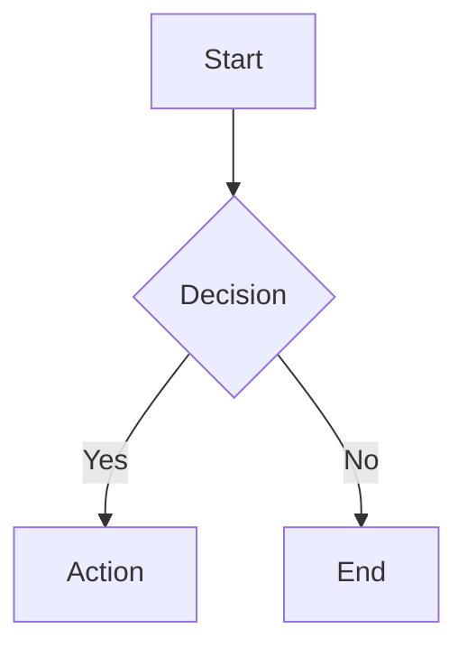

# Documentation Style Guide

Enforce consistent styling for documentation artifacts (PlantUML, Mermaid, markdown, PNG diagrams).

## Instructions

When creating or modifying documentation artifacts, follow these guidelines strictly.

---

## PlantUML Diagrams (.puml)

### File Naming Convention

**CRITICAL**: Use kebab-case, descriptive names. NEVER use incremental suffixes.

**Correct**:
- `health-verification-flow.puml`
- `knowledge-architecture.puml`
- `constraint-monitor-components.puml`

**WRONG** (constraint violation):
- `health-verification-flow-2.puml`
- `knowledge-architecture-v2.puml`
- `constraint-monitor-components-new.puml`

If updating an existing diagram, **modify the existing file** rather than creating a new version.

### Standard Style Include

All PlantUML files MUST include the standard style at the top:

```plantuml
@startuml diagram-name
!include _standard-style.puml

' ... diagram content ...

@enduml
```

The style file is located at:
- `docs/puml/_standard-style.puml`
- `docs/presentation/puml/_standard-style.puml`

### Layout Guidelines

1. **Prefer vertical layouts** - Avoid excessive width that requires horizontal scrolling
2. **Use `top to bottom direction`** for most diagrams
3. **Use `left to right direction`** only for sequence diagrams or when horizontal flow is semantically meaningful
4. **Group related components** using packages or rectangles

### Component Stereotypes

Use these stereotypes for consistent coloring:

| Stereotype | Color | Use For |
|------------|-------|---------|
| `<<api>>` | Light Blue | API endpoints, REST interfaces |
| `<<core>>` | Light Green | Core business logic |
| `<<storage>>` | Light Yellow | Databases, file storage |
| `<<cli>>` | Light Pink | Command-line interfaces |
| `<<util>>` | Light Gray | Utility/helper components |
| `<<agent>>` | Soft Blue | AI agents, autonomous components |
| `<<infra>>` | Light Orange | Infrastructure components |
| `<<external>>` | Neutral Gray | External systems |

### Arrow Macros

Use defined macros for consistent arrow styling:

```plantuml
SYNC_LINE     ' Red solid line - synchronous calls
ASYNC_LINE    ' Green dashed - async/event-based
DATA_LINE     ' Orange solid - data flow
CONTROL_LINE  ' Purple solid - control flow
OPTIONAL_LINE ' Gray dotted - optional paths
```

---

## PNG Generation

### Generating PNGs from PlantUML

Use the `plantuml` command-line tool (installed via Homebrew):

```bash
# Local generation using plantuml CLI (preferred)
plantuml -tpng docs/puml/diagram-name.puml -o ../images/

# Generate all diagrams in a directory
plantuml -tpng docs/puml/*.puml -o ../images/

# Or use the docs script if available
./scripts/generate-diagrams.sh
```

**Note:** The `plantuml` CLI is installed via `brew install plantuml` and handles Java dependencies automatically.

### PNG Naming

PNG files should match their source PUML file:
- `health-verification-flow.puml` → `health-verification-flow.png`

### Output Location

PNGs should be generated to:
- `docs/images/` - For markdown documentation references
- `docs/presentation/images/` - For presentation diagrams

---

## Mermaid Diagrams

### Inline in Markdown

Use fenced code blocks with `mermaid` language:

```markdown

```

### Style Guidelines

1. Use clear, descriptive node labels
2. Keep diagrams focused - split large diagrams into multiple
3. Use subgraphs for logical grouping
4. Prefer `graph TD` (top-down) over `graph LR` (left-right) for readability

---

## Markdown Documentation

### File Naming

- Use kebab-case: `api-quota-checker.md`
- Use `README.md` for directory index files
- Never use spaces or special characters

### Structure

1. Start with H1 title matching the topic
2. Include brief overview paragraph
3. Use H2 for major sections
4. Use H3 for subsections
5. Include code examples where applicable

### Links

- Use relative paths for internal links: `[Status Line](./status-line.md)`
- Use absolute URLs for external links
- Verify links work before committing

---

## Validation Workflow

Before committing documentation changes:

1. **PlantUML**: Verify syntax by generating PNG
2. **Mermaid**: Preview in VS Code or GitHub
3. **Markdown**: Check rendering in preview
4. **Links**: Verify all internal links work
5. **Images**: Ensure referenced images exist

---

## Common Violations to Avoid

1. **Incremental naming** (`-2`, `-v2`, `-new` suffixes)
2. **Missing style include** in PlantUML
3. **Horizontal-heavy layouts** causing scroll
4. **Orphaned images** (PNG without source PUML)
5. **Broken internal links**
6. **Inconsistent component colors** (not using stereotypes)

---

## Quick Reference

| Artifact | Location | Naming | Style |
|----------|----------|--------|-------|
| PlantUML | `docs/puml/` | kebab-case.puml | Include `_standard-style.puml` |
| PNG | `docs/images/` | match-source.png | Generated from PUML |
| Markdown | `docs/*/` | kebab-case.md | H1 title, H2 sections |
| Mermaid | Inline | N/A | graph TD preferred |

