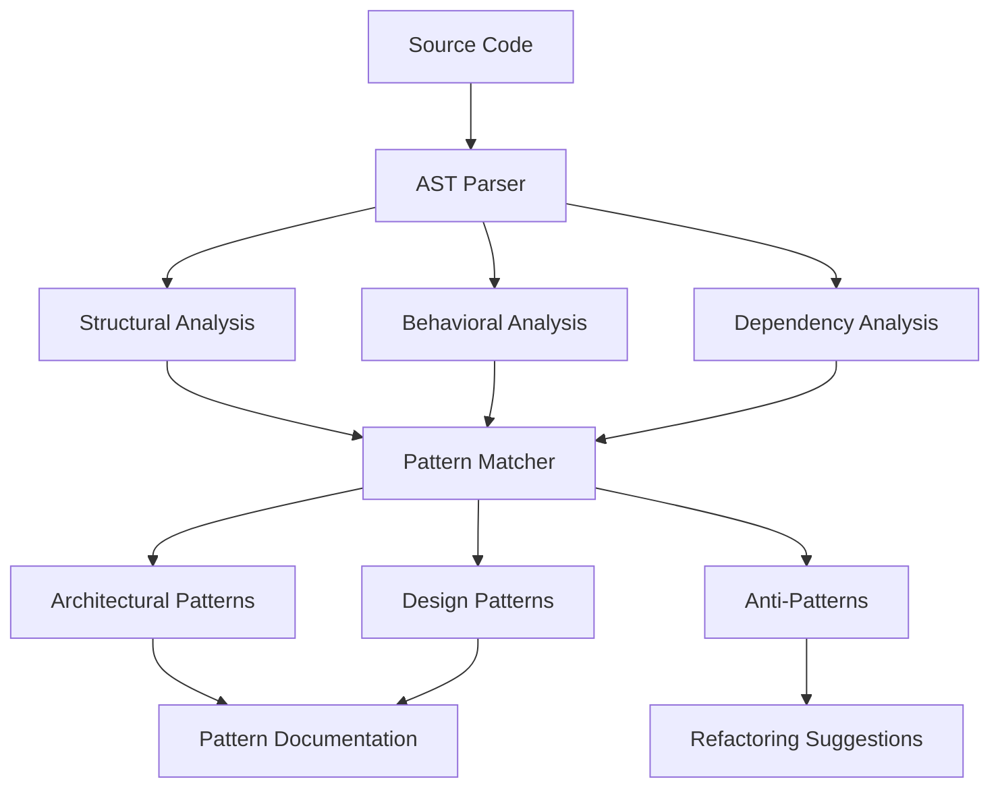
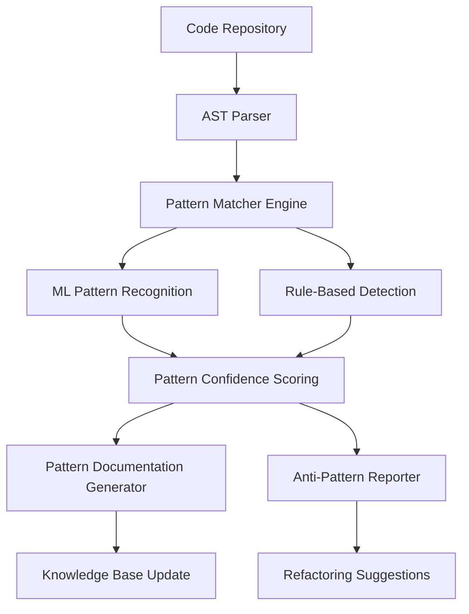
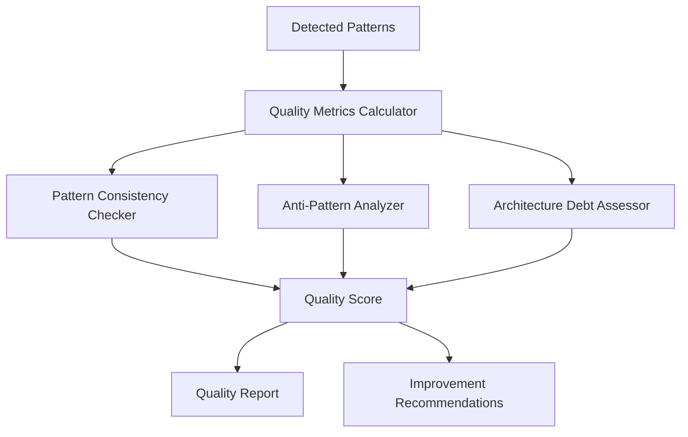

# Code Pattern Analysis

Automatic detection and documentation of architectural patterns, anti-patterns, and best practices across codebases.

## Overview

The Semantic Analysis System automatically identifies, catalogs, and documents code patterns to help teams understand architectural decisions, maintain consistency, and improve code quality. This system provides deep insights into codebase structure, pattern usage, and architectural evolution.

## Key Benefits

- **Pattern Recognition**: Automatically detect architectural and design patterns
- **Quality Assessment**: Identify anti-patterns and code smells
- **Documentation Generation**: Create comprehensive pattern documentation
- **Consistency Enforcement**: Ensure adherence to established patterns
- **Architecture Evolution**: Track pattern adoption and evolution over time

## How It Works

### 1. Multi-Layer Pattern Detection

The system analyzes code at multiple levels to identify patterns:



### 2. Pattern Analysis Workflow

```javascript
// Comprehensive pattern analysis
const patterns = await coordinator.analyzeCodePatterns({
  codebase: './src',
  analysisTypes: [
    'architectural-patterns',
    'design-patterns', 
    'anti-patterns',
    'framework-specific'
  ],
  depth: 'full',
  generateDocs: true
});
```

### 3. Pattern Categories

The system recognizes and documents various pattern types:

- **Architectural Patterns**: MVC, Repository, Factory, Observer
- **Design Patterns**: Creational, Structural, Behavioral patterns
- **Framework Patterns**: React hooks, Express middleware, Redux patterns
- **Anti-Patterns**: God objects, spaghetti code, circular dependencies
- **Custom Patterns**: Team-specific architectural decisions

## Usage Examples

### Architectural Pattern Detection

```javascript
// Detect architectural patterns in a codebase
const architecturalPatterns = await coordinator.detectArchitecturalPatterns({
  path: './src',
  patterns: ['mvc', 'repository', 'factory', 'observer'],
  confidence: 0.8,
  includeExamples: true
});
```

### Anti-Pattern Identification

```javascript
// Identify and assess anti-patterns
const antiPatterns = await coordinator.detectAntiPatterns({
  codebase: './src',
  severity: ['high', 'medium'],
  categories: ['maintainability', 'performance', 'security'],
  generateReport: true
});
```

### Framework-Specific Analysis

```javascript
// Analyze React component patterns
const reactPatterns = await coordinator.analyzeFrameworkPatterns({
  framework: 'react',
  components: './src/components',
  patterns: ['hooks', 'hoc', 'render-props', 'compound-components'],
  bestPractices: true
});
```

### MCP Integration

```javascript
// Pattern analysis via MCP tools
const patternAnalysis = await mcp.call('semantic_analyze_repository', {
  repository: './src',
  depth: 10,
  significanceThreshold: 7,
  focusAreas: ['patterns', 'architecture', 'quality']
});
```

## Pattern Detection Scenarios

### 1. Onboarding Documentation

Generate comprehensive onboarding guides based on detected patterns:

```javascript
const onboardingGuide = await coordinator.generateOnboardingGuide({
  codebase: './src',
  includePatterns: [
    'core-architecture',
    'common-patterns',
    'team-conventions',
    'framework-usage'
  ],
  format: 'interactive',
  examples: true
});
```

### 2. Architecture Documentation

Maintain up-to-date architectural documentation:

```javascript
const architectureDocs = await coordinator.generateArchitectureDocs({
  patterns: 'all-detected',
  includeEvolution: true,
  diagramGeneration: true,
  outputFormat: 'markdown'
});
```

### 3. Code Quality Assessment

Comprehensive quality assessment based on pattern analysis:

```javascript
const qualityAssessment = await coordinator.assessCodeQuality({
  metrics: [
    'pattern-consistency',
    'anti-pattern-count',
    'architectural-debt',
    'maintainability-score'
  ],
  generateReport: true,
  includeRecommendations: true
});
```

### 4. Migration Planning

Plan framework or pattern migrations:

```javascript
const migrationPlan = await coordinator.planPatternMigration({
  from: 'class-components',
  to: 'functional-hooks',
  analysisScope: './src/components',
  riskAssessment: true,
  stepByStepPlan: true
});
```

## Implementation Architecture

### Pattern Detection Engine



### Quality Assessment Pipeline



## Configuration Options

### Pattern Detection Settings

```json
{
  "patterns": {
    "architectural": {
      "enabled": true,
      "confidence": 0.8,
      "patterns": ["mvc", "repository", "factory", "observer"]
    },
    "antiPatterns": {
      "enabled": true,
      "severity": ["high", "medium"],
      "autoSuggestFixes": true
    },
    "framework": {
      "react": {
        "enabled": true,
        "patterns": ["hooks", "hoc", "render-props"]
      }
    }
  }
}
```

### Documentation Generation

```json
{
  "documentation": {
    "format": "markdown",
    "includeExamples": true,
    "generateDiagrams": true,
    "outputPath": "./docs/patterns"
  }
}
```

## Integration Points

### CI/CD Pipeline Integration

```yaml
# Pattern analysis in continuous integration
- name: Analyze Code Patterns
  run: |
    semantic-analysis analyze-patterns --config=.patterns.json
    semantic-analysis check-pattern-compliance --fail-on=high-severity
```

### IDE Integration

- Real-time pattern detection and highlighting
- Pattern violation warnings and suggestions
- Automated refactoring recommendations
- Context-aware documentation

### Knowledge Management Integration

```javascript
// Store pattern insights in knowledge base
const patternEntity = await mcp.call('memory_create_entities', {
  entities: [{
    name: "ObserverPatternImplementation",
    entityType: "ArchitecturalPattern",
    observations: [
      "Used custom event system for loose coupling",
      "Optimized with weak references for memory efficiency",
      "Applied in notification and state management systems"
    ]
  }]
});
```

## Metrics and Reporting

### Pattern Health Dashboard

- **Pattern Coverage**: Percentage of code following established patterns
- **Consistency Score**: Adherence to pattern implementations
- **Anti-Pattern Density**: Anti-patterns per thousand lines of code
- **Evolution Trends**: Pattern adoption and deprecation over time

### Quality Reports

```javascript
const qualityReport = await coordinator.generateQualityReport({
  metrics: [
    'pattern-adoption-rate',
    'anti-pattern-reduction',
    'architectural-debt-trend',
    'maintainability-improvement'
  ],
  timeRange: '6months',
  format: 'dashboard'
});
```

## Best Practices

### Pattern Documentation

1. **Clear Naming**: Use descriptive, standardized pattern names
2. **Context Documentation**: Capture why patterns are used
3. **Code Examples**: Provide concrete implementation examples
4. **Evolution Tracking**: Monitor pattern changes over time

### Quality Assurance

1. **Regular Audits**: Periodic pattern compliance reviews
2. **Automated Monitoring**: Continuous pattern quality checks
3. **Team Education**: Pattern training and guidelines
4. **Gradual Adoption**: Incremental pattern introduction

### Maintenance Strategy

1. **Automated Updates**: Keep pattern documentation current
2. **Version Control**: Track pattern documentation changes
3. **Review Process**: Regular pattern definition reviews
4. **Accessibility**: Ensure documentation is discoverable

## Related Use Cases

- [Managing Knowledge Base](./managing-knowledge-base.md) - Store and organize pattern knowledge
- [Conversation Insights](./conversation-insights.md) - Extract patterns from team discussions
- [Cross-Project Learning](./cross-project-learning.md) - Share patterns across projects
- [Semantic Workflows](./semantic-workflows.md) - Automate pattern-based workflows