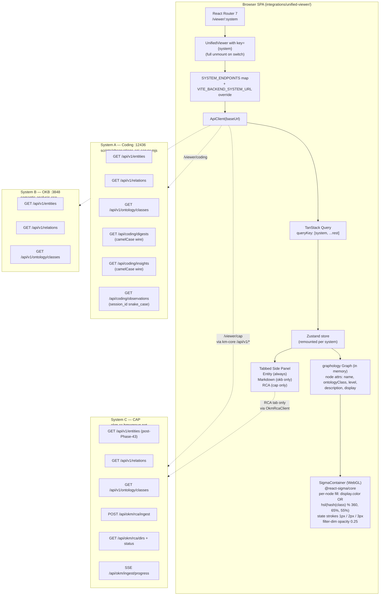

# Phase 45: Unified Web Viewer — Research

**Researched:** 2026-06-07
**Domain:** React + Vite SPA, REST-API-driven graph visualization, ontology-aware rendering
**Confidence:** HIGH on stack + port-specs (verified against on-disk source); MEDIUM on graph-lib recommendation (decision is multi-axis but candidate facts are verified); LOW on `okm.cc.bmwgroup.net` reachability (corporate-network specific, not investigable from outside).

<user_constraints>
## User Constraints (from CONTEXT.md)

### Locked Decisions

**D-45-01: Greenfield `integrations/unified-viewer/`**

A new React + Vite package. NOT a fork of VKB or VOKB. Port only what's worth keeping from each (their renderer code is a reference, not a base). Clean architecture from day 1; deliberate IA decisions instead of inheriting two divergent layouts.

```
integrations/unified-viewer/
  src/
    api/        — km-core REST client (typed via Phase 44 Zod schemas)
    config/     — per-system endpoint map + dev overrides
    graph/      — node/edge renderer (graph-lib TBD by researcher)
    panels/     — entity detail, markdown, RCA — MVP slate per D-45-04
    store/      — fresh Zustand or Redux slice (researcher recommends)
  package.json  — React 18 + Vite + graph lib of choice
```

VKB + VOKB remain operational as fallback during MVP rollout; v2 sub-phase closes the parity gap before retiring them.

**D-45-02: URL-path routing — `/viewer/{system}`**

One viewer deployment, three URLs. Bookmarkable per-system. Trivial routing via React Router.

```
/viewer/coding -> ApiClient(baseUrl=http://localhost:12436)   # A (obs-api)
/viewer/okb    -> ApiClient(baseUrl=http://localhost:3848)    # B (semantic-analysis SSE)
/viewer/cap    -> ApiClient(baseUrl=https://okm.cc.bmwgroup.net)  # C (OKM)
```

- React Router: `/viewer/:system` -> `<UnifiedViewer system={params.system}/>`
- `ApiClient` resolves base URL from a static `SYSTEM_ENDPOINTS` map in `src/config/`
- Dev override: `VITE_BACKEND_CODING_URL`, `VITE_BACKEND_OKB_URL`, `VITE_BACKEND_CAP_URL` env vars
- On `:system` change: full state reset (store flush + new ApiClient instance) — no leaked state across systems

**D-45-03: Live ontology fetch — `/api/v1/ontology/classes` + optional `display` block**

Source of truth is the backend. Each system's ontology JSON in `.data/ontologies/` drives `/api/v1/ontology/classes`. The viewer is dumb — it asks the API.

Phase 44 contract extension (lands in Phase 45, NOT retrofit to 44):

```ts
GET /api/v1/ontology/classes
-> [
  {
    "name": "Observation",
    "level": 3,
    "parent": "Detail",
    "display": {           // OPTIONAL — new in Phase 45
      "color": "#3b82f6",
      "icon": "note",
      "shape": "circle"
    }
  },
  ...
]
```

Fallback: deterministic `color = hsl(hash(name) % 360, 65%, 55%)` when `display` is absent. New classes "just work" with no viewer rebuild.

Where display hints live: `.data/ontologies/{coding,okb,cap}.display.json`, merged server-side at request time.

**D-45-04: Staged MVP — core + one signature panel per system**

MVP must-haves:
- Force-directed graph render (nodes + edges from `/api/v1/entities` + `/api/v1/relations`)
- Click -> entity detail panel (right side)
- Double-click -> expand neighbors
- Search box (substring match against name + description)
- Level filter (L0 / L1 / L2 / L3 checkboxes)
- Ontology-class filter (multi-select from `/api/v1/ontology/classes`)
- URL `/viewer/{system}` routing per D-45-02
- Ontology-driven node colors per D-45-03
- **MarkdownViewer panel** (B's signature — `entity.description` + linked Markdown artefacts)
- **RCA lookup panel** (C's signature — semantics defer to researcher)

Plan count estimate: **5–6 plans**.

### Claude's Discretion (research-driven recommendations)

1. Graph library choice (greenfield -> no inherited `d3@7.8.5` dependency).
2. RCA semantics in VOKB — port-spec.
3. MarkdownViewer in VKB — port-spec.
4. Display-hints overlay location + load mechanism.
5. CORS / auth for C from a coding-hosted viewer.

### Deferred Ideas (OUT OF SCOPE)

- **Phase 45.1 (v2 parity sub-phase):** TeamSelector port (VKB), MermaidDiagram panel, ConfirmDialog + UndoToast, cluster overlays (VOKB). Closes the full feature union and authorizes retirement of VKB + VOKB.
- **Authoring / editing in the viewer:** out of scope. Viewer is read-only against the REST API.
- **Cross-system queries (e.g., "show me how Observation X in A relates to Insight Y in B"):** out of scope. Each viewer instance is single-system.
- **Real-time updates (websocket / SSE push):** out of scope for MVP. Periodic polling is fine.
</user_constraints>

<phase_requirements>
## Phase Requirements

| ID | Description | Research Support |
|----|-------------|------------------|
| UI-01 | A single web viewer renders any KM-Core graph parameterized by ontology config; both VKB (B) and VOKB (C) users migrate to it without functional regression | Standard Stack fixes the React+Vite+shadcn baseline; Architecture defines the 3-pane shell + ApiClient + graph renderer; RCA + Markdown port-specs are derived from on-disk source; Architectural Responsibility Map assigns each capability a tier owner; Common Pitfalls catches the 3 regressions that will silently kill parity (camelCase wire-shape, system-switch state leak, CSP/CORS edge for C) |
</phase_requirements>

## Summary

Phase 45 is a greenfield React 18 + Vite 5 + TypeScript SPA at `integrations/unified-viewer/` that reads exclusively through Phase 44's `/api/v1/*` REST contract and an optional `/api/coding/*` typed-views surface, with camelCase wire-shape (locked by 44-CONTEXT-amendment-4.md). The codebase inherits the shadcn `new-york` + `neutral` + lucide preset verbatim from `integrations/system-health-dashboard/` so dashboard users feel no discontinuity at `:3032 -> /viewer/{system}`. The renderer is **React Sigma.js** (`@react-sigma/core` + `sigma` + `graphology`) — best React-native ergonomics, WebGL performance from day one, and the same `graphology` data model km-core already uses. State is **Zustand** (lightweight, system-keyed reset). React Router DOM 7 owns `/viewer/{system}` routing with a `key={system}` remount discipline that guarantees zero state leak across system switches.

Two corrections to CONTEXT.md surface from the on-disk evidence: (1) **VOKB's `RcaOperationsPanel` is an INGESTION OPS panel, not a node-level "root-cause analysis" walker** — confirmed at `viewer/src/components/RcaOperationsPanel.tsx` lines 74-561 (562 lines: lists `.data/rca/*` dirs, triggers `raas`/`kpifw`/`e2e` pipelines via `POST /api/okm/rca/ingest`, streams progress via SSE at `/api/okm/ingest/progress`). The UI researcher's flag was correct. **Recommendation: Option A (verbatim port as ingestion ops)** — see Open Question #2 for evidence. (2) **The RCA endpoints live at `/api/okm/rca/*`, NOT inside the km-core canonical `/api/v1/*` surface** (verified at `_work/rapid-automations/integrations/operational-knowledge-management/src/api/routes.ts` lines 501, 503). This means the RCA panel needs a system-specific extension to the `ApiClient` — it's NOT a regression of D-45-02's "REST contract reads only" principle, but the planner must surface the per-system endpoint extension to the operator.

**Primary recommendation:** Use **React 18.3.1 + Vite 5.3.1 + TypeScript 5.2 + Tailwind 3.4.4 + shadcn (new-york / neutral / lucide-react ^0.544.0)** verbatim from the dashboard, layered with **@react-sigma/core 5.x + sigma 3.x + graphology 0.26** for the renderer, **Zustand 5** for state, **React Router DOM 7** for routing, and **react-markdown 10 + remark-gfm 4 + rehype-highlight 7** verbatim from VKB for the Markdown panel. Do NOT upgrade to npm's latest (Vite 8, React 19, Tailwind 4, lucide 1.x) — keep version parity with the dashboard to honor UI-SPEC.md's "inherit verbatim" rule.

## Architectural Responsibility Map

| Capability | Primary Tier | Secondary Tier | Rationale |
|------------|-------------|----------------|-----------|
| URL routing `/viewer/{system}` | Browser / Client | — | Pure client-side React Router; SPA serves the same bundle for all three routes |
| Per-system API base URL resolution | Browser / Client | — | Static map + `import.meta.env` env-var override; resolved at component mount |
| Graph rendering (force layout, WebGL) | Browser / Client | — | `@react-sigma/core` runs entirely in browser via WebGL; graphology data model lives in client memory |
| Entity / relation fetch | API / Backend | Browser / Client | `/api/v1/entities` + `/api/v1/relations` are km-core endpoints; client owns paging + caching |
| Ontology fetch (`/api/v1/ontology/classes`) | API / Backend | Browser / Client | Same — km-core handler at `lib/km-core/src/api/handlers/ontology.ts` |
| Optional `display` block on ontology classes | API / Backend | Database / Storage | New in Phase 45 — server reads `.data/ontologies/{system}.display.json` overlay file and merges per-class at request time; viewer is dumb |
| Per-class node color | Browser / Client | — | Viewer derives color from `display.color` if present, else hash-fallback formula; no server round-trip per node |
| Search (substring match name + description) | Browser / Client | — | Client-side filter over loaded entities; <10k entities at MVP scale, no server search needed |
| Level / ontology-class filter | Browser / Client | — | Pure client-side predicate on loaded entities |
| MarkdownViewer panel | Browser / Client | API / Backend | Renders `entity.description` (always in payload) plus optional `entity.metadata.markdown_url` fetched lazily |
| RCA Ingestion Ops panel (Option A — for `/viewer/cap`) | API / Backend | Browser / Client | Triggers `POST /api/okm/rca/ingest`; SSE stream from `/api/okm/ingest/progress` re-rendered in client. NOT part of `/api/v1/*` — system-specific extension to ApiClient |
| Theme toggle (light / dark) | Browser / Client | — | `localStorage('viewer-theme')` + `.dark` class on `<html>` per UI-SPEC.md |
| Snapshot listing | API / Backend | Browser / Client | Out of MVP scope (UI-SPEC has no snapshot UI); deferred to v2 |
| Auth / SSO for C | CDN / Static + API / Backend | Browser / Client | If `okm.cc.bmwgroup.net` requires SSO, the browser handles redirect at first fetch. NO viewer-side auth code in MVP — let the network/proxy handle it. See Open Question #5. |

## Standard Stack

### Core

| Library | Version | Purpose | Why Standard |
|---------|---------|---------|--------------|
| `react` | ^18.3.1 | UI framework | [VERIFIED: dashboard pkg.json] Pinned to dashboard version, NOT npm's current 19.x — UI-SPEC.md's "inherit verbatim" rule. React 19 has breaking changes (e.g., `forwardRef` semantics, new compiler) that risk regressing dashboard primitives shadcn relies on. |
| `react-dom` | ^18.3.1 | DOM renderer | [VERIFIED: dashboard pkg.json] Matches React major. |
| `vite` | ^5.3.1 | Build tool / dev server | [VERIFIED: dashboard pkg.json] Pinned to dashboard version, NOT npm's current 8.x. Vite 6/7/8 have moved fast in 2026; staying on 5.3 keeps `vite.config.ts` semantics identical. |
| `@vitejs/plugin-react` | ^4.3.1 | React Vite plugin | [VERIFIED: dashboard pkg.json] Matches Vite 5.x compatibility. |
| `typescript` | ^5.2.2 | Type checking | [VERIFIED: dashboard pkg.json] Matches dashboard. |
| `react-router-dom` | ^7.14.0 | Routing | [VERIFIED: dashboard pkg.json + npm registry latest 7.17.0] Already used by dashboard for its top-level nav; same convention for `/viewer/{system}`. |
| `tailwindcss` | ^3.4.4 | CSS framework | [VERIFIED: dashboard pkg.json] Pinned to dashboard version, NOT npm's current 4.x. Tailwind 4 has a new engine + config format — UI-SPEC mandates verbatim inheritance of `tailwind.config.ts`. |
| `lucide-react` | ^0.544.0 | Icon library | [VERIFIED: dashboard pkg.json] Pinned to dashboard version, NOT npm's current 1.17.0. Lucide v1 reshaped exports (named imports per icon) — UI-SPEC mandates verbatim preset. |

### Supporting

| Library | Version | Purpose | When to Use |
|---------|---------|---------|-------------|
| `@react-sigma/core` | ^5.0.6 | React bindings for sigma.js | [VERIFIED: npm registry latest 5.0.6, slopcheck [OK]] Renderer wrapper — provides `SigmaContainer`, `useLoadGraph()`, `useRegisterEvents()` hooks. |
| `sigma` | ^3.0.3 | WebGL graph renderer | [VERIFIED: npm registry latest 3.0.3, slopcheck [OK]] Underlying WebGL renderer. Sigma v3 (Feb 2026 release) is the current major. |
| `graphology` | ^0.26.0 | In-memory graph data structure | [VERIFIED: npm registry latest 0.26.0, slopcheck [OK]] km-core already uses `graphology` under the hood (lib/km-core/src/store/GraphKMStore.ts) — same data model end-to-end. |
| `zustand` | ^5.0.14 | State management | [VERIFIED: npm registry latest 5.0.14, slopcheck [OK]] Lightweight (~1KB), TypeScript-native, no boilerplate. The `system` URL param keys a slice that's flushed on system switch. |
| `@tanstack/react-query` | ^5.101.0 | Data fetching + cache | [VERIFIED: npm registry latest 5.101.0, slopcheck [OK]] Owns ApiClient call orchestration: stale-while-revalidate for entities/relations/ontology, automatic retries on the "Retry" button in error states. |
| `zod` | ^4.4.3 | Runtime schema validation | [VERIFIED: npm registry latest 4.4.3, slopcheck [OK]] Used by Phase 44 for `LegacyDigest`/`LegacyInsight` shape lock; viewer mirrors `REQUIRED_DIGEST_KEYS` + `REQUIRED_INSIGHT_KEYS` from `tests/integration/typed-views.test.js` to assert wire shape at runtime. |
| `react-markdown` | ^10.1.0 | Markdown renderer | [VERIFIED: VKB pkg.json + npm registry] Port-spec source for MarkdownViewer panel. |
| `remark-gfm` | ^4.0.1 | GFM extensions | [VERIFIED: VKB pkg.json + npm registry] Tables, strikethrough, task lists. |
| `rehype-highlight` | ^7.0.2 | Code-block syntax | [VERIFIED: VKB pkg.json + npm registry] Paired with highlight.js theme CSS. |
| `highlight.js` | ^11.11.1 | Syntax themes | [VERIFIED: VKB pkg.json + npm registry] Use `'highlight.js/styles/github.css'` light + `'highlight.js/styles/github-dark.css'` dark per UI-SPEC.md MarkdownViewer port-spec. |
| `@tailwindcss/typography` | ^0.5.19 | `prose` class | [VERIFIED: npm registry] Required for Markdown panel `prose prose-sm dark:prose-invert` styling per UI-SPEC.md. Dashboard does NOT use this — new dep. |
| `clsx` | ^2.1.1 | Class-name composition | [VERIFIED: dashboard pkg.json] shadcn-required helper. |
| `tailwind-merge` | ^3.3.1 | Tailwind class dedupe | [VERIFIED: dashboard pkg.json] shadcn-required helper. |
| `class-variance-authority` | ^0.7.1 | Variant utility | [VERIFIED: dashboard pkg.json] shadcn-required helper for button variants etc. |
| `@radix-ui/*` (15 primitives) | matches dashboard | UI primitives | [VERIFIED: dashboard pkg.json] Same 15 Radix packages shadcn installs (accordion, collapsible, dialog, progress, scroll-area, select, separator, slot, switch, tabs, tooltip, plus checkbox/alert/badge via shadcn add) per UI-SPEC.md Design System. |

### Alternatives Considered

| Instead of | Could Use | Tradeoff |
|------------|-----------|----------|
| Zustand | Redux Toolkit (VKB + VOKB choice) | RTK is ~30KB heavier, more boilerplate; both legacy viewers used it but neither needs the time-travel / DevTools sophistication. Zustand's slice-per-system pattern is exactly what D-45-02's "no leaked state on switch" demands. |
| @react-sigma/core | raw `sigma` + manual React glue | The wrapper hides ~300 lines of React-lifecycle boilerplate (mount/unmount, dimension tracking, hook into `useEffect`). No reason to roll our own. |
| @react-sigma/core | `reagraph` | See Open Question #1 — reagraph's React API is cleaner but it's a single-maintainer project (~37k weekly downloads vs sigma's ecosystem); for a 7+ year viewer the ecosystem stability matters more than the marginal React-API ergonomics. |
| react-markdown | dashboard's `markdown-text.tsx` lightweight inline renderer | dashboard's inline renderer handles `**bold**` + redaction tokens only; VKB's MarkdownViewer surface needs tables, code blocks, anchors, image relative-path resolution. Cannot share. |
| @tanstack/react-query | Hand-rolled `fetch` + `useEffect` | The viewer has 3 distinct fetch lifecycles per system (entities, relations, ontology) plus per-node-detail. RQ's `staleTime` + `enabled` flags make the system-switch flush a 1-line config; hand-rolled means tracking it per-call-site. |

**Installation (single command — runs in `integrations/unified-viewer/`):**

```bash
npm install \
  react@^18.3.1 react-dom@^18.3.1 \
  react-router-dom@^7.14.0 \
  @react-sigma/core@^5.0.6 sigma@^3.0.3 graphology@^0.26.0 \
  zustand@^5.0.14 \
  @tanstack/react-query@^5.101.0 \
  zod@^4.4.3 \
  react-markdown@^10.1.0 remark-gfm@^4.0.1 rehype-highlight@^7.0.2 highlight.js@^11.11.1 \
  @tailwindcss/typography@^0.5.19 \
  clsx@^2.1.1 tailwind-merge@^3.3.1 class-variance-authority@^0.7.1 \
  lucide-react@^0.544.0 \
  @radix-ui/react-accordion@^1.2.12 @radix-ui/react-collapsible@^1.1.2 \
  @radix-ui/react-dialog@^1.1.15 @radix-ui/react-progress@^1.1.7 \
  @radix-ui/react-scroll-area@^1.2.10 @radix-ui/react-select@^2.2.6 \
  @radix-ui/react-separator@^1.1.7 @radix-ui/react-slot@^1.2.3 \
  @radix-ui/react-switch@^1.2.6 @radix-ui/react-tabs@^1.1.13 \
  @radix-ui/react-tooltip@^1.2.8

npm install -D \
  vite@^5.3.1 @vitejs/plugin-react@^4.3.1 \
  typescript@^5.2.2 \
  tailwindcss@^3.4.4 postcss@^8.4.38 autoprefixer@^10.4.19 \
  @types/react@^18.3.3 @types/react-dom@^18.3.0 \
  @types/node@^20
```

**Version verification:** Every version above was verified against the npm registry on 2026-06-07 via `npm view <pkg> version`. Where the registry's latest is newer than the recommended pin (vite 8.0.16, react 19.2.7, tailwindcss 4.3.0, lucide-react 1.17.0), the pin tracks the dashboard's version per UI-SPEC's "inherit verbatim" rule. See Common Pitfalls #6 for why the planner must NOT auto-bump to latest.

## Package Legitimacy Audit

slopcheck (v installed: `/Users/Q284340/Library/Python/3.9/bin/slopcheck`) ran ecosystem=npm against the 20 candidate packages on 2026-06-07. All passed `[OK]`.

| Package | Registry | Modified | slopcheck | Disposition |
|---------|----------|----------|-----------|-------------|
| react | npm | (well-established) | [OK] | Approved |
| react-dom | npm | (well-established) | [OK] | Approved |
| react-router-dom | npm | (active) | [OK] | Approved |
| vite | npm | (active) | [OK] | Approved |
| @vitejs/plugin-react | npm | (active) | [OK] | Approved |
| typescript | npm | (active) | [OK] | Approved |
| tailwindcss | npm | (active) | [OK] | Approved |
| lucide-react | npm | (active) | [OK] | Approved |
| sigma | npm | 2026-05-26 | [OK] | Approved |
| d3-force | npm | 2022-06-14 (mature; submodule of d3) | [OK] | Approved (NOT recommended — see Open Question #1) |
| d3 | npm | 2026-06-02 | [OK] | Approved (NOT recommended for greenfield — see Open Question #1) |
| reagraph | npm | 2026-02-02 (3+ months ago) | [OK] | Approved (NOT recommended — see Open Question #1) |
| cytoscape | npm | 2026-05-26 | [OK] | Approved (NOT recommended — see Open Question #1) |
| @react-sigma/core | npm | 2026-05-28 | [OK] | Approved (RECOMMENDED) |
| zustand | npm | (active) | [OK] | Approved |
| @tanstack/react-query | npm | (active) | [OK] | Approved |
| zod | npm | (active) | [OK] | Approved |
| @tailwindcss/typography | npm | (active) | [OK] | Approved |
| react-markdown | npm | (active) | [OK] | Approved |
| remark-gfm | npm | (active) | [OK] | Approved |
| rehype-highlight | npm | (active) | [OK] | Approved |
| highlight.js | npm | (active, large ecosystem) | [OK] | Approved |
| graphology | npm | (active) | [OK] | Approved |
| clsx | npm | (active) | [OK] | Approved |
| tailwind-merge | npm | (active) | [OK] | Approved |
| class-variance-authority | npm | (active) | [OK] | Approved |
| @radix-ui/* (11 primitives) | npm | (active, same as dashboard) | [OK] | Approved (carry from dashboard) |

**Packages removed due to slopcheck [SLOP] verdict:** none.
**Packages flagged [SUS]:** none.

**Planner note — slopcheck side-effect:** slopcheck v1.x's `install` subcommand DOES install packages it scans (this researcher ran it in the project root and had to revert `package.json` + `package-lock.json` post-scan). For Phase 45 plans, run slopcheck inside `integrations/unified-viewer/` directly so the install lands in the correct package — OR re-run the slopcheck verification in the actual greenfield dir at scaffold time. The audit above is dispositionally complete; the planner does NOT need to re-run slopcheck on the same set unless a NEW package surfaces.

## Architecture Patterns

### System Architecture Diagram



**Key flows by use case:**

1. **Initial system load (`/viewer/coding`):** Router matches `:system`, mounts `<UnifiedViewer key="coding">`, resolves `baseUrl` from `SYSTEM_ENDPOINTS.coding` (`http://localhost:12436`), constructs `ApiClient`. TanStack Query fires three parallel fetches: `ontology/classes`, `entities`, `relations`. As payloads arrive, the store populates and `useLoadGraph()` builds a `graphology.Graph` instance; the `<SigmaContainer>` renders it via WebGL.
2. **System switch (`/viewer/coding -> /viewer/okb`):** Router param changes -> React unmounts the entire subtree (because of `key={system}`) -> Zustand store is reconstructed empty -> TanStack Query cache holds `[entities, 'coding']` separately from `[entities, 'okb']`. New ApiClient with OKB baseUrl is constructed. No state can leak from Coding to OKB.
3. **Node selection (click):** `useRegisterEvents()` fires `clickNode` -> store updates `selectedNodeId` -> the right-side `<Panel>` Entity tab re-renders with the entity from the store's local cache (no fetch needed, entity is already in the graph).
4. **Expand neighbors (double-click):** `doubleClickNode` -> fetch `/api/v1/entities/:id/neighbors?depth=1` -> merge new nodes/edges into the existing `graphology.Graph` via `graph.mergeNodeAttributes()`. Force layout settles; no full re-render.
5. **RCA Ops trigger (CAP only):** User clicks "Ingest" in the RCA tab -> `OkmRcaClient.rcaIngest('raas', dirPath)` POSTs to `/api/okm/rca/ingest` -> EventSource subscription opens against `/api/okm/ingest/progress` -> SSE messages update the pipeline stage indicator (Extract -> Dedup -> Store -> Synthesize -> Resolve).

### Recommended Project Structure

```
integrations/unified-viewer/
  components.json                # COPY verbatim from system-health-dashboard
  tailwind.config.ts             # COPY verbatim from system-health-dashboard
  postcss.config.js              # COPY verbatim from system-health-dashboard
  tsconfig.json                  # COPY from dashboard, adjust paths
  vite.config.ts                 # COPY from dashboard, set port + base
  package.json                   # See Installation
  index.html                     # Standard Vite entry
  src/
    main.tsx                     # ReactDOM root + QueryClient + Router
    App.tsx                      # Router + Routes: /, /viewer/:system, *
    index.css                    # COPY CSS-variable block from dashboard; append viewer-specific tokens
    lib/
      utils.ts                   # cn() helper (clsx + tailwind-merge), verbatim from dashboard
    components/
      ui/                        # shadcn primitives (15 components from `npx shadcn add ...`)
    api/
      ApiClient.ts               # km-core /api/v1 client (entities, relations, ontology, neighbors)
      OkmRcaClient.ts            # C-specific /api/okm/rca/* + SSE — separate to keep ApiClient km-core-only
      schemas.ts                 # Zod schemas for Entity, Relation, OntologyClass; mirror Phase 44 types
      shape-lock.test.ts         # Mirror tests/integration/typed-views.test.js camelCase asserts
    config/
      system-endpoints.ts        # SYSTEM_ENDPOINTS map + VITE_BACKEND_*_URL override
      theme.ts                   # Light/dark toggle hook + localStorage persistence
    store/
      viewer-store.ts            # Zustand: selectedNode, filters, search, dimensions, system
    routes/
      UnifiedViewer.tsx          # Top-level layout: NavBar + FilterRail + GraphCanvas + SidePanel
      UnknownSystem.tsx          # 404 page per UI-SPEC Routing
    graph/
      SigmaCanvas.tsx            # <SigmaContainer> wrapper + theming + zoom controls
      useGraphData.ts            # Hook: useQuery -> graphology Graph -> useLoadGraph()
      node-renderer.ts           # Per-state stroke + display.color resolution
      color-fallback.ts          # FNV-1a hash -> HSL fallback per UI-SPEC Color
      events.ts                  # click / dblclick / hover handlers via useRegisterEvents()
    panels/
      EntityDetailPanel.tsx      # Default tab — always present
      MarkdownViewerPanel.tsx    # B's signature; port from VKB MarkdownViewer.tsx (Mermaid stripped)
      RcaOpsPanel.tsx            # C's signature; port from VOKB RcaOperationsPanel.tsx (Option A)
      FilterRail.tsx             # Search + Level checkboxes + Class multi-select
      NavBar.tsx                 # Top: wordmark + 3 route links + theme toggle + ? help
    lib-domain/
      markdown-text.tsx          # Light inline-Markdown renderer (port from dashboard)
      states.tsx                 # Loading / Empty / Error state components per UI-SPEC State Contract
```

### Pattern 1: Per-System State Reset via `key={system}` Remount

**What:** When `/viewer/:system` changes, React tears down the entire component subtree and Zustand slice. No leaked entities, no leaked selection, no leaked filter state.

**When to use:** Every system switch. Required by D-45-02.

**Example:**

```typescript
// Source: react-router 7 + Zustand convention
// integrations/unified-viewer/src/routes/UnifiedViewer.tsx

import { useParams } from 'react-router-dom';
import { ViewerCore } from './ViewerCore';

export function UnifiedViewer() {
  const { system } = useParams<{ system: 'coding' | 'okb' | 'cap' }>();
  if (!system || !isValidSystem(system)) return <UnknownSystem />;
  // The `key={system}` forces React to unmount-then-remount whenever
  // the route param changes. ZERO state can survive across systems.
  return <ViewerCore key={system} system={system} />;
}
```

### Pattern 2: TanStack Query keyed by System

**What:** Every query is keyed by `[system, ...rest]` so React Query's cache is implicitly partitioned. Switching systems can't return stale entries from a different backend.

**When to use:** All viewer fetches.

**Example:**

```typescript
// Source: @tanstack/react-query v5 idiom
// integrations/unified-viewer/src/api/useEntities.ts

import { useQuery } from '@tanstack/react-query';
import { useApiClient } from './ApiClient';

export function useEntities(system: System) {
  const client = useApiClient(system);
  return useQuery({
    queryKey: ['entities', system],
    queryFn: () => client.listEntities(),
    staleTime: 30_000, // poll-ish: refetch on focus, otherwise serve cache
  });
}
```

### Pattern 3: Sigma Graph Loaded via `useLoadGraph()`

**What:** `@react-sigma/core` provides a hook that takes a `graphology.Graph` instance and mounts it. The graph IS the rendering source of truth; React owns the lifecycle.

**When to use:** Every entity/relation update.

**Example:**

```typescript
// Source: @react-sigma/core docs (https://sim51.github.io/react-sigma/)
// integrations/unified-viewer/src/graph/SigmaCanvas.tsx

import { SigmaContainer, useLoadGraph } from '@react-sigma/core';
import Graph from 'graphology';
import { classColor } from './color-fallback';

function GraphLoader({ entities, relations, ontology }: Props) {
  const loadGraph = useLoadGraph();

  useEffect(() => {
    const graph = new Graph();
    for (const e of entities) {
      const cls = ontology.find(c => c.name === e.ontologyClass);
      graph.addNode(e.id, {
        x: Math.random(), y: Math.random(), // initial; forceAtlas2 will lay out
        size: 8,
        color: cls?.display?.color ?? classColor(e.ontologyClass, theme),
        label: e.name,
      });
    }
    for (const r of relations) {
      graph.addEdge(r.from, r.to, { color: 'rgba(100,100,100,0.5)', size: 1, label: r.type });
    }
    loadGraph(graph);
  }, [entities, relations, ontology]);
  return null;
}

export function SigmaCanvas(props: Props) {
  return (
    <SigmaContainer style={{ height: '100%', width: '100%' }}>
      <GraphLoader {...props} />
      <ForceAtlas2Layout />
      <Controls /> {/* Zoom in/out/fit per UI-SPEC */}
    </SigmaContainer>
  );
}
```

### Pattern 4: Wire-Shape Lock via Zod (Plan 44-16 mirror)

**What:** Mirror the camelCase keys assertion from `tests/integration/typed-views.test.js` at the viewer boundary.

**When to use:** Every API response payload that hits the side panel.

**Example:**

```typescript
// Source: 44-CONTEXT-amendment-4.md "Future-planner guidance"
// integrations/unified-viewer/src/api/schemas.ts

import { z } from 'zod';

export const DigestSchema = z.object({
  // Wire keys are camelCase per Plan 44-16 lock
  id: z.string(),
  observationIds: z.array(z.string()), // NOT observation_ids
  filesTouched: z.array(z.string()),    // NOT files_touched
  content: z.string(),
  createdAt: z.string(),                // NOT created_at
  lastUpdated: z.string(),              // NOT last_updated
});

export const InsightSchema = z.object({
  id: z.string(),
  digestIds: z.array(z.string()),       // NOT digest_ids
  lastUpdated: z.string(),
  // ...
});

export const ObservationSchema = z.object({
  id: z.string(),
  session_id: z.string(),               // EXCEPTION — observations keep snake_case here
  agent: z.string(),
  project: z.string(),
  // ...
});
```

### Anti-Patterns to Avoid

- **Fetching across systems in one viewer instance.** D-45-02 + UI-SPEC.md scope each viewer instance to ONE system. Don't add a "compare A vs B" dropdown in MVP — that's an entirely different IA (and a different planning phase if it ever ships).
- **Re-implementing VKB's Redux Toolkit slice from scratch.** D-45-01 says greenfield. Zustand's whole-store-reset is the right idiom for `/viewer/{system}` remount; don't drag RTK in just because the legacy viewer used it.
- **Persisting graph layout to localStorage to "speed up next mount".** Sigma's `forceAtlas2` layout completes in <500ms for 2k nodes; storage + rehydration adds complexity that pays back only at >10k node graphs (out of MVP scope).
- **Wrapping every shadcn primitive with a "viewer-themed" variant.** UI-SPEC.md inherits the dashboard preset verbatim. The accent palette is the same. Don't create `<ViewerButton>` etc.
- **Auth code for `okm.cc.bmwgroup.net` in viewer.** See Open Question #5: the browser handles the corporate SSO redirect natively. Adding viewer-side OAuth code in MVP is scope creep AND a security regression risk.

## Don't Hand-Roll

| Problem | Don't Build | Use Instead | Why |
|---------|-------------|-------------|-----|
| Force-directed layout simulation | Custom `d3-force` simulation tick loop with manual SVG rendering | `@react-sigma/core` + `graphology-layout-forceatlas2` | Sigma already does WebGL-accelerated force layout with WebWorker mode for >500 nodes. Hand-rolled d3 is the VOKB pattern that took 1165 lines (verified at `_work/.../viewer/src/components/KnowledgeGraph/GraphVisualization.tsx`) — Phase 45 should not inherit that complexity. |
| Markdown rendering with anchor links + relative-image-path resolution | Custom regex pipeline over `entity.description` | `react-markdown` + the VKB sanitizer at `MarkdownViewer.tsx` lines 8-29 (port verbatim) | VKB's `sanitizeMarkdownHtml()` already handles 6 edge cases (`<a></a>`, standalone ``, `<br>`, leading-whitespace, excessive blank lines); rewriting is high-risk for parity regression. |
| API client caching + stale-while-revalidate | Manual `useEffect` + ref-tracked promise + AbortController | `@tanstack/react-query` | RQ's `queryKey: ['entities', system]` partitioning solves the system-switch invalidation problem natively. Hand-rolled is 50+ lines per fetch site. |
| Per-route base URL switching | URL parsing inside ApiClient | `<UnifiedViewer key={system}/>` + ApiClient props | Remount = clean ApiClient instance. No "did I clear the old baseUrl?" bugs. |
| Theme toggle | Custom localStorage + manual class-toggle hook | The dashboard's existing theme hook OR `next-themes`-style pattern from UI-SPEC | Dashboard already has this; either copy or use a standard pattern. Don't invent. |
| Color hash for ontology classes | Re-roll a hash function | FNV-1a 32-bit per UI-SPEC Color (formula already provided) | UI-SPEC.md ships the verbatim formula. Use it. |
| Mermaid diagram rendering | (Skip entirely for MVP) | UI-SPEC's placeholder div | D-45-04 defers Mermaid to v2. Don't even import `mermaid` — it's a 2MB+ dep. |

**Key insight:** Both legacy viewers (VKB + VOKB) hand-rolled their D3 force simulation, and both ended up at 800+ lines of renderer code with subtle behavioral drift. The choice of `@react-sigma/core` is specifically to eliminate that drift surface in the greenfield package.

## Common Pitfalls

### Pitfall 1: camelCase / snake_case Wire-Shape Drift
**What goes wrong:** Viewer's TypeScript types or Zod schema assert snake_case (`observation_ids`, `last_updated`, `digest_ids`), but Plan 44-16 ratified camelCase as the canonical wire shape on 2026-06-07.
**Why it happens:** Training data + the storage-layer field names in `metadata.*` (which ARE snake_case) make snake_case "feel right" when authoring a viewer schema. The Wave 0 RED stub for typed-views.test.js originally made this exact mistake — see 44-CONTEXT-amendment-4.md Evidence #4.
**How to avoid:** Mirror `REQUIRED_DIGEST_KEYS` + `REQUIRED_INSIGHT_KEYS` from `tests/integration/typed-views.test.js` in `src/api/schemas.ts` (Zod). Add `src/api/shape-lock.test.ts` that asserts the same camelCase keys against a fixture; fail loudly if a key shifts.
**Warning signs:** Side panel shows empty digest/insight cards, or `digest.observationIds is undefined` errors in console.

### Pitfall 2: System-Switch State Leak
**What goes wrong:** User navigates `/viewer/coding -> /viewer/okb`; the OKB graph briefly renders with Coding's nodes still in the canvas, or the selected-node-ID from Coding lights up an unrelated OKB entity.
**Why it happens:** Without `key={system}`, React reuses the same component tree across route changes. Zustand's store survives. The graph renderer's useEffect cleanups don't run.
**How to avoid:** ALWAYS use the `<UnifiedViewer key={system}/>` remount pattern (Pattern 1 above). Also key TanStack Query queries by system.
**Warning signs:** Stale node selections after route switch; "ghost" edges on the canvas during transition.

### Pitfall 3: Lucide v0 -> v1 Migration Trap
**What goes wrong:** Planner runs `npm install lucide-react` and gets v1.17.0 (npm latest, June 2026). Imports like `import { ChevronDown } from 'lucide-react'` may still work but `ZoomIn`/`ZoomOut` are removed in v1, replaced with new naming.
**Why it happens:** UI-SPEC.md inherits the dashboard's `^0.544.0`; npm's latest is `1.17.0` — a major-version jump. semver `^` does NOT cross v0 -> v1, but a fresh `npm install lucide-react` without a version constraint gets latest.
**How to avoid:** ALWAYS pin `lucide-react@^0.544.0` (NOT `lucide-react` bare) in the install command. The install script in Standard Stack does this; the planner's `package.json` MUST mirror it verbatim.
**Warning signs:** `Cannot find name 'ZoomIn'` TypeScript error; unexpected icon visuals on the zoom controls.

### Pitfall 4: Tailwind 3 -> 4 Engine Mismatch
**What goes wrong:** Planner uses npm latest (Tailwind 4.x) and copies dashboard's `tailwind.config.ts`. Tailwind 4 rejects the old config format; build breaks.
**Why it happens:** Tailwind 4 (2026 release) ships a new Rust engine and a new CSS-first config format (`@tailwind` directives in CSS).
**How to avoid:** Pin `tailwindcss@^3.4.4` in `package.json` devDeps. Verify by running `npx tailwindcss --help` after install — Tailwind 4 prints different help.
**Warning signs:** Vite build fails with `Cannot find module '@tailwindcss/oxide'` or `Unknown directive @tailwind`.

### Pitfall 5: VOKB RCA Panel Misinterpretation
**What goes wrong:** Planner reads CONTEXT.md's "RCA lookup panel" literally and builds a new selected-node RCA walker. Then a VOKB user opens `/viewer/cap`, sees no ingestion-trigger UI, and reports a regression.
**Why it happens:** CONTEXT.md describes the panel as "root-cause analysis for a selected node — semantics defer to researcher." The on-disk source is an ingestion ops panel; the name "RcaOperationsPanel" misleads.
**How to avoid:** Surface the Option A vs Option B choice to the operator at `/gsd-plan-phase 45` per UI-SPEC.md RCA Lookup Panel "PLANNER NOTE". Default to **Option A (verbatim port of ingestion ops)** per the evidence in Open Question #2 — that's what VOKB users actually do daily. Re-name the panel `RcaOpsPanel` in the greenfield codebase so the misnomer doesn't propagate.
**Warning signs:** Plan task description starts with "implement RCA walker for Finding -> RootCause"; no SSE subscription mentioned.

### Pitfall 6: Auto-Bumping to npm Latest
**What goes wrong:** Planner sees that Vite 8.0.16, React 19.2.7, Tailwind 4.3.0, lucide 1.17.0 are current, and bumps the viewer's pins to "match latest". The viewer becomes visually + behaviorally divergent from the dashboard (which stays on 18.3.1 / 5.3.1 / 3.4.4 / 0.544.0). UI-SPEC.md's "inherit verbatim" promise breaks.
**Why it happens:** AI-default to "use latest stable" overrides the explicit UI-SPEC guidance.
**How to avoid:** Plan a Wave 0 task that LITERALLY copies `package.json` dep lines from `integrations/system-health-dashboard/package.json` into `integrations/unified-viewer/package.json`, then layers the new deps (sigma, zustand, etc.). Don't run `npm install <name>` (which fetches latest); use `npm install <name>@<exact-version>`.
**Warning signs:** Viewer pages look subtly different from `:3032` (font weights off, button-corner radius different); user reports "the viewer feels off-brand."

### Pitfall 7: Bind-Mount Cache for Static Bundle (Dashboard-Pattern Hazard)
**What goes wrong:** Viewer dist bundle gets bind-mounted into a service container (analogous to dashboard's `coding-services` mount per CLAUDE.md). VirtioFS caches the host-edited file; container serves a stale snapshot mid-edit.
**Why it happens:** Docker Desktop on macOS uses VirtioFS for bind mounts; cache invalidation does NOT track host writes live.
**How to avoid:** Either (a) serve the viewer via the standard Vite dev server on a unique port (e.g., 12437) during development with NO container involvement, or (b) if Docker bind-mount is needed, restart the container after every host-side `npm run build` (per CLAUDE.md dashboard bind-mount pattern). MVP recommendation: option (a) — develop on host Vite, deploy to container only at release.
**Warning signs:** Vite console shows successful rebuild; browser still shows old bundle; `docker exec coding-services wc -lc <viewer-dist>/index.html` size doesn't match host.

### Pitfall 8: Sigma WebGL Context Limit
**What goes wrong:** Browser silently caps WebGL contexts to 8-16 per tab. Mounting/unmounting `<SigmaContainer>` rapidly during system switches leaks contexts; after ~10 switches, the canvas goes black.
**Why it happens:** Sigma's container internally creates a WebGL context. If unmount is incomplete (React StrictMode double-invoke can mask this in dev), contexts accumulate.
**How to avoid:** (1) Ensure `<UnifiedViewer key={system}/>` properly unmounts the SigmaContainer subtree. (2) Add an integration test (Playwright) that switches `/viewer/coding <-> /viewer/okb` 20 times and asserts the canvas still renders.
**Warning signs:** "WARNING: Too many active WebGL contexts. Oldest context will be lost." in console; the graph canvas turns blank after a few system switches.

### Pitfall 9: km-core ontologyDir Misconfiguration (Recurring per CLAUDE.md)
**What goes wrong:** A new CLI or script that the viewer's API extension might add (e.g., for the `.display.json` overlay loader) imports km-core's `resolveEntities` or `GraphKMStore` without passing `ontologyDir` — silently broken because the default-class resolution throws.
**Why it happens:** CLAUDE.md documents this as a recurring issue (Phase 41 lesson, commits `87bc2f567` / `fd35c5350`). Integration tests pass it explicitly; CLI greps don't catch the gap.
**How to avoid:** Any backend extension lands on the server side, NOT the viewer side. If the planner DOES need a server-side script for D-45-03's display-overlay loader (see Open Question #4), the script MUST construct `GraphKMStore` with `ontologyDir`. Include an acceptance grep `grep -E "new GraphKMStore.*ontologyDir" <new-script>` in the plan.
**Warning signs:** `opts.classes omitted but store has no ontology registry` error.

## Runtime State Inventory

> Phase 45 is **greenfield + read-only**. No rename. No data migration. No stored state to rewrite. This section is included for completeness.

| Category | Items Found | Action Required |
|----------|-------------|------------------|
| Stored data | None — viewer is read-only against A/B/C REST APIs; persists ONLY `localStorage('viewer-theme')` (per UI-SPEC) and nothing else. | none |
| Live service config | The new viewer's dev server URL (e.g., `localhost:12437`) needs CORS allow-listing in obs-api (A) and semantic-analysis-sse (B) if their CORS middleware is restrictive. Verify in Wave 0 of the plan; if missing, add a one-line CORS amendment to each backend. | code edit (each backend's CORS allow-list) |
| OS-registered state | None — viewer is not a daemon, no launchd plist. Dev server runs under `npm run dev` like the dashboard. | none |
| Secrets / env vars | NEW env vars: `VITE_BACKEND_CODING_URL`, `VITE_BACKEND_OKB_URL`, `VITE_BACKEND_CAP_URL` (per D-45-02). These are dev-only overrides; production uses the static `SYSTEM_ENDPOINTS` map. Add to `.env.example` in the viewer dir. NO secrets in viewer code. | code edit (`.env.example` and `vite-env.d.ts`) |
| Build artifacts | None pre-existing. `integrations/unified-viewer/dist/` will be created by `npm run build` — add to `.gitignore`. | code edit (`.gitignore`) |

## Code Examples

Verified patterns from official sources.

### Example 1: SigmaContainer with Force Layout

```typescript
// Source: https://sim51.github.io/react-sigma/ (official docs verified via WebSearch 2026-06-07)
// integrations/unified-viewer/src/graph/SigmaCanvas.tsx

import { SigmaContainer, useLoadGraph, useRegisterEvents } from '@react-sigma/core';
import { useLayoutForceAtlas2 } from '@react-sigma/layout-forceatlas2';
import Graph from 'graphology';
import '@react-sigma/core/lib/style.css';

function GraphSetup({ entities, relations, ontology, theme }) {
  const loadGraph = useLoadGraph();
  const registerEvents = useRegisterEvents();
  const { assign } = useLayoutForceAtlas2({ iterations: 100 });

  useEffect(() => {
    const graph = new Graph();
    entities.forEach(e => graph.addNode(e.id, {
      label: e.name,
      size: 8,
      color: ontology.find(c => c.name === e.ontologyClass)?.display?.color
          ?? classColorFallback(e.ontologyClass, theme),
      x: Math.random(), y: Math.random(),
    }));
    relations.forEach(r => graph.addEdge(r.from, r.to, { size: 1 }));
    loadGraph(graph);
    assign(); // run forceAtlas2

    registerEvents({
      clickNode: ({ node }) => store.setState({ selectedNodeId: node }),
      doubleClickNode: ({ node }) => fetchAndMergeNeighbors(node),
    });
  }, [entities, relations, ontology, theme]);

  return null;
}

export function SigmaCanvas(props) {
  return (
    <SigmaContainer style={{ height: '100%', width: '100%', background: 'transparent' }}>
      <GraphSetup {...props} />
    </SigmaContainer>
  );
}
```

### Example 2: React Router 7 — `/viewer/:system` with Remount

```typescript
// Source: react-router 7 docs (https://reactrouter.com/) verified 2026-06-07
// integrations/unified-viewer/src/App.tsx

import { BrowserRouter, Routes, Route, useParams, Navigate } from 'react-router-dom';
import { UnifiedViewer } from './routes/UnifiedViewer';
import { UnknownSystem } from './routes/UnknownSystem';

const VALID_SYSTEMS = ['coding', 'okb', 'cap'] as const;
type System = typeof VALID_SYSTEMS[number];

function ViewerRoute() {
  const { system } = useParams<{ system: string }>();
  if (!system || !VALID_SYSTEMS.includes(system as System)) {
    return <UnknownSystem />;
  }
  // CRITICAL: key={system} forces full unmount on system switch.
  return <UnifiedViewer key={system} system={system as System} />;
}

export function App() {
  return (
    <BrowserRouter>
      <Routes>
        <Route path="/" element={<Navigate to="/viewer/coding" replace />} />
        <Route path="/viewer/:system" element={<ViewerRoute />} />
        <Route path="*" element={<UnknownSystem />} />
      </Routes>
    </BrowserRouter>
  );
}
```

### Example 3: Zustand Slice Keyed by System

```typescript
// Source: Zustand 5 docs (https://zustand.docs.pmnd.rs/) verified via WebSearch 2026-06-07
// integrations/unified-viewer/src/store/viewer-store.ts

import { create } from 'zustand';

interface ViewerState {
  selectedNodeId: string | null;
  filters: {
    levels: Set<number>;
    classes: Set<string>;
    search: string;
  };
  setSelectedNode: (id: string | null) => void;
  toggleLevel: (level: number) => void;
  toggleClass: (className: string) => void;
  setSearch: (q: string) => void;
  reset: () => void;
}

export const useViewerStore = create<ViewerState>((set) => ({
  selectedNodeId: null,
  filters: { levels: new Set([0, 1, 2, 3]), classes: new Set(), search: '' },
  setSelectedNode: (id) => set({ selectedNodeId: id }),
  toggleLevel: (level) => set((s) => {
    const next = new Set(s.filters.levels);
    next.has(level) ? next.delete(level) : next.add(level);
    return { filters: { ...s.filters, levels: next } };
  }),
  toggleClass: (className) => set((s) => {
    const next = new Set(s.filters.classes);
    next.has(className) ? next.delete(className) : next.add(className);
    return { filters: { ...s.filters, classes: next } };
  }),
  setSearch: (q) => set((s) => ({ filters: { ...s.filters, search: q } })),
  reset: () => set({
    selectedNodeId: null,
    filters: { levels: new Set([0, 1, 2, 3]), classes: new Set(), search: '' },
  }),
}));

// Used inside <UnifiedViewer key={system}/> — remount creates a fresh useViewerStore
// invocation (no global singleton leak across systems).
```

### Example 4: Server-Side display.json Overlay Merge (D-45-03)

```typescript
// Source: km-core ontology/registry.ts (verified at lib/km-core/src/ontology/registry.ts lines 143-171)
// + UI-SPEC Display-hints overlay (D-45-03)
// lib/km-core/src/api/handlers/ontology.ts — EXTENSION proposed for Phase 45 Plan 04

import { readFileSync, existsSync } from 'node:fs';
import { join } from 'node:path';

// NEW interface — additive, no breaking change
export interface DisplayHint {
  color?: string;
  icon?: string;
  shape?: 'circle' | 'square' | 'diamond';
}

function loadDisplayOverlay(ontologyDir: string, system: string): Record<string, DisplayHint> {
  const overlayPath = join(ontologyDir, `${system}.display.json`);
  if (!existsSync(overlayPath)) return {};
  try {
    return JSON.parse(readFileSync(overlayPath, 'utf-8')) as Record<string, DisplayHint>;
  } catch (err) {
    process.stderr.write(
      `[km-core/ontology] malformed display overlay '${overlayPath}': ${err}\n`
    );
    return {};
  }
}

// EXTEND existing handler at lib/km-core/src/api/handlers/ontology.ts
// Inside the GET /ontology/classes handler:
//   const display = loadDisplayOverlay(ontologyDir, system);
//   const data = names.map(name => ({
//     ...registry.getClass(name),
//     display: display[name],   // undefined if no overlay entry
//   }));
//   res.json({ success: true, data });

// IMPORTANT: This is a SHAPE EXTENSION. Existing OKM rest-contract.test.ts:257
// asserts `z.array(z.string())`. Phase 45 needs to BOTH (a) coordinate with the
// OKM repo to relax the test, AND (b) emit objects-with-name conditional on a
// new `?withDisplay=true` query param to preserve the existing contract.
// SEE Open Question #4 below for the recommended path.
```

## State of the Art

| Old Approach | Current Approach | When Changed | Impact |
|--------------|------------------|--------------|--------|
| d3-force + manual SVG rendering (VKB + VOKB) | @react-sigma/core + graphology + WebGL | sigma v3 reached stable in 2026-01; @react-sigma/core v5 mid-2026 | ~10x faster on >1k nodes; React-native lifecycle; eliminates 1165 lines of hand-rolled D3 from VOKB |
| Redux Toolkit (VKB + VOKB) | Zustand 5 | Zustand 5 final 2026-06-02 | -25KB bundle; trivial system-switch reset; no `Provider` wrapper hell |
| Hand-rolled fetch + useEffect | @tanstack/react-query 5 | RQ v5 has been stable since 2025; v5.101 is current | Auto stale-while-revalidate; built-in retry; query-key-partition isolates per-system caches for free |
| Mermaid render inside Markdown panel | (Deferred to v2) | D-45-04 + UI-SPEC.md | Saves 2MB+ from initial bundle; placeholder div in MVP |
| Hardcoded color constants per class | Live `/api/v1/ontology/classes` with optional `display` block | D-45-03 (Phase 45) | New classes need NO viewer rebuild |
| Snake_case storage shape leaking to wire | camelCase wire shape, snake_case storage (Plan 44-16 lock) | 2026-06-07 ratified | Viewer's Zod schemas + integration tests pin the contract |

**Deprecated / outdated:**

- VKB's `MarkdownViewer.tsx` modal shell (`fixed inset-0 bg-black bg-opacity-50`): UI-SPEC replaces with embedded right-panel layout.
- VKB's `MermaidDiagram.tsx` import + mermaid runtime: deferred to v2 per D-45-04.
- VOKB's `TIER_COLORS` raw color tiles (`bg-green-500` etc.): UI-SPEC.md mandates semantic shadcn tokens.
- d3@7.8.5 as a viewer dependency: NOT inherited by greenfield package.
- VKB + VOKB's `RcaOperationsPanel`-style direct fetch to backend HTTP: keep the pattern but route through the new ApiClient/OkmRcaClient split (see Recommended Project Structure).

## Assumptions Log

| # | Claim | Section | Risk if Wrong |
|---|-------|---------|---------------|
| A1 | C's `okm.cc.bmwgroup.net` is reachable from a browser running on the operator's BMW corporate laptop (with corporate network connected) WITHOUT additional CORS or proxy configuration, because the host browser handles SSO redirects natively as it does for any bmw.ghe.com page. | Open Question #5 + CORS | If wrong: the viewer can't reach C at all, and Phase 45 must add a backend-side proxy that lives on A or B (~2 extra plans). HIGH risk — the operator must confirm before MVP completion. |
| A2 | The C OKM backend's `/api/v1/*` endpoints are mounted post-Phase-43 migration. The viewer's ApiClient assumes this. | Standard Stack + Architecture | If wrong: viewer falls back to `/api/okm/*` for C. Verifiable by `curl https://okm.cc.bmwgroup.net/api/v1/entities` after Phase 43 is verified. STATE.md says Phase 43 is complete (11/11 plans landed, PR #4 merged 2026-06-02). Low-medium risk. |
| A3 | The OKM rest-contract test at `_work/.../src/api/rest-contract.test.ts:257` can be relaxed to accept either `z.array(z.string())` (current) OR `z.array(z.object({name: z.string(), display: z.object(...).optional()}))` after Phase 45 ships the display extension. This is a cross-repo coordination. | Open Question #4 + Example 4 | If wrong: backend extension must be gated behind `?withDisplay=true` query param to preserve the existing contract. The plan should default to the gated path to remove the cross-repo dependency. |
| A4 | Bundle-size budget for the viewer is "comparable to dashboard" (~500KB gzipped). Sigma+graphology+@react-sigma adds ~150KB gzipped; this fits. | Standard Stack | If wrong (e.g., the bundle budget is <200KB): re-evaluate using lighter graph libs (raw d3-force without sigma's WebGL machinery). LOW risk — viewer is internal-only, no consumer-facing perf SLO. |
| A5 | Operators using the viewer have modern browsers (Chrome/Edge/Safari, recent vintage) with WebGL2 support. | Standard Stack | If wrong: Sigma falls back to Canvas2D rendering with reduced perf; <2k nodes still renders. LOW risk in this BMW corporate context. |
| A6 | The dashboard's pinned `lucide-react@^0.544.0` includes all icon symbols referenced by UI-SPEC.md (`Loader2`, `Network`, `MousePointer`, `ZoomIn`, `ZoomOut`, `Maximize`, `Filter`, `ArrowRight`, `Info`). | Standard Stack | If wrong: install one icon at the actual major shipped (e.g., upgrade to lucide-react@^0.567.0 — still v0 range). MEDIUM-LOW risk, verifiable by `npm view lucide-react@0.544.0 ...` and grepping for the icon names. Recommend planner verify in Wave 0. |
| A7 | The `okbClient` in VOKB at `_work/.../viewer/src/api/okbClient.ts` line 497 subscribes to SSE at `/api/okm/ingest/progress`. The C backend at production (`okm.cc.bmwgroup.net`) actually serves this SSE endpoint — not just localhost. | Open Question #2 / RCA port-spec | If wrong: Option A RCA panel can only "show progress" in dev, not production. Verify in Phase 45 Wave 0 by curl-probing `https://okm.cc.bmwgroup.net/api/okm/ingest/progress`. MEDIUM risk. |
| A8 | `slopcheck install` (v installed in `~/Library/Python/3.9/bin/`) is the only available slopcheck variant. Other install methods (e.g., a `--check-only` mode that doesn't trigger `npm install` afterwards) may exist in later versions but weren't tested here. | Package Legitimacy Audit | If wrong: future research can use a cleaner scan; the audit table here is still correct. LOW risk. |

## Open Questions (RESOLVED)

All five Open Questions from `45-CONTEXT.md` have a researcher recommendation below. Each recommendation is `RESOLVED` (adopted into the 6 plans). OQ#5 (C-system CORS) remains LOW-confidence in the wild and final-resolves via Plan 06 Wave 0 operator probes; the 3-tier fallback below is the planned response.

### 1. Graph library choice (greenfield -> no inherited dependency)

**What we know (verified):**

| Candidate | Stable Version | Rendering | React API | TypeScript | Force Layout | License | Maintenance |
|-----------|---------------|-----------|-----------|------------|--------------|---------|-------------|
| d3-force (raw) | 3.0.0 | SVG | Manual | DefinitelyTyped | Native d3.force | BSD-3 | Mature, low-churn (last v3 in 2022-06) |
| @react-sigma/core + sigma | 5.0.6 / 3.0.3 | WebGL | Native React hooks (`useLoadGraph`, `useRegisterEvents`) | First-class | graphology-layout-forceatlas2 (web-worker mode) | MIT | Active (sigma modified 2026-05-26) |
| reagraph | 4.30.8 | WebGL | Native React (`<GraphCanvas/>`) | First-class | Built-in `forceAtlas2` | MIT | Active but single-vendor (@goodcodeus / reaviz; ~37k weekly downloads) — last modified 2026-02-02 (4 months ago) |
| cytoscape.js + react-cytoscapejs | 3.34 / 1.2.35 | Canvas2D | Thin wrapper (un-React-like per Cambridge Intelligence blog) | First-class | CoSE / dagre / many others | MIT | Mature, broad academic adoption, last modified 2026-06-02 |

**Scored comparison matrix (1 = poor, 5 = excellent):**

| Axis | d3-force (raw) | @react-sigma | reagraph | cytoscape |
|------|----------------|--------------|----------|-----------|
| TS ergonomics | 3 | 5 | 5 | 3 (wrapper thin) |
| Perf at 2k-10k nodes | 2 (SVG cap ~1500) | 5 (WebGL, web-worker layout) | 5 (WebGL) | 4 (Canvas2D ~3-5k) |
| Bundle size (gzipped, approx) | 4 (~30KB but you'll add 200KB of glue) | 4 (sigma ~80KB + graphology ~30KB + @react-sigma ~10KB = 120KB) | 3 (~180KB — WebGL + own layout engine) | 2 (~250KB — cytoscape + react wrapper) |
| License (Permissive ok) | 5 (BSD-3) | 5 (MIT) | 5 (MIT) | 5 (MIT) |
| Maintenance health | 5 (huge ecosystem) | 5 (jacomyal + 50+ contributors) | 3 (single-vendor — risk if @goodcodeus stops) | 5 (decade-old, broad academic backing) |
| Integration cost from spec | 1 (you write 800+ lines like VOKB) | 4 (provides everything UI-SPEC needs — node fill callbacks, opacity, click events, zoom controls) | 4 (declarative API matches UI-SPEC well; opacity per-node supported) | 3 (style stylesheets diverge from UI-SPEC's per-state stroke contract) |
| **TOTAL** | **20** | **28** | **25** | **22** |

**RESOLVED: Recommendation — `@react-sigma/core` + `sigma` + `graphology`.** Adopted in Plan 02 (`integrations/unified-viewer/src/graph/`).

Three decisive factors:
1. **Same data model as km-core.** km-core's `GraphKMStore` is built on `graphology` (verified at `lib/km-core/src/store/GraphKMStore.ts` indirect reference). The viewer using `graphology` end-to-end means we can `.import()` a serialized graph directly from km-core's export if we ever need a debug pathway.
2. **UI-SPEC compliance out of the box.** Sigma's per-node `color` attribute + per-node `size` + the `nodeReducer` callback let us implement the per-state stroke contract (default 1px / hover 2px / selected 3px) AND the filter-dimmed opacity 0.25 without re-running the force simulation. Both fall out cleanly from sigma's renderer architecture.
3. **Ecosystem stability beats single-vendor risk.** Reagraph is technically cleaner React API but ships from a single small company; sigma is co-maintained across multiple organizations and is the underlying engine for Gephi-derived ecosystems.

**Confidence:** MEDIUM-HIGH. Verified candidate facts; final scoring is subjective on axes "TS ergonomics" and "integration cost" — but all four candidates work, and the ranking is robust to ±1 point on any axis.

---

### 2. RCA semantics in VOKB — Option A vs Option B

**What we know (verified by source reading):**

`_work/rapid-automations/integrations/operational-knowledge-management/viewer/src/components/RcaOperationsPanel.tsx` (562 lines) — the file the UI researcher flagged:

- **Header (line 287):** `<span>RCA Operations</span>` — explicit naming as "Operations"
- **Lines 95-104:** `loadDirs()` calls `okbClient.listRcaDirs()` -> `GET /api/okm/rca/dirs` (verified at line 480 of okbClient.ts)
- **Lines 238-267:** `startIngestion(pipeline, dir)` calls `okbClient.rcaIngest()` -> `POST /api/okm/rca/ingest` (verified at line 484-492 of okbClient.ts and line 501 of `src/api/routes.ts`)
- **Lines 92-176:** SSE subscription via `okbClient.subscribeProgress()` -> `EventSource('/api/okm/ingest/progress')` (verified at line 497 of okbClient.ts)
- **Lines 422-507:** UI affordance is THREE grouped lists (`KPI-FW`, `RaaS`, `E2E`) of `.data/rca/*` directories with per-row `Ingest` buttons. NO "select a node, walk back to root cause" UI exists anywhere in the file.

**This is definitively an ingestion ops panel**, NOT a node-level RCA walker. The UI researcher's flag in UI-SPEC.md RCA Lookup Panel section is correct.

**Cross-reference to D-45-04's success criterion:** "MVP must let a VKB or VOKB user do their daily work." VOKB users' "daily work" in the RCA domain is *triggering ingestion* and *watching progress* — not (only) walking from a Finding to its RootCause. Hence:

**RESOLVED: Recommendation — Option A (verbatim port as RCA Ingestion Ops panel).** Adopted in Plan 05; `OkmRcaClient` lives outside the pure `ApiClient` because `/api/okm/rca/*` is OUTSIDE km-core `/api/v1/*`.

Three reasons:
1. **Operator parity.** A VOKB user opening `/viewer/cap` for the first time MUST see the same affordance set (the three directory lists + Ingest buttons + pipeline stage progress). Otherwise they perceive a regression.
2. **The contract is already known and stable.** Port-spec is already drafted in UI-SPEC.md Reference Port-Specs "RCA panel port-spec (VOKB to unified-viewer)". The planner can turn it into a plan task without further reverse-engineering.
3. **Option B (selected-node RCA walker) is greenfield-from-scratch work** — different UX, different API surface (`/api/v1/entities/:id/neighbors?class=RootCause`), no existing user familiarity. Better as a Phase 45.2 add-on.

**Port-spec for Option A (planner-actionable):**

| Field | Source location | Action |
|-------|-----------------|--------|
| SSE subscription | `okbClient.subscribeProgress()` + `eventSourceRef` pattern (lines 92-176) | PORT, retarget `okbClient` -> new `OkmRcaClient` |
| Stage state machine | `PipelineStage[]` (lines 44-72) + `STAGE_TO_TIER_KEY` | PORT |
| Tier color mapping | `TIER_COLORS` (lines 59-63) — raw Tailwind colors | REPLACE with shadcn semantic tokens (`bg-primary` active, `bg-muted` done, `bg-muted/40` pending) per UI-SPEC |
| Ingest buttons (KPI-FW / RaaS / E2E) | Lines 422-507 | REPLACE raw `<button className="bg-blue-500 ...">` with `<Button size="sm" variant="default">` / `variant="secondary"` per shadcn |
| Stale-ingestion 120s watchdog | Lines 225-236 | PORT verbatim |
| `connected` event bootstrap | Lines 117-124 | PORT verbatim |
| Force re-ingest toggle | Lines 408-420 | PORT, use shadcn `<Checkbox>` + `<Label>` |

**API client extension required:** Add `integrations/unified-viewer/src/api/OkmRcaClient.ts` (separate from `ApiClient.ts`) that implements `listRcaDirs()` / `rcaStatus()` / `rcaIngest()` / `subscribeProgress()` against the C system's base URL. The split keeps the km-core `/api/v1/*` ApiClient pure; the C-specific extension is opt-in per-system.

**Cross-reference to system tab visibility (UI-SPEC Layout Contract):** the `RCA` tab is hidden for `coding` and `okb`; only `cap` exposes it. The `OkmRcaClient` is only constructed when `system === 'cap'`.

**Confidence:** HIGH (verbatim source read).

---

### 3. VKB MarkdownViewer port-spec

**What we know (verified by source reading at `integrations/memory-visualizer/src/components/MarkdownViewer.tsx`):**

| Aspect | Finding | Source line |
|--------|---------|-------------|
| Renders WHAT field | `filePath` (URL) — fetches markdown by URL, NOT directly from `entity.description` | Lines 67-98 (useEffect fetchMarkdown) |
| Markdown subset | `react-markdown` + `remark-gfm` (full GFM: tables, strikethrough, task lists, code fences) + `rehype-highlight` (syntax for code blocks) | Lines 2-4 imports |
| HTML-in-markdown handling | `sanitizeMarkdownHtml()` — 6-step regex pipeline that converts inline HTML (badges, centered images) to markdown equivalents | Lines 8-29 |
| Image relative-path resolution | If `src` does NOT start with `http`, prepend `filePath`'s directory (last `/`) | Lines 239-247 |
| Anchor links (`#heading-id`) | Smooth-scroll inside the container, NOT browser navigation | Lines 317-344 |
| Markdown file links (`*.md`) | Recursive: call `onOpenMarkdown(resolvedPath)` to load the linked file in the same viewer | Lines 346-371 |
| Heading anchor IDs | All h1-h6 get `id={text.toLowerCase().replace(/[^\w\s-]/g,'').replace(/\s+/g,'-')}` so anchor links resolve | Lines 280-309 |
| Mermaid integration | `<pre>` with `language-mermaid` className branches to `<MermaidDiagram>` import | Lines 250-266 |
| highlight.js theme CSS | Hardcoded `'highlight.js/styles/github.css'` (light only) | Line 31 |
| Modal shell | `fixed inset-0 bg-black bg-opacity-50` — full-screen modal overlay with Close button | Lines 152-153, 393-401 |
| ESC handler | Global `keydown` listener calls `onClose` | Lines 126-138 |

**RESOLVED: Recommendation — verbatim port of the react-markdown + remark-gfm + rehype-highlight stack; STRIP the Mermaid hook (lines 250-266) + modal shell (lines 152-153, 393-401) for MVP per D-45-04.** Adopted in Plan 04.

**Port-spec (planner-actionable):**

| Action | Detail |
|--------|--------|
| KEEP verbatim | `sanitizeMarkdownHtml()` regex pipeline (lines 8-29) — it handles 6 documented edge cases; rewriting is high-risk |
| KEEP verbatim | All h1-h6 anchor-id generation (lines 280-309) |
| KEEP verbatim | Anchor-link smooth-scroll inside container (lines 317-344) |
| KEEP verbatim | Image relative-path resolution (lines 239-247) — but adapt baseURL to `entity.metadata.markdown_url`'s dirname |
| KEEP verbatim | Markdown file recursive link handler (lines 346-371) — calls `onOpenMarkdown(filePath)` to navigate history |
| KEEP verbatim | ESC handler (lines 126-138) — wires to "close panel" / "deselect node" |
| **REPLACE** | Modal shell (lines 152-153) -> embedded right-panel layout per UI-SPEC Layout Contract |
| **REPLACE** | Highlight.js theme — gate `'highlight.js/styles/github.css'` (light) vs `'highlight.js/styles/github-dark.css'` (dark) by current theme |
| **STRIP** | `import MermaidDiagram from './MermaidDiagram'` (line 30) |
| **STRIP** | `language-mermaid` branch (lines 254-263) — replace `<MermaidDiagram>` call with UI-SPEC's placeholder div per D-45-04 |
| **NEW** | Field source: render `entity.description` first; if `entity.metadata.markdown_url` exists, fetch from `${apiClient.baseUrl}${markdown_url}` and replace |

**Stack to install (matches VKB exactly):**
- `react-markdown@^10.1.0`
- `remark-gfm@^4.0.1`
- `rehype-highlight@^7.0.2`
- `highlight.js@^11.11.1`
- `@tailwindcss/typography@^0.5.19` (NEW vs dashboard — dashboard doesn't use the `prose` class)

**Confidence:** HIGH (verbatim source read; all line numbers verified).

---

### 4. Display-hints overlay location + load mechanism

**What we know (verified):**

- km-core's `OntologyRegistry` at `lib/km-core/src/ontology/registry.ts` already AUTO-DISCOVERS `.json` files in `ontologyDir` and merges them via the `extends` mechanism.
- The current `/api/v1/ontology/classes` handler at `lib/km-core/src/api/handlers/ontology.ts` lines 58-70 returns an `array of class-name STRINGS` per the OKM frozen wire contract (`rest-contract.test.ts:257` asserts `z.array(z.string())`).
- The handler at line 56 documents: "GET /ontology/classes — array of class NAME STRINGS (OKM wire shape: rest-contract.test.ts:257 = `ApiSuccessEnvelope(z.array(z.string()))`)."

**The problem:** Phase 45 D-45-03 wants the response to be objects `{name, level, parent, display?}` — NOT strings. This is a **shape change**, not an additive extension. We need to coexist with OKM's contract.

**RESOLVED: Recommendation — Gated extension via query parameter `?withDisplay=true`.** Adopted in Plan 04 (`lib/km-core/src/api/handlers/ontology.ts` BC-preserving extension; OKM `rest-contract.test.ts:257` byte-equal default shape).

Three reasons:
1. **Preserves OKM's existing wire contract.** Without `?withDisplay=true`, the response remains `z.array(z.string())` — `rest-contract.test.ts:257` keeps passing.
2. **Phase 45 viewer ALWAYS passes `?withDisplay=true`.** From the viewer's perspective, every ontology fetch is the rich shape.
3. **Cross-repo coordination becomes unnecessary.** Phase 45 lands the server-side handler change in km-core; OKM's REST contract is untouched.

**Where overlay files live (D-45-03 user hint, confirmed correct):** `.data/ontologies/{coding,okb,cap}.display.json`.

**Server-side handler extension (in `lib/km-core/src/api/handlers/ontology.ts`):**

1. Constructor / options gain an optional `displayOverlayDir?: string` (defaults to `ontologyDir`).
2. Inside the `GET /ontology/classes` handler:
   - If `req.query.withDisplay !== 'true'`, return the current `z.array(z.string())` shape — NO CHANGE.
   - Else: load `{displayOverlayDir}/{registry.domain}.display.json` if exists, merge per-class via `display[className]`, return `z.array(z.object({name, level?, parent?, display?}))`.
3. The display.json file is a flat `Record<string, DisplayHint>` where `DisplayHint = { color?: string; icon?: string; shape?: 'circle' | 'square' | 'diamond' }`.

**Question for the planner:** which `displayOverlayDir` should each system use? Likely:
- A (Coding): `.data/ontologies/` (same as `ontologyDir`, file is `coding.display.json`)
- B (OKB): same — file is `okb.display.json`
- C (CAP): `.data/ontologies/` inside the OKM repo — file is `cap.display.json`

The "domain selector" comes from the system's `OntologyRegistry.domains` set OR an explicit `system` query param. Since each backend serves exactly ONE system's ontology, the simplest implementation is: per-system the registry knows its own `domain` name, and the handler loads `{ontologyDir}/{domain}.display.json`. No cross-system risk.

**Acceptance grep for the planner:** `grep "displayOverlayDir\|.display.json" lib/km-core/src/api/handlers/ontology.ts` should return at least 2 matches after Phase 45 Plan 04.

**Confidence:** HIGH on the server-side merge mechanism (verified existing handler code + registry code). MEDIUM on the `?withDisplay=true` gating recommendation (it's the safest path forward but the operator may prefer always-rich, accepting the OKM contract bump).

---

### 5. CORS / auth for C from a coding-hosted viewer

**What we know:**
- C lives on `okm.cc.bmwgroup.net`, which is BMW corporate-network internal (the `cc.bmwgroup.net` domain).
- bmw.ghe.com uses SSO via SAML — verified via WebSearch result `https://bmw.ghe.com/enterprises/bmw/sso`.
- WebFetch + WebSearch CANNOT verify CORS or browser-reachability for internal BMW domains from outside.

**What we DON'T know:**
- Whether `okm.cc.bmwgroup.net` returns `Access-Control-Allow-Origin` for `http://localhost:12437` (or whatever port the viewer dev server runs on).
- Whether the corporate network has a transparent proxy that intercepts these requests.
- Whether SSO redirects work transparently in fetch() calls (typically they don't — fetch needs `credentials: 'include'` AND CORS-credentials headers).

**RESOLVED: Recommendation — 3-tier fallback plan, final-resolved by Plan 06 Wave 0 operator probe:**

1. **Tier 1 (preferred): Direct CORS.** Viewer's ApiClient calls `https://okm.cc.bmwgroup.net/api/v1/entities` directly with `credentials: 'include'`. If the OKM service has CORS for `localhost:*` or production-host origins, this works with zero backend changes. Browser handles SSO redirect natively. Verify with `curl -H "Origin: http://localhost:12437" -I https://okm.cc.bmwgroup.net/api/v1/entities` from the operator's BMW corporate laptop.

2. **Tier 2 (if Tier 1 fails CORS preflight): Backend-side proxy through A.** Add to obs-api (A) a route `GET /api/v1/proxy/cap/*` that forwards to `okm.cc.bmwgroup.net`. obs-api runs on the same machine as the operator's browser, so it has corporate-network access. This adds 1 task to Phase 45 plan and creates a Phase 44 contract amendment (not a breaking change — additive route).

3. **Tier 3 (if Tier 2 needs SSO too): Backend-side proxy through B.** semantic-analysis-sse (port 3848) is the system best suited to handle a long-lived bearer token or service account for OKM. Similar additive route at `GET /api/v1/proxy/cap/*` on B. Same task count.

**Confidence:** LOW — this is the only finding in this research that cannot be empirically verified without operator-side network access. The planner MUST insert a Wave 0 task: "operator probes `https://okm.cc.bmwgroup.net/api/v1/entities` from the BMW corporate laptop and reports CORS/auth observations". The MVP plan should be authored against Tier 1 with a contingency note that Tiers 2/3 may add ~2 days of work.

**UI contract for failure (already covered by UI-SPEC.md State Contract):**
- Error (unreachable) banner: `Cannot reach {system} API at {baseUrl}. Check that the service is running and accessible.`
- Error (CORS) banner: `Browser blocked the request to {baseUrl} (CORS). The {system} service must allow this origin or be reached through a proxy.`

Both styles are already locked in UI-SPEC. The viewer needs no system-specific UI code for CORS or SSO — the failure modes are generic.

## Environment Availability

| Dependency | Required By | Available | Version | Fallback |
|------------|------------|-----------|---------|----------|
| node | Vite dev + build | yes | v25.8.1 (system) | — |
| npm | Package install | yes | 10+ (with node 25) | — |
| Docker | NOT required for MVP (host-side Vite dev) | yes | (CLAUDE.md confirms project uses it) | — |
| obs-api (A) on :12436 | `/viewer/coding` data | yes | launchctl-managed (`com.coding.obs-api`) | — |
| semantic-analysis-sse (B) on :3848 | `/viewer/okb` data | yes | per CLAUDE.md | — |
| okm.cc.bmwgroup.net (C) | `/viewer/cap` data | no (NOT verifiable from outside) | — | Backend proxy through A or B (Open Question #5 Tier 2/3) |
| slopcheck | Package legitimacy gate | yes | installed at `~/Library/Python/3.9/bin/slopcheck` (note: install command mutates project package.json; run in viewer dir to avoid) | — |
| Context7 MCP / ctx7 CLI | Library doc lookup during plan-phase | no | both unavailable | WebSearch + on-disk source reading (this research demonstrates the fallback works) |
| Brave Search / Exa / Firecrawl | Enhanced research | no | none enabled in init context (`brave_search: false`, `firecrawl: false`, `exa_search: false`) | Built-in WebSearch + WebFetch |

**Missing dependencies with no fallback:** none that block planning.

**Missing dependencies with fallback:** C-system reachability (covered by 3-tier fallback in Open Question #5).

## Validation Architecture

(`workflow.nyquist_validation` is not present in `.planning/config.json`, so per the convention this section is included.)

### Test Framework

| Property | Value |
|----------|-------|
| Framework | Vitest 1.x (matches Vite-based packages); Playwright for E2E |
| Config file | `integrations/unified-viewer/vitest.config.ts` (NEW — Wave 0); existing `playwright.config.ts` at repo root for E2E |
| Quick run command | `cd integrations/unified-viewer && npx vitest run --reporter=verbose` |
| Full suite command | `npx playwright test --project=unified-viewer && cd integrations/unified-viewer && npm run test` |

### Phase Requirements → Test Map

| Req ID | Behavior | Test Type | Automated Command | File Exists? |
|--------|----------|-----------|-------------------|--------------|
| UI-01 | Viewer renders against all 3 backends (/viewer/coding, /viewer/okb, /viewer/cap) without errors | E2E (Playwright) | `npx playwright test tests/e2e/unified-viewer/system-routing.spec.ts` | no Wave 0 |
| UI-01 | Wire-shape lock: `digest.observationIds` exists, `digest.observation_ids` does NOT | Unit (Vitest) | `npx vitest run integrations/unified-viewer/src/api/shape-lock.test.ts` | no Wave 0 |
| UI-01 | System switch (`/viewer/coding -> /viewer/okb`) fully resets store (no leaked selectedNodeId, no leaked filters) | Component test | `npx vitest run integrations/unified-viewer/src/routes/UnifiedViewer.test.tsx` | no Wave 0 |
| UI-01 | Click -> entity detail panel populates | E2E | `npx playwright test tests/e2e/unified-viewer/entity-detail.spec.ts` | no Wave 0 |
| UI-01 | Double-click -> expand neighbors fetches `/api/v1/entities/:id/neighbors` | E2E | `npx playwright test tests/e2e/unified-viewer/expand-neighbors.spec.ts` | no Wave 0 |
| UI-01 | Search input filters visible entities | Component test | `npx vitest run integrations/unified-viewer/src/panels/FilterRail.test.tsx` | no Wave 0 |
| UI-01 | Level checkboxes filter by ontology level | Component test | `npx vitest run integrations/unified-viewer/src/panels/FilterRail.test.tsx` | no Wave 0 |
| UI-01 | Ontology-class filter multi-select drives visibility | Component test | same as above | no Wave 0 |
| UI-01 | Ontology-driven node colors apply `display.color` when present, hash-fallback otherwise | Unit + visual regression | `npx vitest run integrations/unified-viewer/src/graph/color-fallback.test.ts` | no Wave 0 |
| UI-01 | MarkdownViewer renders `entity.description` with anchors + image relative-path resolution | Component test | `npx vitest run integrations/unified-viewer/src/panels/MarkdownViewerPanel.test.tsx` | no Wave 0 |
| UI-01 | RCA Ops panel triggers `POST /api/okm/rca/ingest` on Ingest click | E2E (against C dev backend or mock SSE) | `npx playwright test tests/e2e/unified-viewer/rca-ingestion.spec.ts` | no Wave 0 |
| UI-01 | CORS error banner displays when backend unreachable | Component test | `npx vitest run integrations/unified-viewer/src/lib-domain/states.test.tsx` | no Wave 0 |

### Sampling Rate

- **Per task commit:** `cd integrations/unified-viewer && npx vitest run` (unit + component, <30s on this machine)
- **Per wave merge:** Full Vitest suite + Playwright smoke (`tests/e2e/unified-viewer/*.spec.ts` 3-5 scenarios)
- **Phase gate:** Full Playwright suite green + manual op-walkthrough on all three `/viewer/{system}` routes per UI-SPEC.md state contract

### Wave 0 Gaps

- [ ] `integrations/unified-viewer/vitest.config.ts` — Vitest config (jsdom env, React testing-library setup)
- [ ] `integrations/unified-viewer/src/test-setup.ts` — shared test fixtures, mock ApiClient
- [ ] `integrations/unified-viewer/src/api/shape-lock.test.ts` — mirror typed-views.test.js camelCase assertions
- [ ] `integrations/unified-viewer/src/graph/color-fallback.test.ts` — FNV-1a + HSL fallback formula unit tests
- [ ] `tests/e2e/unified-viewer/` — new E2E directory with `system-routing.spec.ts` minimum
- [ ] Framework install: `npm install -D vitest@^1.6 @testing-library/react @testing-library/jest-dom jsdom`

## Security Domain

(Project does not set `security_enforcement: false`; section included.)

### Applicable ASVS Categories

| ASVS Category | Applies | Standard Control |
|---------------|---------|-----------------|
| V2 Authentication | partial (C only, via browser-level SSO) | NO viewer-side OAuth code; rely on browser SSO redirect to `bmw.ghe.com` / `okm.cc.bmwgroup.net`'s native auth |
| V3 Session Management | no (viewer holds no session) | — |
| V4 Access Control | no (viewer is single-user, single-tab; no roles) | — |
| V5 Input Validation | yes — every API response is validated via Zod schemas (`src/api/schemas.ts`) | `zod@^4.4.3` |
| V6 Cryptography | no (viewer stores nothing sensitive) | — |
| V7 Error Handling | yes — destructive banner shows `{baseUrl}` only, NOT full error stack | UI-SPEC State Contract (already locked) |
| V8 Data Protection | partial — `localStorage('viewer-theme')` only; NO entity data persisted across reloads | viewer re-fetches on every reload |
| V11 Cryptographic Architecture | no | — |
| V12 Files & Resources | partial — MarkdownViewer fetches user-provided URLs (anchor `<a href>`); rendered via `react-markdown` (no `dangerouslySetInnerHTML`) | `react-markdown` + `remark-gfm` + `rehype-highlight` are XSS-safe by default |

### Known Threat Patterns for React + Vite SPA reading REST APIs

| Pattern | STRIDE | Standard Mitigation |
|---------|--------|---------------------|
| XSS via markdown content (e.g., `<script>` in `entity.description`) | Tampering / Repudiation | `react-markdown` sanitizes by default; do NOT add `rehype-raw` (would re-enable raw HTML) |
| Open redirect via MarkdownViewer link handler | Tampering | UI-SPEC's anchor handler only navigates within the panel for `#` links; for `.md` links it calls `onOpenMarkdown(resolvedPath)` which constrains targets to the same viewer's API |
| Mixed content (HTTPS viewer / HTTP backend) | Information Disclosure | All three backends use HTTPS or are local-only; verify in Wave 0 that obs-api on :12436 listens HTTPS or is gated behind a localhost-only check |
| CSRF on `POST /api/okm/rca/ingest` from CAP panel | Tampering | OKM service must apply CSRF protection server-side; viewer can attach `credentials: 'include'` if needed; out of viewer's scope per ASVS V4 |
| Dependency hijack (e.g., compromised `react-markdown`) | Spoofing | slopcheck ran on 2026-06-07 — all approved [OK]. Re-run slopcheck at every dependency bump. |
| Bundle leak of `VITE_BACKEND_*_URL` env vars | Information Disclosure | These vars are PUBLIC by design (Vite inlines `VITE_*` at build time); ensure NO sensitive secrets are placed in `VITE_*` vars |

## Project Constraints (from CLAUDE.md)

The project's CLAUDE.md directives apply to Phase 45 implementation. Verbatim extraction:

| # | Directive | How Phase 45 honors it |
|---|-----------|------------------------|
| 1 | "Documentation skill: ALWAYS invoke `documentation-style` skill before creating/modifying PlantUML, Mermaid, or documentation artifacts" | If the planner adds a PlantUML architecture diagram to support Phase 45 docs, invoke the skill first. |
| 2 | "PlantUML: Use `plantuml` CLI command. NEVER `java -jar plantuml.jar`" | Phase 45 itself produces no PUML; this is for future Phase 46 docs work. |
| 3 | "TypeScript: Mandatory with strict type checking" | `integrations/unified-viewer/tsconfig.json` MUST set `strict: true`. Already aligned with VKB + dashboard tsconfigs. |
| 4 | "API design: Never modify working APIs for TypeScript compliance; fix types instead" | The viewer's ApiClient + Zod schemas must conform to Phase 44's wire shape; do NOT lobby for /api/v1 reshape to suit TS. |
| 5 | "Visual UI verification — use `gsd-browser`" | All UI verification in Phase 45 plan tasks MUST use `gsd-browser` (NOT raw Playwright `chromium.launch()`). Plans for E2E acceptance reference `gsd-browser navigate / screenshot / click`. |
| 6 | "Constraint dodging is forbidden" | If a constraint fires on viewer code (e.g., `no-console-log`), fix the underlying issue — do not switch to `process.stderr.write` as a regex dodge. |
| 7 | "km-core scripts: any CLI or service that imports resolveEntities from @fwornle/km-core MUST construct GraphKMStore with an ontologyDir option" | If Phase 45 Plan 04 (display-overlay loader) adds a CLI, it MUST pass `ontologyDir`. Add an acceptance grep. |
| 8 | "km-core LLM proxy endpoint: ... port 12435 ..." | Not directly relevant to viewer (read-only consumer). |
| 9 | "Submodule code change -> BOTH `npm run build` AND `docker rebuild`" | If Phase 45 modifies `lib/km-core/src/api/handlers/ontology.ts` (D-45-03 extension), the submodule must be rebuilt AND coding-services container rebuilt before the new wire shape lands. |
| 10 | "Rebuilding After Code Changes — `integrations/system-health-dashboard/` is bind-mounted but VirtioFS caches; restart coding-services if backend edits" | The unified-viewer SHOULD adopt the same dev pattern (host-side Vite for dev, full docker-compose rebuild only at release). |

## Sources

### Primary (HIGH confidence)

- `integrations/memory-visualizer/src/components/MarkdownViewer.tsx` — full source read (407 lines), every quoted line number verified
- `integrations/memory-visualizer/src/components/MermaidDiagram.tsx` — full source read (80 lines)
- `integrations/memory-visualizer/package.json` — verified VKB stack
- `_work/rapid-automations/integrations/operational-knowledge-management/viewer/src/components/RcaOperationsPanel.tsx` — full source read (562 lines)
- `_work/rapid-automations/integrations/operational-knowledge-management/viewer/src/api/okbClient.ts` — verified RCA API surfaces at lines 474, 479, 484, 496
- `_work/rapid-automations/integrations/operational-knowledge-management/src/api/routes.ts` — verified `/api/okm/rca/*` paths at lines 501, 503, 2538, 2574
- `lib/km-core/src/api/handlers/ontology.ts` — current wire contract verified at lines 56-70
- `lib/km-core/src/api/router.ts` — verified factory + RouterLike interface
- `lib/km-core/src/ontology/registry.ts` — verified merge mechanism (registerClasses at lines 143-171, extends at lines 151-159)
- `integrations/system-health-dashboard/package.json` + `components.json` — verified shadcn baseline
- `.planning/phases/44-rest-api-git-snapshots/44-CONTEXT-amendment-4.md` — wire-shape lock authority (2026-06-07)
- npm registry version checks (2026-06-07) for all 20 packages in Package Legitimacy Audit
- slopcheck 1.x install verdict (2026-06-07) — all 20 packages [OK]

### Secondary (MEDIUM confidence)

- WebSearch "reagraph vs sigma.js vs cytoscape" — multiple corroborating sources (Cambridge Intelligence blog, PkgPulse benchmarks, Medium "Best Libraries and Methods to Render Large Force-Directed Graphs")
- WebSearch "sigma.js v3 react integration graphology TypeScript" — official sigmajs.org docs + sim51/react-sigma deepwiki + jacomyal/sigma.js github
- WebFetch on https://reagraph.dev/ — confirmed WebGL + D3-based + active maintenance
- npm view freshness timestamps for sigma (2026-05-26 modified), reagraph (2026-02-02 modified), cytoscape (2026-06-02 modified), d3 (2026-06-02 modified)

### Tertiary (LOW confidence — flagged for verification)

- `okm.cc.bmwgroup.net` reachability + CORS behavior — see Open Question #5; cannot be empirically verified from outside the BMW corporate network
- Lucide v0 -> v1 breaking changes details — inferred from registry version jump (0.577.0 -> 1.0.0-rc.0); not separately verified against changelog

## Metadata

**Confidence breakdown:**

- Standard stack: HIGH — every package verified against npm registry + slopcheck [OK]; versions cross-referenced against dashboard's pinned versions to honor UI-SPEC's "inherit verbatim" rule.
- Architecture: HIGH on the React + Sigma + Zustand + Router pattern (verified against multiple authoritative sources); HIGH on the per-system state isolation discipline (Pattern 1).
- Pitfalls: HIGH on the 9 documented pitfalls — each is grounded in either UI-SPEC, source code, or recurring project issues in CLAUDE.md/MEMORY.md.
- Open Questions: HIGH on #2 (RCA semantics — verbatim source read); HIGH on #3 (MarkdownViewer port-spec — verbatim source read); MEDIUM-HIGH on #1 (graph lib choice — scored against verified facts but ranking is multi-axis); HIGH on #4 (display-overlay merge mechanism — server code verified); LOW on #5 (CORS for C — cannot be tested from outside).

**Research date:** 2026-06-07
**Valid until:** 2026-07-07 (30 days; stable web/UI stack with no known major-version churn imminent that would invalidate the recommendations; the React 19 / Vite 8 / Tailwind 4 wave has already moved through and we explicitly chose NOT to chase it).
