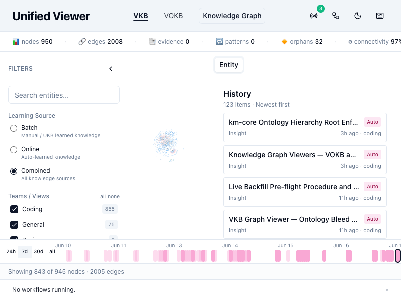
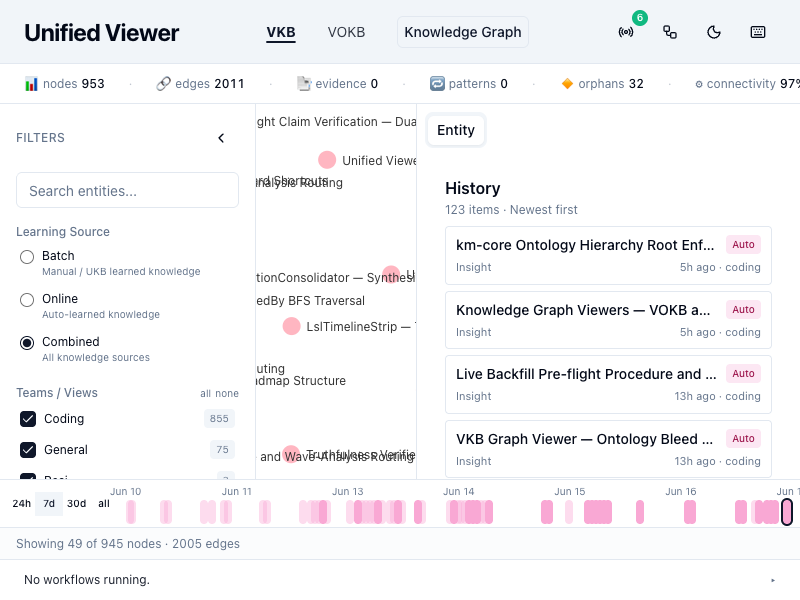
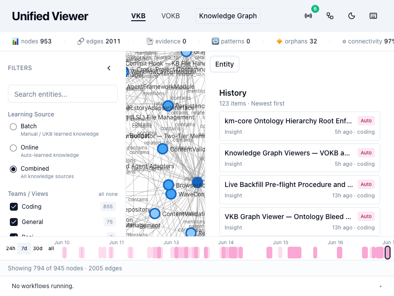
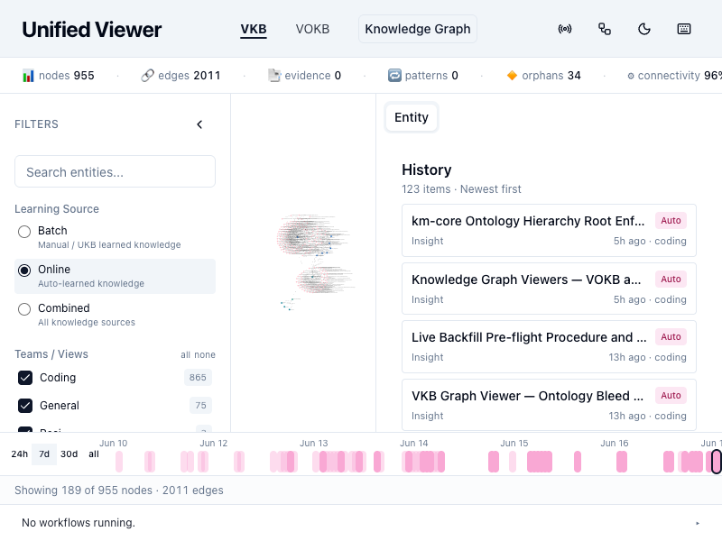
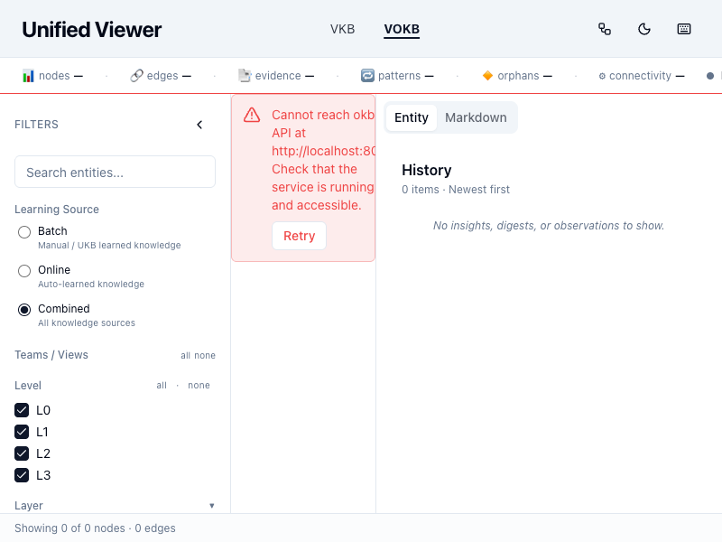

<objective>
Cross-cutting verification of Phase 60. Smoke-test all five success criteria against the live viewer at
`http://localhost:5173/viewer/coding` using `gsd-browser` (NOT hand-rolled Playwright per CLAUDE.md
mandatory rule). Capture screenshots; produce `60-VERIFICATION.md` documenting outcomes.

Purpose: Behavior plans 60-01..60-05 each verified their own slice with unit/component tests. This plan
proves the integration works end-to-end on the live UI; catches any cross-plan regressions; and
confirms Phase 56 / 56.1 invariants are intact.

Output: `60-VERIFICATION.md` checklist with PASS/FAIL per SC, screenshots in `screenshots/`, and a
single closure verdict for the phase.
</objective>

<execution_context>
@$HOME/.claude/get-shit-done/workflows/execute-plan.md
@$HOME/.claude/get-shit-done/templates/summary.md
</execution_context>

<context>
@.planning/STATE.md
@.planning/phases/60-unified-viewer-rendering-ux-integrity/60-CONTEXT.md
@.planning/phases/60-unified-viewer-rendering-ux-integrity/60-01-PLAN.md
@.planning/phases/60-unified-viewer-rendering-ux-integrity/60-02-PLAN.md
@.planning/phases/60-unified-viewer-rendering-ux-integrity/60-03-PLAN.md
@.planning/phases/60-unified-viewer-rendering-ux-integrity/60-04-PLAN.md
@.planning/phases/60-unified-viewer-rendering-ux-integrity/60-05-PLAN.md

**CLAUDE.md visual UI verification rule (MANDATORY):** use `gsd-browser` for any visual smoke against
`localhost:5173`. The CLI wraps Playwright with the correct chromium resolution. Do NOT write a one-off
`node /tmp/foo.mjs` Playwright script (`prefer-gsd-browser` constraint will fire).

**Commands available:**
- `gsd-browser navigate <url>`
- `gsd-browser screenshot <out.png>`
- `gsd-browser click <selector>`
- `gsd-browser eval '<js expression>'`
- `gsd-browser snapshot`
</context>

<tasks>

<task type="auto">
  <name>Task 1: Run all submodule + Docker rebuilds; ensure live viewer reflects 60-01..60-05 code</name>
  <files>
    (no source modifications — orchestration only)
  </files>
  <read_first>
    ./CLAUDE.md ("Rebuilding After Code Changes" section)
    .planning/phases/60-unified-viewer-rendering-ux-integrity/60-04-PLAN.md (Task 3 — the writer-guard Docker rebuild step)
  </read_first>
  <action>
    Sequentially, with one bash call per build to fail-fast on first error:

    1. Build km-core (Plan 60-04 dependency):
       `cd /Users/Q284340/Agentic/coding/lib/km-core && npm run build`
       Verify: `lib/km-core/dist/types/hierarchy-roots.js` exists.

    2. Build unified-viewer (Plans 60-01..60-03, 60-05 — bind-mounted, no Docker rebuild):
       `cd /Users/Q284340/Agentic/coding/integrations/unified-viewer && npm run build`
       Verify: build exits 0 and emits `dist/`.

    3. Build mcp-server-semantic-analysis + Docker rebuild (Plan 60-04 writer guard):
       `cd /Users/Q284340/Agentic/coding/integrations/mcp-server-semantic-analysis && npm run build`
       `cd /Users/Q284340/Agentic/coding/docker && docker-compose build coding-services`
       `cd /Users/Q284340/Agentic/coding/docker && docker-compose up -d coding-services`

    4. Verify container is up + new dist deployed:
       `docker ps --format '{{.Names}} {{.Status}}' | grep coding-services` — must show `Up`
       `docker exec coding-services grep -l "hard-root-guard" /coding/integrations/mcp-server-semantic-analysis/dist/agents/ontology-classification-agent.js`
       — must return the dist path (proves the guard from Plan 60-04 is live in the container).

    5. Verify viewer is reachable:
       `curl -sf http://localhost:5173/viewer/coding > /dev/null && echo "viewer up" || echo "viewer DOWN"`
       Must print `viewer up`. If DOWN, restart the dev server / check the operator console before proceeding.

    6. If the CK repair script from Plan 60-04 Task 4 has NOT been executed yet on the live snapshot
       (verify via `jq '.nodes[] | select(.attributes.name=="CollectiveKnowledge") | .attributes.ontologyClass' .data/knowledge-graph/exports/general.json` — if it returns anything other than `"System"`), the operator must run the repair before proceeding to Task 2. Surface the gap.
  </action>
  <verify>
    <automated>curl -sf http://localhost:5173/viewer/coding > /dev/null && docker ps --format '{{.Names}}' | grep -q coding-services && jq -r '.nodes[] | select(.attributes.name=="CollectiveKnowledge") | .attributes.ontologyClass' .data/knowledge-graph/exports/general.json | grep -q '^System$'</automated>
  </verify>
  <acceptance_criteria>
    - `lib/km-core/dist/types/hierarchy-roots.js` exists (km-core built)
    - `integrations/unified-viewer/dist/` mtime within last 30 minutes (viewer built)
    - `docker exec coding-services grep -l "hard-root-guard" /coding/integrations/mcp-server-semantic-analysis/dist/agents/ontology-classification-agent.js` returns the dist path (guard live in container)
    - `curl -sf http://localhost:5173/viewer/coding > /dev/null` exits 0 (viewer reachable)
    - `jq -r '.nodes[] | select(.attributes.name=="CollectiveKnowledge") | .attributes.ontologyClass' .data/knowledge-graph/exports/general.json` outputs `System` (CK repaired)
  </acceptance_criteria>
  <done>
    All Phase 60 source builds shipped to the running viewer + container; CK data drift repaired; ready for visual smoke.
  </done>
</task>

<task type="checkpoint:human-verify" gate="blocking">
  <name>Task 2: Operator runs gsd-browser smoke for SC#1..SC#5 + Phase 56/56.1 invariants; produces 60-VERIFICATION.md</name>
  <what-built>
    Task 1 confirmed all Phase 60 code is live in the viewer + container, and the CK data drift is
    repaired. Task 2 is the operator-driven visual verification: open the viewer at
    `http://localhost:5173/viewer/coding`, exercise each filter scenario per the SCs, capture
    screenshots, and write `60-VERIFICATION.md` with PASS/FAIL evidence.
  </what-built>
  <how-to-verify>
    Create the screenshots directory:
    ```
    mkdir -p .planning/phases/60-unified-viewer-rendering-ux-integrity/screenshots
    ```

    **SC#1 — Layer filter symmetry (VKBUI-01):**
    1. `gsd-browser navigate http://localhost:5173/viewer/coding`
    2. `gsd-browser screenshot .planning/phases/60-unified-viewer-rendering-ux-integrity/screenshots/sc1-baseline.png`
    3. In the Layer filter, uncheck Evidence (leave Pattern checked).
    4. `gsd-browser screenshot .planning/phases/60-unified-viewer-rendering-ux-integrity/screenshots/sc1-evidence-off.png`
       Verify: only Pattern-tagged nodes render. Use `gsd-browser eval` to count visible nodes by checking the DOM for the canvas-rendered set, or read the LayerFilter count badges.
    5. Re-check Evidence, uncheck Pattern.
    6. `gsd-browser screenshot .planning/phases/60-unified-viewer-rendering-ux-integrity/screenshots/sc1-pattern-off.png`
       Verify: only Evidence-tagged nodes render. NEITHER toggle is a silent no-op.

    **SC#2 — Dynamic Legend (VKBUI-02):**
    1. Restore filters to baseline.
    2. Expand the Legend `<details>`.
    3. `gsd-browser screenshot .planning/phases/60-unified-viewer-rendering-ux-integrity/screenshots/sc2-legend-baseline.png`
       Verify: DOMAINS / LAYERS / SOURCE / RELATIONSHIPS sections reflect ONLY what is on screen. NO `RuntimeDiagnostics` / `Official doc` / `Automated RCA` / `Team knowledge` rows (use `gsd-browser eval` and assert via `document.body.innerText.includes('RuntimeDiagnostics')` === false).
    4. Filter to a small subset (e.g., select only Component class) and re-screenshot:
       `gsd-browser screenshot .planning/phases/60-unified-viewer-rendering-ux-integrity/screenshots/sc2-legend-filtered.png`
       Verify: Legend sections shrink to reflect the smaller set.

    **SC#3 — Observation/Digest debug toggle (VKBUI-03):**
    1. Restore filters to baseline.
    2. `gsd-browser screenshot .planning/phases/60-unified-viewer-rendering-ux-integrity/screenshots/sc3-default-hidden.png`
       Verify by `gsd-browser eval`: count of rendered nodes with entityType in {Observation, Digest} is 0.
    3. In GraphToggles, toggle ON "Show debug entity types (Observation, Digest)".
    4. `gsd-browser screenshot .planning/phases/60-unified-viewer-rendering-ux-integrity/screenshots/sc3-debug-on.png`
       Verify: Observation/Digest nodes now appear; the italic tooltip `Architecture-bleed shield...` visible.
    5. Reload the page (`gsd-browser navigate http://localhost:5173/viewer/coding` again).
    6. `gsd-browser screenshot .planning/phases/60-unified-viewer-rendering-ux-integrity/screenshots/sc3-after-reload.png`
       Verify (D-11 non-persistence): toggle is back to OFF; Observation/Digest hidden again.

    **SC#4 — CollectiveKnowledge under Online filter (VKBUI-04):**

    The sigma canvas is WebGL — there is NO per-entity DOM node (e.g., `[data-name="CollectiveKnowledge"]`
    is speculative and was rejected by checker W-3). Use the two deterministic assertions below.

    1. Apply the Online learning-source filter (via LearningSourceFilter).
    2. Pick a leaf-ish entity (e.g., a Detail node).
    3. Click the leaf to trigger ancestry trace / focus.
    4. `gsd-browser screenshot .planning/phases/60-unified-viewer-rendering-ux-integrity/screenshots/sc4-online-ck-trace.png`
       Visual check: CollectiveKnowledge node visible in the rendered set; ancestry path from leaf reaches CK (not truncated at project level).

    5. **Primary assertion — Legend-DOMAINS DOM-text (preferred):**

       Plan 60-02 made `LegendPanel` derive its DOMAINS section from the rendered entity set's distinct
       `ontologyClass` values. After Plan 60-04's CK-ontologyClass repair, CK has `ontologyClass='System'`.
       So with the Online filter active, the Legend DOMAINS section MUST contain a row whose label is
       `System` (the class CK belongs to) — because CK is in the rendered set and contributes its class
       to the dynamically derived DOMAINS list.

       Steps:
       - Expand the Legend `<details>` if not already open.
       - Locate the DOMAINS section root in the DOM. Plan 60-02's `<Section>` component renders a
         `<details>`-or-`<div>` wrapper that contains a heading (e.g., `<h4>DOMAINS</h4>` or equivalent;
         confirm the exact tag during execution by reading the post-60-02 `LegendPanel.tsx`).
         Concrete selector candidates (try in order, pick the first that resolves):
         - `[data-testid="legend-section-DOMAINS"]`
         - The closest ancestor of `<h4>DOMAINS</h4>` (use `:has()` or DOM traversal in eval)
         - The first `<Section>` instance inside `<details><summary>Legend</summary>...` (D-08 section
           order: DOMAINS is first)
       - Run:
         ```
         gsd-browser eval 'const sec = document.querySelector("[data-testid=\"legend-section-DOMAINS\"]") || Array.from(document.querySelectorAll("h4")).find(h => h.textContent.trim() === "DOMAINS")?.parentElement; sec ? sec.textContent.includes("System") : false'
         ```
       - Expected: `true`. (CK contributes its `System` class to the DOMAINS list.)
       - Capture the eval output in the verification doc.

       If `LegendPanel.tsx` post-60-02 uses a different data-testid pattern OR the section is identified
       by something other than the literal string `DOMAINS`, the executor reads the actual code post-60-02
       and adjusts the selector accordingly. Document the chosen selector in 60-VERIFICATION.md under
       SC#4 so it's audit-traceable.

    6. **Backup assertion — API-state (fallback if DOM-text approach is brittle):**

       The viewer's km-core API exposes class-filtered entity queries. Assert from the eval context:
       ```
       gsd-browser eval 'fetch("/api/v1/entities?ontologyClass=System").then(r => r.json()).then(d => Array.isArray(d) ? d.some(e => e.name === "CollectiveKnowledge") : (d.entities || []).some(e => e.name === "CollectiveKnowledge"))'
       ```
       - Expected: resolves to `true`.
       - This proves CK is classified as `System` in the live API (independent of the viewer's render
         pipeline). If the primary Legend-DOMAINS check is ambiguous (e.g., the legend was collapsed,
         or the DOMAINS heading was renamed), this API check stands as the canonical evidence.

       **Endpoint shape caveat:** the exact route + response shape may be `/api/v1/entities`,
       `/api/v1/kg/entities`, or similar; confirm via `grep -rn "entities?" integrations/unified-viewer/src/api/` or by reading `lib/km-core/src/api/handlers/`. The eval above defensively handles both array-root and `{entities: [...]}`-shaped responses.

    7. **Outcome:** SC#4 PASSES if EITHER (preferred: Legend-DOMAINS DOM-text check returns `true`) OR
       (backup: API-state fetch returns `true`). Both being green is ideal. If both fail, SC#4 FAILS —
       the executor must surface the failure with the captured eval outputs.

    8. **DO NOT use** speculative DOM selectors against the sigma canvas (e.g.,
       `document.querySelectorAll('[data-name="CollectiveKnowledge"]')`) — sigma renders to WebGL, no
       such selector exists. Speculative selectors were the W-3 issue corrected in this revision.

    **SC#5 — L2 lower-ontology classes in OntologyFilter (LOWERONTO-03):**
    1. Restore filters to baseline.
    2. Expand the Ontology Class section.
    3. `gsd-browser screenshot .planning/phases/60-unified-viewer-rendering-ux-integrity/screenshots/sc5-ontology-filter.png`
       Verify: L0 anchors (System, Project) at top as ungrouped rows. L1 with L2 children (e.g., Component) renders as a collapsible group; expanding it shows L2 children (LiveLoggingSystem / ConstraintMonitor / KnowledgeManagement / etc. — actual Phase 57 set). Each L2 row has a count badge. `[all]` / `[none]` link-buttons present on each L1 group. NO `Typed Views` group.
    4. Click an L1 disclosure triangle to collapse the group:
       `gsd-browser screenshot .planning/phases/60-unified-viewer-rendering-ux-integrity/screenshots/sc5-l1-collapsed.png`
       Verify: L2 rows hidden, but the L2 checkbox state (in `selectedOntologyClasses`) UNCHANGED — collapse is UI-only.

    **VOKB tab regression (W-1 — light check):**
    1. `gsd-browser navigate http://localhost:5173/viewer/okb` (or the actual VOKB route).
    2. Expand the Ontology Class section.
    3. Verify the Upper Ontology / Failure Model groups are present (no degradation to flat rows after Phase 60). This is the W-1 guard — VOKB schema preservation per Plan 60-05.
    4. Capture `screenshots/vokb-regression.png`.

    **Phase 56 viewport-stability invariant:**
    1. Open the viewer; let the canvas settle.
    2. Toggle each filter in sequence (Layer, Legend visibility, debug toggle, Online filter, Ontology Class group). After each toggle, verify the canvas does NOT re-zoom or re-layout (the viewport stays put — only the rendered set changes).
    3. `gsd-browser screenshot .planning/phases/60-unified-viewer-rendering-ux-integrity/screenshots/phase56-stable.png`
       Visual comparison of before/after viewport coordinates via `gsd-browser eval` reading the sigma camera state if accessible (`window.__sigmaCameraState__` — confirm by `grep -rn "sigmaCamera\|camera\\.state" integrations/unified-viewer/src/` for any exposed handle; if none, document as "visually verified, no automated capture available").

    **Phase 56.1 D-1 multi-selection invariant:**
    1. With the viewer open, click a node to focus it; then click a bucket-card row in the side panel.
    2. Verify selectedNodeIds / focalNodeId / selectedBucketKeys behave per Phase 56.1 spec (no regression from Phase 60 changes).

    **Produce `60-VERIFICATION.md`:**
    Template structure:
    ```
    # Phase 60 Verification

    Date: <ISO>
    Verifier: <operator name>

    ## SC#1 — Layer filter symmetry (VKBUI-01)
    Outcome: PASS / FAIL
    Evidence:
    - 
    - 
    - 
    Notes: ...

    ## SC#2 — Dynamic Legend (VKBUI-02)
    ... (same structure)

    ## SC#3 — Observation/Digest debug toggle (VKBUI-03)
    ...

    ## SC#4 — CollectiveKnowledge under Online filter (VKBUI-04)
    Outcome: PASS / FAIL
    Evidence:
    - 
    - Primary (Legend-DOMAINS DOM-text) selector used: <selector>
    - Primary eval result: <true|false>
    - Backup (API-state) eval result: <true|false>
    Notes: ...

    ## SC#5 — L2 lower-ontology classes in OntologyFilter (LOWERONTO-03)
    ...

    ## VOKB regression (W-1 guard)
    Outcome: PASS / FAIL
    Evidence:
    - 

    ## Phase 56 viewport-stability invariant
    Outcome: PASS / FAIL
    ...

    ## Phase 56.1 D-1 multi-selection invariant
    Outcome: PASS / FAIL
    ...

    ## Overall
    All five SCs: PASS / FAIL (with gap list if FAIL)
    ```

    Save to `.planning/phases/60-unified-viewer-rendering-ux-integrity/60-VERIFICATION.md`.
  </how-to-verify>
  <resume-signal>Type "approved" if all 5 SCs PASS and both Phase 56 / 56.1 invariants hold (plus VOKB W-1 regression check). If any FAIL, list the failures + screenshot paths so they can be triaged into a gap-closure plan.</resume-signal>
</task>

</tasks>

<threat_model>
## Trust Boundaries

| Boundary | Description |
|----------|-------------|
| operator → live viewer | visual verification surface; no API write |

## STRIDE Threat Register

| Threat ID | Category | Component | Disposition | Mitigation Plan |
|-----------|----------|-----------|-------------|-----------------|
| T-60-06-01 | Repudiation | verification claim without evidence | mitigate | screenshots captured per SC, linked in 60-VERIFICATION.md; SC#4 carries explicit primary + backup eval outputs |
</threat_model>

<verification>
- 60-VERIFICATION.md exists with per-SC outcome + screenshot links
- All 5 SCs PASS (or gaps documented for follow-up)
- VOKB W-1 regression check PASS
- Phase 56 viewport-stability + Phase 56.1 D-1 invariants PASS
</verification>

<success_criteria>
- All five Phase 60 success criteria visually verified on the live viewer at localhost:5173/viewer/coding
- Phase 56 and Phase 56.1 invariants preserved (no regressions introduced by 60-01..60-05)
- VOKB tab grouping preserved (W-1)
- Screenshots captured as audit trail; SC#4 carries deterministic primary + backup eval outputs (no speculative DOM selectors)
</success_criteria>

<output>
Create `.planning/phases/60-unified-viewer-rendering-ux-integrity/60-06-SUMMARY.md` when done; the
verification document `60-VERIFICATION.md` is the primary closure artifact for the phase.
</output>
