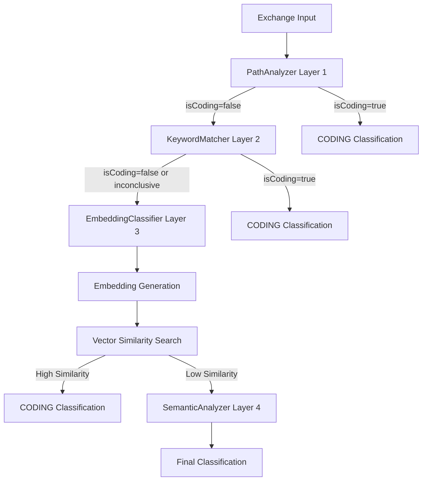

# Design Document

## Overview

The EmbeddingClassifier extends the existing ReliableCodingClassifier from a three-layer to a four-layer architecture by adding semantic vector similarity as Layer 3. This enhancement leverages the proven mcp-constraint-monitor technology stack (Qdrant vector database + sentence-transformers embeddings) to provide semantic understanding for accurate classification of coding infrastructure content when keyword matching is inconclusive.

The design maintains the existing architecture while achieving the user's requested layered approach: "path → sure pos keywords → fast embedding → fast semantic analysis" (PathAnalyzer → KeywordMatcher → **EmbeddingClassifier** → SemanticAnalyzer).

## Steering Document Alignment

### Technical Standards (tech.md)

**Four-Layer Classification Architecture**: Extends the established three-layer pattern to PathAnalyzer → KeywordMatcher → EmbeddingClassifier → SemanticAnalyzer with performance requirements:
- Layer 1 (PathAnalyzer): <1ms response time, 100% accuracy for file operations
- Layer 2 (KeywordMatcher): <1ms response time, sure positive keywords but may be inconclusive
- Layer 3 (EmbeddingClassifier): <3ms response time, semantic vector similarity classification  
- Layer 4 (SemanticAnalyzer): <10ms response time, LLM-based deep understanding

**Performance Standards**: Achieves <3ms embedding classification time contributing to <30ms total pipeline performance.

**Configuration-Driven Architecture**: Leverages existing live-logging-config.json with new embedding-specific configuration section.

**Node.js Technology Stack**: Uses JavaScript (Node.js 18+) with sentence-transformers integration via Python subprocess for embedding generation.

### Project Structure (structure.md)

**Core Source Code**: New EmbeddingClassifier implemented in `/src/live-logging/EmbeddingClassifier.js` following single responsibility principle.

**Integration Reuse**: Leverages existing `/integrations/mcp-constraint-monitor/` Qdrant infrastructure without duplicating database setup.

**Configuration Management**: Extends `/config/live-logging-config.json` with embedding-specific settings following hierarchical configuration pattern.

## Code Reuse Analysis

### Existing Components to Leverage

- **mcp-constraint-monitor Qdrant Setup**: Reuses existing Qdrant vector database configuration, connection management, and optimized settings (HNSW indexing, int8 quantization)
- **ReliableCodingClassifier Framework**: Maintains existing initialization, statistics tracking, caching, and decision path logging infrastructure
- **OperationalLogger**: Leverages existing comprehensive logging system for embedding operation tracking
- **PerformanceMonitor**: Extends existing performance tracking with embedding-specific metrics

### Integration Points

- **Qdrant Database**: Connects to existing mcp-constraint-monitor Qdrant instance, creates new 'coding_infrastructure' collection alongside constraint collections
- **Configuration System**: Extends existing live-logging-config.json with embedding configuration section
- **Caching Infrastructure**: Integrates with existing prompt set caching system for embedding result caching
- **Repository Indexing**: Leverages existing file system scanning patterns from PathAnalyzer for repository content discovery

## Architecture

The EmbeddingClassifier follows a hybrid approach combining fast positive keyword pre-filtering with semantic vector similarity, addressing the user's specific layered requirements while maintaining performance standards.

### Modular Design Principles

- **Single File Responsibility**: EmbeddingClassifier.js handles only Layer 3 embedding-based classification
- **Component Isolation**: RepositoryIndexer handles repository indexing, ChangeDetector monitors updates independently
- **Service Layer Separation**: Embedding generation, vector storage, and similarity computation clearly separated
- **Utility Modularity**: Reusable embedding utilities that can be leveraged by future semantic analysis systems



## Components and Interfaces

### EmbeddingClassifier (Layer 3 Addition)

- **Purpose:** Provide semantic vector similarity classification when KeywordMatcher returns inconclusive results
- **Interfaces:** 
  - `async classifyByEmbedding(exchange)` - New interface for embedding-based classification
  - `async initialize()` - Setup embedding generation and Qdrant connection
  - `getStats()` - Performance and accuracy metrics
- **Dependencies:** Qdrant client, sentence-transformers (via subprocess), RepositoryIndexer
- **Reuses:** Existing performance monitoring, operational logging, caching infrastructure

### RepositoryIndexer

- **Purpose:** Index coding repository content into Qdrant 'coding_infrastructure' collection
- **Interfaces:**
  - `async indexRepository(repoPath, options)` - Full repository indexing
  - `async updateIndex(changedFiles)` - Incremental updates
  - `async isIndexCurrent()` - Freshness validation
- **Dependencies:** Qdrant client, file system scanning utilities
- **Reuses:** Existing file discovery patterns from PathAnalyzer, configuration management

### ChangeDetector

- **Purpose:** Monitor repository changes and trigger reindexing when significant changes occur
- **Interfaces:**
  - `async detectSignificantChanges()` - Heuristic-based change detection
  - `startMonitoring()` - Begin continuous monitoring
  - `stopMonitoring()` - Cleanup monitoring resources
- **Dependencies:** File system watchers, repository content analysis
- **Reuses:** Existing configuration system, logging infrastructure

### EmbeddingGenerator

- **Purpose:** Generate semantic embeddings using sentence-transformers
- **Interfaces:**
  - `async generateEmbedding(text)` - Single text embedding
  - `async generateBatchEmbeddings(texts)` - Batch processing for efficiency
  - `validateEmbedding(embedding)` - Quality validation
- **Dependencies:** sentence-transformers Python subprocess
- **Reuses:** Existing subprocess management patterns, performance monitoring

## Data Models

### Enhanced Configuration Schema

```javascript
{
  // Existing live-logging-config.json structure
  "embedding_classifier": {
    "enabled": true,
    "model": "sentence-transformers/all-MiniLM-L6-v2",
    "vector_dimensions": 384,
    "similarity_threshold": 0.7,
    "qdrant": {
      "collection_name": "coding_infrastructure",
      "distance_metric": "Cosine",
      "index_config": {
        "hnsw": { "m": 16, "ef_construct": 100 },
        "quantization": { "type": "int8" }
      }
    },
    "repository_indexing": {
      "auto_index_on_startup": true,
      "include_patterns": ["*.md", "*.js", "README*", "CLAUDE.md"],
      "exclude_patterns": ["node_modules/**", ".git/**", "*.log"],
      "max_file_size_mb": 1,
      "index_update_interval_minutes": 30
    },
    "performance": {
      "max_embedding_time_ms": 2000,
      "max_similarity_search_ms": 1000,
      "cache_embeddings": true,
      "cache_ttl_minutes": 60
    }
  }
}
```

### Vector Document Schema

```javascript
{
  "id": "uuid-v4",
  "vector": [/* 384-dimensional float array */],
  "payload": {
    "file_path": "relative/path/to/file.md",
    "content_type": "documentation | source_code | readme | changelog",
    "content_hash": "sha256-hash-of-content",
    "title": "extracted-title-or-filename",
    "excerpt": "first-200-chars-of-content",
    "indexed_at": "ISO-8601-timestamp",
    "repository": "coding_infrastructure"
  }
}
```

### Classification Result Schema (New Layer 3 Interface)

```javascript
{
  "isCoding": boolean,
  "confidence": number, // 0.0 to 1.0
  "reason": string,
  "layer": "embedding", // Layer 3 identification
  "similarity_scores": {
    "max_similarity": number,
    "avg_similarity": number,
    "matching_documents": number
  },
  "processing_time_ms": number
}
```

## Error Handling

### Error Scenarios

1. **Qdrant Connection Failure**
   - **Handling:** Gracefully fall back to positive keyword matching only, log error, attempt reconnection with exponential backoff
   - **User Impact:** Classification continues with reduced accuracy, no interruption to session logging

2. **Embedding Generation Timeout**
   - **Handling:** Return cached embedding if available, otherwise fall back to keyword matching, track timeout metrics
   - **User Impact:** Slightly reduced classification accuracy for that specific exchange

3. **Repository Index Corruption**
   - **Handling:** Detect corruption via metadata validation, trigger automatic reindexing, use fallback classification during rebuild
   - **User Impact:** Temporary classification degradation until index rebuilds (estimated 2-5 minutes)

4. **Memory Pressure from Large Repository**
   - **Handling:** Implement pagination in repository indexing, use streaming processing, monitor memory usage with alerts
   - **User Impact:** Indexing takes longer but system remains stable

## Testing Strategy

### Unit Testing

- **EmbeddingClassifier Integration**: Verify seamless integration with existing ReliableCodingClassifier four-layer pipeline
- **KeywordMatcher Integration**: Test that EmbeddingClassifier correctly activates when KeywordMatcher returns inconclusive results
- **Vector Similarity Computation**: Test cosine similarity calculations with known embedding pairs
- **Error Handling**: Test all fallback scenarios with mocked failures

### Integration Testing

- **End-to-End Classification Pipeline**: Test full PathAnalyzer → EmbeddingClassifier → SemanticAnalyzer flow with real content
- **Qdrant Integration**: Test repository indexing, similarity search, and index updates against real Qdrant instance
- **Performance Requirements**: Validate <3ms embedding classification time and <30ms total pipeline time
- **Cache Integration**: Test embedding result caching with existing prompt set optimization system

### End-to-End Testing

- **Repository Indexing Scenarios**: Test indexing of actual coding repository content with various file types and sizes
- **Classification Accuracy**: Compare embedding-based results against manually classified coding infrastructure content
- **Change Detection**: Test automatic reindexing triggered by documentation updates, feature additions, and structural changes
- **Resource Usage**: Monitor memory and CPU usage during sustained classification workloads

### Performance Benchmarking

- **Latency Testing**: Measure and optimize to achieve consistent <3ms embedding classification time
- **Throughput Testing**: Validate system handles high-volume classification during active development sessions
- **Resource Monitoring**: Ensure <500MB memory usage target is maintained even with large repository indexes
- **Cache Effectiveness**: Measure embedding cache hit rates and impact on overall system performance