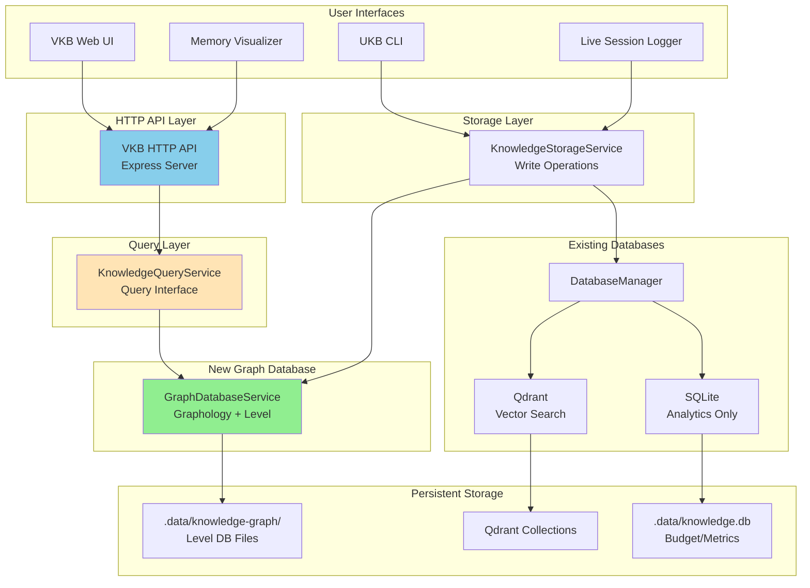
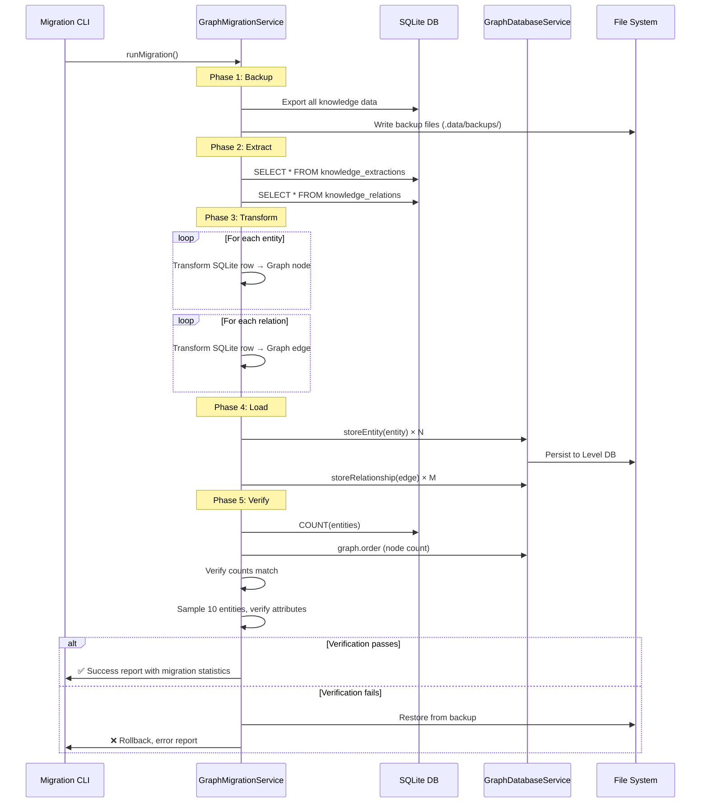

# Design Document

## Overview

This design implements a **graph-first knowledge storage architecture** that replaces SQLite relational tables with a Graphology + Level graph database while maintaining Qdrant for vector search and SQLite for analytics. The architecture achieves agent-agnostic operation by removing the MCP Memory server dependency.

**Current Architecture** (Database-First):
- VKB queries SQLite directly via HTTP API (`/api/entities`, `/api/relations`)
- UKB writes directly to SQLite database
- Memory visualizer queries database via HTTP API
- JSON files removed (only for manual import/export: `ukb import`, `ukb export`)

**Target Architecture** (Graph-First):
- Same HTTP API, swapped backend: SQLite → Graph Database
- VKB/UKB/Memory-visualizer work without changes
- Direct graph queries instead of SQL

### Key Design Principles

1. **Graph-Native Storage**: Knowledge entities and relationships stored natively in graph structure
2. **Agent Agnostic**: Works with any AI coding assistant (Claude Code, Copilot, Cursor, Aider)
3. **Query Interface Compatibility**: GraphDatabaseService implements same query interface as SQLite
4. **Clean Separation**: Graph (knowledge), Qdrant (vectors), SQLite (analytics) - each optimized for its purpose
5. **Zero Data Loss**: Comprehensive migration with verification and rollback capability

## Steering Document Alignment

### Technical Standards (tech.md)

**Configuration-Driven Architecture** (§2.3):
- Graph database configuration integrated into existing `config/` structure
- Environment variables for database paths and team scoping
- Validation at startup following established patterns

**Data Architecture** (§2.5.1):
```javascript
// Aligns with existing multi-database pattern
{
  "databases": {
    "graph": "Graphology + Level (knowledge)",
    "vector": "Qdrant (semantic search)",
    "relational": "SQLite (analytics only)"
  }
}
```

**Performance Standards** (§2.3):
- <100ms for knowledge operations (graph traversal is O(1) vs SQLite O(n*m) JOINs)
- <5% CPU during normal operation
- <150MB memory (acceptable for in-memory graph)

**Agent-Agnostic Design Pattern** (§2.2.2):
- Remove MCP Memory server dependency
- Direct graph database access via standard Node.js modules
- No protocol-specific integrations required

### Project Structure (structure.md)

**Modular Design** (§2.1):
```
src/
├── knowledge-management/
│   ├── GraphDatabaseService.js      # NEW: Graph operations with query interface
│   ├── GraphMigrationService.js     # NEW: One-time migration
│   ├── KnowledgeQueryService.js     # UPDATED: Swap SQL → Graph queries
│   └── KnowledgeStorageService.js   # UPDATED: Use GraphDatabaseService
├── databases/
│   └── DatabaseManager.js           # UPDATED: Add graph DB initialization
```

**Single Responsibility Principle** (§2.9):
- **GraphDatabaseService**: Graph CRUD + query operations (compatible with SQL interface)
- **GraphMigrationService**: Migration logic isolated, one-time use
- **KnowledgeQueryService**: Query orchestration (swaps SQL → Graph internally)
- **KnowledgeStorageService**: High-level storage orchestration

**File Organization** (§2.9.4):
- Graph database components in `src/knowledge-management/`
- Migration scripts in `scripts/knowledge-management/`
- Configuration in `config/graph-database-config.json`

## Code Reuse Analysis

### Existing Components to Leverage

**1. MemoryFallbackService** (`lib/fallbacks/memory-fallback.js`):
- ✅ **Already uses Graphology!**
- ✅ Has team-based node ID logic: `{team}:{name}` pattern
- ✅ Has JSON serialization: `saveGraph()`, `loadGraph()`
- ✅ Has graph traversal: `getRelated()`, `getConnected()`
- **Reuse Strategy**: Extract patterns, adapt for Level persistence and HTTP API queries

**2. KnowledgeQueryService** (`src/knowledge-management/KnowledgeQueryService.js`):
- ✅ Has query interface: `queryEntities()`, `queryRelations()`, `getTeams()`, `getStatistics()`
- ✅ Has search capabilities: `semanticSearch()`
- ✅ Has storage methods: `storeEntity()`, `storeRelation()`
- **Integration Strategy**: Swap SQL queries → Graph queries internally, keep API unchanged

**3. KnowledgeStorageService** (`src/knowledge-management/KnowledgeStorageService.js`):
- ✅ Has entity validation: `validateKnowledge()`
- ✅ Has embedding generation: `generateEmbeddings()`
- ✅ Has transactional storage: `storeTransactional()`
- **Integration Strategy**: Update to use GraphDatabaseService, maintain existing API

**4. DatabaseManager** (`src/databases/DatabaseManager.js`):
- ✅ Has SQLite schema management: `createSQLiteSchemas()`
- ✅ Has health checking: `getHealth()`
- ✅ Has stats collection: `getStats()`
- **Integration Strategy**: Add `initializeGraphDB()`, keep SQLite for analytics

**4. Package Dependencies**:
- ✅ Graphology already installed (v0.25.4)
- ✅ graphology-utils already installed (v2.5.2)
- ✅ Level already installed (v10.0.0)
- ✅ LevelGraph installed but **will not be used** (Node.js 24 incompatibility)

### Integration Points

**1. KnowledgeQueryService → GraphDatabaseService**:
```javascript
// Current (SQLite):
const entities = this.db.prepare(`
  SELECT * FROM knowledge_extractions WHERE team = ?
`).all(team);

// After (Graph):
const entities = await this.graphDatabase.queryEntities({ team });
```

**2. VKB HTTP API → KnowledgeQueryService**:
- No changes needed! VKB API endpoints unchanged
- KnowledgeQueryService swaps SQLite → Graph internally
- `/api/entities`, `/api/relations` work identically

**3. Memory Visualizer → VKB API**:
- No changes needed! Frontend queries same HTTP endpoints
- Database swap is transparent to frontend
- React components work without modification

**4. UKB Command → KnowledgeStorageService**:
- No changes needed! UKB CLI interface unchanged
- Storage service uses GraphDatabaseService internally
- `ukb add-entity`, `ukb add-relation` work identically

**5. Qdrant Integration**:
- Unchanged! Embeddings still stored in Qdrant
- GraphDatabaseService coordinates with Qdrant via DatabaseManager
- Dual-database strategy maintained

**6. JSON Import/Export** (Manual Only):
- `ukb import file.json` → Read JSON, store in graph
- `ukb export file.json` → Query graph, write JSON
- Used for backups and team sharing only

## Architecture

### System Architecture



### Migration Architecture



## Components and Interfaces

### Component 1: GraphDatabaseService

**Purpose**: Core graph database operations using Graphology (in-memory) + Level (persistence), with SQL-compatible query interface

**File Location**: `src/knowledge-management/GraphDatabaseService.js`

**Interfaces**:

```javascript
class GraphDatabaseService {
  /**
   * Initialize graph database
   * @returns {Promise<void>}
   */
  async initialize();

  // ===== WRITE OPERATIONS =====

  /**
   * Store an entity in the graph
   * @param {Object} entity - Entity with name, entityType, observations, etc.
   * @param {Object} options - Storage options (team, confidence, source, etc.)
   * @returns {Promise<string>} - Entity ID
   */
  async storeEntity(entity, options = {});

  /**
   * Store a relationship between entities
   * @param {string} fromName - Source entity name
   * @param {string} toName - Target entity name
   * @param {string} relationType - Type of relationship
   * @param {Object} metadata - Relationship metadata (confidence, team, etc.)
   * @returns {Promise<string>} - Edge ID
   */
  async storeRelationship(fromName, toName, relationType, metadata = {});

  /**
   * Update an existing entity
   * @param {string} name - Entity name
   * @param {string} team - Team name
   * @param {Object} updates - Fields to update
   * @returns {Promise<boolean>} - Success status
   */
  async updateEntity(name, team, updates);

  /**
   * Delete an entity and its relationships
   * @param {string} name - Entity name
   * @param {string} team - Team name
   * @returns {Promise<boolean>} - Success status
   */
  async deleteEntity(name, team);

  // ===== QUERY OPERATIONS (SQL-Compatible Interface) =====

  /**
   * Query entities with comprehensive filtering (replaces SQL SELECT)
   * @param {Object} options - Query options matching KnowledgeQueryService interface
   * @returns {Promise<Array>} - Array of entities in SQL-compatible format
   */
  async queryEntities(options = {
    team: null,
    source: null,          // 'manual' | 'auto'
    types: null,           // Array of entity types
    startDate: null,       // ISO date string
    endDate: null,
    minConfidence: 0,
    limit: 1000,
    offset: 0,
    searchTerm: null,      // Entity name search
    sortBy: 'last_modified',
    sortOrder: 'DESC'
  });

  /**
   * Query relationships (replaces SQL JOIN on knowledge_relations)
   * @param {Object} options - Query options
   * @returns {Promise<Array>} - Array of relations
   */
  async queryRelations(options = {
    entityId: null,        // Entity ID to filter by
    team: null,
    relationType: null,    // implements, uses, solves, etc.
    limit: 1000
  });

  /**
   * Get list of teams with entity counts
   * @returns {Promise<Array>} - Teams with statistics
   */
  async getTeams();

  /**
   * Get knowledge statistics
   * @param {Object} options - { team: string }
   * @returns {Promise<Object>} - Statistics
   */
  async getStatistics(options = {});

  // ===== GRAPH-SPECIFIC OPERATIONS =====

  /**
   * Find related entities via graph traversal
   * @param {string} entityName - Starting entity
   * @param {number} depth - Traversal depth (1-3)
   * @param {Object} filter - Filter criteria (team, type, etc.)
   * @returns {Promise<Array>} - Related entities with path info
   */
  async findRelated(entityName, depth = 2, filter = {});

  /**
   * Export all entities for a team (for manual JSON export: ukb export)
   * @param {string} team - Team name
   * @returns {Promise<Object>} - {entities: [], relations: []}
   */
  async exportTeam(team);

  /**
   * Import entities from JSON (for manual JSON import: ukb import)
   * @param {Object} data - {entities: [], relations: []}
   * @param {string} team - Team name
   * @returns {Promise<Object>} - Import statistics
   */
  async importFromJSON(data, team);

  // ===== SYSTEM OPERATIONS =====

  /**
   * Get health status
   * @returns {Promise<Object>} - Health metrics
   */
  async getHealth();

  /**
   * Close database connections
   * @returns {Promise<void>}
   */
  async close();
}
```

**Dependencies**:
- Graphology (in-memory graph)
- Level (persistence layer)
- EventEmitter (for lifecycle events)

**Reuses**:
- MemoryFallbackService patterns for Graphology operations
- DatabaseManager health check patterns
- KnowledgeStorageService validation patterns

**Implementation Details**:
```javascript
import Graph from 'graphology';
import { Level } from 'level';
import { EventEmitter } from 'events';

class GraphDatabaseService extends EventEmitter {
  constructor(config = {}) {
    super();
    this.dbPath = config.dbPath || '.data/knowledge-graph';
    this.graph = new Graph({ multi: true }); // Multiple edges allowed
    this.levelDB = null;
    this.initialized = false;

    // Node ID format: {team}:{entityName}
    // Edge ID format: {fromId}-[{relationType}]->{toId}
  }

  async initialize() {
    // Create Level DB for persistence
    this.levelDB = new Level(this.dbPath, { valueEncoding: 'json' });
    await this.levelDB.open();

    // Load graph from Level DB
    await this._loadGraphFromLevel();

    this.initialized = true;
  }

  async _loadGraphFromLevel() {
    try {
      // Load nodes
      const nodesData = await this.levelDB.get('graph:nodes');
      for (const node of nodesData) {
        this.graph.addNode(node.id, node.attributes);
      }

      // Load edges
      const edgesData = await this.levelDB.get('graph:edges');
      for (const edge of edgesData) {
        this.graph.addEdge(edge.source, edge.target, edge.attributes);
      }
    } catch (error) {
      // First run, empty database
      console.log('Starting with empty graph database');
    }
  }

  async _persistGraphToLevel() {
    // Serialize nodes
    const nodes = this.graph.mapNodes((nodeId, attributes) => ({
      id: nodeId,
      attributes
    }));
    await this.levelDB.put('graph:nodes', nodes);

    // Serialize edges
    const edges = this.graph.mapEdges((edgeId, attributes, source, target) => ({
      id: edgeId,
      source,
      target,
      attributes
    }));
    await this.levelDB.put('graph:edges', edges);
  }

  async storeEntity(entity, options = {}) {
    const team = options.team || 'default';
    const nodeId = `${team}:${entity.name}`;

    const attributes = {
      name: entity.name,
      entityType: entity.entityType,
      observations: entity.observations || [],
      significance: entity.significance || 5,
      tags: entity.tags || [],
      team,
      confidence: options.confidence || 1.0,
      createdAt: new Date().toISOString(),
      lastModified: new Date().toISOString()
    };

    if (this.graph.hasNode(nodeId)) {
      this.graph.mergeNodeAttributes(nodeId, attributes);
    } else {
      this.graph.addNode(nodeId, attributes);
    }

    // Persist to Level
    await this._persistGraphToLevel();

    // Emit event for monitoring/logging
    this.emit('entity:stored', { team, entity: attributes });

    return nodeId;
  }

  async findRelated(entityName, depth = 2, filter = {}) {
    const team = filter.team || 'default';
    const nodeId = `${team}:${entityName}`;

    if (!this.graph.hasNode(nodeId)) {
      return [];
    }

    const results = [];
    const visited = new Set([nodeId]);
    const queue = [{ id: nodeId, depth: 0, path: [] }];

    while (queue.length > 0) {
      const current = queue.shift();

      if (current.depth >= depth) continue;

      // Get neighbors (both outbound and inbound edges)
      const neighbors = this.graph.neighbors(current.id);

      for (const neighborId of neighbors) {
        if (visited.has(neighborId)) continue;
        visited.add(neighborId);

        const neighborAttrs = this.graph.getNodeAttributes(neighborId);

        // Apply filters
        if (filter.entityType && neighborAttrs.entityType !== filter.entityType) {
          continue;
        }

        const edge = this.graph.edge(current.id, neighborId);
        const edgeAttrs = this.graph.getEdgeAttributes(edge);

        results.push({
          entity: neighborAttrs,
          depth: current.depth + 1,
          path: [...current.path, edgeAttrs.relationType],
          relationshipType: edgeAttrs.relationType
        });

        queue.push({
          id: neighborId,
          depth: current.depth + 1,
          path: [...current.path, edgeAttrs.relationType]
        });
      }
    }

    return results;
  }
}
```

### Component 2: GraphMigrationService

**Purpose**: One-time migration from SQLite to graph database with verification and rollback

**File Location**: `src/knowledge-management/GraphMigrationService.js`

**Interfaces**:

```javascript
class GraphMigrationService {
  /**
   * Run complete migration process
   * @returns {Promise<Object>} - Migration report
   */
  async runMigration();

  /**
   * Create backups of all data
   * @returns {Promise<void>}
   */
  async createBackups();

  /**
   * Extract data from SQLite
   * @returns {Promise<Object>} - {entities: [], relationships: []}
   */
  async extractFromSQLite();

  /**
   * Load data into graph database
   * @param {Object} data - {entities: [], relationships: []}
   * @returns {Promise<void>}
   */
  async loadToGraph(data);

  /**
   * Verify migration integrity
   * @returns {Promise<Object>} - Verification results
   */
  async verifyMigration();

  /**
   * Rollback to pre-migration state
   * @returns {Promise<void>}
   */
  async rollback();
}
```

**Dependencies**:
- DatabaseManager (SQLite access)
- GraphDatabaseService (target database)
- fs/promises (backup operations)

**Reuses**:
- DatabaseManager SQLite query patterns
- Existing backup/restore patterns from MemoryFallbackService

**Migration Flow**:
1. **Pre-flight checks**: Verify SQLite has data, graph is empty, backups directory exists
2. **Backup**: Copy `.data/knowledge.db` → `.data/backups/knowledge.db.{timestamp}`
3. **Extract**: Read all rows from `knowledge_extractions`, `knowledge_relations`
4. **Transform**: Convert SQLite rows to graph nodes/edges
5. **Load**: Batch insert into graph database
6. **Verify**: Compare counts, sample random entities, check relationship integrity
7. **Cleanup**: Mark SQLite knowledge tables for deprecation (keep for rollback)

### Component 3: KnowledgeQueryService (Updated)

**Purpose**: Query interface for VKB API - unchanged external interface, swaps SQLite → Graph internally

**File Location**: `src/knowledge-management/KnowledgeQueryService.js` (existing, updated)

**Changes**:
```javascript
// Before (SQLite):
export class KnowledgeQueryService {
  constructor(databaseManager, options = {}) {
    this.databaseManager = databaseManager;
    this.debug = options.debug || false;
  }

  async queryEntities(options = {}) {
    // Build SQL query
    let query = `
      SELECT * FROM knowledge_extractions
      WHERE 1=1
    `;

    // Apply filters...
    if (options.team) {
      query += ' AND team = ?';
      params.push(options.team);
    }

    // Execute SQL
    const entities = this.databaseManager.db.prepare(query).all(...params);
    return entities;
  }

  async queryRelations(options = {}) {
    // SQL JOIN query
    let query = `
      SELECT * FROM knowledge_relations
      WHERE 1=1
    `;
    // ... SQL logic
  }
}

// After (Graph):
export class KnowledgeQueryService {
  constructor(databaseManager, graphDatabase, options = {}) {
    this.databaseManager = databaseManager;  // Keep for fallback
    this.graphDatabase = graphDatabase;      // NEW: Graph DB
    this.debug = options.debug || false;
  }

  async queryEntities(options = {}) {
    // Delegate to GraphDatabaseService
    return await this.graphDatabase.queryEntities(options);
  }

  async queryRelations(options = {}) {
    // Delegate to GraphDatabaseService
    return await this.graphDatabase.queryRelations(options);
  }

  async getTeams() {
    return await this.graphDatabase.getTeams();
  }

  async getStatistics(options = {}) {
    return await this.graphDatabase.getStatistics(options);
  }
}
```

**Key Change**: **Thin wrapper** - delegates all queries to GraphDatabaseService

**Reuses**:
- Existing API interface (VKB HTTP endpoints unchanged)
- Existing query parameter validation
- Existing error handling patterns

### Component 4: KnowledgeStorageService (Updated)

**Purpose**: Storage orchestration - unchanged external API, uses GraphDatabaseService internally

**File Location**: `src/knowledge-management/KnowledgeStorageService.js` (existing, updated)

**Changes**:
```javascript
// Before:
class KnowledgeStorageService {
  constructor(config = {}) {
    this.databaseManager = config.databaseManager; // SQLite + Qdrant
  }

  async storeKnowledge(knowledge, options = {}) {
    await this.validateKnowledge(knowledge);
    await this.databaseManager.storeKnowledgeExtraction(knowledge);
    // ... embeddings
  }
}

// After:
class KnowledgeStorageService {
  constructor(config = {}) {
    this.databaseManager = config.databaseManager;
    this.graphDatabase = config.graphDatabase;     // NEW
  }

  async storeKnowledge(knowledge, options = {}) {
    await this.validateKnowledge(knowledge);
    await this.graphDatabase.storeEntity(knowledge, options);  // Changed!
    // ... embeddings (unchanged)
  }
}
```

**Reuses**:
- All existing validation logic
- All existing embedding generation
- All existing Qdrant integration
- **Only swaps storage target**: SQLite → Graph

## Data Models

### Graph Node (Entity)

```javascript
{
  // Node ID: "{team}:{entityName}" (e.g., "coding:JWT Authentication")
  attributes: {
    name: "JWT Authentication",           // Entity name
    entityType: "TechnicalPattern",       // Pattern, Problem, Tool, etc.
    observations: [                       // Array of observations
      {
        type: "solution",
        content: "Uses RS256 algorithm for signing",
        date: "2025-10-21T10:00:00Z",
        context: "session_abc123"
      }
    ],
    significance: 8,                      // 1-10 score
    tags: ["authentication", "security"], // Searchable tags
    team: "coding",                       // Team scope
    confidence: 0.9,                      // Confidence score
    createdAt: "2025-10-21T10:00:00Z",
    lastModified: "2025-10-21T10:30:00Z"
  }
}
```

### Graph Edge (Relationship)

```javascript
{
  // Edge connects two nodes by their IDs
  source: "coding:JWT Authentication",
  target: "coding:Stateless Auth Problem",
  attributes: {
    relationType: "solves",               // implements, solves, uses, related_to, etc.
    confidence: 0.85,                     // Relationship confidence
    team: "coding",                       // Team scope
    metadata: {                           // Additional context
      discoveredIn: "session_abc123",
      reasoning: "JWT provides stateless auth"
    },
    createdAt: "2025-10-21T10:15:00Z"
  }
}
```

### JSON Export Format (Manual Import/Export Only)

**Usage**: `ukb export file.json`, `ukb import file.json`

```json
{
  "entities": [
    {
      "name": "JWT Authentication",
      "entityType": "TechnicalPattern",
      "observations": [
        {
          "type": "solution",
          "content": "Uses RS256 algorithm for signing",
          "date": "2025-10-21T10:00:00Z",
          "context": "session_abc123"
        }
      ],
      "significance": 8,
      "tags": ["authentication", "security"]
    }
  ],
  "relations": [
    {
      "from": "JWT Authentication",
      "to": "Stateless Auth Problem",
      "type": "solves",
      "confidence": 0.85
    }
  ],
  "metadata": {
    "last_updated": "2025-10-21T10:30:00Z",
    "team": "coding",
    "entity_count": 47,
    "relation_count": 123
  }
}
```

**Note**: Used for backups and team sharing only. VKB queries database directly via HTTP API.

## Error Handling

### Error Scenario 1: Level DB Unavailable

**Description**: Level database fails to open or becomes corrupted

**Handling**:
```javascript
try {
  this.levelDB = new Level(this.dbPath);
  await this.levelDB.open();
} catch (error) {
  // Fall back to in-memory only mode
  console.warn('Level DB unavailable, running in-memory only (data will not persist)');
  this.inMemoryOnly = true;
  // Continue operation with Graphology only
  // Warn user that data won't persist across restarts
}
```

**User Impact**: Data persists in session but not across restarts. Warning logged.

### Error Scenario 2: Migration Verification Fails

**Description**: Entity/relationship counts don't match after migration

**Handling**:
```javascript
const sqliteCount = await this.getSQLiteEntityCount();
const graphCount = this.graphDatabase.graph.order;

if (sqliteCount !== graphCount) {
  console.error(`Migration verification failed: SQLite has ${sqliteCount} entities, graph has ${graphCount}`);

  // Automatic rollback
  await this.rollback();

  throw new Error('Migration failed verification, rolled back to SQLite');
}
```

**User Impact**: Migration aborted, system restored to pre-migration state, error report generated.

### Error Scenario 3: Manual Export Fails

**Description**: User runs `ukb export` but file write fails (permissions, disk full, etc.)

**Handling**:
```javascript
async exportToJSON(team, filePath) {
  try {
    const entities = await this.queryEntities({ team });
    const relations = await this.queryRelations({ team });

    const json = JSON.stringify({
      entities,
      relations,
      metadata: {
        last_updated: new Date().toISOString(),
        team,
        entity_count: entities.length,
        relation_count: relations.length
      }
    }, null, 2);

    await fs.writeFile(filePath, json);
    console.log(`✓ Exported ${entities.length} entities to ${filePath}`);
  } catch (error) {
    throw new Error(`Failed to export knowledge: ${error.message}`);
  }
}
```

**User Impact**: Export fails with clear error message. User can fix issue (permissions/disk space) and retry.

### Error Scenario 4: Concurrent Modification

**Description**: Two processes try to modify the same entity simultaneously

**Handling**:
```javascript
async storeEntity(entity, options = {}) {
  const nodeId = `${options.team}:${entity.name}`;

  // Graphology is single-threaded (Node.js event loop)
  // No race conditions within same process

  // For multi-process: use file locking
  if (options.lock) {
    const release = await lock(this.dbPath);
    try {
      // ... perform operation
    } finally {
      await release();
    }
  }
}
```

**User Impact**: Last write wins (Graphology in-memory). Multi-process requires explicit locking (not in scope for v1).

### Error Scenario 5: Circular Dependency in Relationships

**Description**: Relationship creation would create circular dependency

**Handling**:
```javascript
async storeRelationship(fromName, toName, relationType, metadata = {}) {
  // Graphology allows cycles (real knowledge graphs have cycles!)
  // Example: Pattern A implements Pattern B, Pattern B uses Pattern A

  // No error - cycles are valid in knowledge graphs
  // Traversal algorithms handle cycles (visited set prevents infinite loops)

  this.graph.addEdge(fromId, toId, attributes);
}
```

**User Impact**: None. Cycles are allowed and handled correctly in traversal.

## Testing Strategy

### Unit Testing

**GraphDatabaseService Tests** (`tests/unit/GraphDatabaseService.test.js`):
```javascript
describe('GraphDatabaseService', () => {
  describe('storeEntity', () => {
    it('should create node with correct attributes', async () => {
      const entity = {
        name: 'Test Pattern',
        entityType: 'TechnicalPattern',
        observations: ['obs1']
      };

      const nodeId = await graphDB.storeEntity(entity, { team: 'test' });

      expect(nodeId).toBe('test:Test Pattern');
      expect(graphDB.graph.hasNode(nodeId)).toBe(true);
      expect(graphDB.graph.getNodeAttribute(nodeId, 'entityType')).toBe('TechnicalPattern');
    });

    it('should emit entity:stored event', async () => {
      const spy = jest.fn();
      graphDB.on('entity:stored', spy);

      await graphDB.storeEntity(entity, { team: 'test' });

      expect(spy).toHaveBeenCalledWith(expect.objectContaining({ team: 'test' }));
    });
  });

  describe('findRelated', () => {
    it('should traverse 2 hops correctly', async () => {
      // Setup: A -> B -> C
      await graphDB.storeEntity({ name: 'A' }, { team: 'test' });
      await graphDB.storeEntity({ name: 'B' }, { team: 'test' });
      await graphDB.storeEntity({ name: 'C' }, { team: 'test' });
      await graphDB.storeRelationship('A', 'B', 'implements', { team: 'test' });
      await graphDB.storeRelationship('B', 'C', 'uses', { team: 'test' });

      const related = await graphDB.findRelated('A', 2, { team: 'test' });

      expect(related).toHaveLength(2);
      expect(related.some(r => r.entity.name === 'B' && r.depth === 1)).toBe(true);
      expect(related.some(r => r.entity.name === 'C' && r.depth === 2)).toBe(true);
    });
  });
});
```

**KnowledgeQueryService Tests** (`tests/unit/KnowledgeQueryService.test.js`):
```javascript
describe('KnowledgeQueryService', () => {
  describe('queryEntities', () => {
    it('should delegate to GraphDatabaseService', async () => {
      const querySpy = jest.spyOn(graphDB, 'queryEntities');

      await queryService.queryEntities({ team: 'test' });

      expect(querySpy).toHaveBeenCalledWith({ team: 'test' });
    });

    it('should apply filters correctly', async () => {
      const options = {
        team: 'test',
        types: ['Pattern', 'Problem'],
        minConfidence: 0.8,
        searchTerm: 'JWT'
      };

      const results = await queryService.queryEntities(options);

      // Results should match filter criteria
      expect(results.every(e => e.team === 'test')).toBe(true);
      expect(results.every(e => ['Pattern', 'Problem'].includes(e.entityType))).toBe(true);
    });
  });
});
```

### Integration Testing

**End-to-End Migration Test** (`tests/integration/migration.test.js`):
```javascript
describe('Migration Integration', () => {
  it('should migrate all data from SQLite to graph', async () => {
    // Setup: Populate SQLite with test data
    await databaseManager.storeKnowledgeExtraction({
      entity_name: 'Test Pattern',
      entity_type: 'Pattern',
      observations: JSON.stringify(['obs1', 'obs2']),
      team: 'test'
    });

    // Run migration
    const report = await migrationService.runMigration();

    // Verify
    expect(report.success).toBe(true);
    expect(report.entitiesMigrated).toBe(1);

    // Verify in graph
    const entity = await graphDB.getEntity('Test Pattern', 'test');
    expect(entity).toBeTruthy();
    expect(entity.observations).toEqual(['obs1', 'obs2']);
  });

  it('should rollback on verification failure', async () => {
    // Simulate verification failure
    jest.spyOn(migrationService, 'verifyMigration').mockResolvedValue({
      success: false,
      reason: 'Count mismatch'
    });

    await expect(migrationService.runMigration()).rejects.toThrow('Migration failed');

    // Verify SQLite still has data
    const sqliteData = await databaseManager.getAllKnowledge();
    expect(sqliteData.length).toBeGreaterThan(0);
  });
});
```

**HTTP API Integration Test** (`tests/integration/http-api.test.js`):
```javascript
describe('HTTP API with Graph Database', () => {
  it('should query entities via HTTP API', async () => {
    // Store entities in graph
    await graphDB.storeEntity({ name: 'Test Pattern' }, { team: 'test' });

    // Query via HTTP API (same as VKB uses)
    const response = await fetch('http://localhost:8080/api/entities?team=test');
    const entities = await response.json();

    expect(entities).toHaveLength(1);
    expect(entities[0].name).toBe('Test Pattern');
  });

  it('should query relations via HTTP API', async () => {
    await graphDB.storeEntity({ name: 'A' }, { team: 'test' });
    await graphDB.storeEntity({ name: 'B' }, { team: 'test' });
    await graphDB.storeRelationship('A', 'B', 'implements', { team: 'test' });

    const response = await fetch('http://localhost:8080/api/relations?team=test');
    const relations = await response.json();

    expect(relations).toHaveLength(1);
    expect(relations[0].from).toBe('test:A');
    expect(relations[0].to).toBe('test:B');
  });
});
```

### End-to-End Testing

**VKB Visualization Test** (`tests/e2e/vkb.test.js`):
```javascript
describe('VKB with Graph Database', () => {
  it('should load and visualize graph data via HTTP API', async () => {
    // Store entities and relationships in graph
    await graphDB.storeEntity({ name: 'Pattern A' }, { team: 'test' });
    await graphDB.storeEntity({ name: 'Pattern B' }, { team: 'test' });
    await graphDB.storeRelationship('Pattern A', 'Pattern B', 'implements', { team: 'test' });

    // Launch VKB server (queries graph via KnowledgeQueryService)
    const vkb = spawn('npm', ['run', 'vkb']);
    await waitForServer('http://localhost:8080');

    // Fetch data via VKB HTTP API (same as frontend uses)
    const entitiesResp = await fetch('http://localhost:8080/api/entities?team=test');
    const entities = await entitiesResp.json();

    const relationsResp = await fetch('http://localhost:8080/api/relations?team=test');
    const relations = await relationsResp.json();

    // Verify VKB gets correct data from graph database
    expect(entities).toHaveLength(2);
    expect(relations).toHaveLength(1);
    expect(relations[0].type).toBe('implements');
  });
});
```

**Performance Benchmark Test** (`tests/performance/graph-queries.test.js`):
```javascript
describe('Graph Query Performance', () => {
  beforeAll(async () => {
    // Populate with 1000 entities, 5000 relationships
    await populateTestData(1000, 5000);
  });

  it('should find 2-hop relationships in <50ms', async () => {
    const start = Date.now();

    const related = await graphDB.findRelated('Test Entity 500', 2);

    const duration = Date.now() - start;
    expect(duration).toBeLessThan(50);
  });

  it('should find 3-hop relationships in <100ms', async () => {
    const start = Date.now();

    const related = await graphDB.findRelated('Test Entity 500', 3);

    const duration = Date.now() - start;
    expect(duration).toBeLessThan(100);
  });
});
```

## Configuration

### Graph Database Configuration

**File**: `config/graph-database-config.json`

```json
{
  "database": {
    "type": "graphology-level",
    "path": ".data/knowledge-graph",
    "options": {
      "multi": true,
      "valueEncoding": "json"
    }
  },
  "persistence": {
    "autoPersist": true,
    "persistIntervalMs": 1000,
    "batchSize": 100
  },
  "performance": {
    "maxTraversalDepth": 5,
    "maxResultsPerQuery": 1000
  },
  "query": {
    "defaultLimit": 1000,
    "maxLimit": 10000,
    "enableCaching": true,
    "cacheExpiryMs": 60000
  }
}
```

### Environment Variables

```bash
# Graph database path
GRAPH_DB_PATH=.data/knowledge-graph

# Team scope
CODING_TEAM=coding

# Performance tuning
GRAPH_MAX_TRAVERSAL_DEPTH=5
GRAPH_MAX_RESULTS=1000

# Query caching
GRAPH_ENABLE_CACHE=true
GRAPH_CACHE_EXPIRY_MS=60000
```

## Migration Plan

### Pre-Migration Checklist

- [ ] Backup current SQLite database
- [ ] Verify Graphology and Level are installed
- [ ] Ensure sufficient disk space (estimate 2x current SQLite size)
- [ ] Stop all services using knowledge database
- [ ] Verify no pending writes to SQLite

### Migration Steps

1. **Run migration script**:
   ```bash
   node scripts/knowledge-management/migrate-to-graph.js
   ```

2. **Monitor progress**:
   - Real-time progress reporting
   - Estimated time based on entity count
   - Verification checkpoints

3. **Verify success**:
   - Check migration report
   - Verify entity/relationship counts
   - Sample random entities for integrity
   - Test VKB visualization

4. **Update service configuration**:
   - Remove MCP Memory from `claude-code-mcp.json`
   - Update `DatabaseManager` initialization
   - Update `KnowledgeStorageService` to use graph

5. **Restart services**:
   ```bash
   bin/coding restart
   ```

### Rollback Procedure

If migration fails or issues are discovered:

```bash
node scripts/knowledge-management/rollback-migration.js
```

This will:
1. Stop graph database service
2. Restore SQLite from backup
3. Remove graph database files
4. Restore original configuration
5. Restart services with SQLite

## Performance Optimization

### Index Strategy

Graphology provides O(1) access by node ID:
- Node ID format: `{team}:{entityName}` enables team filtering
- Multi-graph allows multiple edges between same nodes
- Neighbor queries are O(degree) - very fast for typical knowledge graphs

### Caching Strategy

```javascript
class GraphDatabaseService {
  constructor() {
    // LRU cache for frequently accessed entities
    this.entityCache = new LRU({ max: 1000 });
  }

  async getEntity(name, team) {
    const cacheKey = `${team}:${name}`;

    if (this.entityCache.has(cacheKey)) {
      return this.entityCache.get(cacheKey);
    }

    const entity = this.graph.getNodeAttributes(cacheKey);
    this.entityCache.set(cacheKey, entity);

    return entity;
  }
}
```

### Memory Management

- Level persistence keeps memory footprint reasonable
- Periodic flush to disk (every 1 second)
- Large graphs (>10K nodes) may need streaming queries

### Query Optimization

```javascript
// Optimized 2-hop query
async findPatternsSolvingSimilarProblems(patternName, team) {
  // Pre-filter by team at node ID level (faster than attribute filtering)
  const startNode = `${team}:${patternName}`;

  // Use BFS with early termination
  const neighbors = this.graph.neighbors(startNode);
  const problems = neighbors.filter(n =>
    this.graph.getNodeAttribute(n, 'entityType') === 'Problem'
  );

  const similarPatterns = [];
  for (const problem of problems) {
    const solvers = this.graph.inNeighbors(problem);
    similarPatterns.push(...solvers.filter(s => s !== startNode));
  }

  return similarPatterns;
}
```

## Deployment Considerations

### Installation

```bash
# Level is already in package.json
npm install

# Initialize graph database
node scripts/init-graph-database.js
```

### Service Startup

```bash
# Start all services (including graph DB)
bin/coding start

# Check health
bin/coding status
```

### Monitoring

Health check endpoint:
```javascript
async getHealth() {
  return {
    graphDB: {
      status: this.initialized ? 'healthy' : 'down',
      nodeCount: this.graph.order,
      edgeCount: this.graph.size,
      levelDB: await this.levelDB.status(),
      lastPersist: this.lastPersistTime
    }
  };
}
```

### Backup Strategy

Automated backups:
```bash
# Daily backup of graph database
0 2 * * * /usr/bin/tar -czf /backups/graph-$(date +\%Y\%m\%d).tar.gz .data/knowledge-graph
```

## Security Considerations

### File Permissions

```bash
# Graph database files (read/write for owner only)
chmod 600 .data/knowledge-graph/*

# Backup files (read-only for owner)
chmod 400 .data/backups/*.json
```

### Team Isolation

```javascript
// Enforce team boundaries at query level
async getEntity(name, team) {
  const nodeId = `${team}:${name}`;

  // Team prefix in ID ensures no cross-team access
  if (!this.graph.hasNode(nodeId)) {
    return null;
  }

  return this.graph.getNodeAttributes(nodeId);
}
```

### Secret Redaction

Maintained in JSON export:
```javascript
async exportTeam(team) {
  const entities = await this.graphDatabase.exportTeam(team);

  // Apply same redaction as existing system
  const redacted = await secretRedactor.redactEntities(entities);

  await fs.writeFile(filePath, JSON.stringify(redacted, null, 2));
}
```

---

**Design Status**: ✅ Ready for Review
**Next Phase**: Tasks Document (after approval)
**Estimated Implementation**: 12-16 hours
**Risk Level**: Low (proven technologies, comprehensive testing)
