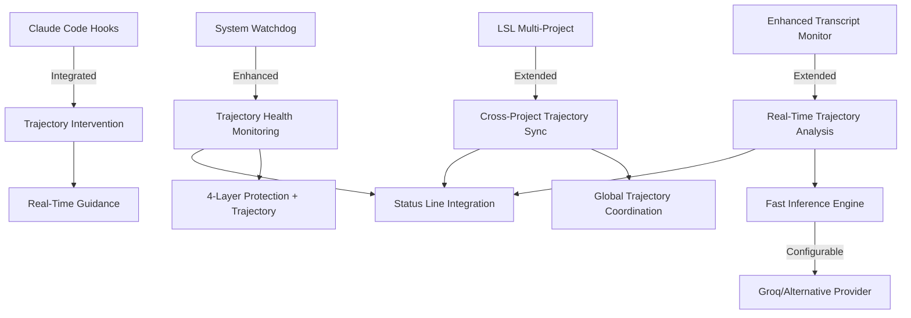
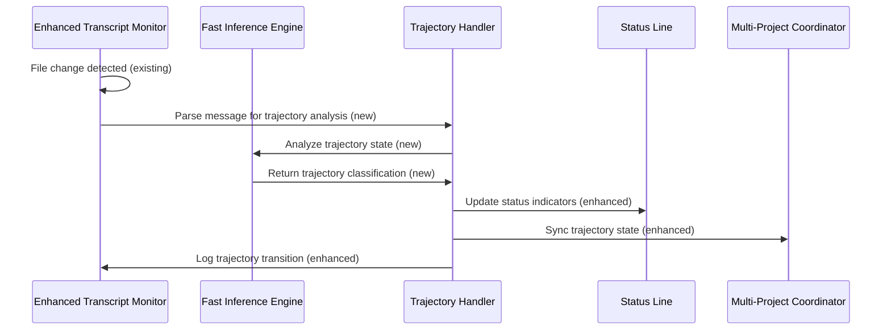

# Design Document: Real-Time Trajectory System

## Overview

Enhancement of the existing trajectory analysis system to provide real-time monitoring, intervention capabilities, and multi-project coordination while leveraging all existing LSL, watchdog, and monitoring infrastructure.

## Steering Document Alignment

### Technical Standards (tech.md)
- Follows existing TypeScript patterns and MCP integration approaches
- Leverages existing environment configuration and monitoring patterns
- Maintains existing file watching and session management architectures

### Project Structure (structure.md)
- Extends existing `.specstory/` structure for trajectory state persistence
- Integrates with existing `scripts/` directory for Enhanced Transcript Monitor extensions
- Utilizes existing health monitoring and watchdog infrastructure

## Code Reuse Analysis

### Existing Components to Leverage
- **Enhanced Transcript Monitor**: Extend with real-time trajectory analysis capabilities
- **LSL Multi-Project Architecture**: Leverage for cross-project trajectory coordination
- **System Monitor Watchdog**: Integrate trajectory health monitoring
- **MCP Semantic Analysis**: Replace batch processing with real-time inference
- **Existing Status Line System**: Add trajectory state indicators

### Integration Points
- **Claude Code Hook System**: Integrate trajectory-based intervention
- **Existing Health Monitoring**: Extend 4-layer protection with trajectory metrics
- **Current Constraint Monitor**: Coordinate with trajectory-based guidance
- **LSL Session Files**: Enhance with real-time trajectory state tracking

## Architecture

The design extends existing components rather than creating new infrastructure:



## Components and Interfaces

### Enhanced Transcript Monitor Extension
- **Purpose:** Add real-time trajectory analysis to existing file monitoring
- **Interfaces:** Extend existing message parsing with trajectory state detection
- **Dependencies:** Existing FSWatcher, session continuity detection
- **Reuses:** Current message parsing, file watching, session management

### Configurable Fast Inference Engine
- **Purpose:** Replace 6-hourly semantic analysis with real-time inference
- **Interfaces:** Environment-configurable provider (default: Groq gpt-oss:20b)
- **Dependencies:** Provider API keys, existing MCP infrastructure
- **Reuses:** Existing MCP semantic analysis patterns, configuration management

### Multi-Project Trajectory Coordinator
- **Purpose:** Extend LSL multi-project architecture for trajectory synchronization
- **Interfaces:** Cross-project trajectory state sharing and conflict resolution
- **Dependencies:** Existing Global Health Monitoring, project registration
- **Reuses:** Current multi-project communication channels, health file formats

### Trajectory Intervention System
- **Purpose:** Integrate with existing Claude Code hooks for trajectory guidance
- **Interfaces:** Real-time intervention prompts and trajectory redirection
- **Dependencies:** Existing hook infrastructure, constraint monitor
- **Reuses:** Current hook registration, intervention mechanisms

## Implementation Strategy

### Phase 1: Core Extension (Week 1)
1. Extend `scripts/enhanced-transcript-monitor.js` with trajectory analysis
2. Configure fast inference engine with environment variables
3. Test real-time trajectory detection with existing file watching

### Phase 2: Multi-Project Integration (Week 2)
1. Extend existing LSL multi-project architecture
2. Implement cross-project trajectory state synchronization
3. Integrate with existing Global Health Monitoring

### Phase 3: Intervention and Monitoring (Week 3)
1. Integrate trajectory analysis with existing Claude Code hooks
2. Extend existing 4-layer watchdog system with trajectory monitoring
3. Test intervention system with existing constraint monitoring

### Phase 4: Status Line and Deprecation (Week 4)
1. Integrate trajectory indicators with existing status line system
2. Enhance existing health monitoring with trajectory metrics
3. Deprecate existing 6-hourly semantic analysis system

## Data Flow

### Real-Time Trajectory Analysis Flow


### Environment Configuration

```bash
# New trajectory-specific settings
TRAJECTORY_INFERENCE_PROVIDER=groq                    # Default: groq
TRAJECTORY_INFERENCE_MODEL=gpt-oss:20b                # Default model
TRAJECTORY_INFERENCE_API_KEY=${GROQ_API_KEY}          # Provider API key
TRAJECTORY_ANALYSIS_INTERVAL=100                      # Real-time interval (ms)

# Enhanced LSL integration
TRAJECTORY_LSL_INTEGRATION=true                       # Enable LSL integration
TRAJECTORY_MULTI_PROJECT=true                         # Multi-project coordination
TRAJECTORY_WATCHDOG_LEVEL=full                        # Watchdog integration depth

# LSL redaction enhancement (NEW REQUIREMENT)
LSL_REDACTION_KEYS="XAI_API_KEY,GROQ_API_KEY,ANTHROPIC_API_KEY,OPENAI_API_KEY,CLAUDE_API_KEY,GEMINI_API_KEY"  # Comprehensive redaction
```

## File Structure Extensions

```bash
# Extend existing .specstory structure
.specstory/
├── history/                           # Existing LSL session files
├── trajectory/                        # Enhanced trajectory tracking (new)
│   ├── live-state.json               # Real-time trajectory state
│   ├── session-transitions.log       # Trajectory phase changes
│   └── cross-project-insights.json   # Multi-project patterns
└── comprehensive-project-trajectory.md # Enhanced with real-time data
```

## Integration with LSL Redaction System

### Enhanced Redaction Requirements
The LSL redaction system must be extended to handle the new GROQ_API_KEY in addition to existing keys:

- **Current**: Redacts XAI_API_KEY, ANTHROPIC_API_KEY  
- **Enhanced**: Add comprehensive API key redaction list
- **Implementation**: Update LSL redaction patterns to include all major AI provider API keys
- **Note**: GROQ_API_KEY ≠ XAI_API_KEY (different providers: Groq vs xAI's Grok)

## Performance Characteristics

| Operation | Target | Integration Point |
|-----------|--------|------------------|
| Trajectory Analysis | 50ms | Fast inference engine |
| Hook Intervention | 5ms | Existing Claude Code hooks |
| Status Line Update | 100ms | Existing status line system |
| Cross-Project Sync | 200ms | LSL multi-project architecture |
| Watchdog Integration | 1s | Existing 4-layer monitoring |

## Migration and Compatibility

### Deprecation Strategy
- **6-hourly semantic analysis**: Replace with continuous real-time monitoring
- **Batch trajectory reports**: Enhance with live state updates
- **Manual trajectory generation**: Supplement with automatic tracking

### Backward Compatibility
- Maintain existing `.specstory/comprehensive-project-trajectory.md` format
- Preserve existing LSL session file formats and naming conventions
- Keep existing multi-project coordination mechanisms
- Maintain existing status line and health monitoring interfaces

## Risk Mitigation

### Technical Risks
- **Fast inference rate limits**: Configure alternative providers via environment
- **Hook system compatibility**: Gradual integration with existing constraint monitor
- **Multi-project state conflicts**: Leverage existing LSL conflict resolution

### Operational Risks
- **Performance impact**: Use existing monitoring to track system resource usage
- **Configuration complexity**: Leverage existing environment configuration patterns
- **User adoption**: Build on familiar existing interfaces and status indicators

## Success Criteria

- Zero disruption to existing LSL and trajectory functionality
- Real-time trajectory analysis with <100ms latency
- Seamless multi-project coordination using existing architecture
- Full integration with existing 4-layer watchdog system
- Enhanced LSL redaction including GROQ_API_KEY
- Successful deprecation of 6-hourly batch analysis system