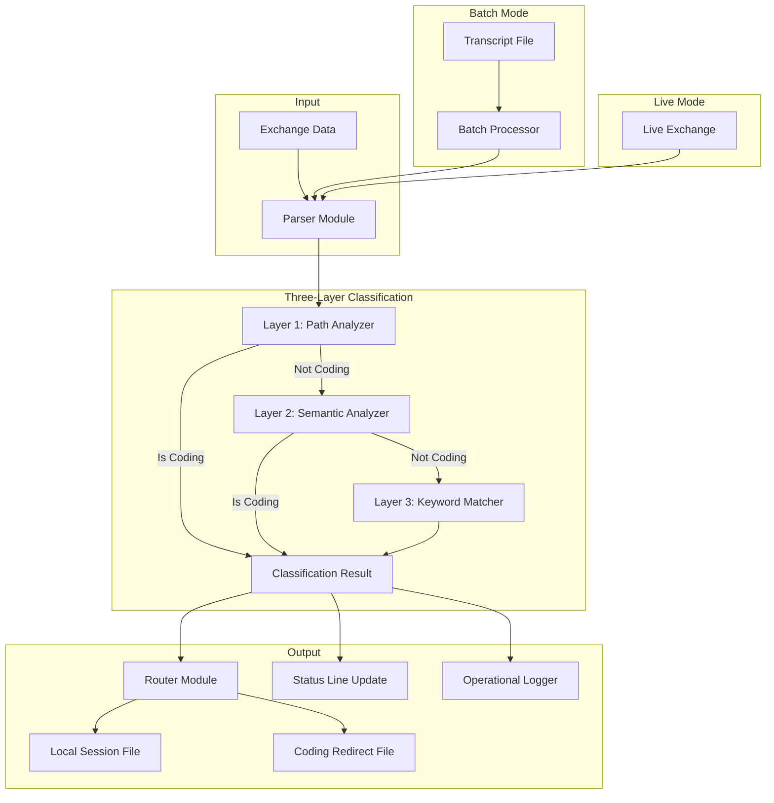

# Design Document

## Overview

The Reliable Coding Classifier is a three-layer classification system that analyzes conversation exchanges in real-time and batch modes to determine if content belongs to the coding infrastructure project. It replaces the failing FastEmbeddingClassifier with a rock-solid, lightning-fast solution that integrates seamlessly with existing Live Session Logging (LSL) infrastructure, leveraging proven components like SemanticAnalyzer.js while providing comprehensive operational logging and status line feedback.

## Steering Document Alignment

### Technical Standards (tech.md)
- Follows modular design principles with single-responsibility components
- Uses environment variables for machine-agnostic deployment
- Integrates with existing semantic analysis infrastructure
- Maintains consistent API patterns across live and batch processing

### Project Structure (structure.md)
- Core classifier logic in `src/live-logging/ReliableCodingClassifier.js`
- Batch processing script in `scripts/retroactive-lsl-generator.js`
- Operational logs in `.specstory/logs/` directory
- Test suites in `test/classifier/` directory

## Code Reuse Analysis

### Existing Components to Leverage
- **SemanticAnalyzer.js**: Core semantic analysis with configurable LLM providers (XAI/Grok, OpenAI)
- **enhanced-transcript-monitor.js**: Exchange parsing and session monitoring (to be modified)
- **generate-proper-lsl-from-transcripts.js**: LSL file generation logic (to be modified)
- **combined-status-line.js**: Status line display integration for "→coding" indicator

### Integration Points
- **Enhanced Transcript Monitor**: Primary integration point - replaces FastEmbeddingClassifier usage in scripts/enhanced-transcript-monitor.js
- **Batch LSL Generator**: Integration with scripts/generate-proper-lsl-from-transcripts.js for retroactive processing
- **MCP Memory Service**: Classification decisions stored for knowledge management
- **Redaction System**: Ensures no secrets leak into operational logs
- **Install.sh**: Environment variables and path configuration

## Architecture

The classifier implements a three-layer waterfall architecture where each layer provides increasingly sophisticated analysis. The same classification engine powers both live and batch processing modes, ensuring consistent results.

### Transcript Monitor Integration

The ReliableCodingClassifier directly replaces the failing FastEmbeddingClassifier in the enhanced-transcript-monitor.js. The integration point is in the `classifyExchange()` method where:

1. **Live Classification**: The transcript monitor calls `reliableCodingClassifier.classify(exchange)` instead of `fastEmbeddingClassifier.classify(exchange)`
2. **Consistent API**: Maintains the same interface as FastEmbeddingClassifier to minimize integration changes
3. **Performance Improvement**: Reduces classification time from current failures to <10ms
4. **Reliability Improvement**: Increases accuracy from 0% (complete failure) to 95%+ target

### Batch LSL Generation Integration

The scripts/generate-proper-lsl-from-transcripts.js will be modified to use the same ReliableCodingClassifier instance, ensuring identical classification logic between live and batch modes. The batch processor will:

1. **Same Engine**: Use identical ReliableCodingClassifier instance as live mode
2. **Consistent Results**: Generate identical LSL files as live processing would produce  
3. **Historical Processing**: Retroactively process existing transcript files with improved classification

### Modular Design Principles
- **Single File Responsibility**: Each module handles one classification layer or support function
- **Component Isolation**: Classification layers are independent and testable
- **Service Layer Separation**: Clear separation between classification logic, logging, and routing
- **Utility Modularity**: Shared utilities for path resolution, keyword management, and logging



## Components and Interfaces

### ReliableCodingClassifier (Core Engine)
- **Purpose:** Central classification engine implementing three-layer analysis; direct replacement for FastEmbeddingClassifier in enhanced-transcript-monitor.js
- **Interfaces:** 
  - `classify(exchange)` - Main classification method (same signature as FastEmbeddingClassifier.classify)
  - `classifyBatch(exchanges)` - Batch processing wrapper for scripts/generate-proper-lsl-from-transcripts.js
  - `getDecisionPath()` - Returns detailed decision trace for debugging
  - `initialize()` - Setup method (same as FastEmbeddingClassifier.initialize)
- **Dependencies:** SemanticAnalyzer, path utilities, keyword dictionary
- **Reuses:** Existing SemanticAnalyzer.js for Layer 2
- **Integration:** Drop-in replacement requiring minimal changes to transcript monitor

### PathAnalyzer (Layer 1)
- **Purpose:** Detects file operations targeting coding project filetree
- **Interfaces:**
  - `analyzePaths(exchange)` - Extracts and analyzes file paths
  - `isCodingPath(path)` - Checks if path belongs to coding project
- **Dependencies:** Environment variables (CODING_REPO)
- **Reuses:** Path resolution utilities from existing codebase

### SemanticAnalyzerAdapter (Layer 2)
- **Purpose:** Adapts existing SemanticAnalyzer.js for classification use
- **Interfaces:**
  - `analyzeSemantics(exchange)` - Performs semantic analysis
  - `getCodingConfidence(result)` - Extracts classification confidence
- **Dependencies:** SemanticAnalyzer.js, API keys (XAI_API_KEY)
- **Reuses:** Complete SemanticAnalyzer.js implementation

### KeywordMatcher (Layer 3)
- **Purpose:** Fast keyword-based fallback classification
- **Interfaces:**
  - `matchKeywords(exchange)` - Performs keyword analysis
  - `loadKeywords()` - Loads curated keyword lists
- **Dependencies:** coding-keywords.json
- **Reuses:** Keyword lists from existing classifier attempts

### ExchangeRouter
- **Purpose:** Routes classified content to appropriate session files
- **Interfaces:**
  - `route(exchange, classification)` - Routes to correct file
  - `getSessionFilePath(timestamp, isRedirect)` - Generates file paths
- **Dependencies:** File system utilities
- **Reuses:** Session file naming logic from existing LSL system

### OperationalLogger
- **Purpose:** Comprehensive logging of all classification decisions
- **Interfaces:**
  - `logDecision(exchange, decision, timing)` - Logs classification
  - `logError(error, context)` - Logs errors with full context
- **Dependencies:** Winston or similar logging library
- **Reuses:** Logging patterns from existing system

### StatusLineIntegrator
- **Purpose:** Updates Claude Code status line with routing indicator
- **Interfaces:**
  - `updateStatus(isRedirecting)` - Updates status line
  - `showIndicator(text)` - Shows "→coding" indicator
- **Dependencies:** combined-status-line.js
- **Reuses:** Entire status line infrastructure

## Data Models

### Exchange
```javascript
{
  id: string,              // Unique exchange identifier
  timestamp: number,       // Unix timestamp
  userMessage: string,     // User's prompt
  assistantResponse: {
    content: string,       // Assistant's text response
    toolCalls: [{          // Tool interactions
      name: string,
      parameters: object,
      result: any
    }]
  },
  metadata: object        // Additional context
}
```

### ClassificationResult
```javascript
{
  isCoding: boolean,       // Final classification
  confidence: number,      // 0-1 confidence score
  layer: string,          // Which layer made decision
  reasoning: string,      // Human-readable explanation
  timing: {
    total: number,        // Total ms
    layers: {
      path: number,       // Layer 1 ms
      semantic: number,   // Layer 2 ms
      keyword: number     // Layer 3 ms
    }
  },
  decisionPath: [{        // Complete decision trace
    layer: string,
    input: any,
    output: any,
    duration: number
  }]
}
```

### OperationalLogEntry
```javascript
{
  timestamp: string,       // ISO 8601 timestamp
  exchangeId: string,      // Exchange being classified
  classification: object,  // ClassificationResult
  environment: {
    mode: string,         // 'live' or 'batch'
    project: string,      // Current project path
    codingRepo: string    // Coding project path
  },
  error: object          // Error details if failed
}
```

## Integration Strategy

### Enhanced Transcript Monitor Integration

The ReliableCodingClassifier integrates with enhanced-transcript-monitor.js by replacing the failing FastEmbeddingClassifier:

**Current Integration Point (Line ~154):**
```javascript
this.embeddingClassifier = new FastEmbeddingClassifier({
  cacheDir: path.join(this.config.projectPath, '.specstory', '.embedding-cache')
});
```

**New Integration:**
```javascript
this.reliableCodingClassifier = new ReliableCodingClassifier({
  projectPath: this.config.projectPath,
  codingRepo: process.env.CODING_TOOLS_PATH || '/Users/q284340/Agentic/coding'
});
```

**Classification Method (Line ~541):**
- **Old:** `await this.embeddingClassifier.classify(embeddingExchange, options)`
- **New:** `await this.reliableCodingClassifier.classify(exchange, options)`

### Batch LSL Generation Integration

The scripts/generate-proper-lsl-from-transcripts.js imports the enhanced-transcript-monitor for consistent classification. The ReliableCodingClassifier will be used transparently through this existing integration, ensuring identical results.

## Error Handling

### Error Scenarios

1. **Semantic API Timeout/Failure**
   - **Handling:** Fall through to keyword layer (Layer 3)
   - **User Impact:** Slightly reduced accuracy, no visible impact
   - **Logging:** Full API error logged to operational logs

2. **Malformed Exchange Data**
   - **Handling:** Graceful degradation, classify as non-coding
   - **User Impact:** Exchange stays in local project (safe default)
   - **Logging:** Malformed data logged for analysis

3. **File System Errors**
   - **Handling:** Retry with exponential backoff, queue if persistent
   - **User Impact:** Delayed logging, but no data loss
   - **Logging:** Full filesystem error with recovery attempts

4. **Missing Environment Variables**
   - **Handling:** Use fallback defaults from install.sh
   - **User Impact:** Warning on startup, continues with defaults
   - **Logging:** Configuration issues logged at startup

## Testing Strategy

### Unit Testing
- **Approach:** Jest-based unit tests for each layer and component
- **Key Components:**
  - PathAnalyzer with various path formats
  - SemanticAnalyzerAdapter with mocked API responses
  - KeywordMatcher with known positive/negative cases
  - ExchangeRouter with different classification results

### Integration Testing
- **Approach:** End-to-end classification with real exchanges
- **Key Flows:**
  - statusLine exchange (known failure case)
  - Mixed content exchanges
  - API timeout scenarios
  - Batch vs live consistency

### End-to-End Testing
- **Approach:** Full system test with live and batch modes
- **User Scenarios:**
  - Live session with coding infrastructure discussions
  - Retroactive batch processing of existing transcripts
  - Status line updates during classification
  - Operational log analysis after errors

### Validation Testing
- **Historical Transcripts:** Process all existing sessions in `.specstory/history/`
- **Accuracy Metrics:** Measure against manually classified ground truth
- **Performance Benchmarks:** Ensure <10ms classification time
- **Consistency Verification:** Compare live vs batch results