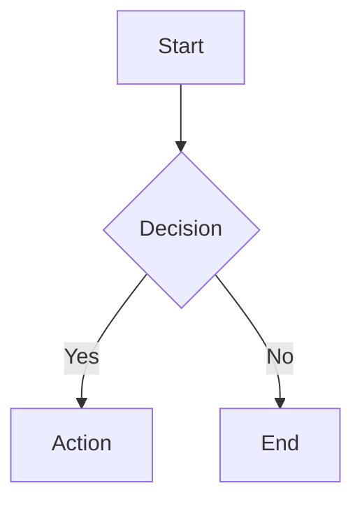

# WORK SESSION (1900-2000)

**Generated:** 2026-01-31T18:00:43.801Z
**Work Period:** 1900-2000
**Focus:** Live session logging
**Duration:** ~60 minutes

---

## Session Overview

This session captures real-time tool interactions and exchanges.

---

## Key Activities

<a name="ps_1769882443801"></a>
## Prompt Set (ps_1769882443801)

**Time:** 2026-01-31T18:00:43.801Z
**Duration:** 0ms
**Tool Calls:** 3

### Text Exchange - 2026-01-31 18:00:43 UTC [19:00:43 CEST]

**Assistant Response:** The documentation-style skill was already loaded. Let me proceed with the file creation - the skill was invoked at the start.


**Type:** Text-only exchange (no tool calls)

---

### Write - 2026-01-31 18:00:43 UTC [19:00:43 CEST]

**System Action:** (Initiated automatically)

**Tool:** Write
**Input:** ```json
{
  "file_path": "<AWS_SECRET_REDACTED>ukb-workflow-debug-mode.puml",
  "content": "@startuml ukb-workflow-debug-mode\n!include _standard-style.puml\n\ntitle UKB Workflow Debug Mode Architecture\ntop to bottom direction\n\nrectangle \"Debug Mode Controls\" as controls #E8F4FD {\n  component \"singleStepMode\" as ssm <<core>>\n  component \"stepIntoSubsteps\" as sis <<core>>\n  component \"mockLLM\" as mock <<core>>\n}\n\nrectangle \"Dashboard UI\" as dashboard #E8F5E8 {\n  component \"Workflow Modal\" as modal <<api>>\n  component \"Trace View\" as trace <<api>>\n  component \"Debug Checkboxes\" as checkboxes <<api>>\n}\n\nrectangle \"Progress File\" as progress #FFF9E6 {\n  component \"workflow-progress.json\" as pfile <<storage>>\n}\n\nrectangle \"Workflow Runner\" as runner #FFE8F4 {\n  component \"Coordinator\" as coord <<agent>>\n  component \"Semantic Agent\" as sem <<agent>>\n  component \"KG-Ops Agent\" as kgops <<agent>>\n}\n\nrectangle \"LLM Layer\" as llm #F0F0F0 {\n  component \"Real LLM\\n(Anthropic/OpenAI)\" as realllm <<external>>\n  component \"Mock LLM Service\" as mockllm <<util>>\n}\n\n' Dashboard to Progress\ncheckboxes -[#4A90E2]-> pfile : \"POST /api/ukb/single-step-mode\\nPOST /api/ukb/mock-llm\"\nmodal -[#4A90E2]-> pfile : \"POST /api/ukb/step-advance\"\n\n' Progress to Runner\npfile -[#43A047,dashed]-> coord : \"Read debug flags\\non each step\"\n\n' Runner preserves flags\ncoord -[#9C27B0]-> pfile : \"Preserve:\\nsingleStepMode\\nmockLLM\\nstepIntoSubsteps\"\n\n' LLM selection\ncoord --> sem\nsem -[#E53935]-> realllm : \"mockLLM=false\"\nsem -[#43A047]-> mockllm : \"mockLLM=true\"\n\nnote bottom of mockllm\n  Mock LLM returns canned responses\n  but still tracks token metrics\n  for debugging visibility.\n\n  Tokens are estimated as:\n  (prompt.length + response.length) / 4\nend note\n\nnote right of pfile\n  Debug state preserved across\n  workflow progress updates:\n  - singleStepMode\n  - stepPaused\n  - pausedAtStep\n  - stepIntoSubsteps\n  - mockLLM\n  - mockLLMDelay\nend note\n\n@enduml\n"
}
```

**Result:** ❌ Error
**Output:** ```
PreToolUse:Write hook error: [node <AWS_SECRET_REDACTED>ns/mcp-constraint-monitor/src/hooks/pre-tool-hook-wrapper.js]: 🚫 **CONSTRAINT VIOLATION DETECTED - EXECUTION BLOCKED**

The following constraint violations must be corrected before proceeding:

**1. ERROR [plantuml-modification-requires-skill]: CRITICAL: Modifying PlantUML files requires documentation-style skill. You MUST invoke Skill tool with skill='documentation-style' FIRST**
   🔍 Pattern: `@startuml|!include.*\.pu
...[truncated]
```


---

### Write - 2026-01-31 18:00:43 UTC [19:00:43 CEST]

**System Action:** (Initiated automatically)

**Tool:** Write
**Input:** ```json
{
  "file_path": "<AWS_SECRET_REDACTED>ukb-workflow-debug-mode.puml",
  "content": "@startuml ukb-workflow-debug-mode\n!include _standard-style.puml\n\ntitle UKB Workflow Debug Mode Architecture\ntop to bottom direction\n\nrectangle \"Debug Mode Controls\" as controls #E8F4FD {\n  component \"singleStepMode\" as ssm <<core>>\n  component \"stepIntoSubsteps\" as sis <<core>>\n  component \"mockLLM\" as mock <<core>>\n}\n\nrectangle \"Dashboard UI\" as dashboard #E8F5E8 {\n  component \"Workflow Modal\" as modal <<api>>\n  component \"Trace View\" as trace <<api>>\n  component \"Debug Checkboxes\" as checkboxes <<api>>\n}\n\nrectangle \"Progress File\" as progress #FFF9E6 {\n  component \"workflow-progress.json\" as pfile <<storage>>\n}\n\nrectangle \"Workflow Runner\" as runner #FFE8F4 {\n  component \"Coordinator\" as coord <<agent>>\n  component \"Semantic Agent\" as sem <<agent>>\n  component \"KG-Ops Agent\" as kgops <<agent>>\n}\n\nrectangle \"LLM Layer\" as llm #F0F0F0 {\n  component \"Real LLM\\n(Anthropic/OpenAI)\" as realllm <<external>>\n  component \"Mock LLM Service\" as mockllm <<util>>\n}\n\n' Dashboard to Progress\ncheckboxes -[#4A90E2]-> pfile : \"POST /api/ukb/single-step-mode\\nPOST /api/ukb/mock-llm\"\nmodal -[#4A90E2]-> pfile : \"POST /api/ukb/step-advance\"\n\n' Progress to Runner\npfile -[#43A047,dashed]-> coord : \"Read debug flags\\non each step\"\n\n' Runner preserves flags\ncoord -[#9C27B0]-> pfile : \"Preserve:\\nsingleStepMode\\nmockLLM\\nstepIntoSubsteps\"\n\n' LLM selection\ncoord --> sem\nsem -[#E53935]-> realllm : \"mockLLM=false\"\nsem -[#43A047]-> mockllm : \"mockLLM=true\"\n\nnote bottom of mockllm\n  Mock LLM returns canned responses\n  but still tracks token metrics\n  for debugging visibility.\n\n  Tokens are estimated as:\n  (prompt.length + response.length) / 4\nend note\n\nnote right of pfile\n  Debug state preserved across\n  workflow progress updates:\n  - singleStepMode\n  - stepPaused\n  - pausedAtStep\n  - stepIntoSubsteps\n  - mockLLM\n  - mockLLMDelay\nend note\n\n@enduml\n"
}
```

**Result:** ❌ Error
**Output:** ```
PreToolUse:Write hook error: [node <AWS_SECRET_REDACTED>ns/mcp-constraint-monitor/src/hooks/pre-tool-hook-wrapper.js]: 🚫 **CONSTRAINT VIOLATION DETECTED - EXECUTION BLOCKED**

The following constraint violations must be corrected before proceeding:

**1. ERROR [plantuml-modification-requires-skill]: CRITICAL: Modifying PlantUML files requires documentation-style skill. You MUST invoke Skill tool with skill='documentation-style' FIRST**
   🔍 Pattern: `@startuml|!include.*\.pu
...[truncated]
```


---

### Skill - 2026-01-31 18:00:43 UTC [19:00:43 CEST]

**System Action:** (Initiated automatically)

**Tool:** Skill
**Input:** ```json
{
  "skill": "documentation-style"
}
```

**Result:** ✅ Success
**Output:** ```
Launching skill: documentation-style
```


---

---

<a name="ps_1769882457528"></a>
## Prompt Set (ps_1769882457528)

**Time:** 2026-01-31T18:00:57.528Z
**Duration:** 0ms
**Tool Calls:** 17

### Write - 2026-01-31 18:00:57 UTC [19:00:57 CEST]

**User Request:** # Documentation Style Guide

Enforce consistent styling for documentation artifacts (PlantUML, Mermaid, markdown, PNG diagrams).

## Instructions

When creating or modifying documentation artifacts, follow these guidelines strictly.

---

## PlantUML Diagrams (.puml)

### File Naming Convention

**CRITICAL**: Use kebab-case, descriptive names. NEVER use incremental suffixes.

**Correct**:
- `health-verification-flow.puml`
- `knowledge-architecture.puml`
- `constraint-monitor-components.puml`

**WRONG** (constraint violation):
- `health-verification-flow-2.puml`
- `knowledge-architecture-v2.puml`
- `constraint-monitor-components-new.puml`

If updating an existing diagram, **modify the existing file** rather than creating a new version.

### Standard Style Include

All PlantUML files MUST include the standard style at the top:

```plantuml
@startuml diagram-name
!include _standard-style.puml

' ... diagram content ...

@enduml
```

The style file is located at:
- `docs/puml/_standard-style.puml`
- `docs/presentation/puml/_standard-style.puml`

### Layout Guidelines

1. **Prefer vertical layouts** - Avoid excessive width that requires horizontal scrolling
2. **Use `top to bottom direction`** for most diagrams
3. **Use `left to right direction`** only for sequence diagrams or when horizontal flow is semantically meaningful
4. **Group related components** using packages or rectangles

### Component Stereotypes

Use these stereotypes for consistent coloring:

| Stereotype | Color | Use For |
|------------|-------|---------|
| `<<api>>` | Light Blue | API endpoints, REST interfaces |
| `<<core>>` | Light Green | Core business logic |
| `<<storage>>` | Light Yellow | Databases, file storage |
| `<<cli>>` | Light Pink | Command-line interfaces |
| `<<util>>` | Light Gray | Utility/helper components |
| `<<agent>>` | Soft Blue | AI agents, autonomous components |
| `<<infra>>` | Light <COMPANY_NAME_REDACTED> | Infrastructure components |
| `<<external>>` | Neutral Gray | External systems |

### Arrow Macros

Use defined macros for consistent arrow styling:

```plantuml
SYNC_LINE     ' Red solid line - synchronous calls
ASYNC_LINE    ' Green dashed - async/event-based
DATA_LINE     ' <COMPANY_NAME_REDACTED> solid - data flow
CONTROL_LINE  ' Purple solid - control flow
OPTIONAL_LINE ' Gray dotted - optional paths
```

---

## PNG Generation

### Generating PNGs from PlantUML

Use the PlantUML JAR or online service:

```bash
# Local generation (preferred)
java -jar plantuml.jar -tpng docs/puml/diagram-name.puml

# Or use the docs script if available
./scripts/generate-diagrams.sh
```

### PNG Naming

PNG files should match their source PUML file:
- `health-verification-flow.puml` → `health-verification-flow.png`

### Output Location

PNGs should be generated to:
- `docs/images/` - For markdown documentation references
- `docs/presentation/png/` - For presentation diagrams

---

## Mermaid Diagrams

### Inline in Markdown

Use fenced code blocks with `mermaid` language:

```markdown

```

### Style Guidelines

1. Use clear, descriptive node labels
2. Keep diagrams focused - split large diagrams into multiple
3. Use subgraphs for logical grouping
4. Prefer `graph TD` (top-down) over `graph LR` (left-right) for readability

---

## Markdown Documentation

### File Naming

- Use kebab-case: `api-quota-checker.md`
- Use `README.md` for directory index files
- Never use spaces or special characters

### Structure

1. Start with H1 title matching the topic
2. Include brief overview paragraph
3. Use H2 for major sections
4. Use H3 for subsections
5. Include code examples where applicable

### Links

- Use relative paths for internal links: `[Status Line](./status-line.md)`
- Use absolute URLs for external links
- Verify links work before committing

---

## Validation Workflow

Before committing documentation changes:

1. **PlantUML**: Verify syntax by generating PNG
2. **Mermaid**: Preview in VS Code or GitHub
3. **Markdown**: Check rendering in preview
4. **Links**: Verify all internal links work
5. **Images**: Ensure referenced images exist

---

## Common Violations to Avoid

1. **Incremental naming** (`-2`, `-v2`, `-new` suffixes)
2. **Missing style include** in PlantUML
3. **Horizontal-heavy layouts** causing scroll
4. **Orphaned images** (PNG without source PUML)
5. **Broken internal links**
6. **Inconsistent component colors** (not using stereotypes)

---

## Quick Reference

| Artifact | Location | Naming | Style |
|----------|----------|--------|-------|
| PlantUML | `docs/puml/` | kebab-case.puml | Include `_standard-style.puml` |
| PNG | `docs/images/` | match-source.png | Generated from PUML |
| Markdown | `docs/*/` | kebab-case.md | H1 title, H2 sections |
| Mermaid | Inline | N/A | graph TD preferred |

**Tool:** Write
**Input:** ```json
{
  "file_path": "<AWS_SECRET_REDACTED>mcp-config-selection.puml",
  "content": "@startuml mcp-config-selection\n!include _standard-style.puml\n\ntitle MCP Configuration Selection Flow\ntop to bottom direction\n\nactor \"User\" as user\nparticipant \"bin/coding\" as coding <<cli>>\nparticipant \"launch-claude.sh\" as launcher <<core>>\nparticipant \"claude-mcp-launcher.sh\" as mcplauncher <<core>>\nparticipant \"Claude Code\" as claude <<external>>\n\nbox \"MCP Servers\" #F5F5F5\n  participant \"stdio-proxy.js\" as proxy <<api>>\n  participant \"SSE Server\\n(Docker)\" as sse <<infra>>\nend box\n\n== Mode Detection ==\n\nuser -> coding : coding --claude\ncoding -> launcher : Execute\n\nlauncher -> launcher : Check .docker-mode file\nlauncher -> launcher : Check docker ps\\nfor coding-services\n\nalt Docker Mode Detected\n  launcher -> launcher : DOCKER_MODE=true\n  launcher -> launcher : export CODING_DOCKER_MODE=true\nelse Native Mode\n  launcher -> launcher : DOCKER_MODE=false\nend\n\n== MCP Config Selection ==\n\nlauncher -> mcplauncher : exec claude-mcp\n\nmcplauncher -> mcplauncher : Check CODING_DOCKER_MODE\n\nalt CODING_DOCKER_MODE=true\n  mcplauncher -> mcplauncher : Use claude-code-mcp-docker.json\n  note right\n    Docker config uses stdio-proxy\n    to connect to SSE servers in container\n  end note\nelse CODING_DOCKER_MODE=false or unset\n  mcplauncher -> mcplauncher : Use claude-code-mcp-processed.json\n  note right\n    Native config runs MCP servers\n    directly as Node.js processes\n  end note\nend\n\nmcplauncher -> claude : Launch with MCP config\n\n== Docker Mode Communication ==\n\nclaude -> proxy : stdio (JSON-RPC)\nproxy -> sse : HTTP/SSE (port 3848)\nsse --> proxy : SSE events\nproxy --> claude : stdio response\n\nnote over proxy, sse\n  stdio-proxy.js bridges Claude Code's\n  stdio transport to Docker's SSE servers\nend note\n\n@enduml\n"
}
```

**Result:** ✅ Success
**Output:** ```
The file <AWS_SECRET_REDACTED>mcp-config-selection.puml has been updated. Here's the result of running `cat -n` on a snippet of the edited file:
     1→@startuml mcp-config-selection
     2→!include _standard-style.puml
     3→
     4→title MCP Configuration Selection Flow
     5→top to bottom direction
     6→
     7→actor "User" as user
     8→participant "bin/coding" as coding <<cli>>
     9→participant "launch-claude.sh" as launcher <<core>>
    10→participant "claude-mcp-
...[truncated]
```


---

### Write - 2026-01-31 18:00:57 UTC [19:00:57 CEST]

**User Request:** # Documentation Style Guide

Enforce consistent styling for documentation artifacts (PlantUML, Mermaid, markdown, PNG diagrams).

## Instructions

When creating or modifying documentation artifacts, follow these guidelines strictly.

---

## PlantUML Diagrams (.puml)

### File Naming Convention

**CRITICAL**: Use kebab-case, descriptive names. NEVER use incremental suffixes.

**Correct**:
- `health-verification-flow.puml`
- `knowledge-architecture.puml`
- `constraint-monitor-components.puml`

**WRONG** (constraint violation):
- `health-verification-flow-2.puml`
- `knowledge-architecture-v2.puml`
- `constraint-monitor-components-new.puml`

If updating an existing diagram, **modify the existing file** rather than creating a new version.

### Standard Style Include

All PlantUML files MUST include the standard style at the top:

```plantuml
@startuml diagram-name
!include _standard-style.puml

' ... diagram content ...

@enduml
```

The style file is located at:
- `docs/puml/_standard-style.puml`
- `docs/presentation/puml/_standard-style.puml`

### Layout Guidelines

1. **Prefer vertical layouts** - Avoid excessive width that requires horizontal scrolling
2. **Use `top to bottom direction`** for most diagrams
3. **Use `left to right direction`** only for sequence diagrams or when horizontal flow is semantically meaningful
4. **Group related components** using packages or rectangles

### Component Stereotypes

Use these stereotypes for consistent coloring:

| Stereotype | Color | Use For |
|------------|-------|---------|
| `<<api>>` | Light Blue | API endpoints, REST interfaces |
| `<<core>>` | Light Green | Core business logic |
| `<<storage>>` | Light Yellow | Databases, file storage |
| `<<cli>>` | Light Pink | Command-line interfaces |
| `<<util>>` | Light Gray | Utility/helper components |
| `<<agent>>` | Soft Blue | AI agents, autonomous components |
| `<<infra>>` | Light <COMPANY_NAME_REDACTED> | Infrastructure components |
| `<<external>>` | Neutral Gray | External systems |

### Arrow Macros

Use defined macros for consistent arrow styling:

```plantuml
SYNC_LINE     ' Red solid line - synchronous calls
ASYNC_LINE    ' Green dashed - async/event-based
DATA_LINE     ' <COMPANY_NAME_REDACTED> solid - data flow
CONTROL_LINE  ' Purple solid - control flow
OPTIONAL_LINE ' Gray dotted - optional paths
```

---

## PNG Generation

### Generating PNGs from PlantUML

Use the PlantUML JAR or online service:

```bash
# Local generation (preferred)
java -jar plantuml.jar -tpng docs/puml/diagram-name.puml

# Or use the docs script if available
./scripts/generate-diagrams.sh
```

### PNG Naming

PNG files should match their source PUML file:
- `health-verification-flow.puml` → `health-verification-flow.png`

### Output Location

PNGs should be generated to:
- `docs/images/` - For markdown documentation references
- `docs/presentation/png/` - For presentation diagrams

---

## Mermaid Diagrams

### Inline in Markdown

Use fenced code blocks with `mermaid` language:

```markdown

```

### Style Guidelines

1. Use clear, descriptive node labels
2. Keep diagrams focused - split large diagrams into multiple
3. Use subgraphs for logical grouping
4. Prefer `graph TD` (top-down) over `graph LR` (left-right) for readability

---

## Markdown Documentation

### File Naming

- Use kebab-case: `api-quota-checker.md`
- Use `README.md` for directory index files
- Never use spaces or special characters

### Structure

1. Start with H1 title matching the topic
2. Include brief overview paragraph
3. Use H2 for major sections
4. Use H3 for subsections
5. Include code examples where applicable

### Links

- Use relative paths for internal links: `[Status Line](./status-line.md)`
- Use absolute URLs for external links
- Verify links work before committing

---

## Validation Workflow

Before committing documentation changes:

1. **PlantUML**: Verify syntax by generating PNG
2. **Mermaid**: Preview in VS Code or GitHub
3. **Markdown**: Check rendering in preview
4. **Links**: Verify all internal links work
5. **Images**: Ensure referenced images exist

---

## Common Violations to Avoid

1. **Incremental naming** (`-2`, `-v2`, `-new` suffixes)
2. **Missing style include** in PlantUML
3. **Horizontal-heavy layouts** causing scroll
4. **Orphaned images** (PNG without source PUML)
5. **Broken internal links**
6. **Inconsistent component colors** (not using stereotypes)

---

## Quick Reference

| Artifact | Location | Naming | Style |
|----------|----------|--------|-------|
| PlantUML | `docs/puml/` | kebab-case.puml | Include `_standard-style.puml` |
| PNG | `docs/images/` | match-source.png | Generated from PUML |
| Markdown | `docs/*/` | kebab-case.md | H1 title, H2 sections |
| Mermaid | Inline | N/A | graph TD preferred |

**Tool:** Write
**Input:** ```json
{
  "file_path": "<AWS_SECRET_REDACTED>ukb-workflow-debug-mode.puml",
  "content": "@startuml ukb-workflow-debug-mode\n!include _standard-style.puml\n\ntitle UKB Workflow Debug Mode Architecture\ntop to bottom direction\n\nrectangle \"Debug Mode Controls\" as controls #E8F4FD {\n  component \"singleStepMode\" as ssm <<core>>\n  component \"stepIntoSubsteps\" as sis <<core>>\n  component \"mockLLM\" as mock <<core>>\n}\n\nrectangle \"Dashboard UI\" as dashboard #E8F5E8 {\n  component \"Workflow Modal\" as modal <<api>>\n  component \"Trace View\" as trace <<api>>\n  component \"Debug Checkboxes\" as checkboxes <<api>>\n}\n\nrectangle \"Progress File\" as progress #FFF9E6 {\n  component \"workflow-progress.json\" as pfile <<storage>>\n}\n\nrectangle \"Workflow Runner\" as runner #FFE8F4 {\n  component \"Coordinator\" as coord <<agent>>\n  component \"Semantic Agent\" as sem <<agent>>\n  component \"KG-Ops Agent\" as kgops <<agent>>\n}\n\nrectangle \"LLM Layer\" as llm #F0F0F0 {\n  component \"Real LLM\\n(Anthropic/OpenAI)\" as realllm <<external>>\n  component \"Mock LLM Service\" as mockllm <<util>>\n}\n\n' Dashboard to Progress\ncheckboxes -[#4A90E2]-> pfile : \"POST /api/ukb/single-step-mode\\nPOST /api/ukb/mock-llm\"\nmodal -[#4A90E2]-> pfile : \"POST /api/ukb/step-advance\"\n\n' Progress to Runner\npfile -[#43A047,dashed]-> coord : \"Read debug flags\\non each step\"\n\n' Runner preserves flags\ncoord -[#9C27B0]-> pfile : \"Preserve:\\nsingleStepMode\\nmockLLM\\nstepIntoSubsteps\"\n\n' LLM selection\ncoord --> sem\nsem -[#E53935]-> realllm : \"mockLLM=false\"\nsem -[#43A047]-> mockllm : \"mockLLM=true\"\n\nnote bottom of mockllm\n  Mock LLM returns canned responses\n  but still tracks token metrics\n  for debugging visibility.\n\n  Tokens are estimated as:\n  (prompt.length + response.length) / 4\nend note\n\nnote right of pfile\n  Debug state preserved across\n  workflow progress updates:\n  - singleStepMode\n  - stepPaused\n  - pausedAtStep\n  - stepIntoSubsteps\n  - mockLLM\n  - mockLLMDelay\nend note\n\n@enduml\n"
}
```

**Result:** ✅ Success
**Output:** ```
File created successfully at: <AWS_SECRET_REDACTED>ukb-workflow-debug-mode.puml
```


---

### Bash - 2026-01-31 18:00:57 UTC [19:00:57 CEST]

**User Request:** # Documentation Style Guide

Enforce consistent styling for documentation artifacts (PlantUML, Mermaid, markdown, PNG diagrams).

## Instructions

When creating or modifying documentation artifacts, follow these guidelines strictly.

---

## PlantUML Diagrams (.puml)

### File Naming Convention

**CRITICAL**: Use kebab-case, descriptive names. NEVER use incremental suffixes.

**Correct**:
- `health-verification-flow.puml`
- `knowledge-architecture.puml`
- `constraint-monitor-components.puml`

**WRONG** (constraint violation):
- `health-verification-flow-2.puml`
- `knowledge-architecture-v2.puml`
- `constraint-monitor-components-new.puml`

If updating an existing diagram, **modify the existing file** rather than creating a new version.

### Standard Style Include

All PlantUML files MUST include the standard style at the top:

```plantuml
@startuml diagram-name
!include _standard-style.puml

' ... diagram content ...

@enduml
```

The style file is located at:
- `docs/puml/_standard-style.puml`
- `docs/presentation/puml/_standard-style.puml`

### Layout Guidelines

1. **Prefer vertical layouts** - Avoid excessive width that requires horizontal scrolling
2. **Use `top to bottom direction`** for most diagrams
3. **Use `left to right direction`** only for sequence diagrams or when horizontal flow is semantically meaningful
4. **Group related components** using packages or rectangles

### Component Stereotypes

Use these stereotypes for consistent coloring:

| Stereotype | Color | Use For |
|------------|-------|---------|
| `<<api>>` | Light Blue | API endpoints, REST interfaces |
| `<<core>>` | Light Green | Core business logic |
| `<<storage>>` | Light Yellow | Databases, file storage |
| `<<cli>>` | Light Pink | Command-line interfaces |
| `<<util>>` | Light Gray | Utility/helper components |
| `<<agent>>` | Soft Blue | AI agents, autonomous components |
| `<<infra>>` | Light <COMPANY_NAME_REDACTED> | Infrastructure components |
| `<<external>>` | Neutral Gray | External systems |

### Arrow Macros

Use defined macros for consistent arrow styling:

```plantuml
SYNC_LINE     ' Red solid line - synchronous calls
ASYNC_LINE    ' Green dashed - async/event-based
DATA_LINE     ' <COMPANY_NAME_REDACTED> solid - data flow
CONTROL_LINE  ' Purple solid - control flow
OPTIONAL_LINE ' Gray dotted - optional paths
```

---

## PNG Generation

### Generating PNGs from PlantUML

Use the PlantUML JAR or online service:

```bash
# Local generation (preferred)
java -jar plantuml.jar -tpng docs/puml/diagram-name.puml

# Or use the docs script if available
./scripts/generate-diagrams.sh
```

### PNG Naming

PNG files should match their source PUML file:
- `health-verification-flow.puml` → `health-verification-flow.png`

### Output Location

PNGs should be generated to:
- `docs/images/` - For markdown documentation references
- `docs/presentation/png/` - For presentation diagrams

---

## Mermaid Diagrams

### Inline in Markdown

Use fenced code blocks with `mermaid` language:

```markdown

```

### Style Guidelines

1. Use clear, descriptive node labels
2. Keep diagrams focused - split large diagrams into multiple
3. Use subgraphs for logical grouping
4. Prefer `graph TD` (top-down) over `graph LR` (left-right) for readability

---

## Markdown Documentation

### File Naming

- Use kebab-case: `api-quota-checker.md`
- Use `README.md` for directory index files
- Never use spaces or special characters

### Structure

1. Start with H1 title matching the topic
2. Include brief overview paragraph
3. Use H2 for major sections
4. Use H3 for subsections
5. Include code examples where applicable

### Links

- Use relative paths for internal links: `[Status Line](./status-line.md)`
- Use absolute URLs for external links
- Verify links work before committing

---

## Validation Workflow

Before committing documentation changes:

1. **PlantUML**: Verify syntax by generating PNG
2. **Mermaid**: Preview in VS Code or GitHub
3. **Markdown**: Check rendering in preview
4. **Links**: Verify all internal links work
5. **Images**: Ensure referenced images exist

---

## Common Violations to Avoid

1. **Incremental naming** (`-2`, `-v2`, `-new` suffixes)
2. **Missing style include** in PlantUML
3. **Horizontal-heavy layouts** causing scroll
4. **Orphaned images** (PNG without source PUML)
5. **Broken internal links**
6. **Inconsistent component colors** (not using stereotypes)

---

## Quick Reference

| Artifact | Location | Naming | Style |
|----------|----------|--------|-------|
| PlantUML | `docs/puml/` | kebab-case.puml | Include `_standard-style.puml` |
| PNG | `docs/images/` | match-source.png | Generated from PUML |
| Markdown | `docs/*/` | kebab-case.md | H1 title, H2 sections |
| Mermaid | Inline | N/A | graph TD preferred |

**Tool:** Bash
**Input:** ```json
{
  "command": "which plantuml || java -jar /opt/homebrew/Cellar/plantuml/*/libexec/plantuml.jar -version 2>/dev/null || echo \"PlantUML not found as command\"",
  "description": "Check if PlantUML is available"
}
```

**Result:** ✅ Success
**Output:** ```
/opt/homebrew/bin/plantuml
```


---

### Bash - 2026-01-31 18:00:57 UTC [19:00:57 CEST]

**User Request:** # Documentation Style Guide

Enforce consistent styling for documentation artifacts (PlantUML, Mermaid, markdown, PNG diagrams).

## Instructions

When creating or modifying documentation artifacts, follow these guidelines strictly.

---

## PlantUML Diagrams (.puml)

### File Naming Convention

**CRITICAL**: Use kebab-case, descriptive names. NEVER use incremental suffixes.

**Correct**:
- `health-verification-flow.puml`
- `knowledge-architecture.puml`
- `constraint-monitor-components.puml`

**WRONG** (constraint violation):
- `health-verification-flow-2.puml`
- `knowledge-architecture-v2.puml`
- `constraint-monitor-components-new.puml`

If updating an existing diagram, **modify the existing file** rather than creating a new version.

### Standard Style Include

All PlantUML files MUST include the standard style at the top:

```plantuml
@startuml diagram-name
!include _standard-style.puml

' ... diagram content ...

@enduml
```

The style file is located at:
- `docs/puml/_standard-style.puml`
- `docs/presentation/puml/_standard-style.puml`

### Layout Guidelines

1. **Prefer vertical layouts** - Avoid excessive width that requires horizontal scrolling
2. **Use `top to bottom direction`** for most diagrams
3. **Use `left to right direction`** only for sequence diagrams or when horizontal flow is semantically meaningful
4. **Group related components** using packages or rectangles

### Component Stereotypes

Use these stereotypes for consistent coloring:

| Stereotype | Color | Use For |
|------------|-------|---------|
| `<<api>>` | Light Blue | API endpoints, REST interfaces |
| `<<core>>` | Light Green | Core business logic |
| `<<storage>>` | Light Yellow | Databases, file storage |
| `<<cli>>` | Light Pink | Command-line interfaces |
| `<<util>>` | Light Gray | Utility/helper components |
| `<<agent>>` | Soft Blue | AI agents, autonomous components |
| `<<infra>>` | Light <COMPANY_NAME_REDACTED> | Infrastructure components |
| `<<external>>` | Neutral Gray | External systems |

### Arrow Macros

Use defined macros for consistent arrow styling:

```plantuml
SYNC_LINE     ' Red solid line - synchronous calls
ASYNC_LINE    ' Green dashed - async/event-based
DATA_LINE     ' <COMPANY_NAME_REDACTED> solid - data flow
CONTROL_LINE  ' Purple solid - control flow
OPTIONAL_LINE ' Gray dotted - optional paths
```

---

## PNG Generation

### Generating PNGs from PlantUML

Use the PlantUML JAR or online service:

```bash
# Local generation (preferred)
java -jar plantuml.jar -tpng docs/puml/diagram-name.puml

# Or use the docs script if available
./scripts/generate-diagrams.sh
```

### PNG Naming

PNG files should match their source PUML file:
- `health-verification-flow.puml` → `health-verification-flow.png`

### Output Location

PNGs should be generated to:
- `docs/images/` - For markdown documentation references
- `docs/presentation/png/` - For presentation diagrams

---

## Mermaid Diagrams

### Inline in Markdown

Use fenced code blocks with `mermaid` language:

```markdown

```

### Style Guidelines

1. Use clear, descriptive node labels
2. Keep diagrams focused - split large diagrams into multiple
3. Use subgraphs for logical grouping
4. Prefer `graph TD` (top-down) over `graph LR` (left-right) for readability

---

## Markdown Documentation

### File Naming

- Use kebab-case: `api-quota-checker.md`
- Use `README.md` for directory index files
- Never use spaces or special characters

### Structure

1. Start with H1 title matching the topic
2. Include brief overview paragraph
3. Use H2 for major sections
4. Use H3 for subsections
5. Include code examples where applicable

### Links

- Use relative paths for internal links: `[Status Line](./status-line.md)`
- Use absolute URLs for external links
- Verify links work before committing

---

## Validation Workflow

Before committing documentation changes:

1. **PlantUML**: Verify syntax by generating PNG
2. **Mermaid**: Preview in VS Code or GitHub
3. **Markdown**: Check rendering in preview
4. **Links**: Verify all internal links work
5. **Images**: Ensure referenced images exist

---

## Common Violations to Avoid

1. **Incremental naming** (`-2`, `-v2`, `-new` suffixes)
2. **Missing style include** in PlantUML
3. **Horizontal-heavy layouts** causing scroll
4. **Orphaned images** (PNG without source PUML)
5. **Broken internal links**
6. **Inconsistent component colors** (not using stereotypes)

---

## Quick Reference

| Artifact | Location | Naming | Style |
|----------|----------|--------|-------|
| PlantUML | `docs/puml/` | kebab-case.puml | Include `_standard-style.puml` |
| PNG | `docs/images/` | match-source.png | Generated from PUML |
| Markdown | `docs/*/` | kebab-case.md | H1 title, H2 sections |
| Mermaid | Inline | N/A | graph TD preferred |

**Tool:** Bash
**Input:** ```json
{
  "command": "cd /Users/<USER_ID_REDACTED>/Agentic/coding/docs/puml && plantuml -tpng mcp-config-selection.puml -o ../images/ && plantuml -tpng ukb-workflow-debug-mode.puml -o ../images/ && ls -la ../images/mcp-config-selection.png ../images/ukb-workflow-debug-mode.png",
  "description": "Generate PNG diagrams from PlantUML"
}
```

**Result:** ❌ Error
**Output:** ```
Exit code 200
Error line 8 in file: mcp-config-selection.puml
Some diagram description contains errors
```


---

### Edit - 2026-01-31 18:00:57 UTC [19:00:57 CEST]

**User Request:** # Documentation Style Guide

Enforce consistent styling for documentation artifacts (PlantUML, Mermaid, markdown, PNG diagrams).

## Instructions

When creating or modifying documentation artifacts, follow these guidelines strictly.

---

## PlantUML Diagrams (.puml)

### File Naming Convention

**CRITICAL**: Use kebab-case, descriptive names. NEVER use incremental suffixes.

**Correct**:
- `health-verification-flow.puml`
- `knowledge-architecture.puml`
- `constraint-monitor-components.puml`

**WRONG** (constraint violation):
- `health-verification-flow-2.puml`
- `knowledge-architecture-v2.puml`
- `constraint-monitor-components-new.puml`

If updating an existing diagram, **modify the existing file** rather than creating a new version.

### Standard Style Include

All PlantUML files MUST include the standard style at the top:

```plantuml
@startuml diagram-name
!include _standard-style.puml

' ... diagram content ...

@enduml
```

The style file is located at:
- `docs/puml/_standard-style.puml`
- `docs/presentation/puml/_standard-style.puml`

### Layout Guidelines

1. **Prefer vertical layouts** - Avoid excessive width that requires horizontal scrolling
2. **Use `top to bottom direction`** for most diagrams
3. **Use `left to right direction`** only for sequence diagrams or when horizontal flow is semantically meaningful
4. **Group related components** using packages or rectangles

### Component Stereotypes

Use these stereotypes for consistent coloring:

| Stereotype | Color | Use For |
|------------|-------|---------|
| `<<api>>` | Light Blue | API endpoints, REST interfaces |
| `<<core>>` | Light Green | Core business logic |
| `<<storage>>` | Light Yellow | Databases, file storage |
| `<<cli>>` | Light Pink | Command-line interfaces |
| `<<util>>` | Light Gray | Utility/helper components |
| `<<agent>>` | Soft Blue | AI agents, autonomous components |
| `<<infra>>` | Light <COMPANY_NAME_REDACTED> | Infrastructure components |
| `<<external>>` | Neutral Gray | External systems |

### Arrow Macros

Use defined macros for consistent arrow styling:

```plantuml
SYNC_LINE     ' Red solid line - synchronous calls
ASYNC_LINE    ' Green dashed - async/event-based
DATA_LINE     ' <COMPANY_NAME_REDACTED> solid - data flow
CONTROL_LINE  ' Purple solid - control flow
OPTIONAL_LINE ' Gray dotted - optional paths
```

---

## PNG Generation

### Generating PNGs from PlantUML

Use the PlantUML JAR or online service:

```bash
# Local generation (preferred)
java -jar plantuml.jar -tpng docs/puml/diagram-name.puml

# Or use the docs script if available
./scripts/generate-diagrams.sh
```

### PNG Naming

PNG files should match their source PUML file:
- `health-verification-flow.puml` → `health-verification-flow.png`

### Output Location

PNGs should be generated to:
- `docs/images/` - For markdown documentation references
- `docs/presentation/png/` - For presentation diagrams

---

## Mermaid Diagrams

### Inline in Markdown

Use fenced code blocks with `mermaid` language:

```markdown

```

### Style Guidelines

1. Use clear, descriptive node labels
2. Keep diagrams focused - split large diagrams into multiple
3. Use subgraphs for logical grouping
4. Prefer `graph TD` (top-down) over `graph LR` (left-right) for readability

---

## Markdown Documentation

### File Naming

- Use kebab-case: `api-quota-checker.md`
- Use `README.md` for directory index files
- Never use spaces or special characters

### Structure

1. Start with H1 title matching the topic
2. Include brief overview paragraph
3. Use H2 for major sections
4. Use H3 for subsections
5. Include code examples where applicable

### Links

- Use relative paths for internal links: `[Status Line](./status-line.md)`
- Use absolute URLs for external links
- Verify links work before committing

---

## Validation Workflow

Before committing documentation changes:

1. **PlantUML**: Verify syntax by generating PNG
2. **Mermaid**: Preview in VS Code or GitHub
3. **Markdown**: Check rendering in preview
4. **Links**: Verify all internal links work
5. **Images**: Ensure referenced images exist

---

## Common Violations to Avoid

1. **Incremental naming** (`-2`, `-v2`, `-new` suffixes)
2. **Missing style include** in PlantUML
3. **Horizontal-heavy layouts** causing scroll
4. **Orphaned images** (PNG without source PUML)
5. **Broken internal links**
6. **Inconsistent component colors** (not using stereotypes)

---

## Quick Reference

| Artifact | Location | Naming | Style |
|----------|----------|--------|-------|
| PlantUML | `docs/puml/` | kebab-case.puml | Include `_standard-style.puml` |
| PNG | `docs/images/` | match-source.png | Generated from PUML |
| Markdown | `docs/*/` | kebab-case.md | H1 title, H2 sections |
| Mermaid | Inline | N/A | graph TD preferred |

**Tool:** Edit
**Input:** ```json
{
  "replace_all": false,
  "file_path": "<AWS_SECRET_REDACTED>mcp-config-selection.puml",
  "old_string": "@startuml mcp-config-selection\n!include _standard-style.puml\n\ntitle MCP Configuration Selection Flow\ntop to bottom direction\n\nactor \"User\" as user\nparticipant \"bin/coding\" as coding <<cli>>\nparticipant \"launch-claude.sh\" as launcher <<core>>\nparticipant \"claude-mcp-launcher.sh\" as mcplauncher <<core>>\nparticipant \"Claude Code\" as claude <<external>>\n\nbox \"MCP Servers\" #F5F5F5\n  participant \"stdio-proxy.js\" as proxy <<api>>\n  participant \"SSE Server\\n(Docker)\" as sse <<infra>>\nend box",
  "new_string": "@startuml mcp-config-selection\n!include _standard-style.puml\n\ntitle MCP Configuration Selection Flow\n\nactor \"User\" as user\nparticipant \"bin/coding\" as coding\nparticipant \"launch-claude.sh\" as launcher\nparticipant \"claude-mcp-launcher.sh\" as mcplauncher\nparticipant \"Claude Code\" as claude\n\nbox \"MCP Servers\" #F5F5F5\n  participant \"stdio-proxy.js\" as proxy\n  participant \"SSE Server\\n(Docker)\" as sse\nend box"
}
```

**Result:** ✅ Success
**Output:** ```
The file <AWS_SECRET_REDACTED>mcp-config-selection.puml has been updated successfully.
```


---

### Bash - 2026-01-31 18:00:57 UTC [19:00:57 CEST]

**User Request:** # Documentation Style Guide

Enforce consistent styling for documentation artifacts (PlantUML, Mermaid, markdown, PNG diagrams).

## Instructions

When creating or modifying documentation artifacts, follow these guidelines strictly.

---

## PlantUML Diagrams (.puml)

### File Naming Convention

**CRITICAL**: Use kebab-case, descriptive names. NEVER use incremental suffixes.

**Correct**:
- `health-verification-flow.puml`
- `knowledge-architecture.puml`
- `constraint-monitor-components.puml`

**WRONG** (constraint violation):
- `health-verification-flow-2.puml`
- `knowledge-architecture-v2.puml`
- `constraint-monitor-components-new.puml`

If updating an existing diagram, **modify the existing file** rather than creating a new version.

### Standard Style Include

All PlantUML files MUST include the standard style at the top:

```plantuml
@startuml diagram-name
!include _standard-style.puml

' ... diagram content ...

@enduml
```

The style file is located at:
- `docs/puml/_standard-style.puml`
- `docs/presentation/puml/_standard-style.puml`

### Layout Guidelines

1. **Prefer vertical layouts** - Avoid excessive width that requires horizontal scrolling
2. **Use `top to bottom direction`** for most diagrams
3. **Use `left to right direction`** only for sequence diagrams or when horizontal flow is semantically meaningful
4. **Group related components** using packages or rectangles

### Component Stereotypes

Use these stereotypes for consistent coloring:

| Stereotype | Color | Use For |
|------------|-------|---------|
| `<<api>>` | Light Blue | API endpoints, REST interfaces |
| `<<core>>` | Light Green | Core business logic |
| `<<storage>>` | Light Yellow | Databases, file storage |
| `<<cli>>` | Light Pink | Command-line interfaces |
| `<<util>>` | Light Gray | Utility/helper components |
| `<<agent>>` | Soft Blue | AI agents, autonomous components |
| `<<infra>>` | Light <COMPANY_NAME_REDACTED> | Infrastructure components |
| `<<external>>` | Neutral Gray | External systems |

### Arrow Macros

Use defined macros for consistent arrow styling:

```plantuml
SYNC_LINE     ' Red solid line - synchronous calls
ASYNC_LINE    ' Green dashed - async/event-based
DATA_LINE     ' <COMPANY_NAME_REDACTED> solid - data flow
CONTROL_LINE  ' Purple solid - control flow
OPTIONAL_LINE ' Gray dotted - optional paths
```

---

## PNG Generation

### Generating PNGs from PlantUML

Use the PlantUML JAR or online service:

```bash
# Local generation (preferred)
java -jar plantuml.jar -tpng docs/puml/diagram-name.puml

# Or use the docs script if available
./scripts/generate-diagrams.sh
```

### PNG Naming

PNG files should match their source PUML file:
- `health-verification-flow.puml` → `health-verification-flow.png`

### Output Location

PNGs should be generated to:
- `docs/images/` - For markdown documentation references
- `docs/presentation/png/` - For presentation diagrams

---

## Mermaid Diagrams

### Inline in Markdown

Use fenced code blocks with `mermaid` language:

```markdown

```

### Style Guidelines

1. Use clear, descriptive node labels
2. Keep diagrams focused - split large diagrams into multiple
3. Use subgraphs for logical grouping
4. Prefer `graph TD` (top-down) over `graph LR` (left-right) for readability

---

## Markdown Documentation

### File Naming

- Use kebab-case: `api-quota-checker.md`
- Use `README.md` for directory index files
- Never use spaces or special characters

### Structure

1. Start with H1 title matching the topic
2. Include brief overview paragraph
3. Use H2 for major sections
4. Use H3 for subsections
5. Include code examples where applicable

### Links

- Use relative paths for internal links: `[Status Line](./status-line.md)`
- Use absolute URLs for external links
- Verify links work before committing

---

## Validation Workflow

Before committing documentation changes:

1. **PlantUML**: Verify syntax by generating PNG
2. **Mermaid**: Preview in VS Code or GitHub
3. **Markdown**: Check rendering in preview
4. **Links**: Verify all internal links work
5. **Images**: Ensure referenced images exist

---

## Common Violations to Avoid

1. **Incremental naming** (`-2`, `-v2`, `-new` suffixes)
2. **Missing style include** in PlantUML
3. **Horizontal-heavy layouts** causing scroll
4. **Orphaned images** (PNG without source PUML)
5. **Broken internal links**
6. **Inconsistent component colors** (not using stereotypes)

---

## Quick Reference

| Artifact | Location | Naming | Style |
|----------|----------|--------|-------|
| PlantUML | `docs/puml/` | kebab-case.puml | Include `_standard-style.puml` |
| PNG | `docs/images/` | match-source.png | Generated from PUML |
| Markdown | `docs/*/` | kebab-case.md | H1 title, H2 sections |
| Mermaid | Inline | N/A | graph TD preferred |

**Tool:** Bash
**Input:** ```json
{
  "command": "cd /Users/<USER_ID_REDACTED>/Agentic/coding/docs/puml && plantuml -tpng mcp-config-selection.puml -o ../images/ 2>&1",
  "description": "Generate MCP config selection diagram"
}
```

**Result:** ✅ Success

---

### Bash - 2026-01-31 18:00:57 UTC [19:00:57 CEST]

**User Request:** # Documentation Style Guide

Enforce consistent styling for documentation artifacts (PlantUML, Mermaid, markdown, PNG diagrams).

## Instructions

When creating or modifying documentation artifacts, follow these guidelines strictly.

---

## PlantUML Diagrams (.puml)

### File Naming Convention

**CRITICAL**: Use kebab-case, descriptive names. NEVER use incremental suffixes.

**Correct**:
- `health-verification-flow.puml`
- `knowledge-architecture.puml`
- `constraint-monitor-components.puml`

**WRONG** (constraint violation):
- `health-verification-flow-2.puml`
- `knowledge-architecture-v2.puml`
- `constraint-monitor-components-new.puml`

If updating an existing diagram, **modify the existing file** rather than creating a new version.

### Standard Style Include

All PlantUML files MUST include the standard style at the top:

```plantuml
@startuml diagram-name
!include _standard-style.puml

' ... diagram content ...

@enduml
```

The style file is located at:
- `docs/puml/_standard-style.puml`
- `docs/presentation/puml/_standard-style.puml`

### Layout Guidelines

1. **Prefer vertical layouts** - Avoid excessive width that requires horizontal scrolling
2. **Use `top to bottom direction`** for most diagrams
3. **Use `left to right direction`** only for sequence diagrams or when horizontal flow is semantically meaningful
4. **Group related components** using packages or rectangles

### Component Stereotypes

Use these stereotypes for consistent coloring:

| Stereotype | Color | Use For |
|------------|-------|---------|
| `<<api>>` | Light Blue | API endpoints, REST interfaces |
| `<<core>>` | Light Green | Core business logic |
| `<<storage>>` | Light Yellow | Databases, file storage |
| `<<cli>>` | Light Pink | Command-line interfaces |
| `<<util>>` | Light Gray | Utility/helper components |
| `<<agent>>` | Soft Blue | AI agents, autonomous components |
| `<<infra>>` | Light <COMPANY_NAME_REDACTED> | Infrastructure components |
| `<<external>>` | Neutral Gray | External systems |

### Arrow Macros

Use defined macros for consistent arrow styling:

```plantuml
SYNC_LINE     ' Red solid line - synchronous calls
ASYNC_LINE    ' Green dashed - async/event-based
DATA_LINE     ' <COMPANY_NAME_REDACTED> solid - data flow
CONTROL_LINE  ' Purple solid - control flow
OPTIONAL_LINE ' Gray dotted - optional paths
```

---

## PNG Generation

### Generating PNGs from PlantUML

Use the PlantUML JAR or online service:

```bash
# Local generation (preferred)
java -jar plantuml.jar -tpng docs/puml/diagram-name.puml

# Or use the docs script if available
./scripts/generate-diagrams.sh
```

### PNG Naming

PNG files should match their source PUML file:
- `health-verification-flow.puml` → `health-verification-flow.png`

### Output Location

PNGs should be generated to:
- `docs/images/` - For markdown documentation references
- `docs/presentation/png/` - For presentation diagrams

---

## Mermaid Diagrams

### Inline in Markdown

Use fenced code blocks with `mermaid` language:

```markdown
```mermaid
graph TD
    A[Start] --> B{Decision}
    B -->|Yes| C[Action]
    B -->|No| D[End]
```
```

### Style Guidelines

1. Use clear, descriptive node labels
2. Keep diagrams focused - split large diagrams into multiple
3. Use subgraphs for logical grouping
4. Prefer `graph TD` (top-down) over `graph LR` (left-right) for readability

---

## Markdown Documentation

### File Naming

- Use kebab-case: `api-quota-checker.md`
- Use `README.md` for directory index files
- Never use spaces or special characters

### Structure

1. Start with H1 title matching the topic
2. Include brief overview paragraph
3. Use H2 for major sections
4. Use H3 for subsections
5. Include code examples where applicable

### Links

- Use relative paths for internal links: `[Status Line](./status-line.md)`
- Use absolute URLs for external links
- Verify links work before committing

---

## Validation Workflow

Before committing documentation changes:

1. **PlantUML**: Verify syntax by generating PNG
2. **Mermaid**: Preview in VS Code or GitHub
3. **Markdown**: Check rendering in preview
4. **Links**: Verify all internal links work
5. **Images**: Ensure referenced images exist

---

## Common Violations to Avoid

1. **Incremental naming** (`-2`, `-v2`, `-new` suffixes)
2. **Missing style include** in PlantUML
3. **Horizontal-heavy layouts** causing scroll
4. **Orphaned images** (PNG without source PUML)
5. **Broken internal links**
6. **Inconsistent component colors** (not using stereotypes)

---

## Quick Reference

| Artifact | Location | Naming | Style |
|----------|----------|--------|-------|
| PlantUML | `docs/puml/` | kebab-case.puml | Include `_standard-style.puml` |
| PNG | `docs/images/` | match-source.png | Generated from PUML |
| Markdown | `docs/*/` | kebab-case.md | H1 title, H2 sections |
| Mermaid | Inline | N/A | graph TD preferred |

**Tool:** Bash
**Input:** ```json
{
  "command": "plantuml -tpng ukb-workflow-debug-mode.puml -o ../images/ 2>&1",
  "description": "Generate UKB debug mode diagram"
}
```

**Result:** ✅ Success

---

### Bash - 2026-01-31 18:00:57 UTC [19:00:57 CEST]

**User Request:** # Documentation Style Guide

Enforce consistent styling for documentation artifacts (PlantUML, Mermaid, markdown, PNG diagrams).

## Instructions

When creating or modifying documentation artifacts, follow these guidelines strictly.

---

## PlantUML Diagrams (.puml)

### File Naming Convention

**CRITICAL**: Use kebab-case, descriptive names. NEVER use incremental suffixes.

**Correct**:
- `health-verification-flow.puml`
- `knowledge-architecture.puml`
- `constraint-monitor-components.puml`

**WRONG** (constraint violation):
- `health-verification-flow-2.puml`
- `knowledge-architecture-v2.puml`
- `constraint-monitor-components-new.puml`

If updating an existing diagram, **modify the existing file** rather than creating a new version.

### Standard Style Include

All PlantUML files MUST include the standard style at the top:

```plantuml
@startuml diagram-name
!include _standard-style.puml

' ... diagram content ...

@enduml
```

The style file is located at:
- `docs/puml/_standard-style.puml`
- `docs/presentation/puml/_standard-style.puml`

### Layout Guidelines

1. **Prefer vertical layouts** - Avoid excessive width that requires horizontal scrolling
2. **Use `top to bottom direction`** for most diagrams
3. **Use `left to right direction`** only for sequence diagrams or when horizontal flow is semantically meaningful
4. **Group related components** using packages or rectangles

### Component Stereotypes

Use these stereotypes for consistent coloring:

| Stereotype | Color | Use For |
|------------|-------|---------|
| `<<api>>` | Light Blue | API endpoints, REST interfaces |
| `<<core>>` | Light Green | Core business logic |
| `<<storage>>` | Light Yellow | Databases, file storage |
| `<<cli>>` | Light Pink | Command-line interfaces |
| `<<util>>` | Light Gray | Utility/helper components |
| `<<agent>>` | Soft Blue | AI agents, autonomous components |
| `<<infra>>` | Light <COMPANY_NAME_REDACTED> | Infrastructure components |
| `<<external>>` | Neutral Gray | External systems |

### Arrow Macros

Use defined macros for consistent arrow styling:

```plantuml
SYNC_LINE     ' Red solid line - synchronous calls
ASYNC_LINE    ' Green dashed - async/event-based
DATA_LINE     ' <COMPANY_NAME_REDACTED> solid - data flow
CONTROL_LINE  ' Purple solid - control flow
OPTIONAL_LINE ' Gray dotted - optional paths
```

---

## PNG Generation

### Generating PNGs from PlantUML

Use the PlantUML JAR or online service:

```bash
# Local generation (preferred)
java -jar plantuml.jar -tpng docs/puml/diagram-name.puml

# Or use the docs script if available
./scripts/generate-diagrams.sh
```

### PNG Naming

PNG files should match their source PUML file:
- `health-verification-flow.puml` → `health-verification-flow.png`

### Output Location

PNGs should be generated to:
- `docs/images/` - For markdown documentation references
- `docs/presentation/png/` - For presentation diagrams

---

## Mermaid Diagrams

### Inline in Markdown

Use fenced code blocks with `mermaid` language:

```markdown
```mermaid
graph TD
    A[Start] --> B{Decision}
    B -->|Yes| C[Action]
    B -->|No| D[End]
```
```

### Style Guidelines

1. Use clear, descriptive node labels
2. Keep diagrams focused - split large diagrams into multiple
3. Use subgraphs for logical grouping
4. Prefer `graph TD` (top-down) over `graph LR` (left-right) for readability

---

## Markdown Documentation

### File Naming

- Use kebab-case: `api-quota-checker.md`
- Use `README.md` for directory index files
- Never use spaces or special characters

### Structure

1. Start with H1 title matching the topic
2. Include brief overview paragraph
3. Use H2 for major sections
4. Use H3 for subsections
5. Include code examples where applicable

### Links

- Use relative paths for internal links: `[Status Line](./status-line.md)`
- Use absolute URLs for external links
- Verify links work before committing

---

## Validation Workflow

Before committing documentation changes:

1. **PlantUML**: Verify syntax by generating PNG
2. **Mermaid**: Preview in VS Code or GitHub
3. **Markdown**: Check rendering in preview
4. **Links**: Verify all internal links work
5. **Images**: Ensure referenced images exist

---

## Common Violations to Avoid

1. **Incremental naming** (`-2`, `-v2`, `-new` suffixes)
2. **Missing style include** in PlantUML
3. **Horizontal-heavy layouts** causing scroll
4. **Orphaned images** (PNG without source PUML)
5. **Broken internal links**
6. **Inconsistent component colors** (not using stereotypes)

---

## Quick Reference

| Artifact | Location | Naming | Style |
|----------|----------|--------|-------|
| PlantUML | `docs/puml/` | kebab-case.puml | Include `_standard-style.puml` |
| PNG | `docs/images/` | match-source.png | Generated from PUML |
| Markdown | `docs/*/` | kebab-case.md | H1 title, H2 sections |
| Mermaid | Inline | N/A | graph TD preferred |

**Tool:** Bash
**Input:** ```json
{
  "command": "ls -la <AWS_SECRET_REDACTED>s/mcp-config-selection.png <AWS_SECRET_REDACTED>s/ukb-workflow-debug-mode.png",
  "description": "Verify PNG files were created"
}
```

**Result:** ✅ Success
**Output:** ```
-rw-r--r-- 1 <USER_ID_REDACTED> staff 40415 Jan 31 19:03 <AWS_SECRET_REDACTED>s/mcp-config-selection.png
-rw-r--r-- 1 <USER_ID_REDACTED> staff 65881 Jan 31 19:03 <AWS_SECRET_REDACTED>s/ukb-workflow-debug-mode.png
```


---

### Edit - 2026-01-31 18:00:57 UTC [19:00:57 CEST]

**User Request:** # Documentation Style Guide

Enforce consistent styling for documentation artifacts (PlantUML, Mermaid, markdown, PNG diagrams).

## Instructions

When creating or modifying documentation artifacts, follow these guidelines strictly.

---

## PlantUML Diagrams (.puml)

### File Naming Convention

**CRITICAL**: Use kebab-case, descriptive names. NEVER use incremental suffixes.

**Correct**:
- `health-verification-flow.puml`
- `knowledge-architecture.puml`
- `constraint-monitor-components.puml`

**WRONG** (constraint violation):
- `health-verification-flow-2.puml`
- `knowledge-architecture-v2.puml`
- `constraint-monitor-components-new.puml`

If updating an existing diagram, **modify the existing file** rather than creating a new version.

### Standard Style Include

All PlantUML files MUST include the standard style at the top:

```plantuml
@startuml diagram-name
!include _standard-style.puml

' ... diagram content ...

@enduml
```

The style file is located at:
- `docs/puml/_standard-style.puml`
- `docs/presentation/puml/_standard-style.puml`

### Layout Guidelines

1. **Prefer vertical layouts** - Avoid excessive width that requires horizontal scrolling
2. **Use `top to bottom direction`** for most diagrams
3. **Use `left to right direction`** only for sequence diagrams or when horizontal flow is semantically meaningful
4. **Group related components** using packages or rectangles

### Component Stereotypes

Use these stereotypes for consistent coloring:

| Stereotype | Color | Use For |
|------------|-------|---------|
| `<<api>>` | Light Blue | API endpoints, REST interfaces |
| `<<core>>` | Light Green | Core business logic |
| `<<storage>>` | Light Yellow | Databases, file storage |
| `<<cli>>` | Light Pink | Command-line interfaces |
| `<<util>>` | Light Gray | Utility/helper components |
| `<<agent>>` | Soft Blue | AI agents, autonomous components |
| `<<infra>>` | Light <COMPANY_NAME_REDACTED> | Infrastructure components |
| `<<external>>` | Neutral Gray | External systems |

### Arrow Macros

Use defined macros for consistent arrow styling:

```plantuml
SYNC_LINE     ' Red solid line - synchronous calls
ASYNC_LINE    ' Green dashed - async/event-based
DATA_LINE     ' <COMPANY_NAME_REDACTED> solid - data flow
CONTROL_LINE  ' Purple solid - control flow
OPTIONAL_LINE ' Gray dotted - optional paths
```

---

## PNG Generation

### Generating PNGs from PlantUML

Use the PlantUML JAR or online service:

```bash
# Local generation (preferred)
java -jar plantuml.jar -tpng docs/puml/diagram-name.puml

# Or use the docs script if available
./scripts/generate-diagrams.sh
```

### PNG Naming

PNG files should match their source PUML file:
- `health-verification-flow.puml` → `health-verification-flow.png`

### Output Location

PNGs should be generated to:
- `docs/images/` - For markdown documentation references
- `docs/presentation/png/` - For presentation diagrams

---

## Mermaid Diagrams

### Inline in Markdown

Use fenced code blocks with `mermaid` language:

```markdown
```mermaid
graph TD
    A[Start] --> B{Decision}
    B -->|Yes| C[Action]
    B -->|No| D[End]
```
```

### Style Guidelines

1. Use clear, descriptive node labels
2. Keep diagrams focused - split large diagrams into multiple
3. Use subgraphs for logical grouping
4. Prefer `graph TD` (top-down) over `graph LR` (left-right) for readability

---

## Markdown Documentation

### File Naming

- Use kebab-case: `api-quota-checker.md`
- Use `README.md` for directory index files
- Never use spaces or special characters

### Structure

1. Start with H1 title matching the topic
2. Include brief overview paragraph
3. Use H2 for major sections
4. Use H3 for subsections
5. Include code examples where applicable

### Links

- Use relative paths for internal links: `[Status Line](./status-line.md)`
- Use absolute URLs for external links
- Verify links work before committing

---

## Validation Workflow

Before committing documentation changes:

1. **PlantUML**: Verify syntax by generating PNG
2. **Mermaid**: Preview in VS Code or GitHub
3. **Markdown**: Check rendering in preview
4. **Links**: Verify all internal links work
5. **Images**: Ensure referenced images exist

---

## Common Violations to Avoid

1. **Incremental naming** (`-2`, `-v2`, `-new` suffixes)
2. **Missing style include** in PlantUML
3. **Horizontal-heavy layouts** causing scroll
4. **Orphaned images** (PNG without source PUML)
5. **Broken internal links**
6. **Inconsistent component colors** (not using stereotypes)

---

## Quick Reference

| Artifact | Location | Naming | Style |
|----------|----------|--------|-------|
| PlantUML | `docs/puml/` | kebab-case.puml | Include `_standard-style.puml` |
| PNG | `docs/images/` | match-source.png | Generated from PUML |
| Markdown | `docs/*/` | kebab-case.md | H1 title, H2 sections |
| Mermaid | Inline | N/A | graph TD preferred |

**Tool:** Edit
**Input:** ```json
{
  "replace_all": false,
  "file_path": "<AWS_SECRET_REDACTED>h-system/ukb-workflow-system.md",
  "old_string": "## Single-Step Debugging\n\nThe system supports step-by-step workflow debugging:\n\n\n\n### Debugging Controls\n\n| Control | API Endpoint | Description |\n|---------|--------------|-------------|\n| Single-step mode | `POST /api/ukb/single-step-mode` | Toggle pause at step boundaries |\n| Step advance | `POST /api/ukb/step-advance` | Advance to next step/substep |\n| Step into | `POST /api/ukb/step-advance { stepInto: true }` | Enter substeps |\n| Mock LLM | `POST /api/ukb/mock-llm` | Use mock LLM responses |",
  "new_string": "## Single-Step Debugging\n\nThe system supports step-by-step workflow debugging:\n\n\n\n### Debugging Controls\n\n| Control | API Endpoint | Description |\n|---------|--------------|-------------|\n| Single-step mode | `POST /api/ukb/single-step-mode` | Toggle pause at step boundaries |\n| Step advance | `POST /api/ukb/step-advance` | Advance to next step/substep |\n| Step into | `POST /api/ukb/step-advance { stepInto: true }` | Enter substeps |\n| Mock LLM | `POST /api/ukb/mock-llm` | Use mock LLM responses |\n\n### Full Debug Mode\n\nFor comprehensive debugging, start workflows with all debug flags enabled:\n\n```bash\n# Via MCP tool\nmcp__semantic-analysis__execute_workflow\n  workflow_name: \"batch-analysis\"\n  async_mode: true\n  debug: true\n  parameters: {\n    team: \"coding\",\n    singleStepMode: true,\n    mockLLM: true,\n    stepIntoSubsteps: true\n  }\n```\n\n\n\n### Mock LLM Mode\n\nWhen `mockLLM: true` is enabled:\n\n1. **No real API calls** - All LLM calls use canned responses from `llm-mock-service.ts`\n2. **Token metrics still tracked** - Tokens are estimated as `(prompt.length + response.length) / 4`\n3. **Fast execution** - Mock responses return immediately (configurable delay)\n4. **Dashboard visibility** - LLM calls and tokens appear in trace view for debugging\n\nThe mock service generates realistic but synthetic responses for:\n- Semantic analysis (entity/relation extraction)\n- Observation generation\n- Ontology classification\n- <USER_ID_REDACTED> assurance checks\n\n**Note**: Mock LLM is recommended for debugging to avoid API costs and latency."
}
```

**Result:** ✅ Success
**Output:** ```
The file <AWS_SECRET_REDACTED>h-system/ukb-workflow-system.md has been updated successfully.
```


---

### Edit - 2026-01-31 18:00:57 UTC [19:00:57 CEST]

**User Request:** # Documentation Style Guide

Enforce consistent styling for documentation artifacts (PlantUML, Mermaid, markdown, PNG diagrams).

## Instructions

When creating or modifying documentation artifacts, follow these guidelines strictly.

---

## PlantUML Diagrams (.puml)

### File Naming Convention

**CRITICAL**: Use kebab-case, descriptive names. NEVER use incremental suffixes.

**Correct**:
- `health-verification-flow.puml`
- `knowledge-architecture.puml`
- `constraint-monitor-components.puml`

**WRONG** (constraint violation):
- `health-verification-flow-2.puml`
- `knowledge-architecture-v2.puml`
- `constraint-monitor-components-new.puml`

If updating an existing diagram, **modify the existing file** rather than creating a new version.

### Standard Style Include

All PlantUML files MUST include the standard style at the top:

```plantuml
@startuml diagram-name
!include _standard-style.puml

' ... diagram content ...

@enduml
```

The style file is located at:
- `docs/puml/_standard-style.puml`
- `docs/presentation/puml/_standard-style.puml`

### Layout Guidelines

1. **Prefer vertical layouts** - Avoid excessive width that requires horizontal scrolling
2. **Use `top to bottom direction`** for most diagrams
3. **Use `left to right direction`** only for sequence diagrams or when horizontal flow is semantically meaningful
4. **Group related components** using packages or rectangles

### Component Stereotypes

Use these stereotypes for consistent coloring:

| Stereotype | Color | Use For |
|------------|-------|---------|
| `<<api>>` | Light Blue | API endpoints, REST interfaces |
| `<<core>>` | Light Green | Core business logic |
| `<<storage>>` | Light Yellow | Databases, file storage |
| `<<cli>>` | Light Pink | Command-line interfaces |
| `<<util>>` | Light Gray | Utility/helper components |
| `<<agent>>` | Soft Blue | AI agents, autonomous components |
| `<<infra>>` | Light <COMPANY_NAME_REDACTED> | Infrastructure components |
| `<<external>>` | Neutral Gray | External systems |

### Arrow Macros

Use defined macros for consistent arrow styling:

```plantuml
SYNC_LINE     ' Red solid line - synchronous calls
ASYNC_LINE    ' Green dashed - async/event-based
DATA_LINE     ' <COMPANY_NAME_REDACTED> solid - data flow
CONTROL_LINE  ' Purple solid - control flow
OPTIONAL_LINE ' Gray dotted - optional paths
```

---

## PNG Generation

### Generating PNGs from PlantUML

Use the PlantUML JAR or online service:

```bash
# Local generation (preferred)
java -jar plantuml.jar -tpng docs/puml/diagram-name.puml

# Or use the docs script if available
./scripts/generate-diagrams.sh
```

### PNG Naming

PNG files should match their source PUML file:
- `health-verification-flow.puml` → `health-verification-flow.png`

### Output Location

PNGs should be generated to:
- `docs/images/` - For markdown documentation references
- `docs/presentation/png/` - For presentation diagrams

---

## Mermaid Diagrams

### Inline in Markdown

Use fenced code blocks with `mermaid` language:

```markdown
```mermaid
graph TD
    A[Start] --> B{Decision}
    B -->|Yes| C[Action]
    B -->|No| D[End]
```
```

### Style Guidelines

1. Use clear, descriptive node labels
2. Keep diagrams focused - split large diagrams into multiple
3. Use subgraphs for logical grouping
4. Prefer `graph TD` (top-down) over `graph LR` (left-right) for readability

---

## Markdown Documentation

### File Naming

- Use kebab-case: `api-quota-checker.md`
- Use `README.md` for directory index files
- Never use spaces or special characters

### Structure

1. Start with H1 title matching the topic
2. Include brief overview paragraph
3. Use H2 for major sections
4. Use H3 for subsections
5. Include code examples where applicable

### Links

- Use relative paths for internal links: `[Status Line](./status-line.md)`
- Use absolute URLs for external links
- Verify links work before committing

---

## Validation Workflow

Before committing documentation changes:

1. **PlantUML**: Verify syntax by generating PNG
2. **Mermaid**: Preview in VS Code or GitHub
3. **Markdown**: Check rendering in preview
4. **Links**: Verify all internal links work
5. **Images**: Ensure referenced images exist

---

## Common Violations to Avoid

1. **Incremental naming** (`-2`, `-v2`, `-new` suffixes)
2. **Missing style include** in PlantUML
3. **Horizontal-heavy layouts** causing scroll
4. **Orphaned images** (PNG without source PUML)
5. **Broken internal links**
6. **Inconsistent component colors** (not using stereotypes)

---

## Quick Reference

| Artifact | Location | Naming | Style |
|----------|----------|--------|-------|
| PlantUML | `docs/puml/` | kebab-case.puml | Include `_standard-style.puml` |
| PNG | `docs/images/` | match-source.png | Generated from PUML |
| Markdown | `docs/*/` | kebab-case.md | H1 title, H2 sections |
| Mermaid | Inline | N/A | graph TD preferred |

**Tool:** Edit
**Input:** ```json
{
  "replace_all": false,
  "file_path": "<AWS_SECRET_REDACTED>r-mode-transition.md",
  "old_string": "## Architecture\n\n\n\n### Components\n\n1. **Transition Orchestrator** (`scripts/docker-mode-transition.js`)\n   - Creates lock file to signal transition in progress\n   - Broadcasts pause/resume signals to health monitors\n   - Manages graceful service shutdown and startup\n   - Implements automatic rollback on failure\n\n2. **Health Monitors** (modified to respect transition)\n   - `health-verifier.js` - Skips verification during transition\n   - `global-process-supervisor.js` - Skips restarts during transition\n   - `statusline-health-monitor.js` - Shows transition status, skips auto-healing\n\n3. **Lock File** (`.transition-in-progress`)\n   - Prevents health monitors from auto-restarting services\n   - Contains transition metadata (mode, PID, sessions)\n   - Automatically cleaned up after transition\n\n4. **Mode Marker** (`.docker-mode`)\n   - Presence indicates Docker mode\n   - Absence indicates Native mode",
  "new_string": "## Architecture\n\n\n\n### Components\n\n1. **Transition Orchestrator** (`scripts/docker-mode-transition.js`)\n   - Creates lock file to signal transition in progress\n   - Broadcasts pause/resume signals to health monitors\n   - Manages graceful service shutdown and startup\n   - Implements automatic rollback on failure\n\n2. **Health Monitors** (modified to respect transition)\n   - `health-verifier.js` - Skips verification during transition\n   - `global-process-supervisor.js` - Skips restarts during transition\n   - `statusline-health-monitor.js` - Shows transition status, skips auto-healing\n\n3. **Lock File** (`.transition-in-progress`)\n   - Prevents health monitors from auto-restarting services\n   - Contains transition metadata (mode, PID, sessions)\n   - Automatically cleaned up after transition\n\n4. **Mode Marker** (`.docker-mode`)\n   - Presence indicates Docker mode\n   - Absence indicates Native mode\n\n5. **MCP Config Selection** (`bin/claude-mcp-launcher.sh`)\n   - Centralized MCP configuration selection based on `CODING_DOCKER_MODE`\n   - Docker mode: Uses `claude-code-mcp-docker.json` (stdio-proxy to SSE)\n   - Native mode: Uses `claude-code-mcp-processed.json` (direct Node.js)\n\n"
}
```

**Result:** ✅ Success
**Output:** ```
The file <AWS_SECRET_REDACTED>r-mode-transition.md has been updated successfully.
```


---

### Edit - 2026-01-31 18:00:57 UTC [19:00:57 CEST]

**User Request:** # Documentation Style Guide

Enforce consistent styling for documentation artifacts (PlantUML, Mermaid, markdown, PNG diagrams).

## Instructions

When creating or modifying documentation artifacts, follow these guidelines strictly.

---

## PlantUML Diagrams (.puml)

### File Naming Convention

**CRITICAL**: Use kebab-case, descriptive names. NEVER use incremental suffixes.

**Correct**:
- `health-verification-flow.puml`
- `knowledge-architecture.puml`
- `constraint-monitor-components.puml`

**WRONG** (constraint violation):
- `health-verification-flow-2.puml`
- `knowledge-architecture-v2.puml`
- `constraint-monitor-components-new.puml`

If updating an existing diagram, **modify the existing file** rather than creating a new version.

### Standard Style Include

All PlantUML files MUST include the standard style at the top:

```plantuml
@startuml diagram-name
!include _standard-style.puml

' ... diagram content ...

@enduml
```

The style file is located at:
- `docs/puml/_standard-style.puml`
- `docs/presentation/puml/_standard-style.puml`

### Layout Guidelines

1. **Prefer vertical layouts** - Avoid excessive width that requires horizontal scrolling
2. **Use `top to bottom direction`** for most diagrams
3. **Use `left to right direction`** only for sequence diagrams or when horizontal flow is semantically meaningful
4. **Group related components** using packages or rectangles

### Component Stereotypes

Use these stereotypes for consistent coloring:

| Stereotype | Color | Use For |
|------------|-------|---------|
| `<<api>>` | Light Blue | API endpoints, REST interfaces |
| `<<core>>` | Light Green | Core business logic |
| `<<storage>>` | Light Yellow | Databases, file storage |
| `<<cli>>` | Light Pink | Command-line interfaces |
| `<<util>>` | Light Gray | Utility/helper components |
| `<<agent>>` | Soft Blue | AI agents, autonomous components |
| `<<infra>>` | Light <COMPANY_NAME_REDACTED> | Infrastructure components |
| `<<external>>` | Neutral Gray | External systems |

### Arrow Macros

Use defined macros for consistent arrow styling:

```plantuml
SYNC_LINE     ' Red solid line - synchronous calls
ASYNC_LINE    ' Green dashed - async/event-based
DATA_LINE     ' <COMPANY_NAME_REDACTED> solid - data flow
CONTROL_LINE  ' Purple solid - control flow
OPTIONAL_LINE ' Gray dotted - optional paths
```

---

## PNG Generation

### Generating PNGs from PlantUML

Use the PlantUML JAR or online service:

```bash
# Local generation (preferred)
java -jar plantuml.jar -tpng docs/puml/diagram-name.puml

# Or use the docs script if available
./scripts/generate-diagrams.sh
```

### PNG Naming

PNG files should match their source PUML file:
- `health-verification-flow.puml` → `health-verification-flow.png`

### Output Location

PNGs should be generated to:
- `docs/images/` - For markdown documentation references
- `docs/presentation/png/` - For presentation diagrams

---

## Mermaid Diagrams

### Inline in Markdown

Use fenced code blocks with `mermaid` language:

```markdown
```mermaid
graph TD
    A[Start] --> B{Decision}
    B -->|Yes| C[Action]
    B -->|No| D[End]
```
```

### Style Guidelines

1. Use clear, descriptive node labels
2. Keep diagrams focused - split large diagrams into multiple
3. Use subgraphs for logical grouping
4. Prefer `graph TD` (top-down) over `graph LR` (left-right) for readability

---

## Markdown Documentation

### File Naming

- Use kebab-case: `api-quota-checker.md`
- Use `README.md` for directory index files
- Never use spaces or special characters

### Structure

1. Start with H1 title matching the topic
2. Include brief overview paragraph
3. Use H2 for major sections
4. Use H3 for subsections
5. Include code examples where applicable

### Links

- Use relative paths for internal links: `[Status Line](./status-line.md)`
- Use absolute URLs for external links
- Verify links work before committing

---

## Validation Workflow

Before committing documentation changes:

1. **PlantUML**: Verify syntax by generating PNG
2. **Mermaid**: Preview in VS Code or GitHub
3. **Markdown**: Check rendering in preview
4. **Links**: Verify all internal links work
5. **Images**: Ensure referenced images exist

---

## Common Violations to Avoid

1. **Incremental naming** (`-2`, `-v2`, `-new` suffixes)
2. **Missing style include** in PlantUML
3. **Horizontal-heavy layouts** causing scroll
4. **Orphaned images** (PNG without source PUML)
5. **Broken internal links**
6. **Inconsistent component colors** (not using stereotypes)

---

## Quick Reference

| Artifact | Location | Naming | Style |
|----------|----------|--------|-------|
| PlantUML | `docs/puml/` | kebab-case.puml | Include `_standard-style.puml` |
| PNG | `docs/images/` | match-source.png | Generated from PUML |
| Markdown | `docs/*/` | kebab-case.md | H1 title, H2 sections |
| Mermaid | Inline | N/A | graph TD preferred |

**Tool:** Edit
**Input:** ```json
{
  "replace_all": false,
  "file_path": "<AWS_SECRET_REDACTED>r-mode-transition.md",
  "old_string": "## Related Documentation\n\n- [Health Verification System](./health-monitoring.md)\n- [Process State Manager](./process-state-manager.md)\n- [Docker Deployment](./docker-deployment.md)",
  "new_string": "## MCP Communication in Docker Mode\n\nWhen running in Docker mode, MCP servers use a **stdio-proxy to SSE bridge** architecture:\n\n```\nClaude Code ←→ stdio-proxy.js ←→ SSE Server (Docker container)\n    │               │                    │\n    └── stdio ──────┘                    │\n                    └── HTTP/SSE ────────┘\n```\n\n### Key Components\n\n| Component | Location | Purpose |\n|-----------|----------|---------|\n| `stdio-proxy.js` | Host (Node.js) | Bridges stdio to HTTP/SSE |\n| `sse-server.js` | Docker container | Handles SSE connections |\n| Port 3847 | Browser Access | Playwright MCP server |\n| Port 3848 | Semantic Analysis | Knowledge extraction |\n| Port 3849 | Constraint Monitor | Code <USER_ID_REDACTED> enforcement |\n| Port 3850 | Code Graph RAG | AST-based code search |\n\n### Configuration Files\n\n- **Docker config**: `claude-code-mcp-docker.json` - Uses stdio-proxy with SSE URLs\n- **Native config**: `claude-code-mcp-processed.json` - Direct Node.js execution\n\nThe `CODING_DOCKER_MODE` environment variable is set by `launch-claude.sh` and read by `claude-mcp-launcher.sh` to select the appropriate configuration.\n\n## Related Documentation\n\n- [Health Verification System](./health-monitoring.md)\n- [Process State Manager](./process-state-manager.md)\n- [Docker Deployment](./docker-deployment.md)\n- [Architecture Report](./architecture-report.md)"
}
```

**Result:** ✅ Success
**Output:** ```
The file <AWS_SECRET_REDACTED>r-mode-transition.md has been updated successfully.
```


---

### Edit - 2026-01-31 18:00:57 UTC [19:00:57 CEST]

**User Request:** # Documentation Style Guide

Enforce consistent styling for documentation artifacts (PlantUML, Mermaid, markdown, PNG diagrams).

## Instructions

When creating or modifying documentation artifacts, follow these guidelines strictly.

---

## PlantUML Diagrams (.puml)

### File Naming Convention

**CRITICAL**: Use kebab-case, descriptive names. NEVER use incremental suffixes.

**Correct**:
- `health-verification-flow.puml`
- `knowledge-architecture.puml`
- `constraint-monitor-components.puml`

**WRONG** (constraint violation):
- `health-verification-flow-2.puml`
- `knowledge-architecture-v2.puml`
- `constraint-monitor-components-new.puml`

If updating an existing diagram, **modify the existing file** rather than creating a new version.

### Standard Style Include

All PlantUML files MUST include the standard style at the top:

```plantuml
@startuml diagram-name
!include _standard-style.puml

' ... diagram content ...

@enduml
```

The style file is located at:
- `docs/puml/_standard-style.puml`
- `docs/presentation/puml/_standard-style.puml`

### Layout Guidelines

1. **Prefer vertical layouts** - Avoid excessive width that requires horizontal scrolling
2. **Use `top to bottom direction`** for most diagrams
3. **Use `left to right direction`** only for sequence diagrams or when horizontal flow is semantically meaningful
4. **Group related components** using packages or rectangles

### Component Stereotypes

Use these stereotypes for consistent coloring:

| Stereotype | Color | Use For |
|------------|-------|---------|
| `<<api>>` | Light Blue | API endpoints, REST interfaces |
| `<<core>>` | Light Green | Core business logic |
| `<<storage>>` | Light Yellow | Databases, file storage |
| `<<cli>>` | Light Pink | Command-line interfaces |
| `<<util>>` | Light Gray | Utility/helper components |
| `<<agent>>` | Soft Blue | AI agents, autonomous components |
| `<<infra>>` | Light <COMPANY_NAME_REDACTED> | Infrastructure components |
| `<<external>>` | Neutral Gray | External systems |

### Arrow Macros

Use defined macros for consistent arrow styling:

```plantuml
SYNC_LINE     ' Red solid line - synchronous calls
ASYNC_LINE    ' Green dashed - async/event-based
DATA_LINE     ' <COMPANY_NAME_REDACTED> solid - data flow
CONTROL_LINE  ' Purple solid - control flow
OPTIONAL_LINE ' Gray dotted - optional paths
```

---

## PNG Generation

### Generating PNGs from PlantUML

Use the PlantUML JAR or online service:

```bash
# Local generation (preferred)
java -jar plantuml.jar -tpng docs/puml/diagram-name.puml

# Or use the docs script if available
./scripts/generate-diagrams.sh
```

### PNG Naming

PNG files should match their source PUML file:
- `health-verification-flow.puml` → `health-verification-flow.png`

### Output Location

PNGs should be generated to:
- `docs/images/` - For markdown documentation references
- `docs/presentation/png/` - For presentation diagrams

---

## Mermaid Diagrams

### Inline in Markdown

Use fenced code blocks with `mermaid` language:

```markdown
```mermaid
graph TD
    A[Start] --> B{Decision}
    B -->|Yes| C[Action]
    B -->|No| D[End]
```
```

### Style Guidelines

1. Use clear, descriptive node labels
2. Keep diagrams focused - split large diagrams into multiple
3. Use subgraphs for logical grouping
4. Prefer `graph TD` (top-down) over `graph LR` (left-right) for readability

---

## Markdown Documentation

### File Naming

- Use kebab-case: `api-quota-checker.md`
- Use `README.md` for directory index files
- Never use spaces or special characters

### Structure

1. Start with H1 title matching the topic
2. Include brief overview paragraph
3. Use H2 for major sections
4. Use H3 for subsections
5. Include code examples where applicable

### Links

- Use relative paths for internal links: `[Status Line](./status-line.md)`
- Use absolute URLs for external links
- Verify links work before committing

---

## Validation Workflow

Before committing documentation changes:

1. **PlantUML**: Verify syntax by generating PNG
2. **Mermaid**: Preview in VS Code or GitHub
3. **Markdown**: Check rendering in preview
4. **Links**: Verify all internal links work
5. **Images**: Ensure referenced images exist

---

## Common Violations to Avoid

1. **Incremental naming** (`-2`, `-v2`, `-new` suffixes)
2. **Missing style include** in PlantUML
3. **Horizontal-heavy layouts** causing scroll
4. **Orphaned images** (PNG without source PUML)
5. **Broken internal links**
6. **Inconsistent component colors** (not using stereotypes)

---

## Quick Reference

| Artifact | Location | Naming | Style |
|----------|----------|--------|-------|
| PlantUML | `docs/puml/` | kebab-case.puml | Include `_standard-style.puml` |
| PNG | `docs/images/` | match-source.png | Generated from PUML |
| Markdown | `docs/*/` | kebab-case.md | H1 title, H2 sections |
| Mermaid | Inline | N/A | graph TD preferred |

**Tool:** Edit
**Input:** ```json
{
  "replace_all": false,
  "file_path": "/Users/<USER_ID_REDACTED>/Agentic/coding/README.md",
  "old_string": "**Benefits**: Persistent MCP servers, shared browser automation across sessions, isolated database containers.\n\n**Health System Adaptation**: The health verifier automatically detects Docker mode and adapts:\n- CGR cache staleness uses `cache-metadata.json` fallback (no `.git` access)\n- Service restarts use Docker-appropriate commands\n- Dashboard shows cached commit info instead of staleness count",
  "new_string": "**Benefits**: Persistent MCP servers, shared browser automation across sessions, isolated database containers.\n\n**MCP Configuration**: Automatically selects the correct MCP config based on deployment mode:\n- Docker mode: Uses stdio-proxy → SSE bridge to communicate with containerized servers\n- Native mode: Runs MCP servers directly as Node.js processes\n- Configuration selection is centralized in `claude-mcp-launcher.sh`\n\n**Health System Adaptation**: The health verifier automatically detects Docker mode and adapts:\n- CGR cache staleness uses `cache-metadata.json` fallback (no `.git` access)\n- Service restarts use Docker-appropriate commands\n- Dashboard shows cached commit info instead of staleness count"
}
```

**Result:** ✅ Success
**Output:** ```
The file /Users/<USER_ID_REDACTED>/Agentic/coding/README.md has been updated successfully.
```


---

### Edit - 2026-01-31 18:00:57 UTC [19:00:57 CEST]

**User Request:** # Documentation Style Guide

Enforce consistent styling for documentation artifacts (PlantUML, Mermaid, markdown, PNG diagrams).

## Instructions

When creating or modifying documentation artifacts, follow these guidelines strictly.

---

## PlantUML Diagrams (.puml)

### File Naming Convention

**CRITICAL**: Use kebab-case, descriptive names. NEVER use incremental suffixes.

**Correct**:
- `health-verification-flow.puml`
- `knowledge-architecture.puml`
- `constraint-monitor-components.puml`

**WRONG** (constraint violation):
- `health-verification-flow-2.puml`
- `knowledge-architecture-v2.puml`
- `constraint-monitor-components-new.puml`

If updating an existing diagram, **modify the existing file** rather than creating a new version.

### Standard Style Include

All PlantUML files MUST include the standard style at the top:

```plantuml
@startuml diagram-name
!include _standard-style.puml

' ... diagram content ...

@enduml
```

The style file is located at:
- `docs/puml/_standard-style.puml`
- `docs/presentation/puml/_standard-style.puml`

### Layout Guidelines

1. **Prefer vertical layouts** - Avoid excessive width that requires horizontal scrolling
2. **Use `top to bottom direction`** for most diagrams
3. **Use `left to right direction`** only for sequence diagrams or when horizontal flow is semantically meaningful
4. **Group related components** using packages or rectangles

### Component Stereotypes

Use these stereotypes for consistent coloring:

| Stereotype | Color | Use For |
|------------|-------|---------|
| `<<api>>` | Light Blue | API endpoints, REST interfaces |
| `<<core>>` | Light Green | Core business logic |
| `<<storage>>` | Light Yellow | Databases, file storage |
| `<<cli>>` | Light Pink | Command-line interfaces |
| `<<util>>` | Light Gray | Utility/helper components |
| `<<agent>>` | Soft Blue | AI agents, autonomous components |
| `<<infra>>` | Light <COMPANY_NAME_REDACTED> | Infrastructure components |
| `<<external>>` | Neutral Gray | External systems |

### Arrow Macros

Use defined macros for consistent arrow styling:

```plantuml
SYNC_LINE     ' Red solid line - synchronous calls
ASYNC_LINE    ' Green dashed - async/event-based
DATA_LINE     ' <COMPANY_NAME_REDACTED> solid - data flow
CONTROL_LINE  ' Purple solid - control flow
OPTIONAL_LINE ' Gray dotted - optional paths
```

---

## PNG Generation

### Generating PNGs from PlantUML

Use the PlantUML JAR or online service:

```bash
# Local generation (preferred)
java -jar plantuml.jar -tpng docs/puml/diagram-name.puml

# Or use the docs script if available
./scripts/generate-diagrams.sh
```

### PNG Naming

PNG files should match their source PUML file:
- `health-verification-flow.puml` → `health-verification-flow.png`

### Output Location

PNGs should be generated to:
- `docs/images/` - For markdown documentation references
- `docs/presentation/png/` - For presentation diagrams

---

## Mermaid Diagrams

### Inline in Markdown

Use fenced code blocks with `mermaid` language:

```markdown
```mermaid
graph TD
    A[Start] --> B{Decision}
    B -->|Yes| C[Action]
    B -->|No| D[End]
```
```

### Style Guidelines

1. Use clear, descriptive node labels
2. Keep diagrams focused - split large diagrams into multiple
3. Use subgraphs for logical grouping
4. Prefer `graph TD` (top-down) over `graph LR` (left-right) for readability

---

## Markdown Documentation

### File Naming

- Use kebab-case: `api-quota-checker.md`
- Use `README.md` for directory index files
- Never use spaces or special characters

### Structure

1. Start with H1 title matching the topic
2. Include brief overview paragraph
3. Use H2 for major sections
4. Use H3 for subsections
5. Include code examples where applicable

### Links

- Use relative paths for internal links: `[Status Line](./status-line.md)`
- Use absolute URLs for external links
- Verify links work before committing

---

## Validation Workflow

Before committing documentation changes:

1. **PlantUML**: Verify syntax by generating PNG
2. **Mermaid**: Preview in VS Code or GitHub
3. **Markdown**: Check rendering in preview
4. **Links**: Verify all internal links work
5. **Images**: Ensure referenced images exist

---

## Common Violations to Avoid

1. **Incremental naming** (`-2`, `-v2`, `-new` suffixes)
2. **Missing style include** in PlantUML
3. **Horizontal-heavy layouts** causing scroll
4. **Orphaned images** (PNG without source PUML)
5. **Broken internal links**
6. **Inconsistent component colors** (not using stereotypes)

---

## Quick Reference

| Artifact | Location | Naming | Style |
|----------|----------|--------|-------|
| PlantUML | `docs/puml/` | kebab-case.puml | Include `_standard-style.puml` |
| PNG | `docs/images/` | match-source.png | Generated from PUML |
| Markdown | `docs/*/` | kebab-case.md | H1 title, H2 sections |
| Mermaid | Inline | N/A | graph TD preferred |

**Tool:** Edit
**Input:** ```json
{
  "replace_all": false,
  "file_path": "/Users/<USER_ID_REDACTED>/Agentic/coding/README.md",
  "old_string": "### Multi-Agent Semantic Analysis\n\n11 specialized agents for comprehensive code analysis:\n\n1. **CoordinatorAgent** - Workflow orchestration\n2. **GitHistoryAgent** - Git commits and architectural decisions\n3. **VibeHistoryAgent** - Conversation file processing\n4. **SemanticAnalysisAgent** - Deep code analysis (uses LLM)\n5. **WebSearchAgent** - External pattern research\n6. **InsightGenerationAgent** - Insight generation with PlantUML (uses LLM)\n7. **ObservationGenerationAgent** - Structured UKB-compatible observations\n8. **QualityAssuranceAgent** - Output validation with auto-correction (uses LLM)\n9. **ContentValidationAgent** - Stale entity detection and knowledge refresh\n10. **PersistenceAgent** - Knowledge base persistence\n11. **DeduplicationAgent** - Semantic duplicate detection\n\n**Status**: ✅ Production Ready",
  "new_string": "### Multi-Agent Semantic Analysis\n\n11 specialized agents for comprehensive code analysis:\n\n1. **CoordinatorAgent** - Workflow orchestration\n2. **GitHistoryAgent** - Git commits and architectural decisions\n3. **VibeHistoryAgent** - Conversation file processing\n4. **SemanticAnalysisAgent** - Deep code analysis (uses LLM)\n5. **WebSearchAgent** - External pattern research\n6. **InsightGenerationAgent** - Insight generation with PlantUML (uses LLM)\n7. **ObservationGenerationAgent** - Structured UKB-compatible observations\n8. **QualityAssuranceAgent** - Output validation with auto-correction (uses LLM)\n9. **ContentValidationAgent** - Stale entity detection and knowledge refresh\n10. **PersistenceAgent** - Knowledge base persistence\n11. **DeduplicationAgent** - Semantic duplicate detection\n\n**Debug Mode**: Full debugging support with single-step execution, substep inspection, and mock LLM mode for cost-free testing. See [UKB Workflow System](docs/health-system/ukb-workflow-system.md).\n\n**Status**: ✅ Production Ready"
}
```

**Result:** ✅ Success
**Output:** ```
The file /Users/<USER_ID_REDACTED>/Agentic/coding/README.md has been updated successfully.
```


---

### Bash - 2026-01-31 18:00:57 UTC [19:00:57 CEST]

**User Request:** # Documentation Style Guide

Enforce consistent styling for documentation artifacts (PlantUML, Mermaid, markdown, PNG diagrams).

## Instructions

When creating or modifying documentation artifacts, follow these guidelines strictly.

---

## PlantUML Diagrams (.puml)

### File Naming Convention

**CRITICAL**: Use kebab-case, descriptive names. NEVER use incremental suffixes.

**Correct**:
- `health-verification-flow.puml`
- `knowledge-architecture.puml`
- `constraint-monitor-components.puml`

**WRONG** (constraint violation):
- `health-verification-flow-2.puml`
- `knowledge-architecture-v2.puml`
- `constraint-monitor-components-new.puml`

If updating an existing diagram, **modify the existing file** rather than creating a new version.

### Standard Style Include

All PlantUML files MUST include the standard style at the top:

```plantuml
@startuml diagram-name
!include _standard-style.puml

' ... diagram content ...

@enduml
```

The style file is located at:
- `docs/puml/_standard-style.puml`
- `docs/presentation/puml/_standard-style.puml`

### Layout Guidelines

1. **Prefer vertical layouts** - Avoid excessive width that requires horizontal scrolling
2. **Use `top to bottom direction`** for most diagrams
3. **Use `left to right direction`** only for sequence diagrams or when horizontal flow is semantically meaningful
4. **Group related components** using packages or rectangles

### Component Stereotypes

Use these stereotypes for consistent coloring:

| Stereotype | Color | Use For |
|------------|-------|---------|
| `<<api>>` | Light Blue | API endpoints, REST interfaces |
| `<<core>>` | Light Green | Core business logic |
| `<<storage>>` | Light Yellow | Databases, file storage |
| `<<cli>>` | Light Pink | Command-line interfaces |
| `<<util>>` | Light Gray | Utility/helper components |
| `<<agent>>` | Soft Blue | AI agents, autonomous components |
| `<<infra>>` | Light <COMPANY_NAME_REDACTED> | Infrastructure components |
| `<<external>>` | Neutral Gray | External systems |

### Arrow Macros

Use defined macros for consistent arrow styling:

```plantuml
SYNC_LINE     ' Red solid line - synchronous calls
ASYNC_LINE    ' Green dashed - async/event-based
DATA_LINE     ' <COMPANY_NAME_REDACTED> solid - data flow
CONTROL_LINE  ' Purple solid - control flow
OPTIONAL_LINE ' Gray dotted - optional paths
```

---

## PNG Generation

### Generating PNGs from PlantUML

Use the PlantUML JAR or online service:

```bash
# Local generation (preferred)
java -jar plantuml.jar -tpng docs/puml/diagram-name.puml

# Or use the docs script if available
./scripts/generate-diagrams.sh
```

### PNG Naming

PNG files should match their source PUML file:
- `health-verification-flow.puml` → `health-verification-flow.png`

### Output Location

PNGs should be generated to:
- `docs/images/` - For markdown documentation references
- `docs/presentation/png/` - For presentation diagrams

---

## Mermaid Diagrams

### Inline in Markdown

Use fenced code blocks with `mermaid` language:

```markdown
```mermaid
graph TD
    A[Start] --> B{Decision}
    B -->|Yes| C[Action]
    B -->|No| D[End]
```
```

### Style Guidelines

1. Use clear, descriptive node labels
2. Keep diagrams focused - split large diagrams into multiple
3. Use subgraphs for logical grouping
4. Prefer `graph TD` (top-down) over `graph LR` (left-right) for readability

---

## Markdown Documentation

### File Naming

- Use kebab-case: `api-quota-checker.md`
- Use `README.md` for directory index files
- Never use spaces or special characters

### Structure

1. Start with H1 title matching the topic
2. Include brief overview paragraph
3. Use H2 for major sections
4. Use H3 for subsections
5. Include code examples where applicable

### Links

- Use relative paths for internal links: `[Status Line](./status-line.md)`
- Use absolute URLs for external links
- Verify links work before committing

---

## Validation Workflow

Before committing documentation changes:

1. **PlantUML**: Verify syntax by generating PNG
2. **Mermaid**: Preview in VS Code or GitHub
3. **Markdown**: Check rendering in preview
4. **Links**: Verify all internal links work
5. **Images**: Ensure referenced images exist

---

## Common Violations to Avoid

1. **Incremental naming** (`-2`, `-v2`, `-new` suffixes)
2. **Missing style include** in PlantUML
3. **Horizontal-heavy layouts** causing scroll
4. **Orphaned images** (PNG without source PUML)
5. **Broken internal links**
6. **Inconsistent component colors** (not using stereotypes)

---

## Quick Reference

| Artifact | Location | Naming | Style |
|----------|----------|--------|-------|
| PlantUML | `docs/puml/` | kebab-case.puml | Include `_standard-style.puml` |
| PNG | `docs/images/` | match-source.png | Generated from PUML |
| Markdown | `docs/*/` | kebab-case.md | H1 title, H2 sections |
| Mermaid | Inline | N/A | graph TD preferred |

**Tool:** Bash
**Input:** ```json
{
  "command": "cd /Users/<USER_ID_REDACTED>/Agentic/coding && git status --short",
  "description": "Check git status for documentation changes"
}
```

**Result:** ✅ Success
**Output:** ```
 M .specstory/history/2026-01-31_1800-1900_c197ef.md
 M README.md
 M docs/docker-mode-transition.md
 M docs/health-system/ukb-workflow-system.md
?? .specstory/history/2026-01-31_1900-2000_c197ef.md
?? docs/images/mcp-config-selection.png
?? docs/images/ukb-workflow-debug-mode.png
?? docs/puml/mcp-config-selection.puml
?? docs/puml/ukb-workflow-debug-mode.puml
```


---

### Bash - 2026-01-31 18:00:57 UTC [19:00:57 CEST]

**User Request:** # Documentation Style Guide

Enforce consistent styling for documentation artifacts (PlantUML, Mermaid, markdown, PNG diagrams).

## Instructions

When creating or modifying documentation artifacts, follow these guidelines strictly.

---

## PlantUML Diagrams (.puml)

### File Naming Convention

**CRITICAL**: Use kebab-case, descriptive names. NEVER use incremental suffixes.

**Correct**:
- `health-verification-flow.puml`
- `knowledge-architecture.puml`
- `constraint-monitor-components.puml`

**WRONG** (constraint violation):
- `health-verification-flow-2.puml`
- `knowledge-architecture-v2.puml`
- `constraint-monitor-components-new.puml`

If updating an existing diagram, **modify the existing file** rather than creating a new version.

### Standard Style Include

All PlantUML files MUST include the standard style at the top:

```plantuml
@startuml diagram-name
!include _standard-style.puml

' ... diagram content ...

@enduml
```

The style file is located at:
- `docs/puml/_standard-style.puml`
- `docs/presentation/puml/_standard-style.puml`

### Layout Guidelines

1. **Prefer vertical layouts** - Avoid excessive width that requires horizontal scrolling
2. **Use `top to bottom direction`** for most diagrams
3. **Use `left to right direction`** only for sequence diagrams or when horizontal flow is semantically meaningful
4. **Group related components** using packages or rectangles

### Component Stereotypes

Use these stereotypes for consistent coloring:

| Stereotype | Color | Use For |
|------------|-------|---------|
| `<<api>>` | Light Blue | API endpoints, REST interfaces |
| `<<core>>` | Light Green | Core business logic |
| `<<storage>>` | Light Yellow | Databases, file storage |
| `<<cli>>` | Light Pink | Command-line interfaces |
| `<<util>>` | Light Gray | Utility/helper components |
| `<<agent>>` | Soft Blue | AI agents, autonomous components |
| `<<infra>>` | Light <COMPANY_NAME_REDACTED> | Infrastructure components |
| `<<external>>` | Neutral Gray | External systems |

### Arrow Macros

Use defined macros for consistent arrow styling:

```plantuml
SYNC_LINE     ' Red solid line - synchronous calls
ASYNC_LINE    ' Green dashed - async/event-based
DATA_LINE     ' <COMPANY_NAME_REDACTED> solid - data flow
CONTROL_LINE  ' Purple solid - control flow
OPTIONAL_LINE ' Gray dotted - optional paths
```

---

## PNG Generation

### Generating PNGs from PlantUML

Use the PlantUML JAR or online service:

```bash
# Local generation (preferred)
java -jar plantuml.jar -tpng docs/puml/diagram-name.puml

# Or use the docs script if available
./scripts/generate-diagrams.sh
```

### PNG Naming

PNG files should match their source PUML file:
- `health-verification-flow.puml` → `health-verification-flow.png`

### Output Location

PNGs should be generated to:
- `docs/images/` - For markdown documentation references
- `docs/presentation/png/` - For presentation diagrams

---

## Mermaid Diagrams

### Inline in Markdown

Use fenced code blocks with `mermaid` language:

```markdown
```mermaid
graph TD
    A[Start] --> B{Decision}
    B -->|Yes| C[Action]
    B -->|No| D[End]
```
```

### Style Guidelines

1. Use clear, descriptive node labels
2. Keep diagrams focused - split large diagrams into multiple
3. Use subgraphs for logical grouping
4. Prefer `graph TD` (top-down) over `graph LR` (left-right) for readability

---

## Markdown Documentation

### File Naming

- Use kebab-case: `api-quota-checker.md`
- Use `README.md` for directory index files
- Never use spaces or special characters

### Structure

1. Start with H1 title matching the topic
2. Include brief overview paragraph
3. Use H2 for major sections
4. Use H3 for subsections
5. Include code examples where applicable

### Links

- Use relative paths for internal links: `[Status Line](./status-line.md)`
- Use absolute URLs for external links
- Verify links work before committing

---

## Validation Workflow

Before committing documentation changes:

1. **PlantUML**: Verify syntax by generating PNG
2. **Mermaid**: Preview in VS Code or GitHub
3. **Markdown**: Check rendering in preview
4. **Links**: Verify all internal links work
5. **Images**: Ensure referenced images exist

---

## Common Violations to Avoid

1. **Incremental naming** (`-2`, `-v2`, `-new` suffixes)
2. **Missing style include** in PlantUML
3. **Horizontal-heavy layouts** causing scroll
4. **Orphaned images** (PNG without source PUML)
5. **Broken internal links**
6. **Inconsistent component colors** (not using stereotypes)

---

## Quick Reference

| Artifact | Location | Naming | Style |
|----------|----------|--------|-------|
| PlantUML | `docs/puml/` | kebab-case.puml | Include `_standard-style.puml` |
| PNG | `docs/images/` | match-source.png | Generated from PUML |
| Markdown | `docs/*/` | kebab-case.md | H1 title, H2 sections |
| Mermaid | Inline | N/A | graph TD preferred |

**Tool:** Bash
**Input:** ```json
{
  "command": "git add README.md docs/docker-mode-transition.md docs/health-system/ukb-workflow-system.md docs/images/mcp-config-selection.png docs/images/ukb-workflow-debug-mode.png docs/puml/mcp-config-selection.puml docs/puml/ukb-workflow-debug-mode.puml",
  "description": "Stage documentation files for commit"
}
```

**Result:** ✅ Success

---

### Bash - 2026-01-31 18:00:57 UTC [19:00:57 CEST]

**User Request:** # Documentation Style Guide

Enforce consistent styling for documentation artifacts (PlantUML, Mermaid, markdown, PNG diagrams).

## Instructions

When creating or modifying documentation artifacts, follow these guidelines strictly.

---

## PlantUML Diagrams (.puml)

### File Naming Convention

**CRITICAL**: Use kebab-case, descriptive names. NEVER use incremental suffixes.

**Correct**:
- `health-verification-flow.puml`
- `knowledge-architecture.puml`
- `constraint-monitor-components.puml`

**WRONG** (constraint violation):
- `health-verification-flow-2.puml`
- `knowledge-architecture-v2.puml`
- `constraint-monitor-components-new.puml`

If updating an existing diagram, **modify the existing file** rather than creating a new version.

### Standard Style Include

All PlantUML files MUST include the standard style at the top:

```plantuml
@startuml diagram-name
!include _standard-style.puml

' ... diagram content ...

@enduml
```

The style file is located at:
- `docs/puml/_standard-style.puml`
- `docs/presentation/puml/_standard-style.puml`

### Layout Guidelines

1. **Prefer vertical layouts** - Avoid excessive width that requires horizontal scrolling
2. **Use `top to bottom direction`** for most diagrams
3. **Use `left to right direction`** only for sequence diagrams or when horizontal flow is semantically meaningful
4. **Group related components** using packages or rectangles

### Component Stereotypes

Use these stereotypes for consistent coloring:

| Stereotype | Color | Use For |
|------------|-------|---------|
| `<<api>>` | Light Blue | API endpoints, REST interfaces |
| `<<core>>` | Light Green | Core business logic |
| `<<storage>>` | Light Yellow | Databases, file storage |
| `<<cli>>` | Light Pink | Command-line interfaces |
| `<<util>>` | Light Gray | Utility/helper components |
| `<<agent>>` | Soft Blue | AI agents, autonomous components |
| `<<infra>>` | Light <COMPANY_NAME_REDACTED> | Infrastructure components |
| `<<external>>` | Neutral Gray | External systems |

### Arrow Macros

Use defined macros for consistent arrow styling:

```plantuml
SYNC_LINE     ' Red solid line - synchronous calls
ASYNC_LINE    ' Green dashed - async/event-based
DATA_LINE     ' <COMPANY_NAME_REDACTED> solid - data flow
CONTROL_LINE  ' Purple solid - control flow
OPTIONAL_LINE ' Gray dotted - optional paths
```

---

## PNG Generation

### Generating PNGs from PlantUML

Use the PlantUML JAR or online service:

```bash
# Local generation (preferred)
java -jar plantuml.jar -tpng docs/puml/diagram-name.puml

# Or use the docs script if available
./scripts/generate-diagrams.sh
```

### PNG Naming

PNG files should match their source PUML file:
- `health-verification-flow.puml` → `health-verification-flow.png`

### Output Location

PNGs should be generated to:
- `docs/images/` - For markdown documentation references
- `docs/presentation/png/` - For presentation diagrams

---

## Mermaid Diagrams

### Inline in Markdown

Use fenced code blocks with `mermaid` language:

```markdown
```mermaid
graph TD
    A[Start] --> B{Decision}
    B -->|Yes| C[Action]
    B -->|No| D[End]
```
```

### Style Guidelines

1. Use clear, descriptive node labels
2. Keep diagrams focused - split large diagrams into multiple
3. Use subgraphs for logical grouping
4. Prefer `graph TD` (top-down) over `graph LR` (left-right) for readability

---

## Markdown Documentation

### File Naming

- Use kebab-case: `api-quota-checker.md`
- Use `README.md` for directory index files
- Never use spaces or special characters

### Structure

1. Start with H1 title matching the topic
2. Include brief overview paragraph
3. Use H2 for major sections
4. Use H3 for subsections
5. Include code examples where applicable

### Links

- Use relative paths for internal links: `[Status Line](./status-line.md)`
- Use absolute URLs for external links
- Verify links work before committing

---

## Validation Workflow

Before committing documentation changes:

1. **PlantUML**: Verify syntax by generating PNG
2. **Mermaid**: Preview in VS Code or GitHub
3. **Markdown**: Check rendering in preview
4. **Links**: Verify all internal links work
5. **Images**: Ensure referenced images exist

---

## Common Violations to Avoid

1. **Incremental naming** (`-2`, `-v2`, `-new` suffixes)
2. **Missing style include** in PlantUML
3. **Horizontal-heavy layouts** causing scroll
4. **Orphaned images** (PNG without source PUML)
5. **Broken internal links**
6. **Inconsistent component colors** (not using stereotypes)

---

## Quick Reference

| Artifact | Location | Naming | Style |
|----------|----------|--------|-------|
| PlantUML | `docs/puml/` | kebab-case.puml | Include `_standard-style.puml` |
| PNG | `docs/images/` | match-source.png | Generated from PUML |
| Markdown | `docs/*/` | kebab-case.md | H1 title, H2 sections |
| Mermaid | Inline | N/A | graph TD preferred |

**Tool:** Bash
**Input:** ```json
{
  "command": "git diff --cached --stat",
  "description": "Review staged changes"
}
```

**Result:** ✅ Success
**Output:** ```
 README.md                                 |   7 +++
 docs/docker-mode-transition.md            |  37 ++++++++++++++++
 docs/health-system/ukb-workflow-system.md |  37 ++++++++++++++++
 docs/images/mcp-config-selection.png      | Bin 0 -> 40415 bytes
 docs/images/ukb-workflow-debug-mode.png   | Bin 0 -> 65881 bytes
 docs/puml/mcp-config-selection.puml       |  66 ++++++++++++++++++++++++++++
 docs/puml/ukb-workflow-debug-mode.puml    |  69 ++++++++++++++++++++++++++++++
 7 files changed, 216 ins
...[truncated]
```


---

### Bash - 2026-01-31 18:00:57 UTC [19:00:57 CEST]

**User Request:** # Documentation Style Guide

Enforce consistent styling for documentation artifacts (PlantUML, Mermaid, markdown, PNG diagrams).

## Instructions

When creating or modifying documentation artifacts, follow these guidelines strictly.

---

## PlantUML Diagrams (.puml)

### File Naming Convention

**CRITICAL**: Use kebab-case, descriptive names. NEVER use incremental suffixes.

**Correct**:
- `health-verification-flow.puml`
- `knowledge-architecture.puml`
- `constraint-monitor-components.puml`

**WRONG** (constraint violation):
- `health-verification-flow-2.puml`
- `knowledge-architecture-v2.puml`
- `constraint-monitor-components-new.puml`

If updating an existing diagram, **modify the existing file** rather than creating a new version.

### Standard Style Include

All PlantUML files MUST include the standard style at the top:

```plantuml
@startuml diagram-name
!include _standard-style.puml

' ... diagram content ...

@enduml
```

The style file is located at:
- `docs/puml/_standard-style.puml`
- `docs/presentation/puml/_standard-style.puml`

### Layout Guidelines

1. **Prefer vertical layouts** - Avoid excessive width that requires horizontal scrolling
2. **Use `top to bottom direction`** for most diagrams
3. **Use `left to right direction`** only for sequence diagrams or when horizontal flow is semantically meaningful
4. **Group related components** using packages or rectangles

### Component Stereotypes

Use these stereotypes for consistent coloring:

| Stereotype | Color | Use For |
|------------|-------|---------|
| `<<api>>` | Light Blue | API endpoints, REST interfaces |
| `<<core>>` | Light Green | Core business logic |
| `<<storage>>` | Light Yellow | Databases, file storage |
| `<<cli>>` | Light Pink | Command-line interfaces |
| `<<util>>` | Light Gray | Utility/helper components |
| `<<agent>>` | Soft Blue | AI agents, autonomous components |
| `<<infra>>` | Light <COMPANY_NAME_REDACTED> | Infrastructure components |
| `<<external>>` | Neutral Gray | External systems |

### Arrow Macros

Use defined macros for consistent arrow styling:

```plantuml
SYNC_LINE     ' Red solid line - synchronous calls
ASYNC_LINE    ' Green dashed - async/event-based
DATA_LINE     ' <COMPANY_NAME_REDACTED> solid - data flow
CONTROL_LINE  ' Purple solid - control flow
OPTIONAL_LINE ' Gray dotted - optional paths
```

---

## PNG Generation

### Generating PNGs from PlantUML

Use the PlantUML JAR or online service:

```bash
# Local generation (preferred)
java -jar plantuml.jar -tpng docs/puml/diagram-name.puml

# Or use the docs script if available
./scripts/generate-diagrams.sh
```

### PNG Naming

PNG files should match their source PUML file:
- `health-verification-flow.puml` → `health-verification-flow.png`

### Output Location

PNGs should be generated to:
- `docs/images/` - For markdown documentation references
- `docs/presentation/png/` - For presentation diagrams

---

## Mermaid Diagrams

### Inline in Markdown

Use fenced code blocks with `mermaid` language:

```markdown
```mermaid
graph TD
    A[Start] --> B{Decision}
    B -->|Yes| C[Action]
    B -->|No| D[End]
```
```

### Style Guidelines

1. Use clear, descriptive node labels
2. Keep diagrams focused - split large diagrams into multiple
3. Use subgraphs for logical grouping
4. Prefer `graph TD` (top-down) over `graph LR` (left-right) for readability

---

## Markdown Documentation

### File Naming

- Use kebab-case: `api-quota-checker.md`
- Use `README.md` for directory index files
- Never use spaces or special characters

### Structure

1. Start with H1 title matching the topic
2. Include brief overview paragraph
3. Use H2 for major sections
4. Use H3 for subsections
5. Include code examples where applicable

### Links

- Use relative paths for internal links: `[Status Line](./status-line.md)`
- Use absolute URLs for external links
- Verify links work before committing

---

## Validation Workflow

Before committing documentation changes:

1. **PlantUML**: Verify syntax by generating PNG
2. **Mermaid**: Preview in VS Code or GitHub
3. **Markdown**: Check rendering in preview
4. **Links**: Verify all internal links work
5. **Images**: Ensure referenced images exist

---

## Common Violations to Avoid

1. **Incremental naming** (`-2`, `-v2`, `-new` suffixes)
2. **Missing style include** in PlantUML
3. **Horizontal-heavy layouts** causing scroll
4. **Orphaned images** (PNG without source PUML)
5. **Broken internal links**
6. **Inconsistent component colors** (not using stereotypes)

---

## Quick Reference

| Artifact | Location | Naming | Style |
|----------|----------|--------|-------|
| PlantUML | `docs/puml/` | kebab-case.puml | Include `_standard-style.puml` |
| PNG | `docs/images/` | match-source.png | Generated from PUML |
| Markdown | `docs/*/` | kebab-case.md | H1 title, H2 sections |
| Mermaid | Inline | N/A | graph TD preferred |

**Tool:** Bash
**Input:** ```json
{
  "command": "git commit -m \"$(cat <<'EOF'\ndocs: update documentation for Docker MCP config and UKB debug mode\n\n- Add MCP config selection diagram showing Docker mode flow\n  (launch-claude.sh → claude-mcp-launcher.sh → stdio-proxy → SSE)\n- Add UKB workflow debug mode diagram explaining mock LLM behavior\n- Update docker-mode-transition.md with MCP communication details\n- Update ukb-workflow-system.md with full debug mode instructions\n- Update README.md with MCP config and debug mode info\n- Generate PNG images from PlantUML sources\n\nReflects recent fixes:\n- Centralized MCP config selection in claude-mcp-launcher.sh\n- Mock LLM mode properly honors parameters\n- Debug state preservation across workflow updates\n\nCo-Authored-By: Claude Opus 4.5 <<EMAIL_REDACTED>>\nEOF\n)\"",
  "description": "Commit documentation updates"
}
```

**Result:** ✅ Success
**Output:** ```
[main d4ee0f12] docs: update documentation for Docker MCP config and UKB debug mode
 7 files changed, 216 insertions(+)
 create mode 100644 docs/images/mcp-config-selection.png
 create mode 100644 docs/images/ukb-workflow-debug-mode.png
 create mode 100644 docs/puml/mcp-config-selection.puml
 create mode 100644 docs/puml/ukb-workflow-debug-mode.puml
```


---

---

<a name="ps_1769882457528"></a>
## Prompt Set (ps_1769882457528)

**Time:** 2026-01-31T18:00:57.528Z
**Duration:** 0ms
**Tool Calls:** 17

### Write - 2026-01-31 18:00:57 UTC [19:00:57 CEST]

**User Request:** # Documentation Style Guide

Enforce consistent styling for documentation artifacts (PlantUML, Mermaid, markdown, PNG diagrams).

## Instructions

When creating or modifying documentation artifacts, follow these guidelines strictly.

---

## PlantUML Diagrams (.puml)

### File Naming Convention

**CRITICAL**: Use kebab-case, descriptive names. NEVER use incremental suffixes.

**Correct**:
- `health-verification-flow.puml`
- `knowledge-architecture.puml`
- `constraint-monitor-components.puml`

**WRONG** (constraint violation):
- `health-verification-flow-2.puml`
- `knowledge-architecture-v2.puml`
- `constraint-monitor-components-new.puml`

If updating an existing diagram, **modify the existing file** rather than creating a new version.

### Standard Style Include

All PlantUML files MUST include the standard style at the top:

```plantuml
@startuml diagram-name
!include _standard-style.puml

' ... diagram content ...

@enduml
```

The style file is located at:
- `docs/puml/_standard-style.puml`
- `docs/presentation/puml/_standard-style.puml`

### Layout Guidelines

1. **Prefer vertical layouts** - Avoid excessive width that requires horizontal scrolling
2. **Use `top to bottom direction`** for most diagrams
3. **Use `left to right direction`** only for sequence diagrams or when horizontal flow is semantically meaningful
4. **Group related components** using packages or rectangles

### Component Stereotypes

Use these stereotypes for consistent coloring:

| Stereotype | Color | Use For |
|------------|-------|---------|
| `<<api>>` | Light Blue | API endpoints, REST interfaces |
| `<<core>>` | Light Green | Core business logic |
| `<<storage>>` | Light Yellow | Databases, file storage |
| `<<cli>>` | Light Pink | Command-line interfaces |
| `<<util>>` | Light Gray | Utility/helper components |
| `<<agent>>` | Soft Blue | AI agents, autonomous components |
| `<<infra>>` | Light <COMPANY_NAME_REDACTED> | Infrastructure components |
| `<<external>>` | Neutral Gray | External systems |

### Arrow Macros

Use defined macros for consistent arrow styling:

```plantuml
SYNC_LINE     ' Red solid line - synchronous calls
ASYNC_LINE    ' Green dashed - async/event-based
DATA_LINE     ' <COMPANY_NAME_REDACTED> solid - data flow
CONTROL_LINE  ' Purple solid - control flow
OPTIONAL_LINE ' Gray dotted - optional paths
```

---

## PNG Generation

### Generating PNGs from PlantUML

Use the PlantUML JAR or online service:

```bash
# Local generation (preferred)
java -jar plantuml.jar -tpng docs/puml/diagram-name.puml

# Or use the docs script if available
./scripts/generate-diagrams.sh
```

### PNG Naming

PNG files should match their source PUML file:
- `health-verification-flow.puml` → `health-verification-flow.png`

### Output Location

PNGs should be generated to:
- `docs/images/` - For markdown documentation references
- `docs/presentation/png/` - For presentation diagrams

---

## Mermaid Diagrams

### Inline in Markdown

Use fenced code blocks with `mermaid` language:

```markdown
```mermaid
graph TD
    A[Start] --> B{Decision}
    B -->|Yes| C[Action]
    B -->|No| D[End]
```
```

### Style Guidelines

1. Use clear, descriptive node labels
2. Keep diagrams focused - split large diagrams into multiple
3. Use subgraphs for logical grouping
4. Prefer `graph TD` (top-down) over `graph LR` (left-right) for readability

---

## Markdown Documentation

### File Naming

- Use kebab-case: `api-quota-checker.md`
- Use `README.md` for directory index files
- Never use spaces or special characters

### Structure

1. Start with H1 title matching the topic
2. Include brief overview paragraph
3. Use H2 for major sections
4. Use H3 for subsections
5. Include code examples where applicable

### Links

- Use relative paths for internal links: `[Status Line](./status-line.md)`
- Use absolute URLs for external links
- Verify links work before committing

---

## Validation Workflow

Before committing documentation changes:

1. **PlantUML**: Verify syntax by generating PNG
2. **Mermaid**: Preview in VS Code or GitHub
3. **Markdown**: Check rendering in preview
4. **Links**: Verify all internal links work
5. **Images**: Ensure referenced images exist

---

## Common Violations to Avoid

1. **Incremental naming** (`-2`, `-v2`, `-new` suffixes)
2. **Missing style include** in PlantUML
3. **Horizontal-heavy layouts** causing scroll
4. **Orphaned images** (PNG without source PUML)
5. **Broken internal links**
6. **Inconsistent component colors** (not using stereotypes)

---

## Quick Reference

| Artifact | Location | Naming | Style |
|----------|----------|--------|-------|
| PlantUML | `docs/puml/` | kebab-case.puml | Include `_standard-style.puml` |
| PNG | `docs/images/` | match-source.png | Generated from PUML |
| Markdown | `docs/*/` | kebab-case.md | H1 title, H2 sections |
| Mermaid | Inline | N/A | graph TD preferred |

**Tool:** Write
**Input:** ```json
{
  "file_path": "<AWS_SECRET_REDACTED>mcp-config-selection.puml",
  "content": "@startuml mcp-config-selection\n!include _standard-style.puml\n\ntitle MCP Configuration Selection Flow\ntop to bottom direction\n\nactor \"User\" as user\nparticipant \"bin/coding\" as coding <<cli>>\nparticipant \"launch-claude.sh\" as launcher <<core>>\nparticipant \"claude-mcp-launcher.sh\" as mcplauncher <<core>>\nparticipant \"Claude Code\" as claude <<external>>\n\nbox \"MCP Servers\" #F5F5F5\n  participant \"stdio-proxy.js\" as proxy <<api>>\n  participant \"SSE Server\\n(Docker)\" as sse <<infra>>\nend box\n\n== Mode Detection ==\n\nuser -> coding : coding --claude\ncoding -> launcher : Execute\n\nlauncher -> launcher : Check .docker-mode file\nlauncher -> launcher : Check docker ps\\nfor coding-services\n\nalt Docker Mode Detected\n  launcher -> launcher : DOCKER_MODE=true\n  launcher -> launcher : export CODING_DOCKER_MODE=true\nelse Native Mode\n  launcher -> launcher : DOCKER_MODE=false\nend\n\n== MCP Config Selection ==\n\nlauncher -> mcplauncher : exec claude-mcp\n\nmcplauncher -> mcplauncher : Check CODING_DOCKER_MODE\n\nalt CODING_DOCKER_MODE=true\n  mcplauncher -> mcplauncher : Use claude-code-mcp-docker.json\n  note right\n    Docker config uses stdio-proxy\n    to connect to SSE servers in container\n  end note\nelse CODING_DOCKER_MODE=false or unset\n  mcplauncher -> mcplauncher : Use claude-code-mcp-processed.json\n  note right\n    Native config runs MCP servers\n    directly as Node.js processes\n  end note\nend\n\nmcplauncher -> claude : Launch with MCP config\n\n== Docker Mode Communication ==\n\nclaude -> proxy : stdio (JSON-RPC)\nproxy -> sse : HTTP/SSE (port 3848)\nsse --> proxy : SSE events\nproxy --> claude : stdio response\n\nnote over proxy, sse\n  stdio-proxy.js bridges Claude Code's\n  stdio transport to Docker's SSE servers\nend note\n\n@enduml\n"
}
```

**Result:** ✅ Success
**Output:** ```
The file <AWS_SECRET_REDACTED>mcp-config-selection.puml has been updated. Here's the result of running `cat -n` on a snippet of the edited file:
     1→@startuml mcp-config-selection
     2→!include _standard-style.puml
     3→
     4→title MCP Configuration Selection Flow
     5→top to bottom direction
     6→
     7→actor "User" as user
     8→participant "bin/coding" as coding <<cli>>
     9→participant "launch-claude.sh" as launcher <<core>>
    10→participant "claude-mcp-
...[truncated]
```


---

### Write - 2026-01-31 18:00:57 UTC [19:00:57 CEST]

**User Request:** # Documentation Style Guide

Enforce consistent styling for documentation artifacts (PlantUML, Mermaid, markdown, PNG diagrams).

## Instructions

When creating or modifying documentation artifacts, follow these guidelines strictly.

---

## PlantUML Diagrams (.puml)

### File Naming Convention

**CRITICAL**: Use kebab-case, descriptive names. NEVER use incremental suffixes.

**Correct**:
- `health-verification-flow.puml`
- `knowledge-architecture.puml`
- `constraint-monitor-components.puml`

**WRONG** (constraint violation):
- `health-verification-flow-2.puml`
- `knowledge-architecture-v2.puml`
- `constraint-monitor-components-new.puml`

If updating an existing diagram, **modify the existing file** rather than creating a new version.

### Standard Style Include

All PlantUML files MUST include the standard style at the top:

```plantuml
@startuml diagram-name
!include _standard-style.puml

' ... diagram content ...

@enduml
```

The style file is located at:
- `docs/puml/_standard-style.puml`
- `docs/presentation/puml/_standard-style.puml`

### Layout Guidelines

1. **Prefer vertical layouts** - Avoid excessive width that requires horizontal scrolling
2. **Use `top to bottom direction`** for most diagrams
3. **Use `left to right direction`** only for sequence diagrams or when horizontal flow is semantically meaningful
4. **Group related components** using packages or rectangles

### Component Stereotypes

Use these stereotypes for consistent coloring:

| Stereotype | Color | Use For |
|------------|-------|---------|
| `<<api>>` | Light Blue | API endpoints, REST interfaces |
| `<<core>>` | Light Green | Core business logic |
| `<<storage>>` | Light Yellow | Databases, file storage |
| `<<cli>>` | Light Pink | Command-line interfaces |
| `<<util>>` | Light Gray | Utility/helper components |
| `<<agent>>` | Soft Blue | AI agents, autonomous components |
| `<<infra>>` | Light <COMPANY_NAME_REDACTED> | Infrastructure components |
| `<<external>>` | Neutral Gray | External systems |

### Arrow Macros

Use defined macros for consistent arrow styling:

```plantuml
SYNC_LINE     ' Red solid line - synchronous calls
ASYNC_LINE    ' Green dashed - async/event-based
DATA_LINE     ' <COMPANY_NAME_REDACTED> solid - data flow
CONTROL_LINE  ' Purple solid - control flow
OPTIONAL_LINE ' Gray dotted - optional paths
```

---

## PNG Generation

### Generating PNGs from PlantUML

Use the PlantUML JAR or online service:

```bash
# Local generation (preferred)
java -jar plantuml.jar -tpng docs/puml/diagram-name.puml

# Or use the docs script if available
./scripts/generate-diagrams.sh
```

### PNG Naming

PNG files should match their source PUML file:
- `health-verification-flow.puml` → `health-verification-flow.png`

### Output Location

PNGs should be generated to:
- `docs/images/` - For markdown documentation references
- `docs/presentation/png/` - For presentation diagrams

---

## Mermaid Diagrams

### Inline in Markdown

Use fenced code blocks with `mermaid` language:

```markdown
```mermaid
graph TD
    A[Start] --> B{Decision}
    B -->|Yes| C[Action]
    B -->|No| D[End]
```
```

### Style Guidelines

1. Use clear, descriptive node labels
2. Keep diagrams focused - split large diagrams into multiple
3. Use subgraphs for logical grouping
4. Prefer `graph TD` (top-down) over `graph LR` (left-right) for readability

---

## Markdown Documentation

### File Naming

- Use kebab-case: `api-quota-checker.md`
- Use `README.md` for directory index files
- Never use spaces or special characters

### Structure

1. Start with H1 title matching the topic
2. Include brief overview paragraph
3. Use H2 for major sections
4. Use H3 for subsections
5. Include code examples where applicable

### Links

- Use relative paths for internal links: `[Status Line](./status-line.md)`
- Use absolute URLs for external links
- Verify links work before committing

---

## Validation Workflow

Before committing documentation changes:

1. **PlantUML**: Verify syntax by generating PNG
2. **Mermaid**: Preview in VS Code or GitHub
3. **Markdown**: Check rendering in preview
4. **Links**: Verify all internal links work
5. **Images**: Ensure referenced images exist

---

## Common Violations to Avoid

1. **Incremental naming** (`-2`, `-v2`, `-new` suffixes)
2. **Missing style include** in PlantUML
3. **Horizontal-heavy layouts** causing scroll
4. **Orphaned images** (PNG without source PUML)
5. **Broken internal links**
6. **Inconsistent component colors** (not using stereotypes)

---

## Quick Reference

| Artifact | Location | Naming | Style |
|----------|----------|--------|-------|
| PlantUML | `docs/puml/` | kebab-case.puml | Include `_standard-style.puml` |
| PNG | `docs/images/` | match-source.png | Generated from PUML |
| Markdown | `docs/*/` | kebab-case.md | H1 title, H2 sections |
| Mermaid | Inline | N/A | graph TD preferred |

**Tool:** Write
**Input:** ```json
{
  "file_path": "<AWS_SECRET_REDACTED>ukb-workflow-debug-mode.puml",
  "content": "@startuml ukb-workflow-debug-mode\n!include _standard-style.puml\n\ntitle UKB Workflow Debug Mode Architecture\ntop to bottom direction\n\nrectangle \"Debug Mode Controls\" as controls #E8F4FD {\n  component \"singleStepMode\" as ssm <<core>>\n  component \"stepIntoSubsteps\" as sis <<core>>\n  component \"mockLLM\" as mock <<core>>\n}\n\nrectangle \"Dashboard UI\" as dashboard #E8F5E8 {\n  component \"Workflow Modal\" as modal <<api>>\n  component \"Trace View\" as trace <<api>>\n  component \"Debug Checkboxes\" as checkboxes <<api>>\n}\n\nrectangle \"Progress File\" as progress #FFF9E6 {\n  component \"workflow-progress.json\" as pfile <<storage>>\n}\n\nrectangle \"Workflow Runner\" as runner #FFE8F4 {\n  component \"Coordinator\" as coord <<agent>>\n  component \"Semantic Agent\" as sem <<agent>>\n  component \"KG-Ops Agent\" as kgops <<agent>>\n}\n\nrectangle \"LLM Layer\" as llm #F0F0F0 {\n  component \"Real LLM\\n(Anthropic/OpenAI)\" as realllm <<external>>\n  component \"Mock LLM Service\" as mockllm <<util>>\n}\n\n' Dashboard to Progress\ncheckboxes -[#4A90E2]-> pfile : \"POST /api/ukb/single-step-mode\\nPOST /api/ukb/mock-llm\"\nmodal -[#4A90E2]-> pfile : \"POST /api/ukb/step-advance\"\n\n' Progress to Runner\npfile -[#43A047,dashed]-> coord : \"Read debug flags\\non each step\"\n\n' Runner preserves flags\ncoord -[#9C27B0]-> pfile : \"Preserve:\\nsingleStepMode\\nmockLLM\\nstepIntoSubsteps\"\n\n' LLM selection\ncoord --> sem\nsem -[#E53935]-> realllm : \"mockLLM=false\"\nsem -[#43A047]-> mockllm : \"mockLLM=true\"\n\nnote bottom of mockllm\n  Mock LLM returns canned responses\n  but still tracks token metrics\n  for debugging visibility.\n\n  Tokens are estimated as:\n  (prompt.length + response.length) / 4\nend note\n\nnote right of pfile\n  Debug state preserved across\n  workflow progress updates:\n  - singleStepMode\n  - stepPaused\n  - pausedAtStep\n  - stepIntoSubsteps\n  - mockLLM\n  - mockLLMDelay\nend note\n\n@enduml\n"
}
```

**Result:** ✅ Success
**Output:** ```
File created successfully at: <AWS_SECRET_REDACTED>ukb-workflow-debug-mode.puml
```


---

### Bash - 2026-01-31 18:00:57 UTC [19:00:57 CEST]

**User Request:** # Documentation Style Guide

Enforce consistent styling for documentation artifacts (PlantUML, Mermaid, markdown, PNG diagrams).

## Instructions

When creating or modifying documentation artifacts, follow these guidelines strictly.

---

## PlantUML Diagrams (.puml)

### File Naming Convention

**CRITICAL**: Use kebab-case, descriptive names. NEVER use incremental suffixes.

**Correct**:
- `health-verification-flow.puml`
- `knowledge-architecture.puml`
- `constraint-monitor-components.puml`

**WRONG** (constraint violation):
- `health-verification-flow-2.puml`
- `knowledge-architecture-v2.puml`
- `constraint-monitor-components-new.puml`

If updating an existing diagram, **modify the existing file** rather than creating a new version.

### Standard Style Include

All PlantUML files MUST include the standard style at the top:

```plantuml
@startuml diagram-name
!include _standard-style.puml

' ... diagram content ...

@enduml
```

The style file is located at:
- `docs/puml/_standard-style.puml`
- `docs/presentation/puml/_standard-style.puml`

### Layout Guidelines

1. **Prefer vertical layouts** - Avoid excessive width that requires horizontal scrolling
2. **Use `top to bottom direction`** for most diagrams
3. **Use `left to right direction`** only for sequence diagrams or when horizontal flow is semantically meaningful
4. **Group related components** using packages or rectangles

### Component Stereotypes

Use these stereotypes for consistent coloring:

| Stereotype | Color | Use For |
|------------|-------|---------|
| `<<api>>` | Light Blue | API endpoints, REST interfaces |
| `<<core>>` | Light Green | Core business logic |
| `<<storage>>` | Light Yellow | Databases, file storage |
| `<<cli>>` | Light Pink | Command-line interfaces |
| `<<util>>` | Light Gray | Utility/helper components |
| `<<agent>>` | Soft Blue | AI agents, autonomous components |
| `<<infra>>` | Light <COMPANY_NAME_REDACTED> | Infrastructure components |
| `<<external>>` | Neutral Gray | External systems |

### Arrow Macros

Use defined macros for consistent arrow styling:

```plantuml
SYNC_LINE     ' Red solid line - synchronous calls
ASYNC_LINE    ' Green dashed - async/event-based
DATA_LINE     ' <COMPANY_NAME_REDACTED> solid - data flow
CONTROL_LINE  ' Purple solid - control flow
OPTIONAL_LINE ' Gray dotted - optional paths
```

---

## PNG Generation

### Generating PNGs from PlantUML

Use the PlantUML JAR or online service:

```bash
# Local generation (preferred)
java -jar plantuml.jar -tpng docs/puml/diagram-name.puml

# Or use the docs script if available
./scripts/generate-diagrams.sh
```

### PNG Naming

PNG files should match their source PUML file:
- `health-verification-flow.puml` → `health-verification-flow.png`

### Output Location

PNGs should be generated to:
- `docs/images/` - For markdown documentation references
- `docs/presentation/png/` - For presentation diagrams

---

## Mermaid Diagrams

### Inline in Markdown

Use fenced code blocks with `mermaid` language:

```markdown
```mermaid
graph TD
    A[Start] --> B{Decision}
    B -->|Yes| C[Action]
    B -->|No| D[End]
```
```

### Style Guidelines

1. Use clear, descriptive node labels
2. Keep diagrams focused - split large diagrams into multiple
3. Use subgraphs for logical grouping
4. Prefer `graph TD` (top-down) over `graph LR` (left-right) for readability

---

## Markdown Documentation

### File Naming

- Use kebab-case: `api-quota-checker.md`
- Use `README.md` for directory index files
- Never use spaces or special characters

### Structure

1. Start with H1 title matching the topic
2. Include brief overview paragraph
3. Use H2 for major sections
4. Use H3 for subsections
5. Include code examples where applicable

### Links

- Use relative paths for internal links: `[Status Line](./status-line.md)`
- Use absolute URLs for external links
- Verify links work before committing

---

## Validation Workflow

Before committing documentation changes:

1. **PlantUML**: Verify syntax by generating PNG
2. **Mermaid**: Preview in VS Code or GitHub
3. **Markdown**: Check rendering in preview
4. **Links**: Verify all internal links work
5. **Images**: Ensure referenced images exist

---

## Common Violations to Avoid

1. **Incremental naming** (`-2`, `-v2`, `-new` suffixes)
2. **Missing style include** in PlantUML
3. **Horizontal-heavy layouts** causing scroll
4. **Orphaned images** (PNG without source PUML)
5. **Broken internal links**
6. **Inconsistent component colors** (not using stereotypes)

---

## Quick Reference

| Artifact | Location | Naming | Style |
|----------|----------|--------|-------|
| PlantUML | `docs/puml/` | kebab-case.puml | Include `_standard-style.puml` |
| PNG | `docs/images/` | match-source.png | Generated from PUML |
| Markdown | `docs/*/` | kebab-case.md | H1 title, H2 sections |
| Mermaid | Inline | N/A | graph TD preferred |

**Tool:** Bash
**Input:** ```json
{
  "command": "which plantuml || java -jar /opt/homebrew/Cellar/plantuml/*/libexec/plantuml.jar -version 2>/dev/null || echo \"PlantUML not found as command\"",
  "description": "Check if PlantUML is available"
}
```

**Result:** ✅ Success
**Output:** ```
/opt/homebrew/bin/plantuml
```


---

### Bash - 2026-01-31 18:00:57 UTC [19:00:57 CEST]

**User Request:** # Documentation Style Guide

Enforce consistent styling for documentation artifacts (PlantUML, Mermaid, markdown, PNG diagrams).

## Instructions

When creating or modifying documentation artifacts, follow these guidelines strictly.

---

## PlantUML Diagrams (.puml)

### File Naming Convention

**CRITICAL**: Use kebab-case, descriptive names. NEVER use incremental suffixes.

**Correct**:
- `health-verification-flow.puml`
- `knowledge-architecture.puml`
- `constraint-monitor-components.puml`

**WRONG** (constraint violation):
- `health-verification-flow-2.puml`
- `knowledge-architecture-v2.puml`
- `constraint-monitor-components-new.puml`

If updating an existing diagram, **modify the existing file** rather than creating a new version.

### Standard Style Include

All PlantUML files MUST include the standard style at the top:

```plantuml
@startuml diagram-name
!include _standard-style.puml

' ... diagram content ...

@enduml
```

The style file is located at:
- `docs/puml/_standard-style.puml`
- `docs/presentation/puml/_standard-style.puml`

### Layout Guidelines

1. **Prefer vertical layouts** - Avoid excessive width that requires horizontal scrolling
2. **Use `top to bottom direction`** for most diagrams
3. **Use `left to right direction`** only for sequence diagrams or when horizontal flow is semantically meaningful
4. **Group related components** using packages or rectangles

### Component Stereotypes

Use these stereotypes for consistent coloring:

| Stereotype | Color | Use For |
|------------|-------|---------|
| `<<api>>` | Light Blue | API endpoints, REST interfaces |
| `<<core>>` | Light Green | Core business logic |
| `<<storage>>` | Light Yellow | Databases, file storage |
| `<<cli>>` | Light Pink | Command-line interfaces |
| `<<util>>` | Light Gray | Utility/helper components |
| `<<agent>>` | Soft Blue | AI agents, autonomous components |
| `<<infra>>` | Light <COMPANY_NAME_REDACTED> | Infrastructure components |
| `<<external>>` | Neutral Gray | External systems |

### Arrow Macros

Use defined macros for consistent arrow styling:

```plantuml
SYNC_LINE     ' Red solid line - synchronous calls
ASYNC_LINE    ' Green dashed - async/event-based
DATA_LINE     ' <COMPANY_NAME_REDACTED> solid - data flow
CONTROL_LINE  ' Purple solid - control flow
OPTIONAL_LINE ' Gray dotted - optional paths
```

---

## PNG Generation

### Generating PNGs from PlantUML

Use the PlantUML JAR or online service:

```bash
# Local generation (preferred)
java -jar plantuml.jar -tpng docs/puml/diagram-name.puml

# Or use the docs script if available
./scripts/generate-diagrams.sh
```

### PNG Naming

PNG files should match their source PUML file:
- `health-verification-flow.puml` → `health-verification-flow.png`

### Output Location

PNGs should be generated to:
- `docs/images/` - For markdown documentation references
- `docs/presentation/png/` - For presentation diagrams

---

## Mermaid Diagrams

### Inline in Markdown

Use fenced code blocks with `mermaid` language:

```markdown
```mermaid
graph TD
    A[Start] --> B{Decision}
    B -->|Yes| C[Action]
    B -->|No| D[End]
```
```

### Style Guidelines

1. Use clear, descriptive node labels
2. Keep diagrams focused - split large diagrams into multiple
3. Use subgraphs for logical grouping
4. Prefer `graph TD` (top-down) over `graph LR` (left-right) for readability

---

## Markdown Documentation

### File Naming

- Use kebab-case: `api-quota-checker.md`
- Use `README.md` for directory index files
- Never use spaces or special characters

### Structure

1. Start with H1 title matching the topic
2. Include brief overview paragraph
3. Use H2 for major sections
4. Use H3 for subsections
5. Include code examples where applicable

### Links

- Use relative paths for internal links: `[Status Line](./status-line.md)`
- Use absolute URLs for external links
- Verify links work before committing

---

## Validation Workflow

Before committing documentation changes:

1. **PlantUML**: Verify syntax by generating PNG
2. **Mermaid**: Preview in VS Code or GitHub
3. **Markdown**: Check rendering in preview
4. **Links**: Verify all internal links work
5. **Images**: Ensure referenced images exist

---

## Common Violations to Avoid

1. **Incremental naming** (`-2`, `-v2`, `-new` suffixes)
2. **Missing style include** in PlantUML
3. **Horizontal-heavy layouts** causing scroll
4. **Orphaned images** (PNG without source PUML)
5. **Broken internal links**
6. **Inconsistent component colors** (not using stereotypes)

---

## Quick Reference

| Artifact | Location | Naming | Style |
|----------|----------|--------|-------|
| PlantUML | `docs/puml/` | kebab-case.puml | Include `_standard-style.puml` |
| PNG | `docs/images/` | match-source.png | Generated from PUML |
| Markdown | `docs/*/` | kebab-case.md | H1 title, H2 sections |
| Mermaid | Inline | N/A | graph TD preferred |

**Tool:** Bash
**Input:** ```json
{
  "command": "cd /Users/<USER_ID_REDACTED>/Agentic/coding/docs/puml && plantuml -tpng mcp-config-selection.puml -o ../images/ && plantuml -tpng ukb-workflow-debug-mode.puml -o ../images/ && ls -la ../images/mcp-config-selection.png ../images/ukb-workflow-debug-mode.png",
  "description": "Generate PNG diagrams from PlantUML"
}
```

**Result:** ❌ Error
**Output:** ```
Exit code 200
Error line 8 in file: mcp-config-selection.puml
Some diagram description contains errors
```


---

### Edit - 2026-01-31 18:00:57 UTC [19:00:57 CEST]

**User Request:** # Documentation Style Guide

Enforce consistent styling for documentation artifacts (PlantUML, Mermaid, markdown, PNG diagrams).

## Instructions

When creating or modifying documentation artifacts, follow these guidelines strictly.

---

## PlantUML Diagrams (.puml)

### File Naming Convention

**CRITICAL**: Use kebab-case, descriptive names. NEVER use incremental suffixes.

**Correct**:
- `health-verification-flow.puml`
- `knowledge-architecture.puml`
- `constraint-monitor-components.puml`

**WRONG** (constraint violation):
- `health-verification-flow-2.puml`
- `knowledge-architecture-v2.puml`
- `constraint-monitor-components-new.puml`

If updating an existing diagram, **modify the existing file** rather than creating a new version.

### Standard Style Include

All PlantUML files MUST include the standard style at the top:

```plantuml
@startuml diagram-name
!include _standard-style.puml

' ... diagram content ...

@enduml
```

The style file is located at:
- `docs/puml/_standard-style.puml`
- `docs/presentation/puml/_standard-style.puml`

### Layout Guidelines

1. **Prefer vertical layouts** - Avoid excessive width that requires horizontal scrolling
2. **Use `top to bottom direction`** for most diagrams
3. **Use `left to right direction`** only for sequence diagrams or when horizontal flow is semantically meaningful
4. **Group related components** using packages or rectangles

### Component Stereotypes

Use these stereotypes for consistent coloring:

| Stereotype | Color | Use For |
|------------|-------|---------|
| `<<api>>` | Light Blue | API endpoints, REST interfaces |
| `<<core>>` | Light Green | Core business logic |
| `<<storage>>` | Light Yellow | Databases, file storage |
| `<<cli>>` | Light Pink | Command-line interfaces |
| `<<util>>` | Light Gray | Utility/helper components |
| `<<agent>>` | Soft Blue | AI agents, autonomous components |
| `<<infra>>` | Light <COMPANY_NAME_REDACTED> | Infrastructure components |
| `<<external>>` | Neutral Gray | External systems |

### Arrow Macros

Use defined macros for consistent arrow styling:

```plantuml
SYNC_LINE     ' Red solid line - synchronous calls
ASYNC_LINE    ' Green dashed - async/event-based
DATA_LINE     ' <COMPANY_NAME_REDACTED> solid - data flow
CONTROL_LINE  ' Purple solid - control flow
OPTIONAL_LINE ' Gray dotted - optional paths
```

---

## PNG Generation

### Generating PNGs from PlantUML

Use the PlantUML JAR or online service:

```bash
# Local generation (preferred)
java -jar plantuml.jar -tpng docs/puml/diagram-name.puml

# Or use the docs script if available
./scripts/generate-diagrams.sh
```

### PNG Naming

PNG files should match their source PUML file:
- `health-verification-flow.puml` → `health-verification-flow.png`

### Output Location

PNGs should be generated to:
- `docs/images/` - For markdown documentation references
- `docs/presentation/png/` - For presentation diagrams

---

## Mermaid Diagrams

### Inline in Markdown

Use fenced code blocks with `mermaid` language:

```markdown
```mermaid
graph TD
    A[Start] --> B{Decision}
    B -->|Yes| C[Action]
    B -->|No| D[End]
```
```

### Style Guidelines

1. Use clear, descriptive node labels
2. Keep diagrams focused - split large diagrams into multiple
3. Use subgraphs for logical grouping
4. Prefer `graph TD` (top-down) over `graph LR` (left-right) for readability

---

## Markdown Documentation

### File Naming

- Use kebab-case: `api-quota-checker.md`
- Use `README.md` for directory index files
- Never use spaces or special characters

### Structure

1. Start with H1 title matching the topic
2. Include brief overview paragraph
3. Use H2 for major sections
4. Use H3 for subsections
5. Include code examples where applicable

### Links

- Use relative paths for internal links: `[Status Line](./status-line.md)`
- Use absolute URLs for external links
- Verify links work before committing

---

## Validation Workflow

Before committing documentation changes:

1. **PlantUML**: Verify syntax by generating PNG
2. **Mermaid**: Preview in VS Code or GitHub
3. **Markdown**: Check rendering in preview
4. **Links**: Verify all internal links work
5. **Images**: Ensure referenced images exist

---

## Common Violations to Avoid

1. **Incremental naming** (`-2`, `-v2`, `-new` suffixes)
2. **Missing style include** in PlantUML
3. **Horizontal-heavy layouts** causing scroll
4. **Orphaned images** (PNG without source PUML)
5. **Broken internal links**
6. **Inconsistent component colors** (not using stereotypes)

---

## Quick Reference

| Artifact | Location | Naming | Style |
|----------|----------|--------|-------|
| PlantUML | `docs/puml/` | kebab-case.puml | Include `_standard-style.puml` |
| PNG | `docs/images/` | match-source.png | Generated from PUML |
| Markdown | `docs/*/` | kebab-case.md | H1 title, H2 sections |
| Mermaid | Inline | N/A | graph TD preferred |

**Tool:** Edit
**Input:** ```json
{
  "replace_all": false,
  "file_path": "<AWS_SECRET_REDACTED>mcp-config-selection.puml",
  "old_string": "@startuml mcp-config-selection\n!include _standard-style.puml\n\ntitle MCP Configuration Selection Flow\ntop to bottom direction\n\nactor \"User\" as user\nparticipant \"bin/coding\" as coding <<cli>>\nparticipant \"launch-claude.sh\" as launcher <<core>>\nparticipant \"claude-mcp-launcher.sh\" as mcplauncher <<core>>\nparticipant \"Claude Code\" as claude <<external>>\n\nbox \"MCP Servers\" #F5F5F5\n  participant \"stdio-proxy.js\" as proxy <<api>>\n  participant \"SSE Server\\n(Docker)\" as sse <<infra>>\nend box",
  "new_string": "@startuml mcp-config-selection\n!include _standard-style.puml\n\ntitle MCP Configuration Selection Flow\n\nactor \"User\" as user\nparticipant \"bin/coding\" as coding\nparticipant \"launch-claude.sh\" as launcher\nparticipant \"claude-mcp-launcher.sh\" as mcplauncher\nparticipant \"Claude Code\" as claude\n\nbox \"MCP Servers\" #F5F5F5\n  participant \"stdio-proxy.js\" as proxy\n  participant \"SSE Server\\n(Docker)\" as sse\nend box"
}
```

**Result:** ✅ Success
**Output:** ```
The file <AWS_SECRET_REDACTED>mcp-config-selection.puml has been updated successfully.
```


---

### Bash - 2026-01-31 18:00:57 UTC [19:00:57 CEST]

**User Request:** # Documentation Style Guide

Enforce consistent styling for documentation artifacts (PlantUML, Mermaid, markdown, PNG diagrams).

## Instructions

When creating or modifying documentation artifacts, follow these guidelines strictly.

---

## PlantUML Diagrams (.puml)

### File Naming Convention

**CRITICAL**: Use kebab-case, descriptive names. NEVER use incremental suffixes.

**Correct**:
- `health-verification-flow.puml`
- `knowledge-architecture.puml`
- `constraint-monitor-components.puml`

**WRONG** (constraint violation):
- `health-verification-flow-2.puml`
- `knowledge-architecture-v2.puml`
- `constraint-monitor-components-new.puml`

If updating an existing diagram, **modify the existing file** rather than creating a new version.

### Standard Style Include

All PlantUML files MUST include the standard style at the top:

```plantuml
@startuml diagram-name
!include _standard-style.puml

' ... diagram content ...

@enduml
```

The style file is located at:
- `docs/puml/_standard-style.puml`
- `docs/presentation/puml/_standard-style.puml`

### Layout Guidelines

1. **Prefer vertical layouts** - Avoid excessive width that requires horizontal scrolling
2. **Use `top to bottom direction`** for most diagrams
3. **Use `left to right direction`** only for sequence diagrams or when horizontal flow is semantically meaningful
4. **Group related components** using packages or rectangles

### Component Stereotypes

Use these stereotypes for consistent coloring:

| Stereotype | Color | Use For |
|------------|-------|---------|
| `<<api>>` | Light Blue | API endpoints, REST interfaces |
| `<<core>>` | Light Green | Core business logic |
| `<<storage>>` | Light Yellow | Databases, file storage |
| `<<cli>>` | Light Pink | Command-line interfaces |
| `<<util>>` | Light Gray | Utility/helper components |
| `<<agent>>` | Soft Blue | AI agents, autonomous components |
| `<<infra>>` | Light <COMPANY_NAME_REDACTED> | Infrastructure components |
| `<<external>>` | Neutral Gray | External systems |

### Arrow Macros

Use defined macros for consistent arrow styling:

```plantuml
SYNC_LINE     ' Red solid line - synchronous calls
ASYNC_LINE    ' Green dashed - async/event-based
DATA_LINE     ' <COMPANY_NAME_REDACTED> solid - data flow
CONTROL_LINE  ' Purple solid - control flow
OPTIONAL_LINE ' Gray dotted - optional paths
```

---

## PNG Generation

### Generating PNGs from PlantUML

Use the PlantUML JAR or online service:

```bash
# Local generation (preferred)
java -jar plantuml.jar -tpng docs/puml/diagram-name.puml

# Or use the docs script if available
./scripts/generate-diagrams.sh
```

### PNG Naming

PNG files should match their source PUML file:
- `health-verification-flow.puml` → `health-verification-flow.png`

### Output Location

PNGs should be generated to:
- `docs/images/` - For markdown documentation references
- `docs/presentation/png/` - For presentation diagrams

---

## Mermaid Diagrams

### Inline in Markdown

Use fenced code blocks with `mermaid` language:

```markdown
```mermaid
graph TD
    A[Start] --> B{Decision}
    B -->|Yes| C[Action]
    B -->|No| D[End]
```
```

### Style Guidelines

1. Use clear, descriptive node labels
2. Keep diagrams focused - split large diagrams into multiple
3. Use subgraphs for logical grouping
4. Prefer `graph TD` (top-down) over `graph LR` (left-right) for readability

---

## Markdown Documentation

### File Naming

- Use kebab-case: `api-quota-checker.md`
- Use `README.md` for directory index files
- Never use spaces or special characters

### Structure

1. Start with H1 title matching the topic
2. Include brief overview paragraph
3. Use H2 for major sections
4. Use H3 for subsections
5. Include code examples where applicable

### Links

- Use relative paths for internal links: `[Status Line](./status-line.md)`
- Use absolute URLs for external links
- Verify links work before committing

---

## Validation Workflow

Before committing documentation changes:

1. **PlantUML**: Verify syntax by generating PNG
2. **Mermaid**: Preview in VS Code or GitHub
3. **Markdown**: Check rendering in preview
4. **Links**: Verify all internal links work
5. **Images**: Ensure referenced images exist

---

## Common Violations to Avoid

1. **Incremental naming** (`-2`, `-v2`, `-new` suffixes)
2. **Missing style include** in PlantUML
3. **Horizontal-heavy layouts** causing scroll
4. **Orphaned images** (PNG without source PUML)
5. **Broken internal links**
6. **Inconsistent component colors** (not using stereotypes)

---

## Quick Reference

| Artifact | Location | Naming | Style |
|----------|----------|--------|-------|
| PlantUML | `docs/puml/` | kebab-case.puml | Include `_standard-style.puml` |
| PNG | `docs/images/` | match-source.png | Generated from PUML |
| Markdown | `docs/*/` | kebab-case.md | H1 title, H2 sections |
| Mermaid | Inline | N/A | graph TD preferred |

**Tool:** Bash
**Input:** ```json
{
  "command": "cd /Users/<USER_ID_REDACTED>/Agentic/coding/docs/puml && plantuml -tpng mcp-config-selection.puml -o ../images/ 2>&1",
  "description": "Generate MCP config selection diagram"
}
```

**Result:** ✅ Success

---

### Bash - 2026-01-31 18:00:57 UTC [19:00:57 CEST]

**User Request:** # Documentation Style Guide

Enforce consistent styling for documentation artifacts (PlantUML, Mermaid, markdown, PNG diagrams).

## Instructions

When creating or modifying documentation artifacts, follow these guidelines strictly.

---

## PlantUML Diagrams (.puml)

### File Naming Convention

**CRITICAL**: Use kebab-case, descriptive names. NEVER use incremental suffixes.

**Correct**:
- `health-verification-flow.puml`
- `knowledge-architecture.puml`
- `constraint-monitor-components.puml`

**WRONG** (constraint violation):
- `health-verification-flow-2.puml`
- `knowledge-architecture-v2.puml`
- `constraint-monitor-components-new.puml`

If updating an existing diagram, **modify the existing file** rather than creating a new version.

### Standard Style Include

All PlantUML files MUST include the standard style at the top:

```plantuml
@startuml diagram-name
!include _standard-style.puml

' ... diagram content ...

@enduml
```

The style file is located at:
- `docs/puml/_standard-style.puml`
- `docs/presentation/puml/_standard-style.puml`

### Layout Guidelines

1. **Prefer vertical layouts** - Avoid excessive width that requires horizontal scrolling
2. **Use `top to bottom direction`** for most diagrams
3. **Use `left to right direction`** only for sequence diagrams or when horizontal flow is semantically meaningful
4. **Group related components** using packages or rectangles

### Component Stereotypes

Use these stereotypes for consistent coloring:

| Stereotype | Color | Use For |
|------------|-------|---------|
| `<<api>>` | Light Blue | API endpoints, REST interfaces |
| `<<core>>` | Light Green | Core business logic |
| `<<storage>>` | Light Yellow | Databases, file storage |
| `<<cli>>` | Light Pink | Command-line interfaces |
| `<<util>>` | Light Gray | Utility/helper components |
| `<<agent>>` | Soft Blue | AI agents, autonomous components |
| `<<infra>>` | Light <COMPANY_NAME_REDACTED> | Infrastructure components |
| `<<external>>` | Neutral Gray | External systems |

### Arrow Macros

Use defined macros for consistent arrow styling:

```plantuml
SYNC_LINE     ' Red solid line - synchronous calls
ASYNC_LINE    ' Green dashed - async/event-based
DATA_LINE     ' <COMPANY_NAME_REDACTED> solid - data flow
CONTROL_LINE  ' Purple solid - control flow
OPTIONAL_LINE ' Gray dotted - optional paths
```

---

## PNG Generation

### Generating PNGs from PlantUML

Use the PlantUML JAR or online service:

```bash
# Local generation (preferred)
java -jar plantuml.jar -tpng docs/puml/diagram-name.puml

# Or use the docs script if available
./scripts/generate-diagrams.sh
```

### PNG Naming

PNG files should match their source PUML file:
- `health-verification-flow.puml` → `health-verification-flow.png`

### Output Location

PNGs should be generated to:
- `docs/images/` - For markdown documentation references
- `docs/presentation/png/` - For presentation diagrams

---

## Mermaid Diagrams

### Inline in Markdown

Use fenced code blocks with `mermaid` language:

```markdown
```mermaid
graph TD
    A[Start] --> B{Decision}
    B -->|Yes| C[Action]
    B -->|No| D[End]
```
```

### Style Guidelines

1. Use clear, descriptive node labels
2. Keep diagrams focused - split large diagrams into multiple
3. Use subgraphs for logical grouping
4. Prefer `graph TD` (top-down) over `graph LR` (left-right) for readability

---

## Markdown Documentation

### File Naming

- Use kebab-case: `api-quota-checker.md`
- Use `README.md` for directory index files
- Never use spaces or special characters

### Structure

1. Start with H1 title matching the topic
2. Include brief overview paragraph
3. Use H2 for major sections
4. Use H3 for subsections
5. Include code examples where applicable

### Links

- Use relative paths for internal links: `[Status Line](./status-line.md)`
- Use absolute URLs for external links
- Verify links work before committing

---

## Validation Workflow

Before committing documentation changes:

1. **PlantUML**: Verify syntax by generating PNG
2. **Mermaid**: Preview in VS Code or GitHub
3. **Markdown**: Check rendering in preview
4. **Links**: Verify all internal links work
5. **Images**: Ensure referenced images exist

---

## Common Violations to Avoid

1. **Incremental naming** (`-2`, `-v2`, `-new` suffixes)
2. **Missing style include** in PlantUML
3. **Horizontal-heavy layouts** causing scroll
4. **Orphaned images** (PNG without source PUML)
5. **Broken internal links**
6. **Inconsistent component colors** (not using stereotypes)

---

## Quick Reference

| Artifact | Location | Naming | Style |
|----------|----------|--------|-------|
| PlantUML | `docs/puml/` | kebab-case.puml | Include `_standard-style.puml` |
| PNG | `docs/images/` | match-source.png | Generated from PUML |
| Markdown | `docs/*/` | kebab-case.md | H1 title, H2 sections |
| Mermaid | Inline | N/A | graph TD preferred |

**Tool:** Bash
**Input:** ```json
{
  "command": "plantuml -tpng ukb-workflow-debug-mode.puml -o ../images/ 2>&1",
  "description": "Generate UKB debug mode diagram"
}
```

**Result:** ✅ Success

---

### Bash - 2026-01-31 18:00:57 UTC [19:00:57 CEST]

**User Request:** # Documentation Style Guide

Enforce consistent styling for documentation artifacts (PlantUML, Mermaid, markdown, PNG diagrams).

## Instructions

When creating or modifying documentation artifacts, follow these guidelines strictly.

---

## PlantUML Diagrams (.puml)

### File Naming Convention

**CRITICAL**: Use kebab-case, descriptive names. NEVER use incremental suffixes.

**Correct**:
- `health-verification-flow.puml`
- `knowledge-architecture.puml`
- `constraint-monitor-components.puml`

**WRONG** (constraint violation):
- `health-verification-flow-2.puml`
- `knowledge-architecture-v2.puml`
- `constraint-monitor-components-new.puml`

If updating an existing diagram, **modify the existing file** rather than creating a new version.

### Standard Style Include

All PlantUML files MUST include the standard style at the top:

```plantuml
@startuml diagram-name
!include _standard-style.puml

' ... diagram content ...

@enduml
```

The style file is located at:
- `docs/puml/_standard-style.puml`
- `docs/presentation/puml/_standard-style.puml`

### Layout Guidelines

1. **Prefer vertical layouts** - Avoid excessive width that requires horizontal scrolling
2. **Use `top to bottom direction`** for most diagrams
3. **Use `left to right direction`** only for sequence diagrams or when horizontal flow is semantically meaningful
4. **Group related components** using packages or rectangles

### Component Stereotypes

Use these stereotypes for consistent coloring:

| Stereotype | Color | Use For |
|------------|-------|---------|
| `<<api>>` | Light Blue | API endpoints, REST interfaces |
| `<<core>>` | Light Green | Core business logic |
| `<<storage>>` | Light Yellow | Databases, file storage |
| `<<cli>>` | Light Pink | Command-line interfaces |
| `<<util>>` | Light Gray | Utility/helper components |
| `<<agent>>` | Soft Blue | AI agents, autonomous components |
| `<<infra>>` | Light <COMPANY_NAME_REDACTED> | Infrastructure components |
| `<<external>>` | Neutral Gray | External systems |

### Arrow Macros

Use defined macros for consistent arrow styling:

```plantuml
SYNC_LINE     ' Red solid line - synchronous calls
ASYNC_LINE    ' Green dashed - async/event-based
DATA_LINE     ' <COMPANY_NAME_REDACTED> solid - data flow
CONTROL_LINE  ' Purple solid - control flow
OPTIONAL_LINE ' Gray dotted - optional paths
```

---

## PNG Generation

### Generating PNGs from PlantUML

Use the PlantUML JAR or online service:

```bash
# Local generation (preferred)
java -jar plantuml.jar -tpng docs/puml/diagram-name.puml

# Or use the docs script if available
./scripts/generate-diagrams.sh
```

### PNG Naming

PNG files should match their source PUML file:
- `health-verification-flow.puml` → `health-verification-flow.png`

### Output Location

PNGs should be generated to:
- `docs/images/` - For markdown documentation references
- `docs/presentation/png/` - For presentation diagrams

---

## Mermaid Diagrams

### Inline in Markdown

Use fenced code blocks with `mermaid` language:

```markdown
```mermaid
graph TD
    A[Start] --> B{Decision}
    B -->|Yes| C[Action]
    B -->|No| D[End]
```
```

### Style Guidelines

1. Use clear, descriptive node labels
2. Keep diagrams focused - split large diagrams into multiple
3. Use subgraphs for logical grouping
4. Prefer `graph TD` (top-down) over `graph LR` (left-right) for readability

---

## Markdown Documentation

### File Naming

- Use kebab-case: `api-quota-checker.md`
- Use `README.md` for directory index files
- Never use spaces or special characters

### Structure

1. Start with H1 title matching the topic
2. Include brief overview paragraph
3. Use H2 for major sections
4. Use H3 for subsections
5. Include code examples where applicable

### Links

- Use relative paths for internal links: `[Status Line](./status-line.md)`
- Use absolute URLs for external links
- Verify links work before committing

---

## Validation Workflow

Before committing documentation changes:

1. **PlantUML**: Verify syntax by generating PNG
2. **Mermaid**: Preview in VS Code or GitHub
3. **Markdown**: Check rendering in preview
4. **Links**: Verify all internal links work
5. **Images**: Ensure referenced images exist

---

## Common Violations to Avoid

1. **Incremental naming** (`-2`, `-v2`, `-new` suffixes)
2. **Missing style include** in PlantUML
3. **Horizontal-heavy layouts** causing scroll
4. **Orphaned images** (PNG without source PUML)
5. **Broken internal links**
6. **Inconsistent component colors** (not using stereotypes)

---

## Quick Reference

| Artifact | Location | Naming | Style |
|----------|----------|--------|-------|
| PlantUML | `docs/puml/` | kebab-case.puml | Include `_standard-style.puml` |
| PNG | `docs/images/` | match-source.png | Generated from PUML |
| Markdown | `docs/*/` | kebab-case.md | H1 title, H2 sections |
| Mermaid | Inline | N/A | graph TD preferred |

**Tool:** Bash
**Input:** ```json
{
  "command": "ls -la <AWS_SECRET_REDACTED>s/mcp-config-selection.png <AWS_SECRET_REDACTED>s/ukb-workflow-debug-mode.png",
  "description": "Verify PNG files were created"
}
```

**Result:** ✅ Success
**Output:** ```
-rw-r--r-- 1 <USER_ID_REDACTED> staff 40415 Jan 31 19:03 <AWS_SECRET_REDACTED>s/mcp-config-selection.png
-rw-r--r-- 1 <USER_ID_REDACTED> staff 65881 Jan 31 19:03 <AWS_SECRET_REDACTED>s/ukb-workflow-debug-mode.png
```


---

### Edit - 2026-01-31 18:00:57 UTC [19:00:57 CEST]

**User Request:** # Documentation Style Guide

Enforce consistent styling for documentation artifacts (PlantUML, Mermaid, markdown, PNG diagrams).

## Instructions

When creating or modifying documentation artifacts, follow these guidelines strictly.

---

## PlantUML Diagrams (.puml)

### File Naming Convention

**CRITICAL**: Use kebab-case, descriptive names. NEVER use incremental suffixes.

**Correct**:
- `health-verification-flow.puml`
- `knowledge-architecture.puml`
- `constraint-monitor-components.puml`

**WRONG** (constraint violation):
- `health-verification-flow-2.puml`
- `knowledge-architecture-v2.puml`
- `constraint-monitor-components-new.puml`

If updating an existing diagram, **modify the existing file** rather than creating a new version.

### Standard Style Include

All PlantUML files MUST include the standard style at the top:

```plantuml
@startuml diagram-name
!include _standard-style.puml

' ... diagram content ...

@enduml
```

The style file is located at:
- `docs/puml/_standard-style.puml`
- `docs/presentation/puml/_standard-style.puml`

### Layout Guidelines

1. **Prefer vertical layouts** - Avoid excessive width that requires horizontal scrolling
2. **Use `top to bottom direction`** for most diagrams
3. **Use `left to right direction`** only for sequence diagrams or when horizontal flow is semantically meaningful
4. **Group related components** using packages or rectangles

### Component Stereotypes

Use these stereotypes for consistent coloring:

| Stereotype | Color | Use For |
|------------|-------|---------|
| `<<api>>` | Light Blue | API endpoints, REST interfaces |
| `<<core>>` | Light Green | Core business logic |
| `<<storage>>` | Light Yellow | Databases, file storage |
| `<<cli>>` | Light Pink | Command-line interfaces |
| `<<util>>` | Light Gray | Utility/helper components |
| `<<agent>>` | Soft Blue | AI agents, autonomous components |
| `<<infra>>` | Light <COMPANY_NAME_REDACTED> | Infrastructure components |
| `<<external>>` | Neutral Gray | External systems |

### Arrow Macros

Use defined macros for consistent arrow styling:

```plantuml
SYNC_LINE     ' Red solid line - synchronous calls
ASYNC_LINE    ' Green dashed - async/event-based
DATA_LINE     ' <COMPANY_NAME_REDACTED> solid - data flow
CONTROL_LINE  ' Purple solid - control flow
OPTIONAL_LINE ' Gray dotted - optional paths
```

---

## PNG Generation

### Generating PNGs from PlantUML

Use the PlantUML JAR or online service:

```bash
# Local generation (preferred)
java -jar plantuml.jar -tpng docs/puml/diagram-name.puml

# Or use the docs script if available
./scripts/generate-diagrams.sh
```

### PNG Naming

PNG files should match their source PUML file:
- `health-verification-flow.puml` → `health-verification-flow.png`

### Output Location

PNGs should be generated to:
- `docs/images/` - For markdown documentation references
- `docs/presentation/png/` - For presentation diagrams

---

## Mermaid Diagrams

### Inline in Markdown

Use fenced code blocks with `mermaid` language:

```markdown
```mermaid
graph TD
    A[Start] --> B{Decision}
    B -->|Yes| C[Action]
    B -->|No| D[End]
```
```

### Style Guidelines

1. Use clear, descriptive node labels
2. Keep diagrams focused - split large diagrams into multiple
3. Use subgraphs for logical grouping
4. Prefer `graph TD` (top-down) over `graph LR` (left-right) for readability

---

## Markdown Documentation

### File Naming

- Use kebab-case: `api-quota-checker.md`
- Use `README.md` for directory index files
- Never use spaces or special characters

### Structure

1. Start with H1 title matching the topic
2. Include brief overview paragraph
3. Use H2 for major sections
4. Use H3 for subsections
5. Include code examples where applicable

### Links

- Use relative paths for internal links: `[Status Line](./status-line.md)`
- Use absolute URLs for external links
- Verify links work before committing

---

## Validation Workflow

Before committing documentation changes:

1. **PlantUML**: Verify syntax by generating PNG
2. **Mermaid**: Preview in VS Code or GitHub
3. **Markdown**: Check rendering in preview
4. **Links**: Verify all internal links work
5. **Images**: Ensure referenced images exist

---

## Common Violations to Avoid

1. **Incremental naming** (`-2`, `-v2`, `-new` suffixes)
2. **Missing style include** in PlantUML
3. **Horizontal-heavy layouts** causing scroll
4. **Orphaned images** (PNG without source PUML)
5. **Broken internal links**
6. **Inconsistent component colors** (not using stereotypes)

---

## Quick Reference

| Artifact | Location | Naming | Style |
|----------|----------|--------|-------|
| PlantUML | `docs/puml/` | kebab-case.puml | Include `_standard-style.puml` |
| PNG | `docs/images/` | match-source.png | Generated from PUML |
| Markdown | `docs/*/` | kebab-case.md | H1 title, H2 sections |
| Mermaid | Inline | N/A | graph TD preferred |

**Tool:** Edit
**Input:** ```json
{
  "replace_all": false,
  "file_path": "<AWS_SECRET_REDACTED>h-system/ukb-workflow-system.md",
  "old_string": "## Single-Step Debugging\n\nThe system supports step-by-step workflow debugging:\n\n\n\n### Debugging Controls\n\n| Control | API Endpoint | Description |\n|---------|--------------|-------------|\n| Single-step mode | `POST /api/ukb/single-step-mode` | Toggle pause at step boundaries |\n| Step advance | `POST /api/ukb/step-advance` | Advance to next step/substep |\n| Step into | `POST /api/ukb/step-advance { stepInto: true }` | Enter substeps |\n| Mock LLM | `POST /api/ukb/mock-llm` | Use mock LLM responses |",
  "new_string": "## Single-Step Debugging\n\nThe system supports step-by-step workflow debugging:\n\n\n\n### Debugging Controls\n\n| Control | API Endpoint | Description |\n|---------|--------------|-------------|\n| Single-step mode | `POST /api/ukb/single-step-mode` | Toggle pause at step boundaries |\n| Step advance | `POST /api/ukb/step-advance` | Advance to next step/substep |\n| Step into | `POST /api/ukb/step-advance { stepInto: true }` | Enter substeps |\n| Mock LLM | `POST /api/ukb/mock-llm` | Use mock LLM responses |\n\n### Full Debug Mode\n\nFor comprehensive debugging, start workflows with all debug flags enabled:\n\n```bash\n# Via MCP tool\nmcp__semantic-analysis__execute_workflow\n  workflow_name: \"batch-analysis\"\n  async_mode: true\n  debug: true\n  parameters: {\n    team: \"coding\",\n    singleStepMode: true,\n    mockLLM: true,\n    stepIntoSubsteps: true\n  }\n```\n\n\n\n### Mock LLM Mode\n\nWhen `mockLLM: true` is enabled:\n\n1. **No real API calls** - All LLM calls use canned responses from `llm-mock-service.ts`\n2. **Token metrics still tracked** - Tokens are estimated as `(prompt.length + response.length) / 4`\n3. **Fast execution** - Mock responses return immediately (configurable delay)\n4. **Dashboard visibility** - LLM calls and tokens appear in trace view for debugging\n\nThe mock service generates realistic but synthetic responses for:\n- Semantic analysis (entity/relation extraction)\n- Observation generation\n- Ontology classification\n- <USER_ID_REDACTED> assurance checks\n\n**Note**: Mock LLM is recommended for debugging to avoid API costs and latency."
}
```

**Result:** ✅ Success
**Output:** ```
The file <AWS_SECRET_REDACTED>h-system/ukb-workflow-system.md has been updated successfully.
```


---

### Edit - 2026-01-31 18:00:57 UTC [19:00:57 CEST]

**User Request:** # Documentation Style Guide

Enforce consistent styling for documentation artifacts (PlantUML, Mermaid, markdown, PNG diagrams).

## Instructions

When creating or modifying documentation artifacts, follow these guidelines strictly.

---

## PlantUML Diagrams (.puml)

### File Naming Convention

**CRITICAL**: Use kebab-case, descriptive names. NEVER use incremental suffixes.

**Correct**:
- `health-verification-flow.puml`
- `knowledge-architecture.puml`
- `constraint-monitor-components.puml`

**WRONG** (constraint violation):
- `health-verification-flow-2.puml`
- `knowledge-architecture-v2.puml`
- `constraint-monitor-components-new.puml`

If updating an existing diagram, **modify the existing file** rather than creating a new version.

### Standard Style Include

All PlantUML files MUST include the standard style at the top:

```plantuml
@startuml diagram-name
!include _standard-style.puml

' ... diagram content ...

@enduml
```

The style file is located at:
- `docs/puml/_standard-style.puml`
- `docs/presentation/puml/_standard-style.puml`

### Layout Guidelines

1. **Prefer vertical layouts** - Avoid excessive width that requires horizontal scrolling
2. **Use `top to bottom direction`** for most diagrams
3. **Use `left to right direction`** only for sequence diagrams or when horizontal flow is semantically meaningful
4. **Group related components** using packages or rectangles

### Component Stereotypes

Use these stereotypes for consistent coloring:

| Stereotype | Color | Use For |
|------------|-------|---------|
| `<<api>>` | Light Blue | API endpoints, REST interfaces |
| `<<core>>` | Light Green | Core business logic |
| `<<storage>>` | Light Yellow | Databases, file storage |
| `<<cli>>` | Light Pink | Command-line interfaces |
| `<<util>>` | Light Gray | Utility/helper components |
| `<<agent>>` | Soft Blue | AI agents, autonomous components |
| `<<infra>>` | Light <COMPANY_NAME_REDACTED> | Infrastructure components |
| `<<external>>` | Neutral Gray | External systems |

### Arrow Macros

Use defined macros for consistent arrow styling:

```plantuml
SYNC_LINE     ' Red solid line - synchronous calls
ASYNC_LINE    ' Green dashed - async/event-based
DATA_LINE     ' <COMPANY_NAME_REDACTED> solid - data flow
CONTROL_LINE  ' Purple solid - control flow
OPTIONAL_LINE ' Gray dotted - optional paths
```

---

## PNG Generation

### Generating PNGs from PlantUML

Use the PlantUML JAR or online service:

```bash
# Local generation (preferred)
java -jar plantuml.jar -tpng docs/puml/diagram-name.puml

# Or use the docs script if available
./scripts/generate-diagrams.sh
```

### PNG Naming

PNG files should match their source PUML file:
- `health-verification-flow.puml` → `health-verification-flow.png`

### Output Location

PNGs should be generated to:
- `docs/images/` - For markdown documentation references
- `docs/presentation/png/` - For presentation diagrams

---

## Mermaid Diagrams

### Inline in Markdown

Use fenced code blocks with `mermaid` language:

```markdown
```mermaid
graph TD
    A[Start] --> B{Decision}
    B -->|Yes| C[Action]
    B -->|No| D[End]
```
```

### Style Guidelines

1. Use clear, descriptive node labels
2. Keep diagrams focused - split large diagrams into multiple
3. Use subgraphs for logical grouping
4. Prefer `graph TD` (top-down) over `graph LR` (left-right) for readability

---

## Markdown Documentation

### File Naming

- Use kebab-case: `api-quota-checker.md`
- Use `README.md` for directory index files
- Never use spaces or special characters

### Structure

1. Start with H1 title matching the topic
2. Include brief overview paragraph
3. Use H2 for major sections
4. Use H3 for subsections
5. Include code examples where applicable

### Links

- Use relative paths for internal links: `[Status Line](./status-line.md)`
- Use absolute URLs for external links
- Verify links work before committing

---

## Validation Workflow

Before committing documentation changes:

1. **PlantUML**: Verify syntax by generating PNG
2. **Mermaid**: Preview in VS Code or GitHub
3. **Markdown**: Check rendering in preview
4. **Links**: Verify all internal links work
5. **Images**: Ensure referenced images exist

---

## Common Violations to Avoid

1. **Incremental naming** (`-2`, `-v2`, `-new` suffixes)
2. **Missing style include** in PlantUML
3. **Horizontal-heavy layouts** causing scroll
4. **Orphaned images** (PNG without source PUML)
5. **Broken internal links**
6. **Inconsistent component colors** (not using stereotypes)

---

## Quick Reference

| Artifact | Location | Naming | Style |
|----------|----------|--------|-------|
| PlantUML | `docs/puml/` | kebab-case.puml | Include `_standard-style.puml` |
| PNG | `docs/images/` | match-source.png | Generated from PUML |
| Markdown | `docs/*/` | kebab-case.md | H1 title, H2 sections |
| Mermaid | Inline | N/A | graph TD preferred |

**Tool:** Edit
**Input:** ```json
{
  "replace_all": false,
  "file_path": "<AWS_SECRET_REDACTED>r-mode-transition.md",
  "old_string": "## Architecture\n\n\n\n### Components\n\n1. **Transition Orchestrator** (`scripts/docker-mode-transition.js`)\n   - Creates lock file to signal transition in progress\n   - Broadcasts pause/resume signals to health monitors\n   - Manages graceful service shutdown and startup\n   - Implements automatic rollback on failure\n\n2. **Health Monitors** (modified to respect transition)\n   - `health-verifier.js` - Skips verification during transition\n   - `global-process-supervisor.js` - Skips restarts during transition\n   - `statusline-health-monitor.js` - Shows transition status, skips auto-healing\n\n3. **Lock File** (`.transition-in-progress`)\n   - Prevents health monitors from auto-restarting services\n   - Contains transition metadata (mode, PID, sessions)\n   - Automatically cleaned up after transition\n\n4. **Mode Marker** (`.docker-mode`)\n   - Presence indicates Docker mode\n   - Absence indicates Native mode",
  "new_string": "## Architecture\n\n\n\n### Components\n\n1. **Transition Orchestrator** (`scripts/docker-mode-transition.js`)\n   - Creates lock file to signal transition in progress\n   - Broadcasts pause/resume signals to health monitors\n   - Manages graceful service shutdown and startup\n   - Implements automatic rollback on failure\n\n2. **Health Monitors** (modified to respect transition)\n   - `health-verifier.js` - Skips verification during transition\n   - `global-process-supervisor.js` - Skips restarts during transition\n   - `statusline-health-monitor.js` - Shows transition status, skips auto-healing\n\n3. **Lock File** (`.transition-in-progress`)\n   - Prevents health monitors from auto-restarting services\n   - Contains transition metadata (mode, PID, sessions)\n   - Automatically cleaned up after transition\n\n4. **Mode Marker** (`.docker-mode`)\n   - Presence indicates Docker mode\n   - Absence indicates Native mode\n\n5. **MCP Config Selection** (`bin/claude-mcp-launcher.sh`)\n   - Centralized MCP configuration selection based on `CODING_DOCKER_MODE`\n   - Docker mode: Uses `claude-code-mcp-docker.json` (stdio-proxy to SSE)\n   - Native mode: Uses `claude-code-mcp-processed.json` (direct Node.js)\n\n"
}
```

**Result:** ✅ Success
**Output:** ```
The file <AWS_SECRET_REDACTED>r-mode-transition.md has been updated successfully.
```


---

### Edit - 2026-01-31 18:00:57 UTC [19:00:57 CEST]

**User Request:** # Documentation Style Guide

Enforce consistent styling for documentation artifacts (PlantUML, Mermaid, markdown, PNG diagrams).

## Instructions

When creating or modifying documentation artifacts, follow these guidelines strictly.

---

## PlantUML Diagrams (.puml)

### File Naming Convention

**CRITICAL**: Use kebab-case, descriptive names. NEVER use incremental suffixes.

**Correct**:
- `health-verification-flow.puml`
- `knowledge-architecture.puml`
- `constraint-monitor-components.puml`

**WRONG** (constraint violation):
- `health-verification-flow-2.puml`
- `knowledge-architecture-v2.puml`
- `constraint-monitor-components-new.puml`

If updating an existing diagram, **modify the existing file** rather than creating a new version.

### Standard Style Include

All PlantUML files MUST include the standard style at the top:

```plantuml
@startuml diagram-name
!include _standard-style.puml

' ... diagram content ...

@enduml
```

The style file is located at:
- `docs/puml/_standard-style.puml`
- `docs/presentation/puml/_standard-style.puml`

### Layout Guidelines

1. **Prefer vertical layouts** - Avoid excessive width that requires horizontal scrolling
2. **Use `top to bottom direction`** for most diagrams
3. **Use `left to right direction`** only for sequence diagrams or when horizontal flow is semantically meaningful
4. **Group related components** using packages or rectangles

### Component Stereotypes

Use these stereotypes for consistent coloring:

| Stereotype | Color | Use For |
|------------|-------|---------|
| `<<api>>` | Light Blue | API endpoints, REST interfaces |
| `<<core>>` | Light Green | Core business logic |
| `<<storage>>` | Light Yellow | Databases, file storage |
| `<<cli>>` | Light Pink | Command-line interfaces |
| `<<util>>` | Light Gray | Utility/helper components |
| `<<agent>>` | Soft Blue | AI agents, autonomous components |
| `<<infra>>` | Light <COMPANY_NAME_REDACTED> | Infrastructure components |
| `<<external>>` | Neutral Gray | External systems |

### Arrow Macros

Use defined macros for consistent arrow styling:

```plantuml
SYNC_LINE     ' Red solid line - synchronous calls
ASYNC_LINE    ' Green dashed - async/event-based
DATA_LINE     ' <COMPANY_NAME_REDACTED> solid - data flow
CONTROL_LINE  ' Purple solid - control flow
OPTIONAL_LINE ' Gray dotted - optional paths
```

---

## PNG Generation

### Generating PNGs from PlantUML

Use the PlantUML JAR or online service:

```bash
# Local generation (preferred)
java -jar plantuml.jar -tpng docs/puml/diagram-name.puml

# Or use the docs script if available
./scripts/generate-diagrams.sh
```

### PNG Naming

PNG files should match their source PUML file:
- `health-verification-flow.puml` → `health-verification-flow.png`

### Output Location

PNGs should be generated to:
- `docs/images/` - For markdown documentation references
- `docs/presentation/png/` - For presentation diagrams

---

## Mermaid Diagrams

### Inline in Markdown

Use fenced code blocks with `mermaid` language:

```markdown
```mermaid
graph TD
    A[Start] --> B{Decision}
    B -->|Yes| C[Action]
    B -->|No| D[End]
```
```

### Style Guidelines

1. Use clear, descriptive node labels
2. Keep diagrams focused - split large diagrams into multiple
3. Use subgraphs for logical grouping
4. Prefer `graph TD` (top-down) over `graph LR` (left-right) for readability

---

## Markdown Documentation

### File Naming

- Use kebab-case: `api-quota-checker.md`
- Use `README.md` for directory index files
- Never use spaces or special characters

### Structure

1. Start with H1 title matching the topic
2. Include brief overview paragraph
3. Use H2 for major sections
4. Use H3 for subsections
5. Include code examples where applicable

### Links

- Use relative paths for internal links: `[Status Line](./status-line.md)`
- Use absolute URLs for external links
- Verify links work before committing

---

## Validation Workflow

Before committing documentation changes:

1. **PlantUML**: Verify syntax by generating PNG
2. **Mermaid**: Preview in VS Code or GitHub
3. **Markdown**: Check rendering in preview
4. **Links**: Verify all internal links work
5. **Images**: Ensure referenced images exist

---

## Common Violations to Avoid

1. **Incremental naming** (`-2`, `-v2`, `-new` suffixes)
2. **Missing style include** in PlantUML
3. **Horizontal-heavy layouts** causing scroll
4. **Orphaned images** (PNG without source PUML)
5. **Broken internal links**
6. **Inconsistent component colors** (not using stereotypes)

---

## Quick Reference

| Artifact | Location | Naming | Style |
|----------|----------|--------|-------|
| PlantUML | `docs/puml/` | kebab-case.puml | Include `_standard-style.puml` |
| PNG | `docs/images/` | match-source.png | Generated from PUML |
| Markdown | `docs/*/` | kebab-case.md | H1 title, H2 sections |
| Mermaid | Inline | N/A | graph TD preferred |

**Tool:** Edit
**Input:** ```json
{
  "replace_all": false,
  "file_path": "<AWS_SECRET_REDACTED>r-mode-transition.md",
  "old_string": "## Related Documentation\n\n- [Health Verification System](./health-monitoring.md)\n- [Process State Manager](./process-state-manager.md)\n- [Docker Deployment](./docker-deployment.md)",
  "new_string": "## MCP Communication in Docker Mode\n\nWhen running in Docker mode, MCP servers use a **stdio-proxy to SSE bridge** architecture:\n\n```\nClaude Code ←→ stdio-proxy.js ←→ SSE Server (Docker container)\n    │               │                    │\n    └── stdio ──────┘                    │\n                    └── HTTP/SSE ────────┘\n```\n\n### Key Components\n\n| Component | Location | Purpose |\n|-----------|----------|---------|\n| `stdio-proxy.js` | Host (Node.js) | Bridges stdio to HTTP/SSE |\n| `sse-server.js` | Docker container | Handles SSE connections |\n| Port 3847 | Browser Access | Playwright MCP server |\n| Port 3848 | Semantic Analysis | Knowledge extraction |\n| Port 3849 | Constraint Monitor | Code <USER_ID_REDACTED> enforcement |\n| Port 3850 | Code Graph RAG | AST-based code search |\n\n### Configuration Files\n\n- **Docker config**: `claude-code-mcp-docker.json` - Uses stdio-proxy with SSE URLs\n- **Native config**: `claude-code-mcp-processed.json` - Direct Node.js execution\n\nThe `CODING_DOCKER_MODE` environment variable is set by `launch-claude.sh` and read by `claude-mcp-launcher.sh` to select the appropriate configuration.\n\n## Related Documentation\n\n- [Health Verification System](./health-monitoring.md)\n- [Process State Manager](./process-state-manager.md)\n- [Docker Deployment](./docker-deployment.md)\n- [Architecture Report](./architecture-report.md)"
}
```

**Result:** ✅ Success
**Output:** ```
The file <AWS_SECRET_REDACTED>r-mode-transition.md has been updated successfully.
```


---

### Edit - 2026-01-31 18:00:57 UTC [19:00:57 CEST]

**User Request:** # Documentation Style Guide

Enforce consistent styling for documentation artifacts (PlantUML, Mermaid, markdown, PNG diagrams).

## Instructions

When creating or modifying documentation artifacts, follow these guidelines strictly.

---

## PlantUML Diagrams (.puml)

### File Naming Convention

**CRITICAL**: Use kebab-case, descriptive names. NEVER use incremental suffixes.

**Correct**:
- `health-verification-flow.puml`
- `knowledge-architecture.puml`
- `constraint-monitor-components.puml`

**WRONG** (constraint violation):
- `health-verification-flow-2.puml`
- `knowledge-architecture-v2.puml`
- `constraint-monitor-components-new.puml`

If updating an existing diagram, **modify the existing file** rather than creating a new version.

### Standard Style Include

All PlantUML files MUST include the standard style at the top:

```plantuml
@startuml diagram-name
!include _standard-style.puml

' ... diagram content ...

@enduml
```

The style file is located at:
- `docs/puml/_standard-style.puml`
- `docs/presentation/puml/_standard-style.puml`

### Layout Guidelines

1. **Prefer vertical layouts** - Avoid excessive width that requires horizontal scrolling
2. **Use `top to bottom direction`** for most diagrams
3. **Use `left to right direction`** only for sequence diagrams or when horizontal flow is semantically meaningful
4. **Group related components** using packages or rectangles

### Component Stereotypes

Use these stereotypes for consistent coloring:

| Stereotype | Color | Use For |
|------------|-------|---------|
| `<<api>>` | Light Blue | API endpoints, REST interfaces |
| `<<core>>` | Light Green | Core business logic |
| `<<storage>>` | Light Yellow | Databases, file storage |
| `<<cli>>` | Light Pink | Command-line interfaces |
| `<<util>>` | Light Gray | Utility/helper components |
| `<<agent>>` | Soft Blue | AI agents, autonomous components |
| `<<infra>>` | Light <COMPANY_NAME_REDACTED> | Infrastructure components |
| `<<external>>` | Neutral Gray | External systems |

### Arrow Macros

Use defined macros for consistent arrow styling:

```plantuml
SYNC_LINE     ' Red solid line - synchronous calls
ASYNC_LINE    ' Green dashed - async/event-based
DATA_LINE     ' <COMPANY_NAME_REDACTED> solid - data flow
CONTROL_LINE  ' Purple solid - control flow
OPTIONAL_LINE ' Gray dotted - optional paths
```

---

## PNG Generation

### Generating PNGs from PlantUML

Use the PlantUML JAR or online service:

```bash
# Local generation (preferred)
java -jar plantuml.jar -tpng docs/puml/diagram-name.puml

# Or use the docs script if available
./scripts/generate-diagrams.sh
```

### PNG Naming

PNG files should match their source PUML file:
- `health-verification-flow.puml` → `health-verification-flow.png`

### Output Location

PNGs should be generated to:
- `docs/images/` - For markdown documentation references
- `docs/presentation/png/` - For presentation diagrams

---

## Mermaid Diagrams

### Inline in Markdown

Use fenced code blocks with `mermaid` language:

```markdown
```mermaid
graph TD
    A[Start] --> B{Decision}
    B -->|Yes| C[Action]
    B -->|No| D[End]
```
```

### Style Guidelines

1. Use clear, descriptive node labels
2. Keep diagrams focused - split large diagrams into multiple
3. Use subgraphs for logical grouping
4. Prefer `graph TD` (top-down) over `graph LR` (left-right) for readability

---

## Markdown Documentation

### File Naming

- Use kebab-case: `api-quota-checker.md`
- Use `README.md` for directory index files
- Never use spaces or special characters

### Structure

1. Start with H1 title matching the topic
2. Include brief overview paragraph
3. Use H2 for major sections
4. Use H3 for subsections
5. Include code examples where applicable

### Links

- Use relative paths for internal links: `[Status Line](./status-line.md)`
- Use absolute URLs for external links
- Verify links work before committing

---

## Validation Workflow

Before committing documentation changes:

1. **PlantUML**: Verify syntax by generating PNG
2. **Mermaid**: Preview in VS Code or GitHub
3. **Markdown**: Check rendering in preview
4. **Links**: Verify all internal links work
5. **Images**: Ensure referenced images exist

---

## Common Violations to Avoid

1. **Incremental naming** (`-2`, `-v2`, `-new` suffixes)
2. **Missing style include** in PlantUML
3. **Horizontal-heavy layouts** causing scroll
4. **Orphaned images** (PNG without source PUML)
5. **Broken internal links**
6. **Inconsistent component colors** (not using stereotypes)

---

## Quick Reference

| Artifact | Location | Naming | Style |
|----------|----------|--------|-------|
| PlantUML | `docs/puml/` | kebab-case.puml | Include `_standard-style.puml` |
| PNG | `docs/images/` | match-source.png | Generated from PUML |
| Markdown | `docs/*/` | kebab-case.md | H1 title, H2 sections |
| Mermaid | Inline | N/A | graph TD preferred |

**Tool:** Edit
**Input:** ```json
{
  "replace_all": false,
  "file_path": "/Users/<USER_ID_REDACTED>/Agentic/coding/README.md",
  "old_string": "**Benefits**: Persistent MCP servers, shared browser automation across sessions, isolated database containers.\n\n**Health System Adaptation**: The health verifier automatically detects Docker mode and adapts:\n- CGR cache staleness uses `cache-metadata.json` fallback (no `.git` access)\n- Service restarts use Docker-appropriate commands\n- Dashboard shows cached commit info instead of staleness count",
  "new_string": "**Benefits**: Persistent MCP servers, shared browser automation across sessions, isolated database containers.\n\n**MCP Configuration**: Automatically selects the correct MCP config based on deployment mode:\n- Docker mode: Uses stdio-proxy → SSE bridge to communicate with containerized servers\n- Native mode: Runs MCP servers directly as Node.js processes\n- Configuration selection is centralized in `claude-mcp-launcher.sh`\n\n**Health System Adaptation**: The health verifier automatically detects Docker mode and adapts:\n- CGR cache staleness uses `cache-metadata.json` fallback (no `.git` access)\n- Service restarts use Docker-appropriate commands\n- Dashboard shows cached commit info instead of staleness count"
}
```

**Result:** ✅ Success
**Output:** ```
The file /Users/<USER_ID_REDACTED>/Agentic/coding/README.md has been updated successfully.
```


---

### Edit - 2026-01-31 18:00:57 UTC [19:00:57 CEST]

**User Request:** # Documentation Style Guide

Enforce consistent styling for documentation artifacts (PlantUML, Mermaid, markdown, PNG diagrams).

## Instructions

When creating or modifying documentation artifacts, follow these guidelines strictly.

---

## PlantUML Diagrams (.puml)

### File Naming Convention

**CRITICAL**: Use kebab-case, descriptive names. NEVER use incremental suffixes.

**Correct**:
- `health-verification-flow.puml`
- `knowledge-architecture.puml`
- `constraint-monitor-components.puml`

**WRONG** (constraint violation):
- `health-verification-flow-2.puml`
- `knowledge-architecture-v2.puml`
- `constraint-monitor-components-new.puml`

If updating an existing diagram, **modify the existing file** rather than creating a new version.

### Standard Style Include

All PlantUML files MUST include the standard style at the top:

```plantuml
@startuml diagram-name
!include _standard-style.puml

' ... diagram content ...

@enduml
```

The style file is located at:
- `docs/puml/_standard-style.puml`
- `docs/presentation/puml/_standard-style.puml`

### Layout Guidelines

1. **Prefer vertical layouts** - Avoid excessive width that requires horizontal scrolling
2. **Use `top to bottom direction`** for most diagrams
3. **Use `left to right direction`** only for sequence diagrams or when horizontal flow is semantically meaningful
4. **Group related components** using packages or rectangles

### Component Stereotypes

Use these stereotypes for consistent coloring:

| Stereotype | Color | Use For |
|------------|-------|---------|
| `<<api>>` | Light Blue | API endpoints, REST interfaces |
| `<<core>>` | Light Green | Core business logic |
| `<<storage>>` | Light Yellow | Databases, file storage |
| `<<cli>>` | Light Pink | Command-line interfaces |
| `<<util>>` | Light Gray | Utility/helper components |
| `<<agent>>` | Soft Blue | AI agents, autonomous components |
| `<<infra>>` | Light <COMPANY_NAME_REDACTED> | Infrastructure components |
| `<<external>>` | Neutral Gray | External systems |

### Arrow Macros

Use defined macros for consistent arrow styling:

```plantuml
SYNC_LINE     ' Red solid line - synchronous calls
ASYNC_LINE    ' Green dashed - async/event-based
DATA_LINE     ' <COMPANY_NAME_REDACTED> solid - data flow
CONTROL_LINE  ' Purple solid - control flow
OPTIONAL_LINE ' Gray dotted - optional paths
```

---

## PNG Generation

### Generating PNGs from PlantUML

Use the PlantUML JAR or online service:

```bash
# Local generation (preferred)
java -jar plantuml.jar -tpng docs/puml/diagram-name.puml

# Or use the docs script if available
./scripts/generate-diagrams.sh
```

### PNG Naming

PNG files should match their source PUML file:
- `health-verification-flow.puml` → `health-verification-flow.png`

### Output Location

PNGs should be generated to:
- `docs/images/` - For markdown documentation references
- `docs/presentation/png/` - For presentation diagrams

---

## Mermaid Diagrams

### Inline in Markdown

Use fenced code blocks with `mermaid` language:

```markdown
```mermaid
graph TD
    A[Start] --> B{Decision}
    B -->|Yes| C[Action]
    B -->|No| D[End]
```
```

### Style Guidelines

1. Use clear, descriptive node labels
2. Keep diagrams focused - split large diagrams into multiple
3. Use subgraphs for logical grouping
4. Prefer `graph TD` (top-down) over `graph LR` (left-right) for readability

---

## Markdown Documentation

### File Naming

- Use kebab-case: `api-quota-checker.md`
- Use `README.md` for directory index files
- Never use spaces or special characters

### Structure

1. Start with H1 title matching the topic
2. Include brief overview paragraph
3. Use H2 for major sections
4. Use H3 for subsections
5. Include code examples where applicable

### Links

- Use relative paths for internal links: `[Status Line](./status-line.md)`
- Use absolute URLs for external links
- Verify links work before committing

---

## Validation Workflow

Before committing documentation changes:

1. **PlantUML**: Verify syntax by generating PNG
2. **Mermaid**: Preview in VS Code or GitHub
3. **Markdown**: Check rendering in preview
4. **Links**: Verify all internal links work
5. **Images**: Ensure referenced images exist

---

## Common Violations to Avoid

1. **Incremental naming** (`-2`, `-v2`, `-new` suffixes)
2. **Missing style include** in PlantUML
3. **Horizontal-heavy layouts** causing scroll
4. **Orphaned images** (PNG without source PUML)
5. **Broken internal links**
6. **Inconsistent component colors** (not using stereotypes)

---

## Quick Reference

| Artifact | Location | Naming | Style |
|----------|----------|--------|-------|
| PlantUML | `docs/puml/` | kebab-case.puml | Include `_standard-style.puml` |
| PNG | `docs/images/` | match-source.png | Generated from PUML |
| Markdown | `docs/*/` | kebab-case.md | H1 title, H2 sections |
| Mermaid | Inline | N/A | graph TD preferred |

**Tool:** Edit
**Input:** ```json
{
  "replace_all": false,
  "file_path": "/Users/<USER_ID_REDACTED>/Agentic/coding/README.md",
  "old_string": "### Multi-Agent Semantic Analysis\n\n11 specialized agents for comprehensive code analysis:\n\n1. **CoordinatorAgent** - Workflow orchestration\n2. **GitHistoryAgent** - Git commits and architectural decisions\n3. **VibeHistoryAgent** - Conversation file processing\n4. **SemanticAnalysisAgent** - Deep code analysis (uses LLM)\n5. **WebSearchAgent** - External pattern research\n6. **InsightGenerationAgent** - Insight generation with PlantUML (uses LLM)\n7. **ObservationGenerationAgent** - Structured UKB-compatible observations\n8. **QualityAssuranceAgent** - Output validation with auto-correction (uses LLM)\n9. **ContentValidationAgent** - Stale entity detection and knowledge refresh\n10. **PersistenceAgent** - Knowledge base persistence\n11. **DeduplicationAgent** - Semantic duplicate detection\n\n**Status**: ✅ Production Ready",
  "new_string": "### Multi-Agent Semantic Analysis\n\n11 specialized agents for comprehensive code analysis:\n\n1. **CoordinatorAgent** - Workflow orchestration\n2. **GitHistoryAgent** - Git commits and architectural decisions\n3. **VibeHistoryAgent** - Conversation file processing\n4. **SemanticAnalysisAgent** - Deep code analysis (uses LLM)\n5. **WebSearchAgent** - External pattern research\n6. **InsightGenerationAgent** - Insight generation with PlantUML (uses LLM)\n7. **ObservationGenerationAgent** - Structured UKB-compatible observations\n8. **QualityAssuranceAgent** - Output validation with auto-correction (uses LLM)\n9. **ContentValidationAgent** - Stale entity detection and knowledge refresh\n10. **PersistenceAgent** - Knowledge base persistence\n11. **DeduplicationAgent** - Semantic duplicate detection\n\n**Debug Mode**: Full debugging support with single-step execution, substep inspection, and mock LLM mode for cost-free testing. See [UKB Workflow System](docs/health-system/ukb-workflow-system.md).\n\n**Status**: ✅ Production Ready"
}
```

**Result:** ✅ Success
**Output:** ```
The file /Users/<USER_ID_REDACTED>/Agentic/coding/README.md has been updated successfully.
```


---

### Bash - 2026-01-31 18:00:57 UTC [19:00:57 CEST]

**User Request:** # Documentation Style Guide

Enforce consistent styling for documentation artifacts (PlantUML, Mermaid, markdown, PNG diagrams).

## Instructions

When creating or modifying documentation artifacts, follow these guidelines strictly.

---

## PlantUML Diagrams (.puml)

### File Naming Convention

**CRITICAL**: Use kebab-case, descriptive names. NEVER use incremental suffixes.

**Correct**:
- `health-verification-flow.puml`
- `knowledge-architecture.puml`
- `constraint-monitor-components.puml`

**WRONG** (constraint violation):
- `health-verification-flow-2.puml`
- `knowledge-architecture-v2.puml`
- `constraint-monitor-components-new.puml`

If updating an existing diagram, **modify the existing file** rather than creating a new version.

### Standard Style Include

All PlantUML files MUST include the standard style at the top:

```plantuml
@startuml diagram-name
!include _standard-style.puml

' ... diagram content ...

@enduml
```

The style file is located at:
- `docs/puml/_standard-style.puml`
- `docs/presentation/puml/_standard-style.puml`

### Layout Guidelines

1. **Prefer vertical layouts** - Avoid excessive width that requires horizontal scrolling
2. **Use `top to bottom direction`** for most diagrams
3. **Use `left to right direction`** only for sequence diagrams or when horizontal flow is semantically meaningful
4. **Group related components** using packages or rectangles

### Component Stereotypes

Use these stereotypes for consistent coloring:

| Stereotype | Color | Use For |
|------------|-------|---------|
| `<<api>>` | Light Blue | API endpoints, REST interfaces |
| `<<core>>` | Light Green | Core business logic |
| `<<storage>>` | Light Yellow | Databases, file storage |
| `<<cli>>` | Light Pink | Command-line interfaces |
| `<<util>>` | Light Gray | Utility/helper components |
| `<<agent>>` | Soft Blue | AI agents, autonomous components |
| `<<infra>>` | Light <COMPANY_NAME_REDACTED> | Infrastructure components |
| `<<external>>` | Neutral Gray | External systems |

### Arrow Macros

Use defined macros for consistent arrow styling:

```plantuml
SYNC_LINE     ' Red solid line - synchronous calls
ASYNC_LINE    ' Green dashed - async/event-based
DATA_LINE     ' <COMPANY_NAME_REDACTED> solid - data flow
CONTROL_LINE  ' Purple solid - control flow
OPTIONAL_LINE ' Gray dotted - optional paths
```

---

## PNG Generation

### Generating PNGs from PlantUML

Use the PlantUML JAR or online service:

```bash
# Local generation (preferred)
java -jar plantuml.jar -tpng docs/puml/diagram-name.puml

# Or use the docs script if available
./scripts/generate-diagrams.sh
```

### PNG Naming

PNG files should match their source PUML file:
- `health-verification-flow.puml` → `health-verification-flow.png`

### Output Location

PNGs should be generated to:
- `docs/images/` - For markdown documentation references
- `docs/presentation/png/` - For presentation diagrams

---

## Mermaid Diagrams

### Inline in Markdown

Use fenced code blocks with `mermaid` language:

```markdown
```mermaid
graph TD
    A[Start] --> B{Decision}
    B -->|Yes| C[Action]
    B -->|No| D[End]
```
```

### Style Guidelines

1. Use clear, descriptive node labels
2. Keep diagrams focused - split large diagrams into multiple
3. Use subgraphs for logical grouping
4. Prefer `graph TD` (top-down) over `graph LR` (left-right) for readability

---

## Markdown Documentation

### File Naming

- Use kebab-case: `api-quota-checker.md`
- Use `README.md` for directory index files
- Never use spaces or special characters

### Structure

1. Start with H1 title matching the topic
2. Include brief overview paragraph
3. Use H2 for major sections
4. Use H3 for subsections
5. Include code examples where applicable

### Links

- Use relative paths for internal links: `[Status Line](./status-line.md)`
- Use absolute URLs for external links
- Verify links work before committing

---

## Validation Workflow

Before committing documentation changes:

1. **PlantUML**: Verify syntax by generating PNG
2. **Mermaid**: Preview in VS Code or GitHub
3. **Markdown**: Check rendering in preview
4. **Links**: Verify all internal links work
5. **Images**: Ensure referenced images exist

---

## Common Violations to Avoid

1. **Incremental naming** (`-2`, `-v2`, `-new` suffixes)
2. **Missing style include** in PlantUML
3. **Horizontal-heavy layouts** causing scroll
4. **Orphaned images** (PNG without source PUML)
5. **Broken internal links**
6. **Inconsistent component colors** (not using stereotypes)

---

## Quick Reference

| Artifact | Location | Naming | Style |
|----------|----------|--------|-------|
| PlantUML | `docs/puml/` | kebab-case.puml | Include `_standard-style.puml` |
| PNG | `docs/images/` | match-source.png | Generated from PUML |
| Markdown | `docs/*/` | kebab-case.md | H1 title, H2 sections |
| Mermaid | Inline | N/A | graph TD preferred |

**Tool:** Bash
**Input:** ```json
{
  "command": "cd /Users/<USER_ID_REDACTED>/Agentic/coding && git status --short",
  "description": "Check git status for documentation changes"
}
```

**Result:** ✅ Success
**Output:** ```
 M .specstory/history/2026-01-31_1800-1900_c197ef.md
 M README.md
 M docs/docker-mode-transition.md
 M docs/health-system/ukb-workflow-system.md
?? .specstory/history/2026-01-31_1900-2000_c197ef.md
?? docs/images/mcp-config-selection.png
?? docs/images/ukb-workflow-debug-mode.png
?? docs/puml/mcp-config-selection.puml
?? docs/puml/ukb-workflow-debug-mode.puml
```


---

### Bash - 2026-01-31 18:00:57 UTC [19:00:57 CEST]

**User Request:** # Documentation Style Guide

Enforce consistent styling for documentation artifacts (PlantUML, Mermaid, markdown, PNG diagrams).

## Instructions

When creating or modifying documentation artifacts, follow these guidelines strictly.

---

## PlantUML Diagrams (.puml)

### File Naming Convention

**CRITICAL**: Use kebab-case, descriptive names. NEVER use incremental suffixes.

**Correct**:
- `health-verification-flow.puml`
- `knowledge-architecture.puml`
- `constraint-monitor-components.puml`

**WRONG** (constraint violation):
- `health-verification-flow-2.puml`
- `knowledge-architecture-v2.puml`
- `constraint-monitor-components-new.puml`

If updating an existing diagram, **modify the existing file** rather than creating a new version.

### Standard Style Include

All PlantUML files MUST include the standard style at the top:

```plantuml
@startuml diagram-name
!include _standard-style.puml

' ... diagram content ...

@enduml
```

The style file is located at:
- `docs/puml/_standard-style.puml`
- `docs/presentation/puml/_standard-style.puml`

### Layout Guidelines

1. **Prefer vertical layouts** - Avoid excessive width that requires horizontal scrolling
2. **Use `top to bottom direction`** for most diagrams
3. **Use `left to right direction`** only for sequence diagrams or when horizontal flow is semantically meaningful
4. **Group related components** using packages or rectangles

### Component Stereotypes

Use these stereotypes for consistent coloring:

| Stereotype | Color | Use For |
|------------|-------|---------|
| `<<api>>` | Light Blue | API endpoints, REST interfaces |
| `<<core>>` | Light Green | Core business logic |
| `<<storage>>` | Light Yellow | Databases, file storage |
| `<<cli>>` | Light Pink | Command-line interfaces |
| `<<util>>` | Light Gray | Utility/helper components |
| `<<agent>>` | Soft Blue | AI agents, autonomous components |
| `<<infra>>` | Light <COMPANY_NAME_REDACTED> | Infrastructure components |
| `<<external>>` | Neutral Gray | External systems |

### Arrow Macros

Use defined macros for consistent arrow styling:

```plantuml
SYNC_LINE     ' Red solid line - synchronous calls
ASYNC_LINE    ' Green dashed - async/event-based
DATA_LINE     ' <COMPANY_NAME_REDACTED> solid - data flow
CONTROL_LINE  ' Purple solid - control flow
OPTIONAL_LINE ' Gray dotted - optional paths
```

---

## PNG Generation

### Generating PNGs from PlantUML

Use the PlantUML JAR or online service:

```bash
# Local generation (preferred)
java -jar plantuml.jar -tpng docs/puml/diagram-name.puml

# Or use the docs script if available
./scripts/generate-diagrams.sh
```

### PNG Naming

PNG files should match their source PUML file:
- `health-verification-flow.puml` → `health-verification-flow.png`

### Output Location

PNGs should be generated to:
- `docs/images/` - For markdown documentation references
- `docs/presentation/png/` - For presentation diagrams

---

## Mermaid Diagrams

### Inline in Markdown

Use fenced code blocks with `mermaid` language:

```markdown
```mermaid
graph TD
    A[Start] --> B{Decision}
    B -->|Yes| C[Action]
    B -->|No| D[End]
```
```

### Style Guidelines

1. Use clear, descriptive node labels
2. Keep diagrams focused - split large diagrams into multiple
3. Use subgraphs for logical grouping
4. Prefer `graph TD` (top-down) over `graph LR` (left-right) for readability

---

## Markdown Documentation

### File Naming

- Use kebab-case: `api-quota-checker.md`
- Use `README.md` for directory index files
- Never use spaces or special characters

### Structure

1. Start with H1 title matching the topic
2. Include brief overview paragraph
3. Use H2 for major sections
4. Use H3 for subsections
5. Include code examples where applicable

### Links

- Use relative paths for internal links: `[Status Line](./status-line.md)`
- Use absolute URLs for external links
- Verify links work before committing

---

## Validation Workflow

Before committing documentation changes:

1. **PlantUML**: Verify syntax by generating PNG
2. **Mermaid**: Preview in VS Code or GitHub
3. **Markdown**: Check rendering in preview
4. **Links**: Verify all internal links work
5. **Images**: Ensure referenced images exist

---

## Common Violations to Avoid

1. **Incremental naming** (`-2`, `-v2`, `-new` suffixes)
2. **Missing style include** in PlantUML
3. **Horizontal-heavy layouts** causing scroll
4. **Orphaned images** (PNG without source PUML)
5. **Broken internal links**
6. **Inconsistent component colors** (not using stereotypes)

---

## Quick Reference

| Artifact | Location | Naming | Style |
|----------|----------|--------|-------|
| PlantUML | `docs/puml/` | kebab-case.puml | Include `_standard-style.puml` |
| PNG | `docs/images/` | match-source.png | Generated from PUML |
| Markdown | `docs/*/` | kebab-case.md | H1 title, H2 sections |
| Mermaid | Inline | N/A | graph TD preferred |

**Tool:** Bash
**Input:** ```json
{
  "command": "git add README.md docs/docker-mode-transition.md docs/health-system/ukb-workflow-system.md docs/images/mcp-config-selection.png docs/images/ukb-workflow-debug-mode.png docs/puml/mcp-config-selection.puml docs/puml/ukb-workflow-debug-mode.puml",
  "description": "Stage documentation files for commit"
}
```

**Result:** ✅ Success

---

### Bash - 2026-01-31 18:00:57 UTC [19:00:57 CEST]

**User Request:** # Documentation Style Guide

Enforce consistent styling for documentation artifacts (PlantUML, Mermaid, markdown, PNG diagrams).

## Instructions

When creating or modifying documentation artifacts, follow these guidelines strictly.

---

## PlantUML Diagrams (.puml)

### File Naming Convention

**CRITICAL**: Use kebab-case, descriptive names. NEVER use incremental suffixes.

**Correct**:
- `health-verification-flow.puml`
- `knowledge-architecture.puml`
- `constraint-monitor-components.puml`

**WRONG** (constraint violation):
- `health-verification-flow-2.puml`
- `knowledge-architecture-v2.puml`
- `constraint-monitor-components-new.puml`

If updating an existing diagram, **modify the existing file** rather than creating a new version.

### Standard Style Include

All PlantUML files MUST include the standard style at the top:

```plantuml
@startuml diagram-name
!include _standard-style.puml

' ... diagram content ...

@enduml
```

The style file is located at:
- `docs/puml/_standard-style.puml`
- `docs/presentation/puml/_standard-style.puml`

### Layout Guidelines

1. **Prefer vertical layouts** - Avoid excessive width that requires horizontal scrolling
2. **Use `top to bottom direction`** for most diagrams
3. **Use `left to right direction`** only for sequence diagrams or when horizontal flow is semantically meaningful
4. **Group related components** using packages or rectangles

### Component Stereotypes

Use these stereotypes for consistent coloring:

| Stereotype | Color | Use For |
|------------|-------|---------|
| `<<api>>` | Light Blue | API endpoints, REST interfaces |
| `<<core>>` | Light Green | Core business logic |
| `<<storage>>` | Light Yellow | Databases, file storage |
| `<<cli>>` | Light Pink | Command-line interfaces |
| `<<util>>` | Light Gray | Utility/helper components |
| `<<agent>>` | Soft Blue | AI agents, autonomous components |
| `<<infra>>` | Light <COMPANY_NAME_REDACTED> | Infrastructure components |
| `<<external>>` | Neutral Gray | External systems |

### Arrow Macros

Use defined macros for consistent arrow styling:

```plantuml
SYNC_LINE     ' Red solid line - synchronous calls
ASYNC_LINE    ' Green dashed - async/event-based
DATA_LINE     ' <COMPANY_NAME_REDACTED> solid - data flow
CONTROL_LINE  ' Purple solid - control flow
OPTIONAL_LINE ' Gray dotted - optional paths
```

---

## PNG Generation

### Generating PNGs from PlantUML

Use the PlantUML JAR or online service:

```bash
# Local generation (preferred)
java -jar plantuml.jar -tpng docs/puml/diagram-name.puml

# Or use the docs script if available
./scripts/generate-diagrams.sh
```

### PNG Naming

PNG files should match their source PUML file:
- `health-verification-flow.puml` → `health-verification-flow.png`

### Output Location

PNGs should be generated to:
- `docs/images/` - For markdown documentation references
- `docs/presentation/png/` - For presentation diagrams

---

## Mermaid Diagrams

### Inline in Markdown

Use fenced code blocks with `mermaid` language:

```markdown
```mermaid
graph TD
    A[Start] --> B{Decision}
    B -->|Yes| C[Action]
    B -->|No| D[End]
```
```

### Style Guidelines

1. Use clear, descriptive node labels
2. Keep diagrams focused - split large diagrams into multiple
3. Use subgraphs for logical grouping
4. Prefer `graph TD` (top-down) over `graph LR` (left-right) for readability

---

## Markdown Documentation

### File Naming

- Use kebab-case: `api-quota-checker.md`
- Use `README.md` for directory index files
- Never use spaces or special characters

### Structure

1. Start with H1 title matching the topic
2. Include brief overview paragraph
3. Use H2 for major sections
4. Use H3 for subsections
5. Include code examples where applicable

### Links

- Use relative paths for internal links: `[Status Line](./status-line.md)`
- Use absolute URLs for external links
- Verify links work before committing

---

## Validation Workflow

Before committing documentation changes:

1. **PlantUML**: Verify syntax by generating PNG
2. **Mermaid**: Preview in VS Code or GitHub
3. **Markdown**: Check rendering in preview
4. **Links**: Verify all internal links work
5. **Images**: Ensure referenced images exist

---

## Common Violations to Avoid

1. **Incremental naming** (`-2`, `-v2`, `-new` suffixes)
2. **Missing style include** in PlantUML
3. **Horizontal-heavy layouts** causing scroll
4. **Orphaned images** (PNG without source PUML)
5. **Broken internal links**
6. **Inconsistent component colors** (not using stereotypes)

---

## Quick Reference

| Artifact | Location | Naming | Style |
|----------|----------|--------|-------|
| PlantUML | `docs/puml/` | kebab-case.puml | Include `_standard-style.puml` |
| PNG | `docs/images/` | match-source.png | Generated from PUML |
| Markdown | `docs/*/` | kebab-case.md | H1 title, H2 sections |
| Mermaid | Inline | N/A | graph TD preferred |

**Tool:** Bash
**Input:** ```json
{
  "command": "git diff --cached --stat",
  "description": "Review staged changes"
}
```

**Result:** ✅ Success
**Output:** ```
 README.md                                 |   7 +++
 docs/docker-mode-transition.md            |  37 ++++++++++++++++
 docs/health-system/ukb-workflow-system.md |  37 ++++++++++++++++
 docs/images/mcp-config-selection.png      | Bin 0 -> 40415 bytes
 docs/images/ukb-workflow-debug-mode.png   | Bin 0 -> 65881 bytes
 docs/puml/mcp-config-selection.puml       |  66 ++++++++++++++++++++++++++++
 docs/puml/ukb-workflow-debug-mode.puml    |  69 ++++++++++++++++++++++++++++++
 7 files changed, 216 ins
...[truncated]
```


---

### Bash - 2026-01-31 18:00:57 UTC [19:00:57 CEST]

**User Request:** # Documentation Style Guide

Enforce consistent styling for documentation artifacts (PlantUML, Mermaid, markdown, PNG diagrams).

## Instructions

When creating or modifying documentation artifacts, follow these guidelines strictly.

---

## PlantUML Diagrams (.puml)

### File Naming Convention

**CRITICAL**: Use kebab-case, descriptive names. NEVER use incremental suffixes.

**Correct**:
- `health-verification-flow.puml`
- `knowledge-architecture.puml`
- `constraint-monitor-components.puml`

**WRONG** (constraint violation):
- `health-verification-flow-2.puml`
- `knowledge-architecture-v2.puml`
- `constraint-monitor-components-new.puml`

If updating an existing diagram, **modify the existing file** rather than creating a new version.

### Standard Style Include

All PlantUML files MUST include the standard style at the top:

```plantuml
@startuml diagram-name
!include _standard-style.puml

' ... diagram content ...

@enduml
```

The style file is located at:
- `docs/puml/_standard-style.puml`
- `docs/presentation/puml/_standard-style.puml`

### Layout Guidelines

1. **Prefer vertical layouts** - Avoid excessive width that requires horizontal scrolling
2. **Use `top to bottom direction`** for most diagrams
3. **Use `left to right direction`** only for sequence diagrams or when horizontal flow is semantically meaningful
4. **Group related components** using packages or rectangles

### Component Stereotypes

Use these stereotypes for consistent coloring:

| Stereotype | Color | Use For |
|------------|-------|---------|
| `<<api>>` | Light Blue | API endpoints, REST interfaces |
| `<<core>>` | Light Green | Core business logic |
| `<<storage>>` | Light Yellow | Databases, file storage |
| `<<cli>>` | Light Pink | Command-line interfaces |
| `<<util>>` | Light Gray | Utility/helper components |
| `<<agent>>` | Soft Blue | AI agents, autonomous components |
| `<<infra>>` | Light <COMPANY_NAME_REDACTED> | Infrastructure components |
| `<<external>>` | Neutral Gray | External systems |

### Arrow Macros

Use defined macros for consistent arrow styling:

```plantuml
SYNC_LINE     ' Red solid line - synchronous calls
ASYNC_LINE    ' Green dashed - async/event-based
DATA_LINE     ' <COMPANY_NAME_REDACTED> solid - data flow
CONTROL_LINE  ' Purple solid - control flow
OPTIONAL_LINE ' Gray dotted - optional paths
```

---

## PNG Generation

### Generating PNGs from PlantUML

Use the PlantUML JAR or online service:

```bash
# Local generation (preferred)
java -jar plantuml.jar -tpng docs/puml/diagram-name.puml

# Or use the docs script if available
./scripts/generate-diagrams.sh
```

### PNG Naming

PNG files should match their source PUML file:
- `health-verification-flow.puml` → `health-verification-flow.png`

### Output Location

PNGs should be generated to:
- `docs/images/` - For markdown documentation references
- `docs/presentation/png/` - For presentation diagrams

---

## Mermaid Diagrams

### Inline in Markdown

Use fenced code blocks with `mermaid` language:

```markdown
```mermaid
graph TD
    A[Start] --> B{Decision}
    B -->|Yes| C[Action]
    B -->|No| D[End]
```
```

### Style Guidelines

1. Use clear, descriptive node labels
2. Keep diagrams focused - split large diagrams into multiple
3. Use subgraphs for logical grouping
4. Prefer `graph TD` (top-down) over `graph LR` (left-right) for readability

---

## Markdown Documentation

### File Naming

- Use kebab-case: `api-quota-checker.md`
- Use `README.md` for directory index files
- Never use spaces or special characters

### Structure

1. Start with H1 title matching the topic
2. Include brief overview paragraph
3. Use H2 for major sections
4. Use H3 for subsections
5. Include code examples where applicable

### Links

- Use relative paths for internal links: `[Status Line](./status-line.md)`
- Use absolute URLs for external links
- Verify links work before committing

---

## Validation Workflow

Before committing documentation changes:

1. **PlantUML**: Verify syntax by generating PNG
2. **Mermaid**: Preview in VS Code or GitHub
3. **Markdown**: Check rendering in preview
4. **Links**: Verify all internal links work
5. **Images**: Ensure referenced images exist

---

## Common Violations to Avoid

1. **Incremental naming** (`-2`, `-v2`, `-new` suffixes)
2. **Missing style include** in PlantUML
3. **Horizontal-heavy layouts** causing scroll
4. **Orphaned images** (PNG without source PUML)
5. **Broken internal links**
6. **Inconsistent component colors** (not using stereotypes)

---

## Quick Reference

| Artifact | Location | Naming | Style |
|----------|----------|--------|-------|
| PlantUML | `docs/puml/` | kebab-case.puml | Include `_standard-style.puml` |
| PNG | `docs/images/` | match-source.png | Generated from PUML |
| Markdown | `docs/*/` | kebab-case.md | H1 title, H2 sections |
| Mermaid | Inline | N/A | graph TD preferred |

**Tool:** Bash
**Input:** ```json
{
  "command": "git commit -m \"$(cat <<'EOF'\ndocs: update documentation for Docker MCP config and UKB debug mode\n\n- Add MCP config selection diagram showing Docker mode flow\n  (launch-claude.sh → claude-mcp-launcher.sh → stdio-proxy → SSE)\n- Add UKB workflow debug mode diagram explaining mock LLM behavior\n- Update docker-mode-transition.md with MCP communication details\n- Update ukb-workflow-system.md with full debug mode instructions\n- Update README.md with MCP config and debug mode info\n- Generate PNG images from PlantUML sources\n\nReflects recent fixes:\n- Centralized MCP config selection in claude-mcp-launcher.sh\n- Mock LLM mode properly honors parameters\n- Debug state preservation across workflow updates\n\nCo-Authored-By: Claude Opus 4.5 <<EMAIL_REDACTED>>\nEOF\n)\"",
  "description": "Commit documentation updates"
}
```

**Result:** ✅ Success
**Output:** ```
[main d4ee0f12] docs: update documentation for Docker MCP config and UKB debug mode
 7 files changed, 216 insertions(+)
 create mode 100644 docs/images/mcp-config-selection.png
 create mode 100644 docs/images/ukb-workflow-debug-mode.png
 create mode 100644 docs/puml/mcp-config-selection.puml
 create mode 100644 docs/puml/ukb-workflow-debug-mode.puml
```


---

---

<a name="ps_1769882457528"></a>
## Prompt Set (ps_1769882457528)

**Time:** 2026-01-31T18:00:57.528Z
**Duration:** 0ms
**Tool Calls:** 17

### Write - 2026-01-31 18:00:57 UTC [19:00:57 CEST]

**User Request:** # Documentation Style Guide

Enforce consistent styling for documentation artifacts (PlantUML, Mermaid, markdown, PNG diagrams).

## Instructions

When creating or modifying documentation artifacts, follow these guidelines strictly.

---

## PlantUML Diagrams (.puml)

### File Naming Convention

**CRITICAL**: Use kebab-case, descriptive names. NEVER use incremental suffixes.

**Correct**:
- `health-verification-flow.puml`
- `knowledge-architecture.puml`
- `constraint-monitor-components.puml`

**WRONG** (constraint violation):
- `health-verification-flow-2.puml`
- `knowledge-architecture-v2.puml`
- `constraint-monitor-components-new.puml`

If updating an existing diagram, **modify the existing file** rather than creating a new version.

### Standard Style Include

All PlantUML files MUST include the standard style at the top:

```plantuml
@startuml diagram-name
!include _standard-style.puml

' ... diagram content ...

@enduml
```

The style file is located at:
- `docs/puml/_standard-style.puml`
- `docs/presentation/puml/_standard-style.puml`

### Layout Guidelines

1. **Prefer vertical layouts** - Avoid excessive width that requires horizontal scrolling
2. **Use `top to bottom direction`** for most diagrams
3. **Use `left to right direction`** only for sequence diagrams or when horizontal flow is semantically meaningful
4. **Group related components** using packages or rectangles

### Component Stereotypes

Use these stereotypes for consistent coloring:

| Stereotype | Color | Use For |
|------------|-------|---------|
| `<<api>>` | Light Blue | API endpoints, REST interfaces |
| `<<core>>` | Light Green | Core business logic |
| `<<storage>>` | Light Yellow | Databases, file storage |
| `<<cli>>` | Light Pink | Command-line interfaces |
| `<<util>>` | Light Gray | Utility/helper components |
| `<<agent>>` | Soft Blue | AI agents, autonomous components |
| `<<infra>>` | Light <COMPANY_NAME_REDACTED> | Infrastructure components |
| `<<external>>` | Neutral Gray | External systems |

### Arrow Macros

Use defined macros for consistent arrow styling:

```plantuml
SYNC_LINE     ' Red solid line - synchronous calls
ASYNC_LINE    ' Green dashed - async/event-based
DATA_LINE     ' <COMPANY_NAME_REDACTED> solid - data flow
CONTROL_LINE  ' Purple solid - control flow
OPTIONAL_LINE ' Gray dotted - optional paths
```

---

## PNG Generation

### Generating PNGs from PlantUML

Use the PlantUML JAR or online service:

```bash
# Local generation (preferred)
java -jar plantuml.jar -tpng docs/puml/diagram-name.puml

# Or use the docs script if available
./scripts/generate-diagrams.sh
```

### PNG Naming

PNG files should match their source PUML file:
- `health-verification-flow.puml` → `health-verification-flow.png`

### Output Location

PNGs should be generated to:
- `docs/images/` - For markdown documentation references
- `docs/presentation/png/` - For presentation diagrams

---

## Mermaid Diagrams

### Inline in Markdown

Use fenced code blocks with `mermaid` language:

```markdown
```mermaid
graph TD
    A[Start] --> B{Decision}
    B -->|Yes| C[Action]
    B -->|No| D[End]
```
```

### Style Guidelines

1. Use clear, descriptive node labels
2. Keep diagrams focused - split large diagrams into multiple
3. Use subgraphs for logical grouping
4. Prefer `graph TD` (top-down) over `graph LR` (left-right) for readability

---

## Markdown Documentation

### File Naming

- Use kebab-case: `api-quota-checker.md`
- Use `README.md` for directory index files
- Never use spaces or special characters

### Structure

1. Start with H1 title matching the topic
2. Include brief overview paragraph
3. Use H2 for major sections
4. Use H3 for subsections
5. Include code examples where applicable

### Links

- Use relative paths for internal links: `[Status Line](./status-line.md)`
- Use absolute URLs for external links
- Verify links work before committing

---

## Validation Workflow

Before committing documentation changes:

1. **PlantUML**: Verify syntax by generating PNG
2. **Mermaid**: Preview in VS Code or GitHub
3. **Markdown**: Check rendering in preview
4. **Links**: Verify all internal links work
5. **Images**: Ensure referenced images exist

---

## Common Violations to Avoid

1. **Incremental naming** (`-2`, `-v2`, `-new` suffixes)
2. **Missing style include** in PlantUML
3. **Horizontal-heavy layouts** causing scroll
4. **Orphaned images** (PNG without source PUML)
5. **Broken internal links**
6. **Inconsistent component colors** (not using stereotypes)

---

## Quick Reference

| Artifact | Location | Naming | Style |
|----------|----------|--------|-------|
| PlantUML | `docs/puml/` | kebab-case.puml | Include `_standard-style.puml` |
| PNG | `docs/images/` | match-source.png | Generated from PUML |
| Markdown | `docs/*/` | kebab-case.md | H1 title, H2 sections |
| Mermaid | Inline | N/A | graph TD preferred |

**Tool:** Write
**Input:** ```json
{
  "file_path": "<AWS_SECRET_REDACTED>mcp-config-selection.puml",
  "content": "@startuml mcp-config-selection\n!include _standard-style.puml\n\ntitle MCP Configuration Selection Flow\ntop to bottom direction\n\nactor \"User\" as user\nparticipant \"bin/coding\" as coding <<cli>>\nparticipant \"launch-claude.sh\" as launcher <<core>>\nparticipant \"claude-mcp-launcher.sh\" as mcplauncher <<core>>\nparticipant \"Claude Code\" as claude <<external>>\n\nbox \"MCP Servers\" #F5F5F5\n  participant \"stdio-proxy.js\" as proxy <<api>>\n  participant \"SSE Server\\n(Docker)\" as sse <<infra>>\nend box\n\n== Mode Detection ==\n\nuser -> coding : coding --claude\ncoding -> launcher : Execute\n\nlauncher -> launcher : Check .docker-mode file\nlauncher -> launcher : Check docker ps\\nfor coding-services\n\nalt Docker Mode Detected\n  launcher -> launcher : DOCKER_MODE=true\n  launcher -> launcher : export CODING_DOCKER_MODE=true\nelse Native Mode\n  launcher -> launcher : DOCKER_MODE=false\nend\n\n== MCP Config Selection ==\n\nlauncher -> mcplauncher : exec claude-mcp\n\nmcplauncher -> mcplauncher : Check CODING_DOCKER_MODE\n\nalt CODING_DOCKER_MODE=true\n  mcplauncher -> mcplauncher : Use claude-code-mcp-docker.json\n  note right\n    Docker config uses stdio-proxy\n    to connect to SSE servers in container\n  end note\nelse CODING_DOCKER_MODE=false or unset\n  mcplauncher -> mcplauncher : Use claude-code-mcp-processed.json\n  note right\n    Native config runs MCP servers\n    directly as Node.js processes\n  end note\nend\n\nmcplauncher -> claude : Launch with MCP config\n\n== Docker Mode Communication ==\n\nclaude -> proxy : stdio (JSON-RPC)\nproxy -> sse : HTTP/SSE (port 3848)\nsse --> proxy : SSE events\nproxy --> claude : stdio response\n\nnote over proxy, sse\n  stdio-proxy.js bridges Claude Code's\n  stdio transport to Docker's SSE servers\nend note\n\n@enduml\n"
}
```

**Result:** ✅ Success
**Output:** ```
The file <AWS_SECRET_REDACTED>mcp-config-selection.puml has been updated. Here's the result of running `cat -n` on a snippet of the edited file:
     1→@startuml mcp-config-selection
     2→!include _standard-style.puml
     3→
     4→title MCP Configuration Selection Flow
     5→top to bottom direction
     6→
     7→actor "User" as user
     8→participant "bin/coding" as coding <<cli>>
     9→participant "launch-claude.sh" as launcher <<core>>
    10→participant "claude-mcp-
...[truncated]
```


---

### Write - 2026-01-31 18:00:57 UTC [19:00:57 CEST]

**User Request:** # Documentation Style Guide

Enforce consistent styling for documentation artifacts (PlantUML, Mermaid, markdown, PNG diagrams).

## Instructions

When creating or modifying documentation artifacts, follow these guidelines strictly.

---

## PlantUML Diagrams (.puml)

### File Naming Convention

**CRITICAL**: Use kebab-case, descriptive names. NEVER use incremental suffixes.

**Correct**:
- `health-verification-flow.puml`
- `knowledge-architecture.puml`
- `constraint-monitor-components.puml`

**WRONG** (constraint violation):
- `health-verification-flow-2.puml`
- `knowledge-architecture-v2.puml`
- `constraint-monitor-components-new.puml`

If updating an existing diagram, **modify the existing file** rather than creating a new version.

### Standard Style Include

All PlantUML files MUST include the standard style at the top:

```plantuml
@startuml diagram-name
!include _standard-style.puml

' ... diagram content ...

@enduml
```

The style file is located at:
- `docs/puml/_standard-style.puml`
- `docs/presentation/puml/_standard-style.puml`

### Layout Guidelines

1. **Prefer vertical layouts** - Avoid excessive width that requires horizontal scrolling
2. **Use `top to bottom direction`** for most diagrams
3. **Use `left to right direction`** only for sequence diagrams or when horizontal flow is semantically meaningful
4. **Group related components** using packages or rectangles

### Component Stereotypes

Use these stereotypes for consistent coloring:

| Stereotype | Color | Use For |
|------------|-------|---------|
| `<<api>>` | Light Blue | API endpoints, REST interfaces |
| `<<core>>` | Light Green | Core business logic |
| `<<storage>>` | Light Yellow | Databases, file storage |
| `<<cli>>` | Light Pink | Command-line interfaces |
| `<<util>>` | Light Gray | Utility/helper components |
| `<<agent>>` | Soft Blue | AI agents, autonomous components |
| `<<infra>>` | Light <COMPANY_NAME_REDACTED> | Infrastructure components |
| `<<external>>` | Neutral Gray | External systems |

### Arrow Macros

Use defined macros for consistent arrow styling:

```plantuml
SYNC_LINE     ' Red solid line - synchronous calls
ASYNC_LINE    ' Green dashed - async/event-based
DATA_LINE     ' <COMPANY_NAME_REDACTED> solid - data flow
CONTROL_LINE  ' Purple solid - control flow
OPTIONAL_LINE ' Gray dotted - optional paths
```

---

## PNG Generation

### Generating PNGs from PlantUML

Use the PlantUML JAR or online service:

```bash
# Local generation (preferred)
java -jar plantuml.jar -tpng docs/puml/diagram-name.puml

# Or use the docs script if available
./scripts/generate-diagrams.sh
```

### PNG Naming

PNG files should match their source PUML file:
- `health-verification-flow.puml` → `health-verification-flow.png`

### Output Location

PNGs should be generated to:
- `docs/images/` - For markdown documentation references
- `docs/presentation/png/` - For presentation diagrams

---

## Mermaid Diagrams

### Inline in Markdown

Use fenced code blocks with `mermaid` language:

```markdown
```mermaid
graph TD
    A[Start] --> B{Decision}
    B -->|Yes| C[Action]
    B -->|No| D[End]
```
```

### Style Guidelines

1. Use clear, descriptive node labels
2. Keep diagrams focused - split large diagrams into multiple
3. Use subgraphs for logical grouping
4. Prefer `graph TD` (top-down) over `graph LR` (left-right) for readability

---

## Markdown Documentation

### File Naming

- Use kebab-case: `api-quota-checker.md`
- Use `README.md` for directory index files
- Never use spaces or special characters

### Structure

1. Start with H1 title matching the topic
2. Include brief overview paragraph
3. Use H2 for major sections
4. Use H3 for subsections
5. Include code examples where applicable

### Links

- Use relative paths for internal links: `[Status Line](./status-line.md)`
- Use absolute URLs for external links
- Verify links work before committing

---

## Validation Workflow

Before committing documentation changes:

1. **PlantUML**: Verify syntax by generating PNG
2. **Mermaid**: Preview in VS Code or GitHub
3. **Markdown**: Check rendering in preview
4. **Links**: Verify all internal links work
5. **Images**: Ensure referenced images exist

---

## Common Violations to Avoid

1. **Incremental naming** (`-2`, `-v2`, `-new` suffixes)
2. **Missing style include** in PlantUML
3. **Horizontal-heavy layouts** causing scroll
4. **Orphaned images** (PNG without source PUML)
5. **Broken internal links**
6. **Inconsistent component colors** (not using stereotypes)

---

## Quick Reference

| Artifact | Location | Naming | Style |
|----------|----------|--------|-------|
| PlantUML | `docs/puml/` | kebab-case.puml | Include `_standard-style.puml` |
| PNG | `docs/images/` | match-source.png | Generated from PUML |
| Markdown | `docs/*/` | kebab-case.md | H1 title, H2 sections |
| Mermaid | Inline | N/A | graph TD preferred |

**Tool:** Write
**Input:** ```json
{
  "file_path": "<AWS_SECRET_REDACTED>ukb-workflow-debug-mode.puml",
  "content": "@startuml ukb-workflow-debug-mode\n!include _standard-style.puml\n\ntitle UKB Workflow Debug Mode Architecture\ntop to bottom direction\n\nrectangle \"Debug Mode Controls\" as controls #E8F4FD {\n  component \"singleStepMode\" as ssm <<core>>\n  component \"stepIntoSubsteps\" as sis <<core>>\n  component \"mockLLM\" as mock <<core>>\n}\n\nrectangle \"Dashboard UI\" as dashboard #E8F5E8 {\n  component \"Workflow Modal\" as modal <<api>>\n  component \"Trace View\" as trace <<api>>\n  component \"Debug Checkboxes\" as checkboxes <<api>>\n}\n\nrectangle \"Progress File\" as progress #FFF9E6 {\n  component \"workflow-progress.json\" as pfile <<storage>>\n}\n\nrectangle \"Workflow Runner\" as runner #FFE8F4 {\n  component \"Coordinator\" as coord <<agent>>\n  component \"Semantic Agent\" as sem <<agent>>\n  component \"KG-Ops Agent\" as kgops <<agent>>\n}\n\nrectangle \"LLM Layer\" as llm #F0F0F0 {\n  component \"Real LLM\\n(Anthropic/OpenAI)\" as realllm <<external>>\n  component \"Mock LLM Service\" as mockllm <<util>>\n}\n\n' Dashboard to Progress\ncheckboxes -[#4A90E2]-> pfile : \"POST /api/ukb/single-step-mode\\nPOST /api/ukb/mock-llm\"\nmodal -[#4A90E2]-> pfile : \"POST /api/ukb/step-advance\"\n\n' Progress to Runner\npfile -[#43A047,dashed]-> coord : \"Read debug flags\\non each step\"\n\n' Runner preserves flags\ncoord -[#9C27B0]-> pfile : \"Preserve:\\nsingleStepMode\\nmockLLM\\nstepIntoSubsteps\"\n\n' LLM selection\ncoord --> sem\nsem -[#E53935]-> realllm : \"mockLLM=false\"\nsem -[#43A047]-> mockllm : \"mockLLM=true\"\n\nnote bottom of mockllm\n  Mock LLM returns canned responses\n  but still tracks token metrics\n  for debugging visibility.\n\n  Tokens are estimated as:\n  (prompt.length + response.length) / 4\nend note\n\nnote right of pfile\n  Debug state preserved across\n  workflow progress updates:\n  - singleStepMode\n  - stepPaused\n  - pausedAtStep\n  - stepIntoSubsteps\n  - mockLLM\n  - mockLLMDelay\nend note\n\n@enduml\n"
}
```

**Result:** ✅ Success
**Output:** ```
File created successfully at: <AWS_SECRET_REDACTED>ukb-workflow-debug-mode.puml
```


---

### Bash - 2026-01-31 18:00:57 UTC [19:00:57 CEST]

**User Request:** # Documentation Style Guide

Enforce consistent styling for documentation artifacts (PlantUML, Mermaid, markdown, PNG diagrams).

## Instructions

When creating or modifying documentation artifacts, follow these guidelines strictly.

---

## PlantUML Diagrams (.puml)

### File Naming Convention

**CRITICAL**: Use kebab-case, descriptive names. NEVER use incremental suffixes.

**Correct**:
- `health-verification-flow.puml`
- `knowledge-architecture.puml`
- `constraint-monitor-components.puml`

**WRONG** (constraint violation):
- `health-verification-flow-2.puml`
- `knowledge-architecture-v2.puml`
- `constraint-monitor-components-new.puml`

If updating an existing diagram, **modify the existing file** rather than creating a new version.

### Standard Style Include

All PlantUML files MUST include the standard style at the top:

```plantuml
@startuml diagram-name
!include _standard-style.puml

' ... diagram content ...

@enduml
```

The style file is located at:
- `docs/puml/_standard-style.puml`
- `docs/presentation/puml/_standard-style.puml`

### Layout Guidelines

1. **Prefer vertical layouts** - Avoid excessive width that requires horizontal scrolling
2. **Use `top to bottom direction`** for most diagrams
3. **Use `left to right direction`** only for sequence diagrams or when horizontal flow is semantically meaningful
4. **Group related components** using packages or rectangles

### Component Stereotypes

Use these stereotypes for consistent coloring:

| Stereotype | Color | Use For |
|------------|-------|---------|
| `<<api>>` | Light Blue | API endpoints, REST interfaces |
| `<<core>>` | Light Green | Core business logic |
| `<<storage>>` | Light Yellow | Databases, file storage |
| `<<cli>>` | Light Pink | Command-line interfaces |
| `<<util>>` | Light Gray | Utility/helper components |
| `<<agent>>` | Soft Blue | AI agents, autonomous components |
| `<<infra>>` | Light <COMPANY_NAME_REDACTED> | Infrastructure components |
| `<<external>>` | Neutral Gray | External systems |

### Arrow Macros

Use defined macros for consistent arrow styling:

```plantuml
SYNC_LINE     ' Red solid line - synchronous calls
ASYNC_LINE    ' Green dashed - async/event-based
DATA_LINE     ' <COMPANY_NAME_REDACTED> solid - data flow
CONTROL_LINE  ' Purple solid - control flow
OPTIONAL_LINE ' Gray dotted - optional paths
```

---

## PNG Generation

### Generating PNGs from PlantUML

Use the PlantUML JAR or online service:

```bash
# Local generation (preferred)
java -jar plantuml.jar -tpng docs/puml/diagram-name.puml

# Or use the docs script if available
./scripts/generate-diagrams.sh
```

### PNG Naming

PNG files should match their source PUML file:
- `health-verification-flow.puml` → `health-verification-flow.png`

### Output Location

PNGs should be generated to:
- `docs/images/` - For markdown documentation references
- `docs/presentation/png/` - For presentation diagrams

---

## Mermaid Diagrams

### Inline in Markdown

Use fenced code blocks with `mermaid` language:

```markdown
```mermaid
graph TD
    A[Start] --> B{Decision}
    B -->|Yes| C[Action]
    B -->|No| D[End]
```
```

### Style Guidelines

1. Use clear, descriptive node labels
2. Keep diagrams focused - split large diagrams into multiple
3. Use subgraphs for logical grouping
4. Prefer `graph TD` (top-down) over `graph LR` (left-right) for readability

---

## Markdown Documentation

### File Naming

- Use kebab-case: `api-quota-checker.md`
- Use `README.md` for directory index files
- Never use spaces or special characters

### Structure

1. Start with H1 title matching the topic
2. Include brief overview paragraph
3. Use H2 for major sections
4. Use H3 for subsections
5. Include code examples where applicable

### Links

- Use relative paths for internal links: `[Status Line](./status-line.md)`
- Use absolute URLs for external links
- Verify links work before committing

---

## Validation Workflow

Before committing documentation changes:

1. **PlantUML**: Verify syntax by generating PNG
2. **Mermaid**: Preview in VS Code or GitHub
3. **Markdown**: Check rendering in preview
4. **Links**: Verify all internal links work
5. **Images**: Ensure referenced images exist

---

## Common Violations to Avoid

1. **Incremental naming** (`-2`, `-v2`, `-new` suffixes)
2. **Missing style include** in PlantUML
3. **Horizontal-heavy layouts** causing scroll
4. **Orphaned images** (PNG without source PUML)
5. **Broken internal links**
6. **Inconsistent component colors** (not using stereotypes)

---

## Quick Reference

| Artifact | Location | Naming | Style |
|----------|----------|--------|-------|
| PlantUML | `docs/puml/` | kebab-case.puml | Include `_standard-style.puml` |
| PNG | `docs/images/` | match-source.png | Generated from PUML |
| Markdown | `docs/*/` | kebab-case.md | H1 title, H2 sections |
| Mermaid | Inline | N/A | graph TD preferred |

**Tool:** Bash
**Input:** ```json
{
  "command": "which plantuml || java -jar /opt/homebrew/Cellar/plantuml/*/libexec/plantuml.jar -version 2>/dev/null || echo \"PlantUML not found as command\"",
  "description": "Check if PlantUML is available"
}
```

**Result:** ✅ Success
**Output:** ```
/opt/homebrew/bin/plantuml
```


---

### Bash - 2026-01-31 18:00:57 UTC [19:00:57 CEST]

**User Request:** # Documentation Style Guide

Enforce consistent styling for documentation artifacts (PlantUML, Mermaid, markdown, PNG diagrams).

## Instructions

When creating or modifying documentation artifacts, follow these guidelines strictly.

---

## PlantUML Diagrams (.puml)

### File Naming Convention

**CRITICAL**: Use kebab-case, descriptive names. NEVER use incremental suffixes.

**Correct**:
- `health-verification-flow.puml`
- `knowledge-architecture.puml`
- `constraint-monitor-components.puml`

**WRONG** (constraint violation):
- `health-verification-flow-2.puml`
- `knowledge-architecture-v2.puml`
- `constraint-monitor-components-new.puml`

If updating an existing diagram, **modify the existing file** rather than creating a new version.

### Standard Style Include

All PlantUML files MUST include the standard style at the top:

```plantuml
@startuml diagram-name
!include _standard-style.puml

' ... diagram content ...

@enduml
```

The style file is located at:
- `docs/puml/_standard-style.puml`
- `docs/presentation/puml/_standard-style.puml`

### Layout Guidelines

1. **Prefer vertical layouts** - Avoid excessive width that requires horizontal scrolling
2. **Use `top to bottom direction`** for most diagrams
3. **Use `left to right direction`** only for sequence diagrams or when horizontal flow is semantically meaningful
4. **Group related components** using packages or rectangles

### Component Stereotypes

Use these stereotypes for consistent coloring:

| Stereotype | Color | Use For |
|------------|-------|---------|
| `<<api>>` | Light Blue | API endpoints, REST interfaces |
| `<<core>>` | Light Green | Core business logic |
| `<<storage>>` | Light Yellow | Databases, file storage |
| `<<cli>>` | Light Pink | Command-line interfaces |
| `<<util>>` | Light Gray | Utility/helper components |
| `<<agent>>` | Soft Blue | AI agents, autonomous components |
| `<<infra>>` | Light <COMPANY_NAME_REDACTED> | Infrastructure components |
| `<<external>>` | Neutral Gray | External systems |

### Arrow Macros

Use defined macros for consistent arrow styling:

```plantuml
SYNC_LINE     ' Red solid line - synchronous calls
ASYNC_LINE    ' Green dashed - async/event-based
DATA_LINE     ' <COMPANY_NAME_REDACTED> solid - data flow
CONTROL_LINE  ' Purple solid - control flow
OPTIONAL_LINE ' Gray dotted - optional paths
```

---

## PNG Generation

### Generating PNGs from PlantUML

Use the PlantUML JAR or online service:

```bash
# Local generation (preferred)
java -jar plantuml.jar -tpng docs/puml/diagram-name.puml

# Or use the docs script if available
./scripts/generate-diagrams.sh
```

### PNG Naming

PNG files should match their source PUML file:
- `health-verification-flow.puml` → `health-verification-flow.png`

### Output Location

PNGs should be generated to:
- `docs/images/` - For markdown documentation references
- `docs/presentation/png/` - For presentation diagrams

---

## Mermaid Diagrams

### Inline in Markdown

Use fenced code blocks with `mermaid` language:

```markdown
```mermaid
graph TD
    A[Start] --> B{Decision}
    B -->|Yes| C[Action]
    B -->|No| D[End]
```
```

### Style Guidelines

1. Use clear, descriptive node labels
2. Keep diagrams focused - split large diagrams into multiple
3. Use subgraphs for logical grouping
4. Prefer `graph TD` (top-down) over `graph LR` (left-right) for readability

---

## Markdown Documentation

### File Naming

- Use kebab-case: `api-quota-checker.md`
- Use `README.md` for directory index files
- Never use spaces or special characters

### Structure

1. Start with H1 title matching the topic
2. Include brief overview paragraph
3. Use H2 for major sections
4. Use H3 for subsections
5. Include code examples where applicable

### Links

- Use relative paths for internal links: `[Status Line](./status-line.md)`
- Use absolute URLs for external links
- Verify links work before committing

---

## Validation Workflow

Before committing documentation changes:

1. **PlantUML**: Verify syntax by generating PNG
2. **Mermaid**: Preview in VS Code or GitHub
3. **Markdown**: Check rendering in preview
4. **Links**: Verify all internal links work
5. **Images**: Ensure referenced images exist

---

## Common Violations to Avoid

1. **Incremental naming** (`-2`, `-v2`, `-new` suffixes)
2. **Missing style include** in PlantUML
3. **Horizontal-heavy layouts** causing scroll
4. **Orphaned images** (PNG without source PUML)
5. **Broken internal links**
6. **Inconsistent component colors** (not using stereotypes)

---

## Quick Reference

| Artifact | Location | Naming | Style |
|----------|----------|--------|-------|
| PlantUML | `docs/puml/` | kebab-case.puml | Include `_standard-style.puml` |
| PNG | `docs/images/` | match-source.png | Generated from PUML |
| Markdown | `docs/*/` | kebab-case.md | H1 title, H2 sections |
| Mermaid | Inline | N/A | graph TD preferred |

**Tool:** Bash
**Input:** ```json
{
  "command": "cd /Users/<USER_ID_REDACTED>/Agentic/coding/docs/puml && plantuml -tpng mcp-config-selection.puml -o ../images/ && plantuml -tpng ukb-workflow-debug-mode.puml -o ../images/ && ls -la ../images/mcp-config-selection.png ../images/ukb-workflow-debug-mode.png",
  "description": "Generate PNG diagrams from PlantUML"
}
```

**Result:** ❌ Error
**Output:** ```
Exit code 200
Error line 8 in file: mcp-config-selection.puml
Some diagram description contains errors
```


---

### Edit - 2026-01-31 18:00:57 UTC [19:00:57 CEST]

**User Request:** # Documentation Style Guide

Enforce consistent styling for documentation artifacts (PlantUML, Mermaid, markdown, PNG diagrams).

## Instructions

When creating or modifying documentation artifacts, follow these guidelines strictly.

---

## PlantUML Diagrams (.puml)

### File Naming Convention

**CRITICAL**: Use kebab-case, descriptive names. NEVER use incremental suffixes.

**Correct**:
- `health-verification-flow.puml`
- `knowledge-architecture.puml`
- `constraint-monitor-components.puml`

**WRONG** (constraint violation):
- `health-verification-flow-2.puml`
- `knowledge-architecture-v2.puml`
- `constraint-monitor-components-new.puml`

If updating an existing diagram, **modify the existing file** rather than creating a new version.

### Standard Style Include

All PlantUML files MUST include the standard style at the top:

```plantuml
@startuml diagram-name
!include _standard-style.puml

' ... diagram content ...

@enduml
```

The style file is located at:
- `docs/puml/_standard-style.puml`
- `docs/presentation/puml/_standard-style.puml`

### Layout Guidelines

1. **Prefer vertical layouts** - Avoid excessive width that requires horizontal scrolling
2. **Use `top to bottom direction`** for most diagrams
3. **Use `left to right direction`** only for sequence diagrams or when horizontal flow is semantically meaningful
4. **Group related components** using packages or rectangles

### Component Stereotypes

Use these stereotypes for consistent coloring:

| Stereotype | Color | Use For |
|------------|-------|---------|
| `<<api>>` | Light Blue | API endpoints, REST interfaces |
| `<<core>>` | Light Green | Core business logic |
| `<<storage>>` | Light Yellow | Databases, file storage |
| `<<cli>>` | Light Pink | Command-line interfaces |
| `<<util>>` | Light Gray | Utility/helper components |
| `<<agent>>` | Soft Blue | AI agents, autonomous components |
| `<<infra>>` | Light <COMPANY_NAME_REDACTED> | Infrastructure components |
| `<<external>>` | Neutral Gray | External systems |

### Arrow Macros

Use defined macros for consistent arrow styling:

```plantuml
SYNC_LINE     ' Red solid line - synchronous calls
ASYNC_LINE    ' Green dashed - async/event-based
DATA_LINE     ' <COMPANY_NAME_REDACTED> solid - data flow
CONTROL_LINE  ' Purple solid - control flow
OPTIONAL_LINE ' Gray dotted - optional paths
```

---

## PNG Generation

### Generating PNGs from PlantUML

Use the PlantUML JAR or online service:

```bash
# Local generation (preferred)
java -jar plantuml.jar -tpng docs/puml/diagram-name.puml

# Or use the docs script if available
./scripts/generate-diagrams.sh
```

### PNG Naming

PNG files should match their source PUML file:
- `health-verification-flow.puml` → `health-verification-flow.png`

### Output Location

PNGs should be generated to:
- `docs/images/` - For markdown documentation references
- `docs/presentation/png/` - For presentation diagrams

---

## Mermaid Diagrams

### Inline in Markdown

Use fenced code blocks with `mermaid` language:

```markdown
```mermaid
graph TD
    A[Start] --> B{Decision}
    B -->|Yes| C[Action]
    B -->|No| D[End]
```
```

### Style Guidelines

1. Use clear, descriptive node labels
2. Keep diagrams focused - split large diagrams into multiple
3. Use subgraphs for logical grouping
4. Prefer `graph TD` (top-down) over `graph LR` (left-right) for readability

---

## Markdown Documentation

### File Naming

- Use kebab-case: `api-quota-checker.md`
- Use `README.md` for directory index files
- Never use spaces or special characters

### Structure

1. Start with H1 title matching the topic
2. Include brief overview paragraph
3. Use H2 for major sections
4. Use H3 for subsections
5. Include code examples where applicable

### Links

- Use relative paths for internal links: `[Status Line](./status-line.md)`
- Use absolute URLs for external links
- Verify links work before committing

---

## Validation Workflow

Before committing documentation changes:

1. **PlantUML**: Verify syntax by generating PNG
2. **Mermaid**: Preview in VS Code or GitHub
3. **Markdown**: Check rendering in preview
4. **Links**: Verify all internal links work
5. **Images**: Ensure referenced images exist

---

## Common Violations to Avoid

1. **Incremental naming** (`-2`, `-v2`, `-new` suffixes)
2. **Missing style include** in PlantUML
3. **Horizontal-heavy layouts** causing scroll
4. **Orphaned images** (PNG without source PUML)
5. **Broken internal links**
6. **Inconsistent component colors** (not using stereotypes)

---

## Quick Reference

| Artifact | Location | Naming | Style |
|----------|----------|--------|-------|
| PlantUML | `docs/puml/` | kebab-case.puml | Include `_standard-style.puml` |
| PNG | `docs/images/` | match-source.png | Generated from PUML |
| Markdown | `docs/*/` | kebab-case.md | H1 title, H2 sections |
| Mermaid | Inline | N/A | graph TD preferred |

**Tool:** Edit
**Input:** ```json
{
  "replace_all": false,
  "file_path": "<AWS_SECRET_REDACTED>mcp-config-selection.puml",
  "old_string": "@startuml mcp-config-selection\n!include _standard-style.puml\n\ntitle MCP Configuration Selection Flow\ntop to bottom direction\n\nactor \"User\" as user\nparticipant \"bin/coding\" as coding <<cli>>\nparticipant \"launch-claude.sh\" as launcher <<core>>\nparticipant \"claude-mcp-launcher.sh\" as mcplauncher <<core>>\nparticipant \"Claude Code\" as claude <<external>>\n\nbox \"MCP Servers\" #F5F5F5\n  participant \"stdio-proxy.js\" as proxy <<api>>\n  participant \"SSE Server\\n(Docker)\" as sse <<infra>>\nend box",
  "new_string": "@startuml mcp-config-selection\n!include _standard-style.puml\n\ntitle MCP Configuration Selection Flow\n\nactor \"User\" as user\nparticipant \"bin/coding\" as coding\nparticipant \"launch-claude.sh\" as launcher\nparticipant \"claude-mcp-launcher.sh\" as mcplauncher\nparticipant \"Claude Code\" as claude\n\nbox \"MCP Servers\" #F5F5F5\n  participant \"stdio-proxy.js\" as proxy\n  participant \"SSE Server\\n(Docker)\" as sse\nend box"
}
```

**Result:** ✅ Success
**Output:** ```
The file <AWS_SECRET_REDACTED>mcp-config-selection.puml has been updated successfully.
```


---

### Bash - 2026-01-31 18:00:57 UTC [19:00:57 CEST]

**User Request:** # Documentation Style Guide

Enforce consistent styling for documentation artifacts (PlantUML, Mermaid, markdown, PNG diagrams).

## Instructions

When creating or modifying documentation artifacts, follow these guidelines strictly.

---

## PlantUML Diagrams (.puml)

### File Naming Convention

**CRITICAL**: Use kebab-case, descriptive names. NEVER use incremental suffixes.

**Correct**:
- `health-verification-flow.puml`
- `knowledge-architecture.puml`
- `constraint-monitor-components.puml`

**WRONG** (constraint violation):
- `health-verification-flow-2.puml`
- `knowledge-architecture-v2.puml`
- `constraint-monitor-components-new.puml`

If updating an existing diagram, **modify the existing file** rather than creating a new version.

### Standard Style Include

All PlantUML files MUST include the standard style at the top:

```plantuml
@startuml diagram-name
!include _standard-style.puml

' ... diagram content ...

@enduml
```

The style file is located at:
- `docs/puml/_standard-style.puml`
- `docs/presentation/puml/_standard-style.puml`

### Layout Guidelines

1. **Prefer vertical layouts** - Avoid excessive width that requires horizontal scrolling
2. **Use `top to bottom direction`** for most diagrams
3. **Use `left to right direction`** only for sequence diagrams or when horizontal flow is semantically meaningful
4. **Group related components** using packages or rectangles

### Component Stereotypes

Use these stereotypes for consistent coloring:

| Stereotype | Color | Use For |
|------------|-------|---------|
| `<<api>>` | Light Blue | API endpoints, REST interfaces |
| `<<core>>` | Light Green | Core business logic |
| `<<storage>>` | Light Yellow | Databases, file storage |
| `<<cli>>` | Light Pink | Command-line interfaces |
| `<<util>>` | Light Gray | Utility/helper components |
| `<<agent>>` | Soft Blue | AI agents, autonomous components |
| `<<infra>>` | Light <COMPANY_NAME_REDACTED> | Infrastructure components |
| `<<external>>` | Neutral Gray | External systems |

### Arrow Macros

Use defined macros for consistent arrow styling:

```plantuml
SYNC_LINE     ' Red solid line - synchronous calls
ASYNC_LINE    ' Green dashed - async/event-based
DATA_LINE     ' <COMPANY_NAME_REDACTED> solid - data flow
CONTROL_LINE  ' Purple solid - control flow
OPTIONAL_LINE ' Gray dotted - optional paths
```

---

## PNG Generation

### Generating PNGs from PlantUML

Use the PlantUML JAR or online service:

```bash
# Local generation (preferred)
java -jar plantuml.jar -tpng docs/puml/diagram-name.puml

# Or use the docs script if available
./scripts/generate-diagrams.sh
```

### PNG Naming

PNG files should match their source PUML file:
- `health-verification-flow.puml` → `health-verification-flow.png`

### Output Location

PNGs should be generated to:
- `docs/images/` - For markdown documentation references
- `docs/presentation/png/` - For presentation diagrams

---

## Mermaid Diagrams

### Inline in Markdown

Use fenced code blocks with `mermaid` language:

```markdown
```mermaid
graph TD
    A[Start] --> B{Decision}
    B -->|Yes| C[Action]
    B -->|No| D[End]
```
```

### Style Guidelines

1. Use clear, descriptive node labels
2. Keep diagrams focused - split large diagrams into multiple
3. Use subgraphs for logical grouping
4. Prefer `graph TD` (top-down) over `graph LR` (left-right) for readability

---

## Markdown Documentation

### File Naming

- Use kebab-case: `api-quota-checker.md`
- Use `README.md` for directory index files
- Never use spaces or special characters

### Structure

1. Start with H1 title matching the topic
2. Include brief overview paragraph
3. Use H2 for major sections
4. Use H3 for subsections
5. Include code examples where applicable

### Links

- Use relative paths for internal links: `[Status Line](./status-line.md)`
- Use absolute URLs for external links
- Verify links work before committing

---

## Validation Workflow

Before committing documentation changes:

1. **PlantUML**: Verify syntax by generating PNG
2. **Mermaid**: Preview in VS Code or GitHub
3. **Markdown**: Check rendering in preview
4. **Links**: Verify all internal links work
5. **Images**: Ensure referenced images exist

---

## Common Violations to Avoid

1. **Incremental naming** (`-2`, `-v2`, `-new` suffixes)
2. **Missing style include** in PlantUML
3. **Horizontal-heavy layouts** causing scroll
4. **Orphaned images** (PNG without source PUML)
5. **Broken internal links**
6. **Inconsistent component colors** (not using stereotypes)

---

## Quick Reference

| Artifact | Location | Naming | Style |
|----------|----------|--------|-------|
| PlantUML | `docs/puml/` | kebab-case.puml | Include `_standard-style.puml` |
| PNG | `docs/images/` | match-source.png | Generated from PUML |
| Markdown | `docs/*/` | kebab-case.md | H1 title, H2 sections |
| Mermaid | Inline | N/A | graph TD preferred |

**Tool:** Bash
**Input:** ```json
{
  "command": "cd /Users/<USER_ID_REDACTED>/Agentic/coding/docs/puml && plantuml -tpng mcp-config-selection.puml -o ../images/ 2>&1",
  "description": "Generate MCP config selection diagram"
}
```

**Result:** ✅ Success

---

### Bash - 2026-01-31 18:00:57 UTC [19:00:57 CEST]

**User Request:** # Documentation Style Guide

Enforce consistent styling for documentation artifacts (PlantUML, Mermaid, markdown, PNG diagrams).

## Instructions

When creating or modifying documentation artifacts, follow these guidelines strictly.

---

## PlantUML Diagrams (.puml)

### File Naming Convention

**CRITICAL**: Use kebab-case, descriptive names. NEVER use incremental suffixes.

**Correct**:
- `health-verification-flow.puml`
- `knowledge-architecture.puml`
- `constraint-monitor-components.puml`

**WRONG** (constraint violation):
- `health-verification-flow-2.puml`
- `knowledge-architecture-v2.puml`
- `constraint-monitor-components-new.puml`

If updating an existing diagram, **modify the existing file** rather than creating a new version.

### Standard Style Include

All PlantUML files MUST include the standard style at the top:

```plantuml
@startuml diagram-name
!include _standard-style.puml

' ... diagram content ...

@enduml
```

The style file is located at:
- `docs/puml/_standard-style.puml`
- `docs/presentation/puml/_standard-style.puml`

### Layout Guidelines

1. **Prefer vertical layouts** - Avoid excessive width that requires horizontal scrolling
2. **Use `top to bottom direction`** for most diagrams
3. **Use `left to right direction`** only for sequence diagrams or when horizontal flow is semantically meaningful
4. **Group related components** using packages or rectangles

### Component Stereotypes

Use these stereotypes for consistent coloring:

| Stereotype | Color | Use For |
|------------|-------|---------|
| `<<api>>` | Light Blue | API endpoints, REST interfaces |
| `<<core>>` | Light Green | Core business logic |
| `<<storage>>` | Light Yellow | Databases, file storage |
| `<<cli>>` | Light Pink | Command-line interfaces |
| `<<util>>` | Light Gray | Utility/helper components |
| `<<agent>>` | Soft Blue | AI agents, autonomous components |
| `<<infra>>` | Light <COMPANY_NAME_REDACTED> | Infrastructure components |
| `<<external>>` | Neutral Gray | External systems |

### Arrow Macros

Use defined macros for consistent arrow styling:

```plantuml
SYNC_LINE     ' Red solid line - synchronous calls
ASYNC_LINE    ' Green dashed - async/event-based
DATA_LINE     ' <COMPANY_NAME_REDACTED> solid - data flow
CONTROL_LINE  ' Purple solid - control flow
OPTIONAL_LINE ' Gray dotted - optional paths
```

---

## PNG Generation

### Generating PNGs from PlantUML

Use the PlantUML JAR or online service:

```bash
# Local generation (preferred)
java -jar plantuml.jar -tpng docs/puml/diagram-name.puml

# Or use the docs script if available
./scripts/generate-diagrams.sh
```

### PNG Naming

PNG files should match their source PUML file:
- `health-verification-flow.puml` → `health-verification-flow.png`

### Output Location

PNGs should be generated to:
- `docs/images/` - For markdown documentation references
- `docs/presentation/png/` - For presentation diagrams

---

## Mermaid Diagrams

### Inline in Markdown

Use fenced code blocks with `mermaid` language:

```markdown
```mermaid
graph TD
    A[Start] --> B{Decision}
    B -->|Yes| C[Action]
    B -->|No| D[End]
```
```

### Style Guidelines

1. Use clear, descriptive node labels
2. Keep diagrams focused - split large diagrams into multiple
3. Use subgraphs for logical grouping
4. Prefer `graph TD` (top-down) over `graph LR` (left-right) for readability

---

## Markdown Documentation

### File Naming

- Use kebab-case: `api-quota-checker.md`
- Use `README.md` for directory index files
- Never use spaces or special characters

### Structure

1. Start with H1 title matching the topic
2. Include brief overview paragraph
3. Use H2 for major sections
4. Use H3 for subsections
5. Include code examples where applicable

### Links

- Use relative paths for internal links: `[Status Line](./status-line.md)`
- Use absolute URLs for external links
- Verify links work before committing

---

## Validation Workflow

Before committing documentation changes:

1. **PlantUML**: Verify syntax by generating PNG
2. **Mermaid**: Preview in VS Code or GitHub
3. **Markdown**: Check rendering in preview
4. **Links**: Verify all internal links work
5. **Images**: Ensure referenced images exist

---

## Common Violations to Avoid

1. **Incremental naming** (`-2`, `-v2`, `-new` suffixes)
2. **Missing style include** in PlantUML
3. **Horizontal-heavy layouts** causing scroll
4. **Orphaned images** (PNG without source PUML)
5. **Broken internal links**
6. **Inconsistent component colors** (not using stereotypes)

---

## Quick Reference

| Artifact | Location | Naming | Style |
|----------|----------|--------|-------|
| PlantUML | `docs/puml/` | kebab-case.puml | Include `_standard-style.puml` |
| PNG | `docs/images/` | match-source.png | Generated from PUML |
| Markdown | `docs/*/` | kebab-case.md | H1 title, H2 sections |
| Mermaid | Inline | N/A | graph TD preferred |

**Tool:** Bash
**Input:** ```json
{
  "command": "plantuml -tpng ukb-workflow-debug-mode.puml -o ../images/ 2>&1",
  "description": "Generate UKB debug mode diagram"
}
```

**Result:** ✅ Success

---

### Bash - 2026-01-31 18:00:57 UTC [19:00:57 CEST]

**User Request:** # Documentation Style Guide

Enforce consistent styling for documentation artifacts (PlantUML, Mermaid, markdown, PNG diagrams).

## Instructions

When creating or modifying documentation artifacts, follow these guidelines strictly.

---

## PlantUML Diagrams (.puml)

### File Naming Convention

**CRITICAL**: Use kebab-case, descriptive names. NEVER use incremental suffixes.

**Correct**:
- `health-verification-flow.puml`
- `knowledge-architecture.puml`
- `constraint-monitor-components.puml`

**WRONG** (constraint violation):
- `health-verification-flow-2.puml`
- `knowledge-architecture-v2.puml`
- `constraint-monitor-components-new.puml`

If updating an existing diagram, **modify the existing file** rather than creating a new version.

### Standard Style Include

All PlantUML files MUST include the standard style at the top:

```plantuml
@startuml diagram-name
!include _standard-style.puml

' ... diagram content ...

@enduml
```

The style file is located at:
- `docs/puml/_standard-style.puml`
- `docs/presentation/puml/_standard-style.puml`

### Layout Guidelines

1. **Prefer vertical layouts** - Avoid excessive width that requires horizontal scrolling
2. **Use `top to bottom direction`** for most diagrams
3. **Use `left to right direction`** only for sequence diagrams or when horizontal flow is semantically meaningful
4. **Group related components** using packages or rectangles

### Component Stereotypes

Use these stereotypes for consistent coloring:

| Stereotype | Color | Use For |
|------------|-------|---------|
| `<<api>>` | Light Blue | API endpoints, REST interfaces |
| `<<core>>` | Light Green | Core business logic |
| `<<storage>>` | Light Yellow | Databases, file storage |
| `<<cli>>` | Light Pink | Command-line interfaces |
| `<<util>>` | Light Gray | Utility/helper components |
| `<<agent>>` | Soft Blue | AI agents, autonomous components |
| `<<infra>>` | Light <COMPANY_NAME_REDACTED> | Infrastructure components |
| `<<external>>` | Neutral Gray | External systems |

### Arrow Macros

Use defined macros for consistent arrow styling:

```plantuml
SYNC_LINE     ' Red solid line - synchronous calls
ASYNC_LINE    ' Green dashed - async/event-based
DATA_LINE     ' <COMPANY_NAME_REDACTED> solid - data flow
CONTROL_LINE  ' Purple solid - control flow
OPTIONAL_LINE ' Gray dotted - optional paths
```

---

## PNG Generation

### Generating PNGs from PlantUML

Use the PlantUML JAR or online service:

```bash
# Local generation (preferred)
java -jar plantuml.jar -tpng docs/puml/diagram-name.puml

# Or use the docs script if available
./scripts/generate-diagrams.sh
```

### PNG Naming

PNG files should match their source PUML file:
- `health-verification-flow.puml` → `health-verification-flow.png`

### Output Location

PNGs should be generated to:
- `docs/images/` - For markdown documentation references
- `docs/presentation/png/` - For presentation diagrams

---

## Mermaid Diagrams

### Inline in Markdown

Use fenced code blocks with `mermaid` language:

```markdown
```mermaid
graph TD
    A[Start] --> B{Decision}
    B -->|Yes| C[Action]
    B -->|No| D[End]
```
```

### Style Guidelines

1. Use clear, descriptive node labels
2. Keep diagrams focused - split large diagrams into multiple
3. Use subgraphs for logical grouping
4. Prefer `graph TD` (top-down) over `graph LR` (left-right) for readability

---

## Markdown Documentation

### File Naming

- Use kebab-case: `api-quota-checker.md`
- Use `README.md` for directory index files
- Never use spaces or special characters

### Structure

1. Start with H1 title matching the topic
2. Include brief overview paragraph
3. Use H2 for major sections
4. Use H3 for subsections
5. Include code examples where applicable

### Links

- Use relative paths for internal links: `[Status Line](./status-line.md)`
- Use absolute URLs for external links
- Verify links work before committing

---

## Validation Workflow

Before committing documentation changes:

1. **PlantUML**: Verify syntax by generating PNG
2. **Mermaid**: Preview in VS Code or GitHub
3. **Markdown**: Check rendering in preview
4. **Links**: Verify all internal links work
5. **Images**: Ensure referenced images exist

---

## Common Violations to Avoid

1. **Incremental naming** (`-2`, `-v2`, `-new` suffixes)
2. **Missing style include** in PlantUML
3. **Horizontal-heavy layouts** causing scroll
4. **Orphaned images** (PNG without source PUML)
5. **Broken internal links**
6. **Inconsistent component colors** (not using stereotypes)

---

## Quick Reference

| Artifact | Location | Naming | Style |
|----------|----------|--------|-------|
| PlantUML | `docs/puml/` | kebab-case.puml | Include `_standard-style.puml` |
| PNG | `docs/images/` | match-source.png | Generated from PUML |
| Markdown | `docs/*/` | kebab-case.md | H1 title, H2 sections |
| Mermaid | Inline | N/A | graph TD preferred |

**Tool:** Bash
**Input:** ```json
{
  "command": "ls -la <AWS_SECRET_REDACTED>s/mcp-config-selection.png <AWS_SECRET_REDACTED>s/ukb-workflow-debug-mode.png",
  "description": "Verify PNG files were created"
}
```

**Result:** ✅ Success
**Output:** ```
-rw-r--r-- 1 <USER_ID_REDACTED> staff 40415 Jan 31 19:03 <AWS_SECRET_REDACTED>s/mcp-config-selection.png
-rw-r--r-- 1 <USER_ID_REDACTED> staff 65881 Jan 31 19:03 <AWS_SECRET_REDACTED>s/ukb-workflow-debug-mode.png
```


---

### Edit - 2026-01-31 18:00:57 UTC [19:00:57 CEST]

**User Request:** # Documentation Style Guide

Enforce consistent styling for documentation artifacts (PlantUML, Mermaid, markdown, PNG diagrams).

## Instructions

When creating or modifying documentation artifacts, follow these guidelines strictly.

---

## PlantUML Diagrams (.puml)

### File Naming Convention

**CRITICAL**: Use kebab-case, descriptive names. NEVER use incremental suffixes.

**Correct**:
- `health-verification-flow.puml`
- `knowledge-architecture.puml`
- `constraint-monitor-components.puml`

**WRONG** (constraint violation):
- `health-verification-flow-2.puml`
- `knowledge-architecture-v2.puml`
- `constraint-monitor-components-new.puml`

If updating an existing diagram, **modify the existing file** rather than creating a new version.

### Standard Style Include

All PlantUML files MUST include the standard style at the top:

```plantuml
@startuml diagram-name
!include _standard-style.puml

' ... diagram content ...

@enduml
```

The style file is located at:
- `docs/puml/_standard-style.puml`
- `docs/presentation/puml/_standard-style.puml`

### Layout Guidelines

1. **Prefer vertical layouts** - Avoid excessive width that requires horizontal scrolling
2. **Use `top to bottom direction`** for most diagrams
3. **Use `left to right direction`** only for sequence diagrams or when horizontal flow is semantically meaningful
4. **Group related components** using packages or rectangles

### Component Stereotypes

Use these stereotypes for consistent coloring:

| Stereotype | Color | Use For |
|------------|-------|---------|
| `<<api>>` | Light Blue | API endpoints, REST interfaces |
| `<<core>>` | Light Green | Core business logic |
| `<<storage>>` | Light Yellow | Databases, file storage |
| `<<cli>>` | Light Pink | Command-line interfaces |
| `<<util>>` | Light Gray | Utility/helper components |
| `<<agent>>` | Soft Blue | AI agents, autonomous components |
| `<<infra>>` | Light <COMPANY_NAME_REDACTED> | Infrastructure components |
| `<<external>>` | Neutral Gray | External systems |

### Arrow Macros

Use defined macros for consistent arrow styling:

```plantuml
SYNC_LINE     ' Red solid line - synchronous calls
ASYNC_LINE    ' Green dashed - async/event-based
DATA_LINE     ' <COMPANY_NAME_REDACTED> solid - data flow
CONTROL_LINE  ' Purple solid - control flow
OPTIONAL_LINE ' Gray dotted - optional paths
```

---

## PNG Generation

### Generating PNGs from PlantUML

Use the PlantUML JAR or online service:

```bash
# Local generation (preferred)
java -jar plantuml.jar -tpng docs/puml/diagram-name.puml

# Or use the docs script if available
./scripts/generate-diagrams.sh
```

### PNG Naming

PNG files should match their source PUML file:
- `health-verification-flow.puml` → `health-verification-flow.png`

### Output Location

PNGs should be generated to:
- `docs/images/` - For markdown documentation references
- `docs/presentation/png/` - For presentation diagrams

---

## Mermaid Diagrams

### Inline in Markdown

Use fenced code blocks with `mermaid` language:

```markdown
```mermaid
graph TD
    A[Start] --> B{Decision}
    B -->|Yes| C[Action]
    B -->|No| D[End]
```
```

### Style Guidelines

1. Use clear, descriptive node labels
2. Keep diagrams focused - split large diagrams into multiple
3. Use subgraphs for logical grouping
4. Prefer `graph TD` (top-down) over `graph LR` (left-right) for readability

---

## Markdown Documentation

### File Naming

- Use kebab-case: `api-quota-checker.md`
- Use `README.md` for directory index files
- Never use spaces or special characters

### Structure

1. Start with H1 title matching the topic
2. Include brief overview paragraph
3. Use H2 for major sections
4. Use H3 for subsections
5. Include code examples where applicable

### Links

- Use relative paths for internal links: `[Status Line](./status-line.md)`
- Use absolute URLs for external links
- Verify links work before committing

---

## Validation Workflow

Before committing documentation changes:

1. **PlantUML**: Verify syntax by generating PNG
2. **Mermaid**: Preview in VS Code or GitHub
3. **Markdown**: Check rendering in preview
4. **Links**: Verify all internal links work
5. **Images**: Ensure referenced images exist

---

## Common Violations to Avoid

1. **Incremental naming** (`-2`, `-v2`, `-new` suffixes)
2. **Missing style include** in PlantUML
3. **Horizontal-heavy layouts** causing scroll
4. **Orphaned images** (PNG without source PUML)
5. **Broken internal links**
6. **Inconsistent component colors** (not using stereotypes)

---

## Quick Reference

| Artifact | Location | Naming | Style |
|----------|----------|--------|-------|
| PlantUML | `docs/puml/` | kebab-case.puml | Include `_standard-style.puml` |
| PNG | `docs/images/` | match-source.png | Generated from PUML |
| Markdown | `docs/*/` | kebab-case.md | H1 title, H2 sections |
| Mermaid | Inline | N/A | graph TD preferred |

**Tool:** Edit
**Input:** ```json
{
  "replace_all": false,
  "file_path": "<AWS_SECRET_REDACTED>h-system/ukb-workflow-system.md",
  "old_string": "## Single-Step Debugging\n\nThe system supports step-by-step workflow debugging:\n\n\n\n### Debugging Controls\n\n| Control | API Endpoint | Description |\n|---------|--------------|-------------|\n| Single-step mode | `POST /api/ukb/single-step-mode` | Toggle pause at step boundaries |\n| Step advance | `POST /api/ukb/step-advance` | Advance to next step/substep |\n| Step into | `POST /api/ukb/step-advance { stepInto: true }` | Enter substeps |\n| Mock LLM | `POST /api/ukb/mock-llm` | Use mock LLM responses |",
  "new_string": "## Single-Step Debugging\n\nThe system supports step-by-step workflow debugging:\n\n\n\n### Debugging Controls\n\n| Control | API Endpoint | Description |\n|---------|--------------|-------------|\n| Single-step mode | `POST /api/ukb/single-step-mode` | Toggle pause at step boundaries |\n| Step advance | `POST /api/ukb/step-advance` | Advance to next step/substep |\n| Step into | `POST /api/ukb/step-advance { stepInto: true }` | Enter substeps |\n| Mock LLM | `POST /api/ukb/mock-llm` | Use mock LLM responses |\n\n### Full Debug Mode\n\nFor comprehensive debugging, start workflows with all debug flags enabled:\n\n```bash\n# Via MCP tool\nmcp__semantic-analysis__execute_workflow\n  workflow_name: \"batch-analysis\"\n  async_mode: true\n  debug: true\n  parameters: {\n    team: \"coding\",\n    singleStepMode: true,\n    mockLLM: true,\n    stepIntoSubsteps: true\n  }\n```\n\n\n\n### Mock LLM Mode\n\nWhen `mockLLM: true` is enabled:\n\n1. **No real API calls** - All LLM calls use canned responses from `llm-mock-service.ts`\n2. **Token metrics still tracked** - Tokens are estimated as `(prompt.length + response.length) / 4`\n3. **Fast execution** - Mock responses return immediately (configurable delay)\n4. **Dashboard visibility** - LLM calls and tokens appear in trace view for debugging\n\nThe mock service generates realistic but synthetic responses for:\n- Semantic analysis (entity/relation extraction)\n- Observation generation\n- Ontology classification\n- <USER_ID_REDACTED> assurance checks\n\n**Note**: Mock LLM is recommended for debugging to avoid API costs and latency."
}
```

**Result:** ✅ Success
**Output:** ```
The file <AWS_SECRET_REDACTED>h-system/ukb-workflow-system.md has been updated successfully.
```


---

### Edit - 2026-01-31 18:00:57 UTC [19:00:57 CEST]

**User Request:** # Documentation Style Guide

Enforce consistent styling for documentation artifacts (PlantUML, Mermaid, markdown, PNG diagrams).

## Instructions

When creating or modifying documentation artifacts, follow these guidelines strictly.

---

## PlantUML Diagrams (.puml)

### File Naming Convention

**CRITICAL**: Use kebab-case, descriptive names. NEVER use incremental suffixes.

**Correct**:
- `health-verification-flow.puml`
- `knowledge-architecture.puml`
- `constraint-monitor-components.puml`

**WRONG** (constraint violation):
- `health-verification-flow-2.puml`
- `knowledge-architecture-v2.puml`
- `constraint-monitor-components-new.puml`

If updating an existing diagram, **modify the existing file** rather than creating a new version.

### Standard Style Include

All PlantUML files MUST include the standard style at the top:

```plantuml
@startuml diagram-name
!include _standard-style.puml

' ... diagram content ...

@enduml
```

The style file is located at:
- `docs/puml/_standard-style.puml`
- `docs/presentation/puml/_standard-style.puml`

### Layout Guidelines

1. **Prefer vertical layouts** - Avoid excessive width that requires horizontal scrolling
2. **Use `top to bottom direction`** for most diagrams
3. **Use `left to right direction`** only for sequence diagrams or when horizontal flow is semantically meaningful
4. **Group related components** using packages or rectangles

### Component Stereotypes

Use these stereotypes for consistent coloring:

| Stereotype | Color | Use For |
|------------|-------|---------|
| `<<api>>` | Light Blue | API endpoints, REST interfaces |
| `<<core>>` | Light Green | Core business logic |
| `<<storage>>` | Light Yellow | Databases, file storage |
| `<<cli>>` | Light Pink | Command-line interfaces |
| `<<util>>` | Light Gray | Utility/helper components |
| `<<agent>>` | Soft Blue | AI agents, autonomous components |
| `<<infra>>` | Light <COMPANY_NAME_REDACTED> | Infrastructure components |
| `<<external>>` | Neutral Gray | External systems |

### Arrow Macros

Use defined macros for consistent arrow styling:

```plantuml
SYNC_LINE     ' Red solid line - synchronous calls
ASYNC_LINE    ' Green dashed - async/event-based
DATA_LINE     ' <COMPANY_NAME_REDACTED> solid - data flow
CONTROL_LINE  ' Purple solid - control flow
OPTIONAL_LINE ' Gray dotted - optional paths
```

---

## PNG Generation

### Generating PNGs from PlantUML

Use the PlantUML JAR or online service:

```bash
# Local generation (preferred)
java -jar plantuml.jar -tpng docs/puml/diagram-name.puml

# Or use the docs script if available
./scripts/generate-diagrams.sh
```

### PNG Naming

PNG files should match their source PUML file:
- `health-verification-flow.puml` → `health-verification-flow.png`

### Output Location

PNGs should be generated to:
- `docs/images/` - For markdown documentation references
- `docs/presentation/png/` - For presentation diagrams

---

## Mermaid Diagrams

### Inline in Markdown

Use fenced code blocks with `mermaid` language:

```markdown
```mermaid
graph TD
    A[Start] --> B{Decision}
    B -->|Yes| C[Action]
    B -->|No| D[End]
```
```

### Style Guidelines

1. Use clear, descriptive node labels
2. Keep diagrams focused - split large diagrams into multiple
3. Use subgraphs for logical grouping
4. Prefer `graph TD` (top-down) over `graph LR` (left-right) for readability

---

## Markdown Documentation

### File Naming

- Use kebab-case: `api-quota-checker.md`
- Use `README.md` for directory index files
- Never use spaces or special characters

### Structure

1. Start with H1 title matching the topic
2. Include brief overview paragraph
3. Use H2 for major sections
4. Use H3 for subsections
5. Include code examples where applicable

### Links

- Use relative paths for internal links: `[Status Line](./status-line.md)`
- Use absolute URLs for external links
- Verify links work before committing

---

## Validation Workflow

Before committing documentation changes:

1. **PlantUML**: Verify syntax by generating PNG
2. **Mermaid**: Preview in VS Code or GitHub
3. **Markdown**: Check rendering in preview
4. **Links**: Verify all internal links work
5. **Images**: Ensure referenced images exist

---

## Common Violations to Avoid

1. **Incremental naming** (`-2`, `-v2`, `-new` suffixes)
2. **Missing style include** in PlantUML
3. **Horizontal-heavy layouts** causing scroll
4. **Orphaned images** (PNG without source PUML)
5. **Broken internal links**
6. **Inconsistent component colors** (not using stereotypes)

---

## Quick Reference

| Artifact | Location | Naming | Style |
|----------|----------|--------|-------|
| PlantUML | `docs/puml/` | kebab-case.puml | Include `_standard-style.puml` |
| PNG | `docs/images/` | match-source.png | Generated from PUML |
| Markdown | `docs/*/` | kebab-case.md | H1 title, H2 sections |
| Mermaid | Inline | N/A | graph TD preferred |

**Tool:** Edit
**Input:** ```json
{
  "replace_all": false,
  "file_path": "<AWS_SECRET_REDACTED>r-mode-transition.md",
  "old_string": "## Architecture\n\n\n\n### Components\n\n1. **Transition Orchestrator** (`scripts/docker-mode-transition.js`)\n   - Creates lock file to signal transition in progress\n   - Broadcasts pause/resume signals to health monitors\n   - Manages graceful service shutdown and startup\n   - Implements automatic rollback on failure\n\n2. **Health Monitors** (modified to respect transition)\n   - `health-verifier.js` - Skips verification during transition\n   - `global-process-supervisor.js` - Skips restarts during transition\n   - `statusline-health-monitor.js` - Shows transition status, skips auto-healing\n\n3. **Lock File** (`.transition-in-progress`)\n   - Prevents health monitors from auto-restarting services\n   - Contains transition metadata (mode, PID, sessions)\n   - Automatically cleaned up after transition\n\n4. **Mode Marker** (`.docker-mode`)\n   - Presence indicates Docker mode\n   - Absence indicates Native mode",
  "new_string": "## Architecture\n\n\n\n### Components\n\n1. **Transition Orchestrator** (`scripts/docker-mode-transition.js`)\n   - Creates lock file to signal transition in progress\n   - Broadcasts pause/resume signals to health monitors\n   - Manages graceful service shutdown and startup\n   - Implements automatic rollback on failure\n\n2. **Health Monitors** (modified to respect transition)\n   - `health-verifier.js` - Skips verification during transition\n   - `global-process-supervisor.js` - Skips restarts during transition\n   - `statusline-health-monitor.js` - Shows transition status, skips auto-healing\n\n3. **Lock File** (`.transition-in-progress`)\n   - Prevents health monitors from auto-restarting services\n   - Contains transition metadata (mode, PID, sessions)\n   - Automatically cleaned up after transition\n\n4. **Mode Marker** (`.docker-mode`)\n   - Presence indicates Docker mode\n   - Absence indicates Native mode\n\n5. **MCP Config Selection** (`bin/claude-mcp-launcher.sh`)\n   - Centralized MCP configuration selection based on `CODING_DOCKER_MODE`\n   - Docker mode: Uses `claude-code-mcp-docker.json` (stdio-proxy to SSE)\n   - Native mode: Uses `claude-code-mcp-processed.json` (direct Node.js)\n\n"
}
```

**Result:** ✅ Success
**Output:** ```
The file <AWS_SECRET_REDACTED>r-mode-transition.md has been updated successfully.
```


---

### Edit - 2026-01-31 18:00:57 UTC [19:00:57 CEST]

**User Request:** # Documentation Style Guide

Enforce consistent styling for documentation artifacts (PlantUML, Mermaid, markdown, PNG diagrams).

## Instructions

When creating or modifying documentation artifacts, follow these guidelines strictly.

---

## PlantUML Diagrams (.puml)

### File Naming Convention

**CRITICAL**: Use kebab-case, descriptive names. NEVER use incremental suffixes.

**Correct**:
- `health-verification-flow.puml`
- `knowledge-architecture.puml`
- `constraint-monitor-components.puml`

**WRONG** (constraint violation):
- `health-verification-flow-2.puml`
- `knowledge-architecture-v2.puml`
- `constraint-monitor-components-new.puml`

If updating an existing diagram, **modify the existing file** rather than creating a new version.

### Standard Style Include

All PlantUML files MUST include the standard style at the top:

```plantuml
@startuml diagram-name
!include _standard-style.puml

' ... diagram content ...

@enduml
```

The style file is located at:
- `docs/puml/_standard-style.puml`
- `docs/presentation/puml/_standard-style.puml`

### Layout Guidelines

1. **Prefer vertical layouts** - Avoid excessive width that requires horizontal scrolling
2. **Use `top to bottom direction`** for most diagrams
3. **Use `left to right direction`** only for sequence diagrams or when horizontal flow is semantically meaningful
4. **Group related components** using packages or rectangles

### Component Stereotypes

Use these stereotypes for consistent coloring:

| Stereotype | Color | Use For |
|------------|-------|---------|
| `<<api>>` | Light Blue | API endpoints, REST interfaces |
| `<<core>>` | Light Green | Core business logic |
| `<<storage>>` | Light Yellow | Databases, file storage |
| `<<cli>>` | Light Pink | Command-line interfaces |
| `<<util>>` | Light Gray | Utility/helper components |
| `<<agent>>` | Soft Blue | AI agents, autonomous components |
| `<<infra>>` | Light <COMPANY_NAME_REDACTED> | Infrastructure components |
| `<<external>>` | Neutral Gray | External systems |

### Arrow Macros

Use defined macros for consistent arrow styling:

```plantuml
SYNC_LINE     ' Red solid line - synchronous calls
ASYNC_LINE    ' Green dashed - async/event-based
DATA_LINE     ' <COMPANY_NAME_REDACTED> solid - data flow
CONTROL_LINE  ' Purple solid - control flow
OPTIONAL_LINE ' Gray dotted - optional paths
```

---

## PNG Generation

### Generating PNGs from PlantUML

Use the PlantUML JAR or online service:

```bash
# Local generation (preferred)
java -jar plantuml.jar -tpng docs/puml/diagram-name.puml

# Or use the docs script if available
./scripts/generate-diagrams.sh
```

### PNG Naming

PNG files should match their source PUML file:
- `health-verification-flow.puml` → `health-verification-flow.png`

### Output Location

PNGs should be generated to:
- `docs/images/` - For markdown documentation references
- `docs/presentation/png/` - For presentation diagrams

---

## Mermaid Diagrams

### Inline in Markdown

Use fenced code blocks with `mermaid` language:

```markdown
```mermaid
graph TD
    A[Start] --> B{Decision}
    B -->|Yes| C[Action]
    B -->|No| D[End]
```
```

### Style Guidelines

1. Use clear, descriptive node labels
2. Keep diagrams focused - split large diagrams into multiple
3. Use subgraphs for logical grouping
4. Prefer `graph TD` (top-down) over `graph LR` (left-right) for readability

---

## Markdown Documentation

### File Naming

- Use kebab-case: `api-quota-checker.md`
- Use `README.md` for directory index files
- Never use spaces or special characters

### Structure

1. Start with H1 title matching the topic
2. Include brief overview paragraph
3. Use H2 for major sections
4. Use H3 for subsections
5. Include code examples where applicable

### Links

- Use relative paths for internal links: `[Status Line](./status-line.md)`
- Use absolute URLs for external links
- Verify links work before committing

---

## Validation Workflow

Before committing documentation changes:

1. **PlantUML**: Verify syntax by generating PNG
2. **Mermaid**: Preview in VS Code or GitHub
3. **Markdown**: Check rendering in preview
4. **Links**: Verify all internal links work
5. **Images**: Ensure referenced images exist

---

## Common Violations to Avoid

1. **Incremental naming** (`-2`, `-v2`, `-new` suffixes)
2. **Missing style include** in PlantUML
3. **Horizontal-heavy layouts** causing scroll
4. **Orphaned images** (PNG without source PUML)
5. **Broken internal links**
6. **Inconsistent component colors** (not using stereotypes)

---

## Quick Reference

| Artifact | Location | Naming | Style |
|----------|----------|--------|-------|
| PlantUML | `docs/puml/` | kebab-case.puml | Include `_standard-style.puml` |
| PNG | `docs/images/` | match-source.png | Generated from PUML |
| Markdown | `docs/*/` | kebab-case.md | H1 title, H2 sections |
| Mermaid | Inline | N/A | graph TD preferred |

**Tool:** Edit
**Input:** ```json
{
  "replace_all": false,
  "file_path": "<AWS_SECRET_REDACTED>r-mode-transition.md",
  "old_string": "## Related Documentation\n\n- [Health Verification System](./health-monitoring.md)\n- [Process State Manager](./process-state-manager.md)\n- [Docker Deployment](./docker-deployment.md)",
  "new_string": "## MCP Communication in Docker Mode\n\nWhen running in Docker mode, MCP servers use a **stdio-proxy to SSE bridge** architecture:\n\n```\nClaude Code ←→ stdio-proxy.js ←→ SSE Server (Docker container)\n    │               │                    │\n    └── stdio ──────┘                    │\n                    └── HTTP/SSE ────────┘\n```\n\n### Key Components\n\n| Component | Location | Purpose |\n|-----------|----------|---------|\n| `stdio-proxy.js` | Host (Node.js) | Bridges stdio to HTTP/SSE |\n| `sse-server.js` | Docker container | Handles SSE connections |\n| Port 3847 | Browser Access | Playwright MCP server |\n| Port 3848 | Semantic Analysis | Knowledge extraction |\n| Port 3849 | Constraint Monitor | Code <USER_ID_REDACTED> enforcement |\n| Port 3850 | Code Graph RAG | AST-based code search |\n\n### Configuration Files\n\n- **Docker config**: `claude-code-mcp-docker.json` - Uses stdio-proxy with SSE URLs\n- **Native config**: `claude-code-mcp-processed.json` - Direct Node.js execution\n\nThe `CODING_DOCKER_MODE` environment variable is set by `launch-claude.sh` and read by `claude-mcp-launcher.sh` to select the appropriate configuration.\n\n## Related Documentation\n\n- [Health Verification System](./health-monitoring.md)\n- [Process State Manager](./process-state-manager.md)\n- [Docker Deployment](./docker-deployment.md)\n- [Architecture Report](./architecture-report.md)"
}
```

**Result:** ✅ Success
**Output:** ```
The file <AWS_SECRET_REDACTED>r-mode-transition.md has been updated successfully.
```


---

### Edit - 2026-01-31 18:00:57 UTC [19:00:57 CEST]

**User Request:** # Documentation Style Guide

Enforce consistent styling for documentation artifacts (PlantUML, Mermaid, markdown, PNG diagrams).

## Instructions

When creating or modifying documentation artifacts, follow these guidelines strictly.

---

## PlantUML Diagrams (.puml)

### File Naming Convention

**CRITICAL**: Use kebab-case, descriptive names. NEVER use incremental suffixes.

**Correct**:
- `health-verification-flow.puml`
- `knowledge-architecture.puml`
- `constraint-monitor-components.puml`

**WRONG** (constraint violation):
- `health-verification-flow-2.puml`
- `knowledge-architecture-v2.puml`
- `constraint-monitor-components-new.puml`

If updating an existing diagram, **modify the existing file** rather than creating a new version.

### Standard Style Include

All PlantUML files MUST include the standard style at the top:

```plantuml
@startuml diagram-name
!include _standard-style.puml

' ... diagram content ...

@enduml
```

The style file is located at:
- `docs/puml/_standard-style.puml`
- `docs/presentation/puml/_standard-style.puml`

### Layout Guidelines

1. **Prefer vertical layouts** - Avoid excessive width that requires horizontal scrolling
2. **Use `top to bottom direction`** for most diagrams
3. **Use `left to right direction`** only for sequence diagrams or when horizontal flow is semantically meaningful
4. **Group related components** using packages or rectangles

### Component Stereotypes

Use these stereotypes for consistent coloring:

| Stereotype | Color | Use For |
|------------|-------|---------|
| `<<api>>` | Light Blue | API endpoints, REST interfaces |
| `<<core>>` | Light Green | Core business logic |
| `<<storage>>` | Light Yellow | Databases, file storage |
| `<<cli>>` | Light Pink | Command-line interfaces |
| `<<util>>` | Light Gray | Utility/helper components |
| `<<agent>>` | Soft Blue | AI agents, autonomous components |
| `<<infra>>` | Light <COMPANY_NAME_REDACTED> | Infrastructure components |
| `<<external>>` | Neutral Gray | External systems |

### Arrow Macros

Use defined macros for consistent arrow styling:

```plantuml
SYNC_LINE     ' Red solid line - synchronous calls
ASYNC_LINE    ' Green dashed - async/event-based
DATA_LINE     ' <COMPANY_NAME_REDACTED> solid - data flow
CONTROL_LINE  ' Purple solid - control flow
OPTIONAL_LINE ' Gray dotted - optional paths
```

---

## PNG Generation

### Generating PNGs from PlantUML

Use the PlantUML JAR or online service:

```bash
# Local generation (preferred)
java -jar plantuml.jar -tpng docs/puml/diagram-name.puml

# Or use the docs script if available
./scripts/generate-diagrams.sh
```

### PNG Naming

PNG files should match their source PUML file:
- `health-verification-flow.puml` → `health-verification-flow.png`

### Output Location

PNGs should be generated to:
- `docs/images/` - For markdown documentation references
- `docs/presentation/png/` - For presentation diagrams

---

## Mermaid Diagrams

### Inline in Markdown

Use fenced code blocks with `mermaid` language:

```markdown
```mermaid
graph TD
    A[Start] --> B{Decision}
    B -->|Yes| C[Action]
    B -->|No| D[End]
```
```

### Style Guidelines

1. Use clear, descriptive node labels
2. Keep diagrams focused - split large diagrams into multiple
3. Use subgraphs for logical grouping
4. Prefer `graph TD` (top-down) over `graph LR` (left-right) for readability

---

## Markdown Documentation

### File Naming

- Use kebab-case: `api-quota-checker.md`
- Use `README.md` for directory index files
- Never use spaces or special characters

### Structure

1. Start with H1 title matching the topic
2. Include brief overview paragraph
3. Use H2 for major sections
4. Use H3 for subsections
5. Include code examples where applicable

### Links

- Use relative paths for internal links: `[Status Line](./status-line.md)`
- Use absolute URLs for external links
- Verify links work before committing

---

## Validation Workflow

Before committing documentation changes:

1. **PlantUML**: Verify syntax by generating PNG
2. **Mermaid**: Preview in VS Code or GitHub
3. **Markdown**: Check rendering in preview
4. **Links**: Verify all internal links work
5. **Images**: Ensure referenced images exist

---

## Common Violations to Avoid

1. **Incremental naming** (`-2`, `-v2`, `-new` suffixes)
2. **Missing style include** in PlantUML
3. **Horizontal-heavy layouts** causing scroll
4. **Orphaned images** (PNG without source PUML)
5. **Broken internal links**
6. **Inconsistent component colors** (not using stereotypes)

---

## Quick Reference

| Artifact | Location | Naming | Style |
|----------|----------|--------|-------|
| PlantUML | `docs/puml/` | kebab-case.puml | Include `_standard-style.puml` |
| PNG | `docs/images/` | match-source.png | Generated from PUML |
| Markdown | `docs/*/` | kebab-case.md | H1 title, H2 sections |
| Mermaid | Inline | N/A | graph TD preferred |

**Tool:** Edit
**Input:** ```json
{
  "replace_all": false,
  "file_path": "/Users/<USER_ID_REDACTED>/Agentic/coding/README.md",
  "old_string": "**Benefits**: Persistent MCP servers, shared browser automation across sessions, isolated database containers.\n\n**Health System Adaptation**: The health verifier automatically detects Docker mode and adapts:\n- CGR cache staleness uses `cache-metadata.json` fallback (no `.git` access)\n- Service restarts use Docker-appropriate commands\n- Dashboard shows cached commit info instead of staleness count",
  "new_string": "**Benefits**: Persistent MCP servers, shared browser automation across sessions, isolated database containers.\n\n**MCP Configuration**: Automatically selects the correct MCP config based on deployment mode:\n- Docker mode: Uses stdio-proxy → SSE bridge to communicate with containerized servers\n- Native mode: Runs MCP servers directly as Node.js processes\n- Configuration selection is centralized in `claude-mcp-launcher.sh`\n\n**Health System Adaptation**: The health verifier automatically detects Docker mode and adapts:\n- CGR cache staleness uses `cache-metadata.json` fallback (no `.git` access)\n- Service restarts use Docker-appropriate commands\n- Dashboard shows cached commit info instead of staleness count"
}
```

**Result:** ✅ Success
**Output:** ```
The file /Users/<USER_ID_REDACTED>/Agentic/coding/README.md has been updated successfully.
```


---

### Edit - 2026-01-31 18:00:57 UTC [19:00:57 CEST]

**User Request:** # Documentation Style Guide

Enforce consistent styling for documentation artifacts (PlantUML, Mermaid, markdown, PNG diagrams).

## Instructions

When creating or modifying documentation artifacts, follow these guidelines strictly.

---

## PlantUML Diagrams (.puml)

### File Naming Convention

**CRITICAL**: Use kebab-case, descriptive names. NEVER use incremental suffixes.

**Correct**:
- `health-verification-flow.puml`
- `knowledge-architecture.puml`
- `constraint-monitor-components.puml`

**WRONG** (constraint violation):
- `health-verification-flow-2.puml`
- `knowledge-architecture-v2.puml`
- `constraint-monitor-components-new.puml`

If updating an existing diagram, **modify the existing file** rather than creating a new version.

### Standard Style Include

All PlantUML files MUST include the standard style at the top:

```plantuml
@startuml diagram-name
!include _standard-style.puml

' ... diagram content ...

@enduml
```

The style file is located at:
- `docs/puml/_standard-style.puml`
- `docs/presentation/puml/_standard-style.puml`

### Layout Guidelines

1. **Prefer vertical layouts** - Avoid excessive width that requires horizontal scrolling
2. **Use `top to bottom direction`** for most diagrams
3. **Use `left to right direction`** only for sequence diagrams or when horizontal flow is semantically meaningful
4. **Group related components** using packages or rectangles

### Component Stereotypes

Use these stereotypes for consistent coloring:

| Stereotype | Color | Use For |
|------------|-------|---------|
| `<<api>>` | Light Blue | API endpoints, REST interfaces |
| `<<core>>` | Light Green | Core business logic |
| `<<storage>>` | Light Yellow | Databases, file storage |
| `<<cli>>` | Light Pink | Command-line interfaces |
| `<<util>>` | Light Gray | Utility/helper components |
| `<<agent>>` | Soft Blue | AI agents, autonomous components |
| `<<infra>>` | Light <COMPANY_NAME_REDACTED> | Infrastructure components |
| `<<external>>` | Neutral Gray | External systems |

### Arrow Macros

Use defined macros for consistent arrow styling:

```plantuml
SYNC_LINE     ' Red solid line - synchronous calls
ASYNC_LINE    ' Green dashed - async/event-based
DATA_LINE     ' <COMPANY_NAME_REDACTED> solid - data flow
CONTROL_LINE  ' Purple solid - control flow
OPTIONAL_LINE ' Gray dotted - optional paths
```

---

## PNG Generation

### Generating PNGs from PlantUML

Use the PlantUML JAR or online service:

```bash
# Local generation (preferred)
java -jar plantuml.jar -tpng docs/puml/diagram-name.puml

# Or use the docs script if available
./scripts/generate-diagrams.sh
```

### PNG Naming

PNG files should match their source PUML file:
- `health-verification-flow.puml` → `health-verification-flow.png`

### Output Location

PNGs should be generated to:
- `docs/images/` - For markdown documentation references
- `docs/presentation/png/` - For presentation diagrams

---

## Mermaid Diagrams

### Inline in Markdown

Use fenced code blocks with `mermaid` language:

```markdown
```mermaid
graph TD
    A[Start] --> B{Decision}
    B -->|Yes| C[Action]
    B -->|No| D[End]
```
```

### Style Guidelines

1. Use clear, descriptive node labels
2. Keep diagrams focused - split large diagrams into multiple
3. Use subgraphs for logical grouping
4. Prefer `graph TD` (top-down) over `graph LR` (left-right) for readability

---

## Markdown Documentation

### File Naming

- Use kebab-case: `api-quota-checker.md`
- Use `README.md` for directory index files
- Never use spaces or special characters

### Structure

1. Start with H1 title matching the topic
2. Include brief overview paragraph
3. Use H2 for major sections
4. Use H3 for subsections
5. Include code examples where applicable

### Links

- Use relative paths for internal links: `[Status Line](./status-line.md)`
- Use absolute URLs for external links
- Verify links work before committing

---

## Validation Workflow

Before committing documentation changes:

1. **PlantUML**: Verify syntax by generating PNG
2. **Mermaid**: Preview in VS Code or GitHub
3. **Markdown**: Check rendering in preview
4. **Links**: Verify all internal links work
5. **Images**: Ensure referenced images exist

---

## Common Violations to Avoid

1. **Incremental naming** (`-2`, `-v2`, `-new` suffixes)
2. **Missing style include** in PlantUML
3. **Horizontal-heavy layouts** causing scroll
4. **Orphaned images** (PNG without source PUML)
5. **Broken internal links**
6. **Inconsistent component colors** (not using stereotypes)

---

## Quick Reference

| Artifact | Location | Naming | Style |
|----------|----------|--------|-------|
| PlantUML | `docs/puml/` | kebab-case.puml | Include `_standard-style.puml` |
| PNG | `docs/images/` | match-source.png | Generated from PUML |
| Markdown | `docs/*/` | kebab-case.md | H1 title, H2 sections |
| Mermaid | Inline | N/A | graph TD preferred |

**Tool:** Edit
**Input:** ```json
{
  "replace_all": false,
  "file_path": "/Users/<USER_ID_REDACTED>/Agentic/coding/README.md",
  "old_string": "### Multi-Agent Semantic Analysis\n\n11 specialized agents for comprehensive code analysis:\n\n1. **CoordinatorAgent** - Workflow orchestration\n2. **GitHistoryAgent** - Git commits and architectural decisions\n3. **VibeHistoryAgent** - Conversation file processing\n4. **SemanticAnalysisAgent** - Deep code analysis (uses LLM)\n5. **WebSearchAgent** - External pattern research\n6. **InsightGenerationAgent** - Insight generation with PlantUML (uses LLM)\n7. **ObservationGenerationAgent** - Structured UKB-compatible observations\n8. **QualityAssuranceAgent** - Output validation with auto-correction (uses LLM)\n9. **ContentValidationAgent** - Stale entity detection and knowledge refresh\n10. **PersistenceAgent** - Knowledge base persistence\n11. **DeduplicationAgent** - Semantic duplicate detection\n\n**Status**: ✅ Production Ready",
  "new_string": "### Multi-Agent Semantic Analysis\n\n11 specialized agents for comprehensive code analysis:\n\n1. **CoordinatorAgent** - Workflow orchestration\n2. **GitHistoryAgent** - Git commits and architectural decisions\n3. **VibeHistoryAgent** - Conversation file processing\n4. **SemanticAnalysisAgent** - Deep code analysis (uses LLM)\n5. **WebSearchAgent** - External pattern research\n6. **InsightGenerationAgent** - Insight generation with PlantUML (uses LLM)\n7. **ObservationGenerationAgent** - Structured UKB-compatible observations\n8. **QualityAssuranceAgent** - Output validation with auto-correction (uses LLM)\n9. **ContentValidationAgent** - Stale entity detection and knowledge refresh\n10. **PersistenceAgent** - Knowledge base persistence\n11. **DeduplicationAgent** - Semantic duplicate detection\n\n**Debug Mode**: Full debugging support with single-step execution, substep inspection, and mock LLM mode for cost-free testing. See [UKB Workflow System](docs/health-system/ukb-workflow-system.md).\n\n**Status**: ✅ Production Ready"
}
```

**Result:** ✅ Success
**Output:** ```
The file /Users/<USER_ID_REDACTED>/Agentic/coding/README.md has been updated successfully.
```


---

### Bash - 2026-01-31 18:00:57 UTC [19:00:57 CEST]

**User Request:** # Documentation Style Guide

Enforce consistent styling for documentation artifacts (PlantUML, Mermaid, markdown, PNG diagrams).

## Instructions

When creating or modifying documentation artifacts, follow these guidelines strictly.

---

## PlantUML Diagrams (.puml)

### File Naming Convention

**CRITICAL**: Use kebab-case, descriptive names. NEVER use incremental suffixes.

**Correct**:
- `health-verification-flow.puml`
- `knowledge-architecture.puml`
- `constraint-monitor-components.puml`

**WRONG** (constraint violation):
- `health-verification-flow-2.puml`
- `knowledge-architecture-v2.puml`
- `constraint-monitor-components-new.puml`

If updating an existing diagram, **modify the existing file** rather than creating a new version.

### Standard Style Include

All PlantUML files MUST include the standard style at the top:

```plantuml
@startuml diagram-name
!include _standard-style.puml

' ... diagram content ...

@enduml
```

The style file is located at:
- `docs/puml/_standard-style.puml`
- `docs/presentation/puml/_standard-style.puml`

### Layout Guidelines

1. **Prefer vertical layouts** - Avoid excessive width that requires horizontal scrolling
2. **Use `top to bottom direction`** for most diagrams
3. **Use `left to right direction`** only for sequence diagrams or when horizontal flow is semantically meaningful
4. **Group related components** using packages or rectangles

### Component Stereotypes

Use these stereotypes for consistent coloring:

| Stereotype | Color | Use For |
|------------|-------|---------|
| `<<api>>` | Light Blue | API endpoints, REST interfaces |
| `<<core>>` | Light Green | Core business logic |
| `<<storage>>` | Light Yellow | Databases, file storage |
| `<<cli>>` | Light Pink | Command-line interfaces |
| `<<util>>` | Light Gray | Utility/helper components |
| `<<agent>>` | Soft Blue | AI agents, autonomous components |
| `<<infra>>` | Light <COMPANY_NAME_REDACTED> | Infrastructure components |
| `<<external>>` | Neutral Gray | External systems |

### Arrow Macros

Use defined macros for consistent arrow styling:

```plantuml
SYNC_LINE     ' Red solid line - synchronous calls
ASYNC_LINE    ' Green dashed - async/event-based
DATA_LINE     ' <COMPANY_NAME_REDACTED> solid - data flow
CONTROL_LINE  ' Purple solid - control flow
OPTIONAL_LINE ' Gray dotted - optional paths
```

---

## PNG Generation

### Generating PNGs from PlantUML

Use the PlantUML JAR or online service:

```bash
# Local generation (preferred)
java -jar plantuml.jar -tpng docs/puml/diagram-name.puml

# Or use the docs script if available
./scripts/generate-diagrams.sh
```

### PNG Naming

PNG files should match their source PUML file:
- `health-verification-flow.puml` → `health-verification-flow.png`

### Output Location

PNGs should be generated to:
- `docs/images/` - For markdown documentation references
- `docs/presentation/png/` - For presentation diagrams

---

## Mermaid Diagrams

### Inline in Markdown

Use fenced code blocks with `mermaid` language:

```markdown
```mermaid
graph TD
    A[Start] --> B{Decision}
    B -->|Yes| C[Action]
    B -->|No| D[End]
```
```

### Style Guidelines

1. Use clear, descriptive node labels
2. Keep diagrams focused - split large diagrams into multiple
3. Use subgraphs for logical grouping
4. Prefer `graph TD` (top-down) over `graph LR` (left-right) for readability

---

## Markdown Documentation

### File Naming

- Use kebab-case: `api-quota-checker.md`
- Use `README.md` for directory index files
- Never use spaces or special characters

### Structure

1. Start with H1 title matching the topic
2. Include brief overview paragraph
3. Use H2 for major sections
4. Use H3 for subsections
5. Include code examples where applicable

### Links

- Use relative paths for internal links: `[Status Line](./status-line.md)`
- Use absolute URLs for external links
- Verify links work before committing

---

## Validation Workflow

Before committing documentation changes:

1. **PlantUML**: Verify syntax by generating PNG
2. **Mermaid**: Preview in VS Code or GitHub
3. **Markdown**: Check rendering in preview
4. **Links**: Verify all internal links work
5. **Images**: Ensure referenced images exist

---

## Common Violations to Avoid

1. **Incremental naming** (`-2`, `-v2`, `-new` suffixes)
2. **Missing style include** in PlantUML
3. **Horizontal-heavy layouts** causing scroll
4. **Orphaned images** (PNG without source PUML)
5. **Broken internal links**
6. **Inconsistent component colors** (not using stereotypes)

---

## Quick Reference

| Artifact | Location | Naming | Style |
|----------|----------|--------|-------|
| PlantUML | `docs/puml/` | kebab-case.puml | Include `_standard-style.puml` |
| PNG | `docs/images/` | match-source.png | Generated from PUML |
| Markdown | `docs/*/` | kebab-case.md | H1 title, H2 sections |
| Mermaid | Inline | N/A | graph TD preferred |

**Tool:** Bash
**Input:** ```json
{
  "command": "cd /Users/<USER_ID_REDACTED>/Agentic/coding && git status --short",
  "description": "Check git status for documentation changes"
}
```

**Result:** ✅ Success
**Output:** ```
 M .specstory/history/2026-01-31_1800-1900_c197ef.md
 M README.md
 M docs/docker-mode-transition.md
 M docs/health-system/ukb-workflow-system.md
?? .specstory/history/2026-01-31_1900-2000_c197ef.md
?? docs/images/mcp-config-selection.png
?? docs/images/ukb-workflow-debug-mode.png
?? docs/puml/mcp-config-selection.puml
?? docs/puml/ukb-workflow-debug-mode.puml
```


---

### Bash - 2026-01-31 18:00:57 UTC [19:00:57 CEST]

**User Request:** # Documentation Style Guide

Enforce consistent styling for documentation artifacts (PlantUML, Mermaid, markdown, PNG diagrams).

## Instructions

When creating or modifying documentation artifacts, follow these guidelines strictly.

---

## PlantUML Diagrams (.puml)

### File Naming Convention

**CRITICAL**: Use kebab-case, descriptive names. NEVER use incremental suffixes.

**Correct**:
- `health-verification-flow.puml`
- `knowledge-architecture.puml`
- `constraint-monitor-components.puml`

**WRONG** (constraint violation):
- `health-verification-flow-2.puml`
- `knowledge-architecture-v2.puml`
- `constraint-monitor-components-new.puml`

If updating an existing diagram, **modify the existing file** rather than creating a new version.

### Standard Style Include

All PlantUML files MUST include the standard style at the top:

```plantuml
@startuml diagram-name
!include _standard-style.puml

' ... diagram content ...

@enduml
```

The style file is located at:
- `docs/puml/_standard-style.puml`
- `docs/presentation/puml/_standard-style.puml`

### Layout Guidelines

1. **Prefer vertical layouts** - Avoid excessive width that requires horizontal scrolling
2. **Use `top to bottom direction`** for most diagrams
3. **Use `left to right direction`** only for sequence diagrams or when horizontal flow is semantically meaningful
4. **Group related components** using packages or rectangles

### Component Stereotypes

Use these stereotypes for consistent coloring:

| Stereotype | Color | Use For |
|------------|-------|---------|
| `<<api>>` | Light Blue | API endpoints, REST interfaces |
| `<<core>>` | Light Green | Core business logic |
| `<<storage>>` | Light Yellow | Databases, file storage |
| `<<cli>>` | Light Pink | Command-line interfaces |
| `<<util>>` | Light Gray | Utility/helper components |
| `<<agent>>` | Soft Blue | AI agents, autonomous components |
| `<<infra>>` | Light <COMPANY_NAME_REDACTED> | Infrastructure components |
| `<<external>>` | Neutral Gray | External systems |

### Arrow Macros

Use defined macros for consistent arrow styling:

```plantuml
SYNC_LINE     ' Red solid line - synchronous calls
ASYNC_LINE    ' Green dashed - async/event-based
DATA_LINE     ' <COMPANY_NAME_REDACTED> solid - data flow
CONTROL_LINE  ' Purple solid - control flow
OPTIONAL_LINE ' Gray dotted - optional paths
```

---

## PNG Generation

### Generating PNGs from PlantUML

Use the PlantUML JAR or online service:

```bash
# Local generation (preferred)
java -jar plantuml.jar -tpng docs/puml/diagram-name.puml

# Or use the docs script if available
./scripts/generate-diagrams.sh
```

### PNG Naming

PNG files should match their source PUML file:
- `health-verification-flow.puml` → `health-verification-flow.png`

### Output Location

PNGs should be generated to:
- `docs/images/` - For markdown documentation references
- `docs/presentation/png/` - For presentation diagrams

---

## Mermaid Diagrams

### Inline in Markdown

Use fenced code blocks with `mermaid` language:

```markdown
```mermaid
graph TD
    A[Start] --> B{Decision}
    B -->|Yes| C[Action]
    B -->|No| D[End]
```
```

### Style Guidelines

1. Use clear, descriptive node labels
2. Keep diagrams focused - split large diagrams into multiple
3. Use subgraphs for logical grouping
4. Prefer `graph TD` (top-down) over `graph LR` (left-right) for readability

---

## Markdown Documentation

### File Naming

- Use kebab-case: `api-quota-checker.md`
- Use `README.md` for directory index files
- Never use spaces or special characters

### Structure

1. Start with H1 title matching the topic
2. Include brief overview paragraph
3. Use H2 for major sections
4. Use H3 for subsections
5. Include code examples where applicable

### Links

- Use relative paths for internal links: `[Status Line](./status-line.md)`
- Use absolute URLs for external links
- Verify links work before committing

---

## Validation Workflow

Before committing documentation changes:

1. **PlantUML**: Verify syntax by generating PNG
2. **Mermaid**: Preview in VS Code or GitHub
3. **Markdown**: Check rendering in preview
4. **Links**: Verify all internal links work
5. **Images**: Ensure referenced images exist

---

## Common Violations to Avoid

1. **Incremental naming** (`-2`, `-v2`, `-new` suffixes)
2. **Missing style include** in PlantUML
3. **Horizontal-heavy layouts** causing scroll
4. **Orphaned images** (PNG without source PUML)
5. **Broken internal links**
6. **Inconsistent component colors** (not using stereotypes)

---

## Quick Reference

| Artifact | Location | Naming | Style |
|----------|----------|--------|-------|
| PlantUML | `docs/puml/` | kebab-case.puml | Include `_standard-style.puml` |
| PNG | `docs/images/` | match-source.png | Generated from PUML |
| Markdown | `docs/*/` | kebab-case.md | H1 title, H2 sections |
| Mermaid | Inline | N/A | graph TD preferred |

**Tool:** Bash
**Input:** ```json
{
  "command": "git add README.md docs/docker-mode-transition.md docs/health-system/ukb-workflow-system.md docs/images/mcp-config-selection.png docs/images/ukb-workflow-debug-mode.png docs/puml/mcp-config-selection.puml docs/puml/ukb-workflow-debug-mode.puml",
  "description": "Stage documentation files for commit"
}
```

**Result:** ✅ Success

---

### Bash - 2026-01-31 18:00:57 UTC [19:00:57 CEST]

**User Request:** # Documentation Style Guide

Enforce consistent styling for documentation artifacts (PlantUML, Mermaid, markdown, PNG diagrams).

## Instructions

When creating or modifying documentation artifacts, follow these guidelines strictly.

---

## PlantUML Diagrams (.puml)

### File Naming Convention

**CRITICAL**: Use kebab-case, descriptive names. NEVER use incremental suffixes.

**Correct**:
- `health-verification-flow.puml`
- `knowledge-architecture.puml`
- `constraint-monitor-components.puml`

**WRONG** (constraint violation):
- `health-verification-flow-2.puml`
- `knowledge-architecture-v2.puml`
- `constraint-monitor-components-new.puml`

If updating an existing diagram, **modify the existing file** rather than creating a new version.

### Standard Style Include

All PlantUML files MUST include the standard style at the top:

```plantuml
@startuml diagram-name
!include _standard-style.puml

' ... diagram content ...

@enduml
```

The style file is located at:
- `docs/puml/_standard-style.puml`
- `docs/presentation/puml/_standard-style.puml`

### Layout Guidelines

1. **Prefer vertical layouts** - Avoid excessive width that requires horizontal scrolling
2. **Use `top to bottom direction`** for most diagrams
3. **Use `left to right direction`** only for sequence diagrams or when horizontal flow is semantically meaningful
4. **Group related components** using packages or rectangles

### Component Stereotypes

Use these stereotypes for consistent coloring:

| Stereotype | Color | Use For |
|------------|-------|---------|
| `<<api>>` | Light Blue | API endpoints, REST interfaces |
| `<<core>>` | Light Green | Core business logic |
| `<<storage>>` | Light Yellow | Databases, file storage |
| `<<cli>>` | Light Pink | Command-line interfaces |
| `<<util>>` | Light Gray | Utility/helper components |
| `<<agent>>` | Soft Blue | AI agents, autonomous components |
| `<<infra>>` | Light <COMPANY_NAME_REDACTED> | Infrastructure components |
| `<<external>>` | Neutral Gray | External systems |

### Arrow Macros

Use defined macros for consistent arrow styling:

```plantuml
SYNC_LINE     ' Red solid line - synchronous calls
ASYNC_LINE    ' Green dashed - async/event-based
DATA_LINE     ' <COMPANY_NAME_REDACTED> solid - data flow
CONTROL_LINE  ' Purple solid - control flow
OPTIONAL_LINE ' Gray dotted - optional paths
```

---

## PNG Generation

### Generating PNGs from PlantUML

Use the PlantUML JAR or online service:

```bash
# Local generation (preferred)
java -jar plantuml.jar -tpng docs/puml/diagram-name.puml

# Or use the docs script if available
./scripts/generate-diagrams.sh
```

### PNG Naming

PNG files should match their source PUML file:
- `health-verification-flow.puml` → `health-verification-flow.png`

### Output Location

PNGs should be generated to:
- `docs/images/` - For markdown documentation references
- `docs/presentation/png/` - For presentation diagrams

---

## Mermaid Diagrams

### Inline in Markdown

Use fenced code blocks with `mermaid` language:

```markdown
```mermaid
graph TD
    A[Start] --> B{Decision}
    B -->|Yes| C[Action]
    B -->|No| D[End]
```
```

### Style Guidelines

1. Use clear, descriptive node labels
2. Keep diagrams focused - split large diagrams into multiple
3. Use subgraphs for logical grouping
4. Prefer `graph TD` (top-down) over `graph LR` (left-right) for readability

---

## Markdown Documentation

### File Naming

- Use kebab-case: `api-quota-checker.md`
- Use `README.md` for directory index files
- Never use spaces or special characters

### Structure

1. Start with H1 title matching the topic
2. Include brief overview paragraph
3. Use H2 for major sections
4. Use H3 for subsections
5. Include code examples where applicable

### Links

- Use relative paths for internal links: `[Status Line](./status-line.md)`
- Use absolute URLs for external links
- Verify links work before committing

---

## Validation Workflow

Before committing documentation changes:

1. **PlantUML**: Verify syntax by generating PNG
2. **Mermaid**: Preview in VS Code or GitHub
3. **Markdown**: Check rendering in preview
4. **Links**: Verify all internal links work
5. **Images**: Ensure referenced images exist

---

## Common Violations to Avoid

1. **Incremental naming** (`-2`, `-v2`, `-new` suffixes)
2. **Missing style include** in PlantUML
3. **Horizontal-heavy layouts** causing scroll
4. **Orphaned images** (PNG without source PUML)
5. **Broken internal links**
6. **Inconsistent component colors** (not using stereotypes)

---

## Quick Reference

| Artifact | Location | Naming | Style |
|----------|----------|--------|-------|
| PlantUML | `docs/puml/` | kebab-case.puml | Include `_standard-style.puml` |
| PNG | `docs/images/` | match-source.png | Generated from PUML |
| Markdown | `docs/*/` | kebab-case.md | H1 title, H2 sections |
| Mermaid | Inline | N/A | graph TD preferred |

**Tool:** Bash
**Input:** ```json
{
  "command": "git diff --cached --stat",
  "description": "Review staged changes"
}
```

**Result:** ✅ Success
**Output:** ```
 README.md                                 |   7 +++
 docs/docker-mode-transition.md            |  37 ++++++++++++++++
 docs/health-system/ukb-workflow-system.md |  37 ++++++++++++++++
 docs/images/mcp-config-selection.png      | Bin 0 -> 40415 bytes
 docs/images/ukb-workflow-debug-mode.png   | Bin 0 -> 65881 bytes
 docs/puml/mcp-config-selection.puml       |  66 ++++++++++++++++++++++++++++
 docs/puml/ukb-workflow-debug-mode.puml    |  69 ++++++++++++++++++++++++++++++
 7 files changed, 216 ins
...[truncated]
```


---

### Bash - 2026-01-31 18:00:57 UTC [19:00:57 CEST]

**User Request:** # Documentation Style Guide

Enforce consistent styling for documentation artifacts (PlantUML, Mermaid, markdown, PNG diagrams).

## Instructions

When creating or modifying documentation artifacts, follow these guidelines strictly.

---

## PlantUML Diagrams (.puml)

### File Naming Convention

**CRITICAL**: Use kebab-case, descriptive names. NEVER use incremental suffixes.

**Correct**:
- `health-verification-flow.puml`
- `knowledge-architecture.puml`
- `constraint-monitor-components.puml`

**WRONG** (constraint violation):
- `health-verification-flow-2.puml`
- `knowledge-architecture-v2.puml`
- `constraint-monitor-components-new.puml`

If updating an existing diagram, **modify the existing file** rather than creating a new version.

### Standard Style Include

All PlantUML files MUST include the standard style at the top:

```plantuml
@startuml diagram-name
!include _standard-style.puml

' ... diagram content ...

@enduml
```

The style file is located at:
- `docs/puml/_standard-style.puml`
- `docs/presentation/puml/_standard-style.puml`

### Layout Guidelines

1. **Prefer vertical layouts** - Avoid excessive width that requires horizontal scrolling
2. **Use `top to bottom direction`** for most diagrams
3. **Use `left to right direction`** only for sequence diagrams or when horizontal flow is semantically meaningful
4. **Group related components** using packages or rectangles

### Component Stereotypes

Use these stereotypes for consistent coloring:

| Stereotype | Color | Use For |
|------------|-------|---------|
| `<<api>>` | Light Blue | API endpoints, REST interfaces |
| `<<core>>` | Light Green | Core business logic |
| `<<storage>>` | Light Yellow | Databases, file storage |
| `<<cli>>` | Light Pink | Command-line interfaces |
| `<<util>>` | Light Gray | Utility/helper components |
| `<<agent>>` | Soft Blue | AI agents, autonomous components |
| `<<infra>>` | Light <COMPANY_NAME_REDACTED> | Infrastructure components |
| `<<external>>` | Neutral Gray | External systems |

### Arrow Macros

Use defined macros for consistent arrow styling:

```plantuml
SYNC_LINE     ' Red solid line - synchronous calls
ASYNC_LINE    ' Green dashed - async/event-based
DATA_LINE     ' <COMPANY_NAME_REDACTED> solid - data flow
CONTROL_LINE  ' Purple solid - control flow
OPTIONAL_LINE ' Gray dotted - optional paths
```

---

## PNG Generation

### Generating PNGs from PlantUML

Use the PlantUML JAR or online service:

```bash
# Local generation (preferred)
java -jar plantuml.jar -tpng docs/puml/diagram-name.puml

# Or use the docs script if available
./scripts/generate-diagrams.sh
```

### PNG Naming

PNG files should match their source PUML file:
- `health-verification-flow.puml` → `health-verification-flow.png`

### Output Location

PNGs should be generated to:
- `docs/images/` - For markdown documentation references
- `docs/presentation/png/` - For presentation diagrams

---

## Mermaid Diagrams

### Inline in Markdown

Use fenced code blocks with `mermaid` language:

```markdown
```mermaid
graph TD
    A[Start] --> B{Decision}
    B -->|Yes| C[Action]
    B -->|No| D[End]
```
```

### Style Guidelines

1. Use clear, descriptive node labels
2. Keep diagrams focused - split large diagrams into multiple
3. Use subgraphs for logical grouping
4. Prefer `graph TD` (top-down) over `graph LR` (left-right) for readability

---

## Markdown Documentation

### File Naming

- Use kebab-case: `api-quota-checker.md`
- Use `README.md` for directory index files
- Never use spaces or special characters

### Structure

1. Start with H1 title matching the topic
2. Include brief overview paragraph
3. Use H2 for major sections
4. Use H3 for subsections
5. Include code examples where applicable

### Links

- Use relative paths for internal links: `[Status Line](./status-line.md)`
- Use absolute URLs for external links
- Verify links work before committing

---

## Validation Workflow

Before committing documentation changes:

1. **PlantUML**: Verify syntax by generating PNG
2. **Mermaid**: Preview in VS Code or GitHub
3. **Markdown**: Check rendering in preview
4. **Links**: Verify all internal links work
5. **Images**: Ensure referenced images exist

---

## Common Violations to Avoid

1. **Incremental naming** (`-2`, `-v2`, `-new` suffixes)
2. **Missing style include** in PlantUML
3. **Horizontal-heavy layouts** causing scroll
4. **Orphaned images** (PNG without source PUML)
5. **Broken internal links**
6. **Inconsistent component colors** (not using stereotypes)

---

## Quick Reference

| Artifact | Location | Naming | Style |
|----------|----------|--------|-------|
| PlantUML | `docs/puml/` | kebab-case.puml | Include `_standard-style.puml` |
| PNG | `docs/images/` | match-source.png | Generated from PUML |
| Markdown | `docs/*/` | kebab-case.md | H1 title, H2 sections |
| Mermaid | Inline | N/A | graph TD preferred |

**Tool:** Bash
**Input:** ```json
{
  "command": "git commit -m \"$(cat <<'EOF'\ndocs: update documentation for Docker MCP config and UKB debug mode\n\n- Add MCP config selection diagram showing Docker mode flow\n  (launch-claude.sh → claude-mcp-launcher.sh → stdio-proxy → SSE)\n- Add UKB workflow debug mode diagram explaining mock LLM behavior\n- Update docker-mode-transition.md with MCP communication details\n- Update ukb-workflow-system.md with full debug mode instructions\n- Update README.md with MCP config and debug mode info\n- Generate PNG images from PlantUML sources\n\nReflects recent fixes:\n- Centralized MCP config selection in claude-mcp-launcher.sh\n- Mock LLM mode properly honors parameters\n- Debug state preservation across workflow updates\n\nCo-Authored-By: Claude Opus 4.5 <<EMAIL_REDACTED>>\nEOF\n)\"",
  "description": "Commit documentation updates"
}
```

**Result:** ✅ Success
**Output:** ```
[main d4ee0f12] docs: update documentation for Docker MCP config and UKB debug mode
 7 files changed, 216 insertions(+)
 create mode 100644 docs/images/mcp-config-selection.png
 create mode 100644 docs/images/ukb-workflow-debug-mode.png
 create mode 100644 docs/puml/mcp-config-selection.puml
 create mode 100644 docs/puml/ukb-workflow-debug-mode.puml
```


---

---

<a name="ps_1769882457528"></a>
## Prompt Set (ps_1769882457528)

**Time:** 2026-01-31T18:00:57.528Z
**Duration:** 0ms
**Tool Calls:** 17

### Write - 2026-01-31 18:00:57 UTC [19:00:57 CEST]

**User Request:** # Documentation Style Guide

Enforce consistent styling for documentation artifacts (PlantUML, Mermaid, markdown, PNG diagrams).

## Instructions

When creating or modifying documentation artifacts, follow these guidelines strictly.

---

## PlantUML Diagrams (.puml)

### File Naming Convention

**CRITICAL**: Use kebab-case, descriptive names. NEVER use incremental suffixes.

**Correct**:
- `health-verification-flow.puml`
- `knowledge-architecture.puml`
- `constraint-monitor-components.puml`

**WRONG** (constraint violation):
- `health-verification-flow-2.puml`
- `knowledge-architecture-v2.puml`
- `constraint-monitor-components-new.puml`

If updating an existing diagram, **modify the existing file** rather than creating a new version.

### Standard Style Include

All PlantUML files MUST include the standard style at the top:

```plantuml
@startuml diagram-name
!include _standard-style.puml

' ... diagram content ...

@enduml
```

The style file is located at:
- `docs/puml/_standard-style.puml`
- `docs/presentation/puml/_standard-style.puml`

### Layout Guidelines

1. **Prefer vertical layouts** - Avoid excessive width that requires horizontal scrolling
2. **Use `top to bottom direction`** for most diagrams
3. **Use `left to right direction`** only for sequence diagrams or when horizontal flow is semantically meaningful
4. **Group related components** using packages or rectangles

### Component Stereotypes

Use these stereotypes for consistent coloring:

| Stereotype | Color | Use For |
|------------|-------|---------|
| `<<api>>` | Light Blue | API endpoints, REST interfaces |
| `<<core>>` | Light Green | Core business logic |
| `<<storage>>` | Light Yellow | Databases, file storage |
| `<<cli>>` | Light Pink | Command-line interfaces |
| `<<util>>` | Light Gray | Utility/helper components |
| `<<agent>>` | Soft Blue | AI agents, autonomous components |
| `<<infra>>` | Light <COMPANY_NAME_REDACTED> | Infrastructure components |
| `<<external>>` | Neutral Gray | External systems |

### Arrow Macros

Use defined macros for consistent arrow styling:

```plantuml
SYNC_LINE     ' Red solid line - synchronous calls
ASYNC_LINE    ' Green dashed - async/event-based
DATA_LINE     ' <COMPANY_NAME_REDACTED> solid - data flow
CONTROL_LINE  ' Purple solid - control flow
OPTIONAL_LINE ' Gray dotted - optional paths
```

---

## PNG Generation

### Generating PNGs from PlantUML

Use the PlantUML JAR or online service:

```bash
# Local generation (preferred)
java -jar plantuml.jar -tpng docs/puml/diagram-name.puml

# Or use the docs script if available
./scripts/generate-diagrams.sh
```

### PNG Naming

PNG files should match their source PUML file:
- `health-verification-flow.puml` → `health-verification-flow.png`

### Output Location

PNGs should be generated to:
- `docs/images/` - For markdown documentation references
- `docs/presentation/png/` - For presentation diagrams

---

## Mermaid Diagrams

### Inline in Markdown

Use fenced code blocks with `mermaid` language:

```markdown
```mermaid
graph TD
    A[Start] --> B{Decision}
    B -->|Yes| C[Action]
    B -->|No| D[End]
```
```

### Style Guidelines

1. Use clear, descriptive node labels
2. Keep diagrams focused - split large diagrams into multiple
3. Use subgraphs for logical grouping
4. Prefer `graph TD` (top-down) over `graph LR` (left-right) for readability

---

## Markdown Documentation

### File Naming

- Use kebab-case: `api-quota-checker.md`
- Use `README.md` for directory index files
- Never use spaces or special characters

### Structure

1. Start with H1 title matching the topic
2. Include brief overview paragraph
3. Use H2 for major sections
4. Use H3 for subsections
5. Include code examples where applicable

### Links

- Use relative paths for internal links: `[Status Line](./status-line.md)`
- Use absolute URLs for external links
- Verify links work before committing

---

## Validation Workflow

Before committing documentation changes:

1. **PlantUML**: Verify syntax by generating PNG
2. **Mermaid**: Preview in VS Code or GitHub
3. **Markdown**: Check rendering in preview
4. **Links**: Verify all internal links work
5. **Images**: Ensure referenced images exist

---

## Common Violations to Avoid

1. **Incremental naming** (`-2`, `-v2`, `-new` suffixes)
2. **Missing style include** in PlantUML
3. **Horizontal-heavy layouts** causing scroll
4. **Orphaned images** (PNG without source PUML)
5. **Broken internal links**
6. **Inconsistent component colors** (not using stereotypes)

---

## Quick Reference

| Artifact | Location | Naming | Style |
|----------|----------|--------|-------|
| PlantUML | `docs/puml/` | kebab-case.puml | Include `_standard-style.puml` |
| PNG | `docs/images/` | match-source.png | Generated from PUML |
| Markdown | `docs/*/` | kebab-case.md | H1 title, H2 sections |
| Mermaid | Inline | N/A | graph TD preferred |

**Tool:** Write
**Input:** ```json
{
  "file_path": "<AWS_SECRET_REDACTED>mcp-config-selection.puml",
  "content": "@startuml mcp-config-selection\n!include _standard-style.puml\n\ntitle MCP Configuration Selection Flow\ntop to bottom direction\n\nactor \"User\" as user\nparticipant \"bin/coding\" as coding <<cli>>\nparticipant \"launch-claude.sh\" as launcher <<core>>\nparticipant \"claude-mcp-launcher.sh\" as mcplauncher <<core>>\nparticipant \"Claude Code\" as claude <<external>>\n\nbox \"MCP Servers\" #F5F5F5\n  participant \"stdio-proxy.js\" as proxy <<api>>\n  participant \"SSE Server\\n(Docker)\" as sse <<infra>>\nend box\n\n== Mode Detection ==\n\nuser -> coding : coding --claude\ncoding -> launcher : Execute\n\nlauncher -> launcher : Check .docker-mode file\nlauncher -> launcher : Check docker ps\\nfor coding-services\n\nalt Docker Mode Detected\n  launcher -> launcher : DOCKER_MODE=true\n  launcher -> launcher : export CODING_DOCKER_MODE=true\nelse Native Mode\n  launcher -> launcher : DOCKER_MODE=false\nend\n\n== MCP Config Selection ==\n\nlauncher -> mcplauncher : exec claude-mcp\n\nmcplauncher -> mcplauncher : Check CODING_DOCKER_MODE\n\nalt CODING_DOCKER_MODE=true\n  mcplauncher -> mcplauncher : Use claude-code-mcp-docker.json\n  note right\n    Docker config uses stdio-proxy\n    to connect to SSE servers in container\n  end note\nelse CODING_DOCKER_MODE=false or unset\n  mcplauncher -> mcplauncher : Use claude-code-mcp-processed.json\n  note right\n    Native config runs MCP servers\n    directly as Node.js processes\n  end note\nend\n\nmcplauncher -> claude : Launch with MCP config\n\n== Docker Mode Communication ==\n\nclaude -> proxy : stdio (JSON-RPC)\nproxy -> sse : HTTP/SSE (port 3848)\nsse --> proxy : SSE events\nproxy --> claude : stdio response\n\nnote over proxy, sse\n  stdio-proxy.js bridges Claude Code's\n  stdio transport to Docker's SSE servers\nend note\n\n@enduml\n"
}
```

**Result:** ✅ Success
**Output:** ```
The file <AWS_SECRET_REDACTED>mcp-config-selection.puml has been updated. Here's the result of running `cat -n` on a snippet of the edited file:
     1→@startuml mcp-config-selection
     2→!include _standard-style.puml
     3→
     4→title MCP Configuration Selection Flow
     5→top to bottom direction
     6→
     7→actor "User" as user
     8→participant "bin/coding" as coding <<cli>>
     9→participant "launch-claude.sh" as launcher <<core>>
    10→participant "claude-mcp-
...[truncated]
```


---

### Write - 2026-01-31 18:00:57 UTC [19:00:57 CEST]

**User Request:** # Documentation Style Guide

Enforce consistent styling for documentation artifacts (PlantUML, Mermaid, markdown, PNG diagrams).

## Instructions

When creating or modifying documentation artifacts, follow these guidelines strictly.

---

## PlantUML Diagrams (.puml)

### File Naming Convention

**CRITICAL**: Use kebab-case, descriptive names. NEVER use incremental suffixes.

**Correct**:
- `health-verification-flow.puml`
- `knowledge-architecture.puml`
- `constraint-monitor-components.puml`

**WRONG** (constraint violation):
- `health-verification-flow-2.puml`
- `knowledge-architecture-v2.puml`
- `constraint-monitor-components-new.puml`

If updating an existing diagram, **modify the existing file** rather than creating a new version.

### Standard Style Include

All PlantUML files MUST include the standard style at the top:

```plantuml
@startuml diagram-name
!include _standard-style.puml

' ... diagram content ...

@enduml
```

The style file is located at:
- `docs/puml/_standard-style.puml`
- `docs/presentation/puml/_standard-style.puml`

### Layout Guidelines

1. **Prefer vertical layouts** - Avoid excessive width that requires horizontal scrolling
2. **Use `top to bottom direction`** for most diagrams
3. **Use `left to right direction`** only for sequence diagrams or when horizontal flow is semantically meaningful
4. **Group related components** using packages or rectangles

### Component Stereotypes

Use these stereotypes for consistent coloring:

| Stereotype | Color | Use For |
|------------|-------|---------|
| `<<api>>` | Light Blue | API endpoints, REST interfaces |
| `<<core>>` | Light Green | Core business logic |
| `<<storage>>` | Light Yellow | Databases, file storage |
| `<<cli>>` | Light Pink | Command-line interfaces |
| `<<util>>` | Light Gray | Utility/helper components |
| `<<agent>>` | Soft Blue | AI agents, autonomous components |
| `<<infra>>` | Light <COMPANY_NAME_REDACTED> | Infrastructure components |
| `<<external>>` | Neutral Gray | External systems |

### Arrow Macros

Use defined macros for consistent arrow styling:

```plantuml
SYNC_LINE     ' Red solid line - synchronous calls
ASYNC_LINE    ' Green dashed - async/event-based
DATA_LINE     ' <COMPANY_NAME_REDACTED> solid - data flow
CONTROL_LINE  ' Purple solid - control flow
OPTIONAL_LINE ' Gray dotted - optional paths
```

---

## PNG Generation

### Generating PNGs from PlantUML

Use the PlantUML JAR or online service:

```bash
# Local generation (preferred)
java -jar plantuml.jar -tpng docs/puml/diagram-name.puml

# Or use the docs script if available
./scripts/generate-diagrams.sh
```

### PNG Naming

PNG files should match their source PUML file:
- `health-verification-flow.puml` → `health-verification-flow.png`

### Output Location

PNGs should be generated to:
- `docs/images/` - For markdown documentation references
- `docs/presentation/png/` - For presentation diagrams

---

## Mermaid Diagrams

### Inline in Markdown

Use fenced code blocks with `mermaid` language:

```markdown
```mermaid
graph TD
    A[Start] --> B{Decision}
    B -->|Yes| C[Action]
    B -->|No| D[End]
```
```

### Style Guidelines

1. Use clear, descriptive node labels
2. Keep diagrams focused - split large diagrams into multiple
3. Use subgraphs for logical grouping
4. Prefer `graph TD` (top-down) over `graph LR` (left-right) for readability

---

## Markdown Documentation

### File Naming

- Use kebab-case: `api-quota-checker.md`
- Use `README.md` for directory index files
- Never use spaces or special characters

### Structure

1. Start with H1 title matching the topic
2. Include brief overview paragraph
3. Use H2 for major sections
4. Use H3 for subsections
5. Include code examples where applicable

### Links

- Use relative paths for internal links: `[Status Line](./status-line.md)`
- Use absolute URLs for external links
- Verify links work before committing

---

## Validation Workflow

Before committing documentation changes:

1. **PlantUML**: Verify syntax by generating PNG
2. **Mermaid**: Preview in VS Code or GitHub
3. **Markdown**: Check rendering in preview
4. **Links**: Verify all internal links work
5. **Images**: Ensure referenced images exist

---

## Common Violations to Avoid

1. **Incremental naming** (`-2`, `-v2`, `-new` suffixes)
2. **Missing style include** in PlantUML
3. **Horizontal-heavy layouts** causing scroll
4. **Orphaned images** (PNG without source PUML)
5. **Broken internal links**
6. **Inconsistent component colors** (not using stereotypes)

---

## Quick Reference

| Artifact | Location | Naming | Style |
|----------|----------|--------|-------|
| PlantUML | `docs/puml/` | kebab-case.puml | Include `_standard-style.puml` |
| PNG | `docs/images/` | match-source.png | Generated from PUML |
| Markdown | `docs/*/` | kebab-case.md | H1 title, H2 sections |
| Mermaid | Inline | N/A | graph TD preferred |

**Tool:** Write
**Input:** ```json
{
  "file_path": "<AWS_SECRET_REDACTED>ukb-workflow-debug-mode.puml",
  "content": "@startuml ukb-workflow-debug-mode\n!include _standard-style.puml\n\ntitle UKB Workflow Debug Mode Architecture\ntop to bottom direction\n\nrectangle \"Debug Mode Controls\" as controls #E8F4FD {\n  component \"singleStepMode\" as ssm <<core>>\n  component \"stepIntoSubsteps\" as sis <<core>>\n  component \"mockLLM\" as mock <<core>>\n}\n\nrectangle \"Dashboard UI\" as dashboard #E8F5E8 {\n  component \"Workflow Modal\" as modal <<api>>\n  component \"Trace View\" as trace <<api>>\n  component \"Debug Checkboxes\" as checkboxes <<api>>\n}\n\nrectangle \"Progress File\" as progress #FFF9E6 {\n  component \"workflow-progress.json\" as pfile <<storage>>\n}\n\nrectangle \"Workflow Runner\" as runner #FFE8F4 {\n  component \"Coordinator\" as coord <<agent>>\n  component \"Semantic Agent\" as sem <<agent>>\n  component \"KG-Ops Agent\" as kgops <<agent>>\n}\n\nrectangle \"LLM Layer\" as llm #F0F0F0 {\n  component \"Real LLM\\n(Anthropic/OpenAI)\" as realllm <<external>>\n  component \"Mock LLM Service\" as mockllm <<util>>\n}\n\n' Dashboard to Progress\ncheckboxes -[#4A90E2]-> pfile : \"POST /api/ukb/single-step-mode\\nPOST /api/ukb/mock-llm\"\nmodal -[#4A90E2]-> pfile : \"POST /api/ukb/step-advance\"\n\n' Progress to Runner\npfile -[#43A047,dashed]-> coord : \"Read debug flags\\non each step\"\n\n' Runner preserves flags\ncoord -[#9C27B0]-> pfile : \"Preserve:\\nsingleStepMode\\nmockLLM\\nstepIntoSubsteps\"\n\n' LLM selection\ncoord --> sem\nsem -[#E53935]-> realllm : \"mockLLM=false\"\nsem -[#43A047]-> mockllm : \"mockLLM=true\"\n\nnote bottom of mockllm\n  Mock LLM returns canned responses\n  but still tracks token metrics\n  for debugging visibility.\n\n  Tokens are estimated as:\n  (prompt.length + response.length) / 4\nend note\n\nnote right of pfile\n  Debug state preserved across\n  workflow progress updates:\n  - singleStepMode\n  - stepPaused\n  - pausedAtStep\n  - stepIntoSubsteps\n  - mockLLM\n  - mockLLMDelay\nend note\n\n@enduml\n"
}
```

**Result:** ✅ Success
**Output:** ```
File created successfully at: <AWS_SECRET_REDACTED>ukb-workflow-debug-mode.puml
```


---

### Bash - 2026-01-31 18:00:57 UTC [19:00:57 CEST]

**User Request:** # Documentation Style Guide

Enforce consistent styling for documentation artifacts (PlantUML, Mermaid, markdown, PNG diagrams).

## Instructions

When creating or modifying documentation artifacts, follow these guidelines strictly.

---

## PlantUML Diagrams (.puml)

### File Naming Convention

**CRITICAL**: Use kebab-case, descriptive names. NEVER use incremental suffixes.

**Correct**:
- `health-verification-flow.puml`
- `knowledge-architecture.puml`
- `constraint-monitor-components.puml`

**WRONG** (constraint violation):
- `health-verification-flow-2.puml`
- `knowledge-architecture-v2.puml`
- `constraint-monitor-components-new.puml`

If updating an existing diagram, **modify the existing file** rather than creating a new version.

### Standard Style Include

All PlantUML files MUST include the standard style at the top:

```plantuml
@startuml diagram-name
!include _standard-style.puml

' ... diagram content ...

@enduml
```

The style file is located at:
- `docs/puml/_standard-style.puml`
- `docs/presentation/puml/_standard-style.puml`

### Layout Guidelines

1. **Prefer vertical layouts** - Avoid excessive width that requires horizontal scrolling
2. **Use `top to bottom direction`** for most diagrams
3. **Use `left to right direction`** only for sequence diagrams or when horizontal flow is semantically meaningful
4. **Group related components** using packages or rectangles

### Component Stereotypes

Use these stereotypes for consistent coloring:

| Stereotype | Color | Use For |
|------------|-------|---------|
| `<<api>>` | Light Blue | API endpoints, REST interfaces |
| `<<core>>` | Light Green | Core business logic |
| `<<storage>>` | Light Yellow | Databases, file storage |
| `<<cli>>` | Light Pink | Command-line interfaces |
| `<<util>>` | Light Gray | Utility/helper components |
| `<<agent>>` | Soft Blue | AI agents, autonomous components |
| `<<infra>>` | Light <COMPANY_NAME_REDACTED> | Infrastructure components |
| `<<external>>` | Neutral Gray | External systems |

### Arrow Macros

Use defined macros for consistent arrow styling:

```plantuml
SYNC_LINE     ' Red solid line - synchronous calls
ASYNC_LINE    ' Green dashed - async/event-based
DATA_LINE     ' <COMPANY_NAME_REDACTED> solid - data flow
CONTROL_LINE  ' Purple solid - control flow
OPTIONAL_LINE ' Gray dotted - optional paths
```

---

## PNG Generation

### Generating PNGs from PlantUML

Use the PlantUML JAR or online service:

```bash
# Local generation (preferred)
java -jar plantuml.jar -tpng docs/puml/diagram-name.puml

# Or use the docs script if available
./scripts/generate-diagrams.sh
```

### PNG Naming

PNG files should match their source PUML file:
- `health-verification-flow.puml` → `health-verification-flow.png`

### Output Location

PNGs should be generated to:
- `docs/images/` - For markdown documentation references
- `docs/presentation/png/` - For presentation diagrams

---

## Mermaid Diagrams

### Inline in Markdown

Use fenced code blocks with `mermaid` language:

```markdown
```mermaid
graph TD
    A[Start] --> B{Decision}
    B -->|Yes| C[Action]
    B -->|No| D[End]
```
```

### Style Guidelines

1. Use clear, descriptive node labels
2. Keep diagrams focused - split large diagrams into multiple
3. Use subgraphs for logical grouping
4. Prefer `graph TD` (top-down) over `graph LR` (left-right) for readability

---

## Markdown Documentation

### File Naming

- Use kebab-case: `api-quota-checker.md`
- Use `README.md` for directory index files
- Never use spaces or special characters

### Structure

1. Start with H1 title matching the topic
2. Include brief overview paragraph
3. Use H2 for major sections
4. Use H3 for subsections
5. Include code examples where applicable

### Links

- Use relative paths for internal links: `[Status Line](./status-line.md)`
- Use absolute URLs for external links
- Verify links work before committing

---

## Validation Workflow

Before committing documentation changes:

1. **PlantUML**: Verify syntax by generating PNG
2. **Mermaid**: Preview in VS Code or GitHub
3. **Markdown**: Check rendering in preview
4. **Links**: Verify all internal links work
5. **Images**: Ensure referenced images exist

---

## Common Violations to Avoid

1. **Incremental naming** (`-2`, `-v2`, `-new` suffixes)
2. **Missing style include** in PlantUML
3. **Horizontal-heavy layouts** causing scroll
4. **Orphaned images** (PNG without source PUML)
5. **Broken internal links**
6. **Inconsistent component colors** (not using stereotypes)

---

## Quick Reference

| Artifact | Location | Naming | Style |
|----------|----------|--------|-------|
| PlantUML | `docs/puml/` | kebab-case.puml | Include `_standard-style.puml` |
| PNG | `docs/images/` | match-source.png | Generated from PUML |
| Markdown | `docs/*/` | kebab-case.md | H1 title, H2 sections |
| Mermaid | Inline | N/A | graph TD preferred |

**Tool:** Bash
**Input:** ```json
{
  "command": "which plantuml || java -jar /opt/homebrew/Cellar/plantuml/*/libexec/plantuml.jar -version 2>/dev/null || echo \"PlantUML not found as command\"",
  "description": "Check if PlantUML is available"
}
```

**Result:** ✅ Success
**Output:** ```
/opt/homebrew/bin/plantuml
```


---

### Bash - 2026-01-31 18:00:57 UTC [19:00:57 CEST]

**User Request:** # Documentation Style Guide

Enforce consistent styling for documentation artifacts (PlantUML, Mermaid, markdown, PNG diagrams).

## Instructions

When creating or modifying documentation artifacts, follow these guidelines strictly.

---

## PlantUML Diagrams (.puml)

### File Naming Convention

**CRITICAL**: Use kebab-case, descriptive names. NEVER use incremental suffixes.

**Correct**:
- `health-verification-flow.puml`
- `knowledge-architecture.puml`
- `constraint-monitor-components.puml`

**WRONG** (constraint violation):
- `health-verification-flow-2.puml`
- `knowledge-architecture-v2.puml`
- `constraint-monitor-components-new.puml`

If updating an existing diagram, **modify the existing file** rather than creating a new version.

### Standard Style Include

All PlantUML files MUST include the standard style at the top:

```plantuml
@startuml diagram-name
!include _standard-style.puml

' ... diagram content ...

@enduml
```

The style file is located at:
- `docs/puml/_standard-style.puml`
- `docs/presentation/puml/_standard-style.puml`

### Layout Guidelines

1. **Prefer vertical layouts** - Avoid excessive width that requires horizontal scrolling
2. **Use `top to bottom direction`** for most diagrams
3. **Use `left to right direction`** only for sequence diagrams or when horizontal flow is semantically meaningful
4. **Group related components** using packages or rectangles

### Component Stereotypes

Use these stereotypes for consistent coloring:

| Stereotype | Color | Use For |
|------------|-------|---------|
| `<<api>>` | Light Blue | API endpoints, REST interfaces |
| `<<core>>` | Light Green | Core business logic |
| `<<storage>>` | Light Yellow | Databases, file storage |
| `<<cli>>` | Light Pink | Command-line interfaces |
| `<<util>>` | Light Gray | Utility/helper components |
| `<<agent>>` | Soft Blue | AI agents, autonomous components |
| `<<infra>>` | Light <COMPANY_NAME_REDACTED> | Infrastructure components |
| `<<external>>` | Neutral Gray | External systems |

### Arrow Macros

Use defined macros for consistent arrow styling:

```plantuml
SYNC_LINE     ' Red solid line - synchronous calls
ASYNC_LINE    ' Green dashed - async/event-based
DATA_LINE     ' <COMPANY_NAME_REDACTED> solid - data flow
CONTROL_LINE  ' Purple solid - control flow
OPTIONAL_LINE ' Gray dotted - optional paths
```

---

## PNG Generation

### Generating PNGs from PlantUML

Use the PlantUML JAR or online service:

```bash
# Local generation (preferred)
java -jar plantuml.jar -tpng docs/puml/diagram-name.puml

# Or use the docs script if available
./scripts/generate-diagrams.sh
```

### PNG Naming

PNG files should match their source PUML file:
- `health-verification-flow.puml` → `health-verification-flow.png`

### Output Location

PNGs should be generated to:
- `docs/images/` - For markdown documentation references
- `docs/presentation/png/` - For presentation diagrams

---

## Mermaid Diagrams

### Inline in Markdown

Use fenced code blocks with `mermaid` language:

```markdown
```mermaid
graph TD
    A[Start] --> B{Decision}
    B -->|Yes| C[Action]
    B -->|No| D[End]
```
```

### Style Guidelines

1. Use clear, descriptive node labels
2. Keep diagrams focused - split large diagrams into multiple
3. Use subgraphs for logical grouping
4. Prefer `graph TD` (top-down) over `graph LR` (left-right) for readability

---

## Markdown Documentation

### File Naming

- Use kebab-case: `api-quota-checker.md`
- Use `README.md` for directory index files
- Never use spaces or special characters

### Structure

1. Start with H1 title matching the topic
2. Include brief overview paragraph
3. Use H2 for major sections
4. Use H3 for subsections
5. Include code examples where applicable

### Links

- Use relative paths for internal links: `[Status Line](./status-line.md)`
- Use absolute URLs for external links
- Verify links work before committing

---

## Validation Workflow

Before committing documentation changes:

1. **PlantUML**: Verify syntax by generating PNG
2. **Mermaid**: Preview in VS Code or GitHub
3. **Markdown**: Check rendering in preview
4. **Links**: Verify all internal links work
5. **Images**: Ensure referenced images exist

---

## Common Violations to Avoid

1. **Incremental naming** (`-2`, `-v2`, `-new` suffixes)
2. **Missing style include** in PlantUML
3. **Horizontal-heavy layouts** causing scroll
4. **Orphaned images** (PNG without source PUML)
5. **Broken internal links**
6. **Inconsistent component colors** (not using stereotypes)

---

## Quick Reference

| Artifact | Location | Naming | Style |
|----------|----------|--------|-------|
| PlantUML | `docs/puml/` | kebab-case.puml | Include `_standard-style.puml` |
| PNG | `docs/images/` | match-source.png | Generated from PUML |
| Markdown | `docs/*/` | kebab-case.md | H1 title, H2 sections |
| Mermaid | Inline | N/A | graph TD preferred |

**Tool:** Bash
**Input:** ```json
{
  "command": "cd /Users/<USER_ID_REDACTED>/Agentic/coding/docs/puml && plantuml -tpng mcp-config-selection.puml -o ../images/ && plantuml -tpng ukb-workflow-debug-mode.puml -o ../images/ && ls -la ../images/mcp-config-selection.png ../images/ukb-workflow-debug-mode.png",
  "description": "Generate PNG diagrams from PlantUML"
}
```

**Result:** ❌ Error
**Output:** ```
Exit code 200
Error line 8 in file: mcp-config-selection.puml
Some diagram description contains errors
```


---

### Edit - 2026-01-31 18:00:57 UTC [19:00:57 CEST]

**User Request:** # Documentation Style Guide

Enforce consistent styling for documentation artifacts (PlantUML, Mermaid, markdown, PNG diagrams).

## Instructions

When creating or modifying documentation artifacts, follow these guidelines strictly.

---

## PlantUML Diagrams (.puml)

### File Naming Convention

**CRITICAL**: Use kebab-case, descriptive names. NEVER use incremental suffixes.

**Correct**:
- `health-verification-flow.puml`
- `knowledge-architecture.puml`
- `constraint-monitor-components.puml`

**WRONG** (constraint violation):
- `health-verification-flow-2.puml`
- `knowledge-architecture-v2.puml`
- `constraint-monitor-components-new.puml`

If updating an existing diagram, **modify the existing file** rather than creating a new version.

### Standard Style Include

All PlantUML files MUST include the standard style at the top:

```plantuml
@startuml diagram-name
!include _standard-style.puml

' ... diagram content ...

@enduml
```

The style file is located at:
- `docs/puml/_standard-style.puml`
- `docs/presentation/puml/_standard-style.puml`

### Layout Guidelines

1. **Prefer vertical layouts** - Avoid excessive width that requires horizontal scrolling
2. **Use `top to bottom direction`** for most diagrams
3. **Use `left to right direction`** only for sequence diagrams or when horizontal flow is semantically meaningful
4. **Group related components** using packages or rectangles

### Component Stereotypes

Use these stereotypes for consistent coloring:

| Stereotype | Color | Use For |
|------------|-------|---------|
| `<<api>>` | Light Blue | API endpoints, REST interfaces |
| `<<core>>` | Light Green | Core business logic |
| `<<storage>>` | Light Yellow | Databases, file storage |
| `<<cli>>` | Light Pink | Command-line interfaces |
| `<<util>>` | Light Gray | Utility/helper components |
| `<<agent>>` | Soft Blue | AI agents, autonomous components |
| `<<infra>>` | Light <COMPANY_NAME_REDACTED> | Infrastructure components |
| `<<external>>` | Neutral Gray | External systems |

### Arrow Macros

Use defined macros for consistent arrow styling:

```plantuml
SYNC_LINE     ' Red solid line - synchronous calls
ASYNC_LINE    ' Green dashed - async/event-based
DATA_LINE     ' <COMPANY_NAME_REDACTED> solid - data flow
CONTROL_LINE  ' Purple solid - control flow
OPTIONAL_LINE ' Gray dotted - optional paths
```

---

## PNG Generation

### Generating PNGs from PlantUML

Use the PlantUML JAR or online service:

```bash
# Local generation (preferred)
java -jar plantuml.jar -tpng docs/puml/diagram-name.puml

# Or use the docs script if available
./scripts/generate-diagrams.sh
```

### PNG Naming

PNG files should match their source PUML file:
- `health-verification-flow.puml` → `health-verification-flow.png`

### Output Location

PNGs should be generated to:
- `docs/images/` - For markdown documentation references
- `docs/presentation/png/` - For presentation diagrams

---

## Mermaid Diagrams

### Inline in Markdown

Use fenced code blocks with `mermaid` language:

```markdown
```mermaid
graph TD
    A[Start] --> B{Decision}
    B -->|Yes| C[Action]
    B -->|No| D[End]
```
```

### Style Guidelines

1. Use clear, descriptive node labels
2. Keep diagrams focused - split large diagrams into multiple
3. Use subgraphs for logical grouping
4. Prefer `graph TD` (top-down) over `graph LR` (left-right) for readability

---

## Markdown Documentation

### File Naming

- Use kebab-case: `api-quota-checker.md`
- Use `README.md` for directory index files
- Never use spaces or special characters

### Structure

1. Start with H1 title matching the topic
2. Include brief overview paragraph
3. Use H2 for major sections
4. Use H3 for subsections
5. Include code examples where applicable

### Links

- Use relative paths for internal links: `[Status Line](./status-line.md)`
- Use absolute URLs for external links
- Verify links work before committing

---

## Validation Workflow

Before committing documentation changes:

1. **PlantUML**: Verify syntax by generating PNG
2. **Mermaid**: Preview in VS Code or GitHub
3. **Markdown**: Check rendering in preview
4. **Links**: Verify all internal links work
5. **Images**: Ensure referenced images exist

---

## Common Violations to Avoid

1. **Incremental naming** (`-2`, `-v2`, `-new` suffixes)
2. **Missing style include** in PlantUML
3. **Horizontal-heavy layouts** causing scroll
4. **Orphaned images** (PNG without source PUML)
5. **Broken internal links**
6. **Inconsistent component colors** (not using stereotypes)

---

## Quick Reference

| Artifact | Location | Naming | Style |
|----------|----------|--------|-------|
| PlantUML | `docs/puml/` | kebab-case.puml | Include `_standard-style.puml` |
| PNG | `docs/images/` | match-source.png | Generated from PUML |
| Markdown | `docs/*/` | kebab-case.md | H1 title, H2 sections |
| Mermaid | Inline | N/A | graph TD preferred |

**Tool:** Edit
**Input:** ```json
{
  "replace_all": false,
  "file_path": "<AWS_SECRET_REDACTED>mcp-config-selection.puml",
  "old_string": "@startuml mcp-config-selection\n!include _standard-style.puml\n\ntitle MCP Configuration Selection Flow\ntop to bottom direction\n\nactor \"User\" as user\nparticipant \"bin/coding\" as coding <<cli>>\nparticipant \"launch-claude.sh\" as launcher <<core>>\nparticipant \"claude-mcp-launcher.sh\" as mcplauncher <<core>>\nparticipant \"Claude Code\" as claude <<external>>\n\nbox \"MCP Servers\" #F5F5F5\n  participant \"stdio-proxy.js\" as proxy <<api>>\n  participant \"SSE Server\\n(Docker)\" as sse <<infra>>\nend box",
  "new_string": "@startuml mcp-config-selection\n!include _standard-style.puml\n\ntitle MCP Configuration Selection Flow\n\nactor \"User\" as user\nparticipant \"bin/coding\" as coding\nparticipant \"launch-claude.sh\" as launcher\nparticipant \"claude-mcp-launcher.sh\" as mcplauncher\nparticipant \"Claude Code\" as claude\n\nbox \"MCP Servers\" #F5F5F5\n  participant \"stdio-proxy.js\" as proxy\n  participant \"SSE Server\\n(Docker)\" as sse\nend box"
}
```

**Result:** ✅ Success
**Output:** ```
The file <AWS_SECRET_REDACTED>mcp-config-selection.puml has been updated successfully.
```


---

### Bash - 2026-01-31 18:00:57 UTC [19:00:57 CEST]

**User Request:** # Documentation Style Guide

Enforce consistent styling for documentation artifacts (PlantUML, Mermaid, markdown, PNG diagrams).

## Instructions

When creating or modifying documentation artifacts, follow these guidelines strictly.

---

## PlantUML Diagrams (.puml)

### File Naming Convention

**CRITICAL**: Use kebab-case, descriptive names. NEVER use incremental suffixes.

**Correct**:
- `health-verification-flow.puml`
- `knowledge-architecture.puml`
- `constraint-monitor-components.puml`

**WRONG** (constraint violation):
- `health-verification-flow-2.puml`
- `knowledge-architecture-v2.puml`
- `constraint-monitor-components-new.puml`

If updating an existing diagram, **modify the existing file** rather than creating a new version.

### Standard Style Include

All PlantUML files MUST include the standard style at the top:

```plantuml
@startuml diagram-name
!include _standard-style.puml

' ... diagram content ...

@enduml
```

The style file is located at:
- `docs/puml/_standard-style.puml`
- `docs/presentation/puml/_standard-style.puml`

### Layout Guidelines

1. **Prefer vertical layouts** - Avoid excessive width that requires horizontal scrolling
2. **Use `top to bottom direction`** for most diagrams
3. **Use `left to right direction`** only for sequence diagrams or when horizontal flow is semantically meaningful
4. **Group related components** using packages or rectangles

### Component Stereotypes

Use these stereotypes for consistent coloring:

| Stereotype | Color | Use For |
|------------|-------|---------|
| `<<api>>` | Light Blue | API endpoints, REST interfaces |
| `<<core>>` | Light Green | Core business logic |
| `<<storage>>` | Light Yellow | Databases, file storage |
| `<<cli>>` | Light Pink | Command-line interfaces |
| `<<util>>` | Light Gray | Utility/helper components |
| `<<agent>>` | Soft Blue | AI agents, autonomous components |
| `<<infra>>` | Light <COMPANY_NAME_REDACTED> | Infrastructure components |
| `<<external>>` | Neutral Gray | External systems |

### Arrow Macros

Use defined macros for consistent arrow styling:

```plantuml
SYNC_LINE     ' Red solid line - synchronous calls
ASYNC_LINE    ' Green dashed - async/event-based
DATA_LINE     ' <COMPANY_NAME_REDACTED> solid - data flow
CONTROL_LINE  ' Purple solid - control flow
OPTIONAL_LINE ' Gray dotted - optional paths
```

---

## PNG Generation

### Generating PNGs from PlantUML

Use the PlantUML JAR or online service:

```bash
# Local generation (preferred)
java -jar plantuml.jar -tpng docs/puml/diagram-name.puml

# Or use the docs script if available
./scripts/generate-diagrams.sh
```

### PNG Naming

PNG files should match their source PUML file:
- `health-verification-flow.puml` → `health-verification-flow.png`

### Output Location

PNGs should be generated to:
- `docs/images/` - For markdown documentation references
- `docs/presentation/png/` - For presentation diagrams

---

## Mermaid Diagrams

### Inline in Markdown

Use fenced code blocks with `mermaid` language:

```markdown
```mermaid
graph TD
    A[Start] --> B{Decision}
    B -->|Yes| C[Action]
    B -->|No| D[End]
```
```

### Style Guidelines

1. Use clear, descriptive node labels
2. Keep diagrams focused - split large diagrams into multiple
3. Use subgraphs for logical grouping
4. Prefer `graph TD` (top-down) over `graph LR` (left-right) for readability

---

## Markdown Documentation

### File Naming

- Use kebab-case: `api-quota-checker.md`
- Use `README.md` for directory index files
- Never use spaces or special characters

### Structure

1. Start with H1 title matching the topic
2. Include brief overview paragraph
3. Use H2 for major sections
4. Use H3 for subsections
5. Include code examples where applicable

### Links

- Use relative paths for internal links: `[Status Line](./status-line.md)`
- Use absolute URLs for external links
- Verify links work before committing

---

## Validation Workflow

Before committing documentation changes:

1. **PlantUML**: Verify syntax by generating PNG
2. **Mermaid**: Preview in VS Code or GitHub
3. **Markdown**: Check rendering in preview
4. **Links**: Verify all internal links work
5. **Images**: Ensure referenced images exist

---

## Common Violations to Avoid

1. **Incremental naming** (`-2`, `-v2`, `-new` suffixes)
2. **Missing style include** in PlantUML
3. **Horizontal-heavy layouts** causing scroll
4. **Orphaned images** (PNG without source PUML)
5. **Broken internal links**
6. **Inconsistent component colors** (not using stereotypes)

---

## Quick Reference

| Artifact | Location | Naming | Style |
|----------|----------|--------|-------|
| PlantUML | `docs/puml/` | kebab-case.puml | Include `_standard-style.puml` |
| PNG | `docs/images/` | match-source.png | Generated from PUML |
| Markdown | `docs/*/` | kebab-case.md | H1 title, H2 sections |
| Mermaid | Inline | N/A | graph TD preferred |

**Tool:** Bash
**Input:** ```json
{
  "command": "cd /Users/<USER_ID_REDACTED>/Agentic/coding/docs/puml && plantuml -tpng mcp-config-selection.puml -o ../images/ 2>&1",
  "description": "Generate MCP config selection diagram"
}
```

**Result:** ✅ Success

---

### Bash - 2026-01-31 18:00:57 UTC [19:00:57 CEST]

**User Request:** # Documentation Style Guide

Enforce consistent styling for documentation artifacts (PlantUML, Mermaid, markdown, PNG diagrams).

## Instructions

When creating or modifying documentation artifacts, follow these guidelines strictly.

---

## PlantUML Diagrams (.puml)

### File Naming Convention

**CRITICAL**: Use kebab-case, descriptive names. NEVER use incremental suffixes.

**Correct**:
- `health-verification-flow.puml`
- `knowledge-architecture.puml`
- `constraint-monitor-components.puml`

**WRONG** (constraint violation):
- `health-verification-flow-2.puml`
- `knowledge-architecture-v2.puml`
- `constraint-monitor-components-new.puml`

If updating an existing diagram, **modify the existing file** rather than creating a new version.

### Standard Style Include

All PlantUML files MUST include the standard style at the top:

```plantuml
@startuml diagram-name
!include _standard-style.puml

' ... diagram content ...

@enduml
```

The style file is located at:
- `docs/puml/_standard-style.puml`
- `docs/presentation/puml/_standard-style.puml`

### Layout Guidelines

1. **Prefer vertical layouts** - Avoid excessive width that requires horizontal scrolling
2. **Use `top to bottom direction`** for most diagrams
3. **Use `left to right direction`** only for sequence diagrams or when horizontal flow is semantically meaningful
4. **Group related components** using packages or rectangles

### Component Stereotypes

Use these stereotypes for consistent coloring:

| Stereotype | Color | Use For |
|------------|-------|---------|
| `<<api>>` | Light Blue | API endpoints, REST interfaces |
| `<<core>>` | Light Green | Core business logic |
| `<<storage>>` | Light Yellow | Databases, file storage |
| `<<cli>>` | Light Pink | Command-line interfaces |
| `<<util>>` | Light Gray | Utility/helper components |
| `<<agent>>` | Soft Blue | AI agents, autonomous components |
| `<<infra>>` | Light <COMPANY_NAME_REDACTED> | Infrastructure components |
| `<<external>>` | Neutral Gray | External systems |

### Arrow Macros

Use defined macros for consistent arrow styling:

```plantuml
SYNC_LINE     ' Red solid line - synchronous calls
ASYNC_LINE    ' Green dashed - async/event-based
DATA_LINE     ' <COMPANY_NAME_REDACTED> solid - data flow
CONTROL_LINE  ' Purple solid - control flow
OPTIONAL_LINE ' Gray dotted - optional paths
```

---

## PNG Generation

### Generating PNGs from PlantUML

Use the PlantUML JAR or online service:

```bash
# Local generation (preferred)
java -jar plantuml.jar -tpng docs/puml/diagram-name.puml

# Or use the docs script if available
./scripts/generate-diagrams.sh
```

### PNG Naming

PNG files should match their source PUML file:
- `health-verification-flow.puml` → `health-verification-flow.png`

### Output Location

PNGs should be generated to:
- `docs/images/` - For markdown documentation references
- `docs/presentation/png/` - For presentation diagrams

---

## Mermaid Diagrams

### Inline in Markdown

Use fenced code blocks with `mermaid` language:

```markdown
```mermaid
graph TD
    A[Start] --> B{Decision}
    B -->|Yes| C[Action]
    B -->|No| D[End]
```
```

### Style Guidelines

1. Use clear, descriptive node labels
2. Keep diagrams focused - split large diagrams into multiple
3. Use subgraphs for logical grouping
4. Prefer `graph TD` (top-down) over `graph LR` (left-right) for readability

---

## Markdown Documentation

### File Naming

- Use kebab-case: `api-quota-checker.md`
- Use `README.md` for directory index files
- Never use spaces or special characters

### Structure

1. Start with H1 title matching the topic
2. Include brief overview paragraph
3. Use H2 for major sections
4. Use H3 for subsections
5. Include code examples where applicable

### Links

- Use relative paths for internal links: `[Status Line](./status-line.md)`
- Use absolute URLs for external links
- Verify links work before committing

---

## Validation Workflow

Before committing documentation changes:

1. **PlantUML**: Verify syntax by generating PNG
2. **Mermaid**: Preview in VS Code or GitHub
3. **Markdown**: Check rendering in preview
4. **Links**: Verify all internal links work
5. **Images**: Ensure referenced images exist

---

## Common Violations to Avoid

1. **Incremental naming** (`-2`, `-v2`, `-new` suffixes)
2. **Missing style include** in PlantUML
3. **Horizontal-heavy layouts** causing scroll
4. **Orphaned images** (PNG without source PUML)
5. **Broken internal links**
6. **Inconsistent component colors** (not using stereotypes)

---

## Quick Reference

| Artifact | Location | Naming | Style |
|----------|----------|--------|-------|
| PlantUML | `docs/puml/` | kebab-case.puml | Include `_standard-style.puml` |
| PNG | `docs/images/` | match-source.png | Generated from PUML |
| Markdown | `docs/*/` | kebab-case.md | H1 title, H2 sections |
| Mermaid | Inline | N/A | graph TD preferred |

**Tool:** Bash
**Input:** ```json
{
  "command": "plantuml -tpng ukb-workflow-debug-mode.puml -o ../images/ 2>&1",
  "description": "Generate UKB debug mode diagram"
}
```

**Result:** ✅ Success

---

### Bash - 2026-01-31 18:00:57 UTC [19:00:57 CEST]

**User Request:** # Documentation Style Guide

Enforce consistent styling for documentation artifacts (PlantUML, Mermaid, markdown, PNG diagrams).

## Instructions

When creating or modifying documentation artifacts, follow these guidelines strictly.

---

## PlantUML Diagrams (.puml)

### File Naming Convention

**CRITICAL**: Use kebab-case, descriptive names. NEVER use incremental suffixes.

**Correct**:
- `health-verification-flow.puml`
- `knowledge-architecture.puml`
- `constraint-monitor-components.puml`

**WRONG** (constraint violation):
- `health-verification-flow-2.puml`
- `knowledge-architecture-v2.puml`
- `constraint-monitor-components-new.puml`

If updating an existing diagram, **modify the existing file** rather than creating a new version.

### Standard Style Include

All PlantUML files MUST include the standard style at the top:

```plantuml
@startuml diagram-name
!include _standard-style.puml

' ... diagram content ...

@enduml
```

The style file is located at:
- `docs/puml/_standard-style.puml`
- `docs/presentation/puml/_standard-style.puml`

### Layout Guidelines

1. **Prefer vertical layouts** - Avoid excessive width that requires horizontal scrolling
2. **Use `top to bottom direction`** for most diagrams
3. **Use `left to right direction`** only for sequence diagrams or when horizontal flow is semantically meaningful
4. **Group related components** using packages or rectangles

### Component Stereotypes

Use these stereotypes for consistent coloring:

| Stereotype | Color | Use For |
|------------|-------|---------|
| `<<api>>` | Light Blue | API endpoints, REST interfaces |
| `<<core>>` | Light Green | Core business logic |
| `<<storage>>` | Light Yellow | Databases, file storage |
| `<<cli>>` | Light Pink | Command-line interfaces |
| `<<util>>` | Light Gray | Utility/helper components |
| `<<agent>>` | Soft Blue | AI agents, autonomous components |
| `<<infra>>` | Light <COMPANY_NAME_REDACTED> | Infrastructure components |
| `<<external>>` | Neutral Gray | External systems |

### Arrow Macros

Use defined macros for consistent arrow styling:

```plantuml
SYNC_LINE     ' Red solid line - synchronous calls
ASYNC_LINE    ' Green dashed - async/event-based
DATA_LINE     ' <COMPANY_NAME_REDACTED> solid - data flow
CONTROL_LINE  ' Purple solid - control flow
OPTIONAL_LINE ' Gray dotted - optional paths
```

---

## PNG Generation

### Generating PNGs from PlantUML

Use the PlantUML JAR or online service:

```bash
# Local generation (preferred)
java -jar plantuml.jar -tpng docs/puml/diagram-name.puml

# Or use the docs script if available
./scripts/generate-diagrams.sh
```

### PNG Naming

PNG files should match their source PUML file:
- `health-verification-flow.puml` → `health-verification-flow.png`

### Output Location

PNGs should be generated to:
- `docs/images/` - For markdown documentation references
- `docs/presentation/png/` - For presentation diagrams

---

## Mermaid Diagrams

### Inline in Markdown

Use fenced code blocks with `mermaid` language:

```markdown
```mermaid
graph TD
    A[Start] --> B{Decision}
    B -->|Yes| C[Action]
    B -->|No| D[End]
```
```

### Style Guidelines

1. Use clear, descriptive node labels
2. Keep diagrams focused - split large diagrams into multiple
3. Use subgraphs for logical grouping
4. Prefer `graph TD` (top-down) over `graph LR` (left-right) for readability

---

## Markdown Documentation

### File Naming

- Use kebab-case: `api-quota-checker.md`
- Use `README.md` for directory index files
- Never use spaces or special characters

### Structure

1. Start with H1 title matching the topic
2. Include brief overview paragraph
3. Use H2 for major sections
4. Use H3 for subsections
5. Include code examples where applicable

### Links

- Use relative paths for internal links: `[Status Line](./status-line.md)`
- Use absolute URLs for external links
- Verify links work before committing

---

## Validation Workflow

Before committing documentation changes:

1. **PlantUML**: Verify syntax by generating PNG
2. **Mermaid**: Preview in VS Code or GitHub
3. **Markdown**: Check rendering in preview
4. **Links**: Verify all internal links work
5. **Images**: Ensure referenced images exist

---

## Common Violations to Avoid

1. **Incremental naming** (`-2`, `-v2`, `-new` suffixes)
2. **Missing style include** in PlantUML
3. **Horizontal-heavy layouts** causing scroll
4. **Orphaned images** (PNG without source PUML)
5. **Broken internal links**
6. **Inconsistent component colors** (not using stereotypes)

---

## Quick Reference

| Artifact | Location | Naming | Style |
|----------|----------|--------|-------|
| PlantUML | `docs/puml/` | kebab-case.puml | Include `_standard-style.puml` |
| PNG | `docs/images/` | match-source.png | Generated from PUML |
| Markdown | `docs/*/` | kebab-case.md | H1 title, H2 sections |
| Mermaid | Inline | N/A | graph TD preferred |

**Tool:** Bash
**Input:** ```json
{
  "command": "ls -la <AWS_SECRET_REDACTED>s/mcp-config-selection.png <AWS_SECRET_REDACTED>s/ukb-workflow-debug-mode.png",
  "description": "Verify PNG files were created"
}
```

**Result:** ✅ Success
**Output:** ```
-rw-r--r-- 1 <USER_ID_REDACTED> staff 40415 Jan 31 19:03 <AWS_SECRET_REDACTED>s/mcp-config-selection.png
-rw-r--r-- 1 <USER_ID_REDACTED> staff 65881 Jan 31 19:03 <AWS_SECRET_REDACTED>s/ukb-workflow-debug-mode.png
```


---

### Edit - 2026-01-31 18:00:57 UTC [19:00:57 CEST]

**User Request:** # Documentation Style Guide

Enforce consistent styling for documentation artifacts (PlantUML, Mermaid, markdown, PNG diagrams).

## Instructions

When creating or modifying documentation artifacts, follow these guidelines strictly.

---

## PlantUML Diagrams (.puml)

### File Naming Convention

**CRITICAL**: Use kebab-case, descriptive names. NEVER use incremental suffixes.

**Correct**:
- `health-verification-flow.puml`
- `knowledge-architecture.puml`
- `constraint-monitor-components.puml`

**WRONG** (constraint violation):
- `health-verification-flow-2.puml`
- `knowledge-architecture-v2.puml`
- `constraint-monitor-components-new.puml`

If updating an existing diagram, **modify the existing file** rather than creating a new version.

### Standard Style Include

All PlantUML files MUST include the standard style at the top:

```plantuml
@startuml diagram-name
!include _standard-style.puml

' ... diagram content ...

@enduml
```

The style file is located at:
- `docs/puml/_standard-style.puml`
- `docs/presentation/puml/_standard-style.puml`

### Layout Guidelines

1. **Prefer vertical layouts** - Avoid excessive width that requires horizontal scrolling
2. **Use `top to bottom direction`** for most diagrams
3. **Use `left to right direction`** only for sequence diagrams or when horizontal flow is semantically meaningful
4. **Group related components** using packages or rectangles

### Component Stereotypes

Use these stereotypes for consistent coloring:

| Stereotype | Color | Use For |
|------------|-------|---------|
| `<<api>>` | Light Blue | API endpoints, REST interfaces |
| `<<core>>` | Light Green | Core business logic |
| `<<storage>>` | Light Yellow | Databases, file storage |
| `<<cli>>` | Light Pink | Command-line interfaces |
| `<<util>>` | Light Gray | Utility/helper components |
| `<<agent>>` | Soft Blue | AI agents, autonomous components |
| `<<infra>>` | Light <COMPANY_NAME_REDACTED> | Infrastructure components |
| `<<external>>` | Neutral Gray | External systems |

### Arrow Macros

Use defined macros for consistent arrow styling:

```plantuml
SYNC_LINE     ' Red solid line - synchronous calls
ASYNC_LINE    ' Green dashed - async/event-based
DATA_LINE     ' <COMPANY_NAME_REDACTED> solid - data flow
CONTROL_LINE  ' Purple solid - control flow
OPTIONAL_LINE ' Gray dotted - optional paths
```

---

## PNG Generation

### Generating PNGs from PlantUML

Use the PlantUML JAR or online service:

```bash
# Local generation (preferred)
java -jar plantuml.jar -tpng docs/puml/diagram-name.puml

# Or use the docs script if available
./scripts/generate-diagrams.sh
```

### PNG Naming

PNG files should match their source PUML file:
- `health-verification-flow.puml` → `health-verification-flow.png`

### Output Location

PNGs should be generated to:
- `docs/images/` - For markdown documentation references
- `docs/presentation/png/` - For presentation diagrams

---

## Mermaid Diagrams

### Inline in Markdown

Use fenced code blocks with `mermaid` language:

```markdown
```mermaid
graph TD
    A[Start] --> B{Decision}
    B -->|Yes| C[Action]
    B -->|No| D[End]
```
```

### Style Guidelines

1. Use clear, descriptive node labels
2. Keep diagrams focused - split large diagrams into multiple
3. Use subgraphs for logical grouping
4. Prefer `graph TD` (top-down) over `graph LR` (left-right) for readability

---

## Markdown Documentation

### File Naming

- Use kebab-case: `api-quota-checker.md`
- Use `README.md` for directory index files
- Never use spaces or special characters

### Structure

1. Start with H1 title matching the topic
2. Include brief overview paragraph
3. Use H2 for major sections
4. Use H3 for subsections
5. Include code examples where applicable

### Links

- Use relative paths for internal links: `[Status Line](./status-line.md)`
- Use absolute URLs for external links
- Verify links work before committing

---

## Validation Workflow

Before committing documentation changes:

1. **PlantUML**: Verify syntax by generating PNG
2. **Mermaid**: Preview in VS Code or GitHub
3. **Markdown**: Check rendering in preview
4. **Links**: Verify all internal links work
5. **Images**: Ensure referenced images exist

---

## Common Violations to Avoid

1. **Incremental naming** (`-2`, `-v2`, `-new` suffixes)
2. **Missing style include** in PlantUML
3. **Horizontal-heavy layouts** causing scroll
4. **Orphaned images** (PNG without source PUML)
5. **Broken internal links**
6. **Inconsistent component colors** (not using stereotypes)

---

## Quick Reference

| Artifact | Location | Naming | Style |
|----------|----------|--------|-------|
| PlantUML | `docs/puml/` | kebab-case.puml | Include `_standard-style.puml` |
| PNG | `docs/images/` | match-source.png | Generated from PUML |
| Markdown | `docs/*/` | kebab-case.md | H1 title, H2 sections |
| Mermaid | Inline | N/A | graph TD preferred |

**Tool:** Edit
**Input:** ```json
{
  "replace_all": false,
  "file_path": "<AWS_SECRET_REDACTED>h-system/ukb-workflow-system.md",
  "old_string": "## Single-Step Debugging\n\nThe system supports step-by-step workflow debugging:\n\n\n\n### Debugging Controls\n\n| Control | API Endpoint | Description |\n|---------|--------------|-------------|\n| Single-step mode | `POST /api/ukb/single-step-mode` | Toggle pause at step boundaries |\n| Step advance | `POST /api/ukb/step-advance` | Advance to next step/substep |\n| Step into | `POST /api/ukb/step-advance { stepInto: true }` | Enter substeps |\n| Mock LLM | `POST /api/ukb/mock-llm` | Use mock LLM responses |",
  "new_string": "## Single-Step Debugging\n\nThe system supports step-by-step workflow debugging:\n\n\n\n### Debugging Controls\n\n| Control | API Endpoint | Description |\n|---------|--------------|-------------|\n| Single-step mode | `POST /api/ukb/single-step-mode` | Toggle pause at step boundaries |\n| Step advance | `POST /api/ukb/step-advance` | Advance to next step/substep |\n| Step into | `POST /api/ukb/step-advance { stepInto: true }` | Enter substeps |\n| Mock LLM | `POST /api/ukb/mock-llm` | Use mock LLM responses |\n\n### Full Debug Mode\n\nFor comprehensive debugging, start workflows with all debug flags enabled:\n\n```bash\n# Via MCP tool\nmcp__semantic-analysis__execute_workflow\n  workflow_name: \"batch-analysis\"\n  async_mode: true\n  debug: true\n  parameters: {\n    team: \"coding\",\n    singleStepMode: true,\n    mockLLM: true,\n    stepIntoSubsteps: true\n  }\n```\n\n\n\n### Mock LLM Mode\n\nWhen `mockLLM: true` is enabled:\n\n1. **No real API calls** - All LLM calls use canned responses from `llm-mock-service.ts`\n2. **Token metrics still tracked** - Tokens are estimated as `(prompt.length + response.length) / 4`\n3. **Fast execution** - Mock responses return immediately (configurable delay)\n4. **Dashboard visibility** - LLM calls and tokens appear in trace view for debugging\n\nThe mock service generates realistic but synthetic responses for:\n- Semantic analysis (entity/relation extraction)\n- Observation generation\n- Ontology classification\n- <USER_ID_REDACTED> assurance checks\n\n**Note**: Mock LLM is recommended for debugging to avoid API costs and latency."
}
```

**Result:** ✅ Success
**Output:** ```
The file <AWS_SECRET_REDACTED>h-system/ukb-workflow-system.md has been updated successfully.
```


---

### Edit - 2026-01-31 18:00:57 UTC [19:00:57 CEST]

**User Request:** # Documentation Style Guide

Enforce consistent styling for documentation artifacts (PlantUML, Mermaid, markdown, PNG diagrams).

## Instructions

When creating or modifying documentation artifacts, follow these guidelines strictly.

---

## PlantUML Diagrams (.puml)

### File Naming Convention

**CRITICAL**: Use kebab-case, descriptive names. NEVER use incremental suffixes.

**Correct**:
- `health-verification-flow.puml`
- `knowledge-architecture.puml`
- `constraint-monitor-components.puml`

**WRONG** (constraint violation):
- `health-verification-flow-2.puml`
- `knowledge-architecture-v2.puml`
- `constraint-monitor-components-new.puml`

If updating an existing diagram, **modify the existing file** rather than creating a new version.

### Standard Style Include

All PlantUML files MUST include the standard style at the top:

```plantuml
@startuml diagram-name
!include _standard-style.puml

' ... diagram content ...

@enduml
```

The style file is located at:
- `docs/puml/_standard-style.puml`
- `docs/presentation/puml/_standard-style.puml`

### Layout Guidelines

1. **Prefer vertical layouts** - Avoid excessive width that requires horizontal scrolling
2. **Use `top to bottom direction`** for most diagrams
3. **Use `left to right direction`** only for sequence diagrams or when horizontal flow is semantically meaningful
4. **Group related components** using packages or rectangles

### Component Stereotypes

Use these stereotypes for consistent coloring:

| Stereotype | Color | Use For |
|------------|-------|---------|
| `<<api>>` | Light Blue | API endpoints, REST interfaces |
| `<<core>>` | Light Green | Core business logic |
| `<<storage>>` | Light Yellow | Databases, file storage |
| `<<cli>>` | Light Pink | Command-line interfaces |
| `<<util>>` | Light Gray | Utility/helper components |
| `<<agent>>` | Soft Blue | AI agents, autonomous components |
| `<<infra>>` | Light <COMPANY_NAME_REDACTED> | Infrastructure components |
| `<<external>>` | Neutral Gray | External systems |

### Arrow Macros

Use defined macros for consistent arrow styling:

```plantuml
SYNC_LINE     ' Red solid line - synchronous calls
ASYNC_LINE    ' Green dashed - async/event-based
DATA_LINE     ' <COMPANY_NAME_REDACTED> solid - data flow
CONTROL_LINE  ' Purple solid - control flow
OPTIONAL_LINE ' Gray dotted - optional paths
```

---

## PNG Generation

### Generating PNGs from PlantUML

Use the PlantUML JAR or online service:

```bash
# Local generation (preferred)
java -jar plantuml.jar -tpng docs/puml/diagram-name.puml

# Or use the docs script if available
./scripts/generate-diagrams.sh
```

### PNG Naming

PNG files should match their source PUML file:
- `health-verification-flow.puml` → `health-verification-flow.png`

### Output Location

PNGs should be generated to:
- `docs/images/` - For markdown documentation references
- `docs/presentation/png/` - For presentation diagrams

---

## Mermaid Diagrams

### Inline in Markdown

Use fenced code blocks with `mermaid` language:

```markdown
```mermaid
graph TD
    A[Start] --> B{Decision}
    B -->|Yes| C[Action]
    B -->|No| D[End]
```
```

### Style Guidelines

1. Use clear, descriptive node labels
2. Keep diagrams focused - split large diagrams into multiple
3. Use subgraphs for logical grouping
4. Prefer `graph TD` (top-down) over `graph LR` (left-right) for readability

---

## Markdown Documentation

### File Naming

- Use kebab-case: `api-quota-checker.md`
- Use `README.md` for directory index files
- Never use spaces or special characters

### Structure

1. Start with H1 title matching the topic
2. Include brief overview paragraph
3. Use H2 for major sections
4. Use H3 for subsections
5. Include code examples where applicable

### Links

- Use relative paths for internal links: `[Status Line](./status-line.md)`
- Use absolute URLs for external links
- Verify links work before committing

---

## Validation Workflow

Before committing documentation changes:

1. **PlantUML**: Verify syntax by generating PNG
2. **Mermaid**: Preview in VS Code or GitHub
3. **Markdown**: Check rendering in preview
4. **Links**: Verify all internal links work
5. **Images**: Ensure referenced images exist

---

## Common Violations to Avoid

1. **Incremental naming** (`-2`, `-v2`, `-new` suffixes)
2. **Missing style include** in PlantUML
3. **Horizontal-heavy layouts** causing scroll
4. **Orphaned images** (PNG without source PUML)
5. **Broken internal links**
6. **Inconsistent component colors** (not using stereotypes)

---

## Quick Reference

| Artifact | Location | Naming | Style |
|----------|----------|--------|-------|
| PlantUML | `docs/puml/` | kebab-case.puml | Include `_standard-style.puml` |
| PNG | `docs/images/` | match-source.png | Generated from PUML |
| Markdown | `docs/*/` | kebab-case.md | H1 title, H2 sections |
| Mermaid | Inline | N/A | graph TD preferred |

**Tool:** Edit
**Input:** ```json
{
  "replace_all": false,
  "file_path": "<AWS_SECRET_REDACTED>r-mode-transition.md",
  "old_string": "## Architecture\n\n\n\n### Components\n\n1. **Transition Orchestrator** (`scripts/docker-mode-transition.js`)\n   - Creates lock file to signal transition in progress\n   - Broadcasts pause/resume signals to health monitors\n   - Manages graceful service shutdown and startup\n   - Implements automatic rollback on failure\n\n2. **Health Monitors** (modified to respect transition)\n   - `health-verifier.js` - Skips verification during transition\n   - `global-process-supervisor.js` - Skips restarts during transition\n   - `statusline-health-monitor.js` - Shows transition status, skips auto-healing\n\n3. **Lock File** (`.transition-in-progress`)\n   - Prevents health monitors from auto-restarting services\n   - Contains transition metadata (mode, PID, sessions)\n   - Automatically cleaned up after transition\n\n4. **Mode Marker** (`.docker-mode`)\n   - Presence indicates Docker mode\n   - Absence indicates Native mode",
  "new_string": "## Architecture\n\n\n\n### Components\n\n1. **Transition Orchestrator** (`scripts/docker-mode-transition.js`)\n   - Creates lock file to signal transition in progress\n   - Broadcasts pause/resume signals to health monitors\n   - Manages graceful service shutdown and startup\n   - Implements automatic rollback on failure\n\n2. **Health Monitors** (modified to respect transition)\n   - `health-verifier.js` - Skips verification during transition\n   - `global-process-supervisor.js` - Skips restarts during transition\n   - `statusline-health-monitor.js` - Shows transition status, skips auto-healing\n\n3. **Lock File** (`.transition-in-progress`)\n   - Prevents health monitors from auto-restarting services\n   - Contains transition metadata (mode, PID, sessions)\n   - Automatically cleaned up after transition\n\n4. **Mode Marker** (`.docker-mode`)\n   - Presence indicates Docker mode\n   - Absence indicates Native mode\n\n5. **MCP Config Selection** (`bin/claude-mcp-launcher.sh`)\n   - Centralized MCP configuration selection based on `CODING_DOCKER_MODE`\n   - Docker mode: Uses `claude-code-mcp-docker.json` (stdio-proxy to SSE)\n   - Native mode: Uses `claude-code-mcp-processed.json` (direct Node.js)\n\n"
}
```

**Result:** ✅ Success
**Output:** ```
The file <AWS_SECRET_REDACTED>r-mode-transition.md has been updated successfully.
```


---

### Edit - 2026-01-31 18:00:57 UTC [19:00:57 CEST]

**User Request:** # Documentation Style Guide

Enforce consistent styling for documentation artifacts (PlantUML, Mermaid, markdown, PNG diagrams).

## Instructions

When creating or modifying documentation artifacts, follow these guidelines strictly.

---

## PlantUML Diagrams (.puml)

### File Naming Convention

**CRITICAL**: Use kebab-case, descriptive names. NEVER use incremental suffixes.

**Correct**:
- `health-verification-flow.puml`
- `knowledge-architecture.puml`
- `constraint-monitor-components.puml`

**WRONG** (constraint violation):
- `health-verification-flow-2.puml`
- `knowledge-architecture-v2.puml`
- `constraint-monitor-components-new.puml`

If updating an existing diagram, **modify the existing file** rather than creating a new version.

### Standard Style Include

All PlantUML files MUST include the standard style at the top:

```plantuml
@startuml diagram-name
!include _standard-style.puml

' ... diagram content ...

@enduml
```

The style file is located at:
- `docs/puml/_standard-style.puml`
- `docs/presentation/puml/_standard-style.puml`

### Layout Guidelines

1. **Prefer vertical layouts** - Avoid excessive width that requires horizontal scrolling
2. **Use `top to bottom direction`** for most diagrams
3. **Use `left to right direction`** only for sequence diagrams or when horizontal flow is semantically meaningful
4. **Group related components** using packages or rectangles

### Component Stereotypes

Use these stereotypes for consistent coloring:

| Stereotype | Color | Use For |
|------------|-------|---------|
| `<<api>>` | Light Blue | API endpoints, REST interfaces |
| `<<core>>` | Light Green | Core business logic |
| `<<storage>>` | Light Yellow | Databases, file storage |
| `<<cli>>` | Light Pink | Command-line interfaces |
| `<<util>>` | Light Gray | Utility/helper components |
| `<<agent>>` | Soft Blue | AI agents, autonomous components |
| `<<infra>>` | Light <COMPANY_NAME_REDACTED> | Infrastructure components |
| `<<external>>` | Neutral Gray | External systems |

### Arrow Macros

Use defined macros for consistent arrow styling:

```plantuml
SYNC_LINE     ' Red solid line - synchronous calls
ASYNC_LINE    ' Green dashed - async/event-based
DATA_LINE     ' <COMPANY_NAME_REDACTED> solid - data flow
CONTROL_LINE  ' Purple solid - control flow
OPTIONAL_LINE ' Gray dotted - optional paths
```

---

## PNG Generation

### Generating PNGs from PlantUML

Use the PlantUML JAR or online service:

```bash
# Local generation (preferred)
java -jar plantuml.jar -tpng docs/puml/diagram-name.puml

# Or use the docs script if available
./scripts/generate-diagrams.sh
```

### PNG Naming

PNG files should match their source PUML file:
- `health-verification-flow.puml` → `health-verification-flow.png`

### Output Location

PNGs should be generated to:
- `docs/images/` - For markdown documentation references
- `docs/presentation/png/` - For presentation diagrams

---

## Mermaid Diagrams

### Inline in Markdown

Use fenced code blocks with `mermaid` language:

```markdown
```mermaid
graph TD
    A[Start] --> B{Decision}
    B -->|Yes| C[Action]
    B -->|No| D[End]
```
```

### Style Guidelines

1. Use clear, descriptive node labels
2. Keep diagrams focused - split large diagrams into multiple
3. Use subgraphs for logical grouping
4. Prefer `graph TD` (top-down) over `graph LR` (left-right) for readability

---

## Markdown Documentation

### File Naming

- Use kebab-case: `api-quota-checker.md`
- Use `README.md` for directory index files
- Never use spaces or special characters

### Structure

1. Start with H1 title matching the topic
2. Include brief overview paragraph
3. Use H2 for major sections
4. Use H3 for subsections
5. Include code examples where applicable

### Links

- Use relative paths for internal links: `[Status Line](./status-line.md)`
- Use absolute URLs for external links
- Verify links work before committing

---

## Validation Workflow

Before committing documentation changes:

1. **PlantUML**: Verify syntax by generating PNG
2. **Mermaid**: Preview in VS Code or GitHub
3. **Markdown**: Check rendering in preview
4. **Links**: Verify all internal links work
5. **Images**: Ensure referenced images exist

---

## Common Violations to Avoid

1. **Incremental naming** (`-2`, `-v2`, `-new` suffixes)
2. **Missing style include** in PlantUML
3. **Horizontal-heavy layouts** causing scroll
4. **Orphaned images** (PNG without source PUML)
5. **Broken internal links**
6. **Inconsistent component colors** (not using stereotypes)

---

## Quick Reference

| Artifact | Location | Naming | Style |
|----------|----------|--------|-------|
| PlantUML | `docs/puml/` | kebab-case.puml | Include `_standard-style.puml` |
| PNG | `docs/images/` | match-source.png | Generated from PUML |
| Markdown | `docs/*/` | kebab-case.md | H1 title, H2 sections |
| Mermaid | Inline | N/A | graph TD preferred |

**Tool:** Edit
**Input:** ```json
{
  "replace_all": false,
  "file_path": "<AWS_SECRET_REDACTED>r-mode-transition.md",
  "old_string": "## Related Documentation\n\n- [Health Verification System](./health-monitoring.md)\n- [Process State Manager](./process-state-manager.md)\n- [Docker Deployment](./docker-deployment.md)",
  "new_string": "## MCP Communication in Docker Mode\n\nWhen running in Docker mode, MCP servers use a **stdio-proxy to SSE bridge** architecture:\n\n```\nClaude Code ←→ stdio-proxy.js ←→ SSE Server (Docker container)\n    │               │                    │\n    └── stdio ──────┘                    │\n                    └── HTTP/SSE ────────┘\n```\n\n### Key Components\n\n| Component | Location | Purpose |\n|-----------|----------|---------|\n| `stdio-proxy.js` | Host (Node.js) | Bridges stdio to HTTP/SSE |\n| `sse-server.js` | Docker container | Handles SSE connections |\n| Port 3847 | Browser Access | Playwright MCP server |\n| Port 3848 | Semantic Analysis | Knowledge extraction |\n| Port 3849 | Constraint Monitor | Code <USER_ID_REDACTED> enforcement |\n| Port 3850 | Code Graph RAG | AST-based code search |\n\n### Configuration Files\n\n- **Docker config**: `claude-code-mcp-docker.json` - Uses stdio-proxy with SSE URLs\n- **Native config**: `claude-code-mcp-processed.json` - Direct Node.js execution\n\nThe `CODING_DOCKER_MODE` environment variable is set by `launch-claude.sh` and read by `claude-mcp-launcher.sh` to select the appropriate configuration.\n\n## Related Documentation\n\n- [Health Verification System](./health-monitoring.md)\n- [Process State Manager](./process-state-manager.md)\n- [Docker Deployment](./docker-deployment.md)\n- [Architecture Report](./architecture-report.md)"
}
```

**Result:** ✅ Success
**Output:** ```
The file <AWS_SECRET_REDACTED>r-mode-transition.md has been updated successfully.
```


---

### Edit - 2026-01-31 18:00:57 UTC [19:00:57 CEST]

**User Request:** # Documentation Style Guide

Enforce consistent styling for documentation artifacts (PlantUML, Mermaid, markdown, PNG diagrams).

## Instructions

When creating or modifying documentation artifacts, follow these guidelines strictly.

---

## PlantUML Diagrams (.puml)

### File Naming Convention

**CRITICAL**: Use kebab-case, descriptive names. NEVER use incremental suffixes.

**Correct**:
- `health-verification-flow.puml`
- `knowledge-architecture.puml`
- `constraint-monitor-components.puml`

**WRONG** (constraint violation):
- `health-verification-flow-2.puml`
- `knowledge-architecture-v2.puml`
- `constraint-monitor-components-new.puml`

If updating an existing diagram, **modify the existing file** rather than creating a new version.

### Standard Style Include

All PlantUML files MUST include the standard style at the top:

```plantuml
@startuml diagram-name
!include _standard-style.puml

' ... diagram content ...

@enduml
```

The style file is located at:
- `docs/puml/_standard-style.puml`
- `docs/presentation/puml/_standard-style.puml`

### Layout Guidelines

1. **Prefer vertical layouts** - Avoid excessive width that requires horizontal scrolling
2. **Use `top to bottom direction`** for most diagrams
3. **Use `left to right direction`** only for sequence diagrams or when horizontal flow is semantically meaningful
4. **Group related components** using packages or rectangles

### Component Stereotypes

Use these stereotypes for consistent coloring:

| Stereotype | Color | Use For |
|------------|-------|---------|
| `<<api>>` | Light Blue | API endpoints, REST interfaces |
| `<<core>>` | Light Green | Core business logic |
| `<<storage>>` | Light Yellow | Databases, file storage |
| `<<cli>>` | Light Pink | Command-line interfaces |
| `<<util>>` | Light Gray | Utility/helper components |
| `<<agent>>` | Soft Blue | AI agents, autonomous components |
| `<<infra>>` | Light <COMPANY_NAME_REDACTED> | Infrastructure components |
| `<<external>>` | Neutral Gray | External systems |

### Arrow Macros

Use defined macros for consistent arrow styling:

```plantuml
SYNC_LINE     ' Red solid line - synchronous calls
ASYNC_LINE    ' Green dashed - async/event-based
DATA_LINE     ' <COMPANY_NAME_REDACTED> solid - data flow
CONTROL_LINE  ' Purple solid - control flow
OPTIONAL_LINE ' Gray dotted - optional paths
```

---

## PNG Generation

### Generating PNGs from PlantUML

Use the PlantUML JAR or online service:

```bash
# Local generation (preferred)
java -jar plantuml.jar -tpng docs/puml/diagram-name.puml

# Or use the docs script if available
./scripts/generate-diagrams.sh
```

### PNG Naming

PNG files should match their source PUML file:
- `health-verification-flow.puml` → `health-verification-flow.png`

### Output Location

PNGs should be generated to:
- `docs/images/` - For markdown documentation references
- `docs/presentation/png/` - For presentation diagrams

---

## Mermaid Diagrams

### Inline in Markdown

Use fenced code blocks with `mermaid` language:

```markdown
```mermaid
graph TD
    A[Start] --> B{Decision}
    B -->|Yes| C[Action]
    B -->|No| D[End]
```
```

### Style Guidelines

1. Use clear, descriptive node labels
2. Keep diagrams focused - split large diagrams into multiple
3. Use subgraphs for logical grouping
4. Prefer `graph TD` (top-down) over `graph LR` (left-right) for readability

---

## Markdown Documentation

### File Naming

- Use kebab-case: `api-quota-checker.md`
- Use `README.md` for directory index files
- Never use spaces or special characters

### Structure

1. Start with H1 title matching the topic
2. Include brief overview paragraph
3. Use H2 for major sections
4. Use H3 for subsections
5. Include code examples where applicable

### Links

- Use relative paths for internal links: `[Status Line](./status-line.md)`
- Use absolute URLs for external links
- Verify links work before committing

---

## Validation Workflow

Before committing documentation changes:

1. **PlantUML**: Verify syntax by generating PNG
2. **Mermaid**: Preview in VS Code or GitHub
3. **Markdown**: Check rendering in preview
4. **Links**: Verify all internal links work
5. **Images**: Ensure referenced images exist

---

## Common Violations to Avoid

1. **Incremental naming** (`-2`, `-v2`, `-new` suffixes)
2. **Missing style include** in PlantUML
3. **Horizontal-heavy layouts** causing scroll
4. **Orphaned images** (PNG without source PUML)
5. **Broken internal links**
6. **Inconsistent component colors** (not using stereotypes)

---

## Quick Reference

| Artifact | Location | Naming | Style |
|----------|----------|--------|-------|
| PlantUML | `docs/puml/` | kebab-case.puml | Include `_standard-style.puml` |
| PNG | `docs/images/` | match-source.png | Generated from PUML |
| Markdown | `docs/*/` | kebab-case.md | H1 title, H2 sections |
| Mermaid | Inline | N/A | graph TD preferred |

**Tool:** Edit
**Input:** ```json
{
  "replace_all": false,
  "file_path": "/Users/<USER_ID_REDACTED>/Agentic/coding/README.md",
  "old_string": "**Benefits**: Persistent MCP servers, shared browser automation across sessions, isolated database containers.\n\n**Health System Adaptation**: The health verifier automatically detects Docker mode and adapts:\n- CGR cache staleness uses `cache-metadata.json` fallback (no `.git` access)\n- Service restarts use Docker-appropriate commands\n- Dashboard shows cached commit info instead of staleness count",
  "new_string": "**Benefits**: Persistent MCP servers, shared browser automation across sessions, isolated database containers.\n\n**MCP Configuration**: Automatically selects the correct MCP config based on deployment mode:\n- Docker mode: Uses stdio-proxy → SSE bridge to communicate with containerized servers\n- Native mode: Runs MCP servers directly as Node.js processes\n- Configuration selection is centralized in `claude-mcp-launcher.sh`\n\n**Health System Adaptation**: The health verifier automatically detects Docker mode and adapts:\n- CGR cache staleness uses `cache-metadata.json` fallback (no `.git` access)\n- Service restarts use Docker-appropriate commands\n- Dashboard shows cached commit info instead of staleness count"
}
```

**Result:** ✅ Success
**Output:** ```
The file /Users/<USER_ID_REDACTED>/Agentic/coding/README.md has been updated successfully.
```


---

### Edit - 2026-01-31 18:00:57 UTC [19:00:57 CEST]

**User Request:** # Documentation Style Guide

Enforce consistent styling for documentation artifacts (PlantUML, Mermaid, markdown, PNG diagrams).

## Instructions

When creating or modifying documentation artifacts, follow these guidelines strictly.

---

## PlantUML Diagrams (.puml)

### File Naming Convention

**CRITICAL**: Use kebab-case, descriptive names. NEVER use incremental suffixes.

**Correct**:
- `health-verification-flow.puml`
- `knowledge-architecture.puml`
- `constraint-monitor-components.puml`

**WRONG** (constraint violation):
- `health-verification-flow-2.puml`
- `knowledge-architecture-v2.puml`
- `constraint-monitor-components-new.puml`

If updating an existing diagram, **modify the existing file** rather than creating a new version.

### Standard Style Include

All PlantUML files MUST include the standard style at the top:

```plantuml
@startuml diagram-name
!include _standard-style.puml

' ... diagram content ...

@enduml
```

The style file is located at:
- `docs/puml/_standard-style.puml`
- `docs/presentation/puml/_standard-style.puml`

### Layout Guidelines

1. **Prefer vertical layouts** - Avoid excessive width that requires horizontal scrolling
2. **Use `top to bottom direction`** for most diagrams
3. **Use `left to right direction`** only for sequence diagrams or when horizontal flow is semantically meaningful
4. **Group related components** using packages or rectangles

### Component Stereotypes

Use these stereotypes for consistent coloring:

| Stereotype | Color | Use For |
|------------|-------|---------|
| `<<api>>` | Light Blue | API endpoints, REST interfaces |
| `<<core>>` | Light Green | Core business logic |
| `<<storage>>` | Light Yellow | Databases, file storage |
| `<<cli>>` | Light Pink | Command-line interfaces |
| `<<util>>` | Light Gray | Utility/helper components |
| `<<agent>>` | Soft Blue | AI agents, autonomous components |
| `<<infra>>` | Light <COMPANY_NAME_REDACTED> | Infrastructure components |
| `<<external>>` | Neutral Gray | External systems |

### Arrow Macros

Use defined macros for consistent arrow styling:

```plantuml
SYNC_LINE     ' Red solid line - synchronous calls
ASYNC_LINE    ' Green dashed - async/event-based
DATA_LINE     ' <COMPANY_NAME_REDACTED> solid - data flow
CONTROL_LINE  ' Purple solid - control flow
OPTIONAL_LINE ' Gray dotted - optional paths
```

---

## PNG Generation

### Generating PNGs from PlantUML

Use the PlantUML JAR or online service:

```bash
# Local generation (preferred)
java -jar plantuml.jar -tpng docs/puml/diagram-name.puml

# Or use the docs script if available
./scripts/generate-diagrams.sh
```

### PNG Naming

PNG files should match their source PUML file:
- `health-verification-flow.puml` → `health-verification-flow.png`

### Output Location

PNGs should be generated to:
- `docs/images/` - For markdown documentation references
- `docs/presentation/png/` - For presentation diagrams

---

## Mermaid Diagrams

### Inline in Markdown

Use fenced code blocks with `mermaid` language:

```markdown
```mermaid
graph TD
    A[Start] --> B{Decision}
    B -->|Yes| C[Action]
    B -->|No| D[End]
```
```

### Style Guidelines

1. Use clear, descriptive node labels
2. Keep diagrams focused - split large diagrams into multiple
3. Use subgraphs for logical grouping
4. Prefer `graph TD` (top-down) over `graph LR` (left-right) for readability

---

## Markdown Documentation

### File Naming

- Use kebab-case: `api-quota-checker.md`
- Use `README.md` for directory index files
- Never use spaces or special characters

### Structure

1. Start with H1 title matching the topic
2. Include brief overview paragraph
3. Use H2 for major sections
4. Use H3 for subsections
5. Include code examples where applicable

### Links

- Use relative paths for internal links: `[Status Line](./status-line.md)`
- Use absolute URLs for external links
- Verify links work before committing

---

## Validation Workflow

Before committing documentation changes:

1. **PlantUML**: Verify syntax by generating PNG
2. **Mermaid**: Preview in VS Code or GitHub
3. **Markdown**: Check rendering in preview
4. **Links**: Verify all internal links work
5. **Images**: Ensure referenced images exist

---

## Common Violations to Avoid

1. **Incremental naming** (`-2`, `-v2`, `-new` suffixes)
2. **Missing style include** in PlantUML
3. **Horizontal-heavy layouts** causing scroll
4. **Orphaned images** (PNG without source PUML)
5. **Broken internal links**
6. **Inconsistent component colors** (not using stereotypes)

---

## Quick Reference

| Artifact | Location | Naming | Style |
|----------|----------|--------|-------|
| PlantUML | `docs/puml/` | kebab-case.puml | Include `_standard-style.puml` |
| PNG | `docs/images/` | match-source.png | Generated from PUML |
| Markdown | `docs/*/` | kebab-case.md | H1 title, H2 sections |
| Mermaid | Inline | N/A | graph TD preferred |

**Tool:** Edit
**Input:** ```json
{
  "replace_all": false,
  "file_path": "/Users/<USER_ID_REDACTED>/Agentic/coding/README.md",
  "old_string": "### Multi-Agent Semantic Analysis\n\n11 specialized agents for comprehensive code analysis:\n\n1. **CoordinatorAgent** - Workflow orchestration\n2. **GitHistoryAgent** - Git commits and architectural decisions\n3. **VibeHistoryAgent** - Conversation file processing\n4. **SemanticAnalysisAgent** - Deep code analysis (uses LLM)\n5. **WebSearchAgent** - External pattern research\n6. **InsightGenerationAgent** - Insight generation with PlantUML (uses LLM)\n7. **ObservationGenerationAgent** - Structured UKB-compatible observations\n8. **QualityAssuranceAgent** - Output validation with auto-correction (uses LLM)\n9. **ContentValidationAgent** - Stale entity detection and knowledge refresh\n10. **PersistenceAgent** - Knowledge base persistence\n11. **DeduplicationAgent** - Semantic duplicate detection\n\n**Status**: ✅ Production Ready",
  "new_string": "### Multi-Agent Semantic Analysis\n\n11 specialized agents for comprehensive code analysis:\n\n1. **CoordinatorAgent** - Workflow orchestration\n2. **GitHistoryAgent** - Git commits and architectural decisions\n3. **VibeHistoryAgent** - Conversation file processing\n4. **SemanticAnalysisAgent** - Deep code analysis (uses LLM)\n5. **WebSearchAgent** - External pattern research\n6. **InsightGenerationAgent** - Insight generation with PlantUML (uses LLM)\n7. **ObservationGenerationAgent** - Structured UKB-compatible observations\n8. **QualityAssuranceAgent** - Output validation with auto-correction (uses LLM)\n9. **ContentValidationAgent** - Stale entity detection and knowledge refresh\n10. **PersistenceAgent** - Knowledge base persistence\n11. **DeduplicationAgent** - Semantic duplicate detection\n\n**Debug Mode**: Full debugging support with single-step execution, substep inspection, and mock LLM mode for cost-free testing. See [UKB Workflow System](docs/health-system/ukb-workflow-system.md).\n\n**Status**: ✅ Production Ready"
}
```

**Result:** ✅ Success
**Output:** ```
The file /Users/<USER_ID_REDACTED>/Agentic/coding/README.md has been updated successfully.
```


---

### Bash - 2026-01-31 18:00:57 UTC [19:00:57 CEST]

**User Request:** # Documentation Style Guide

Enforce consistent styling for documentation artifacts (PlantUML, Mermaid, markdown, PNG diagrams).

## Instructions

When creating or modifying documentation artifacts, follow these guidelines strictly.

---

## PlantUML Diagrams (.puml)

### File Naming Convention

**CRITICAL**: Use kebab-case, descriptive names. NEVER use incremental suffixes.

**Correct**:
- `health-verification-flow.puml`
- `knowledge-architecture.puml`
- `constraint-monitor-components.puml`

**WRONG** (constraint violation):
- `health-verification-flow-2.puml`
- `knowledge-architecture-v2.puml`
- `constraint-monitor-components-new.puml`

If updating an existing diagram, **modify the existing file** rather than creating a new version.

### Standard Style Include

All PlantUML files MUST include the standard style at the top:

```plantuml
@startuml diagram-name
!include _standard-style.puml

' ... diagram content ...

@enduml
```

The style file is located at:
- `docs/puml/_standard-style.puml`
- `docs/presentation/puml/_standard-style.puml`

### Layout Guidelines

1. **Prefer vertical layouts** - Avoid excessive width that requires horizontal scrolling
2. **Use `top to bottom direction`** for most diagrams
3. **Use `left to right direction`** only for sequence diagrams or when horizontal flow is semantically meaningful
4. **Group related components** using packages or rectangles

### Component Stereotypes

Use these stereotypes for consistent coloring:

| Stereotype | Color | Use For |
|------------|-------|---------|
| `<<api>>` | Light Blue | API endpoints, REST interfaces |
| `<<core>>` | Light Green | Core business logic |
| `<<storage>>` | Light Yellow | Databases, file storage |
| `<<cli>>` | Light Pink | Command-line interfaces |
| `<<util>>` | Light Gray | Utility/helper components |
| `<<agent>>` | Soft Blue | AI agents, autonomous components |
| `<<infra>>` | Light <COMPANY_NAME_REDACTED> | Infrastructure components |
| `<<external>>` | Neutral Gray | External systems |

### Arrow Macros

Use defined macros for consistent arrow styling:

```plantuml
SYNC_LINE     ' Red solid line - synchronous calls
ASYNC_LINE    ' Green dashed - async/event-based
DATA_LINE     ' <COMPANY_NAME_REDACTED> solid - data flow
CONTROL_LINE  ' Purple solid - control flow
OPTIONAL_LINE ' Gray dotted - optional paths
```

---

## PNG Generation

### Generating PNGs from PlantUML

Use the PlantUML JAR or online service:

```bash
# Local generation (preferred)
java -jar plantuml.jar -tpng docs/puml/diagram-name.puml

# Or use the docs script if available
./scripts/generate-diagrams.sh
```

### PNG Naming

PNG files should match their source PUML file:
- `health-verification-flow.puml` → `health-verification-flow.png`

### Output Location

PNGs should be generated to:
- `docs/images/` - For markdown documentation references
- `docs/presentation/png/` - For presentation diagrams

---

## Mermaid Diagrams

### Inline in Markdown

Use fenced code blocks with `mermaid` language:

```markdown
```mermaid
graph TD
    A[Start] --> B{Decision}
    B -->|Yes| C[Action]
    B -->|No| D[End]
```
```

### Style Guidelines

1. Use clear, descriptive node labels
2. Keep diagrams focused - split large diagrams into multiple
3. Use subgraphs for logical grouping
4. Prefer `graph TD` (top-down) over `graph LR` (left-right) for readability

---

## Markdown Documentation

### File Naming

- Use kebab-case: `api-quota-checker.md`
- Use `README.md` for directory index files
- Never use spaces or special characters

### Structure

1. Start with H1 title matching the topic
2. Include brief overview paragraph
3. Use H2 for major sections
4. Use H3 for subsections
5. Include code examples where applicable

### Links

- Use relative paths for internal links: `[Status Line](./status-line.md)`
- Use absolute URLs for external links
- Verify links work before committing

---

## Validation Workflow

Before committing documentation changes:

1. **PlantUML**: Verify syntax by generating PNG
2. **Mermaid**: Preview in VS Code or GitHub
3. **Markdown**: Check rendering in preview
4. **Links**: Verify all internal links work
5. **Images**: Ensure referenced images exist

---

## Common Violations to Avoid

1. **Incremental naming** (`-2`, `-v2`, `-new` suffixes)
2. **Missing style include** in PlantUML
3. **Horizontal-heavy layouts** causing scroll
4. **Orphaned images** (PNG without source PUML)
5. **Broken internal links**
6. **Inconsistent component colors** (not using stereotypes)

---

## Quick Reference

| Artifact | Location | Naming | Style |
|----------|----------|--------|-------|
| PlantUML | `docs/puml/` | kebab-case.puml | Include `_standard-style.puml` |
| PNG | `docs/images/` | match-source.png | Generated from PUML |
| Markdown | `docs/*/` | kebab-case.md | H1 title, H2 sections |
| Mermaid | Inline | N/A | graph TD preferred |

**Tool:** Bash
**Input:** ```json
{
  "command": "cd /Users/<USER_ID_REDACTED>/Agentic/coding && git status --short",
  "description": "Check git status for documentation changes"
}
```

**Result:** ✅ Success
**Output:** ```
 M .specstory/history/2026-01-31_1800-1900_c197ef.md
 M README.md
 M docs/docker-mode-transition.md
 M docs/health-system/ukb-workflow-system.md
?? .specstory/history/2026-01-31_1900-2000_c197ef.md
?? docs/images/mcp-config-selection.png
?? docs/images/ukb-workflow-debug-mode.png
?? docs/puml/mcp-config-selection.puml
?? docs/puml/ukb-workflow-debug-mode.puml
```


---

### Bash - 2026-01-31 18:00:57 UTC [19:00:57 CEST]

**User Request:** # Documentation Style Guide

Enforce consistent styling for documentation artifacts (PlantUML, Mermaid, markdown, PNG diagrams).

## Instructions

When creating or modifying documentation artifacts, follow these guidelines strictly.

---

## PlantUML Diagrams (.puml)

### File Naming Convention

**CRITICAL**: Use kebab-case, descriptive names. NEVER use incremental suffixes.

**Correct**:
- `health-verification-flow.puml`
- `knowledge-architecture.puml`
- `constraint-monitor-components.puml`

**WRONG** (constraint violation):
- `health-verification-flow-2.puml`
- `knowledge-architecture-v2.puml`
- `constraint-monitor-components-new.puml`

If updating an existing diagram, **modify the existing file** rather than creating a new version.

### Standard Style Include

All PlantUML files MUST include the standard style at the top:

```plantuml
@startuml diagram-name
!include _standard-style.puml

' ... diagram content ...

@enduml
```

The style file is located at:
- `docs/puml/_standard-style.puml`
- `docs/presentation/puml/_standard-style.puml`

### Layout Guidelines

1. **Prefer vertical layouts** - Avoid excessive width that requires horizontal scrolling
2. **Use `top to bottom direction`** for most diagrams
3. **Use `left to right direction`** only for sequence diagrams or when horizontal flow is semantically meaningful
4. **Group related components** using packages or rectangles

### Component Stereotypes

Use these stereotypes for consistent coloring:

| Stereotype | Color | Use For |
|------------|-------|---------|
| `<<api>>` | Light Blue | API endpoints, REST interfaces |
| `<<core>>` | Light Green | Core business logic |
| `<<storage>>` | Light Yellow | Databases, file storage |
| `<<cli>>` | Light Pink | Command-line interfaces |
| `<<util>>` | Light Gray | Utility/helper components |
| `<<agent>>` | Soft Blue | AI agents, autonomous components |
| `<<infra>>` | Light <COMPANY_NAME_REDACTED> | Infrastructure components |
| `<<external>>` | Neutral Gray | External systems |

### Arrow Macros

Use defined macros for consistent arrow styling:

```plantuml
SYNC_LINE     ' Red solid line - synchronous calls
ASYNC_LINE    ' Green dashed - async/event-based
DATA_LINE     ' <COMPANY_NAME_REDACTED> solid - data flow
CONTROL_LINE  ' Purple solid - control flow
OPTIONAL_LINE ' Gray dotted - optional paths
```

---

## PNG Generation

### Generating PNGs from PlantUML

Use the PlantUML JAR or online service:

```bash
# Local generation (preferred)
java -jar plantuml.jar -tpng docs/puml/diagram-name.puml

# Or use the docs script if available
./scripts/generate-diagrams.sh
```

### PNG Naming

PNG files should match their source PUML file:
- `health-verification-flow.puml` → `health-verification-flow.png`

### Output Location

PNGs should be generated to:
- `docs/images/` - For markdown documentation references
- `docs/presentation/png/` - For presentation diagrams

---

## Mermaid Diagrams

### Inline in Markdown

Use fenced code blocks with `mermaid` language:

```markdown
```mermaid
graph TD
    A[Start] --> B{Decision}
    B -->|Yes| C[Action]
    B -->|No| D[End]
```
```

### Style Guidelines

1. Use clear, descriptive node labels
2. Keep diagrams focused - split large diagrams into multiple
3. Use subgraphs for logical grouping
4. Prefer `graph TD` (top-down) over `graph LR` (left-right) for readability

---

## Markdown Documentation

### File Naming

- Use kebab-case: `api-quota-checker.md`
- Use `README.md` for directory index files
- Never use spaces or special characters

### Structure

1. Start with H1 title matching the topic
2. Include brief overview paragraph
3. Use H2 for major sections
4. Use H3 for subsections
5. Include code examples where applicable

### Links

- Use relative paths for internal links: `[Status Line](./status-line.md)`
- Use absolute URLs for external links
- Verify links work before committing

---

## Validation Workflow

Before committing documentation changes:

1. **PlantUML**: Verify syntax by generating PNG
2. **Mermaid**: Preview in VS Code or GitHub
3. **Markdown**: Check rendering in preview
4. **Links**: Verify all internal links work
5. **Images**: Ensure referenced images exist

---

## Common Violations to Avoid

1. **Incremental naming** (`-2`, `-v2`, `-new` suffixes)
2. **Missing style include** in PlantUML
3. **Horizontal-heavy layouts** causing scroll
4. **Orphaned images** (PNG without source PUML)
5. **Broken internal links**
6. **Inconsistent component colors** (not using stereotypes)

---

## Quick Reference

| Artifact | Location | Naming | Style |
|----------|----------|--------|-------|
| PlantUML | `docs/puml/` | kebab-case.puml | Include `_standard-style.puml` |
| PNG | `docs/images/` | match-source.png | Generated from PUML |
| Markdown | `docs/*/` | kebab-case.md | H1 title, H2 sections |
| Mermaid | Inline | N/A | graph TD preferred |

**Tool:** Bash
**Input:** ```json
{
  "command": "git add README.md docs/docker-mode-transition.md docs/health-system/ukb-workflow-system.md docs/images/mcp-config-selection.png docs/images/ukb-workflow-debug-mode.png docs/puml/mcp-config-selection.puml docs/puml/ukb-workflow-debug-mode.puml",
  "description": "Stage documentation files for commit"
}
```

**Result:** ✅ Success

---

### Bash - 2026-01-31 18:00:57 UTC [19:00:57 CEST]

**User Request:** # Documentation Style Guide

Enforce consistent styling for documentation artifacts (PlantUML, Mermaid, markdown, PNG diagrams).

## Instructions

When creating or modifying documentation artifacts, follow these guidelines strictly.

---

## PlantUML Diagrams (.puml)

### File Naming Convention

**CRITICAL**: Use kebab-case, descriptive names. NEVER use incremental suffixes.

**Correct**:
- `health-verification-flow.puml`
- `knowledge-architecture.puml`
- `constraint-monitor-components.puml`

**WRONG** (constraint violation):
- `health-verification-flow-2.puml`
- `knowledge-architecture-v2.puml`
- `constraint-monitor-components-new.puml`

If updating an existing diagram, **modify the existing file** rather than creating a new version.

### Standard Style Include

All PlantUML files MUST include the standard style at the top:

```plantuml
@startuml diagram-name
!include _standard-style.puml

' ... diagram content ...

@enduml
```

The style file is located at:
- `docs/puml/_standard-style.puml`
- `docs/presentation/puml/_standard-style.puml`

### Layout Guidelines

1. **Prefer vertical layouts** - Avoid excessive width that requires horizontal scrolling
2. **Use `top to bottom direction`** for most diagrams
3. **Use `left to right direction`** only for sequence diagrams or when horizontal flow is semantically meaningful
4. **Group related components** using packages or rectangles

### Component Stereotypes

Use these stereotypes for consistent coloring:

| Stereotype | Color | Use For |
|------------|-------|---------|
| `<<api>>` | Light Blue | API endpoints, REST interfaces |
| `<<core>>` | Light Green | Core business logic |
| `<<storage>>` | Light Yellow | Databases, file storage |
| `<<cli>>` | Light Pink | Command-line interfaces |
| `<<util>>` | Light Gray | Utility/helper components |
| `<<agent>>` | Soft Blue | AI agents, autonomous components |
| `<<infra>>` | Light <COMPANY_NAME_REDACTED> | Infrastructure components |
| `<<external>>` | Neutral Gray | External systems |

### Arrow Macros

Use defined macros for consistent arrow styling:

```plantuml
SYNC_LINE     ' Red solid line - synchronous calls
ASYNC_LINE    ' Green dashed - async/event-based
DATA_LINE     ' <COMPANY_NAME_REDACTED> solid - data flow
CONTROL_LINE  ' Purple solid - control flow
OPTIONAL_LINE ' Gray dotted - optional paths
```

---

## PNG Generation

### Generating PNGs from PlantUML

Use the PlantUML JAR or online service:

```bash
# Local generation (preferred)
java -jar plantuml.jar -tpng docs/puml/diagram-name.puml

# Or use the docs script if available
./scripts/generate-diagrams.sh
```

### PNG Naming

PNG files should match their source PUML file:
- `health-verification-flow.puml` → `health-verification-flow.png`

### Output Location

PNGs should be generated to:
- `docs/images/` - For markdown documentation references
- `docs/presentation/png/` - For presentation diagrams

---

## Mermaid Diagrams

### Inline in Markdown

Use fenced code blocks with `mermaid` language:

```markdown
```mermaid
graph TD
    A[Start] --> B{Decision}
    B -->|Yes| C[Action]
    B -->|No| D[End]
```
```

### Style Guidelines

1. Use clear, descriptive node labels
2. Keep diagrams focused - split large diagrams into multiple
3. Use subgraphs for logical grouping
4. Prefer `graph TD` (top-down) over `graph LR` (left-right) for readability

---

## Markdown Documentation

### File Naming

- Use kebab-case: `api-quota-checker.md`
- Use `README.md` for directory index files
- Never use spaces or special characters

### Structure

1. Start with H1 title matching the topic
2. Include brief overview paragraph
3. Use H2 for major sections
4. Use H3 for subsections
5. Include code examples where applicable

### Links

- Use relative paths for internal links: `[Status Line](./status-line.md)`
- Use absolute URLs for external links
- Verify links work before committing

---

## Validation Workflow

Before committing documentation changes:

1. **PlantUML**: Verify syntax by generating PNG
2. **Mermaid**: Preview in VS Code or GitHub
3. **Markdown**: Check rendering in preview
4. **Links**: Verify all internal links work
5. **Images**: Ensure referenced images exist

---

## Common Violations to Avoid

1. **Incremental naming** (`-2`, `-v2`, `-new` suffixes)
2. **Missing style include** in PlantUML
3. **Horizontal-heavy layouts** causing scroll
4. **Orphaned images** (PNG without source PUML)
5. **Broken internal links**
6. **Inconsistent component colors** (not using stereotypes)

---

## Quick Reference

| Artifact | Location | Naming | Style |
|----------|----------|--------|-------|
| PlantUML | `docs/puml/` | kebab-case.puml | Include `_standard-style.puml` |
| PNG | `docs/images/` | match-source.png | Generated from PUML |
| Markdown | `docs/*/` | kebab-case.md | H1 title, H2 sections |
| Mermaid | Inline | N/A | graph TD preferred |

**Tool:** Bash
**Input:** ```json
{
  "command": "git diff --cached --stat",
  "description": "Review staged changes"
}
```

**Result:** ✅ Success
**Output:** ```
 README.md                                 |   7 +++
 docs/docker-mode-transition.md            |  37 ++++++++++++++++
 docs/health-system/ukb-workflow-system.md |  37 ++++++++++++++++
 docs/images/mcp-config-selection.png      | Bin 0 -> 40415 bytes
 docs/images/ukb-workflow-debug-mode.png   | Bin 0 -> 65881 bytes
 docs/puml/mcp-config-selection.puml       |  66 ++++++++++++++++++++++++++++
 docs/puml/ukb-workflow-debug-mode.puml    |  69 ++++++++++++++++++++++++++++++
 7 files changed, 216 ins
...[truncated]
```


---

### Bash - 2026-01-31 18:00:57 UTC [19:00:57 CEST]

**User Request:** # Documentation Style Guide

Enforce consistent styling for documentation artifacts (PlantUML, Mermaid, markdown, PNG diagrams).

## Instructions

When creating or modifying documentation artifacts, follow these guidelines strictly.

---

## PlantUML Diagrams (.puml)

### File Naming Convention

**CRITICAL**: Use kebab-case, descriptive names. NEVER use incremental suffixes.

**Correct**:
- `health-verification-flow.puml`
- `knowledge-architecture.puml`
- `constraint-monitor-components.puml`

**WRONG** (constraint violation):
- `health-verification-flow-2.puml`
- `knowledge-architecture-v2.puml`
- `constraint-monitor-components-new.puml`

If updating an existing diagram, **modify the existing file** rather than creating a new version.

### Standard Style Include

All PlantUML files MUST include the standard style at the top:

```plantuml
@startuml diagram-name
!include _standard-style.puml

' ... diagram content ...

@enduml
```

The style file is located at:
- `docs/puml/_standard-style.puml`
- `docs/presentation/puml/_standard-style.puml`

### Layout Guidelines

1. **Prefer vertical layouts** - Avoid excessive width that requires horizontal scrolling
2. **Use `top to bottom direction`** for most diagrams
3. **Use `left to right direction`** only for sequence diagrams or when horizontal flow is semantically meaningful
4. **Group related components** using packages or rectangles

### Component Stereotypes

Use these stereotypes for consistent coloring:

| Stereotype | Color | Use For |
|------------|-------|---------|
| `<<api>>` | Light Blue | API endpoints, REST interfaces |
| `<<core>>` | Light Green | Core business logic |
| `<<storage>>` | Light Yellow | Databases, file storage |
| `<<cli>>` | Light Pink | Command-line interfaces |
| `<<util>>` | Light Gray | Utility/helper components |
| `<<agent>>` | Soft Blue | AI agents, autonomous components |
| `<<infra>>` | Light <COMPANY_NAME_REDACTED> | Infrastructure components |
| `<<external>>` | Neutral Gray | External systems |

### Arrow Macros

Use defined macros for consistent arrow styling:

```plantuml
SYNC_LINE     ' Red solid line - synchronous calls
ASYNC_LINE    ' Green dashed - async/event-based
DATA_LINE     ' <COMPANY_NAME_REDACTED> solid - data flow
CONTROL_LINE  ' Purple solid - control flow
OPTIONAL_LINE ' Gray dotted - optional paths
```

---

## PNG Generation

### Generating PNGs from PlantUML

Use the PlantUML JAR or online service:

```bash
# Local generation (preferred)
java -jar plantuml.jar -tpng docs/puml/diagram-name.puml

# Or use the docs script if available
./scripts/generate-diagrams.sh
```

### PNG Naming

PNG files should match their source PUML file:
- `health-verification-flow.puml` → `health-verification-flow.png`

### Output Location

PNGs should be generated to:
- `docs/images/` - For markdown documentation references
- `docs/presentation/png/` - For presentation diagrams

---

## Mermaid Diagrams

### Inline in Markdown

Use fenced code blocks with `mermaid` language:

```markdown
```mermaid
graph TD
    A[Start] --> B{Decision}
    B -->|Yes| C[Action]
    B -->|No| D[End]
```
```

### Style Guidelines

1. Use clear, descriptive node labels
2. Keep diagrams focused - split large diagrams into multiple
3. Use subgraphs for logical grouping
4. Prefer `graph TD` (top-down) over `graph LR` (left-right) for readability

---

## Markdown Documentation

### File Naming

- Use kebab-case: `api-quota-checker.md`
- Use `README.md` for directory index files
- Never use spaces or special characters

### Structure

1. Start with H1 title matching the topic
2. Include brief overview paragraph
3. Use H2 for major sections
4. Use H3 for subsections
5. Include code examples where applicable

### Links

- Use relative paths for internal links: `[Status Line](./status-line.md)`
- Use absolute URLs for external links
- Verify links work before committing

---

## Validation Workflow

Before committing documentation changes:

1. **PlantUML**: Verify syntax by generating PNG
2. **Mermaid**: Preview in VS Code or GitHub
3. **Markdown**: Check rendering in preview
4. **Links**: Verify all internal links work
5. **Images**: Ensure referenced images exist

---

## Common Violations to Avoid

1. **Incremental naming** (`-2`, `-v2`, `-new` suffixes)
2. **Missing style include** in PlantUML
3. **Horizontal-heavy layouts** causing scroll
4. **Orphaned images** (PNG without source PUML)
5. **Broken internal links**
6. **Inconsistent component colors** (not using stereotypes)

---

## Quick Reference

| Artifact | Location | Naming | Style |
|----------|----------|--------|-------|
| PlantUML | `docs/puml/` | kebab-case.puml | Include `_standard-style.puml` |
| PNG | `docs/images/` | match-source.png | Generated from PUML |
| Markdown | `docs/*/` | kebab-case.md | H1 title, H2 sections |
| Mermaid | Inline | N/A | graph TD preferred |

**Tool:** Bash
**Input:** ```json
{
  "command": "git commit -m \"$(cat <<'EOF'\ndocs: update documentation for Docker MCP config and UKB debug mode\n\n- Add MCP config selection diagram showing Docker mode flow\n  (launch-claude.sh → claude-mcp-launcher.sh → stdio-proxy → SSE)\n- Add UKB workflow debug mode diagram explaining mock LLM behavior\n- Update docker-mode-transition.md with MCP communication details\n- Update ukb-workflow-system.md with full debug mode instructions\n- Update README.md with MCP config and debug mode info\n- Generate PNG images from PlantUML sources\n\nReflects recent fixes:\n- Centralized MCP config selection in claude-mcp-launcher.sh\n- Mock LLM mode properly honors parameters\n- Debug state preservation across workflow updates\n\nCo-Authored-By: Claude Opus 4.5 <<EMAIL_REDACTED>>\nEOF\n)\"",
  "description": "Commit documentation updates"
}
```

**Result:** ✅ Success
**Output:** ```
[main d4ee0f12] docs: update documentation for Docker MCP config and UKB debug mode
 7 files changed, 216 insertions(+)
 create mode 100644 docs/images/mcp-config-selection.png
 create mode 100644 docs/images/ukb-workflow-debug-mode.png
 create mode 100644 docs/puml/mcp-config-selection.puml
 create mode 100644 docs/puml/ukb-workflow-debug-mode.puml
```


---

---

