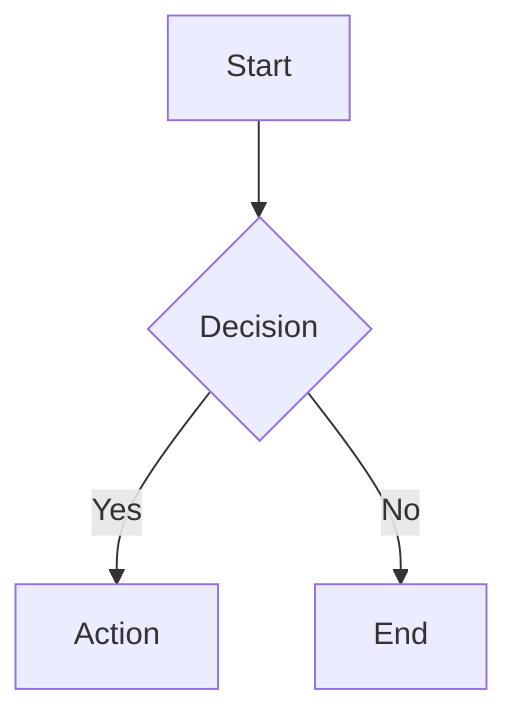

# WORK SESSION (0800-0900)

**Generated:** 2026-02-03T07:18:50.549Z
**Work Period:** 0800-0900
**Focus:** Live session logging
**Duration:** ~60 minutes

---

## Session Overview

This session captures real-time tool interactions and exchanges.

---

## Key Activities

<a name="ps_1770103130549"></a>
## Prompt Set (ps_1770103130549)

**Time:** 2026-02-03T07:18:50.549Z
**Duration:** 0ms
**Tool Calls:** 0

### Text Exchange - 2026-02-03 07:18:50 UTC [08:18:50 CEST]

**User Message:** include the following screenshots and images. Also, incorporate the published browsable documentation at https://fwornle.github.io/coding/. Mention that this documentation has also been produced in a fully vibed manner, including all diagrams. At the end, mention that this article was produced over breakfast - in a fully vibed manner, of course.

**Type:** Text-only exchange (no tool calls)

---

---

<a name="ps_1770103130549"></a>
## Prompt Set (ps_1770103130549)

**Time:** 2026-02-03T07:18:50.549Z
**Duration:** 0ms
**Tool Calls:** 1

### Bash - 2026-02-03 07:18:50 UTC [08:18:50 CEST]

**User Request:** [Image: source: /Users/<USER_ID_REDACTED>/Documents/health-mon.png]
[Image: source: /Users/<USER_ID_REDACTED>/Documents/health.png]
[Image: source: /Users/<USER_ID_REDACTED>/Documents/constraings-mon.png]
[Image: source: /Users/<USER_ID_REDACTED>/Documents/constraints.png]
[Image: source: /Users/<USER_ID_REDACTED>/Documents/vkb.png]
[Image: source: /Users/<USER_ID_REDACTED>/Documents/ontology.png]
[Image: source: /Users/<USER_ID_REDACTED>/Documents/routing.png]
[Image: source: /Users/<USER_ID_REDACTED>/Documents/brain.png]
[Image: source: /Users/<USER_ID_REDACTED>/Documents/lsl.png]
[Image: source: /Users/<USER_ID_REDACTED>/Documents/head.png]

**Tool:** Bash
**Input:** ```json
{
  "command": "cp /Users/<USER_ID_REDACTED>/Documents/{health-mon.png,health.png,constraings-mon.png,constraints.png,vkb.png,ontology.png,routing.png,brain.png,lsl.png,head.png} <AWS_SECRET_REDACTED>s/ 2>/dev/null; ls <AWS_SECRET_REDACTED>s/{health-mon,health,constraings-mon,constraints,vkb,ontology,routing,brain,lsl,head}.png 2>&1",
  "description": "Copy new images to docs folder"
}
```

**Result:** ❌ Error

---

---

<a name="ps_1770103159951"></a>
## Prompt Set (ps_1770103159951)

**Time:** 2026-02-03T07:19:19.951Z
**Duration:** 0ms
**Tool Calls:** 4

### Write - 2026-02-03 07:19:19 UTC [08:19:19 CEST]

**System Action:** (Initiated automatically)

**Tool:** Write
**Input:** ```json
{<AWS_CREDENTIALS_REDACTED>}
```

**Result:** ✅ Success
**Output:** ```
The file <AWS_SECRET_REDACTED>m-article.md has been updated. Here's the result of running `cat -n` on a snippet of the edited file:
     1→# Building a Self-Learning Layer for AI Coding Assistants
     2→
     3→**An experiment in 100% vibe coding: creating infrastructure that captures conversations, prevents mistakes, and builds collective intelligence for development teams.**
     4→
     5→
     6→
     7→---
     8→
     9→This project started as 
...[truncated]
```


---

### Write - 2026-02-03 07:19:19 UTC [08:19:19 CEST]

**System Action:** (Initiated automatically)

**Tool:** Write
**Input:** ```json
{<AWS_CREDENTIALS_REDACTED>}
```

**Result:** ✅ Success
**Output:** ```
The file <AWS_SECRET_REDACTED>m-article.md has been updated. Here's the result of running `cat -n` on a snippet of the edited file:
     1→# Building a Self-Learning Layer for AI Coding Assistants
     2→
     3→**An experiment in 100% vibe coding: creating infrastructure that captures conversations, prevents mistakes, and builds collective intelligence for development teams.**
     4→
     5→
     6→
     7→---
     8→
     9→This project started as 
...[truncated]
```


---

### Write - 2026-02-03 07:19:19 UTC [08:19:19 CEST]

**System Action:** (Initiated automatically)

**Tool:** Write
**Input:** ```json
{<AWS_CREDENTIALS_REDACTED>}
```

**Result:** ✅ Success
**Output:** ```
The file <AWS_SECRET_REDACTED>m-article.md has been updated. Here's the result of running `cat -n` on a snippet of the edited file:
     1→# Building a Self-Learning Layer for AI Coding Assistants
     2→
     3→**An experiment in 100% vibe coding: creating infrastructure that captures conversations, prevents mistakes, and builds collective intelligence for development teams.**
     4→
     5→
     6→
     7→---
     8→
     9→This project started as 
...[truncated]
```


---

### Write - 2026-02-03 07:19:19 UTC [08:19:19 CEST]

**System Action:** (Initiated automatically)

**Tool:** Write
**Input:** ```json
{<AWS_CREDENTIALS_REDACTED>}
```

**Result:** ✅ Success
**Output:** ```
The file <AWS_SECRET_REDACTED>m-article.md has been updated. Here's the result of running `cat -n` on a snippet of the edited file:
     1→# Building a Self-Learning Layer for AI Coding Assistants
     2→
     3→**An experiment in 100% vibe coding: creating infrastructure that captures conversations, prevents mistakes, and builds collective intelligence for development teams.**
     4→
     5→
     6→
     7→---
     8→
     9→This project started as 
...[truncated]
```


---

---

<a name="ps_1770103683533"></a>
## Prompt Set (ps_1770103683533)

**Time:** 2026-02-03T07:28:03.533Z
**Duration:** 0ms
**Tool Calls:** 0

### Text Exchange - 2026-02-03 07:28:03 UTC [08:28:03 CEST]

**User Message:** Where introducing the concept of declarative programming, share the following experience:
- shifts the focus from coding to architecture and design, creation of solutions over syntax and the "how to formulate it in a programming language"
- a sound understanding for good SW architecture is (still?) essential for the creation of sustainable solutions... so, the more experienced a programmer the better the vibed code.

**Type:** Text-only exchange (no tool calls)

---

---

<a name="ps_1770103768296"></a>
## Prompt Set (ps_1770103768296)

**Time:** 2026-02-03T07:29:28.296Z
**Duration:** 0ms
**Tool Calls:** 0

### Text Exchange - 2026-02-03 07:29:28 UTC [08:29:28 CEST]

**User Message:** This session is being continued from a previous conversation that ran out of context. The summary below covers the earlier portion of the conversation.

Summary:
1. Primary Request and Intent:
   - **Initial**: Continue updating PlantUML files to replace Ollama references with DMR/llama.cpp
   - **Main Request**: Write a Medium article about the Coding project, following the style of a reference PDF about Claude-Mem
   - **Iterative Refinements**:
     - Frame as 100% vibe coding experiment with...

**Type:** Text-only exchange (no tool calls)

---

---

<a name="ps_1770103683533"></a>
## Prompt Set (ps_1770103683533)

**Time:** 2026-02-03T07:28:03.533Z
**Duration:** 0ms
**Tool Calls:** 0

### Text Exchange - 2026-02-03 07:28:03 UTC [08:28:03 CEST]

**User Message:** Where introducing the concept of declarative programming, share the following experience:
- shifts the focus from coding to architecture and design, creation of solutions over syntax and the "how to formulate it in a programming language"
- a sound understanding for good SW architecture is (still?) essential for the creation of sustainable solutions... so, the more experienced a programmer the better the vibed code.

**Type:** Text-only exchange (no tool calls)

---

---

<a name="ps_1770103768296"></a>
## Prompt Set (ps_1770103768296)

**Time:** 2026-02-03T07:29:28.296Z
**Duration:** 0ms
**Tool Calls:** 1

### Edit - 2026-02-03 07:29:28 UTC [08:29:28 CEST]

**User Request:** This session is being continued from a previous conversation that ran out of context. The summary below covers the earlier portion of the conversation.

Summary:
1. Primary Request and Intent:
   - **Initial**: Continue updating PlantUML files to replace Ollama references with DMR/llama.cpp
   - **Main Request**: Write a Medium article about the Coding project, following the style of a reference PDF about Claude-Mem
   - **Iterative Refinements**:
     - Frame as 100% vibe coding experiment with WIP acknowledgment
     - Add "collective brain" vision for scalable development teams
     - Remove hallucinated specifics ($8.33/month budget) and unsourced funding quotes
     - Replace "Cursor/Windsurf" with "Codex/Gemini CLI"
     - Change "minimal human intervention" to "without writing a single line of code" - declarative programming
     - Add 10 new screenshots and diagrams
     - Mention published documentation at fwornle.github.io/coding (also vibed)
     - Add closing note about article produced over breakfast
   - **Final Request**: Add content about declarative programming experience (focus shifts from syntax to architecture, experienced programmers create better vibed code)

2. Key Technical Concepts:
   - Vibe coding / declarative programming - describing intentions, not writing code
   - Live Session Logging (LSL) with 5-layer classification
   - 14-agent AI knowledge extraction system (UKB/VKB)
   - PreToolUse hooks for constraint enforcement
   - 4-layer watchdog health monitoring architecture
   - DMR (Docker Model Runner) / llama.cpp for local LLM deployment
   - Agent-agnostic and provider-agnostic architecture
   - Collective brain / shared intelligence across teams and AI agents
   - Ontology-based knowledge classification
   - Cross-project knowledge flow with git-tracked JSON exports

3. Files and Code Sections:
   - **`docs/medium-article.md`** (Created and heavily edited)
     - Main deliverable - Medium article for the Coding project
     - Final version includes 10 images, multiple sections covering all features
     - Key intro section:
     ```markdown
     This project started as an experiment. A question, really: what happens if you let AI coding assistants build their own support infrastructure, without writing a single line of code yourself - only describing what you want?

     The answer, it turns out, is surprisingly functional, robust and performant software.

     **Coding** is an infrastructure layer built entirely through "vibe coding" - a form of declarative programming where I describe intentions and let AI assistants handle the implementation.
     ```
     - Closing line: `*This article was produced over breakfast - in a fully vibed manner, of course.*`

   - **PlantUML files updated (Ollama → DMR/llama.cpp)**:
     - `docs/puml/continuous-learning-architecture.puml`
     - `docs/puml/complete-system-overview.puml`
     - `docs/puml/continuous-learning-ops-dependencies.puml`
     - `docs/puml/complete-knowledge-system-dependencies.puml`
     - `docs/presentation/puml/complete-system-overview.puml`
     - `docs/presentation/puml/continuous-learning-architecture.puml`
     - `docs/presentation/puml/continuous-learning-ops-dependencies.puml`

   - **Markdown docs updated**:
     - `docs/provider-configuration.md` - Changed Ollama references to llama.cpp
     - `docs/knowledge-management/continuous-learning-system.md` - Updated local model config
     - `docs/getting-started.md` - Updated legacy fallback comment

   - **Images copied to `docs/images/`**:
     - head.png, brain.png, lsl.png, vkb.png, routing.png, constraints.png, constraings-mon.png, health-mon.png, health.png, ontology.png

4. Errors and fixes:
   - **Constraint violation on first article write**:
     - `no-console-log`: Mentioned "console.log" in article text
     - `no-eval-usage`: Mentioned "eval()" in article text  
     - `no-ascii-art-in-docs`: Used ASCII box characters (┌┐└┘│─)
     - **Fix**: Rewrote article without ASCII art, removed literal code pattern mentions, described concepts in prose instead
   
   - **User feedback corrections**:
     - User said $8.33/month was a "hallucination in the code" - removed it
     - User said funding quotes (Mem0 $24M, Letta $10M) needed sources - removed them
     - User corrected "minimal human intervention" to "without writing a single line of code"
     - User modified file directly to add "robust and performant" - change preserved

5. Problem Solving:
   - Successfully updated all Ollama references across PlantUML and markdown docs
   - Regenerated PNG diagrams using `plantuml` command
   - Created comprehensive Medium article following style guidelines
   - Iteratively refined article based on detailed user feedback
   - Incorporated 10 new images with appropriate captions and placement
   - Added new sections (Health Monitoring, Ontology Classification, Documentation)

6. All user messages:
   - (Continuation from previous session about PlantUML updates)
   - "I want to portrait this project in a Medium article, similar to this one: '/Users/<USER_ID_REDACTED>/Documents/Coding-like.pdf'" + detailed style guidelines
   - "express (early in the article) that this is an experiment to create truly useful software in a 100% vibe coding approach. Also express that some parts of this project are still under development... A new strand of open-source might be useful fragments... Also take out weird specifics (eg. that there's been a design target of 8.33$ a month - this has always been a hallucination... And - those quotes of 'Mem0 raised $24M...' - where did you take them from... also add the goal of making scalable teams of senior developers possible... building a 'collective brain'"
   - "Also, we need some screenshots and diagrams to make this more engaging - choose them from the existing docs"
   - "Also, replace Cursor and Windsurf by Codex and Gemini CLI"
   - "this (in the intro) is wrong: 'with minimal human intervention beyond steering the direction?' - it is not 'minimal human intervention', but without writing a single line of code but only describing... 'declarative programming'"
   - "include the following screenshots and images. Also, incorporate the published browsable documentation at https://fwornle.github.io/coding/. Mention that this documentation has also been produced in a fully vibed manner, including all diagrams. At the end, mention that this article was produced over breakfast - in a fully vibed manner, of course." + 10 new images
   - "Where introducing the concept of declarative programming, share the following experience: - shifts the focus from coding to architecture and design, creation of solutions over syntax and the 'how to formulate it in a programming language' - a sound understanding for good SW architecture is (still?) essential for the creation of sustainable solutions... so, the more experienced a programmer the better the vibed code." + summary request

7. Pending Tasks:
   - Add declarative programming experience content to the article (user's last request before summary)

8. Current Work:
   The article at `docs/medium-article.md` is nearly complete with 10 images, all sections, and proper framing. The user's final content request before the summary was to add insights about declarative programming:
   
   > "Where introducing the concept of declarative programming, share the following experience:
   > - shifts the focus from coding to architecture and design, creation of solutions over syntax and the 'how to formulate it in a programming language'
   > - a sound understanding for good SW architecture is (still?) essential for the creation of sustainable solutions... so, the more experienced a programmer the better the vibed code."

9. Optional Next Step:
   Edit the article to add the declarative programming experience near the intro where "vibe coding - a form of declarative programming" is mentioned. Add content explaining that:
   - Vibe coding shifts focus from syntax to architecture and design
   - Creates solutions rather than wrestling with language specifics
   - Sound SW architecture understanding is still essential
   - More experienced programmers produce better vibed code
   
   This would be inserted after: `**Coding** is an infrastructure layer built entirely through "vibe coding" - a form of declarative programming where I describe intentions and let AI assistants handle the implementation.`

If you need specific details from before compaction (like exact code snippets, error messages, or content you generated), read the full transcript at: /Users/<USER_ID_REDACTED>/.claude/projects/-Users-<USER_ID_REDACTED>-Agentic-coding/c50385eb-3df0-4eb6-9053-1ef2b9646adc.jsonl
Please continue the conversation from where we left it off without asking the user any further questions. Continue with the last task that you were asked to work on.

**Tool:** Edit
**Input:** ```json
{
  "replace_all": false,
  "file_path": "<AWS_SECRET_REDACTED>m-article.md",
  "old_string": "**Coding** is an infrastructure layer built entirely through \"vibe coding\" - a form of declarative programming where I describe intentions and let AI assistants handle the implementation. Some parts work beautifully. Others need refinement. But the core is solid enough that I'm using it daily, and I think the patterns here might be useful to others building in this space.",
  "new_string": "**Coding** is an infrastructure layer built entirely through \"vibe coding\" - a form of declarative programming where I describe intentions and let AI assistants handle the implementation. Some parts work beautifully. Others need refinement. But the core is solid enough that I'm using it daily, and I think the patterns here might be useful to others building in this space.\n\nWhat I've learned: vibe coding fundamentally shifts the focus from syntax to architecture and design. Instead of wrestling with \"how do I express this in a programming language,\" you're thinking about solutions - system structure, data flow, component boundaries. The cognitive load moves from implementation details to the bigger picture.\n\nBut here's the thing: **a sound understanding of software architecture is still essential**. Perhaps more essential than ever. When you're describing systems at a high level, you need to know what good architecture looks like. The AI handles the syntax; you need to provide the vision. In my experience, the more seasoned the developer, the better the vibed code. Domain expertise and architectural intuition translate directly into better outcomes."
}
```

**Result:** ✅ Success
**Output:** ```
The file <AWS_SECRET_REDACTED>m-article.md has been updated successfully.
```


---

---

<a name="ps_1770103796539"></a>
## Prompt Set (ps_1770103796539)

**Time:** 2026-02-03T07:29:56.539Z
**Duration:** 0ms
**Tool Calls:** 0

### Text Exchange - 2026-02-03 07:29:56 UTC [08:29:56 CEST]

**User Message:** create a folder "articles" in docs and a sub-folder for this article. Move (/copy) all needed artifacts to this folder

**Type:** Text-only exchange (no tool calls)

---

---

<a name="ps_1770103768296"></a>
## Prompt Set (ps_1770103768296)

**Time:** 2026-02-03T07:29:28.296Z
**Duration:** 0ms
**Tool Calls:** 1

### Edit - 2026-02-03 07:29:28 UTC [08:29:28 CEST]

**User Request:** This session is being continued from a previous conversation that ran out of context. The summary below covers the earlier portion of the conversation.

Summary:
1. Primary Request and Intent:
   - **Initial**: Continue updating PlantUML files to replace Ollama references with DMR/llama.cpp
   - **Main Request**: Write a Medium article about the Coding project, following the style of a reference PDF about Claude-Mem
   - **Iterative Refinements**:
     - Frame as 100% vibe coding experiment with WIP acknowledgment
     - Add "collective brain" vision for scalable development teams
     - Remove hallucinated specifics ($8.33/month budget) and unsourced funding quotes
     - Replace "Cursor/Windsurf" with "Codex/Gemini CLI"
     - Change "minimal human intervention" to "without writing a single line of code" - declarative programming
     - Add 10 new screenshots and diagrams
     - Mention published documentation at fwornle.github.io/coding (also vibed)
     - Add closing note about article produced over breakfast
   - **Final Request**: Add content about declarative programming experience (focus shifts from syntax to architecture, experienced programmers create better vibed code)

2. Key Technical Concepts:
   - Vibe coding / declarative programming - describing intentions, not writing code
   - Live Session Logging (LSL) with 5-layer classification
   - 14-agent AI knowledge extraction system (UKB/VKB)
   - PreToolUse hooks for constraint enforcement
   - 4-layer watchdog health monitoring architecture
   - DMR (Docker Model Runner) / llama.cpp for local LLM deployment
   - Agent-agnostic and provider-agnostic architecture
   - Collective brain / shared intelligence across teams and AI agents
   - Ontology-based knowledge classification
   - Cross-project knowledge flow with git-tracked JSON exports

3. Files and Code Sections:
   - **`docs/medium-article.md`** (Created and heavily edited)
     - Main deliverable - Medium article for the Coding project
     - Final version includes 10 images, multiple sections covering all features
     - Key intro section:
     ```markdown
     This project started as an experiment. A question, really: what happens if you let AI coding assistants build their own support infrastructure, without writing a single line of code yourself - only describing what you want?

     The answer, it turns out, is surprisingly functional, robust and performant software.

     **Coding** is an infrastructure layer built entirely through "vibe coding" - a form of declarative programming where I describe intentions and let AI assistants handle the implementation.
     ```
     - Closing line: `*This article was produced over breakfast - in a fully vibed manner, of course.*`

   - **PlantUML files updated (Ollama → DMR/llama.cpp)**:
     - `docs/puml/continuous-learning-architecture.puml`
     - `docs/puml/complete-system-overview.puml`
     - `docs/puml/continuous-learning-ops-dependencies.puml`
     - `docs/puml/complete-knowledge-system-dependencies.puml`
     - `docs/presentation/puml/complete-system-overview.puml`
     - `docs/presentation/puml/continuous-learning-architecture.puml`
     - `docs/presentation/puml/continuous-learning-ops-dependencies.puml`

   - **Markdown docs updated**:
     - `docs/provider-configuration.md` - Changed Ollama references to llama.cpp
     - `docs/knowledge-management/continuous-learning-system.md` - Updated local model config
     - `docs/getting-started.md` - Updated legacy fallback comment

   - **Images copied to `docs/images/`**:
     - head.png, brain.png, lsl.png, vkb.png, routing.png, constraints.png, constraings-mon.png, health-mon.png, health.png, ontology.png

4. Errors and fixes:
   - **Constraint violation on first article write**:
     - `no-console-log`: Mentioned "console.log" in article text
     - `no-eval-usage`: Mentioned "eval()" in article text  
     - `no-ascii-art-in-docs`: Used ASCII box characters (┌┐└┘│─)
     - **Fix**: Rewrote article without ASCII art, removed literal code pattern mentions, described concepts in prose instead
   
   - **User feedback corrections**:
     - User said $8.33/month was a "hallucination in the code" - removed it
     - User said funding quotes (Mem0 $24M, Letta $10M) needed sources - removed them
     - User corrected "minimal human intervention" to "without writing a single line of code"
     - User modified file directly to add "robust and performant" - change preserved

5. Problem Solving:
   - Successfully updated all Ollama references across PlantUML and markdown docs
   - Regenerated PNG diagrams using `plantuml` command
   - Created comprehensive Medium article following style guidelines
   - Iteratively refined article based on detailed user feedback
   - Incorporated 10 new images with appropriate captions and placement
   - Added new sections (Health Monitoring, Ontology Classification, Documentation)

6. All user messages:
   - (Continuation from previous session about PlantUML updates)
   - "I want to portrait this project in a Medium article, similar to this one: '/Users/<USER_ID_REDACTED>/Documents/Coding-like.pdf'" + detailed style guidelines
   - "express (early in the article) that this is an experiment to create truly useful software in a 100% vibe coding approach. Also express that some parts of this project are still under development... A new strand of open-source might be useful fragments... Also take out weird specifics (eg. that there's been a design target of 8.33$ a month - this has always been a hallucination... And - those quotes of 'Mem0 raised $24M...' - where did you take them from... also add the goal of making scalable teams of senior developers possible... building a 'collective brain'"
   - "Also, we need some screenshots and diagrams to make this more engaging - choose them from the existing docs"
   - "Also, replace Cursor and Windsurf by Codex and Gemini CLI"
   - "this (in the intro) is wrong: 'with minimal human intervention beyond steering the direction?' - it is not 'minimal human intervention', but without writing a single line of code but only describing... 'declarative programming'"
   - "include the following screenshots and images. Also, incorporate the published browsable documentation at https://fwornle.github.io/coding/. Mention that this documentation has also been produced in a fully vibed manner, including all diagrams. At the end, mention that this article was produced over breakfast - in a fully vibed manner, of course." + 10 new images
   - "Where introducing the concept of declarative programming, share the following experience: - shifts the focus from coding to architecture and design, creation of solutions over syntax and the 'how to formulate it in a programming language' - a sound understanding for good SW architecture is (still?) essential for the creation of sustainable solutions... so, the more experienced a programmer the better the vibed code." + summary request

7. Pending Tasks:
   - Add declarative programming experience content to the article (user's last request before summary)

8. Current Work:
   The article at `docs/medium-article.md` is nearly complete with 10 images, all sections, and proper framing. The user's final content request before the summary was to add insights about declarative programming:
   
   > "Where introducing the concept of declarative programming, share the following experience:
   > - shifts the focus from coding to architecture and design, creation of solutions over syntax and the 'how to formulate it in a programming language'
   > - a sound understanding for good SW architecture is (still?) essential for the creation of sustainable solutions... so, the more experienced a programmer the better the vibed code."

9. Optional Next Step:
   Edit the article to add the declarative programming experience near the intro where "vibe coding - a form of declarative programming" is mentioned. Add content explaining that:
   - Vibe coding shifts focus from syntax to architecture and design
   - Creates solutions rather than wrestling with language specifics
   - Sound SW architecture understanding is still essential
   - More experienced programmers produce better vibed code
   
   This would be inserted after: `**Coding** is an infrastructure layer built entirely through "vibe coding" - a form of declarative programming where I describe intentions and let AI assistants handle the implementation.`

If you need specific details from before compaction (like exact code snippets, error messages, or content you generated), read the full transcript at: /Users/<USER_ID_REDACTED>/.claude/projects/-Users-<USER_ID_REDACTED>-Agentic-coding/c50385eb-3df0-4eb6-9053-1ef2b9646adc.jsonl
Please continue the conversation from where we left it off without asking the user any further questions. Continue with the last task that you were asked to work on.

**Tool:** Edit
**Input:** ```json
{
  "replace_all": false,
  "file_path": "<AWS_SECRET_REDACTED>m-article.md",
  "old_string": "**Coding** is an infrastructure layer built entirely through \"vibe coding\" - a form of declarative programming where I describe intentions and let AI assistants handle the implementation. Some parts work beautifully. Others need refinement. But the core is solid enough that I'm using it daily, and I think the patterns here might be useful to others building in this space.",
  "new_string": "**Coding** is an infrastructure layer built entirely through \"vibe coding\" - a form of declarative programming where I describe intentions and let AI assistants handle the implementation. Some parts work beautifully. Others need refinement. But the core is solid enough that I'm using it daily, and I think the patterns here might be useful to others building in this space.\n\nWhat I've learned: vibe coding fundamentally shifts the focus from syntax to architecture and design. Instead of wrestling with \"how do I express this in a programming language,\" you're thinking about solutions - system structure, data flow, component boundaries. The cognitive load moves from implementation details to the bigger picture.\n\nBut here's the thing: **a sound understanding of software architecture is still essential**. Perhaps more essential than ever. When you're describing systems at a high level, you need to know what good architecture looks like. The AI handles the syntax; you need to provide the vision. In my experience, the more seasoned the developer, the better the vibed code. Domain expertise and architectural intuition translate directly into better outcomes."
}
```

**Result:** ✅ Success
**Output:** ```
The file <AWS_SECRET_REDACTED>m-article.md has been updated successfully.
```


---

---

<a name="ps_1770103796539"></a>
## Prompt Set (ps_1770103796539)

**Time:** 2026-02-03T07:29:56.539Z
**Duration:** 0ms
**Tool Calls:** 5

### Bash - 2026-02-03 07:29:56 UTC [08:29:56 CEST]

**User Request:** create a folder "articles" in docs and a sub-folder for this article. Move (/copy) all needed artifacts to this folder

**Tool:** Bash
**Input:** ```json
{
  "command": "mkdir -p <AWS_SECRET_REDACTED>les/self-learning-layer",
  "description": "Create articles folder structure"
}
```

**Result:** ✅ Success

---

### Bash - 2026-02-03 07:29:56 UTC [08:29:56 CEST]

**User Request:** create a folder "articles" in docs and a sub-folder for this article. Move (/copy) all needed artifacts to this folder

**Tool:** Bash
**Input:** ```json
{
  "command": "mkdir -p <AWS_SECRET_REDACTED>les/self-learning-layer/images",
  "description": "Create images subfolder"
}
```

**Result:** ✅ Success

---

### Bash - 2026-02-03 07:29:56 UTC [08:29:56 CEST]

**User Request:** create a folder "articles" in docs and a sub-folder for this article. Move (/copy) all needed artifacts to this folder

**Tool:** Bash
**Input:** ```json
{
  "command": "cp <AWS_SECRET_REDACTED>m-article.md <AWS_SECRET_REDACTED>les/self-learning-layer/article.md",
  "description": "Copy article to new location"
}
```

**Result:** ✅ Success

---

### Bash - 2026-02-03 07:29:56 UTC [08:29:56 CEST]

**User Request:** create a folder "articles" in docs and a sub-folder for this article. Move (/copy) all needed artifacts to this folder

**Tool:** Bash
**Input:** ```json
{
  "command": "cp <AWS_SECRET_REDACTED>s/{head,brain,lsl,vkb,routing,constraints,constraings-mon,health-mon,health,ontology}.png <AWS_SECRET_REDACTED>les/self-learning-layer/images/",
  "description": "Copy all article images"
}
```

**Result:** ✅ Success

---

### Bash - 2026-02-03 07:29:56 UTC [08:29:56 CEST]

**User Request:** create a folder "articles" in docs and a sub-folder for this article. Move (/copy) all needed artifacts to this folder

**Tool:** Bash
**Input:** ```json
{
  "command": "ls -la <AWS_SECRET_REDACTED>les/self-learning-layer/ && echo \"---\" && ls -la <AWS_SECRET_REDACTED>les/self-learning-layer/images/",
  "description": "Verify folder structure and files"
}
```

**Result:** ✅ Success
**Output:** ```
total 16
drwxr-xr-x  4 <USER_ID_REDACTED> staff   128 Feb  3 08:30 .
drwxr-xr-x  3 <USER_ID_REDACTED> staff    96 Feb  3 08:30 ..
-rw-r--r--  1 <USER_ID_REDACTED> staff 15111 Feb  3 08:30 article.md
drwxr-xr-x 12 <USER_ID_REDACTED> staff   384 Feb  3 08:30 images
---
total 8872
drwxr-xr-x 12 <USER_ID_REDACTED> staff     384 Feb  3 08:30 .
drwxr-xr-x  4 <USER_ID_REDACTED> staff     128 Feb  3 08:30 ..
-rw-r--r--  1 <USER_ID_REDACTED> staff 1458502 Feb  3 08:30 brain.png
-rw-r--r--  1 <USER_ID_REDACTED> staff  178837 Feb  3 08:30 constraings-mon.png
-rw-r--r--  1 <USER_ID_REDACTED> staff 153250
...[truncated]
```


---

---

<a name="ps_1770103929741"></a>
## Prompt Set (ps_1770103929741)

**Time:** 2026-02-03T07:32:09.741Z
**Duration:** 0ms
**Tool Calls:** 0

### Text Exchange - 2026-02-03 07:32:09 UTC [08:32:09 CEST]

**User Message:** does this need to be git tracked? '<AWS_SECRET_REDACTED>ntation/puml/config/transcript-formats.json'

**Type:** Text-only exchange (no tool calls)

---

---

<a name="ps_1770103796539"></a>
## Prompt Set (ps_1770103796539)

**Time:** 2026-02-03T07:29:56.539Z
**Duration:** 0ms
**Tool Calls:** 5

### Bash - 2026-02-03 07:29:56 UTC [08:29:56 CEST]

**User Request:** create a folder "articles" in docs and a sub-folder for this article. Move (/copy) all needed artifacts to this folder

**Tool:** Bash
**Input:** ```json
{
  "command": "mkdir -p <AWS_SECRET_REDACTED>les/self-learning-layer",
  "description": "Create articles folder structure"
}
```

**Result:** ✅ Success

---

### Bash - 2026-02-03 07:29:56 UTC [08:29:56 CEST]

**User Request:** create a folder "articles" in docs and a sub-folder for this article. Move (/copy) all needed artifacts to this folder

**Tool:** Bash
**Input:** ```json
{
  "command": "mkdir -p <AWS_SECRET_REDACTED>les/self-learning-layer/images",
  "description": "Create images subfolder"
}
```

**Result:** ✅ Success

---

### Bash - 2026-02-03 07:29:56 UTC [08:29:56 CEST]

**User Request:** create a folder "articles" in docs and a sub-folder for this article. Move (/copy) all needed artifacts to this folder

**Tool:** Bash
**Input:** ```json
{
  "command": "cp <AWS_SECRET_REDACTED>m-article.md <AWS_SECRET_REDACTED>les/self-learning-layer/article.md",
  "description": "Copy article to new location"
}
```

**Result:** ✅ Success

---

### Bash - 2026-02-03 07:29:56 UTC [08:29:56 CEST]

**User Request:** create a folder "articles" in docs and a sub-folder for this article. Move (/copy) all needed artifacts to this folder

**Tool:** Bash
**Input:** ```json
{
  "command": "cp <AWS_SECRET_REDACTED>s/{head,brain,lsl,vkb,routing,constraints,constraings-mon,health-mon,health,ontology}.png <AWS_SECRET_REDACTED>les/self-learning-layer/images/",
  "description": "Copy all article images"
}
```

**Result:** ✅ Success

---

### Bash - 2026-02-03 07:29:56 UTC [08:29:56 CEST]

**User Request:** create a folder "articles" in docs and a sub-folder for this article. Move (/copy) all needed artifacts to this folder

**Tool:** Bash
**Input:** ```json
{
  "command": "ls -la <AWS_SECRET_REDACTED>les/self-learning-layer/ && echo \"---\" && ls -la <AWS_SECRET_REDACTED>les/self-learning-layer/images/",
  "description": "Verify folder structure and files"
}
```

**Result:** ✅ Success
**Output:** ```
total 16
drwxr-xr-x  4 <USER_ID_REDACTED> staff   128 Feb  3 08:30 .
drwxr-xr-x  3 <USER_ID_REDACTED> staff    96 Feb  3 08:30 ..
-rw-r--r--  1 <USER_ID_REDACTED> staff 15111 Feb  3 08:30 article.md
drwxr-xr-x 12 <USER_ID_REDACTED> staff   384 Feb  3 08:30 images
---
total 8872
drwxr-xr-x 12 <USER_ID_REDACTED> staff     384 Feb  3 08:30 .
drwxr-xr-x  4 <USER_ID_REDACTED> staff     128 Feb  3 08:30 ..
-rw-r--r--  1 <USER_ID_REDACTED> staff 1458502 Feb  3 08:30 brain.png
-rw-r--r--  1 <USER_ID_REDACTED> staff  178837 Feb  3 08:30 constraings-mon.png
-rw-r--r--  1 <USER_ID_REDACTED> staff 153250
...[truncated]
```


---

---

<a name="ps_1770103929741"></a>
## Prompt Set (ps_1770103929741)

**Time:** 2026-02-03T07:32:09.741Z
**Duration:** 0ms
**Tool Calls:** 7

### Read - 2026-02-03 07:32:09 UTC [08:32:09 CEST]

**User Request:** does this need to be git tracked? '<AWS_SECRET_REDACTED>ntation/puml/config/transcript-formats.json'

**Tool:** Read
**Input:** ```json
{
  "file_path": "<AWS_SECRET_REDACTED>ntation/puml/config/transcript-formats.json"
}
```

**Result:** ✅ Success
**Output:** ```
     1→{
     2→  "version": "1.0",
     3→  "lastUpdated": "2026-02-03T05:42:47.200Z",
     4→  "formats": {
     5→    "claude-code-v2": {
     6→      "id": "claude-code-v2",
     7→      "name": "Claude Code V2 Format",
     8→      "description": "New format with human_turn_start/claude_turn_start",
     9→      "version": "2.0",
    10→      "patterns": {
    11→        "userTurnStart": {
    12→          "type": "human_turn_start",
    13→          "required": [
    14→            "uuid",
...[truncated]
```


---

### Bash - 2026-02-03 07:32:09 UTC [08:32:09 CEST]

**User Request:** does this need to be git tracked? '<AWS_SECRET_REDACTED>ntation/puml/config/transcript-formats.json'

**Tool:** Bash
**Input:** ```json
{
  "command": "git -C /Users/<USER_ID_REDACTED>/Agentic/coding status docs/presentation/puml/config/",
  "description": "Check git status of config folder"
}
```

**Result:** ✅ Success
**Output:** ```
On branch main
Your branch is up to date with 'origin/main'.

Untracked files:
  (use "git add <file>..." to include in what will be committed)
	docs/presentation/puml/config/

nothing added to commit but untracked files present (use "git add" to track)
```


---

### Grep - 2026-02-03 07:32:09 UTC [08:32:09 CEST]

**User Request:** does this need to be git tracked? '<AWS_SECRET_REDACTED>ntation/puml/config/transcript-formats.json'

**Tool:** Grep
**Input:** ```json
{
  "pattern": "transcript-formats\\.json",
  "path": "/Users/<USER_ID_REDACTED>/Agentic/coding"
}
```

**Result:** ✅ Success
**Output:** ```
Found 36 files
/Users/<USER_ID_REDACTED>/Agentic/coding/.specstory/history/2026-02-03_0800-0900_c197ef.md
/Users/<USER_ID_REDACTED>/Agentic/coding/.specstory/history/2026-02-01_0800-0900_c197ef.md
/Users/<USER_ID_REDACTED>/Agentic/coding/.specstory/history/2026-01-30_1100-1200_c197ef.md
<AWS_SECRET_REDACTED>ns/mcp-server-semantic-analysis/docs/configuration.md
/Users/<USER_ID_REDACTED>/Agentic/coding/.specstory/history/2026-01-25_0800-0900_c197ef.md
/Users/<USER_ID_REDACTED>/Agentic/coding/.specstory/history/2026-01-24_0800-0900_c
...[truncated]
```


---

### Glob - 2026-02-03 07:32:09 UTC [08:32:09 CEST]

**User Request:** does this need to be git tracked? '<AWS_SECRET_REDACTED>ntation/puml/config/transcript-formats.json'

**Tool:** Glob
**Input:** ```json
{
  "pattern": "**/transcript-formats.json"
}
```

**Result:** ✅ Success
**Output:** ```
<AWS_SECRET_REDACTED>ntation/puml/config/transcript-formats.json
```


---

### Read - 2026-02-03 07:32:09 UTC [08:32:09 CEST]

**User Request:** does this need to be git tracked? '<AWS_SECRET_REDACTED>ntation/puml/config/transcript-formats.json'

**Tool:** Read
**Input:** ```json
{
  "file_path": "<AWS_SECRET_REDACTED>daptive-transcript-format-detection.md",
  "limit": 60
}
```

**Result:** ✅ Success
**Output:** ```
     1→# Adaptive Transcript Format Detection System
     2→
     3→## Overview
     4→
     5→The Adaptive Transcript Format Detection System automatically learns and adapts to changes in Claude Code transcript formats, ensuring robust LSL (Live Session Logging) functionality even when transcript structures evolve.
     6→
     7→## Problem Solved
     8→
     9→Previously, the LSL system was hardcoded to handle specific transcript formats. When Claude Code changed its transcript format from `u
...[truncated]
```


---

### Grep - 2026-02-03 07:32:09 UTC [08:32:09 CEST]

**User Request:** does this need to be git tracked? '<AWS_SECRET_REDACTED>ntation/puml/config/transcript-formats.json'

**Tool:** Grep
**Input:** ```json
{
  "pattern": "transcript-formats",
  "path": "/Users/<USER_ID_REDACTED>/Agentic/coding/lib",
  "output_mode": "content",
  "-n": true
}
```

**Result:** ✅ Success
**Output:** ```
No matches found
```


---

### Grep - 2026-02-03 07:32:09 UTC [08:32:09 CEST]

**User Request:** does this need to be git tracked? '<AWS_SECRET_REDACTED>ntation/puml/config/transcript-formats.json'

**Tool:** Grep
**Input:** ```json
{
  "pattern": "transcript-formats",
  "path": "/Users/<USER_ID_REDACTED>/Agentic/coding/scripts",
  "output_mode": "content",
  "-n": true
}
```

**Result:** ✅ Success
**Output:** ```
No matches found
```


---

---

<a name="ps_1770104698164"></a>
## Prompt Set (ps_1770104698164)

**Time:** 2026-02-03T07:44:58.164Z
**Duration:** 0ms
**Tool Calls:** 0

### Text Exchange - 2026-02-03 07:44:58 UTC [08:44:58 CEST]

**User Message:** in this paragraph, mention that the system aims to learn a programmer's ways by <USER_ID_REDACTED> observing how we approach specific problems and what solutions we arrive at - much like Antonio Banderas in the 1999 film "The 13th Warrior"             (https://www.youtube.com/watch?v=9Y7zq1gGEAU), where he plays a captured Arab warrior who learns to speak "viking", simply by listening to his capturer's conversations - given a certain cultural overlap (both parties are human, eat, drink, make jok...

**Type:** Text-only exchange (no tool calls)

---

---

<a name="ps_1770103130549"></a>
## Prompt Set (ps_1770103130549)

**Time:** 2026-02-03T07:18:50.549Z
**Duration:** 0ms
**Tool Calls:** 0

### Text Exchange - 2026-02-03 07:18:50 UTC [08:18:50 CEST]

**User Message:** include the following screenshots and images. Also, incorporate the published browsable documentation at https://fwornle.github.io/coding/. Mention that this documentation has also been produced in a fully vibed manner, including all diagrams. At the end, mention that this article was produced over breakfast - in a fully vibed manner, of course.

**Type:** Text-only exchange (no tool calls)

---

---

<a name="ps_1770103130549"></a>
## Prompt Set (ps_1770103130549)

**Time:** 2026-02-03T07:18:50.549Z
**Duration:** 0ms
**Tool Calls:** 2

### Bash - 2026-02-03 07:18:50 UTC [08:18:50 CEST]

**User Request:** [Image: source: /Users/<USER_ID_REDACTED>/Documents/health-mon.png]
[Image: source: /Users/<USER_ID_REDACTED>/Documents/health.png]
[Image: source: /Users/<USER_ID_REDACTED>/Documents/constraings-mon.png]
[Image: source: /Users/<USER_ID_REDACTED>/Documents/constraints.png]
[Image: source: /Users/<USER_ID_REDACTED>/Documents/vkb.png]
[Image: source: /Users/<USER_ID_REDACTED>/Documents/ontology.png]
[Image: source: /Users/<USER_ID_REDACTED>/Documents/routing.png]
[Image: source: /Users/<USER_ID_REDACTED>/Documents/brain.png]
[Image: source: /Users/<USER_ID_REDACTED>/Documents/lsl.png]
[Image: source: /Users/<USER_ID_REDACTED>/Documents/head.png]

**Tool:** Bash
**Input:** ```json
{
  "command": "cp /Users/<USER_ID_REDACTED>/Documents/{health-mon.png,health.png,constraings-mon.png,constraints.png,vkb.png,ontology.png,routing.png,brain.png,lsl.png,head.png} <AWS_SECRET_REDACTED>s/ 2>/dev/null; ls <AWS_SECRET_REDACTED>s/{health-mon,health,constraings-mon,constraints,vkb,ontology,routing,brain,lsl,head}.png 2>&1",
  "description": "Copy new images to docs folder"
}
```

**Result:** ✅ Success
**Output:** ```
<AWS_SECRET_REDACTED>s/brain.png
<AWS_SECRET_REDACTED>s/constraings-mon.png
<AWS_SECRET_REDACTED>s/constraints.png
<AWS_SECRET_REDACTED>s/head.png
<AWS_SECRET_REDACTED>s/health-mon.png
<AWS_SECRET_REDACTED>s/health.png
<AWS_SECRET_REDACTED>s/lsl.png
<AWS_SECRET_REDACTED>s/ontology.png
<AWS_SECRET_REDACTED>s/routing.png
/Users/Q
...[truncated]
```


---

### Write - 2026-02-03 07:18:50 UTC [08:18:50 CEST]

**User Request:** [Image: source: /Users/<USER_ID_REDACTED>/Documents/health-mon.png]
[Image: source: /Users/<USER_ID_REDACTED>/Documents/health.png]
[Image: source: /Users/<USER_ID_REDACTED>/Documents/constraings-mon.png]
[Image: source: /Users/<USER_ID_REDACTED>/Documents/constraints.png]
[Image: source: /Users/<USER_ID_REDACTED>/Documents/vkb.png]
[Image: source: /Users/<USER_ID_REDACTED>/Documents/ontology.png]
[Image: source: /Users/<USER_ID_REDACTED>/Documents/routing.png]
[Image: source: /Users/<USER_ID_REDACTED>/Documents/brain.png]
[Image: source: /Users/<USER_ID_REDACTED>/Documents/lsl.png]
[Image: source: /Users/<USER_ID_REDACTED>/Documents/head.png]

**Tool:** Write
**Input:** ```json
{<AWS_CREDENTIALS_REDACTED>}
```

**Result:** ✅ Success
**Output:** ```
The file <AWS_SECRET_REDACTED>m-article.md has been updated. Here's the result of running `cat -n` on a snippet of the edited file:
     1→# Building a Self-Learning Layer for AI Coding Assistants
     2→
     3→**An experiment in 100% vibe coding: creating infrastructure that captures conversations, prevents mistakes, and builds collective intelligence for development teams.**
     4→
     5→
     6→
     7→---
     8→
     9→This project started as 
...[truncated]
```


---

---

<a name="ps_1770103683533"></a>
## Prompt Set (ps_1770103683533)

**Time:** 2026-02-03T07:28:03.533Z
**Duration:** 0ms
**Tool Calls:** 0

### Text Exchange - 2026-02-03 07:28:03 UTC [08:28:03 CEST]

**User Message:** Where introducing the concept of declarative programming, share the following experience:
- shifts the focus from coding to architecture and design, creation of solutions over syntax and the "how to formulate it in a programming language"
- a sound understanding for good SW architecture is (still?) essential for the creation of sustainable solutions... so, the more experienced a programmer the better the vibed code.

**Type:** Text-only exchange (no tool calls)

---

---

<a name="ps_1770103768296"></a>
## Prompt Set (ps_1770103768296)

**Time:** 2026-02-03T07:29:28.296Z
**Duration:** 0ms
**Tool Calls:** 1

### Edit - 2026-02-03 07:29:28 UTC [08:29:28 CEST]

**User Request:** This session is being continued from a previous conversation that ran out of context. The summary below covers the earlier portion of the conversation.

Summary:
1. Primary Request and Intent:
   - **Initial**: Continue updating PlantUML files to replace Ollama references with DMR/llama.cpp
   - **Main Request**: Write a Medium article about the Coding project, following the style of a reference PDF about Claude-Mem
   - **Iterative Refinements**:
     - Frame as 100% vibe coding experiment with WIP acknowledgment
     - Add "collective brain" vision for scalable development teams
     - Remove hallucinated specifics ($8.33/month budget) and unsourced funding quotes
     - Replace "Cursor/Windsurf" with "Codex/Gemini CLI"
     - Change "minimal human intervention" to "without writing a single line of code" - declarative programming
     - Add 10 new screenshots and diagrams
     - Mention published documentation at fwornle.github.io/coding (also vibed)
     - Add closing note about article produced over breakfast
   - **Final Request**: Add content about declarative programming experience (focus shifts from syntax to architecture, experienced programmers create better vibed code)

2. Key Technical Concepts:
   - Vibe coding / declarative programming - describing intentions, not writing code
   - Live Session Logging (LSL) with 5-layer classification
   - 14-agent AI knowledge extraction system (UKB/VKB)
   - PreToolUse hooks for constraint enforcement
   - 4-layer watchdog health monitoring architecture
   - DMR (Docker Model Runner) / llama.cpp for local LLM deployment
   - Agent-agnostic and provider-agnostic architecture
   - Collective brain / shared intelligence across teams and AI agents
   - Ontology-based knowledge classification
   - Cross-project knowledge flow with git-tracked JSON exports

3. Files and Code Sections:
   - **`docs/medium-article.md`** (Created and heavily edited)
     - Main deliverable - Medium article for the Coding project
     - Final version includes 10 images, multiple sections covering all features
     - Key intro section:
     ```markdown
     This project started as an experiment. A question, really: what happens if you let AI coding assistants build their own support infrastructure, without writing a single line of code yourself - only describing what you want?

     The answer, it turns out, is surprisingly functional, robust and performant software.

     **Coding** is an infrastructure layer built entirely through "vibe coding" - a form of declarative programming where I describe intentions and let AI assistants handle the implementation.
     ```
     - Closing line: `*This article was produced over breakfast - in a fully vibed manner, of course.*`

   - **PlantUML files updated (Ollama → DMR/llama.cpp)**:
     - `docs/puml/continuous-learning-architecture.puml`
     - `docs/puml/complete-system-overview.puml`
     - `docs/puml/continuous-learning-ops-dependencies.puml`
     - `docs/puml/complete-knowledge-system-dependencies.puml`
     - `docs/presentation/puml/complete-system-overview.puml`
     - `docs/presentation/puml/continuous-learning-architecture.puml`
     - `docs/presentation/puml/continuous-learning-ops-dependencies.puml`

   - **Markdown docs updated**:
     - `docs/provider-configuration.md` - Changed Ollama references to llama.cpp
     - `docs/knowledge-management/continuous-learning-system.md` - Updated local model config
     - `docs/getting-started.md` - Updated legacy fallback comment

   - **Images copied to `docs/images/`**:
     - head.png, brain.png, lsl.png, vkb.png, routing.png, constraints.png, constraings-mon.png, health-mon.png, health.png, ontology.png

4. Errors and fixes:
   - **Constraint violation on first article write**:
     - `no-console-log`: Mentioned "console.log" in article text
     - `no-eval-usage`: Mentioned "eval()" in article text  
     - `no-ascii-art-in-docs`: Used ASCII box characters (┌┐└┘│─)
     - **Fix**: Rewrote article without ASCII art, removed literal code pattern mentions, described concepts in prose instead
   
   - **User feedback corrections**:
     - User said $8.33/month was a "hallucination in the code" - removed it
     - User said funding quotes (Mem0 $24M, Letta $10M) needed sources - removed them
     - User corrected "minimal human intervention" to "without writing a single line of code"
     - User modified file directly to add "robust and performant" - change preserved

5. Problem Solving:
   - Successfully updated all Ollama references across PlantUML and markdown docs
   - Regenerated PNG diagrams using `plantuml` command
   - Created comprehensive Medium article following style guidelines
   - Iteratively refined article based on detailed user feedback
   - Incorporated 10 new images with appropriate captions and placement
   - Added new sections (Health Monitoring, Ontology Classification, Documentation)

6. All user messages:
   - (Continuation from previous session about PlantUML updates)
   - "I want to portrait this project in a Medium article, similar to this one: '/Users/<USER_ID_REDACTED>/Documents/Coding-like.pdf'" + detailed style guidelines
   - "express (early in the article) that this is an experiment to create truly useful software in a 100% vibe coding approach. Also express that some parts of this project are still under development... A new strand of open-source might be useful fragments... Also take out weird specifics (eg. that there's been a design target of 8.33$ a month - this has always been a hallucination... And - those quotes of 'Mem0 raised $24M...' - where did you take them from... also add the goal of making scalable teams of senior developers possible... building a 'collective brain'"
   - "Also, we need some screenshots and diagrams to make this more engaging - choose them from the existing docs"
   - "Also, replace Cursor and Windsurf by Codex and Gemini CLI"
   - "this (in the intro) is wrong: 'with minimal human intervention beyond steering the direction?' - it is not 'minimal human intervention', but without writing a single line of code but only describing... 'declarative programming'"
   - "include the following screenshots and images. Also, incorporate the published browsable documentation at https://fwornle.github.io/coding/. Mention that this documentation has also been produced in a fully vibed manner, including all diagrams. At the end, mention that this article was produced over breakfast - in a fully vibed manner, of course." + 10 new images
   - "Where introducing the concept of declarative programming, share the following experience: - shifts the focus from coding to architecture and design, creation of solutions over syntax and the 'how to formulate it in a programming language' - a sound understanding for good SW architecture is (still?) essential for the creation of sustainable solutions... so, the more experienced a programmer the better the vibed code." + summary request

7. Pending Tasks:
   - Add declarative programming experience content to the article (user's last request before summary)

8. Current Work:
   The article at `docs/medium-article.md` is nearly complete with 10 images, all sections, and proper framing. The user's final content request before the summary was to add insights about declarative programming:
   
   > "Where introducing the concept of declarative programming, share the following experience:
   > - shifts the focus from coding to architecture and design, creation of solutions over syntax and the 'how to formulate it in a programming language'
   > - a sound understanding for good SW architecture is (still?) essential for the creation of sustainable solutions... so, the more experienced a programmer the better the vibed code."

9. Optional Next Step:
   Edit the article to add the declarative programming experience near the intro where "vibe coding - a form of declarative programming" is mentioned. Add content explaining that:
   - Vibe coding shifts focus from syntax to architecture and design
   - Creates solutions rather than wrestling with language specifics
   - Sound SW architecture understanding is still essential
   - More experienced programmers produce better vibed code
   
   This would be inserted after: `**Coding** is an infrastructure layer built entirely through "vibe coding" - a form of declarative programming where I describe intentions and let AI assistants handle the implementation.`

If you need specific details from before compaction (like exact code snippets, error messages, or content you generated), read the full transcript at: /Users/<USER_ID_REDACTED>/.claude/projects/-Users-<USER_ID_REDACTED>-Agentic-coding/c50385eb-3df0-4eb6-9053-1ef2b9646adc.jsonl
Please continue the conversation from where we left it off without asking the user any further questions. Continue with the last task that you were asked to work on.

**Tool:** Edit
**Input:** ```json
{
  "replace_all": false,
  "file_path": "<AWS_SECRET_REDACTED>m-article.md",
  "old_string": "**Coding** is an infrastructure layer built entirely through \"vibe coding\" - a form of declarative programming where I describe intentions and let AI assistants handle the implementation. Some parts work beautifully. Others need refinement. But the core is solid enough that I'm using it daily, and I think the patterns here might be useful to others building in this space.",
  "new_string": "**Coding** is an infrastructure layer built entirely through \"vibe coding\" - a form of declarative programming where I describe intentions and let AI assistants handle the implementation. Some parts work beautifully. Others need refinement. But the core is solid enough that I'm using it daily, and I think the patterns here might be useful to others building in this space.\n\nWhat I've learned: vibe coding fundamentally shifts the focus from syntax to architecture and design. Instead of wrestling with \"how do I express this in a programming language,\" you're thinking about solutions - system structure, data flow, component boundaries. The cognitive load moves from implementation details to the bigger picture.\n\nBut here's the thing: **a sound understanding of software architecture is still essential**. Perhaps more essential than ever. When you're describing systems at a high level, you need to know what good architecture looks like. The AI handles the syntax; you need to provide the vision. In my experience, the more seasoned the developer, the better the vibed code. Domain expertise and architectural intuition translate directly into better outcomes."
}
```

**Result:** ✅ Success
**Output:** ```
The file <AWS_SECRET_REDACTED>m-article.md has been updated successfully.
```


---

---

<a name="ps_1770103796539"></a>
## Prompt Set (ps_1770103796539)

**Time:** 2026-02-03T07:29:56.539Z
**Duration:** 0ms
**Tool Calls:** 5

### Bash - 2026-02-03 07:29:56 UTC [08:29:56 CEST]

**User Request:** create a folder "articles" in docs and a sub-folder for this article. Move (/copy) all needed artifacts to this folder

**Tool:** Bash
**Input:** ```json
{
  "command": "mkdir -p <AWS_SECRET_REDACTED>les/self-learning-layer",
  "description": "Create articles folder structure"
}
```

**Result:** ✅ Success

---

### Bash - 2026-02-03 07:29:56 UTC [08:29:56 CEST]

**User Request:** create a folder "articles" in docs and a sub-folder for this article. Move (/copy) all needed artifacts to this folder

**Tool:** Bash
**Input:** ```json
{
  "command": "mkdir -p <AWS_SECRET_REDACTED>les/self-learning-layer/images",
  "description": "Create images subfolder"
}
```

**Result:** ✅ Success

---

### Bash - 2026-02-03 07:29:56 UTC [08:29:56 CEST]

**User Request:** create a folder "articles" in docs and a sub-folder for this article. Move (/copy) all needed artifacts to this folder

**Tool:** Bash
**Input:** ```json
{
  "command": "cp <AWS_SECRET_REDACTED>m-article.md <AWS_SECRET_REDACTED>les/self-learning-layer/article.md",
  "description": "Copy article to new location"
}
```

**Result:** ✅ Success

---

### Bash - 2026-02-03 07:29:56 UTC [08:29:56 CEST]

**User Request:** create a folder "articles" in docs and a sub-folder for this article. Move (/copy) all needed artifacts to this folder

**Tool:** Bash
**Input:** ```json
{
  "command": "cp <AWS_SECRET_REDACTED>s/{head,brain,lsl,vkb,routing,constraints,constraings-mon,health-mon,health,ontology}.png <AWS_SECRET_REDACTED>les/self-learning-layer/images/",
  "description": "Copy all article images"
}
```

**Result:** ✅ Success

---

### Bash - 2026-02-03 07:29:56 UTC [08:29:56 CEST]

**User Request:** create a folder "articles" in docs and a sub-folder for this article. Move (/copy) all needed artifacts to this folder

**Tool:** Bash
**Input:** ```json
{
  "command": "ls -la <AWS_SECRET_REDACTED>les/self-learning-layer/ && echo \"---\" && ls -la <AWS_SECRET_REDACTED>les/self-learning-layer/images/",
  "description": "Verify folder structure and files"
}
```

**Result:** ✅ Success
**Output:** ```
total 16
drwxr-xr-x  4 <USER_ID_REDACTED> staff   128 Feb  3 08:30 .
drwxr-xr-x  3 <USER_ID_REDACTED> staff    96 Feb  3 08:30 ..
-rw-r--r--  1 <USER_ID_REDACTED> staff 15111 Feb  3 08:30 article.md
drwxr-xr-x 12 <USER_ID_REDACTED> staff   384 Feb  3 08:30 images
---
total 8872
drwxr-xr-x 12 <USER_ID_REDACTED> staff     384 Feb  3 08:30 .
drwxr-xr-x  4 <USER_ID_REDACTED> staff     128 Feb  3 08:30 ..
-rw-r--r--  1 <USER_ID_REDACTED> staff 1458502 Feb  3 08:30 brain.png
-rw-r--r--  1 <USER_ID_REDACTED> staff  178837 Feb  3 08:30 constraings-mon.png
-rw-r--r--  1 <USER_ID_REDACTED> staff 153250
...[truncated]
```


---

---

<a name="ps_1770103929741"></a>
## Prompt Set (ps_1770103929741)

**Time:** 2026-02-03T07:32:09.741Z
**Duration:** 0ms
**Tool Calls:** 7

### Read - 2026-02-03 07:32:09 UTC [08:32:09 CEST]

**User Request:** does this need to be git tracked? '<AWS_SECRET_REDACTED>ntation/puml/config/transcript-formats.json'

**Tool:** Read
**Input:** ```json
{
  "file_path": "<AWS_SECRET_REDACTED>ntation/puml/config/transcript-formats.json"
}
```

**Result:** ✅ Success
**Output:** ```
     1→{
     2→  "version": "1.0",
     3→  "lastUpdated": "2026-02-03T05:42:47.200Z",
     4→  "formats": {
     5→    "claude-code-v2": {
     6→      "id": "claude-code-v2",
     7→      "name": "Claude Code V2 Format",
     8→      "description": "New format with human_turn_start/claude_turn_start",
     9→      "version": "2.0",
    10→      "patterns": {
    11→        "userTurnStart": {
    12→          "type": "human_turn_start",
    13→          "required": [
    14→            "uuid",
...[truncated]
```


---

### Bash - 2026-02-03 07:32:09 UTC [08:32:09 CEST]

**User Request:** does this need to be git tracked? '<AWS_SECRET_REDACTED>ntation/puml/config/transcript-formats.json'

**Tool:** Bash
**Input:** ```json
{
  "command": "git -C /Users/<USER_ID_REDACTED>/Agentic/coding status docs/presentation/puml/config/",
  "description": "Check git status of config folder"
}
```

**Result:** ✅ Success
**Output:** ```
On branch main
Your branch is up to date with 'origin/main'.

Untracked files:
  (use "git add <file>..." to include in what will be committed)
	docs/presentation/puml/config/

nothing added to commit but untracked files present (use "git add" to track)
```


---

### Grep - 2026-02-03 07:32:09 UTC [08:32:09 CEST]

**User Request:** does this need to be git tracked? '<AWS_SECRET_REDACTED>ntation/puml/config/transcript-formats.json'

**Tool:** Grep
**Input:** ```json
{
  "pattern": "transcript-formats\\.json",
  "path": "/Users/<USER_ID_REDACTED>/Agentic/coding"
}
```

**Result:** ✅ Success
**Output:** ```
Found 36 files
/Users/<USER_ID_REDACTED>/Agentic/coding/.specstory/history/2026-02-03_0800-0900_c197ef.md
/Users/<USER_ID_REDACTED>/Agentic/coding/.specstory/history/2026-02-01_0800-0900_c197ef.md
/Users/<USER_ID_REDACTED>/Agentic/coding/.specstory/history/2026-01-30_1100-1200_c197ef.md
<AWS_SECRET_REDACTED>ns/mcp-server-semantic-analysis/docs/configuration.md
/Users/<USER_ID_REDACTED>/Agentic/coding/.specstory/history/2026-01-25_0800-0900_c197ef.md
/Users/<USER_ID_REDACTED>/Agentic/coding/.specstory/history/2026-01-24_0800-0900_c
...[truncated]
```


---

### Glob - 2026-02-03 07:32:09 UTC [08:32:09 CEST]

**User Request:** does this need to be git tracked? '<AWS_SECRET_REDACTED>ntation/puml/config/transcript-formats.json'

**Tool:** Glob
**Input:** ```json
{
  "pattern": "**/transcript-formats.json"
}
```

**Result:** ✅ Success
**Output:** ```
<AWS_SECRET_REDACTED>ntation/puml/config/transcript-formats.json
```


---

### Read - 2026-02-03 07:32:09 UTC [08:32:09 CEST]

**User Request:** does this need to be git tracked? '<AWS_SECRET_REDACTED>ntation/puml/config/transcript-formats.json'

**Tool:** Read
**Input:** ```json
{
  "file_path": "<AWS_SECRET_REDACTED>daptive-transcript-format-detection.md",
  "limit": 60
}
```

**Result:** ✅ Success
**Output:** ```
     1→# Adaptive Transcript Format Detection System
     2→
     3→## Overview
     4→
     5→The Adaptive Transcript Format Detection System automatically learns and adapts to changes in Claude Code transcript formats, ensuring robust LSL (Live Session Logging) functionality even when transcript structures evolve.
     6→
     7→## Problem Solved
     8→
     9→Previously, the LSL system was hardcoded to handle specific transcript formats. When Claude Code changed its transcript format from `u
...[truncated]
```


---

### Grep - 2026-02-03 07:32:09 UTC [08:32:09 CEST]

**User Request:** does this need to be git tracked? '<AWS_SECRET_REDACTED>ntation/puml/config/transcript-formats.json'

**Tool:** Grep
**Input:** ```json
{
  "pattern": "transcript-formats",
  "path": "/Users/<USER_ID_REDACTED>/Agentic/coding/lib",
  "output_mode": "content",
  "-n": true
}
```

**Result:** ✅ Success
**Output:** ```
No matches found
```


---

### Grep - 2026-02-03 07:32:09 UTC [08:32:09 CEST]

**User Request:** does this need to be git tracked? '<AWS_SECRET_REDACTED>ntation/puml/config/transcript-formats.json'

**Tool:** Grep
**Input:** ```json
{
  "pattern": "transcript-formats",
  "path": "/Users/<USER_ID_REDACTED>/Agentic/coding/scripts",
  "output_mode": "content",
  "-n": true
}
```

**Result:** ✅ Success
**Output:** ```
No matches found
```


---

---

<a name="ps_1770104698164"></a>
## Prompt Set (ps_1770104698164)

**Time:** 2026-02-03T07:44:58.164Z
**Duration:** 0ms
**Tool Calls:** 3

### Read - 2026-02-03 07:44:58 UTC [08:44:58 CEST]

**User Request:** in this paragraph, mention that the system aims to learn a programmer's ways by <USER_ID_REDACTED> observing how we approach specific problems and what solutions we arrive at - much like Antonio Banderas in the 1999 film "The 13th Warrior"             (https://www.youtube.com/watch?v=9Y7zq1gGEAU), where he plays a captured Arab warrior who learns to speak "viking", simply by listening to his capturer's conversations - given a certain cultural overlap (both parties are human, eat, drink, make jokes about "each other's mothers")... so a shared "ontology", if you like, Antonio manages to extract enough meaning to finally be able to begin to communicate. In his case, flawlessly. It's Hollywood after all.

**Tool:** Read
**Input:** ```json
{
  "file_path": "<AWS_SECRET_REDACTED>les/self-learning-layer/article.md"
}
```

**Result:** ✅ Success
**Output:** ```
     1→# Building a Self-Learning Layer for AI Coding Assistants
     2→
     3→**An experiment in 100% vibe coding: creating infrastructure that captures conversations, prevents mistakes, and builds collective intelligence for development teams.**
     4→
     5→
     6→
     7→---
     8→
     9→This project started as an experiment. A question, really: what happens if you let AI coding assistants build their own support infrastructure, without writing a single line o
...[truncated]
```


---

### Edit - 2026-02-03 07:44:58 UTC [08:44:58 CEST]

**User Request:** in this paragraph, mention that the system aims to learn a programmer's ways by <USER_ID_REDACTED> observing how we approach specific problems and what solutions we arrive at - much like Antonio Banderas in the 1999 film "The 13th Warrior"             (https://www.youtube.com/watch?v=9Y7zq1gGEAU), where he plays a captured Arab warrior who learns to speak "viking", simply by listening to his capturer's conversations - given a certain cultural overlap (both parties are human, eat, drink, make jokes about "each other's mothers")... so a shared "ontology", if you like, Antonio manages to extract enough meaning to finally be able to begin to communicate. In his case, flawlessly. It's Hollywood after all.

**Tool:** Edit
**Input:** ```json
{
  "replace_all": false,
  "file_path": "<AWS_SECRET_REDACTED>les/self-learning-layer/article.md",
  "old_string": "## Knowledge Extraction: Building the Collective Brain\n\nCapturing conversations is just the start. The real value comes from extracting **actionable knowledge** that any team member or AI agent can access.\n\nA 14-agent AI system analyzes git history and conversation logs, extracting patterns and insights into a searchable knowledge graph.",
  "new_string": "## Knowledge Extraction: Building the Collective Brain\n\nCapturing conversations is just the start. The real value comes from extracting **actionable knowledge** that any team member or AI agent can access.\n\nThe system aims to learn a programmer's ways by <USER_ID_REDACTED> observing - watching how we approach specific problems and what solutions we arrive at. Think of Antonio Banderas in the 1999 film [*The 13th Warrior*](https://www.youtube.com/watch?v=9Y7zq1gGEAU), where he plays a captured Arab poet who learns to speak \"viking\" simply by listening to his captors' conversations around the campfire. Given a certain cultural overlap - both parties are human, they eat, they drink, they make jokes about each other's mothers - a shared ontology, if you like - he manages to extract enough meaning to finally begin communicating. In his case, flawlessly. It's Hollywood, after all.\n\nThat's the idea here. The system observes conversations, git commits, debugging sessions. It looks for patterns in how problems are framed and solved. Over time, it builds understanding - not through explicit teaching, but through quiet observation of the shared \"ontology\" between developer and codebase.\n\nA 14-agent AI system analyzes git history and conversation logs, extracting patterns and insights into a searchable knowledge graph."
}
```

**Result:** ✅ Success
**Output:** ```
The file <AWS_SECRET_REDACTED>les/self-learning-layer/article.md has been updated successfully.
```


---

### Edit - 2026-02-03 07:44:58 UTC [08:44:58 CEST]

**User Request:** in this paragraph, mention that the system aims to learn a programmer's ways by <USER_ID_REDACTED> observing how we approach specific problems and what solutions we arrive at - much like Antonio Banderas in the 1999 film "The 13th Warrior"             (https://www.youtube.com/watch?v=9Y7zq1gGEAU), where he plays a captured Arab warrior who learns to speak "viking", simply by listening to his capturer's conversations - given a certain cultural overlap (both parties are human, eat, drink, make jokes about "each other's mothers")... so a shared "ontology", if you like, Antonio manages to extract enough meaning to finally be able to begin to communicate. In his case, flawlessly. It's Hollywood after all.

**Tool:** Edit
**Input:** ```json
{
  "replace_all": false,
  "file_path": "<AWS_SECRET_REDACTED>m-article.md",
  "old_string": "## Knowledge Extraction: Building the Collective Brain\n\nCapturing conversations is just the start. The real value comes from extracting **actionable knowledge** that any team member or AI agent can access.\n\nA 14-agent AI system analyzes git history and conversation logs, extracting patterns and insights into a searchable knowledge graph.",
  "new_string": "## Knowledge Extraction: Building the Collective Brain\n\nCapturing conversations is just the start. The real value comes from extracting **actionable knowledge** that any team member or AI agent can access.\n\nThe system aims to learn a programmer's ways by <USER_ID_REDACTED> observing - watching how we approach specific problems and what solutions we arrive at. Think of Antonio Banderas in the 1999 film [*The 13th Warrior*](https://www.youtube.com/watch?v=9Y7zq1gGEAU), where he plays a captured Arab poet who learns to speak \"viking\" simply by listening to his captors' conversations around the campfire. Given a certain cultural overlap - both parties are human, they eat, they drink, they make jokes about each other's mothers - a shared ontology, if you like - he manages to extract enough meaning to finally begin communicating. In his case, flawlessly. It's Hollywood, after all.\n\nThat's the idea here. The system observes conversations, git commits, debugging sessions. It looks for patterns in how problems are framed and solved. Over time, it builds understanding - not through explicit teaching, but through quiet observation of the shared \"ontology\" between developer and codebase.\n\nA 14-agent AI system analyzes git history and conversation logs, extracting patterns and insights into a searchable knowledge graph."
}
```

**Result:** ✅ Success
**Output:** ```
The file <AWS_SECRET_REDACTED>m-article.md has been updated successfully.
```


---

---

<a name="ps_1770104798810"></a>
## Prompt Set (ps_1770104798810)

**Time:** 2026-02-03T07:46:38.810Z
**Duration:** 0ms
**Tool Calls:** 0

### Text Exchange - 2026-02-03 07:46:38 UTC [08:46:38 CEST]

**User Message:** the routing image needs scaled so that the font size is somewhat similar to the one found in all other screenshots. Check all screenshots to make them similar in style.

**Type:** Text-only exchange (no tool calls)

---

---

<a name="ps_1770104698164"></a>
## Prompt Set (ps_1770104698164)

**Time:** 2026-02-03T07:44:58.164Z
**Duration:** 0ms
**Tool Calls:** 3

### Read - 2026-02-03 07:44:58 UTC [08:44:58 CEST]

**User Request:** in this paragraph, mention that the system aims to learn a programmer's ways by <USER_ID_REDACTED> observing how we approach specific problems and what solutions we arrive at - much like Antonio Banderas in the 1999 film "The 13th Warrior"             (https://www.youtube.com/watch?v=9Y7zq1gGEAU), where he plays a captured Arab warrior who learns to speak "viking", simply by listening to his capturer's conversations - given a certain cultural overlap (both parties are human, eat, drink, make jokes about "each other's mothers")... so a shared "ontology", if you like, Antonio manages to extract enough meaning to finally be able to begin to communicate. In his case, flawlessly. It's Hollywood after all.

**Tool:** Read
**Input:** ```json
{
  "file_path": "<AWS_SECRET_REDACTED>les/self-learning-layer/article.md"
}
```

**Result:** ✅ Success
**Output:** ```
     1→# Building a Self-Learning Layer for AI Coding Assistants
     2→
     3→**An experiment in 100% vibe coding: creating infrastructure that captures conversations, prevents mistakes, and builds collective intelligence for development teams.**
     4→
     5→
     6→
     7→---
     8→
     9→This project started as an experiment. A question, really: what happens if you let AI coding assistants build their own support infrastructure, without writing a single line o
...[truncated]
```


---

### Edit - 2026-02-03 07:44:58 UTC [08:44:58 CEST]

**User Request:** in this paragraph, mention that the system aims to learn a programmer's ways by <USER_ID_REDACTED> observing how we approach specific problems and what solutions we arrive at - much like Antonio Banderas in the 1999 film "The 13th Warrior"             (https://www.youtube.com/watch?v=9Y7zq1gGEAU), where he plays a captured Arab warrior who learns to speak "viking", simply by listening to his capturer's conversations - given a certain cultural overlap (both parties are human, eat, drink, make jokes about "each other's mothers")... so a shared "ontology", if you like, Antonio manages to extract enough meaning to finally be able to begin to communicate. In his case, flawlessly. It's Hollywood after all.

**Tool:** Edit
**Input:** ```json
{
  "replace_all": false,
  "file_path": "<AWS_SECRET_REDACTED>les/self-learning-layer/article.md",
  "old_string": "## Knowledge Extraction: Building the Collective Brain\n\nCapturing conversations is just the start. The real value comes from extracting **actionable knowledge** that any team member or AI agent can access.\n\nA 14-agent AI system analyzes git history and conversation logs, extracting patterns and insights into a searchable knowledge graph.",
  "new_string": "## Knowledge Extraction: Building the Collective Brain\n\nCapturing conversations is just the start. The real value comes from extracting **actionable knowledge** that any team member or AI agent can access.\n\nThe system aims to learn a programmer's ways by <USER_ID_REDACTED> observing - watching how we approach specific problems and what solutions we arrive at. Think of Antonio Banderas in the 1999 film [*The 13th Warrior*](https://www.youtube.com/watch?v=9Y7zq1gGEAU), where he plays a captured Arab poet who learns to speak \"viking\" simply by listening to his captors' conversations around the campfire. Given a certain cultural overlap - both parties are human, they eat, they drink, they make jokes about each other's mothers - a shared ontology, if you like - he manages to extract enough meaning to finally begin communicating. In his case, flawlessly. It's Hollywood, after all.\n\nThat's the idea here. The system observes conversations, git commits, debugging sessions. It looks for patterns in how problems are framed and solved. Over time, it builds understanding - not through explicit teaching, but through quiet observation of the shared \"ontology\" between developer and codebase.\n\nA 14-agent AI system analyzes git history and conversation logs, extracting patterns and insights into a searchable knowledge graph."
}
```

**Result:** ✅ Success
**Output:** ```
The file <AWS_SECRET_REDACTED>les/self-learning-layer/article.md has been updated successfully.
```


---

### Edit - 2026-02-03 07:44:58 UTC [08:44:58 CEST]

**User Request:** in this paragraph, mention that the system aims to learn a programmer's ways by <USER_ID_REDACTED> observing how we approach specific problems and what solutions we arrive at - much like Antonio Banderas in the 1999 film "The 13th Warrior"             (https://www.youtube.com/watch?v=9Y7zq1gGEAU), where he plays a captured Arab warrior who learns to speak "viking", simply by listening to his capturer's conversations - given a certain cultural overlap (both parties are human, eat, drink, make jokes about "each other's mothers")... so a shared "ontology", if you like, Antonio manages to extract enough meaning to finally be able to begin to communicate. In his case, flawlessly. It's Hollywood after all.

**Tool:** Edit
**Input:** ```json
{
  "replace_all": false,
  "file_path": "<AWS_SECRET_REDACTED>m-article.md",
  "old_string": "## Knowledge Extraction: Building the Collective Brain\n\nCapturing conversations is just the start. The real value comes from extracting **actionable knowledge** that any team member or AI agent can access.\n\nA 14-agent AI system analyzes git history and conversation logs, extracting patterns and insights into a searchable knowledge graph.",
  "new_string": "## Knowledge Extraction: Building the Collective Brain\n\nCapturing conversations is just the start. The real value comes from extracting **actionable knowledge** that any team member or AI agent can access.\n\nThe system aims to learn a programmer's ways by <USER_ID_REDACTED> observing - watching how we approach specific problems and what solutions we arrive at. Think of Antonio Banderas in the 1999 film [*The 13th Warrior*](https://www.youtube.com/watch?v=9Y7zq1gGEAU), where he plays a captured Arab poet who learns to speak \"viking\" simply by listening to his captors' conversations around the campfire. Given a certain cultural overlap - both parties are human, they eat, they drink, they make jokes about each other's mothers - a shared ontology, if you like - he manages to extract enough meaning to finally begin communicating. In his case, flawlessly. It's Hollywood, after all.\n\nThat's the idea here. The system observes conversations, git commits, debugging sessions. It looks for patterns in how problems are framed and solved. Over time, it builds understanding - not through explicit teaching, but through quiet observation of the shared \"ontology\" between developer and codebase.\n\nA 14-agent AI system analyzes git history and conversation logs, extracting patterns and insights into a searchable knowledge graph."
}
```

**Result:** ✅ Success
**Output:** ```
The file <AWS_SECRET_REDACTED>m-article.md has been updated successfully.
```


---

---

<a name="ps_1770104798810"></a>
## Prompt Set (ps_1770104798810)

**Time:** 2026-02-03T07:46:38.810Z
**Duration:** 0ms
**Tool Calls:** 28

### Read - 2026-02-03 07:46:38 UTC [08:46:38 CEST]

**User Request:** the routing image needs scaled so that the font size is somewhat similar to the one found in all other screenshots. Check all screenshots to make them similar in style.

**Tool:** Read
**Input:** ```json
{
  "file_path": "<AWS_SECRET_REDACTED>les/self-learning-layer/images/routing.png"
}
```

**Result:** ✅ Success
**Output:** ```
[
  {
    "type": "image",
    "source": {
      "type": "base64",
      "data": "<AWS_SECRET_REDACTED><AWS_SECRET_REDACTED><AWS_SECRET_REDACTED><AWS_SECRET_REDACTED><AWS_SECRET_REDACTED><AWS_SECRET_REDACTED><AWS_SECRET_REDACTED><AWS_SECRET_REDACTED><AWS_SECRET_REDACTED><AWS_SECRET_REDACTED>xtbWFpmJbe5XSiEzyU
...[truncated]
```


---

### Read - 2026-02-03 07:46:38 UTC [08:46:38 CEST]

**User Request:** the routing image needs scaled so that the font size is somewhat similar to the one found in all other screenshots. Check all screenshots to make them similar in style.

**Tool:** Read
**Input:** ```json
{
  "file_path": "<AWS_SECRET_REDACTED>les/self-learning-layer/images/health.png"
}
```

**Result:** ✅ Success
**Output:** ```
[
  {
    "type": "image",
    "source": {
      "type": "base64",
      "data": "<AWS_SECRET_REDACTED><AWS_SECRET_REDACTED><AWS_SECRET_REDACTED><AWS_SECRET_REDACTED><AWS_SECRET_REDACTED><AWS_SECRET_REDACTED><AWS_SECRET_REDACTED><AWS_SECRET_REDACTED><AWS_SECRET_REDACTED><AWS_SECRET_REDACTED>tm1LwrYAc4UkGQhAkh
...[truncated]
```


---

### Read - 2026-02-03 07:46:38 UTC [08:46:38 CEST]

**User Request:** the routing image needs scaled so that the font size is somewhat similar to the one found in all other screenshots. Check all screenshots to make them similar in style.

**Tool:** Read
**Input:** ```json
{
  "file_path": "<AWS_SECRET_REDACTED>les/self-learning-layer/images/ontology.png"
}
```

**Result:** ✅ Success
**Output:** ```
[
  {
    "type": "image",
    "source": {
      "type": "base64",
      "data": "<AWS_SECRET_REDACTED><AWS_SECRET_REDACTED><AWS_SECRET_REDACTED><AWS_SECRET_REDACTED><AWS_SECRET_REDACTED><AWS_SECRET_REDACTED><AWS_SECRET_REDACTED><AWS_SECRET_REDACTED><AWS_SECRET_REDACTED><AWS_SECRET_REDACTED>BJK4n20AJAFgGwwSGJ
...[truncated]
```


---

### Read - 2026-02-03 07:46:38 UTC [08:46:38 CEST]

**User Request:** the routing image needs scaled so that the font size is somewhat similar to the one found in all other screenshots. Check all screenshots to make them similar in style.

**Tool:** Read
**Input:** ```json
{
  "file_path": "<AWS_SECRET_REDACTED>les/self-learning-layer/images/lsl.png"
}
```

**Result:** ✅ Success
**Output:** ```
[
  {
    "type": "image",
    "source": {
      "type": "base64",
      "data": "<AWS_SECRET_REDACTED><AWS_SECRET_REDACTED><AWS_SECRET_REDACTED><AWS_SECRET_REDACTED><AWS_SECRET_REDACTED><AWS_SECRET_REDACTED><AWS_SECRET_REDACTED><AWS_SECRET_REDACTED><AWS_SECRET_REDACTED><AWS_SECRET_REDACTED>V1hZWmNkZWZnaGlqc3
...[truncated]
```


---

### Read - 2026-02-03 07:46:38 UTC [08:46:38 CEST]

**User Request:** the routing image needs scaled so that the font size is somewhat similar to the one found in all other screenshots. Check all screenshots to make them similar in style.

**Tool:** Read
**Input:** ```json
{
  "file_path": "<AWS_SECRET_REDACTED>les/self-learning-layer/images/vkb.png"
}
```

**Result:** ✅ Success
**Output:** ```
[
  {
    "type": "image",
    "source": {
      "type": "base64",
      "data": "<AWS_SECRET_REDACTED><AWS_SECRET_REDACTED><AWS_SECRET_REDACTED><AWS_SECRET_REDACTED><AWS_SECRET_REDACTED><AWS_SECRET_REDACTED><AWS_SECRET_REDACTED><AWS_SECRET_REDACTED><AWS_SECRET_REDACTED><AWS_SECRET_REDACTED>V1hZWmNkZWZnaGlqc3
...[truncated]
```


---

### Read - 2026-02-03 07:46:38 UTC [08:46:38 CEST]

**User Request:** the routing image needs scaled so that the font size is somewhat similar to the one found in all other screenshots. Check all screenshots to make them similar in style.

**Tool:** Read
**Input:** ```json
{
  "file_path": "<AWS_SECRET_REDACTED>les/self-learning-layer/images/constraints.png"
}
```

**Result:** ✅ Success
**Output:** ```
[
  {
    "type": "image",
    "source": {
      "type": "base64",
      "data": "<AWS_SECRET_REDACTED><AWS_SECRET_REDACTED><AWS_SECRET_REDACTED><AWS_SECRET_REDACTED><AWS_SECRET_REDACTED><AWS_SECRET_REDACTED><AWS_SECRET_REDACTED><AWS_SECRET_REDACTED><AWS_SECRET_REDACTED><AWS_SECRET_REDACTED>V1hZWmNkZWZnaGlqc3
...[truncated]
```


---

### Glob - 2026-02-03 07:46:38 UTC [08:46:38 CEST]

**User Request:** the routing image needs scaled so that the font size is somewhat similar to the one found in all other screenshots. Check all screenshots to make them similar in style.

**Tool:** Glob
**Input:** ```json
{
  "pattern": "**/presentation/puml/*routing*.puml"
}
```

**Result:** ✅ Success
**Output:** ```
No files found
```


---

### Glob - 2026-02-03 07:46:38 UTC [08:46:38 CEST]

**User Request:** the routing image needs scaled so that the font size is somewhat similar to the one found in all other screenshots. Check all screenshots to make them similar in style.

**Tool:** Glob
**Input:** ```json
{
  "pattern": "**/presentation/puml/*health*.puml"
}
```

**Result:** ✅ Success
**Output:** ```
<AWS_SECRET_REDACTED>ntation/puml/health-system-classes.puml
<AWS_SECRET_REDACTED>ntation/puml/enhanced-health-monitoring-overview.puml
```


---

### Glob - 2026-02-03 07:46:38 UTC [08:46:38 CEST]

**User Request:** the routing image needs scaled so that the font size is somewhat similar to the one found in all other screenshots. Check all screenshots to make them similar in style.

**Tool:** Glob
**Input:** ```json
{
  "pattern": "**/puml/*routing*.puml"
}
```

**Result:** ✅ Success
**Output:** ```
No files found
```


---

### Glob - 2026-02-03 07:46:38 UTC [08:46:38 CEST]

**User Request:** the routing image needs scaled so that the font size is somewhat similar to the one found in all other screenshots. Check all screenshots to make them similar in style.

**Tool:** Glob
**Input:** ```json
{
  "pattern": "**/puml/*knowledge*flow*.puml"
}
```

**Result:** ✅ Success
**Output:** ```
<AWS_SECRET_REDACTED>ntation/puml/cross-project-knowledge-flow.puml
```


---

### Glob - 2026-02-03 07:46:38 UTC [08:46:38 CEST]

**User Request:** the routing image needs scaled so that the font size is somewhat similar to the one found in all other screenshots. Check all screenshots to make them similar in style.

**Tool:** Glob
**Input:** ```json
{
  "pattern": "**/puml/*cross*project*.puml"
}
```

**Result:** ✅ Success
**Output:** ```
<AWS_SECRET_REDACTED>ntation/puml/cross-project-knowledge-flow.puml
```


---

### Glob - 2026-02-03 07:46:38 UTC [08:46:38 CEST]

**User Request:** the routing image needs scaled so that the font size is somewhat similar to the one found in all other screenshots. Check all screenshots to make them similar in style.

**Tool:** Glob
**Input:** ```json
{
  "pattern": "**/puml/*process*monitor*.puml"
}
```

**Result:** ✅ Success
**Output:** ```
No files found
```


---

### Read - 2026-02-03 07:46:38 UTC [08:46:38 CEST]

**User Request:** the routing image needs scaled so that the font size is somewhat similar to the one found in all other screenshots. Check all screenshots to make them similar in style.

**Tool:** Read
**Input:** ```json
{
  "file_path": "<AWS_SECRET_REDACTED>ntation/puml/cross-project-knowledge-flow.puml"
}
```

**Result:** ✅ Success
**Output:** ```
     1→@startuml cross-project-knowledge-flow
     2→!include _standard-style.puml
     3→
     4→' Presentation overrides - larger fonts and bolder lines
     5→skinparam defaultFontSize 18
     6→skinparam defaultFontStyle bold
     7→skinparam component {
     8→  BorderThickness 3
     9→  FontSize 18
    10→}
    11→skinparam package {
    12→  BorderThickness 3
    13→  FontSize 20
    14→  FontStyle bold
    15→}
    16→skinparam arrow {
    17→  Thickness 3
    18→  FontSize 14
    19→  
...[truncated]
```


---

### Glob - 2026-02-03 07:46:38 UTC [08:46:38 CEST]

**User Request:** the routing image needs scaled so that the font size is somewhat similar to the one found in all other screenshots. Check all screenshots to make them similar in style.

**Tool:** Glob
**Input:** ```json
{
  "pattern": "**/puml/*psm*.puml"
}
```

**Result:** ✅ Success
**Output:** ```
No files found
```


---

### Glob - 2026-02-03 07:46:38 UTC [08:46:38 CEST]

**User Request:** the routing image needs scaled so that the font size is somewhat similar to the one found in all other screenshots. Check all screenshots to make them similar in style.

**Tool:** Glob
**Input:** ```json
{
  "pattern": "**/puml/*process*state*.puml"
}
```

**Result:** ✅ Success
**Output:** ```
No files found
```


---

### Glob - 2026-02-03 07:46:38 UTC [08:46:38 CEST]

**User Request:** the routing image needs scaled so that the font size is somewhat similar to the one found in all other screenshots. Check all screenshots to make them similar in style.

**Tool:** Glob
**Input:** ```json
{
  "pattern": "**/presentation/puml/*.puml"
}
```

**Result:** ✅ Success
**Output:** ```
<AWS_SECRET_REDACTED>ntation/puml/_standard-style.puml
<AWS_SECRET_REDACTED>ntation/puml/agent-coordination-flow.puml
<AWS_SECRET_REDACTED>ntation/puml/cross-project-knowledge-flow.puml
<AWS_SECRET_REDACTED>ntation/puml/deep-insight-generation.puml
<AWS_SECRET_REDACTED>ntation/puml/health-system-classes.puml
<AWS_SECRET_REDACTED>ntation/puml/knowledge-architecture.puml
/Users/<USER_ID_REDACTED>
...[truncated]
```


---

### Read - 2026-02-03 07:46:38 UTC [08:46:38 CEST]

**User Request:** the routing image needs scaled so that the font size is somewhat similar to the one found in all other screenshots. Check all screenshots to make them similar in style.

**Tool:** Read
**Input:** ```json
{
  "file_path": "<AWS_SECRET_REDACTED>ntation/puml/enhanced-health-monitoring-overview.puml"
}
```

**Result:** ✅ Success
**Output:** ```
     1→@startuml health-monitoring-overview
     2→!include _standard-style.puml
     3→
     4→title Health Monitoring System\n3-Layer Resilience
     5→
     6→left to right direction
     7→
     8→package "Master (Per-Prompt)" #E8F5E8 {
     9→  component [StatusLine\n(CombinedStatusLine)] as CSL <<display>>
    10→}
    11→
    12→package "Supervision (30s)" #E6F3FF {
    13→  component [GlobalProcessSupervisor] as GPS <<supervisor>>
    14→}
    15→
    16→package "Health Services" #FFF9E6
...[truncated]
```


---

### Glob - 2026-02-03 07:46:38 UTC [08:46:38 CEST]

**User Request:** the routing image needs scaled so that the font size is somewhat similar to the one found in all other screenshots. Check all screenshots to make them similar in style.

**Tool:** Glob
**Input:** ```json
{
  "pattern": "**/puml/*session*management*.puml"
}
```

**Result:** ✅ Success
**Output:** ```
No files found
```


---

### Grep - 2026-02-03 07:46:38 UTC [08:46:38 CEST]

**User Request:** the routing image needs scaled so that the font size is somewhat similar to the one found in all other screenshots. Check all screenshots to make them similar in style.

**Tool:** Grep
**Input:** ```json
{
  "pattern": "Process Monitoring Architecture",
  "path": "/Users/<USER_ID_REDACTED>/Agentic/coding/docs",
  "glob": "*.puml"
}
```

**Result:** ✅ Success
**Output:** ```
Found 1 file
<AWS_SECRET_REDACTED>monitoring-architecture.puml
```


---

### Read - 2026-02-03 07:46:38 UTC [08:46:38 CEST]

**User Request:** the routing image needs scaled so that the font size is somewhat similar to the one found in all other screenshots. Check all screenshots to make them similar in style.

**Tool:** Read
**Input:** ```json
{
  "file_path": "<AWS_SECRET_REDACTED>monitoring-architecture.puml"
}
```

**Result:** ✅ Success
**Output:** ```
     1→@startuml
     2→!include _standard-style.puml
     3→
     4→title Process Monitoring Architecture
     5→
     6→top to bottom direction
     7→
     8→package "Session Management" {
     9→  component [launch-claude.sh] as LaunchClaude <<cli>>
    10→  component [Session Cleanup] as Cleanup <<util>>
    11→}
    12→
    13→package "Service Management Layer" {
    14→  component [Global Service\nCoordinator] as Coordinator <<core>>
    15→  component [start-services.sh] as StartScript <
...[truncated]
```


---

### Read - 2026-02-03 07:46:38 UTC [08:46:38 CEST]

**User Request:** the routing image needs scaled so that the font size is somewhat similar to the one found in all other screenshots. Check all screenshots to make them similar in style.

**Tool:** Read
**Input:** ```json
{
  "file_path": "<AWS_SECRET_REDACTED>ntation/puml/monitoring-architecture.puml"
}
```

**Result:** ✅ Success
**Output:** ```
     1→@startuml
     2→!include _standard-style.puml
     3→
     4→title Health System - 6-Layer Architecture (9 Classes)
     5→
     6→left to right direction
     7→
     8→package "Layer 0" {
     9→  component [System\nWatchdog] as SMW <<infra>>
    10→}
    11→
    12→package "Layer 1" {
    13→  component [Global Service\nCoordinator] as GSC <<core>>
    14→  component [Global LSL\nCoordinator] as GLC <<core>>
    15→}
    16→
    17→package "Layer 2" {
    18→  component [Monitoring\nV
...[truncated]
```


---

### Bash - 2026-02-03 07:46:38 UTC [08:46:38 CEST]

**User Request:** the routing image needs scaled so that the font size is somewhat similar to the one found in all other screenshots. Check all screenshots to make them similar in style.

**Tool:** Bash
**Input:** ```json
{
  "command": "plantuml -tpng cross-project-knowledge-flow.puml -o ../png/",
  "description": "Generate presentation routing diagram"
}
```

**Result:** ✅ Success

---

### Bash - 2026-02-03 07:46:38 UTC [08:46:38 CEST]

**User Request:** the routing image needs scaled so that the font size is somewhat similar to the one found in all other screenshots. Check all screenshots to make them similar in style.

**Tool:** Bash
**Input:** ```json
{
  "command": "plantuml -tpng cross-project-knowledge-flow.puml -o ../png/",
  "description": "Generate presentation routing diagram with correct path"
}
```

**Result:** ✅ Success

---

### Bash - 2026-02-03 07:46:38 UTC [08:46:38 CEST]

**User Request:** the routing image needs scaled so that the font size is somewhat similar to the one found in all other screenshots. Check all screenshots to make them similar in style.

**Tool:** Bash
**Input:** ```json
{
  "command": "plantuml -tpng cross-project-knowledge-flow.puml -o ../png/",
  "description": "Generate presentation routing diagram"
}
```

**Result:** ✅ Success

---

### Bash - 2026-02-03 07:46:38 UTC [08:46:38 CEST]

**User Request:** the routing image needs scaled so that the font size is somewhat similar to the one found in all other screenshots. Check all screenshots to make them similar in style.

**Tool:** Bash
**Input:** ```json
{
  "command": "plantuml -tpng cross-project-knowledge-flow.puml -o ../png/",
  "description": "Generate presentation routing diagram with full path"
}
```

**Result:** ✅ Success

---

### Bash - 2026-02-03 07:46:38 UTC [08:46:38 CEST]

**User Request:** the routing image needs scaled so that the font size is somewhat similar to the one found in all other screenshots. Check all screenshots to make them similar in style.

**Tool:** Bash
**Input:** ```json
{
  "command": "plantuml -tpng cross-project-knowledge-flow.puml -o ../png/ && ls -la ../png/cross-project-knowledge-flow.png",
  "description": "Generate routing diagram and verify"
}
```

**Result:** ✅ Success
**Output:** ```
-rw-r--r-- 1 <USER_ID_REDACTED> staff 55052 Feb  3 08:48 ../png/cross-project-knowledge-flow.png
```


---

### Write - 2026-02-03 07:46:38 UTC [08:46:38 CEST]

**User Request:** the routing image needs scaled so that the font size is somewhat similar to the one found in all other screenshots. Check all screenshots to make them similar in style.

**Tool:** Write
**Input:** ```json
{
  "file_path": "<AWS_SECRET_REDACTED>ntation/puml/process-monitoring-architecture.puml",
  "content": "@startuml process-monitoring-architecture\n!include _standard-style.puml\n\n' Presentation overrides - larger fonts and white background\nskinparam backgroundColor white\nskinparam defaultFontSize 16\nskinparam titleFontSize 22\nskinparam component {\n  BorderThickness 2\n  FontSize 14\n}\nskinparam package {\n  BorderThickness 2\n  FontSize 16\n  FontStyle bold\n}\nskinparam arrow {\n  Thickness 2\n  FontSize 12\n}\nskinparam database {\n  BorderThickness 2\n  FontSize 14\n}\nskinparam note {\n  FontSize 11\n}\n\ntitle Process Monitoring Architecture\n\ntop to bottom direction\n\npackage \"Session Management\" #E8F5E9 {\n  component [launch-claude.sh] as LaunchClaude <<cli>>\n  component [Session Cleanup] as Cleanup <<util>>\n}\n\npackage \"Service Management Layer\" #E3F2FD {\n  component [Global Service\\nCoordinator] as Coordinator <<core>>\n  component [start-services.sh] as StartScript <<cli>>\n}\n\npackage \"Process State Manager (PSM)\" #FFF9C4 {\n  component [Process Registry\\n.live-process-registry.json] as PSM_Registry <<storage>>\n  component [Lock Manager\\n(proper-lockfile)] as Lock <<util>>\n\n  PSM_Registry -down-> Lock : atomic operations\n}\n\npackage \"Monitoring Layer\" #FFECB3 {\n  component [System Monitor\\nWatchdog] as Watchdog <<infra>>\n  component [Monitoring\\nVerifier] as Verifier <<infra>>\n}\n\npackage \"Running Services\" #E1F5FE {\n  component [Constraint\\nDashboard] as Dashboard <<api>>\n  component [Enhanced\\nTranscript Monitor] as TranscriptMon <<core>>\n  component [VKB Server] as VKB <<api>>\n}\n\n' Connections from top to center\nLaunchClaude -down-> PSM_Registry : register session\nCleanup -down-> PSM_Registry : cleanup session services\nCoordinator -down-> PSM_Registry : register/query/unregister\nStartScript -down-> PSM_Registry : register services\n\n' Connections from center to bottom\nWatchdog -up-> PSM_Registry : check coordinator health\nVerifier -up-> PSM_Registry : verify system health\n\n' Service management\nDashboard -up-> Coordinator : managed by\nTranscriptMon -up-> Coordinator : managed by\nVKB -up-> StartScript : started by\n\n@enduml\n"
}
```

**Result:** ❌ Error
**Output:** ```
PreToolUse:Write hook error: [node <AWS_SECRET_REDACTED>ns/mcp-constraint-monitor/src/hooks/pre-tool-hook-wrapper.js]: 🚫 **CONSTRAINT VIOLATION DETECTED - EXECUTION BLOCKED**

The following constraint violations must be corrected before proceeding:

**1. ERROR [plantuml-modification-requires-skill]: CRITICAL: Modifying PlantUML files requires documentation-style skill. You MUST invoke Skill tool with skill='documentation-style' FIRST**
   🔍 Pattern: `@startuml|!include.*\.pu
...[truncated]
```


---

### Skill - 2026-02-03 07:46:38 UTC [08:46:38 CEST]

**User Request:** the routing image needs scaled so that the font size is somewhat similar to the one found in all other screenshots. Check all screenshots to make them similar in style.

**Tool:** Skill
**Input:** ```json
{
  "skill": "documentation-style"
}
```

**Result:** ✅ Success
**Output:** ```
Launching skill: documentation-style
```


---

---

<a name="ps_1770104908949"></a>
## Prompt Set (ps_1770104908949)

**Time:** 2026-02-03T07:48:28.949Z
**Duration:** 0ms
**Tool Calls:** 0

### Text Exchange - 2026-02-03 07:48:28 UTC [08:48:28 CEST]

**User Message:** # Documentation Style Guide

Enforce consistent styling for documentation artifacts (PlantUML, Mermaid, markdown, PNG diagrams).

## Instructions

When creating or modifying documentation artifacts, follow these guidelines strictly.

---

## PlantUML Diagrams (.puml)

### File Naming Convention

**CRITICAL**: Use kebab-case, descriptive names. NEVER use incremental suffixes.

**Correct**:
- `health-verification-flow.puml`
- `knowledge-architecture.puml`
- `constraint-monitor-components.puml`

**...

**Type:** Text-only exchange (no tool calls)

---

---

<a name="ps_1770104798810"></a>
## Prompt Set (ps_1770104798810)

**Time:** 2026-02-03T07:46:38.810Z
**Duration:** 0ms
**Tool Calls:** 28

### Read - 2026-02-03 07:46:38 UTC [08:46:38 CEST]

**User Request:** the routing image needs scaled so that the font size is somewhat similar to the one found in all other screenshots. Check all screenshots to make them similar in style.

**Tool:** Read
**Input:** ```json
{
  "file_path": "<AWS_SECRET_REDACTED>les/self-learning-layer/images/routing.png"
}
```

**Result:** ✅ Success
**Output:** ```
[
  {
    "type": "image",
    "source": {
      "type": "base64",
      "data": "<AWS_SECRET_REDACTED><AWS_SECRET_REDACTED><AWS_SECRET_REDACTED><AWS_SECRET_REDACTED><AWS_SECRET_REDACTED><AWS_SECRET_REDACTED><AWS_SECRET_REDACTED><AWS_SECRET_REDACTED><AWS_SECRET_REDACTED><AWS_SECRET_REDACTED>xtbWFpmJbe5XSiEzyU
...[truncated]
```


---

### Read - 2026-02-03 07:46:38 UTC [08:46:38 CEST]

**User Request:** the routing image needs scaled so that the font size is somewhat similar to the one found in all other screenshots. Check all screenshots to make them similar in style.

**Tool:** Read
**Input:** ```json
{
  "file_path": "<AWS_SECRET_REDACTED>les/self-learning-layer/images/health.png"
}
```

**Result:** ✅ Success
**Output:** ```
[
  {
    "type": "image",
    "source": {
      "type": "base64",
      "data": "<AWS_SECRET_REDACTED><AWS_SECRET_REDACTED><AWS_SECRET_REDACTED><AWS_SECRET_REDACTED><AWS_SECRET_REDACTED><AWS_SECRET_REDACTED><AWS_SECRET_REDACTED><AWS_SECRET_REDACTED><AWS_SECRET_REDACTED><AWS_SECRET_REDACTED>tm1LwrYAc4UkGQhAkh
...[truncated]
```


---

### Read - 2026-02-03 07:46:38 UTC [08:46:38 CEST]

**User Request:** the routing image needs scaled so that the font size is somewhat similar to the one found in all other screenshots. Check all screenshots to make them similar in style.

**Tool:** Read
**Input:** ```json
{
  "file_path": "<AWS_SECRET_REDACTED>les/self-learning-layer/images/ontology.png"
}
```

**Result:** ✅ Success
**Output:** ```
[
  {
    "type": "image",
    "source": {
      "type": "base64",
      "data": "<AWS_SECRET_REDACTED><AWS_SECRET_REDACTED><AWS_SECRET_REDACTED><AWS_SECRET_REDACTED><AWS_SECRET_REDACTED><AWS_SECRET_REDACTED><AWS_SECRET_REDACTED><AWS_SECRET_REDACTED><AWS_SECRET_REDACTED><AWS_SECRET_REDACTED>BJK4n20AJAFgGwwSGJ
...[truncated]
```


---

### Read - 2026-02-03 07:46:38 UTC [08:46:38 CEST]

**User Request:** the routing image needs scaled so that the font size is somewhat similar to the one found in all other screenshots. Check all screenshots to make them similar in style.

**Tool:** Read
**Input:** ```json
{
  "file_path": "<AWS_SECRET_REDACTED>les/self-learning-layer/images/lsl.png"
}
```

**Result:** ✅ Success
**Output:** ```
[
  {
    "type": "image",
    "source": {
      "type": "base64",
      "data": "<AWS_SECRET_REDACTED><AWS_SECRET_REDACTED><AWS_SECRET_REDACTED><AWS_SECRET_REDACTED><AWS_SECRET_REDACTED><AWS_SECRET_REDACTED><AWS_SECRET_REDACTED><AWS_SECRET_REDACTED><AWS_SECRET_REDACTED><AWS_SECRET_REDACTED>V1hZWmNkZWZnaGlqc3
...[truncated]
```


---

### Read - 2026-02-03 07:46:38 UTC [08:46:38 CEST]

**User Request:** the routing image needs scaled so that the font size is somewhat similar to the one found in all other screenshots. Check all screenshots to make them similar in style.

**Tool:** Read
**Input:** ```json
{
  "file_path": "<AWS_SECRET_REDACTED>les/self-learning-layer/images/vkb.png"
}
```

**Result:** ✅ Success
**Output:** ```
[
  {
    "type": "image",
    "source": {
      "type": "base64",
      "data": "<AWS_SECRET_REDACTED><AWS_SECRET_REDACTED><AWS_SECRET_REDACTED><AWS_SECRET_REDACTED><AWS_SECRET_REDACTED><AWS_SECRET_REDACTED><AWS_SECRET_REDACTED><AWS_SECRET_REDACTED><AWS_SECRET_REDACTED><AWS_SECRET_REDACTED>V1hZWmNkZWZnaGlqc3
...[truncated]
```


---

### Read - 2026-02-03 07:46:38 UTC [08:46:38 CEST]

**User Request:** the routing image needs scaled so that the font size is somewhat similar to the one found in all other screenshots. Check all screenshots to make them similar in style.

**Tool:** Read
**Input:** ```json
{
  "file_path": "<AWS_SECRET_REDACTED>les/self-learning-layer/images/constraints.png"
}
```

**Result:** ✅ Success
**Output:** ```
[
  {
    "type": "image",
    "source": {
      "type": "base64",
      "data": "<AWS_SECRET_REDACTED><AWS_SECRET_REDACTED><AWS_SECRET_REDACTED><AWS_SECRET_REDACTED><AWS_SECRET_REDACTED><AWS_SECRET_REDACTED><AWS_SECRET_REDACTED><AWS_SECRET_REDACTED><AWS_SECRET_REDACTED><AWS_SECRET_REDACTED>V1hZWmNkZWZnaGlqc3
...[truncated]
```


---

### Glob - 2026-02-03 07:46:38 UTC [08:46:38 CEST]

**User Request:** the routing image needs scaled so that the font size is somewhat similar to the one found in all other screenshots. Check all screenshots to make them similar in style.

**Tool:** Glob
**Input:** ```json
{
  "pattern": "**/presentation/puml/*routing*.puml"
}
```

**Result:** ✅ Success
**Output:** ```
No files found
```


---

### Glob - 2026-02-03 07:46:38 UTC [08:46:38 CEST]

**User Request:** the routing image needs scaled so that the font size is somewhat similar to the one found in all other screenshots. Check all screenshots to make them similar in style.

**Tool:** Glob
**Input:** ```json
{
  "pattern": "**/presentation/puml/*health*.puml"
}
```

**Result:** ✅ Success
**Output:** ```
<AWS_SECRET_REDACTED>ntation/puml/health-system-classes.puml
<AWS_SECRET_REDACTED>ntation/puml/enhanced-health-monitoring-overview.puml
```


---

### Glob - 2026-02-03 07:46:38 UTC [08:46:38 CEST]

**User Request:** the routing image needs scaled so that the font size is somewhat similar to the one found in all other screenshots. Check all screenshots to make them similar in style.

**Tool:** Glob
**Input:** ```json
{
  "pattern": "**/puml/*routing*.puml"
}
```

**Result:** ✅ Success
**Output:** ```
No files found
```


---

### Glob - 2026-02-03 07:46:38 UTC [08:46:38 CEST]

**User Request:** the routing image needs scaled so that the font size is somewhat similar to the one found in all other screenshots. Check all screenshots to make them similar in style.

**Tool:** Glob
**Input:** ```json
{
  "pattern": "**/puml/*knowledge*flow*.puml"
}
```

**Result:** ✅ Success
**Output:** ```
<AWS_SECRET_REDACTED>ntation/puml/cross-project-knowledge-flow.puml
```


---

### Glob - 2026-02-03 07:46:38 UTC [08:46:38 CEST]

**User Request:** the routing image needs scaled so that the font size is somewhat similar to the one found in all other screenshots. Check all screenshots to make them similar in style.

**Tool:** Glob
**Input:** ```json
{
  "pattern": "**/puml/*cross*project*.puml"
}
```

**Result:** ✅ Success
**Output:** ```
<AWS_SECRET_REDACTED>ntation/puml/cross-project-knowledge-flow.puml
```


---

### Glob - 2026-02-03 07:46:38 UTC [08:46:38 CEST]

**User Request:** the routing image needs scaled so that the font size is somewhat similar to the one found in all other screenshots. Check all screenshots to make them similar in style.

**Tool:** Glob
**Input:** ```json
{
  "pattern": "**/puml/*process*monitor*.puml"
}
```

**Result:** ✅ Success
**Output:** ```
No files found
```


---

### Read - 2026-02-03 07:46:38 UTC [08:46:38 CEST]

**User Request:** the routing image needs scaled so that the font size is somewhat similar to the one found in all other screenshots. Check all screenshots to make them similar in style.

**Tool:** Read
**Input:** ```json
{
  "file_path": "<AWS_SECRET_REDACTED>ntation/puml/cross-project-knowledge-flow.puml"
}
```

**Result:** ✅ Success
**Output:** ```
     1→@startuml cross-project-knowledge-flow
     2→!include _standard-style.puml
     3→
     4→' Presentation overrides - larger fonts and bolder lines
     5→skinparam defaultFontSize 18
     6→skinparam defaultFontStyle bold
     7→skinparam component {
     8→  BorderThickness 3
     9→  FontSize 18
    10→}
    11→skinparam package {
    12→  BorderThickness 3
    13→  FontSize 20
    14→  FontStyle bold
    15→}
    16→skinparam arrow {
    17→  Thickness 3
    18→  FontSize 14
    19→  
...[truncated]
```


---

### Glob - 2026-02-03 07:46:38 UTC [08:46:38 CEST]

**User Request:** the routing image needs scaled so that the font size is somewhat similar to the one found in all other screenshots. Check all screenshots to make them similar in style.

**Tool:** Glob
**Input:** ```json
{
  "pattern": "**/puml/*psm*.puml"
}
```

**Result:** ✅ Success
**Output:** ```
No files found
```


---

### Glob - 2026-02-03 07:46:38 UTC [08:46:38 CEST]

**User Request:** the routing image needs scaled so that the font size is somewhat similar to the one found in all other screenshots. Check all screenshots to make them similar in style.

**Tool:** Glob
**Input:** ```json
{
  "pattern": "**/puml/*process*state*.puml"
}
```

**Result:** ✅ Success
**Output:** ```
No files found
```


---

### Glob - 2026-02-03 07:46:38 UTC [08:46:38 CEST]

**User Request:** the routing image needs scaled so that the font size is somewhat similar to the one found in all other screenshots. Check all screenshots to make them similar in style.

**Tool:** Glob
**Input:** ```json
{
  "pattern": "**/presentation/puml/*.puml"
}
```

**Result:** ✅ Success
**Output:** ```
<AWS_SECRET_REDACTED>ntation/puml/_standard-style.puml
<AWS_SECRET_REDACTED>ntation/puml/agent-coordination-flow.puml
<AWS_SECRET_REDACTED>ntation/puml/cross-project-knowledge-flow.puml
<AWS_SECRET_REDACTED>ntation/puml/deep-insight-generation.puml
<AWS_SECRET_REDACTED>ntation/puml/health-system-classes.puml
<AWS_SECRET_REDACTED>ntation/puml/knowledge-architecture.puml
/Users/<USER_ID_REDACTED>
...[truncated]
```


---

### Read - 2026-02-03 07:46:38 UTC [08:46:38 CEST]

**User Request:** the routing image needs scaled so that the font size is somewhat similar to the one found in all other screenshots. Check all screenshots to make them similar in style.

**Tool:** Read
**Input:** ```json
{
  "file_path": "<AWS_SECRET_REDACTED>ntation/puml/enhanced-health-monitoring-overview.puml"
}
```

**Result:** ✅ Success
**Output:** ```
     1→@startuml health-monitoring-overview
     2→!include _standard-style.puml
     3→
     4→title Health Monitoring System\n3-Layer Resilience
     5→
     6→left to right direction
     7→
     8→package "Master (Per-Prompt)" #E8F5E8 {
     9→  component [StatusLine\n(CombinedStatusLine)] as CSL <<display>>
    10→}
    11→
    12→package "Supervision (30s)" #E6F3FF {
    13→  component [GlobalProcessSupervisor] as GPS <<supervisor>>
    14→}
    15→
    16→package "Health Services" #FFF9E6
...[truncated]
```


---

### Glob - 2026-02-03 07:46:38 UTC [08:46:38 CEST]

**User Request:** the routing image needs scaled so that the font size is somewhat similar to the one found in all other screenshots. Check all screenshots to make them similar in style.

**Tool:** Glob
**Input:** ```json
{
  "pattern": "**/puml/*session*management*.puml"
}
```

**Result:** ✅ Success
**Output:** ```
No files found
```


---

### Grep - 2026-02-03 07:46:38 UTC [08:46:38 CEST]

**User Request:** the routing image needs scaled so that the font size is somewhat similar to the one found in all other screenshots. Check all screenshots to make them similar in style.

**Tool:** Grep
**Input:** ```json
{
  "pattern": "Process Monitoring Architecture",
  "path": "/Users/<USER_ID_REDACTED>/Agentic/coding/docs",
  "glob": "*.puml"
}
```

**Result:** ✅ Success
**Output:** ```
Found 1 file
<AWS_SECRET_REDACTED>monitoring-architecture.puml
```


---

### Read - 2026-02-03 07:46:38 UTC [08:46:38 CEST]

**User Request:** the routing image needs scaled so that the font size is somewhat similar to the one found in all other screenshots. Check all screenshots to make them similar in style.

**Tool:** Read
**Input:** ```json
{
  "file_path": "<AWS_SECRET_REDACTED>monitoring-architecture.puml"
}
```

**Result:** ✅ Success
**Output:** ```
     1→@startuml
     2→!include _standard-style.puml
     3→
     4→title Process Monitoring Architecture
     5→
     6→top to bottom direction
     7→
     8→package "Session Management" {
     9→  component [launch-claude.sh] as LaunchClaude <<cli>>
    10→  component [Session Cleanup] as Cleanup <<util>>
    11→}
    12→
    13→package "Service Management Layer" {
    14→  component [Global Service\nCoordinator] as Coordinator <<core>>
    15→  component [start-services.sh] as StartScript <
...[truncated]
```


---

### Read - 2026-02-03 07:46:38 UTC [08:46:38 CEST]

**User Request:** the routing image needs scaled so that the font size is somewhat similar to the one found in all other screenshots. Check all screenshots to make them similar in style.

**Tool:** Read
**Input:** ```json
{
  "file_path": "<AWS_SECRET_REDACTED>ntation/puml/monitoring-architecture.puml"
}
```

**Result:** ✅ Success
**Output:** ```
     1→@startuml
     2→!include _standard-style.puml
     3→
     4→title Health System - 6-Layer Architecture (9 Classes)
     5→
     6→left to right direction
     7→
     8→package "Layer 0" {
     9→  component [System\nWatchdog] as SMW <<infra>>
    10→}
    11→
    12→package "Layer 1" {
    13→  component [Global Service\nCoordinator] as GSC <<core>>
    14→  component [Global LSL\nCoordinator] as GLC <<core>>
    15→}
    16→
    17→package "Layer 2" {
    18→  component [Monitoring\nV
...[truncated]
```


---

### Bash - 2026-02-03 07:46:38 UTC [08:46:38 CEST]

**User Request:** the routing image needs scaled so that the font size is somewhat similar to the one found in all other screenshots. Check all screenshots to make them similar in style.

**Tool:** Bash
**Input:** ```json
{
  "command": "plantuml -tpng cross-project-knowledge-flow.puml -o ../png/",
  "description": "Generate presentation routing diagram"
}
```

**Result:** ✅ Success

---

### Bash - 2026-02-03 07:46:38 UTC [08:46:38 CEST]

**User Request:** the routing image needs scaled so that the font size is somewhat similar to the one found in all other screenshots. Check all screenshots to make them similar in style.

**Tool:** Bash
**Input:** ```json
{
  "command": "plantuml -tpng cross-project-knowledge-flow.puml -o ../png/",
  "description": "Generate presentation routing diagram with correct path"
}
```

**Result:** ✅ Success

---

### Bash - 2026-02-03 07:46:38 UTC [08:46:38 CEST]

**User Request:** the routing image needs scaled so that the font size is somewhat similar to the one found in all other screenshots. Check all screenshots to make them similar in style.

**Tool:** Bash
**Input:** ```json
{
  "command": "plantuml -tpng cross-project-knowledge-flow.puml -o ../png/",
  "description": "Generate presentation routing diagram"
}
```

**Result:** ✅ Success

---

### Bash - 2026-02-03 07:46:38 UTC [08:46:38 CEST]

**User Request:** the routing image needs scaled so that the font size is somewhat similar to the one found in all other screenshots. Check all screenshots to make them similar in style.

**Tool:** Bash
**Input:** ```json
{
  "command": "plantuml -tpng cross-project-knowledge-flow.puml -o ../png/",
  "description": "Generate presentation routing diagram with full path"
}
```

**Result:** ✅ Success

---

### Bash - 2026-02-03 07:46:38 UTC [08:46:38 CEST]

**User Request:** the routing image needs scaled so that the font size is somewhat similar to the one found in all other screenshots. Check all screenshots to make them similar in style.

**Tool:** Bash
**Input:** ```json
{
  "command": "plantuml -tpng cross-project-knowledge-flow.puml -o ../png/ && ls -la ../png/cross-project-knowledge-flow.png",
  "description": "Generate routing diagram and verify"
}
```

**Result:** ✅ Success
**Output:** ```
-rw-r--r-- 1 <USER_ID_REDACTED> staff 55052 Feb  3 08:48 ../png/cross-project-knowledge-flow.png
```


---

### Write - 2026-02-03 07:46:38 UTC [08:46:38 CEST]

**User Request:** the routing image needs scaled so that the font size is somewhat similar to the one found in all other screenshots. Check all screenshots to make them similar in style.

**Tool:** Write
**Input:** ```json
{
  "file_path": "<AWS_SECRET_REDACTED>ntation/puml/process-monitoring-architecture.puml",
  "content": "@startuml process-monitoring-architecture\n!include _standard-style.puml\n\n' Presentation overrides - larger fonts and white background\nskinparam backgroundColor white\nskinparam defaultFontSize 16\nskinparam titleFontSize 22\nskinparam component {\n  BorderThickness 2\n  FontSize 14\n}\nskinparam package {\n  BorderThickness 2\n  FontSize 16\n  FontStyle bold\n}\nskinparam arrow {\n  Thickness 2\n  FontSize 12\n}\nskinparam database {\n  BorderThickness 2\n  FontSize 14\n}\nskinparam note {\n  FontSize 11\n}\n\ntitle Process Monitoring Architecture\n\ntop to bottom direction\n\npackage \"Session Management\" #E8F5E9 {\n  component [launch-claude.sh] as LaunchClaude <<cli>>\n  component [Session Cleanup] as Cleanup <<util>>\n}\n\npackage \"Service Management Layer\" #E3F2FD {\n  component [Global Service\\nCoordinator] as Coordinator <<core>>\n  component [start-services.sh] as StartScript <<cli>>\n}\n\npackage \"Process State Manager (PSM)\" #FFF9C4 {\n  component [Process Registry\\n.live-process-registry.json] as PSM_Registry <<storage>>\n  component [Lock Manager\\n(proper-lockfile)] as Lock <<util>>\n\n  PSM_Registry -down-> Lock : atomic operations\n}\n\npackage \"Monitoring Layer\" #FFECB3 {\n  component [System Monitor\\nWatchdog] as Watchdog <<infra>>\n  component [Monitoring\\nVerifier] as Verifier <<infra>>\n}\n\npackage \"Running Services\" #E1F5FE {\n  component [Constraint\\nDashboard] as Dashboard <<api>>\n  component [Enhanced\\nTranscript Monitor] as TranscriptMon <<core>>\n  component [VKB Server] as VKB <<api>>\n}\n\n' Connections from top to center\nLaunchClaude -down-> PSM_Registry : register session\nCleanup -down-> PSM_Registry : cleanup session services\nCoordinator -down-> PSM_Registry : register/query/unregister\nStartScript -down-> PSM_Registry : register services\n\n' Connections from center to bottom\nWatchdog -up-> PSM_Registry : check coordinator health\nVerifier -up-> PSM_Registry : verify system health\n\n' Service management\nDashboard -up-> Coordinator : managed by\nTranscriptMon -up-> Coordinator : managed by\nVKB -up-> StartScript : started by\n\n@enduml\n"
}
```

**Result:** ❌ Error
**Output:** ```
PreToolUse:Write hook error: [node <AWS_SECRET_REDACTED>ns/mcp-constraint-monitor/src/hooks/pre-tool-hook-wrapper.js]: 🚫 **CONSTRAINT VIOLATION DETECTED - EXECUTION BLOCKED**

The following constraint violations must be corrected before proceeding:

**1. ERROR [plantuml-modification-requires-skill]: CRITICAL: Modifying PlantUML files requires documentation-style skill. You MUST invoke Skill tool with skill='documentation-style' FIRST**
   🔍 Pattern: `@startuml|!include.*\.pu
...[truncated]
```


---

### Skill - 2026-02-03 07:46:38 UTC [08:46:38 CEST]

**User Request:** the routing image needs scaled so that the font size is somewhat similar to the one found in all other screenshots. Check all screenshots to make them similar in style.

**Tool:** Skill
**Input:** ```json
{
  "skill": "documentation-style"
}
```

**Result:** ✅ Success
**Output:** ```
Launching skill: documentation-style
```


---

---

<a name="ps_1770104908949"></a>
## Prompt Set (ps_1770104908949)

**Time:** 2026-02-03T07:48:28.949Z
**Duration:** 0ms
**Tool Calls:** 7

### Write - 2026-02-03 07:48:28 UTC [08:48:28 CEST]

**User Request:** # Documentation Style Guide

Enforce consistent styling for documentation artifacts (PlantUML, Mermaid, markdown, PNG diagrams).

## Instructions

When creating or modifying documentation artifacts, follow these guidelines strictly.

---

## PlantUML Diagrams (.puml)

### File Naming Convention

**CRITICAL**: Use kebab-case, descriptive names. NEVER use incremental suffixes.

**Correct**:
- `health-verification-flow.puml`
- `knowledge-architecture.puml`
- `constraint-monitor-components.puml`

**WRONG** (constraint violation):
- `health-verification-flow-2.puml`
- `knowledge-architecture-v2.puml`
- `constraint-monitor-components-new.puml`

If updating an existing diagram, **modify the existing file** rather than creating a new version.

### Standard Style Include

All PlantUML files MUST include the standard style at the top:

```plantuml
@startuml diagram-name
!include _standard-style.puml

' ... diagram content ...

@enduml
```

The style file is located at:
- `docs/puml/_standard-style.puml`
- `docs/presentation/puml/_standard-style.puml`

### Layout Guidelines

1. **Prefer vertical layouts** - Avoid excessive width that requires horizontal scrolling
2. **Use `top to bottom direction`** for most diagrams
3. **Use `left to right direction`** only for sequence diagrams or when horizontal flow is semantically meaningful
4. **Group related components** using packages or rectangles

### Component Stereotypes

Use these stereotypes for consistent coloring:

| Stereotype | Color | Use For |
|------------|-------|---------|
| `<<api>>` | Light Blue | API endpoints, REST interfaces |
| `<<core>>` | Light Green | Core business logic |
| `<<storage>>` | Light Yellow | Databases, file storage |
| `<<cli>>` | Light Pink | Command-line interfaces |
| `<<util>>` | Light Gray | Utility/helper components |
| `<<agent>>` | Soft Blue | AI agents, autonomous components |
| `<<infra>>` | Light <COMPANY_NAME_REDACTED> | Infrastructure components |
| `<<external>>` | Neutral Gray | External systems |

### Arrow Macros

Use defined macros for consistent arrow styling:

```plantuml
SYNC_LINE     ' Red solid line - synchronous calls
ASYNC_LINE    ' Green dashed - async/event-based
DATA_LINE     ' <COMPANY_NAME_REDACTED> solid - data flow
CONTROL_LINE  ' Purple solid - control flow
OPTIONAL_LINE ' Gray dotted - optional paths
```

---

## PNG Generation

### Generating PNGs from PlantUML

Use the PlantUML JAR or online service:

```bash
# Local generation (preferred)
java -jar plantuml.jar -tpng docs/puml/diagram-name.puml

# Or use the docs script if available
./scripts/generate-diagrams.sh
```

### PNG Naming

PNG files should match their source PUML file:
- `health-verification-flow.puml` → `health-verification-flow.png`

### Output Location

PNGs should be generated to:
- `docs/images/` - For markdown documentation references
- `docs/presentation/png/` - For presentation diagrams

---

## Mermaid Diagrams

### Inline in Markdown

Use fenced code blocks with `mermaid` language:

```markdown

```

### Style Guidelines

1. Use clear, descriptive node labels
2. Keep diagrams focused - split large diagrams into multiple
3. Use subgraphs for logical grouping
4. Prefer `graph TD` (top-down) over `graph LR` (left-right) for readability

---

## Markdown Documentation

### File Naming

- Use kebab-case: `api-quota-checker.md`
- Use `README.md` for directory index files
- Never use spaces or special characters

### Structure

1. Start with H1 title matching the topic
2. Include brief overview paragraph
3. Use H2 for major sections
4. Use H3 for subsections
5. Include code examples where applicable

### Links

- Use relative paths for internal links: `[Status Line](./status-line.md)`
- Use absolute URLs for external links
- Verify links work before committing

---

## Validation Workflow

Before committing documentation changes:

1. **PlantUML**: Verify syntax by generating PNG
2. **Mermaid**: Preview in VS Code or GitHub
3. **Markdown**: Check rendering in preview
4. **Links**: Verify all internal links work
5. **Images**: Ensure referenced images exist

---

## Common Violations to Avoid

1. **Incremental naming** (`-2`, `-v2`, `-new` suffixes)
2. **Missing style include** in PlantUML
3. **Horizontal-heavy layouts** causing scroll
4. **Orphaned images** (PNG without source PUML)
5. **Broken internal links**
6. **Inconsistent component colors** (not using stereotypes)

---

## Quick Reference

| Artifact | Location | Naming | Style |
|----------|----------|--------|-------|
| PlantUML | `docs/puml/` | kebab-case.puml | Include `_standard-style.puml` |
| PNG | `docs/images/` | match-source.png | Generated from PUML |
| Markdown | `docs/*/` | kebab-case.md | H1 title, H2 sections |
| Mermaid | Inline | N/A | graph TD preferred |

**Tool:** Write
**Input:** ```json
{
  "file_path": "<AWS_SECRET_REDACTED>ntation/puml/process-monitoring-architecture.puml",
  "content": "@startuml process-monitoring-architecture\n!include _standard-style.puml\n\n' Presentation overrides - larger fonts and white background\nskinparam backgroundColor white\nskinparam defaultFontSize 16\nskinparam titleFontSize 22\nskinparam component {\n  BorderThickness 2\n  FontSize 14\n}\nskinparam package {\n  BorderThickness 2\n  FontSize 16\n  FontStyle bold\n}\nskinparam arrow {\n  Thickness 2\n  FontSize 12\n}\nskinparam database {\n  BorderThickness 2\n  FontSize 14\n}\nskinparam note {\n  FontSize 11\n}\n\ntitle Process Monitoring Architecture\n\ntop to bottom direction\n\npackage \"Session Management\" #E8F5E9 {\n  component [launch-claude.sh] as LaunchClaude <<cli>>\n  component [Session Cleanup] as Cleanup <<util>>\n}\n\npackage \"Service Management Layer\" #E3F2FD {\n  component [Global Service\\nCoordinator] as Coordinator <<core>>\n  component [start-services.sh] as StartScript <<cli>>\n}\n\npackage \"Process State Manager (PSM)\" #FFF9C4 {\n  component [Process Registry\\n.live-process-registry.json] as PSM_Registry <<storage>>\n  component [Lock Manager\\n(proper-lockfile)] as Lock <<util>>\n\n  PSM_Registry -down-> Lock : atomic operations\n}\n\npackage \"Monitoring Layer\" #FFECB3 {\n  component [System Monitor\\nWatchdog] as Watchdog <<infra>>\n  component [Monitoring\\nVerifier] as Verifier <<infra>>\n}\n\npackage \"Running Services\" #E1F5FE {\n  component [Constraint\\nDashboard] as Dashboard <<api>>\n  component [Enhanced\\nTranscript Monitor] as TranscriptMon <<core>>\n  component [VKB Server] as VKB <<api>>\n}\n\n' Connections from top to center\nLaunchClaude -down-> PSM_Registry : register session\nCleanup -down-> PSM_Registry : cleanup session services\nCoordinator -down-> PSM_Registry : register/query/unregister\nStartScript -down-> PSM_Registry : register services\n\n' Connections from center to bottom\nWatchdog -up-> PSM_Registry : check coordinator health\nVerifier -up-> PSM_Registry : verify system health\n\n' Service management\nDashboard -up-> Coordinator : managed by\nTranscriptMon -up-> Coordinator : managed by\nVKB -up-> StartScript : started by\n\n@enduml\n"
}
```

**Result:** ✅ Success
**Output:** ```
File created successfully at: <AWS_SECRET_REDACTED>ntation/puml/process-monitoring-architecture.puml
```


---

### Edit - 2026-02-03 07:48:28 UTC [08:48:28 CEST]

**User Request:** # Documentation Style Guide

Enforce consistent styling for documentation artifacts (PlantUML, Mermaid, markdown, PNG diagrams).

## Instructions

When creating or modifying documentation artifacts, follow these guidelines strictly.

---

## PlantUML Diagrams (.puml)

### File Naming Convention

**CRITICAL**: Use kebab-case, descriptive names. NEVER use incremental suffixes.

**Correct**:
- `health-verification-flow.puml`
- `knowledge-architecture.puml`
- `constraint-monitor-components.puml`

**WRONG** (constraint violation):
- `health-verification-flow-2.puml`
- `knowledge-architecture-v2.puml`
- `constraint-monitor-components-new.puml`

If updating an existing diagram, **modify the existing file** rather than creating a new version.

### Standard Style Include

All PlantUML files MUST include the standard style at the top:

```plantuml
@startuml diagram-name
!include _standard-style.puml

' ... diagram content ...

@enduml
```

The style file is located at:
- `docs/puml/_standard-style.puml`
- `docs/presentation/puml/_standard-style.puml`

### Layout Guidelines

1. **Prefer vertical layouts** - Avoid excessive width that requires horizontal scrolling
2. **Use `top to bottom direction`** for most diagrams
3. **Use `left to right direction`** only for sequence diagrams or when horizontal flow is semantically meaningful
4. **Group related components** using packages or rectangles

### Component Stereotypes

Use these stereotypes for consistent coloring:

| Stereotype | Color | Use For |
|------------|-------|---------|
| `<<api>>` | Light Blue | API endpoints, REST interfaces |
| `<<core>>` | Light Green | Core business logic |
| `<<storage>>` | Light Yellow | Databases, file storage |
| `<<cli>>` | Light Pink | Command-line interfaces |
| `<<util>>` | Light Gray | Utility/helper components |
| `<<agent>>` | Soft Blue | AI agents, autonomous components |
| `<<infra>>` | Light <COMPANY_NAME_REDACTED> | Infrastructure components |
| `<<external>>` | Neutral Gray | External systems |

### Arrow Macros

Use defined macros for consistent arrow styling:

```plantuml
SYNC_LINE     ' Red solid line - synchronous calls
ASYNC_LINE    ' Green dashed - async/event-based
DATA_LINE     ' <COMPANY_NAME_REDACTED> solid - data flow
CONTROL_LINE  ' Purple solid - control flow
OPTIONAL_LINE ' Gray dotted - optional paths
```

---

## PNG Generation

### Generating PNGs from PlantUML

Use the PlantUML JAR or online service:

```bash
# Local generation (preferred)
java -jar plantuml.jar -tpng docs/puml/diagram-name.puml

# Or use the docs script if available
./scripts/generate-diagrams.sh
```

### PNG Naming

PNG files should match their source PUML file:
- `health-verification-flow.puml` → `health-verification-flow.png`

### Output Location

PNGs should be generated to:
- `docs/images/` - For markdown documentation references
- `docs/presentation/png/` - For presentation diagrams

---

## Mermaid Diagrams

### Inline in Markdown

Use fenced code blocks with `mermaid` language:

```markdown

```

### Style Guidelines

1. Use clear, descriptive node labels
2. Keep diagrams focused - split large diagrams into multiple
3. Use subgraphs for logical grouping
4. Prefer `graph TD` (top-down) over `graph LR` (left-right) for readability

---

## Markdown Documentation

### File Naming

- Use kebab-case: `api-quota-checker.md`
- Use `README.md` for directory index files
- Never use spaces or special characters

### Structure

1. Start with H1 title matching the topic
2. Include brief overview paragraph
3. Use H2 for major sections
4. Use H3 for subsections
5. Include code examples where applicable

### Links

- Use relative paths for internal links: `[Status Line](./status-line.md)`
- Use absolute URLs for external links
- Verify links work before committing

---

## Validation Workflow

Before committing documentation changes:

1. **PlantUML**: Verify syntax by generating PNG
2. **Mermaid**: Preview in VS Code or GitHub
3. **Markdown**: Check rendering in preview
4. **Links**: Verify all internal links work
5. **Images**: Ensure referenced images exist

---

## Common Violations to Avoid

1. **Incremental naming** (`-2`, `-v2`, `-new` suffixes)
2. **Missing style include** in PlantUML
3. **Horizontal-heavy layouts** causing scroll
4. **Orphaned images** (PNG without source PUML)
5. **Broken internal links**
6. **Inconsistent component colors** (not using stereotypes)

---

## Quick Reference

| Artifact | Location | Naming | Style |
|----------|----------|--------|-------|
| PlantUML | `docs/puml/` | kebab-case.puml | Include `_standard-style.puml` |
| PNG | `docs/images/` | match-source.png | Generated from PUML |
| Markdown | `docs/*/` | kebab-case.md | H1 title, H2 sections |
| Mermaid | Inline | N/A | graph TD preferred |

**Tool:** Edit
**Input:** ```json
{
  "replace_all": false,
  "file_path": "<AWS_SECRET_REDACTED>ntation/puml/cross-project-knowledge-flow.puml",
  "old_string": "@startuml cross-project-knowledge-flow\n!include _standard-style.puml\n\n' Presentation overrides - larger fonts and bolder lines\nskinparam defaultFontSize 18",
  "new_string": "@startuml cross-project-knowledge-flow\n!include _standard-style.puml\n\n' Presentation overrides - larger fonts, bolder lines, white background\nskinparam backgroundColor white\nskinparam defaultFontSize 18"
}
```

**Result:** ✅ Success
**Output:** ```
The file <AWS_SECRET_REDACTED>ntation/puml/cross-project-knowledge-flow.puml has been updated successfully.
```


---

### Bash - 2026-02-03 07:48:28 UTC [08:48:28 CEST]

**User Request:** # Documentation Style Guide

Enforce consistent styling for documentation artifacts (PlantUML, Mermaid, markdown, PNG diagrams).

## Instructions

When creating or modifying documentation artifacts, follow these guidelines strictly.

---

## PlantUML Diagrams (.puml)

### File Naming Convention

**CRITICAL**: Use kebab-case, descriptive names. NEVER use incremental suffixes.

**Correct**:
- `health-verification-flow.puml`
- `knowledge-architecture.puml`
- `constraint-monitor-components.puml`

**WRONG** (constraint violation):
- `health-verification-flow-2.puml`
- `knowledge-architecture-v2.puml`
- `constraint-monitor-components-new.puml`

If updating an existing diagram, **modify the existing file** rather than creating a new version.

### Standard Style Include

All PlantUML files MUST include the standard style at the top:

```plantuml
@startuml diagram-name
!include _standard-style.puml

' ... diagram content ...

@enduml
```

The style file is located at:
- `docs/puml/_standard-style.puml`
- `docs/presentation/puml/_standard-style.puml`

### Layout Guidelines

1. **Prefer vertical layouts** - Avoid excessive width that requires horizontal scrolling
2. **Use `top to bottom direction`** for most diagrams
3. **Use `left to right direction`** only for sequence diagrams or when horizontal flow is semantically meaningful
4. **Group related components** using packages or rectangles

### Component Stereotypes

Use these stereotypes for consistent coloring:

| Stereotype | Color | Use For |
|------------|-------|---------|
| `<<api>>` | Light Blue | API endpoints, REST interfaces |
| `<<core>>` | Light Green | Core business logic |
| `<<storage>>` | Light Yellow | Databases, file storage |
| `<<cli>>` | Light Pink | Command-line interfaces |
| `<<util>>` | Light Gray | Utility/helper components |
| `<<agent>>` | Soft Blue | AI agents, autonomous components |
| `<<infra>>` | Light <COMPANY_NAME_REDACTED> | Infrastructure components |
| `<<external>>` | Neutral Gray | External systems |

### Arrow Macros

Use defined macros for consistent arrow styling:

```plantuml
SYNC_LINE     ' Red solid line - synchronous calls
ASYNC_LINE    ' Green dashed - async/event-based
DATA_LINE     ' <COMPANY_NAME_REDACTED> solid - data flow
CONTROL_LINE  ' Purple solid - control flow
OPTIONAL_LINE ' Gray dotted - optional paths
```

---

## PNG Generation

### Generating PNGs from PlantUML

Use the PlantUML JAR or online service:

```bash
# Local generation (preferred)
java -jar plantuml.jar -tpng docs/puml/diagram-name.puml

# Or use the docs script if available
./scripts/generate-diagrams.sh
```

### PNG Naming

PNG files should match their source PUML file:
- `health-verification-flow.puml` → `health-verification-flow.png`

### Output Location

PNGs should be generated to:
- `docs/images/` - For markdown documentation references
- `docs/presentation/png/` - For presentation diagrams

---

## Mermaid Diagrams

### Inline in Markdown

Use fenced code blocks with `mermaid` language:

```markdown

```

### Style Guidelines

1. Use clear, descriptive node labels
2. Keep diagrams focused - split large diagrams into multiple
3. Use subgraphs for logical grouping
4. Prefer `graph TD` (top-down) over `graph LR` (left-right) for readability

---

## Markdown Documentation

### File Naming

- Use kebab-case: `api-quota-checker.md`
- Use `README.md` for directory index files
- Never use spaces or special characters

### Structure

1. Start with H1 title matching the topic
2. Include brief overview paragraph
3. Use H2 for major sections
4. Use H3 for subsections
5. Include code examples where applicable

### Links

- Use relative paths for internal links: `[Status Line](./status-line.md)`
- Use absolute URLs for external links
- Verify links work before committing

---

## Validation Workflow

Before committing documentation changes:

1. **PlantUML**: Verify syntax by generating PNG
2. **Mermaid**: Preview in VS Code or GitHub
3. **Markdown**: Check rendering in preview
4. **Links**: Verify all internal links work
5. **Images**: Ensure referenced images exist

---

## Common Violations to Avoid

1. **Incremental naming** (`-2`, `-v2`, `-new` suffixes)
2. **Missing style include** in PlantUML
3. **Horizontal-heavy layouts** causing scroll
4. **Orphaned images** (PNG without source PUML)
5. **Broken internal links**
6. **Inconsistent component colors** (not using stereotypes)

---

## Quick Reference

| Artifact | Location | Naming | Style |
|----------|----------|--------|-------|
| PlantUML | `docs/puml/` | kebab-case.puml | Include `_standard-style.puml` |
| PNG | `docs/images/` | match-source.png | Generated from PUML |
| Markdown | `docs/*/` | kebab-case.md | H1 title, H2 sections |
| Mermaid | Inline | N/A | graph TD preferred |

**Tool:** Bash
**Input:** ```json
{
  "command": "plantuml -tpng cross-project-knowledge-flow.puml process-monitoring-architecture.puml -o ../png/ && ls -la ../png/*.png | grep -E \"(cross-project|process-monitoring)\"",
  "description": "Generate both presentation diagrams"
}
```

**Result:** ✅ Success
**Output:** ```
-rw-r--r-- 1 <USER_ID_REDACTED> staff  55060 Feb  3 08:48 ../png/cross-project-knowledge-flow.png
-rw-r--r-- 1 <USER_ID_REDACTED> staff  71359 Feb  3 08:48 ../png/process-monitoring-architecture.png
```


---

### Read - 2026-02-03 07:48:28 UTC [08:48:28 CEST]

**User Request:** # Documentation Style Guide

Enforce consistent styling for documentation artifacts (PlantUML, Mermaid, markdown, PNG diagrams).

## Instructions

When creating or modifying documentation artifacts, follow these guidelines strictly.

---

## PlantUML Diagrams (.puml)

### File Naming Convention

**CRITICAL**: Use kebab-case, descriptive names. NEVER use incremental suffixes.

**Correct**:
- `health-verification-flow.puml`
- `knowledge-architecture.puml`
- `constraint-monitor-components.puml`

**WRONG** (constraint violation):
- `health-verification-flow-2.puml`
- `knowledge-architecture-v2.puml`
- `constraint-monitor-components-new.puml`

If updating an existing diagram, **modify the existing file** rather than creating a new version.

### Standard Style Include

All PlantUML files MUST include the standard style at the top:

```plantuml
@startuml diagram-name
!include _standard-style.puml

' ... diagram content ...

@enduml
```

The style file is located at:
- `docs/puml/_standard-style.puml`
- `docs/presentation/puml/_standard-style.puml`

### Layout Guidelines

1. **Prefer vertical layouts** - Avoid excessive width that requires horizontal scrolling
2. **Use `top to bottom direction`** for most diagrams
3. **Use `left to right direction`** only for sequence diagrams or when horizontal flow is semantically meaningful
4. **Group related components** using packages or rectangles

### Component Stereotypes

Use these stereotypes for consistent coloring:

| Stereotype | Color | Use For |
|------------|-------|---------|
| `<<api>>` | Light Blue | API endpoints, REST interfaces |
| `<<core>>` | Light Green | Core business logic |
| `<<storage>>` | Light Yellow | Databases, file storage |
| `<<cli>>` | Light Pink | Command-line interfaces |
| `<<util>>` | Light Gray | Utility/helper components |
| `<<agent>>` | Soft Blue | AI agents, autonomous components |
| `<<infra>>` | Light <COMPANY_NAME_REDACTED> | Infrastructure components |
| `<<external>>` | Neutral Gray | External systems |

### Arrow Macros

Use defined macros for consistent arrow styling:

```plantuml
SYNC_LINE     ' Red solid line - synchronous calls
ASYNC_LINE    ' Green dashed - async/event-based
DATA_LINE     ' <COMPANY_NAME_REDACTED> solid - data flow
CONTROL_LINE  ' Purple solid - control flow
OPTIONAL_LINE ' Gray dotted - optional paths
```

---

## PNG Generation

### Generating PNGs from PlantUML

Use the PlantUML JAR or online service:

```bash
# Local generation (preferred)
java -jar plantuml.jar -tpng docs/puml/diagram-name.puml

# Or use the docs script if available
./scripts/generate-diagrams.sh
```

### PNG Naming

PNG files should match their source PUML file:
- `health-verification-flow.puml` → `health-verification-flow.png`

### Output Location

PNGs should be generated to:
- `docs/images/` - For markdown documentation references
- `docs/presentation/png/` - For presentation diagrams

---

## Mermaid Diagrams

### Inline in Markdown

Use fenced code blocks with `mermaid` language:

```markdown

```

### Style Guidelines

1. Use clear, descriptive node labels
2. Keep diagrams focused - split large diagrams into multiple
3. Use subgraphs for logical grouping
4. Prefer `graph TD` (top-down) over `graph LR` (left-right) for readability

---

## Markdown Documentation

### File Naming

- Use kebab-case: `api-quota-checker.md`
- Use `README.md` for directory index files
- Never use spaces or special characters

### Structure

1. Start with H1 title matching the topic
2. Include brief overview paragraph
3. Use H2 for major sections
4. Use H3 for subsections
5. Include code examples where applicable

### Links

- Use relative paths for internal links: `[Status Line](./status-line.md)`
- Use absolute URLs for external links
- Verify links work before committing

---

## Validation Workflow

Before committing documentation changes:

1. **PlantUML**: Verify syntax by generating PNG
2. **Mermaid**: Preview in VS Code or GitHub
3. **Markdown**: Check rendering in preview
4. **Links**: Verify all internal links work
5. **Images**: Ensure referenced images exist

---

## Common Violations to Avoid

1. **Incremental naming** (`-2`, `-v2`, `-new` suffixes)
2. **Missing style include** in PlantUML
3. **Horizontal-heavy layouts** causing scroll
4. **Orphaned images** (PNG without source PUML)
5. **Broken internal links**
6. **Inconsistent component colors** (not using stereotypes)

---

## Quick Reference

| Artifact | Location | Naming | Style |
|----------|----------|--------|-------|
| PlantUML | `docs/puml/` | kebab-case.puml | Include `_standard-style.puml` |
| PNG | `docs/images/` | match-source.png | Generated from PUML |
| Markdown | `docs/*/` | kebab-case.md | H1 title, H2 sections |
| Mermaid | Inline | N/A | graph TD preferred |

**Tool:** Read
**Input:** ```json
{
  "file_path": "<AWS_SECRET_REDACTED>ntation/png/cross-project-knowledge-flow.png"
}
```

**Result:** ✅ Success
**Output:** ```
[
  {
    "type": "image",
    "source": {
      "type": "base64",
      "data": "<AWS_SECRET_REDACTED><AWS_SECRET_REDACTED><AWS_SECRET_REDACTED><AWS_SECRET_REDACTED><AWS_SECRET_REDACTED><AWS_SECRET_REDACTED><AWS_SECRET_REDACTED><AWS_SECRET_REDACTED><AWS_SECRET_REDACTED><AWS_SECRET_REDACTED>vxHU3rplUltp1DrzkZ
...[truncated]
```


---

### Read - 2026-02-03 07:48:28 UTC [08:48:28 CEST]

**User Request:** # Documentation Style Guide

Enforce consistent styling for documentation artifacts (PlantUML, Mermaid, markdown, PNG diagrams).

## Instructions

When creating or modifying documentation artifacts, follow these guidelines strictly.

---

## PlantUML Diagrams (.puml)

### File Naming Convention

**CRITICAL**: Use kebab-case, descriptive names. NEVER use incremental suffixes.

**Correct**:
- `health-verification-flow.puml`
- `knowledge-architecture.puml`
- `constraint-monitor-components.puml`

**WRONG** (constraint violation):
- `health-verification-flow-2.puml`
- `knowledge-architecture-v2.puml`
- `constraint-monitor-components-new.puml`

If updating an existing diagram, **modify the existing file** rather than creating a new version.

### Standard Style Include

All PlantUML files MUST include the standard style at the top:

```plantuml
@startuml diagram-name
!include _standard-style.puml

' ... diagram content ...

@enduml
```

The style file is located at:
- `docs/puml/_standard-style.puml`
- `docs/presentation/puml/_standard-style.puml`

### Layout Guidelines

1. **Prefer vertical layouts** - Avoid excessive width that requires horizontal scrolling
2. **Use `top to bottom direction`** for most diagrams
3. **Use `left to right direction`** only for sequence diagrams or when horizontal flow is semantically meaningful
4. **Group related components** using packages or rectangles

### Component Stereotypes

Use these stereotypes for consistent coloring:

| Stereotype | Color | Use For |
|------------|-------|---------|
| `<<api>>` | Light Blue | API endpoints, REST interfaces |
| `<<core>>` | Light Green | Core business logic |
| `<<storage>>` | Light Yellow | Databases, file storage |
| `<<cli>>` | Light Pink | Command-line interfaces |
| `<<util>>` | Light Gray | Utility/helper components |
| `<<agent>>` | Soft Blue | AI agents, autonomous components |
| `<<infra>>` | Light <COMPANY_NAME_REDACTED> | Infrastructure components |
| `<<external>>` | Neutral Gray | External systems |

### Arrow Macros

Use defined macros for consistent arrow styling:

```plantuml
SYNC_LINE     ' Red solid line - synchronous calls
ASYNC_LINE    ' Green dashed - async/event-based
DATA_LINE     ' <COMPANY_NAME_REDACTED> solid - data flow
CONTROL_LINE  ' Purple solid - control flow
OPTIONAL_LINE ' Gray dotted - optional paths
```

---

## PNG Generation

### Generating PNGs from PlantUML

Use the PlantUML JAR or online service:

```bash
# Local generation (preferred)
java -jar plantuml.jar -tpng docs/puml/diagram-name.puml

# Or use the docs script if available
./scripts/generate-diagrams.sh
```

### PNG Naming

PNG files should match their source PUML file:
- `health-verification-flow.puml` → `health-verification-flow.png`

### Output Location

PNGs should be generated to:
- `docs/images/` - For markdown documentation references
- `docs/presentation/png/` - For presentation diagrams

---

## Mermaid Diagrams

### Inline in Markdown

Use fenced code blocks with `mermaid` language:

```markdown

```

### Style Guidelines

1. Use clear, descriptive node labels
2. Keep diagrams focused - split large diagrams into multiple
3. Use subgraphs for logical grouping
4. Prefer `graph TD` (top-down) over `graph LR` (left-right) for readability

---

## Markdown Documentation

### File Naming

- Use kebab-case: `api-quota-checker.md`
- Use `README.md` for directory index files
- Never use spaces or special characters

### Structure

1. Start with H1 title matching the topic
2. Include brief overview paragraph
3. Use H2 for major sections
4. Use H3 for subsections
5. Include code examples where applicable

### Links

- Use relative paths for internal links: `[Status Line](./status-line.md)`
- Use absolute URLs for external links
- Verify links work before committing

---

## Validation Workflow

Before committing documentation changes:

1. **PlantUML**: Verify syntax by generating PNG
2. **Mermaid**: Preview in VS Code or GitHub
3. **Markdown**: Check rendering in preview
4. **Links**: Verify all internal links work
5. **Images**: Ensure referenced images exist

---

## Common Violations to Avoid

1. **Incremental naming** (`-2`, `-v2`, `-new` suffixes)
2. **Missing style include** in PlantUML
3. **Horizontal-heavy layouts** causing scroll
4. **Orphaned images** (PNG without source PUML)
5. **Broken internal links**
6. **Inconsistent component colors** (not using stereotypes)

---

## Quick Reference

| Artifact | Location | Naming | Style |
|----------|----------|--------|-------|
| PlantUML | `docs/puml/` | kebab-case.puml | Include `_standard-style.puml` |
| PNG | `docs/images/` | match-source.png | Generated from PUML |
| Markdown | `docs/*/` | kebab-case.md | H1 title, H2 sections |
| Mermaid | Inline | N/A | graph TD preferred |

**Tool:** Read
**Input:** ```json
{
  "file_path": "<AWS_SECRET_REDACTED>ntation/png/process-monitoring-architecture.png"
}
```

**Result:** ✅ Success
**Output:** ```
[
  {
    "type": "image",
    "source": {
      "type": "base64",
      "data": "<AWS_SECRET_REDACTED><AWS_SECRET_REDACTED><AWS_SECRET_REDACTED><AWS_SECRET_REDACTED><AWS_SECRET_REDACTED><AWS_SECRET_REDACTED><AWS_SECRET_REDACTED><AWS_SECRET_REDACTED><AWS_SECRET_REDACTED><AWS_SECRET_REDACTED>WSx1Ot5SLGap4KAe+j
...[truncated]
```


---

### Bash - 2026-02-03 07:48:28 UTC [08:48:28 CEST]

**User Request:** # Documentation Style Guide

Enforce consistent styling for documentation artifacts (PlantUML, Mermaid, markdown, PNG diagrams).

## Instructions

When creating or modifying documentation artifacts, follow these guidelines strictly.

---

## PlantUML Diagrams (.puml)

### File Naming Convention

**CRITICAL**: Use kebab-case, descriptive names. NEVER use incremental suffixes.

**Correct**:
- `health-verification-flow.puml`
- `knowledge-architecture.puml`
- `constraint-monitor-components.puml`

**WRONG** (constraint violation):
- `health-verification-flow-2.puml`
- `knowledge-architecture-v2.puml`
- `constraint-monitor-components-new.puml`

If updating an existing diagram, **modify the existing file** rather than creating a new version.

### Standard Style Include

All PlantUML files MUST include the standard style at the top:

```plantuml
@startuml diagram-name
!include _standard-style.puml

' ... diagram content ...

@enduml
```

The style file is located at:
- `docs/puml/_standard-style.puml`
- `docs/presentation/puml/_standard-style.puml`

### Layout Guidelines

1. **Prefer vertical layouts** - Avoid excessive width that requires horizontal scrolling
2. **Use `top to bottom direction`** for most diagrams
3. **Use `left to right direction`** only for sequence diagrams or when horizontal flow is semantically meaningful
4. **Group related components** using packages or rectangles

### Component Stereotypes

Use these stereotypes for consistent coloring:

| Stereotype | Color | Use For |
|------------|-------|---------|
| `<<api>>` | Light Blue | API endpoints, REST interfaces |
| `<<core>>` | Light Green | Core business logic |
| `<<storage>>` | Light Yellow | Databases, file storage |
| `<<cli>>` | Light Pink | Command-line interfaces |
| `<<util>>` | Light Gray | Utility/helper components |
| `<<agent>>` | Soft Blue | AI agents, autonomous components |
| `<<infra>>` | Light <COMPANY_NAME_REDACTED> | Infrastructure components |
| `<<external>>` | Neutral Gray | External systems |

### Arrow Macros

Use defined macros for consistent arrow styling:

```plantuml
SYNC_LINE     ' Red solid line - synchronous calls
ASYNC_LINE    ' Green dashed - async/event-based
DATA_LINE     ' <COMPANY_NAME_REDACTED> solid - data flow
CONTROL_LINE  ' Purple solid - control flow
OPTIONAL_LINE ' Gray dotted - optional paths
```

---

## PNG Generation

### Generating PNGs from PlantUML

Use the PlantUML JAR or online service:

```bash
# Local generation (preferred)
java -jar plantuml.jar -tpng docs/puml/diagram-name.puml

# Or use the docs script if available
./scripts/generate-diagrams.sh
```

### PNG Naming

PNG files should match their source PUML file:
- `health-verification-flow.puml` → `health-verification-flow.png`

### Output Location

PNGs should be generated to:
- `docs/images/` - For markdown documentation references
- `docs/presentation/png/` - For presentation diagrams

---

## Mermaid Diagrams

### Inline in Markdown

Use fenced code blocks with `mermaid` language:

```markdown

```

### Style Guidelines

1. Use clear, descriptive node labels
2. Keep diagrams focused - split large diagrams into multiple
3. Use subgraphs for logical grouping
4. Prefer `graph TD` (top-down) over `graph LR` (left-right) for readability

---

## Markdown Documentation

### File Naming

- Use kebab-case: `api-quota-checker.md`
- Use `README.md` for directory index files
- Never use spaces or special characters

### Structure

1. Start with H1 title matching the topic
2. Include brief overview paragraph
3. Use H2 for major sections
4. Use H3 for subsections
5. Include code examples where applicable

### Links

- Use relative paths for internal links: `[Status Line](./status-line.md)`
- Use absolute URLs for external links
- Verify links work before committing

---

## Validation Workflow

Before committing documentation changes:

1. **PlantUML**: Verify syntax by generating PNG
2. **Mermaid**: Preview in VS Code or GitHub
3. **Markdown**: Check rendering in preview
4. **Links**: Verify all internal links work
5. **Images**: Ensure referenced images exist

---

## Common Violations to Avoid

1. **Incremental naming** (`-2`, `-v2`, `-new` suffixes)
2. **Missing style include** in PlantUML
3. **Horizontal-heavy layouts** causing scroll
4. **Orphaned images** (PNG without source PUML)
5. **Broken internal links**
6. **Inconsistent component colors** (not using stereotypes)

---

## Quick Reference

| Artifact | Location | Naming | Style |
|----------|----------|--------|-------|
| PlantUML | `docs/puml/` | kebab-case.puml | Include `_standard-style.puml` |
| PNG | `docs/images/` | match-source.png | Generated from PUML |
| Markdown | `docs/*/` | kebab-case.md | H1 title, H2 sections |
| Mermaid | Inline | N/A | graph TD preferred |

**Tool:** Bash
**Input:** ```json
{
  "command": "cp <AWS_SECRET_REDACTED>ntation/png/cross-project-knowledge-flow.png <AWS_SECRET_REDACTED>les/self-learning-layer/images/routing.png && cp <AWS_SECRET_REDACTED>ntation/png/process-monitoring-architecture.png <AWS_SECRET_REDACTED>les/self-learning-layer/images/health.png",
  "description": "Copy presentation diagrams to article folder"
}
```

**Result:** ✅ Success

---

### Bash - 2026-02-03 07:48:28 UTC [08:48:28 CEST]

**User Request:** # Documentation Style Guide

Enforce consistent styling for documentation artifacts (PlantUML, Mermaid, markdown, PNG diagrams).

## Instructions

When creating or modifying documentation artifacts, follow these guidelines strictly.

---

## PlantUML Diagrams (.puml)

### File Naming Convention

**CRITICAL**: Use kebab-case, descriptive names. NEVER use incremental suffixes.

**Correct**:
- `health-verification-flow.puml`
- `knowledge-architecture.puml`
- `constraint-monitor-components.puml`

**WRONG** (constraint violation):
- `health-verification-flow-2.puml`
- `knowledge-architecture-v2.puml`
- `constraint-monitor-components-new.puml`

If updating an existing diagram, **modify the existing file** rather than creating a new version.

### Standard Style Include

All PlantUML files MUST include the standard style at the top:

```plantuml
@startuml diagram-name
!include _standard-style.puml

' ... diagram content ...

@enduml
```

The style file is located at:
- `docs/puml/_standard-style.puml`
- `docs/presentation/puml/_standard-style.puml`

### Layout Guidelines

1. **Prefer vertical layouts** - Avoid excessive width that requires horizontal scrolling
2. **Use `top to bottom direction`** for most diagrams
3. **Use `left to right direction`** only for sequence diagrams or when horizontal flow is semantically meaningful
4. **Group related components** using packages or rectangles

### Component Stereotypes

Use these stereotypes for consistent coloring:

| Stereotype | Color | Use For |
|------------|-------|---------|
| `<<api>>` | Light Blue | API endpoints, REST interfaces |
| `<<core>>` | Light Green | Core business logic |
| `<<storage>>` | Light Yellow | Databases, file storage |
| `<<cli>>` | Light Pink | Command-line interfaces |
| `<<util>>` | Light Gray | Utility/helper components |
| `<<agent>>` | Soft Blue | AI agents, autonomous components |
| `<<infra>>` | Light <COMPANY_NAME_REDACTED> | Infrastructure components |
| `<<external>>` | Neutral Gray | External systems |

### Arrow Macros

Use defined macros for consistent arrow styling:

```plantuml
SYNC_LINE     ' Red solid line - synchronous calls
ASYNC_LINE    ' Green dashed - async/event-based
DATA_LINE     ' <COMPANY_NAME_REDACTED> solid - data flow
CONTROL_LINE  ' Purple solid - control flow
OPTIONAL_LINE ' Gray dotted - optional paths
```

---

## PNG Generation

### Generating PNGs from PlantUML

Use the PlantUML JAR or online service:

```bash
# Local generation (preferred)
java -jar plantuml.jar -tpng docs/puml/diagram-name.puml

# Or use the docs script if available
./scripts/generate-diagrams.sh
```

### PNG Naming

PNG files should match their source PUML file:
- `health-verification-flow.puml` → `health-verification-flow.png`

### Output Location

PNGs should be generated to:
- `docs/images/` - For markdown documentation references
- `docs/presentation/png/` - For presentation diagrams

---

## Mermaid Diagrams

### Inline in Markdown

Use fenced code blocks with `mermaid` language:

```markdown
```mermaid
graph TD
    A[Start] --> B{Decision}
    B -->|Yes| C[Action]
    B -->|No| D[End]
```
```

### Style Guidelines

1. Use clear, descriptive node labels
2. Keep diagrams focused - split large diagrams into multiple
3. Use subgraphs for logical grouping
4. Prefer `graph TD` (top-down) over `graph LR` (left-right) for readability

---

## Markdown Documentation

### File Naming

- Use kebab-case: `api-quota-checker.md`
- Use `README.md` for directory index files
- Never use spaces or special characters

### Structure

1. Start with H1 title matching the topic
2. Include brief overview paragraph
3. Use H2 for major sections
4. Use H3 for subsections
5. Include code examples where applicable

### Links

- Use relative paths for internal links: `[Status Line](./status-line.md)`
- Use absolute URLs for external links
- Verify links work before committing

---

## Validation Workflow

Before committing documentation changes:

1. **PlantUML**: Verify syntax by generating PNG
2. **Mermaid**: Preview in VS Code or GitHub
3. **Markdown**: Check rendering in preview
4. **Links**: Verify all internal links work
5. **Images**: Ensure referenced images exist

---

## Common Violations to Avoid

1. **Incremental naming** (`-2`, `-v2`, `-new` suffixes)
2. **Missing style include** in PlantUML
3. **Horizontal-heavy layouts** causing scroll
4. **Orphaned images** (PNG without source PUML)
5. **Broken internal links**
6. **Inconsistent component colors** (not using stereotypes)

---

## Quick Reference

| Artifact | Location | Naming | Style |
|----------|----------|--------|-------|
| PlantUML | `docs/puml/` | kebab-case.puml | Include `_standard-style.puml` |
| PNG | `docs/images/` | match-source.png | Generated from PUML |
| Markdown | `docs/*/` | kebab-case.md | H1 title, H2 sections |
| Mermaid | Inline | N/A | graph TD preferred |

**Tool:** Bash
**Input:** ```json
{
  "command": "ls -la <AWS_SECRET_REDACTED>les/self-learning-layer/images/{routing,health}.png",
  "description": "Verify updated images"
}
```

**Result:** ✅ Success
**Output:** ```
-rw-r--r-- 1 <USER_ID_REDACTED> staff 71359 Feb  3 08:48 <AWS_SECRET_REDACTED>les/self-learning-layer/images/health.png
-rw-r--r-- 1 <USER_ID_REDACTED> staff 55060 Feb  3 08:48 <AWS_SECRET_REDACTED>les/self-learning-layer/images/routing.png
```


---

---

<a name="ps_1770105050184"></a>
## Prompt Set (ps_1770105050184)

**Time:** 2026-02-03T07:50:50.184Z
**Duration:** 0ms
**Tool Calls:** 12

### Grep - 2026-02-03 07:50:50 UTC [08:50:50 CEST]

**User Request:** article still uses links into the original images folder - modify to use the copied version from within the article's folder

**Tool:** Grep
**Input:** ```json
{
  "pattern": "!\\[.*\\]\\(",
  "path": "<AWS_SECRET_REDACTED>les/self-learning-layer/article.md",
  "output_mode": "content",
  "-n": true
}
```

**Result:** ✅ Success
**Output:** ```
5:
37:
63:
92:
103:
122:
127:
154:
159:
189:
37:
63:
92:
103:
122:
127:
154:
159:
189:",
  "new_string": ""
}
```

**Result:** ✅ Success
**Output:** ```
The file <AWS_SECRET_REDACTED>m-article.md has been updated successfully.
```


---

### Edit - 2026-02-03 07:50:50 UTC [08:50:50 CEST]

**User Request:** article still uses links into the original images folder - modify to use the copied version from within the article's folder

**Tool:** Edit
**Input:** ```json
{
  "replace_all": false,
  "file_path": "<AWS_SECRET_REDACTED>m-article.md",
  "old_string": "",
  "new_string": ""
}
```

**Result:** ✅ Success
**Output:** ```
The file <AWS_SECRET_REDACTED>m-article.md has been updated successfully.
```


---

### Edit - 2026-02-03 07:50:50 UTC [08:50:50 CEST]

**User Request:** article still uses links into the original images folder - modify to use the copied version from within the article's folder

**Tool:** Edit
**Input:** ```json
{
  "replace_all": false,
  "file_path": "<AWS_SECRET_REDACTED>m-article.md",
  "old_string": "",
  "new_string": ""
}
```

**Result:** ✅ Success
**Output:** ```
The file <AWS_SECRET_REDACTED>m-article.md has been updated successfully.
```


---

### Edit - 2026-02-03 07:50:50 UTC [08:50:50 CEST]

**User Request:** article still uses links into the original images folder - modify to use the copied version from within the article's folder

**Tool:** Edit
**Input:** ```json
{
  "replace_all": false,
  "file_path": "<AWS_SECRET_REDACTED>m-article.md",
  "old_string": "",
  "new_string": ""
}
```

**Result:** ✅ Success
**Output:** ```
The file <AWS_SECRET_REDACTED>m-article.md has been updated successfully.
```


---

### Edit - 2026-02-03 07:50:50 UTC [08:50:50 CEST]

**User Request:** article still uses links into the original images folder - modify to use the copied version from within the article's folder

**Tool:** Edit
**Input:** ```json
{
  "replace_all": false,
  "file_path": "<AWS_SECRET_REDACTED>m-article.md",
  "old_string": "",
  "new_string": ""
}
```

**Result:** ✅ Success
**Output:** ```
The file <AWS_SECRET_REDACTED>m-article.md has been updated successfully.
```


---

### Edit - 2026-02-03 07:50:50 UTC [08:50:50 CEST]

**User Request:** article still uses links into the original images folder - modify to use the copied version from within the article's folder

**Tool:** Edit
**Input:** ```json
{
  "replace_all": false,
  "file_path": "<AWS_SECRET_REDACTED>m-article.md",
  "old_string": "",
  "new_string": ""
}
```

**Result:** ✅ Success
**Output:** ```
The file <AWS_SECRET_REDACTED>m-article.md has been updated successfully.
```


---

### Edit - 2026-02-03 07:50:50 UTC [08:50:50 CEST]

**User Request:** article still uses links into the original images folder - modify to use the copied version from within the article's folder

**Tool:** Edit
**Input:** ```json
{
  "replace_all": false,
  "file_path": "<AWS_SECRET_REDACTED>m-article.md",
  "old_string": "",
  "new_string": ""
}
```

**Result:** ✅ Success
**Output:** ```
The file <AWS_SECRET_REDACTED>m-article.md has been updated successfully.
```


---

### Edit - 2026-02-03 07:50:50 UTC [08:50:50 CEST]

**User Request:** article still uses links into the original images folder - modify to use the copied version from within the article's folder

**Tool:** Edit
**Input:** ```json
{
  "replace_all": false,
  "file_path": "<AWS_SECRET_REDACTED>m-article.md",
  "old_string": "",
  "new_string": ""
}
```

**Result:** ✅ Success
**Output:** ```
The file <AWS_SECRET_REDACTED>m-article.md has been updated successfully.
```


---

### Edit - 2026-02-03 07:50:50 UTC [08:50:50 CEST]

**User Request:** article still uses links into the original images folder - modify to use the copied version from within the article's folder

**Tool:** Edit
**Input:** ```json
{
  "replace_all": false,
  "file_path": "<AWS_SECRET_REDACTED>m-article.md",
  "old_string": "",
  "new_string": ""
}
```

**Result:** ✅ Success
**Output:** ```
The file <AWS_SECRET_REDACTED>m-article.md has been updated successfully.
```


---

### Edit - 2026-02-03 07:50:50 UTC [08:50:50 CEST]

**User Request:** article still uses links into the original images folder - modify to use the copied version from within the article's folder

**Tool:** Edit
**Input:** ```json
{
  "replace_all": false,
  "file_path": "<AWS_SECRET_REDACTED>m-article.md",
  "old_string": "",
  "new_string": ""
}
```

**Result:** ✅ Success
**Output:** ```
The file <AWS_SECRET_REDACTED>m-article.md has been updated successfully.
```


---

---

<a name="ps_1770105254807"></a>
## Prompt Set (ps_1770105254807)

**Time:** 2026-02-03T07:54:14.807Z
**Duration:** 0ms
**Tool Calls:** 0

### Text Exchange - 2026-02-03 07:54:14 UTC [08:54:14 CEST]

**User Message:** add this article to the references section of the online docs (MkDocs)

**Type:** Text-only exchange (no tool calls)

---

---

<a name="ps_1770105050184"></a>
## Prompt Set (ps_1770105050184)

**Time:** 2026-02-03T07:50:50.184Z
**Duration:** 0ms
**Tool Calls:** 12

### Grep - 2026-02-03 07:50:50 UTC [08:50:50 CEST]

**User Request:** article still uses links into the original images folder - modify to use the copied version from within the article's folder

**Tool:** Grep
**Input:** ```json
{
  "pattern": "!\\[.*\\]\\(",
  "path": "<AWS_SECRET_REDACTED>les/self-learning-layer/article.md",
  "output_mode": "content",
  "-n": true
}
```

**Result:** ✅ Success
**Output:** ```
5:
37:
63:
92:
103:
122:
127:
154:
159:
189:
37:
63:
92:
103:
122:
127:
154:
159:
189:",
  "new_string": ""
}
```

**Result:** ✅ Success
**Output:** ```
The file <AWS_SECRET_REDACTED>m-article.md has been updated successfully.
```


---

### Edit - 2026-02-03 07:50:50 UTC [08:50:50 CEST]

**User Request:** article still uses links into the original images folder - modify to use the copied version from within the article's folder

**Tool:** Edit
**Input:** ```json
{
  "replace_all": false,
  "file_path": "<AWS_SECRET_REDACTED>m-article.md",
  "old_string": "",
  "new_string": ""
}
```

**Result:** ✅ Success
**Output:** ```
The file <AWS_SECRET_REDACTED>m-article.md has been updated successfully.
```


---

### Edit - 2026-02-03 07:50:50 UTC [08:50:50 CEST]

**User Request:** article still uses links into the original images folder - modify to use the copied version from within the article's folder

**Tool:** Edit
**Input:** ```json
{
  "replace_all": false,
  "file_path": "<AWS_SECRET_REDACTED>m-article.md",
  "old_string": "",
  "new_string": ""
}
```

**Result:** ✅ Success
**Output:** ```
The file <AWS_SECRET_REDACTED>m-article.md has been updated successfully.
```


---

### Edit - 2026-02-03 07:50:50 UTC [08:50:50 CEST]

**User Request:** article still uses links into the original images folder - modify to use the copied version from within the article's folder

**Tool:** Edit
**Input:** ```json
{
  "replace_all": false,
  "file_path": "<AWS_SECRET_REDACTED>m-article.md",
  "old_string": "",
  "new_string": ""
}
```

**Result:** ✅ Success
**Output:** ```
The file <AWS_SECRET_REDACTED>m-article.md has been updated successfully.
```


---

### Edit - 2026-02-03 07:50:50 UTC [08:50:50 CEST]

**User Request:** article still uses links into the original images folder - modify to use the copied version from within the article's folder

**Tool:** Edit
**Input:** ```json
{
  "replace_all": false,
  "file_path": "<AWS_SECRET_REDACTED>m-article.md",
  "old_string": "",
  "new_string": ""
}
```

**Result:** ✅ Success
**Output:** ```
The file <AWS_SECRET_REDACTED>m-article.md has been updated successfully.
```


---

### Edit - 2026-02-03 07:50:50 UTC [08:50:50 CEST]

**User Request:** article still uses links into the original images folder - modify to use the copied version from within the article's folder

**Tool:** Edit
**Input:** ```json
{
  "replace_all": false,
  "file_path": "<AWS_SECRET_REDACTED>m-article.md",
  "old_string": "",
  "new_string": ""
}
```

**Result:** ✅ Success
**Output:** ```
The file <AWS_SECRET_REDACTED>m-article.md has been updated successfully.
```


---

### Edit - 2026-02-03 07:50:50 UTC [08:50:50 CEST]

**User Request:** article still uses links into the original images folder - modify to use the copied version from within the article's folder

**Tool:** Edit
**Input:** ```json
{
  "replace_all": false,
  "file_path": "<AWS_SECRET_REDACTED>m-article.md",
  "old_string": "",
  "new_string": ""
}
```

**Result:** ✅ Success
**Output:** ```
The file <AWS_SECRET_REDACTED>m-article.md has been updated successfully.
```


---

### Edit - 2026-02-03 07:50:50 UTC [08:50:50 CEST]

**User Request:** article still uses links into the original images folder - modify to use the copied version from within the article's folder

**Tool:** Edit
**Input:** ```json
{
  "replace_all": false,
  "file_path": "<AWS_SECRET_REDACTED>m-article.md",
  "old_string": "",
  "new_string": ""
}
```

**Result:** ✅ Success
**Output:** ```
The file <AWS_SECRET_REDACTED>m-article.md has been updated successfully.
```


---

### Edit - 2026-02-03 07:50:50 UTC [08:50:50 CEST]

**User Request:** article still uses links into the original images folder - modify to use the copied version from within the article's folder

**Tool:** Edit
**Input:** ```json
{
  "replace_all": false,
  "file_path": "<AWS_SECRET_REDACTED>m-article.md",
  "old_string": "",
  "new_string": ""
}
```

**Result:** ✅ Success
**Output:** ```
The file <AWS_SECRET_REDACTED>m-article.md has been updated successfully.
```


---

### Edit - 2026-02-03 07:50:50 UTC [08:50:50 CEST]

**User Request:** article still uses links into the original images folder - modify to use the copied version from within the article's folder

**Tool:** Edit
**Input:** ```json
{
  "replace_all": false,
  "file_path": "<AWS_SECRET_REDACTED>m-article.md",
  "old_string": "",
  "new_string": ""
}
```

**Result:** ✅ Success
**Output:** ```
The file <AWS_SECRET_REDACTED>m-article.md has been updated successfully.
```


---

---

