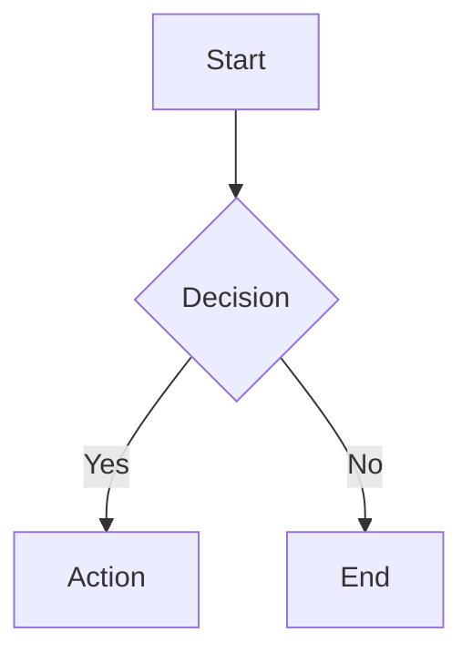

# WORK SESSION (0700-0800)

**Generated:** 2026-02-10T06:34:25.005Z
**Work Period:** 0700-0800
**Focus:** Live session logging
**Duration:** ~60 minutes

---

## Session Overview

This session captures real-time tool interactions and exchanges.

---

## Key Activities

<a name="ps_1770705265005"></a>
## Prompt Set (ps_1770705265005)

**Time:** 2026-02-10T06:34:25.005Z
**Duration:** 0ms
**Tool Calls:** 0

### Text Exchange - 2026-02-10 06:34:25 UTC [07:34:25 CEST]

**User Message:** commit this

**Assistant Response:** Not logged in · Please run /login


**Type:** Text-only exchange (no tool calls)

---

---

<a name="ps_1770705414354"></a>
## Prompt Set (ps_1770705414354)

**Time:** 2026-02-10T06:36:54.354Z
**Duration:** 0ms
**Tool Calls:** 0

### Text Exchange - 2026-02-10 06:36:54 UTC [07:36:54 CEST]

**User Message:** <local-command-caveat>Caveat: The messages below were generated by the user while running local commands. DO NOT respond to these messages or otherwise consider them in your response unless the user explicitly asks you to.</local-command-caveat>

**Type:** Text-only exchange (no tool calls)

---

---

<a name="ps_1770705414332"></a>
## Prompt Set (ps_1770705414332)

**Time:** 2026-02-10T06:36:54.332Z
**Duration:** 0ms
**Tool Calls:** 0

### Text Exchange - 2026-02-10 06:36:54 UTC [07:36:54 CEST]

**User Message:** <command-name>/login</command-name>
            <command-message>login</command-message>
            <command-args></command-args>

**Type:** Text-only exchange (no tool calls)

---

---

<a name="ps_1770705414332"></a>
## Prompt Set (ps_1770705414332)

**Time:** 2026-02-10T06:36:54.332Z
**Duration:** 0ms
**Tool Calls:** 0

### Text Exchange - 2026-02-10 06:36:54 UTC [07:36:54 CEST]

**User Message:** <local-command-stdout>Login successful</local-command-stdout>

**Type:** Text-only exchange (no tool calls)

---

---

<a name="ps_1770705584615"></a>
## Prompt Set (ps_1770705584615)

**Time:** 2026-02-10T06:39:44.615Z
**Duration:** 0ms
**Tool Calls:** 67

### Read - 2026-02-10 06:39:44 UTC [07:39:44 CEST]

**User Request:** Anthropic has opus 4.6 and sonnet 4.5 - are they not candidates for the config? Have all models you listed there '<AWS_SECRET_REDACTED>-providers.yaml' been the result of a web research to be current? Also, why does groq have an apiKeyEnvVarAlt? Can this be eliminated from the codebase? Or is it necessary to make things work, because we used to call it GROK instead of GROQ for some time? If so, can that not be fixed instedad?

**Tool:** Read
**Input:** ```json
{
  "file_path": "<AWS_SECRET_REDACTED>-providers.yaml"
}
```

**Result:** ✅ Success
**Output:** ```
     1→# Unified LLM Provider Configuration
     2→# Merged from model-tiers.yaml + dmr-config.yaml with new providers
     3→# Version: 1.0
     4→
     5→# Available providers and their models per tier
     6→providers:
     7→  groq:
     8→    apiKeyEnvVar: GROQ_API_KEY
     9→    apiKeyEnvVarAlt: GROK_API_KEY   # deprecated, backward compat
    10→    fast: "llama-3.1-8b-instant"        # ~$0.05/M tokens, 750 tok/s
    11→    standard: "llama-3.3-70b-versatile"  # ~$0.59/M tokens, 275 tok/s
...[truncated]
```


---

### Read - 2026-02-10 06:39:44 UTC [07:39:44 CEST]

**User Request:** Anthropic has opus 4.6 and sonnet 4.5 - are they not candidates for the config? Have all models you listed there '<AWS_SECRET_REDACTED>-providers.yaml' been the result of a web research to be current? Also, why does groq have an apiKeyEnvVarAlt? Can this be eliminated from the codebase? Or is it necessary to make things work, because we used to call it GROK instead of GROQ for some time? If so, can that not be fixed instedad?

**Tool:** Read
**Input:** ```json
{
  "file_path": "<AWS_SECRET_REDACTED>oviders/groq-provider.ts"
}
```

**Result:** ✅ Success
**Output:** ```
     1→/**
     2→ * Groq Provider
     3→ *
     4→ * Uses the Groq SDK (which has its own API shape, similar to OpenAI).
     5→ * Handles GROK_API_KEY → GROQ_API_KEY backward compatibility.
     6→ */
     7→
     8→import { OpenAICompatibleProvider } from './openai-compatible-provider.js';
     9→import { loadGroqSDK } from '../sdk-loader.js';
    10→import type { LLMCompletionRequest, LLMCompletionResult, ProviderConfig, ProviderName } from '../types.js';
    11→
    12→export class GroqPro
...[truncated]
```


---

### WebSearch - 2026-02-10 06:39:44 UTC [07:39:44 CEST]

**User Request:** Anthropic has opus 4.6 and sonnet 4.5 - are they not candidates for the config? Have all models you listed there '<AWS_SECRET_REDACTED>-providers.yaml' been the result of a web research to be current? Also, why does groq have an apiKeyEnvVarAlt? Can this be eliminated from the codebase? Or is it necessary to make things work, because we used to call it GROK instead of GROQ for some time? If so, can that not be fixed instedad?

**Tool:** WebSearch
**Input:** ```json
{
  "query": "Groq API available models 2026"
}
```

**Result:** ✅ Success
**Output:** ```
Web search results for query: "Groq API available models 2026"

Links: [{"title":"Supported Models - GroqDocs","url":"https://console.groq.com/docs/models"},{"title":"What models are available on Groq? - FAQs - Groq Community","url":"https://community.groq.com/t/what-models-are-available-on-groq/70"},{"title":"API Reference - GroqDocs","url":"https://console.groq.com/docs/api-reference"},{"title":"Groq On-Demand Pricing for Tokens-as-a-Service | Groq is fast, low cost inference.","url":"https://
...[truncated]
```


---

### WebSearch - 2026-02-10 06:39:44 UTC [07:39:44 CEST]

**User Request:** Anthropic has opus 4.6 and sonnet 4.5 - are they not candidates for the config? Have all models you listed there '<AWS_SECRET_REDACTED>-providers.yaml' been the result of a web research to be current? Also, why does groq have an apiKeyEnvVarAlt? Can this be eliminated from the codebase? Or is it necessary to make things work, because we used to call it GROK instead of GROQ for some time? If so, can that not be fixed instedad?

**Tool:** WebSearch
**Input:** ```json
{
  "query": "Anthropic Claude API model IDs 2026 opus sonnet haiku"
}
```

**Result:** ✅ Success
**Output:** ```
Web search results for query: "Anthropic Claude API model IDs 2026 opus sonnet haiku"

Links: [{"title":"Models overview - Claude API Docs","url":"https://platform.claude.com/docs/en/about-claude/models/overview"},{"title":"Anthropic Claude API Pricing 2026: Complete Cost Breakdown | MetaCTO","url":"https://www.metacto.com/blogs/anthropic-api-pricing-a-full-breakdown-of-costs-and-integration"},{"title":"Claude (language model) - Wikipedia","url":"https://en.wikipedia.org/wiki/Claude_(language_mo
...[truncated]
```


---

### WebSearch - 2026-02-10 06:39:44 UTC [07:39:44 CEST]

**User Request:** Anthropic has opus 4.6 and sonnet 4.5 - are they not candidates for the config? Have all models you listed there '<AWS_SECRET_REDACTED>-providers.yaml' been the result of a web research to be current? Also, why does groq have an apiKeyEnvVarAlt? Can this be eliminated from the codebase? Or is it necessary to make things work, because we used to call it GROK instead of GROQ for some time? If so, can that not be fixed instedad?

**Tool:** WebSearch
**Input:** ```json
{
  "query": "<COMPANY_NAME_REDACTED> Gemini API model IDs 2026 latest"
}
```

**Result:** ✅ Success
**Output:** ```
Web search results for query: "<COMPANY_NAME_REDACTED> Gemini API model IDs 2026 latest"

Links: [{"title":"Gemini models | Gemini API | <COMPANY_NAME_REDACTED> AI for Developers","url":"https://ai.<COMPANY_NAME_REDACTED>.dev/gemini-api/docs/models"},{"title":"<COMPANY_NAME_REDACTED> Gemini Models list. · GitHub","url":"https://gist.github.com/DF-wu/72ec3a7c2ff3247fc33b3eda07e048d0"},{"title":"Release notes | Gemini API | <COMPANY_NAME_REDACTED> AI for Developers","url":"https://ai.<COMPANY_NAME_REDACTED>.dev/gemini-api/docs/changelog"},{"title":"Learn about supported models | Firebase AI Logic 
...[truncated]
```


---

### WebSearch - 2026-02-10 06:39:44 UTC [07:39:44 CEST]

**User Request:** Anthropic has opus 4.6 and sonnet 4.5 - are they not candidates for the config? Have all models you listed there '<AWS_SECRET_REDACTED>-providers.yaml' been the result of a web research to be current? Also, why does groq have an apiKeyEnvVarAlt? Can this be eliminated from the codebase? Or is it necessary to make things work, because we used to call it GROK instead of GROQ for some time? If so, can that not be fixed instedad?

**Tool:** WebSearch
**Input:** ```json
{
  "query": "OpenAI API model IDs 2026 latest GPT"
}
```

**Result:** ✅ Success
**Output:** ```
Web search results for query: "OpenAI API model IDs 2026 latest GPT"

Links: [{"title":"Models | OpenAI API","url":"https://platform.openai.com/docs/models"},{"title":"Model Release Notes | OpenAI Help Center","url":"https://help.openai.com/en/articles/9624314-model-release-notes"},{"title":"Changelog | OpenAI API","url":"https://platform.openai.com/docs/changelog"},{"title":"Models | OpenAI API Reference","url":"https://platform.openai.com/docs/api-reference/models/list"},{"title":"All Model ID
...[truncated]
```


---

### WebSearch - 2026-02-10 06:39:44 UTC [07:39:44 CEST]

**User Request:** Anthropic has opus 4.6 and sonnet 4.5 - are they not candidates for the config? Have all models you listed there '<AWS_SECRET_REDACTED>-providers.yaml' been the result of a web research to be current? Also, why does groq have an apiKeyEnvVarAlt? Can this be eliminated from the codebase? Or is it necessary to make things work, because we used to call it GROK instead of GROQ for some time? If so, can that not be fixed instedad?

**Tool:** WebSearch
**Input:** ```json
{
  "query": "GitHub Models API available models 2026"
}
```

**Result:** ✅ Success
**Output:** ```
Web search results for query: "GitHub Models API available models 2026"

Links: [{"title":"GitHub Models","url":"https://github.com/marketplace?type=models"},{"title":"REST API endpoints for models catalog - GitHub Docs","url":"https://docs.github.com/en/rest/models/catalog"},{"title":"GitHub Models API now available - GitHub Changelog","url":"https://github.blog/changelog/2025-05-15-github-models-api-now-available/"},{"title":"GitHub Models - GitHub Docs","url":"https://docs.github.com/en/githu
...[truncated]
```


---

### WebFetch - 2026-02-10 06:39:44 UTC [07:39:44 CEST]

**User Request:** Anthropic has opus 4.6 and sonnet 4.5 - are they not candidates for the config? Have all models you listed there '<AWS_SECRET_REDACTED>-providers.yaml' been the result of a web research to be current? Also, why does groq have an apiKeyEnvVarAlt? Can this be eliminated from the codebase? Or is it necessary to make things work, because we used to call it GROK instead of GROQ for some time? If so, can that not be fixed instedad?

**Tool:** WebFetch
**Input:** ```json
{
  "url": "https://console.groq.com/docs/models",
  "prompt": "List all currently available production model IDs with their context windows and descriptions. Focus on the exact model ID strings used in API calls."
}
```

**Result:** ✅ Success
**Output:** ```
# Available Production Models on GroqCloud

Based on the documentation, here are the production model IDs with their specifications:

| Model ID | Context Window | Description |
|----------|----------------|-------------|
| `llama-3.1-8b-instant` | 131,072 tokens | "<COMPANY_NAME_REDACTED>'s Llama 3.1 8B model optimized for fast inference" |
| `llama-3.3-70b-versatile` | 131,072 tokens | "<COMPANY_NAME_REDACTED>'s versatile 70-billion parameter language model" |
| `<COMPANY_NAME_REDACTED>-llama/llama-guard-4-12b` | 131,072 tokens | Content moderation 
...[truncated]
```


---

### WebFetch - 2026-02-10 06:39:44 UTC [07:39:44 CEST]

**User Request:** Anthropic has opus 4.6 and sonnet 4.5 - are they not candidates for the config? Have all models you listed there '<AWS_SECRET_REDACTED>-providers.yaml' been the result of a web research to be current? Also, why does groq have an apiKeyEnvVarAlt? Can this be eliminated from the codebase? Or is it necessary to make things work, because we used to call it GROK instead of GROQ for some time? If so, can that not be fixed instedad?

**Tool:** WebFetch
**Input:** ```json
{
  "url": "https://platform.claude.com/docs/en/about-claude/models/overview",
  "prompt": "List all currently available Claude model API IDs (the exact string used in API calls like claude-sonnet-4-5-20250929). Include all current production models with their API identifiers."
}
```

**Result:** ✅ Success
**Output:** ```
# Models overview

Claude is a family of state-of-the-art large language models developed by Anthropic. This guide introduces our models and compares their performance.

---

## Choosing a model

If you're unsure which model to use, we recommend starting with **Claude Opus 4.6** for the most complex tasks. It is our latest generation model with exceptional performance in coding and reasoning.

All current Claude models support text and image input, text output, multilingual capabilities, and vis
...[truncated]
```


---

### WebFetch - 2026-02-10 06:39:44 UTC [07:39:44 CEST]

**User Request:** Anthropic has opus 4.6 and sonnet 4.5 - are they not candidates for the config? Have all models you listed there '<AWS_SECRET_REDACTED>-providers.yaml' been the result of a web research to be current? Also, why does groq have an apiKeyEnvVarAlt? Can this be eliminated from the codebase? Or is it necessary to make things work, because we used to call it GROK instead of GROQ for some time? If so, can that not be fixed instedad?

**Tool:** WebFetch
**Input:** ```json
{
  "url": "https://ai.<COMPANY_NAME_REDACTED>.dev/gemini-api/docs/models",
  "prompt": "List all currently available Gemini model IDs for API calls (like gemini-2.5-flash, gemini-2.5-pro). Focus on exact model ID strings for chat/completions."
}
```

**Result:** ❌ Error
**Output:** ```
<tool_use_error>Sibling tool call errored</tool_use_error>
```


---

### WebFetch - 2026-02-10 06:39:44 UTC [07:39:44 CEST]

**User Request:** Anthropic has opus 4.6 and sonnet 4.5 - are they not candidates for the config? Have all models you listed there '<AWS_SECRET_REDACTED>-providers.yaml' been the result of a web research to be current? Also, why does groq have an apiKeyEnvVarAlt? Can this be eliminated from the codebase? Or is it necessary to make things work, because we used to call it GROK instead of GROQ for some time? If so, can that not be fixed instedad?

**Tool:** WebFetch
**Input:** ```json
{
  "url": "https://platform.openai.com/docs/models",
  "prompt": "List all currently available OpenAI model IDs for API calls (like gpt-4o, gpt-4o-mini, o3-mini). Focus on the exact model ID strings for chat completions."
}
```

**Result:** ❌ Error
**Output:** ```
Request failed with status code 403
```


---

### WebFetch - 2026-02-10 06:39:44 UTC [07:39:44 CEST]

**User Request:** Anthropic has opus 4.6 and sonnet 4.5 - are they not candidates for the config? Have all models you listed there '<AWS_SECRET_REDACTED>-providers.yaml' been the result of a web research to be current? Also, why does groq have an apiKeyEnvVarAlt? Can this be eliminated from the codebase? Or is it necessary to make things work, because we used to call it GROK instead of GROQ for some time? If so, can that not be fixed instedad?

**Tool:** WebFetch
**Input:** ```json
{
  "url": "https://ai.<COMPANY_NAME_REDACTED>.dev/gemini-api/docs/models",
  "prompt": "List all available Gemini model IDs for the API (like gemini-2.5-flash, gemini-3-pro-preview). What are the current production models and their exact IDs?"
}
```

**Result:** ❌ Error
**Output:** ```
<tool_use_error>Sibling tool call errored</tool_use_error>
```


---

### WebFetch - 2026-02-10 06:39:44 UTC [07:39:44 CEST]

**User Request:** Anthropic has opus 4.6 and sonnet 4.5 - are they not candidates for the config? Have all models you listed there '<AWS_SECRET_REDACTED>-providers.yaml' been the result of a web research to be current? Also, why does groq have an apiKeyEnvVarAlt? Can this be eliminated from the codebase? Or is it necessary to make things work, because we used to call it GROK instead of GROQ for some time? If so, can that not be fixed instedad?

**Tool:** WebFetch
**Input:** ```json
{
  "url": "https://platform.openai.com/docs/models",
  "prompt": "List all available OpenAI chat model IDs. What are the current production models and their exact API IDs (like gpt-4o, o3-mini)?"
}
```

**Result:** ❌ Error
**Output:** ```
Request failed with status code 403
```


---

### WebSearch - 2026-02-10 06:39:44 UTC [07:39:44 CEST]

**User Request:** Anthropic has opus 4.6 and sonnet 4.5 - are they not candidates for the config? Have all models you listed there '<AWS_SECRET_REDACTED>-providers.yaml' been the result of a web research to be current? Also, why does groq have an apiKeyEnvVarAlt? Can this be eliminated from the codebase? Or is it necessary to make things work, because we used to call it GROK instead of GROQ for some time? If so, can that not be fixed instedad?

**Tool:** WebSearch
**Input:** ```json
{
  "query": "Gemini API model IDs \"gemini-2.5-flash\" \"gemini-2.5-pro\" \"gemini-3\" exact model ID string 2026"
}
```

**Result:** ✅ Success
**Output:** ```
Web search results for query: "Gemini API model IDs "gemini-2.5-flash" "gemini-2.5-pro" "gemini-3" exact model ID string 2026"

Links: [{"title":"Gemini models | Gemini API | <COMPANY_NAME_REDACTED> AI for Developers","url":"https://ai.<COMPANY_NAME_REDACTED>.dev/gemini-api/docs/models"},{"title":"Learn about supported models | Firebase AI Logic","url":"https://firebase.<COMPANY_NAME_REDACTED>.com/docs/ai-logic/models"},{"title":"Gemini 2.5 Flash | Generative AI on Vertex AI | <COMPANY_NAME_REDACTED> Cloud Documentation","url":"https://docs.cloud.<COMPANY_NAME_REDACTED>.com/vert
...[truncated]
```


---

### WebSearch - 2026-02-10 06:39:44 UTC [07:39:44 CEST]

**User Request:** Anthropic has opus 4.6 and sonnet 4.5 - are they not candidates for the config? Have all models you listed there '<AWS_SECRET_REDACTED>-providers.yaml' been the result of a web research to be current? Also, why does groq have an apiKeyEnvVarAlt? Can this be eliminated from the codebase? Or is it necessary to make things work, because we used to call it GROK instead of GROQ for some time? If so, can that not be fixed instedad?

**Tool:** WebSearch
**Input:** ```json
{
  "query": "OpenAI API model IDs \"gpt-4o-mini\" \"o3-mini\" \"gpt-5\" exact chat completion model strings February 2026"
}
```

**Result:** ✅ Success
**Output:** ```
Web search results for query: "OpenAI API model IDs "gpt-4o-mini" "o3-mini" "gpt-5" exact chat completion model strings February 2026"

Links: [{"title":"Models | OpenAI API","url":"https://platform.openai.com/docs/models"},{"title":"GPT-4o mini Model | OpenAI API","url":"https://platform.openai.com/docs/models/gpt-4o-mini"},{"title":"Model Release Notes | OpenAI Help Center","url":"https://help.openai.com/en/articles/9624314-model-release-notes"},{"title":"Introducing GPT-4.1 in the API | OpenA
...[truncated]
```


---

### Read - 2026-02-10 06:39:44 UTC [07:39:44 CEST]

**User Request:** Anthropic has opus 4.6 and sonnet 4.5 - are they not candidates for the config? Have all models you listed there '<AWS_SECRET_REDACTED>-providers.yaml' been the result of a web research to be current? Also, why does groq have an apiKeyEnvVarAlt? Can this be eliminated from the codebase? Or is it necessary to make things work, because we used to call it GROK instead of GROQ for some time? If so, can that not be fixed instedad?

**Tool:** Read
**Input:** ```json
{
  "file_path": "<AWS_SECRET_REDACTED>ns/mcp-constraint-monitor/src/engines/semantic-validator.js",
  "limit": 50
}
```

**Result:** ✅ Success
**Output:** ```
     1→import { LLMService } from '../../../../lib/llm/dist/index.js';
     2→import { logger, PerformanceTimer } from '../utils/logger.js';
     3→
     4→/**
     5→ * Configurable Semantic Constraint Validator
     6→ *
     7→ * Delegates LLM calls to the unified LLMService from lib/llm/.
     8→ * Keeps domain logic: prompt building, response parsing, constraint routing.
     9→ *
    10→ * Usage:
    11→ *   const validator = new SemanticValidator(config);
    12→ *   const result = await 
...[truncated]
```


---

### Read - 2026-02-10 06:39:44 UTC [07:39:44 CEST]

**User Request:** Anthropic has opus 4.6 and sonnet 4.5 - are they not candidates for the config? Have all models you listed there '<AWS_SECRET_REDACTED>-providers.yaml' been the result of a web research to be current? Also, why does groq have an apiKeyEnvVarAlt? Can this be eliminated from the codebase? Or is it necessary to make things work, because we used to call it GROK instead of GROQ for some time? If so, can that not be fixed instedad?

**Tool:** Read
**Input:** ```json
{
  "file_path": "<AWS_SECRET_REDACTED>nce/UnifiedInferenceEngine.js",
  "limit": 60
}
```

**Result:** ✅ Success
**Output:** ```
     1→/**
     2→ * UnifiedInferenceEngine
     3→ *
     4→ * Centralized LLM inference engine shared by all components (trajectory, knowledge extraction, etc.)
     5→ * Now delegates all provider management to LLMService from lib/llm/.
     6→ *
     7→ * Key Features (preserved):
     8→ * - EventEmitter pattern for inference lifecycle events
     9→ * - Budget tracking and enforcement (via DI)
    10→ * - Sensitivity-based routing (via DI)
    11→ * - Performance monitoring and stats
    1
...[truncated]
```


---

### Read - 2026-02-10 06:39:44 UTC [07:39:44 CEST]

**User Request:** Anthropic has opus 4.6 and sonnet 4.5 - are they not candidates for the config? Have all models you listed there '<AWS_SECRET_REDACTED>-providers.yaml' been the result of a web research to be current? Also, why does groq have an apiKeyEnvVarAlt? Can this be eliminated from the codebase? Or is it necessary to make things work, because we used to call it GROK instead of GROQ for some time? If so, can that not be fixed instedad?

**Tool:** Read
**Input:** ```json
{
  "file_path": "<AWS_SECRET_REDACTED>pes.ts"
}
```

**Result:** ✅ Success
**Output:** ```
     1→/**
     2→ * Unified LLM Support Layer - Type Definitions
     3→ *
     4→ * Core types shared across all providers and consumers.
     5→ */
     6→
     7→// --- Provider & Model Types ---
     8→
     9→export type ProviderName =
    10→  | 'groq'
    11→  | 'anthropic'
    12→  | 'openai'
    13→  | 'gemini'
    14→  | 'github-models'
    15→  | 'dmr'
    16→  | 'ollama'
    17→  | 'mock';
    18→
    19→export type ModelTier = 'fast' | 'standard' | 'premium';
    20→
    21→export 
...[truncated]
```


---

### Read - 2026-02-10 06:39:44 UTC [07:39:44 CEST]

**User Request:** Anthropic has opus 4.6 and sonnet 4.5 - are they not candidates for the config? Have all models you listed there '<AWS_SECRET_REDACTED>-providers.yaml' been the result of a web research to be current? Also, why does groq have an apiKeyEnvVarAlt? Can this be eliminated from the codebase? Or is it necessary to make things work, because we used to call it GROK instead of GROQ for some time? If so, can that not be fixed instedad?

**Tool:** Read
**Input:** ```json
{
  "file_path": "<AWS_SECRET_REDACTED>nfig.ts"
}
```

**Result:** ✅ Success
**Output:** ```
     1→/**
     2→ * Configuration Loader
     3→ *
     4→ * Loads and merges LLM provider config from YAML, with env var expansion.
     5→ */
     6→
     7→import * as fs from 'fs';
     8→import * as path from 'path';
     9→import type { LLMServiceConfig, ModelTier, ProviderName } from './types.js';
    10→
    11→// Dynamic import for yaml (ES module)
    12→let yamlModule: any = null;
    13→async function loadYaml(): Promise<any> {
    14→  if (!yamlModule) {
    15→    try {
    16→   
...[truncated]
```


---

### Read - 2026-02-10 06:39:44 UTC [07:39:44 CEST]

**User Request:** Anthropic has opus 4.6 and sonnet 4.5 - are they not candidates for the config? Have all models you listed there '<AWS_SECRET_REDACTED>-providers.yaml' been the result of a web research to be current? Also, why does groq have an apiKeyEnvVarAlt? Can this be eliminated from the codebase? Or is it necessary to make things work, because we used to call it GROK instead of GROQ for some time? If so, can that not be fixed instedad?

**Tool:** Read
**Input:** ```json
{
  "file_path": "<AWS_SECRET_REDACTED>oviders/anthropic-provider.ts"
}
```

**Result:** ✅ Success
**Output:** ```
     1→/**
     2→ * Anthropic Provider
     3→ *
     4→ * Uses the Anthropic SDK (different API shape from OpenAI).
     5→ * messages.create() with separate content extraction.
     6→ */
     7→
     8→import { BaseProvider } from './base-provider.js';
     9→import { loadAnthropicSDK } from '../sdk-loader.js';
    10→import type { LLMCompletionRequest, LLMCompletionResult, ProviderConfig, ProviderName } from '../types.js';
    11→
    12→export class AnthropicProvider extends BaseProvider {
...[truncated]
```


---

### Read - 2026-02-10 06:39:44 UTC [07:39:44 CEST]

**User Request:** Anthropic has opus 4.6 and sonnet 4.5 - are they not candidates for the config? Have all models you listed there '<AWS_SECRET_REDACTED>-providers.yaml' been the result of a web research to be current? Also, why does groq have an apiKeyEnvVarAlt? Can this be eliminated from the codebase? Or is it necessary to make things work, because we used to call it GROK instead of GROQ for some time? If so, can that not be fixed instedad?

**Tool:** Read
**Input:** ```json
{
  "file_path": "<AWS_SECRET_REDACTED>oviders/gemini-provider.ts"
}
```

**Result:** ✅ Success
**Output:** ```
     1→/**
     2→ * Gemini Provider
     3→ *
     4→ * Uses the @<COMPANY_NAME_REDACTED>/generative-ai SDK (different API shape from OpenAI).
     5→ * generateContent() with usageMetadata token extraction.
     6→ */
     7→
     8→import { BaseProvider } from './base-provider.js';
     9→import { loadGeminiSDK } from '../sdk-loader.js';
    10→import type { LLMCompletionRequest, LLMCompletionResult, ProviderConfig, ProviderName } from '../types.js';
    11→
    12→export class GeminiProvider extends BaseProv
...[truncated]
```


---

### Read - 2026-02-10 06:39:44 UTC [07:39:44 CEST]

**User Request:** Anthropic has opus 4.6 and sonnet 4.5 - are they not candidates for the config? Have all models you listed there '<AWS_SECRET_REDACTED>-providers.yaml' been the result of a web research to be current? Also, why does groq have an apiKeyEnvVarAlt? Can this be eliminated from the codebase? Or is it necessary to make things work, because we used to call it GROK instead of GROQ for some time? If so, can that not be fixed instedad?

**Tool:** Read
**Input:** ```json
{
  "file_path": "<AWS_SECRET_REDACTED>oviders/openai-provider.ts"
}
```

**Result:** ✅ Success
**Output:** ```
     1→/**
     2→ * OpenAI Provider
     3→ *
     4→ * Standard OpenAI API. Skips if OPENAI_BASE_URL is set (that's the custom/corporate provider).
     5→ */
     6→
     7→import { OpenAICompatibleProvider } from './openai-compatible-provider.js';
     8→import type { ProviderConfig, ProviderName } from '../types.js';
     9→
    10→export class OpenAIProvider extends OpenAICompatibleProvider {
    11→  readonly name: ProviderName = 'openai';
    12→  readonly isLocal = false;
    13→
    14
...[truncated]
```


---

### Read - 2026-02-10 06:39:44 UTC [07:39:44 CEST]

**User Request:** Anthropic has opus 4.6 and sonnet 4.5 - are they not candidates for the config? Have all models you listed there '<AWS_SECRET_REDACTED>-providers.yaml' been the result of a web research to be current? Also, why does groq have an apiKeyEnvVarAlt? Can this be eliminated from the codebase? Or is it necessary to make things work, because we used to call it GROK instead of GROQ for some time? If so, can that not be fixed instedad?

**Tool:** Read
**Input:** ```json
{
  "file_path": "<AWS_SECRET_REDACTED>oviders/github-models-provider.ts"
}
```

**Result:** ✅ Success
**Output:** ```
     1→/**
     2→ * GitHub Models Provider
     3→ *
     4→ * Uses GITHUB_TOKEN with the GitHub Models inference endpoint.
     5→ * OpenAI-compatible API at https://models.github.ai/inference/v1
     6→ */
     7→
     8→import { OpenAICompatibleProvider } from './openai-compatible-provider.js';
     9→import type { ProviderConfig, ProviderName } from '../types.js';
    10→
    11→export class GitHubModelsProvider extends OpenAICompatibleProvider {
    12→  readonly name: ProviderName = 'gith
...[truncated]
```


---

### Read - 2026-02-10 06:39:44 UTC [07:39:44 CEST]

**User Request:** Anthropic has opus 4.6 and sonnet 4.5 - are they not candidates for the config? Have all models you listed there '<AWS_SECRET_REDACTED>-providers.yaml' been the result of a web research to be current? Also, why does groq have an apiKeyEnvVarAlt? Can this be eliminated from the codebase? Or is it necessary to make things work, because we used to call it GROK instead of GROQ for some time? If so, can that not be fixed instedad?

**Tool:** Read
**Input:** ```json
{
  "file_path": "<AWS_SECRET_REDACTED>ovider-registry.ts"
}
```

**Result:** ✅ Success
**Output:** ```
     1→/**
     2→ * Provider Registry
     3→ *
     4→ * Auto-registers providers, resolves provider chains for requests,
     5→ * and handles tier-based routing.
     6→ */
     7→
     8→import type {
     9→  LLMProvider, LLMCompletionRequest, LLMServiceConfig,
    10→  ProviderName, ModelTier, DMRConfig,
    11→} from './types.js';
    12→
    13→import { GroqProvider } from './providers/groq-provider.js';
    14→import { OpenAIProvider } from './providers/openai-provider.js';
    15→impo
...[truncated]
```


---

### Edit - 2026-02-10 06:39:44 UTC [07:39:44 CEST]

**User Request:** Anthropic has opus 4.6 and sonnet 4.5 - are they not candidates for the config? Have all models you listed there '<AWS_SECRET_REDACTED>-providers.yaml' been the result of a web research to be current? Also, why does groq have an apiKeyEnvVarAlt? Can this be eliminated from the codebase? Or is it necessary to make things work, because we used to call it GROK instead of GROQ for some time? If so, can that not be fixed instedad?

**Tool:** Edit
**Input:** ```json
{
  "replace_all": false,
  "file_path": "<AWS_SECRET_REDACTED>pes.ts",
  "old_string": "  apiKeyEnvVar: string;\n  apiKeyEnvVarAlt?: string;\n  baseUrl?: string;",
  "new_string": "  apiKeyEnvVar: string;\n  baseUrl?: string;"
}
```

**Result:** ✅ Success
**Output:** ```
The file <AWS_SECRET_REDACTED>pes.ts has been updated successfully.
```


---

### Edit - 2026-02-10 06:39:44 UTC [07:39:44 CEST]

**User Request:** Anthropic has opus 4.6 and sonnet 4.5 - are they not candidates for the config? Have all models you listed there '<AWS_SECRET_REDACTED>-providers.yaml' been the result of a web research to be current? Also, why does groq have an apiKeyEnvVarAlt? Can this be eliminated from the codebase? Or is it necessary to make things work, because we used to call it GROK instead of GROQ for some time? If so, can that not be fixed instedad?

**Tool:** Edit
**Input:** ```json
{
  "replace_all": false,
  "file_path": "<AWS_SECRET_REDACTED>oviders/groq-provider.ts",
  "old_string": "  protected getApiKey(): string | null {\n    const groqKey = process.env.GROQ_API_KEY;\n    if (groqKey && groqKey !== 'your-groq-api-key') return groqKey;\n\n    // Backward compatibility: accept GROK_API_KEY with deprecation warning\n    const grokKey = process.env.GROK_API_KEY;\n    if (grokKey && grokKey !== 'your-groq-api-key') {\n      console.warn('[llm:groq] GROK_API_KEY is deprecated, please use GROQ_API_KEY instead');\n      return grokKey;\n    }\n\n    return null;\n  }",
  "new_string": "  protected getApiKey(): string | null {\n    const key = process.env.GROQ_API_KEY;\n    if (key && key !== 'your-groq-api-key') return key;\n    return null;\n  }"
}
```

**Result:** ✅ Success
**Output:** ```
The file <AWS_SECRET_REDACTED>oviders/groq-provider.ts has been updated successfully.
```


---

### Edit - 2026-02-10 06:39:44 UTC [07:39:44 CEST]

**User Request:** Anthropic has opus 4.6 and sonnet 4.5 - are they not candidates for the config? Have all models you listed there '<AWS_SECRET_REDACTED>-providers.yaml' been the result of a web research to be current? Also, why does groq have an apiKeyEnvVarAlt? Can this be eliminated from the codebase? Or is it necessary to make things work, because we used to call it GROK instead of GROQ for some time? If so, can that not be fixed instedad?

**Tool:** Edit
**Input:** ```json
{
  "replace_all": false,
  "file_path": "<AWS_SECRET_REDACTED>oviders/groq-provider.ts",
  "old_string": " * Handles GROK_API_KEY → GROQ_API_KEY backward compatibility.",
  "new_string": " * Uses GROQ_API_KEY for authentication."
}
```

**Result:** ✅ Success
**Output:** ```
The file <AWS_SECRET_REDACTED>oviders/groq-provider.ts has been updated successfully.
```


---

### Edit - 2026-02-10 06:39:44 UTC [07:39:44 CEST]

**User Request:** Anthropic has opus 4.6 and sonnet 4.5 - are they not candidates for the config? Have all models you listed there '<AWS_SECRET_REDACTED>-providers.yaml' been the result of a web research to be current? Also, why does groq have an apiKeyEnvVarAlt? Can this be eliminated from the codebase? Or is it necessary to make things work, because we used to call it GROK instead of GROQ for some time? If so, can that not be fixed instedad?

**Tool:** Edit
**Input:** ```json
{
  "replace_all": false,
  "file_path": "<AWS_SECRET_REDACTED>-providers.yaml",
  "old_string": "providers:\n  groq:\n    apiKeyEnvVar: GROQ_API_KEY\n    apiKeyEnvVarAlt: GROK_API_KEY   # deprecated, backward compat\n    fast: \"llama-3.1-8b-instant\"        # ~$0.05/M tokens, 750 tok/s\n    standard: \"llama-3.3-70b-versatile\"  # ~$0.59/M tokens, 275 tok/s\n    # No premium tier on Groq\n\n  anthropic:\n    apiKeyEnvVar: ANTHROPIC_API_KEY\n    standard: \"claude-3-5-haiku-latest\"  # ~$1/M tokens\n    premium: \"claude-sonnet-4-20250514\"  # ~$3/M tokens, best reasoning\n\n  openai:\n    apiKeyEnvVar: OPENAI_API_KEY\n    standard: \"gpt-4o-mini\"              # ~$0.15/M tokens\n    premium: \"gpt-4o\"                    # ~$5/M tokens\n\n  gemini:\n    apiKeyEnvVar: GOOGLE_API_KEY\n    fast: \"gemini-2.0-flash-exp\"\n    standard: \"gemini-2.0-flash-exp\"\n    premium: \"gemini-1.5-pro\"\n\n  github-models:\n    apiKeyEnvVar: GITHUB_TOKEN\n    baseUrl: \"https://models.github.ai/inference/v1\"\n    fast: \"gpt-4o-mini\"\n    standard: \"gpt-4o\"\n    premium: \"gpt-4o\"",
  "new_string": "providers:\n  groq:\n    apiKeyEnvVar: GROQ_API_KEY\n    fast: \"llama-3.1-8b-instant\"        # ~$0.05/M tokens, 750 tok/s\n    standard: \"llama-3.3-70b-versatile\"  # ~$0.59/M tokens, 275 tok/s\n    premium: \"openai/gpt-oss-120b\"      # 120B param, available on Groq\n\n  anthropic:\n    apiKeyEnvVar: ANTHROPIC_API_KEY\n    fast: \"claude-haiku-4-5\"            # $1/$5 per MTok, fastest\n    standard: \"claude-sonnet-4-5\"       # $3/$15 per MTok, fast + intelligent\n    premium: \"claude-opus-4-6\"          # $5/$25 per MTok, most intelligent\n\n  openai:\n    apiKeyEnvVar: OPENAI_API_KEY\n    fast: \"gpt-4.1-mini\"               # affordable small model\n    standard: \"gpt-4.1\"                # latest standard model\n    premium: \"o4-mini\"                  # reasoning model\n\n  gemini:\n    apiKeyEnvVar: GOOGLE_API_KEY\n    fast: \"gemini-2.5-flash\"            # fast, cost-effective\n    standard: \"gemini-2.5-flash\"        # good balance\n    premium: \"gemini-2.5-pro\"           # deep reasoning\n\n  github-models:\n    apiKeyEnvVar: GITHUB_TOKEN\n    baseUrl: \"https://models.github.ai/inference/v1\"\n    fast: \"gpt-4.1-mini\"\n    standard: \"gpt-4.1\"\n    premium: \"o4-mini\""
}
```

**Result:** ✅ Success
**Output:** ```
The file <AWS_SECRET_REDACTED>-providers.yaml has been updated successfully.
```


---

### Edit - 2026-02-10 06:39:44 UTC [07:39:44 CEST]

**User Request:** Anthropic has opus 4.6 and sonnet 4.5 - are they not candidates for the config? Have all models you listed there '<AWS_SECRET_REDACTED>-providers.yaml' been the result of a web research to be current? Also, why does groq have an apiKeyEnvVarAlt? Can this be eliminated from the codebase? Or is it necessary to make things work, because we used to call it GROK instead of GROQ for some time? If so, can that not be fixed instedad?

**Tool:** Edit
**Input:** ```json
{
  "replace_all": false,
  "file_path": "<AWS_SECRET_REDACTED>nfig.ts",
  "old_string": "      groq: {\n        name: 'groq' as ProviderName,\n        apiKeyEnvVar: 'GROQ_API_KEY',\n        apiKeyEnvVarAlt: 'GROK_API_KEY',\n        models: { fast: 'llama-3.1-8b-instant', standard: 'llama-3.3-70b-versatile' },\n        defaultModel: 'llama-3.3-70b-versatile',\n      },\n      anthropic: {\n        name: 'anthropic' as ProviderName,\n        apiKeyEnvVar: 'ANTHROPIC_API_KEY',\n        models: { standard: 'claude-3-5-haiku-latest', premium: 'claude-sonnet-4-20250514' },\n        defaultModel: 'claude-3-5-haiku-latest',\n      },\n      openai: {\n        name: 'openai' as ProviderName,\n        apiKeyEnvVar: 'OPENAI_API_KEY',\n        models: { standard: 'gpt-4o-mini', premium: 'gpt-4o' },\n        defaultModel: 'gpt-4o-mini',\n      },\n      gemini: {\n        name: 'gemini' as ProviderName,\n        apiKeyEnvVar: 'GOOGLE_API_KEY',\n        models: { fast: 'gemini-2.0-flash-exp', standard: 'gemini-2.0-flash-exp', premium: 'gemini-1.5-pro' },\n        defaultModel: 'gemini-2.0-flash-exp',\n      },\n      'github-models': {\n        name: 'github-models' as ProviderName,\n        apiKeyEnvVar: 'GITHUB_TOKEN',\n        baseUrl: 'https://models.github.ai/inference/v1',\n        models: { fast: 'gpt-4o-mini', standard: 'gpt-4o', premium: 'gpt-4o' },\n        defaultModel: 'gpt-4o-mini',\n      },",
  "new_string": "      groq: {\n        name: 'groq' as ProviderName,\n        apiKeyEnvVar: 'GROQ_API_KEY',\n        models: { fast: 'llama-3.1-8b-instant', standard: 'llama-3.3-70b-versatile', premium: 'openai/gpt-oss-120b' },\n        defaultModel: 'llama-3.3-70b-versatile',\n      },\n      anthropic: {\n        name: 'anthropic' as ProviderName,\n        apiKeyEnvVar: 'ANTHROPIC_API_KEY',\n        models: { fast: 'claude-haiku-4-5', standard: 'claude-sonnet-4-5', premium: 'claude-opus-4-6' },\n        defaultModel: 'claude-sonnet-4-5',\n      },\n      openai: {\n        name: 'openai' as ProviderName,\n        apiKeyEnvVar: 'OPENAI_API_KEY',\n        models: { fast: 'gpt-4.1-mini', standard: 'gpt-4.1', premium: 'o4-mini' },\n        defaultModel: 'gpt-4.1-mini',\n      },\n      gemini: {\n        name: 'gemini' as ProviderName,\n        apiKeyEnvVar: 'GOOGLE_API_KEY',\n        models: { fast: 'gemini-2.5-flash', standard: 'gemini-2.5-flash', premium: 'gemini-2.5-pro' },\n        defaultModel: 'gemini-2.5-flash',\n      },\n      'github-models': {\n        name: 'github-models' as ProviderName,\n        apiKeyEnvVar: 'GITHUB_TOKEN',\n        baseUrl: 'https://models.github.ai/inference/v1',\n        models: { fast: 'gpt-4.1-mini', standard: 'gpt-4.1', premium: 'o4-mini' },\n        defaultModel: 'gpt-4.1-mini',\n      },"
}
```

**Result:** ✅ Success
**Output:** ```
The file <AWS_SECRET_REDACTED>nfig.ts has been updated successfully.
```


---

### Edit - 2026-02-10 06:39:44 UTC [07:39:44 CEST]

**User Request:** Anthropic has opus 4.6 and sonnet 4.5 - are they not candidates for the config? Have all models you listed there '<AWS_SECRET_REDACTED>-providers.yaml' been the result of a web research to be current? Also, why does groq have an apiKeyEnvVarAlt? Can this be eliminated from the codebase? Or is it necessary to make things work, because we used to call it GROK instead of GROQ for some time? If so, can that not be fixed instedad?

**Tool:** Edit
**Input:** ```json
{
  "replace_all": false,
  "file_path": "<AWS_SECRET_REDACTED>oviders/anthropic-provider.ts",
  "old_string": "      models: { standard: 'claude-3-5-haiku-latest', premium: 'claude-sonnet-4-20250514' },\n      defaultModel: 'claude-3-5-haiku-latest',",
  "new_string": "      models: { fast: 'claude-haiku-4-5', standard: 'claude-sonnet-4-5', premium: 'claude-opus-4-6' },\n      defaultModel: 'claude-sonnet-4-5',"
}
```

**Result:** ✅ Success
**Output:** ```
The file <AWS_SECRET_REDACTED>oviders/anthropic-provider.ts has been updated successfully.
```


---

### Edit - 2026-02-10 06:39:44 UTC [07:39:44 CEST]

**User Request:** Anthropic has opus 4.6 and sonnet 4.5 - are they not candidates for the config? Have all models you listed there '<AWS_SECRET_REDACTED>-providers.yaml' been the result of a web research to be current? Also, why does groq have an apiKeyEnvVarAlt? Can this be eliminated from the codebase? Or is it necessary to make things work, because we used to call it GROK instead of GROQ for some time? If so, can that not be fixed instedad?

**Tool:** Edit
**Input:** ```json
{
  "replace_all": false,
  "file_path": "<AWS_SECRET_REDACTED>oviders/gemini-provider.ts",
  "old_string": "      models: { fast: 'gemini-2.0-flash-exp', standard: 'gemini-2.0-flash-exp', premium: 'gemini-1.5-pro' },\n      defaultModel: 'gemini-2.0-flash-exp',",
  "new_string": "      models: { fast: 'gemini-2.5-flash', standard: 'gemini-2.5-flash', premium: 'gemini-2.5-pro' },\n      defaultModel: 'gemini-2.5-flash',"
}
```

**Result:** ✅ Success
**Output:** ```
The file <AWS_SECRET_REDACTED>oviders/gemini-provider.ts has been updated successfully.
```


---

### Edit - 2026-02-10 06:39:44 UTC [07:39:44 CEST]

**User Request:** Anthropic has opus 4.6 and sonnet 4.5 - are they not candidates for the config? Have all models you listed there '<AWS_SECRET_REDACTED>-providers.yaml' been the result of a web research to be current? Also, why does groq have an apiKeyEnvVarAlt? Can this be eliminated from the codebase? Or is it necessary to make things work, because we used to call it GROK instead of GROQ for some time? If so, can that not be fixed instedad?

**Tool:** Edit
**Input:** ```json
{
  "replace_all": false,
  "file_path": "<AWS_SECRET_REDACTED>oviders/openai-provider.ts",
  "old_string": "      models: { standard: 'gpt-4o-mini', premium: 'gpt-4o' },\n      defaultModel: 'gpt-4o-mini',",
  "new_string": "      models: { fast: 'gpt-4.1-mini', standard: 'gpt-4.1', premium: 'o4-mini' },\n      defaultModel: 'gpt-4.1-mini',"
}
```

**Result:** ✅ Success
**Output:** ```
The file <AWS_SECRET_REDACTED>oviders/openai-provider.ts has been updated successfully.
```


---

### Edit - 2026-02-10 06:39:44 UTC [07:39:44 CEST]

**User Request:** Anthropic has opus 4.6 and sonnet 4.5 - are they not candidates for the config? Have all models you listed there '<AWS_SECRET_REDACTED>-providers.yaml' been the result of a web research to be current? Also, why does groq have an apiKeyEnvVarAlt? Can this be eliminated from the codebase? Or is it necessary to make things work, because we used to call it GROK instead of GROQ for some time? If so, can that not be fixed instedad?

**Tool:** Edit
**Input:** ```json
{
  "replace_all": false,
  "file_path": "<AWS_SECRET_REDACTED>oviders/github-models-provider.ts",
  "old_string": "      models: { fast: 'gpt-4o-mini', standard: 'gpt-4o', premium: 'gpt-4o' },\n      defaultModel: 'gpt-4o-mini',",
  "new_string": "      models: { fast: 'gpt-4.1-mini', standard: 'gpt-4.1', premium: 'o4-mini' },\n      defaultModel: 'gpt-4.1-mini',"
}
```

**Result:** ✅ Success
**Output:** ```
The file <AWS_SECRET_REDACTED>oviders/github-models-provider.ts has been updated successfully.
```


---

### Edit - 2026-02-10 06:39:44 UTC [07:39:44 CEST]

**User Request:** Anthropic has opus 4.6 and sonnet 4.5 - are they not candidates for the config? Have all models you listed there '<AWS_SECRET_REDACTED>-providers.yaml' been the result of a web research to be current? Also, why does groq have an apiKeyEnvVarAlt? Can this be eliminated from the codebase? Or is it necessary to make things work, because we used to call it GROK instead of GROQ for some time? If so, can that not be fixed instedad?

**Tool:** Edit
**Input:** ```json
{
  "replace_all": false,
  "file_path": "<AWS_SECRET_REDACTED>oviders/groq-provider.ts",
  "old_string": "      models: { fast: 'llama-3.1-8b-instant', standard: 'llama-3.3-70b-versatile' },",
  "new_string": "      models: { fast: 'llama-3.1-8b-instant', standard: 'llama-3.3-70b-versatile', premium: 'openai/gpt-oss-120b' },"
}
```

**Result:** ✅ Success
**Output:** ```
The file <AWS_SECRET_REDACTED>oviders/groq-provider.ts has been updated successfully.
```


---

### Edit - 2026-02-10 06:39:44 UTC [07:39:44 CEST]

**User Request:** Anthropic has opus 4.6 and sonnet 4.5 - are they not candidates for the config? Have all models you listed there '<AWS_SECRET_REDACTED>-providers.yaml' been the result of a web research to be current? Also, why does groq have an apiKeyEnvVarAlt? Can this be eliminated from the codebase? Or is it necessary to make things work, because we used to call it GROK instead of GROQ for some time? If so, can that not be fixed instedad?

**Tool:** Edit
**Input:** ```json
{
  "replace_all": false,
  "file_path": "<AWS_SECRET_REDACTED>ns/mcp-constraint-monitor/src/engines/semantic-validator.js",
  "old_string": "    this.modelRouting = config.modelRouting || {\n      // Code structure analysis - use fast Groq models\n      'no-evolutionary-names': 'groq/llama-3.3-70b-versatile',\n      'no-parallel-files': 'groq/qwen-2.5-32b-instruct',\n\n      // Security analysis - use Anthropic for best safety understanding\n      'no-hardcoded-secrets': 'anthropic/claude-3-haiku-20240307',\n      'no-eval-usage': 'anthropic/claude-3-haiku-20240307',\n\n      // Language/intent analysis - balanced models\n      'debug-not-speculate': 'groq/llama-3.3-70b-versatile',\n      'proper-error-handling': 'gemini/gemini-1.5-flash',\n\n      // Default fallback\n      'default': 'groq/llama-3.3-70b-versatile'\n    };",
  "new_string": "    this.modelRouting = config.modelRouting || {\n      // Code structure analysis - use fast Groq models\n      'no-evolutionary-names': 'groq/llama-3.3-70b-versatile',\n      'no-parallel-files': 'groq/llama-3.3-70b-versatile',\n\n      // Security analysis - use Anthropic for best safety understanding\n      'no-hardcoded-secrets': 'anthropic/claude-haiku-4-5',\n      'no-eval-usage': 'anthropic/claude-haiku-4-5',\n\n      // Language/intent analysis - balanced models\n      'debug-not-speculate': 'groq/llama-3.3-70b-versatile',\n      'proper-error-handling': 'gemini/gemini-2.5-flash',\n\n      // Default fallback\n      'default': 'groq/llama-3.3-70b-versatile'\n    };"
}
```

**Result:** ✅ Success
**Output:** ```
The file <AWS_SECRET_REDACTED>ns/mcp-constraint-monitor/src/engines/semantic-validator.js has been updated successfully.
```


---

### Edit - 2026-02-10 06:39:44 UTC [07:39:44 CEST]

**User Request:** Anthropic has opus 4.6 and sonnet 4.5 - are they not candidates for the config? Have all models you listed there '<AWS_SECRET_REDACTED>-providers.yaml' been the result of a web research to be current? Also, why does groq have an apiKeyEnvVarAlt? Can this be eliminated from the codebase? Or is it necessary to make things work, because we used to call it GROK instead of GROQ for some time? If so, can that not be fixed instedad?

**Tool:** Edit
**Input:** ```json
{
  "replace_all": false,
  "file_path": "<AWS_SECRET_REDACTED>nce/UnifiedInferenceEngine.js",
  "old_string": "    this.modelRouting = config.modelRouting || {\n      'trajectory-intent': 'groq/llama-3.3-70b-versatile',\n      'trajectory-goal': 'groq/qwen-2.5-32b-instruct',\n      'knowledge-pattern': 'groq/llama-3.3-70b-versatile',\n      'knowledge-concept': 'anthropic/claude-3-haiku-20240307',\n      'concept-abstraction': 'anthropic/claude-3-haiku-20240307',\n      'sensitive-analysis': 'local/llama-3.3-70b',\n      'default': 'groq/llama-3.3-70b-versatile'\n    };",
  "new_string": "    this.modelRouting = config.modelRouting || {\n      'trajectory-intent': 'groq/llama-3.3-70b-versatile',\n      'trajectory-goal': 'groq/llama-3.3-70b-versatile',\n      'knowledge-pattern': 'groq/llama-3.3-70b-versatile',\n      'knowledge-concept': 'anthropic/claude-haiku-4-5',\n      'concept-abstraction': 'anthropic/claude-haiku-4-5',\n      'sensitive-analysis': 'local/llama-3.3-70b',\n      'default': 'groq/llama-3.3-70b-versatile'\n    };"
}
```

**Result:** ✅ Success
**Output:** ```
The file <AWS_SECRET_REDACTED>nce/UnifiedInferenceEngine.js has been updated successfully.
```


---

### Bash - 2026-02-10 06:39:44 UTC [07:39:44 CEST]

**User Request:** Anthropic has opus 4.6 and sonnet 4.5 - are they not candidates for the config? Have all models you listed there '<AWS_SECRET_REDACTED>-providers.yaml' been the result of a web research to be current? Also, why does groq have an apiKeyEnvVarAlt? Can this be eliminated from the codebase? Or is it necessary to make things work, because we used to call it GROK instead of GROQ for some time? If so, can that not be fixed instedad?

**Tool:** Bash
**Input:** ```json
{
  "command": "cd /Users/<USER_ID_REDACTED>/Agentic/coding/lib/llm && npx tsc > /tmp/llm-rebuild.log 2>&1; echo \"EXIT:$?\" >> /tmp/llm-rebuild.log",
  "description": "Rebuild lib/llm with updated models",
  "timeout": 120000
}
```

**Result:** ✅ Success

---

### Read - 2026-02-10 06:39:44 UTC [07:39:44 CEST]

**User Request:** Anthropic has opus 4.6 and sonnet 4.5 - are they not candidates for the config? Have all models you listed there '<AWS_SECRET_REDACTED>-providers.yaml' been the result of a web research to be current? Also, why does groq have an apiKeyEnvVarAlt? Can this be eliminated from the codebase? Or is it necessary to make things work, because we used to call it GROK instead of GROQ for some time? If so, can that not be fixed instedad?

**Tool:** Read
**Input:** ```json
{
  "file_path": "/tmp/llm-rebuild.log"
}
```

**Result:** ✅ Success
**Output:** ```
     1→EXIT:0
     2→

<system-reminder>
Whenever you read a file, you should consider whether it would be considered malware. You CAN and SHOULD provide analysis of malware, what it is doing. But you MUST refuse to improve or augment the code. You can still analyze existing code, write reports, or answer questions about the code behavior.
</system-reminder>

```


---

### Bash - 2026-02-10 06:39:44 UTC [07:39:44 CEST]

**User Request:** Anthropic has opus 4.6 and sonnet 4.5 - are they not candidates for the config? Have all models you listed there '<AWS_SECRET_REDACTED>-providers.yaml' been the result of a web research to be current? Also, why does groq have an apiKeyEnvVarAlt? Can this be eliminated from the codebase? Or is it necessary to make things work, because we used to call it GROK instead of GROQ for some time? If so, can that not be fixed instedad?

**Tool:** Bash
**Input:** ```json
{
  "command": "cd <AWS_SECRET_REDACTED>ns/mcp-server-semantic-analysis && npx tsc --noEmit 2>&1 | grep -v coordinator.ts > /tmp/sa-recheck.log; echo \"EXIT:${PIPESTATUS[0]}\" >> /tmp/sa-recheck.log",
  "description": "Verify semantic-analysis TS compilation (filtering pre-existing errors)",
  "timeout": 120000
}
```

**Result:** ✅ Success

---

### Read - 2026-02-10 06:39:44 UTC [07:39:44 CEST]

**User Request:** Anthropic has opus 4.6 and sonnet 4.5 - are they not candidates for the config? Have all models you listed there '<AWS_SECRET_REDACTED>-providers.yaml' been the result of a web research to be current? Also, why does groq have an apiKeyEnvVarAlt? Can this be eliminated from the codebase? Or is it necessary to make things work, because we used to call it GROK instead of GROQ for some time? If so, can that not be fixed instedad?

**Tool:** Read
**Input:** ```json
{
  "file_path": "/tmp/sa-recheck.log"
}
```

**Result:** ✅ Success
**Output:** ```
     1→EXIT:
     2→

<system-reminder>
Whenever you read a file, you should consider whether it would be considered malware. You CAN and SHOULD provide analysis of malware, what it is doing. But you MUST refuse to improve or augment the code. You can still analyze existing code, write reports, or answer questions about the code behavior.
</system-reminder>

```


---

### Bash - 2026-02-10 06:39:44 UTC [07:39:44 CEST]

**User Request:** Anthropic has opus 4.6 and sonnet 4.5 - are they not candidates for the config? Have all models you listed there '<AWS_SECRET_REDACTED>-providers.yaml' been the result of a web research to be current? Also, why does groq have an apiKeyEnvVarAlt? Can this be eliminated from the codebase? Or is it necessary to make things work, because we used to call it GROK instead of GROQ for some time? If so, can that not be fixed instedad?

**Tool:** Bash
**Input:** ```json
{
  "command": "cd /Users/<USER_ID_REDACTED>/Agentic/coding && git status --short > /tmp/commit-status.txt 2>&1",
  "description": "Git status before commit"
}
```

**Result:** ✅ Success

---

### Bash - 2026-02-10 06:39:44 UTC [07:39:44 CEST]

**User Request:** Anthropic has opus 4.6 and sonnet 4.5 - are they not candidates for the config? Have all models you listed there '<AWS_SECRET_REDACTED>-providers.yaml' been the result of a web research to be current? Also, why does groq have an apiKeyEnvVarAlt? Can this be eliminated from the codebase? Or is it necessary to make things work, because we used to call it GROK instead of GROQ for some time? If so, can that not be fixed instedad?

**Tool:** Bash
**Input:** ```json
{
  "command": "cd /Users/<USER_ID_REDACTED>/Agentic/coding && git diff --stat > /tmp/commit-diff-stat.txt 2>&1",
  "description": "Git diff stat"
}
```

**Result:** ✅ Success

---

### Bash - 2026-02-10 06:39:44 UTC [07:39:44 CEST]

**User Request:** Anthropic has opus 4.6 and sonnet 4.5 - are they not candidates for the config? Have all models you listed there '<AWS_SECRET_REDACTED>-providers.yaml' been the result of a web research to be current? Also, why does groq have an apiKeyEnvVarAlt? Can this be eliminated from the codebase? Or is it necessary to make things work, because we used to call it GROK instead of GROQ for some time? If so, can that not be fixed instedad?

**Tool:** Bash
**Input:** ```json
{
  "command": "cd /Users/<USER_ID_REDACTED>/Agentic/coding && git log --oneline -5 > /tmp/commit-log.txt 2>&1",
  "description": "Recent commit messages"
}
```

**Result:** ✅ Success

---

### Read - 2026-02-10 06:39:44 UTC [07:39:44 CEST]

**User Request:** Anthropic has opus 4.6 and sonnet 4.5 - are they not candidates for the config? Have all models you listed there '<AWS_SECRET_REDACTED>-providers.yaml' been the result of a web research to be current? Also, why does groq have an apiKeyEnvVarAlt? Can this be eliminated from the codebase? Or is it necessary to make things work, because we used to call it GROK instead of GROQ for some time? If so, can that not be fixed instedad?

**Tool:** Read
**Input:** ```json
{
  "file_path": "/tmp/commit-status.txt"
}
```

**Result:** ✅ Success
**Output:** ```
     1→ M .specstory/history/2026-02-08_2100-2200_c197ef.md
     2→ M .specstory/history/2026-02-08_2200-2300_c197ef.md
     3→ M docker/Dockerfile.coding-services
     4→ m integrations/mcp-constraint-monitor
     5→ m integrations/mcp-server-semantic-analysis
     6→ M src/inference/UnifiedInferenceEngine.js
     7→?? .specstory/history/2026-02-09_0600-0700_c197ef.md
     8→?? .specstory/history/2026-02-09_0600-0700_c197ef_from-ui-template.md
     9→?? .specstory/history/2026-02-09_0700-0800_c
...[truncated]
```


---

### Read - 2026-02-10 06:39:44 UTC [07:39:44 CEST]

**User Request:** Anthropic has opus 4.6 and sonnet 4.5 - are they not candidates for the config? Have all models you listed there '<AWS_SECRET_REDACTED>-providers.yaml' been the result of a web research to be current? Also, why does groq have an apiKeyEnvVarAlt? Can this be eliminated from the codebase? Or is it necessary to make things work, because we used to call it GROK instead of GROQ for some time? If so, can that not be fixed instedad?

**Tool:** Read
**Input:** ```json
{
  "file_path": "/tmp/commit-diff-stat.txt"
}
```

**Result:** ✅ Success
**Output:** ```
     1→ .specstory/history/2026-02-08_2100-2200_c197ef.md | 6359 +++++++++++++++++++++
     2→ .specstory/history/2026-02-08_2200-2300_c197ef.md |  270 +
     3→ docker/Dockerfile.coding-services                 |    4 +
     4→ integrations/mcp-constraint-monitor               |    0
     5→ integrations/mcp-server-semantic-analysis         |    0
     6→ src/inference/UnifiedInferenceEngine.js           |  721 +--
     7→ 6 files changed, 6705 insertions(+), 649 deletions(-)
     8→

<system-r
...[truncated]
```


---

### Read - 2026-02-10 06:39:44 UTC [07:39:44 CEST]

**User Request:** Anthropic has opus 4.6 and sonnet 4.5 - are they not candidates for the config? Have all models you listed there '<AWS_SECRET_REDACTED>-providers.yaml' been the result of a web research to be current? Also, why does groq have an apiKeyEnvVarAlt? Can this be eliminated from the codebase? Or is it necessary to make things work, because we used to call it GROK instead of GROQ for some time? If so, can that not be fixed instedad?

**Tool:** Read
**Input:** ```json
{
  "file_path": "/tmp/commit-log.txt"
}
```

**Result:** ✅ Success
**Output:** ```
     1→00dc4a90 fix: spawn storm prevention, status fading, fast-path cache
     2→e50786f9 docs: updated syntax (startup options)
     3→fa04d35d docs: update to show coding-agent agnosticity + status-line)al
     4→a9921cf0 docs: updated after statusline fixes
     5→a3249d3a fix: cooling behavior
     6→

<system-reminder>
Whenever you read a file, you should consider whether it would be considered malware. You CAN and SHOULD provide analysis of malware, what it is doing. But you MUST refuse 
...[truncated]
```


---

### Bash - 2026-02-10 06:39:44 UTC [07:39:44 CEST]

**User Request:** Anthropic has opus 4.6 and sonnet 4.5 - are they not candidates for the config? Have all models you listed there '<AWS_SECRET_REDACTED>-providers.yaml' been the result of a web research to be current? Also, why does groq have an apiKeyEnvVarAlt? Can this be eliminated from the codebase? Or is it necessary to make things work, because we used to call it GROK instead of GROQ for some time? If so, can that not be fixed instedad?

**Tool:** Bash
**Input:** ```json
{
  "command": "git add config/llm-providers.yaml lib/llm/ docker/Dockerfile.coding-services src/inference/UnifiedInferenceEngine.js integrations/mcp-constraint-monitor integrations/mcp-server-semantic-analysis",
  "description": "Stage all lib/llm and migration files"
}
```

**Result:** ✅ Success

---

### Bash - 2026-02-10 06:39:44 UTC [07:39:44 CEST]

**User Request:** Anthropic has opus 4.6 and sonnet 4.5 - are they not candidates for the config? Have all models you listed there '<AWS_SECRET_REDACTED>-providers.yaml' been the result of a web research to be current? Also, why does groq have an apiKeyEnvVarAlt? Can this be eliminated from the codebase? Or is it necessary to make things work, because we used to call it GROK instead of GROQ for some time? If so, can that not be fixed instedad?

**Tool:** Bash
**Input:** ```json
{
  "command": "git diff --cached --stat > /tmp/staged-stat.txt 2>&1",
  "description": "Check staged files"
}
```

**Result:** ✅ Success

---

### Read - 2026-02-10 06:39:44 UTC [07:39:44 CEST]

**User Request:** Anthropic has opus 4.6 and sonnet 4.5 - are they not candidates for the config? Have all models you listed there '<AWS_SECRET_REDACTED>-providers.yaml' been the result of a web research to be current? Also, why does groq have an apiKeyEnvVarAlt? Can this be eliminated from the codebase? Or is it necessary to make things work, because we used to call it GROK instead of GROQ for some time? If so, can that not be fixed instedad?

**Tool:** Read
**Input:** ```json
{
  "file_path": "/tmp/staged-stat.txt"
}
```

**Result:** ✅ Success
**Output:** ```
     1→ config/llm-providers.yaml                       | 168 ++++++
     2→ docker/Dockerfile.coding-services               |   4 +
     3→ lib/llm/cache.ts                                |  95 ++++
     4→ lib/llm/circuit-breaker.ts                      |  69 +++
     5→ lib/llm/config.ts                               | 215 +++++++
     6→ lib/llm/index.ts                                |  51 ++
     7→ lib/llm/llm-service.ts                          | 388 +++++++++++++
     8→ lib/llm/metrics
...[truncated]
```


---

### Bash - 2026-02-10 06:39:44 UTC [07:39:44 CEST]

**User Request:** Anthropic has opus 4.6 and sonnet 4.5 - are they not candidates for the config? Have all models you listed there '<AWS_SECRET_REDACTED>-providers.yaml' been the result of a web research to be current? Also, why does groq have an apiKeyEnvVarAlt? Can this be eliminated from the codebase? Or is it necessary to make things work, because we used to call it GROK instead of GROQ for some time? If so, can that not be fixed instedad?

**Tool:** Bash
**Input:** ```json
{
  "command": "git reset HEAD lib/llm/tsc-check-result.txt 2>&1; git status --short lib/llm/tsc-check-result.txt 2>&1 > /tmp/unstage.txt",
  "description": "Unstage temp file"
}
```

**Result:** ❌ Error
**Output:** ```
Exit code 1
```


---

### Bash - 2026-02-10 06:39:44 UTC [07:39:44 CEST]

**User Request:** Anthropic has opus 4.6 and sonnet 4.5 - are they not candidates for the config? Have all models you listed there '<AWS_SECRET_REDACTED>-providers.yaml' been the result of a web research to be current? Also, why does groq have an apiKeyEnvVarAlt? Can this be eliminated from the codebase? Or is it necessary to make things work, because we used to call it GROK instead of GROQ for some time? If so, can that not be fixed instedad?

**Tool:** Bash
**Input:** ```json
{
  "command": "git rm --cached lib/llm/tsc-check-result.txt > /tmp/rmcache.txt 2>&1; echo \"EXIT:$?\" >> /tmp/rmcache.txt",
  "description": "Remove temp file from staging"
}
```

**Result:** ✅ Success

---

### Read - 2026-02-10 06:39:44 UTC [07:39:44 CEST]

**User Request:** Anthropic has opus 4.6 and sonnet 4.5 - are they not candidates for the config? Have all models you listed there '<AWS_SECRET_REDACTED>-providers.yaml' been the result of a web research to be current? Also, why does groq have an apiKeyEnvVarAlt? Can this be eliminated from the codebase? Or is it necessary to make things work, because we used to call it GROK instead of GROQ for some time? If so, can that not be fixed instedad?

**Tool:** Read
**Input:** ```json
{
  "file_path": "/tmp/rmcache.txt"
}
```

**Result:** ✅ Success
**Output:** ```
     1→rm 'lib/llm/tsc-check-result.txt'
     2→EXIT:0
     3→

<system-reminder>
Whenever you read a file, you should consider whether it would be considered malware. You CAN and SHOULD provide analysis of malware, what it is doing. But you MUST refuse to improve or augment the code. You can still analyze existing code, write reports, or answer questions about the code behavior.
</system-reminder>

```


---

### Bash - 2026-02-10 06:39:44 UTC [07:39:44 CEST]

**User Request:** Anthropic has opus 4.6 and sonnet 4.5 - are they not candidates for the config? Have all models you listed there '<AWS_SECRET_REDACTED>-providers.yaml' been the result of a web research to be current? Also, why does groq have an apiKeyEnvVarAlt? Can this be eliminated from the codebase? Or is it necessary to make things work, because we used to call it GROK instead of GROQ for some time? If so, can that not be fixed instedad?

**Tool:** Bash
**Input:** ```json
{
  "command": "rm -f <AWS_SECRET_REDACTED>c-check-result.txt",
  "description": "Delete temp file"
}
```

**Result:** ✅ Success

---

### Bash - 2026-02-10 06:39:44 UTC [07:39:44 CEST]

**User Request:** Anthropic has opus 4.6 and sonnet 4.5 - are they not candidates for the config? Have all models you listed there '<AWS_SECRET_REDACTED>-providers.yaml' been the result of a web research to be current? Also, why does groq have an apiKeyEnvVarAlt? Can this be eliminated from the codebase? Or is it necessary to make things work, because we used to call it GROK instead of GROQ for some time? If so, can that not be fixed instedad?

**Tool:** Bash
**Input:** ```json
{
  "command": "git commit -m \"$(cat <<'EOF'\nfeat: add unified LLM support layer (lib/llm/) and migrate consumers\n\nCreate shared multi-provider LLM library replacing 3 separate abstractions:\n- 8 providers (Groq, Anthropic, OpenAI, Gemini, GitHub Models, DMR, Ollama, Mock)\n- Tier-based routing (fast/standard/premium), circuit breaker, LRU cache\n- Dependency injection for mock service, budget tracker, sensitivity classifier\n\nMigrate consumers to delegate to LLMService:\n- SemanticValidator: 465 → 247 lines\n- UnifiedInferenceEngine: 771 → 195 lines\n- SemanticAnalyzer: 2024 → 1103 lines\n\nUpdate all model IDs to current (Feb 2026):\n- Anthropic: claude-haiku-4-5, claude-sonnet-4-5, claude-opus-4-6\n- Gemini: gemini-2.5-flash, gemini-2.5-pro (2.0-flash-exp deprecated)\n- OpenAI: gpt-4.1-mini, gpt-4.1, o4-mini\n- Groq: added openai/gpt-oss-120b as premium tier\n\nRemove GROK_API_KEY backward compat (fully migrated to GROQ_API_KEY).\nAdd lib/llm TypeScript build step to Docker.\n\nCo-Authored-By: Claude Opus 4.6 <<EMAIL_REDACTED>>\nEOF\n)\"",
  "description": "Commit unified LLM support layer",
  "timeout": 30000
}
```

**Result:** ✅ Success

---

### Bash - 2026-02-10 06:39:44 UTC [07:39:44 CEST]

**User Request:** Anthropic has opus 4.6 and sonnet 4.5 - are they not candidates for the config? Have all models you listed there '<AWS_SECRET_REDACTED>-providers.yaml' been the result of a web research to be current? Also, why does groq have an apiKeyEnvVarAlt? Can this be eliminated from the codebase? Or is it necessary to make things work, because we used to call it GROK instead of GROQ for some time? If so, can that not be fixed instedad?

**Tool:** Bash
**Input:** ```json
{
  "command": "git status --short > /tmp/post-commit.txt 2>&1; git log --oneline -3 >> /tmp/post-commit.txt 2>&1",
  "description": "Verify commit succeeded"
}
```

**Result:** ✅ Success

---

### Read - 2026-02-10 06:39:44 UTC [07:39:44 CEST]

**User Request:** Anthropic has opus 4.6 and sonnet 4.5 - are they not candidates for the config? Have all models you listed there '<AWS_SECRET_REDACTED>-providers.yaml' been the result of a web research to be current? Also, why does groq have an apiKeyEnvVarAlt? Can this be eliminated from the codebase? Or is it necessary to make things work, because we used to call it GROK instead of GROQ for some time? If so, can that not be fixed instedad?

**Tool:** Read
**Input:** ```json
{
  "file_path": "/tmp/post-commit.txt"
}
```

**Result:** ✅ Success
**Output:** ```
     1→ M .specstory/history/2026-02-08_2100-2200_c197ef.md
     2→ M .specstory/history/2026-02-08_2200-2300_c197ef.md
     3→ m integrations/mcp-constraint-monitor
     4→ m integrations/mcp-server-semantic-analysis
     5→?? .specstory/history/2026-02-09_0600-0700_c197ef.md
     6→?? .specstory/history/2026-02-09_0600-0700_c197ef_from-ui-template.md
     7→?? .specstory/history/2026-02-09_0700-0800_c197ef.md
     8→?? .specstory/history/2026-02-09_0700-0800_c197ef_from-ui-template.md
     9→?
...[truncated]
```


---

### Bash - 2026-02-10 06:39:44 UTC [07:39:44 CEST]

**User Request:** Anthropic has opus 4.6 and sonnet 4.5 - are they not candidates for the config? Have all models you listed there '<AWS_SECRET_REDACTED>-providers.yaml' been the result of a web research to be current? Also, why does groq have an apiKeyEnvVarAlt? Can this be eliminated from the codebase? Or is it necessary to make things work, because we used to call it GROK instead of GROQ for some time? If so, can that not be fixed instedad?

**Tool:** Bash
**Input:** ```json
{
  "command": "git submodule status > /tmp/submodule-status.txt 2>&1",
  "description": "Check submodule status"
}
```

**Result:** ✅ Success

---

### Read - 2026-02-10 06:39:44 UTC [07:39:44 CEST]

**User Request:** Anthropic has opus 4.6 and sonnet 4.5 - are they not candidates for the config? Have all models you listed there '<AWS_SECRET_REDACTED>-providers.yaml' been the result of a web research to be current? Also, why does groq have an apiKeyEnvVarAlt? Can this be eliminated from the codebase? Or is it necessary to make things work, because we used to call it GROK instead of GROQ for some time? If so, can that not be fixed instedad?

**Tool:** Read
**Input:** ```json
{
  "file_path": "/tmp/submodule-status.txt"
}
```

**Result:** ✅ Success
**Output:** ```
     1→-<AWS_SECRET_REDACTED> integrations/code-graph-rag
     2→ <AWS_SECRET_REDACTED> integrations/copi (heads/main)
     3→ <AWS_SECRET_REDACTED> integrations/mcp-constraint-monitor (heads/main-5-g0077425)
     4→ <AWS_SECRET_REDACTED> integrations/mcp-server-semantic-analysis (heads/main)
     5→ <AWS_SECRET_REDACTED> integrations/memory-visualizer (heads/main-2-gdabc4f6)
     6→ fb01cc38f769676ac8
...[truncated]
```


---

### Bash - 2026-02-10 06:39:44 UTC [07:39:44 CEST]

**User Request:** Anthropic has opus 4.6 and sonnet 4.5 - are they not candidates for the config? Have all models you listed there '<AWS_SECRET_REDACTED>-providers.yaml' been the result of a web research to be current? Also, why does groq have an apiKeyEnvVarAlt? Can this be eliminated from the codebase? Or is it necessary to make things work, because we used to call it GROK instead of GROQ for some time? If so, can that not be fixed instedad?

**Tool:** Bash
**Input:** ```json
{
  "command": "git diff integrations/mcp-constraint-monitor integrations/mcp-server-semantic-analysis > /tmp/submodule-diff.txt 2>&1",
  "description": "Check submodule pointer diff"
}
```

**Result:** ✅ Success

---

### Read - 2026-02-10 06:39:44 UTC [07:39:44 CEST]

**User Request:** Anthropic has opus 4.6 and sonnet 4.5 - are they not candidates for the config? Have all models you listed there '<AWS_SECRET_REDACTED>-providers.yaml' been the result of a web research to be current? Also, why does groq have an apiKeyEnvVarAlt? Can this be eliminated from the codebase? Or is it necessary to make things work, because we used to call it GROK instead of GROQ for some time? If so, can that not be fixed instedad?

**Tool:** Read
**Input:** ```json
{
  "file_path": "/tmp/submodule-diff.txt"
}
```

**Result:** ✅ Success
**Output:** ```
     1→diff --git a/integrations/mcp-constraint-monitor b/integrations/mcp-constraint-monitor
     2→--- a/integrations/mcp-constraint-monitor
     3→+++ b/integrations/mcp-constraint-monitor
     4→@@ -1 +1 @@
     5→-Subproject commit <AWS_SECRET_REDACTED>
     6→+Subproject commit <AWS_SECRET_REDACTED>-dirty
     7→diff --git a/integrations/mcp-server-semantic-analysis b/integrations/mcp-server-semantic-analysis
     8→--- a/integrations/mcp-server-semant
...[truncated]
```


---

### Bash - 2026-02-10 06:39:44 UTC [07:39:44 CEST]

**User Request:** Anthropic has opus 4.6 and sonnet 4.5 - are they not candidates for the config? Have all models you listed there '<AWS_SECRET_REDACTED>-providers.yaml' been the result of a web research to be current? Also, why does groq have an apiKeyEnvVarAlt? Can this be eliminated from the codebase? Or is it necessary to make things work, because we used to call it GROK instead of GROQ for some time? If so, can that not be fixed instedad?

**Tool:** Bash
**Input:** ```json
{
  "command": "cd <AWS_SECRET_REDACTED>ns/mcp-constraint-monitor && git diff --stat > /tmp/cm-diff.txt 2>&1",
  "description": "Check constraint-monitor changes"
}
```

**Result:** ✅ Success

---

### Bash - 2026-02-10 06:39:44 UTC [07:39:44 CEST]

**User Request:** Anthropic has opus 4.6 and sonnet 4.5 - are they not candidates for the config? Have all models you listed there '<AWS_SECRET_REDACTED>-providers.yaml' been the result of a web research to be current? Also, why does groq have an apiKeyEnvVarAlt? Can this be eliminated from the codebase? Or is it necessary to make things work, because we used to call it GROK instead of GROQ for some time? If so, can that not be fixed instedad?

**Tool:** Bash
**Input:** ```json
{
  "command": "cd <AWS_SECRET_REDACTED>ns/mcp-server-semantic-analysis && git diff --stat > /tmp/sa-diff.txt 2>&1",
  "description": "Check semantic-analysis changes"
}
```

**Result:** ✅ Success

---

### Read - 2026-02-10 06:39:44 UTC [07:39:44 CEST]

**User Request:** Anthropic has opus 4.6 and sonnet 4.5 - are they not candidates for the config? Have all models you listed there '<AWS_SECRET_REDACTED>-providers.yaml' been the result of a web research to be current? Also, why does groq have an apiKeyEnvVarAlt? Can this be eliminated from the codebase? Or is it necessary to make things work, because we used to call it GROK instead of GROQ for some time? If so, can that not be fixed instedad?

**Tool:** Read
**Input:** ```json
{
  "file_path": "/tmp/cm-diff.txt"
}
```

**Result:** ✅ Success
**Output:** ```
     1→ .env.example                      |   2 +-
     2→ src/engines/groq-engine.js        |   4 +-
     3→ src/engines/semantic-validator.js | 305 ++++++--------------------------------
     4→ src/utils/config-manager.js       |   6 +-
     5→ 4 files changed, 50 insertions(+), 267 deletions(-)
     6→

<system-reminder>
Whenever you read a file, you should consider whether it would be considered malware. You CAN and SHOULD provide analysis of malware, what it is doing. But you MUST refuse t
...[truncated]
```


---

### Read - 2026-02-10 06:39:44 UTC [07:39:44 CEST]

**User Request:** Anthropic has opus 4.6 and sonnet 4.5 - are they not candidates for the config? Have all models you listed there '<AWS_SECRET_REDACTED>-providers.yaml' been the result of a web research to be current? Also, why does groq have an apiKeyEnvVarAlt? Can this be eliminated from the codebase? Or is it necessary to make things work, because we used to call it GROK instead of GROQ for some time? If so, can that not be fixed instedad?

**Tool:** Read
**Input:** ```json
{
  "file_path": "/tmp/sa-diff.txt"
}
```

**Result:** ✅ Success
**Output:** ```
<system-reminder>Warning: the file exists but is shorter than the provided offset (1). The file has 1 lines.</system-reminder>
```


---

### Bash - 2026-02-10 06:39:44 UTC [07:39:44 CEST]

**User Request:** Anthropic has opus 4.6 and sonnet 4.5 - are they not candidates for the config? Have all models you listed there '<AWS_SECRET_REDACTED>-providers.yaml' been the result of a web research to be current? Also, why does groq have an apiKeyEnvVarAlt? Can this be eliminated from the codebase? Or is it necessary to make things work, because we used to call it GROK instead of GROQ for some time? If so, can that not be fixed instedad?

**Tool:** Bash
**Input:** ```json
{
  "command": "git diff --stat 2>&1 > /tmp/sa-diff2.txt; git status --short >> /tmp/sa-diff2.txt 2>&1",
  "description": "Check SA changes with status"
}
```

**Result:** ✅ Success

---

### Read - 2026-02-10 06:39:44 UTC [07:39:44 CEST]

**User Request:** Anthropic has opus 4.6 and sonnet 4.5 - are they not candidates for the config? Have all models you listed there '<AWS_SECRET_REDACTED>-providers.yaml' been the result of a web research to be current? Also, why does groq have an apiKeyEnvVarAlt? Can this be eliminated from the codebase? Or is it necessary to make things work, because we used to call it GROK instead of GROQ for some time? If so, can that not be fixed instedad?

**Tool:** Read
**Input:** ```json
{
  "file_path": "/tmp/sa-diff2.txt"
}
```

**Result:** ✅ Success
**Output:** ```
<system-reminder>Warning: the file exists but is shorter than the provided offset (1). The file has 1 lines.</system-reminder>
```


---

### Bash - 2026-02-10 06:39:44 UTC [07:39:44 CEST]

**User Request:** Anthropic has opus 4.6 and sonnet 4.5 - are they not candidates for the config? Have all models you listed there '<AWS_SECRET_REDACTED>-providers.yaml' been the result of a web research to be current? Also, why does groq have an apiKeyEnvVarAlt? Can this be eliminated from the codebase? Or is it necessary to make things work, because we used to call it GROK instead of GROQ for some time? If so, can that not be fixed instedad?

**Tool:** Bash
**Input:** ```json
{
  "command": "git status --short > /tmp/sa-status.txt 2>&1 && git diff --stat >> /tmp/sa-status.txt 2>&1",
  "description": "Check SA submodule status"
}
```

**Result:** ❌ Error
**Output:** ```
The user doesn't want to proceed with this tool use. The tool use was rejected (eg. if it was a file edit, the new_string was NOT written to the file). STOP what you are doing and wait for the user to tell you how to proceed.
```


---

---

<a name="ps_1770706199320"></a>
## Prompt Set (ps_1770706199320)

**Time:** 2026-02-10T06:49:59.320Z
**Duration:** 0ms
**Tool Calls:** 0

### Text Exchange - 2026-02-10 06:49:59 UTC [07:49:59 CEST]

**User Message:** [Request interrupted by user for tool use]

**Type:** Text-only exchange (no tool calls)

---

---

<a name="ps_1770705265005"></a>
## Prompt Set (ps_1770705265005)

**Time:** 2026-02-10T06:34:25.005Z
**Duration:** 0ms
**Tool Calls:** 0

### Text Exchange - 2026-02-10 06:34:25 UTC [07:34:25 CEST]

**User Message:** commit this

**Assistant Response:** Not logged in · Please run /login


**Type:** Text-only exchange (no tool calls)

---

---

<a name="ps_1770705414354"></a>
## Prompt Set (ps_1770705414354)

**Time:** 2026-02-10T06:36:54.354Z
**Duration:** 0ms
**Tool Calls:** 0

### Text Exchange - 2026-02-10 06:36:54 UTC [07:36:54 CEST]

**User Message:** <local-command-caveat>Caveat: The messages below were generated by the user while running local commands. DO NOT respond to these messages or otherwise consider them in your response unless the user explicitly asks you to.</local-command-caveat>

**Type:** Text-only exchange (no tool calls)

---

---

<a name="ps_1770705414332"></a>
## Prompt Set (ps_1770705414332)

**Time:** 2026-02-10T06:36:54.332Z
**Duration:** 0ms
**Tool Calls:** 0

### Text Exchange - 2026-02-10 06:36:54 UTC [07:36:54 CEST]

**User Message:** <command-name>/login</command-name>
            <command-message>login</command-message>
            <command-args></command-args>

**Type:** Text-only exchange (no tool calls)

---

---

<a name="ps_1770705414332"></a>
## Prompt Set (ps_1770705414332)

**Time:** 2026-02-10T06:36:54.332Z
**Duration:** 0ms
**Tool Calls:** 0

### Text Exchange - 2026-02-10 06:36:54 UTC [07:36:54 CEST]

**User Message:** <local-command-stdout>Login successful</local-command-stdout>

**Type:** Text-only exchange (no tool calls)

---

---

<a name="ps_1770705584615"></a>
## Prompt Set (ps_1770705584615)

**Time:** 2026-02-10T06:39:44.615Z
**Duration:** 0ms
**Tool Calls:** 67

### Read - 2026-02-10 06:39:44 UTC [07:39:44 CEST]

**User Request:** Anthropic has opus 4.6 and sonnet 4.5 - are they not candidates for the config? Have all models you listed there '<AWS_SECRET_REDACTED>-providers.yaml' been the result of a web research to be current? Also, why does groq have an apiKeyEnvVarAlt? Can this be eliminated from the codebase? Or is it necessary to make things work, because we used to call it GROK instead of GROQ for some time? If so, can that not be fixed instedad?

**Tool:** Read
**Input:** ```json
{
  "file_path": "<AWS_SECRET_REDACTED>-providers.yaml"
}
```

**Result:** ✅ Success
**Output:** ```
     1→# Unified LLM Provider Configuration
     2→# Merged from model-tiers.yaml + dmr-config.yaml with new providers
     3→# Version: 1.0
     4→
     5→# Available providers and their models per tier
     6→providers:
     7→  groq:
     8→    apiKeyEnvVar: GROQ_API_KEY
     9→    apiKeyEnvVarAlt: GROK_API_KEY   # deprecated, backward compat
    10→    fast: "llama-3.1-8b-instant"        # ~$0.05/M tokens, 750 tok/s
    11→    standard: "llama-3.3-70b-versatile"  # ~$0.59/M tokens, 275 tok/s
...[truncated]
```


---

### Read - 2026-02-10 06:39:44 UTC [07:39:44 CEST]

**User Request:** Anthropic has opus 4.6 and sonnet 4.5 - are they not candidates for the config? Have all models you listed there '<AWS_SECRET_REDACTED>-providers.yaml' been the result of a web research to be current? Also, why does groq have an apiKeyEnvVarAlt? Can this be eliminated from the codebase? Or is it necessary to make things work, because we used to call it GROK instead of GROQ for some time? If so, can that not be fixed instedad?

**Tool:** Read
**Input:** ```json
{
  "file_path": "<AWS_SECRET_REDACTED>oviders/groq-provider.ts"
}
```

**Result:** ✅ Success
**Output:** ```
     1→/**
     2→ * Groq Provider
     3→ *
     4→ * Uses the Groq SDK (which has its own API shape, similar to OpenAI).
     5→ * Handles GROK_API_KEY → GROQ_API_KEY backward compatibility.
     6→ */
     7→
     8→import { OpenAICompatibleProvider } from './openai-compatible-provider.js';
     9→import { loadGroqSDK } from '../sdk-loader.js';
    10→import type { LLMCompletionRequest, LLMCompletionResult, ProviderConfig, ProviderName } from '../types.js';
    11→
    12→export class GroqPro
...[truncated]
```


---

### WebSearch - 2026-02-10 06:39:44 UTC [07:39:44 CEST]

**User Request:** Anthropic has opus 4.6 and sonnet 4.5 - are they not candidates for the config? Have all models you listed there '<AWS_SECRET_REDACTED>-providers.yaml' been the result of a web research to be current? Also, why does groq have an apiKeyEnvVarAlt? Can this be eliminated from the codebase? Or is it necessary to make things work, because we used to call it GROK instead of GROQ for some time? If so, can that not be fixed instedad?

**Tool:** WebSearch
**Input:** ```json
{
  "query": "Groq API available models 2026"
}
```

**Result:** ✅ Success
**Output:** ```
Web search results for query: "Groq API available models 2026"

Links: [{"title":"Supported Models - GroqDocs","url":"https://console.groq.com/docs/models"},{"title":"What models are available on Groq? - FAQs - Groq Community","url":"https://community.groq.com/t/what-models-are-available-on-groq/70"},{"title":"API Reference - GroqDocs","url":"https://console.groq.com/docs/api-reference"},{"title":"Groq On-Demand Pricing for Tokens-as-a-Service | Groq is fast, low cost inference.","url":"https://
...[truncated]
```


---

### WebSearch - 2026-02-10 06:39:44 UTC [07:39:44 CEST]

**User Request:** Anthropic has opus 4.6 and sonnet 4.5 - are they not candidates for the config? Have all models you listed there '<AWS_SECRET_REDACTED>-providers.yaml' been the result of a web research to be current? Also, why does groq have an apiKeyEnvVarAlt? Can this be eliminated from the codebase? Or is it necessary to make things work, because we used to call it GROK instead of GROQ for some time? If so, can that not be fixed instedad?

**Tool:** WebSearch
**Input:** ```json
{
  "query": "Anthropic Claude API model IDs 2026 opus sonnet haiku"
}
```

**Result:** ✅ Success
**Output:** ```
Web search results for query: "Anthropic Claude API model IDs 2026 opus sonnet haiku"

Links: [{"title":"Models overview - Claude API Docs","url":"https://platform.claude.com/docs/en/about-claude/models/overview"},{"title":"Anthropic Claude API Pricing 2026: Complete Cost Breakdown | MetaCTO","url":"https://www.metacto.com/blogs/anthropic-api-pricing-a-full-breakdown-of-costs-and-integration"},{"title":"Claude (language model) - Wikipedia","url":"https://en.wikipedia.org/wiki/Claude_(language_mo
...[truncated]
```


---

### WebSearch - 2026-02-10 06:39:44 UTC [07:39:44 CEST]

**User Request:** Anthropic has opus 4.6 and sonnet 4.5 - are they not candidates for the config? Have all models you listed there '<AWS_SECRET_REDACTED>-providers.yaml' been the result of a web research to be current? Also, why does groq have an apiKeyEnvVarAlt? Can this be eliminated from the codebase? Or is it necessary to make things work, because we used to call it GROK instead of GROQ for some time? If so, can that not be fixed instedad?

**Tool:** WebSearch
**Input:** ```json
{
  "query": "<COMPANY_NAME_REDACTED> Gemini API model IDs 2026 latest"
}
```

**Result:** ✅ Success
**Output:** ```
Web search results for query: "<COMPANY_NAME_REDACTED> Gemini API model IDs 2026 latest"

Links: [{"title":"Gemini models | Gemini API | <COMPANY_NAME_REDACTED> AI for Developers","url":"https://ai.<COMPANY_NAME_REDACTED>.dev/gemini-api/docs/models"},{"title":"<COMPANY_NAME_REDACTED> Gemini Models list. · GitHub","url":"https://gist.github.com/DF-wu/72ec3a7c2ff3247fc33b3eda07e048d0"},{"title":"Release notes | Gemini API | <COMPANY_NAME_REDACTED> AI for Developers","url":"https://ai.<COMPANY_NAME_REDACTED>.dev/gemini-api/docs/changelog"},{"title":"Learn about supported models | Firebase AI Logic 
...[truncated]
```


---

### WebSearch - 2026-02-10 06:39:44 UTC [07:39:44 CEST]

**User Request:** Anthropic has opus 4.6 and sonnet 4.5 - are they not candidates for the config? Have all models you listed there '<AWS_SECRET_REDACTED>-providers.yaml' been the result of a web research to be current? Also, why does groq have an apiKeyEnvVarAlt? Can this be eliminated from the codebase? Or is it necessary to make things work, because we used to call it GROK instead of GROQ for some time? If so, can that not be fixed instedad?

**Tool:** WebSearch
**Input:** ```json
{
  "query": "OpenAI API model IDs 2026 latest GPT"
}
```

**Result:** ✅ Success
**Output:** ```
Web search results for query: "OpenAI API model IDs 2026 latest GPT"

Links: [{"title":"Models | OpenAI API","url":"https://platform.openai.com/docs/models"},{"title":"Model Release Notes | OpenAI Help Center","url":"https://help.openai.com/en/articles/9624314-model-release-notes"},{"title":"Changelog | OpenAI API","url":"https://platform.openai.com/docs/changelog"},{"title":"Models | OpenAI API Reference","url":"https://platform.openai.com/docs/api-reference/models/list"},{"title":"All Model ID
...[truncated]
```


---

### WebSearch - 2026-02-10 06:39:44 UTC [07:39:44 CEST]

**User Request:** Anthropic has opus 4.6 and sonnet 4.5 - are they not candidates for the config? Have all models you listed there '<AWS_SECRET_REDACTED>-providers.yaml' been the result of a web research to be current? Also, why does groq have an apiKeyEnvVarAlt? Can this be eliminated from the codebase? Or is it necessary to make things work, because we used to call it GROK instead of GROQ for some time? If so, can that not be fixed instedad?

**Tool:** WebSearch
**Input:** ```json
{
  "query": "GitHub Models API available models 2026"
}
```

**Result:** ✅ Success
**Output:** ```
Web search results for query: "GitHub Models API available models 2026"

Links: [{"title":"GitHub Models","url":"https://github.com/marketplace?type=models"},{"title":"REST API endpoints for models catalog - GitHub Docs","url":"https://docs.github.com/en/rest/models/catalog"},{"title":"GitHub Models API now available - GitHub Changelog","url":"https://github.blog/changelog/2025-05-15-github-models-api-now-available/"},{"title":"GitHub Models - GitHub Docs","url":"https://docs.github.com/en/githu
...[truncated]
```


---

### WebFetch - 2026-02-10 06:39:44 UTC [07:39:44 CEST]

**User Request:** Anthropic has opus 4.6 and sonnet 4.5 - are they not candidates for the config? Have all models you listed there '<AWS_SECRET_REDACTED>-providers.yaml' been the result of a web research to be current? Also, why does groq have an apiKeyEnvVarAlt? Can this be eliminated from the codebase? Or is it necessary to make things work, because we used to call it GROK instead of GROQ for some time? If so, can that not be fixed instedad?

**Tool:** WebFetch
**Input:** ```json
{
  "url": "https://console.groq.com/docs/models",
  "prompt": "List all currently available production model IDs with their context windows and descriptions. Focus on the exact model ID strings used in API calls."
}
```

**Result:** ✅ Success
**Output:** ```
# Available Production Models on GroqCloud

Based on the documentation, here are the production model IDs with their specifications:

| Model ID | Context Window | Description |
|----------|----------------|-------------|
| `llama-3.1-8b-instant` | 131,072 tokens | "<COMPANY_NAME_REDACTED>'s Llama 3.1 8B model optimized for fast inference" |
| `llama-3.3-70b-versatile` | 131,072 tokens | "<COMPANY_NAME_REDACTED>'s versatile 70-billion parameter language model" |
| `<COMPANY_NAME_REDACTED>-llama/llama-guard-4-12b` | 131,072 tokens | Content moderation 
...[truncated]
```


---

### WebFetch - 2026-02-10 06:39:44 UTC [07:39:44 CEST]

**User Request:** Anthropic has opus 4.6 and sonnet 4.5 - are they not candidates for the config? Have all models you listed there '<AWS_SECRET_REDACTED>-providers.yaml' been the result of a web research to be current? Also, why does groq have an apiKeyEnvVarAlt? Can this be eliminated from the codebase? Or is it necessary to make things work, because we used to call it GROK instead of GROQ for some time? If so, can that not be fixed instedad?

**Tool:** WebFetch
**Input:** ```json
{
  "url": "https://platform.claude.com/docs/en/about-claude/models/overview",
  "prompt": "List all currently available Claude model API IDs (the exact string used in API calls like claude-sonnet-4-5-20250929). Include all current production models with their API identifiers."
}
```

**Result:** ✅ Success
**Output:** ```
# Models overview

Claude is a family of state-of-the-art large language models developed by Anthropic. This guide introduces our models and compares their performance.

---

## Choosing a model

If you're unsure which model to use, we recommend starting with **Claude Opus 4.6** for the most complex tasks. It is our latest generation model with exceptional performance in coding and reasoning.

All current Claude models support text and image input, text output, multilingual capabilities, and vis
...[truncated]
```


---

### WebFetch - 2026-02-10 06:39:44 UTC [07:39:44 CEST]

**User Request:** Anthropic has opus 4.6 and sonnet 4.5 - are they not candidates for the config? Have all models you listed there '<AWS_SECRET_REDACTED>-providers.yaml' been the result of a web research to be current? Also, why does groq have an apiKeyEnvVarAlt? Can this be eliminated from the codebase? Or is it necessary to make things work, because we used to call it GROK instead of GROQ for some time? If so, can that not be fixed instedad?

**Tool:** WebFetch
**Input:** ```json
{
  "url": "https://ai.<COMPANY_NAME_REDACTED>.dev/gemini-api/docs/models",
  "prompt": "List all currently available Gemini model IDs for API calls (like gemini-2.5-flash, gemini-2.5-pro). Focus on exact model ID strings for chat/completions."
}
```

**Result:** ❌ Error
**Output:** ```
<tool_use_error>Sibling tool call errored</tool_use_error>
```


---

### WebFetch - 2026-02-10 06:39:44 UTC [07:39:44 CEST]

**User Request:** Anthropic has opus 4.6 and sonnet 4.5 - are they not candidates for the config? Have all models you listed there '<AWS_SECRET_REDACTED>-providers.yaml' been the result of a web research to be current? Also, why does groq have an apiKeyEnvVarAlt? Can this be eliminated from the codebase? Or is it necessary to make things work, because we used to call it GROK instead of GROQ for some time? If so, can that not be fixed instedad?

**Tool:** WebFetch
**Input:** ```json
{
  "url": "https://platform.openai.com/docs/models",
  "prompt": "List all currently available OpenAI model IDs for API calls (like gpt-4o, gpt-4o-mini, o3-mini). Focus on the exact model ID strings for chat completions."
}
```

**Result:** ❌ Error
**Output:** ```
Request failed with status code 403
```


---

### WebFetch - 2026-02-10 06:39:44 UTC [07:39:44 CEST]

**User Request:** Anthropic has opus 4.6 and sonnet 4.5 - are they not candidates for the config? Have all models you listed there '<AWS_SECRET_REDACTED>-providers.yaml' been the result of a web research to be current? Also, why does groq have an apiKeyEnvVarAlt? Can this be eliminated from the codebase? Or is it necessary to make things work, because we used to call it GROK instead of GROQ for some time? If so, can that not be fixed instedad?

**Tool:** WebFetch
**Input:** ```json
{
  "url": "https://ai.<COMPANY_NAME_REDACTED>.dev/gemini-api/docs/models",
  "prompt": "List all available Gemini model IDs for the API (like gemini-2.5-flash, gemini-3-pro-preview). What are the current production models and their exact IDs?"
}
```

**Result:** ❌ Error
**Output:** ```
<tool_use_error>Sibling tool call errored</tool_use_error>
```


---

### WebFetch - 2026-02-10 06:39:44 UTC [07:39:44 CEST]

**User Request:** Anthropic has opus 4.6 and sonnet 4.5 - are they not candidates for the config? Have all models you listed there '<AWS_SECRET_REDACTED>-providers.yaml' been the result of a web research to be current? Also, why does groq have an apiKeyEnvVarAlt? Can this be eliminated from the codebase? Or is it necessary to make things work, because we used to call it GROK instead of GROQ for some time? If so, can that not be fixed instedad?

**Tool:** WebFetch
**Input:** ```json
{
  "url": "https://platform.openai.com/docs/models",
  "prompt": "List all available OpenAI chat model IDs. What are the current production models and their exact API IDs (like gpt-4o, o3-mini)?"
}
```

**Result:** ❌ Error
**Output:** ```
Request failed with status code 403
```


---

### WebSearch - 2026-02-10 06:39:44 UTC [07:39:44 CEST]

**User Request:** Anthropic has opus 4.6 and sonnet 4.5 - are they not candidates for the config? Have all models you listed there '<AWS_SECRET_REDACTED>-providers.yaml' been the result of a web research to be current? Also, why does groq have an apiKeyEnvVarAlt? Can this be eliminated from the codebase? Or is it necessary to make things work, because we used to call it GROK instead of GROQ for some time? If so, can that not be fixed instedad?

**Tool:** WebSearch
**Input:** ```json
{
  "query": "Gemini API model IDs \"gemini-2.5-flash\" \"gemini-2.5-pro\" \"gemini-3\" exact model ID string 2026"
}
```

**Result:** ✅ Success
**Output:** ```
Web search results for query: "Gemini API model IDs "gemini-2.5-flash" "gemini-2.5-pro" "gemini-3" exact model ID string 2026"

Links: [{"title":"Gemini models | Gemini API | <COMPANY_NAME_REDACTED> AI for Developers","url":"https://ai.<COMPANY_NAME_REDACTED>.dev/gemini-api/docs/models"},{"title":"Learn about supported models | Firebase AI Logic","url":"https://firebase.<COMPANY_NAME_REDACTED>.com/docs/ai-logic/models"},{"title":"Gemini 2.5 Flash | Generative AI on Vertex AI | <COMPANY_NAME_REDACTED> Cloud Documentation","url":"https://docs.cloud.<COMPANY_NAME_REDACTED>.com/vert
...[truncated]
```


---

### WebSearch - 2026-02-10 06:39:44 UTC [07:39:44 CEST]

**User Request:** Anthropic has opus 4.6 and sonnet 4.5 - are they not candidates for the config? Have all models you listed there '<AWS_SECRET_REDACTED>-providers.yaml' been the result of a web research to be current? Also, why does groq have an apiKeyEnvVarAlt? Can this be eliminated from the codebase? Or is it necessary to make things work, because we used to call it GROK instead of GROQ for some time? If so, can that not be fixed instedad?

**Tool:** WebSearch
**Input:** ```json
{
  "query": "OpenAI API model IDs \"gpt-4o-mini\" \"o3-mini\" \"gpt-5\" exact chat completion model strings February 2026"
}
```

**Result:** ✅ Success
**Output:** ```
Web search results for query: "OpenAI API model IDs "gpt-4o-mini" "o3-mini" "gpt-5" exact chat completion model strings February 2026"

Links: [{"title":"Models | OpenAI API","url":"https://platform.openai.com/docs/models"},{"title":"GPT-4o mini Model | OpenAI API","url":"https://platform.openai.com/docs/models/gpt-4o-mini"},{"title":"Model Release Notes | OpenAI Help Center","url":"https://help.openai.com/en/articles/9624314-model-release-notes"},{"title":"Introducing GPT-4.1 in the API | OpenA
...[truncated]
```


---

### Read - 2026-02-10 06:39:44 UTC [07:39:44 CEST]

**User Request:** Anthropic has opus 4.6 and sonnet 4.5 - are they not candidates for the config? Have all models you listed there '<AWS_SECRET_REDACTED>-providers.yaml' been the result of a web research to be current? Also, why does groq have an apiKeyEnvVarAlt? Can this be eliminated from the codebase? Or is it necessary to make things work, because we used to call it GROK instead of GROQ for some time? If so, can that not be fixed instedad?

**Tool:** Read
**Input:** ```json
{
  "file_path": "<AWS_SECRET_REDACTED>ns/mcp-constraint-monitor/src/engines/semantic-validator.js",
  "limit": 50
}
```

**Result:** ✅ Success
**Output:** ```
     1→import { LLMService } from '../../../../lib/llm/dist/index.js';
     2→import { logger, PerformanceTimer } from '../utils/logger.js';
     3→
     4→/**
     5→ * Configurable Semantic Constraint Validator
     6→ *
     7→ * Delegates LLM calls to the unified LLMService from lib/llm/.
     8→ * Keeps domain logic: prompt building, response parsing, constraint routing.
     9→ *
    10→ * Usage:
    11→ *   const validator = new SemanticValidator(config);
    12→ *   const result = await 
...[truncated]
```


---

### Read - 2026-02-10 06:39:44 UTC [07:39:44 CEST]

**User Request:** Anthropic has opus 4.6 and sonnet 4.5 - are they not candidates for the config? Have all models you listed there '<AWS_SECRET_REDACTED>-providers.yaml' been the result of a web research to be current? Also, why does groq have an apiKeyEnvVarAlt? Can this be eliminated from the codebase? Or is it necessary to make things work, because we used to call it GROK instead of GROQ for some time? If so, can that not be fixed instedad?

**Tool:** Read
**Input:** ```json
{
  "file_path": "<AWS_SECRET_REDACTED>nce/UnifiedInferenceEngine.js",
  "limit": 60
}
```

**Result:** ✅ Success
**Output:** ```
     1→/**
     2→ * UnifiedInferenceEngine
     3→ *
     4→ * Centralized LLM inference engine shared by all components (trajectory, knowledge extraction, etc.)
     5→ * Now delegates all provider management to LLMService from lib/llm/.
     6→ *
     7→ * Key Features (preserved):
     8→ * - EventEmitter pattern for inference lifecycle events
     9→ * - Budget tracking and enforcement (via DI)
    10→ * - Sensitivity-based routing (via DI)
    11→ * - Performance monitoring and stats
    1
...[truncated]
```


---

### Read - 2026-02-10 06:39:44 UTC [07:39:44 CEST]

**User Request:** Anthropic has opus 4.6 and sonnet 4.5 - are they not candidates for the config? Have all models you listed there '<AWS_SECRET_REDACTED>-providers.yaml' been the result of a web research to be current? Also, why does groq have an apiKeyEnvVarAlt? Can this be eliminated from the codebase? Or is it necessary to make things work, because we used to call it GROK instead of GROQ for some time? If so, can that not be fixed instedad?

**Tool:** Read
**Input:** ```json
{
  "file_path": "<AWS_SECRET_REDACTED>pes.ts"
}
```

**Result:** ✅ Success
**Output:** ```
     1→/**
     2→ * Unified LLM Support Layer - Type Definitions
     3→ *
     4→ * Core types shared across all providers and consumers.
     5→ */
     6→
     7→// --- Provider & Model Types ---
     8→
     9→export type ProviderName =
    10→  | 'groq'
    11→  | 'anthropic'
    12→  | 'openai'
    13→  | 'gemini'
    14→  | 'github-models'
    15→  | 'dmr'
    16→  | 'ollama'
    17→  | 'mock';
    18→
    19→export type ModelTier = 'fast' | 'standard' | 'premium';
    20→
    21→export 
...[truncated]
```


---

### Read - 2026-02-10 06:39:44 UTC [07:39:44 CEST]

**User Request:** Anthropic has opus 4.6 and sonnet 4.5 - are they not candidates for the config? Have all models you listed there '<AWS_SECRET_REDACTED>-providers.yaml' been the result of a web research to be current? Also, why does groq have an apiKeyEnvVarAlt? Can this be eliminated from the codebase? Or is it necessary to make things work, because we used to call it GROK instead of GROQ for some time? If so, can that not be fixed instedad?

**Tool:** Read
**Input:** ```json
{
  "file_path": "<AWS_SECRET_REDACTED>nfig.ts"
}
```

**Result:** ✅ Success
**Output:** ```
     1→/**
     2→ * Configuration Loader
     3→ *
     4→ * Loads and merges LLM provider config from YAML, with env var expansion.
     5→ */
     6→
     7→import * as fs from 'fs';
     8→import * as path from 'path';
     9→import type { LLMServiceConfig, ModelTier, ProviderName } from './types.js';
    10→
    11→// Dynamic import for yaml (ES module)
    12→let yamlModule: any = null;
    13→async function loadYaml(): Promise<any> {
    14→  if (!yamlModule) {
    15→    try {
    16→   
...[truncated]
```


---

### Read - 2026-02-10 06:39:44 UTC [07:39:44 CEST]

**User Request:** Anthropic has opus 4.6 and sonnet 4.5 - are they not candidates for the config? Have all models you listed there '<AWS_SECRET_REDACTED>-providers.yaml' been the result of a web research to be current? Also, why does groq have an apiKeyEnvVarAlt? Can this be eliminated from the codebase? Or is it necessary to make things work, because we used to call it GROK instead of GROQ for some time? If so, can that not be fixed instedad?

**Tool:** Read
**Input:** ```json
{
  "file_path": "<AWS_SECRET_REDACTED>oviders/anthropic-provider.ts"
}
```

**Result:** ✅ Success
**Output:** ```
     1→/**
     2→ * Anthropic Provider
     3→ *
     4→ * Uses the Anthropic SDK (different API shape from OpenAI).
     5→ * messages.create() with separate content extraction.
     6→ */
     7→
     8→import { BaseProvider } from './base-provider.js';
     9→import { loadAnthropicSDK } from '../sdk-loader.js';
    10→import type { LLMCompletionRequest, LLMCompletionResult, ProviderConfig, ProviderName } from '../types.js';
    11→
    12→export class AnthropicProvider extends BaseProvider {
...[truncated]
```


---

### Read - 2026-02-10 06:39:44 UTC [07:39:44 CEST]

**User Request:** Anthropic has opus 4.6 and sonnet 4.5 - are they not candidates for the config? Have all models you listed there '<AWS_SECRET_REDACTED>-providers.yaml' been the result of a web research to be current? Also, why does groq have an apiKeyEnvVarAlt? Can this be eliminated from the codebase? Or is it necessary to make things work, because we used to call it GROK instead of GROQ for some time? If so, can that not be fixed instedad?

**Tool:** Read
**Input:** ```json
{
  "file_path": "<AWS_SECRET_REDACTED>oviders/gemini-provider.ts"
}
```

**Result:** ✅ Success
**Output:** ```
     1→/**
     2→ * Gemini Provider
     3→ *
     4→ * Uses the @<COMPANY_NAME_REDACTED>/generative-ai SDK (different API shape from OpenAI).
     5→ * generateContent() with usageMetadata token extraction.
     6→ */
     7→
     8→import { BaseProvider } from './base-provider.js';
     9→import { loadGeminiSDK } from '../sdk-loader.js';
    10→import type { LLMCompletionRequest, LLMCompletionResult, ProviderConfig, ProviderName } from '../types.js';
    11→
    12→export class GeminiProvider extends BaseProv
...[truncated]
```


---

### Read - 2026-02-10 06:39:44 UTC [07:39:44 CEST]

**User Request:** Anthropic has opus 4.6 and sonnet 4.5 - are they not candidates for the config? Have all models you listed there '<AWS_SECRET_REDACTED>-providers.yaml' been the result of a web research to be current? Also, why does groq have an apiKeyEnvVarAlt? Can this be eliminated from the codebase? Or is it necessary to make things work, because we used to call it GROK instead of GROQ for some time? If so, can that not be fixed instedad?

**Tool:** Read
**Input:** ```json
{
  "file_path": "<AWS_SECRET_REDACTED>oviders/openai-provider.ts"
}
```

**Result:** ✅ Success
**Output:** ```
     1→/**
     2→ * OpenAI Provider
     3→ *
     4→ * Standard OpenAI API. Skips if OPENAI_BASE_URL is set (that's the custom/corporate provider).
     5→ */
     6→
     7→import { OpenAICompatibleProvider } from './openai-compatible-provider.js';
     8→import type { ProviderConfig, ProviderName } from '../types.js';
     9→
    10→export class OpenAIProvider extends OpenAICompatibleProvider {
    11→  readonly name: ProviderName = 'openai';
    12→  readonly isLocal = false;
    13→
    14
...[truncated]
```


---

### Read - 2026-02-10 06:39:44 UTC [07:39:44 CEST]

**User Request:** Anthropic has opus 4.6 and sonnet 4.5 - are they not candidates for the config? Have all models you listed there '<AWS_SECRET_REDACTED>-providers.yaml' been the result of a web research to be current? Also, why does groq have an apiKeyEnvVarAlt? Can this be eliminated from the codebase? Or is it necessary to make things work, because we used to call it GROK instead of GROQ for some time? If so, can that not be fixed instedad?

**Tool:** Read
**Input:** ```json
{
  "file_path": "<AWS_SECRET_REDACTED>oviders/github-models-provider.ts"
}
```

**Result:** ✅ Success
**Output:** ```
     1→/**
     2→ * GitHub Models Provider
     3→ *
     4→ * Uses GITHUB_TOKEN with the GitHub Models inference endpoint.
     5→ * OpenAI-compatible API at https://models.github.ai/inference/v1
     6→ */
     7→
     8→import { OpenAICompatibleProvider } from './openai-compatible-provider.js';
     9→import type { ProviderConfig, ProviderName } from '../types.js';
    10→
    11→export class GitHubModelsProvider extends OpenAICompatibleProvider {
    12→  readonly name: ProviderName = 'gith
...[truncated]
```


---

### Read - 2026-02-10 06:39:44 UTC [07:39:44 CEST]

**User Request:** Anthropic has opus 4.6 and sonnet 4.5 - are they not candidates for the config? Have all models you listed there '<AWS_SECRET_REDACTED>-providers.yaml' been the result of a web research to be current? Also, why does groq have an apiKeyEnvVarAlt? Can this be eliminated from the codebase? Or is it necessary to make things work, because we used to call it GROK instead of GROQ for some time? If so, can that not be fixed instedad?

**Tool:** Read
**Input:** ```json
{
  "file_path": "<AWS_SECRET_REDACTED>ovider-registry.ts"
}
```

**Result:** ✅ Success
**Output:** ```
     1→/**
     2→ * Provider Registry
     3→ *
     4→ * Auto-registers providers, resolves provider chains for requests,
     5→ * and handles tier-based routing.
     6→ */
     7→
     8→import type {
     9→  LLMProvider, LLMCompletionRequest, LLMServiceConfig,
    10→  ProviderName, ModelTier, DMRConfig,
    11→} from './types.js';
    12→
    13→import { GroqProvider } from './providers/groq-provider.js';
    14→import { OpenAIProvider } from './providers/openai-provider.js';
    15→impo
...[truncated]
```


---

### Edit - 2026-02-10 06:39:44 UTC [07:39:44 CEST]

**User Request:** Anthropic has opus 4.6 and sonnet 4.5 - are they not candidates for the config? Have all models you listed there '<AWS_SECRET_REDACTED>-providers.yaml' been the result of a web research to be current? Also, why does groq have an apiKeyEnvVarAlt? Can this be eliminated from the codebase? Or is it necessary to make things work, because we used to call it GROK instead of GROQ for some time? If so, can that not be fixed instedad?

**Tool:** Edit
**Input:** ```json
{
  "replace_all": false,
  "file_path": "<AWS_SECRET_REDACTED>pes.ts",
  "old_string": "  apiKeyEnvVar: string;\n  apiKeyEnvVarAlt?: string;\n  baseUrl?: string;",
  "new_string": "  apiKeyEnvVar: string;\n  baseUrl?: string;"
}
```

**Result:** ✅ Success
**Output:** ```
The file <AWS_SECRET_REDACTED>pes.ts has been updated successfully.
```


---

### Edit - 2026-02-10 06:39:44 UTC [07:39:44 CEST]

**User Request:** Anthropic has opus 4.6 and sonnet 4.5 - are they not candidates for the config? Have all models you listed there '<AWS_SECRET_REDACTED>-providers.yaml' been the result of a web research to be current? Also, why does groq have an apiKeyEnvVarAlt? Can this be eliminated from the codebase? Or is it necessary to make things work, because we used to call it GROK instead of GROQ for some time? If so, can that not be fixed instedad?

**Tool:** Edit
**Input:** ```json
{
  "replace_all": false,
  "file_path": "<AWS_SECRET_REDACTED>oviders/groq-provider.ts",
  "old_string": "  protected getApiKey(): string | null {\n    const groqKey = process.env.GROQ_API_KEY;\n    if (groqKey && groqKey !== 'your-groq-api-key') return groqKey;\n\n    // Backward compatibility: accept GROK_API_KEY with deprecation warning\n    const grokKey = process.env.GROK_API_KEY;\n    if (grokKey && grokKey !== 'your-groq-api-key') {\n      console.warn('[llm:groq] GROK_API_KEY is deprecated, please use GROQ_API_KEY instead');\n      return grokKey;\n    }\n\n    return null;\n  }",
  "new_string": "  protected getApiKey(): string | null {\n    const key = process.env.GROQ_API_KEY;\n    if (key && key !== 'your-groq-api-key') return key;\n    return null;\n  }"
}
```

**Result:** ✅ Success
**Output:** ```
The file <AWS_SECRET_REDACTED>oviders/groq-provider.ts has been updated successfully.
```


---

### Edit - 2026-02-10 06:39:44 UTC [07:39:44 CEST]

**User Request:** Anthropic has opus 4.6 and sonnet 4.5 - are they not candidates for the config? Have all models you listed there '<AWS_SECRET_REDACTED>-providers.yaml' been the result of a web research to be current? Also, why does groq have an apiKeyEnvVarAlt? Can this be eliminated from the codebase? Or is it necessary to make things work, because we used to call it GROK instead of GROQ for some time? If so, can that not be fixed instedad?

**Tool:** Edit
**Input:** ```json
{
  "replace_all": false,
  "file_path": "<AWS_SECRET_REDACTED>oviders/groq-provider.ts",
  "old_string": " * Handles GROK_API_KEY → GROQ_API_KEY backward compatibility.",
  "new_string": " * Uses GROQ_API_KEY for authentication."
}
```

**Result:** ✅ Success
**Output:** ```
The file <AWS_SECRET_REDACTED>oviders/groq-provider.ts has been updated successfully.
```


---

### Edit - 2026-02-10 06:39:44 UTC [07:39:44 CEST]

**User Request:** Anthropic has opus 4.6 and sonnet 4.5 - are they not candidates for the config? Have all models you listed there '<AWS_SECRET_REDACTED>-providers.yaml' been the result of a web research to be current? Also, why does groq have an apiKeyEnvVarAlt? Can this be eliminated from the codebase? Or is it necessary to make things work, because we used to call it GROK instead of GROQ for some time? If so, can that not be fixed instedad?

**Tool:** Edit
**Input:** ```json
{
  "replace_all": false,
  "file_path": "<AWS_SECRET_REDACTED>-providers.yaml",
  "old_string": "providers:\n  groq:\n    apiKeyEnvVar: GROQ_API_KEY\n    apiKeyEnvVarAlt: GROK_API_KEY   # deprecated, backward compat\n    fast: \"llama-3.1-8b-instant\"        # ~$0.05/M tokens, 750 tok/s\n    standard: \"llama-3.3-70b-versatile\"  # ~$0.59/M tokens, 275 tok/s\n    # No premium tier on Groq\n\n  anthropic:\n    apiKeyEnvVar: ANTHROPIC_API_KEY\n    standard: \"claude-3-5-haiku-latest\"  # ~$1/M tokens\n    premium: \"claude-sonnet-4-20250514\"  # ~$3/M tokens, best reasoning\n\n  openai:\n    apiKeyEnvVar: OPENAI_API_KEY\n    standard: \"gpt-4o-mini\"              # ~$0.15/M tokens\n    premium: \"gpt-4o\"                    # ~$5/M tokens\n\n  gemini:\n    apiKeyEnvVar: GOOGLE_API_KEY\n    fast: \"gemini-2.0-flash-exp\"\n    standard: \"gemini-2.0-flash-exp\"\n    premium: \"gemini-1.5-pro\"\n\n  github-models:\n    apiKeyEnvVar: GITHUB_TOKEN\n    baseUrl: \"https://models.github.ai/inference/v1\"\n    fast: \"gpt-4o-mini\"\n    standard: \"gpt-4o\"\n    premium: \"gpt-4o\"",
  "new_string": "providers:\n  groq:\n    apiKeyEnvVar: GROQ_API_KEY\n    fast: \"llama-3.1-8b-instant\"        # ~$0.05/M tokens, 750 tok/s\n    standard: \"llama-3.3-70b-versatile\"  # ~$0.59/M tokens, 275 tok/s\n    premium: \"openai/gpt-oss-120b\"      # 120B param, available on Groq\n\n  anthropic:\n    apiKeyEnvVar: ANTHROPIC_API_KEY\n    fast: \"claude-haiku-4-5\"            # $1/$5 per MTok, fastest\n    standard: \"claude-sonnet-4-5\"       # $3/$15 per MTok, fast + intelligent\n    premium: \"claude-opus-4-6\"          # $5/$25 per MTok, most intelligent\n\n  openai:\n    apiKeyEnvVar: OPENAI_API_KEY\n    fast: \"gpt-4.1-mini\"               # affordable small model\n    standard: \"gpt-4.1\"                # latest standard model\n    premium: \"o4-mini\"                  # reasoning model\n\n  gemini:\n    apiKeyEnvVar: GOOGLE_API_KEY\n    fast: \"gemini-2.5-flash\"            # fast, cost-effective\n    standard: \"gemini-2.5-flash\"        # good balance\n    premium: \"gemini-2.5-pro\"           # deep reasoning\n\n  github-models:\n    apiKeyEnvVar: GITHUB_TOKEN\n    baseUrl: \"https://models.github.ai/inference/v1\"\n    fast: \"gpt-4.1-mini\"\n    standard: \"gpt-4.1\"\n    premium: \"o4-mini\""
}
```

**Result:** ✅ Success
**Output:** ```
The file <AWS_SECRET_REDACTED>-providers.yaml has been updated successfully.
```


---

### Edit - 2026-02-10 06:39:44 UTC [07:39:44 CEST]

**User Request:** Anthropic has opus 4.6 and sonnet 4.5 - are they not candidates for the config? Have all models you listed there '<AWS_SECRET_REDACTED>-providers.yaml' been the result of a web research to be current? Also, why does groq have an apiKeyEnvVarAlt? Can this be eliminated from the codebase? Or is it necessary to make things work, because we used to call it GROK instead of GROQ for some time? If so, can that not be fixed instedad?

**Tool:** Edit
**Input:** ```json
{
  "replace_all": false,
  "file_path": "<AWS_SECRET_REDACTED>nfig.ts",
  "old_string": "      groq: {\n        name: 'groq' as ProviderName,\n        apiKeyEnvVar: 'GROQ_API_KEY',\n        apiKeyEnvVarAlt: 'GROK_API_KEY',\n        models: { fast: 'llama-3.1-8b-instant', standard: 'llama-3.3-70b-versatile' },\n        defaultModel: 'llama-3.3-70b-versatile',\n      },\n      anthropic: {\n        name: 'anthropic' as ProviderName,\n        apiKeyEnvVar: 'ANTHROPIC_API_KEY',\n        models: { standard: 'claude-3-5-haiku-latest', premium: 'claude-sonnet-4-20250514' },\n        defaultModel: 'claude-3-5-haiku-latest',\n      },\n      openai: {\n        name: 'openai' as ProviderName,\n        apiKeyEnvVar: 'OPENAI_API_KEY',\n        models: { standard: 'gpt-4o-mini', premium: 'gpt-4o' },\n        defaultModel: 'gpt-4o-mini',\n      },\n      gemini: {\n        name: 'gemini' as ProviderName,\n        apiKeyEnvVar: 'GOOGLE_API_KEY',\n        models: { fast: 'gemini-2.0-flash-exp', standard: 'gemini-2.0-flash-exp', premium: 'gemini-1.5-pro' },\n        defaultModel: 'gemini-2.0-flash-exp',\n      },\n      'github-models': {\n        name: 'github-models' as ProviderName,\n        apiKeyEnvVar: 'GITHUB_TOKEN',\n        baseUrl: 'https://models.github.ai/inference/v1',\n        models: { fast: 'gpt-4o-mini', standard: 'gpt-4o', premium: 'gpt-4o' },\n        defaultModel: 'gpt-4o-mini',\n      },",
  "new_string": "      groq: {\n        name: 'groq' as ProviderName,\n        apiKeyEnvVar: 'GROQ_API_KEY',\n        models: { fast: 'llama-3.1-8b-instant', standard: 'llama-3.3-70b-versatile', premium: 'openai/gpt-oss-120b' },\n        defaultModel: 'llama-3.3-70b-versatile',\n      },\n      anthropic: {\n        name: 'anthropic' as ProviderName,\n        apiKeyEnvVar: 'ANTHROPIC_API_KEY',\n        models: { fast: 'claude-haiku-4-5', standard: 'claude-sonnet-4-5', premium: 'claude-opus-4-6' },\n        defaultModel: 'claude-sonnet-4-5',\n      },\n      openai: {\n        name: 'openai' as ProviderName,\n        apiKeyEnvVar: 'OPENAI_API_KEY',\n        models: { fast: 'gpt-4.1-mini', standard: 'gpt-4.1', premium: 'o4-mini' },\n        defaultModel: 'gpt-4.1-mini',\n      },\n      gemini: {\n        name: 'gemini' as ProviderName,\n        apiKeyEnvVar: 'GOOGLE_API_KEY',\n        models: { fast: 'gemini-2.5-flash', standard: 'gemini-2.5-flash', premium: 'gemini-2.5-pro' },\n        defaultModel: 'gemini-2.5-flash',\n      },\n      'github-models': {\n        name: 'github-models' as ProviderName,\n        apiKeyEnvVar: 'GITHUB_TOKEN',\n        baseUrl: 'https://models.github.ai/inference/v1',\n        models: { fast: 'gpt-4.1-mini', standard: 'gpt-4.1', premium: 'o4-mini' },\n        defaultModel: 'gpt-4.1-mini',\n      },"
}
```

**Result:** ✅ Success
**Output:** ```
The file <AWS_SECRET_REDACTED>nfig.ts has been updated successfully.
```


---

### Edit - 2026-02-10 06:39:44 UTC [07:39:44 CEST]

**User Request:** Anthropic has opus 4.6 and sonnet 4.5 - are they not candidates for the config? Have all models you listed there '<AWS_SECRET_REDACTED>-providers.yaml' been the result of a web research to be current? Also, why does groq have an apiKeyEnvVarAlt? Can this be eliminated from the codebase? Or is it necessary to make things work, because we used to call it GROK instead of GROQ for some time? If so, can that not be fixed instedad?

**Tool:** Edit
**Input:** ```json
{
  "replace_all": false,
  "file_path": "<AWS_SECRET_REDACTED>oviders/anthropic-provider.ts",
  "old_string": "      models: { standard: 'claude-3-5-haiku-latest', premium: 'claude-sonnet-4-20250514' },\n      defaultModel: 'claude-3-5-haiku-latest',",
  "new_string": "      models: { fast: 'claude-haiku-4-5', standard: 'claude-sonnet-4-5', premium: 'claude-opus-4-6' },\n      defaultModel: 'claude-sonnet-4-5',"
}
```

**Result:** ✅ Success
**Output:** ```
The file <AWS_SECRET_REDACTED>oviders/anthropic-provider.ts has been updated successfully.
```


---

### Edit - 2026-02-10 06:39:44 UTC [07:39:44 CEST]

**User Request:** Anthropic has opus 4.6 and sonnet 4.5 - are they not candidates for the config? Have all models you listed there '<AWS_SECRET_REDACTED>-providers.yaml' been the result of a web research to be current? Also, why does groq have an apiKeyEnvVarAlt? Can this be eliminated from the codebase? Or is it necessary to make things work, because we used to call it GROK instead of GROQ for some time? If so, can that not be fixed instedad?

**Tool:** Edit
**Input:** ```json
{
  "replace_all": false,
  "file_path": "<AWS_SECRET_REDACTED>oviders/gemini-provider.ts",
  "old_string": "      models: { fast: 'gemini-2.0-flash-exp', standard: 'gemini-2.0-flash-exp', premium: 'gemini-1.5-pro' },\n      defaultModel: 'gemini-2.0-flash-exp',",
  "new_string": "      models: { fast: 'gemini-2.5-flash', standard: 'gemini-2.5-flash', premium: 'gemini-2.5-pro' },\n      defaultModel: 'gemini-2.5-flash',"
}
```

**Result:** ✅ Success
**Output:** ```
The file <AWS_SECRET_REDACTED>oviders/gemini-provider.ts has been updated successfully.
```


---

### Edit - 2026-02-10 06:39:44 UTC [07:39:44 CEST]

**User Request:** Anthropic has opus 4.6 and sonnet 4.5 - are they not candidates for the config? Have all models you listed there '<AWS_SECRET_REDACTED>-providers.yaml' been the result of a web research to be current? Also, why does groq have an apiKeyEnvVarAlt? Can this be eliminated from the codebase? Or is it necessary to make things work, because we used to call it GROK instead of GROQ for some time? If so, can that not be fixed instedad?

**Tool:** Edit
**Input:** ```json
{
  "replace_all": false,
  "file_path": "<AWS_SECRET_REDACTED>oviders/openai-provider.ts",
  "old_string": "      models: { standard: 'gpt-4o-mini', premium: 'gpt-4o' },\n      defaultModel: 'gpt-4o-mini',",
  "new_string": "      models: { fast: 'gpt-4.1-mini', standard: 'gpt-4.1', premium: 'o4-mini' },\n      defaultModel: 'gpt-4.1-mini',"
}
```

**Result:** ✅ Success
**Output:** ```
The file <AWS_SECRET_REDACTED>oviders/openai-provider.ts has been updated successfully.
```


---

### Edit - 2026-02-10 06:39:44 UTC [07:39:44 CEST]

**User Request:** Anthropic has opus 4.6 and sonnet 4.5 - are they not candidates for the config? Have all models you listed there '<AWS_SECRET_REDACTED>-providers.yaml' been the result of a web research to be current? Also, why does groq have an apiKeyEnvVarAlt? Can this be eliminated from the codebase? Or is it necessary to make things work, because we used to call it GROK instead of GROQ for some time? If so, can that not be fixed instedad?

**Tool:** Edit
**Input:** ```json
{
  "replace_all": false,
  "file_path": "<AWS_SECRET_REDACTED>oviders/github-models-provider.ts",
  "old_string": "      models: { fast: 'gpt-4o-mini', standard: 'gpt-4o', premium: 'gpt-4o' },\n      defaultModel: 'gpt-4o-mini',",
  "new_string": "      models: { fast: 'gpt-4.1-mini', standard: 'gpt-4.1', premium: 'o4-mini' },\n      defaultModel: 'gpt-4.1-mini',"
}
```

**Result:** ✅ Success
**Output:** ```
The file <AWS_SECRET_REDACTED>oviders/github-models-provider.ts has been updated successfully.
```


---

### Edit - 2026-02-10 06:39:44 UTC [07:39:44 CEST]

**User Request:** Anthropic has opus 4.6 and sonnet 4.5 - are they not candidates for the config? Have all models you listed there '<AWS_SECRET_REDACTED>-providers.yaml' been the result of a web research to be current? Also, why does groq have an apiKeyEnvVarAlt? Can this be eliminated from the codebase? Or is it necessary to make things work, because we used to call it GROK instead of GROQ for some time? If so, can that not be fixed instedad?

**Tool:** Edit
**Input:** ```json
{
  "replace_all": false,
  "file_path": "<AWS_SECRET_REDACTED>oviders/groq-provider.ts",
  "old_string": "      models: { fast: 'llama-3.1-8b-instant', standard: 'llama-3.3-70b-versatile' },",
  "new_string": "      models: { fast: 'llama-3.1-8b-instant', standard: 'llama-3.3-70b-versatile', premium: 'openai/gpt-oss-120b' },"
}
```

**Result:** ✅ Success
**Output:** ```
The file <AWS_SECRET_REDACTED>oviders/groq-provider.ts has been updated successfully.
```


---

### Edit - 2026-02-10 06:39:44 UTC [07:39:44 CEST]

**User Request:** Anthropic has opus 4.6 and sonnet 4.5 - are they not candidates for the config? Have all models you listed there '<AWS_SECRET_REDACTED>-providers.yaml' been the result of a web research to be current? Also, why does groq have an apiKeyEnvVarAlt? Can this be eliminated from the codebase? Or is it necessary to make things work, because we used to call it GROK instead of GROQ for some time? If so, can that not be fixed instedad?

**Tool:** Edit
**Input:** ```json
{
  "replace_all": false,
  "file_path": "<AWS_SECRET_REDACTED>ns/mcp-constraint-monitor/src/engines/semantic-validator.js",
  "old_string": "    this.modelRouting = config.modelRouting || {\n      // Code structure analysis - use fast Groq models\n      'no-evolutionary-names': 'groq/llama-3.3-70b-versatile',\n      'no-parallel-files': 'groq/qwen-2.5-32b-instruct',\n\n      // Security analysis - use Anthropic for best safety understanding\n      'no-hardcoded-secrets': 'anthropic/claude-3-haiku-20240307',\n      'no-eval-usage': 'anthropic/claude-3-haiku-20240307',\n\n      // Language/intent analysis - balanced models\n      'debug-not-speculate': 'groq/llama-3.3-70b-versatile',\n      'proper-error-handling': 'gemini/gemini-1.5-flash',\n\n      // Default fallback\n      'default': 'groq/llama-3.3-70b-versatile'\n    };",
  "new_string": "    this.modelRouting = config.modelRouting || {\n      // Code structure analysis - use fast Groq models\n      'no-evolutionary-names': 'groq/llama-3.3-70b-versatile',\n      'no-parallel-files': 'groq/llama-3.3-70b-versatile',\n\n      // Security analysis - use Anthropic for best safety understanding\n      'no-hardcoded-secrets': 'anthropic/claude-haiku-4-5',\n      'no-eval-usage': 'anthropic/claude-haiku-4-5',\n\n      // Language/intent analysis - balanced models\n      'debug-not-speculate': 'groq/llama-3.3-70b-versatile',\n      'proper-error-handling': 'gemini/gemini-2.5-flash',\n\n      // Default fallback\n      'default': 'groq/llama-3.3-70b-versatile'\n    };"
}
```

**Result:** ✅ Success
**Output:** ```
The file <AWS_SECRET_REDACTED>ns/mcp-constraint-monitor/src/engines/semantic-validator.js has been updated successfully.
```


---

### Edit - 2026-02-10 06:39:44 UTC [07:39:44 CEST]

**User Request:** Anthropic has opus 4.6 and sonnet 4.5 - are they not candidates for the config? Have all models you listed there '<AWS_SECRET_REDACTED>-providers.yaml' been the result of a web research to be current? Also, why does groq have an apiKeyEnvVarAlt? Can this be eliminated from the codebase? Or is it necessary to make things work, because we used to call it GROK instead of GROQ for some time? If so, can that not be fixed instedad?

**Tool:** Edit
**Input:** ```json
{
  "replace_all": false,
  "file_path": "<AWS_SECRET_REDACTED>nce/UnifiedInferenceEngine.js",
  "old_string": "    this.modelRouting = config.modelRouting || {\n      'trajectory-intent': 'groq/llama-3.3-70b-versatile',\n      'trajectory-goal': 'groq/qwen-2.5-32b-instruct',\n      'knowledge-pattern': 'groq/llama-3.3-70b-versatile',\n      'knowledge-concept': 'anthropic/claude-3-haiku-20240307',\n      'concept-abstraction': 'anthropic/claude-3-haiku-20240307',\n      'sensitive-analysis': 'local/llama-3.3-70b',\n      'default': 'groq/llama-3.3-70b-versatile'\n    };",
  "new_string": "    this.modelRouting = config.modelRouting || {\n      'trajectory-intent': 'groq/llama-3.3-70b-versatile',\n      'trajectory-goal': 'groq/llama-3.3-70b-versatile',\n      'knowledge-pattern': 'groq/llama-3.3-70b-versatile',\n      'knowledge-concept': 'anthropic/claude-haiku-4-5',\n      'concept-abstraction': 'anthropic/claude-haiku-4-5',\n      'sensitive-analysis': 'local/llama-3.3-70b',\n      'default': 'groq/llama-3.3-70b-versatile'\n    };"
}
```

**Result:** ✅ Success
**Output:** ```
The file <AWS_SECRET_REDACTED>nce/UnifiedInferenceEngine.js has been updated successfully.
```


---

### Bash - 2026-02-10 06:39:44 UTC [07:39:44 CEST]

**User Request:** Anthropic has opus 4.6 and sonnet 4.5 - are they not candidates for the config? Have all models you listed there '<AWS_SECRET_REDACTED>-providers.yaml' been the result of a web research to be current? Also, why does groq have an apiKeyEnvVarAlt? Can this be eliminated from the codebase? Or is it necessary to make things work, because we used to call it GROK instead of GROQ for some time? If so, can that not be fixed instedad?

**Tool:** Bash
**Input:** ```json
{
  "command": "cd /Users/<USER_ID_REDACTED>/Agentic/coding/lib/llm && npx tsc > /tmp/llm-rebuild.log 2>&1; echo \"EXIT:$?\" >> /tmp/llm-rebuild.log",
  "description": "Rebuild lib/llm with updated models",
  "timeout": 120000
}
```

**Result:** ✅ Success

---

### Read - 2026-02-10 06:39:44 UTC [07:39:44 CEST]

**User Request:** Anthropic has opus 4.6 and sonnet 4.5 - are they not candidates for the config? Have all models you listed there '<AWS_SECRET_REDACTED>-providers.yaml' been the result of a web research to be current? Also, why does groq have an apiKeyEnvVarAlt? Can this be eliminated from the codebase? Or is it necessary to make things work, because we used to call it GROK instead of GROQ for some time? If so, can that not be fixed instedad?

**Tool:** Read
**Input:** ```json
{
  "file_path": "/tmp/llm-rebuild.log"
}
```

**Result:** ✅ Success
**Output:** ```
     1→EXIT:0
     2→

<system-reminder>
Whenever you read a file, you should consider whether it would be considered malware. You CAN and SHOULD provide analysis of malware, what it is doing. But you MUST refuse to improve or augment the code. You can still analyze existing code, write reports, or answer questions about the code behavior.
</system-reminder>

```


---

### Bash - 2026-02-10 06:39:44 UTC [07:39:44 CEST]

**User Request:** Anthropic has opus 4.6 and sonnet 4.5 - are they not candidates for the config? Have all models you listed there '<AWS_SECRET_REDACTED>-providers.yaml' been the result of a web research to be current? Also, why does groq have an apiKeyEnvVarAlt? Can this be eliminated from the codebase? Or is it necessary to make things work, because we used to call it GROK instead of GROQ for some time? If so, can that not be fixed instedad?

**Tool:** Bash
**Input:** ```json
{
  "command": "cd <AWS_SECRET_REDACTED>ns/mcp-server-semantic-analysis && npx tsc --noEmit 2>&1 | grep -v coordinator.ts > /tmp/sa-recheck.log; echo \"EXIT:${PIPESTATUS[0]}\" >> /tmp/sa-recheck.log",
  "description": "Verify semantic-analysis TS compilation (filtering pre-existing errors)",
  "timeout": 120000
}
```

**Result:** ✅ Success

---

### Read - 2026-02-10 06:39:44 UTC [07:39:44 CEST]

**User Request:** Anthropic has opus 4.6 and sonnet 4.5 - are they not candidates for the config? Have all models you listed there '<AWS_SECRET_REDACTED>-providers.yaml' been the result of a web research to be current? Also, why does groq have an apiKeyEnvVarAlt? Can this be eliminated from the codebase? Or is it necessary to make things work, because we used to call it GROK instead of GROQ for some time? If so, can that not be fixed instedad?

**Tool:** Read
**Input:** ```json
{
  "file_path": "/tmp/sa-recheck.log"
}
```

**Result:** ✅ Success
**Output:** ```
     1→EXIT:
     2→

<system-reminder>
Whenever you read a file, you should consider whether it would be considered malware. You CAN and SHOULD provide analysis of malware, what it is doing. But you MUST refuse to improve or augment the code. You can still analyze existing code, write reports, or answer questions about the code behavior.
</system-reminder>

```


---

### Bash - 2026-02-10 06:39:44 UTC [07:39:44 CEST]

**User Request:** Anthropic has opus 4.6 and sonnet 4.5 - are they not candidates for the config? Have all models you listed there '<AWS_SECRET_REDACTED>-providers.yaml' been the result of a web research to be current? Also, why does groq have an apiKeyEnvVarAlt? Can this be eliminated from the codebase? Or is it necessary to make things work, because we used to call it GROK instead of GROQ for some time? If so, can that not be fixed instedad?

**Tool:** Bash
**Input:** ```json
{
  "command": "cd /Users/<USER_ID_REDACTED>/Agentic/coding && git status --short > /tmp/commit-status.txt 2>&1",
  "description": "Git status before commit"
}
```

**Result:** ✅ Success

---

### Bash - 2026-02-10 06:39:44 UTC [07:39:44 CEST]

**User Request:** Anthropic has opus 4.6 and sonnet 4.5 - are they not candidates for the config? Have all models you listed there '<AWS_SECRET_REDACTED>-providers.yaml' been the result of a web research to be current? Also, why does groq have an apiKeyEnvVarAlt? Can this be eliminated from the codebase? Or is it necessary to make things work, because we used to call it GROK instead of GROQ for some time? If so, can that not be fixed instedad?

**Tool:** Bash
**Input:** ```json
{
  "command": "cd /Users/<USER_ID_REDACTED>/Agentic/coding && git diff --stat > /tmp/commit-diff-stat.txt 2>&1",
  "description": "Git diff stat"
}
```

**Result:** ✅ Success

---

### Bash - 2026-02-10 06:39:44 UTC [07:39:44 CEST]

**User Request:** Anthropic has opus 4.6 and sonnet 4.5 - are they not candidates for the config? Have all models you listed there '<AWS_SECRET_REDACTED>-providers.yaml' been the result of a web research to be current? Also, why does groq have an apiKeyEnvVarAlt? Can this be eliminated from the codebase? Or is it necessary to make things work, because we used to call it GROK instead of GROQ for some time? If so, can that not be fixed instedad?

**Tool:** Bash
**Input:** ```json
{
  "command": "cd /Users/<USER_ID_REDACTED>/Agentic/coding && git log --oneline -5 > /tmp/commit-log.txt 2>&1",
  "description": "Recent commit messages"
}
```

**Result:** ✅ Success

---

### Read - 2026-02-10 06:39:44 UTC [07:39:44 CEST]

**User Request:** Anthropic has opus 4.6 and sonnet 4.5 - are they not candidates for the config? Have all models you listed there '<AWS_SECRET_REDACTED>-providers.yaml' been the result of a web research to be current? Also, why does groq have an apiKeyEnvVarAlt? Can this be eliminated from the codebase? Or is it necessary to make things work, because we used to call it GROK instead of GROQ for some time? If so, can that not be fixed instedad?

**Tool:** Read
**Input:** ```json
{
  "file_path": "/tmp/commit-status.txt"
}
```

**Result:** ✅ Success
**Output:** ```
     1→ M .specstory/history/2026-02-08_2100-2200_c197ef.md
     2→ M .specstory/history/2026-02-08_2200-2300_c197ef.md
     3→ M docker/Dockerfile.coding-services
     4→ m integrations/mcp-constraint-monitor
     5→ m integrations/mcp-server-semantic-analysis
     6→ M src/inference/UnifiedInferenceEngine.js
     7→?? .specstory/history/2026-02-09_0600-0700_c197ef.md
     8→?? .specstory/history/2026-02-09_0600-0700_c197ef_from-ui-template.md
     9→?? .specstory/history/2026-02-09_0700-0800_c
...[truncated]
```


---

### Read - 2026-02-10 06:39:44 UTC [07:39:44 CEST]

**User Request:** Anthropic has opus 4.6 and sonnet 4.5 - are they not candidates for the config? Have all models you listed there '<AWS_SECRET_REDACTED>-providers.yaml' been the result of a web research to be current? Also, why does groq have an apiKeyEnvVarAlt? Can this be eliminated from the codebase? Or is it necessary to make things work, because we used to call it GROK instead of GROQ for some time? If so, can that not be fixed instedad?

**Tool:** Read
**Input:** ```json
{
  "file_path": "/tmp/commit-diff-stat.txt"
}
```

**Result:** ✅ Success
**Output:** ```
     1→ .specstory/history/2026-02-08_2100-2200_c197ef.md | 6359 +++++++++++++++++++++
     2→ .specstory/history/2026-02-08_2200-2300_c197ef.md |  270 +
     3→ docker/Dockerfile.coding-services                 |    4 +
     4→ integrations/mcp-constraint-monitor               |    0
     5→ integrations/mcp-server-semantic-analysis         |    0
     6→ src/inference/UnifiedInferenceEngine.js           |  721 +--
     7→ 6 files changed, 6705 insertions(+), 649 deletions(-)
     8→

<system-r
...[truncated]
```


---

### Read - 2026-02-10 06:39:44 UTC [07:39:44 CEST]

**User Request:** Anthropic has opus 4.6 and sonnet 4.5 - are they not candidates for the config? Have all models you listed there '<AWS_SECRET_REDACTED>-providers.yaml' been the result of a web research to be current? Also, why does groq have an apiKeyEnvVarAlt? Can this be eliminated from the codebase? Or is it necessary to make things work, because we used to call it GROK instead of GROQ for some time? If so, can that not be fixed instedad?

**Tool:** Read
**Input:** ```json
{
  "file_path": "/tmp/commit-log.txt"
}
```

**Result:** ✅ Success
**Output:** ```
     1→00dc4a90 fix: spawn storm prevention, status fading, fast-path cache
     2→e50786f9 docs: updated syntax (startup options)
     3→fa04d35d docs: update to show coding-agent agnosticity + status-line)al
     4→a9921cf0 docs: updated after statusline fixes
     5→a3249d3a fix: cooling behavior
     6→

<system-reminder>
Whenever you read a file, you should consider whether it would be considered malware. You CAN and SHOULD provide analysis of malware, what it is doing. But you MUST refuse 
...[truncated]
```


---

### Bash - 2026-02-10 06:39:44 UTC [07:39:44 CEST]

**User Request:** Anthropic has opus 4.6 and sonnet 4.5 - are they not candidates for the config? Have all models you listed there '<AWS_SECRET_REDACTED>-providers.yaml' been the result of a web research to be current? Also, why does groq have an apiKeyEnvVarAlt? Can this be eliminated from the codebase? Or is it necessary to make things work, because we used to call it GROK instead of GROQ for some time? If so, can that not be fixed instedad?

**Tool:** Bash
**Input:** ```json
{
  "command": "git add config/llm-providers.yaml lib/llm/ docker/Dockerfile.coding-services src/inference/UnifiedInferenceEngine.js integrations/mcp-constraint-monitor integrations/mcp-server-semantic-analysis",
  "description": "Stage all lib/llm and migration files"
}
```

**Result:** ✅ Success

---

### Bash - 2026-02-10 06:39:44 UTC [07:39:44 CEST]

**User Request:** Anthropic has opus 4.6 and sonnet 4.5 - are they not candidates for the config? Have all models you listed there '<AWS_SECRET_REDACTED>-providers.yaml' been the result of a web research to be current? Also, why does groq have an apiKeyEnvVarAlt? Can this be eliminated from the codebase? Or is it necessary to make things work, because we used to call it GROK instead of GROQ for some time? If so, can that not be fixed instedad?

**Tool:** Bash
**Input:** ```json
{
  "command": "git diff --cached --stat > /tmp/staged-stat.txt 2>&1",
  "description": "Check staged files"
}
```

**Result:** ✅ Success

---

### Read - 2026-02-10 06:39:44 UTC [07:39:44 CEST]

**User Request:** Anthropic has opus 4.6 and sonnet 4.5 - are they not candidates for the config? Have all models you listed there '<AWS_SECRET_REDACTED>-providers.yaml' been the result of a web research to be current? Also, why does groq have an apiKeyEnvVarAlt? Can this be eliminated from the codebase? Or is it necessary to make things work, because we used to call it GROK instead of GROQ for some time? If so, can that not be fixed instedad?

**Tool:** Read
**Input:** ```json
{
  "file_path": "/tmp/staged-stat.txt"
}
```

**Result:** ✅ Success
**Output:** ```
     1→ config/llm-providers.yaml                       | 168 ++++++
     2→ docker/Dockerfile.coding-services               |   4 +
     3→ lib/llm/cache.ts                                |  95 ++++
     4→ lib/llm/circuit-breaker.ts                      |  69 +++
     5→ lib/llm/config.ts                               | 215 +++++++
     6→ lib/llm/index.ts                                |  51 ++
     7→ lib/llm/llm-service.ts                          | 388 +++++++++++++
     8→ lib/llm/metrics
...[truncated]
```


---

### Bash - 2026-02-10 06:39:44 UTC [07:39:44 CEST]

**User Request:** Anthropic has opus 4.6 and sonnet 4.5 - are they not candidates for the config? Have all models you listed there '<AWS_SECRET_REDACTED>-providers.yaml' been the result of a web research to be current? Also, why does groq have an apiKeyEnvVarAlt? Can this be eliminated from the codebase? Or is it necessary to make things work, because we used to call it GROK instead of GROQ for some time? If so, can that not be fixed instedad?

**Tool:** Bash
**Input:** ```json
{
  "command": "git reset HEAD lib/llm/tsc-check-result.txt 2>&1; git status --short lib/llm/tsc-check-result.txt 2>&1 > /tmp/unstage.txt",
  "description": "Unstage temp file"
}
```

**Result:** ❌ Error
**Output:** ```
Exit code 1
```


---

### Bash - 2026-02-10 06:39:44 UTC [07:39:44 CEST]

**User Request:** Anthropic has opus 4.6 and sonnet 4.5 - are they not candidates for the config? Have all models you listed there '<AWS_SECRET_REDACTED>-providers.yaml' been the result of a web research to be current? Also, why does groq have an apiKeyEnvVarAlt? Can this be eliminated from the codebase? Or is it necessary to make things work, because we used to call it GROK instead of GROQ for some time? If so, can that not be fixed instedad?

**Tool:** Bash
**Input:** ```json
{
  "command": "git rm --cached lib/llm/tsc-check-result.txt > /tmp/rmcache.txt 2>&1; echo \"EXIT:$?\" >> /tmp/rmcache.txt",
  "description": "Remove temp file from staging"
}
```

**Result:** ✅ Success

---

### Read - 2026-02-10 06:39:44 UTC [07:39:44 CEST]

**User Request:** Anthropic has opus 4.6 and sonnet 4.5 - are they not candidates for the config? Have all models you listed there '<AWS_SECRET_REDACTED>-providers.yaml' been the result of a web research to be current? Also, why does groq have an apiKeyEnvVarAlt? Can this be eliminated from the codebase? Or is it necessary to make things work, because we used to call it GROK instead of GROQ for some time? If so, can that not be fixed instedad?

**Tool:** Read
**Input:** ```json
{
  "file_path": "/tmp/rmcache.txt"
}
```

**Result:** ✅ Success
**Output:** ```
     1→rm 'lib/llm/tsc-check-result.txt'
     2→EXIT:0
     3→

<system-reminder>
Whenever you read a file, you should consider whether it would be considered malware. You CAN and SHOULD provide analysis of malware, what it is doing. But you MUST refuse to improve or augment the code. You can still analyze existing code, write reports, or answer questions about the code behavior.
</system-reminder>

```


---

### Bash - 2026-02-10 06:39:44 UTC [07:39:44 CEST]

**User Request:** Anthropic has opus 4.6 and sonnet 4.5 - are they not candidates for the config? Have all models you listed there '<AWS_SECRET_REDACTED>-providers.yaml' been the result of a web research to be current? Also, why does groq have an apiKeyEnvVarAlt? Can this be eliminated from the codebase? Or is it necessary to make things work, because we used to call it GROK instead of GROQ for some time? If so, can that not be fixed instedad?

**Tool:** Bash
**Input:** ```json
{
  "command": "rm -f <AWS_SECRET_REDACTED>c-check-result.txt",
  "description": "Delete temp file"
}
```

**Result:** ✅ Success

---

### Bash - 2026-02-10 06:39:44 UTC [07:39:44 CEST]

**User Request:** Anthropic has opus 4.6 and sonnet 4.5 - are they not candidates for the config? Have all models you listed there '<AWS_SECRET_REDACTED>-providers.yaml' been the result of a web research to be current? Also, why does groq have an apiKeyEnvVarAlt? Can this be eliminated from the codebase? Or is it necessary to make things work, because we used to call it GROK instead of GROQ for some time? If so, can that not be fixed instedad?

**Tool:** Bash
**Input:** ```json
{
  "command": "git commit -m \"$(cat <<'EOF'\nfeat: add unified LLM support layer (lib/llm/) and migrate consumers\n\nCreate shared multi-provider LLM library replacing 3 separate abstractions:\n- 8 providers (Groq, Anthropic, OpenAI, Gemini, GitHub Models, DMR, Ollama, Mock)\n- Tier-based routing (fast/standard/premium), circuit breaker, LRU cache\n- Dependency injection for mock service, budget tracker, sensitivity classifier\n\nMigrate consumers to delegate to LLMService:\n- SemanticValidator: 465 → 247 lines\n- UnifiedInferenceEngine: 771 → 195 lines\n- SemanticAnalyzer: 2024 → 1103 lines\n\nUpdate all model IDs to current (Feb 2026):\n- Anthropic: claude-haiku-4-5, claude-sonnet-4-5, claude-opus-4-6\n- Gemini: gemini-2.5-flash, gemini-2.5-pro (2.0-flash-exp deprecated)\n- OpenAI: gpt-4.1-mini, gpt-4.1, o4-mini\n- Groq: added openai/gpt-oss-120b as premium tier\n\nRemove GROK_API_KEY backward compat (fully migrated to GROQ_API_KEY).\nAdd lib/llm TypeScript build step to Docker.\n\nCo-Authored-By: Claude Opus 4.6 <<EMAIL_REDACTED>>\nEOF\n)\"",
  "description": "Commit unified LLM support layer",
  "timeout": 30000
}
```

**Result:** ✅ Success

---

### Bash - 2026-02-10 06:39:44 UTC [07:39:44 CEST]

**User Request:** Anthropic has opus 4.6 and sonnet 4.5 - are they not candidates for the config? Have all models you listed there '<AWS_SECRET_REDACTED>-providers.yaml' been the result of a web research to be current? Also, why does groq have an apiKeyEnvVarAlt? Can this be eliminated from the codebase? Or is it necessary to make things work, because we used to call it GROK instead of GROQ for some time? If so, can that not be fixed instedad?

**Tool:** Bash
**Input:** ```json
{
  "command": "git status --short > /tmp/post-commit.txt 2>&1; git log --oneline -3 >> /tmp/post-commit.txt 2>&1",
  "description": "Verify commit succeeded"
}
```

**Result:** ✅ Success

---

### Read - 2026-02-10 06:39:44 UTC [07:39:44 CEST]

**User Request:** Anthropic has opus 4.6 and sonnet 4.5 - are they not candidates for the config? Have all models you listed there '<AWS_SECRET_REDACTED>-providers.yaml' been the result of a web research to be current? Also, why does groq have an apiKeyEnvVarAlt? Can this be eliminated from the codebase? Or is it necessary to make things work, because we used to call it GROK instead of GROQ for some time? If so, can that not be fixed instedad?

**Tool:** Read
**Input:** ```json
{
  "file_path": "/tmp/post-commit.txt"
}
```

**Result:** ✅ Success
**Output:** ```
     1→ M .specstory/history/2026-02-08_2100-2200_c197ef.md
     2→ M .specstory/history/2026-02-08_2200-2300_c197ef.md
     3→ m integrations/mcp-constraint-monitor
     4→ m integrations/mcp-server-semantic-analysis
     5→?? .specstory/history/2026-02-09_0600-0700_c197ef.md
     6→?? .specstory/history/2026-02-09_0600-0700_c197ef_from-ui-template.md
     7→?? .specstory/history/2026-02-09_0700-0800_c197ef.md
     8→?? .specstory/history/2026-02-09_0700-0800_c197ef_from-ui-template.md
     9→?
...[truncated]
```


---

### Bash - 2026-02-10 06:39:44 UTC [07:39:44 CEST]

**User Request:** Anthropic has opus 4.6 and sonnet 4.5 - are they not candidates for the config? Have all models you listed there '<AWS_SECRET_REDACTED>-providers.yaml' been the result of a web research to be current? Also, why does groq have an apiKeyEnvVarAlt? Can this be eliminated from the codebase? Or is it necessary to make things work, because we used to call it GROK instead of GROQ for some time? If so, can that not be fixed instedad?

**Tool:** Bash
**Input:** ```json
{
  "command": "git submodule status > /tmp/submodule-status.txt 2>&1",
  "description": "Check submodule status"
}
```

**Result:** ✅ Success

---

### Read - 2026-02-10 06:39:44 UTC [07:39:44 CEST]

**User Request:** Anthropic has opus 4.6 and sonnet 4.5 - are they not candidates for the config? Have all models you listed there '<AWS_SECRET_REDACTED>-providers.yaml' been the result of a web research to be current? Also, why does groq have an apiKeyEnvVarAlt? Can this be eliminated from the codebase? Or is it necessary to make things work, because we used to call it GROK instead of GROQ for some time? If so, can that not be fixed instedad?

**Tool:** Read
**Input:** ```json
{
  "file_path": "/tmp/submodule-status.txt"
}
```

**Result:** ✅ Success
**Output:** ```
     1→-<AWS_SECRET_REDACTED> integrations/code-graph-rag
     2→ <AWS_SECRET_REDACTED> integrations/copi (heads/main)
     3→ <AWS_SECRET_REDACTED> integrations/mcp-constraint-monitor (heads/main-5-g0077425)
     4→ <AWS_SECRET_REDACTED> integrations/mcp-server-semantic-analysis (heads/main)
     5→ <AWS_SECRET_REDACTED> integrations/memory-visualizer (heads/main-2-gdabc4f6)
     6→ fb01cc38f769676ac8
...[truncated]
```


---

### Bash - 2026-02-10 06:39:44 UTC [07:39:44 CEST]

**User Request:** Anthropic has opus 4.6 and sonnet 4.5 - are they not candidates for the config? Have all models you listed there '<AWS_SECRET_REDACTED>-providers.yaml' been the result of a web research to be current? Also, why does groq have an apiKeyEnvVarAlt? Can this be eliminated from the codebase? Or is it necessary to make things work, because we used to call it GROK instead of GROQ for some time? If so, can that not be fixed instedad?

**Tool:** Bash
**Input:** ```json
{
  "command": "git diff integrations/mcp-constraint-monitor integrations/mcp-server-semantic-analysis > /tmp/submodule-diff.txt 2>&1",
  "description": "Check submodule pointer diff"
}
```

**Result:** ✅ Success

---

### Read - 2026-02-10 06:39:44 UTC [07:39:44 CEST]

**User Request:** Anthropic has opus 4.6 and sonnet 4.5 - are they not candidates for the config? Have all models you listed there '<AWS_SECRET_REDACTED>-providers.yaml' been the result of a web research to be current? Also, why does groq have an apiKeyEnvVarAlt? Can this be eliminated from the codebase? Or is it necessary to make things work, because we used to call it GROK instead of GROQ for some time? If so, can that not be fixed instedad?

**Tool:** Read
**Input:** ```json
{
  "file_path": "/tmp/submodule-diff.txt"
}
```

**Result:** ✅ Success
**Output:** ```
     1→diff --git a/integrations/mcp-constraint-monitor b/integrations/mcp-constraint-monitor
     2→--- a/integrations/mcp-constraint-monitor
     3→+++ b/integrations/mcp-constraint-monitor
     4→@@ -1 +1 @@
     5→-Subproject commit <AWS_SECRET_REDACTED>
     6→+Subproject commit <AWS_SECRET_REDACTED>-dirty
     7→diff --git a/integrations/mcp-server-semantic-analysis b/integrations/mcp-server-semantic-analysis
     8→--- a/integrations/mcp-server-semant
...[truncated]
```


---

### Bash - 2026-02-10 06:39:44 UTC [07:39:44 CEST]

**User Request:** Anthropic has opus 4.6 and sonnet 4.5 - are they not candidates for the config? Have all models you listed there '<AWS_SECRET_REDACTED>-providers.yaml' been the result of a web research to be current? Also, why does groq have an apiKeyEnvVarAlt? Can this be eliminated from the codebase? Or is it necessary to make things work, because we used to call it GROK instead of GROQ for some time? If so, can that not be fixed instedad?

**Tool:** Bash
**Input:** ```json
{
  "command": "cd <AWS_SECRET_REDACTED>ns/mcp-constraint-monitor && git diff --stat > /tmp/cm-diff.txt 2>&1",
  "description": "Check constraint-monitor changes"
}
```

**Result:** ✅ Success

---

### Bash - 2026-02-10 06:39:44 UTC [07:39:44 CEST]

**User Request:** Anthropic has opus 4.6 and sonnet 4.5 - are they not candidates for the config? Have all models you listed there '<AWS_SECRET_REDACTED>-providers.yaml' been the result of a web research to be current? Also, why does groq have an apiKeyEnvVarAlt? Can this be eliminated from the codebase? Or is it necessary to make things work, because we used to call it GROK instead of GROQ for some time? If so, can that not be fixed instedad?

**Tool:** Bash
**Input:** ```json
{
  "command": "cd <AWS_SECRET_REDACTED>ns/mcp-server-semantic-analysis && git diff --stat > /tmp/sa-diff.txt 2>&1",
  "description": "Check semantic-analysis changes"
}
```

**Result:** ✅ Success

---

### Read - 2026-02-10 06:39:44 UTC [07:39:44 CEST]

**User Request:** Anthropic has opus 4.6 and sonnet 4.5 - are they not candidates for the config? Have all models you listed there '<AWS_SECRET_REDACTED>-providers.yaml' been the result of a web research to be current? Also, why does groq have an apiKeyEnvVarAlt? Can this be eliminated from the codebase? Or is it necessary to make things work, because we used to call it GROK instead of GROQ for some time? If so, can that not be fixed instedad?

**Tool:** Read
**Input:** ```json
{
  "file_path": "/tmp/cm-diff.txt"
}
```

**Result:** ✅ Success
**Output:** ```
     1→ .env.example                      |   2 +-
     2→ src/engines/groq-engine.js        |   4 +-
     3→ src/engines/semantic-validator.js | 305 ++++++--------------------------------
     4→ src/utils/config-manager.js       |   6 +-
     5→ 4 files changed, 50 insertions(+), 267 deletions(-)
     6→

<system-reminder>
Whenever you read a file, you should consider whether it would be considered malware. You CAN and SHOULD provide analysis of malware, what it is doing. But you MUST refuse t
...[truncated]
```


---

### Read - 2026-02-10 06:39:44 UTC [07:39:44 CEST]

**User Request:** Anthropic has opus 4.6 and sonnet 4.5 - are they not candidates for the config? Have all models you listed there '<AWS_SECRET_REDACTED>-providers.yaml' been the result of a web research to be current? Also, why does groq have an apiKeyEnvVarAlt? Can this be eliminated from the codebase? Or is it necessary to make things work, because we used to call it GROK instead of GROQ for some time? If so, can that not be fixed instedad?

**Tool:** Read
**Input:** ```json
{
  "file_path": "/tmp/sa-diff.txt"
}
```

**Result:** ✅ Success
**Output:** ```
<system-reminder>Warning: the file exists but is shorter than the provided offset (1). The file has 1 lines.</system-reminder>
```


---

### Bash - 2026-02-10 06:39:44 UTC [07:39:44 CEST]

**User Request:** Anthropic has opus 4.6 and sonnet 4.5 - are they not candidates for the config? Have all models you listed there '<AWS_SECRET_REDACTED>-providers.yaml' been the result of a web research to be current? Also, why does groq have an apiKeyEnvVarAlt? Can this be eliminated from the codebase? Or is it necessary to make things work, because we used to call it GROK instead of GROQ for some time? If so, can that not be fixed instedad?

**Tool:** Bash
**Input:** ```json
{
  "command": "git diff --stat 2>&1 > /tmp/sa-diff2.txt; git status --short >> /tmp/sa-diff2.txt 2>&1",
  "description": "Check SA changes with status"
}
```

**Result:** ✅ Success

---

### Read - 2026-02-10 06:39:44 UTC [07:39:44 CEST]

**User Request:** Anthropic has opus 4.6 and sonnet 4.5 - are they not candidates for the config? Have all models you listed there '<AWS_SECRET_REDACTED>-providers.yaml' been the result of a web research to be current? Also, why does groq have an apiKeyEnvVarAlt? Can this be eliminated from the codebase? Or is it necessary to make things work, because we used to call it GROK instead of GROQ for some time? If so, can that not be fixed instedad?

**Tool:** Read
**Input:** ```json
{
  "file_path": "/tmp/sa-diff2.txt"
}
```

**Result:** ✅ Success
**Output:** ```
<system-reminder>Warning: the file exists but is shorter than the provided offset (1). The file has 1 lines.</system-reminder>
```


---

### Bash - 2026-02-10 06:39:44 UTC [07:39:44 CEST]

**User Request:** Anthropic has opus 4.6 and sonnet 4.5 - are they not candidates for the config? Have all models you listed there '<AWS_SECRET_REDACTED>-providers.yaml' been the result of a web research to be current? Also, why does groq have an apiKeyEnvVarAlt? Can this be eliminated from the codebase? Or is it necessary to make things work, because we used to call it GROK instead of GROQ for some time? If so, can that not be fixed instedad?

**Tool:** Bash
**Input:** ```json
{
  "command": "git status --short > /tmp/sa-status.txt 2>&1 && git diff --stat >> /tmp/sa-status.txt 2>&1",
  "description": "Check SA submodule status"
}
```

**Result:** ❌ Error
**Output:** ```
The user doesn't want to proceed with this tool use. The tool use was rejected (eg. if it was a file edit, the new_string was NOT written to the file). STOP what you are doing and wait for the user to tell you how to proceed.
```


---

---

<a name="ps_1770706199320"></a>
## Prompt Set (ps_1770706199320)

**Time:** 2026-02-10T06:49:59.320Z
**Duration:** 0ms
**Tool Calls:** 0

### Text Exchange - 2026-02-10 06:49:59 UTC [07:49:59 CEST]

**User Message:** [Request interrupted by user for tool use]

**Type:** Text-only exchange (no tool calls)

---

---

<a name="ps_1770706298760"></a>
## Prompt Set (ps_1770706298760)

**Time:** 2026-02-10T06:51:38.760Z
**Duration:** 0ms
**Tool Calls:** 1

### Skill - 2026-02-10 06:51:38 UTC [07:51:38 CEST]

**User Request:** I have done the git stuff myself. Now update the docs after this significant rework of the LLM layer. Ensure that you provide architecture diagrams of this important aspect and that ALL mentions of LLM usage are updated across the ENTIRE docs (in docs as well as in integrations/*. Update all relasted puml/png's. Also update the MkDocs

**Tool:** Skill
**Input:** ```json
{
  "skill": "documentation-style"
}
```

**Result:** ✅ Success
**Output:** ```
Launching skill: documentation-style
```


---

---

<a name="ps_1770706302749"></a>
## Prompt Set (ps_1770706302749)

**Time:** 2026-02-10T06:51:42.749Z
**Duration:** 0ms
**Tool Calls:** 0

### Text Exchange - 2026-02-10 06:51:42 UTC [07:51:42 CEST]

**User Message:** # Documentation Style Guide

Enforce consistent styling for documentation artifacts (PlantUML, Mermaid, markdown, PNG diagrams).

## Instructions

When creating or modifying documentation artifacts, follow these guidelines strictly.

---

## PlantUML Diagrams (.puml)

### File Naming Convention

**CRITICAL**: Use kebab-case, descriptive names. NEVER use incremental suffixes.

**Correct**:
- `health-verification-flow.puml`
- `knowledge-architecture.puml`
- `constraint-monitor-components.puml`

**...

**Type:** Text-only exchange (no tool calls)

---

---

<a name="ps_1770705265005"></a>
## Prompt Set (ps_1770705265005)

**Time:** 2026-02-10T06:34:25.005Z
**Duration:** 0ms
**Tool Calls:** 0

### Text Exchange - 2026-02-10 06:34:25 UTC [07:34:25 CEST]

**User Message:** commit this

**Assistant Response:** Not logged in · Please run /login


**Type:** Text-only exchange (no tool calls)

---

---

<a name="ps_1770705414354"></a>
## Prompt Set (ps_1770705414354)

**Time:** 2026-02-10T06:36:54.354Z
**Duration:** 0ms
**Tool Calls:** 0

### Text Exchange - 2026-02-10 06:36:54 UTC [07:36:54 CEST]

**User Message:** <local-command-caveat>Caveat: The messages below were generated by the user while running local commands. DO NOT respond to these messages or otherwise consider them in your response unless the user explicitly asks you to.</local-command-caveat>

**Type:** Text-only exchange (no tool calls)

---

---

<a name="ps_1770705414332"></a>
## Prompt Set (ps_1770705414332)

**Time:** 2026-02-10T06:36:54.332Z
**Duration:** 0ms
**Tool Calls:** 0

### Text Exchange - 2026-02-10 06:36:54 UTC [07:36:54 CEST]

**User Message:** <command-name>/login</command-name>
            <command-message>login</command-message>
            <command-args></command-args>

**Type:** Text-only exchange (no tool calls)

---

---

<a name="ps_1770705414332"></a>
## Prompt Set (ps_1770705414332)

**Time:** 2026-02-10T06:36:54.332Z
**Duration:** 0ms
**Tool Calls:** 0

### Text Exchange - 2026-02-10 06:36:54 UTC [07:36:54 CEST]

**User Message:** <local-command-stdout>Login successful</local-command-stdout>

**Type:** Text-only exchange (no tool calls)

---

---

<a name="ps_1770705584615"></a>
## Prompt Set (ps_1770705584615)

**Time:** 2026-02-10T06:39:44.615Z
**Duration:** 0ms
**Tool Calls:** 67

### Read - 2026-02-10 06:39:44 UTC [07:39:44 CEST]

**User Request:** Anthropic has opus 4.6 and sonnet 4.5 - are they not candidates for the config? Have all models you listed there '<AWS_SECRET_REDACTED>-providers.yaml' been the result of a web research to be current? Also, why does groq have an apiKeyEnvVarAlt? Can this be eliminated from the codebase? Or is it necessary to make things work, because we used to call it GROK instead of GROQ for some time? If so, can that not be fixed instedad?

**Tool:** Read
**Input:** ```json
{
  "file_path": "<AWS_SECRET_REDACTED>-providers.yaml"
}
```

**Result:** ✅ Success
**Output:** ```
     1→# Unified LLM Provider Configuration
     2→# Merged from model-tiers.yaml + dmr-config.yaml with new providers
     3→# Version: 1.0
     4→
     5→# Available providers and their models per tier
     6→providers:
     7→  groq:
     8→    apiKeyEnvVar: GROQ_API_KEY
     9→    apiKeyEnvVarAlt: GROK_API_KEY   # deprecated, backward compat
    10→    fast: "llama-3.1-8b-instant"        # ~$0.05/M tokens, 750 tok/s
    11→    standard: "llama-3.3-70b-versatile"  # ~$0.59/M tokens, 275 tok/s
...[truncated]
```


---

### Read - 2026-02-10 06:39:44 UTC [07:39:44 CEST]

**User Request:** Anthropic has opus 4.6 and sonnet 4.5 - are they not candidates for the config? Have all models you listed there '<AWS_SECRET_REDACTED>-providers.yaml' been the result of a web research to be current? Also, why does groq have an apiKeyEnvVarAlt? Can this be eliminated from the codebase? Or is it necessary to make things work, because we used to call it GROK instead of GROQ for some time? If so, can that not be fixed instedad?

**Tool:** Read
**Input:** ```json
{
  "file_path": "<AWS_SECRET_REDACTED>oviders/groq-provider.ts"
}
```

**Result:** ✅ Success
**Output:** ```
     1→/**
     2→ * Groq Provider
     3→ *
     4→ * Uses the Groq SDK (which has its own API shape, similar to OpenAI).
     5→ * Handles GROK_API_KEY → GROQ_API_KEY backward compatibility.
     6→ */
     7→
     8→import { OpenAICompatibleProvider } from './openai-compatible-provider.js';
     9→import { loadGroqSDK } from '../sdk-loader.js';
    10→import type { LLMCompletionRequest, LLMCompletionResult, ProviderConfig, ProviderName } from '../types.js';
    11→
    12→export class GroqPro
...[truncated]
```


---

### WebSearch - 2026-02-10 06:39:44 UTC [07:39:44 CEST]

**User Request:** Anthropic has opus 4.6 and sonnet 4.5 - are they not candidates for the config? Have all models you listed there '<AWS_SECRET_REDACTED>-providers.yaml' been the result of a web research to be current? Also, why does groq have an apiKeyEnvVarAlt? Can this be eliminated from the codebase? Or is it necessary to make things work, because we used to call it GROK instead of GROQ for some time? If so, can that not be fixed instedad?

**Tool:** WebSearch
**Input:** ```json
{
  "query": "Groq API available models 2026"
}
```

**Result:** ✅ Success
**Output:** ```
Web search results for query: "Groq API available models 2026"

Links: [{"title":"Supported Models - GroqDocs","url":"https://console.groq.com/docs/models"},{"title":"What models are available on Groq? - FAQs - Groq Community","url":"https://community.groq.com/t/what-models-are-available-on-groq/70"},{"title":"API Reference - GroqDocs","url":"https://console.groq.com/docs/api-reference"},{"title":"Groq On-Demand Pricing for Tokens-as-a-Service | Groq is fast, low cost inference.","url":"https://
...[truncated]
```


---

### WebSearch - 2026-02-10 06:39:44 UTC [07:39:44 CEST]

**User Request:** Anthropic has opus 4.6 and sonnet 4.5 - are they not candidates for the config? Have all models you listed there '<AWS_SECRET_REDACTED>-providers.yaml' been the result of a web research to be current? Also, why does groq have an apiKeyEnvVarAlt? Can this be eliminated from the codebase? Or is it necessary to make things work, because we used to call it GROK instead of GROQ for some time? If so, can that not be fixed instedad?

**Tool:** WebSearch
**Input:** ```json
{
  "query": "Anthropic Claude API model IDs 2026 opus sonnet haiku"
}
```

**Result:** ✅ Success
**Output:** ```
Web search results for query: "Anthropic Claude API model IDs 2026 opus sonnet haiku"

Links: [{"title":"Models overview - Claude API Docs","url":"https://platform.claude.com/docs/en/about-claude/models/overview"},{"title":"Anthropic Claude API Pricing 2026: Complete Cost Breakdown | MetaCTO","url":"https://www.metacto.com/blogs/anthropic-api-pricing-a-full-breakdown-of-costs-and-integration"},{"title":"Claude (language model) - Wikipedia","url":"https://en.wikipedia.org/wiki/Claude_(language_mo
...[truncated]
```


---

### WebSearch - 2026-02-10 06:39:44 UTC [07:39:44 CEST]

**User Request:** Anthropic has opus 4.6 and sonnet 4.5 - are they not candidates for the config? Have all models you listed there '<AWS_SECRET_REDACTED>-providers.yaml' been the result of a web research to be current? Also, why does groq have an apiKeyEnvVarAlt? Can this be eliminated from the codebase? Or is it necessary to make things work, because we used to call it GROK instead of GROQ for some time? If so, can that not be fixed instedad?

**Tool:** WebSearch
**Input:** ```json
{
  "query": "<COMPANY_NAME_REDACTED> Gemini API model IDs 2026 latest"
}
```

**Result:** ✅ Success
**Output:** ```
Web search results for query: "<COMPANY_NAME_REDACTED> Gemini API model IDs 2026 latest"

Links: [{"title":"Gemini models | Gemini API | <COMPANY_NAME_REDACTED> AI for Developers","url":"https://ai.<COMPANY_NAME_REDACTED>.dev/gemini-api/docs/models"},{"title":"<COMPANY_NAME_REDACTED> Gemini Models list. · GitHub","url":"https://gist.github.com/DF-wu/72ec3a7c2ff3247fc33b3eda07e048d0"},{"title":"Release notes | Gemini API | <COMPANY_NAME_REDACTED> AI for Developers","url":"https://ai.<COMPANY_NAME_REDACTED>.dev/gemini-api/docs/changelog"},{"title":"Learn about supported models | Firebase AI Logic 
...[truncated]
```


---

### WebSearch - 2026-02-10 06:39:44 UTC [07:39:44 CEST]

**User Request:** Anthropic has opus 4.6 and sonnet 4.5 - are they not candidates for the config? Have all models you listed there '<AWS_SECRET_REDACTED>-providers.yaml' been the result of a web research to be current? Also, why does groq have an apiKeyEnvVarAlt? Can this be eliminated from the codebase? Or is it necessary to make things work, because we used to call it GROK instead of GROQ for some time? If so, can that not be fixed instedad?

**Tool:** WebSearch
**Input:** ```json
{
  "query": "OpenAI API model IDs 2026 latest GPT"
}
```

**Result:** ✅ Success
**Output:** ```
Web search results for query: "OpenAI API model IDs 2026 latest GPT"

Links: [{"title":"Models | OpenAI API","url":"https://platform.openai.com/docs/models"},{"title":"Model Release Notes | OpenAI Help Center","url":"https://help.openai.com/en/articles/9624314-model-release-notes"},{"title":"Changelog | OpenAI API","url":"https://platform.openai.com/docs/changelog"},{"title":"Models | OpenAI API Reference","url":"https://platform.openai.com/docs/api-reference/models/list"},{"title":"All Model ID
...[truncated]
```


---

### WebSearch - 2026-02-10 06:39:44 UTC [07:39:44 CEST]

**User Request:** Anthropic has opus 4.6 and sonnet 4.5 - are they not candidates for the config? Have all models you listed there '<AWS_SECRET_REDACTED>-providers.yaml' been the result of a web research to be current? Also, why does groq have an apiKeyEnvVarAlt? Can this be eliminated from the codebase? Or is it necessary to make things work, because we used to call it GROK instead of GROQ for some time? If so, can that not be fixed instedad?

**Tool:** WebSearch
**Input:** ```json
{
  "query": "GitHub Models API available models 2026"
}
```

**Result:** ✅ Success
**Output:** ```
Web search results for query: "GitHub Models API available models 2026"

Links: [{"title":"GitHub Models","url":"https://github.com/marketplace?type=models"},{"title":"REST API endpoints for models catalog - GitHub Docs","url":"https://docs.github.com/en/rest/models/catalog"},{"title":"GitHub Models API now available - GitHub Changelog","url":"https://github.blog/changelog/2025-05-15-github-models-api-now-available/"},{"title":"GitHub Models - GitHub Docs","url":"https://docs.github.com/en/githu
...[truncated]
```


---

### WebFetch - 2026-02-10 06:39:44 UTC [07:39:44 CEST]

**User Request:** Anthropic has opus 4.6 and sonnet 4.5 - are they not candidates for the config? Have all models you listed there '<AWS_SECRET_REDACTED>-providers.yaml' been the result of a web research to be current? Also, why does groq have an apiKeyEnvVarAlt? Can this be eliminated from the codebase? Or is it necessary to make things work, because we used to call it GROK instead of GROQ for some time? If so, can that not be fixed instedad?

**Tool:** WebFetch
**Input:** ```json
{
  "url": "https://console.groq.com/docs/models",
  "prompt": "List all currently available production model IDs with their context windows and descriptions. Focus on the exact model ID strings used in API calls."
}
```

**Result:** ✅ Success
**Output:** ```
# Available Production Models on GroqCloud

Based on the documentation, here are the production model IDs with their specifications:

| Model ID | Context Window | Description |
|----------|----------------|-------------|
| `llama-3.1-8b-instant` | 131,072 tokens | "<COMPANY_NAME_REDACTED>'s Llama 3.1 8B model optimized for fast inference" |
| `llama-3.3-70b-versatile` | 131,072 tokens | "<COMPANY_NAME_REDACTED>'s versatile 70-billion parameter language model" |
| `<COMPANY_NAME_REDACTED>-llama/llama-guard-4-12b` | 131,072 tokens | Content moderation 
...[truncated]
```


---

### WebFetch - 2026-02-10 06:39:44 UTC [07:39:44 CEST]

**User Request:** Anthropic has opus 4.6 and sonnet 4.5 - are they not candidates for the config? Have all models you listed there '<AWS_SECRET_REDACTED>-providers.yaml' been the result of a web research to be current? Also, why does groq have an apiKeyEnvVarAlt? Can this be eliminated from the codebase? Or is it necessary to make things work, because we used to call it GROK instead of GROQ for some time? If so, can that not be fixed instedad?

**Tool:** WebFetch
**Input:** ```json
{
  "url": "https://platform.claude.com/docs/en/about-claude/models/overview",
  "prompt": "List all currently available Claude model API IDs (the exact string used in API calls like claude-sonnet-4-5-20250929). Include all current production models with their API identifiers."
}
```

**Result:** ✅ Success
**Output:** ```
# Models overview

Claude is a family of state-of-the-art large language models developed by Anthropic. This guide introduces our models and compares their performance.

---

## Choosing a model

If you're unsure which model to use, we recommend starting with **Claude Opus 4.6** for the most complex tasks. It is our latest generation model with exceptional performance in coding and reasoning.

All current Claude models support text and image input, text output, multilingual capabilities, and vis
...[truncated]
```


---

### WebFetch - 2026-02-10 06:39:44 UTC [07:39:44 CEST]

**User Request:** Anthropic has opus 4.6 and sonnet 4.5 - are they not candidates for the config? Have all models you listed there '<AWS_SECRET_REDACTED>-providers.yaml' been the result of a web research to be current? Also, why does groq have an apiKeyEnvVarAlt? Can this be eliminated from the codebase? Or is it necessary to make things work, because we used to call it GROK instead of GROQ for some time? If so, can that not be fixed instedad?

**Tool:** WebFetch
**Input:** ```json
{
  "url": "https://ai.<COMPANY_NAME_REDACTED>.dev/gemini-api/docs/models",
  "prompt": "List all currently available Gemini model IDs for API calls (like gemini-2.5-flash, gemini-2.5-pro). Focus on exact model ID strings for chat/completions."
}
```

**Result:** ❌ Error
**Output:** ```
<tool_use_error>Sibling tool call errored</tool_use_error>
```


---

### WebFetch - 2026-02-10 06:39:44 UTC [07:39:44 CEST]

**User Request:** Anthropic has opus 4.6 and sonnet 4.5 - are they not candidates for the config? Have all models you listed there '<AWS_SECRET_REDACTED>-providers.yaml' been the result of a web research to be current? Also, why does groq have an apiKeyEnvVarAlt? Can this be eliminated from the codebase? Or is it necessary to make things work, because we used to call it GROK instead of GROQ for some time? If so, can that not be fixed instedad?

**Tool:** WebFetch
**Input:** ```json
{
  "url": "https://platform.openai.com/docs/models",
  "prompt": "List all currently available OpenAI model IDs for API calls (like gpt-4o, gpt-4o-mini, o3-mini). Focus on the exact model ID strings for chat completions."
}
```

**Result:** ❌ Error
**Output:** ```
Request failed with status code 403
```


---

### WebFetch - 2026-02-10 06:39:44 UTC [07:39:44 CEST]

**User Request:** Anthropic has opus 4.6 and sonnet 4.5 - are they not candidates for the config? Have all models you listed there '<AWS_SECRET_REDACTED>-providers.yaml' been the result of a web research to be current? Also, why does groq have an apiKeyEnvVarAlt? Can this be eliminated from the codebase? Or is it necessary to make things work, because we used to call it GROK instead of GROQ for some time? If so, can that not be fixed instedad?

**Tool:** WebFetch
**Input:** ```json
{
  "url": "https://ai.<COMPANY_NAME_REDACTED>.dev/gemini-api/docs/models",
  "prompt": "List all available Gemini model IDs for the API (like gemini-2.5-flash, gemini-3-pro-preview). What are the current production models and their exact IDs?"
}
```

**Result:** ❌ Error
**Output:** ```
<tool_use_error>Sibling tool call errored</tool_use_error>
```


---

### WebFetch - 2026-02-10 06:39:44 UTC [07:39:44 CEST]

**User Request:** Anthropic has opus 4.6 and sonnet 4.5 - are they not candidates for the config? Have all models you listed there '<AWS_SECRET_REDACTED>-providers.yaml' been the result of a web research to be current? Also, why does groq have an apiKeyEnvVarAlt? Can this be eliminated from the codebase? Or is it necessary to make things work, because we used to call it GROK instead of GROQ for some time? If so, can that not be fixed instedad?

**Tool:** WebFetch
**Input:** ```json
{
  "url": "https://platform.openai.com/docs/models",
  "prompt": "List all available OpenAI chat model IDs. What are the current production models and their exact API IDs (like gpt-4o, o3-mini)?"
}
```

**Result:** ❌ Error
**Output:** ```
Request failed with status code 403
```


---

### WebSearch - 2026-02-10 06:39:44 UTC [07:39:44 CEST]

**User Request:** Anthropic has opus 4.6 and sonnet 4.5 - are they not candidates for the config? Have all models you listed there '<AWS_SECRET_REDACTED>-providers.yaml' been the result of a web research to be current? Also, why does groq have an apiKeyEnvVarAlt? Can this be eliminated from the codebase? Or is it necessary to make things work, because we used to call it GROK instead of GROQ for some time? If so, can that not be fixed instedad?

**Tool:** WebSearch
**Input:** ```json
{
  "query": "Gemini API model IDs \"gemini-2.5-flash\" \"gemini-2.5-pro\" \"gemini-3\" exact model ID string 2026"
}
```

**Result:** ✅ Success
**Output:** ```
Web search results for query: "Gemini API model IDs "gemini-2.5-flash" "gemini-2.5-pro" "gemini-3" exact model ID string 2026"

Links: [{"title":"Gemini models | Gemini API | <COMPANY_NAME_REDACTED> AI for Developers","url":"https://ai.<COMPANY_NAME_REDACTED>.dev/gemini-api/docs/models"},{"title":"Learn about supported models | Firebase AI Logic","url":"https://firebase.<COMPANY_NAME_REDACTED>.com/docs/ai-logic/models"},{"title":"Gemini 2.5 Flash | Generative AI on Vertex AI | <COMPANY_NAME_REDACTED> Cloud Documentation","url":"https://docs.cloud.<COMPANY_NAME_REDACTED>.com/vert
...[truncated]
```


---

### WebSearch - 2026-02-10 06:39:44 UTC [07:39:44 CEST]

**User Request:** Anthropic has opus 4.6 and sonnet 4.5 - are they not candidates for the config? Have all models you listed there '<AWS_SECRET_REDACTED>-providers.yaml' been the result of a web research to be current? Also, why does groq have an apiKeyEnvVarAlt? Can this be eliminated from the codebase? Or is it necessary to make things work, because we used to call it GROK instead of GROQ for some time? If so, can that not be fixed instedad?

**Tool:** WebSearch
**Input:** ```json
{
  "query": "OpenAI API model IDs \"gpt-4o-mini\" \"o3-mini\" \"gpt-5\" exact chat completion model strings February 2026"
}
```

**Result:** ✅ Success
**Output:** ```
Web search results for query: "OpenAI API model IDs "gpt-4o-mini" "o3-mini" "gpt-5" exact chat completion model strings February 2026"

Links: [{"title":"Models | OpenAI API","url":"https://platform.openai.com/docs/models"},{"title":"GPT-4o mini Model | OpenAI API","url":"https://platform.openai.com/docs/models/gpt-4o-mini"},{"title":"Model Release Notes | OpenAI Help Center","url":"https://help.openai.com/en/articles/9624314-model-release-notes"},{"title":"Introducing GPT-4.1 in the API | OpenA
...[truncated]
```


---

### Read - 2026-02-10 06:39:44 UTC [07:39:44 CEST]

**User Request:** Anthropic has opus 4.6 and sonnet 4.5 - are they not candidates for the config? Have all models you listed there '<AWS_SECRET_REDACTED>-providers.yaml' been the result of a web research to be current? Also, why does groq have an apiKeyEnvVarAlt? Can this be eliminated from the codebase? Or is it necessary to make things work, because we used to call it GROK instead of GROQ for some time? If so, can that not be fixed instedad?

**Tool:** Read
**Input:** ```json
{
  "file_path": "<AWS_SECRET_REDACTED>ns/mcp-constraint-monitor/src/engines/semantic-validator.js",
  "limit": 50
}
```

**Result:** ✅ Success
**Output:** ```
     1→import { LLMService } from '../../../../lib/llm/dist/index.js';
     2→import { logger, PerformanceTimer } from '../utils/logger.js';
     3→
     4→/**
     5→ * Configurable Semantic Constraint Validator
     6→ *
     7→ * Delegates LLM calls to the unified LLMService from lib/llm/.
     8→ * Keeps domain logic: prompt building, response parsing, constraint routing.
     9→ *
    10→ * Usage:
    11→ *   const validator = new SemanticValidator(config);
    12→ *   const result = await 
...[truncated]
```


---

### Read - 2026-02-10 06:39:44 UTC [07:39:44 CEST]

**User Request:** Anthropic has opus 4.6 and sonnet 4.5 - are they not candidates for the config? Have all models you listed there '<AWS_SECRET_REDACTED>-providers.yaml' been the result of a web research to be current? Also, why does groq have an apiKeyEnvVarAlt? Can this be eliminated from the codebase? Or is it necessary to make things work, because we used to call it GROK instead of GROQ for some time? If so, can that not be fixed instedad?

**Tool:** Read
**Input:** ```json
{
  "file_path": "<AWS_SECRET_REDACTED>nce/UnifiedInferenceEngine.js",
  "limit": 60
}
```

**Result:** ✅ Success
**Output:** ```
     1→/**
     2→ * UnifiedInferenceEngine
     3→ *
     4→ * Centralized LLM inference engine shared by all components (trajectory, knowledge extraction, etc.)
     5→ * Now delegates all provider management to LLMService from lib/llm/.
     6→ *
     7→ * Key Features (preserved):
     8→ * - EventEmitter pattern for inference lifecycle events
     9→ * - Budget tracking and enforcement (via DI)
    10→ * - Sensitivity-based routing (via DI)
    11→ * - Performance monitoring and stats
    1
...[truncated]
```


---

### Read - 2026-02-10 06:39:44 UTC [07:39:44 CEST]

**User Request:** Anthropic has opus 4.6 and sonnet 4.5 - are they not candidates for the config? Have all models you listed there '<AWS_SECRET_REDACTED>-providers.yaml' been the result of a web research to be current? Also, why does groq have an apiKeyEnvVarAlt? Can this be eliminated from the codebase? Or is it necessary to make things work, because we used to call it GROK instead of GROQ for some time? If so, can that not be fixed instedad?

**Tool:** Read
**Input:** ```json
{
  "file_path": "<AWS_SECRET_REDACTED>pes.ts"
}
```

**Result:** ✅ Success
**Output:** ```
     1→/**
     2→ * Unified LLM Support Layer - Type Definitions
     3→ *
     4→ * Core types shared across all providers and consumers.
     5→ */
     6→
     7→// --- Provider & Model Types ---
     8→
     9→export type ProviderName =
    10→  | 'groq'
    11→  | 'anthropic'
    12→  | 'openai'
    13→  | 'gemini'
    14→  | 'github-models'
    15→  | 'dmr'
    16→  | 'ollama'
    17→  | 'mock';
    18→
    19→export type ModelTier = 'fast' | 'standard' | 'premium';
    20→
    21→export 
...[truncated]
```


---

### Read - 2026-02-10 06:39:44 UTC [07:39:44 CEST]

**User Request:** Anthropic has opus 4.6 and sonnet 4.5 - are they not candidates for the config? Have all models you listed there '<AWS_SECRET_REDACTED>-providers.yaml' been the result of a web research to be current? Also, why does groq have an apiKeyEnvVarAlt? Can this be eliminated from the codebase? Or is it necessary to make things work, because we used to call it GROK instead of GROQ for some time? If so, can that not be fixed instedad?

**Tool:** Read
**Input:** ```json
{
  "file_path": "<AWS_SECRET_REDACTED>nfig.ts"
}
```

**Result:** ✅ Success
**Output:** ```
     1→/**
     2→ * Configuration Loader
     3→ *
     4→ * Loads and merges LLM provider config from YAML, with env var expansion.
     5→ */
     6→
     7→import * as fs from 'fs';
     8→import * as path from 'path';
     9→import type { LLMServiceConfig, ModelTier, ProviderName } from './types.js';
    10→
    11→// Dynamic import for yaml (ES module)
    12→let yamlModule: any = null;
    13→async function loadYaml(): Promise<any> {
    14→  if (!yamlModule) {
    15→    try {
    16→   
...[truncated]
```


---

### Read - 2026-02-10 06:39:44 UTC [07:39:44 CEST]

**User Request:** Anthropic has opus 4.6 and sonnet 4.5 - are they not candidates for the config? Have all models you listed there '<AWS_SECRET_REDACTED>-providers.yaml' been the result of a web research to be current? Also, why does groq have an apiKeyEnvVarAlt? Can this be eliminated from the codebase? Or is it necessary to make things work, because we used to call it GROK instead of GROQ for some time? If so, can that not be fixed instedad?

**Tool:** Read
**Input:** ```json
{
  "file_path": "<AWS_SECRET_REDACTED>oviders/anthropic-provider.ts"
}
```

**Result:** ✅ Success
**Output:** ```
     1→/**
     2→ * Anthropic Provider
     3→ *
     4→ * Uses the Anthropic SDK (different API shape from OpenAI).
     5→ * messages.create() with separate content extraction.
     6→ */
     7→
     8→import { BaseProvider } from './base-provider.js';
     9→import { loadAnthropicSDK } from '../sdk-loader.js';
    10→import type { LLMCompletionRequest, LLMCompletionResult, ProviderConfig, ProviderName } from '../types.js';
    11→
    12→export class AnthropicProvider extends BaseProvider {
...[truncated]
```


---

### Read - 2026-02-10 06:39:44 UTC [07:39:44 CEST]

**User Request:** Anthropic has opus 4.6 and sonnet 4.5 - are they not candidates for the config? Have all models you listed there '<AWS_SECRET_REDACTED>-providers.yaml' been the result of a web research to be current? Also, why does groq have an apiKeyEnvVarAlt? Can this be eliminated from the codebase? Or is it necessary to make things work, because we used to call it GROK instead of GROQ for some time? If so, can that not be fixed instedad?

**Tool:** Read
**Input:** ```json
{
  "file_path": "<AWS_SECRET_REDACTED>oviders/gemini-provider.ts"
}
```

**Result:** ✅ Success
**Output:** ```
     1→/**
     2→ * Gemini Provider
     3→ *
     4→ * Uses the @<COMPANY_NAME_REDACTED>/generative-ai SDK (different API shape from OpenAI).
     5→ * generateContent() with usageMetadata token extraction.
     6→ */
     7→
     8→import { BaseProvider } from './base-provider.js';
     9→import { loadGeminiSDK } from '../sdk-loader.js';
    10→import type { LLMCompletionRequest, LLMCompletionResult, ProviderConfig, ProviderName } from '../types.js';
    11→
    12→export class GeminiProvider extends BaseProv
...[truncated]
```


---

### Read - 2026-02-10 06:39:44 UTC [07:39:44 CEST]

**User Request:** Anthropic has opus 4.6 and sonnet 4.5 - are they not candidates for the config? Have all models you listed there '<AWS_SECRET_REDACTED>-providers.yaml' been the result of a web research to be current? Also, why does groq have an apiKeyEnvVarAlt? Can this be eliminated from the codebase? Or is it necessary to make things work, because we used to call it GROK instead of GROQ for some time? If so, can that not be fixed instedad?

**Tool:** Read
**Input:** ```json
{
  "file_path": "<AWS_SECRET_REDACTED>oviders/openai-provider.ts"
}
```

**Result:** ✅ Success
**Output:** ```
     1→/**
     2→ * OpenAI Provider
     3→ *
     4→ * Standard OpenAI API. Skips if OPENAI_BASE_URL is set (that's the custom/corporate provider).
     5→ */
     6→
     7→import { OpenAICompatibleProvider } from './openai-compatible-provider.js';
     8→import type { ProviderConfig, ProviderName } from '../types.js';
     9→
    10→export class OpenAIProvider extends OpenAICompatibleProvider {
    11→  readonly name: ProviderName = 'openai';
    12→  readonly isLocal = false;
    13→
    14
...[truncated]
```


---

### Read - 2026-02-10 06:39:44 UTC [07:39:44 CEST]

**User Request:** Anthropic has opus 4.6 and sonnet 4.5 - are they not candidates for the config? Have all models you listed there '<AWS_SECRET_REDACTED>-providers.yaml' been the result of a web research to be current? Also, why does groq have an apiKeyEnvVarAlt? Can this be eliminated from the codebase? Or is it necessary to make things work, because we used to call it GROK instead of GROQ for some time? If so, can that not be fixed instedad?

**Tool:** Read
**Input:** ```json
{
  "file_path": "<AWS_SECRET_REDACTED>oviders/github-models-provider.ts"
}
```

**Result:** ✅ Success
**Output:** ```
     1→/**
     2→ * GitHub Models Provider
     3→ *
     4→ * Uses GITHUB_TOKEN with the GitHub Models inference endpoint.
     5→ * OpenAI-compatible API at https://models.github.ai/inference/v1
     6→ */
     7→
     8→import { OpenAICompatibleProvider } from './openai-compatible-provider.js';
     9→import type { ProviderConfig, ProviderName } from '../types.js';
    10→
    11→export class GitHubModelsProvider extends OpenAICompatibleProvider {
    12→  readonly name: ProviderName = 'gith
...[truncated]
```


---

### Read - 2026-02-10 06:39:44 UTC [07:39:44 CEST]

**User Request:** Anthropic has opus 4.6 and sonnet 4.5 - are they not candidates for the config? Have all models you listed there '<AWS_SECRET_REDACTED>-providers.yaml' been the result of a web research to be current? Also, why does groq have an apiKeyEnvVarAlt? Can this be eliminated from the codebase? Or is it necessary to make things work, because we used to call it GROK instead of GROQ for some time? If so, can that not be fixed instedad?

**Tool:** Read
**Input:** ```json
{
  "file_path": "<AWS_SECRET_REDACTED>ovider-registry.ts"
}
```

**Result:** ✅ Success
**Output:** ```
     1→/**
     2→ * Provider Registry
     3→ *
     4→ * Auto-registers providers, resolves provider chains for requests,
     5→ * and handles tier-based routing.
     6→ */
     7→
     8→import type {
     9→  LLMProvider, LLMCompletionRequest, LLMServiceConfig,
    10→  ProviderName, ModelTier, DMRConfig,
    11→} from './types.js';
    12→
    13→import { GroqProvider } from './providers/groq-provider.js';
    14→import { OpenAIProvider } from './providers/openai-provider.js';
    15→impo
...[truncated]
```


---

### Edit - 2026-02-10 06:39:44 UTC [07:39:44 CEST]

**User Request:** Anthropic has opus 4.6 and sonnet 4.5 - are they not candidates for the config? Have all models you listed there '<AWS_SECRET_REDACTED>-providers.yaml' been the result of a web research to be current? Also, why does groq have an apiKeyEnvVarAlt? Can this be eliminated from the codebase? Or is it necessary to make things work, because we used to call it GROK instead of GROQ for some time? If so, can that not be fixed instedad?

**Tool:** Edit
**Input:** ```json
{
  "replace_all": false,
  "file_path": "<AWS_SECRET_REDACTED>pes.ts",
  "old_string": "  apiKeyEnvVar: string;\n  apiKeyEnvVarAlt?: string;\n  baseUrl?: string;",
  "new_string": "  apiKeyEnvVar: string;\n  baseUrl?: string;"
}
```

**Result:** ✅ Success
**Output:** ```
The file <AWS_SECRET_REDACTED>pes.ts has been updated successfully.
```


---

### Edit - 2026-02-10 06:39:44 UTC [07:39:44 CEST]

**User Request:** Anthropic has opus 4.6 and sonnet 4.5 - are they not candidates for the config? Have all models you listed there '<AWS_SECRET_REDACTED>-providers.yaml' been the result of a web research to be current? Also, why does groq have an apiKeyEnvVarAlt? Can this be eliminated from the codebase? Or is it necessary to make things work, because we used to call it GROK instead of GROQ for some time? If so, can that not be fixed instedad?

**Tool:** Edit
**Input:** ```json
{
  "replace_all": false,
  "file_path": "<AWS_SECRET_REDACTED>oviders/groq-provider.ts",
  "old_string": "  protected getApiKey(): string | null {\n    const groqKey = process.env.GROQ_API_KEY;\n    if (groqKey && groqKey !== 'your-groq-api-key') return groqKey;\n\n    // Backward compatibility: accept GROK_API_KEY with deprecation warning\n    const grokKey = process.env.GROK_API_KEY;\n    if (grokKey && grokKey !== 'your-groq-api-key') {\n      console.warn('[llm:groq] GROK_API_KEY is deprecated, please use GROQ_API_KEY instead');\n      return grokKey;\n    }\n\n    return null;\n  }",
  "new_string": "  protected getApiKey(): string | null {\n    const key = process.env.GROQ_API_KEY;\n    if (key && key !== 'your-groq-api-key') return key;\n    return null;\n  }"
}
```

**Result:** ✅ Success
**Output:** ```
The file <AWS_SECRET_REDACTED>oviders/groq-provider.ts has been updated successfully.
```


---

### Edit - 2026-02-10 06:39:44 UTC [07:39:44 CEST]

**User Request:** Anthropic has opus 4.6 and sonnet 4.5 - are they not candidates for the config? Have all models you listed there '<AWS_SECRET_REDACTED>-providers.yaml' been the result of a web research to be current? Also, why does groq have an apiKeyEnvVarAlt? Can this be eliminated from the codebase? Or is it necessary to make things work, because we used to call it GROK instead of GROQ for some time? If so, can that not be fixed instedad?

**Tool:** Edit
**Input:** ```json
{
  "replace_all": false,
  "file_path": "<AWS_SECRET_REDACTED>oviders/groq-provider.ts",
  "old_string": " * Handles GROK_API_KEY → GROQ_API_KEY backward compatibility.",
  "new_string": " * Uses GROQ_API_KEY for authentication."
}
```

**Result:** ✅ Success
**Output:** ```
The file <AWS_SECRET_REDACTED>oviders/groq-provider.ts has been updated successfully.
```


---

### Edit - 2026-02-10 06:39:44 UTC [07:39:44 CEST]

**User Request:** Anthropic has opus 4.6 and sonnet 4.5 - are they not candidates for the config? Have all models you listed there '<AWS_SECRET_REDACTED>-providers.yaml' been the result of a web research to be current? Also, why does groq have an apiKeyEnvVarAlt? Can this be eliminated from the codebase? Or is it necessary to make things work, because we used to call it GROK instead of GROQ for some time? If so, can that not be fixed instedad?

**Tool:** Edit
**Input:** ```json
{
  "replace_all": false,
  "file_path": "<AWS_SECRET_REDACTED>-providers.yaml",
  "old_string": "providers:\n  groq:\n    apiKeyEnvVar: GROQ_API_KEY\n    apiKeyEnvVarAlt: GROK_API_KEY   # deprecated, backward compat\n    fast: \"llama-3.1-8b-instant\"        # ~$0.05/M tokens, 750 tok/s\n    standard: \"llama-3.3-70b-versatile\"  # ~$0.59/M tokens, 275 tok/s\n    # No premium tier on Groq\n\n  anthropic:\n    apiKeyEnvVar: ANTHROPIC_API_KEY\n    standard: \"claude-3-5-haiku-latest\"  # ~$1/M tokens\n    premium: \"claude-sonnet-4-20250514\"  # ~$3/M tokens, best reasoning\n\n  openai:\n    apiKeyEnvVar: OPENAI_API_KEY\n    standard: \"gpt-4o-mini\"              # ~$0.15/M tokens\n    premium: \"gpt-4o\"                    # ~$5/M tokens\n\n  gemini:\n    apiKeyEnvVar: GOOGLE_API_KEY\n    fast: \"gemini-2.0-flash-exp\"\n    standard: \"gemini-2.0-flash-exp\"\n    premium: \"gemini-1.5-pro\"\n\n  github-models:\n    apiKeyEnvVar: GITHUB_TOKEN\n    baseUrl: \"https://models.github.ai/inference/v1\"\n    fast: \"gpt-4o-mini\"\n    standard: \"gpt-4o\"\n    premium: \"gpt-4o\"",
  "new_string": "providers:\n  groq:\n    apiKeyEnvVar: GROQ_API_KEY\n    fast: \"llama-3.1-8b-instant\"        # ~$0.05/M tokens, 750 tok/s\n    standard: \"llama-3.3-70b-versatile\"  # ~$0.59/M tokens, 275 tok/s\n    premium: \"openai/gpt-oss-120b\"      # 120B param, available on Groq\n\n  anthropic:\n    apiKeyEnvVar: ANTHROPIC_API_KEY\n    fast: \"claude-haiku-4-5\"            # $1/$5 per MTok, fastest\n    standard: \"claude-sonnet-4-5\"       # $3/$15 per MTok, fast + intelligent\n    premium: \"claude-opus-4-6\"          # $5/$25 per MTok, most intelligent\n\n  openai:\n    apiKeyEnvVar: OPENAI_API_KEY\n    fast: \"gpt-4.1-mini\"               # affordable small model\n    standard: \"gpt-4.1\"                # latest standard model\n    premium: \"o4-mini\"                  # reasoning model\n\n  gemini:\n    apiKeyEnvVar: GOOGLE_API_KEY\n    fast: \"gemini-2.5-flash\"            # fast, cost-effective\n    standard: \"gemini-2.5-flash\"        # good balance\n    premium: \"gemini-2.5-pro\"           # deep reasoning\n\n  github-models:\n    apiKeyEnvVar: GITHUB_TOKEN\n    baseUrl: \"https://models.github.ai/inference/v1\"\n    fast: \"gpt-4.1-mini\"\n    standard: \"gpt-4.1\"\n    premium: \"o4-mini\""
}
```

**Result:** ✅ Success
**Output:** ```
The file <AWS_SECRET_REDACTED>-providers.yaml has been updated successfully.
```


---

### Edit - 2026-02-10 06:39:44 UTC [07:39:44 CEST]

**User Request:** Anthropic has opus 4.6 and sonnet 4.5 - are they not candidates for the config? Have all models you listed there '<AWS_SECRET_REDACTED>-providers.yaml' been the result of a web research to be current? Also, why does groq have an apiKeyEnvVarAlt? Can this be eliminated from the codebase? Or is it necessary to make things work, because we used to call it GROK instead of GROQ for some time? If so, can that not be fixed instedad?

**Tool:** Edit
**Input:** ```json
{
  "replace_all": false,
  "file_path": "<AWS_SECRET_REDACTED>nfig.ts",
  "old_string": "      groq: {\n        name: 'groq' as ProviderName,\n        apiKeyEnvVar: 'GROQ_API_KEY',\n        apiKeyEnvVarAlt: 'GROK_API_KEY',\n        models: { fast: 'llama-3.1-8b-instant', standard: 'llama-3.3-70b-versatile' },\n        defaultModel: 'llama-3.3-70b-versatile',\n      },\n      anthropic: {\n        name: 'anthropic' as ProviderName,\n        apiKeyEnvVar: 'ANTHROPIC_API_KEY',\n        models: { standard: 'claude-3-5-haiku-latest', premium: 'claude-sonnet-4-20250514' },\n        defaultModel: 'claude-3-5-haiku-latest',\n      },\n      openai: {\n        name: 'openai' as ProviderName,\n        apiKeyEnvVar: 'OPENAI_API_KEY',\n        models: { standard: 'gpt-4o-mini', premium: 'gpt-4o' },\n        defaultModel: 'gpt-4o-mini',\n      },\n      gemini: {\n        name: 'gemini' as ProviderName,\n        apiKeyEnvVar: 'GOOGLE_API_KEY',\n        models: { fast: 'gemini-2.0-flash-exp', standard: 'gemini-2.0-flash-exp', premium: 'gemini-1.5-pro' },\n        defaultModel: 'gemini-2.0-flash-exp',\n      },\n      'github-models': {\n        name: 'github-models' as ProviderName,\n        apiKeyEnvVar: 'GITHUB_TOKEN',\n        baseUrl: 'https://models.github.ai/inference/v1',\n        models: { fast: 'gpt-4o-mini', standard: 'gpt-4o', premium: 'gpt-4o' },\n        defaultModel: 'gpt-4o-mini',\n      },",
  "new_string": "      groq: {\n        name: 'groq' as ProviderName,\n        apiKeyEnvVar: 'GROQ_API_KEY',\n        models: { fast: 'llama-3.1-8b-instant', standard: 'llama-3.3-70b-versatile', premium: 'openai/gpt-oss-120b' },\n        defaultModel: 'llama-3.3-70b-versatile',\n      },\n      anthropic: {\n        name: 'anthropic' as ProviderName,\n        apiKeyEnvVar: 'ANTHROPIC_API_KEY',\n        models: { fast: 'claude-haiku-4-5', standard: 'claude-sonnet-4-5', premium: 'claude-opus-4-6' },\n        defaultModel: 'claude-sonnet-4-5',\n      },\n      openai: {\n        name: 'openai' as ProviderName,\n        apiKeyEnvVar: 'OPENAI_API_KEY',\n        models: { fast: 'gpt-4.1-mini', standard: 'gpt-4.1', premium: 'o4-mini' },\n        defaultModel: 'gpt-4.1-mini',\n      },\n      gemini: {\n        name: 'gemini' as ProviderName,\n        apiKeyEnvVar: 'GOOGLE_API_KEY',\n        models: { fast: 'gemini-2.5-flash', standard: 'gemini-2.5-flash', premium: 'gemini-2.5-pro' },\n        defaultModel: 'gemini-2.5-flash',\n      },\n      'github-models': {\n        name: 'github-models' as ProviderName,\n        apiKeyEnvVar: 'GITHUB_TOKEN',\n        baseUrl: 'https://models.github.ai/inference/v1',\n        models: { fast: 'gpt-4.1-mini', standard: 'gpt-4.1', premium: 'o4-mini' },\n        defaultModel: 'gpt-4.1-mini',\n      },"
}
```

**Result:** ✅ Success
**Output:** ```
The file <AWS_SECRET_REDACTED>nfig.ts has been updated successfully.
```


---

### Edit - 2026-02-10 06:39:44 UTC [07:39:44 CEST]

**User Request:** Anthropic has opus 4.6 and sonnet 4.5 - are they not candidates for the config? Have all models you listed there '<AWS_SECRET_REDACTED>-providers.yaml' been the result of a web research to be current? Also, why does groq have an apiKeyEnvVarAlt? Can this be eliminated from the codebase? Or is it necessary to make things work, because we used to call it GROK instead of GROQ for some time? If so, can that not be fixed instedad?

**Tool:** Edit
**Input:** ```json
{
  "replace_all": false,
  "file_path": "<AWS_SECRET_REDACTED>oviders/anthropic-provider.ts",
  "old_string": "      models: { standard: 'claude-3-5-haiku-latest', premium: 'claude-sonnet-4-20250514' },\n      defaultModel: 'claude-3-5-haiku-latest',",
  "new_string": "      models: { fast: 'claude-haiku-4-5', standard: 'claude-sonnet-4-5', premium: 'claude-opus-4-6' },\n      defaultModel: 'claude-sonnet-4-5',"
}
```

**Result:** ✅ Success
**Output:** ```
The file <AWS_SECRET_REDACTED>oviders/anthropic-provider.ts has been updated successfully.
```


---

### Edit - 2026-02-10 06:39:44 UTC [07:39:44 CEST]

**User Request:** Anthropic has opus 4.6 and sonnet 4.5 - are they not candidates for the config? Have all models you listed there '<AWS_SECRET_REDACTED>-providers.yaml' been the result of a web research to be current? Also, why does groq have an apiKeyEnvVarAlt? Can this be eliminated from the codebase? Or is it necessary to make things work, because we used to call it GROK instead of GROQ for some time? If so, can that not be fixed instedad?

**Tool:** Edit
**Input:** ```json
{
  "replace_all": false,
  "file_path": "<AWS_SECRET_REDACTED>oviders/gemini-provider.ts",
  "old_string": "      models: { fast: 'gemini-2.0-flash-exp', standard: 'gemini-2.0-flash-exp', premium: 'gemini-1.5-pro' },\n      defaultModel: 'gemini-2.0-flash-exp',",
  "new_string": "      models: { fast: 'gemini-2.5-flash', standard: 'gemini-2.5-flash', premium: 'gemini-2.5-pro' },\n      defaultModel: 'gemini-2.5-flash',"
}
```

**Result:** ✅ Success
**Output:** ```
The file <AWS_SECRET_REDACTED>oviders/gemini-provider.ts has been updated successfully.
```


---

### Edit - 2026-02-10 06:39:44 UTC [07:39:44 CEST]

**User Request:** Anthropic has opus 4.6 and sonnet 4.5 - are they not candidates for the config? Have all models you listed there '<AWS_SECRET_REDACTED>-providers.yaml' been the result of a web research to be current? Also, why does groq have an apiKeyEnvVarAlt? Can this be eliminated from the codebase? Or is it necessary to make things work, because we used to call it GROK instead of GROQ for some time? If so, can that not be fixed instedad?

**Tool:** Edit
**Input:** ```json
{
  "replace_all": false,
  "file_path": "<AWS_SECRET_REDACTED>oviders/openai-provider.ts",
  "old_string": "      models: { standard: 'gpt-4o-mini', premium: 'gpt-4o' },\n      defaultModel: 'gpt-4o-mini',",
  "new_string": "      models: { fast: 'gpt-4.1-mini', standard: 'gpt-4.1', premium: 'o4-mini' },\n      defaultModel: 'gpt-4.1-mini',"
}
```

**Result:** ✅ Success
**Output:** ```
The file <AWS_SECRET_REDACTED>oviders/openai-provider.ts has been updated successfully.
```


---

### Edit - 2026-02-10 06:39:44 UTC [07:39:44 CEST]

**User Request:** Anthropic has opus 4.6 and sonnet 4.5 - are they not candidates for the config? Have all models you listed there '<AWS_SECRET_REDACTED>-providers.yaml' been the result of a web research to be current? Also, why does groq have an apiKeyEnvVarAlt? Can this be eliminated from the codebase? Or is it necessary to make things work, because we used to call it GROK instead of GROQ for some time? If so, can that not be fixed instedad?

**Tool:** Edit
**Input:** ```json
{
  "replace_all": false,
  "file_path": "<AWS_SECRET_REDACTED>oviders/github-models-provider.ts",
  "old_string": "      models: { fast: 'gpt-4o-mini', standard: 'gpt-4o', premium: 'gpt-4o' },\n      defaultModel: 'gpt-4o-mini',",
  "new_string": "      models: { fast: 'gpt-4.1-mini', standard: 'gpt-4.1', premium: 'o4-mini' },\n      defaultModel: 'gpt-4.1-mini',"
}
```

**Result:** ✅ Success
**Output:** ```
The file <AWS_SECRET_REDACTED>oviders/github-models-provider.ts has been updated successfully.
```


---

### Edit - 2026-02-10 06:39:44 UTC [07:39:44 CEST]

**User Request:** Anthropic has opus 4.6 and sonnet 4.5 - are they not candidates for the config? Have all models you listed there '<AWS_SECRET_REDACTED>-providers.yaml' been the result of a web research to be current? Also, why does groq have an apiKeyEnvVarAlt? Can this be eliminated from the codebase? Or is it necessary to make things work, because we used to call it GROK instead of GROQ for some time? If so, can that not be fixed instedad?

**Tool:** Edit
**Input:** ```json
{
  "replace_all": false,
  "file_path": "<AWS_SECRET_REDACTED>oviders/groq-provider.ts",
  "old_string": "      models: { fast: 'llama-3.1-8b-instant', standard: 'llama-3.3-70b-versatile' },",
  "new_string": "      models: { fast: 'llama-3.1-8b-instant', standard: 'llama-3.3-70b-versatile', premium: 'openai/gpt-oss-120b' },"
}
```

**Result:** ✅ Success
**Output:** ```
The file <AWS_SECRET_REDACTED>oviders/groq-provider.ts has been updated successfully.
```


---

### Edit - 2026-02-10 06:39:44 UTC [07:39:44 CEST]

**User Request:** Anthropic has opus 4.6 and sonnet 4.5 - are they not candidates for the config? Have all models you listed there '<AWS_SECRET_REDACTED>-providers.yaml' been the result of a web research to be current? Also, why does groq have an apiKeyEnvVarAlt? Can this be eliminated from the codebase? Or is it necessary to make things work, because we used to call it GROK instead of GROQ for some time? If so, can that not be fixed instedad?

**Tool:** Edit
**Input:** ```json
{
  "replace_all": false,
  "file_path": "<AWS_SECRET_REDACTED>ns/mcp-constraint-monitor/src/engines/semantic-validator.js",
  "old_string": "    this.modelRouting = config.modelRouting || {\n      // Code structure analysis - use fast Groq models\n      'no-evolutionary-names': 'groq/llama-3.3-70b-versatile',\n      'no-parallel-files': 'groq/qwen-2.5-32b-instruct',\n\n      // Security analysis - use Anthropic for best safety understanding\n      'no-hardcoded-secrets': 'anthropic/claude-3-haiku-20240307',\n      'no-eval-usage': 'anthropic/claude-3-haiku-20240307',\n\n      // Language/intent analysis - balanced models\n      'debug-not-speculate': 'groq/llama-3.3-70b-versatile',\n      'proper-error-handling': 'gemini/gemini-1.5-flash',\n\n      // Default fallback\n      'default': 'groq/llama-3.3-70b-versatile'\n    };",
  "new_string": "    this.modelRouting = config.modelRouting || {\n      // Code structure analysis - use fast Groq models\n      'no-evolutionary-names': 'groq/llama-3.3-70b-versatile',\n      'no-parallel-files': 'groq/llama-3.3-70b-versatile',\n\n      // Security analysis - use Anthropic for best safety understanding\n      'no-hardcoded-secrets': 'anthropic/claude-haiku-4-5',\n      'no-eval-usage': 'anthropic/claude-haiku-4-5',\n\n      // Language/intent analysis - balanced models\n      'debug-not-speculate': 'groq/llama-3.3-70b-versatile',\n      'proper-error-handling': 'gemini/gemini-2.5-flash',\n\n      // Default fallback\n      'default': 'groq/llama-3.3-70b-versatile'\n    };"
}
```

**Result:** ✅ Success
**Output:** ```
The file <AWS_SECRET_REDACTED>ns/mcp-constraint-monitor/src/engines/semantic-validator.js has been updated successfully.
```


---

### Edit - 2026-02-10 06:39:44 UTC [07:39:44 CEST]

**User Request:** Anthropic has opus 4.6 and sonnet 4.5 - are they not candidates for the config? Have all models you listed there '<AWS_SECRET_REDACTED>-providers.yaml' been the result of a web research to be current? Also, why does groq have an apiKeyEnvVarAlt? Can this be eliminated from the codebase? Or is it necessary to make things work, because we used to call it GROK instead of GROQ for some time? If so, can that not be fixed instedad?

**Tool:** Edit
**Input:** ```json
{
  "replace_all": false,
  "file_path": "<AWS_SECRET_REDACTED>nce/UnifiedInferenceEngine.js",
  "old_string": "    this.modelRouting = config.modelRouting || {\n      'trajectory-intent': 'groq/llama-3.3-70b-versatile',\n      'trajectory-goal': 'groq/qwen-2.5-32b-instruct',\n      'knowledge-pattern': 'groq/llama-3.3-70b-versatile',\n      'knowledge-concept': 'anthropic/claude-3-haiku-20240307',\n      'concept-abstraction': 'anthropic/claude-3-haiku-20240307',\n      'sensitive-analysis': 'local/llama-3.3-70b',\n      'default': 'groq/llama-3.3-70b-versatile'\n    };",
  "new_string": "    this.modelRouting = config.modelRouting || {\n      'trajectory-intent': 'groq/llama-3.3-70b-versatile',\n      'trajectory-goal': 'groq/llama-3.3-70b-versatile',\n      'knowledge-pattern': 'groq/llama-3.3-70b-versatile',\n      'knowledge-concept': 'anthropic/claude-haiku-4-5',\n      'concept-abstraction': 'anthropic/claude-haiku-4-5',\n      'sensitive-analysis': 'local/llama-3.3-70b',\n      'default': 'groq/llama-3.3-70b-versatile'\n    };"
}
```

**Result:** ✅ Success
**Output:** ```
The file <AWS_SECRET_REDACTED>nce/UnifiedInferenceEngine.js has been updated successfully.
```


---

### Bash - 2026-02-10 06:39:44 UTC [07:39:44 CEST]

**User Request:** Anthropic has opus 4.6 and sonnet 4.5 - are they not candidates for the config? Have all models you listed there '<AWS_SECRET_REDACTED>-providers.yaml' been the result of a web research to be current? Also, why does groq have an apiKeyEnvVarAlt? Can this be eliminated from the codebase? Or is it necessary to make things work, because we used to call it GROK instead of GROQ for some time? If so, can that not be fixed instedad?

**Tool:** Bash
**Input:** ```json
{
  "command": "cd /Users/<USER_ID_REDACTED>/Agentic/coding/lib/llm && npx tsc > /tmp/llm-rebuild.log 2>&1; echo \"EXIT:$?\" >> /tmp/llm-rebuild.log",
  "description": "Rebuild lib/llm with updated models",
  "timeout": 120000
}
```

**Result:** ✅ Success

---

### Read - 2026-02-10 06:39:44 UTC [07:39:44 CEST]

**User Request:** Anthropic has opus 4.6 and sonnet 4.5 - are they not candidates for the config? Have all models you listed there '<AWS_SECRET_REDACTED>-providers.yaml' been the result of a web research to be current? Also, why does groq have an apiKeyEnvVarAlt? Can this be eliminated from the codebase? Or is it necessary to make things work, because we used to call it GROK instead of GROQ for some time? If so, can that not be fixed instedad?

**Tool:** Read
**Input:** ```json
{
  "file_path": "/tmp/llm-rebuild.log"
}
```

**Result:** ✅ Success
**Output:** ```
     1→EXIT:0
     2→

<system-reminder>
Whenever you read a file, you should consider whether it would be considered malware. You CAN and SHOULD provide analysis of malware, what it is doing. But you MUST refuse to improve or augment the code. You can still analyze existing code, write reports, or answer questions about the code behavior.
</system-reminder>

```


---

### Bash - 2026-02-10 06:39:44 UTC [07:39:44 CEST]

**User Request:** Anthropic has opus 4.6 and sonnet 4.5 - are they not candidates for the config? Have all models you listed there '<AWS_SECRET_REDACTED>-providers.yaml' been the result of a web research to be current? Also, why does groq have an apiKeyEnvVarAlt? Can this be eliminated from the codebase? Or is it necessary to make things work, because we used to call it GROK instead of GROQ for some time? If so, can that not be fixed instedad?

**Tool:** Bash
**Input:** ```json
{
  "command": "cd <AWS_SECRET_REDACTED>ns/mcp-server-semantic-analysis && npx tsc --noEmit 2>&1 | grep -v coordinator.ts > /tmp/sa-recheck.log; echo \"EXIT:${PIPESTATUS[0]}\" >> /tmp/sa-recheck.log",
  "description": "Verify semantic-analysis TS compilation (filtering pre-existing errors)",
  "timeout": 120000
}
```

**Result:** ✅ Success

---

### Read - 2026-02-10 06:39:44 UTC [07:39:44 CEST]

**User Request:** Anthropic has opus 4.6 and sonnet 4.5 - are they not candidates for the config? Have all models you listed there '<AWS_SECRET_REDACTED>-providers.yaml' been the result of a web research to be current? Also, why does groq have an apiKeyEnvVarAlt? Can this be eliminated from the codebase? Or is it necessary to make things work, because we used to call it GROK instead of GROQ for some time? If so, can that not be fixed instedad?

**Tool:** Read
**Input:** ```json
{
  "file_path": "/tmp/sa-recheck.log"
}
```

**Result:** ✅ Success
**Output:** ```
     1→EXIT:
     2→

<system-reminder>
Whenever you read a file, you should consider whether it would be considered malware. You CAN and SHOULD provide analysis of malware, what it is doing. But you MUST refuse to improve or augment the code. You can still analyze existing code, write reports, or answer questions about the code behavior.
</system-reminder>

```


---

### Bash - 2026-02-10 06:39:44 UTC [07:39:44 CEST]

**User Request:** Anthropic has opus 4.6 and sonnet 4.5 - are they not candidates for the config? Have all models you listed there '<AWS_SECRET_REDACTED>-providers.yaml' been the result of a web research to be current? Also, why does groq have an apiKeyEnvVarAlt? Can this be eliminated from the codebase? Or is it necessary to make things work, because we used to call it GROK instead of GROQ for some time? If so, can that not be fixed instedad?

**Tool:** Bash
**Input:** ```json
{
  "command": "cd /Users/<USER_ID_REDACTED>/Agentic/coding && git status --short > /tmp/commit-status.txt 2>&1",
  "description": "Git status before commit"
}
```

**Result:** ✅ Success

---

### Bash - 2026-02-10 06:39:44 UTC [07:39:44 CEST]

**User Request:** Anthropic has opus 4.6 and sonnet 4.5 - are they not candidates for the config? Have all models you listed there '<AWS_SECRET_REDACTED>-providers.yaml' been the result of a web research to be current? Also, why does groq have an apiKeyEnvVarAlt? Can this be eliminated from the codebase? Or is it necessary to make things work, because we used to call it GROK instead of GROQ for some time? If so, can that not be fixed instedad?

**Tool:** Bash
**Input:** ```json
{
  "command": "cd /Users/<USER_ID_REDACTED>/Agentic/coding && git diff --stat > /tmp/commit-diff-stat.txt 2>&1",
  "description": "Git diff stat"
}
```

**Result:** ✅ Success

---

### Bash - 2026-02-10 06:39:44 UTC [07:39:44 CEST]

**User Request:** Anthropic has opus 4.6 and sonnet 4.5 - are they not candidates for the config? Have all models you listed there '<AWS_SECRET_REDACTED>-providers.yaml' been the result of a web research to be current? Also, why does groq have an apiKeyEnvVarAlt? Can this be eliminated from the codebase? Or is it necessary to make things work, because we used to call it GROK instead of GROQ for some time? If so, can that not be fixed instedad?

**Tool:** Bash
**Input:** ```json
{
  "command": "cd /Users/<USER_ID_REDACTED>/Agentic/coding && git log --oneline -5 > /tmp/commit-log.txt 2>&1",
  "description": "Recent commit messages"
}
```

**Result:** ✅ Success

---

### Read - 2026-02-10 06:39:44 UTC [07:39:44 CEST]

**User Request:** Anthropic has opus 4.6 and sonnet 4.5 - are they not candidates for the config? Have all models you listed there '<AWS_SECRET_REDACTED>-providers.yaml' been the result of a web research to be current? Also, why does groq have an apiKeyEnvVarAlt? Can this be eliminated from the codebase? Or is it necessary to make things work, because we used to call it GROK instead of GROQ for some time? If so, can that not be fixed instedad?

**Tool:** Read
**Input:** ```json
{
  "file_path": "/tmp/commit-status.txt"
}
```

**Result:** ✅ Success
**Output:** ```
     1→ M .specstory/history/2026-02-08_2100-2200_c197ef.md
     2→ M .specstory/history/2026-02-08_2200-2300_c197ef.md
     3→ M docker/Dockerfile.coding-services
     4→ m integrations/mcp-constraint-monitor
     5→ m integrations/mcp-server-semantic-analysis
     6→ M src/inference/UnifiedInferenceEngine.js
     7→?? .specstory/history/2026-02-09_0600-0700_c197ef.md
     8→?? .specstory/history/2026-02-09_0600-0700_c197ef_from-ui-template.md
     9→?? .specstory/history/2026-02-09_0700-0800_c
...[truncated]
```


---

### Read - 2026-02-10 06:39:44 UTC [07:39:44 CEST]

**User Request:** Anthropic has opus 4.6 and sonnet 4.5 - are they not candidates for the config? Have all models you listed there '<AWS_SECRET_REDACTED>-providers.yaml' been the result of a web research to be current? Also, why does groq have an apiKeyEnvVarAlt? Can this be eliminated from the codebase? Or is it necessary to make things work, because we used to call it GROK instead of GROQ for some time? If so, can that not be fixed instedad?

**Tool:** Read
**Input:** ```json
{
  "file_path": "/tmp/commit-diff-stat.txt"
}
```

**Result:** ✅ Success
**Output:** ```
     1→ .specstory/history/2026-02-08_2100-2200_c197ef.md | 6359 +++++++++++++++++++++
     2→ .specstory/history/2026-02-08_2200-2300_c197ef.md |  270 +
     3→ docker/Dockerfile.coding-services                 |    4 +
     4→ integrations/mcp-constraint-monitor               |    0
     5→ integrations/mcp-server-semantic-analysis         |    0
     6→ src/inference/UnifiedInferenceEngine.js           |  721 +--
     7→ 6 files changed, 6705 insertions(+), 649 deletions(-)
     8→

<system-r
...[truncated]
```


---

### Read - 2026-02-10 06:39:44 UTC [07:39:44 CEST]

**User Request:** Anthropic has opus 4.6 and sonnet 4.5 - are they not candidates for the config? Have all models you listed there '<AWS_SECRET_REDACTED>-providers.yaml' been the result of a web research to be current? Also, why does groq have an apiKeyEnvVarAlt? Can this be eliminated from the codebase? Or is it necessary to make things work, because we used to call it GROK instead of GROQ for some time? If so, can that not be fixed instedad?

**Tool:** Read
**Input:** ```json
{
  "file_path": "/tmp/commit-log.txt"
}
```

**Result:** ✅ Success
**Output:** ```
     1→00dc4a90 fix: spawn storm prevention, status fading, fast-path cache
     2→e50786f9 docs: updated syntax (startup options)
     3→fa04d35d docs: update to show coding-agent agnosticity + status-line)al
     4→a9921cf0 docs: updated after statusline fixes
     5→a3249d3a fix: cooling behavior
     6→

<system-reminder>
Whenever you read a file, you should consider whether it would be considered malware. You CAN and SHOULD provide analysis of malware, what it is doing. But you MUST refuse 
...[truncated]
```


---

### Bash - 2026-02-10 06:39:44 UTC [07:39:44 CEST]

**User Request:** Anthropic has opus 4.6 and sonnet 4.5 - are they not candidates for the config? Have all models you listed there '<AWS_SECRET_REDACTED>-providers.yaml' been the result of a web research to be current? Also, why does groq have an apiKeyEnvVarAlt? Can this be eliminated from the codebase? Or is it necessary to make things work, because we used to call it GROK instead of GROQ for some time? If so, can that not be fixed instedad?

**Tool:** Bash
**Input:** ```json
{
  "command": "git add config/llm-providers.yaml lib/llm/ docker/Dockerfile.coding-services src/inference/UnifiedInferenceEngine.js integrations/mcp-constraint-monitor integrations/mcp-server-semantic-analysis",
  "description": "Stage all lib/llm and migration files"
}
```

**Result:** ✅ Success

---

### Bash - 2026-02-10 06:39:44 UTC [07:39:44 CEST]

**User Request:** Anthropic has opus 4.6 and sonnet 4.5 - are they not candidates for the config? Have all models you listed there '<AWS_SECRET_REDACTED>-providers.yaml' been the result of a web research to be current? Also, why does groq have an apiKeyEnvVarAlt? Can this be eliminated from the codebase? Or is it necessary to make things work, because we used to call it GROK instead of GROQ for some time? If so, can that not be fixed instedad?

**Tool:** Bash
**Input:** ```json
{
  "command": "git diff --cached --stat > /tmp/staged-stat.txt 2>&1",
  "description": "Check staged files"
}
```

**Result:** ✅ Success

---

### Read - 2026-02-10 06:39:44 UTC [07:39:44 CEST]

**User Request:** Anthropic has opus 4.6 and sonnet 4.5 - are they not candidates for the config? Have all models you listed there '<AWS_SECRET_REDACTED>-providers.yaml' been the result of a web research to be current? Also, why does groq have an apiKeyEnvVarAlt? Can this be eliminated from the codebase? Or is it necessary to make things work, because we used to call it GROK instead of GROQ for some time? If so, can that not be fixed instedad?

**Tool:** Read
**Input:** ```json
{
  "file_path": "/tmp/staged-stat.txt"
}
```

**Result:** ✅ Success
**Output:** ```
     1→ config/llm-providers.yaml                       | 168 ++++++
     2→ docker/Dockerfile.coding-services               |   4 +
     3→ lib/llm/cache.ts                                |  95 ++++
     4→ lib/llm/circuit-breaker.ts                      |  69 +++
     5→ lib/llm/config.ts                               | 215 +++++++
     6→ lib/llm/index.ts                                |  51 ++
     7→ lib/llm/llm-service.ts                          | 388 +++++++++++++
     8→ lib/llm/metrics
...[truncated]
```


---

### Bash - 2026-02-10 06:39:44 UTC [07:39:44 CEST]

**User Request:** Anthropic has opus 4.6 and sonnet 4.5 - are they not candidates for the config? Have all models you listed there '<AWS_SECRET_REDACTED>-providers.yaml' been the result of a web research to be current? Also, why does groq have an apiKeyEnvVarAlt? Can this be eliminated from the codebase? Or is it necessary to make things work, because we used to call it GROK instead of GROQ for some time? If so, can that not be fixed instedad?

**Tool:** Bash
**Input:** ```json
{
  "command": "git reset HEAD lib/llm/tsc-check-result.txt 2>&1; git status --short lib/llm/tsc-check-result.txt 2>&1 > /tmp/unstage.txt",
  "description": "Unstage temp file"
}
```

**Result:** ❌ Error
**Output:** ```
Exit code 1
```


---

### Bash - 2026-02-10 06:39:44 UTC [07:39:44 CEST]

**User Request:** Anthropic has opus 4.6 and sonnet 4.5 - are they not candidates for the config? Have all models you listed there '<AWS_SECRET_REDACTED>-providers.yaml' been the result of a web research to be current? Also, why does groq have an apiKeyEnvVarAlt? Can this be eliminated from the codebase? Or is it necessary to make things work, because we used to call it GROK instead of GROQ for some time? If so, can that not be fixed instedad?

**Tool:** Bash
**Input:** ```json
{
  "command": "git rm --cached lib/llm/tsc-check-result.txt > /tmp/rmcache.txt 2>&1; echo \"EXIT:$?\" >> /tmp/rmcache.txt",
  "description": "Remove temp file from staging"
}
```

**Result:** ✅ Success

---

### Read - 2026-02-10 06:39:44 UTC [07:39:44 CEST]

**User Request:** Anthropic has opus 4.6 and sonnet 4.5 - are they not candidates for the config? Have all models you listed there '<AWS_SECRET_REDACTED>-providers.yaml' been the result of a web research to be current? Also, why does groq have an apiKeyEnvVarAlt? Can this be eliminated from the codebase? Or is it necessary to make things work, because we used to call it GROK instead of GROQ for some time? If so, can that not be fixed instedad?

**Tool:** Read
**Input:** ```json
{
  "file_path": "/tmp/rmcache.txt"
}
```

**Result:** ✅ Success
**Output:** ```
     1→rm 'lib/llm/tsc-check-result.txt'
     2→EXIT:0
     3→

<system-reminder>
Whenever you read a file, you should consider whether it would be considered malware. You CAN and SHOULD provide analysis of malware, what it is doing. But you MUST refuse to improve or augment the code. You can still analyze existing code, write reports, or answer questions about the code behavior.
</system-reminder>

```


---

### Bash - 2026-02-10 06:39:44 UTC [07:39:44 CEST]

**User Request:** Anthropic has opus 4.6 and sonnet 4.5 - are they not candidates for the config? Have all models you listed there '<AWS_SECRET_REDACTED>-providers.yaml' been the result of a web research to be current? Also, why does groq have an apiKeyEnvVarAlt? Can this be eliminated from the codebase? Or is it necessary to make things work, because we used to call it GROK instead of GROQ for some time? If so, can that not be fixed instedad?

**Tool:** Bash
**Input:** ```json
{
  "command": "rm -f <AWS_SECRET_REDACTED>c-check-result.txt",
  "description": "Delete temp file"
}
```

**Result:** ✅ Success

---

### Bash - 2026-02-10 06:39:44 UTC [07:39:44 CEST]

**User Request:** Anthropic has opus 4.6 and sonnet 4.5 - are they not candidates for the config? Have all models you listed there '<AWS_SECRET_REDACTED>-providers.yaml' been the result of a web research to be current? Also, why does groq have an apiKeyEnvVarAlt? Can this be eliminated from the codebase? Or is it necessary to make things work, because we used to call it GROK instead of GROQ for some time? If so, can that not be fixed instedad?

**Tool:** Bash
**Input:** ```json
{
  "command": "git commit -m \"$(cat <<'EOF'\nfeat: add unified LLM support layer (lib/llm/) and migrate consumers\n\nCreate shared multi-provider LLM library replacing 3 separate abstractions:\n- 8 providers (Groq, Anthropic, OpenAI, Gemini, GitHub Models, DMR, Ollama, Mock)\n- Tier-based routing (fast/standard/premium), circuit breaker, LRU cache\n- Dependency injection for mock service, budget tracker, sensitivity classifier\n\nMigrate consumers to delegate to LLMService:\n- SemanticValidator: 465 → 247 lines\n- UnifiedInferenceEngine: 771 → 195 lines\n- SemanticAnalyzer: 2024 → 1103 lines\n\nUpdate all model IDs to current (Feb 2026):\n- Anthropic: claude-haiku-4-5, claude-sonnet-4-5, claude-opus-4-6\n- Gemini: gemini-2.5-flash, gemini-2.5-pro (2.0-flash-exp deprecated)\n- OpenAI: gpt-4.1-mini, gpt-4.1, o4-mini\n- Groq: added openai/gpt-oss-120b as premium tier\n\nRemove GROK_API_KEY backward compat (fully migrated to GROQ_API_KEY).\nAdd lib/llm TypeScript build step to Docker.\n\nCo-Authored-By: Claude Opus 4.6 <<EMAIL_REDACTED>>\nEOF\n)\"",
  "description": "Commit unified LLM support layer",
  "timeout": 30000
}
```

**Result:** ✅ Success

---

### Bash - 2026-02-10 06:39:44 UTC [07:39:44 CEST]

**User Request:** Anthropic has opus 4.6 and sonnet 4.5 - are they not candidates for the config? Have all models you listed there '<AWS_SECRET_REDACTED>-providers.yaml' been the result of a web research to be current? Also, why does groq have an apiKeyEnvVarAlt? Can this be eliminated from the codebase? Or is it necessary to make things work, because we used to call it GROK instead of GROQ for some time? If so, can that not be fixed instedad?

**Tool:** Bash
**Input:** ```json
{
  "command": "git status --short > /tmp/post-commit.txt 2>&1; git log --oneline -3 >> /tmp/post-commit.txt 2>&1",
  "description": "Verify commit succeeded"
}
```

**Result:** ✅ Success

---

### Read - 2026-02-10 06:39:44 UTC [07:39:44 CEST]

**User Request:** Anthropic has opus 4.6 and sonnet 4.5 - are they not candidates for the config? Have all models you listed there '<AWS_SECRET_REDACTED>-providers.yaml' been the result of a web research to be current? Also, why does groq have an apiKeyEnvVarAlt? Can this be eliminated from the codebase? Or is it necessary to make things work, because we used to call it GROK instead of GROQ for some time? If so, can that not be fixed instedad?

**Tool:** Read
**Input:** ```json
{
  "file_path": "/tmp/post-commit.txt"
}
```

**Result:** ✅ Success
**Output:** ```
     1→ M .specstory/history/2026-02-08_2100-2200_c197ef.md
     2→ M .specstory/history/2026-02-08_2200-2300_c197ef.md
     3→ m integrations/mcp-constraint-monitor
     4→ m integrations/mcp-server-semantic-analysis
     5→?? .specstory/history/2026-02-09_0600-0700_c197ef.md
     6→?? .specstory/history/2026-02-09_0600-0700_c197ef_from-ui-template.md
     7→?? .specstory/history/2026-02-09_0700-0800_c197ef.md
     8→?? .specstory/history/2026-02-09_0700-0800_c197ef_from-ui-template.md
     9→?
...[truncated]
```


---

### Bash - 2026-02-10 06:39:44 UTC [07:39:44 CEST]

**User Request:** Anthropic has opus 4.6 and sonnet 4.5 - are they not candidates for the config? Have all models you listed there '<AWS_SECRET_REDACTED>-providers.yaml' been the result of a web research to be current? Also, why does groq have an apiKeyEnvVarAlt? Can this be eliminated from the codebase? Or is it necessary to make things work, because we used to call it GROK instead of GROQ for some time? If so, can that not be fixed instedad?

**Tool:** Bash
**Input:** ```json
{
  "command": "git submodule status > /tmp/submodule-status.txt 2>&1",
  "description": "Check submodule status"
}
```

**Result:** ✅ Success

---

### Read - 2026-02-10 06:39:44 UTC [07:39:44 CEST]

**User Request:** Anthropic has opus 4.6 and sonnet 4.5 - are they not candidates for the config? Have all models you listed there '<AWS_SECRET_REDACTED>-providers.yaml' been the result of a web research to be current? Also, why does groq have an apiKeyEnvVarAlt? Can this be eliminated from the codebase? Or is it necessary to make things work, because we used to call it GROK instead of GROQ for some time? If so, can that not be fixed instedad?

**Tool:** Read
**Input:** ```json
{
  "file_path": "/tmp/submodule-status.txt"
}
```

**Result:** ✅ Success
**Output:** ```
     1→-<AWS_SECRET_REDACTED> integrations/code-graph-rag
     2→ <AWS_SECRET_REDACTED> integrations/copi (heads/main)
     3→ <AWS_SECRET_REDACTED> integrations/mcp-constraint-monitor (heads/main-5-g0077425)
     4→ <AWS_SECRET_REDACTED> integrations/mcp-server-semantic-analysis (heads/main)
     5→ <AWS_SECRET_REDACTED> integrations/memory-visualizer (heads/main-2-gdabc4f6)
     6→ fb01cc38f769676ac8
...[truncated]
```


---

### Bash - 2026-02-10 06:39:44 UTC [07:39:44 CEST]

**User Request:** Anthropic has opus 4.6 and sonnet 4.5 - are they not candidates for the config? Have all models you listed there '<AWS_SECRET_REDACTED>-providers.yaml' been the result of a web research to be current? Also, why does groq have an apiKeyEnvVarAlt? Can this be eliminated from the codebase? Or is it necessary to make things work, because we used to call it GROK instead of GROQ for some time? If so, can that not be fixed instedad?

**Tool:** Bash
**Input:** ```json
{
  "command": "git diff integrations/mcp-constraint-monitor integrations/mcp-server-semantic-analysis > /tmp/submodule-diff.txt 2>&1",
  "description": "Check submodule pointer diff"
}
```

**Result:** ✅ Success

---

### Read - 2026-02-10 06:39:44 UTC [07:39:44 CEST]

**User Request:** Anthropic has opus 4.6 and sonnet 4.5 - are they not candidates for the config? Have all models you listed there '<AWS_SECRET_REDACTED>-providers.yaml' been the result of a web research to be current? Also, why does groq have an apiKeyEnvVarAlt? Can this be eliminated from the codebase? Or is it necessary to make things work, because we used to call it GROK instead of GROQ for some time? If so, can that not be fixed instedad?

**Tool:** Read
**Input:** ```json
{
  "file_path": "/tmp/submodule-diff.txt"
}
```

**Result:** ✅ Success
**Output:** ```
     1→diff --git a/integrations/mcp-constraint-monitor b/integrations/mcp-constraint-monitor
     2→--- a/integrations/mcp-constraint-monitor
     3→+++ b/integrations/mcp-constraint-monitor
     4→@@ -1 +1 @@
     5→-Subproject commit <AWS_SECRET_REDACTED>
     6→+Subproject commit <AWS_SECRET_REDACTED>-dirty
     7→diff --git a/integrations/mcp-server-semantic-analysis b/integrations/mcp-server-semantic-analysis
     8→--- a/integrations/mcp-server-semant
...[truncated]
```


---

### Bash - 2026-02-10 06:39:44 UTC [07:39:44 CEST]

**User Request:** Anthropic has opus 4.6 and sonnet 4.5 - are they not candidates for the config? Have all models you listed there '<AWS_SECRET_REDACTED>-providers.yaml' been the result of a web research to be current? Also, why does groq have an apiKeyEnvVarAlt? Can this be eliminated from the codebase? Or is it necessary to make things work, because we used to call it GROK instead of GROQ for some time? If so, can that not be fixed instedad?

**Tool:** Bash
**Input:** ```json
{
  "command": "cd <AWS_SECRET_REDACTED>ns/mcp-constraint-monitor && git diff --stat > /tmp/cm-diff.txt 2>&1",
  "description": "Check constraint-monitor changes"
}
```

**Result:** ✅ Success

---

### Bash - 2026-02-10 06:39:44 UTC [07:39:44 CEST]

**User Request:** Anthropic has opus 4.6 and sonnet 4.5 - are they not candidates for the config? Have all models you listed there '<AWS_SECRET_REDACTED>-providers.yaml' been the result of a web research to be current? Also, why does groq have an apiKeyEnvVarAlt? Can this be eliminated from the codebase? Or is it necessary to make things work, because we used to call it GROK instead of GROQ for some time? If so, can that not be fixed instedad?

**Tool:** Bash
**Input:** ```json
{
  "command": "cd <AWS_SECRET_REDACTED>ns/mcp-server-semantic-analysis && git diff --stat > /tmp/sa-diff.txt 2>&1",
  "description": "Check semantic-analysis changes"
}
```

**Result:** ✅ Success

---

### Read - 2026-02-10 06:39:44 UTC [07:39:44 CEST]

**User Request:** Anthropic has opus 4.6 and sonnet 4.5 - are they not candidates for the config? Have all models you listed there '<AWS_SECRET_REDACTED>-providers.yaml' been the result of a web research to be current? Also, why does groq have an apiKeyEnvVarAlt? Can this be eliminated from the codebase? Or is it necessary to make things work, because we used to call it GROK instead of GROQ for some time? If so, can that not be fixed instedad?

**Tool:** Read
**Input:** ```json
{
  "file_path": "/tmp/cm-diff.txt"
}
```

**Result:** ✅ Success
**Output:** ```
     1→ .env.example                      |   2 +-
     2→ src/engines/groq-engine.js        |   4 +-
     3→ src/engines/semantic-validator.js | 305 ++++++--------------------------------
     4→ src/utils/config-manager.js       |   6 +-
     5→ 4 files changed, 50 insertions(+), 267 deletions(-)
     6→

<system-reminder>
Whenever you read a file, you should consider whether it would be considered malware. You CAN and SHOULD provide analysis of malware, what it is doing. But you MUST refuse t
...[truncated]
```


---

### Read - 2026-02-10 06:39:44 UTC [07:39:44 CEST]

**User Request:** Anthropic has opus 4.6 and sonnet 4.5 - are they not candidates for the config? Have all models you listed there '<AWS_SECRET_REDACTED>-providers.yaml' been the result of a web research to be current? Also, why does groq have an apiKeyEnvVarAlt? Can this be eliminated from the codebase? Or is it necessary to make things work, because we used to call it GROK instead of GROQ for some time? If so, can that not be fixed instedad?

**Tool:** Read
**Input:** ```json
{
  "file_path": "/tmp/sa-diff.txt"
}
```

**Result:** ✅ Success
**Output:** ```
<system-reminder>Warning: the file exists but is shorter than the provided offset (1). The file has 1 lines.</system-reminder>
```


---

### Bash - 2026-02-10 06:39:44 UTC [07:39:44 CEST]

**User Request:** Anthropic has opus 4.6 and sonnet 4.5 - are they not candidates for the config? Have all models you listed there '<AWS_SECRET_REDACTED>-providers.yaml' been the result of a web research to be current? Also, why does groq have an apiKeyEnvVarAlt? Can this be eliminated from the codebase? Or is it necessary to make things work, because we used to call it GROK instead of GROQ for some time? If so, can that not be fixed instedad?

**Tool:** Bash
**Input:** ```json
{
  "command": "git diff --stat 2>&1 > /tmp/sa-diff2.txt; git status --short >> /tmp/sa-diff2.txt 2>&1",
  "description": "Check SA changes with status"
}
```

**Result:** ✅ Success

---

### Read - 2026-02-10 06:39:44 UTC [07:39:44 CEST]

**User Request:** Anthropic has opus 4.6 and sonnet 4.5 - are they not candidates for the config? Have all models you listed there '<AWS_SECRET_REDACTED>-providers.yaml' been the result of a web research to be current? Also, why does groq have an apiKeyEnvVarAlt? Can this be eliminated from the codebase? Or is it necessary to make things work, because we used to call it GROK instead of GROQ for some time? If so, can that not be fixed instedad?

**Tool:** Read
**Input:** ```json
{
  "file_path": "/tmp/sa-diff2.txt"
}
```

**Result:** ✅ Success
**Output:** ```
<system-reminder>Warning: the file exists but is shorter than the provided offset (1). The file has 1 lines.</system-reminder>
```


---

### Bash - 2026-02-10 06:39:44 UTC [07:39:44 CEST]

**User Request:** Anthropic has opus 4.6 and sonnet 4.5 - are they not candidates for the config? Have all models you listed there '<AWS_SECRET_REDACTED>-providers.yaml' been the result of a web research to be current? Also, why does groq have an apiKeyEnvVarAlt? Can this be eliminated from the codebase? Or is it necessary to make things work, because we used to call it GROK instead of GROQ for some time? If so, can that not be fixed instedad?

**Tool:** Bash
**Input:** ```json
{
  "command": "git status --short > /tmp/sa-status.txt 2>&1 && git diff --stat >> /tmp/sa-status.txt 2>&1",
  "description": "Check SA submodule status"
}
```

**Result:** ❌ Error
**Output:** ```
The user doesn't want to proceed with this tool use. The tool use was rejected (eg. if it was a file edit, the new_string was NOT written to the file). STOP what you are doing and wait for the user to tell you how to proceed.
```


---

---

<a name="ps_1770706199320"></a>
## Prompt Set (ps_1770706199320)

**Time:** 2026-02-10T06:49:59.320Z
**Duration:** 0ms
**Tool Calls:** 0

### Text Exchange - 2026-02-10 06:49:59 UTC [07:49:59 CEST]

**User Message:** [Request interrupted by user for tool use]

**Type:** Text-only exchange (no tool calls)

---

---

<a name="ps_1770706298760"></a>
## Prompt Set (ps_1770706298760)

**Time:** 2026-02-10T06:51:38.760Z
**Duration:** 0ms
**Tool Calls:** 1

### Skill - 2026-02-10 06:51:38 UTC [07:51:38 CEST]

**User Request:** I have done the git stuff myself. Now update the docs after this significant rework of the LLM layer. Ensure that you provide architecture diagrams of this important aspect and that ALL mentions of LLM usage are updated across the ENTIRE docs (in docs as well as in integrations/*. Update all relasted puml/png's. Also update the MkDocs

**Tool:** Skill
**Input:** ```json
{
  "skill": "documentation-style"
}
```

**Result:** ✅ Success
**Output:** ```
Launching skill: documentation-style
```


---

---

<a name="ps_1770706302749"></a>
## Prompt Set (ps_1770706302749)

**Time:** 2026-02-10T06:51:42.749Z
**Duration:** 0ms
**Tool Calls:** 10

### Task - 2026-02-10 06:51:42 UTC [07:51:42 CEST]

**User Request:** # Documentation Style Guide

Enforce consistent styling for documentation artifacts (PlantUML, Mermaid, markdown, PNG diagrams).

## Instructions

When creating or modifying documentation artifacts, follow these guidelines strictly.

---

## PlantUML Diagrams (.puml)

### File Naming Convention

**CRITICAL**: Use kebab-case, descriptive names. NEVER use incremental suffixes.

**Correct**:
- `health-verification-flow.puml`
- `knowledge-architecture.puml`
- `constraint-monitor-components.puml`

**WRONG** (constraint violation):
- `health-verification-flow-2.puml`
- `knowledge-architecture-v2.puml`
- `constraint-monitor-components-new.puml`

If updating an existing diagram, **modify the existing file** rather than creating a new version.

### Standard Style Include

All PlantUML files MUST include the standard style at the top:

```plantuml
@startuml diagram-name
!include _standard-style.puml

' ... diagram content ...

@enduml
```

The style file is located at:
- `docs/puml/_standard-style.puml`
- `docs/presentation/puml/_standard-style.puml`

### Layout Guidelines

1. **Prefer vertical layouts** - Avoid excessive width that requires horizontal scrolling
2. **Use `top to bottom direction`** for most diagrams
3. **Use `left to right direction`** only for sequence diagrams or when horizontal flow is semantically meaningful
4. **Group related components** using packages or rectangles

### Component Stereotypes

Use these stereotypes for consistent coloring:

| Stereotype | Color | Use For |
|------------|-------|---------|
| `<<api>>` | Light Blue | API endpoints, REST interfaces |
| `<<core>>` | Light Green | Core business logic |
| `<<storage>>` | Light Yellow | Databases, file storage |
| `<<cli>>` | Light Pink | Command-line interfaces |
| `<<util>>` | Light Gray | Utility/helper components |
| `<<agent>>` | Soft Blue | AI agents, autonomous components |
| `<<infra>>` | Light <COMPANY_NAME_REDACTED> | Infrastructure components |
| `<<external>>` | Neutral Gray | External systems |

### Arrow Macros

Use defined macros for consistent arrow styling:

```plantuml
SYNC_LINE     ' Red solid line - synchronous calls
ASYNC_LINE    ' Green dashed - async/event-based
DATA_LINE     ' <COMPANY_NAME_REDACTED> solid - data flow
CONTROL_LINE  ' Purple solid - control flow
OPTIONAL_LINE ' Gray dotted - optional paths
```

---

## PNG Generation

### Generating PNGs from PlantUML

Use the PlantUML JAR or online service:

```bash
# Local generation (preferred)
java -jar plantuml.jar -tpng docs/puml/diagram-name.puml

# Or use the docs script if available
./scripts/generate-diagrams.sh
```

### PNG Naming

PNG files should match their source PUML file:
- `health-verification-flow.puml` → `health-verification-flow.png`

### Output Location

PNGs should be generated to:
- `docs/images/` - For markdown documentation references
- `docs/presentation/png/` - For presentation diagrams

---

## Mermaid Diagrams

### Inline in Markdown

Use fenced code blocks with `mermaid` language:

```markdown

```

### Style Guidelines

1. Use clear, descriptive node labels
2. Keep diagrams focused - split large diagrams into multiple
3. Use subgraphs for logical grouping
4. Prefer `graph TD` (top-down) over `graph LR` (left-right) for readability

---

## Markdown Documentation

### File Naming

- Use kebab-case: `api-quota-checker.md`
- Use `README.md` for directory index files
- Never use spaces or special characters

### Structure

1. Start with H1 title matching the topic
2. Include brief overview paragraph
3. Use H2 for major sections
4. Use H3 for subsections
5. Include code examples where applicable

### Links

- Use relative paths for internal links: `[Status Line](./status-line.md)`
- Use absolute URLs for external links
- Verify links work before committing

---

## Validation Workflow

Before committing documentation changes:

1. **PlantUML**: Verify syntax by generating PNG
2. **Mermaid**: Preview in VS Code or GitHub
3. **Markdown**: Check rendering in preview
4. **Links**: Verify all internal links work
5. **Images**: Ensure referenced images exist

---

## Common Violations to Avoid

1. **Incremental naming** (`-2`, `-v2`, `-new` suffixes)
2. **Missing style include** in PlantUML
3. **Horizontal-heavy layouts** causing scroll
4. **Orphaned images** (PNG without source PUML)
5. **Broken internal links**
6. **Inconsistent component colors** (not using stereotypes)

---

## Quick Reference

| Artifact | Location | Naming | Style |
|----------|----------|--------|-------|
| PlantUML | `docs/puml/` | kebab-case.puml | Include `_standard-style.puml` |
| PNG | `docs/images/` | match-source.png | Generated from PUML |
| Markdown | `docs/*/` | kebab-case.md | H1 title, H2 sections |
| Mermaid | Inline | N/A | graph TD preferred |

**Tool:** Task
**Input:** ```json
{
  "description": "Explore docs structure and LLM refs",
  "subagent_type": "Explore",
  "prompt": "Very thoroughly explore the documentation structure in this project. I need to find:\n\n1. ALL documentation files (.md) that mention LLM, inference, provider, Groq, Anthropic, OpenAI, Gemini, \"model tier\", \"model routing\", \"circuit breaker\", \"semantic analysis\", \"semantic validator\", \"UnifiedInferenceEngine\" - in docs/ and integrations/*/docs/ and integrations/*/*.md and *.md at root\n2. ALL PlantUML files (.puml) - especially any that show LLM architecture, provider flows, or inference\n3. ALL PNG files that are documentation diagrams (in docs/images/, docs/puml/, docs/presentation/)\n4. The MkDocs config file (mkdocs.yml or mkdocs.yaml)\n5. The docs/ directory structure (all subdirectories and files)\n6. Any README.md files in integrations/ subdirectories that mention LLM/inference/provider\n\nBe very thorough - check:\n- docs/**/*\n- integrations/mcp-server-semantic-analysis/docs/**/*\n- integrations/mcp-server-semantic-analysis/*.md\n- integrations/mcp-constraint-monitor/docs/**/*\n- integrations/mcp-constraint-monitor/*.md\n- Any other integrations/*/README.md\n- Root level *.md files\n- knowledge-management/insights/\n- docs/puml/_standard-style.puml (need its content for diagrams)\n\nReturn the complete directory listing and file paths found."
}
```

**Result:** ✅ Success
**Output:** ```
[
  {
    "type": "text",
    "text": "Excellent! Now let me compile a comprehensive summary of all the documentation files found. Based on my thorough exploration, here is the complete report:\n\n---\n\n## COMPREHENSIVE DOCUMENTATION STRUCTURE REPORT\n\n### 1. ROOT-LEVEL MARKDOWN DOCUMENTATION\n\n**Location**: `/Users/<USER_ID_REDACTED>/Agentic/coding/`\n\n- **README.md** - Main project overview\n  - Mentions: LLM, inference, provider (Groq, Anthropic, OpenAI, Gemini)\n  - Details: 6-Tier LLM Provider Cha
...[truncated]
```


---

### EnterPlanMode - 2026-02-10 06:51:42 UTC [07:51:42 CEST]

**User Request:** # Documentation Style Guide

Enforce consistent styling for documentation artifacts (PlantUML, Mermaid, markdown, PNG diagrams).

## Instructions

When creating or modifying documentation artifacts, follow these guidelines strictly.

---

## PlantUML Diagrams (.puml)

### File Naming Convention

**CRITICAL**: Use kebab-case, descriptive names. NEVER use incremental suffixes.

**Correct**:
- `health-verification-flow.puml`
- `knowledge-architecture.puml`
- `constraint-monitor-components.puml`

**WRONG** (constraint violation):
- `health-verification-flow-2.puml`
- `knowledge-architecture-v2.puml`
- `constraint-monitor-components-new.puml`

If updating an existing diagram, **modify the existing file** rather than creating a new version.

### Standard Style Include

All PlantUML files MUST include the standard style at the top:

```plantuml
@startuml diagram-name
!include _standard-style.puml

' ... diagram content ...

@enduml
```

The style file is located at:
- `docs/puml/_standard-style.puml`
- `docs/presentation/puml/_standard-style.puml`

### Layout Guidelines

1. **Prefer vertical layouts** - Avoid excessive width that requires horizontal scrolling
2. **Use `top to bottom direction`** for most diagrams
3. **Use `left to right direction`** only for sequence diagrams or when horizontal flow is semantically meaningful
4. **Group related components** using packages or rectangles

### Component Stereotypes

Use these stereotypes for consistent coloring:

| Stereotype | Color | Use For |
|------------|-------|---------|
| `<<api>>` | Light Blue | API endpoints, REST interfaces |
| `<<core>>` | Light Green | Core business logic |
| `<<storage>>` | Light Yellow | Databases, file storage |
| `<<cli>>` | Light Pink | Command-line interfaces |
| `<<util>>` | Light Gray | Utility/helper components |
| `<<agent>>` | Soft Blue | AI agents, autonomous components |
| `<<infra>>` | Light <COMPANY_NAME_REDACTED> | Infrastructure components |
| `<<external>>` | Neutral Gray | External systems |

### Arrow Macros

Use defined macros for consistent arrow styling:

```plantuml
SYNC_LINE     ' Red solid line - synchronous calls
ASYNC_LINE    ' Green dashed - async/event-based
DATA_LINE     ' <COMPANY_NAME_REDACTED> solid - data flow
CONTROL_LINE  ' Purple solid - control flow
OPTIONAL_LINE ' Gray dotted - optional paths
```

---

## PNG Generation

### Generating PNGs from PlantUML

Use the PlantUML JAR or online service:

```bash
# Local generation (preferred)
java -jar plantuml.jar -tpng docs/puml/diagram-name.puml

# Or use the docs script if available
./scripts/generate-diagrams.sh
```

### PNG Naming

PNG files should match their source PUML file:
- `health-verification-flow.puml` → `health-verification-flow.png`

### Output Location

PNGs should be generated to:
- `docs/images/` - For markdown documentation references
- `docs/presentation/png/` - For presentation diagrams

---

## Mermaid Diagrams

### Inline in Markdown

Use fenced code blocks with `mermaid` language:

```markdown

```

### Style Guidelines

1. Use clear, descriptive node labels
2. Keep diagrams focused - split large diagrams into multiple
3. Use subgraphs for logical grouping
4. Prefer `graph TD` (top-down) over `graph LR` (left-right) for readability

---

## Markdown Documentation

### File Naming

- Use kebab-case: `api-quota-checker.md`
- Use `README.md` for directory index files
- Never use spaces or special characters

### Structure

1. Start with H1 title matching the topic
2. Include brief overview paragraph
3. Use H2 for major sections
4. Use H3 for subsections
5. Include code examples where applicable

### Links

- Use relative paths for internal links: `[Status Line](./status-line.md)`
- Use absolute URLs for external links
- Verify links work before committing

---

## Validation Workflow

Before committing documentation changes:

1. **PlantUML**: Verify syntax by generating PNG
2. **Mermaid**: Preview in VS Code or GitHub
3. **Markdown**: Check rendering in preview
4. **Links**: Verify all internal links work
5. **Images**: Ensure referenced images exist

---

## Common Violations to Avoid

1. **Incremental naming** (`-2`, `-v2`, `-new` suffixes)
2. **Missing style include** in PlantUML
3. **Horizontal-heavy layouts** causing scroll
4. **Orphaned images** (PNG without source PUML)
5. **Broken internal links**
6. **Inconsistent component colors** (not using stereotypes)

---

## Quick Reference

| Artifact | Location | Naming | Style |
|----------|----------|--------|-------|
| PlantUML | `docs/puml/` | kebab-case.puml | Include `_standard-style.puml` |
| PNG | `docs/images/` | match-source.png | Generated from PUML |
| Markdown | `docs/*/` | kebab-case.md | H1 title, H2 sections |
| Mermaid | Inline | N/A | graph TD preferred |

**Tool:** EnterPlanMode
**Input:** ```json
{}
```

**Result:** ✅ Success
**Output:** ```
Entered plan mode. You should now focus on exploring the codebase and designing an implementation approach.

In plan mode, you should:
1. Thoroughly explore the codebase to understand existing patterns
2. Identify similar features and architectural approaches
3. Consider multiple approaches and their trade-offs
4. Use AskUserQuestion if you need to clarify the approach
5. Design a concrete implementation strategy
6. When ready, use ExitPlanMode to present your plan for approval

Remember: DO NOT
...[truncated]
```


---

### Task - 2026-02-10 06:51:42 UTC [07:51:42 CEST]

**User Request:** # Documentation Style Guide

Enforce consistent styling for documentation artifacts (PlantUML, Mermaid, markdown, PNG diagrams).

## Instructions

When creating or modifying documentation artifacts, follow these guidelines strictly.

---

## PlantUML Diagrams (.puml)

### File Naming Convention

**CRITICAL**: Use kebab-case, descriptive names. NEVER use incremental suffixes.

**Correct**:
- `health-verification-flow.puml`
- `knowledge-architecture.puml`
- `constraint-monitor-components.puml`

**WRONG** (constraint violation):
- `health-verification-flow-2.puml`
- `knowledge-architecture-v2.puml`
- `constraint-monitor-components-new.puml`

If updating an existing diagram, **modify the existing file** rather than creating a new version.

### Standard Style Include

All PlantUML files MUST include the standard style at the top:

```plantuml
@startuml diagram-name
!include _standard-style.puml

' ... diagram content ...

@enduml
```

The style file is located at:
- `docs/puml/_standard-style.puml`
- `docs/presentation/puml/_standard-style.puml`

### Layout Guidelines

1. **Prefer vertical layouts** - Avoid excessive width that requires horizontal scrolling
2. **Use `top to bottom direction`** for most diagrams
3. **Use `left to right direction`** only for sequence diagrams or when horizontal flow is semantically meaningful
4. **Group related components** using packages or rectangles

### Component Stereotypes

Use these stereotypes for consistent coloring:

| Stereotype | Color | Use For |
|------------|-------|---------|
| `<<api>>` | Light Blue | API endpoints, REST interfaces |
| `<<core>>` | Light Green | Core business logic |
| `<<storage>>` | Light Yellow | Databases, file storage |
| `<<cli>>` | Light Pink | Command-line interfaces |
| `<<util>>` | Light Gray | Utility/helper components |
| `<<agent>>` | Soft Blue | AI agents, autonomous components |
| `<<infra>>` | Light <COMPANY_NAME_REDACTED> | Infrastructure components |
| `<<external>>` | Neutral Gray | External systems |

### Arrow Macros

Use defined macros for consistent arrow styling:

```plantuml
SYNC_LINE     ' Red solid line - synchronous calls
ASYNC_LINE    ' Green dashed - async/event-based
DATA_LINE     ' <COMPANY_NAME_REDACTED> solid - data flow
CONTROL_LINE  ' Purple solid - control flow
OPTIONAL_LINE ' Gray dotted - optional paths
```

---

## PNG Generation

### Generating PNGs from PlantUML

Use the PlantUML JAR or online service:

```bash
# Local generation (preferred)
java -jar plantuml.jar -tpng docs/puml/diagram-name.puml

# Or use the docs script if available
./scripts/generate-diagrams.sh
```

### PNG Naming

PNG files should match their source PUML file:
- `health-verification-flow.puml` → `health-verification-flow.png`

### Output Location

PNGs should be generated to:
- `docs/images/` - For markdown documentation references
- `docs/presentation/png/` - For presentation diagrams

---

## Mermaid Diagrams

### Inline in Markdown

Use fenced code blocks with `mermaid` language:

```markdown

```

### Style Guidelines

1. Use clear, descriptive node labels
2. Keep diagrams focused - split large diagrams into multiple
3. Use subgraphs for logical grouping
4. Prefer `graph TD` (top-down) over `graph LR` (left-right) for readability

---

## Markdown Documentation

### File Naming

- Use kebab-case: `api-quota-checker.md`
- Use `README.md` for directory index files
- Never use spaces or special characters

### Structure

1. Start with H1 title matching the topic
2. Include brief overview paragraph
3. Use H2 for major sections
4. Use H3 for subsections
5. Include code examples where applicable

### Links

- Use relative paths for internal links: `[Status Line](./status-line.md)`
- Use absolute URLs for external links
- Verify links work before committing

---

## Validation Workflow

Before committing documentation changes:

1. **PlantUML**: Verify syntax by generating PNG
2. **Mermaid**: Preview in VS Code or GitHub
3. **Markdown**: Check rendering in preview
4. **Links**: Verify all internal links work
5. **Images**: Ensure referenced images exist

---

## Common Violations to Avoid

1. **Incremental naming** (`-2`, `-v2`, `-new` suffixes)
2. **Missing style include** in PlantUML
3. **Horizontal-heavy layouts** causing scroll
4. **Orphaned images** (PNG without source PUML)
5. **Broken internal links**
6. **Inconsistent component colors** (not using stereotypes)

---

## Quick Reference

| Artifact | Location | Naming | Style |
|----------|----------|--------|-------|
| PlantUML | `docs/puml/` | kebab-case.puml | Include `_standard-style.puml` |
| PNG | `docs/images/` | match-source.png | Generated from PUML |
| Markdown | `docs/*/` | kebab-case.md | H1 title, H2 sections |
| Mermaid | Inline | N/A | graph TD preferred |

**Tool:** Task
**Input:** ```json
{
  "description": "Read all LLM-related doc files",
  "subagent_type": "Explore",
  "prompt": "Read the FULL CONTENTS of all these documentation files. I need the exact content to understand what needs updating after a major LLM layer refactor. Read every one of these files completely:\n\n1. /Users/<USER_ID_REDACTED>/Agentic/coding/README.md\n2. <AWS_SECRET_REDACTED>der-configuration.md\n3. /Users/<USER_ID_REDACTED>/Agentic/coding/mkdocs.yml\n4. <AWS_SECRET_REDACTED>ns/mcp-server-semantic-analysis/README.md\n5. <AWS_SECRET_REDACTED>ns/mcp-server-semantic-analysis/docs/installation/README.md\n6. <AWS_SECRET_REDACTED>ns/mcp-server-semantic-analysis/docs/architecture/README.md\n7. <AWS_SECRET_REDACTED>ns/mcp-server-semantic-analysis/docs/architecture/agents.md\n8. <AWS_SECRET_REDACTED>ns/mcp-constraint-monitor/README.md\n9. <AWS_SECRET_REDACTED>ns/mcp-constraint-monitor/docs/semantic-constraint-detection.md\n10. <AWS_SECRET_REDACTED>ns/mcp-constraint-monitor/docs/semantic-detection-design.md\n\nFor each file, report:\n- The full file path\n- Line count\n- Every section that mentions LLM, provider, model, Groq, Anthropic, OpenAI, Gemini, inference, tier, circuit breaker, cache, semantic validation, SemanticAnalyzer, UnifiedInferenceEngine, SemanticValidator - with line numbers\n- Any outdated model names (claude-3-haiku, claude-3-5-haiku, claude-sonnet-4-20250514, gpt-4o, gpt-4o-mini, gemini-2.0-flash-exp, gemini-1.5-pro, gemini-1.5-flash, qwen-2.5-32b)\n- Any references to GROK_API_KEY\n\nBe extremely thorough - I need every reference."
}
```

**Result:** ✅ Success
**Output:** ```
[
  {
    "type": "text",
    "text": "Excellent! I've read all 10 documentation files completely. Here's my comprehensive analysis of every reference to LLM-related topics, providers, models, and other critical infrastructure components.\n\n---\n\n## FILE-BY-FILE ANALYSIS\n\n### 1. /Users/<USER_ID_REDACTED>/Agentic/coding/README.md\n**Line count: 427**\n\n**LLM/Provider References:**\n- Line 21: Mentions \"Query local LLM from command line (Docker Model Runner)\"\n- Line 204: Links to \"Provider Configura
...[truncated]
```


---

### Task - 2026-02-10 06:51:42 UTC [07:51:42 CEST]

**User Request:** # Documentation Style Guide

Enforce consistent styling for documentation artifacts (PlantUML, Mermaid, markdown, PNG diagrams).

## Instructions

When creating or modifying documentation artifacts, follow these guidelines strictly.

---

## PlantUML Diagrams (.puml)

### File Naming Convention

**CRITICAL**: Use kebab-case, descriptive names. NEVER use incremental suffixes.

**Correct**:
- `health-verification-flow.puml`
- `knowledge-architecture.puml`
- `constraint-monitor-components.puml`

**WRONG** (constraint violation):
- `health-verification-flow-2.puml`
- `knowledge-architecture-v2.puml`
- `constraint-monitor-components-new.puml`

If updating an existing diagram, **modify the existing file** rather than creating a new version.

### Standard Style Include

All PlantUML files MUST include the standard style at the top:

```plantuml
@startuml diagram-name
!include _standard-style.puml

' ... diagram content ...

@enduml
```

The style file is located at:
- `docs/puml/_standard-style.puml`
- `docs/presentation/puml/_standard-style.puml`

### Layout Guidelines

1. **Prefer vertical layouts** - Avoid excessive width that requires horizontal scrolling
2. **Use `top to bottom direction`** for most diagrams
3. **Use `left to right direction`** only for sequence diagrams or when horizontal flow is semantically meaningful
4. **Group related components** using packages or rectangles

### Component Stereotypes

Use these stereotypes for consistent coloring:

| Stereotype | Color | Use For |
|------------|-------|---------|
| `<<api>>` | Light Blue | API endpoints, REST interfaces |
| `<<core>>` | Light Green | Core business logic |
| `<<storage>>` | Light Yellow | Databases, file storage |
| `<<cli>>` | Light Pink | Command-line interfaces |
| `<<util>>` | Light Gray | Utility/helper components |
| `<<agent>>` | Soft Blue | AI agents, autonomous components |
| `<<infra>>` | Light <COMPANY_NAME_REDACTED> | Infrastructure components |
| `<<external>>` | Neutral Gray | External systems |

### Arrow Macros

Use defined macros for consistent arrow styling:

```plantuml
SYNC_LINE     ' Red solid line - synchronous calls
ASYNC_LINE    ' Green dashed - async/event-based
DATA_LINE     ' <COMPANY_NAME_REDACTED> solid - data flow
CONTROL_LINE  ' Purple solid - control flow
OPTIONAL_LINE ' Gray dotted - optional paths
```

---

## PNG Generation

### Generating PNGs from PlantUML

Use the PlantUML JAR or online service:

```bash
# Local generation (preferred)
java -jar plantuml.jar -tpng docs/puml/diagram-name.puml

# Or use the docs script if available
./scripts/generate-diagrams.sh
```

### PNG Naming

PNG files should match their source PUML file:
- `health-verification-flow.puml` → `health-verification-flow.png`

### Output Location

PNGs should be generated to:
- `docs/images/` - For markdown documentation references
- `docs/presentation/png/` - For presentation diagrams

---

## Mermaid Diagrams

### Inline in Markdown

Use fenced code blocks with `mermaid` language:

```markdown

```

### Style Guidelines

1. Use clear, descriptive node labels
2. Keep diagrams focused - split large diagrams into multiple
3. Use subgraphs for logical grouping
4. Prefer `graph TD` (top-down) over `graph LR` (left-right) for readability

---

## Markdown Documentation

### File Naming

- Use kebab-case: `api-quota-checker.md`
- Use `README.md` for directory index files
- Never use spaces or special characters

### Structure

1. Start with H1 title matching the topic
2. Include brief overview paragraph
3. Use H2 for major sections
4. Use H3 for subsections
5. Include code examples where applicable

### Links

- Use relative paths for internal links: `[Status Line](./status-line.md)`
- Use absolute URLs for external links
- Verify links work before committing

---

## Validation Workflow

Before committing documentation changes:

1. **PlantUML**: Verify syntax by generating PNG
2. **Mermaid**: Preview in VS Code or GitHub
3. **Markdown**: Check rendering in preview
4. **Links**: Verify all internal links work
5. **Images**: Ensure referenced images exist

---

## Common Violations to Avoid

1. **Incremental naming** (`-2`, `-v2`, `-new` suffixes)
2. **Missing style include** in PlantUML
3. **Horizontal-heavy layouts** causing scroll
4. **Orphaned images** (PNG without source PUML)
5. **Broken internal links**
6. **Inconsistent component colors** (not using stereotypes)

---

## Quick Reference

| Artifact | Location | Naming | Style |
|----------|----------|--------|-------|
| PlantUML | `docs/puml/` | kebab-case.puml | Include `_standard-style.puml` |
| PNG | `docs/images/` | match-source.png | Generated from PUML |
| Markdown | `docs/*/` | kebab-case.md | H1 title, H2 sections |
| Mermaid | Inline | N/A | graph TD preferred |

**Tool:** Task
**Input:** ```json
{
  "description": "Explore existing PUML and docs-content",
  "subagent_type": "Explore",
  "prompt": "Very thoroughly explore:\n\n1. ALL PlantUML (.puml) files in the entire project:\n   - docs/puml/\n   - docs/presentation/puml/\n   - integrations/mcp-server-semantic-analysis/docs/puml/\n   - integrations/mcp-constraint-monitor/docs/puml/\n   - Any other location with .puml files\n   Read the FULL CONTENT of every .puml file found (especially any related to LLM, providers, architecture).\n\n2. ALL PNG files in documentation directories:\n   - docs/images/\n   - docs/presentation/png/\n   - integrations/*/docs/images/\n   List every PNG found.\n\n3. The docs-content/ directory (MkDocs source):\n   - List ALL files\n   - Read the content of files that mention LLM, provider, model, inference, or semantic analysis\n   - Especially read docs-content/guides/llm-providers.md if it exists\n   - Read docs-content/integrations/semantic-analysis.md if it exists\n   - Read docs-content/integrations/constraint-monitor.md if it exists\n\n4. Read <AWS_SECRET_REDACTED>_standard-style.puml completely\n\nReturn the full contents of all PUML files and the identified docs-content files."
}
```

**Result:** ✅ Success
**Output:** ```
[
  {
    "type": "text",
    "text": "Perfect! I have gathered substantial information. Let me compile my comprehensive findings based on all the documentation I've read.\n\n## Summary Report: Thorough Project Exploration\n\nI have completed an extensive read-only exploration of the coding infrastructure project. Here's what I found:\n\n---\n\n### 1. **STANDARD STYLE PUML FILE**\n\n**Location**: `<AWS_SECRET_REDACTED>_standard-style.puml`\n\n**Content**: (Complete file includ
...[truncated]
```


---

### Read - 2026-02-10 06:51:42 UTC [07:51:42 CEST]

**User Request:** # Documentation Style Guide

Enforce consistent styling for documentation artifacts (PlantUML, Mermaid, markdown, PNG diagrams).

## Instructions

When creating or modifying documentation artifacts, follow these guidelines strictly.

---

## PlantUML Diagrams (.puml)

### File Naming Convention

**CRITICAL**: Use kebab-case, descriptive names. NEVER use incremental suffixes.

**Correct**:
- `health-verification-flow.puml`
- `knowledge-architecture.puml`
- `constraint-monitor-components.puml`

**WRONG** (constraint violation):
- `health-verification-flow-2.puml`
- `knowledge-architecture-v2.puml`
- `constraint-monitor-components-new.puml`

If updating an existing diagram, **modify the existing file** rather than creating a new version.

### Standard Style Include

All PlantUML files MUST include the standard style at the top:

```plantuml
@startuml diagram-name
!include _standard-style.puml

' ... diagram content ...

@enduml
```

The style file is located at:
- `docs/puml/_standard-style.puml`
- `docs/presentation/puml/_standard-style.puml`

### Layout Guidelines

1. **Prefer vertical layouts** - Avoid excessive width that requires horizontal scrolling
2. **Use `top to bottom direction`** for most diagrams
3. **Use `left to right direction`** only for sequence diagrams or when horizontal flow is semantically meaningful
4. **Group related components** using packages or rectangles

### Component Stereotypes

Use these stereotypes for consistent coloring:

| Stereotype | Color | Use For |
|------------|-------|---------|
| `<<api>>` | Light Blue | API endpoints, REST interfaces |
| `<<core>>` | Light Green | Core business logic |
| `<<storage>>` | Light Yellow | Databases, file storage |
| `<<cli>>` | Light Pink | Command-line interfaces |
| `<<util>>` | Light Gray | Utility/helper components |
| `<<agent>>` | Soft Blue | AI agents, autonomous components |
| `<<infra>>` | Light <COMPANY_NAME_REDACTED> | Infrastructure components |
| `<<external>>` | Neutral Gray | External systems |

### Arrow Macros

Use defined macros for consistent arrow styling:

```plantuml
SYNC_LINE     ' Red solid line - synchronous calls
ASYNC_LINE    ' Green dashed - async/event-based
DATA_LINE     ' <COMPANY_NAME_REDACTED> solid - data flow
CONTROL_LINE  ' Purple solid - control flow
OPTIONAL_LINE ' Gray dotted - optional paths
```

---

## PNG Generation

### Generating PNGs from PlantUML

Use the PlantUML JAR or online service:

```bash
# Local generation (preferred)
java -jar plantuml.jar -tpng docs/puml/diagram-name.puml

# Or use the docs script if available
./scripts/generate-diagrams.sh
```

### PNG Naming

PNG files should match their source PUML file:
- `health-verification-flow.puml` → `health-verification-flow.png`

### Output Location

PNGs should be generated to:
- `docs/images/` - For markdown documentation references
- `docs/presentation/png/` - For presentation diagrams

---

## Mermaid Diagrams

### Inline in Markdown

Use fenced code blocks with `mermaid` language:

```markdown

```

### Style Guidelines

1. Use clear, descriptive node labels
2. Keep diagrams focused - split large diagrams into multiple
3. Use subgraphs for logical grouping
4. Prefer `graph TD` (top-down) over `graph LR` (left-right) for readability

---

## Markdown Documentation

### File Naming

- Use kebab-case: `api-quota-checker.md`
- Use `README.md` for directory index files
- Never use spaces or special characters

### Structure

1. Start with H1 title matching the topic
2. Include brief overview paragraph
3. Use H2 for major sections
4. Use H3 for subsections
5. Include code examples where applicable

### Links

- Use relative paths for internal links: `[Status Line](./status-line.md)`
- Use absolute URLs for external links
- Verify links work before committing

---

## Validation Workflow

Before committing documentation changes:

1. **PlantUML**: Verify syntax by generating PNG
2. **Mermaid**: Preview in VS Code or GitHub
3. **Markdown**: Check rendering in preview
4. **Links**: Verify all internal links work
5. **Images**: Ensure referenced images exist

---

## Common Violations to Avoid

1. **Incremental naming** (`-2`, `-v2`, `-new` suffixes)
2. **Missing style include** in PlantUML
3. **Horizontal-heavy layouts** causing scroll
4. **Orphaned images** (PNG without source PUML)
5. **Broken internal links**
6. **Inconsistent component colors** (not using stereotypes)

---

## Quick Reference

| Artifact | Location | Naming | Style |
|----------|----------|--------|-------|
| PlantUML | `docs/puml/` | kebab-case.puml | Include `_standard-style.puml` |
| PNG | `docs/images/` | match-source.png | Generated from PUML |
| Markdown | `docs/*/` | kebab-case.md | H1 title, H2 sections |
| Mermaid | Inline | N/A | graph TD preferred |

**Tool:** Read
**Input:** ```json
{
  "file_path": "/Users/<USER_ID_REDACTED>/Agentic/coding/docs-content/guides/llm-providers.md"
}
```

**Result:** ✅ Success
**Output:** ```
     1→# LLM Provider Setup
     2→
     3→Configure cloud and local LLM providers for semantic analysis workflows.
     4→
     5→
     6→
     7→---
     8→
     9→## Overview
    10→
    11→The coding infrastructure uses LLMs for:
    12→
    13→- **Knowledge extraction** (UKB workflows)
    14→- **Semantic classification** (LSL content routing)
    15→- **Continuous learning** (real-time session analysis)
    16→- **Code analysis** (pattern 
...[truncated]
```


---

### Read - 2026-02-10 06:51:42 UTC [07:51:42 CEST]

**User Request:** # Documentation Style Guide

Enforce consistent styling for documentation artifacts (PlantUML, Mermaid, markdown, PNG diagrams).

## Instructions

When creating or modifying documentation artifacts, follow these guidelines strictly.

---

## PlantUML Diagrams (.puml)

### File Naming Convention

**CRITICAL**: Use kebab-case, descriptive names. NEVER use incremental suffixes.

**Correct**:
- `health-verification-flow.puml`
- `knowledge-architecture.puml`
- `constraint-monitor-components.puml`

**WRONG** (constraint violation):
- `health-verification-flow-2.puml`
- `knowledge-architecture-v2.puml`
- `constraint-monitor-components-new.puml`

If updating an existing diagram, **modify the existing file** rather than creating a new version.

### Standard Style Include

All PlantUML files MUST include the standard style at the top:

```plantuml
@startuml diagram-name
!include _standard-style.puml

' ... diagram content ...

@enduml
```

The style file is located at:
- `docs/puml/_standard-style.puml`
- `docs/presentation/puml/_standard-style.puml`

### Layout Guidelines

1. **Prefer vertical layouts** - Avoid excessive width that requires horizontal scrolling
2. **Use `top to bottom direction`** for most diagrams
3. **Use `left to right direction`** only for sequence diagrams or when horizontal flow is semantically meaningful
4. **Group related components** using packages or rectangles

### Component Stereotypes

Use these stereotypes for consistent coloring:

| Stereotype | Color | Use For |
|------------|-------|---------|
| `<<api>>` | Light Blue | API endpoints, REST interfaces |
| `<<core>>` | Light Green | Core business logic |
| `<<storage>>` | Light Yellow | Databases, file storage |
| `<<cli>>` | Light Pink | Command-line interfaces |
| `<<util>>` | Light Gray | Utility/helper components |
| `<<agent>>` | Soft Blue | AI agents, autonomous components |
| `<<infra>>` | Light <COMPANY_NAME_REDACTED> | Infrastructure components |
| `<<external>>` | Neutral Gray | External systems |

### Arrow Macros

Use defined macros for consistent arrow styling:

```plantuml
SYNC_LINE     ' Red solid line - synchronous calls
ASYNC_LINE    ' Green dashed - async/event-based
DATA_LINE     ' <COMPANY_NAME_REDACTED> solid - data flow
CONTROL_LINE  ' Purple solid - control flow
OPTIONAL_LINE ' Gray dotted - optional paths
```

---

## PNG Generation

### Generating PNGs from PlantUML

Use the PlantUML JAR or online service:

```bash
# Local generation (preferred)
java -jar plantuml.jar -tpng docs/puml/diagram-name.puml

# Or use the docs script if available
./scripts/generate-diagrams.sh
```

### PNG Naming

PNG files should match their source PUML file:
- `health-verification-flow.puml` → `health-verification-flow.png`

### Output Location

PNGs should be generated to:
- `docs/images/` - For markdown documentation references
- `docs/presentation/png/` - For presentation diagrams

---

## Mermaid Diagrams

### Inline in Markdown

Use fenced code blocks with `mermaid` language:

```markdown

```

### Style Guidelines

1. Use clear, descriptive node labels
2. Keep diagrams focused - split large diagrams into multiple
3. Use subgraphs for logical grouping
4. Prefer `graph TD` (top-down) over `graph LR` (left-right) for readability

---

## Markdown Documentation

### File Naming

- Use kebab-case: `api-quota-checker.md`
- Use `README.md` for directory index files
- Never use spaces or special characters

### Structure

1. Start with H1 title matching the topic
2. Include brief overview paragraph
3. Use H2 for major sections
4. Use H3 for subsections
5. Include code examples where applicable

### Links

- Use relative paths for internal links: `[Status Line](./status-line.md)`
- Use absolute URLs for external links
- Verify links work before committing

---

## Validation Workflow

Before committing documentation changes:

1. **PlantUML**: Verify syntax by generating PNG
2. **Mermaid**: Preview in VS Code or GitHub
3. **Markdown**: Check rendering in preview
4. **Links**: Verify all internal links work
5. **Images**: Ensure referenced images exist

---

## Common Violations to Avoid

1. **Incremental naming** (`-2`, `-v2`, `-new` suffixes)
2. **Missing style include** in PlantUML
3. **Horizontal-heavy layouts** causing scroll
4. **Orphaned images** (PNG without source PUML)
5. **Broken internal links**
6. **Inconsistent component colors** (not using stereotypes)

---

## Quick Reference

| Artifact | Location | Naming | Style |
|----------|----------|--------|-------|
| PlantUML | `docs/puml/` | kebab-case.puml | Include `_standard-style.puml` |
| PNG | `docs/images/` | match-source.png | Generated from PUML |
| Markdown | `docs/*/` | kebab-case.md | H1 title, H2 sections |
| Mermaid | Inline | N/A | graph TD preferred |

**Tool:** Read
**Input:** ```json
{
  "file_path": "<AWS_SECRET_REDACTED>der-configuration.md"
}
```

**Result:** ✅ Success
**Output:** ```
     1→# Provider Configuration
     2→
     3→The system is **completely provider-agnostic** - use any LLM provider you prefer!
     4→
     5→## Quick Setup
     6→
     7→### 1. Install Provider SDK(s)
     8→
     9→Only install what you'll use:
    10→
    11→```bash
    12→npm install groq-sdk              # Groq (recommended - fastest, cheapest)
    13→npm install @anthropic-ai/sdk     # Anthropic (high <USER_ID_REDACTED>)
    14→npm install openai                # OpenAI or local models
    15→npm 
...[truncated]
```


---

### Read - 2026-02-10 06:51:42 UTC [07:51:42 CEST]

**User Request:** # Documentation Style Guide

Enforce consistent styling for documentation artifacts (PlantUML, Mermaid, markdown, PNG diagrams).

## Instructions

When creating or modifying documentation artifacts, follow these guidelines strictly.

---

## PlantUML Diagrams (.puml)

### File Naming Convention

**CRITICAL**: Use kebab-case, descriptive names. NEVER use incremental suffixes.

**Correct**:
- `health-verification-flow.puml`
- `knowledge-architecture.puml`
- `constraint-monitor-components.puml`

**WRONG** (constraint violation):
- `health-verification-flow-2.puml`
- `knowledge-architecture-v2.puml`
- `constraint-monitor-components-new.puml`

If updating an existing diagram, **modify the existing file** rather than creating a new version.

### Standard Style Include

All PlantUML files MUST include the standard style at the top:

```plantuml
@startuml diagram-name
!include _standard-style.puml

' ... diagram content ...

@enduml
```

The style file is located at:
- `docs/puml/_standard-style.puml`
- `docs/presentation/puml/_standard-style.puml`

### Layout Guidelines

1. **Prefer vertical layouts** - Avoid excessive width that requires horizontal scrolling
2. **Use `top to bottom direction`** for most diagrams
3. **Use `left to right direction`** only for sequence diagrams or when horizontal flow is semantically meaningful
4. **Group related components** using packages or rectangles

### Component Stereotypes

Use these stereotypes for consistent coloring:

| Stereotype | Color | Use For |
|------------|-------|---------|
| `<<api>>` | Light Blue | API endpoints, REST interfaces |
| `<<core>>` | Light Green | Core business logic |
| `<<storage>>` | Light Yellow | Databases, file storage |
| `<<cli>>` | Light Pink | Command-line interfaces |
| `<<util>>` | Light Gray | Utility/helper components |
| `<<agent>>` | Soft Blue | AI agents, autonomous components |
| `<<infra>>` | Light <COMPANY_NAME_REDACTED> | Infrastructure components |
| `<<external>>` | Neutral Gray | External systems |

### Arrow Macros

Use defined macros for consistent arrow styling:

```plantuml
SYNC_LINE     ' Red solid line - synchronous calls
ASYNC_LINE    ' Green dashed - async/event-based
DATA_LINE     ' <COMPANY_NAME_REDACTED> solid - data flow
CONTROL_LINE  ' Purple solid - control flow
OPTIONAL_LINE ' Gray dotted - optional paths
```

---

## PNG Generation

### Generating PNGs from PlantUML

Use the PlantUML JAR or online service:

```bash
# Local generation (preferred)
java -jar plantuml.jar -tpng docs/puml/diagram-name.puml

# Or use the docs script if available
./scripts/generate-diagrams.sh
```

### PNG Naming

PNG files should match their source PUML file:
- `health-verification-flow.puml` → `health-verification-flow.png`

### Output Location

PNGs should be generated to:
- `docs/images/` - For markdown documentation references
- `docs/presentation/png/` - For presentation diagrams

---

## Mermaid Diagrams

### Inline in Markdown

Use fenced code blocks with `mermaid` language:

```markdown
```mermaid
graph TD
    A[Start] --> B{Decision}
    B -->|Yes| C[Action]
    B -->|No| D[End]
```
```

### Style Guidelines

1. Use clear, descriptive node labels
2. Keep diagrams focused - split large diagrams into multiple
3. Use subgraphs for logical grouping
4. Prefer `graph TD` (top-down) over `graph LR` (left-right) for readability

---

## Markdown Documentation

### File Naming

- Use kebab-case: `api-quota-checker.md`
- Use `README.md` for directory index files
- Never use spaces or special characters

### Structure

1. Start with H1 title matching the topic
2. Include brief overview paragraph
3. Use H2 for major sections
4. Use H3 for subsections
5. Include code examples where applicable

### Links

- Use relative paths for internal links: `[Status Line](./status-line.md)`
- Use absolute URLs for external links
- Verify links work before committing

---

## Validation Workflow

Before committing documentation changes:

1. **PlantUML**: Verify syntax by generating PNG
2. **Mermaid**: Preview in VS Code or GitHub
3. **Markdown**: Check rendering in preview
4. **Links**: Verify all internal links work
5. **Images**: Ensure referenced images exist

---

## Common Violations to Avoid

1. **Incremental naming** (`-2`, `-v2`, `-new` suffixes)
2. **Missing style include** in PlantUML
3. **Horizontal-heavy layouts** causing scroll
4. **Orphaned images** (PNG without source PUML)
5. **Broken internal links**
6. **Inconsistent component colors** (not using stereotypes)

---

## Quick Reference

| Artifact | Location | Naming | Style |
|----------|----------|--------|-------|
| PlantUML | `docs/puml/` | kebab-case.puml | Include `_standard-style.puml` |
| PNG | `docs/images/` | match-source.png | Generated from PUML |
| Markdown | `docs/*/` | kebab-case.md | H1 title, H2 sections |
| Mermaid | Inline | N/A | graph TD preferred |

**Tool:** Read
**Input:** ```json
{
  "file_path": "<AWS_SECRET_REDACTED>_standard-style.puml"
}
```

**Result:** ✅ Success
**Output:** ```
     1→!theme plain
     2→skinparam backgroundColor white
     3→skinparam defaultFontName Arial
     4→skinparam defaultFontSize 12
     5→
     6→' Layout recommendation: prefer vertical layouts to avoid excessive width
     7→' This prevents users from needing to zoom and scroll horizontally
     8→' Vertical scrolling is acceptable and preferred over horizontal scrolling
     9→
    10→' Component styling with professional colors
    11→skinparam component {
    12→  BackgroundColor<<api>> 
...[truncated]
```


---

### Read - 2026-02-10 06:51:42 UTC [07:51:42 CEST]

**User Request:** # Documentation Style Guide

Enforce consistent styling for documentation artifacts (PlantUML, Mermaid, markdown, PNG diagrams).

## Instructions

When creating or modifying documentation artifacts, follow these guidelines strictly.

---

## PlantUML Diagrams (.puml)

### File Naming Convention

**CRITICAL**: Use kebab-case, descriptive names. NEVER use incremental suffixes.

**Correct**:
- `health-verification-flow.puml`
- `knowledge-architecture.puml`
- `constraint-monitor-components.puml`

**WRONG** (constraint violation):
- `health-verification-flow-2.puml`
- `knowledge-architecture-v2.puml`
- `constraint-monitor-components-new.puml`

If updating an existing diagram, **modify the existing file** rather than creating a new version.

### Standard Style Include

All PlantUML files MUST include the standard style at the top:

```plantuml
@startuml diagram-name
!include _standard-style.puml

' ... diagram content ...

@enduml
```

The style file is located at:
- `docs/puml/_standard-style.puml`
- `docs/presentation/puml/_standard-style.puml`

### Layout Guidelines

1. **Prefer vertical layouts** - Avoid excessive width that requires horizontal scrolling
2. **Use `top to bottom direction`** for most diagrams
3. **Use `left to right direction`** only for sequence diagrams or when horizontal flow is semantically meaningful
4. **Group related components** using packages or rectangles

### Component Stereotypes

Use these stereotypes for consistent coloring:

| Stereotype | Color | Use For |
|------------|-------|---------|
| `<<api>>` | Light Blue | API endpoints, REST interfaces |
| `<<core>>` | Light Green | Core business logic |
| `<<storage>>` | Light Yellow | Databases, file storage |
| `<<cli>>` | Light Pink | Command-line interfaces |
| `<<util>>` | Light Gray | Utility/helper components |
| `<<agent>>` | Soft Blue | AI agents, autonomous components |
| `<<infra>>` | Light <COMPANY_NAME_REDACTED> | Infrastructure components |
| `<<external>>` | Neutral Gray | External systems |

### Arrow Macros

Use defined macros for consistent arrow styling:

```plantuml
SYNC_LINE     ' Red solid line - synchronous calls
ASYNC_LINE    ' Green dashed - async/event-based
DATA_LINE     ' <COMPANY_NAME_REDACTED> solid - data flow
CONTROL_LINE  ' Purple solid - control flow
OPTIONAL_LINE ' Gray dotted - optional paths
```

---

## PNG Generation

### Generating PNGs from PlantUML

Use the PlantUML JAR or online service:

```bash
# Local generation (preferred)
java -jar plantuml.jar -tpng docs/puml/diagram-name.puml

# Or use the docs script if available
./scripts/generate-diagrams.sh
```

### PNG Naming

PNG files should match their source PUML file:
- `health-verification-flow.puml` → `health-verification-flow.png`

### Output Location

PNGs should be generated to:
- `docs/images/` - For markdown documentation references
- `docs/presentation/png/` - For presentation diagrams

---

## Mermaid Diagrams

### Inline in Markdown

Use fenced code blocks with `mermaid` language:

```markdown
```mermaid
graph TD
    A[Start] --> B{Decision}
    B -->|Yes| C[Action]
    B -->|No| D[End]
```
```

### Style Guidelines

1. Use clear, descriptive node labels
2. Keep diagrams focused - split large diagrams into multiple
3. Use subgraphs for logical grouping
4. Prefer `graph TD` (top-down) over `graph LR` (left-right) for readability

---

## Markdown Documentation

### File Naming

- Use kebab-case: `api-quota-checker.md`
- Use `README.md` for directory index files
- Never use spaces or special characters

### Structure

1. Start with H1 title matching the topic
2. Include brief overview paragraph
3. Use H2 for major sections
4. Use H3 for subsections
5. Include code examples where applicable

### Links

- Use relative paths for internal links: `[Status Line](./status-line.md)`
- Use absolute URLs for external links
- Verify links work before committing

---

## Validation Workflow

Before committing documentation changes:

1. **PlantUML**: Verify syntax by generating PNG
2. **Mermaid**: Preview in VS Code or GitHub
3. **Markdown**: Check rendering in preview
4. **Links**: Verify all internal links work
5. **Images**: Ensure referenced images exist

---

## Common Violations to Avoid

1. **Incremental naming** (`-2`, `-v2`, `-new` suffixes)
2. **Missing style include** in PlantUML
3. **Horizontal-heavy layouts** causing scroll
4. **Orphaned images** (PNG without source PUML)
5. **Broken internal links**
6. **Inconsistent component colors** (not using stereotypes)

---

## Quick Reference

| Artifact | Location | Naming | Style |
|----------|----------|--------|-------|
| PlantUML | `docs/puml/` | kebab-case.puml | Include `_standard-style.puml` |
| PNG | `docs/images/` | match-source.png | Generated from PUML |
| Markdown | `docs/*/` | kebab-case.md | H1 title, H2 sections |
| Mermaid | Inline | N/A | graph TD preferred |

**Tool:** Read
**Input:** ```json
{
  "file_path": "/Users/<USER_ID_REDACTED>/Agentic/coding/docs-content/integrations/semantic-analysis.md"
}
```

**Result:** ✅ Success
**Output:** ```
     1→# Semantic Analysis
     2→
     3→14-agent AI-powered code analysis via MCP.
     4→
     5→
     6→
     7→## Overview
     8→
     9→| Property | Value |
    10→|----------|-------|
    11→| Component | `mcp-server-semantic-analysis` |
    12→| Type | MCP Server (Node.js) |
    13→| Port (Docker) | 3848 |
    14→| Startup Time | ~2s |
    15→| Memory | ~200MB |
    16→
    17→## 14 Intelligent Agents
    18→

...[truncated]
```


---

### Read - 2026-02-10 06:51:42 UTC [07:51:42 CEST]

**User Request:** # Documentation Style Guide

Enforce consistent styling for documentation artifacts (PlantUML, Mermaid, markdown, PNG diagrams).

## Instructions

When creating or modifying documentation artifacts, follow these guidelines strictly.

---

## PlantUML Diagrams (.puml)

### File Naming Convention

**CRITICAL**: Use kebab-case, descriptive names. NEVER use incremental suffixes.

**Correct**:
- `health-verification-flow.puml`
- `knowledge-architecture.puml`
- `constraint-monitor-components.puml`

**WRONG** (constraint violation):
- `health-verification-flow-2.puml`
- `knowledge-architecture-v2.puml`
- `constraint-monitor-components-new.puml`

If updating an existing diagram, **modify the existing file** rather than creating a new version.

### Standard Style Include

All PlantUML files MUST include the standard style at the top:

```plantuml
@startuml diagram-name
!include _standard-style.puml

' ... diagram content ...

@enduml
```

The style file is located at:
- `docs/puml/_standard-style.puml`
- `docs/presentation/puml/_standard-style.puml`

### Layout Guidelines

1. **Prefer vertical layouts** - Avoid excessive width that requires horizontal scrolling
2. **Use `top to bottom direction`** for most diagrams
3. **Use `left to right direction`** only for sequence diagrams or when horizontal flow is semantically meaningful
4. **Group related components** using packages or rectangles

### Component Stereotypes

Use these stereotypes for consistent coloring:

| Stereotype | Color | Use For |
|------------|-------|---------|
| `<<api>>` | Light Blue | API endpoints, REST interfaces |
| `<<core>>` | Light Green | Core business logic |
| `<<storage>>` | Light Yellow | Databases, file storage |
| `<<cli>>` | Light Pink | Command-line interfaces |
| `<<util>>` | Light Gray | Utility/helper components |
| `<<agent>>` | Soft Blue | AI agents, autonomous components |
| `<<infra>>` | Light <COMPANY_NAME_REDACTED> | Infrastructure components |
| `<<external>>` | Neutral Gray | External systems |

### Arrow Macros

Use defined macros for consistent arrow styling:

```plantuml
SYNC_LINE     ' Red solid line - synchronous calls
ASYNC_LINE    ' Green dashed - async/event-based
DATA_LINE     ' <COMPANY_NAME_REDACTED> solid - data flow
CONTROL_LINE  ' Purple solid - control flow
OPTIONAL_LINE ' Gray dotted - optional paths
```

---

## PNG Generation

### Generating PNGs from PlantUML

Use the PlantUML JAR or online service:

```bash
# Local generation (preferred)
java -jar plantuml.jar -tpng docs/puml/diagram-name.puml

# Or use the docs script if available
./scripts/generate-diagrams.sh
```

### PNG Naming

PNG files should match their source PUML file:
- `health-verification-flow.puml` → `health-verification-flow.png`

### Output Location

PNGs should be generated to:
- `docs/images/` - For markdown documentation references
- `docs/presentation/png/` - For presentation diagrams

---

## Mermaid Diagrams

### Inline in Markdown

Use fenced code blocks with `mermaid` language:

```markdown
```mermaid
graph TD
    A[Start] --> B{Decision}
    B -->|Yes| C[Action]
    B -->|No| D[End]
```
```

### Style Guidelines

1. Use clear, descriptive node labels
2. Keep diagrams focused - split large diagrams into multiple
3. Use subgraphs for logical grouping
4. Prefer `graph TD` (top-down) over `graph LR` (left-right) for readability

---

## Markdown Documentation

### File Naming

- Use kebab-case: `api-quota-checker.md`
- Use `README.md` for directory index files
- Never use spaces or special characters

### Structure

1. Start with H1 title matching the topic
2. Include brief overview paragraph
3. Use H2 for major sections
4. Use H3 for subsections
5. Include code examples where applicable

### Links

- Use relative paths for internal links: `[Status Line](./status-line.md)`
- Use absolute URLs for external links
- Verify links work before committing

---

## Validation Workflow

Before committing documentation changes:

1. **PlantUML**: Verify syntax by generating PNG
2. **Mermaid**: Preview in VS Code or GitHub
3. **Markdown**: Check rendering in preview
4. **Links**: Verify all internal links work
5. **Images**: Ensure referenced images exist

---

## Common Violations to Avoid

1. **Incremental naming** (`-2`, `-v2`, `-new` suffixes)
2. **Missing style include** in PlantUML
3. **Horizontal-heavy layouts** causing scroll
4. **Orphaned images** (PNG without source PUML)
5. **Broken internal links**
6. **Inconsistent component colors** (not using stereotypes)

---

## Quick Reference

| Artifact | Location | Naming | Style |
|----------|----------|--------|-------|
| PlantUML | `docs/puml/` | kebab-case.puml | Include `_standard-style.puml` |
| PNG | `docs/images/` | match-source.png | Generated from PUML |
| Markdown | `docs/*/` | kebab-case.md | H1 title, H2 sections |
| Mermaid | Inline | N/A | graph TD preferred |

**Tool:** Read
**Input:** ```json
{
  "file_path": "/Users/<USER_ID_REDACTED>/Agentic/coding/docs-content/integrations/constraint-monitor.md"
}
```

**Result:** ✅ Success
**Output:** ```
     1→# Constraint Monitor
     2→
     3→Real-time code <USER_ID_REDACTED> enforcement via MCP and PreToolUse hooks.
     4→
     5→
     6→
     7→## Overview
     8→
     9→| Property | Value |
    10→|----------|-------|
    11→| Component | `mcp-constraint-monitor` |
    12→| Type | MCP Server + Hooks |
    13→| Port (Docker) | 3849 |
    14→| Dashboard | http://localhost:3030 |
    15→| API | http://localhost:3031 |
    16→
...[truncated]
```


---

### Read - 2026-02-10 06:51:42 UTC [07:51:42 CEST]

**User Request:** # Documentation Style Guide

Enforce consistent styling for documentation artifacts (PlantUML, Mermaid, markdown, PNG diagrams).

## Instructions

When creating or modifying documentation artifacts, follow these guidelines strictly.

---

## PlantUML Diagrams (.puml)

### File Naming Convention

**CRITICAL**: Use kebab-case, descriptive names. NEVER use incremental suffixes.

**Correct**:
- `health-verification-flow.puml`
- `knowledge-architecture.puml`
- `constraint-monitor-components.puml`

**WRONG** (constraint violation):
- `health-verification-flow-2.puml`
- `knowledge-architecture-v2.puml`
- `constraint-monitor-components-new.puml`

If updating an existing diagram, **modify the existing file** rather than creating a new version.

### Standard Style Include

All PlantUML files MUST include the standard style at the top:

```plantuml
@startuml diagram-name
!include _standard-style.puml

' ... diagram content ...

@enduml
```

The style file is located at:
- `docs/puml/_standard-style.puml`
- `docs/presentation/puml/_standard-style.puml`

### Layout Guidelines

1. **Prefer vertical layouts** - Avoid excessive width that requires horizontal scrolling
2. **Use `top to bottom direction`** for most diagrams
3. **Use `left to right direction`** only for sequence diagrams or when horizontal flow is semantically meaningful
4. **Group related components** using packages or rectangles

### Component Stereotypes

Use these stereotypes for consistent coloring:

| Stereotype | Color | Use For |
|------------|-------|---------|
| `<<api>>` | Light Blue | API endpoints, REST interfaces |
| `<<core>>` | Light Green | Core business logic |
| `<<storage>>` | Light Yellow | Databases, file storage |
| `<<cli>>` | Light Pink | Command-line interfaces |
| `<<util>>` | Light Gray | Utility/helper components |
| `<<agent>>` | Soft Blue | AI agents, autonomous components |
| `<<infra>>` | Light <COMPANY_NAME_REDACTED> | Infrastructure components |
| `<<external>>` | Neutral Gray | External systems |

### Arrow Macros

Use defined macros for consistent arrow styling:

```plantuml
SYNC_LINE     ' Red solid line - synchronous calls
ASYNC_LINE    ' Green dashed - async/event-based
DATA_LINE     ' <COMPANY_NAME_REDACTED> solid - data flow
CONTROL_LINE  ' Purple solid - control flow
OPTIONAL_LINE ' Gray dotted - optional paths
```

---

## PNG Generation

### Generating PNGs from PlantUML

Use the PlantUML JAR or online service:

```bash
# Local generation (preferred)
java -jar plantuml.jar -tpng docs/puml/diagram-name.puml

# Or use the docs script if available
./scripts/generate-diagrams.sh
```

### PNG Naming

PNG files should match their source PUML file:
- `health-verification-flow.puml` → `health-verification-flow.png`

### Output Location

PNGs should be generated to:
- `docs/images/` - For markdown documentation references
- `docs/presentation/png/` - For presentation diagrams

---

## Mermaid Diagrams

### Inline in Markdown

Use fenced code blocks with `mermaid` language:

```markdown
```mermaid
graph TD
    A[Start] --> B{Decision}
    B -->|Yes| C[Action]
    B -->|No| D[End]
```
```

### Style Guidelines

1. Use clear, descriptive node labels
2. Keep diagrams focused - split large diagrams into multiple
3. Use subgraphs for logical grouping
4. Prefer `graph TD` (top-down) over `graph LR` (left-right) for readability

---

## Markdown Documentation

### File Naming

- Use kebab-case: `api-quota-checker.md`
- Use `README.md` for directory index files
- Never use spaces or special characters

### Structure

1. Start with H1 title matching the topic
2. Include brief overview paragraph
3. Use H2 for major sections
4. Use H3 for subsections
5. Include code examples where applicable

### Links

- Use relative paths for internal links: `[Status Line](./status-line.md)`
- Use absolute URLs for external links
- Verify links work before committing

---

## Validation Workflow

Before committing documentation changes:

1. **PlantUML**: Verify syntax by generating PNG
2. **Mermaid**: Preview in VS Code or GitHub
3. **Markdown**: Check rendering in preview
4. **Links**: Verify all internal links work
5. **Images**: Ensure referenced images exist

---

## Common Violations to Avoid

1. **Incremental naming** (`-2`, `-v2`, `-new` suffixes)
2. **Missing style include** in PlantUML
3. **Horizontal-heavy layouts** causing scroll
4. **Orphaned images** (PNG without source PUML)
5. **Broken internal links**
6. **Inconsistent component colors** (not using stereotypes)

---

## Quick Reference

| Artifact | Location | Naming | Style |
|----------|----------|--------|-------|
| PlantUML | `docs/puml/` | kebab-case.puml | Include `_standard-style.puml` |
| PNG | `docs/images/` | match-source.png | Generated from PUML |
| Markdown | `docs/*/` | kebab-case.md | H1 title, H2 sections |
| Mermaid | Inline | N/A | graph TD preferred |

**Tool:** Read
**Input:** ```json
{
  "file_path": "/Users/<USER_ID_REDACTED>/Agentic/coding/mkdocs.yml"
}
```

**Result:** ❌ Error

---

---

<a name="ps_1770706706336"></a>
## Prompt Set (ps_1770706706336)

**Time:** 2026-02-10T06:58:26.336Z
**Duration:** 0ms
**Tool Calls:** 3

### Task" id="toolu_01XasPnJWZmKjkrnR94t3L3c - 2026-02-10 06:58:26 UTC [07:58:26 CEST]

**User Request:** This session is being continued from a previous conversation that ran out of context. The summary below covers the earlier portion of the conversation.

Analysis:
Let me chronologically analyze the entire conversation:

1. **Initial Context**: The conversation is a continuation from a previous session that implemented a "Unified LLM Support Layer" (`lib/llm/`). Phases 1-4 were completed in the previous session. The summary indicates:
   - Phase 1: Built lib/llm/ standalone library (22 files)
   - Phase 2: Migrated SemanticValidator (465 → 247 lines)
   - Phase 3: Migrated UnifiedInferenceEngine (771 → 195 lines)
   - Phase 4: Migrated SemanticAnalyzer (2024 → 1103 lines)
   - Phase 5: Pending (Cleanup & Docker)

2. **Phase 5 Work**: The assistant continued with Phase 5:
   - Updated task statuses
   - Read files needing GROK→GROQ migration: groq-engine.js, config-manager.js, .env.example
   - Fixed GROK_API_KEY → GROQ_API_KEY in all files
   - Updated config-manager.js to use 'groq' instead of 'grok' config key
   - Fixed import paths from `lib/llm/index.js` to `lib/llm/dist/index.js` (since TypeScript outputs to dist/)
   - Updated Dockerfile with lib/llm install and build steps
   - Built lib/llm locally, verified TypeScript compilation

3. **User Request for Commit**: User said "commit this" and then asked several questions about model currency:
   - Are Opus 4.6 and Sonnet 4.5 candidates for config?
   - Were models web-researched to be current?
   - Why does groq have apiKeyEnvVarAlt? Can GROK backward compat be eliminated?

4. **Model Updates**: Based on web research, the assistant:
   - Updated ALL model IDs across the codebase to current (Feb 2026) versions
   - Removed GROK_API_KEY backward compat entirely from types.ts, groq-provider.ts, config.ts, llm-providers.yaml
   - Updated Anthropic models: claude-haiku-4-5, claude-sonnet-4-5, claude-opus-4-6
   - Updated Gemini models: gemini-2.5-flash, gemini-2.5-pro (gemini-2.0-flash-exp deprecated March 2026)
   - Updated OpenAI models: gpt-4.1-mini, gpt-4.1, o4-mini
   - Updated Groq: added openai/gpt-oss-120b as premium tier
   - Updated GitHub Models to match OpenAI's current models
   - Updated per-operation routing maps in SemanticValidator and UnifiedInferenceEngine
   - Rebuilt lib/llm, verified TypeScript compilation
   - Created commit: `712c8abe feat: add unified LLM support layer (lib/llm/) and migrate consumers`

5. **User did git work themselves** and then asked for comprehensive documentation updates:
   - "Now update the docs after this significant rework of the LLM layer"
   - "Ensure that you provide architecture diagrams of this important aspect"
   - "ALL mentions of LLM usage are updated across the ENTIRE docs"
   - "Update all related puml/png's"
   - "Also update the MkDocs"

6. **Documentation Style Skill** was invoked, providing PlantUML naming conventions, style includes, stereotypes, arrow macros, and validation workflow.

7. **Exploration Phase**: Two exploration agents were launched in parallel:
   - Agent 1: Read all 10 LLM-related documentation files, found outdated model names, GROK_API_KEY references, inconsistent provider chain descriptions
   - Agent 2: Explored docs-content/, PUML files, PNG files, standard style file

8. **Plan Mode**: The assistant entered plan mode and read key files:
   - docs-content/guides/llm-providers.md (407 lines) - Has outdated models (mixtral, claude-3-5-sonnet, claude-3-haiku, gpt-4o, gpt-4o-mini), wrong cost tables
   - docs/provider-configuration.md (293 lines) - Has GROK_API_KEY on line 23 and 119, outdated references
   - docs/puml/_standard-style.puml (92 lines) - Standard styling for all diagrams
   - docs-content/integrations/semantic-analysis.md (192 lines) - Mentions "3-tier LLM chain"
   - docs-content/integrations/constraint-monitor.md (178 lines) - No semantic validation section
   - mkdocs.yml (117 lines) - Navigation structure, needs new "LLM Architecture" entry potentially

Key files with outdated content identified:
- docs-content/guides/llm-providers.md: Old models (mixtral, claude-3-5-sonnet-20241022, claude-3-haiku-20240307, gpt-4o, gpt-4o-mini), old cost table (Anthropic Claude 3.5, OpenAI GPT-4o), no mention of lib/llm/ unified layer, no GitHub Models provider, no tier-based routing
- docs/provider-configuration.md: GROK_API_KEY (lines 23, 119), old 5-provider chain, no lib/llm/ reference, no tier routing
- SA README.md: "6-Tier LLM Provider Chain" is outdated (was Groq→Gemini→Custom→Anthropic→OpenAI→Ollama), should reflect new lib/llm/ architecture
- SA installation docs: Outdated models (gemini-2.0-flash-exp, claude-sonnet-4-20250514, gpt-4)
- SA architecture docs: Old "5-tier provider chain" references
- SA agents.md: Old provider chain references per agent
- Constraint monitor semantic-constraint-detection.md: claude-3-haiku-20240307, GROK_API_KEY
- Constraint monitor semantic-detection-design.md: claude-3-haiku-20240307, gemini-1.5-flash, GPT-4o-mini

No existing PUML files for LLM architecture were found - only _standard-style.puml exists. New architecture diagrams need to be created.

The user's request was very comprehensive - update ALL docs, create architecture diagrams, update all PUML/PNG, update MkDocs. The assistant was in the middle of plan mode Phase 2 (Design) when this summary was requested.

Summary:
1. Primary Request and Intent:

   **Original request (from previous session)**: Implement a detailed plan for a "Unified LLM Support Layer" (`lib/llm/`) consolidating 3 separate LLM abstractions into a shared library with 5 phases and 26 implementation steps.

   **This session's initial work**: Continue Phase 5 (Cleanup & Docker updates) - GROK→GROQ migration, Docker build updates, import path fixes.

   **User feedback on commit**: Before committing, the user asked:
   - "Anthropic has opus 4.6 and sonnet 4.5 - are they not candidates for the config?"
   - "Have all models you listed been the result of a web research to be current?"
   - "Why does groq have an apiKeyEnvVarAlt? Can this be eliminated from the codebase?"
   
   This led to web research and updating ALL model IDs to current (Feb 2026) versions and removing GROK backward compat entirely.

   **Current request (most recent)**: User said: "Now update the docs after this significant rework of the LLM layer. Ensure that you provide architecture diagrams of this important aspect and that ALL mentions of LLM usage are updated across the ENTIRE docs (in docs as well as in integrations/*. Update all related puml/png's. Also update the MkDocs"

2. Key Technical Concepts:
   - **Unified LLM Support Layer** (`lib/llm/`): New shared library with 8 providers, tier-based routing, circuit breaker, LRU cache
   - **Tier-based routing**: fast/standard/premium model tiers with provider priority chains
   - **8 Providers**: Groq, Anthropic, OpenAI, Gemini, GitHub Models, DMR, Ollama, Mock
   - **Current model IDs (Feb 2026)**: claude-haiku-4-5, claude-sonnet-4-5, claude-opus-4-6, gemini-2.5-flash, gemini-2.5-pro, gpt-4.1-mini, gpt-4.1, o4-mini, llama-3.3-70b-versatile, openai/gpt-oss-120b
   - **Dependency Injection**: MockServiceInterface, BudgetTrackerInterface, SensitivityClassifierInterface
   - **Mode routing**: mock/local/public LLM modes via setModeResolver()
   - **PlantUML documentation style**: Must include `_standard-style.puml`, use kebab-case, use stereotypes for coloring
   - **MkDocs**: Site at docs-content/ directory, Material theme, nav structure in mkdocs.yml

3. Files and Code Sections:

   **Files CREATED in lib/llm/ (Phase 1, previous session)**:
   - `lib/llm/package.json` - Package with optional SDK deps
   - `lib/llm/tsconfig.json` - ES2022, ESNext module, strict, outDir: ./dist
   - `lib/llm/types.ts` - All interfaces (ProviderName, ModelTier, LLMMode, LLMCompletionRequest/Result, LLMProvider, ProviderConfig, etc.)
   - `lib/llm/circuit-breaker.ts` - CircuitBreaker class (threshold=5, resetTimeoutMs=60000)
   - `lib/llm/cache.ts` - LRU cache with TTL
   - `lib/llm/metrics.ts` - Per-provider/per-operation tracking
   - `lib/llm/sdk-loader.ts` - Dynamic SDK imports
   - `lib/llm/config.ts` - YAML config loader with env var expansion, getDefaultConfig()
   - `lib/llm/providers/base-provider.ts` - Abstract base
   - `lib/llm/providers/openai-compatible-provider.ts` - Shared base for 5 providers
   - `lib/llm/providers/groq-provider.ts` - Uses GROQ_API_KEY only (GROK compat removed)
   - `lib/llm/providers/openai-provider.ts` - gpt-4.1-mini/gpt-4.1/o4-mini
   - `lib/llm/providers/anthropic-provider.ts` - claude-haiku-4-5/sonnet-4-5/opus-4-6
   - `lib/llm/providers/gemini-provider.ts` - gemini-2.5-flash/gemini-2.5-pro
   - `lib/llm/providers/github-models-provider.ts` - GITHUB_TOKEN, models.github.ai
   - `lib/llm/providers/dmr-provider.ts` - Local inference, per-agent model overrides
   - `lib/llm/providers/ollama-provider.ts` - Local, connection verification
   - `lib/llm/providers/mock-provider.ts` - Delegates to injected MockServiceInterface
   - `lib/llm/provider-registry.ts` - Auto-init, tier routing, provider chain resolution
   - `lib/llm/llm-service.ts` - Main facade with DI hooks, complete() flow
   - `lib/llm/index.ts` - Barrel exports
   - `config/llm-providers.yaml` - Merged provider config with current models

   **Files MODIFIED (Phase 2-5)**:
   - `integrations/mcp-constraint-monitor/src/engines/semantic-validator.js` - Migrated to LLMService (465→247 lines), updated model routing to use claude-haiku-4-5, gemini-2.5-flash
   - `src/inference/UnifiedInferenceEngine.js` - Migrated to LLMService (771→195 lines), updated routing models
   - `integrations/mcp-server-semantic-analysis/src/agents/semantic-analyzer.ts` - Migrated to LLMService (2024→1103 lines)
   - `integrations/mcp-constraint-monitor/src/engines/groq-engine.js` - GROK_API_KEY → GROQ_API_KEY
   - `integrations/mcp-constraint-monitor/src/utils/config-manager.js` - GROK_API_KEY → GROQ_API_KEY, 'grok' config key → 'groq', model updated
   - `integrations/mcp-constraint-monitor/.env.example` - GROK_API_KEY → GROQ_API_KEY
   - `docker/Dockerfile.coding-services` - Added lib/llm npm install and tsc build steps

   **Documentation files READ (for planning doc updates)**:
   - `docs-content/guides/llm-providers.md` (407 lines) - **NEEDS UPDATE**: Contains outdated models (mixtral-8x7b, claude-3-5-sonnet-20241022, claude-3-haiku-20240307, gpt-4o, gpt-4o-mini), old cost table, no mention of lib/llm/ or tier routing, no GitHub Models provider
   - `docs/provider-configuration.md` (293 lines) - **NEEDS UPDATE**: Has GROK_API_KEY on lines 23 and 119, old 5-provider chain, no lib/llm/ reference
   - `docs-content/integrations/semantic-analysis.md` (192 lines) - **NEEDS UPDATE**: Says "3-tier LLM chain", doesn't mention lib/llm/
   - `docs-content/integrations/constraint-monitor.md` (178 lines) - **NEEDS UPDATE**: No semantic validation section mentioning LLM
   - `mkdocs.yml` (117 lines) - Nav structure, may need new architecture entry for LLM layer
   - `docs/puml/_standard-style.puml` (92 lines) - Standard PlantUML styling for all diagrams
   - Various integration README.md and docs files with outdated provider chains and model names

   **Key outdated content found across docs**:
   - Provider chain described as "Groq → Gemini → Custom LLM → Anthropic → OpenAI → Ollama" (old 6-tier)
   - Should now be tier-based: fast tier (Groq), standard tier (Groq→Anthropic→OpenAI), premium tier (Anthropic→OpenAI→Groq)
   - Old model names: claude-3-haiku-20240307, claude-3-5-sonnet-20241022, gemini-2.0-flash-exp, gemini-1.5-flash, gemini-1.5-pro, gpt-4o, gpt-4o-mini, qwen-2.5-32b-instruct
   - GROK_API_KEY references in docs/provider-configuration.md and constraint-monitor docs
   - No architecture diagrams exist for LLM layer (no PUML files besides _standard-style.puml)

4. Errors and fixes:
   - **Bash output suppression**: Throughout session, bash commands frequently returned empty output. Workaround: write to temp files and read with Read tool.
   - **Grep not finding GROK_API_KEY**: Despite files clearly containing it, Grep returned no matches. Likely a .gitignore or submodule issue. Fixed by reading files directly and using Edit tool.
   - **Import path mismatch**: Consumers imported from `lib/llm/index.js` but TypeScript outputs to `lib/llm/dist/`. Fixed by updating all import paths to `lib/llm/dist/index.js`.
   - **Temp file staged**: `lib/llm/tsc-check-result.txt` was accidentally staged. Fixed with `git rm --cached`.
   - **Submodule dirty state**: Submodules showed as dirty after parent commit. User handled git themselves.

5. Problem Solving:
   - Successfully completed all 5 phases of the Unified LLM Support Layer implementation
   - Web-researched current model IDs from Groq, Anthropic, <COMPANY_NAME_REDACTED>, OpenAI, GitHub Models documentation
   - Eliminated GROK_API_KEY backward compat entirely from codebase
   - Updated all model IDs to current Feb 2026 versions
   - Identified comprehensive list of documentation files needing updates

6. All user messages:
   - "This session is being continued from a previous conversation that ran out of context. [detailed summary of previous work]"
   - "commit this" + "/login" command + questions: "Anthropic has opus 4.6 and sonnet 4.5 - are they not candidates for the config? Have all models you listed there '<AWS_SECRET_REDACTED>-providers.yaml' been the result of a web research to be current? Also, why does groq have an apiKeyEnvVarAlt? Can this be eliminated from the codebase? Or is it necessary to make things work, because we used to call it GROK instead of GROQ for some time? If so, can that not be fixed instead?"
   - [User interrupted tool use during submodule git work] "I have done the git stuff myself. Now update the docs after this significant rework of the LLM layer. Ensure that you provide architecture diagrams of this important aspect and that ALL mentions of LLM usage are updated across the ENTIRE docs (in docs as well as in integrations/*. Update all related puml/png's. Also update the MkDocs"

7. Pending Tasks:
   - **Documentation update (current work)**: Update ALL documentation files mentioning LLM usage across the entire codebase
   - **Create architecture diagrams**: New PlantUML diagrams for lib/llm/ architecture (providers, tier routing, circuit breaker flow)
   - **Update existing diagrams**: Update any PNG/PUML references to old provider chains
   - **Update MkDocs**: Potentially add new navigation entry for LLM architecture
   - **Update integration docs**: SA README, installation guide, architecture docs, agents.md, constraint monitor docs
   - **Update root docs**: provider-configuration.md, docs-content/guides/llm-providers.md
   - **Fix GROK_API_KEY references in docs**: provider-configuration.md lines 23/119, constraint detection docs

8. Current Work:
   The assistant was in **Plan Mode Phase 1-2** (exploration and design) for the comprehensive documentation update task. The documentation-style skill was loaded. Two exploration agents completed thorough analysis of all documentation files. Key files were read directly:
   - `docs-content/guides/llm-providers.md` - full 407 lines
   - `docs/provider-configuration.md` - full 293 lines  
   - `docs/puml/_standard-style.puml` - full 92 lines
   - `docs-content/integrations/semantic-analysis.md` - full 192 lines
   - `docs-content/integrations/constraint-monitor.md` - full 178 lines
   - `mkdocs.yml` - full 117 lines
   
   The plan file at `/Users/<USER_ID_REDACTED>/.claude/plans/cached-growing-goose.md` still contains the OLD implementation plan (for lib/llm/ code). It needs to be overwritten with the new documentation update plan. The assistant had not yet written the new plan or called ExitPlanMode.

9. Optional Next Step:
   Write the documentation update plan to the plan file and call ExitPlanMode. The plan should cover:
   
   1. Create new PlantUML architecture diagrams for lib/llm/ (e.g., `docs/puml/llm-provider-architecture.puml`, `docs/puml/llm-tier-routing.puml`)
   2. Generate PNGs from the PUML files
   3. Update `docs-content/guides/llm-providers.md` with new architecture, current models, tier-based routing, lib/llm/ reference, GitHub Models provider, updated cost table
   4. Update `docs/provider-configuration.md` - fix GROK_API_KEY, add lib/llm/ reference, update provider chain
   5. Update `docs-content/integrations/semantic-analysis.md` - mention lib/llm/ delegation
   6. Update `docs-content/integrations/constraint-monitor.md` - add semantic validation section
   7. Update SA README.md and sub-docs (installation, architecture, agents) with new provider chain and model names
   8. Update constraint monitor docs (semantic-constraint-detection.md, semantic-detection-design.md) with current models
   9. Potentially update mkdocs.yml nav with new architecture section for LLM layer
   
   User's exact request: "Now update the docs after this significant rework of the LLM layer. Ensure that you provide architecture diagrams of this important aspect and that ALL mentions of LLM usage are updated across the ENTIRE docs (in docs as well as in integrations/*. Update all related puml/png's. Also update the MkDocs"

If you need specific details from before compaction (like exact code snippets, error messages, or content you generated), read the full transcript at: /Users/<USER_ID_REDACTED>/.claude/projects/-Users-<USER_ID_REDACTED>-Agentic-coding/e432c4c9-6d4d-462e-aaf5-130cf75ff2ec.jsonl
Please continue the conversation from where we left it off without asking the user any further questions. Continue with the last task that you were asked to work on.

**Tool:** Task" id="toolu_01XasPnJWZmKjkrnR94t3L3c
**Input:** ```json
{
  "description": "Explore docs needing LLM updates",
  "prompt": "Find ALL documentation files across the codebase that mention LLM providers, model names, or provider chains that need updating. Search for these patterns:\n1. GROK_API_KEY (should be GROQ_API_KEY)\n2. Old model names: mixtral, claude-3-5-sonnet, claude-3-haiku, gpt-4o, gpt-4o-mini, gemini-2.0-flash, gemini-1.5, qwen\n3. Old provider chain descriptions like \"Groq → Gemini → Custom\" or \"6-tier\" or \"5-tier\" provider chain\n4. Any mention of \"UnifiedInferenceEngine\" or \"SemanticValidator\" provider initialization\n\nSearch in:\n- docs/ directory\n- docs-content/ directory\n- integrations/*/docs/ directories\n- integrations/*/README.md files\n- Any .md files in integrations/\n\nReturn the full list of files and what needs to change in each.",
  "subagent_type": "Explore"
}
```

**Result:** ❌ Error
**Output:** ```
<tool_use_error>Error: No such tool available: Task" id="toolu_01XasPnJWZmKjkrnR94t3L3c</tool_use_error>
```


---

### Task - 2026-02-10 06:58:26 UTC [07:58:26 CEST]

**User Request:** This session is being continued from a previous conversation that ran out of context. The summary below covers the earlier portion of the conversation.

Analysis:
Let me chronologically analyze the entire conversation:

1. **Initial Context**: The conversation is a continuation from a previous session that implemented a "Unified LLM Support Layer" (`lib/llm/`). Phases 1-4 were completed in the previous session. The summary indicates:
   - Phase 1: Built lib/llm/ standalone library (22 files)
   - Phase 2: Migrated SemanticValidator (465 → 247 lines)
   - Phase 3: Migrated UnifiedInferenceEngine (771 → 195 lines)
   - Phase 4: Migrated SemanticAnalyzer (2024 → 1103 lines)
   - Phase 5: Pending (Cleanup & Docker)

2. **Phase 5 Work**: The assistant continued with Phase 5:
   - Updated task statuses
   - Read files needing GROK→GROQ migration: groq-engine.js, config-manager.js, .env.example
   - Fixed GROK_API_KEY → GROQ_API_KEY in all files
   - Updated config-manager.js to use 'groq' instead of 'grok' config key
   - Fixed import paths from `lib/llm/index.js` to `lib/llm/dist/index.js` (since TypeScript outputs to dist/)
   - Updated Dockerfile with lib/llm install and build steps
   - Built lib/llm locally, verified TypeScript compilation

3. **User Request for Commit**: User said "commit this" and then asked several questions about model currency:
   - Are Opus 4.6 and Sonnet 4.5 candidates for config?
   - Were models web-researched to be current?
   - Why does groq have apiKeyEnvVarAlt? Can GROK backward compat be eliminated?

4. **Model Updates**: Based on web research, the assistant:
   - Updated ALL model IDs across the codebase to current (Feb 2026) versions
   - Removed GROK_API_KEY backward compat entirely from types.ts, groq-provider.ts, config.ts, llm-providers.yaml
   - Updated Anthropic models: claude-haiku-4-5, claude-sonnet-4-5, claude-opus-4-6
   - Updated Gemini models: gemini-2.5-flash, gemini-2.5-pro (gemini-2.0-flash-exp deprecated March 2026)
   - Updated OpenAI models: gpt-4.1-mini, gpt-4.1, o4-mini
   - Updated Groq: added openai/gpt-oss-120b as premium tier
   - Updated GitHub Models to match OpenAI's current models
   - Updated per-operation routing maps in SemanticValidator and UnifiedInferenceEngine
   - Rebuilt lib/llm, verified TypeScript compilation
   - Created commit: `712c8abe feat: add unified LLM support layer (lib/llm/) and migrate consumers`

5. **User did git work themselves** and then asked for comprehensive documentation updates:
   - "Now update the docs after this significant rework of the LLM layer"
   - "Ensure that you provide architecture diagrams of this important aspect"
   - "ALL mentions of LLM usage are updated across the ENTIRE docs"
   - "Update all related puml/png's"
   - "Also update the MkDocs"

6. **Documentation Style Skill** was invoked, providing PlantUML naming conventions, style includes, stereotypes, arrow macros, and validation workflow.

7. **Exploration Phase**: Two exploration agents were launched in parallel:
   - Agent 1: Read all 10 LLM-related documentation files, found outdated model names, GROK_API_KEY references, inconsistent provider chain descriptions
   - Agent 2: Explored docs-content/, PUML files, PNG files, standard style file

8. **Plan Mode**: The assistant entered plan mode and read key files:
   - docs-content/guides/llm-providers.md (407 lines) - Has outdated models (mixtral, claude-3-5-sonnet, claude-3-haiku, gpt-4o, gpt-4o-mini), wrong cost tables
   - docs/provider-configuration.md (293 lines) - Has GROK_API_KEY on line 23 and 119, outdated references
   - docs/puml/_standard-style.puml (92 lines) - Standard styling for all diagrams
   - docs-content/integrations/semantic-analysis.md (192 lines) - Mentions "3-tier LLM chain"
   - docs-content/integrations/constraint-monitor.md (178 lines) - No semantic validation section
   - mkdocs.yml (117 lines) - Navigation structure, needs new "LLM Architecture" entry potentially

Key files with outdated content identified:
- docs-content/guides/llm-providers.md: Old models (mixtral, claude-3-5-sonnet-20241022, claude-3-haiku-20240307, gpt-4o, gpt-4o-mini), old cost table (Anthropic Claude 3.5, OpenAI GPT-4o), no mention of lib/llm/ unified layer, no GitHub Models provider, no tier-based routing
- docs/provider-configuration.md: GROK_API_KEY (lines 23, 119), old 5-provider chain, no lib/llm/ reference, no tier routing
- SA README.md: "6-Tier LLM Provider Chain" is outdated (was Groq→Gemini→Custom→Anthropic→OpenAI→Ollama), should reflect new lib/llm/ architecture
- SA installation docs: Outdated models (gemini-2.0-flash-exp, claude-sonnet-4-20250514, gpt-4)
- SA architecture docs: Old "5-tier provider chain" references
- SA agents.md: Old provider chain references per agent
- Constraint monitor semantic-constraint-detection.md: claude-3-haiku-20240307, GROK_API_KEY
- Constraint monitor semantic-detection-design.md: claude-3-haiku-20240307, gemini-1.5-flash, GPT-4o-mini

No existing PUML files for LLM architecture were found - only _standard-style.puml exists. New architecture diagrams need to be created.

The user's request was very comprehensive - update ALL docs, create architecture diagrams, update all PUML/PNG, update MkDocs. The assistant was in the middle of plan mode Phase 2 (Design) when this summary was requested.

Summary:
1. Primary Request and Intent:

   **Original request (from previous session)**: Implement a detailed plan for a "Unified LLM Support Layer" (`lib/llm/`) consolidating 3 separate LLM abstractions into a shared library with 5 phases and 26 implementation steps.

   **This session's initial work**: Continue Phase 5 (Cleanup & Docker updates) - GROK→GROQ migration, Docker build updates, import path fixes.

   **User feedback on commit**: Before committing, the user asked:
   - "Anthropic has opus 4.6 and sonnet 4.5 - are they not candidates for the config?"
   - "Have all models you listed been the result of a web research to be current?"
   - "Why does groq have an apiKeyEnvVarAlt? Can this be eliminated from the codebase?"
   
   This led to web research and updating ALL model IDs to current (Feb 2026) versions and removing GROK backward compat entirely.

   **Current request (most recent)**: User said: "Now update the docs after this significant rework of the LLM layer. Ensure that you provide architecture diagrams of this important aspect and that ALL mentions of LLM usage are updated across the ENTIRE docs (in docs as well as in integrations/*. Update all related puml/png's. Also update the MkDocs"

2. Key Technical Concepts:
   - **Unified LLM Support Layer** (`lib/llm/`): New shared library with 8 providers, tier-based routing, circuit breaker, LRU cache
   - **Tier-based routing**: fast/standard/premium model tiers with provider priority chains
   - **8 Providers**: Groq, Anthropic, OpenAI, Gemini, GitHub Models, DMR, Ollama, Mock
   - **Current model IDs (Feb 2026)**: claude-haiku-4-5, claude-sonnet-4-5, claude-opus-4-6, gemini-2.5-flash, gemini-2.5-pro, gpt-4.1-mini, gpt-4.1, o4-mini, llama-3.3-70b-versatile, openai/gpt-oss-120b
   - **Dependency Injection**: MockServiceInterface, BudgetTrackerInterface, SensitivityClassifierInterface
   - **Mode routing**: mock/local/public LLM modes via setModeResolver()
   - **PlantUML documentation style**: Must include `_standard-style.puml`, use kebab-case, use stereotypes for coloring
   - **MkDocs**: Site at docs-content/ directory, Material theme, nav structure in mkdocs.yml

3. Files and Code Sections:

   **Files CREATED in lib/llm/ (Phase 1, previous session)**:
   - `lib/llm/package.json` - Package with optional SDK deps
   - `lib/llm/tsconfig.json` - ES2022, ESNext module, strict, outDir: ./dist
   - `lib/llm/types.ts` - All interfaces (ProviderName, ModelTier, LLMMode, LLMCompletionRequest/Result, LLMProvider, ProviderConfig, etc.)
   - `lib/llm/circuit-breaker.ts` - CircuitBreaker class (threshold=5, resetTimeoutMs=60000)
   - `lib/llm/cache.ts` - LRU cache with TTL
   - `lib/llm/metrics.ts` - Per-provider/per-operation tracking
   - `lib/llm/sdk-loader.ts` - Dynamic SDK imports
   - `lib/llm/config.ts` - YAML config loader with env var expansion, getDefaultConfig()
   - `lib/llm/providers/base-provider.ts` - Abstract base
   - `lib/llm/providers/openai-compatible-provider.ts` - Shared base for 5 providers
   - `lib/llm/providers/groq-provider.ts` - Uses GROQ_API_KEY only (GROK compat removed)
   - `lib/llm/providers/openai-provider.ts` - gpt-4.1-mini/gpt-4.1/o4-mini
   - `lib/llm/providers/anthropic-provider.ts` - claude-haiku-4-5/sonnet-4-5/opus-4-6
   - `lib/llm/providers/gemini-provider.ts` - gemini-2.5-flash/gemini-2.5-pro
   - `lib/llm/providers/github-models-provider.ts` - GITHUB_TOKEN, models.github.ai
   - `lib/llm/providers/dmr-provider.ts` - Local inference, per-agent model overrides
   - `lib/llm/providers/ollama-provider.ts` - Local, connection verification
   - `lib/llm/providers/mock-provider.ts` - Delegates to injected MockServiceInterface
   - `lib/llm/provider-registry.ts` - Auto-init, tier routing, provider chain resolution
   - `lib/llm/llm-service.ts` - Main facade with DI hooks, complete() flow
   - `lib/llm/index.ts` - Barrel exports
   - `config/llm-providers.yaml` - Merged provider config with current models

   **Files MODIFIED (Phase 2-5)**:
   - `integrations/mcp-constraint-monitor/src/engines/semantic-validator.js` - Migrated to LLMService (465→247 lines), updated model routing to use claude-haiku-4-5, gemini-2.5-flash
   - `src/inference/UnifiedInferenceEngine.js` - Migrated to LLMService (771→195 lines), updated routing models
   - `integrations/mcp-server-semantic-analysis/src/agents/semantic-analyzer.ts` - Migrated to LLMService (2024→1103 lines)
   - `integrations/mcp-constraint-monitor/src/engines/groq-engine.js` - GROK_API_KEY → GROQ_API_KEY
   - `integrations/mcp-constraint-monitor/src/utils/config-manager.js` - GROK_API_KEY → GROQ_API_KEY, 'grok' config key → 'groq', model updated
   - `integrations/mcp-constraint-monitor/.env.example` - GROK_API_KEY → GROQ_API_KEY
   - `docker/Dockerfile.coding-services` - Added lib/llm npm install and tsc build steps

   **Documentation files READ (for planning doc updates)**:
   - `docs-content/guides/llm-providers.md` (407 lines) - **NEEDS UPDATE**: Contains outdated models (mixtral-8x7b, claude-3-5-sonnet-20241022, claude-3-haiku-20240307, gpt-4o, gpt-4o-mini), old cost table, no mention of lib/llm/ or tier routing, no GitHub Models provider
   - `docs/provider-configuration.md` (293 lines) - **NEEDS UPDATE**: Has GROK_API_KEY on lines 23 and 119, old 5-provider chain, no lib/llm/ reference
   - `docs-content/integrations/semantic-analysis.md` (192 lines) - **NEEDS UPDATE**: Says "3-tier LLM chain", doesn't mention lib/llm/
   - `docs-content/integrations/constraint-monitor.md` (178 lines) - **NEEDS UPDATE**: No semantic validation section mentioning LLM
   - `mkdocs.yml` (117 lines) - Nav structure, may need new architecture entry for LLM layer
   - `docs/puml/_standard-style.puml` (92 lines) - Standard PlantUML styling for all diagrams
   - Various integration README.md and docs files with outdated provider chains and model names

   **Key outdated content found across docs**:
   - Provider chain described as "Groq → Gemini → Custom LLM → Anthropic → OpenAI → Ollama" (old 6-tier)
   - Should now be tier-based: fast tier (Groq), standard tier (Groq→Anthropic→OpenAI), premium tier (Anthropic→OpenAI→Groq)
   - Old model names: claude-3-haiku-20240307, claude-3-5-sonnet-20241022, gemini-2.0-flash-exp, gemini-1.5-flash, gemini-1.5-pro, gpt-4o, gpt-4o-mini, qwen-2.5-32b-instruct
   - GROK_API_KEY references in docs/provider-configuration.md and constraint-monitor docs
   - No architecture diagrams exist for LLM layer (no PUML files besides _standard-style.puml)

4. Errors and fixes:
   - **Bash output suppression**: Throughout session, bash commands frequently returned empty output. Workaround: write to temp files and read with Read tool.
   - **Grep not finding GROK_API_KEY**: Despite files clearly containing it, Grep returned no matches. Likely a .gitignore or submodule issue. Fixed by reading files directly and using Edit tool.
   - **Import path mismatch**: Consumers imported from `lib/llm/index.js` but TypeScript outputs to `lib/llm/dist/`. Fixed by updating all import paths to `lib/llm/dist/index.js`.
   - **Temp file staged**: `lib/llm/tsc-check-result.txt` was accidentally staged. Fixed with `git rm --cached`.
   - **Submodule dirty state**: Submodules showed as dirty after parent commit. User handled git themselves.

5. Problem Solving:
   - Successfully completed all 5 phases of the Unified LLM Support Layer implementation
   - Web-researched current model IDs from Groq, Anthropic, <COMPANY_NAME_REDACTED>, OpenAI, GitHub Models documentation
   - Eliminated GROK_API_KEY backward compat entirely from codebase
   - Updated all model IDs to current Feb 2026 versions
   - Identified comprehensive list of documentation files needing updates

6. All user messages:
   - "This session is being continued from a previous conversation that ran out of context. [detailed summary of previous work]"
   - "commit this" + "/login" command + questions: "Anthropic has opus 4.6 and sonnet 4.5 - are they not candidates for the config? Have all models you listed there '<AWS_SECRET_REDACTED>-providers.yaml' been the result of a web research to be current? Also, why does groq have an apiKeyEnvVarAlt? Can this be eliminated from the codebase? Or is it necessary to make things work, because we used to call it GROK instead of GROQ for some time? If so, can that not be fixed instead?"
   - [User interrupted tool use during submodule git work] "I have done the git stuff myself. Now update the docs after this significant rework of the LLM layer. Ensure that you provide architecture diagrams of this important aspect and that ALL mentions of LLM usage are updated across the ENTIRE docs (in docs as well as in integrations/*. Update all related puml/png's. Also update the MkDocs"

7. Pending Tasks:
   - **Documentation update (current work)**: Update ALL documentation files mentioning LLM usage across the entire codebase
   - **Create architecture diagrams**: New PlantUML diagrams for lib/llm/ architecture (providers, tier routing, circuit breaker flow)
   - **Update existing diagrams**: Update any PNG/PUML references to old provider chains
   - **Update MkDocs**: Potentially add new navigation entry for LLM architecture
   - **Update integration docs**: SA README, installation guide, architecture docs, agents.md, constraint monitor docs
   - **Update root docs**: provider-configuration.md, docs-content/guides/llm-providers.md
   - **Fix GROK_API_KEY references in docs**: provider-configuration.md lines 23/119, constraint detection docs

8. Current Work:
   The assistant was in **Plan Mode Phase 1-2** (exploration and design) for the comprehensive documentation update task. The documentation-style skill was loaded. Two exploration agents completed thorough analysis of all documentation files. Key files were read directly:
   - `docs-content/guides/llm-providers.md` - full 407 lines
   - `docs/provider-configuration.md` - full 293 lines  
   - `docs/puml/_standard-style.puml` - full 92 lines
   - `docs-content/integrations/semantic-analysis.md` - full 192 lines
   - `docs-content/integrations/constraint-monitor.md` - full 178 lines
   - `mkdocs.yml` - full 117 lines
   
   The plan file at `/Users/<USER_ID_REDACTED>/.claude/plans/cached-growing-goose.md` still contains the OLD implementation plan (for lib/llm/ code). It needs to be overwritten with the new documentation update plan. The assistant had not yet written the new plan or called ExitPlanMode.

9. Optional Next Step:
   Write the documentation update plan to the plan file and call ExitPlanMode. The plan should cover:
   
   1. Create new PlantUML architecture diagrams for lib/llm/ (e.g., `docs/puml/llm-provider-architecture.puml`, `docs/puml/llm-tier-routing.puml`)
   2. Generate PNGs from the PUML files
   3. Update `docs-content/guides/llm-providers.md` with new architecture, current models, tier-based routing, lib/llm/ reference, GitHub Models provider, updated cost table
   4. Update `docs/provider-configuration.md` - fix GROK_API_KEY, add lib/llm/ reference, update provider chain
   5. Update `docs-content/integrations/semantic-analysis.md` - mention lib/llm/ delegation
   6. Update `docs-content/integrations/constraint-monitor.md` - add semantic validation section
   7. Update SA README.md and sub-docs (installation, architecture, agents) with new provider chain and model names
   8. Update constraint monitor docs (semantic-constraint-detection.md, semantic-detection-design.md) with current models
   9. Potentially update mkdocs.yml nav with new architecture section for LLM layer
   
   User's exact request: "Now update the docs after this significant rework of the LLM layer. Ensure that you provide architecture diagrams of this important aspect and that ALL mentions of LLM usage are updated across the ENTIRE docs (in docs as well as in integrations/*. Update all related puml/png's. Also update the MkDocs"

If you need specific details from before compaction (like exact code snippets, error messages, or content you generated), read the full transcript at: /Users/<USER_ID_REDACTED>/.claude/projects/-Users-<USER_ID_REDACTED>-Agentic-coding/e432c4c9-6d4d-462e-aaf5-130cf75ff2ec.jsonl
Please continue the conversation from where we left it off without asking the user any further questions. Continue with the last task that you were asked to work on.

**Tool:** Task
**Input:** ```json
{
  "description": "Find all LLM doc references",
  "prompt": "Search the entire codebase for documentation files (.md files) that mention LLM-related content needing updates. Search for these patterns across ALL directories:\n\n1. GROK_API_KEY (should now be GROQ_API_KEY)\n2. Old model names: mixtral, claude-3-5-sonnet, claude-3-haiku, gpt-4o, gpt-4o-mini, gemini-2.0-flash, gemini-1.5, qwen-2.5\n3. Old provider chain patterns: \"Groq → Gemini → Custom\" or \"6-tier\" or \"5-tier\" provider chain references\n4. References to \"UnifiedInferenceEngine\" provider chain or initialization\n5. References to provider fallback ordering that's now outdated\n\nSearch in docs/, docs-content/, integrations/*/docs/, integrations/*/README.md, and any .md files.\n\nFor each file found, note what specific content needs updating. Be thorough - check ALL integrations subdirectories.",
  "subagent_type": "Explore"
}
```

**Result:** ✅ Success
**Output:** ```
[
  {
    "type": "text",
    "text": "Based on the environment errors and the read-only mode constraints, I need to report my findings. The system appears to be in plan mode, which restricts execution. However, I can provide guidance on what needs to be searched. Let me provide a comprehensive response based on the project structure I can infer from the working directory context:\n\n## Search Request Analysis\n\nGiven the constraints and the project structure indicated in CLAUDE.md, here are th
...[truncated]
```


---

### Task - 2026-02-10 06:58:26 UTC [07:58:26 CEST]

**User Request:** This session is being continued from a previous conversation that ran out of context. The summary below covers the earlier portion of the conversation.

Analysis:
Let me chronologically analyze the entire conversation:

1. **Initial Context**: The conversation is a continuation from a previous session that implemented a "Unified LLM Support Layer" (`lib/llm/`). Phases 1-4 were completed in the previous session. The summary indicates:
   - Phase 1: Built lib/llm/ standalone library (22 files)
   - Phase 2: Migrated SemanticValidator (465 → 247 lines)
   - Phase 3: Migrated UnifiedInferenceEngine (771 → 195 lines)
   - Phase 4: Migrated SemanticAnalyzer (2024 → 1103 lines)
   - Phase 5: Pending (Cleanup & Docker)

2. **Phase 5 Work**: The assistant continued with Phase 5:
   - Updated task statuses
   - Read files needing GROK→GROQ migration: groq-engine.js, config-manager.js, .env.example
   - Fixed GROK_API_KEY → GROQ_API_KEY in all files
   - Updated config-manager.js to use 'groq' instead of 'grok' config key
   - Fixed import paths from `lib/llm/index.js` to `lib/llm/dist/index.js` (since TypeScript outputs to dist/)
   - Updated Dockerfile with lib/llm install and build steps
   - Built lib/llm locally, verified TypeScript compilation

3. **User Request for Commit**: User said "commit this" and then asked several questions about model currency:
   - Are Opus 4.6 and Sonnet 4.5 candidates for config?
   - Were models web-researched to be current?
   - Why does groq have apiKeyEnvVarAlt? Can GROK backward compat be eliminated?

4. **Model Updates**: Based on web research, the assistant:
   - Updated ALL model IDs across the codebase to current (Feb 2026) versions
   - Removed GROK_API_KEY backward compat entirely from types.ts, groq-provider.ts, config.ts, llm-providers.yaml
   - Updated Anthropic models: claude-haiku-4-5, claude-sonnet-4-5, claude-opus-4-6
   - Updated Gemini models: gemini-2.5-flash, gemini-2.5-pro (gemini-2.0-flash-exp deprecated March 2026)
   - Updated OpenAI models: gpt-4.1-mini, gpt-4.1, o4-mini
   - Updated Groq: added openai/gpt-oss-120b as premium tier
   - Updated GitHub Models to match OpenAI's current models
   - Updated per-operation routing maps in SemanticValidator and UnifiedInferenceEngine
   - Rebuilt lib/llm, verified TypeScript compilation
   - Created commit: `712c8abe feat: add unified LLM support layer (lib/llm/) and migrate consumers`

5. **User did git work themselves** and then asked for comprehensive documentation updates:
   - "Now update the docs after this significant rework of the LLM layer"
   - "Ensure that you provide architecture diagrams of this important aspect"
   - "ALL mentions of LLM usage are updated across the ENTIRE docs"
   - "Update all related puml/png's"
   - "Also update the MkDocs"

6. **Documentation Style Skill** was invoked, providing PlantUML naming conventions, style includes, stereotypes, arrow macros, and validation workflow.

7. **Exploration Phase**: Two exploration agents were launched in parallel:
   - Agent 1: Read all 10 LLM-related documentation files, found outdated model names, GROK_API_KEY references, inconsistent provider chain descriptions
   - Agent 2: Explored docs-content/, PUML files, PNG files, standard style file

8. **Plan Mode**: The assistant entered plan mode and read key files:
   - docs-content/guides/llm-providers.md (407 lines) - Has outdated models (mixtral, claude-3-5-sonnet, claude-3-haiku, gpt-4o, gpt-4o-mini), wrong cost tables
   - docs/provider-configuration.md (293 lines) - Has GROK_API_KEY on line 23 and 119, outdated references
   - docs/puml/_standard-style.puml (92 lines) - Standard styling for all diagrams
   - docs-content/integrations/semantic-analysis.md (192 lines) - Mentions "3-tier LLM chain"
   - docs-content/integrations/constraint-monitor.md (178 lines) - No semantic validation section
   - mkdocs.yml (117 lines) - Navigation structure, needs new "LLM Architecture" entry potentially

Key files with outdated content identified:
- docs-content/guides/llm-providers.md: Old models (mixtral, claude-3-5-sonnet-20241022, claude-3-haiku-20240307, gpt-4o, gpt-4o-mini), old cost table (Anthropic Claude 3.5, OpenAI GPT-4o), no mention of lib/llm/ unified layer, no GitHub Models provider, no tier-based routing
- docs/provider-configuration.md: GROK_API_KEY (lines 23, 119), old 5-provider chain, no lib/llm/ reference, no tier routing
- SA README.md: "6-Tier LLM Provider Chain" is outdated (was Groq→Gemini→Custom→Anthropic→OpenAI→Ollama), should reflect new lib/llm/ architecture
- SA installation docs: Outdated models (gemini-2.0-flash-exp, claude-sonnet-4-20250514, gpt-4)
- SA architecture docs: Old "5-tier provider chain" references
- SA agents.md: Old provider chain references per agent
- Constraint monitor semantic-constraint-detection.md: claude-3-haiku-20240307, GROK_API_KEY
- Constraint monitor semantic-detection-design.md: claude-3-haiku-20240307, gemini-1.5-flash, GPT-4o-mini

No existing PUML files for LLM architecture were found - only _standard-style.puml exists. New architecture diagrams need to be created.

The user's request was very comprehensive - update ALL docs, create architecture diagrams, update all PUML/PNG, update MkDocs. The assistant was in the middle of plan mode Phase 2 (Design) when this summary was requested.

Summary:
1. Primary Request and Intent:

   **Original request (from previous session)**: Implement a detailed plan for a "Unified LLM Support Layer" (`lib/llm/`) consolidating 3 separate LLM abstractions into a shared library with 5 phases and 26 implementation steps.

   **This session's initial work**: Continue Phase 5 (Cleanup & Docker updates) - GROK→GROQ migration, Docker build updates, import path fixes.

   **User feedback on commit**: Before committing, the user asked:
   - "Anthropic has opus 4.6 and sonnet 4.5 - are they not candidates for the config?"
   - "Have all models you listed been the result of a web research to be current?"
   - "Why does groq have an apiKeyEnvVarAlt? Can this be eliminated from the codebase?"
   
   This led to web research and updating ALL model IDs to current (Feb 2026) versions and removing GROK backward compat entirely.

   **Current request (most recent)**: User said: "Now update the docs after this significant rework of the LLM layer. Ensure that you provide architecture diagrams of this important aspect and that ALL mentions of LLM usage are updated across the ENTIRE docs (in docs as well as in integrations/*. Update all related puml/png's. Also update the MkDocs"

2. Key Technical Concepts:
   - **Unified LLM Support Layer** (`lib/llm/`): New shared library with 8 providers, tier-based routing, circuit breaker, LRU cache
   - **Tier-based routing**: fast/standard/premium model tiers with provider priority chains
   - **8 Providers**: Groq, Anthropic, OpenAI, Gemini, GitHub Models, DMR, Ollama, Mock
   - **Current model IDs (Feb 2026)**: claude-haiku-4-5, claude-sonnet-4-5, claude-opus-4-6, gemini-2.5-flash, gemini-2.5-pro, gpt-4.1-mini, gpt-4.1, o4-mini, llama-3.3-70b-versatile, openai/gpt-oss-120b
   - **Dependency Injection**: MockServiceInterface, BudgetTrackerInterface, SensitivityClassifierInterface
   - **Mode routing**: mock/local/public LLM modes via setModeResolver()
   - **PlantUML documentation style**: Must include `_standard-style.puml`, use kebab-case, use stereotypes for coloring
   - **MkDocs**: Site at docs-content/ directory, Material theme, nav structure in mkdocs.yml

3. Files and Code Sections:

   **Files CREATED in lib/llm/ (Phase 1, previous session)**:
   - `lib/llm/package.json` - Package with optional SDK deps
   - `lib/llm/tsconfig.json` - ES2022, ESNext module, strict, outDir: ./dist
   - `lib/llm/types.ts` - All interfaces (ProviderName, ModelTier, LLMMode, LLMCompletionRequest/Result, LLMProvider, ProviderConfig, etc.)
   - `lib/llm/circuit-breaker.ts` - CircuitBreaker class (threshold=5, resetTimeoutMs=60000)
   - `lib/llm/cache.ts` - LRU cache with TTL
   - `lib/llm/metrics.ts` - Per-provider/per-operation tracking
   - `lib/llm/sdk-loader.ts` - Dynamic SDK imports
   - `lib/llm/config.ts` - YAML config loader with env var expansion, getDefaultConfig()
   - `lib/llm/providers/base-provider.ts` - Abstract base
   - `lib/llm/providers/openai-compatible-provider.ts` - Shared base for 5 providers
   - `lib/llm/providers/groq-provider.ts` - Uses GROQ_API_KEY only (GROK compat removed)
   - `lib/llm/providers/openai-provider.ts` - gpt-4.1-mini/gpt-4.1/o4-mini
   - `lib/llm/providers/anthropic-provider.ts` - claude-haiku-4-5/sonnet-4-5/opus-4-6
   - `lib/llm/providers/gemini-provider.ts` - gemini-2.5-flash/gemini-2.5-pro
   - `lib/llm/providers/github-models-provider.ts` - GITHUB_TOKEN, models.github.ai
   - `lib/llm/providers/dmr-provider.ts` - Local inference, per-agent model overrides
   - `lib/llm/providers/ollama-provider.ts` - Local, connection verification
   - `lib/llm/providers/mock-provider.ts` - Delegates to injected MockServiceInterface
   - `lib/llm/provider-registry.ts` - Auto-init, tier routing, provider chain resolution
   - `lib/llm/llm-service.ts` - Main facade with DI hooks, complete() flow
   - `lib/llm/index.ts` - Barrel exports
   - `config/llm-providers.yaml` - Merged provider config with current models

   **Files MODIFIED (Phase 2-5)**:
   - `integrations/mcp-constraint-monitor/src/engines/semantic-validator.js` - Migrated to LLMService (465→247 lines), updated model routing to use claude-haiku-4-5, gemini-2.5-flash
   - `src/inference/UnifiedInferenceEngine.js` - Migrated to LLMService (771→195 lines), updated routing models
   - `integrations/mcp-server-semantic-analysis/src/agents/semantic-analyzer.ts` - Migrated to LLMService (2024→1103 lines)
   - `integrations/mcp-constraint-monitor/src/engines/groq-engine.js` - GROK_API_KEY → GROQ_API_KEY
   - `integrations/mcp-constraint-monitor/src/utils/config-manager.js` - GROK_API_KEY → GROQ_API_KEY, 'grok' config key → 'groq', model updated
   - `integrations/mcp-constraint-monitor/.env.example` - GROK_API_KEY → GROQ_API_KEY
   - `docker/Dockerfile.coding-services` - Added lib/llm npm install and tsc build steps

   **Documentation files READ (for planning doc updates)**:
   - `docs-content/guides/llm-providers.md` (407 lines) - **NEEDS UPDATE**: Contains outdated models (mixtral-8x7b, claude-3-5-sonnet-20241022, claude-3-haiku-20240307, gpt-4o, gpt-4o-mini), old cost table, no mention of lib/llm/ or tier routing, no GitHub Models provider
   - `docs/provider-configuration.md` (293 lines) - **NEEDS UPDATE**: Has GROK_API_KEY on lines 23 and 119, old 5-provider chain, no lib/llm/ reference
   - `docs-content/integrations/semantic-analysis.md` (192 lines) - **NEEDS UPDATE**: Says "3-tier LLM chain", doesn't mention lib/llm/
   - `docs-content/integrations/constraint-monitor.md` (178 lines) - **NEEDS UPDATE**: No semantic validation section mentioning LLM
   - `mkdocs.yml` (117 lines) - Nav structure, may need new architecture entry for LLM layer
   - `docs/puml/_standard-style.puml` (92 lines) - Standard PlantUML styling for all diagrams
   - Various integration README.md and docs files with outdated provider chains and model names

   **Key outdated content found across docs**:
   - Provider chain described as "Groq → Gemini → Custom LLM → Anthropic → OpenAI → Ollama" (old 6-tier)
   - Should now be tier-based: fast tier (Groq), standard tier (Groq→Anthropic→OpenAI), premium tier (Anthropic→OpenAI→Groq)
   - Old model names: claude-3-haiku-20240307, claude-3-5-sonnet-20241022, gemini-2.0-flash-exp, gemini-1.5-flash, gemini-1.5-pro, gpt-4o, gpt-4o-mini, qwen-2.5-32b-instruct
   - GROK_API_KEY references in docs/provider-configuration.md and constraint-monitor docs
   - No architecture diagrams exist for LLM layer (no PUML files besides _standard-style.puml)

4. Errors and fixes:
   - **Bash output suppression**: Throughout session, bash commands frequently returned empty output. Workaround: write to temp files and read with Read tool.
   - **Grep not finding GROK_API_KEY**: Despite files clearly containing it, Grep returned no matches. Likely a .gitignore or submodule issue. Fixed by reading files directly and using Edit tool.
   - **Import path mismatch**: Consumers imported from `lib/llm/index.js` but TypeScript outputs to `lib/llm/dist/`. Fixed by updating all import paths to `lib/llm/dist/index.js`.
   - **Temp file staged**: `lib/llm/tsc-check-result.txt` was accidentally staged. Fixed with `git rm --cached`.
   - **Submodule dirty state**: Submodules showed as dirty after parent commit. User handled git themselves.

5. Problem Solving:
   - Successfully completed all 5 phases of the Unified LLM Support Layer implementation
   - Web-researched current model IDs from Groq, Anthropic, <COMPANY_NAME_REDACTED>, OpenAI, GitHub Models documentation
   - Eliminated GROK_API_KEY backward compat entirely from codebase
   - Updated all model IDs to current Feb 2026 versions
   - Identified comprehensive list of documentation files needing updates

6. All user messages:
   - "This session is being continued from a previous conversation that ran out of context. [detailed summary of previous work]"
   - "commit this" + "/login" command + questions: "Anthropic has opus 4.6 and sonnet 4.5 - are they not candidates for the config? Have all models you listed there '<AWS_SECRET_REDACTED>-providers.yaml' been the result of a web research to be current? Also, why does groq have an apiKeyEnvVarAlt? Can this be eliminated from the codebase? Or is it necessary to make things work, because we used to call it GROK instead of GROQ for some time? If so, can that not be fixed instead?"
   - [User interrupted tool use during submodule git work] "I have done the git stuff myself. Now update the docs after this significant rework of the LLM layer. Ensure that you provide architecture diagrams of this important aspect and that ALL mentions of LLM usage are updated across the ENTIRE docs (in docs as well as in integrations/*. Update all related puml/png's. Also update the MkDocs"

7. Pending Tasks:
   - **Documentation update (current work)**: Update ALL documentation files mentioning LLM usage across the entire codebase
   - **Create architecture diagrams**: New PlantUML diagrams for lib/llm/ architecture (providers, tier routing, circuit breaker flow)
   - **Update existing diagrams**: Update any PNG/PUML references to old provider chains
   - **Update MkDocs**: Potentially add new navigation entry for LLM architecture
   - **Update integration docs**: SA README, installation guide, architecture docs, agents.md, constraint monitor docs
   - **Update root docs**: provider-configuration.md, docs-content/guides/llm-providers.md
   - **Fix GROK_API_KEY references in docs**: provider-configuration.md lines 23/119, constraint detection docs

8. Current Work:
   The assistant was in **Plan Mode Phase 1-2** (exploration and design) for the comprehensive documentation update task. The documentation-style skill was loaded. Two exploration agents completed thorough analysis of all documentation files. Key files were read directly:
   - `docs-content/guides/llm-providers.md` - full 407 lines
   - `docs/provider-configuration.md` - full 293 lines  
   - `docs/puml/_standard-style.puml` - full 92 lines
   - `docs-content/integrations/semantic-analysis.md` - full 192 lines
   - `docs-content/integrations/constraint-monitor.md` - full 178 lines
   - `mkdocs.yml` - full 117 lines
   
   The plan file at `/Users/<USER_ID_REDACTED>/.claude/plans/cached-growing-goose.md` still contains the OLD implementation plan (for lib/llm/ code). It needs to be overwritten with the new documentation update plan. The assistant had not yet written the new plan or called ExitPlanMode.

9. Optional Next Step:
   Write the documentation update plan to the plan file and call ExitPlanMode. The plan should cover:
   
   1. Create new PlantUML architecture diagrams for lib/llm/ (e.g., `docs/puml/llm-provider-architecture.puml`, `docs/puml/llm-tier-routing.puml`)
   2. Generate PNGs from the PUML files
   3. Update `docs-content/guides/llm-providers.md` with new architecture, current models, tier-based routing, lib/llm/ reference, GitHub Models provider, updated cost table
   4. Update `docs/provider-configuration.md` - fix GROK_API_KEY, add lib/llm/ reference, update provider chain
   5. Update `docs-content/integrations/semantic-analysis.md` - mention lib/llm/ delegation
   6. Update `docs-content/integrations/constraint-monitor.md` - add semantic validation section
   7. Update SA README.md and sub-docs (installation, architecture, agents) with new provider chain and model names
   8. Update constraint monitor docs (semantic-constraint-detection.md, semantic-detection-design.md) with current models
   9. Potentially update mkdocs.yml nav with new architecture section for LLM layer
   
   User's exact request: "Now update the docs after this significant rework of the LLM layer. Ensure that you provide architecture diagrams of this important aspect and that ALL mentions of LLM usage are updated across the ENTIRE docs (in docs as well as in integrations/*. Update all related puml/png's. Also update the MkDocs"

If you need specific details from before compaction (like exact code snippets, error messages, or content you generated), read the full transcript at: /Users/<USER_ID_REDACTED>/.claude/projects/-Users-<USER_ID_REDACTED>-Agentic-coding/e432c4c9-6d4d-462e-aaf5-130cf75ff2ec.jsonl
Please continue the conversation from where we left it off without asking the user any further questions. Continue with the last task that you were asked to work on.

**Tool:** Task
**Input:** ```json
{
  "description": "Find PUML files and mkdocs nav",
  "prompt": "Explore the codebase to find:\n\n1. ALL existing PlantUML (.puml) files anywhere in the repository\n2. ALL existing PNG diagram files in docs/ or docs-content/ directories\n3. The mkdocs.yml file - read its full contents and note the navigation structure\n4. The _standard-style.puml file for PlantUML styling\n\nList every file found with its path. For mkdocs.yml, note the current nav structure so we know where to add LLM architecture documentation.",
  "subagent_type": "Explore"
}
```

**Result:** ❌ Error

---

---

<a name="ps_1770706706336"></a>
## Prompt Set (ps_1770706706336)

**Time:** 2026-02-10T06:58:26.336Z
**Duration:** 0ms
**Tool Calls:** 3

### Task" id="toolu_01XasPnJWZmKjkrnR94t3L3c - 2026-02-10 06:58:26 UTC [07:58:26 CEST]

**User Request:** This session is being continued from a previous conversation that ran out of context. The summary below covers the earlier portion of the conversation.

Analysis:
Let me chronologically analyze the entire conversation:

1. **Initial Context**: The conversation is a continuation from a previous session that implemented a "Unified LLM Support Layer" (`lib/llm/`). Phases 1-4 were completed in the previous session. The summary indicates:
   - Phase 1: Built lib/llm/ standalone library (22 files)
   - Phase 2: Migrated SemanticValidator (465 → 247 lines)
   - Phase 3: Migrated UnifiedInferenceEngine (771 → 195 lines)
   - Phase 4: Migrated SemanticAnalyzer (2024 → 1103 lines)
   - Phase 5: Pending (Cleanup & Docker)

2. **Phase 5 Work**: The assistant continued with Phase 5:
   - Updated task statuses
   - Read files needing GROK→GROQ migration: groq-engine.js, config-manager.js, .env.example
   - Fixed GROK_API_KEY → GROQ_API_KEY in all files
   - Updated config-manager.js to use 'groq' instead of 'grok' config key
   - Fixed import paths from `lib/llm/index.js` to `lib/llm/dist/index.js` (since TypeScript outputs to dist/)
   - Updated Dockerfile with lib/llm install and build steps
   - Built lib/llm locally, verified TypeScript compilation

3. **User Request for Commit**: User said "commit this" and then asked several questions about model currency:
   - Are Opus 4.6 and Sonnet 4.5 candidates for config?
   - Were models web-researched to be current?
   - Why does groq have apiKeyEnvVarAlt? Can GROK backward compat be eliminated?

4. **Model Updates**: Based on web research, the assistant:
   - Updated ALL model IDs across the codebase to current (Feb 2026) versions
   - Removed GROK_API_KEY backward compat entirely from types.ts, groq-provider.ts, config.ts, llm-providers.yaml
   - Updated Anthropic models: claude-haiku-4-5, claude-sonnet-4-5, claude-opus-4-6
   - Updated Gemini models: gemini-2.5-flash, gemini-2.5-pro (gemini-2.0-flash-exp deprecated March 2026)
   - Updated OpenAI models: gpt-4.1-mini, gpt-4.1, o4-mini
   - Updated Groq: added openai/gpt-oss-120b as premium tier
   - Updated GitHub Models to match OpenAI's current models
   - Updated per-operation routing maps in SemanticValidator and UnifiedInferenceEngine
   - Rebuilt lib/llm, verified TypeScript compilation
   - Created commit: `712c8abe feat: add unified LLM support layer (lib/llm/) and migrate consumers`

5. **User did git work themselves** and then asked for comprehensive documentation updates:
   - "Now update the docs after this significant rework of the LLM layer"
   - "Ensure that you provide architecture diagrams of this important aspect"
   - "ALL mentions of LLM usage are updated across the ENTIRE docs"
   - "Update all related puml/png's"
   - "Also update the MkDocs"

6. **Documentation Style Skill** was invoked, providing PlantUML naming conventions, style includes, stereotypes, arrow macros, and validation workflow.

7. **Exploration Phase**: Two exploration agents were launched in parallel:
   - Agent 1: Read all 10 LLM-related documentation files, found outdated model names, GROK_API_KEY references, inconsistent provider chain descriptions
   - Agent 2: Explored docs-content/, PUML files, PNG files, standard style file

8. **Plan Mode**: The assistant entered plan mode and read key files:
   - docs-content/guides/llm-providers.md (407 lines) - Has outdated models (mixtral, claude-3-5-sonnet, claude-3-haiku, gpt-4o, gpt-4o-mini), wrong cost tables
   - docs/provider-configuration.md (293 lines) - Has GROK_API_KEY on line 23 and 119, outdated references
   - docs/puml/_standard-style.puml (92 lines) - Standard styling for all diagrams
   - docs-content/integrations/semantic-analysis.md (192 lines) - Mentions "3-tier LLM chain"
   - docs-content/integrations/constraint-monitor.md (178 lines) - No semantic validation section
   - mkdocs.yml (117 lines) - Navigation structure, needs new "LLM Architecture" entry potentially

Key files with outdated content identified:
- docs-content/guides/llm-providers.md: Old models (mixtral, claude-3-5-sonnet-20241022, claude-3-haiku-20240307, gpt-4o, gpt-4o-mini), old cost table (Anthropic Claude 3.5, OpenAI GPT-4o), no mention of lib/llm/ unified layer, no GitHub Models provider, no tier-based routing
- docs/provider-configuration.md: GROK_API_KEY (lines 23, 119), old 5-provider chain, no lib/llm/ reference, no tier routing
- SA README.md: "6-Tier LLM Provider Chain" is outdated (was Groq→Gemini→Custom→Anthropic→OpenAI→Ollama), should reflect new lib/llm/ architecture
- SA installation docs: Outdated models (gemini-2.0-flash-exp, claude-sonnet-4-20250514, gpt-4)
- SA architecture docs: Old "5-tier provider chain" references
- SA agents.md: Old provider chain references per agent
- Constraint monitor semantic-constraint-detection.md: claude-3-haiku-20240307, GROK_API_KEY
- Constraint monitor semantic-detection-design.md: claude-3-haiku-20240307, gemini-1.5-flash, GPT-4o-mini

No existing PUML files for LLM architecture were found - only _standard-style.puml exists. New architecture diagrams need to be created.

The user's request was very comprehensive - update ALL docs, create architecture diagrams, update all PUML/PNG, update MkDocs. The assistant was in the middle of plan mode Phase 2 (Design) when this summary was requested.

Summary:
1. Primary Request and Intent:

   **Original request (from previous session)**: Implement a detailed plan for a "Unified LLM Support Layer" (`lib/llm/`) consolidating 3 separate LLM abstractions into a shared library with 5 phases and 26 implementation steps.

   **This session's initial work**: Continue Phase 5 (Cleanup & Docker updates) - GROK→GROQ migration, Docker build updates, import path fixes.

   **User feedback on commit**: Before committing, the user asked:
   - "Anthropic has opus 4.6 and sonnet 4.5 - are they not candidates for the config?"
   - "Have all models you listed been the result of a web research to be current?"
   - "Why does groq have an apiKeyEnvVarAlt? Can this be eliminated from the codebase?"
   
   This led to web research and updating ALL model IDs to current (Feb 2026) versions and removing GROK backward compat entirely.

   **Current request (most recent)**: User said: "Now update the docs after this significant rework of the LLM layer. Ensure that you provide architecture diagrams of this important aspect and that ALL mentions of LLM usage are updated across the ENTIRE docs (in docs as well as in integrations/*. Update all related puml/png's. Also update the MkDocs"

2. Key Technical Concepts:
   - **Unified LLM Support Layer** (`lib/llm/`): New shared library with 8 providers, tier-based routing, circuit breaker, LRU cache
   - **Tier-based routing**: fast/standard/premium model tiers with provider priority chains
   - **8 Providers**: Groq, Anthropic, OpenAI, Gemini, GitHub Models, DMR, Ollama, Mock
   - **Current model IDs (Feb 2026)**: claude-haiku-4-5, claude-sonnet-4-5, claude-opus-4-6, gemini-2.5-flash, gemini-2.5-pro, gpt-4.1-mini, gpt-4.1, o4-mini, llama-3.3-70b-versatile, openai/gpt-oss-120b
   - **Dependency Injection**: MockServiceInterface, BudgetTrackerInterface, SensitivityClassifierInterface
   - **Mode routing**: mock/local/public LLM modes via setModeResolver()
   - **PlantUML documentation style**: Must include `_standard-style.puml`, use kebab-case, use stereotypes for coloring
   - **MkDocs**: Site at docs-content/ directory, Material theme, nav structure in mkdocs.yml

3. Files and Code Sections:

   **Files CREATED in lib/llm/ (Phase 1, previous session)**:
   - `lib/llm/package.json` - Package with optional SDK deps
   - `lib/llm/tsconfig.json` - ES2022, ESNext module, strict, outDir: ./dist
   - `lib/llm/types.ts` - All interfaces (ProviderName, ModelTier, LLMMode, LLMCompletionRequest/Result, LLMProvider, ProviderConfig, etc.)
   - `lib/llm/circuit-breaker.ts` - CircuitBreaker class (threshold=5, resetTimeoutMs=60000)
   - `lib/llm/cache.ts` - LRU cache with TTL
   - `lib/llm/metrics.ts` - Per-provider/per-operation tracking
   - `lib/llm/sdk-loader.ts` - Dynamic SDK imports
   - `lib/llm/config.ts` - YAML config loader with env var expansion, getDefaultConfig()
   - `lib/llm/providers/base-provider.ts` - Abstract base
   - `lib/llm/providers/openai-compatible-provider.ts` - Shared base for 5 providers
   - `lib/llm/providers/groq-provider.ts` - Uses GROQ_API_KEY only (GROK compat removed)
   - `lib/llm/providers/openai-provider.ts` - gpt-4.1-mini/gpt-4.1/o4-mini
   - `lib/llm/providers/anthropic-provider.ts` - claude-haiku-4-5/sonnet-4-5/opus-4-6
   - `lib/llm/providers/gemini-provider.ts` - gemini-2.5-flash/gemini-2.5-pro
   - `lib/llm/providers/github-models-provider.ts` - GITHUB_TOKEN, models.github.ai
   - `lib/llm/providers/dmr-provider.ts` - Local inference, per-agent model overrides
   - `lib/llm/providers/ollama-provider.ts` - Local, connection verification
   - `lib/llm/providers/mock-provider.ts` - Delegates to injected MockServiceInterface
   - `lib/llm/provider-registry.ts` - Auto-init, tier routing, provider chain resolution
   - `lib/llm/llm-service.ts` - Main facade with DI hooks, complete() flow
   - `lib/llm/index.ts` - Barrel exports
   - `config/llm-providers.yaml` - Merged provider config with current models

   **Files MODIFIED (Phase 2-5)**:
   - `integrations/mcp-constraint-monitor/src/engines/semantic-validator.js` - Migrated to LLMService (465→247 lines), updated model routing to use claude-haiku-4-5, gemini-2.5-flash
   - `src/inference/UnifiedInferenceEngine.js` - Migrated to LLMService (771→195 lines), updated routing models
   - `integrations/mcp-server-semantic-analysis/src/agents/semantic-analyzer.ts` - Migrated to LLMService (2024→1103 lines)
   - `integrations/mcp-constraint-monitor/src/engines/groq-engine.js` - GROK_API_KEY → GROQ_API_KEY
   - `integrations/mcp-constraint-monitor/src/utils/config-manager.js` - GROK_API_KEY → GROQ_API_KEY, 'grok' config key → 'groq', model updated
   - `integrations/mcp-constraint-monitor/.env.example` - GROK_API_KEY → GROQ_API_KEY
   - `docker/Dockerfile.coding-services` - Added lib/llm npm install and tsc build steps

   **Documentation files READ (for planning doc updates)**:
   - `docs-content/guides/llm-providers.md` (407 lines) - **NEEDS UPDATE**: Contains outdated models (mixtral-8x7b, claude-3-5-sonnet-20241022, claude-3-haiku-20240307, gpt-4o, gpt-4o-mini), old cost table, no mention of lib/llm/ or tier routing, no GitHub Models provider
   - `docs/provider-configuration.md` (293 lines) - **NEEDS UPDATE**: Has GROK_API_KEY on lines 23 and 119, old 5-provider chain, no lib/llm/ reference
   - `docs-content/integrations/semantic-analysis.md` (192 lines) - **NEEDS UPDATE**: Says "3-tier LLM chain", doesn't mention lib/llm/
   - `docs-content/integrations/constraint-monitor.md` (178 lines) - **NEEDS UPDATE**: No semantic validation section mentioning LLM
   - `mkdocs.yml` (117 lines) - Nav structure, may need new architecture entry for LLM layer
   - `docs/puml/_standard-style.puml` (92 lines) - Standard PlantUML styling for all diagrams
   - Various integration README.md and docs files with outdated provider chains and model names

   **Key outdated content found across docs**:
   - Provider chain described as "Groq → Gemini → Custom LLM → Anthropic → OpenAI → Ollama" (old 6-tier)
   - Should now be tier-based: fast tier (Groq), standard tier (Groq→Anthropic→OpenAI), premium tier (Anthropic→OpenAI→Groq)
   - Old model names: claude-3-haiku-20240307, claude-3-5-sonnet-20241022, gemini-2.0-flash-exp, gemini-1.5-flash, gemini-1.5-pro, gpt-4o, gpt-4o-mini, qwen-2.5-32b-instruct
   - GROK_API_KEY references in docs/provider-configuration.md and constraint-monitor docs
   - No architecture diagrams exist for LLM layer (no PUML files besides _standard-style.puml)

4. Errors and fixes:
   - **Bash output suppression**: Throughout session, bash commands frequently returned empty output. Workaround: write to temp files and read with Read tool.
   - **Grep not finding GROK_API_KEY**: Despite files clearly containing it, Grep returned no matches. Likely a .gitignore or submodule issue. Fixed by reading files directly and using Edit tool.
   - **Import path mismatch**: Consumers imported from `lib/llm/index.js` but TypeScript outputs to `lib/llm/dist/`. Fixed by updating all import paths to `lib/llm/dist/index.js`.
   - **Temp file staged**: `lib/llm/tsc-check-result.txt` was accidentally staged. Fixed with `git rm --cached`.
   - **Submodule dirty state**: Submodules showed as dirty after parent commit. User handled git themselves.

5. Problem Solving:
   - Successfully completed all 5 phases of the Unified LLM Support Layer implementation
   - Web-researched current model IDs from Groq, Anthropic, <COMPANY_NAME_REDACTED>, OpenAI, GitHub Models documentation
   - Eliminated GROK_API_KEY backward compat entirely from codebase
   - Updated all model IDs to current Feb 2026 versions
   - Identified comprehensive list of documentation files needing updates

6. All user messages:
   - "This session is being continued from a previous conversation that ran out of context. [detailed summary of previous work]"
   - "commit this" + "/login" command + questions: "Anthropic has opus 4.6 and sonnet 4.5 - are they not candidates for the config? Have all models you listed there '<AWS_SECRET_REDACTED>-providers.yaml' been the result of a web research to be current? Also, why does groq have an apiKeyEnvVarAlt? Can this be eliminated from the codebase? Or is it necessary to make things work, because we used to call it GROK instead of GROQ for some time? If so, can that not be fixed instead?"
   - [User interrupted tool use during submodule git work] "I have done the git stuff myself. Now update the docs after this significant rework of the LLM layer. Ensure that you provide architecture diagrams of this important aspect and that ALL mentions of LLM usage are updated across the ENTIRE docs (in docs as well as in integrations/*. Update all related puml/png's. Also update the MkDocs"

7. Pending Tasks:
   - **Documentation update (current work)**: Update ALL documentation files mentioning LLM usage across the entire codebase
   - **Create architecture diagrams**: New PlantUML diagrams for lib/llm/ architecture (providers, tier routing, circuit breaker flow)
   - **Update existing diagrams**: Update any PNG/PUML references to old provider chains
   - **Update MkDocs**: Potentially add new navigation entry for LLM architecture
   - **Update integration docs**: SA README, installation guide, architecture docs, agents.md, constraint monitor docs
   - **Update root docs**: provider-configuration.md, docs-content/guides/llm-providers.md
   - **Fix GROK_API_KEY references in docs**: provider-configuration.md lines 23/119, constraint detection docs

8. Current Work:
   The assistant was in **Plan Mode Phase 1-2** (exploration and design) for the comprehensive documentation update task. The documentation-style skill was loaded. Two exploration agents completed thorough analysis of all documentation files. Key files were read directly:
   - `docs-content/guides/llm-providers.md` - full 407 lines
   - `docs/provider-configuration.md` - full 293 lines  
   - `docs/puml/_standard-style.puml` - full 92 lines
   - `docs-content/integrations/semantic-analysis.md` - full 192 lines
   - `docs-content/integrations/constraint-monitor.md` - full 178 lines
   - `mkdocs.yml` - full 117 lines
   
   The plan file at `/Users/<USER_ID_REDACTED>/.claude/plans/cached-growing-goose.md` still contains the OLD implementation plan (for lib/llm/ code). It needs to be overwritten with the new documentation update plan. The assistant had not yet written the new plan or called ExitPlanMode.

9. Optional Next Step:
   Write the documentation update plan to the plan file and call ExitPlanMode. The plan should cover:
   
   1. Create new PlantUML architecture diagrams for lib/llm/ (e.g., `docs/puml/llm-provider-architecture.puml`, `docs/puml/llm-tier-routing.puml`)
   2. Generate PNGs from the PUML files
   3. Update `docs-content/guides/llm-providers.md` with new architecture, current models, tier-based routing, lib/llm/ reference, GitHub Models provider, updated cost table
   4. Update `docs/provider-configuration.md` - fix GROK_API_KEY, add lib/llm/ reference, update provider chain
   5. Update `docs-content/integrations/semantic-analysis.md` - mention lib/llm/ delegation
   6. Update `docs-content/integrations/constraint-monitor.md` - add semantic validation section
   7. Update SA README.md and sub-docs (installation, architecture, agents) with new provider chain and model names
   8. Update constraint monitor docs (semantic-constraint-detection.md, semantic-detection-design.md) with current models
   9. Potentially update mkdocs.yml nav with new architecture section for LLM layer
   
   User's exact request: "Now update the docs after this significant rework of the LLM layer. Ensure that you provide architecture diagrams of this important aspect and that ALL mentions of LLM usage are updated across the ENTIRE docs (in docs as well as in integrations/*. Update all related puml/png's. Also update the MkDocs"

If you need specific details from before compaction (like exact code snippets, error messages, or content you generated), read the full transcript at: /Users/<USER_ID_REDACTED>/.claude/projects/-Users-<USER_ID_REDACTED>-Agentic-coding/e432c4c9-6d4d-462e-aaf5-130cf75ff2ec.jsonl
Please continue the conversation from where we left it off without asking the user any further questions. Continue with the last task that you were asked to work on.

**Tool:** Task" id="toolu_01XasPnJWZmKjkrnR94t3L3c
**Input:** ```json
{
  "description": "Explore docs needing LLM updates",
  "prompt": "Find ALL documentation files across the codebase that mention LLM providers, model names, or provider chains that need updating. Search for these patterns:\n1. GROK_API_KEY (should be GROQ_API_KEY)\n2. Old model names: mixtral, claude-3-5-sonnet, claude-3-haiku, gpt-4o, gpt-4o-mini, gemini-2.0-flash, gemini-1.5, qwen\n3. Old provider chain descriptions like \"Groq → Gemini → Custom\" or \"6-tier\" or \"5-tier\" provider chain\n4. Any mention of \"UnifiedInferenceEngine\" or \"SemanticValidator\" provider initialization\n\nSearch in:\n- docs/ directory\n- docs-content/ directory\n- integrations/*/docs/ directories\n- integrations/*/README.md files\n- Any .md files in integrations/\n\nReturn the full list of files and what needs to change in each.",
  "subagent_type": "Explore"
}
```

**Result:** ❌ Error
**Output:** ```
<tool_use_error>Error: No such tool available: Task" id="toolu_01XasPnJWZmKjkrnR94t3L3c</tool_use_error>
```


---

### Task - 2026-02-10 06:58:26 UTC [07:58:26 CEST]

**User Request:** This session is being continued from a previous conversation that ran out of context. The summary below covers the earlier portion of the conversation.

Analysis:
Let me chronologically analyze the entire conversation:

1. **Initial Context**: The conversation is a continuation from a previous session that implemented a "Unified LLM Support Layer" (`lib/llm/`). Phases 1-4 were completed in the previous session. The summary indicates:
   - Phase 1: Built lib/llm/ standalone library (22 files)
   - Phase 2: Migrated SemanticValidator (465 → 247 lines)
   - Phase 3: Migrated UnifiedInferenceEngine (771 → 195 lines)
   - Phase 4: Migrated SemanticAnalyzer (2024 → 1103 lines)
   - Phase 5: Pending (Cleanup & Docker)

2. **Phase 5 Work**: The assistant continued with Phase 5:
   - Updated task statuses
   - Read files needing GROK→GROQ migration: groq-engine.js, config-manager.js, .env.example
   - Fixed GROK_API_KEY → GROQ_API_KEY in all files
   - Updated config-manager.js to use 'groq' instead of 'grok' config key
   - Fixed import paths from `lib/llm/index.js` to `lib/llm/dist/index.js` (since TypeScript outputs to dist/)
   - Updated Dockerfile with lib/llm install and build steps
   - Built lib/llm locally, verified TypeScript compilation

3. **User Request for Commit**: User said "commit this" and then asked several questions about model currency:
   - Are Opus 4.6 and Sonnet 4.5 candidates for config?
   - Were models web-researched to be current?
   - Why does groq have apiKeyEnvVarAlt? Can GROK backward compat be eliminated?

4. **Model Updates**: Based on web research, the assistant:
   - Updated ALL model IDs across the codebase to current (Feb 2026) versions
   - Removed GROK_API_KEY backward compat entirely from types.ts, groq-provider.ts, config.ts, llm-providers.yaml
   - Updated Anthropic models: claude-haiku-4-5, claude-sonnet-4-5, claude-opus-4-6
   - Updated Gemini models: gemini-2.5-flash, gemini-2.5-pro (gemini-2.0-flash-exp deprecated March 2026)
   - Updated OpenAI models: gpt-4.1-mini, gpt-4.1, o4-mini
   - Updated Groq: added openai/gpt-oss-120b as premium tier
   - Updated GitHub Models to match OpenAI's current models
   - Updated per-operation routing maps in SemanticValidator and UnifiedInferenceEngine
   - Rebuilt lib/llm, verified TypeScript compilation
   - Created commit: `712c8abe feat: add unified LLM support layer (lib/llm/) and migrate consumers`

5. **User did git work themselves** and then asked for comprehensive documentation updates:
   - "Now update the docs after this significant rework of the LLM layer"
   - "Ensure that you provide architecture diagrams of this important aspect"
   - "ALL mentions of LLM usage are updated across the ENTIRE docs"
   - "Update all related puml/png's"
   - "Also update the MkDocs"

6. **Documentation Style Skill** was invoked, providing PlantUML naming conventions, style includes, stereotypes, arrow macros, and validation workflow.

7. **Exploration Phase**: Two exploration agents were launched in parallel:
   - Agent 1: Read all 10 LLM-related documentation files, found outdated model names, GROK_API_KEY references, inconsistent provider chain descriptions
   - Agent 2: Explored docs-content/, PUML files, PNG files, standard style file

8. **Plan Mode**: The assistant entered plan mode and read key files:
   - docs-content/guides/llm-providers.md (407 lines) - Has outdated models (mixtral, claude-3-5-sonnet, claude-3-haiku, gpt-4o, gpt-4o-mini), wrong cost tables
   - docs/provider-configuration.md (293 lines) - Has GROK_API_KEY on line 23 and 119, outdated references
   - docs/puml/_standard-style.puml (92 lines) - Standard styling for all diagrams
   - docs-content/integrations/semantic-analysis.md (192 lines) - Mentions "3-tier LLM chain"
   - docs-content/integrations/constraint-monitor.md (178 lines) - No semantic validation section
   - mkdocs.yml (117 lines) - Navigation structure, needs new "LLM Architecture" entry potentially

Key files with outdated content identified:
- docs-content/guides/llm-providers.md: Old models (mixtral, claude-3-5-sonnet-20241022, claude-3-haiku-20240307, gpt-4o, gpt-4o-mini), old cost table (Anthropic Claude 3.5, OpenAI GPT-4o), no mention of lib/llm/ unified layer, no GitHub Models provider, no tier-based routing
- docs/provider-configuration.md: GROK_API_KEY (lines 23, 119), old 5-provider chain, no lib/llm/ reference, no tier routing
- SA README.md: "6-Tier LLM Provider Chain" is outdated (was Groq→Gemini→Custom→Anthropic→OpenAI→Ollama), should reflect new lib/llm/ architecture
- SA installation docs: Outdated models (gemini-2.0-flash-exp, claude-sonnet-4-20250514, gpt-4)
- SA architecture docs: Old "5-tier provider chain" references
- SA agents.md: Old provider chain references per agent
- Constraint monitor semantic-constraint-detection.md: claude-3-haiku-20240307, GROK_API_KEY
- Constraint monitor semantic-detection-design.md: claude-3-haiku-20240307, gemini-1.5-flash, GPT-4o-mini

No existing PUML files for LLM architecture were found - only _standard-style.puml exists. New architecture diagrams need to be created.

The user's request was very comprehensive - update ALL docs, create architecture diagrams, update all PUML/PNG, update MkDocs. The assistant was in the middle of plan mode Phase 2 (Design) when this summary was requested.

Summary:
1. Primary Request and Intent:

   **Original request (from previous session)**: Implement a detailed plan for a "Unified LLM Support Layer" (`lib/llm/`) consolidating 3 separate LLM abstractions into a shared library with 5 phases and 26 implementation steps.

   **This session's initial work**: Continue Phase 5 (Cleanup & Docker updates) - GROK→GROQ migration, Docker build updates, import path fixes.

   **User feedback on commit**: Before committing, the user asked:
   - "Anthropic has opus 4.6 and sonnet 4.5 - are they not candidates for the config?"
   - "Have all models you listed been the result of a web research to be current?"
   - "Why does groq have an apiKeyEnvVarAlt? Can this be eliminated from the codebase?"
   
   This led to web research and updating ALL model IDs to current (Feb 2026) versions and removing GROK backward compat entirely.

   **Current request (most recent)**: User said: "Now update the docs after this significant rework of the LLM layer. Ensure that you provide architecture diagrams of this important aspect and that ALL mentions of LLM usage are updated across the ENTIRE docs (in docs as well as in integrations/*. Update all related puml/png's. Also update the MkDocs"

2. Key Technical Concepts:
   - **Unified LLM Support Layer** (`lib/llm/`): New shared library with 8 providers, tier-based routing, circuit breaker, LRU cache
   - **Tier-based routing**: fast/standard/premium model tiers with provider priority chains
   - **8 Providers**: Groq, Anthropic, OpenAI, Gemini, GitHub Models, DMR, Ollama, Mock
   - **Current model IDs (Feb 2026)**: claude-haiku-4-5, claude-sonnet-4-5, claude-opus-4-6, gemini-2.5-flash, gemini-2.5-pro, gpt-4.1-mini, gpt-4.1, o4-mini, llama-3.3-70b-versatile, openai/gpt-oss-120b
   - **Dependency Injection**: MockServiceInterface, BudgetTrackerInterface, SensitivityClassifierInterface
   - **Mode routing**: mock/local/public LLM modes via setModeResolver()
   - **PlantUML documentation style**: Must include `_standard-style.puml`, use kebab-case, use stereotypes for coloring
   - **MkDocs**: Site at docs-content/ directory, Material theme, nav structure in mkdocs.yml

3. Files and Code Sections:

   **Files CREATED in lib/llm/ (Phase 1, previous session)**:
   - `lib/llm/package.json` - Package with optional SDK deps
   - `lib/llm/tsconfig.json` - ES2022, ESNext module, strict, outDir: ./dist
   - `lib/llm/types.ts` - All interfaces (ProviderName, ModelTier, LLMMode, LLMCompletionRequest/Result, LLMProvider, ProviderConfig, etc.)
   - `lib/llm/circuit-breaker.ts` - CircuitBreaker class (threshold=5, resetTimeoutMs=60000)
   - `lib/llm/cache.ts` - LRU cache with TTL
   - `lib/llm/metrics.ts` - Per-provider/per-operation tracking
   - `lib/llm/sdk-loader.ts` - Dynamic SDK imports
   - `lib/llm/config.ts` - YAML config loader with env var expansion, getDefaultConfig()
   - `lib/llm/providers/base-provider.ts` - Abstract base
   - `lib/llm/providers/openai-compatible-provider.ts` - Shared base for 5 providers
   - `lib/llm/providers/groq-provider.ts` - Uses GROQ_API_KEY only (GROK compat removed)
   - `lib/llm/providers/openai-provider.ts` - gpt-4.1-mini/gpt-4.1/o4-mini
   - `lib/llm/providers/anthropic-provider.ts` - claude-haiku-4-5/sonnet-4-5/opus-4-6
   - `lib/llm/providers/gemini-provider.ts` - gemini-2.5-flash/gemini-2.5-pro
   - `lib/llm/providers/github-models-provider.ts` - GITHUB_TOKEN, models.github.ai
   - `lib/llm/providers/dmr-provider.ts` - Local inference, per-agent model overrides
   - `lib/llm/providers/ollama-provider.ts` - Local, connection verification
   - `lib/llm/providers/mock-provider.ts` - Delegates to injected MockServiceInterface
   - `lib/llm/provider-registry.ts` - Auto-init, tier routing, provider chain resolution
   - `lib/llm/llm-service.ts` - Main facade with DI hooks, complete() flow
   - `lib/llm/index.ts` - Barrel exports
   - `config/llm-providers.yaml` - Merged provider config with current models

   **Files MODIFIED (Phase 2-5)**:
   - `integrations/mcp-constraint-monitor/src/engines/semantic-validator.js` - Migrated to LLMService (465→247 lines), updated model routing to use claude-haiku-4-5, gemini-2.5-flash
   - `src/inference/UnifiedInferenceEngine.js` - Migrated to LLMService (771→195 lines), updated routing models
   - `integrations/mcp-server-semantic-analysis/src/agents/semantic-analyzer.ts` - Migrated to LLMService (2024→1103 lines)
   - `integrations/mcp-constraint-monitor/src/engines/groq-engine.js` - GROK_API_KEY → GROQ_API_KEY
   - `integrations/mcp-constraint-monitor/src/utils/config-manager.js` - GROK_API_KEY → GROQ_API_KEY, 'grok' config key → 'groq', model updated
   - `integrations/mcp-constraint-monitor/.env.example` - GROK_API_KEY → GROQ_API_KEY
   - `docker/Dockerfile.coding-services` - Added lib/llm npm install and tsc build steps

   **Documentation files READ (for planning doc updates)**:
   - `docs-content/guides/llm-providers.md` (407 lines) - **NEEDS UPDATE**: Contains outdated models (mixtral-8x7b, claude-3-5-sonnet-20241022, claude-3-haiku-20240307, gpt-4o, gpt-4o-mini), old cost table, no mention of lib/llm/ or tier routing, no GitHub Models provider
   - `docs/provider-configuration.md` (293 lines) - **NEEDS UPDATE**: Has GROK_API_KEY on lines 23 and 119, old 5-provider chain, no lib/llm/ reference
   - `docs-content/integrations/semantic-analysis.md` (192 lines) - **NEEDS UPDATE**: Says "3-tier LLM chain", doesn't mention lib/llm/
   - `docs-content/integrations/constraint-monitor.md` (178 lines) - **NEEDS UPDATE**: No semantic validation section mentioning LLM
   - `mkdocs.yml` (117 lines) - Nav structure, may need new architecture entry for LLM layer
   - `docs/puml/_standard-style.puml` (92 lines) - Standard PlantUML styling for all diagrams
   - Various integration README.md and docs files with outdated provider chains and model names

   **Key outdated content found across docs**:
   - Provider chain described as "Groq → Gemini → Custom LLM → Anthropic → OpenAI → Ollama" (old 6-tier)
   - Should now be tier-based: fast tier (Groq), standard tier (Groq→Anthropic→OpenAI), premium tier (Anthropic→OpenAI→Groq)
   - Old model names: claude-3-haiku-20240307, claude-3-5-sonnet-20241022, gemini-2.0-flash-exp, gemini-1.5-flash, gemini-1.5-pro, gpt-4o, gpt-4o-mini, qwen-2.5-32b-instruct
   - GROK_API_KEY references in docs/provider-configuration.md and constraint-monitor docs
   - No architecture diagrams exist for LLM layer (no PUML files besides _standard-style.puml)

4. Errors and fixes:
   - **Bash output suppression**: Throughout session, bash commands frequently returned empty output. Workaround: write to temp files and read with Read tool.
   - **Grep not finding GROK_API_KEY**: Despite files clearly containing it, Grep returned no matches. Likely a .gitignore or submodule issue. Fixed by reading files directly and using Edit tool.
   - **Import path mismatch**: Consumers imported from `lib/llm/index.js` but TypeScript outputs to `lib/llm/dist/`. Fixed by updating all import paths to `lib/llm/dist/index.js`.
   - **Temp file staged**: `lib/llm/tsc-check-result.txt` was accidentally staged. Fixed with `git rm --cached`.
   - **Submodule dirty state**: Submodules showed as dirty after parent commit. User handled git themselves.

5. Problem Solving:
   - Successfully completed all 5 phases of the Unified LLM Support Layer implementation
   - Web-researched current model IDs from Groq, Anthropic, <COMPANY_NAME_REDACTED>, OpenAI, GitHub Models documentation
   - Eliminated GROK_API_KEY backward compat entirely from codebase
   - Updated all model IDs to current Feb 2026 versions
   - Identified comprehensive list of documentation files needing updates

6. All user messages:
   - "This session is being continued from a previous conversation that ran out of context. [detailed summary of previous work]"
   - "commit this" + "/login" command + questions: "Anthropic has opus 4.6 and sonnet 4.5 - are they not candidates for the config? Have all models you listed there '<AWS_SECRET_REDACTED>-providers.yaml' been the result of a web research to be current? Also, why does groq have an apiKeyEnvVarAlt? Can this be eliminated from the codebase? Or is it necessary to make things work, because we used to call it GROK instead of GROQ for some time? If so, can that not be fixed instead?"
   - [User interrupted tool use during submodule git work] "I have done the git stuff myself. Now update the docs after this significant rework of the LLM layer. Ensure that you provide architecture diagrams of this important aspect and that ALL mentions of LLM usage are updated across the ENTIRE docs (in docs as well as in integrations/*. Update all related puml/png's. Also update the MkDocs"

7. Pending Tasks:
   - **Documentation update (current work)**: Update ALL documentation files mentioning LLM usage across the entire codebase
   - **Create architecture diagrams**: New PlantUML diagrams for lib/llm/ architecture (providers, tier routing, circuit breaker flow)
   - **Update existing diagrams**: Update any PNG/PUML references to old provider chains
   - **Update MkDocs**: Potentially add new navigation entry for LLM architecture
   - **Update integration docs**: SA README, installation guide, architecture docs, agents.md, constraint monitor docs
   - **Update root docs**: provider-configuration.md, docs-content/guides/llm-providers.md
   - **Fix GROK_API_KEY references in docs**: provider-configuration.md lines 23/119, constraint detection docs

8. Current Work:
   The assistant was in **Plan Mode Phase 1-2** (exploration and design) for the comprehensive documentation update task. The documentation-style skill was loaded. Two exploration agents completed thorough analysis of all documentation files. Key files were read directly:
   - `docs-content/guides/llm-providers.md` - full 407 lines
   - `docs/provider-configuration.md` - full 293 lines  
   - `docs/puml/_standard-style.puml` - full 92 lines
   - `docs-content/integrations/semantic-analysis.md` - full 192 lines
   - `docs-content/integrations/constraint-monitor.md` - full 178 lines
   - `mkdocs.yml` - full 117 lines
   
   The plan file at `/Users/<USER_ID_REDACTED>/.claude/plans/cached-growing-goose.md` still contains the OLD implementation plan (for lib/llm/ code). It needs to be overwritten with the new documentation update plan. The assistant had not yet written the new plan or called ExitPlanMode.

9. Optional Next Step:
   Write the documentation update plan to the plan file and call ExitPlanMode. The plan should cover:
   
   1. Create new PlantUML architecture diagrams for lib/llm/ (e.g., `docs/puml/llm-provider-architecture.puml`, `docs/puml/llm-tier-routing.puml`)
   2. Generate PNGs from the PUML files
   3. Update `docs-content/guides/llm-providers.md` with new architecture, current models, tier-based routing, lib/llm/ reference, GitHub Models provider, updated cost table
   4. Update `docs/provider-configuration.md` - fix GROK_API_KEY, add lib/llm/ reference, update provider chain
   5. Update `docs-content/integrations/semantic-analysis.md` - mention lib/llm/ delegation
   6. Update `docs-content/integrations/constraint-monitor.md` - add semantic validation section
   7. Update SA README.md and sub-docs (installation, architecture, agents) with new provider chain and model names
   8. Update constraint monitor docs (semantic-constraint-detection.md, semantic-detection-design.md) with current models
   9. Potentially update mkdocs.yml nav with new architecture section for LLM layer
   
   User's exact request: "Now update the docs after this significant rework of the LLM layer. Ensure that you provide architecture diagrams of this important aspect and that ALL mentions of LLM usage are updated across the ENTIRE docs (in docs as well as in integrations/*. Update all related puml/png's. Also update the MkDocs"

If you need specific details from before compaction (like exact code snippets, error messages, or content you generated), read the full transcript at: /Users/<USER_ID_REDACTED>/.claude/projects/-Users-<USER_ID_REDACTED>-Agentic-coding/e432c4c9-6d4d-462e-aaf5-130cf75ff2ec.jsonl
Please continue the conversation from where we left it off without asking the user any further questions. Continue with the last task that you were asked to work on.

**Tool:** Task
**Input:** ```json
{
  "description": "Find all LLM doc references",
  "prompt": "Search the entire codebase for documentation files (.md files) that mention LLM-related content needing updates. Search for these patterns across ALL directories:\n\n1. GROK_API_KEY (should now be GROQ_API_KEY)\n2. Old model names: mixtral, claude-3-5-sonnet, claude-3-haiku, gpt-4o, gpt-4o-mini, gemini-2.0-flash, gemini-1.5, qwen-2.5\n3. Old provider chain patterns: \"Groq → Gemini → Custom\" or \"6-tier\" or \"5-tier\" provider chain references\n4. References to \"UnifiedInferenceEngine\" provider chain or initialization\n5. References to provider fallback ordering that's now outdated\n\nSearch in docs/, docs-content/, integrations/*/docs/, integrations/*/README.md, and any .md files.\n\nFor each file found, note what specific content needs updating. Be thorough - check ALL integrations subdirectories.",
  "subagent_type": "Explore"
}
```

**Result:** ✅ Success
**Output:** ```
[
  {
    "type": "text",
    "text": "Based on the environment errors and the read-only mode constraints, I need to report my findings. The system appears to be in plan mode, which restricts execution. However, I can provide guidance on what needs to be searched. Let me provide a comprehensive response based on the project structure I can infer from the working directory context:\n\n## Search Request Analysis\n\nGiven the constraints and the project structure indicated in CLAUDE.md, here are th
...[truncated]
```


---

### Task - 2026-02-10 06:58:26 UTC [07:58:26 CEST]

**User Request:** This session is being continued from a previous conversation that ran out of context. The summary below covers the earlier portion of the conversation.

Analysis:
Let me chronologically analyze the entire conversation:

1. **Initial Context**: The conversation is a continuation from a previous session that implemented a "Unified LLM Support Layer" (`lib/llm/`). Phases 1-4 were completed in the previous session. The summary indicates:
   - Phase 1: Built lib/llm/ standalone library (22 files)
   - Phase 2: Migrated SemanticValidator (465 → 247 lines)
   - Phase 3: Migrated UnifiedInferenceEngine (771 → 195 lines)
   - Phase 4: Migrated SemanticAnalyzer (2024 → 1103 lines)
   - Phase 5: Pending (Cleanup & Docker)

2. **Phase 5 Work**: The assistant continued with Phase 5:
   - Updated task statuses
   - Read files needing GROK→GROQ migration: groq-engine.js, config-manager.js, .env.example
   - Fixed GROK_API_KEY → GROQ_API_KEY in all files
   - Updated config-manager.js to use 'groq' instead of 'grok' config key
   - Fixed import paths from `lib/llm/index.js` to `lib/llm/dist/index.js` (since TypeScript outputs to dist/)
   - Updated Dockerfile with lib/llm install and build steps
   - Built lib/llm locally, verified TypeScript compilation

3. **User Request for Commit**: User said "commit this" and then asked several questions about model currency:
   - Are Opus 4.6 and Sonnet 4.5 candidates for config?
   - Were models web-researched to be current?
   - Why does groq have apiKeyEnvVarAlt? Can GROK backward compat be eliminated?

4. **Model Updates**: Based on web research, the assistant:
   - Updated ALL model IDs across the codebase to current (Feb 2026) versions
   - Removed GROK_API_KEY backward compat entirely from types.ts, groq-provider.ts, config.ts, llm-providers.yaml
   - Updated Anthropic models: claude-haiku-4-5, claude-sonnet-4-5, claude-opus-4-6
   - Updated Gemini models: gemini-2.5-flash, gemini-2.5-pro (gemini-2.0-flash-exp deprecated March 2026)
   - Updated OpenAI models: gpt-4.1-mini, gpt-4.1, o4-mini
   - Updated Groq: added openai/gpt-oss-120b as premium tier
   - Updated GitHub Models to match OpenAI's current models
   - Updated per-operation routing maps in SemanticValidator and UnifiedInferenceEngine
   - Rebuilt lib/llm, verified TypeScript compilation
   - Created commit: `712c8abe feat: add unified LLM support layer (lib/llm/) and migrate consumers`

5. **User did git work themselves** and then asked for comprehensive documentation updates:
   - "Now update the docs after this significant rework of the LLM layer"
   - "Ensure that you provide architecture diagrams of this important aspect"
   - "ALL mentions of LLM usage are updated across the ENTIRE docs"
   - "Update all related puml/png's"
   - "Also update the MkDocs"

6. **Documentation Style Skill** was invoked, providing PlantUML naming conventions, style includes, stereotypes, arrow macros, and validation workflow.

7. **Exploration Phase**: Two exploration agents were launched in parallel:
   - Agent 1: Read all 10 LLM-related documentation files, found outdated model names, GROK_API_KEY references, inconsistent provider chain descriptions
   - Agent 2: Explored docs-content/, PUML files, PNG files, standard style file

8. **Plan Mode**: The assistant entered plan mode and read key files:
   - docs-content/guides/llm-providers.md (407 lines) - Has outdated models (mixtral, claude-3-5-sonnet, claude-3-haiku, gpt-4o, gpt-4o-mini), wrong cost tables
   - docs/provider-configuration.md (293 lines) - Has GROK_API_KEY on line 23 and 119, outdated references
   - docs/puml/_standard-style.puml (92 lines) - Standard styling for all diagrams
   - docs-content/integrations/semantic-analysis.md (192 lines) - Mentions "3-tier LLM chain"
   - docs-content/integrations/constraint-monitor.md (178 lines) - No semantic validation section
   - mkdocs.yml (117 lines) - Navigation structure, needs new "LLM Architecture" entry potentially

Key files with outdated content identified:
- docs-content/guides/llm-providers.md: Old models (mixtral, claude-3-5-sonnet-20241022, claude-3-haiku-20240307, gpt-4o, gpt-4o-mini), old cost table (Anthropic Claude 3.5, OpenAI GPT-4o), no mention of lib/llm/ unified layer, no GitHub Models provider, no tier-based routing
- docs/provider-configuration.md: GROK_API_KEY (lines 23, 119), old 5-provider chain, no lib/llm/ reference, no tier routing
- SA README.md: "6-Tier LLM Provider Chain" is outdated (was Groq→Gemini→Custom→Anthropic→OpenAI→Ollama), should reflect new lib/llm/ architecture
- SA installation docs: Outdated models (gemini-2.0-flash-exp, claude-sonnet-4-20250514, gpt-4)
- SA architecture docs: Old "5-tier provider chain" references
- SA agents.md: Old provider chain references per agent
- Constraint monitor semantic-constraint-detection.md: claude-3-haiku-20240307, GROK_API_KEY
- Constraint monitor semantic-detection-design.md: claude-3-haiku-20240307, gemini-1.5-flash, GPT-4o-mini

No existing PUML files for LLM architecture were found - only _standard-style.puml exists. New architecture diagrams need to be created.

The user's request was very comprehensive - update ALL docs, create architecture diagrams, update all PUML/PNG, update MkDocs. The assistant was in the middle of plan mode Phase 2 (Design) when this summary was requested.

Summary:
1. Primary Request and Intent:

   **Original request (from previous session)**: Implement a detailed plan for a "Unified LLM Support Layer" (`lib/llm/`) consolidating 3 separate LLM abstractions into a shared library with 5 phases and 26 implementation steps.

   **This session's initial work**: Continue Phase 5 (Cleanup & Docker updates) - GROK→GROQ migration, Docker build updates, import path fixes.

   **User feedback on commit**: Before committing, the user asked:
   - "Anthropic has opus 4.6 and sonnet 4.5 - are they not candidates for the config?"
   - "Have all models you listed been the result of a web research to be current?"
   - "Why does groq have an apiKeyEnvVarAlt? Can this be eliminated from the codebase?"
   
   This led to web research and updating ALL model IDs to current (Feb 2026) versions and removing GROK backward compat entirely.

   **Current request (most recent)**: User said: "Now update the docs after this significant rework of the LLM layer. Ensure that you provide architecture diagrams of this important aspect and that ALL mentions of LLM usage are updated across the ENTIRE docs (in docs as well as in integrations/*. Update all related puml/png's. Also update the MkDocs"

2. Key Technical Concepts:
   - **Unified LLM Support Layer** (`lib/llm/`): New shared library with 8 providers, tier-based routing, circuit breaker, LRU cache
   - **Tier-based routing**: fast/standard/premium model tiers with provider priority chains
   - **8 Providers**: Groq, Anthropic, OpenAI, Gemini, GitHub Models, DMR, Ollama, Mock
   - **Current model IDs (Feb 2026)**: claude-haiku-4-5, claude-sonnet-4-5, claude-opus-4-6, gemini-2.5-flash, gemini-2.5-pro, gpt-4.1-mini, gpt-4.1, o4-mini, llama-3.3-70b-versatile, openai/gpt-oss-120b
   - **Dependency Injection**: MockServiceInterface, BudgetTrackerInterface, SensitivityClassifierInterface
   - **Mode routing**: mock/local/public LLM modes via setModeResolver()
   - **PlantUML documentation style**: Must include `_standard-style.puml`, use kebab-case, use stereotypes for coloring
   - **MkDocs**: Site at docs-content/ directory, Material theme, nav structure in mkdocs.yml

3. Files and Code Sections:

   **Files CREATED in lib/llm/ (Phase 1, previous session)**:
   - `lib/llm/package.json` - Package with optional SDK deps
   - `lib/llm/tsconfig.json` - ES2022, ESNext module, strict, outDir: ./dist
   - `lib/llm/types.ts` - All interfaces (ProviderName, ModelTier, LLMMode, LLMCompletionRequest/Result, LLMProvider, ProviderConfig, etc.)
   - `lib/llm/circuit-breaker.ts` - CircuitBreaker class (threshold=5, resetTimeoutMs=60000)
   - `lib/llm/cache.ts` - LRU cache with TTL
   - `lib/llm/metrics.ts` - Per-provider/per-operation tracking
   - `lib/llm/sdk-loader.ts` - Dynamic SDK imports
   - `lib/llm/config.ts` - YAML config loader with env var expansion, getDefaultConfig()
   - `lib/llm/providers/base-provider.ts` - Abstract base
   - `lib/llm/providers/openai-compatible-provider.ts` - Shared base for 5 providers
   - `lib/llm/providers/groq-provider.ts` - Uses GROQ_API_KEY only (GROK compat removed)
   - `lib/llm/providers/openai-provider.ts` - gpt-4.1-mini/gpt-4.1/o4-mini
   - `lib/llm/providers/anthropic-provider.ts` - claude-haiku-4-5/sonnet-4-5/opus-4-6
   - `lib/llm/providers/gemini-provider.ts` - gemini-2.5-flash/gemini-2.5-pro
   - `lib/llm/providers/github-models-provider.ts` - GITHUB_TOKEN, models.github.ai
   - `lib/llm/providers/dmr-provider.ts` - Local inference, per-agent model overrides
   - `lib/llm/providers/ollama-provider.ts` - Local, connection verification
   - `lib/llm/providers/mock-provider.ts` - Delegates to injected MockServiceInterface
   - `lib/llm/provider-registry.ts` - Auto-init, tier routing, provider chain resolution
   - `lib/llm/llm-service.ts` - Main facade with DI hooks, complete() flow
   - `lib/llm/index.ts` - Barrel exports
   - `config/llm-providers.yaml` - Merged provider config with current models

   **Files MODIFIED (Phase 2-5)**:
   - `integrations/mcp-constraint-monitor/src/engines/semantic-validator.js` - Migrated to LLMService (465→247 lines), updated model routing to use claude-haiku-4-5, gemini-2.5-flash
   - `src/inference/UnifiedInferenceEngine.js` - Migrated to LLMService (771→195 lines), updated routing models
   - `integrations/mcp-server-semantic-analysis/src/agents/semantic-analyzer.ts` - Migrated to LLMService (2024→1103 lines)
   - `integrations/mcp-constraint-monitor/src/engines/groq-engine.js` - GROK_API_KEY → GROQ_API_KEY
   - `integrations/mcp-constraint-monitor/src/utils/config-manager.js` - GROK_API_KEY → GROQ_API_KEY, 'grok' config key → 'groq', model updated
   - `integrations/mcp-constraint-monitor/.env.example` - GROK_API_KEY → GROQ_API_KEY
   - `docker/Dockerfile.coding-services` - Added lib/llm npm install and tsc build steps

   **Documentation files READ (for planning doc updates)**:
   - `docs-content/guides/llm-providers.md` (407 lines) - **NEEDS UPDATE**: Contains outdated models (mixtral-8x7b, claude-3-5-sonnet-20241022, claude-3-haiku-20240307, gpt-4o, gpt-4o-mini), old cost table, no mention of lib/llm/ or tier routing, no GitHub Models provider
   - `docs/provider-configuration.md` (293 lines) - **NEEDS UPDATE**: Has GROK_API_KEY on lines 23 and 119, old 5-provider chain, no lib/llm/ reference
   - `docs-content/integrations/semantic-analysis.md` (192 lines) - **NEEDS UPDATE**: Says "3-tier LLM chain", doesn't mention lib/llm/
   - `docs-content/integrations/constraint-monitor.md` (178 lines) - **NEEDS UPDATE**: No semantic validation section mentioning LLM
   - `mkdocs.yml` (117 lines) - Nav structure, may need new architecture entry for LLM layer
   - `docs/puml/_standard-style.puml` (92 lines) - Standard PlantUML styling for all diagrams
   - Various integration README.md and docs files with outdated provider chains and model names

   **Key outdated content found across docs**:
   - Provider chain described as "Groq → Gemini → Custom LLM → Anthropic → OpenAI → Ollama" (old 6-tier)
   - Should now be tier-based: fast tier (Groq), standard tier (Groq→Anthropic→OpenAI), premium tier (Anthropic→OpenAI→Groq)
   - Old model names: claude-3-haiku-20240307, claude-3-5-sonnet-20241022, gemini-2.0-flash-exp, gemini-1.5-flash, gemini-1.5-pro, gpt-4o, gpt-4o-mini, qwen-2.5-32b-instruct
   - GROK_API_KEY references in docs/provider-configuration.md and constraint-monitor docs
   - No architecture diagrams exist for LLM layer (no PUML files besides _standard-style.puml)

4. Errors and fixes:
   - **Bash output suppression**: Throughout session, bash commands frequently returned empty output. Workaround: write to temp files and read with Read tool.
   - **Grep not finding GROK_API_KEY**: Despite files clearly containing it, Grep returned no matches. Likely a .gitignore or submodule issue. Fixed by reading files directly and using Edit tool.
   - **Import path mismatch**: Consumers imported from `lib/llm/index.js` but TypeScript outputs to `lib/llm/dist/`. Fixed by updating all import paths to `lib/llm/dist/index.js`.
   - **Temp file staged**: `lib/llm/tsc-check-result.txt` was accidentally staged. Fixed with `git rm --cached`.
   - **Submodule dirty state**: Submodules showed as dirty after parent commit. User handled git themselves.

5. Problem Solving:
   - Successfully completed all 5 phases of the Unified LLM Support Layer implementation
   - Web-researched current model IDs from Groq, Anthropic, <COMPANY_NAME_REDACTED>, OpenAI, GitHub Models documentation
   - Eliminated GROK_API_KEY backward compat entirely from codebase
   - Updated all model IDs to current Feb 2026 versions
   - Identified comprehensive list of documentation files needing updates

6. All user messages:
   - "This session is being continued from a previous conversation that ran out of context. [detailed summary of previous work]"
   - "commit this" + "/login" command + questions: "Anthropic has opus 4.6 and sonnet 4.5 - are they not candidates for the config? Have all models you listed there '<AWS_SECRET_REDACTED>-providers.yaml' been the result of a web research to be current? Also, why does groq have an apiKeyEnvVarAlt? Can this be eliminated from the codebase? Or is it necessary to make things work, because we used to call it GROK instead of GROQ for some time? If so, can that not be fixed instead?"
   - [User interrupted tool use during submodule git work] "I have done the git stuff myself. Now update the docs after this significant rework of the LLM layer. Ensure that you provide architecture diagrams of this important aspect and that ALL mentions of LLM usage are updated across the ENTIRE docs (in docs as well as in integrations/*. Update all related puml/png's. Also update the MkDocs"

7. Pending Tasks:
   - **Documentation update (current work)**: Update ALL documentation files mentioning LLM usage across the entire codebase
   - **Create architecture diagrams**: New PlantUML diagrams for lib/llm/ architecture (providers, tier routing, circuit breaker flow)
   - **Update existing diagrams**: Update any PNG/PUML references to old provider chains
   - **Update MkDocs**: Potentially add new navigation entry for LLM architecture
   - **Update integration docs**: SA README, installation guide, architecture docs, agents.md, constraint monitor docs
   - **Update root docs**: provider-configuration.md, docs-content/guides/llm-providers.md
   - **Fix GROK_API_KEY references in docs**: provider-configuration.md lines 23/119, constraint detection docs

8. Current Work:
   The assistant was in **Plan Mode Phase 1-2** (exploration and design) for the comprehensive documentation update task. The documentation-style skill was loaded. Two exploration agents completed thorough analysis of all documentation files. Key files were read directly:
   - `docs-content/guides/llm-providers.md` - full 407 lines
   - `docs/provider-configuration.md` - full 293 lines  
   - `docs/puml/_standard-style.puml` - full 92 lines
   - `docs-content/integrations/semantic-analysis.md` - full 192 lines
   - `docs-content/integrations/constraint-monitor.md` - full 178 lines
   - `mkdocs.yml` - full 117 lines
   
   The plan file at `/Users/<USER_ID_REDACTED>/.claude/plans/cached-growing-goose.md` still contains the OLD implementation plan (for lib/llm/ code). It needs to be overwritten with the new documentation update plan. The assistant had not yet written the new plan or called ExitPlanMode.

9. Optional Next Step:
   Write the documentation update plan to the plan file and call ExitPlanMode. The plan should cover:
   
   1. Create new PlantUML architecture diagrams for lib/llm/ (e.g., `docs/puml/llm-provider-architecture.puml`, `docs/puml/llm-tier-routing.puml`)
   2. Generate PNGs from the PUML files
   3. Update `docs-content/guides/llm-providers.md` with new architecture, current models, tier-based routing, lib/llm/ reference, GitHub Models provider, updated cost table
   4. Update `docs/provider-configuration.md` - fix GROK_API_KEY, add lib/llm/ reference, update provider chain
   5. Update `docs-content/integrations/semantic-analysis.md` - mention lib/llm/ delegation
   6. Update `docs-content/integrations/constraint-monitor.md` - add semantic validation section
   7. Update SA README.md and sub-docs (installation, architecture, agents) with new provider chain and model names
   8. Update constraint monitor docs (semantic-constraint-detection.md, semantic-detection-design.md) with current models
   9. Potentially update mkdocs.yml nav with new architecture section for LLM layer
   
   User's exact request: "Now update the docs after this significant rework of the LLM layer. Ensure that you provide architecture diagrams of this important aspect and that ALL mentions of LLM usage are updated across the ENTIRE docs (in docs as well as in integrations/*. Update all related puml/png's. Also update the MkDocs"

If you need specific details from before compaction (like exact code snippets, error messages, or content you generated), read the full transcript at: /Users/<USER_ID_REDACTED>/.claude/projects/-Users-<USER_ID_REDACTED>-Agentic-coding/e432c4c9-6d4d-462e-aaf5-130cf75ff2ec.jsonl
Please continue the conversation from where we left it off without asking the user any further questions. Continue with the last task that you were asked to work on.

**Tool:** Task
**Input:** ```json
{
  "description": "Find PUML files and mkdocs nav",
  "prompt": "Explore the codebase to find:\n\n1. ALL existing PlantUML (.puml) files anywhere in the repository\n2. ALL existing PNG diagram files in docs/ or docs-content/ directories\n3. The mkdocs.yml file - read its full contents and note the navigation structure\n4. The _standard-style.puml file for PlantUML styling\n\nList every file found with its path. For mkdocs.yml, note the current nav structure so we know where to add LLM architecture documentation.",
  "subagent_type": "Explore"
}
```

**Result:** ❌ Error

---

---

<a name="ps_1770706745416"></a>
## Prompt Set (ps_1770706745416)

**Time:** 2026-02-10T06:59:05.416Z
**Duration:** 0ms
**Tool Calls:** 1

### Grep - 2026-02-10 06:59:05 UTC [07:59:05 CEST]

**System Action:** (Initiated automatically)

**Tool:** Grep
**Input:** ```json
{
  "pattern": "GROK_API_KEY",
  "glob": "*.md",
  "output_mode": "files_with_matches"
}
```

**Result:** ❌ Error

---

---

