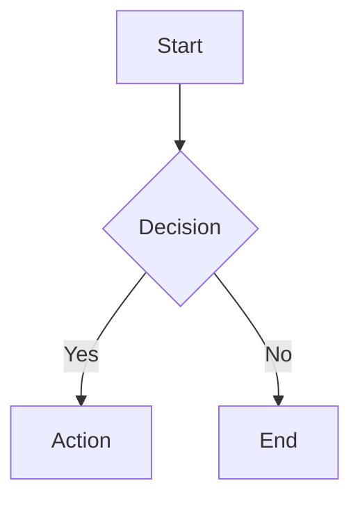

# WORK SESSION (1800-1900)

**Generated:** 2026-02-10T17:10:58.817Z
**Work Period:** 1800-1900
**Focus:** Live session logging
**Duration:** ~60 minutes

---

## Session Overview

This session captures real-time tool interactions and exchanges.

---

## Key Activities

<a name="ps_1770739261258"></a>
## Prompt Set (ps_1770739261258)

**Time:** 2026-02-10T16:01:01.258Z
**Duration:** 0ms
**Tool Calls:** 16

### Read - 2026-02-10 16:01:01 UTC [17:01:01 CEST]

**User Request:** # Documentation Style Guide

Enforce consistent styling for documentation artifacts (PlantUML, Mermaid, markdown, PNG diagrams).

## Instructions

When creating or modifying documentation artifacts, follow these guidelines strictly.

---

## PlantUML Diagrams (.puml)

### File Naming Convention

**CRITICAL**: Use kebab-case, descriptive names. NEVER use incremental suffixes.

**Correct**:
- `health-verification-flow.puml`
- `knowledge-architecture.puml`
- `constraint-monitor-components.puml`

**WRONG** (constraint violation):
- `health-verification-flow-2.puml`
- `knowledge-architecture-v2.puml`
- `constraint-monitor-components-new.puml`

If updating an existing diagram, **modify the existing file** rather than creating a new version.

### Standard Style Include

All PlantUML files MUST include the standard style at the top:

```plantuml
@startuml diagram-name
!include _standard-style.puml

' ... diagram content ...

@enduml
```

The style file is located at:
- `docs/puml/_standard-style.puml`
- `docs/presentation/puml/_standard-style.puml`

### Layout Guidelines

1. **Prefer vertical layouts** - Avoid excessive width that requires horizontal scrolling
2. **Use `top to bottom direction`** for most diagrams
3. **Use `left to right direction`** only for sequence diagrams or when horizontal flow is semantically meaningful
4. **Group related components** using packages or rectangles

### Component Stereotypes

Use these stereotypes for consistent coloring:

| Stereotype | Color | Use For |
|------------|-------|---------|
| `<<api>>` | Light Blue | API endpoints, REST interfaces |
| `<<core>>` | Light Green | Core business logic |
| `<<storage>>` | Light Yellow | Databases, file storage |
| `<<cli>>` | Light Pink | Command-line interfaces |
| `<<util>>` | Light Gray | Utility/helper components |
| `<<agent>>` | Soft Blue | AI agents, autonomous components |
| `<<infra>>` | Light <COMPANY_NAME_REDACTED> | Infrastructure components |
| `<<external>>` | Neutral Gray | External systems |

### Arrow Macros

Use defined macros for consistent arrow styling:

```plantuml
SYNC_LINE     ' Red solid line - synchronous calls
ASYNC_LINE    ' Green dashed - async/event-based
DATA_LINE     ' <COMPANY_NAME_REDACTED> solid - data flow
CONTROL_LINE  ' Purple solid - control flow
OPTIONAL_LINE ' Gray dotted - optional paths
```

---

## PNG Generation

### Generating PNGs from PlantUML

Use the PlantUML JAR or online service:

```bash
# Local generation (preferred)
java -jar plantuml.jar -tpng docs/puml/diagram-name.puml

# Or use the docs script if available
./scripts/generate-diagrams.sh
```

### PNG Naming

PNG files should match their source PUML file:
- `health-verification-flow.puml` → `health-verification-flow.png`

### Output Location

PNGs should be generated to:
- `docs/images/` - For markdown documentation references
- `docs/presentation/png/` - For presentation diagrams

---

## Mermaid Diagrams

### Inline in Markdown

Use fenced code blocks with `mermaid` language:

```markdown

```

### Style Guidelines

1. Use clear, descriptive node labels
2. Keep diagrams focused - split large diagrams into multiple
3. Use subgraphs for logical grouping
4. Prefer `graph TD` (top-down) over `graph LR` (left-right) for readability

---

## Markdown Documentation

### File Naming

- Use kebab-case: `api-quota-checker.md`
- Use `README.md` for directory index files
- Never use spaces or special characters

### Structure

1. Start with H1 title matching the topic
2. Include brief overview paragraph
3. Use H2 for major sections
4. Use H3 for subsections
5. Include code examples where applicable

### Links

- Use relative paths for internal links: `[Status Line](./status-line.md)`
- Use absolute URLs for external links
- Verify links work before committing

---

## Validation Workflow

Before committing documentation changes:

1. **PlantUML**: Verify syntax by generating PNG
2. **Mermaid**: Preview in VS Code or GitHub
3. **Markdown**: Check rendering in preview
4. **Links**: Verify all internal links work
5. **Images**: Ensure referenced images exist

---

## Common Violations to Avoid

1. **Incremental naming** (`-2`, `-v2`, `-new` suffixes)
2. **Missing style include** in PlantUML
3. **Horizontal-heavy layouts** causing scroll
4. **Orphaned images** (PNG without source PUML)
5. **Broken internal links**
6. **Inconsistent component colors** (not using stereotypes)

---

## Quick Reference

| Artifact | Location | Naming | Style |
|----------|----------|--------|-------|
| PlantUML | `docs/puml/` | kebab-case.puml | Include `_standard-style.puml` |
| PNG | `docs/images/` | match-source.png | Generated from PUML |
| Markdown | `docs/*/` | kebab-case.md | H1 title, H2 sections |
| Mermaid | Inline | N/A | graph TD preferred |

**Tool:** Read
**Input:** ```json
{
  "file_path": "<AWS_SECRET_REDACTED>ntation/puml/llm-provider-architecture.puml"
}
```

**Result:** ✅ Success
**Output:** ```
     1→@startuml llm-provider-architecture
     2→!include _standard-style.puml
     3→
     4→' Presentation mode: larger fonts, thicker lines, simplified
     5→skinparam DefaultFontSize 18
     6→skinparam ArrowThickness 3
     7→skinparam PackageBorderThickness 2
     8→skinparam ComponentBorderThickness 2
     9→
    10→left to right direction
    11→
    12→title Unified LLM Provider Architecture
    13→
    14→package "Subscription\n(Zero Cost)" #LightGreen {
    15→  component [Claude Co
...[truncated]
```


---

### Glob - 2026-02-10 16:01:01 UTC [17:01:01 CEST]

**User Request:** # Documentation Style Guide

Enforce consistent styling for documentation artifacts (PlantUML, Mermaid, markdown, PNG diagrams).

## Instructions

When creating or modifying documentation artifacts, follow these guidelines strictly.

---

## PlantUML Diagrams (.puml)

### File Naming Convention

**CRITICAL**: Use kebab-case, descriptive names. NEVER use incremental suffixes.

**Correct**:
- `health-verification-flow.puml`
- `knowledge-architecture.puml`
- `constraint-monitor-components.puml`

**WRONG** (constraint violation):
- `health-verification-flow-2.puml`
- `knowledge-architecture-v2.puml`
- `constraint-monitor-components-new.puml`

If updating an existing diagram, **modify the existing file** rather than creating a new version.

### Standard Style Include

All PlantUML files MUST include the standard style at the top:

```plantuml
@startuml diagram-name
!include _standard-style.puml

' ... diagram content ...

@enduml
```

The style file is located at:
- `docs/puml/_standard-style.puml`
- `docs/presentation/puml/_standard-style.puml`

### Layout Guidelines

1. **Prefer vertical layouts** - Avoid excessive width that requires horizontal scrolling
2. **Use `top to bottom direction`** for most diagrams
3. **Use `left to right direction`** only for sequence diagrams or when horizontal flow is semantically meaningful
4. **Group related components** using packages or rectangles

### Component Stereotypes

Use these stereotypes for consistent coloring:

| Stereotype | Color | Use For |
|------------|-------|---------|
| `<<api>>` | Light Blue | API endpoints, REST interfaces |
| `<<core>>` | Light Green | Core business logic |
| `<<storage>>` | Light Yellow | Databases, file storage |
| `<<cli>>` | Light Pink | Command-line interfaces |
| `<<util>>` | Light Gray | Utility/helper components |
| `<<agent>>` | Soft Blue | AI agents, autonomous components |
| `<<infra>>` | Light <COMPANY_NAME_REDACTED> | Infrastructure components |
| `<<external>>` | Neutral Gray | External systems |

### Arrow Macros

Use defined macros for consistent arrow styling:

```plantuml
SYNC_LINE     ' Red solid line - synchronous calls
ASYNC_LINE    ' Green dashed - async/event-based
DATA_LINE     ' <COMPANY_NAME_REDACTED> solid - data flow
CONTROL_LINE  ' Purple solid - control flow
OPTIONAL_LINE ' Gray dotted - optional paths
```

---

## PNG Generation

### Generating PNGs from PlantUML

Use the PlantUML JAR or online service:

```bash
# Local generation (preferred)
java -jar plantuml.jar -tpng docs/puml/diagram-name.puml

# Or use the docs script if available
./scripts/generate-diagrams.sh
```

### PNG Naming

PNG files should match their source PUML file:
- `health-verification-flow.puml` → `health-verification-flow.png`

### Output Location

PNGs should be generated to:
- `docs/images/` - For markdown documentation references
- `docs/presentation/png/` - For presentation diagrams

---

## Mermaid Diagrams

### Inline in Markdown

Use fenced code blocks with `mermaid` language:

```markdown

```

### Style Guidelines

1. Use clear, descriptive node labels
2. Keep diagrams focused - split large diagrams into multiple
3. Use subgraphs for logical grouping
4. Prefer `graph TD` (top-down) over `graph LR` (left-right) for readability

---

## Markdown Documentation

### File Naming

- Use kebab-case: `api-quota-checker.md`
- Use `README.md` for directory index files
- Never use spaces or special characters

### Structure

1. Start with H1 title matching the topic
2. Include brief overview paragraph
3. Use H2 for major sections
4. Use H3 for subsections
5. Include code examples where applicable

### Links

- Use relative paths for internal links: `[Status Line](./status-line.md)`
- Use absolute URLs for external links
- Verify links work before committing

---

## Validation Workflow

Before committing documentation changes:

1. **PlantUML**: Verify syntax by generating PNG
2. **Mermaid**: Preview in VS Code or GitHub
3. **Markdown**: Check rendering in preview
4. **Links**: Verify all internal links work
5. **Images**: Ensure referenced images exist

---

## Common Violations to Avoid

1. **Incremental naming** (`-2`, `-v2`, `-new` suffixes)
2. **Missing style include** in PlantUML
3. **Horizontal-heavy layouts** causing scroll
4. **Orphaned images** (PNG without source PUML)
5. **Broken internal links**
6. **Inconsistent component colors** (not using stereotypes)

---

## Quick Reference

| Artifact | Location | Naming | Style |
|----------|----------|--------|-------|
| PlantUML | `docs/puml/` | kebab-case.puml | Include `_standard-style.puml` |
| PNG | `docs/images/` | match-source.png | Generated from PUML |
| Markdown | `docs/*/` | kebab-case.md | H1 title, H2 sections |
| Mermaid | Inline | N/A | graph TD preferred |

**Tool:** Glob
**Input:** ```json
{
  "pattern": "**/llm-provider-architecture.*",
  "path": "/Users/<USER_ID_REDACTED>/Agentic/coding"
}
```

**Result:** ✅ Success
**Output:** ```
<AWS_SECRET_REDACTED>s/llm-provider-architecture.png
<AWS_SECRET_REDACTED>llm-provider-architecture.puml
/Users/<USER_ID_REDACTED>/Agentic/coding/docs-content/images/llm-provider-architecture.png
<AWS_SECRET_REDACTED>ntation/puml/llm-provider-architecture.puml
<AWS_SECRET_REDACTED>ntation/images/llm-provider-architecture.png
```


---

### Read - 2026-02-10 16:01:01 UTC [17:01:01 CEST]

**User Request:** # Documentation Style Guide

Enforce consistent styling for documentation artifacts (PlantUML, Mermaid, markdown, PNG diagrams).

## Instructions

When creating or modifying documentation artifacts, follow these guidelines strictly.

---

## PlantUML Diagrams (.puml)

### File Naming Convention

**CRITICAL**: Use kebab-case, descriptive names. NEVER use incremental suffixes.

**Correct**:
- `health-verification-flow.puml`
- `knowledge-architecture.puml`
- `constraint-monitor-components.puml`

**WRONG** (constraint violation):
- `health-verification-flow-2.puml`
- `knowledge-architecture-v2.puml`
- `constraint-monitor-components-new.puml`

If updating an existing diagram, **modify the existing file** rather than creating a new version.

### Standard Style Include

All PlantUML files MUST include the standard style at the top:

```plantuml
@startuml diagram-name
!include _standard-style.puml

' ... diagram content ...

@enduml
```

The style file is located at:
- `docs/puml/_standard-style.puml`
- `docs/presentation/puml/_standard-style.puml`

### Layout Guidelines

1. **Prefer vertical layouts** - Avoid excessive width that requires horizontal scrolling
2. **Use `top to bottom direction`** for most diagrams
3. **Use `left to right direction`** only for sequence diagrams or when horizontal flow is semantically meaningful
4. **Group related components** using packages or rectangles

### Component Stereotypes

Use these stereotypes for consistent coloring:

| Stereotype | Color | Use For |
|------------|-------|---------|
| `<<api>>` | Light Blue | API endpoints, REST interfaces |
| `<<core>>` | Light Green | Core business logic |
| `<<storage>>` | Light Yellow | Databases, file storage |
| `<<cli>>` | Light Pink | Command-line interfaces |
| `<<util>>` | Light Gray | Utility/helper components |
| `<<agent>>` | Soft Blue | AI agents, autonomous components |
| `<<infra>>` | Light <COMPANY_NAME_REDACTED> | Infrastructure components |
| `<<external>>` | Neutral Gray | External systems |

### Arrow Macros

Use defined macros for consistent arrow styling:

```plantuml
SYNC_LINE     ' Red solid line - synchronous calls
ASYNC_LINE    ' Green dashed - async/event-based
DATA_LINE     ' <COMPANY_NAME_REDACTED> solid - data flow
CONTROL_LINE  ' Purple solid - control flow
OPTIONAL_LINE ' Gray dotted - optional paths
```

---

## PNG Generation

### Generating PNGs from PlantUML

Use the PlantUML JAR or online service:

```bash
# Local generation (preferred)
java -jar plantuml.jar -tpng docs/puml/diagram-name.puml

# Or use the docs script if available
./scripts/generate-diagrams.sh
```

### PNG Naming

PNG files should match their source PUML file:
- `health-verification-flow.puml` → `health-verification-flow.png`

### Output Location

PNGs should be generated to:
- `docs/images/` - For markdown documentation references
- `docs/presentation/png/` - For presentation diagrams

---

## Mermaid Diagrams

### Inline in Markdown

Use fenced code blocks with `mermaid` language:

```markdown

```

### Style Guidelines

1. Use clear, descriptive node labels
2. Keep diagrams focused - split large diagrams into multiple
3. Use subgraphs for logical grouping
4. Prefer `graph TD` (top-down) over `graph LR` (left-right) for readability

---

## Markdown Documentation

### File Naming

- Use kebab-case: `api-quota-checker.md`
- Use `README.md` for directory index files
- Never use spaces or special characters

### Structure

1. Start with H1 title matching the topic
2. Include brief overview paragraph
3. Use H2 for major sections
4. Use H3 for subsections
5. Include code examples where applicable

### Links

- Use relative paths for internal links: `[Status Line](./status-line.md)`
- Use absolute URLs for external links
- Verify links work before committing

---

## Validation Workflow

Before committing documentation changes:

1. **PlantUML**: Verify syntax by generating PNG
2. **Mermaid**: Preview in VS Code or GitHub
3. **Markdown**: Check rendering in preview
4. **Links**: Verify all internal links work
5. **Images**: Ensure referenced images exist

---

## Common Violations to Avoid

1. **Incremental naming** (`-2`, `-v2`, `-new` suffixes)
2. **Missing style include** in PlantUML
3. **Horizontal-heavy layouts** causing scroll
4. **Orphaned images** (PNG without source PUML)
5. **Broken internal links**
6. **Inconsistent component colors** (not using stereotypes)

---

## Quick Reference

| Artifact | Location | Naming | Style |
|----------|----------|--------|-------|
| PlantUML | `docs/puml/` | kebab-case.puml | Include `_standard-style.puml` |
| PNG | `docs/images/` | match-source.png | Generated from PUML |
| Markdown | `docs/*/` | kebab-case.md | H1 title, H2 sections |
| Mermaid | Inline | N/A | graph TD preferred |

**Tool:** Read
**Input:** ```json
{
  "file_path": "<AWS_SECRET_REDACTED>llm-provider-architecture.puml"
}
```

**Result:** ✅ Success
**Output:** ```
     1→@startuml llm-provider-architecture
     2→!include _standard-style.puml
     3→
     4→top to bottom direction
     5→
     6→title Unified LLM Provider Architecture (lib/llm/)
     7→
     8→package "Consumers" {
     9→  component [SemanticAnalyzer] <<agent>>
    10→  component [UnifiedInferenceEngine] <<agent>>
    11→  component [SemanticValidator] <<agent>>
    12→}
    13→
    14→package "lib/llm/ - Unified LLM Layer" {
    15→  component [LLMService\nFacade] <<core>> as LLMService
...[truncated]
```


---

### Read - 2026-02-10 16:01:01 UTC [17:01:01 CEST]

**User Request:** # Documentation Style Guide

Enforce consistent styling for documentation artifacts (PlantUML, Mermaid, markdown, PNG diagrams).

## Instructions

When creating or modifying documentation artifacts, follow these guidelines strictly.

---

## PlantUML Diagrams (.puml)

### File Naming Convention

**CRITICAL**: Use kebab-case, descriptive names. NEVER use incremental suffixes.

**Correct**:
- `health-verification-flow.puml`
- `knowledge-architecture.puml`
- `constraint-monitor-components.puml`

**WRONG** (constraint violation):
- `health-verification-flow-2.puml`
- `knowledge-architecture-v2.puml`
- `constraint-monitor-components-new.puml`

If updating an existing diagram, **modify the existing file** rather than creating a new version.

### Standard Style Include

All PlantUML files MUST include the standard style at the top:

```plantuml
@startuml diagram-name
!include _standard-style.puml

' ... diagram content ...

@enduml
```

The style file is located at:
- `docs/puml/_standard-style.puml`
- `docs/presentation/puml/_standard-style.puml`

### Layout Guidelines

1. **Prefer vertical layouts** - Avoid excessive width that requires horizontal scrolling
2. **Use `top to bottom direction`** for most diagrams
3. **Use `left to right direction`** only for sequence diagrams or when horizontal flow is semantically meaningful
4. **Group related components** using packages or rectangles

### Component Stereotypes

Use these stereotypes for consistent coloring:

| Stereotype | Color | Use For |
|------------|-------|---------|
| `<<api>>` | Light Blue | API endpoints, REST interfaces |
| `<<core>>` | Light Green | Core business logic |
| `<<storage>>` | Light Yellow | Databases, file storage |
| `<<cli>>` | Light Pink | Command-line interfaces |
| `<<util>>` | Light Gray | Utility/helper components |
| `<<agent>>` | Soft Blue | AI agents, autonomous components |
| `<<infra>>` | Light <COMPANY_NAME_REDACTED> | Infrastructure components |
| `<<external>>` | Neutral Gray | External systems |

### Arrow Macros

Use defined macros for consistent arrow styling:

```plantuml
SYNC_LINE     ' Red solid line - synchronous calls
ASYNC_LINE    ' Green dashed - async/event-based
DATA_LINE     ' <COMPANY_NAME_REDACTED> solid - data flow
CONTROL_LINE  ' Purple solid - control flow
OPTIONAL_LINE ' Gray dotted - optional paths
```

---

## PNG Generation

### Generating PNGs from PlantUML

Use the PlantUML JAR or online service:

```bash
# Local generation (preferred)
java -jar plantuml.jar -tpng docs/puml/diagram-name.puml

# Or use the docs script if available
./scripts/generate-diagrams.sh
```

### PNG Naming

PNG files should match their source PUML file:
- `health-verification-flow.puml` → `health-verification-flow.png`

### Output Location

PNGs should be generated to:
- `docs/images/` - For markdown documentation references
- `docs/presentation/png/` - For presentation diagrams

---

## Mermaid Diagrams

### Inline in Markdown

Use fenced code blocks with `mermaid` language:

```markdown

```

### Style Guidelines

1. Use clear, descriptive node labels
2. Keep diagrams focused - split large diagrams into multiple
3. Use subgraphs for logical grouping
4. Prefer `graph TD` (top-down) over `graph LR` (left-right) for readability

---

## Markdown Documentation

### File Naming

- Use kebab-case: `api-quota-checker.md`
- Use `README.md` for directory index files
- Never use spaces or special characters

### Structure

1. Start with H1 title matching the topic
2. Include brief overview paragraph
3. Use H2 for major sections
4. Use H3 for subsections
5. Include code examples where applicable

### Links

- Use relative paths for internal links: `[Status Line](./status-line.md)`
- Use absolute URLs for external links
- Verify links work before committing

---

## Validation Workflow

Before committing documentation changes:

1. **PlantUML**: Verify syntax by generating PNG
2. **Mermaid**: Preview in VS Code or GitHub
3. **Markdown**: Check rendering in preview
4. **Links**: Verify all internal links work
5. **Images**: Ensure referenced images exist

---

## Common Violations to Avoid

1. **Incremental naming** (`-2`, `-v2`, `-new` suffixes)
2. **Missing style include** in PlantUML
3. **Horizontal-heavy layouts** causing scroll
4. **Orphaned images** (PNG without source PUML)
5. **Broken internal links**
6. **Inconsistent component colors** (not using stereotypes)

---

## Quick Reference

| Artifact | Location | Naming | Style |
|----------|----------|--------|-------|
| PlantUML | `docs/puml/` | kebab-case.puml | Include `_standard-style.puml` |
| PNG | `docs/images/` | match-source.png | Generated from PUML |
| Markdown | `docs/*/` | kebab-case.md | H1 title, H2 sections |
| Mermaid | Inline | N/A | graph TD preferred |

**Tool:** Read
**Input:** ```json
{
  "file_path": "<AWS_SECRET_REDACTED>ntation/images/llm-provider-architecture.png"
}
```

**Result:** ✅ Success
**Output:** ```
[
  {
    "type": "image",
    "source": {
      "type": "base64",
      "data": "<AWS_SECRET_REDACTED><AWS_SECRET_REDACTED><AWS_SECRET_REDACTED><AWS_SECRET_REDACTED><AWS_SECRET_REDACTED><AWS_SECRET_REDACTED><AWS_SECRET_REDACTED><AWS_SECRET_REDACTED><AWS_SECRET_REDACTED><AWS_SECRET_REDACTED>QEGCupboBAdneEYGQo
...[truncated]
```


---

### Edit - 2026-02-10 16:01:01 UTC [17:01:01 CEST]

**User Request:** # Documentation Style Guide

Enforce consistent styling for documentation artifacts (PlantUML, Mermaid, markdown, PNG diagrams).

## Instructions

When creating or modifying documentation artifacts, follow these guidelines strictly.

---

## PlantUML Diagrams (.puml)

### File Naming Convention

**CRITICAL**: Use kebab-case, descriptive names. NEVER use incremental suffixes.

**Correct**:
- `health-verification-flow.puml`
- `knowledge-architecture.puml`
- `constraint-monitor-components.puml`

**WRONG** (constraint violation):
- `health-verification-flow-2.puml`
- `knowledge-architecture-v2.puml`
- `constraint-monitor-components-new.puml`

If updating an existing diagram, **modify the existing file** rather than creating a new version.

### Standard Style Include

All PlantUML files MUST include the standard style at the top:

```plantuml
@startuml diagram-name
!include _standard-style.puml

' ... diagram content ...

@enduml
```

The style file is located at:
- `docs/puml/_standard-style.puml`
- `docs/presentation/puml/_standard-style.puml`

### Layout Guidelines

1. **Prefer vertical layouts** - Avoid excessive width that requires horizontal scrolling
2. **Use `top to bottom direction`** for most diagrams
3. **Use `left to right direction`** only for sequence diagrams or when horizontal flow is semantically meaningful
4. **Group related components** using packages or rectangles

### Component Stereotypes

Use these stereotypes for consistent coloring:

| Stereotype | Color | Use For |
|------------|-------|---------|
| `<<api>>` | Light Blue | API endpoints, REST interfaces |
| `<<core>>` | Light Green | Core business logic |
| `<<storage>>` | Light Yellow | Databases, file storage |
| `<<cli>>` | Light Pink | Command-line interfaces |
| `<<util>>` | Light Gray | Utility/helper components |
| `<<agent>>` | Soft Blue | AI agents, autonomous components |
| `<<infra>>` | Light <COMPANY_NAME_REDACTED> | Infrastructure components |
| `<<external>>` | Neutral Gray | External systems |

### Arrow Macros

Use defined macros for consistent arrow styling:

```plantuml
SYNC_LINE     ' Red solid line - synchronous calls
ASYNC_LINE    ' Green dashed - async/event-based
DATA_LINE     ' <COMPANY_NAME_REDACTED> solid - data flow
CONTROL_LINE  ' Purple solid - control flow
OPTIONAL_LINE ' Gray dotted - optional paths
```

---

## PNG Generation

### Generating PNGs from PlantUML

Use the PlantUML JAR or online service:

```bash
# Local generation (preferred)
java -jar plantuml.jar -tpng docs/puml/diagram-name.puml

# Or use the docs script if available
./scripts/generate-diagrams.sh
```

### PNG Naming

PNG files should match their source PUML file:
- `health-verification-flow.puml` → `health-verification-flow.png`

### Output Location

PNGs should be generated to:
- `docs/images/` - For markdown documentation references
- `docs/presentation/png/` - For presentation diagrams

---

## Mermaid Diagrams

### Inline in Markdown

Use fenced code blocks with `mermaid` language:

```markdown

```

### Style Guidelines

1. Use clear, descriptive node labels
2. Keep diagrams focused - split large diagrams into multiple
3. Use subgraphs for logical grouping
4. Prefer `graph TD` (top-down) over `graph LR` (left-right) for readability

---

## Markdown Documentation

### File Naming

- Use kebab-case: `api-quota-checker.md`
- Use `README.md` for directory index files
- Never use spaces or special characters

### Structure

1. Start with H1 title matching the topic
2. Include brief overview paragraph
3. Use H2 for major sections
4. Use H3 for subsections
5. Include code examples where applicable

### Links

- Use relative paths for internal links: `[Status Line](./status-line.md)`
- Use absolute URLs for external links
- Verify links work before committing

---

## Validation Workflow

Before committing documentation changes:

1. **PlantUML**: Verify syntax by generating PNG
2. **Mermaid**: Preview in VS Code or GitHub
3. **Markdown**: Check rendering in preview
4. **Links**: Verify all internal links work
5. **Images**: Ensure referenced images exist

---

## Common Violations to Avoid

1. **Incremental naming** (`-2`, `-v2`, `-new` suffixes)
2. **Missing style include** in PlantUML
3. **Horizontal-heavy layouts** causing scroll
4. **Orphaned images** (PNG without source PUML)
5. **Broken internal links**
6. **Inconsistent component colors** (not using stereotypes)

---

## Quick Reference

| Artifact | Location | Naming | Style |
|----------|----------|--------|-------|
| PlantUML | `docs/puml/` | kebab-case.puml | Include `_standard-style.puml` |
| PNG | `docs/images/` | match-source.png | Generated from PUML |
| Markdown | `docs/*/` | kebab-case.md | H1 title, H2 sections |
| Mermaid | Inline | N/A | graph TD preferred |

**Tool:** Edit
**Input:** ```json
{
  "replace_all": false,
  "file_path": "<AWS_SECRET_REDACTED>ntation/puml/llm-provider-architecture.puml",
  "old_string": "@startuml llm-provider-architecture\n!include _standard-style.puml\n\n' Presentation mode: larger fonts, thicker lines, simplified\nskinparam DefaultFontSize 18\nskinparam ArrowThickness 3\nskinparam PackageBorderThickness 2\nskinparam ComponentBorderThickness 2\n\nleft to right direction\n\ntitle Unified LLM Provider Architecture\n\npackage \"Subscription\\n(Zero Cost)\" #LightGreen {\n  component [Claude Code\\nCLI] <<cli>> as ClaudeCode\n  component [Copilot\\nCLI] <<cli>> as Copilot\n}\n\ncomponent [LLM Service\\nFacade] <<core>> as LLMService\n\npackage \"Cloud API\\n(Per-Token Cost)\" #LightBlue {\n  component [Groq] <<api>>\n  component [Anthropic] <<api>>\n  component [OpenAI] <<api>>\n}\n\npackage \"Local\\n(Free)\" #LightYellow {\n  component [DMR] <<infra>>\n  component [Ollama] <<infra>>\n}\n\npackage \"Infrastructure\" #LightGray {\n  component [Quota\\nTracker] <<infra>> as QuotaTracker\n  component [Circuit\\nBreaker] <<infra>> as CircuitBreaker\n  component [Cache] <<infra>>\n}\n\n' Main flow\nLLMService -down-> CircuitBreaker : route request\n\n' Subscription providers (priority 1)\nCircuitBreaker -down-> ClaudeCode : 1. try\nCircuitBreaker -down-> Copilot : 2. try\n\n' Cloud API providers (priority 2)\nCircuitBreaker -down-> Groq : 3. try\nCircuitBreaker -down-> Anthropic : 4. try\nCircuitBreaker -down-> OpenAI : 5. try\n\n' Local fallback (priority 3)\nCircuitBreaker -down-> DMR : 6. fallback\nCircuitBreaker -down-> Ollama : 7. fallback\n\n' Infrastructure connections\nLLMService -up-> Cache : check\nLLMService -up-> QuotaTracker : check\nClaudeCode .up.> QuotaTracker : report usage\nCopilot .up.> QuotaTracker : report usage\n\nnote top of LLMService\n  **Tier-Based Routing**\n  Fast: Claude Code → Copilot → Groq\n  Standard: + Anthropic → OpenAI\n  Premium: Anthropic prioritized\n\n  **Cost**: $0 until subscriptions exhausted\nend note\n\nnote bottom of QuotaTracker\n  **Exponential Backoff**\n  5min → 15min → 1hr\n\n  Persistent tracking\n  Auto-retry on recovery\nend note\n\n@enduml",
  "new_string": "@startuml llm-provider-architecture\n!include _standard-style.puml\n\n' Presentation mode: larger fonts, thicker lines, simplified\nskinparam DefaultFontSize 16\nskinparam ArrowThickness 2\nskinparam PackageBorderThickness 2\nskinparam ComponentBorderThickness 2\nskinparam NoteFontSize 13\n\nleft to right direction\n\ntitle Unified LLM Provider Architecture\n\n' Entry point\ncomponent [LLM Service] <<core>> as LLMService\n\n' Infrastructure - sits between service and providers\npackage \"Infrastructure\" #LightGray {\n  component [Cache] <<infra>>\n  component [Quota\\nTracker] <<infra>> as QuotaTracker\n  component [Circuit\\nBreaker] <<infra>> as CircuitBreaker\n}\n\n' Provider tiers - right side\npackage \"Subscription (Zero Cost)\" as Sub #LightGreen {\n  component [Claude Code] <<cli>> as ClaudeCode\n  component [Copilot] <<cli>> as Copilot\n}\n\npackage \"Cloud API (Per-Token)\" as Cloud #LightBlue {\n  component [Groq] <<api>>\n  component [Anthropic] <<api>>\n  component [OpenAI] <<api>>\n}\n\npackage \"Local (Free)\" as Local #LightYellow {\n  component [DMR] <<infra>>\n  component [Ollama] <<infra>>\n}\n\n' Horizontal flow: Service -> Infrastructure -> Providers\nLLMService --> Cache\nLLMService --> QuotaTracker\nLLMService --> CircuitBreaker\n\n' Circuit breaker to provider groups\nCircuitBreaker --> ClaudeCode : 1st\nCircuitBreaker --> Copilot : 2nd\nCircuitBreaker --> Groq : 3rd\nCircuitBreaker --> Anthropic : 4th\nCircuitBreaker --> OpenAI : 5th\nCircuitBreaker --> DMR : 6th\nCircuitBreaker --> Ollama : 7th\n\n' Quota feedback\nClaudeCode ..> QuotaTracker : usage\nCopilot ..> QuotaTracker : usage\n\nnote bottom of LLMService\n  **Tier-Based Routing**\n  Fast: Claude Code, Copilot, Groq\n  Standard: + Anthropic, OpenAI\n  Premium: Anthropic prioritized\n  **Cost**: $0 until quota exhausted\nend note\n\n@enduml"
}
```

**Result:** ✅ Success
**Output:** ```
The file <AWS_SECRET_REDACTED>ntation/puml/llm-provider-architecture.puml has been updated successfully.
```


---

### Bash - 2026-02-10 16:01:01 UTC [17:01:01 CEST]

**User Request:** # Documentation Style Guide

Enforce consistent styling for documentation artifacts (PlantUML, Mermaid, markdown, PNG diagrams).

## Instructions

When creating or modifying documentation artifacts, follow these guidelines strictly.

---

## PlantUML Diagrams (.puml)

### File Naming Convention

**CRITICAL**: Use kebab-case, descriptive names. NEVER use incremental suffixes.

**Correct**:
- `health-verification-flow.puml`
- `knowledge-architecture.puml`
- `constraint-monitor-components.puml`

**WRONG** (constraint violation):
- `health-verification-flow-2.puml`
- `knowledge-architecture-v2.puml`
- `constraint-monitor-components-new.puml`

If updating an existing diagram, **modify the existing file** rather than creating a new version.

### Standard Style Include

All PlantUML files MUST include the standard style at the top:

```plantuml
@startuml diagram-name
!include _standard-style.puml

' ... diagram content ...

@enduml
```

The style file is located at:
- `docs/puml/_standard-style.puml`
- `docs/presentation/puml/_standard-style.puml`

### Layout Guidelines

1. **Prefer vertical layouts** - Avoid excessive width that requires horizontal scrolling
2. **Use `top to bottom direction`** for most diagrams
3. **Use `left to right direction`** only for sequence diagrams or when horizontal flow is semantically meaningful
4. **Group related components** using packages or rectangles

### Component Stereotypes

Use these stereotypes for consistent coloring:

| Stereotype | Color | Use For |
|------------|-------|---------|
| `<<api>>` | Light Blue | API endpoints, REST interfaces |
| `<<core>>` | Light Green | Core business logic |
| `<<storage>>` | Light Yellow | Databases, file storage |
| `<<cli>>` | Light Pink | Command-line interfaces |
| `<<util>>` | Light Gray | Utility/helper components |
| `<<agent>>` | Soft Blue | AI agents, autonomous components |
| `<<infra>>` | Light <COMPANY_NAME_REDACTED> | Infrastructure components |
| `<<external>>` | Neutral Gray | External systems |

### Arrow Macros

Use defined macros for consistent arrow styling:

```plantuml
SYNC_LINE     ' Red solid line - synchronous calls
ASYNC_LINE    ' Green dashed - async/event-based
DATA_LINE     ' <COMPANY_NAME_REDACTED> solid - data flow
CONTROL_LINE  ' Purple solid - control flow
OPTIONAL_LINE ' Gray dotted - optional paths
```

---

## PNG Generation

### Generating PNGs from PlantUML

Use the PlantUML JAR or online service:

```bash
# Local generation (preferred)
java -jar plantuml.jar -tpng docs/puml/diagram-name.puml

# Or use the docs script if available
./scripts/generate-diagrams.sh
```

### PNG Naming

PNG files should match their source PUML file:
- `health-verification-flow.puml` → `health-verification-flow.png`

### Output Location

PNGs should be generated to:
- `docs/images/` - For markdown documentation references
- `docs/presentation/png/` - For presentation diagrams

---

## Mermaid Diagrams

### Inline in Markdown

Use fenced code blocks with `mermaid` language:

```markdown

```

### Style Guidelines

1. Use clear, descriptive node labels
2. Keep diagrams focused - split large diagrams into multiple
3. Use subgraphs for logical grouping
4. Prefer `graph TD` (top-down) over `graph LR` (left-right) for readability

---

## Markdown Documentation

### File Naming

- Use kebab-case: `api-quota-checker.md`
- Use `README.md` for directory index files
- Never use spaces or special characters

### Structure

1. Start with H1 title matching the topic
2. Include brief overview paragraph
3. Use H2 for major sections
4. Use H3 for subsections
5. Include code examples where applicable

### Links

- Use relative paths for internal links: `[Status Line](./status-line.md)`
- Use absolute URLs for external links
- Verify links work before committing

---

## Validation Workflow

Before committing documentation changes:

1. **PlantUML**: Verify syntax by generating PNG
2. **Mermaid**: Preview in VS Code or GitHub
3. **Markdown**: Check rendering in preview
4. **Links**: Verify all internal links work
5. **Images**: Ensure referenced images exist

---

## Common Violations to Avoid

1. **Incremental naming** (`-2`, `-v2`, `-new` suffixes)
2. **Missing style include** in PlantUML
3. **Horizontal-heavy layouts** causing scroll
4. **Orphaned images** (PNG without source PUML)
5. **Broken internal links**
6. **Inconsistent component colors** (not using stereotypes)

---

## Quick Reference

| Artifact | Location | Naming | Style |
|----------|----------|--------|-------|
| PlantUML | `docs/puml/` | kebab-case.puml | Include `_standard-style.puml` |
| PNG | `docs/images/` | match-source.png | Generated from PUML |
| Markdown | `docs/*/` | kebab-case.md | H1 title, H2 sections |
| Mermaid | Inline | N/A | graph TD preferred |

**Tool:** Bash
**Input:** ```json
{
  "command": "cd <AWS_SECRET_REDACTED>ntation/puml && plantuml llm-provider-architecture.puml",
  "description": "Generate PNG from updated PUML"
}
```

**Result:** ✅ Success

---

### Bash - 2026-02-10 16:01:01 UTC [17:01:01 CEST]

**User Request:** # Documentation Style Guide

Enforce consistent styling for documentation artifacts (PlantUML, Mermaid, markdown, PNG diagrams).

## Instructions

When creating or modifying documentation artifacts, follow these guidelines strictly.

---

## PlantUML Diagrams (.puml)

### File Naming Convention

**CRITICAL**: Use kebab-case, descriptive names. NEVER use incremental suffixes.

**Correct**:
- `health-verification-flow.puml`
- `knowledge-architecture.puml`
- `constraint-monitor-components.puml`

**WRONG** (constraint violation):
- `health-verification-flow-2.puml`
- `knowledge-architecture-v2.puml`
- `constraint-monitor-components-new.puml`

If updating an existing diagram, **modify the existing file** rather than creating a new version.

### Standard Style Include

All PlantUML files MUST include the standard style at the top:

```plantuml
@startuml diagram-name
!include _standard-style.puml

' ... diagram content ...

@enduml
```

The style file is located at:
- `docs/puml/_standard-style.puml`
- `docs/presentation/puml/_standard-style.puml`

### Layout Guidelines

1. **Prefer vertical layouts** - Avoid excessive width that requires horizontal scrolling
2. **Use `top to bottom direction`** for most diagrams
3. **Use `left to right direction`** only for sequence diagrams or when horizontal flow is semantically meaningful
4. **Group related components** using packages or rectangles

### Component Stereotypes

Use these stereotypes for consistent coloring:

| Stereotype | Color | Use For |
|------------|-------|---------|
| `<<api>>` | Light Blue | API endpoints, REST interfaces |
| `<<core>>` | Light Green | Core business logic |
| `<<storage>>` | Light Yellow | Databases, file storage |
| `<<cli>>` | Light Pink | Command-line interfaces |
| `<<util>>` | Light Gray | Utility/helper components |
| `<<agent>>` | Soft Blue | AI agents, autonomous components |
| `<<infra>>` | Light <COMPANY_NAME_REDACTED> | Infrastructure components |
| `<<external>>` | Neutral Gray | External systems |

### Arrow Macros

Use defined macros for consistent arrow styling:

```plantuml
SYNC_LINE     ' Red solid line - synchronous calls
ASYNC_LINE    ' Green dashed - async/event-based
DATA_LINE     ' <COMPANY_NAME_REDACTED> solid - data flow
CONTROL_LINE  ' Purple solid - control flow
OPTIONAL_LINE ' Gray dotted - optional paths
```

---

## PNG Generation

### Generating PNGs from PlantUML

Use the PlantUML JAR or online service:

```bash
# Local generation (preferred)
java -jar plantuml.jar -tpng docs/puml/diagram-name.puml

# Or use the docs script if available
./scripts/generate-diagrams.sh
```

### PNG Naming

PNG files should match their source PUML file:
- `health-verification-flow.puml` → `health-verification-flow.png`

### Output Location

PNGs should be generated to:
- `docs/images/` - For markdown documentation references
- `docs/presentation/png/` - For presentation diagrams

---

## Mermaid Diagrams

### Inline in Markdown

Use fenced code blocks with `mermaid` language:

```markdown
```mermaid
graph TD
    A[Start] --> B{Decision}
    B -->|Yes| C[Action]
    B -->|No| D[End]
```
```

### Style Guidelines

1. Use clear, descriptive node labels
2. Keep diagrams focused - split large diagrams into multiple
3. Use subgraphs for logical grouping
4. Prefer `graph TD` (top-down) over `graph LR` (left-right) for readability

---

## Markdown Documentation

### File Naming

- Use kebab-case: `api-quota-checker.md`
- Use `README.md` for directory index files
- Never use spaces or special characters

### Structure

1. Start with H1 title matching the topic
2. Include brief overview paragraph
3. Use H2 for major sections
4. Use H3 for subsections
5. Include code examples where applicable

### Links

- Use relative paths for internal links: `[Status Line](./status-line.md)`
- Use absolute URLs for external links
- Verify links work before committing

---

## Validation Workflow

Before committing documentation changes:

1. **PlantUML**: Verify syntax by generating PNG
2. **Mermaid**: Preview in VS Code or GitHub
3. **Markdown**: Check rendering in preview
4. **Links**: Verify all internal links work
5. **Images**: Ensure referenced images exist

---

## Common Violations to Avoid

1. **Incremental naming** (`-2`, `-v2`, `-new` suffixes)
2. **Missing style include** in PlantUML
3. **Horizontal-heavy layouts** causing scroll
4. **Orphaned images** (PNG without source PUML)
5. **Broken internal links**
6. **Inconsistent component colors** (not using stereotypes)

---

## Quick Reference

| Artifact | Location | Naming | Style |
|----------|----------|--------|-------|
| PlantUML | `docs/puml/` | kebab-case.puml | Include `_standard-style.puml` |
| PNG | `docs/images/` | match-source.png | Generated from PUML |
| Markdown | `docs/*/` | kebab-case.md | H1 title, H2 sections |
| Mermaid | Inline | N/A | graph TD preferred |

**Tool:** Bash
**Input:** ```json
{
  "command": "mv <AWS_SECRET_REDACTED>ntation/puml/llm-provider-architecture.png <AWS_SECRET_REDACTED>ntation/images/llm-provider-architecture.png",
  "description": "Move PNG to images directory"
}
```

**Result:** ✅ Success

---

### Read - 2026-02-10 16:01:01 UTC [17:01:01 CEST]

**User Request:** # Documentation Style Guide

Enforce consistent styling for documentation artifacts (PlantUML, Mermaid, markdown, PNG diagrams).

## Instructions

When creating or modifying documentation artifacts, follow these guidelines strictly.

---

## PlantUML Diagrams (.puml)

### File Naming Convention

**CRITICAL**: Use kebab-case, descriptive names. NEVER use incremental suffixes.

**Correct**:
- `health-verification-flow.puml`
- `knowledge-architecture.puml`
- `constraint-monitor-components.puml`

**WRONG** (constraint violation):
- `health-verification-flow-2.puml`
- `knowledge-architecture-v2.puml`
- `constraint-monitor-components-new.puml`

If updating an existing diagram, **modify the existing file** rather than creating a new version.

### Standard Style Include

All PlantUML files MUST include the standard style at the top:

```plantuml
@startuml diagram-name
!include _standard-style.puml

' ... diagram content ...

@enduml
```

The style file is located at:
- `docs/puml/_standard-style.puml`
- `docs/presentation/puml/_standard-style.puml`

### Layout Guidelines

1. **Prefer vertical layouts** - Avoid excessive width that requires horizontal scrolling
2. **Use `top to bottom direction`** for most diagrams
3. **Use `left to right direction`** only for sequence diagrams or when horizontal flow is semantically meaningful
4. **Group related components** using packages or rectangles

### Component Stereotypes

Use these stereotypes for consistent coloring:

| Stereotype | Color | Use For |
|------------|-------|---------|
| `<<api>>` | Light Blue | API endpoints, REST interfaces |
| `<<core>>` | Light Green | Core business logic |
| `<<storage>>` | Light Yellow | Databases, file storage |
| `<<cli>>` | Light Pink | Command-line interfaces |
| `<<util>>` | Light Gray | Utility/helper components |
| `<<agent>>` | Soft Blue | AI agents, autonomous components |
| `<<infra>>` | Light <COMPANY_NAME_REDACTED> | Infrastructure components |
| `<<external>>` | Neutral Gray | External systems |

### Arrow Macros

Use defined macros for consistent arrow styling:

```plantuml
SYNC_LINE     ' Red solid line - synchronous calls
ASYNC_LINE    ' Green dashed - async/event-based
DATA_LINE     ' <COMPANY_NAME_REDACTED> solid - data flow
CONTROL_LINE  ' Purple solid - control flow
OPTIONAL_LINE ' Gray dotted - optional paths
```

---

## PNG Generation

### Generating PNGs from PlantUML

Use the PlantUML JAR or online service:

```bash
# Local generation (preferred)
java -jar plantuml.jar -tpng docs/puml/diagram-name.puml

# Or use the docs script if available
./scripts/generate-diagrams.sh
```

### PNG Naming

PNG files should match their source PUML file:
- `health-verification-flow.puml` → `health-verification-flow.png`

### Output Location

PNGs should be generated to:
- `docs/images/` - For markdown documentation references
- `docs/presentation/png/` - For presentation diagrams

---

## Mermaid Diagrams

### Inline in Markdown

Use fenced code blocks with `mermaid` language:

```markdown
```mermaid
graph TD
    A[Start] --> B{Decision}
    B -->|Yes| C[Action]
    B -->|No| D[End]
```
```

### Style Guidelines

1. Use clear, descriptive node labels
2. Keep diagrams focused - split large diagrams into multiple
3. Use subgraphs for logical grouping
4. Prefer `graph TD` (top-down) over `graph LR` (left-right) for readability

---

## Markdown Documentation

### File Naming

- Use kebab-case: `api-quota-checker.md`
- Use `README.md` for directory index files
- Never use spaces or special characters

### Structure

1. Start with H1 title matching the topic
2. Include brief overview paragraph
3. Use H2 for major sections
4. Use H3 for subsections
5. Include code examples where applicable

### Links

- Use relative paths for internal links: `[Status Line](./status-line.md)`
- Use absolute URLs for external links
- Verify links work before committing

---

## Validation Workflow

Before committing documentation changes:

1. **PlantUML**: Verify syntax by generating PNG
2. **Mermaid**: Preview in VS Code or GitHub
3. **Markdown**: Check rendering in preview
4. **Links**: Verify all internal links work
5. **Images**: Ensure referenced images exist

---

## Common Violations to Avoid

1. **Incremental naming** (`-2`, `-v2`, `-new` suffixes)
2. **Missing style include** in PlantUML
3. **Horizontal-heavy layouts** causing scroll
4. **Orphaned images** (PNG without source PUML)
5. **Broken internal links**
6. **Inconsistent component colors** (not using stereotypes)

---

## Quick Reference

| Artifact | Location | Naming | Style |
|----------|----------|--------|-------|
| PlantUML | `docs/puml/` | kebab-case.puml | Include `_standard-style.puml` |
| PNG | `docs/images/` | match-source.png | Generated from PUML |
| Markdown | `docs/*/` | kebab-case.md | H1 title, H2 sections |
| Mermaid | Inline | N/A | graph TD preferred |

**Tool:** Read
**Input:** ```json
{
  "file_path": "<AWS_SECRET_REDACTED>ntation/images/llm-provider-architecture.png"
}
```

**Result:** ✅ Success
**Output:** ```
[
  {
    "type": "image",
    "source": {
      "type": "base64",
      "data": "<AWS_SECRET_REDACTED><AWS_SECRET_REDACTED><AWS_SECRET_REDACTED><AWS_SECRET_REDACTED><AWS_SECRET_REDACTED><AWS_SECRET_REDACTED><AWS_SECRET_REDACTED><AWS_SECRET_REDACTED><AWS_SECRET_REDACTED><AWS_SECRET_REDACTED>k/CSTGhPKnS8maUv40
...[truncated]
```


---

### Edit - 2026-02-10 16:01:01 UTC [17:01:01 CEST]

**User Request:** # Documentation Style Guide

Enforce consistent styling for documentation artifacts (PlantUML, Mermaid, markdown, PNG diagrams).

## Instructions

When creating or modifying documentation artifacts, follow these guidelines strictly.

---

## PlantUML Diagrams (.puml)

### File Naming Convention

**CRITICAL**: Use kebab-case, descriptive names. NEVER use incremental suffixes.

**Correct**:
- `health-verification-flow.puml`
- `knowledge-architecture.puml`
- `constraint-monitor-components.puml`

**WRONG** (constraint violation):
- `health-verification-flow-2.puml`
- `knowledge-architecture-v2.puml`
- `constraint-monitor-components-new.puml`

If updating an existing diagram, **modify the existing file** rather than creating a new version.

### Standard Style Include

All PlantUML files MUST include the standard style at the top:

```plantuml
@startuml diagram-name
!include _standard-style.puml

' ... diagram content ...

@enduml
```

The style file is located at:
- `docs/puml/_standard-style.puml`
- `docs/presentation/puml/_standard-style.puml`

### Layout Guidelines

1. **Prefer vertical layouts** - Avoid excessive width that requires horizontal scrolling
2. **Use `top to bottom direction`** for most diagrams
3. **Use `left to right direction`** only for sequence diagrams or when horizontal flow is semantically meaningful
4. **Group related components** using packages or rectangles

### Component Stereotypes

Use these stereotypes for consistent coloring:

| Stereotype | Color | Use For |
|------------|-------|---------|
| `<<api>>` | Light Blue | API endpoints, REST interfaces |
| `<<core>>` | Light Green | Core business logic |
| `<<storage>>` | Light Yellow | Databases, file storage |
| `<<cli>>` | Light Pink | Command-line interfaces |
| `<<util>>` | Light Gray | Utility/helper components |
| `<<agent>>` | Soft Blue | AI agents, autonomous components |
| `<<infra>>` | Light <COMPANY_NAME_REDACTED> | Infrastructure components |
| `<<external>>` | Neutral Gray | External systems |

### Arrow Macros

Use defined macros for consistent arrow styling:

```plantuml
SYNC_LINE     ' Red solid line - synchronous calls
ASYNC_LINE    ' Green dashed - async/event-based
DATA_LINE     ' <COMPANY_NAME_REDACTED> solid - data flow
CONTROL_LINE  ' Purple solid - control flow
OPTIONAL_LINE ' Gray dotted - optional paths
```

---

## PNG Generation

### Generating PNGs from PlantUML

Use the PlantUML JAR or online service:

```bash
# Local generation (preferred)
java -jar plantuml.jar -tpng docs/puml/diagram-name.puml

# Or use the docs script if available
./scripts/generate-diagrams.sh
```

### PNG Naming

PNG files should match their source PUML file:
- `health-verification-flow.puml` → `health-verification-flow.png`

### Output Location

PNGs should be generated to:
- `docs/images/` - For markdown documentation references
- `docs/presentation/png/` - For presentation diagrams

---

## Mermaid Diagrams

### Inline in Markdown

Use fenced code blocks with `mermaid` language:

```markdown
```mermaid
graph TD
    A[Start] --> B{Decision}
    B -->|Yes| C[Action]
    B -->|No| D[End]
```
```

### Style Guidelines

1. Use clear, descriptive node labels
2. Keep diagrams focused - split large diagrams into multiple
3. Use subgraphs for logical grouping
4. Prefer `graph TD` (top-down) over `graph LR` (left-right) for readability

---

## Markdown Documentation

### File Naming

- Use kebab-case: `api-quota-checker.md`
- Use `README.md` for directory index files
- Never use spaces or special characters

### Structure

1. Start with H1 title matching the topic
2. Include brief overview paragraph
3. Use H2 for major sections
4. Use H3 for subsections
5. Include code examples where applicable

### Links

- Use relative paths for internal links: `[Status Line](./status-line.md)`
- Use absolute URLs for external links
- Verify links work before committing

---

## Validation Workflow

Before committing documentation changes:

1. **PlantUML**: Verify syntax by generating PNG
2. **Mermaid**: Preview in VS Code or GitHub
3. **Markdown**: Check rendering in preview
4. **Links**: Verify all internal links work
5. **Images**: Ensure referenced images exist

---

## Common Violations to Avoid

1. **Incremental naming** (`-2`, `-v2`, `-new` suffixes)
2. **Missing style include** in PlantUML
3. **Horizontal-heavy layouts** causing scroll
4. **Orphaned images** (PNG without source PUML)
5. **Broken internal links**
6. **Inconsistent component colors** (not using stereotypes)

---

## Quick Reference

| Artifact | Location | Naming | Style |
|----------|----------|--------|-------|
| PlantUML | `docs/puml/` | kebab-case.puml | Include `_standard-style.puml` |
| PNG | `docs/images/` | match-source.png | Generated from PUML |
| Markdown | `docs/*/` | kebab-case.md | H1 title, H2 sections |
| Mermaid | Inline | N/A | graph TD preferred |

**Tool:** Edit
**Input:** ```json
{
  "replace_all": false,
  "file_path": "<AWS_SECRET_REDACTED>ntation/puml/llm-provider-architecture.puml",
  "old_string": "@startuml llm-provider-architecture\n!include _standard-style.puml\n\n' Presentation mode: larger fonts, thicker lines, simplified\nskinparam DefaultFontSize 16\nskinparam ArrowThickness 2\nskinparam PackageBorderThickness 2\nskinparam ComponentBorderThickness 2\nskinparam NoteFontSize 13\n\nleft to right direction\n\ntitle Unified LLM Provider Architecture\n\n' Entry point\ncomponent [LLM Service] <<core>> as LLMService\n\n' Infrastructure - sits between service and providers\npackage \"Infrastructure\" #LightGray {\n  component [Cache] <<infra>>\n  component [Quota\\nTracker] <<infra>> as QuotaTracker\n  component [Circuit\\nBreaker] <<infra>> as CircuitBreaker\n}\n\n' Provider tiers - right side\npackage \"Subscription (Zero Cost)\" as Sub #LightGreen {\n  component [Claude Code] <<cli>> as ClaudeCode\n  component [Copilot] <<cli>> as Copilot\n}\n\npackage \"Cloud API (Per-Token)\" as Cloud #LightBlue {\n  component [Groq] <<api>>\n  component [Anthropic] <<api>>\n  component [OpenAI] <<api>>\n}\n\npackage \"Local (Free)\" as Local #LightYellow {\n  component [DMR] <<infra>>\n  component [Ollama] <<infra>>\n}\n\n' Horizontal flow: Service -> Infrastructure -> Providers\nLLMService --> Cache\nLLMService --> QuotaTracker\nLLMService --> CircuitBreaker\n\n' Circuit breaker to provider groups\nCircuitBreaker --> ClaudeCode : 1st\nCircuitBreaker --> Copilot : 2nd\nCircuitBreaker --> Groq : 3rd\nCircuitBreaker --> Anthropic : 4th\nCircuitBreaker --> OpenAI : 5th\nCircuitBreaker --> DMR : 6th\nCircuitBreaker --> Ollama : 7th\n\n' Quota feedback\nClaudeCode ..> QuotaTracker : usage\nCopilot ..> QuotaTracker : usage\n\nnote bottom of LLMService\n  **Tier-Based Routing**\n  Fast: Claude Code, Copilot, Groq\n  Standard: + Anthropic, OpenAI\n  Premium: Anthropic prioritized\n  **Cost**: $0 until quota exhausted\nend note\n\n@enduml",
  "new_string": "@startuml llm-provider-architecture\n!include _standard-style.puml\n\n' Presentation mode: simplified, horizontal flow\nskinparam DefaultFontSize 14\nskinparam ArrowThickness 2\nskinparam PackageBorderThickness 2\nskinparam ComponentBorderThickness 2\nskinparam NoteFontSize 12\nskinparam PackageFontSize 13\n\nleft to right direction\n\ntitle Unified LLM Provider Architecture\n\n' Entry point\nrectangle \"Request\" as Req #White {\n  component [LLM Service] <<core>> as LLMService\n  component [Cache] <<infra>>\n  component [Quota Tracker] <<infra>> as QT\n}\n\n' Routing\ncomponent [Circuit\\nBreaker] <<infra>> as CB\n\n' Provider tiers\nrectangle \"1. Subscription (Zero Cost)\" #LightGreen {\n  component [Claude Code] <<cli>> as CC\n  component [Copilot] <<cli>> as CP\n}\n\nrectangle \"2. Cloud API (Per-Token)\" #LightBlue {\n  component [Groq] <<api>>\n  component [Anthropic] <<api>>\n  component [OpenAI] <<api>>\n}\n\nrectangle \"3. Local (Free)\" #LightYellow {\n  component [DMR] <<infra>>\n  component [Ollama] <<infra>>\n}\n\n' Flow\nLLMService --> CB\n\nCB --> CC\nCB --> CP\nCB --> Groq\nCB --> Anthropic\nCB --> OpenAI\nCB --> DMR\nCB --> Ollama\n\n' Quota feedback\nCC ..> QT : usage\nCP ..> QT : usage\n\nnote bottom of Req\n  **Tier-Based Routing**\n  Fast: Claude Code, Copilot, Groq\n  Standard: + Anthropic, OpenAI\n  Premium: Anthropic first\n  **$0 until quota exhausted**\nend note\n\n@enduml"
}
```

**Result:** ✅ Success
**Output:** ```
The file <AWS_SECRET_REDACTED>ntation/puml/llm-provider-architecture.puml has been updated successfully.
```


---

### Bash - 2026-02-10 16:01:01 UTC [17:01:01 CEST]

**User Request:** # Documentation Style Guide

Enforce consistent styling for documentation artifacts (PlantUML, Mermaid, markdown, PNG diagrams).

## Instructions

When creating or modifying documentation artifacts, follow these guidelines strictly.

---

## PlantUML Diagrams (.puml)

### File Naming Convention

**CRITICAL**: Use kebab-case, descriptive names. NEVER use incremental suffixes.

**Correct**:
- `health-verification-flow.puml`
- `knowledge-architecture.puml`
- `constraint-monitor-components.puml`

**WRONG** (constraint violation):
- `health-verification-flow-2.puml`
- `knowledge-architecture-v2.puml`
- `constraint-monitor-components-new.puml`

If updating an existing diagram, **modify the existing file** rather than creating a new version.

### Standard Style Include

All PlantUML files MUST include the standard style at the top:

```plantuml
@startuml diagram-name
!include _standard-style.puml

' ... diagram content ...

@enduml
```

The style file is located at:
- `docs/puml/_standard-style.puml`
- `docs/presentation/puml/_standard-style.puml`

### Layout Guidelines

1. **Prefer vertical layouts** - Avoid excessive width that requires horizontal scrolling
2. **Use `top to bottom direction`** for most diagrams
3. **Use `left to right direction`** only for sequence diagrams or when horizontal flow is semantically meaningful
4. **Group related components** using packages or rectangles

### Component Stereotypes

Use these stereotypes for consistent coloring:

| Stereotype | Color | Use For |
|------------|-------|---------|
| `<<api>>` | Light Blue | API endpoints, REST interfaces |
| `<<core>>` | Light Green | Core business logic |
| `<<storage>>` | Light Yellow | Databases, file storage |
| `<<cli>>` | Light Pink | Command-line interfaces |
| `<<util>>` | Light Gray | Utility/helper components |
| `<<agent>>` | Soft Blue | AI agents, autonomous components |
| `<<infra>>` | Light <COMPANY_NAME_REDACTED> | Infrastructure components |
| `<<external>>` | Neutral Gray | External systems |

### Arrow Macros

Use defined macros for consistent arrow styling:

```plantuml
SYNC_LINE     ' Red solid line - synchronous calls
ASYNC_LINE    ' Green dashed - async/event-based
DATA_LINE     ' <COMPANY_NAME_REDACTED> solid - data flow
CONTROL_LINE  ' Purple solid - control flow
OPTIONAL_LINE ' Gray dotted - optional paths
```

---

## PNG Generation

### Generating PNGs from PlantUML

Use the PlantUML JAR or online service:

```bash
# Local generation (preferred)
java -jar plantuml.jar -tpng docs/puml/diagram-name.puml

# Or use the docs script if available
./scripts/generate-diagrams.sh
```

### PNG Naming

PNG files should match their source PUML file:
- `health-verification-flow.puml` → `health-verification-flow.png`

### Output Location

PNGs should be generated to:
- `docs/images/` - For markdown documentation references
- `docs/presentation/png/` - For presentation diagrams

---

## Mermaid Diagrams

### Inline in Markdown

Use fenced code blocks with `mermaid` language:

```markdown
```mermaid
graph TD
    A[Start] --> B{Decision}
    B -->|Yes| C[Action]
    B -->|No| D[End]
```
```

### Style Guidelines

1. Use clear, descriptive node labels
2. Keep diagrams focused - split large diagrams into multiple
3. Use subgraphs for logical grouping
4. Prefer `graph TD` (top-down) over `graph LR` (left-right) for readability

---

## Markdown Documentation

### File Naming

- Use kebab-case: `api-quota-checker.md`
- Use `README.md` for directory index files
- Never use spaces or special characters

### Structure

1. Start with H1 title matching the topic
2. Include brief overview paragraph
3. Use H2 for major sections
4. Use H3 for subsections
5. Include code examples where applicable

### Links

- Use relative paths for internal links: `[Status Line](./status-line.md)`
- Use absolute URLs for external links
- Verify links work before committing

---

## Validation Workflow

Before committing documentation changes:

1. **PlantUML**: Verify syntax by generating PNG
2. **Mermaid**: Preview in VS Code or GitHub
3. **Markdown**: Check rendering in preview
4. **Links**: Verify all internal links work
5. **Images**: Ensure referenced images exist

---

## Common Violations to Avoid

1. **Incremental naming** (`-2`, `-v2`, `-new` suffixes)
2. **Missing style include** in PlantUML
3. **Horizontal-heavy layouts** causing scroll
4. **Orphaned images** (PNG without source PUML)
5. **Broken internal links**
6. **Inconsistent component colors** (not using stereotypes)

---

## Quick Reference

| Artifact | Location | Naming | Style |
|----------|----------|--------|-------|
| PlantUML | `docs/puml/` | kebab-case.puml | Include `_standard-style.puml` |
| PNG | `docs/images/` | match-source.png | Generated from PUML |
| Markdown | `docs/*/` | kebab-case.md | H1 title, H2 sections |
| Mermaid | Inline | N/A | graph TD preferred |

**Tool:** Bash
**Input:** ```json
{
  "command": "plantuml llm-provider-architecture.puml && mv llm-provider-architecture.png ../images/",
  "description": "Generate PNG and move to images"
}
```

**Result:** ✅ Success

---

### Bash - 2026-02-10 16:01:01 UTC [17:01:01 CEST]

**User Request:** # Documentation Style Guide

Enforce consistent styling for documentation artifacts (PlantUML, Mermaid, markdown, PNG diagrams).

## Instructions

When creating or modifying documentation artifacts, follow these guidelines strictly.

---

## PlantUML Diagrams (.puml)

### File Naming Convention

**CRITICAL**: Use kebab-case, descriptive names. NEVER use incremental suffixes.

**Correct**:
- `health-verification-flow.puml`
- `knowledge-architecture.puml`
- `constraint-monitor-components.puml`

**WRONG** (constraint violation):
- `health-verification-flow-2.puml`
- `knowledge-architecture-v2.puml`
- `constraint-monitor-components-new.puml`

If updating an existing diagram, **modify the existing file** rather than creating a new version.

### Standard Style Include

All PlantUML files MUST include the standard style at the top:

```plantuml
@startuml diagram-name
!include _standard-style.puml

' ... diagram content ...

@enduml
```

The style file is located at:
- `docs/puml/_standard-style.puml`
- `docs/presentation/puml/_standard-style.puml`

### Layout Guidelines

1. **Prefer vertical layouts** - Avoid excessive width that requires horizontal scrolling
2. **Use `top to bottom direction`** for most diagrams
3. **Use `left to right direction`** only for sequence diagrams or when horizontal flow is semantically meaningful
4. **Group related components** using packages or rectangles

### Component Stereotypes

Use these stereotypes for consistent coloring:

| Stereotype | Color | Use For |
|------------|-------|---------|
| `<<api>>` | Light Blue | API endpoints, REST interfaces |
| `<<core>>` | Light Green | Core business logic |
| `<<storage>>` | Light Yellow | Databases, file storage |
| `<<cli>>` | Light Pink | Command-line interfaces |
| `<<util>>` | Light Gray | Utility/helper components |
| `<<agent>>` | Soft Blue | AI agents, autonomous components |
| `<<infra>>` | Light <COMPANY_NAME_REDACTED> | Infrastructure components |
| `<<external>>` | Neutral Gray | External systems |

### Arrow Macros

Use defined macros for consistent arrow styling:

```plantuml
SYNC_LINE     ' Red solid line - synchronous calls
ASYNC_LINE    ' Green dashed - async/event-based
DATA_LINE     ' <COMPANY_NAME_REDACTED> solid - data flow
CONTROL_LINE  ' Purple solid - control flow
OPTIONAL_LINE ' Gray dotted - optional paths
```

---

## PNG Generation

### Generating PNGs from PlantUML

Use the PlantUML JAR or online service:

```bash
# Local generation (preferred)
java -jar plantuml.jar -tpng docs/puml/diagram-name.puml

# Or use the docs script if available
./scripts/generate-diagrams.sh
```

### PNG Naming

PNG files should match their source PUML file:
- `health-verification-flow.puml` → `health-verification-flow.png`

### Output Location

PNGs should be generated to:
- `docs/images/` - For markdown documentation references
- `docs/presentation/png/` - For presentation diagrams

---

## Mermaid Diagrams

### Inline in Markdown

Use fenced code blocks with `mermaid` language:

```markdown
```mermaid
graph TD
    A[Start] --> B{Decision}
    B -->|Yes| C[Action]
    B -->|No| D[End]
```
```

### Style Guidelines

1. Use clear, descriptive node labels
2. Keep diagrams focused - split large diagrams into multiple
3. Use subgraphs for logical grouping
4. Prefer `graph TD` (top-down) over `graph LR` (left-right) for readability

---

## Markdown Documentation

### File Naming

- Use kebab-case: `api-quota-checker.md`
- Use `README.md` for directory index files
- Never use spaces or special characters

### Structure

1. Start with H1 title matching the topic
2. Include brief overview paragraph
3. Use H2 for major sections
4. Use H3 for subsections
5. Include code examples where applicable

### Links

- Use relative paths for internal links: `[Status Line](./status-line.md)`
- Use absolute URLs for external links
- Verify links work before committing

---

## Validation Workflow

Before committing documentation changes:

1. **PlantUML**: Verify syntax by generating PNG
2. **Mermaid**: Preview in VS Code or GitHub
3. **Markdown**: Check rendering in preview
4. **Links**: Verify all internal links work
5. **Images**: Ensure referenced images exist

---

## Common Violations to Avoid

1. **Incremental naming** (`-2`, `-v2`, `-new` suffixes)
2. **Missing style include** in PlantUML
3. **Horizontal-heavy layouts** causing scroll
4. **Orphaned images** (PNG without source PUML)
5. **Broken internal links**
6. **Inconsistent component colors** (not using stereotypes)

---

## Quick Reference

| Artifact | Location | Naming | Style |
|----------|----------|--------|-------|
| PlantUML | `docs/puml/` | kebab-case.puml | Include `_standard-style.puml` |
| PNG | `docs/images/` | match-source.png | Generated from PUML |
| Markdown | `docs/*/` | kebab-case.md | H1 title, H2 sections |
| Mermaid | Inline | N/A | graph TD preferred |

**Tool:** Bash
**Input:** ```json
{
  "command": "plantuml llm-provider-architecture.puml && mv llm-provider-architecture.png ../images/",
  "description": "Generate PNG and move to images"
}
```

**Result:** ✅ Success

---

### Read - 2026-02-10 16:01:01 UTC [17:01:01 CEST]

**User Request:** # Documentation Style Guide

Enforce consistent styling for documentation artifacts (PlantUML, Mermaid, markdown, PNG diagrams).

## Instructions

When creating or modifying documentation artifacts, follow these guidelines strictly.

---

## PlantUML Diagrams (.puml)

### File Naming Convention

**CRITICAL**: Use kebab-case, descriptive names. NEVER use incremental suffixes.

**Correct**:
- `health-verification-flow.puml`
- `knowledge-architecture.puml`
- `constraint-monitor-components.puml`

**WRONG** (constraint violation):
- `health-verification-flow-2.puml`
- `knowledge-architecture-v2.puml`
- `constraint-monitor-components-new.puml`

If updating an existing diagram, **modify the existing file** rather than creating a new version.

### Standard Style Include

All PlantUML files MUST include the standard style at the top:

```plantuml
@startuml diagram-name
!include _standard-style.puml

' ... diagram content ...

@enduml
```

The style file is located at:
- `docs/puml/_standard-style.puml`
- `docs/presentation/puml/_standard-style.puml`

### Layout Guidelines

1. **Prefer vertical layouts** - Avoid excessive width that requires horizontal scrolling
2. **Use `top to bottom direction`** for most diagrams
3. **Use `left to right direction`** only for sequence diagrams or when horizontal flow is semantically meaningful
4. **Group related components** using packages or rectangles

### Component Stereotypes

Use these stereotypes for consistent coloring:

| Stereotype | Color | Use For |
|------------|-------|---------|
| `<<api>>` | Light Blue | API endpoints, REST interfaces |
| `<<core>>` | Light Green | Core business logic |
| `<<storage>>` | Light Yellow | Databases, file storage |
| `<<cli>>` | Light Pink | Command-line interfaces |
| `<<util>>` | Light Gray | Utility/helper components |
| `<<agent>>` | Soft Blue | AI agents, autonomous components |
| `<<infra>>` | Light <COMPANY_NAME_REDACTED> | Infrastructure components |
| `<<external>>` | Neutral Gray | External systems |

### Arrow Macros

Use defined macros for consistent arrow styling:

```plantuml
SYNC_LINE     ' Red solid line - synchronous calls
ASYNC_LINE    ' Green dashed - async/event-based
DATA_LINE     ' <COMPANY_NAME_REDACTED> solid - data flow
CONTROL_LINE  ' Purple solid - control flow
OPTIONAL_LINE ' Gray dotted - optional paths
```

---

## PNG Generation

### Generating PNGs from PlantUML

Use the PlantUML JAR or online service:

```bash
# Local generation (preferred)
java -jar plantuml.jar -tpng docs/puml/diagram-name.puml

# Or use the docs script if available
./scripts/generate-diagrams.sh
```

### PNG Naming

PNG files should match their source PUML file:
- `health-verification-flow.puml` → `health-verification-flow.png`

### Output Location

PNGs should be generated to:
- `docs/images/` - For markdown documentation references
- `docs/presentation/png/` - For presentation diagrams

---

## Mermaid Diagrams

### Inline in Markdown

Use fenced code blocks with `mermaid` language:

```markdown
```mermaid
graph TD
    A[Start] --> B{Decision}
    B -->|Yes| C[Action]
    B -->|No| D[End]
```
```

### Style Guidelines

1. Use clear, descriptive node labels
2. Keep diagrams focused - split large diagrams into multiple
3. Use subgraphs for logical grouping
4. Prefer `graph TD` (top-down) over `graph LR` (left-right) for readability

---

## Markdown Documentation

### File Naming

- Use kebab-case: `api-quota-checker.md`
- Use `README.md` for directory index files
- Never use spaces or special characters

### Structure

1. Start with H1 title matching the topic
2. Include brief overview paragraph
3. Use H2 for major sections
4. Use H3 for subsections
5. Include code examples where applicable

### Links

- Use relative paths for internal links: `[Status Line](./status-line.md)`
- Use absolute URLs for external links
- Verify links work before committing

---

## Validation Workflow

Before committing documentation changes:

1. **PlantUML**: Verify syntax by generating PNG
2. **Mermaid**: Preview in VS Code or GitHub
3. **Markdown**: Check rendering in preview
4. **Links**: Verify all internal links work
5. **Images**: Ensure referenced images exist

---

## Common Violations to Avoid

1. **Incremental naming** (`-2`, `-v2`, `-new` suffixes)
2. **Missing style include** in PlantUML
3. **Horizontal-heavy layouts** causing scroll
4. **Orphaned images** (PNG without source PUML)
5. **Broken internal links**
6. **Inconsistent component colors** (not using stereotypes)

---

## Quick Reference

| Artifact | Location | Naming | Style |
|----------|----------|--------|-------|
| PlantUML | `docs/puml/` | kebab-case.puml | Include `_standard-style.puml` |
| PNG | `docs/images/` | match-source.png | Generated from PUML |
| Markdown | `docs/*/` | kebab-case.md | H1 title, H2 sections |
| Mermaid | Inline | N/A | graph TD preferred |

**Tool:** Read
**Input:** ```json
{
  "file_path": "<AWS_SECRET_REDACTED>ntation/images/llm-provider-architecture.png"
}
```

**Result:** ✅ Success
**Output:** ```
[
  {
    "type": "image",
    "source": {
      "type": "base64",
      "data": "<AWS_SECRET_REDACTED><AWS_SECRET_REDACTED><AWS_SECRET_REDACTED><AWS_SECRET_REDACTED><AWS_SECRET_REDACTED><AWS_SECRET_REDACTED><AWS_SECRET_REDACTED><AWS_SECRET_REDACTED><AWS_SECRET_REDACTED><AWS_SECRET_REDACTED>0NlmlkAmqRTo1aeYXk
...[truncated]
```


---

### Edit - 2026-02-10 16:01:01 UTC [17:01:01 CEST]

**User Request:** # Documentation Style Guide

Enforce consistent styling for documentation artifacts (PlantUML, Mermaid, markdown, PNG diagrams).

## Instructions

When creating or modifying documentation artifacts, follow these guidelines strictly.

---

## PlantUML Diagrams (.puml)

### File Naming Convention

**CRITICAL**: Use kebab-case, descriptive names. NEVER use incremental suffixes.

**Correct**:
- `health-verification-flow.puml`
- `knowledge-architecture.puml`
- `constraint-monitor-components.puml`

**WRONG** (constraint violation):
- `health-verification-flow-2.puml`
- `knowledge-architecture-v2.puml`
- `constraint-monitor-components-new.puml`

If updating an existing diagram, **modify the existing file** rather than creating a new version.

### Standard Style Include

All PlantUML files MUST include the standard style at the top:

```plantuml
@startuml diagram-name
!include _standard-style.puml

' ... diagram content ...

@enduml
```

The style file is located at:
- `docs/puml/_standard-style.puml`
- `docs/presentation/puml/_standard-style.puml`

### Layout Guidelines

1. **Prefer vertical layouts** - Avoid excessive width that requires horizontal scrolling
2. **Use `top to bottom direction`** for most diagrams
3. **Use `left to right direction`** only for sequence diagrams or when horizontal flow is semantically meaningful
4. **Group related components** using packages or rectangles

### Component Stereotypes

Use these stereotypes for consistent coloring:

| Stereotype | Color | Use For |
|------------|-------|---------|
| `<<api>>` | Light Blue | API endpoints, REST interfaces |
| `<<core>>` | Light Green | Core business logic |
| `<<storage>>` | Light Yellow | Databases, file storage |
| `<<cli>>` | Light Pink | Command-line interfaces |
| `<<util>>` | Light Gray | Utility/helper components |
| `<<agent>>` | Soft Blue | AI agents, autonomous components |
| `<<infra>>` | Light <COMPANY_NAME_REDACTED> | Infrastructure components |
| `<<external>>` | Neutral Gray | External systems |

### Arrow Macros

Use defined macros for consistent arrow styling:

```plantuml
SYNC_LINE     ' Red solid line - synchronous calls
ASYNC_LINE    ' Green dashed - async/event-based
DATA_LINE     ' <COMPANY_NAME_REDACTED> solid - data flow
CONTROL_LINE  ' Purple solid - control flow
OPTIONAL_LINE ' Gray dotted - optional paths
```

---

## PNG Generation

### Generating PNGs from PlantUML

Use the PlantUML JAR or online service:

```bash
# Local generation (preferred)
java -jar plantuml.jar -tpng docs/puml/diagram-name.puml

# Or use the docs script if available
./scripts/generate-diagrams.sh
```

### PNG Naming

PNG files should match their source PUML file:
- `health-verification-flow.puml` → `health-verification-flow.png`

### Output Location

PNGs should be generated to:
- `docs/images/` - For markdown documentation references
- `docs/presentation/png/` - For presentation diagrams

---

## Mermaid Diagrams

### Inline in Markdown

Use fenced code blocks with `mermaid` language:

```markdown
```mermaid
graph TD
    A[Start] --> B{Decision}
    B -->|Yes| C[Action]
    B -->|No| D[End]
```
```

### Style Guidelines

1. Use clear, descriptive node labels
2. Keep diagrams focused - split large diagrams into multiple
3. Use subgraphs for logical grouping
4. Prefer `graph TD` (top-down) over `graph LR` (left-right) for readability

---

## Markdown Documentation

### File Naming

- Use kebab-case: `api-quota-checker.md`
- Use `README.md` for directory index files
- Never use spaces or special characters

### Structure

1. Start with H1 title matching the topic
2. Include brief overview paragraph
3. Use H2 for major sections
4. Use H3 for subsections
5. Include code examples where applicable

### Links

- Use relative paths for internal links: `[Status Line](./status-line.md)`
- Use absolute URLs for external links
- Verify links work before committing

---

## Validation Workflow

Before committing documentation changes:

1. **PlantUML**: Verify syntax by generating PNG
2. **Mermaid**: Preview in VS Code or GitHub
3. **Markdown**: Check rendering in preview
4. **Links**: Verify all internal links work
5. **Images**: Ensure referenced images exist

---

## Common Violations to Avoid

1. **Incremental naming** (`-2`, `-v2`, `-new` suffixes)
2. **Missing style include** in PlantUML
3. **Horizontal-heavy layouts** causing scroll
4. **Orphaned images** (PNG without source PUML)
5. **Broken internal links**
6. **Inconsistent component colors** (not using stereotypes)

---

## Quick Reference

| Artifact | Location | Naming | Style |
|----------|----------|--------|-------|
| PlantUML | `docs/puml/` | kebab-case.puml | Include `_standard-style.puml` |
| PNG | `docs/images/` | match-source.png | Generated from PUML |
| Markdown | `docs/*/` | kebab-case.md | H1 title, H2 sections |
| Mermaid | Inline | N/A | graph TD preferred |

**Tool:** Edit
**Input:** ```json
{
  "replace_all": false,
  "file_path": "<AWS_SECRET_REDACTED>ntation/puml/llm-provider-architecture.puml",
  "old_string": "@startuml llm-provider-architecture\n!include _standard-style.puml\n\n' Presentation mode: simplified, horizontal flow\nskinparam DefaultFontSize 14\nskinparam ArrowThickness 2\nskinparam PackageBorderThickness 2\nskinparam ComponentBorderThickness 2\nskinparam NoteFontSize 12\nskinparam PackageFontSize 13\n\nleft to right direction\n\ntitle Unified LLM Provider Architecture\n\n' Entry point\nrectangle \"Request\" as Req #White {\n  component [LLM Service] <<core>> as LLMService\n  component [Cache] <<infra>>\n  component [Quota Tracker] <<infra>> as QT\n}\n\n' Routing\ncomponent [Circuit\\nBreaker] <<infra>> as CB\n\n' Provider tiers\nrectangle \"1. Subscription (Zero Cost)\" #LightGreen {\n  component [Claude Code] <<cli>> as CC\n  component [Copilot] <<cli>> as CP\n}\n\nrectangle \"2. Cloud API (Per-Token)\" #LightBlue {\n  component [Groq] <<api>>\n  component [Anthropic] <<api>>\n  component [OpenAI] <<api>>\n}\n\nrectangle \"3. Local (Free)\" #LightYellow {\n  component [DMR] <<infra>>\n  component [Ollama] <<infra>>\n}\n\n' Flow\nLLMService --> CB\n\nCB --> CC\nCB --> CP\nCB --> Groq\nCB --> Anthropic\nCB --> OpenAI\nCB --> DMR\nCB --> Ollama\n\n' Quota feedback\nCC ..> QT : usage\nCP ..> QT : usage\n\nnote bottom of Req\n  **Tier-Based Routing**\n  Fast: Claude Code, Copilot, Groq\n  Standard: + Anthropic, OpenAI\n  Premium: Anthropic first\n  **$0 until quota exhausted**\nend note\n\n@enduml",
  "new_string": "@startuml llm-provider-architecture\n!include _standard-style.puml\n\n' Presentation mode: horizontal pipeline\nskinparam DefaultFontSize 14\nskinparam ArrowThickness 2\nskinparam RectangleBorderThickness 2\nskinparam NoteFontSize 12\nskinparam DefaultTextAlignment center\n\nleft to right direction\n\ntitle Unified LLM Provider Architecture\n\nrectangle \"LLM Service\" <<core>> as SVC\nrectangle \"Cache +\\nCircuit Breaker\" <<infra>> as INFRA\n\nrectangle \"**Subscription** (Zero Cost)\\n\\nClaude Code  |  Copilot\\n<size:11>Quota tracked, exponential backoff</size>\" <<cli>> as SUB\nrectangle \"**Cloud API** (Per-Token)\\n\\nGroq  |  Anthropic  |  OpenAI\\n<size:11>Circuit breaker per provider</size>\" <<api>> as API\nrectangle \"**Local** (Free)\\n\\nDMR  |  Ollama\\n<size:11>Always available fallback</size>\" <<infra>> as LOCAL\n\nSVC --> INFRA\nINFRA --> SUB : try first\nINFRA --> API : fallback\nINFRA --> LOCAL : last resort\n\nnote bottom of SVC\n  **Tier-Based Routing**\n  Fast: Claude Code, Copilot, Groq\n  Standard: + Anthropic, OpenAI\n  Premium: Anthropic first\n  **$0 until quota exhausted**\nend note\n\n@enduml"
}
```

**Result:** ✅ Success
**Output:** ```
The file <AWS_SECRET_REDACTED>ntation/puml/llm-provider-architecture.puml has been updated successfully.
```


---

### Bash - 2026-02-10 16:01:01 UTC [17:01:01 CEST]

**User Request:** # Documentation Style Guide

Enforce consistent styling for documentation artifacts (PlantUML, Mermaid, markdown, PNG diagrams).

## Instructions

When creating or modifying documentation artifacts, follow these guidelines strictly.

---

## PlantUML Diagrams (.puml)

### File Naming Convention

**CRITICAL**: Use kebab-case, descriptive names. NEVER use incremental suffixes.

**Correct**:
- `health-verification-flow.puml`
- `knowledge-architecture.puml`
- `constraint-monitor-components.puml`

**WRONG** (constraint violation):
- `health-verification-flow-2.puml`
- `knowledge-architecture-v2.puml`
- `constraint-monitor-components-new.puml`

If updating an existing diagram, **modify the existing file** rather than creating a new version.

### Standard Style Include

All PlantUML files MUST include the standard style at the top:

```plantuml
@startuml diagram-name
!include _standard-style.puml

' ... diagram content ...

@enduml
```

The style file is located at:
- `docs/puml/_standard-style.puml`
- `docs/presentation/puml/_standard-style.puml`

### Layout Guidelines

1. **Prefer vertical layouts** - Avoid excessive width that requires horizontal scrolling
2. **Use `top to bottom direction`** for most diagrams
3. **Use `left to right direction`** only for sequence diagrams or when horizontal flow is semantically meaningful
4. **Group related components** using packages or rectangles

### Component Stereotypes

Use these stereotypes for consistent coloring:

| Stereotype | Color | Use For |
|------------|-------|---------|
| `<<api>>` | Light Blue | API endpoints, REST interfaces |
| `<<core>>` | Light Green | Core business logic |
| `<<storage>>` | Light Yellow | Databases, file storage |
| `<<cli>>` | Light Pink | Command-line interfaces |
| `<<util>>` | Light Gray | Utility/helper components |
| `<<agent>>` | Soft Blue | AI agents, autonomous components |
| `<<infra>>` | Light <COMPANY_NAME_REDACTED> | Infrastructure components |
| `<<external>>` | Neutral Gray | External systems |

### Arrow Macros

Use defined macros for consistent arrow styling:

```plantuml
SYNC_LINE     ' Red solid line - synchronous calls
ASYNC_LINE    ' Green dashed - async/event-based
DATA_LINE     ' <COMPANY_NAME_REDACTED> solid - data flow
CONTROL_LINE  ' Purple solid - control flow
OPTIONAL_LINE ' Gray dotted - optional paths
```

---

## PNG Generation

### Generating PNGs from PlantUML

Use the PlantUML JAR or online service:

```bash
# Local generation (preferred)
java -jar plantuml.jar -tpng docs/puml/diagram-name.puml

# Or use the docs script if available
./scripts/generate-diagrams.sh
```

### PNG Naming

PNG files should match their source PUML file:
- `health-verification-flow.puml` → `health-verification-flow.png`

### Output Location

PNGs should be generated to:
- `docs/images/` - For markdown documentation references
- `docs/presentation/png/` - For presentation diagrams

---

## Mermaid Diagrams

### Inline in Markdown

Use fenced code blocks with `mermaid` language:

```markdown
```mermaid
graph TD
    A[Start] --> B{Decision}
    B -->|Yes| C[Action]
    B -->|No| D[End]
```
```

### Style Guidelines

1. Use clear, descriptive node labels
2. Keep diagrams focused - split large diagrams into multiple
3. Use subgraphs for logical grouping
4. Prefer `graph TD` (top-down) over `graph LR` (left-right) for readability

---

## Markdown Documentation

### File Naming

- Use kebab-case: `api-quota-checker.md`
- Use `README.md` for directory index files
- Never use spaces or special characters

### Structure

1. Start with H1 title matching the topic
2. Include brief overview paragraph
3. Use H2 for major sections
4. Use H3 for subsections
5. Include code examples where applicable

### Links

- Use relative paths for internal links: `[Status Line](./status-line.md)`
- Use absolute URLs for external links
- Verify links work before committing

---

## Validation Workflow

Before committing documentation changes:

1. **PlantUML**: Verify syntax by generating PNG
2. **Mermaid**: Preview in VS Code or GitHub
3. **Markdown**: Check rendering in preview
4. **Links**: Verify all internal links work
5. **Images**: Ensure referenced images exist

---

## Common Violations to Avoid

1. **Incremental naming** (`-2`, `-v2`, `-new` suffixes)
2. **Missing style include** in PlantUML
3. **Horizontal-heavy layouts** causing scroll
4. **Orphaned images** (PNG without source PUML)
5. **Broken internal links**
6. **Inconsistent component colors** (not using stereotypes)

---

## Quick Reference

| Artifact | Location | Naming | Style |
|----------|----------|--------|-------|
| PlantUML | `docs/puml/` | kebab-case.puml | Include `_standard-style.puml` |
| PNG | `docs/images/` | match-source.png | Generated from PUML |
| Markdown | `docs/*/` | kebab-case.md | H1 title, H2 sections |
| Mermaid | Inline | N/A | graph TD preferred |

**Tool:** Bash
**Input:** ```json
{
  "command": "plantuml llm-provider-architecture.puml && mv llm-provider-architecture.png ../images/",
  "description": "Generate PNG and move to images"
}
```

**Result:** ✅ Success

---

### Read - 2026-02-10 16:01:01 UTC [17:01:01 CEST]

**User Request:** # Documentation Style Guide

Enforce consistent styling for documentation artifacts (PlantUML, Mermaid, markdown, PNG diagrams).

## Instructions

When creating or modifying documentation artifacts, follow these guidelines strictly.

---

## PlantUML Diagrams (.puml)

### File Naming Convention

**CRITICAL**: Use kebab-case, descriptive names. NEVER use incremental suffixes.

**Correct**:
- `health-verification-flow.puml`
- `knowledge-architecture.puml`
- `constraint-monitor-components.puml`

**WRONG** (constraint violation):
- `health-verification-flow-2.puml`
- `knowledge-architecture-v2.puml`
- `constraint-monitor-components-new.puml`

If updating an existing diagram, **modify the existing file** rather than creating a new version.

### Standard Style Include

All PlantUML files MUST include the standard style at the top:

```plantuml
@startuml diagram-name
!include _standard-style.puml

' ... diagram content ...

@enduml
```

The style file is located at:
- `docs/puml/_standard-style.puml`
- `docs/presentation/puml/_standard-style.puml`

### Layout Guidelines

1. **Prefer vertical layouts** - Avoid excessive width that requires horizontal scrolling
2. **Use `top to bottom direction`** for most diagrams
3. **Use `left to right direction`** only for sequence diagrams or when horizontal flow is semantically meaningful
4. **Group related components** using packages or rectangles

### Component Stereotypes

Use these stereotypes for consistent coloring:

| Stereotype | Color | Use For |
|------------|-------|---------|
| `<<api>>` | Light Blue | API endpoints, REST interfaces |
| `<<core>>` | Light Green | Core business logic |
| `<<storage>>` | Light Yellow | Databases, file storage |
| `<<cli>>` | Light Pink | Command-line interfaces |
| `<<util>>` | Light Gray | Utility/helper components |
| `<<agent>>` | Soft Blue | AI agents, autonomous components |
| `<<infra>>` | Light <COMPANY_NAME_REDACTED> | Infrastructure components |
| `<<external>>` | Neutral Gray | External systems |

### Arrow Macros

Use defined macros for consistent arrow styling:

```plantuml
SYNC_LINE     ' Red solid line - synchronous calls
ASYNC_LINE    ' Green dashed - async/event-based
DATA_LINE     ' <COMPANY_NAME_REDACTED> solid - data flow
CONTROL_LINE  ' Purple solid - control flow
OPTIONAL_LINE ' Gray dotted - optional paths
```

---

## PNG Generation

### Generating PNGs from PlantUML

Use the PlantUML JAR or online service:

```bash
# Local generation (preferred)
java -jar plantuml.jar -tpng docs/puml/diagram-name.puml

# Or use the docs script if available
./scripts/generate-diagrams.sh
```

### PNG Naming

PNG files should match their source PUML file:
- `health-verification-flow.puml` → `health-verification-flow.png`

### Output Location

PNGs should be generated to:
- `docs/images/` - For markdown documentation references
- `docs/presentation/png/` - For presentation diagrams

---

## Mermaid Diagrams

### Inline in Markdown

Use fenced code blocks with `mermaid` language:

```markdown
```mermaid
graph TD
    A[Start] --> B{Decision}
    B -->|Yes| C[Action]
    B -->|No| D[End]
```
```

### Style Guidelines

1. Use clear, descriptive node labels
2. Keep diagrams focused - split large diagrams into multiple
3. Use subgraphs for logical grouping
4. Prefer `graph TD` (top-down) over `graph LR` (left-right) for readability

---

## Markdown Documentation

### File Naming

- Use kebab-case: `api-quota-checker.md`
- Use `README.md` for directory index files
- Never use spaces or special characters

### Structure

1. Start with H1 title matching the topic
2. Include brief overview paragraph
3. Use H2 for major sections
4. Use H3 for subsections
5. Include code examples where applicable

### Links

- Use relative paths for internal links: `[Status Line](./status-line.md)`
- Use absolute URLs for external links
- Verify links work before committing

---

## Validation Workflow

Before committing documentation changes:

1. **PlantUML**: Verify syntax by generating PNG
2. **Mermaid**: Preview in VS Code or GitHub
3. **Markdown**: Check rendering in preview
4. **Links**: Verify all internal links work
5. **Images**: Ensure referenced images exist

---

## Common Violations to Avoid

1. **Incremental naming** (`-2`, `-v2`, `-new` suffixes)
2. **Missing style include** in PlantUML
3. **Horizontal-heavy layouts** causing scroll
4. **Orphaned images** (PNG without source PUML)
5. **Broken internal links**
6. **Inconsistent component colors** (not using stereotypes)

---

## Quick Reference

| Artifact | Location | Naming | Style |
|----------|----------|--------|-------|
| PlantUML | `docs/puml/` | kebab-case.puml | Include `_standard-style.puml` |
| PNG | `docs/images/` | match-source.png | Generated from PUML |
| Markdown | `docs/*/` | kebab-case.md | H1 title, H2 sections |
| Mermaid | Inline | N/A | graph TD preferred |

**Tool:** Read
**Input:** ```json
{
  "file_path": "<AWS_SECRET_REDACTED>ntation/images/llm-provider-architecture.png"
}
```

**Result:** ✅ Success
**Output:** ```
[
  {
    "type": "image",
    "source": {
      "type": "base64",
      "data": "<AWS_SECRET_REDACTED><AWS_SECRET_REDACTED><AWS_SECRET_REDACTED><AWS_SECRET_REDACTED><AWS_SECRET_REDACTED><AWS_SECRET_REDACTED><AWS_SECRET_REDACTED><AWS_SECRET_REDACTED><AWS_SECRET_REDACTED><AWS_SECRET_REDACTED>9/fw9v30+P3///9j3N
...[truncated]
```


---

### Bash - 2026-02-10 16:01:01 UTC [17:01:01 CEST]

**User Request:** # Documentation Style Guide

Enforce consistent styling for documentation artifacts (PlantUML, Mermaid, markdown, PNG diagrams).

## Instructions

When creating or modifying documentation artifacts, follow these guidelines strictly.

---

## PlantUML Diagrams (.puml)

### File Naming Convention

**CRITICAL**: Use kebab-case, descriptive names. NEVER use incremental suffixes.

**Correct**:
- `health-verification-flow.puml`
- `knowledge-architecture.puml`
- `constraint-monitor-components.puml`

**WRONG** (constraint violation):
- `health-verification-flow-2.puml`
- `knowledge-architecture-v2.puml`
- `constraint-monitor-components-new.puml`

If updating an existing diagram, **modify the existing file** rather than creating a new version.

### Standard Style Include

All PlantUML files MUST include the standard style at the top:

```plantuml
@startuml diagram-name
!include _standard-style.puml

' ... diagram content ...

@enduml
```

The style file is located at:
- `docs/puml/_standard-style.puml`
- `docs/presentation/puml/_standard-style.puml`

### Layout Guidelines

1. **Prefer vertical layouts** - Avoid excessive width that requires horizontal scrolling
2. **Use `top to bottom direction`** for most diagrams
3. **Use `left to right direction`** only for sequence diagrams or when horizontal flow is semantically meaningful
4. **Group related components** using packages or rectangles

### Component Stereotypes

Use these stereotypes for consistent coloring:

| Stereotype | Color | Use For |
|------------|-------|---------|
| `<<api>>` | Light Blue | API endpoints, REST interfaces |
| `<<core>>` | Light Green | Core business logic |
| `<<storage>>` | Light Yellow | Databases, file storage |
| `<<cli>>` | Light Pink | Command-line interfaces |
| `<<util>>` | Light Gray | Utility/helper components |
| `<<agent>>` | Soft Blue | AI agents, autonomous components |
| `<<infra>>` | Light <COMPANY_NAME_REDACTED> | Infrastructure components |
| `<<external>>` | Neutral Gray | External systems |

### Arrow Macros

Use defined macros for consistent arrow styling:

```plantuml
SYNC_LINE     ' Red solid line - synchronous calls
ASYNC_LINE    ' Green dashed - async/event-based
DATA_LINE     ' <COMPANY_NAME_REDACTED> solid - data flow
CONTROL_LINE  ' Purple solid - control flow
OPTIONAL_LINE ' Gray dotted - optional paths
```

---

## PNG Generation

### Generating PNGs from PlantUML

Use the PlantUML JAR or online service:

```bash
# Local generation (preferred)
java -jar plantuml.jar -tpng docs/puml/diagram-name.puml

# Or use the docs script if available
./scripts/generate-diagrams.sh
```

### PNG Naming

PNG files should match their source PUML file:
- `health-verification-flow.puml` → `health-verification-flow.png`

### Output Location

PNGs should be generated to:
- `docs/images/` - For markdown documentation references
- `docs/presentation/png/` - For presentation diagrams

---

## Mermaid Diagrams

### Inline in Markdown

Use fenced code blocks with `mermaid` language:

```markdown
```mermaid
graph TD
    A[Start] --> B{Decision}
    B -->|Yes| C[Action]
    B -->|No| D[End]
```
```

### Style Guidelines

1. Use clear, descriptive node labels
2. Keep diagrams focused - split large diagrams into multiple
3. Use subgraphs for logical grouping
4. Prefer `graph TD` (top-down) over `graph LR` (left-right) for readability

---

## Markdown Documentation

### File Naming

- Use kebab-case: `api-quota-checker.md`
- Use `README.md` for directory index files
- Never use spaces or special characters

### Structure

1. Start with H1 title matching the topic
2. Include brief overview paragraph
3. Use H2 for major sections
4. Use H3 for subsections
5. Include code examples where applicable

### Links

- Use relative paths for internal links: `[Status Line](./status-line.md)`
- Use absolute URLs for external links
- Verify links work before committing

---

## Validation Workflow

Before committing documentation changes:

1. **PlantUML**: Verify syntax by generating PNG
2. **Mermaid**: Preview in VS Code or GitHub
3. **Markdown**: Check rendering in preview
4. **Links**: Verify all internal links work
5. **Images**: Ensure referenced images exist

---

## Common Violations to Avoid

1. **Incremental naming** (`-2`, `-v2`, `-new` suffixes)
2. **Missing style include** in PlantUML
3. **Horizontal-heavy layouts** causing scroll
4. **Orphaned images** (PNG without source PUML)
5. **Broken internal links**
6. **Inconsistent component colors** (not using stereotypes)

---

## Quick Reference

| Artifact | Location | Naming | Style |
|----------|----------|--------|-------|
| PlantUML | `docs/puml/` | kebab-case.puml | Include `_standard-style.puml` |
| PNG | `docs/images/` | match-source.png | Generated from PUML |
| Markdown | `docs/*/` | kebab-case.md | H1 title, H2 sections |
| Mermaid | Inline | N/A | graph TD preferred |

**Tool:** Bash
**Input:** ```json
{
  "command": "cp <AWS_SECRET_REDACTED>ntation/images/llm-provider-architecture.png /Users/<USER_ID_REDACTED>/Agentic/coding/docs-content/images/llm-provider-architecture.png",
  "description": "Copy presentation PNG to docs-content for article use"
}
```

**Result:** ✅ Success

---

---

