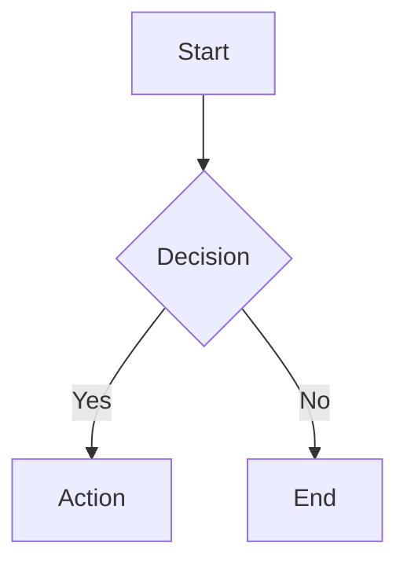

# WORK SESSION (1500-1600)

**Generated:** 2026-02-22T14:06:23.774Z
**Work Period:** 1500-1600
**Focus:** Live session logging
**Duration:** ~60 minutes

---

## Session Overview

This session captures real-time tool interactions and exchanges.

---

## Key Activities

<a name="ps_1771769183774"></a>
## Prompt Set (ps_1771769183774)

**Time:** 2026-02-22T14:06:23.774Z
**Duration:** 0ms
**Tool Calls:** 4

### Bash - 2026-02-22 14:06:23 UTC [15:06:23 CEST]

**User Request:** rm -f .logs/combined-status-line-cache.txt && node scripts/combined-status-line.js

**Tool:** Bash
**Input:** ```json
{
  "command": "rm -f .logs/combined-status-line-cache.txt && node scripts/combined-status-line.js",
  "description": "Run combined status line to verify live API spend data",
  "timeout": 30000
}
```

**Result:** ✅ Success
**Output:** ```
[🏥✅] [🐳] [Gq$0FEB A○ O○ X$25] [#[underscore]C#[nounderscore]🌲] [🛡️ 85% ✅VER] [📚⏸️ ] [📋15-16]
```


---

### Grep - 2026-02-22 14:06:23 UTC [15:06:23 CEST]

**User Request:** rm -f .logs/combined-status-line-cache.txt && node scripts/combined-status-line.js

**Tool:** Grep
**Input:** ```json
{
  "pattern": "dotenv|\\.env|loadEnv|process\\.env",
  "path": "<AWS_SECRET_REDACTED>mbined-status-line.js",
  "output_mode": "content",
  "-n": true,
  "head_limit": 20
}
```

**Result:** ✅ Success
**Output:** ```
17:const rootDir = process.env.CODING_REPO || join(__dirname, '..');
50:    if (process.env.CODING_DOCKER_MODE === 'true') {
134:      if (process.env.DEBUG_STATUS) {
142:      const targetProject = process.env.TRANSCRIPT_SOURCE_PROJECT || process.cwd();
151:          if (process.env.DEBUG_STATUS) {
162:          if (process.env.DEBUG_STATUS) {
171:            if (process.env.DEBUG_STATUS) {
191:      if (process.env.DEBUG_STATUS) {
207:      const codingRepo = process.env.CODING_TOOLS_PATH || p
...[truncated]
```


---

### Grep - 2026-02-22 14:06:23 UTC [15:06:23 CEST]

**User Request:** rm -f .logs/combined-status-line-cache.txt && node scripts/combined-status-line.js

**Tool:** Grep
**Input:** ```json
{
  "pattern": "dotenv|\\.env|loadEnv",
  "path": "/Users/<USER_ID_REDACTED>/Agentic/coding/lib/api-quota-checker.js",
  "output_mode": "content",
  "-n": true
}
```

**Result:** ✅ Success
**Output:** ```
201:  const apiKey = process.env.GROQ_API_KEY;
218:      const repoRoot = process.env.CODING_REPO || path.resolve(path.dirname(new URL(import.<COMPANY_NAME_REDACTED>.url).pathname), '..');
312:      process.env.CODING_REPO || path.resolve(path.dirname(new URL(import.<COMPANY_NAME_REDACTED>.url).pathname), '..'),
360:  const apiKey = process.env.GEMINI_API_KEY || process.env.GOOGLE_API_KEY;
409:  const regularApiKey = process.env.ANTHROPIC_API_KEY || process.env.CLAUDE_API_KEY;
410:  const adminApiKey = process.env.ANTHROPIC_ADMIN_AP
...[truncated]
```


---

### Bash - 2026-02-22 14:06:23 UTC [15:06:23 CEST]

**User Request:** rm -f .logs/combined-status-line-cache.txt && node scripts/combined-status-line.js

**Tool:** Bash
**Input:** ```json
{
  "command": "source .env && rm -f .logs/combined-status-line-cache.txt && node scripts/combined-status-line.js",
  "description": "Run status line with .env sourced",
  "timeout": 30000
}
```

**Result:** ✅ Success
**Output:** ```
[🏥✅] [🐳] [Gq$0FEB A● O● X$25] [#[underscore]C#[nounderscore]🟢] [🛡️ 85% 🔍EX] [📚❌] [📋15-16]
```


---

---

<a name="ps_1771769183774"></a>
## Prompt Set (ps_1771769183774)

**Time:** 2026-02-22T14:06:23.774Z
**Duration:** 0ms
**Tool Calls:** 4

### Bash - 2026-02-22 14:06:23 UTC [15:06:23 CEST]

**User Request:** rm -f .logs/combined-status-line-cache.txt && node scripts/combined-status-line.js

**Tool:** Bash
**Input:** ```json
{
  "command": "rm -f .logs/combined-status-line-cache.txt && node scripts/combined-status-line.js",
  "description": "Run combined status line to verify live API spend data",
  "timeout": 30000
}
```

**Result:** ✅ Success
**Output:** ```
[🏥✅] [🐳] [Gq$0FEB A○ O○ X$25] [#[underscore]C#[nounderscore]🌲] [🛡️ 85% ✅VER] [📚⏸️ ] [📋15-16]
```


---

### Grep - 2026-02-22 14:06:23 UTC [15:06:23 CEST]

**User Request:** rm -f .logs/combined-status-line-cache.txt && node scripts/combined-status-line.js

**Tool:** Grep
**Input:** ```json
{
  "pattern": "dotenv|\\.env|loadEnv|process\\.env",
  "path": "<AWS_SECRET_REDACTED>mbined-status-line.js",
  "output_mode": "content",
  "-n": true,
  "head_limit": 20
}
```

**Result:** ✅ Success
**Output:** ```
17:const rootDir = process.env.CODING_REPO || join(__dirname, '..');
50:    if (process.env.CODING_DOCKER_MODE === 'true') {
134:      if (process.env.DEBUG_STATUS) {
142:      const targetProject = process.env.TRANSCRIPT_SOURCE_PROJECT || process.cwd();
151:          if (process.env.DEBUG_STATUS) {
162:          if (process.env.DEBUG_STATUS) {
171:            if (process.env.DEBUG_STATUS) {
191:      if (process.env.DEBUG_STATUS) {
207:      const codingRepo = process.env.CODING_TOOLS_PATH || p
...[truncated]
```


---

### Grep - 2026-02-22 14:06:23 UTC [15:06:23 CEST]

**User Request:** rm -f .logs/combined-status-line-cache.txt && node scripts/combined-status-line.js

**Tool:** Grep
**Input:** ```json
{
  "pattern": "dotenv|\\.env|loadEnv",
  "path": "/Users/<USER_ID_REDACTED>/Agentic/coding/lib/api-quota-checker.js",
  "output_mode": "content",
  "-n": true
}
```

**Result:** ✅ Success
**Output:** ```
201:  const apiKey = process.env.GROQ_API_KEY;
218:      const repoRoot = process.env.CODING_REPO || path.resolve(path.dirname(new URL(import.<COMPANY_NAME_REDACTED>.url).pathname), '..');
312:      process.env.CODING_REPO || path.resolve(path.dirname(new URL(import.<COMPANY_NAME_REDACTED>.url).pathname), '..'),
360:  const apiKey = process.env.GEMINI_API_KEY || process.env.GOOGLE_API_KEY;
409:  const regularApiKey = process.env.ANTHROPIC_API_KEY || process.env.CLAUDE_API_KEY;
410:  const adminApiKey = process.env.ANTHROPIC_ADMIN_AP
...[truncated]
```


---

### Bash - 2026-02-22 14:06:23 UTC [15:06:23 CEST]

**User Request:** rm -f .logs/combined-status-line-cache.txt && node scripts/combined-status-line.js

**Tool:** Bash
**Input:** ```json
{
  "command": "source .env && rm -f .logs/combined-status-line-cache.txt && node scripts/combined-status-line.js",
  "description": "Run status line with .env sourced",
  "timeout": 30000
}
```

**Result:** ✅ Success
**Output:** ```
[🏥✅] [🐳] [Gq$0FEB A● O● X$25] [#[underscore]C#[nounderscore]🟢] [🛡️ 85% 🔍EX] [📚❌] [📋15-16]
```


---

---

<a name="ps_1771769337023"></a>
## Prompt Set (ps_1771769337023)

**Time:** 2026-02-22T14:08:57.023Z
**Duration:** 0ms
**Tool Calls:** 0

### Text Exchange - 2026-02-22 14:08:57 UTC [15:08:57 CEST]

**User Message:** is this OK now? 

**Type:** Text-only exchange (no tool calls)

---

---

<a name="ps_1771769337023"></a>
## Prompt Set (ps_1771769337023)

**Time:** 2026-02-22T14:08:57.023Z
**Duration:** 0ms
**Tool Calls:** 0

### Text Exchange - 2026-02-22 14:08:57 UTC [15:08:57 CEST]

**User Message:** is this OK now? 

**Type:** Text-only exchange (no tool calls)

---

---

<a name="ps_1771769183774"></a>
## Prompt Set (ps_1771769183774)

**Time:** 2026-02-22T14:06:23.774Z
**Duration:** 0ms
**Tool Calls:** 4

### Bash - 2026-02-22 14:06:23 UTC [15:06:23 CEST]

**User Request:** rm -f .logs/combined-status-line-cache.txt && node scripts/combined-status-line.js

**Tool:** Bash
**Input:** ```json
{
  "command": "rm -f .logs/combined-status-line-cache.txt && node scripts/combined-status-line.js",
  "description": "Run combined status line to verify live API spend data",
  "timeout": 30000
}
```

**Result:** ✅ Success
**Output:** ```
[🏥✅] [🐳] [Gq$0FEB A○ O○ X$25] [#[underscore]C#[nounderscore]🌲] [🛡️ 85% ✅VER] [📚⏸️ ] [📋15-16]
```


---

### Grep - 2026-02-22 14:06:23 UTC [15:06:23 CEST]

**User Request:** rm -f .logs/combined-status-line-cache.txt && node scripts/combined-status-line.js

**Tool:** Grep
**Input:** ```json
{
  "pattern": "dotenv|\\.env|loadEnv|process\\.env",
  "path": "<AWS_SECRET_REDACTED>mbined-status-line.js",
  "output_mode": "content",
  "-n": true,
  "head_limit": 20
}
```

**Result:** ✅ Success
**Output:** ```
17:const rootDir = process.env.CODING_REPO || join(__dirname, '..');
50:    if (process.env.CODING_DOCKER_MODE === 'true') {
134:      if (process.env.DEBUG_STATUS) {
142:      const targetProject = process.env.TRANSCRIPT_SOURCE_PROJECT || process.cwd();
151:          if (process.env.DEBUG_STATUS) {
162:          if (process.env.DEBUG_STATUS) {
171:            if (process.env.DEBUG_STATUS) {
191:      if (process.env.DEBUG_STATUS) {
207:      const codingRepo = process.env.CODING_TOOLS_PATH || p
...[truncated]
```


---

### Grep - 2026-02-22 14:06:23 UTC [15:06:23 CEST]

**User Request:** rm -f .logs/combined-status-line-cache.txt && node scripts/combined-status-line.js

**Tool:** Grep
**Input:** ```json
{
  "pattern": "dotenv|\\.env|loadEnv",
  "path": "/Users/<USER_ID_REDACTED>/Agentic/coding/lib/api-quota-checker.js",
  "output_mode": "content",
  "-n": true
}
```

**Result:** ✅ Success
**Output:** ```
201:  const apiKey = process.env.GROQ_API_KEY;
218:      const repoRoot = process.env.CODING_REPO || path.resolve(path.dirname(new URL(import.<COMPANY_NAME_REDACTED>.url).pathname), '..');
312:      process.env.CODING_REPO || path.resolve(path.dirname(new URL(import.<COMPANY_NAME_REDACTED>.url).pathname), '..'),
360:  const apiKey = process.env.GEMINI_API_KEY || process.env.GOOGLE_API_KEY;
409:  const regularApiKey = process.env.ANTHROPIC_API_KEY || process.env.CLAUDE_API_KEY;
410:  const adminApiKey = process.env.ANTHROPIC_ADMIN_AP
...[truncated]
```


---

### Bash - 2026-02-22 14:06:23 UTC [15:06:23 CEST]

**User Request:** rm -f .logs/combined-status-line-cache.txt && node scripts/combined-status-line.js

**Tool:** Bash
**Input:** ```json
{
  "command": "source .env && rm -f .logs/combined-status-line-cache.txt && node scripts/combined-status-line.js",
  "description": "Run status line with .env sourced",
  "timeout": 30000
}
```

**Result:** ✅ Success
**Output:** ```
[🏥✅] [🐳] [Gq$0FEB A● O● X$25] [#[underscore]C#[nounderscore]🟢] [🛡️ 85% 🔍EX] [📚❌] [📋15-16]
```


---

---

<a name="ps_1771769183774"></a>
## Prompt Set (ps_1771769183774)

**Time:** 2026-02-22T14:06:23.774Z
**Duration:** 0ms
**Tool Calls:** 4

### Bash - 2026-02-22 14:06:23 UTC [15:06:23 CEST]

**User Request:** rm -f .logs/combined-status-line-cache.txt && node scripts/combined-status-line.js

**Tool:** Bash
**Input:** ```json
{
  "command": "rm -f .logs/combined-status-line-cache.txt && node scripts/combined-status-line.js",
  "description": "Run combined status line to verify live API spend data",
  "timeout": 30000
}
```

**Result:** ✅ Success
**Output:** ```
[🏥✅] [🐳] [Gq$0FEB A○ O○ X$25] [#[underscore]C#[nounderscore]🌲] [🛡️ 85% ✅VER] [📚⏸️ ] [📋15-16]
```


---

### Grep - 2026-02-22 14:06:23 UTC [15:06:23 CEST]

**User Request:** rm -f .logs/combined-status-line-cache.txt && node scripts/combined-status-line.js

**Tool:** Grep
**Input:** ```json
{
  "pattern": "dotenv|\\.env|loadEnv|process\\.env",
  "path": "<AWS_SECRET_REDACTED>mbined-status-line.js",
  "output_mode": "content",
  "-n": true,
  "head_limit": 20
}
```

**Result:** ✅ Success
**Output:** ```
17:const rootDir = process.env.CODING_REPO || join(__dirname, '..');
50:    if (process.env.CODING_DOCKER_MODE === 'true') {
134:      if (process.env.DEBUG_STATUS) {
142:      const targetProject = process.env.TRANSCRIPT_SOURCE_PROJECT || process.cwd();
151:          if (process.env.DEBUG_STATUS) {
162:          if (process.env.DEBUG_STATUS) {
171:            if (process.env.DEBUG_STATUS) {
191:      if (process.env.DEBUG_STATUS) {
207:      const codingRepo = process.env.CODING_TOOLS_PATH || p
...[truncated]
```


---

### Grep - 2026-02-22 14:06:23 UTC [15:06:23 CEST]

**User Request:** rm -f .logs/combined-status-line-cache.txt && node scripts/combined-status-line.js

**Tool:** Grep
**Input:** ```json
{
  "pattern": "dotenv|\\.env|loadEnv",
  "path": "/Users/<USER_ID_REDACTED>/Agentic/coding/lib/api-quota-checker.js",
  "output_mode": "content",
  "-n": true
}
```

**Result:** ✅ Success
**Output:** ```
201:  const apiKey = process.env.GROQ_API_KEY;
218:      const repoRoot = process.env.CODING_REPO || path.resolve(path.dirname(new URL(import.<COMPANY_NAME_REDACTED>.url).pathname), '..');
312:      process.env.CODING_REPO || path.resolve(path.dirname(new URL(import.<COMPANY_NAME_REDACTED>.url).pathname), '..'),
360:  const apiKey = process.env.GEMINI_API_KEY || process.env.GOOGLE_API_KEY;
409:  const regularApiKey = process.env.ANTHROPIC_API_KEY || process.env.CLAUDE_API_KEY;
410:  const adminApiKey = process.env.ANTHROPIC_ADMIN_AP
...[truncated]
```


---

### Bash - 2026-02-22 14:06:23 UTC [15:06:23 CEST]

**User Request:** rm -f .logs/combined-status-line-cache.txt && node scripts/combined-status-line.js

**Tool:** Bash
**Input:** ```json
{
  "command": "source .env && rm -f .logs/combined-status-line-cache.txt && node scripts/combined-status-line.js",
  "description": "Run status line with .env sourced",
  "timeout": 30000
}
```

**Result:** ✅ Success
**Output:** ```
[🏥✅] [🐳] [Gq$0FEB A● O● X$25] [#[underscore]C#[nounderscore]🟢] [🛡️ 85% 🔍EX] [📚❌] [📋15-16]
```


---

---

<a name="ps_1771769337023"></a>
## Prompt Set (ps_1771769337023)

**Time:** 2026-02-22T14:08:57.023Z
**Duration:** 0ms
**Tool Calls:** 6

### Grep - 2026-02-22 14:08:57 UTC [15:08:57 CEST]

**User Request:** is this OK now?

**Tool:** Grep
**Input:** ```json
{
  "pattern": "combined-status-line|status-right|status-left",
  "path": "/Users/<USER_ID_REDACTED>/Agentic/coding/scripts",
  "output_mode": "files_with_matches"
}
```

**Result:** ✅ Success
**Output:** ```
Found 10 files
scripts/setup-api-keys.js
scripts/statusline-health-monitor.js
scripts/combined-status-line.js
scripts/global-process-supervisor.js
scripts/status-line-fast.cjs
scripts/tmux-session-wrapper.sh
scripts/combined-status-line-wrapper.js
scripts/auto-restart-watcher.js
scripts/agent-common-setup.sh
scripts/initialize-knowledge-system.js
```


---

### Bash - 2026-02-22 14:08:57 UTC [15:08:57 CEST]

**User Request:** is this OK now?

**Tool:** Bash
**Input:** ```json
{
  "command": "tmux show-option -g status-right 2>/dev/null || echo \"no tmux status-right\"",
  "description": "Check tmux status-right config"
}
```

**Result:** ✅ Success
**Output:** ```
status-right "#(CODING_REPO=/Users/<USER_ID_REDACTED>/Agentic/coding node <AWS_SECRET_REDACTED>atus-line-fast.cjs 2>/dev/null || echo '[Status Offline]') %H:%M %d-%b-%y"
```


---

### Grep - 2026-02-22 14:08:57 UTC [15:08:57 CEST]

**User Request:** is this OK now?

**Tool:** Grep
**Input:** ```json
{
  "pattern": "dotenv|\\.env|loadEnv|ANTHROPIC_ADMIN|process\\.env",
  "path": "<AWS_SECRET_REDACTED>atus-line-fast.cjs",
  "output_mode": "content",
  "-n": true
}
```

**Result:** ✅ Success
**Output:** ```
9:const codingRepo = process.env.CODING_REPO || path.join(__dirname, '..');
12:const env = { ...process.env, CODING_REPO: codingRepo };
```


---

### Read - 2026-02-22 14:08:57 UTC [15:08:57 CEST]

**User Request:** is this OK now?

**Tool:** Read
**Input:** ```json
{
  "file_path": "<AWS_SECRET_REDACTED>atus-line-fast.cjs"
}
```

**Result:** ✅ Success
**Output:** ```
     1→#!/usr/bin/env node
     2→// Ultra-fast status line reader — CommonJS, no ESM overhead.
     3→// Reads the pre-rendered cache file. Falls back to the full CSL only if stale.
     4→'use strict';
     5→const fs = require('fs');
     6→const path = require('path');
     7→const { spawn } = require('child_process');
     8→
     9→const codingRepo = process.env.CODING_REPO || path.join(__dirname, '..');
    10→const cacheFile = path.join(codingRepo, '.logs', 'combined-status-line-cache.tx
...[truncated]
```


---

### Edit - 2026-02-22 14:08:57 UTC [15:08:57 CEST]

**User Request:** is this OK now?

**Tool:** Edit
**Input:** ```json
{
  "replace_all": false,
  "file_path": "<AWS_SECRET_REDACTED>atus-line-fast.cjs",
  "old_string": "const codingRepo = process.env.CODING_REPO || path.join(__dirname, '..');\nconst cacheFile = path.join(codingRepo, '.logs', 'combined-status-line-cache.txt');\nconst cslScript = path.join(__dirname, 'combined-status-line.js');\nconst env = { ...process.env, CODING_REPO: codingRepo };",
  "new_string": "const codingRepo = process.env.CODING_REPO || path.join(__dirname, '..');\nconst cacheFile = path.join(codingRepo, '.logs', 'combined-status-line-cache.txt');\nconst cslScript = path.join(__dirname, 'combined-status-line.js');\n\n// Load .env file so admin/management API keys are available\nconst envFromFile = {};\ntry {\n  const envContent = fs.readFileSync(path.join(codingRepo, '.env'), 'utf8');\n  for (const line of envContent.split('\\n')) {\n    if (line && !line.startsWith('#') && line.includes('=')) {\n      const idx = line.indexOf('=');\n      const key = line.slice(0, idx).trim();\n      const val = line.slice(idx + 1).trim();\n      if (key && !process.env[key]) envFromFile[key] = val;\n    }\n  }\n} catch { /* .env missing — not fatal */ }\n\nconst env = { ...process.env, ...envFromFile, CODING_REPO: codingRepo };"
}
```

**Result:** ✅ Success
**Output:** ```
The file <AWS_SECRET_REDACTED>atus-line-fast.cjs has been updated successfully.
```


---

### Bash - 2026-02-22 14:08:57 UTC [15:08:57 CEST]

**User Request:** is this OK now?

**Tool:** Bash
**Input:** ```json
{
  "command": "rm -f /Users/<USER_ID_REDACTED>/Agentic/coding/.logs/combined-status-line-cache.txt && node <AWS_SECRET_REDACTED>atus-line-fast.cjs",
  "description": "Test status-line-fast with .env loading",
  "timeout": 30000
}
```

**Result:** ✅ Success
**Output:** ```
[🏥✅] [🐳] [Gq$0FEB A● O● X$25] [#[underscore]C#[nounderscore]🟢] [🛡️ 85% ⚙️IMP] [📚⏸️ ] [📋15-16]
```


---

---

<a name="ps_1771769337023"></a>
## Prompt Set (ps_1771769337023)

**Time:** 2026-02-22T14:08:57.023Z
**Duration:** 0ms
**Tool Calls:** 6

### Grep - 2026-02-22 14:08:57 UTC [15:08:57 CEST]

**User Request:** is this OK now?

**Tool:** Grep
**Input:** ```json
{
  "pattern": "combined-status-line|status-right|status-left",
  "path": "/Users/<USER_ID_REDACTED>/Agentic/coding/scripts",
  "output_mode": "files_with_matches"
}
```

**Result:** ✅ Success
**Output:** ```
Found 10 files
scripts/setup-api-keys.js
scripts/statusline-health-monitor.js
scripts/combined-status-line.js
scripts/global-process-supervisor.js
scripts/status-line-fast.cjs
scripts/tmux-session-wrapper.sh
scripts/combined-status-line-wrapper.js
scripts/auto-restart-watcher.js
scripts/agent-common-setup.sh
scripts/initialize-knowledge-system.js
```


---

### Bash - 2026-02-22 14:08:57 UTC [15:08:57 CEST]

**User Request:** is this OK now?

**Tool:** Bash
**Input:** ```json
{
  "command": "tmux show-option -g status-right 2>/dev/null || echo \"no tmux status-right\"",
  "description": "Check tmux status-right config"
}
```

**Result:** ✅ Success
**Output:** ```
status-right "#(CODING_REPO=/Users/<USER_ID_REDACTED>/Agentic/coding node <AWS_SECRET_REDACTED>atus-line-fast.cjs 2>/dev/null || echo '[Status Offline]') %H:%M %d-%b-%y"
```


---

### Grep - 2026-02-22 14:08:57 UTC [15:08:57 CEST]

**User Request:** is this OK now?

**Tool:** Grep
**Input:** ```json
{
  "pattern": "dotenv|\\.env|loadEnv|ANTHROPIC_ADMIN|process\\.env",
  "path": "<AWS_SECRET_REDACTED>atus-line-fast.cjs",
  "output_mode": "content",
  "-n": true
}
```

**Result:** ✅ Success
**Output:** ```
9:const codingRepo = process.env.CODING_REPO || path.join(__dirname, '..');
12:const env = { ...process.env, CODING_REPO: codingRepo };
```


---

### Read - 2026-02-22 14:08:57 UTC [15:08:57 CEST]

**User Request:** is this OK now?

**Tool:** Read
**Input:** ```json
{
  "file_path": "<AWS_SECRET_REDACTED>atus-line-fast.cjs"
}
```

**Result:** ✅ Success
**Output:** ```
     1→#!/usr/bin/env node
     2→// Ultra-fast status line reader — CommonJS, no ESM overhead.
     3→// Reads the pre-rendered cache file. Falls back to the full CSL only if stale.
     4→'use strict';
     5→const fs = require('fs');
     6→const path = require('path');
     7→const { spawn } = require('child_process');
     8→
     9→const codingRepo = process.env.CODING_REPO || path.join(__dirname, '..');
    10→const cacheFile = path.join(codingRepo, '.logs', 'combined-status-line-cache.tx
...[truncated]
```


---

### Edit - 2026-02-22 14:08:57 UTC [15:08:57 CEST]

**User Request:** is this OK now?

**Tool:** Edit
**Input:** ```json
{
  "replace_all": false,
  "file_path": "<AWS_SECRET_REDACTED>atus-line-fast.cjs",
  "old_string": "const codingRepo = process.env.CODING_REPO || path.join(__dirname, '..');\nconst cacheFile = path.join(codingRepo, '.logs', 'combined-status-line-cache.txt');\nconst cslScript = path.join(__dirname, 'combined-status-line.js');\nconst env = { ...process.env, CODING_REPO: codingRepo };",
  "new_string": "const codingRepo = process.env.CODING_REPO || path.join(__dirname, '..');\nconst cacheFile = path.join(codingRepo, '.logs', 'combined-status-line-cache.txt');\nconst cslScript = path.join(__dirname, 'combined-status-line.js');\n\n// Load .env file so admin/management API keys are available\nconst envFromFile = {};\ntry {\n  const envContent = fs.readFileSync(path.join(codingRepo, '.env'), 'utf8');\n  for (const line of envContent.split('\\n')) {\n    if (line && !line.startsWith('#') && line.includes('=')) {\n      const idx = line.indexOf('=');\n      const key = line.slice(0, idx).trim();\n      const val = line.slice(idx + 1).trim();\n      if (key && !process.env[key]) envFromFile[key] = val;\n    }\n  }\n} catch { /* .env missing — not fatal */ }\n\nconst env = { ...process.env, ...envFromFile, CODING_REPO: codingRepo };"
}
```

**Result:** ✅ Success
**Output:** ```
The file <AWS_SECRET_REDACTED>atus-line-fast.cjs has been updated successfully.
```


---

### Bash - 2026-02-22 14:08:57 UTC [15:08:57 CEST]

**User Request:** is this OK now?

**Tool:** Bash
**Input:** ```json
{
  "command": "rm -f /Users/<USER_ID_REDACTED>/Agentic/coding/.logs/combined-status-line-cache.txt && node <AWS_SECRET_REDACTED>atus-line-fast.cjs",
  "description": "Test status-line-fast with .env loading",
  "timeout": 30000
}
```

**Result:** ✅ Success
**Output:** ```
[🏥✅] [🐳] [Gq$0FEB A● O● X$25] [#[underscore]C#[nounderscore]🟢] [🛡️ 85% ⚙️IMP] [📚⏸️ ] [📋15-16]
```


---

---

<a name="ps_1771769423530"></a>
## Prompt Set (ps_1771769423530)

**Time:** 2026-02-22T14:10:23.530Z
**Duration:** 0ms
**Tool Calls:** 0

### Text Exchange - 2026-02-22 14:10:23 UTC [15:10:23 CEST]

**User Message:** why do we have full circles on A and O? What exactly does this tell me?

**Type:** Text-only exchange (no tool calls)

---

---

<a name="ps_1771769423530"></a>
## Prompt Set (ps_1771769423530)

**Time:** 2026-02-22T14:10:23.530Z
**Duration:** 0ms
**Tool Calls:** 0

### Text Exchange - 2026-02-22 14:10:23 UTC [15:10:23 CEST]

**User Message:** why do we have full circles on A and O? What exactly does this tell me?

**Type:** Text-only exchange (no tool calls)

---

---

<a name="ps_1771769183774"></a>
## Prompt Set (ps_1771769183774)

**Time:** 2026-02-22T14:06:23.774Z
**Duration:** 0ms
**Tool Calls:** 4

### Bash - 2026-02-22 14:06:23 UTC [15:06:23 CEST]

**User Request:** rm -f .logs/combined-status-line-cache.txt && node scripts/combined-status-line.js

**Tool:** Bash
**Input:** ```json
{
  "command": "rm -f .logs/combined-status-line-cache.txt && node scripts/combined-status-line.js",
  "description": "Run combined status line to verify live API spend data",
  "timeout": 30000
}
```

**Result:** ✅ Success
**Output:** ```
[🏥✅] [🐳] [Gq$0FEB A○ O○ X$25] [#[underscore]C#[nounderscore]🌲] [🛡️ 85% ✅VER] [📚⏸️ ] [📋15-16]
```


---

### Grep - 2026-02-22 14:06:23 UTC [15:06:23 CEST]

**User Request:** rm -f .logs/combined-status-line-cache.txt && node scripts/combined-status-line.js

**Tool:** Grep
**Input:** ```json
{
  "pattern": "dotenv|\\.env|loadEnv|process\\.env",
  "path": "<AWS_SECRET_REDACTED>mbined-status-line.js",
  "output_mode": "content",
  "-n": true,
  "head_limit": 20
}
```

**Result:** ✅ Success
**Output:** ```
17:const rootDir = process.env.CODING_REPO || join(__dirname, '..');
50:    if (process.env.CODING_DOCKER_MODE === 'true') {
134:      if (process.env.DEBUG_STATUS) {
142:      const targetProject = process.env.TRANSCRIPT_SOURCE_PROJECT || process.cwd();
151:          if (process.env.DEBUG_STATUS) {
162:          if (process.env.DEBUG_STATUS) {
171:            if (process.env.DEBUG_STATUS) {
191:      if (process.env.DEBUG_STATUS) {
207:      const codingRepo = process.env.CODING_TOOLS_PATH || p
...[truncated]
```


---

### Grep - 2026-02-22 14:06:23 UTC [15:06:23 CEST]

**User Request:** rm -f .logs/combined-status-line-cache.txt && node scripts/combined-status-line.js

**Tool:** Grep
**Input:** ```json
{
  "pattern": "dotenv|\\.env|loadEnv",
  "path": "/Users/<USER_ID_REDACTED>/Agentic/coding/lib/api-quota-checker.js",
  "output_mode": "content",
  "-n": true
}
```

**Result:** ✅ Success
**Output:** ```
201:  const apiKey = process.env.GROQ_API_KEY;
218:      const repoRoot = process.env.CODING_REPO || path.resolve(path.dirname(new URL(import.<COMPANY_NAME_REDACTED>.url).pathname), '..');
312:      process.env.CODING_REPO || path.resolve(path.dirname(new URL(import.<COMPANY_NAME_REDACTED>.url).pathname), '..'),
360:  const apiKey = process.env.GEMINI_API_KEY || process.env.GOOGLE_API_KEY;
409:  const regularApiKey = process.env.ANTHROPIC_API_KEY || process.env.CLAUDE_API_KEY;
410:  const adminApiKey = process.env.ANTHROPIC_ADMIN_AP
...[truncated]
```


---

### Bash - 2026-02-22 14:06:23 UTC [15:06:23 CEST]

**User Request:** rm -f .logs/combined-status-line-cache.txt && node scripts/combined-status-line.js

**Tool:** Bash
**Input:** ```json
{
  "command": "source .env && rm -f .logs/combined-status-line-cache.txt && node scripts/combined-status-line.js",
  "description": "Run status line with .env sourced",
  "timeout": 30000
}
```

**Result:** ✅ Success
**Output:** ```
[🏥✅] [🐳] [Gq$0FEB A● O● X$25] [#[underscore]C#[nounderscore]🟢] [🛡️ 85% 🔍EX] [📚❌] [📋15-16]
```


---

---

<a name="ps_1771769337023"></a>
## Prompt Set (ps_1771769337023)

**Time:** 2026-02-22T14:08:57.023Z
**Duration:** 0ms
**Tool Calls:** 6

### Grep - 2026-02-22 14:08:57 UTC [15:08:57 CEST]

**User Request:** is this OK now?

**Tool:** Grep
**Input:** ```json
{
  "pattern": "combined-status-line|status-right|status-left",
  "path": "/Users/<USER_ID_REDACTED>/Agentic/coding/scripts",
  "output_mode": "files_with_matches"
}
```

**Result:** ✅ Success
**Output:** ```
Found 10 files
scripts/setup-api-keys.js
scripts/statusline-health-monitor.js
scripts/combined-status-line.js
scripts/global-process-supervisor.js
scripts/status-line-fast.cjs
scripts/tmux-session-wrapper.sh
scripts/combined-status-line-wrapper.js
scripts/auto-restart-watcher.js
scripts/agent-common-setup.sh
scripts/initialize-knowledge-system.js
```


---

### Bash - 2026-02-22 14:08:57 UTC [15:08:57 CEST]

**User Request:** is this OK now?

**Tool:** Bash
**Input:** ```json
{
  "command": "tmux show-option -g status-right 2>/dev/null || echo \"no tmux status-right\"",
  "description": "Check tmux status-right config"
}
```

**Result:** ✅ Success
**Output:** ```
status-right "#(CODING_REPO=/Users/<USER_ID_REDACTED>/Agentic/coding node <AWS_SECRET_REDACTED>atus-line-fast.cjs 2>/dev/null || echo '[Status Offline]') %H:%M %d-%b-%y"
```


---

### Grep - 2026-02-22 14:08:57 UTC [15:08:57 CEST]

**User Request:** is this OK now?

**Tool:** Grep
**Input:** ```json
{
  "pattern": "dotenv|\\.env|loadEnv|ANTHROPIC_ADMIN|process\\.env",
  "path": "<AWS_SECRET_REDACTED>atus-line-fast.cjs",
  "output_mode": "content",
  "-n": true
}
```

**Result:** ✅ Success
**Output:** ```
9:const codingRepo = process.env.CODING_REPO || path.join(__dirname, '..');
12:const env = { ...process.env, CODING_REPO: codingRepo };
```


---

### Read - 2026-02-22 14:08:57 UTC [15:08:57 CEST]

**User Request:** is this OK now?

**Tool:** Read
**Input:** ```json
{
  "file_path": "<AWS_SECRET_REDACTED>atus-line-fast.cjs"
}
```

**Result:** ✅ Success
**Output:** ```
     1→#!/usr/bin/env node
     2→// Ultra-fast status line reader — CommonJS, no ESM overhead.
     3→// Reads the pre-rendered cache file. Falls back to the full CSL only if stale.
     4→'use strict';
     5→const fs = require('fs');
     6→const path = require('path');
     7→const { spawn } = require('child_process');
     8→
     9→const codingRepo = process.env.CODING_REPO || path.join(__dirname, '..');
    10→const cacheFile = path.join(codingRepo, '.logs', 'combined-status-line-cache.tx
...[truncated]
```


---

### Edit - 2026-02-22 14:08:57 UTC [15:08:57 CEST]

**User Request:** is this OK now?

**Tool:** Edit
**Input:** ```json
{
  "replace_all": false,
  "file_path": "<AWS_SECRET_REDACTED>atus-line-fast.cjs",
  "old_string": "const codingRepo = process.env.CODING_REPO || path.join(__dirname, '..');\nconst cacheFile = path.join(codingRepo, '.logs', 'combined-status-line-cache.txt');\nconst cslScript = path.join(__dirname, 'combined-status-line.js');\nconst env = { ...process.env, CODING_REPO: codingRepo };",
  "new_string": "const codingRepo = process.env.CODING_REPO || path.join(__dirname, '..');\nconst cacheFile = path.join(codingRepo, '.logs', 'combined-status-line-cache.txt');\nconst cslScript = path.join(__dirname, 'combined-status-line.js');\n\n// Load .env file so admin/management API keys are available\nconst envFromFile = {};\ntry {\n  const envContent = fs.readFileSync(path.join(codingRepo, '.env'), 'utf8');\n  for (const line of envContent.split('\\n')) {\n    if (line && !line.startsWith('#') && line.includes('=')) {\n      const idx = line.indexOf('=');\n      const key = line.slice(0, idx).trim();\n      const val = line.slice(idx + 1).trim();\n      if (key && !process.env[key]) envFromFile[key] = val;\n    }\n  }\n} catch { /* .env missing — not fatal */ }\n\nconst env = { ...process.env, ...envFromFile, CODING_REPO: codingRepo };"
}
```

**Result:** ✅ Success
**Output:** ```
The file <AWS_SECRET_REDACTED>atus-line-fast.cjs has been updated successfully.
```


---

### Bash - 2026-02-22 14:08:57 UTC [15:08:57 CEST]

**User Request:** is this OK now?

**Tool:** Bash
**Input:** ```json
{
  "command": "rm -f /Users/<USER_ID_REDACTED>/Agentic/coding/.logs/combined-status-line-cache.txt && node <AWS_SECRET_REDACTED>atus-line-fast.cjs",
  "description": "Test status-line-fast with .env loading",
  "timeout": 30000
}
```

**Result:** ✅ Success
**Output:** ```
[🏥✅] [🐳] [Gq$0FEB A● O● X$25] [#[underscore]C#[nounderscore]🟢] [🛡️ 85% ⚙️IMP] [📚⏸️ ] [📋15-16]
```


---

---

<a name="ps_1771769183774"></a>
## Prompt Set (ps_1771769183774)

**Time:** 2026-02-22T14:06:23.774Z
**Duration:** 0ms
**Tool Calls:** 4

### Bash - 2026-02-22 14:06:23 UTC [15:06:23 CEST]

**User Request:** rm -f .logs/combined-status-line-cache.txt && node scripts/combined-status-line.js

**Tool:** Bash
**Input:** ```json
{
  "command": "rm -f .logs/combined-status-line-cache.txt && node scripts/combined-status-line.js",
  "description": "Run combined status line to verify live API spend data",
  "timeout": 30000
}
```

**Result:** ✅ Success
**Output:** ```
[🏥✅] [🐳] [Gq$0FEB A○ O○ X$25] [#[underscore]C#[nounderscore]🌲] [🛡️ 85% ✅VER] [📚⏸️ ] [📋15-16]
```


---

### Grep - 2026-02-22 14:06:23 UTC [15:06:23 CEST]

**User Request:** rm -f .logs/combined-status-line-cache.txt && node scripts/combined-status-line.js

**Tool:** Grep
**Input:** ```json
{
  "pattern": "dotenv|\\.env|loadEnv|process\\.env",
  "path": "<AWS_SECRET_REDACTED>mbined-status-line.js",
  "output_mode": "content",
  "-n": true,
  "head_limit": 20
}
```

**Result:** ✅ Success
**Output:** ```
17:const rootDir = process.env.CODING_REPO || join(__dirname, '..');
50:    if (process.env.CODING_DOCKER_MODE === 'true') {
134:      if (process.env.DEBUG_STATUS) {
142:      const targetProject = process.env.TRANSCRIPT_SOURCE_PROJECT || process.cwd();
151:          if (process.env.DEBUG_STATUS) {
162:          if (process.env.DEBUG_STATUS) {
171:            if (process.env.DEBUG_STATUS) {
191:      if (process.env.DEBUG_STATUS) {
207:      const codingRepo = process.env.CODING_TOOLS_PATH || p
...[truncated]
```


---

### Grep - 2026-02-22 14:06:23 UTC [15:06:23 CEST]

**User Request:** rm -f .logs/combined-status-line-cache.txt && node scripts/combined-status-line.js

**Tool:** Grep
**Input:** ```json
{
  "pattern": "dotenv|\\.env|loadEnv",
  "path": "/Users/<USER_ID_REDACTED>/Agentic/coding/lib/api-quota-checker.js",
  "output_mode": "content",
  "-n": true
}
```

**Result:** ✅ Success
**Output:** ```
201:  const apiKey = process.env.GROQ_API_KEY;
218:      const repoRoot = process.env.CODING_REPO || path.resolve(path.dirname(new URL(import.<COMPANY_NAME_REDACTED>.url).pathname), '..');
312:      process.env.CODING_REPO || path.resolve(path.dirname(new URL(import.<COMPANY_NAME_REDACTED>.url).pathname), '..'),
360:  const apiKey = process.env.GEMINI_API_KEY || process.env.GOOGLE_API_KEY;
409:  const regularApiKey = process.env.ANTHROPIC_API_KEY || process.env.CLAUDE_API_KEY;
410:  const adminApiKey = process.env.ANTHROPIC_ADMIN_AP
...[truncated]
```


---

### Bash - 2026-02-22 14:06:23 UTC [15:06:23 CEST]

**User Request:** rm -f .logs/combined-status-line-cache.txt && node scripts/combined-status-line.js

**Tool:** Bash
**Input:** ```json
{
  "command": "source .env && rm -f .logs/combined-status-line-cache.txt && node scripts/combined-status-line.js",
  "description": "Run status line with .env sourced",
  "timeout": 30000
}
```

**Result:** ✅ Success
**Output:** ```
[🏥✅] [🐳] [Gq$0FEB A● O● X$25] [#[underscore]C#[nounderscore]🟢] [🛡️ 85% 🔍EX] [📚❌] [📋15-16]
```


---

---

<a name="ps_1771769337023"></a>
## Prompt Set (ps_1771769337023)

**Time:** 2026-02-22T14:08:57.023Z
**Duration:** 0ms
**Tool Calls:** 6

### Grep - 2026-02-22 14:08:57 UTC [15:08:57 CEST]

**User Request:** is this OK now?

**Tool:** Grep
**Input:** ```json
{
  "pattern": "combined-status-line|status-right|status-left",
  "path": "/Users/<USER_ID_REDACTED>/Agentic/coding/scripts",
  "output_mode": "files_with_matches"
}
```

**Result:** ✅ Success
**Output:** ```
Found 10 files
scripts/setup-api-keys.js
scripts/statusline-health-monitor.js
scripts/combined-status-line.js
scripts/global-process-supervisor.js
scripts/status-line-fast.cjs
scripts/tmux-session-wrapper.sh
scripts/combined-status-line-wrapper.js
scripts/auto-restart-watcher.js
scripts/agent-common-setup.sh
scripts/initialize-knowledge-system.js
```


---

### Bash - 2026-02-22 14:08:57 UTC [15:08:57 CEST]

**User Request:** is this OK now?

**Tool:** Bash
**Input:** ```json
{
  "command": "tmux show-option -g status-right 2>/dev/null || echo \"no tmux status-right\"",
  "description": "Check tmux status-right config"
}
```

**Result:** ✅ Success
**Output:** ```
status-right "#(CODING_REPO=/Users/<USER_ID_REDACTED>/Agentic/coding node <AWS_SECRET_REDACTED>atus-line-fast.cjs 2>/dev/null || echo '[Status Offline]') %H:%M %d-%b-%y"
```


---

### Grep - 2026-02-22 14:08:57 UTC [15:08:57 CEST]

**User Request:** is this OK now?

**Tool:** Grep
**Input:** ```json
{
  "pattern": "dotenv|\\.env|loadEnv|ANTHROPIC_ADMIN|process\\.env",
  "path": "<AWS_SECRET_REDACTED>atus-line-fast.cjs",
  "output_mode": "content",
  "-n": true
}
```

**Result:** ✅ Success
**Output:** ```
9:const codingRepo = process.env.CODING_REPO || path.join(__dirname, '..');
12:const env = { ...process.env, CODING_REPO: codingRepo };
```


---

### Read - 2026-02-22 14:08:57 UTC [15:08:57 CEST]

**User Request:** is this OK now?

**Tool:** Read
**Input:** ```json
{
  "file_path": "<AWS_SECRET_REDACTED>atus-line-fast.cjs"
}
```

**Result:** ✅ Success
**Output:** ```
     1→#!/usr/bin/env node
     2→// Ultra-fast status line reader — CommonJS, no ESM overhead.
     3→// Reads the pre-rendered cache file. Falls back to the full CSL only if stale.
     4→'use strict';
     5→const fs = require('fs');
     6→const path = require('path');
     7→const { spawn } = require('child_process');
     8→
     9→const codingRepo = process.env.CODING_REPO || path.join(__dirname, '..');
    10→const cacheFile = path.join(codingRepo, '.logs', 'combined-status-line-cache.tx
...[truncated]
```


---

### Edit - 2026-02-22 14:08:57 UTC [15:08:57 CEST]

**User Request:** is this OK now?

**Tool:** Edit
**Input:** ```json
{
  "replace_all": false,
  "file_path": "<AWS_SECRET_REDACTED>atus-line-fast.cjs",
  "old_string": "const codingRepo = process.env.CODING_REPO || path.join(__dirname, '..');\nconst cacheFile = path.join(codingRepo, '.logs', 'combined-status-line-cache.txt');\nconst cslScript = path.join(__dirname, 'combined-status-line.js');\nconst env = { ...process.env, CODING_REPO: codingRepo };",
  "new_string": "const codingRepo = process.env.CODING_REPO || path.join(__dirname, '..');\nconst cacheFile = path.join(codingRepo, '.logs', 'combined-status-line-cache.txt');\nconst cslScript = path.join(__dirname, 'combined-status-line.js');\n\n// Load .env file so admin/management API keys are available\nconst envFromFile = {};\ntry {\n  const envContent = fs.readFileSync(path.join(codingRepo, '.env'), 'utf8');\n  for (const line of envContent.split('\\n')) {\n    if (line && !line.startsWith('#') && line.includes('=')) {\n      const idx = line.indexOf('=');\n      const key = line.slice(0, idx).trim();\n      const val = line.slice(idx + 1).trim();\n      if (key && !process.env[key]) envFromFile[key] = val;\n    }\n  }\n} catch { /* .env missing — not fatal */ }\n\nconst env = { ...process.env, ...envFromFile, CODING_REPO: codingRepo };"
}
```

**Result:** ✅ Success
**Output:** ```
The file <AWS_SECRET_REDACTED>atus-line-fast.cjs has been updated successfully.
```


---

### Bash - 2026-02-22 14:08:57 UTC [15:08:57 CEST]

**User Request:** is this OK now?

**Tool:** Bash
**Input:** ```json
{
  "command": "rm -f /Users/<USER_ID_REDACTED>/Agentic/coding/.logs/combined-status-line-cache.txt && node <AWS_SECRET_REDACTED>atus-line-fast.cjs",
  "description": "Test status-line-fast with .env loading",
  "timeout": 30000
}
```

**Result:** ✅ Success
**Output:** ```
[🏥✅] [🐳] [Gq$0FEB A● O● X$25] [#[underscore]C#[nounderscore]🟢] [🛡️ 85% ⚙️IMP] [📚⏸️ ] [📋15-16]
```


---

---

<a name="ps_1771769423530"></a>
## Prompt Set (ps_1771769423530)

**Time:** 2026-02-22T14:10:23.530Z
**Duration:** 0ms
**Tool Calls:** 3

### Read - 2026-02-22 14:10:23 UTC [15:10:23 CEST]

**User Request:** why do we have full circles on A and O? What exactly does this tell me?

**Tool:** Read
**Input:** ```json
{
  "file_path": "/Users/<USER_ID_REDACTED>/Agentic/coding/lib/api-quota-checker.js",
  "offset": 900,
  "limit": 40
}
```

**Result:** ✅ Success
**Output:** ```
   900→ *
   901→ * Format:
   902→ * - Free tier: "Gq●" (pie symbol showing availability)
   903→ * - Monthly billing: "Gq$2JAN" (spent dollars + month)
   904→ * - Prepaid credits: "A$15" (remaining dollars)
   905→ *
   906→ * Pie symbols: ● (full) → ◕ → ◐ → ◔ → ○ (empty)
   907→ *
   908→ * @param {Object} providerData - Provider status object
   909→ * @returns {string} Formatted display string
   910→ */
   911→export function formatQuotaDisplay(providerData) {
   912→  const { abbrev, quo
...[truncated]
```


---

### Edit - 2026-02-22 14:10:23 UTC [15:10:23 CEST]

**User Request:** why do we have full circles on A and O? What exactly does this tell me?

**Tool:** Edit
**Input:** ```json
{
  "replace_all": false,
  "file_path": "/Users/<USER_ID_REDACTED>/Agentic/coding/lib/api-quota-checker.js",
  "old_string": "export function formatQuotaDisplay(providerData) {\n  const { abbrev, quota } = providerData;\n\n  // Monthly billing - show spent amount + month (e.g., \"$2JAN\")\n  if (typeof quota.monthlySpend === 'number' && quota.billingMonth) {\n    return `${abbrev}$${Math.round(quota.monthlySpend)}${quota.billingMonth}`;\n  }\n\n  // If we have remaining credits in $, show that\n  if (typeof quota.remainingCredits === 'number') {\n    return `${abbrev}$${Math.round(quota.remainingCredits)}`;\n  }\n\n  // If we have a percentage remaining, show pie symbol\n  if (typeof quota.remaining === 'number') {\n    return `${abbrev}${getPieSymbol(quota.remaining)}`;\n  }\n\n  // No data available (no admin key)\n  if (quota.remaining === 'N/A') {\n    return `${abbrev}○`;\n  }\n\n  // Free tier / rate-limited only - show as fully available\n  return `${abbrev}●`;\n}",
  "new_string": "export function formatQuotaDisplay(providerData) {\n  const { abbrev, quota, cost } = providerData;\n\n  // Monthly billing - show spent amount + month (e.g., \"$2JAN\")\n  if (typeof quota.monthlySpend === 'number' && quota.billingMonth) {\n    return `${abbrev}$${Math.round(quota.monthlySpend)}${quota.billingMonth}`;\n  }\n\n  // If we have remaining credits in $, show that\n  if (typeof quota.remainingCredits === 'number') {\n    return `${abbrev}$${Math.round(quota.remainingCredits)}`;\n  }\n\n  // If we have a percentage remaining, show pie symbol\n  if (typeof quota.remaining === 'number') {\n    return `${abbrev}${getPieSymbol(quota.remaining)}`;\n  }\n\n  // Admin API returned actual spend but no prepaid credits to compare against\n  // Show spent amount (e.g., \"A$2\" = $2 spent this month)\n  if (typeof cost?.total === 'number' && cost.total >= 0) {\n    return `${abbrev}$${Math.round(cost.total)}`;\n  }\n\n  // No data available (no admin key)\n  if (quota.remaining === 'N/A') {\n    return `${abbrev}○`;\n  }\n\n  // Free tier / rate-limited only - show as fully available\n  return `${abbrev}●`;\n}"
}
```

**Result:** ✅ Success
**Output:** ```
The file /Users/<USER_ID_REDACTED>/Agentic/coding/lib/api-quota-checker.js has been updated successfully.
```


---

### Bash - 2026-02-22 14:10:23 UTC [15:10:23 CEST]

**User Request:** why do we have full circles on A and O? What exactly does this tell me?

**Tool:** Bash
**Input:** ```json
{
  "command": "rm -f /Users/<USER_ID_REDACTED>/Agentic/coding/.logs/combined-status-line-cache.txt && node <AWS_SECRET_REDACTED>atus-line-fast.cjs",
  "description": "Test status line with spend display fix",
  "timeout": 30000
}
```

**Result:** ✅ Success
**Output:** ```
[🏥✅] [🐳] [Gq$0FEB A$0 O$0 X$25] [#[underscore]C#[nounderscore]🟢] [🛡️ 85% 🔍EX] [📚⏸️ ] [📋15-16]
```


---

---

<a name="ps_1771769423530"></a>
## Prompt Set (ps_1771769423530)

**Time:** 2026-02-22T14:10:23.530Z
**Duration:** 0ms
**Tool Calls:** 3

### Read - 2026-02-22 14:10:23 UTC [15:10:23 CEST]

**User Request:** why do we have full circles on A and O? What exactly does this tell me?

**Tool:** Read
**Input:** ```json
{
  "file_path": "/Users/<USER_ID_REDACTED>/Agentic/coding/lib/api-quota-checker.js",
  "offset": 900,
  "limit": 40
}
```

**Result:** ✅ Success
**Output:** ```
   900→ *
   901→ * Format:
   902→ * - Free tier: "Gq●" (pie symbol showing availability)
   903→ * - Monthly billing: "Gq$2JAN" (spent dollars + month)
   904→ * - Prepaid credits: "A$15" (remaining dollars)
   905→ *
   906→ * Pie symbols: ● (full) → ◕ → ◐ → ◔ → ○ (empty)
   907→ *
   908→ * @param {Object} providerData - Provider status object
   909→ * @returns {string} Formatted display string
   910→ */
   911→export function formatQuotaDisplay(providerData) {
   912→  const { abbrev, quo
...[truncated]
```


---

### Edit - 2026-02-22 14:10:23 UTC [15:10:23 CEST]

**User Request:** why do we have full circles on A and O? What exactly does this tell me?

**Tool:** Edit
**Input:** ```json
{
  "replace_all": false,
  "file_path": "/Users/<USER_ID_REDACTED>/Agentic/coding/lib/api-quota-checker.js",
  "old_string": "export function formatQuotaDisplay(providerData) {\n  const { abbrev, quota } = providerData;\n\n  // Monthly billing - show spent amount + month (e.g., \"$2JAN\")\n  if (typeof quota.monthlySpend === 'number' && quota.billingMonth) {\n    return `${abbrev}$${Math.round(quota.monthlySpend)}${quota.billingMonth}`;\n  }\n\n  // If we have remaining credits in $, show that\n  if (typeof quota.remainingCredits === 'number') {\n    return `${abbrev}$${Math.round(quota.remainingCredits)}`;\n  }\n\n  // If we have a percentage remaining, show pie symbol\n  if (typeof quota.remaining === 'number') {\n    return `${abbrev}${getPieSymbol(quota.remaining)}`;\n  }\n\n  // No data available (no admin key)\n  if (quota.remaining === 'N/A') {\n    return `${abbrev}○`;\n  }\n\n  // Free tier / rate-limited only - show as fully available\n  return `${abbrev}●`;\n}",
  "new_string": "export function formatQuotaDisplay(providerData) {\n  const { abbrev, quota, cost } = providerData;\n\n  // Monthly billing - show spent amount + month (e.g., \"$2JAN\")\n  if (typeof quota.monthlySpend === 'number' && quota.billingMonth) {\n    return `${abbrev}$${Math.round(quota.monthlySpend)}${quota.billingMonth}`;\n  }\n\n  // If we have remaining credits in $, show that\n  if (typeof quota.remainingCredits === 'number') {\n    return `${abbrev}$${Math.round(quota.remainingCredits)}`;\n  }\n\n  // If we have a percentage remaining, show pie symbol\n  if (typeof quota.remaining === 'number') {\n    return `${abbrev}${getPieSymbol(quota.remaining)}`;\n  }\n\n  // Admin API returned actual spend but no prepaid credits to compare against\n  // Show spent amount (e.g., \"A$2\" = $2 spent this month)\n  if (typeof cost?.total === 'number' && cost.total >= 0) {\n    return `${abbrev}$${Math.round(cost.total)}`;\n  }\n\n  // No data available (no admin key)\n  if (quota.remaining === 'N/A') {\n    return `${abbrev}○`;\n  }\n\n  // Free tier / rate-limited only - show as fully available\n  return `${abbrev}●`;\n}"
}
```

**Result:** ✅ Success
**Output:** ```
The file /Users/<USER_ID_REDACTED>/Agentic/coding/lib/api-quota-checker.js has been updated successfully.
```


---

### Bash - 2026-02-22 14:10:23 UTC [15:10:23 CEST]

**User Request:** why do we have full circles on A and O? What exactly does this tell me?

**Tool:** Bash
**Input:** ```json
{
  "command": "rm -f /Users/<USER_ID_REDACTED>/Agentic/coding/.logs/combined-status-line-cache.txt && node <AWS_SECRET_REDACTED>atus-line-fast.cjs",
  "description": "Test status line with spend display fix",
  "timeout": 30000
}
```

**Result:** ✅ Success
**Output:** ```
[🏥✅] [🐳] [Gq$0FEB A$0 O$0 X$25] [#[underscore]C#[nounderscore]🟢] [🛡️ 85% 🔍EX] [📚⏸️ ] [📋15-16]
```


---

---

<a name="ps_1771769511486"></a>
## Prompt Set (ps_1771769511486)

**Time:** 2026-02-22T14:11:51.486Z
**Duration:** 0ms
**Tool Calls:** 0

### Text Exchange - 2026-02-22 14:11:51 UTC [15:11:51 CEST]

**User Message:** update the docs to reflect these changes

**Type:** Text-only exchange (no tool calls)

---

---

<a name="ps_1771769511486"></a>
## Prompt Set (ps_1771769511486)

**Time:** 2026-02-22T14:11:51.486Z
**Duration:** 0ms
**Tool Calls:** 0

### Text Exchange - 2026-02-22 14:11:51 UTC [15:11:51 CEST]

**User Message:** update the docs to reflect these changes

**Type:** Text-only exchange (no tool calls)

---

---

<a name="ps_1771769183774"></a>
## Prompt Set (ps_1771769183774)

**Time:** 2026-02-22T14:06:23.774Z
**Duration:** 0ms
**Tool Calls:** 4

### Bash - 2026-02-22 14:06:23 UTC [15:06:23 CEST]

**User Request:** rm -f .logs/combined-status-line-cache.txt && node scripts/combined-status-line.js

**Tool:** Bash
**Input:** ```json
{
  "command": "rm -f .logs/combined-status-line-cache.txt && node scripts/combined-status-line.js",
  "description": "Run combined status line to verify live API spend data",
  "timeout": 30000
}
```

**Result:** ✅ Success
**Output:** ```
[🏥✅] [🐳] [Gq$0FEB A○ O○ X$25] [#[underscore]C#[nounderscore]🌲] [🛡️ 85% ✅VER] [📚⏸️ ] [📋15-16]
```


---

### Grep - 2026-02-22 14:06:23 UTC [15:06:23 CEST]

**User Request:** rm -f .logs/combined-status-line-cache.txt && node scripts/combined-status-line.js

**Tool:** Grep
**Input:** ```json
{
  "pattern": "dotenv|\\.env|loadEnv|process\\.env",
  "path": "<AWS_SECRET_REDACTED>mbined-status-line.js",
  "output_mode": "content",
  "-n": true,
  "head_limit": 20
}
```

**Result:** ✅ Success
**Output:** ```
17:const rootDir = process.env.CODING_REPO || join(__dirname, '..');
50:    if (process.env.CODING_DOCKER_MODE === 'true') {
134:      if (process.env.DEBUG_STATUS) {
142:      const targetProject = process.env.TRANSCRIPT_SOURCE_PROJECT || process.cwd();
151:          if (process.env.DEBUG_STATUS) {
162:          if (process.env.DEBUG_STATUS) {
171:            if (process.env.DEBUG_STATUS) {
191:      if (process.env.DEBUG_STATUS) {
207:      const codingRepo = process.env.CODING_TOOLS_PATH || p
...[truncated]
```


---

### Grep - 2026-02-22 14:06:23 UTC [15:06:23 CEST]

**User Request:** rm -f .logs/combined-status-line-cache.txt && node scripts/combined-status-line.js

**Tool:** Grep
**Input:** ```json
{
  "pattern": "dotenv|\\.env|loadEnv",
  "path": "/Users/<USER_ID_REDACTED>/Agentic/coding/lib/api-quota-checker.js",
  "output_mode": "content",
  "-n": true
}
```

**Result:** ✅ Success
**Output:** ```
201:  const apiKey = process.env.GROQ_API_KEY;
218:      const repoRoot = process.env.CODING_REPO || path.resolve(path.dirname(new URL(import.<COMPANY_NAME_REDACTED>.url).pathname), '..');
312:      process.env.CODING_REPO || path.resolve(path.dirname(new URL(import.<COMPANY_NAME_REDACTED>.url).pathname), '..'),
360:  const apiKey = process.env.GEMINI_API_KEY || process.env.GOOGLE_API_KEY;
409:  const regularApiKey = process.env.ANTHROPIC_API_KEY || process.env.CLAUDE_API_KEY;
410:  const adminApiKey = process.env.ANTHROPIC_ADMIN_AP
...[truncated]
```


---

### Bash - 2026-02-22 14:06:23 UTC [15:06:23 CEST]

**User Request:** rm -f .logs/combined-status-line-cache.txt && node scripts/combined-status-line.js

**Tool:** Bash
**Input:** ```json
{
  "command": "source .env && rm -f .logs/combined-status-line-cache.txt && node scripts/combined-status-line.js",
  "description": "Run status line with .env sourced",
  "timeout": 30000
}
```

**Result:** ✅ Success
**Output:** ```
[🏥✅] [🐳] [Gq$0FEB A● O● X$25] [#[underscore]C#[nounderscore]🟢] [🛡️ 85% 🔍EX] [📚❌] [📋15-16]
```


---

---

<a name="ps_1771769337023"></a>
## Prompt Set (ps_1771769337023)

**Time:** 2026-02-22T14:08:57.023Z
**Duration:** 0ms
**Tool Calls:** 6

### Grep - 2026-02-22 14:08:57 UTC [15:08:57 CEST]

**User Request:** is this OK now?

**Tool:** Grep
**Input:** ```json
{
  "pattern": "combined-status-line|status-right|status-left",
  "path": "/Users/<USER_ID_REDACTED>/Agentic/coding/scripts",
  "output_mode": "files_with_matches"
}
```

**Result:** ✅ Success
**Output:** ```
Found 10 files
scripts/setup-api-keys.js
scripts/statusline-health-monitor.js
scripts/combined-status-line.js
scripts/global-process-supervisor.js
scripts/status-line-fast.cjs
scripts/tmux-session-wrapper.sh
scripts/combined-status-line-wrapper.js
scripts/auto-restart-watcher.js
scripts/agent-common-setup.sh
scripts/initialize-knowledge-system.js
```


---

### Bash - 2026-02-22 14:08:57 UTC [15:08:57 CEST]

**User Request:** is this OK now?

**Tool:** Bash
**Input:** ```json
{
  "command": "tmux show-option -g status-right 2>/dev/null || echo \"no tmux status-right\"",
  "description": "Check tmux status-right config"
}
```

**Result:** ✅ Success
**Output:** ```
status-right "#(CODING_REPO=/Users/<USER_ID_REDACTED>/Agentic/coding node <AWS_SECRET_REDACTED>atus-line-fast.cjs 2>/dev/null || echo '[Status Offline]') %H:%M %d-%b-%y"
```


---

### Grep - 2026-02-22 14:08:57 UTC [15:08:57 CEST]

**User Request:** is this OK now?

**Tool:** Grep
**Input:** ```json
{
  "pattern": "dotenv|\\.env|loadEnv|ANTHROPIC_ADMIN|process\\.env",
  "path": "<AWS_SECRET_REDACTED>atus-line-fast.cjs",
  "output_mode": "content",
  "-n": true
}
```

**Result:** ✅ Success
**Output:** ```
9:const codingRepo = process.env.CODING_REPO || path.join(__dirname, '..');
12:const env = { ...process.env, CODING_REPO: codingRepo };
```


---

### Read - 2026-02-22 14:08:57 UTC [15:08:57 CEST]

**User Request:** is this OK now?

**Tool:** Read
**Input:** ```json
{
  "file_path": "<AWS_SECRET_REDACTED>atus-line-fast.cjs"
}
```

**Result:** ✅ Success
**Output:** ```
     1→#!/usr/bin/env node
     2→// Ultra-fast status line reader — CommonJS, no ESM overhead.
     3→// Reads the pre-rendered cache file. Falls back to the full CSL only if stale.
     4→'use strict';
     5→const fs = require('fs');
     6→const path = require('path');
     7→const { spawn } = require('child_process');
     8→
     9→const codingRepo = process.env.CODING_REPO || path.join(__dirname, '..');
    10→const cacheFile = path.join(codingRepo, '.logs', 'combined-status-line-cache.tx
...[truncated]
```


---

### Edit - 2026-02-22 14:08:57 UTC [15:08:57 CEST]

**User Request:** is this OK now?

**Tool:** Edit
**Input:** ```json
{
  "replace_all": false,
  "file_path": "<AWS_SECRET_REDACTED>atus-line-fast.cjs",
  "old_string": "const codingRepo = process.env.CODING_REPO || path.join(__dirname, '..');\nconst cacheFile = path.join(codingRepo, '.logs', 'combined-status-line-cache.txt');\nconst cslScript = path.join(__dirname, 'combined-status-line.js');\nconst env = { ...process.env, CODING_REPO: codingRepo };",
  "new_string": "const codingRepo = process.env.CODING_REPO || path.join(__dirname, '..');\nconst cacheFile = path.join(codingRepo, '.logs', 'combined-status-line-cache.txt');\nconst cslScript = path.join(__dirname, 'combined-status-line.js');\n\n// Load .env file so admin/management API keys are available\nconst envFromFile = {};\ntry {\n  const envContent = fs.readFileSync(path.join(codingRepo, '.env'), 'utf8');\n  for (const line of envContent.split('\\n')) {\n    if (line && !line.startsWith('#') && line.includes('=')) {\n      const idx = line.indexOf('=');\n      const key = line.slice(0, idx).trim();\n      const val = line.slice(idx + 1).trim();\n      if (key && !process.env[key]) envFromFile[key] = val;\n    }\n  }\n} catch { /* .env missing — not fatal */ }\n\nconst env = { ...process.env, ...envFromFile, CODING_REPO: codingRepo };"
}
```

**Result:** ✅ Success
**Output:** ```
The file <AWS_SECRET_REDACTED>atus-line-fast.cjs has been updated successfully.
```


---

### Bash - 2026-02-22 14:08:57 UTC [15:08:57 CEST]

**User Request:** is this OK now?

**Tool:** Bash
**Input:** ```json
{
  "command": "rm -f /Users/<USER_ID_REDACTED>/Agentic/coding/.logs/combined-status-line-cache.txt && node <AWS_SECRET_REDACTED>atus-line-fast.cjs",
  "description": "Test status-line-fast with .env loading",
  "timeout": 30000
}
```

**Result:** ✅ Success
**Output:** ```
[🏥✅] [🐳] [Gq$0FEB A● O● X$25] [#[underscore]C#[nounderscore]🟢] [🛡️ 85% ⚙️IMP] [📚⏸️ ] [📋15-16]
```


---

---

<a name="ps_1771769423530"></a>
## Prompt Set (ps_1771769423530)

**Time:** 2026-02-22T14:10:23.530Z
**Duration:** 0ms
**Tool Calls:** 3

### Read - 2026-02-22 14:10:23 UTC [15:10:23 CEST]

**User Request:** why do we have full circles on A and O? What exactly does this tell me?

**Tool:** Read
**Input:** ```json
{
  "file_path": "/Users/<USER_ID_REDACTED>/Agentic/coding/lib/api-quota-checker.js",
  "offset": 900,
  "limit": 40
}
```

**Result:** ✅ Success
**Output:** ```
   900→ *
   901→ * Format:
   902→ * - Free tier: "Gq●" (pie symbol showing availability)
   903→ * - Monthly billing: "Gq$2JAN" (spent dollars + month)
   904→ * - Prepaid credits: "A$15" (remaining dollars)
   905→ *
   906→ * Pie symbols: ● (full) → ◕ → ◐ → ◔ → ○ (empty)
   907→ *
   908→ * @param {Object} providerData - Provider status object
   909→ * @returns {string} Formatted display string
   910→ */
   911→export function formatQuotaDisplay(providerData) {
   912→  const { abbrev, quo
...[truncated]
```


---

### Edit - 2026-02-22 14:10:23 UTC [15:10:23 CEST]

**User Request:** why do we have full circles on A and O? What exactly does this tell me?

**Tool:** Edit
**Input:** ```json
{
  "replace_all": false,
  "file_path": "/Users/<USER_ID_REDACTED>/Agentic/coding/lib/api-quota-checker.js",
  "old_string": "export function formatQuotaDisplay(providerData) {\n  const { abbrev, quota } = providerData;\n\n  // Monthly billing - show spent amount + month (e.g., \"$2JAN\")\n  if (typeof quota.monthlySpend === 'number' && quota.billingMonth) {\n    return `${abbrev}$${Math.round(quota.monthlySpend)}${quota.billingMonth}`;\n  }\n\n  // If we have remaining credits in $, show that\n  if (typeof quota.remainingCredits === 'number') {\n    return `${abbrev}$${Math.round(quota.remainingCredits)}`;\n  }\n\n  // If we have a percentage remaining, show pie symbol\n  if (typeof quota.remaining === 'number') {\n    return `${abbrev}${getPieSymbol(quota.remaining)}`;\n  }\n\n  // No data available (no admin key)\n  if (quota.remaining === 'N/A') {\n    return `${abbrev}○`;\n  }\n\n  // Free tier / rate-limited only - show as fully available\n  return `${abbrev}●`;\n}",
  "new_string": "export function formatQuotaDisplay(providerData) {\n  const { abbrev, quota, cost } = providerData;\n\n  // Monthly billing - show spent amount + month (e.g., \"$2JAN\")\n  if (typeof quota.monthlySpend === 'number' && quota.billingMonth) {\n    return `${abbrev}$${Math.round(quota.monthlySpend)}${quota.billingMonth}`;\n  }\n\n  // If we have remaining credits in $, show that\n  if (typeof quota.remainingCredits === 'number') {\n    return `${abbrev}$${Math.round(quota.remainingCredits)}`;\n  }\n\n  // If we have a percentage remaining, show pie symbol\n  if (typeof quota.remaining === 'number') {\n    return `${abbrev}${getPieSymbol(quota.remaining)}`;\n  }\n\n  // Admin API returned actual spend but no prepaid credits to compare against\n  // Show spent amount (e.g., \"A$2\" = $2 spent this month)\n  if (typeof cost?.total === 'number' && cost.total >= 0) {\n    return `${abbrev}$${Math.round(cost.total)}`;\n  }\n\n  // No data available (no admin key)\n  if (quota.remaining === 'N/A') {\n    return `${abbrev}○`;\n  }\n\n  // Free tier / rate-limited only - show as fully available\n  return `${abbrev}●`;\n}"
}
```

**Result:** ✅ Success
**Output:** ```
The file /Users/<USER_ID_REDACTED>/Agentic/coding/lib/api-quota-checker.js has been updated successfully.
```


---

### Bash - 2026-02-22 14:10:23 UTC [15:10:23 CEST]

**User Request:** why do we have full circles on A and O? What exactly does this tell me?

**Tool:** Bash
**Input:** ```json
{
  "command": "rm -f /Users/<USER_ID_REDACTED>/Agentic/coding/.logs/combined-status-line-cache.txt && node <AWS_SECRET_REDACTED>atus-line-fast.cjs",
  "description": "Test status line with spend display fix",
  "timeout": 30000
}
```

**Result:** ✅ Success
**Output:** ```
[🏥✅] [🐳] [Gq$0FEB A$0 O$0 X$25] [#[underscore]C#[nounderscore]🟢] [🛡️ 85% 🔍EX] [📚⏸️ ] [📋15-16]
```


---

---

<a name="ps_1771769511486"></a>
## Prompt Set (ps_1771769511486)

**Time:** 2026-02-22T14:11:51.486Z
**Duration:** 0ms
**Tool Calls:** 1

### Skill - 2026-02-22 14:11:51 UTC [15:11:51 CEST]

**User Request:** update the docs to reflect these changes

**Tool:** Skill
**Input:** ```json
{
  "skill": "documentation-style"
}
```

**Result:** ✅ Success
**Output:** ```
Launching skill: documentation-style
```


---

---

<a name="ps_1771769183774"></a>
## Prompt Set (ps_1771769183774)

**Time:** 2026-02-22T14:06:23.774Z
**Duration:** 0ms
**Tool Calls:** 4

### Bash - 2026-02-22 14:06:23 UTC [15:06:23 CEST]

**User Request:** rm -f .logs/combined-status-line-cache.txt && node scripts/combined-status-line.js

**Tool:** Bash
**Input:** ```json
{
  "command": "rm -f .logs/combined-status-line-cache.txt && node scripts/combined-status-line.js",
  "description": "Run combined status line to verify live API spend data",
  "timeout": 30000
}
```

**Result:** ✅ Success
**Output:** ```
[🏥✅] [🐳] [Gq$0FEB A○ O○ X$25] [#[underscore]C#[nounderscore]🌲] [🛡️ 85% ✅VER] [📚⏸️ ] [📋15-16]
```


---

### Grep - 2026-02-22 14:06:23 UTC [15:06:23 CEST]

**User Request:** rm -f .logs/combined-status-line-cache.txt && node scripts/combined-status-line.js

**Tool:** Grep
**Input:** ```json
{
  "pattern": "dotenv|\\.env|loadEnv|process\\.env",
  "path": "<AWS_SECRET_REDACTED>mbined-status-line.js",
  "output_mode": "content",
  "-n": true,
  "head_limit": 20
}
```

**Result:** ✅ Success
**Output:** ```
17:const rootDir = process.env.CODING_REPO || join(__dirname, '..');
50:    if (process.env.CODING_DOCKER_MODE === 'true') {
134:      if (process.env.DEBUG_STATUS) {
142:      const targetProject = process.env.TRANSCRIPT_SOURCE_PROJECT || process.cwd();
151:          if (process.env.DEBUG_STATUS) {
162:          if (process.env.DEBUG_STATUS) {
171:            if (process.env.DEBUG_STATUS) {
191:      if (process.env.DEBUG_STATUS) {
207:      const codingRepo = process.env.CODING_TOOLS_PATH || p
...[truncated]
```


---

### Grep - 2026-02-22 14:06:23 UTC [15:06:23 CEST]

**User Request:** rm -f .logs/combined-status-line-cache.txt && node scripts/combined-status-line.js

**Tool:** Grep
**Input:** ```json
{
  "pattern": "dotenv|\\.env|loadEnv",
  "path": "/Users/<USER_ID_REDACTED>/Agentic/coding/lib/api-quota-checker.js",
  "output_mode": "content",
  "-n": true
}
```

**Result:** ✅ Success
**Output:** ```
201:  const apiKey = process.env.GROQ_API_KEY;
218:      const repoRoot = process.env.CODING_REPO || path.resolve(path.dirname(new URL(import.<COMPANY_NAME_REDACTED>.url).pathname), '..');
312:      process.env.CODING_REPO || path.resolve(path.dirname(new URL(import.<COMPANY_NAME_REDACTED>.url).pathname), '..'),
360:  const apiKey = process.env.GEMINI_API_KEY || process.env.GOOGLE_API_KEY;
409:  const regularApiKey = process.env.ANTHROPIC_API_KEY || process.env.CLAUDE_API_KEY;
410:  const adminApiKey = process.env.ANTHROPIC_ADMIN_AP
...[truncated]
```


---

### Bash - 2026-02-22 14:06:23 UTC [15:06:23 CEST]

**User Request:** rm -f .logs/combined-status-line-cache.txt && node scripts/combined-status-line.js

**Tool:** Bash
**Input:** ```json
{
  "command": "source .env && rm -f .logs/combined-status-line-cache.txt && node scripts/combined-status-line.js",
  "description": "Run status line with .env sourced",
  "timeout": 30000
}
```

**Result:** ✅ Success
**Output:** ```
[🏥✅] [🐳] [Gq$0FEB A● O● X$25] [#[underscore]C#[nounderscore]🟢] [🛡️ 85% 🔍EX] [📚❌] [📋15-16]
```


---

---

<a name="ps_1771769337023"></a>
## Prompt Set (ps_1771769337023)

**Time:** 2026-02-22T14:08:57.023Z
**Duration:** 0ms
**Tool Calls:** 6

### Grep - 2026-02-22 14:08:57 UTC [15:08:57 CEST]

**User Request:** is this OK now?

**Tool:** Grep
**Input:** ```json
{
  "pattern": "combined-status-line|status-right|status-left",
  "path": "/Users/<USER_ID_REDACTED>/Agentic/coding/scripts",
  "output_mode": "files_with_matches"
}
```

**Result:** ✅ Success
**Output:** ```
Found 10 files
scripts/setup-api-keys.js
scripts/statusline-health-monitor.js
scripts/combined-status-line.js
scripts/global-process-supervisor.js
scripts/status-line-fast.cjs
scripts/tmux-session-wrapper.sh
scripts/combined-status-line-wrapper.js
scripts/auto-restart-watcher.js
scripts/agent-common-setup.sh
scripts/initialize-knowledge-system.js
```


---

### Bash - 2026-02-22 14:08:57 UTC [15:08:57 CEST]

**User Request:** is this OK now?

**Tool:** Bash
**Input:** ```json
{
  "command": "tmux show-option -g status-right 2>/dev/null || echo \"no tmux status-right\"",
  "description": "Check tmux status-right config"
}
```

**Result:** ✅ Success
**Output:** ```
status-right "#(CODING_REPO=/Users/<USER_ID_REDACTED>/Agentic/coding node <AWS_SECRET_REDACTED>atus-line-fast.cjs 2>/dev/null || echo '[Status Offline]') %H:%M %d-%b-%y"
```


---

### Grep - 2026-02-22 14:08:57 UTC [15:08:57 CEST]

**User Request:** is this OK now?

**Tool:** Grep
**Input:** ```json
{
  "pattern": "dotenv|\\.env|loadEnv|ANTHROPIC_ADMIN|process\\.env",
  "path": "<AWS_SECRET_REDACTED>atus-line-fast.cjs",
  "output_mode": "content",
  "-n": true
}
```

**Result:** ✅ Success
**Output:** ```
9:const codingRepo = process.env.CODING_REPO || path.join(__dirname, '..');
12:const env = { ...process.env, CODING_REPO: codingRepo };
```


---

### Read - 2026-02-22 14:08:57 UTC [15:08:57 CEST]

**User Request:** is this OK now?

**Tool:** Read
**Input:** ```json
{
  "file_path": "<AWS_SECRET_REDACTED>atus-line-fast.cjs"
}
```

**Result:** ✅ Success
**Output:** ```
     1→#!/usr/bin/env node
     2→// Ultra-fast status line reader — CommonJS, no ESM overhead.
     3→// Reads the pre-rendered cache file. Falls back to the full CSL only if stale.
     4→'use strict';
     5→const fs = require('fs');
     6→const path = require('path');
     7→const { spawn } = require('child_process');
     8→
     9→const codingRepo = process.env.CODING_REPO || path.join(__dirname, '..');
    10→const cacheFile = path.join(codingRepo, '.logs', 'combined-status-line-cache.tx
...[truncated]
```


---

### Edit - 2026-02-22 14:08:57 UTC [15:08:57 CEST]

**User Request:** is this OK now?

**Tool:** Edit
**Input:** ```json
{
  "replace_all": false,
  "file_path": "<AWS_SECRET_REDACTED>atus-line-fast.cjs",
  "old_string": "const codingRepo = process.env.CODING_REPO || path.join(__dirname, '..');\nconst cacheFile = path.join(codingRepo, '.logs', 'combined-status-line-cache.txt');\nconst cslScript = path.join(__dirname, 'combined-status-line.js');\nconst env = { ...process.env, CODING_REPO: codingRepo };",
  "new_string": "const codingRepo = process.env.CODING_REPO || path.join(__dirname, '..');\nconst cacheFile = path.join(codingRepo, '.logs', 'combined-status-line-cache.txt');\nconst cslScript = path.join(__dirname, 'combined-status-line.js');\n\n// Load .env file so admin/management API keys are available\nconst envFromFile = {};\ntry {\n  const envContent = fs.readFileSync(path.join(codingRepo, '.env'), 'utf8');\n  for (const line of envContent.split('\\n')) {\n    if (line && !line.startsWith('#') && line.includes('=')) {\n      const idx = line.indexOf('=');\n      const key = line.slice(0, idx).trim();\n      const val = line.slice(idx + 1).trim();\n      if (key && !process.env[key]) envFromFile[key] = val;\n    }\n  }\n} catch { /* .env missing — not fatal */ }\n\nconst env = { ...process.env, ...envFromFile, CODING_REPO: codingRepo };"
}
```

**Result:** ✅ Success
**Output:** ```
The file <AWS_SECRET_REDACTED>atus-line-fast.cjs has been updated successfully.
```


---

### Bash - 2026-02-22 14:08:57 UTC [15:08:57 CEST]

**User Request:** is this OK now?

**Tool:** Bash
**Input:** ```json
{
  "command": "rm -f /Users/<USER_ID_REDACTED>/Agentic/coding/.logs/combined-status-line-cache.txt && node <AWS_SECRET_REDACTED>atus-line-fast.cjs",
  "description": "Test status-line-fast with .env loading",
  "timeout": 30000
}
```

**Result:** ✅ Success
**Output:** ```
[🏥✅] [🐳] [Gq$0FEB A● O● X$25] [#[underscore]C#[nounderscore]🟢] [🛡️ 85% ⚙️IMP] [📚⏸️ ] [📋15-16]
```


---

---

<a name="ps_1771769423530"></a>
## Prompt Set (ps_1771769423530)

**Time:** 2026-02-22T14:10:23.530Z
**Duration:** 0ms
**Tool Calls:** 3

### Read - 2026-02-22 14:10:23 UTC [15:10:23 CEST]

**User Request:** why do we have full circles on A and O? What exactly does this tell me?

**Tool:** Read
**Input:** ```json
{
  "file_path": "/Users/<USER_ID_REDACTED>/Agentic/coding/lib/api-quota-checker.js",
  "offset": 900,
  "limit": 40
}
```

**Result:** ✅ Success
**Output:** ```
   900→ *
   901→ * Format:
   902→ * - Free tier: "Gq●" (pie symbol showing availability)
   903→ * - Monthly billing: "Gq$2JAN" (spent dollars + month)
   904→ * - Prepaid credits: "A$15" (remaining dollars)
   905→ *
   906→ * Pie symbols: ● (full) → ◕ → ◐ → ◔ → ○ (empty)
   907→ *
   908→ * @param {Object} providerData - Provider status object
   909→ * @returns {string} Formatted display string
   910→ */
   911→export function formatQuotaDisplay(providerData) {
   912→  const { abbrev, quo
...[truncated]
```


---

### Edit - 2026-02-22 14:10:23 UTC [15:10:23 CEST]

**User Request:** why do we have full circles on A and O? What exactly does this tell me?

**Tool:** Edit
**Input:** ```json
{
  "replace_all": false,
  "file_path": "/Users/<USER_ID_REDACTED>/Agentic/coding/lib/api-quota-checker.js",
  "old_string": "export function formatQuotaDisplay(providerData) {\n  const { abbrev, quota } = providerData;\n\n  // Monthly billing - show spent amount + month (e.g., \"$2JAN\")\n  if (typeof quota.monthlySpend === 'number' && quota.billingMonth) {\n    return `${abbrev}$${Math.round(quota.monthlySpend)}${quota.billingMonth}`;\n  }\n\n  // If we have remaining credits in $, show that\n  if (typeof quota.remainingCredits === 'number') {\n    return `${abbrev}$${Math.round(quota.remainingCredits)}`;\n  }\n\n  // If we have a percentage remaining, show pie symbol\n  if (typeof quota.remaining === 'number') {\n    return `${abbrev}${getPieSymbol(quota.remaining)}`;\n  }\n\n  // No data available (no admin key)\n  if (quota.remaining === 'N/A') {\n    return `${abbrev}○`;\n  }\n\n  // Free tier / rate-limited only - show as fully available\n  return `${abbrev}●`;\n}",
  "new_string": "export function formatQuotaDisplay(providerData) {\n  const { abbrev, quota, cost } = providerData;\n\n  // Monthly billing - show spent amount + month (e.g., \"$2JAN\")\n  if (typeof quota.monthlySpend === 'number' && quota.billingMonth) {\n    return `${abbrev}$${Math.round(quota.monthlySpend)}${quota.billingMonth}`;\n  }\n\n  // If we have remaining credits in $, show that\n  if (typeof quota.remainingCredits === 'number') {\n    return `${abbrev}$${Math.round(quota.remainingCredits)}`;\n  }\n\n  // If we have a percentage remaining, show pie symbol\n  if (typeof quota.remaining === 'number') {\n    return `${abbrev}${getPieSymbol(quota.remaining)}`;\n  }\n\n  // Admin API returned actual spend but no prepaid credits to compare against\n  // Show spent amount (e.g., \"A$2\" = $2 spent this month)\n  if (typeof cost?.total === 'number' && cost.total >= 0) {\n    return `${abbrev}$${Math.round(cost.total)}`;\n  }\n\n  // No data available (no admin key)\n  if (quota.remaining === 'N/A') {\n    return `${abbrev}○`;\n  }\n\n  // Free tier / rate-limited only - show as fully available\n  return `${abbrev}●`;\n}"
}
```

**Result:** ✅ Success
**Output:** ```
The file /Users/<USER_ID_REDACTED>/Agentic/coding/lib/api-quota-checker.js has been updated successfully.
```


---

### Bash - 2026-02-22 14:10:23 UTC [15:10:23 CEST]

**User Request:** why do we have full circles on A and O? What exactly does this tell me?

**Tool:** Bash
**Input:** ```json
{
  "command": "rm -f /Users/<USER_ID_REDACTED>/Agentic/coding/.logs/combined-status-line-cache.txt && node <AWS_SECRET_REDACTED>atus-line-fast.cjs",
  "description": "Test status line with spend display fix",
  "timeout": 30000
}
```

**Result:** ✅ Success
**Output:** ```
[🏥✅] [🐳] [Gq$0FEB A$0 O$0 X$25] [#[underscore]C#[nounderscore]🟢] [🛡️ 85% 🔍EX] [📚⏸️ ] [📋15-16]
```


---

---

<a name="ps_1771769511486"></a>
## Prompt Set (ps_1771769511486)

**Time:** 2026-02-22T14:11:51.486Z
**Duration:** 0ms
**Tool Calls:** 1

### Skill - 2026-02-22 14:11:51 UTC [15:11:51 CEST]

**User Request:** update the docs to reflect these changes

**Tool:** Skill
**Input:** ```json
{
  "skill": "documentation-style"
}
```

**Result:** ✅ Success
**Output:** ```
Launching skill: documentation-style
```


---

---

<a name="ps_1771769515081"></a>
## Prompt Set (ps_1771769515081)

**Time:** 2026-02-22T14:11:55.081Z
**Duration:** 0ms
**Tool Calls:** 24

### Task - 2026-02-22 14:11:55 UTC [15:11:55 CEST]

**User Request:** # Documentation Style Guide

Enforce consistent styling for documentation artifacts (PlantUML, Mermaid, markdown, PNG diagrams).

## Instructions

When creating or modifying documentation artifacts, follow these guidelines strictly.

---

## PlantUML Diagrams (.puml)

### File Naming Convention

**CRITICAL**: Use kebab-case, descriptive names. NEVER use incremental suffixes.

**Correct**:
- `health-verification-flow.puml`
- `knowledge-architecture.puml`
- `constraint-monitor-components.puml`

**WRONG** (constraint violation):
- `health-verification-flow-2.puml`
- `knowledge-architecture-v2.puml`
- `constraint-monitor-components-new.puml`

If updating an existing diagram, **modify the existing file** rather than creating a new version.

### Standard Style Include

All PlantUML files MUST include the standard style at the top:

```plantuml
@startuml diagram-name
!include _standard-style.puml

' ... diagram content ...

@enduml
```

The style file is located at:
- `docs/puml/_standard-style.puml`
- `docs/presentation/puml/_standard-style.puml`

### Layout Guidelines

1. **Prefer vertical layouts** - Avoid excessive width that requires horizontal scrolling
2. **Use `top to bottom direction`** for most diagrams
3. **Use `left to right direction`** only for sequence diagrams or when horizontal flow is semantically meaningful
4. **Group related components** using packages or rectangles

### Component Stereotypes

Use these stereotypes for consistent coloring:

| Stereotype | Color | Use For |
|------------|-------|---------|
| `<<api>>` | Light Blue | API endpoints, REST interfaces |
| `<<core>>` | Light Green | Core business logic |
| `<<storage>>` | Light Yellow | Databases, file storage |
| `<<cli>>` | Light Pink | Command-line interfaces |
| `<<util>>` | Light Gray | Utility/helper components |
| `<<agent>>` | Soft Blue | AI agents, autonomous components |
| `<<infra>>` | Light <COMPANY_NAME_REDACTED> | Infrastructure components |
| `<<external>>` | Neutral Gray | External systems |

### Arrow Macros

Use defined macros for consistent arrow styling:

```plantuml
SYNC_LINE     ' Red solid line - synchronous calls
ASYNC_LINE    ' Green dashed - async/event-based
DATA_LINE     ' <COMPANY_NAME_REDACTED> solid - data flow
CONTROL_LINE  ' Purple solid - control flow
OPTIONAL_LINE ' Gray dotted - optional paths
```

---

## PNG Generation

### Generating PNGs from PlantUML

Use the PlantUML JAR or online service:

```bash
# Local generation (preferred)
java -jar plantuml.jar -tpng docs/puml/diagram-name.puml

# Or use the docs script if available
./scripts/generate-diagrams.sh
```

### PNG Naming

PNG files should match their source PUML file:
- `health-verification-flow.puml` → `health-verification-flow.png`

### Output Location

PNGs should be generated to:
- `docs/images/` - For markdown documentation references
- `docs/presentation/png/` - For presentation diagrams

---

## Mermaid Diagrams

### Inline in Markdown

Use fenced code blocks with `mermaid` language:

```markdown

```

### Style Guidelines

1. Use clear, descriptive node labels
2. Keep diagrams focused - split large diagrams into multiple
3. Use subgraphs for logical grouping
4. Prefer `graph TD` (top-down) over `graph LR` (left-right) for readability

---

## Markdown Documentation

### File Naming

- Use kebab-case: `api-quota-checker.md`
- Use `README.md` for directory index files
- Never use spaces or special characters

### Structure

1. Start with H1 title matching the topic
2. Include brief overview paragraph
3. Use H2 for major sections
4. Use H3 for subsections
5. Include code examples where applicable

### Links

- Use relative paths for internal links: `[Status Line](./status-line.md)`
- Use absolute URLs for external links
- Verify links work before committing

---

## Validation Workflow

Before committing documentation changes:

1. **PlantUML**: Verify syntax by generating PNG
2. **Mermaid**: Preview in VS Code or GitHub
3. **Markdown**: Check rendering in preview
4. **Links**: Verify all internal links work
5. **Images**: Ensure referenced images exist

---

## Common Violations to Avoid

1. **Incremental naming** (`-2`, `-v2`, `-new` suffixes)
2. **Missing style include** in PlantUML
3. **Horizontal-heavy layouts** causing scroll
4. **Orphaned images** (PNG without source PUML)
5. **Broken internal links**
6. **Inconsistent component colors** (not using stereotypes)

---

## Quick Reference

| Artifact | Location | Naming | Style |
|----------|----------|--------|-------|
| PlantUML | `docs/puml/` | kebab-case.puml | Include `_standard-style.puml` |
| PNG | `docs/images/` | match-source.png | Generated from PUML |
| Markdown | `docs/*/` | kebab-case.md | H1 title, H2 sections |
| Mermaid | Inline | N/A | graph TD preferred |

**Tool:** Task
**Input:** ```json
{
  "description": "Find docs about billing/status",
  "subagent_type": "Explore",
  "prompt": "Find all documentation files (*.md) in the /Users/<USER_ID_REDACTED>/Agentic/coding project that mention any of: api-quota-checker, status line billing, provider credits, spending tracking, tmux status, BudgetTracker, billing scraper, admin API key, management key, prepaid credits, xAI management. Search in docs/, README.md, and any other .md files. Be thorough - check docs/, docs/architecture/, docs/guides/, docs/reference/, and root-level markdown files. Return the full list of matching file paths with the relevant context of what each file covers.",
  "model": "haiku"
}
```

**Result:** ✅ Success
**Output:** ```
[
  {
    "type": "text",
    "text": "Perfect! Now let me create a comprehensive report of all the files I found that mention the specified keywords:\n\n## Summary\n\nI've completed a thorough search of the `/Users/<USER_ID_REDACTED>/Agentic/coding` project for documentation files mentioning api-quota-checker, status line billing, provider credits, spending tracking, tmux status, BudgetTracker, billing scraper, admin API key, management key, prepaid credits, and xAI management.\n\n## Files Found with Rele
...[truncated]
```


---

### Read - 2026-02-22 14:11:55 UTC [15:11:55 CEST]

**User Request:** # Documentation Style Guide

Enforce consistent styling for documentation artifacts (PlantUML, Mermaid, markdown, PNG diagrams).

## Instructions

When creating or modifying documentation artifacts, follow these guidelines strictly.

---

## PlantUML Diagrams (.puml)

### File Naming Convention

**CRITICAL**: Use kebab-case, descriptive names. NEVER use incremental suffixes.

**Correct**:
- `health-verification-flow.puml`
- `knowledge-architecture.puml`
- `constraint-monitor-components.puml`

**WRONG** (constraint violation):
- `health-verification-flow-2.puml`
- `knowledge-architecture-v2.puml`
- `constraint-monitor-components-new.puml`

If updating an existing diagram, **modify the existing file** rather than creating a new version.

### Standard Style Include

All PlantUML files MUST include the standard style at the top:

```plantuml
@startuml diagram-name
!include _standard-style.puml

' ... diagram content ...

@enduml
```

The style file is located at:
- `docs/puml/_standard-style.puml`
- `docs/presentation/puml/_standard-style.puml`

### Layout Guidelines

1. **Prefer vertical layouts** - Avoid excessive width that requires horizontal scrolling
2. **Use `top to bottom direction`** for most diagrams
3. **Use `left to right direction`** only for sequence diagrams or when horizontal flow is semantically meaningful
4. **Group related components** using packages or rectangles

### Component Stereotypes

Use these stereotypes for consistent coloring:

| Stereotype | Color | Use For |
|------------|-------|---------|
| `<<api>>` | Light Blue | API endpoints, REST interfaces |
| `<<core>>` | Light Green | Core business logic |
| `<<storage>>` | Light Yellow | Databases, file storage |
| `<<cli>>` | Light Pink | Command-line interfaces |
| `<<util>>` | Light Gray | Utility/helper components |
| `<<agent>>` | Soft Blue | AI agents, autonomous components |
| `<<infra>>` | Light <COMPANY_NAME_REDACTED> | Infrastructure components |
| `<<external>>` | Neutral Gray | External systems |

### Arrow Macros

Use defined macros for consistent arrow styling:

```plantuml
SYNC_LINE     ' Red solid line - synchronous calls
ASYNC_LINE    ' Green dashed - async/event-based
DATA_LINE     ' <COMPANY_NAME_REDACTED> solid - data flow
CONTROL_LINE  ' Purple solid - control flow
OPTIONAL_LINE ' Gray dotted - optional paths
```

---

## PNG Generation

### Generating PNGs from PlantUML

Use the PlantUML JAR or online service:

```bash
# Local generation (preferred)
java -jar plantuml.jar -tpng docs/puml/diagram-name.puml

# Or use the docs script if available
./scripts/generate-diagrams.sh
```

### PNG Naming

PNG files should match their source PUML file:
- `health-verification-flow.puml` → `health-verification-flow.png`

### Output Location

PNGs should be generated to:
- `docs/images/` - For markdown documentation references
- `docs/presentation/png/` - For presentation diagrams

---

## Mermaid Diagrams

### Inline in Markdown

Use fenced code blocks with `mermaid` language:

```markdown

```

### Style Guidelines

1. Use clear, descriptive node labels
2. Keep diagrams focused - split large diagrams into multiple
3. Use subgraphs for logical grouping
4. Prefer `graph TD` (top-down) over `graph LR` (left-right) for readability

---

## Markdown Documentation

### File Naming

- Use kebab-case: `api-quota-checker.md`
- Use `README.md` for directory index files
- Never use spaces or special characters

### Structure

1. Start with H1 title matching the topic
2. Include brief overview paragraph
3. Use H2 for major sections
4. Use H3 for subsections
5. Include code examples where applicable

### Links

- Use relative paths for internal links: `[Status Line](./status-line.md)`
- Use absolute URLs for external links
- Verify links work before committing

---

## Validation Workflow

Before committing documentation changes:

1. **PlantUML**: Verify syntax by generating PNG
2. **Mermaid**: Preview in VS Code or GitHub
3. **Markdown**: Check rendering in preview
4. **Links**: Verify all internal links work
5. **Images**: Ensure referenced images exist

---

## Common Violations to Avoid

1. **Incremental naming** (`-2`, `-v2`, `-new` suffixes)
2. **Missing style include** in PlantUML
3. **Horizontal-heavy layouts** causing scroll
4. **Orphaned images** (PNG without source PUML)
5. **Broken internal links**
6. **Inconsistent component colors** (not using stereotypes)

---

## Quick Reference

| Artifact | Location | Naming | Style |
|----------|----------|--------|-------|
| PlantUML | `docs/puml/` | kebab-case.puml | Include `_standard-style.puml` |
| PNG | `docs/images/` | match-source.png | Generated from PUML |
| Markdown | `docs/*/` | kebab-case.md | H1 title, H2 sections |
| Mermaid | Inline | N/A | graph TD preferred |

**Tool:** Read
**Input:** ```json
{
  "file_path": "<AWS_SECRET_REDACTED>h-system/status-line.md"
}
```

**Result:** ✅ Success
**Output:** ```
     1→# Status Line System
     2→
     3→Real-time visual indicators of system health and development activity, rendered in the **tmux status bar** for all coding agents (Claude Code, CoPilot, and future agents).
     4→
     5→## Tmux-Based Rendering
     6→
     7→All agents are wrapped in tmux sessions via the shared `scripts/tmux-session-wrapper.sh`. The status line is rendered using tmux's `status-right` directive, which invokes `scripts/status-line-fast.cjs` every 5 seconds. This CJS (Co
...[truncated]
```


---

### Read - 2026-02-22 14:11:55 UTC [15:11:55 CEST]

**User Request:** # Documentation Style Guide

Enforce consistent styling for documentation artifacts (PlantUML, Mermaid, markdown, PNG diagrams).

## Instructions

When creating or modifying documentation artifacts, follow these guidelines strictly.

---

## PlantUML Diagrams (.puml)

### File Naming Convention

**CRITICAL**: Use kebab-case, descriptive names. NEVER use incremental suffixes.

**Correct**:
- `health-verification-flow.puml`
- `knowledge-architecture.puml`
- `constraint-monitor-components.puml`

**WRONG** (constraint violation):
- `health-verification-flow-2.puml`
- `knowledge-architecture-v2.puml`
- `constraint-monitor-components-new.puml`

If updating an existing diagram, **modify the existing file** rather than creating a new version.

### Standard Style Include

All PlantUML files MUST include the standard style at the top:

```plantuml
@startuml diagram-name
!include _standard-style.puml

' ... diagram content ...

@enduml
```

The style file is located at:
- `docs/puml/_standard-style.puml`
- `docs/presentation/puml/_standard-style.puml`

### Layout Guidelines

1. **Prefer vertical layouts** - Avoid excessive width that requires horizontal scrolling
2. **Use `top to bottom direction`** for most diagrams
3. **Use `left to right direction`** only for sequence diagrams or when horizontal flow is semantically meaningful
4. **Group related components** using packages or rectangles

### Component Stereotypes

Use these stereotypes for consistent coloring:

| Stereotype | Color | Use For |
|------------|-------|---------|
| `<<api>>` | Light Blue | API endpoints, REST interfaces |
| `<<core>>` | Light Green | Core business logic |
| `<<storage>>` | Light Yellow | Databases, file storage |
| `<<cli>>` | Light Pink | Command-line interfaces |
| `<<util>>` | Light Gray | Utility/helper components |
| `<<agent>>` | Soft Blue | AI agents, autonomous components |
| `<<infra>>` | Light <COMPANY_NAME_REDACTED> | Infrastructure components |
| `<<external>>` | Neutral Gray | External systems |

### Arrow Macros

Use defined macros for consistent arrow styling:

```plantuml
SYNC_LINE     ' Red solid line - synchronous calls
ASYNC_LINE    ' Green dashed - async/event-based
DATA_LINE     ' <COMPANY_NAME_REDACTED> solid - data flow
CONTROL_LINE  ' Purple solid - control flow
OPTIONAL_LINE ' Gray dotted - optional paths
```

---

## PNG Generation

### Generating PNGs from PlantUML

Use the PlantUML JAR or online service:

```bash
# Local generation (preferred)
java -jar plantuml.jar -tpng docs/puml/diagram-name.puml

# Or use the docs script if available
./scripts/generate-diagrams.sh
```

### PNG Naming

PNG files should match their source PUML file:
- `health-verification-flow.puml` → `health-verification-flow.png`

### Output Location

PNGs should be generated to:
- `docs/images/` - For markdown documentation references
- `docs/presentation/png/` - For presentation diagrams

---

## Mermaid Diagrams

### Inline in Markdown

Use fenced code blocks with `mermaid` language:

```markdown

```

### Style Guidelines

1. Use clear, descriptive node labels
2. Keep diagrams focused - split large diagrams into multiple
3. Use subgraphs for logical grouping
4. Prefer `graph TD` (top-down) over `graph LR` (left-right) for readability

---

## Markdown Documentation

### File Naming

- Use kebab-case: `api-quota-checker.md`
- Use `README.md` for directory index files
- Never use spaces or special characters

### Structure

1. Start with H1 title matching the topic
2. Include brief overview paragraph
3. Use H2 for major sections
4. Use H3 for subsections
5. Include code examples where applicable

### Links

- Use relative paths for internal links: `[Status Line](./status-line.md)`
- Use absolute URLs for external links
- Verify links work before committing

---

## Validation Workflow

Before committing documentation changes:

1. **PlantUML**: Verify syntax by generating PNG
2. **Mermaid**: Preview in VS Code or GitHub
3. **Markdown**: Check rendering in preview
4. **Links**: Verify all internal links work
5. **Images**: Ensure referenced images exist

---

## Common Violations to Avoid

1. **Incremental naming** (`-2`, `-v2`, `-new` suffixes)
2. **Missing style include** in PlantUML
3. **Horizontal-heavy layouts** causing scroll
4. **Orphaned images** (PNG without source PUML)
5. **Broken internal links**
6. **Inconsistent component colors** (not using stereotypes)

---

## Quick Reference

| Artifact | Location | Naming | Style |
|----------|----------|--------|-------|
| PlantUML | `docs/puml/` | kebab-case.puml | Include `_standard-style.puml` |
| PNG | `docs/images/` | match-source.png | Generated from PUML |
| Markdown | `docs/*/` | kebab-case.md | H1 title, H2 sections |
| Mermaid | Inline | N/A | graph TD preferred |

**Tool:** Read
**Input:** ```json
{
  "file_path": "/Users/<USER_ID_REDACTED>/Agentic/coding/docs-content/guides/status-line.md"
}
```

**Result:** ✅ Success
**Output:** ```
     1→# Status Line Complete Guide
     2→
     3→Real-time visual indicators of system health and development activity rendered via the unified tmux status bar. All coding agents (Claude, CoPilot, etc.) are wrapped in tmux sessions by `tmux-session-wrapper.sh`, which configures `status-right` to invoke `status-line-fast.cjs` — an ultra-fast CJS cache reader (~60ms) that serves pre-rendered status from a file-based cache, eliminating the 2-18s ESM module loading penalty under system load.
     
...[truncated]
```


---

### Read - 2026-02-22 14:11:55 UTC [15:11:55 CEST]

**User Request:** # Documentation Style Guide

Enforce consistent styling for documentation artifacts (PlantUML, Mermaid, markdown, PNG diagrams).

## Instructions

When creating or modifying documentation artifacts, follow these guidelines strictly.

---

## PlantUML Diagrams (.puml)

### File Naming Convention

**CRITICAL**: Use kebab-case, descriptive names. NEVER use incremental suffixes.

**Correct**:
- `health-verification-flow.puml`
- `knowledge-architecture.puml`
- `constraint-monitor-components.puml`

**WRONG** (constraint violation):
- `health-verification-flow-2.puml`
- `knowledge-architecture-v2.puml`
- `constraint-monitor-components-new.puml`

If updating an existing diagram, **modify the existing file** rather than creating a new version.

### Standard Style Include

All PlantUML files MUST include the standard style at the top:

```plantuml
@startuml diagram-name
!include _standard-style.puml

' ... diagram content ...

@enduml
```

The style file is located at:
- `docs/puml/_standard-style.puml`
- `docs/presentation/puml/_standard-style.puml`

### Layout Guidelines

1. **Prefer vertical layouts** - Avoid excessive width that requires horizontal scrolling
2. **Use `top to bottom direction`** for most diagrams
3. **Use `left to right direction`** only for sequence diagrams or when horizontal flow is semantically meaningful
4. **Group related components** using packages or rectangles

### Component Stereotypes

Use these stereotypes for consistent coloring:

| Stereotype | Color | Use For |
|------------|-------|---------|
| `<<api>>` | Light Blue | API endpoints, REST interfaces |
| `<<core>>` | Light Green | Core business logic |
| `<<storage>>` | Light Yellow | Databases, file storage |
| `<<cli>>` | Light Pink | Command-line interfaces |
| `<<util>>` | Light Gray | Utility/helper components |
| `<<agent>>` | Soft Blue | AI agents, autonomous components |
| `<<infra>>` | Light <COMPANY_NAME_REDACTED> | Infrastructure components |
| `<<external>>` | Neutral Gray | External systems |

### Arrow Macros

Use defined macros for consistent arrow styling:

```plantuml
SYNC_LINE     ' Red solid line - synchronous calls
ASYNC_LINE    ' Green dashed - async/event-based
DATA_LINE     ' <COMPANY_NAME_REDACTED> solid - data flow
CONTROL_LINE  ' Purple solid - control flow
OPTIONAL_LINE ' Gray dotted - optional paths
```

---

## PNG Generation

### Generating PNGs from PlantUML

Use the PlantUML JAR or online service:

```bash
# Local generation (preferred)
java -jar plantuml.jar -tpng docs/puml/diagram-name.puml

# Or use the docs script if available
./scripts/generate-diagrams.sh
```

### PNG Naming

PNG files should match their source PUML file:
- `health-verification-flow.puml` → `health-verification-flow.png`

### Output Location

PNGs should be generated to:
- `docs/images/` - For markdown documentation references
- `docs/presentation/png/` - For presentation diagrams

---

## Mermaid Diagrams

### Inline in Markdown

Use fenced code blocks with `mermaid` language:

```markdown

```

### Style Guidelines

1. Use clear, descriptive node labels
2. Keep diagrams focused - split large diagrams into multiple
3. Use subgraphs for logical grouping
4. Prefer `graph TD` (top-down) over `graph LR` (left-right) for readability

---

## Markdown Documentation

### File Naming

- Use kebab-case: `api-quota-checker.md`
- Use `README.md` for directory index files
- Never use spaces or special characters

### Structure

1. Start with H1 title matching the topic
2. Include brief overview paragraph
3. Use H2 for major sections
4. Use H3 for subsections
5. Include code examples where applicable

### Links

- Use relative paths for internal links: `[Status Line](./status-line.md)`
- Use absolute URLs for external links
- Verify links work before committing

---

## Validation Workflow

Before committing documentation changes:

1. **PlantUML**: Verify syntax by generating PNG
2. **Mermaid**: Preview in VS Code or GitHub
3. **Markdown**: Check rendering in preview
4. **Links**: Verify all internal links work
5. **Images**: Ensure referenced images exist

---

## Common Violations to Avoid

1. **Incremental naming** (`-2`, `-v2`, `-new` suffixes)
2. **Missing style include** in PlantUML
3. **Horizontal-heavy layouts** causing scroll
4. **Orphaned images** (PNG without source PUML)
5. **Broken internal links**
6. **Inconsistent component colors** (not using stereotypes)

---

## Quick Reference

| Artifact | Location | Naming | Style |
|----------|----------|--------|-------|
| PlantUML | `docs/puml/` | kebab-case.puml | Include `_standard-style.puml` |
| PNG | `docs/images/` | match-source.png | Generated from PUML |
| Markdown | `docs/*/` | kebab-case.md | H1 title, H2 sections |
| Mermaid | Inline | N/A | graph TD preferred |

**Tool:** Read
**Input:** ```json
{
  "file_path": "<AWS_SECRET_REDACTED>h-system/README.md"
}
```

**Result:** ✅ Success
**Output:** ```
     1→# Health System
     2→
     3→Automatic system health monitoring and self-healing that ensures a stable development environment.
     4→
     5→
     6→
     7→## What It Provides
     8→
     9→The Health System provides **failsafe monitoring** with automatic verification and recovery:
    10→
    11→- **Pre-Prompt Checks** - Verifies system health before every Claude prompt
    12→- **Self-Monitoring** - The health system monitors
...[truncated]
```


---

### Edit - 2026-02-22 14:11:55 UTC [15:11:55 CEST]

**User Request:** # Documentation Style Guide

Enforce consistent styling for documentation artifacts (PlantUML, Mermaid, markdown, PNG diagrams).

## Instructions

When creating or modifying documentation artifacts, follow these guidelines strictly.

---

## PlantUML Diagrams (.puml)

### File Naming Convention

**CRITICAL**: Use kebab-case, descriptive names. NEVER use incremental suffixes.

**Correct**:
- `health-verification-flow.puml`
- `knowledge-architecture.puml`
- `constraint-monitor-components.puml`

**WRONG** (constraint violation):
- `health-verification-flow-2.puml`
- `knowledge-architecture-v2.puml`
- `constraint-monitor-components-new.puml`

If updating an existing diagram, **modify the existing file** rather than creating a new version.

### Standard Style Include

All PlantUML files MUST include the standard style at the top:

```plantuml
@startuml diagram-name
!include _standard-style.puml

' ... diagram content ...

@enduml
```

The style file is located at:
- `docs/puml/_standard-style.puml`
- `docs/presentation/puml/_standard-style.puml`

### Layout Guidelines

1. **Prefer vertical layouts** - Avoid excessive width that requires horizontal scrolling
2. **Use `top to bottom direction`** for most diagrams
3. **Use `left to right direction`** only for sequence diagrams or when horizontal flow is semantically meaningful
4. **Group related components** using packages or rectangles

### Component Stereotypes

Use these stereotypes for consistent coloring:

| Stereotype | Color | Use For |
|------------|-------|---------|
| `<<api>>` | Light Blue | API endpoints, REST interfaces |
| `<<core>>` | Light Green | Core business logic |
| `<<storage>>` | Light Yellow | Databases, file storage |
| `<<cli>>` | Light Pink | Command-line interfaces |
| `<<util>>` | Light Gray | Utility/helper components |
| `<<agent>>` | Soft Blue | AI agents, autonomous components |
| `<<infra>>` | Light <COMPANY_NAME_REDACTED> | Infrastructure components |
| `<<external>>` | Neutral Gray | External systems |

### Arrow Macros

Use defined macros for consistent arrow styling:

```plantuml
SYNC_LINE     ' Red solid line - synchronous calls
ASYNC_LINE    ' Green dashed - async/event-based
DATA_LINE     ' <COMPANY_NAME_REDACTED> solid - data flow
CONTROL_LINE  ' Purple solid - control flow
OPTIONAL_LINE ' Gray dotted - optional paths
```

---

## PNG Generation

### Generating PNGs from PlantUML

Use the PlantUML JAR or online service:

```bash
# Local generation (preferred)
java -jar plantuml.jar -tpng docs/puml/diagram-name.puml

# Or use the docs script if available
./scripts/generate-diagrams.sh
```

### PNG Naming

PNG files should match their source PUML file:
- `health-verification-flow.puml` → `health-verification-flow.png`

### Output Location

PNGs should be generated to:
- `docs/images/` - For markdown documentation references
- `docs/presentation/png/` - For presentation diagrams

---

## Mermaid Diagrams

### Inline in Markdown

Use fenced code blocks with `mermaid` language:

```markdown

```

### Style Guidelines

1. Use clear, descriptive node labels
2. Keep diagrams focused - split large diagrams into multiple
3. Use subgraphs for logical grouping
4. Prefer `graph TD` (top-down) over `graph LR` (left-right) for readability

---

## Markdown Documentation

### File Naming

- Use kebab-case: `api-quota-checker.md`
- Use `README.md` for directory index files
- Never use spaces or special characters

### Structure

1. Start with H1 title matching the topic
2. Include brief overview paragraph
3. Use H2 for major sections
4. Use H3 for subsections
5. Include code examples where applicable

### Links

- Use relative paths for internal links: `[Status Line](./status-line.md)`
- Use absolute URLs for external links
- Verify links work before committing

---

## Validation Workflow

Before committing documentation changes:

1. **PlantUML**: Verify syntax by generating PNG
2. **Mermaid**: Preview in VS Code or GitHub
3. **Markdown**: Check rendering in preview
4. **Links**: Verify all internal links work
5. **Images**: Ensure referenced images exist

---

## Common Violations to Avoid

1. **Incremental naming** (`-2`, `-v2`, `-new` suffixes)
2. **Missing style include** in PlantUML
3. **Horizontal-heavy layouts** causing scroll
4. **Orphaned images** (PNG without source PUML)
5. **Broken internal links**
6. **Inconsistent component colors** (not using stereotypes)

---

## Quick Reference

| Artifact | Location | Naming | Style |
|----------|----------|--------|-------|
| PlantUML | `docs/puml/` | kebab-case.puml | Include `_standard-style.puml` |
| PNG | `docs/images/` | match-source.png | Generated from PUML |
| Markdown | `docs/*/` | kebab-case.md | H1 title, H2 sections |
| Mermaid | Inline | N/A | graph TD preferred |

**Tool:** Edit
**Input:** ```json
{
  "replace_all": false,
  "file_path": "<AWS_SECRET_REDACTED>h-system/status-line.md",
  "old_string": "**Native Mode:**\n```\n[🏥✅] [Gq$2JAN A$18 O○ X$25] [C🟢 UT🫒] [🛡️ 67% 🔍EX] [📚✅] 📋17-18\n```\n\n**Docker Mode:**\n```\n[🐳] [🐳MCP:SA✅CM✅CGR✅] [🏥✅] [Gq$2JAN A$18 O○ X$25] [C🟢 UT🫒] [🛡️ 67% 🔍EX] [📚✅] 📋17-18\n```",
  "new_string": "**Native Mode:**\n```\n[🏥✅] [Gq$0FEB A$0 O$0 X$25] [C🟢 UT🫒] [🛡️ 67% 🔍EX] [📚✅] 📋17-18\n```\n\n**Docker Mode:**\n```\n[🐳] [🐳MCP:SA✅CM✅CGR✅] [🏥✅] [Gq$0FEB A$0 O$0 X$25] [C🟢 UT🫒] [🛡️ 67% 🔍EX] [📚✅] 📋17-18\n```"
}
```

**Result:** ✅ Success
**Output:** ```
The file <AWS_SECRET_REDACTED>h-system/status-line.md has been updated successfully.
```


---

### Edit - 2026-02-22 14:11:55 UTC [15:11:55 CEST]

**User Request:** # Documentation Style Guide

Enforce consistent styling for documentation artifacts (PlantUML, Mermaid, markdown, PNG diagrams).

## Instructions

When creating or modifying documentation artifacts, follow these guidelines strictly.

---

## PlantUML Diagrams (.puml)

### File Naming Convention

**CRITICAL**: Use kebab-case, descriptive names. NEVER use incremental suffixes.

**Correct**:
- `health-verification-flow.puml`
- `knowledge-architecture.puml`
- `constraint-monitor-components.puml`

**WRONG** (constraint violation):
- `health-verification-flow-2.puml`
- `knowledge-architecture-v2.puml`
- `constraint-monitor-components-new.puml`

If updating an existing diagram, **modify the existing file** rather than creating a new version.

### Standard Style Include

All PlantUML files MUST include the standard style at the top:

```plantuml
@startuml diagram-name
!include _standard-style.puml

' ... diagram content ...

@enduml
```

The style file is located at:
- `docs/puml/_standard-style.puml`
- `docs/presentation/puml/_standard-style.puml`

### Layout Guidelines

1. **Prefer vertical layouts** - Avoid excessive width that requires horizontal scrolling
2. **Use `top to bottom direction`** for most diagrams
3. **Use `left to right direction`** only for sequence diagrams or when horizontal flow is semantically meaningful
4. **Group related components** using packages or rectangles

### Component Stereotypes

Use these stereotypes for consistent coloring:

| Stereotype | Color | Use For |
|------------|-------|---------|
| `<<api>>` | Light Blue | API endpoints, REST interfaces |
| `<<core>>` | Light Green | Core business logic |
| `<<storage>>` | Light Yellow | Databases, file storage |
| `<<cli>>` | Light Pink | Command-line interfaces |
| `<<util>>` | Light Gray | Utility/helper components |
| `<<agent>>` | Soft Blue | AI agents, autonomous components |
| `<<infra>>` | Light <COMPANY_NAME_REDACTED> | Infrastructure components |
| `<<external>>` | Neutral Gray | External systems |

### Arrow Macros

Use defined macros for consistent arrow styling:

```plantuml
SYNC_LINE     ' Red solid line - synchronous calls
ASYNC_LINE    ' Green dashed - async/event-based
DATA_LINE     ' <COMPANY_NAME_REDACTED> solid - data flow
CONTROL_LINE  ' Purple solid - control flow
OPTIONAL_LINE ' Gray dotted - optional paths
```

---

## PNG Generation

### Generating PNGs from PlantUML

Use the PlantUML JAR or online service:

```bash
# Local generation (preferred)
java -jar plantuml.jar -tpng docs/puml/diagram-name.puml

# Or use the docs script if available
./scripts/generate-diagrams.sh
```

### PNG Naming

PNG files should match their source PUML file:
- `health-verification-flow.puml` → `health-verification-flow.png`

### Output Location

PNGs should be generated to:
- `docs/images/` - For markdown documentation references
- `docs/presentation/png/` - For presentation diagrams

---

## Mermaid Diagrams

### Inline in Markdown

Use fenced code blocks with `mermaid` language:

```markdown

```

### Style Guidelines

1. Use clear, descriptive node labels
2. Keep diagrams focused - split large diagrams into multiple
3. Use subgraphs for logical grouping
4. Prefer `graph TD` (top-down) over `graph LR` (left-right) for readability

---

## Markdown Documentation

### File Naming

- Use kebab-case: `api-quota-checker.md`
- Use `README.md` for directory index files
- Never use spaces or special characters

### Structure

1. Start with H1 title matching the topic
2. Include brief overview paragraph
3. Use H2 for major sections
4. Use H3 for subsections
5. Include code examples where applicable

### Links

- Use relative paths for internal links: `[Status Line](./status-line.md)`
- Use absolute URLs for external links
- Verify links work before committing

---

## Validation Workflow

Before committing documentation changes:

1. **PlantUML**: Verify syntax by generating PNG
2. **Mermaid**: Preview in VS Code or GitHub
3. **Markdown**: Check rendering in preview
4. **Links**: Verify all internal links work
5. **Images**: Ensure referenced images exist

---

## Common Violations to Avoid

1. **Incremental naming** (`-2`, `-v2`, `-new` suffixes)
2. **Missing style include** in PlantUML
3. **Horizontal-heavy layouts** causing scroll
4. **Orphaned images** (PNG without source PUML)
5. **Broken internal links**
6. **Inconsistent component colors** (not using stereotypes)

---

## Quick Reference

| Artifact | Location | Naming | Style |
|----------|----------|--------|-------|
| PlantUML | `docs/puml/` | kebab-case.puml | Include `_standard-style.puml` |
| PNG | `docs/images/` | match-source.png | Generated from PUML |
| Markdown | `docs/*/` | kebab-case.md | H1 title, H2 sections |
| Mermaid | Inline | N/A | graph TD preferred |

**Tool:** Edit
**Input:** ```json
{
  "replace_all": false,
  "file_path": "<AWS_SECRET_REDACTED>h-system/status-line.md",
  "old_string": "- `[Gq$2JAN A$18 O○ X$25]` - **API Quota**: LLM provider availability (see below)",
  "new_string": "- `[Gq$0FEB A$0 O$0 X$25]` - **API Quota**: LLM provider spend/balance (see below)"
}
```

**Result:** ✅ Success
**Output:** ```
The file <AWS_SECRET_REDACTED>h-system/status-line.md has been updated successfully.
```


---

### Edit - 2026-02-22 14:11:55 UTC [15:11:55 CEST]

**User Request:** # Documentation Style Guide

Enforce consistent styling for documentation artifacts (PlantUML, Mermaid, markdown, PNG diagrams).

## Instructions

When creating or modifying documentation artifacts, follow these guidelines strictly.

---

## PlantUML Diagrams (.puml)

### File Naming Convention

**CRITICAL**: Use kebab-case, descriptive names. NEVER use incremental suffixes.

**Correct**:
- `health-verification-flow.puml`
- `knowledge-architecture.puml`
- `constraint-monitor-components.puml`

**WRONG** (constraint violation):
- `health-verification-flow-2.puml`
- `knowledge-architecture-v2.puml`
- `constraint-monitor-components-new.puml`

If updating an existing diagram, **modify the existing file** rather than creating a new version.

### Standard Style Include

All PlantUML files MUST include the standard style at the top:

```plantuml
@startuml diagram-name
!include _standard-style.puml

' ... diagram content ...

@enduml
```

The style file is located at:
- `docs/puml/_standard-style.puml`
- `docs/presentation/puml/_standard-style.puml`

### Layout Guidelines

1. **Prefer vertical layouts** - Avoid excessive width that requires horizontal scrolling
2. **Use `top to bottom direction`** for most diagrams
3. **Use `left to right direction`** only for sequence diagrams or when horizontal flow is semantically meaningful
4. **Group related components** using packages or rectangles

### Component Stereotypes

Use these stereotypes for consistent coloring:

| Stereotype | Color | Use For |
|------------|-------|---------|
| `<<api>>` | Light Blue | API endpoints, REST interfaces |
| `<<core>>` | Light Green | Core business logic |
| `<<storage>>` | Light Yellow | Databases, file storage |
| `<<cli>>` | Light Pink | Command-line interfaces |
| `<<util>>` | Light Gray | Utility/helper components |
| `<<agent>>` | Soft Blue | AI agents, autonomous components |
| `<<infra>>` | Light <COMPANY_NAME_REDACTED> | Infrastructure components |
| `<<external>>` | Neutral Gray | External systems |

### Arrow Macros

Use defined macros for consistent arrow styling:

```plantuml
SYNC_LINE     ' Red solid line - synchronous calls
ASYNC_LINE    ' Green dashed - async/event-based
DATA_LINE     ' <COMPANY_NAME_REDACTED> solid - data flow
CONTROL_LINE  ' Purple solid - control flow
OPTIONAL_LINE ' Gray dotted - optional paths
```

---

## PNG Generation

### Generating PNGs from PlantUML

Use the PlantUML JAR or online service:

```bash
# Local generation (preferred)
java -jar plantuml.jar -tpng docs/puml/diagram-name.puml

# Or use the docs script if available
./scripts/generate-diagrams.sh
```

### PNG Naming

PNG files should match their source PUML file:
- `health-verification-flow.puml` → `health-verification-flow.png`

### Output Location

PNGs should be generated to:
- `docs/images/` - For markdown documentation references
- `docs/presentation/png/` - For presentation diagrams

---

## Mermaid Diagrams

### Inline in Markdown

Use fenced code blocks with `mermaid` language:

```markdown
```mermaid
graph TD
    A[Start] --> B{Decision}
    B -->|Yes| C[Action]
    B -->|No| D[End]
```
```

### Style Guidelines

1. Use clear, descriptive node labels
2. Keep diagrams focused - split large diagrams into multiple
3. Use subgraphs for logical grouping
4. Prefer `graph TD` (top-down) over `graph LR` (left-right) for readability

---

## Markdown Documentation

### File Naming

- Use kebab-case: `api-quota-checker.md`
- Use `README.md` for directory index files
- Never use spaces or special characters

### Structure

1. Start with H1 title matching the topic
2. Include brief overview paragraph
3. Use H2 for major sections
4. Use H3 for subsections
5. Include code examples where applicable

### Links

- Use relative paths for internal links: `[Status Line](./status-line.md)`
- Use absolute URLs for external links
- Verify links work before committing

---

## Validation Workflow

Before committing documentation changes:

1. **PlantUML**: Verify syntax by generating PNG
2. **Mermaid**: Preview in VS Code or GitHub
3. **Markdown**: Check rendering in preview
4. **Links**: Verify all internal links work
5. **Images**: Ensure referenced images exist

---

## Common Violations to Avoid

1. **Incremental naming** (`-2`, `-v2`, `-new` suffixes)
2. **Missing style include** in PlantUML
3. **Horizontal-heavy layouts** causing scroll
4. **Orphaned images** (PNG without source PUML)
5. **Broken internal links**
6. **Inconsistent component colors** (not using stereotypes)

---

## Quick Reference

| Artifact | Location | Naming | Style |
|----------|----------|--------|-------|
| PlantUML | `docs/puml/` | kebab-case.puml | Include `_standard-style.puml` |
| PNG | `docs/images/` | match-source.png | Generated from PUML |
| Markdown | `docs/*/` | kebab-case.md | H1 title, H2 sections |
| Mermaid | Inline | N/A | graph TD preferred |

**Tool:** Edit
**Input:** ```json
{
  "replace_all": false,
  "file_path": "<AWS_SECRET_REDACTED>h-system/status-line.md",
  "old_string": "### API Quota Monitoring\n\nThe status line displays LLM provider availability using a simple, consistent format.\n\n**Format**: `[Provider$X ...]` or `[Provider● ...]`\n\n**Provider Abbreviations**:\n- `Gq` - Groq (free tier or monthly billing)\n- `Ggl` - <COMPANY_NAME_REDACTED> Gemini (free tier: 15 RPM, 1M TPD)\n- `A` - Anthropic Claude (requires Admin API key for usage data)\n- `O` - OpenAI (requires Admin API key for usage data)\n- `X` - X.AI Grok (free credits: $25)\n\n**Display Logic**:\n\n| Scenario | Display | Meaning |\n|----------|---------|---------|\n| Monthly billing (Groq) | `Gq$2JAN` | $2 spent in January |\n| Prepaid credits configured | `A$18` | $18 remaining of prepaid amount |\n| Free tier (Groq, <COMPANY_NAME_REDACTED>) | `Gq●` | Available (rate-limited only) |\n| No admin key | `O○` | Cannot get usage data |\n\n**Pie Chart Symbols** (for availability):\n- `●` (full) - Fully available / >87.5% remaining\n- `◕` (¾) - 62.5-87.5% remaining\n- `◐` (½) - 37.5-62.5% remaining\n- `◔` (¼) - 12.5-37.5% remaining\n- `○` (empty) - <12.5% remaining or no data\n\n**Examples**:\n- `[Gq$2JAN A$18 O○ X$25]` - Groq $2 spent in Jan, Anthropic $18 left, OpenAI no key, xAI $25 left\n- `[Gq● A$5 X$2]` - Groq free tier, low credits on Anthropic and xAI\n- `[A◐ O◔]` - Anthropic at ~50%, OpenAI at ~25% (percentage mode)\n\n**Configuration**:\n\nConfigure provider credits in `config/live-logging-config.json`:\n\n```json\n\"provider_credits\": {\n  \"groq\": {\n    \"billingType\": \"monthly\",\n    \"monthlySpend\": 2,\n    \"billingMonth\": \"JAN\",\n    \"spendLimit\": null\n  },\n  \"anthropic\": { \"prepaidCredits\": 20 },\n  \"openai\": { \"prepaidCredits\": 50 },\n  \"xai\": { \"prepaidCredits\": 25 }\n}\n```\n\n**Groq Billing Types**:\n- `\"billingType\": \"free\"` - Free tier, shows pie symbol (`Gq●`)\n- `\"billingType\": \"monthly\"` - Monthly billing, shows spend + month (`Gq$2JAN`)\n  - `monthlySpend` - Current month spend (update from console.groq.com)\n  - `billingMonth` - 3-letter month abbreviation (JAN, FEB, etc.)\n  - `spendLimit` - Optional spend limit for warnings\n\n**Admin API Keys** (required for real-time usage tracking):\n- Anthropic: `ANTHROPIC_ADMIN_API_KEY` - Get at console.anthropic.com → Settings → Admin API Keys\n- OpenAI: `OPENAI_ADMIN_API_KEY` - Get at platform.openai.com/settings/organization/admin-keys\n- Groq: No public billing API yet - update `monthlySpend` manually from console.groq.com",
  "new_string": "### API Quota Monitoring\n\nThe status line displays **live spending data** for all LLM providers using automatic API-based tracking.\n\n**Format**: `[Provider$X ...]`\n\n**Provider Abbreviations and Data Sources**:\n\n| Abbrev | Provider | Data Source | Env Vars Required |\n|--------|----------|-------------|-------------------|\n| `Gq` | Groq | BudgetTracker self-tracking (`.data/llm-usage-costs.json`) | `GROQ_API_KEY` |\n| `Ggl` | <COMPANY_NAME_REDACTED> Gemini | Free tier (no tracking needed) | `GEMINI_API_KEY` |\n| `A` | Anthropic | Admin API (`/v1/organizations/cost_report`) | `ANTHROPIC_ADMIN_API_KEY` |\n| `O` | OpenAI | Admin API (`/v1/organization/costs`) | `OPENAI_ADMIN_API_KEY` |\n| `X` | X.AI Grok | Management API (`prepaid/balance`) | `XAI_MANAGEMENT_KEY` + `XAI_TEAM_ID` |\n\n**Display Logic**:\n\n| Scenario | Display | Meaning |\n|----------|---------|---------|\n| Admin API: spend data | `A$2` | $2 spent this month (live from API) |\n| Admin API: with prepaid credits | `A$18` | $18 remaining of prepaid amount |\n| Monthly billing (Groq) | `Gq$0FEB` | $0 spent in February (auto-tracked) |\n| Management API (xAI) | `X$25` | $25 remaining prepaid balance |\n| Free tier (<COMPANY_NAME_REDACTED>) | `Ggl●` | Available (rate-limited only) |\n| No admin key configured | `O○` | Cannot get usage data |\n\n**Pie Chart Symbols** (used when percentage-based display applies):\n- `●` (full) - Fully available / >87.5% remaining\n- `◕` (¾) - 62.5-87.5% remaining\n- `◐` (½) - 37.5-62.5% remaining\n- `◔` (¼) - 12.5-37.5% remaining\n- `○` (empty) - <12.5% remaining or no data\n\n**Examples**:\n- `[Gq$0FEB A$0 O$0 X$25]` - All providers live: Groq $0 in Feb, Anthropic $0 spent, OpenAI $0 spent, xAI $25 remaining\n- `[Gq$1FEB A$5 O$3 X$20]` - Active usage across all providers\n- `[A◐ O◔]` - Percentage mode (when prepaid credits configured)\n\n**Setup**:\n\nRun the interactive setup script to configure admin/management API keys:\n\n```bash\nnode scripts/setup-api-keys.js\n```\n\nThis validates each key with a test API call before saving to `.env`. Groq requires no setup (automatic self-tracking).\n\n**Configuration**:\n\nProvider credits in `config/live-logging-config.json` are used as fallbacks or for prepaid balance display:\n\n```json\n\"provider_credits\": {\n  \"groq\": {\n    \"billingType\": \"monthly\",\n    \"monthlySpend\": 0,\n    \"billingMonth\": \"FEB\",\n    \"spendLimit\": null\n  },\n  \"anthropic\": { \"prepaidCredits\": 0 },\n  \"openai\": { \"prepaidCredits\": null },\n  \"xai\": { \"prepaidCredits\": 25 }\n}\n```\n\n**Groq Self-Tracking**:\n\nGroq has no billing API. Instead, the Docker-based `BudgetTracker` (`src/inference/BudgetTracker.js`) tracks per-provider costs from every LLM call and writes them to `.data/llm-usage-costs.json`. The `api-quota-checker.js` reads this file for the Groq spend amount. The Playwright billing scraper is automatically bypassed when self-tracking data exists.\n\n**API Keys / Management Keys** (in `.env`):\n\n| Variable | Provider | Where to Get It |\n|----------|----------|----------------|\n| `ANTHROPIC_ADMIN_API_KEY` | Anthropic | console.anthropic.com → Settings → Admin API Keys |\n| `OPENAI_ADMIN_API_KEY` | OpenAI | platform.openai.com/settings/organization/admin-keys |\n| `XAI_MANAGEMENT_KEY` | xAI | console.x.ai → Settings → Management Keys |\n| `XAI_TEAM_ID` | xAI | console.x.ai team settings URL |\n| _(none needed)_ | Groq | Automatic via BudgetTracker self-tracking |\n\n**Environment Loading**: The `status-line-fast.cjs` cache reader automatically loads `.env` from the repo root, so admin keys defined there are available to all status line processes without needing to export them in the shell."
}
```

**Result:** ✅ Success
**Output:** ```
The file <AWS_SECRET_REDACTED>h-system/status-line.md has been updated successfully.
```


---

### Edit - 2026-02-22 14:11:55 UTC [15:11:55 CEST]

**User Request:** # Documentation Style Guide

Enforce consistent styling for documentation artifacts (PlantUML, Mermaid, markdown, PNG diagrams).

## Instructions

When creating or modifying documentation artifacts, follow these guidelines strictly.

---

## PlantUML Diagrams (.puml)

### File Naming Convention

**CRITICAL**: Use kebab-case, descriptive names. NEVER use incremental suffixes.

**Correct**:
- `health-verification-flow.puml`
- `knowledge-architecture.puml`
- `constraint-monitor-components.puml`

**WRONG** (constraint violation):
- `health-verification-flow-2.puml`
- `knowledge-architecture-v2.puml`
- `constraint-monitor-components-new.puml`

If updating an existing diagram, **modify the existing file** rather than creating a new version.

### Standard Style Include

All PlantUML files MUST include the standard style at the top:

```plantuml
@startuml diagram-name
!include _standard-style.puml

' ... diagram content ...

@enduml
```

The style file is located at:
- `docs/puml/_standard-style.puml`
- `docs/presentation/puml/_standard-style.puml`

### Layout Guidelines

1. **Prefer vertical layouts** - Avoid excessive width that requires horizontal scrolling
2. **Use `top to bottom direction`** for most diagrams
3. **Use `left to right direction`** only for sequence diagrams or when horizontal flow is semantically meaningful
4. **Group related components** using packages or rectangles

### Component Stereotypes

Use these stereotypes for consistent coloring:

| Stereotype | Color | Use For |
|------------|-------|---------|
| `<<api>>` | Light Blue | API endpoints, REST interfaces |
| `<<core>>` | Light Green | Core business logic |
| `<<storage>>` | Light Yellow | Databases, file storage |
| `<<cli>>` | Light Pink | Command-line interfaces |
| `<<util>>` | Light Gray | Utility/helper components |
| `<<agent>>` | Soft Blue | AI agents, autonomous components |
| `<<infra>>` | Light <COMPANY_NAME_REDACTED> | Infrastructure components |
| `<<external>>` | Neutral Gray | External systems |

### Arrow Macros

Use defined macros for consistent arrow styling:

```plantuml
SYNC_LINE     ' Red solid line - synchronous calls
ASYNC_LINE    ' Green dashed - async/event-based
DATA_LINE     ' <COMPANY_NAME_REDACTED> solid - data flow
CONTROL_LINE  ' Purple solid - control flow
OPTIONAL_LINE ' Gray dotted - optional paths
```

---

## PNG Generation

### Generating PNGs from PlantUML

Use the PlantUML JAR or online service:

```bash
# Local generation (preferred)
java -jar plantuml.jar -tpng docs/puml/diagram-name.puml

# Or use the docs script if available
./scripts/generate-diagrams.sh
```

### PNG Naming

PNG files should match their source PUML file:
- `health-verification-flow.puml` → `health-verification-flow.png`

### Output Location

PNGs should be generated to:
- `docs/images/` - For markdown documentation references
- `docs/presentation/png/` - For presentation diagrams

---

## Mermaid Diagrams

### Inline in Markdown

Use fenced code blocks with `mermaid` language:

```markdown
```mermaid
graph TD
    A[Start] --> B{Decision}
    B -->|Yes| C[Action]
    B -->|No| D[End]
```
```

### Style Guidelines

1. Use clear, descriptive node labels
2. Keep diagrams focused - split large diagrams into multiple
3. Use subgraphs for logical grouping
4. Prefer `graph TD` (top-down) over `graph LR` (left-right) for readability

---

## Markdown Documentation

### File Naming

- Use kebab-case: `api-quota-checker.md`
- Use `README.md` for directory index files
- Never use spaces or special characters

### Structure

1. Start with H1 title matching the topic
2. Include brief overview paragraph
3. Use H2 for major sections
4. Use H3 for subsections
5. Include code examples where applicable

### Links

- Use relative paths for internal links: `[Status Line](./status-line.md)`
- Use absolute URLs for external links
- Verify links work before committing

---

## Validation Workflow

Before committing documentation changes:

1. **PlantUML**: Verify syntax by generating PNG
2. **Mermaid**: Preview in VS Code or GitHub
3. **Markdown**: Check rendering in preview
4. **Links**: Verify all internal links work
5. **Images**: Ensure referenced images exist

---

## Common Violations to Avoid

1. **Incremental naming** (`-2`, `-v2`, `-new` suffixes)
2. **Missing style include** in PlantUML
3. **Horizontal-heavy layouts** causing scroll
4. **Orphaned images** (PNG without source PUML)
5. **Broken internal links**
6. **Inconsistent component colors** (not using stereotypes)

---

## Quick Reference

| Artifact | Location | Naming | Style |
|----------|----------|--------|-------|
| PlantUML | `docs/puml/` | kebab-case.puml | Include `_standard-style.puml` |
| PNG | `docs/images/` | match-source.png | Generated from PUML |
| Markdown | `docs/*/` | kebab-case.md | H1 title, H2 sections |
| Mermaid | Inline | N/A | graph TD preferred |

**Tool:** Edit
**Input:** ```json
{
  "replace_all": true,
  "file_path": "<AWS_SECRET_REDACTED>h-system/status-line.md",
  "old_string": "[Gq$2JAN A$18 O○ X$25]",
  "new_string": "[Gq$0FEB A$0 O$0 X$25]"
}
```

**Result:** ❌ Error
**Output:** ```
<tool_use_error>String to replace not found in file.
String: [Gq$2JAN A$18 O○ X$25]</tool_use_error>
```


---

### Edit - 2026-02-22 14:11:55 UTC [15:11:55 CEST]

**User Request:** # Documentation Style Guide

Enforce consistent styling for documentation artifacts (PlantUML, Mermaid, markdown, PNG diagrams).

## Instructions

When creating or modifying documentation artifacts, follow these guidelines strictly.

---

## PlantUML Diagrams (.puml)

### File Naming Convention

**CRITICAL**: Use kebab-case, descriptive names. NEVER use incremental suffixes.

**Correct**:
- `health-verification-flow.puml`
- `knowledge-architecture.puml`
- `constraint-monitor-components.puml`

**WRONG** (constraint violation):
- `health-verification-flow-2.puml`
- `knowledge-architecture-v2.puml`
- `constraint-monitor-components-new.puml`

If updating an existing diagram, **modify the existing file** rather than creating a new version.

### Standard Style Include

All PlantUML files MUST include the standard style at the top:

```plantuml
@startuml diagram-name
!include _standard-style.puml

' ... diagram content ...

@enduml
```

The style file is located at:
- `docs/puml/_standard-style.puml`
- `docs/presentation/puml/_standard-style.puml`

### Layout Guidelines

1. **Prefer vertical layouts** - Avoid excessive width that requires horizontal scrolling
2. **Use `top to bottom direction`** for most diagrams
3. **Use `left to right direction`** only for sequence diagrams or when horizontal flow is semantically meaningful
4. **Group related components** using packages or rectangles

### Component Stereotypes

Use these stereotypes for consistent coloring:

| Stereotype | Color | Use For |
|------------|-------|---------|
| `<<api>>` | Light Blue | API endpoints, REST interfaces |
| `<<core>>` | Light Green | Core business logic |
| `<<storage>>` | Light Yellow | Databases, file storage |
| `<<cli>>` | Light Pink | Command-line interfaces |
| `<<util>>` | Light Gray | Utility/helper components |
| `<<agent>>` | Soft Blue | AI agents, autonomous components |
| `<<infra>>` | Light <COMPANY_NAME_REDACTED> | Infrastructure components |
| `<<external>>` | Neutral Gray | External systems |

### Arrow Macros

Use defined macros for consistent arrow styling:

```plantuml
SYNC_LINE     ' Red solid line - synchronous calls
ASYNC_LINE    ' Green dashed - async/event-based
DATA_LINE     ' <COMPANY_NAME_REDACTED> solid - data flow
CONTROL_LINE  ' Purple solid - control flow
OPTIONAL_LINE ' Gray dotted - optional paths
```

---

## PNG Generation

### Generating PNGs from PlantUML

Use the PlantUML JAR or online service:

```bash
# Local generation (preferred)
java -jar plantuml.jar -tpng docs/puml/diagram-name.puml

# Or use the docs script if available
./scripts/generate-diagrams.sh
```

### PNG Naming

PNG files should match their source PUML file:
- `health-verification-flow.puml` → `health-verification-flow.png`

### Output Location

PNGs should be generated to:
- `docs/images/` - For markdown documentation references
- `docs/presentation/png/` - For presentation diagrams

---

## Mermaid Diagrams

### Inline in Markdown

Use fenced code blocks with `mermaid` language:

```markdown
```mermaid
graph TD
    A[Start] --> B{Decision}
    B -->|Yes| C[Action]
    B -->|No| D[End]
```
```

### Style Guidelines

1. Use clear, descriptive node labels
2. Keep diagrams focused - split large diagrams into multiple
3. Use subgraphs for logical grouping
4. Prefer `graph TD` (top-down) over `graph LR` (left-right) for readability

---

## Markdown Documentation

### File Naming

- Use kebab-case: `api-quota-checker.md`
- Use `README.md` for directory index files
- Never use spaces or special characters

### Structure

1. Start with H1 title matching the topic
2. Include brief overview paragraph
3. Use H2 for major sections
4. Use H3 for subsections
5. Include code examples where applicable

### Links

- Use relative paths for internal links: `[Status Line](./status-line.md)`
- Use absolute URLs for external links
- Verify links work before committing

---

## Validation Workflow

Before committing documentation changes:

1. **PlantUML**: Verify syntax by generating PNG
2. **Mermaid**: Preview in VS Code or GitHub
3. **Markdown**: Check rendering in preview
4. **Links**: Verify all internal links work
5. **Images**: Ensure referenced images exist

---

## Common Violations to Avoid

1. **Incremental naming** (`-2`, `-v2`, `-new` suffixes)
2. **Missing style include** in PlantUML
3. **Horizontal-heavy layouts** causing scroll
4. **Orphaned images** (PNG without source PUML)
5. **Broken internal links**
6. **Inconsistent component colors** (not using stereotypes)

---

## Quick Reference

| Artifact | Location | Naming | Style |
|----------|----------|--------|-------|
| PlantUML | `docs/puml/` | kebab-case.puml | Include `_standard-style.puml` |
| PNG | `docs/images/` | match-source.png | Generated from PUML |
| Markdown | `docs/*/` | kebab-case.md | H1 title, H2 sections |
| Mermaid | Inline | N/A | graph TD preferred |

**Tool:** Edit
**Input:** ```json
{
  "replace_all": true,
  "file_path": "<AWS_SECRET_REDACTED>h-system/status-line.md",
  "old_string": "[Gq$2JAN A$18 X$25]",
  "new_string": "[Gq$0FEB A$0 O$0 X$25]"
}
```

**Result:** ✅ Success
**Output:** ```
The file <AWS_SECRET_REDACTED>h-system/status-line.md has been updated. All occurrences of '[Gq$2JAN A$18 X$25]' were successfully replaced with '[Gq$0FEB A$0 O$0 X$25]'.
```


---

### Edit - 2026-02-22 14:11:55 UTC [15:11:55 CEST]

**User Request:** # Documentation Style Guide

Enforce consistent styling for documentation artifacts (PlantUML, Mermaid, markdown, PNG diagrams).

## Instructions

When creating or modifying documentation artifacts, follow these guidelines strictly.

---

## PlantUML Diagrams (.puml)

### File Naming Convention

**CRITICAL**: Use kebab-case, descriptive names. NEVER use incremental suffixes.

**Correct**:
- `health-verification-flow.puml`
- `knowledge-architecture.puml`
- `constraint-monitor-components.puml`

**WRONG** (constraint violation):
- `health-verification-flow-2.puml`
- `knowledge-architecture-v2.puml`
- `constraint-monitor-components-new.puml`

If updating an existing diagram, **modify the existing file** rather than creating a new version.

### Standard Style Include

All PlantUML files MUST include the standard style at the top:

```plantuml
@startuml diagram-name
!include _standard-style.puml

' ... diagram content ...

@enduml
```

The style file is located at:
- `docs/puml/_standard-style.puml`
- `docs/presentation/puml/_standard-style.puml`

### Layout Guidelines

1. **Prefer vertical layouts** - Avoid excessive width that requires horizontal scrolling
2. **Use `top to bottom direction`** for most diagrams
3. **Use `left to right direction`** only for sequence diagrams or when horizontal flow is semantically meaningful
4. **Group related components** using packages or rectangles

### Component Stereotypes

Use these stereotypes for consistent coloring:

| Stereotype | Color | Use For |
|------------|-------|---------|
| `<<api>>` | Light Blue | API endpoints, REST interfaces |
| `<<core>>` | Light Green | Core business logic |
| `<<storage>>` | Light Yellow | Databases, file storage |
| `<<cli>>` | Light Pink | Command-line interfaces |
| `<<util>>` | Light Gray | Utility/helper components |
| `<<agent>>` | Soft Blue | AI agents, autonomous components |
| `<<infra>>` | Light <COMPANY_NAME_REDACTED> | Infrastructure components |
| `<<external>>` | Neutral Gray | External systems |

### Arrow Macros

Use defined macros for consistent arrow styling:

```plantuml
SYNC_LINE     ' Red solid line - synchronous calls
ASYNC_LINE    ' Green dashed - async/event-based
DATA_LINE     ' <COMPANY_NAME_REDACTED> solid - data flow
CONTROL_LINE  ' Purple solid - control flow
OPTIONAL_LINE ' Gray dotted - optional paths
```

---

## PNG Generation

### Generating PNGs from PlantUML

Use the PlantUML JAR or online service:

```bash
# Local generation (preferred)
java -jar plantuml.jar -tpng docs/puml/diagram-name.puml

# Or use the docs script if available
./scripts/generate-diagrams.sh
```

### PNG Naming

PNG files should match their source PUML file:
- `health-verification-flow.puml` → `health-verification-flow.png`

### Output Location

PNGs should be generated to:
- `docs/images/` - For markdown documentation references
- `docs/presentation/png/` - For presentation diagrams

---

## Mermaid Diagrams

### Inline in Markdown

Use fenced code blocks with `mermaid` language:

```markdown
```mermaid
graph TD
    A[Start] --> B{Decision}
    B -->|Yes| C[Action]
    B -->|No| D[End]
```
```

### Style Guidelines

1. Use clear, descriptive node labels
2. Keep diagrams focused - split large diagrams into multiple
3. Use subgraphs for logical grouping
4. Prefer `graph TD` (top-down) over `graph LR` (left-right) for readability

---

## Markdown Documentation

### File Naming

- Use kebab-case: `api-quota-checker.md`
- Use `README.md` for directory index files
- Never use spaces or special characters

### Structure

1. Start with H1 title matching the topic
2. Include brief overview paragraph
3. Use H2 for major sections
4. Use H3 for subsections
5. Include code examples where applicable

### Links

- Use relative paths for internal links: `[Status Line](./status-line.md)`
- Use absolute URLs for external links
- Verify links work before committing

---

## Validation Workflow

Before committing documentation changes:

1. **PlantUML**: Verify syntax by generating PNG
2. **Mermaid**: Preview in VS Code or GitHub
3. **Markdown**: Check rendering in preview
4. **Links**: Verify all internal links work
5. **Images**: Ensure referenced images exist

---

## Common Violations to Avoid

1. **Incremental naming** (`-2`, `-v2`, `-new` suffixes)
2. **Missing style include** in PlantUML
3. **Horizontal-heavy layouts** causing scroll
4. **Orphaned images** (PNG without source PUML)
5. **Broken internal links**
6. **Inconsistent component colors** (not using stereotypes)

---

## Quick Reference

| Artifact | Location | Naming | Style |
|----------|----------|--------|-------|
| PlantUML | `docs/puml/` | kebab-case.puml | Include `_standard-style.puml` |
| PNG | `docs/images/` | match-source.png | Generated from PUML |
| Markdown | `docs/*/` | kebab-case.md | H1 title, H2 sections |
| Mermaid | Inline | N/A | graph TD preferred |

**Tool:** Edit
**Input:** ```json
{
  "replace_all": true,
  "file_path": "<AWS_SECRET_REDACTED>h-system/status-line.md",
  "old_string": "[Gq$2JAN A$18]",
  "new_string": "[Gq$0FEB A$0 O$0 X$25]"
}
```

**Result:** ✅ Success
**Output:** ```
The file <AWS_SECRET_REDACTED>h-system/status-line.md has been updated. All occurrences of '[Gq$2JAN A$18]' were successfully replaced with '[Gq$0FEB A$0 O$0 X$25]'.
```


---

### Edit - 2026-02-22 14:11:55 UTC [15:11:55 CEST]

**User Request:** # Documentation Style Guide

Enforce consistent styling for documentation artifacts (PlantUML, Mermaid, markdown, PNG diagrams).

## Instructions

When creating or modifying documentation artifacts, follow these guidelines strictly.

---

## PlantUML Diagrams (.puml)

### File Naming Convention

**CRITICAL**: Use kebab-case, descriptive names. NEVER use incremental suffixes.

**Correct**:
- `health-verification-flow.puml`
- `knowledge-architecture.puml`
- `constraint-monitor-components.puml`

**WRONG** (constraint violation):
- `health-verification-flow-2.puml`
- `knowledge-architecture-v2.puml`
- `constraint-monitor-components-new.puml`

If updating an existing diagram, **modify the existing file** rather than creating a new version.

### Standard Style Include

All PlantUML files MUST include the standard style at the top:

```plantuml
@startuml diagram-name
!include _standard-style.puml

' ... diagram content ...

@enduml
```

The style file is located at:
- `docs/puml/_standard-style.puml`
- `docs/presentation/puml/_standard-style.puml`

### Layout Guidelines

1. **Prefer vertical layouts** - Avoid excessive width that requires horizontal scrolling
2. **Use `top to bottom direction`** for most diagrams
3. **Use `left to right direction`** only for sequence diagrams or when horizontal flow is semantically meaningful
4. **Group related components** using packages or rectangles

### Component Stereotypes

Use these stereotypes for consistent coloring:

| Stereotype | Color | Use For |
|------------|-------|---------|
| `<<api>>` | Light Blue | API endpoints, REST interfaces |
| `<<core>>` | Light Green | Core business logic |
| `<<storage>>` | Light Yellow | Databases, file storage |
| `<<cli>>` | Light Pink | Command-line interfaces |
| `<<util>>` | Light Gray | Utility/helper components |
| `<<agent>>` | Soft Blue | AI agents, autonomous components |
| `<<infra>>` | Light <COMPANY_NAME_REDACTED> | Infrastructure components |
| `<<external>>` | Neutral Gray | External systems |

### Arrow Macros

Use defined macros for consistent arrow styling:

```plantuml
SYNC_LINE     ' Red solid line - synchronous calls
ASYNC_LINE    ' Green dashed - async/event-based
DATA_LINE     ' <COMPANY_NAME_REDACTED> solid - data flow
CONTROL_LINE  ' Purple solid - control flow
OPTIONAL_LINE ' Gray dotted - optional paths
```

---

## PNG Generation

### Generating PNGs from PlantUML

Use the PlantUML JAR or online service:

```bash
# Local generation (preferred)
java -jar plantuml.jar -tpng docs/puml/diagram-name.puml

# Or use the docs script if available
./scripts/generate-diagrams.sh
```

### PNG Naming

PNG files should match their source PUML file:
- `health-verification-flow.puml` → `health-verification-flow.png`

### Output Location

PNGs should be generated to:
- `docs/images/` - For markdown documentation references
- `docs/presentation/png/` - For presentation diagrams

---

## Mermaid Diagrams

### Inline in Markdown

Use fenced code blocks with `mermaid` language:

```markdown
```mermaid
graph TD
    A[Start] --> B{Decision}
    B -->|Yes| C[Action]
    B -->|No| D[End]
```
```

### Style Guidelines

1. Use clear, descriptive node labels
2. Keep diagrams focused - split large diagrams into multiple
3. Use subgraphs for logical grouping
4. Prefer `graph TD` (top-down) over `graph LR` (left-right) for readability

---

## Markdown Documentation

### File Naming

- Use kebab-case: `api-quota-checker.md`
- Use `README.md` for directory index files
- Never use spaces or special characters

### Structure

1. Start with H1 title matching the topic
2. Include brief overview paragraph
3. Use H2 for major sections
4. Use H3 for subsections
5. Include code examples where applicable

### Links

- Use relative paths for internal links: `[Status Line](./status-line.md)`
- Use absolute URLs for external links
- Verify links work before committing

---

## Validation Workflow

Before committing documentation changes:

1. **PlantUML**: Verify syntax by generating PNG
2. **Mermaid**: Preview in VS Code or GitHub
3. **Markdown**: Check rendering in preview
4. **Links**: Verify all internal links work
5. **Images**: Ensure referenced images exist

---

## Common Violations to Avoid

1. **Incremental naming** (`-2`, `-v2`, `-new` suffixes)
2. **Missing style include** in PlantUML
3. **Horizontal-heavy layouts** causing scroll
4. **Orphaned images** (PNG without source PUML)
5. **Broken internal links**
6. **Inconsistent component colors** (not using stereotypes)

---

## Quick Reference

| Artifact | Location | Naming | Style |
|----------|----------|--------|-------|
| PlantUML | `docs/puml/` | kebab-case.puml | Include `_standard-style.puml` |
| PNG | `docs/images/` | match-source.png | Generated from PUML |
| Markdown | `docs/*/` | kebab-case.md | H1 title, H2 sections |
| Mermaid | Inline | N/A | graph TD preferred |

**Tool:** Edit
**Input:** ```json
{
  "replace_all": false,
  "file_path": "<AWS_SECRET_REDACTED>h-system/status-line.md",
  "old_string": "- `lib/api-quota-checker.js` - API quota provider (shared library)\n- `.lsl/global-registry.json` - LSL session registry",
  "new_string": "- `lib/api-quota-checker.js` - API quota provider (shared library, calls Admin/Management APIs)\n- `src/inference/BudgetTracker.js` - LLM cost tracking with file persistence (Docker)\n- `scripts/setup-api-keys.js` - Interactive admin/management API key setup\n- `.data/llm-usage-costs.json` - BudgetTracker cost output (Groq self-tracking)\n- `.lsl/global-registry.json` - LSL session registry"
}
```

**Result:** ✅ Success
**Output:** ```
The file <AWS_SECRET_REDACTED>h-system/status-line.md has been updated successfully.
```


---

### Edit - 2026-02-22 14:11:55 UTC [15:11:55 CEST]

**User Request:** # Documentation Style Guide

Enforce consistent styling for documentation artifacts (PlantUML, Mermaid, markdown, PNG diagrams).

## Instructions

When creating or modifying documentation artifacts, follow these guidelines strictly.

---

## PlantUML Diagrams (.puml)

### File Naming Convention

**CRITICAL**: Use kebab-case, descriptive names. NEVER use incremental suffixes.

**Correct**:
- `health-verification-flow.puml`
- `knowledge-architecture.puml`
- `constraint-monitor-components.puml`

**WRONG** (constraint violation):
- `health-verification-flow-2.puml`
- `knowledge-architecture-v2.puml`
- `constraint-monitor-components-new.puml`

If updating an existing diagram, **modify the existing file** rather than creating a new version.

### Standard Style Include

All PlantUML files MUST include the standard style at the top:

```plantuml
@startuml diagram-name
!include _standard-style.puml

' ... diagram content ...

@enduml
```

The style file is located at:
- `docs/puml/_standard-style.puml`
- `docs/presentation/puml/_standard-style.puml`

### Layout Guidelines

1. **Prefer vertical layouts** - Avoid excessive width that requires horizontal scrolling
2. **Use `top to bottom direction`** for most diagrams
3. **Use `left to right direction`** only for sequence diagrams or when horizontal flow is semantically meaningful
4. **Group related components** using packages or rectangles

### Component Stereotypes

Use these stereotypes for consistent coloring:

| Stereotype | Color | Use For |
|------------|-------|---------|
| `<<api>>` | Light Blue | API endpoints, REST interfaces |
| `<<core>>` | Light Green | Core business logic |
| `<<storage>>` | Light Yellow | Databases, file storage |
| `<<cli>>` | Light Pink | Command-line interfaces |
| `<<util>>` | Light Gray | Utility/helper components |
| `<<agent>>` | Soft Blue | AI agents, autonomous components |
| `<<infra>>` | Light <COMPANY_NAME_REDACTED> | Infrastructure components |
| `<<external>>` | Neutral Gray | External systems |

### Arrow Macros

Use defined macros for consistent arrow styling:

```plantuml
SYNC_LINE     ' Red solid line - synchronous calls
ASYNC_LINE    ' Green dashed - async/event-based
DATA_LINE     ' <COMPANY_NAME_REDACTED> solid - data flow
CONTROL_LINE  ' Purple solid - control flow
OPTIONAL_LINE ' Gray dotted - optional paths
```

---

## PNG Generation

### Generating PNGs from PlantUML

Use the PlantUML JAR or online service:

```bash
# Local generation (preferred)
java -jar plantuml.jar -tpng docs/puml/diagram-name.puml

# Or use the docs script if available
./scripts/generate-diagrams.sh
```

### PNG Naming

PNG files should match their source PUML file:
- `health-verification-flow.puml` → `health-verification-flow.png`

### Output Location

PNGs should be generated to:
- `docs/images/` - For markdown documentation references
- `docs/presentation/png/` - For presentation diagrams

---

## Mermaid Diagrams

### Inline in Markdown

Use fenced code blocks with `mermaid` language:

```markdown
```mermaid
graph TD
    A[Start] --> B{Decision}
    B -->|Yes| C[Action]
    B -->|No| D[End]
```
```

### Style Guidelines

1. Use clear, descriptive node labels
2. Keep diagrams focused - split large diagrams into multiple
3. Use subgraphs for logical grouping
4. Prefer `graph TD` (top-down) over `graph LR` (left-right) for readability

---

## Markdown Documentation

### File Naming

- Use kebab-case: `api-quota-checker.md`
- Use `README.md` for directory index files
- Never use spaces or special characters

### Structure

1. Start with H1 title matching the topic
2. Include brief overview paragraph
3. Use H2 for major sections
4. Use H3 for subsections
5. Include code examples where applicable

### Links

- Use relative paths for internal links: `[Status Line](./status-line.md)`
- Use absolute URLs for external links
- Verify links work before committing

---

## Validation Workflow

Before committing documentation changes:

1. **PlantUML**: Verify syntax by generating PNG
2. **Mermaid**: Preview in VS Code or GitHub
3. **Markdown**: Check rendering in preview
4. **Links**: Verify all internal links work
5. **Images**: Ensure referenced images exist

---

## Common Violations to Avoid

1. **Incremental naming** (`-2`, `-v2`, `-new` suffixes)
2. **Missing style include** in PlantUML
3. **Horizontal-heavy layouts** causing scroll
4. **Orphaned images** (PNG without source PUML)
5. **Broken internal links**
6. **Inconsistent component colors** (not using stereotypes)

---

## Quick Reference

| Artifact | Location | Naming | Style |
|----------|----------|--------|-------|
| PlantUML | `docs/puml/` | kebab-case.puml | Include `_standard-style.puml` |
| PNG | `docs/images/` | match-source.png | Generated from PUML |
| Markdown | `docs/*/` | kebab-case.md | H1 title, H2 sections |
| Mermaid | Inline | N/A | graph TD preferred |

**Tool:** Edit
**Input:** ```json
{
  "replace_all": false,
  "file_path": "/Users/<USER_ID_REDACTED>/Agentic/coding/docs-content/guides/status-line.md",
  "old_string": "**Native Mode:**\n```\n[🏥✅] [Gq$2JAN A$18 O○ X$25] [C🟢 UT🫒] [🛡️ 67% 🔍EX] [📚✅] 📋17-18\n```\n\n**Docker Mode:**\n```\n[🐳] [🐳MCP:SA✅CM✅CGR✅] [🏥✅] [Gq$2JAN A$18 O○ X$25] [C🟢 UT🫒] [🛡️ 67% 🔍EX] [📚✅] 📋17-18\n```",
  "new_string": "**Native Mode:**\n```\n[🏥✅] [Gq$0FEB A$0 O$0 X$25] [C🟢 UT🫒] [🛡️ 67% 🔍EX] [📚✅] 📋17-18\n```\n\n**Docker Mode:**\n```\n[🐳] [🐳MCP:SA✅CM✅CGR✅] [🏥✅] [Gq$0FEB A$0 O$0 X$25] [C🟢 UT🫒] [🛡️ 67% 🔍EX] [📚✅] 📋17-18\n```"
}
```

**Result:** ✅ Success
**Output:** ```
The file /Users/<USER_ID_REDACTED>/Agentic/coding/docs-content/guides/status-line.md has been updated successfully.
```


---

### Edit - 2026-02-22 14:11:55 UTC [15:11:55 CEST]

**User Request:** # Documentation Style Guide

Enforce consistent styling for documentation artifacts (PlantUML, Mermaid, markdown, PNG diagrams).

## Instructions

When creating or modifying documentation artifacts, follow these guidelines strictly.

---

## PlantUML Diagrams (.puml)

### File Naming Convention

**CRITICAL**: Use kebab-case, descriptive names. NEVER use incremental suffixes.

**Correct**:
- `health-verification-flow.puml`
- `knowledge-architecture.puml`
- `constraint-monitor-components.puml`

**WRONG** (constraint violation):
- `health-verification-flow-2.puml`
- `knowledge-architecture-v2.puml`
- `constraint-monitor-components-new.puml`

If updating an existing diagram, **modify the existing file** rather than creating a new version.

### Standard Style Include

All PlantUML files MUST include the standard style at the top:

```plantuml
@startuml diagram-name
!include _standard-style.puml

' ... diagram content ...

@enduml
```

The style file is located at:
- `docs/puml/_standard-style.puml`
- `docs/presentation/puml/_standard-style.puml`

### Layout Guidelines

1. **Prefer vertical layouts** - Avoid excessive width that requires horizontal scrolling
2. **Use `top to bottom direction`** for most diagrams
3. **Use `left to right direction`** only for sequence diagrams or when horizontal flow is semantically meaningful
4. **Group related components** using packages or rectangles

### Component Stereotypes

Use these stereotypes for consistent coloring:

| Stereotype | Color | Use For |
|------------|-------|---------|
| `<<api>>` | Light Blue | API endpoints, REST interfaces |
| `<<core>>` | Light Green | Core business logic |
| `<<storage>>` | Light Yellow | Databases, file storage |
| `<<cli>>` | Light Pink | Command-line interfaces |
| `<<util>>` | Light Gray | Utility/helper components |
| `<<agent>>` | Soft Blue | AI agents, autonomous components |
| `<<infra>>` | Light <COMPANY_NAME_REDACTED> | Infrastructure components |
| `<<external>>` | Neutral Gray | External systems |

### Arrow Macros

Use defined macros for consistent arrow styling:

```plantuml
SYNC_LINE     ' Red solid line - synchronous calls
ASYNC_LINE    ' Green dashed - async/event-based
DATA_LINE     ' <COMPANY_NAME_REDACTED> solid - data flow
CONTROL_LINE  ' Purple solid - control flow
OPTIONAL_LINE ' Gray dotted - optional paths
```

---

## PNG Generation

### Generating PNGs from PlantUML

Use the PlantUML JAR or online service:

```bash
# Local generation (preferred)
java -jar plantuml.jar -tpng docs/puml/diagram-name.puml

# Or use the docs script if available
./scripts/generate-diagrams.sh
```

### PNG Naming

PNG files should match their source PUML file:
- `health-verification-flow.puml` → `health-verification-flow.png`

### Output Location

PNGs should be generated to:
- `docs/images/` - For markdown documentation references
- `docs/presentation/png/` - For presentation diagrams

---

## Mermaid Diagrams

### Inline in Markdown

Use fenced code blocks with `mermaid` language:

```markdown
```mermaid
graph TD
    A[Start] --> B{Decision}
    B -->|Yes| C[Action]
    B -->|No| D[End]
```
```

### Style Guidelines

1. Use clear, descriptive node labels
2. Keep diagrams focused - split large diagrams into multiple
3. Use subgraphs for logical grouping
4. Prefer `graph TD` (top-down) over `graph LR` (left-right) for readability

---

## Markdown Documentation

### File Naming

- Use kebab-case: `api-quota-checker.md`
- Use `README.md` for directory index files
- Never use spaces or special characters

### Structure

1. Start with H1 title matching the topic
2. Include brief overview paragraph
3. Use H2 for major sections
4. Use H3 for subsections
5. Include code examples where applicable

### Links

- Use relative paths for internal links: `[Status Line](./status-line.md)`
- Use absolute URLs for external links
- Verify links work before committing

---

## Validation Workflow

Before committing documentation changes:

1. **PlantUML**: Verify syntax by generating PNG
2. **Mermaid**: Preview in VS Code or GitHub
3. **Markdown**: Check rendering in preview
4. **Links**: Verify all internal links work
5. **Images**: Ensure referenced images exist

---

## Common Violations to Avoid

1. **Incremental naming** (`-2`, `-v2`, `-new` suffixes)
2. **Missing style include** in PlantUML
3. **Horizontal-heavy layouts** causing scroll
4. **Orphaned images** (PNG without source PUML)
5. **Broken internal links**
6. **Inconsistent component colors** (not using stereotypes)

---

## Quick Reference

| Artifact | Location | Naming | Style |
|----------|----------|--------|-------|
| PlantUML | `docs/puml/` | kebab-case.puml | Include `_standard-style.puml` |
| PNG | `docs/images/` | match-source.png | Generated from PUML |
| Markdown | `docs/*/` | kebab-case.md | H1 title, H2 sections |
| Mermaid | Inline | N/A | graph TD preferred |

**Tool:** Edit
**Input:** ```json
{
  "replace_all": false,
  "file_path": "/Users/<USER_ID_REDACTED>/Agentic/coding/docs-content/guides/status-line.md",
  "old_string": "| API Quota | `[Gq$2JAN A$18 O○ X$25]` | LLM provider availability |",
  "new_string": "| API Quota | `[Gq$0FEB A$0 O$0 X$25]` | LLM provider spend/balance (live) |"
}
```

**Result:** ✅ Success
**Output:** ```
The file /Users/<USER_ID_REDACTED>/Agentic/coding/docs-content/guides/status-line.md has been updated successfully.
```


---

### Edit - 2026-02-22 14:11:55 UTC [15:11:55 CEST]

**User Request:** # Documentation Style Guide

Enforce consistent styling for documentation artifacts (PlantUML, Mermaid, markdown, PNG diagrams).

## Instructions

When creating or modifying documentation artifacts, follow these guidelines strictly.

---

## PlantUML Diagrams (.puml)

### File Naming Convention

**CRITICAL**: Use kebab-case, descriptive names. NEVER use incremental suffixes.

**Correct**:
- `health-verification-flow.puml`
- `knowledge-architecture.puml`
- `constraint-monitor-components.puml`

**WRONG** (constraint violation):
- `health-verification-flow-2.puml`
- `knowledge-architecture-v2.puml`
- `constraint-monitor-components-new.puml`

If updating an existing diagram, **modify the existing file** rather than creating a new version.

### Standard Style Include

All PlantUML files MUST include the standard style at the top:

```plantuml
@startuml diagram-name
!include _standard-style.puml

' ... diagram content ...

@enduml
```

The style file is located at:
- `docs/puml/_standard-style.puml`
- `docs/presentation/puml/_standard-style.puml`

### Layout Guidelines

1. **Prefer vertical layouts** - Avoid excessive width that requires horizontal scrolling
2. **Use `top to bottom direction`** for most diagrams
3. **Use `left to right direction`** only for sequence diagrams or when horizontal flow is semantically meaningful
4. **Group related components** using packages or rectangles

### Component Stereotypes

Use these stereotypes for consistent coloring:

| Stereotype | Color | Use For |
|------------|-------|---------|
| `<<api>>` | Light Blue | API endpoints, REST interfaces |
| `<<core>>` | Light Green | Core business logic |
| `<<storage>>` | Light Yellow | Databases, file storage |
| `<<cli>>` | Light Pink | Command-line interfaces |
| `<<util>>` | Light Gray | Utility/helper components |
| `<<agent>>` | Soft Blue | AI agents, autonomous components |
| `<<infra>>` | Light <COMPANY_NAME_REDACTED> | Infrastructure components |
| `<<external>>` | Neutral Gray | External systems |

### Arrow Macros

Use defined macros for consistent arrow styling:

```plantuml
SYNC_LINE     ' Red solid line - synchronous calls
ASYNC_LINE    ' Green dashed - async/event-based
DATA_LINE     ' <COMPANY_NAME_REDACTED> solid - data flow
CONTROL_LINE  ' Purple solid - control flow
OPTIONAL_LINE ' Gray dotted - optional paths
```

---

## PNG Generation

### Generating PNGs from PlantUML

Use the PlantUML JAR or online service:

```bash
# Local generation (preferred)
java -jar plantuml.jar -tpng docs/puml/diagram-name.puml

# Or use the docs script if available
./scripts/generate-diagrams.sh
```

### PNG Naming

PNG files should match their source PUML file:
- `health-verification-flow.puml` → `health-verification-flow.png`

### Output Location

PNGs should be generated to:
- `docs/images/` - For markdown documentation references
- `docs/presentation/png/` - For presentation diagrams

---

## Mermaid Diagrams

### Inline in Markdown

Use fenced code blocks with `mermaid` language:

```markdown
```mermaid
graph TD
    A[Start] --> B{Decision}
    B -->|Yes| C[Action]
    B -->|No| D[End]
```
```

### Style Guidelines

1. Use clear, descriptive node labels
2. Keep diagrams focused - split large diagrams into multiple
3. Use subgraphs for logical grouping
4. Prefer `graph TD` (top-down) over `graph LR` (left-right) for readability

---

## Markdown Documentation

### File Naming

- Use kebab-case: `api-quota-checker.md`
- Use `README.md` for directory index files
- Never use spaces or special characters

### Structure

1. Start with H1 title matching the topic
2. Include brief overview paragraph
3. Use H2 for major sections
4. Use H3 for subsections
5. Include code examples where applicable

### Links

- Use relative paths for internal links: `[Status Line](./status-line.md)`
- Use absolute URLs for external links
- Verify links work before committing

---

## Validation Workflow

Before committing documentation changes:

1. **PlantUML**: Verify syntax by generating PNG
2. **Mermaid**: Preview in VS Code or GitHub
3. **Markdown**: Check rendering in preview
4. **Links**: Verify all internal links work
5. **Images**: Ensure referenced images exist

---

## Common Violations to Avoid

1. **Incremental naming** (`-2`, `-v2`, `-new` suffixes)
2. **Missing style include** in PlantUML
3. **Horizontal-heavy layouts** causing scroll
4. **Orphaned images** (PNG without source PUML)
5. **Broken internal links**
6. **Inconsistent component colors** (not using stereotypes)

---

## Quick Reference

| Artifact | Location | Naming | Style |
|----------|----------|--------|-------|
| PlantUML | `docs/puml/` | kebab-case.puml | Include `_standard-style.puml` |
| PNG | `docs/images/` | match-source.png | Generated from PUML |
| Markdown | `docs/*/` | kebab-case.md | H1 title, H2 sections |
| Mermaid | Inline | N/A | graph TD preferred |

**Tool:** Edit
**Input:** ```json
{
  "replace_all": false,
  "file_path": "/Users/<USER_ID_REDACTED>/Agentic/coding/docs-content/guides/status-line.md",
  "old_string": "## API Quota Monitoring\n\n### Format\n\n`[Provider$X ...]` or `[Provider● ...]`\n\n### Provider Abbreviations\n\n| Abbreviation | Provider | Notes |\n|--------------|----------|-------|\n| `Gq` | Groq | Free tier or monthly billing |\n| `Ggl` | <COMPANY_NAME_REDACTED> Gemini | Free tier: 15 RPM, 1M TPD |\n| `A` | Anthropic Claude | Requires Admin API key for usage data |\n| `O` | OpenAI | Requires Admin API key for usage data |\n| `X` | X.AI Grok | Free credits: $25 |\n\n### Display Logic\n\n| Scenario | Display | Meaning |\n|----------|---------|---------|\n| Monthly billing (Groq) | `Gq$2JAN` | $2 spent in January |\n| Prepaid credits configured | `A$18` | $18 remaining of prepaid amount |\n| Free tier (Groq, <COMPANY_NAME_REDACTED>) | `Gq●` | Available (rate-limited only) |\n| No admin key | `O○` | Cannot get usage data |\n\n### Pie Chart Symbols\n\n| Symbol | Name | Remaining |\n|--------|------|-----------|\n| `●` | Full | >87.5% |\n| `◕` | Three-quarters | 62.5-87.5% |\n| `◐` | Half | 37.5-62.5% |\n| `◔` | <USER_ID_REDACTED> | 12.5-37.5% |\n| `○` | Empty | <12.5% or no data |\n\n### Configuration\n\nConfigure provider credits in `config/live-logging-config.json`:\n\n```json\n{\n  \"provider_credits\": {\n    \"groq\": {\n      \"billingType\": \"monthly\",\n      \"monthlySpend\": 2,\n      \"billingMonth\": \"JAN\",\n      \"spendLimit\": null\n    },\n    \"anthropic\": { \"prepaidCredits\": 20 },\n    \"openai\": { \"prepaidCredits\": 50 },\n    \"xai\": { \"prepaidCredits\": 25 }\n  }\n}\n```\n\n**Groq Billing Types:**\n\n- `\"billingType\": \"free\"` - Free tier, shows pie symbol (`Gq●`)\n- `\"billingType\": \"monthly\"` - Monthly billing, shows spend + month (`Gq$2JAN`)\n  - `monthlySpend` - Current month spend (update from console.groq.com)\n  - `billingMonth` - 3-letter month abbreviation (JAN, FEB, etc.)\n  - `spendLimit` - Optional spend limit for warnings\n\n**Admin API Keys** (required for real-time usage tracking):\n\n- **Anthropic**: `ANTHROPIC_ADMIN_API_KEY` - Get at console.anthropic.com → Settings → Admin API Keys\n- **OpenAI**: `OPENAI_ADMIN_API_KEY` - Get at platform.openai.com/settings/organization/admin-keys\n- **Groq**: No public billing API yet - update `monthlySpend` manually from console.groq.com",
  "new_string": "## API Quota Monitoring\n\nAll four LLM providers update automatically via API-based or self-tracking mechanisms. No manual spend updates needed after initial key setup.\n\n### Format\n\n`[Provider$X ...]` — dollar amounts show live spend or remaining balance.\n\n### Provider Data Sources\n\n| Abbrev | Provider | Data Source | Setup |\n|--------|----------|-------------|-------|\n| `Gq` | Groq | BudgetTracker self-tracking | Automatic (no key needed) |\n| `Ggl` | <COMPANY_NAME_REDACTED> Gemini | Free tier (no tracking) | `GEMINI_API_KEY` |\n| `A` | Anthropic | Admin API (cost report) | `ANTHROPIC_ADMIN_API_KEY` |\n| `O` | OpenAI | Admin API (costs) | `OPENAI_ADMIN_API_KEY` |\n| `X` | X.AI Grok | Management API (balance) | `XAI_MANAGEMENT_KEY` + `XAI_TEAM_ID` |\n\n### Display Logic\n\n| Scenario | Display | Meaning |\n|----------|---------|---------|\n| Admin API: spend data | `A$2` | $2 spent this month (live) |\n| Admin API: with prepaid credits | `A$18` | $18 remaining of prepaid |\n| Monthly self-tracked (Groq) | `Gq$0FEB` | $0 spent in February |\n| Management API (xAI) | `X$25` | $25 remaining balance |\n| Free tier (<COMPANY_NAME_REDACTED>) | `Ggl●` | Available (rate-limited) |\n| No admin key configured | `O○` | Cannot get usage data |\n\n### Pie Chart Symbols\n\nUsed when percentage-based display applies (prepaid credits configured):\n\n| Symbol | Name | Remaining |\n|--------|------|-----------|\n| `●` | Full | >87.5% |\n| `◕` | Three-quarters | 62.5-87.5% |\n| `◐` | Half | 37.5-62.5% |\n| `◔` | <USER_ID_REDACTED> | 12.5-37.5% |\n| `○` | Empty | <12.5% or no data |\n\n### Setup\n\nRun the interactive setup script to configure API keys (one-time):\n\n```bash\nnode scripts/setup-api-keys.js\n```\n\nEach key is validated with a test API call before saving to `.env`. Groq requires no setup.\n\n### API Keys Reference\n\n| Variable | Provider | Where to Get It |\n|----------|----------|----------------|\n| `ANTHROPIC_ADMIN_API_KEY` | Anthropic | console.anthropic.com → Settings → Admin API Keys |\n| `OPENAI_ADMIN_API_KEY` | OpenAI | platform.openai.com/settings/organization/admin-keys |\n| `XAI_MANAGEMENT_KEY` | xAI | console.x.ai → Settings → Management Keys |\n| `XAI_TEAM_ID` | xAI | console.x.ai team settings URL |\n\n### How Groq Self-Tracking Works\n\nGroq has no billing API. The Docker-based `BudgetTracker` (`src/inference/BudgetTracker.js`) tracks costs from every LLM call and periodically writes to `.data/llm-usage-costs.json` (debounced, atomic write). The `api-quota-checker.js` reads this file for Groq spend. The legacy Playwright billing scraper is automatically bypassed when self-tracking data exists.\n\n### Configuration\n\nProvider credits in `config/live-logging-config.json` serve as fallbacks:\n\n```json\n{\n  \"provider_credits\": {\n    \"groq\": {\n      \"billingType\": \"monthly\",\n      \"monthlySpend\": 0,\n      \"billingMonth\": \"FEB\",\n      \"spendLimit\": null\n    },\n    \"anthropic\": { \"prepaidCredits\": 0 },\n    \"openai\": { \"prepaidCredits\": null },\n    \"xai\": { \"prepaidCredits\": 25 }\n  }\n}\n```"
}
```

**Result:** ✅ Success
**Output:** ```
The file /Users/<USER_ID_REDACTED>/Agentic/coding/docs-content/guides/status-line.md has been updated successfully.
```


---

### Edit - 2026-02-22 14:11:55 UTC [15:11:55 CEST]

**User Request:** # Documentation Style Guide

Enforce consistent styling for documentation artifacts (PlantUML, Mermaid, markdown, PNG diagrams).

## Instructions

When creating or modifying documentation artifacts, follow these guidelines strictly.

---

## PlantUML Diagrams (.puml)

### File Naming Convention

**CRITICAL**: Use kebab-case, descriptive names. NEVER use incremental suffixes.

**Correct**:
- `health-verification-flow.puml`
- `knowledge-architecture.puml`
- `constraint-monitor-components.puml`

**WRONG** (constraint violation):
- `health-verification-flow-2.puml`
- `knowledge-architecture-v2.puml`
- `constraint-monitor-components-new.puml`

If updating an existing diagram, **modify the existing file** rather than creating a new version.

### Standard Style Include

All PlantUML files MUST include the standard style at the top:

```plantuml
@startuml diagram-name
!include _standard-style.puml

' ... diagram content ...

@enduml
```

The style file is located at:
- `docs/puml/_standard-style.puml`
- `docs/presentation/puml/_standard-style.puml`

### Layout Guidelines

1. **Prefer vertical layouts** - Avoid excessive width that requires horizontal scrolling
2. **Use `top to bottom direction`** for most diagrams
3. **Use `left to right direction`** only for sequence diagrams or when horizontal flow is semantically meaningful
4. **Group related components** using packages or rectangles

### Component Stereotypes

Use these stereotypes for consistent coloring:

| Stereotype | Color | Use For |
|------------|-------|---------|
| `<<api>>` | Light Blue | API endpoints, REST interfaces |
| `<<core>>` | Light Green | Core business logic |
| `<<storage>>` | Light Yellow | Databases, file storage |
| `<<cli>>` | Light Pink | Command-line interfaces |
| `<<util>>` | Light Gray | Utility/helper components |
| `<<agent>>` | Soft Blue | AI agents, autonomous components |
| `<<infra>>` | Light <COMPANY_NAME_REDACTED> | Infrastructure components |
| `<<external>>` | Neutral Gray | External systems |

### Arrow Macros

Use defined macros for consistent arrow styling:

```plantuml
SYNC_LINE     ' Red solid line - synchronous calls
ASYNC_LINE    ' Green dashed - async/event-based
DATA_LINE     ' <COMPANY_NAME_REDACTED> solid - data flow
CONTROL_LINE  ' Purple solid - control flow
OPTIONAL_LINE ' Gray dotted - optional paths
```

---

## PNG Generation

### Generating PNGs from PlantUML

Use the PlantUML JAR or online service:

```bash
# Local generation (preferred)
java -jar plantuml.jar -tpng docs/puml/diagram-name.puml

# Or use the docs script if available
./scripts/generate-diagrams.sh
```

### PNG Naming

PNG files should match their source PUML file:
- `health-verification-flow.puml` → `health-verification-flow.png`

### Output Location

PNGs should be generated to:
- `docs/images/` - For markdown documentation references
- `docs/presentation/png/` - For presentation diagrams

---

## Mermaid Diagrams

### Inline in Markdown

Use fenced code blocks with `mermaid` language:

```markdown
```mermaid
graph TD
    A[Start] --> B{Decision}
    B -->|Yes| C[Action]
    B -->|No| D[End]
```
```

### Style Guidelines

1. Use clear, descriptive node labels
2. Keep diagrams focused - split large diagrams into multiple
3. Use subgraphs for logical grouping
4. Prefer `graph TD` (top-down) over `graph LR` (left-right) for readability

---

## Markdown Documentation

### File Naming

- Use kebab-case: `api-quota-checker.md`
- Use `README.md` for directory index files
- Never use spaces or special characters

### Structure

1. Start with H1 title matching the topic
2. Include brief overview paragraph
3. Use H2 for major sections
4. Use H3 for subsections
5. Include code examples where applicable

### Links

- Use relative paths for internal links: `[Status Line](./status-line.md)`
- Use absolute URLs for external links
- Verify links work before committing

---

## Validation Workflow

Before committing documentation changes:

1. **PlantUML**: Verify syntax by generating PNG
2. **Mermaid**: Preview in VS Code or GitHub
3. **Markdown**: Check rendering in preview
4. **Links**: Verify all internal links work
5. **Images**: Ensure referenced images exist

---

## Common Violations to Avoid

1. **Incremental naming** (`-2`, `-v2`, `-new` suffixes)
2. **Missing style include** in PlantUML
3. **Horizontal-heavy layouts** causing scroll
4. **Orphaned images** (PNG without source PUML)
5. **Broken internal links**
6. **Inconsistent component colors** (not using stereotypes)

---

## Quick Reference

| Artifact | Location | Naming | Style |
|----------|----------|--------|-------|
| PlantUML | `docs/puml/` | kebab-case.puml | Include `_standard-style.puml` |
| PNG | `docs/images/` | match-source.png | Generated from PUML |
| Markdown | `docs/*/` | kebab-case.md | H1 title, H2 sections |
| Mermaid | Inline | N/A | graph TD preferred |

**Tool:** Edit
**Input:** ```json
{
  "replace_all": false,
  "file_path": "/Users/<USER_ID_REDACTED>/Agentic/coding/docs-content/guides/status-line.md",
  "old_string": "| `lib/api-quota-checker.js` | API quota provider |",
  "new_string": "| `lib/api-quota-checker.js` | API quota provider (calls Admin/Management APIs) |\n| `src/inference/BudgetTracker.js` | LLM cost tracking with file persistence (Docker) |\n| `scripts/setup-api-keys.js` | Interactive admin/management API key setup |\n| `.data/llm-usage-costs.json` | BudgetTracker cost output (Groq self-tracking) |"
}
```

**Result:** ✅ Success
**Output:** ```
The file /Users/<USER_ID_REDACTED>/Agentic/coding/docs-content/guides/status-line.md has been updated successfully.
```


---

### Edit - 2026-02-22 14:11:55 UTC [15:11:55 CEST]

**User Request:** # Documentation Style Guide

Enforce consistent styling for documentation artifacts (PlantUML, Mermaid, markdown, PNG diagrams).

## Instructions

When creating or modifying documentation artifacts, follow these guidelines strictly.

---

## PlantUML Diagrams (.puml)

### File Naming Convention

**CRITICAL**: Use kebab-case, descriptive names. NEVER use incremental suffixes.

**Correct**:
- `health-verification-flow.puml`
- `knowledge-architecture.puml`
- `constraint-monitor-components.puml`

**WRONG** (constraint violation):
- `health-verification-flow-2.puml`
- `knowledge-architecture-v2.puml`
- `constraint-monitor-components-new.puml`

If updating an existing diagram, **modify the existing file** rather than creating a new version.

### Standard Style Include

All PlantUML files MUST include the standard style at the top:

```plantuml
@startuml diagram-name
!include _standard-style.puml

' ... diagram content ...

@enduml
```

The style file is located at:
- `docs/puml/_standard-style.puml`
- `docs/presentation/puml/_standard-style.puml`

### Layout Guidelines

1. **Prefer vertical layouts** - Avoid excessive width that requires horizontal scrolling
2. **Use `top to bottom direction`** for most diagrams
3. **Use `left to right direction`** only for sequence diagrams or when horizontal flow is semantically meaningful
4. **Group related components** using packages or rectangles

### Component Stereotypes

Use these stereotypes for consistent coloring:

| Stereotype | Color | Use For |
|------------|-------|---------|
| `<<api>>` | Light Blue | API endpoints, REST interfaces |
| `<<core>>` | Light Green | Core business logic |
| `<<storage>>` | Light Yellow | Databases, file storage |
| `<<cli>>` | Light Pink | Command-line interfaces |
| `<<util>>` | Light Gray | Utility/helper components |
| `<<agent>>` | Soft Blue | AI agents, autonomous components |
| `<<infra>>` | Light <COMPANY_NAME_REDACTED> | Infrastructure components |
| `<<external>>` | Neutral Gray | External systems |

### Arrow Macros

Use defined macros for consistent arrow styling:

```plantuml
SYNC_LINE     ' Red solid line - synchronous calls
ASYNC_LINE    ' Green dashed - async/event-based
DATA_LINE     ' <COMPANY_NAME_REDACTED> solid - data flow
CONTROL_LINE  ' Purple solid - control flow
OPTIONAL_LINE ' Gray dotted - optional paths
```

---

## PNG Generation

### Generating PNGs from PlantUML

Use the PlantUML JAR or online service:

```bash
# Local generation (preferred)
java -jar plantuml.jar -tpng docs/puml/diagram-name.puml

# Or use the docs script if available
./scripts/generate-diagrams.sh
```

### PNG Naming

PNG files should match their source PUML file:
- `health-verification-flow.puml` → `health-verification-flow.png`

### Output Location

PNGs should be generated to:
- `docs/images/` - For markdown documentation references
- `docs/presentation/png/` - For presentation diagrams

---

## Mermaid Diagrams

### Inline in Markdown

Use fenced code blocks with `mermaid` language:

```markdown
```mermaid
graph TD
    A[Start] --> B{Decision}
    B -->|Yes| C[Action]
    B -->|No| D[End]
```
```

### Style Guidelines

1. Use clear, descriptive node labels
2. Keep diagrams focused - split large diagrams into multiple
3. Use subgraphs for logical grouping
4. Prefer `graph TD` (top-down) over `graph LR` (left-right) for readability

---

## Markdown Documentation

### File Naming

- Use kebab-case: `api-quota-checker.md`
- Use `README.md` for directory index files
- Never use spaces or special characters

### Structure

1. Start with H1 title matching the topic
2. Include brief overview paragraph
3. Use H2 for major sections
4. Use H3 for subsections
5. Include code examples where applicable

### Links

- Use relative paths for internal links: `[Status Line](./status-line.md)`
- Use absolute URLs for external links
- Verify links work before committing

---

## Validation Workflow

Before committing documentation changes:

1. **PlantUML**: Verify syntax by generating PNG
2. **Mermaid**: Preview in VS Code or GitHub
3. **Markdown**: Check rendering in preview
4. **Links**: Verify all internal links work
5. **Images**: Ensure referenced images exist

---

## Common Violations to Avoid

1. **Incremental naming** (`-2`, `-v2`, `-new` suffixes)
2. **Missing style include** in PlantUML
3. **Horizontal-heavy layouts** causing scroll
4. **Orphaned images** (PNG without source PUML)
5. **Broken internal links**
6. **Inconsistent component colors** (not using stereotypes)

---

## Quick Reference

| Artifact | Location | Naming | Style |
|----------|----------|--------|-------|
| PlantUML | `docs/puml/` | kebab-case.puml | Include `_standard-style.puml` |
| PNG | `docs/images/` | match-source.png | Generated from PUML |
| Markdown | `docs/*/` | kebab-case.md | H1 title, H2 sections |
| Mermaid | Inline | N/A | graph TD preferred |

**Tool:** Edit
**Input:** ```json
{
  "replace_all": false,
  "file_path": "<AWS_SECRET_REDACTED>h-system/README.md",
  "old_string": "### API Quota\n- **Groq** - Free tier (`Gq●`) or monthly billing (`Gq$2JAN`)\n- **<COMPANY_NAME_REDACTED> Gemini** - Free tier quota (15 RPM, 1M TPD)\n- **Anthropic Claude** - Prepaid credits (`A$18`) or billing-based\n- **OpenAI** - Prepaid credits or billing-based\n- **X.AI (Grok)** - Free credits monitoring (`X$25`)",
  "new_string": "### API Quota (Automatic Tracking)\n- **Groq** - Self-tracked via BudgetTracker (`Gq$0FEB`) or free tier (`Gq●`)\n- **<COMPANY_NAME_REDACTED> Gemini** - Free tier quota (15 RPM, 1M TPD)\n- **Anthropic Claude** - Live spend via Admin API (`A$0`) or prepaid credits\n- **OpenAI** - Live spend via Admin API (`O$0`) or prepaid credits\n- **X.AI (Grok)** - Live balance via Management API (`X$25`) or static config"
}
```

**Result:** ✅ Success
**Output:** ```
The file <AWS_SECRET_REDACTED>h-system/README.md has been updated successfully.
```


---

### Edit - 2026-02-22 14:11:55 UTC [15:11:55 CEST]

**User Request:** # Documentation Style Guide

Enforce consistent styling for documentation artifacts (PlantUML, Mermaid, markdown, PNG diagrams).

## Instructions

When creating or modifying documentation artifacts, follow these guidelines strictly.

---

## PlantUML Diagrams (.puml)

### File Naming Convention

**CRITICAL**: Use kebab-case, descriptive names. NEVER use incremental suffixes.

**Correct**:
- `health-verification-flow.puml`
- `knowledge-architecture.puml`
- `constraint-monitor-components.puml`

**WRONG** (constraint violation):
- `health-verification-flow-2.puml`
- `knowledge-architecture-v2.puml`
- `constraint-monitor-components-new.puml`

If updating an existing diagram, **modify the existing file** rather than creating a new version.

### Standard Style Include

All PlantUML files MUST include the standard style at the top:

```plantuml
@startuml diagram-name
!include _standard-style.puml

' ... diagram content ...

@enduml
```

The style file is located at:
- `docs/puml/_standard-style.puml`
- `docs/presentation/puml/_standard-style.puml`

### Layout Guidelines

1. **Prefer vertical layouts** - Avoid excessive width that requires horizontal scrolling
2. **Use `top to bottom direction`** for most diagrams
3. **Use `left to right direction`** only for sequence diagrams or when horizontal flow is semantically meaningful
4. **Group related components** using packages or rectangles

### Component Stereotypes

Use these stereotypes for consistent coloring:

| Stereotype | Color | Use For |
|------------|-------|---------|
| `<<api>>` | Light Blue | API endpoints, REST interfaces |
| `<<core>>` | Light Green | Core business logic |
| `<<storage>>` | Light Yellow | Databases, file storage |
| `<<cli>>` | Light Pink | Command-line interfaces |
| `<<util>>` | Light Gray | Utility/helper components |
| `<<agent>>` | Soft Blue | AI agents, autonomous components |
| `<<infra>>` | Light <COMPANY_NAME_REDACTED> | Infrastructure components |
| `<<external>>` | Neutral Gray | External systems |

### Arrow Macros

Use defined macros for consistent arrow styling:

```plantuml
SYNC_LINE     ' Red solid line - synchronous calls
ASYNC_LINE    ' Green dashed - async/event-based
DATA_LINE     ' <COMPANY_NAME_REDACTED> solid - data flow
CONTROL_LINE  ' Purple solid - control flow
OPTIONAL_LINE ' Gray dotted - optional paths
```

---

## PNG Generation

### Generating PNGs from PlantUML

Use the PlantUML JAR or online service:

```bash
# Local generation (preferred)
java -jar plantuml.jar -tpng docs/puml/diagram-name.puml

# Or use the docs script if available
./scripts/generate-diagrams.sh
```

### PNG Naming

PNG files should match their source PUML file:
- `health-verification-flow.puml` → `health-verification-flow.png`

### Output Location

PNGs should be generated to:
- `docs/images/` - For markdown documentation references
- `docs/presentation/png/` - For presentation diagrams

---

## Mermaid Diagrams

### Inline in Markdown

Use fenced code blocks with `mermaid` language:

```markdown
```mermaid
graph TD
    A[Start] --> B{Decision}
    B -->|Yes| C[Action]
    B -->|No| D[End]
```
```

### Style Guidelines

1. Use clear, descriptive node labels
2. Keep diagrams focused - split large diagrams into multiple
3. Use subgraphs for logical grouping
4. Prefer `graph TD` (top-down) over `graph LR` (left-right) for readability

---

## Markdown Documentation

### File Naming

- Use kebab-case: `api-quota-checker.md`
- Use `README.md` for directory index files
- Never use spaces or special characters

### Structure

1. Start with H1 title matching the topic
2. Include brief overview paragraph
3. Use H2 for major sections
4. Use H3 for subsections
5. Include code examples where applicable

### Links

- Use relative paths for internal links: `[Status Line](./status-line.md)`
- Use absolute URLs for external links
- Verify links work before committing

---

## Validation Workflow

Before committing documentation changes:

1. **PlantUML**: Verify syntax by generating PNG
2. **Mermaid**: Preview in VS Code or GitHub
3. **Markdown**: Check rendering in preview
4. **Links**: Verify all internal links work
5. **Images**: Ensure referenced images exist

---

## Common Violations to Avoid

1. **Incremental naming** (`-2`, `-v2`, `-new` suffixes)
2. **Missing style include** in PlantUML
3. **Horizontal-heavy layouts** causing scroll
4. **Orphaned images** (PNG without source PUML)
5. **Broken internal links**
6. **Inconsistent component colors** (not using stereotypes)

---

## Quick Reference

| Artifact | Location | Naming | Style |
|----------|----------|--------|-------|
| PlantUML | `docs/puml/` | kebab-case.puml | Include `_standard-style.puml` |
| PNG | `docs/images/` | match-source.png | Generated from PUML |
| Markdown | `docs/*/` | kebab-case.md | H1 title, H2 sections |
| Mermaid | Inline | N/A | graph TD preferred |

**Tool:** Edit
**Input:** ```json
{
  "replace_all": true,
  "file_path": "<AWS_SECRET_REDACTED>h-system/README.md",
  "old_string": "[Gq$2JAN A$18 X$25]",
  "new_string": "[Gq$0FEB A$0 O$0 X$25]"
}
```

**Result:** ✅ Success
**Output:** ```
The file <AWS_SECRET_REDACTED>h-system/README.md has been updated. All occurrences of '[Gq$2JAN A$18 X$25]' were successfully replaced with '[Gq$0FEB A$0 O$0 X$25]'.
```


---

### Edit - 2026-02-22 14:11:55 UTC [15:11:55 CEST]

**User Request:** # Documentation Style Guide

Enforce consistent styling for documentation artifacts (PlantUML, Mermaid, markdown, PNG diagrams).

## Instructions

When creating or modifying documentation artifacts, follow these guidelines strictly.

---

## PlantUML Diagrams (.puml)

### File Naming Convention

**CRITICAL**: Use kebab-case, descriptive names. NEVER use incremental suffixes.

**Correct**:
- `health-verification-flow.puml`
- `knowledge-architecture.puml`
- `constraint-monitor-components.puml`

**WRONG** (constraint violation):
- `health-verification-flow-2.puml`
- `knowledge-architecture-v2.puml`
- `constraint-monitor-components-new.puml`

If updating an existing diagram, **modify the existing file** rather than creating a new version.

### Standard Style Include

All PlantUML files MUST include the standard style at the top:

```plantuml
@startuml diagram-name
!include _standard-style.puml

' ... diagram content ...

@enduml
```

The style file is located at:
- `docs/puml/_standard-style.puml`
- `docs/presentation/puml/_standard-style.puml`

### Layout Guidelines

1. **Prefer vertical layouts** - Avoid excessive width that requires horizontal scrolling
2. **Use `top to bottom direction`** for most diagrams
3. **Use `left to right direction`** only for sequence diagrams or when horizontal flow is semantically meaningful
4. **Group related components** using packages or rectangles

### Component Stereotypes

Use these stereotypes for consistent coloring:

| Stereotype | Color | Use For |
|------------|-------|---------|
| `<<api>>` | Light Blue | API endpoints, REST interfaces |
| `<<core>>` | Light Green | Core business logic |
| `<<storage>>` | Light Yellow | Databases, file storage |
| `<<cli>>` | Light Pink | Command-line interfaces |
| `<<util>>` | Light Gray | Utility/helper components |
| `<<agent>>` | Soft Blue | AI agents, autonomous components |
| `<<infra>>` | Light <COMPANY_NAME_REDACTED> | Infrastructure components |
| `<<external>>` | Neutral Gray | External systems |

### Arrow Macros

Use defined macros for consistent arrow styling:

```plantuml
SYNC_LINE     ' Red solid line - synchronous calls
ASYNC_LINE    ' Green dashed - async/event-based
DATA_LINE     ' <COMPANY_NAME_REDACTED> solid - data flow
CONTROL_LINE  ' Purple solid - control flow
OPTIONAL_LINE ' Gray dotted - optional paths
```

---

## PNG Generation

### Generating PNGs from PlantUML

Use the PlantUML JAR or online service:

```bash
# Local generation (preferred)
java -jar plantuml.jar -tpng docs/puml/diagram-name.puml

# Or use the docs script if available
./scripts/generate-diagrams.sh
```

### PNG Naming

PNG files should match their source PUML file:
- `health-verification-flow.puml` → `health-verification-flow.png`

### Output Location

PNGs should be generated to:
- `docs/images/` - For markdown documentation references
- `docs/presentation/png/` - For presentation diagrams

---

## Mermaid Diagrams

### Inline in Markdown

Use fenced code blocks with `mermaid` language:

```markdown
```mermaid
graph TD
    A[Start] --> B{Decision}
    B -->|Yes| C[Action]
    B -->|No| D[End]
```
```

### Style Guidelines

1. Use clear, descriptive node labels
2. Keep diagrams focused - split large diagrams into multiple
3. Use subgraphs for logical grouping
4. Prefer `graph TD` (top-down) over `graph LR` (left-right) for readability

---

## Markdown Documentation

### File Naming

- Use kebab-case: `api-quota-checker.md`
- Use `README.md` for directory index files
- Never use spaces or special characters

### Structure

1. Start with H1 title matching the topic
2. Include brief overview paragraph
3. Use H2 for major sections
4. Use H3 for subsections
5. Include code examples where applicable

### Links

- Use relative paths for internal links: `[Status Line](./status-line.md)`
- Use absolute URLs for external links
- Verify links work before committing

---

## Validation Workflow

Before committing documentation changes:

1. **PlantUML**: Verify syntax by generating PNG
2. **Mermaid**: Preview in VS Code or GitHub
3. **Markdown**: Check rendering in preview
4. **Links**: Verify all internal links work
5. **Images**: Ensure referenced images exist

---

## Common Violations to Avoid

1. **Incremental naming** (`-2`, `-v2`, `-new` suffixes)
2. **Missing style include** in PlantUML
3. **Horizontal-heavy layouts** causing scroll
4. **Orphaned images** (PNG without source PUML)
5. **Broken internal links**
6. **Inconsistent component colors** (not using stereotypes)

---

## Quick Reference

| Artifact | Location | Naming | Style |
|----------|----------|--------|-------|
| PlantUML | `docs/puml/` | kebab-case.puml | Include `_standard-style.puml` |
| PNG | `docs/images/` | match-source.png | Generated from PUML |
| Markdown | `docs/*/` | kebab-case.md | H1 title, H2 sections |
| Mermaid | Inline | N/A | graph TD preferred |

**Tool:** Edit
**Input:** ```json
{
  "replace_all": false,
  "file_path": "<AWS_SECRET_REDACTED>h-system/README.md",
  "old_string": "- `[Gq$0FEB A$0 O$0 X$25]` - API quota status (Groq $2 spent in Jan, etc.)",
  "new_string": "- `[Gq$0FEB A$0 O$0 X$25]` - API quota (live spend/balance from APIs)"
}
```

**Result:** ✅ Success
**Output:** ```
The file <AWS_SECRET_REDACTED>h-system/README.md has been updated successfully.
```


---

### Edit - 2026-02-22 14:11:55 UTC [15:11:55 CEST]

**User Request:** # Documentation Style Guide

Enforce consistent styling for documentation artifacts (PlantUML, Mermaid, markdown, PNG diagrams).

## Instructions

When creating or modifying documentation artifacts, follow these guidelines strictly.

---

## PlantUML Diagrams (.puml)

### File Naming Convention

**CRITICAL**: Use kebab-case, descriptive names. NEVER use incremental suffixes.

**Correct**:
- `health-verification-flow.puml`
- `knowledge-architecture.puml`
- `constraint-monitor-components.puml`

**WRONG** (constraint violation):
- `health-verification-flow-2.puml`
- `knowledge-architecture-v2.puml`
- `constraint-monitor-components-new.puml`

If updating an existing diagram, **modify the existing file** rather than creating a new version.

### Standard Style Include

All PlantUML files MUST include the standard style at the top:

```plantuml
@startuml diagram-name
!include _standard-style.puml

' ... diagram content ...

@enduml
```

The style file is located at:
- `docs/puml/_standard-style.puml`
- `docs/presentation/puml/_standard-style.puml`

### Layout Guidelines

1. **Prefer vertical layouts** - Avoid excessive width that requires horizontal scrolling
2. **Use `top to bottom direction`** for most diagrams
3. **Use `left to right direction`** only for sequence diagrams or when horizontal flow is semantically meaningful
4. **Group related components** using packages or rectangles

### Component Stereotypes

Use these stereotypes for consistent coloring:

| Stereotype | Color | Use For |
|------------|-------|---------|
| `<<api>>` | Light Blue | API endpoints, REST interfaces |
| `<<core>>` | Light Green | Core business logic |
| `<<storage>>` | Light Yellow | Databases, file storage |
| `<<cli>>` | Light Pink | Command-line interfaces |
| `<<util>>` | Light Gray | Utility/helper components |
| `<<agent>>` | Soft Blue | AI agents, autonomous components |
| `<<infra>>` | Light <COMPANY_NAME_REDACTED> | Infrastructure components |
| `<<external>>` | Neutral Gray | External systems |

### Arrow Macros

Use defined macros for consistent arrow styling:

```plantuml
SYNC_LINE     ' Red solid line - synchronous calls
ASYNC_LINE    ' Green dashed - async/event-based
DATA_LINE     ' <COMPANY_NAME_REDACTED> solid - data flow
CONTROL_LINE  ' Purple solid - control flow
OPTIONAL_LINE ' Gray dotted - optional paths
```

---

## PNG Generation

### Generating PNGs from PlantUML

Use the PlantUML JAR or online service:

```bash
# Local generation (preferred)
java -jar plantuml.jar -tpng docs/puml/diagram-name.puml

# Or use the docs script if available
./scripts/generate-diagrams.sh
```

### PNG Naming

PNG files should match their source PUML file:
- `health-verification-flow.puml` → `health-verification-flow.png`

### Output Location

PNGs should be generated to:
- `docs/images/` - For markdown documentation references
- `docs/presentation/png/` - For presentation diagrams

---

## Mermaid Diagrams

### Inline in Markdown

Use fenced code blocks with `mermaid` language:

```markdown
```mermaid
graph TD
    A[Start] --> B{Decision}
    B -->|Yes| C[Action]
    B -->|No| D[End]
```
```

### Style Guidelines

1. Use clear, descriptive node labels
2. Keep diagrams focused - split large diagrams into multiple
3. Use subgraphs for logical grouping
4. Prefer `graph TD` (top-down) over `graph LR` (left-right) for readability

---

## Markdown Documentation

### File Naming

- Use kebab-case: `api-quota-checker.md`
- Use `README.md` for directory index files
- Never use spaces or special characters

### Structure

1. Start with H1 title matching the topic
2. Include brief overview paragraph
3. Use H2 for major sections
4. Use H3 for subsections
5. Include code examples where applicable

### Links

- Use relative paths for internal links: `[Status Line](./status-line.md)`
- Use absolute URLs for external links
- Verify links work before committing

---

## Validation Workflow

Before committing documentation changes:

1. **PlantUML**: Verify syntax by generating PNG
2. **Mermaid**: Preview in VS Code or GitHub
3. **Markdown**: Check rendering in preview
4. **Links**: Verify all internal links work
5. **Images**: Ensure referenced images exist

---

## Common Violations to Avoid

1. **Incremental naming** (`-2`, `-v2`, `-new` suffixes)
2. **Missing style include** in PlantUML
3. **Horizontal-heavy layouts** causing scroll
4. **Orphaned images** (PNG without source PUML)
5. **Broken internal links**
6. **Inconsistent component colors** (not using stereotypes)

---

## Quick Reference

| Artifact | Location | Naming | Style |
|----------|----------|--------|-------|
| PlantUML | `docs/puml/` | kebab-case.puml | Include `_standard-style.puml` |
| PNG | `docs/images/` | match-source.png | Generated from PUML |
| Markdown | `docs/*/` | kebab-case.md | H1 title, H2 sections |
| Mermaid | Inline | N/A | graph TD preferred |

**Tool:** Edit
**Input:** ```json
{
  "replace_all": false,
  "file_path": "<AWS_SECRET_REDACTED>h-system/README.md",
  "old_string": "- `lib/api-quota-checker.js` - API quota checking (shared library)",
  "new_string": "- `lib/api-quota-checker.js` - API quota checking (Admin/Management APIs + self-tracking)\n- `src/inference/BudgetTracker.js` - LLM cost tracking with `.data/llm-usage-costs.json` persistence\n- `scripts/setup-api-keys.js` - Interactive admin/management API key setup"
}
```

**Result:** ✅ Success
**Output:** ```
The file <AWS_SECRET_REDACTED>h-system/README.md has been updated successfully.
```


---

### Grep - 2026-02-22 14:11:55 UTC [15:11:55 CEST]

**User Request:** # Documentation Style Guide

Enforce consistent styling for documentation artifacts (PlantUML, Mermaid, markdown, PNG diagrams).

## Instructions

When creating or modifying documentation artifacts, follow these guidelines strictly.

---

## PlantUML Diagrams (.puml)

### File Naming Convention

**CRITICAL**: Use kebab-case, descriptive names. NEVER use incremental suffixes.

**Correct**:
- `health-verification-flow.puml`
- `knowledge-architecture.puml`
- `constraint-monitor-components.puml`

**WRONG** (constraint violation):
- `health-verification-flow-2.puml`
- `knowledge-architecture-v2.puml`
- `constraint-monitor-components-new.puml`

If updating an existing diagram, **modify the existing file** rather than creating a new version.

### Standard Style Include

All PlantUML files MUST include the standard style at the top:

```plantuml
@startuml diagram-name
!include _standard-style.puml

' ... diagram content ...

@enduml
```

The style file is located at:
- `docs/puml/_standard-style.puml`
- `docs/presentation/puml/_standard-style.puml`

### Layout Guidelines

1. **Prefer vertical layouts** - Avoid excessive width that requires horizontal scrolling
2. **Use `top to bottom direction`** for most diagrams
3. **Use `left to right direction`** only for sequence diagrams or when horizontal flow is semantically meaningful
4. **Group related components** using packages or rectangles

### Component Stereotypes

Use these stereotypes for consistent coloring:

| Stereotype | Color | Use For |
|------------|-------|---------|
| `<<api>>` | Light Blue | API endpoints, REST interfaces |
| `<<core>>` | Light Green | Core business logic |
| `<<storage>>` | Light Yellow | Databases, file storage |
| `<<cli>>` | Light Pink | Command-line interfaces |
| `<<util>>` | Light Gray | Utility/helper components |
| `<<agent>>` | Soft Blue | AI agents, autonomous components |
| `<<infra>>` | Light <COMPANY_NAME_REDACTED> | Infrastructure components |
| `<<external>>` | Neutral Gray | External systems |

### Arrow Macros

Use defined macros for consistent arrow styling:

```plantuml
SYNC_LINE     ' Red solid line - synchronous calls
ASYNC_LINE    ' Green dashed - async/event-based
DATA_LINE     ' <COMPANY_NAME_REDACTED> solid - data flow
CONTROL_LINE  ' Purple solid - control flow
OPTIONAL_LINE ' Gray dotted - optional paths
```

---

## PNG Generation

### Generating PNGs from PlantUML

Use the PlantUML JAR or online service:

```bash
# Local generation (preferred)
java -jar plantuml.jar -tpng docs/puml/diagram-name.puml

# Or use the docs script if available
./scripts/generate-diagrams.sh
```

### PNG Naming

PNG files should match their source PUML file:
- `health-verification-flow.puml` → `health-verification-flow.png`

### Output Location

PNGs should be generated to:
- `docs/images/` - For markdown documentation references
- `docs/presentation/png/` - For presentation diagrams

---

## Mermaid Diagrams

### Inline in Markdown

Use fenced code blocks with `mermaid` language:

```markdown
```mermaid
graph TD
    A[Start] --> B{Decision}
    B -->|Yes| C[Action]
    B -->|No| D[End]
```
```

### Style Guidelines

1. Use clear, descriptive node labels
2. Keep diagrams focused - split large diagrams into multiple
3. Use subgraphs for logical grouping
4. Prefer `graph TD` (top-down) over `graph LR` (left-right) for readability

---

## Markdown Documentation

### File Naming

- Use kebab-case: `api-quota-checker.md`
- Use `README.md` for directory index files
- Never use spaces or special characters

### Structure

1. Start with H1 title matching the topic
2. Include brief overview paragraph
3. Use H2 for major sections
4. Use H3 for subsections
5. Include code examples where applicable

### Links

- Use relative paths for internal links: `[Status Line](./status-line.md)`
- Use absolute URLs for external links
- Verify links work before committing

---

## Validation Workflow

Before committing documentation changes:

1. **PlantUML**: Verify syntax by generating PNG
2. **Mermaid**: Preview in VS Code or GitHub
3. **Markdown**: Check rendering in preview
4. **Links**: Verify all internal links work
5. **Images**: Ensure referenced images exist

---

## Common Violations to Avoid

1. **Incremental naming** (`-2`, `-v2`, `-new` suffixes)
2. **Missing style include** in PlantUML
3. **Horizontal-heavy layouts** causing scroll
4. **Orphaned images** (PNG without source PUML)
5. **Broken internal links**
6. **Inconsistent component colors** (not using stereotypes)

---

## Quick Reference

| Artifact | Location | Naming | Style |
|----------|----------|--------|-------|
| PlantUML | `docs/puml/` | kebab-case.puml | Include `_standard-style.puml` |
| PNG | `docs/images/` | match-source.png | Generated from PUML |
| Markdown | `docs/*/` | kebab-case.md | H1 title, H2 sections |
| Mermaid | Inline | N/A | graph TD preferred |

**Tool:** Grep
**Input:** ```json
{
  "pattern": "A\\$18|O○|No public billing API yet|update.*monthlySpend.*manually",
  "path": "/Users/<USER_ID_REDACTED>/Agentic/coding/docs",
  "output_mode": "content",
  "-n": true
}
```

**Result:** ✅ Success
**Output:** ```
docs/health-system/enhanced-health-monitoring.md:368:[C🟢 UT🫒] [🛡️ 67% 🔍EX] [Gq● A$18 X$25] [📚✅] [🏥✅] 📋17-18
docs/health-system/enhanced-health-monitoring.md:378:| API Quota | `[Gq● A$18 X$25]` | LLM provider availability | Groq available, Anthropic $18 |
docs/health-system/status-line.md:91:| Admin API: with prepaid credits | `A$18` | $18 remaining of prepaid amount |
docs/health-system/status-line.md:95:| No admin key configured | `O○` | Cannot get usage data |
```


---

### Grep - 2026-02-22 14:11:55 UTC [15:11:55 CEST]

**User Request:** # Documentation Style Guide

Enforce consistent styling for documentation artifacts (PlantUML, Mermaid, markdown, PNG diagrams).

## Instructions

When creating or modifying documentation artifacts, follow these guidelines strictly.

---

## PlantUML Diagrams (.puml)

### File Naming Convention

**CRITICAL**: Use kebab-case, descriptive names. NEVER use incremental suffixes.

**Correct**:
- `health-verification-flow.puml`
- `knowledge-architecture.puml`
- `constraint-monitor-components.puml`

**WRONG** (constraint violation):
- `health-verification-flow-2.puml`
- `knowledge-architecture-v2.puml`
- `constraint-monitor-components-new.puml`

If updating an existing diagram, **modify the existing file** rather than creating a new version.

### Standard Style Include

All PlantUML files MUST include the standard style at the top:

```plantuml
@startuml diagram-name
!include _standard-style.puml

' ... diagram content ...

@enduml
```

The style file is located at:
- `docs/puml/_standard-style.puml`
- `docs/presentation/puml/_standard-style.puml`

### Layout Guidelines

1. **Prefer vertical layouts** - Avoid excessive width that requires horizontal scrolling
2. **Use `top to bottom direction`** for most diagrams
3. **Use `left to right direction`** only for sequence diagrams or when horizontal flow is semantically meaningful
4. **Group related components** using packages or rectangles

### Component Stereotypes

Use these stereotypes for consistent coloring:

| Stereotype | Color | Use For |
|------------|-------|---------|
| `<<api>>` | Light Blue | API endpoints, REST interfaces |
| `<<core>>` | Light Green | Core business logic |
| `<<storage>>` | Light Yellow | Databases, file storage |
| `<<cli>>` | Light Pink | Command-line interfaces |
| `<<util>>` | Light Gray | Utility/helper components |
| `<<agent>>` | Soft Blue | AI agents, autonomous components |
| `<<infra>>` | Light <COMPANY_NAME_REDACTED> | Infrastructure components |
| `<<external>>` | Neutral Gray | External systems |

### Arrow Macros

Use defined macros for consistent arrow styling:

```plantuml
SYNC_LINE     ' Red solid line - synchronous calls
ASYNC_LINE    ' Green dashed - async/event-based
DATA_LINE     ' <COMPANY_NAME_REDACTED> solid - data flow
CONTROL_LINE  ' Purple solid - control flow
OPTIONAL_LINE ' Gray dotted - optional paths
```

---

## PNG Generation

### Generating PNGs from PlantUML

Use the PlantUML JAR or online service:

```bash
# Local generation (preferred)
java -jar plantuml.jar -tpng docs/puml/diagram-name.puml

# Or use the docs script if available
./scripts/generate-diagrams.sh
```

### PNG Naming

PNG files should match their source PUML file:
- `health-verification-flow.puml` → `health-verification-flow.png`

### Output Location

PNGs should be generated to:
- `docs/images/` - For markdown documentation references
- `docs/presentation/png/` - For presentation diagrams

---

## Mermaid Diagrams

### Inline in Markdown

Use fenced code blocks with `mermaid` language:

```markdown
```mermaid
graph TD
    A[Start] --> B{Decision}
    B -->|Yes| C[Action]
    B -->|No| D[End]
```
```

### Style Guidelines

1. Use clear, descriptive node labels
2. Keep diagrams focused - split large diagrams into multiple
3. Use subgraphs for logical grouping
4. Prefer `graph TD` (top-down) over `graph LR` (left-right) for readability

---

## Markdown Documentation

### File Naming

- Use kebab-case: `api-quota-checker.md`
- Use `README.md` for directory index files
- Never use spaces or special characters

### Structure

1. Start with H1 title matching the topic
2. Include brief overview paragraph
3. Use H2 for major sections
4. Use H3 for subsections
5. Include code examples where applicable

### Links

- Use relative paths for internal links: `[Status Line](./status-line.md)`
- Use absolute URLs for external links
- Verify links work before committing

---

## Validation Workflow

Before committing documentation changes:

1. **PlantUML**: Verify syntax by generating PNG
2. **Mermaid**: Preview in VS Code or GitHub
3. **Markdown**: Check rendering in preview
4. **Links**: Verify all internal links work
5. **Images**: Ensure referenced images exist

---

## Common Violations to Avoid

1. **Incremental naming** (`-2`, `-v2`, `-new` suffixes)
2. **Missing style include** in PlantUML
3. **Horizontal-heavy layouts** causing scroll
4. **Orphaned images** (PNG without source PUML)
5. **Broken internal links**
6. **Inconsistent component colors** (not using stereotypes)

---

## Quick Reference

| Artifact | Location | Naming | Style |
|----------|----------|--------|-------|
| PlantUML | `docs/puml/` | kebab-case.puml | Include `_standard-style.puml` |
| PNG | `docs/images/` | match-source.png | Generated from PUML |
| Markdown | `docs/*/` | kebab-case.md | H1 title, H2 sections |
| Mermaid | Inline | N/A | graph TD preferred |

**Tool:** Grep
**Input:** ```json
{
  "pattern": "A\\$18|O○|No public billing API yet|update.*monthlySpend.*manually",
  "path": "/Users/<USER_ID_REDACTED>/Agentic/coding/docs-content",
  "output_mode": "content",
  "-n": true
}
```

**Result:** ✅ Success
**Output:** ```
docs-content/guides/status-line.md:140:| Admin API: with prepaid credits | `A$18` | $18 remaining of prepaid |
docs-content/guides/status-line.md:144:| No admin key configured | `O○` | Cannot get usage data |
```


---

### Edit - 2026-02-22 14:11:55 UTC [15:11:55 CEST]

**User Request:** # Documentation Style Guide

Enforce consistent styling for documentation artifacts (PlantUML, Mermaid, markdown, PNG diagrams).

## Instructions

When creating or modifying documentation artifacts, follow these guidelines strictly.

---

## PlantUML Diagrams (.puml)

### File Naming Convention

**CRITICAL**: Use kebab-case, descriptive names. NEVER use incremental suffixes.

**Correct**:
- `health-verification-flow.puml`
- `knowledge-architecture.puml`
- `constraint-monitor-components.puml`

**WRONG** (constraint violation):
- `health-verification-flow-2.puml`
- `knowledge-architecture-v2.puml`
- `constraint-monitor-components-new.puml`

If updating an existing diagram, **modify the existing file** rather than creating a new version.

### Standard Style Include

All PlantUML files MUST include the standard style at the top:

```plantuml
@startuml diagram-name
!include _standard-style.puml

' ... diagram content ...

@enduml
```

The style file is located at:
- `docs/puml/_standard-style.puml`
- `docs/presentation/puml/_standard-style.puml`

### Layout Guidelines

1. **Prefer vertical layouts** - Avoid excessive width that requires horizontal scrolling
2. **Use `top to bottom direction`** for most diagrams
3. **Use `left to right direction`** only for sequence diagrams or when horizontal flow is semantically meaningful
4. **Group related components** using packages or rectangles

### Component Stereotypes

Use these stereotypes for consistent coloring:

| Stereotype | Color | Use For |
|------------|-------|---------|
| `<<api>>` | Light Blue | API endpoints, REST interfaces |
| `<<core>>` | Light Green | Core business logic |
| `<<storage>>` | Light Yellow | Databases, file storage |
| `<<cli>>` | Light Pink | Command-line interfaces |
| `<<util>>` | Light Gray | Utility/helper components |
| `<<agent>>` | Soft Blue | AI agents, autonomous components |
| `<<infra>>` | Light <COMPANY_NAME_REDACTED> | Infrastructure components |
| `<<external>>` | Neutral Gray | External systems |

### Arrow Macros

Use defined macros for consistent arrow styling:

```plantuml
SYNC_LINE     ' Red solid line - synchronous calls
ASYNC_LINE    ' Green dashed - async/event-based
DATA_LINE     ' <COMPANY_NAME_REDACTED> solid - data flow
CONTROL_LINE  ' Purple solid - control flow
OPTIONAL_LINE ' Gray dotted - optional paths
```

---

## PNG Generation

### Generating PNGs from PlantUML

Use the PlantUML JAR or online service:

```bash
# Local generation (preferred)
java -jar plantuml.jar -tpng docs/puml/diagram-name.puml

# Or use the docs script if available
./scripts/generate-diagrams.sh
```

### PNG Naming

PNG files should match their source PUML file:
- `health-verification-flow.puml` → `health-verification-flow.png`

### Output Location

PNGs should be generated to:
- `docs/images/` - For markdown documentation references
- `docs/presentation/png/` - For presentation diagrams

---

## Mermaid Diagrams

### Inline in Markdown

Use fenced code blocks with `mermaid` language:

```markdown
```mermaid
graph TD
    A[Start] --> B{Decision}
    B -->|Yes| C[Action]
    B -->|No| D[End]
```
```

### Style Guidelines

1. Use clear, descriptive node labels
2. Keep diagrams focused - split large diagrams into multiple
3. Use subgraphs for logical grouping
4. Prefer `graph TD` (top-down) over `graph LR` (left-right) for readability

---

## Markdown Documentation

### File Naming

- Use kebab-case: `api-quota-checker.md`
- Use `README.md` for directory index files
- Never use spaces or special characters

### Structure

1. Start with H1 title matching the topic
2. Include brief overview paragraph
3. Use H2 for major sections
4. Use H3 for subsections
5. Include code examples where applicable

### Links

- Use relative paths for internal links: `[Status Line](./status-line.md)`
- Use absolute URLs for external links
- Verify links work before committing

---

## Validation Workflow

Before committing documentation changes:

1. **PlantUML**: Verify syntax by generating PNG
2. **Mermaid**: Preview in VS Code or GitHub
3. **Markdown**: Check rendering in preview
4. **Links**: Verify all internal links work
5. **Images**: Ensure referenced images exist

---

## Common Violations to Avoid

1. **Incremental naming** (`-2`, `-v2`, `-new` suffixes)
2. **Missing style include** in PlantUML
3. **Horizontal-heavy layouts** causing scroll
4. **Orphaned images** (PNG without source PUML)
5. **Broken internal links**
6. **Inconsistent component colors** (not using stereotypes)

---

## Quick Reference

| Artifact | Location | Naming | Style |
|----------|----------|--------|-------|
| PlantUML | `docs/puml/` | kebab-case.puml | Include `_standard-style.puml` |
| PNG | `docs/images/` | match-source.png | Generated from PUML |
| Markdown | `docs/*/` | kebab-case.md | H1 title, H2 sections |
| Mermaid | Inline | N/A | graph TD preferred |

**Tool:** Edit
**Input:** ```json
{
  "replace_all": true,
  "file_path": "<AWS_SECRET_REDACTED>h-system/enhanced-health-monitoring.md",
  "old_string": "[Gq● A$18 X$25]",
  "new_string": "[Gq$0FEB A$0 O$0 X$25]"
}
```

**Result:** ❌ Error
**Output:** ```
<tool_use_error>File has not been read yet. Read it first before writing to it.</tool_use_error>
```


---

### Read - 2026-02-22 14:11:55 UTC [15:11:55 CEST]

**User Request:** # Documentation Style Guide

Enforce consistent styling for documentation artifacts (PlantUML, Mermaid, markdown, PNG diagrams).

## Instructions

When creating or modifying documentation artifacts, follow these guidelines strictly.

---

## PlantUML Diagrams (.puml)

### File Naming Convention

**CRITICAL**: Use kebab-case, descriptive names. NEVER use incremental suffixes.

**Correct**:
- `health-verification-flow.puml`
- `knowledge-architecture.puml`
- `constraint-monitor-components.puml`

**WRONG** (constraint violation):
- `health-verification-flow-2.puml`
- `knowledge-architecture-v2.puml`
- `constraint-monitor-components-new.puml`

If updating an existing diagram, **modify the existing file** rather than creating a new version.

### Standard Style Include

All PlantUML files MUST include the standard style at the top:

```plantuml
@startuml diagram-name
!include _standard-style.puml

' ... diagram content ...

@enduml
```

The style file is located at:
- `docs/puml/_standard-style.puml`
- `docs/presentation/puml/_standard-style.puml`

### Layout Guidelines

1. **Prefer vertical layouts** - Avoid excessive width that requires horizontal scrolling
2. **Use `top to bottom direction`** for most diagrams
3. **Use `left to right direction`** only for sequence diagrams or when horizontal flow is semantically meaningful
4. **Group related components** using packages or rectangles

### Component Stereotypes

Use these stereotypes for consistent coloring:

| Stereotype | Color | Use For |
|------------|-------|---------|
| `<<api>>` | Light Blue | API endpoints, REST interfaces |
| `<<core>>` | Light Green | Core business logic |
| `<<storage>>` | Light Yellow | Databases, file storage |
| `<<cli>>` | Light Pink | Command-line interfaces |
| `<<util>>` | Light Gray | Utility/helper components |
| `<<agent>>` | Soft Blue | AI agents, autonomous components |
| `<<infra>>` | Light <COMPANY_NAME_REDACTED> | Infrastructure components |
| `<<external>>` | Neutral Gray | External systems |

### Arrow Macros

Use defined macros for consistent arrow styling:

```plantuml
SYNC_LINE     ' Red solid line - synchronous calls
ASYNC_LINE    ' Green dashed - async/event-based
DATA_LINE     ' <COMPANY_NAME_REDACTED> solid - data flow
CONTROL_LINE  ' Purple solid - control flow
OPTIONAL_LINE ' Gray dotted - optional paths
```

---

## PNG Generation

### Generating PNGs from PlantUML

Use the PlantUML JAR or online service:

```bash
# Local generation (preferred)
java -jar plantuml.jar -tpng docs/puml/diagram-name.puml

# Or use the docs script if available
./scripts/generate-diagrams.sh
```

### PNG Naming

PNG files should match their source PUML file:
- `health-verification-flow.puml` → `health-verification-flow.png`

### Output Location

PNGs should be generated to:
- `docs/images/` - For markdown documentation references
- `docs/presentation/png/` - For presentation diagrams

---

## Mermaid Diagrams

### Inline in Markdown

Use fenced code blocks with `mermaid` language:

```markdown
```mermaid
graph TD
    A[Start] --> B{Decision}
    B -->|Yes| C[Action]
    B -->|No| D[End]
```
```

### Style Guidelines

1. Use clear, descriptive node labels
2. Keep diagrams focused - split large diagrams into multiple
3. Use subgraphs for logical grouping
4. Prefer `graph TD` (top-down) over `graph LR` (left-right) for readability

---

## Markdown Documentation

### File Naming

- Use kebab-case: `api-quota-checker.md`
- Use `README.md` for directory index files
- Never use spaces or special characters

### Structure

1. Start with H1 title matching the topic
2. Include brief overview paragraph
3. Use H2 for major sections
4. Use H3 for subsections
5. Include code examples where applicable

### Links

- Use relative paths for internal links: `[Status Line](./status-line.md)`
- Use absolute URLs for external links
- Verify links work before committing

---

## Validation Workflow

Before committing documentation changes:

1. **PlantUML**: Verify syntax by generating PNG
2. **Mermaid**: Preview in VS Code or GitHub
3. **Markdown**: Check rendering in preview
4. **Links**: Verify all internal links work
5. **Images**: Ensure referenced images exist

---

## Common Violations to Avoid

1. **Incremental naming** (`-2`, `-v2`, `-new` suffixes)
2. **Missing style include** in PlantUML
3. **Horizontal-heavy layouts** causing scroll
4. **Orphaned images** (PNG without source PUML)
5. **Broken internal links**
6. **Inconsistent component colors** (not using stereotypes)

---

## Quick Reference

| Artifact | Location | Naming | Style |
|----------|----------|--------|-------|
| PlantUML | `docs/puml/` | kebab-case.puml | Include `_standard-style.puml` |
| PNG | `docs/images/` | match-source.png | Generated from PUML |
| Markdown | `docs/*/` | kebab-case.md | H1 title, H2 sections |
| Mermaid | Inline | N/A | graph TD preferred |

**Tool:** Read
**Input:** ```json
{
  "file_path": "<AWS_SECRET_REDACTED>h-system/enhanced-health-monitoring.md",
  "offset": 365,
  "limit": 20
}
```

**Result:** ✅ Success
**Output:** ```
   365→
   366→### Current Display
   367→```
   368→[C🟢 UT🫒] [🛡️ 67% 🔍EX] [Gq● A$18 X$25] [📚✅] [🏥✅] 📋17-18
   369→```
   370→
   371→### Component Breakdown
   372→
   373→| Component | Icon | Description | Example |
   374→|-----------|------|-------------|---------|
   375→| Active Sessions | `[C🟢 UT🫒]` | Project abbreviations with activity icons | C=coding (active), UT=ui-template (fading) |
   376→| Constraint Compliance | `🛡️ 67%` | Code <USER_ID_REDACTED> compliance | 67% compliance |
   3
...[truncated]
```


---

### Edit - 2026-02-22 14:11:55 UTC [15:11:55 CEST]

**User Request:** # Documentation Style Guide

Enforce consistent styling for documentation artifacts (PlantUML, Mermaid, markdown, PNG diagrams).

## Instructions

When creating or modifying documentation artifacts, follow these guidelines strictly.

---

## PlantUML Diagrams (.puml)

### File Naming Convention

**CRITICAL**: Use kebab-case, descriptive names. NEVER use incremental suffixes.

**Correct**:
- `health-verification-flow.puml`
- `knowledge-architecture.puml`
- `constraint-monitor-components.puml`

**WRONG** (constraint violation):
- `health-verification-flow-2.puml`
- `knowledge-architecture-v2.puml`
- `constraint-monitor-components-new.puml`

If updating an existing diagram, **modify the existing file** rather than creating a new version.

### Standard Style Include

All PlantUML files MUST include the standard style at the top:

```plantuml
@startuml diagram-name
!include _standard-style.puml

' ... diagram content ...

@enduml
```

The style file is located at:
- `docs/puml/_standard-style.puml`
- `docs/presentation/puml/_standard-style.puml`

### Layout Guidelines

1. **Prefer vertical layouts** - Avoid excessive width that requires horizontal scrolling
2. **Use `top to bottom direction`** for most diagrams
3. **Use `left to right direction`** only for sequence diagrams or when horizontal flow is semantically meaningful
4. **Group related components** using packages or rectangles

### Component Stereotypes

Use these stereotypes for consistent coloring:

| Stereotype | Color | Use For |
|------------|-------|---------|
| `<<api>>` | Light Blue | API endpoints, REST interfaces |
| `<<core>>` | Light Green | Core business logic |
| `<<storage>>` | Light Yellow | Databases, file storage |
| `<<cli>>` | Light Pink | Command-line interfaces |
| `<<util>>` | Light Gray | Utility/helper components |
| `<<agent>>` | Soft Blue | AI agents, autonomous components |
| `<<infra>>` | Light <COMPANY_NAME_REDACTED> | Infrastructure components |
| `<<external>>` | Neutral Gray | External systems |

### Arrow Macros

Use defined macros for consistent arrow styling:

```plantuml
SYNC_LINE     ' Red solid line - synchronous calls
ASYNC_LINE    ' Green dashed - async/event-based
DATA_LINE     ' <COMPANY_NAME_REDACTED> solid - data flow
CONTROL_LINE  ' Purple solid - control flow
OPTIONAL_LINE ' Gray dotted - optional paths
```

---

## PNG Generation

### Generating PNGs from PlantUML

Use the PlantUML JAR or online service:

```bash
# Local generation (preferred)
java -jar plantuml.jar -tpng docs/puml/diagram-name.puml

# Or use the docs script if available
./scripts/generate-diagrams.sh
```

### PNG Naming

PNG files should match their source PUML file:
- `health-verification-flow.puml` → `health-verification-flow.png`

### Output Location

PNGs should be generated to:
- `docs/images/` - For markdown documentation references
- `docs/presentation/png/` - For presentation diagrams

---

## Mermaid Diagrams

### Inline in Markdown

Use fenced code blocks with `mermaid` language:

```markdown
```mermaid
graph TD
    A[Start] --> B{Decision}
    B -->|Yes| C[Action]
    B -->|No| D[End]
```
```

### Style Guidelines

1. Use clear, descriptive node labels
2. Keep diagrams focused - split large diagrams into multiple
3. Use subgraphs for logical grouping
4. Prefer `graph TD` (top-down) over `graph LR` (left-right) for readability

---

## Markdown Documentation

### File Naming

- Use kebab-case: `api-quota-checker.md`
- Use `README.md` for directory index files
- Never use spaces or special characters

### Structure

1. Start with H1 title matching the topic
2. Include brief overview paragraph
3. Use H2 for major sections
4. Use H3 for subsections
5. Include code examples where applicable

### Links

- Use relative paths for internal links: `[Status Line](./status-line.md)`
- Use absolute URLs for external links
- Verify links work before committing

---

## Validation Workflow

Before committing documentation changes:

1. **PlantUML**: Verify syntax by generating PNG
2. **Mermaid**: Preview in VS Code or GitHub
3. **Markdown**: Check rendering in preview
4. **Links**: Verify all internal links work
5. **Images**: Ensure referenced images exist

---

## Common Violations to Avoid

1. **Incremental naming** (`-2`, `-v2`, `-new` suffixes)
2. **Missing style include** in PlantUML
3. **Horizontal-heavy layouts** causing scroll
4. **Orphaned images** (PNG without source PUML)
5. **Broken internal links**
6. **Inconsistent component colors** (not using stereotypes)

---

## Quick Reference

| Artifact | Location | Naming | Style |
|----------|----------|--------|-------|
| PlantUML | `docs/puml/` | kebab-case.puml | Include `_standard-style.puml` |
| PNG | `docs/images/` | match-source.png | Generated from PUML |
| Markdown | `docs/*/` | kebab-case.md | H1 title, H2 sections |
| Mermaid | Inline | N/A | graph TD preferred |

**Tool:** Edit
**Input:** ```json
{
  "replace_all": false,
  "file_path": "<AWS_SECRET_REDACTED>h-system/enhanced-health-monitoring.md",
  "old_string": "[C🟢 UT🫒] [🛡️ 67% 🔍EX] [Gq● A$18 X$25] [📚✅] [🏥✅] 📋17-18\n```\n\n### Component Breakdown\n\n| Component | Icon | Description | Example |\n|-----------|------|-------------|---------|\n| Active Sessions | `[C🟢 UT🫒]` | Project abbreviations with activity icons | C=coding (active), UT=ui-template (fading) |\n| Constraint Compliance | `🛡️ 67%` | Code <USER_ID_REDACTED> compliance | 67% compliance |\n| Trajectory State | `🔍EX` | Development activity | EX=exploring, IMP=implementing |\n| API Quota | `[Gq● A$18 X$25]` | LLM provider availability | Groq available, Anthropic $18 |",
  "new_string": "[C🟢 UT🫒] [🛡️ 67% 🔍EX] [Gq$0FEB A$0 O$0 X$25] [📚✅] [🏥✅] 📋17-18\n```\n\n### Component Breakdown\n\n| Component | Icon | Description | Example |\n|-----------|------|-------------|---------|\n| Active Sessions | `[C🟢 UT🫒]` | Project abbreviations with activity icons | C=coding (active), UT=ui-template (fading) |\n| Constraint Compliance | `🛡️ 67%` | Code <USER_ID_REDACTED> compliance | 67% compliance |\n| Trajectory State | `🔍EX` | Development activity | EX=exploring, IMP=implementing |\n| API Quota | `[Gq$0FEB A$0 O$0 X$25]` | LLM provider spend/balance (live) | All providers auto-tracked |"
}
```

**Result:** ✅ Success
**Output:** ```
The file <AWS_SECRET_REDACTED>h-system/enhanced-health-monitoring.md has been updated successfully.
```


---

---

<a name="ps_1771769515081"></a>
## Prompt Set (ps_1771769515081)

**Time:** 2026-02-22T14:11:55.081Z
**Duration:** 0ms
**Tool Calls:** 24

### Task - 2026-02-22 14:11:55 UTC [15:11:55 CEST]

**User Request:** # Documentation Style Guide

Enforce consistent styling for documentation artifacts (PlantUML, Mermaid, markdown, PNG diagrams).

## Instructions

When creating or modifying documentation artifacts, follow these guidelines strictly.

---

## PlantUML Diagrams (.puml)

### File Naming Convention

**CRITICAL**: Use kebab-case, descriptive names. NEVER use incremental suffixes.

**Correct**:
- `health-verification-flow.puml`
- `knowledge-architecture.puml`
- `constraint-monitor-components.puml`

**WRONG** (constraint violation):
- `health-verification-flow-2.puml`
- `knowledge-architecture-v2.puml`
- `constraint-monitor-components-new.puml`

If updating an existing diagram, **modify the existing file** rather than creating a new version.

### Standard Style Include

All PlantUML files MUST include the standard style at the top:

```plantuml
@startuml diagram-name
!include _standard-style.puml

' ... diagram content ...

@enduml
```

The style file is located at:
- `docs/puml/_standard-style.puml`
- `docs/presentation/puml/_standard-style.puml`

### Layout Guidelines

1. **Prefer vertical layouts** - Avoid excessive width that requires horizontal scrolling
2. **Use `top to bottom direction`** for most diagrams
3. **Use `left to right direction`** only for sequence diagrams or when horizontal flow is semantically meaningful
4. **Group related components** using packages or rectangles

### Component Stereotypes

Use these stereotypes for consistent coloring:

| Stereotype | Color | Use For |
|------------|-------|---------|
| `<<api>>` | Light Blue | API endpoints, REST interfaces |
| `<<core>>` | Light Green | Core business logic |
| `<<storage>>` | Light Yellow | Databases, file storage |
| `<<cli>>` | Light Pink | Command-line interfaces |
| `<<util>>` | Light Gray | Utility/helper components |
| `<<agent>>` | Soft Blue | AI agents, autonomous components |
| `<<infra>>` | Light <COMPANY_NAME_REDACTED> | Infrastructure components |
| `<<external>>` | Neutral Gray | External systems |

### Arrow Macros

Use defined macros for consistent arrow styling:

```plantuml
SYNC_LINE     ' Red solid line - synchronous calls
ASYNC_LINE    ' Green dashed - async/event-based
DATA_LINE     ' <COMPANY_NAME_REDACTED> solid - data flow
CONTROL_LINE  ' Purple solid - control flow
OPTIONAL_LINE ' Gray dotted - optional paths
```

---

## PNG Generation

### Generating PNGs from PlantUML

Use the PlantUML JAR or online service:

```bash
# Local generation (preferred)
java -jar plantuml.jar -tpng docs/puml/diagram-name.puml

# Or use the docs script if available
./scripts/generate-diagrams.sh
```

### PNG Naming

PNG files should match their source PUML file:
- `health-verification-flow.puml` → `health-verification-flow.png`

### Output Location

PNGs should be generated to:
- `docs/images/` - For markdown documentation references
- `docs/presentation/png/` - For presentation diagrams

---

## Mermaid Diagrams

### Inline in Markdown

Use fenced code blocks with `mermaid` language:

```markdown
```mermaid
graph TD
    A[Start] --> B{Decision}
    B -->|Yes| C[Action]
    B -->|No| D[End]
```
```

### Style Guidelines

1. Use clear, descriptive node labels
2. Keep diagrams focused - split large diagrams into multiple
3. Use subgraphs for logical grouping
4. Prefer `graph TD` (top-down) over `graph LR` (left-right) for readability

---

## Markdown Documentation

### File Naming

- Use kebab-case: `api-quota-checker.md`
- Use `README.md` for directory index files
- Never use spaces or special characters

### Structure

1. Start with H1 title matching the topic
2. Include brief overview paragraph
3. Use H2 for major sections
4. Use H3 for subsections
5. Include code examples where applicable

### Links

- Use relative paths for internal links: `[Status Line](./status-line.md)`
- Use absolute URLs for external links
- Verify links work before committing

---

## Validation Workflow

Before committing documentation changes:

1. **PlantUML**: Verify syntax by generating PNG
2. **Mermaid**: Preview in VS Code or GitHub
3. **Markdown**: Check rendering in preview
4. **Links**: Verify all internal links work
5. **Images**: Ensure referenced images exist

---

## Common Violations to Avoid

1. **Incremental naming** (`-2`, `-v2`, `-new` suffixes)
2. **Missing style include** in PlantUML
3. **Horizontal-heavy layouts** causing scroll
4. **Orphaned images** (PNG without source PUML)
5. **Broken internal links**
6. **Inconsistent component colors** (not using stereotypes)

---

## Quick Reference

| Artifact | Location | Naming | Style |
|----------|----------|--------|-------|
| PlantUML | `docs/puml/` | kebab-case.puml | Include `_standard-style.puml` |
| PNG | `docs/images/` | match-source.png | Generated from PUML |
| Markdown | `docs/*/` | kebab-case.md | H1 title, H2 sections |
| Mermaid | Inline | N/A | graph TD preferred |

**Tool:** Task
**Input:** ```json
{
  "description": "Find docs about billing/status",
  "subagent_type": "Explore",
  "prompt": "Find all documentation files (*.md) in the /Users/<USER_ID_REDACTED>/Agentic/coding project that mention any of: api-quota-checker, status line billing, provider credits, spending tracking, tmux status, BudgetTracker, billing scraper, admin API key, management key, prepaid credits, xAI management. Search in docs/, README.md, and any other .md files. Be thorough - check docs/, docs/architecture/, docs/guides/, docs/reference/, and root-level markdown files. Return the full list of matching file paths with the relevant context of what each file covers.",
  "model": "haiku"
}
```

**Result:** ✅ Success
**Output:** ```
[
  {
    "type": "text",
    "text": "Perfect! Now let me create a comprehensive report of all the files I found that mention the specified keywords:\n\n## Summary\n\nI've completed a thorough search of the `/Users/<USER_ID_REDACTED>/Agentic/coding` project for documentation files mentioning api-quota-checker, status line billing, provider credits, spending tracking, tmux status, BudgetTracker, billing scraper, admin API key, management key, prepaid credits, and xAI management.\n\n## Files Found with Rele
...[truncated]
```


---

### Read - 2026-02-22 14:11:55 UTC [15:11:55 CEST]

**User Request:** # Documentation Style Guide

Enforce consistent styling for documentation artifacts (PlantUML, Mermaid, markdown, PNG diagrams).

## Instructions

When creating or modifying documentation artifacts, follow these guidelines strictly.

---

## PlantUML Diagrams (.puml)

### File Naming Convention

**CRITICAL**: Use kebab-case, descriptive names. NEVER use incremental suffixes.

**Correct**:
- `health-verification-flow.puml`
- `knowledge-architecture.puml`
- `constraint-monitor-components.puml`

**WRONG** (constraint violation):
- `health-verification-flow-2.puml`
- `knowledge-architecture-v2.puml`
- `constraint-monitor-components-new.puml`

If updating an existing diagram, **modify the existing file** rather than creating a new version.

### Standard Style Include

All PlantUML files MUST include the standard style at the top:

```plantuml
@startuml diagram-name
!include _standard-style.puml

' ... diagram content ...

@enduml
```

The style file is located at:
- `docs/puml/_standard-style.puml`
- `docs/presentation/puml/_standard-style.puml`

### Layout Guidelines

1. **Prefer vertical layouts** - Avoid excessive width that requires horizontal scrolling
2. **Use `top to bottom direction`** for most diagrams
3. **Use `left to right direction`** only for sequence diagrams or when horizontal flow is semantically meaningful
4. **Group related components** using packages or rectangles

### Component Stereotypes

Use these stereotypes for consistent coloring:

| Stereotype | Color | Use For |
|------------|-------|---------|
| `<<api>>` | Light Blue | API endpoints, REST interfaces |
| `<<core>>` | Light Green | Core business logic |
| `<<storage>>` | Light Yellow | Databases, file storage |
| `<<cli>>` | Light Pink | Command-line interfaces |
| `<<util>>` | Light Gray | Utility/helper components |
| `<<agent>>` | Soft Blue | AI agents, autonomous components |
| `<<infra>>` | Light <COMPANY_NAME_REDACTED> | Infrastructure components |
| `<<external>>` | Neutral Gray | External systems |

### Arrow Macros

Use defined macros for consistent arrow styling:

```plantuml
SYNC_LINE     ' Red solid line - synchronous calls
ASYNC_LINE    ' Green dashed - async/event-based
DATA_LINE     ' <COMPANY_NAME_REDACTED> solid - data flow
CONTROL_LINE  ' Purple solid - control flow
OPTIONAL_LINE ' Gray dotted - optional paths
```

---

## PNG Generation

### Generating PNGs from PlantUML

Use the PlantUML JAR or online service:

```bash
# Local generation (preferred)
java -jar plantuml.jar -tpng docs/puml/diagram-name.puml

# Or use the docs script if available
./scripts/generate-diagrams.sh
```

### PNG Naming

PNG files should match their source PUML file:
- `health-verification-flow.puml` → `health-verification-flow.png`

### Output Location

PNGs should be generated to:
- `docs/images/` - For markdown documentation references
- `docs/presentation/png/` - For presentation diagrams

---

## Mermaid Diagrams

### Inline in Markdown

Use fenced code blocks with `mermaid` language:

```markdown
```mermaid
graph TD
    A[Start] --> B{Decision}
    B -->|Yes| C[Action]
    B -->|No| D[End]
```
```

### Style Guidelines

1. Use clear, descriptive node labels
2. Keep diagrams focused - split large diagrams into multiple
3. Use subgraphs for logical grouping
4. Prefer `graph TD` (top-down) over `graph LR` (left-right) for readability

---

## Markdown Documentation

### File Naming

- Use kebab-case: `api-quota-checker.md`
- Use `README.md` for directory index files
- Never use spaces or special characters

### Structure

1. Start with H1 title matching the topic
2. Include brief overview paragraph
3. Use H2 for major sections
4. Use H3 for subsections
5. Include code examples where applicable

### Links

- Use relative paths for internal links: `[Status Line](./status-line.md)`
- Use absolute URLs for external links
- Verify links work before committing

---

## Validation Workflow

Before committing documentation changes:

1. **PlantUML**: Verify syntax by generating PNG
2. **Mermaid**: Preview in VS Code or GitHub
3. **Markdown**: Check rendering in preview
4. **Links**: Verify all internal links work
5. **Images**: Ensure referenced images exist

---

## Common Violations to Avoid

1. **Incremental naming** (`-2`, `-v2`, `-new` suffixes)
2. **Missing style include** in PlantUML
3. **Horizontal-heavy layouts** causing scroll
4. **Orphaned images** (PNG without source PUML)
5. **Broken internal links**
6. **Inconsistent component colors** (not using stereotypes)

---

## Quick Reference

| Artifact | Location | Naming | Style |
|----------|----------|--------|-------|
| PlantUML | `docs/puml/` | kebab-case.puml | Include `_standard-style.puml` |
| PNG | `docs/images/` | match-source.png | Generated from PUML |
| Markdown | `docs/*/` | kebab-case.md | H1 title, H2 sections |
| Mermaid | Inline | N/A | graph TD preferred |

**Tool:** Read
**Input:** ```json
{
  "file_path": "<AWS_SECRET_REDACTED>h-system/status-line.md"
}
```

**Result:** ✅ Success
**Output:** ```
     1→# Status Line System
     2→
     3→Real-time visual indicators of system health and development activity, rendered in the **tmux status bar** for all coding agents (Claude Code, CoPilot, and future agents).
     4→
     5→## Tmux-Based Rendering
     6→
     7→All agents are wrapped in tmux sessions via the shared `scripts/tmux-session-wrapper.sh`. The status line is rendered using tmux's `status-right` directive, which invokes `scripts/status-line-fast.cjs` every 5 seconds. This CJS (Co
...[truncated]
```


---

### Read - 2026-02-22 14:11:55 UTC [15:11:55 CEST]

**User Request:** # Documentation Style Guide

Enforce consistent styling for documentation artifacts (PlantUML, Mermaid, markdown, PNG diagrams).

## Instructions

When creating or modifying documentation artifacts, follow these guidelines strictly.

---

## PlantUML Diagrams (.puml)

### File Naming Convention

**CRITICAL**: Use kebab-case, descriptive names. NEVER use incremental suffixes.

**Correct**:
- `health-verification-flow.puml`
- `knowledge-architecture.puml`
- `constraint-monitor-components.puml`

**WRONG** (constraint violation):
- `health-verification-flow-2.puml`
- `knowledge-architecture-v2.puml`
- `constraint-monitor-components-new.puml`

If updating an existing diagram, **modify the existing file** rather than creating a new version.

### Standard Style Include

All PlantUML files MUST include the standard style at the top:

```plantuml
@startuml diagram-name
!include _standard-style.puml

' ... diagram content ...

@enduml
```

The style file is located at:
- `docs/puml/_standard-style.puml`
- `docs/presentation/puml/_standard-style.puml`

### Layout Guidelines

1. **Prefer vertical layouts** - Avoid excessive width that requires horizontal scrolling
2. **Use `top to bottom direction`** for most diagrams
3. **Use `left to right direction`** only for sequence diagrams or when horizontal flow is semantically meaningful
4. **Group related components** using packages or rectangles

### Component Stereotypes

Use these stereotypes for consistent coloring:

| Stereotype | Color | Use For |
|------------|-------|---------|
| `<<api>>` | Light Blue | API endpoints, REST interfaces |
| `<<core>>` | Light Green | Core business logic |
| `<<storage>>` | Light Yellow | Databases, file storage |
| `<<cli>>` | Light Pink | Command-line interfaces |
| `<<util>>` | Light Gray | Utility/helper components |
| `<<agent>>` | Soft Blue | AI agents, autonomous components |
| `<<infra>>` | Light <COMPANY_NAME_REDACTED> | Infrastructure components |
| `<<external>>` | Neutral Gray | External systems |

### Arrow Macros

Use defined macros for consistent arrow styling:

```plantuml
SYNC_LINE     ' Red solid line - synchronous calls
ASYNC_LINE    ' Green dashed - async/event-based
DATA_LINE     ' <COMPANY_NAME_REDACTED> solid - data flow
CONTROL_LINE  ' Purple solid - control flow
OPTIONAL_LINE ' Gray dotted - optional paths
```

---

## PNG Generation

### Generating PNGs from PlantUML

Use the PlantUML JAR or online service:

```bash
# Local generation (preferred)
java -jar plantuml.jar -tpng docs/puml/diagram-name.puml

# Or use the docs script if available
./scripts/generate-diagrams.sh
```

### PNG Naming

PNG files should match their source PUML file:
- `health-verification-flow.puml` → `health-verification-flow.png`

### Output Location

PNGs should be generated to:
- `docs/images/` - For markdown documentation references
- `docs/presentation/png/` - For presentation diagrams

---

## Mermaid Diagrams

### Inline in Markdown

Use fenced code blocks with `mermaid` language:

```markdown
```mermaid
graph TD
    A[Start] --> B{Decision}
    B -->|Yes| C[Action]
    B -->|No| D[End]
```
```

### Style Guidelines

1. Use clear, descriptive node labels
2. Keep diagrams focused - split large diagrams into multiple
3. Use subgraphs for logical grouping
4. Prefer `graph TD` (top-down) over `graph LR` (left-right) for readability

---

## Markdown Documentation

### File Naming

- Use kebab-case: `api-quota-checker.md`
- Use `README.md` for directory index files
- Never use spaces or special characters

### Structure

1. Start with H1 title matching the topic
2. Include brief overview paragraph
3. Use H2 for major sections
4. Use H3 for subsections
5. Include code examples where applicable

### Links

- Use relative paths for internal links: `[Status Line](./status-line.md)`
- Use absolute URLs for external links
- Verify links work before committing

---

## Validation Workflow

Before committing documentation changes:

1. **PlantUML**: Verify syntax by generating PNG
2. **Mermaid**: Preview in VS Code or GitHub
3. **Markdown**: Check rendering in preview
4. **Links**: Verify all internal links work
5. **Images**: Ensure referenced images exist

---

## Common Violations to Avoid

1. **Incremental naming** (`-2`, `-v2`, `-new` suffixes)
2. **Missing style include** in PlantUML
3. **Horizontal-heavy layouts** causing scroll
4. **Orphaned images** (PNG without source PUML)
5. **Broken internal links**
6. **Inconsistent component colors** (not using stereotypes)

---

## Quick Reference

| Artifact | Location | Naming | Style |
|----------|----------|--------|-------|
| PlantUML | `docs/puml/` | kebab-case.puml | Include `_standard-style.puml` |
| PNG | `docs/images/` | match-source.png | Generated from PUML |
| Markdown | `docs/*/` | kebab-case.md | H1 title, H2 sections |
| Mermaid | Inline | N/A | graph TD preferred |

**Tool:** Read
**Input:** ```json
{
  "file_path": "/Users/<USER_ID_REDACTED>/Agentic/coding/docs-content/guides/status-line.md"
}
```

**Result:** ✅ Success
**Output:** ```
     1→# Status Line Complete Guide
     2→
     3→Real-time visual indicators of system health and development activity rendered via the unified tmux status bar. All coding agents (Claude, CoPilot, etc.) are wrapped in tmux sessions by `tmux-session-wrapper.sh`, which configures `status-right` to invoke `status-line-fast.cjs` — an ultra-fast CJS cache reader (~60ms) that serves pre-rendered status from a file-based cache, eliminating the 2-18s ESM module loading penalty under system load.
     
...[truncated]
```


---

### Read - 2026-02-22 14:11:55 UTC [15:11:55 CEST]

**User Request:** # Documentation Style Guide

Enforce consistent styling for documentation artifacts (PlantUML, Mermaid, markdown, PNG diagrams).

## Instructions

When creating or modifying documentation artifacts, follow these guidelines strictly.

---

## PlantUML Diagrams (.puml)

### File Naming Convention

**CRITICAL**: Use kebab-case, descriptive names. NEVER use incremental suffixes.

**Correct**:
- `health-verification-flow.puml`
- `knowledge-architecture.puml`
- `constraint-monitor-components.puml`

**WRONG** (constraint violation):
- `health-verification-flow-2.puml`
- `knowledge-architecture-v2.puml`
- `constraint-monitor-components-new.puml`

If updating an existing diagram, **modify the existing file** rather than creating a new version.

### Standard Style Include

All PlantUML files MUST include the standard style at the top:

```plantuml
@startuml diagram-name
!include _standard-style.puml

' ... diagram content ...

@enduml
```

The style file is located at:
- `docs/puml/_standard-style.puml`
- `docs/presentation/puml/_standard-style.puml`

### Layout Guidelines

1. **Prefer vertical layouts** - Avoid excessive width that requires horizontal scrolling
2. **Use `top to bottom direction`** for most diagrams
3. **Use `left to right direction`** only for sequence diagrams or when horizontal flow is semantically meaningful
4. **Group related components** using packages or rectangles

### Component Stereotypes

Use these stereotypes for consistent coloring:

| Stereotype | Color | Use For |
|------------|-------|---------|
| `<<api>>` | Light Blue | API endpoints, REST interfaces |
| `<<core>>` | Light Green | Core business logic |
| `<<storage>>` | Light Yellow | Databases, file storage |
| `<<cli>>` | Light Pink | Command-line interfaces |
| `<<util>>` | Light Gray | Utility/helper components |
| `<<agent>>` | Soft Blue | AI agents, autonomous components |
| `<<infra>>` | Light <COMPANY_NAME_REDACTED> | Infrastructure components |
| `<<external>>` | Neutral Gray | External systems |

### Arrow Macros

Use defined macros for consistent arrow styling:

```plantuml
SYNC_LINE     ' Red solid line - synchronous calls
ASYNC_LINE    ' Green dashed - async/event-based
DATA_LINE     ' <COMPANY_NAME_REDACTED> solid - data flow
CONTROL_LINE  ' Purple solid - control flow
OPTIONAL_LINE ' Gray dotted - optional paths
```

---

## PNG Generation

### Generating PNGs from PlantUML

Use the PlantUML JAR or online service:

```bash
# Local generation (preferred)
java -jar plantuml.jar -tpng docs/puml/diagram-name.puml

# Or use the docs script if available
./scripts/generate-diagrams.sh
```

### PNG Naming

PNG files should match their source PUML file:
- `health-verification-flow.puml` → `health-verification-flow.png`

### Output Location

PNGs should be generated to:
- `docs/images/` - For markdown documentation references
- `docs/presentation/png/` - For presentation diagrams

---

## Mermaid Diagrams

### Inline in Markdown

Use fenced code blocks with `mermaid` language:

```markdown
```mermaid
graph TD
    A[Start] --> B{Decision}
    B -->|Yes| C[Action]
    B -->|No| D[End]
```
```

### Style Guidelines

1. Use clear, descriptive node labels
2. Keep diagrams focused - split large diagrams into multiple
3. Use subgraphs for logical grouping
4. Prefer `graph TD` (top-down) over `graph LR` (left-right) for readability

---

## Markdown Documentation

### File Naming

- Use kebab-case: `api-quota-checker.md`
- Use `README.md` for directory index files
- Never use spaces or special characters

### Structure

1. Start with H1 title matching the topic
2. Include brief overview paragraph
3. Use H2 for major sections
4. Use H3 for subsections
5. Include code examples where applicable

### Links

- Use relative paths for internal links: `[Status Line](./status-line.md)`
- Use absolute URLs for external links
- Verify links work before committing

---

## Validation Workflow

Before committing documentation changes:

1. **PlantUML**: Verify syntax by generating PNG
2. **Mermaid**: Preview in VS Code or GitHub
3. **Markdown**: Check rendering in preview
4. **Links**: Verify all internal links work
5. **Images**: Ensure referenced images exist

---

## Common Violations to Avoid

1. **Incremental naming** (`-2`, `-v2`, `-new` suffixes)
2. **Missing style include** in PlantUML
3. **Horizontal-heavy layouts** causing scroll
4. **Orphaned images** (PNG without source PUML)
5. **Broken internal links**
6. **Inconsistent component colors** (not using stereotypes)

---

## Quick Reference

| Artifact | Location | Naming | Style |
|----------|----------|--------|-------|
| PlantUML | `docs/puml/` | kebab-case.puml | Include `_standard-style.puml` |
| PNG | `docs/images/` | match-source.png | Generated from PUML |
| Markdown | `docs/*/` | kebab-case.md | H1 title, H2 sections |
| Mermaid | Inline | N/A | graph TD preferred |

**Tool:** Read
**Input:** ```json
{
  "file_path": "<AWS_SECRET_REDACTED>h-system/README.md"
}
```

**Result:** ✅ Success
**Output:** ```
     1→# Health System
     2→
     3→Automatic system health monitoring and self-healing that ensures a stable development environment.
     4→
     5→
     6→
     7→## What It Provides
     8→
     9→The Health System provides **failsafe monitoring** with automatic verification and recovery:
    10→
    11→- **Pre-Prompt Checks** - Verifies system health before every Claude prompt
    12→- **Self-Monitoring** - The health system monitors
...[truncated]
```


---

### Edit - 2026-02-22 14:11:55 UTC [15:11:55 CEST]

**User Request:** # Documentation Style Guide

Enforce consistent styling for documentation artifacts (PlantUML, Mermaid, markdown, PNG diagrams).

## Instructions

When creating or modifying documentation artifacts, follow these guidelines strictly.

---

## PlantUML Diagrams (.puml)

### File Naming Convention

**CRITICAL**: Use kebab-case, descriptive names. NEVER use incremental suffixes.

**Correct**:
- `health-verification-flow.puml`
- `knowledge-architecture.puml`
- `constraint-monitor-components.puml`

**WRONG** (constraint violation):
- `health-verification-flow-2.puml`
- `knowledge-architecture-v2.puml`
- `constraint-monitor-components-new.puml`

If updating an existing diagram, **modify the existing file** rather than creating a new version.

### Standard Style Include

All PlantUML files MUST include the standard style at the top:

```plantuml
@startuml diagram-name
!include _standard-style.puml

' ... diagram content ...

@enduml
```

The style file is located at:
- `docs/puml/_standard-style.puml`
- `docs/presentation/puml/_standard-style.puml`

### Layout Guidelines

1. **Prefer vertical layouts** - Avoid excessive width that requires horizontal scrolling
2. **Use `top to bottom direction`** for most diagrams
3. **Use `left to right direction`** only for sequence diagrams or when horizontal flow is semantically meaningful
4. **Group related components** using packages or rectangles

### Component Stereotypes

Use these stereotypes for consistent coloring:

| Stereotype | Color | Use For |
|------------|-------|---------|
| `<<api>>` | Light Blue | API endpoints, REST interfaces |
| `<<core>>` | Light Green | Core business logic |
| `<<storage>>` | Light Yellow | Databases, file storage |
| `<<cli>>` | Light Pink | Command-line interfaces |
| `<<util>>` | Light Gray | Utility/helper components |
| `<<agent>>` | Soft Blue | AI agents, autonomous components |
| `<<infra>>` | Light <COMPANY_NAME_REDACTED> | Infrastructure components |
| `<<external>>` | Neutral Gray | External systems |

### Arrow Macros

Use defined macros for consistent arrow styling:

```plantuml
SYNC_LINE     ' Red solid line - synchronous calls
ASYNC_LINE    ' Green dashed - async/event-based
DATA_LINE     ' <COMPANY_NAME_REDACTED> solid - data flow
CONTROL_LINE  ' Purple solid - control flow
OPTIONAL_LINE ' Gray dotted - optional paths
```

---

## PNG Generation

### Generating PNGs from PlantUML

Use the PlantUML JAR or online service:

```bash
# Local generation (preferred)
java -jar plantuml.jar -tpng docs/puml/diagram-name.puml

# Or use the docs script if available
./scripts/generate-diagrams.sh
```

### PNG Naming

PNG files should match their source PUML file:
- `health-verification-flow.puml` → `health-verification-flow.png`

### Output Location

PNGs should be generated to:
- `docs/images/` - For markdown documentation references
- `docs/presentation/png/` - For presentation diagrams

---

## Mermaid Diagrams

### Inline in Markdown

Use fenced code blocks with `mermaid` language:

```markdown
```mermaid
graph TD
    A[Start] --> B{Decision}
    B -->|Yes| C[Action]
    B -->|No| D[End]
```
```

### Style Guidelines

1. Use clear, descriptive node labels
2. Keep diagrams focused - split large diagrams into multiple
3. Use subgraphs for logical grouping
4. Prefer `graph TD` (top-down) over `graph LR` (left-right) for readability

---

## Markdown Documentation

### File Naming

- Use kebab-case: `api-quota-checker.md`
- Use `README.md` for directory index files
- Never use spaces or special characters

### Structure

1. Start with H1 title matching the topic
2. Include brief overview paragraph
3. Use H2 for major sections
4. Use H3 for subsections
5. Include code examples where applicable

### Links

- Use relative paths for internal links: `[Status Line](./status-line.md)`
- Use absolute URLs for external links
- Verify links work before committing

---

## Validation Workflow

Before committing documentation changes:

1. **PlantUML**: Verify syntax by generating PNG
2. **Mermaid**: Preview in VS Code or GitHub
3. **Markdown**: Check rendering in preview
4. **Links**: Verify all internal links work
5. **Images**: Ensure referenced images exist

---

## Common Violations to Avoid

1. **Incremental naming** (`-2`, `-v2`, `-new` suffixes)
2. **Missing style include** in PlantUML
3. **Horizontal-heavy layouts** causing scroll
4. **Orphaned images** (PNG without source PUML)
5. **Broken internal links**
6. **Inconsistent component colors** (not using stereotypes)

---

## Quick Reference

| Artifact | Location | Naming | Style |
|----------|----------|--------|-------|
| PlantUML | `docs/puml/` | kebab-case.puml | Include `_standard-style.puml` |
| PNG | `docs/images/` | match-source.png | Generated from PUML |
| Markdown | `docs/*/` | kebab-case.md | H1 title, H2 sections |
| Mermaid | Inline | N/A | graph TD preferred |

**Tool:** Edit
**Input:** ```json
{
  "replace_all": false,
  "file_path": "<AWS_SECRET_REDACTED>h-system/status-line.md",
  "old_string": "**Native Mode:**\n```\n[🏥✅] [Gq$2JAN A$18 O○ X$25] [C🟢 UT🫒] [🛡️ 67% 🔍EX] [📚✅] 📋17-18\n```\n\n**Docker Mode:**\n```\n[🐳] [🐳MCP:SA✅CM✅CGR✅] [🏥✅] [Gq$2JAN A$18 O○ X$25] [C🟢 UT🫒] [🛡️ 67% 🔍EX] [📚✅] 📋17-18\n```",
  "new_string": "**Native Mode:**\n```\n[🏥✅] [Gq$0FEB A$0 O$0 X$25] [C🟢 UT🫒] [🛡️ 67% 🔍EX] [📚✅] 📋17-18\n```\n\n**Docker Mode:**\n```\n[🐳] [🐳MCP:SA✅CM✅CGR✅] [🏥✅] [Gq$0FEB A$0 O$0 X$25] [C🟢 UT🫒] [🛡️ 67% 🔍EX] [📚✅] 📋17-18\n```"
}
```

**Result:** ✅ Success
**Output:** ```
The file <AWS_SECRET_REDACTED>h-system/status-line.md has been updated successfully.
```


---

### Edit - 2026-02-22 14:11:55 UTC [15:11:55 CEST]

**User Request:** # Documentation Style Guide

Enforce consistent styling for documentation artifacts (PlantUML, Mermaid, markdown, PNG diagrams).

## Instructions

When creating or modifying documentation artifacts, follow these guidelines strictly.

---

## PlantUML Diagrams (.puml)

### File Naming Convention

**CRITICAL**: Use kebab-case, descriptive names. NEVER use incremental suffixes.

**Correct**:
- `health-verification-flow.puml`
- `knowledge-architecture.puml`
- `constraint-monitor-components.puml`

**WRONG** (constraint violation):
- `health-verification-flow-2.puml`
- `knowledge-architecture-v2.puml`
- `constraint-monitor-components-new.puml`

If updating an existing diagram, **modify the existing file** rather than creating a new version.

### Standard Style Include

All PlantUML files MUST include the standard style at the top:

```plantuml
@startuml diagram-name
!include _standard-style.puml

' ... diagram content ...

@enduml
```

The style file is located at:
- `docs/puml/_standard-style.puml`
- `docs/presentation/puml/_standard-style.puml`

### Layout Guidelines

1. **Prefer vertical layouts** - Avoid excessive width that requires horizontal scrolling
2. **Use `top to bottom direction`** for most diagrams
3. **Use `left to right direction`** only for sequence diagrams or when horizontal flow is semantically meaningful
4. **Group related components** using packages or rectangles

### Component Stereotypes

Use these stereotypes for consistent coloring:

| Stereotype | Color | Use For |
|------------|-------|---------|
| `<<api>>` | Light Blue | API endpoints, REST interfaces |
| `<<core>>` | Light Green | Core business logic |
| `<<storage>>` | Light Yellow | Databases, file storage |
| `<<cli>>` | Light Pink | Command-line interfaces |
| `<<util>>` | Light Gray | Utility/helper components |
| `<<agent>>` | Soft Blue | AI agents, autonomous components |
| `<<infra>>` | Light <COMPANY_NAME_REDACTED> | Infrastructure components |
| `<<external>>` | Neutral Gray | External systems |

### Arrow Macros

Use defined macros for consistent arrow styling:

```plantuml
SYNC_LINE     ' Red solid line - synchronous calls
ASYNC_LINE    ' Green dashed - async/event-based
DATA_LINE     ' <COMPANY_NAME_REDACTED> solid - data flow
CONTROL_LINE  ' Purple solid - control flow
OPTIONAL_LINE ' Gray dotted - optional paths
```

---

## PNG Generation

### Generating PNGs from PlantUML

Use the PlantUML JAR or online service:

```bash
# Local generation (preferred)
java -jar plantuml.jar -tpng docs/puml/diagram-name.puml

# Or use the docs script if available
./scripts/generate-diagrams.sh
```

### PNG Naming

PNG files should match their source PUML file:
- `health-verification-flow.puml` → `health-verification-flow.png`

### Output Location

PNGs should be generated to:
- `docs/images/` - For markdown documentation references
- `docs/presentation/png/` - For presentation diagrams

---

## Mermaid Diagrams

### Inline in Markdown

Use fenced code blocks with `mermaid` language:

```markdown
```mermaid
graph TD
    A[Start] --> B{Decision}
    B -->|Yes| C[Action]
    B -->|No| D[End]
```
```

### Style Guidelines

1. Use clear, descriptive node labels
2. Keep diagrams focused - split large diagrams into multiple
3. Use subgraphs for logical grouping
4. Prefer `graph TD` (top-down) over `graph LR` (left-right) for readability

---

## Markdown Documentation

### File Naming

- Use kebab-case: `api-quota-checker.md`
- Use `README.md` for directory index files
- Never use spaces or special characters

### Structure

1. Start with H1 title matching the topic
2. Include brief overview paragraph
3. Use H2 for major sections
4. Use H3 for subsections
5. Include code examples where applicable

### Links

- Use relative paths for internal links: `[Status Line](./status-line.md)`
- Use absolute URLs for external links
- Verify links work before committing

---

## Validation Workflow

Before committing documentation changes:

1. **PlantUML**: Verify syntax by generating PNG
2. **Mermaid**: Preview in VS Code or GitHub
3. **Markdown**: Check rendering in preview
4. **Links**: Verify all internal links work
5. **Images**: Ensure referenced images exist

---

## Common Violations to Avoid

1. **Incremental naming** (`-2`, `-v2`, `-new` suffixes)
2. **Missing style include** in PlantUML
3. **Horizontal-heavy layouts** causing scroll
4. **Orphaned images** (PNG without source PUML)
5. **Broken internal links**
6. **Inconsistent component colors** (not using stereotypes)

---

## Quick Reference

| Artifact | Location | Naming | Style |
|----------|----------|--------|-------|
| PlantUML | `docs/puml/` | kebab-case.puml | Include `_standard-style.puml` |
| PNG | `docs/images/` | match-source.png | Generated from PUML |
| Markdown | `docs/*/` | kebab-case.md | H1 title, H2 sections |
| Mermaid | Inline | N/A | graph TD preferred |

**Tool:** Edit
**Input:** ```json
{
  "replace_all": false,
  "file_path": "<AWS_SECRET_REDACTED>h-system/status-line.md",
  "old_string": "- `[Gq$2JAN A$18 O○ X$25]` - **API Quota**: LLM provider availability (see below)",
  "new_string": "- `[Gq$0FEB A$0 O$0 X$25]` - **API Quota**: LLM provider spend/balance (see below)"
}
```

**Result:** ✅ Success
**Output:** ```
The file <AWS_SECRET_REDACTED>h-system/status-line.md has been updated successfully.
```


---

### Edit - 2026-02-22 14:11:55 UTC [15:11:55 CEST]

**User Request:** # Documentation Style Guide

Enforce consistent styling for documentation artifacts (PlantUML, Mermaid, markdown, PNG diagrams).

## Instructions

When creating or modifying documentation artifacts, follow these guidelines strictly.

---

## PlantUML Diagrams (.puml)

### File Naming Convention

**CRITICAL**: Use kebab-case, descriptive names. NEVER use incremental suffixes.

**Correct**:
- `health-verification-flow.puml`
- `knowledge-architecture.puml`
- `constraint-monitor-components.puml`

**WRONG** (constraint violation):
- `health-verification-flow-2.puml`
- `knowledge-architecture-v2.puml`
- `constraint-monitor-components-new.puml`

If updating an existing diagram, **modify the existing file** rather than creating a new version.

### Standard Style Include

All PlantUML files MUST include the standard style at the top:

```plantuml
@startuml diagram-name
!include _standard-style.puml

' ... diagram content ...

@enduml
```

The style file is located at:
- `docs/puml/_standard-style.puml`
- `docs/presentation/puml/_standard-style.puml`

### Layout Guidelines

1. **Prefer vertical layouts** - Avoid excessive width that requires horizontal scrolling
2. **Use `top to bottom direction`** for most diagrams
3. **Use `left to right direction`** only for sequence diagrams or when horizontal flow is semantically meaningful
4. **Group related components** using packages or rectangles

### Component Stereotypes

Use these stereotypes for consistent coloring:

| Stereotype | Color | Use For |
|------------|-------|---------|
| `<<api>>` | Light Blue | API endpoints, REST interfaces |
| `<<core>>` | Light Green | Core business logic |
| `<<storage>>` | Light Yellow | Databases, file storage |
| `<<cli>>` | Light Pink | Command-line interfaces |
| `<<util>>` | Light Gray | Utility/helper components |
| `<<agent>>` | Soft Blue | AI agents, autonomous components |
| `<<infra>>` | Light <COMPANY_NAME_REDACTED> | Infrastructure components |
| `<<external>>` | Neutral Gray | External systems |

### Arrow Macros

Use defined macros for consistent arrow styling:

```plantuml
SYNC_LINE     ' Red solid line - synchronous calls
ASYNC_LINE    ' Green dashed - async/event-based
DATA_LINE     ' <COMPANY_NAME_REDACTED> solid - data flow
CONTROL_LINE  ' Purple solid - control flow
OPTIONAL_LINE ' Gray dotted - optional paths
```

---

## PNG Generation

### Generating PNGs from PlantUML

Use the PlantUML JAR or online service:

```bash
# Local generation (preferred)
java -jar plantuml.jar -tpng docs/puml/diagram-name.puml

# Or use the docs script if available
./scripts/generate-diagrams.sh
```

### PNG Naming

PNG files should match their source PUML file:
- `health-verification-flow.puml` → `health-verification-flow.png`

### Output Location

PNGs should be generated to:
- `docs/images/` - For markdown documentation references
- `docs/presentation/png/` - For presentation diagrams

---

## Mermaid Diagrams

### Inline in Markdown

Use fenced code blocks with `mermaid` language:

```markdown
```mermaid
graph TD
    A[Start] --> B{Decision}
    B -->|Yes| C[Action]
    B -->|No| D[End]
```
```

### Style Guidelines

1. Use clear, descriptive node labels
2. Keep diagrams focused - split large diagrams into multiple
3. Use subgraphs for logical grouping
4. Prefer `graph TD` (top-down) over `graph LR` (left-right) for readability

---

## Markdown Documentation

### File Naming

- Use kebab-case: `api-quota-checker.md`
- Use `README.md` for directory index files
- Never use spaces or special characters

### Structure

1. Start with H1 title matching the topic
2. Include brief overview paragraph
3. Use H2 for major sections
4. Use H3 for subsections
5. Include code examples where applicable

### Links

- Use relative paths for internal links: `[Status Line](./status-line.md)`
- Use absolute URLs for external links
- Verify links work before committing

---

## Validation Workflow

Before committing documentation changes:

1. **PlantUML**: Verify syntax by generating PNG
2. **Mermaid**: Preview in VS Code or GitHub
3. **Markdown**: Check rendering in preview
4. **Links**: Verify all internal links work
5. **Images**: Ensure referenced images exist

---

## Common Violations to Avoid

1. **Incremental naming** (`-2`, `-v2`, `-new` suffixes)
2. **Missing style include** in PlantUML
3. **Horizontal-heavy layouts** causing scroll
4. **Orphaned images** (PNG without source PUML)
5. **Broken internal links**
6. **Inconsistent component colors** (not using stereotypes)

---

## Quick Reference

| Artifact | Location | Naming | Style |
|----------|----------|--------|-------|
| PlantUML | `docs/puml/` | kebab-case.puml | Include `_standard-style.puml` |
| PNG | `docs/images/` | match-source.png | Generated from PUML |
| Markdown | `docs/*/` | kebab-case.md | H1 title, H2 sections |
| Mermaid | Inline | N/A | graph TD preferred |

**Tool:** Edit
**Input:** ```json
{
  "replace_all": false,
  "file_path": "<AWS_SECRET_REDACTED>h-system/status-line.md",
  "old_string": "### API Quota Monitoring\n\nThe status line displays LLM provider availability using a simple, consistent format.\n\n**Format**: `[Provider$X ...]` or `[Provider● ...]`\n\n**Provider Abbreviations**:\n- `Gq` - Groq (free tier or monthly billing)\n- `Ggl` - <COMPANY_NAME_REDACTED> Gemini (free tier: 15 RPM, 1M TPD)\n- `A` - Anthropic Claude (requires Admin API key for usage data)\n- `O` - OpenAI (requires Admin API key for usage data)\n- `X` - X.AI Grok (free credits: $25)\n\n**Display Logic**:\n\n| Scenario | Display | Meaning |\n|----------|---------|---------|\n| Monthly billing (Groq) | `Gq$2JAN` | $2 spent in January |\n| Prepaid credits configured | `A$18` | $18 remaining of prepaid amount |\n| Free tier (Groq, <COMPANY_NAME_REDACTED>) | `Gq●` | Available (rate-limited only) |\n| No admin key | `O○` | Cannot get usage data |\n\n**Pie Chart Symbols** (for availability):\n- `●` (full) - Fully available / >87.5% remaining\n- `◕` (¾) - 62.5-87.5% remaining\n- `◐` (½) - 37.5-62.5% remaining\n- `◔` (¼) - 12.5-37.5% remaining\n- `○` (empty) - <12.5% remaining or no data\n\n**Examples**:\n- `[Gq$2JAN A$18 O○ X$25]` - Groq $2 spent in Jan, Anthropic $18 left, OpenAI no key, xAI $25 left\n- `[Gq● A$5 X$2]` - Groq free tier, low credits on Anthropic and xAI\n- `[A◐ O◔]` - Anthropic at ~50%, OpenAI at ~25% (percentage mode)\n\n**Configuration**:\n\nConfigure provider credits in `config/live-logging-config.json`:\n\n```json\n\"provider_credits\": {\n  \"groq\": {\n    \"billingType\": \"monthly\",\n    \"monthlySpend\": 2,\n    \"billingMonth\": \"JAN\",\n    \"spendLimit\": null\n  },\n  \"anthropic\": { \"prepaidCredits\": 20 },\n  \"openai\": { \"prepaidCredits\": 50 },\n  \"xai\": { \"prepaidCredits\": 25 }\n}\n```\n\n**Groq Billing Types**:\n- `\"billingType\": \"free\"` - Free tier, shows pie symbol (`Gq●`)\n- `\"billingType\": \"monthly\"` - Monthly billing, shows spend + month (`Gq$2JAN`)\n  - `monthlySpend` - Current month spend (update from console.groq.com)\n  - `billingMonth` - 3-letter month abbreviation (JAN, FEB, etc.)\n  - `spendLimit` - Optional spend limit for warnings\n\n**Admin API Keys** (required for real-time usage tracking):\n- Anthropic: `ANTHROPIC_ADMIN_API_KEY` - Get at console.anthropic.com → Settings → Admin API Keys\n- OpenAI: `OPENAI_ADMIN_API_KEY` - Get at platform.openai.com/settings/organization/admin-keys\n- Groq: No public billing API yet - update `monthlySpend` manually from console.groq.com",
  "new_string": "### API Quota Monitoring\n\nThe status line displays **live spending data** for all LLM providers using automatic API-based tracking.\n\n**Format**: `[Provider$X ...]`\n\n**Provider Abbreviations and Data Sources**:\n\n| Abbrev | Provider | Data Source | Env Vars Required |\n|--------|----------|-------------|-------------------|\n| `Gq` | Groq | BudgetTracker self-tracking (`.data/llm-usage-costs.json`) | `GROQ_API_KEY` |\n| `Ggl` | <COMPANY_NAME_REDACTED> Gemini | Free tier (no tracking needed) | `GEMINI_API_KEY` |\n| `A` | Anthropic | Admin API (`/v1/organizations/cost_report`) | `ANTHROPIC_ADMIN_API_KEY` |\n| `O` | OpenAI | Admin API (`/v1/organization/costs`) | `OPENAI_ADMIN_API_KEY` |\n| `X` | X.AI Grok | Management API (`prepaid/balance`) | `XAI_MANAGEMENT_KEY` + `XAI_TEAM_ID` |\n\n**Display Logic**:\n\n| Scenario | Display | Meaning |\n|----------|---------|---------|\n| Admin API: spend data | `A$2` | $2 spent this month (live from API) |\n| Admin API: with prepaid credits | `A$18` | $18 remaining of prepaid amount |\n| Monthly billing (Groq) | `Gq$0FEB` | $0 spent in February (auto-tracked) |\n| Management API (xAI) | `X$25` | $25 remaining prepaid balance |\n| Free tier (<COMPANY_NAME_REDACTED>) | `Ggl●` | Available (rate-limited only) |\n| No admin key configured | `O○` | Cannot get usage data |\n\n**Pie Chart Symbols** (used when percentage-based display applies):\n- `●` (full) - Fully available / >87.5% remaining\n- `◕` (¾) - 62.5-87.5% remaining\n- `◐` (½) - 37.5-62.5% remaining\n- `◔` (¼) - 12.5-37.5% remaining\n- `○` (empty) - <12.5% remaining or no data\n\n**Examples**:\n- `[Gq$0FEB A$0 O$0 X$25]` - All providers live: Groq $0 in Feb, Anthropic $0 spent, OpenAI $0 spent, xAI $25 remaining\n- `[Gq$1FEB A$5 O$3 X$20]` - Active usage across all providers\n- `[A◐ O◔]` - Percentage mode (when prepaid credits configured)\n\n**Setup**:\n\nRun the interactive setup script to configure admin/management API keys:\n\n```bash\nnode scripts/setup-api-keys.js\n```\n\nThis validates each key with a test API call before saving to `.env`. Groq requires no setup (automatic self-tracking).\n\n**Configuration**:\n\nProvider credits in `config/live-logging-config.json` are used as fallbacks or for prepaid balance display:\n\n```json\n\"provider_credits\": {\n  \"groq\": {\n    \"billingType\": \"monthly\",\n    \"monthlySpend\": 0,\n    \"billingMonth\": \"FEB\",\n    \"spendLimit\": null\n  },\n  \"anthropic\": { \"prepaidCredits\": 0 },\n  \"openai\": { \"prepaidCredits\": null },\n  \"xai\": { \"prepaidCredits\": 25 }\n}\n```\n\n**Groq Self-Tracking**:\n\nGroq has no billing API. Instead, the Docker-based `BudgetTracker` (`src/inference/BudgetTracker.js`) tracks per-provider costs from every LLM call and writes them to `.data/llm-usage-costs.json`. The `api-quota-checker.js` reads this file for the Groq spend amount. The Playwright billing scraper is automatically bypassed when self-tracking data exists.\n\n**API Keys / Management Keys** (in `.env`):\n\n| Variable | Provider | Where to Get It |\n|----------|----------|----------------|\n| `ANTHROPIC_ADMIN_API_KEY` | Anthropic | console.anthropic.com → Settings → Admin API Keys |\n| `OPENAI_ADMIN_API_KEY` | OpenAI | platform.openai.com/settings/organization/admin-keys |\n| `XAI_MANAGEMENT_KEY` | xAI | console.x.ai → Settings → Management Keys |\n| `XAI_TEAM_ID` | xAI | console.x.ai team settings URL |\n| _(none needed)_ | Groq | Automatic via BudgetTracker self-tracking |\n\n**Environment Loading**: The `status-line-fast.cjs` cache reader automatically loads `.env` from the repo root, so admin keys defined there are available to all status line processes without needing to export them in the shell."
}
```

**Result:** ✅ Success
**Output:** ```
The file <AWS_SECRET_REDACTED>h-system/status-line.md has been updated successfully.
```


---

### Edit - 2026-02-22 14:11:55 UTC [15:11:55 CEST]

**User Request:** # Documentation Style Guide

Enforce consistent styling for documentation artifacts (PlantUML, Mermaid, markdown, PNG diagrams).

## Instructions

When creating or modifying documentation artifacts, follow these guidelines strictly.

---

## PlantUML Diagrams (.puml)

### File Naming Convention

**CRITICAL**: Use kebab-case, descriptive names. NEVER use incremental suffixes.

**Correct**:
- `health-verification-flow.puml`
- `knowledge-architecture.puml`
- `constraint-monitor-components.puml`

**WRONG** (constraint violation):
- `health-verification-flow-2.puml`
- `knowledge-architecture-v2.puml`
- `constraint-monitor-components-new.puml`

If updating an existing diagram, **modify the existing file** rather than creating a new version.

### Standard Style Include

All PlantUML files MUST include the standard style at the top:

```plantuml
@startuml diagram-name
!include _standard-style.puml

' ... diagram content ...

@enduml
```

The style file is located at:
- `docs/puml/_standard-style.puml`
- `docs/presentation/puml/_standard-style.puml`

### Layout Guidelines

1. **Prefer vertical layouts** - Avoid excessive width that requires horizontal scrolling
2. **Use `top to bottom direction`** for most diagrams
3. **Use `left to right direction`** only for sequence diagrams or when horizontal flow is semantically meaningful
4. **Group related components** using packages or rectangles

### Component Stereotypes

Use these stereotypes for consistent coloring:

| Stereotype | Color | Use For |
|------------|-------|---------|
| `<<api>>` | Light Blue | API endpoints, REST interfaces |
| `<<core>>` | Light Green | Core business logic |
| `<<storage>>` | Light Yellow | Databases, file storage |
| `<<cli>>` | Light Pink | Command-line interfaces |
| `<<util>>` | Light Gray | Utility/helper components |
| `<<agent>>` | Soft Blue | AI agents, autonomous components |
| `<<infra>>` | Light <COMPANY_NAME_REDACTED> | Infrastructure components |
| `<<external>>` | Neutral Gray | External systems |

### Arrow Macros

Use defined macros for consistent arrow styling:

```plantuml
SYNC_LINE     ' Red solid line - synchronous calls
ASYNC_LINE    ' Green dashed - async/event-based
DATA_LINE     ' <COMPANY_NAME_REDACTED> solid - data flow
CONTROL_LINE  ' Purple solid - control flow
OPTIONAL_LINE ' Gray dotted - optional paths
```

---

## PNG Generation

### Generating PNGs from PlantUML

Use the PlantUML JAR or online service:

```bash
# Local generation (preferred)
java -jar plantuml.jar -tpng docs/puml/diagram-name.puml

# Or use the docs script if available
./scripts/generate-diagrams.sh
```

### PNG Naming

PNG files should match their source PUML file:
- `health-verification-flow.puml` → `health-verification-flow.png`

### Output Location

PNGs should be generated to:
- `docs/images/` - For markdown documentation references
- `docs/presentation/png/` - For presentation diagrams

---

## Mermaid Diagrams

### Inline in Markdown

Use fenced code blocks with `mermaid` language:

```markdown
```mermaid
graph TD
    A[Start] --> B{Decision}
    B -->|Yes| C[Action]
    B -->|No| D[End]
```
```

### Style Guidelines

1. Use clear, descriptive node labels
2. Keep diagrams focused - split large diagrams into multiple
3. Use subgraphs for logical grouping
4. Prefer `graph TD` (top-down) over `graph LR` (left-right) for readability

---

## Markdown Documentation

### File Naming

- Use kebab-case: `api-quota-checker.md`
- Use `README.md` for directory index files
- Never use spaces or special characters

### Structure

1. Start with H1 title matching the topic
2. Include brief overview paragraph
3. Use H2 for major sections
4. Use H3 for subsections
5. Include code examples where applicable

### Links

- Use relative paths for internal links: `[Status Line](./status-line.md)`
- Use absolute URLs for external links
- Verify links work before committing

---

## Validation Workflow

Before committing documentation changes:

1. **PlantUML**: Verify syntax by generating PNG
2. **Mermaid**: Preview in VS Code or GitHub
3. **Markdown**: Check rendering in preview
4. **Links**: Verify all internal links work
5. **Images**: Ensure referenced images exist

---

## Common Violations to Avoid

1. **Incremental naming** (`-2`, `-v2`, `-new` suffixes)
2. **Missing style include** in PlantUML
3. **Horizontal-heavy layouts** causing scroll
4. **Orphaned images** (PNG without source PUML)
5. **Broken internal links**
6. **Inconsistent component colors** (not using stereotypes)

---

## Quick Reference

| Artifact | Location | Naming | Style |
|----------|----------|--------|-------|
| PlantUML | `docs/puml/` | kebab-case.puml | Include `_standard-style.puml` |
| PNG | `docs/images/` | match-source.png | Generated from PUML |
| Markdown | `docs/*/` | kebab-case.md | H1 title, H2 sections |
| Mermaid | Inline | N/A | graph TD preferred |

**Tool:** Edit
**Input:** ```json
{
  "replace_all": true,
  "file_path": "<AWS_SECRET_REDACTED>h-system/status-line.md",
  "old_string": "[Gq$2JAN A$18 O○ X$25]",
  "new_string": "[Gq$0FEB A$0 O$0 X$25]"
}
```

**Result:** ❌ Error
**Output:** ```
<tool_use_error>String to replace not found in file.
String: [Gq$2JAN A$18 O○ X$25]</tool_use_error>
```


---

### Edit - 2026-02-22 14:11:55 UTC [15:11:55 CEST]

**User Request:** # Documentation Style Guide

Enforce consistent styling for documentation artifacts (PlantUML, Mermaid, markdown, PNG diagrams).

## Instructions

When creating or modifying documentation artifacts, follow these guidelines strictly.

---

## PlantUML Diagrams (.puml)

### File Naming Convention

**CRITICAL**: Use kebab-case, descriptive names. NEVER use incremental suffixes.

**Correct**:
- `health-verification-flow.puml`
- `knowledge-architecture.puml`
- `constraint-monitor-components.puml`

**WRONG** (constraint violation):
- `health-verification-flow-2.puml`
- `knowledge-architecture-v2.puml`
- `constraint-monitor-components-new.puml`

If updating an existing diagram, **modify the existing file** rather than creating a new version.

### Standard Style Include

All PlantUML files MUST include the standard style at the top:

```plantuml
@startuml diagram-name
!include _standard-style.puml

' ... diagram content ...

@enduml
```

The style file is located at:
- `docs/puml/_standard-style.puml`
- `docs/presentation/puml/_standard-style.puml`

### Layout Guidelines

1. **Prefer vertical layouts** - Avoid excessive width that requires horizontal scrolling
2. **Use `top to bottom direction`** for most diagrams
3. **Use `left to right direction`** only for sequence diagrams or when horizontal flow is semantically meaningful
4. **Group related components** using packages or rectangles

### Component Stereotypes

Use these stereotypes for consistent coloring:

| Stereotype | Color | Use For |
|------------|-------|---------|
| `<<api>>` | Light Blue | API endpoints, REST interfaces |
| `<<core>>` | Light Green | Core business logic |
| `<<storage>>` | Light Yellow | Databases, file storage |
| `<<cli>>` | Light Pink | Command-line interfaces |
| `<<util>>` | Light Gray | Utility/helper components |
| `<<agent>>` | Soft Blue | AI agents, autonomous components |
| `<<infra>>` | Light <COMPANY_NAME_REDACTED> | Infrastructure components |
| `<<external>>` | Neutral Gray | External systems |

### Arrow Macros

Use defined macros for consistent arrow styling:

```plantuml
SYNC_LINE     ' Red solid line - synchronous calls
ASYNC_LINE    ' Green dashed - async/event-based
DATA_LINE     ' <COMPANY_NAME_REDACTED> solid - data flow
CONTROL_LINE  ' Purple solid - control flow
OPTIONAL_LINE ' Gray dotted - optional paths
```

---

## PNG Generation

### Generating PNGs from PlantUML

Use the PlantUML JAR or online service:

```bash
# Local generation (preferred)
java -jar plantuml.jar -tpng docs/puml/diagram-name.puml

# Or use the docs script if available
./scripts/generate-diagrams.sh
```

### PNG Naming

PNG files should match their source PUML file:
- `health-verification-flow.puml` → `health-verification-flow.png`

### Output Location

PNGs should be generated to:
- `docs/images/` - For markdown documentation references
- `docs/presentation/png/` - For presentation diagrams

---

## Mermaid Diagrams

### Inline in Markdown

Use fenced code blocks with `mermaid` language:

```markdown
```mermaid
graph TD
    A[Start] --> B{Decision}
    B -->|Yes| C[Action]
    B -->|No| D[End]
```
```

### Style Guidelines

1. Use clear, descriptive node labels
2. Keep diagrams focused - split large diagrams into multiple
3. Use subgraphs for logical grouping
4. Prefer `graph TD` (top-down) over `graph LR` (left-right) for readability

---

## Markdown Documentation

### File Naming

- Use kebab-case: `api-quota-checker.md`
- Use `README.md` for directory index files
- Never use spaces or special characters

### Structure

1. Start with H1 title matching the topic
2. Include brief overview paragraph
3. Use H2 for major sections
4. Use H3 for subsections
5. Include code examples where applicable

### Links

- Use relative paths for internal links: `[Status Line](./status-line.md)`
- Use absolute URLs for external links
- Verify links work before committing

---

## Validation Workflow

Before committing documentation changes:

1. **PlantUML**: Verify syntax by generating PNG
2. **Mermaid**: Preview in VS Code or GitHub
3. **Markdown**: Check rendering in preview
4. **Links**: Verify all internal links work
5. **Images**: Ensure referenced images exist

---

## Common Violations to Avoid

1. **Incremental naming** (`-2`, `-v2`, `-new` suffixes)
2. **Missing style include** in PlantUML
3. **Horizontal-heavy layouts** causing scroll
4. **Orphaned images** (PNG without source PUML)
5. **Broken internal links**
6. **Inconsistent component colors** (not using stereotypes)

---

## Quick Reference

| Artifact | Location | Naming | Style |
|----------|----------|--------|-------|
| PlantUML | `docs/puml/` | kebab-case.puml | Include `_standard-style.puml` |
| PNG | `docs/images/` | match-source.png | Generated from PUML |
| Markdown | `docs/*/` | kebab-case.md | H1 title, H2 sections |
| Mermaid | Inline | N/A | graph TD preferred |

**Tool:** Edit
**Input:** ```json
{
  "replace_all": true,
  "file_path": "<AWS_SECRET_REDACTED>h-system/status-line.md",
  "old_string": "[Gq$2JAN A$18 X$25]",
  "new_string": "[Gq$0FEB A$0 O$0 X$25]"
}
```

**Result:** ✅ Success
**Output:** ```
The file <AWS_SECRET_REDACTED>h-system/status-line.md has been updated. All occurrences of '[Gq$2JAN A$18 X$25]' were successfully replaced with '[Gq$0FEB A$0 O$0 X$25]'.
```


---

### Edit - 2026-02-22 14:11:55 UTC [15:11:55 CEST]

**User Request:** # Documentation Style Guide

Enforce consistent styling for documentation artifacts (PlantUML, Mermaid, markdown, PNG diagrams).

## Instructions

When creating or modifying documentation artifacts, follow these guidelines strictly.

---

## PlantUML Diagrams (.puml)

### File Naming Convention

**CRITICAL**: Use kebab-case, descriptive names. NEVER use incremental suffixes.

**Correct**:
- `health-verification-flow.puml`
- `knowledge-architecture.puml`
- `constraint-monitor-components.puml`

**WRONG** (constraint violation):
- `health-verification-flow-2.puml`
- `knowledge-architecture-v2.puml`
- `constraint-monitor-components-new.puml`

If updating an existing diagram, **modify the existing file** rather than creating a new version.

### Standard Style Include

All PlantUML files MUST include the standard style at the top:

```plantuml
@startuml diagram-name
!include _standard-style.puml

' ... diagram content ...

@enduml
```

The style file is located at:
- `docs/puml/_standard-style.puml`
- `docs/presentation/puml/_standard-style.puml`

### Layout Guidelines

1. **Prefer vertical layouts** - Avoid excessive width that requires horizontal scrolling
2. **Use `top to bottom direction`** for most diagrams
3. **Use `left to right direction`** only for sequence diagrams or when horizontal flow is semantically meaningful
4. **Group related components** using packages or rectangles

### Component Stereotypes

Use these stereotypes for consistent coloring:

| Stereotype | Color | Use For |
|------------|-------|---------|
| `<<api>>` | Light Blue | API endpoints, REST interfaces |
| `<<core>>` | Light Green | Core business logic |
| `<<storage>>` | Light Yellow | Databases, file storage |
| `<<cli>>` | Light Pink | Command-line interfaces |
| `<<util>>` | Light Gray | Utility/helper components |
| `<<agent>>` | Soft Blue | AI agents, autonomous components |
| `<<infra>>` | Light <COMPANY_NAME_REDACTED> | Infrastructure components |
| `<<external>>` | Neutral Gray | External systems |

### Arrow Macros

Use defined macros for consistent arrow styling:

```plantuml
SYNC_LINE     ' Red solid line - synchronous calls
ASYNC_LINE    ' Green dashed - async/event-based
DATA_LINE     ' <COMPANY_NAME_REDACTED> solid - data flow
CONTROL_LINE  ' Purple solid - control flow
OPTIONAL_LINE ' Gray dotted - optional paths
```

---

## PNG Generation

### Generating PNGs from PlantUML

Use the PlantUML JAR or online service:

```bash
# Local generation (preferred)
java -jar plantuml.jar -tpng docs/puml/diagram-name.puml

# Or use the docs script if available
./scripts/generate-diagrams.sh
```

### PNG Naming

PNG files should match their source PUML file:
- `health-verification-flow.puml` → `health-verification-flow.png`

### Output Location

PNGs should be generated to:
- `docs/images/` - For markdown documentation references
- `docs/presentation/png/` - For presentation diagrams

---

## Mermaid Diagrams

### Inline in Markdown

Use fenced code blocks with `mermaid` language:

```markdown
```mermaid
graph TD
    A[Start] --> B{Decision}
    B -->|Yes| C[Action]
    B -->|No| D[End]
```
```

### Style Guidelines

1. Use clear, descriptive node labels
2. Keep diagrams focused - split large diagrams into multiple
3. Use subgraphs for logical grouping
4. Prefer `graph TD` (top-down) over `graph LR` (left-right) for readability

---

## Markdown Documentation

### File Naming

- Use kebab-case: `api-quota-checker.md`
- Use `README.md` for directory index files
- Never use spaces or special characters

### Structure

1. Start with H1 title matching the topic
2. Include brief overview paragraph
3. Use H2 for major sections
4. Use H3 for subsections
5. Include code examples where applicable

### Links

- Use relative paths for internal links: `[Status Line](./status-line.md)`
- Use absolute URLs for external links
- Verify links work before committing

---

## Validation Workflow

Before committing documentation changes:

1. **PlantUML**: Verify syntax by generating PNG
2. **Mermaid**: Preview in VS Code or GitHub
3. **Markdown**: Check rendering in preview
4. **Links**: Verify all internal links work
5. **Images**: Ensure referenced images exist

---

## Common Violations to Avoid

1. **Incremental naming** (`-2`, `-v2`, `-new` suffixes)
2. **Missing style include** in PlantUML
3. **Horizontal-heavy layouts** causing scroll
4. **Orphaned images** (PNG without source PUML)
5. **Broken internal links**
6. **Inconsistent component colors** (not using stereotypes)

---

## Quick Reference

| Artifact | Location | Naming | Style |
|----------|----------|--------|-------|
| PlantUML | `docs/puml/` | kebab-case.puml | Include `_standard-style.puml` |
| PNG | `docs/images/` | match-source.png | Generated from PUML |
| Markdown | `docs/*/` | kebab-case.md | H1 title, H2 sections |
| Mermaid | Inline | N/A | graph TD preferred |

**Tool:** Edit
**Input:** ```json
{
  "replace_all": true,
  "file_path": "<AWS_SECRET_REDACTED>h-system/status-line.md",
  "old_string": "[Gq$2JAN A$18]",
  "new_string": "[Gq$0FEB A$0 O$0 X$25]"
}
```

**Result:** ✅ Success
**Output:** ```
The file <AWS_SECRET_REDACTED>h-system/status-line.md has been updated. All occurrences of '[Gq$2JAN A$18]' were successfully replaced with '[Gq$0FEB A$0 O$0 X$25]'.
```


---

### Edit - 2026-02-22 14:11:55 UTC [15:11:55 CEST]

**User Request:** # Documentation Style Guide

Enforce consistent styling for documentation artifacts (PlantUML, Mermaid, markdown, PNG diagrams).

## Instructions

When creating or modifying documentation artifacts, follow these guidelines strictly.

---

## PlantUML Diagrams (.puml)

### File Naming Convention

**CRITICAL**: Use kebab-case, descriptive names. NEVER use incremental suffixes.

**Correct**:
- `health-verification-flow.puml`
- `knowledge-architecture.puml`
- `constraint-monitor-components.puml`

**WRONG** (constraint violation):
- `health-verification-flow-2.puml`
- `knowledge-architecture-v2.puml`
- `constraint-monitor-components-new.puml`

If updating an existing diagram, **modify the existing file** rather than creating a new version.

### Standard Style Include

All PlantUML files MUST include the standard style at the top:

```plantuml
@startuml diagram-name
!include _standard-style.puml

' ... diagram content ...

@enduml
```

The style file is located at:
- `docs/puml/_standard-style.puml`
- `docs/presentation/puml/_standard-style.puml`

### Layout Guidelines

1. **Prefer vertical layouts** - Avoid excessive width that requires horizontal scrolling
2. **Use `top to bottom direction`** for most diagrams
3. **Use `left to right direction`** only for sequence diagrams or when horizontal flow is semantically meaningful
4. **Group related components** using packages or rectangles

### Component Stereotypes

Use these stereotypes for consistent coloring:

| Stereotype | Color | Use For |
|------------|-------|---------|
| `<<api>>` | Light Blue | API endpoints, REST interfaces |
| `<<core>>` | Light Green | Core business logic |
| `<<storage>>` | Light Yellow | Databases, file storage |
| `<<cli>>` | Light Pink | Command-line interfaces |
| `<<util>>` | Light Gray | Utility/helper components |
| `<<agent>>` | Soft Blue | AI agents, autonomous components |
| `<<infra>>` | Light <COMPANY_NAME_REDACTED> | Infrastructure components |
| `<<external>>` | Neutral Gray | External systems |

### Arrow Macros

Use defined macros for consistent arrow styling:

```plantuml
SYNC_LINE     ' Red solid line - synchronous calls
ASYNC_LINE    ' Green dashed - async/event-based
DATA_LINE     ' <COMPANY_NAME_REDACTED> solid - data flow
CONTROL_LINE  ' Purple solid - control flow
OPTIONAL_LINE ' Gray dotted - optional paths
```

---

## PNG Generation

### Generating PNGs from PlantUML

Use the PlantUML JAR or online service:

```bash
# Local generation (preferred)
java -jar plantuml.jar -tpng docs/puml/diagram-name.puml

# Or use the docs script if available
./scripts/generate-diagrams.sh
```

### PNG Naming

PNG files should match their source PUML file:
- `health-verification-flow.puml` → `health-verification-flow.png`

### Output Location

PNGs should be generated to:
- `docs/images/` - For markdown documentation references
- `docs/presentation/png/` - For presentation diagrams

---

## Mermaid Diagrams

### Inline in Markdown

Use fenced code blocks with `mermaid` language:

```markdown
```mermaid
graph TD
    A[Start] --> B{Decision}
    B -->|Yes| C[Action]
    B -->|No| D[End]
```
```

### Style Guidelines

1. Use clear, descriptive node labels
2. Keep diagrams focused - split large diagrams into multiple
3. Use subgraphs for logical grouping
4. Prefer `graph TD` (top-down) over `graph LR` (left-right) for readability

---

## Markdown Documentation

### File Naming

- Use kebab-case: `api-quota-checker.md`
- Use `README.md` for directory index files
- Never use spaces or special characters

### Structure

1. Start with H1 title matching the topic
2. Include brief overview paragraph
3. Use H2 for major sections
4. Use H3 for subsections
5. Include code examples where applicable

### Links

- Use relative paths for internal links: `[Status Line](./status-line.md)`
- Use absolute URLs for external links
- Verify links work before committing

---

## Validation Workflow

Before committing documentation changes:

1. **PlantUML**: Verify syntax by generating PNG
2. **Mermaid**: Preview in VS Code or GitHub
3. **Markdown**: Check rendering in preview
4. **Links**: Verify all internal links work
5. **Images**: Ensure referenced images exist

---

## Common Violations to Avoid

1. **Incremental naming** (`-2`, `-v2`, `-new` suffixes)
2. **Missing style include** in PlantUML
3. **Horizontal-heavy layouts** causing scroll
4. **Orphaned images** (PNG without source PUML)
5. **Broken internal links**
6. **Inconsistent component colors** (not using stereotypes)

---

## Quick Reference

| Artifact | Location | Naming | Style |
|----------|----------|--------|-------|
| PlantUML | `docs/puml/` | kebab-case.puml | Include `_standard-style.puml` |
| PNG | `docs/images/` | match-source.png | Generated from PUML |
| Markdown | `docs/*/` | kebab-case.md | H1 title, H2 sections |
| Mermaid | Inline | N/A | graph TD preferred |

**Tool:** Edit
**Input:** ```json
{
  "replace_all": false,
  "file_path": "<AWS_SECRET_REDACTED>h-system/status-line.md",
  "old_string": "- `lib/api-quota-checker.js` - API quota provider (shared library)\n- `.lsl/global-registry.json` - LSL session registry",
  "new_string": "- `lib/api-quota-checker.js` - API quota provider (shared library, calls Admin/Management APIs)\n- `src/inference/BudgetTracker.js` - LLM cost tracking with file persistence (Docker)\n- `scripts/setup-api-keys.js` - Interactive admin/management API key setup\n- `.data/llm-usage-costs.json` - BudgetTracker cost output (Groq self-tracking)\n- `.lsl/global-registry.json` - LSL session registry"
}
```

**Result:** ✅ Success
**Output:** ```
The file <AWS_SECRET_REDACTED>h-system/status-line.md has been updated successfully.
```


---

### Edit - 2026-02-22 14:11:55 UTC [15:11:55 CEST]

**User Request:** # Documentation Style Guide

Enforce consistent styling for documentation artifacts (PlantUML, Mermaid, markdown, PNG diagrams).

## Instructions

When creating or modifying documentation artifacts, follow these guidelines strictly.

---

## PlantUML Diagrams (.puml)

### File Naming Convention

**CRITICAL**: Use kebab-case, descriptive names. NEVER use incremental suffixes.

**Correct**:
- `health-verification-flow.puml`
- `knowledge-architecture.puml`
- `constraint-monitor-components.puml`

**WRONG** (constraint violation):
- `health-verification-flow-2.puml`
- `knowledge-architecture-v2.puml`
- `constraint-monitor-components-new.puml`

If updating an existing diagram, **modify the existing file** rather than creating a new version.

### Standard Style Include

All PlantUML files MUST include the standard style at the top:

```plantuml
@startuml diagram-name
!include _standard-style.puml

' ... diagram content ...

@enduml
```

The style file is located at:
- `docs/puml/_standard-style.puml`
- `docs/presentation/puml/_standard-style.puml`

### Layout Guidelines

1. **Prefer vertical layouts** - Avoid excessive width that requires horizontal scrolling
2. **Use `top to bottom direction`** for most diagrams
3. **Use `left to right direction`** only for sequence diagrams or when horizontal flow is semantically meaningful
4. **Group related components** using packages or rectangles

### Component Stereotypes

Use these stereotypes for consistent coloring:

| Stereotype | Color | Use For |
|------------|-------|---------|
| `<<api>>` | Light Blue | API endpoints, REST interfaces |
| `<<core>>` | Light Green | Core business logic |
| `<<storage>>` | Light Yellow | Databases, file storage |
| `<<cli>>` | Light Pink | Command-line interfaces |
| `<<util>>` | Light Gray | Utility/helper components |
| `<<agent>>` | Soft Blue | AI agents, autonomous components |
| `<<infra>>` | Light <COMPANY_NAME_REDACTED> | Infrastructure components |
| `<<external>>` | Neutral Gray | External systems |

### Arrow Macros

Use defined macros for consistent arrow styling:

```plantuml
SYNC_LINE     ' Red solid line - synchronous calls
ASYNC_LINE    ' Green dashed - async/event-based
DATA_LINE     ' <COMPANY_NAME_REDACTED> solid - data flow
CONTROL_LINE  ' Purple solid - control flow
OPTIONAL_LINE ' Gray dotted - optional paths
```

---

## PNG Generation

### Generating PNGs from PlantUML

Use the PlantUML JAR or online service:

```bash
# Local generation (preferred)
java -jar plantuml.jar -tpng docs/puml/diagram-name.puml

# Or use the docs script if available
./scripts/generate-diagrams.sh
```

### PNG Naming

PNG files should match their source PUML file:
- `health-verification-flow.puml` → `health-verification-flow.png`

### Output Location

PNGs should be generated to:
- `docs/images/` - For markdown documentation references
- `docs/presentation/png/` - For presentation diagrams

---

## Mermaid Diagrams

### Inline in Markdown

Use fenced code blocks with `mermaid` language:

```markdown
```mermaid
graph TD
    A[Start] --> B{Decision}
    B -->|Yes| C[Action]
    B -->|No| D[End]
```
```

### Style Guidelines

1. Use clear, descriptive node labels
2. Keep diagrams focused - split large diagrams into multiple
3. Use subgraphs for logical grouping
4. Prefer `graph TD` (top-down) over `graph LR` (left-right) for readability

---

## Markdown Documentation

### File Naming

- Use kebab-case: `api-quota-checker.md`
- Use `README.md` for directory index files
- Never use spaces or special characters

### Structure

1. Start with H1 title matching the topic
2. Include brief overview paragraph
3. Use H2 for major sections
4. Use H3 for subsections
5. Include code examples where applicable

### Links

- Use relative paths for internal links: `[Status Line](./status-line.md)`
- Use absolute URLs for external links
- Verify links work before committing

---

## Validation Workflow

Before committing documentation changes:

1. **PlantUML**: Verify syntax by generating PNG
2. **Mermaid**: Preview in VS Code or GitHub
3. **Markdown**: Check rendering in preview
4. **Links**: Verify all internal links work
5. **Images**: Ensure referenced images exist

---

## Common Violations to Avoid

1. **Incremental naming** (`-2`, `-v2`, `-new` suffixes)
2. **Missing style include** in PlantUML
3. **Horizontal-heavy layouts** causing scroll
4. **Orphaned images** (PNG without source PUML)
5. **Broken internal links**
6. **Inconsistent component colors** (not using stereotypes)

---

## Quick Reference

| Artifact | Location | Naming | Style |
|----------|----------|--------|-------|
| PlantUML | `docs/puml/` | kebab-case.puml | Include `_standard-style.puml` |
| PNG | `docs/images/` | match-source.png | Generated from PUML |
| Markdown | `docs/*/` | kebab-case.md | H1 title, H2 sections |
| Mermaid | Inline | N/A | graph TD preferred |

**Tool:** Edit
**Input:** ```json
{
  "replace_all": false,
  "file_path": "/Users/<USER_ID_REDACTED>/Agentic/coding/docs-content/guides/status-line.md",
  "old_string": "**Native Mode:**\n```\n[🏥✅] [Gq$2JAN A$18 O○ X$25] [C🟢 UT🫒] [🛡️ 67% 🔍EX] [📚✅] 📋17-18\n```\n\n**Docker Mode:**\n```\n[🐳] [🐳MCP:SA✅CM✅CGR✅] [🏥✅] [Gq$2JAN A$18 O○ X$25] [C🟢 UT🫒] [🛡️ 67% 🔍EX] [📚✅] 📋17-18\n```",
  "new_string": "**Native Mode:**\n```\n[🏥✅] [Gq$0FEB A$0 O$0 X$25] [C🟢 UT🫒] [🛡️ 67% 🔍EX] [📚✅] 📋17-18\n```\n\n**Docker Mode:**\n```\n[🐳] [🐳MCP:SA✅CM✅CGR✅] [🏥✅] [Gq$0FEB A$0 O$0 X$25] [C🟢 UT🫒] [🛡️ 67% 🔍EX] [📚✅] 📋17-18\n```"
}
```

**Result:** ✅ Success
**Output:** ```
The file /Users/<USER_ID_REDACTED>/Agentic/coding/docs-content/guides/status-line.md has been updated successfully.
```


---

### Edit - 2026-02-22 14:11:55 UTC [15:11:55 CEST]

**User Request:** # Documentation Style Guide

Enforce consistent styling for documentation artifacts (PlantUML, Mermaid, markdown, PNG diagrams).

## Instructions

When creating or modifying documentation artifacts, follow these guidelines strictly.

---

## PlantUML Diagrams (.puml)

### File Naming Convention

**CRITICAL**: Use kebab-case, descriptive names. NEVER use incremental suffixes.

**Correct**:
- `health-verification-flow.puml`
- `knowledge-architecture.puml`
- `constraint-monitor-components.puml`

**WRONG** (constraint violation):
- `health-verification-flow-2.puml`
- `knowledge-architecture-v2.puml`
- `constraint-monitor-components-new.puml`

If updating an existing diagram, **modify the existing file** rather than creating a new version.

### Standard Style Include

All PlantUML files MUST include the standard style at the top:

```plantuml
@startuml diagram-name
!include _standard-style.puml

' ... diagram content ...

@enduml
```

The style file is located at:
- `docs/puml/_standard-style.puml`
- `docs/presentation/puml/_standard-style.puml`

### Layout Guidelines

1. **Prefer vertical layouts** - Avoid excessive width that requires horizontal scrolling
2. **Use `top to bottom direction`** for most diagrams
3. **Use `left to right direction`** only for sequence diagrams or when horizontal flow is semantically meaningful
4. **Group related components** using packages or rectangles

### Component Stereotypes

Use these stereotypes for consistent coloring:

| Stereotype | Color | Use For |
|------------|-------|---------|
| `<<api>>` | Light Blue | API endpoints, REST interfaces |
| `<<core>>` | Light Green | Core business logic |
| `<<storage>>` | Light Yellow | Databases, file storage |
| `<<cli>>` | Light Pink | Command-line interfaces |
| `<<util>>` | Light Gray | Utility/helper components |
| `<<agent>>` | Soft Blue | AI agents, autonomous components |
| `<<infra>>` | Light <COMPANY_NAME_REDACTED> | Infrastructure components |
| `<<external>>` | Neutral Gray | External systems |

### Arrow Macros

Use defined macros for consistent arrow styling:

```plantuml
SYNC_LINE     ' Red solid line - synchronous calls
ASYNC_LINE    ' Green dashed - async/event-based
DATA_LINE     ' <COMPANY_NAME_REDACTED> solid - data flow
CONTROL_LINE  ' Purple solid - control flow
OPTIONAL_LINE ' Gray dotted - optional paths
```

---

## PNG Generation

### Generating PNGs from PlantUML

Use the PlantUML JAR or online service:

```bash
# Local generation (preferred)
java -jar plantuml.jar -tpng docs/puml/diagram-name.puml

# Or use the docs script if available
./scripts/generate-diagrams.sh
```

### PNG Naming

PNG files should match their source PUML file:
- `health-verification-flow.puml` → `health-verification-flow.png`

### Output Location

PNGs should be generated to:
- `docs/images/` - For markdown documentation references
- `docs/presentation/png/` - For presentation diagrams

---

## Mermaid Diagrams

### Inline in Markdown

Use fenced code blocks with `mermaid` language:

```markdown
```mermaid
graph TD
    A[Start] --> B{Decision}
    B -->|Yes| C[Action]
    B -->|No| D[End]
```
```

### Style Guidelines

1. Use clear, descriptive node labels
2. Keep diagrams focused - split large diagrams into multiple
3. Use subgraphs for logical grouping
4. Prefer `graph TD` (top-down) over `graph LR` (left-right) for readability

---

## Markdown Documentation

### File Naming

- Use kebab-case: `api-quota-checker.md`
- Use `README.md` for directory index files
- Never use spaces or special characters

### Structure

1. Start with H1 title matching the topic
2. Include brief overview paragraph
3. Use H2 for major sections
4. Use H3 for subsections
5. Include code examples where applicable

### Links

- Use relative paths for internal links: `[Status Line](./status-line.md)`
- Use absolute URLs for external links
- Verify links work before committing

---

## Validation Workflow

Before committing documentation changes:

1. **PlantUML**: Verify syntax by generating PNG
2. **Mermaid**: Preview in VS Code or GitHub
3. **Markdown**: Check rendering in preview
4. **Links**: Verify all internal links work
5. **Images**: Ensure referenced images exist

---

## Common Violations to Avoid

1. **Incremental naming** (`-2`, `-v2`, `-new` suffixes)
2. **Missing style include** in PlantUML
3. **Horizontal-heavy layouts** causing scroll
4. **Orphaned images** (PNG without source PUML)
5. **Broken internal links**
6. **Inconsistent component colors** (not using stereotypes)

---

## Quick Reference

| Artifact | Location | Naming | Style |
|----------|----------|--------|-------|
| PlantUML | `docs/puml/` | kebab-case.puml | Include `_standard-style.puml` |
| PNG | `docs/images/` | match-source.png | Generated from PUML |
| Markdown | `docs/*/` | kebab-case.md | H1 title, H2 sections |
| Mermaid | Inline | N/A | graph TD preferred |

**Tool:** Edit
**Input:** ```json
{
  "replace_all": false,
  "file_path": "/Users/<USER_ID_REDACTED>/Agentic/coding/docs-content/guides/status-line.md",
  "old_string": "| API Quota | `[Gq$2JAN A$18 O○ X$25]` | LLM provider availability |",
  "new_string": "| API Quota | `[Gq$0FEB A$0 O$0 X$25]` | LLM provider spend/balance (live) |"
}
```

**Result:** ✅ Success
**Output:** ```
The file /Users/<USER_ID_REDACTED>/Agentic/coding/docs-content/guides/status-line.md has been updated successfully.
```


---

### Edit - 2026-02-22 14:11:55 UTC [15:11:55 CEST]

**User Request:** # Documentation Style Guide

Enforce consistent styling for documentation artifacts (PlantUML, Mermaid, markdown, PNG diagrams).

## Instructions

When creating or modifying documentation artifacts, follow these guidelines strictly.

---

## PlantUML Diagrams (.puml)

### File Naming Convention

**CRITICAL**: Use kebab-case, descriptive names. NEVER use incremental suffixes.

**Correct**:
- `health-verification-flow.puml`
- `knowledge-architecture.puml`
- `constraint-monitor-components.puml`

**WRONG** (constraint violation):
- `health-verification-flow-2.puml`
- `knowledge-architecture-v2.puml`
- `constraint-monitor-components-new.puml`

If updating an existing diagram, **modify the existing file** rather than creating a new version.

### Standard Style Include

All PlantUML files MUST include the standard style at the top:

```plantuml
@startuml diagram-name
!include _standard-style.puml

' ... diagram content ...

@enduml
```

The style file is located at:
- `docs/puml/_standard-style.puml`
- `docs/presentation/puml/_standard-style.puml`

### Layout Guidelines

1. **Prefer vertical layouts** - Avoid excessive width that requires horizontal scrolling
2. **Use `top to bottom direction`** for most diagrams
3. **Use `left to right direction`** only for sequence diagrams or when horizontal flow is semantically meaningful
4. **Group related components** using packages or rectangles

### Component Stereotypes

Use these stereotypes for consistent coloring:

| Stereotype | Color | Use For |
|------------|-------|---------|
| `<<api>>` | Light Blue | API endpoints, REST interfaces |
| `<<core>>` | Light Green | Core business logic |
| `<<storage>>` | Light Yellow | Databases, file storage |
| `<<cli>>` | Light Pink | Command-line interfaces |
| `<<util>>` | Light Gray | Utility/helper components |
| `<<agent>>` | Soft Blue | AI agents, autonomous components |
| `<<infra>>` | Light <COMPANY_NAME_REDACTED> | Infrastructure components |
| `<<external>>` | Neutral Gray | External systems |

### Arrow Macros

Use defined macros for consistent arrow styling:

```plantuml
SYNC_LINE     ' Red solid line - synchronous calls
ASYNC_LINE    ' Green dashed - async/event-based
DATA_LINE     ' <COMPANY_NAME_REDACTED> solid - data flow
CONTROL_LINE  ' Purple solid - control flow
OPTIONAL_LINE ' Gray dotted - optional paths
```

---

## PNG Generation

### Generating PNGs from PlantUML

Use the PlantUML JAR or online service:

```bash
# Local generation (preferred)
java -jar plantuml.jar -tpng docs/puml/diagram-name.puml

# Or use the docs script if available
./scripts/generate-diagrams.sh
```

### PNG Naming

PNG files should match their source PUML file:
- `health-verification-flow.puml` → `health-verification-flow.png`

### Output Location

PNGs should be generated to:
- `docs/images/` - For markdown documentation references
- `docs/presentation/png/` - For presentation diagrams

---

## Mermaid Diagrams

### Inline in Markdown

Use fenced code blocks with `mermaid` language:

```markdown
```mermaid
graph TD
    A[Start] --> B{Decision}
    B -->|Yes| C[Action]
    B -->|No| D[End]
```
```

### Style Guidelines

1. Use clear, descriptive node labels
2. Keep diagrams focused - split large diagrams into multiple
3. Use subgraphs for logical grouping
4. Prefer `graph TD` (top-down) over `graph LR` (left-right) for readability

---

## Markdown Documentation

### File Naming

- Use kebab-case: `api-quota-checker.md`
- Use `README.md` for directory index files
- Never use spaces or special characters

### Structure

1. Start with H1 title matching the topic
2. Include brief overview paragraph
3. Use H2 for major sections
4. Use H3 for subsections
5. Include code examples where applicable

### Links

- Use relative paths for internal links: `[Status Line](./status-line.md)`
- Use absolute URLs for external links
- Verify links work before committing

---

## Validation Workflow

Before committing documentation changes:

1. **PlantUML**: Verify syntax by generating PNG
2. **Mermaid**: Preview in VS Code or GitHub
3. **Markdown**: Check rendering in preview
4. **Links**: Verify all internal links work
5. **Images**: Ensure referenced images exist

---

## Common Violations to Avoid

1. **Incremental naming** (`-2`, `-v2`, `-new` suffixes)
2. **Missing style include** in PlantUML
3. **Horizontal-heavy layouts** causing scroll
4. **Orphaned images** (PNG without source PUML)
5. **Broken internal links**
6. **Inconsistent component colors** (not using stereotypes)

---

## Quick Reference

| Artifact | Location | Naming | Style |
|----------|----------|--------|-------|
| PlantUML | `docs/puml/` | kebab-case.puml | Include `_standard-style.puml` |
| PNG | `docs/images/` | match-source.png | Generated from PUML |
| Markdown | `docs/*/` | kebab-case.md | H1 title, H2 sections |
| Mermaid | Inline | N/A | graph TD preferred |

**Tool:** Edit
**Input:** ```json
{
  "replace_all": false,
  "file_path": "/Users/<USER_ID_REDACTED>/Agentic/coding/docs-content/guides/status-line.md",
  "old_string": "## API Quota Monitoring\n\n### Format\n\n`[Provider$X ...]` or `[Provider● ...]`\n\n### Provider Abbreviations\n\n| Abbreviation | Provider | Notes |\n|--------------|----------|-------|\n| `Gq` | Groq | Free tier or monthly billing |\n| `Ggl` | <COMPANY_NAME_REDACTED> Gemini | Free tier: 15 RPM, 1M TPD |\n| `A` | Anthropic Claude | Requires Admin API key for usage data |\n| `O` | OpenAI | Requires Admin API key for usage data |\n| `X` | X.AI Grok | Free credits: $25 |\n\n### Display Logic\n\n| Scenario | Display | Meaning |\n|----------|---------|---------|\n| Monthly billing (Groq) | `Gq$2JAN` | $2 spent in January |\n| Prepaid credits configured | `A$18` | $18 remaining of prepaid amount |\n| Free tier (Groq, <COMPANY_NAME_REDACTED>) | `Gq●` | Available (rate-limited only) |\n| No admin key | `O○` | Cannot get usage data |\n\n### Pie Chart Symbols\n\n| Symbol | Name | Remaining |\n|--------|------|-----------|\n| `●` | Full | >87.5% |\n| `◕` | Three-quarters | 62.5-87.5% |\n| `◐` | Half | 37.5-62.5% |\n| `◔` | <USER_ID_REDACTED> | 12.5-37.5% |\n| `○` | Empty | <12.5% or no data |\n\n### Configuration\n\nConfigure provider credits in `config/live-logging-config.json`:\n\n```json\n{\n  \"provider_credits\": {\n    \"groq\": {\n      \"billingType\": \"monthly\",\n      \"monthlySpend\": 2,\n      \"billingMonth\": \"JAN\",\n      \"spendLimit\": null\n    },\n    \"anthropic\": { \"prepaidCredits\": 20 },\n    \"openai\": { \"prepaidCredits\": 50 },\n    \"xai\": { \"prepaidCredits\": 25 }\n  }\n}\n```\n\n**Groq Billing Types:**\n\n- `\"billingType\": \"free\"` - Free tier, shows pie symbol (`Gq●`)\n- `\"billingType\": \"monthly\"` - Monthly billing, shows spend + month (`Gq$2JAN`)\n  - `monthlySpend` - Current month spend (update from console.groq.com)\n  - `billingMonth` - 3-letter month abbreviation (JAN, FEB, etc.)\n  - `spendLimit` - Optional spend limit for warnings\n\n**Admin API Keys** (required for real-time usage tracking):\n\n- **Anthropic**: `ANTHROPIC_ADMIN_API_KEY` - Get at console.anthropic.com → Settings → Admin API Keys\n- **OpenAI**: `OPENAI_ADMIN_API_KEY` - Get at platform.openai.com/settings/organization/admin-keys\n- **Groq**: No public billing API yet - update `monthlySpend` manually from console.groq.com",
  "new_string": "## API Quota Monitoring\n\nAll four LLM providers update automatically via API-based or self-tracking mechanisms. No manual spend updates needed after initial key setup.\n\n### Format\n\n`[Provider$X ...]` — dollar amounts show live spend or remaining balance.\n\n### Provider Data Sources\n\n| Abbrev | Provider | Data Source | Setup |\n|--------|----------|-------------|-------|\n| `Gq` | Groq | BudgetTracker self-tracking | Automatic (no key needed) |\n| `Ggl` | <COMPANY_NAME_REDACTED> Gemini | Free tier (no tracking) | `GEMINI_API_KEY` |\n| `A` | Anthropic | Admin API (cost report) | `ANTHROPIC_ADMIN_API_KEY` |\n| `O` | OpenAI | Admin API (costs) | `OPENAI_ADMIN_API_KEY` |\n| `X` | X.AI Grok | Management API (balance) | `XAI_MANAGEMENT_KEY` + `XAI_TEAM_ID` |\n\n### Display Logic\n\n| Scenario | Display | Meaning |\n|----------|---------|---------|\n| Admin API: spend data | `A$2` | $2 spent this month (live) |\n| Admin API: with prepaid credits | `A$18` | $18 remaining of prepaid |\n| Monthly self-tracked (Groq) | `Gq$0FEB` | $0 spent in February |\n| Management API (xAI) | `X$25` | $25 remaining balance |\n| Free tier (<COMPANY_NAME_REDACTED>) | `Ggl●` | Available (rate-limited) |\n| No admin key configured | `O○` | Cannot get usage data |\n\n### Pie Chart Symbols\n\nUsed when percentage-based display applies (prepaid credits configured):\n\n| Symbol | Name | Remaining |\n|--------|------|-----------|\n| `●` | Full | >87.5% |\n| `◕` | Three-quarters | 62.5-87.5% |\n| `◐` | Half | 37.5-62.5% |\n| `◔` | <USER_ID_REDACTED> | 12.5-37.5% |\n| `○` | Empty | <12.5% or no data |\n\n### Setup\n\nRun the interactive setup script to configure API keys (one-time):\n\n```bash\nnode scripts/setup-api-keys.js\n```\n\nEach key is validated with a test API call before saving to `.env`. Groq requires no setup.\n\n### API Keys Reference\n\n| Variable | Provider | Where to Get It |\n|----------|----------|----------------|\n| `ANTHROPIC_ADMIN_API_KEY` | Anthropic | console.anthropic.com → Settings → Admin API Keys |\n| `OPENAI_ADMIN_API_KEY` | OpenAI | platform.openai.com/settings/organization/admin-keys |\n| `XAI_MANAGEMENT_KEY` | xAI | console.x.ai → Settings → Management Keys |\n| `XAI_TEAM_ID` | xAI | console.x.ai team settings URL |\n\n### How Groq Self-Tracking Works\n\nGroq has no billing API. The Docker-based `BudgetTracker` (`src/inference/BudgetTracker.js`) tracks costs from every LLM call and periodically writes to `.data/llm-usage-costs.json` (debounced, atomic write). The `api-quota-checker.js` reads this file for Groq spend. The legacy Playwright billing scraper is automatically bypassed when self-tracking data exists.\n\n### Configuration\n\nProvider credits in `config/live-logging-config.json` serve as fallbacks:\n\n```json\n{\n  \"provider_credits\": {\n    \"groq\": {\n      \"billingType\": \"monthly\",\n      \"monthlySpend\": 0,\n      \"billingMonth\": \"FEB\",\n      \"spendLimit\": null\n    },\n    \"anthropic\": { \"prepaidCredits\": 0 },\n    \"openai\": { \"prepaidCredits\": null },\n    \"xai\": { \"prepaidCredits\": 25 }\n  }\n}\n```"
}
```

**Result:** ✅ Success
**Output:** ```
The file /Users/<USER_ID_REDACTED>/Agentic/coding/docs-content/guides/status-line.md has been updated successfully.
```


---

### Edit - 2026-02-22 14:11:55 UTC [15:11:55 CEST]

**User Request:** # Documentation Style Guide

Enforce consistent styling for documentation artifacts (PlantUML, Mermaid, markdown, PNG diagrams).

## Instructions

When creating or modifying documentation artifacts, follow these guidelines strictly.

---

## PlantUML Diagrams (.puml)

### File Naming Convention

**CRITICAL**: Use kebab-case, descriptive names. NEVER use incremental suffixes.

**Correct**:
- `health-verification-flow.puml`
- `knowledge-architecture.puml`
- `constraint-monitor-components.puml`

**WRONG** (constraint violation):
- `health-verification-flow-2.puml`
- `knowledge-architecture-v2.puml`
- `constraint-monitor-components-new.puml`

If updating an existing diagram, **modify the existing file** rather than creating a new version.

### Standard Style Include

All PlantUML files MUST include the standard style at the top:

```plantuml
@startuml diagram-name
!include _standard-style.puml

' ... diagram content ...

@enduml
```

The style file is located at:
- `docs/puml/_standard-style.puml`
- `docs/presentation/puml/_standard-style.puml`

### Layout Guidelines

1. **Prefer vertical layouts** - Avoid excessive width that requires horizontal scrolling
2. **Use `top to bottom direction`** for most diagrams
3. **Use `left to right direction`** only for sequence diagrams or when horizontal flow is semantically meaningful
4. **Group related components** using packages or rectangles

### Component Stereotypes

Use these stereotypes for consistent coloring:

| Stereotype | Color | Use For |
|------------|-------|---------|
| `<<api>>` | Light Blue | API endpoints, REST interfaces |
| `<<core>>` | Light Green | Core business logic |
| `<<storage>>` | Light Yellow | Databases, file storage |
| `<<cli>>` | Light Pink | Command-line interfaces |
| `<<util>>` | Light Gray | Utility/helper components |
| `<<agent>>` | Soft Blue | AI agents, autonomous components |
| `<<infra>>` | Light <COMPANY_NAME_REDACTED> | Infrastructure components |
| `<<external>>` | Neutral Gray | External systems |

### Arrow Macros

Use defined macros for consistent arrow styling:

```plantuml
SYNC_LINE     ' Red solid line - synchronous calls
ASYNC_LINE    ' Green dashed - async/event-based
DATA_LINE     ' <COMPANY_NAME_REDACTED> solid - data flow
CONTROL_LINE  ' Purple solid - control flow
OPTIONAL_LINE ' Gray dotted - optional paths
```

---

## PNG Generation

### Generating PNGs from PlantUML

Use the PlantUML JAR or online service:

```bash
# Local generation (preferred)
java -jar plantuml.jar -tpng docs/puml/diagram-name.puml

# Or use the docs script if available
./scripts/generate-diagrams.sh
```

### PNG Naming

PNG files should match their source PUML file:
- `health-verification-flow.puml` → `health-verification-flow.png`

### Output Location

PNGs should be generated to:
- `docs/images/` - For markdown documentation references
- `docs/presentation/png/` - For presentation diagrams

---

## Mermaid Diagrams

### Inline in Markdown

Use fenced code blocks with `mermaid` language:

```markdown
```mermaid
graph TD
    A[Start] --> B{Decision}
    B -->|Yes| C[Action]
    B -->|No| D[End]
```
```

### Style Guidelines

1. Use clear, descriptive node labels
2. Keep diagrams focused - split large diagrams into multiple
3. Use subgraphs for logical grouping
4. Prefer `graph TD` (top-down) over `graph LR` (left-right) for readability

---

## Markdown Documentation

### File Naming

- Use kebab-case: `api-quota-checker.md`
- Use `README.md` for directory index files
- Never use spaces or special characters

### Structure

1. Start with H1 title matching the topic
2. Include brief overview paragraph
3. Use H2 for major sections
4. Use H3 for subsections
5. Include code examples where applicable

### Links

- Use relative paths for internal links: `[Status Line](./status-line.md)`
- Use absolute URLs for external links
- Verify links work before committing

---

## Validation Workflow

Before committing documentation changes:

1. **PlantUML**: Verify syntax by generating PNG
2. **Mermaid**: Preview in VS Code or GitHub
3. **Markdown**: Check rendering in preview
4. **Links**: Verify all internal links work
5. **Images**: Ensure referenced images exist

---

## Common Violations to Avoid

1. **Incremental naming** (`-2`, `-v2`, `-new` suffixes)
2. **Missing style include** in PlantUML
3. **Horizontal-heavy layouts** causing scroll
4. **Orphaned images** (PNG without source PUML)
5. **Broken internal links**
6. **Inconsistent component colors** (not using stereotypes)

---

## Quick Reference

| Artifact | Location | Naming | Style |
|----------|----------|--------|-------|
| PlantUML | `docs/puml/` | kebab-case.puml | Include `_standard-style.puml` |
| PNG | `docs/images/` | match-source.png | Generated from PUML |
| Markdown | `docs/*/` | kebab-case.md | H1 title, H2 sections |
| Mermaid | Inline | N/A | graph TD preferred |

**Tool:** Edit
**Input:** ```json
{
  "replace_all": false,
  "file_path": "/Users/<USER_ID_REDACTED>/Agentic/coding/docs-content/guides/status-line.md",
  "old_string": "| `lib/api-quota-checker.js` | API quota provider |",
  "new_string": "| `lib/api-quota-checker.js` | API quota provider (calls Admin/Management APIs) |\n| `src/inference/BudgetTracker.js` | LLM cost tracking with file persistence (Docker) |\n| `scripts/setup-api-keys.js` | Interactive admin/management API key setup |\n| `.data/llm-usage-costs.json` | BudgetTracker cost output (Groq self-tracking) |"
}
```

**Result:** ✅ Success
**Output:** ```
The file /Users/<USER_ID_REDACTED>/Agentic/coding/docs-content/guides/status-line.md has been updated successfully.
```


---

### Edit - 2026-02-22 14:11:55 UTC [15:11:55 CEST]

**User Request:** # Documentation Style Guide

Enforce consistent styling for documentation artifacts (PlantUML, Mermaid, markdown, PNG diagrams).

## Instructions

When creating or modifying documentation artifacts, follow these guidelines strictly.

---

## PlantUML Diagrams (.puml)

### File Naming Convention

**CRITICAL**: Use kebab-case, descriptive names. NEVER use incremental suffixes.

**Correct**:
- `health-verification-flow.puml`
- `knowledge-architecture.puml`
- `constraint-monitor-components.puml`

**WRONG** (constraint violation):
- `health-verification-flow-2.puml`
- `knowledge-architecture-v2.puml`
- `constraint-monitor-components-new.puml`

If updating an existing diagram, **modify the existing file** rather than creating a new version.

### Standard Style Include

All PlantUML files MUST include the standard style at the top:

```plantuml
@startuml diagram-name
!include _standard-style.puml

' ... diagram content ...

@enduml
```

The style file is located at:
- `docs/puml/_standard-style.puml`
- `docs/presentation/puml/_standard-style.puml`

### Layout Guidelines

1. **Prefer vertical layouts** - Avoid excessive width that requires horizontal scrolling
2. **Use `top to bottom direction`** for most diagrams
3. **Use `left to right direction`** only for sequence diagrams or when horizontal flow is semantically meaningful
4. **Group related components** using packages or rectangles

### Component Stereotypes

Use these stereotypes for consistent coloring:

| Stereotype | Color | Use For |
|------------|-------|---------|
| `<<api>>` | Light Blue | API endpoints, REST interfaces |
| `<<core>>` | Light Green | Core business logic |
| `<<storage>>` | Light Yellow | Databases, file storage |
| `<<cli>>` | Light Pink | Command-line interfaces |
| `<<util>>` | Light Gray | Utility/helper components |
| `<<agent>>` | Soft Blue | AI agents, autonomous components |
| `<<infra>>` | Light <COMPANY_NAME_REDACTED> | Infrastructure components |
| `<<external>>` | Neutral Gray | External systems |

### Arrow Macros

Use defined macros for consistent arrow styling:

```plantuml
SYNC_LINE     ' Red solid line - synchronous calls
ASYNC_LINE    ' Green dashed - async/event-based
DATA_LINE     ' <COMPANY_NAME_REDACTED> solid - data flow
CONTROL_LINE  ' Purple solid - control flow
OPTIONAL_LINE ' Gray dotted - optional paths
```

---

## PNG Generation

### Generating PNGs from PlantUML

Use the PlantUML JAR or online service:

```bash
# Local generation (preferred)
java -jar plantuml.jar -tpng docs/puml/diagram-name.puml

# Or use the docs script if available
./scripts/generate-diagrams.sh
```

### PNG Naming

PNG files should match their source PUML file:
- `health-verification-flow.puml` → `health-verification-flow.png`

### Output Location

PNGs should be generated to:
- `docs/images/` - For markdown documentation references
- `docs/presentation/png/` - For presentation diagrams

---

## Mermaid Diagrams

### Inline in Markdown

Use fenced code blocks with `mermaid` language:

```markdown
```mermaid
graph TD
    A[Start] --> B{Decision}
    B -->|Yes| C[Action]
    B -->|No| D[End]
```
```

### Style Guidelines

1. Use clear, descriptive node labels
2. Keep diagrams focused - split large diagrams into multiple
3. Use subgraphs for logical grouping
4. Prefer `graph TD` (top-down) over `graph LR` (left-right) for readability

---

## Markdown Documentation

### File Naming

- Use kebab-case: `api-quota-checker.md`
- Use `README.md` for directory index files
- Never use spaces or special characters

### Structure

1. Start with H1 title matching the topic
2. Include brief overview paragraph
3. Use H2 for major sections
4. Use H3 for subsections
5. Include code examples where applicable

### Links

- Use relative paths for internal links: `[Status Line](./status-line.md)`
- Use absolute URLs for external links
- Verify links work before committing

---

## Validation Workflow

Before committing documentation changes:

1. **PlantUML**: Verify syntax by generating PNG
2. **Mermaid**: Preview in VS Code or GitHub
3. **Markdown**: Check rendering in preview
4. **Links**: Verify all internal links work
5. **Images**: Ensure referenced images exist

---

## Common Violations to Avoid

1. **Incremental naming** (`-2`, `-v2`, `-new` suffixes)
2. **Missing style include** in PlantUML
3. **Horizontal-heavy layouts** causing scroll
4. **Orphaned images** (PNG without source PUML)
5. **Broken internal links**
6. **Inconsistent component colors** (not using stereotypes)

---

## Quick Reference

| Artifact | Location | Naming | Style |
|----------|----------|--------|-------|
| PlantUML | `docs/puml/` | kebab-case.puml | Include `_standard-style.puml` |
| PNG | `docs/images/` | match-source.png | Generated from PUML |
| Markdown | `docs/*/` | kebab-case.md | H1 title, H2 sections |
| Mermaid | Inline | N/A | graph TD preferred |

**Tool:** Edit
**Input:** ```json
{
  "replace_all": false,
  "file_path": "<AWS_SECRET_REDACTED>h-system/README.md",
  "old_string": "### API Quota\n- **Groq** - Free tier (`Gq●`) or monthly billing (`Gq$2JAN`)\n- **<COMPANY_NAME_REDACTED> Gemini** - Free tier quota (15 RPM, 1M TPD)\n- **Anthropic Claude** - Prepaid credits (`A$18`) or billing-based\n- **OpenAI** - Prepaid credits or billing-based\n- **X.AI (Grok)** - Free credits monitoring (`X$25`)",
  "new_string": "### API Quota (Automatic Tracking)\n- **Groq** - Self-tracked via BudgetTracker (`Gq$0FEB`) or free tier (`Gq●`)\n- **<COMPANY_NAME_REDACTED> Gemini** - Free tier quota (15 RPM, 1M TPD)\n- **Anthropic Claude** - Live spend via Admin API (`A$0`) or prepaid credits\n- **OpenAI** - Live spend via Admin API (`O$0`) or prepaid credits\n- **X.AI (Grok)** - Live balance via Management API (`X$25`) or static config"
}
```

**Result:** ✅ Success
**Output:** ```
The file <AWS_SECRET_REDACTED>h-system/README.md has been updated successfully.
```


---

### Edit - 2026-02-22 14:11:55 UTC [15:11:55 CEST]

**User Request:** # Documentation Style Guide

Enforce consistent styling for documentation artifacts (PlantUML, Mermaid, markdown, PNG diagrams).

## Instructions

When creating or modifying documentation artifacts, follow these guidelines strictly.

---

## PlantUML Diagrams (.puml)

### File Naming Convention

**CRITICAL**: Use kebab-case, descriptive names. NEVER use incremental suffixes.

**Correct**:
- `health-verification-flow.puml`
- `knowledge-architecture.puml`
- `constraint-monitor-components.puml`

**WRONG** (constraint violation):
- `health-verification-flow-2.puml`
- `knowledge-architecture-v2.puml`
- `constraint-monitor-components-new.puml`

If updating an existing diagram, **modify the existing file** rather than creating a new version.

### Standard Style Include

All PlantUML files MUST include the standard style at the top:

```plantuml
@startuml diagram-name
!include _standard-style.puml

' ... diagram content ...

@enduml
```

The style file is located at:
- `docs/puml/_standard-style.puml`
- `docs/presentation/puml/_standard-style.puml`

### Layout Guidelines

1. **Prefer vertical layouts** - Avoid excessive width that requires horizontal scrolling
2. **Use `top to bottom direction`** for most diagrams
3. **Use `left to right direction`** only for sequence diagrams or when horizontal flow is semantically meaningful
4. **Group related components** using packages or rectangles

### Component Stereotypes

Use these stereotypes for consistent coloring:

| Stereotype | Color | Use For |
|------------|-------|---------|
| `<<api>>` | Light Blue | API endpoints, REST interfaces |
| `<<core>>` | Light Green | Core business logic |
| `<<storage>>` | Light Yellow | Databases, file storage |
| `<<cli>>` | Light Pink | Command-line interfaces |
| `<<util>>` | Light Gray | Utility/helper components |
| `<<agent>>` | Soft Blue | AI agents, autonomous components |
| `<<infra>>` | Light <COMPANY_NAME_REDACTED> | Infrastructure components |
| `<<external>>` | Neutral Gray | External systems |

### Arrow Macros

Use defined macros for consistent arrow styling:

```plantuml
SYNC_LINE     ' Red solid line - synchronous calls
ASYNC_LINE    ' Green dashed - async/event-based
DATA_LINE     ' <COMPANY_NAME_REDACTED> solid - data flow
CONTROL_LINE  ' Purple solid - control flow
OPTIONAL_LINE ' Gray dotted - optional paths
```

---

## PNG Generation

### Generating PNGs from PlantUML

Use the PlantUML JAR or online service:

```bash
# Local generation (preferred)
java -jar plantuml.jar -tpng docs/puml/diagram-name.puml

# Or use the docs script if available
./scripts/generate-diagrams.sh
```

### PNG Naming

PNG files should match their source PUML file:
- `health-verification-flow.puml` → `health-verification-flow.png`

### Output Location

PNGs should be generated to:
- `docs/images/` - For markdown documentation references
- `docs/presentation/png/` - For presentation diagrams

---

## Mermaid Diagrams

### Inline in Markdown

Use fenced code blocks with `mermaid` language:

```markdown
```mermaid
graph TD
    A[Start] --> B{Decision}
    B -->|Yes| C[Action]
    B -->|No| D[End]
```
```

### Style Guidelines

1. Use clear, descriptive node labels
2. Keep diagrams focused - split large diagrams into multiple
3. Use subgraphs for logical grouping
4. Prefer `graph TD` (top-down) over `graph LR` (left-right) for readability

---

## Markdown Documentation

### File Naming

- Use kebab-case: `api-quota-checker.md`
- Use `README.md` for directory index files
- Never use spaces or special characters

### Structure

1. Start with H1 title matching the topic
2. Include brief overview paragraph
3. Use H2 for major sections
4. Use H3 for subsections
5. Include code examples where applicable

### Links

- Use relative paths for internal links: `[Status Line](./status-line.md)`
- Use absolute URLs for external links
- Verify links work before committing

---

## Validation Workflow

Before committing documentation changes:

1. **PlantUML**: Verify syntax by generating PNG
2. **Mermaid**: Preview in VS Code or GitHub
3. **Markdown**: Check rendering in preview
4. **Links**: Verify all internal links work
5. **Images**: Ensure referenced images exist

---

## Common Violations to Avoid

1. **Incremental naming** (`-2`, `-v2`, `-new` suffixes)
2. **Missing style include** in PlantUML
3. **Horizontal-heavy layouts** causing scroll
4. **Orphaned images** (PNG without source PUML)
5. **Broken internal links**
6. **Inconsistent component colors** (not using stereotypes)

---

## Quick Reference

| Artifact | Location | Naming | Style |
|----------|----------|--------|-------|
| PlantUML | `docs/puml/` | kebab-case.puml | Include `_standard-style.puml` |
| PNG | `docs/images/` | match-source.png | Generated from PUML |
| Markdown | `docs/*/` | kebab-case.md | H1 title, H2 sections |
| Mermaid | Inline | N/A | graph TD preferred |

**Tool:** Edit
**Input:** ```json
{
  "replace_all": true,
  "file_path": "<AWS_SECRET_REDACTED>h-system/README.md",
  "old_string": "[Gq$2JAN A$18 X$25]",
  "new_string": "[Gq$0FEB A$0 O$0 X$25]"
}
```

**Result:** ✅ Success
**Output:** ```
The file <AWS_SECRET_REDACTED>h-system/README.md has been updated. All occurrences of '[Gq$2JAN A$18 X$25]' were successfully replaced with '[Gq$0FEB A$0 O$0 X$25]'.
```


---

### Edit - 2026-02-22 14:11:55 UTC [15:11:55 CEST]

**User Request:** # Documentation Style Guide

Enforce consistent styling for documentation artifacts (PlantUML, Mermaid, markdown, PNG diagrams).

## Instructions

When creating or modifying documentation artifacts, follow these guidelines strictly.

---

## PlantUML Diagrams (.puml)

### File Naming Convention

**CRITICAL**: Use kebab-case, descriptive names. NEVER use incremental suffixes.

**Correct**:
- `health-verification-flow.puml`
- `knowledge-architecture.puml`
- `constraint-monitor-components.puml`

**WRONG** (constraint violation):
- `health-verification-flow-2.puml`
- `knowledge-architecture-v2.puml`
- `constraint-monitor-components-new.puml`

If updating an existing diagram, **modify the existing file** rather than creating a new version.

### Standard Style Include

All PlantUML files MUST include the standard style at the top:

```plantuml
@startuml diagram-name
!include _standard-style.puml

' ... diagram content ...

@enduml
```

The style file is located at:
- `docs/puml/_standard-style.puml`
- `docs/presentation/puml/_standard-style.puml`

### Layout Guidelines

1. **Prefer vertical layouts** - Avoid excessive width that requires horizontal scrolling
2. **Use `top to bottom direction`** for most diagrams
3. **Use `left to right direction`** only for sequence diagrams or when horizontal flow is semantically meaningful
4. **Group related components** using packages or rectangles

### Component Stereotypes

Use these stereotypes for consistent coloring:

| Stereotype | Color | Use For |
|------------|-------|---------|
| `<<api>>` | Light Blue | API endpoints, REST interfaces |
| `<<core>>` | Light Green | Core business logic |
| `<<storage>>` | Light Yellow | Databases, file storage |
| `<<cli>>` | Light Pink | Command-line interfaces |
| `<<util>>` | Light Gray | Utility/helper components |
| `<<agent>>` | Soft Blue | AI agents, autonomous components |
| `<<infra>>` | Light <COMPANY_NAME_REDACTED> | Infrastructure components |
| `<<external>>` | Neutral Gray | External systems |

### Arrow Macros

Use defined macros for consistent arrow styling:

```plantuml
SYNC_LINE     ' Red solid line - synchronous calls
ASYNC_LINE    ' Green dashed - async/event-based
DATA_LINE     ' <COMPANY_NAME_REDACTED> solid - data flow
CONTROL_LINE  ' Purple solid - control flow
OPTIONAL_LINE ' Gray dotted - optional paths
```

---

## PNG Generation

### Generating PNGs from PlantUML

Use the PlantUML JAR or online service:

```bash
# Local generation (preferred)
java -jar plantuml.jar -tpng docs/puml/diagram-name.puml

# Or use the docs script if available
./scripts/generate-diagrams.sh
```

### PNG Naming

PNG files should match their source PUML file:
- `health-verification-flow.puml` → `health-verification-flow.png`

### Output Location

PNGs should be generated to:
- `docs/images/` - For markdown documentation references
- `docs/presentation/png/` - For presentation diagrams

---

## Mermaid Diagrams

### Inline in Markdown

Use fenced code blocks with `mermaid` language:

```markdown
```mermaid
graph TD
    A[Start] --> B{Decision}
    B -->|Yes| C[Action]
    B -->|No| D[End]
```
```

### Style Guidelines

1. Use clear, descriptive node labels
2. Keep diagrams focused - split large diagrams into multiple
3. Use subgraphs for logical grouping
4. Prefer `graph TD` (top-down) over `graph LR` (left-right) for readability

---

## Markdown Documentation

### File Naming

- Use kebab-case: `api-quota-checker.md`
- Use `README.md` for directory index files
- Never use spaces or special characters

### Structure

1. Start with H1 title matching the topic
2. Include brief overview paragraph
3. Use H2 for major sections
4. Use H3 for subsections
5. Include code examples where applicable

### Links

- Use relative paths for internal links: `[Status Line](./status-line.md)`
- Use absolute URLs for external links
- Verify links work before committing

---

## Validation Workflow

Before committing documentation changes:

1. **PlantUML**: Verify syntax by generating PNG
2. **Mermaid**: Preview in VS Code or GitHub
3. **Markdown**: Check rendering in preview
4. **Links**: Verify all internal links work
5. **Images**: Ensure referenced images exist

---

## Common Violations to Avoid

1. **Incremental naming** (`-2`, `-v2`, `-new` suffixes)
2. **Missing style include** in PlantUML
3. **Horizontal-heavy layouts** causing scroll
4. **Orphaned images** (PNG without source PUML)
5. **Broken internal links**
6. **Inconsistent component colors** (not using stereotypes)

---

## Quick Reference

| Artifact | Location | Naming | Style |
|----------|----------|--------|-------|
| PlantUML | `docs/puml/` | kebab-case.puml | Include `_standard-style.puml` |
| PNG | `docs/images/` | match-source.png | Generated from PUML |
| Markdown | `docs/*/` | kebab-case.md | H1 title, H2 sections |
| Mermaid | Inline | N/A | graph TD preferred |

**Tool:** Edit
**Input:** ```json
{
  "replace_all": false,
  "file_path": "<AWS_SECRET_REDACTED>h-system/README.md",
  "old_string": "- `[Gq$0FEB A$0 O$0 X$25]` - API quota status (Groq $2 spent in Jan, etc.)",
  "new_string": "- `[Gq$0FEB A$0 O$0 X$25]` - API quota (live spend/balance from APIs)"
}
```

**Result:** ✅ Success
**Output:** ```
The file <AWS_SECRET_REDACTED>h-system/README.md has been updated successfully.
```


---

### Edit - 2026-02-22 14:11:55 UTC [15:11:55 CEST]

**User Request:** # Documentation Style Guide

Enforce consistent styling for documentation artifacts (PlantUML, Mermaid, markdown, PNG diagrams).

## Instructions

When creating or modifying documentation artifacts, follow these guidelines strictly.

---

## PlantUML Diagrams (.puml)

### File Naming Convention

**CRITICAL**: Use kebab-case, descriptive names. NEVER use incremental suffixes.

**Correct**:
- `health-verification-flow.puml`
- `knowledge-architecture.puml`
- `constraint-monitor-components.puml`

**WRONG** (constraint violation):
- `health-verification-flow-2.puml`
- `knowledge-architecture-v2.puml`
- `constraint-monitor-components-new.puml`

If updating an existing diagram, **modify the existing file** rather than creating a new version.

### Standard Style Include

All PlantUML files MUST include the standard style at the top:

```plantuml
@startuml diagram-name
!include _standard-style.puml

' ... diagram content ...

@enduml
```

The style file is located at:
- `docs/puml/_standard-style.puml`
- `docs/presentation/puml/_standard-style.puml`

### Layout Guidelines

1. **Prefer vertical layouts** - Avoid excessive width that requires horizontal scrolling
2. **Use `top to bottom direction`** for most diagrams
3. **Use `left to right direction`** only for sequence diagrams or when horizontal flow is semantically meaningful
4. **Group related components** using packages or rectangles

### Component Stereotypes

Use these stereotypes for consistent coloring:

| Stereotype | Color | Use For |
|------------|-------|---------|
| `<<api>>` | Light Blue | API endpoints, REST interfaces |
| `<<core>>` | Light Green | Core business logic |
| `<<storage>>` | Light Yellow | Databases, file storage |
| `<<cli>>` | Light Pink | Command-line interfaces |
| `<<util>>` | Light Gray | Utility/helper components |
| `<<agent>>` | Soft Blue | AI agents, autonomous components |
| `<<infra>>` | Light <COMPANY_NAME_REDACTED> | Infrastructure components |
| `<<external>>` | Neutral Gray | External systems |

### Arrow Macros

Use defined macros for consistent arrow styling:

```plantuml
SYNC_LINE     ' Red solid line - synchronous calls
ASYNC_LINE    ' Green dashed - async/event-based
DATA_LINE     ' <COMPANY_NAME_REDACTED> solid - data flow
CONTROL_LINE  ' Purple solid - control flow
OPTIONAL_LINE ' Gray dotted - optional paths
```

---

## PNG Generation

### Generating PNGs from PlantUML

Use the PlantUML JAR or online service:

```bash
# Local generation (preferred)
java -jar plantuml.jar -tpng docs/puml/diagram-name.puml

# Or use the docs script if available
./scripts/generate-diagrams.sh
```

### PNG Naming

PNG files should match their source PUML file:
- `health-verification-flow.puml` → `health-verification-flow.png`

### Output Location

PNGs should be generated to:
- `docs/images/` - For markdown documentation references
- `docs/presentation/png/` - For presentation diagrams

---

## Mermaid Diagrams

### Inline in Markdown

Use fenced code blocks with `mermaid` language:

```markdown
```mermaid
graph TD
    A[Start] --> B{Decision}
    B -->|Yes| C[Action]
    B -->|No| D[End]
```
```

### Style Guidelines

1. Use clear, descriptive node labels
2. Keep diagrams focused - split large diagrams into multiple
3. Use subgraphs for logical grouping
4. Prefer `graph TD` (top-down) over `graph LR` (left-right) for readability

---

## Markdown Documentation

### File Naming

- Use kebab-case: `api-quota-checker.md`
- Use `README.md` for directory index files
- Never use spaces or special characters

### Structure

1. Start with H1 title matching the topic
2. Include brief overview paragraph
3. Use H2 for major sections
4. Use H3 for subsections
5. Include code examples where applicable

### Links

- Use relative paths for internal links: `[Status Line](./status-line.md)`
- Use absolute URLs for external links
- Verify links work before committing

---

## Validation Workflow

Before committing documentation changes:

1. **PlantUML**: Verify syntax by generating PNG
2. **Mermaid**: Preview in VS Code or GitHub
3. **Markdown**: Check rendering in preview
4. **Links**: Verify all internal links work
5. **Images**: Ensure referenced images exist

---

## Common Violations to Avoid

1. **Incremental naming** (`-2`, `-v2`, `-new` suffixes)
2. **Missing style include** in PlantUML
3. **Horizontal-heavy layouts** causing scroll
4. **Orphaned images** (PNG without source PUML)
5. **Broken internal links**
6. **Inconsistent component colors** (not using stereotypes)

---

## Quick Reference

| Artifact | Location | Naming | Style |
|----------|----------|--------|-------|
| PlantUML | `docs/puml/` | kebab-case.puml | Include `_standard-style.puml` |
| PNG | `docs/images/` | match-source.png | Generated from PUML |
| Markdown | `docs/*/` | kebab-case.md | H1 title, H2 sections |
| Mermaid | Inline | N/A | graph TD preferred |

**Tool:** Edit
**Input:** ```json
{
  "replace_all": false,
  "file_path": "<AWS_SECRET_REDACTED>h-system/README.md",
  "old_string": "- `lib/api-quota-checker.js` - API quota checking (shared library)",
  "new_string": "- `lib/api-quota-checker.js` - API quota checking (Admin/Management APIs + self-tracking)\n- `src/inference/BudgetTracker.js` - LLM cost tracking with `.data/llm-usage-costs.json` persistence\n- `scripts/setup-api-keys.js` - Interactive admin/management API key setup"
}
```

**Result:** ✅ Success
**Output:** ```
The file <AWS_SECRET_REDACTED>h-system/README.md has been updated successfully.
```


---

### Grep - 2026-02-22 14:11:55 UTC [15:11:55 CEST]

**User Request:** # Documentation Style Guide

Enforce consistent styling for documentation artifacts (PlantUML, Mermaid, markdown, PNG diagrams).

## Instructions

When creating or modifying documentation artifacts, follow these guidelines strictly.

---

## PlantUML Diagrams (.puml)

### File Naming Convention

**CRITICAL**: Use kebab-case, descriptive names. NEVER use incremental suffixes.

**Correct**:
- `health-verification-flow.puml`
- `knowledge-architecture.puml`
- `constraint-monitor-components.puml`

**WRONG** (constraint violation):
- `health-verification-flow-2.puml`
- `knowledge-architecture-v2.puml`
- `constraint-monitor-components-new.puml`

If updating an existing diagram, **modify the existing file** rather than creating a new version.

### Standard Style Include

All PlantUML files MUST include the standard style at the top:

```plantuml
@startuml diagram-name
!include _standard-style.puml

' ... diagram content ...

@enduml
```

The style file is located at:
- `docs/puml/_standard-style.puml`
- `docs/presentation/puml/_standard-style.puml`

### Layout Guidelines

1. **Prefer vertical layouts** - Avoid excessive width that requires horizontal scrolling
2. **Use `top to bottom direction`** for most diagrams
3. **Use `left to right direction`** only for sequence diagrams or when horizontal flow is semantically meaningful
4. **Group related components** using packages or rectangles

### Component Stereotypes

Use these stereotypes for consistent coloring:

| Stereotype | Color | Use For |
|------------|-------|---------|
| `<<api>>` | Light Blue | API endpoints, REST interfaces |
| `<<core>>` | Light Green | Core business logic |
| `<<storage>>` | Light Yellow | Databases, file storage |
| `<<cli>>` | Light Pink | Command-line interfaces |
| `<<util>>` | Light Gray | Utility/helper components |
| `<<agent>>` | Soft Blue | AI agents, autonomous components |
| `<<infra>>` | Light <COMPANY_NAME_REDACTED> | Infrastructure components |
| `<<external>>` | Neutral Gray | External systems |

### Arrow Macros

Use defined macros for consistent arrow styling:

```plantuml
SYNC_LINE     ' Red solid line - synchronous calls
ASYNC_LINE    ' Green dashed - async/event-based
DATA_LINE     ' <COMPANY_NAME_REDACTED> solid - data flow
CONTROL_LINE  ' Purple solid - control flow
OPTIONAL_LINE ' Gray dotted - optional paths
```

---

## PNG Generation

### Generating PNGs from PlantUML

Use the PlantUML JAR or online service:

```bash
# Local generation (preferred)
java -jar plantuml.jar -tpng docs/puml/diagram-name.puml

# Or use the docs script if available
./scripts/generate-diagrams.sh
```

### PNG Naming

PNG files should match their source PUML file:
- `health-verification-flow.puml` → `health-verification-flow.png`

### Output Location

PNGs should be generated to:
- `docs/images/` - For markdown documentation references
- `docs/presentation/png/` - For presentation diagrams

---

## Mermaid Diagrams

### Inline in Markdown

Use fenced code blocks with `mermaid` language:

```markdown
```mermaid
graph TD
    A[Start] --> B{Decision}
    B -->|Yes| C[Action]
    B -->|No| D[End]
```
```

### Style Guidelines

1. Use clear, descriptive node labels
2. Keep diagrams focused - split large diagrams into multiple
3. Use subgraphs for logical grouping
4. Prefer `graph TD` (top-down) over `graph LR` (left-right) for readability

---

## Markdown Documentation

### File Naming

- Use kebab-case: `api-quota-checker.md`
- Use `README.md` for directory index files
- Never use spaces or special characters

### Structure

1. Start with H1 title matching the topic
2. Include brief overview paragraph
3. Use H2 for major sections
4. Use H3 for subsections
5. Include code examples where applicable

### Links

- Use relative paths for internal links: `[Status Line](./status-line.md)`
- Use absolute URLs for external links
- Verify links work before committing

---

## Validation Workflow

Before committing documentation changes:

1. **PlantUML**: Verify syntax by generating PNG
2. **Mermaid**: Preview in VS Code or GitHub
3. **Markdown**: Check rendering in preview
4. **Links**: Verify all internal links work
5. **Images**: Ensure referenced images exist

---

## Common Violations to Avoid

1. **Incremental naming** (`-2`, `-v2`, `-new` suffixes)
2. **Missing style include** in PlantUML
3. **Horizontal-heavy layouts** causing scroll
4. **Orphaned images** (PNG without source PUML)
5. **Broken internal links**
6. **Inconsistent component colors** (not using stereotypes)

---

## Quick Reference

| Artifact | Location | Naming | Style |
|----------|----------|--------|-------|
| PlantUML | `docs/puml/` | kebab-case.puml | Include `_standard-style.puml` |
| PNG | `docs/images/` | match-source.png | Generated from PUML |
| Markdown | `docs/*/` | kebab-case.md | H1 title, H2 sections |
| Mermaid | Inline | N/A | graph TD preferred |

**Tool:** Grep
**Input:** ```json
{
  "pattern": "A\\$18|O○|No public billing API yet|update.*monthlySpend.*manually",
  "path": "/Users/<USER_ID_REDACTED>/Agentic/coding/docs",
  "output_mode": "content",
  "-n": true
}
```

**Result:** ✅ Success
**Output:** ```
docs/health-system/enhanced-health-monitoring.md:368:[C🟢 UT🫒] [🛡️ 67% 🔍EX] [Gq● A$18 X$25] [📚✅] [🏥✅] 📋17-18
docs/health-system/enhanced-health-monitoring.md:378:| API Quota | `[Gq● A$18 X$25]` | LLM provider availability | Groq available, Anthropic $18 |
docs/health-system/status-line.md:91:| Admin API: with prepaid credits | `A$18` | $18 remaining of prepaid amount |
docs/health-system/status-line.md:95:| No admin key configured | `O○` | Cannot get usage data |
```


---

### Grep - 2026-02-22 14:11:55 UTC [15:11:55 CEST]

**User Request:** # Documentation Style Guide

Enforce consistent styling for documentation artifacts (PlantUML, Mermaid, markdown, PNG diagrams).

## Instructions

When creating or modifying documentation artifacts, follow these guidelines strictly.

---

## PlantUML Diagrams (.puml)

### File Naming Convention

**CRITICAL**: Use kebab-case, descriptive names. NEVER use incremental suffixes.

**Correct**:
- `health-verification-flow.puml`
- `knowledge-architecture.puml`
- `constraint-monitor-components.puml`

**WRONG** (constraint violation):
- `health-verification-flow-2.puml`
- `knowledge-architecture-v2.puml`
- `constraint-monitor-components-new.puml`

If updating an existing diagram, **modify the existing file** rather than creating a new version.

### Standard Style Include

All PlantUML files MUST include the standard style at the top:

```plantuml
@startuml diagram-name
!include _standard-style.puml

' ... diagram content ...

@enduml
```

The style file is located at:
- `docs/puml/_standard-style.puml`
- `docs/presentation/puml/_standard-style.puml`

### Layout Guidelines

1. **Prefer vertical layouts** - Avoid excessive width that requires horizontal scrolling
2. **Use `top to bottom direction`** for most diagrams
3. **Use `left to right direction`** only for sequence diagrams or when horizontal flow is semantically meaningful
4. **Group related components** using packages or rectangles

### Component Stereotypes

Use these stereotypes for consistent coloring:

| Stereotype | Color | Use For |
|------------|-------|---------|
| `<<api>>` | Light Blue | API endpoints, REST interfaces |
| `<<core>>` | Light Green | Core business logic |
| `<<storage>>` | Light Yellow | Databases, file storage |
| `<<cli>>` | Light Pink | Command-line interfaces |
| `<<util>>` | Light Gray | Utility/helper components |
| `<<agent>>` | Soft Blue | AI agents, autonomous components |
| `<<infra>>` | Light <COMPANY_NAME_REDACTED> | Infrastructure components |
| `<<external>>` | Neutral Gray | External systems |

### Arrow Macros

Use defined macros for consistent arrow styling:

```plantuml
SYNC_LINE     ' Red solid line - synchronous calls
ASYNC_LINE    ' Green dashed - async/event-based
DATA_LINE     ' <COMPANY_NAME_REDACTED> solid - data flow
CONTROL_LINE  ' Purple solid - control flow
OPTIONAL_LINE ' Gray dotted - optional paths
```

---

## PNG Generation

### Generating PNGs from PlantUML

Use the PlantUML JAR or online service:

```bash
# Local generation (preferred)
java -jar plantuml.jar -tpng docs/puml/diagram-name.puml

# Or use the docs script if available
./scripts/generate-diagrams.sh
```

### PNG Naming

PNG files should match their source PUML file:
- `health-verification-flow.puml` → `health-verification-flow.png`

### Output Location

PNGs should be generated to:
- `docs/images/` - For markdown documentation references
- `docs/presentation/png/` - For presentation diagrams

---

## Mermaid Diagrams

### Inline in Markdown

Use fenced code blocks with `mermaid` language:

```markdown
```mermaid
graph TD
    A[Start] --> B{Decision}
    B -->|Yes| C[Action]
    B -->|No| D[End]
```
```

### Style Guidelines

1. Use clear, descriptive node labels
2. Keep diagrams focused - split large diagrams into multiple
3. Use subgraphs for logical grouping
4. Prefer `graph TD` (top-down) over `graph LR` (left-right) for readability

---

## Markdown Documentation

### File Naming

- Use kebab-case: `api-quota-checker.md`
- Use `README.md` for directory index files
- Never use spaces or special characters

### Structure

1. Start with H1 title matching the topic
2. Include brief overview paragraph
3. Use H2 for major sections
4. Use H3 for subsections
5. Include code examples where applicable

### Links

- Use relative paths for internal links: `[Status Line](./status-line.md)`
- Use absolute URLs for external links
- Verify links work before committing

---

## Validation Workflow

Before committing documentation changes:

1. **PlantUML**: Verify syntax by generating PNG
2. **Mermaid**: Preview in VS Code or GitHub
3. **Markdown**: Check rendering in preview
4. **Links**: Verify all internal links work
5. **Images**: Ensure referenced images exist

---

## Common Violations to Avoid

1. **Incremental naming** (`-2`, `-v2`, `-new` suffixes)
2. **Missing style include** in PlantUML
3. **Horizontal-heavy layouts** causing scroll
4. **Orphaned images** (PNG without source PUML)
5. **Broken internal links**
6. **Inconsistent component colors** (not using stereotypes)

---

## Quick Reference

| Artifact | Location | Naming | Style |
|----------|----------|--------|-------|
| PlantUML | `docs/puml/` | kebab-case.puml | Include `_standard-style.puml` |
| PNG | `docs/images/` | match-source.png | Generated from PUML |
| Markdown | `docs/*/` | kebab-case.md | H1 title, H2 sections |
| Mermaid | Inline | N/A | graph TD preferred |

**Tool:** Grep
**Input:** ```json
{
  "pattern": "A\\$18|O○|No public billing API yet|update.*monthlySpend.*manually",
  "path": "/Users/<USER_ID_REDACTED>/Agentic/coding/docs-content",
  "output_mode": "content",
  "-n": true
}
```

**Result:** ✅ Success
**Output:** ```
docs-content/guides/status-line.md:140:| Admin API: with prepaid credits | `A$18` | $18 remaining of prepaid |
docs-content/guides/status-line.md:144:| No admin key configured | `O○` | Cannot get usage data |
```


---

### Edit - 2026-02-22 14:11:55 UTC [15:11:55 CEST]

**User Request:** # Documentation Style Guide

Enforce consistent styling for documentation artifacts (PlantUML, Mermaid, markdown, PNG diagrams).

## Instructions

When creating or modifying documentation artifacts, follow these guidelines strictly.

---

## PlantUML Diagrams (.puml)

### File Naming Convention

**CRITICAL**: Use kebab-case, descriptive names. NEVER use incremental suffixes.

**Correct**:
- `health-verification-flow.puml`
- `knowledge-architecture.puml`
- `constraint-monitor-components.puml`

**WRONG** (constraint violation):
- `health-verification-flow-2.puml`
- `knowledge-architecture-v2.puml`
- `constraint-monitor-components-new.puml`

If updating an existing diagram, **modify the existing file** rather than creating a new version.

### Standard Style Include

All PlantUML files MUST include the standard style at the top:

```plantuml
@startuml diagram-name
!include _standard-style.puml

' ... diagram content ...

@enduml
```

The style file is located at:
- `docs/puml/_standard-style.puml`
- `docs/presentation/puml/_standard-style.puml`

### Layout Guidelines

1. **Prefer vertical layouts** - Avoid excessive width that requires horizontal scrolling
2. **Use `top to bottom direction`** for most diagrams
3. **Use `left to right direction`** only for sequence diagrams or when horizontal flow is semantically meaningful
4. **Group related components** using packages or rectangles

### Component Stereotypes

Use these stereotypes for consistent coloring:

| Stereotype | Color | Use For |
|------------|-------|---------|
| `<<api>>` | Light Blue | API endpoints, REST interfaces |
| `<<core>>` | Light Green | Core business logic |
| `<<storage>>` | Light Yellow | Databases, file storage |
| `<<cli>>` | Light Pink | Command-line interfaces |
| `<<util>>` | Light Gray | Utility/helper components |
| `<<agent>>` | Soft Blue | AI agents, autonomous components |
| `<<infra>>` | Light <COMPANY_NAME_REDACTED> | Infrastructure components |
| `<<external>>` | Neutral Gray | External systems |

### Arrow Macros

Use defined macros for consistent arrow styling:

```plantuml
SYNC_LINE     ' Red solid line - synchronous calls
ASYNC_LINE    ' Green dashed - async/event-based
DATA_LINE     ' <COMPANY_NAME_REDACTED> solid - data flow
CONTROL_LINE  ' Purple solid - control flow
OPTIONAL_LINE ' Gray dotted - optional paths
```

---

## PNG Generation

### Generating PNGs from PlantUML

Use the PlantUML JAR or online service:

```bash
# Local generation (preferred)
java -jar plantuml.jar -tpng docs/puml/diagram-name.puml

# Or use the docs script if available
./scripts/generate-diagrams.sh
```

### PNG Naming

PNG files should match their source PUML file:
- `health-verification-flow.puml` → `health-verification-flow.png`

### Output Location

PNGs should be generated to:
- `docs/images/` - For markdown documentation references
- `docs/presentation/png/` - For presentation diagrams

---

## Mermaid Diagrams

### Inline in Markdown

Use fenced code blocks with `mermaid` language:

```markdown
```mermaid
graph TD
    A[Start] --> B{Decision}
    B -->|Yes| C[Action]
    B -->|No| D[End]
```
```

### Style Guidelines

1. Use clear, descriptive node labels
2. Keep diagrams focused - split large diagrams into multiple
3. Use subgraphs for logical grouping
4. Prefer `graph TD` (top-down) over `graph LR` (left-right) for readability

---

## Markdown Documentation

### File Naming

- Use kebab-case: `api-quota-checker.md`
- Use `README.md` for directory index files
- Never use spaces or special characters

### Structure

1. Start with H1 title matching the topic
2. Include brief overview paragraph
3. Use H2 for major sections
4. Use H3 for subsections
5. Include code examples where applicable

### Links

- Use relative paths for internal links: `[Status Line](./status-line.md)`
- Use absolute URLs for external links
- Verify links work before committing

---

## Validation Workflow

Before committing documentation changes:

1. **PlantUML**: Verify syntax by generating PNG
2. **Mermaid**: Preview in VS Code or GitHub
3. **Markdown**: Check rendering in preview
4. **Links**: Verify all internal links work
5. **Images**: Ensure referenced images exist

---

## Common Violations to Avoid

1. **Incremental naming** (`-2`, `-v2`, `-new` suffixes)
2. **Missing style include** in PlantUML
3. **Horizontal-heavy layouts** causing scroll
4. **Orphaned images** (PNG without source PUML)
5. **Broken internal links**
6. **Inconsistent component colors** (not using stereotypes)

---

## Quick Reference

| Artifact | Location | Naming | Style |
|----------|----------|--------|-------|
| PlantUML | `docs/puml/` | kebab-case.puml | Include `_standard-style.puml` |
| PNG | `docs/images/` | match-source.png | Generated from PUML |
| Markdown | `docs/*/` | kebab-case.md | H1 title, H2 sections |
| Mermaid | Inline | N/A | graph TD preferred |

**Tool:** Edit
**Input:** ```json
{
  "replace_all": true,
  "file_path": "<AWS_SECRET_REDACTED>h-system/enhanced-health-monitoring.md",
  "old_string": "[Gq● A$18 X$25]",
  "new_string": "[Gq$0FEB A$0 O$0 X$25]"
}
```

**Result:** ❌ Error
**Output:** ```
<tool_use_error>File has not been read yet. Read it first before writing to it.</tool_use_error>
```


---

### Read - 2026-02-22 14:11:55 UTC [15:11:55 CEST]

**User Request:** # Documentation Style Guide

Enforce consistent styling for documentation artifacts (PlantUML, Mermaid, markdown, PNG diagrams).

## Instructions

When creating or modifying documentation artifacts, follow these guidelines strictly.

---

## PlantUML Diagrams (.puml)

### File Naming Convention

**CRITICAL**: Use kebab-case, descriptive names. NEVER use incremental suffixes.

**Correct**:
- `health-verification-flow.puml`
- `knowledge-architecture.puml`
- `constraint-monitor-components.puml`

**WRONG** (constraint violation):
- `health-verification-flow-2.puml`
- `knowledge-architecture-v2.puml`
- `constraint-monitor-components-new.puml`

If updating an existing diagram, **modify the existing file** rather than creating a new version.

### Standard Style Include

All PlantUML files MUST include the standard style at the top:

```plantuml
@startuml diagram-name
!include _standard-style.puml

' ... diagram content ...

@enduml
```

The style file is located at:
- `docs/puml/_standard-style.puml`
- `docs/presentation/puml/_standard-style.puml`

### Layout Guidelines

1. **Prefer vertical layouts** - Avoid excessive width that requires horizontal scrolling
2. **Use `top to bottom direction`** for most diagrams
3. **Use `left to right direction`** only for sequence diagrams or when horizontal flow is semantically meaningful
4. **Group related components** using packages or rectangles

### Component Stereotypes

Use these stereotypes for consistent coloring:

| Stereotype | Color | Use For |
|------------|-------|---------|
| `<<api>>` | Light Blue | API endpoints, REST interfaces |
| `<<core>>` | Light Green | Core business logic |
| `<<storage>>` | Light Yellow | Databases, file storage |
| `<<cli>>` | Light Pink | Command-line interfaces |
| `<<util>>` | Light Gray | Utility/helper components |
| `<<agent>>` | Soft Blue | AI agents, autonomous components |
| `<<infra>>` | Light <COMPANY_NAME_REDACTED> | Infrastructure components |
| `<<external>>` | Neutral Gray | External systems |

### Arrow Macros

Use defined macros for consistent arrow styling:

```plantuml
SYNC_LINE     ' Red solid line - synchronous calls
ASYNC_LINE    ' Green dashed - async/event-based
DATA_LINE     ' <COMPANY_NAME_REDACTED> solid - data flow
CONTROL_LINE  ' Purple solid - control flow
OPTIONAL_LINE ' Gray dotted - optional paths
```

---

## PNG Generation

### Generating PNGs from PlantUML

Use the PlantUML JAR or online service:

```bash
# Local generation (preferred)
java -jar plantuml.jar -tpng docs/puml/diagram-name.puml

# Or use the docs script if available
./scripts/generate-diagrams.sh
```

### PNG Naming

PNG files should match their source PUML file:
- `health-verification-flow.puml` → `health-verification-flow.png`

### Output Location

PNGs should be generated to:
- `docs/images/` - For markdown documentation references
- `docs/presentation/png/` - For presentation diagrams

---

## Mermaid Diagrams

### Inline in Markdown

Use fenced code blocks with `mermaid` language:

```markdown
```mermaid
graph TD
    A[Start] --> B{Decision}
    B -->|Yes| C[Action]
    B -->|No| D[End]
```
```

### Style Guidelines

1. Use clear, descriptive node labels
2. Keep diagrams focused - split large diagrams into multiple
3. Use subgraphs for logical grouping
4. Prefer `graph TD` (top-down) over `graph LR` (left-right) for readability

---

## Markdown Documentation

### File Naming

- Use kebab-case: `api-quota-checker.md`
- Use `README.md` for directory index files
- Never use spaces or special characters

### Structure

1. Start with H1 title matching the topic
2. Include brief overview paragraph
3. Use H2 for major sections
4. Use H3 for subsections
5. Include code examples where applicable

### Links

- Use relative paths for internal links: `[Status Line](./status-line.md)`
- Use absolute URLs for external links
- Verify links work before committing

---

## Validation Workflow

Before committing documentation changes:

1. **PlantUML**: Verify syntax by generating PNG
2. **Mermaid**: Preview in VS Code or GitHub
3. **Markdown**: Check rendering in preview
4. **Links**: Verify all internal links work
5. **Images**: Ensure referenced images exist

---

## Common Violations to Avoid

1. **Incremental naming** (`-2`, `-v2`, `-new` suffixes)
2. **Missing style include** in PlantUML
3. **Horizontal-heavy layouts** causing scroll
4. **Orphaned images** (PNG without source PUML)
5. **Broken internal links**
6. **Inconsistent component colors** (not using stereotypes)

---

## Quick Reference

| Artifact | Location | Naming | Style |
|----------|----------|--------|-------|
| PlantUML | `docs/puml/` | kebab-case.puml | Include `_standard-style.puml` |
| PNG | `docs/images/` | match-source.png | Generated from PUML |
| Markdown | `docs/*/` | kebab-case.md | H1 title, H2 sections |
| Mermaid | Inline | N/A | graph TD preferred |

**Tool:** Read
**Input:** ```json
{
  "file_path": "<AWS_SECRET_REDACTED>h-system/enhanced-health-monitoring.md",
  "offset": 365,
  "limit": 20
}
```

**Result:** ✅ Success
**Output:** ```
   365→
   366→### Current Display
   367→```
   368→[C🟢 UT🫒] [🛡️ 67% 🔍EX] [Gq● A$18 X$25] [📚✅] [🏥✅] 📋17-18
   369→```
   370→
   371→### Component Breakdown
   372→
   373→| Component | Icon | Description | Example |
   374→|-----------|------|-------------|---------|
   375→| Active Sessions | `[C🟢 UT🫒]` | Project abbreviations with activity icons | C=coding (active), UT=ui-template (fading) |
   376→| Constraint Compliance | `🛡️ 67%` | Code <USER_ID_REDACTED> compliance | 67% compliance |
   3
...[truncated]
```


---

### Edit - 2026-02-22 14:11:55 UTC [15:11:55 CEST]

**User Request:** # Documentation Style Guide

Enforce consistent styling for documentation artifacts (PlantUML, Mermaid, markdown, PNG diagrams).

## Instructions

When creating or modifying documentation artifacts, follow these guidelines strictly.

---

## PlantUML Diagrams (.puml)

### File Naming Convention

**CRITICAL**: Use kebab-case, descriptive names. NEVER use incremental suffixes.

**Correct**:
- `health-verification-flow.puml`
- `knowledge-architecture.puml`
- `constraint-monitor-components.puml`

**WRONG** (constraint violation):
- `health-verification-flow-2.puml`
- `knowledge-architecture-v2.puml`
- `constraint-monitor-components-new.puml`

If updating an existing diagram, **modify the existing file** rather than creating a new version.

### Standard Style Include

All PlantUML files MUST include the standard style at the top:

```plantuml
@startuml diagram-name
!include _standard-style.puml

' ... diagram content ...

@enduml
```

The style file is located at:
- `docs/puml/_standard-style.puml`
- `docs/presentation/puml/_standard-style.puml`

### Layout Guidelines

1. **Prefer vertical layouts** - Avoid excessive width that requires horizontal scrolling
2. **Use `top to bottom direction`** for most diagrams
3. **Use `left to right direction`** only for sequence diagrams or when horizontal flow is semantically meaningful
4. **Group related components** using packages or rectangles

### Component Stereotypes

Use these stereotypes for consistent coloring:

| Stereotype | Color | Use For |
|------------|-------|---------|
| `<<api>>` | Light Blue | API endpoints, REST interfaces |
| `<<core>>` | Light Green | Core business logic |
| `<<storage>>` | Light Yellow | Databases, file storage |
| `<<cli>>` | Light Pink | Command-line interfaces |
| `<<util>>` | Light Gray | Utility/helper components |
| `<<agent>>` | Soft Blue | AI agents, autonomous components |
| `<<infra>>` | Light <COMPANY_NAME_REDACTED> | Infrastructure components |
| `<<external>>` | Neutral Gray | External systems |

### Arrow Macros

Use defined macros for consistent arrow styling:

```plantuml
SYNC_LINE     ' Red solid line - synchronous calls
ASYNC_LINE    ' Green dashed - async/event-based
DATA_LINE     ' <COMPANY_NAME_REDACTED> solid - data flow
CONTROL_LINE  ' Purple solid - control flow
OPTIONAL_LINE ' Gray dotted - optional paths
```

---

## PNG Generation

### Generating PNGs from PlantUML

Use the PlantUML JAR or online service:

```bash
# Local generation (preferred)
java -jar plantuml.jar -tpng docs/puml/diagram-name.puml

# Or use the docs script if available
./scripts/generate-diagrams.sh
```

### PNG Naming

PNG files should match their source PUML file:
- `health-verification-flow.puml` → `health-verification-flow.png`

### Output Location

PNGs should be generated to:
- `docs/images/` - For markdown documentation references
- `docs/presentation/png/` - For presentation diagrams

---

## Mermaid Diagrams

### Inline in Markdown

Use fenced code blocks with `mermaid` language:

```markdown
```mermaid
graph TD
    A[Start] --> B{Decision}
    B -->|Yes| C[Action]
    B -->|No| D[End]
```
```

### Style Guidelines

1. Use clear, descriptive node labels
2. Keep diagrams focused - split large diagrams into multiple
3. Use subgraphs for logical grouping
4. Prefer `graph TD` (top-down) over `graph LR` (left-right) for readability

---

## Markdown Documentation

### File Naming

- Use kebab-case: `api-quota-checker.md`
- Use `README.md` for directory index files
- Never use spaces or special characters

### Structure

1. Start with H1 title matching the topic
2. Include brief overview paragraph
3. Use H2 for major sections
4. Use H3 for subsections
5. Include code examples where applicable

### Links

- Use relative paths for internal links: `[Status Line](./status-line.md)`
- Use absolute URLs for external links
- Verify links work before committing

---

## Validation Workflow

Before committing documentation changes:

1. **PlantUML**: Verify syntax by generating PNG
2. **Mermaid**: Preview in VS Code or GitHub
3. **Markdown**: Check rendering in preview
4. **Links**: Verify all internal links work
5. **Images**: Ensure referenced images exist

---

## Common Violations to Avoid

1. **Incremental naming** (`-2`, `-v2`, `-new` suffixes)
2. **Missing style include** in PlantUML
3. **Horizontal-heavy layouts** causing scroll
4. **Orphaned images** (PNG without source PUML)
5. **Broken internal links**
6. **Inconsistent component colors** (not using stereotypes)

---

## Quick Reference

| Artifact | Location | Naming | Style |
|----------|----------|--------|-------|
| PlantUML | `docs/puml/` | kebab-case.puml | Include `_standard-style.puml` |
| PNG | `docs/images/` | match-source.png | Generated from PUML |
| Markdown | `docs/*/` | kebab-case.md | H1 title, H2 sections |
| Mermaid | Inline | N/A | graph TD preferred |

**Tool:** Edit
**Input:** ```json
{
  "replace_all": false,
  "file_path": "<AWS_SECRET_REDACTED>h-system/enhanced-health-monitoring.md",
  "old_string": "[C🟢 UT🫒] [🛡️ 67% 🔍EX] [Gq● A$18 X$25] [📚✅] [🏥✅] 📋17-18\n```\n\n### Component Breakdown\n\n| Component | Icon | Description | Example |\n|-----------|------|-------------|---------|\n| Active Sessions | `[C🟢 UT🫒]` | Project abbreviations with activity icons | C=coding (active), UT=ui-template (fading) |\n| Constraint Compliance | `🛡️ 67%` | Code <USER_ID_REDACTED> compliance | 67% compliance |\n| Trajectory State | `🔍EX` | Development activity | EX=exploring, IMP=implementing |\n| API Quota | `[Gq● A$18 X$25]` | LLM provider availability | Groq available, Anthropic $18 |",
  "new_string": "[C🟢 UT🫒] [🛡️ 67% 🔍EX] [Gq$0FEB A$0 O$0 X$25] [📚✅] [🏥✅] 📋17-18\n```\n\n### Component Breakdown\n\n| Component | Icon | Description | Example |\n|-----------|------|-------------|---------|\n| Active Sessions | `[C🟢 UT🫒]` | Project abbreviations with activity icons | C=coding (active), UT=ui-template (fading) |\n| Constraint Compliance | `🛡️ 67%` | Code <USER_ID_REDACTED> compliance | 67% compliance |\n| Trajectory State | `🔍EX` | Development activity | EX=exploring, IMP=implementing |\n| API Quota | `[Gq$0FEB A$0 O$0 X$25]` | LLM provider spend/balance (live) | All providers auto-tracked |"
}
```

**Result:** ✅ Success
**Output:** ```
The file <AWS_SECRET_REDACTED>h-system/enhanced-health-monitoring.md has been updated successfully.
```


---

---

<a name="ps_1771769905788"></a>
## Prompt Set (ps_1771769905788)

**Time:** 2026-02-22T14:18:25.788Z
**Duration:** 0ms
**Tool Calls:** 8

### Grep - 2026-02-22 14:18:25 UTC [15:18:25 CEST]

**User Request:** latest MkDocs build failed:

**Tool:** Grep
**Input:** ```json
{
  "pattern": "llm-cli-proxy-architecture",
  "path": "/Users/<USER_ID_REDACTED>/Agentic/coding/docs-content",
  "output_mode": "content",
  "-n": true
}
```

**Result:** ✅ Success
**Output:** ```
docs-content/integrations/llm-cli-proxy.md:15:
```


---

### Glob - 2026-02-22 14:18:25 UTC [15:18:25 CEST]

**User Request:** latest MkDocs build failed:

**Tool:** Glob
**Input:** ```json
{
  "pattern": "**/llm-cli-proxy-architecture*"
}
```

**Result:** ✅ Success
**Output:** ```
<AWS_SECRET_REDACTED>llm-cli-proxy-architecture.puml
<AWS_SECRET_REDACTED>s/llm-cli-proxy-architecture.png
```


---

### Grep - 2026-02-22 14:18:25 UTC [15:18:25 CEST]

**User Request:** latest MkDocs build failed:

**Tool:** Grep
**Input:** ```json
{
  "pattern": "docs_dir|images",
  "path": "/Users/<USER_ID_REDACTED>/Agentic/coding/mkdocs.yml",
  "output_mode": "content",
  "-n": true
}
```

**Result:** ✅ Success
**Output:** ```
7:docs_dir: docs-content
```


---

### Glob - 2026-02-22 14:18:25 UTC [15:18:25 CEST]

**User Request:** latest MkDocs build failed:

**Tool:** Glob
**Input:** ```json
{
  "pattern": "docs-content/images/llm-cli-proxy*"
}
```

**Result:** ✅ Success
**Output:** ```
No files found
```


---

### Bash - 2026-02-22 14:18:25 UTC [15:18:25 CEST]

**User Request:** latest MkDocs build failed:

**Tool:** Bash
**Input:** ```json
{
  "command": "ls /Users/<USER_ID_REDACTED>/Agentic/coding/docs-content/images/ | head -5",
  "description": "Check if docs-content/images exists"
}
```

**Result:** ✅ Success
**Output:** ```
 ukb-workflow-progress.png
4-layer-monitoring-architecture.png
adaptive-lsl-system.png
agent-agnostic-architecture-components.png
agent-agnostic-architecture-sequence.png
```


---

### Bash - 2026-02-22 14:18:25 UTC [15:18:25 CEST]

**User Request:** latest MkDocs build failed:

**Tool:** Bash
**Input:** ```json
{
  "command": "cp <AWS_SECRET_REDACTED>s/llm-cli-proxy-architecture.png /Users/<USER_ID_REDACTED>/Agentic/coding/docs-content/images/llm-cli-proxy-architecture.png",
  "description": "Copy missing PNG to docs-content/images"
}
```

**Result:** ✅ Success

---

### Bash - 2026-02-22 14:18:25 UTC [15:18:25 CEST]

**User Request:** latest MkDocs build failed:

**Tool:** Bash
**Input:** ```json
{
  "command": "mkdocs build --strict 2>&1 | tail -20",
  "description": "Test MkDocs strict build",
  "timeout": 60000
}
```

**Result:** ✅ Success
**Output:** ```
(eval):1: command not found: mkdocs
```


---

### Bash - 2026-02-22 14:18:25 UTC [15:18:25 CEST]

**User Request:** latest MkDocs build failed:

**Tool:** Bash
**Input:** ```json
{
  "command": "python3 -m mkdocs build --strict 2>&1 | tail -20",
  "description": "Test MkDocs strict build via python module",
  "timeout": 60000
}
```

**Result:** ✅ Success
**Output:** ```
INFO    -  Cleaning site directory
INFO    -  Building documentation to directory: /Users/<USER_ID_REDACTED>/Agentic/coding/site
INFO    -  Documentation built in 2.57 seconds
```


---

---

