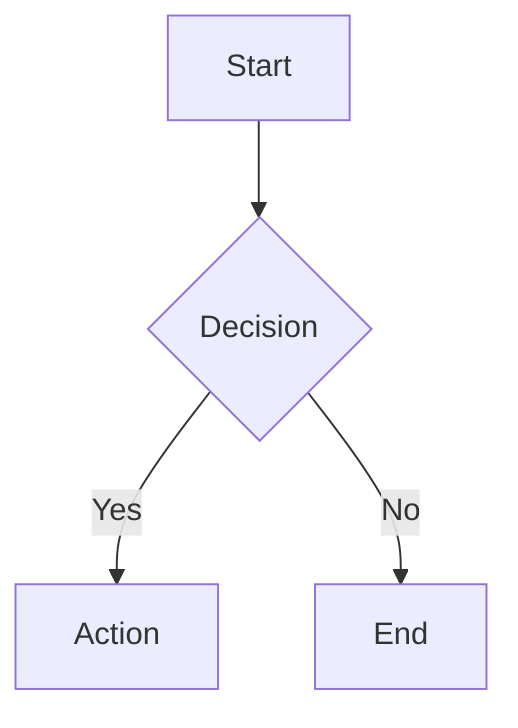

# WORK SESSION (1500-1600) - From rapid-automations

**Generated:** 2026-03-21T14:14:46.316Z
**Work Period:** 1500-1600
**Focus:** Coding activities from rapid-automations
**Duration:** ~60 minutes
**Source Project:** /Users/Q284340/Agentic/_work/rapid-automations

---

## Session Overview

This session captures coding-related activities redirected from rapid-automations.

---

## Key Activities

<a name="ps_1774102486316"></a>
## Prompt Set (ps_1774102486316)

**Time:** 2026-03-21T14:14:46.316Z
**Duration:** 0ms
**Tool Calls:** 11

### Bash - 2026-03-21 14:14:46 UTC [15:14:46 CEST] (Redirected)

**User Request:** now that there are three integrations (sandbox, tookit, okb), the MkDocs should reflect all three (currently only okb is listed under integrations) - extend the docs, using the same logic as for okb (tabs, etc.)

**Tool:** Bash
**Input:** ```json
{
  "command": "ls integrations/rapid-toolkit/ && echo \"===\" && cat integrations/rapid-toolkit/README.md | head -80",
  "description": "Check rapid-toolkit contents and README"
}
```

**Result:** ✅ Success
**Output:** ```
AGENTS.md
LICENSE
README.md
config.yaml.example
config_loader.py
requirements.txt
setup.sh
tools
===
# RAPID Toolkit

AI agent skills and CLI tools for teams working with the **RAPID Toolchain** — the <COMPANY_NAME_REDACTED> AD reprocessing platform comprising **RaaS** (Reprocessing as a Service), **KPI-FW** (KPI Framework), **RDQ** (Reprocessing Data <USER_ID_REDACTED>), and **RDiff** (Reprocessing Diff / validation comparison tool).

Includes **39 skills** for product ownership, <COMPANY_NAME_REDACTED> management, RCA diagnostics, and platf
...[truncated]
```


---

### Bash - 2026-03-21 14:14:46 UTC [15:14:46 CEST] (Redirected)

**User Request:** now that there are three integrations (sandbox, tookit, okb), the MkDocs should reflect all three (currently only okb is listed under integrations) - extend the docs, using the same logic as for okb (tabs, etc.)

**Tool:** Bash
**Input:** ```json
{
  "command": "ls integrations/rapid-agentic-sandbox/ && echo \"===\" && cat integrations/rapid-agentic-sandbox/README.md | head -80",
  "description": "Check sandbox contents and README"
}
```

**Result:** ✅ Success
**Output:** ```
README.md
audit
docker
permissions
proxy
requirements.txt
setup.sh
tests
try.sh
verify.sh
===
# rapid-agentic-sandbox

Security guardrails for AI coding agents. Prevents accidental destructive operations (`kubectl delete`, `aws s3 rm`, `git push --force`) through proxy wrappers, permission tiers, and optional container isolation.

Works with [rapid-toolkit](https://<COMPANY_NAME_REDACTED>.ghe.com/adpnext-apps/rapid-toolkit) skills but can be used standalone with any project.

## What This Does

1. **CLI proxy wrapp
...[truncated]
```


---

### Read - 2026-03-21 14:14:46 UTC [15:14:46 CEST] (Redirected)

**User Request:** now that there are three integrations (sandbox, tookit, okb), the MkDocs should reflect all three (currently only okb is listed under integrations) - extend the docs, using the same logic as for okb (tabs, etc.)

**Tool:** Read
**Input:** ```json
{
  "file_path": "/Users/<USER_ID_REDACTED>/Agentic/_work/rapid-automations/mkdocs.yml"
}
```

**Result:** ✅ Success
**Output:** ```
     1→site_name: RAPID Automations
     2→site_description: Umbrella documentation for the RAPID Automations platform — operational skills, dashboard, and integrations
     3→site_url: http://localhost:8000/
     4→repo_url: https://<COMPANY_NAME_REDACTED>.ghe.com/adpnext-apps/rapid-automations
     5→repo_name: adpnext-apps/rapid-automations
     6→
     7→docs_dir: docs
     8→use_directory_urls: false
     9→
    10→theme:
    11→  name: material
    12→  palette:
    13→    - media: "(prefers-color-scheme: lig
...[truncated]
```


---

### Bash - 2026-03-21 14:14:46 UTC [15:14:46 CEST] (Redirected)

**User Request:** now that there are three integrations (sandbox, tookit, okb), the MkDocs should reflect all three (currently only okb is listed under integrations) - extend the docs, using the same logic as for okb (tabs, etc.)

**Tool:** Bash
**Input:** ```json
{
  "command": "wc -l integrations/rapid-toolkit/README.md integrations/rapid-agentic-sandbox/README.md",
  "description": "Check README lengths"
}
```

**Result:** ✅ Success
**Output:** ```
  389 integrations/rapid-toolkit/README.md
  238 integrations/rapid-agentic-sandbox/README.md
  627 total
```


---

### Read - 2026-03-21 14:14:46 UTC [15:14:46 CEST] (Redirected)

**User Request:** now that there are three integrations (sandbox, tookit, okb), the MkDocs should reflect all three (currently only okb is listed under integrations) - extend the docs, using the same logic as for okb (tabs, etc.)

**Tool:** Read
**Input:** ```json
{
  "file_path": "/Users/<USER_ID_REDACTED>/Agentic/_work/rapid-automations/integrations/rapid-toolkit/README.md",
  "offset": 80,
  "limit": 150
}
```

**Result:** ✅ Success
**Output:** ```
    80→| **Thinking** | strategic-thinking, feature-contract, session-analysis, prompt-enhancement, opencode-web-intranet-auth, rdiff-implementation | (none) |
    81→| **DevAgent** | spec-writing, development | jira-cli |
    82→
    83→### CLI Tools (14)
    84→
    85→| Tool | Purpose | Location |
    86→|------|---------|----------|
    87→| **confcli** | Confluence Server CRUD | `tools/confcli/confcli.py` |
    88→| **jira_lookup** | Jira team/user resolution | `tools/shared/jira_lookup.py`
...[truncated]
```


---

### Read - 2026-03-21 14:14:46 UTC [15:14:46 CEST] (Redirected)

**User Request:** now that there are three integrations (sandbox, tookit, okb), the MkDocs should reflect all three (currently only okb is listed under integrations) - extend the docs, using the same logic as for okb (tabs, etc.)

**Tool:** Read
**Input:** ```json
{
  "file_path": "/Users/<USER_ID_REDACTED>/Agentic/_work/rapid-automations/integrations/rapid-agentic-sandbox/README.md",
  "offset": 80
}
```

**Result:** ✅ Success
**Output:** ```
    80→```bash
    81→# In your consumer repo (e.g., rapid-automations):
    82→git submodule add https://<COMPANY_NAME_REDACTED>.ghe.com/adpnext-apps/rapid-agentic-sandbox.git integrations/rapid-agentic-sandbox
    83→
    84→# Native mode: run the wizard
    85→cd integrations/rapid-agentic-sandbox && ./setup.sh
    86→
    87→# Dev Container mode: reference in .devcontainer/devcontainer.json
    88→# "build": { "dockerfile": "integrations/rapid-agentic-sandbox/docker/Dockerfile", "context": "." }
    89→```
    
...[truncated]
```


---

### Read - 2026-03-21 14:14:46 UTC [15:14:46 CEST] (Redirected)

**User Request:** now that there are three integrations (sandbox, tookit, okb), the MkDocs should reflect all three (currently only okb is listed under integrations) - extend the docs, using the same logic as for okb (tabs, etc.)

**Tool:** Read
**Input:** ```json
{
  "file_path": "/Users/<USER_ID_REDACTED>/Agentic/_work/rapid-automations/integrations/rapid-toolkit/README.md",
  "offset": 228
}
```

**Result:** ✅ Success
**Output:** ```
   228→
   229→Two symlink targets cover all 5 agents:
   230→
   231→| Target | Agents covered |
   232→|--------|---------------|
   233→| `~/.agents/skills/` | OpenCode, Copilot, Gemini CLI |
   234→| `~/.claude/skills/` | Claude Code, Copilot, Cursor, OpenCode |
   235→
   236→```bash
   237→# OpenCode, Copilot, Gemini CLI:
   238→mkdir -p ~/.agents/skills
   239→for s in $RAPID_HOME/.agents/skills/*/; do
   240→  ln -s "$s" ~/.agents/skills/$(basename "$s")
   241→done
   242→
   243→# Clau
...[truncated]
```


---

### Bash - 2026-03-21 14:14:46 UTC [15:14:46 CEST] (Redirected)

**User Request:** now that there are three integrations (sandbox, tookit, okb), the MkDocs should reflect all three (currently only okb is listed under integrations) - extend the docs, using the same logic as for okb (tabs, etc.)

**Tool:** Bash
**Input:** ```json
{
  "command": "mkdir -p docs/integrations/toolkit docs/integrations/sandbox",
  "description": "Create integration doc directories"
}
```

**Result:** ✅ Success
**Output:** ```
(Bash completed with no output)
```


---

### Write - 2026-03-21 14:14:46 UTC [15:14:46 CEST] (Redirected)

**User Request:** now that there are three integrations (sandbox, tookit, okb), the MkDocs should reflect all three (currently only okb is listed under integrations) - extend the docs, using the same logic as for okb (tabs, etc.)

**Tool:** Write
**Input:** ```json
{
  "file_path": "/Users/<USER_ID_REDACTED>/Agentic/_work/rapid-<AWS_SECRET_REDACTED>dex.md",
  "content": "# RAPID Toolkit\n\n=== \":zap: Fast Path\"\n\n    ## What is it?\n\n    39 AI agent skills + 14 CLI tools for teams working with the RAPID platform (RaaS, KPI-FW, RDQ, RDiff). Works with OpenCode, Claude Code, Copilot, Cursor, and Gemini CLI.\n\n    ## Get running\n\n    ```bash\n    cd integrations/rapid-toolkit\n    bash setup.sh\n    ```\n\n    The wizard creates `config.yaml` and `.env`, sets `RAPID_HOME`, installs skills per-project or globally, and reports which skills are ready.\n\n    ## Do something useful\n\n    Skills are invoked naturally through your coding agent:\n\n    | Say | Skill used |\n    |-----|-----------|\n    | \"Show me all open stories\" | jira-management |\n    | \"Create a bug for the login issue\" | quick-bug |\n    | \"Why did the last RaaS batch fail?\" | raas-rca |\n    | \"Search OKB for OOM patterns\" | okb |\n    | \"Create meeting notes for <COMPANY_NAME_REDACTED> Planning\" | confluence-docs |\n    | \"Should we build or buy analytics?\" | strategic-thinking |\n\n    ## Manage skills\n\n    ```bash\n    bash setup.sh skills            # interactive menu\n    bash setup.sh skills install    # category-based picker\n    bash setup.sh skills list       # show installed + available\n    bash setup.sh skills remove     # remove installed skills\n    ```\n\n    **Next**: [Skills catalog](#skills-catalog) for the full list, or [CLI tools](#cli-tools) for available tooling.\n\n=== \":books: Full Details\"\n\n    ## Overview\n\n    The RAPID Toolkit is an agent-agnostic collection of skills and CLI tools for Product Owners and platform engineers. It lives in `integrations/rapid-toolkit/` as a git submodule.\n\n    - **Repo:** [adpnext-apps/rapid-toolkit](https://<CONNECTION_STRING_REDACTED> |\n    | **uv** | 9 skills (RCA/Ops) | `curl -LsSf https://astral.sh/uv/install.sh \\| sh` |\n    | **curl** | 7 skills | Pre-installed on macOS/Linux |\n    | **gh** | 5 skills (DevOps) | `brew install gh` |\n    | **aws** | 4 skills (RCA) | `brew install awscli` |\n    | **kubectl** | 1 skill (raas-rca) | `brew install kubectl` |\n\n    ## Directory Structure\n\n    ```\n    rapid-toolkit/\n    ├── .agents/skills/          # 39 skills (flat, cross-agent compatible)\n    │   ├── quick-story/SKILL.md\n    │   ├── raas-rca/SKILL.md\n    │   ├── okb/SKILL.md\n    │   └── ...\n    ├── tools/\n    │   ├── confcli/             # Confluence CLI\n    │   ├── shared/              # Jira lookup + Teams webhook\n    │   └── raas-rca/            # 11 RCA diagnostic tools\n    ├── config.yaml.example      # Template: team-specific values\n    ├── config_loader.py         # Python config reader\n    ├── .env.example             # Template: secrets\n    ├── setup.sh                 # Interactive setup wizard\n    └── requirements.txt         # Core Python dependencies\n    ```\n\n    ## Troubleshooting\n\n    **Skills not discovered by agent:**\n    Run `bash setup.sh skills list`. Ensure skills are linked into your project (`.agents/skills/`) or installed globally.\n\n    **jira-cli \"404 Not Found\":**\n    Add a `version:` block to `~/.config/.jira/.config.yml` matching your Jira Server version (e.g., `10.3.16`).\n\n    **Tools can't find .env:**\n    Ensure `RAPID_HOME` is set: `echo $RAPID_HOME`. If not, run `source ~/.zshrc` or re-run `setup.sh`.\n\n    **RCA tools fail with AWS errors:**\n    Run `aws sso login --profile <your-profile>` to refresh your SSO session.\n"
}
```

**Result:** ❌ Error
**Output:** ```
PreToolUse:Write hook error: [node <AWS_SECRET_REDACTED>ns/mcp-constraint-monitor/src/hooks/pre-tool-hook-wrapper.js]: 🚫 **CONSTRAINT VIOLATION DETECTED - EXECUTION BLOCKED**

The following constraint violations must be corrected before proceeding:

**1. ERROR [no-ascii-art-in-docs]: CRITICAL: ASCII/line art detected in documentation - use PlantUML diagrams instead. You MUST invoke documentation-style skill FIRST**
   🔍 Pattern: `[┌┐└┘│─├┤┬┴┼▲▼◄►]`

Please modify your reques
...[truncated]
```


---

### Write - 2026-03-21 14:14:46 UTC [15:14:46 CEST] (Redirected)

**User Request:** now that there are three integrations (sandbox, tookit, okb), the MkDocs should reflect all three (currently only okb is listed under integrations) - extend the docs, using the same logic as for okb (tabs, etc.)

**Tool:** Write
**Input:** ```json
{
  "file_path": "/Users/<USER_ID_REDACTED>/Agentic/_work/rapid-<AWS_SECRET_REDACTED>dex.md",
  "content": "# Agentic Sandbox\n\n=== \":zap: Fast Path\"\n\n    ## What is it?\n\n    Security guardrails for AI coding agents. Prevents accidental destructive operations (`kubectl delete`, `aws s3 rm`, `git push --force`) through proxy wrappers, permission tiers, and optional container isolation.\n\n    ## Try it (no install required)\n\n    ```bash\n    cd integrations/rapid-agentic-sandbox\n    ./try.sh\n    ```\n\n    Inside the sandbox shell:\n\n    ```\n    [SANDBOX:standard] $ kubectl get pods         # allowed\n    [SANDBOX:standard] $ kubectl delete pod X      # DENIED\n    [SANDBOX:standard] $ git push --force          # DENIED\n    [SANDBOX:standard] $ exit                      # back to normal\n    ```\n\n    ## Install it\n\n    ```bash\n    cd integrations/rapid-agentic-sandbox\n    ./setup.sh\n    ```\n\n    The wizard asks which agent and permission tier, then installs proxy wrappers and generates agent-specific permission configs.\n\n    ## Verify it\n\n    ```bash\n    ./verify.sh              # all checks\n    ./verify.sh --proxies    # only test proxy wrappers\n    ./verify.sh --config     # only check agent config\n    ```\n\n    **Next**: [Permission tiers](#permission-tiers) for details, or [Architecture](#architecture) for how it works.\n\n=== \":books: Full Details\"\n\n    ## Overview\n\n    The Agentic Sandbox provides defense-in-depth security for AI coding agents. It lives in `integrations/rapid-agentic-sandbox/` as a git submodule.\n\n    - **Repo:** [adpnext-apps/rapid-agentic-sandbox](https://<CONNECTION_STRING_REDACTED>
}
```

**Result:** ❌ Error
**Output:** ```
PreToolUse:Write hook error: [node <AWS_SECRET_REDACTED>ns/mcp-constraint-monitor/src/hooks/pre-tool-hook-wrapper.js]: 🚫 **CONSTRAINT VIOLATION DETECTED - EXECUTION BLOCKED**

The following constraint violations must be corrected before proceeding:

**1. ERROR [no-ascii-art-in-docs]: CRITICAL: ASCII/line art detected in documentation - use PlantUML diagrams instead. You MUST invoke documentation-style skill FIRST**
   🔍 Pattern: `[┌┐└┘│─├┤┬┴┼▲▼◄►]`

Please modify your reques
...[truncated]
```


---

### Write - 2026-03-21 14:14:46 UTC [15:14:46 CEST] (Redirected)

**User Request:** now that there are three integrations (sandbox, tookit, okb), the MkDocs should reflect all three (currently only okb is listed under integrations) - extend the docs, using the same logic as for okb (tabs, etc.)

**Tool:** Write
**Input:** ```json
{
  "file_path": "/Users/<USER_ID_REDACTED>/Agentic/_work/rapid-<AWS_SECRET_REDACTED>dex.md",
  "content": "# RAPID Toolkit\n\n=== \":zap: Fast Path\"\n\n    ## What is it?\n\n    39 AI agent skills + 14 CLI tools for teams working with the RAPID platform (RaaS, KPI-FW, RDQ, RDiff). Works with OpenCode, Claude Code, Copilot, Cursor, and Gemini CLI.\n\n    ## Get running\n\n    ```bash\n    cd integrations/rapid-toolkit\n    bash setup.sh\n    ```\n\n    The wizard creates `config.yaml` and `.env`, sets `RAPID_HOME`, installs skills per-project or globally, and reports which skills are ready.\n\n    ## Do something useful\n\n    Skills are invoked naturally through your coding agent:\n\n    | Say | Skill used |\n    |-----|-----------|\n    | \"Show me all open stories\" | jira-management |\n    | \"Create a bug for the login issue\" | quick-bug |\n    | \"Why did the last RaaS batch fail?\" | raas-rca |\n    | \"Search OKB for OOM patterns\" | okb |\n    | \"Create meeting notes for <COMPANY_NAME_REDACTED> Planning\" | confluence-docs |\n    | \"Should we build or buy analytics?\" | strategic-thinking |\n\n    ## Manage skills\n\n    ```bash\n    bash setup.sh skills            # interactive menu\n    bash setup.sh skills install    # category-based picker\n    bash setup.sh skills list       # show installed + available\n    bash setup.sh skills remove     # remove installed skills\n    ```\n\n    **Next**: [Skills catalog](#skills-catalog) for the full list, or [CLI tools](#cli-tools) for available tooling.\n\n=== \":books: Full Details\"\n\n    ## Overview\n\n    The RAPID Toolkit is an agent-agnostic collection of skills and CLI tools for Product Owners and platform engineers. It lives in `integrations/rapid-toolkit/` as a git submodule.\n\n    - **Repo:** [adpnext-apps/rapid-toolkit](https://<CONNECTION_STRING_REDACTED> |\n    | **uv** | 9 skills (RCA/Ops) | `curl -LsSf https://astral.sh/uv/install.sh \\| sh` |\n    | **curl** | 7 skills | Pre-installed on macOS/Linux |\n    | **gh** | 5 skills (DevOps) | `brew install gh` |\n    | **aws** | 4 skills (RCA) | `brew install awscli` |\n    | **kubectl** | 1 skill (raas-rca) | `brew install kubectl` |\n\n    ## Directory Structure\n\n    - `.agents/skills/` — 39 skills (flat layout, cross-agent compatible)\n    - `tools/confcli/` — Confluence CLI\n    - `tools/shared/` — Jira lookup + Teams webhook\n    - `tools/raas-rca/` — 11 RCA diagnostic tools\n    - `config.yaml.example` — Template for team-specific values\n    - `config_loader.py` — Python config reader (CLI + library)\n    - `.env.example` — Template for secrets\n    - `setup.sh` — Interactive setup wizard\n\n    ## Troubleshooting\n\n    **Skills not discovered by agent:**\n    Run `bash setup.sh skills list`. Ensure skills are linked into your project (`.agents/skills/`) or installed globally.\n\n    **jira-cli \"404 Not Found\":**\n    Add a `version:` block to `~/.config/.jira/.config.yml` matching your Jira Server version (e.g., `10.3.16`).\n\n    **Tools can't find .env:**\n    Ensure `RAPID_HOME` is set: `echo $RAPID_HOME`. If not, run `source ~/.zshrc` or re-run `setup.sh`.\n\n    **RCA tools fail with AWS errors:**\n    Run `aws sso login --profile <your-profile>` to refresh your SSO session.\n"
}
```

**Result:** ✅ Success
**Output:** ```
File created successfully at: /Users/<USER_ID_REDACTED>/Agentic/_work/rapid-<AWS_SECRET_REDACTED>dex.md
```


---

---

<a name="ps_1774102486316"></a>
## Prompt Set (ps_1774102486316)

**Time:** 2026-03-21T14:14:46.316Z
**Duration:** 0ms
**Tool Calls:** 11

### Bash - 2026-03-21 14:14:46 UTC [15:14:46 CEST] (Redirected)

**User Request:** now that there are three integrations (sandbox, tookit, okb), the MkDocs should reflect all three (currently only okb is listed under integrations) - extend the docs, using the same logic as for okb (tabs, etc.)

**Tool:** Bash
**Input:** ```json
{
  "command": "ls integrations/rapid-toolkit/ && echo \"===\" && cat integrations/rapid-toolkit/README.md | head -80",
  "description": "Check rapid-toolkit contents and README"
}
```

**Result:** ✅ Success
**Output:** ```
AGENTS.md
LICENSE
README.md
config.yaml.example
config_loader.py
requirements.txt
setup.sh
tools
===
# RAPID Toolkit

AI agent skills and CLI tools for teams working with the **RAPID Toolchain** — the <COMPANY_NAME_REDACTED> AD reprocessing platform comprising **RaaS** (Reprocessing as a Service), **KPI-FW** (KPI Framework), **RDQ** (Reprocessing Data <USER_ID_REDACTED>), and **RDiff** (Reprocessing Diff / validation comparison tool).

Includes **39 skills** for product ownership, <COMPANY_NAME_REDACTED> management, RCA diagnostics, and platf
...[truncated]
```


---

### Bash - 2026-03-21 14:14:46 UTC [15:14:46 CEST] (Redirected)

**User Request:** now that there are three integrations (sandbox, tookit, okb), the MkDocs should reflect all three (currently only okb is listed under integrations) - extend the docs, using the same logic as for okb (tabs, etc.)

**Tool:** Bash
**Input:** ```json
{
  "command": "ls integrations/rapid-agentic-sandbox/ && echo \"===\" && cat integrations/rapid-agentic-sandbox/README.md | head -80",
  "description": "Check sandbox contents and README"
}
```

**Result:** ✅ Success
**Output:** ```
README.md
audit
docker
permissions
proxy
requirements.txt
setup.sh
tests
try.sh
verify.sh
===
# rapid-agentic-sandbox

Security guardrails for AI coding agents. Prevents accidental destructive operations (`kubectl delete`, `aws s3 rm`, `git push --force`) through proxy wrappers, permission tiers, and optional container isolation.

Works with [rapid-toolkit](https://<COMPANY_NAME_REDACTED>.ghe.com/adpnext-apps/rapid-toolkit) skills but can be used standalone with any project.

## What This Does

1. **CLI proxy wrapp
...[truncated]
```


---

### Read - 2026-03-21 14:14:46 UTC [15:14:46 CEST] (Redirected)

**User Request:** now that there are three integrations (sandbox, tookit, okb), the MkDocs should reflect all three (currently only okb is listed under integrations) - extend the docs, using the same logic as for okb (tabs, etc.)

**Tool:** Read
**Input:** ```json
{
  "file_path": "/Users/<USER_ID_REDACTED>/Agentic/_work/rapid-automations/mkdocs.yml"
}
```

**Result:** ✅ Success
**Output:** ```
     1→site_name: RAPID Automations
     2→site_description: Umbrella documentation for the RAPID Automations platform — operational skills, dashboard, and integrations
     3→site_url: http://localhost:8000/
     4→repo_url: https://<COMPANY_NAME_REDACTED>.ghe.com/adpnext-apps/rapid-automations
     5→repo_name: adpnext-apps/rapid-automations
     6→
     7→docs_dir: docs
     8→use_directory_urls: false
     9→
    10→theme:
    11→  name: material
    12→  palette:
    13→    - media: "(prefers-color-scheme: lig
...[truncated]
```


---

### Bash - 2026-03-21 14:14:46 UTC [15:14:46 CEST] (Redirected)

**User Request:** now that there are three integrations (sandbox, tookit, okb), the MkDocs should reflect all three (currently only okb is listed under integrations) - extend the docs, using the same logic as for okb (tabs, etc.)

**Tool:** Bash
**Input:** ```json
{
  "command": "wc -l integrations/rapid-toolkit/README.md integrations/rapid-agentic-sandbox/README.md",
  "description": "Check README lengths"
}
```

**Result:** ✅ Success
**Output:** ```
  389 integrations/rapid-toolkit/README.md
  238 integrations/rapid-agentic-sandbox/README.md
  627 total
```


---

### Read - 2026-03-21 14:14:46 UTC [15:14:46 CEST] (Redirected)

**User Request:** now that there are three integrations (sandbox, tookit, okb), the MkDocs should reflect all three (currently only okb is listed under integrations) - extend the docs, using the same logic as for okb (tabs, etc.)

**Tool:** Read
**Input:** ```json
{
  "file_path": "/Users/<USER_ID_REDACTED>/Agentic/_work/rapid-automations/integrations/rapid-toolkit/README.md",
  "offset": 80,
  "limit": 150
}
```

**Result:** ✅ Success
**Output:** ```
    80→| **Thinking** | strategic-thinking, feature-contract, session-analysis, prompt-enhancement, opencode-web-intranet-auth, rdiff-implementation | (none) |
    81→| **DevAgent** | spec-writing, development | jira-cli |
    82→
    83→### CLI Tools (14)
    84→
    85→| Tool | Purpose | Location |
    86→|------|---------|----------|
    87→| **confcli** | Confluence Server CRUD | `tools/confcli/confcli.py` |
    88→| **jira_lookup** | Jira team/user resolution | `tools/shared/jira_lookup.py`
...[truncated]
```


---

### Read - 2026-03-21 14:14:46 UTC [15:14:46 CEST] (Redirected)

**User Request:** now that there are three integrations (sandbox, tookit, okb), the MkDocs should reflect all three (currently only okb is listed under integrations) - extend the docs, using the same logic as for okb (tabs, etc.)

**Tool:** Read
**Input:** ```json
{
  "file_path": "/Users/<USER_ID_REDACTED>/Agentic/_work/rapid-automations/integrations/rapid-agentic-sandbox/README.md",
  "offset": 80
}
```

**Result:** ✅ Success
**Output:** ```
    80→```bash
    81→# In your consumer repo (e.g., rapid-automations):
    82→git submodule add https://<COMPANY_NAME_REDACTED>.ghe.com/adpnext-apps/rapid-agentic-sandbox.git integrations/rapid-agentic-sandbox
    83→
    84→# Native mode: run the wizard
    85→cd integrations/rapid-agentic-sandbox && ./setup.sh
    86→
    87→# Dev Container mode: reference in .devcontainer/devcontainer.json
    88→# "build": { "dockerfile": "integrations/rapid-agentic-sandbox/docker/Dockerfile", "context": "." }
    89→```
    
...[truncated]
```


---

### Read - 2026-03-21 14:14:46 UTC [15:14:46 CEST] (Redirected)

**User Request:** now that there are three integrations (sandbox, tookit, okb), the MkDocs should reflect all three (currently only okb is listed under integrations) - extend the docs, using the same logic as for okb (tabs, etc.)

**Tool:** Read
**Input:** ```json
{
  "file_path": "/Users/<USER_ID_REDACTED>/Agentic/_work/rapid-automations/integrations/rapid-toolkit/README.md",
  "offset": 228
}
```

**Result:** ✅ Success
**Output:** ```
   228→
   229→Two symlink targets cover all 5 agents:
   230→
   231→| Target | Agents covered |
   232→|--------|---------------|
   233→| `~/.agents/skills/` | OpenCode, Copilot, Gemini CLI |
   234→| `~/.claude/skills/` | Claude Code, Copilot, Cursor, OpenCode |
   235→
   236→```bash
   237→# OpenCode, Copilot, Gemini CLI:
   238→mkdir -p ~/.agents/skills
   239→for s in $RAPID_HOME/.agents/skills/*/; do
   240→  ln -s "$s" ~/.agents/skills/$(basename "$s")
   241→done
   242→
   243→# Clau
...[truncated]
```


---

### Bash - 2026-03-21 14:14:46 UTC [15:14:46 CEST] (Redirected)

**User Request:** now that there are three integrations (sandbox, tookit, okb), the MkDocs should reflect all three (currently only okb is listed under integrations) - extend the docs, using the same logic as for okb (tabs, etc.)

**Tool:** Bash
**Input:** ```json
{
  "command": "mkdir -p docs/integrations/toolkit docs/integrations/sandbox",
  "description": "Create integration doc directories"
}
```

**Result:** ✅ Success
**Output:** ```
(Bash completed with no output)
```


---

### Write - 2026-03-21 14:14:46 UTC [15:14:46 CEST] (Redirected)

**User Request:** now that there are three integrations (sandbox, tookit, okb), the MkDocs should reflect all three (currently only okb is listed under integrations) - extend the docs, using the same logic as for okb (tabs, etc.)

**Tool:** Write
**Input:** ```json
{
  "file_path": "/Users/<USER_ID_REDACTED>/Agentic/_work/rapid-<AWS_SECRET_REDACTED>dex.md",
  "content": "# RAPID Toolkit\n\n=== \":zap: Fast Path\"\n\n    ## What is it?\n\n    39 AI agent skills + 14 CLI tools for teams working with the RAPID platform (RaaS, KPI-FW, RDQ, RDiff). Works with OpenCode, Claude Code, Copilot, Cursor, and Gemini CLI.\n\n    ## Get running\n\n    ```bash\n    cd integrations/rapid-toolkit\n    bash setup.sh\n    ```\n\n    The wizard creates `config.yaml` and `.env`, sets `RAPID_HOME`, installs skills per-project or globally, and reports which skills are ready.\n\n    ## Do something useful\n\n    Skills are invoked naturally through your coding agent:\n\n    | Say | Skill used |\n    |-----|-----------|\n    | \"Show me all open stories\" | jira-management |\n    | \"Create a bug for the login issue\" | quick-bug |\n    | \"Why did the last RaaS batch fail?\" | raas-rca |\n    | \"Search OKB for OOM patterns\" | okb |\n    | \"Create meeting notes for <COMPANY_NAME_REDACTED> Planning\" | confluence-docs |\n    | \"Should we build or buy analytics?\" | strategic-thinking |\n\n    ## Manage skills\n\n    ```bash\n    bash setup.sh skills            # interactive menu\n    bash setup.sh skills install    # category-based picker\n    bash setup.sh skills list       # show installed + available\n    bash setup.sh skills remove     # remove installed skills\n    ```\n\n    **Next**: [Skills catalog](#skills-catalog) for the full list, or [CLI tools](#cli-tools) for available tooling.\n\n=== \":books: Full Details\"\n\n    ## Overview\n\n    The RAPID Toolkit is an agent-agnostic collection of skills and CLI tools for Product Owners and platform engineers. It lives in `integrations/rapid-toolkit/` as a git submodule.\n\n    - **Repo:** [adpnext-apps/rapid-toolkit](https://<CONNECTION_STRING_REDACTED> |\n    | **uv** | 9 skills (RCA/Ops) | `curl -LsSf https://astral.sh/uv/install.sh \\| sh` |\n    | **curl** | 7 skills | Pre-installed on macOS/Linux |\n    | **gh** | 5 skills (DevOps) | `brew install gh` |\n    | **aws** | 4 skills (RCA) | `brew install awscli` |\n    | **kubectl** | 1 skill (raas-rca) | `brew install kubectl` |\n\n    ## Directory Structure\n\n    ```\n    rapid-toolkit/\n    ├── .agents/skills/          # 39 skills (flat, cross-agent compatible)\n    │   ├── quick-story/SKILL.md\n    │   ├── raas-rca/SKILL.md\n    │   ├── okb/SKILL.md\n    │   └── ...\n    ├── tools/\n    │   ├── confcli/             # Confluence CLI\n    │   ├── shared/              # Jira lookup + Teams webhook\n    │   └── raas-rca/            # 11 RCA diagnostic tools\n    ├── config.yaml.example      # Template: team-specific values\n    ├── config_loader.py         # Python config reader\n    ├── .env.example             # Template: secrets\n    ├── setup.sh                 # Interactive setup wizard\n    └── requirements.txt         # Core Python dependencies\n    ```\n\n    ## Troubleshooting\n\n    **Skills not discovered by agent:**\n    Run `bash setup.sh skills list`. Ensure skills are linked into your project (`.agents/skills/`) or installed globally.\n\n    **jira-cli \"404 Not Found\":**\n    Add a `version:` block to `~/.config/.jira/.config.yml` matching your Jira Server version (e.g., `10.3.16`).\n\n    **Tools can't find .env:**\n    Ensure `RAPID_HOME` is set: `echo $RAPID_HOME`. If not, run `source ~/.zshrc` or re-run `setup.sh`.\n\n    **RCA tools fail with AWS errors:**\n    Run `aws sso login --profile <your-profile>` to refresh your SSO session.\n"
}
```

**Result:** ❌ Error
**Output:** ```
PreToolUse:Write hook error: [node <AWS_SECRET_REDACTED>ns/mcp-constraint-monitor/src/hooks/pre-tool-hook-wrapper.js]: 🚫 **CONSTRAINT VIOLATION DETECTED - EXECUTION BLOCKED**

The following constraint violations must be corrected before proceeding:

**1. ERROR [no-ascii-art-in-docs]: CRITICAL: ASCII/line art detected in documentation - use PlantUML diagrams instead. You MUST invoke documentation-style skill FIRST**
   🔍 Pattern: `[┌┐└┘│─├┤┬┴┼▲▼◄►]`

Please modify your reques
...[truncated]
```


---

### Write - 2026-03-21 14:14:46 UTC [15:14:46 CEST] (Redirected)

**User Request:** now that there are three integrations (sandbox, tookit, okb), the MkDocs should reflect all three (currently only okb is listed under integrations) - extend the docs, using the same logic as for okb (tabs, etc.)

**Tool:** Write
**Input:** ```json
{
  "file_path": "/Users/<USER_ID_REDACTED>/Agentic/_work/rapid-<AWS_SECRET_REDACTED>dex.md",
  "content": "# Agentic Sandbox\n\n=== \":zap: Fast Path\"\n\n    ## What is it?\n\n    Security guardrails for AI coding agents. Prevents accidental destructive operations (`kubectl delete`, `aws s3 rm`, `git push --force`) through proxy wrappers, permission tiers, and optional container isolation.\n\n    ## Try it (no install required)\n\n    ```bash\n    cd integrations/rapid-agentic-sandbox\n    ./try.sh\n    ```\n\n    Inside the sandbox shell:\n\n    ```\n    [SANDBOX:standard] $ kubectl get pods         # allowed\n    [SANDBOX:standard] $ kubectl delete pod X      # DENIED\n    [SANDBOX:standard] $ git push --force          # DENIED\n    [SANDBOX:standard] $ exit                      # back to normal\n    ```\n\n    ## Install it\n\n    ```bash\n    cd integrations/rapid-agentic-sandbox\n    ./setup.sh\n    ```\n\n    The wizard asks which agent and permission tier, then installs proxy wrappers and generates agent-specific permission configs.\n\n    ## Verify it\n\n    ```bash\n    ./verify.sh              # all checks\n    ./verify.sh --proxies    # only test proxy wrappers\n    ./verify.sh --config     # only check agent config\n    ```\n\n    **Next**: [Permission tiers](#permission-tiers) for details, or [Architecture](#architecture) for how it works.\n\n=== \":books: Full Details\"\n\n    ## Overview\n\n    The Agentic Sandbox provides defense-in-depth security for AI coding agents. It lives in `integrations/rapid-agentic-sandbox/` as a git submodule.\n\n    - **Repo:** [adpnext-apps/rapid-agentic-sandbox](https://<CONNECTION_STRING_REDACTED>
}
```

**Result:** ❌ Error
**Output:** ```
PreToolUse:Write hook error: [node <AWS_SECRET_REDACTED>ns/mcp-constraint-monitor/src/hooks/pre-tool-hook-wrapper.js]: 🚫 **CONSTRAINT VIOLATION DETECTED - EXECUTION BLOCKED**

The following constraint violations must be corrected before proceeding:

**1. ERROR [no-ascii-art-in-docs]: CRITICAL: ASCII/line art detected in documentation - use PlantUML diagrams instead. You MUST invoke documentation-style skill FIRST**
   🔍 Pattern: `[┌┐└┘│─├┤┬┴┼▲▼◄►]`

Please modify your reques
...[truncated]
```


---

### Write - 2026-03-21 14:14:46 UTC [15:14:46 CEST] (Redirected)

**User Request:** now that there are three integrations (sandbox, tookit, okb), the MkDocs should reflect all three (currently only okb is listed under integrations) - extend the docs, using the same logic as for okb (tabs, etc.)

**Tool:** Write
**Input:** ```json
{
  "file_path": "/Users/<USER_ID_REDACTED>/Agentic/_work/rapid-<AWS_SECRET_REDACTED>dex.md",
  "content": "# RAPID Toolkit\n\n=== \":zap: Fast Path\"\n\n    ## What is it?\n\n    39 AI agent skills + 14 CLI tools for teams working with the RAPID platform (RaaS, KPI-FW, RDQ, RDiff). Works with OpenCode, Claude Code, Copilot, Cursor, and Gemini CLI.\n\n    ## Get running\n\n    ```bash\n    cd integrations/rapid-toolkit\n    bash setup.sh\n    ```\n\n    The wizard creates `config.yaml` and `.env`, sets `RAPID_HOME`, installs skills per-project or globally, and reports which skills are ready.\n\n    ## Do something useful\n\n    Skills are invoked naturally through your coding agent:\n\n    | Say | Skill used |\n    |-----|-----------|\n    | \"Show me all open stories\" | jira-management |\n    | \"Create a bug for the login issue\" | quick-bug |\n    | \"Why did the last RaaS batch fail?\" | raas-rca |\n    | \"Search OKB for OOM patterns\" | okb |\n    | \"Create meeting notes for <COMPANY_NAME_REDACTED> Planning\" | confluence-docs |\n    | \"Should we build or buy analytics?\" | strategic-thinking |\n\n    ## Manage skills\n\n    ```bash\n    bash setup.sh skills            # interactive menu\n    bash setup.sh skills install    # category-based picker\n    bash setup.sh skills list       # show installed + available\n    bash setup.sh skills remove     # remove installed skills\n    ```\n\n    **Next**: [Skills catalog](#skills-catalog) for the full list, or [CLI tools](#cli-tools) for available tooling.\n\n=== \":books: Full Details\"\n\n    ## Overview\n\n    The RAPID Toolkit is an agent-agnostic collection of skills and CLI tools for Product Owners and platform engineers. It lives in `integrations/rapid-toolkit/` as a git submodule.\n\n    - **Repo:** [adpnext-apps/rapid-toolkit](https://<CONNECTION_STRING_REDACTED> |\n    | **uv** | 9 skills (RCA/Ops) | `curl -LsSf https://astral.sh/uv/install.sh \\| sh` |\n    | **curl** | 7 skills | Pre-installed on macOS/Linux |\n    | **gh** | 5 skills (DevOps) | `brew install gh` |\n    | **aws** | 4 skills (RCA) | `brew install awscli` |\n    | **kubectl** | 1 skill (raas-rca) | `brew install kubectl` |\n\n    ## Directory Structure\n\n    - `.agents/skills/` — 39 skills (flat layout, cross-agent compatible)\n    - `tools/confcli/` — Confluence CLI\n    - `tools/shared/` — Jira lookup + Teams webhook\n    - `tools/raas-rca/` — 11 RCA diagnostic tools\n    - `config.yaml.example` — Template for team-specific values\n    - `config_loader.py` — Python config reader (CLI + library)\n    - `.env.example` — Template for secrets\n    - `setup.sh` — Interactive setup wizard\n\n    ## Troubleshooting\n\n    **Skills not discovered by agent:**\n    Run `bash setup.sh skills list`. Ensure skills are linked into your project (`.agents/skills/`) or installed globally.\n\n    **jira-cli \"404 Not Found\":**\n    Add a `version:` block to `~/.config/.jira/.config.yml` matching your Jira Server version (e.g., `10.3.16`).\n\n    **Tools can't find .env:**\n    Ensure `RAPID_HOME` is set: `echo $RAPID_HOME`. If not, run `source ~/.zshrc` or re-run `setup.sh`.\n\n    **RCA tools fail with AWS errors:**\n    Run `aws sso login --profile <your-profile>` to refresh your SSO session.\n"
}
```

**Result:** ✅ Success
**Output:** ```
File created successfully at: /Users/<USER_ID_REDACTED>/Agentic/_work/rapid-<AWS_SECRET_REDACTED>dex.md
```


---

---

<a name="ps_1774102704174"></a>
## Prompt Set (ps_1774102704174)

**Time:** 2026-03-21T14:18:24.174Z
**Duration:** 0ms
**Tool Calls:** 1

### Write - 2026-03-21 14:18:24 UTC [15:18:24 CEST] (Redirected)

**User Request:** # Documentation Style Guide

Enforce consistent styling for documentation artifacts (PlantUML, Mermaid, markdown, PNG diagrams).

## Instructions

When creating or modifying documentation artifacts, follow these guidelines strictly.

---

## PlantUML Diagrams (.puml)

### File Naming Convention

**CRITICAL**: Use kebab-case, descriptive names. NEVER use incremental suffixes.

**Correct**:
- `health-verification-flow.puml`
- `knowledge-architecture.puml`
- `constraint-monitor-components.puml`

**WRONG** (constraint violation):
- `health-verification-flow-2.puml`
- `knowledge-architecture-v2.puml`
- `constraint-monitor-components-new.puml`

If updating an existing diagram, **modify the existing file** rather than creating a new version.

### Standard Style Include

All PlantUML files MUST include the standard style at the top:

```plantuml
@startuml diagram-name
!include _standard-style.puml

' ... diagram content ...

@enduml
```

The style file is located at:
- `docs/puml/_standard-style.puml`
- `docs/presentation/puml/_standard-style.puml`

### Layout Guidelines

1. **Prefer vertical layouts** - Avoid excessive width that requires horizontal scrolling
2. **Use `top to bottom direction`** for most diagrams
3. **Use `left to right direction`** only for sequence diagrams or when horizontal flow is semantically meaningful
4. **Group related components** using packages or rectangles

### Component Stereotypes

Use these stereotypes for consistent coloring:

| Stereotype | Color | Use For |
|------------|-------|---------|
| `<<api>>` | Light Blue | API endpoints, REST interfaces |
| `<<core>>` | Light Green | Core business logic |
| `<<storage>>` | Light Yellow | Databases, file storage |
| `<<cli>>` | Light Pink | Command-line interfaces |
| `<<util>>` | Light Gray | Utility/helper components |
| `<<agent>>` | Soft Blue | AI agents, autonomous components |
| `<<infra>>` | Light <COMPANY_NAME_REDACTED> | Infrastructure components |
| `<<external>>` | Neutral Gray | External systems |

### Arrow Macros

Use defined macros for consistent arrow styling:

```plantuml
SYNC_LINE     ' Red solid line - synchronous calls
ASYNC_LINE    ' Green dashed - async/event-based
DATA_LINE     ' <COMPANY_NAME_REDACTED> solid - data flow
CONTROL_LINE  ' Purple solid - control flow
OPTIONAL_LINE ' Gray dotted - optional paths
```

---

## PNG Generation

### Generating PNGs from PlantUML

Use the `plantuml` command-line tool (installed via Homebrew):

```bash
# Local generation using plantuml CLI (preferred)
plantuml -tpng docs/puml/diagram-name.puml -o ../images/

# Generate all diagrams in a directory
plantuml -tpng docs/puml/*.puml -o ../images/

# Or use the docs script if available
./scripts/generate-diagrams.sh
```

**Note:** The `plantuml` CLI is installed via `brew install plantuml` and handles Java dependencies automatically.

### PNG Naming

PNG files should match their source PUML file:
- `health-verification-flow.puml` → `health-verification-flow.png`

### Output Location

PNGs should be generated to:
- `docs/images/` - For markdown documentation references
- `docs/presentation/images/` - For presentation diagrams

---

## Mermaid Diagrams

### Inline in Markdown

Use fenced code blocks with `mermaid` language:

```markdown

```

### Style Guidelines

1. Use clear, descriptive node labels
2. Keep diagrams focused - split large diagrams into multiple
3. Use subgraphs for logical grouping
4. Prefer `graph TD` (top-down) over `graph LR` (left-right) for readability

---

## Markdown Documentation

### File Naming

- Use kebab-case: `api-quota-checker.md`
- Use `README.md` for directory index files
- Never use spaces or special characters

### Structure

1. Start with H1 title matching the topic
2. Include brief overview paragraph
3. Use H2 for major sections
4. Use H3 for subsections
5. Include code examples where applicable

### Links

- Use relative paths for internal links: `[Status Line](./status-line.md)`
- Use absolute URLs for external links
- Verify links work before committing

---

## Validation Workflow

Before committing documentation changes:

1. **PlantUML**: Verify syntax by generating PNG
2. **Mermaid**: Preview in VS Code or GitHub
3. **Markdown**: Check rendering in preview
4. **Links**: Verify all internal links work
5. **Images**: Ensure referenced images exist

---

## Common Violations to Avoid

1. **Incremental naming** (`-2`, `-v2`, `-new` suffixes)
2. **Missing style include** in PlantUML
3. **Horizontal-heavy layouts** causing scroll
4. **Orphaned images** (PNG without source PUML)
5. **Broken internal links**
6. **Inconsistent component colors** (not using stereotypes)

---

## Quick Reference

| Artifact | Location | Naming | Style |
|----------|----------|--------|-------|
| PlantUML | `docs/puml/` | kebab-case.puml | Include `_standard-style.puml` |
| PNG | `docs/images/` | match-source.png | Generated from PUML |
| Markdown | `docs/*/` | kebab-case.md | H1 title, H2 sections |
| Mermaid | Inline | N/A | graph TD preferred |

**Tool:** Write
**Input:** ```json
{
  "file_path": "/Users/<USER_ID_REDACTED>/Agentic/_work/rapid-<AWS_SECRET_REDACTED>dex.md",
  "content": "# Agentic Sandbox\n\n=== \":zap: Fast Path\"\n\n    ## What is it?\n\n    Security guardrails for AI coding agents. Prevents accidental destructive operations (`kubectl delete`, `aws s3 rm`, `git push --force`) through proxy wrappers, permission tiers, and optional container isolation.\n\n    ## Try it (no install required)\n\n    ```bash\n    cd integrations/rapid-agentic-sandbox\n    ./try.sh\n    ```\n\n    Inside the sandbox shell:\n\n    ```\n    [SANDBOX:standard] $ kubectl get pods         # allowed\n    [SANDBOX:standard] $ kubectl delete pod X      # DENIED\n    [SANDBOX:standard] $ git push --force          # DENIED\n    [SANDBOX:standard] $ exit                      # back to normal\n    ```\n\n    ## Install it\n\n    ```bash\n    cd integrations/rapid-agentic-sandbox\n    ./setup.sh\n    ```\n\n    The wizard asks which agent and permission tier, then installs proxy wrappers and generates agent-specific permission configs.\n\n    ## Verify it\n\n    ```bash\n    ./verify.sh              # all checks\n    ./verify.sh --proxies    # only test proxy wrappers\n    ./verify.sh --config     # only check agent config\n    ```\n\n    **Next**: [Permission tiers](#permission-tiers) for details, or [Architecture](#architecture) for how it works.\n\n=== \":books: Full Details\"\n\n    ## Overview\n\n    The Agentic Sandbox provides defense-in-depth security for AI coding agents. It lives in `integrations/rapid-agentic-sandbox/` as a git submodule.\n\n    - **Repo:** [adpnext-apps/rapid-agentic-sandbox](https://<CONNECTION_STRING_REDACTED>
}
```

**Result:** ✅ Success
**Output:** ```
File created successfully at: /Users/<USER_ID_REDACTED>/Agentic/_work/rapid-<AWS_SECRET_REDACTED>dex.md
```


---

---

<a name="ps_1774104499848"></a>
## Prompt Set (ps_1774104499848)

**Time:** 2026-03-21T14:48:19.848Z
**Duration:** 0ms
**Tool Calls:** 3

### Bash - 2026-03-21 14:48:19 UTC [15:48:19 CEST] (Redirected)

**User Request:** should the .data/okb/levelDB be committed? Wasn't the idea that this DB lives inside the okb docker container and synchronization with other team members is via git (JSON exports from LevelDB - the persistence system of okb should ensure that graphology/leveldb and the corresponding JSON exports are ALWAYS in sync). Check this and correct, if needed. Also - how is the OKB docker started? Does the OKB documentation inform the user about all of this?

**Tool:** Bash
**Input:** ```json
{
  "command": "find .data -type f 2>/dev/null | head -30",
  "description": "Check .data contents"
}
```

**Result:** ✅ Success
**Output:** ```
.data/okb/leveldb/LOCK
.data/okb/leveldb/CURRENT
.data/okb/leveldb/LOG
.data/okb/leveldb/MANIFEST-000032
.data/okb/leveldb/000033.log
.data/okb/leveldb/LOG.old
```


---

### Bash - 2026-03-21 14:48:19 UTC [15:48:19 CEST] (Redirected)

**User Request:** should the .data/okb/levelDB be committed? Wasn't the idea that this DB lives inside the okb docker container and synchronization with other team members is via git (JSON exports from LevelDB - the persistence system of okb should ensure that graphology/leveldb and the corresponding JSON exports are ALWAYS in sync). Check this and correct, if needed. Also - how is the OKB docker started? Does the OKB documentation inform the user about all of this?

**Tool:** Bash
**Input:** ```json
{
  "command": "find integrations/operational-knowledge-management -name 'docker-compose*' -o -name 'Dockerfile' 2>/dev/null",
  "description": "Find docker files"
}
```

**Result:** ✅ Success
**Output:** ```
integrations/operational-knowledge-management/docker/Dockerfile
integrations/operational-knowledge-management/docker/docker-compose.yml
```


---

### Bash - 2026-03-21 14:48:19 UTC [15:48:19 CEST] (Redirected)

**User Request:** should the .data/okb/levelDB be committed? Wasn't the idea that this DB lives inside the okb docker container and synchronization with other team members is via git (JSON exports from LevelDB - the persistence system of okb should ensure that graphology/leveldb and the corresponding JSON exports are ALWAYS in sync). Check this and correct, if needed. Also - how is the OKB docker started? Does the OKB documentation inform the user about all of this?

**Tool:** Bash
**Input:** ```json
{
  "command": "git ls-files .data/ 2>/dev/null | head -20",
  "description": "Check what .data files are tracked"
}
```

**Result:** ✅ Success
**Output:** ```
.data/okb/leveldb/CURRENT
.data/okb/leveldb/LOCK
.data/okb/leveldb/LOG
.data/okb/leveldb/LOG.old
.data/okb/leveldb/MANIFEST-000032
```


---

---

<a name="ps_1774102704174"></a>
## Prompt Set (ps_1774102704174)

**Time:** 2026-03-21T14:18:24.174Z
**Duration:** 0ms
**Tool Calls:** 5

### Write - 2026-03-21 14:18:24 UTC [15:18:24 CEST] (Redirected)

**User Request:** # Documentation Style Guide

Enforce consistent styling for documentation artifacts (PlantUML, Mermaid, markdown, PNG diagrams).

## Instructions

When creating or modifying documentation artifacts, follow these guidelines strictly.

---

## PlantUML Diagrams (.puml)

### File Naming Convention

**CRITICAL**: Use kebab-case, descriptive names. NEVER use incremental suffixes.

**Correct**:
- `health-verification-flow.puml`
- `knowledge-architecture.puml`
- `constraint-monitor-components.puml`

**WRONG** (constraint violation):
- `health-verification-flow-2.puml`
- `knowledge-architecture-v2.puml`
- `constraint-monitor-components-new.puml`

If updating an existing diagram, **modify the existing file** rather than creating a new version.

### Standard Style Include

All PlantUML files MUST include the standard style at the top:

```plantuml
@startuml diagram-name
!include _standard-style.puml

' ... diagram content ...

@enduml
```

The style file is located at:
- `docs/puml/_standard-style.puml`
- `docs/presentation/puml/_standard-style.puml`

### Layout Guidelines

1. **Prefer vertical layouts** - Avoid excessive width that requires horizontal scrolling
2. **Use `top to bottom direction`** for most diagrams
3. **Use `left to right direction`** only for sequence diagrams or when horizontal flow is semantically meaningful
4. **Group related components** using packages or rectangles

### Component Stereotypes

Use these stereotypes for consistent coloring:

| Stereotype | Color | Use For |
|------------|-------|---------|
| `<<api>>` | Light Blue | API endpoints, REST interfaces |
| `<<core>>` | Light Green | Core business logic |
| `<<storage>>` | Light Yellow | Databases, file storage |
| `<<cli>>` | Light Pink | Command-line interfaces |
| `<<util>>` | Light Gray | Utility/helper components |
| `<<agent>>` | Soft Blue | AI agents, autonomous components |
| `<<infra>>` | Light <COMPANY_NAME_REDACTED> | Infrastructure components |
| `<<external>>` | Neutral Gray | External systems |

### Arrow Macros

Use defined macros for consistent arrow styling:

```plantuml
SYNC_LINE     ' Red solid line - synchronous calls
ASYNC_LINE    ' Green dashed - async/event-based
DATA_LINE     ' <COMPANY_NAME_REDACTED> solid - data flow
CONTROL_LINE  ' Purple solid - control flow
OPTIONAL_LINE ' Gray dotted - optional paths
```

---

## PNG Generation

### Generating PNGs from PlantUML

Use the `plantuml` command-line tool (installed via Homebrew):

```bash
# Local generation using plantuml CLI (preferred)
plantuml -tpng docs/puml/diagram-name.puml -o ../images/

# Generate all diagrams in a directory
plantuml -tpng docs/puml/*.puml -o ../images/

# Or use the docs script if available
./scripts/generate-diagrams.sh
```

**Note:** The `plantuml` CLI is installed via `brew install plantuml` and handles Java dependencies automatically.

### PNG Naming

PNG files should match their source PUML file:
- `health-verification-flow.puml` → `health-verification-flow.png`

### Output Location

PNGs should be generated to:
- `docs/images/` - For markdown documentation references
- `docs/presentation/images/` - For presentation diagrams

---

## Mermaid Diagrams

### Inline in Markdown

Use fenced code blocks with `mermaid` language:

```markdown

```

### Style Guidelines

1. Use clear, descriptive node labels
2. Keep diagrams focused - split large diagrams into multiple
3. Use subgraphs for logical grouping
4. Prefer `graph TD` (top-down) over `graph LR` (left-right) for readability

---

## Markdown Documentation

### File Naming

- Use kebab-case: `api-quota-checker.md`
- Use `README.md` for directory index files
- Never use spaces or special characters

### Structure

1. Start with H1 title matching the topic
2. Include brief overview paragraph
3. Use H2 for major sections
4. Use H3 for subsections
5. Include code examples where applicable

### Links

- Use relative paths for internal links: `[Status Line](./status-line.md)`
- Use absolute URLs for external links
- Verify links work before committing

---

## Validation Workflow

Before committing documentation changes:

1. **PlantUML**: Verify syntax by generating PNG
2. **Mermaid**: Preview in VS Code or GitHub
3. **Markdown**: Check rendering in preview
4. **Links**: Verify all internal links work
5. **Images**: Ensure referenced images exist

---

## Common Violations to Avoid

1. **Incremental naming** (`-2`, `-v2`, `-new` suffixes)
2. **Missing style include** in PlantUML
3. **Horizontal-heavy layouts** causing scroll
4. **Orphaned images** (PNG without source PUML)
5. **Broken internal links**
6. **Inconsistent component colors** (not using stereotypes)

---

## Quick Reference

| Artifact | Location | Naming | Style |
|----------|----------|--------|-------|
| PlantUML | `docs/puml/` | kebab-case.puml | Include `_standard-style.puml` |
| PNG | `docs/images/` | match-source.png | Generated from PUML |
| Markdown | `docs/*/` | kebab-case.md | H1 title, H2 sections |
| Mermaid | Inline | N/A | graph TD preferred |

**Tool:** Write
**Input:** ```json
{
  "file_path": "/Users/<USER_ID_REDACTED>/Agentic/_work/rapid-<AWS_SECRET_REDACTED>dex.md",
  "content": "# Agentic Sandbox\n\n=== \":zap: Fast Path\"\n\n    ## What is it?\n\n    Security guardrails for AI coding agents. Prevents accidental destructive operations (`kubectl delete`, `aws s3 rm`, `git push --force`) through proxy wrappers, permission tiers, and optional container isolation.\n\n    ## Try it (no install required)\n\n    ```bash\n    cd integrations/rapid-agentic-sandbox\n    ./try.sh\n    ```\n\n    Inside the sandbox shell:\n\n    ```\n    [SANDBOX:standard] $ kubectl get pods         # allowed\n    [SANDBOX:standard] $ kubectl delete pod X      # DENIED\n    [SANDBOX:standard] $ git push --force          # DENIED\n    [SANDBOX:standard] $ exit                      # back to normal\n    ```\n\n    ## Install it\n\n    ```bash\n    cd integrations/rapid-agentic-sandbox\n    ./setup.sh\n    ```\n\n    The wizard asks which agent and permission tier, then installs proxy wrappers and generates agent-specific permission configs.\n\n    ## Verify it\n\n    ```bash\n    ./verify.sh              # all checks\n    ./verify.sh --proxies    # only test proxy wrappers\n    ./verify.sh --config     # only check agent config\n    ```\n\n    **Next**: [Permission tiers](#permission-tiers) for details, or [Architecture](#architecture) for how it works.\n\n=== \":books: Full Details\"\n\n    ## Overview\n\n    The Agentic Sandbox provides defense-in-depth security for AI coding agents. It lives in `integrations/rapid-agentic-sandbox/` as a git submodule.\n\n    - **Repo:** [adpnext-apps/rapid-agentic-sandbox](https://<CONNECTION_STRING_REDACTED>
}
```

**Result:** ✅ Success
**Output:** ```
File created successfully at: /Users/<USER_ID_REDACTED>/Agentic/_work/rapid-<AWS_SECRET_REDACTED>dex.md
```


---

### Edit - 2026-03-21 14:18:24 UTC [15:18:24 CEST] (Redirected)

**User Request:** # Documentation Style Guide

Enforce consistent styling for documentation artifacts (PlantUML, Mermaid, markdown, PNG diagrams).

## Instructions

When creating or modifying documentation artifacts, follow these guidelines strictly.

---

## PlantUML Diagrams (.puml)

### File Naming Convention

**CRITICAL**: Use kebab-case, descriptive names. NEVER use incremental suffixes.

**Correct**:
- `health-verification-flow.puml`
- `knowledge-architecture.puml`
- `constraint-monitor-components.puml`

**WRONG** (constraint violation):
- `health-verification-flow-2.puml`
- `knowledge-architecture-v2.puml`
- `constraint-monitor-components-new.puml`

If updating an existing diagram, **modify the existing file** rather than creating a new version.

### Standard Style Include

All PlantUML files MUST include the standard style at the top:

```plantuml
@startuml diagram-name
!include _standard-style.puml

' ... diagram content ...

@enduml
```

The style file is located at:
- `docs/puml/_standard-style.puml`
- `docs/presentation/puml/_standard-style.puml`

### Layout Guidelines

1. **Prefer vertical layouts** - Avoid excessive width that requires horizontal scrolling
2. **Use `top to bottom direction`** for most diagrams
3. **Use `left to right direction`** only for sequence diagrams or when horizontal flow is semantically meaningful
4. **Group related components** using packages or rectangles

### Component Stereotypes

Use these stereotypes for consistent coloring:

| Stereotype | Color | Use For |
|------------|-------|---------|
| `<<api>>` | Light Blue | API endpoints, REST interfaces |
| `<<core>>` | Light Green | Core business logic |
| `<<storage>>` | Light Yellow | Databases, file storage |
| `<<cli>>` | Light Pink | Command-line interfaces |
| `<<util>>` | Light Gray | Utility/helper components |
| `<<agent>>` | Soft Blue | AI agents, autonomous components |
| `<<infra>>` | Light <COMPANY_NAME_REDACTED> | Infrastructure components |
| `<<external>>` | Neutral Gray | External systems |

### Arrow Macros

Use defined macros for consistent arrow styling:

```plantuml
SYNC_LINE     ' Red solid line - synchronous calls
ASYNC_LINE    ' Green dashed - async/event-based
DATA_LINE     ' <COMPANY_NAME_REDACTED> solid - data flow
CONTROL_LINE  ' Purple solid - control flow
OPTIONAL_LINE ' Gray dotted - optional paths
```

---

## PNG Generation

### Generating PNGs from PlantUML

Use the `plantuml` command-line tool (installed via Homebrew):

```bash
# Local generation using plantuml CLI (preferred)
plantuml -tpng docs/puml/diagram-name.puml -o ../images/

# Generate all diagrams in a directory
plantuml -tpng docs/puml/*.puml -o ../images/

# Or use the docs script if available
./scripts/generate-diagrams.sh
```

**Note:** The `plantuml` CLI is installed via `brew install plantuml` and handles Java dependencies automatically.

### PNG Naming

PNG files should match their source PUML file:
- `health-verification-flow.puml` → `health-verification-flow.png`

### Output Location

PNGs should be generated to:
- `docs/images/` - For markdown documentation references
- `docs/presentation/images/` - For presentation diagrams

---

## Mermaid Diagrams

### Inline in Markdown

Use fenced code blocks with `mermaid` language:

```markdown

```

### Style Guidelines

1. Use clear, descriptive node labels
2. Keep diagrams focused - split large diagrams into multiple
3. Use subgraphs for logical grouping
4. Prefer `graph TD` (top-down) over `graph LR` (left-right) for readability

---

## Markdown Documentation

### File Naming

- Use kebab-case: `api-quota-checker.md`
- Use `README.md` for directory index files
- Never use spaces or special characters

### Structure

1. Start with H1 title matching the topic
2. Include brief overview paragraph
3. Use H2 for major sections
4. Use H3 for subsections
5. Include code examples where applicable

### Links

- Use relative paths for internal links: `[Status Line](./status-line.md)`
- Use absolute URLs for external links
- Verify links work before committing

---

## Validation Workflow

Before committing documentation changes:

1. **PlantUML**: Verify syntax by generating PNG
2. **Mermaid**: Preview in VS Code or GitHub
3. **Markdown**: Check rendering in preview
4. **Links**: Verify all internal links work
5. **Images**: Ensure referenced images exist

---

## Common Violations to Avoid

1. **Incremental naming** (`-2`, `-v2`, `-new` suffixes)
2. **Missing style include** in PlantUML
3. **Horizontal-heavy layouts** causing scroll
4. **Orphaned images** (PNG without source PUML)
5. **Broken internal links**
6. **Inconsistent component colors** (not using stereotypes)

---

## Quick Reference

| Artifact | Location | Naming | Style |
|----------|----------|--------|-------|
| PlantUML | `docs/puml/` | kebab-case.puml | Include `_standard-style.puml` |
| PNG | `docs/images/` | match-source.png | Generated from PUML |
| Markdown | `docs/*/` | kebab-case.md | H1 title, H2 sections |
| Mermaid | Inline | N/A | graph TD preferred |

**Tool:** Edit
**Input:** ```json
{
  "replace_all": false,
  "file_path": "/Users/<USER_ID_REDACTED>/Agentic/_work/rapid-automations/mkdocs.yml",
  "old_string": "  - Integrations:\n    - OKB:\n      - Overview: integrations/okb/index.md\n      - Architecture: integrations/okb/architecture.md\n      - Ontology: integrations/okb/ontology.md\n      - Ingestion: integrations/okb/ingestion.md\n      - Intelligence: integrations/okb/intelligence.md\n      - CLI Reference: integrations/okb/cli.md\n      - API Reference: integrations/okb/api-reference.md\n      - Viewer (VOKB): integrations/okb/viewer.md\n      - Deployment: integrations/okb/deployment.md\n      - Skill Integration: integrations/okb/skill-integration.md",
  "new_string": "  - Integrations:\n    - Toolkit: integrations/toolkit/index.md\n    - Sandbox: integrations/sandbox/index.md\n    - OKB:\n      - Overview: integrations/okb/index.md\n      - Architecture: integrations/okb/architecture.md\n      - Ontology: integrations/okb/ontology.md\n      - Ingestion: integrations/okb/ingestion.md\n      - Intelligence: integrations/okb/intelligence.md\n      - CLI Reference: integrations/okb/cli.md\n      - API Reference: integrations/okb/api-reference.md\n      - Viewer (VOKB): integrations/okb/viewer.md\n      - Deployment: integrations/okb/deployment.md\n      - Skill Integration: integrations/okb/skill-integration.md"
}
```

**Result:** ✅ Success
**Output:** ```
The file /Users/<USER_ID_REDACTED>/Agentic/_work/rapid-automations/mkdocs.yml has been updated successfully.
```


---

### Bash - 2026-03-21 14:18:24 UTC [15:18:24 CEST] (Redirected)

**User Request:** # Documentation Style Guide

Enforce consistent styling for documentation artifacts (PlantUML, Mermaid, markdown, PNG diagrams).

## Instructions

When creating or modifying documentation artifacts, follow these guidelines strictly.

---

## PlantUML Diagrams (.puml)

### File Naming Convention

**CRITICAL**: Use kebab-case, descriptive names. NEVER use incremental suffixes.

**Correct**:
- `health-verification-flow.puml`
- `knowledge-architecture.puml`
- `constraint-monitor-components.puml`

**WRONG** (constraint violation):
- `health-verification-flow-2.puml`
- `knowledge-architecture-v2.puml`
- `constraint-monitor-components-new.puml`

If updating an existing diagram, **modify the existing file** rather than creating a new version.

### Standard Style Include

All PlantUML files MUST include the standard style at the top:

```plantuml
@startuml diagram-name
!include _standard-style.puml

' ... diagram content ...

@enduml
```

The style file is located at:
- `docs/puml/_standard-style.puml`
- `docs/presentation/puml/_standard-style.puml`

### Layout Guidelines

1. **Prefer vertical layouts** - Avoid excessive width that requires horizontal scrolling
2. **Use `top to bottom direction`** for most diagrams
3. **Use `left to right direction`** only for sequence diagrams or when horizontal flow is semantically meaningful
4. **Group related components** using packages or rectangles

### Component Stereotypes

Use these stereotypes for consistent coloring:

| Stereotype | Color | Use For |
|------------|-------|---------|
| `<<api>>` | Light Blue | API endpoints, REST interfaces |
| `<<core>>` | Light Green | Core business logic |
| `<<storage>>` | Light Yellow | Databases, file storage |
| `<<cli>>` | Light Pink | Command-line interfaces |
| `<<util>>` | Light Gray | Utility/helper components |
| `<<agent>>` | Soft Blue | AI agents, autonomous components |
| `<<infra>>` | Light <COMPANY_NAME_REDACTED> | Infrastructure components |
| `<<external>>` | Neutral Gray | External systems |

### Arrow Macros

Use defined macros for consistent arrow styling:

```plantuml
SYNC_LINE     ' Red solid line - synchronous calls
ASYNC_LINE    ' Green dashed - async/event-based
DATA_LINE     ' <COMPANY_NAME_REDACTED> solid - data flow
CONTROL_LINE  ' Purple solid - control flow
OPTIONAL_LINE ' Gray dotted - optional paths
```

---

## PNG Generation

### Generating PNGs from PlantUML

Use the `plantuml` command-line tool (installed via Homebrew):

```bash
# Local generation using plantuml CLI (preferred)
plantuml -tpng docs/puml/diagram-name.puml -o ../images/

# Generate all diagrams in a directory
plantuml -tpng docs/puml/*.puml -o ../images/

# Or use the docs script if available
./scripts/generate-diagrams.sh
```

**Note:** The `plantuml` CLI is installed via `brew install plantuml` and handles Java dependencies automatically.

### PNG Naming

PNG files should match their source PUML file:
- `health-verification-flow.puml` → `health-verification-flow.png`

### Output Location

PNGs should be generated to:
- `docs/images/` - For markdown documentation references
- `docs/presentation/images/` - For presentation diagrams

---

## Mermaid Diagrams

### Inline in Markdown

Use fenced code blocks with `mermaid` language:

```markdown

```

### Style Guidelines

1. Use clear, descriptive node labels
2. Keep diagrams focused - split large diagrams into multiple
3. Use subgraphs for logical grouping
4. Prefer `graph TD` (top-down) over `graph LR` (left-right) for readability

---

## Markdown Documentation

### File Naming

- Use kebab-case: `api-quota-checker.md`
- Use `README.md` for directory index files
- Never use spaces or special characters

### Structure

1. Start with H1 title matching the topic
2. Include brief overview paragraph
3. Use H2 for major sections
4. Use H3 for subsections
5. Include code examples where applicable

### Links

- Use relative paths for internal links: `[Status Line](./status-line.md)`
- Use absolute URLs for external links
- Verify links work before committing

---

## Validation Workflow

Before committing documentation changes:

1. **PlantUML**: Verify syntax by generating PNG
2. **Mermaid**: Preview in VS Code or GitHub
3. **Markdown**: Check rendering in preview
4. **Links**: Verify all internal links work
5. **Images**: Ensure referenced images exist

---

## Common Violations to Avoid

1. **Incremental naming** (`-2`, `-v2`, `-new` suffixes)
2. **Missing style include** in PlantUML
3. **Horizontal-heavy layouts** causing scroll
4. **Orphaned images** (PNG without source PUML)
5. **Broken internal links**
6. **Inconsistent component colors** (not using stereotypes)

---

## Quick Reference

| Artifact | Location | Naming | Style |
|----------|----------|--------|-------|
| PlantUML | `docs/puml/` | kebab-case.puml | Include `_standard-style.puml` |
| PNG | `docs/images/` | match-source.png | Generated from PUML |
| Markdown | `docs/*/` | kebab-case.md | H1 title, H2 sections |
| Mermaid | Inline | N/A | graph TD preferred |

**Tool:** Bash
**Input:** ```json
{
  "command": "source venv/bin/activate && mkdocs build --clean 2>&1 | grep -E 'ERROR|WARNING|built'",
  "description": "Rebuild MkDocs"
}
```

**Result:** ✅ Success
**Output:** ```
INFO    -  Documentation built in 1.59 seconds
```


---

### Bash - 2026-03-21 14:18:24 UTC [15:18:24 CEST] (Redirected)

**User Request:** # Documentation Style Guide

Enforce consistent styling for documentation artifacts (PlantUML, Mermaid, markdown, PNG diagrams).

## Instructions

When creating or modifying documentation artifacts, follow these guidelines strictly.

---

## PlantUML Diagrams (.puml)

### File Naming Convention

**CRITICAL**: Use kebab-case, descriptive names. NEVER use incremental suffixes.

**Correct**:
- `health-verification-flow.puml`
- `knowledge-architecture.puml`
- `constraint-monitor-components.puml`

**WRONG** (constraint violation):
- `health-verification-flow-2.puml`
- `knowledge-architecture-v2.puml`
- `constraint-monitor-components-new.puml`

If updating an existing diagram, **modify the existing file** rather than creating a new version.

### Standard Style Include

All PlantUML files MUST include the standard style at the top:

```plantuml
@startuml diagram-name
!include _standard-style.puml

' ... diagram content ...

@enduml
```

The style file is located at:
- `docs/puml/_standard-style.puml`
- `docs/presentation/puml/_standard-style.puml`

### Layout Guidelines

1. **Prefer vertical layouts** - Avoid excessive width that requires horizontal scrolling
2. **Use `top to bottom direction`** for most diagrams
3. **Use `left to right direction`** only for sequence diagrams or when horizontal flow is semantically meaningful
4. **Group related components** using packages or rectangles

### Component Stereotypes

Use these stereotypes for consistent coloring:

| Stereotype | Color | Use For |
|------------|-------|---------|
| `<<api>>` | Light Blue | API endpoints, REST interfaces |
| `<<core>>` | Light Green | Core business logic |
| `<<storage>>` | Light Yellow | Databases, file storage |
| `<<cli>>` | Light Pink | Command-line interfaces |
| `<<util>>` | Light Gray | Utility/helper components |
| `<<agent>>` | Soft Blue | AI agents, autonomous components |
| `<<infra>>` | Light <COMPANY_NAME_REDACTED> | Infrastructure components |
| `<<external>>` | Neutral Gray | External systems |

### Arrow Macros

Use defined macros for consistent arrow styling:

```plantuml
SYNC_LINE     ' Red solid line - synchronous calls
ASYNC_LINE    ' Green dashed - async/event-based
DATA_LINE     ' <COMPANY_NAME_REDACTED> solid - data flow
CONTROL_LINE  ' Purple solid - control flow
OPTIONAL_LINE ' Gray dotted - optional paths
```

---

## PNG Generation

### Generating PNGs from PlantUML

Use the `plantuml` command-line tool (installed via Homebrew):

```bash
# Local generation using plantuml CLI (preferred)
plantuml -tpng docs/puml/diagram-name.puml -o ../images/

# Generate all diagrams in a directory
plantuml -tpng docs/puml/*.puml -o ../images/

# Or use the docs script if available
./scripts/generate-diagrams.sh
```

**Note:** The `plantuml` CLI is installed via `brew install plantuml` and handles Java dependencies automatically.

### PNG Naming

PNG files should match their source PUML file:
- `health-verification-flow.puml` → `health-verification-flow.png`

### Output Location

PNGs should be generated to:
- `docs/images/` - For markdown documentation references
- `docs/presentation/images/` - For presentation diagrams

---

## Mermaid Diagrams

### Inline in Markdown

Use fenced code blocks with `mermaid` language:

```markdown

```

### Style Guidelines

1. Use clear, descriptive node labels
2. Keep diagrams focused - split large diagrams into multiple
3. Use subgraphs for logical grouping
4. Prefer `graph TD` (top-down) over `graph LR` (left-right) for readability

---

## Markdown Documentation

### File Naming

- Use kebab-case: `api-quota-checker.md`
- Use `README.md` for directory index files
- Never use spaces or special characters

### Structure

1. Start with H1 title matching the topic
2. Include brief overview paragraph
3. Use H2 for major sections
4. Use H3 for subsections
5. Include code examples where applicable

### Links

- Use relative paths for internal links: `[Status Line](./status-line.md)`
- Use absolute URLs for external links
- Verify links work before committing

---

## Validation Workflow

Before committing documentation changes:

1. **PlantUML**: Verify syntax by generating PNG
2. **Mermaid**: Preview in VS Code or GitHub
3. **Markdown**: Check rendering in preview
4. **Links**: Verify all internal links work
5. **Images**: Ensure referenced images exist

---

## Common Violations to Avoid

1. **Incremental naming** (`-2`, `-v2`, `-new` suffixes)
2. **Missing style include** in PlantUML
3. **Horizontal-heavy layouts** causing scroll
4. **Orphaned images** (PNG without source PUML)
5. **Broken internal links**
6. **Inconsistent component colors** (not using stereotypes)

---

## Quick Reference

| Artifact | Location | Naming | Style |
|----------|----------|--------|-------|
| PlantUML | `docs/puml/` | kebab-case.puml | Include `_standard-style.puml` |
| PNG | `docs/images/` | match-source.png | Generated from PUML |
| Markdown | `docs/*/` | kebab-case.md | H1 title, H2 sections |
| Mermaid | Inline | N/A | graph TD preferred |

**Tool:** Bash
**Input:** ```json
{
  "command": "lsof -ti:8000 2>/dev/null | xargs kill 2>/dev/null; sleep 1; source venv/bin/activate && nohup mkdocs serve > /dev/null 2>&1 & sleep 3 && curl -s -o /dev/null -w \"%{http_code}\" http://localhost:8000/integrations/toolkit/index.html && echo \"\" && curl -s -o /dev/null -w \"%{http_code}\" http://localhost:8000/integrations/sandbox/index.html && echo \"\"",
  "description": "Restart server and verify new pages"
}
```

**Result:** ✅ Success
**Output:** ```
200
200
```


---

### Bash - 2026-03-21 14:18:24 UTC [15:18:24 CEST] (Redirected)

**User Request:** # Documentation Style Guide

Enforce consistent styling for documentation artifacts (PlantUML, Mermaid, markdown, PNG diagrams).

## Instructions

When creating or modifying documentation artifacts, follow these guidelines strictly.

---

## PlantUML Diagrams (.puml)

### File Naming Convention

**CRITICAL**: Use kebab-case, descriptive names. NEVER use incremental suffixes.

**Correct**:
- `health-verification-flow.puml`
- `knowledge-architecture.puml`
- `constraint-monitor-components.puml`

**WRONG** (constraint violation):
- `health-verification-flow-2.puml`
- `knowledge-architecture-v2.puml`
- `constraint-monitor-components-new.puml`

If updating an existing diagram, **modify the existing file** rather than creating a new version.

### Standard Style Include

All PlantUML files MUST include the standard style at the top:

```plantuml
@startuml diagram-name
!include _standard-style.puml

' ... diagram content ...

@enduml
```

The style file is located at:
- `docs/puml/_standard-style.puml`
- `docs/presentation/puml/_standard-style.puml`

### Layout Guidelines

1. **Prefer vertical layouts** - Avoid excessive width that requires horizontal scrolling
2. **Use `top to bottom direction`** for most diagrams
3. **Use `left to right direction`** only for sequence diagrams or when horizontal flow is semantically meaningful
4. **Group related components** using packages or rectangles

### Component Stereotypes

Use these stereotypes for consistent coloring:

| Stereotype | Color | Use For |
|------------|-------|---------|
| `<<api>>` | Light Blue | API endpoints, REST interfaces |
| `<<core>>` | Light Green | Core business logic |
| `<<storage>>` | Light Yellow | Databases, file storage |
| `<<cli>>` | Light Pink | Command-line interfaces |
| `<<util>>` | Light Gray | Utility/helper components |
| `<<agent>>` | Soft Blue | AI agents, autonomous components |
| `<<infra>>` | Light <COMPANY_NAME_REDACTED> | Infrastructure components |
| `<<external>>` | Neutral Gray | External systems |

### Arrow Macros

Use defined macros for consistent arrow styling:

```plantuml
SYNC_LINE     ' Red solid line - synchronous calls
ASYNC_LINE    ' Green dashed - async/event-based
DATA_LINE     ' <COMPANY_NAME_REDACTED> solid - data flow
CONTROL_LINE  ' Purple solid - control flow
OPTIONAL_LINE ' Gray dotted - optional paths
```

---

## PNG Generation

### Generating PNGs from PlantUML

Use the `plantuml` command-line tool (installed via Homebrew):

```bash
# Local generation using plantuml CLI (preferred)
plantuml -tpng docs/puml/diagram-name.puml -o ../images/

# Generate all diagrams in a directory
plantuml -tpng docs/puml/*.puml -o ../images/

# Or use the docs script if available
./scripts/generate-diagrams.sh
```

**Note:** The `plantuml` CLI is installed via `brew install plantuml` and handles Java dependencies automatically.

### PNG Naming

PNG files should match their source PUML file:
- `health-verification-flow.puml` → `health-verification-flow.png`

### Output Location

PNGs should be generated to:
- `docs/images/` - For markdown documentation references
- `docs/presentation/images/` - For presentation diagrams

---

## Mermaid Diagrams

### Inline in Markdown

Use fenced code blocks with `mermaid` language:

```markdown

```

### Style Guidelines

1. Use clear, descriptive node labels
2. Keep diagrams focused - split large diagrams into multiple
3. Use subgraphs for logical grouping
4. Prefer `graph TD` (top-down) over `graph LR` (left-right) for readability

---

## Markdown Documentation

### File Naming

- Use kebab-case: `api-quota-checker.md`
- Use `README.md` for directory index files
- Never use spaces or special characters

### Structure

1. Start with H1 title matching the topic
2. Include brief overview paragraph
3. Use H2 for major sections
4. Use H3 for subsections
5. Include code examples where applicable

### Links

- Use relative paths for internal links: `[Status Line](./status-line.md)`
- Use absolute URLs for external links
- Verify links work before committing

---

## Validation Workflow

Before committing documentation changes:

1. **PlantUML**: Verify syntax by generating PNG
2. **Mermaid**: Preview in VS Code or GitHub
3. **Markdown**: Check rendering in preview
4. **Links**: Verify all internal links work
5. **Images**: Ensure referenced images exist

---

## Common Violations to Avoid

1. **Incremental naming** (`-2`, `-v2`, `-new` suffixes)
2. **Missing style include** in PlantUML
3. **Horizontal-heavy layouts** causing scroll
4. **Orphaned images** (PNG without source PUML)
5. **Broken internal links**
6. **Inconsistent component colors** (not using stereotypes)

---

## Quick Reference

| Artifact | Location | Naming | Style |
|----------|----------|--------|-------|
| PlantUML | `docs/puml/` | kebab-case.puml | Include `_standard-style.puml` |
| PNG | `docs/images/` | match-source.png | Generated from PUML |
| Markdown | `docs/*/` | kebab-case.md | H1 title, H2 sections |
| Mermaid | Inline | N/A | graph TD preferred |

**Tool:** Bash
**Input:** ```json
{
  "command": "echo \"Toolkit tabs:\" && curl -s http://localhost:8000/integrations/toolkit/index.html | grep -o 'tabbed-alternate' | wc -l && echo \"Sandbox tabs:\" && curl -s http://localhost:8000/integrations/sandbox/index.html | grep -o 'tabbed-alternate' | wc -l && echo \"Sandbox mermaid:\" && curl -s http://localhost:8000/integrations/sandbox/index.html | grep -c 'mermaid'",
  "description": "Verify tabs and mermaid rendering"
}
```

**Result:** ✅ Success
**Output:** ```
Toolkit tabs:
1
Sandbox tabs:
1
Sandbox mermaid:
3
```


---

---

<a name="ps_1774103057602"></a>
## Prompt Set (ps_1774103057602)

**Time:** 2026-03-21T14:24:17.602Z
**Duration:** 0ms
**Tool Calls:** 24

### Bash - 2026-03-21 14:24:17 UTC [15:24:17 CEST] (Redirected)

**User Request:** produce a German version of the MkDocs (umbrella and all integrations) - see project _work/onboarding-repro (it needs to be selectable)

**Tool:** Bash
**Input:** ```json
{
  "command": "ls /Users/<USER_ID_REDACTED>/Agentic/_work/onboarding-repro/ 2>/dev/null | head -20",
  "description": "Check onboarding-repro structure"
}
```

**Result:** ✅ Success
**Output:** ```
CLAUDE.md
_S3
config
docs
hooks
mkdocs.yml
onboarding-repro.code-workspace
raas-summary.md
site
tmp
transcript-monitor.log
```


---

### Glob - 2026-03-21 14:24:17 UTC [15:24:17 CEST] (Redirected)

**User Request:** produce a German version of the MkDocs (umbrella and all integrations) - see project _work/onboarding-repro (it needs to be selectable)

**Tool:** Glob
**Input:** ```json
{
  "pattern": "/Users/<USER_ID_REDACTED>/Agentic/_work/onboarding-repro/**/mkdocs*.yml"
}
```

**Result:** ✅ Success
**Output:** ```
/Users/<USER_ID_REDACTED>/Agentic/_work/onboarding-repro/mkdocs.yml
```


---

### Read - 2026-03-21 14:24:17 UTC [15:24:17 CEST] (Redirected)

**User Request:** produce a German version of the MkDocs (umbrella and all integrations) - see project _work/onboarding-repro (it needs to be selectable)

**Tool:** Read
**Input:** ```json
{
  "file_path": "/Users/<USER_ID_REDACTED>/Agentic/_work/onboarding-repro/mkdocs.yml"
}
```

**Result:** ✅ Success
**Output:** ```
     1→site_name: Reprocessing Cluster Onboarding
     2→site_description: Onboarding documentation for the Reprocessing cluster — Orion Products
     3→site_url: http://localhost:8000/
     4→repo_url: https://cc-github.bmwgroup.net/orion-products/onboarding-repro
     5→repo_name: orion-products/onboarding-repro
     6→
     7→docs_dir: docs
     8→use_directory_urls: false
     9→
    10→hooks:
    11→  - hooks/sitemap_locales.py
    12→
    13→theme:
    14→  name: material
    15→  palette:
...[truncated]
```


---

### Bash - 2026-03-21 14:24:17 UTC [15:24:17 CEST] (Redirected)

**User Request:** produce a German version of the MkDocs (umbrella and all integrations) - see project _work/onboarding-repro (it needs to be selectable)

**Tool:** Bash
**Input:** ```json
{
  "command": "ls /Users/<USER_ID_REDACTED>/Agentic/_work/onboarding-repro/docs/*.de.md 2>/dev/null | head -5 && echo \"---\" && ls /Users/<USER_ID_REDACTED>/Agentic/_work/onboarding-repro/hooks/ 2>/dev/null",
  "description": "Check i18n file pattern and hooks"
}
```

**Result:** ✅ Success
**Output:** ```
/Users/<USER_ID_REDACTED>/Agentic/_work/onboarding-repro/docs/index.de.md
---
sitemap_locales.py
```


---

### Read - 2026-03-21 14:24:17 UTC [15:24:17 CEST] (Redirected)

**User Request:** produce a German version of the MkDocs (umbrella and all integrations) - see project _work/onboarding-repro (it needs to be selectable)

**Tool:** Read
**Input:** ```json
{
  "file_path": "/Users/<USER_ID_REDACTED>/Agentic/_work/onboarding-repro/hooks/sitemap_locales.py"
}
```

**Result:** ✅ Success
**Output:** ```
     1→"""Replicate root sitemap.xml into locale directories after build.
     2→
     3→mkdocs-static-i18n only generates a single root sitemap.xml, but
     4→mkdocs-material's JS expects a per-locale sitemap (e.g. de/sitemap.xml).
     5→"""
     6→
     7→import shutil
     8→from pathlib import Path
     9→
    10→
    11→def on_post_build(config, **kwargs):
    12→    site_dir = Path(config["site_dir"])
    13→    root_sitemap = site_dir / "sitemap.xml"
    14→    if not root_sitemap.exist
...[truncated]
```


---

### Bash - 2026-03-21 14:24:17 UTC [15:24:17 CEST] (Redirected)

**User Request:** produce a German version of the MkDocs (umbrella and all integrations) - see project _work/onboarding-repro (it needs to be selectable)

**Tool:** Bash
**Input:** ```json
{
  "command": "find /Users/<USER_ID_REDACTED>/Agentic/_work/onboarding-repro/docs -name '*.de.md' | sort",
  "description": "List all German doc files"
}
```

**Result:** ✅ Success
**Output:** ```
/Users/<USER_ID_REDACTED>/Agentic/_work/onboarding-repro/docs/architecture/event-architecture.de.md
/Users/<USER_ID_REDACTED>/Agentic/_work/onboarding-repro/docs/architecture/overview.de.md
/Users/<USER_ID_REDACTED>/Agentic/_work/onboarding-repro/docs/architecture/services.de.md
/Users/<USER_ID_REDACTED>/Agentic/_work/onboarding-repro/docs/data-<USER_ID_REDACTED>/overview.de.md
/Users/<USER_ID_REDACTED>/Agentic/_work/onboarding-repro/docs/data-<USER_ID_REDACTED>/session-flow.de.md
/Users/<USER_ID_REDACTED>/Agentic/_work/onboarding-repro/docs/developer-guide/deployment.de.md
/Users/
...[truncated]
```


---

### Bash - 2026-03-21 14:24:17 UTC [15:24:17 CEST] (Redirected)

**User Request:** produce a German version of the MkDocs (umbrella and all integrations) - see project _work/onboarding-repro (it needs to be selectable)

**Tool:** Bash
**Input:** ```json
{
  "command": "find docs -name '*.md' -not -name '*.de.md' | sort",
  "description": "List all English doc files"
}
```

**Result:** ✅ Success
**Output:** ```
docs/index.md
docs/integrations/okb/api-reference.md
docs/integrations/okb/architecture.md
docs/integrations/okb/cli.md
docs/integrations/okb/deployment.md
docs/integrations/okb/index.md
docs/integrations/okb/ingestion.md
docs/integrations/okb/intelligence.md
docs/integrations/okb/ontology.md
docs/integrations/okb/skill-integration.md
docs/integrations/okb/viewer.md
docs/integrations/sandbox/index.md
docs/integrations/toolkit/index.md
docs/manual-e2e-test-report.md
docs/plans/2026-02-09-daily-br
...[truncated]
```


---

### Bash - 2026-03-21 14:24:17 UTC [15:24:17 CEST] (Redirected)

**User Request:** produce a German version of the MkDocs (umbrella and all integrations) - see project _work/onboarding-repro (it needs to be selectable)

**Tool:** Bash
**Input:** ```json
{
  "command": "source venv/bin/activate && pip install mkdocs-static-i18n 2>&1 | tail -3",
  "description": "Install i18n plugin"
}
```

**Result:** ✅ Success
**Output:** ```
Using cached mkdocs_static_i18n-1.3.1-py3-none-any.whl (21 kB)
Installing collected packages: mkdocs-static-i18n
Successfully installed mkdocs-static-i18n-1.3.1
```


---

### Bash - 2026-03-21 14:24:17 UTC [15:24:17 CEST] (Redirected)

**User Request:** produce a German version of the MkDocs (umbrella and all integrations) - see project _work/onboarding-repro (it needs to be selectable)

**Tool:** Bash
**Input:** ```json
{
  "command": "mkdir -p hooks",
  "description": "Create hooks directory"
}
```

**Result:** ✅ Success
**Output:** ```
(Bash completed with no output)
```


---

### Write - 2026-03-21 14:24:17 UTC [15:24:17 CEST] (Redirected)

**User Request:** produce a German version of the MkDocs (umbrella and all integrations) - see project _work/onboarding-repro (it needs to be selectable)

**Tool:** Write
**Input:** ```json
{
  "file_path": "/Users/<USER_ID_REDACTED>/Agentic/_work/rapid-automations/hooks/sitemap_locales.py",
  "content": "\"\"\"Replicate root sitemap.xml into locale directories after build.\n\nmkdocs-static-i18n only generates a single root sitemap.xml, but\nmkdocs-material's JS expects a per-locale sitemap (e.g. de/sitemap.xml).\n\"\"\"\n\nimport shutil\nfrom pathlib import Path\n\n\ndef on_post_build(config, **kwargs):\n    site_dir = Path(config[\"site_dir\"])\n    root_sitemap = site_dir / \"sitemap.xml\"\n    if not root_sitemap.exists():\n        return\n\n    for child in site_dir.iterdir():\n        if child.is_dir() and (child / \"index.html\").exists():\n            dest = child / \"sitemap.xml\"\n            if not dest.exists():\n                shutil.copy2(root_sitemap, dest)\n"
}
```

**Result:** ✅ Success
**Output:** ```
File created successfully at: /Users/<USER_ID_REDACTED>/Agentic/_work/rapid-automations/hooks/sitemap_locales.py
```


---

### Read - 2026-03-21 14:24:17 UTC [15:24:17 CEST] (Redirected)

**User Request:** produce a German version of the MkDocs (umbrella and all integrations) - see project _work/onboarding-repro (it needs to be selectable)

**Tool:** Read
**Input:** ```json
{
  "file_path": "/Users/<USER_ID_REDACTED>/Agentic/_work/rapid-automations/mkdocs.yml"
}
```

**Result:** ✅ Success
**Output:** ```
     1→site_name: RAPID Automations
     2→site_description: Umbrella documentation for the RAPID Automations platform — operational skills, dashboard, and integrations
     3→site_url: http://localhost:8000/
     4→repo_url: https://<COMPANY_NAME_REDACTED>.ghe.com/adpnext-apps/rapid-automations
     5→repo_name: adpnext-apps/rapid-automations
     6→
     7→docs_dir: docs
     8→use_directory_urls: false
     9→
    10→theme:
    11→  name: material
    12→  palette:
    13→    - media: "(prefers-color-scheme: lig
...[truncated]
```


---

### Write - 2026-03-21 14:24:17 UTC [15:24:17 CEST] (Redirected)

**User Request:** produce a German version of the MkDocs (umbrella and all integrations) - see project _work/onboarding-repro (it needs to be selectable)

**Tool:** Write
**Input:** ```json
{
  "file_path": "/Users/<USER_ID_REDACTED>/Agentic/_work/rapid-automations/mkdocs.yml",
  "content": "site_name: RAPID Automations\nsite_description: Umbrella documentation for the RAPID Automations platform — operational skills, dashboard, and integrations\nsite_url: http://localhost:8000/\nrepo_url: https://<COMPANY_NAME_REDACTED>.ghe.com/adpnext-apps/rapid-automations\nrepo_name: adpnext-apps/rapid-automations\n\ndocs_dir: docs\nuse_directory_urls: false\n\nhooks:\n  - hooks/sitemap_locales.py\n\ntheme:\n  name: material\n  palette:\n    - media: \"(prefers-color-scheme: light)\"\n      scheme: default\n      primary: indigo\n      accent: indigo\n      toggle:\n        icon: material/brightness-7\n        name: Switch to dark mode\n    - media: \"(prefers-color-scheme: dark)\"\n      scheme: slate\n      primary: indigo\n      accent: indigo\n      toggle:\n        icon: material/brightness-4\n        name: Switch to light mode\n  features:\n    - navigation.tabs\n    - navigation.sections\n    - navigation.expand\n    - navigation.top\n    - search.suggest\n    - search.highlight\n    - content.code.copy\n    - content.tabs.link\n  icon:\n    repo: fontawesome/brands/github\n\nplugins:\n  - search\n  - i18n:\n      docs_structure: suffix\n      languages:\n        - locale: en\n          default: true\n          name: English\n          build: true\n        - locale: de\n          name: Deutsch\n          build: true\n          nav:\n            - Startseite: index.md\n            - Einrichtung: setup.md\n            - Nutzung: usage.md\n            - Architektur: project-map.md\n            - Integrationen:\n              - Toolkit: integrations/toolkit/index.md\n              - Sandbox: integrations/sandbox/index.md\n              - OKB:\n                - Überblick: integrations/okb/index.md\n                - Architektur: integrations/okb/architecture.md\n                - Ontologie: integrations/okb/ontology.md\n                - Datenaufnahme: integrations/okb/ingestion.md\n                - Intelligenz: integrations/okb/intelligence.md\n                - CLI-Referenz: integrations/okb/cli.md\n                - API-Referenz: integrations/okb/api-reference.md\n                - Viewer (VOKB): integrations/okb/viewer.md\n                - Deployment: integrations/okb/deployment.md\n                - Skill-Integration: integrations/okb/skill-integration.md\n            - Pläne: plans/index.md\n\nmarkdown_extensions:\n  - pymdownx.highlight:\n      anchor_linenums: true\n  - pymdownx.superfences:\n      custom_fences:\n        - name: mermaid\n          class: mermaid\n          format: !!python/name:pymdownx.superfences.fence_code_format\n  - pymdownx.tabbed:\n      alternate_style: true\n  - pymdownx.emoji:\n      emoji_index: !!python/name:material.extensions.emoji.twemoji\n      emoji_generator: !!python/name:material.extensions.emoji.to_svg\n  - tables\n  - attr_list\n  - md_in_html\n  - toc:\n      permalink: true\n  - admonition\n  - pymdownx.details\n\nextra_javascript:\n  - javascripts/tabbed-toc.js\n\nnav:\n  - Home: index.md\n  - Setup: setup.md\n  - Usage: usage.md\n  - Architecture: project-map.md\n  - Integrations:\n    - Toolkit: integrations/toolkit/index.md\n    - Sandbox: integrations/sandbox/index.md\n    - OKB:\n      - Overview: integrations/okb/index.md\n      - Architecture: integrations/okb/architecture.md\n      - Ontology: integrations/okb/ontology.md\n      - Ingestion: integrations/okb/ingestion.md\n      - Intelligence: integrations/okb/intelligence.md\n      - CLI Reference: integrations/okb/cli.md\n      - API Reference: integrations/okb/api-reference.md\n      - Viewer (VOKB): integrations/okb/viewer.md\n      - Deployment: integrations/okb/deployment.md\n      - Skill Integration: integrations/okb/skill-integration.md\n  - Plans: plans/index.md\n"
}
```

**Result:** ✅ Success
**Output:** ```
The file /Users/<USER_ID_REDACTED>/Agentic/_work/rapid-automations/mkdocs.yml has been updated successfully.
```


---

### Read - 2026-03-21 14:24:17 UTC [15:24:17 CEST] (Redirected)

**User Request:** produce a German version of the MkDocs (umbrella and all integrations) - see project _work/onboarding-repro (it needs to be selectable)

**Tool:** Read
**Input:** ```json
{
  "file_path": "/Users/<USER_ID_REDACTED>/Agentic/_work/rapid-automations/docs/index.md"
}
```

**Result:** ✅ Success
**Output:** ```
     1→# RAPID Automations
     2→
     3→Umbrella platform for Product Owner automations, operational skills, and integrated tooling.
     4→
     5→=== ":zap: Fast Path"
     6→
     7→    ## Components
     8→
     9→    | Component | Description |
    10→    |-----------|-------------|
    11→    | **PO Automations** | Daily briefing, DevAgent, PO assistant, dashboard |
    12→    | **Operational Skills** | 41 modular AI workflow skills for Jira, Confluence, RCA |
    13→    | **OKB** | Oper
...[truncated]
```


---

### Read - 2026-03-21 14:24:17 UTC [15:24:17 CEST] (Redirected)

**User Request:** produce a German version of the MkDocs (umbrella and all integrations) - see project _work/onboarding-repro (it needs to be selectable)

**Tool:** Read
**Input:** ```json
{
  "file_path": "/Users/<USER_ID_REDACTED>/Agentic/_work/rapid-automations/docs/project-map.md"
}
```

**Result:** ✅ Success
**Output:** ```
     1→# po-automations Project Map
     2→
     3→This repo is a toolkit of Product Owner automations for Jira/Confluence workflows, plus runnable automation features (Daily Briefing, DevAgent, PO Assistant). It is organized around:
     4→
     5→- `skills/`: reusable OpenCode skills (prompt + workflow content)
     6→- `features/`: runnable automations that *use* those skills
     7→- `shared/`: shared Python modules used by multiple features
     8→- `docs/`: human documentation and design n
...[truncated]
```


---

### Read - 2026-03-21 14:24:17 UTC [15:24:17 CEST] (Redirected)

**User Request:** produce a German version of the MkDocs (umbrella and all integrations) - see project _work/onboarding-repro (it needs to be selectable)

**Tool:** Read
**Input:** ```json
{
  "file_path": "/Users/<USER_ID_REDACTED>/Agentic/_work/rapid-automations/docs/plans/index.md"
}
```

**Result:** ✅ Success
**Output:** ```
     1→# Plans & Design Documents
     2→
     3→Historical design documents and implementation plans.
     4→
     5→| Date | Document | Status |
     6→|------|----------|--------|
     7→| 2026-02-09 | [Daily Briefing Design](2026-02-09-daily-briefing-design.md) | Implemented |
     8→| 2026-02-12 | [DevAgent Workflow](2026-02-12-devagent-workflow.md) | Implemented |
     9→| 2026-02-12 | [Develop Workflow](2026-02-12-develop-workflow.md) | Implemented |
    10→| 2026-02-12 | [Ticket Refineme
...[truncated]
```


---

### Agent - 2026-03-21 14:24:17 UTC [15:24:17 CEST] (Redirected)

**User Request:** produce a German version of the MkDocs (umbrella and all integrations) - see project _work/onboarding-repro (it needs to be selectable)

**Tool:** Agent
**Input:** ```json
{
  "subagent_type": "general-purpose",
  "description": "Translate main docs to German",
  "prompt": "Create German translations of the following MkDocs pages. Each German file is placed next to its English counterpart with a `.de.md` suffix.\n\nRULES:\n- Translate all prose/headings/table headers to German\n- Keep ALL code blocks, commands, URLs, file paths, variable names, technical names (OKB, RaaS, DevAgent, etc.) UNCHANGED\n- Keep markdown syntax (tabs `===`, admonitions, tables, mermaid blocks) EXACTLY as-is\n- Keep Material for MkDocs emoji syntax (`:material-check-circle:`, `:zap:`, `:books:`) UNCHANGED\n- The tab labels should be: `:zap: Schnellstart` and `:books: Alle Details`\n\nCreate these 4 files:\n\n## 1. /Users/<USER_ID_REDACTED>/Agentic/_work/rapid-automations/docs/index.de.md\n\nTranslate from this English content:\n\n```\n# RAPID Automations\n\nUmbrella platform for Product Owner automations, operational skills, and integrated tooling.\n\n=== \":zap: Fast Path\"\n\n    ## Components\n\n    | Component | Description |\n    |-----------|-------------|\n    | **PO Automations** | Daily briefing, DevAgent, PO assistant, dashboard |\n    | **Operational Skills** | 41 modular AI workflow skills for Jira, Confluence, RCA |\n    | **OKB** | Operational Knowledge Base — graph DB for RCA pattern intelligence |\n\n    ## Get running\n\n    ```bash\n    git clone --recurse-submodules <EMAIL_REDACTED>:adpnext-apps/rapid-automations.git\n    cd rapid-automations\n    ./setup.sh\n    python -m po_automations status\n    ```\n\n    ## Do something useful\n\n    | What | Command |\n    |------|---------|\n    | Check status | `python -m po_automations status` |\n    | Run daily triage | `python -m po_automations po-assistant daily-triage` |\n    | OKB knowledge capture | `cd integrations/operational-knowledge-management && npm run okb full` |\n    | Serve these docs | `python3 -m mkdocs serve` |\n\n    **Next**: [Setup Guide](setup.md) for full prerequisites, or [Usage Guide](usage.md) for all skills and commands.\n\n=== \":books: Full Details\"\n\n    ## Platform Components\n\n    | Component | Location | Status | Description |\n    |-----------|----------|--------|-------------|\n    | **PO Automations** | `po_automations/`, `features/` | :material-check-circle:{ .green } Stable | Daily briefing, DevAgent, PO assistant, dashboard |\n    | **Operational Skills** | `integrations/rapid-toolkit/` | :material-check-circle:{ .green } Stable | 41 modular AI workflow skills for Jira, Confluence, RCA |\n    | **Agentic Sandbox** | `integrations/rapid-agentic-sandbox/` | :material-flask:{ .<COMPANY_NAME_REDACTED> } Experimental | Agent experimentation environment |\n    | **OKB** | `integrations/operational-knowledge-management/` | :material-beta:{ .blue } Beta | Operational Knowledge Base — graph DB for RCA pattern intelligence |\n\n    ## Quick Links\n\n    | What | Command |\n    |------|---------|\n    | Check status | `python -m po_automations status` |\n    | Run daily triage | `python -m po_automations po-assistant daily-triage` |\n    | OKB knowledge capture | `cd integrations/operational-knowledge-management && npm run okb full` |\n    | Serve these docs | `python3 -m mkdocs serve` |\n\n    ## Integrations\n\n    Each integration lives in its own repository and is included as a git submodule under `integrations/`.\n\n    ### Operational Knowledge Base (Beta)\n\n    The OKB captures, classifies, and surfaces operational insights from reprocessing RCA investigations. It stores two layers of knowledge (raw evidence and distilled patterns) in an ontology-driven graph database.\n\n    - **Own docs:** See `integrations/operational-knowledge-management/docs/` for architecture, API reference, CLI, ontology, and viewer documentation.\n    - **Key features:** LLM-powered entity extraction (10 providers, CLI-first), Louvain clustering, VOKB interactive graph viewer\n    - **Stack:** Node.js/TypeScript, Graphology + LevelDB, React + D3.js, Docker\n\n    ### rapid-toolkit\n\n    41 modular OpenCode/Claude Code skills for Jira, Confluence, and operational workflows.\n\n    - **Repo:** [adpnext-apps/rapid-toolkit](https://<COMPANY_NAME_REDACTED>.ghe.com/adpnext-apps/rapid-toolkit)\n\n    ## Getting Started\n\n    See the [Setup Guide](setup.md) for prerequisites and installation.\n```\n\n## 2. /Users/<USER_ID_REDACTED>/Agentic/_work/rapid-automations/docs/setup.de.md\n\nRead the English file at /Users/<USER_ID_REDACTED>/Agentic/_work/rapid-automations/docs/setup.md and translate it.\n\n## 3. /Users/<USER_ID_REDACTED>/Agentic/_work/rapid-automations/docs/usage.de.md\n\nRead the English file at /Users/<USER_ID_REDACTED>/Agentic/_work/rapid-automations/docs/usage.md and translate it.\n\n## 4. /Users/<USER_ID_REDACTED>/Agentic/_work/rapid-automations/docs/plans/index.de.md\n\nTranslate from:\n```\n# Plans & Design Documents\n\nHistorical design documents and implementation plans.\n\n| Date | Document | Status |\n|------|----------|--------|\n| 2026-02-09 | [Daily Briefing Design](2026-02-09-daily-briefing-design.md) | Implemented |\n| 2026-02-12 | [DevAgent Workflow](2026-02-12-devagent-workflow.md) | Implemented |\n| 2026-02-12 | [Develop Workflow](2026-02-12-develop-workflow.md) | Implemented |\n| 2026-02-12 | [Ticket Refinement Skill](2026-02-12-ticket-refinement-skill.md) | Implemented |\n| 2026-02-20 | [PO Assistant OpenClaw](2026-02-20-po-assistant-openclaw-minimal.md) | Implemented |\n| 2026-02-20 | [Share Modules](2026-02-20-share-modules-across-features.md) | Implemented |\n| 2026-02-24 | [DevAgent Autonomy](2026-02-24-devagent-autonomy-agent-go-one-pager.md) | Implemented |\n| 2026-02-24 | [PO Automations CLI](2026-02-24-po-automations-cli.md) | Implemented |\n```\n\nAlso create /Users/<USER_ID_REDACTED>/Agentic/_work/rapid-automations/docs/project-map.de.md by reading and translating /Users/<USER_ID_REDACTED>/Agentic/_work/rapid-automations/docs/project-map.md.\n\nWrite all 5 files using the Write tool.",
  "model": "sonnet"
}
```

**Result:** ✅ Success
**Output:** ```
[
  {
    "type": "text",
    "text": "All 5 files were created successfully. Here is a summary:\n\n**Files created:**\n\n1. `/Users/<USER_ID_REDACTED>/Agentic/_work/rapid-automations/docs/index.de.md` — Main platform overview, translated from the inline English content provided\n2. `/Users/<USER_ID_REDACTED>/Agentic/_work/rapid-automations/docs/setup.de.md` — Setup guide translated from `docs/setup.md`\n3. `/Users/<USER_ID_REDACTED>/Agentic/_work/rapid-automations/docs/usage.de.md` — Usage guide translated from `docs/usage.md`
...[truncated]
```


---

### Agent - 2026-03-21 14:24:17 UTC [15:24:17 CEST] (Redirected)

**User Request:** produce a German version of the MkDocs (umbrella and all integrations) - see project _work/onboarding-repro (it needs to be selectable)

**Tool:** Agent
**Input:** ```json
{
  "subagent_type": "general-purpose",
  "description": "Translate integration docs to German",
  "prompt": "Create German translations of the MkDocs integration pages. Each German file is placed next to its English counterpart with a `.de.md` suffix.\n\nRULES:\n- Translate all prose/headings/table headers to German\n- Keep ALL code blocks, commands, URLs, file paths, variable names, technical names (OKB, RaaS, DevAgent, VOKB, etc.) UNCHANGED\n- Keep markdown syntax (tabs `===`, admonitions, tables, mermaid blocks) EXACTLY as-is\n- Keep Material for MkDocs emoji syntax UNCHANGED\n- The tab labels should be: `:zap: Schnellstart` and `:books: Alle Details`\n\nRead each English file and create the German translation:\n\n1. /Users/<USER_ID_REDACTED>/Agentic/_work/rapid-<AWS_SECRET_REDACTED>dex.md → create index.de.md\n2. /Users/<USER_ID_REDACTED>/Agentic/_work/rapid-<AWS_SECRET_REDACTED>dex.md → create index.de.md\n3. /Users/<USER_ID_REDACTED>/Agentic/_work/rapid-automations/docs/integrations/okb/index.md → create index.de.md\n4. /Users/<USER_ID_REDACTED>/Agentic/_work/rapid-<AWS_SECRET_REDACTED>ecture.md → create architecture.de.md\n5. /Users/<USER_ID_REDACTED>/Agentic/_work/rapid-<AWS_SECRET_REDACTED>gy.md → create ontology.de.md\n6. /Users/<USER_ID_REDACTED>/Agentic/_work/rapid-<AWS_SECRET_REDACTED>ion.md → create ingestion.de.md\n7. /Users/<USER_ID_REDACTED>/Agentic/_work/rapid-<AWS_SECRET_REDACTED>igence.md → create intelligence.de.md\n8. /Users/<USER_ID_REDACTED>/Agentic/_work/rapid-automations/docs/integrations/okb/cli.md → create cli.de.md\n9. /Users/<USER_ID_REDACTED>/Agentic/_work/rapid-automations/docs/integrations/okb/api-reference.md → create api-reference.de.md\n10. /Users/<USER_ID_REDACTED>/Agentic/_work/rapid-<AWS_SECRET_REDACTED>.md → create viewer.de.md\n11. /Users/<USER_ID_REDACTED>/Agentic/_work/rapid-<AWS_SECRET_REDACTED>ment.md → create deployment.de.md\n12. /Users/<USER_ID_REDACTED>/Agentic/_work/rapid-automations/docs/integrations/okb/skill-integration.md → create skill-integration.de.md\n\nFor each file:\n1. Read the English .md file\n2. Translate prose and headings to German\n3. Write the .de.md file next to the original\n\nWrite all files using the Write tool.",
  "model": "sonnet"
}
```

**Result:** ✅ Success
**Output:** ```
[
  {
    "type": "text",
    "text": "All 12 German translation files have been created successfully. Here is a summary:\n\n**Files created:**\n\n| File | Location |\n|------|----------|\n| `index.de.md` | `/docs/integrations/toolkit/` |\n| `index.de.md` | `/docs/integrations/sandbox/` |\n| `index.de.md` | `/docs/integrations/okb/` |\n| `architecture.de.md` | `/docs/integrations/okb/` |\n| `ontology.de.md` | `/docs/integrations/okb/` |\n| `ingestion.de.md` | `/docs/integrations/okb/` |\n| `inte
...[truncated]
```


---

### Bash - 2026-03-21 14:24:17 UTC [15:24:17 CEST] (Redirected)

**User Request:** produce a German version of the MkDocs (umbrella and all integrations) - see project _work/onboarding-repro (it needs to be selectable)

**Tool:** Bash
**Input:** ```json
{
  "command": "find docs -name '*.de.md' | sort",
  "description": "List all German translation files"
}
```

**Result:** ✅ Success
**Output:** ```
docs/index.de.md
docs/integrations/okb/api-reference.de.md
docs/integrations/okb/architecture.de.md
docs/integrations/okb/cli.de.md
docs/integrations/okb/deployment.de.md
docs/integrations/okb/index.de.md
docs/integrations/okb/ingestion.de.md
docs/integrations/okb/intelligence.de.md
docs/integrations/okb/ontology.de.md
docs/integrations/okb/skill-integration.de.md
docs/integrations/okb/viewer.de.md
docs/integrations/sandbox/index.de.md
docs/integrations/toolkit/index.de.md
docs/plans/index.de.md
...[truncated]
```


---

### Bash - 2026-03-21 14:24:17 UTC [15:24:17 CEST] (Redirected)

**User Request:** produce a German version of the MkDocs (umbrella and all integrations) - see project _work/onboarding-repro (it needs to be selectable)

**Tool:** Bash
**Input:** ```json
{
  "command": "source venv/bin/activate && mkdocs build --clean 2>&1 | grep -E 'ERROR|WARNING|built|error'",
  "description": "Build MkDocs with i18n"
}
```

**Result:** ✅ Success
**Output:** ```
INFO    -  Documentation built in 1.84 seconds
```


---

### Bash - 2026-03-21 14:24:17 UTC [15:24:17 CEST] (Redirected)

**User Request:** produce a German version of the MkDocs (umbrella and all integrations) - see project _work/onboarding-repro (it needs to be selectable)

**Tool:** Bash
**Input:** ```json
{
  "command": "ls site/de/ 2>/dev/null | head -10 && echo \"---\" && curl -s site/de/index.html 2>/dev/null | grep -o '<title>[^<]*</title>'",
  "description": "Verify German site built"
}
```

**Result:** ✅ Success
**Output:** ```
index.html
integrations
manual-e2e-test-report.html
plans
project-map.html
setup.html
sitemap.xml
usage.html
---
<title>Error: 502 Bad Gateway</title>
```


---

### Bash - 2026-03-21 14:24:17 UTC [15:24:17 CEST] (Redirected)

**User Request:** produce a German version of the MkDocs (umbrella and all integrations) - see project _work/onboarding-repro (it needs to be selectable)

**Tool:** Bash
**Input:** ```json
{
  "command": "grep '<title>' site/de/index.html | head -1",
  "description": "Check German page title"
}
```

**Result:** ✅ Success
**Output:** ```
        <title>Startseite - RAPID Automations</title>
```


---

### Bash - 2026-03-21 14:24:17 UTC [15:24:17 CEST] (Redirected)

**User Request:** produce a German version of the MkDocs (umbrella and all integrations) - see project _work/onboarding-repro (it needs to be selectable)

**Tool:** Bash
**Input:** ```json
{
  "command": "lsof -ti:8000 2>/dev/null | xargs kill 2>/dev/null; sleep 1; source venv/bin/activate && nohup mkdocs serve > /dev/null 2>&1 & sleep 3 && echo \"EN:\" && curl -s -o /dev/null -w \"%{http_code}\" http://localhost:8000/ && echo \"\" && echo \"DE:\" && curl -s -o /dev/null -w \"%{http_code}\" http://localhost:8000/de/ && echo \"\" && echo \"DE Toolkit:\" && curl -s -o /dev/null -w \"%{http_code}\" http://localhost:8000/de/integrations/toolkit/index.html && echo \"\" && echo \"DE OKB:\" && curl -s -o /dev/null -w \"%{http_code}\" http://localhost:8000/de/integrations/okb/index.html && echo \"\" && echo \"DE Sandbox:\" && curl -s -o /dev/null -w \"%{http_code}\" http://localhost:8000/de/integrations/sandbox/index.html && echo \"\"",
  "description": "Restart server and verify all locales"
}
```

**Result:** ✅ Success
**Output:** ```
EN:
200
DE:
200
DE Toolkit:
200
DE OKB:
200
DE Sandbox:
200
```


---

### Bash - 2026-03-21 14:24:17 UTC [15:24:17 CEST] (Redirected)

**User Request:** produce a German version of the MkDocs (umbrella and all integrations) - see project _work/onboarding-repro (it needs to be selectable)

**Tool:** Bash
**Input:** ```json
{
  "command": "curl -s http://localhost:8000/ | grep -o 'Deutsch\\|English\\|hreflang' | head -5",
  "description": "Check language switcher links"
}
```

**Result:** ✅ Success
**Output:** ```
hreflang
hreflang
hreflang
English
hreflang
```


---

### Bash - 2026-03-21 14:24:17 UTC [15:24:17 CEST] (Redirected)

**User Request:** produce a German version of the MkDocs (umbrella and all integrations) - see project _work/onboarding-repro (it needs to be selectable)

**Tool:** Bash
**Input:** ```json
{
  "command": "curl -s http://localhost:8000/ | grep -A2 'language' | head -10",
  "description": "Check language alternate links"
}
```

**Result:** ✅ Success
**Output:** ```
    <button class="md-header__button md-icon" aria-label="Select language">
      <svg xmlns="http://www.w3.org/2000/svg" viewBox="0 0 24 24"><path d="m12.87 15.07-2.54-2.51.03-.03A17.5 17.5 0 0 0 14.07 6H17V4h-7V2H8v2H1v2h11.17C11.5 7.92 10.44 9.75 9 11.35 8.07 10.32 7.3 9.19 6.69 8h-2c.73 1.63 1.73 3.17 2.98 4.56l-5.09 5.02L4 19l5-5 3.11 3.11zM18.5 10h-2L12 22h2l1.12-3h4.75L21 22h2zm-2.62 7 1.62-4.33L19.12 17z"/></svg>
    </button>
```


---

---

<a name="ps_1774104499848"></a>
## Prompt Set (ps_1774104499848)

**Time:** 2026-03-21T14:48:19.848Z
**Duration:** 0ms
**Tool Calls:** 3

### Bash - 2026-03-21 14:48:19 UTC [15:48:19 CEST] (Redirected)

**User Request:** should the .data/okb/levelDB be committed? Wasn't the idea that this DB lives inside the okb docker container and synchronization with other team members is via git (JSON exports from LevelDB - the persistence system of okb should ensure that graphology/leveldb and the corresponding JSON exports are ALWAYS in sync). Check this and correct, if needed. Also - how is the OKB docker started? Does the OKB documentation inform the user about all of this?

**Tool:** Bash
**Input:** ```json
{
  "command": "find .data -type f 2>/dev/null | head -30",
  "description": "Check .data contents"
}
```

**Result:** ✅ Success
**Output:** ```
.data/okb/leveldb/LOCK
.data/okb/leveldb/CURRENT
.data/okb/leveldb/LOG
.data/okb/leveldb/MANIFEST-000032
.data/okb/leveldb/000033.log
.data/okb/leveldb/LOG.old
```


---

### Bash - 2026-03-21 14:48:19 UTC [15:48:19 CEST] (Redirected)

**User Request:** should the .data/okb/levelDB be committed? Wasn't the idea that this DB lives inside the okb docker container and synchronization with other team members is via git (JSON exports from LevelDB - the persistence system of okb should ensure that graphology/leveldb and the corresponding JSON exports are ALWAYS in sync). Check this and correct, if needed. Also - how is the OKB docker started? Does the OKB documentation inform the user about all of this?

**Tool:** Bash
**Input:** ```json
{
  "command": "find integrations/operational-knowledge-management -name 'docker-compose*' -o -name 'Dockerfile' 2>/dev/null",
  "description": "Find docker files"
}
```

**Result:** ✅ Success
**Output:** ```
integrations/operational-knowledge-management/docker/Dockerfile
integrations/operational-knowledge-management/docker/docker-compose.yml
```


---

### Bash - 2026-03-21 14:48:19 UTC [15:48:19 CEST] (Redirected)

**User Request:** should the .data/okb/levelDB be committed? Wasn't the idea that this DB lives inside the okb docker container and synchronization with other team members is via git (JSON exports from LevelDB - the persistence system of okb should ensure that graphology/leveldb and the corresponding JSON exports are ALWAYS in sync). Check this and correct, if needed. Also - how is the OKB docker started? Does the OKB documentation inform the user about all of this?

**Tool:** Bash
**Input:** ```json
{
  "command": "git ls-files .data/ 2>/dev/null | head -20",
  "description": "Check what .data files are tracked"
}
```

**Result:** ✅ Success
**Output:** ```
.data/okb/leveldb/CURRENT
.data/okb/leveldb/LOCK
.data/okb/leveldb/LOG
.data/okb/leveldb/LOG.old
.data/okb/leveldb/MANIFEST-000032
```


---

---

<a name="ps_1774104596100"></a>
## Prompt Set (ps_1774104596100)

**Time:** 2026-03-21T14:49:56.100Z
**Duration:** 7186ms
**Tool Calls:** 9

### Bash - 2026-03-21 14:49:56 UTC [15:49:56 CEST] (Redirected)

**User Request:** ... and why is .data/okb/exports empty? There should ALWAYS be a JSON export which matches the content of LevelDB AT ALL TIMES - it is the serialzed version of the learned knowledge base and cross-team synchronization and sharing is done via git (merges of the JSON files)

**Tool:** Bash
**Input:** ```json
{
  "command": "ls -la .data/okb/ 2>/dev/null && echo \"---\" && ls -la .data/okb/exports/ 2>/dev/null && echo \"---\" && ls -la .data/okb/leveldb/ 2>/dev/null",
  "description": "Check .data/okb structure"
}
```

**Result:** ✅ Success
**Output:** ```
total 0
drwxr-xr-x 4 <USER_ID_REDACTED> staff 128 Mar 21 07:27 .
drwxr-xr-x 3 <USER_ID_REDACTED> staff  96 Mar 21 07:27 ..
drwxr-xr-x 2 <USER_ID_REDACTED> staff  64 Mar 21 07:27 exports
drwxr-xr-x 8 <USER_ID_REDACTED> staff 256 Mar 21 12:11 leveldb
---
total 0
drwxr-xr-x 2 <USER_ID_REDACTED> staff  64 Mar 21 07:27 .
drwxr-xr-x 4 <USER_ID_REDACTED> staff 128 Mar 21 07:27 ..
---
total 16
drwxr-xr-x 8 <USER_ID_REDACTED> staff 256 Mar 21 12:11 .
drwxr-xr-x 4 <USER_ID_REDACTED> staff 128 Mar 21 07:27 ..
-rw-r--r-- 1 <USER_ID_REDACTED> staff   0 Mar 21 12:11 000033.log
-rw-r--r-- 1 <USER_ID_REDACTED> staff  1
...[truncated]
```


---

### Read - 2026-03-21 14:49:56 UTC [15:49:56 CEST] (Redirected)

**User Request:** ... and why is .data/okb/exports empty? There should ALWAYS be a JSON export which matches the content of LevelDB AT ALL TIMES - it is the serialzed version of the learned knowledge base and cross-team synchronization and sharing is done via git (merges of the JSON files)

**Tool:** Read
**Input:** ```json
{
  "file_path": "/Users/<USER_ID_REDACTED>/Agentic/_work/rapid-automations/integrations/operational-knowledge-management/docker/docker-compose.yml"
}
```

**Result:** ❌ Error

---

### Read - 2026-03-21 14:49:56 UTC [15:49:56 CEST] (Redirected)

**User Request:** ... and why is .data/okb/exports empty? There should ALWAYS be a JSON export which matches the content of LevelDB AT ALL TIMES - it is the serialzed version of the learned knowledge base and cross-team synchronization and sharing is done via git (merges of the JSON files)

**Tool:** Read
**Input:** ```json
{
  "file_path": "/Users/<USER_ID_REDACTED>/Agentic/_work/rapid-automations/integrations/operational-knowledge-management/docker/Dockerfile"
}
```

**Result:** ❌ Error

---

### Bash - 2026-03-21 14:50:03 UTC [15:50:03 CEST] (Redirected)

**System Action:** (Initiated automatically)

**Tool:** Bash
**Input:** ```json
{
  "command": "ls -la .data/okb/ 2>/dev/null && echo \"---\" && ls -la .data/okb/exports/ 2>/dev/null && echo \"---\" && ls -la .data/okb/leveldb/ 2>/dev/null",
  "description": "Check .data/okb structure"
}
```

**Result:** ✅ Success
**Output:** ```
total 0
drwxr-xr-x 4 <USER_ID_REDACTED> staff 128 Mar 21 07:27 .
drwxr-xr-x 3 <USER_ID_REDACTED> staff  96 Mar 21 07:27 ..
drwxr-xr-x 2 <USER_ID_REDACTED> staff  64 Mar 21 07:27 exports
drwxr-xr-x 8 <USER_ID_REDACTED> staff 256 Mar 21 12:11 leveldb
---
total 0
drwxr-xr-x 2 <USER_ID_REDACTED> staff  64 Mar 21 07:27 .
drwxr-xr-x 4 <USER_ID_REDACTED> staff 128 Mar 21 07:27 ..
---
total 16
drwxr-xr-x 8 <USER_ID_REDACTED> staff 256 Mar 21 12:11 .
drwxr-xr-x 4 <USER_ID_REDACTED> staff 128 Mar 21 07:27 ..
-rw-r--r-- 1 <USER_ID_REDACTED> staff   0 Mar 21 12:11 000033.log
-rw-r--r-- 1 <USER_ID_REDACTED> staff  1
...[truncated]
```


---

### Read - 2026-03-21 14:50:03 UTC [15:50:03 CEST] (Redirected)

**System Action:** (Initiated automatically)

**Tool:** Read
**Input:** ```json
{
  "file_path": "/Users/<USER_ID_REDACTED>/Agentic/_work/rapid-automations/integrations/operational-knowledge-management/docker/docker-compose.yml"
}
```

**Result:** ✅ Success
**Output:** ```
     1→services:
     2→  okb:
     3→    build:
     4→      context: ../..
     5→      dockerfile: okb/docker/Dockerfile
     6→    container_name: okb-services
     7→    restart: unless-stopped
     8→    environment:
     9→      - OKB_PORT=8090
    10→      - OKB_DATA_DIR=/app/.data/okb
    11→      - VOKB_PORT=3002
    12→      - OPENAI_API_KEY=<SECRET_REDACTED>
    13→      - GROQ_API_KEY=${GROQ_API_KEY:-}
    14→      - ANTHROPIC_API_KEY=<SECRET_REDACTED>
    15→      - GOOGLE_A
...[truncated]
```


---

### Read - 2026-03-21 14:50:03 UTC [15:50:03 CEST] (Redirected)

**System Action:** (Initiated automatically)

**Tool:** Read
**Input:** ```json
{
  "file_path": "/Users/<USER_ID_REDACTED>/Agentic/_work/rapid-automations/integrations/operational-knowledge-management/docker/Dockerfile"
}
```

**Result:** ✅ Success
**Output:** ```
     1→# Stage 1: Install dependencies
     2→FROM node:22-bookworm AS deps
     3→
     4→RUN apt-get update && apt-get install -y supervisor && rm -rf /var/lib/apt/lists/*
     5→
     6→WORKDIR /app
     7→
     8→COPY okb/package.json okb/package-lock.json ./
     9→RUN npm ci
    10→
    11→COPY okb/viewer/package.json okb/viewer/package-lock.json ./viewer/
    12→RUN cd viewer && npm ci
    13→
    14→# Stage 2: Build TypeScript and Vite
    15→FROM deps AS builder
    16→
    17→COPY okb/
...[truncated]
```


---

### Bash - 2026-03-21 14:50:03 UTC [15:50:03 CEST] (Redirected)

**System Action:** (Initiated automatically)

**Tool:** Bash
**Input:** ```json
{
  "command": "ls -la .data/okb/ 2>/dev/null && echo \"---\" && ls -la .data/okb/exports/ 2>/dev/null && echo \"---\" && ls -la .data/okb/leveldb/ 2>/dev/null",
  "description": "Check .data/okb structure"
}
```

**Result:** ✅ Success
**Output:** ```
total 0
drwxr-xr-x 4 <USER_ID_REDACTED> staff 128 Mar 21 07:27 .
drwxr-xr-x 3 <USER_ID_REDACTED> staff  96 Mar 21 07:27 ..
drwxr-xr-x 2 <USER_ID_REDACTED> staff  64 Mar 21 07:27 exports
drwxr-xr-x 8 <USER_ID_REDACTED> staff 256 Mar 21 12:11 leveldb
---
total 0
drwxr-xr-x 2 <USER_ID_REDACTED> staff  64 Mar 21 07:27 .
drwxr-xr-x 4 <USER_ID_REDACTED> staff 128 Mar 21 07:27 ..
---
total 16
drwxr-xr-x 8 <USER_ID_REDACTED> staff 256 Mar 21 12:11 .
drwxr-xr-x 4 <USER_ID_REDACTED> staff 128 Mar 21 07:27 ..
-rw-r--r-- 1 <USER_ID_REDACTED> staff   0 Mar 21 12:11 000033.log
-rw-r--r-- 1 <USER_ID_REDACTED> staff  1
...[truncated]
```


---

### Read - 2026-03-21 14:50:03 UTC [15:50:03 CEST] (Redirected)

**System Action:** (Initiated automatically)

**Tool:** Read
**Input:** ```json
{
  "file_path": "/Users/<USER_ID_REDACTED>/Agentic/_work/rapid-automations/integrations/operational-knowledge-management/docker/docker-compose.yml"
}
```

**Result:** ✅ Success
**Output:** ```
     1→services:
     2→  okb:
     3→    build:
     4→      context: ../..
     5→      dockerfile: okb/docker/Dockerfile
     6→    container_name: okb-services
     7→    restart: unless-stopped
     8→    environment:
     9→      - OKB_PORT=8090
    10→      - OKB_DATA_DIR=/app/.data/okb
    11→      - VOKB_PORT=3002
    12→      - OPENAI_API_KEY=<SECRET_REDACTED>
    13→      - GROQ_API_KEY=${GROQ_API_KEY:-}
    14→      - ANTHROPIC_API_KEY=<SECRET_REDACTED>
    15→      - GOOGLE_A
...[truncated]
```


---

### Read - 2026-03-21 14:50:03 UTC [15:50:03 CEST] (Redirected)

**System Action:** (Initiated automatically)

**Tool:** Read
**Input:** ```json
{
  "file_path": "/Users/<USER_ID_REDACTED>/Agentic/_work/rapid-automations/integrations/operational-knowledge-management/docker/Dockerfile"
}
```

**Result:** ✅ Success
**Output:** ```
     1→# Stage 1: Install dependencies
     2→FROM node:22-bookworm AS deps
     3→
     4→RUN apt-get update && apt-get install -y supervisor && rm -rf /var/lib/apt/lists/*
     5→
     6→WORKDIR /app
     7→
     8→COPY okb/package.json okb/package-lock.json ./
     9→RUN npm ci
    10→
    11→COPY okb/viewer/package.json okb/viewer/package-lock.json ./viewer/
    12→RUN cd viewer && npm ci
    13→
    14→# Stage 2: Build TypeScript and Vite
    15→FROM deps AS builder
    16→
    17→COPY okb/
...[truncated]
```


---

---

