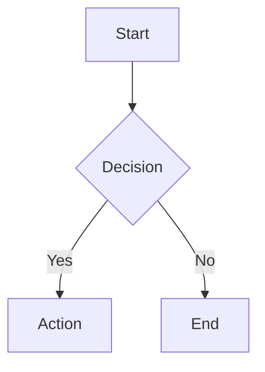

# WORK SESSION (1500-1600) - From rapid-automations

**Generated:** 2026-03-21T14:14:46.316Z
**Work Period:** 1500-1600
**Focus:** Coding activities from rapid-automations
**Duration:** ~60 minutes
**Source Project:** /Users/Q284340/Agentic/_work/rapid-automations

---

## Session Overview

This session captures coding-related activities redirected from rapid-automations.

---

## Key Activities

<a name="ps_1774102486316"></a>
## Prompt Set (ps_1774102486316)

**Time:** 2026-03-21T14:14:46.316Z
**Duration:** 0ms
**Tool Calls:** 11

### Bash - 2026-03-21 14:14:46 UTC [15:14:46 CEST] (Redirected)

**User Request:** now that there are three integrations (sandbox, tookit, okb), the MkDocs should reflect all three (currently only okb is listed under integrations) - extend the docs, using the same logic as for okb (tabs, etc.)

**Tool:** Bash
**Input:** ```json
{
  "command": "ls integrations/rapid-toolkit/ && echo \"===\" && cat integrations/rapid-toolkit/README.md | head -80",
  "description": "Check rapid-toolkit contents and README"
}
```

**Result:** ✅ Success
**Output:** ```
AGENTS.md
LICENSE
README.md
config.yaml.example
config_loader.py
requirements.txt
setup.sh
tools
===
# RAPID Toolkit

AI agent skills and CLI tools for teams working with the **RAPID Toolchain** — the <COMPANY_NAME_REDACTED> AD reprocessing platform comprising **RaaS** (Reprocessing as a Service), **KPI-FW** (KPI Framework), **RDQ** (Reprocessing Data <USER_ID_REDACTED>), and **RDiff** (Reprocessing Diff / validation comparison tool).

Includes **39 skills** for product ownership, <COMPANY_NAME_REDACTED> management, RCA diagnostics, and platf
...[truncated]
```


---

### Bash - 2026-03-21 14:14:46 UTC [15:14:46 CEST] (Redirected)

**User Request:** now that there are three integrations (sandbox, tookit, okb), the MkDocs should reflect all three (currently only okb is listed under integrations) - extend the docs, using the same logic as for okb (tabs, etc.)

**Tool:** Bash
**Input:** ```json
{
  "command": "ls integrations/rapid-agentic-sandbox/ && echo \"===\" && cat integrations/rapid-agentic-sandbox/README.md | head -80",
  "description": "Check sandbox contents and README"
}
```

**Result:** ✅ Success
**Output:** ```
README.md
audit
docker
permissions
proxy
requirements.txt
setup.sh
tests
try.sh
verify.sh
===
# rapid-agentic-sandbox

Security guardrails for AI coding agents. Prevents accidental destructive operations (`kubectl delete`, `aws s3 rm`, `git push --force`) through proxy wrappers, permission tiers, and optional container isolation.

Works with [rapid-toolkit](https://<COMPANY_NAME_REDACTED>.ghe.com/adpnext-apps/rapid-toolkit) skills but can be used standalone with any project.

## What This Does

1. **CLI proxy wrapp
...[truncated]
```


---

### Read - 2026-03-21 14:14:46 UTC [15:14:46 CEST] (Redirected)

**User Request:** now that there are three integrations (sandbox, tookit, okb), the MkDocs should reflect all three (currently only okb is listed under integrations) - extend the docs, using the same logic as for okb (tabs, etc.)

**Tool:** Read
**Input:** ```json
{
  "file_path": "/Users/<USER_ID_REDACTED>/Agentic/_work/rapid-automations/mkdocs.yml"
}
```

**Result:** ✅ Success
**Output:** ```
     1→site_name: RAPID Automations
     2→site_description: Umbrella documentation for the RAPID Automations platform — operational skills, dashboard, and integrations
     3→site_url: http://localhost:8000/
     4→repo_url: https://<COMPANY_NAME_REDACTED>.ghe.com/adpnext-apps/rapid-automations
     5→repo_name: adpnext-apps/rapid-automations
     6→
     7→docs_dir: docs
     8→use_directory_urls: false
     9→
    10→theme:
    11→  name: material
    12→  palette:
    13→    - media: "(prefers-color-scheme: lig
...[truncated]
```


---

### Bash - 2026-03-21 14:14:46 UTC [15:14:46 CEST] (Redirected)

**User Request:** now that there are three integrations (sandbox, tookit, okb), the MkDocs should reflect all three (currently only okb is listed under integrations) - extend the docs, using the same logic as for okb (tabs, etc.)

**Tool:** Bash
**Input:** ```json
{
  "command": "wc -l integrations/rapid-toolkit/README.md integrations/rapid-agentic-sandbox/README.md",
  "description": "Check README lengths"
}
```

**Result:** ✅ Success
**Output:** ```
  389 integrations/rapid-toolkit/README.md
  238 integrations/rapid-agentic-sandbox/README.md
  627 total
```


---

### Read - 2026-03-21 14:14:46 UTC [15:14:46 CEST] (Redirected)

**User Request:** now that there are three integrations (sandbox, tookit, okb), the MkDocs should reflect all three (currently only okb is listed under integrations) - extend the docs, using the same logic as for okb (tabs, etc.)

**Tool:** Read
**Input:** ```json
{
  "file_path": "/Users/<USER_ID_REDACTED>/Agentic/_work/rapid-automations/integrations/rapid-toolkit/README.md",
  "offset": 80,
  "limit": 150
}
```

**Result:** ✅ Success
**Output:** ```
    80→| **Thinking** | strategic-thinking, feature-contract, session-analysis, prompt-enhancement, opencode-web-intranet-auth, rdiff-implementation | (none) |
    81→| **DevAgent** | spec-writing, development | jira-cli |
    82→
    83→### CLI Tools (14)
    84→
    85→| Tool | Purpose | Location |
    86→|------|---------|----------|
    87→| **confcli** | Confluence Server CRUD | `tools/confcli/confcli.py` |
    88→| **jira_lookup** | Jira team/user resolution | `tools/shared/jira_lookup.py`
...[truncated]
```


---

### Read - 2026-03-21 14:14:46 UTC [15:14:46 CEST] (Redirected)

**User Request:** now that there are three integrations (sandbox, tookit, okb), the MkDocs should reflect all three (currently only okb is listed under integrations) - extend the docs, using the same logic as for okb (tabs, etc.)

**Tool:** Read
**Input:** ```json
{
  "file_path": "/Users/<USER_ID_REDACTED>/Agentic/_work/rapid-automations/integrations/rapid-agentic-sandbox/README.md",
  "offset": 80
}
```

**Result:** ✅ Success
**Output:** ```
    80→```bash
    81→# In your consumer repo (e.g., rapid-automations):
    82→git submodule add https://<COMPANY_NAME_REDACTED>.ghe.com/adpnext-apps/rapid-agentic-sandbox.git integrations/rapid-agentic-sandbox
    83→
    84→# Native mode: run the wizard
    85→cd integrations/rapid-agentic-sandbox && ./setup.sh
    86→
    87→# Dev Container mode: reference in .devcontainer/devcontainer.json
    88→# "build": { "dockerfile": "integrations/rapid-agentic-sandbox/docker/Dockerfile", "context": "." }
    89→```
    
...[truncated]
```


---

### Read - 2026-03-21 14:14:46 UTC [15:14:46 CEST] (Redirected)

**User Request:** now that there are three integrations (sandbox, tookit, okb), the MkDocs should reflect all three (currently only okb is listed under integrations) - extend the docs, using the same logic as for okb (tabs, etc.)

**Tool:** Read
**Input:** ```json
{
  "file_path": "/Users/<USER_ID_REDACTED>/Agentic/_work/rapid-automations/integrations/rapid-toolkit/README.md",
  "offset": 228
}
```

**Result:** ✅ Success
**Output:** ```
   228→
   229→Two symlink targets cover all 5 agents:
   230→
   231→| Target | Agents covered |
   232→|--------|---------------|
   233→| `~/.agents/skills/` | OpenCode, Copilot, Gemini CLI |
   234→| `~/.claude/skills/` | Claude Code, Copilot, Cursor, OpenCode |
   235→
   236→```bash
   237→# OpenCode, Copilot, Gemini CLI:
   238→mkdir -p ~/.agents/skills
   239→for s in $RAPID_HOME/.agents/skills/*/; do
   240→  ln -s "$s" ~/.agents/skills/$(basename "$s")
   241→done
   242→
   243→# Clau
...[truncated]
```


---

### Bash - 2026-03-21 14:14:46 UTC [15:14:46 CEST] (Redirected)

**User Request:** now that there are three integrations (sandbox, tookit, okb), the MkDocs should reflect all three (currently only okb is listed under integrations) - extend the docs, using the same logic as for okb (tabs, etc.)

**Tool:** Bash
**Input:** ```json
{
  "command": "mkdir -p docs/integrations/toolkit docs/integrations/sandbox",
  "description": "Create integration doc directories"
}
```

**Result:** ✅ Success
**Output:** ```
(Bash completed with no output)
```


---

### Write - 2026-03-21 14:14:46 UTC [15:14:46 CEST] (Redirected)

**User Request:** now that there are three integrations (sandbox, tookit, okb), the MkDocs should reflect all three (currently only okb is listed under integrations) - extend the docs, using the same logic as for okb (tabs, etc.)

**Tool:** Write
**Input:** ```json
{
  "file_path": "/Users/<USER_ID_REDACTED>/Agentic/_work/rapid-<AWS_SECRET_REDACTED>dex.md",
  "content": "# RAPID Toolkit\n\n=== \":zap: Fast Path\"\n\n    ## What is it?\n\n    39 AI agent skills + 14 CLI tools for teams working with the RAPID platform (RaaS, KPI-FW, RDQ, RDiff). Works with OpenCode, Claude Code, Copilot, Cursor, and Gemini CLI.\n\n    ## Get running\n\n    ```bash\n    cd integrations/rapid-toolkit\n    bash setup.sh\n    ```\n\n    The wizard creates `config.yaml` and `.env`, sets `RAPID_HOME`, installs skills per-project or globally, and reports which skills are ready.\n\n    ## Do something useful\n\n    Skills are invoked naturally through your coding agent:\n\n    | Say | Skill used |\n    |-----|-----------|\n    | \"Show me all open stories\" | jira-management |\n    | \"Create a bug for the login issue\" | quick-bug |\n    | \"Why did the last RaaS batch fail?\" | raas-rca |\n    | \"Search OKB for OOM patterns\" | okb |\n    | \"Create meeting notes for <COMPANY_NAME_REDACTED> Planning\" | confluence-docs |\n    | \"Should we build or buy analytics?\" | strategic-thinking |\n\n    ## Manage skills\n\n    ```bash\n    bash setup.sh skills            # interactive menu\n    bash setup.sh skills install    # category-based picker\n    bash setup.sh skills list       # show installed + available\n    bash setup.sh skills remove     # remove installed skills\n    ```\n\n    **Next**: [Skills catalog](#skills-catalog) for the full list, or [CLI tools](#cli-tools) for available tooling.\n\n=== \":books: Full Details\"\n\n    ## Overview\n\n    The RAPID Toolkit is an agent-agnostic collection of skills and CLI tools for Product Owners and platform engineers. It lives in `integrations/rapid-toolkit/` as a git submodule.\n\n    - **Repo:** [adpnext-apps/rapid-toolkit](https://<CONNECTION_STRING_REDACTED> |\n    | **uv** | 9 skills (RCA/Ops) | `curl -LsSf https://astral.sh/uv/install.sh \\| sh` |\n    | **curl** | 7 skills | Pre-installed on macOS/Linux |\n    | **gh** | 5 skills (DevOps) | `brew install gh` |\n    | **aws** | 4 skills (RCA) | `brew install awscli` |\n    | **kubectl** | 1 skill (raas-rca) | `brew install kubectl` |\n\n    ## Directory Structure\n\n    ```\n    rapid-toolkit/\n    ├── .agents/skills/          # 39 skills (flat, cross-agent compatible)\n    │   ├── quick-story/SKILL.md\n    │   ├── raas-rca/SKILL.md\n    │   ├── okb/SKILL.md\n    │   └── ...\n    ├── tools/\n    │   ├── confcli/             # Confluence CLI\n    │   ├── shared/              # Jira lookup + Teams webhook\n    │   └── raas-rca/            # 11 RCA diagnostic tools\n    ├── config.yaml.example      # Template: team-specific values\n    ├── config_loader.py         # Python config reader\n    ├── .env.example             # Template: secrets\n    ├── setup.sh                 # Interactive setup wizard\n    └── requirements.txt         # Core Python dependencies\n    ```\n\n    ## Troubleshooting\n\n    **Skills not discovered by agent:**\n    Run `bash setup.sh skills list`. Ensure skills are linked into your project (`.agents/skills/`) or installed globally.\n\n    **jira-cli \"404 Not Found\":**\n    Add a `version:` block to `~/.config/.jira/.config.yml` matching your Jira Server version (e.g., `10.3.16`).\n\n    **Tools can't find .env:**\n    Ensure `RAPID_HOME` is set: `echo $RAPID_HOME`. If not, run `source ~/.zshrc` or re-run `setup.sh`.\n\n    **RCA tools fail with AWS errors:**\n    Run `aws sso login --profile <your-profile>` to refresh your SSO session.\n"
}
```

**Result:** ❌ Error
**Output:** ```
PreToolUse:Write hook error: [node <AWS_SECRET_REDACTED>ns/mcp-constraint-monitor/src/hooks/pre-tool-hook-wrapper.js]: 🚫 **CONSTRAINT VIOLATION DETECTED - EXECUTION BLOCKED**

The following constraint violations must be corrected before proceeding:

**1. ERROR [no-ascii-art-in-docs]: CRITICAL: ASCII/line art detected in documentation - use PlantUML diagrams instead. You MUST invoke documentation-style skill FIRST**
   🔍 Pattern: `[┌┐└┘│─├┤┬┴┼▲▼◄►]`

Please modify your reques
...[truncated]
```


---

### Write - 2026-03-21 14:14:46 UTC [15:14:46 CEST] (Redirected)

**User Request:** now that there are three integrations (sandbox, tookit, okb), the MkDocs should reflect all three (currently only okb is listed under integrations) - extend the docs, using the same logic as for okb (tabs, etc.)

**Tool:** Write
**Input:** ```json
{
  "file_path": "/Users/<USER_ID_REDACTED>/Agentic/_work/rapid-<AWS_SECRET_REDACTED>dex.md",
  "content": "# Agentic Sandbox\n\n=== \":zap: Fast Path\"\n\n    ## What is it?\n\n    Security guardrails for AI coding agents. Prevents accidental destructive operations (`kubectl delete`, `aws s3 rm`, `git push --force`) through proxy wrappers, permission tiers, and optional container isolation.\n\n    ## Try it (no install required)\n\n    ```bash\n    cd integrations/rapid-agentic-sandbox\n    ./try.sh\n    ```\n\n    Inside the sandbox shell:\n\n    ```\n    [SANDBOX:standard] $ kubectl get pods         # allowed\n    [SANDBOX:standard] $ kubectl delete pod X      # DENIED\n    [SANDBOX:standard] $ git push --force          # DENIED\n    [SANDBOX:standard] $ exit                      # back to normal\n    ```\n\n    ## Install it\n\n    ```bash\n    cd integrations/rapid-agentic-sandbox\n    ./setup.sh\n    ```\n\n    The wizard asks which agent and permission tier, then installs proxy wrappers and generates agent-specific permission configs.\n\n    ## Verify it\n\n    ```bash\n    ./verify.sh              # all checks\n    ./verify.sh --proxies    # only test proxy wrappers\n    ./verify.sh --config     # only check agent config\n    ```\n\n    **Next**: [Permission tiers](#permission-tiers) for details, or [Architecture](#architecture) for how it works.\n\n=== \":books: Full Details\"\n\n    ## Overview\n\n    The Agentic Sandbox provides defense-in-depth security for AI coding agents. It lives in `integrations/rapid-agentic-sandbox/` as a git submodule.\n\n    - **Repo:** [adpnext-apps/rapid-agentic-sandbox](https://<CONNECTION_STRING_REDACTED>
}
```

**Result:** ❌ Error
**Output:** ```
PreToolUse:Write hook error: [node <AWS_SECRET_REDACTED>ns/mcp-constraint-monitor/src/hooks/pre-tool-hook-wrapper.js]: 🚫 **CONSTRAINT VIOLATION DETECTED - EXECUTION BLOCKED**

The following constraint violations must be corrected before proceeding:

**1. ERROR [no-ascii-art-in-docs]: CRITICAL: ASCII/line art detected in documentation - use PlantUML diagrams instead. You MUST invoke documentation-style skill FIRST**
   🔍 Pattern: `[┌┐└┘│─├┤┬┴┼▲▼◄►]`

Please modify your reques
...[truncated]
```


---

### Write - 2026-03-21 14:14:46 UTC [15:14:46 CEST] (Redirected)

**User Request:** now that there are three integrations (sandbox, tookit, okb), the MkDocs should reflect all three (currently only okb is listed under integrations) - extend the docs, using the same logic as for okb (tabs, etc.)

**Tool:** Write
**Input:** ```json
{
  "file_path": "/Users/<USER_ID_REDACTED>/Agentic/_work/rapid-<AWS_SECRET_REDACTED>dex.md",
  "content": "# RAPID Toolkit\n\n=== \":zap: Fast Path\"\n\n    ## What is it?\n\n    39 AI agent skills + 14 CLI tools for teams working with the RAPID platform (RaaS, KPI-FW, RDQ, RDiff). Works with OpenCode, Claude Code, Copilot, Cursor, and Gemini CLI.\n\n    ## Get running\n\n    ```bash\n    cd integrations/rapid-toolkit\n    bash setup.sh\n    ```\n\n    The wizard creates `config.yaml` and `.env`, sets `RAPID_HOME`, installs skills per-project or globally, and reports which skills are ready.\n\n    ## Do something useful\n\n    Skills are invoked naturally through your coding agent:\n\n    | Say | Skill used |\n    |-----|-----------|\n    | \"Show me all open stories\" | jira-management |\n    | \"Create a bug for the login issue\" | quick-bug |\n    | \"Why did the last RaaS batch fail?\" | raas-rca |\n    | \"Search OKB for OOM patterns\" | okb |\n    | \"Create meeting notes for <COMPANY_NAME_REDACTED> Planning\" | confluence-docs |\n    | \"Should we build or buy analytics?\" | strategic-thinking |\n\n    ## Manage skills\n\n    ```bash\n    bash setup.sh skills            # interactive menu\n    bash setup.sh skills install    # category-based picker\n    bash setup.sh skills list       # show installed + available\n    bash setup.sh skills remove     # remove installed skills\n    ```\n\n    **Next**: [Skills catalog](#skills-catalog) for the full list, or [CLI tools](#cli-tools) for available tooling.\n\n=== \":books: Full Details\"\n\n    ## Overview\n\n    The RAPID Toolkit is an agent-agnostic collection of skills and CLI tools for Product Owners and platform engineers. It lives in `integrations/rapid-toolkit/` as a git submodule.\n\n    - **Repo:** [adpnext-apps/rapid-toolkit](https://<CONNECTION_STRING_REDACTED> |\n    | **uv** | 9 skills (RCA/Ops) | `curl -LsSf https://astral.sh/uv/install.sh \\| sh` |\n    | **curl** | 7 skills | Pre-installed on macOS/Linux |\n    | **gh** | 5 skills (DevOps) | `brew install gh` |\n    | **aws** | 4 skills (RCA) | `brew install awscli` |\n    | **kubectl** | 1 skill (raas-rca) | `brew install kubectl` |\n\n    ## Directory Structure\n\n    - `.agents/skills/` — 39 skills (flat layout, cross-agent compatible)\n    - `tools/confcli/` — Confluence CLI\n    - `tools/shared/` — Jira lookup + Teams webhook\n    - `tools/raas-rca/` — 11 RCA diagnostic tools\n    - `config.yaml.example` — Template for team-specific values\n    - `config_loader.py` — Python config reader (CLI + library)\n    - `.env.example` — Template for secrets\n    - `setup.sh` — Interactive setup wizard\n\n    ## Troubleshooting\n\n    **Skills not discovered by agent:**\n    Run `bash setup.sh skills list`. Ensure skills are linked into your project (`.agents/skills/`) or installed globally.\n\n    **jira-cli \"404 Not Found\":**\n    Add a `version:` block to `~/.config/.jira/.config.yml` matching your Jira Server version (e.g., `10.3.16`).\n\n    **Tools can't find .env:**\n    Ensure `RAPID_HOME` is set: `echo $RAPID_HOME`. If not, run `source ~/.zshrc` or re-run `setup.sh`.\n\n    **RCA tools fail with AWS errors:**\n    Run `aws sso login --profile <your-profile>` to refresh your SSO session.\n"
}
```

**Result:** ✅ Success
**Output:** ```
File created successfully at: /Users/<USER_ID_REDACTED>/Agentic/_work/rapid-<AWS_SECRET_REDACTED>dex.md
```


---

---

<a name="ps_1774102486316"></a>
## Prompt Set (ps_1774102486316)

**Time:** 2026-03-21T14:14:46.316Z
**Duration:** 0ms
**Tool Calls:** 11

### Bash - 2026-03-21 14:14:46 UTC [15:14:46 CEST] (Redirected)

**User Request:** now that there are three integrations (sandbox, tookit, okb), the MkDocs should reflect all three (currently only okb is listed under integrations) - extend the docs, using the same logic as for okb (tabs, etc.)

**Tool:** Bash
**Input:** ```json
{
  "command": "ls integrations/rapid-toolkit/ && echo \"===\" && cat integrations/rapid-toolkit/README.md | head -80",
  "description": "Check rapid-toolkit contents and README"
}
```

**Result:** ✅ Success
**Output:** ```
AGENTS.md
LICENSE
README.md
config.yaml.example
config_loader.py
requirements.txt
setup.sh
tools
===
# RAPID Toolkit

AI agent skills and CLI tools for teams working with the **RAPID Toolchain** — the <COMPANY_NAME_REDACTED> AD reprocessing platform comprising **RaaS** (Reprocessing as a Service), **KPI-FW** (KPI Framework), **RDQ** (Reprocessing Data <USER_ID_REDACTED>), and **RDiff** (Reprocessing Diff / validation comparison tool).

Includes **39 skills** for product ownership, <COMPANY_NAME_REDACTED> management, RCA diagnostics, and platf
...[truncated]
```


---

### Bash - 2026-03-21 14:14:46 UTC [15:14:46 CEST] (Redirected)

**User Request:** now that there are three integrations (sandbox, tookit, okb), the MkDocs should reflect all three (currently only okb is listed under integrations) - extend the docs, using the same logic as for okb (tabs, etc.)

**Tool:** Bash
**Input:** ```json
{
  "command": "ls integrations/rapid-agentic-sandbox/ && echo \"===\" && cat integrations/rapid-agentic-sandbox/README.md | head -80",
  "description": "Check sandbox contents and README"
}
```

**Result:** ✅ Success
**Output:** ```
README.md
audit
docker
permissions
proxy
requirements.txt
setup.sh
tests
try.sh
verify.sh
===
# rapid-agentic-sandbox

Security guardrails for AI coding agents. Prevents accidental destructive operations (`kubectl delete`, `aws s3 rm`, `git push --force`) through proxy wrappers, permission tiers, and optional container isolation.

Works with [rapid-toolkit](https://<COMPANY_NAME_REDACTED>.ghe.com/adpnext-apps/rapid-toolkit) skills but can be used standalone with any project.

## What This Does

1. **CLI proxy wrapp
...[truncated]
```


---

### Read - 2026-03-21 14:14:46 UTC [15:14:46 CEST] (Redirected)

**User Request:** now that there are three integrations (sandbox, tookit, okb), the MkDocs should reflect all three (currently only okb is listed under integrations) - extend the docs, using the same logic as for okb (tabs, etc.)

**Tool:** Read
**Input:** ```json
{
  "file_path": "/Users/<USER_ID_REDACTED>/Agentic/_work/rapid-automations/mkdocs.yml"
}
```

**Result:** ✅ Success
**Output:** ```
     1→site_name: RAPID Automations
     2→site_description: Umbrella documentation for the RAPID Automations platform — operational skills, dashboard, and integrations
     3→site_url: http://localhost:8000/
     4→repo_url: https://<COMPANY_NAME_REDACTED>.ghe.com/adpnext-apps/rapid-automations
     5→repo_name: adpnext-apps/rapid-automations
     6→
     7→docs_dir: docs
     8→use_directory_urls: false
     9→
    10→theme:
    11→  name: material
    12→  palette:
    13→    - media: "(prefers-color-scheme: lig
...[truncated]
```


---

### Bash - 2026-03-21 14:14:46 UTC [15:14:46 CEST] (Redirected)

**User Request:** now that there are three integrations (sandbox, tookit, okb), the MkDocs should reflect all three (currently only okb is listed under integrations) - extend the docs, using the same logic as for okb (tabs, etc.)

**Tool:** Bash
**Input:** ```json
{
  "command": "wc -l integrations/rapid-toolkit/README.md integrations/rapid-agentic-sandbox/README.md",
  "description": "Check README lengths"
}
```

**Result:** ✅ Success
**Output:** ```
  389 integrations/rapid-toolkit/README.md
  238 integrations/rapid-agentic-sandbox/README.md
  627 total
```


---

### Read - 2026-03-21 14:14:46 UTC [15:14:46 CEST] (Redirected)

**User Request:** now that there are three integrations (sandbox, tookit, okb), the MkDocs should reflect all three (currently only okb is listed under integrations) - extend the docs, using the same logic as for okb (tabs, etc.)

**Tool:** Read
**Input:** ```json
{
  "file_path": "/Users/<USER_ID_REDACTED>/Agentic/_work/rapid-automations/integrations/rapid-toolkit/README.md",
  "offset": 80,
  "limit": 150
}
```

**Result:** ✅ Success
**Output:** ```
    80→| **Thinking** | strategic-thinking, feature-contract, session-analysis, prompt-enhancement, opencode-web-intranet-auth, rdiff-implementation | (none) |
    81→| **DevAgent** | spec-writing, development | jira-cli |
    82→
    83→### CLI Tools (14)
    84→
    85→| Tool | Purpose | Location |
    86→|------|---------|----------|
    87→| **confcli** | Confluence Server CRUD | `tools/confcli/confcli.py` |
    88→| **jira_lookup** | Jira team/user resolution | `tools/shared/jira_lookup.py`
...[truncated]
```


---

### Read - 2026-03-21 14:14:46 UTC [15:14:46 CEST] (Redirected)

**User Request:** now that there are three integrations (sandbox, tookit, okb), the MkDocs should reflect all three (currently only okb is listed under integrations) - extend the docs, using the same logic as for okb (tabs, etc.)

**Tool:** Read
**Input:** ```json
{
  "file_path": "/Users/<USER_ID_REDACTED>/Agentic/_work/rapid-automations/integrations/rapid-agentic-sandbox/README.md",
  "offset": 80
}
```

**Result:** ✅ Success
**Output:** ```
    80→```bash
    81→# In your consumer repo (e.g., rapid-automations):
    82→git submodule add https://<COMPANY_NAME_REDACTED>.ghe.com/adpnext-apps/rapid-agentic-sandbox.git integrations/rapid-agentic-sandbox
    83→
    84→# Native mode: run the wizard
    85→cd integrations/rapid-agentic-sandbox && ./setup.sh
    86→
    87→# Dev Container mode: reference in .devcontainer/devcontainer.json
    88→# "build": { "dockerfile": "integrations/rapid-agentic-sandbox/docker/Dockerfile", "context": "." }
    89→```
    
...[truncated]
```


---

### Read - 2026-03-21 14:14:46 UTC [15:14:46 CEST] (Redirected)

**User Request:** now that there are three integrations (sandbox, tookit, okb), the MkDocs should reflect all three (currently only okb is listed under integrations) - extend the docs, using the same logic as for okb (tabs, etc.)

**Tool:** Read
**Input:** ```json
{
  "file_path": "/Users/<USER_ID_REDACTED>/Agentic/_work/rapid-automations/integrations/rapid-toolkit/README.md",
  "offset": 228
}
```

**Result:** ✅ Success
**Output:** ```
   228→
   229→Two symlink targets cover all 5 agents:
   230→
   231→| Target | Agents covered |
   232→|--------|---------------|
   233→| `~/.agents/skills/` | OpenCode, Copilot, Gemini CLI |
   234→| `~/.claude/skills/` | Claude Code, Copilot, Cursor, OpenCode |
   235→
   236→```bash
   237→# OpenCode, Copilot, Gemini CLI:
   238→mkdir -p ~/.agents/skills
   239→for s in $RAPID_HOME/.agents/skills/*/; do
   240→  ln -s "$s" ~/.agents/skills/$(basename "$s")
   241→done
   242→
   243→# Clau
...[truncated]
```


---

### Bash - 2026-03-21 14:14:46 UTC [15:14:46 CEST] (Redirected)

**User Request:** now that there are three integrations (sandbox, tookit, okb), the MkDocs should reflect all three (currently only okb is listed under integrations) - extend the docs, using the same logic as for okb (tabs, etc.)

**Tool:** Bash
**Input:** ```json
{
  "command": "mkdir -p docs/integrations/toolkit docs/integrations/sandbox",
  "description": "Create integration doc directories"
}
```

**Result:** ✅ Success
**Output:** ```
(Bash completed with no output)
```


---

### Write - 2026-03-21 14:14:46 UTC [15:14:46 CEST] (Redirected)

**User Request:** now that there are three integrations (sandbox, tookit, okb), the MkDocs should reflect all three (currently only okb is listed under integrations) - extend the docs, using the same logic as for okb (tabs, etc.)

**Tool:** Write
**Input:** ```json
{
  "file_path": "/Users/<USER_ID_REDACTED>/Agentic/_work/rapid-<AWS_SECRET_REDACTED>dex.md",
  "content": "# RAPID Toolkit\n\n=== \":zap: Fast Path\"\n\n    ## What is it?\n\n    39 AI agent skills + 14 CLI tools for teams working with the RAPID platform (RaaS, KPI-FW, RDQ, RDiff). Works with OpenCode, Claude Code, Copilot, Cursor, and Gemini CLI.\n\n    ## Get running\n\n    ```bash\n    cd integrations/rapid-toolkit\n    bash setup.sh\n    ```\n\n    The wizard creates `config.yaml` and `.env`, sets `RAPID_HOME`, installs skills per-project or globally, and reports which skills are ready.\n\n    ## Do something useful\n\n    Skills are invoked naturally through your coding agent:\n\n    | Say | Skill used |\n    |-----|-----------|\n    | \"Show me all open stories\" | jira-management |\n    | \"Create a bug for the login issue\" | quick-bug |\n    | \"Why did the last RaaS batch fail?\" | raas-rca |\n    | \"Search OKB for OOM patterns\" | okb |\n    | \"Create meeting notes for <COMPANY_NAME_REDACTED> Planning\" | confluence-docs |\n    | \"Should we build or buy analytics?\" | strategic-thinking |\n\n    ## Manage skills\n\n    ```bash\n    bash setup.sh skills            # interactive menu\n    bash setup.sh skills install    # category-based picker\n    bash setup.sh skills list       # show installed + available\n    bash setup.sh skills remove     # remove installed skills\n    ```\n\n    **Next**: [Skills catalog](#skills-catalog) for the full list, or [CLI tools](#cli-tools) for available tooling.\n\n=== \":books: Full Details\"\n\n    ## Overview\n\n    The RAPID Toolkit is an agent-agnostic collection of skills and CLI tools for Product Owners and platform engineers. It lives in `integrations/rapid-toolkit/` as a git submodule.\n\n    - **Repo:** [adpnext-apps/rapid-toolkit](https://<CONNECTION_STRING_REDACTED> |\n    | **uv** | 9 skills (RCA/Ops) | `curl -LsSf https://astral.sh/uv/install.sh \\| sh` |\n    | **curl** | 7 skills | Pre-installed on macOS/Linux |\n    | **gh** | 5 skills (DevOps) | `brew install gh` |\n    | **aws** | 4 skills (RCA) | `brew install awscli` |\n    | **kubectl** | 1 skill (raas-rca) | `brew install kubectl` |\n\n    ## Directory Structure\n\n    ```\n    rapid-toolkit/\n    ├── .agents/skills/          # 39 skills (flat, cross-agent compatible)\n    │   ├── quick-story/SKILL.md\n    │   ├── raas-rca/SKILL.md\n    │   ├── okb/SKILL.md\n    │   └── ...\n    ├── tools/\n    │   ├── confcli/             # Confluence CLI\n    │   ├── shared/              # Jira lookup + Teams webhook\n    │   └── raas-rca/            # 11 RCA diagnostic tools\n    ├── config.yaml.example      # Template: team-specific values\n    ├── config_loader.py         # Python config reader\n    ├── .env.example             # Template: secrets\n    ├── setup.sh                 # Interactive setup wizard\n    └── requirements.txt         # Core Python dependencies\n    ```\n\n    ## Troubleshooting\n\n    **Skills not discovered by agent:**\n    Run `bash setup.sh skills list`. Ensure skills are linked into your project (`.agents/skills/`) or installed globally.\n\n    **jira-cli \"404 Not Found\":**\n    Add a `version:` block to `~/.config/.jira/.config.yml` matching your Jira Server version (e.g., `10.3.16`).\n\n    **Tools can't find .env:**\n    Ensure `RAPID_HOME` is set: `echo $RAPID_HOME`. If not, run `source ~/.zshrc` or re-run `setup.sh`.\n\n    **RCA tools fail with AWS errors:**\n    Run `aws sso login --profile <your-profile>` to refresh your SSO session.\n"
}
```

**Result:** ❌ Error
**Output:** ```
PreToolUse:Write hook error: [node <AWS_SECRET_REDACTED>ns/mcp-constraint-monitor/src/hooks/pre-tool-hook-wrapper.js]: 🚫 **CONSTRAINT VIOLATION DETECTED - EXECUTION BLOCKED**

The following constraint violations must be corrected before proceeding:

**1. ERROR [no-ascii-art-in-docs]: CRITICAL: ASCII/line art detected in documentation - use PlantUML diagrams instead. You MUST invoke documentation-style skill FIRST**
   🔍 Pattern: `[┌┐└┘│─├┤┬┴┼▲▼◄►]`

Please modify your reques
...[truncated]
```


---

### Write - 2026-03-21 14:14:46 UTC [15:14:46 CEST] (Redirected)

**User Request:** now that there are three integrations (sandbox, tookit, okb), the MkDocs should reflect all three (currently only okb is listed under integrations) - extend the docs, using the same logic as for okb (tabs, etc.)

**Tool:** Write
**Input:** ```json
{
  "file_path": "/Users/<USER_ID_REDACTED>/Agentic/_work/rapid-<AWS_SECRET_REDACTED>dex.md",
  "content": "# Agentic Sandbox\n\n=== \":zap: Fast Path\"\n\n    ## What is it?\n\n    Security guardrails for AI coding agents. Prevents accidental destructive operations (`kubectl delete`, `aws s3 rm`, `git push --force`) through proxy wrappers, permission tiers, and optional container isolation.\n\n    ## Try it (no install required)\n\n    ```bash\n    cd integrations/rapid-agentic-sandbox\n    ./try.sh\n    ```\n\n    Inside the sandbox shell:\n\n    ```\n    [SANDBOX:standard] $ kubectl get pods         # allowed\n    [SANDBOX:standard] $ kubectl delete pod X      # DENIED\n    [SANDBOX:standard] $ git push --force          # DENIED\n    [SANDBOX:standard] $ exit                      # back to normal\n    ```\n\n    ## Install it\n\n    ```bash\n    cd integrations/rapid-agentic-sandbox\n    ./setup.sh\n    ```\n\n    The wizard asks which agent and permission tier, then installs proxy wrappers and generates agent-specific permission configs.\n\n    ## Verify it\n\n    ```bash\n    ./verify.sh              # all checks\n    ./verify.sh --proxies    # only test proxy wrappers\n    ./verify.sh --config     # only check agent config\n    ```\n\n    **Next**: [Permission tiers](#permission-tiers) for details, or [Architecture](#architecture) for how it works.\n\n=== \":books: Full Details\"\n\n    ## Overview\n\n    The Agentic Sandbox provides defense-in-depth security for AI coding agents. It lives in `integrations/rapid-agentic-sandbox/` as a git submodule.\n\n    - **Repo:** [adpnext-apps/rapid-agentic-sandbox](https://<CONNECTION_STRING_REDACTED>
}
```

**Result:** ❌ Error
**Output:** ```
PreToolUse:Write hook error: [node <AWS_SECRET_REDACTED>ns/mcp-constraint-monitor/src/hooks/pre-tool-hook-wrapper.js]: 🚫 **CONSTRAINT VIOLATION DETECTED - EXECUTION BLOCKED**

The following constraint violations must be corrected before proceeding:

**1. ERROR [no-ascii-art-in-docs]: CRITICAL: ASCII/line art detected in documentation - use PlantUML diagrams instead. You MUST invoke documentation-style skill FIRST**
   🔍 Pattern: `[┌┐└┘│─├┤┬┴┼▲▼◄►]`

Please modify your reques
...[truncated]
```


---

### Write - 2026-03-21 14:14:46 UTC [15:14:46 CEST] (Redirected)

**User Request:** now that there are three integrations (sandbox, tookit, okb), the MkDocs should reflect all three (currently only okb is listed under integrations) - extend the docs, using the same logic as for okb (tabs, etc.)

**Tool:** Write
**Input:** ```json
{
  "file_path": "/Users/<USER_ID_REDACTED>/Agentic/_work/rapid-<AWS_SECRET_REDACTED>dex.md",
  "content": "# RAPID Toolkit\n\n=== \":zap: Fast Path\"\n\n    ## What is it?\n\n    39 AI agent skills + 14 CLI tools for teams working with the RAPID platform (RaaS, KPI-FW, RDQ, RDiff). Works with OpenCode, Claude Code, Copilot, Cursor, and Gemini CLI.\n\n    ## Get running\n\n    ```bash\n    cd integrations/rapid-toolkit\n    bash setup.sh\n    ```\n\n    The wizard creates `config.yaml` and `.env`, sets `RAPID_HOME`, installs skills per-project or globally, and reports which skills are ready.\n\n    ## Do something useful\n\n    Skills are invoked naturally through your coding agent:\n\n    | Say | Skill used |\n    |-----|-----------|\n    | \"Show me all open stories\" | jira-management |\n    | \"Create a bug for the login issue\" | quick-bug |\n    | \"Why did the last RaaS batch fail?\" | raas-rca |\n    | \"Search OKB for OOM patterns\" | okb |\n    | \"Create meeting notes for <COMPANY_NAME_REDACTED> Planning\" | confluence-docs |\n    | \"Should we build or buy analytics?\" | strategic-thinking |\n\n    ## Manage skills\n\n    ```bash\n    bash setup.sh skills            # interactive menu\n    bash setup.sh skills install    # category-based picker\n    bash setup.sh skills list       # show installed + available\n    bash setup.sh skills remove     # remove installed skills\n    ```\n\n    **Next**: [Skills catalog](#skills-catalog) for the full list, or [CLI tools](#cli-tools) for available tooling.\n\n=== \":books: Full Details\"\n\n    ## Overview\n\n    The RAPID Toolkit is an agent-agnostic collection of skills and CLI tools for Product Owners and platform engineers. It lives in `integrations/rapid-toolkit/` as a git submodule.\n\n    - **Repo:** [adpnext-apps/rapid-toolkit](https://<CONNECTION_STRING_REDACTED> |\n    | **uv** | 9 skills (RCA/Ops) | `curl -LsSf https://astral.sh/uv/install.sh \\| sh` |\n    | **curl** | 7 skills | Pre-installed on macOS/Linux |\n    | **gh** | 5 skills (DevOps) | `brew install gh` |\n    | **aws** | 4 skills (RCA) | `brew install awscli` |\n    | **kubectl** | 1 skill (raas-rca) | `brew install kubectl` |\n\n    ## Directory Structure\n\n    - `.agents/skills/` — 39 skills (flat layout, cross-agent compatible)\n    - `tools/confcli/` — Confluence CLI\n    - `tools/shared/` — Jira lookup + Teams webhook\n    - `tools/raas-rca/` — 11 RCA diagnostic tools\n    - `config.yaml.example` — Template for team-specific values\n    - `config_loader.py` — Python config reader (CLI + library)\n    - `.env.example` — Template for secrets\n    - `setup.sh` — Interactive setup wizard\n\n    ## Troubleshooting\n\n    **Skills not discovered by agent:**\n    Run `bash setup.sh skills list`. Ensure skills are linked into your project (`.agents/skills/`) or installed globally.\n\n    **jira-cli \"404 Not Found\":**\n    Add a `version:` block to `~/.config/.jira/.config.yml` matching your Jira Server version (e.g., `10.3.16`).\n\n    **Tools can't find .env:**\n    Ensure `RAPID_HOME` is set: `echo $RAPID_HOME`. If not, run `source ~/.zshrc` or re-run `setup.sh`.\n\n    **RCA tools fail with AWS errors:**\n    Run `aws sso login --profile <your-profile>` to refresh your SSO session.\n"
}
```

**Result:** ✅ Success
**Output:** ```
File created successfully at: /Users/<USER_ID_REDACTED>/Agentic/_work/rapid-<AWS_SECRET_REDACTED>dex.md
```


---

---

<a name="ps_1774102704174"></a>
## Prompt Set (ps_1774102704174)

**Time:** 2026-03-21T14:18:24.174Z
**Duration:** 0ms
**Tool Calls:** 1

### Write - 2026-03-21 14:18:24 UTC [15:18:24 CEST] (Redirected)

**User Request:** # Documentation Style Guide

Enforce consistent styling for documentation artifacts (PlantUML, Mermaid, markdown, PNG diagrams).

## Instructions

When creating or modifying documentation artifacts, follow these guidelines strictly.

---

## PlantUML Diagrams (.puml)

### File Naming Convention

**CRITICAL**: Use kebab-case, descriptive names. NEVER use incremental suffixes.

**Correct**:
- `health-verification-flow.puml`
- `knowledge-architecture.puml`
- `constraint-monitor-components.puml`

**WRONG** (constraint violation):
- `health-verification-flow-2.puml`
- `knowledge-architecture-v2.puml`
- `constraint-monitor-components-new.puml`

If updating an existing diagram, **modify the existing file** rather than creating a new version.

### Standard Style Include

All PlantUML files MUST include the standard style at the top:

```plantuml
@startuml diagram-name
!include _standard-style.puml

' ... diagram content ...

@enduml
```

The style file is located at:
- `docs/puml/_standard-style.puml`
- `docs/presentation/puml/_standard-style.puml`

### Layout Guidelines

1. **Prefer vertical layouts** - Avoid excessive width that requires horizontal scrolling
2. **Use `top to bottom direction`** for most diagrams
3. **Use `left to right direction`** only for sequence diagrams or when horizontal flow is semantically meaningful
4. **Group related components** using packages or rectangles

### Component Stereotypes

Use these stereotypes for consistent coloring:

| Stereotype | Color | Use For |
|------------|-------|---------|
| `<<api>>` | Light Blue | API endpoints, REST interfaces |
| `<<core>>` | Light Green | Core business logic |
| `<<storage>>` | Light Yellow | Databases, file storage |
| `<<cli>>` | Light Pink | Command-line interfaces |
| `<<util>>` | Light Gray | Utility/helper components |
| `<<agent>>` | Soft Blue | AI agents, autonomous components |
| `<<infra>>` | Light <COMPANY_NAME_REDACTED> | Infrastructure components |
| `<<external>>` | Neutral Gray | External systems |

### Arrow Macros

Use defined macros for consistent arrow styling:

```plantuml
SYNC_LINE     ' Red solid line - synchronous calls
ASYNC_LINE    ' Green dashed - async/event-based
DATA_LINE     ' <COMPANY_NAME_REDACTED> solid - data flow
CONTROL_LINE  ' Purple solid - control flow
OPTIONAL_LINE ' Gray dotted - optional paths
```

---

## PNG Generation

### Generating PNGs from PlantUML

Use the `plantuml` command-line tool (installed via Homebrew):

```bash
# Local generation using plantuml CLI (preferred)
plantuml -tpng docs/puml/diagram-name.puml -o ../images/

# Generate all diagrams in a directory
plantuml -tpng docs/puml/*.puml -o ../images/

# Or use the docs script if available
./scripts/generate-diagrams.sh
```

**Note:** The `plantuml` CLI is installed via `brew install plantuml` and handles Java dependencies automatically.

### PNG Naming

PNG files should match their source PUML file:
- `health-verification-flow.puml` → `health-verification-flow.png`

### Output Location

PNGs should be generated to:
- `docs/images/` - For markdown documentation references
- `docs/presentation/images/` - For presentation diagrams

---

## Mermaid Diagrams

### Inline in Markdown

Use fenced code blocks with `mermaid` language:

```markdown

```

### Style Guidelines

1. Use clear, descriptive node labels
2. Keep diagrams focused - split large diagrams into multiple
3. Use subgraphs for logical grouping
4. Prefer `graph TD` (top-down) over `graph LR` (left-right) for readability

---

## Markdown Documentation

### File Naming

- Use kebab-case: `api-quota-checker.md`
- Use `README.md` for directory index files
- Never use spaces or special characters

### Structure

1. Start with H1 title matching the topic
2. Include brief overview paragraph
3. Use H2 for major sections
4. Use H3 for subsections
5. Include code examples where applicable

### Links

- Use relative paths for internal links: `[Status Line](./status-line.md)`
- Use absolute URLs for external links
- Verify links work before committing

---

## Validation Workflow

Before committing documentation changes:

1. **PlantUML**: Verify syntax by generating PNG
2. **Mermaid**: Preview in VS Code or GitHub
3. **Markdown**: Check rendering in preview
4. **Links**: Verify all internal links work
5. **Images**: Ensure referenced images exist

---

## Common Violations to Avoid

1. **Incremental naming** (`-2`, `-v2`, `-new` suffixes)
2. **Missing style include** in PlantUML
3. **Horizontal-heavy layouts** causing scroll
4. **Orphaned images** (PNG without source PUML)
5. **Broken internal links**
6. **Inconsistent component colors** (not using stereotypes)

---

## Quick Reference

| Artifact | Location | Naming | Style |
|----------|----------|--------|-------|
| PlantUML | `docs/puml/` | kebab-case.puml | Include `_standard-style.puml` |
| PNG | `docs/images/` | match-source.png | Generated from PUML |
| Markdown | `docs/*/` | kebab-case.md | H1 title, H2 sections |
| Mermaid | Inline | N/A | graph TD preferred |

**Tool:** Write
**Input:** ```json
{
  "file_path": "/Users/<USER_ID_REDACTED>/Agentic/_work/rapid-<AWS_SECRET_REDACTED>dex.md",
  "content": "# Agentic Sandbox\n\n=== \":zap: Fast Path\"\n\n    ## What is it?\n\n    Security guardrails for AI coding agents. Prevents accidental destructive operations (`kubectl delete`, `aws s3 rm`, `git push --force`) through proxy wrappers, permission tiers, and optional container isolation.\n\n    ## Try it (no install required)\n\n    ```bash\n    cd integrations/rapid-agentic-sandbox\n    ./try.sh\n    ```\n\n    Inside the sandbox shell:\n\n    ```\n    [SANDBOX:standard] $ kubectl get pods         # allowed\n    [SANDBOX:standard] $ kubectl delete pod X      # DENIED\n    [SANDBOX:standard] $ git push --force          # DENIED\n    [SANDBOX:standard] $ exit                      # back to normal\n    ```\n\n    ## Install it\n\n    ```bash\n    cd integrations/rapid-agentic-sandbox\n    ./setup.sh\n    ```\n\n    The wizard asks which agent and permission tier, then installs proxy wrappers and generates agent-specific permission configs.\n\n    ## Verify it\n\n    ```bash\n    ./verify.sh              # all checks\n    ./verify.sh --proxies    # only test proxy wrappers\n    ./verify.sh --config     # only check agent config\n    ```\n\n    **Next**: [Permission tiers](#permission-tiers) for details, or [Architecture](#architecture) for how it works.\n\n=== \":books: Full Details\"\n\n    ## Overview\n\n    The Agentic Sandbox provides defense-in-depth security for AI coding agents. It lives in `integrations/rapid-agentic-sandbox/` as a git submodule.\n\n    - **Repo:** [adpnext-apps/rapid-agentic-sandbox](https://<CONNECTION_STRING_REDACTED>
}
```

**Result:** ✅ Success
**Output:** ```
File created successfully at: /Users/<USER_ID_REDACTED>/Agentic/_work/rapid-<AWS_SECRET_REDACTED>dex.md
```


---

---

