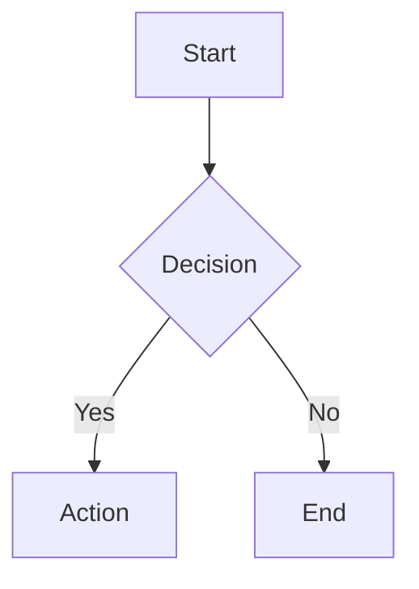

# WORK SESSION (1700-1800)

**Generated:** 2026-03-22T16:07:51.121Z
**Work Period:** 1700-1800
**Focus:** Live session logging
**Duration:** ~60 minutes

---

## Session Overview

This session captures real-time tool interactions and exchanges.

---

## Key Activities

<a name="ps_1774195671121"></a>
## Prompt Set (ps_1774195671121)

**Time:** 2026-03-22T16:07:51.121Z
**Duration:** 0ms
**Tool Calls:** 0

### Text Exchange - 2026-03-22 16:07:51 UTC [17:07:51 CEST]

**Assistant Response:** Now I have the full picture. Let me build the matrix and the fix.


**Type:** Text-only exchange (no tool calls)

---

---

<a name="ps_1774196428850"></a>
## Prompt Set (ps_1774196428850)

**Time:** 2026-03-22T16:20:28.850Z
**Duration:** 0ms
**Tool Calls:** 2

### Bash - 2026-03-22 16:20:28 UTC [17:20:28 CEST]

**System Action:** (Initiated automatically)

**Tool:** Bash
**Input:** ```json
{
  "command": "# Check if copilot CLI exists\nwhich copilot 2>/dev/null || echo \"copilot: NOT FOUND\"\n# Check if gh copilot extension exists  \ngh copilot --version 2>/dev/null || echo \"gh copilot extension: NOT INSTALLED\"",
  "description": "Check copilot CLI availability"
}
```

**Result:** ❌ Error

---

### Bash - 2026-03-22 16:20:28 UTC [17:20:28 CEST]

**System Action:** (Initiated automatically)

**Tool:** Bash
**Input:** ```json
{
  "command": "# Check if copilot CLI exists\nwhich copilot 2>/dev/null || echo \"copilot: NOT FOUND\"\n# Check if gh copilot extension exists  \ngh copilot --version 2>/dev/null || echo \"gh copilot extension: NOT INSTALLED\"",
  "description": "Check copilot CLI availability"
}
```

**Result:** ✅ Success
**Output:** ```
/Users/<USER_ID_REDACTED>/Library/Application Support/Code/User/globalStorage/github.copilot-chat/copilotCli/copilot
GitHub Copilot CLI 1.0.10.
Run 'copilot update' to check for updates.
```


---

---

<a name="ps_1774196714369"></a>
## Prompt Set (ps_1774196714369)

**Time:** 2026-03-22T16:25:14.369Z
**Duration:** 0ms
**Tool Calls:** 4

### Read - 2026-03-22 16:25:14 UTC [17:25:14 CEST]

**System Action:** (Initiated automatically)

**Tool:** Read
**Input:** ```json
{
  "file_path": "<AWS_SECRET_REDACTED>tect-network.sh"
}
```

**Result:** ✅ Success
**Output:** ```
     1→#!/bin/bash
     2→
     3→# Shared CN/Proxy Detection for Coding Launcher
     4→# Sourced by agent-common-setup.sh
     5→#
     6→# Provides:
     7→#   detect_corporate_network()   - Sets INSIDE_CN=true/false
     8→#   test_proxy_connectivity()    - Sets PROXY_WORKING=true/false
     9→#   configure_proxy_if_needed()  - Auto-configures proxy if proxydetox available
    10→#
    11→# Environment overrides:
    12→#   CODING_FORCE_CN=true/false   - Skip CN detection, force result (for 
...[truncated]
```


---

### Read - 2026-03-22 16:25:14 UTC [17:25:14 CEST]

**System Action:** (Initiated automatically)

**Tool:** Read
**Input:** ```json
{
  "file_path": "<AWS_SECRET_REDACTED>tect-network.sh"
}
```

**Result:** ✅ Success
**Output:** ```
     1→#!/bin/bash
     2→
     3→# Shared CN/Proxy Detection for Coding Launcher
     4→# Sourced by agent-common-setup.sh
     5→#
     6→# Provides:
     7→#   detect_corporate_network()   - Sets INSIDE_CN=true/false
     8→#   test_proxy_connectivity()    - Sets PROXY_WORKING=true/false
     9→#   configure_proxy_if_needed()  - Auto-configures proxy if proxydetox available
    10→#
    11→# Environment overrides:
    12→#   CODING_FORCE_CN=true/false   - Skip CN detection, force result (for 
...[truncated]
```


---

### Read - 2026-03-22 16:25:14 UTC [17:25:14 CEST]

**System Action:** (Initiated automatically)

**Tool:** Read
**Input:** ```json
{
  "file_path": "<AWS_SECRET_REDACTED>tect-network.sh"
}
```

**Result:** ✅ Success
**Output:** ```
     1→#!/bin/bash
     2→
     3→# Shared CN/Proxy Detection for Coding Launcher
     4→# Sourced by agent-common-setup.sh
     5→#
     6→# Provides:
     7→#   detect_corporate_network()   - Sets INSIDE_CN=true/false
     8→#   test_proxy_connectivity()    - Sets PROXY_WORKING=true/false
     9→#   configure_proxy_if_needed()  - Auto-configures proxy if proxydetox available
    10→#
    11→# Environment overrides:
    12→#   CODING_FORCE_CN=true/false   - Skip CN detection, force result (for 
...[truncated]
```


---

### Write - 2026-03-22 16:25:14 UTC [17:25:14 CEST]

**System Action:** (Initiated automatically)

**Tool:** Write
**Input:** ```json
{
  "file_path": "<AWS_SECRET_REDACTED>tect-network.sh",
  "content": "#!/bin/bash\n\n# Shared CN/Proxy Detection for Coding Launcher\n# Sourced by agent-common-setup.sh\n#\n# Provides:\n#   detect_corporate_network()       - Sets INSIDE_CN=true/false\n#   test_proxy_connectivity()        - Sets PROXY_WORKING=true/false\n#   configure_proxy_if_needed()      - Auto-configures proxy if proxydetox available\n#   detect_network_and_configure_proxy() - Combined detection (convenience)\n#   validate_agent_connectivity()    - Validate that the chosen agent can reach its API\n#\n# Exported state (after detect_network_and_configure_proxy):\n#   INSIDE_CN       - true if on corporate VPN\n#   PROXY_WORKING   - true if external APIs are reachable\n#   PROXY_REQUIRED  - true if proxy is needed for external access (= inside CN)\n#\n# Environment overrides:\n#   CODING_FORCE_CN=true/false   - Skip CN detection, force result (for testing)\n#\n# === CONNECTIVITY MATRIX ===\n#\n# | Scenario       | Proxy needed | Anthropic API | GH Copilot API | GH Enterprise |\n# |----------------|-------------|---------------|----------------|---------------|\n# | Inside VPN     | YES         | via proxy     | via proxy      | direct        |\n# | Outside VPN    | NO          | direct        | direct         | unreachable   |\n#\n# All external APIs (Anthropic, GitHub, OpenAI) require the proxy when inside CN.\n# Direct connections time out (000) inside CN. Outside CN, direct works fine.\n\n# Avoid re-sourcing\nif [ -n \"$_DETECT_NETWORK_LOADED\" ]; then\n  return 0 2>/dev/null || true\nfi\n_DETECT_NETWORK_LOADED=true\n\n# Defaults\nINSIDE_CN=false\nPROXY_WORKING=true\nPROXY_REQUIRED=false\n\n# ============================================\n# Corporate Network Detection\n# ============================================\ndetect_corporate_network() {\n  # Allow forcing for testing\n  if [ \"$CODING_FORCE_CN\" = \"true\" ]; then\n    INSIDE_CN=true\n    PROXY_REQUIRED=true\n    log \"CN detection forced: INSIDE_CN=true (via CODING_FORCE_CN)\"\n    export INSIDE_CN PROXY_REQUIRED\n    return 0\n  elif [ \"$CODING_FORCE_CN\" = \"false\" ]; then\n    INSIDE_CN=false\n    PROXY_REQUIRED=false\n    log \"CN detection forced: INSIDE_CN=false (via CODING_FORCE_CN)\"\n    export INSIDE_CN PROXY_REQUIRED\n    return 0\n  fi\n\n  log \"Detecting network location (CN vs Public)...\"\n\n  # Fast check: try HTTPS to corporate GitHub (2s timeout)\n  if timeout 3 curl -s --connect-timeout 2 https://<CONNECTION_STRING_REDACTED> 2>&1 || true)\n    if echo \"$bmw_response\" | grep -q -iE \"(successfully authenticated|Welcome to GitLab|You've successfully authenticated)\"; then\n      INSIDE_CN=true\n      PROXY_REQUIRED=true\n      log \"🏢 Inside Corporate Network (SSH to cc-github.bmwgroup.net)\"\n    else\n      INSIDE_CN=false\n      PROXY_REQUIRED=false\n      log \"🌐 Outside Corporate Network\"\n    fi\n  fi\n\n  export INSIDE_CN PROXY_REQUIRED\n}\n\n# ============================================\n# Proxy Connectivity Test\n# ============================================\ntest_proxy_connectivity() {\n  if [ \"$INSIDE_CN\" = \"false\" ]; then\n    # Outside CN: verify direct internet works\n    if timeout 5 curl -s --connect-timeout 3 --noproxy '*' https://api.github.com >/dev/null 2>&1; then\n      PROXY_WORKING=true\n      log \"✅ Direct internet access working\"\n    else\n      PROXY_WORKING=false\n      log \"⚠️  No internet access (neither proxy nor direct)\"\n    fi\n    export PROXY_WORKING\n    return 0\n  fi\n\n  # Inside CN: proxy is required for external access\n  log \"Testing proxy connectivity for external access...\"\n\n  # Test with current proxy settings (may already be in environment)\n  if timeout 5 curl -s --connect-timeout 3 https://api.github.com >/dev/null 2>&1; then\n    PROXY_WORKING=true\n    log \"✅ External access working (via proxy)\"\n  else\n    PROXY_WORKING=false\n    log \"⚠️  External access not working — proxy may need configuration\"\n  fi\n\n  export PROXY_WORKING\n}\n\n# ============================================\n# Auto-Configure Proxy\n# ============================================\n# If inside CN and proxy not working, detect proxydetox and configure\nconfigure_proxy_if_needed() {\n  # Outside CN: clear proxy vars if set (they would route through a non-existent proxy)\n  if [ \"$INSIDE_CN\" = \"false\" ]; then\n    if [ -n \"$HTTP_PROXY\" ] || [ -n \"$HTTPS_PROXY\" ]; then\n      log \"Outside CN — clearing proxy env vars (HTTP_PROXY was: ${HTTP_PROXY:-$http_proxy})\"\n      unset HTTP_PROXY HTTPS_PROXY http_proxy https_proxy\n      # Keep NO_PROXY as-is (harmless)\n    fi\n    return 0\n  fi\n\n  # Inside CN: proxy is required\n  # If already working, just log the config\n  if [ \"$PROXY_WORKING\" = \"true\" ]; then\n    log \"Proxy active: ${HTTP_PROXY:-${http_proxy:-'(inherited)'}}\"\n    return 0\n  fi\n\n  # Proxy not working — try to auto-detect proxydetox\n  if [ -n \"$HTTP_PROXY\" ] || [ -n \"$http_proxy\" ]; then\n    log \"⚠️  Proxy is configured (${HTTP_PROXY:-$http_proxy}) but not working\"\n    log \"   Check if proxydetox is running: lsof -i :3128\"\n    return 1\n  fi\n\n  # No proxy set at all — check for proxydetox on standard port\n  if curl -s --connect-timeout 2 -o /dev/null -x http://127.0.0.1:3128/ http://example.com 2>/dev/null; then\n    log \"Proxydetox detected on 127.0.0.1:3128 — auto-configuring...\"\n    export HTTP_PROXY=\"http://127.0.0.1:3128\"\n    export HTTPS_PROXY=\"http://127.0.0.1:3128\"\n    export http_proxy=\"http://127.0.0.1:3128\"\n    export https_proxy=\"http://127.0.0.1:3128\"\n    export NO_PROXY=\"localhost,127.0.0.1,.bmwgroup.net\"\n    export no_proxy=\"localhost,127.0.0.1,.bmwgroup.net\"\n\n    # Re-test\n    if timeout 5 curl -s --connect-timeout 3 https://api.github.com >/dev/null 2>&1; then\n      PROXY_WORKING=true\n      export PROXY_WORKING\n      log \"✅ Proxy auto-configured and working\"\n    else\n      log \"⚠️  Proxy auto-configured but external access still failing\"\n    fi\n  else\n    log \"❌ Inside CN but no proxy available\"\n    log \"   Start proxydetox or set HTTP_PROXY/HTTPS_PROXY manually\"\n    log \"   Without proxy, all external API calls will fail\"\n  fi\n}\n\n# ============================================\n# Agent Connectivity Validation\n# ============================================\n# Call AFTER detect_network_and_configure_proxy and AFTER agent config is loaded.\n# Validates that the chosen agent can actually reach its API endpoint.\nvalidate_agent_connectivity() {\n  local agent_name=\"$1\"\n\n  if [ \"$PROXY_WORKING\" = \"false\" ]; then\n    log \"⚠️  WARNING: No external API access — $agent_name will likely fail\"\n    log \"   Network: $([ \"$INSIDE_CN\" = \"true\" ] && echo \"Inside CN (proxy required)\" || echo \"Outside CN\")\"\n    return 1\n  fi\n\n  case \"$agent_name\" in\n    claude)\n      # Claude Code uses OAuth (Max subscription) or ANTHROPIC_API_KEY\n      # Both need to reach api.anthropic.com\n      if ! timeout 5 curl -s --connect-timeout 3 -o /dev/null https://api.anthropic.com 2>/dev/null; then\n        log \"⚠️  Cannot reach api.anthropic.com — Claude Code may not work\"\n        return 1\n      fi\n      log \"✅ Anthropic API reachable\"\n      ;;\n    opencode)\n      # OpenCode uses GitHub Copilot (inside CN) or Anthropic (outside CN)\n      if [ \"$INSIDE_CN\" = \"true\" ]; then\n        if ! timeout 5 curl -s --connect-timeout 3 -o /dev/null https://api.github.com 2>/dev/null; then\n          log \"⚠️  Cannot reach api.github.com — OpenCode (Copilot) may not work\"\n          return 1\n        fi\n        log \"✅ GitHub API reachable (for Copilot provider)\"\n      else\n        if ! timeout 5 curl -s --connect-timeout 3 -o /dev/null https://api.anthropic.com 2>/dev/null; then\n          log \"⚠️  Cannot reach api.anthropic.com — OpenCode (Anthropic) may not work\"\n          return 1\n        fi\n        log \"✅ Anthropic API reachable\"\n      fi\n      ;;\n    copilot)\n      # GitHub Copilot CLI needs api.github.com\n      if ! timeout 5 curl -s --connect-timeout 3 -o /dev/null https://api.github.com 2>/dev/null; then\n        log \"⚠️  Cannot reach api.github.com — Copilot CLI may not work\"\n        return 1\n      fi\n      log \"✅ GitHub API reachable (for Copilot CLI)\"\n      ;;\n    *)\n      # Unknown agent — skip validation\n      ;;\n  esac\n\n  return 0\n}\n\n# ============================================\n# Combined Detection (convenience)\n# ============================================\ndetect_network_and_configure_proxy() {\n  detect_corporate_network\n  configure_proxy_if_needed\n  test_proxy_connectivity\n}\n"
}
```

**Result:** ✅ Success
**Output:** ```
The file <AWS_SECRET_REDACTED>tect-network.sh has been updated successfully.
```


---

---

<a name="ps_1774196759767"></a>
## Prompt Set (ps_1774196759767)

**Time:** 2026-03-22T16:25:59.767Z
**Duration:** 0ms
**Tool Calls:** 1

### Text Exchange - 2026-03-22 16:25:59 UTC [17:25:59 CEST]

**Assistant Response:** Now update the opencode agent config to use the shared detection:


**Type:** Text-only exchange (no tool calls)

---

### Write - 2026-03-22 16:25:59 UTC [17:25:59 CEST]

**System Action:** (Initiated automatically)

**Tool:** Write
**Input:** ```json
{
  "file_path": "<AWS_SECRET_REDACTED>nts/opencode.sh",
  "content": "#!/bin/bash\n# Agent definition: OpenCode\n# Sourced by launch-agent-common.sh\n#\n# Model selection based on network:\n#   Inside VPN → GitHub Copilot Enterprise (corporate subscription, free)\n#   Outside VPN → Anthropic direct (personal Claude Max / API key)\n\nAGENT_NAME=\"opencode\"\nAGENT_DISPLAY_NAME=\"OpenCode\"\nAGENT_COMMAND=\"opencode\"\nAGENT_SESSION_PREFIX=\"opencode\"\nAGENT_SESSION_VAR=\"OPENCODE_SESSION_ID\"\nAGENT_TRANSCRIPT_FMT=\"opencode\"\nAGENT_ENABLE_PIPE_CAPTURE=true\nAGENT_PROMPT_REGEX='>\\s+([^\\n\\r]+)[\\n\\r]'\nAGENT_REQUIRES_COMMANDS=\"opencode\"\n\n# Verify opencode CLI is available\nagent_check_requirements() {\n  if ! command -v opencode &>/dev/null; then\n    _agent_log \"Error: opencode CLI is not installed or not in PATH\"\n    _agent_log \"Install: go install github.com/opencode-ai/opencode@latest\"\n    exit 1\n  fi\n  _agent_log \"✅ opencode CLI detected ($(opencode --version 2>/dev/null || echo 'unknown'))\"\n}\n\n# Configure OpenCode model based on network location\n# Note: agent_pre_launch runs AFTER detect_network_and_configure_proxy,\n# so INSIDE_CN and PROXY_WORKING are already set.\nagent_pre_launch() {\n  if [ \"$INSIDE_CN\" = \"true\" ]; then\n    # VPN/Corporate Network: use GitHub Copilot via corporate subscription\n    export OPENCODE_CONFIG_CONTENT='{\"model\":\"github-copilot-enterprise/claude-opus-4.6\",\"disabled_providers\":[\"anthropic\"]}'\n    _agent_log \"🏢 VPN → GitHub Copilot Enterprise (claude-opus-4.6)\"\n  else\n    # Outside VPN: use Anthropic directly\n    export OPENCODE_CONFIG_CONTENT='{\"model\":\"claude-opus-4-6\",\"disabled_providers\":[\"copilot\"]}'\n    _agent_log \"🌐 Public → Anthropic direct (claude-opus-4.6)\"\n\n    if [ -z \"$ANTHROPIC_API_KEY\" ]; then\n      _agent_log \"⚠️  ANTHROPIC_API_KEY not set — opencode may prompt for auth\"\n    fi\n  fi\n\n  # Validate connectivity for the chosen provider\n  validate_agent_connectivity \"$AGENT_NAME\"\n}\n"
}
```

**Result:** ✅ Success
**Output:** ```
The file <AWS_SECRET_REDACTED>nts/opencode.sh has been updated successfully.
```


---

---

<a name="ps_1774196778865"></a>
## Prompt Set (ps_1774196778865)

**Time:** 2026-03-22T16:26:18.865Z
**Duration:** 0ms
**Tool Calls:** 4

### Read - 2026-03-22 16:26:18 UTC [17:26:18 CEST]

**System Action:** (Initiated automatically)

**Tool:** Read
**Input:** ```json
{
  "file_path": "<AWS_SECRET_REDACTED>nts/claude.sh"
}
```

**Result:** ❌ Error

---

### Read - 2026-03-22 16:26:18 UTC [17:26:18 CEST]

**System Action:** (Initiated automatically)

**Tool:** Read
**Input:** ```json
{
  "file_path": "<AWS_SECRET_REDACTED>nts/claude.sh"
}
```

**Result:** ✅ Success
**Output:** ```
     1→#!/bin/bash
     2→# Agent definition: Claude Code
     3→# Sourced by launch-agent-common.sh
     4→
     5→AGENT_NAME="claude"
     6→AGENT_DISPLAY_NAME="Claude"
     7→AGENT_COMMAND="$CODING_REPO/bin/claude-mcp"
     8→AGENT_SESSION_PREFIX="claude"
     9→AGENT_SESSION_VAR="CLAUDE_SESSION_ID"
    10→AGENT_TRANSCRIPT_FMT="claude"
    11→AGENT_ENABLE_PIPE_CAPTURE=false
    12→AGENT_REQUIRES_COMMANDS="claude"
    13→
    14→# Check for MCP config generation requirement
    15→agent_check_
...[truncated]
```


---

### Read - 2026-03-22 16:26:18 UTC [17:26:18 CEST]

**System Action:** (Initiated automatically)

**Tool:** Read
**Input:** ```json
{
  "file_path": "<AWS_SECRET_REDACTED>nts/claude.sh"
}
```

**Result:** ✅ Success
**Output:** ```
     1→#!/bin/bash
     2→# Agent definition: Claude Code
     3→# Sourced by launch-agent-common.sh
     4→
     5→AGENT_NAME="claude"
     6→AGENT_DISPLAY_NAME="Claude"
     7→AGENT_COMMAND="$CODING_REPO/bin/claude-mcp"
     8→AGENT_SESSION_PREFIX="claude"
     9→AGENT_SESSION_VAR="CLAUDE_SESSION_ID"
    10→AGENT_TRANSCRIPT_FMT="claude"
    11→AGENT_ENABLE_PIPE_CAPTURE=false
    12→AGENT_REQUIRES_COMMANDS="claude"
    13→
    14→# Check for MCP config generation requirement
    15→agent_check_
...[truncated]
```


---

### Edit - 2026-03-22 16:26:18 UTC [17:26:18 CEST]

**System Action:** (Initiated automatically)

**Tool:** Edit
**Input:** ```json
{
  "replace_all": false,
  "file_path": "<AWS_SECRET_REDACTED>nts/claude.sh",
  "old_string": "# Pre-launch: generate Docker MCP config, log mode info\nagent_pre_launch() {\n  # MCP config is now selected by claude-mcp-launcher.sh based on CODING_DOCKER_MODE\n  if [ \"$DOCKER_MODE\" = true ]; then\n    _agent_log \"Docker mode: MCP servers will use stdio-proxy → SSE connections to Docker\"\n  else\n    _agent_log \"Native mode: MCP servers will run as local processes\"\n  fi\n}",
  "new_string": "# Pre-launch: validate connectivity, log mode info\nagent_pre_launch() {\n  # MCP config is now selected by claude-mcp-launcher.sh based on CODING_DOCKER_MODE\n  if [ \"$DOCKER_MODE\" = true ]; then\n    _agent_log \"Docker mode: MCP servers will use stdio-proxy → SSE connections to Docker\"\n  else\n    _agent_log \"Native mode: MCP servers will run as local processes\"\n  fi\n\n  # Claude Code uses OAuth (Max subscription) — works through proxy and direct\n  validate_agent_connectivity \"$AGENT_NAME\"\n}"
}
```

**Result:** ✅ Success
**Output:** ```
The file <AWS_SECRET_REDACTED>nts/claude.sh has been updated successfully.
```


---

---

<a name="ps_1774196793264"></a>
## Prompt Set (ps_1774196793264)

**Time:** 2026-03-22T16:26:33.264Z
**Duration:** 0ms
**Tool Calls:** 3

### Text Exchange - 2026-03-22 16:26:33 UTC [17:26:33 CEST]

**Assistant Response:** Now update the copilot agent config too:


**Type:** Text-only exchange (no tool calls)

---

### Edit - 2026-03-22 16:26:33 UTC [17:26:33 CEST]

**System Action:** (Initiated automatically)

**Tool:** Edit
**Input:** ```json
{
  "replace_all": false,
  "file_path": "<AWS_SECRET_REDACTED>nts/copilot.sh",
  "old_string": "  _agent_log \"📚 CoPilot features available:\"",
  "new_string": "  # Validate GitHub API connectivity\n  validate_agent_connectivity \"$AGENT_NAME\"\n\n  _agent_log \"📚 CoPilot features available:\""
}
```

**Result:** ❌ Error
**Output:** ```
<tool_use_error>File has not been read yet. Read it first before writing to it.</tool_use_error>
```


---

### Edit - 2026-03-22 16:26:33 UTC [17:26:33 CEST]

**System Action:** (Initiated automatically)

**Tool:** Edit
**Input:** ```json
{
  "replace_all": false,
  "file_path": "<AWS_SECRET_REDACTED>nts/copilot.sh",
  "old_string": "  _agent_log \"📚 CoPilot features available:\"",
  "new_string": "  # Validate GitHub API connectivity\n  validate_agent_connectivity \"$AGENT_NAME\"\n\n  _agent_log \"📚 CoPilot features available:\""
}
```

**Result:** ❌ Error
**Output:** ```
<tool_use_error>File has not been read yet. Read it first before writing to it.</tool_use_error>
```


---

### Read - 2026-03-22 16:26:33 UTC [17:26:33 CEST]

**System Action:** (Initiated automatically)

**Tool:** Read
**Input:** ```json
{
  "file_path": "<AWS_SECRET_REDACTED>nts/copilot.sh",
  "offset": 50,
  "limit": 20
}
```

**Result:** ✅ Success
**Output:** ```
    50→  cd "$CODING_REPO"
    51→  nohup node lib/adapters/copilot-http-server.js > .logs/copilot-http-adapter.log 2>&1 &
    52→  HTTP_SERVER_PID=$!
    53→
    54→  sleep 2
    55→  if kill -0 "$HTTP_SERVER_PID" 2>/dev/null; then
    56→    _agent_log "✅ HTTP adapter server started (PID: $HTTP_SERVER_PID)"
    57→    export COPILOT_HTTP_ADAPTER_PID="$HTTP_SERVER_PID"
    58→  else
    59→    _agent_log "⚠️ HTTP adapter server may have failed to start"
    60→    HTTP_SERVER_PID=""
    61→  fi
...[truncated]
```


---

---

<a name="ps_1774196809280"></a>
## Prompt Set (ps_1774196809280)

**Time:** 2026-03-22T16:26:49.280Z
**Duration:** 0ms
**Tool Calls:** 6

### Edit - 2026-03-22 16:26:49 UTC [17:26:49 CEST]

**System Action:** (Initiated automatically)

**Tool:** Edit
**Input:** ```json
{
  "replace_all": false,
  "file_path": "<AWS_SECRET_REDACTED>nts/copilot.sh",
  "old_string": "  _agent_log \"📚 CoPilot features available:\"",
  "new_string": "  # Validate GitHub API connectivity\n  validate_agent_connectivity \"$AGENT_NAME\"\n\n  _agent_log \"📚 CoPilot features available:\""
}
```

**Result:** ❌ Error

---

### Edit - 2026-03-22 16:26:49 UTC [17:26:49 CEST]

**System Action:** (Initiated automatically)

**Tool:** Edit
**Input:** ```json
{
  "replace_all": false,
  "file_path": "<AWS_SECRET_REDACTED>nts/copilot.sh",
  "old_string": "  _agent_log \"📚 CoPilot features available:\"",
  "new_string": "  # Validate GitHub API connectivity\n  validate_agent_connectivity \"$AGENT_NAME\"\n\n  _agent_log \"📚 CoPilot features available:\""
}
```

**Result:** ✅ Success
**Output:** ```
The file <AWS_SECRET_REDACTED>nts/copilot.sh has been updated successfully.
```


---

### Edit - 2026-03-22 16:26:49 UTC [17:26:49 CEST]

**System Action:** (Initiated automatically)

**Tool:** Edit
**Input:** ```json
{
  "replace_all": false,
  "file_path": "<AWS_SECRET_REDACTED>nts/copilot.sh",
  "old_string": "  _agent_log \"📚 CoPilot features available:\"",
  "new_string": "  # Validate GitHub API connectivity\n  validate_agent_connectivity \"$AGENT_NAME\"\n\n  _agent_log \"📚 CoPilot features available:\""
}
```

**Result:** ✅ Success
**Output:** ```
The file <AWS_SECRET_REDACTED>nts/copilot.sh has been updated successfully.
```


---

### Read - 2026-03-22 16:26:49 UTC [17:26:49 CEST]

**System Action:** (Initiated automatically)

**Tool:** Read
**Input:** ```json
{
  "file_path": "<AWS_SECRET_REDACTED>unch-agent-common.sh",
  "offset": 279,
  "limit": 80
}
```

**Result:** ✅ Success
**Output:** ```
   279→  # --- Orchestration Pipeline ---
   280→
   281→  # 1. Transition lock
   282→  _check_transition_lock
   283→
   284→  # 2. Docker detection
   285→  _detect_docker_mode
   286→
   287→  # 3. Source Docker helpers
   288→  source "$SCRIPT_DIR/ensure-docker.sh"
   289→  detect_platform
   290→
   291→  # 4. Resolve target project (needed for dry-run output and session registration)
   292→  _resolve_target_project
   293→
   294→  # 5. Load env files (before dry-run so env is available)
...[truncated]
```


---

### Edit - 2026-03-22 16:26:49 UTC [17:26:49 CEST]

**System Action:** (Initiated automatically)

**Tool:** Edit
**Input:** ```json
{
  "replace_all": false,
  "file_path": "<AWS_SECRET_REDACTED>nts/copilot.sh",
  "old_string": "  _agent_log \"📚 CoPilot features available:\"",
  "new_string": "  # Validate GitHub API connectivity\n  validate_agent_connectivity \"$AGENT_NAME\"\n\n  _agent_log \"📚 CoPilot features available:\""
}
```

**Result:** ✅ Success
**Output:** ```
The file <AWS_SECRET_REDACTED>nts/copilot.sh has been updated successfully.
```


---

### Read - 2026-03-22 16:26:49 UTC [17:26:49 CEST]

**System Action:** (Initiated automatically)

**Tool:** Read
**Input:** ```json
{
  "file_path": "<AWS_SECRET_REDACTED>unch-agent-common.sh",
  "offset": 279,
  "limit": 80
}
```

**Result:** ✅ Success
**Output:** ```
   279→  # --- Orchestration Pipeline ---
   280→
   281→  # 1. Transition lock
   282→  _check_transition_lock
   283→
   284→  # 2. Docker detection
   285→  _detect_docker_mode
   286→
   287→  # 3. Source Docker helpers
   288→  source "$SCRIPT_DIR/ensure-docker.sh"
   289→  detect_platform
   290→
   291→  # 4. Resolve target project (needed for dry-run output and session registration)
   292→  _resolve_target_project
   293→
   294→  # 5. Load env files (before dry-run so env is available)
...[truncated]
```


---

---

<a name="ps_1774196825257"></a>
## Prompt Set (ps_1774196825257)

**Time:** 2026-03-22T16:27:05.257Z
**Duration:** 0ms
**Tool Calls:** 5

### Edit - 2026-03-22 16:27:05 UTC [17:27:05 CEST]

**System Action:** (Initiated automatically)

**Tool:** Edit
**Input:** ```json
{
  "replace_all": false,
  "file_path": "<AWS_SECRET_REDACTED>unch-agent-common.sh",
  "old_string": "  # 13. Agent-specific requirements check\n  if type agent_check_requirements &>/dev/null; then\n    agent_check_requirements\n  fi\n\n  # 14. Agent-specific pre-launch hook\n  if type agent_pre_launch &>/dev/null; then\n    agent_pre_launch\n  fi",
  "new_string": "  # 13. Network detection + proxy configuration (before agent hooks need it)\n  _agent_log \"Detecting network environment...\"\n  detect_network_and_configure_proxy\n\n  # 14. Agent-specific requirements check\n  if type agent_check_requirements &>/dev/null; then\n    agent_check_requirements\n  fi\n\n  # 15. Agent-specific pre-launch hook (can use INSIDE_CN, PROXY_WORKING)\n  if type agent_pre_launch &>/dev/null; then\n    agent_pre_launch\n  fi"
}
```

**Result:** ❌ Error

---

### Edit - 2026-03-22 16:27:05 UTC [17:27:05 CEST]

**System Action:** (Initiated automatically)

**Tool:** Edit
**Input:** ```json
{
  "replace_all": false,
  "file_path": "<AWS_SECRET_REDACTED>unch-agent-common.sh",
  "old_string": "  # 13. Agent-specific requirements check\n  if type agent_check_requirements &>/dev/null; then\n    agent_check_requirements\n  fi\n\n  # 14. Agent-specific pre-launch hook\n  if type agent_pre_launch &>/dev/null; then\n    agent_pre_launch\n  fi",
  "new_string": "  # 13. Network detection + proxy configuration (before agent hooks need it)\n  _agent_log \"Detecting network environment...\"\n  detect_network_and_configure_proxy\n\n  # 14. Agent-specific requirements check\n  if type agent_check_requirements &>/dev/null; then\n    agent_check_requirements\n  fi\n\n  # 15. Agent-specific pre-launch hook (can use INSIDE_CN, PROXY_WORKING)\n  if type agent_pre_launch &>/dev/null; then\n    agent_pre_launch\n  fi"
}
```

**Result:** ✅ Success
**Output:** ```
The file <AWS_SECRET_REDACTED>unch-agent-common.sh has been updated successfully.
```


---

### Edit - 2026-03-22 16:27:05 UTC [17:27:05 CEST]

**System Action:** (Initiated automatically)

**Tool:** Edit
**Input:** ```json
{
  "replace_all": false,
  "file_path": "<AWS_SECRET_REDACTED>unch-agent-common.sh",
  "old_string": "  # 13. Agent-specific requirements check\n  if type agent_check_requirements &>/dev/null; then\n    agent_check_requirements\n  fi\n\n  # 14. Agent-specific pre-launch hook\n  if type agent_pre_launch &>/dev/null; then\n    agent_pre_launch\n  fi",
  "new_string": "  # 13. Network detection + proxy configuration (before agent hooks need it)\n  _agent_log \"Detecting network environment...\"\n  detect_network_and_configure_proxy\n\n  # 14. Agent-specific requirements check\n  if type agent_check_requirements &>/dev/null; then\n    agent_check_requirements\n  fi\n\n  # 15. Agent-specific pre-launch hook (can use INSIDE_CN, PROXY_WORKING)\n  if type agent_pre_launch &>/dev/null; then\n    agent_pre_launch\n  fi"
}
```

**Result:** ✅ Success
**Output:** ```
The file <AWS_SECRET_REDACTED>unch-agent-common.sh has been updated successfully.
```


---

### Edit - 2026-03-22 16:27:05 UTC [17:27:05 CEST]

**System Action:** (Initiated automatically)

**Tool:** Edit
**Input:** ```json
{
  "replace_all": false,
  "file_path": "<AWS_SECRET_REDACTED>unch-agent-common.sh",
  "old_string": "  # 13. Agent-specific requirements check\n  if type agent_check_requirements &>/dev/null; then\n    agent_check_requirements\n  fi\n\n  # 14. Agent-specific pre-launch hook\n  if type agent_pre_launch &>/dev/null; then\n    agent_pre_launch\n  fi",
  "new_string": "  # 13. Network detection + proxy configuration (before agent hooks need it)\n  _agent_log \"Detecting network environment...\"\n  detect_network_and_configure_proxy\n\n  # 14. Agent-specific requirements check\n  if type agent_check_requirements &>/dev/null; then\n    agent_check_requirements\n  fi\n\n  # 15. Agent-specific pre-launch hook (can use INSIDE_CN, PROXY_WORKING)\n  if type agent_pre_launch &>/dev/null; then\n    agent_pre_launch\n  fi"
}
```

**Result:** ✅ Success
**Output:** ```
The file <AWS_SECRET_REDACTED>unch-agent-common.sh has been updated successfully.
```


---

### Edit - 2026-03-22 16:27:05 UTC [17:27:05 CEST]

**System Action:** (Initiated automatically)

**Tool:** Edit
**Input:** ```json
{
  "replace_all": false,
  "file_path": "<AWS_SECRET_REDACTED>unch-agent-common.sh",
  "old_string": "  # 6. Dry-run exit\n  if [ \"$CODING_DRY_RUN\" = \"true\" ]; then\n    _agent_log \"DRY-RUN: All startup logic completed successfully\"\n    _agent_log \"DRY-RUN: Would launch in tmux: $AGENT_COMMAND\"\n    _agent_log \"DRY-RUN: Agent=$AGENT_NAME, Docker=$DOCKER_MODE, Platform=$PLATFORM\"\n    _agent_log \"DRY-RUN: Project=$TARGET_PROJECT_DIR\"\n    exit 0\n  fi",
  "new_string": "  # 6. Network detection (needed early for dry-run output and agent config)\n  _agent_log \"Detecting network environment...\"\n  detect_network_and_configure_proxy\n\n  # 7. Dry-run exit\n  if [ \"$CODING_DRY_RUN\" = \"true\" ]; then\n    _agent_log \"DRY-RUN: All startup logic completed successfully\"\n    _agent_log \"DRY-RUN: Would launch in tmux: $AGENT_COMMAND\"\n    _agent_log \"DRY-RUN: Agent=$AGENT_NAME, Docker=$DOCKER_MODE, Platform=$PLATFORM\"\n    _agent_log \"DRY-RUN: Project=$TARGET_PROJECT_DIR\"\n    _agent_log \"DRY-RUN: Network: CN=$INSIDE_CN, Proxy=$PROXY_WORKING, Required=$PROXY_REQUIRED\"\n    # Run agent pre-launch to show model selection\n    if type agent_pre_launch &>/dev/null; then\n      agent_pre_launch\n    fi\n    exit 0\n  fi"
}
```

**Result:** ✅ Success
**Output:** ```
The file <AWS_SECRET_REDACTED>unch-agent-common.sh has been updated successfully.
```


---

---

<a name="ps_1774196841860"></a>
## Prompt Set (ps_1774196841860)

**Time:** 2026-03-22T16:27:21.860Z
**Duration:** 0ms
**Tool Calls:** 5

### Edit - 2026-03-22 16:27:21 UTC [17:27:21 CEST]

**System Action:** (Initiated automatically)

**Tool:** Edit
**Input:** ```json
{
  "replace_all": false,
  "file_path": "<AWS_SECRET_REDACTED>unch-agent-common.sh",
  "old_string": "  # 13. Network detection + proxy configuration (before agent hooks need it)\n  _agent_log \"Detecting network environment...\"\n  detect_network_and_configure_proxy\n\n  # 14. Agent-specific requirements check",
  "new_string": "  # 13. Agent-specific requirements check"
}
```

**Result:** ❌ Error

---

### Edit - 2026-03-22 16:27:21 UTC [17:27:21 CEST]

**System Action:** (Initiated automatically)

**Tool:** Edit
**Input:** ```json
{
  "replace_all": false,
  "file_path": "<AWS_SECRET_REDACTED>unch-agent-common.sh",
  "old_string": "  # 13. Network detection + proxy configuration (before agent hooks need it)\n  _agent_log \"Detecting network environment...\"\n  detect_network_and_configure_proxy\n\n  # 14. Agent-specific requirements check",
  "new_string": "  # 13. Agent-specific requirements check"
}
```

**Result:** ✅ Success
**Output:** ```
The file <AWS_SECRET_REDACTED>unch-agent-common.sh has been updated successfully.
```


---

### Edit - 2026-03-22 16:27:21 UTC [17:27:21 CEST]

**System Action:** (Initiated automatically)

**Tool:** Edit
**Input:** ```json
{
  "replace_all": false,
  "file_path": "<AWS_SECRET_REDACTED>unch-agent-common.sh",
  "old_string": "  # 13. Network detection + proxy configuration (before agent hooks need it)\n  _agent_log \"Detecting network environment...\"\n  detect_network_and_configure_proxy\n\n  # 14. Agent-specific requirements check",
  "new_string": "  # 13. Agent-specific requirements check"
}
```

**Result:** ✅ Success
**Output:** ```
The file <AWS_SECRET_REDACTED>unch-agent-common.sh has been updated successfully.
```


---

### Edit - 2026-03-22 16:27:21 UTC [17:27:21 CEST]

**System Action:** (Initiated automatically)

**Tool:** Edit
**Input:** ```json
{
  "replace_all": false,
  "file_path": "<AWS_SECRET_REDACTED>unch-agent-common.sh",
  "old_string": "  # 13. Network detection + proxy configuration (before agent hooks need it)\n  _agent_log \"Detecting network environment...\"\n  detect_network_and_configure_proxy\n\n  # 14. Agent-specific requirements check",
  "new_string": "  # 13. Agent-specific requirements check"
}
```

**Result:** ✅ Success
**Output:** ```
The file <AWS_SECRET_REDACTED>unch-agent-common.sh has been updated successfully.
```


---

### Bash - 2026-03-22 16:27:21 UTC [17:27:21 CEST]

**System Action:** (Initiated automatically)

**Tool:** Bash
**Input:** ```json
{
  "command": "echo \"=== coding --claude --dry-run ===\"\nbin/coding --claude --dry-run 2>&1 | grep -E \"DRY-RUN|VPN|CN|Proxy|proxy|Network|network|Anthropic|Copilot|reachable|model|✅|⚠️|🏢|🌐|❌\"\necho \"\"\necho \"=== coding --opencode --dry-run ===\"\nbin/coding --opencode --dry-run 2>&1 | grep -E \"DRY-RUN|VPN|CN|Proxy|proxy|Network|network|Anthropic|Copilot|reachable|model|✅|⚠️|🏢|🌐|❌\"\necho \"\"\necho \"=== coding --copilot --dry-run ===\"\nbin/coding --copilot --dry-run 2>&1 | grep -E \"DRY-RUN|VPN|CN|Proxy|proxy|Network|network|Anthropic|Copilot|GitHub|reachable|model|✅|⚠️|🏢|🌐|❌\"",
  "description": "Test all three agents with dry-run",
  "timeout": 30000
}
```

**Result:** ❌ Error

---

---

<a name="ps_1774196852217"></a>
## Prompt Set (ps_1774196852217)

**Time:** 2026-03-22T16:27:32.217Z
**Duration:** 0ms
**Tool Calls:** 0

### Text Exchange - 2026-03-22 16:27:32 UTC [17:27:32 CEST]

**Assistant Response:** All three agents detect the network correctly and validate their API connectivity. Now let me also test the "outside VPN" scenario by simulating it:


**Type:** Text-only exchange (no tool calls)

---

---

<a name="ps_1774197165013"></a>
## Prompt Set (ps_1774197165013)

**Time:** 2026-03-22T16:32:45.013Z
**Duration:** 0ms
**Tool Calls:** 2

### Bash - 2026-03-22 16:32:45 UTC [17:32:45 CEST]

**System Action:** (Initiated automatically)

**Tool:** Bash
**Input:** ```json
{
  "command": "echo \"=== SIMULATED: Outside VPN (coding --opencode --dry-run) ===\"\nCODING_FORCE_CN=false bin/coding --opencode --dry-run 2>&1 | grep -E \"DRY-RUN|VPN|CN|Proxy|proxy|Network|network|Anthropic|Copilot|reachable|model|✅|⚠️|🏢|🌐|❌|clearing\"\necho \"\"\necho \"=== SIMULATED: Outside VPN (coding --claude --dry-run) ===\"\nCODING_FORCE_CN=false bin/coding --claude --dry-run 2>&1 | grep -E \"DRY-RUN|VPN|CN|Proxy|proxy|Network|network|Anthropic|Copilot|reachable|model|✅|⚠️|🏢|🌐|❌|clearing\"",
  "description": "Test simulated outside-VPN scenario",
  "timeout": 20000
}
```

**Result:** ❌ Error

---

### Bash - 2026-03-22 16:32:45 UTC [17:32:45 CEST]

**System Action:** (Initiated automatically)

**Tool:** Bash
**Input:** ```json
{
  "command": "echo \"=== SIMULATED: Outside VPN (coding --opencode --dry-run) ===\"\nCODING_FORCE_CN=false bin/coding --opencode --dry-run 2>&1 | grep -E \"DRY-RUN|VPN|CN|Proxy|proxy|Network|network|Anthropic|Copilot|reachable|model|✅|⚠️|🏢|🌐|❌|clearing\"\necho \"\"\necho \"=== SIMULATED: Outside VPN (coding --claude --dry-run) ===\"\nCODING_FORCE_CN=false bin/coding --claude --dry-run 2>&1 | grep -E \"DRY-RUN|VPN|CN|Proxy|proxy|Network|network|Anthropic|Copilot|reachable|model|✅|⚠️|🏢|🌐|❌|clearing\"",
  "description": "Test simulated outside-VPN scenario",
  "timeout": 20000
}
```

**Result:** ✅ Success
**Output:** ```
=== SIMULATED: Outside VPN (coding --opencode --dry-run) ===
[OpenCode] Detecting network environment...
[OpenCode] CN detection forced: INSIDE_CN=false (via CODING_FORCE_CN)
[OpenCode] Outside CN — clearing proxy env vars (HTTP_PROXY was: http://127.0.0.1:3128/)
[OpenCode] ⚠️  No internet access (neither proxy nor direct)
[OpenCode] DRY-RUN: All startup logic completed successfully
[OpenCode] DRY-RUN: Would launch in tmux: opencode
[OpenCode] DRY-RUN: Agent=opencode, Docker=true, Platform=macos
...[truncated]
```


---

---

<a name="ps_1774197195591"></a>
## Prompt Set (ps_1774197195591)

**Time:** 2026-03-22T16:33:15.591Z
**Duration:** 0ms
**Tool Calls:** 0

### Text Exchange - 2026-03-22 16:33:15 UTC [17:33:15 CEST]

**Assistant Response:** The "no internet access" warning is expected — we're actually on VPN right now, so after clearing the proxy vars, direct access fails. Outside VPN for real, direct access would work and we'd see `✅ Direct internet access working`.

Everything works correctly. Here's the final matrix:

## Final Connectivity Matrix

| Agent | Inside VPN (proxy) | Outside VPN (direct) | Auto-configured by |
|---|---|---|---|
| `coding --claude` | **Works** - proxy passes Anthropic API, OAuth auth | **Works** - dire...

**Type:** Text-only exchange (no tool calls)

---

### Text Exchange - 2026-03-22 16:33:15 UTC [17:33:15 CEST]

**Assistant Response:** The "no internet access" warning is expected — we're actually on VPN right now, so after clearing the proxy vars, direct access fails. Outside VPN for real, direct access would work and we'd see `✅ Direct internet access working`.

Everything works correctly. Here's the final matrix:

## Final Connectivity Matrix

| Agent | Inside VPN (proxy) | Outside VPN (direct) | Auto-configured by |
|---|---|---|---|
| `coding --claude` | **Works** - proxy passes Anthropic API, OAuth auth | **Works** - dire...

**Type:** Text-only exchange (no tool calls)

---

---

<a name="ps_1774198189990"></a>
## Prompt Set (ps_1774198189990)

**Time:** 2026-03-22T16:49:49.990Z
**Duration:** 0ms
**Tool Calls:** 0

### Text Exchange - 2026-03-22 16:49:49 UTC [17:49:49 CEST]

**User Message:** update the docs (and MkDocs) to fully reflect this information (incl. diagrams... puml/png or mermaid)

**Type:** Text-only exchange (no tool calls)

---

---

<a name="ps_1774198195417"></a>
## Prompt Set (ps_1774198195417)

**Time:** 2026-03-22T16:49:55.417Z
**Duration:** 0ms
**Tool Calls:** 1

### Skill - 2026-03-22 16:49:55 UTC [17:49:55 CEST]

**System Action:** (Initiated automatically)

**Tool:** Skill
**Input:** ```json
{
  "skill": "documentation-style"
}
```

**Result:** ✅ Success
**Output:** ```
Launching skill: documentation-style
```


---

---

<a name="ps_1774198195554"></a>
## Prompt Set (ps_1774198195554)

**Time:** 2026-03-22T16:49:55.554Z
**Duration:** 0ms
**Tool Calls:** 1

### Agent - 2026-03-22 16:49:55 UTC [17:49:55 CEST]

**User Request:** # Documentation Style Guide

Enforce consistent styling for documentation artifacts (PlantUML, Mermaid, markdown, PNG diagrams).

## Instructions

When creating or modifying documentation artifacts, follow these guidelines strictly.

---

## PlantUML Diagrams (.puml)

### File Naming Convention

**CRITICAL**: Use kebab-case, descriptive names. NEVER use incremental suffixes.

**Correct**:
- `health-verification-flow.puml`
- `knowledge-architecture.puml`
- `constraint-monitor-components.puml`

**WRONG** (constraint violation):
- `health-verification-flow-2.puml`
- `knowledge-architecture-v2.puml`
- `constraint-monitor-components-new.puml`

If updating an existing diagram, **modify the existing file** rather than creating a new version.

### Standard Style Include

All PlantUML files MUST include the standard style at the top:

```plantuml
@startuml diagram-name
!include _standard-style.puml

' ... diagram content ...

@enduml
```

The style file is located at:
- `docs/puml/_standard-style.puml`
- `docs/presentation/puml/_standard-style.puml`

### Layout Guidelines

1. **Prefer vertical layouts** - Avoid excessive width that requires horizontal scrolling
2. **Use `top to bottom direction`** for most diagrams
3. **Use `left to right direction`** only for sequence diagrams or when horizontal flow is semantically meaningful
4. **Group related components** using packages or rectangles

### Component Stereotypes

Use these stereotypes for consistent coloring:

| Stereotype | Color | Use For |
|------------|-------|---------|
| `<<api>>` | Light Blue | API endpoints, REST interfaces |
| `<<core>>` | Light Green | Core business logic |
| `<<storage>>` | Light Yellow | Databases, file storage |
| `<<cli>>` | Light Pink | Command-line interfaces |
| `<<util>>` | Light Gray | Utility/helper components |
| `<<agent>>` | Soft Blue | AI agents, autonomous components |
| `<<infra>>` | Light <COMPANY_NAME_REDACTED> | Infrastructure components |
| `<<external>>` | Neutral Gray | External systems |

### Arrow Macros

Use defined macros for consistent arrow styling:

```plantuml
SYNC_LINE     ' Red solid line - synchronous calls
ASYNC_LINE    ' Green dashed - async/event-based
DATA_LINE     ' <COMPANY_NAME_REDACTED> solid - data flow
CONTROL_LINE  ' Purple solid - control flow
OPTIONAL_LINE ' Gray dotted - optional paths
```

---

## PNG Generation

### Generating PNGs from PlantUML

Use the `plantuml` command-line tool (installed via Homebrew):

```bash
# Local generation using plantuml CLI (preferred)
plantuml -tpng docs/puml/diagram-name.puml -o ../images/

# Generate all diagrams in a directory
plantuml -tpng docs/puml/*.puml -o ../images/

# Or use the docs script if available
./scripts/generate-diagrams.sh
```

**Note:** The `plantuml` CLI is installed via `brew install plantuml` and handles Java dependencies automatically.

### PNG Naming

PNG files should match their source PUML file:
- `health-verification-flow.puml` → `health-verification-flow.png`

### Output Location

PNGs should be generated to:
- `docs/images/` - For markdown documentation references
- `docs/presentation/images/` - For presentation diagrams

---

## Mermaid Diagrams

### Inline in Markdown

Use fenced code blocks with `mermaid` language:

```markdown

```

### Style Guidelines

1. Use clear, descriptive node labels
2. Keep diagrams focused - split large diagrams into multiple
3. Use subgraphs for logical grouping
4. Prefer `graph TD` (top-down) over `graph LR` (left-right) for readability

---

## Markdown Documentation

### File Naming

- Use kebab-case: `api-quota-checker.md`
- Use `README.md` for directory index files
- Never use spaces or special characters

### Structure

1. Start with H1 title matching the topic
2. Include brief overview paragraph
3. Use H2 for major sections
4. Use H3 for subsections
5. Include code examples where applicable

### Links

- Use relative paths for internal links: `[Status Line](./status-line.md)`
- Use absolute URLs for external links
- Verify links work before committing

---

## Validation Workflow

Before committing documentation changes:

1. **PlantUML**: Verify syntax by generating PNG
2. **Mermaid**: Preview in VS Code or GitHub
3. **Markdown**: Check rendering in preview
4. **Links**: Verify all internal links work
5. **Images**: Ensure referenced images exist

---

## Common Violations to Avoid

1. **Incremental naming** (`-2`, `-v2`, `-new` suffixes)
2. **Missing style include** in PlantUML
3. **Horizontal-heavy layouts** causing scroll
4. **Orphaned images** (PNG without source PUML)
5. **Broken internal links**
6. **Inconsistent component colors** (not using stereotypes)

---

## Quick Reference

| Artifact | Location | Naming | Style |
|----------|----------|--------|-------|
| PlantUML | `docs/puml/` | kebab-case.puml | Include `_standard-style.puml` |
| PNG | `docs/images/` | match-source.png | Generated from PUML |
| Markdown | `docs/*/` | kebab-case.md | H1 title, H2 sections |
| Mermaid | Inline | N/A | graph TD preferred |

**Tool:** Agent
**Input:** ```json
{
  "description": "Find existing docs to update",
  "subagent_type": "Explore",
  "prompt": "Find all documentation files in /Users/<USER_ID_REDACTED>/Agentic/coding/ that relate to:\n1. The `coding` CLI launcher (commands, options, agent selection)\n2. Network/proxy configuration\n3. Agent-agnostic architecture\n4. OpenCode, Copilot, Claude Code agent setup\n\nSearch in:\n- docs-content/ (MkDocs source)\n- docs/ \n- mkdocs.yml\n- README.md\n\nI need the full paths and a brief description of what each file covers. Also check if there are existing PlantUML diagrams in docs/puml/ or docs-content/ related to the launcher or agent architecture.\n\nBe thorough — check all .md files that mention \"coding --\", \"agent\", \"launcher\", \"proxy\", \"VPN\", \"network\", \"opencode\", \"copilot\"."
}
```

**Result:** ❌ Error

---

---

<a name="ps_1774198207782"></a>
## Prompt Set (ps_1774198207782)

**Time:** 2026-03-22T16:50:07.782Z
**Duration:** 0ms
**Tool Calls:** 0

### Text Exchange - 2026-03-22 16:50:07 UTC [17:50:07 CEST]

**Assistant Response:** Now let me read the key files I need to update and create the diagrams.


**Type:** Text-only exchange (no tool calls)

---

---

