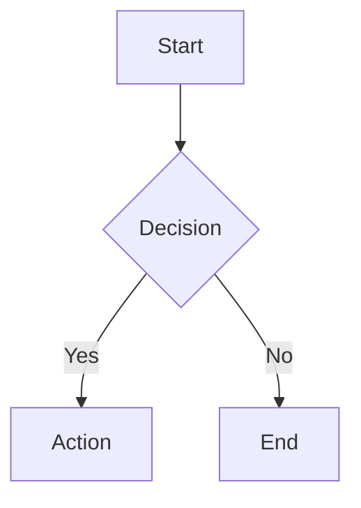

# WORK SESSION (0700-0800)

**Generated:** 2026-03-31T05:07:52.427Z
**Work Period:** 0700-0800
**Focus:** Live session logging
**Duration:** ~60 minutes

---

## Session Overview

This session captures real-time tool interactions and exchanges.

---

## Key Activities

<a name="ps_1774933672427"></a>
## Prompt Set (ps_1774933672427)

**Time:** 2026-03-31T05:07:52.427Z
**Duration:** 0ms
**Tool Calls:** 0

### Text Exchange - 2026-03-31 05:07:52 UTC [07:07:52 CEST]

**User Message:** resume

**Type:** Text-only exchange (no tool calls)

---

---

<a name="ps_1774933681524"></a>
## Prompt Set (ps_1774933681524)

**Time:** 2026-03-31T05:08:01.524Z
**Duration:** 0ms
**Tool Calls:** 8

### Text Exchange - 2026-03-31 05:08:01 UTC [07:08:01 CEST]

**Assistant Response:** Resuming. Two agents failed yesterday (ConnectionRefused). Let me read the sources directly.


**Type:** Text-only exchange (no tool calls)

---

### Read - 2026-03-31 05:08:01 UTC [07:08:01 CEST]

**System Action:** (Initiated automatically)

**Tool:** Read
**Input:** ```json
{
  "file_path": "/Users/<USER_ID_REDACTED>/Agentic/_work/rapid-automations/.specstory/history/2026-03-30_1500-1600_c197ef.md",
  "limit": 150
}
```

**Result:** ✅ Success
**Output:** ```
1	# WORK SESSION (1500-1600)
2	
3	**Generated:** 2026-03-30T13:00:27.845Z
4	**Work Period:** 1500-1600
5	**Focus:** Live session logging
6	**Duration:** ~60 minutes
7	
8	---
9	
10	## Session Overview
11	
12	This session captures real-time tool interactions and exchanges.
13	
14	---
15	
16	## Key Activities
17	
18	<a name="ps_1774875627845"></a>
19	## Prompt Set (ps_1774875627845)
20	
21	**Time:** 2026-03-30T13:00:27.845Z
22	**Duration:** 0ms
23	**Tool Calls:** 3
24	
25	### grep - 2026-03-30 13:0
...[truncated]
```


---

### Read - 2026-03-31 05:08:01 UTC [07:08:01 CEST]

**System Action:** (Initiated automatically)

**Tool:** Read
**Input:** ```json
{
  "file_path": "/Users/<USER_ID_REDACTED>/Agentic/_work/rapid-automations/.specstory/history/2026-03-30_1400-1500_c197ef.md",
  "limit": 100
}
```

**Result:** ❌ Error

---

### Read - 2026-03-31 05:08:01 UTC [07:08:01 CEST]

**System Action:** (Initiated automatically)

**Tool:** Read
**Input:** ```json
{
  "file_path": "/Users/<USER_ID_REDACTED>/Agentic/_work/rapid-automations/.specstory/history/2026-03-30_1500-1600_c197ef.md",
  "limit": 150
}
```

**Result:** ✅ Success
**Output:** ```
1	# WORK SESSION (1500-1600)
2	
3	**Generated:** 2026-03-30T13:00:27.845Z
4	**Work Period:** 1500-1600
5	**Focus:** Live session logging
6	**Duration:** ~60 minutes
7	
8	---
9	
10	## Session Overview
11	
12	This session captures real-time tool interactions and exchanges.
13	
14	---
15	
16	## Key Activities
17	
18	<a name="ps_1774875627845"></a>
19	## Prompt Set (ps_1774875627845)
20	
21	**Time:** 2026-03-30T13:00:27.845Z
22	**Duration:** 0ms
23	**Tool Calls:** 3
24	
25	### grep - 2026-03-30 13:0
...[truncated]
```


---

### Read - 2026-03-31 05:08:01 UTC [07:08:01 CEST]

**System Action:** (Initiated automatically)

**Tool:** Read
**Input:** ```json
{
  "file_path": "/Users/<USER_ID_REDACTED>/Agentic/_work/rapid-automations/.specstory/history/2026-03-30_1400-1500_c197ef.md",
  "limit": 100
}
```

**Result:** ✅ Success
**Output:** ```
1	# WORK SESSION (1400-1500)
2	
3	**Generated:** 2026-03-30T12:00:04.485Z
4	**Work Period:** 1400-1500
5	**Focus:** Live session logging
6	**Duration:** ~60 minutes
7	
8	---
9	
10	## Session Overview
11	
12	This session captures real-time tool interactions and exchanges.
13	
14	---
15	
16	## Key Activities
17	
18	<a name="ps_1774872004485"></a>
19	## Prompt Set (ps_1774872004485)
20	
21	**Time:** 2026-03-30T12:00:04.485Z
22	**Duration:** 0ms
23	**Tool Calls:** 2
24	
25	### read - 2026-03-30 12:0
...[truncated]
```


---

### Bash - 2026-03-31 05:08:01 UTC [07:08:01 CEST]

**System Action:** (Initiated automatically)

**Tool:** Bash
**Input:** ```json
{
  "command": "find /Users/<USER_ID_REDACTED>/Agentic/_work/rapid-automations/integrations/operational-knowledge-management -maxdepth 1 2>/dev/null | head -20; echo \"===\"; find /Users/<USER_ID_REDACTED>/Agentic/_work/rapid-automations/integrations/operational-knowledge-management/src/llm -type f 2>/dev/null | head -20",
  "description": "Find OKM LLM files"
}
```

**Result:** ❌ Error

---

### Read - 2026-03-31 05:08:01 UTC [07:08:01 CEST]

**System Action:** (Initiated automatically)

**Tool:** Read
**Input:** ```json
{
  "file_path": "/Users/<USER_ID_REDACTED>/Agentic/_work/rapid-automations/.specstory/history/2026-03-30_1500-1600_c197ef.md",
  "limit": 150
}
```

**Result:** ✅ Success
**Output:** ```
1	# WORK SESSION (1500-1600)
2	
3	**Generated:** 2026-03-30T13:00:27.845Z
4	**Work Period:** 1500-1600
5	**Focus:** Live session logging
6	**Duration:** ~60 minutes
7	
8	---
9	
10	## Session Overview
11	
12	This session captures real-time tool interactions and exchanges.
13	
14	---
15	
16	## Key Activities
17	
18	<a name="ps_1774875627845"></a>
19	## Prompt Set (ps_1774875627845)
20	
21	**Time:** 2026-03-30T13:00:27.845Z
22	**Duration:** 0ms
23	**Tool Calls:** 3
24	
25	### grep - 2026-03-30 13:0
...[truncated]
```


---

### Read - 2026-03-31 05:08:01 UTC [07:08:01 CEST]

**System Action:** (Initiated automatically)

**Tool:** Read
**Input:** ```json
{
  "file_path": "/Users/<USER_ID_REDACTED>/Agentic/_work/rapid-automations/.specstory/history/2026-03-30_1400-1500_c197ef.md",
  "limit": 100
}
```

**Result:** ✅ Success
**Output:** ```
1	# WORK SESSION (1400-1500)
2	
3	**Generated:** 2026-03-30T12:00:04.485Z
4	**Work Period:** 1400-1500
5	**Focus:** Live session logging
6	**Duration:** ~60 minutes
7	
8	---
9	
10	## Session Overview
11	
12	This session captures real-time tool interactions and exchanges.
13	
14	---
15	
16	## Key Activities
17	
18	<a name="ps_1774872004485"></a>
19	## Prompt Set (ps_1774872004485)
20	
21	**Time:** 2026-03-30T12:00:04.485Z
22	**Duration:** 0ms
23	**Tool Calls:** 2
24	
25	### read - 2026-03-30 12:0
...[truncated]
```


---

### Bash - 2026-03-31 05:08:01 UTC [07:08:01 CEST]

**System Action:** (Initiated automatically)

**Tool:** Bash
**Input:** ```json
{
  "command": "find /Users/<USER_ID_REDACTED>/Agentic/_work/rapid-automations/integrations/operational-knowledge-management -maxdepth 1 2>/dev/null | head -20; echo \"===\"; find /Users/<USER_ID_REDACTED>/Agentic/_work/rapid-automations/integrations/operational-knowledge-management/src/llm -type f 2>/dev/null | head -20",
  "description": "Find OKM LLM files"
}
```

**Result:** ✅ Success
**Output:** ```
/Users/<USER_ID_REDACTED>/Agentic/_work/rapid-automations/integrations/operational-knowledge-management
/Users/<USER_ID_REDACTED>/Agentic/_work/rapid-automations/integrations/operational-knowledge-management/docker
/Users/<USER_ID_REDACTED>/Agentic/_work/rapid-automations/integrations/operational-knowledge-management/.DS_Store
/Users/<USER_ID_REDACTED>/Agentic/_work/rapid-automations/integrations/operational-knowledge-management/bin
/Users/<USER_ID_REDACTED>/Agentic/_work/rapid-automations/integrations/operational-knowledge-management/dist
/Users/Q2
...[truncated]
```


---

---

<a name="ps_1774933694593"></a>
## Prompt Set (ps_1774933694593)

**Time:** 2026-03-31T05:08:14.593Z
**Duration:** 0ms
**Tool Calls:** 3

### Read - 2026-03-31 05:08:14 UTC [07:08:14 CEST]

**System Action:** (Initiated automatically)

**Tool:** Read
**Input:** ```json
{
  "file_path": "/Users/<USER_ID_REDACTED>/Agentic/_work/rapid-automations/integrations/operational-knowledge-management/src/llm/providers/copilot-provider.ts"
}
```

**Result:** ❌ Error

---

### Read - 2026-03-31 05:08:14 UTC [07:08:14 CEST]

**System Action:** (Initiated automatically)

**Tool:** Read
**Input:** ```json
{
  "file_path": "/Users/<USER_ID_REDACTED>/Agentic/_work/rapid-automations/integrations/operational-knowledge-management/src/llm/providers/copilot-provider.ts"
}
```

**Result:** ❌ Error

---

### Read - 2026-03-31 05:08:14 UTC [07:08:14 CEST]

**System Action:** (Initiated automatically)

**Tool:** Read
**Input:** ```json
{
  "file_path": "/Users/<USER_ID_REDACTED>/Agentic/_work/rapid-automations/integrations/operational-knowledge-management/src/llm/providers/claude-code-provider.ts"
}
```

**Result:** ❌ Error

---

---

<a name="ps_1774933709227"></a>
## Prompt Set (ps_1774933709227)

**Time:** 2026-03-31T05:08:29.227Z
**Duration:** 0ms
**Tool Calls:** 4

### Text Exchange - 2026-03-31 05:08:29 UTC [07:08:29 CEST]

**Assistant Response:** Now let me check what's different in the coding project's version.


**Type:** Text-only exchange (no tool calls)

---

### Read - 2026-03-31 05:08:29 UTC [07:08:29 CEST]

**System Action:** (Initiated automatically)

**Tool:** Read
**Input:** ```json
{
  "file_path": "<AWS_SECRET_REDACTED>oviders/copilot-provider.ts",
  "limit": 50
}
```

**Result:** ❌ Error

---

### Read - 2026-03-31 05:08:29 UTC [07:08:29 CEST]

**System Action:** (Initiated automatically)

**Tool:** Read
**Input:** ```json
{
  "file_path": "<AWS_SECRET_REDACTED>oviders/claude-code-provider.ts",
  "limit": 50
}
```

**Result:** ❌ Error

---

### Read - 2026-03-31 05:08:29 UTC [07:08:29 CEST]

**System Action:** (Initiated automatically)

**Tool:** Read
**Input:** ```json
{
  "file_path": "<AWS_SECRET_REDACTED>oviders/copilot-provider.ts",
  "limit": 50
}
```

**Result:** ✅ Success
**Output:** ```
1	/**
2	 * GitHub Copilot Provider
3	 *
4	 * Routes LLM requests through the `copilot-cli` command (GitHub Copilot subscription).
5	 * Zero per-token cost, automatic quota detection, falls back to API on exhaustion.
6	 */
7	
8	import { CLIProviderBase } from './cli-provider-base.js';
9	import type { LLMCompletionRequest, LLMCompletionResult, ProviderConfig, ProviderName } from '../types.js';
10	
11	export class CopilotProvider extends CLIProviderBase {
12	  readonly name: ProviderName = 'copilot
...[truncated]
```


---

### Read - 2026-03-31 05:08:29 UTC [07:08:29 CEST]

**System Action:** (Initiated automatically)

**Tool:** Read
**Input:** ```json
{
  "file_path": "<AWS_SECRET_REDACTED>oviders/claude-code-provider.ts",
  "limit": 50
}
```

**Result:** ✅ Success
**Output:** ```
1	/**
2	 * Claude Code Provider
3	 *
4	 * Routes LLM requests through the `claude` CLI (Claude Code subscription).
5	 * Zero per-token cost, automatic quota detection, falls back to API on exhaustion.
6	 */
7	
8	import { CLIProviderBase } from './cli-provider-base.js';
9	import type { LLMCompletionRequest, LLMCompletionResult, ProviderConfig, ProviderName } from '../types.js';
10	
11	export class ClaudeCodeProvider extends CLIProviderBase {
12	  readonly name: ProviderName = 'claude-code';
13	  
...[truncated]
```


---

---

<a name="ps_1774933719287"></a>
## Prompt Set (ps_1774933719287)

**Time:** 2026-03-31T05:08:39.287Z
**Duration:** 0ms
**Tool Calls:** 4

### Text Exchange - 2026-03-31 05:08:39 UTC [07:08:39 CEST]

**Assistant Response:** Now I see the divergence clearly. Let me also check the OKM docs and the LSL for the summary of what changed.


**Type:** Text-only exchange (no tool calls)

---

### Bash - 2026-03-31 05:08:39 UTC [07:08:39 CEST]

**System Action:** (Initiated automatically)

**Tool:** Bash
**Input:** ```json
{
  "command": "find /Users/<USER_ID_REDACTED>/Agentic/_work/rapid-automations/integrations/operational-knowledge-management/docs -type f -name \"*.md\" 2>/dev/null | head -10",
  "description": "Find OKM docs"
}
```

**Result:** ❌ Error

---

### Bash - 2026-03-31 05:08:39 UTC [07:08:39 CEST]

**System Action:** (Initiated automatically)

**Tool:** Bash
**Input:** ```json
{
  "command": "find /Users/<USER_ID_REDACTED>/Agentic/_work/rapid-automations/integrations/operational-knowledge-management/docs -type f -name \"*.md\" 2>/dev/null | head -10",
  "description": "Find OKM docs"
}
```

**Result:** ✅ Success
**Output:** ```
/Users/<USER_ID_REDACTED>/Agentic/_work/rapid-automations/integrations/operational-knowledge-management/docs/ontology.md
/Users/<USER_ID_REDACTED>/Agentic/_work/rapid-automations/integrations/operational-knowledge-management/docs/architecture.md
/Users/<USER_ID_REDACTED>/Agentic/_work/rapid-automations/integrations/operational-knowledge-management/docs/llm-providers.md
/Users/<USER_ID_REDACTED>/Agentic/_work/rapid-automations/integrations/operational-knowledge-management/docs/cli.md
/Users/<USER_ID_REDACTED>/Agentic/_work/rapid-automations/integrati
...[truncated]
```


---

### Bash - 2026-03-31 05:08:39 UTC [07:08:39 CEST]

**System Action:** (Initiated automatically)

**Tool:** Bash
**Input:** ```json
{
  "command": "find /Users/<USER_ID_REDACTED>/Agentic/_work/rapid-automations/integrations/operational-knowledge-management/docs -type f -name \"*.md\" 2>/dev/null | head -10",
  "description": "Find OKM docs"
}
```

**Result:** ✅ Success
**Output:** ```
/Users/<USER_ID_REDACTED>/Agentic/_work/rapid-automations/integrations/operational-knowledge-management/docs/ontology.md
/Users/<USER_ID_REDACTED>/Agentic/_work/rapid-automations/integrations/operational-knowledge-management/docs/architecture.md
/Users/<USER_ID_REDACTED>/Agentic/_work/rapid-automations/integrations/operational-knowledge-management/docs/llm-providers.md
/Users/<USER_ID_REDACTED>/Agentic/_work/rapid-automations/integrations/operational-knowledge-management/docs/cli.md
/Users/<USER_ID_REDACTED>/Agentic/_work/rapid-automations/integrati
...[truncated]
```


---

### Grep - 2026-03-31 05:08:39 UTC [07:08:39 CEST]

**System Action:** (Initiated automatically)

**Tool:** Grep
**Input:** ```json
{
  "pattern": "direct HTTP|corporate endpoint|auth.json|OAuth token|copilot-api|subscription rework",
  "path": "/Users/<USER_ID_REDACTED>/Agentic/_work/rapid-automations/.specstory/history/2026-03-30_1300-1400_c197ef.md",
  "output_mode": "content",
  "-i": true,
  "head_limit": 30
}
```

**Result:** ✅ Success
**Output:** ```
352:┌  Credentials ~/.local/share/opencode/auth.json
394:[Omitted long matching line]
395:  "description": "Read opencode auth.json structure (redacted)"
435:[Omitted long matching line]
436:  "description": "Test Copilot token exchange with OAuth tokens"
1176:[Omitted long matching line]
1264:  "command": "# The OAuth token needs to be exchanged for a Copilot-specific token\n# Let's check how opencode does this - search for token exchange in its JS\nstrings ~/.opencode/bin/opencode 2>/dev/
...[truncated]
```


---

---

<a name="ps_1774933727846"></a>
## Prompt Set (ps_1774933727846)

**Time:** 2026-03-31T05:08:47.846Z
**Duration:** 0ms
**Tool Calls:** 1

### Read - 2026-03-31 05:08:47 UTC [07:08:47 CEST]

**System Action:** (Initiated automatically)

**Tool:** Read
**Input:** ```json
{
  "file_path": "/Users/<USER_ID_REDACTED>/Agentic/_work/rapid-automations/integrations/operational-knowledge-management/docs/llm-providers.md"
}
```

**Result:** ✅ Success
**Output:** ```
1	# LLM Provider Stack
2	
3	## Overview
4	
5	OKB uses a multi-provider LLM stack with automatic failover. Providers are tried in priority order; if one fails, the next is attempted. A circuit breaker prevents repeated calls to failing providers.
6	
7	The primary providers are **subscription-based** (zero per-token cost):
8	
9	| Priority | Provider | Subscription | Method | Latency |
10	|----------|----------|-------------|--------|---------|
11	| 1 | GitHub Copilot | Copilot Enterprise | Direct 
...[truncated]
```


---

---

<a name="ps_1774933748558"></a>
## Prompt Set (ps_1774933748558)

**Time:** 2026-03-31T05:09:08.558Z
**Duration:** 0ms
**Tool Calls:** 0

### Text Exchange - 2026-03-31 05:09:08 UTC [07:09:08 CEST]

**Assistant Response:** Now I have the full picture. Here's the summary of the rework and the divergence:

## LLM Subscription Rework Summary

### What Changed in OKM (rapid-automations)

The OKM subscription providers were **completely rewritten** to eliminate SDK/CLI overhead:

**Copilot Provider** — SDK → Direct HTTP:
- **Old**: Used `@github/copilot-sdk` which spawns a `copilot-cli` subprocess via JSON-RPC (~30s+ overhead)
- **New**: Direct HTTP POST to `https://copilot-api.<COMPANY_NAME_REDACTED>.ghe.com/chat/completions` (~2s)
- **A...

**Type:** Text-only exchange (no tool calls)

---

---

<a name="ps_1774933856900"></a>
## Prompt Set (ps_1774933856900)

**Time:** 2026-03-31T05:10:56.900Z
**Duration:** 0ms
**Tool Calls:** 0

### Text Exchange - 2026-03-31 05:10:56 UTC [07:10:56 CEST]

**User Message:** yes - update before proceeding (incl. all related docs and their puml/png's)

**Type:** Text-only exchange (no tool calls)

---

---

<a name="ps_1774933868938"></a>
## Prompt Set (ps_1774933868938)

**Time:** 2026-03-31T05:11:08.938Z
**Duration:** 0ms
**Tool Calls:** 1

### Skill - 2026-03-31 05:11:08 UTC [07:11:08 CEST]

**System Action:** (Initiated automatically)

**Tool:** Skill
**Input:** ```json
{
  "skill": "documentation-style"
}
```

**Result:** ✅ Success
**Output:** ```
Launching skill: documentation-style
```


---

---

<a name="ps_1774933869448"></a>
## Prompt Set (ps_1774933869448)

**Time:** 2026-03-31T05:11:09.448Z
**Duration:** 0ms
**Tool Calls:** 3

### Read - 2026-03-31 05:11:09 UTC [07:11:09 CEST]

**User Request:** # Documentation Style Guide

Enforce consistent styling for documentation artifacts (PlantUML, Mermaid, markdown, PNG diagrams).

## Instructions

When creating or modifying documentation artifacts, follow these guidelines strictly.

---

## PlantUML Diagrams (.puml)

### File Naming Convention

**CRITICAL**: Use kebab-case, descriptive names. NEVER use incremental suffixes.

**Correct**:
- `health-verification-flow.puml`
- `knowledge-architecture.puml`
- `constraint-monitor-components.puml`

**WRONG** (constraint violation):
- `health-verification-flow-2.puml`
- `knowledge-architecture-v2.puml`
- `constraint-monitor-components-new.puml`

If updating an existing diagram, **modify the existing file** rather than creating a new version.

### Standard Style Include

All PlantUML files MUST include the standard style at the top:

```plantuml
@startuml diagram-name
!include _standard-style.puml

' ... diagram content ...

@enduml
```

The style file is located at:
- `docs/puml/_standard-style.puml`
- `docs/presentation/puml/_standard-style.puml`

### Layout Guidelines

1. **Prefer vertical layouts** - Avoid excessive width that requires horizontal scrolling
2. **Use `top to bottom direction`** for most diagrams
3. **Use `left to right direction`** only for sequence diagrams or when horizontal flow is semantically meaningful
4. **Group related components** using packages or rectangles

### Component Stereotypes

Use these stereotypes for consistent coloring:

| Stereotype | Color | Use For |
|------------|-------|---------|
| `<<api>>` | Light Blue | API endpoints, REST interfaces |
| `<<core>>` | Light Green | Core business logic |
| `<<storage>>` | Light Yellow | Databases, file storage |
| `<<cli>>` | Light Pink | Command-line interfaces |
| `<<util>>` | Light Gray | Utility/helper components |
| `<<agent>>` | Soft Blue | AI agents, autonomous components |
| `<<infra>>` | Light <COMPANY_NAME_REDACTED> | Infrastructure components |
| `<<external>>` | Neutral Gray | External systems |

### Arrow Macros

Use defined macros for consistent arrow styling:

```plantuml
SYNC_LINE     ' Red solid line - synchronous calls
ASYNC_LINE    ' Green dashed - async/event-based
DATA_LINE     ' <COMPANY_NAME_REDACTED> solid - data flow
CONTROL_LINE  ' Purple solid - control flow
OPTIONAL_LINE ' Gray dotted - optional paths
```

---

## PNG Generation

### Generating PNGs from PlantUML

Use the `plantuml` command-line tool (installed via Homebrew):

```bash
# Local generation using plantuml CLI (preferred)
plantuml -tpng docs/puml/diagram-name.puml -o ../images/

# Generate all diagrams in a directory
plantuml -tpng docs/puml/*.puml -o ../images/

# Or use the docs script if available
./scripts/generate-diagrams.sh
```

**Note:** The `plantuml` CLI is installed via `brew install plantuml` and handles Java dependencies automatically.

### PNG Naming

PNG files should match their source PUML file:
- `health-verification-flow.puml` → `health-verification-flow.png`

### Output Location

PNGs should be generated to:
- `docs/images/` - For markdown documentation references
- `docs/presentation/images/` - For presentation diagrams

---

## Mermaid Diagrams

### Inline in Markdown

Use fenced code blocks with `mermaid` language:

```markdown

```

### Style Guidelines

1. Use clear, descriptive node labels
2. Keep diagrams focused - split large diagrams into multiple
3. Use subgraphs for logical grouping
4. Prefer `graph TD` (top-down) over `graph LR` (left-right) for readability

---

## Markdown Documentation

### File Naming

- Use kebab-case: `api-quota-checker.md`
- Use `README.md` for directory index files
- Never use spaces or special characters

### Structure

1. Start with H1 title matching the topic
2. Include brief overview paragraph
3. Use H2 for major sections
4. Use H3 for subsections
5. Include code examples where applicable

### Links

- Use relative paths for internal links: `[Status Line](./status-line.md)`
- Use absolute URLs for external links
- Verify links work before committing

---

## Validation Workflow

Before committing documentation changes:

1. **PlantUML**: Verify syntax by generating PNG
2. **Mermaid**: Preview in VS Code or GitHub
3. **Markdown**: Check rendering in preview
4. **Links**: Verify all internal links work
5. **Images**: Ensure referenced images exist

---

## Common Violations to Avoid

1. **Incremental naming** (`-2`, `-v2`, `-new` suffixes)
2. **Missing style include** in PlantUML
3. **Horizontal-heavy layouts** causing scroll
4. **Orphaned images** (PNG without source PUML)
5. **Broken internal links**
6. **Inconsistent component colors** (not using stereotypes)

---

## Quick Reference

| Artifact | Location | Naming | Style |
|----------|----------|--------|-------|
| PlantUML | `docs/puml/` | kebab-case.puml | Include `_standard-style.puml` |
| PNG | `docs/images/` | match-source.png | Generated from PUML |
| Markdown | `docs/*/` | kebab-case.md | H1 title, H2 sections |
| Mermaid | Inline | N/A | graph TD preferred |

**Tool:** Read
**Input:** ```json
{
  "file_path": "<AWS_SECRET_REDACTED>oviders/copilot-provider.ts"
}
```

**Result:** ✅ Success
**Output:** ```
1	/**
2	 * GitHub Copilot Provider
3	 *
4	 * Routes LLM requests through the `copilot-cli` command (GitHub Copilot subscription).
5	 * Zero per-token cost, automatic quota detection, falls back to API on exhaustion.
6	 */
7	
8	import { CLIProviderBase } from './cli-provider-base.js';
9	import type { LLMCompletionRequest, LLMCompletionResult, ProviderConfig, ProviderName } from '../types.js';
10	
11	export class CopilotProvider extends CLIProviderBase {
12	  readonly name: ProviderName = 'copilot
...[truncated]
```


---

### Read - 2026-03-31 05:11:09 UTC [07:11:09 CEST]

**User Request:** # Documentation Style Guide

Enforce consistent styling for documentation artifacts (PlantUML, Mermaid, markdown, PNG diagrams).

## Instructions

When creating or modifying documentation artifacts, follow these guidelines strictly.

---

## PlantUML Diagrams (.puml)

### File Naming Convention

**CRITICAL**: Use kebab-case, descriptive names. NEVER use incremental suffixes.

**Correct**:
- `health-verification-flow.puml`
- `knowledge-architecture.puml`
- `constraint-monitor-components.puml`

**WRONG** (constraint violation):
- `health-verification-flow-2.puml`
- `knowledge-architecture-v2.puml`
- `constraint-monitor-components-new.puml`

If updating an existing diagram, **modify the existing file** rather than creating a new version.

### Standard Style Include

All PlantUML files MUST include the standard style at the top:

```plantuml
@startuml diagram-name
!include _standard-style.puml

' ... diagram content ...

@enduml
```

The style file is located at:
- `docs/puml/_standard-style.puml`
- `docs/presentation/puml/_standard-style.puml`

### Layout Guidelines

1. **Prefer vertical layouts** - Avoid excessive width that requires horizontal scrolling
2. **Use `top to bottom direction`** for most diagrams
3. **Use `left to right direction`** only for sequence diagrams or when horizontal flow is semantically meaningful
4. **Group related components** using packages or rectangles

### Component Stereotypes

Use these stereotypes for consistent coloring:

| Stereotype | Color | Use For |
|------------|-------|---------|
| `<<api>>` | Light Blue | API endpoints, REST interfaces |
| `<<core>>` | Light Green | Core business logic |
| `<<storage>>` | Light Yellow | Databases, file storage |
| `<<cli>>` | Light Pink | Command-line interfaces |
| `<<util>>` | Light Gray | Utility/helper components |
| `<<agent>>` | Soft Blue | AI agents, autonomous components |
| `<<infra>>` | Light <COMPANY_NAME_REDACTED> | Infrastructure components |
| `<<external>>` | Neutral Gray | External systems |

### Arrow Macros

Use defined macros for consistent arrow styling:

```plantuml
SYNC_LINE     ' Red solid line - synchronous calls
ASYNC_LINE    ' Green dashed - async/event-based
DATA_LINE     ' <COMPANY_NAME_REDACTED> solid - data flow
CONTROL_LINE  ' Purple solid - control flow
OPTIONAL_LINE ' Gray dotted - optional paths
```

---

## PNG Generation

### Generating PNGs from PlantUML

Use the `plantuml` command-line tool (installed via Homebrew):

```bash
# Local generation using plantuml CLI (preferred)
plantuml -tpng docs/puml/diagram-name.puml -o ../images/

# Generate all diagrams in a directory
plantuml -tpng docs/puml/*.puml -o ../images/

# Or use the docs script if available
./scripts/generate-diagrams.sh
```

**Note:** The `plantuml` CLI is installed via `brew install plantuml` and handles Java dependencies automatically.

### PNG Naming

PNG files should match their source PUML file:
- `health-verification-flow.puml` → `health-verification-flow.png`

### Output Location

PNGs should be generated to:
- `docs/images/` - For markdown documentation references
- `docs/presentation/images/` - For presentation diagrams

---

## Mermaid Diagrams

### Inline in Markdown

Use fenced code blocks with `mermaid` language:

```markdown

```

### Style Guidelines

1. Use clear, descriptive node labels
2. Keep diagrams focused - split large diagrams into multiple
3. Use subgraphs for logical grouping
4. Prefer `graph TD` (top-down) over `graph LR` (left-right) for readability

---

## Markdown Documentation

### File Naming

- Use kebab-case: `api-quota-checker.md`
- Use `README.md` for directory index files
- Never use spaces or special characters

### Structure

1. Start with H1 title matching the topic
2. Include brief overview paragraph
3. Use H2 for major sections
4. Use H3 for subsections
5. Include code examples where applicable

### Links

- Use relative paths for internal links: `[Status Line](./status-line.md)`
- Use absolute URLs for external links
- Verify links work before committing

---

## Validation Workflow

Before committing documentation changes:

1. **PlantUML**: Verify syntax by generating PNG
2. **Mermaid**: Preview in VS Code or GitHub
3. **Markdown**: Check rendering in preview
4. **Links**: Verify all internal links work
5. **Images**: Ensure referenced images exist

---

## Common Violations to Avoid

1. **Incremental naming** (`-2`, `-v2`, `-new` suffixes)
2. **Missing style include** in PlantUML
3. **Horizontal-heavy layouts** causing scroll
4. **Orphaned images** (PNG without source PUML)
5. **Broken internal links**
6. **Inconsistent component colors** (not using stereotypes)

---

## Quick Reference

| Artifact | Location | Naming | Style |
|----------|----------|--------|-------|
| PlantUML | `docs/puml/` | kebab-case.puml | Include `_standard-style.puml` |
| PNG | `docs/images/` | match-source.png | Generated from PUML |
| Markdown | `docs/*/` | kebab-case.md | H1 title, H2 sections |
| Mermaid | Inline | N/A | graph TD preferred |

**Tool:** Read
**Input:** ```json
{
  "file_path": "<AWS_SECRET_REDACTED>oviders/claude-code-provider.ts"
}
```

**Result:** ✅ Success
**Output:** ```
1	/**
2	 * Claude Code Provider
3	 *
4	 * Routes LLM requests through the `claude` CLI (Claude Code subscription).
5	 * Zero per-token cost, automatic quota detection, falls back to API on exhaustion.
6	 */
7	
8	import { CLIProviderBase } from './cli-provider-base.js';
9	import type { LLMCompletionRequest, LLMCompletionResult, ProviderConfig, ProviderName } from '../types.js';
10	
11	export class ClaudeCodeProvider extends CLIProviderBase {
12	  readonly name: ProviderName = 'claude-code';
13	  
...[truncated]
```


---

### Read - 2026-03-31 05:11:09 UTC [07:11:09 CEST]

**User Request:** # Documentation Style Guide

Enforce consistent styling for documentation artifacts (PlantUML, Mermaid, markdown, PNG diagrams).

## Instructions

When creating or modifying documentation artifacts, follow these guidelines strictly.

---

## PlantUML Diagrams (.puml)

### File Naming Convention

**CRITICAL**: Use kebab-case, descriptive names. NEVER use incremental suffixes.

**Correct**:
- `health-verification-flow.puml`
- `knowledge-architecture.puml`
- `constraint-monitor-components.puml`

**WRONG** (constraint violation):
- `health-verification-flow-2.puml`
- `knowledge-architecture-v2.puml`
- `constraint-monitor-components-new.puml`

If updating an existing diagram, **modify the existing file** rather than creating a new version.

### Standard Style Include

All PlantUML files MUST include the standard style at the top:

```plantuml
@startuml diagram-name
!include _standard-style.puml

' ... diagram content ...

@enduml
```

The style file is located at:
- `docs/puml/_standard-style.puml`
- `docs/presentation/puml/_standard-style.puml`

### Layout Guidelines

1. **Prefer vertical layouts** - Avoid excessive width that requires horizontal scrolling
2. **Use `top to bottom direction`** for most diagrams
3. **Use `left to right direction`** only for sequence diagrams or when horizontal flow is semantically meaningful
4. **Group related components** using packages or rectangles

### Component Stereotypes

Use these stereotypes for consistent coloring:

| Stereotype | Color | Use For |
|------------|-------|---------|
| `<<api>>` | Light Blue | API endpoints, REST interfaces |
| `<<core>>` | Light Green | Core business logic |
| `<<storage>>` | Light Yellow | Databases, file storage |
| `<<cli>>` | Light Pink | Command-line interfaces |
| `<<util>>` | Light Gray | Utility/helper components |
| `<<agent>>` | Soft Blue | AI agents, autonomous components |
| `<<infra>>` | Light <COMPANY_NAME_REDACTED> | Infrastructure components |
| `<<external>>` | Neutral Gray | External systems |

### Arrow Macros

Use defined macros for consistent arrow styling:

```plantuml
SYNC_LINE     ' Red solid line - synchronous calls
ASYNC_LINE    ' Green dashed - async/event-based
DATA_LINE     ' <COMPANY_NAME_REDACTED> solid - data flow
CONTROL_LINE  ' Purple solid - control flow
OPTIONAL_LINE ' Gray dotted - optional paths
```

---

## PNG Generation

### Generating PNGs from PlantUML

Use the `plantuml` command-line tool (installed via Homebrew):

```bash
# Local generation using plantuml CLI (preferred)
plantuml -tpng docs/puml/diagram-name.puml -o ../images/

# Generate all diagrams in a directory
plantuml -tpng docs/puml/*.puml -o ../images/

# Or use the docs script if available
./scripts/generate-diagrams.sh
```

**Note:** The `plantuml` CLI is installed via `brew install plantuml` and handles Java dependencies automatically.

### PNG Naming

PNG files should match their source PUML file:
- `health-verification-flow.puml` → `health-verification-flow.png`

### Output Location

PNGs should be generated to:
- `docs/images/` - For markdown documentation references
- `docs/presentation/images/` - For presentation diagrams

---

## Mermaid Diagrams

### Inline in Markdown

Use fenced code blocks with `mermaid` language:

```markdown

```

### Style Guidelines

1. Use clear, descriptive node labels
2. Keep diagrams focused - split large diagrams into multiple
3. Use subgraphs for logical grouping
4. Prefer `graph TD` (top-down) over `graph LR` (left-right) for readability

---

## Markdown Documentation

### File Naming

- Use kebab-case: `api-quota-checker.md`
- Use `README.md` for directory index files
- Never use spaces or special characters

### Structure

1. Start with H1 title matching the topic
2. Include brief overview paragraph
3. Use H2 for major sections
4. Use H3 for subsections
5. Include code examples where applicable

### Links

- Use relative paths for internal links: `[Status Line](./status-line.md)`
- Use absolute URLs for external links
- Verify links work before committing

---

## Validation Workflow

Before committing documentation changes:

1. **PlantUML**: Verify syntax by generating PNG
2. **Mermaid**: Preview in VS Code or GitHub
3. **Markdown**: Check rendering in preview
4. **Links**: Verify all internal links work
5. **Images**: Ensure referenced images exist

---

## Common Violations to Avoid

1. **Incremental naming** (`-2`, `-v2`, `-new` suffixes)
2. **Missing style include** in PlantUML
3. **Horizontal-heavy layouts** causing scroll
4. **Orphaned images** (PNG without source PUML)
5. **Broken internal links**
6. **Inconsistent component colors** (not using stereotypes)

---

## Quick Reference

| Artifact | Location | Naming | Style |
|----------|----------|--------|-------|
| PlantUML | `docs/puml/` | kebab-case.puml | Include `_standard-style.puml` |
| PNG | `docs/images/` | match-source.png | Generated from PUML |
| Markdown | `docs/*/` | kebab-case.md | H1 title, H2 sections |
| Mermaid | Inline | N/A | graph TD preferred |

**Tool:** Read
**Input:** ```json
{
  "file_path": "<AWS_SECRET_REDACTED>oviders/cli-provider-base.ts"
}
```

**Result:** ❌ Error

---

---

<a name="ps_1774933877847"></a>
## Prompt Set (ps_1774933877847)

**Time:** 2026-03-31T05:11:17.847Z
**Duration:** 0ms
**Tool Calls:** 5

### Read - 2026-03-31 05:11:17 UTC [07:11:17 CEST]

**System Action:** (Initiated automatically)

**Tool:** Read
**Input:** ```json
{
  "file_path": "/Users/<USER_ID_REDACTED>/Agentic/_work/rapid-automations/integrations/operational-knowledge-management/src/llm/providers/base-provider.ts"
}
```

**Result:** ✅ Success
**Output:** ```
1	/**
2	 * Abstract Base Provider
3	 *
4	 * All LLM providers extend this class.
5	 */
6	
7	import type { LLMProvider, LLMCompletionRequest, LLMCompletionResult, ProviderConfig, ProviderName, ModelTier } from '../types.js';
8	
9	export abstract class BaseProvider implements LLMProvider {
10	  abstract readonly name: ProviderName;
11	  abstract readonly isLocal: boolean;
12	
13	  protected config: Partial<ProviderConfig>;
14	  protected _available = false;
15	
16	  constructor(config: Partial<Pro
...[truncated]
```


---

### Read - 2026-03-31 05:11:17 UTC [07:11:17 CEST]

**System Action:** (Initiated automatically)

**Tool:** Read
**Input:** ```json
{
  "file_path": "/Users/<USER_ID_REDACTED>/Agentic/_work/rapid-automations/integrations/operational-knowledge-management/src/llm/providers/base-provider.ts"
}
```

**Result:** ✅ Success
**Output:** ```
1	/**
2	 * Abstract Base Provider
3	 *
4	 * All LLM providers extend this class.
5	 */
6	
7	import type { LLMProvider, LLMCompletionRequest, LLMCompletionResult, ProviderConfig, ProviderName, ModelTier } from '../types.js';
8	
9	export abstract class BaseProvider implements LLMProvider {
10	  abstract readonly name: ProviderName;
11	  abstract readonly isLocal: boolean;
12	
13	  protected config: Partial<ProviderConfig>;
14	  protected _available = false;
15	
16	  constructor(config: Partial<Pro
...[truncated]
```


---

### Read - 2026-03-31 05:11:17 UTC [07:11:17 CEST]

**System Action:** (Initiated automatically)

**Tool:** Read
**Input:** ```json
{
  "file_path": "/Users/<USER_ID_REDACTED>/Agentic/_work/rapid-automations/integrations/operational-knowledge-management/src/llm/providers/base-provider.ts"
}
```

**Result:** ✅ Success
**Output:** ```
1	/**
2	 * Abstract Base Provider
3	 *
4	 * All LLM providers extend this class.
5	 */
6	
7	import type { LLMProvider, LLMCompletionRequest, LLMCompletionResult, ProviderConfig, ProviderName, ModelTier } from '../types.js';
8	
9	export abstract class BaseProvider implements LLMProvider {
10	  abstract readonly name: ProviderName;
11	  abstract readonly isLocal: boolean;
12	
13	  protected config: Partial<ProviderConfig>;
14	  protected _available = false;
15	
16	  constructor(config: Partial<Pro
...[truncated]
```


---

### Bash - 2026-03-31 05:11:17 UTC [07:11:17 CEST]

**System Action:** (Initiated automatically)

**Tool:** Bash
**Input:** ```json
{
  "command": "find /Users/<USER_ID_REDACTED>/Agentic/coding/docs -name \"*.md\" -path \"*llm*\" -o -name \"*.md\" -path \"*proxy*\" -o -name \"*.md\" -path \"*provider*\" 2>/dev/null; echo \"===PUML===\"; find /Users/<USER_ID_REDACTED>/Agentic/coding/docs -name \"*.puml\" 2>/dev/null | head -20",
  "description": "Find existing LLM docs and diagrams"
}
```

**Result:** ❌ Error

---

### Read - 2026-03-31 05:11:17 UTC [07:11:17 CEST]

**System Action:** (Initiated automatically)

**Tool:** Read
**Input:** ```json
{
  "file_path": "<AWS_SECRET_REDACTED>oviders/base-provider.ts"
}
```

**Result:** ❌ Error

---

---

<a name="ps_1774934319572"></a>
## Prompt Set (ps_1774934319572)

**Time:** 2026-03-31T05:18:39.572Z
**Duration:** 0ms
**Tool Calls:** 7

### Read - 2026-03-31 05:18:39 UTC [07:18:39 CEST]

**System Action:** (Initiated automatically)

**Tool:** Read
**Input:** ```json
{
  "file_path": "<AWS_SECRET_REDACTED>ription-providers-implementation.md"
}
```

**Result:** ❌ Error

---

### Read - 2026-03-31 05:18:39 UTC [07:18:39 CEST]

**System Action:** (Initiated automatically)

**Tool:** Read
**Input:** ```json
{
  "file_path": "<AWS_SECRET_REDACTED>ription-providers-implementation.md"
}
```

**Result:** ✅ Success
**Output:** ```
1	# Subscription-Based LLM Providers Implementation
2	
3	## Status: Phase 1-4 Complete
4	
5	Implementation of subscription-based LLM providers (Claude Code & GitHub Copilot) with automatic quota tracking and API fallback.
6	
7	---
8	
9	## Completed Phases
10	
11	### Phase 1: Core Provider Infrastructure
12	
13	**Files Created:**
14	1. `lib/llm/providers/cli-provider-base.ts` - Abstract base for CLI providers
15	2. `lib/llm/providers/claude-code-provider.ts` - Claude Code subscription provider
16
...[truncated]
```


---

### Bash - 2026-03-31 05:18:39 UTC [07:18:39 CEST]

**System Action:** (Initiated automatically)

**Tool:** Bash
**Input:** ```json
{
  "command": "find /Users/<USER_ID_REDACTED>/Agentic/coding/docs/puml -name \"*llm*\" -o -name \"*provider*\" -o -name \"*proxy*\" -o -name \"*subscription*\" 2>/dev/null",
  "description": "Find LLM-related PUML diagrams"
}
```

**Result:** ✅ Success
**Output:** ```
<AWS_SECRET_REDACTED>llm-mode-control.puml
<AWS_SECRET_REDACTED>local-llm-fallback.puml
<AWS_SECRET_REDACTED>llm-cli-proxy-architecture.puml
<AWS_SECRET_REDACTED>llm-provider-architecture.puml
<AWS_SECRET_REDACTED>llm-tier-routing.puml
```


---

### Read - 2026-03-31 05:18:39 UTC [07:18:39 CEST]

**System Action:** (Initiated automatically)

**Tool:** Read
**Input:** ```json
{
  "file_path": "<AWS_SECRET_REDACTED>_standard-style.puml"
}
```

**Result:** ❌ Error

---

### Read - 2026-03-31 05:18:39 UTC [07:18:39 CEST]

**System Action:** (Initiated automatically)

**Tool:** Read
**Input:** ```json
{
  "file_path": "<AWS_SECRET_REDACTED>ription-providers-implementation.md"
}
```

**Result:** ✅ Success
**Output:** ```
1	# Subscription-Based LLM Providers Implementation
2	
3	## Status: Phase 1-4 Complete
4	
5	Implementation of subscription-based LLM providers (Claude Code & GitHub Copilot) with automatic quota tracking and API fallback.
6	
7	---
8	
9	## Completed Phases
10	
11	### Phase 1: Core Provider Infrastructure
12	
13	**Files Created:**
14	1. `lib/llm/providers/cli-provider-base.ts` - Abstract base for CLI providers
15	2. `lib/llm/providers/claude-code-provider.ts` - Claude Code subscription provider
16
...[truncated]
```


---

### Bash - 2026-03-31 05:18:39 UTC [07:18:39 CEST]

**System Action:** (Initiated automatically)

**Tool:** Bash
**Input:** ```json
{
  "command": "find /Users/<USER_ID_REDACTED>/Agentic/coding/docs/puml -name \"*llm*\" -o -name \"*provider*\" -o -name \"*proxy*\" -o -name \"*subscription*\" 2>/dev/null",
  "description": "Find LLM-related PUML diagrams"
}
```

**Result:** ✅ Success
**Output:** ```
<AWS_SECRET_REDACTED>llm-mode-control.puml
<AWS_SECRET_REDACTED>local-llm-fallback.puml
<AWS_SECRET_REDACTED>llm-cli-proxy-architecture.puml
<AWS_SECRET_REDACTED>llm-provider-architecture.puml
<AWS_SECRET_REDACTED>llm-tier-routing.puml
```


---

### Read - 2026-03-31 05:18:39 UTC [07:18:39 CEST]

**System Action:** (Initiated automatically)

**Tool:** Read
**Input:** ```json
{
  "file_path": "<AWS_SECRET_REDACTED>_standard-style.puml"
}
```

**Result:** ✅ Success
**Output:** ```
1	' Use plain theme styling (compatible with PlantUML 1.2020+)
2	skinparam backgroundColor white
3	skinparam defaultFontName Arial
4	skinparam defaultFontSize 12
5	
6	' Layout recommendation: prefer vertical layouts to avoid excessive width
7	' This prevents users from needing to zoom and scroll horizontally
8	' Vertical scrolling is acceptable and preferred over horizontal scrolling
9	
10	' Component styling with professional colors
11	skinparam component {
12	  BackgroundColor<<api>> #E8F4FD
1
...[truncated]
```


---

---

<a name="ps_1774934329807"></a>
## Prompt Set (ps_1774934329807)

**Time:** 2026-03-31T05:18:49.807Z
**Duration:** 0ms
**Tool Calls:** 4

### Read - 2026-03-31 05:18:49 UTC [07:18:49 CEST]

**System Action:** (Initiated automatically)

**Tool:** Read
**Input:** ```json
{
  "file_path": "<AWS_SECRET_REDACTED>llm-provider-architecture.puml"
}
```

**Result:** ✅ Success
**Output:** ```
1	@startuml llm-provider-architecture
2	!include _standard-style.puml
3	
4	top to bottom direction
5	
6	title Unified LLM Provider Architecture (lib/llm/)
7	
8	package "Consumers" {
9	  component [SemanticAnalyzer] <<agent>>
10	  component [UnifiedInferenceEngine] <<agent>>
11	  component [SemanticValidator] <<agent>>
12	}
13	
14	package "lib/llm/ - Unified LLM Layer" {
15	  component [LLMService\nFacade] <<core>> as LLMService
16	
17	  package "Provider Registry" {
18	    component [ProviderReg
...[truncated]
```


---

### Read - 2026-03-31 05:18:49 UTC [07:18:49 CEST]

**System Action:** (Initiated automatically)

**Tool:** Read
**Input:** ```json
{
  "file_path": "<AWS_SECRET_REDACTED>llm-cli-proxy-architecture.puml"
}
```

**Result:** ❌ Error

---

### Read - 2026-03-31 05:18:49 UTC [07:18:49 CEST]

**System Action:** (Initiated automatically)

**Tool:** Read
**Input:** ```json
{
  "file_path": "<AWS_SECRET_REDACTED>llm-provider-architecture.puml"
}
```

**Result:** ✅ Success
**Output:** ```
1	@startuml llm-provider-architecture
2	!include _standard-style.puml
3	
4	top to bottom direction
5	
6	title Unified LLM Provider Architecture (lib/llm/)
7	
8	package "Consumers" {
9	  component [SemanticAnalyzer] <<agent>>
10	  component [UnifiedInferenceEngine] <<agent>>
11	  component [SemanticValidator] <<agent>>
12	}
13	
14	package "lib/llm/ - Unified LLM Layer" {
15	  component [LLMService\nFacade] <<core>> as LLMService
16	
17	  package "Provider Registry" {
18	    component [ProviderReg
...[truncated]
```


---

### Read - 2026-03-31 05:18:49 UTC [07:18:49 CEST]

**System Action:** (Initiated automatically)

**Tool:** Read
**Input:** ```json
{
  "file_path": "<AWS_SECRET_REDACTED>llm-cli-proxy-architecture.puml"
}
```

**Result:** ✅ Success
**Output:** ```
1	@startuml llm-cli-proxy-architecture
2	!include _standard-style.puml
3	
4	title LLM CLI Proxy Bridge Architecture\nHost-side HTTP bridge for Docker container CLI access
5	
6	top to bottom direction
7	
8	package "Docker Container (coding-services)" {
9	  component [Semantic Analysis\nMCP Server] as semantic <<core>>
10	  component [LLM Service\n(Provider Registry)] as llmservice <<core>>
11	  component [Claude-Code\nProvider] as claudeprov <<agent>>
12	  component [Copilot\nProvider] as copilot
...[truncated]
```


---

---

<a name="ps_1774934338446"></a>
## Prompt Set (ps_1774934338446)

**Time:** 2026-03-31T05:18:58.446Z
**Duration:** 0ms
**Tool Calls:** 0

### Text Exchange - 2026-03-31 05:18:58 UTC [07:18:58 CEST]

**Assistant Response:** Now I have the full picture. Let me execute all the changes. The key changes:

1. **Rewrite `copilot-provider.ts`** — Direct HTTP to Copilot API (read OAuth from auth.json)
2. **Rewrite `claude-code-provider.ts`** — CLI shell-out with JSON output, env cleaning
3. **Keep `cli-provider-base.ts`** — Still used by proxy fallback pattern, but providers no longer extend it
4. **Update `llm-proxy.mjs`** — Align with new provider methods
5. **Update docs and diagrams**


**Type:** Text-only exchange (no tool calls)

---

---

<a name="ps_1774934380054"></a>
## Prompt Set (ps_1774934380054)

**Time:** 2026-03-31T05:19:40.054Z
**Duration:** 0ms
**Tool Calls:** 1

### Write - 2026-03-31 05:19:40 UTC [07:19:40 CEST]

**System Action:** (Initiated automatically)

**Tool:** Write
**Input:** ```json
{
  "file_path": "<AWS_SECRET_REDACTED>oviders/copilot-provider.ts",
  "content": "/**\n * GitHub Copilot Provider (Direct HTTP)\n *\n * Uses the GitHub Copilot API directly via OpenAI-compatible HTTP endpoint.\n * Auth: reads OAuth tokens from ~/.local/share/opencode/auth.json (written by OpenCode).\n *\n * Previous design used CLIProviderBase which spawns a copilot-cli subprocess\n * via JSON-RPC — a full agent framework with 30s+ overhead per request.\n * Direct HTTP: single POST to copilot-api, ~2-5s per call.\n *\n * Network: works inside corporate network/VPN via enterprise endpoint.\n */\n\nimport fs from 'node:fs';\nimport path from 'node:path';\nimport os from 'node:os';\nimport { BaseProvider } from './base-provider.js';\nimport type { LLMCompletionRequest, LLMCompletionResult, ProviderConfig, ProviderName } from '../types.js';\n\nconst AUTH_FILE = path.join(os.homedir(), '.local', 'share', 'opencode', 'auth.json');\n\ninterface AuthState {\n  token: string | null;\n  apiBaseUrl: string | null;\n  lastLoaded: number;\n}\n\nexport class CopilotProvider extends BaseProvider {\n  readonly name: ProviderName = 'copilot';\n  readonly isLocal = false;\n\n  private auth: AuthState = { token: null, apiBaseUrl: null, lastLoaded: 0 };\n  private useProxy = false;\n\n  constructor(config: Partial<ProviderConfig> = {}) {\n    super({\n      models: {\n        fast: 'claude-haiku-4.5',\n        standard: 'claude-sonnet-4.6',\n        premium: 'claude-opus-4.6',\n      },\n      defaultModel: 'claude-sonnet-4.6',\n      timeout: 120000,\n      ...config,\n    });\n  }\n\n  /**\n   * Load OAuth token from OpenCode's auth.json.\n   * Re-reads at most every 60 seconds.\n   */\n  private loadAuth(): AuthState {\n    const now = Date.now();\n    if (this.auth.token && (now - this.auth.lastLoaded) < 60_000) {\n      return this.auth;\n    }\n\n    try {\n      const raw = fs.readFileSync(AUTH_FILE, 'utf8');\n      const authData = JSON.parse(raw);\n      const enterprise = authData['github-copilot-enterprise'];\n      const public_ = authData['github-copilot'];\n      const entry = enterprise || public_;\n\n      if (!entry?.refresh) {\n        return this.auth;\n      }\n\n      const enterpriseUrl = entry.enterpriseUrl;\n      this.auth = {\n        token: entry.refresh,\n        apiBaseUrl: enterpriseUrl\n          ? `https://copilot-api.${enterpriseUrl}`\n          : 'https://api.githubcopilot.com',\n        lastLoaded: now,\n      };\n    } catch {\n      // File not found or parse error — keep existing state\n    }\n    return this.auth;\n  }\n\n  async initialize(): Promise<void> {\n    // In Docker, prefer proxy (host has the auth tokens)\n    const inDocker = !!process.env.LLM_CLI_PROXY_URL;\n\n    if (!inDocker) {\n      // Running on host — try direct HTTP with local auth token\n      const auth = this.loadAuth();\n      if (auth.token) {\n        try {\n          const controller = new AbortController();\n          const timer = setTimeout(() => controller.abort(), 10_000);\n          const response = await fetch(`${auth.apiBaseUrl}/models`, {\n            headers: {\n              'Authorization': `Bearer ${auth.token}`,\n              'User-Agent': 'opencode/1.0',\n              'Openai-Intent': 'conversation-edits',\n            },\n            signal: controller.signal,\n          });\n          clearTimeout(timer);\n\n          if (response.ok) {\n            this._available = true;\n            this.useProxy = false;\n            process.stderr.write(`[llm:copilot] Provider initialized (direct HTTP → ${auth.apiBaseUrl})\\n`);\n            return;\n          }\n        } catch {\n          // Direct HTTP failed — try proxy\n        }\n      }\n    }\n\n    // Proxy bridge (for Docker containers)\n    const proxyAvailable = await this.checkProxyAvailable();\n    if (proxyAvailable) {\n      this._available = true;\n      this.useProxy = true;\n      process.stderr.write('[llm:copilot] Provider initialized (HTTP proxy → direct HTTP on host)\\n');\n      return;\n    }\n\n    process.stderr.write('[llm:copilot] Neither direct HTTP nor proxy available\\n');\n    this._available = false;\n  }\n\n  private async checkProxyAvailable(): Promise<boolean> {\n    const proxyUrl = process.env.LLM_CLI_PROXY_URL;\n    if (!proxyUrl) return false;\n    try {\n      const controller = new AbortController();\n      const timeout = setTimeout(() => controller.abort(), 5000);\n      const response = await fetch(`${proxyUrl}/health`, { signal: controller.signal });\n      clearTimeout(timeout);\n      if (!response.ok) return false;\n      const data = (await response.json()) as { providers?: Record<string, { available?: boolean }> };\n      return data.providers?.copilot?.available === true;\n    } catch {\n      return false;\n    }\n  }\n\n  async complete(request: LLMCompletionRequest): Promise<LLMCompletionResult> {\n    if (!this._available) {\n      throw new Error('GitHub Copilot provider not available');\n    }\n\n    if (this.useProxy) {\n      return this.completeViaProxy(request);\n    }\n\n    return this.completeDirectHTTP(request);\n  }\n\n  /**\n   * Direct HTTP call to Copilot API (OpenAI-compatible endpoint).\n   * Single POST, no SDK, no subprocess, no agent overhead.\n   */\n  private async completeDirectHTTP(request: LLMCompletionRequest): Promise<LLMCompletionResult> {\n    const auth = this.loadAuth();\n    if (!auth.token || !auth.apiBaseUrl) {\n      throw new Error('AUTH_ERROR: No Copilot OAuth token available');\n    }\n\n    const model = this.resolveModel(request.tier);\n    const timeoutMs = request.timeout || this.config.timeout || 120000;\n    const controller = new AbortController();\n    const timer = setTimeout(() => controller.abort(), timeoutMs);\n\n    const body: Record<string, unknown> = {\n      model,\n      messages: request.messages.map(m => ({ role: m.role, content: m.content })),\n      max_tokens: request.maxTokens || 4096,\n      stream: false,\n    };\n\n    if (request.temperature !== undefined) {\n      body.temperature = request.temperature;\n    }\n    if (request.responseFormat?.type === 'json_object') {\n      body.response_format = { type: 'json_object' };\n    }\n\n    try {\n      const startTime = Date.now();\n      const response = await fetch(`${auth.apiBaseUrl}/chat/completions`, {\n        method: 'POST',\n        headers: {\n          'Authorization': `Bearer ${auth.token}`,\n          'Content-Type': 'application/json',\n          'User-Agent': 'opencode/1.0',\n          'Openai-Intent': 'conversation-edits',\n        },\n        body: JSON.stringify(body),\n        signal: controller.signal,\n      });\n      clearTimeout(timer);\n\n      if (!response.ok) {\n        const errBody = await response.text().catch(() => '');\n        if (response.status === 401 || response.status === 403) {\n          this.auth.lastLoaded = 0; // Force re-read\n          throw new Error(`AUTH_ERROR: Copilot API returned ${response.status}: ${errBody}`);\n        }\n        if (response.status === 429) {\n          throw new Error(`QUOTA_EXHAUSTED: Copilot API rate limited: ${errBody}`);\n        }\n        throw new Error(`Copilot API error (${response.status}): ${errBody}`);\n      }\n\n      const data = await response.json() as {\n        choices: Array<{ message: { content: string } }>;\n        usage?: { prompt_tokens: number; completion_tokens: number; total_tokens: number };\n        model?: string;\n      };\n\n      const content = data.choices?.[0]?.message?.content || '';\n      const usage = data.usage;\n\n      return {\n        content,\n        provider: this.name,\n        model: data.model || model,\n        tokens: {\n          input: usage?.prompt_tokens || 0,\n          output: usage?.completion_tokens || 0,\n          total: usage?.total_tokens || 0,\n        },\n        latencyMs: Date.now() - startTime,\n        cached: false,\n        local: false,\n        mock: false,\n      };\n    } catch (error: unknown) {\n      clearTimeout(timer);\n      const msg = error instanceof Error ? error.message : String(error);\n\n      if (msg.includes('AbortError') || (error instanceof Error && error.name === 'AbortError')) {\n        throw new Error(`Copilot API timed out after ${timeoutMs}ms`);\n      }\n      throw error instanceof Error ? error : new Error(msg);\n    }\n  }\n\n  /**\n   * Complete via the host-side HTTP proxy bridge (for Docker containers).\n   */\n  private async completeViaProxy(request: LLMCompletionRequest): Promise<LLMCompletionResult> {\n    const proxyUrl = process.env.LLM_CLI_PROXY_URL;\n    if (!proxyUrl) throw new Error('LLM_CLI_PROXY_URL not configured');\n\n    const startTime = Date.now();\n    const timeoutMs = request.timeout || this.config.timeout || 120000;\n    const controller = new AbortController();\n    const timer = setTimeout(() => controller.abort(), timeoutMs);\n\n    try {\n      const response = await fetch(`${proxyUrl}/api/complete`, {\n        method: 'POST',\n        headers: { 'Content-Type': 'application/json' },\n        body: JSON.stringify({\n          provider: this.name,\n          messages: request.messages,\n          model: this.resolveModel(request.tier),\n          maxTokens: request.maxTokens || 4096,\n          temperature: request.temperature,\n        }),\n        signal: controller.signal,\n      });\n      clearTimeout(timer);\n\n      if (!response.ok) {\n        const err = (await response.json().catch(() => ({}))) as { error?: string; type?: string };\n        if (response.status === 429 || err.type === 'QUOTA_EXHAUSTED') throw new Error(`QUOTA_EXHAUSTED: ${err.error}`);\n        if (response.status === 401 || err.type === 'AUTH_ERROR') throw new Error(`AUTH_ERROR: ${err.error}`);\n        throw new Error(`Proxy error (${response.status}): ${err.error}`);\n      }\n\n      const data = (await response.json()) as {\n        content: string; model: string;\n        tokens: { input: number; output: number; total: number };\n        latencyMs: number;\n      };\n      return {\n        content: data.content, provider: this.name, model: data.model,\n        tokens: data.tokens, latencyMs: data.latencyMs || (Date.now() - startTime),\n        cached: false, local: false, mock: false,\n      };\n    } catch (error: unknown) {\n      clearTimeout(timer);\n      if (error instanceof Error && error.name === 'AbortError') throw new Error(`Proxy timed out after ${timeoutMs}ms`);\n      throw error instanceof Error ? error : new Error(String(error));\n    }\n  }\n}\n"
}
```

**Result:** ✅ Success
**Output:** ```
The file <AWS_SECRET_REDACTED>oviders/copilot-provider.ts has been updated successfully.
```


---

---

<a name="ps_1774934427504"></a>
## Prompt Set (ps_1774934427504)

**Time:** 2026-03-31T05:20:27.504Z
**Duration:** 0ms
**Tool Calls:** 3

### Write - 2026-03-31 05:20:27 UTC [07:20:27 CEST]

**System Action:** (Initiated automatically)

**Tool:** Write
**Input:** ```json
{
  "file_path": "<AWS_SECRET_REDACTED>oviders/claude-code-provider.ts",
  "content": "/**\n * Claude Code Provider (CLI-based, Claude Max OAuth)\n *\n * Shells out to the `claude` CLI in non-interactive mode (-p) to get completions.\n * This uses the user's Claude Max subscription (personal OAuth) rather than the\n * company's GitHub Copilot Enterprise quota.\n *\n * Previous design used CLIProviderBase with generic CLI spawning — no JSON output\n * parsing, no env cleaning, only token estimation. The new implementation gets\n * exact token counts from the CLI's JSON output and strips ANTHROPIC_API_KEY to\n * force subscription usage.\n *\n * CRITICAL: ANTHROPIC_API_KEY must NOT be in the env when spawning the CLI,\n * otherwise it uses the (depleted) API key instead of the Max OAuth subscription.\n *\n * Model mapping: short names (sonnet, opus, haiku) → CLI model aliases.\n * Auth: Claude Max OAuth token from macOS keychain (managed by claude CLI).\n */\n\nimport { execFile } from 'node:child_process';\nimport { promisify } from 'node:util';\nimport { BaseProvider } from './base-provider.js';\nimport type { LLMCompletionRequest, LLMCompletionResult, ProviderConfig, ProviderName, LLMMessage } from '../types.js';\n\nconst execFileAsync = promisify(execFile);\n\n/** Map tier names to CLI model aliases */\nconst MODEL_MAP: Record<string, string> = {\n  'sonnet': 'sonnet',\n  'haiku': 'haiku',\n  'opus': 'opus',\n};\n\n/** Default CLI path */\nconst CLAUDE_CLI = process.env.CLAUDE_CLI_PATH || '/opt/homebrew/bin/claude';\n\ninterface ClaudeJsonOutput {\n  type: string;\n  subtype: string;\n  is_error: boolean;\n  duration_ms: number;\n  duration_api_ms: number;\n  num_turns: number;\n  result: string;\n  stop_reason: string;\n  session_id: string;\n  total_cost_usd: number;\n  usage: {\n    input_tokens: number;\n    output_tokens: number;\n    cache_creation_input_tokens: number;\n    cache_read_input_tokens: number;\n  };\n  modelUsage?: Record<string, {\n    inputTokens: number;\n    outputTokens: number;\n    cacheReadInputTokens: number;\n    cacheCreationInputTokens: number;\n    costUSD: number;\n  }>;\n}\n\nexport class ClaudeCodeProvider extends BaseProvider {\n  readonly name: ProviderName = 'claude-code';\n  readonly isLocal = false;\n\n  private useProxy = false;\n\n  constructor(config: Partial<ProviderConfig> = {}) {\n    super({\n      models: {\n        fast: 'haiku',\n        standard: 'sonnet',\n        premium: 'opus',\n      },\n      defaultModel: 'sonnet',\n      timeout: 120000,\n      ...config,\n    });\n  }\n\n  /**\n   * Build a clean env for the claude CLI subprocess.\n   * CRITICAL: removes ANTHROPIC_API_KEY to force OAuth/Max subscription usage.\n   */\n  private buildCleanEnv(): NodeJS.ProcessEnv {\n    const env = { ...process.env };\n    delete env.ANTHROPIC_API_KEY;\n    delete env.ANTHROPIC_AUTH_TOKEN;\n    return env;\n  }\n\n  /**\n   * Resolve model name from tier\n   */\n  private resolveCliModel(tier?: string): string {\n    const shortName = this.resolveModel(tier as any);\n    return MODEL_MAP[shortName] || shortName;\n  }\n\n  /**\n   * Extract system prompt and user prompt from messages array.\n   * - system messages → joined as system prompt\n   * - user/assistant messages → concatenated as the prompt\n   */\n  private extractPrompts(messages: LLMMessage[]): { systemPrompt: string | null; userPrompt: string } {\n    const systemParts: string[] = [];\n    const userParts: string[] = [];\n\n    for (const m of messages) {\n      if (m.role === 'system') {\n        systemParts.push(m.content);\n      } else if (m.role === 'assistant') {\n        userParts.push(`Assistant: ${m.content}`);\n      } else {\n        userParts.push(m.content);\n      }\n    }\n\n    return {\n      systemPrompt: systemParts.length > 0 ? systemParts.join('\\n\\n') : null,\n      userPrompt: userParts.join('\\n\\n'),\n    };\n  }\n\n  async initialize(): Promise<void> {\n    // In Docker, use proxy (host has the CLI + keychain)\n    const inDocker = !!process.env.LLM_CLI_PROXY_URL;\n\n    if (!inDocker) {\n      // Running on host — check if claude CLI is available and authenticated\n      try {\n        const { stdout } = await execFileAsync(CLAUDE_CLI, ['auth', 'status'], {\n          timeout: 10_000,\n          env: this.buildCleanEnv(),\n        });\n\n        const authStatus = JSON.parse(stdout);\n        if (authStatus.loggedIn && authStatus.authMethod === 'claude.ai') {\n          this._available = true;\n          this.useProxy = false;\n          process.stderr.write('[llm:claude-code] Provider initialized (CLI → Claude Max OAuth)\\n');\n          return;\n        }\n\n        // Logged in but not via claude.ai OAuth — might still work\n        if (authStatus.loggedIn) {\n          this._available = true;\n          this.useProxy = false;\n          process.stderr.write(`[llm:claude-code] Provider initialized (CLI → ${authStatus.authMethod})\\n`);\n          return;\n        }\n\n        process.stderr.write(`[llm:claude-code] CLI not authenticated: ${JSON.stringify(authStatus)}\\n`);\n      } catch (err) {\n        const msg = err instanceof Error ? err.message : String(err);\n        process.stderr.write(`[llm:claude-code] CLI check failed: ${msg}\\n`);\n      }\n    }\n\n    // Proxy bridge (for Docker containers)\n    const proxyAvailable = await this.checkProxyAvailable();\n    if (proxyAvailable) {\n      this._available = true;\n      this.useProxy = true;\n      process.stderr.write('[llm:claude-code] Provider initialized (HTTP proxy → CLI on host)\\n');\n      return;\n    }\n\n    process.stderr.write('[llm:claude-code] Neither CLI nor proxy available\\n');\n    this._available = false;\n  }\n\n  private async checkProxyAvailable(): Promise<boolean> {\n    const proxyUrl = process.env.LLM_CLI_PROXY_URL;\n    if (!proxyUrl) return false;\n    try {\n      const controller = new AbortController();\n      const timeout = setTimeout(() => controller.abort(), 5000);\n      const response = await fetch(`${proxyUrl}/health`, { signal: controller.signal });\n      clearTimeout(timeout);\n      if (!response.ok) return false;\n      const data = (await response.json()) as { providers?: Record<string, { available?: boolean }> };\n      return data.providers?.['claude-code']?.available === true;\n    } catch {\n      return false;\n    }\n  }\n\n  async complete(request: LLMCompletionRequest): Promise<LLMCompletionResult> {\n    if (!this._available) {\n      throw new Error('Claude Code provider not available');\n    }\n\n    if (this.useProxy) {\n      return this.completeViaProxy(request);\n    }\n\n    return this.completeViaCLI(request);\n  }\n\n  /**\n   * Complete via the claude CLI in non-interactive mode.\n   * Spawns: claude -p <prompt> --output-format json --model <model> --tools \"\" [--system-prompt <sp>]\n   */\n  private async completeViaCLI(request: LLMCompletionRequest): Promise<LLMCompletionResult> {\n    const model = this.resolveCliModel(request.tier);\n    const { systemPrompt, userPrompt } = this.extractPrompts(request.messages);\n    const timeoutMs = request.timeout || this.config.timeout || 120000;\n\n    const args: string[] = [\n      '-p', userPrompt,\n      '--output-format', 'json',\n      '--model', model,\n      '--tools', '',          // Disable tools — we just want a completion\n      '--no-session-persistence', // Don't save ingestion sessions\n    ];\n\n    if (systemPrompt) {\n      args.push('--system-prompt', systemPrompt);\n    }\n\n    const startTime = Date.now();\n\n    try {\n      const { stdout, stderr } = await execFileAsync(CLAUDE_CLI, args, {\n        timeout: timeoutMs,\n        env: this.buildCleanEnv(),\n        maxBuffer: 10 * 1024 * 1024, // 10MB for large responses\n      });\n\n      if (stderr) {\n        process.stderr.write(`[llm:claude-code] stderr: ${stderr.trim().slice(0, 200)}\\n`);\n      }\n\n      const output: ClaudeJsonOutput = JSON.parse(stdout);\n\n      if (output.is_error) {\n        const errMsg = output.result || 'Unknown CLI error';\n        if (errMsg.toLowerCase().includes('credit balance') || errMsg.toLowerCase().includes('rate limit')) {\n          throw new Error(`QUOTA_EXHAUSTED: ${errMsg}`);\n        }\n        if (errMsg.toLowerCase().includes('not logged in') || errMsg.toLowerCase().includes('login')) {\n          throw new Error(`AUTH_ERROR: ${errMsg}`);\n        }\n        throw new Error(`Claude CLI error: ${errMsg}`);\n      }\n\n      // Extract token usage from modelUsage (more accurate) or top-level usage\n      let inputTokens = output.usage?.input_tokens || 0;\n      let outputTokens = output.usage?.output_tokens || 0;\n\n      if (output.modelUsage) {\n        const modelEntry = Object.values(output.modelUsage)[0];\n        if (modelEntry) {\n          inputTokens = modelEntry.inputTokens + (modelEntry.cacheReadInputTokens || 0) + (modelEntry.cacheCreationInputTokens || 0);\n          outputTokens = modelEntry.outputTokens;\n        }\n      }\n\n      const latencyMs = Date.now() - startTime;\n\n      return {\n        content: output.result,\n        provider: this.name,\n        model: Object.keys(output.modelUsage || {})[0] || model,\n        tokens: {\n          input: inputTokens,\n          output: outputTokens,\n          total: inputTokens + outputTokens,\n        },\n        latencyMs,\n        cached: false,\n        local: false,\n        mock: false,\n      };\n    } catch (error: unknown) {\n      const msg = error instanceof Error ? error.message : String(error);\n\n      // execFile timeout manifests as ETIMEDOUT or killed\n      if (msg.includes('ETIMEDOUT') || msg.includes('killed') || msg.includes('SIGTERM')) {\n        throw new Error(`Claude CLI timed out after ${timeoutMs}ms`);\n      }\n\n      // Re-throw typed errors as-is\n      if (msg.includes('QUOTA_EXHAUSTED') || msg.includes('AUTH_ERROR')) {\n        throw error instanceof Error ? error : new Error(msg);\n      }\n\n      throw new Error(`Claude CLI failed: ${msg}`);\n    }\n  }\n\n  /**\n   * Complete via the host-side HTTP proxy bridge (for Docker containers).\n   */\n  private async completeViaProxy(request: LLMCompletionRequest): Promise<LLMCompletionResult> {\n    const proxyUrl = process.env.LLM_CLI_PROXY_URL;\n    if (!proxyUrl) throw new Error('LLM_CLI_PROXY_URL not configured');\n\n    const startTime = Date.now();\n    const timeoutMs = request.timeout || this.config.timeout || 120000;\n    const controller = new AbortController();\n    const timer = setTimeout(() => controller.abort(), timeoutMs);\n\n    try {\n      const response = await fetch(`${proxyUrl}/api/complete`, {\n        method: 'POST',\n        headers: { 'Content-Type': 'application/json' },\n        body: JSON.stringify({\n          provider: this.name,\n          messages: request.messages,\n          model: this.resolveCliModel(request.tier),\n          maxTokens: request.maxTokens || 4096,\n          temperature: request.temperature,\n        }),\n        signal: controller.signal,\n      });\n      clearTimeout(timer);\n\n      if (!response.ok) {\n        const err = (await response.json().catch(() => ({}))) as { error?: string; type?: string };\n        if (response.status === 429 || err.type === 'QUOTA_EXHAUSTED') throw new Error(`QUOTA_EXHAUSTED: ${err.error}`);\n        if (response.status === 401 || err.type === 'AUTH_ERROR') throw new Error(`AUTH_ERROR: ${err.error}`);\n        throw new Error(`Proxy error (${response.status}): ${err.error}`);\n      }\n\n      const data = (await response.json()) as {\n        content: string; model: string;\n        tokens: { input: number; output: number; total: number };\n        latencyMs: number;\n      };\n      return {\n        content: data.content, provider: this.name, model: data.model,\n        tokens: data.tokens, latencyMs: data.latencyMs || (Date.now() - startTime),\n        cached: false, local: false, mock: false,\n      };\n    } catch (error: unknown) {\n      clearTimeout(timer);\n      if (error instanceof Error && error.name === 'AbortError') throw new Error(`Proxy timed out after ${timeoutMs}ms`);\n      throw error instanceof Error ? error : new Error(String(error));\n    }\n  }\n}\n"
}
```

**Result:** ❌ Error

---

### Write - 2026-03-31 05:20:27 UTC [07:20:27 CEST]

**System Action:** (Initiated automatically)

**Tool:** Write
**Input:** ```json
{
  "file_path": "<AWS_SECRET_REDACTED>oviders/claude-code-provider.ts",
  "content": "/**\n * Claude Code Provider (CLI-based, Claude Max OAuth)\n *\n * Shells out to the `claude` CLI in non-interactive mode (-p) to get completions.\n * This uses the user's Claude Max subscription (personal OAuth) rather than the\n * company's GitHub Copilot Enterprise quota.\n *\n * Previous design used CLIProviderBase with generic CLI spawning — no JSON output\n * parsing, no env cleaning, only token estimation. The new implementation gets\n * exact token counts from the CLI's JSON output and strips ANTHROPIC_API_KEY to\n * force subscription usage.\n *\n * CRITICAL: ANTHROPIC_API_KEY must NOT be in the env when spawning the CLI,\n * otherwise it uses the (depleted) API key instead of the Max OAuth subscription.\n *\n * Model mapping: short names (sonnet, opus, haiku) → CLI model aliases.\n * Auth: Claude Max OAuth token from macOS keychain (managed by claude CLI).\n */\n\nimport { execFile } from 'node:child_process';\nimport { promisify } from 'node:util';\nimport { BaseProvider } from './base-provider.js';\nimport type { LLMCompletionRequest, LLMCompletionResult, ProviderConfig, ProviderName, LLMMessage } from '../types.js';\n\nconst execFileAsync = promisify(execFile);\n\n/** Map tier names to CLI model aliases */\nconst MODEL_MAP: Record<string, string> = {\n  'sonnet': 'sonnet',\n  'haiku': 'haiku',\n  'opus': 'opus',\n};\n\n/** Default CLI path */\nconst CLAUDE_CLI = process.env.CLAUDE_CLI_PATH || '/opt/homebrew/bin/claude';\n\ninterface ClaudeJsonOutput {\n  type: string;\n  subtype: string;\n  is_error: boolean;\n  duration_ms: number;\n  duration_api_ms: number;\n  num_turns: number;\n  result: string;\n  stop_reason: string;\n  session_id: string;\n  total_cost_usd: number;\n  usage: {\n    input_tokens: number;\n    output_tokens: number;\n    cache_creation_input_tokens: number;\n    cache_read_input_tokens: number;\n  };\n  modelUsage?: Record<string, {\n    inputTokens: number;\n    outputTokens: number;\n    cacheReadInputTokens: number;\n    cacheCreationInputTokens: number;\n    costUSD: number;\n  }>;\n}\n\nexport class ClaudeCodeProvider extends BaseProvider {\n  readonly name: ProviderName = 'claude-code';\n  readonly isLocal = false;\n\n  private useProxy = false;\n\n  constructor(config: Partial<ProviderConfig> = {}) {\n    super({\n      models: {\n        fast: 'haiku',\n        standard: 'sonnet',\n        premium: 'opus',\n      },\n      defaultModel: 'sonnet',\n      timeout: 120000,\n      ...config,\n    });\n  }\n\n  /**\n   * Build a clean env for the claude CLI subprocess.\n   * CRITICAL: removes ANTHROPIC_API_KEY to force OAuth/Max subscription usage.\n   */\n  private buildCleanEnv(): NodeJS.ProcessEnv {\n    const env = { ...process.env };\n    delete env.ANTHROPIC_API_KEY;\n    delete env.ANTHROPIC_AUTH_TOKEN;\n    return env;\n  }\n\n  /**\n   * Resolve model name from tier\n   */\n  private resolveCliModel(tier?: string): string {\n    const shortName = this.resolveModel(tier as any);\n    return MODEL_MAP[shortName] || shortName;\n  }\n\n  /**\n   * Extract system prompt and user prompt from messages array.\n   * - system messages → joined as system prompt\n   * - user/assistant messages → concatenated as the prompt\n   */\n  private extractPrompts(messages: LLMMessage[]): { systemPrompt: string | null; userPrompt: string } {\n    const systemParts: string[] = [];\n    const userParts: string[] = [];\n\n    for (const m of messages) {\n      if (m.role === 'system') {\n        systemParts.push(m.content);\n      } else if (m.role === 'assistant') {\n        userParts.push(`Assistant: ${m.content}`);\n      } else {\n        userParts.push(m.content);\n      }\n    }\n\n    return {\n      systemPrompt: systemParts.length > 0 ? systemParts.join('\\n\\n') : null,\n      userPrompt: userParts.join('\\n\\n'),\n    };\n  }\n\n  async initialize(): Promise<void> {\n    // In Docker, use proxy (host has the CLI + keychain)\n    const inDocker = !!process.env.LLM_CLI_PROXY_URL;\n\n    if (!inDocker) {\n      // Running on host — check if claude CLI is available and authenticated\n      try {\n        const { stdout } = await execFileAsync(CLAUDE_CLI, ['auth', 'status'], {\n          timeout: 10_000,\n          env: this.buildCleanEnv(),\n        });\n\n        const authStatus = JSON.parse(stdout);\n        if (authStatus.loggedIn && authStatus.authMethod === 'claude.ai') {\n          this._available = true;\n          this.useProxy = false;\n          process.stderr.write('[llm:claude-code] Provider initialized (CLI → Claude Max OAuth)\\n');\n          return;\n        }\n\n        // Logged in but not via claude.ai OAuth — might still work\n        if (authStatus.loggedIn) {\n          this._available = true;\n          this.useProxy = false;\n          process.stderr.write(`[llm:claude-code] Provider initialized (CLI → ${authStatus.authMethod})\\n`);\n          return;\n        }\n\n        process.stderr.write(`[llm:claude-code] CLI not authenticated: ${JSON.stringify(authStatus)}\\n`);\n      } catch (err) {\n        const msg = err instanceof Error ? err.message : String(err);\n        process.stderr.write(`[llm:claude-code] CLI check failed: ${msg}\\n`);\n      }\n    }\n\n    // Proxy bridge (for Docker containers)\n    const proxyAvailable = await this.checkProxyAvailable();\n    if (proxyAvailable) {\n      this._available = true;\n      this.useProxy = true;\n      process.stderr.write('[llm:claude-code] Provider initialized (HTTP proxy → CLI on host)\\n');\n      return;\n    }\n\n    process.stderr.write('[llm:claude-code] Neither CLI nor proxy available\\n');\n    this._available = false;\n  }\n\n  private async checkProxyAvailable(): Promise<boolean> {\n    const proxyUrl = process.env.LLM_CLI_PROXY_URL;\n    if (!proxyUrl) return false;\n    try {\n      const controller = new AbortController();\n      const timeout = setTimeout(() => controller.abort(), 5000);\n      const response = await fetch(`${proxyUrl}/health`, { signal: controller.signal });\n      clearTimeout(timeout);\n      if (!response.ok) return false;\n      const data = (await response.json()) as { providers?: Record<string, { available?: boolean }> };\n      return data.providers?.['claude-code']?.available === true;\n    } catch {\n      return false;\n    }\n  }\n\n  async complete(request: LLMCompletionRequest): Promise<LLMCompletionResult> {\n    if (!this._available) {\n      throw new Error('Claude Code provider not available');\n    }\n\n    if (this.useProxy) {\n      return this.completeViaProxy(request);\n    }\n\n    return this.completeViaCLI(request);\n  }\n\n  /**\n   * Complete via the claude CLI in non-interactive mode.\n   * Spawns: claude -p <prompt> --output-format json --model <model> --tools \"\" [--system-prompt <sp>]\n   */\n  private async completeViaCLI(request: LLMCompletionRequest): Promise<LLMCompletionResult> {\n    const model = this.resolveCliModel(request.tier);\n    const { systemPrompt, userPrompt } = this.extractPrompts(request.messages);\n    const timeoutMs = request.timeout || this.config.timeout || 120000;\n\n    const args: string[] = [\n      '-p', userPrompt,\n      '--output-format', 'json',\n      '--model', model,\n      '--tools', '',          // Disable tools — we just want a completion\n      '--no-session-persistence', // Don't save ingestion sessions\n    ];\n\n    if (systemPrompt) {\n      args.push('--system-prompt', systemPrompt);\n    }\n\n    const startTime = Date.now();\n\n    try {\n      const { stdout, stderr } = await execFileAsync(CLAUDE_CLI, args, {\n        timeout: timeoutMs,\n        env: this.buildCleanEnv(),\n        maxBuffer: 10 * 1024 * 1024, // 10MB for large responses\n      });\n\n      if (stderr) {\n        process.stderr.write(`[llm:claude-code] stderr: ${stderr.trim().slice(0, 200)}\\n`);\n      }\n\n      const output: ClaudeJsonOutput = JSON.parse(stdout);\n\n      if (output.is_error) {\n        const errMsg = output.result || 'Unknown CLI error';\n        if (errMsg.toLowerCase().includes('credit balance') || errMsg.toLowerCase().includes('rate limit')) {\n          throw new Error(`QUOTA_EXHAUSTED: ${errMsg}`);\n        }\n        if (errMsg.toLowerCase().includes('not logged in') || errMsg.toLowerCase().includes('login')) {\n          throw new Error(`AUTH_ERROR: ${errMsg}`);\n        }\n        throw new Error(`Claude CLI error: ${errMsg}`);\n      }\n\n      // Extract token usage from modelUsage (more accurate) or top-level usage\n      let inputTokens = output.usage?.input_tokens || 0;\n      let outputTokens = output.usage?.output_tokens || 0;\n\n      if (output.modelUsage) {\n        const modelEntry = Object.values(output.modelUsage)[0];\n        if (modelEntry) {\n          inputTokens = modelEntry.inputTokens + (modelEntry.cacheReadInputTokens || 0) + (modelEntry.cacheCreationInputTokens || 0);\n          outputTokens = modelEntry.outputTokens;\n        }\n      }\n\n      const latencyMs = Date.now() - startTime;\n\n      return {\n        content: output.result,\n        provider: this.name,\n        model: Object.keys(output.modelUsage || {})[0] || model,\n        tokens: {\n          input: inputTokens,\n          output: outputTokens,\n          total: inputTokens + outputTokens,\n        },\n        latencyMs,\n        cached: false,\n        local: false,\n        mock: false,\n      };\n    } catch (error: unknown) {\n      const msg = error instanceof Error ? error.message : String(error);\n\n      // execFile timeout manifests as ETIMEDOUT or killed\n      if (msg.includes('ETIMEDOUT') || msg.includes('killed') || msg.includes('SIGTERM')) {\n        throw new Error(`Claude CLI timed out after ${timeoutMs}ms`);\n      }\n\n      // Re-throw typed errors as-is\n      if (msg.includes('QUOTA_EXHAUSTED') || msg.includes('AUTH_ERROR')) {\n        throw error instanceof Error ? error : new Error(msg);\n      }\n\n      throw new Error(`Claude CLI failed: ${msg}`);\n    }\n  }\n\n  /**\n   * Complete via the host-side HTTP proxy bridge (for Docker containers).\n   */\n  private async completeViaProxy(request: LLMCompletionRequest): Promise<LLMCompletionResult> {\n    const proxyUrl = process.env.LLM_CLI_PROXY_URL;\n    if (!proxyUrl) throw new Error('LLM_CLI_PROXY_URL not configured');\n\n    const startTime = Date.now();\n    const timeoutMs = request.timeout || this.config.timeout || 120000;\n    const controller = new AbortController();\n    const timer = setTimeout(() => controller.abort(), timeoutMs);\n\n    try {\n      const response = await fetch(`${proxyUrl}/api/complete`, {\n        method: 'POST',\n        headers: { 'Content-Type': 'application/json' },\n        body: JSON.stringify({\n          provider: this.name,\n          messages: request.messages,\n          model: this.resolveCliModel(request.tier),\n          maxTokens: request.maxTokens || 4096,\n          temperature: request.temperature,\n        }),\n        signal: controller.signal,\n      });\n      clearTimeout(timer);\n\n      if (!response.ok) {\n        const err = (await response.json().catch(() => ({}))) as { error?: string; type?: string };\n        if (response.status === 429 || err.type === 'QUOTA_EXHAUSTED') throw new Error(`QUOTA_EXHAUSTED: ${err.error}`);\n        if (response.status === 401 || err.type === 'AUTH_ERROR') throw new Error(`AUTH_ERROR: ${err.error}`);\n        throw new Error(`Proxy error (${response.status}): ${err.error}`);\n      }\n\n      const data = (await response.json()) as {\n        content: string; model: string;\n        tokens: { input: number; output: number; total: number };\n        latencyMs: number;\n      };\n      return {\n        content: data.content, provider: this.name, model: data.model,\n        tokens: data.tokens, latencyMs: data.latencyMs || (Date.now() - startTime),\n        cached: false, local: false, mock: false,\n      };\n    } catch (error: unknown) {\n      clearTimeout(timer);\n      if (error instanceof Error && error.name === 'AbortError') throw new Error(`Proxy timed out after ${timeoutMs}ms`);\n      throw error instanceof Error ? error : new Error(String(error));\n    }\n  }\n}\n"
}
```

**Result:** ✅ Success
**Output:** ```
The file <AWS_SECRET_REDACTED>oviders/claude-code-provider.ts has been updated successfully.
```


---

### Write - 2026-03-31 05:20:27 UTC [07:20:27 CEST]

**System Action:** (Initiated automatically)

**Tool:** Write
**Input:** ```json
{
  "file_path": "<AWS_SECRET_REDACTED>oviders/claude-code-provider.ts",
  "content": "/**\n * Claude Code Provider (CLI-based, Claude Max OAuth)\n *\n * Shells out to the `claude` CLI in non-interactive mode (-p) to get completions.\n * This uses the user's Claude Max subscription (personal OAuth) rather than the\n * company's GitHub Copilot Enterprise quota.\n *\n * Previous design used CLIProviderBase with generic CLI spawning — no JSON output\n * parsing, no env cleaning, only token estimation. The new implementation gets\n * exact token counts from the CLI's JSON output and strips ANTHROPIC_API_KEY to\n * force subscription usage.\n *\n * CRITICAL: ANTHROPIC_API_KEY must NOT be in the env when spawning the CLI,\n * otherwise it uses the (depleted) API key instead of the Max OAuth subscription.\n *\n * Model mapping: short names (sonnet, opus, haiku) → CLI model aliases.\n * Auth: Claude Max OAuth token from macOS keychain (managed by claude CLI).\n */\n\nimport { execFile } from 'node:child_process';\nimport { promisify } from 'node:util';\nimport { BaseProvider } from './base-provider.js';\nimport type { LLMCompletionRequest, LLMCompletionResult, ProviderConfig, ProviderName, LLMMessage } from '../types.js';\n\nconst execFileAsync = promisify(execFile);\n\n/** Map tier names to CLI model aliases */\nconst MODEL_MAP: Record<string, string> = {\n  'sonnet': 'sonnet',\n  'haiku': 'haiku',\n  'opus': 'opus',\n};\n\n/** Default CLI path */\nconst CLAUDE_CLI = process.env.CLAUDE_CLI_PATH || '/opt/homebrew/bin/claude';\n\ninterface ClaudeJsonOutput {\n  type: string;\n  subtype: string;\n  is_error: boolean;\n  duration_ms: number;\n  duration_api_ms: number;\n  num_turns: number;\n  result: string;\n  stop_reason: string;\n  session_id: string;\n  total_cost_usd: number;\n  usage: {\n    input_tokens: number;\n    output_tokens: number;\n    cache_creation_input_tokens: number;\n    cache_read_input_tokens: number;\n  };\n  modelUsage?: Record<string, {\n    inputTokens: number;\n    outputTokens: number;\n    cacheReadInputTokens: number;\n    cacheCreationInputTokens: number;\n    costUSD: number;\n  }>;\n}\n\nexport class ClaudeCodeProvider extends BaseProvider {\n  readonly name: ProviderName = 'claude-code';\n  readonly isLocal = false;\n\n  private useProxy = false;\n\n  constructor(config: Partial<ProviderConfig> = {}) {\n    super({\n      models: {\n        fast: 'haiku',\n        standard: 'sonnet',\n        premium: 'opus',\n      },\n      defaultModel: 'sonnet',\n      timeout: 120000,\n      ...config,\n    });\n  }\n\n  /**\n   * Build a clean env for the claude CLI subprocess.\n   * CRITICAL: removes ANTHROPIC_API_KEY to force OAuth/Max subscription usage.\n   */\n  private buildCleanEnv(): NodeJS.ProcessEnv {\n    const env = { ...process.env };\n    delete env.ANTHROPIC_API_KEY;\n    delete env.ANTHROPIC_AUTH_TOKEN;\n    return env;\n  }\n\n  /**\n   * Resolve model name from tier\n   */\n  private resolveCliModel(tier?: string): string {\n    const shortName = this.resolveModel(tier as any);\n    return MODEL_MAP[shortName] || shortName;\n  }\n\n  /**\n   * Extract system prompt and user prompt from messages array.\n   * - system messages → joined as system prompt\n   * - user/assistant messages → concatenated as the prompt\n   */\n  private extractPrompts(messages: LLMMessage[]): { systemPrompt: string | null; userPrompt: string } {\n    const systemParts: string[] = [];\n    const userParts: string[] = [];\n\n    for (const m of messages) {\n      if (m.role === 'system') {\n        systemParts.push(m.content);\n      } else if (m.role === 'assistant') {\n        userParts.push(`Assistant: ${m.content}`);\n      } else {\n        userParts.push(m.content);\n      }\n    }\n\n    return {\n      systemPrompt: systemParts.length > 0 ? systemParts.join('\\n\\n') : null,\n      userPrompt: userParts.join('\\n\\n'),\n    };\n  }\n\n  async initialize(): Promise<void> {\n    // In Docker, use proxy (host has the CLI + keychain)\n    const inDocker = !!process.env.LLM_CLI_PROXY_URL;\n\n    if (!inDocker) {\n      // Running on host — check if claude CLI is available and authenticated\n      try {\n        const { stdout } = await execFileAsync(CLAUDE_CLI, ['auth', 'status'], {\n          timeout: 10_000,\n          env: this.buildCleanEnv(),\n        });\n\n        const authStatus = JSON.parse(stdout);\n        if (authStatus.loggedIn && authStatus.authMethod === 'claude.ai') {\n          this._available = true;\n          this.useProxy = false;\n          process.stderr.write('[llm:claude-code] Provider initialized (CLI → Claude Max OAuth)\\n');\n          return;\n        }\n\n        // Logged in but not via claude.ai OAuth — might still work\n        if (authStatus.loggedIn) {\n          this._available = true;\n          this.useProxy = false;\n          process.stderr.write(`[llm:claude-code] Provider initialized (CLI → ${authStatus.authMethod})\\n`);\n          return;\n        }\n\n        process.stderr.write(`[llm:claude-code] CLI not authenticated: ${JSON.stringify(authStatus)}\\n`);\n      } catch (err) {\n        const msg = err instanceof Error ? err.message : String(err);\n        process.stderr.write(`[llm:claude-code] CLI check failed: ${msg}\\n`);\n      }\n    }\n\n    // Proxy bridge (for Docker containers)\n    const proxyAvailable = await this.checkProxyAvailable();\n    if (proxyAvailable) {\n      this._available = true;\n      this.useProxy = true;\n      process.stderr.write('[llm:claude-code] Provider initialized (HTTP proxy → CLI on host)\\n');\n      return;\n    }\n\n    process.stderr.write('[llm:claude-code] Neither CLI nor proxy available\\n');\n    this._available = false;\n  }\n\n  private async checkProxyAvailable(): Promise<boolean> {\n    const proxyUrl = process.env.LLM_CLI_PROXY_URL;\n    if (!proxyUrl) return false;\n    try {\n      const controller = new AbortController();\n      const timeout = setTimeout(() => controller.abort(), 5000);\n      const response = await fetch(`${proxyUrl}/health`, { signal: controller.signal });\n      clearTimeout(timeout);\n      if (!response.ok) return false;\n      const data = (await response.json()) as { providers?: Record<string, { available?: boolean }> };\n      return data.providers?.['claude-code']?.available === true;\n    } catch {\n      return false;\n    }\n  }\n\n  async complete(request: LLMCompletionRequest): Promise<LLMCompletionResult> {\n    if (!this._available) {\n      throw new Error('Claude Code provider not available');\n    }\n\n    if (this.useProxy) {\n      return this.completeViaProxy(request);\n    }\n\n    return this.completeViaCLI(request);\n  }\n\n  /**\n   * Complete via the claude CLI in non-interactive mode.\n   * Spawns: claude -p <prompt> --output-format json --model <model> --tools \"\" [--system-prompt <sp>]\n   */\n  private async completeViaCLI(request: LLMCompletionRequest): Promise<LLMCompletionResult> {\n    const model = this.resolveCliModel(request.tier);\n    const { systemPrompt, userPrompt } = this.extractPrompts(request.messages);\n    const timeoutMs = request.timeout || this.config.timeout || 120000;\n\n    const args: string[] = [\n      '-p', userPrompt,\n      '--output-format', 'json',\n      '--model', model,\n      '--tools', '',          // Disable tools — we just want a completion\n      '--no-session-persistence', // Don't save ingestion sessions\n    ];\n\n    if (systemPrompt) {\n      args.push('--system-prompt', systemPrompt);\n    }\n\n    const startTime = Date.now();\n\n    try {\n      const { stdout, stderr } = await execFileAsync(CLAUDE_CLI, args, {\n        timeout: timeoutMs,\n        env: this.buildCleanEnv(),\n        maxBuffer: 10 * 1024 * 1024, // 10MB for large responses\n      });\n\n      if (stderr) {\n        process.stderr.write(`[llm:claude-code] stderr: ${stderr.trim().slice(0, 200)}\\n`);\n      }\n\n      const output: ClaudeJsonOutput = JSON.parse(stdout);\n\n      if (output.is_error) {\n        const errMsg = output.result || 'Unknown CLI error';\n        if (errMsg.toLowerCase().includes('credit balance') || errMsg.toLowerCase().includes('rate limit')) {\n          throw new Error(`QUOTA_EXHAUSTED: ${errMsg}`);\n        }\n        if (errMsg.toLowerCase().includes('not logged in') || errMsg.toLowerCase().includes('login')) {\n          throw new Error(`AUTH_ERROR: ${errMsg}`);\n        }\n        throw new Error(`Claude CLI error: ${errMsg}`);\n      }\n\n      // Extract token usage from modelUsage (more accurate) or top-level usage\n      let inputTokens = output.usage?.input_tokens || 0;\n      let outputTokens = output.usage?.output_tokens || 0;\n\n      if (output.modelUsage) {\n        const modelEntry = Object.values(output.modelUsage)[0];\n        if (modelEntry) {\n          inputTokens = modelEntry.inputTokens + (modelEntry.cacheReadInputTokens || 0) + (modelEntry.cacheCreationInputTokens || 0);\n          outputTokens = modelEntry.outputTokens;\n        }\n      }\n\n      const latencyMs = Date.now() - startTime;\n\n      return {\n        content: output.result,\n        provider: this.name,\n        model: Object.keys(output.modelUsage || {})[0] || model,\n        tokens: {\n          input: inputTokens,\n          output: outputTokens,\n          total: inputTokens + outputTokens,\n        },\n        latencyMs,\n        cached: false,\n        local: false,\n        mock: false,\n      };\n    } catch (error: unknown) {\n      const msg = error instanceof Error ? error.message : String(error);\n\n      // execFile timeout manifests as ETIMEDOUT or killed\n      if (msg.includes('ETIMEDOUT') || msg.includes('killed') || msg.includes('SIGTERM')) {\n        throw new Error(`Claude CLI timed out after ${timeoutMs}ms`);\n      }\n\n      // Re-throw typed errors as-is\n      if (msg.includes('QUOTA_EXHAUSTED') || msg.includes('AUTH_ERROR')) {\n        throw error instanceof Error ? error : new Error(msg);\n      }\n\n      throw new Error(`Claude CLI failed: ${msg}`);\n    }\n  }\n\n  /**\n   * Complete via the host-side HTTP proxy bridge (for Docker containers).\n   */\n  private async completeViaProxy(request: LLMCompletionRequest): Promise<LLMCompletionResult> {\n    const proxyUrl = process.env.LLM_CLI_PROXY_URL;\n    if (!proxyUrl) throw new Error('LLM_CLI_PROXY_URL not configured');\n\n    const startTime = Date.now();\n    const timeoutMs = request.timeout || this.config.timeout || 120000;\n    const controller = new AbortController();\n    const timer = setTimeout(() => controller.abort(), timeoutMs);\n\n    try {\n      const response = await fetch(`${proxyUrl}/api/complete`, {\n        method: 'POST',\n        headers: { 'Content-Type': 'application/json' },\n        body: JSON.stringify({\n          provider: this.name,\n          messages: request.messages,\n          model: this.resolveCliModel(request.tier),\n          maxTokens: request.maxTokens || 4096,\n          temperature: request.temperature,\n        }),\n        signal: controller.signal,\n      });\n      clearTimeout(timer);\n\n      if (!response.ok) {\n        const err = (await response.json().catch(() => ({}))) as { error?: string; type?: string };\n        if (response.status === 429 || err.type === 'QUOTA_EXHAUSTED') throw new Error(`QUOTA_EXHAUSTED: ${err.error}`);\n        if (response.status === 401 || err.type === 'AUTH_ERROR') throw new Error(`AUTH_ERROR: ${err.error}`);\n        throw new Error(`Proxy error (${response.status}): ${err.error}`);\n      }\n\n      const data = (await response.json()) as {\n        content: string; model: string;\n        tokens: { input: number; output: number; total: number };\n        latencyMs: number;\n      };\n      return {\n        content: data.content, provider: this.name, model: data.model,\n        tokens: data.tokens, latencyMs: data.latencyMs || (Date.now() - startTime),\n        cached: false, local: false, mock: false,\n      };\n    } catch (error: unknown) {\n      clearTimeout(timer);\n      if (error instanceof Error && error.name === 'AbortError') throw new Error(`Proxy timed out after ${timeoutMs}ms`);\n      throw error instanceof Error ? error : new Error(String(error));\n    }\n  }\n}\n"
}
```

**Result:** ✅ Success
**Output:** ```
The file <AWS_SECRET_REDACTED>oviders/claude-code-provider.ts has been updated successfully.
```


---

---

<a name="ps_1774934474893"></a>
## Prompt Set (ps_1774934474893)

**Time:** 2026-03-31T05:21:14.893Z
**Duration:** 0ms
**Tool Calls:** 2

### Write - 2026-03-31 05:21:14 UTC [07:21:14 CEST]

**System Action:** (Initiated automatically)

**Tool:** Write
**Input:** ```json
{
  "file_path": "<AWS_SECRET_REDACTED>ription-providers-implementation.md",
  "content": "# Subscription-Based LLM Providers Implementation\n\n## Status: Direct HTTP / CLI Rewrite Complete\n\nSubscription providers rewritten to eliminate SDK overhead. Copilot uses direct HTTP (~2s), Claude Code uses CLI shell-out with JSON output (~12s).\n\n---\n\n## Architecture\n\n### Provider Hierarchy\n```\nBaseProvider (abstract)\n  - CopilotProvider [Direct HTTP to Copilot API]\n  - ClaudeCodeProvider [CLI shell-out with JSON output]\n  - CLIProviderBase (abstract) [legacy, still used by proxy fallback]\n  - OpenAICompatibleProvider\n    - GroqProvider\n    - OpenAIProvider\n    - GeminiProvider\n    - GitHubModelsProvider\n  - AnthropicProvider\n  - DMRProvider\n  - OllamaProvider\n  - MockProvider\n```\n\n### Key Change: No More SDK/CLI Subprocess Overhead\n\n| Provider | Old Approach | New Approach | Latency |\n|----------|-------------|-------------|---------|\n| Copilot | `copilot-cli` subprocess via JSON-RPC | Direct HTTP POST to Copilot API | ~2-5s (was ~30s) |\n| Claude Code | `claude --print` with token estimation | `claude -p` with `--output-format json` | ~12s (exact tokens) |\n\n---\n\n## Copilot Provider: Direct HTTP\n\n**File:** `lib/llm/providers/copilot-provider.ts`\n\nThe copilot provider sends a direct HTTP POST to the GitHub Copilot chat completions endpoint (OpenAI-compatible):\n\n```\nPOST https://<CONNECTION_STRING_REDACTED> — no SDK dependency\n\n---\n\n## Claude Code Provider: CLI Shell-Out\n\n**File:** `lib/llm/providers/claude-code-provider.ts`\n\nThe claude-code provider shells out to the `claude` CLI in non-interactive mode:\n\n```bash\nclaude -p \"<prompt>\" --output-format json --model sonnet --tools \"\" --no-session-persistence [--system-prompt \"<sp>\"]\n```\n\n### Authentication\n\n- **Source:** Claude Max subscription OAuth token from macOS Keychain\n- **Key entry:** `\"Claude Code-credentials\"` (managed by `claude` CLI)\n- **CRITICAL:** `ANTHROPIC_API_KEY` must be **stripped** from the subprocess environment. If present, the CLI uses API credits instead of the Max OAuth subscription.\n- **Also stripped:** `ANTHROPIC_AUTH_TOKEN`\n- **Auth check:** `claude auth status` returns JSON with `loggedIn` and `authMethod` fields\n\n### Why Not Direct API?\n\nThe Claude Max OAuth token **cannot** be used directly against `api.anthropic.com` from non-CLI clients — the API returns 401 (server-side client allowlisting). The `claude` CLI is the only supported client for subscription-based access.\n\n### JSON Output\n\nThe `--output-format json` flag returns structured output with exact token counts:\n\n```json\n{\n  \"type\": \"result\",\n  \"is_error\": false,\n  \"result\": \"...\",\n  \"usage\": { \"input_tokens\": 123, \"output_tokens\": 456 },\n  \"modelUsage\": {\n    \"claude-sonnet-4-20250514\": {\n      \"inputTokens\": 100,\n      \"outputTokens\": 450,\n      \"cacheReadInputTokens\": 23,\n      \"costUSD\": 0.0\n    }\n  }\n}\n```\n\n### No Longer Uses\n\n- `CLIProviderBase` — extends `BaseProvider` directly\n- `--print --silent` flags — uses `-p --output-format json` instead\n- Token estimation — gets exact counts from JSON output\n- `@anthropic-ai/claude-agent-sdk` — no SDK dependency\n\n---\n\n## Proxy Bridge Architecture\n\nBoth providers support Docker containers via the HTTP proxy bridge (`src/llm-proxy/llm-proxy.mjs`):\n\n```\nDocker Container                    Host Machine\n┌──────────────┐                   ┌──────────────────────┐\n│ LLM Service  │ ── HTTP ──────>  │ llm-proxy.mjs        │\n│ ProviderReg  │  /api/complete   │  ├── Copilot: HTTP    │ ── POST ──> copilot-api.{host}\n│              │  /health         │  └── Claude: CLI      │ ── spawn -> claude -p\n└──────────────┘                   └──────────────────────┘\n```\n\n- **Copilot requests** on the proxy: Direct HTTP to Copilot API (same as host-side provider)\n- **Claude requests** on the proxy: Shell out to `claude -p` CLI (host has keychain access)\n- **API providers** (Groq, Anthropic, OpenAI): Direct HTTPS from container, no proxy needed\n\n---\n\n## Network Compatibility\n\n| Scenario | Copilot (Direct HTTP) | Claude (CLI) |\n|----------|----------------------|-------------|\n| Outside VPN, no proxy | ✓ (~2s) | ✓ (~12s) |\n| Inside VPN, corporate proxy | ✓ (~2s) | ✓ (~12s) |\n| Docker container | ✓ (via proxy bridge) | ✓ (via proxy bridge) |\n\n---\n\n## Provider Priority\n\n```yaml\nfast:     [\"copilot\", \"groq\", \"claude-code\", \"anthropic\", \"openai\", \"gemini\", \"github-models\"]\nstandard: [\"copilot\", \"groq\", \"claude-code\", \"anthropic\", \"openai\", \"gemini\", \"github-models\"]\npremium:  [\"copilot\", \"groq\", \"claude-code\", \"anthropic\", \"openai\", \"gemini\", \"github-models\"]\n```\n\n**Why Copilot first?** Direct HTTP scales with parallelism (~2s per call, even at high concurrency). Batch agents use `Promise.all` with concurrency 5-20.\n\n---\n\n## Configuration\n\nProvider configs in `config/llm-providers.yaml`:\n\n```yaml\nproviders:\n  copilot:\n    timeout: 120000\n    models:\n      fast: \"claude-haiku-4.5\"\n      standard: \"claude-sonnet-4.6\"\n      premium: \"claude-opus-4.6\"\n    quotaTracking:\n      enabled: true\n      softLimitPerHour: 100\n\n  claude-code:\n    timeout: 120000\n    models:\n      fast: \"haiku\"\n      standard: \"sonnet\"\n      premium: \"opus\"\n    quotaTracking:\n      enabled: true\n      softLimitPerHour: 100\n```\n\n---\n\n## Performance Comparison\n\n| Approach | Per-call latency | Method |\n|----------|-----------------|--------|\n| SDK spawn (original) | 30-120s | `copilot-cli` / `claude-agent-sdk` subprocess |\n| CLI generic (previous) | 5-30s | `CLIProviderBase` with `--print --silent` |\n| Direct HTTP + CLI JSON (current) | 2-15s | HTTP POST / `claude -p --output-format json` |\n\n---\n\n## Files\n\n### Provider Files\n1. `lib/llm/providers/copilot-provider.ts` — Direct HTTP to Copilot API\n2. `lib/llm/providers/claude-code-provider.ts` — CLI shell-out with JSON output\n3. `lib/llm/providers/base-provider.ts` — Abstract base (both extend this directly)\n4. `lib/llm/providers/cli-provider-base.ts` — Legacy CLI base (kept for reference, unused by subscription providers)\n\n### Infrastructure\n5. `lib/llm/subscription-quota-tracker.ts` — Quota tracking with exponential backoff\n6. `src/llm-proxy/llm-proxy.mjs` — HTTP proxy bridge for Docker containers\n\n### Configuration\n7. `config/llm-providers.yaml` — Provider configs, model tiers, network overrides\n\n---\n\n**Last updated:** 2026-03-31\n"
}
```

**Result:** ✅ Success
**Output:** ```
The file <AWS_SECRET_REDACTED>ription-providers-implementation.md has been updated successfully.
```


---

### Write - 2026-03-31 05:21:14 UTC [07:21:14 CEST]

**System Action:** (Initiated automatically)

**Tool:** Write
**Input:** ```json
{
  "file_path": "<AWS_SECRET_REDACTED>ription-providers-implementation.md",
  "content": "# Subscription-Based LLM Providers Implementation\n\n## Status: Direct HTTP / CLI Rewrite Complete\n\nSubscription providers rewritten to eliminate SDK overhead. Copilot uses direct HTTP (~2s), Claude Code uses CLI shell-out with JSON output (~12s).\n\n---\n\n## Architecture\n\n### Provider Hierarchy\n```\nBaseProvider (abstract)\n  - CopilotProvider [Direct HTTP to Copilot API]\n  - ClaudeCodeProvider [CLI shell-out with JSON output]\n  - CLIProviderBase (abstract) [legacy, still used by proxy fallback]\n  - OpenAICompatibleProvider\n    - GroqProvider\n    - OpenAIProvider\n    - GeminiProvider\n    - GitHubModelsProvider\n  - AnthropicProvider\n  - DMRProvider\n  - OllamaProvider\n  - MockProvider\n```\n\n### Key Change: No More SDK/CLI Subprocess Overhead\n\n| Provider | Old Approach | New Approach | Latency |\n|----------|-------------|-------------|---------|\n| Copilot | `copilot-cli` subprocess via JSON-RPC | Direct HTTP POST to Copilot API | ~2-5s (was ~30s) |\n| Claude Code | `claude --print` with token estimation | `claude -p` with `--output-format json` | ~12s (exact tokens) |\n\n---\n\n## Copilot Provider: Direct HTTP\n\n**File:** `lib/llm/providers/copilot-provider.ts`\n\nThe copilot provider sends a direct HTTP POST to the GitHub Copilot chat completions endpoint (OpenAI-compatible):\n\n```\nPOST https://<CONNECTION_STRING_REDACTED> — no SDK dependency\n\n---\n\n## Claude Code Provider: CLI Shell-Out\n\n**File:** `lib/llm/providers/claude-code-provider.ts`\n\nThe claude-code provider shells out to the `claude` CLI in non-interactive mode:\n\n```bash\nclaude -p \"<prompt>\" --output-format json --model sonnet --tools \"\" --no-session-persistence [--system-prompt \"<sp>\"]\n```\n\n### Authentication\n\n- **Source:** Claude Max subscription OAuth token from macOS Keychain\n- **Key entry:** `\"Claude Code-credentials\"` (managed by `claude` CLI)\n- **CRITICAL:** `ANTHROPIC_API_KEY` must be **stripped** from the subprocess environment. If present, the CLI uses API credits instead of the Max OAuth subscription.\n- **Also stripped:** `ANTHROPIC_AUTH_TOKEN`\n- **Auth check:** `claude auth status` returns JSON with `loggedIn` and `authMethod` fields\n\n### Why Not Direct API?\n\nThe Claude Max OAuth token **cannot** be used directly against `api.anthropic.com` from non-CLI clients — the API returns 401 (server-side client allowlisting). The `claude` CLI is the only supported client for subscription-based access.\n\n### JSON Output\n\nThe `--output-format json` flag returns structured output with exact token counts:\n\n```json\n{\n  \"type\": \"result\",\n  \"is_error\": false,\n  \"result\": \"...\",\n  \"usage\": { \"input_tokens\": 123, \"output_tokens\": 456 },\n  \"modelUsage\": {\n    \"claude-sonnet-4-20250514\": {\n      \"inputTokens\": 100,\n      \"outputTokens\": 450,\n      \"cacheReadInputTokens\": 23,\n      \"costUSD\": 0.0\n    }\n  }\n}\n```\n\n### No Longer Uses\n\n- `CLIProviderBase` — extends `BaseProvider` directly\n- `--print --silent` flags — uses `-p --output-format json` instead\n- Token estimation — gets exact counts from JSON output\n- `@anthropic-ai/claude-agent-sdk` — no SDK dependency\n\n---\n\n## Proxy Bridge Architecture\n\nBoth providers support Docker containers via the HTTP proxy bridge (`src/llm-proxy/llm-proxy.mjs`):\n\n```\nDocker Container                    Host Machine\n┌──────────────┐                   ┌──────────────────────┐\n│ LLM Service  │ ── HTTP ──────>  │ llm-proxy.mjs        │\n│ ProviderReg  │  /api/complete   │  ├── Copilot: HTTP    │ ── POST ──> copilot-api.{host}\n│              │  /health         │  └── Claude: CLI      │ ── spawn -> claude -p\n└──────────────┘                   └──────────────────────┘\n```\n\n- **Copilot requests** on the proxy: Direct HTTP to Copilot API (same as host-side provider)\n- **Claude requests** on the proxy: Shell out to `claude -p` CLI (host has keychain access)\n- **API providers** (Groq, Anthropic, OpenAI): Direct HTTPS from container, no proxy needed\n\n---\n\n## Network Compatibility\n\n| Scenario | Copilot (Direct HTTP) | Claude (CLI) |\n|----------|----------------------|-------------|\n| Outside VPN, no proxy | ✓ (~2s) | ✓ (~12s) |\n| Inside VPN, corporate proxy | ✓ (~2s) | ✓ (~12s) |\n| Docker container | ✓ (via proxy bridge) | ✓ (via proxy bridge) |\n\n---\n\n## Provider Priority\n\n```yaml\nfast:     [\"copilot\", \"groq\", \"claude-code\", \"anthropic\", \"openai\", \"gemini\", \"github-models\"]\nstandard: [\"copilot\", \"groq\", \"claude-code\", \"anthropic\", \"openai\", \"gemini\", \"github-models\"]\npremium:  [\"copilot\", \"groq\", \"claude-code\", \"anthropic\", \"openai\", \"gemini\", \"github-models\"]\n```\n\n**Why Copilot first?** Direct HTTP scales with parallelism (~2s per call, even at high concurrency). Batch agents use `Promise.all` with concurrency 5-20.\n\n---\n\n## Configuration\n\nProvider configs in `config/llm-providers.yaml`:\n\n```yaml\nproviders:\n  copilot:\n    timeout: 120000\n    models:\n      fast: \"claude-haiku-4.5\"\n      standard: \"claude-sonnet-4.6\"\n      premium: \"claude-opus-4.6\"\n    quotaTracking:\n      enabled: true\n      softLimitPerHour: 100\n\n  claude-code:\n    timeout: 120000\n    models:\n      fast: \"haiku\"\n      standard: \"sonnet\"\n      premium: \"opus\"\n    quotaTracking:\n      enabled: true\n      softLimitPerHour: 100\n```\n\n---\n\n## Performance Comparison\n\n| Approach | Per-call latency | Method |\n|----------|-----------------|--------|\n| SDK spawn (original) | 30-120s | `copilot-cli` / `claude-agent-sdk` subprocess |\n| CLI generic (previous) | 5-30s | `CLIProviderBase` with `--print --silent` |\n| Direct HTTP + CLI JSON (current) | 2-15s | HTTP POST / `claude -p --output-format json` |\n\n---\n\n## Files\n\n### Provider Files\n1. `lib/llm/providers/copilot-provider.ts` — Direct HTTP to Copilot API\n2. `lib/llm/providers/claude-code-provider.ts` — CLI shell-out with JSON output\n3. `lib/llm/providers/base-provider.ts` — Abstract base (both extend this directly)\n4. `lib/llm/providers/cli-provider-base.ts` — Legacy CLI base (kept for reference, unused by subscription providers)\n\n### Infrastructure\n5. `lib/llm/subscription-quota-tracker.ts` — Quota tracking with exponential backoff\n6. `src/llm-proxy/llm-proxy.mjs` — HTTP proxy bridge for Docker containers\n\n### Configuration\n7. `config/llm-providers.yaml` — Provider configs, model tiers, network overrides\n\n---\n\n**Last updated:** 2026-03-31\n"
}
```

**Result:** ✅ Success
**Output:** ```
The file <AWS_SECRET_REDACTED>ription-providers-implementation.md has been updated successfully.
```


---

---

<a name="ps_1774934499891"></a>
## Prompt Set (ps_1774934499891)

**Time:** 2026-03-31T05:21:39.891Z
**Duration:** 0ms
**Tool Calls:** 1

### Write - 2026-03-31 05:21:39 UTC [07:21:39 CEST]

**System Action:** (Initiated automatically)

**Tool:** Write
**Input:** ```json
{
  "file_path": "<AWS_SECRET_REDACTED>llm-provider-architecture.puml",
  "content": "@startuml llm-provider-architecture\n!include _standard-style.puml\n\ntop to bottom direction\n\ntitle Unified LLM Provider Architecture (lib/llm/)\n\npackage \"Consumers\" {\n  component [SemanticAnalyzer] <<agent>>\n  component [UnifiedInferenceEngine] <<agent>>\n  component [SemanticValidator] <<agent>>\n}\n\npackage \"lib/llm/ - Unified LLM Layer\" {\n  component [LLMService\\nFacade] <<core>> as LLMService\n\n  package \"Provider Registry\" {\n    component [ProviderRegistry\\nTier-Based Routing] <<core>> as Registry\n  }\n\n  package \"Subscription Providers (Zero Cost)\" {\n    component [Copilot\\nclaude-haiku-4.5 / claude-sonnet-4.6 / claude-opus-4.6\\n**Direct HTTP** to copilot-api (~2s)\\nAuth: OAuth from ~/.local/share/opencode/auth.json] <<api>> as Copilot\n    component [Claude Code\\nhaiku / sonnet / opus\\n**CLI shell-out** claude -p --output-format json (~12s)\\nAuth: Claude Max OAuth from macOS Keychain] <<cli>> as ClaudeCode\n    component [QuotaTracker\\nExponential backoff] <<infra>> as QuotaTracker\n  }\n\n  package \"Cloud API Providers (Per-Token Cost)\" {\n    component [Groq\\nllama-3.1-8b / llama-3.3-70b] <<api>> as Groq\n    component [Anthropic\\nclaude-haiku-4-5 / claude-sonnet-4-5] <<api>> as Anthropic\n    component [OpenAI\\ngpt-4.1-mini / gpt-4.1] <<api>> as OpenAI\n    component [Gemini\\ngemini-2.5-flash / gemini-2.5-pro] <<api>> as Gemini\n    component [GitHub Models\\ngpt-4.1-mini / o4-mini] <<api>> as GitHub\n  }\n\n  package \"Local Providers\" {\n    component [DMR\\nai/llama3.2 via Docker] <<infra>> as DMR\n    component [Ollama\\nLocal models] <<infra>> as Ollama\n  }\n\n  package \"Test Provider\" {\n    component [Mock\\nSimulated responses] <<util>> as Mock\n  }\n\n  package \"Infrastructure\" {\n    component [CircuitBreaker\\nPer-provider fault tolerance] <<infra>> as CB\n    component [LRU Cache\\n1000 entries, 1hr TTL] <<infra>> as Cache\n    component [MetricsTracker\\nPer-provider/operation stats] <<infra>> as Metrics\n  }\n}\n\n' Consumer connections\n[SemanticAnalyzer] -down-> LLMService\n[UnifiedInferenceEngine] -down-> LLMService\n[SemanticValidator] -down-> LLMService\n\n' LLMService to infrastructure\nLLMService -down-> Registry\nLLMService -down-> Cache\nLLMService -down-> Metrics\nLLMService -down-> QuotaTracker\n\n' Registry to providers via circuit breaker\nRegistry -down-> CB\n\n' Subscription providers (copilot first - direct HTTP)\nCB -down-> Copilot\nCB -down-> ClaudeCode\nCopilot .right.> QuotaTracker : reports usage\nClaudeCode .right.> QuotaTracker : reports usage\n\n' API providers\nCB -down-> Groq\nCB -down-> Anthropic\nCB -down-> OpenAI\nCB -down-> Gemini\nCB -down-> GitHub\n\n' Local providers\nCB -down-> DMR\nCB -down-> Ollama\n\n' Test provider\nCB -down-> Mock\n\nnote right of Registry\n  **Copilot-First Routing (Direct HTTP)**\n  All Tiers: Copilot -> Groq -> Claude Code -> Anthropic -> OpenAI -> Gemini -> GitHub Models\n\n  **Copilot**: Direct HTTP POST to copilot-api (~2s)\n  - Auth: OAuth token from OpenCode auth.json\n  - Enterprise: copilot-api.{enterprise-host}\n  - No SDK, no subprocess, no JSON-RPC\n\n  **Claude Code**: CLI shell-out (~12s)\n  - Auth: Max OAuth from macOS Keychain\n  - ANTHROPIC_API_KEY stripped from env\n  - JSON output with exact token counts\n\n  **Quota exhausted?** Automatic fallback to next provider\n  **Cost**: $0 until subscriptions exhausted\nend note\n\nnote bottom of LLMService\n  **DI Hooks**\n  BudgetTrackerInterface\n  SensitivityClassifierInterface\n  MockServiceInterface\n  SubscriptionQuotaTrackerInterface\nend note\n\n@enduml\n"
}
```

**Result:** ✅ Success
**Output:** ```
The file <AWS_SECRET_REDACTED>llm-provider-architecture.puml has been updated successfully.
```


---

---

<a name="ps_1774934520498"></a>
## Prompt Set (ps_1774934520498)

**Time:** 2026-03-31T05:22:00.498Z
**Duration:** 0ms
**Tool Calls:** 3

### Write - 2026-03-31 05:22:00 UTC [07:22:00 CEST]

**System Action:** (Initiated automatically)

**Tool:** Write
**Input:** ```json
{
  "file_path": "<AWS_SECRET_REDACTED>llm-cli-proxy-architecture.puml",
  "content": "@startuml llm-cli-proxy-architecture\n!include _standard-style.puml\n\ntitle LLM Subscription Provider Architecture\\nDirect HTTP + CLI Shell-Out with Proxy Bridge\n\ntop to bottom direction\n\npackage \"Docker Container (coding-services)\" {\n  component [Semantic Analysis\\nMCP Server] as semantic <<core>>\n  component [LLM Service\\n(Provider Registry)] as llmservice <<core>>\n  component [Copilot Provider\\n(proxy mode)] as copilotprov <<agent>>\n  component [Claude Code Provider\\n(proxy mode)] as claudeprov <<agent>>\n  component [Groq Provider] as groqprov <<api>>\n  component [Anthropic Provider] as anthropicprov <<api>>\n\n  llmservice -down-> copilotprov : priority 1\n  llmservice -down-> groqprov : priority 2\n  llmservice -down-> claudeprov : priority 3\n  llmservice -down-> anthropicprov : priority 4\n  semantic -down-> llmservice : LLM requests\n}\n\nrectangle \"host.docker.internal\" {\n  package \"Host: LLM Proxy Bridge (port 8089)\" {\n    component [llm-proxy.mjs\\nExpress Server] as proxy <<api>>\n    component [POST /api/complete] as complete <<api>>\n    component [GET /health] as health <<api>>\n\n    proxy -down-> complete\n    proxy -down-> health\n  }\n\n  package \"Host: Direct Copilot HTTP\" {\n    component [Direct HTTP POST\\nto Copilot API] as copilothttp <<api>>\n  }\n\n  package \"Host: Claude CLI\" {\n    component [claude -p\\n--output-format json\\n(Max OAuth)] as claudecli <<cli>>\n  }\n\n  complete -down-> copilothttp : copilot requests\n  complete -down-> claudecli : claude-code requests\n}\n\ncloud \"External APIs\" {\n  component [Copilot API\\ncopilot-api.{enterprise}] as copilotapi <<external>>\n  component [Anthropic API] as anthropicapi <<external>>\n  component [Groq API] as groqapi <<external>>\n}\n\ndatabase \"Host Auth Stores\" {\n  component [~/.local/share/opencode/auth.json\\nCopilot OAuth token] as copilotauth <<storage>>\n  component [macOS Keychain\\nClaude Max OAuth] as keychain <<storage>>\n}\n\n' Cross-boundary connections\ncopilotprov SYNC_LINE proxy : HTTP via\\nhost.docker.internal:8089\nclaudeprov SYNC_LINE proxy : HTTP via\\nhost.docker.internal:8089\ngroqprov ASYNC_LINE groqapi : HTTPS (direct)\nanthropicprov ASYNC_LINE anthropicapi : HTTPS (direct)\n\n' Host-side connections\ncopilothttp SYNC_LINE copilotapi : HTTPS POST\\n/chat/completions\ncopilothttp <.. copilotauth : reads OAuth token\\n(refresh every 60s)\nclaudecli <.. keychain : reads OAuth\\n(managed by CLI)\n\nnote right of proxy\n  **Split Routing**\n  - Copilot: Direct HTTP POST (~2s)\n    No SDK, no subprocess, no JSON-RPC\n  - Claude: CLI shell-out (~12s)\n    JSON output, exact token counts\n    ANTHROPIC_API_KEY stripped from env\nend note\n\nnote right of copilothttp\n  **Copilot Auth**\n  Bearer token from auth.json\n  Enterprise: copilot-api.{host}\n  Public: api.githubcopilot.com\nend note\n\nnote right of claudecli\n  **Claude Auth**\n  Max OAuth from Keychain\n  Cannot use OAuth directly\n  against api.anthropic.com\n  (server-side allowlisting)\nend note\n\nnote bottom of llmservice\n  **Provider Priority**\n  1. copilot (proxy) — free, ~2s\n  2. groq — API key, fast\n  3. claude-code (proxy) — free, ~12s\n  4. anthropic — API key\n  5. openai — API key\n  6. gemini — API key\n  7. github-models — API key\nend note\n\n@enduml\n"
}
```

**Result:** ✅ Success
**Output:** ```
The file <AWS_SECRET_REDACTED>llm-cli-proxy-architecture.puml has been updated successfully.
```


---

### Write - 2026-03-31 05:22:00 UTC [07:22:00 CEST]

**System Action:** (Initiated automatically)

**Tool:** Write
**Input:** ```json
{
  "file_path": "<AWS_SECRET_REDACTED>llm-cli-proxy-architecture.puml",
  "content": "@startuml llm-cli-proxy-architecture\n!include _standard-style.puml\n\ntitle LLM Subscription Provider Architecture\\nDirect HTTP + CLI Shell-Out with Proxy Bridge\n\ntop to bottom direction\n\npackage \"Docker Container (coding-services)\" {\n  component [Semantic Analysis\\nMCP Server] as semantic <<core>>\n  component [LLM Service\\n(Provider Registry)] as llmservice <<core>>\n  component [Copilot Provider\\n(proxy mode)] as copilotprov <<agent>>\n  component [Claude Code Provider\\n(proxy mode)] as claudeprov <<agent>>\n  component [Groq Provider] as groqprov <<api>>\n  component [Anthropic Provider] as anthropicprov <<api>>\n\n  llmservice -down-> copilotprov : priority 1\n  llmservice -down-> groqprov : priority 2\n  llmservice -down-> claudeprov : priority 3\n  llmservice -down-> anthropicprov : priority 4\n  semantic -down-> llmservice : LLM requests\n}\n\nrectangle \"host.docker.internal\" {\n  package \"Host: LLM Proxy Bridge (port 8089)\" {\n    component [llm-proxy.mjs\\nExpress Server] as proxy <<api>>\n    component [POST /api/complete] as complete <<api>>\n    component [GET /health] as health <<api>>\n\n    proxy -down-> complete\n    proxy -down-> health\n  }\n\n  package \"Host: Direct Copilot HTTP\" {\n    component [Direct HTTP POST\\nto Copilot API] as copilothttp <<api>>\n  }\n\n  package \"Host: Claude CLI\" {\n    component [claude -p\\n--output-format json\\n(Max OAuth)] as claudecli <<cli>>\n  }\n\n  complete -down-> copilothttp : copilot requests\n  complete -down-> claudecli : claude-code requests\n}\n\ncloud \"External APIs\" {\n  component [Copilot API\\ncopilot-api.{enterprise}] as copilotapi <<external>>\n  component [Anthropic API] as anthropicapi <<external>>\n  component [Groq API] as groqapi <<external>>\n}\n\ndatabase \"Host Auth Stores\" {\n  component [~/.local/share/opencode/auth.json\\nCopilot OAuth token] as copilotauth <<storage>>\n  component [macOS Keychain\\nClaude Max OAuth] as keychain <<storage>>\n}\n\n' Cross-boundary connections\ncopilotprov SYNC_LINE proxy : HTTP via\\nhost.docker.internal:8089\nclaudeprov SYNC_LINE proxy : HTTP via\\nhost.docker.internal:8089\ngroqprov ASYNC_LINE groqapi : HTTPS (direct)\nanthropicprov ASYNC_LINE anthropicapi : HTTPS (direct)\n\n' Host-side connections\ncopilothttp SYNC_LINE copilotapi : HTTPS POST\\n/chat/completions\ncopilothttp <.. copilotauth : reads OAuth token\\n(refresh every 60s)\nclaudecli <.. keychain : reads OAuth\\n(managed by CLI)\n\nnote right of proxy\n  **Split Routing**\n  - Copilot: Direct HTTP POST (~2s)\n    No SDK, no subprocess, no JSON-RPC\n  - Claude: CLI shell-out (~12s)\n    JSON output, exact token counts\n    ANTHROPIC_API_KEY stripped from env\nend note\n\nnote right of copilothttp\n  **Copilot Auth**\n  Bearer token from auth.json\n  Enterprise: copilot-api.{host}\n  Public: api.githubcopilot.com\nend note\n\nnote right of claudecli\n  **Claude Auth**\n  Max OAuth from Keychain\n  Cannot use OAuth directly\n  against api.anthropic.com\n  (server-side allowlisting)\nend note\n\nnote bottom of llmservice\n  **Provider Priority**\n  1. copilot (proxy) — free, ~2s\n  2. groq — API key, fast\n  3. claude-code (proxy) — free, ~12s\n  4. anthropic — API key\n  5. openai — API key\n  6. gemini — API key\n  7. github-models — API key\nend note\n\n@enduml\n"
}
```

**Result:** ✅ Success
**Output:** ```
The file <AWS_SECRET_REDACTED>llm-cli-proxy-architecture.puml has been updated successfully.
```


---

### Read - 2026-03-31 05:22:00 UTC [07:22:00 CEST]

**System Action:** (Initiated automatically)

**Tool:** Read
**Input:** ```json
{
  "file_path": "<AWS_SECRET_REDACTED>-providers.yaml",
  "limit": 50
}
```

**Result:** ✅ Success
**Output:** ```
1	# Unified LLM Provider Configuration
2	# Merged from model-tiers.yaml + dmr-config.yaml with new providers
3	# Version: 1.0
4	
5	# Available providers and their models per tier
6	providers:
7	  # Subscription providers (zero cost)
8	  claude-code:
9	    cliCommand: "claude"
10	    timeout: 30000
11	    models:
12	      fast: "sonnet"
13	      standard: "sonnet"
14	      premium: "opus"
15	    quotaTracking:
16	      enabled: true
17	      softLimitPerHour: 100  # Conservative estimate
18	
19	 
...[truncated]
```


---

---

<a name="ps_1774934535272"></a>
## Prompt Set (ps_1774934535272)

**Time:** 2026-03-31T05:22:15.272Z
**Duration:** 0ms
**Tool Calls:** 5

### Edit - 2026-03-31 05:22:15 UTC [07:22:15 CEST]

**System Action:** (Initiated automatically)

**Tool:** Edit
**Input:** ```json
{
  "replace_all": false,
  "file_path": "<AWS_SECRET_REDACTED>-providers.yaml",
  "old_string": "  claude-code:\n    cliCommand: \"claude\"\n    timeout: 30000\n    models:\n      fast: \"sonnet\"\n      standard: \"sonnet\"\n      premium: \"opus\"\n    quotaTracking:\n      enabled: true\n      softLimitPerHour: 100  # Conservative estimate\n\n  copilot:\n    cliCommand: \"copilot-cli\"\n    timeout: 30000\n    models:\n      fast: \"claude-haiku-4.5\"        # Benchmarked: 5s sequential, 0.77s @10 parallel\n      standard: \"claude-sonnet-4.5\"\n      premium: \"claude-opus-4.6\"\n    quotaTracking:\n      enabled: true\n      softLimitPerHour: 100",
  "new_string": "  claude-code:\n    method: \"cli\"                       # claude -p --output-format json (Max OAuth)\n    timeout: 120000                     # CLI needs longer timeout (~12s typical)\n    models:\n      fast: \"haiku\"\n      standard: \"sonnet\"\n      premium: \"opus\"\n    quotaTracking:\n      enabled: true\n      softLimitPerHour: 100  # Conservative estimate\n\n  copilot:\n    method: \"http\"                      # Direct HTTP POST to Copilot API (~2s)\n    timeout: 120000\n    models:\n      fast: \"claude-haiku-4.5\"\n      standard: \"claude-sonnet-4.6\"    # Updated: 4.6 available via enterprise\n      premium: \"claude-opus-4.6\"\n    quotaTracking:\n      enabled: true\n      softLimitPerHour: 100"
}
```

**Result:** ❌ Error

---

### Edit - 2026-03-31 05:22:15 UTC [07:22:15 CEST]

**System Action:** (Initiated automatically)

**Tool:** Edit
**Input:** ```json
{
  "replace_all": false,
  "file_path": "<AWS_SECRET_REDACTED>-providers.yaml",
  "old_string": "  claude-code:\n    cliCommand: \"claude\"\n    timeout: 30000\n    models:\n      fast: \"sonnet\"\n      standard: \"sonnet\"\n      premium: \"opus\"\n    quotaTracking:\n      enabled: true\n      softLimitPerHour: 100  # Conservative estimate\n\n  copilot:\n    cliCommand: \"copilot-cli\"\n    timeout: 30000\n    models:\n      fast: \"claude-haiku-4.5\"        # Benchmarked: 5s sequential, 0.77s @10 parallel\n      standard: \"claude-sonnet-4.5\"\n      premium: \"claude-opus-4.6\"\n    quotaTracking:\n      enabled: true\n      softLimitPerHour: 100",
  "new_string": "  claude-code:\n    method: \"cli\"                       # claude -p --output-format json (Max OAuth)\n    timeout: 120000                     # CLI needs longer timeout (~12s typical)\n    models:\n      fast: \"haiku\"\n      standard: \"sonnet\"\n      premium: \"opus\"\n    quotaTracking:\n      enabled: true\n      softLimitPerHour: 100  # Conservative estimate\n\n  copilot:\n    method: \"http\"                      # Direct HTTP POST to Copilot API (~2s)\n    timeout: 120000\n    models:\n      fast: \"claude-haiku-4.5\"\n      standard: \"claude-sonnet-4.6\"    # Updated: 4.6 available via enterprise\n      premium: \"claude-opus-4.6\"\n    quotaTracking:\n      enabled: true\n      softLimitPerHour: 100"
}
```

**Result:** ✅ Success
**Output:** ```
The file <AWS_SECRET_REDACTED>-providers.yaml has been updated successfully.
```


---

### Edit - 2026-03-31 05:22:15 UTC [07:22:15 CEST]

**System Action:** (Initiated automatically)

**Tool:** Edit
**Input:** ```json
{
  "replace_all": false,
  "file_path": "<AWS_SECRET_REDACTED>-providers.yaml",
  "old_string": "  claude-code:\n    cliCommand: \"claude\"\n    timeout: 30000\n    models:\n      fast: \"sonnet\"\n      standard: \"sonnet\"\n      premium: \"opus\"\n    quotaTracking:\n      enabled: true\n      softLimitPerHour: 100  # Conservative estimate\n\n  copilot:\n    cliCommand: \"copilot-cli\"\n    timeout: 30000\n    models:\n      fast: \"claude-haiku-4.5\"        # Benchmarked: 5s sequential, 0.77s @10 parallel\n      standard: \"claude-sonnet-4.5\"\n      premium: \"claude-opus-4.6\"\n    quotaTracking:\n      enabled: true\n      softLimitPerHour: 100",
  "new_string": "  claude-code:\n    method: \"cli\"                       # claude -p --output-format json (Max OAuth)\n    timeout: 120000                     # CLI needs longer timeout (~12s typical)\n    models:\n      fast: \"haiku\"\n      standard: \"sonnet\"\n      premium: \"opus\"\n    quotaTracking:\n      enabled: true\n      softLimitPerHour: 100  # Conservative estimate\n\n  copilot:\n    method: \"http\"                      # Direct HTTP POST to Copilot API (~2s)\n    timeout: 120000\n    models:\n      fast: \"claude-haiku-4.5\"\n      standard: \"claude-sonnet-4.6\"    # Updated: 4.6 available via enterprise\n      premium: \"claude-opus-4.6\"\n    quotaTracking:\n      enabled: true\n      softLimitPerHour: 100"
}
```

**Result:** ✅ Success
**Output:** ```
The file <AWS_SECRET_REDACTED>-providers.yaml has been updated successfully.
```


---

### Edit - 2026-03-31 05:22:15 UTC [07:22:15 CEST]

**System Action:** (Initiated automatically)

**Tool:** Edit
**Input:** ```json
{
  "replace_all": false,
  "file_path": "<AWS_SECRET_REDACTED>-providers.yaml",
  "old_string": "  claude-code:\n    cliCommand: \"claude\"\n    timeout: 30000\n    models:\n      fast: \"sonnet\"\n      standard: \"sonnet\"\n      premium: \"opus\"\n    quotaTracking:\n      enabled: true\n      softLimitPerHour: 100  # Conservative estimate\n\n  copilot:\n    cliCommand: \"copilot-cli\"\n    timeout: 30000\n    models:\n      fast: \"claude-haiku-4.5\"        # Benchmarked: 5s sequential, 0.77s @10 parallel\n      standard: \"claude-sonnet-4.5\"\n      premium: \"claude-opus-4.6\"\n    quotaTracking:\n      enabled: true\n      softLimitPerHour: 100",
  "new_string": "  claude-code:\n    method: \"cli\"                       # claude -p --output-format json (Max OAuth)\n    timeout: 120000                     # CLI needs longer timeout (~12s typical)\n    models:\n      fast: \"haiku\"\n      standard: \"sonnet\"\n      premium: \"opus\"\n    quotaTracking:\n      enabled: true\n      softLimitPerHour: 100  # Conservative estimate\n\n  copilot:\n    method: \"http\"                      # Direct HTTP POST to Copilot API (~2s)\n    timeout: 120000\n    models:\n      fast: \"claude-haiku-4.5\"\n      standard: \"claude-sonnet-4.6\"    # Updated: 4.6 available via enterprise\n      premium: \"claude-opus-4.6\"\n    quotaTracking:\n      enabled: true\n      softLimitPerHour: 100"
}
```

**Result:** ✅ Success
**Output:** ```
The file <AWS_SECRET_REDACTED>-providers.yaml has been updated successfully.
```


---

### Bash - 2026-03-31 05:22:15 UTC [07:22:15 CEST]

**System Action:** (Initiated automatically)

**Tool:** Bash
**Input:** ```json
{
  "command": "which plantuml && plantuml -tpng <AWS_SECRET_REDACTED>llm-provider-architecture.puml -o ../images/ 2>&1 && plantuml -tpng <AWS_SECRET_REDACTED>llm-cli-proxy-architecture.puml -o ../images/ 2>&1 && echo \"PNGs generated\"",
  "description": "Generate PNG diagrams from PlantUML"
}
```

**Result:** ❌ Error

---

---

<a name="ps_1774934548830"></a>
## Prompt Set (ps_1774934548830)

**Time:** 2026-03-31T05:22:28.830Z
**Duration:** 0ms
**Tool Calls:** 3

### Bash - 2026-03-31 05:22:28 UTC [07:22:28 CEST]

**System Action:** (Initiated automatically)

**Tool:** Bash
**Input:** ```json
{
  "command": "ls -la <AWS_SECRET_REDACTED>s/llm-provider-architecture.png <AWS_SECRET_REDACTED>s/llm-cli-proxy-architecture.png",
  "description": "Verify generated PNGs"
}
```

**Result:** ❌ Error

---

### Bash - 2026-03-31 05:22:28 UTC [07:22:28 CEST]

**System Action:** (Initiated automatically)

**Tool:** Bash
**Input:** ```json
{
  "command": "ls -la <AWS_SECRET_REDACTED>s/llm-provider-architecture.png <AWS_SECRET_REDACTED>s/llm-cli-proxy-architecture.png",
  "description": "Verify generated PNGs"
}
```

**Result:** ✅ Success
**Output:** ```
-rw-r--r-- 1 <USER_ID_REDACTED> staff 140101 Mar 31 07:22 <AWS_SECRET_REDACTED>s/llm-cli-proxy-architecture.png
-rw-r--r-- 1 <USER_ID_REDACTED> staff 166630 Mar 31 07:22 <AWS_SECRET_REDACTED>s/llm-provider-architecture.png
```


---

### Bash - 2026-03-31 05:22:28 UTC [07:22:28 CEST]

**System Action:** (Initiated automatically)

**Tool:** Bash
**Input:** ```json
{
  "command": "ls -la <AWS_SECRET_REDACTED>s/llm-provider-architecture.png <AWS_SECRET_REDACTED>s/llm-cli-proxy-architecture.png",
  "description": "Verify generated PNGs"
}
```

**Result:** ✅ Success
**Output:** ```
-rw-r--r-- 1 <USER_ID_REDACTED> staff 140101 Mar 31 07:22 <AWS_SECRET_REDACTED>s/llm-cli-proxy-architecture.png
-rw-r--r-- 1 <USER_ID_REDACTED> staff 166630 Mar 31 07:22 <AWS_SECRET_REDACTED>s/llm-provider-architecture.png
```


---

---

<a name="ps_1774934558831"></a>
## Prompt Set (ps_1774934558831)

**Time:** 2026-03-31T05:22:38.831Z
**Duration:** 0ms
**Tool Calls:** 4

### Grep - 2026-03-31 05:22:38 UTC [07:22:38 CEST]

**System Action:** (Initiated automatically)

**Tool:** Grep
**Input:** ```json
{
  "pattern": "from.*copilot-provider|from.*claude-code-provider|CLIProviderBase",
  "path": "/Users/<USER_ID_REDACTED>/Agentic/coding/lib/llm",
  "output_mode": "content"
}
```

**Result:** ✅ Success
**Output:** ```
lib/llm/providers/cli-provider-base.ts:14:export abstract class CLIProviderBase extends BaseProvider {
lib/llm/providers/claude-code-provider.ts:8: * Previous design used CLIProviderBase with generic CLI spawning — no JSON output
lib/llm/provider-registry.ts:21:import { ClaudeCodeProvider } from './providers/claude-code-provider.js';
lib/llm/provider-registry.ts:22:import { CopilotProvider } from './providers/copilot-provider.js';
lib/llm/__tests__/cli-provider-proxy.test.ts:4: * Tests checkProx
...[truncated]
```


---

### Grep - 2026-03-31 05:22:38 UTC [07:22:38 CEST]

**System Action:** (Initiated automatically)

**Tool:** Grep
**Input:** ```json
{
  "pattern": "from.*copilot-provider|from.*claude-code-provider|CLIProviderBase",
  "path": "/Users/<USER_ID_REDACTED>/Agentic/coding/lib/llm",
  "output_mode": "content"
}
```

**Result:** ✅ Success
**Output:** ```
lib/llm/providers/cli-provider-base.ts:14:export abstract class CLIProviderBase extends BaseProvider {
lib/llm/providers/claude-code-provider.ts:8: * Previous design used CLIProviderBase with generic CLI spawning — no JSON output
lib/llm/provider-registry.ts:21:import { ClaudeCodeProvider } from './providers/claude-code-provider.js';
lib/llm/provider-registry.ts:22:import { CopilotProvider } from './providers/copilot-provider.js';
lib/llm/__tests__/cli-provider-proxy.test.ts:4: * Tests checkProx
...[truncated]
```


---

### Grep - 2026-03-31 05:22:38 UTC [07:22:38 CEST]

**System Action:** (Initiated automatically)

**Tool:** Grep
**Input:** ```json
{
  "pattern": "from.*copilot-provider|from.*claude-code-provider|CLIProviderBase",
  "path": "/Users/<USER_ID_REDACTED>/Agentic/coding/lib/llm",
  "output_mode": "content"
}
```

**Result:** ✅ Success
**Output:** ```
lib/llm/providers/cli-provider-base.ts:14:export abstract class CLIProviderBase extends BaseProvider {
lib/llm/providers/claude-code-provider.ts:8: * Previous design used CLIProviderBase with generic CLI spawning — no JSON output
lib/llm/provider-registry.ts:21:import { ClaudeCodeProvider } from './providers/claude-code-provider.js';
lib/llm/provider-registry.ts:22:import { CopilotProvider } from './providers/copilot-provider.js';
lib/llm/__tests__/cli-provider-proxy.test.ts:4: * Tests checkProx
...[truncated]
```


---

### Read - 2026-03-31 05:22:38 UTC [07:22:38 CEST]

**System Action:** (Initiated automatically)

**Tool:** Read
**Input:** ```json
{
  "file_path": "<AWS_SECRET_REDACTED>ovider-registry.ts",
  "limit": 40
}
```

**Result:** ✅ Success
**Output:** ```
1	/**
2	 * Provider Registry
3	 *
4	 * Auto-registers providers, resolves provider chains for requests,
5	 * and handles tier-based routing.
6	 */
7	
8	import type {
9	  LLMProvider, LLMCompletionRequest, LLMServiceConfig,
10	  ProviderName, ModelTier, DMRConfig,
11	} from './types.js';
12	
13	import { GroqProvider } from './providers/groq-provider.js';
14	import { OpenAIProvider } from './providers/openai-provider.js';
15	import { AnthropicProvider } from './providers/anthropic-provider.js';
16
...[truncated]
```


---

---

<a name="ps_1774934571211"></a>
## Prompt Set (ps_1774934571211)

**Time:** 2026-03-31T05:22:51.211Z
**Duration:** 0ms
**Tool Calls:** 5

### Text Exchange - 2026-03-31 05:22:51 UTC [07:22:51 CEST]

**Assistant Response:** Provider registry imports match — `ClaudeCodeProvider` and `CopilotProvider` classes are exported with the same names. No breakage.

Now let me also check the `types.ts` to ensure `LLMMessage` is exported (needed by the new claude-code-provider import).


**Type:** Text-only exchange (no tool calls)

---

### Grep - 2026-03-31 05:22:51 UTC [07:22:51 CEST]

**System Action:** (Initiated automatically)

**Tool:** Grep
**Input:** ```json
{
  "pattern": "export.*LLMMessage|interface LLMMessage|type LLMMessage",
  "path": "<AWS_SECRET_REDACTED>pes.ts",
  "output_mode": "content"
}
```

**Result:** ✅ Success
**Output:** ```
27:export interface LLMMessage {
```


---

### Grep - 2026-03-31 05:22:51 UTC [07:22:51 CEST]

**System Action:** (Initiated automatically)

**Tool:** Grep
**Input:** ```json
{
  "pattern": "export.*LLMMessage|interface LLMMessage|type LLMMessage",
  "path": "<AWS_SECRET_REDACTED>pes.ts",
  "output_mode": "content"
}
```

**Result:** ✅ Success
**Output:** ```
27:export interface LLMMessage {
```


---

### Grep - 2026-03-31 05:22:51 UTC [07:22:51 CEST]

**System Action:** (Initiated automatically)

**Tool:** Grep
**Input:** ```json
{
  "pattern": "responseFormat|response_format",
  "path": "<AWS_SECRET_REDACTED>pes.ts",
  "output_mode": "content"
}
```

**Result:** ❌ Error

---

### Grep - 2026-03-31 05:22:51 UTC [07:22:51 CEST]

**System Action:** (Initiated automatically)

**Tool:** Grep
**Input:** ```json
{
  "pattern": "export.*LLMMessage|interface LLMMessage|type LLMMessage",
  "path": "<AWS_SECRET_REDACTED>pes.ts",
  "output_mode": "content"
}
```

**Result:** ✅ Success
**Output:** ```
27:export interface LLMMessage {
```


---

### Grep - 2026-03-31 05:22:51 UTC [07:22:51 CEST]

**System Action:** (Initiated automatically)

**Tool:** Grep
**Input:** ```json
{
  "pattern": "responseFormat|response_format",
  "path": "<AWS_SECRET_REDACTED>pes.ts",
  "output_mode": "content"
}
```

**Result:** ✅ Success
**Output:** ```
37:  responseFormat?: { type: 'json_object' | 'text' };
```


---

---

<a name="ps_1774934583593"></a>
## Prompt Set (ps_1774934583593)

**Time:** 2026-03-31T05:23:03.593Z
**Duration:** 0ms
**Tool Calls:** 1

### Text Exchange - 2026-03-31 05:23:03 UTC [07:23:03 CEST]

**Assistant Response:** All types match. Let me verify the whole thing compiles by checking for TypeScript errors.


**Type:** Text-only exchange (no tool calls)

---

### Bash - 2026-03-31 05:23:03 UTC [07:23:03 CEST]

**System Action:** (Initiated automatically)

**Tool:** Bash
**Input:** ```json
{
  "command": "npx tsc --noEmit lib/llm/providers/copilot-provider.ts lib/llm/providers/claude-code-provider.ts 2>&1 | head -30",
  "description": "Type-check the updated providers",
  "timeout": 30000
}
```

**Result:** ❌ Error

---

---

<a name="ps_1774934592732"></a>
## Prompt Set (ps_1774934592732)

**Time:** 2026-03-31T05:23:12.732Z
**Duration:** 0ms
**Tool Calls:** 1

### Grep - 2026-03-31 05:23:12 UTC [07:23:12 CEST]

**System Action:** (Initiated automatically)

**Tool:** Grep
**Input:** ```json
{
  "pattern": "import.*from.*node:fs|import.*from.*node:path|import.*from.*node:os",
  "path": "/Users/<USER_ID_REDACTED>/Agentic/coding/lib/llm",
  "output_mode": "content"
}
```

**Result:** ❌ Error

---

---

<a name="ps_1774934601624"></a>
## Prompt Set (ps_1774934601624)

**Time:** 2026-03-31T05:23:21.624Z
**Duration:** 0ms
**Tool Calls:** 1

### Grep - 2026-03-31 05:23:21 UTC [07:23:21 CEST]

**System Action:** (Initiated automatically)

**Tool:** Grep
**Input:** ```json
{
  "pattern": "import.*from.*node:child_process|import.*child_process|import \\* as",
  "path": "/Users/<USER_ID_REDACTED>/Agentic/coding/lib/llm",
  "output_mode": "content"
}
```

**Result:** ✅ Success
**Output:** ```
lib/llm/config.ts:7:import * as fs from 'fs';
lib/llm/config.ts:8:import * as path from 'path';
lib/llm/__tests__/subscription-providers.test.ts:10:import * as fs from 'fs/promises';
lib/llm/__tests__/subscription-providers.test.ts:11:import * as path from 'path';
lib/llm/providers/claude-code-provider.ts:20:import { execFile } from 'node:child_process';
lib/llm/providers/cli-provider-base.ts:10:import { spawn } from 'child_process';
```


---

---

<a name="ps_1774934610899"></a>
## Prompt Set (ps_1774934610899)

**Time:** 2026-03-31T05:23:30.899Z
**Duration:** 0ms
**Tool Calls:** 5

### Text Exchange - 2026-03-31 05:23:30 UTC [07:23:30 CEST]

**Assistant Response:** The project uses `import * as fs from 'fs'` pattern. Let me fix the imports.


**Type:** Text-only exchange (no tool calls)

---

### Edit - 2026-03-31 05:23:30 UTC [07:23:30 CEST]

**System Action:** (Initiated automatically)

**Tool:** Edit
**Input:** ```json
{
  "replace_all": false,
  "file_path": "<AWS_SECRET_REDACTED>oviders/copilot-provider.ts",
  "old_string": "import fs from 'node:fs';\nimport path from 'node:path';\nimport os from 'node:os';",
  "new_string": "import * as fs from 'fs';\nimport * as path from 'path';\nimport * as os from 'os';"
}
```

**Result:** ✅ Success
**Output:** ```
The file <AWS_SECRET_REDACTED>oviders/copilot-provider.ts has been updated successfully.
```


---

### Edit - 2026-03-31 05:23:30 UTC [07:23:30 CEST]

**System Action:** (Initiated automatically)

**Tool:** Edit
**Input:** ```json
{
  "replace_all": false,
  "file_path": "<AWS_SECRET_REDACTED>oviders/copilot-provider.ts",
  "old_string": "import fs from 'node:fs';\nimport path from 'node:path';\nimport os from 'node:os';",
  "new_string": "import * as fs from 'fs';\nimport * as path from 'path';\nimport * as os from 'os';"
}
```

**Result:** ✅ Success
**Output:** ```
The file <AWS_SECRET_REDACTED>oviders/copilot-provider.ts has been updated successfully.
```


---

### Edit - 2026-03-31 05:23:30 UTC [07:23:30 CEST]

**System Action:** (Initiated automatically)

**Tool:** Edit
**Input:** ```json
{
  "replace_all": false,
  "file_path": "<AWS_SECRET_REDACTED>oviders/claude-code-provider.ts",
  "old_string": "import { execFile } from 'node:child_process';\nimport { promisify } from 'node:util';",
  "new_string": "import { execFile } from 'child_process';\nimport { promisify } from 'util';"
}
```

**Result:** ❌ Error

---

### Edit - 2026-03-31 05:23:30 UTC [07:23:30 CEST]

**System Action:** (Initiated automatically)

**Tool:** Edit
**Input:** ```json
{
  "replace_all": false,
  "file_path": "<AWS_SECRET_REDACTED>oviders/copilot-provider.ts",
  "old_string": "import fs from 'node:fs';\nimport path from 'node:path';\nimport os from 'node:os';",
  "new_string": "import * as fs from 'fs';\nimport * as path from 'path';\nimport * as os from 'os';"
}
```

**Result:** ✅ Success
**Output:** ```
The file <AWS_SECRET_REDACTED>oviders/copilot-provider.ts has been updated successfully.
```


---

### Edit - 2026-03-31 05:23:30 UTC [07:23:30 CEST]

**System Action:** (Initiated automatically)

**Tool:** Edit
**Input:** ```json
{
  "replace_all": false,
  "file_path": "<AWS_SECRET_REDACTED>oviders/claude-code-provider.ts",
  "old_string": "import { execFile } from 'node:child_process';\nimport { promisify } from 'node:util';",
  "new_string": "import { execFile } from 'child_process';\nimport { promisify } from 'util';"
}
```

**Result:** ✅ Success
**Output:** ```
The file <AWS_SECRET_REDACTED>oviders/claude-code-provider.ts has been updated successfully.
```


---

---

<a name="ps_1774934622471"></a>
## Prompt Set (ps_1774934622471)

**Time:** 2026-03-31T05:23:42.471Z
**Duration:** 0ms
**Tool Calls:** 2

### Bash - 2026-03-31 05:23:42 UTC [07:23:42 CEST]

**System Action:** (Initiated automatically)

**Tool:** Bash
**Input:** ```json
{
  "command": "npx tsc --noEmit lib/llm/providers/copilot-provider.ts lib/llm/providers/claude-code-provider.ts 2>&1 | head -20",
  "description": "Re-check TypeScript compilation",
  "timeout": 30000
}
```

**Result:** ❌ Error

---

### Bash - 2026-03-31 05:23:42 UTC [07:23:42 CEST]

**System Action:** (Initiated automatically)

**Tool:** Bash
**Input:** ```json
{
  "command": "npx tsc --noEmit lib/llm/providers/copilot-provider.ts lib/llm/providers/claude-code-provider.ts 2>&1 | head -20",
  "description": "Re-check TypeScript compilation",
  "timeout": 30000
}
```

**Result:** ✅ Success
**Output:** ```
(Bash completed with no output)
```


---

---

<a name="ps_1774934633987"></a>
## Prompt Set (ps_1774934633987)

**Time:** 2026-03-31T05:23:53.987Z
**Duration:** 0ms
**Tool Calls:** 3

### Read - 2026-03-31 05:23:53 UTC [07:23:53 CEST]

**System Action:** (Initiated automatically)

**Tool:** Read
**Input:** ```json
{
  "file_path": "<AWS_SECRET_REDACTED>s/llm-provider-architecture.png"
}
```

**Result:** ✅ Success
**Output:** ```
[
  {
    "type": "image",
    "source": {
      "type": "base64",
      "data": "<AWS_SECRET_REDACTED><AWS_SECRET_REDACTED><AWS_SECRET_REDACTED><AWS_SECRET_REDACTED><AWS_SECRET_REDACTED><AWS_SECRET_REDACTED><AWS_SECRET_REDACTED><AWS_SECRET_REDACTED><AWS_SECRET_REDACTED><AWS_SECRET_REDACTED>V1hZWmNkZWZnaGlqc3
...[truncated]
```


---

### Read - 2026-03-31 05:23:53 UTC [07:23:53 CEST]

**System Action:** (Initiated automatically)

**Tool:** Read
**Input:** ```json
{
  "file_path": "<AWS_SECRET_REDACTED>s/llm-provider-architecture.png"
}
```

**Result:** ✅ Success
**Output:** ```
[
  {
    "type": "image",
    "source": {
      "type": "base64",
      "data": "<AWS_SECRET_REDACTED><AWS_SECRET_REDACTED><AWS_SECRET_REDACTED><AWS_SECRET_REDACTED><AWS_SECRET_REDACTED><AWS_SECRET_REDACTED><AWS_SECRET_REDACTED><AWS_SECRET_REDACTED><AWS_SECRET_REDACTED><AWS_SECRET_REDACTED>V1hZWmNkZWZnaGlqc3
...[truncated]
```


---

### Read - 2026-03-31 05:23:53 UTC [07:23:53 CEST]

**System Action:** (Initiated automatically)

**Tool:** Read
**Input:** ```json
{
  "file_path": "<AWS_SECRET_REDACTED>s/llm-cli-proxy-architecture.png"
}
```

**Result:** ✅ Success
**Output:** ```
[
  {
    "type": "image",
    "source": {
      "type": "base64",
      "data": "<AWS_SECRET_REDACTED><AWS_SECRET_REDACTED><AWS_SECRET_REDACTED><AWS_SECRET_REDACTED><AWS_SECRET_REDACTED><AWS_SECRET_REDACTED><AWS_SECRET_REDACTED><AWS_SECRET_REDACTED><AWS_SECRET_REDACTED><AWS_SECRET_REDACTED>fw/89V//9V//9V+P43
...[truncated]
```


---

---

<a name="ps_1774934653528"></a>
## Prompt Set (ps_1774934653528)

**Time:** 2026-03-31T05:24:13.528Z
**Duration:** 0ms
**Tool Calls:** 0

### Text Exchange - 2026-03-31 05:24:13 UTC [07:24:13 CEST]

**Assistant Response:** Both diagrams rendered correctly. The proxy architecture diagram clearly shows the split routing: Copilot via direct HTTP and Claude via CLI shell-out, with auth stores and Docker proxy bridge.

Here's a summary of everything updated:

## Changes Made

### Provider Rewrites (from OKM)
- **`lib/llm/providers/copilot-provider.ts`** — Rewritten: `CLIProviderBase` → `BaseProvider`. Direct HTTP POST to Copilot API using OAuth token from `~/.local/share/opencode/auth.json`. Enterprise URL auto-detecti...

**Type:** Text-only exchange (no tool calls)

---

---

<a name="ps_1774935138689"></a>
## Prompt Set (ps_1774935138689)

**Time:** 2026-03-31T05:32:18.689Z
**Duration:** 0ms
**Tool Calls:** 1

### Bash - 2026-03-31 05:32:18 UTC [07:32:18 CEST]

**User Request:** check the new sub-module (?) agent-a82f4d76 - what exactly is this? Seems to be a 3rd-party (mastra) issue. I see 21 incoming changes (which might be fine for 3rd party repos... but there also is 1 outgoing one (mine?) That's not going to work... we don't contribute to this repo. Analyze and explain what's going on. Propose how this should be fixed

**Tool:** Bash
**Input:** ```json
{
  "command": "ls -la /Users/<USER_ID_REDACTED>/Agentic/coding/.claude/worktrees/agent-a82f4d76/ | head -20",
  "description": "Check worktree contents"
}
```

**Result:** ❌ Error

---

---

<a name="ps_1774935138689"></a>
## Prompt Set (ps_1774935138689)

**Time:** 2026-03-31T05:32:18.689Z
**Duration:** 0ms
**Tool Calls:** 3

### Bash - 2026-03-31 05:32:18 UTC [07:32:18 CEST]

**User Request:** check the new sub-module (?) agent-a82f4d76 - what exactly is this? Seems to be a 3rd-party (mastra) issue. I see 21 incoming changes (which might be fine for 3rd party repos... but there also is 1 outgoing one (mine?) That's not going to work... we don't contribute to this repo. Analyze and explain what's going on. Propose how this should be fixed

**Tool:** Bash
**Input:** ```json
{
  "command": "ls -la /Users/<USER_ID_REDACTED>/Agentic/coding/.claude/worktrees/agent-a82f4d76/ | head -20",
  "description": "Check worktree contents"
}
```

**Result:** ✅ Success
**Output:** ```
total 944
drwxr-xr-x  54 <USER_ID_REDACTED> staff   1728 Mar 29 19:16 .
drwxr-xr-x   3 <USER_ID_REDACTED> staff     96 Mar 29 19:24 ..
-rwxr-xr-x   1 <USER_ID_REDACTED> staff    447 Mar 29 19:13 .activate
-rw-r--r--   1 <USER_ID_REDACTED> staff    421 Mar 29 19:13 .cache_ggshield
drwxr-xr-x   4 <USER_ID_REDACTED> staff    128 Mar 29 19:13 .claude
drwxr-xr-x   4 <USER_ID_REDACTED> staff    128 Mar 29 19:13 .claude-resume
-rw-r--r--   1 <USER_ID_REDACTED> staff  15351 Mar 29 19:13 .constraint-monitor.yaml
drwxr-xr-x   8 <USER_ID_REDACTED> staff    256 Mar 29 19:13 .data
-rw-r--r--   
...[truncated]
```


---

### Bash - 2026-03-31 05:32:18 UTC [07:32:18 CEST]

**User Request:** check the new sub-module (?) agent-a82f4d76 - what exactly is this? Seems to be a 3rd-party (mastra) issue. I see 21 incoming changes (which might be fine for 3rd party repos... but there also is 1 outgoing one (mine?) That's not going to work... we don't contribute to this repo. Analyze and explain what's going on. Propose how this should be fixed

**Tool:** Bash
**Input:** ```json
{
  "command": "cd /Users/<USER_ID_REDACTED>/Agentic/coding/.claude/worktrees/agent-a82f4d76 && git log --oneline -5 2>/dev/null && echo \"===REMOTE===\" && git remote -v 2>/dev/null && echo \"===BRANCH===\" && git branch -vv 2>/dev/null && echo \"===STATUS===\" && git status --short 2>/dev/null | head -10",
  "description": "Check git state of worktree"
}
```

**Result:** ❌ Error

---

### Bash - 2026-03-31 05:32:18 UTC [07:32:18 CEST]

**User Request:** check the new sub-module (?) agent-a82f4d76 - what exactly is this? Seems to be a 3rd-party (mastra) issue. I see 21 incoming changes (which might be fine for 3rd party repos... but there also is 1 outgoing one (mine?) That's not going to work... we don't contribute to this repo. Analyze and explain what's going on. Propose how this should be fixed

**Tool:** Bash
**Input:** ```json
{
  "command": "git worktree list 2>/dev/null",
  "description": "List all worktrees"
}
```

**Result:** ❌ Error

---

---

<a name="ps_1774935169624"></a>
## Prompt Set (ps_1774935169624)

**Time:** 2026-03-31T05:32:49.624Z
**Duration:** 0ms
**Tool Calls:** 1

### Bash - 2026-03-31 05:32:49 UTC [07:32:49 CEST]

**System Action:** (Initiated automatically)

**Tool:** Bash
**Input:** ```json
{
  "command": "git log --oneline worktree-agent-a82f4d76 --not origin/main 2>/dev/null && echo \"===BEHIND===\" && git log --oneline origin/main --not worktree-agent-a82f4d76 2>/dev/null | head -25",
  "description": "Show ahead/behind commits"
}
```

**Result:** ✅ Success
**Output:** ```
61024643 feat: mastra installation
===BEHIND===
e4213c54 feat: mastra installation
fab87ba0 docs: update after re-port of LLM handling from rapid-automation
282103be feat: LLM lib / LLM proxy handling now performant in case of subscriptions (re-port from rapid-automation)
b0c493e3 docs(21): create phase plan for mastracode agent integration
71f34e95 docs(state): record phase 21 context session
7d5426f5 docs(21): capture phase context
1c3bf219 test(20): complete UAT - 7 passed, 0 issues
9d911b11 
...[truncated]
```


---

---

<a name="ps_1774935189190"></a>
## Prompt Set (ps_1774935189190)

**Time:** 2026-03-31T05:33:09.190Z
**Duration:** 0ms
**Tool Calls:** 0

### Text Exchange - 2026-03-31 05:33:09 UTC [07:33:09 CEST]

**Assistant Response:** Here's what's going on:

## Analysis

**What is `.claude/worktrees/agent-a82f4d76`?**

This is a **GSD worktree** — created by the `/gsd:execute-phase` or Agent tool when it runs with `isolation: "worktree"`. Claude Code's Agent tool creates temporary git worktrees so subagents can work on an isolated copy of the repo without interfering with the main working tree.

**The branch:** `worktree-agent-a82f4d76` — branched from `origin/main` at some earlier point (before all the v4.0 work began).

**...

**Type:** Text-only exchange (no tool calls)

---

---

<a name="ps_1774935259593"></a>
## Prompt Set (ps_1774935259593)

**Time:** 2026-03-31T05:34:19.593Z
**Duration:** 0ms
**Tool Calls:** 2

### Bash - 2026-03-31 05:34:19 UTC [07:34:19 CEST]

**User Request:** yes

**Tool:** Bash
**Input:** ```json
{
  "command": "git worktree remove /Users/<USER_ID_REDACTED>/Agentic/coding/.claude/worktrees/agent-a82f4d76 --force 2>&1 && git branch -D worktree-agent-a82f4d76 2>&1 && echo \"Cleaned up\" && git worktree list",
  "description": "Remove orphaned worktree and branch"
}
```

**Result:** ❌ Error
**Output:** ```
Exit code 128
fatal: Unable to read current working directory: No such file or directory
```


---

### Bash - 2026-03-31 05:34:19 UTC [07:34:19 CEST]

**User Request:** yes

**Tool:** Bash
**Input:** ```json
{
  "command": "cd /Users/<USER_ID_REDACTED>/Agentic/coding && git worktree remove .claude/worktrees/agent-a82f4d76 --force 2>&1 && git branch -D worktree-agent-a82f4d76 2>&1 && echo \"Cleaned up\" && git worktree list",
  "description": "Remove orphaned worktree and branch from repo root"
}
```

**Result:** ❌ Error

---

---

