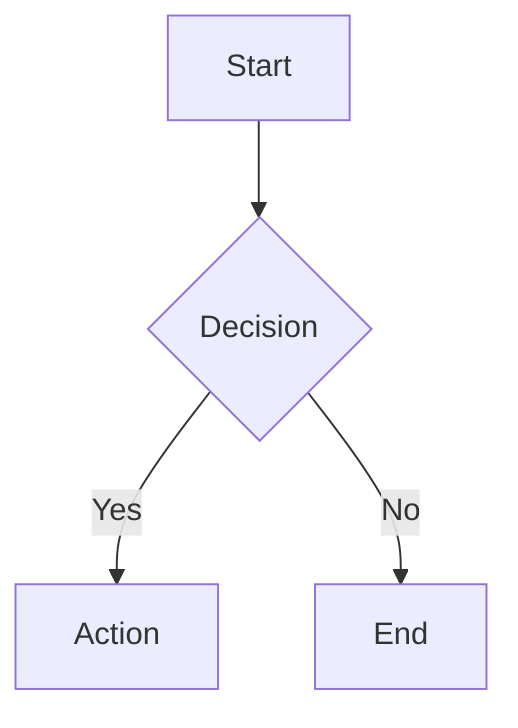

# WORK SESSION (0700-0800)

**Generated:** 2026-04-12T05:03:26.650Z
**Work Period:** 0700-0800
**Agent:** Claude Code
**Focus:** Live session logging
**Duration:** ~60 minutes

---

## Session Overview

This session captures real-time tool interactions and exchanges.

---

## Key Activities

<a name="ps_1775970206650"></a>
## Prompt Set (ps_1775970206650)

**Time:** 2026-04-12T05:03:26.650Z
**Duration:** 0ms
**Tool Calls:** 0

### Text Exchange - 2026-04-12 05:03:26 UTC [07:03:26 CEST]

**User Message:** [Request interrupted by user for tool use]

**Type:** Text-only exchange (no tool calls)

---

---

<a name="ps_1775970206727"></a>
## Prompt Set (ps_1775970206727)

**Time:** 2026-04-12T05:03:26.727Z
**Duration:** 0ms
**Tool Calls:** 4

### Bash - 2026-04-12 05:03:26 UTC [07:03:26 CEST]

**User Request:** are you stuck?

**Tool:** Bash
**Input:** ```json
{
  "command": "cd /Users/<USER_ID_REDACTED>/Agentic/coding/docker && docker-compose logs --tail=50 coding-services 2>&1 | grep -i \"observ\\|etm\\|llm\\|summar\\|error\\|fail\" | tail -20",
  "description": "Check Docker logs for observation errors"
}
```

**Result:** ✅ Success
**Output:** ```
coding-services  | GET /api/observations
```


---

### Bash - 2026-04-12 05:03:26 UTC [07:03:26 CEST]

**User Request:** are you stuck?

**Tool:** Bash
**Input:** ```json
{
  "command": "curl -s http://localhost:3033/api/observations?limit=2 | python3 -m json.tool 2>&1 | head -60",
  "description": "Check recent observations via API"
}
```

**Result:** ✅ Success
**Output:** ```
(eval):1: no matches found: http://localhost:3033/api/observations?limit=2
Expecting value: line 1 column 1 (char 0)
```


---

### Bash - 2026-04-12 05:03:26 UTC [07:03:26 CEST]

**User Request:** are you stuck?

**Tool:** Bash
**Input:** ```json
{
  "command": "curl -s 'http://localhost:3033/api/observations?limit=2' | python3 -m json.tool 2>&1 | head -60",
  "description": "Check observations API (quoted URL)"
}
```

**Result:** ✅ Success
**Output:** ```
{
    "data": [
        {
            "id": "703102d5-343b-4eb3-b248-066b09e73747",
            "content": "[Raw] 2 messages (1 user, 1 assistant). LLM summary unavailable.",
            "agent": "claude",
            "sessionId": null,
            "project": "coding",
            "timestamp": "2026-04-12T04:58:53.006Z",
            "source": "live-etm",
            "llmModel": null,
            "llmProvider": null,
            "llmTokens": null,
            "llmLatencyMs": null
        },
     
...[truncated]
```


---

### Bash - 2026-04-12 05:03:26 UTC [07:03:26 CEST]

**User Request:** are you stuck?

**Tool:** Bash
**Input:** ```json
{
  "command": "docker-compose logs --tail=200 coding-services 2>&1 | grep -iE \"observ|etm|summary|llm.*(error|fail)|error.*llm\" | tail -20",
  "description": "Search broader log patterns"
}
```

**Result:** ✅ Success
**Output:** ```
coding-services  | GET /api/observations
coding-services  | GET /api/observations
```


---

---

<a name="ps_1775970206727"></a>
## Prompt Set (ps_1775970206727)

**Time:** 2026-04-12T05:03:26.727Z
**Duration:** 0ms
**Tool Calls:** 6

### Bash - 2026-04-12 05:03:26 UTC [07:03:26 CEST]

**User Request:** are you stuck?

**Tool:** Bash
**Input:** ```json
{
  "command": "cd /Users/<USER_ID_REDACTED>/Agentic/coding/docker && docker-compose logs --tail=50 coding-services 2>&1 | grep -i \"observ\\|etm\\|llm\\|summar\\|error\\|fail\" | tail -20",
  "description": "Check Docker logs for observation errors"
}
```

**Result:** ✅ Success
**Output:** ```
coding-services  | GET /api/observations
```


---

### Bash - 2026-04-12 05:03:26 UTC [07:03:26 CEST]

**User Request:** are you stuck?

**Tool:** Bash
**Input:** ```json
{
  "command": "curl -s http://localhost:3033/api/observations?limit=2 | python3 -m json.tool 2>&1 | head -60",
  "description": "Check recent observations via API"
}
```

**Result:** ✅ Success
**Output:** ```
(eval):1: no matches found: http://localhost:3033/api/observations?limit=2
Expecting value: line 1 column 1 (char 0)
```


---

### Bash - 2026-04-12 05:03:26 UTC [07:03:26 CEST]

**User Request:** are you stuck?

**Tool:** Bash
**Input:** ```json
{
  "command": "curl -s 'http://localhost:3033/api/observations?limit=2' | python3 -m json.tool 2>&1 | head -60",
  "description": "Check observations API (quoted URL)"
}
```

**Result:** ✅ Success
**Output:** ```
{
    "data": [
        {
            "id": "703102d5-343b-4eb3-b248-066b09e73747",
            "content": "[Raw] 2 messages (1 user, 1 assistant). LLM summary unavailable.",
            "agent": "claude",
            "sessionId": null,
            "project": "coding",
            "timestamp": "2026-04-12T04:58:53.006Z",
            "source": "live-etm",
            "llmModel": null,
            "llmProvider": null,
            "llmTokens": null,
            "llmLatencyMs": null
        },
     
...[truncated]
```


---

### Bash - 2026-04-12 05:03:26 UTC [07:03:26 CEST]

**User Request:** are you stuck?

**Tool:** Bash
**Input:** ```json
{
  "command": "docker-compose logs --tail=200 coding-services 2>&1 | grep -iE \"observ|etm|summary|llm.*(error|fail)|error.*llm\" | tail -20",
  "description": "Search broader log patterns"
}
```

**Result:** ✅ Success
**Output:** ```
coding-services  | GET /api/observations
coding-services  | GET /api/observations
```


---

### Bash - 2026-04-12 05:03:26 UTC [07:03:26 CEST]

**User Request:** are you stuck?

**Tool:** Bash
**Input:** ```json
{
  "command": "grep -rn \"LLM summary unavailable\\|llmModel\\|summarize.*exchange\\|generateObservation\" <AWS_SECRET_REDACTED>ns/mcp-server-semantic-analysis/src/ 2>/dev/null | head -20",
  "description": "Find ETM observation code"
}
```

**Result:** ✅ Success
**Output:** ```
<AWS_SECRET_REDACTED>ns/mcp-server-semantic-analysis/src/agents/content-validation-agent.ts:2449:        newObservations.push(...this.generateObservationsFromCodebaseScan(
<AWS_SECRET_REDACTED>ns/mcp-server-semantic-analysis/src/agents/content-validation-agent.ts:2463:      return this.generateObservationsFromCodebaseScan(entityName, codebaseState, staleObservations.length);
<AWS_SECRET_REDACTED>ns/mcp-server-semantic-analysis/src/agents/c
...[truncated]
```


---

### Bash - 2026-04-12 05:03:26 UTC [07:03:26 CEST]

**User Request:** are you stuck?

**Tool:** Bash
**Input:** ```json
{
  "command": "grep -rn \"LLM summary unavailable\" <AWS_SECRET_REDACTED>ns/ 2>/dev/null",
  "description": "Find where \"LLM summary unavailable\" message is generated"
}
```

**Result:** ❌ Error

---

---

<a name="ps_1775970206727"></a>
## Prompt Set (ps_1775970206727)

**Time:** 2026-04-12T05:03:26.727Z
**Duration:** 0ms
**Tool Calls:** 6

### Bash - 2026-04-12 05:03:26 UTC [07:03:26 CEST]

**User Request:** are you stuck?

**Tool:** Bash
**Input:** ```json
{
  "command": "cd /Users/<USER_ID_REDACTED>/Agentic/coding/docker && docker-compose logs --tail=50 coding-services 2>&1 | grep -i \"observ\\|etm\\|llm\\|summar\\|error\\|fail\" | tail -20",
  "description": "Check Docker logs for observation errors"
}
```

**Result:** ✅ Success
**Output:** ```
coding-services  | GET /api/observations
```


---

### Bash - 2026-04-12 05:03:26 UTC [07:03:26 CEST]

**User Request:** are you stuck?

**Tool:** Bash
**Input:** ```json
{
  "command": "curl -s http://localhost:3033/api/observations?limit=2 | python3 -m json.tool 2>&1 | head -60",
  "description": "Check recent observations via API"
}
```

**Result:** ✅ Success
**Output:** ```
(eval):1: no matches found: http://localhost:3033/api/observations?limit=2
Expecting value: line 1 column 1 (char 0)
```


---

### Bash - 2026-04-12 05:03:26 UTC [07:03:26 CEST]

**User Request:** are you stuck?

**Tool:** Bash
**Input:** ```json
{
  "command": "curl -s 'http://localhost:3033/api/observations?limit=2' | python3 -m json.tool 2>&1 | head -60",
  "description": "Check observations API (quoted URL)"
}
```

**Result:** ✅ Success
**Output:** ```
{
    "data": [
        {
            "id": "703102d5-343b-4eb3-b248-066b09e73747",
            "content": "[Raw] 2 messages (1 user, 1 assistant). LLM summary unavailable.",
            "agent": "claude",
            "sessionId": null,
            "project": "coding",
            "timestamp": "2026-04-12T04:58:53.006Z",
            "source": "live-etm",
            "llmModel": null,
            "llmProvider": null,
            "llmTokens": null,
            "llmLatencyMs": null
        },
     
...[truncated]
```


---

### Bash - 2026-04-12 05:03:26 UTC [07:03:26 CEST]

**User Request:** are you stuck?

**Tool:** Bash
**Input:** ```json
{
  "command": "docker-compose logs --tail=200 coding-services 2>&1 | grep -iE \"observ|etm|summary|llm.*(error|fail)|error.*llm\" | tail -20",
  "description": "Search broader log patterns"
}
```

**Result:** ✅ Success
**Output:** ```
coding-services  | GET /api/observations
coding-services  | GET /api/observations
```


---

### Bash - 2026-04-12 05:03:26 UTC [07:03:26 CEST]

**User Request:** are you stuck?

**Tool:** Bash
**Input:** ```json
{
  "command": "grep -rn \"LLM summary unavailable\\|llmModel\\|summarize.*exchange\\|generateObservation\" <AWS_SECRET_REDACTED>ns/mcp-server-semantic-analysis/src/ 2>/dev/null | head -20",
  "description": "Find ETM observation code"
}
```

**Result:** ✅ Success
**Output:** ```
<AWS_SECRET_REDACTED>ns/mcp-server-semantic-analysis/src/agents/content-validation-agent.ts:2449:        newObservations.push(...this.generateObservationsFromCodebaseScan(
<AWS_SECRET_REDACTED>ns/mcp-server-semantic-analysis/src/agents/content-validation-agent.ts:2463:      return this.generateObservationsFromCodebaseScan(entityName, codebaseState, staleObservations.length);
<AWS_SECRET_REDACTED>ns/mcp-server-semantic-analysis/src/agents/c
...[truncated]
```


---

### Bash - 2026-04-12 05:03:26 UTC [07:03:26 CEST]

**User Request:** are you stuck?

**Tool:** Bash
**Input:** ```json
{
  "command": "grep -rn \"LLM summary unavailable\" <AWS_SECRET_REDACTED>ns/ 2>/dev/null",
  "description": "Find where \"LLM summary unavailable\" message is generated"
}
```

**Result:** ✅ Success
**Output:** ```
Command running in background with ID: b3yq9cpms. Output is being written to: /private/tmp/claude-502/-Users-<USER_ID_REDACTED>-Agentic-coding/70dee975-0d30-4009-aca5-6b6e97e4fc1d/tasks/b3yq9cpms.output
```


---

---

<a name="ps_1775970206727"></a>
## Prompt Set (ps_1775970206727)

**Time:** 2026-04-12T05:03:26.727Z
**Duration:** 0ms
**Tool Calls:** 7

### Bash - 2026-04-12 05:03:26 UTC [07:03:26 CEST]

**User Request:** are you stuck?

**Tool:** Bash
**Input:** ```json
{
  "command": "cd /Users/<USER_ID_REDACTED>/Agentic/coding/docker && docker-compose logs --tail=50 coding-services 2>&1 | grep -i \"observ\\|etm\\|llm\\|summar\\|error\\|fail\" | tail -20",
  "description": "Check Docker logs for observation errors"
}
```

**Result:** ✅ Success
**Output:** ```
coding-services  | GET /api/observations
```


---

### Bash - 2026-04-12 05:03:26 UTC [07:03:26 CEST]

**User Request:** are you stuck?

**Tool:** Bash
**Input:** ```json
{
  "command": "curl -s http://localhost:3033/api/observations?limit=2 | python3 -m json.tool 2>&1 | head -60",
  "description": "Check recent observations via API"
}
```

**Result:** ✅ Success
**Output:** ```
(eval):1: no matches found: http://localhost:3033/api/observations?limit=2
Expecting value: line 1 column 1 (char 0)
```


---

### Bash - 2026-04-12 05:03:26 UTC [07:03:26 CEST]

**User Request:** are you stuck?

**Tool:** Bash
**Input:** ```json
{
  "command": "curl -s 'http://localhost:3033/api/observations?limit=2' | python3 -m json.tool 2>&1 | head -60",
  "description": "Check observations API (quoted URL)"
}
```

**Result:** ✅ Success
**Output:** ```
{
    "data": [
        {
            "id": "703102d5-343b-4eb3-b248-066b09e73747",
            "content": "[Raw] 2 messages (1 user, 1 assistant). LLM summary unavailable.",
            "agent": "claude",
            "sessionId": null,
            "project": "coding",
            "timestamp": "2026-04-12T04:58:53.006Z",
            "source": "live-etm",
            "llmModel": null,
            "llmProvider": null,
            "llmTokens": null,
            "llmLatencyMs": null
        },
     
...[truncated]
```


---

### Bash - 2026-04-12 05:03:26 UTC [07:03:26 CEST]

**User Request:** are you stuck?

**Tool:** Bash
**Input:** ```json
{
  "command": "docker-compose logs --tail=200 coding-services 2>&1 | grep -iE \"observ|etm|summary|llm.*(error|fail)|error.*llm\" | tail -20",
  "description": "Search broader log patterns"
}
```

**Result:** ✅ Success
**Output:** ```
coding-services  | GET /api/observations
coding-services  | GET /api/observations
```


---

### Bash - 2026-04-12 05:03:26 UTC [07:03:26 CEST]

**User Request:** are you stuck?

**Tool:** Bash
**Input:** ```json
{
  "command": "grep -rn \"LLM summary unavailable\\|llmModel\\|summarize.*exchange\\|generateObservation\" <AWS_SECRET_REDACTED>ns/mcp-server-semantic-analysis/src/ 2>/dev/null | head -20",
  "description": "Find ETM observation code"
}
```

**Result:** ✅ Success
**Output:** ```
<AWS_SECRET_REDACTED>ns/mcp-server-semantic-analysis/src/agents/content-validation-agent.ts:2449:        newObservations.push(...this.generateObservationsFromCodebaseScan(
<AWS_SECRET_REDACTED>ns/mcp-server-semantic-analysis/src/agents/content-validation-agent.ts:2463:      return this.generateObservationsFromCodebaseScan(entityName, codebaseState, staleObservations.length);
<AWS_SECRET_REDACTED>ns/mcp-server-semantic-analysis/src/agents/c
...[truncated]
```


---

### Bash - 2026-04-12 05:03:26 UTC [07:03:26 CEST]

**User Request:** are you stuck?

**Tool:** Bash
**Input:** ```json
{
  "command": "grep -rn \"LLM summary unavailable\" <AWS_SECRET_REDACTED>ns/ 2>/dev/null",
  "description": "Find where \"LLM summary unavailable\" message is generated"
}
```

**Result:** ✅ Success
**Output:** ```
Command running in background with ID: b3yq9cpms. Output is being written to: /private/tmp/claude-502/-Users-<USER_ID_REDACTED>-Agentic-coding/70dee975-0d30-4009-aca5-6b6e97e4fc1d/tasks/b3yq9cpms.output
```


---

### Bash - 2026-04-12 05:03:26 UTC [07:03:26 CEST]

**User Request:** are you stuck?

**Tool:** Bash
**Input:** ```json
{
  "command": "grep -rn \"LLM summary unavailable\" /Users/<USER_ID_REDACTED>/Agentic/coding/ --include=\"*.ts\" --include=\"*.js\" 2>/dev/null | head -10",
  "description": "Find LLM summary unavailable source"
}
```

**Result:** ❌ Error

---

---

<a name="ps_1775970474520"></a>
## Prompt Set (ps_1775970474520)

**Time:** 2026-04-12T05:07:54.520Z
**Duration:** 0ms
**Tool Calls:** 4

### Bash - 2026-04-12 05:07:54 UTC [07:07:54 CEST]

**User Request:** are you stuck?

**Tool:** Bash
**Input:** ```json
{
  "command": "grep -rn \"LLM summary unavailable\" <AWS_SECRET_REDACTED>ns/mcp-server-semantic-analysis/src/ 2>/dev/null",
  "description": "Find LLM summary unavailable in semantic-analysis"
}
```

**Result:** ✅ Success
**Output:** ```
(Bash completed with no output)
```


---

### Bash - 2026-04-12 05:07:54 UTC [07:07:54 CEST]

**User Request:** are you stuck?

**Tool:** Bash
**Input:** ```json
{
  "command": "grep -rn \"LLM summary\" /Users/<USER_ID_REDACTED>/Agentic/coding/ --include=\"*.ts\" --include=\"*.js\" --exclude-dir=node_modules --exclude-dir=.git 2>/dev/null | head -10",
  "description": "Find LLM summary text across codebase"
}
```

**Result:** ✅ Success
**Output:** ```
<AWS_SECRET_REDACTED>ns/mcp-server-semantic-analysis/dist/agents/vibe-history-agent.js:1411:            log("LLM summary enhancement failed, using template-based summary", "warning", error);
<AWS_SECRET_REDACTED>ns/mcp-server-semantic-analysis/src/agents/vibe-history-agent.ts:1774:      log("LLM summary enhancement failed, using template-based summary", "warning", error);
/Users/<USER_ID_REDACTED>/Agentic/coding/src/live-logging/ObservationWriter.js:207:    return `[Ra
...[truncated]
```


---

### Bash - 2026-04-12 05:07:54 UTC [07:07:54 CEST]

**User Request:** are you stuck?

**Tool:** Bash
**Input:** ```json
{
  "command": "grep -rn \"LLM summary\" <AWS_SECRET_REDACTED>ns/mcp-server-semantic-analysis/src/ 2>/dev/null; grep -rn \"LLM summary\" <AWS_SECRET_REDACTED>ns/mcp-server-semantic-analysis/dist/ 2>/dev/null | head -5",
  "description": "Find LLM summary in semantic-analysis"
}
```

**Result:** ❌ Error

---

### Read - 2026-04-12 05:07:54 UTC [07:07:54 CEST]

**User Request:** are you stuck?

**Tool:** Read
**Input:** ```json
{
  "file_path": "/Users/<USER_ID_REDACTED>/Agentic/coding/src/live-logging/ObservationWriter.js",
  "offset": 180,
  "limit": 80
}
```

**Result:** ✅ Success
**Output:** ```
   180→        return { summary: this._fallbackSummary(messages) };
   181→      }
   182→
   183→      const result = await response.json();
   184→      const summary = result.content || this._fallbackSummary(messages);
   185→      const llm = result.model && result.provider
   186→        ? { model: result.model, provider: result.provider, tokens: result.tokens || null, latencyMs: result.latencyMs || null }
   187→        : undefined;
   188→      process.stderr.write(`[ObservationWriter] Su
...[truncated]
```


---

---

<a name="ps_1775970474520"></a>
## Prompt Set (ps_1775970474520)

**Time:** 2026-04-12T05:07:54.520Z
**Duration:** 0ms
**Tool Calls:** 6

### Bash - 2026-04-12 05:07:54 UTC [07:07:54 CEST]

**User Request:** are you stuck?

**Tool:** Bash
**Input:** ```json
{
  "command": "grep -rn \"LLM summary unavailable\" <AWS_SECRET_REDACTED>ns/mcp-server-semantic-analysis/src/ 2>/dev/null",
  "description": "Find LLM summary unavailable in semantic-analysis"
}
```

**Result:** ✅ Success
**Output:** ```
(Bash completed with no output)
```


---

### Bash - 2026-04-12 05:07:54 UTC [07:07:54 CEST]

**User Request:** are you stuck?

**Tool:** Bash
**Input:** ```json
{
  "command": "grep -rn \"LLM summary\" /Users/<USER_ID_REDACTED>/Agentic/coding/ --include=\"*.ts\" --include=\"*.js\" --exclude-dir=node_modules --exclude-dir=.git 2>/dev/null | head -10",
  "description": "Find LLM summary text across codebase"
}
```

**Result:** ✅ Success
**Output:** ```
<AWS_SECRET_REDACTED>ns/mcp-server-semantic-analysis/dist/agents/vibe-history-agent.js:1411:            log("LLM summary enhancement failed, using template-based summary", "warning", error);
<AWS_SECRET_REDACTED>ns/mcp-server-semantic-analysis/src/agents/vibe-history-agent.ts:1774:      log("LLM summary enhancement failed, using template-based summary", "warning", error);
/Users/<USER_ID_REDACTED>/Agentic/coding/src/live-logging/ObservationWriter.js:207:    return `[Ra
...[truncated]
```


---

### Bash - 2026-04-12 05:07:54 UTC [07:07:54 CEST]

**User Request:** are you stuck?

**Tool:** Bash
**Input:** ```json
{
  "command": "grep -rn \"LLM summary\" <AWS_SECRET_REDACTED>ns/mcp-server-semantic-analysis/src/ 2>/dev/null; grep -rn \"LLM summary\" <AWS_SECRET_REDACTED>ns/mcp-server-semantic-analysis/dist/ 2>/dev/null | head -5",
  "description": "Find LLM summary in semantic-analysis"
}
```

**Result:** ✅ Success
**Output:** ```
<AWS_SECRET_REDACTED>ns/mcp-server-semantic-analysis/src/agents/vibe-history-agent.ts:1774:      log("LLM summary enhancement failed, using template-based summary", "warning", error);
<AWS_SECRET_REDACTED>ns/mcp-server-semantic-analysis/dist/agents/vibe-history-agent.js:1411:            log("LLM summary enhancement failed, using template-based summary", "warning", error);
```


---

### Read - 2026-04-12 05:07:54 UTC [07:07:54 CEST]

**User Request:** are you stuck?

**Tool:** Read
**Input:** ```json
{
  "file_path": "/Users/<USER_ID_REDACTED>/Agentic/coding/src/live-logging/ObservationWriter.js",
  "offset": 180,
  "limit": 80
}
```

**Result:** ✅ Success
**Output:** ```
   180→        return { summary: this._fallbackSummary(messages) };
   181→      }
   182→
   183→      const result = await response.json();
   184→      const summary = result.content || this._fallbackSummary(messages);
   185→      const llm = result.model && result.provider
   186→        ? { model: result.model, provider: result.provider, tokens: result.tokens || null, latencyMs: result.latencyMs || null }
   187→        : undefined;
   188→      process.stderr.write(`[ObservationWriter] Su
...[truncated]
```


---

### Read - 2026-04-12 05:07:54 UTC [07:07:54 CEST]

**User Request:** are you stuck?

**Tool:** Read
**Input:** ```json
{
  "file_path": "/Users/<USER_ID_REDACTED>/Agentic/coding/src/live-logging/ObservationWriter.js",
  "offset": 140,
  "limit": 45
}
```

**Result:** ✅ Success
**Output:** ```
   140→            role: 'system',
   141→            content: `You produce structured observation summaries from coding exchanges.\n` +
   142→              `CRITICAL CONTEXT: The developer is working in the "${projectName}" project. ` +
   143→              `The exchange below happened in that project. System prompts, CLAUDE.md content, ` +
   144→              `and file paths from OTHER projects appearing in the exchange are background context ` +
   145→              `or cross-project invest
...[truncated]
```


---

### Bash - 2026-04-12 05:07:54 UTC [07:07:54 CEST]

**User Request:** are you stuck?

**Tool:** Bash
**Input:** ```json
{
  "command": "grep -n \"proxyUrl\\|proxy_url\\|PROXY\" /Users/<USER_ID_REDACTED>/Agentic/coding/src/live-logging/ObservationWriter.js | head -10",
  "description": "Find proxy URL config"
}
```

**Result:** ✅ Success
**Output:** ```
41:   * @param {string} [options.proxyUrl] - LLM proxy URL (default: http://localhost:8089)
51:    this.proxyUrl = options.proxyUrl || 'http://localhost:8089';
168:      process.stderr.write(`[ObservationWriter] Calling proxy: ${this.proxyUrl}/api/complete (provider: ${this.provider || 'auto'})\n`);
170:      const response = await fetch(`${this.proxyUrl}/api/complete`, {
```


---

---

<a name="ps_1775970474520"></a>
## Prompt Set (ps_1775970474520)

**Time:** 2026-04-12T05:07:54.520Z
**Duration:** 0ms
**Tool Calls:** 8

### Bash - 2026-04-12 05:07:54 UTC [07:07:54 CEST]

**User Request:** are you stuck?

**Tool:** Bash
**Input:** ```json
{
  "command": "grep -rn \"LLM summary unavailable\" <AWS_SECRET_REDACTED>ns/mcp-server-semantic-analysis/src/ 2>/dev/null",
  "description": "Find LLM summary unavailable in semantic-analysis"
}
```

**Result:** ✅ Success
**Output:** ```
(Bash completed with no output)
```


---

### Bash - 2026-04-12 05:07:54 UTC [07:07:54 CEST]

**User Request:** are you stuck?

**Tool:** Bash
**Input:** ```json
{
  "command": "grep -rn \"LLM summary\" /Users/<USER_ID_REDACTED>/Agentic/coding/ --include=\"*.ts\" --include=\"*.js\" --exclude-dir=node_modules --exclude-dir=.git 2>/dev/null | head -10",
  "description": "Find LLM summary text across codebase"
}
```

**Result:** ✅ Success
**Output:** ```
<AWS_SECRET_REDACTED>ns/mcp-server-semantic-analysis/dist/agents/vibe-history-agent.js:1411:            log("LLM summary enhancement failed, using template-based summary", "warning", error);
<AWS_SECRET_REDACTED>ns/mcp-server-semantic-analysis/src/agents/vibe-history-agent.ts:1774:      log("LLM summary enhancement failed, using template-based summary", "warning", error);
/Users/<USER_ID_REDACTED>/Agentic/coding/src/live-logging/ObservationWriter.js:207:    return `[Ra
...[truncated]
```


---

### Bash - 2026-04-12 05:07:54 UTC [07:07:54 CEST]

**User Request:** are you stuck?

**Tool:** Bash
**Input:** ```json
{
  "command": "grep -rn \"LLM summary\" <AWS_SECRET_REDACTED>ns/mcp-server-semantic-analysis/src/ 2>/dev/null; grep -rn \"LLM summary\" <AWS_SECRET_REDACTED>ns/mcp-server-semantic-analysis/dist/ 2>/dev/null | head -5",
  "description": "Find LLM summary in semantic-analysis"
}
```

**Result:** ✅ Success
**Output:** ```
<AWS_SECRET_REDACTED>ns/mcp-server-semantic-analysis/src/agents/vibe-history-agent.ts:1774:      log("LLM summary enhancement failed, using template-based summary", "warning", error);
<AWS_SECRET_REDACTED>ns/mcp-server-semantic-analysis/dist/agents/vibe-history-agent.js:1411:            log("LLM summary enhancement failed, using template-based summary", "warning", error);
```


---

### Read - 2026-04-12 05:07:54 UTC [07:07:54 CEST]

**User Request:** are you stuck?

**Tool:** Read
**Input:** ```json
{
  "file_path": "/Users/<USER_ID_REDACTED>/Agentic/coding/src/live-logging/ObservationWriter.js",
  "offset": 180,
  "limit": 80
}
```

**Result:** ✅ Success
**Output:** ```
   180→        return { summary: this._fallbackSummary(messages) };
   181→      }
   182→
   183→      const result = await response.json();
   184→      const summary = result.content || this._fallbackSummary(messages);
   185→      const llm = result.model && result.provider
   186→        ? { model: result.model, provider: result.provider, tokens: result.tokens || null, latencyMs: result.latencyMs || null }
   187→        : undefined;
   188→      process.stderr.write(`[ObservationWriter] Su
...[truncated]
```


---

### Read - 2026-04-12 05:07:54 UTC [07:07:54 CEST]

**User Request:** are you stuck?

**Tool:** Read
**Input:** ```json
{
  "file_path": "/Users/<USER_ID_REDACTED>/Agentic/coding/src/live-logging/ObservationWriter.js",
  "offset": 140,
  "limit": 45
}
```

**Result:** ✅ Success
**Output:** ```
   140→            role: 'system',
   141→            content: `You produce structured observation summaries from coding exchanges.\n` +
   142→              `CRITICAL CONTEXT: The developer is working in the "${projectName}" project. ` +
   143→              `The exchange below happened in that project. System prompts, CLAUDE.md content, ` +
   144→              `and file paths from OTHER projects appearing in the exchange are background context ` +
   145→              `or cross-project invest
...[truncated]
```


---

### Bash - 2026-04-12 05:07:54 UTC [07:07:54 CEST]

**User Request:** are you stuck?

**Tool:** Bash
**Input:** ```json
{
  "command": "grep -n \"proxyUrl\\|proxy_url\\|PROXY\" /Users/<USER_ID_REDACTED>/Agentic/coding/src/live-logging/ObservationWriter.js | head -10",
  "description": "Find proxy URL config"
}
```

**Result:** ✅ Success
**Output:** ```
41:   * @param {string} [options.proxyUrl] - LLM proxy URL (default: http://localhost:8089)
51:    this.proxyUrl = options.proxyUrl || 'http://localhost:8089';
168:      process.stderr.write(`[ObservationWriter] Calling proxy: ${this.proxyUrl}/api/complete (provider: ${this.provider || 'auto'})\n`);
170:      const response = await fetch(`${this.proxyUrl}/api/complete`, {
```


---

### Bash - 2026-04-12 05:07:54 UTC [07:07:54 CEST]

**User Request:** are you stuck?

**Tool:** Bash
**Input:** ```json
{
  "command": "grep -rn \"\\[Raw\\]\" /Users/<USER_ID_REDACTED>/Agentic/coding/ --include=\"*.ts\" --include=\"*.js\" 2>/dev/null | grep -v node_modules | grep -v \".specstory\" | head -10",
  "description": "Find [Raw] observation source"
}
```

**Result:** ❌ Error

---

### Bash - 2026-04-12 05:07:54 UTC [07:07:54 CEST]

**User Request:** are you stuck?

**Tool:** Bash
**Input:** ```json
{
  "command": "curl -s http://localhost:8089/api/complete -X POST -H 'Content-Type: application/json' -d '{\"messages\":[{\"role\":\"user\",\"content\":\"hello\"}]}' 2>&1 | head -5",
  "description": "Test LLM proxy endpoint"
}
```

**Result:** ✅ Success
**Output:** ```
(Bash completed with no output)
```


---

---

<a name="ps_1775970474520"></a>
## Prompt Set (ps_1775970474520)

**Time:** 2026-04-12T05:07:54.520Z
**Duration:** 0ms
**Tool Calls:** 10

### Bash - 2026-04-12 05:07:54 UTC [07:07:54 CEST]

**User Request:** are you stuck?

**Tool:** Bash
**Input:** ```json
{
  "command": "grep -rn \"LLM summary unavailable\" <AWS_SECRET_REDACTED>ns/mcp-server-semantic-analysis/src/ 2>/dev/null",
  "description": "Find LLM summary unavailable in semantic-analysis"
}
```

**Result:** ✅ Success
**Output:** ```
(Bash completed with no output)
```


---

### Bash - 2026-04-12 05:07:54 UTC [07:07:54 CEST]

**User Request:** are you stuck?

**Tool:** Bash
**Input:** ```json
{
  "command": "grep -rn \"LLM summary\" /Users/<USER_ID_REDACTED>/Agentic/coding/ --include=\"*.ts\" --include=\"*.js\" --exclude-dir=node_modules --exclude-dir=.git 2>/dev/null | head -10",
  "description": "Find LLM summary text across codebase"
}
```

**Result:** ✅ Success
**Output:** ```
<AWS_SECRET_REDACTED>ns/mcp-server-semantic-analysis/dist/agents/vibe-history-agent.js:1411:            log("LLM summary enhancement failed, using template-based summary", "warning", error);
<AWS_SECRET_REDACTED>ns/mcp-server-semantic-analysis/src/agents/vibe-history-agent.ts:1774:      log("LLM summary enhancement failed, using template-based summary", "warning", error);
/Users/<USER_ID_REDACTED>/Agentic/coding/src/live-logging/ObservationWriter.js:207:    return `[Ra
...[truncated]
```


---

### Bash - 2026-04-12 05:07:54 UTC [07:07:54 CEST]

**User Request:** are you stuck?

**Tool:** Bash
**Input:** ```json
{
  "command": "grep -rn \"LLM summary\" <AWS_SECRET_REDACTED>ns/mcp-server-semantic-analysis/src/ 2>/dev/null; grep -rn \"LLM summary\" <AWS_SECRET_REDACTED>ns/mcp-server-semantic-analysis/dist/ 2>/dev/null | head -5",
  "description": "Find LLM summary in semantic-analysis"
}
```

**Result:** ✅ Success
**Output:** ```
<AWS_SECRET_REDACTED>ns/mcp-server-semantic-analysis/src/agents/vibe-history-agent.ts:1774:      log("LLM summary enhancement failed, using template-based summary", "warning", error);
<AWS_SECRET_REDACTED>ns/mcp-server-semantic-analysis/dist/agents/vibe-history-agent.js:1411:            log("LLM summary enhancement failed, using template-based summary", "warning", error);
```


---

### Read - 2026-04-12 05:07:54 UTC [07:07:54 CEST]

**User Request:** are you stuck?

**Tool:** Read
**Input:** ```json
{
  "file_path": "/Users/<USER_ID_REDACTED>/Agentic/coding/src/live-logging/ObservationWriter.js",
  "offset": 180,
  "limit": 80
}
```

**Result:** ✅ Success
**Output:** ```
   180→        return { summary: this._fallbackSummary(messages) };
   181→      }
   182→
   183→      const result = await response.json();
   184→      const summary = result.content || this._fallbackSummary(messages);
   185→      const llm = result.model && result.provider
   186→        ? { model: result.model, provider: result.provider, tokens: result.tokens || null, latencyMs: result.latencyMs || null }
   187→        : undefined;
   188→      process.stderr.write(`[ObservationWriter] Su
...[truncated]
```


---

### Read - 2026-04-12 05:07:54 UTC [07:07:54 CEST]

**User Request:** are you stuck?

**Tool:** Read
**Input:** ```json
{
  "file_path": "/Users/<USER_ID_REDACTED>/Agentic/coding/src/live-logging/ObservationWriter.js",
  "offset": 140,
  "limit": 45
}
```

**Result:** ✅ Success
**Output:** ```
   140→            role: 'system',
   141→            content: `You produce structured observation summaries from coding exchanges.\n` +
   142→              `CRITICAL CONTEXT: The developer is working in the "${projectName}" project. ` +
   143→              `The exchange below happened in that project. System prompts, CLAUDE.md content, ` +
   144→              `and file paths from OTHER projects appearing in the exchange are background context ` +
   145→              `or cross-project invest
...[truncated]
```


---

### Bash - 2026-04-12 05:07:54 UTC [07:07:54 CEST]

**User Request:** are you stuck?

**Tool:** Bash
**Input:** ```json
{
  "command": "grep -n \"proxyUrl\\|proxy_url\\|PROXY\" /Users/<USER_ID_REDACTED>/Agentic/coding/src/live-logging/ObservationWriter.js | head -10",
  "description": "Find proxy URL config"
}
```

**Result:** ✅ Success
**Output:** ```
41:   * @param {string} [options.proxyUrl] - LLM proxy URL (default: http://localhost:8089)
51:    this.proxyUrl = options.proxyUrl || 'http://localhost:8089';
168:      process.stderr.write(`[ObservationWriter] Calling proxy: ${this.proxyUrl}/api/complete (provider: ${this.provider || 'auto'})\n`);
170:      const response = await fetch(`${this.proxyUrl}/api/complete`, {
```


---

### Bash - 2026-04-12 05:07:54 UTC [07:07:54 CEST]

**User Request:** are you stuck?

**Tool:** Bash
**Input:** ```json
{
  "command": "grep -rn \"\\[Raw\\]\" /Users/<USER_ID_REDACTED>/Agentic/coding/ --include=\"*.ts\" --include=\"*.js\" 2>/dev/null | grep -v node_modules | grep -v \".specstory\" | head -10",
  "description": "Find [Raw] observation source"
}
```

**Result:** ❌ Error

---

### Bash - 2026-04-12 05:07:54 UTC [07:07:54 CEST]

**User Request:** are you stuck?

**Tool:** Bash
**Input:** ```json
{
  "command": "curl -s http://localhost:8089/api/complete -X POST -H 'Content-Type: application/json' -d '{\"messages\":[{\"role\":\"user\",\"content\":\"hello\"}]}' 2>&1 | head -5",
  "description": "Test LLM proxy endpoint"
}
```

**Result:** ✅ Success
**Output:** ```
(Bash completed with no output)
```


---

### Bash - 2026-04-12 05:07:54 UTC [07:07:54 CEST]

**User Request:** are you stuck?

**Tool:** Bash
**Input:** ```json
{
  "command": "curl -sv http://localhost:8089/api/complete -X POST -H 'Content-Type: application/json' -d '{\"messages\":[{\"role\":\"user\",\"content\":\"hello\"}]}' 2>&1 | tail -20",
  "description": "Test proxy with verbose"
}
```

**Result:** ✅ Success
**Output:** ```
* Host localhost:8089 was resolved.
* IPv6: ::1
* IPv4: 127.0.0.1
*   Trying [::1]:8089...
* connect to ::1 port 8089 from ::1 port 51540 failed: Connection refused
*   Trying 127.0.0.1:8089...
* connect to 127.0.0.1 port 8089 from 127.0.0.1 port 51541 failed: Connection refused
* Failed to connect to localhost port 8089 after 0 ms: Couldn't connect to server
* Closing connection
```


---

### Bash - 2026-04-12 05:07:54 UTC [07:07:54 CEST]

**User Request:** are you stuck?

**Tool:** Bash
**Input:** ```json
{
  "command": "grep -rn \"8089\" <AWS_SECRET_REDACTED>ker-compose.yml 2>/dev/null | head -5",
  "description": "Check if proxy is in docker-compose"
}
```

**Result:** ✅ Success
**Output:** ```
(Bash completed with no output)
```


---

---

<a name="ps_1775970474520"></a>
## Prompt Set (ps_1775970474520)

**Time:** 2026-04-12T05:07:54.520Z
**Duration:** 0ms
**Tool Calls:** 11

### Bash - 2026-04-12 05:07:54 UTC [07:07:54 CEST]

**User Request:** are you stuck?

**Tool:** Bash
**Input:** ```json
{
  "command": "grep -rn \"LLM summary unavailable\" <AWS_SECRET_REDACTED>ns/mcp-server-semantic-analysis/src/ 2>/dev/null",
  "description": "Find LLM summary unavailable in semantic-analysis"
}
```

**Result:** ✅ Success
**Output:** ```
(Bash completed with no output)
```


---

### Bash - 2026-04-12 05:07:54 UTC [07:07:54 CEST]

**User Request:** are you stuck?

**Tool:** Bash
**Input:** ```json
{
  "command": "grep -rn \"LLM summary\" /Users/<USER_ID_REDACTED>/Agentic/coding/ --include=\"*.ts\" --include=\"*.js\" --exclude-dir=node_modules --exclude-dir=.git 2>/dev/null | head -10",
  "description": "Find LLM summary text across codebase"
}
```

**Result:** ✅ Success
**Output:** ```
<AWS_SECRET_REDACTED>ns/mcp-server-semantic-analysis/dist/agents/vibe-history-agent.js:1411:            log("LLM summary enhancement failed, using template-based summary", "warning", error);
<AWS_SECRET_REDACTED>ns/mcp-server-semantic-analysis/src/agents/vibe-history-agent.ts:1774:      log("LLM summary enhancement failed, using template-based summary", "warning", error);
/Users/<USER_ID_REDACTED>/Agentic/coding/src/live-logging/ObservationWriter.js:207:    return `[Ra
...[truncated]
```


---

### Bash - 2026-04-12 05:07:54 UTC [07:07:54 CEST]

**User Request:** are you stuck?

**Tool:** Bash
**Input:** ```json
{
  "command": "grep -rn \"LLM summary\" <AWS_SECRET_REDACTED>ns/mcp-server-semantic-analysis/src/ 2>/dev/null; grep -rn \"LLM summary\" <AWS_SECRET_REDACTED>ns/mcp-server-semantic-analysis/dist/ 2>/dev/null | head -5",
  "description": "Find LLM summary in semantic-analysis"
}
```

**Result:** ✅ Success
**Output:** ```
<AWS_SECRET_REDACTED>ns/mcp-server-semantic-analysis/src/agents/vibe-history-agent.ts:1774:      log("LLM summary enhancement failed, using template-based summary", "warning", error);
<AWS_SECRET_REDACTED>ns/mcp-server-semantic-analysis/dist/agents/vibe-history-agent.js:1411:            log("LLM summary enhancement failed, using template-based summary", "warning", error);
```


---

### Read - 2026-04-12 05:07:54 UTC [07:07:54 CEST]

**User Request:** are you stuck?

**Tool:** Read
**Input:** ```json
{
  "file_path": "/Users/<USER_ID_REDACTED>/Agentic/coding/src/live-logging/ObservationWriter.js",
  "offset": 180,
  "limit": 80
}
```

**Result:** ✅ Success
**Output:** ```
   180→        return { summary: this._fallbackSummary(messages) };
   181→      }
   182→
   183→      const result = await response.json();
   184→      const summary = result.content || this._fallbackSummary(messages);
   185→      const llm = result.model && result.provider
   186→        ? { model: result.model, provider: result.provider, tokens: result.tokens || null, latencyMs: result.latencyMs || null }
   187→        : undefined;
   188→      process.stderr.write(`[ObservationWriter] Su
...[truncated]
```


---

### Read - 2026-04-12 05:07:54 UTC [07:07:54 CEST]

**User Request:** are you stuck?

**Tool:** Read
**Input:** ```json
{
  "file_path": "/Users/<USER_ID_REDACTED>/Agentic/coding/src/live-logging/ObservationWriter.js",
  "offset": 140,
  "limit": 45
}
```

**Result:** ✅ Success
**Output:** ```
   140→            role: 'system',
   141→            content: `You produce structured observation summaries from coding exchanges.\n` +
   142→              `CRITICAL CONTEXT: The developer is working in the "${projectName}" project. ` +
   143→              `The exchange below happened in that project. System prompts, CLAUDE.md content, ` +
   144→              `and file paths from OTHER projects appearing in the exchange are background context ` +
   145→              `or cross-project invest
...[truncated]
```


---

### Bash - 2026-04-12 05:07:54 UTC [07:07:54 CEST]

**User Request:** are you stuck?

**Tool:** Bash
**Input:** ```json
{
  "command": "grep -n \"proxyUrl\\|proxy_url\\|PROXY\" /Users/<USER_ID_REDACTED>/Agentic/coding/src/live-logging/ObservationWriter.js | head -10",
  "description": "Find proxy URL config"
}
```

**Result:** ✅ Success
**Output:** ```
41:   * @param {string} [options.proxyUrl] - LLM proxy URL (default: http://localhost:8089)
51:    this.proxyUrl = options.proxyUrl || 'http://localhost:8089';
168:      process.stderr.write(`[ObservationWriter] Calling proxy: ${this.proxyUrl}/api/complete (provider: ${this.provider || 'auto'})\n`);
170:      const response = await fetch(`${this.proxyUrl}/api/complete`, {
```


---

### Bash - 2026-04-12 05:07:54 UTC [07:07:54 CEST]

**User Request:** are you stuck?

**Tool:** Bash
**Input:** ```json
{
  "command": "grep -rn \"\\[Raw\\]\" /Users/<USER_ID_REDACTED>/Agentic/coding/ --include=\"*.ts\" --include=\"*.js\" 2>/dev/null | grep -v node_modules | grep -v \".specstory\" | head -10",
  "description": "Find [Raw] observation source"
}
```

**Result:** ❌ Error

---

### Bash - 2026-04-12 05:07:54 UTC [07:07:54 CEST]

**User Request:** are you stuck?

**Tool:** Bash
**Input:** ```json
{
  "command": "curl -s http://localhost:8089/api/complete -X POST -H 'Content-Type: application/json' -d '{\"messages\":[{\"role\":\"user\",\"content\":\"hello\"}]}' 2>&1 | head -5",
  "description": "Test LLM proxy endpoint"
}
```

**Result:** ✅ Success
**Output:** ```
(Bash completed with no output)
```


---

### Bash - 2026-04-12 05:07:54 UTC [07:07:54 CEST]

**User Request:** are you stuck?

**Tool:** Bash
**Input:** ```json
{
  "command": "curl -sv http://localhost:8089/api/complete -X POST -H 'Content-Type: application/json' -d '{\"messages\":[{\"role\":\"user\",\"content\":\"hello\"}]}' 2>&1 | tail -20",
  "description": "Test proxy with verbose"
}
```

**Result:** ✅ Success
**Output:** ```
* Host localhost:8089 was resolved.
* IPv6: ::1
* IPv4: 127.0.0.1
*   Trying [::1]:8089...
* connect to ::1 port 8089 from ::1 port 51540 failed: Connection refused
*   Trying 127.0.0.1:8089...
* connect to 127.0.0.1 port 8089 from 127.0.0.1 port 51541 failed: Connection refused
* Failed to connect to localhost port 8089 after 0 ms: Couldn't connect to server
* Closing connection
```


---

### Bash - 2026-04-12 05:07:54 UTC [07:07:54 CEST]

**User Request:** are you stuck?

**Tool:** Bash
**Input:** ```json
{
  "command": "grep -rn \"8089\" <AWS_SECRET_REDACTED>ker-compose.yml 2>/dev/null | head -5",
  "description": "Check if proxy is in docker-compose"
}
```

**Result:** ✅ Success
**Output:** ```
(Bash completed with no output)
```


---

### Bash - 2026-04-12 05:07:54 UTC [07:07:54 CEST]

**User Request:** are you stuck?

**Tool:** Bash
**Input:** ```json
{
  "command": "grep -rn \"8089\\|llm.proxy\\|llm-proxy\\|api.complete\" /Users/<USER_ID_REDACTED>/Agentic/coding/ --include=\"*.yml\" --include=\"*.yaml\" --include=\"*.json\" --include=\"*.sh\" --exclude-dir=node_modules --exclude-dir=.git --exclude-dir=.specstory --exclude-dir=.data 2>/dev/null | head -15",
  "description": "Find what runs on port 8089"
}
```

**Result:** ❌ Error

---

---

<a name="ps_1775970474520"></a>
## Prompt Set (ps_1775970474520)

**Time:** 2026-04-12T05:07:54.520Z
**Duration:** 0ms
**Tool Calls:** 11

### Bash - 2026-04-12 05:07:54 UTC [07:07:54 CEST]

**User Request:** are you stuck?

**Tool:** Bash
**Input:** ```json
{
  "command": "grep -rn \"LLM summary unavailable\" <AWS_SECRET_REDACTED>ns/mcp-server-semantic-analysis/src/ 2>/dev/null",
  "description": "Find LLM summary unavailable in semantic-analysis"
}
```

**Result:** ✅ Success
**Output:** ```
(Bash completed with no output)
```


---

### Bash - 2026-04-12 05:07:54 UTC [07:07:54 CEST]

**User Request:** are you stuck?

**Tool:** Bash
**Input:** ```json
{
  "command": "grep -rn \"LLM summary\" /Users/<USER_ID_REDACTED>/Agentic/coding/ --include=\"*.ts\" --include=\"*.js\" --exclude-dir=node_modules --exclude-dir=.git 2>/dev/null | head -10",
  "description": "Find LLM summary text across codebase"
}
```

**Result:** ✅ Success
**Output:** ```
<AWS_SECRET_REDACTED>ns/mcp-server-semantic-analysis/dist/agents/vibe-history-agent.js:1411:            log("LLM summary enhancement failed, using template-based summary", "warning", error);
<AWS_SECRET_REDACTED>ns/mcp-server-semantic-analysis/src/agents/vibe-history-agent.ts:1774:      log("LLM summary enhancement failed, using template-based summary", "warning", error);
/Users/<USER_ID_REDACTED>/Agentic/coding/src/live-logging/ObservationWriter.js:207:    return `[Ra
...[truncated]
```


---

### Bash - 2026-04-12 05:07:54 UTC [07:07:54 CEST]

**User Request:** are you stuck?

**Tool:** Bash
**Input:** ```json
{
  "command": "grep -rn \"LLM summary\" <AWS_SECRET_REDACTED>ns/mcp-server-semantic-analysis/src/ 2>/dev/null; grep -rn \"LLM summary\" <AWS_SECRET_REDACTED>ns/mcp-server-semantic-analysis/dist/ 2>/dev/null | head -5",
  "description": "Find LLM summary in semantic-analysis"
}
```

**Result:** ✅ Success
**Output:** ```
<AWS_SECRET_REDACTED>ns/mcp-server-semantic-analysis/src/agents/vibe-history-agent.ts:1774:      log("LLM summary enhancement failed, using template-based summary", "warning", error);
<AWS_SECRET_REDACTED>ns/mcp-server-semantic-analysis/dist/agents/vibe-history-agent.js:1411:            log("LLM summary enhancement failed, using template-based summary", "warning", error);
```


---

### Read - 2026-04-12 05:07:54 UTC [07:07:54 CEST]

**User Request:** are you stuck?

**Tool:** Read
**Input:** ```json
{
  "file_path": "/Users/<USER_ID_REDACTED>/Agentic/coding/src/live-logging/ObservationWriter.js",
  "offset": 180,
  "limit": 80
}
```

**Result:** ✅ Success
**Output:** ```
   180→        return { summary: this._fallbackSummary(messages) };
   181→      }
   182→
   183→      const result = await response.json();
   184→      const summary = result.content || this._fallbackSummary(messages);
   185→      const llm = result.model && result.provider
   186→        ? { model: result.model, provider: result.provider, tokens: result.tokens || null, latencyMs: result.latencyMs || null }
   187→        : undefined;
   188→      process.stderr.write(`[ObservationWriter] Su
...[truncated]
```


---

### Read - 2026-04-12 05:07:54 UTC [07:07:54 CEST]

**User Request:** are you stuck?

**Tool:** Read
**Input:** ```json
{
  "file_path": "/Users/<USER_ID_REDACTED>/Agentic/coding/src/live-logging/ObservationWriter.js",
  "offset": 140,
  "limit": 45
}
```

**Result:** ✅ Success
**Output:** ```
   140→            role: 'system',
   141→            content: `You produce structured observation summaries from coding exchanges.\n` +
   142→              `CRITICAL CONTEXT: The developer is working in the "${projectName}" project. ` +
   143→              `The exchange below happened in that project. System prompts, CLAUDE.md content, ` +
   144→              `and file paths from OTHER projects appearing in the exchange are background context ` +
   145→              `or cross-project invest
...[truncated]
```


---

### Bash - 2026-04-12 05:07:54 UTC [07:07:54 CEST]

**User Request:** are you stuck?

**Tool:** Bash
**Input:** ```json
{
  "command": "grep -n \"proxyUrl\\|proxy_url\\|PROXY\" /Users/<USER_ID_REDACTED>/Agentic/coding/src/live-logging/ObservationWriter.js | head -10",
  "description": "Find proxy URL config"
}
```

**Result:** ✅ Success
**Output:** ```
41:   * @param {string} [options.proxyUrl] - LLM proxy URL (default: http://localhost:8089)
51:    this.proxyUrl = options.proxyUrl || 'http://localhost:8089';
168:      process.stderr.write(`[ObservationWriter] Calling proxy: ${this.proxyUrl}/api/complete (provider: ${this.provider || 'auto'})\n`);
170:      const response = await fetch(`${this.proxyUrl}/api/complete`, {
```


---

### Bash - 2026-04-12 05:07:54 UTC [07:07:54 CEST]

**User Request:** are you stuck?

**Tool:** Bash
**Input:** ```json
{
  "command": "grep -rn \"\\[Raw\\]\" /Users/<USER_ID_REDACTED>/Agentic/coding/ --include=\"*.ts\" --include=\"*.js\" 2>/dev/null | grep -v node_modules | grep -v \".specstory\" | head -10",
  "description": "Find [Raw] observation source"
}
```

**Result:** ✅ Success
**Output:** ```
Command running in background with ID: bmaa9de9h. Output is being written to: /private/tmp/claude-502/-Users-<USER_ID_REDACTED>-Agentic-coding/70dee975-0d30-4009-aca5-6b6e97e4fc1d/tasks/bmaa9de9h.output
```


---

### Bash - 2026-04-12 05:07:54 UTC [07:07:54 CEST]

**User Request:** are you stuck?

**Tool:** Bash
**Input:** ```json
{
  "command": "curl -s http://localhost:8089/api/complete -X POST -H 'Content-Type: application/json' -d '{\"messages\":[{\"role\":\"user\",\"content\":\"hello\"}]}' 2>&1 | head -5",
  "description": "Test LLM proxy endpoint"
}
```

**Result:** ✅ Success
**Output:** ```
(Bash completed with no output)
```


---

### Bash - 2026-04-12 05:07:54 UTC [07:07:54 CEST]

**User Request:** are you stuck?

**Tool:** Bash
**Input:** ```json
{
  "command": "curl -sv http://localhost:8089/api/complete -X POST -H 'Content-Type: application/json' -d '{\"messages\":[{\"role\":\"user\",\"content\":\"hello\"}]}' 2>&1 | tail -20",
  "description": "Test proxy with verbose"
}
```

**Result:** ✅ Success
**Output:** ```
* Host localhost:8089 was resolved.
* IPv6: ::1
* IPv4: 127.0.0.1
*   Trying [::1]:8089...
* connect to ::1 port 8089 from ::1 port 51540 failed: Connection refused
*   Trying 127.0.0.1:8089...
* connect to 127.0.0.1 port 8089 from 127.0.0.1 port 51541 failed: Connection refused
* Failed to connect to localhost port 8089 after 0 ms: Couldn't connect to server
* Closing connection
```


---

### Bash - 2026-04-12 05:07:54 UTC [07:07:54 CEST]

**User Request:** are you stuck?

**Tool:** Bash
**Input:** ```json
{
  "command": "grep -rn \"8089\" <AWS_SECRET_REDACTED>ker-compose.yml 2>/dev/null | head -5",
  "description": "Check if proxy is in docker-compose"
}
```

**Result:** ✅ Success
**Output:** ```
(Bash completed with no output)
```


---

### Bash - 2026-04-12 05:07:54 UTC [07:07:54 CEST]

**User Request:** are you stuck?

**Tool:** Bash
**Input:** ```json
{
  "command": "grep -rn \"8089\\|llm.proxy\\|llm-proxy\\|api.complete\" /Users/<USER_ID_REDACTED>/Agentic/coding/ --include=\"*.yml\" --include=\"*.yaml\" --include=\"*.json\" --include=\"*.sh\" --exclude-dir=node_modules --exclude-dir=.git --exclude-dir=.specstory --exclude-dir=.data 2>/dev/null | head -15",
  "description": "Find what runs on port 8089"
}
```

**Result:** ✅ Success
**Output:** ```
<AWS_SECRET_REDACTED>-providers.yaml:62:  # Local proxy provider — routes through llm-proxy on port 8089
<AWS_SECRET_REDACTED>-providers.yaml:65:    baseUrl: "http://localhost:8089"
<AWS_SECRET_REDACTED>-providers.yaml:73:# proxy routes through llm-proxy which handles network-adaptive failover internally.
<AWS_SECRET_REDACTED>-providers.yaml:220:# Applied by llm-proxy when VPN is detected
/Users/<USER_ID_REDACTED>/Agentic/coding/co
...[truncated]
```


---

---

<a name="ps_1775970474520"></a>
## Prompt Set (ps_1775970474520)

**Time:** 2026-04-12T05:07:54.520Z
**Duration:** 0ms
**Tool Calls:** 11

### Bash - 2026-04-12 05:07:54 UTC [07:07:54 CEST]

**User Request:** are you stuck?

**Tool:** Bash
**Input:** ```json
{
  "command": "grep -rn \"LLM summary unavailable\" <AWS_SECRET_REDACTED>ns/mcp-server-semantic-analysis/src/ 2>/dev/null",
  "description": "Find LLM summary unavailable in semantic-analysis"
}
```

**Result:** ✅ Success
**Output:** ```
(Bash completed with no output)
```


---

### Bash - 2026-04-12 05:07:54 UTC [07:07:54 CEST]

**User Request:** are you stuck?

**Tool:** Bash
**Input:** ```json
{
  "command": "grep -rn \"LLM summary\" /Users/<USER_ID_REDACTED>/Agentic/coding/ --include=\"*.ts\" --include=\"*.js\" --exclude-dir=node_modules --exclude-dir=.git 2>/dev/null | head -10",
  "description": "Find LLM summary text across codebase"
}
```

**Result:** ✅ Success
**Output:** ```
<AWS_SECRET_REDACTED>ns/mcp-server-semantic-analysis/dist/agents/vibe-history-agent.js:1411:            log("LLM summary enhancement failed, using template-based summary", "warning", error);
<AWS_SECRET_REDACTED>ns/mcp-server-semantic-analysis/src/agents/vibe-history-agent.ts:1774:      log("LLM summary enhancement failed, using template-based summary", "warning", error);
/Users/<USER_ID_REDACTED>/Agentic/coding/src/live-logging/ObservationWriter.js:207:    return `[Ra
...[truncated]
```


---

### Bash - 2026-04-12 05:07:54 UTC [07:07:54 CEST]

**User Request:** are you stuck?

**Tool:** Bash
**Input:** ```json
{
  "command": "grep -rn \"LLM summary\" <AWS_SECRET_REDACTED>ns/mcp-server-semantic-analysis/src/ 2>/dev/null; grep -rn \"LLM summary\" <AWS_SECRET_REDACTED>ns/mcp-server-semantic-analysis/dist/ 2>/dev/null | head -5",
  "description": "Find LLM summary in semantic-analysis"
}
```

**Result:** ✅ Success
**Output:** ```
<AWS_SECRET_REDACTED>ns/mcp-server-semantic-analysis/src/agents/vibe-history-agent.ts:1774:      log("LLM summary enhancement failed, using template-based summary", "warning", error);
<AWS_SECRET_REDACTED>ns/mcp-server-semantic-analysis/dist/agents/vibe-history-agent.js:1411:            log("LLM summary enhancement failed, using template-based summary", "warning", error);
```


---

### Read - 2026-04-12 05:07:54 UTC [07:07:54 CEST]

**User Request:** are you stuck?

**Tool:** Read
**Input:** ```json
{
  "file_path": "/Users/<USER_ID_REDACTED>/Agentic/coding/src/live-logging/ObservationWriter.js",
  "offset": 180,
  "limit": 80
}
```

**Result:** ✅ Success
**Output:** ```
   180→        return { summary: this._fallbackSummary(messages) };
   181→      }
   182→
   183→      const result = await response.json();
   184→      const summary = result.content || this._fallbackSummary(messages);
   185→      const llm = result.model && result.provider
   186→        ? { model: result.model, provider: result.provider, tokens: result.tokens || null, latencyMs: result.latencyMs || null }
   187→        : undefined;
   188→      process.stderr.write(`[ObservationWriter] Su
...[truncated]
```


---

### Read - 2026-04-12 05:07:54 UTC [07:07:54 CEST]

**User Request:** are you stuck?

**Tool:** Read
**Input:** ```json
{
  "file_path": "/Users/<USER_ID_REDACTED>/Agentic/coding/src/live-logging/ObservationWriter.js",
  "offset": 140,
  "limit": 45
}
```

**Result:** ✅ Success
**Output:** ```
   140→            role: 'system',
   141→            content: `You produce structured observation summaries from coding exchanges.\n` +
   142→              `CRITICAL CONTEXT: The developer is working in the "${projectName}" project. ` +
   143→              `The exchange below happened in that project. System prompts, CLAUDE.md content, ` +
   144→              `and file paths from OTHER projects appearing in the exchange are background context ` +
   145→              `or cross-project invest
...[truncated]
```


---

### Bash - 2026-04-12 05:07:54 UTC [07:07:54 CEST]

**User Request:** are you stuck?

**Tool:** Bash
**Input:** ```json
{
  "command": "grep -n \"proxyUrl\\|proxy_url\\|PROXY\" /Users/<USER_ID_REDACTED>/Agentic/coding/src/live-logging/ObservationWriter.js | head -10",
  "description": "Find proxy URL config"
}
```

**Result:** ✅ Success
**Output:** ```
41:   * @param {string} [options.proxyUrl] - LLM proxy URL (default: http://localhost:8089)
51:    this.proxyUrl = options.proxyUrl || 'http://localhost:8089';
168:      process.stderr.write(`[ObservationWriter] Calling proxy: ${this.proxyUrl}/api/complete (provider: ${this.provider || 'auto'})\n`);
170:      const response = await fetch(`${this.proxyUrl}/api/complete`, {
```


---

### Bash - 2026-04-12 05:07:54 UTC [07:07:54 CEST]

**User Request:** are you stuck?

**Tool:** Bash
**Input:** ```json
{
  "command": "grep -rn \"\\[Raw\\]\" /Users/<USER_ID_REDACTED>/Agentic/coding/ --include=\"*.ts\" --include=\"*.js\" 2>/dev/null | grep -v node_modules | grep -v \".specstory\" | head -10",
  "description": "Find [Raw] observation source"
}
```

**Result:** ✅ Success
**Output:** ```
Command running in background with ID: bmaa9de9h. Output is being written to: /private/tmp/claude-502/-Users-<USER_ID_REDACTED>-Agentic-coding/70dee975-0d30-4009-aca5-6b6e97e4fc1d/tasks/bmaa9de9h.output
```


---

### Bash - 2026-04-12 05:07:54 UTC [07:07:54 CEST]

**User Request:** are you stuck?

**Tool:** Bash
**Input:** ```json
{
  "command": "curl -s http://localhost:8089/api/complete -X POST -H 'Content-Type: application/json' -d '{\"messages\":[{\"role\":\"user\",\"content\":\"hello\"}]}' 2>&1 | head -5",
  "description": "Test LLM proxy endpoint"
}
```

**Result:** ✅ Success
**Output:** ```
(Bash completed with no output)
```


---

### Bash - 2026-04-12 05:07:54 UTC [07:07:54 CEST]

**User Request:** are you stuck?

**Tool:** Bash
**Input:** ```json
{
  "command": "curl -sv http://localhost:8089/api/complete -X POST -H 'Content-Type: application/json' -d '{\"messages\":[{\"role\":\"user\",\"content\":\"hello\"}]}' 2>&1 | tail -20",
  "description": "Test proxy with verbose"
}
```

**Result:** ✅ Success
**Output:** ```
* Host localhost:8089 was resolved.
* IPv6: ::1
* IPv4: 127.0.0.1
*   Trying [::1]:8089...
* connect to ::1 port 8089 from ::1 port 51540 failed: Connection refused
*   Trying 127.0.0.1:8089...
* connect to 127.0.0.1 port 8089 from 127.0.0.1 port 51541 failed: Connection refused
* Failed to connect to localhost port 8089 after 0 ms: Couldn't connect to server
* Closing connection
```


---

### Bash - 2026-04-12 05:07:54 UTC [07:07:54 CEST]

**User Request:** are you stuck?

**Tool:** Bash
**Input:** ```json
{
  "command": "grep -rn \"8089\" <AWS_SECRET_REDACTED>ker-compose.yml 2>/dev/null | head -5",
  "description": "Check if proxy is in docker-compose"
}
```

**Result:** ✅ Success
**Output:** ```
(Bash completed with no output)
```


---

### Bash - 2026-04-12 05:07:54 UTC [07:07:54 CEST]

**User Request:** are you stuck?

**Tool:** Bash
**Input:** ```json
{
  "command": "grep -rn \"8089\\|llm.proxy\\|llm-proxy\\|api.complete\" /Users/<USER_ID_REDACTED>/Agentic/coding/ --include=\"*.yml\" --include=\"*.yaml\" --include=\"*.json\" --include=\"*.sh\" --exclude-dir=node_modules --exclude-dir=.git --exclude-dir=.specstory --exclude-dir=.data 2>/dev/null | head -15",
  "description": "Find what runs on port 8089"
}
```

**Result:** ✅ Success
**Output:** ```
<AWS_SECRET_REDACTED>-providers.yaml:62:  # Local proxy provider — routes through llm-proxy on port 8089
<AWS_SECRET_REDACTED>-providers.yaml:65:    baseUrl: "http://localhost:8089"
<AWS_SECRET_REDACTED>-providers.yaml:73:# proxy routes through llm-proxy which handles network-adaptive failover internally.
<AWS_SECRET_REDACTED>-providers.yaml:220:# Applied by llm-proxy when VPN is detected
/Users/<USER_ID_REDACTED>/Agentic/coding/co
...[truncated]
```


---

---

<a name="ps_1775970474520"></a>
## Prompt Set (ps_1775970474520)

**Time:** 2026-04-12T05:07:54.520Z
**Duration:** 0ms
**Tool Calls:** 12

### Bash - 2026-04-12 05:07:54 UTC [07:07:54 CEST]

**User Request:** are you stuck?

**Tool:** Bash
**Input:** ```json
{
  "command": "grep -rn \"LLM summary unavailable\" <AWS_SECRET_REDACTED>ns/mcp-server-semantic-analysis/src/ 2>/dev/null",
  "description": "Find LLM summary unavailable in semantic-analysis"
}
```

**Result:** ✅ Success
**Output:** ```
(Bash completed with no output)
```


---

### Bash - 2026-04-12 05:07:54 UTC [07:07:54 CEST]

**User Request:** are you stuck?

**Tool:** Bash
**Input:** ```json
{
  "command": "grep -rn \"LLM summary\" /Users/<USER_ID_REDACTED>/Agentic/coding/ --include=\"*.ts\" --include=\"*.js\" --exclude-dir=node_modules --exclude-dir=.git 2>/dev/null | head -10",
  "description": "Find LLM summary text across codebase"
}
```

**Result:** ✅ Success
**Output:** ```
<AWS_SECRET_REDACTED>ns/mcp-server-semantic-analysis/dist/agents/vibe-history-agent.js:1411:            log("LLM summary enhancement failed, using template-based summary", "warning", error);
<AWS_SECRET_REDACTED>ns/mcp-server-semantic-analysis/src/agents/vibe-history-agent.ts:1774:      log("LLM summary enhancement failed, using template-based summary", "warning", error);
/Users/<USER_ID_REDACTED>/Agentic/coding/src/live-logging/ObservationWriter.js:207:    return `[Ra
...[truncated]
```


---

### Bash - 2026-04-12 05:07:54 UTC [07:07:54 CEST]

**User Request:** are you stuck?

**Tool:** Bash
**Input:** ```json
{
  "command": "grep -rn \"LLM summary\" <AWS_SECRET_REDACTED>ns/mcp-server-semantic-analysis/src/ 2>/dev/null; grep -rn \"LLM summary\" <AWS_SECRET_REDACTED>ns/mcp-server-semantic-analysis/dist/ 2>/dev/null | head -5",
  "description": "Find LLM summary in semantic-analysis"
}
```

**Result:** ✅ Success
**Output:** ```
<AWS_SECRET_REDACTED>ns/mcp-server-semantic-analysis/src/agents/vibe-history-agent.ts:1774:      log("LLM summary enhancement failed, using template-based summary", "warning", error);
<AWS_SECRET_REDACTED>ns/mcp-server-semantic-analysis/dist/agents/vibe-history-agent.js:1411:            log("LLM summary enhancement failed, using template-based summary", "warning", error);
```


---

### Read - 2026-04-12 05:07:54 UTC [07:07:54 CEST]

**User Request:** are you stuck?

**Tool:** Read
**Input:** ```json
{
  "file_path": "/Users/<USER_ID_REDACTED>/Agentic/coding/src/live-logging/ObservationWriter.js",
  "offset": 180,
  "limit": 80
}
```

**Result:** ✅ Success
**Output:** ```
   180→        return { summary: this._fallbackSummary(messages) };
   181→      }
   182→
   183→      const result = await response.json();
   184→      const summary = result.content || this._fallbackSummary(messages);
   185→      const llm = result.model && result.provider
   186→        ? { model: result.model, provider: result.provider, tokens: result.tokens || null, latencyMs: result.latencyMs || null }
   187→        : undefined;
   188→      process.stderr.write(`[ObservationWriter] Su
...[truncated]
```


---

### Read - 2026-04-12 05:07:54 UTC [07:07:54 CEST]

**User Request:** are you stuck?

**Tool:** Read
**Input:** ```json
{
  "file_path": "/Users/<USER_ID_REDACTED>/Agentic/coding/src/live-logging/ObservationWriter.js",
  "offset": 140,
  "limit": 45
}
```

**Result:** ✅ Success
**Output:** ```
   140→            role: 'system',
   141→            content: `You produce structured observation summaries from coding exchanges.\n` +
   142→              `CRITICAL CONTEXT: The developer is working in the "${projectName}" project. ` +
   143→              `The exchange below happened in that project. System prompts, CLAUDE.md content, ` +
   144→              `and file paths from OTHER projects appearing in the exchange are background context ` +
   145→              `or cross-project invest
...[truncated]
```


---

### Bash - 2026-04-12 05:07:54 UTC [07:07:54 CEST]

**User Request:** are you stuck?

**Tool:** Bash
**Input:** ```json
{
  "command": "grep -n \"proxyUrl\\|proxy_url\\|PROXY\" /Users/<USER_ID_REDACTED>/Agentic/coding/src/live-logging/ObservationWriter.js | head -10",
  "description": "Find proxy URL config"
}
```

**Result:** ✅ Success
**Output:** ```
41:   * @param {string} [options.proxyUrl] - LLM proxy URL (default: http://localhost:8089)
51:    this.proxyUrl = options.proxyUrl || 'http://localhost:8089';
168:      process.stderr.write(`[ObservationWriter] Calling proxy: ${this.proxyUrl}/api/complete (provider: ${this.provider || 'auto'})\n`);
170:      const response = await fetch(`${this.proxyUrl}/api/complete`, {
```


---

### Bash - 2026-04-12 05:07:54 UTC [07:07:54 CEST]

**User Request:** are you stuck?

**Tool:** Bash
**Input:** ```json
{
  "command": "grep -rn \"\\[Raw\\]\" /Users/<USER_ID_REDACTED>/Agentic/coding/ --include=\"*.ts\" --include=\"*.js\" 2>/dev/null | grep -v node_modules | grep -v \".specstory\" | head -10",
  "description": "Find [Raw] observation source"
}
```

**Result:** ✅ Success
**Output:** ```
Command running in background with ID: bmaa9de9h. Output is being written to: /private/tmp/claude-502/-Users-<USER_ID_REDACTED>-Agentic-coding/70dee975-0d30-4009-aca5-6b6e97e4fc1d/tasks/bmaa9de9h.output
```


---

### Bash - 2026-04-12 05:07:54 UTC [07:07:54 CEST]

**User Request:** are you stuck?

**Tool:** Bash
**Input:** ```json
{
  "command": "curl -s http://localhost:8089/api/complete -X POST -H 'Content-Type: application/json' -d '{\"messages\":[{\"role\":\"user\",\"content\":\"hello\"}]}' 2>&1 | head -5",
  "description": "Test LLM proxy endpoint"
}
```

**Result:** ✅ Success
**Output:** ```
(Bash completed with no output)
```


---

### Bash - 2026-04-12 05:07:54 UTC [07:07:54 CEST]

**User Request:** are you stuck?

**Tool:** Bash
**Input:** ```json
{
  "command": "curl -sv http://localhost:8089/api/complete -X POST -H 'Content-Type: application/json' -d '{\"messages\":[{\"role\":\"user\",\"content\":\"hello\"}]}' 2>&1 | tail -20",
  "description": "Test proxy with verbose"
}
```

**Result:** ✅ Success
**Output:** ```
* Host localhost:8089 was resolved.
* IPv6: ::1
* IPv4: 127.0.0.1
*   Trying [::1]:8089...
* connect to ::1 port 8089 from ::1 port 51540 failed: Connection refused
*   Trying 127.0.0.1:8089...
* connect to 127.0.0.1 port 8089 from 127.0.0.1 port 51541 failed: Connection refused
* Failed to connect to localhost port 8089 after 0 ms: Couldn't connect to server
* Closing connection
```


---

### Bash - 2026-04-12 05:07:54 UTC [07:07:54 CEST]

**User Request:** are you stuck?

**Tool:** Bash
**Input:** ```json
{
  "command": "grep -rn \"8089\" <AWS_SECRET_REDACTED>ker-compose.yml 2>/dev/null | head -5",
  "description": "Check if proxy is in docker-compose"
}
```

**Result:** ✅ Success
**Output:** ```
(Bash completed with no output)
```


---

### Bash - 2026-04-12 05:07:54 UTC [07:07:54 CEST]

**User Request:** are you stuck?

**Tool:** Bash
**Input:** ```json
{
  "command": "grep -rn \"8089\\|llm.proxy\\|llm-proxy\\|api.complete\" /Users/<USER_ID_REDACTED>/Agentic/coding/ --include=\"*.yml\" --include=\"*.yaml\" --include=\"*.json\" --include=\"*.sh\" --exclude-dir=node_modules --exclude-dir=.git --exclude-dir=.specstory --exclude-dir=.data 2>/dev/null | head -15",
  "description": "Find what runs on port 8089"
}
```

**Result:** ✅ Success
**Output:** ```
<AWS_SECRET_REDACTED>-providers.yaml:62:  # Local proxy provider — routes through llm-proxy on port 8089
<AWS_SECRET_REDACTED>-providers.yaml:65:    baseUrl: "http://localhost:8089"
<AWS_SECRET_REDACTED>-providers.yaml:73:# proxy routes through llm-proxy which handles network-adaptive failover internally.
<AWS_SECRET_REDACTED>-providers.yaml:220:# Applied by llm-proxy when VPN is detected
/Users/<USER_ID_REDACTED>/Agentic/coding/co
...[truncated]
```


---

### Bash - 2026-04-12 05:07:54 UTC [07:07:54 CEST]

**User Request:** are you stuck?

**Tool:** Bash
**Input:** ```json
{
  "command": "# Check if there's a launchd service for it\nlaunchctl list 2>/dev/null | grep -i \"llm\\|proxy\" | head -5",
  "description": "Check launchd for llm-proxy"
}
```

**Result:** ❌ Error

---

---

<a name="ps_1775970474520"></a>
## Prompt Set (ps_1775970474520)

**Time:** 2026-04-12T05:07:54.520Z
**Duration:** 0ms
**Tool Calls:** 14

### Bash - 2026-04-12 05:07:54 UTC [07:07:54 CEST]

**User Request:** are you stuck?

**Tool:** Bash
**Input:** ```json
{
  "command": "grep -rn \"LLM summary unavailable\" <AWS_SECRET_REDACTED>ns/mcp-server-semantic-analysis/src/ 2>/dev/null",
  "description": "Find LLM summary unavailable in semantic-analysis"
}
```

**Result:** ✅ Success
**Output:** ```
(Bash completed with no output)
```


---

### Bash - 2026-04-12 05:07:54 UTC [07:07:54 CEST]

**User Request:** are you stuck?

**Tool:** Bash
**Input:** ```json
{
  "command": "grep -rn \"LLM summary\" /Users/<USER_ID_REDACTED>/Agentic/coding/ --include=\"*.ts\" --include=\"*.js\" --exclude-dir=node_modules --exclude-dir=.git 2>/dev/null | head -10",
  "description": "Find LLM summary text across codebase"
}
```

**Result:** ✅ Success
**Output:** ```
<AWS_SECRET_REDACTED>ns/mcp-server-semantic-analysis/dist/agents/vibe-history-agent.js:1411:            log("LLM summary enhancement failed, using template-based summary", "warning", error);
<AWS_SECRET_REDACTED>ns/mcp-server-semantic-analysis/src/agents/vibe-history-agent.ts:1774:      log("LLM summary enhancement failed, using template-based summary", "warning", error);
/Users/<USER_ID_REDACTED>/Agentic/coding/src/live-logging/ObservationWriter.js:207:    return `[Ra
...[truncated]
```


---

### Bash - 2026-04-12 05:07:54 UTC [07:07:54 CEST]

**User Request:** are you stuck?

**Tool:** Bash
**Input:** ```json
{
  "command": "grep -rn \"LLM summary\" <AWS_SECRET_REDACTED>ns/mcp-server-semantic-analysis/src/ 2>/dev/null; grep -rn \"LLM summary\" <AWS_SECRET_REDACTED>ns/mcp-server-semantic-analysis/dist/ 2>/dev/null | head -5",
  "description": "Find LLM summary in semantic-analysis"
}
```

**Result:** ✅ Success
**Output:** ```
<AWS_SECRET_REDACTED>ns/mcp-server-semantic-analysis/src/agents/vibe-history-agent.ts:1774:      log("LLM summary enhancement failed, using template-based summary", "warning", error);
<AWS_SECRET_REDACTED>ns/mcp-server-semantic-analysis/dist/agents/vibe-history-agent.js:1411:            log("LLM summary enhancement failed, using template-based summary", "warning", error);
```


---

### Read - 2026-04-12 05:07:54 UTC [07:07:54 CEST]

**User Request:** are you stuck?

**Tool:** Read
**Input:** ```json
{
  "file_path": "/Users/<USER_ID_REDACTED>/Agentic/coding/src/live-logging/ObservationWriter.js",
  "offset": 180,
  "limit": 80
}
```

**Result:** ✅ Success
**Output:** ```
   180→        return { summary: this._fallbackSummary(messages) };
   181→      }
   182→
   183→      const result = await response.json();
   184→      const summary = result.content || this._fallbackSummary(messages);
   185→      const llm = result.model && result.provider
   186→        ? { model: result.model, provider: result.provider, tokens: result.tokens || null, latencyMs: result.latencyMs || null }
   187→        : undefined;
   188→      process.stderr.write(`[ObservationWriter] Su
...[truncated]
```


---

### Read - 2026-04-12 05:07:54 UTC [07:07:54 CEST]

**User Request:** are you stuck?

**Tool:** Read
**Input:** ```json
{
  "file_path": "/Users/<USER_ID_REDACTED>/Agentic/coding/src/live-logging/ObservationWriter.js",
  "offset": 140,
  "limit": 45
}
```

**Result:** ✅ Success
**Output:** ```
   140→            role: 'system',
   141→            content: `You produce structured observation summaries from coding exchanges.\n` +
   142→              `CRITICAL CONTEXT: The developer is working in the "${projectName}" project. ` +
   143→              `The exchange below happened in that project. System prompts, CLAUDE.md content, ` +
   144→              `and file paths from OTHER projects appearing in the exchange are background context ` +
   145→              `or cross-project invest
...[truncated]
```


---

### Bash - 2026-04-12 05:07:54 UTC [07:07:54 CEST]

**User Request:** are you stuck?

**Tool:** Bash
**Input:** ```json
{
  "command": "grep -n \"proxyUrl\\|proxy_url\\|PROXY\" /Users/<USER_ID_REDACTED>/Agentic/coding/src/live-logging/ObservationWriter.js | head -10",
  "description": "Find proxy URL config"
}
```

**Result:** ✅ Success
**Output:** ```
41:   * @param {string} [options.proxyUrl] - LLM proxy URL (default: http://localhost:8089)
51:    this.proxyUrl = options.proxyUrl || 'http://localhost:8089';
168:      process.stderr.write(`[ObservationWriter] Calling proxy: ${this.proxyUrl}/api/complete (provider: ${this.provider || 'auto'})\n`);
170:      const response = await fetch(`${this.proxyUrl}/api/complete`, {
```


---

### Bash - 2026-04-12 05:07:54 UTC [07:07:54 CEST]

**User Request:** are you stuck?

**Tool:** Bash
**Input:** ```json
{
  "command": "grep -rn \"\\[Raw\\]\" /Users/<USER_ID_REDACTED>/Agentic/coding/ --include=\"*.ts\" --include=\"*.js\" 2>/dev/null | grep -v node_modules | grep -v \".specstory\" | head -10",
  "description": "Find [Raw] observation source"
}
```

**Result:** ✅ Success
**Output:** ```
Command running in background with ID: bmaa9de9h. Output is being written to: /private/tmp/claude-502/-Users-<USER_ID_REDACTED>-Agentic-coding/70dee975-0d30-4009-aca5-6b6e97e4fc1d/tasks/bmaa9de9h.output
```


---

### Bash - 2026-04-12 05:07:54 UTC [07:07:54 CEST]

**User Request:** are you stuck?

**Tool:** Bash
**Input:** ```json
{
  "command": "curl -s http://localhost:8089/api/complete -X POST -H 'Content-Type: application/json' -d '{\"messages\":[{\"role\":\"user\",\"content\":\"hello\"}]}' 2>&1 | head -5",
  "description": "Test LLM proxy endpoint"
}
```

**Result:** ✅ Success
**Output:** ```
(Bash completed with no output)
```


---

### Bash - 2026-04-12 05:07:54 UTC [07:07:54 CEST]

**User Request:** are you stuck?

**Tool:** Bash
**Input:** ```json
{
  "command": "curl -sv http://localhost:8089/api/complete -X POST -H 'Content-Type: application/json' -d '{\"messages\":[{\"role\":\"user\",\"content\":\"hello\"}]}' 2>&1 | tail -20",
  "description": "Test proxy with verbose"
}
```

**Result:** ✅ Success
**Output:** ```
* Host localhost:8089 was resolved.
* IPv6: ::1
* IPv4: 127.0.0.1
*   Trying [::1]:8089...
* connect to ::1 port 8089 from ::1 port 51540 failed: Connection refused
*   Trying 127.0.0.1:8089...
* connect to 127.0.0.1 port 8089 from 127.0.0.1 port 51541 failed: Connection refused
* Failed to connect to localhost port 8089 after 0 ms: Couldn't connect to server
* Closing connection
```


---

### Bash - 2026-04-12 05:07:54 UTC [07:07:54 CEST]

**User Request:** are you stuck?

**Tool:** Bash
**Input:** ```json
{
  "command": "grep -rn \"8089\" <AWS_SECRET_REDACTED>ker-compose.yml 2>/dev/null | head -5",
  "description": "Check if proxy is in docker-compose"
}
```

**Result:** ✅ Success
**Output:** ```
(Bash completed with no output)
```


---

### Bash - 2026-04-12 05:07:54 UTC [07:07:54 CEST]

**User Request:** are you stuck?

**Tool:** Bash
**Input:** ```json
{
  "command": "grep -rn \"8089\\|llm.proxy\\|llm-proxy\\|api.complete\" /Users/<USER_ID_REDACTED>/Agentic/coding/ --include=\"*.yml\" --include=\"*.yaml\" --include=\"*.json\" --include=\"*.sh\" --exclude-dir=node_modules --exclude-dir=.git --exclude-dir=.specstory --exclude-dir=.data 2>/dev/null | head -15",
  "description": "Find what runs on port 8089"
}
```

**Result:** ✅ Success
**Output:** ```
<AWS_SECRET_REDACTED>-providers.yaml:62:  # Local proxy provider — routes through llm-proxy on port 8089
<AWS_SECRET_REDACTED>-providers.yaml:65:    baseUrl: "http://localhost:8089"
<AWS_SECRET_REDACTED>-providers.yaml:73:# proxy routes through llm-proxy which handles network-adaptive failover internally.
<AWS_SECRET_REDACTED>-providers.yaml:220:# Applied by llm-proxy when VPN is detected
/Users/<USER_ID_REDACTED>/Agentic/coding/co
...[truncated]
```


---

### Bash - 2026-04-12 05:07:54 UTC [07:07:54 CEST]

**User Request:** are you stuck?

**Tool:** Bash
**Input:** ```json
{
  "command": "# Check if there's a launchd service for it\nlaunchctl list 2>/dev/null | grep -i \"llm\\|proxy\" | head -5",
  "description": "Check launchd for llm-proxy"
}
```

**Result:** ❌ Error

---

### Bash - 2026-04-12 05:07:54 UTC [07:07:54 CEST]

**User Request:** are you stuck?

**Tool:** Bash
**Input:** ```json
{
  "command": "# Check the health system — does it monitor 8089?\ngrep -rn \"8089\\|llm.proxy\\|proxy.*health\" <AWS_SECRET_REDACTED>ns/system-health-dashboard/ --include=\"*.ts\" --include=\"*.js\" --exclude-dir=node_modules 2>/dev/null | head -10",
  "description": "Check if health dashboard monitors proxy"
}
```

**Result:** ❌ Error

---

### Bash - 2026-04-12 05:07:54 UTC [07:07:54 CEST]

**User Request:** are you stuck?

**Tool:** Bash
**Input:** ```json
{
  "command": "find <AWS_SECRET_REDACTED>ns -name \"*.ts\" -exec grep -l \"\\[Raw\\]\" {} \\; 2>/dev/null",
  "description": "Find files containing [Raw]"
}
```

**Result:** ❌ Error

---

---

<a name="ps_1775970474520"></a>
## Prompt Set (ps_1775970474520)

**Time:** 2026-04-12T05:07:54.520Z
**Duration:** 0ms
**Tool Calls:** 14

### Bash - 2026-04-12 05:07:54 UTC [07:07:54 CEST]

**User Request:** are you stuck?

**Tool:** Bash
**Input:** ```json
{
  "command": "grep -rn \"LLM summary unavailable\" <AWS_SECRET_REDACTED>ns/mcp-server-semantic-analysis/src/ 2>/dev/null",
  "description": "Find LLM summary unavailable in semantic-analysis"
}
```

**Result:** ✅ Success
**Output:** ```
(Bash completed with no output)
```


---

### Bash - 2026-04-12 05:07:54 UTC [07:07:54 CEST]

**User Request:** are you stuck?

**Tool:** Bash
**Input:** ```json
{
  "command": "grep -rn \"LLM summary\" /Users/<USER_ID_REDACTED>/Agentic/coding/ --include=\"*.ts\" --include=\"*.js\" --exclude-dir=node_modules --exclude-dir=.git 2>/dev/null | head -10",
  "description": "Find LLM summary text across codebase"
}
```

**Result:** ✅ Success
**Output:** ```
<AWS_SECRET_REDACTED>ns/mcp-server-semantic-analysis/dist/agents/vibe-history-agent.js:1411:            log("LLM summary enhancement failed, using template-based summary", "warning", error);
<AWS_SECRET_REDACTED>ns/mcp-server-semantic-analysis/src/agents/vibe-history-agent.ts:1774:      log("LLM summary enhancement failed, using template-based summary", "warning", error);
/Users/<USER_ID_REDACTED>/Agentic/coding/src/live-logging/ObservationWriter.js:207:    return `[Ra
...[truncated]
```


---

### Bash - 2026-04-12 05:07:54 UTC [07:07:54 CEST]

**User Request:** are you stuck?

**Tool:** Bash
**Input:** ```json
{
  "command": "grep -rn \"LLM summary\" <AWS_SECRET_REDACTED>ns/mcp-server-semantic-analysis/src/ 2>/dev/null; grep -rn \"LLM summary\" <AWS_SECRET_REDACTED>ns/mcp-server-semantic-analysis/dist/ 2>/dev/null | head -5",
  "description": "Find LLM summary in semantic-analysis"
}
```

**Result:** ✅ Success
**Output:** ```
<AWS_SECRET_REDACTED>ns/mcp-server-semantic-analysis/src/agents/vibe-history-agent.ts:1774:      log("LLM summary enhancement failed, using template-based summary", "warning", error);
<AWS_SECRET_REDACTED>ns/mcp-server-semantic-analysis/dist/agents/vibe-history-agent.js:1411:            log("LLM summary enhancement failed, using template-based summary", "warning", error);
```


---

### Read - 2026-04-12 05:07:54 UTC [07:07:54 CEST]

**User Request:** are you stuck?

**Tool:** Read
**Input:** ```json
{
  "file_path": "/Users/<USER_ID_REDACTED>/Agentic/coding/src/live-logging/ObservationWriter.js",
  "offset": 180,
  "limit": 80
}
```

**Result:** ✅ Success
**Output:** ```
   180→        return { summary: this._fallbackSummary(messages) };
   181→      }
   182→
   183→      const result = await response.json();
   184→      const summary = result.content || this._fallbackSummary(messages);
   185→      const llm = result.model && result.provider
   186→        ? { model: result.model, provider: result.provider, tokens: result.tokens || null, latencyMs: result.latencyMs || null }
   187→        : undefined;
   188→      process.stderr.write(`[ObservationWriter] Su
...[truncated]
```


---

### Read - 2026-04-12 05:07:54 UTC [07:07:54 CEST]

**User Request:** are you stuck?

**Tool:** Read
**Input:** ```json
{
  "file_path": "/Users/<USER_ID_REDACTED>/Agentic/coding/src/live-logging/ObservationWriter.js",
  "offset": 140,
  "limit": 45
}
```

**Result:** ✅ Success
**Output:** ```
   140→            role: 'system',
   141→            content: `You produce structured observation summaries from coding exchanges.\n` +
   142→              `CRITICAL CONTEXT: The developer is working in the "${projectName}" project. ` +
   143→              `The exchange below happened in that project. System prompts, CLAUDE.md content, ` +
   144→              `and file paths from OTHER projects appearing in the exchange are background context ` +
   145→              `or cross-project invest
...[truncated]
```


---

### Bash - 2026-04-12 05:07:54 UTC [07:07:54 CEST]

**User Request:** are you stuck?

**Tool:** Bash
**Input:** ```json
{
  "command": "grep -n \"proxyUrl\\|proxy_url\\|PROXY\" /Users/<USER_ID_REDACTED>/Agentic/coding/src/live-logging/ObservationWriter.js | head -10",
  "description": "Find proxy URL config"
}
```

**Result:** ✅ Success
**Output:** ```
41:   * @param {string} [options.proxyUrl] - LLM proxy URL (default: http://localhost:8089)
51:    this.proxyUrl = options.proxyUrl || 'http://localhost:8089';
168:      process.stderr.write(`[ObservationWriter] Calling proxy: ${this.proxyUrl}/api/complete (provider: ${this.provider || 'auto'})\n`);
170:      const response = await fetch(`${this.proxyUrl}/api/complete`, {
```


---

### Bash - 2026-04-12 05:07:54 UTC [07:07:54 CEST]

**User Request:** are you stuck?

**Tool:** Bash
**Input:** ```json
{
  "command": "grep -rn \"\\[Raw\\]\" /Users/<USER_ID_REDACTED>/Agentic/coding/ --include=\"*.ts\" --include=\"*.js\" 2>/dev/null | grep -v node_modules | grep -v \".specstory\" | head -10",
  "description": "Find [Raw] observation source"
}
```

**Result:** ✅ Success
**Output:** ```
Command running in background with ID: bmaa9de9h. Output is being written to: /private/tmp/claude-502/-Users-<USER_ID_REDACTED>-Agentic-coding/70dee975-0d30-4009-aca5-6b6e97e4fc1d/tasks/bmaa9de9h.output
```


---

### Bash - 2026-04-12 05:07:54 UTC [07:07:54 CEST]

**User Request:** are you stuck?

**Tool:** Bash
**Input:** ```json
{
  "command": "curl -s http://localhost:8089/api/complete -X POST -H 'Content-Type: application/json' -d '{\"messages\":[{\"role\":\"user\",\"content\":\"hello\"}]}' 2>&1 | head -5",
  "description": "Test LLM proxy endpoint"
}
```

**Result:** ✅ Success
**Output:** ```
(Bash completed with no output)
```


---

### Bash - 2026-04-12 05:07:54 UTC [07:07:54 CEST]

**User Request:** are you stuck?

**Tool:** Bash
**Input:** ```json
{
  "command": "curl -sv http://localhost:8089/api/complete -X POST -H 'Content-Type: application/json' -d '{\"messages\":[{\"role\":\"user\",\"content\":\"hello\"}]}' 2>&1 | tail -20",
  "description": "Test proxy with verbose"
}
```

**Result:** ✅ Success
**Output:** ```
* Host localhost:8089 was resolved.
* IPv6: ::1
* IPv4: 127.0.0.1
*   Trying [::1]:8089...
* connect to ::1 port 8089 from ::1 port 51540 failed: Connection refused
*   Trying 127.0.0.1:8089...
* connect to 127.0.0.1 port 8089 from 127.0.0.1 port 51541 failed: Connection refused
* Failed to connect to localhost port 8089 after 0 ms: Couldn't connect to server
* Closing connection
```


---

### Bash - 2026-04-12 05:07:54 UTC [07:07:54 CEST]

**User Request:** are you stuck?

**Tool:** Bash
**Input:** ```json
{
  "command": "grep -rn \"8089\" <AWS_SECRET_REDACTED>ker-compose.yml 2>/dev/null | head -5",
  "description": "Check if proxy is in docker-compose"
}
```

**Result:** ✅ Success
**Output:** ```
(Bash completed with no output)
```


---

### Bash - 2026-04-12 05:07:54 UTC [07:07:54 CEST]

**User Request:** are you stuck?

**Tool:** Bash
**Input:** ```json
{
  "command": "grep -rn \"8089\\|llm.proxy\\|llm-proxy\\|api.complete\" /Users/<USER_ID_REDACTED>/Agentic/coding/ --include=\"*.yml\" --include=\"*.yaml\" --include=\"*.json\" --include=\"*.sh\" --exclude-dir=node_modules --exclude-dir=.git --exclude-dir=.specstory --exclude-dir=.data 2>/dev/null | head -15",
  "description": "Find what runs on port 8089"
}
```

**Result:** ✅ Success
**Output:** ```
<AWS_SECRET_REDACTED>-providers.yaml:62:  # Local proxy provider — routes through llm-proxy on port 8089
<AWS_SECRET_REDACTED>-providers.yaml:65:    baseUrl: "http://localhost:8089"
<AWS_SECRET_REDACTED>-providers.yaml:73:# proxy routes through llm-proxy which handles network-adaptive failover internally.
<AWS_SECRET_REDACTED>-providers.yaml:220:# Applied by llm-proxy when VPN is detected
/Users/<USER_ID_REDACTED>/Agentic/coding/co
...[truncated]
```


---

### Bash - 2026-04-12 05:07:54 UTC [07:07:54 CEST]

**User Request:** are you stuck?

**Tool:** Bash
**Input:** ```json
{
  "command": "# Check if there's a launchd service for it\nlaunchctl list 2>/dev/null | grep -i \"llm\\|proxy\" | head -5",
  "description": "Check launchd for llm-proxy"
}
```

**Result:** ✅ Success
**Output:** ```
774	0	com.<COMPANY_NAME_REDACTED>.networkserviceproxy
-	0	com.<COMPANY_NAME_REDACTED>.previewshellmacapp
-	0	com.<COMPANY_NAME_REDACTED>.security.cloudkeychainproxy3
1693	0	com.coding.llm-cli-proxy
47869	0	cc.colorto.proxydetox
```


---

### Bash - 2026-04-12 05:07:54 UTC [07:07:54 CEST]

**User Request:** are you stuck?

**Tool:** Bash
**Input:** ```json
{
  "command": "# Check the health system — does it monitor 8089?\ngrep -rn \"8089\\|llm.proxy\\|proxy.*health\" <AWS_SECRET_REDACTED>ns/system-health-dashboard/ --include=\"*.ts\" --include=\"*.js\" --exclude-dir=node_modules 2>/dev/null | head -10",
  "description": "Check if health dashboard monitors proxy"
}
```

**Result:** ✅ Success
**Output:** ```
(Bash completed with no output)
```


---

### Bash - 2026-04-12 05:07:54 UTC [07:07:54 CEST]

**User Request:** are you stuck?

**Tool:** Bash
**Input:** ```json
{
  "command": "find <AWS_SECRET_REDACTED>ns -name \"*.ts\" -exec grep -l \"\\[Raw\\]\" {} \\; 2>/dev/null",
  "description": "Find files containing [Raw]"
}
```

**Result:** ❌ Error

---

---

<a name="ps_1775970474520"></a>
## Prompt Set (ps_1775970474520)

**Time:** 2026-04-12T05:07:54.520Z
**Duration:** 0ms
**Tool Calls:** 14

### Bash - 2026-04-12 05:07:54 UTC [07:07:54 CEST]

**User Request:** are you stuck?

**Tool:** Bash
**Input:** ```json
{
  "command": "grep -rn \"LLM summary unavailable\" <AWS_SECRET_REDACTED>ns/mcp-server-semantic-analysis/src/ 2>/dev/null",
  "description": "Find LLM summary unavailable in semantic-analysis"
}
```

**Result:** ✅ Success
**Output:** ```
(Bash completed with no output)
```


---

### Bash - 2026-04-12 05:07:54 UTC [07:07:54 CEST]

**User Request:** are you stuck?

**Tool:** Bash
**Input:** ```json
{
  "command": "grep -rn \"LLM summary\" /Users/<USER_ID_REDACTED>/Agentic/coding/ --include=\"*.ts\" --include=\"*.js\" --exclude-dir=node_modules --exclude-dir=.git 2>/dev/null | head -10",
  "description": "Find LLM summary text across codebase"
}
```

**Result:** ✅ Success
**Output:** ```
<AWS_SECRET_REDACTED>ns/mcp-server-semantic-analysis/dist/agents/vibe-history-agent.js:1411:            log("LLM summary enhancement failed, using template-based summary", "warning", error);
<AWS_SECRET_REDACTED>ns/mcp-server-semantic-analysis/src/agents/vibe-history-agent.ts:1774:      log("LLM summary enhancement failed, using template-based summary", "warning", error);
/Users/<USER_ID_REDACTED>/Agentic/coding/src/live-logging/ObservationWriter.js:207:    return `[Ra
...[truncated]
```


---

### Bash - 2026-04-12 05:07:54 UTC [07:07:54 CEST]

**User Request:** are you stuck?

**Tool:** Bash
**Input:** ```json
{
  "command": "grep -rn \"LLM summary\" <AWS_SECRET_REDACTED>ns/mcp-server-semantic-analysis/src/ 2>/dev/null; grep -rn \"LLM summary\" <AWS_SECRET_REDACTED>ns/mcp-server-semantic-analysis/dist/ 2>/dev/null | head -5",
  "description": "Find LLM summary in semantic-analysis"
}
```

**Result:** ✅ Success
**Output:** ```
<AWS_SECRET_REDACTED>ns/mcp-server-semantic-analysis/src/agents/vibe-history-agent.ts:1774:      log("LLM summary enhancement failed, using template-based summary", "warning", error);
<AWS_SECRET_REDACTED>ns/mcp-server-semantic-analysis/dist/agents/vibe-history-agent.js:1411:            log("LLM summary enhancement failed, using template-based summary", "warning", error);
```


---

### Read - 2026-04-12 05:07:54 UTC [07:07:54 CEST]

**User Request:** are you stuck?

**Tool:** Read
**Input:** ```json
{
  "file_path": "/Users/<USER_ID_REDACTED>/Agentic/coding/src/live-logging/ObservationWriter.js",
  "offset": 180,
  "limit": 80
}
```

**Result:** ✅ Success
**Output:** ```
   180→        return { summary: this._fallbackSummary(messages) };
   181→      }
   182→
   183→      const result = await response.json();
   184→      const summary = result.content || this._fallbackSummary(messages);
   185→      const llm = result.model && result.provider
   186→        ? { model: result.model, provider: result.provider, tokens: result.tokens || null, latencyMs: result.latencyMs || null }
   187→        : undefined;
   188→      process.stderr.write(`[ObservationWriter] Su
...[truncated]
```


---

### Read - 2026-04-12 05:07:54 UTC [07:07:54 CEST]

**User Request:** are you stuck?

**Tool:** Read
**Input:** ```json
{
  "file_path": "/Users/<USER_ID_REDACTED>/Agentic/coding/src/live-logging/ObservationWriter.js",
  "offset": 140,
  "limit": 45
}
```

**Result:** ✅ Success
**Output:** ```
   140→            role: 'system',
   141→            content: `You produce structured observation summaries from coding exchanges.\n` +
   142→              `CRITICAL CONTEXT: The developer is working in the "${projectName}" project. ` +
   143→              `The exchange below happened in that project. System prompts, CLAUDE.md content, ` +
   144→              `and file paths from OTHER projects appearing in the exchange are background context ` +
   145→              `or cross-project invest
...[truncated]
```


---

### Bash - 2026-04-12 05:07:54 UTC [07:07:54 CEST]

**User Request:** are you stuck?

**Tool:** Bash
**Input:** ```json
{
  "command": "grep -n \"proxyUrl\\|proxy_url\\|PROXY\" /Users/<USER_ID_REDACTED>/Agentic/coding/src/live-logging/ObservationWriter.js | head -10",
  "description": "Find proxy URL config"
}
```

**Result:** ✅ Success
**Output:** ```
41:   * @param {string} [options.proxyUrl] - LLM proxy URL (default: http://localhost:8089)
51:    this.proxyUrl = options.proxyUrl || 'http://localhost:8089';
168:      process.stderr.write(`[ObservationWriter] Calling proxy: ${this.proxyUrl}/api/complete (provider: ${this.provider || 'auto'})\n`);
170:      const response = await fetch(`${this.proxyUrl}/api/complete`, {
```


---

### Bash - 2026-04-12 05:07:54 UTC [07:07:54 CEST]

**User Request:** are you stuck?

**Tool:** Bash
**Input:** ```json
{
  "command": "grep -rn \"\\[Raw\\]\" /Users/<USER_ID_REDACTED>/Agentic/coding/ --include=\"*.ts\" --include=\"*.js\" 2>/dev/null | grep -v node_modules | grep -v \".specstory\" | head -10",
  "description": "Find [Raw] observation source"
}
```

**Result:** ✅ Success
**Output:** ```
Command running in background with ID: bmaa9de9h. Output is being written to: /private/tmp/claude-502/-Users-<USER_ID_REDACTED>-Agentic-coding/70dee975-0d30-4009-aca5-6b6e97e4fc1d/tasks/bmaa9de9h.output
```


---

### Bash - 2026-04-12 05:07:54 UTC [07:07:54 CEST]

**User Request:** are you stuck?

**Tool:** Bash
**Input:** ```json
{
  "command": "curl -s http://localhost:8089/api/complete -X POST -H 'Content-Type: application/json' -d '{\"messages\":[{\"role\":\"user\",\"content\":\"hello\"}]}' 2>&1 | head -5",
  "description": "Test LLM proxy endpoint"
}
```

**Result:** ✅ Success
**Output:** ```
(Bash completed with no output)
```


---

### Bash - 2026-04-12 05:07:54 UTC [07:07:54 CEST]

**User Request:** are you stuck?

**Tool:** Bash
**Input:** ```json
{
  "command": "curl -sv http://localhost:8089/api/complete -X POST -H 'Content-Type: application/json' -d '{\"messages\":[{\"role\":\"user\",\"content\":\"hello\"}]}' 2>&1 | tail -20",
  "description": "Test proxy with verbose"
}
```

**Result:** ✅ Success
**Output:** ```
* Host localhost:8089 was resolved.
* IPv6: ::1
* IPv4: 127.0.0.1
*   Trying [::1]:8089...
* connect to ::1 port 8089 from ::1 port 51540 failed: Connection refused
*   Trying 127.0.0.1:8089...
* connect to 127.0.0.1 port 8089 from 127.0.0.1 port 51541 failed: Connection refused
* Failed to connect to localhost port 8089 after 0 ms: Couldn't connect to server
* Closing connection
```


---

### Bash - 2026-04-12 05:07:54 UTC [07:07:54 CEST]

**User Request:** are you stuck?

**Tool:** Bash
**Input:** ```json
{
  "command": "grep -rn \"8089\" <AWS_SECRET_REDACTED>ker-compose.yml 2>/dev/null | head -5",
  "description": "Check if proxy is in docker-compose"
}
```

**Result:** ✅ Success
**Output:** ```
(Bash completed with no output)
```


---

### Bash - 2026-04-12 05:07:54 UTC [07:07:54 CEST]

**User Request:** are you stuck?

**Tool:** Bash
**Input:** ```json
{
  "command": "grep -rn \"8089\\|llm.proxy\\|llm-proxy\\|api.complete\" /Users/<USER_ID_REDACTED>/Agentic/coding/ --include=\"*.yml\" --include=\"*.yaml\" --include=\"*.json\" --include=\"*.sh\" --exclude-dir=node_modules --exclude-dir=.git --exclude-dir=.specstory --exclude-dir=.data 2>/dev/null | head -15",
  "description": "Find what runs on port 8089"
}
```

**Result:** ✅ Success
**Output:** ```
<AWS_SECRET_REDACTED>-providers.yaml:62:  # Local proxy provider — routes through llm-proxy on port 8089
<AWS_SECRET_REDACTED>-providers.yaml:65:    baseUrl: "http://localhost:8089"
<AWS_SECRET_REDACTED>-providers.yaml:73:# proxy routes through llm-proxy which handles network-adaptive failover internally.
<AWS_SECRET_REDACTED>-providers.yaml:220:# Applied by llm-proxy when VPN is detected
/Users/<USER_ID_REDACTED>/Agentic/coding/co
...[truncated]
```


---

### Bash - 2026-04-12 05:07:54 UTC [07:07:54 CEST]

**User Request:** are you stuck?

**Tool:** Bash
**Input:** ```json
{
  "command": "# Check if there's a launchd service for it\nlaunchctl list 2>/dev/null | grep -i \"llm\\|proxy\" | head -5",
  "description": "Check launchd for llm-proxy"
}
```

**Result:** ✅ Success
**Output:** ```
774	0	com.<COMPANY_NAME_REDACTED>.networkserviceproxy
-	0	com.<COMPANY_NAME_REDACTED>.previewshellmacapp
-	0	com.<COMPANY_NAME_REDACTED>.security.cloudkeychainproxy3
1693	0	com.coding.llm-cli-proxy
47869	0	cc.colorto.proxydetox
```


---

### Bash - 2026-04-12 05:07:54 UTC [07:07:54 CEST]

**User Request:** are you stuck?

**Tool:** Bash
**Input:** ```json
{
  "command": "# Check the health system — does it monitor 8089?\ngrep -rn \"8089\\|llm.proxy\\|proxy.*health\" <AWS_SECRET_REDACTED>ns/system-health-dashboard/ --include=\"*.ts\" --include=\"*.js\" --exclude-dir=node_modules 2>/dev/null | head -10",
  "description": "Check if health dashboard monitors proxy"
}
```

**Result:** ✅ Success
**Output:** ```
(Bash completed with no output)
```


---

### Bash - 2026-04-12 05:07:54 UTC [07:07:54 CEST]

**User Request:** are you stuck?

**Tool:** Bash
**Input:** ```json
{
  "command": "find <AWS_SECRET_REDACTED>ns -name \"*.ts\" -exec grep -l \"\\[Raw\\]\" {} \\; 2>/dev/null",
  "description": "Find files containing [Raw]"
}
```

**Result:** ❌ Error

---

---

<a name="ps_1775970474520"></a>
## Prompt Set (ps_1775970474520)

**Time:** 2026-04-12T05:07:54.520Z
**Duration:** 0ms
**Tool Calls:** 15

### Bash - 2026-04-12 05:07:54 UTC [07:07:54 CEST]

**User Request:** are you stuck?

**Tool:** Bash
**Input:** ```json
{
  "command": "grep -rn \"LLM summary unavailable\" <AWS_SECRET_REDACTED>ns/mcp-server-semantic-analysis/src/ 2>/dev/null",
  "description": "Find LLM summary unavailable in semantic-analysis"
}
```

**Result:** ✅ Success
**Output:** ```
(Bash completed with no output)
```


---

### Bash - 2026-04-12 05:07:54 UTC [07:07:54 CEST]

**User Request:** are you stuck?

**Tool:** Bash
**Input:** ```json
{
  "command": "grep -rn \"LLM summary\" /Users/<USER_ID_REDACTED>/Agentic/coding/ --include=\"*.ts\" --include=\"*.js\" --exclude-dir=node_modules --exclude-dir=.git 2>/dev/null | head -10",
  "description": "Find LLM summary text across codebase"
}
```

**Result:** ✅ Success
**Output:** ```
<AWS_SECRET_REDACTED>ns/mcp-server-semantic-analysis/dist/agents/vibe-history-agent.js:1411:            log("LLM summary enhancement failed, using template-based summary", "warning", error);
<AWS_SECRET_REDACTED>ns/mcp-server-semantic-analysis/src/agents/vibe-history-agent.ts:1774:      log("LLM summary enhancement failed, using template-based summary", "warning", error);
/Users/<USER_ID_REDACTED>/Agentic/coding/src/live-logging/ObservationWriter.js:207:    return `[Ra
...[truncated]
```


---

### Bash - 2026-04-12 05:07:54 UTC [07:07:54 CEST]

**User Request:** are you stuck?

**Tool:** Bash
**Input:** ```json
{
  "command": "grep -rn \"LLM summary\" <AWS_SECRET_REDACTED>ns/mcp-server-semantic-analysis/src/ 2>/dev/null; grep -rn \"LLM summary\" <AWS_SECRET_REDACTED>ns/mcp-server-semantic-analysis/dist/ 2>/dev/null | head -5",
  "description": "Find LLM summary in semantic-analysis"
}
```

**Result:** ✅ Success
**Output:** ```
<AWS_SECRET_REDACTED>ns/mcp-server-semantic-analysis/src/agents/vibe-history-agent.ts:1774:      log("LLM summary enhancement failed, using template-based summary", "warning", error);
<AWS_SECRET_REDACTED>ns/mcp-server-semantic-analysis/dist/agents/vibe-history-agent.js:1411:            log("LLM summary enhancement failed, using template-based summary", "warning", error);
```


---

### Read - 2026-04-12 05:07:54 UTC [07:07:54 CEST]

**User Request:** are you stuck?

**Tool:** Read
**Input:** ```json
{
  "file_path": "/Users/<USER_ID_REDACTED>/Agentic/coding/src/live-logging/ObservationWriter.js",
  "offset": 180,
  "limit": 80
}
```

**Result:** ✅ Success
**Output:** ```
   180→        return { summary: this._fallbackSummary(messages) };
   181→      }
   182→
   183→      const result = await response.json();
   184→      const summary = result.content || this._fallbackSummary(messages);
   185→      const llm = result.model && result.provider
   186→        ? { model: result.model, provider: result.provider, tokens: result.tokens || null, latencyMs: result.latencyMs || null }
   187→        : undefined;
   188→      process.stderr.write(`[ObservationWriter] Su
...[truncated]
```


---

### Read - 2026-04-12 05:07:54 UTC [07:07:54 CEST]

**User Request:** are you stuck?

**Tool:** Read
**Input:** ```json
{
  "file_path": "/Users/<USER_ID_REDACTED>/Agentic/coding/src/live-logging/ObservationWriter.js",
  "offset": 140,
  "limit": 45
}
```

**Result:** ✅ Success
**Output:** ```
   140→            role: 'system',
   141→            content: `You produce structured observation summaries from coding exchanges.\n` +
   142→              `CRITICAL CONTEXT: The developer is working in the "${projectName}" project. ` +
   143→              `The exchange below happened in that project. System prompts, CLAUDE.md content, ` +
   144→              `and file paths from OTHER projects appearing in the exchange are background context ` +
   145→              `or cross-project invest
...[truncated]
```


---

### Bash - 2026-04-12 05:07:54 UTC [07:07:54 CEST]

**User Request:** are you stuck?

**Tool:** Bash
**Input:** ```json
{
  "command": "grep -n \"proxyUrl\\|proxy_url\\|PROXY\" /Users/<USER_ID_REDACTED>/Agentic/coding/src/live-logging/ObservationWriter.js | head -10",
  "description": "Find proxy URL config"
}
```

**Result:** ✅ Success
**Output:** ```
41:   * @param {string} [options.proxyUrl] - LLM proxy URL (default: http://localhost:8089)
51:    this.proxyUrl = options.proxyUrl || 'http://localhost:8089';
168:      process.stderr.write(`[ObservationWriter] Calling proxy: ${this.proxyUrl}/api/complete (provider: ${this.provider || 'auto'})\n`);
170:      const response = await fetch(`${this.proxyUrl}/api/complete`, {
```


---

### Bash - 2026-04-12 05:07:54 UTC [07:07:54 CEST]

**User Request:** are you stuck?

**Tool:** Bash
**Input:** ```json
{
  "command": "grep -rn \"\\[Raw\\]\" /Users/<USER_ID_REDACTED>/Agentic/coding/ --include=\"*.ts\" --include=\"*.js\" 2>/dev/null | grep -v node_modules | grep -v \".specstory\" | head -10",
  "description": "Find [Raw] observation source"
}
```

**Result:** ✅ Success
**Output:** ```
Command running in background with ID: bmaa9de9h. Output is being written to: /private/tmp/claude-502/-Users-<USER_ID_REDACTED>-Agentic-coding/70dee975-0d30-4009-aca5-6b6e97e4fc1d/tasks/bmaa9de9h.output
```


---

### Bash - 2026-04-12 05:07:54 UTC [07:07:54 CEST]

**User Request:** are you stuck?

**Tool:** Bash
**Input:** ```json
{
  "command": "curl -s http://localhost:8089/api/complete -X POST -H 'Content-Type: application/json' -d '{\"messages\":[{\"role\":\"user\",\"content\":\"hello\"}]}' 2>&1 | head -5",
  "description": "Test LLM proxy endpoint"
}
```

**Result:** ✅ Success
**Output:** ```
(Bash completed with no output)
```


---

### Bash - 2026-04-12 05:07:54 UTC [07:07:54 CEST]

**User Request:** are you stuck?

**Tool:** Bash
**Input:** ```json
{
  "command": "curl -sv http://localhost:8089/api/complete -X POST -H 'Content-Type: application/json' -d '{\"messages\":[{\"role\":\"user\",\"content\":\"hello\"}]}' 2>&1 | tail -20",
  "description": "Test proxy with verbose"
}
```

**Result:** ✅ Success
**Output:** ```
* Host localhost:8089 was resolved.
* IPv6: ::1
* IPv4: 127.0.0.1
*   Trying [::1]:8089...
* connect to ::1 port 8089 from ::1 port 51540 failed: Connection refused
*   Trying 127.0.0.1:8089...
* connect to 127.0.0.1 port 8089 from 127.0.0.1 port 51541 failed: Connection refused
* Failed to connect to localhost port 8089 after 0 ms: Couldn't connect to server
* Closing connection
```


---

### Bash - 2026-04-12 05:07:54 UTC [07:07:54 CEST]

**User Request:** are you stuck?

**Tool:** Bash
**Input:** ```json
{
  "command": "grep -rn \"8089\" <AWS_SECRET_REDACTED>ker-compose.yml 2>/dev/null | head -5",
  "description": "Check if proxy is in docker-compose"
}
```

**Result:** ✅ Success
**Output:** ```
(Bash completed with no output)
```


---

### Bash - 2026-04-12 05:07:54 UTC [07:07:54 CEST]

**User Request:** are you stuck?

**Tool:** Bash
**Input:** ```json
{
  "command": "grep -rn \"8089\\|llm.proxy\\|llm-proxy\\|api.complete\" /Users/<USER_ID_REDACTED>/Agentic/coding/ --include=\"*.yml\" --include=\"*.yaml\" --include=\"*.json\" --include=\"*.sh\" --exclude-dir=node_modules --exclude-dir=.git --exclude-dir=.specstory --exclude-dir=.data 2>/dev/null | head -15",
  "description": "Find what runs on port 8089"
}
```

**Result:** ✅ Success
**Output:** ```
<AWS_SECRET_REDACTED>-providers.yaml:62:  # Local proxy provider — routes through llm-proxy on port 8089
<AWS_SECRET_REDACTED>-providers.yaml:65:    baseUrl: "http://localhost:8089"
<AWS_SECRET_REDACTED>-providers.yaml:73:# proxy routes through llm-proxy which handles network-adaptive failover internally.
<AWS_SECRET_REDACTED>-providers.yaml:220:# Applied by llm-proxy when VPN is detected
/Users/<USER_ID_REDACTED>/Agentic/coding/co
...[truncated]
```


---

### Bash - 2026-04-12 05:07:54 UTC [07:07:54 CEST]

**User Request:** are you stuck?

**Tool:** Bash
**Input:** ```json
{
  "command": "# Check if there's a launchd service for it\nlaunchctl list 2>/dev/null | grep -i \"llm\\|proxy\" | head -5",
  "description": "Check launchd for llm-proxy"
}
```

**Result:** ✅ Success
**Output:** ```
774	0	com.<COMPANY_NAME_REDACTED>.networkserviceproxy
-	0	com.<COMPANY_NAME_REDACTED>.previewshellmacapp
-	0	com.<COMPANY_NAME_REDACTED>.security.cloudkeychainproxy3
1693	0	com.coding.llm-cli-proxy
47869	0	cc.colorto.proxydetox
```


---

### Bash - 2026-04-12 05:07:54 UTC [07:07:54 CEST]

**User Request:** are you stuck?

**Tool:** Bash
**Input:** ```json
{
  "command": "# Check the health system — does it monitor 8089?\ngrep -rn \"8089\\|llm.proxy\\|proxy.*health\" <AWS_SECRET_REDACTED>ns/system-health-dashboard/ --include=\"*.ts\" --include=\"*.js\" --exclude-dir=node_modules 2>/dev/null | head -10",
  "description": "Check if health dashboard monitors proxy"
}
```

**Result:** ✅ Success
**Output:** ```
(Bash completed with no output)
```


---

### Bash - 2026-04-12 05:07:54 UTC [07:07:54 CEST]

**User Request:** are you stuck?

**Tool:** Bash
**Input:** ```json
{
  "command": "find <AWS_SECRET_REDACTED>ns -name \"*.ts\" -exec grep -l \"\\[Raw\\]\" {} \\; 2>/dev/null",
  "description": "Find files containing [Raw]"
}
```

**Result:** ❌ Error

---

### Bash - 2026-04-12 05:07:54 UTC [07:07:54 CEST]

**User Request:** are you stuck?

**Tool:** Bash
**Input:** ```json
{
  "command": "launchctl list com.coding.llm-cli-proxy 2>&1 && echo \"---\" && ps -p 1693 -o pid,stat,command 2>&1 && echo \"---\" && curl -s http://localhost:8089/health 2>&1",
  "description": "Check llm-proxy service state"
}
```

**Result:** ❌ Error

---

---

<a name="ps_1775970474520"></a>
## Prompt Set (ps_1775970474520)

**Time:** 2026-04-12T05:07:54.520Z
**Duration:** 0ms
**Tool Calls:** 15

### Bash - 2026-04-12 05:07:54 UTC [07:07:54 CEST]

**User Request:** are you stuck?

**Tool:** Bash
**Input:** ```json
{
  "command": "grep -rn \"LLM summary unavailable\" <AWS_SECRET_REDACTED>ns/mcp-server-semantic-analysis/src/ 2>/dev/null",
  "description": "Find LLM summary unavailable in semantic-analysis"
}
```

**Result:** ✅ Success
**Output:** ```
(Bash completed with no output)
```


---

### Bash - 2026-04-12 05:07:54 UTC [07:07:54 CEST]

**User Request:** are you stuck?

**Tool:** Bash
**Input:** ```json
{
  "command": "grep -rn \"LLM summary\" /Users/<USER_ID_REDACTED>/Agentic/coding/ --include=\"*.ts\" --include=\"*.js\" --exclude-dir=node_modules --exclude-dir=.git 2>/dev/null | head -10",
  "description": "Find LLM summary text across codebase"
}
```

**Result:** ✅ Success
**Output:** ```
<AWS_SECRET_REDACTED>ns/mcp-server-semantic-analysis/dist/agents/vibe-history-agent.js:1411:            log("LLM summary enhancement failed, using template-based summary", "warning", error);
<AWS_SECRET_REDACTED>ns/mcp-server-semantic-analysis/src/agents/vibe-history-agent.ts:1774:      log("LLM summary enhancement failed, using template-based summary", "warning", error);
/Users/<USER_ID_REDACTED>/Agentic/coding/src/live-logging/ObservationWriter.js:207:    return `[Ra
...[truncated]
```


---

### Bash - 2026-04-12 05:07:54 UTC [07:07:54 CEST]

**User Request:** are you stuck?

**Tool:** Bash
**Input:** ```json
{
  "command": "grep -rn \"LLM summary\" <AWS_SECRET_REDACTED>ns/mcp-server-semantic-analysis/src/ 2>/dev/null; grep -rn \"LLM summary\" <AWS_SECRET_REDACTED>ns/mcp-server-semantic-analysis/dist/ 2>/dev/null | head -5",
  "description": "Find LLM summary in semantic-analysis"
}
```

**Result:** ✅ Success
**Output:** ```
<AWS_SECRET_REDACTED>ns/mcp-server-semantic-analysis/src/agents/vibe-history-agent.ts:1774:      log("LLM summary enhancement failed, using template-based summary", "warning", error);
<AWS_SECRET_REDACTED>ns/mcp-server-semantic-analysis/dist/agents/vibe-history-agent.js:1411:            log("LLM summary enhancement failed, using template-based summary", "warning", error);
```


---

### Read - 2026-04-12 05:07:54 UTC [07:07:54 CEST]

**User Request:** are you stuck?

**Tool:** Read
**Input:** ```json
{
  "file_path": "/Users/<USER_ID_REDACTED>/Agentic/coding/src/live-logging/ObservationWriter.js",
  "offset": 180,
  "limit": 80
}
```

**Result:** ✅ Success
**Output:** ```
   180→        return { summary: this._fallbackSummary(messages) };
   181→      }
   182→
   183→      const result = await response.json();
   184→      const summary = result.content || this._fallbackSummary(messages);
   185→      const llm = result.model && result.provider
   186→        ? { model: result.model, provider: result.provider, tokens: result.tokens || null, latencyMs: result.latencyMs || null }
   187→        : undefined;
   188→      process.stderr.write(`[ObservationWriter] Su
...[truncated]
```


---

### Read - 2026-04-12 05:07:54 UTC [07:07:54 CEST]

**User Request:** are you stuck?

**Tool:** Read
**Input:** ```json
{
  "file_path": "/Users/<USER_ID_REDACTED>/Agentic/coding/src/live-logging/ObservationWriter.js",
  "offset": 140,
  "limit": 45
}
```

**Result:** ✅ Success
**Output:** ```
   140→            role: 'system',
   141→            content: `You produce structured observation summaries from coding exchanges.\n` +
   142→              `CRITICAL CONTEXT: The developer is working in the "${projectName}" project. ` +
   143→              `The exchange below happened in that project. System prompts, CLAUDE.md content, ` +
   144→              `and file paths from OTHER projects appearing in the exchange are background context ` +
   145→              `or cross-project invest
...[truncated]
```


---

### Bash - 2026-04-12 05:07:54 UTC [07:07:54 CEST]

**User Request:** are you stuck?

**Tool:** Bash
**Input:** ```json
{
  "command": "grep -n \"proxyUrl\\|proxy_url\\|PROXY\" /Users/<USER_ID_REDACTED>/Agentic/coding/src/live-logging/ObservationWriter.js | head -10",
  "description": "Find proxy URL config"
}
```

**Result:** ✅ Success
**Output:** ```
41:   * @param {string} [options.proxyUrl] - LLM proxy URL (default: http://localhost:8089)
51:    this.proxyUrl = options.proxyUrl || 'http://localhost:8089';
168:      process.stderr.write(`[ObservationWriter] Calling proxy: ${this.proxyUrl}/api/complete (provider: ${this.provider || 'auto'})\n`);
170:      const response = await fetch(`${this.proxyUrl}/api/complete`, {
```


---

### Bash - 2026-04-12 05:07:54 UTC [07:07:54 CEST]

**User Request:** are you stuck?

**Tool:** Bash
**Input:** ```json
{
  "command": "grep -rn \"\\[Raw\\]\" /Users/<USER_ID_REDACTED>/Agentic/coding/ --include=\"*.ts\" --include=\"*.js\" 2>/dev/null | grep -v node_modules | grep -v \".specstory\" | head -10",
  "description": "Find [Raw] observation source"
}
```

**Result:** ✅ Success
**Output:** ```
Command running in background with ID: bmaa9de9h. Output is being written to: /private/tmp/claude-502/-Users-<USER_ID_REDACTED>-Agentic-coding/70dee975-0d30-4009-aca5-6b6e97e4fc1d/tasks/bmaa9de9h.output
```


---

### Bash - 2026-04-12 05:07:54 UTC [07:07:54 CEST]

**User Request:** are you stuck?

**Tool:** Bash
**Input:** ```json
{
  "command": "curl -s http://localhost:8089/api/complete -X POST -H 'Content-Type: application/json' -d '{\"messages\":[{\"role\":\"user\",\"content\":\"hello\"}]}' 2>&1 | head -5",
  "description": "Test LLM proxy endpoint"
}
```

**Result:** ✅ Success
**Output:** ```
(Bash completed with no output)
```


---

### Bash - 2026-04-12 05:07:54 UTC [07:07:54 CEST]

**User Request:** are you stuck?

**Tool:** Bash
**Input:** ```json
{
  "command": "curl -sv http://localhost:8089/api/complete -X POST -H 'Content-Type: application/json' -d '{\"messages\":[{\"role\":\"user\",\"content\":\"hello\"}]}' 2>&1 | tail -20",
  "description": "Test proxy with verbose"
}
```

**Result:** ✅ Success
**Output:** ```
* Host localhost:8089 was resolved.
* IPv6: ::1
* IPv4: 127.0.0.1
*   Trying [::1]:8089...
* connect to ::1 port 8089 from ::1 port 51540 failed: Connection refused
*   Trying 127.0.0.1:8089...
* connect to 127.0.0.1 port 8089 from 127.0.0.1 port 51541 failed: Connection refused
* Failed to connect to localhost port 8089 after 0 ms: Couldn't connect to server
* Closing connection
```


---

### Bash - 2026-04-12 05:07:54 UTC [07:07:54 CEST]

**User Request:** are you stuck?

**Tool:** Bash
**Input:** ```json
{
  "command": "grep -rn \"8089\" <AWS_SECRET_REDACTED>ker-compose.yml 2>/dev/null | head -5",
  "description": "Check if proxy is in docker-compose"
}
```

**Result:** ✅ Success
**Output:** ```
(Bash completed with no output)
```


---

### Bash - 2026-04-12 05:07:54 UTC [07:07:54 CEST]

**User Request:** are you stuck?

**Tool:** Bash
**Input:** ```json
{
  "command": "grep -rn \"8089\\|llm.proxy\\|llm-proxy\\|api.complete\" /Users/<USER_ID_REDACTED>/Agentic/coding/ --include=\"*.yml\" --include=\"*.yaml\" --include=\"*.json\" --include=\"*.sh\" --exclude-dir=node_modules --exclude-dir=.git --exclude-dir=.specstory --exclude-dir=.data 2>/dev/null | head -15",
  "description": "Find what runs on port 8089"
}
```

**Result:** ✅ Success
**Output:** ```
<AWS_SECRET_REDACTED>-providers.yaml:62:  # Local proxy provider — routes through llm-proxy on port 8089
<AWS_SECRET_REDACTED>-providers.yaml:65:    baseUrl: "http://localhost:8089"
<AWS_SECRET_REDACTED>-providers.yaml:73:# proxy routes through llm-proxy which handles network-adaptive failover internally.
<AWS_SECRET_REDACTED>-providers.yaml:220:# Applied by llm-proxy when VPN is detected
/Users/<USER_ID_REDACTED>/Agentic/coding/co
...[truncated]
```


---

### Bash - 2026-04-12 05:07:54 UTC [07:07:54 CEST]

**User Request:** are you stuck?

**Tool:** Bash
**Input:** ```json
{
  "command": "# Check if there's a launchd service for it\nlaunchctl list 2>/dev/null | grep -i \"llm\\|proxy\" | head -5",
  "description": "Check launchd for llm-proxy"
}
```

**Result:** ✅ Success
**Output:** ```
774	0	com.<COMPANY_NAME_REDACTED>.networkserviceproxy
-	0	com.<COMPANY_NAME_REDACTED>.previewshellmacapp
-	0	com.<COMPANY_NAME_REDACTED>.security.cloudkeychainproxy3
1693	0	com.coding.llm-cli-proxy
47869	0	cc.colorto.proxydetox
```


---

### Bash - 2026-04-12 05:07:54 UTC [07:07:54 CEST]

**User Request:** are you stuck?

**Tool:** Bash
**Input:** ```json
{
  "command": "# Check the health system — does it monitor 8089?\ngrep -rn \"8089\\|llm.proxy\\|proxy.*health\" <AWS_SECRET_REDACTED>ns/system-health-dashboard/ --include=\"*.ts\" --include=\"*.js\" --exclude-dir=node_modules 2>/dev/null | head -10",
  "description": "Check if health dashboard monitors proxy"
}
```

**Result:** ✅ Success
**Output:** ```
(Bash completed with no output)
```


---

### Bash - 2026-04-12 05:07:54 UTC [07:07:54 CEST]

**User Request:** are you stuck?

**Tool:** Bash
**Input:** ```json
{
  "command": "find <AWS_SECRET_REDACTED>ns -name \"*.ts\" -exec grep -l \"\\[Raw\\]\" {} \\; 2>/dev/null",
  "description": "Find files containing [Raw]"
}
```

**Result:** ❌ Error

---

### Bash - 2026-04-12 05:07:54 UTC [07:07:54 CEST]

**User Request:** are you stuck?

**Tool:** Bash
**Input:** ```json
{
  "command": "launchctl list com.coding.llm-cli-proxy 2>&1 && echo \"---\" && ps -p 1693 -o pid,stat,command 2>&1 && echo \"---\" && curl -s http://localhost:8089/health 2>&1",
  "description": "Check llm-proxy service state"
}
```

**Result:** ❌ Error
**Output:** ```
Exit code 7
{
	"StandardOutPath" = "<AWS_SECRET_REDACTED>ns/llm-cli-proxy/logs/stdout.log";
	"LimitLoadToSessionType" = "Aqua";
	"StandardErrorPath" = "<AWS_SECRET_REDACTED>ns/llm-cli-proxy/logs/stderr.log";
	"Label" = "com.coding.llm-cli-proxy";
	"OnDemand" = true;
	"LastExitStatus" = 0;
	"PID" = 1693;
	"Program" = "/opt/homebrew/bin/node";
	"ProgramArguments" = (
		"/opt/homebrew/bin/node";
		"<AWS_SECRET_REDACTED>ns/llm-cli-proxy/dist/s
...[truncated]
```


---

---

<a name="ps_1775970474520"></a>
## Prompt Set (ps_1775970474520)

**Time:** 2026-04-12T05:07:54.520Z
**Duration:** 0ms
**Tool Calls:** 16

### Bash - 2026-04-12 05:07:54 UTC [07:07:54 CEST]

**User Request:** are you stuck?

**Tool:** Bash
**Input:** ```json
{
  "command": "grep -rn \"LLM summary unavailable\" <AWS_SECRET_REDACTED>ns/mcp-server-semantic-analysis/src/ 2>/dev/null",
  "description": "Find LLM summary unavailable in semantic-analysis"
}
```

**Result:** ✅ Success
**Output:** ```
(Bash completed with no output)
```


---

### Bash - 2026-04-12 05:07:54 UTC [07:07:54 CEST]

**User Request:** are you stuck?

**Tool:** Bash
**Input:** ```json
{
  "command": "grep -rn \"LLM summary\" /Users/<USER_ID_REDACTED>/Agentic/coding/ --include=\"*.ts\" --include=\"*.js\" --exclude-dir=node_modules --exclude-dir=.git 2>/dev/null | head -10",
  "description": "Find LLM summary text across codebase"
}
```

**Result:** ✅ Success
**Output:** ```
<AWS_SECRET_REDACTED>ns/mcp-server-semantic-analysis/dist/agents/vibe-history-agent.js:1411:            log("LLM summary enhancement failed, using template-based summary", "warning", error);
<AWS_SECRET_REDACTED>ns/mcp-server-semantic-analysis/src/agents/vibe-history-agent.ts:1774:      log("LLM summary enhancement failed, using template-based summary", "warning", error);
/Users/<USER_ID_REDACTED>/Agentic/coding/src/live-logging/ObservationWriter.js:207:    return `[Ra
...[truncated]
```


---

### Bash - 2026-04-12 05:07:54 UTC [07:07:54 CEST]

**User Request:** are you stuck?

**Tool:** Bash
**Input:** ```json
{
  "command": "grep -rn \"LLM summary\" <AWS_SECRET_REDACTED>ns/mcp-server-semantic-analysis/src/ 2>/dev/null; grep -rn \"LLM summary\" <AWS_SECRET_REDACTED>ns/mcp-server-semantic-analysis/dist/ 2>/dev/null | head -5",
  "description": "Find LLM summary in semantic-analysis"
}
```

**Result:** ✅ Success
**Output:** ```
<AWS_SECRET_REDACTED>ns/mcp-server-semantic-analysis/src/agents/vibe-history-agent.ts:1774:      log("LLM summary enhancement failed, using template-based summary", "warning", error);
<AWS_SECRET_REDACTED>ns/mcp-server-semantic-analysis/dist/agents/vibe-history-agent.js:1411:            log("LLM summary enhancement failed, using template-based summary", "warning", error);
```


---

### Read - 2026-04-12 05:07:54 UTC [07:07:54 CEST]

**User Request:** are you stuck?

**Tool:** Read
**Input:** ```json
{
  "file_path": "/Users/<USER_ID_REDACTED>/Agentic/coding/src/live-logging/ObservationWriter.js",
  "offset": 180,
  "limit": 80
}
```

**Result:** ✅ Success
**Output:** ```
   180→        return { summary: this._fallbackSummary(messages) };
   181→      }
   182→
   183→      const result = await response.json();
   184→      const summary = result.content || this._fallbackSummary(messages);
   185→      const llm = result.model && result.provider
   186→        ? { model: result.model, provider: result.provider, tokens: result.tokens || null, latencyMs: result.latencyMs || null }
   187→        : undefined;
   188→      process.stderr.write(`[ObservationWriter] Su
...[truncated]
```


---

### Read - 2026-04-12 05:07:54 UTC [07:07:54 CEST]

**User Request:** are you stuck?

**Tool:** Read
**Input:** ```json
{
  "file_path": "/Users/<USER_ID_REDACTED>/Agentic/coding/src/live-logging/ObservationWriter.js",
  "offset": 140,
  "limit": 45
}
```

**Result:** ✅ Success
**Output:** ```
   140→            role: 'system',
   141→            content: `You produce structured observation summaries from coding exchanges.\n` +
   142→              `CRITICAL CONTEXT: The developer is working in the "${projectName}" project. ` +
   143→              `The exchange below happened in that project. System prompts, CLAUDE.md content, ` +
   144→              `and file paths from OTHER projects appearing in the exchange are background context ` +
   145→              `or cross-project invest
...[truncated]
```


---

### Bash - 2026-04-12 05:07:54 UTC [07:07:54 CEST]

**User Request:** are you stuck?

**Tool:** Bash
**Input:** ```json
{
  "command": "grep -n \"proxyUrl\\|proxy_url\\|PROXY\" /Users/<USER_ID_REDACTED>/Agentic/coding/src/live-logging/ObservationWriter.js | head -10",
  "description": "Find proxy URL config"
}
```

**Result:** ✅ Success
**Output:** ```
41:   * @param {string} [options.proxyUrl] - LLM proxy URL (default: http://localhost:8089)
51:    this.proxyUrl = options.proxyUrl || 'http://localhost:8089';
168:      process.stderr.write(`[ObservationWriter] Calling proxy: ${this.proxyUrl}/api/complete (provider: ${this.provider || 'auto'})\n`);
170:      const response = await fetch(`${this.proxyUrl}/api/complete`, {
```


---

### Bash - 2026-04-12 05:07:54 UTC [07:07:54 CEST]

**User Request:** are you stuck?

**Tool:** Bash
**Input:** ```json
{
  "command": "grep -rn \"\\[Raw\\]\" /Users/<USER_ID_REDACTED>/Agentic/coding/ --include=\"*.ts\" --include=\"*.js\" 2>/dev/null | grep -v node_modules | grep -v \".specstory\" | head -10",
  "description": "Find [Raw] observation source"
}
```

**Result:** ✅ Success
**Output:** ```
Command running in background with ID: bmaa9de9h. Output is being written to: /private/tmp/claude-502/-Users-<USER_ID_REDACTED>-Agentic-coding/70dee975-0d30-4009-aca5-6b6e97e4fc1d/tasks/bmaa9de9h.output
```


---

### Bash - 2026-04-12 05:07:54 UTC [07:07:54 CEST]

**User Request:** are you stuck?

**Tool:** Bash
**Input:** ```json
{
  "command": "curl -s http://localhost:8089/api/complete -X POST -H 'Content-Type: application/json' -d '{\"messages\":[{\"role\":\"user\",\"content\":\"hello\"}]}' 2>&1 | head -5",
  "description": "Test LLM proxy endpoint"
}
```

**Result:** ✅ Success
**Output:** ```
(Bash completed with no output)
```


---

### Bash - 2026-04-12 05:07:54 UTC [07:07:54 CEST]

**User Request:** are you stuck?

**Tool:** Bash
**Input:** ```json
{
  "command": "curl -sv http://localhost:8089/api/complete -X POST -H 'Content-Type: application/json' -d '{\"messages\":[{\"role\":\"user\",\"content\":\"hello\"}]}' 2>&1 | tail -20",
  "description": "Test proxy with verbose"
}
```

**Result:** ✅ Success
**Output:** ```
* Host localhost:8089 was resolved.
* IPv6: ::1
* IPv4: 127.0.0.1
*   Trying [::1]:8089...
* connect to ::1 port 8089 from ::1 port 51540 failed: Connection refused
*   Trying 127.0.0.1:8089...
* connect to 127.0.0.1 port 8089 from 127.0.0.1 port 51541 failed: Connection refused
* Failed to connect to localhost port 8089 after 0 ms: Couldn't connect to server
* Closing connection
```


---

### Bash - 2026-04-12 05:07:54 UTC [07:07:54 CEST]

**User Request:** are you stuck?

**Tool:** Bash
**Input:** ```json
{
  "command": "grep -rn \"8089\" <AWS_SECRET_REDACTED>ker-compose.yml 2>/dev/null | head -5",
  "description": "Check if proxy is in docker-compose"
}
```

**Result:** ✅ Success
**Output:** ```
(Bash completed with no output)
```


---

### Bash - 2026-04-12 05:07:54 UTC [07:07:54 CEST]

**User Request:** are you stuck?

**Tool:** Bash
**Input:** ```json
{
  "command": "grep -rn \"8089\\|llm.proxy\\|llm-proxy\\|api.complete\" /Users/<USER_ID_REDACTED>/Agentic/coding/ --include=\"*.yml\" --include=\"*.yaml\" --include=\"*.json\" --include=\"*.sh\" --exclude-dir=node_modules --exclude-dir=.git --exclude-dir=.specstory --exclude-dir=.data 2>/dev/null | head -15",
  "description": "Find what runs on port 8089"
}
```

**Result:** ✅ Success
**Output:** ```
<AWS_SECRET_REDACTED>-providers.yaml:62:  # Local proxy provider — routes through llm-proxy on port 8089
<AWS_SECRET_REDACTED>-providers.yaml:65:    baseUrl: "http://localhost:8089"
<AWS_SECRET_REDACTED>-providers.yaml:73:# proxy routes through llm-proxy which handles network-adaptive failover internally.
<AWS_SECRET_REDACTED>-providers.yaml:220:# Applied by llm-proxy when VPN is detected
/Users/<USER_ID_REDACTED>/Agentic/coding/co
...[truncated]
```


---

### Bash - 2026-04-12 05:07:54 UTC [07:07:54 CEST]

**User Request:** are you stuck?

**Tool:** Bash
**Input:** ```json
{
  "command": "# Check if there's a launchd service for it\nlaunchctl list 2>/dev/null | grep -i \"llm\\|proxy\" | head -5",
  "description": "Check launchd for llm-proxy"
}
```

**Result:** ✅ Success
**Output:** ```
774	0	com.<COMPANY_NAME_REDACTED>.networkserviceproxy
-	0	com.<COMPANY_NAME_REDACTED>.previewshellmacapp
-	0	com.<COMPANY_NAME_REDACTED>.security.cloudkeychainproxy3
1693	0	com.coding.llm-cli-proxy
47869	0	cc.colorto.proxydetox
```


---

### Bash - 2026-04-12 05:07:54 UTC [07:07:54 CEST]

**User Request:** are you stuck?

**Tool:** Bash
**Input:** ```json
{
  "command": "# Check the health system — does it monitor 8089?\ngrep -rn \"8089\\|llm.proxy\\|proxy.*health\" <AWS_SECRET_REDACTED>ns/system-health-dashboard/ --include=\"*.ts\" --include=\"*.js\" --exclude-dir=node_modules 2>/dev/null | head -10",
  "description": "Check if health dashboard monitors proxy"
}
```

**Result:** ✅ Success
**Output:** ```
(Bash completed with no output)
```


---

### Bash - 2026-04-12 05:07:54 UTC [07:07:54 CEST]

**User Request:** are you stuck?

**Tool:** Bash
**Input:** ```json
{
  "command": "find <AWS_SECRET_REDACTED>ns -name \"*.ts\" -exec grep -l \"\\[Raw\\]\" {} \\; 2>/dev/null",
  "description": "Find files containing [Raw]"
}
```

**Result:** ❌ Error

---

### Bash - 2026-04-12 05:07:54 UTC [07:07:54 CEST]

**User Request:** are you stuck?

**Tool:** Bash
**Input:** ```json
{
  "command": "launchctl list com.coding.llm-cli-proxy 2>&1 && echo \"---\" && ps -p 1693 -o pid,stat,command 2>&1 && echo \"---\" && curl -s http://localhost:8089/health 2>&1",
  "description": "Check llm-proxy service state"
}
```

**Result:** ❌ Error
**Output:** ```
Exit code 7
{
	"StandardOutPath" = "<AWS_SECRET_REDACTED>ns/llm-cli-proxy/logs/stdout.log";
	"LimitLoadToSessionType" = "Aqua";
	"StandardErrorPath" = "<AWS_SECRET_REDACTED>ns/llm-cli-proxy/logs/stderr.log";
	"Label" = "com.coding.llm-cli-proxy";
	"OnDemand" = true;
	"LastExitStatus" = 0;
	"PID" = 1693;
	"Program" = "/opt/homebrew/bin/node";
	"ProgramArguments" = (
		"/opt/homebrew/bin/node";
		"<AWS_SECRET_REDACTED>ns/llm-cli-proxy/dist/s
...[truncated]
```


---

### Bash - 2026-04-12 05:07:54 UTC [07:07:54 CEST]

**User Request:** are you stuck?

**Tool:** Bash
**Input:** ```json
{
  "command": "# Check the logs\ntail -30 <AWS_SECRET_REDACTED>ns/llm-cli-proxy/logs/stderr.log 2>/dev/null",
  "description": "Check proxy error logs"
}
```

**Result:** ❌ Error

---

---

<a name="ps_1775970474520"></a>
## Prompt Set (ps_1775970474520)

**Time:** 2026-04-12T05:07:54.520Z
**Duration:** 0ms
**Tool Calls:** 16

### Bash - 2026-04-12 05:07:54 UTC [07:07:54 CEST]

**User Request:** are you stuck?

**Tool:** Bash
**Input:** ```json
{
  "command": "grep -rn \"LLM summary unavailable\" <AWS_SECRET_REDACTED>ns/mcp-server-semantic-analysis/src/ 2>/dev/null",
  "description": "Find LLM summary unavailable in semantic-analysis"
}
```

**Result:** ✅ Success
**Output:** ```
(Bash completed with no output)
```


---

### Bash - 2026-04-12 05:07:54 UTC [07:07:54 CEST]

**User Request:** are you stuck?

**Tool:** Bash
**Input:** ```json
{
  "command": "grep -rn \"LLM summary\" /Users/<USER_ID_REDACTED>/Agentic/coding/ --include=\"*.ts\" --include=\"*.js\" --exclude-dir=node_modules --exclude-dir=.git 2>/dev/null | head -10",
  "description": "Find LLM summary text across codebase"
}
```

**Result:** ✅ Success
**Output:** ```
<AWS_SECRET_REDACTED>ns/mcp-server-semantic-analysis/dist/agents/vibe-history-agent.js:1411:            log("LLM summary enhancement failed, using template-based summary", "warning", error);
<AWS_SECRET_REDACTED>ns/mcp-server-semantic-analysis/src/agents/vibe-history-agent.ts:1774:      log("LLM summary enhancement failed, using template-based summary", "warning", error);
/Users/<USER_ID_REDACTED>/Agentic/coding/src/live-logging/ObservationWriter.js:207:    return `[Ra
...[truncated]
```


---

### Bash - 2026-04-12 05:07:54 UTC [07:07:54 CEST]

**User Request:** are you stuck?

**Tool:** Bash
**Input:** ```json
{
  "command": "grep -rn \"LLM summary\" <AWS_SECRET_REDACTED>ns/mcp-server-semantic-analysis/src/ 2>/dev/null; grep -rn \"LLM summary\" <AWS_SECRET_REDACTED>ns/mcp-server-semantic-analysis/dist/ 2>/dev/null | head -5",
  "description": "Find LLM summary in semantic-analysis"
}
```

**Result:** ✅ Success
**Output:** ```
<AWS_SECRET_REDACTED>ns/mcp-server-semantic-analysis/src/agents/vibe-history-agent.ts:1774:      log("LLM summary enhancement failed, using template-based summary", "warning", error);
<AWS_SECRET_REDACTED>ns/mcp-server-semantic-analysis/dist/agents/vibe-history-agent.js:1411:            log("LLM summary enhancement failed, using template-based summary", "warning", error);
```


---

### Read - 2026-04-12 05:07:54 UTC [07:07:54 CEST]

**User Request:** are you stuck?

**Tool:** Read
**Input:** ```json
{
  "file_path": "/Users/<USER_ID_REDACTED>/Agentic/coding/src/live-logging/ObservationWriter.js",
  "offset": 180,
  "limit": 80
}
```

**Result:** ✅ Success
**Output:** ```
   180→        return { summary: this._fallbackSummary(messages) };
   181→      }
   182→
   183→      const result = await response.json();
   184→      const summary = result.content || this._fallbackSummary(messages);
   185→      const llm = result.model && result.provider
   186→        ? { model: result.model, provider: result.provider, tokens: result.tokens || null, latencyMs: result.latencyMs || null }
   187→        : undefined;
   188→      process.stderr.write(`[ObservationWriter] Su
...[truncated]
```


---

### Read - 2026-04-12 05:07:54 UTC [07:07:54 CEST]

**User Request:** are you stuck?

**Tool:** Read
**Input:** ```json
{
  "file_path": "/Users/<USER_ID_REDACTED>/Agentic/coding/src/live-logging/ObservationWriter.js",
  "offset": 140,
  "limit": 45
}
```

**Result:** ✅ Success
**Output:** ```
   140→            role: 'system',
   141→            content: `You produce structured observation summaries from coding exchanges.\n` +
   142→              `CRITICAL CONTEXT: The developer is working in the "${projectName}" project. ` +
   143→              `The exchange below happened in that project. System prompts, CLAUDE.md content, ` +
   144→              `and file paths from OTHER projects appearing in the exchange are background context ` +
   145→              `or cross-project invest
...[truncated]
```


---

### Bash - 2026-04-12 05:07:54 UTC [07:07:54 CEST]

**User Request:** are you stuck?

**Tool:** Bash
**Input:** ```json
{
  "command": "grep -n \"proxyUrl\\|proxy_url\\|PROXY\" /Users/<USER_ID_REDACTED>/Agentic/coding/src/live-logging/ObservationWriter.js | head -10",
  "description": "Find proxy URL config"
}
```

**Result:** ✅ Success
**Output:** ```
41:   * @param {string} [options.proxyUrl] - LLM proxy URL (default: http://localhost:8089)
51:    this.proxyUrl = options.proxyUrl || 'http://localhost:8089';
168:      process.stderr.write(`[ObservationWriter] Calling proxy: ${this.proxyUrl}/api/complete (provider: ${this.provider || 'auto'})\n`);
170:      const response = await fetch(`${this.proxyUrl}/api/complete`, {
```


---

### Bash - 2026-04-12 05:07:54 UTC [07:07:54 CEST]

**User Request:** are you stuck?

**Tool:** Bash
**Input:** ```json
{
  "command": "grep -rn \"\\[Raw\\]\" /Users/<USER_ID_REDACTED>/Agentic/coding/ --include=\"*.ts\" --include=\"*.js\" 2>/dev/null | grep -v node_modules | grep -v \".specstory\" | head -10",
  "description": "Find [Raw] observation source"
}
```

**Result:** ✅ Success
**Output:** ```
Command running in background with ID: bmaa9de9h. Output is being written to: /private/tmp/claude-502/-Users-<USER_ID_REDACTED>-Agentic-coding/70dee975-0d30-4009-aca5-6b6e97e4fc1d/tasks/bmaa9de9h.output
```


---

### Bash - 2026-04-12 05:07:54 UTC [07:07:54 CEST]

**User Request:** are you stuck?

**Tool:** Bash
**Input:** ```json
{
  "command": "curl -s http://localhost:8089/api/complete -X POST -H 'Content-Type: application/json' -d '{\"messages\":[{\"role\":\"user\",\"content\":\"hello\"}]}' 2>&1 | head -5",
  "description": "Test LLM proxy endpoint"
}
```

**Result:** ✅ Success
**Output:** ```
(Bash completed with no output)
```


---

### Bash - 2026-04-12 05:07:54 UTC [07:07:54 CEST]

**User Request:** are you stuck?

**Tool:** Bash
**Input:** ```json
{
  "command": "curl -sv http://localhost:8089/api/complete -X POST -H 'Content-Type: application/json' -d '{\"messages\":[{\"role\":\"user\",\"content\":\"hello\"}]}' 2>&1 | tail -20",
  "description": "Test proxy with verbose"
}
```

**Result:** ✅ Success
**Output:** ```
* Host localhost:8089 was resolved.
* IPv6: ::1
* IPv4: 127.0.0.1
*   Trying [::1]:8089...
* connect to ::1 port 8089 from ::1 port 51540 failed: Connection refused
*   Trying 127.0.0.1:8089...
* connect to 127.0.0.1 port 8089 from 127.0.0.1 port 51541 failed: Connection refused
* Failed to connect to localhost port 8089 after 0 ms: Couldn't connect to server
* Closing connection
```


---

### Bash - 2026-04-12 05:07:54 UTC [07:07:54 CEST]

**User Request:** are you stuck?

**Tool:** Bash
**Input:** ```json
{
  "command": "grep -rn \"8089\" <AWS_SECRET_REDACTED>ker-compose.yml 2>/dev/null | head -5",
  "description": "Check if proxy is in docker-compose"
}
```

**Result:** ✅ Success
**Output:** ```
(Bash completed with no output)
```


---

### Bash - 2026-04-12 05:07:54 UTC [07:07:54 CEST]

**User Request:** are you stuck?

**Tool:** Bash
**Input:** ```json
{
  "command": "grep -rn \"8089\\|llm.proxy\\|llm-proxy\\|api.complete\" /Users/<USER_ID_REDACTED>/Agentic/coding/ --include=\"*.yml\" --include=\"*.yaml\" --include=\"*.json\" --include=\"*.sh\" --exclude-dir=node_modules --exclude-dir=.git --exclude-dir=.specstory --exclude-dir=.data 2>/dev/null | head -15",
  "description": "Find what runs on port 8089"
}
```

**Result:** ✅ Success
**Output:** ```
<AWS_SECRET_REDACTED>-providers.yaml:62:  # Local proxy provider — routes through llm-proxy on port 8089
<AWS_SECRET_REDACTED>-providers.yaml:65:    baseUrl: "http://localhost:8089"
<AWS_SECRET_REDACTED>-providers.yaml:73:# proxy routes through llm-proxy which handles network-adaptive failover internally.
<AWS_SECRET_REDACTED>-providers.yaml:220:# Applied by llm-proxy when VPN is detected
/Users/<USER_ID_REDACTED>/Agentic/coding/co
...[truncated]
```


---

### Bash - 2026-04-12 05:07:54 UTC [07:07:54 CEST]

**User Request:** are you stuck?

**Tool:** Bash
**Input:** ```json
{
  "command": "# Check if there's a launchd service for it\nlaunchctl list 2>/dev/null | grep -i \"llm\\|proxy\" | head -5",
  "description": "Check launchd for llm-proxy"
}
```

**Result:** ✅ Success
**Output:** ```
774	0	com.<COMPANY_NAME_REDACTED>.networkserviceproxy
-	0	com.<COMPANY_NAME_REDACTED>.previewshellmacapp
-	0	com.<COMPANY_NAME_REDACTED>.security.cloudkeychainproxy3
1693	0	com.coding.llm-cli-proxy
47869	0	cc.colorto.proxydetox
```


---

### Bash - 2026-04-12 05:07:54 UTC [07:07:54 CEST]

**User Request:** are you stuck?

**Tool:** Bash
**Input:** ```json
{
  "command": "# Check the health system — does it monitor 8089?\ngrep -rn \"8089\\|llm.proxy\\|proxy.*health\" <AWS_SECRET_REDACTED>ns/system-health-dashboard/ --include=\"*.ts\" --include=\"*.js\" --exclude-dir=node_modules 2>/dev/null | head -10",
  "description": "Check if health dashboard monitors proxy"
}
```

**Result:** ✅ Success
**Output:** ```
(Bash completed with no output)
```


---

### Bash - 2026-04-12 05:07:54 UTC [07:07:54 CEST]

**User Request:** are you stuck?

**Tool:** Bash
**Input:** ```json
{
  "command": "find <AWS_SECRET_REDACTED>ns -name \"*.ts\" -exec grep -l \"\\[Raw\\]\" {} \\; 2>/dev/null",
  "description": "Find files containing [Raw]"
}
```

**Result:** ❌ Error

---

### Bash - 2026-04-12 05:07:54 UTC [07:07:54 CEST]

**User Request:** are you stuck?

**Tool:** Bash
**Input:** ```json
{
  "command": "launchctl list com.coding.llm-cli-proxy 2>&1 && echo \"---\" && ps -p 1693 -o pid,stat,command 2>&1 && echo \"---\" && curl -s http://localhost:8089/health 2>&1",
  "description": "Check llm-proxy service state"
}
```

**Result:** ❌ Error
**Output:** ```
Exit code 7
{
	"StandardOutPath" = "<AWS_SECRET_REDACTED>ns/llm-cli-proxy/logs/stdout.log";
	"LimitLoadToSessionType" = "Aqua";
	"StandardErrorPath" = "<AWS_SECRET_REDACTED>ns/llm-cli-proxy/logs/stderr.log";
	"Label" = "com.coding.llm-cli-proxy";
	"OnDemand" = true;
	"LastExitStatus" = 0;
	"PID" = 1693;
	"Program" = "/opt/homebrew/bin/node";
	"ProgramArguments" = (
		"/opt/homebrew/bin/node";
		"<AWS_SECRET_REDACTED>ns/llm-cli-proxy/dist/s
...[truncated]
```


---

### Bash - 2026-04-12 05:07:54 UTC [07:07:54 CEST]

**User Request:** are you stuck?

**Tool:** Bash
**Input:** ```json
{
  "command": "# Check the logs\ntail -30 <AWS_SECRET_REDACTED>ns/llm-cli-proxy/logs/stderr.log 2>/dev/null",
  "description": "Check proxy error logs"
}
```

**Result:** ✅ Success
**Output:** ```
    at emitErrorNT (node:net:2044:8)
    at process.processTicksAndRejections (node:internal/process/task_queues:90:21) {
  code: 'EADDRINUSE',
  errno: -48,
  syscall: 'listen',
  address: '127.0.0.1',
  port: 12435
}

Node.js v25.6.0
node:events:486
      throw er; // Unhandled 'error' event
      ^

Error: listen EADDRINUSE: address already in use 127.0.0.1:12435
    at Server.setupListenHandle [as _listen2] (node:net:2008:16)
    at listenInCluster (node:net:2065:12)
    at node:net:2274:7
 
...[truncated]
```


---

---

<a name="ps_1775970474520"></a>
## Prompt Set (ps_1775970474520)

**Time:** 2026-04-12T05:07:54.520Z
**Duration:** 0ms
**Tool Calls:** 16

### Bash - 2026-04-12 05:07:54 UTC [07:07:54 CEST]

**User Request:** are you stuck?

**Tool:** Bash
**Input:** ```json
{
  "command": "grep -rn \"LLM summary unavailable\" <AWS_SECRET_REDACTED>ns/mcp-server-semantic-analysis/src/ 2>/dev/null",
  "description": "Find LLM summary unavailable in semantic-analysis"
}
```

**Result:** ✅ Success
**Output:** ```
(Bash completed with no output)
```


---

### Bash - 2026-04-12 05:07:54 UTC [07:07:54 CEST]

**User Request:** are you stuck?

**Tool:** Bash
**Input:** ```json
{
  "command": "grep -rn \"LLM summary\" /Users/<USER_ID_REDACTED>/Agentic/coding/ --include=\"*.ts\" --include=\"*.js\" --exclude-dir=node_modules --exclude-dir=.git 2>/dev/null | head -10",
  "description": "Find LLM summary text across codebase"
}
```

**Result:** ✅ Success
**Output:** ```
<AWS_SECRET_REDACTED>ns/mcp-server-semantic-analysis/dist/agents/vibe-history-agent.js:1411:            log("LLM summary enhancement failed, using template-based summary", "warning", error);
<AWS_SECRET_REDACTED>ns/mcp-server-semantic-analysis/src/agents/vibe-history-agent.ts:1774:      log("LLM summary enhancement failed, using template-based summary", "warning", error);
/Users/<USER_ID_REDACTED>/Agentic/coding/src/live-logging/ObservationWriter.js:207:    return `[Ra
...[truncated]
```


---

### Bash - 2026-04-12 05:07:54 UTC [07:07:54 CEST]

**User Request:** are you stuck?

**Tool:** Bash
**Input:** ```json
{
  "command": "grep -rn \"LLM summary\" <AWS_SECRET_REDACTED>ns/mcp-server-semantic-analysis/src/ 2>/dev/null; grep -rn \"LLM summary\" <AWS_SECRET_REDACTED>ns/mcp-server-semantic-analysis/dist/ 2>/dev/null | head -5",
  "description": "Find LLM summary in semantic-analysis"
}
```

**Result:** ✅ Success
**Output:** ```
<AWS_SECRET_REDACTED>ns/mcp-server-semantic-analysis/src/agents/vibe-history-agent.ts:1774:      log("LLM summary enhancement failed, using template-based summary", "warning", error);
<AWS_SECRET_REDACTED>ns/mcp-server-semantic-analysis/dist/agents/vibe-history-agent.js:1411:            log("LLM summary enhancement failed, using template-based summary", "warning", error);
```


---

### Read - 2026-04-12 05:07:54 UTC [07:07:54 CEST]

**User Request:** are you stuck?

**Tool:** Read
**Input:** ```json
{
  "file_path": "/Users/<USER_ID_REDACTED>/Agentic/coding/src/live-logging/ObservationWriter.js",
  "offset": 180,
  "limit": 80
}
```

**Result:** ✅ Success
**Output:** ```
   180→        return { summary: this._fallbackSummary(messages) };
   181→      }
   182→
   183→      const result = await response.json();
   184→      const summary = result.content || this._fallbackSummary(messages);
   185→      const llm = result.model && result.provider
   186→        ? { model: result.model, provider: result.provider, tokens: result.tokens || null, latencyMs: result.latencyMs || null }
   187→        : undefined;
   188→      process.stderr.write(`[ObservationWriter] Su
...[truncated]
```


---

### Read - 2026-04-12 05:07:54 UTC [07:07:54 CEST]

**User Request:** are you stuck?

**Tool:** Read
**Input:** ```json
{
  "file_path": "/Users/<USER_ID_REDACTED>/Agentic/coding/src/live-logging/ObservationWriter.js",
  "offset": 140,
  "limit": 45
}
```

**Result:** ✅ Success
**Output:** ```
   140→            role: 'system',
   141→            content: `You produce structured observation summaries from coding exchanges.\n` +
   142→              `CRITICAL CONTEXT: The developer is working in the "${projectName}" project. ` +
   143→              `The exchange below happened in that project. System prompts, CLAUDE.md content, ` +
   144→              `and file paths from OTHER projects appearing in the exchange are background context ` +
   145→              `or cross-project invest
...[truncated]
```


---

### Bash - 2026-04-12 05:07:54 UTC [07:07:54 CEST]

**User Request:** are you stuck?

**Tool:** Bash
**Input:** ```json
{
  "command": "grep -n \"proxyUrl\\|proxy_url\\|PROXY\" /Users/<USER_ID_REDACTED>/Agentic/coding/src/live-logging/ObservationWriter.js | head -10",
  "description": "Find proxy URL config"
}
```

**Result:** ✅ Success
**Output:** ```
41:   * @param {string} [options.proxyUrl] - LLM proxy URL (default: http://localhost:8089)
51:    this.proxyUrl = options.proxyUrl || 'http://localhost:8089';
168:      process.stderr.write(`[ObservationWriter] Calling proxy: ${this.proxyUrl}/api/complete (provider: ${this.provider || 'auto'})\n`);
170:      const response = await fetch(`${this.proxyUrl}/api/complete`, {
```


---

### Bash - 2026-04-12 05:07:54 UTC [07:07:54 CEST]

**User Request:** are you stuck?

**Tool:** Bash
**Input:** ```json
{
  "command": "grep -rn \"\\[Raw\\]\" /Users/<USER_ID_REDACTED>/Agentic/coding/ --include=\"*.ts\" --include=\"*.js\" 2>/dev/null | grep -v node_modules | grep -v \".specstory\" | head -10",
  "description": "Find [Raw] observation source"
}
```

**Result:** ✅ Success
**Output:** ```
Command running in background with ID: bmaa9de9h. Output is being written to: /private/tmp/claude-502/-Users-<USER_ID_REDACTED>-Agentic-coding/70dee975-0d30-4009-aca5-6b6e97e4fc1d/tasks/bmaa9de9h.output
```


---

### Bash - 2026-04-12 05:07:54 UTC [07:07:54 CEST]

**User Request:** are you stuck?

**Tool:** Bash
**Input:** ```json
{
  "command": "curl -s http://localhost:8089/api/complete -X POST -H 'Content-Type: application/json' -d '{\"messages\":[{\"role\":\"user\",\"content\":\"hello\"}]}' 2>&1 | head -5",
  "description": "Test LLM proxy endpoint"
}
```

**Result:** ✅ Success
**Output:** ```
(Bash completed with no output)
```


---

### Bash - 2026-04-12 05:07:54 UTC [07:07:54 CEST]

**User Request:** are you stuck?

**Tool:** Bash
**Input:** ```json
{
  "command": "curl -sv http://localhost:8089/api/complete -X POST -H 'Content-Type: application/json' -d '{\"messages\":[{\"role\":\"user\",\"content\":\"hello\"}]}' 2>&1 | tail -20",
  "description": "Test proxy with verbose"
}
```

**Result:** ✅ Success
**Output:** ```
* Host localhost:8089 was resolved.
* IPv6: ::1
* IPv4: 127.0.0.1
*   Trying [::1]:8089...
* connect to ::1 port 8089 from ::1 port 51540 failed: Connection refused
*   Trying 127.0.0.1:8089...
* connect to 127.0.0.1 port 8089 from 127.0.0.1 port 51541 failed: Connection refused
* Failed to connect to localhost port 8089 after 0 ms: Couldn't connect to server
* Closing connection
```


---

### Bash - 2026-04-12 05:07:54 UTC [07:07:54 CEST]

**User Request:** are you stuck?

**Tool:** Bash
**Input:** ```json
{
  "command": "grep -rn \"8089\" <AWS_SECRET_REDACTED>ker-compose.yml 2>/dev/null | head -5",
  "description": "Check if proxy is in docker-compose"
}
```

**Result:** ✅ Success
**Output:** ```
(Bash completed with no output)
```


---

### Bash - 2026-04-12 05:07:54 UTC [07:07:54 CEST]

**User Request:** are you stuck?

**Tool:** Bash
**Input:** ```json
{
  "command": "grep -rn \"8089\\|llm.proxy\\|llm-proxy\\|api.complete\" /Users/<USER_ID_REDACTED>/Agentic/coding/ --include=\"*.yml\" --include=\"*.yaml\" --include=\"*.json\" --include=\"*.sh\" --exclude-dir=node_modules --exclude-dir=.git --exclude-dir=.specstory --exclude-dir=.data 2>/dev/null | head -15",
  "description": "Find what runs on port 8089"
}
```

**Result:** ✅ Success
**Output:** ```
<AWS_SECRET_REDACTED>-providers.yaml:62:  # Local proxy provider — routes through llm-proxy on port 8089
<AWS_SECRET_REDACTED>-providers.yaml:65:    baseUrl: "http://localhost:8089"
<AWS_SECRET_REDACTED>-providers.yaml:73:# proxy routes through llm-proxy which handles network-adaptive failover internally.
<AWS_SECRET_REDACTED>-providers.yaml:220:# Applied by llm-proxy when VPN is detected
/Users/<USER_ID_REDACTED>/Agentic/coding/co
...[truncated]
```


---

### Bash - 2026-04-12 05:07:54 UTC [07:07:54 CEST]

**User Request:** are you stuck?

**Tool:** Bash
**Input:** ```json
{
  "command": "# Check if there's a launchd service for it\nlaunchctl list 2>/dev/null | grep -i \"llm\\|proxy\" | head -5",
  "description": "Check launchd for llm-proxy"
}
```

**Result:** ✅ Success
**Output:** ```
774	0	com.<COMPANY_NAME_REDACTED>.networkserviceproxy
-	0	com.<COMPANY_NAME_REDACTED>.previewshellmacapp
-	0	com.<COMPANY_NAME_REDACTED>.security.cloudkeychainproxy3
1693	0	com.coding.llm-cli-proxy
47869	0	cc.colorto.proxydetox
```


---

### Bash - 2026-04-12 05:07:54 UTC [07:07:54 CEST]

**User Request:** are you stuck?

**Tool:** Bash
**Input:** ```json
{
  "command": "# Check the health system — does it monitor 8089?\ngrep -rn \"8089\\|llm.proxy\\|proxy.*health\" <AWS_SECRET_REDACTED>ns/system-health-dashboard/ --include=\"*.ts\" --include=\"*.js\" --exclude-dir=node_modules 2>/dev/null | head -10",
  "description": "Check if health dashboard monitors proxy"
}
```

**Result:** ✅ Success
**Output:** ```
(Bash completed with no output)
```


---

### Bash - 2026-04-12 05:07:54 UTC [07:07:54 CEST]

**User Request:** are you stuck?

**Tool:** Bash
**Input:** ```json
{
  "command": "find <AWS_SECRET_REDACTED>ns -name \"*.ts\" -exec grep -l \"\\[Raw\\]\" {} \\; 2>/dev/null",
  "description": "Find files containing [Raw]"
}
```

**Result:** ❌ Error

---

### Bash - 2026-04-12 05:07:54 UTC [07:07:54 CEST]

**User Request:** are you stuck?

**Tool:** Bash
**Input:** ```json
{
  "command": "launchctl list com.coding.llm-cli-proxy 2>&1 && echo \"---\" && ps -p 1693 -o pid,stat,command 2>&1 && echo \"---\" && curl -s http://localhost:8089/health 2>&1",
  "description": "Check llm-proxy service state"
}
```

**Result:** ❌ Error
**Output:** ```
Exit code 7
{
	"StandardOutPath" = "<AWS_SECRET_REDACTED>ns/llm-cli-proxy/logs/stdout.log";
	"LimitLoadToSessionType" = "Aqua";
	"StandardErrorPath" = "<AWS_SECRET_REDACTED>ns/llm-cli-proxy/logs/stderr.log";
	"Label" = "com.coding.llm-cli-proxy";
	"OnDemand" = true;
	"LastExitStatus" = 0;
	"PID" = 1693;
	"Program" = "/opt/homebrew/bin/node";
	"ProgramArguments" = (
		"/opt/homebrew/bin/node";
		"<AWS_SECRET_REDACTED>ns/llm-cli-proxy/dist/s
...[truncated]
```


---

### Bash - 2026-04-12 05:07:54 UTC [07:07:54 CEST]

**User Request:** are you stuck?

**Tool:** Bash
**Input:** ```json
{
  "command": "# Check the logs\ntail -30 <AWS_SECRET_REDACTED>ns/llm-cli-proxy/logs/stderr.log 2>/dev/null",
  "description": "Check proxy error logs"
}
```

**Result:** ✅ Success
**Output:** ```
    at emitErrorNT (node:net:2044:8)
    at process.processTicksAndRejections (node:internal/process/task_queues:90:21) {
  code: 'EADDRINUSE',
  errno: -48,
  syscall: 'listen',
  address: '127.0.0.1',
  port: 12435
}

Node.js v25.6.0
node:events:486
      throw er; // Unhandled 'error' event
      ^

Error: listen EADDRINUSE: address already in use 127.0.0.1:12435
    at Server.setupListenHandle [as _listen2] (node:net:2008:16)
    at listenInCluster (node:net:2065:12)
    at node:net:2274:7
 
...[truncated]
```


---

---

<a name="ps_1775970474520"></a>
## Prompt Set (ps_1775970474520)

**Time:** 2026-04-12T05:07:54.520Z
**Duration:** 0ms
**Tool Calls:** 17

### Bash - 2026-04-12 05:07:54 UTC [07:07:54 CEST]

**User Request:** are you stuck?

**Tool:** Bash
**Input:** ```json
{
  "command": "grep -rn \"LLM summary unavailable\" <AWS_SECRET_REDACTED>ns/mcp-server-semantic-analysis/src/ 2>/dev/null",
  "description": "Find LLM summary unavailable in semantic-analysis"
}
```

**Result:** ✅ Success
**Output:** ```
(Bash completed with no output)
```


---

### Bash - 2026-04-12 05:07:54 UTC [07:07:54 CEST]

**User Request:** are you stuck?

**Tool:** Bash
**Input:** ```json
{
  "command": "grep -rn \"LLM summary\" /Users/<USER_ID_REDACTED>/Agentic/coding/ --include=\"*.ts\" --include=\"*.js\" --exclude-dir=node_modules --exclude-dir=.git 2>/dev/null | head -10",
  "description": "Find LLM summary text across codebase"
}
```

**Result:** ✅ Success
**Output:** ```
<AWS_SECRET_REDACTED>ns/mcp-server-semantic-analysis/dist/agents/vibe-history-agent.js:1411:            log("LLM summary enhancement failed, using template-based summary", "warning", error);
<AWS_SECRET_REDACTED>ns/mcp-server-semantic-analysis/src/agents/vibe-history-agent.ts:1774:      log("LLM summary enhancement failed, using template-based summary", "warning", error);
/Users/<USER_ID_REDACTED>/Agentic/coding/src/live-logging/ObservationWriter.js:207:    return `[Ra
...[truncated]
```


---

### Bash - 2026-04-12 05:07:54 UTC [07:07:54 CEST]

**User Request:** are you stuck?

**Tool:** Bash
**Input:** ```json
{
  "command": "grep -rn \"LLM summary\" <AWS_SECRET_REDACTED>ns/mcp-server-semantic-analysis/src/ 2>/dev/null; grep -rn \"LLM summary\" <AWS_SECRET_REDACTED>ns/mcp-server-semantic-analysis/dist/ 2>/dev/null | head -5",
  "description": "Find LLM summary in semantic-analysis"
}
```

**Result:** ✅ Success
**Output:** ```
<AWS_SECRET_REDACTED>ns/mcp-server-semantic-analysis/src/agents/vibe-history-agent.ts:1774:      log("LLM summary enhancement failed, using template-based summary", "warning", error);
<AWS_SECRET_REDACTED>ns/mcp-server-semantic-analysis/dist/agents/vibe-history-agent.js:1411:            log("LLM summary enhancement failed, using template-based summary", "warning", error);
```


---

### Read - 2026-04-12 05:07:54 UTC [07:07:54 CEST]

**User Request:** are you stuck?

**Tool:** Read
**Input:** ```json
{
  "file_path": "/Users/<USER_ID_REDACTED>/Agentic/coding/src/live-logging/ObservationWriter.js",
  "offset": 180,
  "limit": 80
}
```

**Result:** ✅ Success
**Output:** ```
   180→        return { summary: this._fallbackSummary(messages) };
   181→      }
   182→
   183→      const result = await response.json();
   184→      const summary = result.content || this._fallbackSummary(messages);
   185→      const llm = result.model && result.provider
   186→        ? { model: result.model, provider: result.provider, tokens: result.tokens || null, latencyMs: result.latencyMs || null }
   187→        : undefined;
   188→      process.stderr.write(`[ObservationWriter] Su
...[truncated]
```


---

### Read - 2026-04-12 05:07:54 UTC [07:07:54 CEST]

**User Request:** are you stuck?

**Tool:** Read
**Input:** ```json
{
  "file_path": "/Users/<USER_ID_REDACTED>/Agentic/coding/src/live-logging/ObservationWriter.js",
  "offset": 140,
  "limit": 45
}
```

**Result:** ✅ Success
**Output:** ```
   140→            role: 'system',
   141→            content: `You produce structured observation summaries from coding exchanges.\n` +
   142→              `CRITICAL CONTEXT: The developer is working in the "${projectName}" project. ` +
   143→              `The exchange below happened in that project. System prompts, CLAUDE.md content, ` +
   144→              `and file paths from OTHER projects appearing in the exchange are background context ` +
   145→              `or cross-project invest
...[truncated]
```


---

### Bash - 2026-04-12 05:07:54 UTC [07:07:54 CEST]

**User Request:** are you stuck?

**Tool:** Bash
**Input:** ```json
{
  "command": "grep -n \"proxyUrl\\|proxy_url\\|PROXY\" /Users/<USER_ID_REDACTED>/Agentic/coding/src/live-logging/ObservationWriter.js | head -10",
  "description": "Find proxy URL config"
}
```

**Result:** ✅ Success
**Output:** ```
41:   * @param {string} [options.proxyUrl] - LLM proxy URL (default: http://localhost:8089)
51:    this.proxyUrl = options.proxyUrl || 'http://localhost:8089';
168:      process.stderr.write(`[ObservationWriter] Calling proxy: ${this.proxyUrl}/api/complete (provider: ${this.provider || 'auto'})\n`);
170:      const response = await fetch(`${this.proxyUrl}/api/complete`, {
```


---

### Bash - 2026-04-12 05:07:54 UTC [07:07:54 CEST]

**User Request:** are you stuck?

**Tool:** Bash
**Input:** ```json
{
  "command": "grep -rn \"\\[Raw\\]\" /Users/<USER_ID_REDACTED>/Agentic/coding/ --include=\"*.ts\" --include=\"*.js\" 2>/dev/null | grep -v node_modules | grep -v \".specstory\" | head -10",
  "description": "Find [Raw] observation source"
}
```

**Result:** ✅ Success
**Output:** ```
Command running in background with ID: bmaa9de9h. Output is being written to: /private/tmp/claude-502/-Users-<USER_ID_REDACTED>-Agentic-coding/70dee975-0d30-4009-aca5-6b6e97e4fc1d/tasks/bmaa9de9h.output
```


---

### Bash - 2026-04-12 05:07:54 UTC [07:07:54 CEST]

**User Request:** are you stuck?

**Tool:** Bash
**Input:** ```json
{
  "command": "curl -s http://localhost:8089/api/complete -X POST -H 'Content-Type: application/json' -d '{\"messages\":[{\"role\":\"user\",\"content\":\"hello\"}]}' 2>&1 | head -5",
  "description": "Test LLM proxy endpoint"
}
```

**Result:** ✅ Success
**Output:** ```
(Bash completed with no output)
```


---

### Bash - 2026-04-12 05:07:54 UTC [07:07:54 CEST]

**User Request:** are you stuck?

**Tool:** Bash
**Input:** ```json
{
  "command": "curl -sv http://localhost:8089/api/complete -X POST -H 'Content-Type: application/json' -d '{\"messages\":[{\"role\":\"user\",\"content\":\"hello\"}]}' 2>&1 | tail -20",
  "description": "Test proxy with verbose"
}
```

**Result:** ✅ Success
**Output:** ```
* Host localhost:8089 was resolved.
* IPv6: ::1
* IPv4: 127.0.0.1
*   Trying [::1]:8089...
* connect to ::1 port 8089 from ::1 port 51540 failed: Connection refused
*   Trying 127.0.0.1:8089...
* connect to 127.0.0.1 port 8089 from 127.0.0.1 port 51541 failed: Connection refused
* Failed to connect to localhost port 8089 after 0 ms: Couldn't connect to server
* Closing connection
```


---

### Bash - 2026-04-12 05:07:54 UTC [07:07:54 CEST]

**User Request:** are you stuck?

**Tool:** Bash
**Input:** ```json
{
  "command": "grep -rn \"8089\" <AWS_SECRET_REDACTED>ker-compose.yml 2>/dev/null | head -5",
  "description": "Check if proxy is in docker-compose"
}
```

**Result:** ✅ Success
**Output:** ```
(Bash completed with no output)
```


---

### Bash - 2026-04-12 05:07:54 UTC [07:07:54 CEST]

**User Request:** are you stuck?

**Tool:** Bash
**Input:** ```json
{
  "command": "grep -rn \"8089\\|llm.proxy\\|llm-proxy\\|api.complete\" /Users/<USER_ID_REDACTED>/Agentic/coding/ --include=\"*.yml\" --include=\"*.yaml\" --include=\"*.json\" --include=\"*.sh\" --exclude-dir=node_modules --exclude-dir=.git --exclude-dir=.specstory --exclude-dir=.data 2>/dev/null | head -15",
  "description": "Find what runs on port 8089"
}
```

**Result:** ✅ Success
**Output:** ```
<AWS_SECRET_REDACTED>-providers.yaml:62:  # Local proxy provider — routes through llm-proxy on port 8089
<AWS_SECRET_REDACTED>-providers.yaml:65:    baseUrl: "http://localhost:8089"
<AWS_SECRET_REDACTED>-providers.yaml:73:# proxy routes through llm-proxy which handles network-adaptive failover internally.
<AWS_SECRET_REDACTED>-providers.yaml:220:# Applied by llm-proxy when VPN is detected
/Users/<USER_ID_REDACTED>/Agentic/coding/co
...[truncated]
```


---

### Bash - 2026-04-12 05:07:54 UTC [07:07:54 CEST]

**User Request:** are you stuck?

**Tool:** Bash
**Input:** ```json
{
  "command": "# Check if there's a launchd service for it\nlaunchctl list 2>/dev/null | grep -i \"llm\\|proxy\" | head -5",
  "description": "Check launchd for llm-proxy"
}
```

**Result:** ✅ Success
**Output:** ```
774	0	com.<COMPANY_NAME_REDACTED>.networkserviceproxy
-	0	com.<COMPANY_NAME_REDACTED>.previewshellmacapp
-	0	com.<COMPANY_NAME_REDACTED>.security.cloudkeychainproxy3
1693	0	com.coding.llm-cli-proxy
47869	0	cc.colorto.proxydetox
```


---

### Bash - 2026-04-12 05:07:54 UTC [07:07:54 CEST]

**User Request:** are you stuck?

**Tool:** Bash
**Input:** ```json
{
  "command": "# Check the health system — does it monitor 8089?\ngrep -rn \"8089\\|llm.proxy\\|proxy.*health\" <AWS_SECRET_REDACTED>ns/system-health-dashboard/ --include=\"*.ts\" --include=\"*.js\" --exclude-dir=node_modules 2>/dev/null | head -10",
  "description": "Check if health dashboard monitors proxy"
}
```

**Result:** ✅ Success
**Output:** ```
(Bash completed with no output)
```


---

### Bash - 2026-04-12 05:07:54 UTC [07:07:54 CEST]

**User Request:** are you stuck?

**Tool:** Bash
**Input:** ```json
{
  "command": "find <AWS_SECRET_REDACTED>ns -name \"*.ts\" -exec grep -l \"\\[Raw\\]\" {} \\; 2>/dev/null",
  "description": "Find files containing [Raw]"
}
```

**Result:** ❌ Error

---

### Bash - 2026-04-12 05:07:54 UTC [07:07:54 CEST]

**User Request:** are you stuck?

**Tool:** Bash
**Input:** ```json
{
  "command": "launchctl list com.coding.llm-cli-proxy 2>&1 && echo \"---\" && ps -p 1693 -o pid,stat,command 2>&1 && echo \"---\" && curl -s http://localhost:8089/health 2>&1",
  "description": "Check llm-proxy service state"
}
```

**Result:** ❌ Error
**Output:** ```
Exit code 7
{
	"StandardOutPath" = "<AWS_SECRET_REDACTED>ns/llm-cli-proxy/logs/stdout.log";
	"LimitLoadToSessionType" = "Aqua";
	"StandardErrorPath" = "<AWS_SECRET_REDACTED>ns/llm-cli-proxy/logs/stderr.log";
	"Label" = "com.coding.llm-cli-proxy";
	"OnDemand" = true;
	"LastExitStatus" = 0;
	"PID" = 1693;
	"Program" = "/opt/homebrew/bin/node";
	"ProgramArguments" = (
		"/opt/homebrew/bin/node";
		"<AWS_SECRET_REDACTED>ns/llm-cli-proxy/dist/s
...[truncated]
```


---

### Bash - 2026-04-12 05:07:54 UTC [07:07:54 CEST]

**User Request:** are you stuck?

**Tool:** Bash
**Input:** ```json
{
  "command": "# Check the logs\ntail -30 <AWS_SECRET_REDACTED>ns/llm-cli-proxy/logs/stderr.log 2>/dev/null",
  "description": "Check proxy error logs"
}
```

**Result:** ✅ Success
**Output:** ```
    at emitErrorNT (node:net:2044:8)
    at process.processTicksAndRejections (node:internal/process/task_queues:90:21) {
  code: 'EADDRINUSE',
  errno: -48,
  syscall: 'listen',
  address: '127.0.0.1',
  port: 12435
}

Node.js v25.6.0
node:events:486
      throw er; // Unhandled 'error' event
      ^

Error: listen EADDRINUSE: address already in use 127.0.0.1:12435
    at Server.setupListenHandle [as _listen2] (node:net:2008:16)
    at listenInCluster (node:net:2065:12)
    at node:net:2274:7
 
...[truncated]
```


---

### Bash - 2026-04-12 05:07:54 UTC [07:07:54 CEST]

**User Request:** are you stuck?

**Tool:** Bash
**Input:** ```json
{
  "command": "# Kill the stuck process, free the ports, restart\nkill 1693 2>/dev/null || true\nlsof -i :12435 -t 2>/dev/null | xargs kill -9 2>/dev/null || true\nlsof -i :8089 -t 2>/dev/null | xargs kill -9 2>/dev/null || true\nsleep 2\n# Launchd should auto-restart, or we can manually kick it\nlaunchctl kickstart gui/$(id -u)/com.coding.llm-cli-proxy 2>/dev/null || launchctl start com.coding.llm-cli-proxy 2>/dev/null\nsleep 3\ncurl -s http://localhost:8089/health 2>&1",
  "description": "Kill stuck proxy and restart"
}
```

**Result:** ❌ Error

---

---

<a name="ps_1775970474520"></a>
## Prompt Set (ps_1775970474520)

**Time:** 2026-04-12T05:07:54.520Z
**Duration:** 0ms
**Tool Calls:** 17

### Bash - 2026-04-12 05:07:54 UTC [07:07:54 CEST]

**User Request:** are you stuck?

**Tool:** Bash
**Input:** ```json
{
  "command": "grep -rn \"LLM summary unavailable\" <AWS_SECRET_REDACTED>ns/mcp-server-semantic-analysis/src/ 2>/dev/null",
  "description": "Find LLM summary unavailable in semantic-analysis"
}
```

**Result:** ✅ Success
**Output:** ```
(Bash completed with no output)
```


---

### Bash - 2026-04-12 05:07:54 UTC [07:07:54 CEST]

**User Request:** are you stuck?

**Tool:** Bash
**Input:** ```json
{
  "command": "grep -rn \"LLM summary\" /Users/<USER_ID_REDACTED>/Agentic/coding/ --include=\"*.ts\" --include=\"*.js\" --exclude-dir=node_modules --exclude-dir=.git 2>/dev/null | head -10",
  "description": "Find LLM summary text across codebase"
}
```

**Result:** ✅ Success
**Output:** ```
<AWS_SECRET_REDACTED>ns/mcp-server-semantic-analysis/dist/agents/vibe-history-agent.js:1411:            log("LLM summary enhancement failed, using template-based summary", "warning", error);
<AWS_SECRET_REDACTED>ns/mcp-server-semantic-analysis/src/agents/vibe-history-agent.ts:1774:      log("LLM summary enhancement failed, using template-based summary", "warning", error);
/Users/<USER_ID_REDACTED>/Agentic/coding/src/live-logging/ObservationWriter.js:207:    return `[Ra
...[truncated]
```


---

### Bash - 2026-04-12 05:07:54 UTC [07:07:54 CEST]

**User Request:** are you stuck?

**Tool:** Bash
**Input:** ```json
{
  "command": "grep -rn \"LLM summary\" <AWS_SECRET_REDACTED>ns/mcp-server-semantic-analysis/src/ 2>/dev/null; grep -rn \"LLM summary\" <AWS_SECRET_REDACTED>ns/mcp-server-semantic-analysis/dist/ 2>/dev/null | head -5",
  "description": "Find LLM summary in semantic-analysis"
}
```

**Result:** ✅ Success
**Output:** ```
<AWS_SECRET_REDACTED>ns/mcp-server-semantic-analysis/src/agents/vibe-history-agent.ts:1774:      log("LLM summary enhancement failed, using template-based summary", "warning", error);
<AWS_SECRET_REDACTED>ns/mcp-server-semantic-analysis/dist/agents/vibe-history-agent.js:1411:            log("LLM summary enhancement failed, using template-based summary", "warning", error);
```


---

### Read - 2026-04-12 05:07:54 UTC [07:07:54 CEST]

**User Request:** are you stuck?

**Tool:** Read
**Input:** ```json
{
  "file_path": "/Users/<USER_ID_REDACTED>/Agentic/coding/src/live-logging/ObservationWriter.js",
  "offset": 180,
  "limit": 80
}
```

**Result:** ✅ Success
**Output:** ```
   180→        return { summary: this._fallbackSummary(messages) };
   181→      }
   182→
   183→      const result = await response.json();
   184→      const summary = result.content || this._fallbackSummary(messages);
   185→      const llm = result.model && result.provider
   186→        ? { model: result.model, provider: result.provider, tokens: result.tokens || null, latencyMs: result.latencyMs || null }
   187→        : undefined;
   188→      process.stderr.write(`[ObservationWriter] Su
...[truncated]
```


---

### Read - 2026-04-12 05:07:54 UTC [07:07:54 CEST]

**User Request:** are you stuck?

**Tool:** Read
**Input:** ```json
{
  "file_path": "/Users/<USER_ID_REDACTED>/Agentic/coding/src/live-logging/ObservationWriter.js",
  "offset": 140,
  "limit": 45
}
```

**Result:** ✅ Success
**Output:** ```
   140→            role: 'system',
   141→            content: `You produce structured observation summaries from coding exchanges.\n` +
   142→              `CRITICAL CONTEXT: The developer is working in the "${projectName}" project. ` +
   143→              `The exchange below happened in that project. System prompts, CLAUDE.md content, ` +
   144→              `and file paths from OTHER projects appearing in the exchange are background context ` +
   145→              `or cross-project invest
...[truncated]
```


---

### Bash - 2026-04-12 05:07:54 UTC [07:07:54 CEST]

**User Request:** are you stuck?

**Tool:** Bash
**Input:** ```json
{
  "command": "grep -n \"proxyUrl\\|proxy_url\\|PROXY\" /Users/<USER_ID_REDACTED>/Agentic/coding/src/live-logging/ObservationWriter.js | head -10",
  "description": "Find proxy URL config"
}
```

**Result:** ✅ Success
**Output:** ```
41:   * @param {string} [options.proxyUrl] - LLM proxy URL (default: http://localhost:8089)
51:    this.proxyUrl = options.proxyUrl || 'http://localhost:8089';
168:      process.stderr.write(`[ObservationWriter] Calling proxy: ${this.proxyUrl}/api/complete (provider: ${this.provider || 'auto'})\n`);
170:      const response = await fetch(`${this.proxyUrl}/api/complete`, {
```


---

### Bash - 2026-04-12 05:07:54 UTC [07:07:54 CEST]

**User Request:** are you stuck?

**Tool:** Bash
**Input:** ```json
{
  "command": "grep -rn \"\\[Raw\\]\" /Users/<USER_ID_REDACTED>/Agentic/coding/ --include=\"*.ts\" --include=\"*.js\" 2>/dev/null | grep -v node_modules | grep -v \".specstory\" | head -10",
  "description": "Find [Raw] observation source"
}
```

**Result:** ✅ Success
**Output:** ```
Command running in background with ID: bmaa9de9h. Output is being written to: /private/tmp/claude-502/-Users-<USER_ID_REDACTED>-Agentic-coding/70dee975-0d30-4009-aca5-6b6e97e4fc1d/tasks/bmaa9de9h.output
```


---

### Bash - 2026-04-12 05:07:54 UTC [07:07:54 CEST]

**User Request:** are you stuck?

**Tool:** Bash
**Input:** ```json
{
  "command": "curl -s http://localhost:8089/api/complete -X POST -H 'Content-Type: application/json' -d '{\"messages\":[{\"role\":\"user\",\"content\":\"hello\"}]}' 2>&1 | head -5",
  "description": "Test LLM proxy endpoint"
}
```

**Result:** ✅ Success
**Output:** ```
(Bash completed with no output)
```


---

### Bash - 2026-04-12 05:07:54 UTC [07:07:54 CEST]

**User Request:** are you stuck?

**Tool:** Bash
**Input:** ```json
{
  "command": "curl -sv http://localhost:8089/api/complete -X POST -H 'Content-Type: application/json' -d '{\"messages\":[{\"role\":\"user\",\"content\":\"hello\"}]}' 2>&1 | tail -20",
  "description": "Test proxy with verbose"
}
```

**Result:** ✅ Success
**Output:** ```
* Host localhost:8089 was resolved.
* IPv6: ::1
* IPv4: 127.0.0.1
*   Trying [::1]:8089...
* connect to ::1 port 8089 from ::1 port 51540 failed: Connection refused
*   Trying 127.0.0.1:8089...
* connect to 127.0.0.1 port 8089 from 127.0.0.1 port 51541 failed: Connection refused
* Failed to connect to localhost port 8089 after 0 ms: Couldn't connect to server
* Closing connection
```


---

### Bash - 2026-04-12 05:07:54 UTC [07:07:54 CEST]

**User Request:** are you stuck?

**Tool:** Bash
**Input:** ```json
{
  "command": "grep -rn \"8089\" <AWS_SECRET_REDACTED>ker-compose.yml 2>/dev/null | head -5",
  "description": "Check if proxy is in docker-compose"
}
```

**Result:** ✅ Success
**Output:** ```
(Bash completed with no output)
```


---

### Bash - 2026-04-12 05:07:54 UTC [07:07:54 CEST]

**User Request:** are you stuck?

**Tool:** Bash
**Input:** ```json
{
  "command": "grep -rn \"8089\\|llm.proxy\\|llm-proxy\\|api.complete\" /Users/<USER_ID_REDACTED>/Agentic/coding/ --include=\"*.yml\" --include=\"*.yaml\" --include=\"*.json\" --include=\"*.sh\" --exclude-dir=node_modules --exclude-dir=.git --exclude-dir=.specstory --exclude-dir=.data 2>/dev/null | head -15",
  "description": "Find what runs on port 8089"
}
```

**Result:** ✅ Success
**Output:** ```
<AWS_SECRET_REDACTED>-providers.yaml:62:  # Local proxy provider — routes through llm-proxy on port 8089
<AWS_SECRET_REDACTED>-providers.yaml:65:    baseUrl: "http://localhost:8089"
<AWS_SECRET_REDACTED>-providers.yaml:73:# proxy routes through llm-proxy which handles network-adaptive failover internally.
<AWS_SECRET_REDACTED>-providers.yaml:220:# Applied by llm-proxy when VPN is detected
/Users/<USER_ID_REDACTED>/Agentic/coding/co
...[truncated]
```


---

### Bash - 2026-04-12 05:07:54 UTC [07:07:54 CEST]

**User Request:** are you stuck?

**Tool:** Bash
**Input:** ```json
{
  "command": "# Check if there's a launchd service for it\nlaunchctl list 2>/dev/null | grep -i \"llm\\|proxy\" | head -5",
  "description": "Check launchd for llm-proxy"
}
```

**Result:** ✅ Success
**Output:** ```
774	0	com.<COMPANY_NAME_REDACTED>.networkserviceproxy
-	0	com.<COMPANY_NAME_REDACTED>.previewshellmacapp
-	0	com.<COMPANY_NAME_REDACTED>.security.cloudkeychainproxy3
1693	0	com.coding.llm-cli-proxy
47869	0	cc.colorto.proxydetox
```


---

### Bash - 2026-04-12 05:07:54 UTC [07:07:54 CEST]

**User Request:** are you stuck?

**Tool:** Bash
**Input:** ```json
{
  "command": "# Check the health system — does it monitor 8089?\ngrep -rn \"8089\\|llm.proxy\\|proxy.*health\" <AWS_SECRET_REDACTED>ns/system-health-dashboard/ --include=\"*.ts\" --include=\"*.js\" --exclude-dir=node_modules 2>/dev/null | head -10",
  "description": "Check if health dashboard monitors proxy"
}
```

**Result:** ✅ Success
**Output:** ```
(Bash completed with no output)
```


---

### Bash - 2026-04-12 05:07:54 UTC [07:07:54 CEST]

**User Request:** are you stuck?

**Tool:** Bash
**Input:** ```json
{
  "command": "find <AWS_SECRET_REDACTED>ns -name \"*.ts\" -exec grep -l \"\\[Raw\\]\" {} \\; 2>/dev/null",
  "description": "Find files containing [Raw]"
}
```

**Result:** ❌ Error

---

### Bash - 2026-04-12 05:07:54 UTC [07:07:54 CEST]

**User Request:** are you stuck?

**Tool:** Bash
**Input:** ```json
{
  "command": "launchctl list com.coding.llm-cli-proxy 2>&1 && echo \"---\" && ps -p 1693 -o pid,stat,command 2>&1 && echo \"---\" && curl -s http://localhost:8089/health 2>&1",
  "description": "Check llm-proxy service state"
}
```

**Result:** ❌ Error
**Output:** ```
Exit code 7
{
	"StandardOutPath" = "<AWS_SECRET_REDACTED>ns/llm-cli-proxy/logs/stdout.log";
	"LimitLoadToSessionType" = "Aqua";
	"StandardErrorPath" = "<AWS_SECRET_REDACTED>ns/llm-cli-proxy/logs/stderr.log";
	"Label" = "com.coding.llm-cli-proxy";
	"OnDemand" = true;
	"LastExitStatus" = 0;
	"PID" = 1693;
	"Program" = "/opt/homebrew/bin/node";
	"ProgramArguments" = (
		"/opt/homebrew/bin/node";
		"<AWS_SECRET_REDACTED>ns/llm-cli-proxy/dist/s
...[truncated]
```


---

### Bash - 2026-04-12 05:07:54 UTC [07:07:54 CEST]

**User Request:** are you stuck?

**Tool:** Bash
**Input:** ```json
{
  "command": "# Check the logs\ntail -30 <AWS_SECRET_REDACTED>ns/llm-cli-proxy/logs/stderr.log 2>/dev/null",
  "description": "Check proxy error logs"
}
```

**Result:** ✅ Success
**Output:** ```
    at emitErrorNT (node:net:2044:8)
    at process.processTicksAndRejections (node:internal/process/task_queues:90:21) {
  code: 'EADDRINUSE',
  errno: -48,
  syscall: 'listen',
  address: '127.0.0.1',
  port: 12435
}

Node.js v25.6.0
node:events:486
      throw er; // Unhandled 'error' event
      ^

Error: listen EADDRINUSE: address already in use 127.0.0.1:12435
    at Server.setupListenHandle [as _listen2] (node:net:2008:16)
    at listenInCluster (node:net:2065:12)
    at node:net:2274:7
 
...[truncated]
```


---

### Bash - 2026-04-12 05:07:54 UTC [07:07:54 CEST]

**User Request:** are you stuck?

**Tool:** Bash
**Input:** ```json
{
  "command": "# Kill the stuck process, free the ports, restart\nkill 1693 2>/dev/null || true\nlsof -i :12435 -t 2>/dev/null | xargs kill -9 2>/dev/null || true\nlsof -i :8089 -t 2>/dev/null | xargs kill -9 2>/dev/null || true\nsleep 2\n# Launchd should auto-restart, or we can manually kick it\nlaunchctl kickstart gui/$(id -u)/com.coding.llm-cli-proxy 2>/dev/null || launchctl start com.coding.llm-cli-proxy 2>/dev/null\nsleep 3\ncurl -s http://localhost:8089/health 2>&1",
  "description": "Kill stuck proxy and restart"
}
```

**Result:** ❌ Error
**Output:** ```
Exit code 7
```


---

---

<a name="ps_1775970474520"></a>
## Prompt Set (ps_1775970474520)

**Time:** 2026-04-12T05:07:54.520Z
**Duration:** 0ms
**Tool Calls:** 18

### Bash - 2026-04-12 05:07:54 UTC [07:07:54 CEST]

**User Request:** are you stuck?

**Tool:** Bash
**Input:** ```json
{
  "command": "grep -rn \"LLM summary unavailable\" <AWS_SECRET_REDACTED>ns/mcp-server-semantic-analysis/src/ 2>/dev/null",
  "description": "Find LLM summary unavailable in semantic-analysis"
}
```

**Result:** ✅ Success
**Output:** ```
(Bash completed with no output)
```


---

### Bash - 2026-04-12 05:07:54 UTC [07:07:54 CEST]

**User Request:** are you stuck?

**Tool:** Bash
**Input:** ```json
{
  "command": "grep -rn \"LLM summary\" /Users/<USER_ID_REDACTED>/Agentic/coding/ --include=\"*.ts\" --include=\"*.js\" --exclude-dir=node_modules --exclude-dir=.git 2>/dev/null | head -10",
  "description": "Find LLM summary text across codebase"
}
```

**Result:** ✅ Success
**Output:** ```
<AWS_SECRET_REDACTED>ns/mcp-server-semantic-analysis/dist/agents/vibe-history-agent.js:1411:            log("LLM summary enhancement failed, using template-based summary", "warning", error);
<AWS_SECRET_REDACTED>ns/mcp-server-semantic-analysis/src/agents/vibe-history-agent.ts:1774:      log("LLM summary enhancement failed, using template-based summary", "warning", error);
/Users/<USER_ID_REDACTED>/Agentic/coding/src/live-logging/ObservationWriter.js:207:    return `[Ra
...[truncated]
```


---

### Bash - 2026-04-12 05:07:54 UTC [07:07:54 CEST]

**User Request:** are you stuck?

**Tool:** Bash
**Input:** ```json
{
  "command": "grep -rn \"LLM summary\" <AWS_SECRET_REDACTED>ns/mcp-server-semantic-analysis/src/ 2>/dev/null; grep -rn \"LLM summary\" <AWS_SECRET_REDACTED>ns/mcp-server-semantic-analysis/dist/ 2>/dev/null | head -5",
  "description": "Find LLM summary in semantic-analysis"
}
```

**Result:** ✅ Success
**Output:** ```
<AWS_SECRET_REDACTED>ns/mcp-server-semantic-analysis/src/agents/vibe-history-agent.ts:1774:      log("LLM summary enhancement failed, using template-based summary", "warning", error);
<AWS_SECRET_REDACTED>ns/mcp-server-semantic-analysis/dist/agents/vibe-history-agent.js:1411:            log("LLM summary enhancement failed, using template-based summary", "warning", error);
```


---

### Read - 2026-04-12 05:07:54 UTC [07:07:54 CEST]

**User Request:** are you stuck?

**Tool:** Read
**Input:** ```json
{
  "file_path": "/Users/<USER_ID_REDACTED>/Agentic/coding/src/live-logging/ObservationWriter.js",
  "offset": 180,
  "limit": 80
}
```

**Result:** ✅ Success
**Output:** ```
   180→        return { summary: this._fallbackSummary(messages) };
   181→      }
   182→
   183→      const result = await response.json();
   184→      const summary = result.content || this._fallbackSummary(messages);
   185→      const llm = result.model && result.provider
   186→        ? { model: result.model, provider: result.provider, tokens: result.tokens || null, latencyMs: result.latencyMs || null }
   187→        : undefined;
   188→      process.stderr.write(`[ObservationWriter] Su
...[truncated]
```


---

### Read - 2026-04-12 05:07:54 UTC [07:07:54 CEST]

**User Request:** are you stuck?

**Tool:** Read
**Input:** ```json
{
  "file_path": "/Users/<USER_ID_REDACTED>/Agentic/coding/src/live-logging/ObservationWriter.js",
  "offset": 140,
  "limit": 45
}
```

**Result:** ✅ Success
**Output:** ```
   140→            role: 'system',
   141→            content: `You produce structured observation summaries from coding exchanges.\n` +
   142→              `CRITICAL CONTEXT: The developer is working in the "${projectName}" project. ` +
   143→              `The exchange below happened in that project. System prompts, CLAUDE.md content, ` +
   144→              `and file paths from OTHER projects appearing in the exchange are background context ` +
   145→              `or cross-project invest
...[truncated]
```


---

### Bash - 2026-04-12 05:07:54 UTC [07:07:54 CEST]

**User Request:** are you stuck?

**Tool:** Bash
**Input:** ```json
{
  "command": "grep -n \"proxyUrl\\|proxy_url\\|PROXY\" /Users/<USER_ID_REDACTED>/Agentic/coding/src/live-logging/ObservationWriter.js | head -10",
  "description": "Find proxy URL config"
}
```

**Result:** ✅ Success
**Output:** ```
41:   * @param {string} [options.proxyUrl] - LLM proxy URL (default: http://localhost:8089)
51:    this.proxyUrl = options.proxyUrl || 'http://localhost:8089';
168:      process.stderr.write(`[ObservationWriter] Calling proxy: ${this.proxyUrl}/api/complete (provider: ${this.provider || 'auto'})\n`);
170:      const response = await fetch(`${this.proxyUrl}/api/complete`, {
```


---

### Bash - 2026-04-12 05:07:54 UTC [07:07:54 CEST]

**User Request:** are you stuck?

**Tool:** Bash
**Input:** ```json
{
  "command": "grep -rn \"\\[Raw\\]\" /Users/<USER_ID_REDACTED>/Agentic/coding/ --include=\"*.ts\" --include=\"*.js\" 2>/dev/null | grep -v node_modules | grep -v \".specstory\" | head -10",
  "description": "Find [Raw] observation source"
}
```

**Result:** ✅ Success
**Output:** ```
Command running in background with ID: bmaa9de9h. Output is being written to: /private/tmp/claude-502/-Users-<USER_ID_REDACTED>-Agentic-coding/70dee975-0d30-4009-aca5-6b6e97e4fc1d/tasks/bmaa9de9h.output
```


---

### Bash - 2026-04-12 05:07:54 UTC [07:07:54 CEST]

**User Request:** are you stuck?

**Tool:** Bash
**Input:** ```json
{
  "command": "curl -s http://localhost:8089/api/complete -X POST -H 'Content-Type: application/json' -d '{\"messages\":[{\"role\":\"user\",\"content\":\"hello\"}]}' 2>&1 | head -5",
  "description": "Test LLM proxy endpoint"
}
```

**Result:** ✅ Success
**Output:** ```
(Bash completed with no output)
```


---

### Bash - 2026-04-12 05:07:54 UTC [07:07:54 CEST]

**User Request:** are you stuck?

**Tool:** Bash
**Input:** ```json
{
  "command": "curl -sv http://localhost:8089/api/complete -X POST -H 'Content-Type: application/json' -d '{\"messages\":[{\"role\":\"user\",\"content\":\"hello\"}]}' 2>&1 | tail -20",
  "description": "Test proxy with verbose"
}
```

**Result:** ✅ Success
**Output:** ```
* Host localhost:8089 was resolved.
* IPv6: ::1
* IPv4: 127.0.0.1
*   Trying [::1]:8089...
* connect to ::1 port 8089 from ::1 port 51540 failed: Connection refused
*   Trying 127.0.0.1:8089...
* connect to 127.0.0.1 port 8089 from 127.0.0.1 port 51541 failed: Connection refused
* Failed to connect to localhost port 8089 after 0 ms: Couldn't connect to server
* Closing connection
```


---

### Bash - 2026-04-12 05:07:54 UTC [07:07:54 CEST]

**User Request:** are you stuck?

**Tool:** Bash
**Input:** ```json
{
  "command": "grep -rn \"8089\" <AWS_SECRET_REDACTED>ker-compose.yml 2>/dev/null | head -5",
  "description": "Check if proxy is in docker-compose"
}
```

**Result:** ✅ Success
**Output:** ```
(Bash completed with no output)
```


---

### Bash - 2026-04-12 05:07:54 UTC [07:07:54 CEST]

**User Request:** are you stuck?

**Tool:** Bash
**Input:** ```json
{
  "command": "grep -rn \"8089\\|llm.proxy\\|llm-proxy\\|api.complete\" /Users/<USER_ID_REDACTED>/Agentic/coding/ --include=\"*.yml\" --include=\"*.yaml\" --include=\"*.json\" --include=\"*.sh\" --exclude-dir=node_modules --exclude-dir=.git --exclude-dir=.specstory --exclude-dir=.data 2>/dev/null | head -15",
  "description": "Find what runs on port 8089"
}
```

**Result:** ✅ Success
**Output:** ```
<AWS_SECRET_REDACTED>-providers.yaml:62:  # Local proxy provider — routes through llm-proxy on port 8089
<AWS_SECRET_REDACTED>-providers.yaml:65:    baseUrl: "http://localhost:8089"
<AWS_SECRET_REDACTED>-providers.yaml:73:# proxy routes through llm-proxy which handles network-adaptive failover internally.
<AWS_SECRET_REDACTED>-providers.yaml:220:# Applied by llm-proxy when VPN is detected
/Users/<USER_ID_REDACTED>/Agentic/coding/co
...[truncated]
```


---

### Bash - 2026-04-12 05:07:54 UTC [07:07:54 CEST]

**User Request:** are you stuck?

**Tool:** Bash
**Input:** ```json
{
  "command": "# Check if there's a launchd service for it\nlaunchctl list 2>/dev/null | grep -i \"llm\\|proxy\" | head -5",
  "description": "Check launchd for llm-proxy"
}
```

**Result:** ✅ Success
**Output:** ```
774	0	com.<COMPANY_NAME_REDACTED>.networkserviceproxy
-	0	com.<COMPANY_NAME_REDACTED>.previewshellmacapp
-	0	com.<COMPANY_NAME_REDACTED>.security.cloudkeychainproxy3
1693	0	com.coding.llm-cli-proxy
47869	0	cc.colorto.proxydetox
```


---

### Bash - 2026-04-12 05:07:54 UTC [07:07:54 CEST]

**User Request:** are you stuck?

**Tool:** Bash
**Input:** ```json
{
  "command": "# Check the health system — does it monitor 8089?\ngrep -rn \"8089\\|llm.proxy\\|proxy.*health\" <AWS_SECRET_REDACTED>ns/system-health-dashboard/ --include=\"*.ts\" --include=\"*.js\" --exclude-dir=node_modules 2>/dev/null | head -10",
  "description": "Check if health dashboard monitors proxy"
}
```

**Result:** ✅ Success
**Output:** ```
(Bash completed with no output)
```


---

### Bash - 2026-04-12 05:07:54 UTC [07:07:54 CEST]

**User Request:** are you stuck?

**Tool:** Bash
**Input:** ```json
{
  "command": "find <AWS_SECRET_REDACTED>ns -name \"*.ts\" -exec grep -l \"\\[Raw\\]\" {} \\; 2>/dev/null",
  "description": "Find files containing [Raw]"
}
```

**Result:** ❌ Error

---

### Bash - 2026-04-12 05:07:54 UTC [07:07:54 CEST]

**User Request:** are you stuck?

**Tool:** Bash
**Input:** ```json
{
  "command": "launchctl list com.coding.llm-cli-proxy 2>&1 && echo \"---\" && ps -p 1693 -o pid,stat,command 2>&1 && echo \"---\" && curl -s http://localhost:8089/health 2>&1",
  "description": "Check llm-proxy service state"
}
```

**Result:** ❌ Error
**Output:** ```
Exit code 7
{
	"StandardOutPath" = "<AWS_SECRET_REDACTED>ns/llm-cli-proxy/logs/stdout.log";
	"LimitLoadToSessionType" = "Aqua";
	"StandardErrorPath" = "<AWS_SECRET_REDACTED>ns/llm-cli-proxy/logs/stderr.log";
	"Label" = "com.coding.llm-cli-proxy";
	"OnDemand" = true;
	"LastExitStatus" = 0;
	"PID" = 1693;
	"Program" = "/opt/homebrew/bin/node";
	"ProgramArguments" = (
		"/opt/homebrew/bin/node";
		"<AWS_SECRET_REDACTED>ns/llm-cli-proxy/dist/s
...[truncated]
```


---

### Bash - 2026-04-12 05:07:54 UTC [07:07:54 CEST]

**User Request:** are you stuck?

**Tool:** Bash
**Input:** ```json
{
  "command": "# Check the logs\ntail -30 <AWS_SECRET_REDACTED>ns/llm-cli-proxy/logs/stderr.log 2>/dev/null",
  "description": "Check proxy error logs"
}
```

**Result:** ✅ Success
**Output:** ```
    at emitErrorNT (node:net:2044:8)
    at process.processTicksAndRejections (node:internal/process/task_queues:90:21) {
  code: 'EADDRINUSE',
  errno: -48,
  syscall: 'listen',
  address: '127.0.0.1',
  port: 12435
}

Node.js v25.6.0
node:events:486
      throw er; // Unhandled 'error' event
      ^

Error: listen EADDRINUSE: address already in use 127.0.0.1:12435
    at Server.setupListenHandle [as _listen2] (node:net:2008:16)
    at listenInCluster (node:net:2065:12)
    at node:net:2274:7
 
...[truncated]
```


---

### Bash - 2026-04-12 05:07:54 UTC [07:07:54 CEST]

**User Request:** are you stuck?

**Tool:** Bash
**Input:** ```json
{
  "command": "# Kill the stuck process, free the ports, restart\nkill 1693 2>/dev/null || true\nlsof -i :12435 -t 2>/dev/null | xargs kill -9 2>/dev/null || true\nlsof -i :8089 -t 2>/dev/null | xargs kill -9 2>/dev/null || true\nsleep 2\n# Launchd should auto-restart, or we can manually kick it\nlaunchctl kickstart gui/$(id -u)/com.coding.llm-cli-proxy 2>/dev/null || launchctl start com.coding.llm-cli-proxy 2>/dev/null\nsleep 3\ncurl -s http://localhost:8089/health 2>&1",
  "description": "Kill stuck proxy and restart"
}
```

**Result:** ❌ Error
**Output:** ```
Exit code 7
```


---

### Bash - 2026-04-12 05:07:54 UTC [07:07:54 CEST]

**User Request:** are you stuck?

**Tool:** Bash
**Input:** ```json
{
  "command": "# Check if restarted\nps aux | grep \"llm-cli-proxy\" | grep -v grep && echo \"---\" && tail -5 <AWS_SECRET_REDACTED>ns/llm-cli-proxy/logs/stderr.log 2>/dev/null",
  "description": "Check proxy restart status"
}
```

**Result:** ❌ Error

---

---

<a name="ps_1775970474520"></a>
## Prompt Set (ps_1775970474520)

**Time:** 2026-04-12T05:07:54.520Z
**Duration:** 0ms
**Tool Calls:** 18

### Bash - 2026-04-12 05:07:54 UTC [07:07:54 CEST]

**User Request:** are you stuck?

**Tool:** Bash
**Input:** ```json
{
  "command": "grep -rn \"LLM summary unavailable\" <AWS_SECRET_REDACTED>ns/mcp-server-semantic-analysis/src/ 2>/dev/null",
  "description": "Find LLM summary unavailable in semantic-analysis"
}
```

**Result:** ✅ Success
**Output:** ```
(Bash completed with no output)
```


---

### Bash - 2026-04-12 05:07:54 UTC [07:07:54 CEST]

**User Request:** are you stuck?

**Tool:** Bash
**Input:** ```json
{
  "command": "grep -rn \"LLM summary\" /Users/<USER_ID_REDACTED>/Agentic/coding/ --include=\"*.ts\" --include=\"*.js\" --exclude-dir=node_modules --exclude-dir=.git 2>/dev/null | head -10",
  "description": "Find LLM summary text across codebase"
}
```

**Result:** ✅ Success
**Output:** ```
<AWS_SECRET_REDACTED>ns/mcp-server-semantic-analysis/dist/agents/vibe-history-agent.js:1411:            log("LLM summary enhancement failed, using template-based summary", "warning", error);
<AWS_SECRET_REDACTED>ns/mcp-server-semantic-analysis/src/agents/vibe-history-agent.ts:1774:      log("LLM summary enhancement failed, using template-based summary", "warning", error);
/Users/<USER_ID_REDACTED>/Agentic/coding/src/live-logging/ObservationWriter.js:207:    return `[Ra
...[truncated]
```


---

### Bash - 2026-04-12 05:07:54 UTC [07:07:54 CEST]

**User Request:** are you stuck?

**Tool:** Bash
**Input:** ```json
{
  "command": "grep -rn \"LLM summary\" <AWS_SECRET_REDACTED>ns/mcp-server-semantic-analysis/src/ 2>/dev/null; grep -rn \"LLM summary\" <AWS_SECRET_REDACTED>ns/mcp-server-semantic-analysis/dist/ 2>/dev/null | head -5",
  "description": "Find LLM summary in semantic-analysis"
}
```

**Result:** ✅ Success
**Output:** ```
<AWS_SECRET_REDACTED>ns/mcp-server-semantic-analysis/src/agents/vibe-history-agent.ts:1774:      log("LLM summary enhancement failed, using template-based summary", "warning", error);
<AWS_SECRET_REDACTED>ns/mcp-server-semantic-analysis/dist/agents/vibe-history-agent.js:1411:            log("LLM summary enhancement failed, using template-based summary", "warning", error);
```


---

### Read - 2026-04-12 05:07:54 UTC [07:07:54 CEST]

**User Request:** are you stuck?

**Tool:** Read
**Input:** ```json
{
  "file_path": "/Users/<USER_ID_REDACTED>/Agentic/coding/src/live-logging/ObservationWriter.js",
  "offset": 180,
  "limit": 80
}
```

**Result:** ✅ Success
**Output:** ```
   180→        return { summary: this._fallbackSummary(messages) };
   181→      }
   182→
   183→      const result = await response.json();
   184→      const summary = result.content || this._fallbackSummary(messages);
   185→      const llm = result.model && result.provider
   186→        ? { model: result.model, provider: result.provider, tokens: result.tokens || null, latencyMs: result.latencyMs || null }
   187→        : undefined;
   188→      process.stderr.write(`[ObservationWriter] Su
...[truncated]
```


---

### Read - 2026-04-12 05:07:54 UTC [07:07:54 CEST]

**User Request:** are you stuck?

**Tool:** Read
**Input:** ```json
{
  "file_path": "/Users/<USER_ID_REDACTED>/Agentic/coding/src/live-logging/ObservationWriter.js",
  "offset": 140,
  "limit": 45
}
```

**Result:** ✅ Success
**Output:** ```
   140→            role: 'system',
   141→            content: `You produce structured observation summaries from coding exchanges.\n` +
   142→              `CRITICAL CONTEXT: The developer is working in the "${projectName}" project. ` +
   143→              `The exchange below happened in that project. System prompts, CLAUDE.md content, ` +
   144→              `and file paths from OTHER projects appearing in the exchange are background context ` +
   145→              `or cross-project invest
...[truncated]
```


---

### Bash - 2026-04-12 05:07:54 UTC [07:07:54 CEST]

**User Request:** are you stuck?

**Tool:** Bash
**Input:** ```json
{
  "command": "grep -n \"proxyUrl\\|proxy_url\\|PROXY\" /Users/<USER_ID_REDACTED>/Agentic/coding/src/live-logging/ObservationWriter.js | head -10",
  "description": "Find proxy URL config"
}
```

**Result:** ✅ Success
**Output:** ```
41:   * @param {string} [options.proxyUrl] - LLM proxy URL (default: http://localhost:8089)
51:    this.proxyUrl = options.proxyUrl || 'http://localhost:8089';
168:      process.stderr.write(`[ObservationWriter] Calling proxy: ${this.proxyUrl}/api/complete (provider: ${this.provider || 'auto'})\n`);
170:      const response = await fetch(`${this.proxyUrl}/api/complete`, {
```


---

### Bash - 2026-04-12 05:07:54 UTC [07:07:54 CEST]

**User Request:** are you stuck?

**Tool:** Bash
**Input:** ```json
{
  "command": "grep -rn \"\\[Raw\\]\" /Users/<USER_ID_REDACTED>/Agentic/coding/ --include=\"*.ts\" --include=\"*.js\" 2>/dev/null | grep -v node_modules | grep -v \".specstory\" | head -10",
  "description": "Find [Raw] observation source"
}
```

**Result:** ✅ Success
**Output:** ```
Command running in background with ID: bmaa9de9h. Output is being written to: /private/tmp/claude-502/-Users-<USER_ID_REDACTED>-Agentic-coding/70dee975-0d30-4009-aca5-6b6e97e4fc1d/tasks/bmaa9de9h.output
```


---

### Bash - 2026-04-12 05:07:54 UTC [07:07:54 CEST]

**User Request:** are you stuck?

**Tool:** Bash
**Input:** ```json
{
  "command": "curl -s http://localhost:8089/api/complete -X POST -H 'Content-Type: application/json' -d '{\"messages\":[{\"role\":\"user\",\"content\":\"hello\"}]}' 2>&1 | head -5",
  "description": "Test LLM proxy endpoint"
}
```

**Result:** ✅ Success
**Output:** ```
(Bash completed with no output)
```


---

### Bash - 2026-04-12 05:07:54 UTC [07:07:54 CEST]

**User Request:** are you stuck?

**Tool:** Bash
**Input:** ```json
{
  "command": "curl -sv http://localhost:8089/api/complete -X POST -H 'Content-Type: application/json' -d '{\"messages\":[{\"role\":\"user\",\"content\":\"hello\"}]}' 2>&1 | tail -20",
  "description": "Test proxy with verbose"
}
```

**Result:** ✅ Success
**Output:** ```
* Host localhost:8089 was resolved.
* IPv6: ::1
* IPv4: 127.0.0.1
*   Trying [::1]:8089...
* connect to ::1 port 8089 from ::1 port 51540 failed: Connection refused
*   Trying 127.0.0.1:8089...
* connect to 127.0.0.1 port 8089 from 127.0.0.1 port 51541 failed: Connection refused
* Failed to connect to localhost port 8089 after 0 ms: Couldn't connect to server
* Closing connection
```


---

### Bash - 2026-04-12 05:07:54 UTC [07:07:54 CEST]

**User Request:** are you stuck?

**Tool:** Bash
**Input:** ```json
{
  "command": "grep -rn \"8089\" <AWS_SECRET_REDACTED>ker-compose.yml 2>/dev/null | head -5",
  "description": "Check if proxy is in docker-compose"
}
```

**Result:** ✅ Success
**Output:** ```
(Bash completed with no output)
```


---

### Bash - 2026-04-12 05:07:54 UTC [07:07:54 CEST]

**User Request:** are you stuck?

**Tool:** Bash
**Input:** ```json
{
  "command": "grep -rn \"8089\\|llm.proxy\\|llm-proxy\\|api.complete\" /Users/<USER_ID_REDACTED>/Agentic/coding/ --include=\"*.yml\" --include=\"*.yaml\" --include=\"*.json\" --include=\"*.sh\" --exclude-dir=node_modules --exclude-dir=.git --exclude-dir=.specstory --exclude-dir=.data 2>/dev/null | head -15",
  "description": "Find what runs on port 8089"
}
```

**Result:** ✅ Success
**Output:** ```
<AWS_SECRET_REDACTED>-providers.yaml:62:  # Local proxy provider — routes through llm-proxy on port 8089
<AWS_SECRET_REDACTED>-providers.yaml:65:    baseUrl: "http://localhost:8089"
<AWS_SECRET_REDACTED>-providers.yaml:73:# proxy routes through llm-proxy which handles network-adaptive failover internally.
<AWS_SECRET_REDACTED>-providers.yaml:220:# Applied by llm-proxy when VPN is detected
/Users/<USER_ID_REDACTED>/Agentic/coding/co
...[truncated]
```


---

### Bash - 2026-04-12 05:07:54 UTC [07:07:54 CEST]

**User Request:** are you stuck?

**Tool:** Bash
**Input:** ```json
{
  "command": "# Check if there's a launchd service for it\nlaunchctl list 2>/dev/null | grep -i \"llm\\|proxy\" | head -5",
  "description": "Check launchd for llm-proxy"
}
```

**Result:** ✅ Success
**Output:** ```
774	0	com.<COMPANY_NAME_REDACTED>.networkserviceproxy
-	0	com.<COMPANY_NAME_REDACTED>.previewshellmacapp
-	0	com.<COMPANY_NAME_REDACTED>.security.cloudkeychainproxy3
1693	0	com.coding.llm-cli-proxy
47869	0	cc.colorto.proxydetox
```


---

### Bash - 2026-04-12 05:07:54 UTC [07:07:54 CEST]

**User Request:** are you stuck?

**Tool:** Bash
**Input:** ```json
{
  "command": "# Check the health system — does it monitor 8089?\ngrep -rn \"8089\\|llm.proxy\\|proxy.*health\" <AWS_SECRET_REDACTED>ns/system-health-dashboard/ --include=\"*.ts\" --include=\"*.js\" --exclude-dir=node_modules 2>/dev/null | head -10",
  "description": "Check if health dashboard monitors proxy"
}
```

**Result:** ✅ Success
**Output:** ```
(Bash completed with no output)
```


---

### Bash - 2026-04-12 05:07:54 UTC [07:07:54 CEST]

**User Request:** are you stuck?

**Tool:** Bash
**Input:** ```json
{
  "command": "find <AWS_SECRET_REDACTED>ns -name \"*.ts\" -exec grep -l \"\\[Raw\\]\" {} \\; 2>/dev/null",
  "description": "Find files containing [Raw]"
}
```

**Result:** ❌ Error

---

### Bash - 2026-04-12 05:07:54 UTC [07:07:54 CEST]

**User Request:** are you stuck?

**Tool:** Bash
**Input:** ```json
{
  "command": "launchctl list com.coding.llm-cli-proxy 2>&1 && echo \"---\" && ps -p 1693 -o pid,stat,command 2>&1 && echo \"---\" && curl -s http://localhost:8089/health 2>&1",
  "description": "Check llm-proxy service state"
}
```

**Result:** ❌ Error
**Output:** ```
Exit code 7
{
	"StandardOutPath" = "<AWS_SECRET_REDACTED>ns/llm-cli-proxy/logs/stdout.log";
	"LimitLoadToSessionType" = "Aqua";
	"StandardErrorPath" = "<AWS_SECRET_REDACTED>ns/llm-cli-proxy/logs/stderr.log";
	"Label" = "com.coding.llm-cli-proxy";
	"OnDemand" = true;
	"LastExitStatus" = 0;
	"PID" = 1693;
	"Program" = "/opt/homebrew/bin/node";
	"ProgramArguments" = (
		"/opt/homebrew/bin/node";
		"<AWS_SECRET_REDACTED>ns/llm-cli-proxy/dist/s
...[truncated]
```


---

### Bash - 2026-04-12 05:07:54 UTC [07:07:54 CEST]

**User Request:** are you stuck?

**Tool:** Bash
**Input:** ```json
{
  "command": "# Check the logs\ntail -30 <AWS_SECRET_REDACTED>ns/llm-cli-proxy/logs/stderr.log 2>/dev/null",
  "description": "Check proxy error logs"
}
```

**Result:** ✅ Success
**Output:** ```
    at emitErrorNT (node:net:2044:8)
    at process.processTicksAndRejections (node:internal/process/task_queues:90:21) {
  code: 'EADDRINUSE',
  errno: -48,
  syscall: 'listen',
  address: '127.0.0.1',
  port: 12435
}

Node.js v25.6.0
node:events:486
      throw er; // Unhandled 'error' event
      ^

Error: listen EADDRINUSE: address already in use 127.0.0.1:12435
    at Server.setupListenHandle [as _listen2] (node:net:2008:16)
    at listenInCluster (node:net:2065:12)
    at node:net:2274:7
 
...[truncated]
```


---

### Bash - 2026-04-12 05:07:54 UTC [07:07:54 CEST]

**User Request:** are you stuck?

**Tool:** Bash
**Input:** ```json
{
  "command": "# Kill the stuck process, free the ports, restart\nkill 1693 2>/dev/null || true\nlsof -i :12435 -t 2>/dev/null | xargs kill -9 2>/dev/null || true\nlsof -i :8089 -t 2>/dev/null | xargs kill -9 2>/dev/null || true\nsleep 2\n# Launchd should auto-restart, or we can manually kick it\nlaunchctl kickstart gui/$(id -u)/com.coding.llm-cli-proxy 2>/dev/null || launchctl start com.coding.llm-cli-proxy 2>/dev/null\nsleep 3\ncurl -s http://localhost:8089/health 2>&1",
  "description": "Kill stuck proxy and restart"
}
```

**Result:** ❌ Error
**Output:** ```
Exit code 7
```


---

### Bash - 2026-04-12 05:07:54 UTC [07:07:54 CEST]

**User Request:** are you stuck?

**Tool:** Bash
**Input:** ```json
{
  "command": "# Check if restarted\nps aux | grep \"llm-cli-proxy\" | grep -v grep && echo \"---\" && tail -5 <AWS_SECRET_REDACTED>ns/llm-cli-proxy/logs/stderr.log 2>/dev/null",
  "description": "Check proxy restart status"
}
```

**Result:** ✅ Success
**Output:** ```
<USER_ID_REDACTED>          63234   0.0  0.2 436136832  62256   ??  S     7:12AM   0:00.30 /opt/homebrew/bin/node <AWS_SECRET_REDACTED>ns/llm-cli-proxy/dist/server.js
---
  address: '127.0.0.1',
  port: 12435
}

Node.js v25.6.0
```


---

---

<a name="ps_1775970474520"></a>
## Prompt Set (ps_1775970474520)

**Time:** 2026-04-12T05:07:54.520Z
**Duration:** 0ms
**Tool Calls:** 19

### Bash - 2026-04-12 05:07:54 UTC [07:07:54 CEST]

**User Request:** are you stuck?

**Tool:** Bash
**Input:** ```json
{
  "command": "grep -rn \"LLM summary unavailable\" <AWS_SECRET_REDACTED>ns/mcp-server-semantic-analysis/src/ 2>/dev/null",
  "description": "Find LLM summary unavailable in semantic-analysis"
}
```

**Result:** ✅ Success
**Output:** ```
(Bash completed with no output)
```


---

### Bash - 2026-04-12 05:07:54 UTC [07:07:54 CEST]

**User Request:** are you stuck?

**Tool:** Bash
**Input:** ```json
{
  "command": "grep -rn \"LLM summary\" /Users/<USER_ID_REDACTED>/Agentic/coding/ --include=\"*.ts\" --include=\"*.js\" --exclude-dir=node_modules --exclude-dir=.git 2>/dev/null | head -10",
  "description": "Find LLM summary text across codebase"
}
```

**Result:** ✅ Success
**Output:** ```
<AWS_SECRET_REDACTED>ns/mcp-server-semantic-analysis/dist/agents/vibe-history-agent.js:1411:            log("LLM summary enhancement failed, using template-based summary", "warning", error);
<AWS_SECRET_REDACTED>ns/mcp-server-semantic-analysis/src/agents/vibe-history-agent.ts:1774:      log("LLM summary enhancement failed, using template-based summary", "warning", error);
/Users/<USER_ID_REDACTED>/Agentic/coding/src/live-logging/ObservationWriter.js:207:    return `[Ra
...[truncated]
```


---

### Bash - 2026-04-12 05:07:54 UTC [07:07:54 CEST]

**User Request:** are you stuck?

**Tool:** Bash
**Input:** ```json
{
  "command": "grep -rn \"LLM summary\" <AWS_SECRET_REDACTED>ns/mcp-server-semantic-analysis/src/ 2>/dev/null; grep -rn \"LLM summary\" <AWS_SECRET_REDACTED>ns/mcp-server-semantic-analysis/dist/ 2>/dev/null | head -5",
  "description": "Find LLM summary in semantic-analysis"
}
```

**Result:** ✅ Success
**Output:** ```
<AWS_SECRET_REDACTED>ns/mcp-server-semantic-analysis/src/agents/vibe-history-agent.ts:1774:      log("LLM summary enhancement failed, using template-based summary", "warning", error);
<AWS_SECRET_REDACTED>ns/mcp-server-semantic-analysis/dist/agents/vibe-history-agent.js:1411:            log("LLM summary enhancement failed, using template-based summary", "warning", error);
```


---

### Read - 2026-04-12 05:07:54 UTC [07:07:54 CEST]

**User Request:** are you stuck?

**Tool:** Read
**Input:** ```json
{
  "file_path": "/Users/<USER_ID_REDACTED>/Agentic/coding/src/live-logging/ObservationWriter.js",
  "offset": 180,
  "limit": 80
}
```

**Result:** ✅ Success
**Output:** ```
   180→        return { summary: this._fallbackSummary(messages) };
   181→      }
   182→
   183→      const result = await response.json();
   184→      const summary = result.content || this._fallbackSummary(messages);
   185→      const llm = result.model && result.provider
   186→        ? { model: result.model, provider: result.provider, tokens: result.tokens || null, latencyMs: result.latencyMs || null }
   187→        : undefined;
   188→      process.stderr.write(`[ObservationWriter] Su
...[truncated]
```


---

### Read - 2026-04-12 05:07:54 UTC [07:07:54 CEST]

**User Request:** are you stuck?

**Tool:** Read
**Input:** ```json
{
  "file_path": "/Users/<USER_ID_REDACTED>/Agentic/coding/src/live-logging/ObservationWriter.js",
  "offset": 140,
  "limit": 45
}
```

**Result:** ✅ Success
**Output:** ```
   140→            role: 'system',
   141→            content: `You produce structured observation summaries from coding exchanges.\n` +
   142→              `CRITICAL CONTEXT: The developer is working in the "${projectName}" project. ` +
   143→              `The exchange below happened in that project. System prompts, CLAUDE.md content, ` +
   144→              `and file paths from OTHER projects appearing in the exchange are background context ` +
   145→              `or cross-project invest
...[truncated]
```


---

### Bash - 2026-04-12 05:07:54 UTC [07:07:54 CEST]

**User Request:** are you stuck?

**Tool:** Bash
**Input:** ```json
{
  "command": "grep -n \"proxyUrl\\|proxy_url\\|PROXY\" /Users/<USER_ID_REDACTED>/Agentic/coding/src/live-logging/ObservationWriter.js | head -10",
  "description": "Find proxy URL config"
}
```

**Result:** ✅ Success
**Output:** ```
41:   * @param {string} [options.proxyUrl] - LLM proxy URL (default: http://localhost:8089)
51:    this.proxyUrl = options.proxyUrl || 'http://localhost:8089';
168:      process.stderr.write(`[ObservationWriter] Calling proxy: ${this.proxyUrl}/api/complete (provider: ${this.provider || 'auto'})\n`);
170:      const response = await fetch(`${this.proxyUrl}/api/complete`, {
```


---

### Bash - 2026-04-12 05:07:54 UTC [07:07:54 CEST]

**User Request:** are you stuck?

**Tool:** Bash
**Input:** ```json
{
  "command": "grep -rn \"\\[Raw\\]\" /Users/<USER_ID_REDACTED>/Agentic/coding/ --include=\"*.ts\" --include=\"*.js\" 2>/dev/null | grep -v node_modules | grep -v \".specstory\" | head -10",
  "description": "Find [Raw] observation source"
}
```

**Result:** ✅ Success
**Output:** ```
Command running in background with ID: bmaa9de9h. Output is being written to: /private/tmp/claude-502/-Users-<USER_ID_REDACTED>-Agentic-coding/70dee975-0d30-4009-aca5-6b6e97e4fc1d/tasks/bmaa9de9h.output
```


---

### Bash - 2026-04-12 05:07:54 UTC [07:07:54 CEST]

**User Request:** are you stuck?

**Tool:** Bash
**Input:** ```json
{
  "command": "curl -s http://localhost:8089/api/complete -X POST -H 'Content-Type: application/json' -d '{\"messages\":[{\"role\":\"user\",\"content\":\"hello\"}]}' 2>&1 | head -5",
  "description": "Test LLM proxy endpoint"
}
```

**Result:** ✅ Success
**Output:** ```
(Bash completed with no output)
```


---

### Bash - 2026-04-12 05:07:54 UTC [07:07:54 CEST]

**User Request:** are you stuck?

**Tool:** Bash
**Input:** ```json
{
  "command": "curl -sv http://localhost:8089/api/complete -X POST -H 'Content-Type: application/json' -d '{\"messages\":[{\"role\":\"user\",\"content\":\"hello\"}]}' 2>&1 | tail -20",
  "description": "Test proxy with verbose"
}
```

**Result:** ✅ Success
**Output:** ```
* Host localhost:8089 was resolved.
* IPv6: ::1
* IPv4: 127.0.0.1
*   Trying [::1]:8089...
* connect to ::1 port 8089 from ::1 port 51540 failed: Connection refused
*   Trying 127.0.0.1:8089...
* connect to 127.0.0.1 port 8089 from 127.0.0.1 port 51541 failed: Connection refused
* Failed to connect to localhost port 8089 after 0 ms: Couldn't connect to server
* Closing connection
```


---

### Bash - 2026-04-12 05:07:54 UTC [07:07:54 CEST]

**User Request:** are you stuck?

**Tool:** Bash
**Input:** ```json
{
  "command": "grep -rn \"8089\" <AWS_SECRET_REDACTED>ker-compose.yml 2>/dev/null | head -5",
  "description": "Check if proxy is in docker-compose"
}
```

**Result:** ✅ Success
**Output:** ```
(Bash completed with no output)
```


---

### Bash - 2026-04-12 05:07:54 UTC [07:07:54 CEST]

**User Request:** are you stuck?

**Tool:** Bash
**Input:** ```json
{
  "command": "grep -rn \"8089\\|llm.proxy\\|llm-proxy\\|api.complete\" /Users/<USER_ID_REDACTED>/Agentic/coding/ --include=\"*.yml\" --include=\"*.yaml\" --include=\"*.json\" --include=\"*.sh\" --exclude-dir=node_modules --exclude-dir=.git --exclude-dir=.specstory --exclude-dir=.data 2>/dev/null | head -15",
  "description": "Find what runs on port 8089"
}
```

**Result:** ✅ Success
**Output:** ```
<AWS_SECRET_REDACTED>-providers.yaml:62:  # Local proxy provider — routes through llm-proxy on port 8089
<AWS_SECRET_REDACTED>-providers.yaml:65:    baseUrl: "http://localhost:8089"
<AWS_SECRET_REDACTED>-providers.yaml:73:# proxy routes through llm-proxy which handles network-adaptive failover internally.
<AWS_SECRET_REDACTED>-providers.yaml:220:# Applied by llm-proxy when VPN is detected
/Users/<USER_ID_REDACTED>/Agentic/coding/co
...[truncated]
```


---

### Bash - 2026-04-12 05:07:54 UTC [07:07:54 CEST]

**User Request:** are you stuck?

**Tool:** Bash
**Input:** ```json
{
  "command": "# Check if there's a launchd service for it\nlaunchctl list 2>/dev/null | grep -i \"llm\\|proxy\" | head -5",
  "description": "Check launchd for llm-proxy"
}
```

**Result:** ✅ Success
**Output:** ```
774	0	com.<COMPANY_NAME_REDACTED>.networkserviceproxy
-	0	com.<COMPANY_NAME_REDACTED>.previewshellmacapp
-	0	com.<COMPANY_NAME_REDACTED>.security.cloudkeychainproxy3
1693	0	com.coding.llm-cli-proxy
47869	0	cc.colorto.proxydetox
```


---

### Bash - 2026-04-12 05:07:54 UTC [07:07:54 CEST]

**User Request:** are you stuck?

**Tool:** Bash
**Input:** ```json
{
  "command": "# Check the health system — does it monitor 8089?\ngrep -rn \"8089\\|llm.proxy\\|proxy.*health\" <AWS_SECRET_REDACTED>ns/system-health-dashboard/ --include=\"*.ts\" --include=\"*.js\" --exclude-dir=node_modules 2>/dev/null | head -10",
  "description": "Check if health dashboard monitors proxy"
}
```

**Result:** ✅ Success
**Output:** ```
(Bash completed with no output)
```


---

### Bash - 2026-04-12 05:07:54 UTC [07:07:54 CEST]

**User Request:** are you stuck?

**Tool:** Bash
**Input:** ```json
{
  "command": "find <AWS_SECRET_REDACTED>ns -name \"*.ts\" -exec grep -l \"\\[Raw\\]\" {} \\; 2>/dev/null",
  "description": "Find files containing [Raw]"
}
```

**Result:** ❌ Error

---

### Bash - 2026-04-12 05:07:54 UTC [07:07:54 CEST]

**User Request:** are you stuck?

**Tool:** Bash
**Input:** ```json
{
  "command": "launchctl list com.coding.llm-cli-proxy 2>&1 && echo \"---\" && ps -p 1693 -o pid,stat,command 2>&1 && echo \"---\" && curl -s http://localhost:8089/health 2>&1",
  "description": "Check llm-proxy service state"
}
```

**Result:** ❌ Error
**Output:** ```
Exit code 7
{
	"StandardOutPath" = "<AWS_SECRET_REDACTED>ns/llm-cli-proxy/logs/stdout.log";
	"LimitLoadToSessionType" = "Aqua";
	"StandardErrorPath" = "<AWS_SECRET_REDACTED>ns/llm-cli-proxy/logs/stderr.log";
	"Label" = "com.coding.llm-cli-proxy";
	"OnDemand" = true;
	"LastExitStatus" = 0;
	"PID" = 1693;
	"Program" = "/opt/homebrew/bin/node";
	"ProgramArguments" = (
		"/opt/homebrew/bin/node";
		"<AWS_SECRET_REDACTED>ns/llm-cli-proxy/dist/s
...[truncated]
```


---

### Bash - 2026-04-12 05:07:54 UTC [07:07:54 CEST]

**User Request:** are you stuck?

**Tool:** Bash
**Input:** ```json
{
  "command": "# Check the logs\ntail -30 <AWS_SECRET_REDACTED>ns/llm-cli-proxy/logs/stderr.log 2>/dev/null",
  "description": "Check proxy error logs"
}
```

**Result:** ✅ Success
**Output:** ```
    at emitErrorNT (node:net:2044:8)
    at process.processTicksAndRejections (node:internal/process/task_queues:90:21) {
  code: 'EADDRINUSE',
  errno: -48,
  syscall: 'listen',
  address: '127.0.0.1',
  port: 12435
}

Node.js v25.6.0
node:events:486
      throw er; // Unhandled 'error' event
      ^

Error: listen EADDRINUSE: address already in use 127.0.0.1:12435
    at Server.setupListenHandle [as _listen2] (node:net:2008:16)
    at listenInCluster (node:net:2065:12)
    at node:net:2274:7
 
...[truncated]
```


---

### Bash - 2026-04-12 05:07:54 UTC [07:07:54 CEST]

**User Request:** are you stuck?

**Tool:** Bash
**Input:** ```json
{
  "command": "# Kill the stuck process, free the ports, restart\nkill 1693 2>/dev/null || true\nlsof -i :12435 -t 2>/dev/null | xargs kill -9 2>/dev/null || true\nlsof -i :8089 -t 2>/dev/null | xargs kill -9 2>/dev/null || true\nsleep 2\n# Launchd should auto-restart, or we can manually kick it\nlaunchctl kickstart gui/$(id -u)/com.coding.llm-cli-proxy 2>/dev/null || launchctl start com.coding.llm-cli-proxy 2>/dev/null\nsleep 3\ncurl -s http://localhost:8089/health 2>&1",
  "description": "Kill stuck proxy and restart"
}
```

**Result:** ❌ Error
**Output:** ```
Exit code 7
```


---

### Bash - 2026-04-12 05:07:54 UTC [07:07:54 CEST]

**User Request:** are you stuck?

**Tool:** Bash
**Input:** ```json
{
  "command": "# Check if restarted\nps aux | grep \"llm-cli-proxy\" | grep -v grep && echo \"---\" && tail -5 <AWS_SECRET_REDACTED>ns/llm-cli-proxy/logs/stderr.log 2>/dev/null",
  "description": "Check proxy restart status"
}
```

**Result:** ✅ Success
**Output:** ```
<USER_ID_REDACTED>          63234   0.0  0.2 436136832  62256   ??  S     7:12AM   0:00.30 /opt/homebrew/bin/node <AWS_SECRET_REDACTED>ns/llm-cli-proxy/dist/server.js
---
  address: '127.0.0.1',
  port: 12435
}

Node.js v25.6.0
```


---

### Bash - 2026-04-12 05:07:54 UTC [07:07:54 CEST]

**User Request:** are you stuck?

**Tool:** Bash
**Input:** ```json
{
  "command": "lsof -i :12435 2>/dev/null | head -5",
  "description": "Check what's using port 12435"
}
```

**Result:** ✅ Success
**Output:** ```
COMMAND   PID    USER   FD   TYPE             DEVICE SIZE/OFF NODE NAME
node    63234 <USER_ID_REDACTED>   14u  IPv4 0x932081dabdacdbf0      0t0  TCP localhost:12435 (LISTEN)
```


---

---

<a name="ps_1775970474520"></a>
## Prompt Set (ps_1775970474520)

**Time:** 2026-04-12T05:07:54.520Z
**Duration:** 0ms
**Tool Calls:** 20

### Bash - 2026-04-12 05:07:54 UTC [07:07:54 CEST]

**User Request:** are you stuck?

**Tool:** Bash
**Input:** ```json
{
  "command": "grep -rn \"LLM summary unavailable\" <AWS_SECRET_REDACTED>ns/mcp-server-semantic-analysis/src/ 2>/dev/null",
  "description": "Find LLM summary unavailable in semantic-analysis"
}
```

**Result:** ✅ Success
**Output:** ```
(Bash completed with no output)
```


---

### Bash - 2026-04-12 05:07:54 UTC [07:07:54 CEST]

**User Request:** are you stuck?

**Tool:** Bash
**Input:** ```json
{
  "command": "grep -rn \"LLM summary\" /Users/<USER_ID_REDACTED>/Agentic/coding/ --include=\"*.ts\" --include=\"*.js\" --exclude-dir=node_modules --exclude-dir=.git 2>/dev/null | head -10",
  "description": "Find LLM summary text across codebase"
}
```

**Result:** ✅ Success
**Output:** ```
<AWS_SECRET_REDACTED>ns/mcp-server-semantic-analysis/dist/agents/vibe-history-agent.js:1411:            log("LLM summary enhancement failed, using template-based summary", "warning", error);
<AWS_SECRET_REDACTED>ns/mcp-server-semantic-analysis/src/agents/vibe-history-agent.ts:1774:      log("LLM summary enhancement failed, using template-based summary", "warning", error);
/Users/<USER_ID_REDACTED>/Agentic/coding/src/live-logging/ObservationWriter.js:207:    return `[Ra
...[truncated]
```


---

### Bash - 2026-04-12 05:07:54 UTC [07:07:54 CEST]

**User Request:** are you stuck?

**Tool:** Bash
**Input:** ```json
{
  "command": "grep -rn \"LLM summary\" <AWS_SECRET_REDACTED>ns/mcp-server-semantic-analysis/src/ 2>/dev/null; grep -rn \"LLM summary\" <AWS_SECRET_REDACTED>ns/mcp-server-semantic-analysis/dist/ 2>/dev/null | head -5",
  "description": "Find LLM summary in semantic-analysis"
}
```

**Result:** ✅ Success
**Output:** ```
<AWS_SECRET_REDACTED>ns/mcp-server-semantic-analysis/src/agents/vibe-history-agent.ts:1774:      log("LLM summary enhancement failed, using template-based summary", "warning", error);
<AWS_SECRET_REDACTED>ns/mcp-server-semantic-analysis/dist/agents/vibe-history-agent.js:1411:            log("LLM summary enhancement failed, using template-based summary", "warning", error);
```


---

### Read - 2026-04-12 05:07:54 UTC [07:07:54 CEST]

**User Request:** are you stuck?

**Tool:** Read
**Input:** ```json
{
  "file_path": "/Users/<USER_ID_REDACTED>/Agentic/coding/src/live-logging/ObservationWriter.js",
  "offset": 180,
  "limit": 80
}
```

**Result:** ✅ Success
**Output:** ```
   180→        return { summary: this._fallbackSummary(messages) };
   181→      }
   182→
   183→      const result = await response.json();
   184→      const summary = result.content || this._fallbackSummary(messages);
   185→      const llm = result.model && result.provider
   186→        ? { model: result.model, provider: result.provider, tokens: result.tokens || null, latencyMs: result.latencyMs || null }
   187→        : undefined;
   188→      process.stderr.write(`[ObservationWriter] Su
...[truncated]
```


---

### Read - 2026-04-12 05:07:54 UTC [07:07:54 CEST]

**User Request:** are you stuck?

**Tool:** Read
**Input:** ```json
{
  "file_path": "/Users/<USER_ID_REDACTED>/Agentic/coding/src/live-logging/ObservationWriter.js",
  "offset": 140,
  "limit": 45
}
```

**Result:** ✅ Success
**Output:** ```
   140→            role: 'system',
   141→            content: `You produce structured observation summaries from coding exchanges.\n` +
   142→              `CRITICAL CONTEXT: The developer is working in the "${projectName}" project. ` +
   143→              `The exchange below happened in that project. System prompts, CLAUDE.md content, ` +
   144→              `and file paths from OTHER projects appearing in the exchange are background context ` +
   145→              `or cross-project invest
...[truncated]
```


---

### Bash - 2026-04-12 05:07:54 UTC [07:07:54 CEST]

**User Request:** are you stuck?

**Tool:** Bash
**Input:** ```json
{
  "command": "grep -n \"proxyUrl\\|proxy_url\\|PROXY\" /Users/<USER_ID_REDACTED>/Agentic/coding/src/live-logging/ObservationWriter.js | head -10",
  "description": "Find proxy URL config"
}
```

**Result:** ✅ Success
**Output:** ```
41:   * @param {string} [options.proxyUrl] - LLM proxy URL (default: http://localhost:8089)
51:    this.proxyUrl = options.proxyUrl || 'http://localhost:8089';
168:      process.stderr.write(`[ObservationWriter] Calling proxy: ${this.proxyUrl}/api/complete (provider: ${this.provider || 'auto'})\n`);
170:      const response = await fetch(`${this.proxyUrl}/api/complete`, {
```


---

### Bash - 2026-04-12 05:07:54 UTC [07:07:54 CEST]

**User Request:** are you stuck?

**Tool:** Bash
**Input:** ```json
{
  "command": "grep -rn \"\\[Raw\\]\" /Users/<USER_ID_REDACTED>/Agentic/coding/ --include=\"*.ts\" --include=\"*.js\" 2>/dev/null | grep -v node_modules | grep -v \".specstory\" | head -10",
  "description": "Find [Raw] observation source"
}
```

**Result:** ✅ Success
**Output:** ```
Command running in background with ID: bmaa9de9h. Output is being written to: /private/tmp/claude-502/-Users-<USER_ID_REDACTED>-Agentic-coding/70dee975-0d30-4009-aca5-6b6e97e4fc1d/tasks/bmaa9de9h.output
```


---

### Bash - 2026-04-12 05:07:54 UTC [07:07:54 CEST]

**User Request:** are you stuck?

**Tool:** Bash
**Input:** ```json
{
  "command": "curl -s http://localhost:8089/api/complete -X POST -H 'Content-Type: application/json' -d '{\"messages\":[{\"role\":\"user\",\"content\":\"hello\"}]}' 2>&1 | head -5",
  "description": "Test LLM proxy endpoint"
}
```

**Result:** ✅ Success
**Output:** ```
(Bash completed with no output)
```


---

### Bash - 2026-04-12 05:07:54 UTC [07:07:54 CEST]

**User Request:** are you stuck?

**Tool:** Bash
**Input:** ```json
{
  "command": "curl -sv http://localhost:8089/api/complete -X POST -H 'Content-Type: application/json' -d '{\"messages\":[{\"role\":\"user\",\"content\":\"hello\"}]}' 2>&1 | tail -20",
  "description": "Test proxy with verbose"
}
```

**Result:** ✅ Success
**Output:** ```
* Host localhost:8089 was resolved.
* IPv6: ::1
* IPv4: 127.0.0.1
*   Trying [::1]:8089...
* connect to ::1 port 8089 from ::1 port 51540 failed: Connection refused
*   Trying 127.0.0.1:8089...
* connect to 127.0.0.1 port 8089 from 127.0.0.1 port 51541 failed: Connection refused
* Failed to connect to localhost port 8089 after 0 ms: Couldn't connect to server
* Closing connection
```


---

### Bash - 2026-04-12 05:07:54 UTC [07:07:54 CEST]

**User Request:** are you stuck?

**Tool:** Bash
**Input:** ```json
{
  "command": "grep -rn \"8089\" <AWS_SECRET_REDACTED>ker-compose.yml 2>/dev/null | head -5",
  "description": "Check if proxy is in docker-compose"
}
```

**Result:** ✅ Success
**Output:** ```
(Bash completed with no output)
```


---

### Bash - 2026-04-12 05:07:54 UTC [07:07:54 CEST]

**User Request:** are you stuck?

**Tool:** Bash
**Input:** ```json
{
  "command": "grep -rn \"8089\\|llm.proxy\\|llm-proxy\\|api.complete\" /Users/<USER_ID_REDACTED>/Agentic/coding/ --include=\"*.yml\" --include=\"*.yaml\" --include=\"*.json\" --include=\"*.sh\" --exclude-dir=node_modules --exclude-dir=.git --exclude-dir=.specstory --exclude-dir=.data 2>/dev/null | head -15",
  "description": "Find what runs on port 8089"
}
```

**Result:** ✅ Success
**Output:** ```
<AWS_SECRET_REDACTED>-providers.yaml:62:  # Local proxy provider — routes through llm-proxy on port 8089
<AWS_SECRET_REDACTED>-providers.yaml:65:    baseUrl: "http://localhost:8089"
<AWS_SECRET_REDACTED>-providers.yaml:73:# proxy routes through llm-proxy which handles network-adaptive failover internally.
<AWS_SECRET_REDACTED>-providers.yaml:220:# Applied by llm-proxy when VPN is detected
/Users/<USER_ID_REDACTED>/Agentic/coding/co
...[truncated]
```


---

### Bash - 2026-04-12 05:07:54 UTC [07:07:54 CEST]

**User Request:** are you stuck?

**Tool:** Bash
**Input:** ```json
{
  "command": "# Check if there's a launchd service for it\nlaunchctl list 2>/dev/null | grep -i \"llm\\|proxy\" | head -5",
  "description": "Check launchd for llm-proxy"
}
```

**Result:** ✅ Success
**Output:** ```
774	0	com.<COMPANY_NAME_REDACTED>.networkserviceproxy
-	0	com.<COMPANY_NAME_REDACTED>.previewshellmacapp
-	0	com.<COMPANY_NAME_REDACTED>.security.cloudkeychainproxy3
1693	0	com.coding.llm-cli-proxy
47869	0	cc.colorto.proxydetox
```


---

### Bash - 2026-04-12 05:07:54 UTC [07:07:54 CEST]

**User Request:** are you stuck?

**Tool:** Bash
**Input:** ```json
{
  "command": "# Check the health system — does it monitor 8089?\ngrep -rn \"8089\\|llm.proxy\\|proxy.*health\" <AWS_SECRET_REDACTED>ns/system-health-dashboard/ --include=\"*.ts\" --include=\"*.js\" --exclude-dir=node_modules 2>/dev/null | head -10",
  "description": "Check if health dashboard monitors proxy"
}
```

**Result:** ✅ Success
**Output:** ```
(Bash completed with no output)
```


---

### Bash - 2026-04-12 05:07:54 UTC [07:07:54 CEST]

**User Request:** are you stuck?

**Tool:** Bash
**Input:** ```json
{
  "command": "find <AWS_SECRET_REDACTED>ns -name \"*.ts\" -exec grep -l \"\\[Raw\\]\" {} \\; 2>/dev/null",
  "description": "Find files containing [Raw]"
}
```

**Result:** ✅ Success
**Output:** ```
Command running in background with ID: bziddsr0q. Output is being written to: /private/tmp/claude-502/-Users-<USER_ID_REDACTED>-Agentic-coding/70dee975-0d30-4009-aca5-6b6e97e4fc1d/tasks/bziddsr0q.output
```


---

### Bash - 2026-04-12 05:07:54 UTC [07:07:54 CEST]

**User Request:** are you stuck?

**Tool:** Bash
**Input:** ```json
{
  "command": "launchctl list com.coding.llm-cli-proxy 2>&1 && echo \"---\" && ps -p 1693 -o pid,stat,command 2>&1 && echo \"---\" && curl -s http://localhost:8089/health 2>&1",
  "description": "Check llm-proxy service state"
}
```

**Result:** ❌ Error
**Output:** ```
Exit code 7
{
	"StandardOutPath" = "<AWS_SECRET_REDACTED>ns/llm-cli-proxy/logs/stdout.log";
	"LimitLoadToSessionType" = "Aqua";
	"StandardErrorPath" = "<AWS_SECRET_REDACTED>ns/llm-cli-proxy/logs/stderr.log";
	"Label" = "com.coding.llm-cli-proxy";
	"OnDemand" = true;
	"LastExitStatus" = 0;
	"PID" = 1693;
	"Program" = "/opt/homebrew/bin/node";
	"ProgramArguments" = (
		"/opt/homebrew/bin/node";
		"<AWS_SECRET_REDACTED>ns/llm-cli-proxy/dist/s
...[truncated]
```


---

### Bash - 2026-04-12 05:07:54 UTC [07:07:54 CEST]

**User Request:** are you stuck?

**Tool:** Bash
**Input:** ```json
{
  "command": "# Check the logs\ntail -30 <AWS_SECRET_REDACTED>ns/llm-cli-proxy/logs/stderr.log 2>/dev/null",
  "description": "Check proxy error logs"
}
```

**Result:** ✅ Success
**Output:** ```
    at emitErrorNT (node:net:2044:8)
    at process.processTicksAndRejections (node:internal/process/task_queues:90:21) {
  code: 'EADDRINUSE',
  errno: -48,
  syscall: 'listen',
  address: '127.0.0.1',
  port: 12435
}

Node.js v25.6.0
node:events:486
      throw er; // Unhandled 'error' event
      ^

Error: listen EADDRINUSE: address already in use 127.0.0.1:12435
    at Server.setupListenHandle [as _listen2] (node:net:2008:16)
    at listenInCluster (node:net:2065:12)
    at node:net:2274:7
 
...[truncated]
```


---

### Bash - 2026-04-12 05:07:54 UTC [07:07:54 CEST]

**User Request:** are you stuck?

**Tool:** Bash
**Input:** ```json
{
  "command": "# Kill the stuck process, free the ports, restart\nkill 1693 2>/dev/null || true\nlsof -i :12435 -t 2>/dev/null | xargs kill -9 2>/dev/null || true\nlsof -i :8089 -t 2>/dev/null | xargs kill -9 2>/dev/null || true\nsleep 2\n# Launchd should auto-restart, or we can manually kick it\nlaunchctl kickstart gui/$(id -u)/com.coding.llm-cli-proxy 2>/dev/null || launchctl start com.coding.llm-cli-proxy 2>/dev/null\nsleep 3\ncurl -s http://localhost:8089/health 2>&1",
  "description": "Kill stuck proxy and restart"
}
```

**Result:** ❌ Error
**Output:** ```
Exit code 7
```


---

### Bash - 2026-04-12 05:07:54 UTC [07:07:54 CEST]

**User Request:** are you stuck?

**Tool:** Bash
**Input:** ```json
{
  "command": "# Check if restarted\nps aux | grep \"llm-cli-proxy\" | grep -v grep && echo \"---\" && tail -5 <AWS_SECRET_REDACTED>ns/llm-cli-proxy/logs/stderr.log 2>/dev/null",
  "description": "Check proxy restart status"
}
```

**Result:** ✅ Success
**Output:** ```
<USER_ID_REDACTED>          63234   0.0  0.2 436136832  62256   ??  S     7:12AM   0:00.30 /opt/homebrew/bin/node <AWS_SECRET_REDACTED>ns/llm-cli-proxy/dist/server.js
---
  address: '127.0.0.1',
  port: 12435
}

Node.js v25.6.0
```


---

### Bash - 2026-04-12 05:07:54 UTC [07:07:54 CEST]

**User Request:** are you stuck?

**Tool:** Bash
**Input:** ```json
{
  "command": "lsof -i :12435 2>/dev/null | head -5",
  "description": "Check what's using port 12435"
}
```

**Result:** ✅ Success
**Output:** ```
COMMAND   PID    USER   FD   TYPE             DEVICE SIZE/OFF NODE NAME
node    63234 <USER_ID_REDACTED>   14u  IPv4 0x932081dabdacdbf0      0t0  TCP localhost:12435 (LISTEN)
```


---

### Bash - 2026-04-12 05:07:54 UTC [07:07:54 CEST]

**User Request:** are you stuck?

**Tool:** Bash
**Input:** ```json
{
  "command": "curl -s http://localhost:8089/health 2>&1; echo \"---\"; lsof -i :8089 2>/dev/null | head -5",
  "description": "Check if port 8089 is now listening"
}
```

**Result:** ❌ Error

---

---

<a name="ps_1775970474520"></a>
## Prompt Set (ps_1775970474520)

**Time:** 2026-04-12T05:07:54.520Z
**Duration:** 0ms
**Tool Calls:** 21

### Bash - 2026-04-12 05:07:54 UTC [07:07:54 CEST]

**User Request:** are you stuck?

**Tool:** Bash
**Input:** ```json
{
  "command": "grep -rn \"LLM summary unavailable\" <AWS_SECRET_REDACTED>ns/mcp-server-semantic-analysis/src/ 2>/dev/null",
  "description": "Find LLM summary unavailable in semantic-analysis"
}
```

**Result:** ✅ Success
**Output:** ```
(Bash completed with no output)
```


---

### Bash - 2026-04-12 05:07:54 UTC [07:07:54 CEST]

**User Request:** are you stuck?

**Tool:** Bash
**Input:** ```json
{
  "command": "grep -rn \"LLM summary\" /Users/<USER_ID_REDACTED>/Agentic/coding/ --include=\"*.ts\" --include=\"*.js\" --exclude-dir=node_modules --exclude-dir=.git 2>/dev/null | head -10",
  "description": "Find LLM summary text across codebase"
}
```

**Result:** ✅ Success
**Output:** ```
<AWS_SECRET_REDACTED>ns/mcp-server-semantic-analysis/dist/agents/vibe-history-agent.js:1411:            log("LLM summary enhancement failed, using template-based summary", "warning", error);
<AWS_SECRET_REDACTED>ns/mcp-server-semantic-analysis/src/agents/vibe-history-agent.ts:1774:      log("LLM summary enhancement failed, using template-based summary", "warning", error);
/Users/<USER_ID_REDACTED>/Agentic/coding/src/live-logging/ObservationWriter.js:207:    return `[Ra
...[truncated]
```


---

### Bash - 2026-04-12 05:07:54 UTC [07:07:54 CEST]

**User Request:** are you stuck?

**Tool:** Bash
**Input:** ```json
{
  "command": "grep -rn \"LLM summary\" <AWS_SECRET_REDACTED>ns/mcp-server-semantic-analysis/src/ 2>/dev/null; grep -rn \"LLM summary\" <AWS_SECRET_REDACTED>ns/mcp-server-semantic-analysis/dist/ 2>/dev/null | head -5",
  "description": "Find LLM summary in semantic-analysis"
}
```

**Result:** ✅ Success
**Output:** ```
<AWS_SECRET_REDACTED>ns/mcp-server-semantic-analysis/src/agents/vibe-history-agent.ts:1774:      log("LLM summary enhancement failed, using template-based summary", "warning", error);
<AWS_SECRET_REDACTED>ns/mcp-server-semantic-analysis/dist/agents/vibe-history-agent.js:1411:            log("LLM summary enhancement failed, using template-based summary", "warning", error);
```


---

### Read - 2026-04-12 05:07:54 UTC [07:07:54 CEST]

**User Request:** are you stuck?

**Tool:** Read
**Input:** ```json
{
  "file_path": "/Users/<USER_ID_REDACTED>/Agentic/coding/src/live-logging/ObservationWriter.js",
  "offset": 180,
  "limit": 80
}
```

**Result:** ✅ Success
**Output:** ```
   180→        return { summary: this._fallbackSummary(messages) };
   181→      }
   182→
   183→      const result = await response.json();
   184→      const summary = result.content || this._fallbackSummary(messages);
   185→      const llm = result.model && result.provider
   186→        ? { model: result.model, provider: result.provider, tokens: result.tokens || null, latencyMs: result.latencyMs || null }
   187→        : undefined;
   188→      process.stderr.write(`[ObservationWriter] Su
...[truncated]
```


---

### Read - 2026-04-12 05:07:54 UTC [07:07:54 CEST]

**User Request:** are you stuck?

**Tool:** Read
**Input:** ```json
{
  "file_path": "/Users/<USER_ID_REDACTED>/Agentic/coding/src/live-logging/ObservationWriter.js",
  "offset": 140,
  "limit": 45
}
```

**Result:** ✅ Success
**Output:** ```
   140→            role: 'system',
   141→            content: `You produce structured observation summaries from coding exchanges.\n` +
   142→              `CRITICAL CONTEXT: The developer is working in the "${projectName}" project. ` +
   143→              `The exchange below happened in that project. System prompts, CLAUDE.md content, ` +
   144→              `and file paths from OTHER projects appearing in the exchange are background context ` +
   145→              `or cross-project invest
...[truncated]
```


---

### Bash - 2026-04-12 05:07:54 UTC [07:07:54 CEST]

**User Request:** are you stuck?

**Tool:** Bash
**Input:** ```json
{
  "command": "grep -n \"proxyUrl\\|proxy_url\\|PROXY\" /Users/<USER_ID_REDACTED>/Agentic/coding/src/live-logging/ObservationWriter.js | head -10",
  "description": "Find proxy URL config"
}
```

**Result:** ✅ Success
**Output:** ```
41:   * @param {string} [options.proxyUrl] - LLM proxy URL (default: http://localhost:8089)
51:    this.proxyUrl = options.proxyUrl || 'http://localhost:8089';
168:      process.stderr.write(`[ObservationWriter] Calling proxy: ${this.proxyUrl}/api/complete (provider: ${this.provider || 'auto'})\n`);
170:      const response = await fetch(`${this.proxyUrl}/api/complete`, {
```


---

### Bash - 2026-04-12 05:07:54 UTC [07:07:54 CEST]

**User Request:** are you stuck?

**Tool:** Bash
**Input:** ```json
{
  "command": "grep -rn \"\\[Raw\\]\" /Users/<USER_ID_REDACTED>/Agentic/coding/ --include=\"*.ts\" --include=\"*.js\" 2>/dev/null | grep -v node_modules | grep -v \".specstory\" | head -10",
  "description": "Find [Raw] observation source"
}
```

**Result:** ✅ Success
**Output:** ```
Command running in background with ID: bmaa9de9h. Output is being written to: /private/tmp/claude-502/-Users-<USER_ID_REDACTED>-Agentic-coding/70dee975-0d30-4009-aca5-6b6e97e4fc1d/tasks/bmaa9de9h.output
```


---

### Bash - 2026-04-12 05:07:54 UTC [07:07:54 CEST]

**User Request:** are you stuck?

**Tool:** Bash
**Input:** ```json
{
  "command": "curl -s http://localhost:8089/api/complete -X POST -H 'Content-Type: application/json' -d '{\"messages\":[{\"role\":\"user\",\"content\":\"hello\"}]}' 2>&1 | head -5",
  "description": "Test LLM proxy endpoint"
}
```

**Result:** ✅ Success
**Output:** ```
(Bash completed with no output)
```


---

### Bash - 2026-04-12 05:07:54 UTC [07:07:54 CEST]

**User Request:** are you stuck?

**Tool:** Bash
**Input:** ```json
{
  "command": "curl -sv http://localhost:8089/api/complete -X POST -H 'Content-Type: application/json' -d '{\"messages\":[{\"role\":\"user\",\"content\":\"hello\"}]}' 2>&1 | tail -20",
  "description": "Test proxy with verbose"
}
```

**Result:** ✅ Success
**Output:** ```
* Host localhost:8089 was resolved.
* IPv6: ::1
* IPv4: 127.0.0.1
*   Trying [::1]:8089...
* connect to ::1 port 8089 from ::1 port 51540 failed: Connection refused
*   Trying 127.0.0.1:8089...
* connect to 127.0.0.1 port 8089 from 127.0.0.1 port 51541 failed: Connection refused
* Failed to connect to localhost port 8089 after 0 ms: Couldn't connect to server
* Closing connection
```


---

### Bash - 2026-04-12 05:07:54 UTC [07:07:54 CEST]

**User Request:** are you stuck?

**Tool:** Bash
**Input:** ```json
{
  "command": "grep -rn \"8089\" <AWS_SECRET_REDACTED>ker-compose.yml 2>/dev/null | head -5",
  "description": "Check if proxy is in docker-compose"
}
```

**Result:** ✅ Success
**Output:** ```
(Bash completed with no output)
```


---

### Bash - 2026-04-12 05:07:54 UTC [07:07:54 CEST]

**User Request:** are you stuck?

**Tool:** Bash
**Input:** ```json
{
  "command": "grep -rn \"8089\\|llm.proxy\\|llm-proxy\\|api.complete\" /Users/<USER_ID_REDACTED>/Agentic/coding/ --include=\"*.yml\" --include=\"*.yaml\" --include=\"*.json\" --include=\"*.sh\" --exclude-dir=node_modules --exclude-dir=.git --exclude-dir=.specstory --exclude-dir=.data 2>/dev/null | head -15",
  "description": "Find what runs on port 8089"
}
```

**Result:** ✅ Success
**Output:** ```
<AWS_SECRET_REDACTED>-providers.yaml:62:  # Local proxy provider — routes through llm-proxy on port 8089
<AWS_SECRET_REDACTED>-providers.yaml:65:    baseUrl: "http://localhost:8089"
<AWS_SECRET_REDACTED>-providers.yaml:73:# proxy routes through llm-proxy which handles network-adaptive failover internally.
<AWS_SECRET_REDACTED>-providers.yaml:220:# Applied by llm-proxy when VPN is detected
/Users/<USER_ID_REDACTED>/Agentic/coding/co
...[truncated]
```


---

### Bash - 2026-04-12 05:07:54 UTC [07:07:54 CEST]

**User Request:** are you stuck?

**Tool:** Bash
**Input:** ```json
{
  "command": "# Check if there's a launchd service for it\nlaunchctl list 2>/dev/null | grep -i \"llm\\|proxy\" | head -5",
  "description": "Check launchd for llm-proxy"
}
```

**Result:** ✅ Success
**Output:** ```
774	0	com.<COMPANY_NAME_REDACTED>.networkserviceproxy
-	0	com.<COMPANY_NAME_REDACTED>.previewshellmacapp
-	0	com.<COMPANY_NAME_REDACTED>.security.cloudkeychainproxy3
1693	0	com.coding.llm-cli-proxy
47869	0	cc.colorto.proxydetox
```


---

### Bash - 2026-04-12 05:07:54 UTC [07:07:54 CEST]

**User Request:** are you stuck?

**Tool:** Bash
**Input:** ```json
{
  "command": "# Check the health system — does it monitor 8089?\ngrep -rn \"8089\\|llm.proxy\\|proxy.*health\" <AWS_SECRET_REDACTED>ns/system-health-dashboard/ --include=\"*.ts\" --include=\"*.js\" --exclude-dir=node_modules 2>/dev/null | head -10",
  "description": "Check if health dashboard monitors proxy"
}
```

**Result:** ✅ Success
**Output:** ```
(Bash completed with no output)
```


---

### Bash - 2026-04-12 05:07:54 UTC [07:07:54 CEST]

**User Request:** are you stuck?

**Tool:** Bash
**Input:** ```json
{
  "command": "find <AWS_SECRET_REDACTED>ns -name \"*.ts\" -exec grep -l \"\\[Raw\\]\" {} \\; 2>/dev/null",
  "description": "Find files containing [Raw]"
}
```

**Result:** ✅ Success
**Output:** ```
Command running in background with ID: bziddsr0q. Output is being written to: /private/tmp/claude-502/-Users-<USER_ID_REDACTED>-Agentic-coding/70dee975-0d30-4009-aca5-6b6e97e4fc1d/tasks/bziddsr0q.output
```


---

### Bash - 2026-04-12 05:07:54 UTC [07:07:54 CEST]

**User Request:** are you stuck?

**Tool:** Bash
**Input:** ```json
{
  "command": "launchctl list com.coding.llm-cli-proxy 2>&1 && echo \"---\" && ps -p 1693 -o pid,stat,command 2>&1 && echo \"---\" && curl -s http://localhost:8089/health 2>&1",
  "description": "Check llm-proxy service state"
}
```

**Result:** ❌ Error
**Output:** ```
Exit code 7
{
	"StandardOutPath" = "<AWS_SECRET_REDACTED>ns/llm-cli-proxy/logs/stdout.log";
	"LimitLoadToSessionType" = "Aqua";
	"StandardErrorPath" = "<AWS_SECRET_REDACTED>ns/llm-cli-proxy/logs/stderr.log";
	"Label" = "com.coding.llm-cli-proxy";
	"OnDemand" = true;
	"LastExitStatus" = 0;
	"PID" = 1693;
	"Program" = "/opt/homebrew/bin/node";
	"ProgramArguments" = (
		"/opt/homebrew/bin/node";
		"<AWS_SECRET_REDACTED>ns/llm-cli-proxy/dist/s
...[truncated]
```


---

### Bash - 2026-04-12 05:07:54 UTC [07:07:54 CEST]

**User Request:** are you stuck?

**Tool:** Bash
**Input:** ```json
{
  "command": "# Check the logs\ntail -30 <AWS_SECRET_REDACTED>ns/llm-cli-proxy/logs/stderr.log 2>/dev/null",
  "description": "Check proxy error logs"
}
```

**Result:** ✅ Success
**Output:** ```
    at emitErrorNT (node:net:2044:8)
    at process.processTicksAndRejections (node:internal/process/task_queues:90:21) {
  code: 'EADDRINUSE',
  errno: -48,
  syscall: 'listen',
  address: '127.0.0.1',
  port: 12435
}

Node.js v25.6.0
node:events:486
      throw er; // Unhandled 'error' event
      ^

Error: listen EADDRINUSE: address already in use 127.0.0.1:12435
    at Server.setupListenHandle [as _listen2] (node:net:2008:16)
    at listenInCluster (node:net:2065:12)
    at node:net:2274:7
 
...[truncated]
```


---

### Bash - 2026-04-12 05:07:54 UTC [07:07:54 CEST]

**User Request:** are you stuck?

**Tool:** Bash
**Input:** ```json
{
  "command": "# Kill the stuck process, free the ports, restart\nkill 1693 2>/dev/null || true\nlsof -i :12435 -t 2>/dev/null | xargs kill -9 2>/dev/null || true\nlsof -i :8089 -t 2>/dev/null | xargs kill -9 2>/dev/null || true\nsleep 2\n# Launchd should auto-restart, or we can manually kick it\nlaunchctl kickstart gui/$(id -u)/com.coding.llm-cli-proxy 2>/dev/null || launchctl start com.coding.llm-cli-proxy 2>/dev/null\nsleep 3\ncurl -s http://localhost:8089/health 2>&1",
  "description": "Kill stuck proxy and restart"
}
```

**Result:** ❌ Error
**Output:** ```
Exit code 7
```


---

### Bash - 2026-04-12 05:07:54 UTC [07:07:54 CEST]

**User Request:** are you stuck?

**Tool:** Bash
**Input:** ```json
{
  "command": "# Check if restarted\nps aux | grep \"llm-cli-proxy\" | grep -v grep && echo \"---\" && tail -5 <AWS_SECRET_REDACTED>ns/llm-cli-proxy/logs/stderr.log 2>/dev/null",
  "description": "Check proxy restart status"
}
```

**Result:** ✅ Success
**Output:** ```
<USER_ID_REDACTED>          63234   0.0  0.2 436136832  62256   ??  S     7:12AM   0:00.30 /opt/homebrew/bin/node <AWS_SECRET_REDACTED>ns/llm-cli-proxy/dist/server.js
---
  address: '127.0.0.1',
  port: 12435
}

Node.js v25.6.0
```


---

### Bash - 2026-04-12 05:07:54 UTC [07:07:54 CEST]

**User Request:** are you stuck?

**Tool:** Bash
**Input:** ```json
{
  "command": "lsof -i :12435 2>/dev/null | head -5",
  "description": "Check what's using port 12435"
}
```

**Result:** ✅ Success
**Output:** ```
COMMAND   PID    USER   FD   TYPE             DEVICE SIZE/OFF NODE NAME
node    63234 <USER_ID_REDACTED>   14u  IPv4 0x932081dabdacdbf0      0t0  TCP localhost:12435 (LISTEN)
```


---

### Bash - 2026-04-12 05:07:54 UTC [07:07:54 CEST]

**User Request:** are you stuck?

**Tool:** Bash
**Input:** ```json
{
  "command": "curl -s http://localhost:8089/health 2>&1; echo \"---\"; lsof -i :8089 2>/dev/null | head -5",
  "description": "Check if port 8089 is now listening"
}
```

**Result:** ✅ Success
**Output:** ```
---
```


---

### Bash - 2026-04-12 05:07:54 UTC [07:07:54 CEST]

**User Request:** are you stuck?

**Tool:** Bash
**Input:** ```json
{
  "command": "grep -rn \"\\[Raw\\]\" <AWS_SECRET_REDACTED>ns/mcp-server-semantic-analysis/src/ 2>/dev/null",
  "description": "Search in src directly"
}
```

**Result:** ✅ Success
**Output:** ```
(Bash completed with no output)
```


---

---

<a name="ps_1775970474520"></a>
## Prompt Set (ps_1775970474520)

**Time:** 2026-04-12T05:07:54.520Z
**Duration:** 0ms
**Tool Calls:** 25

### Bash - 2026-04-12 05:07:54 UTC [07:07:54 CEST]

**User Request:** are you stuck?

**Tool:** Bash
**Input:** ```json
{
  "command": "grep -rn \"LLM summary unavailable\" <AWS_SECRET_REDACTED>ns/mcp-server-semantic-analysis/src/ 2>/dev/null",
  "description": "Find LLM summary unavailable in semantic-analysis"
}
```

**Result:** ✅ Success
**Output:** ```
(Bash completed with no output)
```


---

### Bash - 2026-04-12 05:07:54 UTC [07:07:54 CEST]

**User Request:** are you stuck?

**Tool:** Bash
**Input:** ```json
{
  "command": "grep -rn \"LLM summary\" /Users/<USER_ID_REDACTED>/Agentic/coding/ --include=\"*.ts\" --include=\"*.js\" --exclude-dir=node_modules --exclude-dir=.git 2>/dev/null | head -10",
  "description": "Find LLM summary text across codebase"
}
```

**Result:** ✅ Success
**Output:** ```
<AWS_SECRET_REDACTED>ns/mcp-server-semantic-analysis/dist/agents/vibe-history-agent.js:1411:            log("LLM summary enhancement failed, using template-based summary", "warning", error);
<AWS_SECRET_REDACTED>ns/mcp-server-semantic-analysis/src/agents/vibe-history-agent.ts:1774:      log("LLM summary enhancement failed, using template-based summary", "warning", error);
/Users/<USER_ID_REDACTED>/Agentic/coding/src/live-logging/ObservationWriter.js:207:    return `[Ra
...[truncated]
```


---

### Bash - 2026-04-12 05:07:54 UTC [07:07:54 CEST]

**User Request:** are you stuck?

**Tool:** Bash
**Input:** ```json
{
  "command": "grep -rn \"LLM summary\" <AWS_SECRET_REDACTED>ns/mcp-server-semantic-analysis/src/ 2>/dev/null; grep -rn \"LLM summary\" <AWS_SECRET_REDACTED>ns/mcp-server-semantic-analysis/dist/ 2>/dev/null | head -5",
  "description": "Find LLM summary in semantic-analysis"
}
```

**Result:** ✅ Success
**Output:** ```
<AWS_SECRET_REDACTED>ns/mcp-server-semantic-analysis/src/agents/vibe-history-agent.ts:1774:      log("LLM summary enhancement failed, using template-based summary", "warning", error);
<AWS_SECRET_REDACTED>ns/mcp-server-semantic-analysis/dist/agents/vibe-history-agent.js:1411:            log("LLM summary enhancement failed, using template-based summary", "warning", error);
```


---

### Read - 2026-04-12 05:07:54 UTC [07:07:54 CEST]

**User Request:** are you stuck?

**Tool:** Read
**Input:** ```json
{
  "file_path": "/Users/<USER_ID_REDACTED>/Agentic/coding/src/live-logging/ObservationWriter.js",
  "offset": 180,
  "limit": 80
}
```

**Result:** ✅ Success
**Output:** ```
   180→        return { summary: this._fallbackSummary(messages) };
   181→      }
   182→
   183→      const result = await response.json();
   184→      const summary = result.content || this._fallbackSummary(messages);
   185→      const llm = result.model && result.provider
   186→        ? { model: result.model, provider: result.provider, tokens: result.tokens || null, latencyMs: result.latencyMs || null }
   187→        : undefined;
   188→      process.stderr.write(`[ObservationWriter] Su
...[truncated]
```


---

### Read - 2026-04-12 05:07:54 UTC [07:07:54 CEST]

**User Request:** are you stuck?

**Tool:** Read
**Input:** ```json
{
  "file_path": "/Users/<USER_ID_REDACTED>/Agentic/coding/src/live-logging/ObservationWriter.js",
  "offset": 140,
  "limit": 45
}
```

**Result:** ✅ Success
**Output:** ```
   140→            role: 'system',
   141→            content: `You produce structured observation summaries from coding exchanges.\n` +
   142→              `CRITICAL CONTEXT: The developer is working in the "${projectName}" project. ` +
   143→              `The exchange below happened in that project. System prompts, CLAUDE.md content, ` +
   144→              `and file paths from OTHER projects appearing in the exchange are background context ` +
   145→              `or cross-project invest
...[truncated]
```


---

### Bash - 2026-04-12 05:07:54 UTC [07:07:54 CEST]

**User Request:** are you stuck?

**Tool:** Bash
**Input:** ```json
{
  "command": "grep -n \"proxyUrl\\|proxy_url\\|PROXY\" /Users/<USER_ID_REDACTED>/Agentic/coding/src/live-logging/ObservationWriter.js | head -10",
  "description": "Find proxy URL config"
}
```

**Result:** ✅ Success
**Output:** ```
41:   * @param {string} [options.proxyUrl] - LLM proxy URL (default: http://localhost:8089)
51:    this.proxyUrl = options.proxyUrl || 'http://localhost:8089';
168:      process.stderr.write(`[ObservationWriter] Calling proxy: ${this.proxyUrl}/api/complete (provider: ${this.provider || 'auto'})\n`);
170:      const response = await fetch(`${this.proxyUrl}/api/complete`, {
```


---

### Bash - 2026-04-12 05:07:54 UTC [07:07:54 CEST]

**User Request:** are you stuck?

**Tool:** Bash
**Input:** ```json
{
  "command": "grep -rn \"\\[Raw\\]\" /Users/<USER_ID_REDACTED>/Agentic/coding/ --include=\"*.ts\" --include=\"*.js\" 2>/dev/null | grep -v node_modules | grep -v \".specstory\" | head -10",
  "description": "Find [Raw] observation source"
}
```

**Result:** ✅ Success
**Output:** ```
Command running in background with ID: bmaa9de9h. Output is being written to: /private/tmp/claude-502/-Users-<USER_ID_REDACTED>-Agentic-coding/70dee975-0d30-4009-aca5-6b6e97e4fc1d/tasks/bmaa9de9h.output
```


---

### Bash - 2026-04-12 05:07:54 UTC [07:07:54 CEST]

**User Request:** are you stuck?

**Tool:** Bash
**Input:** ```json
{
  "command": "curl -s http://localhost:8089/api/complete -X POST -H 'Content-Type: application/json' -d '{\"messages\":[{\"role\":\"user\",\"content\":\"hello\"}]}' 2>&1 | head -5",
  "description": "Test LLM proxy endpoint"
}
```

**Result:** ✅ Success
**Output:** ```
(Bash completed with no output)
```


---

### Bash - 2026-04-12 05:07:54 UTC [07:07:54 CEST]

**User Request:** are you stuck?

**Tool:** Bash
**Input:** ```json
{
  "command": "curl -sv http://localhost:8089/api/complete -X POST -H 'Content-Type: application/json' -d '{\"messages\":[{\"role\":\"user\",\"content\":\"hello\"}]}' 2>&1 | tail -20",
  "description": "Test proxy with verbose"
}
```

**Result:** ✅ Success
**Output:** ```
* Host localhost:8089 was resolved.
* IPv6: ::1
* IPv4: 127.0.0.1
*   Trying [::1]:8089...
* connect to ::1 port 8089 from ::1 port 51540 failed: Connection refused
*   Trying 127.0.0.1:8089...
* connect to 127.0.0.1 port 8089 from 127.0.0.1 port 51541 failed: Connection refused
* Failed to connect to localhost port 8089 after 0 ms: Couldn't connect to server
* Closing connection
```


---

### Bash - 2026-04-12 05:07:54 UTC [07:07:54 CEST]

**User Request:** are you stuck?

**Tool:** Bash
**Input:** ```json
{
  "command": "grep -rn \"8089\" <AWS_SECRET_REDACTED>ker-compose.yml 2>/dev/null | head -5",
  "description": "Check if proxy is in docker-compose"
}
```

**Result:** ✅ Success
**Output:** ```
(Bash completed with no output)
```


---

### Bash - 2026-04-12 05:07:54 UTC [07:07:54 CEST]

**User Request:** are you stuck?

**Tool:** Bash
**Input:** ```json
{
  "command": "grep -rn \"8089\\|llm.proxy\\|llm-proxy\\|api.complete\" /Users/<USER_ID_REDACTED>/Agentic/coding/ --include=\"*.yml\" --include=\"*.yaml\" --include=\"*.json\" --include=\"*.sh\" --exclude-dir=node_modules --exclude-dir=.git --exclude-dir=.specstory --exclude-dir=.data 2>/dev/null | head -15",
  "description": "Find what runs on port 8089"
}
```

**Result:** ✅ Success
**Output:** ```
<AWS_SECRET_REDACTED>-providers.yaml:62:  # Local proxy provider — routes through llm-proxy on port 8089
<AWS_SECRET_REDACTED>-providers.yaml:65:    baseUrl: "http://localhost:8089"
<AWS_SECRET_REDACTED>-providers.yaml:73:# proxy routes through llm-proxy which handles network-adaptive failover internally.
<AWS_SECRET_REDACTED>-providers.yaml:220:# Applied by llm-proxy when VPN is detected
/Users/<USER_ID_REDACTED>/Agentic/coding/co
...[truncated]
```


---

### Bash - 2026-04-12 05:07:54 UTC [07:07:54 CEST]

**User Request:** are you stuck?

**Tool:** Bash
**Input:** ```json
{
  "command": "# Check if there's a launchd service for it\nlaunchctl list 2>/dev/null | grep -i \"llm\\|proxy\" | head -5",
  "description": "Check launchd for llm-proxy"
}
```

**Result:** ✅ Success
**Output:** ```
774	0	com.<COMPANY_NAME_REDACTED>.networkserviceproxy
-	0	com.<COMPANY_NAME_REDACTED>.previewshellmacapp
-	0	com.<COMPANY_NAME_REDACTED>.security.cloudkeychainproxy3
1693	0	com.coding.llm-cli-proxy
47869	0	cc.colorto.proxydetox
```


---

### Bash - 2026-04-12 05:07:54 UTC [07:07:54 CEST]

**User Request:** are you stuck?

**Tool:** Bash
**Input:** ```json
{
  "command": "# Check the health system — does it monitor 8089?\ngrep -rn \"8089\\|llm.proxy\\|proxy.*health\" <AWS_SECRET_REDACTED>ns/system-health-dashboard/ --include=\"*.ts\" --include=\"*.js\" --exclude-dir=node_modules 2>/dev/null | head -10",
  "description": "Check if health dashboard monitors proxy"
}
```

**Result:** ✅ Success
**Output:** ```
(Bash completed with no output)
```


---

### Bash - 2026-04-12 05:07:54 UTC [07:07:54 CEST]

**User Request:** are you stuck?

**Tool:** Bash
**Input:** ```json
{
  "command": "find <AWS_SECRET_REDACTED>ns -name \"*.ts\" -exec grep -l \"\\[Raw\\]\" {} \\; 2>/dev/null",
  "description": "Find files containing [Raw]"
}
```

**Result:** ✅ Success
**Output:** ```
Command running in background with ID: bziddsr0q. Output is being written to: /private/tmp/claude-502/-Users-<USER_ID_REDACTED>-Agentic-coding/70dee975-0d30-4009-aca5-6b6e97e4fc1d/tasks/bziddsr0q.output
```


---

### Bash - 2026-04-12 05:07:54 UTC [07:07:54 CEST]

**User Request:** are you stuck?

**Tool:** Bash
**Input:** ```json
{
  "command": "launchctl list com.coding.llm-cli-proxy 2>&1 && echo \"---\" && ps -p 1693 -o pid,stat,command 2>&1 && echo \"---\" && curl -s http://localhost:8089/health 2>&1",
  "description": "Check llm-proxy service state"
}
```

**Result:** ❌ Error
**Output:** ```
Exit code 7
{
	"StandardOutPath" = "<AWS_SECRET_REDACTED>ns/llm-cli-proxy/logs/stdout.log";
	"LimitLoadToSessionType" = "Aqua";
	"StandardErrorPath" = "<AWS_SECRET_REDACTED>ns/llm-cli-proxy/logs/stderr.log";
	"Label" = "com.coding.llm-cli-proxy";
	"OnDemand" = true;
	"LastExitStatus" = 0;
	"PID" = 1693;
	"Program" = "/opt/homebrew/bin/node";
	"ProgramArguments" = (
		"/opt/homebrew/bin/node";
		"<AWS_SECRET_REDACTED>ns/llm-cli-proxy/dist/s
...[truncated]
```


---

### Bash - 2026-04-12 05:07:54 UTC [07:07:54 CEST]

**User Request:** are you stuck?

**Tool:** Bash
**Input:** ```json
{
  "command": "# Check the logs\ntail -30 <AWS_SECRET_REDACTED>ns/llm-cli-proxy/logs/stderr.log 2>/dev/null",
  "description": "Check proxy error logs"
}
```

**Result:** ✅ Success
**Output:** ```
    at emitErrorNT (node:net:2044:8)
    at process.processTicksAndRejections (node:internal/process/task_queues:90:21) {
  code: 'EADDRINUSE',
  errno: -48,
  syscall: 'listen',
  address: '127.0.0.1',
  port: 12435
}

Node.js v25.6.0
node:events:486
      throw er; // Unhandled 'error' event
      ^

Error: listen EADDRINUSE: address already in use 127.0.0.1:12435
    at Server.setupListenHandle [as _listen2] (node:net:2008:16)
    at listenInCluster (node:net:2065:12)
    at node:net:2274:7
 
...[truncated]
```


---

### Bash - 2026-04-12 05:07:54 UTC [07:07:54 CEST]

**User Request:** are you stuck?

**Tool:** Bash
**Input:** ```json
{
  "command": "# Kill the stuck process, free the ports, restart\nkill 1693 2>/dev/null || true\nlsof -i :12435 -t 2>/dev/null | xargs kill -9 2>/dev/null || true\nlsof -i :8089 -t 2>/dev/null | xargs kill -9 2>/dev/null || true\nsleep 2\n# Launchd should auto-restart, or we can manually kick it\nlaunchctl kickstart gui/$(id -u)/com.coding.llm-cli-proxy 2>/dev/null || launchctl start com.coding.llm-cli-proxy 2>/dev/null\nsleep 3\ncurl -s http://localhost:8089/health 2>&1",
  "description": "Kill stuck proxy and restart"
}
```

**Result:** ❌ Error
**Output:** ```
Exit code 7
```


---

### Bash - 2026-04-12 05:07:54 UTC [07:07:54 CEST]

**User Request:** are you stuck?

**Tool:** Bash
**Input:** ```json
{
  "command": "# Check if restarted\nps aux | grep \"llm-cli-proxy\" | grep -v grep && echo \"---\" && tail -5 <AWS_SECRET_REDACTED>ns/llm-cli-proxy/logs/stderr.log 2>/dev/null",
  "description": "Check proxy restart status"
}
```

**Result:** ✅ Success
**Output:** ```
<USER_ID_REDACTED>          63234   0.0  0.2 436136832  62256   ??  S     7:12AM   0:00.30 /opt/homebrew/bin/node <AWS_SECRET_REDACTED>ns/llm-cli-proxy/dist/server.js
---
  address: '127.0.0.1',
  port: 12435
}

Node.js v25.6.0
```


---

### Bash - 2026-04-12 05:07:54 UTC [07:07:54 CEST]

**User Request:** are you stuck?

**Tool:** Bash
**Input:** ```json
{
  "command": "lsof -i :12435 2>/dev/null | head -5",
  "description": "Check what's using port 12435"
}
```

**Result:** ✅ Success
**Output:** ```
COMMAND   PID    USER   FD   TYPE             DEVICE SIZE/OFF NODE NAME
node    63234 <USER_ID_REDACTED>   14u  IPv4 0x932081dabdacdbf0      0t0  TCP localhost:12435 (LISTEN)
```


---

### Bash - 2026-04-12 05:07:54 UTC [07:07:54 CEST]

**User Request:** are you stuck?

**Tool:** Bash
**Input:** ```json
{
  "command": "curl -s http://localhost:8089/health 2>&1; echo \"---\"; lsof -i :8089 2>/dev/null | head -5",
  "description": "Check if port 8089 is now listening"
}
```

**Result:** ✅ Success
**Output:** ```
---
```


---

### Bash - 2026-04-12 05:07:54 UTC [07:07:54 CEST]

**User Request:** are you stuck?

**Tool:** Bash
**Input:** ```json
{
  "command": "grep -rn \"\\[Raw\\]\" <AWS_SECRET_REDACTED>ns/mcp-server-semantic-analysis/src/ 2>/dev/null",
  "description": "Search in src directly"
}
```

**Result:** ✅ Success
**Output:** ```
(Bash completed with no output)
```


---

### Bash - 2026-04-12 05:07:54 UTC [07:07:54 CEST]

**User Request:** are you stuck?

**Tool:** Bash
**Input:** ```json
{
  "command": "grep -rn \"\\[Raw\\]\" <AWS_SECRET_REDACTED>ns/system-health-dashboard/src/ 2>/dev/null; grep -rn \"\\[Raw\\]\" /Users/<USER_ID_REDACTED>/Agentic/coding/scripts/ 2>/dev/null; grep -rn \"\\[Raw\\]\" /Users/<USER_ID_REDACTED>/Agentic/coding/plugins/ 2>/dev/null",
  "description": "Search other directories for [Raw]"
}
```

**Result:** ✅ Success
**Output:** ```
(Bash completed with no output)
```


---

### Bash - 2026-04-12 05:07:54 UTC [07:07:54 CEST]

**User Request:** are you stuck?

**Tool:** Bash
**Input:** ```json
{
  "command": "tail -20 <AWS_SECRET_REDACTED>ns/llm-cli-proxy/logs/stdout.log 2>/dev/null",
  "description": "Check proxy stdout log"
}
```

**Result:** ✅ Success
**Output:** ```
[llm-cli-proxy] claude-code: available (2.1.91 (Claude Code))
[llm-cli-proxy] copilot: available (GitHub Copilot CLI 1.0.12.)
[llm-cli-proxy] claude-code: available (2.1.91 (Claude Code))
[llm-cli-proxy] copilot: available (GitHub Copilot CLI 1.0.12.)
[llm-cli-proxy] claude-code: available (2.1.91 (Claude Code))
[llm-cli-proxy] copilot: available (GitHub Copilot CLI 1.0.12.)
[llm-cli-proxy] claude-code: available (2.1.91 (Claude Code))
[llm-cli-proxy] copilot: available (GitHub Copilot CLI 1.0.1
...[truncated]
```


---

### Bash - 2026-04-12 05:07:54 UTC [07:07:54 CEST]

**User Request:** are you stuck?

**Tool:** Bash
**Input:** ```json
{
  "command": "grep -rn \"Raw.*messages\\|summary unavailable\" /Users/<USER_ID_REDACTED>/Agentic/coding/ --include=\"*.ts\" --include=\"*.js\" --exclude-dir=node_modules --exclude-dir=.specstory --exclude-dir=.data 2>/dev/null | head -10",
  "description": "Broader search for the message text"
}
```

**Result:** ❌ Error

---

### Bash - 2026-04-12 05:07:54 UTC [07:07:54 CEST]

**User Request:** are you stuck?

**Tool:** Bash
**Input:** ```json
{
  "command": "curl -s http://localhost:12435/health 2>&1",
  "description": "Test proxy on actual port"
}
```

**Result:** ✅ Success
**Output:** ```
{"status":"ok","providers":{"claude-code":{"available":true,"version":"2.1.91 (Claude Code)","lastChecked":1775970838121},"copilot":{"available":true,"version":"GitHub Copilot CLI 1.0.12.","lastChecked":1775970838887}},"uptime":78,"inFlightRequests":0}
```


---

---

<a name="ps_1775970474520"></a>
## Prompt Set (ps_1775970474520)

**Time:** 2026-04-12T05:07:54.520Z
**Duration:** 0ms
**Tool Calls:** 26

### Bash - 2026-04-12 05:07:54 UTC [07:07:54 CEST]

**User Request:** are you stuck?

**Tool:** Bash
**Input:** ```json
{
  "command": "grep -rn \"LLM summary unavailable\" <AWS_SECRET_REDACTED>ns/mcp-server-semantic-analysis/src/ 2>/dev/null",
  "description": "Find LLM summary unavailable in semantic-analysis"
}
```

**Result:** ✅ Success
**Output:** ```
(Bash completed with no output)
```


---

### Bash - 2026-04-12 05:07:54 UTC [07:07:54 CEST]

**User Request:** are you stuck?

**Tool:** Bash
**Input:** ```json
{
  "command": "grep -rn \"LLM summary\" /Users/<USER_ID_REDACTED>/Agentic/coding/ --include=\"*.ts\" --include=\"*.js\" --exclude-dir=node_modules --exclude-dir=.git 2>/dev/null | head -10",
  "description": "Find LLM summary text across codebase"
}
```

**Result:** ✅ Success
**Output:** ```
<AWS_SECRET_REDACTED>ns/mcp-server-semantic-analysis/dist/agents/vibe-history-agent.js:1411:            log("LLM summary enhancement failed, using template-based summary", "warning", error);
<AWS_SECRET_REDACTED>ns/mcp-server-semantic-analysis/src/agents/vibe-history-agent.ts:1774:      log("LLM summary enhancement failed, using template-based summary", "warning", error);
/Users/<USER_ID_REDACTED>/Agentic/coding/src/live-logging/ObservationWriter.js:207:    return `[Ra
...[truncated]
```


---

### Bash - 2026-04-12 05:07:54 UTC [07:07:54 CEST]

**User Request:** are you stuck?

**Tool:** Bash
**Input:** ```json
{
  "command": "grep -rn \"LLM summary\" <AWS_SECRET_REDACTED>ns/mcp-server-semantic-analysis/src/ 2>/dev/null; grep -rn \"LLM summary\" <AWS_SECRET_REDACTED>ns/mcp-server-semantic-analysis/dist/ 2>/dev/null | head -5",
  "description": "Find LLM summary in semantic-analysis"
}
```

**Result:** ✅ Success
**Output:** ```
<AWS_SECRET_REDACTED>ns/mcp-server-semantic-analysis/src/agents/vibe-history-agent.ts:1774:      log("LLM summary enhancement failed, using template-based summary", "warning", error);
<AWS_SECRET_REDACTED>ns/mcp-server-semantic-analysis/dist/agents/vibe-history-agent.js:1411:            log("LLM summary enhancement failed, using template-based summary", "warning", error);
```


---

### Read - 2026-04-12 05:07:54 UTC [07:07:54 CEST]

**User Request:** are you stuck?

**Tool:** Read
**Input:** ```json
{
  "file_path": "/Users/<USER_ID_REDACTED>/Agentic/coding/src/live-logging/ObservationWriter.js",
  "offset": 180,
  "limit": 80
}
```

**Result:** ✅ Success
**Output:** ```
   180→        return { summary: this._fallbackSummary(messages) };
   181→      }
   182→
   183→      const result = await response.json();
   184→      const summary = result.content || this._fallbackSummary(messages);
   185→      const llm = result.model && result.provider
   186→        ? { model: result.model, provider: result.provider, tokens: result.tokens || null, latencyMs: result.latencyMs || null }
   187→        : undefined;
   188→      process.stderr.write(`[ObservationWriter] Su
...[truncated]
```


---

### Read - 2026-04-12 05:07:54 UTC [07:07:54 CEST]

**User Request:** are you stuck?

**Tool:** Read
**Input:** ```json
{
  "file_path": "/Users/<USER_ID_REDACTED>/Agentic/coding/src/live-logging/ObservationWriter.js",
  "offset": 140,
  "limit": 45
}
```

**Result:** ✅ Success
**Output:** ```
   140→            role: 'system',
   141→            content: `You produce structured observation summaries from coding exchanges.\n` +
   142→              `CRITICAL CONTEXT: The developer is working in the "${projectName}" project. ` +
   143→              `The exchange below happened in that project. System prompts, CLAUDE.md content, ` +
   144→              `and file paths from OTHER projects appearing in the exchange are background context ` +
   145→              `or cross-project invest
...[truncated]
```


---

### Bash - 2026-04-12 05:07:54 UTC [07:07:54 CEST]

**User Request:** are you stuck?

**Tool:** Bash
**Input:** ```json
{
  "command": "grep -n \"proxyUrl\\|proxy_url\\|PROXY\" /Users/<USER_ID_REDACTED>/Agentic/coding/src/live-logging/ObservationWriter.js | head -10",
  "description": "Find proxy URL config"
}
```

**Result:** ✅ Success
**Output:** ```
41:   * @param {string} [options.proxyUrl] - LLM proxy URL (default: http://localhost:8089)
51:    this.proxyUrl = options.proxyUrl || 'http://localhost:8089';
168:      process.stderr.write(`[ObservationWriter] Calling proxy: ${this.proxyUrl}/api/complete (provider: ${this.provider || 'auto'})\n`);
170:      const response = await fetch(`${this.proxyUrl}/api/complete`, {
```


---

### Bash - 2026-04-12 05:07:54 UTC [07:07:54 CEST]

**User Request:** are you stuck?

**Tool:** Bash
**Input:** ```json
{
  "command": "grep -rn \"\\[Raw\\]\" /Users/<USER_ID_REDACTED>/Agentic/coding/ --include=\"*.ts\" --include=\"*.js\" 2>/dev/null | grep -v node_modules | grep -v \".specstory\" | head -10",
  "description": "Find [Raw] observation source"
}
```

**Result:** ✅ Success
**Output:** ```
Command running in background with ID: bmaa9de9h. Output is being written to: /private/tmp/claude-502/-Users-<USER_ID_REDACTED>-Agentic-coding/70dee975-0d30-4009-aca5-6b6e97e4fc1d/tasks/bmaa9de9h.output
```


---

### Bash - 2026-04-12 05:07:54 UTC [07:07:54 CEST]

**User Request:** are you stuck?

**Tool:** Bash
**Input:** ```json
{
  "command": "curl -s http://localhost:8089/api/complete -X POST -H 'Content-Type: application/json' -d '{\"messages\":[{\"role\":\"user\",\"content\":\"hello\"}]}' 2>&1 | head -5",
  "description": "Test LLM proxy endpoint"
}
```

**Result:** ✅ Success
**Output:** ```
(Bash completed with no output)
```


---

### Bash - 2026-04-12 05:07:54 UTC [07:07:54 CEST]

**User Request:** are you stuck?

**Tool:** Bash
**Input:** ```json
{
  "command": "curl -sv http://localhost:8089/api/complete -X POST -H 'Content-Type: application/json' -d '{\"messages\":[{\"role\":\"user\",\"content\":\"hello\"}]}' 2>&1 | tail -20",
  "description": "Test proxy with verbose"
}
```

**Result:** ✅ Success
**Output:** ```
* Host localhost:8089 was resolved.
* IPv6: ::1
* IPv4: 127.0.0.1
*   Trying [::1]:8089...
* connect to ::1 port 8089 from ::1 port 51540 failed: Connection refused
*   Trying 127.0.0.1:8089...
* connect to 127.0.0.1 port 8089 from 127.0.0.1 port 51541 failed: Connection refused
* Failed to connect to localhost port 8089 after 0 ms: Couldn't connect to server
* Closing connection
```


---

### Bash - 2026-04-12 05:07:54 UTC [07:07:54 CEST]

**User Request:** are you stuck?

**Tool:** Bash
**Input:** ```json
{
  "command": "grep -rn \"8089\" <AWS_SECRET_REDACTED>ker-compose.yml 2>/dev/null | head -5",
  "description": "Check if proxy is in docker-compose"
}
```

**Result:** ✅ Success
**Output:** ```
(Bash completed with no output)
```


---

### Bash - 2026-04-12 05:07:54 UTC [07:07:54 CEST]

**User Request:** are you stuck?

**Tool:** Bash
**Input:** ```json
{
  "command": "grep -rn \"8089\\|llm.proxy\\|llm-proxy\\|api.complete\" /Users/<USER_ID_REDACTED>/Agentic/coding/ --include=\"*.yml\" --include=\"*.yaml\" --include=\"*.json\" --include=\"*.sh\" --exclude-dir=node_modules --exclude-dir=.git --exclude-dir=.specstory --exclude-dir=.data 2>/dev/null | head -15",
  "description": "Find what runs on port 8089"
}
```

**Result:** ✅ Success
**Output:** ```
<AWS_SECRET_REDACTED>-providers.yaml:62:  # Local proxy provider — routes through llm-proxy on port 8089
<AWS_SECRET_REDACTED>-providers.yaml:65:    baseUrl: "http://localhost:8089"
<AWS_SECRET_REDACTED>-providers.yaml:73:# proxy routes through llm-proxy which handles network-adaptive failover internally.
<AWS_SECRET_REDACTED>-providers.yaml:220:# Applied by llm-proxy when VPN is detected
/Users/<USER_ID_REDACTED>/Agentic/coding/co
...[truncated]
```


---

### Bash - 2026-04-12 05:07:54 UTC [07:07:54 CEST]

**User Request:** are you stuck?

**Tool:** Bash
**Input:** ```json
{
  "command": "# Check if there's a launchd service for it\nlaunchctl list 2>/dev/null | grep -i \"llm\\|proxy\" | head -5",
  "description": "Check launchd for llm-proxy"
}
```

**Result:** ✅ Success
**Output:** ```
774	0	com.<COMPANY_NAME_REDACTED>.networkserviceproxy
-	0	com.<COMPANY_NAME_REDACTED>.previewshellmacapp
-	0	com.<COMPANY_NAME_REDACTED>.security.cloudkeychainproxy3
1693	0	com.coding.llm-cli-proxy
47869	0	cc.colorto.proxydetox
```


---

### Bash - 2026-04-12 05:07:54 UTC [07:07:54 CEST]

**User Request:** are you stuck?

**Tool:** Bash
**Input:** ```json
{
  "command": "# Check the health system — does it monitor 8089?\ngrep -rn \"8089\\|llm.proxy\\|proxy.*health\" <AWS_SECRET_REDACTED>ns/system-health-dashboard/ --include=\"*.ts\" --include=\"*.js\" --exclude-dir=node_modules 2>/dev/null | head -10",
  "description": "Check if health dashboard monitors proxy"
}
```

**Result:** ✅ Success
**Output:** ```
(Bash completed with no output)
```


---

### Bash - 2026-04-12 05:07:54 UTC [07:07:54 CEST]

**User Request:** are you stuck?

**Tool:** Bash
**Input:** ```json
{
  "command": "find <AWS_SECRET_REDACTED>ns -name \"*.ts\" -exec grep -l \"\\[Raw\\]\" {} \\; 2>/dev/null",
  "description": "Find files containing [Raw]"
}
```

**Result:** ✅ Success
**Output:** ```
Command running in background with ID: bziddsr0q. Output is being written to: /private/tmp/claude-502/-Users-<USER_ID_REDACTED>-Agentic-coding/70dee975-0d30-4009-aca5-6b6e97e4fc1d/tasks/bziddsr0q.output
```


---

### Bash - 2026-04-12 05:07:54 UTC [07:07:54 CEST]

**User Request:** are you stuck?

**Tool:** Bash
**Input:** ```json
{
  "command": "launchctl list com.coding.llm-cli-proxy 2>&1 && echo \"---\" && ps -p 1693 -o pid,stat,command 2>&1 && echo \"---\" && curl -s http://localhost:8089/health 2>&1",
  "description": "Check llm-proxy service state"
}
```

**Result:** ❌ Error
**Output:** ```
Exit code 7
{
	"StandardOutPath" = "<AWS_SECRET_REDACTED>ns/llm-cli-proxy/logs/stdout.log";
	"LimitLoadToSessionType" = "Aqua";
	"StandardErrorPath" = "<AWS_SECRET_REDACTED>ns/llm-cli-proxy/logs/stderr.log";
	"Label" = "com.coding.llm-cli-proxy";
	"OnDemand" = true;
	"LastExitStatus" = 0;
	"PID" = 1693;
	"Program" = "/opt/homebrew/bin/node";
	"ProgramArguments" = (
		"/opt/homebrew/bin/node";
		"<AWS_SECRET_REDACTED>ns/llm-cli-proxy/dist/s
...[truncated]
```


---

### Bash - 2026-04-12 05:07:54 UTC [07:07:54 CEST]

**User Request:** are you stuck?

**Tool:** Bash
**Input:** ```json
{
  "command": "# Check the logs\ntail -30 <AWS_SECRET_REDACTED>ns/llm-cli-proxy/logs/stderr.log 2>/dev/null",
  "description": "Check proxy error logs"
}
```

**Result:** ✅ Success
**Output:** ```
    at emitErrorNT (node:net:2044:8)
    at process.processTicksAndRejections (node:internal/process/task_queues:90:21) {
  code: 'EADDRINUSE',
  errno: -48,
  syscall: 'listen',
  address: '127.0.0.1',
  port: 12435
}

Node.js v25.6.0
node:events:486
      throw er; // Unhandled 'error' event
      ^

Error: listen EADDRINUSE: address already in use 127.0.0.1:12435
    at Server.setupListenHandle [as _listen2] (node:net:2008:16)
    at listenInCluster (node:net:2065:12)
    at node:net:2274:7
 
...[truncated]
```


---

### Bash - 2026-04-12 05:07:54 UTC [07:07:54 CEST]

**User Request:** are you stuck?

**Tool:** Bash
**Input:** ```json
{
  "command": "# Kill the stuck process, free the ports, restart\nkill 1693 2>/dev/null || true\nlsof -i :12435 -t 2>/dev/null | xargs kill -9 2>/dev/null || true\nlsof -i :8089 -t 2>/dev/null | xargs kill -9 2>/dev/null || true\nsleep 2\n# Launchd should auto-restart, or we can manually kick it\nlaunchctl kickstart gui/$(id -u)/com.coding.llm-cli-proxy 2>/dev/null || launchctl start com.coding.llm-cli-proxy 2>/dev/null\nsleep 3\ncurl -s http://localhost:8089/health 2>&1",
  "description": "Kill stuck proxy and restart"
}
```

**Result:** ❌ Error
**Output:** ```
Exit code 7
```


---

### Bash - 2026-04-12 05:07:54 UTC [07:07:54 CEST]

**User Request:** are you stuck?

**Tool:** Bash
**Input:** ```json
{
  "command": "# Check if restarted\nps aux | grep \"llm-cli-proxy\" | grep -v grep && echo \"---\" && tail -5 <AWS_SECRET_REDACTED>ns/llm-cli-proxy/logs/stderr.log 2>/dev/null",
  "description": "Check proxy restart status"
}
```

**Result:** ✅ Success
**Output:** ```
<USER_ID_REDACTED>          63234   0.0  0.2 436136832  62256   ??  S     7:12AM   0:00.30 /opt/homebrew/bin/node <AWS_SECRET_REDACTED>ns/llm-cli-proxy/dist/server.js
---
  address: '127.0.0.1',
  port: 12435
}

Node.js v25.6.0
```


---

### Bash - 2026-04-12 05:07:54 UTC [07:07:54 CEST]

**User Request:** are you stuck?

**Tool:** Bash
**Input:** ```json
{
  "command": "lsof -i :12435 2>/dev/null | head -5",
  "description": "Check what's using port 12435"
}
```

**Result:** ✅ Success
**Output:** ```
COMMAND   PID    USER   FD   TYPE             DEVICE SIZE/OFF NODE NAME
node    63234 <USER_ID_REDACTED>   14u  IPv4 0x932081dabdacdbf0      0t0  TCP localhost:12435 (LISTEN)
```


---

### Bash - 2026-04-12 05:07:54 UTC [07:07:54 CEST]

**User Request:** are you stuck?

**Tool:** Bash
**Input:** ```json
{
  "command": "curl -s http://localhost:8089/health 2>&1; echo \"---\"; lsof -i :8089 2>/dev/null | head -5",
  "description": "Check if port 8089 is now listening"
}
```

**Result:** ✅ Success
**Output:** ```
---
```


---

### Bash - 2026-04-12 05:07:54 UTC [07:07:54 CEST]

**User Request:** are you stuck?

**Tool:** Bash
**Input:** ```json
{
  "command": "grep -rn \"\\[Raw\\]\" <AWS_SECRET_REDACTED>ns/mcp-server-semantic-analysis/src/ 2>/dev/null",
  "description": "Search in src directly"
}
```

**Result:** ✅ Success
**Output:** ```
(Bash completed with no output)
```


---

### Bash - 2026-04-12 05:07:54 UTC [07:07:54 CEST]

**User Request:** are you stuck?

**Tool:** Bash
**Input:** ```json
{
  "command": "grep -rn \"\\[Raw\\]\" <AWS_SECRET_REDACTED>ns/system-health-dashboard/src/ 2>/dev/null; grep -rn \"\\[Raw\\]\" /Users/<USER_ID_REDACTED>/Agentic/coding/scripts/ 2>/dev/null; grep -rn \"\\[Raw\\]\" /Users/<USER_ID_REDACTED>/Agentic/coding/plugins/ 2>/dev/null",
  "description": "Search other directories for [Raw]"
}
```

**Result:** ✅ Success
**Output:** ```
(Bash completed with no output)
```


---

### Bash - 2026-04-12 05:07:54 UTC [07:07:54 CEST]

**User Request:** are you stuck?

**Tool:** Bash
**Input:** ```json
{
  "command": "tail -20 <AWS_SECRET_REDACTED>ns/llm-cli-proxy/logs/stdout.log 2>/dev/null",
  "description": "Check proxy stdout log"
}
```

**Result:** ✅ Success
**Output:** ```
[llm-cli-proxy] claude-code: available (2.1.91 (Claude Code))
[llm-cli-proxy] copilot: available (GitHub Copilot CLI 1.0.12.)
[llm-cli-proxy] claude-code: available (2.1.91 (Claude Code))
[llm-cli-proxy] copilot: available (GitHub Copilot CLI 1.0.12.)
[llm-cli-proxy] claude-code: available (2.1.91 (Claude Code))
[llm-cli-proxy] copilot: available (GitHub Copilot CLI 1.0.12.)
[llm-cli-proxy] claude-code: available (2.1.91 (Claude Code))
[llm-cli-proxy] copilot: available (GitHub Copilot CLI 1.0.1
...[truncated]
```


---

### Bash - 2026-04-12 05:07:54 UTC [07:07:54 CEST]

**User Request:** are you stuck?

**Tool:** Bash
**Input:** ```json
{
  "command": "grep -rn \"Raw.*messages\\|summary unavailable\" /Users/<USER_ID_REDACTED>/Agentic/coding/ --include=\"*.ts\" --include=\"*.js\" --exclude-dir=node_modules --exclude-dir=.specstory --exclude-dir=.data 2>/dev/null | head -10",
  "description": "Broader search for the message text"
}
```

**Result:** ✅ Success
**Output:** ```
<persisted-output>
Output too large (3.7MB). Full output saved to: /Users/<USER_ID_REDACTED>/.claude/projects/-Users-<USER_ID_REDACTED>-Agentic-coding/70dee975-0d30-4009-aca5-6b6e97e4fc1d/tool-results/byfn5l4yk.txt

Preview (first 2KB):
<AWS_SECRET_REDACTED>ns/serena/.venv/lib/python3.11/site-packages/pyright/dist/dist/pyright-internal.js:1:"use strict";exports.id=394,exports.ids=[394],exports.modules={3093:function(e,t,n){var a=this&&this.__createBinding||(Object.create?function(e,t,n,a){void 0===
...[truncated]
```


---

### Bash - 2026-04-12 05:07:54 UTC [07:07:54 CEST]

**User Request:** are you stuck?

**Tool:** Bash
**Input:** ```json
{
  "command": "curl -s http://localhost:12435/health 2>&1",
  "description": "Test proxy on actual port"
}
```

**Result:** ✅ Success
**Output:** ```
{"status":"ok","providers":{"claude-code":{"available":true,"version":"2.1.91 (Claude Code)","lastChecked":1775970838121},"copilot":{"available":true,"version":"GitHub Copilot CLI 1.0.12.","lastChecked":1775970838887}},"uptime":78,"inFlightRequests":0}
```


---

### Bash - 2026-04-12 05:07:54 UTC [07:07:54 CEST]

**User Request:** are you stuck?

**Tool:** Bash
**Input:** ```json
{
  "command": "grep -n \"port\\|PORT\\|8089\\|12435\" <AWS_SECRET_REDACTED>ns/llm-cli-proxy/dist/server.js 2>/dev/null | head -10",
  "description": "Check proxy port config"
}
```

**Result:** ✅ Success
**Output:** ```
5: * (claude, copilot-cli). Docker containers connect via host.docker.internal:12435.
7: * Same pattern as DMR on port 12434 — host-side LLM service accessible from Docker.
9:import express from 'express';
10:import cors from 'cors';
11:import { spawn } from 'child_process';
20:const PORT = parseInt(process.env.LLM_CLI_PROXY_PORT || '12435', 10);
40:            // claude CLI supports: --print, --model, --output-format
41:            // It does NOT support: --silent, --max-tokens, --temperature
6
...[truncated]
```


---

---

<a name="ps_1775970474520"></a>
## Prompt Set (ps_1775970474520)

**Time:** 2026-04-12T05:07:54.520Z
**Duration:** 0ms
**Tool Calls:** 29

### Bash - 2026-04-12 05:07:54 UTC [07:07:54 CEST]

**User Request:** are you stuck?

**Tool:** Bash
**Input:** ```json
{
  "command": "grep -rn \"LLM summary unavailable\" <AWS_SECRET_REDACTED>ns/mcp-server-semantic-analysis/src/ 2>/dev/null",
  "description": "Find LLM summary unavailable in semantic-analysis"
}
```

**Result:** ✅ Success
**Output:** ```
(Bash completed with no output)
```


---

### Bash - 2026-04-12 05:07:54 UTC [07:07:54 CEST]

**User Request:** are you stuck?

**Tool:** Bash
**Input:** ```json
{
  "command": "grep -rn \"LLM summary\" /Users/<USER_ID_REDACTED>/Agentic/coding/ --include=\"*.ts\" --include=\"*.js\" --exclude-dir=node_modules --exclude-dir=.git 2>/dev/null | head -10",
  "description": "Find LLM summary text across codebase"
}
```

**Result:** ✅ Success
**Output:** ```
<AWS_SECRET_REDACTED>ns/mcp-server-semantic-analysis/dist/agents/vibe-history-agent.js:1411:            log("LLM summary enhancement failed, using template-based summary", "warning", error);
<AWS_SECRET_REDACTED>ns/mcp-server-semantic-analysis/src/agents/vibe-history-agent.ts:1774:      log("LLM summary enhancement failed, using template-based summary", "warning", error);
/Users/<USER_ID_REDACTED>/Agentic/coding/src/live-logging/ObservationWriter.js:207:    return `[Ra
...[truncated]
```


---

### Bash - 2026-04-12 05:07:54 UTC [07:07:54 CEST]

**User Request:** are you stuck?

**Tool:** Bash
**Input:** ```json
{
  "command": "grep -rn \"LLM summary\" <AWS_SECRET_REDACTED>ns/mcp-server-semantic-analysis/src/ 2>/dev/null; grep -rn \"LLM summary\" <AWS_SECRET_REDACTED>ns/mcp-server-semantic-analysis/dist/ 2>/dev/null | head -5",
  "description": "Find LLM summary in semantic-analysis"
}
```

**Result:** ✅ Success
**Output:** ```
<AWS_SECRET_REDACTED>ns/mcp-server-semantic-analysis/src/agents/vibe-history-agent.ts:1774:      log("LLM summary enhancement failed, using template-based summary", "warning", error);
<AWS_SECRET_REDACTED>ns/mcp-server-semantic-analysis/dist/agents/vibe-history-agent.js:1411:            log("LLM summary enhancement failed, using template-based summary", "warning", error);
```


---

### Read - 2026-04-12 05:07:54 UTC [07:07:54 CEST]

**User Request:** are you stuck?

**Tool:** Read
**Input:** ```json
{
  "file_path": "/Users/<USER_ID_REDACTED>/Agentic/coding/src/live-logging/ObservationWriter.js",
  "offset": 180,
  "limit": 80
}
```

**Result:** ✅ Success
**Output:** ```
   180→        return { summary: this._fallbackSummary(messages) };
   181→      }
   182→
   183→      const result = await response.json();
   184→      const summary = result.content || this._fallbackSummary(messages);
   185→      const llm = result.model && result.provider
   186→        ? { model: result.model, provider: result.provider, tokens: result.tokens || null, latencyMs: result.latencyMs || null }
   187→        : undefined;
   188→      process.stderr.write(`[ObservationWriter] Su
...[truncated]
```


---

### Read - 2026-04-12 05:07:54 UTC [07:07:54 CEST]

**User Request:** are you stuck?

**Tool:** Read
**Input:** ```json
{
  "file_path": "/Users/<USER_ID_REDACTED>/Agentic/coding/src/live-logging/ObservationWriter.js",
  "offset": 140,
  "limit": 45
}
```

**Result:** ✅ Success
**Output:** ```
   140→            role: 'system',
   141→            content: `You produce structured observation summaries from coding exchanges.\n` +
   142→              `CRITICAL CONTEXT: The developer is working in the "${projectName}" project. ` +
   143→              `The exchange below happened in that project. System prompts, CLAUDE.md content, ` +
   144→              `and file paths from OTHER projects appearing in the exchange are background context ` +
   145→              `or cross-project invest
...[truncated]
```


---

### Bash - 2026-04-12 05:07:54 UTC [07:07:54 CEST]

**User Request:** are you stuck?

**Tool:** Bash
**Input:** ```json
{
  "command": "grep -n \"proxyUrl\\|proxy_url\\|PROXY\" /Users/<USER_ID_REDACTED>/Agentic/coding/src/live-logging/ObservationWriter.js | head -10",
  "description": "Find proxy URL config"
}
```

**Result:** ✅ Success
**Output:** ```
41:   * @param {string} [options.proxyUrl] - LLM proxy URL (default: http://localhost:8089)
51:    this.proxyUrl = options.proxyUrl || 'http://localhost:8089';
168:      process.stderr.write(`[ObservationWriter] Calling proxy: ${this.proxyUrl}/api/complete (provider: ${this.provider || 'auto'})\n`);
170:      const response = await fetch(`${this.proxyUrl}/api/complete`, {
```


---

### Bash - 2026-04-12 05:07:54 UTC [07:07:54 CEST]

**User Request:** are you stuck?

**Tool:** Bash
**Input:** ```json
{
  "command": "grep -rn \"\\[Raw\\]\" /Users/<USER_ID_REDACTED>/Agentic/coding/ --include=\"*.ts\" --include=\"*.js\" 2>/dev/null | grep -v node_modules | grep -v \".specstory\" | head -10",
  "description": "Find [Raw] observation source"
}
```

**Result:** ✅ Success
**Output:** ```
Command running in background with ID: bmaa9de9h. Output is being written to: /private/tmp/claude-502/-Users-<USER_ID_REDACTED>-Agentic-coding/70dee975-0d30-4009-aca5-6b6e97e4fc1d/tasks/bmaa9de9h.output
```


---

### Bash - 2026-04-12 05:07:54 UTC [07:07:54 CEST]

**User Request:** are you stuck?

**Tool:** Bash
**Input:** ```json
{
  "command": "curl -s http://localhost:8089/api/complete -X POST -H 'Content-Type: application/json' -d '{\"messages\":[{\"role\":\"user\",\"content\":\"hello\"}]}' 2>&1 | head -5",
  "description": "Test LLM proxy endpoint"
}
```

**Result:** ✅ Success
**Output:** ```
(Bash completed with no output)
```


---

### Bash - 2026-04-12 05:07:54 UTC [07:07:54 CEST]

**User Request:** are you stuck?

**Tool:** Bash
**Input:** ```json
{
  "command": "curl -sv http://localhost:8089/api/complete -X POST -H 'Content-Type: application/json' -d '{\"messages\":[{\"role\":\"user\",\"content\":\"hello\"}]}' 2>&1 | tail -20",
  "description": "Test proxy with verbose"
}
```

**Result:** ✅ Success
**Output:** ```
* Host localhost:8089 was resolved.
* IPv6: ::1
* IPv4: 127.0.0.1
*   Trying [::1]:8089...
* connect to ::1 port 8089 from ::1 port 51540 failed: Connection refused
*   Trying 127.0.0.1:8089...
* connect to 127.0.0.1 port 8089 from 127.0.0.1 port 51541 failed: Connection refused
* Failed to connect to localhost port 8089 after 0 ms: Couldn't connect to server
* Closing connection
```


---

### Bash - 2026-04-12 05:07:54 UTC [07:07:54 CEST]

**User Request:** are you stuck?

**Tool:** Bash
**Input:** ```json
{
  "command": "grep -rn \"8089\" <AWS_SECRET_REDACTED>ker-compose.yml 2>/dev/null | head -5",
  "description": "Check if proxy is in docker-compose"
}
```

**Result:** ✅ Success
**Output:** ```
(Bash completed with no output)
```


---

### Bash - 2026-04-12 05:07:54 UTC [07:07:54 CEST]

**User Request:** are you stuck?

**Tool:** Bash
**Input:** ```json
{
  "command": "grep -rn \"8089\\|llm.proxy\\|llm-proxy\\|api.complete\" /Users/<USER_ID_REDACTED>/Agentic/coding/ --include=\"*.yml\" --include=\"*.yaml\" --include=\"*.json\" --include=\"*.sh\" --exclude-dir=node_modules --exclude-dir=.git --exclude-dir=.specstory --exclude-dir=.data 2>/dev/null | head -15",
  "description": "Find what runs on port 8089"
}
```

**Result:** ✅ Success
**Output:** ```
<AWS_SECRET_REDACTED>-providers.yaml:62:  # Local proxy provider — routes through llm-proxy on port 8089
<AWS_SECRET_REDACTED>-providers.yaml:65:    baseUrl: "http://localhost:8089"
<AWS_SECRET_REDACTED>-providers.yaml:73:# proxy routes through llm-proxy which handles network-adaptive failover internally.
<AWS_SECRET_REDACTED>-providers.yaml:220:# Applied by llm-proxy when VPN is detected
/Users/<USER_ID_REDACTED>/Agentic/coding/co
...[truncated]
```


---

### Bash - 2026-04-12 05:07:54 UTC [07:07:54 CEST]

**User Request:** are you stuck?

**Tool:** Bash
**Input:** ```json
{
  "command": "# Check if there's a launchd service for it\nlaunchctl list 2>/dev/null | grep -i \"llm\\|proxy\" | head -5",
  "description": "Check launchd for llm-proxy"
}
```

**Result:** ✅ Success
**Output:** ```
774	0	com.<COMPANY_NAME_REDACTED>.networkserviceproxy
-	0	com.<COMPANY_NAME_REDACTED>.previewshellmacapp
-	0	com.<COMPANY_NAME_REDACTED>.security.cloudkeychainproxy3
1693	0	com.coding.llm-cli-proxy
47869	0	cc.colorto.proxydetox
```


---

### Bash - 2026-04-12 05:07:54 UTC [07:07:54 CEST]

**User Request:** are you stuck?

**Tool:** Bash
**Input:** ```json
{
  "command": "# Check the health system — does it monitor 8089?\ngrep -rn \"8089\\|llm.proxy\\|proxy.*health\" <AWS_SECRET_REDACTED>ns/system-health-dashboard/ --include=\"*.ts\" --include=\"*.js\" --exclude-dir=node_modules 2>/dev/null | head -10",
  "description": "Check if health dashboard monitors proxy"
}
```

**Result:** ✅ Success
**Output:** ```
(Bash completed with no output)
```


---

### Bash - 2026-04-12 05:07:54 UTC [07:07:54 CEST]

**User Request:** are you stuck?

**Tool:** Bash
**Input:** ```json
{
  "command": "find <AWS_SECRET_REDACTED>ns -name \"*.ts\" -exec grep -l \"\\[Raw\\]\" {} \\; 2>/dev/null",
  "description": "Find files containing [Raw]"
}
```

**Result:** ✅ Success
**Output:** ```
Command running in background with ID: bziddsr0q. Output is being written to: /private/tmp/claude-502/-Users-<USER_ID_REDACTED>-Agentic-coding/70dee975-0d30-4009-aca5-6b6e97e4fc1d/tasks/bziddsr0q.output
```


---

### Bash - 2026-04-12 05:07:54 UTC [07:07:54 CEST]

**User Request:** are you stuck?

**Tool:** Bash
**Input:** ```json
{
  "command": "launchctl list com.coding.llm-cli-proxy 2>&1 && echo \"---\" && ps -p 1693 -o pid,stat,command 2>&1 && echo \"---\" && curl -s http://localhost:8089/health 2>&1",
  "description": "Check llm-proxy service state"
}
```

**Result:** ❌ Error
**Output:** ```
Exit code 7
{
	"StandardOutPath" = "<AWS_SECRET_REDACTED>ns/llm-cli-proxy/logs/stdout.log";
	"LimitLoadToSessionType" = "Aqua";
	"StandardErrorPath" = "<AWS_SECRET_REDACTED>ns/llm-cli-proxy/logs/stderr.log";
	"Label" = "com.coding.llm-cli-proxy";
	"OnDemand" = true;
	"LastExitStatus" = 0;
	"PID" = 1693;
	"Program" = "/opt/homebrew/bin/node";
	"ProgramArguments" = (
		"/opt/homebrew/bin/node";
		"<AWS_SECRET_REDACTED>ns/llm-cli-proxy/dist/s
...[truncated]
```


---

### Bash - 2026-04-12 05:07:54 UTC [07:07:54 CEST]

**User Request:** are you stuck?

**Tool:** Bash
**Input:** ```json
{
  "command": "# Check the logs\ntail -30 <AWS_SECRET_REDACTED>ns/llm-cli-proxy/logs/stderr.log 2>/dev/null",
  "description": "Check proxy error logs"
}
```

**Result:** ✅ Success
**Output:** ```
    at emitErrorNT (node:net:2044:8)
    at process.processTicksAndRejections (node:internal/process/task_queues:90:21) {
  code: 'EADDRINUSE',
  errno: -48,
  syscall: 'listen',
  address: '127.0.0.1',
  port: 12435
}

Node.js v25.6.0
node:events:486
      throw er; // Unhandled 'error' event
      ^

Error: listen EADDRINUSE: address already in use 127.0.0.1:12435
    at Server.setupListenHandle [as _listen2] (node:net:2008:16)
    at listenInCluster (node:net:2065:12)
    at node:net:2274:7
 
...[truncated]
```


---

### Bash - 2026-04-12 05:07:54 UTC [07:07:54 CEST]

**User Request:** are you stuck?

**Tool:** Bash
**Input:** ```json
{
  "command": "# Kill the stuck process, free the ports, restart\nkill 1693 2>/dev/null || true\nlsof -i :12435 -t 2>/dev/null | xargs kill -9 2>/dev/null || true\nlsof -i :8089 -t 2>/dev/null | xargs kill -9 2>/dev/null || true\nsleep 2\n# Launchd should auto-restart, or we can manually kick it\nlaunchctl kickstart gui/$(id -u)/com.coding.llm-cli-proxy 2>/dev/null || launchctl start com.coding.llm-cli-proxy 2>/dev/null\nsleep 3\ncurl -s http://localhost:8089/health 2>&1",
  "description": "Kill stuck proxy and restart"
}
```

**Result:** ❌ Error
**Output:** ```
Exit code 7
```


---

### Bash - 2026-04-12 05:07:54 UTC [07:07:54 CEST]

**User Request:** are you stuck?

**Tool:** Bash
**Input:** ```json
{
  "command": "# Check if restarted\nps aux | grep \"llm-cli-proxy\" | grep -v grep && echo \"---\" && tail -5 <AWS_SECRET_REDACTED>ns/llm-cli-proxy/logs/stderr.log 2>/dev/null",
  "description": "Check proxy restart status"
}
```

**Result:** ✅ Success
**Output:** ```
<USER_ID_REDACTED>          63234   0.0  0.2 436136832  62256   ??  S     7:12AM   0:00.30 /opt/homebrew/bin/node <AWS_SECRET_REDACTED>ns/llm-cli-proxy/dist/server.js
---
  address: '127.0.0.1',
  port: 12435
}

Node.js v25.6.0
```


---

### Bash - 2026-04-12 05:07:54 UTC [07:07:54 CEST]

**User Request:** are you stuck?

**Tool:** Bash
**Input:** ```json
{
  "command": "lsof -i :12435 2>/dev/null | head -5",
  "description": "Check what's using port 12435"
}
```

**Result:** ✅ Success
**Output:** ```
COMMAND   PID    USER   FD   TYPE             DEVICE SIZE/OFF NODE NAME
node    63234 <USER_ID_REDACTED>   14u  IPv4 0x932081dabdacdbf0      0t0  TCP localhost:12435 (LISTEN)
```


---

### Bash - 2026-04-12 05:07:54 UTC [07:07:54 CEST]

**User Request:** are you stuck?

**Tool:** Bash
**Input:** ```json
{
  "command": "curl -s http://localhost:8089/health 2>&1; echo \"---\"; lsof -i :8089 2>/dev/null | head -5",
  "description": "Check if port 8089 is now listening"
}
```

**Result:** ✅ Success
**Output:** ```
---
```


---

### Bash - 2026-04-12 05:07:54 UTC [07:07:54 CEST]

**User Request:** are you stuck?

**Tool:** Bash
**Input:** ```json
{
  "command": "grep -rn \"\\[Raw\\]\" <AWS_SECRET_REDACTED>ns/mcp-server-semantic-analysis/src/ 2>/dev/null",
  "description": "Search in src directly"
}
```

**Result:** ✅ Success
**Output:** ```
(Bash completed with no output)
```


---

### Bash - 2026-04-12 05:07:54 UTC [07:07:54 CEST]

**User Request:** are you stuck?

**Tool:** Bash
**Input:** ```json
{
  "command": "grep -rn \"\\[Raw\\]\" <AWS_SECRET_REDACTED>ns/system-health-dashboard/src/ 2>/dev/null; grep -rn \"\\[Raw\\]\" /Users/<USER_ID_REDACTED>/Agentic/coding/scripts/ 2>/dev/null; grep -rn \"\\[Raw\\]\" /Users/<USER_ID_REDACTED>/Agentic/coding/plugins/ 2>/dev/null",
  "description": "Search other directories for [Raw]"
}
```

**Result:** ✅ Success
**Output:** ```
(Bash completed with no output)
```


---

### Bash - 2026-04-12 05:07:54 UTC [07:07:54 CEST]

**User Request:** are you stuck?

**Tool:** Bash
**Input:** ```json
{
  "command": "tail -20 <AWS_SECRET_REDACTED>ns/llm-cli-proxy/logs/stdout.log 2>/dev/null",
  "description": "Check proxy stdout log"
}
```

**Result:** ✅ Success
**Output:** ```
[llm-cli-proxy] claude-code: available (2.1.91 (Claude Code))
[llm-cli-proxy] copilot: available (GitHub Copilot CLI 1.0.12.)
[llm-cli-proxy] claude-code: available (2.1.91 (Claude Code))
[llm-cli-proxy] copilot: available (GitHub Copilot CLI 1.0.12.)
[llm-cli-proxy] claude-code: available (2.1.91 (Claude Code))
[llm-cli-proxy] copilot: available (GitHub Copilot CLI 1.0.12.)
[llm-cli-proxy] claude-code: available (2.1.91 (Claude Code))
[llm-cli-proxy] copilot: available (GitHub Copilot CLI 1.0.1
...[truncated]
```


---

### Bash - 2026-04-12 05:07:54 UTC [07:07:54 CEST]

**User Request:** are you stuck?

**Tool:** Bash
**Input:** ```json
{
  "command": "grep -rn \"Raw.*messages\\|summary unavailable\" /Users/<USER_ID_REDACTED>/Agentic/coding/ --include=\"*.ts\" --include=\"*.js\" --exclude-dir=node_modules --exclude-dir=.specstory --exclude-dir=.data 2>/dev/null | head -10",
  "description": "Broader search for the message text"
}
```

**Result:** ✅ Success
**Output:** ```
<persisted-output>
Output too large (3.7MB). Full output saved to: /Users/<USER_ID_REDACTED>/.claude/projects/-Users-<USER_ID_REDACTED>-Agentic-coding/70dee975-0d30-4009-aca5-6b6e97e4fc1d/tool-results/byfn5l4yk.txt

Preview (first 2KB):
<AWS_SECRET_REDACTED>ns/serena/.venv/lib/python3.11/site-packages/pyright/dist/dist/pyright-internal.js:1:"use strict";exports.id=394,exports.ids=[394],exports.modules={3093:function(e,t,n){var a=this&&this.__createBinding||(Object.create?function(e,t,n,a){void 0===
...[truncated]
```


---

### Bash - 2026-04-12 05:07:54 UTC [07:07:54 CEST]

**User Request:** are you stuck?

**Tool:** Bash
**Input:** ```json
{
  "command": "curl -s http://localhost:12435/health 2>&1",
  "description": "Test proxy on actual port"
}
```

**Result:** ✅ Success
**Output:** ```
{"status":"ok","providers":{"claude-code":{"available":true,"version":"2.1.91 (Claude Code)","lastChecked":1775970838121},"copilot":{"available":true,"version":"GitHub Copilot CLI 1.0.12.","lastChecked":1775970838887}},"uptime":78,"inFlightRequests":0}
```


---

### Bash - 2026-04-12 05:07:54 UTC [07:07:54 CEST]

**User Request:** are you stuck?

**Tool:** Bash
**Input:** ```json
{
  "command": "grep -n \"port\\|PORT\\|8089\\|12435\" <AWS_SECRET_REDACTED>ns/llm-cli-proxy/dist/server.js 2>/dev/null | head -10",
  "description": "Check proxy port config"
}
```

**Result:** ✅ Success
**Output:** ```
5: * (claude, copilot-cli). Docker containers connect via host.docker.internal:12435.
7: * Same pattern as DMR on port 12434 — host-side LLM service accessible from Docker.
9:import express from 'express';
10:import cors from 'cors';
11:import { spawn } from 'child_process';
20:const PORT = parseInt(process.env.LLM_CLI_PROXY_PORT || '12435', 10);
40:            // claude CLI supports: --print, --model, --output-format
41:            // It does NOT support: --silent, --max-tokens, --temperature
6
...[truncated]
```


---

### Bash - 2026-04-12 05:07:54 UTC [07:07:54 CEST]

**User Request:** are you stuck?

**Tool:** Bash
**Input:** ```json
{
  "command": "grep -rn \"summary unavailable\" <AWS_SECRET_REDACTED>ns/mcp-server-semantic-analysis/ --include=\"*.ts\" 2>/dev/null",
  "description": "Find summary unavailable in semantic analysis"
}
```

**Result:** ✅ Success
**Output:** ```
(Bash completed with no output)
```


---

### Bash - 2026-04-12 05:07:54 UTC [07:07:54 CEST]

**User Request:** are you stuck?

**Tool:** Bash
**Input:** ```json
{
  "command": "grep -rn \"ObservationWriter\\|proxyUrl.*8089\\|proxyUrl.*12435\\|LLM_PROXY\\|observation.*proxy\" /Users/<USER_ID_REDACTED>/Agentic/coding/src/live-logging/ --include=\"*.js\" 2>/dev/null | head -15",
  "description": "Check how ObservationWriter is instantiated"
}
```

**Result:** ✅ Success
**Output:** ```
/Users/<USER_ID_REDACTED>/Agentic/coding/src/live-logging/ObservationWriter.js:2: * ObservationWriter - Writes normalized transcript messages as observations to LibSQL
/Users/<USER_ID_REDACTED>/Agentic/coding/src/live-logging/ObservationWriter.js:8: * @module ObservationWriter
/Users/<USER_ID_REDACTED>/Agentic/coding/src/live-logging/ObservationWriter.js:37:export class ObservationWriter {
/Users/<USER_ID_REDACTED>/Agentic/coding/src/live-logging/ObservationWriter.js:41:   * @param {string} [options.proxyUrl] - LLM proxy URL (default: htt
...[truncated]
```


---

### Bash - 2026-04-12 05:07:54 UTC [07:07:54 CEST]

**User Request:** are you stuck?

**Tool:** Bash
**Input:** ```json
{
  "command": "grep -rn \"new ObservationWriter\\|ObservationWriter(\" /Users/<USER_ID_REDACTED>/Agentic/coding/src/ --include=\"*.js\" 2>/dev/null | head -10",
  "description": "Find where ObservationWriter is instantiated"
}
```

**Result:** ✅ Success
**Output:** ```
/Users/<USER_ID_REDACTED>/Agentic/coding/src/live-logging/SpecstoryBatchConverter.js:37:    this.writer = new ObservationWriter(this.writerOptions);
```


---

---

<a name="ps_1775970474520"></a>
## Prompt Set (ps_1775970474520)

**Time:** 2026-04-12T05:07:54.520Z
**Duration:** 0ms
**Tool Calls:** 31

### Bash - 2026-04-12 05:07:54 UTC [07:07:54 CEST]

**User Request:** are you stuck?

**Tool:** Bash
**Input:** ```json
{
  "command": "grep -rn \"LLM summary unavailable\" <AWS_SECRET_REDACTED>ns/mcp-server-semantic-analysis/src/ 2>/dev/null",
  "description": "Find LLM summary unavailable in semantic-analysis"
}
```

**Result:** ✅ Success
**Output:** ```
(Bash completed with no output)
```


---

### Bash - 2026-04-12 05:07:54 UTC [07:07:54 CEST]

**User Request:** are you stuck?

**Tool:** Bash
**Input:** ```json
{
  "command": "grep -rn \"LLM summary\" /Users/<USER_ID_REDACTED>/Agentic/coding/ --include=\"*.ts\" --include=\"*.js\" --exclude-dir=node_modules --exclude-dir=.git 2>/dev/null | head -10",
  "description": "Find LLM summary text across codebase"
}
```

**Result:** ✅ Success
**Output:** ```
<AWS_SECRET_REDACTED>ns/mcp-server-semantic-analysis/dist/agents/vibe-history-agent.js:1411:            log("LLM summary enhancement failed, using template-based summary", "warning", error);
<AWS_SECRET_REDACTED>ns/mcp-server-semantic-analysis/src/agents/vibe-history-agent.ts:1774:      log("LLM summary enhancement failed, using template-based summary", "warning", error);
/Users/<USER_ID_REDACTED>/Agentic/coding/src/live-logging/ObservationWriter.js:207:    return `[Ra
...[truncated]
```


---

### Bash - 2026-04-12 05:07:54 UTC [07:07:54 CEST]

**User Request:** are you stuck?

**Tool:** Bash
**Input:** ```json
{
  "command": "grep -rn \"LLM summary\" <AWS_SECRET_REDACTED>ns/mcp-server-semantic-analysis/src/ 2>/dev/null; grep -rn \"LLM summary\" <AWS_SECRET_REDACTED>ns/mcp-server-semantic-analysis/dist/ 2>/dev/null | head -5",
  "description": "Find LLM summary in semantic-analysis"
}
```

**Result:** ✅ Success
**Output:** ```
<AWS_SECRET_REDACTED>ns/mcp-server-semantic-analysis/src/agents/vibe-history-agent.ts:1774:      log("LLM summary enhancement failed, using template-based summary", "warning", error);
<AWS_SECRET_REDACTED>ns/mcp-server-semantic-analysis/dist/agents/vibe-history-agent.js:1411:            log("LLM summary enhancement failed, using template-based summary", "warning", error);
```


---

### Read - 2026-04-12 05:07:54 UTC [07:07:54 CEST]

**User Request:** are you stuck?

**Tool:** Read
**Input:** ```json
{
  "file_path": "/Users/<USER_ID_REDACTED>/Agentic/coding/src/live-logging/ObservationWriter.js",
  "offset": 180,
  "limit": 80
}
```

**Result:** ✅ Success
**Output:** ```
   180→        return { summary: this._fallbackSummary(messages) };
   181→      }
   182→
   183→      const result = await response.json();
   184→      const summary = result.content || this._fallbackSummary(messages);
   185→      const llm = result.model && result.provider
   186→        ? { model: result.model, provider: result.provider, tokens: result.tokens || null, latencyMs: result.latencyMs || null }
   187→        : undefined;
   188→      process.stderr.write(`[ObservationWriter] Su
...[truncated]
```


---

### Read - 2026-04-12 05:07:54 UTC [07:07:54 CEST]

**User Request:** are you stuck?

**Tool:** Read
**Input:** ```json
{
  "file_path": "/Users/<USER_ID_REDACTED>/Agentic/coding/src/live-logging/ObservationWriter.js",
  "offset": 140,
  "limit": 45
}
```

**Result:** ✅ Success
**Output:** ```
   140→            role: 'system',
   141→            content: `You produce structured observation summaries from coding exchanges.\n` +
   142→              `CRITICAL CONTEXT: The developer is working in the "${projectName}" project. ` +
   143→              `The exchange below happened in that project. System prompts, CLAUDE.md content, ` +
   144→              `and file paths from OTHER projects appearing in the exchange are background context ` +
   145→              `or cross-project invest
...[truncated]
```


---

### Bash - 2026-04-12 05:07:54 UTC [07:07:54 CEST]

**User Request:** are you stuck?

**Tool:** Bash
**Input:** ```json
{
  "command": "grep -n \"proxyUrl\\|proxy_url\\|PROXY\" /Users/<USER_ID_REDACTED>/Agentic/coding/src/live-logging/ObservationWriter.js | head -10",
  "description": "Find proxy URL config"
}
```

**Result:** ✅ Success
**Output:** ```
41:   * @param {string} [options.proxyUrl] - LLM proxy URL (default: http://localhost:8089)
51:    this.proxyUrl = options.proxyUrl || 'http://localhost:8089';
168:      process.stderr.write(`[ObservationWriter] Calling proxy: ${this.proxyUrl}/api/complete (provider: ${this.provider || 'auto'})\n`);
170:      const response = await fetch(`${this.proxyUrl}/api/complete`, {
```


---

### Bash - 2026-04-12 05:07:54 UTC [07:07:54 CEST]

**User Request:** are you stuck?

**Tool:** Bash
**Input:** ```json
{
  "command": "grep -rn \"\\[Raw\\]\" /Users/<USER_ID_REDACTED>/Agentic/coding/ --include=\"*.ts\" --include=\"*.js\" 2>/dev/null | grep -v node_modules | grep -v \".specstory\" | head -10",
  "description": "Find [Raw] observation source"
}
```

**Result:** ✅ Success
**Output:** ```
Command running in background with ID: bmaa9de9h. Output is being written to: /private/tmp/claude-502/-Users-<USER_ID_REDACTED>-Agentic-coding/70dee975-0d30-4009-aca5-6b6e97e4fc1d/tasks/bmaa9de9h.output
```


---

### Bash - 2026-04-12 05:07:54 UTC [07:07:54 CEST]

**User Request:** are you stuck?

**Tool:** Bash
**Input:** ```json
{
  "command": "curl -s http://localhost:8089/api/complete -X POST -H 'Content-Type: application/json' -d '{\"messages\":[{\"role\":\"user\",\"content\":\"hello\"}]}' 2>&1 | head -5",
  "description": "Test LLM proxy endpoint"
}
```

**Result:** ✅ Success
**Output:** ```
(Bash completed with no output)
```


---

### Bash - 2026-04-12 05:07:54 UTC [07:07:54 CEST]

**User Request:** are you stuck?

**Tool:** Bash
**Input:** ```json
{
  "command": "curl -sv http://localhost:8089/api/complete -X POST -H 'Content-Type: application/json' -d '{\"messages\":[{\"role\":\"user\",\"content\":\"hello\"}]}' 2>&1 | tail -20",
  "description": "Test proxy with verbose"
}
```

**Result:** ✅ Success
**Output:** ```
* Host localhost:8089 was resolved.
* IPv6: ::1
* IPv4: 127.0.0.1
*   Trying [::1]:8089...
* connect to ::1 port 8089 from ::1 port 51540 failed: Connection refused
*   Trying 127.0.0.1:8089...
* connect to 127.0.0.1 port 8089 from 127.0.0.1 port 51541 failed: Connection refused
* Failed to connect to localhost port 8089 after 0 ms: Couldn't connect to server
* Closing connection
```


---

### Bash - 2026-04-12 05:07:54 UTC [07:07:54 CEST]

**User Request:** are you stuck?

**Tool:** Bash
**Input:** ```json
{
  "command": "grep -rn \"8089\" <AWS_SECRET_REDACTED>ker-compose.yml 2>/dev/null | head -5",
  "description": "Check if proxy is in docker-compose"
}
```

**Result:** ✅ Success
**Output:** ```
(Bash completed with no output)
```


---

### Bash - 2026-04-12 05:07:54 UTC [07:07:54 CEST]

**User Request:** are you stuck?

**Tool:** Bash
**Input:** ```json
{
  "command": "grep -rn \"8089\\|llm.proxy\\|llm-proxy\\|api.complete\" /Users/<USER_ID_REDACTED>/Agentic/coding/ --include=\"*.yml\" --include=\"*.yaml\" --include=\"*.json\" --include=\"*.sh\" --exclude-dir=node_modules --exclude-dir=.git --exclude-dir=.specstory --exclude-dir=.data 2>/dev/null | head -15",
  "description": "Find what runs on port 8089"
}
```

**Result:** ✅ Success
**Output:** ```
<AWS_SECRET_REDACTED>-providers.yaml:62:  # Local proxy provider — routes through llm-proxy on port 8089
<AWS_SECRET_REDACTED>-providers.yaml:65:    baseUrl: "http://localhost:8089"
<AWS_SECRET_REDACTED>-providers.yaml:73:# proxy routes through llm-proxy which handles network-adaptive failover internally.
<AWS_SECRET_REDACTED>-providers.yaml:220:# Applied by llm-proxy when VPN is detected
/Users/<USER_ID_REDACTED>/Agentic/coding/co
...[truncated]
```


---

### Bash - 2026-04-12 05:07:54 UTC [07:07:54 CEST]

**User Request:** are you stuck?

**Tool:** Bash
**Input:** ```json
{
  "command": "# Check if there's a launchd service for it\nlaunchctl list 2>/dev/null | grep -i \"llm\\|proxy\" | head -5",
  "description": "Check launchd for llm-proxy"
}
```

**Result:** ✅ Success
**Output:** ```
774	0	com.<COMPANY_NAME_REDACTED>.networkserviceproxy
-	0	com.<COMPANY_NAME_REDACTED>.previewshellmacapp
-	0	com.<COMPANY_NAME_REDACTED>.security.cloudkeychainproxy3
1693	0	com.coding.llm-cli-proxy
47869	0	cc.colorto.proxydetox
```


---

### Bash - 2026-04-12 05:07:54 UTC [07:07:54 CEST]

**User Request:** are you stuck?

**Tool:** Bash
**Input:** ```json
{
  "command": "# Check the health system — does it monitor 8089?\ngrep -rn \"8089\\|llm.proxy\\|proxy.*health\" <AWS_SECRET_REDACTED>ns/system-health-dashboard/ --include=\"*.ts\" --include=\"*.js\" --exclude-dir=node_modules 2>/dev/null | head -10",
  "description": "Check if health dashboard monitors proxy"
}
```

**Result:** ✅ Success
**Output:** ```
(Bash completed with no output)
```


---

### Bash - 2026-04-12 05:07:54 UTC [07:07:54 CEST]

**User Request:** are you stuck?

**Tool:** Bash
**Input:** ```json
{
  "command": "find <AWS_SECRET_REDACTED>ns -name \"*.ts\" -exec grep -l \"\\[Raw\\]\" {} \\; 2>/dev/null",
  "description": "Find files containing [Raw]"
}
```

**Result:** ✅ Success
**Output:** ```
Command running in background with ID: bziddsr0q. Output is being written to: /private/tmp/claude-502/-Users-<USER_ID_REDACTED>-Agentic-coding/70dee975-0d30-4009-aca5-6b6e97e4fc1d/tasks/bziddsr0q.output
```


---

### Bash - 2026-04-12 05:07:54 UTC [07:07:54 CEST]

**User Request:** are you stuck?

**Tool:** Bash
**Input:** ```json
{
  "command": "launchctl list com.coding.llm-cli-proxy 2>&1 && echo \"---\" && ps -p 1693 -o pid,stat,command 2>&1 && echo \"---\" && curl -s http://localhost:8089/health 2>&1",
  "description": "Check llm-proxy service state"
}
```

**Result:** ❌ Error
**Output:** ```
Exit code 7
{
	"StandardOutPath" = "<AWS_SECRET_REDACTED>ns/llm-cli-proxy/logs/stdout.log";
	"LimitLoadToSessionType" = "Aqua";
	"StandardErrorPath" = "<AWS_SECRET_REDACTED>ns/llm-cli-proxy/logs/stderr.log";
	"Label" = "com.coding.llm-cli-proxy";
	"OnDemand" = true;
	"LastExitStatus" = 0;
	"PID" = 1693;
	"Program" = "/opt/homebrew/bin/node";
	"ProgramArguments" = (
		"/opt/homebrew/bin/node";
		"<AWS_SECRET_REDACTED>ns/llm-cli-proxy/dist/s
...[truncated]
```


---

### Bash - 2026-04-12 05:07:54 UTC [07:07:54 CEST]

**User Request:** are you stuck?

**Tool:** Bash
**Input:** ```json
{
  "command": "# Check the logs\ntail -30 <AWS_SECRET_REDACTED>ns/llm-cli-proxy/logs/stderr.log 2>/dev/null",
  "description": "Check proxy error logs"
}
```

**Result:** ✅ Success
**Output:** ```
    at emitErrorNT (node:net:2044:8)
    at process.processTicksAndRejections (node:internal/process/task_queues:90:21) {
  code: 'EADDRINUSE',
  errno: -48,
  syscall: 'listen',
  address: '127.0.0.1',
  port: 12435
}

Node.js v25.6.0
node:events:486
      throw er; // Unhandled 'error' event
      ^

Error: listen EADDRINUSE: address already in use 127.0.0.1:12435
    at Server.setupListenHandle [as _listen2] (node:net:2008:16)
    at listenInCluster (node:net:2065:12)
    at node:net:2274:7
 
...[truncated]
```


---

### Bash - 2026-04-12 05:07:54 UTC [07:07:54 CEST]

**User Request:** are you stuck?

**Tool:** Bash
**Input:** ```json
{
  "command": "# Kill the stuck process, free the ports, restart\nkill 1693 2>/dev/null || true\nlsof -i :12435 -t 2>/dev/null | xargs kill -9 2>/dev/null || true\nlsof -i :8089 -t 2>/dev/null | xargs kill -9 2>/dev/null || true\nsleep 2\n# Launchd should auto-restart, or we can manually kick it\nlaunchctl kickstart gui/$(id -u)/com.coding.llm-cli-proxy 2>/dev/null || launchctl start com.coding.llm-cli-proxy 2>/dev/null\nsleep 3\ncurl -s http://localhost:8089/health 2>&1",
  "description": "Kill stuck proxy and restart"
}
```

**Result:** ❌ Error
**Output:** ```
Exit code 7
```


---

### Bash - 2026-04-12 05:07:54 UTC [07:07:54 CEST]

**User Request:** are you stuck?

**Tool:** Bash
**Input:** ```json
{
  "command": "# Check if restarted\nps aux | grep \"llm-cli-proxy\" | grep -v grep && echo \"---\" && tail -5 <AWS_SECRET_REDACTED>ns/llm-cli-proxy/logs/stderr.log 2>/dev/null",
  "description": "Check proxy restart status"
}
```

**Result:** ✅ Success
**Output:** ```
<USER_ID_REDACTED>          63234   0.0  0.2 436136832  62256   ??  S     7:12AM   0:00.30 /opt/homebrew/bin/node <AWS_SECRET_REDACTED>ns/llm-cli-proxy/dist/server.js
---
  address: '127.0.0.1',
  port: 12435
}

Node.js v25.6.0
```


---

### Bash - 2026-04-12 05:07:54 UTC [07:07:54 CEST]

**User Request:** are you stuck?

**Tool:** Bash
**Input:** ```json
{
  "command": "lsof -i :12435 2>/dev/null | head -5",
  "description": "Check what's using port 12435"
}
```

**Result:** ✅ Success
**Output:** ```
COMMAND   PID    USER   FD   TYPE             DEVICE SIZE/OFF NODE NAME
node    63234 <USER_ID_REDACTED>   14u  IPv4 0x932081dabdacdbf0      0t0  TCP localhost:12435 (LISTEN)
```


---

### Bash - 2026-04-12 05:07:54 UTC [07:07:54 CEST]

**User Request:** are you stuck?

**Tool:** Bash
**Input:** ```json
{
  "command": "curl -s http://localhost:8089/health 2>&1; echo \"---\"; lsof -i :8089 2>/dev/null | head -5",
  "description": "Check if port 8089 is now listening"
}
```

**Result:** ✅ Success
**Output:** ```
---
```


---

### Bash - 2026-04-12 05:07:54 UTC [07:07:54 CEST]

**User Request:** are you stuck?

**Tool:** Bash
**Input:** ```json
{
  "command": "grep -rn \"\\[Raw\\]\" <AWS_SECRET_REDACTED>ns/mcp-server-semantic-analysis/src/ 2>/dev/null",
  "description": "Search in src directly"
}
```

**Result:** ✅ Success
**Output:** ```
(Bash completed with no output)
```


---

### Bash - 2026-04-12 05:07:54 UTC [07:07:54 CEST]

**User Request:** are you stuck?

**Tool:** Bash
**Input:** ```json
{
  "command": "grep -rn \"\\[Raw\\]\" <AWS_SECRET_REDACTED>ns/system-health-dashboard/src/ 2>/dev/null; grep -rn \"\\[Raw\\]\" /Users/<USER_ID_REDACTED>/Agentic/coding/scripts/ 2>/dev/null; grep -rn \"\\[Raw\\]\" /Users/<USER_ID_REDACTED>/Agentic/coding/plugins/ 2>/dev/null",
  "description": "Search other directories for [Raw]"
}
```

**Result:** ✅ Success
**Output:** ```
(Bash completed with no output)
```


---

### Bash - 2026-04-12 05:07:54 UTC [07:07:54 CEST]

**User Request:** are you stuck?

**Tool:** Bash
**Input:** ```json
{
  "command": "tail -20 <AWS_SECRET_REDACTED>ns/llm-cli-proxy/logs/stdout.log 2>/dev/null",
  "description": "Check proxy stdout log"
}
```

**Result:** ✅ Success
**Output:** ```
[llm-cli-proxy] claude-code: available (2.1.91 (Claude Code))
[llm-cli-proxy] copilot: available (GitHub Copilot CLI 1.0.12.)
[llm-cli-proxy] claude-code: available (2.1.91 (Claude Code))
[llm-cli-proxy] copilot: available (GitHub Copilot CLI 1.0.12.)
[llm-cli-proxy] claude-code: available (2.1.91 (Claude Code))
[llm-cli-proxy] copilot: available (GitHub Copilot CLI 1.0.12.)
[llm-cli-proxy] claude-code: available (2.1.91 (Claude Code))
[llm-cli-proxy] copilot: available (GitHub Copilot CLI 1.0.1
...[truncated]
```


---

### Bash - 2026-04-12 05:07:54 UTC [07:07:54 CEST]

**User Request:** are you stuck?

**Tool:** Bash
**Input:** ```json
{
  "command": "grep -rn \"Raw.*messages\\|summary unavailable\" /Users/<USER_ID_REDACTED>/Agentic/coding/ --include=\"*.ts\" --include=\"*.js\" --exclude-dir=node_modules --exclude-dir=.specstory --exclude-dir=.data 2>/dev/null | head -10",
  "description": "Broader search for the message text"
}
```

**Result:** ✅ Success
**Output:** ```
<persisted-output>
Output too large (3.7MB). Full output saved to: /Users/<USER_ID_REDACTED>/.claude/projects/-Users-<USER_ID_REDACTED>-Agentic-coding/70dee975-0d30-4009-aca5-6b6e97e4fc1d/tool-results/byfn5l4yk.txt

Preview (first 2KB):
<AWS_SECRET_REDACTED>ns/serena/.venv/lib/python3.11/site-packages/pyright/dist/dist/pyright-internal.js:1:"use strict";exports.id=394,exports.ids=[394],exports.modules={3093:function(e,t,n){var a=this&&this.__createBinding||(Object.create?function(e,t,n,a){void 0===
...[truncated]
```


---

### Bash - 2026-04-12 05:07:54 UTC [07:07:54 CEST]

**User Request:** are you stuck?

**Tool:** Bash
**Input:** ```json
{
  "command": "curl -s http://localhost:12435/health 2>&1",
  "description": "Test proxy on actual port"
}
```

**Result:** ✅ Success
**Output:** ```
{"status":"ok","providers":{"claude-code":{"available":true,"version":"2.1.91 (Claude Code)","lastChecked":1775970838121},"copilot":{"available":true,"version":"GitHub Copilot CLI 1.0.12.","lastChecked":1775970838887}},"uptime":78,"inFlightRequests":0}
```


---

### Bash - 2026-04-12 05:07:54 UTC [07:07:54 CEST]

**User Request:** are you stuck?

**Tool:** Bash
**Input:** ```json
{
  "command": "grep -n \"port\\|PORT\\|8089\\|12435\" <AWS_SECRET_REDACTED>ns/llm-cli-proxy/dist/server.js 2>/dev/null | head -10",
  "description": "Check proxy port config"
}
```

**Result:** ✅ Success
**Output:** ```
5: * (claude, copilot-cli). Docker containers connect via host.docker.internal:12435.
7: * Same pattern as DMR on port 12434 — host-side LLM service accessible from Docker.
9:import express from 'express';
10:import cors from 'cors';
11:import { spawn } from 'child_process';
20:const PORT = parseInt(process.env.LLM_CLI_PROXY_PORT || '12435', 10);
40:            // claude CLI supports: --print, --model, --output-format
41:            // It does NOT support: --silent, --max-tokens, --temperature
6
...[truncated]
```


---

### Bash - 2026-04-12 05:07:54 UTC [07:07:54 CEST]

**User Request:** are you stuck?

**Tool:** Bash
**Input:** ```json
{
  "command": "grep -rn \"summary unavailable\" <AWS_SECRET_REDACTED>ns/mcp-server-semantic-analysis/ --include=\"*.ts\" 2>/dev/null",
  "description": "Find summary unavailable in semantic analysis"
}
```

**Result:** ✅ Success
**Output:** ```
(Bash completed with no output)
```


---

### Bash - 2026-04-12 05:07:54 UTC [07:07:54 CEST]

**User Request:** are you stuck?

**Tool:** Bash
**Input:** ```json
{
  "command": "grep -rn \"ObservationWriter\\|proxyUrl.*8089\\|proxyUrl.*12435\\|LLM_PROXY\\|observation.*proxy\" /Users/<USER_ID_REDACTED>/Agentic/coding/src/live-logging/ --include=\"*.js\" 2>/dev/null | head -15",
  "description": "Check how ObservationWriter is instantiated"
}
```

**Result:** ✅ Success
**Output:** ```
/Users/<USER_ID_REDACTED>/Agentic/coding/src/live-logging/ObservationWriter.js:2: * ObservationWriter - Writes normalized transcript messages as observations to LibSQL
/Users/<USER_ID_REDACTED>/Agentic/coding/src/live-logging/ObservationWriter.js:8: * @module ObservationWriter
/Users/<USER_ID_REDACTED>/Agentic/coding/src/live-logging/ObservationWriter.js:37:export class ObservationWriter {
/Users/<USER_ID_REDACTED>/Agentic/coding/src/live-logging/ObservationWriter.js:41:   * @param {string} [options.proxyUrl] - LLM proxy URL (default: htt
...[truncated]
```


---

### Bash - 2026-04-12 05:07:54 UTC [07:07:54 CEST]

**User Request:** are you stuck?

**Tool:** Bash
**Input:** ```json
{
  "command": "grep -rn \"new ObservationWriter\\|ObservationWriter(\" /Users/<USER_ID_REDACTED>/Agentic/coding/src/ --include=\"*.js\" 2>/dev/null | head -10",
  "description": "Find where ObservationWriter is instantiated"
}
```

**Result:** ✅ Success
**Output:** ```
/Users/<USER_ID_REDACTED>/Agentic/coding/src/live-logging/SpecstoryBatchConverter.js:37:    this.writer = new ObservationWriter(this.writerOptions);
```


---

### Read - 2026-04-12 05:07:54 UTC [07:07:54 CEST]

**User Request:** are you stuck?

**Tool:** Read
**Input:** ```json
{
  "file_path": "/Users/<USER_ID_REDACTED>/Agentic/coding/src/live-logging/SpecstoryBatchConverter.js",
  "offset": 20,
  "limit": 30
}
```

**Result:** ✅ Success
**Output:** ```
    20→   * @param {string} [options.manifestPath] - Path to conversion manifest JSON
    21→   * @param {boolean} [options.force] - Re-process already-converted files
    22→   * @param {Object} [options.writerOptions] - Options passed to ObservationWriter
    23→   */
    24→  constructor(options = {}) {
    25→    this.manifestPath = options.manifestPath || '.observations/conversion-manifest.json';
    26→    this.force = options.force || false;
    27→    this.writerOptions = options.writerO
...[truncated]
```


---

### Bash - 2026-04-12 05:07:54 UTC [07:07:54 CEST]

**User Request:** are you stuck?

**Tool:** Bash
**Input:** ```json
{
  "command": "# It might be in the LSL/ETM pipeline - check the hooks or observation scripts\nfind /Users/<USER_ID_REDACTED>/Agentic/coding -maxdepth 3 -name \"*.ts\" -o -name \"*.js\" | xargs grep -l \"summary unavailable\" 2>/dev/null | grep -v node_modules | grep -v .specstory",
  "description": "Find summary unavailable across project"
}
```

**Result:** ❌ Error

---

---

<a name="ps_1775970474520"></a>
## Prompt Set (ps_1775970474520)

**Time:** 2026-04-12T05:07:54.520Z
**Duration:** 0ms
**Tool Calls:** 43

### Bash - 2026-04-12 05:07:54 UTC [07:07:54 CEST]

**User Request:** are you stuck?

**Tool:** Bash
**Input:** ```json
{
  "command": "grep -rn \"LLM summary unavailable\" <AWS_SECRET_REDACTED>ns/mcp-server-semantic-analysis/src/ 2>/dev/null",
  "description": "Find LLM summary unavailable in semantic-analysis"
}
```

**Result:** ✅ Success
**Output:** ```
(Bash completed with no output)
```


---

### Bash - 2026-04-12 05:07:54 UTC [07:07:54 CEST]

**User Request:** are you stuck?

**Tool:** Bash
**Input:** ```json
{
  "command": "grep -rn \"LLM summary\" /Users/<USER_ID_REDACTED>/Agentic/coding/ --include=\"*.ts\" --include=\"*.js\" --exclude-dir=node_modules --exclude-dir=.git 2>/dev/null | head -10",
  "description": "Find LLM summary text across codebase"
}
```

**Result:** ✅ Success
**Output:** ```
<AWS_SECRET_REDACTED>ns/mcp-server-semantic-analysis/dist/agents/vibe-history-agent.js:1411:            log("LLM summary enhancement failed, using template-based summary", "warning", error);
<AWS_SECRET_REDACTED>ns/mcp-server-semantic-analysis/src/agents/vibe-history-agent.ts:1774:      log("LLM summary enhancement failed, using template-based summary", "warning", error);
/Users/<USER_ID_REDACTED>/Agentic/coding/src/live-logging/ObservationWriter.js:207:    return `[Ra
...[truncated]
```


---

### Bash - 2026-04-12 05:07:54 UTC [07:07:54 CEST]

**User Request:** are you stuck?

**Tool:** Bash
**Input:** ```json
{
  "command": "grep -rn \"LLM summary\" <AWS_SECRET_REDACTED>ns/mcp-server-semantic-analysis/src/ 2>/dev/null; grep -rn \"LLM summary\" <AWS_SECRET_REDACTED>ns/mcp-server-semantic-analysis/dist/ 2>/dev/null | head -5",
  "description": "Find LLM summary in semantic-analysis"
}
```

**Result:** ✅ Success
**Output:** ```
<AWS_SECRET_REDACTED>ns/mcp-server-semantic-analysis/src/agents/vibe-history-agent.ts:1774:      log("LLM summary enhancement failed, using template-based summary", "warning", error);
<AWS_SECRET_REDACTED>ns/mcp-server-semantic-analysis/dist/agents/vibe-history-agent.js:1411:            log("LLM summary enhancement failed, using template-based summary", "warning", error);
```


---

### Read - 2026-04-12 05:07:54 UTC [07:07:54 CEST]

**User Request:** are you stuck?

**Tool:** Read
**Input:** ```json
{
  "file_path": "/Users/<USER_ID_REDACTED>/Agentic/coding/src/live-logging/ObservationWriter.js",
  "offset": 180,
  "limit": 80
}
```

**Result:** ✅ Success
**Output:** ```
   180→        return { summary: this._fallbackSummary(messages) };
   181→      }
   182→
   183→      const result = await response.json();
   184→      const summary = result.content || this._fallbackSummary(messages);
   185→      const llm = result.model && result.provider
   186→        ? { model: result.model, provider: result.provider, tokens: result.tokens || null, latencyMs: result.latencyMs || null }
   187→        : undefined;
   188→      process.stderr.write(`[ObservationWriter] Su
...[truncated]
```


---

### Read - 2026-04-12 05:07:54 UTC [07:07:54 CEST]

**User Request:** are you stuck?

**Tool:** Read
**Input:** ```json
{
  "file_path": "/Users/<USER_ID_REDACTED>/Agentic/coding/src/live-logging/ObservationWriter.js",
  "offset": 140,
  "limit": 45
}
```

**Result:** ✅ Success
**Output:** ```
   140→            role: 'system',
   141→            content: `You produce structured observation summaries from coding exchanges.\n` +
   142→              `CRITICAL CONTEXT: The developer is working in the "${projectName}" project. ` +
   143→              `The exchange below happened in that project. System prompts, CLAUDE.md content, ` +
   144→              `and file paths from OTHER projects appearing in the exchange are background context ` +
   145→              `or cross-project invest
...[truncated]
```


---

### Bash - 2026-04-12 05:07:54 UTC [07:07:54 CEST]

**User Request:** are you stuck?

**Tool:** Bash
**Input:** ```json
{
  "command": "grep -n \"proxyUrl\\|proxy_url\\|PROXY\" /Users/<USER_ID_REDACTED>/Agentic/coding/src/live-logging/ObservationWriter.js | head -10",
  "description": "Find proxy URL config"
}
```

**Result:** ✅ Success
**Output:** ```
41:   * @param {string} [options.proxyUrl] - LLM proxy URL (default: http://localhost:8089)
51:    this.proxyUrl = options.proxyUrl || 'http://localhost:8089';
168:      process.stderr.write(`[ObservationWriter] Calling proxy: ${this.proxyUrl}/api/complete (provider: ${this.provider || 'auto'})\n`);
170:      const response = await fetch(`${this.proxyUrl}/api/complete`, {
```


---

### Bash - 2026-04-12 05:07:54 UTC [07:07:54 CEST]

**User Request:** are you stuck?

**Tool:** Bash
**Input:** ```json
{
  "command": "grep -rn \"\\[Raw\\]\" /Users/<USER_ID_REDACTED>/Agentic/coding/ --include=\"*.ts\" --include=\"*.js\" 2>/dev/null | grep -v node_modules | grep -v \".specstory\" | head -10",
  "description": "Find [Raw] observation source"
}
```

**Result:** ✅ Success
**Output:** ```
Command running in background with ID: bmaa9de9h. Output is being written to: /private/tmp/claude-502/-Users-<USER_ID_REDACTED>-Agentic-coding/70dee975-0d30-4009-aca5-6b6e97e4fc1d/tasks/bmaa9de9h.output
```


---

### Bash - 2026-04-12 05:07:54 UTC [07:07:54 CEST]

**User Request:** are you stuck?

**Tool:** Bash
**Input:** ```json
{
  "command": "curl -s http://localhost:8089/api/complete -X POST -H 'Content-Type: application/json' -d '{\"messages\":[{\"role\":\"user\",\"content\":\"hello\"}]}' 2>&1 | head -5",
  "description": "Test LLM proxy endpoint"
}
```

**Result:** ✅ Success
**Output:** ```
(Bash completed with no output)
```


---

### Bash - 2026-04-12 05:07:54 UTC [07:07:54 CEST]

**User Request:** are you stuck?

**Tool:** Bash
**Input:** ```json
{
  "command": "curl -sv http://localhost:8089/api/complete -X POST -H 'Content-Type: application/json' -d '{\"messages\":[{\"role\":\"user\",\"content\":\"hello\"}]}' 2>&1 | tail -20",
  "description": "Test proxy with verbose"
}
```

**Result:** ✅ Success
**Output:** ```
* Host localhost:8089 was resolved.
* IPv6: ::1
* IPv4: 127.0.0.1
*   Trying [::1]:8089...
* connect to ::1 port 8089 from ::1 port 51540 failed: Connection refused
*   Trying 127.0.0.1:8089...
* connect to 127.0.0.1 port 8089 from 127.0.0.1 port 51541 failed: Connection refused
* Failed to connect to localhost port 8089 after 0 ms: Couldn't connect to server
* Closing connection
```


---

### Bash - 2026-04-12 05:07:54 UTC [07:07:54 CEST]

**User Request:** are you stuck?

**Tool:** Bash
**Input:** ```json
{
  "command": "grep -rn \"8089\" <AWS_SECRET_REDACTED>ker-compose.yml 2>/dev/null | head -5",
  "description": "Check if proxy is in docker-compose"
}
```

**Result:** ✅ Success
**Output:** ```
(Bash completed with no output)
```


---

### Bash - 2026-04-12 05:07:54 UTC [07:07:54 CEST]

**User Request:** are you stuck?

**Tool:** Bash
**Input:** ```json
{
  "command": "grep -rn \"8089\\|llm.proxy\\|llm-proxy\\|api.complete\" /Users/<USER_ID_REDACTED>/Agentic/coding/ --include=\"*.yml\" --include=\"*.yaml\" --include=\"*.json\" --include=\"*.sh\" --exclude-dir=node_modules --exclude-dir=.git --exclude-dir=.specstory --exclude-dir=.data 2>/dev/null | head -15",
  "description": "Find what runs on port 8089"
}
```

**Result:** ✅ Success
**Output:** ```
<AWS_SECRET_REDACTED>-providers.yaml:62:  # Local proxy provider — routes through llm-proxy on port 8089
<AWS_SECRET_REDACTED>-providers.yaml:65:    baseUrl: "http://localhost:8089"
<AWS_SECRET_REDACTED>-providers.yaml:73:# proxy routes through llm-proxy which handles network-adaptive failover internally.
<AWS_SECRET_REDACTED>-providers.yaml:220:# Applied by llm-proxy when VPN is detected
/Users/<USER_ID_REDACTED>/Agentic/coding/co
...[truncated]
```


---

### Bash - 2026-04-12 05:07:54 UTC [07:07:54 CEST]

**User Request:** are you stuck?

**Tool:** Bash
**Input:** ```json
{
  "command": "# Check if there's a launchd service for it\nlaunchctl list 2>/dev/null | grep -i \"llm\\|proxy\" | head -5",
  "description": "Check launchd for llm-proxy"
}
```

**Result:** ✅ Success
**Output:** ```
774	0	com.<COMPANY_NAME_REDACTED>.networkserviceproxy
-	0	com.<COMPANY_NAME_REDACTED>.previewshellmacapp
-	0	com.<COMPANY_NAME_REDACTED>.security.cloudkeychainproxy3
1693	0	com.coding.llm-cli-proxy
47869	0	cc.colorto.proxydetox
```


---

### Bash - 2026-04-12 05:07:54 UTC [07:07:54 CEST]

**User Request:** are you stuck?

**Tool:** Bash
**Input:** ```json
{
  "command": "# Check the health system — does it monitor 8089?\ngrep -rn \"8089\\|llm.proxy\\|proxy.*health\" <AWS_SECRET_REDACTED>ns/system-health-dashboard/ --include=\"*.ts\" --include=\"*.js\" --exclude-dir=node_modules 2>/dev/null | head -10",
  "description": "Check if health dashboard monitors proxy"
}
```

**Result:** ✅ Success
**Output:** ```
(Bash completed with no output)
```


---

### Bash - 2026-04-12 05:07:54 UTC [07:07:54 CEST]

**User Request:** are you stuck?

**Tool:** Bash
**Input:** ```json
{
  "command": "find <AWS_SECRET_REDACTED>ns -name \"*.ts\" -exec grep -l \"\\[Raw\\]\" {} \\; 2>/dev/null",
  "description": "Find files containing [Raw]"
}
```

**Result:** ✅ Success
**Output:** ```
Command running in background with ID: bziddsr0q. Output is being written to: /private/tmp/claude-502/-Users-<USER_ID_REDACTED>-Agentic-coding/70dee975-0d30-4009-aca5-6b6e97e4fc1d/tasks/bziddsr0q.output
```


---

### Bash - 2026-04-12 05:07:54 UTC [07:07:54 CEST]

**User Request:** are you stuck?

**Tool:** Bash
**Input:** ```json
{
  "command": "launchctl list com.coding.llm-cli-proxy 2>&1 && echo \"---\" && ps -p 1693 -o pid,stat,command 2>&1 && echo \"---\" && curl -s http://localhost:8089/health 2>&1",
  "description": "Check llm-proxy service state"
}
```

**Result:** ❌ Error
**Output:** ```
Exit code 7
{
	"StandardOutPath" = "<AWS_SECRET_REDACTED>ns/llm-cli-proxy/logs/stdout.log";
	"LimitLoadToSessionType" = "Aqua";
	"StandardErrorPath" = "<AWS_SECRET_REDACTED>ns/llm-cli-proxy/logs/stderr.log";
	"Label" = "com.coding.llm-cli-proxy";
	"OnDemand" = true;
	"LastExitStatus" = 0;
	"PID" = 1693;
	"Program" = "/opt/homebrew/bin/node";
	"ProgramArguments" = (
		"/opt/homebrew/bin/node";
		"<AWS_SECRET_REDACTED>ns/llm-cli-proxy/dist/s
...[truncated]
```


---

### Bash - 2026-04-12 05:07:54 UTC [07:07:54 CEST]

**User Request:** are you stuck?

**Tool:** Bash
**Input:** ```json
{
  "command": "# Check the logs\ntail -30 <AWS_SECRET_REDACTED>ns/llm-cli-proxy/logs/stderr.log 2>/dev/null",
  "description": "Check proxy error logs"
}
```

**Result:** ✅ Success
**Output:** ```
    at emitErrorNT (node:net:2044:8)
    at process.processTicksAndRejections (node:internal/process/task_queues:90:21) {
  code: 'EADDRINUSE',
  errno: -48,
  syscall: 'listen',
  address: '127.0.0.1',
  port: 12435
}

Node.js v25.6.0
node:events:486
      throw er; // Unhandled 'error' event
      ^

Error: listen EADDRINUSE: address already in use 127.0.0.1:12435
    at Server.setupListenHandle [as _listen2] (node:net:2008:16)
    at listenInCluster (node:net:2065:12)
    at node:net:2274:7
 
...[truncated]
```


---

### Bash - 2026-04-12 05:07:54 UTC [07:07:54 CEST]

**User Request:** are you stuck?

**Tool:** Bash
**Input:** ```json
{
  "command": "# Kill the stuck process, free the ports, restart\nkill 1693 2>/dev/null || true\nlsof -i :12435 -t 2>/dev/null | xargs kill -9 2>/dev/null || true\nlsof -i :8089 -t 2>/dev/null | xargs kill -9 2>/dev/null || true\nsleep 2\n# Launchd should auto-restart, or we can manually kick it\nlaunchctl kickstart gui/$(id -u)/com.coding.llm-cli-proxy 2>/dev/null || launchctl start com.coding.llm-cli-proxy 2>/dev/null\nsleep 3\ncurl -s http://localhost:8089/health 2>&1",
  "description": "Kill stuck proxy and restart"
}
```

**Result:** ❌ Error
**Output:** ```
Exit code 7
```


---

### Bash - 2026-04-12 05:07:54 UTC [07:07:54 CEST]

**User Request:** are you stuck?

**Tool:** Bash
**Input:** ```json
{
  "command": "# Check if restarted\nps aux | grep \"llm-cli-proxy\" | grep -v grep && echo \"---\" && tail -5 <AWS_SECRET_REDACTED>ns/llm-cli-proxy/logs/stderr.log 2>/dev/null",
  "description": "Check proxy restart status"
}
```

**Result:** ✅ Success
**Output:** ```
<USER_ID_REDACTED>          63234   0.0  0.2 436136832  62256   ??  S     7:12AM   0:00.30 /opt/homebrew/bin/node <AWS_SECRET_REDACTED>ns/llm-cli-proxy/dist/server.js
---
  address: '127.0.0.1',
  port: 12435
}

Node.js v25.6.0
```


---

### Bash - 2026-04-12 05:07:54 UTC [07:07:54 CEST]

**User Request:** are you stuck?

**Tool:** Bash
**Input:** ```json
{
  "command": "lsof -i :12435 2>/dev/null | head -5",
  "description": "Check what's using port 12435"
}
```

**Result:** ✅ Success
**Output:** ```
COMMAND   PID    USER   FD   TYPE             DEVICE SIZE/OFF NODE NAME
node    63234 <USER_ID_REDACTED>   14u  IPv4 0x932081dabdacdbf0      0t0  TCP localhost:12435 (LISTEN)
```


---

### Bash - 2026-04-12 05:07:54 UTC [07:07:54 CEST]

**User Request:** are you stuck?

**Tool:** Bash
**Input:** ```json
{
  "command": "curl -s http://localhost:8089/health 2>&1; echo \"---\"; lsof -i :8089 2>/dev/null | head -5",
  "description": "Check if port 8089 is now listening"
}
```

**Result:** ✅ Success
**Output:** ```
---
```


---

### Bash - 2026-04-12 05:07:54 UTC [07:07:54 CEST]

**User Request:** are you stuck?

**Tool:** Bash
**Input:** ```json
{
  "command": "grep -rn \"\\[Raw\\]\" <AWS_SECRET_REDACTED>ns/mcp-server-semantic-analysis/src/ 2>/dev/null",
  "description": "Search in src directly"
}
```

**Result:** ✅ Success
**Output:** ```
(Bash completed with no output)
```


---

### Bash - 2026-04-12 05:07:54 UTC [07:07:54 CEST]

**User Request:** are you stuck?

**Tool:** Bash
**Input:** ```json
{
  "command": "grep -rn \"\\[Raw\\]\" <AWS_SECRET_REDACTED>ns/system-health-dashboard/src/ 2>/dev/null; grep -rn \"\\[Raw\\]\" /Users/<USER_ID_REDACTED>/Agentic/coding/scripts/ 2>/dev/null; grep -rn \"\\[Raw\\]\" /Users/<USER_ID_REDACTED>/Agentic/coding/plugins/ 2>/dev/null",
  "description": "Search other directories for [Raw]"
}
```

**Result:** ✅ Success
**Output:** ```
(Bash completed with no output)
```


---

### Bash - 2026-04-12 05:07:54 UTC [07:07:54 CEST]

**User Request:** are you stuck?

**Tool:** Bash
**Input:** ```json
{
  "command": "tail -20 <AWS_SECRET_REDACTED>ns/llm-cli-proxy/logs/stdout.log 2>/dev/null",
  "description": "Check proxy stdout log"
}
```

**Result:** ✅ Success
**Output:** ```
[llm-cli-proxy] claude-code: available (2.1.91 (Claude Code))
[llm-cli-proxy] copilot: available (GitHub Copilot CLI 1.0.12.)
[llm-cli-proxy] claude-code: available (2.1.91 (Claude Code))
[llm-cli-proxy] copilot: available (GitHub Copilot CLI 1.0.12.)
[llm-cli-proxy] claude-code: available (2.1.91 (Claude Code))
[llm-cli-proxy] copilot: available (GitHub Copilot CLI 1.0.12.)
[llm-cli-proxy] claude-code: available (2.1.91 (Claude Code))
[llm-cli-proxy] copilot: available (GitHub Copilot CLI 1.0.1
...[truncated]
```


---

### Bash - 2026-04-12 05:07:54 UTC [07:07:54 CEST]

**User Request:** are you stuck?

**Tool:** Bash
**Input:** ```json
{
  "command": "grep -rn \"Raw.*messages\\|summary unavailable\" /Users/<USER_ID_REDACTED>/Agentic/coding/ --include=\"*.ts\" --include=\"*.js\" --exclude-dir=node_modules --exclude-dir=.specstory --exclude-dir=.data 2>/dev/null | head -10",
  "description": "Broader search for the message text"
}
```

**Result:** ✅ Success
**Output:** ```
<persisted-output>
Output too large (3.7MB). Full output saved to: /Users/<USER_ID_REDACTED>/.claude/projects/-Users-<USER_ID_REDACTED>-Agentic-coding/70dee975-0d30-4009-aca5-6b6e97e4fc1d/tool-results/byfn5l4yk.txt

Preview (first 2KB):
<AWS_SECRET_REDACTED>ns/serena/.venv/lib/python3.11/site-packages/pyright/dist/dist/pyright-internal.js:1:"use strict";exports.id=394,exports.ids=[394],exports.modules={3093:function(e,t,n){var a=this&&this.__createBinding||(Object.create?function(e,t,n,a){void 0===
...[truncated]
```


---

### Bash - 2026-04-12 05:07:54 UTC [07:07:54 CEST]

**User Request:** are you stuck?

**Tool:** Bash
**Input:** ```json
{
  "command": "curl -s http://localhost:12435/health 2>&1",
  "description": "Test proxy on actual port"
}
```

**Result:** ✅ Success
**Output:** ```
{"status":"ok","providers":{"claude-code":{"available":true,"version":"2.1.91 (Claude Code)","lastChecked":1775970838121},"copilot":{"available":true,"version":"GitHub Copilot CLI 1.0.12.","lastChecked":1775970838887}},"uptime":78,"inFlightRequests":0}
```


---

### Bash - 2026-04-12 05:07:54 UTC [07:07:54 CEST]

**User Request:** are you stuck?

**Tool:** Bash
**Input:** ```json
{
  "command": "grep -n \"port\\|PORT\\|8089\\|12435\" <AWS_SECRET_REDACTED>ns/llm-cli-proxy/dist/server.js 2>/dev/null | head -10",
  "description": "Check proxy port config"
}
```

**Result:** ✅ Success
**Output:** ```
5: * (claude, copilot-cli). Docker containers connect via host.docker.internal:12435.
7: * Same pattern as DMR on port 12434 — host-side LLM service accessible from Docker.
9:import express from 'express';
10:import cors from 'cors';
11:import { spawn } from 'child_process';
20:const PORT = parseInt(process.env.LLM_CLI_PROXY_PORT || '12435', 10);
40:            // claude CLI supports: --print, --model, --output-format
41:            // It does NOT support: --silent, --max-tokens, --temperature
6
...[truncated]
```


---

### Bash - 2026-04-12 05:07:54 UTC [07:07:54 CEST]

**User Request:** are you stuck?

**Tool:** Bash
**Input:** ```json
{
  "command": "grep -rn \"summary unavailable\" <AWS_SECRET_REDACTED>ns/mcp-server-semantic-analysis/ --include=\"*.ts\" 2>/dev/null",
  "description": "Find summary unavailable in semantic analysis"
}
```

**Result:** ✅ Success
**Output:** ```
(Bash completed with no output)
```


---

### Bash - 2026-04-12 05:07:54 UTC [07:07:54 CEST]

**User Request:** are you stuck?

**Tool:** Bash
**Input:** ```json
{
  "command": "grep -rn \"ObservationWriter\\|proxyUrl.*8089\\|proxyUrl.*12435\\|LLM_PROXY\\|observation.*proxy\" /Users/<USER_ID_REDACTED>/Agentic/coding/src/live-logging/ --include=\"*.js\" 2>/dev/null | head -15",
  "description": "Check how ObservationWriter is instantiated"
}
```

**Result:** ✅ Success
**Output:** ```
/Users/<USER_ID_REDACTED>/Agentic/coding/src/live-logging/ObservationWriter.js:2: * ObservationWriter - Writes normalized transcript messages as observations to LibSQL
/Users/<USER_ID_REDACTED>/Agentic/coding/src/live-logging/ObservationWriter.js:8: * @module ObservationWriter
/Users/<USER_ID_REDACTED>/Agentic/coding/src/live-logging/ObservationWriter.js:37:export class ObservationWriter {
/Users/<USER_ID_REDACTED>/Agentic/coding/src/live-logging/ObservationWriter.js:41:   * @param {string} [options.proxyUrl] - LLM proxy URL (default: htt
...[truncated]
```


---

### Bash - 2026-04-12 05:07:54 UTC [07:07:54 CEST]

**User Request:** are you stuck?

**Tool:** Bash
**Input:** ```json
{
  "command": "grep -rn \"new ObservationWriter\\|ObservationWriter(\" /Users/<USER_ID_REDACTED>/Agentic/coding/src/ --include=\"*.js\" 2>/dev/null | head -10",
  "description": "Find where ObservationWriter is instantiated"
}
```

**Result:** ✅ Success
**Output:** ```
/Users/<USER_ID_REDACTED>/Agentic/coding/src/live-logging/SpecstoryBatchConverter.js:37:    this.writer = new ObservationWriter(this.writerOptions);
```


---

### Read - 2026-04-12 05:07:54 UTC [07:07:54 CEST]

**User Request:** are you stuck?

**Tool:** Read
**Input:** ```json
{
  "file_path": "/Users/<USER_ID_REDACTED>/Agentic/coding/src/live-logging/SpecstoryBatchConverter.js",
  "offset": 20,
  "limit": 30
}
```

**Result:** ✅ Success
**Output:** ```
    20→   * @param {string} [options.manifestPath] - Path to conversion manifest JSON
    21→   * @param {boolean} [options.force] - Re-process already-converted files
    22→   * @param {Object} [options.writerOptions] - Options passed to ObservationWriter
    23→   */
    24→  constructor(options = {}) {
    25→    this.manifestPath = options.manifestPath || '.observations/conversion-manifest.json';
    26→    this.force = options.force || false;
    27→    this.writerOptions = options.writerO
...[truncated]
```


---

### Bash - 2026-04-12 05:07:54 UTC [07:07:54 CEST]

**User Request:** are you stuck?

**Tool:** Bash
**Input:** ```json
{
  "command": "# It might be in the LSL/ETM pipeline - check the hooks or observation scripts\nfind /Users/<USER_ID_REDACTED>/Agentic/coding -maxdepth 3 -name \"*.ts\" -o -name \"*.js\" | xargs grep -l \"summary unavailable\" 2>/dev/null | grep -v node_modules | grep -v .specstory",
  "description": "Find summary unavailable across project"
}
```

**Result:** ✅ Success
**Output:** ```
/Users/<USER_ID_REDACTED>/Agentic/coding/src/live-logging/ObservationWriter.js
```


---

### Bash - 2026-04-12 05:07:54 UTC [07:07:54 CEST]

**User Request:** are you stuck?

**Tool:** Bash
**Input:** ```json
{
  "command": "grep -rn \"new ObservationWriter\\|ObservationWriter(\" /Users/<USER_ID_REDACTED>/Agentic/coding/ --include=\"*.js\" --include=\"*.ts\" --exclude-dir=node_modules --exclude-dir=.git --exclude-dir=dist 2>/dev/null | head -10",
  "description": "Find all ObservationWriter instantiations"
}
```

**Result:** ✅ Success
**Output:** ```
<AWS_SECRET_REDACTED>hanced-transcript-monitor.js:207:    this._initObservationWriter();
<AWS_SECRET_REDACTED>hanced-transcript-monitor.js:780:  async _initObservationWriter() {
<AWS_SECRET_REDACTED>hanced-transcript-monitor.js:782:      this.observationWriter = new ObservationWriter({
<AWS_SECRET_REDACTED>nvert-transcripts.js:93:  const writer = new ObservationWriter();
<AWS_SECRET_REDACTED>nvert-tran
...[truncated]
```


---

### Read - 2026-04-12 05:07:54 UTC [07:07:54 CEST]

**User Request:** are you stuck?

**Tool:** Read
**Input:** ```json
{
  "file_path": "<AWS_SECRET_REDACTED>hanced-transcript-monitor.js",
  "offset": 778,
  "limit": 20
}
```

**Result:** ✅ Success
**Output:** ```
   778→   * Non-blocking: errors are logged but never prevent ETM from operating.
   779→   */
   780→  async _initObservationWriter() {
   781→    try {
   782→      this.observationWriter = new ObservationWriter({
   783→        dbPath: path.join(codingRoot, '.observations', 'observations.db'),
   784→        proxyUrl: 'http://localhost:8089',
   785→        // No provider specified — proxy uses network-adaptive routing
   786→        // (VPN → copilot, outside → claude-code, fallback → groq/o
...[truncated]
```


---

### Edit - 2026-04-12 05:07:54 UTC [07:07:54 CEST]

**User Request:** are you stuck?

**Tool:** Edit
**Input:** ```json
{
  "replace_all": false,
  "file_path": "<AWS_SECRET_REDACTED>hanced-transcript-monitor.js",
  "old_string": "        proxyUrl: 'http://localhost:8089',",
  "new_string": "        proxyUrl: 'http://localhost:12435',"
}
```

**Result:** ✅ Success
**Output:** ```
The file <AWS_SECRET_REDACTED>hanced-transcript-monitor.js has been updated successfully.
```


---

### Edit - 2026-04-12 05:07:54 UTC [07:07:54 CEST]

**User Request:** are you stuck?

**Tool:** Edit
**Input:** ```json
{
  "replace_all": false,
  "file_path": "/Users/<USER_ID_REDACTED>/Agentic/coding/src/live-logging/ObservationWriter.js",
  "old_string": "   * @param {string} [options.proxyUrl] - LLM proxy URL (default: http://<CONNECTION_STRING_REDACTED> {string} [options.proxyUrl] - LLM proxy URL (default: http://localhost:12435)"
}
```

**Result:** ✅ Success
**Output:** ```
The file /Users/<USER_ID_REDACTED>/Agentic/coding/src/live-logging/ObservationWriter.js has been updated successfully.
```


---

### Bash - 2026-04-12 05:07:54 UTC [07:07:54 CEST]

**User Request:** are you stuck?

**Tool:** Bash
**Input:** ```json
{
  "command": "grep -n \"summary unavailable\\|LLM\\|summarize\\|generateSummary\\|callLLM\" /Users/<USER_ID_REDACTED>/Agentic/coding/src/live-logging/ObservationWriter.js | head -20",
  "description": "Find relevant lines in ObservationWriter"
}
```

**Result:** ✅ Success
**Output:** ```
4: * Routes LLM summarization calls through the coding LLM proxy (localhost:8089)
41:   * @param {string} [options.proxyUrl] - LLM proxy URL (default: http://localhost:12435)
52:    // Provider is optional — if omitted, the LLM proxy uses network-adaptive routing
99:   * Call the LLM proxy to generate an observation summary from messages.
110:  async summarize(messages, metadata = {}) {
113:    // Wrap the exchange in XML tags so the LLM treats it as data to analyze, not content to relay
197:   
...[truncated]
```


---

### Edit - 2026-04-12 05:07:54 UTC [07:07:54 CEST]

**User Request:** are you stuck?

**Tool:** Edit
**Input:** ```json
{
  "replace_all": false,
  "file_path": "/Users/<USER_ID_REDACTED>/Agentic/coding/src/live-logging/ObservationWriter.js",
  "old_string": "    this.proxyUrl = options.proxyUrl || 'http://localhost:8089';",
  "new_string": "    this.proxyUrl = options.proxyUrl || 'http://localhost:12435';"
}
```

**Result:** ✅ Success
**Output:** ```
The file /Users/<USER_ID_REDACTED>/Agentic/coding/src/live-logging/ObservationWriter.js has been updated successfully.
```


---

### Read - 2026-04-12 05:07:54 UTC [07:07:54 CEST]

**User Request:** are you stuck?

**Tool:** Read
**Input:** ```json
{
  "file_path": "/Users/<USER_ID_REDACTED>/Agentic/coding/src/live-logging/ObservationWriter.js",
  "offset": 95,
  "limit": 120
}
```

**Result:** ✅ Success
**Output:** ```
    95→    process.stderr.write(`[ObservationWriter] Database initialized: ${this.dbPath}\n`);
    96→  }
    97→
    98→  /**
    99→   * Call the LLM proxy to generate an observation summary from messages.
   100→   * Falls back to a raw concatenation if the proxy is unavailable.
   101→   *
   102→   * @param {import('./TranscriptNormalizer.js').MastraDBMessage[]} messages
   103→   * @returns {Promise<string>} Summary text
   104→   */
   105→  /**
   106→   * @param {import('./TranscriptNor
...[truncated]
```


---

### Bash - 2026-04-12 05:07:54 UTC [07:07:54 CEST]

**User Request:** are you stuck?

**Tool:** Bash
**Input:** ```json
{
  "command": "grep -rn \"localhost:8089\" /Users/<USER_ID_REDACTED>/Agentic/coding/src/ /Users/<USER_ID_REDACTED>/Agentic/coding/scripts/ --include=\"*.js\" --include=\"*.ts\" 2>/dev/null",
  "description": "Check for remaining 8089 references"
}
```

**Result:** ✅ Success
**Output:** ```
/Users/<USER_ID_REDACTED>/Agentic/coding/src/live-logging/ObservationWriter.js:4: * Routes LLM summarization calls through the coding LLM proxy (localhost:8089)
```


---

### Bash - 2026-04-12 05:07:54 UTC [07:07:54 CEST]

**User Request:** are you stuck?

**Tool:** Bash
**Input:** ```json
{
  "command": "curl -s http://localhost:12435/api/complete -X POST -H \"Content-Type: application/json\" -d '{\"messages\":[{\"role\":\"user\",\"content\":\"say hi\"}]}' 2>&1 | head -5",
  "description": "Test LLM proxy"
}
```

**Result:** ✅ Success
**Output:** ```
{"content":"Hi! How can I help you today?","provider":"claude-code","model":"sonnet","tokens":{"input":2,"output":8,"total":10},"latencyMs":12039}
```


---

### Edit - 2026-04-12 05:07:54 UTC [07:07:54 CEST]

**User Request:** are you stuck?

**Tool:** Edit
**Input:** ```json
{
  "replace_all": false,
  "file_path": "/Users/<USER_ID_REDACTED>/Agentic/coding/src/live-logging/ObservationWriter.js",
  "old_string": " * Routes LLM summarization calls through the coding LLM proxy (localhost:8089)",
  "new_string": " * Routes LLM summarization calls through the coding LLM proxy (localhost:12435)"
}
```

**Result:** ✅ Success
**Output:** ```
The file /Users/<USER_ID_REDACTED>/Agentic/coding/src/live-logging/ObservationWriter.js has been updated successfully.
```


---

### Bash - 2026-04-12 05:07:54 UTC [07:07:54 CEST]

**User Request:** are you stuck?

**Tool:** Bash
**Input:** ```json
{
  "command": "# Find and restart the ETM process\nps aux | grep \"enhanced-transcript-monitor\" | grep -v grep | head -3",
  "description": "Find ETM process"
}
```

**Result:** ✅ Success
**Output:** ```
(Bash completed with no output)
```


---

### Read - 2026-04-12 05:07:54 UTC [07:07:54 CEST]

**User Request:** are you stuck?

**Tool:** Read
**Input:** ```json
{
  "file_path": "/Users/<USER_ID_REDACTED>/Agentic/coding/src/live-logging/ObservationWriter.js",
  "offset": 35,
  "limit": 30
}
```

**Result:** ✅ Success
**Output:** ```
    35→}
    36→
    37→export class ObservationWriter {
    38→  /**
    39→   * @param {Object} [options]
    40→   * @param {string} [options.dbPath] - Path to SQLite database file
    41→   * @param {string} [options.proxyUrl] - LLM proxy URL (default: http://<CONNECTION_STRING_REDACTED> {string} [options.model] - Model identifier for summarization
    43→   * @param {number} [options.batchSize] - Messages per summarization batch
    44→   * @param {string} [options.configPath] - Path
...[truncated]
```


---

---

<a name="ps_1775970474520"></a>
## Prompt Set (ps_1775970474520)

**Time:** 2026-04-12T05:07:54.520Z
**Duration:** 0ms
**Tool Calls:** 47

### Bash - 2026-04-12 05:07:54 UTC [07:07:54 CEST]

**User Request:** are you stuck?

**Tool:** Bash
**Input:** ```json
{
  "command": "grep -rn \"LLM summary unavailable\" <AWS_SECRET_REDACTED>ns/mcp-server-semantic-analysis/src/ 2>/dev/null",
  "description": "Find LLM summary unavailable in semantic-analysis"
}
```

**Result:** ✅ Success
**Output:** ```
(Bash completed with no output)
```


---

### Bash - 2026-04-12 05:07:54 UTC [07:07:54 CEST]

**User Request:** are you stuck?

**Tool:** Bash
**Input:** ```json
{
  "command": "grep -rn \"LLM summary\" /Users/<USER_ID_REDACTED>/Agentic/coding/ --include=\"*.ts\" --include=\"*.js\" --exclude-dir=node_modules --exclude-dir=.git 2>/dev/null | head -10",
  "description": "Find LLM summary text across codebase"
}
```

**Result:** ✅ Success
**Output:** ```
<AWS_SECRET_REDACTED>ns/mcp-server-semantic-analysis/dist/agents/vibe-history-agent.js:1411:            log("LLM summary enhancement failed, using template-based summary", "warning", error);
<AWS_SECRET_REDACTED>ns/mcp-server-semantic-analysis/src/agents/vibe-history-agent.ts:1774:      log("LLM summary enhancement failed, using template-based summary", "warning", error);
/Users/<USER_ID_REDACTED>/Agentic/coding/src/live-logging/ObservationWriter.js:207:    return `[Ra
...[truncated]
```


---

### Bash - 2026-04-12 05:07:54 UTC [07:07:54 CEST]

**User Request:** are you stuck?

**Tool:** Bash
**Input:** ```json
{
  "command": "grep -rn \"LLM summary\" <AWS_SECRET_REDACTED>ns/mcp-server-semantic-analysis/src/ 2>/dev/null; grep -rn \"LLM summary\" <AWS_SECRET_REDACTED>ns/mcp-server-semantic-analysis/dist/ 2>/dev/null | head -5",
  "description": "Find LLM summary in semantic-analysis"
}
```

**Result:** ✅ Success
**Output:** ```
<AWS_SECRET_REDACTED>ns/mcp-server-semantic-analysis/src/agents/vibe-history-agent.ts:1774:      log("LLM summary enhancement failed, using template-based summary", "warning", error);
<AWS_SECRET_REDACTED>ns/mcp-server-semantic-analysis/dist/agents/vibe-history-agent.js:1411:            log("LLM summary enhancement failed, using template-based summary", "warning", error);
```


---

### Read - 2026-04-12 05:07:54 UTC [07:07:54 CEST]

**User Request:** are you stuck?

**Tool:** Read
**Input:** ```json
{
  "file_path": "/Users/<USER_ID_REDACTED>/Agentic/coding/src/live-logging/ObservationWriter.js",
  "offset": 180,
  "limit": 80
}
```

**Result:** ✅ Success
**Output:** ```
   180→        return { summary: this._fallbackSummary(messages) };
   181→      }
   182→
   183→      const result = await response.json();
   184→      const summary = result.content || this._fallbackSummary(messages);
   185→      const llm = result.model && result.provider
   186→        ? { model: result.model, provider: result.provider, tokens: result.tokens || null, latencyMs: result.latencyMs || null }
   187→        : undefined;
   188→      process.stderr.write(`[ObservationWriter] Su
...[truncated]
```


---

### Read - 2026-04-12 05:07:54 UTC [07:07:54 CEST]

**User Request:** are you stuck?

**Tool:** Read
**Input:** ```json
{
  "file_path": "/Users/<USER_ID_REDACTED>/Agentic/coding/src/live-logging/ObservationWriter.js",
  "offset": 140,
  "limit": 45
}
```

**Result:** ✅ Success
**Output:** ```
   140→            role: 'system',
   141→            content: `You produce structured observation summaries from coding exchanges.\n` +
   142→              `CRITICAL CONTEXT: The developer is working in the "${projectName}" project. ` +
   143→              `The exchange below happened in that project. System prompts, CLAUDE.md content, ` +
   144→              `and file paths from OTHER projects appearing in the exchange are background context ` +
   145→              `or cross-project invest
...[truncated]
```


---

### Bash - 2026-04-12 05:07:54 UTC [07:07:54 CEST]

**User Request:** are you stuck?

**Tool:** Bash
**Input:** ```json
{
  "command": "grep -n \"proxyUrl\\|proxy_url\\|PROXY\" /Users/<USER_ID_REDACTED>/Agentic/coding/src/live-logging/ObservationWriter.js | head -10",
  "description": "Find proxy URL config"
}
```

**Result:** ✅ Success
**Output:** ```
41:   * @param {string} [options.proxyUrl] - LLM proxy URL (default: http://localhost:8089)
51:    this.proxyUrl = options.proxyUrl || 'http://localhost:8089';
168:      process.stderr.write(`[ObservationWriter] Calling proxy: ${this.proxyUrl}/api/complete (provider: ${this.provider || 'auto'})\n`);
170:      const response = await fetch(`${this.proxyUrl}/api/complete`, {
```


---

### Bash - 2026-04-12 05:07:54 UTC [07:07:54 CEST]

**User Request:** are you stuck?

**Tool:** Bash
**Input:** ```json
{
  "command": "grep -rn \"\\[Raw\\]\" /Users/<USER_ID_REDACTED>/Agentic/coding/ --include=\"*.ts\" --include=\"*.js\" 2>/dev/null | grep -v node_modules | grep -v \".specstory\" | head -10",
  "description": "Find [Raw] observation source"
}
```

**Result:** ✅ Success
**Output:** ```
Command running in background with ID: bmaa9de9h. Output is being written to: /private/tmp/claude-502/-Users-<USER_ID_REDACTED>-Agentic-coding/70dee975-0d30-4009-aca5-6b6e97e4fc1d/tasks/bmaa9de9h.output
```


---

### Bash - 2026-04-12 05:07:54 UTC [07:07:54 CEST]

**User Request:** are you stuck?

**Tool:** Bash
**Input:** ```json
{
  "command": "curl -s http://localhost:8089/api/complete -X POST -H 'Content-Type: application/json' -d '{\"messages\":[{\"role\":\"user\",\"content\":\"hello\"}]}' 2>&1 | head -5",
  "description": "Test LLM proxy endpoint"
}
```

**Result:** ✅ Success
**Output:** ```
(Bash completed with no output)
```


---

### Bash - 2026-04-12 05:07:54 UTC [07:07:54 CEST]

**User Request:** are you stuck?

**Tool:** Bash
**Input:** ```json
{
  "command": "curl -sv http://localhost:8089/api/complete -X POST -H 'Content-Type: application/json' -d '{\"messages\":[{\"role\":\"user\",\"content\":\"hello\"}]}' 2>&1 | tail -20",
  "description": "Test proxy with verbose"
}
```

**Result:** ✅ Success
**Output:** ```
* Host localhost:8089 was resolved.
* IPv6: ::1
* IPv4: 127.0.0.1
*   Trying [::1]:8089...
* connect to ::1 port 8089 from ::1 port 51540 failed: Connection refused
*   Trying 127.0.0.1:8089...
* connect to 127.0.0.1 port 8089 from 127.0.0.1 port 51541 failed: Connection refused
* Failed to connect to localhost port 8089 after 0 ms: Couldn't connect to server
* Closing connection
```


---

### Bash - 2026-04-12 05:07:54 UTC [07:07:54 CEST]

**User Request:** are you stuck?

**Tool:** Bash
**Input:** ```json
{
  "command": "grep -rn \"8089\" <AWS_SECRET_REDACTED>ker-compose.yml 2>/dev/null | head -5",
  "description": "Check if proxy is in docker-compose"
}
```

**Result:** ✅ Success
**Output:** ```
(Bash completed with no output)
```


---

### Bash - 2026-04-12 05:07:54 UTC [07:07:54 CEST]

**User Request:** are you stuck?

**Tool:** Bash
**Input:** ```json
{
  "command": "grep -rn \"8089\\|llm.proxy\\|llm-proxy\\|api.complete\" /Users/<USER_ID_REDACTED>/Agentic/coding/ --include=\"*.yml\" --include=\"*.yaml\" --include=\"*.json\" --include=\"*.sh\" --exclude-dir=node_modules --exclude-dir=.git --exclude-dir=.specstory --exclude-dir=.data 2>/dev/null | head -15",
  "description": "Find what runs on port 8089"
}
```

**Result:** ✅ Success
**Output:** ```
<AWS_SECRET_REDACTED>-providers.yaml:62:  # Local proxy provider — routes through llm-proxy on port 8089
<AWS_SECRET_REDACTED>-providers.yaml:65:    baseUrl: "http://localhost:8089"
<AWS_SECRET_REDACTED>-providers.yaml:73:# proxy routes through llm-proxy which handles network-adaptive failover internally.
<AWS_SECRET_REDACTED>-providers.yaml:220:# Applied by llm-proxy when VPN is detected
/Users/<USER_ID_REDACTED>/Agentic/coding/co
...[truncated]
```


---

### Bash - 2026-04-12 05:07:54 UTC [07:07:54 CEST]

**User Request:** are you stuck?

**Tool:** Bash
**Input:** ```json
{
  "command": "# Check if there's a launchd service for it\nlaunchctl list 2>/dev/null | grep -i \"llm\\|proxy\" | head -5",
  "description": "Check launchd for llm-proxy"
}
```

**Result:** ✅ Success
**Output:** ```
774	0	com.<COMPANY_NAME_REDACTED>.networkserviceproxy
-	0	com.<COMPANY_NAME_REDACTED>.previewshellmacapp
-	0	com.<COMPANY_NAME_REDACTED>.security.cloudkeychainproxy3
1693	0	com.coding.llm-cli-proxy
47869	0	cc.colorto.proxydetox
```


---

### Bash - 2026-04-12 05:07:54 UTC [07:07:54 CEST]

**User Request:** are you stuck?

**Tool:** Bash
**Input:** ```json
{
  "command": "# Check the health system — does it monitor 8089?\ngrep -rn \"8089\\|llm.proxy\\|proxy.*health\" <AWS_SECRET_REDACTED>ns/system-health-dashboard/ --include=\"*.ts\" --include=\"*.js\" --exclude-dir=node_modules 2>/dev/null | head -10",
  "description": "Check if health dashboard monitors proxy"
}
```

**Result:** ✅ Success
**Output:** ```
(Bash completed with no output)
```


---

### Bash - 2026-04-12 05:07:54 UTC [07:07:54 CEST]

**User Request:** are you stuck?

**Tool:** Bash
**Input:** ```json
{
  "command": "find <AWS_SECRET_REDACTED>ns -name \"*.ts\" -exec grep -l \"\\[Raw\\]\" {} \\; 2>/dev/null",
  "description": "Find files containing [Raw]"
}
```

**Result:** ✅ Success
**Output:** ```
Command running in background with ID: bziddsr0q. Output is being written to: /private/tmp/claude-502/-Users-<USER_ID_REDACTED>-Agentic-coding/70dee975-0d30-4009-aca5-6b6e97e4fc1d/tasks/bziddsr0q.output
```


---

### Bash - 2026-04-12 05:07:54 UTC [07:07:54 CEST]

**User Request:** are you stuck?

**Tool:** Bash
**Input:** ```json
{
  "command": "launchctl list com.coding.llm-cli-proxy 2>&1 && echo \"---\" && ps -p 1693 -o pid,stat,command 2>&1 && echo \"---\" && curl -s http://localhost:8089/health 2>&1",
  "description": "Check llm-proxy service state"
}
```

**Result:** ❌ Error
**Output:** ```
Exit code 7
{
	"StandardOutPath" = "<AWS_SECRET_REDACTED>ns/llm-cli-proxy/logs/stdout.log";
	"LimitLoadToSessionType" = "Aqua";
	"StandardErrorPath" = "<AWS_SECRET_REDACTED>ns/llm-cli-proxy/logs/stderr.log";
	"Label" = "com.coding.llm-cli-proxy";
	"OnDemand" = true;
	"LastExitStatus" = 0;
	"PID" = 1693;
	"Program" = "/opt/homebrew/bin/node";
	"ProgramArguments" = (
		"/opt/homebrew/bin/node";
		"<AWS_SECRET_REDACTED>ns/llm-cli-proxy/dist/s
...[truncated]
```


---

### Bash - 2026-04-12 05:07:54 UTC [07:07:54 CEST]

**User Request:** are you stuck?

**Tool:** Bash
**Input:** ```json
{
  "command": "# Check the logs\ntail -30 <AWS_SECRET_REDACTED>ns/llm-cli-proxy/logs/stderr.log 2>/dev/null",
  "description": "Check proxy error logs"
}
```

**Result:** ✅ Success
**Output:** ```
    at emitErrorNT (node:net:2044:8)
    at process.processTicksAndRejections (node:internal/process/task_queues:90:21) {
  code: 'EADDRINUSE',
  errno: -48,
  syscall: 'listen',
  address: '127.0.0.1',
  port: 12435
}

Node.js v25.6.0
node:events:486
      throw er; // Unhandled 'error' event
      ^

Error: listen EADDRINUSE: address already in use 127.0.0.1:12435
    at Server.setupListenHandle [as _listen2] (node:net:2008:16)
    at listenInCluster (node:net:2065:12)
    at node:net:2274:7
 
...[truncated]
```


---

### Bash - 2026-04-12 05:07:54 UTC [07:07:54 CEST]

**User Request:** are you stuck?

**Tool:** Bash
**Input:** ```json
{
  "command": "# Kill the stuck process, free the ports, restart\nkill 1693 2>/dev/null || true\nlsof -i :12435 -t 2>/dev/null | xargs kill -9 2>/dev/null || true\nlsof -i :8089 -t 2>/dev/null | xargs kill -9 2>/dev/null || true\nsleep 2\n# Launchd should auto-restart, or we can manually kick it\nlaunchctl kickstart gui/$(id -u)/com.coding.llm-cli-proxy 2>/dev/null || launchctl start com.coding.llm-cli-proxy 2>/dev/null\nsleep 3\ncurl -s http://localhost:8089/health 2>&1",
  "description": "Kill stuck proxy and restart"
}
```

**Result:** ❌ Error
**Output:** ```
Exit code 7
```


---

### Bash - 2026-04-12 05:07:54 UTC [07:07:54 CEST]

**User Request:** are you stuck?

**Tool:** Bash
**Input:** ```json
{
  "command": "# Check if restarted\nps aux | grep \"llm-cli-proxy\" | grep -v grep && echo \"---\" && tail -5 <AWS_SECRET_REDACTED>ns/llm-cli-proxy/logs/stderr.log 2>/dev/null",
  "description": "Check proxy restart status"
}
```

**Result:** ✅ Success
**Output:** ```
<USER_ID_REDACTED>          63234   0.0  0.2 436136832  62256   ??  S     7:12AM   0:00.30 /opt/homebrew/bin/node <AWS_SECRET_REDACTED>ns/llm-cli-proxy/dist/server.js
---
  address: '127.0.0.1',
  port: 12435
}

Node.js v25.6.0
```


---

### Bash - 2026-04-12 05:07:54 UTC [07:07:54 CEST]

**User Request:** are you stuck?

**Tool:** Bash
**Input:** ```json
{
  "command": "lsof -i :12435 2>/dev/null | head -5",
  "description": "Check what's using port 12435"
}
```

**Result:** ✅ Success
**Output:** ```
COMMAND   PID    USER   FD   TYPE             DEVICE SIZE/OFF NODE NAME
node    63234 <USER_ID_REDACTED>   14u  IPv4 0x932081dabdacdbf0      0t0  TCP localhost:12435 (LISTEN)
```


---

### Bash - 2026-04-12 05:07:54 UTC [07:07:54 CEST]

**User Request:** are you stuck?

**Tool:** Bash
**Input:** ```json
{
  "command": "curl -s http://localhost:8089/health 2>&1; echo \"---\"; lsof -i :8089 2>/dev/null | head -5",
  "description": "Check if port 8089 is now listening"
}
```

**Result:** ✅ Success
**Output:** ```
---
```


---

### Bash - 2026-04-12 05:07:54 UTC [07:07:54 CEST]

**User Request:** are you stuck?

**Tool:** Bash
**Input:** ```json
{
  "command": "grep -rn \"\\[Raw\\]\" <AWS_SECRET_REDACTED>ns/mcp-server-semantic-analysis/src/ 2>/dev/null",
  "description": "Search in src directly"
}
```

**Result:** ✅ Success
**Output:** ```
(Bash completed with no output)
```


---

### Bash - 2026-04-12 05:07:54 UTC [07:07:54 CEST]

**User Request:** are you stuck?

**Tool:** Bash
**Input:** ```json
{
  "command": "grep -rn \"\\[Raw\\]\" <AWS_SECRET_REDACTED>ns/system-health-dashboard/src/ 2>/dev/null; grep -rn \"\\[Raw\\]\" /Users/<USER_ID_REDACTED>/Agentic/coding/scripts/ 2>/dev/null; grep -rn \"\\[Raw\\]\" /Users/<USER_ID_REDACTED>/Agentic/coding/plugins/ 2>/dev/null",
  "description": "Search other directories for [Raw]"
}
```

**Result:** ✅ Success
**Output:** ```
(Bash completed with no output)
```


---

### Bash - 2026-04-12 05:07:54 UTC [07:07:54 CEST]

**User Request:** are you stuck?

**Tool:** Bash
**Input:** ```json
{
  "command": "tail -20 <AWS_SECRET_REDACTED>ns/llm-cli-proxy/logs/stdout.log 2>/dev/null",
  "description": "Check proxy stdout log"
}
```

**Result:** ✅ Success
**Output:** ```
[llm-cli-proxy] claude-code: available (2.1.91 (Claude Code))
[llm-cli-proxy] copilot: available (GitHub Copilot CLI 1.0.12.)
[llm-cli-proxy] claude-code: available (2.1.91 (Claude Code))
[llm-cli-proxy] copilot: available (GitHub Copilot CLI 1.0.12.)
[llm-cli-proxy] claude-code: available (2.1.91 (Claude Code))
[llm-cli-proxy] copilot: available (GitHub Copilot CLI 1.0.12.)
[llm-cli-proxy] claude-code: available (2.1.91 (Claude Code))
[llm-cli-proxy] copilot: available (GitHub Copilot CLI 1.0.1
...[truncated]
```


---

### Bash - 2026-04-12 05:07:54 UTC [07:07:54 CEST]

**User Request:** are you stuck?

**Tool:** Bash
**Input:** ```json
{
  "command": "grep -rn \"Raw.*messages\\|summary unavailable\" /Users/<USER_ID_REDACTED>/Agentic/coding/ --include=\"*.ts\" --include=\"*.js\" --exclude-dir=node_modules --exclude-dir=.specstory --exclude-dir=.data 2>/dev/null | head -10",
  "description": "Broader search for the message text"
}
```

**Result:** ✅ Success
**Output:** ```
<persisted-output>
Output too large (3.7MB). Full output saved to: /Users/<USER_ID_REDACTED>/.claude/projects/-Users-<USER_ID_REDACTED>-Agentic-coding/70dee975-0d30-4009-aca5-6b6e97e4fc1d/tool-results/byfn5l4yk.txt

Preview (first 2KB):
<AWS_SECRET_REDACTED>ns/serena/.venv/lib/python3.11/site-packages/pyright/dist/dist/pyright-internal.js:1:"use strict";exports.id=394,exports.ids=[394],exports.modules={3093:function(e,t,n){var a=this&&this.__createBinding||(Object.create?function(e,t,n,a){void 0===
...[truncated]
```


---

### Bash - 2026-04-12 05:07:54 UTC [07:07:54 CEST]

**User Request:** are you stuck?

**Tool:** Bash
**Input:** ```json
{
  "command": "curl -s http://localhost:12435/health 2>&1",
  "description": "Test proxy on actual port"
}
```

**Result:** ✅ Success
**Output:** ```
{"status":"ok","providers":{"claude-code":{"available":true,"version":"2.1.91 (Claude Code)","lastChecked":1775970838121},"copilot":{"available":true,"version":"GitHub Copilot CLI 1.0.12.","lastChecked":1775970838887}},"uptime":78,"inFlightRequests":0}
```


---

### Bash - 2026-04-12 05:07:54 UTC [07:07:54 CEST]

**User Request:** are you stuck?

**Tool:** Bash
**Input:** ```json
{
  "command": "grep -n \"port\\|PORT\\|8089\\|12435\" <AWS_SECRET_REDACTED>ns/llm-cli-proxy/dist/server.js 2>/dev/null | head -10",
  "description": "Check proxy port config"
}
```

**Result:** ✅ Success
**Output:** ```
5: * (claude, copilot-cli). Docker containers connect via host.docker.internal:12435.
7: * Same pattern as DMR on port 12434 — host-side LLM service accessible from Docker.
9:import express from 'express';
10:import cors from 'cors';
11:import { spawn } from 'child_process';
20:const PORT = parseInt(process.env.LLM_CLI_PROXY_PORT || '12435', 10);
40:            // claude CLI supports: --print, --model, --output-format
41:            // It does NOT support: --silent, --max-tokens, --temperature
6
...[truncated]
```


---

### Bash - 2026-04-12 05:07:54 UTC [07:07:54 CEST]

**User Request:** are you stuck?

**Tool:** Bash
**Input:** ```json
{
  "command": "grep -rn \"summary unavailable\" <AWS_SECRET_REDACTED>ns/mcp-server-semantic-analysis/ --include=\"*.ts\" 2>/dev/null",
  "description": "Find summary unavailable in semantic analysis"
}
```

**Result:** ✅ Success
**Output:** ```
(Bash completed with no output)
```


---

### Bash - 2026-04-12 05:07:54 UTC [07:07:54 CEST]

**User Request:** are you stuck?

**Tool:** Bash
**Input:** ```json
{
  "command": "grep -rn \"ObservationWriter\\|proxyUrl.*8089\\|proxyUrl.*12435\\|LLM_PROXY\\|observation.*proxy\" /Users/<USER_ID_REDACTED>/Agentic/coding/src/live-logging/ --include=\"*.js\" 2>/dev/null | head -15",
  "description": "Check how ObservationWriter is instantiated"
}
```

**Result:** ✅ Success
**Output:** ```
/Users/<USER_ID_REDACTED>/Agentic/coding/src/live-logging/ObservationWriter.js:2: * ObservationWriter - Writes normalized transcript messages as observations to LibSQL
/Users/<USER_ID_REDACTED>/Agentic/coding/src/live-logging/ObservationWriter.js:8: * @module ObservationWriter
/Users/<USER_ID_REDACTED>/Agentic/coding/src/live-logging/ObservationWriter.js:37:export class ObservationWriter {
/Users/<USER_ID_REDACTED>/Agentic/coding/src/live-logging/ObservationWriter.js:41:   * @param {string} [options.proxyUrl] - LLM proxy URL (default: htt
...[truncated]
```


---

### Bash - 2026-04-12 05:07:54 UTC [07:07:54 CEST]

**User Request:** are you stuck?

**Tool:** Bash
**Input:** ```json
{
  "command": "grep -rn \"new ObservationWriter\\|ObservationWriter(\" /Users/<USER_ID_REDACTED>/Agentic/coding/src/ --include=\"*.js\" 2>/dev/null | head -10",
  "description": "Find where ObservationWriter is instantiated"
}
```

**Result:** ✅ Success
**Output:** ```
/Users/<USER_ID_REDACTED>/Agentic/coding/src/live-logging/SpecstoryBatchConverter.js:37:    this.writer = new ObservationWriter(this.writerOptions);
```


---

### Read - 2026-04-12 05:07:54 UTC [07:07:54 CEST]

**User Request:** are you stuck?

**Tool:** Read
**Input:** ```json
{
  "file_path": "/Users/<USER_ID_REDACTED>/Agentic/coding/src/live-logging/SpecstoryBatchConverter.js",
  "offset": 20,
  "limit": 30
}
```

**Result:** ✅ Success
**Output:** ```
    20→   * @param {string} [options.manifestPath] - Path to conversion manifest JSON
    21→   * @param {boolean} [options.force] - Re-process already-converted files
    22→   * @param {Object} [options.writerOptions] - Options passed to ObservationWriter
    23→   */
    24→  constructor(options = {}) {
    25→    this.manifestPath = options.manifestPath || '.observations/conversion-manifest.json';
    26→    this.force = options.force || false;
    27→    this.writerOptions = options.writerO
...[truncated]
```


---

### Bash - 2026-04-12 05:07:54 UTC [07:07:54 CEST]

**User Request:** are you stuck?

**Tool:** Bash
**Input:** ```json
{
  "command": "# It might be in the LSL/ETM pipeline - check the hooks or observation scripts\nfind /Users/<USER_ID_REDACTED>/Agentic/coding -maxdepth 3 -name \"*.ts\" -o -name \"*.js\" | xargs grep -l \"summary unavailable\" 2>/dev/null | grep -v node_modules | grep -v .specstory",
  "description": "Find summary unavailable across project"
}
```

**Result:** ✅ Success
**Output:** ```
/Users/<USER_ID_REDACTED>/Agentic/coding/src/live-logging/ObservationWriter.js
```


---

### Bash - 2026-04-12 05:07:54 UTC [07:07:54 CEST]

**User Request:** are you stuck?

**Tool:** Bash
**Input:** ```json
{
  "command": "grep -rn \"new ObservationWriter\\|ObservationWriter(\" /Users/<USER_ID_REDACTED>/Agentic/coding/ --include=\"*.js\" --include=\"*.ts\" --exclude-dir=node_modules --exclude-dir=.git --exclude-dir=dist 2>/dev/null | head -10",
  "description": "Find all ObservationWriter instantiations"
}
```

**Result:** ✅ Success
**Output:** ```
<AWS_SECRET_REDACTED>hanced-transcript-monitor.js:207:    this._initObservationWriter();
<AWS_SECRET_REDACTED>hanced-transcript-monitor.js:780:  async _initObservationWriter() {
<AWS_SECRET_REDACTED>hanced-transcript-monitor.js:782:      this.observationWriter = new ObservationWriter({
<AWS_SECRET_REDACTED>nvert-transcripts.js:93:  const writer = new ObservationWriter();
<AWS_SECRET_REDACTED>nvert-tran
...[truncated]
```


---

### Read - 2026-04-12 05:07:54 UTC [07:07:54 CEST]

**User Request:** are you stuck?

**Tool:** Read
**Input:** ```json
{
  "file_path": "<AWS_SECRET_REDACTED>hanced-transcript-monitor.js",
  "offset": 778,
  "limit": 20
}
```

**Result:** ✅ Success
**Output:** ```
   778→   * Non-blocking: errors are logged but never prevent ETM from operating.
   779→   */
   780→  async _initObservationWriter() {
   781→    try {
   782→      this.observationWriter = new ObservationWriter({
   783→        dbPath: path.join(codingRoot, '.observations', 'observations.db'),
   784→        proxyUrl: 'http://localhost:8089',
   785→        // No provider specified — proxy uses network-adaptive routing
   786→        // (VPN → copilot, outside → claude-code, fallback → groq/o
...[truncated]
```


---

### Edit - 2026-04-12 05:07:54 UTC [07:07:54 CEST]

**User Request:** are you stuck?

**Tool:** Edit
**Input:** ```json
{
  "replace_all": false,
  "file_path": "<AWS_SECRET_REDACTED>hanced-transcript-monitor.js",
  "old_string": "        proxyUrl: 'http://localhost:8089',",
  "new_string": "        proxyUrl: 'http://localhost:12435',"
}
```

**Result:** ✅ Success
**Output:** ```
The file <AWS_SECRET_REDACTED>hanced-transcript-monitor.js has been updated successfully.
```


---

### Edit - 2026-04-12 05:07:54 UTC [07:07:54 CEST]

**User Request:** are you stuck?

**Tool:** Edit
**Input:** ```json
{
  "replace_all": false,
  "file_path": "/Users/<USER_ID_REDACTED>/Agentic/coding/src/live-logging/ObservationWriter.js",
  "old_string": "   * @param {string} [options.proxyUrl] - LLM proxy URL (default: http://<CONNECTION_STRING_REDACTED> {string} [options.proxyUrl] - LLM proxy URL (default: http://localhost:12435)"
}
```

**Result:** ✅ Success
**Output:** ```
The file /Users/<USER_ID_REDACTED>/Agentic/coding/src/live-logging/ObservationWriter.js has been updated successfully.
```


---

### Bash - 2026-04-12 05:07:54 UTC [07:07:54 CEST]

**User Request:** are you stuck?

**Tool:** Bash
**Input:** ```json
{
  "command": "grep -n \"summary unavailable\\|LLM\\|summarize\\|generateSummary\\|callLLM\" /Users/<USER_ID_REDACTED>/Agentic/coding/src/live-logging/ObservationWriter.js | head -20",
  "description": "Find relevant lines in ObservationWriter"
}
```

**Result:** ✅ Success
**Output:** ```
4: * Routes LLM summarization calls through the coding LLM proxy (localhost:8089)
41:   * @param {string} [options.proxyUrl] - LLM proxy URL (default: http://localhost:12435)
52:    // Provider is optional — if omitted, the LLM proxy uses network-adaptive routing
99:   * Call the LLM proxy to generate an observation summary from messages.
110:  async summarize(messages, metadata = {}) {
113:    // Wrap the exchange in XML tags so the LLM treats it as data to analyze, not content to relay
197:   
...[truncated]
```


---

### Edit - 2026-04-12 05:07:54 UTC [07:07:54 CEST]

**User Request:** are you stuck?

**Tool:** Edit
**Input:** ```json
{
  "replace_all": false,
  "file_path": "/Users/<USER_ID_REDACTED>/Agentic/coding/src/live-logging/ObservationWriter.js",
  "old_string": "    this.proxyUrl = options.proxyUrl || 'http://localhost:8089';",
  "new_string": "    this.proxyUrl = options.proxyUrl || 'http://localhost:12435';"
}
```

**Result:** ✅ Success
**Output:** ```
The file /Users/<USER_ID_REDACTED>/Agentic/coding/src/live-logging/ObservationWriter.js has been updated successfully.
```


---

### Read - 2026-04-12 05:07:54 UTC [07:07:54 CEST]

**User Request:** are you stuck?

**Tool:** Read
**Input:** ```json
{
  "file_path": "/Users/<USER_ID_REDACTED>/Agentic/coding/src/live-logging/ObservationWriter.js",
  "offset": 95,
  "limit": 120
}
```

**Result:** ✅ Success
**Output:** ```
    95→    process.stderr.write(`[ObservationWriter] Database initialized: ${this.dbPath}\n`);
    96→  }
    97→
    98→  /**
    99→   * Call the LLM proxy to generate an observation summary from messages.
   100→   * Falls back to a raw concatenation if the proxy is unavailable.
   101→   *
   102→   * @param {import('./TranscriptNormalizer.js').MastraDBMessage[]} messages
   103→   * @returns {Promise<string>} Summary text
   104→   */
   105→  /**
   106→   * @param {import('./TranscriptNor
...[truncated]
```


---

### Bash - 2026-04-12 05:07:54 UTC [07:07:54 CEST]

**User Request:** are you stuck?

**Tool:** Bash
**Input:** ```json
{
  "command": "grep -rn \"localhost:8089\" /Users/<USER_ID_REDACTED>/Agentic/coding/src/ /Users/<USER_ID_REDACTED>/Agentic/coding/scripts/ --include=\"*.js\" --include=\"*.ts\" 2>/dev/null",
  "description": "Check for remaining 8089 references"
}
```

**Result:** ✅ Success
**Output:** ```
/Users/<USER_ID_REDACTED>/Agentic/coding/src/live-logging/ObservationWriter.js:4: * Routes LLM summarization calls through the coding LLM proxy (localhost:8089)
```


---

### Bash - 2026-04-12 05:07:54 UTC [07:07:54 CEST]

**User Request:** are you stuck?

**Tool:** Bash
**Input:** ```json
{
  "command": "curl -s http://localhost:12435/api/complete -X POST -H \"Content-Type: application/json\" -d '{\"messages\":[{\"role\":\"user\",\"content\":\"say hi\"}]}' 2>&1 | head -5",
  "description": "Test LLM proxy"
}
```

**Result:** ✅ Success
**Output:** ```
{"content":"Hi! How can I help you today?","provider":"claude-code","model":"sonnet","tokens":{"input":2,"output":8,"total":10},"latencyMs":12039}
```


---

### Edit - 2026-04-12 05:07:54 UTC [07:07:54 CEST]

**User Request:** are you stuck?

**Tool:** Edit
**Input:** ```json
{
  "replace_all": false,
  "file_path": "/Users/<USER_ID_REDACTED>/Agentic/coding/src/live-logging/ObservationWriter.js",
  "old_string": " * Routes LLM summarization calls through the coding LLM proxy (localhost:8089)",
  "new_string": " * Routes LLM summarization calls through the coding LLM proxy (localhost:12435)"
}
```

**Result:** ✅ Success
**Output:** ```
The file /Users/<USER_ID_REDACTED>/Agentic/coding/src/live-logging/ObservationWriter.js has been updated successfully.
```


---

### Bash - 2026-04-12 05:07:54 UTC [07:07:54 CEST]

**User Request:** are you stuck?

**Tool:** Bash
**Input:** ```json
{
  "command": "# Find and restart the ETM process\nps aux | grep \"enhanced-transcript-monitor\" | grep -v grep | head -3",
  "description": "Find ETM process"
}
```

**Result:** ✅ Success
**Output:** ```
(Bash completed with no output)
```


---

### Read - 2026-04-12 05:07:54 UTC [07:07:54 CEST]

**User Request:** are you stuck?

**Tool:** Read
**Input:** ```json
{
  "file_path": "/Users/<USER_ID_REDACTED>/Agentic/coding/src/live-logging/ObservationWriter.js",
  "offset": 35,
  "limit": 30
}
```

**Result:** ✅ Success
**Output:** ```
    35→}
    36→
    37→export class ObservationWriter {
    38→  /**
    39→   * @param {Object} [options]
    40→   * @param {string} [options.dbPath] - Path to SQLite database file
    41→   * @param {string} [options.proxyUrl] - LLM proxy URL (default: http://<CONNECTION_STRING_REDACTED> {string} [options.model] - Model identifier for summarization
    43→   * @param {number} [options.batchSize] - Messages per summarization batch
    44→   * @param {string} [options.configPath] - Path
...[truncated]
```


---

### Read - 2026-04-12 05:07:54 UTC [07:07:54 CEST]

**User Request:** are you stuck?

**Tool:** Read
**Input:** ```json
{
  "file_path": "<AWS_SECRET_REDACTED>ns/llm-cli-proxy/dist/server.js",
  "offset": 18,
  "limit": 5
}
```

**Result:** ✅ Success
**Output:** ```
    18→}
    19→// --- Configuration ---
    20→const PORT = parseInt(process.env.LLM_CLI_PROXY_PORT || '12435', 10);
    21→const HOST = '127.0.0.1';
    22→const PROVIDER_CHECK_INTERVAL_MS = 60_000;
```


---

### Bash - 2026-04-12 05:07:54 UTC [07:07:54 CEST]

**User Request:** are you stuck?

**Tool:** Bash
**Input:** ```json
{
  "command": "# Check ETM pipeline - the caller of ObservationWriter\ngrep -rn \"ObservationWriter\\|observation.*writer\\|observationWriter\" /Users/<USER_ID_REDACTED>/Agentic/coding/src/live-logging/ --include=\"*.js\" | head -15",
  "description": "Find ETM pipeline caller"
}
```

**Result:** ❌ Error

---

### Edit - 2026-04-12 05:07:54 UTC [07:07:54 CEST]

**User Request:** are you stuck?

**Tool:** Edit
**Input:** ```json
{
  "replace_all": false,
  "file_path": "/Users/<USER_ID_REDACTED>/Agentic/coding/src/live-logging/ObservationWriter.js",
  "old_string": "    this.proxyUrl = options.proxyUrl || 'http://localhost:12435';",
  "new_string": "    const proxyPort = process.env.LLM_CLI_PROXY_PORT || '12435';\n    this.proxyUrl = options.proxyUrl || `http://localhost:${proxyPort}`;"
}
```

**Result:** ✅ Success
**Output:** ```
The file /Users/<USER_ID_REDACTED>/Agentic/coding/src/live-logging/ObservationWriter.js has been updated successfully.
```


---

### Edit - 2026-04-12 05:07:54 UTC [07:07:54 CEST]

**User Request:** are you stuck?

**Tool:** Edit
**Input:** ```json
{
  "replace_all": false,
  "file_path": "<AWS_SECRET_REDACTED>hanced-transcript-monitor.js",
  "old_string": "        proxyUrl: 'http://localhost:12435',\n        // No provider specified — proxy uses network-adaptive routing\n        // (VPN → copilot, outside → claude-code, fallback → groq/openai/anthropic)",
  "new_string": "        // proxyUrl derived from LLM_CLI_PROXY_PORT env var (default 12435) in ObservationWriter\n        // No provider specified — proxy uses network-adaptive routing\n        // (VPN → copilot, outside → claude-code, fallback → groq/openai/anthropic)"
}
```

**Result:** ✅ Success
**Output:** ```
The file <AWS_SECRET_REDACTED>hanced-transcript-monitor.js has been updated successfully.
```


---

---

<a name="ps_1775970474520"></a>
## Prompt Set (ps_1775970474520)

**Time:** 2026-04-12T05:07:54.520Z
**Duration:** 0ms
**Tool Calls:** 50

### Bash - 2026-04-12 05:07:54 UTC [07:07:54 CEST]

**User Request:** are you stuck?

**Tool:** Bash
**Input:** ```json
{
  "command": "grep -rn \"LLM summary unavailable\" <AWS_SECRET_REDACTED>ns/mcp-server-semantic-analysis/src/ 2>/dev/null",
  "description": "Find LLM summary unavailable in semantic-analysis"
}
```

**Result:** ✅ Success
**Output:** ```
(Bash completed with no output)
```


---

### Bash - 2026-04-12 05:07:54 UTC [07:07:54 CEST]

**User Request:** are you stuck?

**Tool:** Bash
**Input:** ```json
{
  "command": "grep -rn \"LLM summary\" /Users/<USER_ID_REDACTED>/Agentic/coding/ --include=\"*.ts\" --include=\"*.js\" --exclude-dir=node_modules --exclude-dir=.git 2>/dev/null | head -10",
  "description": "Find LLM summary text across codebase"
}
```

**Result:** ✅ Success
**Output:** ```
<AWS_SECRET_REDACTED>ns/mcp-server-semantic-analysis/dist/agents/vibe-history-agent.js:1411:            log("LLM summary enhancement failed, using template-based summary", "warning", error);
<AWS_SECRET_REDACTED>ns/mcp-server-semantic-analysis/src/agents/vibe-history-agent.ts:1774:      log("LLM summary enhancement failed, using template-based summary", "warning", error);
/Users/<USER_ID_REDACTED>/Agentic/coding/src/live-logging/ObservationWriter.js:207:    return `[Ra
...[truncated]
```


---

### Bash - 2026-04-12 05:07:54 UTC [07:07:54 CEST]

**User Request:** are you stuck?

**Tool:** Bash
**Input:** ```json
{
  "command": "grep -rn \"LLM summary\" <AWS_SECRET_REDACTED>ns/mcp-server-semantic-analysis/src/ 2>/dev/null; grep -rn \"LLM summary\" <AWS_SECRET_REDACTED>ns/mcp-server-semantic-analysis/dist/ 2>/dev/null | head -5",
  "description": "Find LLM summary in semantic-analysis"
}
```

**Result:** ✅ Success
**Output:** ```
<AWS_SECRET_REDACTED>ns/mcp-server-semantic-analysis/src/agents/vibe-history-agent.ts:1774:      log("LLM summary enhancement failed, using template-based summary", "warning", error);
<AWS_SECRET_REDACTED>ns/mcp-server-semantic-analysis/dist/agents/vibe-history-agent.js:1411:            log("LLM summary enhancement failed, using template-based summary", "warning", error);
```


---

### Read - 2026-04-12 05:07:54 UTC [07:07:54 CEST]

**User Request:** are you stuck?

**Tool:** Read
**Input:** ```json
{
  "file_path": "/Users/<USER_ID_REDACTED>/Agentic/coding/src/live-logging/ObservationWriter.js",
  "offset": 180,
  "limit": 80
}
```

**Result:** ✅ Success
**Output:** ```
   180→        return { summary: this._fallbackSummary(messages) };
   181→      }
   182→
   183→      const result = await response.json();
   184→      const summary = result.content || this._fallbackSummary(messages);
   185→      const llm = result.model && result.provider
   186→        ? { model: result.model, provider: result.provider, tokens: result.tokens || null, latencyMs: result.latencyMs || null }
   187→        : undefined;
   188→      process.stderr.write(`[ObservationWriter] Su
...[truncated]
```


---

### Read - 2026-04-12 05:07:54 UTC [07:07:54 CEST]

**User Request:** are you stuck?

**Tool:** Read
**Input:** ```json
{
  "file_path": "/Users/<USER_ID_REDACTED>/Agentic/coding/src/live-logging/ObservationWriter.js",
  "offset": 140,
  "limit": 45
}
```

**Result:** ✅ Success
**Output:** ```
   140→            role: 'system',
   141→            content: `You produce structured observation summaries from coding exchanges.\n` +
   142→              `CRITICAL CONTEXT: The developer is working in the "${projectName}" project. ` +
   143→              `The exchange below happened in that project. System prompts, CLAUDE.md content, ` +
   144→              `and file paths from OTHER projects appearing in the exchange are background context ` +
   145→              `or cross-project invest
...[truncated]
```


---

### Bash - 2026-04-12 05:07:54 UTC [07:07:54 CEST]

**User Request:** are you stuck?

**Tool:** Bash
**Input:** ```json
{
  "command": "grep -n \"proxyUrl\\|proxy_url\\|PROXY\" /Users/<USER_ID_REDACTED>/Agentic/coding/src/live-logging/ObservationWriter.js | head -10",
  "description": "Find proxy URL config"
}
```

**Result:** ✅ Success
**Output:** ```
41:   * @param {string} [options.proxyUrl] - LLM proxy URL (default: http://localhost:8089)
51:    this.proxyUrl = options.proxyUrl || 'http://localhost:8089';
168:      process.stderr.write(`[ObservationWriter] Calling proxy: ${this.proxyUrl}/api/complete (provider: ${this.provider || 'auto'})\n`);
170:      const response = await fetch(`${this.proxyUrl}/api/complete`, {
```


---

### Bash - 2026-04-12 05:07:54 UTC [07:07:54 CEST]

**User Request:** are you stuck?

**Tool:** Bash
**Input:** ```json
{
  "command": "grep -rn \"\\[Raw\\]\" /Users/<USER_ID_REDACTED>/Agentic/coding/ --include=\"*.ts\" --include=\"*.js\" 2>/dev/null | grep -v node_modules | grep -v \".specstory\" | head -10",
  "description": "Find [Raw] observation source"
}
```

**Result:** ✅ Success
**Output:** ```
Command running in background with ID: bmaa9de9h. Output is being written to: /private/tmp/claude-502/-Users-<USER_ID_REDACTED>-Agentic-coding/70dee975-0d30-4009-aca5-6b6e97e4fc1d/tasks/bmaa9de9h.output
```


---

### Bash - 2026-04-12 05:07:54 UTC [07:07:54 CEST]

**User Request:** are you stuck?

**Tool:** Bash
**Input:** ```json
{
  "command": "curl -s http://localhost:8089/api/complete -X POST -H 'Content-Type: application/json' -d '{\"messages\":[{\"role\":\"user\",\"content\":\"hello\"}]}' 2>&1 | head -5",
  "description": "Test LLM proxy endpoint"
}
```

**Result:** ✅ Success
**Output:** ```
(Bash completed with no output)
```


---

### Bash - 2026-04-12 05:07:54 UTC [07:07:54 CEST]

**User Request:** are you stuck?

**Tool:** Bash
**Input:** ```json
{
  "command": "curl -sv http://localhost:8089/api/complete -X POST -H 'Content-Type: application/json' -d '{\"messages\":[{\"role\":\"user\",\"content\":\"hello\"}]}' 2>&1 | tail -20",
  "description": "Test proxy with verbose"
}
```

**Result:** ✅ Success
**Output:** ```
* Host localhost:8089 was resolved.
* IPv6: ::1
* IPv4: 127.0.0.1
*   Trying [::1]:8089...
* connect to ::1 port 8089 from ::1 port 51540 failed: Connection refused
*   Trying 127.0.0.1:8089...
* connect to 127.0.0.1 port 8089 from 127.0.0.1 port 51541 failed: Connection refused
* Failed to connect to localhost port 8089 after 0 ms: Couldn't connect to server
* Closing connection
```


---

### Bash - 2026-04-12 05:07:54 UTC [07:07:54 CEST]

**User Request:** are you stuck?

**Tool:** Bash
**Input:** ```json
{
  "command": "grep -rn \"8089\" <AWS_SECRET_REDACTED>ker-compose.yml 2>/dev/null | head -5",
  "description": "Check if proxy is in docker-compose"
}
```

**Result:** ✅ Success
**Output:** ```
(Bash completed with no output)
```


---

### Bash - 2026-04-12 05:07:54 UTC [07:07:54 CEST]

**User Request:** are you stuck?

**Tool:** Bash
**Input:** ```json
{
  "command": "grep -rn \"8089\\|llm.proxy\\|llm-proxy\\|api.complete\" /Users/<USER_ID_REDACTED>/Agentic/coding/ --include=\"*.yml\" --include=\"*.yaml\" --include=\"*.json\" --include=\"*.sh\" --exclude-dir=node_modules --exclude-dir=.git --exclude-dir=.specstory --exclude-dir=.data 2>/dev/null | head -15",
  "description": "Find what runs on port 8089"
}
```

**Result:** ✅ Success
**Output:** ```
<AWS_SECRET_REDACTED>-providers.yaml:62:  # Local proxy provider — routes through llm-proxy on port 8089
<AWS_SECRET_REDACTED>-providers.yaml:65:    baseUrl: "http://localhost:8089"
<AWS_SECRET_REDACTED>-providers.yaml:73:# proxy routes through llm-proxy which handles network-adaptive failover internally.
<AWS_SECRET_REDACTED>-providers.yaml:220:# Applied by llm-proxy when VPN is detected
/Users/<USER_ID_REDACTED>/Agentic/coding/co
...[truncated]
```


---

### Bash - 2026-04-12 05:07:54 UTC [07:07:54 CEST]

**User Request:** are you stuck?

**Tool:** Bash
**Input:** ```json
{
  "command": "# Check if there's a launchd service for it\nlaunchctl list 2>/dev/null | grep -i \"llm\\|proxy\" | head -5",
  "description": "Check launchd for llm-proxy"
}
```

**Result:** ✅ Success
**Output:** ```
774	0	com.<COMPANY_NAME_REDACTED>.networkserviceproxy
-	0	com.<COMPANY_NAME_REDACTED>.previewshellmacapp
-	0	com.<COMPANY_NAME_REDACTED>.security.cloudkeychainproxy3
1693	0	com.coding.llm-cli-proxy
47869	0	cc.colorto.proxydetox
```


---

### Bash - 2026-04-12 05:07:54 UTC [07:07:54 CEST]

**User Request:** are you stuck?

**Tool:** Bash
**Input:** ```json
{
  "command": "# Check the health system — does it monitor 8089?\ngrep -rn \"8089\\|llm.proxy\\|proxy.*health\" <AWS_SECRET_REDACTED>ns/system-health-dashboard/ --include=\"*.ts\" --include=\"*.js\" --exclude-dir=node_modules 2>/dev/null | head -10",
  "description": "Check if health dashboard monitors proxy"
}
```

**Result:** ✅ Success
**Output:** ```
(Bash completed with no output)
```


---

### Bash - 2026-04-12 05:07:54 UTC [07:07:54 CEST]

**User Request:** are you stuck?

**Tool:** Bash
**Input:** ```json
{
  "command": "find <AWS_SECRET_REDACTED>ns -name \"*.ts\" -exec grep -l \"\\[Raw\\]\" {} \\; 2>/dev/null",
  "description": "Find files containing [Raw]"
}
```

**Result:** ✅ Success
**Output:** ```
Command running in background with ID: bziddsr0q. Output is being written to: /private/tmp/claude-502/-Users-<USER_ID_REDACTED>-Agentic-coding/70dee975-0d30-4009-aca5-6b6e97e4fc1d/tasks/bziddsr0q.output
```


---

### Bash - 2026-04-12 05:07:54 UTC [07:07:54 CEST]

**User Request:** are you stuck?

**Tool:** Bash
**Input:** ```json
{
  "command": "launchctl list com.coding.llm-cli-proxy 2>&1 && echo \"---\" && ps -p 1693 -o pid,stat,command 2>&1 && echo \"---\" && curl -s http://localhost:8089/health 2>&1",
  "description": "Check llm-proxy service state"
}
```

**Result:** ❌ Error
**Output:** ```
Exit code 7
{
	"StandardOutPath" = "<AWS_SECRET_REDACTED>ns/llm-cli-proxy/logs/stdout.log";
	"LimitLoadToSessionType" = "Aqua";
	"StandardErrorPath" = "<AWS_SECRET_REDACTED>ns/llm-cli-proxy/logs/stderr.log";
	"Label" = "com.coding.llm-cli-proxy";
	"OnDemand" = true;
	"LastExitStatus" = 0;
	"PID" = 1693;
	"Program" = "/opt/homebrew/bin/node";
	"ProgramArguments" = (
		"/opt/homebrew/bin/node";
		"<AWS_SECRET_REDACTED>ns/llm-cli-proxy/dist/s
...[truncated]
```


---

### Bash - 2026-04-12 05:07:54 UTC [07:07:54 CEST]

**User Request:** are you stuck?

**Tool:** Bash
**Input:** ```json
{
  "command": "# Check the logs\ntail -30 <AWS_SECRET_REDACTED>ns/llm-cli-proxy/logs/stderr.log 2>/dev/null",
  "description": "Check proxy error logs"
}
```

**Result:** ✅ Success
**Output:** ```
    at emitErrorNT (node:net:2044:8)
    at process.processTicksAndRejections (node:internal/process/task_queues:90:21) {
  code: 'EADDRINUSE',
  errno: -48,
  syscall: 'listen',
  address: '127.0.0.1',
  port: 12435
}

Node.js v25.6.0
node:events:486
      throw er; // Unhandled 'error' event
      ^

Error: listen EADDRINUSE: address already in use 127.0.0.1:12435
    at Server.setupListenHandle [as _listen2] (node:net:2008:16)
    at listenInCluster (node:net:2065:12)
    at node:net:2274:7
 
...[truncated]
```


---

### Bash - 2026-04-12 05:07:54 UTC [07:07:54 CEST]

**User Request:** are you stuck?

**Tool:** Bash
**Input:** ```json
{
  "command": "# Kill the stuck process, free the ports, restart\nkill 1693 2>/dev/null || true\nlsof -i :12435 -t 2>/dev/null | xargs kill -9 2>/dev/null || true\nlsof -i :8089 -t 2>/dev/null | xargs kill -9 2>/dev/null || true\nsleep 2\n# Launchd should auto-restart, or we can manually kick it\nlaunchctl kickstart gui/$(id -u)/com.coding.llm-cli-proxy 2>/dev/null || launchctl start com.coding.llm-cli-proxy 2>/dev/null\nsleep 3\ncurl -s http://localhost:8089/health 2>&1",
  "description": "Kill stuck proxy and restart"
}
```

**Result:** ❌ Error
**Output:** ```
Exit code 7
```


---

### Bash - 2026-04-12 05:07:54 UTC [07:07:54 CEST]

**User Request:** are you stuck?

**Tool:** Bash
**Input:** ```json
{
  "command": "# Check if restarted\nps aux | grep \"llm-cli-proxy\" | grep -v grep && echo \"---\" && tail -5 <AWS_SECRET_REDACTED>ns/llm-cli-proxy/logs/stderr.log 2>/dev/null",
  "description": "Check proxy restart status"
}
```

**Result:** ✅ Success
**Output:** ```
<USER_ID_REDACTED>          63234   0.0  0.2 436136832  62256   ??  S     7:12AM   0:00.30 /opt/homebrew/bin/node <AWS_SECRET_REDACTED>ns/llm-cli-proxy/dist/server.js
---
  address: '127.0.0.1',
  port: 12435
}

Node.js v25.6.0
```


---

### Bash - 2026-04-12 05:07:54 UTC [07:07:54 CEST]

**User Request:** are you stuck?

**Tool:** Bash
**Input:** ```json
{
  "command": "lsof -i :12435 2>/dev/null | head -5",
  "description": "Check what's using port 12435"
}
```

**Result:** ✅ Success
**Output:** ```
COMMAND   PID    USER   FD   TYPE             DEVICE SIZE/OFF NODE NAME
node    63234 <USER_ID_REDACTED>   14u  IPv4 0x932081dabdacdbf0      0t0  TCP localhost:12435 (LISTEN)
```


---

### Bash - 2026-04-12 05:07:54 UTC [07:07:54 CEST]

**User Request:** are you stuck?

**Tool:** Bash
**Input:** ```json
{
  "command": "curl -s http://localhost:8089/health 2>&1; echo \"---\"; lsof -i :8089 2>/dev/null | head -5",
  "description": "Check if port 8089 is now listening"
}
```

**Result:** ✅ Success
**Output:** ```
---
```


---

### Bash - 2026-04-12 05:07:54 UTC [07:07:54 CEST]

**User Request:** are you stuck?

**Tool:** Bash
**Input:** ```json
{
  "command": "grep -rn \"\\[Raw\\]\" <AWS_SECRET_REDACTED>ns/mcp-server-semantic-analysis/src/ 2>/dev/null",
  "description": "Search in src directly"
}
```

**Result:** ✅ Success
**Output:** ```
(Bash completed with no output)
```


---

### Bash - 2026-04-12 05:07:54 UTC [07:07:54 CEST]

**User Request:** are you stuck?

**Tool:** Bash
**Input:** ```json
{
  "command": "grep -rn \"\\[Raw\\]\" <AWS_SECRET_REDACTED>ns/system-health-dashboard/src/ 2>/dev/null; grep -rn \"\\[Raw\\]\" /Users/<USER_ID_REDACTED>/Agentic/coding/scripts/ 2>/dev/null; grep -rn \"\\[Raw\\]\" /Users/<USER_ID_REDACTED>/Agentic/coding/plugins/ 2>/dev/null",
  "description": "Search other directories for [Raw]"
}
```

**Result:** ✅ Success
**Output:** ```
(Bash completed with no output)
```


---

### Bash - 2026-04-12 05:07:54 UTC [07:07:54 CEST]

**User Request:** are you stuck?

**Tool:** Bash
**Input:** ```json
{
  "command": "tail -20 <AWS_SECRET_REDACTED>ns/llm-cli-proxy/logs/stdout.log 2>/dev/null",
  "description": "Check proxy stdout log"
}
```

**Result:** ✅ Success
**Output:** ```
[llm-cli-proxy] claude-code: available (2.1.91 (Claude Code))
[llm-cli-proxy] copilot: available (GitHub Copilot CLI 1.0.12.)
[llm-cli-proxy] claude-code: available (2.1.91 (Claude Code))
[llm-cli-proxy] copilot: available (GitHub Copilot CLI 1.0.12.)
[llm-cli-proxy] claude-code: available (2.1.91 (Claude Code))
[llm-cli-proxy] copilot: available (GitHub Copilot CLI 1.0.12.)
[llm-cli-proxy] claude-code: available (2.1.91 (Claude Code))
[llm-cli-proxy] copilot: available (GitHub Copilot CLI 1.0.1
...[truncated]
```


---

### Bash - 2026-04-12 05:07:54 UTC [07:07:54 CEST]

**User Request:** are you stuck?

**Tool:** Bash
**Input:** ```json
{
  "command": "grep -rn \"Raw.*messages\\|summary unavailable\" /Users/<USER_ID_REDACTED>/Agentic/coding/ --include=\"*.ts\" --include=\"*.js\" --exclude-dir=node_modules --exclude-dir=.specstory --exclude-dir=.data 2>/dev/null | head -10",
  "description": "Broader search for the message text"
}
```

**Result:** ✅ Success
**Output:** ```
<persisted-output>
Output too large (3.7MB). Full output saved to: /Users/<USER_ID_REDACTED>/.claude/projects/-Users-<USER_ID_REDACTED>-Agentic-coding/70dee975-0d30-4009-aca5-6b6e97e4fc1d/tool-results/byfn5l4yk.txt

Preview (first 2KB):
<AWS_SECRET_REDACTED>ns/serena/.venv/lib/python3.11/site-packages/pyright/dist/dist/pyright-internal.js:1:"use strict";exports.id=394,exports.ids=[394],exports.modules={3093:function(e,t,n){var a=this&&this.__createBinding||(Object.create?function(e,t,n,a){void 0===
...[truncated]
```


---

### Bash - 2026-04-12 05:07:54 UTC [07:07:54 CEST]

**User Request:** are you stuck?

**Tool:** Bash
**Input:** ```json
{
  "command": "curl -s http://localhost:12435/health 2>&1",
  "description": "Test proxy on actual port"
}
```

**Result:** ✅ Success
**Output:** ```
{"status":"ok","providers":{"claude-code":{"available":true,"version":"2.1.91 (Claude Code)","lastChecked":1775970838121},"copilot":{"available":true,"version":"GitHub Copilot CLI 1.0.12.","lastChecked":1775970838887}},"uptime":78,"inFlightRequests":0}
```


---

### Bash - 2026-04-12 05:07:54 UTC [07:07:54 CEST]

**User Request:** are you stuck?

**Tool:** Bash
**Input:** ```json
{
  "command": "grep -n \"port\\|PORT\\|8089\\|12435\" <AWS_SECRET_REDACTED>ns/llm-cli-proxy/dist/server.js 2>/dev/null | head -10",
  "description": "Check proxy port config"
}
```

**Result:** ✅ Success
**Output:** ```
5: * (claude, copilot-cli). Docker containers connect via host.docker.internal:12435.
7: * Same pattern as DMR on port 12434 — host-side LLM service accessible from Docker.
9:import express from 'express';
10:import cors from 'cors';
11:import { spawn } from 'child_process';
20:const PORT = parseInt(process.env.LLM_CLI_PROXY_PORT || '12435', 10);
40:            // claude CLI supports: --print, --model, --output-format
41:            // It does NOT support: --silent, --max-tokens, --temperature
6
...[truncated]
```


---

### Bash - 2026-04-12 05:07:54 UTC [07:07:54 CEST]

**User Request:** are you stuck?

**Tool:** Bash
**Input:** ```json
{
  "command": "grep -rn \"summary unavailable\" <AWS_SECRET_REDACTED>ns/mcp-server-semantic-analysis/ --include=\"*.ts\" 2>/dev/null",
  "description": "Find summary unavailable in semantic analysis"
}
```

**Result:** ✅ Success
**Output:** ```
(Bash completed with no output)
```


---

### Bash - 2026-04-12 05:07:54 UTC [07:07:54 CEST]

**User Request:** are you stuck?

**Tool:** Bash
**Input:** ```json
{
  "command": "grep -rn \"ObservationWriter\\|proxyUrl.*8089\\|proxyUrl.*12435\\|LLM_PROXY\\|observation.*proxy\" /Users/<USER_ID_REDACTED>/Agentic/coding/src/live-logging/ --include=\"*.js\" 2>/dev/null | head -15",
  "description": "Check how ObservationWriter is instantiated"
}
```

**Result:** ✅ Success
**Output:** ```
/Users/<USER_ID_REDACTED>/Agentic/coding/src/live-logging/ObservationWriter.js:2: * ObservationWriter - Writes normalized transcript messages as observations to LibSQL
/Users/<USER_ID_REDACTED>/Agentic/coding/src/live-logging/ObservationWriter.js:8: * @module ObservationWriter
/Users/<USER_ID_REDACTED>/Agentic/coding/src/live-logging/ObservationWriter.js:37:export class ObservationWriter {
/Users/<USER_ID_REDACTED>/Agentic/coding/src/live-logging/ObservationWriter.js:41:   * @param {string} [options.proxyUrl] - LLM proxy URL (default: htt
...[truncated]
```


---

### Bash - 2026-04-12 05:07:54 UTC [07:07:54 CEST]

**User Request:** are you stuck?

**Tool:** Bash
**Input:** ```json
{
  "command": "grep -rn \"new ObservationWriter\\|ObservationWriter(\" /Users/<USER_ID_REDACTED>/Agentic/coding/src/ --include=\"*.js\" 2>/dev/null | head -10",
  "description": "Find where ObservationWriter is instantiated"
}
```

**Result:** ✅ Success
**Output:** ```
/Users/<USER_ID_REDACTED>/Agentic/coding/src/live-logging/SpecstoryBatchConverter.js:37:    this.writer = new ObservationWriter(this.writerOptions);
```


---

### Read - 2026-04-12 05:07:54 UTC [07:07:54 CEST]

**User Request:** are you stuck?

**Tool:** Read
**Input:** ```json
{
  "file_path": "/Users/<USER_ID_REDACTED>/Agentic/coding/src/live-logging/SpecstoryBatchConverter.js",
  "offset": 20,
  "limit": 30
}
```

**Result:** ✅ Success
**Output:** ```
    20→   * @param {string} [options.manifestPath] - Path to conversion manifest JSON
    21→   * @param {boolean} [options.force] - Re-process already-converted files
    22→   * @param {Object} [options.writerOptions] - Options passed to ObservationWriter
    23→   */
    24→  constructor(options = {}) {
    25→    this.manifestPath = options.manifestPath || '.observations/conversion-manifest.json';
    26→    this.force = options.force || false;
    27→    this.writerOptions = options.writerO
...[truncated]
```


---

### Bash - 2026-04-12 05:07:54 UTC [07:07:54 CEST]

**User Request:** are you stuck?

**Tool:** Bash
**Input:** ```json
{
  "command": "# It might be in the LSL/ETM pipeline - check the hooks or observation scripts\nfind /Users/<USER_ID_REDACTED>/Agentic/coding -maxdepth 3 -name \"*.ts\" -o -name \"*.js\" | xargs grep -l \"summary unavailable\" 2>/dev/null | grep -v node_modules | grep -v .specstory",
  "description": "Find summary unavailable across project"
}
```

**Result:** ✅ Success
**Output:** ```
/Users/<USER_ID_REDACTED>/Agentic/coding/src/live-logging/ObservationWriter.js
```


---

### Bash - 2026-04-12 05:07:54 UTC [07:07:54 CEST]

**User Request:** are you stuck?

**Tool:** Bash
**Input:** ```json
{
  "command": "grep -rn \"new ObservationWriter\\|ObservationWriter(\" /Users/<USER_ID_REDACTED>/Agentic/coding/ --include=\"*.js\" --include=\"*.ts\" --exclude-dir=node_modules --exclude-dir=.git --exclude-dir=dist 2>/dev/null | head -10",
  "description": "Find all ObservationWriter instantiations"
}
```

**Result:** ✅ Success
**Output:** ```
<AWS_SECRET_REDACTED>hanced-transcript-monitor.js:207:    this._initObservationWriter();
<AWS_SECRET_REDACTED>hanced-transcript-monitor.js:780:  async _initObservationWriter() {
<AWS_SECRET_REDACTED>hanced-transcript-monitor.js:782:      this.observationWriter = new ObservationWriter({
<AWS_SECRET_REDACTED>nvert-transcripts.js:93:  const writer = new ObservationWriter();
<AWS_SECRET_REDACTED>nvert-tran
...[truncated]
```


---

### Read - 2026-04-12 05:07:54 UTC [07:07:54 CEST]

**User Request:** are you stuck?

**Tool:** Read
**Input:** ```json
{
  "file_path": "<AWS_SECRET_REDACTED>hanced-transcript-monitor.js",
  "offset": 778,
  "limit": 20
}
```

**Result:** ✅ Success
**Output:** ```
   778→   * Non-blocking: errors are logged but never prevent ETM from operating.
   779→   */
   780→  async _initObservationWriter() {
   781→    try {
   782→      this.observationWriter = new ObservationWriter({
   783→        dbPath: path.join(codingRoot, '.observations', 'observations.db'),
   784→        proxyUrl: 'http://localhost:8089',
   785→        // No provider specified — proxy uses network-adaptive routing
   786→        // (VPN → copilot, outside → claude-code, fallback → groq/o
...[truncated]
```


---

### Edit - 2026-04-12 05:07:54 UTC [07:07:54 CEST]

**User Request:** are you stuck?

**Tool:** Edit
**Input:** ```json
{
  "replace_all": false,
  "file_path": "<AWS_SECRET_REDACTED>hanced-transcript-monitor.js",
  "old_string": "        proxyUrl: 'http://localhost:8089',",
  "new_string": "        proxyUrl: 'http://localhost:12435',"
}
```

**Result:** ✅ Success
**Output:** ```
The file <AWS_SECRET_REDACTED>hanced-transcript-monitor.js has been updated successfully.
```


---

### Edit - 2026-04-12 05:07:54 UTC [07:07:54 CEST]

**User Request:** are you stuck?

**Tool:** Edit
**Input:** ```json
{
  "replace_all": false,
  "file_path": "/Users/<USER_ID_REDACTED>/Agentic/coding/src/live-logging/ObservationWriter.js",
  "old_string": "   * @param {string} [options.proxyUrl] - LLM proxy URL (default: http://<CONNECTION_STRING_REDACTED> {string} [options.proxyUrl] - LLM proxy URL (default: http://localhost:12435)"
}
```

**Result:** ✅ Success
**Output:** ```
The file /Users/<USER_ID_REDACTED>/Agentic/coding/src/live-logging/ObservationWriter.js has been updated successfully.
```


---

### Bash - 2026-04-12 05:07:54 UTC [07:07:54 CEST]

**User Request:** are you stuck?

**Tool:** Bash
**Input:** ```json
{
  "command": "grep -n \"summary unavailable\\|LLM\\|summarize\\|generateSummary\\|callLLM\" /Users/<USER_ID_REDACTED>/Agentic/coding/src/live-logging/ObservationWriter.js | head -20",
  "description": "Find relevant lines in ObservationWriter"
}
```

**Result:** ✅ Success
**Output:** ```
4: * Routes LLM summarization calls through the coding LLM proxy (localhost:8089)
41:   * @param {string} [options.proxyUrl] - LLM proxy URL (default: http://localhost:12435)
52:    // Provider is optional — if omitted, the LLM proxy uses network-adaptive routing
99:   * Call the LLM proxy to generate an observation summary from messages.
110:  async summarize(messages, metadata = {}) {
113:    // Wrap the exchange in XML tags so the LLM treats it as data to analyze, not content to relay
197:   
...[truncated]
```


---

### Edit - 2026-04-12 05:07:54 UTC [07:07:54 CEST]

**User Request:** are you stuck?

**Tool:** Edit
**Input:** ```json
{
  "replace_all": false,
  "file_path": "/Users/<USER_ID_REDACTED>/Agentic/coding/src/live-logging/ObservationWriter.js",
  "old_string": "    this.proxyUrl = options.proxyUrl || 'http://localhost:8089';",
  "new_string": "    this.proxyUrl = options.proxyUrl || 'http://localhost:12435';"
}
```

**Result:** ✅ Success
**Output:** ```
The file /Users/<USER_ID_REDACTED>/Agentic/coding/src/live-logging/ObservationWriter.js has been updated successfully.
```


---

### Read - 2026-04-12 05:07:54 UTC [07:07:54 CEST]

**User Request:** are you stuck?

**Tool:** Read
**Input:** ```json
{
  "file_path": "/Users/<USER_ID_REDACTED>/Agentic/coding/src/live-logging/ObservationWriter.js",
  "offset": 95,
  "limit": 120
}
```

**Result:** ✅ Success
**Output:** ```
    95→    process.stderr.write(`[ObservationWriter] Database initialized: ${this.dbPath}\n`);
    96→  }
    97→
    98→  /**
    99→   * Call the LLM proxy to generate an observation summary from messages.
   100→   * Falls back to a raw concatenation if the proxy is unavailable.
   101→   *
   102→   * @param {import('./TranscriptNormalizer.js').MastraDBMessage[]} messages
   103→   * @returns {Promise<string>} Summary text
   104→   */
   105→  /**
   106→   * @param {import('./TranscriptNor
...[truncated]
```


---

### Bash - 2026-04-12 05:07:54 UTC [07:07:54 CEST]

**User Request:** are you stuck?

**Tool:** Bash
**Input:** ```json
{
  "command": "grep -rn \"localhost:8089\" /Users/<USER_ID_REDACTED>/Agentic/coding/src/ /Users/<USER_ID_REDACTED>/Agentic/coding/scripts/ --include=\"*.js\" --include=\"*.ts\" 2>/dev/null",
  "description": "Check for remaining 8089 references"
}
```

**Result:** ✅ Success
**Output:** ```
/Users/<USER_ID_REDACTED>/Agentic/coding/src/live-logging/ObservationWriter.js:4: * Routes LLM summarization calls through the coding LLM proxy (localhost:8089)
```


---

### Bash - 2026-04-12 05:07:54 UTC [07:07:54 CEST]

**User Request:** are you stuck?

**Tool:** Bash
**Input:** ```json
{
  "command": "curl -s http://localhost:12435/api/complete -X POST -H \"Content-Type: application/json\" -d '{\"messages\":[{\"role\":\"user\",\"content\":\"say hi\"}]}' 2>&1 | head -5",
  "description": "Test LLM proxy"
}
```

**Result:** ✅ Success
**Output:** ```
{"content":"Hi! How can I help you today?","provider":"claude-code","model":"sonnet","tokens":{"input":2,"output":8,"total":10},"latencyMs":12039}
```


---

### Edit - 2026-04-12 05:07:54 UTC [07:07:54 CEST]

**User Request:** are you stuck?

**Tool:** Edit
**Input:** ```json
{
  "replace_all": false,
  "file_path": "/Users/<USER_ID_REDACTED>/Agentic/coding/src/live-logging/ObservationWriter.js",
  "old_string": " * Routes LLM summarization calls through the coding LLM proxy (localhost:8089)",
  "new_string": " * Routes LLM summarization calls through the coding LLM proxy (localhost:12435)"
}
```

**Result:** ✅ Success
**Output:** ```
The file /Users/<USER_ID_REDACTED>/Agentic/coding/src/live-logging/ObservationWriter.js has been updated successfully.
```


---

### Bash - 2026-04-12 05:07:54 UTC [07:07:54 CEST]

**User Request:** are you stuck?

**Tool:** Bash
**Input:** ```json
{
  "command": "# Find and restart the ETM process\nps aux | grep \"enhanced-transcript-monitor\" | grep -v grep | head -3",
  "description": "Find ETM process"
}
```

**Result:** ✅ Success
**Output:** ```
(Bash completed with no output)
```


---

### Read - 2026-04-12 05:07:54 UTC [07:07:54 CEST]

**User Request:** are you stuck?

**Tool:** Read
**Input:** ```json
{
  "file_path": "/Users/<USER_ID_REDACTED>/Agentic/coding/src/live-logging/ObservationWriter.js",
  "offset": 35,
  "limit": 30
}
```

**Result:** ✅ Success
**Output:** ```
    35→}
    36→
    37→export class ObservationWriter {
    38→  /**
    39→   * @param {Object} [options]
    40→   * @param {string} [options.dbPath] - Path to SQLite database file
    41→   * @param {string} [options.proxyUrl] - LLM proxy URL (default: http://<CONNECTION_STRING_REDACTED> {string} [options.model] - Model identifier for summarization
    43→   * @param {number} [options.batchSize] - Messages per summarization batch
    44→   * @param {string} [options.configPath] - Path
...[truncated]
```


---

### Read - 2026-04-12 05:07:54 UTC [07:07:54 CEST]

**User Request:** are you stuck?

**Tool:** Read
**Input:** ```json
{
  "file_path": "<AWS_SECRET_REDACTED>ns/llm-cli-proxy/dist/server.js",
  "offset": 18,
  "limit": 5
}
```

**Result:** ✅ Success
**Output:** ```
    18→}
    19→// --- Configuration ---
    20→const PORT = parseInt(process.env.LLM_CLI_PROXY_PORT || '12435', 10);
    21→const HOST = '127.0.0.1';
    22→const PROVIDER_CHECK_INTERVAL_MS = 60_000;
```


---

### Bash - 2026-04-12 05:07:54 UTC [07:07:54 CEST]

**User Request:** are you stuck?

**Tool:** Bash
**Input:** ```json
{
  "command": "# Check ETM pipeline - the caller of ObservationWriter\ngrep -rn \"ObservationWriter\\|observation.*writer\\|observationWriter\" /Users/<USER_ID_REDACTED>/Agentic/coding/src/live-logging/ --include=\"*.js\" | head -15",
  "description": "Find ETM pipeline caller"
}
```

**Result:** ❌ Error

---

### Edit - 2026-04-12 05:07:54 UTC [07:07:54 CEST]

**User Request:** are you stuck?

**Tool:** Edit
**Input:** ```json
{
  "replace_all": false,
  "file_path": "/Users/<USER_ID_REDACTED>/Agentic/coding/src/live-logging/ObservationWriter.js",
  "old_string": "    this.proxyUrl = options.proxyUrl || 'http://localhost:12435';",
  "new_string": "    const proxyPort = process.env.LLM_CLI_PROXY_PORT || '12435';\n    this.proxyUrl = options.proxyUrl || `http://localhost:${proxyPort}`;"
}
```

**Result:** ✅ Success
**Output:** ```
The file /Users/<USER_ID_REDACTED>/Agentic/coding/src/live-logging/ObservationWriter.js has been updated successfully.
```


---

### Edit - 2026-04-12 05:07:54 UTC [07:07:54 CEST]

**User Request:** are you stuck?

**Tool:** Edit
**Input:** ```json
{
  "replace_all": false,
  "file_path": "<AWS_SECRET_REDACTED>hanced-transcript-monitor.js",
  "old_string": "        proxyUrl: 'http://localhost:12435',\n        // No provider specified — proxy uses network-adaptive routing\n        // (VPN → copilot, outside → claude-code, fallback → groq/openai/anthropic)",
  "new_string": "        // proxyUrl derived from LLM_CLI_PROXY_PORT env var (default 12435) in ObservationWriter\n        // No provider specified — proxy uses network-adaptive routing\n        // (VPN → copilot, outside → claude-code, fallback → groq/openai/anthropic)"
}
```

**Result:** ✅ Success
**Output:** ```
The file <AWS_SECRET_REDACTED>hanced-transcript-monitor.js has been updated successfully.
```


---

### Edit - 2026-04-12 05:07:54 UTC [07:07:54 CEST]

**User Request:** are you stuck?

**Tool:** Edit
**Input:** ```json
{
  "replace_all": false,
  "file_path": "/Users/<USER_ID_REDACTED>/Agentic/coding/src/live-logging/ObservationWriter.js",
  "old_string": " * Routes LLM summarization calls through the coding LLM proxy (localhost:12435)",
  "new_string": " * Routes LLM summarization calls through the coding LLM proxy (port from LLM_CLI_PROXY_PORT env, default 12435)"
}
```

**Result:** ✅ Success
**Output:** ```
The file /Users/<USER_ID_REDACTED>/Agentic/coding/src/live-logging/ObservationWriter.js has been updated successfully.
```


---

### Edit - 2026-04-12 05:07:54 UTC [07:07:54 CEST]

**User Request:** are you stuck?

**Tool:** Edit
**Input:** ```json
{
  "replace_all": false,
  "file_path": "/Users/<USER_ID_REDACTED>/Agentic/coding/src/live-logging/ObservationWriter.js",
  "old_string": "   * @param {string} [options.proxyUrl] - LLM proxy URL (default: http://<CONNECTION_STRING_REDACTED> {string} [options.proxyUrl] - LLM proxy URL (default: http://localhost:$LLM_CLI_PROXY_PORT)"
}
```

**Result:** ✅ Success
**Output:** ```
The file /Users/<USER_ID_REDACTED>/Agentic/coding/src/live-logging/ObservationWriter.js has been updated successfully.
```


---

### Bash - 2026-04-12 05:07:54 UTC [07:07:54 CEST]

**User Request:** are you stuck?

**Tool:** Bash
**Input:** ```json
{
  "command": "grep -rn \"localhost:8089\" /Users/<USER_ID_REDACTED>/Agentic/coding/ --include=\"*.js\" --include=\"*.ts\" --include=\"*.json\" --exclude-dir=node_modules --exclude-dir=.git --exclude-dir=dist --exclude-dir=.specstory --exclude-dir=.data 2>/dev/null",
  "description": "Find any remaining 8089 references"
}
```

**Result:** ❌ Error

---

---

<a name="ps_1775970474520"></a>
## Prompt Set (ps_1775970474520)

**Time:** 2026-04-12T05:07:54.520Z
**Duration:** 0ms
**Tool Calls:** 50

### Bash - 2026-04-12 05:07:54 UTC [07:07:54 CEST]

**User Request:** are you stuck?

**Tool:** Bash
**Input:** ```json
{
  "command": "grep -rn \"LLM summary unavailable\" <AWS_SECRET_REDACTED>ns/mcp-server-semantic-analysis/src/ 2>/dev/null",
  "description": "Find LLM summary unavailable in semantic-analysis"
}
```

**Result:** ✅ Success
**Output:** ```
(Bash completed with no output)
```


---

### Bash - 2026-04-12 05:07:54 UTC [07:07:54 CEST]

**User Request:** are you stuck?

**Tool:** Bash
**Input:** ```json
{
  "command": "grep -rn \"LLM summary\" /Users/<USER_ID_REDACTED>/Agentic/coding/ --include=\"*.ts\" --include=\"*.js\" --exclude-dir=node_modules --exclude-dir=.git 2>/dev/null | head -10",
  "description": "Find LLM summary text across codebase"
}
```

**Result:** ✅ Success
**Output:** ```
<AWS_SECRET_REDACTED>ns/mcp-server-semantic-analysis/dist/agents/vibe-history-agent.js:1411:            log("LLM summary enhancement failed, using template-based summary", "warning", error);
<AWS_SECRET_REDACTED>ns/mcp-server-semantic-analysis/src/agents/vibe-history-agent.ts:1774:      log("LLM summary enhancement failed, using template-based summary", "warning", error);
/Users/<USER_ID_REDACTED>/Agentic/coding/src/live-logging/ObservationWriter.js:207:    return `[Ra
...[truncated]
```


---

### Bash - 2026-04-12 05:07:54 UTC [07:07:54 CEST]

**User Request:** are you stuck?

**Tool:** Bash
**Input:** ```json
{
  "command": "grep -rn \"LLM summary\" <AWS_SECRET_REDACTED>ns/mcp-server-semantic-analysis/src/ 2>/dev/null; grep -rn \"LLM summary\" <AWS_SECRET_REDACTED>ns/mcp-server-semantic-analysis/dist/ 2>/dev/null | head -5",
  "description": "Find LLM summary in semantic-analysis"
}
```

**Result:** ✅ Success
**Output:** ```
<AWS_SECRET_REDACTED>ns/mcp-server-semantic-analysis/src/agents/vibe-history-agent.ts:1774:      log("LLM summary enhancement failed, using template-based summary", "warning", error);
<AWS_SECRET_REDACTED>ns/mcp-server-semantic-analysis/dist/agents/vibe-history-agent.js:1411:            log("LLM summary enhancement failed, using template-based summary", "warning", error);
```


---

### Read - 2026-04-12 05:07:54 UTC [07:07:54 CEST]

**User Request:** are you stuck?

**Tool:** Read
**Input:** ```json
{
  "file_path": "/Users/<USER_ID_REDACTED>/Agentic/coding/src/live-logging/ObservationWriter.js",
  "offset": 180,
  "limit": 80
}
```

**Result:** ✅ Success
**Output:** ```
   180→        return { summary: this._fallbackSummary(messages) };
   181→      }
   182→
   183→      const result = await response.json();
   184→      const summary = result.content || this._fallbackSummary(messages);
   185→      const llm = result.model && result.provider
   186→        ? { model: result.model, provider: result.provider, tokens: result.tokens || null, latencyMs: result.latencyMs || null }
   187→        : undefined;
   188→      process.stderr.write(`[ObservationWriter] Su
...[truncated]
```


---

### Read - 2026-04-12 05:07:54 UTC [07:07:54 CEST]

**User Request:** are you stuck?

**Tool:** Read
**Input:** ```json
{
  "file_path": "/Users/<USER_ID_REDACTED>/Agentic/coding/src/live-logging/ObservationWriter.js",
  "offset": 140,
  "limit": 45
}
```

**Result:** ✅ Success
**Output:** ```
   140→            role: 'system',
   141→            content: `You produce structured observation summaries from coding exchanges.\n` +
   142→              `CRITICAL CONTEXT: The developer is working in the "${projectName}" project. ` +
   143→              `The exchange below happened in that project. System prompts, CLAUDE.md content, ` +
   144→              `and file paths from OTHER projects appearing in the exchange are background context ` +
   145→              `or cross-project invest
...[truncated]
```


---

### Bash - 2026-04-12 05:07:54 UTC [07:07:54 CEST]

**User Request:** are you stuck?

**Tool:** Bash
**Input:** ```json
{
  "command": "grep -n \"proxyUrl\\|proxy_url\\|PROXY\" /Users/<USER_ID_REDACTED>/Agentic/coding/src/live-logging/ObservationWriter.js | head -10",
  "description": "Find proxy URL config"
}
```

**Result:** ✅ Success
**Output:** ```
41:   * @param {string} [options.proxyUrl] - LLM proxy URL (default: http://localhost:8089)
51:    this.proxyUrl = options.proxyUrl || 'http://localhost:8089';
168:      process.stderr.write(`[ObservationWriter] Calling proxy: ${this.proxyUrl}/api/complete (provider: ${this.provider || 'auto'})\n`);
170:      const response = await fetch(`${this.proxyUrl}/api/complete`, {
```


---

### Bash - 2026-04-12 05:07:54 UTC [07:07:54 CEST]

**User Request:** are you stuck?

**Tool:** Bash
**Input:** ```json
{
  "command": "grep -rn \"\\[Raw\\]\" /Users/<USER_ID_REDACTED>/Agentic/coding/ --include=\"*.ts\" --include=\"*.js\" 2>/dev/null | grep -v node_modules | grep -v \".specstory\" | head -10",
  "description": "Find [Raw] observation source"
}
```

**Result:** ✅ Success
**Output:** ```
Command running in background with ID: bmaa9de9h. Output is being written to: /private/tmp/claude-502/-Users-<USER_ID_REDACTED>-Agentic-coding/70dee975-0d30-4009-aca5-6b6e97e4fc1d/tasks/bmaa9de9h.output
```


---

### Bash - 2026-04-12 05:07:54 UTC [07:07:54 CEST]

**User Request:** are you stuck?

**Tool:** Bash
**Input:** ```json
{
  "command": "curl -s http://localhost:8089/api/complete -X POST -H 'Content-Type: application/json' -d '{\"messages\":[{\"role\":\"user\",\"content\":\"hello\"}]}' 2>&1 | head -5",
  "description": "Test LLM proxy endpoint"
}
```

**Result:** ✅ Success
**Output:** ```
(Bash completed with no output)
```


---

### Bash - 2026-04-12 05:07:54 UTC [07:07:54 CEST]

**User Request:** are you stuck?

**Tool:** Bash
**Input:** ```json
{
  "command": "curl -sv http://localhost:8089/api/complete -X POST -H 'Content-Type: application/json' -d '{\"messages\":[{\"role\":\"user\",\"content\":\"hello\"}]}' 2>&1 | tail -20",
  "description": "Test proxy with verbose"
}
```

**Result:** ✅ Success
**Output:** ```
* Host localhost:8089 was resolved.
* IPv6: ::1
* IPv4: 127.0.0.1
*   Trying [::1]:8089...
* connect to ::1 port 8089 from ::1 port 51540 failed: Connection refused
*   Trying 127.0.0.1:8089...
* connect to 127.0.0.1 port 8089 from 127.0.0.1 port 51541 failed: Connection refused
* Failed to connect to localhost port 8089 after 0 ms: Couldn't connect to server
* Closing connection
```


---

### Bash - 2026-04-12 05:07:54 UTC [07:07:54 CEST]

**User Request:** are you stuck?

**Tool:** Bash
**Input:** ```json
{
  "command": "grep -rn \"8089\" <AWS_SECRET_REDACTED>ker-compose.yml 2>/dev/null | head -5",
  "description": "Check if proxy is in docker-compose"
}
```

**Result:** ✅ Success
**Output:** ```
(Bash completed with no output)
```


---

### Bash - 2026-04-12 05:07:54 UTC [07:07:54 CEST]

**User Request:** are you stuck?

**Tool:** Bash
**Input:** ```json
{
  "command": "grep -rn \"8089\\|llm.proxy\\|llm-proxy\\|api.complete\" /Users/<USER_ID_REDACTED>/Agentic/coding/ --include=\"*.yml\" --include=\"*.yaml\" --include=\"*.json\" --include=\"*.sh\" --exclude-dir=node_modules --exclude-dir=.git --exclude-dir=.specstory --exclude-dir=.data 2>/dev/null | head -15",
  "description": "Find what runs on port 8089"
}
```

**Result:** ✅ Success
**Output:** ```
<AWS_SECRET_REDACTED>-providers.yaml:62:  # Local proxy provider — routes through llm-proxy on port 8089
<AWS_SECRET_REDACTED>-providers.yaml:65:    baseUrl: "http://localhost:8089"
<AWS_SECRET_REDACTED>-providers.yaml:73:# proxy routes through llm-proxy which handles network-adaptive failover internally.
<AWS_SECRET_REDACTED>-providers.yaml:220:# Applied by llm-proxy when VPN is detected
/Users/<USER_ID_REDACTED>/Agentic/coding/co
...[truncated]
```


---

### Bash - 2026-04-12 05:07:54 UTC [07:07:54 CEST]

**User Request:** are you stuck?

**Tool:** Bash
**Input:** ```json
{
  "command": "# Check if there's a launchd service for it\nlaunchctl list 2>/dev/null | grep -i \"llm\\|proxy\" | head -5",
  "description": "Check launchd for llm-proxy"
}
```

**Result:** ✅ Success
**Output:** ```
774	0	com.<COMPANY_NAME_REDACTED>.networkserviceproxy
-	0	com.<COMPANY_NAME_REDACTED>.previewshellmacapp
-	0	com.<COMPANY_NAME_REDACTED>.security.cloudkeychainproxy3
1693	0	com.coding.llm-cli-proxy
47869	0	cc.colorto.proxydetox
```


---

### Bash - 2026-04-12 05:07:54 UTC [07:07:54 CEST]

**User Request:** are you stuck?

**Tool:** Bash
**Input:** ```json
{
  "command": "# Check the health system — does it monitor 8089?\ngrep -rn \"8089\\|llm.proxy\\|proxy.*health\" <AWS_SECRET_REDACTED>ns/system-health-dashboard/ --include=\"*.ts\" --include=\"*.js\" --exclude-dir=node_modules 2>/dev/null | head -10",
  "description": "Check if health dashboard monitors proxy"
}
```

**Result:** ✅ Success
**Output:** ```
(Bash completed with no output)
```


---

### Bash - 2026-04-12 05:07:54 UTC [07:07:54 CEST]

**User Request:** are you stuck?

**Tool:** Bash
**Input:** ```json
{
  "command": "find <AWS_SECRET_REDACTED>ns -name \"*.ts\" -exec grep -l \"\\[Raw\\]\" {} \\; 2>/dev/null",
  "description": "Find files containing [Raw]"
}
```

**Result:** ✅ Success
**Output:** ```
Command running in background with ID: bziddsr0q. Output is being written to: /private/tmp/claude-502/-Users-<USER_ID_REDACTED>-Agentic-coding/70dee975-0d30-4009-aca5-6b6e97e4fc1d/tasks/bziddsr0q.output
```


---

### Bash - 2026-04-12 05:07:54 UTC [07:07:54 CEST]

**User Request:** are you stuck?

**Tool:** Bash
**Input:** ```json
{
  "command": "launchctl list com.coding.llm-cli-proxy 2>&1 && echo \"---\" && ps -p 1693 -o pid,stat,command 2>&1 && echo \"---\" && curl -s http://localhost:8089/health 2>&1",
  "description": "Check llm-proxy service state"
}
```

**Result:** ❌ Error
**Output:** ```
Exit code 7
{
	"StandardOutPath" = "<AWS_SECRET_REDACTED>ns/llm-cli-proxy/logs/stdout.log";
	"LimitLoadToSessionType" = "Aqua";
	"StandardErrorPath" = "<AWS_SECRET_REDACTED>ns/llm-cli-proxy/logs/stderr.log";
	"Label" = "com.coding.llm-cli-proxy";
	"OnDemand" = true;
	"LastExitStatus" = 0;
	"PID" = 1693;
	"Program" = "/opt/homebrew/bin/node";
	"ProgramArguments" = (
		"/opt/homebrew/bin/node";
		"<AWS_SECRET_REDACTED>ns/llm-cli-proxy/dist/s
...[truncated]
```


---

### Bash - 2026-04-12 05:07:54 UTC [07:07:54 CEST]

**User Request:** are you stuck?

**Tool:** Bash
**Input:** ```json
{
  "command": "# Check the logs\ntail -30 <AWS_SECRET_REDACTED>ns/llm-cli-proxy/logs/stderr.log 2>/dev/null",
  "description": "Check proxy error logs"
}
```

**Result:** ✅ Success
**Output:** ```
    at emitErrorNT (node:net:2044:8)
    at process.processTicksAndRejections (node:internal/process/task_queues:90:21) {
  code: 'EADDRINUSE',
  errno: -48,
  syscall: 'listen',
  address: '127.0.0.1',
  port: 12435
}

Node.js v25.6.0
node:events:486
      throw er; // Unhandled 'error' event
      ^

Error: listen EADDRINUSE: address already in use 127.0.0.1:12435
    at Server.setupListenHandle [as _listen2] (node:net:2008:16)
    at listenInCluster (node:net:2065:12)
    at node:net:2274:7
 
...[truncated]
```


---

### Bash - 2026-04-12 05:07:54 UTC [07:07:54 CEST]

**User Request:** are you stuck?

**Tool:** Bash
**Input:** ```json
{
  "command": "# Kill the stuck process, free the ports, restart\nkill 1693 2>/dev/null || true\nlsof -i :12435 -t 2>/dev/null | xargs kill -9 2>/dev/null || true\nlsof -i :8089 -t 2>/dev/null | xargs kill -9 2>/dev/null || true\nsleep 2\n# Launchd should auto-restart, or we can manually kick it\nlaunchctl kickstart gui/$(id -u)/com.coding.llm-cli-proxy 2>/dev/null || launchctl start com.coding.llm-cli-proxy 2>/dev/null\nsleep 3\ncurl -s http://localhost:8089/health 2>&1",
  "description": "Kill stuck proxy and restart"
}
```

**Result:** ❌ Error
**Output:** ```
Exit code 7
```


---

### Bash - 2026-04-12 05:07:54 UTC [07:07:54 CEST]

**User Request:** are you stuck?

**Tool:** Bash
**Input:** ```json
{
  "command": "# Check if restarted\nps aux | grep \"llm-cli-proxy\" | grep -v grep && echo \"---\" && tail -5 <AWS_SECRET_REDACTED>ns/llm-cli-proxy/logs/stderr.log 2>/dev/null",
  "description": "Check proxy restart status"
}
```

**Result:** ✅ Success
**Output:** ```
<USER_ID_REDACTED>          63234   0.0  0.2 436136832  62256   ??  S     7:12AM   0:00.30 /opt/homebrew/bin/node <AWS_SECRET_REDACTED>ns/llm-cli-proxy/dist/server.js
---
  address: '127.0.0.1',
  port: 12435
}

Node.js v25.6.0
```


---

### Bash - 2026-04-12 05:07:54 UTC [07:07:54 CEST]

**User Request:** are you stuck?

**Tool:** Bash
**Input:** ```json
{
  "command": "lsof -i :12435 2>/dev/null | head -5",
  "description": "Check what's using port 12435"
}
```

**Result:** ✅ Success
**Output:** ```
COMMAND   PID    USER   FD   TYPE             DEVICE SIZE/OFF NODE NAME
node    63234 <USER_ID_REDACTED>   14u  IPv4 0x932081dabdacdbf0      0t0  TCP localhost:12435 (LISTEN)
```


---

### Bash - 2026-04-12 05:07:54 UTC [07:07:54 CEST]

**User Request:** are you stuck?

**Tool:** Bash
**Input:** ```json
{
  "command": "curl -s http://localhost:8089/health 2>&1; echo \"---\"; lsof -i :8089 2>/dev/null | head -5",
  "description": "Check if port 8089 is now listening"
}
```

**Result:** ✅ Success
**Output:** ```
---
```


---

### Bash - 2026-04-12 05:07:54 UTC [07:07:54 CEST]

**User Request:** are you stuck?

**Tool:** Bash
**Input:** ```json
{
  "command": "grep -rn \"\\[Raw\\]\" <AWS_SECRET_REDACTED>ns/mcp-server-semantic-analysis/src/ 2>/dev/null",
  "description": "Search in src directly"
}
```

**Result:** ✅ Success
**Output:** ```
(Bash completed with no output)
```


---

### Bash - 2026-04-12 05:07:54 UTC [07:07:54 CEST]

**User Request:** are you stuck?

**Tool:** Bash
**Input:** ```json
{
  "command": "grep -rn \"\\[Raw\\]\" <AWS_SECRET_REDACTED>ns/system-health-dashboard/src/ 2>/dev/null; grep -rn \"\\[Raw\\]\" /Users/<USER_ID_REDACTED>/Agentic/coding/scripts/ 2>/dev/null; grep -rn \"\\[Raw\\]\" /Users/<USER_ID_REDACTED>/Agentic/coding/plugins/ 2>/dev/null",
  "description": "Search other directories for [Raw]"
}
```

**Result:** ✅ Success
**Output:** ```
(Bash completed with no output)
```


---

### Bash - 2026-04-12 05:07:54 UTC [07:07:54 CEST]

**User Request:** are you stuck?

**Tool:** Bash
**Input:** ```json
{
  "command": "tail -20 <AWS_SECRET_REDACTED>ns/llm-cli-proxy/logs/stdout.log 2>/dev/null",
  "description": "Check proxy stdout log"
}
```

**Result:** ✅ Success
**Output:** ```
[llm-cli-proxy] claude-code: available (2.1.91 (Claude Code))
[llm-cli-proxy] copilot: available (GitHub Copilot CLI 1.0.12.)
[llm-cli-proxy] claude-code: available (2.1.91 (Claude Code))
[llm-cli-proxy] copilot: available (GitHub Copilot CLI 1.0.12.)
[llm-cli-proxy] claude-code: available (2.1.91 (Claude Code))
[llm-cli-proxy] copilot: available (GitHub Copilot CLI 1.0.12.)
[llm-cli-proxy] claude-code: available (2.1.91 (Claude Code))
[llm-cli-proxy] copilot: available (GitHub Copilot CLI 1.0.1
...[truncated]
```


---

### Bash - 2026-04-12 05:07:54 UTC [07:07:54 CEST]

**User Request:** are you stuck?

**Tool:** Bash
**Input:** ```json
{
  "command": "grep -rn \"Raw.*messages\\|summary unavailable\" /Users/<USER_ID_REDACTED>/Agentic/coding/ --include=\"*.ts\" --include=\"*.js\" --exclude-dir=node_modules --exclude-dir=.specstory --exclude-dir=.data 2>/dev/null | head -10",
  "description": "Broader search for the message text"
}
```

**Result:** ✅ Success
**Output:** ```
<persisted-output>
Output too large (3.7MB). Full output saved to: /Users/<USER_ID_REDACTED>/.claude/projects/-Users-<USER_ID_REDACTED>-Agentic-coding/70dee975-0d30-4009-aca5-6b6e97e4fc1d/tool-results/byfn5l4yk.txt

Preview (first 2KB):
<AWS_SECRET_REDACTED>ns/serena/.venv/lib/python3.11/site-packages/pyright/dist/dist/pyright-internal.js:1:"use strict";exports.id=394,exports.ids=[394],exports.modules={3093:function(e,t,n){var a=this&&this.__createBinding||(Object.create?function(e,t,n,a){void 0===
...[truncated]
```


---

### Bash - 2026-04-12 05:07:54 UTC [07:07:54 CEST]

**User Request:** are you stuck?

**Tool:** Bash
**Input:** ```json
{
  "command": "curl -s http://localhost:12435/health 2>&1",
  "description": "Test proxy on actual port"
}
```

**Result:** ✅ Success
**Output:** ```
{"status":"ok","providers":{"claude-code":{"available":true,"version":"2.1.91 (Claude Code)","lastChecked":1775970838121},"copilot":{"available":true,"version":"GitHub Copilot CLI 1.0.12.","lastChecked":1775970838887}},"uptime":78,"inFlightRequests":0}
```


---

### Bash - 2026-04-12 05:07:54 UTC [07:07:54 CEST]

**User Request:** are you stuck?

**Tool:** Bash
**Input:** ```json
{
  "command": "grep -n \"port\\|PORT\\|8089\\|12435\" <AWS_SECRET_REDACTED>ns/llm-cli-proxy/dist/server.js 2>/dev/null | head -10",
  "description": "Check proxy port config"
}
```

**Result:** ✅ Success
**Output:** ```
5: * (claude, copilot-cli). Docker containers connect via host.docker.internal:12435.
7: * Same pattern as DMR on port 12434 — host-side LLM service accessible from Docker.
9:import express from 'express';
10:import cors from 'cors';
11:import { spawn } from 'child_process';
20:const PORT = parseInt(process.env.LLM_CLI_PROXY_PORT || '12435', 10);
40:            // claude CLI supports: --print, --model, --output-format
41:            // It does NOT support: --silent, --max-tokens, --temperature
6
...[truncated]
```


---

### Bash - 2026-04-12 05:07:54 UTC [07:07:54 CEST]

**User Request:** are you stuck?

**Tool:** Bash
**Input:** ```json
{
  "command": "grep -rn \"summary unavailable\" <AWS_SECRET_REDACTED>ns/mcp-server-semantic-analysis/ --include=\"*.ts\" 2>/dev/null",
  "description": "Find summary unavailable in semantic analysis"
}
```

**Result:** ✅ Success
**Output:** ```
(Bash completed with no output)
```


---

### Bash - 2026-04-12 05:07:54 UTC [07:07:54 CEST]

**User Request:** are you stuck?

**Tool:** Bash
**Input:** ```json
{
  "command": "grep -rn \"ObservationWriter\\|proxyUrl.*8089\\|proxyUrl.*12435\\|LLM_PROXY\\|observation.*proxy\" /Users/<USER_ID_REDACTED>/Agentic/coding/src/live-logging/ --include=\"*.js\" 2>/dev/null | head -15",
  "description": "Check how ObservationWriter is instantiated"
}
```

**Result:** ✅ Success
**Output:** ```
/Users/<USER_ID_REDACTED>/Agentic/coding/src/live-logging/ObservationWriter.js:2: * ObservationWriter - Writes normalized transcript messages as observations to LibSQL
/Users/<USER_ID_REDACTED>/Agentic/coding/src/live-logging/ObservationWriter.js:8: * @module ObservationWriter
/Users/<USER_ID_REDACTED>/Agentic/coding/src/live-logging/ObservationWriter.js:37:export class ObservationWriter {
/Users/<USER_ID_REDACTED>/Agentic/coding/src/live-logging/ObservationWriter.js:41:   * @param {string} [options.proxyUrl] - LLM proxy URL (default: htt
...[truncated]
```


---

### Bash - 2026-04-12 05:07:54 UTC [07:07:54 CEST]

**User Request:** are you stuck?

**Tool:** Bash
**Input:** ```json
{
  "command": "grep -rn \"new ObservationWriter\\|ObservationWriter(\" /Users/<USER_ID_REDACTED>/Agentic/coding/src/ --include=\"*.js\" 2>/dev/null | head -10",
  "description": "Find where ObservationWriter is instantiated"
}
```

**Result:** ✅ Success
**Output:** ```
/Users/<USER_ID_REDACTED>/Agentic/coding/src/live-logging/SpecstoryBatchConverter.js:37:    this.writer = new ObservationWriter(this.writerOptions);
```


---

### Read - 2026-04-12 05:07:54 UTC [07:07:54 CEST]

**User Request:** are you stuck?

**Tool:** Read
**Input:** ```json
{
  "file_path": "/Users/<USER_ID_REDACTED>/Agentic/coding/src/live-logging/SpecstoryBatchConverter.js",
  "offset": 20,
  "limit": 30
}
```

**Result:** ✅ Success
**Output:** ```
    20→   * @param {string} [options.manifestPath] - Path to conversion manifest JSON
    21→   * @param {boolean} [options.force] - Re-process already-converted files
    22→   * @param {Object} [options.writerOptions] - Options passed to ObservationWriter
    23→   */
    24→  constructor(options = {}) {
    25→    this.manifestPath = options.manifestPath || '.observations/conversion-manifest.json';
    26→    this.force = options.force || false;
    27→    this.writerOptions = options.writerO
...[truncated]
```


---

### Bash - 2026-04-12 05:07:54 UTC [07:07:54 CEST]

**User Request:** are you stuck?

**Tool:** Bash
**Input:** ```json
{
  "command": "# It might be in the LSL/ETM pipeline - check the hooks or observation scripts\nfind /Users/<USER_ID_REDACTED>/Agentic/coding -maxdepth 3 -name \"*.ts\" -o -name \"*.js\" | xargs grep -l \"summary unavailable\" 2>/dev/null | grep -v node_modules | grep -v .specstory",
  "description": "Find summary unavailable across project"
}
```

**Result:** ✅ Success
**Output:** ```
/Users/<USER_ID_REDACTED>/Agentic/coding/src/live-logging/ObservationWriter.js
```


---

### Bash - 2026-04-12 05:07:54 UTC [07:07:54 CEST]

**User Request:** are you stuck?

**Tool:** Bash
**Input:** ```json
{
  "command": "grep -rn \"new ObservationWriter\\|ObservationWriter(\" /Users/<USER_ID_REDACTED>/Agentic/coding/ --include=\"*.js\" --include=\"*.ts\" --exclude-dir=node_modules --exclude-dir=.git --exclude-dir=dist 2>/dev/null | head -10",
  "description": "Find all ObservationWriter instantiations"
}
```

**Result:** ✅ Success
**Output:** ```
<AWS_SECRET_REDACTED>hanced-transcript-monitor.js:207:    this._initObservationWriter();
<AWS_SECRET_REDACTED>hanced-transcript-monitor.js:780:  async _initObservationWriter() {
<AWS_SECRET_REDACTED>hanced-transcript-monitor.js:782:      this.observationWriter = new ObservationWriter({
<AWS_SECRET_REDACTED>nvert-transcripts.js:93:  const writer = new ObservationWriter();
<AWS_SECRET_REDACTED>nvert-tran
...[truncated]
```


---

### Read - 2026-04-12 05:07:54 UTC [07:07:54 CEST]

**User Request:** are you stuck?

**Tool:** Read
**Input:** ```json
{
  "file_path": "<AWS_SECRET_REDACTED>hanced-transcript-monitor.js",
  "offset": 778,
  "limit": 20
}
```

**Result:** ✅ Success
**Output:** ```
   778→   * Non-blocking: errors are logged but never prevent ETM from operating.
   779→   */
   780→  async _initObservationWriter() {
   781→    try {
   782→      this.observationWriter = new ObservationWriter({
   783→        dbPath: path.join(codingRoot, '.observations', 'observations.db'),
   784→        proxyUrl: 'http://localhost:8089',
   785→        // No provider specified — proxy uses network-adaptive routing
   786→        // (VPN → copilot, outside → claude-code, fallback → groq/o
...[truncated]
```


---

### Edit - 2026-04-12 05:07:54 UTC [07:07:54 CEST]

**User Request:** are you stuck?

**Tool:** Edit
**Input:** ```json
{
  "replace_all": false,
  "file_path": "<AWS_SECRET_REDACTED>hanced-transcript-monitor.js",
  "old_string": "        proxyUrl: 'http://localhost:8089',",
  "new_string": "        proxyUrl: 'http://localhost:12435',"
}
```

**Result:** ✅ Success
**Output:** ```
The file <AWS_SECRET_REDACTED>hanced-transcript-monitor.js has been updated successfully.
```


---

### Edit - 2026-04-12 05:07:54 UTC [07:07:54 CEST]

**User Request:** are you stuck?

**Tool:** Edit
**Input:** ```json
{
  "replace_all": false,
  "file_path": "/Users/<USER_ID_REDACTED>/Agentic/coding/src/live-logging/ObservationWriter.js",
  "old_string": "   * @param {string} [options.proxyUrl] - LLM proxy URL (default: http://<CONNECTION_STRING_REDACTED> {string} [options.proxyUrl] - LLM proxy URL (default: http://localhost:12435)"
}
```

**Result:** ✅ Success
**Output:** ```
The file /Users/<USER_ID_REDACTED>/Agentic/coding/src/live-logging/ObservationWriter.js has been updated successfully.
```


---

### Bash - 2026-04-12 05:07:54 UTC [07:07:54 CEST]

**User Request:** are you stuck?

**Tool:** Bash
**Input:** ```json
{
  "command": "grep -n \"summary unavailable\\|LLM\\|summarize\\|generateSummary\\|callLLM\" /Users/<USER_ID_REDACTED>/Agentic/coding/src/live-logging/ObservationWriter.js | head -20",
  "description": "Find relevant lines in ObservationWriter"
}
```

**Result:** ✅ Success
**Output:** ```
4: * Routes LLM summarization calls through the coding LLM proxy (localhost:8089)
41:   * @param {string} [options.proxyUrl] - LLM proxy URL (default: http://localhost:12435)
52:    // Provider is optional — if omitted, the LLM proxy uses network-adaptive routing
99:   * Call the LLM proxy to generate an observation summary from messages.
110:  async summarize(messages, metadata = {}) {
113:    // Wrap the exchange in XML tags so the LLM treats it as data to analyze, not content to relay
197:   
...[truncated]
```


---

### Edit - 2026-04-12 05:07:54 UTC [07:07:54 CEST]

**User Request:** are you stuck?

**Tool:** Edit
**Input:** ```json
{
  "replace_all": false,
  "file_path": "/Users/<USER_ID_REDACTED>/Agentic/coding/src/live-logging/ObservationWriter.js",
  "old_string": "    this.proxyUrl = options.proxyUrl || 'http://localhost:8089';",
  "new_string": "    this.proxyUrl = options.proxyUrl || 'http://localhost:12435';"
}
```

**Result:** ✅ Success
**Output:** ```
The file /Users/<USER_ID_REDACTED>/Agentic/coding/src/live-logging/ObservationWriter.js has been updated successfully.
```


---

### Read - 2026-04-12 05:07:54 UTC [07:07:54 CEST]

**User Request:** are you stuck?

**Tool:** Read
**Input:** ```json
{
  "file_path": "/Users/<USER_ID_REDACTED>/Agentic/coding/src/live-logging/ObservationWriter.js",
  "offset": 95,
  "limit": 120
}
```

**Result:** ✅ Success
**Output:** ```
    95→    process.stderr.write(`[ObservationWriter] Database initialized: ${this.dbPath}\n`);
    96→  }
    97→
    98→  /**
    99→   * Call the LLM proxy to generate an observation summary from messages.
   100→   * Falls back to a raw concatenation if the proxy is unavailable.
   101→   *
   102→   * @param {import('./TranscriptNormalizer.js').MastraDBMessage[]} messages
   103→   * @returns {Promise<string>} Summary text
   104→   */
   105→  /**
   106→   * @param {import('./TranscriptNor
...[truncated]
```


---

### Bash - 2026-04-12 05:07:54 UTC [07:07:54 CEST]

**User Request:** are you stuck?

**Tool:** Bash
**Input:** ```json
{
  "command": "grep -rn \"localhost:8089\" /Users/<USER_ID_REDACTED>/Agentic/coding/src/ /Users/<USER_ID_REDACTED>/Agentic/coding/scripts/ --include=\"*.js\" --include=\"*.ts\" 2>/dev/null",
  "description": "Check for remaining 8089 references"
}
```

**Result:** ✅ Success
**Output:** ```
/Users/<USER_ID_REDACTED>/Agentic/coding/src/live-logging/ObservationWriter.js:4: * Routes LLM summarization calls through the coding LLM proxy (localhost:8089)
```


---

### Bash - 2026-04-12 05:07:54 UTC [07:07:54 CEST]

**User Request:** are you stuck?

**Tool:** Bash
**Input:** ```json
{
  "command": "curl -s http://localhost:12435/api/complete -X POST -H \"Content-Type: application/json\" -d '{\"messages\":[{\"role\":\"user\",\"content\":\"say hi\"}]}' 2>&1 | head -5",
  "description": "Test LLM proxy"
}
```

**Result:** ✅ Success
**Output:** ```
{"content":"Hi! How can I help you today?","provider":"claude-code","model":"sonnet","tokens":{"input":2,"output":8,"total":10},"latencyMs":12039}
```


---

### Edit - 2026-04-12 05:07:54 UTC [07:07:54 CEST]

**User Request:** are you stuck?

**Tool:** Edit
**Input:** ```json
{
  "replace_all": false,
  "file_path": "/Users/<USER_ID_REDACTED>/Agentic/coding/src/live-logging/ObservationWriter.js",
  "old_string": " * Routes LLM summarization calls through the coding LLM proxy (localhost:8089)",
  "new_string": " * Routes LLM summarization calls through the coding LLM proxy (localhost:12435)"
}
```

**Result:** ✅ Success
**Output:** ```
The file /Users/<USER_ID_REDACTED>/Agentic/coding/src/live-logging/ObservationWriter.js has been updated successfully.
```


---

### Bash - 2026-04-12 05:07:54 UTC [07:07:54 CEST]

**User Request:** are you stuck?

**Tool:** Bash
**Input:** ```json
{
  "command": "# Find and restart the ETM process\nps aux | grep \"enhanced-transcript-monitor\" | grep -v grep | head -3",
  "description": "Find ETM process"
}
```

**Result:** ✅ Success
**Output:** ```
(Bash completed with no output)
```


---

### Read - 2026-04-12 05:07:54 UTC [07:07:54 CEST]

**User Request:** are you stuck?

**Tool:** Read
**Input:** ```json
{
  "file_path": "/Users/<USER_ID_REDACTED>/Agentic/coding/src/live-logging/ObservationWriter.js",
  "offset": 35,
  "limit": 30
}
```

**Result:** ✅ Success
**Output:** ```
    35→}
    36→
    37→export class ObservationWriter {
    38→  /**
    39→   * @param {Object} [options]
    40→   * @param {string} [options.dbPath] - Path to SQLite database file
    41→   * @param {string} [options.proxyUrl] - LLM proxy URL (default: http://<CONNECTION_STRING_REDACTED> {string} [options.model] - Model identifier for summarization
    43→   * @param {number} [options.batchSize] - Messages per summarization batch
    44→   * @param {string} [options.configPath] - Path
...[truncated]
```


---

### Read - 2026-04-12 05:07:54 UTC [07:07:54 CEST]

**User Request:** are you stuck?

**Tool:** Read
**Input:** ```json
{
  "file_path": "<AWS_SECRET_REDACTED>ns/llm-cli-proxy/dist/server.js",
  "offset": 18,
  "limit": 5
}
```

**Result:** ✅ Success
**Output:** ```
    18→}
    19→// --- Configuration ---
    20→const PORT = parseInt(process.env.LLM_CLI_PROXY_PORT || '12435', 10);
    21→const HOST = '127.0.0.1';
    22→const PROVIDER_CHECK_INTERVAL_MS = 60_000;
```


---

### Bash - 2026-04-12 05:07:54 UTC [07:07:54 CEST]

**User Request:** are you stuck?

**Tool:** Bash
**Input:** ```json
{
  "command": "# Check ETM pipeline - the caller of ObservationWriter\ngrep -rn \"ObservationWriter\\|observation.*writer\\|observationWriter\" /Users/<USER_ID_REDACTED>/Agentic/coding/src/live-logging/ --include=\"*.js\" | head -15",
  "description": "Find ETM pipeline caller"
}
```

**Result:** ✅ Success
**Output:** ```
/Users/<USER_ID_REDACTED>/Agentic/coding/src/live-logging/ObservationWriter.js:2: * ObservationWriter - Writes normalized transcript messages as observations to LibSQL
/Users/<USER_ID_REDACTED>/Agentic/coding/src/live-logging/ObservationWriter.js:8: * @module ObservationWriter
/Users/<USER_ID_REDACTED>/Agentic/coding/src/live-logging/ObservationWriter.js:37:export class ObservationWriter {
/Users/<USER_ID_REDACTED>/Agentic/coding/src/live-logging/ObservationWriter.js:96:    process.stderr.write(`[ObservationWriter] Database initialized: $
...[truncated]
```


---

### Edit - 2026-04-12 05:07:54 UTC [07:07:54 CEST]

**User Request:** are you stuck?

**Tool:** Edit
**Input:** ```json
{
  "replace_all": false,
  "file_path": "/Users/<USER_ID_REDACTED>/Agentic/coding/src/live-logging/ObservationWriter.js",
  "old_string": "    this.proxyUrl = options.proxyUrl || 'http://localhost:12435';",
  "new_string": "    const proxyPort = process.env.LLM_CLI_PROXY_PORT || '12435';\n    this.proxyUrl = options.proxyUrl || `http://localhost:${proxyPort}`;"
}
```

**Result:** ✅ Success
**Output:** ```
The file /Users/<USER_ID_REDACTED>/Agentic/coding/src/live-logging/ObservationWriter.js has been updated successfully.
```


---

### Edit - 2026-04-12 05:07:54 UTC [07:07:54 CEST]

**User Request:** are you stuck?

**Tool:** Edit
**Input:** ```json
{
  "replace_all": false,
  "file_path": "<AWS_SECRET_REDACTED>hanced-transcript-monitor.js",
  "old_string": "        proxyUrl: 'http://localhost:12435',\n        // No provider specified — proxy uses network-adaptive routing\n        // (VPN → copilot, outside → claude-code, fallback → groq/openai/anthropic)",
  "new_string": "        // proxyUrl derived from LLM_CLI_PROXY_PORT env var (default 12435) in ObservationWriter\n        // No provider specified — proxy uses network-adaptive routing\n        // (VPN → copilot, outside → claude-code, fallback → groq/openai/anthropic)"
}
```

**Result:** ✅ Success
**Output:** ```
The file <AWS_SECRET_REDACTED>hanced-transcript-monitor.js has been updated successfully.
```


---

### Edit - 2026-04-12 05:07:54 UTC [07:07:54 CEST]

**User Request:** are you stuck?

**Tool:** Edit
**Input:** ```json
{
  "replace_all": false,
  "file_path": "/Users/<USER_ID_REDACTED>/Agentic/coding/src/live-logging/ObservationWriter.js",
  "old_string": " * Routes LLM summarization calls through the coding LLM proxy (localhost:12435)",
  "new_string": " * Routes LLM summarization calls through the coding LLM proxy (port from LLM_CLI_PROXY_PORT env, default 12435)"
}
```

**Result:** ✅ Success
**Output:** ```
The file /Users/<USER_ID_REDACTED>/Agentic/coding/src/live-logging/ObservationWriter.js has been updated successfully.
```


---

### Edit - 2026-04-12 05:07:54 UTC [07:07:54 CEST]

**User Request:** are you stuck?

**Tool:** Edit
**Input:** ```json
{
  "replace_all": false,
  "file_path": "/Users/<USER_ID_REDACTED>/Agentic/coding/src/live-logging/ObservationWriter.js",
  "old_string": "   * @param {string} [options.proxyUrl] - LLM proxy URL (default: http://<CONNECTION_STRING_REDACTED> {string} [options.proxyUrl] - LLM proxy URL (default: http://localhost:$LLM_CLI_PROXY_PORT)"
}
```

**Result:** ✅ Success
**Output:** ```
The file /Users/<USER_ID_REDACTED>/Agentic/coding/src/live-logging/ObservationWriter.js has been updated successfully.
```


---

### Bash - 2026-04-12 05:07:54 UTC [07:07:54 CEST]

**User Request:** are you stuck?

**Tool:** Bash
**Input:** ```json
{
  "command": "grep -rn \"localhost:8089\" /Users/<USER_ID_REDACTED>/Agentic/coding/ --include=\"*.js\" --include=\"*.ts\" --include=\"*.json\" --exclude-dir=node_modules --exclude-dir=.git --exclude-dir=dist --exclude-dir=.specstory --exclude-dir=.data 2>/dev/null",
  "description": "Find any remaining 8089 references"
}
```

**Result:** ❌ Error

---

---

<a name="ps_1775970474520"></a>
## Prompt Set (ps_1775970474520)

**Time:** 2026-04-12T05:07:54.520Z
**Duration:** 0ms
**Tool Calls:** 51

### Bash - 2026-04-12 05:07:54 UTC [07:07:54 CEST]

**User Request:** are you stuck?

**Tool:** Bash
**Input:** ```json
{
  "command": "grep -rn \"LLM summary unavailable\" <AWS_SECRET_REDACTED>ns/mcp-server-semantic-analysis/src/ 2>/dev/null",
  "description": "Find LLM summary unavailable in semantic-analysis"
}
```

**Result:** ✅ Success
**Output:** ```
(Bash completed with no output)
```


---

### Bash - 2026-04-12 05:07:54 UTC [07:07:54 CEST]

**User Request:** are you stuck?

**Tool:** Bash
**Input:** ```json
{
  "command": "grep -rn \"LLM summary\" /Users/<USER_ID_REDACTED>/Agentic/coding/ --include=\"*.ts\" --include=\"*.js\" --exclude-dir=node_modules --exclude-dir=.git 2>/dev/null | head -10",
  "description": "Find LLM summary text across codebase"
}
```

**Result:** ✅ Success
**Output:** ```
<AWS_SECRET_REDACTED>ns/mcp-server-semantic-analysis/dist/agents/vibe-history-agent.js:1411:            log("LLM summary enhancement failed, using template-based summary", "warning", error);
<AWS_SECRET_REDACTED>ns/mcp-server-semantic-analysis/src/agents/vibe-history-agent.ts:1774:      log("LLM summary enhancement failed, using template-based summary", "warning", error);
/Users/<USER_ID_REDACTED>/Agentic/coding/src/live-logging/ObservationWriter.js:207:    return `[Ra
...[truncated]
```


---

### Bash - 2026-04-12 05:07:54 UTC [07:07:54 CEST]

**User Request:** are you stuck?

**Tool:** Bash
**Input:** ```json
{
  "command": "grep -rn \"LLM summary\" <AWS_SECRET_REDACTED>ns/mcp-server-semantic-analysis/src/ 2>/dev/null; grep -rn \"LLM summary\" <AWS_SECRET_REDACTED>ns/mcp-server-semantic-analysis/dist/ 2>/dev/null | head -5",
  "description": "Find LLM summary in semantic-analysis"
}
```

**Result:** ✅ Success
**Output:** ```
<AWS_SECRET_REDACTED>ns/mcp-server-semantic-analysis/src/agents/vibe-history-agent.ts:1774:      log("LLM summary enhancement failed, using template-based summary", "warning", error);
<AWS_SECRET_REDACTED>ns/mcp-server-semantic-analysis/dist/agents/vibe-history-agent.js:1411:            log("LLM summary enhancement failed, using template-based summary", "warning", error);
```


---

### Read - 2026-04-12 05:07:54 UTC [07:07:54 CEST]

**User Request:** are you stuck?

**Tool:** Read
**Input:** ```json
{
  "file_path": "/Users/<USER_ID_REDACTED>/Agentic/coding/src/live-logging/ObservationWriter.js",
  "offset": 180,
  "limit": 80
}
```

**Result:** ✅ Success
**Output:** ```
   180→        return { summary: this._fallbackSummary(messages) };
   181→      }
   182→
   183→      const result = await response.json();
   184→      const summary = result.content || this._fallbackSummary(messages);
   185→      const llm = result.model && result.provider
   186→        ? { model: result.model, provider: result.provider, tokens: result.tokens || null, latencyMs: result.latencyMs || null }
   187→        : undefined;
   188→      process.stderr.write(`[ObservationWriter] Su
...[truncated]
```


---

### Read - 2026-04-12 05:07:54 UTC [07:07:54 CEST]

**User Request:** are you stuck?

**Tool:** Read
**Input:** ```json
{
  "file_path": "/Users/<USER_ID_REDACTED>/Agentic/coding/src/live-logging/ObservationWriter.js",
  "offset": 140,
  "limit": 45
}
```

**Result:** ✅ Success
**Output:** ```
   140→            role: 'system',
   141→            content: `You produce structured observation summaries from coding exchanges.\n` +
   142→              `CRITICAL CONTEXT: The developer is working in the "${projectName}" project. ` +
   143→              `The exchange below happened in that project. System prompts, CLAUDE.md content, ` +
   144→              `and file paths from OTHER projects appearing in the exchange are background context ` +
   145→              `or cross-project invest
...[truncated]
```


---

### Bash - 2026-04-12 05:07:54 UTC [07:07:54 CEST]

**User Request:** are you stuck?

**Tool:** Bash
**Input:** ```json
{
  "command": "grep -n \"proxyUrl\\|proxy_url\\|PROXY\" /Users/<USER_ID_REDACTED>/Agentic/coding/src/live-logging/ObservationWriter.js | head -10",
  "description": "Find proxy URL config"
}
```

**Result:** ✅ Success
**Output:** ```
41:   * @param {string} [options.proxyUrl] - LLM proxy URL (default: http://localhost:8089)
51:    this.proxyUrl = options.proxyUrl || 'http://localhost:8089';
168:      process.stderr.write(`[ObservationWriter] Calling proxy: ${this.proxyUrl}/api/complete (provider: ${this.provider || 'auto'})\n`);
170:      const response = await fetch(`${this.proxyUrl}/api/complete`, {
```


---

### Bash - 2026-04-12 05:07:54 UTC [07:07:54 CEST]

**User Request:** are you stuck?

**Tool:** Bash
**Input:** ```json
{
  "command": "grep -rn \"\\[Raw\\]\" /Users/<USER_ID_REDACTED>/Agentic/coding/ --include=\"*.ts\" --include=\"*.js\" 2>/dev/null | grep -v node_modules | grep -v \".specstory\" | head -10",
  "description": "Find [Raw] observation source"
}
```

**Result:** ✅ Success
**Output:** ```
Command running in background with ID: bmaa9de9h. Output is being written to: /private/tmp/claude-502/-Users-<USER_ID_REDACTED>-Agentic-coding/70dee975-0d30-4009-aca5-6b6e97e4fc1d/tasks/bmaa9de9h.output
```


---

### Bash - 2026-04-12 05:07:54 UTC [07:07:54 CEST]

**User Request:** are you stuck?

**Tool:** Bash
**Input:** ```json
{
  "command": "curl -s http://localhost:8089/api/complete -X POST -H 'Content-Type: application/json' -d '{\"messages\":[{\"role\":\"user\",\"content\":\"hello\"}]}' 2>&1 | head -5",
  "description": "Test LLM proxy endpoint"
}
```

**Result:** ✅ Success
**Output:** ```
(Bash completed with no output)
```


---

### Bash - 2026-04-12 05:07:54 UTC [07:07:54 CEST]

**User Request:** are you stuck?

**Tool:** Bash
**Input:** ```json
{
  "command": "curl -sv http://localhost:8089/api/complete -X POST -H 'Content-Type: application/json' -d '{\"messages\":[{\"role\":\"user\",\"content\":\"hello\"}]}' 2>&1 | tail -20",
  "description": "Test proxy with verbose"
}
```

**Result:** ✅ Success
**Output:** ```
* Host localhost:8089 was resolved.
* IPv6: ::1
* IPv4: 127.0.0.1
*   Trying [::1]:8089...
* connect to ::1 port 8089 from ::1 port 51540 failed: Connection refused
*   Trying 127.0.0.1:8089...
* connect to 127.0.0.1 port 8089 from 127.0.0.1 port 51541 failed: Connection refused
* Failed to connect to localhost port 8089 after 0 ms: Couldn't connect to server
* Closing connection
```


---

### Bash - 2026-04-12 05:07:54 UTC [07:07:54 CEST]

**User Request:** are you stuck?

**Tool:** Bash
**Input:** ```json
{
  "command": "grep -rn \"8089\" <AWS_SECRET_REDACTED>ker-compose.yml 2>/dev/null | head -5",
  "description": "Check if proxy is in docker-compose"
}
```

**Result:** ✅ Success
**Output:** ```
(Bash completed with no output)
```


---

### Bash - 2026-04-12 05:07:54 UTC [07:07:54 CEST]

**User Request:** are you stuck?

**Tool:** Bash
**Input:** ```json
{
  "command": "grep -rn \"8089\\|llm.proxy\\|llm-proxy\\|api.complete\" /Users/<USER_ID_REDACTED>/Agentic/coding/ --include=\"*.yml\" --include=\"*.yaml\" --include=\"*.json\" --include=\"*.sh\" --exclude-dir=node_modules --exclude-dir=.git --exclude-dir=.specstory --exclude-dir=.data 2>/dev/null | head -15",
  "description": "Find what runs on port 8089"
}
```

**Result:** ✅ Success
**Output:** ```
<AWS_SECRET_REDACTED>-providers.yaml:62:  # Local proxy provider — routes through llm-proxy on port 8089
<AWS_SECRET_REDACTED>-providers.yaml:65:    baseUrl: "http://localhost:8089"
<AWS_SECRET_REDACTED>-providers.yaml:73:# proxy routes through llm-proxy which handles network-adaptive failover internally.
<AWS_SECRET_REDACTED>-providers.yaml:220:# Applied by llm-proxy when VPN is detected
/Users/<USER_ID_REDACTED>/Agentic/coding/co
...[truncated]
```


---

### Bash - 2026-04-12 05:07:54 UTC [07:07:54 CEST]

**User Request:** are you stuck?

**Tool:** Bash
**Input:** ```json
{
  "command": "# Check if there's a launchd service for it\nlaunchctl list 2>/dev/null | grep -i \"llm\\|proxy\" | head -5",
  "description": "Check launchd for llm-proxy"
}
```

**Result:** ✅ Success
**Output:** ```
774	0	com.<COMPANY_NAME_REDACTED>.networkserviceproxy
-	0	com.<COMPANY_NAME_REDACTED>.previewshellmacapp
-	0	com.<COMPANY_NAME_REDACTED>.security.cloudkeychainproxy3
1693	0	com.coding.llm-cli-proxy
47869	0	cc.colorto.proxydetox
```


---

### Bash - 2026-04-12 05:07:54 UTC [07:07:54 CEST]

**User Request:** are you stuck?

**Tool:** Bash
**Input:** ```json
{
  "command": "# Check the health system — does it monitor 8089?\ngrep -rn \"8089\\|llm.proxy\\|proxy.*health\" <AWS_SECRET_REDACTED>ns/system-health-dashboard/ --include=\"*.ts\" --include=\"*.js\" --exclude-dir=node_modules 2>/dev/null | head -10",
  "description": "Check if health dashboard monitors proxy"
}
```

**Result:** ✅ Success
**Output:** ```
(Bash completed with no output)
```


---

### Bash - 2026-04-12 05:07:54 UTC [07:07:54 CEST]

**User Request:** are you stuck?

**Tool:** Bash
**Input:** ```json
{
  "command": "find <AWS_SECRET_REDACTED>ns -name \"*.ts\" -exec grep -l \"\\[Raw\\]\" {} \\; 2>/dev/null",
  "description": "Find files containing [Raw]"
}
```

**Result:** ✅ Success
**Output:** ```
Command running in background with ID: bziddsr0q. Output is being written to: /private/tmp/claude-502/-Users-<USER_ID_REDACTED>-Agentic-coding/70dee975-0d30-4009-aca5-6b6e97e4fc1d/tasks/bziddsr0q.output
```


---

### Bash - 2026-04-12 05:07:54 UTC [07:07:54 CEST]

**User Request:** are you stuck?

**Tool:** Bash
**Input:** ```json
{
  "command": "launchctl list com.coding.llm-cli-proxy 2>&1 && echo \"---\" && ps -p 1693 -o pid,stat,command 2>&1 && echo \"---\" && curl -s http://localhost:8089/health 2>&1",
  "description": "Check llm-proxy service state"
}
```

**Result:** ❌ Error
**Output:** ```
Exit code 7
{
	"StandardOutPath" = "<AWS_SECRET_REDACTED>ns/llm-cli-proxy/logs/stdout.log";
	"LimitLoadToSessionType" = "Aqua";
	"StandardErrorPath" = "<AWS_SECRET_REDACTED>ns/llm-cli-proxy/logs/stderr.log";
	"Label" = "com.coding.llm-cli-proxy";
	"OnDemand" = true;
	"LastExitStatus" = 0;
	"PID" = 1693;
	"Program" = "/opt/homebrew/bin/node";
	"ProgramArguments" = (
		"/opt/homebrew/bin/node";
		"<AWS_SECRET_REDACTED>ns/llm-cli-proxy/dist/s
...[truncated]
```


---

### Bash - 2026-04-12 05:07:54 UTC [07:07:54 CEST]

**User Request:** are you stuck?

**Tool:** Bash
**Input:** ```json
{
  "command": "# Check the logs\ntail -30 <AWS_SECRET_REDACTED>ns/llm-cli-proxy/logs/stderr.log 2>/dev/null",
  "description": "Check proxy error logs"
}
```

**Result:** ✅ Success
**Output:** ```
    at emitErrorNT (node:net:2044:8)
    at process.processTicksAndRejections (node:internal/process/task_queues:90:21) {
  code: 'EADDRINUSE',
  errno: -48,
  syscall: 'listen',
  address: '127.0.0.1',
  port: 12435
}

Node.js v25.6.0
node:events:486
      throw er; // Unhandled 'error' event
      ^

Error: listen EADDRINUSE: address already in use 127.0.0.1:12435
    at Server.setupListenHandle [as _listen2] (node:net:2008:16)
    at listenInCluster (node:net:2065:12)
    at node:net:2274:7
 
...[truncated]
```


---

### Bash - 2026-04-12 05:07:54 UTC [07:07:54 CEST]

**User Request:** are you stuck?

**Tool:** Bash
**Input:** ```json
{
  "command": "# Kill the stuck process, free the ports, restart\nkill 1693 2>/dev/null || true\nlsof -i :12435 -t 2>/dev/null | xargs kill -9 2>/dev/null || true\nlsof -i :8089 -t 2>/dev/null | xargs kill -9 2>/dev/null || true\nsleep 2\n# Launchd should auto-restart, or we can manually kick it\nlaunchctl kickstart gui/$(id -u)/com.coding.llm-cli-proxy 2>/dev/null || launchctl start com.coding.llm-cli-proxy 2>/dev/null\nsleep 3\ncurl -s http://localhost:8089/health 2>&1",
  "description": "Kill stuck proxy and restart"
}
```

**Result:** ❌ Error
**Output:** ```
Exit code 7
```


---

### Bash - 2026-04-12 05:07:54 UTC [07:07:54 CEST]

**User Request:** are you stuck?

**Tool:** Bash
**Input:** ```json
{
  "command": "# Check if restarted\nps aux | grep \"llm-cli-proxy\" | grep -v grep && echo \"---\" && tail -5 <AWS_SECRET_REDACTED>ns/llm-cli-proxy/logs/stderr.log 2>/dev/null",
  "description": "Check proxy restart status"
}
```

**Result:** ✅ Success
**Output:** ```
<USER_ID_REDACTED>          63234   0.0  0.2 436136832  62256   ??  S     7:12AM   0:00.30 /opt/homebrew/bin/node <AWS_SECRET_REDACTED>ns/llm-cli-proxy/dist/server.js
---
  address: '127.0.0.1',
  port: 12435
}

Node.js v25.6.0
```


---

### Bash - 2026-04-12 05:07:54 UTC [07:07:54 CEST]

**User Request:** are you stuck?

**Tool:** Bash
**Input:** ```json
{
  "command": "lsof -i :12435 2>/dev/null | head -5",
  "description": "Check what's using port 12435"
}
```

**Result:** ✅ Success
**Output:** ```
COMMAND   PID    USER   FD   TYPE             DEVICE SIZE/OFF NODE NAME
node    63234 <USER_ID_REDACTED>   14u  IPv4 0x932081dabdacdbf0      0t0  TCP localhost:12435 (LISTEN)
```


---

### Bash - 2026-04-12 05:07:54 UTC [07:07:54 CEST]

**User Request:** are you stuck?

**Tool:** Bash
**Input:** ```json
{
  "command": "curl -s http://localhost:8089/health 2>&1; echo \"---\"; lsof -i :8089 2>/dev/null | head -5",
  "description": "Check if port 8089 is now listening"
}
```

**Result:** ✅ Success
**Output:** ```
---
```


---

### Bash - 2026-04-12 05:07:54 UTC [07:07:54 CEST]

**User Request:** are you stuck?

**Tool:** Bash
**Input:** ```json
{
  "command": "grep -rn \"\\[Raw\\]\" <AWS_SECRET_REDACTED>ns/mcp-server-semantic-analysis/src/ 2>/dev/null",
  "description": "Search in src directly"
}
```

**Result:** ✅ Success
**Output:** ```
(Bash completed with no output)
```


---

### Bash - 2026-04-12 05:07:54 UTC [07:07:54 CEST]

**User Request:** are you stuck?

**Tool:** Bash
**Input:** ```json
{
  "command": "grep -rn \"\\[Raw\\]\" <AWS_SECRET_REDACTED>ns/system-health-dashboard/src/ 2>/dev/null; grep -rn \"\\[Raw\\]\" /Users/<USER_ID_REDACTED>/Agentic/coding/scripts/ 2>/dev/null; grep -rn \"\\[Raw\\]\" /Users/<USER_ID_REDACTED>/Agentic/coding/plugins/ 2>/dev/null",
  "description": "Search other directories for [Raw]"
}
```

**Result:** ✅ Success
**Output:** ```
(Bash completed with no output)
```


---

### Bash - 2026-04-12 05:07:54 UTC [07:07:54 CEST]

**User Request:** are you stuck?

**Tool:** Bash
**Input:** ```json
{
  "command": "tail -20 <AWS_SECRET_REDACTED>ns/llm-cli-proxy/logs/stdout.log 2>/dev/null",
  "description": "Check proxy stdout log"
}
```

**Result:** ✅ Success
**Output:** ```
[llm-cli-proxy] claude-code: available (2.1.91 (Claude Code))
[llm-cli-proxy] copilot: available (GitHub Copilot CLI 1.0.12.)
[llm-cli-proxy] claude-code: available (2.1.91 (Claude Code))
[llm-cli-proxy] copilot: available (GitHub Copilot CLI 1.0.12.)
[llm-cli-proxy] claude-code: available (2.1.91 (Claude Code))
[llm-cli-proxy] copilot: available (GitHub Copilot CLI 1.0.12.)
[llm-cli-proxy] claude-code: available (2.1.91 (Claude Code))
[llm-cli-proxy] copilot: available (GitHub Copilot CLI 1.0.1
...[truncated]
```


---

### Bash - 2026-04-12 05:07:54 UTC [07:07:54 CEST]

**User Request:** are you stuck?

**Tool:** Bash
**Input:** ```json
{
  "command": "grep -rn \"Raw.*messages\\|summary unavailable\" /Users/<USER_ID_REDACTED>/Agentic/coding/ --include=\"*.ts\" --include=\"*.js\" --exclude-dir=node_modules --exclude-dir=.specstory --exclude-dir=.data 2>/dev/null | head -10",
  "description": "Broader search for the message text"
}
```

**Result:** ✅ Success
**Output:** ```
<persisted-output>
Output too large (3.7MB). Full output saved to: /Users/<USER_ID_REDACTED>/.claude/projects/-Users-<USER_ID_REDACTED>-Agentic-coding/70dee975-0d30-4009-aca5-6b6e97e4fc1d/tool-results/byfn5l4yk.txt

Preview (first 2KB):
<AWS_SECRET_REDACTED>ns/serena/.venv/lib/python3.11/site-packages/pyright/dist/dist/pyright-internal.js:1:"use strict";exports.id=394,exports.ids=[394],exports.modules={3093:function(e,t,n){var a=this&&this.__createBinding||(Object.create?function(e,t,n,a){void 0===
...[truncated]
```


---

### Bash - 2026-04-12 05:07:54 UTC [07:07:54 CEST]

**User Request:** are you stuck?

**Tool:** Bash
**Input:** ```json
{
  "command": "curl -s http://localhost:12435/health 2>&1",
  "description": "Test proxy on actual port"
}
```

**Result:** ✅ Success
**Output:** ```
{"status":"ok","providers":{"claude-code":{"available":true,"version":"2.1.91 (Claude Code)","lastChecked":1775970838121},"copilot":{"available":true,"version":"GitHub Copilot CLI 1.0.12.","lastChecked":1775970838887}},"uptime":78,"inFlightRequests":0}
```


---

### Bash - 2026-04-12 05:07:54 UTC [07:07:54 CEST]

**User Request:** are you stuck?

**Tool:** Bash
**Input:** ```json
{
  "command": "grep -n \"port\\|PORT\\|8089\\|12435\" <AWS_SECRET_REDACTED>ns/llm-cli-proxy/dist/server.js 2>/dev/null | head -10",
  "description": "Check proxy port config"
}
```

**Result:** ✅ Success
**Output:** ```
5: * (claude, copilot-cli). Docker containers connect via host.docker.internal:12435.
7: * Same pattern as DMR on port 12434 — host-side LLM service accessible from Docker.
9:import express from 'express';
10:import cors from 'cors';
11:import { spawn } from 'child_process';
20:const PORT = parseInt(process.env.LLM_CLI_PROXY_PORT || '12435', 10);
40:            // claude CLI supports: --print, --model, --output-format
41:            // It does NOT support: --silent, --max-tokens, --temperature
6
...[truncated]
```


---

### Bash - 2026-04-12 05:07:54 UTC [07:07:54 CEST]

**User Request:** are you stuck?

**Tool:** Bash
**Input:** ```json
{
  "command": "grep -rn \"summary unavailable\" <AWS_SECRET_REDACTED>ns/mcp-server-semantic-analysis/ --include=\"*.ts\" 2>/dev/null",
  "description": "Find summary unavailable in semantic analysis"
}
```

**Result:** ✅ Success
**Output:** ```
(Bash completed with no output)
```


---

### Bash - 2026-04-12 05:07:54 UTC [07:07:54 CEST]

**User Request:** are you stuck?

**Tool:** Bash
**Input:** ```json
{
  "command": "grep -rn \"ObservationWriter\\|proxyUrl.*8089\\|proxyUrl.*12435\\|LLM_PROXY\\|observation.*proxy\" /Users/<USER_ID_REDACTED>/Agentic/coding/src/live-logging/ --include=\"*.js\" 2>/dev/null | head -15",
  "description": "Check how ObservationWriter is instantiated"
}
```

**Result:** ✅ Success
**Output:** ```
/Users/<USER_ID_REDACTED>/Agentic/coding/src/live-logging/ObservationWriter.js:2: * ObservationWriter - Writes normalized transcript messages as observations to LibSQL
/Users/<USER_ID_REDACTED>/Agentic/coding/src/live-logging/ObservationWriter.js:8: * @module ObservationWriter
/Users/<USER_ID_REDACTED>/Agentic/coding/src/live-logging/ObservationWriter.js:37:export class ObservationWriter {
/Users/<USER_ID_REDACTED>/Agentic/coding/src/live-logging/ObservationWriter.js:41:   * @param {string} [options.proxyUrl] - LLM proxy URL (default: htt
...[truncated]
```


---

### Bash - 2026-04-12 05:07:54 UTC [07:07:54 CEST]

**User Request:** are you stuck?

**Tool:** Bash
**Input:** ```json
{
  "command": "grep -rn \"new ObservationWriter\\|ObservationWriter(\" /Users/<USER_ID_REDACTED>/Agentic/coding/src/ --include=\"*.js\" 2>/dev/null | head -10",
  "description": "Find where ObservationWriter is instantiated"
}
```

**Result:** ✅ Success
**Output:** ```
/Users/<USER_ID_REDACTED>/Agentic/coding/src/live-logging/SpecstoryBatchConverter.js:37:    this.writer = new ObservationWriter(this.writerOptions);
```


---

### Read - 2026-04-12 05:07:54 UTC [07:07:54 CEST]

**User Request:** are you stuck?

**Tool:** Read
**Input:** ```json
{
  "file_path": "/Users/<USER_ID_REDACTED>/Agentic/coding/src/live-logging/SpecstoryBatchConverter.js",
  "offset": 20,
  "limit": 30
}
```

**Result:** ✅ Success
**Output:** ```
    20→   * @param {string} [options.manifestPath] - Path to conversion manifest JSON
    21→   * @param {boolean} [options.force] - Re-process already-converted files
    22→   * @param {Object} [options.writerOptions] - Options passed to ObservationWriter
    23→   */
    24→  constructor(options = {}) {
    25→    this.manifestPath = options.manifestPath || '.observations/conversion-manifest.json';
    26→    this.force = options.force || false;
    27→    this.writerOptions = options.writerO
...[truncated]
```


---

### Bash - 2026-04-12 05:07:54 UTC [07:07:54 CEST]

**User Request:** are you stuck?

**Tool:** Bash
**Input:** ```json
{
  "command": "# It might be in the LSL/ETM pipeline - check the hooks or observation scripts\nfind /Users/<USER_ID_REDACTED>/Agentic/coding -maxdepth 3 -name \"*.ts\" -o -name \"*.js\" | xargs grep -l \"summary unavailable\" 2>/dev/null | grep -v node_modules | grep -v .specstory",
  "description": "Find summary unavailable across project"
}
```

**Result:** ✅ Success
**Output:** ```
/Users/<USER_ID_REDACTED>/Agentic/coding/src/live-logging/ObservationWriter.js
```


---

### Bash - 2026-04-12 05:07:54 UTC [07:07:54 CEST]

**User Request:** are you stuck?

**Tool:** Bash
**Input:** ```json
{
  "command": "grep -rn \"new ObservationWriter\\|ObservationWriter(\" /Users/<USER_ID_REDACTED>/Agentic/coding/ --include=\"*.js\" --include=\"*.ts\" --exclude-dir=node_modules --exclude-dir=.git --exclude-dir=dist 2>/dev/null | head -10",
  "description": "Find all ObservationWriter instantiations"
}
```

**Result:** ✅ Success
**Output:** ```
<AWS_SECRET_REDACTED>hanced-transcript-monitor.js:207:    this._initObservationWriter();
<AWS_SECRET_REDACTED>hanced-transcript-monitor.js:780:  async _initObservationWriter() {
<AWS_SECRET_REDACTED>hanced-transcript-monitor.js:782:      this.observationWriter = new ObservationWriter({
<AWS_SECRET_REDACTED>nvert-transcripts.js:93:  const writer = new ObservationWriter();
<AWS_SECRET_REDACTED>nvert-tran
...[truncated]
```


---

### Read - 2026-04-12 05:07:54 UTC [07:07:54 CEST]

**User Request:** are you stuck?

**Tool:** Read
**Input:** ```json
{
  "file_path": "<AWS_SECRET_REDACTED>hanced-transcript-monitor.js",
  "offset": 778,
  "limit": 20
}
```

**Result:** ✅ Success
**Output:** ```
   778→   * Non-blocking: errors are logged but never prevent ETM from operating.
   779→   */
   780→  async _initObservationWriter() {
   781→    try {
   782→      this.observationWriter = new ObservationWriter({
   783→        dbPath: path.join(codingRoot, '.observations', 'observations.db'),
   784→        proxyUrl: 'http://localhost:8089',
   785→        // No provider specified — proxy uses network-adaptive routing
   786→        // (VPN → copilot, outside → claude-code, fallback → groq/o
...[truncated]
```


---

### Edit - 2026-04-12 05:07:54 UTC [07:07:54 CEST]

**User Request:** are you stuck?

**Tool:** Edit
**Input:** ```json
{
  "replace_all": false,
  "file_path": "<AWS_SECRET_REDACTED>hanced-transcript-monitor.js",
  "old_string": "        proxyUrl: 'http://localhost:8089',",
  "new_string": "        proxyUrl: 'http://localhost:12435',"
}
```

**Result:** ✅ Success
**Output:** ```
The file <AWS_SECRET_REDACTED>hanced-transcript-monitor.js has been updated successfully.
```


---

### Edit - 2026-04-12 05:07:54 UTC [07:07:54 CEST]

**User Request:** are you stuck?

**Tool:** Edit
**Input:** ```json
{
  "replace_all": false,
  "file_path": "/Users/<USER_ID_REDACTED>/Agentic/coding/src/live-logging/ObservationWriter.js",
  "old_string": "   * @param {string} [options.proxyUrl] - LLM proxy URL (default: http://<CONNECTION_STRING_REDACTED> {string} [options.proxyUrl] - LLM proxy URL (default: http://localhost:12435)"
}
```

**Result:** ✅ Success
**Output:** ```
The file /Users/<USER_ID_REDACTED>/Agentic/coding/src/live-logging/ObservationWriter.js has been updated successfully.
```


---

### Bash - 2026-04-12 05:07:54 UTC [07:07:54 CEST]

**User Request:** are you stuck?

**Tool:** Bash
**Input:** ```json
{
  "command": "grep -n \"summary unavailable\\|LLM\\|summarize\\|generateSummary\\|callLLM\" /Users/<USER_ID_REDACTED>/Agentic/coding/src/live-logging/ObservationWriter.js | head -20",
  "description": "Find relevant lines in ObservationWriter"
}
```

**Result:** ✅ Success
**Output:** ```
4: * Routes LLM summarization calls through the coding LLM proxy (localhost:8089)
41:   * @param {string} [options.proxyUrl] - LLM proxy URL (default: http://localhost:12435)
52:    // Provider is optional — if omitted, the LLM proxy uses network-adaptive routing
99:   * Call the LLM proxy to generate an observation summary from messages.
110:  async summarize(messages, metadata = {}) {
113:    // Wrap the exchange in XML tags so the LLM treats it as data to analyze, not content to relay
197:   
...[truncated]
```


---

### Edit - 2026-04-12 05:07:54 UTC [07:07:54 CEST]

**User Request:** are you stuck?

**Tool:** Edit
**Input:** ```json
{
  "replace_all": false,
  "file_path": "/Users/<USER_ID_REDACTED>/Agentic/coding/src/live-logging/ObservationWriter.js",
  "old_string": "    this.proxyUrl = options.proxyUrl || 'http://localhost:8089';",
  "new_string": "    this.proxyUrl = options.proxyUrl || 'http://localhost:12435';"
}
```

**Result:** ✅ Success
**Output:** ```
The file /Users/<USER_ID_REDACTED>/Agentic/coding/src/live-logging/ObservationWriter.js has been updated successfully.
```


---

### Read - 2026-04-12 05:07:54 UTC [07:07:54 CEST]

**User Request:** are you stuck?

**Tool:** Read
**Input:** ```json
{
  "file_path": "/Users/<USER_ID_REDACTED>/Agentic/coding/src/live-logging/ObservationWriter.js",
  "offset": 95,
  "limit": 120
}
```

**Result:** ✅ Success
**Output:** ```
    95→    process.stderr.write(`[ObservationWriter] Database initialized: ${this.dbPath}\n`);
    96→  }
    97→
    98→  /**
    99→   * Call the LLM proxy to generate an observation summary from messages.
   100→   * Falls back to a raw concatenation if the proxy is unavailable.
   101→   *
   102→   * @param {import('./TranscriptNormalizer.js').MastraDBMessage[]} messages
   103→   * @returns {Promise<string>} Summary text
   104→   */
   105→  /**
   106→   * @param {import('./TranscriptNor
...[truncated]
```


---

### Bash - 2026-04-12 05:07:54 UTC [07:07:54 CEST]

**User Request:** are you stuck?

**Tool:** Bash
**Input:** ```json
{
  "command": "grep -rn \"localhost:8089\" /Users/<USER_ID_REDACTED>/Agentic/coding/src/ /Users/<USER_ID_REDACTED>/Agentic/coding/scripts/ --include=\"*.js\" --include=\"*.ts\" 2>/dev/null",
  "description": "Check for remaining 8089 references"
}
```

**Result:** ✅ Success
**Output:** ```
/Users/<USER_ID_REDACTED>/Agentic/coding/src/live-logging/ObservationWriter.js:4: * Routes LLM summarization calls through the coding LLM proxy (localhost:8089)
```


---

### Bash - 2026-04-12 05:07:54 UTC [07:07:54 CEST]

**User Request:** are you stuck?

**Tool:** Bash
**Input:** ```json
{
  "command": "curl -s http://localhost:12435/api/complete -X POST -H \"Content-Type: application/json\" -d '{\"messages\":[{\"role\":\"user\",\"content\":\"say hi\"}]}' 2>&1 | head -5",
  "description": "Test LLM proxy"
}
```

**Result:** ✅ Success
**Output:** ```
{"content":"Hi! How can I help you today?","provider":"claude-code","model":"sonnet","tokens":{"input":2,"output":8,"total":10},"latencyMs":12039}
```


---

### Edit - 2026-04-12 05:07:54 UTC [07:07:54 CEST]

**User Request:** are you stuck?

**Tool:** Edit
**Input:** ```json
{
  "replace_all": false,
  "file_path": "/Users/<USER_ID_REDACTED>/Agentic/coding/src/live-logging/ObservationWriter.js",
  "old_string": " * Routes LLM summarization calls through the coding LLM proxy (localhost:8089)",
  "new_string": " * Routes LLM summarization calls through the coding LLM proxy (localhost:12435)"
}
```

**Result:** ✅ Success
**Output:** ```
The file /Users/<USER_ID_REDACTED>/Agentic/coding/src/live-logging/ObservationWriter.js has been updated successfully.
```


---

### Bash - 2026-04-12 05:07:54 UTC [07:07:54 CEST]

**User Request:** are you stuck?

**Tool:** Bash
**Input:** ```json
{
  "command": "# Find and restart the ETM process\nps aux | grep \"enhanced-transcript-monitor\" | grep -v grep | head -3",
  "description": "Find ETM process"
}
```

**Result:** ✅ Success
**Output:** ```
(Bash completed with no output)
```


---

### Read - 2026-04-12 05:07:54 UTC [07:07:54 CEST]

**User Request:** are you stuck?

**Tool:** Read
**Input:** ```json
{
  "file_path": "/Users/<USER_ID_REDACTED>/Agentic/coding/src/live-logging/ObservationWriter.js",
  "offset": 35,
  "limit": 30
}
```

**Result:** ✅ Success
**Output:** ```
    35→}
    36→
    37→export class ObservationWriter {
    38→  /**
    39→   * @param {Object} [options]
    40→   * @param {string} [options.dbPath] - Path to SQLite database file
    41→   * @param {string} [options.proxyUrl] - LLM proxy URL (default: http://<CONNECTION_STRING_REDACTED> {string} [options.model] - Model identifier for summarization
    43→   * @param {number} [options.batchSize] - Messages per summarization batch
    44→   * @param {string} [options.configPath] - Path
...[truncated]
```


---

### Read - 2026-04-12 05:07:54 UTC [07:07:54 CEST]

**User Request:** are you stuck?

**Tool:** Read
**Input:** ```json
{
  "file_path": "<AWS_SECRET_REDACTED>ns/llm-cli-proxy/dist/server.js",
  "offset": 18,
  "limit": 5
}
```

**Result:** ✅ Success
**Output:** ```
    18→}
    19→// --- Configuration ---
    20→const PORT = parseInt(process.env.LLM_CLI_PROXY_PORT || '12435', 10);
    21→const HOST = '127.0.0.1';
    22→const PROVIDER_CHECK_INTERVAL_MS = 60_000;
```


---

### Bash - 2026-04-12 05:07:54 UTC [07:07:54 CEST]

**User Request:** are you stuck?

**Tool:** Bash
**Input:** ```json
{
  "command": "# Check ETM pipeline - the caller of ObservationWriter\ngrep -rn \"ObservationWriter\\|observation.*writer\\|observationWriter\" /Users/<USER_ID_REDACTED>/Agentic/coding/src/live-logging/ --include=\"*.js\" | head -15",
  "description": "Find ETM pipeline caller"
}
```

**Result:** ✅ Success
**Output:** ```
/Users/<USER_ID_REDACTED>/Agentic/coding/src/live-logging/ObservationWriter.js:2: * ObservationWriter - Writes normalized transcript messages as observations to LibSQL
/Users/<USER_ID_REDACTED>/Agentic/coding/src/live-logging/ObservationWriter.js:8: * @module ObservationWriter
/Users/<USER_ID_REDACTED>/Agentic/coding/src/live-logging/ObservationWriter.js:37:export class ObservationWriter {
/Users/<USER_ID_REDACTED>/Agentic/coding/src/live-logging/ObservationWriter.js:96:    process.stderr.write(`[ObservationWriter] Database initialized: $
...[truncated]
```


---

### Edit - 2026-04-12 05:07:54 UTC [07:07:54 CEST]

**User Request:** are you stuck?

**Tool:** Edit
**Input:** ```json
{
  "replace_all": false,
  "file_path": "/Users/<USER_ID_REDACTED>/Agentic/coding/src/live-logging/ObservationWriter.js",
  "old_string": "    this.proxyUrl = options.proxyUrl || 'http://localhost:12435';",
  "new_string": "    const proxyPort = process.env.LLM_CLI_PROXY_PORT || '12435';\n    this.proxyUrl = options.proxyUrl || `http://localhost:${proxyPort}`;"
}
```

**Result:** ✅ Success
**Output:** ```
The file /Users/<USER_ID_REDACTED>/Agentic/coding/src/live-logging/ObservationWriter.js has been updated successfully.
```


---

### Edit - 2026-04-12 05:07:54 UTC [07:07:54 CEST]

**User Request:** are you stuck?

**Tool:** Edit
**Input:** ```json
{
  "replace_all": false,
  "file_path": "<AWS_SECRET_REDACTED>hanced-transcript-monitor.js",
  "old_string": "        proxyUrl: 'http://localhost:12435',\n        // No provider specified — proxy uses network-adaptive routing\n        // (VPN → copilot, outside → claude-code, fallback → groq/openai/anthropic)",
  "new_string": "        // proxyUrl derived from LLM_CLI_PROXY_PORT env var (default 12435) in ObservationWriter\n        // No provider specified — proxy uses network-adaptive routing\n        // (VPN → copilot, outside → claude-code, fallback → groq/openai/anthropic)"
}
```

**Result:** ✅ Success
**Output:** ```
The file <AWS_SECRET_REDACTED>hanced-transcript-monitor.js has been updated successfully.
```


---

### Edit - 2026-04-12 05:07:54 UTC [07:07:54 CEST]

**User Request:** are you stuck?

**Tool:** Edit
**Input:** ```json
{
  "replace_all": false,
  "file_path": "/Users/<USER_ID_REDACTED>/Agentic/coding/src/live-logging/ObservationWriter.js",
  "old_string": " * Routes LLM summarization calls through the coding LLM proxy (localhost:12435)",
  "new_string": " * Routes LLM summarization calls through the coding LLM proxy (port from LLM_CLI_PROXY_PORT env, default 12435)"
}
```

**Result:** ✅ Success
**Output:** ```
The file /Users/<USER_ID_REDACTED>/Agentic/coding/src/live-logging/ObservationWriter.js has been updated successfully.
```


---

### Edit - 2026-04-12 05:07:54 UTC [07:07:54 CEST]

**User Request:** are you stuck?

**Tool:** Edit
**Input:** ```json
{
  "replace_all": false,
  "file_path": "/Users/<USER_ID_REDACTED>/Agentic/coding/src/live-logging/ObservationWriter.js",
  "old_string": "   * @param {string} [options.proxyUrl] - LLM proxy URL (default: http://<CONNECTION_STRING_REDACTED> {string} [options.proxyUrl] - LLM proxy URL (default: http://localhost:$LLM_CLI_PROXY_PORT)"
}
```

**Result:** ✅ Success
**Output:** ```
The file /Users/<USER_ID_REDACTED>/Agentic/coding/src/live-logging/ObservationWriter.js has been updated successfully.
```


---

### Bash - 2026-04-12 05:07:54 UTC [07:07:54 CEST]

**User Request:** are you stuck?

**Tool:** Bash
**Input:** ```json
{
  "command": "grep -rn \"localhost:8089\" /Users/<USER_ID_REDACTED>/Agentic/coding/ --include=\"*.js\" --include=\"*.ts\" --include=\"*.json\" --exclude-dir=node_modules --exclude-dir=.git --exclude-dir=dist --exclude-dir=.specstory --exclude-dir=.data 2>/dev/null",
  "description": "Find any remaining 8089 references"
}
```

**Result:** ❌ Error

---

### Bash - 2026-04-12 05:07:54 UTC [07:07:54 CEST]

**User Request:** are you stuck?

**Tool:** Bash
**Input:** ```json
{
  "command": "# The ETM is live — check which process runs it and where stderr goes\n# Check the ETM hook or watcher\nfind /Users/<USER_ID_REDACTED>/Agentic/coding -maxdepth 3 -name \"*.js\" -o -name \"*.ts\" | xargs grep -l \"live-etm\\|liveEtm\\|ETM\" 2>/dev/null | grep -v node_modules | grep -v .specstory | head -10",
  "description": "Find live-ETM pipeline"
}
```

**Result:** ❌ Error

---

---

<a name="ps_1775970474520"></a>
## Prompt Set (ps_1775970474520)

**Time:** 2026-04-12T05:07:54.520Z
**Duration:** 0ms
**Tool Calls:** 51

### Bash - 2026-04-12 05:07:54 UTC [07:07:54 CEST]

**User Request:** are you stuck?

**Tool:** Bash
**Input:** ```json
{
  "command": "grep -rn \"LLM summary unavailable\" <AWS_SECRET_REDACTED>ns/mcp-server-semantic-analysis/src/ 2>/dev/null",
  "description": "Find LLM summary unavailable in semantic-analysis"
}
```

**Result:** ✅ Success
**Output:** ```
(Bash completed with no output)
```


---

### Bash - 2026-04-12 05:07:54 UTC [07:07:54 CEST]

**User Request:** are you stuck?

**Tool:** Bash
**Input:** ```json
{
  "command": "grep -rn \"LLM summary\" /Users/<USER_ID_REDACTED>/Agentic/coding/ --include=\"*.ts\" --include=\"*.js\" --exclude-dir=node_modules --exclude-dir=.git 2>/dev/null | head -10",
  "description": "Find LLM summary text across codebase"
}
```

**Result:** ✅ Success
**Output:** ```
<AWS_SECRET_REDACTED>ns/mcp-server-semantic-analysis/dist/agents/vibe-history-agent.js:1411:            log("LLM summary enhancement failed, using template-based summary", "warning", error);
<AWS_SECRET_REDACTED>ns/mcp-server-semantic-analysis/src/agents/vibe-history-agent.ts:1774:      log("LLM summary enhancement failed, using template-based summary", "warning", error);
/Users/<USER_ID_REDACTED>/Agentic/coding/src/live-logging/ObservationWriter.js:207:    return `[Ra
...[truncated]
```


---

### Bash - 2026-04-12 05:07:54 UTC [07:07:54 CEST]

**User Request:** are you stuck?

**Tool:** Bash
**Input:** ```json
{
  "command": "grep -rn \"LLM summary\" <AWS_SECRET_REDACTED>ns/mcp-server-semantic-analysis/src/ 2>/dev/null; grep -rn \"LLM summary\" <AWS_SECRET_REDACTED>ns/mcp-server-semantic-analysis/dist/ 2>/dev/null | head -5",
  "description": "Find LLM summary in semantic-analysis"
}
```

**Result:** ✅ Success
**Output:** ```
<AWS_SECRET_REDACTED>ns/mcp-server-semantic-analysis/src/agents/vibe-history-agent.ts:1774:      log("LLM summary enhancement failed, using template-based summary", "warning", error);
<AWS_SECRET_REDACTED>ns/mcp-server-semantic-analysis/dist/agents/vibe-history-agent.js:1411:            log("LLM summary enhancement failed, using template-based summary", "warning", error);
```


---

### Read - 2026-04-12 05:07:54 UTC [07:07:54 CEST]

**User Request:** are you stuck?

**Tool:** Read
**Input:** ```json
{
  "file_path": "/Users/<USER_ID_REDACTED>/Agentic/coding/src/live-logging/ObservationWriter.js",
  "offset": 180,
  "limit": 80
}
```

**Result:** ✅ Success
**Output:** ```
   180→        return { summary: this._fallbackSummary(messages) };
   181→      }
   182→
   183→      const result = await response.json();
   184→      const summary = result.content || this._fallbackSummary(messages);
   185→      const llm = result.model && result.provider
   186→        ? { model: result.model, provider: result.provider, tokens: result.tokens || null, latencyMs: result.latencyMs || null }
   187→        : undefined;
   188→      process.stderr.write(`[ObservationWriter] Su
...[truncated]
```


---

### Read - 2026-04-12 05:07:54 UTC [07:07:54 CEST]

**User Request:** are you stuck?

**Tool:** Read
**Input:** ```json
{
  "file_path": "/Users/<USER_ID_REDACTED>/Agentic/coding/src/live-logging/ObservationWriter.js",
  "offset": 140,
  "limit": 45
}
```

**Result:** ✅ Success
**Output:** ```
   140→            role: 'system',
   141→            content: `You produce structured observation summaries from coding exchanges.\n` +
   142→              `CRITICAL CONTEXT: The developer is working in the "${projectName}" project. ` +
   143→              `The exchange below happened in that project. System prompts, CLAUDE.md content, ` +
   144→              `and file paths from OTHER projects appearing in the exchange are background context ` +
   145→              `or cross-project invest
...[truncated]
```


---

### Bash - 2026-04-12 05:07:54 UTC [07:07:54 CEST]

**User Request:** are you stuck?

**Tool:** Bash
**Input:** ```json
{
  "command": "grep -n \"proxyUrl\\|proxy_url\\|PROXY\" /Users/<USER_ID_REDACTED>/Agentic/coding/src/live-logging/ObservationWriter.js | head -10",
  "description": "Find proxy URL config"
}
```

**Result:** ✅ Success
**Output:** ```
41:   * @param {string} [options.proxyUrl] - LLM proxy URL (default: http://localhost:8089)
51:    this.proxyUrl = options.proxyUrl || 'http://localhost:8089';
168:      process.stderr.write(`[ObservationWriter] Calling proxy: ${this.proxyUrl}/api/complete (provider: ${this.provider || 'auto'})\n`);
170:      const response = await fetch(`${this.proxyUrl}/api/complete`, {
```


---

### Bash - 2026-04-12 05:07:54 UTC [07:07:54 CEST]

**User Request:** are you stuck?

**Tool:** Bash
**Input:** ```json
{
  "command": "grep -rn \"\\[Raw\\]\" /Users/<USER_ID_REDACTED>/Agentic/coding/ --include=\"*.ts\" --include=\"*.js\" 2>/dev/null | grep -v node_modules | grep -v \".specstory\" | head -10",
  "description": "Find [Raw] observation source"
}
```

**Result:** ✅ Success
**Output:** ```
Command running in background with ID: bmaa9de9h. Output is being written to: /private/tmp/claude-502/-Users-<USER_ID_REDACTED>-Agentic-coding/70dee975-0d30-4009-aca5-6b6e97e4fc1d/tasks/bmaa9de9h.output
```


---

### Bash - 2026-04-12 05:07:54 UTC [07:07:54 CEST]

**User Request:** are you stuck?

**Tool:** Bash
**Input:** ```json
{
  "command": "curl -s http://localhost:8089/api/complete -X POST -H 'Content-Type: application/json' -d '{\"messages\":[{\"role\":\"user\",\"content\":\"hello\"}]}' 2>&1 | head -5",
  "description": "Test LLM proxy endpoint"
}
```

**Result:** ✅ Success
**Output:** ```
(Bash completed with no output)
```


---

### Bash - 2026-04-12 05:07:54 UTC [07:07:54 CEST]

**User Request:** are you stuck?

**Tool:** Bash
**Input:** ```json
{
  "command": "curl -sv http://localhost:8089/api/complete -X POST -H 'Content-Type: application/json' -d '{\"messages\":[{\"role\":\"user\",\"content\":\"hello\"}]}' 2>&1 | tail -20",
  "description": "Test proxy with verbose"
}
```

**Result:** ✅ Success
**Output:** ```
* Host localhost:8089 was resolved.
* IPv6: ::1
* IPv4: 127.0.0.1
*   Trying [::1]:8089...
* connect to ::1 port 8089 from ::1 port 51540 failed: Connection refused
*   Trying 127.0.0.1:8089...
* connect to 127.0.0.1 port 8089 from 127.0.0.1 port 51541 failed: Connection refused
* Failed to connect to localhost port 8089 after 0 ms: Couldn't connect to server
* Closing connection
```


---

### Bash - 2026-04-12 05:07:54 UTC [07:07:54 CEST]

**User Request:** are you stuck?

**Tool:** Bash
**Input:** ```json
{
  "command": "grep -rn \"8089\" <AWS_SECRET_REDACTED>ker-compose.yml 2>/dev/null | head -5",
  "description": "Check if proxy is in docker-compose"
}
```

**Result:** ✅ Success
**Output:** ```
(Bash completed with no output)
```


---

### Bash - 2026-04-12 05:07:54 UTC [07:07:54 CEST]

**User Request:** are you stuck?

**Tool:** Bash
**Input:** ```json
{
  "command": "grep -rn \"8089\\|llm.proxy\\|llm-proxy\\|api.complete\" /Users/<USER_ID_REDACTED>/Agentic/coding/ --include=\"*.yml\" --include=\"*.yaml\" --include=\"*.json\" --include=\"*.sh\" --exclude-dir=node_modules --exclude-dir=.git --exclude-dir=.specstory --exclude-dir=.data 2>/dev/null | head -15",
  "description": "Find what runs on port 8089"
}
```

**Result:** ✅ Success
**Output:** ```
<AWS_SECRET_REDACTED>-providers.yaml:62:  # Local proxy provider — routes through llm-proxy on port 8089
<AWS_SECRET_REDACTED>-providers.yaml:65:    baseUrl: "http://localhost:8089"
<AWS_SECRET_REDACTED>-providers.yaml:73:# proxy routes through llm-proxy which handles network-adaptive failover internally.
<AWS_SECRET_REDACTED>-providers.yaml:220:# Applied by llm-proxy when VPN is detected
/Users/<USER_ID_REDACTED>/Agentic/coding/co
...[truncated]
```


---

### Bash - 2026-04-12 05:07:54 UTC [07:07:54 CEST]

**User Request:** are you stuck?

**Tool:** Bash
**Input:** ```json
{
  "command": "# Check if there's a launchd service for it\nlaunchctl list 2>/dev/null | grep -i \"llm\\|proxy\" | head -5",
  "description": "Check launchd for llm-proxy"
}
```

**Result:** ✅ Success
**Output:** ```
774	0	com.<COMPANY_NAME_REDACTED>.networkserviceproxy
-	0	com.<COMPANY_NAME_REDACTED>.previewshellmacapp
-	0	com.<COMPANY_NAME_REDACTED>.security.cloudkeychainproxy3
1693	0	com.coding.llm-cli-proxy
47869	0	cc.colorto.proxydetox
```


---

### Bash - 2026-04-12 05:07:54 UTC [07:07:54 CEST]

**User Request:** are you stuck?

**Tool:** Bash
**Input:** ```json
{
  "command": "# Check the health system — does it monitor 8089?\ngrep -rn \"8089\\|llm.proxy\\|proxy.*health\" <AWS_SECRET_REDACTED>ns/system-health-dashboard/ --include=\"*.ts\" --include=\"*.js\" --exclude-dir=node_modules 2>/dev/null | head -10",
  "description": "Check if health dashboard monitors proxy"
}
```

**Result:** ✅ Success
**Output:** ```
(Bash completed with no output)
```


---

### Bash - 2026-04-12 05:07:54 UTC [07:07:54 CEST]

**User Request:** are you stuck?

**Tool:** Bash
**Input:** ```json
{
  "command": "find <AWS_SECRET_REDACTED>ns -name \"*.ts\" -exec grep -l \"\\[Raw\\]\" {} \\; 2>/dev/null",
  "description": "Find files containing [Raw]"
}
```

**Result:** ✅ Success
**Output:** ```
Command running in background with ID: bziddsr0q. Output is being written to: /private/tmp/claude-502/-Users-<USER_ID_REDACTED>-Agentic-coding/70dee975-0d30-4009-aca5-6b6e97e4fc1d/tasks/bziddsr0q.output
```


---

### Bash - 2026-04-12 05:07:54 UTC [07:07:54 CEST]

**User Request:** are you stuck?

**Tool:** Bash
**Input:** ```json
{
  "command": "launchctl list com.coding.llm-cli-proxy 2>&1 && echo \"---\" && ps -p 1693 -o pid,stat,command 2>&1 && echo \"---\" && curl -s http://localhost:8089/health 2>&1",
  "description": "Check llm-proxy service state"
}
```

**Result:** ❌ Error
**Output:** ```
Exit code 7
{
	"StandardOutPath" = "<AWS_SECRET_REDACTED>ns/llm-cli-proxy/logs/stdout.log";
	"LimitLoadToSessionType" = "Aqua";
	"StandardErrorPath" = "<AWS_SECRET_REDACTED>ns/llm-cli-proxy/logs/stderr.log";
	"Label" = "com.coding.llm-cli-proxy";
	"OnDemand" = true;
	"LastExitStatus" = 0;
	"PID" = 1693;
	"Program" = "/opt/homebrew/bin/node";
	"ProgramArguments" = (
		"/opt/homebrew/bin/node";
		"<AWS_SECRET_REDACTED>ns/llm-cli-proxy/dist/s
...[truncated]
```


---

### Bash - 2026-04-12 05:07:54 UTC [07:07:54 CEST]

**User Request:** are you stuck?

**Tool:** Bash
**Input:** ```json
{
  "command": "# Check the logs\ntail -30 <AWS_SECRET_REDACTED>ns/llm-cli-proxy/logs/stderr.log 2>/dev/null",
  "description": "Check proxy error logs"
}
```

**Result:** ✅ Success
**Output:** ```
    at emitErrorNT (node:net:2044:8)
    at process.processTicksAndRejections (node:internal/process/task_queues:90:21) {
  code: 'EADDRINUSE',
  errno: -48,
  syscall: 'listen',
  address: '127.0.0.1',
  port: 12435
}

Node.js v25.6.0
node:events:486
      throw er; // Unhandled 'error' event
      ^

Error: listen EADDRINUSE: address already in use 127.0.0.1:12435
    at Server.setupListenHandle [as _listen2] (node:net:2008:16)
    at listenInCluster (node:net:2065:12)
    at node:net:2274:7
 
...[truncated]
```


---

### Bash - 2026-04-12 05:07:54 UTC [07:07:54 CEST]

**User Request:** are you stuck?

**Tool:** Bash
**Input:** ```json
{
  "command": "# Kill the stuck process, free the ports, restart\nkill 1693 2>/dev/null || true\nlsof -i :12435 -t 2>/dev/null | xargs kill -9 2>/dev/null || true\nlsof -i :8089 -t 2>/dev/null | xargs kill -9 2>/dev/null || true\nsleep 2\n# Launchd should auto-restart, or we can manually kick it\nlaunchctl kickstart gui/$(id -u)/com.coding.llm-cli-proxy 2>/dev/null || launchctl start com.coding.llm-cli-proxy 2>/dev/null\nsleep 3\ncurl -s http://localhost:8089/health 2>&1",
  "description": "Kill stuck proxy and restart"
}
```

**Result:** ❌ Error
**Output:** ```
Exit code 7
```


---

### Bash - 2026-04-12 05:07:54 UTC [07:07:54 CEST]

**User Request:** are you stuck?

**Tool:** Bash
**Input:** ```json
{
  "command": "# Check if restarted\nps aux | grep \"llm-cli-proxy\" | grep -v grep && echo \"---\" && tail -5 <AWS_SECRET_REDACTED>ns/llm-cli-proxy/logs/stderr.log 2>/dev/null",
  "description": "Check proxy restart status"
}
```

**Result:** ✅ Success
**Output:** ```
<USER_ID_REDACTED>          63234   0.0  0.2 436136832  62256   ??  S     7:12AM   0:00.30 /opt/homebrew/bin/node <AWS_SECRET_REDACTED>ns/llm-cli-proxy/dist/server.js
---
  address: '127.0.0.1',
  port: 12435
}

Node.js v25.6.0
```


---

### Bash - 2026-04-12 05:07:54 UTC [07:07:54 CEST]

**User Request:** are you stuck?

**Tool:** Bash
**Input:** ```json
{
  "command": "lsof -i :12435 2>/dev/null | head -5",
  "description": "Check what's using port 12435"
}
```

**Result:** ✅ Success
**Output:** ```
COMMAND   PID    USER   FD   TYPE             DEVICE SIZE/OFF NODE NAME
node    63234 <USER_ID_REDACTED>   14u  IPv4 0x932081dabdacdbf0      0t0  TCP localhost:12435 (LISTEN)
```


---

### Bash - 2026-04-12 05:07:54 UTC [07:07:54 CEST]

**User Request:** are you stuck?

**Tool:** Bash
**Input:** ```json
{
  "command": "curl -s http://localhost:8089/health 2>&1; echo \"---\"; lsof -i :8089 2>/dev/null | head -5",
  "description": "Check if port 8089 is now listening"
}
```

**Result:** ✅ Success
**Output:** ```
---
```


---

### Bash - 2026-04-12 05:07:54 UTC [07:07:54 CEST]

**User Request:** are you stuck?

**Tool:** Bash
**Input:** ```json
{
  "command": "grep -rn \"\\[Raw\\]\" <AWS_SECRET_REDACTED>ns/mcp-server-semantic-analysis/src/ 2>/dev/null",
  "description": "Search in src directly"
}
```

**Result:** ✅ Success
**Output:** ```
(Bash completed with no output)
```


---

### Bash - 2026-04-12 05:07:54 UTC [07:07:54 CEST]

**User Request:** are you stuck?

**Tool:** Bash
**Input:** ```json
{
  "command": "grep -rn \"\\[Raw\\]\" <AWS_SECRET_REDACTED>ns/system-health-dashboard/src/ 2>/dev/null; grep -rn \"\\[Raw\\]\" /Users/<USER_ID_REDACTED>/Agentic/coding/scripts/ 2>/dev/null; grep -rn \"\\[Raw\\]\" /Users/<USER_ID_REDACTED>/Agentic/coding/plugins/ 2>/dev/null",
  "description": "Search other directories for [Raw]"
}
```

**Result:** ✅ Success
**Output:** ```
(Bash completed with no output)
```


---

### Bash - 2026-04-12 05:07:54 UTC [07:07:54 CEST]

**User Request:** are you stuck?

**Tool:** Bash
**Input:** ```json
{
  "command": "tail -20 <AWS_SECRET_REDACTED>ns/llm-cli-proxy/logs/stdout.log 2>/dev/null",
  "description": "Check proxy stdout log"
}
```

**Result:** ✅ Success
**Output:** ```
[llm-cli-proxy] claude-code: available (2.1.91 (Claude Code))
[llm-cli-proxy] copilot: available (GitHub Copilot CLI 1.0.12.)
[llm-cli-proxy] claude-code: available (2.1.91 (Claude Code))
[llm-cli-proxy] copilot: available (GitHub Copilot CLI 1.0.12.)
[llm-cli-proxy] claude-code: available (2.1.91 (Claude Code))
[llm-cli-proxy] copilot: available (GitHub Copilot CLI 1.0.12.)
[llm-cli-proxy] claude-code: available (2.1.91 (Claude Code))
[llm-cli-proxy] copilot: available (GitHub Copilot CLI 1.0.1
...[truncated]
```


---

### Bash - 2026-04-12 05:07:54 UTC [07:07:54 CEST]

**User Request:** are you stuck?

**Tool:** Bash
**Input:** ```json
{
  "command": "grep -rn \"Raw.*messages\\|summary unavailable\" /Users/<USER_ID_REDACTED>/Agentic/coding/ --include=\"*.ts\" --include=\"*.js\" --exclude-dir=node_modules --exclude-dir=.specstory --exclude-dir=.data 2>/dev/null | head -10",
  "description": "Broader search for the message text"
}
```

**Result:** ✅ Success
**Output:** ```
<persisted-output>
Output too large (3.7MB). Full output saved to: /Users/<USER_ID_REDACTED>/.claude/projects/-Users-<USER_ID_REDACTED>-Agentic-coding/70dee975-0d30-4009-aca5-6b6e97e4fc1d/tool-results/byfn5l4yk.txt

Preview (first 2KB):
<AWS_SECRET_REDACTED>ns/serena/.venv/lib/python3.11/site-packages/pyright/dist/dist/pyright-internal.js:1:"use strict";exports.id=394,exports.ids=[394],exports.modules={3093:function(e,t,n){var a=this&&this.__createBinding||(Object.create?function(e,t,n,a){void 0===
...[truncated]
```


---

### Bash - 2026-04-12 05:07:54 UTC [07:07:54 CEST]

**User Request:** are you stuck?

**Tool:** Bash
**Input:** ```json
{
  "command": "curl -s http://localhost:12435/health 2>&1",
  "description": "Test proxy on actual port"
}
```

**Result:** ✅ Success
**Output:** ```
{"status":"ok","providers":{"claude-code":{"available":true,"version":"2.1.91 (Claude Code)","lastChecked":1775970838121},"copilot":{"available":true,"version":"GitHub Copilot CLI 1.0.12.","lastChecked":1775970838887}},"uptime":78,"inFlightRequests":0}
```


---

### Bash - 2026-04-12 05:07:54 UTC [07:07:54 CEST]

**User Request:** are you stuck?

**Tool:** Bash
**Input:** ```json
{
  "command": "grep -n \"port\\|PORT\\|8089\\|12435\" <AWS_SECRET_REDACTED>ns/llm-cli-proxy/dist/server.js 2>/dev/null | head -10",
  "description": "Check proxy port config"
}
```

**Result:** ✅ Success
**Output:** ```
5: * (claude, copilot-cli). Docker containers connect via host.docker.internal:12435.
7: * Same pattern as DMR on port 12434 — host-side LLM service accessible from Docker.
9:import express from 'express';
10:import cors from 'cors';
11:import { spawn } from 'child_process';
20:const PORT = parseInt(process.env.LLM_CLI_PROXY_PORT || '12435', 10);
40:            // claude CLI supports: --print, --model, --output-format
41:            // It does NOT support: --silent, --max-tokens, --temperature
6
...[truncated]
```


---

### Bash - 2026-04-12 05:07:54 UTC [07:07:54 CEST]

**User Request:** are you stuck?

**Tool:** Bash
**Input:** ```json
{
  "command": "grep -rn \"summary unavailable\" <AWS_SECRET_REDACTED>ns/mcp-server-semantic-analysis/ --include=\"*.ts\" 2>/dev/null",
  "description": "Find summary unavailable in semantic analysis"
}
```

**Result:** ✅ Success
**Output:** ```
(Bash completed with no output)
```


---

### Bash - 2026-04-12 05:07:54 UTC [07:07:54 CEST]

**User Request:** are you stuck?

**Tool:** Bash
**Input:** ```json
{
  "command": "grep -rn \"ObservationWriter\\|proxyUrl.*8089\\|proxyUrl.*12435\\|LLM_PROXY\\|observation.*proxy\" /Users/<USER_ID_REDACTED>/Agentic/coding/src/live-logging/ --include=\"*.js\" 2>/dev/null | head -15",
  "description": "Check how ObservationWriter is instantiated"
}
```

**Result:** ✅ Success
**Output:** ```
/Users/<USER_ID_REDACTED>/Agentic/coding/src/live-logging/ObservationWriter.js:2: * ObservationWriter - Writes normalized transcript messages as observations to LibSQL
/Users/<USER_ID_REDACTED>/Agentic/coding/src/live-logging/ObservationWriter.js:8: * @module ObservationWriter
/Users/<USER_ID_REDACTED>/Agentic/coding/src/live-logging/ObservationWriter.js:37:export class ObservationWriter {
/Users/<USER_ID_REDACTED>/Agentic/coding/src/live-logging/ObservationWriter.js:41:   * @param {string} [options.proxyUrl] - LLM proxy URL (default: htt
...[truncated]
```


---

### Bash - 2026-04-12 05:07:54 UTC [07:07:54 CEST]

**User Request:** are you stuck?

**Tool:** Bash
**Input:** ```json
{
  "command": "grep -rn \"new ObservationWriter\\|ObservationWriter(\" /Users/<USER_ID_REDACTED>/Agentic/coding/src/ --include=\"*.js\" 2>/dev/null | head -10",
  "description": "Find where ObservationWriter is instantiated"
}
```

**Result:** ✅ Success
**Output:** ```
/Users/<USER_ID_REDACTED>/Agentic/coding/src/live-logging/SpecstoryBatchConverter.js:37:    this.writer = new ObservationWriter(this.writerOptions);
```


---

### Read - 2026-04-12 05:07:54 UTC [07:07:54 CEST]

**User Request:** are you stuck?

**Tool:** Read
**Input:** ```json
{
  "file_path": "/Users/<USER_ID_REDACTED>/Agentic/coding/src/live-logging/SpecstoryBatchConverter.js",
  "offset": 20,
  "limit": 30
}
```

**Result:** ✅ Success
**Output:** ```
    20→   * @param {string} [options.manifestPath] - Path to conversion manifest JSON
    21→   * @param {boolean} [options.force] - Re-process already-converted files
    22→   * @param {Object} [options.writerOptions] - Options passed to ObservationWriter
    23→   */
    24→  constructor(options = {}) {
    25→    this.manifestPath = options.manifestPath || '.observations/conversion-manifest.json';
    26→    this.force = options.force || false;
    27→    this.writerOptions = options.writerO
...[truncated]
```


---

### Bash - 2026-04-12 05:07:54 UTC [07:07:54 CEST]

**User Request:** are you stuck?

**Tool:** Bash
**Input:** ```json
{
  "command": "# It might be in the LSL/ETM pipeline - check the hooks or observation scripts\nfind /Users/<USER_ID_REDACTED>/Agentic/coding -maxdepth 3 -name \"*.ts\" -o -name \"*.js\" | xargs grep -l \"summary unavailable\" 2>/dev/null | grep -v node_modules | grep -v .specstory",
  "description": "Find summary unavailable across project"
}
```

**Result:** ✅ Success
**Output:** ```
/Users/<USER_ID_REDACTED>/Agentic/coding/src/live-logging/ObservationWriter.js
```


---

### Bash - 2026-04-12 05:07:54 UTC [07:07:54 CEST]

**User Request:** are you stuck?

**Tool:** Bash
**Input:** ```json
{
  "command": "grep -rn \"new ObservationWriter\\|ObservationWriter(\" /Users/<USER_ID_REDACTED>/Agentic/coding/ --include=\"*.js\" --include=\"*.ts\" --exclude-dir=node_modules --exclude-dir=.git --exclude-dir=dist 2>/dev/null | head -10",
  "description": "Find all ObservationWriter instantiations"
}
```

**Result:** ✅ Success
**Output:** ```
<AWS_SECRET_REDACTED>hanced-transcript-monitor.js:207:    this._initObservationWriter();
<AWS_SECRET_REDACTED>hanced-transcript-monitor.js:780:  async _initObservationWriter() {
<AWS_SECRET_REDACTED>hanced-transcript-monitor.js:782:      this.observationWriter = new ObservationWriter({
<AWS_SECRET_REDACTED>nvert-transcripts.js:93:  const writer = new ObservationWriter();
<AWS_SECRET_REDACTED>nvert-tran
...[truncated]
```


---

### Read - 2026-04-12 05:07:54 UTC [07:07:54 CEST]

**User Request:** are you stuck?

**Tool:** Read
**Input:** ```json
{
  "file_path": "<AWS_SECRET_REDACTED>hanced-transcript-monitor.js",
  "offset": 778,
  "limit": 20
}
```

**Result:** ✅ Success
**Output:** ```
   778→   * Non-blocking: errors are logged but never prevent ETM from operating.
   779→   */
   780→  async _initObservationWriter() {
   781→    try {
   782→      this.observationWriter = new ObservationWriter({
   783→        dbPath: path.join(codingRoot, '.observations', 'observations.db'),
   784→        proxyUrl: 'http://localhost:8089',
   785→        // No provider specified — proxy uses network-adaptive routing
   786→        // (VPN → copilot, outside → claude-code, fallback → groq/o
...[truncated]
```


---

### Edit - 2026-04-12 05:07:54 UTC [07:07:54 CEST]

**User Request:** are you stuck?

**Tool:** Edit
**Input:** ```json
{
  "replace_all": false,
  "file_path": "<AWS_SECRET_REDACTED>hanced-transcript-monitor.js",
  "old_string": "        proxyUrl: 'http://localhost:8089',",
  "new_string": "        proxyUrl: 'http://localhost:12435',"
}
```

**Result:** ✅ Success
**Output:** ```
The file <AWS_SECRET_REDACTED>hanced-transcript-monitor.js has been updated successfully.
```


---

### Edit - 2026-04-12 05:07:54 UTC [07:07:54 CEST]

**User Request:** are you stuck?

**Tool:** Edit
**Input:** ```json
{
  "replace_all": false,
  "file_path": "/Users/<USER_ID_REDACTED>/Agentic/coding/src/live-logging/ObservationWriter.js",
  "old_string": "   * @param {string} [options.proxyUrl] - LLM proxy URL (default: http://<CONNECTION_STRING_REDACTED> {string} [options.proxyUrl] - LLM proxy URL (default: http://localhost:12435)"
}
```

**Result:** ✅ Success
**Output:** ```
The file /Users/<USER_ID_REDACTED>/Agentic/coding/src/live-logging/ObservationWriter.js has been updated successfully.
```


---

### Bash - 2026-04-12 05:07:54 UTC [07:07:54 CEST]

**User Request:** are you stuck?

**Tool:** Bash
**Input:** ```json
{
  "command": "grep -n \"summary unavailable\\|LLM\\|summarize\\|generateSummary\\|callLLM\" /Users/<USER_ID_REDACTED>/Agentic/coding/src/live-logging/ObservationWriter.js | head -20",
  "description": "Find relevant lines in ObservationWriter"
}
```

**Result:** ✅ Success
**Output:** ```
4: * Routes LLM summarization calls through the coding LLM proxy (localhost:8089)
41:   * @param {string} [options.proxyUrl] - LLM proxy URL (default: http://localhost:12435)
52:    // Provider is optional — if omitted, the LLM proxy uses network-adaptive routing
99:   * Call the LLM proxy to generate an observation summary from messages.
110:  async summarize(messages, metadata = {}) {
113:    // Wrap the exchange in XML tags so the LLM treats it as data to analyze, not content to relay
197:   
...[truncated]
```


---

### Edit - 2026-04-12 05:07:54 UTC [07:07:54 CEST]

**User Request:** are you stuck?

**Tool:** Edit
**Input:** ```json
{
  "replace_all": false,
  "file_path": "/Users/<USER_ID_REDACTED>/Agentic/coding/src/live-logging/ObservationWriter.js",
  "old_string": "    this.proxyUrl = options.proxyUrl || 'http://localhost:8089';",
  "new_string": "    this.proxyUrl = options.proxyUrl || 'http://localhost:12435';"
}
```

**Result:** ✅ Success
**Output:** ```
The file /Users/<USER_ID_REDACTED>/Agentic/coding/src/live-logging/ObservationWriter.js has been updated successfully.
```


---

### Read - 2026-04-12 05:07:54 UTC [07:07:54 CEST]

**User Request:** are you stuck?

**Tool:** Read
**Input:** ```json
{
  "file_path": "/Users/<USER_ID_REDACTED>/Agentic/coding/src/live-logging/ObservationWriter.js",
  "offset": 95,
  "limit": 120
}
```

**Result:** ✅ Success
**Output:** ```
    95→    process.stderr.write(`[ObservationWriter] Database initialized: ${this.dbPath}\n`);
    96→  }
    97→
    98→  /**
    99→   * Call the LLM proxy to generate an observation summary from messages.
   100→   * Falls back to a raw concatenation if the proxy is unavailable.
   101→   *
   102→   * @param {import('./TranscriptNormalizer.js').MastraDBMessage[]} messages
   103→   * @returns {Promise<string>} Summary text
   104→   */
   105→  /**
   106→   * @param {import('./TranscriptNor
...[truncated]
```


---

### Bash - 2026-04-12 05:07:54 UTC [07:07:54 CEST]

**User Request:** are you stuck?

**Tool:** Bash
**Input:** ```json
{
  "command": "grep -rn \"localhost:8089\" /Users/<USER_ID_REDACTED>/Agentic/coding/src/ /Users/<USER_ID_REDACTED>/Agentic/coding/scripts/ --include=\"*.js\" --include=\"*.ts\" 2>/dev/null",
  "description": "Check for remaining 8089 references"
}
```

**Result:** ✅ Success
**Output:** ```
/Users/<USER_ID_REDACTED>/Agentic/coding/src/live-logging/ObservationWriter.js:4: * Routes LLM summarization calls through the coding LLM proxy (localhost:8089)
```


---

### Bash - 2026-04-12 05:07:54 UTC [07:07:54 CEST]

**User Request:** are you stuck?

**Tool:** Bash
**Input:** ```json
{
  "command": "curl -s http://localhost:12435/api/complete -X POST -H \"Content-Type: application/json\" -d '{\"messages\":[{\"role\":\"user\",\"content\":\"say hi\"}]}' 2>&1 | head -5",
  "description": "Test LLM proxy"
}
```

**Result:** ✅ Success
**Output:** ```
{"content":"Hi! How can I help you today?","provider":"claude-code","model":"sonnet","tokens":{"input":2,"output":8,"total":10},"latencyMs":12039}
```


---

### Edit - 2026-04-12 05:07:54 UTC [07:07:54 CEST]

**User Request:** are you stuck?

**Tool:** Edit
**Input:** ```json
{
  "replace_all": false,
  "file_path": "/Users/<USER_ID_REDACTED>/Agentic/coding/src/live-logging/ObservationWriter.js",
  "old_string": " * Routes LLM summarization calls through the coding LLM proxy (localhost:8089)",
  "new_string": " * Routes LLM summarization calls through the coding LLM proxy (localhost:12435)"
}
```

**Result:** ✅ Success
**Output:** ```
The file /Users/<USER_ID_REDACTED>/Agentic/coding/src/live-logging/ObservationWriter.js has been updated successfully.
```


---

### Bash - 2026-04-12 05:07:54 UTC [07:07:54 CEST]

**User Request:** are you stuck?

**Tool:** Bash
**Input:** ```json
{
  "command": "# Find and restart the ETM process\nps aux | grep \"enhanced-transcript-monitor\" | grep -v grep | head -3",
  "description": "Find ETM process"
}
```

**Result:** ✅ Success
**Output:** ```
(Bash completed with no output)
```


---

### Read - 2026-04-12 05:07:54 UTC [07:07:54 CEST]

**User Request:** are you stuck?

**Tool:** Read
**Input:** ```json
{
  "file_path": "/Users/<USER_ID_REDACTED>/Agentic/coding/src/live-logging/ObservationWriter.js",
  "offset": 35,
  "limit": 30
}
```

**Result:** ✅ Success
**Output:** ```
    35→}
    36→
    37→export class ObservationWriter {
    38→  /**
    39→   * @param {Object} [options]
    40→   * @param {string} [options.dbPath] - Path to SQLite database file
    41→   * @param {string} [options.proxyUrl] - LLM proxy URL (default: http://<CONNECTION_STRING_REDACTED> {string} [options.model] - Model identifier for summarization
    43→   * @param {number} [options.batchSize] - Messages per summarization batch
    44→   * @param {string} [options.configPath] - Path
...[truncated]
```


---

### Read - 2026-04-12 05:07:54 UTC [07:07:54 CEST]

**User Request:** are you stuck?

**Tool:** Read
**Input:** ```json
{
  "file_path": "<AWS_SECRET_REDACTED>ns/llm-cli-proxy/dist/server.js",
  "offset": 18,
  "limit": 5
}
```

**Result:** ✅ Success
**Output:** ```
    18→}
    19→// --- Configuration ---
    20→const PORT = parseInt(process.env.LLM_CLI_PROXY_PORT || '12435', 10);
    21→const HOST = '127.0.0.1';
    22→const PROVIDER_CHECK_INTERVAL_MS = 60_000;
```


---

### Bash - 2026-04-12 05:07:54 UTC [07:07:54 CEST]

**User Request:** are you stuck?

**Tool:** Bash
**Input:** ```json
{
  "command": "# Check ETM pipeline - the caller of ObservationWriter\ngrep -rn \"ObservationWriter\\|observation.*writer\\|observationWriter\" /Users/<USER_ID_REDACTED>/Agentic/coding/src/live-logging/ --include=\"*.js\" | head -15",
  "description": "Find ETM pipeline caller"
}
```

**Result:** ✅ Success
**Output:** ```
/Users/<USER_ID_REDACTED>/Agentic/coding/src/live-logging/ObservationWriter.js:2: * ObservationWriter - Writes normalized transcript messages as observations to LibSQL
/Users/<USER_ID_REDACTED>/Agentic/coding/src/live-logging/ObservationWriter.js:8: * @module ObservationWriter
/Users/<USER_ID_REDACTED>/Agentic/coding/src/live-logging/ObservationWriter.js:37:export class ObservationWriter {
/Users/<USER_ID_REDACTED>/Agentic/coding/src/live-logging/ObservationWriter.js:96:    process.stderr.write(`[ObservationWriter] Database initialized: $
...[truncated]
```


---

### Edit - 2026-04-12 05:07:54 UTC [07:07:54 CEST]

**User Request:** are you stuck?

**Tool:** Edit
**Input:** ```json
{
  "replace_all": false,
  "file_path": "/Users/<USER_ID_REDACTED>/Agentic/coding/src/live-logging/ObservationWriter.js",
  "old_string": "    this.proxyUrl = options.proxyUrl || 'http://localhost:12435';",
  "new_string": "    const proxyPort = process.env.LLM_CLI_PROXY_PORT || '12435';\n    this.proxyUrl = options.proxyUrl || `http://localhost:${proxyPort}`;"
}
```

**Result:** ✅ Success
**Output:** ```
The file /Users/<USER_ID_REDACTED>/Agentic/coding/src/live-logging/ObservationWriter.js has been updated successfully.
```


---

### Edit - 2026-04-12 05:07:54 UTC [07:07:54 CEST]

**User Request:** are you stuck?

**Tool:** Edit
**Input:** ```json
{
  "replace_all": false,
  "file_path": "<AWS_SECRET_REDACTED>hanced-transcript-monitor.js",
  "old_string": "        proxyUrl: 'http://localhost:12435',\n        // No provider specified — proxy uses network-adaptive routing\n        // (VPN → copilot, outside → claude-code, fallback → groq/openai/anthropic)",
  "new_string": "        // proxyUrl derived from LLM_CLI_PROXY_PORT env var (default 12435) in ObservationWriter\n        // No provider specified — proxy uses network-adaptive routing\n        // (VPN → copilot, outside → claude-code, fallback → groq/openai/anthropic)"
}
```

**Result:** ✅ Success
**Output:** ```
The file <AWS_SECRET_REDACTED>hanced-transcript-monitor.js has been updated successfully.
```


---

### Edit - 2026-04-12 05:07:54 UTC [07:07:54 CEST]

**User Request:** are you stuck?

**Tool:** Edit
**Input:** ```json
{
  "replace_all": false,
  "file_path": "/Users/<USER_ID_REDACTED>/Agentic/coding/src/live-logging/ObservationWriter.js",
  "old_string": " * Routes LLM summarization calls through the coding LLM proxy (localhost:12435)",
  "new_string": " * Routes LLM summarization calls through the coding LLM proxy (port from LLM_CLI_PROXY_PORT env, default 12435)"
}
```

**Result:** ✅ Success
**Output:** ```
The file /Users/<USER_ID_REDACTED>/Agentic/coding/src/live-logging/ObservationWriter.js has been updated successfully.
```


---

### Edit - 2026-04-12 05:07:54 UTC [07:07:54 CEST]

**User Request:** are you stuck?

**Tool:** Edit
**Input:** ```json
{
  "replace_all": false,
  "file_path": "/Users/<USER_ID_REDACTED>/Agentic/coding/src/live-logging/ObservationWriter.js",
  "old_string": "   * @param {string} [options.proxyUrl] - LLM proxy URL (default: http://<CONNECTION_STRING_REDACTED> {string} [options.proxyUrl] - LLM proxy URL (default: http://localhost:$LLM_CLI_PROXY_PORT)"
}
```

**Result:** ✅ Success
**Output:** ```
The file /Users/<USER_ID_REDACTED>/Agentic/coding/src/live-logging/ObservationWriter.js has been updated successfully.
```


---

### Bash - 2026-04-12 05:07:54 UTC [07:07:54 CEST]

**User Request:** are you stuck?

**Tool:** Bash
**Input:** ```json
{
  "command": "grep -rn \"localhost:8089\" /Users/<USER_ID_REDACTED>/Agentic/coding/ --include=\"*.js\" --include=\"*.ts\" --include=\"*.json\" --exclude-dir=node_modules --exclude-dir=.git --exclude-dir=dist --exclude-dir=.specstory --exclude-dir=.data 2>/dev/null",
  "description": "Find any remaining 8089 references"
}
```

**Result:** ✅ Success
**Output:** ```
<persisted-output>
Output too large (372.7KB). Full output saved to: /Users/<USER_ID_REDACTED>/.claude/projects/-Users-<USER_ID_REDACTED>-Agentic-coding/70dee975-0d30-4009-aca5-6b6e97e4fc1d/tool-results/bvg2ef9dh.txt

Preview (first 2KB):
<AWS_SECRET_REDACTED>oviders/proxy-provider.ts:35:    this.proxyUrl = (config as any).baseUrl || process.env.LLM_PROXY_URL || 'http://localhost:8089';
<AWS_SECRET_REDACTED>h/search_index.json:1:{"config":{"lang":["en"],"separator":"[\\s\\-]+","p
...[truncated]
```


---

### Bash - 2026-04-12 05:07:54 UTC [07:07:54 CEST]

**User Request:** are you stuck?

**Tool:** Bash
**Input:** ```json
{
  "command": "# The ETM is live — check which process runs it and where stderr goes\n# Check the ETM hook or watcher\nfind /Users/<USER_ID_REDACTED>/Agentic/coding -maxdepth 3 -name \"*.js\" -o -name \"*.ts\" | xargs grep -l \"live-etm\\|liveEtm\\|ETM\" 2>/dev/null | grep -v node_modules | grep -v .specstory | head -10",
  "description": "Find live-ETM pipeline"
}
```

**Result:** ❌ Error

---

---

<a name="ps_1775970474520"></a>
## Prompt Set (ps_1775970474520)

**Time:** 2026-04-12T05:07:54.520Z
**Duration:** 0ms
**Tool Calls:** 52

### Bash - 2026-04-12 05:07:54 UTC [07:07:54 CEST]

**User Request:** are you stuck?

**Tool:** Bash
**Input:** ```json
{
  "command": "grep -rn \"LLM summary unavailable\" <AWS_SECRET_REDACTED>ns/mcp-server-semantic-analysis/src/ 2>/dev/null",
  "description": "Find LLM summary unavailable in semantic-analysis"
}
```

**Result:** ✅ Success
**Output:** ```
(Bash completed with no output)
```


---

### Bash - 2026-04-12 05:07:54 UTC [07:07:54 CEST]

**User Request:** are you stuck?

**Tool:** Bash
**Input:** ```json
{
  "command": "grep -rn \"LLM summary\" /Users/<USER_ID_REDACTED>/Agentic/coding/ --include=\"*.ts\" --include=\"*.js\" --exclude-dir=node_modules --exclude-dir=.git 2>/dev/null | head -10",
  "description": "Find LLM summary text across codebase"
}
```

**Result:** ✅ Success
**Output:** ```
<AWS_SECRET_REDACTED>ns/mcp-server-semantic-analysis/dist/agents/vibe-history-agent.js:1411:            log("LLM summary enhancement failed, using template-based summary", "warning", error);
<AWS_SECRET_REDACTED>ns/mcp-server-semantic-analysis/src/agents/vibe-history-agent.ts:1774:      log("LLM summary enhancement failed, using template-based summary", "warning", error);
/Users/<USER_ID_REDACTED>/Agentic/coding/src/live-logging/ObservationWriter.js:207:    return `[Ra
...[truncated]
```


---

### Bash - 2026-04-12 05:07:54 UTC [07:07:54 CEST]

**User Request:** are you stuck?

**Tool:** Bash
**Input:** ```json
{
  "command": "grep -rn \"LLM summary\" <AWS_SECRET_REDACTED>ns/mcp-server-semantic-analysis/src/ 2>/dev/null; grep -rn \"LLM summary\" <AWS_SECRET_REDACTED>ns/mcp-server-semantic-analysis/dist/ 2>/dev/null | head -5",
  "description": "Find LLM summary in semantic-analysis"
}
```

**Result:** ✅ Success
**Output:** ```
<AWS_SECRET_REDACTED>ns/mcp-server-semantic-analysis/src/agents/vibe-history-agent.ts:1774:      log("LLM summary enhancement failed, using template-based summary", "warning", error);
<AWS_SECRET_REDACTED>ns/mcp-server-semantic-analysis/dist/agents/vibe-history-agent.js:1411:            log("LLM summary enhancement failed, using template-based summary", "warning", error);
```


---

### Read - 2026-04-12 05:07:54 UTC [07:07:54 CEST]

**User Request:** are you stuck?

**Tool:** Read
**Input:** ```json
{
  "file_path": "/Users/<USER_ID_REDACTED>/Agentic/coding/src/live-logging/ObservationWriter.js",
  "offset": 180,
  "limit": 80
}
```

**Result:** ✅ Success
**Output:** ```
   180→        return { summary: this._fallbackSummary(messages) };
   181→      }
   182→
   183→      const result = await response.json();
   184→      const summary = result.content || this._fallbackSummary(messages);
   185→      const llm = result.model && result.provider
   186→        ? { model: result.model, provider: result.provider, tokens: result.tokens || null, latencyMs: result.latencyMs || null }
   187→        : undefined;
   188→      process.stderr.write(`[ObservationWriter] Su
...[truncated]
```


---

### Read - 2026-04-12 05:07:54 UTC [07:07:54 CEST]

**User Request:** are you stuck?

**Tool:** Read
**Input:** ```json
{
  "file_path": "/Users/<USER_ID_REDACTED>/Agentic/coding/src/live-logging/ObservationWriter.js",
  "offset": 140,
  "limit": 45
}
```

**Result:** ✅ Success
**Output:** ```
   140→            role: 'system',
   141→            content: `You produce structured observation summaries from coding exchanges.\n` +
   142→              `CRITICAL CONTEXT: The developer is working in the "${projectName}" project. ` +
   143→              `The exchange below happened in that project. System prompts, CLAUDE.md content, ` +
   144→              `and file paths from OTHER projects appearing in the exchange are background context ` +
   145→              `or cross-project invest
...[truncated]
```


---

### Bash - 2026-04-12 05:07:54 UTC [07:07:54 CEST]

**User Request:** are you stuck?

**Tool:** Bash
**Input:** ```json
{
  "command": "grep -n \"proxyUrl\\|proxy_url\\|PROXY\" /Users/<USER_ID_REDACTED>/Agentic/coding/src/live-logging/ObservationWriter.js | head -10",
  "description": "Find proxy URL config"
}
```

**Result:** ✅ Success
**Output:** ```
41:   * @param {string} [options.proxyUrl] - LLM proxy URL (default: http://localhost:8089)
51:    this.proxyUrl = options.proxyUrl || 'http://localhost:8089';
168:      process.stderr.write(`[ObservationWriter] Calling proxy: ${this.proxyUrl}/api/complete (provider: ${this.provider || 'auto'})\n`);
170:      const response = await fetch(`${this.proxyUrl}/api/complete`, {
```


---

### Bash - 2026-04-12 05:07:54 UTC [07:07:54 CEST]

**User Request:** are you stuck?

**Tool:** Bash
**Input:** ```json
{
  "command": "grep -rn \"\\[Raw\\]\" /Users/<USER_ID_REDACTED>/Agentic/coding/ --include=\"*.ts\" --include=\"*.js\" 2>/dev/null | grep -v node_modules | grep -v \".specstory\" | head -10",
  "description": "Find [Raw] observation source"
}
```

**Result:** ✅ Success
**Output:** ```
Command running in background with ID: bmaa9de9h. Output is being written to: /private/tmp/claude-502/-Users-<USER_ID_REDACTED>-Agentic-coding/70dee975-0d30-4009-aca5-6b6e97e4fc1d/tasks/bmaa9de9h.output
```


---

### Bash - 2026-04-12 05:07:54 UTC [07:07:54 CEST]

**User Request:** are you stuck?

**Tool:** Bash
**Input:** ```json
{
  "command": "curl -s http://localhost:8089/api/complete -X POST -H 'Content-Type: application/json' -d '{\"messages\":[{\"role\":\"user\",\"content\":\"hello\"}]}' 2>&1 | head -5",
  "description": "Test LLM proxy endpoint"
}
```

**Result:** ✅ Success
**Output:** ```
(Bash completed with no output)
```


---

### Bash - 2026-04-12 05:07:54 UTC [07:07:54 CEST]

**User Request:** are you stuck?

**Tool:** Bash
**Input:** ```json
{
  "command": "curl -sv http://localhost:8089/api/complete -X POST -H 'Content-Type: application/json' -d '{\"messages\":[{\"role\":\"user\",\"content\":\"hello\"}]}' 2>&1 | tail -20",
  "description": "Test proxy with verbose"
}
```

**Result:** ✅ Success
**Output:** ```
* Host localhost:8089 was resolved.
* IPv6: ::1
* IPv4: 127.0.0.1
*   Trying [::1]:8089...
* connect to ::1 port 8089 from ::1 port 51540 failed: Connection refused
*   Trying 127.0.0.1:8089...
* connect to 127.0.0.1 port 8089 from 127.0.0.1 port 51541 failed: Connection refused
* Failed to connect to localhost port 8089 after 0 ms: Couldn't connect to server
* Closing connection
```


---

### Bash - 2026-04-12 05:07:54 UTC [07:07:54 CEST]

**User Request:** are you stuck?

**Tool:** Bash
**Input:** ```json
{
  "command": "grep -rn \"8089\" <AWS_SECRET_REDACTED>ker-compose.yml 2>/dev/null | head -5",
  "description": "Check if proxy is in docker-compose"
}
```

**Result:** ✅ Success
**Output:** ```
(Bash completed with no output)
```


---

### Bash - 2026-04-12 05:07:54 UTC [07:07:54 CEST]

**User Request:** are you stuck?

**Tool:** Bash
**Input:** ```json
{
  "command": "grep -rn \"8089\\|llm.proxy\\|llm-proxy\\|api.complete\" /Users/<USER_ID_REDACTED>/Agentic/coding/ --include=\"*.yml\" --include=\"*.yaml\" --include=\"*.json\" --include=\"*.sh\" --exclude-dir=node_modules --exclude-dir=.git --exclude-dir=.specstory --exclude-dir=.data 2>/dev/null | head -15",
  "description": "Find what runs on port 8089"
}
```

**Result:** ✅ Success
**Output:** ```
<AWS_SECRET_REDACTED>-providers.yaml:62:  # Local proxy provider — routes through llm-proxy on port 8089
<AWS_SECRET_REDACTED>-providers.yaml:65:    baseUrl: "http://localhost:8089"
<AWS_SECRET_REDACTED>-providers.yaml:73:# proxy routes through llm-proxy which handles network-adaptive failover internally.
<AWS_SECRET_REDACTED>-providers.yaml:220:# Applied by llm-proxy when VPN is detected
/Users/<USER_ID_REDACTED>/Agentic/coding/co
...[truncated]
```


---

### Bash - 2026-04-12 05:07:54 UTC [07:07:54 CEST]

**User Request:** are you stuck?

**Tool:** Bash
**Input:** ```json
{
  "command": "# Check if there's a launchd service for it\nlaunchctl list 2>/dev/null | grep -i \"llm\\|proxy\" | head -5",
  "description": "Check launchd for llm-proxy"
}
```

**Result:** ✅ Success
**Output:** ```
774	0	com.<COMPANY_NAME_REDACTED>.networkserviceproxy
-	0	com.<COMPANY_NAME_REDACTED>.previewshellmacapp
-	0	com.<COMPANY_NAME_REDACTED>.security.cloudkeychainproxy3
1693	0	com.coding.llm-cli-proxy
47869	0	cc.colorto.proxydetox
```


---

### Bash - 2026-04-12 05:07:54 UTC [07:07:54 CEST]

**User Request:** are you stuck?

**Tool:** Bash
**Input:** ```json
{
  "command": "# Check the health system — does it monitor 8089?\ngrep -rn \"8089\\|llm.proxy\\|proxy.*health\" <AWS_SECRET_REDACTED>ns/system-health-dashboard/ --include=\"*.ts\" --include=\"*.js\" --exclude-dir=node_modules 2>/dev/null | head -10",
  "description": "Check if health dashboard monitors proxy"
}
```

**Result:** ✅ Success
**Output:** ```
(Bash completed with no output)
```


---

### Bash - 2026-04-12 05:07:54 UTC [07:07:54 CEST]

**User Request:** are you stuck?

**Tool:** Bash
**Input:** ```json
{
  "command": "find <AWS_SECRET_REDACTED>ns -name \"*.ts\" -exec grep -l \"\\[Raw\\]\" {} \\; 2>/dev/null",
  "description": "Find files containing [Raw]"
}
```

**Result:** ✅ Success
**Output:** ```
Command running in background with ID: bziddsr0q. Output is being written to: /private/tmp/claude-502/-Users-<USER_ID_REDACTED>-Agentic-coding/70dee975-0d30-4009-aca5-6b6e97e4fc1d/tasks/bziddsr0q.output
```


---

### Bash - 2026-04-12 05:07:54 UTC [07:07:54 CEST]

**User Request:** are you stuck?

**Tool:** Bash
**Input:** ```json
{
  "command": "launchctl list com.coding.llm-cli-proxy 2>&1 && echo \"---\" && ps -p 1693 -o pid,stat,command 2>&1 && echo \"---\" && curl -s http://localhost:8089/health 2>&1",
  "description": "Check llm-proxy service state"
}
```

**Result:** ❌ Error
**Output:** ```
Exit code 7
{
	"StandardOutPath" = "<AWS_SECRET_REDACTED>ns/llm-cli-proxy/logs/stdout.log";
	"LimitLoadToSessionType" = "Aqua";
	"StandardErrorPath" = "<AWS_SECRET_REDACTED>ns/llm-cli-proxy/logs/stderr.log";
	"Label" = "com.coding.llm-cli-proxy";
	"OnDemand" = true;
	"LastExitStatus" = 0;
	"PID" = 1693;
	"Program" = "/opt/homebrew/bin/node";
	"ProgramArguments" = (
		"/opt/homebrew/bin/node";
		"<AWS_SECRET_REDACTED>ns/llm-cli-proxy/dist/s
...[truncated]
```


---

### Bash - 2026-04-12 05:07:54 UTC [07:07:54 CEST]

**User Request:** are you stuck?

**Tool:** Bash
**Input:** ```json
{
  "command": "# Check the logs\ntail -30 <AWS_SECRET_REDACTED>ns/llm-cli-proxy/logs/stderr.log 2>/dev/null",
  "description": "Check proxy error logs"
}
```

**Result:** ✅ Success
**Output:** ```
    at emitErrorNT (node:net:2044:8)
    at process.processTicksAndRejections (node:internal/process/task_queues:90:21) {
  code: 'EADDRINUSE',
  errno: -48,
  syscall: 'listen',
  address: '127.0.0.1',
  port: 12435
}

Node.js v25.6.0
node:events:486
      throw er; // Unhandled 'error' event
      ^

Error: listen EADDRINUSE: address already in use 127.0.0.1:12435
    at Server.setupListenHandle [as _listen2] (node:net:2008:16)
    at listenInCluster (node:net:2065:12)
    at node:net:2274:7
 
...[truncated]
```


---

### Bash - 2026-04-12 05:07:54 UTC [07:07:54 CEST]

**User Request:** are you stuck?

**Tool:** Bash
**Input:** ```json
{
  "command": "# Kill the stuck process, free the ports, restart\nkill 1693 2>/dev/null || true\nlsof -i :12435 -t 2>/dev/null | xargs kill -9 2>/dev/null || true\nlsof -i :8089 -t 2>/dev/null | xargs kill -9 2>/dev/null || true\nsleep 2\n# Launchd should auto-restart, or we can manually kick it\nlaunchctl kickstart gui/$(id -u)/com.coding.llm-cli-proxy 2>/dev/null || launchctl start com.coding.llm-cli-proxy 2>/dev/null\nsleep 3\ncurl -s http://localhost:8089/health 2>&1",
  "description": "Kill stuck proxy and restart"
}
```

**Result:** ❌ Error
**Output:** ```
Exit code 7
```


---

### Bash - 2026-04-12 05:07:54 UTC [07:07:54 CEST]

**User Request:** are you stuck?

**Tool:** Bash
**Input:** ```json
{
  "command": "# Check if restarted\nps aux | grep \"llm-cli-proxy\" | grep -v grep && echo \"---\" && tail -5 <AWS_SECRET_REDACTED>ns/llm-cli-proxy/logs/stderr.log 2>/dev/null",
  "description": "Check proxy restart status"
}
```

**Result:** ✅ Success
**Output:** ```
<USER_ID_REDACTED>          63234   0.0  0.2 436136832  62256   ??  S     7:12AM   0:00.30 /opt/homebrew/bin/node <AWS_SECRET_REDACTED>ns/llm-cli-proxy/dist/server.js
---
  address: '127.0.0.1',
  port: 12435
}

Node.js v25.6.0
```


---

### Bash - 2026-04-12 05:07:54 UTC [07:07:54 CEST]

**User Request:** are you stuck?

**Tool:** Bash
**Input:** ```json
{
  "command": "lsof -i :12435 2>/dev/null | head -5",
  "description": "Check what's using port 12435"
}
```

**Result:** ✅ Success
**Output:** ```
COMMAND   PID    USER   FD   TYPE             DEVICE SIZE/OFF NODE NAME
node    63234 <USER_ID_REDACTED>   14u  IPv4 0x932081dabdacdbf0      0t0  TCP localhost:12435 (LISTEN)
```


---

### Bash - 2026-04-12 05:07:54 UTC [07:07:54 CEST]

**User Request:** are you stuck?

**Tool:** Bash
**Input:** ```json
{
  "command": "curl -s http://localhost:8089/health 2>&1; echo \"---\"; lsof -i :8089 2>/dev/null | head -5",
  "description": "Check if port 8089 is now listening"
}
```

**Result:** ✅ Success
**Output:** ```
---
```


---

### Bash - 2026-04-12 05:07:54 UTC [07:07:54 CEST]

**User Request:** are you stuck?

**Tool:** Bash
**Input:** ```json
{
  "command": "grep -rn \"\\[Raw\\]\" <AWS_SECRET_REDACTED>ns/mcp-server-semantic-analysis/src/ 2>/dev/null",
  "description": "Search in src directly"
}
```

**Result:** ✅ Success
**Output:** ```
(Bash completed with no output)
```


---

### Bash - 2026-04-12 05:07:54 UTC [07:07:54 CEST]

**User Request:** are you stuck?

**Tool:** Bash
**Input:** ```json
{
  "command": "grep -rn \"\\[Raw\\]\" <AWS_SECRET_REDACTED>ns/system-health-dashboard/src/ 2>/dev/null; grep -rn \"\\[Raw\\]\" /Users/<USER_ID_REDACTED>/Agentic/coding/scripts/ 2>/dev/null; grep -rn \"\\[Raw\\]\" /Users/<USER_ID_REDACTED>/Agentic/coding/plugins/ 2>/dev/null",
  "description": "Search other directories for [Raw]"
}
```

**Result:** ✅ Success
**Output:** ```
(Bash completed with no output)
```


---

### Bash - 2026-04-12 05:07:54 UTC [07:07:54 CEST]

**User Request:** are you stuck?

**Tool:** Bash
**Input:** ```json
{
  "command": "tail -20 <AWS_SECRET_REDACTED>ns/llm-cli-proxy/logs/stdout.log 2>/dev/null",
  "description": "Check proxy stdout log"
}
```

**Result:** ✅ Success
**Output:** ```
[llm-cli-proxy] claude-code: available (2.1.91 (Claude Code))
[llm-cli-proxy] copilot: available (GitHub Copilot CLI 1.0.12.)
[llm-cli-proxy] claude-code: available (2.1.91 (Claude Code))
[llm-cli-proxy] copilot: available (GitHub Copilot CLI 1.0.12.)
[llm-cli-proxy] claude-code: available (2.1.91 (Claude Code))
[llm-cli-proxy] copilot: available (GitHub Copilot CLI 1.0.12.)
[llm-cli-proxy] claude-code: available (2.1.91 (Claude Code))
[llm-cli-proxy] copilot: available (GitHub Copilot CLI 1.0.1
...[truncated]
```


---

### Bash - 2026-04-12 05:07:54 UTC [07:07:54 CEST]

**User Request:** are you stuck?

**Tool:** Bash
**Input:** ```json
{
  "command": "grep -rn \"Raw.*messages\\|summary unavailable\" /Users/<USER_ID_REDACTED>/Agentic/coding/ --include=\"*.ts\" --include=\"*.js\" --exclude-dir=node_modules --exclude-dir=.specstory --exclude-dir=.data 2>/dev/null | head -10",
  "description": "Broader search for the message text"
}
```

**Result:** ✅ Success
**Output:** ```
<persisted-output>
Output too large (3.7MB). Full output saved to: /Users/<USER_ID_REDACTED>/.claude/projects/-Users-<USER_ID_REDACTED>-Agentic-coding/70dee975-0d30-4009-aca5-6b6e97e4fc1d/tool-results/byfn5l4yk.txt

Preview (first 2KB):
<AWS_SECRET_REDACTED>ns/serena/.venv/lib/python3.11/site-packages/pyright/dist/dist/pyright-internal.js:1:"use strict";exports.id=394,exports.ids=[394],exports.modules={3093:function(e,t,n){var a=this&&this.__createBinding||(Object.create?function(e,t,n,a){void 0===
...[truncated]
```


---

### Bash - 2026-04-12 05:07:54 UTC [07:07:54 CEST]

**User Request:** are you stuck?

**Tool:** Bash
**Input:** ```json
{
  "command": "curl -s http://localhost:12435/health 2>&1",
  "description": "Test proxy on actual port"
}
```

**Result:** ✅ Success
**Output:** ```
{"status":"ok","providers":{"claude-code":{"available":true,"version":"2.1.91 (Claude Code)","lastChecked":1775970838121},"copilot":{"available":true,"version":"GitHub Copilot CLI 1.0.12.","lastChecked":1775970838887}},"uptime":78,"inFlightRequests":0}
```


---

### Bash - 2026-04-12 05:07:54 UTC [07:07:54 CEST]

**User Request:** are you stuck?

**Tool:** Bash
**Input:** ```json
{
  "command": "grep -n \"port\\|PORT\\|8089\\|12435\" <AWS_SECRET_REDACTED>ns/llm-cli-proxy/dist/server.js 2>/dev/null | head -10",
  "description": "Check proxy port config"
}
```

**Result:** ✅ Success
**Output:** ```
5: * (claude, copilot-cli). Docker containers connect via host.docker.internal:12435.
7: * Same pattern as DMR on port 12434 — host-side LLM service accessible from Docker.
9:import express from 'express';
10:import cors from 'cors';
11:import { spawn } from 'child_process';
20:const PORT = parseInt(process.env.LLM_CLI_PROXY_PORT || '12435', 10);
40:            // claude CLI supports: --print, --model, --output-format
41:            // It does NOT support: --silent, --max-tokens, --temperature
6
...[truncated]
```


---

### Bash - 2026-04-12 05:07:54 UTC [07:07:54 CEST]

**User Request:** are you stuck?

**Tool:** Bash
**Input:** ```json
{
  "command": "grep -rn \"summary unavailable\" <AWS_SECRET_REDACTED>ns/mcp-server-semantic-analysis/ --include=\"*.ts\" 2>/dev/null",
  "description": "Find summary unavailable in semantic analysis"
}
```

**Result:** ✅ Success
**Output:** ```
(Bash completed with no output)
```


---

### Bash - 2026-04-12 05:07:54 UTC [07:07:54 CEST]

**User Request:** are you stuck?

**Tool:** Bash
**Input:** ```json
{
  "command": "grep -rn \"ObservationWriter\\|proxyUrl.*8089\\|proxyUrl.*12435\\|LLM_PROXY\\|observation.*proxy\" /Users/<USER_ID_REDACTED>/Agentic/coding/src/live-logging/ --include=\"*.js\" 2>/dev/null | head -15",
  "description": "Check how ObservationWriter is instantiated"
}
```

**Result:** ✅ Success
**Output:** ```
/Users/<USER_ID_REDACTED>/Agentic/coding/src/live-logging/ObservationWriter.js:2: * ObservationWriter - Writes normalized transcript messages as observations to LibSQL
/Users/<USER_ID_REDACTED>/Agentic/coding/src/live-logging/ObservationWriter.js:8: * @module ObservationWriter
/Users/<USER_ID_REDACTED>/Agentic/coding/src/live-logging/ObservationWriter.js:37:export class ObservationWriter {
/Users/<USER_ID_REDACTED>/Agentic/coding/src/live-logging/ObservationWriter.js:41:   * @param {string} [options.proxyUrl] - LLM proxy URL (default: htt
...[truncated]
```


---

### Bash - 2026-04-12 05:07:54 UTC [07:07:54 CEST]

**User Request:** are you stuck?

**Tool:** Bash
**Input:** ```json
{
  "command": "grep -rn \"new ObservationWriter\\|ObservationWriter(\" /Users/<USER_ID_REDACTED>/Agentic/coding/src/ --include=\"*.js\" 2>/dev/null | head -10",
  "description": "Find where ObservationWriter is instantiated"
}
```

**Result:** ✅ Success
**Output:** ```
/Users/<USER_ID_REDACTED>/Agentic/coding/src/live-logging/SpecstoryBatchConverter.js:37:    this.writer = new ObservationWriter(this.writerOptions);
```


---

### Read - 2026-04-12 05:07:54 UTC [07:07:54 CEST]

**User Request:** are you stuck?

**Tool:** Read
**Input:** ```json
{
  "file_path": "/Users/<USER_ID_REDACTED>/Agentic/coding/src/live-logging/SpecstoryBatchConverter.js",
  "offset": 20,
  "limit": 30
}
```

**Result:** ✅ Success
**Output:** ```
    20→   * @param {string} [options.manifestPath] - Path to conversion manifest JSON
    21→   * @param {boolean} [options.force] - Re-process already-converted files
    22→   * @param {Object} [options.writerOptions] - Options passed to ObservationWriter
    23→   */
    24→  constructor(options = {}) {
    25→    this.manifestPath = options.manifestPath || '.observations/conversion-manifest.json';
    26→    this.force = options.force || false;
    27→    this.writerOptions = options.writerO
...[truncated]
```


---

### Bash - 2026-04-12 05:07:54 UTC [07:07:54 CEST]

**User Request:** are you stuck?

**Tool:** Bash
**Input:** ```json
{
  "command": "# It might be in the LSL/ETM pipeline - check the hooks or observation scripts\nfind /Users/<USER_ID_REDACTED>/Agentic/coding -maxdepth 3 -name \"*.ts\" -o -name \"*.js\" | xargs grep -l \"summary unavailable\" 2>/dev/null | grep -v node_modules | grep -v .specstory",
  "description": "Find summary unavailable across project"
}
```

**Result:** ✅ Success
**Output:** ```
/Users/<USER_ID_REDACTED>/Agentic/coding/src/live-logging/ObservationWriter.js
```


---

### Bash - 2026-04-12 05:07:54 UTC [07:07:54 CEST]

**User Request:** are you stuck?

**Tool:** Bash
**Input:** ```json
{
  "command": "grep -rn \"new ObservationWriter\\|ObservationWriter(\" /Users/<USER_ID_REDACTED>/Agentic/coding/ --include=\"*.js\" --include=\"*.ts\" --exclude-dir=node_modules --exclude-dir=.git --exclude-dir=dist 2>/dev/null | head -10",
  "description": "Find all ObservationWriter instantiations"
}
```

**Result:** ✅ Success
**Output:** ```
<AWS_SECRET_REDACTED>hanced-transcript-monitor.js:207:    this._initObservationWriter();
<AWS_SECRET_REDACTED>hanced-transcript-monitor.js:780:  async _initObservationWriter() {
<AWS_SECRET_REDACTED>hanced-transcript-monitor.js:782:      this.observationWriter = new ObservationWriter({
<AWS_SECRET_REDACTED>nvert-transcripts.js:93:  const writer = new ObservationWriter();
<AWS_SECRET_REDACTED>nvert-tran
...[truncated]
```


---

### Read - 2026-04-12 05:07:54 UTC [07:07:54 CEST]

**User Request:** are you stuck?

**Tool:** Read
**Input:** ```json
{
  "file_path": "<AWS_SECRET_REDACTED>hanced-transcript-monitor.js",
  "offset": 778,
  "limit": 20
}
```

**Result:** ✅ Success
**Output:** ```
   778→   * Non-blocking: errors are logged but never prevent ETM from operating.
   779→   */
   780→  async _initObservationWriter() {
   781→    try {
   782→      this.observationWriter = new ObservationWriter({
   783→        dbPath: path.join(codingRoot, '.observations', 'observations.db'),
   784→        proxyUrl: 'http://localhost:8089',
   785→        // No provider specified — proxy uses network-adaptive routing
   786→        // (VPN → copilot, outside → claude-code, fallback → groq/o
...[truncated]
```


---

### Edit - 2026-04-12 05:07:54 UTC [07:07:54 CEST]

**User Request:** are you stuck?

**Tool:** Edit
**Input:** ```json
{
  "replace_all": false,
  "file_path": "<AWS_SECRET_REDACTED>hanced-transcript-monitor.js",
  "old_string": "        proxyUrl: 'http://localhost:8089',",
  "new_string": "        proxyUrl: 'http://localhost:12435',"
}
```

**Result:** ✅ Success
**Output:** ```
The file <AWS_SECRET_REDACTED>hanced-transcript-monitor.js has been updated successfully.
```


---

### Edit - 2026-04-12 05:07:54 UTC [07:07:54 CEST]

**User Request:** are you stuck?

**Tool:** Edit
**Input:** ```json
{
  "replace_all": false,
  "file_path": "/Users/<USER_ID_REDACTED>/Agentic/coding/src/live-logging/ObservationWriter.js",
  "old_string": "   * @param {string} [options.proxyUrl] - LLM proxy URL (default: http://<CONNECTION_STRING_REDACTED> {string} [options.proxyUrl] - LLM proxy URL (default: http://localhost:12435)"
}
```

**Result:** ✅ Success
**Output:** ```
The file /Users/<USER_ID_REDACTED>/Agentic/coding/src/live-logging/ObservationWriter.js has been updated successfully.
```


---

### Bash - 2026-04-12 05:07:54 UTC [07:07:54 CEST]

**User Request:** are you stuck?

**Tool:** Bash
**Input:** ```json
{
  "command": "grep -n \"summary unavailable\\|LLM\\|summarize\\|generateSummary\\|callLLM\" /Users/<USER_ID_REDACTED>/Agentic/coding/src/live-logging/ObservationWriter.js | head -20",
  "description": "Find relevant lines in ObservationWriter"
}
```

**Result:** ✅ Success
**Output:** ```
4: * Routes LLM summarization calls through the coding LLM proxy (localhost:8089)
41:   * @param {string} [options.proxyUrl] - LLM proxy URL (default: http://localhost:12435)
52:    // Provider is optional — if omitted, the LLM proxy uses network-adaptive routing
99:   * Call the LLM proxy to generate an observation summary from messages.
110:  async summarize(messages, metadata = {}) {
113:    // Wrap the exchange in XML tags so the LLM treats it as data to analyze, not content to relay
197:   
...[truncated]
```


---

### Edit - 2026-04-12 05:07:54 UTC [07:07:54 CEST]

**User Request:** are you stuck?

**Tool:** Edit
**Input:** ```json
{
  "replace_all": false,
  "file_path": "/Users/<USER_ID_REDACTED>/Agentic/coding/src/live-logging/ObservationWriter.js",
  "old_string": "    this.proxyUrl = options.proxyUrl || 'http://localhost:8089';",
  "new_string": "    this.proxyUrl = options.proxyUrl || 'http://localhost:12435';"
}
```

**Result:** ✅ Success
**Output:** ```
The file /Users/<USER_ID_REDACTED>/Agentic/coding/src/live-logging/ObservationWriter.js has been updated successfully.
```


---

### Read - 2026-04-12 05:07:54 UTC [07:07:54 CEST]

**User Request:** are you stuck?

**Tool:** Read
**Input:** ```json
{
  "file_path": "/Users/<USER_ID_REDACTED>/Agentic/coding/src/live-logging/ObservationWriter.js",
  "offset": 95,
  "limit": 120
}
```

**Result:** ✅ Success
**Output:** ```
    95→    process.stderr.write(`[ObservationWriter] Database initialized: ${this.dbPath}\n`);
    96→  }
    97→
    98→  /**
    99→   * Call the LLM proxy to generate an observation summary from messages.
   100→   * Falls back to a raw concatenation if the proxy is unavailable.
   101→   *
   102→   * @param {import('./TranscriptNormalizer.js').MastraDBMessage[]} messages
   103→   * @returns {Promise<string>} Summary text
   104→   */
   105→  /**
   106→   * @param {import('./TranscriptNor
...[truncated]
```


---

### Bash - 2026-04-12 05:07:54 UTC [07:07:54 CEST]

**User Request:** are you stuck?

**Tool:** Bash
**Input:** ```json
{
  "command": "grep -rn \"localhost:8089\" /Users/<USER_ID_REDACTED>/Agentic/coding/src/ /Users/<USER_ID_REDACTED>/Agentic/coding/scripts/ --include=\"*.js\" --include=\"*.ts\" 2>/dev/null",
  "description": "Check for remaining 8089 references"
}
```

**Result:** ✅ Success
**Output:** ```
/Users/<USER_ID_REDACTED>/Agentic/coding/src/live-logging/ObservationWriter.js:4: * Routes LLM summarization calls through the coding LLM proxy (localhost:8089)
```


---

### Bash - 2026-04-12 05:07:54 UTC [07:07:54 CEST]

**User Request:** are you stuck?

**Tool:** Bash
**Input:** ```json
{
  "command": "curl -s http://localhost:12435/api/complete -X POST -H \"Content-Type: application/json\" -d '{\"messages\":[{\"role\":\"user\",\"content\":\"say hi\"}]}' 2>&1 | head -5",
  "description": "Test LLM proxy"
}
```

**Result:** ✅ Success
**Output:** ```
{"content":"Hi! How can I help you today?","provider":"claude-code","model":"sonnet","tokens":{"input":2,"output":8,"total":10},"latencyMs":12039}
```


---

### Edit - 2026-04-12 05:07:54 UTC [07:07:54 CEST]

**User Request:** are you stuck?

**Tool:** Edit
**Input:** ```json
{
  "replace_all": false,
  "file_path": "/Users/<USER_ID_REDACTED>/Agentic/coding/src/live-logging/ObservationWriter.js",
  "old_string": " * Routes LLM summarization calls through the coding LLM proxy (localhost:8089)",
  "new_string": " * Routes LLM summarization calls through the coding LLM proxy (localhost:12435)"
}
```

**Result:** ✅ Success
**Output:** ```
The file /Users/<USER_ID_REDACTED>/Agentic/coding/src/live-logging/ObservationWriter.js has been updated successfully.
```


---

### Bash - 2026-04-12 05:07:54 UTC [07:07:54 CEST]

**User Request:** are you stuck?

**Tool:** Bash
**Input:** ```json
{
  "command": "# Find and restart the ETM process\nps aux | grep \"enhanced-transcript-monitor\" | grep -v grep | head -3",
  "description": "Find ETM process"
}
```

**Result:** ✅ Success
**Output:** ```
(Bash completed with no output)
```


---

### Read - 2026-04-12 05:07:54 UTC [07:07:54 CEST]

**User Request:** are you stuck?

**Tool:** Read
**Input:** ```json
{
  "file_path": "/Users/<USER_ID_REDACTED>/Agentic/coding/src/live-logging/ObservationWriter.js",
  "offset": 35,
  "limit": 30
}
```

**Result:** ✅ Success
**Output:** ```
    35→}
    36→
    37→export class ObservationWriter {
    38→  /**
    39→   * @param {Object} [options]
    40→   * @param {string} [options.dbPath] - Path to SQLite database file
    41→   * @param {string} [options.proxyUrl] - LLM proxy URL (default: http://<CONNECTION_STRING_REDACTED> {string} [options.model] - Model identifier for summarization
    43→   * @param {number} [options.batchSize] - Messages per summarization batch
    44→   * @param {string} [options.configPath] - Path
...[truncated]
```


---

### Read - 2026-04-12 05:07:54 UTC [07:07:54 CEST]

**User Request:** are you stuck?

**Tool:** Read
**Input:** ```json
{
  "file_path": "<AWS_SECRET_REDACTED>ns/llm-cli-proxy/dist/server.js",
  "offset": 18,
  "limit": 5
}
```

**Result:** ✅ Success
**Output:** ```
    18→}
    19→// --- Configuration ---
    20→const PORT = parseInt(process.env.LLM_CLI_PROXY_PORT || '12435', 10);
    21→const HOST = '127.0.0.1';
    22→const PROVIDER_CHECK_INTERVAL_MS = 60_000;
```


---

### Bash - 2026-04-12 05:07:54 UTC [07:07:54 CEST]

**User Request:** are you stuck?

**Tool:** Bash
**Input:** ```json
{
  "command": "# Check ETM pipeline - the caller of ObservationWriter\ngrep -rn \"ObservationWriter\\|observation.*writer\\|observationWriter\" /Users/<USER_ID_REDACTED>/Agentic/coding/src/live-logging/ --include=\"*.js\" | head -15",
  "description": "Find ETM pipeline caller"
}
```

**Result:** ✅ Success
**Output:** ```
/Users/<USER_ID_REDACTED>/Agentic/coding/src/live-logging/ObservationWriter.js:2: * ObservationWriter - Writes normalized transcript messages as observations to LibSQL
/Users/<USER_ID_REDACTED>/Agentic/coding/src/live-logging/ObservationWriter.js:8: * @module ObservationWriter
/Users/<USER_ID_REDACTED>/Agentic/coding/src/live-logging/ObservationWriter.js:37:export class ObservationWriter {
/Users/<USER_ID_REDACTED>/Agentic/coding/src/live-logging/ObservationWriter.js:96:    process.stderr.write(`[ObservationWriter] Database initialized: $
...[truncated]
```


---

### Edit - 2026-04-12 05:07:54 UTC [07:07:54 CEST]

**User Request:** are you stuck?

**Tool:** Edit
**Input:** ```json
{
  "replace_all": false,
  "file_path": "/Users/<USER_ID_REDACTED>/Agentic/coding/src/live-logging/ObservationWriter.js",
  "old_string": "    this.proxyUrl = options.proxyUrl || 'http://localhost:12435';",
  "new_string": "    const proxyPort = process.env.LLM_CLI_PROXY_PORT || '12435';\n    this.proxyUrl = options.proxyUrl || `http://localhost:${proxyPort}`;"
}
```

**Result:** ✅ Success
**Output:** ```
The file /Users/<USER_ID_REDACTED>/Agentic/coding/src/live-logging/ObservationWriter.js has been updated successfully.
```


---

### Edit - 2026-04-12 05:07:54 UTC [07:07:54 CEST]

**User Request:** are you stuck?

**Tool:** Edit
**Input:** ```json
{
  "replace_all": false,
  "file_path": "<AWS_SECRET_REDACTED>hanced-transcript-monitor.js",
  "old_string": "        proxyUrl: 'http://localhost:12435',\n        // No provider specified — proxy uses network-adaptive routing\n        // (VPN → copilot, outside → claude-code, fallback → groq/openai/anthropic)",
  "new_string": "        // proxyUrl derived from LLM_CLI_PROXY_PORT env var (default 12435) in ObservationWriter\n        // No provider specified — proxy uses network-adaptive routing\n        // (VPN → copilot, outside → claude-code, fallback → groq/openai/anthropic)"
}
```

**Result:** ✅ Success
**Output:** ```
The file <AWS_SECRET_REDACTED>hanced-transcript-monitor.js has been updated successfully.
```


---

### Edit - 2026-04-12 05:07:54 UTC [07:07:54 CEST]

**User Request:** are you stuck?

**Tool:** Edit
**Input:** ```json
{
  "replace_all": false,
  "file_path": "/Users/<USER_ID_REDACTED>/Agentic/coding/src/live-logging/ObservationWriter.js",
  "old_string": " * Routes LLM summarization calls through the coding LLM proxy (localhost:12435)",
  "new_string": " * Routes LLM summarization calls through the coding LLM proxy (port from LLM_CLI_PROXY_PORT env, default 12435)"
}
```

**Result:** ✅ Success
**Output:** ```
The file /Users/<USER_ID_REDACTED>/Agentic/coding/src/live-logging/ObservationWriter.js has been updated successfully.
```


---

### Edit - 2026-04-12 05:07:54 UTC [07:07:54 CEST]

**User Request:** are you stuck?

**Tool:** Edit
**Input:** ```json
{
  "replace_all": false,
  "file_path": "/Users/<USER_ID_REDACTED>/Agentic/coding/src/live-logging/ObservationWriter.js",
  "old_string": "   * @param {string} [options.proxyUrl] - LLM proxy URL (default: http://<CONNECTION_STRING_REDACTED> {string} [options.proxyUrl] - LLM proxy URL (default: http://localhost:$LLM_CLI_PROXY_PORT)"
}
```

**Result:** ✅ Success
**Output:** ```
The file /Users/<USER_ID_REDACTED>/Agentic/coding/src/live-logging/ObservationWriter.js has been updated successfully.
```


---

### Bash - 2026-04-12 05:07:54 UTC [07:07:54 CEST]

**User Request:** are you stuck?

**Tool:** Bash
**Input:** ```json
{
  "command": "grep -rn \"localhost:8089\" /Users/<USER_ID_REDACTED>/Agentic/coding/ --include=\"*.js\" --include=\"*.ts\" --include=\"*.json\" --exclude-dir=node_modules --exclude-dir=.git --exclude-dir=dist --exclude-dir=.specstory --exclude-dir=.data 2>/dev/null",
  "description": "Find any remaining 8089 references"
}
```

**Result:** ✅ Success
**Output:** ```
<persisted-output>
Output too large (372.7KB). Full output saved to: /Users/<USER_ID_REDACTED>/.claude/projects/-Users-<USER_ID_REDACTED>-Agentic-coding/70dee975-0d30-4009-aca5-6b6e97e4fc1d/tool-results/bvg2ef9dh.txt

Preview (first 2KB):
<AWS_SECRET_REDACTED>oviders/proxy-provider.ts:35:    this.proxyUrl = (config as any).baseUrl || process.env.LLM_PROXY_URL || 'http://localhost:8089';
<AWS_SECRET_REDACTED>h/search_index.json:1:{"config":{"lang":["en"],"separator":"[\\s\\-]+","p
...[truncated]
```


---

### Bash - 2026-04-12 05:07:54 UTC [07:07:54 CEST]

**User Request:** are you stuck?

**Tool:** Bash
**Input:** ```json
{
  "command": "# The ETM is live — check which process runs it and where stderr goes\n# Check the ETM hook or watcher\nfind /Users/<USER_ID_REDACTED>/Agentic/coding -maxdepth 3 -name \"*.js\" -o -name \"*.ts\" | xargs grep -l \"live-etm\\|liveEtm\\|ETM\" 2>/dev/null | grep -v node_modules | grep -v .specstory | head -10",
  "description": "Find live-ETM pipeline"
}
```

**Result:** ❌ Error

---

### Bash - 2026-04-12 05:07:54 UTC [07:07:54 CEST]

**User Request:** are you stuck?

**Tool:** Bash
**Input:** ```json
{
  "command": "grep -rn \"localhost:8089\" /Users/<USER_ID_REDACTED>/Agentic/coding/ --include=\"*.js\" --include=\"*.ts\" --exclude-dir=node_modules --exclude-dir=.git --exclude-dir=dist --exclude-dir=.specstory --exclude-dir=.data --exclude-dir=site -l 2>/dev/null",
  "description": "List files with 8089 references"
}
```

**Result:** ❌ Error

---

---

<a name="ps_1775970474520"></a>
## Prompt Set (ps_1775970474520)

**Time:** 2026-04-12T05:07:54.520Z
**Duration:** 0ms
**Tool Calls:** 53

### Bash - 2026-04-12 05:07:54 UTC [07:07:54 CEST]

**User Request:** are you stuck?

**Tool:** Bash
**Input:** ```json
{
  "command": "grep -rn \"LLM summary unavailable\" <AWS_SECRET_REDACTED>ns/mcp-server-semantic-analysis/src/ 2>/dev/null",
  "description": "Find LLM summary unavailable in semantic-analysis"
}
```

**Result:** ✅ Success
**Output:** ```
(Bash completed with no output)
```


---

### Bash - 2026-04-12 05:07:54 UTC [07:07:54 CEST]

**User Request:** are you stuck?

**Tool:** Bash
**Input:** ```json
{
  "command": "grep -rn \"LLM summary\" /Users/<USER_ID_REDACTED>/Agentic/coding/ --include=\"*.ts\" --include=\"*.js\" --exclude-dir=node_modules --exclude-dir=.git 2>/dev/null | head -10",
  "description": "Find LLM summary text across codebase"
}
```

**Result:** ✅ Success
**Output:** ```
<AWS_SECRET_REDACTED>ns/mcp-server-semantic-analysis/dist/agents/vibe-history-agent.js:1411:            log("LLM summary enhancement failed, using template-based summary", "warning", error);
<AWS_SECRET_REDACTED>ns/mcp-server-semantic-analysis/src/agents/vibe-history-agent.ts:1774:      log("LLM summary enhancement failed, using template-based summary", "warning", error);
/Users/<USER_ID_REDACTED>/Agentic/coding/src/live-logging/ObservationWriter.js:207:    return `[Ra
...[truncated]
```


---

### Bash - 2026-04-12 05:07:54 UTC [07:07:54 CEST]

**User Request:** are you stuck?

**Tool:** Bash
**Input:** ```json
{
  "command": "grep -rn \"LLM summary\" <AWS_SECRET_REDACTED>ns/mcp-server-semantic-analysis/src/ 2>/dev/null; grep -rn \"LLM summary\" <AWS_SECRET_REDACTED>ns/mcp-server-semantic-analysis/dist/ 2>/dev/null | head -5",
  "description": "Find LLM summary in semantic-analysis"
}
```

**Result:** ✅ Success
**Output:** ```
<AWS_SECRET_REDACTED>ns/mcp-server-semantic-analysis/src/agents/vibe-history-agent.ts:1774:      log("LLM summary enhancement failed, using template-based summary", "warning", error);
<AWS_SECRET_REDACTED>ns/mcp-server-semantic-analysis/dist/agents/vibe-history-agent.js:1411:            log("LLM summary enhancement failed, using template-based summary", "warning", error);
```


---

### Read - 2026-04-12 05:07:54 UTC [07:07:54 CEST]

**User Request:** are you stuck?

**Tool:** Read
**Input:** ```json
{
  "file_path": "/Users/<USER_ID_REDACTED>/Agentic/coding/src/live-logging/ObservationWriter.js",
  "offset": 180,
  "limit": 80
}
```

**Result:** ✅ Success
**Output:** ```
   180→        return { summary: this._fallbackSummary(messages) };
   181→      }
   182→
   183→      const result = await response.json();
   184→      const summary = result.content || this._fallbackSummary(messages);
   185→      const llm = result.model && result.provider
   186→        ? { model: result.model, provider: result.provider, tokens: result.tokens || null, latencyMs: result.latencyMs || null }
   187→        : undefined;
   188→      process.stderr.write(`[ObservationWriter] Su
...[truncated]
```


---

### Read - 2026-04-12 05:07:54 UTC [07:07:54 CEST]

**User Request:** are you stuck?

**Tool:** Read
**Input:** ```json
{
  "file_path": "/Users/<USER_ID_REDACTED>/Agentic/coding/src/live-logging/ObservationWriter.js",
  "offset": 140,
  "limit": 45
}
```

**Result:** ✅ Success
**Output:** ```
   140→            role: 'system',
   141→            content: `You produce structured observation summaries from coding exchanges.\n` +
   142→              `CRITICAL CONTEXT: The developer is working in the "${projectName}" project. ` +
   143→              `The exchange below happened in that project. System prompts, CLAUDE.md content, ` +
   144→              `and file paths from OTHER projects appearing in the exchange are background context ` +
   145→              `or cross-project invest
...[truncated]
```


---

### Bash - 2026-04-12 05:07:54 UTC [07:07:54 CEST]

**User Request:** are you stuck?

**Tool:** Bash
**Input:** ```json
{
  "command": "grep -n \"proxyUrl\\|proxy_url\\|PROXY\" /Users/<USER_ID_REDACTED>/Agentic/coding/src/live-logging/ObservationWriter.js | head -10",
  "description": "Find proxy URL config"
}
```

**Result:** ✅ Success
**Output:** ```
41:   * @param {string} [options.proxyUrl] - LLM proxy URL (default: http://localhost:8089)
51:    this.proxyUrl = options.proxyUrl || 'http://localhost:8089';
168:      process.stderr.write(`[ObservationWriter] Calling proxy: ${this.proxyUrl}/api/complete (provider: ${this.provider || 'auto'})\n`);
170:      const response = await fetch(`${this.proxyUrl}/api/complete`, {
```


---

### Bash - 2026-04-12 05:07:54 UTC [07:07:54 CEST]

**User Request:** are you stuck?

**Tool:** Bash
**Input:** ```json
{
  "command": "grep -rn \"\\[Raw\\]\" /Users/<USER_ID_REDACTED>/Agentic/coding/ --include=\"*.ts\" --include=\"*.js\" 2>/dev/null | grep -v node_modules | grep -v \".specstory\" | head -10",
  "description": "Find [Raw] observation source"
}
```

**Result:** ✅ Success
**Output:** ```
Command running in background with ID: bmaa9de9h. Output is being written to: /private/tmp/claude-502/-Users-<USER_ID_REDACTED>-Agentic-coding/70dee975-0d30-4009-aca5-6b6e97e4fc1d/tasks/bmaa9de9h.output
```


---

### Bash - 2026-04-12 05:07:54 UTC [07:07:54 CEST]

**User Request:** are you stuck?

**Tool:** Bash
**Input:** ```json
{
  "command": "curl -s http://localhost:8089/api/complete -X POST -H 'Content-Type: application/json' -d '{\"messages\":[{\"role\":\"user\",\"content\":\"hello\"}]}' 2>&1 | head -5",
  "description": "Test LLM proxy endpoint"
}
```

**Result:** ✅ Success
**Output:** ```
(Bash completed with no output)
```


---

### Bash - 2026-04-12 05:07:54 UTC [07:07:54 CEST]

**User Request:** are you stuck?

**Tool:** Bash
**Input:** ```json
{
  "command": "curl -sv http://localhost:8089/api/complete -X POST -H 'Content-Type: application/json' -d '{\"messages\":[{\"role\":\"user\",\"content\":\"hello\"}]}' 2>&1 | tail -20",
  "description": "Test proxy with verbose"
}
```

**Result:** ✅ Success
**Output:** ```
* Host localhost:8089 was resolved.
* IPv6: ::1
* IPv4: 127.0.0.1
*   Trying [::1]:8089...
* connect to ::1 port 8089 from ::1 port 51540 failed: Connection refused
*   Trying 127.0.0.1:8089...
* connect to 127.0.0.1 port 8089 from 127.0.0.1 port 51541 failed: Connection refused
* Failed to connect to localhost port 8089 after 0 ms: Couldn't connect to server
* Closing connection
```


---

### Bash - 2026-04-12 05:07:54 UTC [07:07:54 CEST]

**User Request:** are you stuck?

**Tool:** Bash
**Input:** ```json
{
  "command": "grep -rn \"8089\" <AWS_SECRET_REDACTED>ker-compose.yml 2>/dev/null | head -5",
  "description": "Check if proxy is in docker-compose"
}
```

**Result:** ✅ Success
**Output:** ```
(Bash completed with no output)
```


---

### Bash - 2026-04-12 05:07:54 UTC [07:07:54 CEST]

**User Request:** are you stuck?

**Tool:** Bash
**Input:** ```json
{
  "command": "grep -rn \"8089\\|llm.proxy\\|llm-proxy\\|api.complete\" /Users/<USER_ID_REDACTED>/Agentic/coding/ --include=\"*.yml\" --include=\"*.yaml\" --include=\"*.json\" --include=\"*.sh\" --exclude-dir=node_modules --exclude-dir=.git --exclude-dir=.specstory --exclude-dir=.data 2>/dev/null | head -15",
  "description": "Find what runs on port 8089"
}
```

**Result:** ✅ Success
**Output:** ```
<AWS_SECRET_REDACTED>-providers.yaml:62:  # Local proxy provider — routes through llm-proxy on port 8089
<AWS_SECRET_REDACTED>-providers.yaml:65:    baseUrl: "http://localhost:8089"
<AWS_SECRET_REDACTED>-providers.yaml:73:# proxy routes through llm-proxy which handles network-adaptive failover internally.
<AWS_SECRET_REDACTED>-providers.yaml:220:# Applied by llm-proxy when VPN is detected
/Users/<USER_ID_REDACTED>/Agentic/coding/co
...[truncated]
```


---

### Bash - 2026-04-12 05:07:54 UTC [07:07:54 CEST]

**User Request:** are you stuck?

**Tool:** Bash
**Input:** ```json
{
  "command": "# Check if there's a launchd service for it\nlaunchctl list 2>/dev/null | grep -i \"llm\\|proxy\" | head -5",
  "description": "Check launchd for llm-proxy"
}
```

**Result:** ✅ Success
**Output:** ```
774	0	com.<COMPANY_NAME_REDACTED>.networkserviceproxy
-	0	com.<COMPANY_NAME_REDACTED>.previewshellmacapp
-	0	com.<COMPANY_NAME_REDACTED>.security.cloudkeychainproxy3
1693	0	com.coding.llm-cli-proxy
47869	0	cc.colorto.proxydetox
```


---

### Bash - 2026-04-12 05:07:54 UTC [07:07:54 CEST]

**User Request:** are you stuck?

**Tool:** Bash
**Input:** ```json
{
  "command": "# Check the health system — does it monitor 8089?\ngrep -rn \"8089\\|llm.proxy\\|proxy.*health\" <AWS_SECRET_REDACTED>ns/system-health-dashboard/ --include=\"*.ts\" --include=\"*.js\" --exclude-dir=node_modules 2>/dev/null | head -10",
  "description": "Check if health dashboard monitors proxy"
}
```

**Result:** ✅ Success
**Output:** ```
(Bash completed with no output)
```


---

### Bash - 2026-04-12 05:07:54 UTC [07:07:54 CEST]

**User Request:** are you stuck?

**Tool:** Bash
**Input:** ```json
{
  "command": "find <AWS_SECRET_REDACTED>ns -name \"*.ts\" -exec grep -l \"\\[Raw\\]\" {} \\; 2>/dev/null",
  "description": "Find files containing [Raw]"
}
```

**Result:** ✅ Success
**Output:** ```
Command running in background with ID: bziddsr0q. Output is being written to: /private/tmp/claude-502/-Users-<USER_ID_REDACTED>-Agentic-coding/70dee975-0d30-4009-aca5-6b6e97e4fc1d/tasks/bziddsr0q.output
```


---

### Bash - 2026-04-12 05:07:54 UTC [07:07:54 CEST]

**User Request:** are you stuck?

**Tool:** Bash
**Input:** ```json
{
  "command": "launchctl list com.coding.llm-cli-proxy 2>&1 && echo \"---\" && ps -p 1693 -o pid,stat,command 2>&1 && echo \"---\" && curl -s http://localhost:8089/health 2>&1",
  "description": "Check llm-proxy service state"
}
```

**Result:** ❌ Error
**Output:** ```
Exit code 7
{
	"StandardOutPath" = "<AWS_SECRET_REDACTED>ns/llm-cli-proxy/logs/stdout.log";
	"LimitLoadToSessionType" = "Aqua";
	"StandardErrorPath" = "<AWS_SECRET_REDACTED>ns/llm-cli-proxy/logs/stderr.log";
	"Label" = "com.coding.llm-cli-proxy";
	"OnDemand" = true;
	"LastExitStatus" = 0;
	"PID" = 1693;
	"Program" = "/opt/homebrew/bin/node";
	"ProgramArguments" = (
		"/opt/homebrew/bin/node";
		"<AWS_SECRET_REDACTED>ns/llm-cli-proxy/dist/s
...[truncated]
```


---

### Bash - 2026-04-12 05:07:54 UTC [07:07:54 CEST]

**User Request:** are you stuck?

**Tool:** Bash
**Input:** ```json
{
  "command": "# Check the logs\ntail -30 <AWS_SECRET_REDACTED>ns/llm-cli-proxy/logs/stderr.log 2>/dev/null",
  "description": "Check proxy error logs"
}
```

**Result:** ✅ Success
**Output:** ```
    at emitErrorNT (node:net:2044:8)
    at process.processTicksAndRejections (node:internal/process/task_queues:90:21) {
  code: 'EADDRINUSE',
  errno: -48,
  syscall: 'listen',
  address: '127.0.0.1',
  port: 12435
}

Node.js v25.6.0
node:events:486
      throw er; // Unhandled 'error' event
      ^

Error: listen EADDRINUSE: address already in use 127.0.0.1:12435
    at Server.setupListenHandle [as _listen2] (node:net:2008:16)
    at listenInCluster (node:net:2065:12)
    at node:net:2274:7
 
...[truncated]
```


---

### Bash - 2026-04-12 05:07:54 UTC [07:07:54 CEST]

**User Request:** are you stuck?

**Tool:** Bash
**Input:** ```json
{
  "command": "# Kill the stuck process, free the ports, restart\nkill 1693 2>/dev/null || true\nlsof -i :12435 -t 2>/dev/null | xargs kill -9 2>/dev/null || true\nlsof -i :8089 -t 2>/dev/null | xargs kill -9 2>/dev/null || true\nsleep 2\n# Launchd should auto-restart, or we can manually kick it\nlaunchctl kickstart gui/$(id -u)/com.coding.llm-cli-proxy 2>/dev/null || launchctl start com.coding.llm-cli-proxy 2>/dev/null\nsleep 3\ncurl -s http://localhost:8089/health 2>&1",
  "description": "Kill stuck proxy and restart"
}
```

**Result:** ❌ Error
**Output:** ```
Exit code 7
```


---

### Bash - 2026-04-12 05:07:54 UTC [07:07:54 CEST]

**User Request:** are you stuck?

**Tool:** Bash
**Input:** ```json
{
  "command": "# Check if restarted\nps aux | grep \"llm-cli-proxy\" | grep -v grep && echo \"---\" && tail -5 <AWS_SECRET_REDACTED>ns/llm-cli-proxy/logs/stderr.log 2>/dev/null",
  "description": "Check proxy restart status"
}
```

**Result:** ✅ Success
**Output:** ```
<USER_ID_REDACTED>          63234   0.0  0.2 436136832  62256   ??  S     7:12AM   0:00.30 /opt/homebrew/bin/node <AWS_SECRET_REDACTED>ns/llm-cli-proxy/dist/server.js
---
  address: '127.0.0.1',
  port: 12435
}

Node.js v25.6.0
```


---

### Bash - 2026-04-12 05:07:54 UTC [07:07:54 CEST]

**User Request:** are you stuck?

**Tool:** Bash
**Input:** ```json
{
  "command": "lsof -i :12435 2>/dev/null | head -5",
  "description": "Check what's using port 12435"
}
```

**Result:** ✅ Success
**Output:** ```
COMMAND   PID    USER   FD   TYPE             DEVICE SIZE/OFF NODE NAME
node    63234 <USER_ID_REDACTED>   14u  IPv4 0x932081dabdacdbf0      0t0  TCP localhost:12435 (LISTEN)
```


---

### Bash - 2026-04-12 05:07:54 UTC [07:07:54 CEST]

**User Request:** are you stuck?

**Tool:** Bash
**Input:** ```json
{
  "command": "curl -s http://localhost:8089/health 2>&1; echo \"---\"; lsof -i :8089 2>/dev/null | head -5",
  "description": "Check if port 8089 is now listening"
}
```

**Result:** ✅ Success
**Output:** ```
---
```


---

### Bash - 2026-04-12 05:07:54 UTC [07:07:54 CEST]

**User Request:** are you stuck?

**Tool:** Bash
**Input:** ```json
{
  "command": "grep -rn \"\\[Raw\\]\" <AWS_SECRET_REDACTED>ns/mcp-server-semantic-analysis/src/ 2>/dev/null",
  "description": "Search in src directly"
}
```

**Result:** ✅ Success
**Output:** ```
(Bash completed with no output)
```


---

### Bash - 2026-04-12 05:07:54 UTC [07:07:54 CEST]

**User Request:** are you stuck?

**Tool:** Bash
**Input:** ```json
{
  "command": "grep -rn \"\\[Raw\\]\" <AWS_SECRET_REDACTED>ns/system-health-dashboard/src/ 2>/dev/null; grep -rn \"\\[Raw\\]\" /Users/<USER_ID_REDACTED>/Agentic/coding/scripts/ 2>/dev/null; grep -rn \"\\[Raw\\]\" /Users/<USER_ID_REDACTED>/Agentic/coding/plugins/ 2>/dev/null",
  "description": "Search other directories for [Raw]"
}
```

**Result:** ✅ Success
**Output:** ```
(Bash completed with no output)
```


---

### Bash - 2026-04-12 05:07:54 UTC [07:07:54 CEST]

**User Request:** are you stuck?

**Tool:** Bash
**Input:** ```json
{
  "command": "tail -20 <AWS_SECRET_REDACTED>ns/llm-cli-proxy/logs/stdout.log 2>/dev/null",
  "description": "Check proxy stdout log"
}
```

**Result:** ✅ Success
**Output:** ```
[llm-cli-proxy] claude-code: available (2.1.91 (Claude Code))
[llm-cli-proxy] copilot: available (GitHub Copilot CLI 1.0.12.)
[llm-cli-proxy] claude-code: available (2.1.91 (Claude Code))
[llm-cli-proxy] copilot: available (GitHub Copilot CLI 1.0.12.)
[llm-cli-proxy] claude-code: available (2.1.91 (Claude Code))
[llm-cli-proxy] copilot: available (GitHub Copilot CLI 1.0.12.)
[llm-cli-proxy] claude-code: available (2.1.91 (Claude Code))
[llm-cli-proxy] copilot: available (GitHub Copilot CLI 1.0.1
...[truncated]
```


---

### Bash - 2026-04-12 05:07:54 UTC [07:07:54 CEST]

**User Request:** are you stuck?

**Tool:** Bash
**Input:** ```json
{
  "command": "grep -rn \"Raw.*messages\\|summary unavailable\" /Users/<USER_ID_REDACTED>/Agentic/coding/ --include=\"*.ts\" --include=\"*.js\" --exclude-dir=node_modules --exclude-dir=.specstory --exclude-dir=.data 2>/dev/null | head -10",
  "description": "Broader search for the message text"
}
```

**Result:** ✅ Success
**Output:** ```
<persisted-output>
Output too large (3.7MB). Full output saved to: /Users/<USER_ID_REDACTED>/.claude/projects/-Users-<USER_ID_REDACTED>-Agentic-coding/70dee975-0d30-4009-aca5-6b6e97e4fc1d/tool-results/byfn5l4yk.txt

Preview (first 2KB):
<AWS_SECRET_REDACTED>ns/serena/.venv/lib/python3.11/site-packages/pyright/dist/dist/pyright-internal.js:1:"use strict";exports.id=394,exports.ids=[394],exports.modules={3093:function(e,t,n){var a=this&&this.__createBinding||(Object.create?function(e,t,n,a){void 0===
...[truncated]
```


---

### Bash - 2026-04-12 05:07:54 UTC [07:07:54 CEST]

**User Request:** are you stuck?

**Tool:** Bash
**Input:** ```json
{
  "command": "curl -s http://localhost:12435/health 2>&1",
  "description": "Test proxy on actual port"
}
```

**Result:** ✅ Success
**Output:** ```
{"status":"ok","providers":{"claude-code":{"available":true,"version":"2.1.91 (Claude Code)","lastChecked":1775970838121},"copilot":{"available":true,"version":"GitHub Copilot CLI 1.0.12.","lastChecked":1775970838887}},"uptime":78,"inFlightRequests":0}
```


---

### Bash - 2026-04-12 05:07:54 UTC [07:07:54 CEST]

**User Request:** are you stuck?

**Tool:** Bash
**Input:** ```json
{
  "command": "grep -n \"port\\|PORT\\|8089\\|12435\" <AWS_SECRET_REDACTED>ns/llm-cli-proxy/dist/server.js 2>/dev/null | head -10",
  "description": "Check proxy port config"
}
```

**Result:** ✅ Success
**Output:** ```
5: * (claude, copilot-cli). Docker containers connect via host.docker.internal:12435.
7: * Same pattern as DMR on port 12434 — host-side LLM service accessible from Docker.
9:import express from 'express';
10:import cors from 'cors';
11:import { spawn } from 'child_process';
20:const PORT = parseInt(process.env.LLM_CLI_PROXY_PORT || '12435', 10);
40:            // claude CLI supports: --print, --model, --output-format
41:            // It does NOT support: --silent, --max-tokens, --temperature
6
...[truncated]
```


---

### Bash - 2026-04-12 05:07:54 UTC [07:07:54 CEST]

**User Request:** are you stuck?

**Tool:** Bash
**Input:** ```json
{
  "command": "grep -rn \"summary unavailable\" <AWS_SECRET_REDACTED>ns/mcp-server-semantic-analysis/ --include=\"*.ts\" 2>/dev/null",
  "description": "Find summary unavailable in semantic analysis"
}
```

**Result:** ✅ Success
**Output:** ```
(Bash completed with no output)
```


---

### Bash - 2026-04-12 05:07:54 UTC [07:07:54 CEST]

**User Request:** are you stuck?

**Tool:** Bash
**Input:** ```json
{
  "command": "grep -rn \"ObservationWriter\\|proxyUrl.*8089\\|proxyUrl.*12435\\|LLM_PROXY\\|observation.*proxy\" /Users/<USER_ID_REDACTED>/Agentic/coding/src/live-logging/ --include=\"*.js\" 2>/dev/null | head -15",
  "description": "Check how ObservationWriter is instantiated"
}
```

**Result:** ✅ Success
**Output:** ```
/Users/<USER_ID_REDACTED>/Agentic/coding/src/live-logging/ObservationWriter.js:2: * ObservationWriter - Writes normalized transcript messages as observations to LibSQL
/Users/<USER_ID_REDACTED>/Agentic/coding/src/live-logging/ObservationWriter.js:8: * @module ObservationWriter
/Users/<USER_ID_REDACTED>/Agentic/coding/src/live-logging/ObservationWriter.js:37:export class ObservationWriter {
/Users/<USER_ID_REDACTED>/Agentic/coding/src/live-logging/ObservationWriter.js:41:   * @param {string} [options.proxyUrl] - LLM proxy URL (default: htt
...[truncated]
```


---

### Bash - 2026-04-12 05:07:54 UTC [07:07:54 CEST]

**User Request:** are you stuck?

**Tool:** Bash
**Input:** ```json
{
  "command": "grep -rn \"new ObservationWriter\\|ObservationWriter(\" /Users/<USER_ID_REDACTED>/Agentic/coding/src/ --include=\"*.js\" 2>/dev/null | head -10",
  "description": "Find where ObservationWriter is instantiated"
}
```

**Result:** ✅ Success
**Output:** ```
/Users/<USER_ID_REDACTED>/Agentic/coding/src/live-logging/SpecstoryBatchConverter.js:37:    this.writer = new ObservationWriter(this.writerOptions);
```


---

### Read - 2026-04-12 05:07:54 UTC [07:07:54 CEST]

**User Request:** are you stuck?

**Tool:** Read
**Input:** ```json
{
  "file_path": "/Users/<USER_ID_REDACTED>/Agentic/coding/src/live-logging/SpecstoryBatchConverter.js",
  "offset": 20,
  "limit": 30
}
```

**Result:** ✅ Success
**Output:** ```
    20→   * @param {string} [options.manifestPath] - Path to conversion manifest JSON
    21→   * @param {boolean} [options.force] - Re-process already-converted files
    22→   * @param {Object} [options.writerOptions] - Options passed to ObservationWriter
    23→   */
    24→  constructor(options = {}) {
    25→    this.manifestPath = options.manifestPath || '.observations/conversion-manifest.json';
    26→    this.force = options.force || false;
    27→    this.writerOptions = options.writerO
...[truncated]
```


---

### Bash - 2026-04-12 05:07:54 UTC [07:07:54 CEST]

**User Request:** are you stuck?

**Tool:** Bash
**Input:** ```json
{
  "command": "# It might be in the LSL/ETM pipeline - check the hooks or observation scripts\nfind /Users/<USER_ID_REDACTED>/Agentic/coding -maxdepth 3 -name \"*.ts\" -o -name \"*.js\" | xargs grep -l \"summary unavailable\" 2>/dev/null | grep -v node_modules | grep -v .specstory",
  "description": "Find summary unavailable across project"
}
```

**Result:** ✅ Success
**Output:** ```
/Users/<USER_ID_REDACTED>/Agentic/coding/src/live-logging/ObservationWriter.js
```


---

### Bash - 2026-04-12 05:07:54 UTC [07:07:54 CEST]

**User Request:** are you stuck?

**Tool:** Bash
**Input:** ```json
{
  "command": "grep -rn \"new ObservationWriter\\|ObservationWriter(\" /Users/<USER_ID_REDACTED>/Agentic/coding/ --include=\"*.js\" --include=\"*.ts\" --exclude-dir=node_modules --exclude-dir=.git --exclude-dir=dist 2>/dev/null | head -10",
  "description": "Find all ObservationWriter instantiations"
}
```

**Result:** ✅ Success
**Output:** ```
<AWS_SECRET_REDACTED>hanced-transcript-monitor.js:207:    this._initObservationWriter();
<AWS_SECRET_REDACTED>hanced-transcript-monitor.js:780:  async _initObservationWriter() {
<AWS_SECRET_REDACTED>hanced-transcript-monitor.js:782:      this.observationWriter = new ObservationWriter({
<AWS_SECRET_REDACTED>nvert-transcripts.js:93:  const writer = new ObservationWriter();
<AWS_SECRET_REDACTED>nvert-tran
...[truncated]
```


---

### Read - 2026-04-12 05:07:54 UTC [07:07:54 CEST]

**User Request:** are you stuck?

**Tool:** Read
**Input:** ```json
{
  "file_path": "<AWS_SECRET_REDACTED>hanced-transcript-monitor.js",
  "offset": 778,
  "limit": 20
}
```

**Result:** ✅ Success
**Output:** ```
   778→   * Non-blocking: errors are logged but never prevent ETM from operating.
   779→   */
   780→  async _initObservationWriter() {
   781→    try {
   782→      this.observationWriter = new ObservationWriter({
   783→        dbPath: path.join(codingRoot, '.observations', 'observations.db'),
   784→        proxyUrl: 'http://localhost:8089',
   785→        // No provider specified — proxy uses network-adaptive routing
   786→        // (VPN → copilot, outside → claude-code, fallback → groq/o
...[truncated]
```


---

### Edit - 2026-04-12 05:07:54 UTC [07:07:54 CEST]

**User Request:** are you stuck?

**Tool:** Edit
**Input:** ```json
{
  "replace_all": false,
  "file_path": "<AWS_SECRET_REDACTED>hanced-transcript-monitor.js",
  "old_string": "        proxyUrl: 'http://localhost:8089',",
  "new_string": "        proxyUrl: 'http://localhost:12435',"
}
```

**Result:** ✅ Success
**Output:** ```
The file <AWS_SECRET_REDACTED>hanced-transcript-monitor.js has been updated successfully.
```


---

### Edit - 2026-04-12 05:07:54 UTC [07:07:54 CEST]

**User Request:** are you stuck?

**Tool:** Edit
**Input:** ```json
{
  "replace_all": false,
  "file_path": "/Users/<USER_ID_REDACTED>/Agentic/coding/src/live-logging/ObservationWriter.js",
  "old_string": "   * @param {string} [options.proxyUrl] - LLM proxy URL (default: http://<CONNECTION_STRING_REDACTED> {string} [options.proxyUrl] - LLM proxy URL (default: http://localhost:12435)"
}
```

**Result:** ✅ Success
**Output:** ```
The file /Users/<USER_ID_REDACTED>/Agentic/coding/src/live-logging/ObservationWriter.js has been updated successfully.
```


---

### Bash - 2026-04-12 05:07:54 UTC [07:07:54 CEST]

**User Request:** are you stuck?

**Tool:** Bash
**Input:** ```json
{
  "command": "grep -n \"summary unavailable\\|LLM\\|summarize\\|generateSummary\\|callLLM\" /Users/<USER_ID_REDACTED>/Agentic/coding/src/live-logging/ObservationWriter.js | head -20",
  "description": "Find relevant lines in ObservationWriter"
}
```

**Result:** ✅ Success
**Output:** ```
4: * Routes LLM summarization calls through the coding LLM proxy (localhost:8089)
41:   * @param {string} [options.proxyUrl] - LLM proxy URL (default: http://localhost:12435)
52:    // Provider is optional — if omitted, the LLM proxy uses network-adaptive routing
99:   * Call the LLM proxy to generate an observation summary from messages.
110:  async summarize(messages, metadata = {}) {
113:    // Wrap the exchange in XML tags so the LLM treats it as data to analyze, not content to relay
197:   
...[truncated]
```


---

### Edit - 2026-04-12 05:07:54 UTC [07:07:54 CEST]

**User Request:** are you stuck?

**Tool:** Edit
**Input:** ```json
{
  "replace_all": false,
  "file_path": "/Users/<USER_ID_REDACTED>/Agentic/coding/src/live-logging/ObservationWriter.js",
  "old_string": "    this.proxyUrl = options.proxyUrl || 'http://localhost:8089';",
  "new_string": "    this.proxyUrl = options.proxyUrl || 'http://localhost:12435';"
}
```

**Result:** ✅ Success
**Output:** ```
The file /Users/<USER_ID_REDACTED>/Agentic/coding/src/live-logging/ObservationWriter.js has been updated successfully.
```


---

### Read - 2026-04-12 05:07:54 UTC [07:07:54 CEST]

**User Request:** are you stuck?

**Tool:** Read
**Input:** ```json
{
  "file_path": "/Users/<USER_ID_REDACTED>/Agentic/coding/src/live-logging/ObservationWriter.js",
  "offset": 95,
  "limit": 120
}
```

**Result:** ✅ Success
**Output:** ```
    95→    process.stderr.write(`[ObservationWriter] Database initialized: ${this.dbPath}\n`);
    96→  }
    97→
    98→  /**
    99→   * Call the LLM proxy to generate an observation summary from messages.
   100→   * Falls back to a raw concatenation if the proxy is unavailable.
   101→   *
   102→   * @param {import('./TranscriptNormalizer.js').MastraDBMessage[]} messages
   103→   * @returns {Promise<string>} Summary text
   104→   */
   105→  /**
   106→   * @param {import('./TranscriptNor
...[truncated]
```


---

### Bash - 2026-04-12 05:07:54 UTC [07:07:54 CEST]

**User Request:** are you stuck?

**Tool:** Bash
**Input:** ```json
{
  "command": "grep -rn \"localhost:8089\" /Users/<USER_ID_REDACTED>/Agentic/coding/src/ /Users/<USER_ID_REDACTED>/Agentic/coding/scripts/ --include=\"*.js\" --include=\"*.ts\" 2>/dev/null",
  "description": "Check for remaining 8089 references"
}
```

**Result:** ✅ Success
**Output:** ```
/Users/<USER_ID_REDACTED>/Agentic/coding/src/live-logging/ObservationWriter.js:4: * Routes LLM summarization calls through the coding LLM proxy (localhost:8089)
```


---

### Bash - 2026-04-12 05:07:54 UTC [07:07:54 CEST]

**User Request:** are you stuck?

**Tool:** Bash
**Input:** ```json
{
  "command": "curl -s http://localhost:12435/api/complete -X POST -H \"Content-Type: application/json\" -d '{\"messages\":[{\"role\":\"user\",\"content\":\"say hi\"}]}' 2>&1 | head -5",
  "description": "Test LLM proxy"
}
```

**Result:** ✅ Success
**Output:** ```
{"content":"Hi! How can I help you today?","provider":"claude-code","model":"sonnet","tokens":{"input":2,"output":8,"total":10},"latencyMs":12039}
```


---

### Edit - 2026-04-12 05:07:54 UTC [07:07:54 CEST]

**User Request:** are you stuck?

**Tool:** Edit
**Input:** ```json
{
  "replace_all": false,
  "file_path": "/Users/<USER_ID_REDACTED>/Agentic/coding/src/live-logging/ObservationWriter.js",
  "old_string": " * Routes LLM summarization calls through the coding LLM proxy (localhost:8089)",
  "new_string": " * Routes LLM summarization calls through the coding LLM proxy (localhost:12435)"
}
```

**Result:** ✅ Success
**Output:** ```
The file /Users/<USER_ID_REDACTED>/Agentic/coding/src/live-logging/ObservationWriter.js has been updated successfully.
```


---

### Bash - 2026-04-12 05:07:54 UTC [07:07:54 CEST]

**User Request:** are you stuck?

**Tool:** Bash
**Input:** ```json
{
  "command": "# Find and restart the ETM process\nps aux | grep \"enhanced-transcript-monitor\" | grep -v grep | head -3",
  "description": "Find ETM process"
}
```

**Result:** ✅ Success
**Output:** ```
(Bash completed with no output)
```


---

### Read - 2026-04-12 05:07:54 UTC [07:07:54 CEST]

**User Request:** are you stuck?

**Tool:** Read
**Input:** ```json
{
  "file_path": "/Users/<USER_ID_REDACTED>/Agentic/coding/src/live-logging/ObservationWriter.js",
  "offset": 35,
  "limit": 30
}
```

**Result:** ✅ Success
**Output:** ```
    35→}
    36→
    37→export class ObservationWriter {
    38→  /**
    39→   * @param {Object} [options]
    40→   * @param {string} [options.dbPath] - Path to SQLite database file
    41→   * @param {string} [options.proxyUrl] - LLM proxy URL (default: http://<CONNECTION_STRING_REDACTED> {string} [options.model] - Model identifier for summarization
    43→   * @param {number} [options.batchSize] - Messages per summarization batch
    44→   * @param {string} [options.configPath] - Path
...[truncated]
```


---

### Read - 2026-04-12 05:07:54 UTC [07:07:54 CEST]

**User Request:** are you stuck?

**Tool:** Read
**Input:** ```json
{
  "file_path": "<AWS_SECRET_REDACTED>ns/llm-cli-proxy/dist/server.js",
  "offset": 18,
  "limit": 5
}
```

**Result:** ✅ Success
**Output:** ```
    18→}
    19→// --- Configuration ---
    20→const PORT = parseInt(process.env.LLM_CLI_PROXY_PORT || '12435', 10);
    21→const HOST = '127.0.0.1';
    22→const PROVIDER_CHECK_INTERVAL_MS = 60_000;
```


---

### Bash - 2026-04-12 05:07:54 UTC [07:07:54 CEST]

**User Request:** are you stuck?

**Tool:** Bash
**Input:** ```json
{
  "command": "# Check ETM pipeline - the caller of ObservationWriter\ngrep -rn \"ObservationWriter\\|observation.*writer\\|observationWriter\" /Users/<USER_ID_REDACTED>/Agentic/coding/src/live-logging/ --include=\"*.js\" | head -15",
  "description": "Find ETM pipeline caller"
}
```

**Result:** ✅ Success
**Output:** ```
/Users/<USER_ID_REDACTED>/Agentic/coding/src/live-logging/ObservationWriter.js:2: * ObservationWriter - Writes normalized transcript messages as observations to LibSQL
/Users/<USER_ID_REDACTED>/Agentic/coding/src/live-logging/ObservationWriter.js:8: * @module ObservationWriter
/Users/<USER_ID_REDACTED>/Agentic/coding/src/live-logging/ObservationWriter.js:37:export class ObservationWriter {
/Users/<USER_ID_REDACTED>/Agentic/coding/src/live-logging/ObservationWriter.js:96:    process.stderr.write(`[ObservationWriter] Database initialized: $
...[truncated]
```


---

### Edit - 2026-04-12 05:07:54 UTC [07:07:54 CEST]

**User Request:** are you stuck?

**Tool:** Edit
**Input:** ```json
{
  "replace_all": false,
  "file_path": "/Users/<USER_ID_REDACTED>/Agentic/coding/src/live-logging/ObservationWriter.js",
  "old_string": "    this.proxyUrl = options.proxyUrl || 'http://localhost:12435';",
  "new_string": "    const proxyPort = process.env.LLM_CLI_PROXY_PORT || '12435';\n    this.proxyUrl = options.proxyUrl || `http://localhost:${proxyPort}`;"
}
```

**Result:** ✅ Success
**Output:** ```
The file /Users/<USER_ID_REDACTED>/Agentic/coding/src/live-logging/ObservationWriter.js has been updated successfully.
```


---

### Edit - 2026-04-12 05:07:54 UTC [07:07:54 CEST]

**User Request:** are you stuck?

**Tool:** Edit
**Input:** ```json
{
  "replace_all": false,
  "file_path": "<AWS_SECRET_REDACTED>hanced-transcript-monitor.js",
  "old_string": "        proxyUrl: 'http://localhost:12435',\n        // No provider specified — proxy uses network-adaptive routing\n        // (VPN → copilot, outside → claude-code, fallback → groq/openai/anthropic)",
  "new_string": "        // proxyUrl derived from LLM_CLI_PROXY_PORT env var (default 12435) in ObservationWriter\n        // No provider specified — proxy uses network-adaptive routing\n        // (VPN → copilot, outside → claude-code, fallback → groq/openai/anthropic)"
}
```

**Result:** ✅ Success
**Output:** ```
The file <AWS_SECRET_REDACTED>hanced-transcript-monitor.js has been updated successfully.
```


---

### Edit - 2026-04-12 05:07:54 UTC [07:07:54 CEST]

**User Request:** are you stuck?

**Tool:** Edit
**Input:** ```json
{
  "replace_all": false,
  "file_path": "/Users/<USER_ID_REDACTED>/Agentic/coding/src/live-logging/ObservationWriter.js",
  "old_string": " * Routes LLM summarization calls through the coding LLM proxy (localhost:12435)",
  "new_string": " * Routes LLM summarization calls through the coding LLM proxy (port from LLM_CLI_PROXY_PORT env, default 12435)"
}
```

**Result:** ✅ Success
**Output:** ```
The file /Users/<USER_ID_REDACTED>/Agentic/coding/src/live-logging/ObservationWriter.js has been updated successfully.
```


---

### Edit - 2026-04-12 05:07:54 UTC [07:07:54 CEST]

**User Request:** are you stuck?

**Tool:** Edit
**Input:** ```json
{
  "replace_all": false,
  "file_path": "/Users/<USER_ID_REDACTED>/Agentic/coding/src/live-logging/ObservationWriter.js",
  "old_string": "   * @param {string} [options.proxyUrl] - LLM proxy URL (default: http://<CONNECTION_STRING_REDACTED> {string} [options.proxyUrl] - LLM proxy URL (default: http://localhost:$LLM_CLI_PROXY_PORT)"
}
```

**Result:** ✅ Success
**Output:** ```
The file /Users/<USER_ID_REDACTED>/Agentic/coding/src/live-logging/ObservationWriter.js has been updated successfully.
```


---

### Bash - 2026-04-12 05:07:54 UTC [07:07:54 CEST]

**User Request:** are you stuck?

**Tool:** Bash
**Input:** ```json
{
  "command": "grep -rn \"localhost:8089\" /Users/<USER_ID_REDACTED>/Agentic/coding/ --include=\"*.js\" --include=\"*.ts\" --include=\"*.json\" --exclude-dir=node_modules --exclude-dir=.git --exclude-dir=dist --exclude-dir=.specstory --exclude-dir=.data 2>/dev/null",
  "description": "Find any remaining 8089 references"
}
```

**Result:** ✅ Success
**Output:** ```
<persisted-output>
Output too large (372.7KB). Full output saved to: /Users/<USER_ID_REDACTED>/.claude/projects/-Users-<USER_ID_REDACTED>-Agentic-coding/70dee975-0d30-4009-aca5-6b6e97e4fc1d/tool-results/bvg2ef9dh.txt

Preview (first 2KB):
<AWS_SECRET_REDACTED>oviders/proxy-provider.ts:35:    this.proxyUrl = (config as any).baseUrl || process.env.LLM_PROXY_URL || 'http://localhost:8089';
<AWS_SECRET_REDACTED>h/search_index.json:1:{"config":{"lang":["en"],"separator":"[\\s\\-]+","p
...[truncated]
```


---

### Bash - 2026-04-12 05:07:54 UTC [07:07:54 CEST]

**User Request:** are you stuck?

**Tool:** Bash
**Input:** ```json
{
  "command": "# The ETM is live — check which process runs it and where stderr goes\n# Check the ETM hook or watcher\nfind /Users/<USER_ID_REDACTED>/Agentic/coding -maxdepth 3 -name \"*.js\" -o -name \"*.ts\" | xargs grep -l \"live-etm\\|liveEtm\\|ETM\" 2>/dev/null | grep -v node_modules | grep -v .specstory | head -10",
  "description": "Find live-ETM pipeline"
}
```

**Result:** ❌ Error

---

### Bash - 2026-04-12 05:07:54 UTC [07:07:54 CEST]

**User Request:** are you stuck?

**Tool:** Bash
**Input:** ```json
{
  "command": "grep -rn \"localhost:8089\" /Users/<USER_ID_REDACTED>/Agentic/coding/ --include=\"*.js\" --include=\"*.ts\" --exclude-dir=node_modules --exclude-dir=.git --exclude-dir=dist --exclude-dir=.specstory --exclude-dir=.data --exclude-dir=site -l 2>/dev/null",
  "description": "List files with 8089 references"
}
```

**Result:** ✅ Success
**Output:** ```
<AWS_SECRET_REDACTED>oviders/proxy-provider.ts
```


---

### Bash - 2026-04-12 05:07:54 UTC [07:07:54 CEST]

**User Request:** are you stuck?

**Tool:** Bash
**Input:** ```json
{
  "command": "grep -n \"8089\" <AWS_SECRET_REDACTED>oviders/proxy-provider.ts",
  "description": "Check proxy-provider.ts"
}
```

**Result:** ✅ Success
**Output:** ```
4: * Routes LLM calls through the local llm-proxy (port 8089) which handles
35:    this.proxyUrl = (config as any).baseUrl || process.env.LLM_PROXY_URL || 'http://localhost:8089';
```


---

---

<a name="ps_1775970474520"></a>
## Prompt Set (ps_1775970474520)

**Time:** 2026-04-12T05:07:54.520Z
**Duration:** 0ms
**Tool Calls:** 55

### Bash - 2026-04-12 05:07:54 UTC [07:07:54 CEST]

**User Request:** are you stuck?

**Tool:** Bash
**Input:** ```json
{
  "command": "grep -rn \"LLM summary unavailable\" <AWS_SECRET_REDACTED>ns/mcp-server-semantic-analysis/src/ 2>/dev/null",
  "description": "Find LLM summary unavailable in semantic-analysis"
}
```

**Result:** ✅ Success
**Output:** ```
(Bash completed with no output)
```


---

### Bash - 2026-04-12 05:07:54 UTC [07:07:54 CEST]

**User Request:** are you stuck?

**Tool:** Bash
**Input:** ```json
{
  "command": "grep -rn \"LLM summary\" /Users/<USER_ID_REDACTED>/Agentic/coding/ --include=\"*.ts\" --include=\"*.js\" --exclude-dir=node_modules --exclude-dir=.git 2>/dev/null | head -10",
  "description": "Find LLM summary text across codebase"
}
```

**Result:** ✅ Success
**Output:** ```
<AWS_SECRET_REDACTED>ns/mcp-server-semantic-analysis/dist/agents/vibe-history-agent.js:1411:            log("LLM summary enhancement failed, using template-based summary", "warning", error);
<AWS_SECRET_REDACTED>ns/mcp-server-semantic-analysis/src/agents/vibe-history-agent.ts:1774:      log("LLM summary enhancement failed, using template-based summary", "warning", error);
/Users/<USER_ID_REDACTED>/Agentic/coding/src/live-logging/ObservationWriter.js:207:    return `[Ra
...[truncated]
```


---

### Bash - 2026-04-12 05:07:54 UTC [07:07:54 CEST]

**User Request:** are you stuck?

**Tool:** Bash
**Input:** ```json
{
  "command": "grep -rn \"LLM summary\" <AWS_SECRET_REDACTED>ns/mcp-server-semantic-analysis/src/ 2>/dev/null; grep -rn \"LLM summary\" <AWS_SECRET_REDACTED>ns/mcp-server-semantic-analysis/dist/ 2>/dev/null | head -5",
  "description": "Find LLM summary in semantic-analysis"
}
```

**Result:** ✅ Success
**Output:** ```
<AWS_SECRET_REDACTED>ns/mcp-server-semantic-analysis/src/agents/vibe-history-agent.ts:1774:      log("LLM summary enhancement failed, using template-based summary", "warning", error);
<AWS_SECRET_REDACTED>ns/mcp-server-semantic-analysis/dist/agents/vibe-history-agent.js:1411:            log("LLM summary enhancement failed, using template-based summary", "warning", error);
```


---

### Read - 2026-04-12 05:07:54 UTC [07:07:54 CEST]

**User Request:** are you stuck?

**Tool:** Read
**Input:** ```json
{
  "file_path": "/Users/<USER_ID_REDACTED>/Agentic/coding/src/live-logging/ObservationWriter.js",
  "offset": 180,
  "limit": 80
}
```

**Result:** ✅ Success
**Output:** ```
   180→        return { summary: this._fallbackSummary(messages) };
   181→      }
   182→
   183→      const result = await response.json();
   184→      const summary = result.content || this._fallbackSummary(messages);
   185→      const llm = result.model && result.provider
   186→        ? { model: result.model, provider: result.provider, tokens: result.tokens || null, latencyMs: result.latencyMs || null }
   187→        : undefined;
   188→      process.stderr.write(`[ObservationWriter] Su
...[truncated]
```


---

### Read - 2026-04-12 05:07:54 UTC [07:07:54 CEST]

**User Request:** are you stuck?

**Tool:** Read
**Input:** ```json
{
  "file_path": "/Users/<USER_ID_REDACTED>/Agentic/coding/src/live-logging/ObservationWriter.js",
  "offset": 140,
  "limit": 45
}
```

**Result:** ✅ Success
**Output:** ```
   140→            role: 'system',
   141→            content: `You produce structured observation summaries from coding exchanges.\n` +
   142→              `CRITICAL CONTEXT: The developer is working in the "${projectName}" project. ` +
   143→              `The exchange below happened in that project. System prompts, CLAUDE.md content, ` +
   144→              `and file paths from OTHER projects appearing in the exchange are background context ` +
   145→              `or cross-project invest
...[truncated]
```


---

### Bash - 2026-04-12 05:07:54 UTC [07:07:54 CEST]

**User Request:** are you stuck?

**Tool:** Bash
**Input:** ```json
{
  "command": "grep -n \"proxyUrl\\|proxy_url\\|PROXY\" /Users/<USER_ID_REDACTED>/Agentic/coding/src/live-logging/ObservationWriter.js | head -10",
  "description": "Find proxy URL config"
}
```

**Result:** ✅ Success
**Output:** ```
41:   * @param {string} [options.proxyUrl] - LLM proxy URL (default: http://localhost:8089)
51:    this.proxyUrl = options.proxyUrl || 'http://localhost:8089';
168:      process.stderr.write(`[ObservationWriter] Calling proxy: ${this.proxyUrl}/api/complete (provider: ${this.provider || 'auto'})\n`);
170:      const response = await fetch(`${this.proxyUrl}/api/complete`, {
```


---

### Bash - 2026-04-12 05:07:54 UTC [07:07:54 CEST]

**User Request:** are you stuck?

**Tool:** Bash
**Input:** ```json
{
  "command": "grep -rn \"\\[Raw\\]\" /Users/<USER_ID_REDACTED>/Agentic/coding/ --include=\"*.ts\" --include=\"*.js\" 2>/dev/null | grep -v node_modules | grep -v \".specstory\" | head -10",
  "description": "Find [Raw] observation source"
}
```

**Result:** ✅ Success
**Output:** ```
Command running in background with ID: bmaa9de9h. Output is being written to: /private/tmp/claude-502/-Users-<USER_ID_REDACTED>-Agentic-coding/70dee975-0d30-4009-aca5-6b6e97e4fc1d/tasks/bmaa9de9h.output
```


---

### Bash - 2026-04-12 05:07:54 UTC [07:07:54 CEST]

**User Request:** are you stuck?

**Tool:** Bash
**Input:** ```json
{
  "command": "curl -s http://localhost:8089/api/complete -X POST -H 'Content-Type: application/json' -d '{\"messages\":[{\"role\":\"user\",\"content\":\"hello\"}]}' 2>&1 | head -5",
  "description": "Test LLM proxy endpoint"
}
```

**Result:** ✅ Success
**Output:** ```
(Bash completed with no output)
```


---

### Bash - 2026-04-12 05:07:54 UTC [07:07:54 CEST]

**User Request:** are you stuck?

**Tool:** Bash
**Input:** ```json
{
  "command": "curl -sv http://localhost:8089/api/complete -X POST -H 'Content-Type: application/json' -d '{\"messages\":[{\"role\":\"user\",\"content\":\"hello\"}]}' 2>&1 | tail -20",
  "description": "Test proxy with verbose"
}
```

**Result:** ✅ Success
**Output:** ```
* Host localhost:8089 was resolved.
* IPv6: ::1
* IPv4: 127.0.0.1
*   Trying [::1]:8089...
* connect to ::1 port 8089 from ::1 port 51540 failed: Connection refused
*   Trying 127.0.0.1:8089...
* connect to 127.0.0.1 port 8089 from 127.0.0.1 port 51541 failed: Connection refused
* Failed to connect to localhost port 8089 after 0 ms: Couldn't connect to server
* Closing connection
```


---

### Bash - 2026-04-12 05:07:54 UTC [07:07:54 CEST]

**User Request:** are you stuck?

**Tool:** Bash
**Input:** ```json
{
  "command": "grep -rn \"8089\" <AWS_SECRET_REDACTED>ker-compose.yml 2>/dev/null | head -5",
  "description": "Check if proxy is in docker-compose"
}
```

**Result:** ✅ Success
**Output:** ```
(Bash completed with no output)
```


---

### Bash - 2026-04-12 05:07:54 UTC [07:07:54 CEST]

**User Request:** are you stuck?

**Tool:** Bash
**Input:** ```json
{
  "command": "grep -rn \"8089\\|llm.proxy\\|llm-proxy\\|api.complete\" /Users/<USER_ID_REDACTED>/Agentic/coding/ --include=\"*.yml\" --include=\"*.yaml\" --include=\"*.json\" --include=\"*.sh\" --exclude-dir=node_modules --exclude-dir=.git --exclude-dir=.specstory --exclude-dir=.data 2>/dev/null | head -15",
  "description": "Find what runs on port 8089"
}
```

**Result:** ✅ Success
**Output:** ```
<AWS_SECRET_REDACTED>-providers.yaml:62:  # Local proxy provider — routes through llm-proxy on port 8089
<AWS_SECRET_REDACTED>-providers.yaml:65:    baseUrl: "http://localhost:8089"
<AWS_SECRET_REDACTED>-providers.yaml:73:# proxy routes through llm-proxy which handles network-adaptive failover internally.
<AWS_SECRET_REDACTED>-providers.yaml:220:# Applied by llm-proxy when VPN is detected
/Users/<USER_ID_REDACTED>/Agentic/coding/co
...[truncated]
```


---

### Bash - 2026-04-12 05:07:54 UTC [07:07:54 CEST]

**User Request:** are you stuck?

**Tool:** Bash
**Input:** ```json
{
  "command": "# Check if there's a launchd service for it\nlaunchctl list 2>/dev/null | grep -i \"llm\\|proxy\" | head -5",
  "description": "Check launchd for llm-proxy"
}
```

**Result:** ✅ Success
**Output:** ```
774	0	com.<COMPANY_NAME_REDACTED>.networkserviceproxy
-	0	com.<COMPANY_NAME_REDACTED>.previewshellmacapp
-	0	com.<COMPANY_NAME_REDACTED>.security.cloudkeychainproxy3
1693	0	com.coding.llm-cli-proxy
47869	0	cc.colorto.proxydetox
```


---

### Bash - 2026-04-12 05:07:54 UTC [07:07:54 CEST]

**User Request:** are you stuck?

**Tool:** Bash
**Input:** ```json
{
  "command": "# Check the health system — does it monitor 8089?\ngrep -rn \"8089\\|llm.proxy\\|proxy.*health\" <AWS_SECRET_REDACTED>ns/system-health-dashboard/ --include=\"*.ts\" --include=\"*.js\" --exclude-dir=node_modules 2>/dev/null | head -10",
  "description": "Check if health dashboard monitors proxy"
}
```

**Result:** ✅ Success
**Output:** ```
(Bash completed with no output)
```


---

### Bash - 2026-04-12 05:07:54 UTC [07:07:54 CEST]

**User Request:** are you stuck?

**Tool:** Bash
**Input:** ```json
{
  "command": "find <AWS_SECRET_REDACTED>ns -name \"*.ts\" -exec grep -l \"\\[Raw\\]\" {} \\; 2>/dev/null",
  "description": "Find files containing [Raw]"
}
```

**Result:** ✅ Success
**Output:** ```
Command running in background with ID: bziddsr0q. Output is being written to: /private/tmp/claude-502/-Users-<USER_ID_REDACTED>-Agentic-coding/70dee975-0d30-4009-aca5-6b6e97e4fc1d/tasks/bziddsr0q.output
```


---

### Bash - 2026-04-12 05:07:54 UTC [07:07:54 CEST]

**User Request:** are you stuck?

**Tool:** Bash
**Input:** ```json
{
  "command": "launchctl list com.coding.llm-cli-proxy 2>&1 && echo \"---\" && ps -p 1693 -o pid,stat,command 2>&1 && echo \"---\" && curl -s http://localhost:8089/health 2>&1",
  "description": "Check llm-proxy service state"
}
```

**Result:** ❌ Error
**Output:** ```
Exit code 7
{
	"StandardOutPath" = "<AWS_SECRET_REDACTED>ns/llm-cli-proxy/logs/stdout.log";
	"LimitLoadToSessionType" = "Aqua";
	"StandardErrorPath" = "<AWS_SECRET_REDACTED>ns/llm-cli-proxy/logs/stderr.log";
	"Label" = "com.coding.llm-cli-proxy";
	"OnDemand" = true;
	"LastExitStatus" = 0;
	"PID" = 1693;
	"Program" = "/opt/homebrew/bin/node";
	"ProgramArguments" = (
		"/opt/homebrew/bin/node";
		"<AWS_SECRET_REDACTED>ns/llm-cli-proxy/dist/s
...[truncated]
```


---

### Bash - 2026-04-12 05:07:54 UTC [07:07:54 CEST]

**User Request:** are you stuck?

**Tool:** Bash
**Input:** ```json
{
  "command": "# Check the logs\ntail -30 <AWS_SECRET_REDACTED>ns/llm-cli-proxy/logs/stderr.log 2>/dev/null",
  "description": "Check proxy error logs"
}
```

**Result:** ✅ Success
**Output:** ```
    at emitErrorNT (node:net:2044:8)
    at process.processTicksAndRejections (node:internal/process/task_queues:90:21) {
  code: 'EADDRINUSE',
  errno: -48,
  syscall: 'listen',
  address: '127.0.0.1',
  port: 12435
}

Node.js v25.6.0
node:events:486
      throw er; // Unhandled 'error' event
      ^

Error: listen EADDRINUSE: address already in use 127.0.0.1:12435
    at Server.setupListenHandle [as _listen2] (node:net:2008:16)
    at listenInCluster (node:net:2065:12)
    at node:net:2274:7
 
...[truncated]
```


---

### Bash - 2026-04-12 05:07:54 UTC [07:07:54 CEST]

**User Request:** are you stuck?

**Tool:** Bash
**Input:** ```json
{
  "command": "# Kill the stuck process, free the ports, restart\nkill 1693 2>/dev/null || true\nlsof -i :12435 -t 2>/dev/null | xargs kill -9 2>/dev/null || true\nlsof -i :8089 -t 2>/dev/null | xargs kill -9 2>/dev/null || true\nsleep 2\n# Launchd should auto-restart, or we can manually kick it\nlaunchctl kickstart gui/$(id -u)/com.coding.llm-cli-proxy 2>/dev/null || launchctl start com.coding.llm-cli-proxy 2>/dev/null\nsleep 3\ncurl -s http://localhost:8089/health 2>&1",
  "description": "Kill stuck proxy and restart"
}
```

**Result:** ❌ Error
**Output:** ```
Exit code 7
```


---

### Bash - 2026-04-12 05:07:54 UTC [07:07:54 CEST]

**User Request:** are you stuck?

**Tool:** Bash
**Input:** ```json
{
  "command": "# Check if restarted\nps aux | grep \"llm-cli-proxy\" | grep -v grep && echo \"---\" && tail -5 <AWS_SECRET_REDACTED>ns/llm-cli-proxy/logs/stderr.log 2>/dev/null",
  "description": "Check proxy restart status"
}
```

**Result:** ✅ Success
**Output:** ```
<USER_ID_REDACTED>          63234   0.0  0.2 436136832  62256   ??  S     7:12AM   0:00.30 /opt/homebrew/bin/node <AWS_SECRET_REDACTED>ns/llm-cli-proxy/dist/server.js
---
  address: '127.0.0.1',
  port: 12435
}

Node.js v25.6.0
```


---

### Bash - 2026-04-12 05:07:54 UTC [07:07:54 CEST]

**User Request:** are you stuck?

**Tool:** Bash
**Input:** ```json
{
  "command": "lsof -i :12435 2>/dev/null | head -5",
  "description": "Check what's using port 12435"
}
```

**Result:** ✅ Success
**Output:** ```
COMMAND   PID    USER   FD   TYPE             DEVICE SIZE/OFF NODE NAME
node    63234 <USER_ID_REDACTED>   14u  IPv4 0x932081dabdacdbf0      0t0  TCP localhost:12435 (LISTEN)
```


---

### Bash - 2026-04-12 05:07:54 UTC [07:07:54 CEST]

**User Request:** are you stuck?

**Tool:** Bash
**Input:** ```json
{
  "command": "curl -s http://localhost:8089/health 2>&1; echo \"---\"; lsof -i :8089 2>/dev/null | head -5",
  "description": "Check if port 8089 is now listening"
}
```

**Result:** ✅ Success
**Output:** ```
---
```


---

### Bash - 2026-04-12 05:07:54 UTC [07:07:54 CEST]

**User Request:** are you stuck?

**Tool:** Bash
**Input:** ```json
{
  "command": "grep -rn \"\\[Raw\\]\" <AWS_SECRET_REDACTED>ns/mcp-server-semantic-analysis/src/ 2>/dev/null",
  "description": "Search in src directly"
}
```

**Result:** ✅ Success
**Output:** ```
(Bash completed with no output)
```


---

### Bash - 2026-04-12 05:07:54 UTC [07:07:54 CEST]

**User Request:** are you stuck?

**Tool:** Bash
**Input:** ```json
{
  "command": "grep -rn \"\\[Raw\\]\" <AWS_SECRET_REDACTED>ns/system-health-dashboard/src/ 2>/dev/null; grep -rn \"\\[Raw\\]\" /Users/<USER_ID_REDACTED>/Agentic/coding/scripts/ 2>/dev/null; grep -rn \"\\[Raw\\]\" /Users/<USER_ID_REDACTED>/Agentic/coding/plugins/ 2>/dev/null",
  "description": "Search other directories for [Raw]"
}
```

**Result:** ✅ Success
**Output:** ```
(Bash completed with no output)
```


---

### Bash - 2026-04-12 05:07:54 UTC [07:07:54 CEST]

**User Request:** are you stuck?

**Tool:** Bash
**Input:** ```json
{
  "command": "tail -20 <AWS_SECRET_REDACTED>ns/llm-cli-proxy/logs/stdout.log 2>/dev/null",
  "description": "Check proxy stdout log"
}
```

**Result:** ✅ Success
**Output:** ```
[llm-cli-proxy] claude-code: available (2.1.91 (Claude Code))
[llm-cli-proxy] copilot: available (GitHub Copilot CLI 1.0.12.)
[llm-cli-proxy] claude-code: available (2.1.91 (Claude Code))
[llm-cli-proxy] copilot: available (GitHub Copilot CLI 1.0.12.)
[llm-cli-proxy] claude-code: available (2.1.91 (Claude Code))
[llm-cli-proxy] copilot: available (GitHub Copilot CLI 1.0.12.)
[llm-cli-proxy] claude-code: available (2.1.91 (Claude Code))
[llm-cli-proxy] copilot: available (GitHub Copilot CLI 1.0.1
...[truncated]
```


---

### Bash - 2026-04-12 05:07:54 UTC [07:07:54 CEST]

**User Request:** are you stuck?

**Tool:** Bash
**Input:** ```json
{
  "command": "grep -rn \"Raw.*messages\\|summary unavailable\" /Users/<USER_ID_REDACTED>/Agentic/coding/ --include=\"*.ts\" --include=\"*.js\" --exclude-dir=node_modules --exclude-dir=.specstory --exclude-dir=.data 2>/dev/null | head -10",
  "description": "Broader search for the message text"
}
```

**Result:** ✅ Success
**Output:** ```
<persisted-output>
Output too large (3.7MB). Full output saved to: /Users/<USER_ID_REDACTED>/.claude/projects/-Users-<USER_ID_REDACTED>-Agentic-coding/70dee975-0d30-4009-aca5-6b6e97e4fc1d/tool-results/byfn5l4yk.txt

Preview (first 2KB):
<AWS_SECRET_REDACTED>ns/serena/.venv/lib/python3.11/site-packages/pyright/dist/dist/pyright-internal.js:1:"use strict";exports.id=394,exports.ids=[394],exports.modules={3093:function(e,t,n){var a=this&&this.__createBinding||(Object.create?function(e,t,n,a){void 0===
...[truncated]
```


---

### Bash - 2026-04-12 05:07:54 UTC [07:07:54 CEST]

**User Request:** are you stuck?

**Tool:** Bash
**Input:** ```json
{
  "command": "curl -s http://localhost:12435/health 2>&1",
  "description": "Test proxy on actual port"
}
```

**Result:** ✅ Success
**Output:** ```
{"status":"ok","providers":{"claude-code":{"available":true,"version":"2.1.91 (Claude Code)","lastChecked":1775970838121},"copilot":{"available":true,"version":"GitHub Copilot CLI 1.0.12.","lastChecked":1775970838887}},"uptime":78,"inFlightRequests":0}
```


---

### Bash - 2026-04-12 05:07:54 UTC [07:07:54 CEST]

**User Request:** are you stuck?

**Tool:** Bash
**Input:** ```json
{
  "command": "grep -n \"port\\|PORT\\|8089\\|12435\" <AWS_SECRET_REDACTED>ns/llm-cli-proxy/dist/server.js 2>/dev/null | head -10",
  "description": "Check proxy port config"
}
```

**Result:** ✅ Success
**Output:** ```
5: * (claude, copilot-cli). Docker containers connect via host.docker.internal:12435.
7: * Same pattern as DMR on port 12434 — host-side LLM service accessible from Docker.
9:import express from 'express';
10:import cors from 'cors';
11:import { spawn } from 'child_process';
20:const PORT = parseInt(process.env.LLM_CLI_PROXY_PORT || '12435', 10);
40:            // claude CLI supports: --print, --model, --output-format
41:            // It does NOT support: --silent, --max-tokens, --temperature
6
...[truncated]
```


---

### Bash - 2026-04-12 05:07:54 UTC [07:07:54 CEST]

**User Request:** are you stuck?

**Tool:** Bash
**Input:** ```json
{
  "command": "grep -rn \"summary unavailable\" <AWS_SECRET_REDACTED>ns/mcp-server-semantic-analysis/ --include=\"*.ts\" 2>/dev/null",
  "description": "Find summary unavailable in semantic analysis"
}
```

**Result:** ✅ Success
**Output:** ```
(Bash completed with no output)
```


---

### Bash - 2026-04-12 05:07:54 UTC [07:07:54 CEST]

**User Request:** are you stuck?

**Tool:** Bash
**Input:** ```json
{
  "command": "grep -rn \"ObservationWriter\\|proxyUrl.*8089\\|proxyUrl.*12435\\|LLM_PROXY\\|observation.*proxy\" /Users/<USER_ID_REDACTED>/Agentic/coding/src/live-logging/ --include=\"*.js\" 2>/dev/null | head -15",
  "description": "Check how ObservationWriter is instantiated"
}
```

**Result:** ✅ Success
**Output:** ```
/Users/<USER_ID_REDACTED>/Agentic/coding/src/live-logging/ObservationWriter.js:2: * ObservationWriter - Writes normalized transcript messages as observations to LibSQL
/Users/<USER_ID_REDACTED>/Agentic/coding/src/live-logging/ObservationWriter.js:8: * @module ObservationWriter
/Users/<USER_ID_REDACTED>/Agentic/coding/src/live-logging/ObservationWriter.js:37:export class ObservationWriter {
/Users/<USER_ID_REDACTED>/Agentic/coding/src/live-logging/ObservationWriter.js:41:   * @param {string} [options.proxyUrl] - LLM proxy URL (default: htt
...[truncated]
```


---

### Bash - 2026-04-12 05:07:54 UTC [07:07:54 CEST]

**User Request:** are you stuck?

**Tool:** Bash
**Input:** ```json
{
  "command": "grep -rn \"new ObservationWriter\\|ObservationWriter(\" /Users/<USER_ID_REDACTED>/Agentic/coding/src/ --include=\"*.js\" 2>/dev/null | head -10",
  "description": "Find where ObservationWriter is instantiated"
}
```

**Result:** ✅ Success
**Output:** ```
/Users/<USER_ID_REDACTED>/Agentic/coding/src/live-logging/SpecstoryBatchConverter.js:37:    this.writer = new ObservationWriter(this.writerOptions);
```


---

### Read - 2026-04-12 05:07:54 UTC [07:07:54 CEST]

**User Request:** are you stuck?

**Tool:** Read
**Input:** ```json
{
  "file_path": "/Users/<USER_ID_REDACTED>/Agentic/coding/src/live-logging/SpecstoryBatchConverter.js",
  "offset": 20,
  "limit": 30
}
```

**Result:** ✅ Success
**Output:** ```
    20→   * @param {string} [options.manifestPath] - Path to conversion manifest JSON
    21→   * @param {boolean} [options.force] - Re-process already-converted files
    22→   * @param {Object} [options.writerOptions] - Options passed to ObservationWriter
    23→   */
    24→  constructor(options = {}) {
    25→    this.manifestPath = options.manifestPath || '.observations/conversion-manifest.json';
    26→    this.force = options.force || false;
    27→    this.writerOptions = options.writerO
...[truncated]
```


---

### Bash - 2026-04-12 05:07:54 UTC [07:07:54 CEST]

**User Request:** are you stuck?

**Tool:** Bash
**Input:** ```json
{
  "command": "# It might be in the LSL/ETM pipeline - check the hooks or observation scripts\nfind /Users/<USER_ID_REDACTED>/Agentic/coding -maxdepth 3 -name \"*.ts\" -o -name \"*.js\" | xargs grep -l \"summary unavailable\" 2>/dev/null | grep -v node_modules | grep -v .specstory",
  "description": "Find summary unavailable across project"
}
```

**Result:** ✅ Success
**Output:** ```
/Users/<USER_ID_REDACTED>/Agentic/coding/src/live-logging/ObservationWriter.js
```


---

### Bash - 2026-04-12 05:07:54 UTC [07:07:54 CEST]

**User Request:** are you stuck?

**Tool:** Bash
**Input:** ```json
{
  "command": "grep -rn \"new ObservationWriter\\|ObservationWriter(\" /Users/<USER_ID_REDACTED>/Agentic/coding/ --include=\"*.js\" --include=\"*.ts\" --exclude-dir=node_modules --exclude-dir=.git --exclude-dir=dist 2>/dev/null | head -10",
  "description": "Find all ObservationWriter instantiations"
}
```

**Result:** ✅ Success
**Output:** ```
<AWS_SECRET_REDACTED>hanced-transcript-monitor.js:207:    this._initObservationWriter();
<AWS_SECRET_REDACTED>hanced-transcript-monitor.js:780:  async _initObservationWriter() {
<AWS_SECRET_REDACTED>hanced-transcript-monitor.js:782:      this.observationWriter = new ObservationWriter({
<AWS_SECRET_REDACTED>nvert-transcripts.js:93:  const writer = new ObservationWriter();
<AWS_SECRET_REDACTED>nvert-tran
...[truncated]
```


---

### Read - 2026-04-12 05:07:54 UTC [07:07:54 CEST]

**User Request:** are you stuck?

**Tool:** Read
**Input:** ```json
{
  "file_path": "<AWS_SECRET_REDACTED>hanced-transcript-monitor.js",
  "offset": 778,
  "limit": 20
}
```

**Result:** ✅ Success
**Output:** ```
   778→   * Non-blocking: errors are logged but never prevent ETM from operating.
   779→   */
   780→  async _initObservationWriter() {
   781→    try {
   782→      this.observationWriter = new ObservationWriter({
   783→        dbPath: path.join(codingRoot, '.observations', 'observations.db'),
   784→        proxyUrl: 'http://localhost:8089',
   785→        // No provider specified — proxy uses network-adaptive routing
   786→        // (VPN → copilot, outside → claude-code, fallback → groq/o
...[truncated]
```


---

### Edit - 2026-04-12 05:07:54 UTC [07:07:54 CEST]

**User Request:** are you stuck?

**Tool:** Edit
**Input:** ```json
{
  "replace_all": false,
  "file_path": "<AWS_SECRET_REDACTED>hanced-transcript-monitor.js",
  "old_string": "        proxyUrl: 'http://localhost:8089',",
  "new_string": "        proxyUrl: 'http://localhost:12435',"
}
```

**Result:** ✅ Success
**Output:** ```
The file <AWS_SECRET_REDACTED>hanced-transcript-monitor.js has been updated successfully.
```


---

### Edit - 2026-04-12 05:07:54 UTC [07:07:54 CEST]

**User Request:** are you stuck?

**Tool:** Edit
**Input:** ```json
{
  "replace_all": false,
  "file_path": "/Users/<USER_ID_REDACTED>/Agentic/coding/src/live-logging/ObservationWriter.js",
  "old_string": "   * @param {string} [options.proxyUrl] - LLM proxy URL (default: http://<CONNECTION_STRING_REDACTED> {string} [options.proxyUrl] - LLM proxy URL (default: http://localhost:12435)"
}
```

**Result:** ✅ Success
**Output:** ```
The file /Users/<USER_ID_REDACTED>/Agentic/coding/src/live-logging/ObservationWriter.js has been updated successfully.
```


---

### Bash - 2026-04-12 05:07:54 UTC [07:07:54 CEST]

**User Request:** are you stuck?

**Tool:** Bash
**Input:** ```json
{
  "command": "grep -n \"summary unavailable\\|LLM\\|summarize\\|generateSummary\\|callLLM\" /Users/<USER_ID_REDACTED>/Agentic/coding/src/live-logging/ObservationWriter.js | head -20",
  "description": "Find relevant lines in ObservationWriter"
}
```

**Result:** ✅ Success
**Output:** ```
4: * Routes LLM summarization calls through the coding LLM proxy (localhost:8089)
41:   * @param {string} [options.proxyUrl] - LLM proxy URL (default: http://localhost:12435)
52:    // Provider is optional — if omitted, the LLM proxy uses network-adaptive routing
99:   * Call the LLM proxy to generate an observation summary from messages.
110:  async summarize(messages, metadata = {}) {
113:    // Wrap the exchange in XML tags so the LLM treats it as data to analyze, not content to relay
197:   
...[truncated]
```


---

### Edit - 2026-04-12 05:07:54 UTC [07:07:54 CEST]

**User Request:** are you stuck?

**Tool:** Edit
**Input:** ```json
{
  "replace_all": false,
  "file_path": "/Users/<USER_ID_REDACTED>/Agentic/coding/src/live-logging/ObservationWriter.js",
  "old_string": "    this.proxyUrl = options.proxyUrl || 'http://localhost:8089';",
  "new_string": "    this.proxyUrl = options.proxyUrl || 'http://localhost:12435';"
}
```

**Result:** ✅ Success
**Output:** ```
The file /Users/<USER_ID_REDACTED>/Agentic/coding/src/live-logging/ObservationWriter.js has been updated successfully.
```


---

### Read - 2026-04-12 05:07:54 UTC [07:07:54 CEST]

**User Request:** are you stuck?

**Tool:** Read
**Input:** ```json
{
  "file_path": "/Users/<USER_ID_REDACTED>/Agentic/coding/src/live-logging/ObservationWriter.js",
  "offset": 95,
  "limit": 120
}
```

**Result:** ✅ Success
**Output:** ```
    95→    process.stderr.write(`[ObservationWriter] Database initialized: ${this.dbPath}\n`);
    96→  }
    97→
    98→  /**
    99→   * Call the LLM proxy to generate an observation summary from messages.
   100→   * Falls back to a raw concatenation if the proxy is unavailable.
   101→   *
   102→   * @param {import('./TranscriptNormalizer.js').MastraDBMessage[]} messages
   103→   * @returns {Promise<string>} Summary text
   104→   */
   105→  /**
   106→   * @param {import('./TranscriptNor
...[truncated]
```


---

### Bash - 2026-04-12 05:07:54 UTC [07:07:54 CEST]

**User Request:** are you stuck?

**Tool:** Bash
**Input:** ```json
{
  "command": "grep -rn \"localhost:8089\" /Users/<USER_ID_REDACTED>/Agentic/coding/src/ /Users/<USER_ID_REDACTED>/Agentic/coding/scripts/ --include=\"*.js\" --include=\"*.ts\" 2>/dev/null",
  "description": "Check for remaining 8089 references"
}
```

**Result:** ✅ Success
**Output:** ```
/Users/<USER_ID_REDACTED>/Agentic/coding/src/live-logging/ObservationWriter.js:4: * Routes LLM summarization calls through the coding LLM proxy (localhost:8089)
```


---

### Bash - 2026-04-12 05:07:54 UTC [07:07:54 CEST]

**User Request:** are you stuck?

**Tool:** Bash
**Input:** ```json
{
  "command": "curl -s http://localhost:12435/api/complete -X POST -H \"Content-Type: application/json\" -d '{\"messages\":[{\"role\":\"user\",\"content\":\"say hi\"}]}' 2>&1 | head -5",
  "description": "Test LLM proxy"
}
```

**Result:** ✅ Success
**Output:** ```
{"content":"Hi! How can I help you today?","provider":"claude-code","model":"sonnet","tokens":{"input":2,"output":8,"total":10},"latencyMs":12039}
```


---

### Edit - 2026-04-12 05:07:54 UTC [07:07:54 CEST]

**User Request:** are you stuck?

**Tool:** Edit
**Input:** ```json
{
  "replace_all": false,
  "file_path": "/Users/<USER_ID_REDACTED>/Agentic/coding/src/live-logging/ObservationWriter.js",
  "old_string": " * Routes LLM summarization calls through the coding LLM proxy (localhost:8089)",
  "new_string": " * Routes LLM summarization calls through the coding LLM proxy (localhost:12435)"
}
```

**Result:** ✅ Success
**Output:** ```
The file /Users/<USER_ID_REDACTED>/Agentic/coding/src/live-logging/ObservationWriter.js has been updated successfully.
```


---

### Bash - 2026-04-12 05:07:54 UTC [07:07:54 CEST]

**User Request:** are you stuck?

**Tool:** Bash
**Input:** ```json
{
  "command": "# Find and restart the ETM process\nps aux | grep \"enhanced-transcript-monitor\" | grep -v grep | head -3",
  "description": "Find ETM process"
}
```

**Result:** ✅ Success
**Output:** ```
(Bash completed with no output)
```


---

### Read - 2026-04-12 05:07:54 UTC [07:07:54 CEST]

**User Request:** are you stuck?

**Tool:** Read
**Input:** ```json
{
  "file_path": "/Users/<USER_ID_REDACTED>/Agentic/coding/src/live-logging/ObservationWriter.js",
  "offset": 35,
  "limit": 30
}
```

**Result:** ✅ Success
**Output:** ```
    35→}
    36→
    37→export class ObservationWriter {
    38→  /**
    39→   * @param {Object} [options]
    40→   * @param {string} [options.dbPath] - Path to SQLite database file
    41→   * @param {string} [options.proxyUrl] - LLM proxy URL (default: http://<CONNECTION_STRING_REDACTED> {string} [options.model] - Model identifier for summarization
    43→   * @param {number} [options.batchSize] - Messages per summarization batch
    44→   * @param {string} [options.configPath] - Path
...[truncated]
```


---

### Read - 2026-04-12 05:07:54 UTC [07:07:54 CEST]

**User Request:** are you stuck?

**Tool:** Read
**Input:** ```json
{
  "file_path": "<AWS_SECRET_REDACTED>ns/llm-cli-proxy/dist/server.js",
  "offset": 18,
  "limit": 5
}
```

**Result:** ✅ Success
**Output:** ```
    18→}
    19→// --- Configuration ---
    20→const PORT = parseInt(process.env.LLM_CLI_PROXY_PORT || '12435', 10);
    21→const HOST = '127.0.0.1';
    22→const PROVIDER_CHECK_INTERVAL_MS = 60_000;
```


---

### Bash - 2026-04-12 05:07:54 UTC [07:07:54 CEST]

**User Request:** are you stuck?

**Tool:** Bash
**Input:** ```json
{
  "command": "# Check ETM pipeline - the caller of ObservationWriter\ngrep -rn \"ObservationWriter\\|observation.*writer\\|observationWriter\" /Users/<USER_ID_REDACTED>/Agentic/coding/src/live-logging/ --include=\"*.js\" | head -15",
  "description": "Find ETM pipeline caller"
}
```

**Result:** ✅ Success
**Output:** ```
/Users/<USER_ID_REDACTED>/Agentic/coding/src/live-logging/ObservationWriter.js:2: * ObservationWriter - Writes normalized transcript messages as observations to LibSQL
/Users/<USER_ID_REDACTED>/Agentic/coding/src/live-logging/ObservationWriter.js:8: * @module ObservationWriter
/Users/<USER_ID_REDACTED>/Agentic/coding/src/live-logging/ObservationWriter.js:37:export class ObservationWriter {
/Users/<USER_ID_REDACTED>/Agentic/coding/src/live-logging/ObservationWriter.js:96:    process.stderr.write(`[ObservationWriter] Database initialized: $
...[truncated]
```


---

### Edit - 2026-04-12 05:07:54 UTC [07:07:54 CEST]

**User Request:** are you stuck?

**Tool:** Edit
**Input:** ```json
{
  "replace_all": false,
  "file_path": "/Users/<USER_ID_REDACTED>/Agentic/coding/src/live-logging/ObservationWriter.js",
  "old_string": "    this.proxyUrl = options.proxyUrl || 'http://localhost:12435';",
  "new_string": "    const proxyPort = process.env.LLM_CLI_PROXY_PORT || '12435';\n    this.proxyUrl = options.proxyUrl || `http://localhost:${proxyPort}`;"
}
```

**Result:** ✅ Success
**Output:** ```
The file /Users/<USER_ID_REDACTED>/Agentic/coding/src/live-logging/ObservationWriter.js has been updated successfully.
```


---

### Edit - 2026-04-12 05:07:54 UTC [07:07:54 CEST]

**User Request:** are you stuck?

**Tool:** Edit
**Input:** ```json
{
  "replace_all": false,
  "file_path": "<AWS_SECRET_REDACTED>hanced-transcript-monitor.js",
  "old_string": "        proxyUrl: 'http://localhost:12435',\n        // No provider specified — proxy uses network-adaptive routing\n        // (VPN → copilot, outside → claude-code, fallback → groq/openai/anthropic)",
  "new_string": "        // proxyUrl derived from LLM_CLI_PROXY_PORT env var (default 12435) in ObservationWriter\n        // No provider specified — proxy uses network-adaptive routing\n        // (VPN → copilot, outside → claude-code, fallback → groq/openai/anthropic)"
}
```

**Result:** ✅ Success
**Output:** ```
The file <AWS_SECRET_REDACTED>hanced-transcript-monitor.js has been updated successfully.
```


---

### Edit - 2026-04-12 05:07:54 UTC [07:07:54 CEST]

**User Request:** are you stuck?

**Tool:** Edit
**Input:** ```json
{
  "replace_all": false,
  "file_path": "/Users/<USER_ID_REDACTED>/Agentic/coding/src/live-logging/ObservationWriter.js",
  "old_string": " * Routes LLM summarization calls through the coding LLM proxy (localhost:12435)",
  "new_string": " * Routes LLM summarization calls through the coding LLM proxy (port from LLM_CLI_PROXY_PORT env, default 12435)"
}
```

**Result:** ✅ Success
**Output:** ```
The file /Users/<USER_ID_REDACTED>/Agentic/coding/src/live-logging/ObservationWriter.js has been updated successfully.
```


---

### Edit - 2026-04-12 05:07:54 UTC [07:07:54 CEST]

**User Request:** are you stuck?

**Tool:** Edit
**Input:** ```json
{
  "replace_all": false,
  "file_path": "/Users/<USER_ID_REDACTED>/Agentic/coding/src/live-logging/ObservationWriter.js",
  "old_string": "   * @param {string} [options.proxyUrl] - LLM proxy URL (default: http://<CONNECTION_STRING_REDACTED> {string} [options.proxyUrl] - LLM proxy URL (default: http://localhost:$LLM_CLI_PROXY_PORT)"
}
```

**Result:** ✅ Success
**Output:** ```
The file /Users/<USER_ID_REDACTED>/Agentic/coding/src/live-logging/ObservationWriter.js has been updated successfully.
```


---

### Bash - 2026-04-12 05:07:54 UTC [07:07:54 CEST]

**User Request:** are you stuck?

**Tool:** Bash
**Input:** ```json
{
  "command": "grep -rn \"localhost:8089\" /Users/<USER_ID_REDACTED>/Agentic/coding/ --include=\"*.js\" --include=\"*.ts\" --include=\"*.json\" --exclude-dir=node_modules --exclude-dir=.git --exclude-dir=dist --exclude-dir=.specstory --exclude-dir=.data 2>/dev/null",
  "description": "Find any remaining 8089 references"
}
```

**Result:** ✅ Success
**Output:** ```
<persisted-output>
Output too large (372.7KB). Full output saved to: /Users/<USER_ID_REDACTED>/.claude/projects/-Users-<USER_ID_REDACTED>-Agentic-coding/70dee975-0d30-4009-aca5-6b6e97e4fc1d/tool-results/bvg2ef9dh.txt

Preview (first 2KB):
<AWS_SECRET_REDACTED>oviders/proxy-provider.ts:35:    this.proxyUrl = (config as any).baseUrl || process.env.LLM_PROXY_URL || 'http://localhost:8089';
<AWS_SECRET_REDACTED>h/search_index.json:1:{"config":{"lang":["en"],"separator":"[\\s\\-]+","p
...[truncated]
```


---

### Bash - 2026-04-12 05:07:54 UTC [07:07:54 CEST]

**User Request:** are you stuck?

**Tool:** Bash
**Input:** ```json
{
  "command": "# The ETM is live — check which process runs it and where stderr goes\n# Check the ETM hook or watcher\nfind /Users/<USER_ID_REDACTED>/Agentic/coding -maxdepth 3 -name \"*.js\" -o -name \"*.ts\" | xargs grep -l \"live-etm\\|liveEtm\\|ETM\" 2>/dev/null | grep -v node_modules | grep -v .specstory | head -10",
  "description": "Find live-ETM pipeline"
}
```

**Result:** ❌ Error

---

### Bash - 2026-04-12 05:07:54 UTC [07:07:54 CEST]

**User Request:** are you stuck?

**Tool:** Bash
**Input:** ```json
{
  "command": "grep -rn \"localhost:8089\" /Users/<USER_ID_REDACTED>/Agentic/coding/ --include=\"*.js\" --include=\"*.ts\" --exclude-dir=node_modules --exclude-dir=.git --exclude-dir=dist --exclude-dir=.specstory --exclude-dir=.data --exclude-dir=site -l 2>/dev/null",
  "description": "List files with 8089 references"
}
```

**Result:** ✅ Success
**Output:** ```
<AWS_SECRET_REDACTED>oviders/proxy-provider.ts
```


---

### Bash - 2026-04-12 05:07:54 UTC [07:07:54 CEST]

**User Request:** are you stuck?

**Tool:** Bash
**Input:** ```json
{
  "command": "grep -n \"8089\" <AWS_SECRET_REDACTED>oviders/proxy-provider.ts",
  "description": "Check proxy-provider.ts"
}
```

**Result:** ✅ Success
**Output:** ```
4: * Routes LLM calls through the local llm-proxy (port 8089) which handles
35:    this.proxyUrl = (config as any).baseUrl || process.env.LLM_PROXY_URL || 'http://localhost:8089';
```


---

### Read - 2026-04-12 05:07:54 UTC [07:07:54 CEST]

**User Request:** are you stuck?

**Tool:** Read
**Input:** ```json
{
  "file_path": "<AWS_SECRET_REDACTED>oviders/proxy-provider.ts",
  "offset": 1,
  "limit": 40
}
```

**Result:** ✅ Success
**Output:** ```
     1→/**
     2→ * Proxy Provider
     3→ *
     4→ * Routes LLM calls through the local llm-proxy (port 8089) which handles
     5→ * network detection, provider failover, and has access to all configured
     6→ * providers including subscription-based ones (copilot, claude-code).
     7→ *
     8→ * This provider is essential when the ETM runs in a context where direct
     9→ * API calls are blocked (e.g., corporate VPN) but the llm-proxy has working
    10→ * connections via the proxy cha
...[truncated]
```


---

### Edit - 2026-04-12 05:07:54 UTC [07:07:54 CEST]

**User Request:** are you stuck?

**Tool:** Edit
**Input:** ```json
{
  "replace_all": false,
  "file_path": "<AWS_SECRET_REDACTED>oviders/proxy-provider.ts",
  "old_string": "    this.proxyUrl = (config as any).baseUrl || process.env.LLM_PROXY_URL || 'http://localhost:8089';",
  "new_string": "    const proxyPort = process.env.LLM_CLI_PROXY_PORT || '12435';\n    this.proxyUrl = (config as any).baseUrl || process.env.LLM_PROXY_URL || `http://localhost:${proxyPort}`;"
}
```

**Result:** ✅ Success
**Output:** ```
The file <AWS_SECRET_REDACTED>oviders/proxy-provider.ts has been updated successfully.
```


---

---

<a name="ps_1775970474520"></a>
## Prompt Set (ps_1775970474520)

**Time:** 2026-04-12T05:07:54.520Z
**Duration:** 0ms
**Tool Calls:** 56

### Bash - 2026-04-12 05:07:54 UTC [07:07:54 CEST]

**User Request:** are you stuck?

**Tool:** Bash
**Input:** ```json
{
  "command": "grep -rn \"LLM summary unavailable\" <AWS_SECRET_REDACTED>ns/mcp-server-semantic-analysis/src/ 2>/dev/null",
  "description": "Find LLM summary unavailable in semantic-analysis"
}
```

**Result:** ✅ Success
**Output:** ```
(Bash completed with no output)
```


---

### Bash - 2026-04-12 05:07:54 UTC [07:07:54 CEST]

**User Request:** are you stuck?

**Tool:** Bash
**Input:** ```json
{
  "command": "grep -rn \"LLM summary\" /Users/<USER_ID_REDACTED>/Agentic/coding/ --include=\"*.ts\" --include=\"*.js\" --exclude-dir=node_modules --exclude-dir=.git 2>/dev/null | head -10",
  "description": "Find LLM summary text across codebase"
}
```

**Result:** ✅ Success
**Output:** ```
<AWS_SECRET_REDACTED>ns/mcp-server-semantic-analysis/dist/agents/vibe-history-agent.js:1411:            log("LLM summary enhancement failed, using template-based summary", "warning", error);
<AWS_SECRET_REDACTED>ns/mcp-server-semantic-analysis/src/agents/vibe-history-agent.ts:1774:      log("LLM summary enhancement failed, using template-based summary", "warning", error);
/Users/<USER_ID_REDACTED>/Agentic/coding/src/live-logging/ObservationWriter.js:207:    return `[Ra
...[truncated]
```


---

### Bash - 2026-04-12 05:07:54 UTC [07:07:54 CEST]

**User Request:** are you stuck?

**Tool:** Bash
**Input:** ```json
{
  "command": "grep -rn \"LLM summary\" <AWS_SECRET_REDACTED>ns/mcp-server-semantic-analysis/src/ 2>/dev/null; grep -rn \"LLM summary\" <AWS_SECRET_REDACTED>ns/mcp-server-semantic-analysis/dist/ 2>/dev/null | head -5",
  "description": "Find LLM summary in semantic-analysis"
}
```

**Result:** ✅ Success
**Output:** ```
<AWS_SECRET_REDACTED>ns/mcp-server-semantic-analysis/src/agents/vibe-history-agent.ts:1774:      log("LLM summary enhancement failed, using template-based summary", "warning", error);
<AWS_SECRET_REDACTED>ns/mcp-server-semantic-analysis/dist/agents/vibe-history-agent.js:1411:            log("LLM summary enhancement failed, using template-based summary", "warning", error);
```


---

### Read - 2026-04-12 05:07:54 UTC [07:07:54 CEST]

**User Request:** are you stuck?

**Tool:** Read
**Input:** ```json
{
  "file_path": "/Users/<USER_ID_REDACTED>/Agentic/coding/src/live-logging/ObservationWriter.js",
  "offset": 180,
  "limit": 80
}
```

**Result:** ✅ Success
**Output:** ```
   180→        return { summary: this._fallbackSummary(messages) };
   181→      }
   182→
   183→      const result = await response.json();
   184→      const summary = result.content || this._fallbackSummary(messages);
   185→      const llm = result.model && result.provider
   186→        ? { model: result.model, provider: result.provider, tokens: result.tokens || null, latencyMs: result.latencyMs || null }
   187→        : undefined;
   188→      process.stderr.write(`[ObservationWriter] Su
...[truncated]
```


---

### Read - 2026-04-12 05:07:54 UTC [07:07:54 CEST]

**User Request:** are you stuck?

**Tool:** Read
**Input:** ```json
{
  "file_path": "/Users/<USER_ID_REDACTED>/Agentic/coding/src/live-logging/ObservationWriter.js",
  "offset": 140,
  "limit": 45
}
```

**Result:** ✅ Success
**Output:** ```
   140→            role: 'system',
   141→            content: `You produce structured observation summaries from coding exchanges.\n` +
   142→              `CRITICAL CONTEXT: The developer is working in the "${projectName}" project. ` +
   143→              `The exchange below happened in that project. System prompts, CLAUDE.md content, ` +
   144→              `and file paths from OTHER projects appearing in the exchange are background context ` +
   145→              `or cross-project invest
...[truncated]
```


---

### Bash - 2026-04-12 05:07:54 UTC [07:07:54 CEST]

**User Request:** are you stuck?

**Tool:** Bash
**Input:** ```json
{
  "command": "grep -n \"proxyUrl\\|proxy_url\\|PROXY\" /Users/<USER_ID_REDACTED>/Agentic/coding/src/live-logging/ObservationWriter.js | head -10",
  "description": "Find proxy URL config"
}
```

**Result:** ✅ Success
**Output:** ```
41:   * @param {string} [options.proxyUrl] - LLM proxy URL (default: http://localhost:8089)
51:    this.proxyUrl = options.proxyUrl || 'http://localhost:8089';
168:      process.stderr.write(`[ObservationWriter] Calling proxy: ${this.proxyUrl}/api/complete (provider: ${this.provider || 'auto'})\n`);
170:      const response = await fetch(`${this.proxyUrl}/api/complete`, {
```


---

### Bash - 2026-04-12 05:07:54 UTC [07:07:54 CEST]

**User Request:** are you stuck?

**Tool:** Bash
**Input:** ```json
{
  "command": "grep -rn \"\\[Raw\\]\" /Users/<USER_ID_REDACTED>/Agentic/coding/ --include=\"*.ts\" --include=\"*.js\" 2>/dev/null | grep -v node_modules | grep -v \".specstory\" | head -10",
  "description": "Find [Raw] observation source"
}
```

**Result:** ✅ Success
**Output:** ```
Command running in background with ID: bmaa9de9h. Output is being written to: /private/tmp/claude-502/-Users-<USER_ID_REDACTED>-Agentic-coding/70dee975-0d30-4009-aca5-6b6e97e4fc1d/tasks/bmaa9de9h.output
```


---

### Bash - 2026-04-12 05:07:54 UTC [07:07:54 CEST]

**User Request:** are you stuck?

**Tool:** Bash
**Input:** ```json
{
  "command": "curl -s http://localhost:8089/api/complete -X POST -H 'Content-Type: application/json' -d '{\"messages\":[{\"role\":\"user\",\"content\":\"hello\"}]}' 2>&1 | head -5",
  "description": "Test LLM proxy endpoint"
}
```

**Result:** ✅ Success
**Output:** ```
(Bash completed with no output)
```


---

### Bash - 2026-04-12 05:07:54 UTC [07:07:54 CEST]

**User Request:** are you stuck?

**Tool:** Bash
**Input:** ```json
{
  "command": "curl -sv http://localhost:8089/api/complete -X POST -H 'Content-Type: application/json' -d '{\"messages\":[{\"role\":\"user\",\"content\":\"hello\"}]}' 2>&1 | tail -20",
  "description": "Test proxy with verbose"
}
```

**Result:** ✅ Success
**Output:** ```
* Host localhost:8089 was resolved.
* IPv6: ::1
* IPv4: 127.0.0.1
*   Trying [::1]:8089...
* connect to ::1 port 8089 from ::1 port 51540 failed: Connection refused
*   Trying 127.0.0.1:8089...
* connect to 127.0.0.1 port 8089 from 127.0.0.1 port 51541 failed: Connection refused
* Failed to connect to localhost port 8089 after 0 ms: Couldn't connect to server
* Closing connection
```


---

### Bash - 2026-04-12 05:07:54 UTC [07:07:54 CEST]

**User Request:** are you stuck?

**Tool:** Bash
**Input:** ```json
{
  "command": "grep -rn \"8089\" <AWS_SECRET_REDACTED>ker-compose.yml 2>/dev/null | head -5",
  "description": "Check if proxy is in docker-compose"
}
```

**Result:** ✅ Success
**Output:** ```
(Bash completed with no output)
```


---

### Bash - 2026-04-12 05:07:54 UTC [07:07:54 CEST]

**User Request:** are you stuck?

**Tool:** Bash
**Input:** ```json
{
  "command": "grep -rn \"8089\\|llm.proxy\\|llm-proxy\\|api.complete\" /Users/<USER_ID_REDACTED>/Agentic/coding/ --include=\"*.yml\" --include=\"*.yaml\" --include=\"*.json\" --include=\"*.sh\" --exclude-dir=node_modules --exclude-dir=.git --exclude-dir=.specstory --exclude-dir=.data 2>/dev/null | head -15",
  "description": "Find what runs on port 8089"
}
```

**Result:** ✅ Success
**Output:** ```
<AWS_SECRET_REDACTED>-providers.yaml:62:  # Local proxy provider — routes through llm-proxy on port 8089
<AWS_SECRET_REDACTED>-providers.yaml:65:    baseUrl: "http://localhost:8089"
<AWS_SECRET_REDACTED>-providers.yaml:73:# proxy routes through llm-proxy which handles network-adaptive failover internally.
<AWS_SECRET_REDACTED>-providers.yaml:220:# Applied by llm-proxy when VPN is detected
/Users/<USER_ID_REDACTED>/Agentic/coding/co
...[truncated]
```


---

### Bash - 2026-04-12 05:07:54 UTC [07:07:54 CEST]

**User Request:** are you stuck?

**Tool:** Bash
**Input:** ```json
{
  "command": "# Check if there's a launchd service for it\nlaunchctl list 2>/dev/null | grep -i \"llm\\|proxy\" | head -5",
  "description": "Check launchd for llm-proxy"
}
```

**Result:** ✅ Success
**Output:** ```
774	0	com.<COMPANY_NAME_REDACTED>.networkserviceproxy
-	0	com.<COMPANY_NAME_REDACTED>.previewshellmacapp
-	0	com.<COMPANY_NAME_REDACTED>.security.cloudkeychainproxy3
1693	0	com.coding.llm-cli-proxy
47869	0	cc.colorto.proxydetox
```


---

### Bash - 2026-04-12 05:07:54 UTC [07:07:54 CEST]

**User Request:** are you stuck?

**Tool:** Bash
**Input:** ```json
{
  "command": "# Check the health system — does it monitor 8089?\ngrep -rn \"8089\\|llm.proxy\\|proxy.*health\" <AWS_SECRET_REDACTED>ns/system-health-dashboard/ --include=\"*.ts\" --include=\"*.js\" --exclude-dir=node_modules 2>/dev/null | head -10",
  "description": "Check if health dashboard monitors proxy"
}
```

**Result:** ✅ Success
**Output:** ```
(Bash completed with no output)
```


---

### Bash - 2026-04-12 05:07:54 UTC [07:07:54 CEST]

**User Request:** are you stuck?

**Tool:** Bash
**Input:** ```json
{
  "command": "find <AWS_SECRET_REDACTED>ns -name \"*.ts\" -exec grep -l \"\\[Raw\\]\" {} \\; 2>/dev/null",
  "description": "Find files containing [Raw]"
}
```

**Result:** ✅ Success
**Output:** ```
Command running in background with ID: bziddsr0q. Output is being written to: /private/tmp/claude-502/-Users-<USER_ID_REDACTED>-Agentic-coding/70dee975-0d30-4009-aca5-6b6e97e4fc1d/tasks/bziddsr0q.output
```


---

### Bash - 2026-04-12 05:07:54 UTC [07:07:54 CEST]

**User Request:** are you stuck?

**Tool:** Bash
**Input:** ```json
{
  "command": "launchctl list com.coding.llm-cli-proxy 2>&1 && echo \"---\" && ps -p 1693 -o pid,stat,command 2>&1 && echo \"---\" && curl -s http://localhost:8089/health 2>&1",
  "description": "Check llm-proxy service state"
}
```

**Result:** ❌ Error
**Output:** ```
Exit code 7
{
	"StandardOutPath" = "<AWS_SECRET_REDACTED>ns/llm-cli-proxy/logs/stdout.log";
	"LimitLoadToSessionType" = "Aqua";
	"StandardErrorPath" = "<AWS_SECRET_REDACTED>ns/llm-cli-proxy/logs/stderr.log";
	"Label" = "com.coding.llm-cli-proxy";
	"OnDemand" = true;
	"LastExitStatus" = 0;
	"PID" = 1693;
	"Program" = "/opt/homebrew/bin/node";
	"ProgramArguments" = (
		"/opt/homebrew/bin/node";
		"<AWS_SECRET_REDACTED>ns/llm-cli-proxy/dist/s
...[truncated]
```


---

### Bash - 2026-04-12 05:07:54 UTC [07:07:54 CEST]

**User Request:** are you stuck?

**Tool:** Bash
**Input:** ```json
{
  "command": "# Check the logs\ntail -30 <AWS_SECRET_REDACTED>ns/llm-cli-proxy/logs/stderr.log 2>/dev/null",
  "description": "Check proxy error logs"
}
```

**Result:** ✅ Success
**Output:** ```
    at emitErrorNT (node:net:2044:8)
    at process.processTicksAndRejections (node:internal/process/task_queues:90:21) {
  code: 'EADDRINUSE',
  errno: -48,
  syscall: 'listen',
  address: '127.0.0.1',
  port: 12435
}

Node.js v25.6.0
node:events:486
      throw er; // Unhandled 'error' event
      ^

Error: listen EADDRINUSE: address already in use 127.0.0.1:12435
    at Server.setupListenHandle [as _listen2] (node:net:2008:16)
    at listenInCluster (node:net:2065:12)
    at node:net:2274:7
 
...[truncated]
```


---

### Bash - 2026-04-12 05:07:54 UTC [07:07:54 CEST]

**User Request:** are you stuck?

**Tool:** Bash
**Input:** ```json
{
  "command": "# Kill the stuck process, free the ports, restart\nkill 1693 2>/dev/null || true\nlsof -i :12435 -t 2>/dev/null | xargs kill -9 2>/dev/null || true\nlsof -i :8089 -t 2>/dev/null | xargs kill -9 2>/dev/null || true\nsleep 2\n# Launchd should auto-restart, or we can manually kick it\nlaunchctl kickstart gui/$(id -u)/com.coding.llm-cli-proxy 2>/dev/null || launchctl start com.coding.llm-cli-proxy 2>/dev/null\nsleep 3\ncurl -s http://localhost:8089/health 2>&1",
  "description": "Kill stuck proxy and restart"
}
```

**Result:** ❌ Error
**Output:** ```
Exit code 7
```


---

### Bash - 2026-04-12 05:07:54 UTC [07:07:54 CEST]

**User Request:** are you stuck?

**Tool:** Bash
**Input:** ```json
{
  "command": "# Check if restarted\nps aux | grep \"llm-cli-proxy\" | grep -v grep && echo \"---\" && tail -5 <AWS_SECRET_REDACTED>ns/llm-cli-proxy/logs/stderr.log 2>/dev/null",
  "description": "Check proxy restart status"
}
```

**Result:** ✅ Success
**Output:** ```
<USER_ID_REDACTED>          63234   0.0  0.2 436136832  62256   ??  S     7:12AM   0:00.30 /opt/homebrew/bin/node <AWS_SECRET_REDACTED>ns/llm-cli-proxy/dist/server.js
---
  address: '127.0.0.1',
  port: 12435
}

Node.js v25.6.0
```


---

### Bash - 2026-04-12 05:07:54 UTC [07:07:54 CEST]

**User Request:** are you stuck?

**Tool:** Bash
**Input:** ```json
{
  "command": "lsof -i :12435 2>/dev/null | head -5",
  "description": "Check what's using port 12435"
}
```

**Result:** ✅ Success
**Output:** ```
COMMAND   PID    USER   FD   TYPE             DEVICE SIZE/OFF NODE NAME
node    63234 <USER_ID_REDACTED>   14u  IPv4 0x932081dabdacdbf0      0t0  TCP localhost:12435 (LISTEN)
```


---

### Bash - 2026-04-12 05:07:54 UTC [07:07:54 CEST]

**User Request:** are you stuck?

**Tool:** Bash
**Input:** ```json
{
  "command": "curl -s http://localhost:8089/health 2>&1; echo \"---\"; lsof -i :8089 2>/dev/null | head -5",
  "description": "Check if port 8089 is now listening"
}
```

**Result:** ✅ Success
**Output:** ```
---
```


---

### Bash - 2026-04-12 05:07:54 UTC [07:07:54 CEST]

**User Request:** are you stuck?

**Tool:** Bash
**Input:** ```json
{
  "command": "grep -rn \"\\[Raw\\]\" <AWS_SECRET_REDACTED>ns/mcp-server-semantic-analysis/src/ 2>/dev/null",
  "description": "Search in src directly"
}
```

**Result:** ✅ Success
**Output:** ```
(Bash completed with no output)
```


---

### Bash - 2026-04-12 05:07:54 UTC [07:07:54 CEST]

**User Request:** are you stuck?

**Tool:** Bash
**Input:** ```json
{
  "command": "grep -rn \"\\[Raw\\]\" <AWS_SECRET_REDACTED>ns/system-health-dashboard/src/ 2>/dev/null; grep -rn \"\\[Raw\\]\" /Users/<USER_ID_REDACTED>/Agentic/coding/scripts/ 2>/dev/null; grep -rn \"\\[Raw\\]\" /Users/<USER_ID_REDACTED>/Agentic/coding/plugins/ 2>/dev/null",
  "description": "Search other directories for [Raw]"
}
```

**Result:** ✅ Success
**Output:** ```
(Bash completed with no output)
```


---

### Bash - 2026-04-12 05:07:54 UTC [07:07:54 CEST]

**User Request:** are you stuck?

**Tool:** Bash
**Input:** ```json
{
  "command": "tail -20 <AWS_SECRET_REDACTED>ns/llm-cli-proxy/logs/stdout.log 2>/dev/null",
  "description": "Check proxy stdout log"
}
```

**Result:** ✅ Success
**Output:** ```
[llm-cli-proxy] claude-code: available (2.1.91 (Claude Code))
[llm-cli-proxy] copilot: available (GitHub Copilot CLI 1.0.12.)
[llm-cli-proxy] claude-code: available (2.1.91 (Claude Code))
[llm-cli-proxy] copilot: available (GitHub Copilot CLI 1.0.12.)
[llm-cli-proxy] claude-code: available (2.1.91 (Claude Code))
[llm-cli-proxy] copilot: available (GitHub Copilot CLI 1.0.12.)
[llm-cli-proxy] claude-code: available (2.1.91 (Claude Code))
[llm-cli-proxy] copilot: available (GitHub Copilot CLI 1.0.1
...[truncated]
```


---

### Bash - 2026-04-12 05:07:54 UTC [07:07:54 CEST]

**User Request:** are you stuck?

**Tool:** Bash
**Input:** ```json
{
  "command": "grep -rn \"Raw.*messages\\|summary unavailable\" /Users/<USER_ID_REDACTED>/Agentic/coding/ --include=\"*.ts\" --include=\"*.js\" --exclude-dir=node_modules --exclude-dir=.specstory --exclude-dir=.data 2>/dev/null | head -10",
  "description": "Broader search for the message text"
}
```

**Result:** ✅ Success
**Output:** ```
<persisted-output>
Output too large (3.7MB). Full output saved to: /Users/<USER_ID_REDACTED>/.claude/projects/-Users-<USER_ID_REDACTED>-Agentic-coding/70dee975-0d30-4009-aca5-6b6e97e4fc1d/tool-results/byfn5l4yk.txt

Preview (first 2KB):
<AWS_SECRET_REDACTED>ns/serena/.venv/lib/python3.11/site-packages/pyright/dist/dist/pyright-internal.js:1:"use strict";exports.id=394,exports.ids=[394],exports.modules={3093:function(e,t,n){var a=this&&this.__createBinding||(Object.create?function(e,t,n,a){void 0===
...[truncated]
```


---

### Bash - 2026-04-12 05:07:54 UTC [07:07:54 CEST]

**User Request:** are you stuck?

**Tool:** Bash
**Input:** ```json
{
  "command": "curl -s http://localhost:12435/health 2>&1",
  "description": "Test proxy on actual port"
}
```

**Result:** ✅ Success
**Output:** ```
{"status":"ok","providers":{"claude-code":{"available":true,"version":"2.1.91 (Claude Code)","lastChecked":1775970838121},"copilot":{"available":true,"version":"GitHub Copilot CLI 1.0.12.","lastChecked":1775970838887}},"uptime":78,"inFlightRequests":0}
```


---

### Bash - 2026-04-12 05:07:54 UTC [07:07:54 CEST]

**User Request:** are you stuck?

**Tool:** Bash
**Input:** ```json
{
  "command": "grep -n \"port\\|PORT\\|8089\\|12435\" <AWS_SECRET_REDACTED>ns/llm-cli-proxy/dist/server.js 2>/dev/null | head -10",
  "description": "Check proxy port config"
}
```

**Result:** ✅ Success
**Output:** ```
5: * (claude, copilot-cli). Docker containers connect via host.docker.internal:12435.
7: * Same pattern as DMR on port 12434 — host-side LLM service accessible from Docker.
9:import express from 'express';
10:import cors from 'cors';
11:import { spawn } from 'child_process';
20:const PORT = parseInt(process.env.LLM_CLI_PROXY_PORT || '12435', 10);
40:            // claude CLI supports: --print, --model, --output-format
41:            // It does NOT support: --silent, --max-tokens, --temperature
6
...[truncated]
```


---

### Bash - 2026-04-12 05:07:54 UTC [07:07:54 CEST]

**User Request:** are you stuck?

**Tool:** Bash
**Input:** ```json
{
  "command": "grep -rn \"summary unavailable\" <AWS_SECRET_REDACTED>ns/mcp-server-semantic-analysis/ --include=\"*.ts\" 2>/dev/null",
  "description": "Find summary unavailable in semantic analysis"
}
```

**Result:** ✅ Success
**Output:** ```
(Bash completed with no output)
```


---

### Bash - 2026-04-12 05:07:54 UTC [07:07:54 CEST]

**User Request:** are you stuck?

**Tool:** Bash
**Input:** ```json
{
  "command": "grep -rn \"ObservationWriter\\|proxyUrl.*8089\\|proxyUrl.*12435\\|LLM_PROXY\\|observation.*proxy\" /Users/<USER_ID_REDACTED>/Agentic/coding/src/live-logging/ --include=\"*.js\" 2>/dev/null | head -15",
  "description": "Check how ObservationWriter is instantiated"
}
```

**Result:** ✅ Success
**Output:** ```
/Users/<USER_ID_REDACTED>/Agentic/coding/src/live-logging/ObservationWriter.js:2: * ObservationWriter - Writes normalized transcript messages as observations to LibSQL
/Users/<USER_ID_REDACTED>/Agentic/coding/src/live-logging/ObservationWriter.js:8: * @module ObservationWriter
/Users/<USER_ID_REDACTED>/Agentic/coding/src/live-logging/ObservationWriter.js:37:export class ObservationWriter {
/Users/<USER_ID_REDACTED>/Agentic/coding/src/live-logging/ObservationWriter.js:41:   * @param {string} [options.proxyUrl] - LLM proxy URL (default: htt
...[truncated]
```


---

### Bash - 2026-04-12 05:07:54 UTC [07:07:54 CEST]

**User Request:** are you stuck?

**Tool:** Bash
**Input:** ```json
{
  "command": "grep -rn \"new ObservationWriter\\|ObservationWriter(\" /Users/<USER_ID_REDACTED>/Agentic/coding/src/ --include=\"*.js\" 2>/dev/null | head -10",
  "description": "Find where ObservationWriter is instantiated"
}
```

**Result:** ✅ Success
**Output:** ```
/Users/<USER_ID_REDACTED>/Agentic/coding/src/live-logging/SpecstoryBatchConverter.js:37:    this.writer = new ObservationWriter(this.writerOptions);
```


---

### Read - 2026-04-12 05:07:54 UTC [07:07:54 CEST]

**User Request:** are you stuck?

**Tool:** Read
**Input:** ```json
{
  "file_path": "/Users/<USER_ID_REDACTED>/Agentic/coding/src/live-logging/SpecstoryBatchConverter.js",
  "offset": 20,
  "limit": 30
}
```

**Result:** ✅ Success
**Output:** ```
    20→   * @param {string} [options.manifestPath] - Path to conversion manifest JSON
    21→   * @param {boolean} [options.force] - Re-process already-converted files
    22→   * @param {Object} [options.writerOptions] - Options passed to ObservationWriter
    23→   */
    24→  constructor(options = {}) {
    25→    this.manifestPath = options.manifestPath || '.observations/conversion-manifest.json';
    26→    this.force = options.force || false;
    27→    this.writerOptions = options.writerO
...[truncated]
```


---

### Bash - 2026-04-12 05:07:54 UTC [07:07:54 CEST]

**User Request:** are you stuck?

**Tool:** Bash
**Input:** ```json
{
  "command": "# It might be in the LSL/ETM pipeline - check the hooks or observation scripts\nfind /Users/<USER_ID_REDACTED>/Agentic/coding -maxdepth 3 -name \"*.ts\" -o -name \"*.js\" | xargs grep -l \"summary unavailable\" 2>/dev/null | grep -v node_modules | grep -v .specstory",
  "description": "Find summary unavailable across project"
}
```

**Result:** ✅ Success
**Output:** ```
/Users/<USER_ID_REDACTED>/Agentic/coding/src/live-logging/ObservationWriter.js
```


---

### Bash - 2026-04-12 05:07:54 UTC [07:07:54 CEST]

**User Request:** are you stuck?

**Tool:** Bash
**Input:** ```json
{
  "command": "grep -rn \"new ObservationWriter\\|ObservationWriter(\" /Users/<USER_ID_REDACTED>/Agentic/coding/ --include=\"*.js\" --include=\"*.ts\" --exclude-dir=node_modules --exclude-dir=.git --exclude-dir=dist 2>/dev/null | head -10",
  "description": "Find all ObservationWriter instantiations"
}
```

**Result:** ✅ Success
**Output:** ```
<AWS_SECRET_REDACTED>hanced-transcript-monitor.js:207:    this._initObservationWriter();
<AWS_SECRET_REDACTED>hanced-transcript-monitor.js:780:  async _initObservationWriter() {
<AWS_SECRET_REDACTED>hanced-transcript-monitor.js:782:      this.observationWriter = new ObservationWriter({
<AWS_SECRET_REDACTED>nvert-transcripts.js:93:  const writer = new ObservationWriter();
<AWS_SECRET_REDACTED>nvert-tran
...[truncated]
```


---

### Read - 2026-04-12 05:07:54 UTC [07:07:54 CEST]

**User Request:** are you stuck?

**Tool:** Read
**Input:** ```json
{
  "file_path": "<AWS_SECRET_REDACTED>hanced-transcript-monitor.js",
  "offset": 778,
  "limit": 20
}
```

**Result:** ✅ Success
**Output:** ```
   778→   * Non-blocking: errors are logged but never prevent ETM from operating.
   779→   */
   780→  async _initObservationWriter() {
   781→    try {
   782→      this.observationWriter = new ObservationWriter({
   783→        dbPath: path.join(codingRoot, '.observations', 'observations.db'),
   784→        proxyUrl: 'http://localhost:8089',
   785→        // No provider specified — proxy uses network-adaptive routing
   786→        // (VPN → copilot, outside → claude-code, fallback → groq/o
...[truncated]
```


---

### Edit - 2026-04-12 05:07:54 UTC [07:07:54 CEST]

**User Request:** are you stuck?

**Tool:** Edit
**Input:** ```json
{
  "replace_all": false,
  "file_path": "<AWS_SECRET_REDACTED>hanced-transcript-monitor.js",
  "old_string": "        proxyUrl: 'http://localhost:8089',",
  "new_string": "        proxyUrl: 'http://localhost:12435',"
}
```

**Result:** ✅ Success
**Output:** ```
The file <AWS_SECRET_REDACTED>hanced-transcript-monitor.js has been updated successfully.
```


---

### Edit - 2026-04-12 05:07:54 UTC [07:07:54 CEST]

**User Request:** are you stuck?

**Tool:** Edit
**Input:** ```json
{
  "replace_all": false,
  "file_path": "/Users/<USER_ID_REDACTED>/Agentic/coding/src/live-logging/ObservationWriter.js",
  "old_string": "   * @param {string} [options.proxyUrl] - LLM proxy URL (default: http://<CONNECTION_STRING_REDACTED> {string} [options.proxyUrl] - LLM proxy URL (default: http://localhost:12435)"
}
```

**Result:** ✅ Success
**Output:** ```
The file /Users/<USER_ID_REDACTED>/Agentic/coding/src/live-logging/ObservationWriter.js has been updated successfully.
```


---

### Bash - 2026-04-12 05:07:54 UTC [07:07:54 CEST]

**User Request:** are you stuck?

**Tool:** Bash
**Input:** ```json
{
  "command": "grep -n \"summary unavailable\\|LLM\\|summarize\\|generateSummary\\|callLLM\" /Users/<USER_ID_REDACTED>/Agentic/coding/src/live-logging/ObservationWriter.js | head -20",
  "description": "Find relevant lines in ObservationWriter"
}
```

**Result:** ✅ Success
**Output:** ```
4: * Routes LLM summarization calls through the coding LLM proxy (localhost:8089)
41:   * @param {string} [options.proxyUrl] - LLM proxy URL (default: http://localhost:12435)
52:    // Provider is optional — if omitted, the LLM proxy uses network-adaptive routing
99:   * Call the LLM proxy to generate an observation summary from messages.
110:  async summarize(messages, metadata = {}) {
113:    // Wrap the exchange in XML tags so the LLM treats it as data to analyze, not content to relay
197:   
...[truncated]
```


---

### Edit - 2026-04-12 05:07:54 UTC [07:07:54 CEST]

**User Request:** are you stuck?

**Tool:** Edit
**Input:** ```json
{
  "replace_all": false,
  "file_path": "/Users/<USER_ID_REDACTED>/Agentic/coding/src/live-logging/ObservationWriter.js",
  "old_string": "    this.proxyUrl = options.proxyUrl || 'http://localhost:8089';",
  "new_string": "    this.proxyUrl = options.proxyUrl || 'http://localhost:12435';"
}
```

**Result:** ✅ Success
**Output:** ```
The file /Users/<USER_ID_REDACTED>/Agentic/coding/src/live-logging/ObservationWriter.js has been updated successfully.
```


---

### Read - 2026-04-12 05:07:54 UTC [07:07:54 CEST]

**User Request:** are you stuck?

**Tool:** Read
**Input:** ```json
{
  "file_path": "/Users/<USER_ID_REDACTED>/Agentic/coding/src/live-logging/ObservationWriter.js",
  "offset": 95,
  "limit": 120
}
```

**Result:** ✅ Success
**Output:** ```
    95→    process.stderr.write(`[ObservationWriter] Database initialized: ${this.dbPath}\n`);
    96→  }
    97→
    98→  /**
    99→   * Call the LLM proxy to generate an observation summary from messages.
   100→   * Falls back to a raw concatenation if the proxy is unavailable.
   101→   *
   102→   * @param {import('./TranscriptNormalizer.js').MastraDBMessage[]} messages
   103→   * @returns {Promise<string>} Summary text
   104→   */
   105→  /**
   106→   * @param {import('./TranscriptNor
...[truncated]
```


---

### Bash - 2026-04-12 05:07:54 UTC [07:07:54 CEST]

**User Request:** are you stuck?

**Tool:** Bash
**Input:** ```json
{
  "command": "grep -rn \"localhost:8089\" /Users/<USER_ID_REDACTED>/Agentic/coding/src/ /Users/<USER_ID_REDACTED>/Agentic/coding/scripts/ --include=\"*.js\" --include=\"*.ts\" 2>/dev/null",
  "description": "Check for remaining 8089 references"
}
```

**Result:** ✅ Success
**Output:** ```
/Users/<USER_ID_REDACTED>/Agentic/coding/src/live-logging/ObservationWriter.js:4: * Routes LLM summarization calls through the coding LLM proxy (localhost:8089)
```


---

### Bash - 2026-04-12 05:07:54 UTC [07:07:54 CEST]

**User Request:** are you stuck?

**Tool:** Bash
**Input:** ```json
{
  "command": "curl -s http://localhost:12435/api/complete -X POST -H \"Content-Type: application/json\" -d '{\"messages\":[{\"role\":\"user\",\"content\":\"say hi\"}]}' 2>&1 | head -5",
  "description": "Test LLM proxy"
}
```

**Result:** ✅ Success
**Output:** ```
{"content":"Hi! How can I help you today?","provider":"claude-code","model":"sonnet","tokens":{"input":2,"output":8,"total":10},"latencyMs":12039}
```


---

### Edit - 2026-04-12 05:07:54 UTC [07:07:54 CEST]

**User Request:** are you stuck?

**Tool:** Edit
**Input:** ```json
{
  "replace_all": false,
  "file_path": "/Users/<USER_ID_REDACTED>/Agentic/coding/src/live-logging/ObservationWriter.js",
  "old_string": " * Routes LLM summarization calls through the coding LLM proxy (localhost:8089)",
  "new_string": " * Routes LLM summarization calls through the coding LLM proxy (localhost:12435)"
}
```

**Result:** ✅ Success
**Output:** ```
The file /Users/<USER_ID_REDACTED>/Agentic/coding/src/live-logging/ObservationWriter.js has been updated successfully.
```


---

### Bash - 2026-04-12 05:07:54 UTC [07:07:54 CEST]

**User Request:** are you stuck?

**Tool:** Bash
**Input:** ```json
{
  "command": "# Find and restart the ETM process\nps aux | grep \"enhanced-transcript-monitor\" | grep -v grep | head -3",
  "description": "Find ETM process"
}
```

**Result:** ✅ Success
**Output:** ```
(Bash completed with no output)
```


---

### Read - 2026-04-12 05:07:54 UTC [07:07:54 CEST]

**User Request:** are you stuck?

**Tool:** Read
**Input:** ```json
{
  "file_path": "/Users/<USER_ID_REDACTED>/Agentic/coding/src/live-logging/ObservationWriter.js",
  "offset": 35,
  "limit": 30
}
```

**Result:** ✅ Success
**Output:** ```
    35→}
    36→
    37→export class ObservationWriter {
    38→  /**
    39→   * @param {Object} [options]
    40→   * @param {string} [options.dbPath] - Path to SQLite database file
    41→   * @param {string} [options.proxyUrl] - LLM proxy URL (default: http://<CONNECTION_STRING_REDACTED> {string} [options.model] - Model identifier for summarization
    43→   * @param {number} [options.batchSize] - Messages per summarization batch
    44→   * @param {string} [options.configPath] - Path
...[truncated]
```


---

### Read - 2026-04-12 05:07:54 UTC [07:07:54 CEST]

**User Request:** are you stuck?

**Tool:** Read
**Input:** ```json
{
  "file_path": "<AWS_SECRET_REDACTED>ns/llm-cli-proxy/dist/server.js",
  "offset": 18,
  "limit": 5
}
```

**Result:** ✅ Success
**Output:** ```
    18→}
    19→// --- Configuration ---
    20→const PORT = parseInt(process.env.LLM_CLI_PROXY_PORT || '12435', 10);
    21→const HOST = '127.0.0.1';
    22→const PROVIDER_CHECK_INTERVAL_MS = 60_000;
```


---

### Bash - 2026-04-12 05:07:54 UTC [07:07:54 CEST]

**User Request:** are you stuck?

**Tool:** Bash
**Input:** ```json
{
  "command": "# Check ETM pipeline - the caller of ObservationWriter\ngrep -rn \"ObservationWriter\\|observation.*writer\\|observationWriter\" /Users/<USER_ID_REDACTED>/Agentic/coding/src/live-logging/ --include=\"*.js\" | head -15",
  "description": "Find ETM pipeline caller"
}
```

**Result:** ✅ Success
**Output:** ```
/Users/<USER_ID_REDACTED>/Agentic/coding/src/live-logging/ObservationWriter.js:2: * ObservationWriter - Writes normalized transcript messages as observations to LibSQL
/Users/<USER_ID_REDACTED>/Agentic/coding/src/live-logging/ObservationWriter.js:8: * @module ObservationWriter
/Users/<USER_ID_REDACTED>/Agentic/coding/src/live-logging/ObservationWriter.js:37:export class ObservationWriter {
/Users/<USER_ID_REDACTED>/Agentic/coding/src/live-logging/ObservationWriter.js:96:    process.stderr.write(`[ObservationWriter] Database initialized: $
...[truncated]
```


---

### Edit - 2026-04-12 05:07:54 UTC [07:07:54 CEST]

**User Request:** are you stuck?

**Tool:** Edit
**Input:** ```json
{
  "replace_all": false,
  "file_path": "/Users/<USER_ID_REDACTED>/Agentic/coding/src/live-logging/ObservationWriter.js",
  "old_string": "    this.proxyUrl = options.proxyUrl || 'http://localhost:12435';",
  "new_string": "    const proxyPort = process.env.LLM_CLI_PROXY_PORT || '12435';\n    this.proxyUrl = options.proxyUrl || `http://localhost:${proxyPort}`;"
}
```

**Result:** ✅ Success
**Output:** ```
The file /Users/<USER_ID_REDACTED>/Agentic/coding/src/live-logging/ObservationWriter.js has been updated successfully.
```


---

### Edit - 2026-04-12 05:07:54 UTC [07:07:54 CEST]

**User Request:** are you stuck?

**Tool:** Edit
**Input:** ```json
{
  "replace_all": false,
  "file_path": "<AWS_SECRET_REDACTED>hanced-transcript-monitor.js",
  "old_string": "        proxyUrl: 'http://localhost:12435',\n        // No provider specified — proxy uses network-adaptive routing\n        // (VPN → copilot, outside → claude-code, fallback → groq/openai/anthropic)",
  "new_string": "        // proxyUrl derived from LLM_CLI_PROXY_PORT env var (default 12435) in ObservationWriter\n        // No provider specified — proxy uses network-adaptive routing\n        // (VPN → copilot, outside → claude-code, fallback → groq/openai/anthropic)"
}
```

**Result:** ✅ Success
**Output:** ```
The file <AWS_SECRET_REDACTED>hanced-transcript-monitor.js has been updated successfully.
```


---

### Edit - 2026-04-12 05:07:54 UTC [07:07:54 CEST]

**User Request:** are you stuck?

**Tool:** Edit
**Input:** ```json
{
  "replace_all": false,
  "file_path": "/Users/<USER_ID_REDACTED>/Agentic/coding/src/live-logging/ObservationWriter.js",
  "old_string": " * Routes LLM summarization calls through the coding LLM proxy (localhost:12435)",
  "new_string": " * Routes LLM summarization calls through the coding LLM proxy (port from LLM_CLI_PROXY_PORT env, default 12435)"
}
```

**Result:** ✅ Success
**Output:** ```
The file /Users/<USER_ID_REDACTED>/Agentic/coding/src/live-logging/ObservationWriter.js has been updated successfully.
```


---

### Edit - 2026-04-12 05:07:54 UTC [07:07:54 CEST]

**User Request:** are you stuck?

**Tool:** Edit
**Input:** ```json
{
  "replace_all": false,
  "file_path": "/Users/<USER_ID_REDACTED>/Agentic/coding/src/live-logging/ObservationWriter.js",
  "old_string": "   * @param {string} [options.proxyUrl] - LLM proxy URL (default: http://<CONNECTION_STRING_REDACTED> {string} [options.proxyUrl] - LLM proxy URL (default: http://localhost:$LLM_CLI_PROXY_PORT)"
}
```

**Result:** ✅ Success
**Output:** ```
The file /Users/<USER_ID_REDACTED>/Agentic/coding/src/live-logging/ObservationWriter.js has been updated successfully.
```


---

### Bash - 2026-04-12 05:07:54 UTC [07:07:54 CEST]

**User Request:** are you stuck?

**Tool:** Bash
**Input:** ```json
{
  "command": "grep -rn \"localhost:8089\" /Users/<USER_ID_REDACTED>/Agentic/coding/ --include=\"*.js\" --include=\"*.ts\" --include=\"*.json\" --exclude-dir=node_modules --exclude-dir=.git --exclude-dir=dist --exclude-dir=.specstory --exclude-dir=.data 2>/dev/null",
  "description": "Find any remaining 8089 references"
}
```

**Result:** ✅ Success
**Output:** ```
<persisted-output>
Output too large (372.7KB). Full output saved to: /Users/<USER_ID_REDACTED>/.claude/projects/-Users-<USER_ID_REDACTED>-Agentic-coding/70dee975-0d30-4009-aca5-6b6e97e4fc1d/tool-results/bvg2ef9dh.txt

Preview (first 2KB):
<AWS_SECRET_REDACTED>oviders/proxy-provider.ts:35:    this.proxyUrl = (config as any).baseUrl || process.env.LLM_PROXY_URL || 'http://localhost:8089';
<AWS_SECRET_REDACTED>h/search_index.json:1:{"config":{"lang":["en"],"separator":"[\\s\\-]+","p
...[truncated]
```


---

### Bash - 2026-04-12 05:07:54 UTC [07:07:54 CEST]

**User Request:** are you stuck?

**Tool:** Bash
**Input:** ```json
{
  "command": "# The ETM is live — check which process runs it and where stderr goes\n# Check the ETM hook or watcher\nfind /Users/<USER_ID_REDACTED>/Agentic/coding -maxdepth 3 -name \"*.js\" -o -name \"*.ts\" | xargs grep -l \"live-etm\\|liveEtm\\|ETM\" 2>/dev/null | grep -v node_modules | grep -v .specstory | head -10",
  "description": "Find live-ETM pipeline"
}
```

**Result:** ❌ Error

---

### Bash - 2026-04-12 05:07:54 UTC [07:07:54 CEST]

**User Request:** are you stuck?

**Tool:** Bash
**Input:** ```json
{
  "command": "grep -rn \"localhost:8089\" /Users/<USER_ID_REDACTED>/Agentic/coding/ --include=\"*.js\" --include=\"*.ts\" --exclude-dir=node_modules --exclude-dir=.git --exclude-dir=dist --exclude-dir=.specstory --exclude-dir=.data --exclude-dir=site -l 2>/dev/null",
  "description": "List files with 8089 references"
}
```

**Result:** ✅ Success
**Output:** ```
<AWS_SECRET_REDACTED>oviders/proxy-provider.ts
```


---

### Bash - 2026-04-12 05:07:54 UTC [07:07:54 CEST]

**User Request:** are you stuck?

**Tool:** Bash
**Input:** ```json
{
  "command": "grep -n \"8089\" <AWS_SECRET_REDACTED>oviders/proxy-provider.ts",
  "description": "Check proxy-provider.ts"
}
```

**Result:** ✅ Success
**Output:** ```
4: * Routes LLM calls through the local llm-proxy (port 8089) which handles
35:    this.proxyUrl = (config as any).baseUrl || process.env.LLM_PROXY_URL || 'http://localhost:8089';
```


---

### Read - 2026-04-12 05:07:54 UTC [07:07:54 CEST]

**User Request:** are you stuck?

**Tool:** Read
**Input:** ```json
{
  "file_path": "<AWS_SECRET_REDACTED>oviders/proxy-provider.ts",
  "offset": 1,
  "limit": 40
}
```

**Result:** ✅ Success
**Output:** ```
     1→/**
     2→ * Proxy Provider
     3→ *
     4→ * Routes LLM calls through the local llm-proxy (port 8089) which handles
     5→ * network detection, provider failover, and has access to all configured
     6→ * providers including subscription-based ones (copilot, claude-code).
     7→ *
     8→ * This provider is essential when the ETM runs in a context where direct
     9→ * API calls are blocked (e.g., corporate VPN) but the llm-proxy has working
    10→ * connections via the proxy cha
...[truncated]
```


---

### Edit - 2026-04-12 05:07:54 UTC [07:07:54 CEST]

**User Request:** are you stuck?

**Tool:** Edit
**Input:** ```json
{
  "replace_all": false,
  "file_path": "<AWS_SECRET_REDACTED>oviders/proxy-provider.ts",
  "old_string": "    this.proxyUrl = (config as any).baseUrl || process.env.LLM_PROXY_URL || 'http://localhost:8089';",
  "new_string": "    const proxyPort = process.env.LLM_CLI_PROXY_PORT || '12435';\n    this.proxyUrl = (config as any).baseUrl || process.env.LLM_PROXY_URL || `http://localhost:${proxyPort}`;"
}
```

**Result:** ✅ Success
**Output:** ```
The file <AWS_SECRET_REDACTED>oviders/proxy-provider.ts has been updated successfully.
```


---

### Edit - 2026-04-12 05:07:54 UTC [07:07:54 CEST]

**User Request:** are you stuck?

**Tool:** Edit
**Input:** ```json
{
  "replace_all": false,
  "file_path": "<AWS_SECRET_REDACTED>oviders/proxy-provider.ts",
  "old_string": " * Routes LLM calls through the local llm-proxy (port 8089) which handles",
  "new_string": " * Routes LLM calls through the local llm-proxy (port from LLM_CLI_PROXY_PORT, default 12435) which handles"
}
```

**Result:** ✅ Success
**Output:** ```
The file <AWS_SECRET_REDACTED>oviders/proxy-provider.ts has been updated successfully.
```


---

---

<a name="ps_1775970474520"></a>
## Prompt Set (ps_1775970474520)

**Time:** 2026-04-12T05:07:54.520Z
**Duration:** 0ms
**Tool Calls:** 57

### Bash - 2026-04-12 05:07:54 UTC [07:07:54 CEST]

**User Request:** are you stuck?

**Tool:** Bash
**Input:** ```json
{
  "command": "grep -rn \"LLM summary unavailable\" <AWS_SECRET_REDACTED>ns/mcp-server-semantic-analysis/src/ 2>/dev/null",
  "description": "Find LLM summary unavailable in semantic-analysis"
}
```

**Result:** ✅ Success
**Output:** ```
(Bash completed with no output)
```


---

### Bash - 2026-04-12 05:07:54 UTC [07:07:54 CEST]

**User Request:** are you stuck?

**Tool:** Bash
**Input:** ```json
{
  "command": "grep -rn \"LLM summary\" /Users/<USER_ID_REDACTED>/Agentic/coding/ --include=\"*.ts\" --include=\"*.js\" --exclude-dir=node_modules --exclude-dir=.git 2>/dev/null | head -10",
  "description": "Find LLM summary text across codebase"
}
```

**Result:** ✅ Success
**Output:** ```
<AWS_SECRET_REDACTED>ns/mcp-server-semantic-analysis/dist/agents/vibe-history-agent.js:1411:            log("LLM summary enhancement failed, using template-based summary", "warning", error);
<AWS_SECRET_REDACTED>ns/mcp-server-semantic-analysis/src/agents/vibe-history-agent.ts:1774:      log("LLM summary enhancement failed, using template-based summary", "warning", error);
/Users/<USER_ID_REDACTED>/Agentic/coding/src/live-logging/ObservationWriter.js:207:    return `[Ra
...[truncated]
```


---

### Bash - 2026-04-12 05:07:54 UTC [07:07:54 CEST]

**User Request:** are you stuck?

**Tool:** Bash
**Input:** ```json
{
  "command": "grep -rn \"LLM summary\" <AWS_SECRET_REDACTED>ns/mcp-server-semantic-analysis/src/ 2>/dev/null; grep -rn \"LLM summary\" <AWS_SECRET_REDACTED>ns/mcp-server-semantic-analysis/dist/ 2>/dev/null | head -5",
  "description": "Find LLM summary in semantic-analysis"
}
```

**Result:** ✅ Success
**Output:** ```
<AWS_SECRET_REDACTED>ns/mcp-server-semantic-analysis/src/agents/vibe-history-agent.ts:1774:      log("LLM summary enhancement failed, using template-based summary", "warning", error);
<AWS_SECRET_REDACTED>ns/mcp-server-semantic-analysis/dist/agents/vibe-history-agent.js:1411:            log("LLM summary enhancement failed, using template-based summary", "warning", error);
```


---

### Read - 2026-04-12 05:07:54 UTC [07:07:54 CEST]

**User Request:** are you stuck?

**Tool:** Read
**Input:** ```json
{
  "file_path": "/Users/<USER_ID_REDACTED>/Agentic/coding/src/live-logging/ObservationWriter.js",
  "offset": 180,
  "limit": 80
}
```

**Result:** ✅ Success
**Output:** ```
   180→        return { summary: this._fallbackSummary(messages) };
   181→      }
   182→
   183→      const result = await response.json();
   184→      const summary = result.content || this._fallbackSummary(messages);
   185→      const llm = result.model && result.provider
   186→        ? { model: result.model, provider: result.provider, tokens: result.tokens || null, latencyMs: result.latencyMs || null }
   187→        : undefined;
   188→      process.stderr.write(`[ObservationWriter] Su
...[truncated]
```


---

### Read - 2026-04-12 05:07:54 UTC [07:07:54 CEST]

**User Request:** are you stuck?

**Tool:** Read
**Input:** ```json
{
  "file_path": "/Users/<USER_ID_REDACTED>/Agentic/coding/src/live-logging/ObservationWriter.js",
  "offset": 140,
  "limit": 45
}
```

**Result:** ✅ Success
**Output:** ```
   140→            role: 'system',
   141→            content: `You produce structured observation summaries from coding exchanges.\n` +
   142→              `CRITICAL CONTEXT: The developer is working in the "${projectName}" project. ` +
   143→              `The exchange below happened in that project. System prompts, CLAUDE.md content, ` +
   144→              `and file paths from OTHER projects appearing in the exchange are background context ` +
   145→              `or cross-project invest
...[truncated]
```


---

### Bash - 2026-04-12 05:07:54 UTC [07:07:54 CEST]

**User Request:** are you stuck?

**Tool:** Bash
**Input:** ```json
{
  "command": "grep -n \"proxyUrl\\|proxy_url\\|PROXY\" /Users/<USER_ID_REDACTED>/Agentic/coding/src/live-logging/ObservationWriter.js | head -10",
  "description": "Find proxy URL config"
}
```

**Result:** ✅ Success
**Output:** ```
41:   * @param {string} [options.proxyUrl] - LLM proxy URL (default: http://localhost:8089)
51:    this.proxyUrl = options.proxyUrl || 'http://localhost:8089';
168:      process.stderr.write(`[ObservationWriter] Calling proxy: ${this.proxyUrl}/api/complete (provider: ${this.provider || 'auto'})\n`);
170:      const response = await fetch(`${this.proxyUrl}/api/complete`, {
```


---

### Bash - 2026-04-12 05:07:54 UTC [07:07:54 CEST]

**User Request:** are you stuck?

**Tool:** Bash
**Input:** ```json
{
  "command": "grep -rn \"\\[Raw\\]\" /Users/<USER_ID_REDACTED>/Agentic/coding/ --include=\"*.ts\" --include=\"*.js\" 2>/dev/null | grep -v node_modules | grep -v \".specstory\" | head -10",
  "description": "Find [Raw] observation source"
}
```

**Result:** ✅ Success
**Output:** ```
Command running in background with ID: bmaa9de9h. Output is being written to: /private/tmp/claude-502/-Users-<USER_ID_REDACTED>-Agentic-coding/70dee975-0d30-4009-aca5-6b6e97e4fc1d/tasks/bmaa9de9h.output
```


---

### Bash - 2026-04-12 05:07:54 UTC [07:07:54 CEST]

**User Request:** are you stuck?

**Tool:** Bash
**Input:** ```json
{
  "command": "curl -s http://localhost:8089/api/complete -X POST -H 'Content-Type: application/json' -d '{\"messages\":[{\"role\":\"user\",\"content\":\"hello\"}]}' 2>&1 | head -5",
  "description": "Test LLM proxy endpoint"
}
```

**Result:** ✅ Success
**Output:** ```
(Bash completed with no output)
```


---

### Bash - 2026-04-12 05:07:54 UTC [07:07:54 CEST]

**User Request:** are you stuck?

**Tool:** Bash
**Input:** ```json
{
  "command": "curl -sv http://localhost:8089/api/complete -X POST -H 'Content-Type: application/json' -d '{\"messages\":[{\"role\":\"user\",\"content\":\"hello\"}]}' 2>&1 | tail -20",
  "description": "Test proxy with verbose"
}
```

**Result:** ✅ Success
**Output:** ```
* Host localhost:8089 was resolved.
* IPv6: ::1
* IPv4: 127.0.0.1
*   Trying [::1]:8089...
* connect to ::1 port 8089 from ::1 port 51540 failed: Connection refused
*   Trying 127.0.0.1:8089...
* connect to 127.0.0.1 port 8089 from 127.0.0.1 port 51541 failed: Connection refused
* Failed to connect to localhost port 8089 after 0 ms: Couldn't connect to server
* Closing connection
```


---

### Bash - 2026-04-12 05:07:54 UTC [07:07:54 CEST]

**User Request:** are you stuck?

**Tool:** Bash
**Input:** ```json
{
  "command": "grep -rn \"8089\" <AWS_SECRET_REDACTED>ker-compose.yml 2>/dev/null | head -5",
  "description": "Check if proxy is in docker-compose"
}
```

**Result:** ✅ Success
**Output:** ```
(Bash completed with no output)
```


---

### Bash - 2026-04-12 05:07:54 UTC [07:07:54 CEST]

**User Request:** are you stuck?

**Tool:** Bash
**Input:** ```json
{
  "command": "grep -rn \"8089\\|llm.proxy\\|llm-proxy\\|api.complete\" /Users/<USER_ID_REDACTED>/Agentic/coding/ --include=\"*.yml\" --include=\"*.yaml\" --include=\"*.json\" --include=\"*.sh\" --exclude-dir=node_modules --exclude-dir=.git --exclude-dir=.specstory --exclude-dir=.data 2>/dev/null | head -15",
  "description": "Find what runs on port 8089"
}
```

**Result:** ✅ Success
**Output:** ```
<AWS_SECRET_REDACTED>-providers.yaml:62:  # Local proxy provider — routes through llm-proxy on port 8089
<AWS_SECRET_REDACTED>-providers.yaml:65:    baseUrl: "http://localhost:8089"
<AWS_SECRET_REDACTED>-providers.yaml:73:# proxy routes through llm-proxy which handles network-adaptive failover internally.
<AWS_SECRET_REDACTED>-providers.yaml:220:# Applied by llm-proxy when VPN is detected
/Users/<USER_ID_REDACTED>/Agentic/coding/co
...[truncated]
```


---

### Bash - 2026-04-12 05:07:54 UTC [07:07:54 CEST]

**User Request:** are you stuck?

**Tool:** Bash
**Input:** ```json
{
  "command": "# Check if there's a launchd service for it\nlaunchctl list 2>/dev/null | grep -i \"llm\\|proxy\" | head -5",
  "description": "Check launchd for llm-proxy"
}
```

**Result:** ✅ Success
**Output:** ```
774	0	com.<COMPANY_NAME_REDACTED>.networkserviceproxy
-	0	com.<COMPANY_NAME_REDACTED>.previewshellmacapp
-	0	com.<COMPANY_NAME_REDACTED>.security.cloudkeychainproxy3
1693	0	com.coding.llm-cli-proxy
47869	0	cc.colorto.proxydetox
```


---

### Bash - 2026-04-12 05:07:54 UTC [07:07:54 CEST]

**User Request:** are you stuck?

**Tool:** Bash
**Input:** ```json
{
  "command": "# Check the health system — does it monitor 8089?\ngrep -rn \"8089\\|llm.proxy\\|proxy.*health\" <AWS_SECRET_REDACTED>ns/system-health-dashboard/ --include=\"*.ts\" --include=\"*.js\" --exclude-dir=node_modules 2>/dev/null | head -10",
  "description": "Check if health dashboard monitors proxy"
}
```

**Result:** ✅ Success
**Output:** ```
(Bash completed with no output)
```


---

### Bash - 2026-04-12 05:07:54 UTC [07:07:54 CEST]

**User Request:** are you stuck?

**Tool:** Bash
**Input:** ```json
{
  "command": "find <AWS_SECRET_REDACTED>ns -name \"*.ts\" -exec grep -l \"\\[Raw\\]\" {} \\; 2>/dev/null",
  "description": "Find files containing [Raw]"
}
```

**Result:** ✅ Success
**Output:** ```
Command running in background with ID: bziddsr0q. Output is being written to: /private/tmp/claude-502/-Users-<USER_ID_REDACTED>-Agentic-coding/70dee975-0d30-4009-aca5-6b6e97e4fc1d/tasks/bziddsr0q.output
```


---

### Bash - 2026-04-12 05:07:54 UTC [07:07:54 CEST]

**User Request:** are you stuck?

**Tool:** Bash
**Input:** ```json
{
  "command": "launchctl list com.coding.llm-cli-proxy 2>&1 && echo \"---\" && ps -p 1693 -o pid,stat,command 2>&1 && echo \"---\" && curl -s http://localhost:8089/health 2>&1",
  "description": "Check llm-proxy service state"
}
```

**Result:** ❌ Error
**Output:** ```
Exit code 7
{
	"StandardOutPath" = "<AWS_SECRET_REDACTED>ns/llm-cli-proxy/logs/stdout.log";
	"LimitLoadToSessionType" = "Aqua";
	"StandardErrorPath" = "<AWS_SECRET_REDACTED>ns/llm-cli-proxy/logs/stderr.log";
	"Label" = "com.coding.llm-cli-proxy";
	"OnDemand" = true;
	"LastExitStatus" = 0;
	"PID" = 1693;
	"Program" = "/opt/homebrew/bin/node";
	"ProgramArguments" = (
		"/opt/homebrew/bin/node";
		"<AWS_SECRET_REDACTED>ns/llm-cli-proxy/dist/s
...[truncated]
```


---

### Bash - 2026-04-12 05:07:54 UTC [07:07:54 CEST]

**User Request:** are you stuck?

**Tool:** Bash
**Input:** ```json
{
  "command": "# Check the logs\ntail -30 <AWS_SECRET_REDACTED>ns/llm-cli-proxy/logs/stderr.log 2>/dev/null",
  "description": "Check proxy error logs"
}
```

**Result:** ✅ Success
**Output:** ```
    at emitErrorNT (node:net:2044:8)
    at process.processTicksAndRejections (node:internal/process/task_queues:90:21) {
  code: 'EADDRINUSE',
  errno: -48,
  syscall: 'listen',
  address: '127.0.0.1',
  port: 12435
}

Node.js v25.6.0
node:events:486
      throw er; // Unhandled 'error' event
      ^

Error: listen EADDRINUSE: address already in use 127.0.0.1:12435
    at Server.setupListenHandle [as _listen2] (node:net:2008:16)
    at listenInCluster (node:net:2065:12)
    at node:net:2274:7
 
...[truncated]
```


---

### Bash - 2026-04-12 05:07:54 UTC [07:07:54 CEST]

**User Request:** are you stuck?

**Tool:** Bash
**Input:** ```json
{
  "command": "# Kill the stuck process, free the ports, restart\nkill 1693 2>/dev/null || true\nlsof -i :12435 -t 2>/dev/null | xargs kill -9 2>/dev/null || true\nlsof -i :8089 -t 2>/dev/null | xargs kill -9 2>/dev/null || true\nsleep 2\n# Launchd should auto-restart, or we can manually kick it\nlaunchctl kickstart gui/$(id -u)/com.coding.llm-cli-proxy 2>/dev/null || launchctl start com.coding.llm-cli-proxy 2>/dev/null\nsleep 3\ncurl -s http://localhost:8089/health 2>&1",
  "description": "Kill stuck proxy and restart"
}
```

**Result:** ❌ Error
**Output:** ```
Exit code 7
```


---

### Bash - 2026-04-12 05:07:54 UTC [07:07:54 CEST]

**User Request:** are you stuck?

**Tool:** Bash
**Input:** ```json
{
  "command": "# Check if restarted\nps aux | grep \"llm-cli-proxy\" | grep -v grep && echo \"---\" && tail -5 <AWS_SECRET_REDACTED>ns/llm-cli-proxy/logs/stderr.log 2>/dev/null",
  "description": "Check proxy restart status"
}
```

**Result:** ✅ Success
**Output:** ```
<USER_ID_REDACTED>          63234   0.0  0.2 436136832  62256   ??  S     7:12AM   0:00.30 /opt/homebrew/bin/node <AWS_SECRET_REDACTED>ns/llm-cli-proxy/dist/server.js
---
  address: '127.0.0.1',
  port: 12435
}

Node.js v25.6.0
```


---

### Bash - 2026-04-12 05:07:54 UTC [07:07:54 CEST]

**User Request:** are you stuck?

**Tool:** Bash
**Input:** ```json
{
  "command": "lsof -i :12435 2>/dev/null | head -5",
  "description": "Check what's using port 12435"
}
```

**Result:** ✅ Success
**Output:** ```
COMMAND   PID    USER   FD   TYPE             DEVICE SIZE/OFF NODE NAME
node    63234 <USER_ID_REDACTED>   14u  IPv4 0x932081dabdacdbf0      0t0  TCP localhost:12435 (LISTEN)
```


---

### Bash - 2026-04-12 05:07:54 UTC [07:07:54 CEST]

**User Request:** are you stuck?

**Tool:** Bash
**Input:** ```json
{
  "command": "curl -s http://localhost:8089/health 2>&1; echo \"---\"; lsof -i :8089 2>/dev/null | head -5",
  "description": "Check if port 8089 is now listening"
}
```

**Result:** ✅ Success
**Output:** ```
---
```


---

### Bash - 2026-04-12 05:07:54 UTC [07:07:54 CEST]

**User Request:** are you stuck?

**Tool:** Bash
**Input:** ```json
{
  "command": "grep -rn \"\\[Raw\\]\" <AWS_SECRET_REDACTED>ns/mcp-server-semantic-analysis/src/ 2>/dev/null",
  "description": "Search in src directly"
}
```

**Result:** ✅ Success
**Output:** ```
(Bash completed with no output)
```


---

### Bash - 2026-04-12 05:07:54 UTC [07:07:54 CEST]

**User Request:** are you stuck?

**Tool:** Bash
**Input:** ```json
{
  "command": "grep -rn \"\\[Raw\\]\" <AWS_SECRET_REDACTED>ns/system-health-dashboard/src/ 2>/dev/null; grep -rn \"\\[Raw\\]\" /Users/<USER_ID_REDACTED>/Agentic/coding/scripts/ 2>/dev/null; grep -rn \"\\[Raw\\]\" /Users/<USER_ID_REDACTED>/Agentic/coding/plugins/ 2>/dev/null",
  "description": "Search other directories for [Raw]"
}
```

**Result:** ✅ Success
**Output:** ```
(Bash completed with no output)
```


---

### Bash - 2026-04-12 05:07:54 UTC [07:07:54 CEST]

**User Request:** are you stuck?

**Tool:** Bash
**Input:** ```json
{
  "command": "tail -20 <AWS_SECRET_REDACTED>ns/llm-cli-proxy/logs/stdout.log 2>/dev/null",
  "description": "Check proxy stdout log"
}
```

**Result:** ✅ Success
**Output:** ```
[llm-cli-proxy] claude-code: available (2.1.91 (Claude Code))
[llm-cli-proxy] copilot: available (GitHub Copilot CLI 1.0.12.)
[llm-cli-proxy] claude-code: available (2.1.91 (Claude Code))
[llm-cli-proxy] copilot: available (GitHub Copilot CLI 1.0.12.)
[llm-cli-proxy] claude-code: available (2.1.91 (Claude Code))
[llm-cli-proxy] copilot: available (GitHub Copilot CLI 1.0.12.)
[llm-cli-proxy] claude-code: available (2.1.91 (Claude Code))
[llm-cli-proxy] copilot: available (GitHub Copilot CLI 1.0.1
...[truncated]
```


---

### Bash - 2026-04-12 05:07:54 UTC [07:07:54 CEST]

**User Request:** are you stuck?

**Tool:** Bash
**Input:** ```json
{
  "command": "grep -rn \"Raw.*messages\\|summary unavailable\" /Users/<USER_ID_REDACTED>/Agentic/coding/ --include=\"*.ts\" --include=\"*.js\" --exclude-dir=node_modules --exclude-dir=.specstory --exclude-dir=.data 2>/dev/null | head -10",
  "description": "Broader search for the message text"
}
```

**Result:** ✅ Success
**Output:** ```
<persisted-output>
Output too large (3.7MB). Full output saved to: /Users/<USER_ID_REDACTED>/.claude/projects/-Users-<USER_ID_REDACTED>-Agentic-coding/70dee975-0d30-4009-aca5-6b6e97e4fc1d/tool-results/byfn5l4yk.txt

Preview (first 2KB):
<AWS_SECRET_REDACTED>ns/serena/.venv/lib/python3.11/site-packages/pyright/dist/dist/pyright-internal.js:1:"use strict";exports.id=394,exports.ids=[394],exports.modules={3093:function(e,t,n){var a=this&&this.__createBinding||(Object.create?function(e,t,n,a){void 0===
...[truncated]
```


---

### Bash - 2026-04-12 05:07:54 UTC [07:07:54 CEST]

**User Request:** are you stuck?

**Tool:** Bash
**Input:** ```json
{
  "command": "curl -s http://localhost:12435/health 2>&1",
  "description": "Test proxy on actual port"
}
```

**Result:** ✅ Success
**Output:** ```
{"status":"ok","providers":{"claude-code":{"available":true,"version":"2.1.91 (Claude Code)","lastChecked":1775970838121},"copilot":{"available":true,"version":"GitHub Copilot CLI 1.0.12.","lastChecked":1775970838887}},"uptime":78,"inFlightRequests":0}
```


---

### Bash - 2026-04-12 05:07:54 UTC [07:07:54 CEST]

**User Request:** are you stuck?

**Tool:** Bash
**Input:** ```json
{
  "command": "grep -n \"port\\|PORT\\|8089\\|12435\" <AWS_SECRET_REDACTED>ns/llm-cli-proxy/dist/server.js 2>/dev/null | head -10",
  "description": "Check proxy port config"
}
```

**Result:** ✅ Success
**Output:** ```
5: * (claude, copilot-cli). Docker containers connect via host.docker.internal:12435.
7: * Same pattern as DMR on port 12434 — host-side LLM service accessible from Docker.
9:import express from 'express';
10:import cors from 'cors';
11:import { spawn } from 'child_process';
20:const PORT = parseInt(process.env.LLM_CLI_PROXY_PORT || '12435', 10);
40:            // claude CLI supports: --print, --model, --output-format
41:            // It does NOT support: --silent, --max-tokens, --temperature
6
...[truncated]
```


---

### Bash - 2026-04-12 05:07:54 UTC [07:07:54 CEST]

**User Request:** are you stuck?

**Tool:** Bash
**Input:** ```json
{
  "command": "grep -rn \"summary unavailable\" <AWS_SECRET_REDACTED>ns/mcp-server-semantic-analysis/ --include=\"*.ts\" 2>/dev/null",
  "description": "Find summary unavailable in semantic analysis"
}
```

**Result:** ✅ Success
**Output:** ```
(Bash completed with no output)
```


---

### Bash - 2026-04-12 05:07:54 UTC [07:07:54 CEST]

**User Request:** are you stuck?

**Tool:** Bash
**Input:** ```json
{
  "command": "grep -rn \"ObservationWriter\\|proxyUrl.*8089\\|proxyUrl.*12435\\|LLM_PROXY\\|observation.*proxy\" /Users/<USER_ID_REDACTED>/Agentic/coding/src/live-logging/ --include=\"*.js\" 2>/dev/null | head -15",
  "description": "Check how ObservationWriter is instantiated"
}
```

**Result:** ✅ Success
**Output:** ```
/Users/<USER_ID_REDACTED>/Agentic/coding/src/live-logging/ObservationWriter.js:2: * ObservationWriter - Writes normalized transcript messages as observations to LibSQL
/Users/<USER_ID_REDACTED>/Agentic/coding/src/live-logging/ObservationWriter.js:8: * @module ObservationWriter
/Users/<USER_ID_REDACTED>/Agentic/coding/src/live-logging/ObservationWriter.js:37:export class ObservationWriter {
/Users/<USER_ID_REDACTED>/Agentic/coding/src/live-logging/ObservationWriter.js:41:   * @param {string} [options.proxyUrl] - LLM proxy URL (default: htt
...[truncated]
```


---

### Bash - 2026-04-12 05:07:54 UTC [07:07:54 CEST]

**User Request:** are you stuck?

**Tool:** Bash
**Input:** ```json
{
  "command": "grep -rn \"new ObservationWriter\\|ObservationWriter(\" /Users/<USER_ID_REDACTED>/Agentic/coding/src/ --include=\"*.js\" 2>/dev/null | head -10",
  "description": "Find where ObservationWriter is instantiated"
}
```

**Result:** ✅ Success
**Output:** ```
/Users/<USER_ID_REDACTED>/Agentic/coding/src/live-logging/SpecstoryBatchConverter.js:37:    this.writer = new ObservationWriter(this.writerOptions);
```


---

### Read - 2026-04-12 05:07:54 UTC [07:07:54 CEST]

**User Request:** are you stuck?

**Tool:** Read
**Input:** ```json
{
  "file_path": "/Users/<USER_ID_REDACTED>/Agentic/coding/src/live-logging/SpecstoryBatchConverter.js",
  "offset": 20,
  "limit": 30
}
```

**Result:** ✅ Success
**Output:** ```
    20→   * @param {string} [options.manifestPath] - Path to conversion manifest JSON
    21→   * @param {boolean} [options.force] - Re-process already-converted files
    22→   * @param {Object} [options.writerOptions] - Options passed to ObservationWriter
    23→   */
    24→  constructor(options = {}) {
    25→    this.manifestPath = options.manifestPath || '.observations/conversion-manifest.json';
    26→    this.force = options.force || false;
    27→    this.writerOptions = options.writerO
...[truncated]
```


---

### Bash - 2026-04-12 05:07:54 UTC [07:07:54 CEST]

**User Request:** are you stuck?

**Tool:** Bash
**Input:** ```json
{
  "command": "# It might be in the LSL/ETM pipeline - check the hooks or observation scripts\nfind /Users/<USER_ID_REDACTED>/Agentic/coding -maxdepth 3 -name \"*.ts\" -o -name \"*.js\" | xargs grep -l \"summary unavailable\" 2>/dev/null | grep -v node_modules | grep -v .specstory",
  "description": "Find summary unavailable across project"
}
```

**Result:** ✅ Success
**Output:** ```
/Users/<USER_ID_REDACTED>/Agentic/coding/src/live-logging/ObservationWriter.js
```


---

### Bash - 2026-04-12 05:07:54 UTC [07:07:54 CEST]

**User Request:** are you stuck?

**Tool:** Bash
**Input:** ```json
{
  "command": "grep -rn \"new ObservationWriter\\|ObservationWriter(\" /Users/<USER_ID_REDACTED>/Agentic/coding/ --include=\"*.js\" --include=\"*.ts\" --exclude-dir=node_modules --exclude-dir=.git --exclude-dir=dist 2>/dev/null | head -10",
  "description": "Find all ObservationWriter instantiations"
}
```

**Result:** ✅ Success
**Output:** ```
<AWS_SECRET_REDACTED>hanced-transcript-monitor.js:207:    this._initObservationWriter();
<AWS_SECRET_REDACTED>hanced-transcript-monitor.js:780:  async _initObservationWriter() {
<AWS_SECRET_REDACTED>hanced-transcript-monitor.js:782:      this.observationWriter = new ObservationWriter({
<AWS_SECRET_REDACTED>nvert-transcripts.js:93:  const writer = new ObservationWriter();
<AWS_SECRET_REDACTED>nvert-tran
...[truncated]
```


---

### Read - 2026-04-12 05:07:54 UTC [07:07:54 CEST]

**User Request:** are you stuck?

**Tool:** Read
**Input:** ```json
{
  "file_path": "<AWS_SECRET_REDACTED>hanced-transcript-monitor.js",
  "offset": 778,
  "limit": 20
}
```

**Result:** ✅ Success
**Output:** ```
   778→   * Non-blocking: errors are logged but never prevent ETM from operating.
   779→   */
   780→  async _initObservationWriter() {
   781→    try {
   782→      this.observationWriter = new ObservationWriter({
   783→        dbPath: path.join(codingRoot, '.observations', 'observations.db'),
   784→        proxyUrl: 'http://localhost:8089',
   785→        // No provider specified — proxy uses network-adaptive routing
   786→        // (VPN → copilot, outside → claude-code, fallback → groq/o
...[truncated]
```


---

### Edit - 2026-04-12 05:07:54 UTC [07:07:54 CEST]

**User Request:** are you stuck?

**Tool:** Edit
**Input:** ```json
{
  "replace_all": false,
  "file_path": "<AWS_SECRET_REDACTED>hanced-transcript-monitor.js",
  "old_string": "        proxyUrl: 'http://localhost:8089',",
  "new_string": "        proxyUrl: 'http://localhost:12435',"
}
```

**Result:** ✅ Success
**Output:** ```
The file <AWS_SECRET_REDACTED>hanced-transcript-monitor.js has been updated successfully.
```


---

### Edit - 2026-04-12 05:07:54 UTC [07:07:54 CEST]

**User Request:** are you stuck?

**Tool:** Edit
**Input:** ```json
{
  "replace_all": false,
  "file_path": "/Users/<USER_ID_REDACTED>/Agentic/coding/src/live-logging/ObservationWriter.js",
  "old_string": "   * @param {string} [options.proxyUrl] - LLM proxy URL (default: http://<CONNECTION_STRING_REDACTED> {string} [options.proxyUrl] - LLM proxy URL (default: http://localhost:12435)"
}
```

**Result:** ✅ Success
**Output:** ```
The file /Users/<USER_ID_REDACTED>/Agentic/coding/src/live-logging/ObservationWriter.js has been updated successfully.
```


---

### Bash - 2026-04-12 05:07:54 UTC [07:07:54 CEST]

**User Request:** are you stuck?

**Tool:** Bash
**Input:** ```json
{
  "command": "grep -n \"summary unavailable\\|LLM\\|summarize\\|generateSummary\\|callLLM\" /Users/<USER_ID_REDACTED>/Agentic/coding/src/live-logging/ObservationWriter.js | head -20",
  "description": "Find relevant lines in ObservationWriter"
}
```

**Result:** ✅ Success
**Output:** ```
4: * Routes LLM summarization calls through the coding LLM proxy (localhost:8089)
41:   * @param {string} [options.proxyUrl] - LLM proxy URL (default: http://localhost:12435)
52:    // Provider is optional — if omitted, the LLM proxy uses network-adaptive routing
99:   * Call the LLM proxy to generate an observation summary from messages.
110:  async summarize(messages, metadata = {}) {
113:    // Wrap the exchange in XML tags so the LLM treats it as data to analyze, not content to relay
197:   
...[truncated]
```


---

### Edit - 2026-04-12 05:07:54 UTC [07:07:54 CEST]

**User Request:** are you stuck?

**Tool:** Edit
**Input:** ```json
{
  "replace_all": false,
  "file_path": "/Users/<USER_ID_REDACTED>/Agentic/coding/src/live-logging/ObservationWriter.js",
  "old_string": "    this.proxyUrl = options.proxyUrl || 'http://localhost:8089';",
  "new_string": "    this.proxyUrl = options.proxyUrl || 'http://localhost:12435';"
}
```

**Result:** ✅ Success
**Output:** ```
The file /Users/<USER_ID_REDACTED>/Agentic/coding/src/live-logging/ObservationWriter.js has been updated successfully.
```


---

### Read - 2026-04-12 05:07:54 UTC [07:07:54 CEST]

**User Request:** are you stuck?

**Tool:** Read
**Input:** ```json
{
  "file_path": "/Users/<USER_ID_REDACTED>/Agentic/coding/src/live-logging/ObservationWriter.js",
  "offset": 95,
  "limit": 120
}
```

**Result:** ✅ Success
**Output:** ```
    95→    process.stderr.write(`[ObservationWriter] Database initialized: ${this.dbPath}\n`);
    96→  }
    97→
    98→  /**
    99→   * Call the LLM proxy to generate an observation summary from messages.
   100→   * Falls back to a raw concatenation if the proxy is unavailable.
   101→   *
   102→   * @param {import('./TranscriptNormalizer.js').MastraDBMessage[]} messages
   103→   * @returns {Promise<string>} Summary text
   104→   */
   105→  /**
   106→   * @param {import('./TranscriptNor
...[truncated]
```


---

### Bash - 2026-04-12 05:07:54 UTC [07:07:54 CEST]

**User Request:** are you stuck?

**Tool:** Bash
**Input:** ```json
{
  "command": "grep -rn \"localhost:8089\" /Users/<USER_ID_REDACTED>/Agentic/coding/src/ /Users/<USER_ID_REDACTED>/Agentic/coding/scripts/ --include=\"*.js\" --include=\"*.ts\" 2>/dev/null",
  "description": "Check for remaining 8089 references"
}
```

**Result:** ✅ Success
**Output:** ```
/Users/<USER_ID_REDACTED>/Agentic/coding/src/live-logging/ObservationWriter.js:4: * Routes LLM summarization calls through the coding LLM proxy (localhost:8089)
```


---

### Bash - 2026-04-12 05:07:54 UTC [07:07:54 CEST]

**User Request:** are you stuck?

**Tool:** Bash
**Input:** ```json
{
  "command": "curl -s http://localhost:12435/api/complete -X POST -H \"Content-Type: application/json\" -d '{\"messages\":[{\"role\":\"user\",\"content\":\"say hi\"}]}' 2>&1 | head -5",
  "description": "Test LLM proxy"
}
```

**Result:** ✅ Success
**Output:** ```
{"content":"Hi! How can I help you today?","provider":"claude-code","model":"sonnet","tokens":{"input":2,"output":8,"total":10},"latencyMs":12039}
```


---

### Edit - 2026-04-12 05:07:54 UTC [07:07:54 CEST]

**User Request:** are you stuck?

**Tool:** Edit
**Input:** ```json
{
  "replace_all": false,
  "file_path": "/Users/<USER_ID_REDACTED>/Agentic/coding/src/live-logging/ObservationWriter.js",
  "old_string": " * Routes LLM summarization calls through the coding LLM proxy (localhost:8089)",
  "new_string": " * Routes LLM summarization calls through the coding LLM proxy (localhost:12435)"
}
```

**Result:** ✅ Success
**Output:** ```
The file /Users/<USER_ID_REDACTED>/Agentic/coding/src/live-logging/ObservationWriter.js has been updated successfully.
```


---

### Bash - 2026-04-12 05:07:54 UTC [07:07:54 CEST]

**User Request:** are you stuck?

**Tool:** Bash
**Input:** ```json
{
  "command": "# Find and restart the ETM process\nps aux | grep \"enhanced-transcript-monitor\" | grep -v grep | head -3",
  "description": "Find ETM process"
}
```

**Result:** ✅ Success
**Output:** ```
(Bash completed with no output)
```


---

### Read - 2026-04-12 05:07:54 UTC [07:07:54 CEST]

**User Request:** are you stuck?

**Tool:** Read
**Input:** ```json
{
  "file_path": "/Users/<USER_ID_REDACTED>/Agentic/coding/src/live-logging/ObservationWriter.js",
  "offset": 35,
  "limit": 30
}
```

**Result:** ✅ Success
**Output:** ```
    35→}
    36→
    37→export class ObservationWriter {
    38→  /**
    39→   * @param {Object} [options]
    40→   * @param {string} [options.dbPath] - Path to SQLite database file
    41→   * @param {string} [options.proxyUrl] - LLM proxy URL (default: http://<CONNECTION_STRING_REDACTED> {string} [options.model] - Model identifier for summarization
    43→   * @param {number} [options.batchSize] - Messages per summarization batch
    44→   * @param {string} [options.configPath] - Path
...[truncated]
```


---

### Read - 2026-04-12 05:07:54 UTC [07:07:54 CEST]

**User Request:** are you stuck?

**Tool:** Read
**Input:** ```json
{
  "file_path": "<AWS_SECRET_REDACTED>ns/llm-cli-proxy/dist/server.js",
  "offset": 18,
  "limit": 5
}
```

**Result:** ✅ Success
**Output:** ```
    18→}
    19→// --- Configuration ---
    20→const PORT = parseInt(process.env.LLM_CLI_PROXY_PORT || '12435', 10);
    21→const HOST = '127.0.0.1';
    22→const PROVIDER_CHECK_INTERVAL_MS = 60_000;
```


---

### Bash - 2026-04-12 05:07:54 UTC [07:07:54 CEST]

**User Request:** are you stuck?

**Tool:** Bash
**Input:** ```json
{
  "command": "# Check ETM pipeline - the caller of ObservationWriter\ngrep -rn \"ObservationWriter\\|observation.*writer\\|observationWriter\" /Users/<USER_ID_REDACTED>/Agentic/coding/src/live-logging/ --include=\"*.js\" | head -15",
  "description": "Find ETM pipeline caller"
}
```

**Result:** ✅ Success
**Output:** ```
/Users/<USER_ID_REDACTED>/Agentic/coding/src/live-logging/ObservationWriter.js:2: * ObservationWriter - Writes normalized transcript messages as observations to LibSQL
/Users/<USER_ID_REDACTED>/Agentic/coding/src/live-logging/ObservationWriter.js:8: * @module ObservationWriter
/Users/<USER_ID_REDACTED>/Agentic/coding/src/live-logging/ObservationWriter.js:37:export class ObservationWriter {
/Users/<USER_ID_REDACTED>/Agentic/coding/src/live-logging/ObservationWriter.js:96:    process.stderr.write(`[ObservationWriter] Database initialized: $
...[truncated]
```


---

### Edit - 2026-04-12 05:07:54 UTC [07:07:54 CEST]

**User Request:** are you stuck?

**Tool:** Edit
**Input:** ```json
{
  "replace_all": false,
  "file_path": "/Users/<USER_ID_REDACTED>/Agentic/coding/src/live-logging/ObservationWriter.js",
  "old_string": "    this.proxyUrl = options.proxyUrl || 'http://localhost:12435';",
  "new_string": "    const proxyPort = process.env.LLM_CLI_PROXY_PORT || '12435';\n    this.proxyUrl = options.proxyUrl || `http://localhost:${proxyPort}`;"
}
```

**Result:** ✅ Success
**Output:** ```
The file /Users/<USER_ID_REDACTED>/Agentic/coding/src/live-logging/ObservationWriter.js has been updated successfully.
```


---

### Edit - 2026-04-12 05:07:54 UTC [07:07:54 CEST]

**User Request:** are you stuck?

**Tool:** Edit
**Input:** ```json
{
  "replace_all": false,
  "file_path": "<AWS_SECRET_REDACTED>hanced-transcript-monitor.js",
  "old_string": "        proxyUrl: 'http://localhost:12435',\n        // No provider specified — proxy uses network-adaptive routing\n        // (VPN → copilot, outside → claude-code, fallback → groq/openai/anthropic)",
  "new_string": "        // proxyUrl derived from LLM_CLI_PROXY_PORT env var (default 12435) in ObservationWriter\n        // No provider specified — proxy uses network-adaptive routing\n        // (VPN → copilot, outside → claude-code, fallback → groq/openai/anthropic)"
}
```

**Result:** ✅ Success
**Output:** ```
The file <AWS_SECRET_REDACTED>hanced-transcript-monitor.js has been updated successfully.
```


---

### Edit - 2026-04-12 05:07:54 UTC [07:07:54 CEST]

**User Request:** are you stuck?

**Tool:** Edit
**Input:** ```json
{
  "replace_all": false,
  "file_path": "/Users/<USER_ID_REDACTED>/Agentic/coding/src/live-logging/ObservationWriter.js",
  "old_string": " * Routes LLM summarization calls through the coding LLM proxy (localhost:12435)",
  "new_string": " * Routes LLM summarization calls through the coding LLM proxy (port from LLM_CLI_PROXY_PORT env, default 12435)"
}
```

**Result:** ✅ Success
**Output:** ```
The file /Users/<USER_ID_REDACTED>/Agentic/coding/src/live-logging/ObservationWriter.js has been updated successfully.
```


---

### Edit - 2026-04-12 05:07:54 UTC [07:07:54 CEST]

**User Request:** are you stuck?

**Tool:** Edit
**Input:** ```json
{
  "replace_all": false,
  "file_path": "/Users/<USER_ID_REDACTED>/Agentic/coding/src/live-logging/ObservationWriter.js",
  "old_string": "   * @param {string} [options.proxyUrl] - LLM proxy URL (default: http://<CONNECTION_STRING_REDACTED> {string} [options.proxyUrl] - LLM proxy URL (default: http://localhost:$LLM_CLI_PROXY_PORT)"
}
```

**Result:** ✅ Success
**Output:** ```
The file /Users/<USER_ID_REDACTED>/Agentic/coding/src/live-logging/ObservationWriter.js has been updated successfully.
```


---

### Bash - 2026-04-12 05:07:54 UTC [07:07:54 CEST]

**User Request:** are you stuck?

**Tool:** Bash
**Input:** ```json
{
  "command": "grep -rn \"localhost:8089\" /Users/<USER_ID_REDACTED>/Agentic/coding/ --include=\"*.js\" --include=\"*.ts\" --include=\"*.json\" --exclude-dir=node_modules --exclude-dir=.git --exclude-dir=dist --exclude-dir=.specstory --exclude-dir=.data 2>/dev/null",
  "description": "Find any remaining 8089 references"
}
```

**Result:** ✅ Success
**Output:** ```
<persisted-output>
Output too large (372.7KB). Full output saved to: /Users/<USER_ID_REDACTED>/.claude/projects/-Users-<USER_ID_REDACTED>-Agentic-coding/70dee975-0d30-4009-aca5-6b6e97e4fc1d/tool-results/bvg2ef9dh.txt

Preview (first 2KB):
<AWS_SECRET_REDACTED>oviders/proxy-provider.ts:35:    this.proxyUrl = (config as any).baseUrl || process.env.LLM_PROXY_URL || 'http://localhost:8089';
<AWS_SECRET_REDACTED>h/search_index.json:1:{"config":{"lang":["en"],"separator":"[\\s\\-]+","p
...[truncated]
```


---

### Bash - 2026-04-12 05:07:54 UTC [07:07:54 CEST]

**User Request:** are you stuck?

**Tool:** Bash
**Input:** ```json
{
  "command": "# The ETM is live — check which process runs it and where stderr goes\n# Check the ETM hook or watcher\nfind /Users/<USER_ID_REDACTED>/Agentic/coding -maxdepth 3 -name \"*.js\" -o -name \"*.ts\" | xargs grep -l \"live-etm\\|liveEtm\\|ETM\" 2>/dev/null | grep -v node_modules | grep -v .specstory | head -10",
  "description": "Find live-ETM pipeline"
}
```

**Result:** ❌ Error

---

### Bash - 2026-04-12 05:07:54 UTC [07:07:54 CEST]

**User Request:** are you stuck?

**Tool:** Bash
**Input:** ```json
{
  "command": "grep -rn \"localhost:8089\" /Users/<USER_ID_REDACTED>/Agentic/coding/ --include=\"*.js\" --include=\"*.ts\" --exclude-dir=node_modules --exclude-dir=.git --exclude-dir=dist --exclude-dir=.specstory --exclude-dir=.data --exclude-dir=site -l 2>/dev/null",
  "description": "List files with 8089 references"
}
```

**Result:** ✅ Success
**Output:** ```
<AWS_SECRET_REDACTED>oviders/proxy-provider.ts
```


---

### Bash - 2026-04-12 05:07:54 UTC [07:07:54 CEST]

**User Request:** are you stuck?

**Tool:** Bash
**Input:** ```json
{
  "command": "grep -n \"8089\" <AWS_SECRET_REDACTED>oviders/proxy-provider.ts",
  "description": "Check proxy-provider.ts"
}
```

**Result:** ✅ Success
**Output:** ```
4: * Routes LLM calls through the local llm-proxy (port 8089) which handles
35:    this.proxyUrl = (config as any).baseUrl || process.env.LLM_PROXY_URL || 'http://localhost:8089';
```


---

### Read - 2026-04-12 05:07:54 UTC [07:07:54 CEST]

**User Request:** are you stuck?

**Tool:** Read
**Input:** ```json
{
  "file_path": "<AWS_SECRET_REDACTED>oviders/proxy-provider.ts",
  "offset": 1,
  "limit": 40
}
```

**Result:** ✅ Success
**Output:** ```
     1→/**
     2→ * Proxy Provider
     3→ *
     4→ * Routes LLM calls through the local llm-proxy (port 8089) which handles
     5→ * network detection, provider failover, and has access to all configured
     6→ * providers including subscription-based ones (copilot, claude-code).
     7→ *
     8→ * This provider is essential when the ETM runs in a context where direct
     9→ * API calls are blocked (e.g., corporate VPN) but the llm-proxy has working
    10→ * connections via the proxy cha
...[truncated]
```


---

### Edit - 2026-04-12 05:07:54 UTC [07:07:54 CEST]

**User Request:** are you stuck?

**Tool:** Edit
**Input:** ```json
{
  "replace_all": false,
  "file_path": "<AWS_SECRET_REDACTED>oviders/proxy-provider.ts",
  "old_string": "    this.proxyUrl = (config as any).baseUrl || process.env.LLM_PROXY_URL || 'http://localhost:8089';",
  "new_string": "    const proxyPort = process.env.LLM_CLI_PROXY_PORT || '12435';\n    this.proxyUrl = (config as any).baseUrl || process.env.LLM_PROXY_URL || `http://localhost:${proxyPort}`;"
}
```

**Result:** ✅ Success
**Output:** ```
The file <AWS_SECRET_REDACTED>oviders/proxy-provider.ts has been updated successfully.
```


---

### Edit - 2026-04-12 05:07:54 UTC [07:07:54 CEST]

**User Request:** are you stuck?

**Tool:** Edit
**Input:** ```json
{
  "replace_all": false,
  "file_path": "<AWS_SECRET_REDACTED>oviders/proxy-provider.ts",
  "old_string": " * Routes LLM calls through the local llm-proxy (port 8089) which handles",
  "new_string": " * Routes LLM calls through the local llm-proxy (port from LLM_CLI_PROXY_PORT, default 12435) which handles"
}
```

**Result:** ✅ Success
**Output:** ```
The file <AWS_SECRET_REDACTED>oviders/proxy-provider.ts has been updated successfully.
```


---

### Bash - 2026-04-12 05:07:54 UTC [07:07:54 CEST]

**User Request:** are you stuck?

**Tool:** Bash
**Input:** ```json
{
  "command": "# ETM is managed by the health dashboard - restart it\ncurl -s -X POST http://localhost:3033/api/restart-etm 2>/dev/null || true\n# Also check if it runs as a launchd service\nlaunchctl list 2>/dev/null | grep -i \"etm\\|transcript\" | head -5",
  "description": "Restart ETM"
}
```

**Result:** ❌ Error

---

---

<a name="ps_1775970474520"></a>
## Prompt Set (ps_1775970474520)

**Time:** 2026-04-12T05:07:54.520Z
**Duration:** 0ms
**Tool Calls:** 57

### Bash - 2026-04-12 05:07:54 UTC [07:07:54 CEST]

**User Request:** are you stuck?

**Tool:** Bash
**Input:** ```json
{
  "command": "grep -rn \"LLM summary unavailable\" <AWS_SECRET_REDACTED>ns/mcp-server-semantic-analysis/src/ 2>/dev/null",
  "description": "Find LLM summary unavailable in semantic-analysis"
}
```

**Result:** ✅ Success
**Output:** ```
(Bash completed with no output)
```


---

### Bash - 2026-04-12 05:07:54 UTC [07:07:54 CEST]

**User Request:** are you stuck?

**Tool:** Bash
**Input:** ```json
{
  "command": "grep -rn \"LLM summary\" /Users/<USER_ID_REDACTED>/Agentic/coding/ --include=\"*.ts\" --include=\"*.js\" --exclude-dir=node_modules --exclude-dir=.git 2>/dev/null | head -10",
  "description": "Find LLM summary text across codebase"
}
```

**Result:** ✅ Success
**Output:** ```
<AWS_SECRET_REDACTED>ns/mcp-server-semantic-analysis/dist/agents/vibe-history-agent.js:1411:            log("LLM summary enhancement failed, using template-based summary", "warning", error);
<AWS_SECRET_REDACTED>ns/mcp-server-semantic-analysis/src/agents/vibe-history-agent.ts:1774:      log("LLM summary enhancement failed, using template-based summary", "warning", error);
/Users/<USER_ID_REDACTED>/Agentic/coding/src/live-logging/ObservationWriter.js:207:    return `[Ra
...[truncated]
```


---

### Bash - 2026-04-12 05:07:54 UTC [07:07:54 CEST]

**User Request:** are you stuck?

**Tool:** Bash
**Input:** ```json
{
  "command": "grep -rn \"LLM summary\" <AWS_SECRET_REDACTED>ns/mcp-server-semantic-analysis/src/ 2>/dev/null; grep -rn \"LLM summary\" <AWS_SECRET_REDACTED>ns/mcp-server-semantic-analysis/dist/ 2>/dev/null | head -5",
  "description": "Find LLM summary in semantic-analysis"
}
```

**Result:** ✅ Success
**Output:** ```
<AWS_SECRET_REDACTED>ns/mcp-server-semantic-analysis/src/agents/vibe-history-agent.ts:1774:      log("LLM summary enhancement failed, using template-based summary", "warning", error);
<AWS_SECRET_REDACTED>ns/mcp-server-semantic-analysis/dist/agents/vibe-history-agent.js:1411:            log("LLM summary enhancement failed, using template-based summary", "warning", error);
```


---

### Read - 2026-04-12 05:07:54 UTC [07:07:54 CEST]

**User Request:** are you stuck?

**Tool:** Read
**Input:** ```json
{
  "file_path": "/Users/<USER_ID_REDACTED>/Agentic/coding/src/live-logging/ObservationWriter.js",
  "offset": 180,
  "limit": 80
}
```

**Result:** ✅ Success
**Output:** ```
   180→        return { summary: this._fallbackSummary(messages) };
   181→      }
   182→
   183→      const result = await response.json();
   184→      const summary = result.content || this._fallbackSummary(messages);
   185→      const llm = result.model && result.provider
   186→        ? { model: result.model, provider: result.provider, tokens: result.tokens || null, latencyMs: result.latencyMs || null }
   187→        : undefined;
   188→      process.stderr.write(`[ObservationWriter] Su
...[truncated]
```


---

### Read - 2026-04-12 05:07:54 UTC [07:07:54 CEST]

**User Request:** are you stuck?

**Tool:** Read
**Input:** ```json
{
  "file_path": "/Users/<USER_ID_REDACTED>/Agentic/coding/src/live-logging/ObservationWriter.js",
  "offset": 140,
  "limit": 45
}
```

**Result:** ✅ Success
**Output:** ```
   140→            role: 'system',
   141→            content: `You produce structured observation summaries from coding exchanges.\n` +
   142→              `CRITICAL CONTEXT: The developer is working in the "${projectName}" project. ` +
   143→              `The exchange below happened in that project. System prompts, CLAUDE.md content, ` +
   144→              `and file paths from OTHER projects appearing in the exchange are background context ` +
   145→              `or cross-project invest
...[truncated]
```


---

### Bash - 2026-04-12 05:07:54 UTC [07:07:54 CEST]

**User Request:** are you stuck?

**Tool:** Bash
**Input:** ```json
{
  "command": "grep -n \"proxyUrl\\|proxy_url\\|PROXY\" /Users/<USER_ID_REDACTED>/Agentic/coding/src/live-logging/ObservationWriter.js | head -10",
  "description": "Find proxy URL config"
}
```

**Result:** ✅ Success
**Output:** ```
41:   * @param {string} [options.proxyUrl] - LLM proxy URL (default: http://localhost:8089)
51:    this.proxyUrl = options.proxyUrl || 'http://localhost:8089';
168:      process.stderr.write(`[ObservationWriter] Calling proxy: ${this.proxyUrl}/api/complete (provider: ${this.provider || 'auto'})\n`);
170:      const response = await fetch(`${this.proxyUrl}/api/complete`, {
```


---

### Bash - 2026-04-12 05:07:54 UTC [07:07:54 CEST]

**User Request:** are you stuck?

**Tool:** Bash
**Input:** ```json
{
  "command": "grep -rn \"\\[Raw\\]\" /Users/<USER_ID_REDACTED>/Agentic/coding/ --include=\"*.ts\" --include=\"*.js\" 2>/dev/null | grep -v node_modules | grep -v \".specstory\" | head -10",
  "description": "Find [Raw] observation source"
}
```

**Result:** ✅ Success
**Output:** ```
Command running in background with ID: bmaa9de9h. Output is being written to: /private/tmp/claude-502/-Users-<USER_ID_REDACTED>-Agentic-coding/70dee975-0d30-4009-aca5-6b6e97e4fc1d/tasks/bmaa9de9h.output
```


---

### Bash - 2026-04-12 05:07:54 UTC [07:07:54 CEST]

**User Request:** are you stuck?

**Tool:** Bash
**Input:** ```json
{
  "command": "curl -s http://localhost:8089/api/complete -X POST -H 'Content-Type: application/json' -d '{\"messages\":[{\"role\":\"user\",\"content\":\"hello\"}]}' 2>&1 | head -5",
  "description": "Test LLM proxy endpoint"
}
```

**Result:** ✅ Success
**Output:** ```
(Bash completed with no output)
```


---

### Bash - 2026-04-12 05:07:54 UTC [07:07:54 CEST]

**User Request:** are you stuck?

**Tool:** Bash
**Input:** ```json
{
  "command": "curl -sv http://localhost:8089/api/complete -X POST -H 'Content-Type: application/json' -d '{\"messages\":[{\"role\":\"user\",\"content\":\"hello\"}]}' 2>&1 | tail -20",
  "description": "Test proxy with verbose"
}
```

**Result:** ✅ Success
**Output:** ```
* Host localhost:8089 was resolved.
* IPv6: ::1
* IPv4: 127.0.0.1
*   Trying [::1]:8089...
* connect to ::1 port 8089 from ::1 port 51540 failed: Connection refused
*   Trying 127.0.0.1:8089...
* connect to 127.0.0.1 port 8089 from 127.0.0.1 port 51541 failed: Connection refused
* Failed to connect to localhost port 8089 after 0 ms: Couldn't connect to server
* Closing connection
```


---

### Bash - 2026-04-12 05:07:54 UTC [07:07:54 CEST]

**User Request:** are you stuck?

**Tool:** Bash
**Input:** ```json
{
  "command": "grep -rn \"8089\" <AWS_SECRET_REDACTED>ker-compose.yml 2>/dev/null | head -5",
  "description": "Check if proxy is in docker-compose"
}
```

**Result:** ✅ Success
**Output:** ```
(Bash completed with no output)
```


---

### Bash - 2026-04-12 05:07:54 UTC [07:07:54 CEST]

**User Request:** are you stuck?

**Tool:** Bash
**Input:** ```json
{
  "command": "grep -rn \"8089\\|llm.proxy\\|llm-proxy\\|api.complete\" /Users/<USER_ID_REDACTED>/Agentic/coding/ --include=\"*.yml\" --include=\"*.yaml\" --include=\"*.json\" --include=\"*.sh\" --exclude-dir=node_modules --exclude-dir=.git --exclude-dir=.specstory --exclude-dir=.data 2>/dev/null | head -15",
  "description": "Find what runs on port 8089"
}
```

**Result:** ✅ Success
**Output:** ```
<AWS_SECRET_REDACTED>-providers.yaml:62:  # Local proxy provider — routes through llm-proxy on port 8089
<AWS_SECRET_REDACTED>-providers.yaml:65:    baseUrl: "http://localhost:8089"
<AWS_SECRET_REDACTED>-providers.yaml:73:# proxy routes through llm-proxy which handles network-adaptive failover internally.
<AWS_SECRET_REDACTED>-providers.yaml:220:# Applied by llm-proxy when VPN is detected
/Users/<USER_ID_REDACTED>/Agentic/coding/co
...[truncated]
```


---

### Bash - 2026-04-12 05:07:54 UTC [07:07:54 CEST]

**User Request:** are you stuck?

**Tool:** Bash
**Input:** ```json
{
  "command": "# Check if there's a launchd service for it\nlaunchctl list 2>/dev/null | grep -i \"llm\\|proxy\" | head -5",
  "description": "Check launchd for llm-proxy"
}
```

**Result:** ✅ Success
**Output:** ```
774	0	com.<COMPANY_NAME_REDACTED>.networkserviceproxy
-	0	com.<COMPANY_NAME_REDACTED>.previewshellmacapp
-	0	com.<COMPANY_NAME_REDACTED>.security.cloudkeychainproxy3
1693	0	com.coding.llm-cli-proxy
47869	0	cc.colorto.proxydetox
```


---

### Bash - 2026-04-12 05:07:54 UTC [07:07:54 CEST]

**User Request:** are you stuck?

**Tool:** Bash
**Input:** ```json
{
  "command": "# Check the health system — does it monitor 8089?\ngrep -rn \"8089\\|llm.proxy\\|proxy.*health\" <AWS_SECRET_REDACTED>ns/system-health-dashboard/ --include=\"*.ts\" --include=\"*.js\" --exclude-dir=node_modules 2>/dev/null | head -10",
  "description": "Check if health dashboard monitors proxy"
}
```

**Result:** ✅ Success
**Output:** ```
(Bash completed with no output)
```


---

### Bash - 2026-04-12 05:07:54 UTC [07:07:54 CEST]

**User Request:** are you stuck?

**Tool:** Bash
**Input:** ```json
{
  "command": "find <AWS_SECRET_REDACTED>ns -name \"*.ts\" -exec grep -l \"\\[Raw\\]\" {} \\; 2>/dev/null",
  "description": "Find files containing [Raw]"
}
```

**Result:** ✅ Success
**Output:** ```
Command running in background with ID: bziddsr0q. Output is being written to: /private/tmp/claude-502/-Users-<USER_ID_REDACTED>-Agentic-coding/70dee975-0d30-4009-aca5-6b6e97e4fc1d/tasks/bziddsr0q.output
```


---

### Bash - 2026-04-12 05:07:54 UTC [07:07:54 CEST]

**User Request:** are you stuck?

**Tool:** Bash
**Input:** ```json
{
  "command": "launchctl list com.coding.llm-cli-proxy 2>&1 && echo \"---\" && ps -p 1693 -o pid,stat,command 2>&1 && echo \"---\" && curl -s http://localhost:8089/health 2>&1",
  "description": "Check llm-proxy service state"
}
```

**Result:** ❌ Error
**Output:** ```
Exit code 7
{
	"StandardOutPath" = "<AWS_SECRET_REDACTED>ns/llm-cli-proxy/logs/stdout.log";
	"LimitLoadToSessionType" = "Aqua";
	"StandardErrorPath" = "<AWS_SECRET_REDACTED>ns/llm-cli-proxy/logs/stderr.log";
	"Label" = "com.coding.llm-cli-proxy";
	"OnDemand" = true;
	"LastExitStatus" = 0;
	"PID" = 1693;
	"Program" = "/opt/homebrew/bin/node";
	"ProgramArguments" = (
		"/opt/homebrew/bin/node";
		"<AWS_SECRET_REDACTED>ns/llm-cli-proxy/dist/s
...[truncated]
```


---

### Bash - 2026-04-12 05:07:54 UTC [07:07:54 CEST]

**User Request:** are you stuck?

**Tool:** Bash
**Input:** ```json
{
  "command": "# Check the logs\ntail -30 <AWS_SECRET_REDACTED>ns/llm-cli-proxy/logs/stderr.log 2>/dev/null",
  "description": "Check proxy error logs"
}
```

**Result:** ✅ Success
**Output:** ```
    at emitErrorNT (node:net:2044:8)
    at process.processTicksAndRejections (node:internal/process/task_queues:90:21) {
  code: 'EADDRINUSE',
  errno: -48,
  syscall: 'listen',
  address: '127.0.0.1',
  port: 12435
}

Node.js v25.6.0
node:events:486
      throw er; // Unhandled 'error' event
      ^

Error: listen EADDRINUSE: address already in use 127.0.0.1:12435
    at Server.setupListenHandle [as _listen2] (node:net:2008:16)
    at listenInCluster (node:net:2065:12)
    at node:net:2274:7
 
...[truncated]
```


---

### Bash - 2026-04-12 05:07:54 UTC [07:07:54 CEST]

**User Request:** are you stuck?

**Tool:** Bash
**Input:** ```json
{
  "command": "# Kill the stuck process, free the ports, restart\nkill 1693 2>/dev/null || true\nlsof -i :12435 -t 2>/dev/null | xargs kill -9 2>/dev/null || true\nlsof -i :8089 -t 2>/dev/null | xargs kill -9 2>/dev/null || true\nsleep 2\n# Launchd should auto-restart, or we can manually kick it\nlaunchctl kickstart gui/$(id -u)/com.coding.llm-cli-proxy 2>/dev/null || launchctl start com.coding.llm-cli-proxy 2>/dev/null\nsleep 3\ncurl -s http://localhost:8089/health 2>&1",
  "description": "Kill stuck proxy and restart"
}
```

**Result:** ❌ Error
**Output:** ```
Exit code 7
```


---

### Bash - 2026-04-12 05:07:54 UTC [07:07:54 CEST]

**User Request:** are you stuck?

**Tool:** Bash
**Input:** ```json
{
  "command": "# Check if restarted\nps aux | grep \"llm-cli-proxy\" | grep -v grep && echo \"---\" && tail -5 <AWS_SECRET_REDACTED>ns/llm-cli-proxy/logs/stderr.log 2>/dev/null",
  "description": "Check proxy restart status"
}
```

**Result:** ✅ Success
**Output:** ```
<USER_ID_REDACTED>          63234   0.0  0.2 436136832  62256   ??  S     7:12AM   0:00.30 /opt/homebrew/bin/node <AWS_SECRET_REDACTED>ns/llm-cli-proxy/dist/server.js
---
  address: '127.0.0.1',
  port: 12435
}

Node.js v25.6.0
```


---

### Bash - 2026-04-12 05:07:54 UTC [07:07:54 CEST]

**User Request:** are you stuck?

**Tool:** Bash
**Input:** ```json
{
  "command": "lsof -i :12435 2>/dev/null | head -5",
  "description": "Check what's using port 12435"
}
```

**Result:** ✅ Success
**Output:** ```
COMMAND   PID    USER   FD   TYPE             DEVICE SIZE/OFF NODE NAME
node    63234 <USER_ID_REDACTED>   14u  IPv4 0x932081dabdacdbf0      0t0  TCP localhost:12435 (LISTEN)
```


---

### Bash - 2026-04-12 05:07:54 UTC [07:07:54 CEST]

**User Request:** are you stuck?

**Tool:** Bash
**Input:** ```json
{
  "command": "curl -s http://localhost:8089/health 2>&1; echo \"---\"; lsof -i :8089 2>/dev/null | head -5",
  "description": "Check if port 8089 is now listening"
}
```

**Result:** ✅ Success
**Output:** ```
---
```


---

### Bash - 2026-04-12 05:07:54 UTC [07:07:54 CEST]

**User Request:** are you stuck?

**Tool:** Bash
**Input:** ```json
{
  "command": "grep -rn \"\\[Raw\\]\" <AWS_SECRET_REDACTED>ns/mcp-server-semantic-analysis/src/ 2>/dev/null",
  "description": "Search in src directly"
}
```

**Result:** ✅ Success
**Output:** ```
(Bash completed with no output)
```


---

### Bash - 2026-04-12 05:07:54 UTC [07:07:54 CEST]

**User Request:** are you stuck?

**Tool:** Bash
**Input:** ```json
{
  "command": "grep -rn \"\\[Raw\\]\" <AWS_SECRET_REDACTED>ns/system-health-dashboard/src/ 2>/dev/null; grep -rn \"\\[Raw\\]\" /Users/<USER_ID_REDACTED>/Agentic/coding/scripts/ 2>/dev/null; grep -rn \"\\[Raw\\]\" /Users/<USER_ID_REDACTED>/Agentic/coding/plugins/ 2>/dev/null",
  "description": "Search other directories for [Raw]"
}
```

**Result:** ✅ Success
**Output:** ```
(Bash completed with no output)
```


---

### Bash - 2026-04-12 05:07:54 UTC [07:07:54 CEST]

**User Request:** are you stuck?

**Tool:** Bash
**Input:** ```json
{
  "command": "tail -20 <AWS_SECRET_REDACTED>ns/llm-cli-proxy/logs/stdout.log 2>/dev/null",
  "description": "Check proxy stdout log"
}
```

**Result:** ✅ Success
**Output:** ```
[llm-cli-proxy] claude-code: available (2.1.91 (Claude Code))
[llm-cli-proxy] copilot: available (GitHub Copilot CLI 1.0.12.)
[llm-cli-proxy] claude-code: available (2.1.91 (Claude Code))
[llm-cli-proxy] copilot: available (GitHub Copilot CLI 1.0.12.)
[llm-cli-proxy] claude-code: available (2.1.91 (Claude Code))
[llm-cli-proxy] copilot: available (GitHub Copilot CLI 1.0.12.)
[llm-cli-proxy] claude-code: available (2.1.91 (Claude Code))
[llm-cli-proxy] copilot: available (GitHub Copilot CLI 1.0.1
...[truncated]
```


---

### Bash - 2026-04-12 05:07:54 UTC [07:07:54 CEST]

**User Request:** are you stuck?

**Tool:** Bash
**Input:** ```json
{
  "command": "grep -rn \"Raw.*messages\\|summary unavailable\" /Users/<USER_ID_REDACTED>/Agentic/coding/ --include=\"*.ts\" --include=\"*.js\" --exclude-dir=node_modules --exclude-dir=.specstory --exclude-dir=.data 2>/dev/null | head -10",
  "description": "Broader search for the message text"
}
```

**Result:** ✅ Success
**Output:** ```
<persisted-output>
Output too large (3.7MB). Full output saved to: /Users/<USER_ID_REDACTED>/.claude/projects/-Users-<USER_ID_REDACTED>-Agentic-coding/70dee975-0d30-4009-aca5-6b6e97e4fc1d/tool-results/byfn5l4yk.txt

Preview (first 2KB):
<AWS_SECRET_REDACTED>ns/serena/.venv/lib/python3.11/site-packages/pyright/dist/dist/pyright-internal.js:1:"use strict";exports.id=394,exports.ids=[394],exports.modules={3093:function(e,t,n){var a=this&&this.__createBinding||(Object.create?function(e,t,n,a){void 0===
...[truncated]
```


---

### Bash - 2026-04-12 05:07:54 UTC [07:07:54 CEST]

**User Request:** are you stuck?

**Tool:** Bash
**Input:** ```json
{
  "command": "curl -s http://localhost:12435/health 2>&1",
  "description": "Test proxy on actual port"
}
```

**Result:** ✅ Success
**Output:** ```
{"status":"ok","providers":{"claude-code":{"available":true,"version":"2.1.91 (Claude Code)","lastChecked":1775970838121},"copilot":{"available":true,"version":"GitHub Copilot CLI 1.0.12.","lastChecked":1775970838887}},"uptime":78,"inFlightRequests":0}
```


---

### Bash - 2026-04-12 05:07:54 UTC [07:07:54 CEST]

**User Request:** are you stuck?

**Tool:** Bash
**Input:** ```json
{
  "command": "grep -n \"port\\|PORT\\|8089\\|12435\" <AWS_SECRET_REDACTED>ns/llm-cli-proxy/dist/server.js 2>/dev/null | head -10",
  "description": "Check proxy port config"
}
```

**Result:** ✅ Success
**Output:** ```
5: * (claude, copilot-cli). Docker containers connect via host.docker.internal:12435.
7: * Same pattern as DMR on port 12434 — host-side LLM service accessible from Docker.
9:import express from 'express';
10:import cors from 'cors';
11:import { spawn } from 'child_process';
20:const PORT = parseInt(process.env.LLM_CLI_PROXY_PORT || '12435', 10);
40:            // claude CLI supports: --print, --model, --output-format
41:            // It does NOT support: --silent, --max-tokens, --temperature
6
...[truncated]
```


---

### Bash - 2026-04-12 05:07:54 UTC [07:07:54 CEST]

**User Request:** are you stuck?

**Tool:** Bash
**Input:** ```json
{
  "command": "grep -rn \"summary unavailable\" <AWS_SECRET_REDACTED>ns/mcp-server-semantic-analysis/ --include=\"*.ts\" 2>/dev/null",
  "description": "Find summary unavailable in semantic analysis"
}
```

**Result:** ✅ Success
**Output:** ```
(Bash completed with no output)
```


---

### Bash - 2026-04-12 05:07:54 UTC [07:07:54 CEST]

**User Request:** are you stuck?

**Tool:** Bash
**Input:** ```json
{
  "command": "grep -rn \"ObservationWriter\\|proxyUrl.*8089\\|proxyUrl.*12435\\|LLM_PROXY\\|observation.*proxy\" /Users/<USER_ID_REDACTED>/Agentic/coding/src/live-logging/ --include=\"*.js\" 2>/dev/null | head -15",
  "description": "Check how ObservationWriter is instantiated"
}
```

**Result:** ✅ Success
**Output:** ```
/Users/<USER_ID_REDACTED>/Agentic/coding/src/live-logging/ObservationWriter.js:2: * ObservationWriter - Writes normalized transcript messages as observations to LibSQL
/Users/<USER_ID_REDACTED>/Agentic/coding/src/live-logging/ObservationWriter.js:8: * @module ObservationWriter
/Users/<USER_ID_REDACTED>/Agentic/coding/src/live-logging/ObservationWriter.js:37:export class ObservationWriter {
/Users/<USER_ID_REDACTED>/Agentic/coding/src/live-logging/ObservationWriter.js:41:   * @param {string} [options.proxyUrl] - LLM proxy URL (default: htt
...[truncated]
```


---

### Bash - 2026-04-12 05:07:54 UTC [07:07:54 CEST]

**User Request:** are you stuck?

**Tool:** Bash
**Input:** ```json
{
  "command": "grep -rn \"new ObservationWriter\\|ObservationWriter(\" /Users/<USER_ID_REDACTED>/Agentic/coding/src/ --include=\"*.js\" 2>/dev/null | head -10",
  "description": "Find where ObservationWriter is instantiated"
}
```

**Result:** ✅ Success
**Output:** ```
/Users/<USER_ID_REDACTED>/Agentic/coding/src/live-logging/SpecstoryBatchConverter.js:37:    this.writer = new ObservationWriter(this.writerOptions);
```


---

### Read - 2026-04-12 05:07:54 UTC [07:07:54 CEST]

**User Request:** are you stuck?

**Tool:** Read
**Input:** ```json
{
  "file_path": "/Users/<USER_ID_REDACTED>/Agentic/coding/src/live-logging/SpecstoryBatchConverter.js",
  "offset": 20,
  "limit": 30
}
```

**Result:** ✅ Success
**Output:** ```
    20→   * @param {string} [options.manifestPath] - Path to conversion manifest JSON
    21→   * @param {boolean} [options.force] - Re-process already-converted files
    22→   * @param {Object} [options.writerOptions] - Options passed to ObservationWriter
    23→   */
    24→  constructor(options = {}) {
    25→    this.manifestPath = options.manifestPath || '.observations/conversion-manifest.json';
    26→    this.force = options.force || false;
    27→    this.writerOptions = options.writerO
...[truncated]
```


---

### Bash - 2026-04-12 05:07:54 UTC [07:07:54 CEST]

**User Request:** are you stuck?

**Tool:** Bash
**Input:** ```json
{
  "command": "# It might be in the LSL/ETM pipeline - check the hooks or observation scripts\nfind /Users/<USER_ID_REDACTED>/Agentic/coding -maxdepth 3 -name \"*.ts\" -o -name \"*.js\" | xargs grep -l \"summary unavailable\" 2>/dev/null | grep -v node_modules | grep -v .specstory",
  "description": "Find summary unavailable across project"
}
```

**Result:** ✅ Success
**Output:** ```
/Users/<USER_ID_REDACTED>/Agentic/coding/src/live-logging/ObservationWriter.js
```


---

### Bash - 2026-04-12 05:07:54 UTC [07:07:54 CEST]

**User Request:** are you stuck?

**Tool:** Bash
**Input:** ```json
{
  "command": "grep -rn \"new ObservationWriter\\|ObservationWriter(\" /Users/<USER_ID_REDACTED>/Agentic/coding/ --include=\"*.js\" --include=\"*.ts\" --exclude-dir=node_modules --exclude-dir=.git --exclude-dir=dist 2>/dev/null | head -10",
  "description": "Find all ObservationWriter instantiations"
}
```

**Result:** ✅ Success
**Output:** ```
<AWS_SECRET_REDACTED>hanced-transcript-monitor.js:207:    this._initObservationWriter();
<AWS_SECRET_REDACTED>hanced-transcript-monitor.js:780:  async _initObservationWriter() {
<AWS_SECRET_REDACTED>hanced-transcript-monitor.js:782:      this.observationWriter = new ObservationWriter({
<AWS_SECRET_REDACTED>nvert-transcripts.js:93:  const writer = new ObservationWriter();
<AWS_SECRET_REDACTED>nvert-tran
...[truncated]
```


---

### Read - 2026-04-12 05:07:54 UTC [07:07:54 CEST]

**User Request:** are you stuck?

**Tool:** Read
**Input:** ```json
{
  "file_path": "<AWS_SECRET_REDACTED>hanced-transcript-monitor.js",
  "offset": 778,
  "limit": 20
}
```

**Result:** ✅ Success
**Output:** ```
   778→   * Non-blocking: errors are logged but never prevent ETM from operating.
   779→   */
   780→  async _initObservationWriter() {
   781→    try {
   782→      this.observationWriter = new ObservationWriter({
   783→        dbPath: path.join(codingRoot, '.observations', 'observations.db'),
   784→        proxyUrl: 'http://localhost:8089',
   785→        // No provider specified — proxy uses network-adaptive routing
   786→        // (VPN → copilot, outside → claude-code, fallback → groq/o
...[truncated]
```


---

### Edit - 2026-04-12 05:07:54 UTC [07:07:54 CEST]

**User Request:** are you stuck?

**Tool:** Edit
**Input:** ```json
{
  "replace_all": false,
  "file_path": "<AWS_SECRET_REDACTED>hanced-transcript-monitor.js",
  "old_string": "        proxyUrl: 'http://localhost:8089',",
  "new_string": "        proxyUrl: 'http://localhost:12435',"
}
```

**Result:** ✅ Success
**Output:** ```
The file <AWS_SECRET_REDACTED>hanced-transcript-monitor.js has been updated successfully.
```


---

### Edit - 2026-04-12 05:07:54 UTC [07:07:54 CEST]

**User Request:** are you stuck?

**Tool:** Edit
**Input:** ```json
{
  "replace_all": false,
  "file_path": "/Users/<USER_ID_REDACTED>/Agentic/coding/src/live-logging/ObservationWriter.js",
  "old_string": "   * @param {string} [options.proxyUrl] - LLM proxy URL (default: http://<CONNECTION_STRING_REDACTED> {string} [options.proxyUrl] - LLM proxy URL (default: http://localhost:12435)"
}
```

**Result:** ✅ Success
**Output:** ```
The file /Users/<USER_ID_REDACTED>/Agentic/coding/src/live-logging/ObservationWriter.js has been updated successfully.
```


---

### Bash - 2026-04-12 05:07:54 UTC [07:07:54 CEST]

**User Request:** are you stuck?

**Tool:** Bash
**Input:** ```json
{
  "command": "grep -n \"summary unavailable\\|LLM\\|summarize\\|generateSummary\\|callLLM\" /Users/<USER_ID_REDACTED>/Agentic/coding/src/live-logging/ObservationWriter.js | head -20",
  "description": "Find relevant lines in ObservationWriter"
}
```

**Result:** ✅ Success
**Output:** ```
4: * Routes LLM summarization calls through the coding LLM proxy (localhost:8089)
41:   * @param {string} [options.proxyUrl] - LLM proxy URL (default: http://localhost:12435)
52:    // Provider is optional — if omitted, the LLM proxy uses network-adaptive routing
99:   * Call the LLM proxy to generate an observation summary from messages.
110:  async summarize(messages, metadata = {}) {
113:    // Wrap the exchange in XML tags so the LLM treats it as data to analyze, not content to relay
197:   
...[truncated]
```


---

### Edit - 2026-04-12 05:07:54 UTC [07:07:54 CEST]

**User Request:** are you stuck?

**Tool:** Edit
**Input:** ```json
{
  "replace_all": false,
  "file_path": "/Users/<USER_ID_REDACTED>/Agentic/coding/src/live-logging/ObservationWriter.js",
  "old_string": "    this.proxyUrl = options.proxyUrl || 'http://localhost:8089';",
  "new_string": "    this.proxyUrl = options.proxyUrl || 'http://localhost:12435';"
}
```

**Result:** ✅ Success
**Output:** ```
The file /Users/<USER_ID_REDACTED>/Agentic/coding/src/live-logging/ObservationWriter.js has been updated successfully.
```


---

### Read - 2026-04-12 05:07:54 UTC [07:07:54 CEST]

**User Request:** are you stuck?

**Tool:** Read
**Input:** ```json
{
  "file_path": "/Users/<USER_ID_REDACTED>/Agentic/coding/src/live-logging/ObservationWriter.js",
  "offset": 95,
  "limit": 120
}
```

**Result:** ✅ Success
**Output:** ```
    95→    process.stderr.write(`[ObservationWriter] Database initialized: ${this.dbPath}\n`);
    96→  }
    97→
    98→  /**
    99→   * Call the LLM proxy to generate an observation summary from messages.
   100→   * Falls back to a raw concatenation if the proxy is unavailable.
   101→   *
   102→   * @param {import('./TranscriptNormalizer.js').MastraDBMessage[]} messages
   103→   * @returns {Promise<string>} Summary text
   104→   */
   105→  /**
   106→   * @param {import('./TranscriptNor
...[truncated]
```


---

### Bash - 2026-04-12 05:07:54 UTC [07:07:54 CEST]

**User Request:** are you stuck?

**Tool:** Bash
**Input:** ```json
{
  "command": "grep -rn \"localhost:8089\" /Users/<USER_ID_REDACTED>/Agentic/coding/src/ /Users/<USER_ID_REDACTED>/Agentic/coding/scripts/ --include=\"*.js\" --include=\"*.ts\" 2>/dev/null",
  "description": "Check for remaining 8089 references"
}
```

**Result:** ✅ Success
**Output:** ```
/Users/<USER_ID_REDACTED>/Agentic/coding/src/live-logging/ObservationWriter.js:4: * Routes LLM summarization calls through the coding LLM proxy (localhost:8089)
```


---

### Bash - 2026-04-12 05:07:54 UTC [07:07:54 CEST]

**User Request:** are you stuck?

**Tool:** Bash
**Input:** ```json
{
  "command": "curl -s http://localhost:12435/api/complete -X POST -H \"Content-Type: application/json\" -d '{\"messages\":[{\"role\":\"user\",\"content\":\"say hi\"}]}' 2>&1 | head -5",
  "description": "Test LLM proxy"
}
```

**Result:** ✅ Success
**Output:** ```
{"content":"Hi! How can I help you today?","provider":"claude-code","model":"sonnet","tokens":{"input":2,"output":8,"total":10},"latencyMs":12039}
```


---

### Edit - 2026-04-12 05:07:54 UTC [07:07:54 CEST]

**User Request:** are you stuck?

**Tool:** Edit
**Input:** ```json
{
  "replace_all": false,
  "file_path": "/Users/<USER_ID_REDACTED>/Agentic/coding/src/live-logging/ObservationWriter.js",
  "old_string": " * Routes LLM summarization calls through the coding LLM proxy (localhost:8089)",
  "new_string": " * Routes LLM summarization calls through the coding LLM proxy (localhost:12435)"
}
```

**Result:** ✅ Success
**Output:** ```
The file /Users/<USER_ID_REDACTED>/Agentic/coding/src/live-logging/ObservationWriter.js has been updated successfully.
```


---

### Bash - 2026-04-12 05:07:54 UTC [07:07:54 CEST]

**User Request:** are you stuck?

**Tool:** Bash
**Input:** ```json
{
  "command": "# Find and restart the ETM process\nps aux | grep \"enhanced-transcript-monitor\" | grep -v grep | head -3",
  "description": "Find ETM process"
}
```

**Result:** ✅ Success
**Output:** ```
(Bash completed with no output)
```


---

### Read - 2026-04-12 05:07:54 UTC [07:07:54 CEST]

**User Request:** are you stuck?

**Tool:** Read
**Input:** ```json
{
  "file_path": "/Users/<USER_ID_REDACTED>/Agentic/coding/src/live-logging/ObservationWriter.js",
  "offset": 35,
  "limit": 30
}
```

**Result:** ✅ Success
**Output:** ```
    35→}
    36→
    37→export class ObservationWriter {
    38→  /**
    39→   * @param {Object} [options]
    40→   * @param {string} [options.dbPath] - Path to SQLite database file
    41→   * @param {string} [options.proxyUrl] - LLM proxy URL (default: http://<CONNECTION_STRING_REDACTED> {string} [options.model] - Model identifier for summarization
    43→   * @param {number} [options.batchSize] - Messages per summarization batch
    44→   * @param {string} [options.configPath] - Path
...[truncated]
```


---

### Read - 2026-04-12 05:07:54 UTC [07:07:54 CEST]

**User Request:** are you stuck?

**Tool:** Read
**Input:** ```json
{
  "file_path": "<AWS_SECRET_REDACTED>ns/llm-cli-proxy/dist/server.js",
  "offset": 18,
  "limit": 5
}
```

**Result:** ✅ Success
**Output:** ```
    18→}
    19→// --- Configuration ---
    20→const PORT = parseInt(process.env.LLM_CLI_PROXY_PORT || '12435', 10);
    21→const HOST = '127.0.0.1';
    22→const PROVIDER_CHECK_INTERVAL_MS = 60_000;
```


---

### Bash - 2026-04-12 05:07:54 UTC [07:07:54 CEST]

**User Request:** are you stuck?

**Tool:** Bash
**Input:** ```json
{
  "command": "# Check ETM pipeline - the caller of ObservationWriter\ngrep -rn \"ObservationWriter\\|observation.*writer\\|observationWriter\" /Users/<USER_ID_REDACTED>/Agentic/coding/src/live-logging/ --include=\"*.js\" | head -15",
  "description": "Find ETM pipeline caller"
}
```

**Result:** ✅ Success
**Output:** ```
/Users/<USER_ID_REDACTED>/Agentic/coding/src/live-logging/ObservationWriter.js:2: * ObservationWriter - Writes normalized transcript messages as observations to LibSQL
/Users/<USER_ID_REDACTED>/Agentic/coding/src/live-logging/ObservationWriter.js:8: * @module ObservationWriter
/Users/<USER_ID_REDACTED>/Agentic/coding/src/live-logging/ObservationWriter.js:37:export class ObservationWriter {
/Users/<USER_ID_REDACTED>/Agentic/coding/src/live-logging/ObservationWriter.js:96:    process.stderr.write(`[ObservationWriter] Database initialized: $
...[truncated]
```


---

### Edit - 2026-04-12 05:07:54 UTC [07:07:54 CEST]

**User Request:** are you stuck?

**Tool:** Edit
**Input:** ```json
{
  "replace_all": false,
  "file_path": "/Users/<USER_ID_REDACTED>/Agentic/coding/src/live-logging/ObservationWriter.js",
  "old_string": "    this.proxyUrl = options.proxyUrl || 'http://localhost:12435';",
  "new_string": "    const proxyPort = process.env.LLM_CLI_PROXY_PORT || '12435';\n    this.proxyUrl = options.proxyUrl || `http://localhost:${proxyPort}`;"
}
```

**Result:** ✅ Success
**Output:** ```
The file /Users/<USER_ID_REDACTED>/Agentic/coding/src/live-logging/ObservationWriter.js has been updated successfully.
```


---

### Edit - 2026-04-12 05:07:54 UTC [07:07:54 CEST]

**User Request:** are you stuck?

**Tool:** Edit
**Input:** ```json
{
  "replace_all": false,
  "file_path": "<AWS_SECRET_REDACTED>hanced-transcript-monitor.js",
  "old_string": "        proxyUrl: 'http://localhost:12435',\n        // No provider specified — proxy uses network-adaptive routing\n        // (VPN → copilot, outside → claude-code, fallback → groq/openai/anthropic)",
  "new_string": "        // proxyUrl derived from LLM_CLI_PROXY_PORT env var (default 12435) in ObservationWriter\n        // No provider specified — proxy uses network-adaptive routing\n        // (VPN → copilot, outside → claude-code, fallback → groq/openai/anthropic)"
}
```

**Result:** ✅ Success
**Output:** ```
The file <AWS_SECRET_REDACTED>hanced-transcript-monitor.js has been updated successfully.
```


---

### Edit - 2026-04-12 05:07:54 UTC [07:07:54 CEST]

**User Request:** are you stuck?

**Tool:** Edit
**Input:** ```json
{
  "replace_all": false,
  "file_path": "/Users/<USER_ID_REDACTED>/Agentic/coding/src/live-logging/ObservationWriter.js",
  "old_string": " * Routes LLM summarization calls through the coding LLM proxy (localhost:12435)",
  "new_string": " * Routes LLM summarization calls through the coding LLM proxy (port from LLM_CLI_PROXY_PORT env, default 12435)"
}
```

**Result:** ✅ Success
**Output:** ```
The file /Users/<USER_ID_REDACTED>/Agentic/coding/src/live-logging/ObservationWriter.js has been updated successfully.
```


---

### Edit - 2026-04-12 05:07:54 UTC [07:07:54 CEST]

**User Request:** are you stuck?

**Tool:** Edit
**Input:** ```json
{
  "replace_all": false,
  "file_path": "/Users/<USER_ID_REDACTED>/Agentic/coding/src/live-logging/ObservationWriter.js",
  "old_string": "   * @param {string} [options.proxyUrl] - LLM proxy URL (default: http://<CONNECTION_STRING_REDACTED> {string} [options.proxyUrl] - LLM proxy URL (default: http://localhost:$LLM_CLI_PROXY_PORT)"
}
```

**Result:** ✅ Success
**Output:** ```
The file /Users/<USER_ID_REDACTED>/Agentic/coding/src/live-logging/ObservationWriter.js has been updated successfully.
```


---

### Bash - 2026-04-12 05:07:54 UTC [07:07:54 CEST]

**User Request:** are you stuck?

**Tool:** Bash
**Input:** ```json
{
  "command": "grep -rn \"localhost:8089\" /Users/<USER_ID_REDACTED>/Agentic/coding/ --include=\"*.js\" --include=\"*.ts\" --include=\"*.json\" --exclude-dir=node_modules --exclude-dir=.git --exclude-dir=dist --exclude-dir=.specstory --exclude-dir=.data 2>/dev/null",
  "description": "Find any remaining 8089 references"
}
```

**Result:** ✅ Success
**Output:** ```
<persisted-output>
Output too large (372.7KB). Full output saved to: /Users/<USER_ID_REDACTED>/.claude/projects/-Users-<USER_ID_REDACTED>-Agentic-coding/70dee975-0d30-4009-aca5-6b6e97e4fc1d/tool-results/bvg2ef9dh.txt

Preview (first 2KB):
<AWS_SECRET_REDACTED>oviders/proxy-provider.ts:35:    this.proxyUrl = (config as any).baseUrl || process.env.LLM_PROXY_URL || 'http://localhost:8089';
<AWS_SECRET_REDACTED>h/search_index.json:1:{"config":{"lang":["en"],"separator":"[\\s\\-]+","p
...[truncated]
```


---

### Bash - 2026-04-12 05:07:54 UTC [07:07:54 CEST]

**User Request:** are you stuck?

**Tool:** Bash
**Input:** ```json
{
  "command": "# The ETM is live — check which process runs it and where stderr goes\n# Check the ETM hook or watcher\nfind /Users/<USER_ID_REDACTED>/Agentic/coding -maxdepth 3 -name \"*.js\" -o -name \"*.ts\" | xargs grep -l \"live-etm\\|liveEtm\\|ETM\" 2>/dev/null | grep -v node_modules | grep -v .specstory | head -10",
  "description": "Find live-ETM pipeline"
}
```

**Result:** ❌ Error

---

### Bash - 2026-04-12 05:07:54 UTC [07:07:54 CEST]

**User Request:** are you stuck?

**Tool:** Bash
**Input:** ```json
{
  "command": "grep -rn \"localhost:8089\" /Users/<USER_ID_REDACTED>/Agentic/coding/ --include=\"*.js\" --include=\"*.ts\" --exclude-dir=node_modules --exclude-dir=.git --exclude-dir=dist --exclude-dir=.specstory --exclude-dir=.data --exclude-dir=site -l 2>/dev/null",
  "description": "List files with 8089 references"
}
```

**Result:** ✅ Success
**Output:** ```
<AWS_SECRET_REDACTED>oviders/proxy-provider.ts
```


---

### Bash - 2026-04-12 05:07:54 UTC [07:07:54 CEST]

**User Request:** are you stuck?

**Tool:** Bash
**Input:** ```json
{
  "command": "grep -n \"8089\" <AWS_SECRET_REDACTED>oviders/proxy-provider.ts",
  "description": "Check proxy-provider.ts"
}
```

**Result:** ✅ Success
**Output:** ```
4: * Routes LLM calls through the local llm-proxy (port 8089) which handles
35:    this.proxyUrl = (config as any).baseUrl || process.env.LLM_PROXY_URL || 'http://localhost:8089';
```


---

### Read - 2026-04-12 05:07:54 UTC [07:07:54 CEST]

**User Request:** are you stuck?

**Tool:** Read
**Input:** ```json
{
  "file_path": "<AWS_SECRET_REDACTED>oviders/proxy-provider.ts",
  "offset": 1,
  "limit": 40
}
```

**Result:** ✅ Success
**Output:** ```
     1→/**
     2→ * Proxy Provider
     3→ *
     4→ * Routes LLM calls through the local llm-proxy (port 8089) which handles
     5→ * network detection, provider failover, and has access to all configured
     6→ * providers including subscription-based ones (copilot, claude-code).
     7→ *
     8→ * This provider is essential when the ETM runs in a context where direct
     9→ * API calls are blocked (e.g., corporate VPN) but the llm-proxy has working
    10→ * connections via the proxy cha
...[truncated]
```


---

### Edit - 2026-04-12 05:07:54 UTC [07:07:54 CEST]

**User Request:** are you stuck?

**Tool:** Edit
**Input:** ```json
{
  "replace_all": false,
  "file_path": "<AWS_SECRET_REDACTED>oviders/proxy-provider.ts",
  "old_string": "    this.proxyUrl = (config as any).baseUrl || process.env.LLM_PROXY_URL || 'http://localhost:8089';",
  "new_string": "    const proxyPort = process.env.LLM_CLI_PROXY_PORT || '12435';\n    this.proxyUrl = (config as any).baseUrl || process.env.LLM_PROXY_URL || `http://localhost:${proxyPort}`;"
}
```

**Result:** ✅ Success
**Output:** ```
The file <AWS_SECRET_REDACTED>oviders/proxy-provider.ts has been updated successfully.
```


---

### Edit - 2026-04-12 05:07:54 UTC [07:07:54 CEST]

**User Request:** are you stuck?

**Tool:** Edit
**Input:** ```json
{
  "replace_all": false,
  "file_path": "<AWS_SECRET_REDACTED>oviders/proxy-provider.ts",
  "old_string": " * Routes LLM calls through the local llm-proxy (port 8089) which handles",
  "new_string": " * Routes LLM calls through the local llm-proxy (port from LLM_CLI_PROXY_PORT, default 12435) which handles"
}
```

**Result:** ✅ Success
**Output:** ```
The file <AWS_SECRET_REDACTED>oviders/proxy-provider.ts has been updated successfully.
```


---

### Bash - 2026-04-12 05:07:54 UTC [07:07:54 CEST]

**User Request:** are you stuck?

**Tool:** Bash
**Input:** ```json
{
  "command": "# ETM is managed by the health dashboard - restart it\ncurl -s -X POST http://localhost:3033/api/restart-etm 2>/dev/null || true\n# Also check if it runs as a launchd service\nlaunchctl list 2>/dev/null | grep -i \"etm\\|transcript\" | head -5",
  "description": "Restart ETM"
}
```

**Result:** ✅ Success
**Output:** ```
<!DOCTYPE html>
<html lang="en">
<head>
<<COMPANY_NAME_REDACTED> charset="utf-8">
<title>Error</title>
</head>
<body>
<pre>Cannot POST /api/restart-etm</pre>
</body>
</html>
-	0	com.<COMPANY_NAME_REDACTED>.accessibility.LiveTranscriptionAgent
```


---

---

<a name="ps_1775970474520"></a>
## Prompt Set (ps_1775970474520)

**Time:** 2026-04-12T05:07:54.520Z
**Duration:** 0ms
**Tool Calls:** 57

### Bash - 2026-04-12 05:07:54 UTC [07:07:54 CEST]

**User Request:** are you stuck?

**Tool:** Bash
**Input:** ```json
{
  "command": "grep -rn \"LLM summary unavailable\" <AWS_SECRET_REDACTED>ns/mcp-server-semantic-analysis/src/ 2>/dev/null",
  "description": "Find LLM summary unavailable in semantic-analysis"
}
```

**Result:** ✅ Success
**Output:** ```
(Bash completed with no output)
```


---

### Bash - 2026-04-12 05:07:54 UTC [07:07:54 CEST]

**User Request:** are you stuck?

**Tool:** Bash
**Input:** ```json
{
  "command": "grep -rn \"LLM summary\" /Users/<USER_ID_REDACTED>/Agentic/coding/ --include=\"*.ts\" --include=\"*.js\" --exclude-dir=node_modules --exclude-dir=.git 2>/dev/null | head -10",
  "description": "Find LLM summary text across codebase"
}
```

**Result:** ✅ Success
**Output:** ```
<AWS_SECRET_REDACTED>ns/mcp-server-semantic-analysis/dist/agents/vibe-history-agent.js:1411:            log("LLM summary enhancement failed, using template-based summary", "warning", error);
<AWS_SECRET_REDACTED>ns/mcp-server-semantic-analysis/src/agents/vibe-history-agent.ts:1774:      log("LLM summary enhancement failed, using template-based summary", "warning", error);
/Users/<USER_ID_REDACTED>/Agentic/coding/src/live-logging/ObservationWriter.js:207:    return `[Ra
...[truncated]
```


---

### Bash - 2026-04-12 05:07:54 UTC [07:07:54 CEST]

**User Request:** are you stuck?

**Tool:** Bash
**Input:** ```json
{
  "command": "grep -rn \"LLM summary\" <AWS_SECRET_REDACTED>ns/mcp-server-semantic-analysis/src/ 2>/dev/null; grep -rn \"LLM summary\" <AWS_SECRET_REDACTED>ns/mcp-server-semantic-analysis/dist/ 2>/dev/null | head -5",
  "description": "Find LLM summary in semantic-analysis"
}
```

**Result:** ✅ Success
**Output:** ```
<AWS_SECRET_REDACTED>ns/mcp-server-semantic-analysis/src/agents/vibe-history-agent.ts:1774:      log("LLM summary enhancement failed, using template-based summary", "warning", error);
<AWS_SECRET_REDACTED>ns/mcp-server-semantic-analysis/dist/agents/vibe-history-agent.js:1411:            log("LLM summary enhancement failed, using template-based summary", "warning", error);
```


---

### Read - 2026-04-12 05:07:54 UTC [07:07:54 CEST]

**User Request:** are you stuck?

**Tool:** Read
**Input:** ```json
{
  "file_path": "/Users/<USER_ID_REDACTED>/Agentic/coding/src/live-logging/ObservationWriter.js",
  "offset": 180,
  "limit": 80
}
```

**Result:** ✅ Success
**Output:** ```
   180→        return { summary: this._fallbackSummary(messages) };
   181→      }
   182→
   183→      const result = await response.json();
   184→      const summary = result.content || this._fallbackSummary(messages);
   185→      const llm = result.model && result.provider
   186→        ? { model: result.model, provider: result.provider, tokens: result.tokens || null, latencyMs: result.latencyMs || null }
   187→        : undefined;
   188→      process.stderr.write(`[ObservationWriter] Su
...[truncated]
```


---

### Read - 2026-04-12 05:07:54 UTC [07:07:54 CEST]

**User Request:** are you stuck?

**Tool:** Read
**Input:** ```json
{
  "file_path": "/Users/<USER_ID_REDACTED>/Agentic/coding/src/live-logging/ObservationWriter.js",
  "offset": 140,
  "limit": 45
}
```

**Result:** ✅ Success
**Output:** ```
   140→            role: 'system',
   141→            content: `You produce structured observation summaries from coding exchanges.\n` +
   142→              `CRITICAL CONTEXT: The developer is working in the "${projectName}" project. ` +
   143→              `The exchange below happened in that project. System prompts, CLAUDE.md content, ` +
   144→              `and file paths from OTHER projects appearing in the exchange are background context ` +
   145→              `or cross-project invest
...[truncated]
```


---

### Bash - 2026-04-12 05:07:54 UTC [07:07:54 CEST]

**User Request:** are you stuck?

**Tool:** Bash
**Input:** ```json
{
  "command": "grep -n \"proxyUrl\\|proxy_url\\|PROXY\" /Users/<USER_ID_REDACTED>/Agentic/coding/src/live-logging/ObservationWriter.js | head -10",
  "description": "Find proxy URL config"
}
```

**Result:** ✅ Success
**Output:** ```
41:   * @param {string} [options.proxyUrl] - LLM proxy URL (default: http://localhost:8089)
51:    this.proxyUrl = options.proxyUrl || 'http://localhost:8089';
168:      process.stderr.write(`[ObservationWriter] Calling proxy: ${this.proxyUrl}/api/complete (provider: ${this.provider || 'auto'})\n`);
170:      const response = await fetch(`${this.proxyUrl}/api/complete`, {
```


---

### Bash - 2026-04-12 05:07:54 UTC [07:07:54 CEST]

**User Request:** are you stuck?

**Tool:** Bash
**Input:** ```json
{
  "command": "grep -rn \"\\[Raw\\]\" /Users/<USER_ID_REDACTED>/Agentic/coding/ --include=\"*.ts\" --include=\"*.js\" 2>/dev/null | grep -v node_modules | grep -v \".specstory\" | head -10",
  "description": "Find [Raw] observation source"
}
```

**Result:** ✅ Success
**Output:** ```
Command running in background with ID: bmaa9de9h. Output is being written to: /private/tmp/claude-502/-Users-<USER_ID_REDACTED>-Agentic-coding/70dee975-0d30-4009-aca5-6b6e97e4fc1d/tasks/bmaa9de9h.output
```


---

### Bash - 2026-04-12 05:07:54 UTC [07:07:54 CEST]

**User Request:** are you stuck?

**Tool:** Bash
**Input:** ```json
{
  "command": "curl -s http://localhost:8089/api/complete -X POST -H 'Content-Type: application/json' -d '{\"messages\":[{\"role\":\"user\",\"content\":\"hello\"}]}' 2>&1 | head -5",
  "description": "Test LLM proxy endpoint"
}
```

**Result:** ✅ Success
**Output:** ```
(Bash completed with no output)
```


---

### Bash - 2026-04-12 05:07:54 UTC [07:07:54 CEST]

**User Request:** are you stuck?

**Tool:** Bash
**Input:** ```json
{
  "command": "curl -sv http://localhost:8089/api/complete -X POST -H 'Content-Type: application/json' -d '{\"messages\":[{\"role\":\"user\",\"content\":\"hello\"}]}' 2>&1 | tail -20",
  "description": "Test proxy with verbose"
}
```

**Result:** ✅ Success
**Output:** ```
* Host localhost:8089 was resolved.
* IPv6: ::1
* IPv4: 127.0.0.1
*   Trying [::1]:8089...
* connect to ::1 port 8089 from ::1 port 51540 failed: Connection refused
*   Trying 127.0.0.1:8089...
* connect to 127.0.0.1 port 8089 from 127.0.0.1 port 51541 failed: Connection refused
* Failed to connect to localhost port 8089 after 0 ms: Couldn't connect to server
* Closing connection
```


---

### Bash - 2026-04-12 05:07:54 UTC [07:07:54 CEST]

**User Request:** are you stuck?

**Tool:** Bash
**Input:** ```json
{
  "command": "grep -rn \"8089\" <AWS_SECRET_REDACTED>ker-compose.yml 2>/dev/null | head -5",
  "description": "Check if proxy is in docker-compose"
}
```

**Result:** ✅ Success
**Output:** ```
(Bash completed with no output)
```


---

### Bash - 2026-04-12 05:07:54 UTC [07:07:54 CEST]

**User Request:** are you stuck?

**Tool:** Bash
**Input:** ```json
{
  "command": "grep -rn \"8089\\|llm.proxy\\|llm-proxy\\|api.complete\" /Users/<USER_ID_REDACTED>/Agentic/coding/ --include=\"*.yml\" --include=\"*.yaml\" --include=\"*.json\" --include=\"*.sh\" --exclude-dir=node_modules --exclude-dir=.git --exclude-dir=.specstory --exclude-dir=.data 2>/dev/null | head -15",
  "description": "Find what runs on port 8089"
}
```

**Result:** ✅ Success
**Output:** ```
<AWS_SECRET_REDACTED>-providers.yaml:62:  # Local proxy provider — routes through llm-proxy on port 8089
<AWS_SECRET_REDACTED>-providers.yaml:65:    baseUrl: "http://localhost:8089"
<AWS_SECRET_REDACTED>-providers.yaml:73:# proxy routes through llm-proxy which handles network-adaptive failover internally.
<AWS_SECRET_REDACTED>-providers.yaml:220:# Applied by llm-proxy when VPN is detected
/Users/<USER_ID_REDACTED>/Agentic/coding/co
...[truncated]
```


---

### Bash - 2026-04-12 05:07:54 UTC [07:07:54 CEST]

**User Request:** are you stuck?

**Tool:** Bash
**Input:** ```json
{
  "command": "# Check if there's a launchd service for it\nlaunchctl list 2>/dev/null | grep -i \"llm\\|proxy\" | head -5",
  "description": "Check launchd for llm-proxy"
}
```

**Result:** ✅ Success
**Output:** ```
774	0	com.<COMPANY_NAME_REDACTED>.networkserviceproxy
-	0	com.<COMPANY_NAME_REDACTED>.previewshellmacapp
-	0	com.<COMPANY_NAME_REDACTED>.security.cloudkeychainproxy3
1693	0	com.coding.llm-cli-proxy
47869	0	cc.colorto.proxydetox
```


---

### Bash - 2026-04-12 05:07:54 UTC [07:07:54 CEST]

**User Request:** are you stuck?

**Tool:** Bash
**Input:** ```json
{
  "command": "# Check the health system — does it monitor 8089?\ngrep -rn \"8089\\|llm.proxy\\|proxy.*health\" <AWS_SECRET_REDACTED>ns/system-health-dashboard/ --include=\"*.ts\" --include=\"*.js\" --exclude-dir=node_modules 2>/dev/null | head -10",
  "description": "Check if health dashboard monitors proxy"
}
```

**Result:** ✅ Success
**Output:** ```
(Bash completed with no output)
```


---

### Bash - 2026-04-12 05:07:54 UTC [07:07:54 CEST]

**User Request:** are you stuck?

**Tool:** Bash
**Input:** ```json
{
  "command": "find <AWS_SECRET_REDACTED>ns -name \"*.ts\" -exec grep -l \"\\[Raw\\]\" {} \\; 2>/dev/null",
  "description": "Find files containing [Raw]"
}
```

**Result:** ✅ Success
**Output:** ```
Command running in background with ID: bziddsr0q. Output is being written to: /private/tmp/claude-502/-Users-<USER_ID_REDACTED>-Agentic-coding/70dee975-0d30-4009-aca5-6b6e97e4fc1d/tasks/bziddsr0q.output
```


---

### Bash - 2026-04-12 05:07:54 UTC [07:07:54 CEST]

**User Request:** are you stuck?

**Tool:** Bash
**Input:** ```json
{
  "command": "launchctl list com.coding.llm-cli-proxy 2>&1 && echo \"---\" && ps -p 1693 -o pid,stat,command 2>&1 && echo \"---\" && curl -s http://localhost:8089/health 2>&1",
  "description": "Check llm-proxy service state"
}
```

**Result:** ❌ Error
**Output:** ```
Exit code 7
{
	"StandardOutPath" = "<AWS_SECRET_REDACTED>ns/llm-cli-proxy/logs/stdout.log";
	"LimitLoadToSessionType" = "Aqua";
	"StandardErrorPath" = "<AWS_SECRET_REDACTED>ns/llm-cli-proxy/logs/stderr.log";
	"Label" = "com.coding.llm-cli-proxy";
	"OnDemand" = true;
	"LastExitStatus" = 0;
	"PID" = 1693;
	"Program" = "/opt/homebrew/bin/node";
	"ProgramArguments" = (
		"/opt/homebrew/bin/node";
		"<AWS_SECRET_REDACTED>ns/llm-cli-proxy/dist/s
...[truncated]
```


---

### Bash - 2026-04-12 05:07:54 UTC [07:07:54 CEST]

**User Request:** are you stuck?

**Tool:** Bash
**Input:** ```json
{
  "command": "# Check the logs\ntail -30 <AWS_SECRET_REDACTED>ns/llm-cli-proxy/logs/stderr.log 2>/dev/null",
  "description": "Check proxy error logs"
}
```

**Result:** ✅ Success
**Output:** ```
    at emitErrorNT (node:net:2044:8)
    at process.processTicksAndRejections (node:internal/process/task_queues:90:21) {
  code: 'EADDRINUSE',
  errno: -48,
  syscall: 'listen',
  address: '127.0.0.1',
  port: 12435
}

Node.js v25.6.0
node:events:486
      throw er; // Unhandled 'error' event
      ^

Error: listen EADDRINUSE: address already in use 127.0.0.1:12435
    at Server.setupListenHandle [as _listen2] (node:net:2008:16)
    at listenInCluster (node:net:2065:12)
    at node:net:2274:7
 
...[truncated]
```


---

### Bash - 2026-04-12 05:07:54 UTC [07:07:54 CEST]

**User Request:** are you stuck?

**Tool:** Bash
**Input:** ```json
{
  "command": "# Kill the stuck process, free the ports, restart\nkill 1693 2>/dev/null || true\nlsof -i :12435 -t 2>/dev/null | xargs kill -9 2>/dev/null || true\nlsof -i :8089 -t 2>/dev/null | xargs kill -9 2>/dev/null || true\nsleep 2\n# Launchd should auto-restart, or we can manually kick it\nlaunchctl kickstart gui/$(id -u)/com.coding.llm-cli-proxy 2>/dev/null || launchctl start com.coding.llm-cli-proxy 2>/dev/null\nsleep 3\ncurl -s http://localhost:8089/health 2>&1",
  "description": "Kill stuck proxy and restart"
}
```

**Result:** ❌ Error
**Output:** ```
Exit code 7
```


---

### Bash - 2026-04-12 05:07:54 UTC [07:07:54 CEST]

**User Request:** are you stuck?

**Tool:** Bash
**Input:** ```json
{
  "command": "# Check if restarted\nps aux | grep \"llm-cli-proxy\" | grep -v grep && echo \"---\" && tail -5 <AWS_SECRET_REDACTED>ns/llm-cli-proxy/logs/stderr.log 2>/dev/null",
  "description": "Check proxy restart status"
}
```

**Result:** ✅ Success
**Output:** ```
<USER_ID_REDACTED>          63234   0.0  0.2 436136832  62256   ??  S     7:12AM   0:00.30 /opt/homebrew/bin/node <AWS_SECRET_REDACTED>ns/llm-cli-proxy/dist/server.js
---
  address: '127.0.0.1',
  port: 12435
}

Node.js v25.6.0
```


---

### Bash - 2026-04-12 05:07:54 UTC [07:07:54 CEST]

**User Request:** are you stuck?

**Tool:** Bash
**Input:** ```json
{
  "command": "lsof -i :12435 2>/dev/null | head -5",
  "description": "Check what's using port 12435"
}
```

**Result:** ✅ Success
**Output:** ```
COMMAND   PID    USER   FD   TYPE             DEVICE SIZE/OFF NODE NAME
node    63234 <USER_ID_REDACTED>   14u  IPv4 0x932081dabdacdbf0      0t0  TCP localhost:12435 (LISTEN)
```


---

### Bash - 2026-04-12 05:07:54 UTC [07:07:54 CEST]

**User Request:** are you stuck?

**Tool:** Bash
**Input:** ```json
{
  "command": "curl -s http://localhost:8089/health 2>&1; echo \"---\"; lsof -i :8089 2>/dev/null | head -5",
  "description": "Check if port 8089 is now listening"
}
```

**Result:** ✅ Success
**Output:** ```
---
```


---

### Bash - 2026-04-12 05:07:54 UTC [07:07:54 CEST]

**User Request:** are you stuck?

**Tool:** Bash
**Input:** ```json
{
  "command": "grep -rn \"\\[Raw\\]\" <AWS_SECRET_REDACTED>ns/mcp-server-semantic-analysis/src/ 2>/dev/null",
  "description": "Search in src directly"
}
```

**Result:** ✅ Success
**Output:** ```
(Bash completed with no output)
```


---

### Bash - 2026-04-12 05:07:54 UTC [07:07:54 CEST]

**User Request:** are you stuck?

**Tool:** Bash
**Input:** ```json
{
  "command": "grep -rn \"\\[Raw\\]\" <AWS_SECRET_REDACTED>ns/system-health-dashboard/src/ 2>/dev/null; grep -rn \"\\[Raw\\]\" /Users/<USER_ID_REDACTED>/Agentic/coding/scripts/ 2>/dev/null; grep -rn \"\\[Raw\\]\" /Users/<USER_ID_REDACTED>/Agentic/coding/plugins/ 2>/dev/null",
  "description": "Search other directories for [Raw]"
}
```

**Result:** ✅ Success
**Output:** ```
(Bash completed with no output)
```


---

### Bash - 2026-04-12 05:07:54 UTC [07:07:54 CEST]

**User Request:** are you stuck?

**Tool:** Bash
**Input:** ```json
{
  "command": "tail -20 <AWS_SECRET_REDACTED>ns/llm-cli-proxy/logs/stdout.log 2>/dev/null",
  "description": "Check proxy stdout log"
}
```

**Result:** ✅ Success
**Output:** ```
[llm-cli-proxy] claude-code: available (2.1.91 (Claude Code))
[llm-cli-proxy] copilot: available (GitHub Copilot CLI 1.0.12.)
[llm-cli-proxy] claude-code: available (2.1.91 (Claude Code))
[llm-cli-proxy] copilot: available (GitHub Copilot CLI 1.0.12.)
[llm-cli-proxy] claude-code: available (2.1.91 (Claude Code))
[llm-cli-proxy] copilot: available (GitHub Copilot CLI 1.0.12.)
[llm-cli-proxy] claude-code: available (2.1.91 (Claude Code))
[llm-cli-proxy] copilot: available (GitHub Copilot CLI 1.0.1
...[truncated]
```


---

### Bash - 2026-04-12 05:07:54 UTC [07:07:54 CEST]

**User Request:** are you stuck?

**Tool:** Bash
**Input:** ```json
{
  "command": "grep -rn \"Raw.*messages\\|summary unavailable\" /Users/<USER_ID_REDACTED>/Agentic/coding/ --include=\"*.ts\" --include=\"*.js\" --exclude-dir=node_modules --exclude-dir=.specstory --exclude-dir=.data 2>/dev/null | head -10",
  "description": "Broader search for the message text"
}
```

**Result:** ✅ Success
**Output:** ```
<persisted-output>
Output too large (3.7MB). Full output saved to: /Users/<USER_ID_REDACTED>/.claude/projects/-Users-<USER_ID_REDACTED>-Agentic-coding/70dee975-0d30-4009-aca5-6b6e97e4fc1d/tool-results/byfn5l4yk.txt

Preview (first 2KB):
<AWS_SECRET_REDACTED>ns/serena/.venv/lib/python3.11/site-packages/pyright/dist/dist/pyright-internal.js:1:"use strict";exports.id=394,exports.ids=[394],exports.modules={3093:function(e,t,n){var a=this&&this.__createBinding||(Object.create?function(e,t,n,a){void 0===
...[truncated]
```


---

### Bash - 2026-04-12 05:07:54 UTC [07:07:54 CEST]

**User Request:** are you stuck?

**Tool:** Bash
**Input:** ```json
{
  "command": "curl -s http://localhost:12435/health 2>&1",
  "description": "Test proxy on actual port"
}
```

**Result:** ✅ Success
**Output:** ```
{"status":"ok","providers":{"claude-code":{"available":true,"version":"2.1.91 (Claude Code)","lastChecked":1775970838121},"copilot":{"available":true,"version":"GitHub Copilot CLI 1.0.12.","lastChecked":1775970838887}},"uptime":78,"inFlightRequests":0}
```


---

### Bash - 2026-04-12 05:07:54 UTC [07:07:54 CEST]

**User Request:** are you stuck?

**Tool:** Bash
**Input:** ```json
{
  "command": "grep -n \"port\\|PORT\\|8089\\|12435\" <AWS_SECRET_REDACTED>ns/llm-cli-proxy/dist/server.js 2>/dev/null | head -10",
  "description": "Check proxy port config"
}
```

**Result:** ✅ Success
**Output:** ```
5: * (claude, copilot-cli). Docker containers connect via host.docker.internal:12435.
7: * Same pattern as DMR on port 12434 — host-side LLM service accessible from Docker.
9:import express from 'express';
10:import cors from 'cors';
11:import { spawn } from 'child_process';
20:const PORT = parseInt(process.env.LLM_CLI_PROXY_PORT || '12435', 10);
40:            // claude CLI supports: --print, --model, --output-format
41:            // It does NOT support: --silent, --max-tokens, --temperature
6
...[truncated]
```


---

### Bash - 2026-04-12 05:07:54 UTC [07:07:54 CEST]

**User Request:** are you stuck?

**Tool:** Bash
**Input:** ```json
{
  "command": "grep -rn \"summary unavailable\" <AWS_SECRET_REDACTED>ns/mcp-server-semantic-analysis/ --include=\"*.ts\" 2>/dev/null",
  "description": "Find summary unavailable in semantic analysis"
}
```

**Result:** ✅ Success
**Output:** ```
(Bash completed with no output)
```


---

### Bash - 2026-04-12 05:07:54 UTC [07:07:54 CEST]

**User Request:** are you stuck?

**Tool:** Bash
**Input:** ```json
{
  "command": "grep -rn \"ObservationWriter\\|proxyUrl.*8089\\|proxyUrl.*12435\\|LLM_PROXY\\|observation.*proxy\" /Users/<USER_ID_REDACTED>/Agentic/coding/src/live-logging/ --include=\"*.js\" 2>/dev/null | head -15",
  "description": "Check how ObservationWriter is instantiated"
}
```

**Result:** ✅ Success
**Output:** ```
/Users/<USER_ID_REDACTED>/Agentic/coding/src/live-logging/ObservationWriter.js:2: * ObservationWriter - Writes normalized transcript messages as observations to LibSQL
/Users/<USER_ID_REDACTED>/Agentic/coding/src/live-logging/ObservationWriter.js:8: * @module ObservationWriter
/Users/<USER_ID_REDACTED>/Agentic/coding/src/live-logging/ObservationWriter.js:37:export class ObservationWriter {
/Users/<USER_ID_REDACTED>/Agentic/coding/src/live-logging/ObservationWriter.js:41:   * @param {string} [options.proxyUrl] - LLM proxy URL (default: htt
...[truncated]
```


---

### Bash - 2026-04-12 05:07:54 UTC [07:07:54 CEST]

**User Request:** are you stuck?

**Tool:** Bash
**Input:** ```json
{
  "command": "grep -rn \"new ObservationWriter\\|ObservationWriter(\" /Users/<USER_ID_REDACTED>/Agentic/coding/src/ --include=\"*.js\" 2>/dev/null | head -10",
  "description": "Find where ObservationWriter is instantiated"
}
```

**Result:** ✅ Success
**Output:** ```
/Users/<USER_ID_REDACTED>/Agentic/coding/src/live-logging/SpecstoryBatchConverter.js:37:    this.writer = new ObservationWriter(this.writerOptions);
```


---

### Read - 2026-04-12 05:07:54 UTC [07:07:54 CEST]

**User Request:** are you stuck?

**Tool:** Read
**Input:** ```json
{
  "file_path": "/Users/<USER_ID_REDACTED>/Agentic/coding/src/live-logging/SpecstoryBatchConverter.js",
  "offset": 20,
  "limit": 30
}
```

**Result:** ✅ Success
**Output:** ```
    20→   * @param {string} [options.manifestPath] - Path to conversion manifest JSON
    21→   * @param {boolean} [options.force] - Re-process already-converted files
    22→   * @param {Object} [options.writerOptions] - Options passed to ObservationWriter
    23→   */
    24→  constructor(options = {}) {
    25→    this.manifestPath = options.manifestPath || '.observations/conversion-manifest.json';
    26→    this.force = options.force || false;
    27→    this.writerOptions = options.writerO
...[truncated]
```


---

### Bash - 2026-04-12 05:07:54 UTC [07:07:54 CEST]

**User Request:** are you stuck?

**Tool:** Bash
**Input:** ```json
{
  "command": "# It might be in the LSL/ETM pipeline - check the hooks or observation scripts\nfind /Users/<USER_ID_REDACTED>/Agentic/coding -maxdepth 3 -name \"*.ts\" -o -name \"*.js\" | xargs grep -l \"summary unavailable\" 2>/dev/null | grep -v node_modules | grep -v .specstory",
  "description": "Find summary unavailable across project"
}
```

**Result:** ✅ Success
**Output:** ```
/Users/<USER_ID_REDACTED>/Agentic/coding/src/live-logging/ObservationWriter.js
```


---

### Bash - 2026-04-12 05:07:54 UTC [07:07:54 CEST]

**User Request:** are you stuck?

**Tool:** Bash
**Input:** ```json
{
  "command": "grep -rn \"new ObservationWriter\\|ObservationWriter(\" /Users/<USER_ID_REDACTED>/Agentic/coding/ --include=\"*.js\" --include=\"*.ts\" --exclude-dir=node_modules --exclude-dir=.git --exclude-dir=dist 2>/dev/null | head -10",
  "description": "Find all ObservationWriter instantiations"
}
```

**Result:** ✅ Success
**Output:** ```
<AWS_SECRET_REDACTED>hanced-transcript-monitor.js:207:    this._initObservationWriter();
<AWS_SECRET_REDACTED>hanced-transcript-monitor.js:780:  async _initObservationWriter() {
<AWS_SECRET_REDACTED>hanced-transcript-monitor.js:782:      this.observationWriter = new ObservationWriter({
<AWS_SECRET_REDACTED>nvert-transcripts.js:93:  const writer = new ObservationWriter();
<AWS_SECRET_REDACTED>nvert-tran
...[truncated]
```


---

### Read - 2026-04-12 05:07:54 UTC [07:07:54 CEST]

**User Request:** are you stuck?

**Tool:** Read
**Input:** ```json
{
  "file_path": "<AWS_SECRET_REDACTED>hanced-transcript-monitor.js",
  "offset": 778,
  "limit": 20
}
```

**Result:** ✅ Success
**Output:** ```
   778→   * Non-blocking: errors are logged but never prevent ETM from operating.
   779→   */
   780→  async _initObservationWriter() {
   781→    try {
   782→      this.observationWriter = new ObservationWriter({
   783→        dbPath: path.join(codingRoot, '.observations', 'observations.db'),
   784→        proxyUrl: 'http://localhost:8089',
   785→        // No provider specified — proxy uses network-adaptive routing
   786→        // (VPN → copilot, outside → claude-code, fallback → groq/o
...[truncated]
```


---

### Edit - 2026-04-12 05:07:54 UTC [07:07:54 CEST]

**User Request:** are you stuck?

**Tool:** Edit
**Input:** ```json
{
  "replace_all": false,
  "file_path": "<AWS_SECRET_REDACTED>hanced-transcript-monitor.js",
  "old_string": "        proxyUrl: 'http://localhost:8089',",
  "new_string": "        proxyUrl: 'http://localhost:12435',"
}
```

**Result:** ✅ Success
**Output:** ```
The file <AWS_SECRET_REDACTED>hanced-transcript-monitor.js has been updated successfully.
```


---

### Edit - 2026-04-12 05:07:54 UTC [07:07:54 CEST]

**User Request:** are you stuck?

**Tool:** Edit
**Input:** ```json
{
  "replace_all": false,
  "file_path": "/Users/<USER_ID_REDACTED>/Agentic/coding/src/live-logging/ObservationWriter.js",
  "old_string": "   * @param {string} [options.proxyUrl] - LLM proxy URL (default: http://<CONNECTION_STRING_REDACTED> {string} [options.proxyUrl] - LLM proxy URL (default: http://localhost:12435)"
}
```

**Result:** ✅ Success
**Output:** ```
The file /Users/<USER_ID_REDACTED>/Agentic/coding/src/live-logging/ObservationWriter.js has been updated successfully.
```


---

### Bash - 2026-04-12 05:07:54 UTC [07:07:54 CEST]

**User Request:** are you stuck?

**Tool:** Bash
**Input:** ```json
{
  "command": "grep -n \"summary unavailable\\|LLM\\|summarize\\|generateSummary\\|callLLM\" /Users/<USER_ID_REDACTED>/Agentic/coding/src/live-logging/ObservationWriter.js | head -20",
  "description": "Find relevant lines in ObservationWriter"
}
```

**Result:** ✅ Success
**Output:** ```
4: * Routes LLM summarization calls through the coding LLM proxy (localhost:8089)
41:   * @param {string} [options.proxyUrl] - LLM proxy URL (default: http://localhost:12435)
52:    // Provider is optional — if omitted, the LLM proxy uses network-adaptive routing
99:   * Call the LLM proxy to generate an observation summary from messages.
110:  async summarize(messages, metadata = {}) {
113:    // Wrap the exchange in XML tags so the LLM treats it as data to analyze, not content to relay
197:   
...[truncated]
```


---

### Edit - 2026-04-12 05:07:54 UTC [07:07:54 CEST]

**User Request:** are you stuck?

**Tool:** Edit
**Input:** ```json
{
  "replace_all": false,
  "file_path": "/Users/<USER_ID_REDACTED>/Agentic/coding/src/live-logging/ObservationWriter.js",
  "old_string": "    this.proxyUrl = options.proxyUrl || 'http://localhost:8089';",
  "new_string": "    this.proxyUrl = options.proxyUrl || 'http://localhost:12435';"
}
```

**Result:** ✅ Success
**Output:** ```
The file /Users/<USER_ID_REDACTED>/Agentic/coding/src/live-logging/ObservationWriter.js has been updated successfully.
```


---

### Read - 2026-04-12 05:07:54 UTC [07:07:54 CEST]

**User Request:** are you stuck?

**Tool:** Read
**Input:** ```json
{
  "file_path": "/Users/<USER_ID_REDACTED>/Agentic/coding/src/live-logging/ObservationWriter.js",
  "offset": 95,
  "limit": 120
}
```

**Result:** ✅ Success
**Output:** ```
    95→    process.stderr.write(`[ObservationWriter] Database initialized: ${this.dbPath}\n`);
    96→  }
    97→
    98→  /**
    99→   * Call the LLM proxy to generate an observation summary from messages.
   100→   * Falls back to a raw concatenation if the proxy is unavailable.
   101→   *
   102→   * @param {import('./TranscriptNormalizer.js').MastraDBMessage[]} messages
   103→   * @returns {Promise<string>} Summary text
   104→   */
   105→  /**
   106→   * @param {import('./TranscriptNor
...[truncated]
```


---

### Bash - 2026-04-12 05:07:54 UTC [07:07:54 CEST]

**User Request:** are you stuck?

**Tool:** Bash
**Input:** ```json
{
  "command": "grep -rn \"localhost:8089\" /Users/<USER_ID_REDACTED>/Agentic/coding/src/ /Users/<USER_ID_REDACTED>/Agentic/coding/scripts/ --include=\"*.js\" --include=\"*.ts\" 2>/dev/null",
  "description": "Check for remaining 8089 references"
}
```

**Result:** ✅ Success
**Output:** ```
/Users/<USER_ID_REDACTED>/Agentic/coding/src/live-logging/ObservationWriter.js:4: * Routes LLM summarization calls through the coding LLM proxy (localhost:8089)
```


---

### Bash - 2026-04-12 05:07:54 UTC [07:07:54 CEST]

**User Request:** are you stuck?

**Tool:** Bash
**Input:** ```json
{
  "command": "curl -s http://localhost:12435/api/complete -X POST -H \"Content-Type: application/json\" -d '{\"messages\":[{\"role\":\"user\",\"content\":\"say hi\"}]}' 2>&1 | head -5",
  "description": "Test LLM proxy"
}
```

**Result:** ✅ Success
**Output:** ```
{"content":"Hi! How can I help you today?","provider":"claude-code","model":"sonnet","tokens":{"input":2,"output":8,"total":10},"latencyMs":12039}
```


---

### Edit - 2026-04-12 05:07:54 UTC [07:07:54 CEST]

**User Request:** are you stuck?

**Tool:** Edit
**Input:** ```json
{
  "replace_all": false,
  "file_path": "/Users/<USER_ID_REDACTED>/Agentic/coding/src/live-logging/ObservationWriter.js",
  "old_string": " * Routes LLM summarization calls through the coding LLM proxy (localhost:8089)",
  "new_string": " * Routes LLM summarization calls through the coding LLM proxy (localhost:12435)"
}
```

**Result:** ✅ Success
**Output:** ```
The file /Users/<USER_ID_REDACTED>/Agentic/coding/src/live-logging/ObservationWriter.js has been updated successfully.
```


---

### Bash - 2026-04-12 05:07:54 UTC [07:07:54 CEST]

**User Request:** are you stuck?

**Tool:** Bash
**Input:** ```json
{
  "command": "# Find and restart the ETM process\nps aux | grep \"enhanced-transcript-monitor\" | grep -v grep | head -3",
  "description": "Find ETM process"
}
```

**Result:** ✅ Success
**Output:** ```
(Bash completed with no output)
```


---

### Read - 2026-04-12 05:07:54 UTC [07:07:54 CEST]

**User Request:** are you stuck?

**Tool:** Read
**Input:** ```json
{
  "file_path": "/Users/<USER_ID_REDACTED>/Agentic/coding/src/live-logging/ObservationWriter.js",
  "offset": 35,
  "limit": 30
}
```

**Result:** ✅ Success
**Output:** ```
    35→}
    36→
    37→export class ObservationWriter {
    38→  /**
    39→   * @param {Object} [options]
    40→   * @param {string} [options.dbPath] - Path to SQLite database file
    41→   * @param {string} [options.proxyUrl] - LLM proxy URL (default: http://<CONNECTION_STRING_REDACTED> {string} [options.model] - Model identifier for summarization
    43→   * @param {number} [options.batchSize] - Messages per summarization batch
    44→   * @param {string} [options.configPath] - Path
...[truncated]
```


---

### Read - 2026-04-12 05:07:54 UTC [07:07:54 CEST]

**User Request:** are you stuck?

**Tool:** Read
**Input:** ```json
{
  "file_path": "<AWS_SECRET_REDACTED>ns/llm-cli-proxy/dist/server.js",
  "offset": 18,
  "limit": 5
}
```

**Result:** ✅ Success
**Output:** ```
    18→}
    19→// --- Configuration ---
    20→const PORT = parseInt(process.env.LLM_CLI_PROXY_PORT || '12435', 10);
    21→const HOST = '127.0.0.1';
    22→const PROVIDER_CHECK_INTERVAL_MS = 60_000;
```


---

### Bash - 2026-04-12 05:07:54 UTC [07:07:54 CEST]

**User Request:** are you stuck?

**Tool:** Bash
**Input:** ```json
{
  "command": "# Check ETM pipeline - the caller of ObservationWriter\ngrep -rn \"ObservationWriter\\|observation.*writer\\|observationWriter\" /Users/<USER_ID_REDACTED>/Agentic/coding/src/live-logging/ --include=\"*.js\" | head -15",
  "description": "Find ETM pipeline caller"
}
```

**Result:** ✅ Success
**Output:** ```
/Users/<USER_ID_REDACTED>/Agentic/coding/src/live-logging/ObservationWriter.js:2: * ObservationWriter - Writes normalized transcript messages as observations to LibSQL
/Users/<USER_ID_REDACTED>/Agentic/coding/src/live-logging/ObservationWriter.js:8: * @module ObservationWriter
/Users/<USER_ID_REDACTED>/Agentic/coding/src/live-logging/ObservationWriter.js:37:export class ObservationWriter {
/Users/<USER_ID_REDACTED>/Agentic/coding/src/live-logging/ObservationWriter.js:96:    process.stderr.write(`[ObservationWriter] Database initialized: $
...[truncated]
```


---

### Edit - 2026-04-12 05:07:54 UTC [07:07:54 CEST]

**User Request:** are you stuck?

**Tool:** Edit
**Input:** ```json
{
  "replace_all": false,
  "file_path": "/Users/<USER_ID_REDACTED>/Agentic/coding/src/live-logging/ObservationWriter.js",
  "old_string": "    this.proxyUrl = options.proxyUrl || 'http://localhost:12435';",
  "new_string": "    const proxyPort = process.env.LLM_CLI_PROXY_PORT || '12435';\n    this.proxyUrl = options.proxyUrl || `http://localhost:${proxyPort}`;"
}
```

**Result:** ✅ Success
**Output:** ```
The file /Users/<USER_ID_REDACTED>/Agentic/coding/src/live-logging/ObservationWriter.js has been updated successfully.
```


---

### Edit - 2026-04-12 05:07:54 UTC [07:07:54 CEST]

**User Request:** are you stuck?

**Tool:** Edit
**Input:** ```json
{
  "replace_all": false,
  "file_path": "<AWS_SECRET_REDACTED>hanced-transcript-monitor.js",
  "old_string": "        proxyUrl: 'http://localhost:12435',\n        // No provider specified — proxy uses network-adaptive routing\n        // (VPN → copilot, outside → claude-code, fallback → groq/openai/anthropic)",
  "new_string": "        // proxyUrl derived from LLM_CLI_PROXY_PORT env var (default 12435) in ObservationWriter\n        // No provider specified — proxy uses network-adaptive routing\n        // (VPN → copilot, outside → claude-code, fallback → groq/openai/anthropic)"
}
```

**Result:** ✅ Success
**Output:** ```
The file <AWS_SECRET_REDACTED>hanced-transcript-monitor.js has been updated successfully.
```


---

### Edit - 2026-04-12 05:07:54 UTC [07:07:54 CEST]

**User Request:** are you stuck?

**Tool:** Edit
**Input:** ```json
{
  "replace_all": false,
  "file_path": "/Users/<USER_ID_REDACTED>/Agentic/coding/src/live-logging/ObservationWriter.js",
  "old_string": " * Routes LLM summarization calls through the coding LLM proxy (localhost:12435)",
  "new_string": " * Routes LLM summarization calls through the coding LLM proxy (port from LLM_CLI_PROXY_PORT env, default 12435)"
}
```

**Result:** ✅ Success
**Output:** ```
The file /Users/<USER_ID_REDACTED>/Agentic/coding/src/live-logging/ObservationWriter.js has been updated successfully.
```


---

### Edit - 2026-04-12 05:07:54 UTC [07:07:54 CEST]

**User Request:** are you stuck?

**Tool:** Edit
**Input:** ```json
{
  "replace_all": false,
  "file_path": "/Users/<USER_ID_REDACTED>/Agentic/coding/src/live-logging/ObservationWriter.js",
  "old_string": "   * @param {string} [options.proxyUrl] - LLM proxy URL (default: http://<CONNECTION_STRING_REDACTED> {string} [options.proxyUrl] - LLM proxy URL (default: http://localhost:$LLM_CLI_PROXY_PORT)"
}
```

**Result:** ✅ Success
**Output:** ```
The file /Users/<USER_ID_REDACTED>/Agentic/coding/src/live-logging/ObservationWriter.js has been updated successfully.
```


---

### Bash - 2026-04-12 05:07:54 UTC [07:07:54 CEST]

**User Request:** are you stuck?

**Tool:** Bash
**Input:** ```json
{
  "command": "grep -rn \"localhost:8089\" /Users/<USER_ID_REDACTED>/Agentic/coding/ --include=\"*.js\" --include=\"*.ts\" --include=\"*.json\" --exclude-dir=node_modules --exclude-dir=.git --exclude-dir=dist --exclude-dir=.specstory --exclude-dir=.data 2>/dev/null",
  "description": "Find any remaining 8089 references"
}
```

**Result:** ✅ Success
**Output:** ```
<persisted-output>
Output too large (372.7KB). Full output saved to: /Users/<USER_ID_REDACTED>/.claude/projects/-Users-<USER_ID_REDACTED>-Agentic-coding/70dee975-0d30-4009-aca5-6b6e97e4fc1d/tool-results/bvg2ef9dh.txt

Preview (first 2KB):
<AWS_SECRET_REDACTED>oviders/proxy-provider.ts:35:    this.proxyUrl = (config as any).baseUrl || process.env.LLM_PROXY_URL || 'http://localhost:8089';
<AWS_SECRET_REDACTED>h/search_index.json:1:{"config":{"lang":["en"],"separator":"[\\s\\-]+","p
...[truncated]
```


---

### Bash - 2026-04-12 05:07:54 UTC [07:07:54 CEST]

**User Request:** are you stuck?

**Tool:** Bash
**Input:** ```json
{
  "command": "# The ETM is live — check which process runs it and where stderr goes\n# Check the ETM hook or watcher\nfind /Users/<USER_ID_REDACTED>/Agentic/coding -maxdepth 3 -name \"*.js\" -o -name \"*.ts\" | xargs grep -l \"live-etm\\|liveEtm\\|ETM\" 2>/dev/null | grep -v node_modules | grep -v .specstory | head -10",
  "description": "Find live-ETM pipeline"
}
```

**Result:** ✅ Success
**Output:** ```
<AWS_SECRET_REDACTED>hanced-transcript-monitor.js
```


---

### Bash - 2026-04-12 05:07:54 UTC [07:07:54 CEST]

**User Request:** are you stuck?

**Tool:** Bash
**Input:** ```json
{
  "command": "grep -rn \"localhost:8089\" /Users/<USER_ID_REDACTED>/Agentic/coding/ --include=\"*.js\" --include=\"*.ts\" --exclude-dir=node_modules --exclude-dir=.git --exclude-dir=dist --exclude-dir=.specstory --exclude-dir=.data --exclude-dir=site -l 2>/dev/null",
  "description": "List files with 8089 references"
}
```

**Result:** ✅ Success
**Output:** ```
<AWS_SECRET_REDACTED>oviders/proxy-provider.ts
```


---

### Bash - 2026-04-12 05:07:54 UTC [07:07:54 CEST]

**User Request:** are you stuck?

**Tool:** Bash
**Input:** ```json
{
  "command": "grep -n \"8089\" <AWS_SECRET_REDACTED>oviders/proxy-provider.ts",
  "description": "Check proxy-provider.ts"
}
```

**Result:** ✅ Success
**Output:** ```
4: * Routes LLM calls through the local llm-proxy (port 8089) which handles
35:    this.proxyUrl = (config as any).baseUrl || process.env.LLM_PROXY_URL || 'http://localhost:8089';
```


---

### Read - 2026-04-12 05:07:54 UTC [07:07:54 CEST]

**User Request:** are you stuck?

**Tool:** Read
**Input:** ```json
{
  "file_path": "<AWS_SECRET_REDACTED>oviders/proxy-provider.ts",
  "offset": 1,
  "limit": 40
}
```

**Result:** ✅ Success
**Output:** ```
     1→/**
     2→ * Proxy Provider
     3→ *
     4→ * Routes LLM calls through the local llm-proxy (port 8089) which handles
     5→ * network detection, provider failover, and has access to all configured
     6→ * providers including subscription-based ones (copilot, claude-code).
     7→ *
     8→ * This provider is essential when the ETM runs in a context where direct
     9→ * API calls are blocked (e.g., corporate VPN) but the llm-proxy has working
    10→ * connections via the proxy cha
...[truncated]
```


---

### Edit - 2026-04-12 05:07:54 UTC [07:07:54 CEST]

**User Request:** are you stuck?

**Tool:** Edit
**Input:** ```json
{
  "replace_all": false,
  "file_path": "<AWS_SECRET_REDACTED>oviders/proxy-provider.ts",
  "old_string": "    this.proxyUrl = (config as any).baseUrl || process.env.LLM_PROXY_URL || 'http://localhost:8089';",
  "new_string": "    const proxyPort = process.env.LLM_CLI_PROXY_PORT || '12435';\n    this.proxyUrl = (config as any).baseUrl || process.env.LLM_PROXY_URL || `http://localhost:${proxyPort}`;"
}
```

**Result:** ✅ Success
**Output:** ```
The file <AWS_SECRET_REDACTED>oviders/proxy-provider.ts has been updated successfully.
```


---

### Edit - 2026-04-12 05:07:54 UTC [07:07:54 CEST]

**User Request:** are you stuck?

**Tool:** Edit
**Input:** ```json
{
  "replace_all": false,
  "file_path": "<AWS_SECRET_REDACTED>oviders/proxy-provider.ts",
  "old_string": " * Routes LLM calls through the local llm-proxy (port 8089) which handles",
  "new_string": " * Routes LLM calls through the local llm-proxy (port from LLM_CLI_PROXY_PORT, default 12435) which handles"
}
```

**Result:** ✅ Success
**Output:** ```
The file <AWS_SECRET_REDACTED>oviders/proxy-provider.ts has been updated successfully.
```


---

### Bash - 2026-04-12 05:07:54 UTC [07:07:54 CEST]

**User Request:** are you stuck?

**Tool:** Bash
**Input:** ```json
{
  "command": "# ETM is managed by the health dashboard - restart it\ncurl -s -X POST http://localhost:3033/api/restart-etm 2>/dev/null || true\n# Also check if it runs as a launchd service\nlaunchctl list 2>/dev/null | grep -i \"etm\\|transcript\" | head -5",
  "description": "Restart ETM"
}
```

**Result:** ✅ Success
**Output:** ```
<!DOCTYPE html>
<html lang="en">
<head>
<<COMPANY_NAME_REDACTED> charset="utf-8">
<title>Error</title>
</head>
<body>
<pre>Cannot POST /api/restart-etm</pre>
</body>
</html>
-	0	com.<COMPANY_NAME_REDACTED>.accessibility.LiveTranscriptionAgent
```


---

---

<a name="ps_1775970474520"></a>
## Prompt Set (ps_1775970474520)

**Time:** 2026-04-12T05:07:54.520Z
**Duration:** 0ms
**Tool Calls:** 59

### Bash - 2026-04-12 05:07:54 UTC [07:07:54 CEST]

**User Request:** are you stuck?

**Tool:** Bash
**Input:** ```json
{
  "command": "grep -rn \"LLM summary unavailable\" <AWS_SECRET_REDACTED>ns/mcp-server-semantic-analysis/src/ 2>/dev/null",
  "description": "Find LLM summary unavailable in semantic-analysis"
}
```

**Result:** ✅ Success
**Output:** ```
(Bash completed with no output)
```


---

### Bash - 2026-04-12 05:07:54 UTC [07:07:54 CEST]

**User Request:** are you stuck?

**Tool:** Bash
**Input:** ```json
{
  "command": "grep -rn \"LLM summary\" /Users/<USER_ID_REDACTED>/Agentic/coding/ --include=\"*.ts\" --include=\"*.js\" --exclude-dir=node_modules --exclude-dir=.git 2>/dev/null | head -10",
  "description": "Find LLM summary text across codebase"
}
```

**Result:** ✅ Success
**Output:** ```
<AWS_SECRET_REDACTED>ns/mcp-server-semantic-analysis/dist/agents/vibe-history-agent.js:1411:            log("LLM summary enhancement failed, using template-based summary", "warning", error);
<AWS_SECRET_REDACTED>ns/mcp-server-semantic-analysis/src/agents/vibe-history-agent.ts:1774:      log("LLM summary enhancement failed, using template-based summary", "warning", error);
/Users/<USER_ID_REDACTED>/Agentic/coding/src/live-logging/ObservationWriter.js:207:    return `[Ra
...[truncated]
```


---

### Bash - 2026-04-12 05:07:54 UTC [07:07:54 CEST]

**User Request:** are you stuck?

**Tool:** Bash
**Input:** ```json
{
  "command": "grep -rn \"LLM summary\" <AWS_SECRET_REDACTED>ns/mcp-server-semantic-analysis/src/ 2>/dev/null; grep -rn \"LLM summary\" <AWS_SECRET_REDACTED>ns/mcp-server-semantic-analysis/dist/ 2>/dev/null | head -5",
  "description": "Find LLM summary in semantic-analysis"
}
```

**Result:** ✅ Success
**Output:** ```
<AWS_SECRET_REDACTED>ns/mcp-server-semantic-analysis/src/agents/vibe-history-agent.ts:1774:      log("LLM summary enhancement failed, using template-based summary", "warning", error);
<AWS_SECRET_REDACTED>ns/mcp-server-semantic-analysis/dist/agents/vibe-history-agent.js:1411:            log("LLM summary enhancement failed, using template-based summary", "warning", error);
```


---

### Read - 2026-04-12 05:07:54 UTC [07:07:54 CEST]

**User Request:** are you stuck?

**Tool:** Read
**Input:** ```json
{
  "file_path": "/Users/<USER_ID_REDACTED>/Agentic/coding/src/live-logging/ObservationWriter.js",
  "offset": 180,
  "limit": 80
}
```

**Result:** ✅ Success
**Output:** ```
   180→        return { summary: this._fallbackSummary(messages) };
   181→      }
   182→
   183→      const result = await response.json();
   184→      const summary = result.content || this._fallbackSummary(messages);
   185→      const llm = result.model && result.provider
   186→        ? { model: result.model, provider: result.provider, tokens: result.tokens || null, latencyMs: result.latencyMs || null }
   187→        : undefined;
   188→      process.stderr.write(`[ObservationWriter] Su
...[truncated]
```


---

### Read - 2026-04-12 05:07:54 UTC [07:07:54 CEST]

**User Request:** are you stuck?

**Tool:** Read
**Input:** ```json
{
  "file_path": "/Users/<USER_ID_REDACTED>/Agentic/coding/src/live-logging/ObservationWriter.js",
  "offset": 140,
  "limit": 45
}
```

**Result:** ✅ Success
**Output:** ```
   140→            role: 'system',
   141→            content: `You produce structured observation summaries from coding exchanges.\n` +
   142→              `CRITICAL CONTEXT: The developer is working in the "${projectName}" project. ` +
   143→              `The exchange below happened in that project. System prompts, CLAUDE.md content, ` +
   144→              `and file paths from OTHER projects appearing in the exchange are background context ` +
   145→              `or cross-project invest
...[truncated]
```


---

### Bash - 2026-04-12 05:07:54 UTC [07:07:54 CEST]

**User Request:** are you stuck?

**Tool:** Bash
**Input:** ```json
{
  "command": "grep -n \"proxyUrl\\|proxy_url\\|PROXY\" /Users/<USER_ID_REDACTED>/Agentic/coding/src/live-logging/ObservationWriter.js | head -10",
  "description": "Find proxy URL config"
}
```

**Result:** ✅ Success
**Output:** ```
41:   * @param {string} [options.proxyUrl] - LLM proxy URL (default: http://localhost:8089)
51:    this.proxyUrl = options.proxyUrl || 'http://localhost:8089';
168:      process.stderr.write(`[ObservationWriter] Calling proxy: ${this.proxyUrl}/api/complete (provider: ${this.provider || 'auto'})\n`);
170:      const response = await fetch(`${this.proxyUrl}/api/complete`, {
```


---

### Bash - 2026-04-12 05:07:54 UTC [07:07:54 CEST]

**User Request:** are you stuck?

**Tool:** Bash
**Input:** ```json
{
  "command": "grep -rn \"\\[Raw\\]\" /Users/<USER_ID_REDACTED>/Agentic/coding/ --include=\"*.ts\" --include=\"*.js\" 2>/dev/null | grep -v node_modules | grep -v \".specstory\" | head -10",
  "description": "Find [Raw] observation source"
}
```

**Result:** ✅ Success
**Output:** ```
Command running in background with ID: bmaa9de9h. Output is being written to: /private/tmp/claude-502/-Users-<USER_ID_REDACTED>-Agentic-coding/70dee975-0d30-4009-aca5-6b6e97e4fc1d/tasks/bmaa9de9h.output
```


---

### Bash - 2026-04-12 05:07:54 UTC [07:07:54 CEST]

**User Request:** are you stuck?

**Tool:** Bash
**Input:** ```json
{
  "command": "curl -s http://localhost:8089/api/complete -X POST -H 'Content-Type: application/json' -d '{\"messages\":[{\"role\":\"user\",\"content\":\"hello\"}]}' 2>&1 | head -5",
  "description": "Test LLM proxy endpoint"
}
```

**Result:** ✅ Success
**Output:** ```
(Bash completed with no output)
```


---

### Bash - 2026-04-12 05:07:54 UTC [07:07:54 CEST]

**User Request:** are you stuck?

**Tool:** Bash
**Input:** ```json
{
  "command": "curl -sv http://localhost:8089/api/complete -X POST -H 'Content-Type: application/json' -d '{\"messages\":[{\"role\":\"user\",\"content\":\"hello\"}]}' 2>&1 | tail -20",
  "description": "Test proxy with verbose"
}
```

**Result:** ✅ Success
**Output:** ```
* Host localhost:8089 was resolved.
* IPv6: ::1
* IPv4: 127.0.0.1
*   Trying [::1]:8089...
* connect to ::1 port 8089 from ::1 port 51540 failed: Connection refused
*   Trying 127.0.0.1:8089...
* connect to 127.0.0.1 port 8089 from 127.0.0.1 port 51541 failed: Connection refused
* Failed to connect to localhost port 8089 after 0 ms: Couldn't connect to server
* Closing connection
```


---

### Bash - 2026-04-12 05:07:54 UTC [07:07:54 CEST]

**User Request:** are you stuck?

**Tool:** Bash
**Input:** ```json
{
  "command": "grep -rn \"8089\" <AWS_SECRET_REDACTED>ker-compose.yml 2>/dev/null | head -5",
  "description": "Check if proxy is in docker-compose"
}
```

**Result:** ✅ Success
**Output:** ```
(Bash completed with no output)
```


---

### Bash - 2026-04-12 05:07:54 UTC [07:07:54 CEST]

**User Request:** are you stuck?

**Tool:** Bash
**Input:** ```json
{
  "command": "grep -rn \"8089\\|llm.proxy\\|llm-proxy\\|api.complete\" /Users/<USER_ID_REDACTED>/Agentic/coding/ --include=\"*.yml\" --include=\"*.yaml\" --include=\"*.json\" --include=\"*.sh\" --exclude-dir=node_modules --exclude-dir=.git --exclude-dir=.specstory --exclude-dir=.data 2>/dev/null | head -15",
  "description": "Find what runs on port 8089"
}
```

**Result:** ✅ Success
**Output:** ```
<AWS_SECRET_REDACTED>-providers.yaml:62:  # Local proxy provider — routes through llm-proxy on port 8089
<AWS_SECRET_REDACTED>-providers.yaml:65:    baseUrl: "http://localhost:8089"
<AWS_SECRET_REDACTED>-providers.yaml:73:# proxy routes through llm-proxy which handles network-adaptive failover internally.
<AWS_SECRET_REDACTED>-providers.yaml:220:# Applied by llm-proxy when VPN is detected
/Users/<USER_ID_REDACTED>/Agentic/coding/co
...[truncated]
```


---

### Bash - 2026-04-12 05:07:54 UTC [07:07:54 CEST]

**User Request:** are you stuck?

**Tool:** Bash
**Input:** ```json
{
  "command": "# Check if there's a launchd service for it\nlaunchctl list 2>/dev/null | grep -i \"llm\\|proxy\" | head -5",
  "description": "Check launchd for llm-proxy"
}
```

**Result:** ✅ Success
**Output:** ```
774	0	com.<COMPANY_NAME_REDACTED>.networkserviceproxy
-	0	com.<COMPANY_NAME_REDACTED>.previewshellmacapp
-	0	com.<COMPANY_NAME_REDACTED>.security.cloudkeychainproxy3
1693	0	com.coding.llm-cli-proxy
47869	0	cc.colorto.proxydetox
```


---

### Bash - 2026-04-12 05:07:54 UTC [07:07:54 CEST]

**User Request:** are you stuck?

**Tool:** Bash
**Input:** ```json
{
  "command": "# Check the health system — does it monitor 8089?\ngrep -rn \"8089\\|llm.proxy\\|proxy.*health\" <AWS_SECRET_REDACTED>ns/system-health-dashboard/ --include=\"*.ts\" --include=\"*.js\" --exclude-dir=node_modules 2>/dev/null | head -10",
  "description": "Check if health dashboard monitors proxy"
}
```

**Result:** ✅ Success
**Output:** ```
(Bash completed with no output)
```


---

### Bash - 2026-04-12 05:07:54 UTC [07:07:54 CEST]

**User Request:** are you stuck?

**Tool:** Bash
**Input:** ```json
{
  "command": "find <AWS_SECRET_REDACTED>ns -name \"*.ts\" -exec grep -l \"\\[Raw\\]\" {} \\; 2>/dev/null",
  "description": "Find files containing [Raw]"
}
```

**Result:** ✅ Success
**Output:** ```
Command running in background with ID: bziddsr0q. Output is being written to: /private/tmp/claude-502/-Users-<USER_ID_REDACTED>-Agentic-coding/70dee975-0d30-4009-aca5-6b6e97e4fc1d/tasks/bziddsr0q.output
```


---

### Bash - 2026-04-12 05:07:54 UTC [07:07:54 CEST]

**User Request:** are you stuck?

**Tool:** Bash
**Input:** ```json
{
  "command": "launchctl list com.coding.llm-cli-proxy 2>&1 && echo \"---\" && ps -p 1693 -o pid,stat,command 2>&1 && echo \"---\" && curl -s http://localhost:8089/health 2>&1",
  "description": "Check llm-proxy service state"
}
```

**Result:** ❌ Error
**Output:** ```
Exit code 7
{
	"StandardOutPath" = "<AWS_SECRET_REDACTED>ns/llm-cli-proxy/logs/stdout.log";
	"LimitLoadToSessionType" = "Aqua";
	"StandardErrorPath" = "<AWS_SECRET_REDACTED>ns/llm-cli-proxy/logs/stderr.log";
	"Label" = "com.coding.llm-cli-proxy";
	"OnDemand" = true;
	"LastExitStatus" = 0;
	"PID" = 1693;
	"Program" = "/opt/homebrew/bin/node";
	"ProgramArguments" = (
		"/opt/homebrew/bin/node";
		"<AWS_SECRET_REDACTED>ns/llm-cli-proxy/dist/s
...[truncated]
```


---

### Bash - 2026-04-12 05:07:54 UTC [07:07:54 CEST]

**User Request:** are you stuck?

**Tool:** Bash
**Input:** ```json
{
  "command": "# Check the logs\ntail -30 <AWS_SECRET_REDACTED>ns/llm-cli-proxy/logs/stderr.log 2>/dev/null",
  "description": "Check proxy error logs"
}
```

**Result:** ✅ Success
**Output:** ```
    at emitErrorNT (node:net:2044:8)
    at process.processTicksAndRejections (node:internal/process/task_queues:90:21) {
  code: 'EADDRINUSE',
  errno: -48,
  syscall: 'listen',
  address: '127.0.0.1',
  port: 12435
}

Node.js v25.6.0
node:events:486
      throw er; // Unhandled 'error' event
      ^

Error: listen EADDRINUSE: address already in use 127.0.0.1:12435
    at Server.setupListenHandle [as _listen2] (node:net:2008:16)
    at listenInCluster (node:net:2065:12)
    at node:net:2274:7
 
...[truncated]
```


---

### Bash - 2026-04-12 05:07:54 UTC [07:07:54 CEST]

**User Request:** are you stuck?

**Tool:** Bash
**Input:** ```json
{
  "command": "# Kill the stuck process, free the ports, restart\nkill 1693 2>/dev/null || true\nlsof -i :12435 -t 2>/dev/null | xargs kill -9 2>/dev/null || true\nlsof -i :8089 -t 2>/dev/null | xargs kill -9 2>/dev/null || true\nsleep 2\n# Launchd should auto-restart, or we can manually kick it\nlaunchctl kickstart gui/$(id -u)/com.coding.llm-cli-proxy 2>/dev/null || launchctl start com.coding.llm-cli-proxy 2>/dev/null\nsleep 3\ncurl -s http://localhost:8089/health 2>&1",
  "description": "Kill stuck proxy and restart"
}
```

**Result:** ❌ Error
**Output:** ```
Exit code 7
```


---

### Bash - 2026-04-12 05:07:54 UTC [07:07:54 CEST]

**User Request:** are you stuck?

**Tool:** Bash
**Input:** ```json
{
  "command": "# Check if restarted\nps aux | grep \"llm-cli-proxy\" | grep -v grep && echo \"---\" && tail -5 <AWS_SECRET_REDACTED>ns/llm-cli-proxy/logs/stderr.log 2>/dev/null",
  "description": "Check proxy restart status"
}
```

**Result:** ✅ Success
**Output:** ```
<USER_ID_REDACTED>          63234   0.0  0.2 436136832  62256   ??  S     7:12AM   0:00.30 /opt/homebrew/bin/node <AWS_SECRET_REDACTED>ns/llm-cli-proxy/dist/server.js
---
  address: '127.0.0.1',
  port: 12435
}

Node.js v25.6.0
```


---

### Bash - 2026-04-12 05:07:54 UTC [07:07:54 CEST]

**User Request:** are you stuck?

**Tool:** Bash
**Input:** ```json
{
  "command": "lsof -i :12435 2>/dev/null | head -5",
  "description": "Check what's using port 12435"
}
```

**Result:** ✅ Success
**Output:** ```
COMMAND   PID    USER   FD   TYPE             DEVICE SIZE/OFF NODE NAME
node    63234 <USER_ID_REDACTED>   14u  IPv4 0x932081dabdacdbf0      0t0  TCP localhost:12435 (LISTEN)
```


---

### Bash - 2026-04-12 05:07:54 UTC [07:07:54 CEST]

**User Request:** are you stuck?

**Tool:** Bash
**Input:** ```json
{
  "command": "curl -s http://localhost:8089/health 2>&1; echo \"---\"; lsof -i :8089 2>/dev/null | head -5",
  "description": "Check if port 8089 is now listening"
}
```

**Result:** ✅ Success
**Output:** ```
---
```


---

### Bash - 2026-04-12 05:07:54 UTC [07:07:54 CEST]

**User Request:** are you stuck?

**Tool:** Bash
**Input:** ```json
{
  "command": "grep -rn \"\\[Raw\\]\" <AWS_SECRET_REDACTED>ns/mcp-server-semantic-analysis/src/ 2>/dev/null",
  "description": "Search in src directly"
}
```

**Result:** ✅ Success
**Output:** ```
(Bash completed with no output)
```


---

### Bash - 2026-04-12 05:07:54 UTC [07:07:54 CEST]

**User Request:** are you stuck?

**Tool:** Bash
**Input:** ```json
{
  "command": "grep -rn \"\\[Raw\\]\" <AWS_SECRET_REDACTED>ns/system-health-dashboard/src/ 2>/dev/null; grep -rn \"\\[Raw\\]\" /Users/<USER_ID_REDACTED>/Agentic/coding/scripts/ 2>/dev/null; grep -rn \"\\[Raw\\]\" /Users/<USER_ID_REDACTED>/Agentic/coding/plugins/ 2>/dev/null",
  "description": "Search other directories for [Raw]"
}
```

**Result:** ✅ Success
**Output:** ```
(Bash completed with no output)
```


---

### Bash - 2026-04-12 05:07:54 UTC [07:07:54 CEST]

**User Request:** are you stuck?

**Tool:** Bash
**Input:** ```json
{
  "command": "tail -20 <AWS_SECRET_REDACTED>ns/llm-cli-proxy/logs/stdout.log 2>/dev/null",
  "description": "Check proxy stdout log"
}
```

**Result:** ✅ Success
**Output:** ```
[llm-cli-proxy] claude-code: available (2.1.91 (Claude Code))
[llm-cli-proxy] copilot: available (GitHub Copilot CLI 1.0.12.)
[llm-cli-proxy] claude-code: available (2.1.91 (Claude Code))
[llm-cli-proxy] copilot: available (GitHub Copilot CLI 1.0.12.)
[llm-cli-proxy] claude-code: available (2.1.91 (Claude Code))
[llm-cli-proxy] copilot: available (GitHub Copilot CLI 1.0.12.)
[llm-cli-proxy] claude-code: available (2.1.91 (Claude Code))
[llm-cli-proxy] copilot: available (GitHub Copilot CLI 1.0.1
...[truncated]
```


---

### Bash - 2026-04-12 05:07:54 UTC [07:07:54 CEST]

**User Request:** are you stuck?

**Tool:** Bash
**Input:** ```json
{
  "command": "grep -rn \"Raw.*messages\\|summary unavailable\" /Users/<USER_ID_REDACTED>/Agentic/coding/ --include=\"*.ts\" --include=\"*.js\" --exclude-dir=node_modules --exclude-dir=.specstory --exclude-dir=.data 2>/dev/null | head -10",
  "description": "Broader search for the message text"
}
```

**Result:** ✅ Success
**Output:** ```
<persisted-output>
Output too large (3.7MB). Full output saved to: /Users/<USER_ID_REDACTED>/.claude/projects/-Users-<USER_ID_REDACTED>-Agentic-coding/70dee975-0d30-4009-aca5-6b6e97e4fc1d/tool-results/byfn5l4yk.txt

Preview (first 2KB):
<AWS_SECRET_REDACTED>ns/serena/.venv/lib/python3.11/site-packages/pyright/dist/dist/pyright-internal.js:1:"use strict";exports.id=394,exports.ids=[394],exports.modules={3093:function(e,t,n){var a=this&&this.__createBinding||(Object.create?function(e,t,n,a){void 0===
...[truncated]
```


---

### Bash - 2026-04-12 05:07:54 UTC [07:07:54 CEST]

**User Request:** are you stuck?

**Tool:** Bash
**Input:** ```json
{
  "command": "curl -s http://localhost:12435/health 2>&1",
  "description": "Test proxy on actual port"
}
```

**Result:** ✅ Success
**Output:** ```
{"status":"ok","providers":{"claude-code":{"available":true,"version":"2.1.91 (Claude Code)","lastChecked":1775970838121},"copilot":{"available":true,"version":"GitHub Copilot CLI 1.0.12.","lastChecked":1775970838887}},"uptime":78,"inFlightRequests":0}
```


---

### Bash - 2026-04-12 05:07:54 UTC [07:07:54 CEST]

**User Request:** are you stuck?

**Tool:** Bash
**Input:** ```json
{
  "command": "grep -n \"port\\|PORT\\|8089\\|12435\" <AWS_SECRET_REDACTED>ns/llm-cli-proxy/dist/server.js 2>/dev/null | head -10",
  "description": "Check proxy port config"
}
```

**Result:** ✅ Success
**Output:** ```
5: * (claude, copilot-cli). Docker containers connect via host.docker.internal:12435.
7: * Same pattern as DMR on port 12434 — host-side LLM service accessible from Docker.
9:import express from 'express';
10:import cors from 'cors';
11:import { spawn } from 'child_process';
20:const PORT = parseInt(process.env.LLM_CLI_PROXY_PORT || '12435', 10);
40:            // claude CLI supports: --print, --model, --output-format
41:            // It does NOT support: --silent, --max-tokens, --temperature
6
...[truncated]
```


---

### Bash - 2026-04-12 05:07:54 UTC [07:07:54 CEST]

**User Request:** are you stuck?

**Tool:** Bash
**Input:** ```json
{
  "command": "grep -rn \"summary unavailable\" <AWS_SECRET_REDACTED>ns/mcp-server-semantic-analysis/ --include=\"*.ts\" 2>/dev/null",
  "description": "Find summary unavailable in semantic analysis"
}
```

**Result:** ✅ Success
**Output:** ```
(Bash completed with no output)
```


---

### Bash - 2026-04-12 05:07:54 UTC [07:07:54 CEST]

**User Request:** are you stuck?

**Tool:** Bash
**Input:** ```json
{
  "command": "grep -rn \"ObservationWriter\\|proxyUrl.*8089\\|proxyUrl.*12435\\|LLM_PROXY\\|observation.*proxy\" /Users/<USER_ID_REDACTED>/Agentic/coding/src/live-logging/ --include=\"*.js\" 2>/dev/null | head -15",
  "description": "Check how ObservationWriter is instantiated"
}
```

**Result:** ✅ Success
**Output:** ```
/Users/<USER_ID_REDACTED>/Agentic/coding/src/live-logging/ObservationWriter.js:2: * ObservationWriter - Writes normalized transcript messages as observations to LibSQL
/Users/<USER_ID_REDACTED>/Agentic/coding/src/live-logging/ObservationWriter.js:8: * @module ObservationWriter
/Users/<USER_ID_REDACTED>/Agentic/coding/src/live-logging/ObservationWriter.js:37:export class ObservationWriter {
/Users/<USER_ID_REDACTED>/Agentic/coding/src/live-logging/ObservationWriter.js:41:   * @param {string} [options.proxyUrl] - LLM proxy URL (default: htt
...[truncated]
```


---

### Bash - 2026-04-12 05:07:54 UTC [07:07:54 CEST]

**User Request:** are you stuck?

**Tool:** Bash
**Input:** ```json
{
  "command": "grep -rn \"new ObservationWriter\\|ObservationWriter(\" /Users/<USER_ID_REDACTED>/Agentic/coding/src/ --include=\"*.js\" 2>/dev/null | head -10",
  "description": "Find where ObservationWriter is instantiated"
}
```

**Result:** ✅ Success
**Output:** ```
/Users/<USER_ID_REDACTED>/Agentic/coding/src/live-logging/SpecstoryBatchConverter.js:37:    this.writer = new ObservationWriter(this.writerOptions);
```


---

### Read - 2026-04-12 05:07:54 UTC [07:07:54 CEST]

**User Request:** are you stuck?

**Tool:** Read
**Input:** ```json
{
  "file_path": "/Users/<USER_ID_REDACTED>/Agentic/coding/src/live-logging/SpecstoryBatchConverter.js",
  "offset": 20,
  "limit": 30
}
```

**Result:** ✅ Success
**Output:** ```
    20→   * @param {string} [options.manifestPath] - Path to conversion manifest JSON
    21→   * @param {boolean} [options.force] - Re-process already-converted files
    22→   * @param {Object} [options.writerOptions] - Options passed to ObservationWriter
    23→   */
    24→  constructor(options = {}) {
    25→    this.manifestPath = options.manifestPath || '.observations/conversion-manifest.json';
    26→    this.force = options.force || false;
    27→    this.writerOptions = options.writerO
...[truncated]
```


---

### Bash - 2026-04-12 05:07:54 UTC [07:07:54 CEST]

**User Request:** are you stuck?

**Tool:** Bash
**Input:** ```json
{
  "command": "# It might be in the LSL/ETM pipeline - check the hooks or observation scripts\nfind /Users/<USER_ID_REDACTED>/Agentic/coding -maxdepth 3 -name \"*.ts\" -o -name \"*.js\" | xargs grep -l \"summary unavailable\" 2>/dev/null | grep -v node_modules | grep -v .specstory",
  "description": "Find summary unavailable across project"
}
```

**Result:** ✅ Success
**Output:** ```
/Users/<USER_ID_REDACTED>/Agentic/coding/src/live-logging/ObservationWriter.js
```


---

### Bash - 2026-04-12 05:07:54 UTC [07:07:54 CEST]

**User Request:** are you stuck?

**Tool:** Bash
**Input:** ```json
{
  "command": "grep -rn \"new ObservationWriter\\|ObservationWriter(\" /Users/<USER_ID_REDACTED>/Agentic/coding/ --include=\"*.js\" --include=\"*.ts\" --exclude-dir=node_modules --exclude-dir=.git --exclude-dir=dist 2>/dev/null | head -10",
  "description": "Find all ObservationWriter instantiations"
}
```

**Result:** ✅ Success
**Output:** ```
<AWS_SECRET_REDACTED>hanced-transcript-monitor.js:207:    this._initObservationWriter();
<AWS_SECRET_REDACTED>hanced-transcript-monitor.js:780:  async _initObservationWriter() {
<AWS_SECRET_REDACTED>hanced-transcript-monitor.js:782:      this.observationWriter = new ObservationWriter({
<AWS_SECRET_REDACTED>nvert-transcripts.js:93:  const writer = new ObservationWriter();
<AWS_SECRET_REDACTED>nvert-tran
...[truncated]
```


---

### Read - 2026-04-12 05:07:54 UTC [07:07:54 CEST]

**User Request:** are you stuck?

**Tool:** Read
**Input:** ```json
{
  "file_path": "<AWS_SECRET_REDACTED>hanced-transcript-monitor.js",
  "offset": 778,
  "limit": 20
}
```

**Result:** ✅ Success
**Output:** ```
   778→   * Non-blocking: errors are logged but never prevent ETM from operating.
   779→   */
   780→  async _initObservationWriter() {
   781→    try {
   782→      this.observationWriter = new ObservationWriter({
   783→        dbPath: path.join(codingRoot, '.observations', 'observations.db'),
   784→        proxyUrl: 'http://localhost:8089',
   785→        // No provider specified — proxy uses network-adaptive routing
   786→        // (VPN → copilot, outside → claude-code, fallback → groq/o
...[truncated]
```


---

### Edit - 2026-04-12 05:07:54 UTC [07:07:54 CEST]

**User Request:** are you stuck?

**Tool:** Edit
**Input:** ```json
{
  "replace_all": false,
  "file_path": "<AWS_SECRET_REDACTED>hanced-transcript-monitor.js",
  "old_string": "        proxyUrl: 'http://localhost:8089',",
  "new_string": "        proxyUrl: 'http://localhost:12435',"
}
```

**Result:** ✅ Success
**Output:** ```
The file <AWS_SECRET_REDACTED>hanced-transcript-monitor.js has been updated successfully.
```


---

### Edit - 2026-04-12 05:07:54 UTC [07:07:54 CEST]

**User Request:** are you stuck?

**Tool:** Edit
**Input:** ```json
{
  "replace_all": false,
  "file_path": "/Users/<USER_ID_REDACTED>/Agentic/coding/src/live-logging/ObservationWriter.js",
  "old_string": "   * @param {string} [options.proxyUrl] - LLM proxy URL (default: http://<CONNECTION_STRING_REDACTED> {string} [options.proxyUrl] - LLM proxy URL (default: http://localhost:12435)"
}
```

**Result:** ✅ Success
**Output:** ```
The file /Users/<USER_ID_REDACTED>/Agentic/coding/src/live-logging/ObservationWriter.js has been updated successfully.
```


---

### Bash - 2026-04-12 05:07:54 UTC [07:07:54 CEST]

**User Request:** are you stuck?

**Tool:** Bash
**Input:** ```json
{
  "command": "grep -n \"summary unavailable\\|LLM\\|summarize\\|generateSummary\\|callLLM\" /Users/<USER_ID_REDACTED>/Agentic/coding/src/live-logging/ObservationWriter.js | head -20",
  "description": "Find relevant lines in ObservationWriter"
}
```

**Result:** ✅ Success
**Output:** ```
4: * Routes LLM summarization calls through the coding LLM proxy (localhost:8089)
41:   * @param {string} [options.proxyUrl] - LLM proxy URL (default: http://localhost:12435)
52:    // Provider is optional — if omitted, the LLM proxy uses network-adaptive routing
99:   * Call the LLM proxy to generate an observation summary from messages.
110:  async summarize(messages, metadata = {}) {
113:    // Wrap the exchange in XML tags so the LLM treats it as data to analyze, not content to relay
197:   
...[truncated]
```


---

### Edit - 2026-04-12 05:07:54 UTC [07:07:54 CEST]

**User Request:** are you stuck?

**Tool:** Edit
**Input:** ```json
{
  "replace_all": false,
  "file_path": "/Users/<USER_ID_REDACTED>/Agentic/coding/src/live-logging/ObservationWriter.js",
  "old_string": "    this.proxyUrl = options.proxyUrl || 'http://localhost:8089';",
  "new_string": "    this.proxyUrl = options.proxyUrl || 'http://localhost:12435';"
}
```

**Result:** ✅ Success
**Output:** ```
The file /Users/<USER_ID_REDACTED>/Agentic/coding/src/live-logging/ObservationWriter.js has been updated successfully.
```


---

### Read - 2026-04-12 05:07:54 UTC [07:07:54 CEST]

**User Request:** are you stuck?

**Tool:** Read
**Input:** ```json
{
  "file_path": "/Users/<USER_ID_REDACTED>/Agentic/coding/src/live-logging/ObservationWriter.js",
  "offset": 95,
  "limit": 120
}
```

**Result:** ✅ Success
**Output:** ```
    95→    process.stderr.write(`[ObservationWriter] Database initialized: ${this.dbPath}\n`);
    96→  }
    97→
    98→  /**
    99→   * Call the LLM proxy to generate an observation summary from messages.
   100→   * Falls back to a raw concatenation if the proxy is unavailable.
   101→   *
   102→   * @param {import('./TranscriptNormalizer.js').MastraDBMessage[]} messages
   103→   * @returns {Promise<string>} Summary text
   104→   */
   105→  /**
   106→   * @param {import('./TranscriptNor
...[truncated]
```


---

### Bash - 2026-04-12 05:07:54 UTC [07:07:54 CEST]

**User Request:** are you stuck?

**Tool:** Bash
**Input:** ```json
{
  "command": "grep -rn \"localhost:8089\" /Users/<USER_ID_REDACTED>/Agentic/coding/src/ /Users/<USER_ID_REDACTED>/Agentic/coding/scripts/ --include=\"*.js\" --include=\"*.ts\" 2>/dev/null",
  "description": "Check for remaining 8089 references"
}
```

**Result:** ✅ Success
**Output:** ```
/Users/<USER_ID_REDACTED>/Agentic/coding/src/live-logging/ObservationWriter.js:4: * Routes LLM summarization calls through the coding LLM proxy (localhost:8089)
```


---

### Bash - 2026-04-12 05:07:54 UTC [07:07:54 CEST]

**User Request:** are you stuck?

**Tool:** Bash
**Input:** ```json
{
  "command": "curl -s http://localhost:12435/api/complete -X POST -H \"Content-Type: application/json\" -d '{\"messages\":[{\"role\":\"user\",\"content\":\"say hi\"}]}' 2>&1 | head -5",
  "description": "Test LLM proxy"
}
```

**Result:** ✅ Success
**Output:** ```
{"content":"Hi! How can I help you today?","provider":"claude-code","model":"sonnet","tokens":{"input":2,"output":8,"total":10},"latencyMs":12039}
```


---

### Edit - 2026-04-12 05:07:54 UTC [07:07:54 CEST]

**User Request:** are you stuck?

**Tool:** Edit
**Input:** ```json
{
  "replace_all": false,
  "file_path": "/Users/<USER_ID_REDACTED>/Agentic/coding/src/live-logging/ObservationWriter.js",
  "old_string": " * Routes LLM summarization calls through the coding LLM proxy (localhost:8089)",
  "new_string": " * Routes LLM summarization calls through the coding LLM proxy (localhost:12435)"
}
```

**Result:** ✅ Success
**Output:** ```
The file /Users/<USER_ID_REDACTED>/Agentic/coding/src/live-logging/ObservationWriter.js has been updated successfully.
```


---

### Bash - 2026-04-12 05:07:54 UTC [07:07:54 CEST]

**User Request:** are you stuck?

**Tool:** Bash
**Input:** ```json
{
  "command": "# Find and restart the ETM process\nps aux | grep \"enhanced-transcript-monitor\" | grep -v grep | head -3",
  "description": "Find ETM process"
}
```

**Result:** ✅ Success
**Output:** ```
(Bash completed with no output)
```


---

### Read - 2026-04-12 05:07:54 UTC [07:07:54 CEST]

**User Request:** are you stuck?

**Tool:** Read
**Input:** ```json
{
  "file_path": "/Users/<USER_ID_REDACTED>/Agentic/coding/src/live-logging/ObservationWriter.js",
  "offset": 35,
  "limit": 30
}
```

**Result:** ✅ Success
**Output:** ```
    35→}
    36→
    37→export class ObservationWriter {
    38→  /**
    39→   * @param {Object} [options]
    40→   * @param {string} [options.dbPath] - Path to SQLite database file
    41→   * @param {string} [options.proxyUrl] - LLM proxy URL (default: http://<CONNECTION_STRING_REDACTED> {string} [options.model] - Model identifier for summarization
    43→   * @param {number} [options.batchSize] - Messages per summarization batch
    44→   * @param {string} [options.configPath] - Path
...[truncated]
```


---

### Read - 2026-04-12 05:07:54 UTC [07:07:54 CEST]

**User Request:** are you stuck?

**Tool:** Read
**Input:** ```json
{
  "file_path": "<AWS_SECRET_REDACTED>ns/llm-cli-proxy/dist/server.js",
  "offset": 18,
  "limit": 5
}
```

**Result:** ✅ Success
**Output:** ```
    18→}
    19→// --- Configuration ---
    20→const PORT = parseInt(process.env.LLM_CLI_PROXY_PORT || '12435', 10);
    21→const HOST = '127.0.0.1';
    22→const PROVIDER_CHECK_INTERVAL_MS = 60_000;
```


---

### Bash - 2026-04-12 05:07:54 UTC [07:07:54 CEST]

**User Request:** are you stuck?

**Tool:** Bash
**Input:** ```json
{
  "command": "# Check ETM pipeline - the caller of ObservationWriter\ngrep -rn \"ObservationWriter\\|observation.*writer\\|observationWriter\" /Users/<USER_ID_REDACTED>/Agentic/coding/src/live-logging/ --include=\"*.js\" | head -15",
  "description": "Find ETM pipeline caller"
}
```

**Result:** ✅ Success
**Output:** ```
/Users/<USER_ID_REDACTED>/Agentic/coding/src/live-logging/ObservationWriter.js:2: * ObservationWriter - Writes normalized transcript messages as observations to LibSQL
/Users/<USER_ID_REDACTED>/Agentic/coding/src/live-logging/ObservationWriter.js:8: * @module ObservationWriter
/Users/<USER_ID_REDACTED>/Agentic/coding/src/live-logging/ObservationWriter.js:37:export class ObservationWriter {
/Users/<USER_ID_REDACTED>/Agentic/coding/src/live-logging/ObservationWriter.js:96:    process.stderr.write(`[ObservationWriter] Database initialized: $
...[truncated]
```


---

### Edit - 2026-04-12 05:07:54 UTC [07:07:54 CEST]

**User Request:** are you stuck?

**Tool:** Edit
**Input:** ```json
{
  "replace_all": false,
  "file_path": "/Users/<USER_ID_REDACTED>/Agentic/coding/src/live-logging/ObservationWriter.js",
  "old_string": "    this.proxyUrl = options.proxyUrl || 'http://localhost:12435';",
  "new_string": "    const proxyPort = process.env.LLM_CLI_PROXY_PORT || '12435';\n    this.proxyUrl = options.proxyUrl || `http://localhost:${proxyPort}`;"
}
```

**Result:** ✅ Success
**Output:** ```
The file /Users/<USER_ID_REDACTED>/Agentic/coding/src/live-logging/ObservationWriter.js has been updated successfully.
```


---

### Edit - 2026-04-12 05:07:54 UTC [07:07:54 CEST]

**User Request:** are you stuck?

**Tool:** Edit
**Input:** ```json
{
  "replace_all": false,
  "file_path": "<AWS_SECRET_REDACTED>hanced-transcript-monitor.js",
  "old_string": "        proxyUrl: 'http://localhost:12435',\n        // No provider specified — proxy uses network-adaptive routing\n        // (VPN → copilot, outside → claude-code, fallback → groq/openai/anthropic)",
  "new_string": "        // proxyUrl derived from LLM_CLI_PROXY_PORT env var (default 12435) in ObservationWriter\n        // No provider specified — proxy uses network-adaptive routing\n        // (VPN → copilot, outside → claude-code, fallback → groq/openai/anthropic)"
}
```

**Result:** ✅ Success
**Output:** ```
The file <AWS_SECRET_REDACTED>hanced-transcript-monitor.js has been updated successfully.
```


---

### Edit - 2026-04-12 05:07:54 UTC [07:07:54 CEST]

**User Request:** are you stuck?

**Tool:** Edit
**Input:** ```json
{
  "replace_all": false,
  "file_path": "/Users/<USER_ID_REDACTED>/Agentic/coding/src/live-logging/ObservationWriter.js",
  "old_string": " * Routes LLM summarization calls through the coding LLM proxy (localhost:12435)",
  "new_string": " * Routes LLM summarization calls through the coding LLM proxy (port from LLM_CLI_PROXY_PORT env, default 12435)"
}
```

**Result:** ✅ Success
**Output:** ```
The file /Users/<USER_ID_REDACTED>/Agentic/coding/src/live-logging/ObservationWriter.js has been updated successfully.
```


---

### Edit - 2026-04-12 05:07:54 UTC [07:07:54 CEST]

**User Request:** are you stuck?

**Tool:** Edit
**Input:** ```json
{
  "replace_all": false,
  "file_path": "/Users/<USER_ID_REDACTED>/Agentic/coding/src/live-logging/ObservationWriter.js",
  "old_string": "   * @param {string} [options.proxyUrl] - LLM proxy URL (default: http://<CONNECTION_STRING_REDACTED> {string} [options.proxyUrl] - LLM proxy URL (default: http://localhost:$LLM_CLI_PROXY_PORT)"
}
```

**Result:** ✅ Success
**Output:** ```
The file /Users/<USER_ID_REDACTED>/Agentic/coding/src/live-logging/ObservationWriter.js has been updated successfully.
```


---

### Bash - 2026-04-12 05:07:54 UTC [07:07:54 CEST]

**User Request:** are you stuck?

**Tool:** Bash
**Input:** ```json
{
  "command": "grep -rn \"localhost:8089\" /Users/<USER_ID_REDACTED>/Agentic/coding/ --include=\"*.js\" --include=\"*.ts\" --include=\"*.json\" --exclude-dir=node_modules --exclude-dir=.git --exclude-dir=dist --exclude-dir=.specstory --exclude-dir=.data 2>/dev/null",
  "description": "Find any remaining 8089 references"
}
```

**Result:** ✅ Success
**Output:** ```
<persisted-output>
Output too large (372.7KB). Full output saved to: /Users/<USER_ID_REDACTED>/.claude/projects/-Users-<USER_ID_REDACTED>-Agentic-coding/70dee975-0d30-4009-aca5-6b6e97e4fc1d/tool-results/bvg2ef9dh.txt

Preview (first 2KB):
<AWS_SECRET_REDACTED>oviders/proxy-provider.ts:35:    this.proxyUrl = (config as any).baseUrl || process.env.LLM_PROXY_URL || 'http://localhost:8089';
<AWS_SECRET_REDACTED>h/search_index.json:1:{"config":{"lang":["en"],"separator":"[\\s\\-]+","p
...[truncated]
```


---

### Bash - 2026-04-12 05:07:54 UTC [07:07:54 CEST]

**User Request:** are you stuck?

**Tool:** Bash
**Input:** ```json
{
  "command": "# The ETM is live — check which process runs it and where stderr goes\n# Check the ETM hook or watcher\nfind /Users/<USER_ID_REDACTED>/Agentic/coding -maxdepth 3 -name \"*.js\" -o -name \"*.ts\" | xargs grep -l \"live-etm\\|liveEtm\\|ETM\" 2>/dev/null | grep -v node_modules | grep -v .specstory | head -10",
  "description": "Find live-ETM pipeline"
}
```

**Result:** ✅ Success
**Output:** ```
<AWS_SECRET_REDACTED>hanced-transcript-monitor.js
```


---

### Bash - 2026-04-12 05:07:54 UTC [07:07:54 CEST]

**User Request:** are you stuck?

**Tool:** Bash
**Input:** ```json
{
  "command": "grep -rn \"localhost:8089\" /Users/<USER_ID_REDACTED>/Agentic/coding/ --include=\"*.js\" --include=\"*.ts\" --exclude-dir=node_modules --exclude-dir=.git --exclude-dir=dist --exclude-dir=.specstory --exclude-dir=.data --exclude-dir=site -l 2>/dev/null",
  "description": "List files with 8089 references"
}
```

**Result:** ✅ Success
**Output:** ```
<AWS_SECRET_REDACTED>oviders/proxy-provider.ts
```


---

### Bash - 2026-04-12 05:07:54 UTC [07:07:54 CEST]

**User Request:** are you stuck?

**Tool:** Bash
**Input:** ```json
{
  "command": "grep -n \"8089\" <AWS_SECRET_REDACTED>oviders/proxy-provider.ts",
  "description": "Check proxy-provider.ts"
}
```

**Result:** ✅ Success
**Output:** ```
4: * Routes LLM calls through the local llm-proxy (port 8089) which handles
35:    this.proxyUrl = (config as any).baseUrl || process.env.LLM_PROXY_URL || 'http://localhost:8089';
```


---

### Read - 2026-04-12 05:07:54 UTC [07:07:54 CEST]

**User Request:** are you stuck?

**Tool:** Read
**Input:** ```json
{
  "file_path": "<AWS_SECRET_REDACTED>oviders/proxy-provider.ts",
  "offset": 1,
  "limit": 40
}
```

**Result:** ✅ Success
**Output:** ```
     1→/**
     2→ * Proxy Provider
     3→ *
     4→ * Routes LLM calls through the local llm-proxy (port 8089) which handles
     5→ * network detection, provider failover, and has access to all configured
     6→ * providers including subscription-based ones (copilot, claude-code).
     7→ *
     8→ * This provider is essential when the ETM runs in a context where direct
     9→ * API calls are blocked (e.g., corporate VPN) but the llm-proxy has working
    10→ * connections via the proxy cha
...[truncated]
```


---

### Edit - 2026-04-12 05:07:54 UTC [07:07:54 CEST]

**User Request:** are you stuck?

**Tool:** Edit
**Input:** ```json
{
  "replace_all": false,
  "file_path": "<AWS_SECRET_REDACTED>oviders/proxy-provider.ts",
  "old_string": "    this.proxyUrl = (config as any).baseUrl || process.env.LLM_PROXY_URL || 'http://localhost:8089';",
  "new_string": "    const proxyPort = process.env.LLM_CLI_PROXY_PORT || '12435';\n    this.proxyUrl = (config as any).baseUrl || process.env.LLM_PROXY_URL || `http://localhost:${proxyPort}`;"
}
```

**Result:** ✅ Success
**Output:** ```
The file <AWS_SECRET_REDACTED>oviders/proxy-provider.ts has been updated successfully.
```


---

### Edit - 2026-04-12 05:07:54 UTC [07:07:54 CEST]

**User Request:** are you stuck?

**Tool:** Edit
**Input:** ```json
{
  "replace_all": false,
  "file_path": "<AWS_SECRET_REDACTED>oviders/proxy-provider.ts",
  "old_string": " * Routes LLM calls through the local llm-proxy (port 8089) which handles",
  "new_string": " * Routes LLM calls through the local llm-proxy (port from LLM_CLI_PROXY_PORT, default 12435) which handles"
}
```

**Result:** ✅ Success
**Output:** ```
The file <AWS_SECRET_REDACTED>oviders/proxy-provider.ts has been updated successfully.
```


---

### Bash - 2026-04-12 05:07:54 UTC [07:07:54 CEST]

**User Request:** are you stuck?

**Tool:** Bash
**Input:** ```json
{
  "command": "# ETM is managed by the health dashboard - restart it\ncurl -s -X POST http://localhost:3033/api/restart-etm 2>/dev/null || true\n# Also check if it runs as a launchd service\nlaunchctl list 2>/dev/null | grep -i \"etm\\|transcript\" | head -5",
  "description": "Restart ETM"
}
```

**Result:** ✅ Success
**Output:** ```
<!DOCTYPE html>
<html lang="en">
<head>
<<COMPANY_NAME_REDACTED> charset="utf-8">
<title>Error</title>
</head>
<body>
<pre>Cannot POST /api/restart-etm</pre>
</body>
</html>
-	0	com.<COMPANY_NAME_REDACTED>.accessibility.LiveTranscriptionAgent
```


---

### Bash - 2026-04-12 05:07:54 UTC [07:07:54 CEST]

**User Request:** are you stuck?

**Tool:** Bash
**Input:** ```json
{
  "command": "# ETM runs inside the coding-services Docker container or as a standalone process\nps aux | grep \"enhanced-transcript\" | grep -v grep | head -3\n# Also check if it's part of docker\ndocker-compose exec coding-services ps aux 2>/dev/null | grep \"transcript\" | head -3",
  "description": "Find where ETM runs"
}
```

**Result:** ❌ Error

---

### Bash - 2026-04-12 05:07:54 UTC [07:07:54 CEST]

**User Request:** are you stuck?

**Tool:** Bash
**Input:** ```json
{
  "command": "grep -n \"proxyUrl\\|proxy.*url\\|localhost:12435\\|ObservationWriter\\|summarize\" <AWS_SECRET_REDACTED>hanced-transcript-monitor.js | head -20",
  "description": "Check ETM proxy configuration"
}
```

**Result:** ❌ Error

---

---

<a name="ps_1775970474520"></a>
## Prompt Set (ps_1775970474520)

**Time:** 2026-04-12T05:07:54.520Z
**Duration:** 0ms
**Tool Calls:** 60

### Bash - 2026-04-12 05:07:54 UTC [07:07:54 CEST]

**User Request:** are you stuck?

**Tool:** Bash
**Input:** ```json
{
  "command": "grep -rn \"LLM summary unavailable\" <AWS_SECRET_REDACTED>ns/mcp-server-semantic-analysis/src/ 2>/dev/null",
  "description": "Find LLM summary unavailable in semantic-analysis"
}
```

**Result:** ✅ Success
**Output:** ```
(Bash completed with no output)
```


---

### Bash - 2026-04-12 05:07:54 UTC [07:07:54 CEST]

**User Request:** are you stuck?

**Tool:** Bash
**Input:** ```json
{
  "command": "grep -rn \"LLM summary\" /Users/<USER_ID_REDACTED>/Agentic/coding/ --include=\"*.ts\" --include=\"*.js\" --exclude-dir=node_modules --exclude-dir=.git 2>/dev/null | head -10",
  "description": "Find LLM summary text across codebase"
}
```

**Result:** ✅ Success
**Output:** ```
<AWS_SECRET_REDACTED>ns/mcp-server-semantic-analysis/dist/agents/vibe-history-agent.js:1411:            log("LLM summary enhancement failed, using template-based summary", "warning", error);
<AWS_SECRET_REDACTED>ns/mcp-server-semantic-analysis/src/agents/vibe-history-agent.ts:1774:      log("LLM summary enhancement failed, using template-based summary", "warning", error);
/Users/<USER_ID_REDACTED>/Agentic/coding/src/live-logging/ObservationWriter.js:207:    return `[Ra
...[truncated]
```


---

### Bash - 2026-04-12 05:07:54 UTC [07:07:54 CEST]

**User Request:** are you stuck?

**Tool:** Bash
**Input:** ```json
{
  "command": "grep -rn \"LLM summary\" <AWS_SECRET_REDACTED>ns/mcp-server-semantic-analysis/src/ 2>/dev/null; grep -rn \"LLM summary\" <AWS_SECRET_REDACTED>ns/mcp-server-semantic-analysis/dist/ 2>/dev/null | head -5",
  "description": "Find LLM summary in semantic-analysis"
}
```

**Result:** ✅ Success
**Output:** ```
<AWS_SECRET_REDACTED>ns/mcp-server-semantic-analysis/src/agents/vibe-history-agent.ts:1774:      log("LLM summary enhancement failed, using template-based summary", "warning", error);
<AWS_SECRET_REDACTED>ns/mcp-server-semantic-analysis/dist/agents/vibe-history-agent.js:1411:            log("LLM summary enhancement failed, using template-based summary", "warning", error);
```


---

### Read - 2026-04-12 05:07:54 UTC [07:07:54 CEST]

**User Request:** are you stuck?

**Tool:** Read
**Input:** ```json
{
  "file_path": "/Users/<USER_ID_REDACTED>/Agentic/coding/src/live-logging/ObservationWriter.js",
  "offset": 180,
  "limit": 80
}
```

**Result:** ✅ Success
**Output:** ```
   180→        return { summary: this._fallbackSummary(messages) };
   181→      }
   182→
   183→      const result = await response.json();
   184→      const summary = result.content || this._fallbackSummary(messages);
   185→      const llm = result.model && result.provider
   186→        ? { model: result.model, provider: result.provider, tokens: result.tokens || null, latencyMs: result.latencyMs || null }
   187→        : undefined;
   188→      process.stderr.write(`[ObservationWriter] Su
...[truncated]
```


---

### Read - 2026-04-12 05:07:54 UTC [07:07:54 CEST]

**User Request:** are you stuck?

**Tool:** Read
**Input:** ```json
{
  "file_path": "/Users/<USER_ID_REDACTED>/Agentic/coding/src/live-logging/ObservationWriter.js",
  "offset": 140,
  "limit": 45
}
```

**Result:** ✅ Success
**Output:** ```
   140→            role: 'system',
   141→            content: `You produce structured observation summaries from coding exchanges.\n` +
   142→              `CRITICAL CONTEXT: The developer is working in the "${projectName}" project. ` +
   143→              `The exchange below happened in that project. System prompts, CLAUDE.md content, ` +
   144→              `and file paths from OTHER projects appearing in the exchange are background context ` +
   145→              `or cross-project invest
...[truncated]
```


---

### Bash - 2026-04-12 05:07:54 UTC [07:07:54 CEST]

**User Request:** are you stuck?

**Tool:** Bash
**Input:** ```json
{
  "command": "grep -n \"proxyUrl\\|proxy_url\\|PROXY\" /Users/<USER_ID_REDACTED>/Agentic/coding/src/live-logging/ObservationWriter.js | head -10",
  "description": "Find proxy URL config"
}
```

**Result:** ✅ Success
**Output:** ```
41:   * @param {string} [options.proxyUrl] - LLM proxy URL (default: http://localhost:8089)
51:    this.proxyUrl = options.proxyUrl || 'http://localhost:8089';
168:      process.stderr.write(`[ObservationWriter] Calling proxy: ${this.proxyUrl}/api/complete (provider: ${this.provider || 'auto'})\n`);
170:      const response = await fetch(`${this.proxyUrl}/api/complete`, {
```


---

### Bash - 2026-04-12 05:07:54 UTC [07:07:54 CEST]

**User Request:** are you stuck?

**Tool:** Bash
**Input:** ```json
{
  "command": "grep -rn \"\\[Raw\\]\" /Users/<USER_ID_REDACTED>/Agentic/coding/ --include=\"*.ts\" --include=\"*.js\" 2>/dev/null | grep -v node_modules | grep -v \".specstory\" | head -10",
  "description": "Find [Raw] observation source"
}
```

**Result:** ✅ Success
**Output:** ```
Command running in background with ID: bmaa9de9h. Output is being written to: /private/tmp/claude-502/-Users-<USER_ID_REDACTED>-Agentic-coding/70dee975-0d30-4009-aca5-6b6e97e4fc1d/tasks/bmaa9de9h.output
```


---

### Bash - 2026-04-12 05:07:54 UTC [07:07:54 CEST]

**User Request:** are you stuck?

**Tool:** Bash
**Input:** ```json
{
  "command": "curl -s http://localhost:8089/api/complete -X POST -H 'Content-Type: application/json' -d '{\"messages\":[{\"role\":\"user\",\"content\":\"hello\"}]}' 2>&1 | head -5",
  "description": "Test LLM proxy endpoint"
}
```

**Result:** ✅ Success
**Output:** ```
(Bash completed with no output)
```


---

### Bash - 2026-04-12 05:07:54 UTC [07:07:54 CEST]

**User Request:** are you stuck?

**Tool:** Bash
**Input:** ```json
{
  "command": "curl -sv http://localhost:8089/api/complete -X POST -H 'Content-Type: application/json' -d '{\"messages\":[{\"role\":\"user\",\"content\":\"hello\"}]}' 2>&1 | tail -20",
  "description": "Test proxy with verbose"
}
```

**Result:** ✅ Success
**Output:** ```
* Host localhost:8089 was resolved.
* IPv6: ::1
* IPv4: 127.0.0.1
*   Trying [::1]:8089...
* connect to ::1 port 8089 from ::1 port 51540 failed: Connection refused
*   Trying 127.0.0.1:8089...
* connect to 127.0.0.1 port 8089 from 127.0.0.1 port 51541 failed: Connection refused
* Failed to connect to localhost port 8089 after 0 ms: Couldn't connect to server
* Closing connection
```


---

### Bash - 2026-04-12 05:07:54 UTC [07:07:54 CEST]

**User Request:** are you stuck?

**Tool:** Bash
**Input:** ```json
{
  "command": "grep -rn \"8089\" <AWS_SECRET_REDACTED>ker-compose.yml 2>/dev/null | head -5",
  "description": "Check if proxy is in docker-compose"
}
```

**Result:** ✅ Success
**Output:** ```
(Bash completed with no output)
```


---

### Bash - 2026-04-12 05:07:54 UTC [07:07:54 CEST]

**User Request:** are you stuck?

**Tool:** Bash
**Input:** ```json
{
  "command": "grep -rn \"8089\\|llm.proxy\\|llm-proxy\\|api.complete\" /Users/<USER_ID_REDACTED>/Agentic/coding/ --include=\"*.yml\" --include=\"*.yaml\" --include=\"*.json\" --include=\"*.sh\" --exclude-dir=node_modules --exclude-dir=.git --exclude-dir=.specstory --exclude-dir=.data 2>/dev/null | head -15",
  "description": "Find what runs on port 8089"
}
```

**Result:** ✅ Success
**Output:** ```
<AWS_SECRET_REDACTED>-providers.yaml:62:  # Local proxy provider — routes through llm-proxy on port 8089
<AWS_SECRET_REDACTED>-providers.yaml:65:    baseUrl: "http://localhost:8089"
<AWS_SECRET_REDACTED>-providers.yaml:73:# proxy routes through llm-proxy which handles network-adaptive failover internally.
<AWS_SECRET_REDACTED>-providers.yaml:220:# Applied by llm-proxy when VPN is detected
/Users/<USER_ID_REDACTED>/Agentic/coding/co
...[truncated]
```


---

### Bash - 2026-04-12 05:07:54 UTC [07:07:54 CEST]

**User Request:** are you stuck?

**Tool:** Bash
**Input:** ```json
{
  "command": "# Check if there's a launchd service for it\nlaunchctl list 2>/dev/null | grep -i \"llm\\|proxy\" | head -5",
  "description": "Check launchd for llm-proxy"
}
```

**Result:** ✅ Success
**Output:** ```
774	0	com.<COMPANY_NAME_REDACTED>.networkserviceproxy
-	0	com.<COMPANY_NAME_REDACTED>.previewshellmacapp
-	0	com.<COMPANY_NAME_REDACTED>.security.cloudkeychainproxy3
1693	0	com.coding.llm-cli-proxy
47869	0	cc.colorto.proxydetox
```


---

### Bash - 2026-04-12 05:07:54 UTC [07:07:54 CEST]

**User Request:** are you stuck?

**Tool:** Bash
**Input:** ```json
{
  "command": "# Check the health system — does it monitor 8089?\ngrep -rn \"8089\\|llm.proxy\\|proxy.*health\" <AWS_SECRET_REDACTED>ns/system-health-dashboard/ --include=\"*.ts\" --include=\"*.js\" --exclude-dir=node_modules 2>/dev/null | head -10",
  "description": "Check if health dashboard monitors proxy"
}
```

**Result:** ✅ Success
**Output:** ```
(Bash completed with no output)
```


---

### Bash - 2026-04-12 05:07:54 UTC [07:07:54 CEST]

**User Request:** are you stuck?

**Tool:** Bash
**Input:** ```json
{
  "command": "find <AWS_SECRET_REDACTED>ns -name \"*.ts\" -exec grep -l \"\\[Raw\\]\" {} \\; 2>/dev/null",
  "description": "Find files containing [Raw]"
}
```

**Result:** ✅ Success
**Output:** ```
Command running in background with ID: bziddsr0q. Output is being written to: /private/tmp/claude-502/-Users-<USER_ID_REDACTED>-Agentic-coding/70dee975-0d30-4009-aca5-6b6e97e4fc1d/tasks/bziddsr0q.output
```


---

### Bash - 2026-04-12 05:07:54 UTC [07:07:54 CEST]

**User Request:** are you stuck?

**Tool:** Bash
**Input:** ```json
{
  "command": "launchctl list com.coding.llm-cli-proxy 2>&1 && echo \"---\" && ps -p 1693 -o pid,stat,command 2>&1 && echo \"---\" && curl -s http://localhost:8089/health 2>&1",
  "description": "Check llm-proxy service state"
}
```

**Result:** ❌ Error
**Output:** ```
Exit code 7
{
	"StandardOutPath" = "<AWS_SECRET_REDACTED>ns/llm-cli-proxy/logs/stdout.log";
	"LimitLoadToSessionType" = "Aqua";
	"StandardErrorPath" = "<AWS_SECRET_REDACTED>ns/llm-cli-proxy/logs/stderr.log";
	"Label" = "com.coding.llm-cli-proxy";
	"OnDemand" = true;
	"LastExitStatus" = 0;
	"PID" = 1693;
	"Program" = "/opt/homebrew/bin/node";
	"ProgramArguments" = (
		"/opt/homebrew/bin/node";
		"<AWS_SECRET_REDACTED>ns/llm-cli-proxy/dist/s
...[truncated]
```


---

### Bash - 2026-04-12 05:07:54 UTC [07:07:54 CEST]

**User Request:** are you stuck?

**Tool:** Bash
**Input:** ```json
{
  "command": "# Check the logs\ntail -30 <AWS_SECRET_REDACTED>ns/llm-cli-proxy/logs/stderr.log 2>/dev/null",
  "description": "Check proxy error logs"
}
```

**Result:** ✅ Success
**Output:** ```
    at emitErrorNT (node:net:2044:8)
    at process.processTicksAndRejections (node:internal/process/task_queues:90:21) {
  code: 'EADDRINUSE',
  errno: -48,
  syscall: 'listen',
  address: '127.0.0.1',
  port: 12435
}

Node.js v25.6.0
node:events:486
      throw er; // Unhandled 'error' event
      ^

Error: listen EADDRINUSE: address already in use 127.0.0.1:12435
    at Server.setupListenHandle [as _listen2] (node:net:2008:16)
    at listenInCluster (node:net:2065:12)
    at node:net:2274:7
 
...[truncated]
```


---

### Bash - 2026-04-12 05:07:54 UTC [07:07:54 CEST]

**User Request:** are you stuck?

**Tool:** Bash
**Input:** ```json
{
  "command": "# Kill the stuck process, free the ports, restart\nkill 1693 2>/dev/null || true\nlsof -i :12435 -t 2>/dev/null | xargs kill -9 2>/dev/null || true\nlsof -i :8089 -t 2>/dev/null | xargs kill -9 2>/dev/null || true\nsleep 2\n# Launchd should auto-restart, or we can manually kick it\nlaunchctl kickstart gui/$(id -u)/com.coding.llm-cli-proxy 2>/dev/null || launchctl start com.coding.llm-cli-proxy 2>/dev/null\nsleep 3\ncurl -s http://localhost:8089/health 2>&1",
  "description": "Kill stuck proxy and restart"
}
```

**Result:** ❌ Error
**Output:** ```
Exit code 7
```


---

### Bash - 2026-04-12 05:07:54 UTC [07:07:54 CEST]

**User Request:** are you stuck?

**Tool:** Bash
**Input:** ```json
{
  "command": "# Check if restarted\nps aux | grep \"llm-cli-proxy\" | grep -v grep && echo \"---\" && tail -5 <AWS_SECRET_REDACTED>ns/llm-cli-proxy/logs/stderr.log 2>/dev/null",
  "description": "Check proxy restart status"
}
```

**Result:** ✅ Success
**Output:** ```
<USER_ID_REDACTED>          63234   0.0  0.2 436136832  62256   ??  S     7:12AM   0:00.30 /opt/homebrew/bin/node <AWS_SECRET_REDACTED>ns/llm-cli-proxy/dist/server.js
---
  address: '127.0.0.1',
  port: 12435
}

Node.js v25.6.0
```


---

### Bash - 2026-04-12 05:07:54 UTC [07:07:54 CEST]

**User Request:** are you stuck?

**Tool:** Bash
**Input:** ```json
{
  "command": "lsof -i :12435 2>/dev/null | head -5",
  "description": "Check what's using port 12435"
}
```

**Result:** ✅ Success
**Output:** ```
COMMAND   PID    USER   FD   TYPE             DEVICE SIZE/OFF NODE NAME
node    63234 <USER_ID_REDACTED>   14u  IPv4 0x932081dabdacdbf0      0t0  TCP localhost:12435 (LISTEN)
```


---

### Bash - 2026-04-12 05:07:54 UTC [07:07:54 CEST]

**User Request:** are you stuck?

**Tool:** Bash
**Input:** ```json
{
  "command": "curl -s http://localhost:8089/health 2>&1; echo \"---\"; lsof -i :8089 2>/dev/null | head -5",
  "description": "Check if port 8089 is now listening"
}
```

**Result:** ✅ Success
**Output:** ```
---
```


---

### Bash - 2026-04-12 05:07:54 UTC [07:07:54 CEST]

**User Request:** are you stuck?

**Tool:** Bash
**Input:** ```json
{
  "command": "grep -rn \"\\[Raw\\]\" <AWS_SECRET_REDACTED>ns/mcp-server-semantic-analysis/src/ 2>/dev/null",
  "description": "Search in src directly"
}
```

**Result:** ✅ Success
**Output:** ```
(Bash completed with no output)
```


---

### Bash - 2026-04-12 05:07:54 UTC [07:07:54 CEST]

**User Request:** are you stuck?

**Tool:** Bash
**Input:** ```json
{
  "command": "grep -rn \"\\[Raw\\]\" <AWS_SECRET_REDACTED>ns/system-health-dashboard/src/ 2>/dev/null; grep -rn \"\\[Raw\\]\" /Users/<USER_ID_REDACTED>/Agentic/coding/scripts/ 2>/dev/null; grep -rn \"\\[Raw\\]\" /Users/<USER_ID_REDACTED>/Agentic/coding/plugins/ 2>/dev/null",
  "description": "Search other directories for [Raw]"
}
```

**Result:** ✅ Success
**Output:** ```
(Bash completed with no output)
```


---

### Bash - 2026-04-12 05:07:54 UTC [07:07:54 CEST]

**User Request:** are you stuck?

**Tool:** Bash
**Input:** ```json
{
  "command": "tail -20 <AWS_SECRET_REDACTED>ns/llm-cli-proxy/logs/stdout.log 2>/dev/null",
  "description": "Check proxy stdout log"
}
```

**Result:** ✅ Success
**Output:** ```
[llm-cli-proxy] claude-code: available (2.1.91 (Claude Code))
[llm-cli-proxy] copilot: available (GitHub Copilot CLI 1.0.12.)
[llm-cli-proxy] claude-code: available (2.1.91 (Claude Code))
[llm-cli-proxy] copilot: available (GitHub Copilot CLI 1.0.12.)
[llm-cli-proxy] claude-code: available (2.1.91 (Claude Code))
[llm-cli-proxy] copilot: available (GitHub Copilot CLI 1.0.12.)
[llm-cli-proxy] claude-code: available (2.1.91 (Claude Code))
[llm-cli-proxy] copilot: available (GitHub Copilot CLI 1.0.1
...[truncated]
```


---

### Bash - 2026-04-12 05:07:54 UTC [07:07:54 CEST]

**User Request:** are you stuck?

**Tool:** Bash
**Input:** ```json
{
  "command": "grep -rn \"Raw.*messages\\|summary unavailable\" /Users/<USER_ID_REDACTED>/Agentic/coding/ --include=\"*.ts\" --include=\"*.js\" --exclude-dir=node_modules --exclude-dir=.specstory --exclude-dir=.data 2>/dev/null | head -10",
  "description": "Broader search for the message text"
}
```

**Result:** ✅ Success
**Output:** ```
<persisted-output>
Output too large (3.7MB). Full output saved to: /Users/<USER_ID_REDACTED>/.claude/projects/-Users-<USER_ID_REDACTED>-Agentic-coding/70dee975-0d30-4009-aca5-6b6e97e4fc1d/tool-results/byfn5l4yk.txt

Preview (first 2KB):
<AWS_SECRET_REDACTED>ns/serena/.venv/lib/python3.11/site-packages/pyright/dist/dist/pyright-internal.js:1:"use strict";exports.id=394,exports.ids=[394],exports.modules={3093:function(e,t,n){var a=this&&this.__createBinding||(Object.create?function(e,t,n,a){void 0===
...[truncated]
```


---

### Bash - 2026-04-12 05:07:54 UTC [07:07:54 CEST]

**User Request:** are you stuck?

**Tool:** Bash
**Input:** ```json
{
  "command": "curl -s http://localhost:12435/health 2>&1",
  "description": "Test proxy on actual port"
}
```

**Result:** ✅ Success
**Output:** ```
{"status":"ok","providers":{"claude-code":{"available":true,"version":"2.1.91 (Claude Code)","lastChecked":1775970838121},"copilot":{"available":true,"version":"GitHub Copilot CLI 1.0.12.","lastChecked":1775970838887}},"uptime":78,"inFlightRequests":0}
```


---

### Bash - 2026-04-12 05:07:54 UTC [07:07:54 CEST]

**User Request:** are you stuck?

**Tool:** Bash
**Input:** ```json
{
  "command": "grep -n \"port\\|PORT\\|8089\\|12435\" <AWS_SECRET_REDACTED>ns/llm-cli-proxy/dist/server.js 2>/dev/null | head -10",
  "description": "Check proxy port config"
}
```

**Result:** ✅ Success
**Output:** ```
5: * (claude, copilot-cli). Docker containers connect via host.docker.internal:12435.
7: * Same pattern as DMR on port 12434 — host-side LLM service accessible from Docker.
9:import express from 'express';
10:import cors from 'cors';
11:import { spawn } from 'child_process';
20:const PORT = parseInt(process.env.LLM_CLI_PROXY_PORT || '12435', 10);
40:            // claude CLI supports: --print, --model, --output-format
41:            // It does NOT support: --silent, --max-tokens, --temperature
6
...[truncated]
```


---

### Bash - 2026-04-12 05:07:54 UTC [07:07:54 CEST]

**User Request:** are you stuck?

**Tool:** Bash
**Input:** ```json
{
  "command": "grep -rn \"summary unavailable\" <AWS_SECRET_REDACTED>ns/mcp-server-semantic-analysis/ --include=\"*.ts\" 2>/dev/null",
  "description": "Find summary unavailable in semantic analysis"
}
```

**Result:** ✅ Success
**Output:** ```
(Bash completed with no output)
```


---

### Bash - 2026-04-12 05:07:54 UTC [07:07:54 CEST]

**User Request:** are you stuck?

**Tool:** Bash
**Input:** ```json
{
  "command": "grep -rn \"ObservationWriter\\|proxyUrl.*8089\\|proxyUrl.*12435\\|LLM_PROXY\\|observation.*proxy\" /Users/<USER_ID_REDACTED>/Agentic/coding/src/live-logging/ --include=\"*.js\" 2>/dev/null | head -15",
  "description": "Check how ObservationWriter is instantiated"
}
```

**Result:** ✅ Success
**Output:** ```
/Users/<USER_ID_REDACTED>/Agentic/coding/src/live-logging/ObservationWriter.js:2: * ObservationWriter - Writes normalized transcript messages as observations to LibSQL
/Users/<USER_ID_REDACTED>/Agentic/coding/src/live-logging/ObservationWriter.js:8: * @module ObservationWriter
/Users/<USER_ID_REDACTED>/Agentic/coding/src/live-logging/ObservationWriter.js:37:export class ObservationWriter {
/Users/<USER_ID_REDACTED>/Agentic/coding/src/live-logging/ObservationWriter.js:41:   * @param {string} [options.proxyUrl] - LLM proxy URL (default: htt
...[truncated]
```


---

### Bash - 2026-04-12 05:07:54 UTC [07:07:54 CEST]

**User Request:** are you stuck?

**Tool:** Bash
**Input:** ```json
{
  "command": "grep -rn \"new ObservationWriter\\|ObservationWriter(\" /Users/<USER_ID_REDACTED>/Agentic/coding/src/ --include=\"*.js\" 2>/dev/null | head -10",
  "description": "Find where ObservationWriter is instantiated"
}
```

**Result:** ✅ Success
**Output:** ```
/Users/<USER_ID_REDACTED>/Agentic/coding/src/live-logging/SpecstoryBatchConverter.js:37:    this.writer = new ObservationWriter(this.writerOptions);
```


---

### Read - 2026-04-12 05:07:54 UTC [07:07:54 CEST]

**User Request:** are you stuck?

**Tool:** Read
**Input:** ```json
{
  "file_path": "/Users/<USER_ID_REDACTED>/Agentic/coding/src/live-logging/SpecstoryBatchConverter.js",
  "offset": 20,
  "limit": 30
}
```

**Result:** ✅ Success
**Output:** ```
    20→   * @param {string} [options.manifestPath] - Path to conversion manifest JSON
    21→   * @param {boolean} [options.force] - Re-process already-converted files
    22→   * @param {Object} [options.writerOptions] - Options passed to ObservationWriter
    23→   */
    24→  constructor(options = {}) {
    25→    this.manifestPath = options.manifestPath || '.observations/conversion-manifest.json';
    26→    this.force = options.force || false;
    27→    this.writerOptions = options.writerO
...[truncated]
```


---

### Bash - 2026-04-12 05:07:54 UTC [07:07:54 CEST]

**User Request:** are you stuck?

**Tool:** Bash
**Input:** ```json
{
  "command": "# It might be in the LSL/ETM pipeline - check the hooks or observation scripts\nfind /Users/<USER_ID_REDACTED>/Agentic/coding -maxdepth 3 -name \"*.ts\" -o -name \"*.js\" | xargs grep -l \"summary unavailable\" 2>/dev/null | grep -v node_modules | grep -v .specstory",
  "description": "Find summary unavailable across project"
}
```

**Result:** ✅ Success
**Output:** ```
/Users/<USER_ID_REDACTED>/Agentic/coding/src/live-logging/ObservationWriter.js
```


---

### Bash - 2026-04-12 05:07:54 UTC [07:07:54 CEST]

**User Request:** are you stuck?

**Tool:** Bash
**Input:** ```json
{
  "command": "grep -rn \"new ObservationWriter\\|ObservationWriter(\" /Users/<USER_ID_REDACTED>/Agentic/coding/ --include=\"*.js\" --include=\"*.ts\" --exclude-dir=node_modules --exclude-dir=.git --exclude-dir=dist 2>/dev/null | head -10",
  "description": "Find all ObservationWriter instantiations"
}
```

**Result:** ✅ Success
**Output:** ```
<AWS_SECRET_REDACTED>hanced-transcript-monitor.js:207:    this._initObservationWriter();
<AWS_SECRET_REDACTED>hanced-transcript-monitor.js:780:  async _initObservationWriter() {
<AWS_SECRET_REDACTED>hanced-transcript-monitor.js:782:      this.observationWriter = new ObservationWriter({
<AWS_SECRET_REDACTED>nvert-transcripts.js:93:  const writer = new ObservationWriter();
<AWS_SECRET_REDACTED>nvert-tran
...[truncated]
```


---

### Read - 2026-04-12 05:07:54 UTC [07:07:54 CEST]

**User Request:** are you stuck?

**Tool:** Read
**Input:** ```json
{
  "file_path": "<AWS_SECRET_REDACTED>hanced-transcript-monitor.js",
  "offset": 778,
  "limit": 20
}
```

**Result:** ✅ Success
**Output:** ```
   778→   * Non-blocking: errors are logged but never prevent ETM from operating.
   779→   */
   780→  async _initObservationWriter() {
   781→    try {
   782→      this.observationWriter = new ObservationWriter({
   783→        dbPath: path.join(codingRoot, '.observations', 'observations.db'),
   784→        proxyUrl: 'http://localhost:8089',
   785→        // No provider specified — proxy uses network-adaptive routing
   786→        // (VPN → copilot, outside → claude-code, fallback → groq/o
...[truncated]
```


---

### Edit - 2026-04-12 05:07:54 UTC [07:07:54 CEST]

**User Request:** are you stuck?

**Tool:** Edit
**Input:** ```json
{
  "replace_all": false,
  "file_path": "<AWS_SECRET_REDACTED>hanced-transcript-monitor.js",
  "old_string": "        proxyUrl: 'http://localhost:8089',",
  "new_string": "        proxyUrl: 'http://localhost:12435',"
}
```

**Result:** ✅ Success
**Output:** ```
The file <AWS_SECRET_REDACTED>hanced-transcript-monitor.js has been updated successfully.
```


---

### Edit - 2026-04-12 05:07:54 UTC [07:07:54 CEST]

**User Request:** are you stuck?

**Tool:** Edit
**Input:** ```json
{
  "replace_all": false,
  "file_path": "/Users/<USER_ID_REDACTED>/Agentic/coding/src/live-logging/ObservationWriter.js",
  "old_string": "   * @param {string} [options.proxyUrl] - LLM proxy URL (default: http://<CONNECTION_STRING_REDACTED> {string} [options.proxyUrl] - LLM proxy URL (default: http://localhost:12435)"
}
```

**Result:** ✅ Success
**Output:** ```
The file /Users/<USER_ID_REDACTED>/Agentic/coding/src/live-logging/ObservationWriter.js has been updated successfully.
```


---

### Bash - 2026-04-12 05:07:54 UTC [07:07:54 CEST]

**User Request:** are you stuck?

**Tool:** Bash
**Input:** ```json
{
  "command": "grep -n \"summary unavailable\\|LLM\\|summarize\\|generateSummary\\|callLLM\" /Users/<USER_ID_REDACTED>/Agentic/coding/src/live-logging/ObservationWriter.js | head -20",
  "description": "Find relevant lines in ObservationWriter"
}
```

**Result:** ✅ Success
**Output:** ```
4: * Routes LLM summarization calls through the coding LLM proxy (localhost:8089)
41:   * @param {string} [options.proxyUrl] - LLM proxy URL (default: http://localhost:12435)
52:    // Provider is optional — if omitted, the LLM proxy uses network-adaptive routing
99:   * Call the LLM proxy to generate an observation summary from messages.
110:  async summarize(messages, metadata = {}) {
113:    // Wrap the exchange in XML tags so the LLM treats it as data to analyze, not content to relay
197:   
...[truncated]
```


---

### Edit - 2026-04-12 05:07:54 UTC [07:07:54 CEST]

**User Request:** are you stuck?

**Tool:** Edit
**Input:** ```json
{
  "replace_all": false,
  "file_path": "/Users/<USER_ID_REDACTED>/Agentic/coding/src/live-logging/ObservationWriter.js",
  "old_string": "    this.proxyUrl = options.proxyUrl || 'http://localhost:8089';",
  "new_string": "    this.proxyUrl = options.proxyUrl || 'http://localhost:12435';"
}
```

**Result:** ✅ Success
**Output:** ```
The file /Users/<USER_ID_REDACTED>/Agentic/coding/src/live-logging/ObservationWriter.js has been updated successfully.
```


---

### Read - 2026-04-12 05:07:54 UTC [07:07:54 CEST]

**User Request:** are you stuck?

**Tool:** Read
**Input:** ```json
{
  "file_path": "/Users/<USER_ID_REDACTED>/Agentic/coding/src/live-logging/ObservationWriter.js",
  "offset": 95,
  "limit": 120
}
```

**Result:** ✅ Success
**Output:** ```
    95→    process.stderr.write(`[ObservationWriter] Database initialized: ${this.dbPath}\n`);
    96→  }
    97→
    98→  /**
    99→   * Call the LLM proxy to generate an observation summary from messages.
   100→   * Falls back to a raw concatenation if the proxy is unavailable.
   101→   *
   102→   * @param {import('./TranscriptNormalizer.js').MastraDBMessage[]} messages
   103→   * @returns {Promise<string>} Summary text
   104→   */
   105→  /**
   106→   * @param {import('./TranscriptNor
...[truncated]
```


---

### Bash - 2026-04-12 05:07:54 UTC [07:07:54 CEST]

**User Request:** are you stuck?

**Tool:** Bash
**Input:** ```json
{
  "command": "grep -rn \"localhost:8089\" /Users/<USER_ID_REDACTED>/Agentic/coding/src/ /Users/<USER_ID_REDACTED>/Agentic/coding/scripts/ --include=\"*.js\" --include=\"*.ts\" 2>/dev/null",
  "description": "Check for remaining 8089 references"
}
```

**Result:** ✅ Success
**Output:** ```
/Users/<USER_ID_REDACTED>/Agentic/coding/src/live-logging/ObservationWriter.js:4: * Routes LLM summarization calls through the coding LLM proxy (localhost:8089)
```


---

### Bash - 2026-04-12 05:07:54 UTC [07:07:54 CEST]

**User Request:** are you stuck?

**Tool:** Bash
**Input:** ```json
{
  "command": "curl -s http://localhost:12435/api/complete -X POST -H \"Content-Type: application/json\" -d '{\"messages\":[{\"role\":\"user\",\"content\":\"say hi\"}]}' 2>&1 | head -5",
  "description": "Test LLM proxy"
}
```

**Result:** ✅ Success
**Output:** ```
{"content":"Hi! How can I help you today?","provider":"claude-code","model":"sonnet","tokens":{"input":2,"output":8,"total":10},"latencyMs":12039}
```


---

### Edit - 2026-04-12 05:07:54 UTC [07:07:54 CEST]

**User Request:** are you stuck?

**Tool:** Edit
**Input:** ```json
{
  "replace_all": false,
  "file_path": "/Users/<USER_ID_REDACTED>/Agentic/coding/src/live-logging/ObservationWriter.js",
  "old_string": " * Routes LLM summarization calls through the coding LLM proxy (localhost:8089)",
  "new_string": " * Routes LLM summarization calls through the coding LLM proxy (localhost:12435)"
}
```

**Result:** ✅ Success
**Output:** ```
The file /Users/<USER_ID_REDACTED>/Agentic/coding/src/live-logging/ObservationWriter.js has been updated successfully.
```


---

### Bash - 2026-04-12 05:07:54 UTC [07:07:54 CEST]

**User Request:** are you stuck?

**Tool:** Bash
**Input:** ```json
{
  "command": "# Find and restart the ETM process\nps aux | grep \"enhanced-transcript-monitor\" | grep -v grep | head -3",
  "description": "Find ETM process"
}
```

**Result:** ✅ Success
**Output:** ```
(Bash completed with no output)
```


---

### Read - 2026-04-12 05:07:54 UTC [07:07:54 CEST]

**User Request:** are you stuck?

**Tool:** Read
**Input:** ```json
{
  "file_path": "/Users/<USER_ID_REDACTED>/Agentic/coding/src/live-logging/ObservationWriter.js",
  "offset": 35,
  "limit": 30
}
```

**Result:** ✅ Success
**Output:** ```
    35→}
    36→
    37→export class ObservationWriter {
    38→  /**
    39→   * @param {Object} [options]
    40→   * @param {string} [options.dbPath] - Path to SQLite database file
    41→   * @param {string} [options.proxyUrl] - LLM proxy URL (default: http://<CONNECTION_STRING_REDACTED> {string} [options.model] - Model identifier for summarization
    43→   * @param {number} [options.batchSize] - Messages per summarization batch
    44→   * @param {string} [options.configPath] - Path
...[truncated]
```


---

### Read - 2026-04-12 05:07:54 UTC [07:07:54 CEST]

**User Request:** are you stuck?

**Tool:** Read
**Input:** ```json
{
  "file_path": "<AWS_SECRET_REDACTED>ns/llm-cli-proxy/dist/server.js",
  "offset": 18,
  "limit": 5
}
```

**Result:** ✅ Success
**Output:** ```
    18→}
    19→// --- Configuration ---
    20→const PORT = parseInt(process.env.LLM_CLI_PROXY_PORT || '12435', 10);
    21→const HOST = '127.0.0.1';
    22→const PROVIDER_CHECK_INTERVAL_MS = 60_000;
```


---

### Bash - 2026-04-12 05:07:54 UTC [07:07:54 CEST]

**User Request:** are you stuck?

**Tool:** Bash
**Input:** ```json
{
  "command": "# Check ETM pipeline - the caller of ObservationWriter\ngrep -rn \"ObservationWriter\\|observation.*writer\\|observationWriter\" /Users/<USER_ID_REDACTED>/Agentic/coding/src/live-logging/ --include=\"*.js\" | head -15",
  "description": "Find ETM pipeline caller"
}
```

**Result:** ✅ Success
**Output:** ```
/Users/<USER_ID_REDACTED>/Agentic/coding/src/live-logging/ObservationWriter.js:2: * ObservationWriter - Writes normalized transcript messages as observations to LibSQL
/Users/<USER_ID_REDACTED>/Agentic/coding/src/live-logging/ObservationWriter.js:8: * @module ObservationWriter
/Users/<USER_ID_REDACTED>/Agentic/coding/src/live-logging/ObservationWriter.js:37:export class ObservationWriter {
/Users/<USER_ID_REDACTED>/Agentic/coding/src/live-logging/ObservationWriter.js:96:    process.stderr.write(`[ObservationWriter] Database initialized: $
...[truncated]
```


---

### Edit - 2026-04-12 05:07:54 UTC [07:07:54 CEST]

**User Request:** are you stuck?

**Tool:** Edit
**Input:** ```json
{
  "replace_all": false,
  "file_path": "/Users/<USER_ID_REDACTED>/Agentic/coding/src/live-logging/ObservationWriter.js",
  "old_string": "    this.proxyUrl = options.proxyUrl || 'http://localhost:12435';",
  "new_string": "    const proxyPort = process.env.LLM_CLI_PROXY_PORT || '12435';\n    this.proxyUrl = options.proxyUrl || `http://localhost:${proxyPort}`;"
}
```

**Result:** ✅ Success
**Output:** ```
The file /Users/<USER_ID_REDACTED>/Agentic/coding/src/live-logging/ObservationWriter.js has been updated successfully.
```


---

### Edit - 2026-04-12 05:07:54 UTC [07:07:54 CEST]

**User Request:** are you stuck?

**Tool:** Edit
**Input:** ```json
{
  "replace_all": false,
  "file_path": "<AWS_SECRET_REDACTED>hanced-transcript-monitor.js",
  "old_string": "        proxyUrl: 'http://localhost:12435',\n        // No provider specified — proxy uses network-adaptive routing\n        // (VPN → copilot, outside → claude-code, fallback → groq/openai/anthropic)",
  "new_string": "        // proxyUrl derived from LLM_CLI_PROXY_PORT env var (default 12435) in ObservationWriter\n        // No provider specified — proxy uses network-adaptive routing\n        // (VPN → copilot, outside → claude-code, fallback → groq/openai/anthropic)"
}
```

**Result:** ✅ Success
**Output:** ```
The file <AWS_SECRET_REDACTED>hanced-transcript-monitor.js has been updated successfully.
```


---

### Edit - 2026-04-12 05:07:54 UTC [07:07:54 CEST]

**User Request:** are you stuck?

**Tool:** Edit
**Input:** ```json
{
  "replace_all": false,
  "file_path": "/Users/<USER_ID_REDACTED>/Agentic/coding/src/live-logging/ObservationWriter.js",
  "old_string": " * Routes LLM summarization calls through the coding LLM proxy (localhost:12435)",
  "new_string": " * Routes LLM summarization calls through the coding LLM proxy (port from LLM_CLI_PROXY_PORT env, default 12435)"
}
```

**Result:** ✅ Success
**Output:** ```
The file /Users/<USER_ID_REDACTED>/Agentic/coding/src/live-logging/ObservationWriter.js has been updated successfully.
```


---

### Edit - 2026-04-12 05:07:54 UTC [07:07:54 CEST]

**User Request:** are you stuck?

**Tool:** Edit
**Input:** ```json
{
  "replace_all": false,
  "file_path": "/Users/<USER_ID_REDACTED>/Agentic/coding/src/live-logging/ObservationWriter.js",
  "old_string": "   * @param {string} [options.proxyUrl] - LLM proxy URL (default: http://<CONNECTION_STRING_REDACTED> {string} [options.proxyUrl] - LLM proxy URL (default: http://localhost:$LLM_CLI_PROXY_PORT)"
}
```

**Result:** ✅ Success
**Output:** ```
The file /Users/<USER_ID_REDACTED>/Agentic/coding/src/live-logging/ObservationWriter.js has been updated successfully.
```


---

### Bash - 2026-04-12 05:07:54 UTC [07:07:54 CEST]

**User Request:** are you stuck?

**Tool:** Bash
**Input:** ```json
{
  "command": "grep -rn \"localhost:8089\" /Users/<USER_ID_REDACTED>/Agentic/coding/ --include=\"*.js\" --include=\"*.ts\" --include=\"*.json\" --exclude-dir=node_modules --exclude-dir=.git --exclude-dir=dist --exclude-dir=.specstory --exclude-dir=.data 2>/dev/null",
  "description": "Find any remaining 8089 references"
}
```

**Result:** ✅ Success
**Output:** ```
<persisted-output>
Output too large (372.7KB). Full output saved to: /Users/<USER_ID_REDACTED>/.claude/projects/-Users-<USER_ID_REDACTED>-Agentic-coding/70dee975-0d30-4009-aca5-6b6e97e4fc1d/tool-results/bvg2ef9dh.txt

Preview (first 2KB):
<AWS_SECRET_REDACTED>oviders/proxy-provider.ts:35:    this.proxyUrl = (config as any).baseUrl || process.env.LLM_PROXY_URL || 'http://localhost:8089';
<AWS_SECRET_REDACTED>h/search_index.json:1:{"config":{"lang":["en"],"separator":"[\\s\\-]+","p
...[truncated]
```


---

### Bash - 2026-04-12 05:07:54 UTC [07:07:54 CEST]

**User Request:** are you stuck?

**Tool:** Bash
**Input:** ```json
{
  "command": "# The ETM is live — check which process runs it and where stderr goes\n# Check the ETM hook or watcher\nfind /Users/<USER_ID_REDACTED>/Agentic/coding -maxdepth 3 -name \"*.js\" -o -name \"*.ts\" | xargs grep -l \"live-etm\\|liveEtm\\|ETM\" 2>/dev/null | grep -v node_modules | grep -v .specstory | head -10",
  "description": "Find live-ETM pipeline"
}
```

**Result:** ✅ Success
**Output:** ```
<AWS_SECRET_REDACTED>hanced-transcript-monitor.js
```


---

### Bash - 2026-04-12 05:07:54 UTC [07:07:54 CEST]

**User Request:** are you stuck?

**Tool:** Bash
**Input:** ```json
{
  "command": "grep -rn \"localhost:8089\" /Users/<USER_ID_REDACTED>/Agentic/coding/ --include=\"*.js\" --include=\"*.ts\" --exclude-dir=node_modules --exclude-dir=.git --exclude-dir=dist --exclude-dir=.specstory --exclude-dir=.data --exclude-dir=site -l 2>/dev/null",
  "description": "List files with 8089 references"
}
```

**Result:** ✅ Success
**Output:** ```
<AWS_SECRET_REDACTED>oviders/proxy-provider.ts
```


---

### Bash - 2026-04-12 05:07:54 UTC [07:07:54 CEST]

**User Request:** are you stuck?

**Tool:** Bash
**Input:** ```json
{
  "command": "grep -n \"8089\" <AWS_SECRET_REDACTED>oviders/proxy-provider.ts",
  "description": "Check proxy-provider.ts"
}
```

**Result:** ✅ Success
**Output:** ```
4: * Routes LLM calls through the local llm-proxy (port 8089) which handles
35:    this.proxyUrl = (config as any).baseUrl || process.env.LLM_PROXY_URL || 'http://localhost:8089';
```


---

### Read - 2026-04-12 05:07:54 UTC [07:07:54 CEST]

**User Request:** are you stuck?

**Tool:** Read
**Input:** ```json
{
  "file_path": "<AWS_SECRET_REDACTED>oviders/proxy-provider.ts",
  "offset": 1,
  "limit": 40
}
```

**Result:** ✅ Success
**Output:** ```
     1→/**
     2→ * Proxy Provider
     3→ *
     4→ * Routes LLM calls through the local llm-proxy (port 8089) which handles
     5→ * network detection, provider failover, and has access to all configured
     6→ * providers including subscription-based ones (copilot, claude-code).
     7→ *
     8→ * This provider is essential when the ETM runs in a context where direct
     9→ * API calls are blocked (e.g., corporate VPN) but the llm-proxy has working
    10→ * connections via the proxy cha
...[truncated]
```


---

### Edit - 2026-04-12 05:07:54 UTC [07:07:54 CEST]

**User Request:** are you stuck?

**Tool:** Edit
**Input:** ```json
{
  "replace_all": false,
  "file_path": "<AWS_SECRET_REDACTED>oviders/proxy-provider.ts",
  "old_string": "    this.proxyUrl = (config as any).baseUrl || process.env.LLM_PROXY_URL || 'http://localhost:8089';",
  "new_string": "    const proxyPort = process.env.LLM_CLI_PROXY_PORT || '12435';\n    this.proxyUrl = (config as any).baseUrl || process.env.LLM_PROXY_URL || `http://localhost:${proxyPort}`;"
}
```

**Result:** ✅ Success
**Output:** ```
The file <AWS_SECRET_REDACTED>oviders/proxy-provider.ts has been updated successfully.
```


---

### Edit - 2026-04-12 05:07:54 UTC [07:07:54 CEST]

**User Request:** are you stuck?

**Tool:** Edit
**Input:** ```json
{
  "replace_all": false,
  "file_path": "<AWS_SECRET_REDACTED>oviders/proxy-provider.ts",
  "old_string": " * Routes LLM calls through the local llm-proxy (port 8089) which handles",
  "new_string": " * Routes LLM calls through the local llm-proxy (port from LLM_CLI_PROXY_PORT, default 12435) which handles"
}
```

**Result:** ✅ Success
**Output:** ```
The file <AWS_SECRET_REDACTED>oviders/proxy-provider.ts has been updated successfully.
```


---

### Bash - 2026-04-12 05:07:54 UTC [07:07:54 CEST]

**User Request:** are you stuck?

**Tool:** Bash
**Input:** ```json
{
  "command": "# ETM is managed by the health dashboard - restart it\ncurl -s -X POST http://localhost:3033/api/restart-etm 2>/dev/null || true\n# Also check if it runs as a launchd service\nlaunchctl list 2>/dev/null | grep -i \"etm\\|transcript\" | head -5",
  "description": "Restart ETM"
}
```

**Result:** ✅ Success
**Output:** ```
<!DOCTYPE html>
<html lang="en">
<head>
<<COMPANY_NAME_REDACTED> charset="utf-8">
<title>Error</title>
</head>
<body>
<pre>Cannot POST /api/restart-etm</pre>
</body>
</html>
-	0	com.<COMPANY_NAME_REDACTED>.accessibility.LiveTranscriptionAgent
```


---

### Bash - 2026-04-12 05:07:54 UTC [07:07:54 CEST]

**User Request:** are you stuck?

**Tool:** Bash
**Input:** ```json
{
  "command": "# ETM runs inside the coding-services Docker container or as a standalone process\nps aux | grep \"enhanced-transcript\" | grep -v grep | head -3\n# Also check if it's part of docker\ndocker-compose exec coding-services ps aux 2>/dev/null | grep \"transcript\" | head -3",
  "description": "Find where ETM runs"
}
```

**Result:** ❌ Error

---

### Bash - 2026-04-12 05:07:54 UTC [07:07:54 CEST]

**User Request:** are you stuck?

**Tool:** Bash
**Input:** ```json
{
  "command": "grep -n \"proxyUrl\\|proxy.*url\\|localhost:12435\\|ObservationWriter\\|summarize\" <AWS_SECRET_REDACTED>hanced-transcript-monitor.js | head -20",
  "description": "Check ETM proxy configuration"
}
```

**Result:** ✅ Success
**Output:** ```
35:import { ObservationWriter } from '../src/live-logging/ObservationWriter.js';
207:    this._initObservationWriter();
777:   * Initialize the ObservationWriter for live observation tap (Phase 23).
780:  async _initObservationWriter() {
782:      this.observationWriter = new ObservationWriter({
784:        // proxyUrl derived from LLM_CLI_PROXY_PORT env var (default 12435) in ObservationWriter
```


---

### Read - 2026-04-12 05:07:54 UTC [07:07:54 CEST]

**User Request:** are you stuck?

**Tool:** Read
**Input:** ```json
{
  "file_path": "<AWS_SECRET_REDACTED>hanced-transcript-monitor.js",
  "offset": 777,
  "limit": 80
}
```

**Result:** ✅ Success
**Output:** ```
   777→   * Initialize the ObservationWriter for live observation tap (Phase 23).
   778→   * Non-blocking: errors are logged but never prevent ETM from operating.
   779→   */
   780→  async _initObservationWriter() {
   781→    try {
   782→      this.observationWriter = new ObservationWriter({
   783→        dbPath: path.join(codingRoot, '.observations', 'observations.db'),
   784→        // proxyUrl derived from LLM_CLI_PROXY_PORT env var (default 12435) in ObservationWriter
   785→        /
...[truncated]
```


---

---

<a name="ps_1775970474520"></a>
## Prompt Set (ps_1775970474520)

**Time:** 2026-04-12T05:07:54.520Z
**Duration:** 0ms
**Tool Calls:** 62

### Bash - 2026-04-12 05:07:54 UTC [07:07:54 CEST]

**User Request:** are you stuck?

**Tool:** Bash
**Input:** ```json
{
  "command": "grep -rn \"LLM summary unavailable\" <AWS_SECRET_REDACTED>ns/mcp-server-semantic-analysis/src/ 2>/dev/null",
  "description": "Find LLM summary unavailable in semantic-analysis"
}
```

**Result:** ✅ Success
**Output:** ```
(Bash completed with no output)
```


---

### Bash - 2026-04-12 05:07:54 UTC [07:07:54 CEST]

**User Request:** are you stuck?

**Tool:** Bash
**Input:** ```json
{
  "command": "grep -rn \"LLM summary\" /Users/<USER_ID_REDACTED>/Agentic/coding/ --include=\"*.ts\" --include=\"*.js\" --exclude-dir=node_modules --exclude-dir=.git 2>/dev/null | head -10",
  "description": "Find LLM summary text across codebase"
}
```

**Result:** ✅ Success
**Output:** ```
<AWS_SECRET_REDACTED>ns/mcp-server-semantic-analysis/dist/agents/vibe-history-agent.js:1411:            log("LLM summary enhancement failed, using template-based summary", "warning", error);
<AWS_SECRET_REDACTED>ns/mcp-server-semantic-analysis/src/agents/vibe-history-agent.ts:1774:      log("LLM summary enhancement failed, using template-based summary", "warning", error);
/Users/<USER_ID_REDACTED>/Agentic/coding/src/live-logging/ObservationWriter.js:207:    return `[Ra
...[truncated]
```


---

### Bash - 2026-04-12 05:07:54 UTC [07:07:54 CEST]

**User Request:** are you stuck?

**Tool:** Bash
**Input:** ```json
{
  "command": "grep -rn \"LLM summary\" <AWS_SECRET_REDACTED>ns/mcp-server-semantic-analysis/src/ 2>/dev/null; grep -rn \"LLM summary\" <AWS_SECRET_REDACTED>ns/mcp-server-semantic-analysis/dist/ 2>/dev/null | head -5",
  "description": "Find LLM summary in semantic-analysis"
}
```

**Result:** ✅ Success
**Output:** ```
<AWS_SECRET_REDACTED>ns/mcp-server-semantic-analysis/src/agents/vibe-history-agent.ts:1774:      log("LLM summary enhancement failed, using template-based summary", "warning", error);
<AWS_SECRET_REDACTED>ns/mcp-server-semantic-analysis/dist/agents/vibe-history-agent.js:1411:            log("LLM summary enhancement failed, using template-based summary", "warning", error);
```


---

### Read - 2026-04-12 05:07:54 UTC [07:07:54 CEST]

**User Request:** are you stuck?

**Tool:** Read
**Input:** ```json
{
  "file_path": "/Users/<USER_ID_REDACTED>/Agentic/coding/src/live-logging/ObservationWriter.js",
  "offset": 180,
  "limit": 80
}
```

**Result:** ✅ Success
**Output:** ```
   180→        return { summary: this._fallbackSummary(messages) };
   181→      }
   182→
   183→      const result = await response.json();
   184→      const summary = result.content || this._fallbackSummary(messages);
   185→      const llm = result.model && result.provider
   186→        ? { model: result.model, provider: result.provider, tokens: result.tokens || null, latencyMs: result.latencyMs || null }
   187→        : undefined;
   188→      process.stderr.write(`[ObservationWriter] Su
...[truncated]
```


---

### Read - 2026-04-12 05:07:54 UTC [07:07:54 CEST]

**User Request:** are you stuck?

**Tool:** Read
**Input:** ```json
{
  "file_path": "/Users/<USER_ID_REDACTED>/Agentic/coding/src/live-logging/ObservationWriter.js",
  "offset": 140,
  "limit": 45
}
```

**Result:** ✅ Success
**Output:** ```
   140→            role: 'system',
   141→            content: `You produce structured observation summaries from coding exchanges.\n` +
   142→              `CRITICAL CONTEXT: The developer is working in the "${projectName}" project. ` +
   143→              `The exchange below happened in that project. System prompts, CLAUDE.md content, ` +
   144→              `and file paths from OTHER projects appearing in the exchange are background context ` +
   145→              `or cross-project invest
...[truncated]
```


---

### Bash - 2026-04-12 05:07:54 UTC [07:07:54 CEST]

**User Request:** are you stuck?

**Tool:** Bash
**Input:** ```json
{
  "command": "grep -n \"proxyUrl\\|proxy_url\\|PROXY\" /Users/<USER_ID_REDACTED>/Agentic/coding/src/live-logging/ObservationWriter.js | head -10",
  "description": "Find proxy URL config"
}
```

**Result:** ✅ Success
**Output:** ```
41:   * @param {string} [options.proxyUrl] - LLM proxy URL (default: http://localhost:8089)
51:    this.proxyUrl = options.proxyUrl || 'http://localhost:8089';
168:      process.stderr.write(`[ObservationWriter] Calling proxy: ${this.proxyUrl}/api/complete (provider: ${this.provider || 'auto'})\n`);
170:      const response = await fetch(`${this.proxyUrl}/api/complete`, {
```


---

### Bash - 2026-04-12 05:07:54 UTC [07:07:54 CEST]

**User Request:** are you stuck?

**Tool:** Bash
**Input:** ```json
{
  "command": "grep -rn \"\\[Raw\\]\" /Users/<USER_ID_REDACTED>/Agentic/coding/ --include=\"*.ts\" --include=\"*.js\" 2>/dev/null | grep -v node_modules | grep -v \".specstory\" | head -10",
  "description": "Find [Raw] observation source"
}
```

**Result:** ✅ Success
**Output:** ```
Command running in background with ID: bmaa9de9h. Output is being written to: /private/tmp/claude-502/-Users-<USER_ID_REDACTED>-Agentic-coding/70dee975-0d30-4009-aca5-6b6e97e4fc1d/tasks/bmaa9de9h.output
```


---

### Bash - 2026-04-12 05:07:54 UTC [07:07:54 CEST]

**User Request:** are you stuck?

**Tool:** Bash
**Input:** ```json
{
  "command": "curl -s http://localhost:8089/api/complete -X POST -H 'Content-Type: application/json' -d '{\"messages\":[{\"role\":\"user\",\"content\":\"hello\"}]}' 2>&1 | head -5",
  "description": "Test LLM proxy endpoint"
}
```

**Result:** ✅ Success
**Output:** ```
(Bash completed with no output)
```


---

### Bash - 2026-04-12 05:07:54 UTC [07:07:54 CEST]

**User Request:** are you stuck?

**Tool:** Bash
**Input:** ```json
{
  "command": "curl -sv http://localhost:8089/api/complete -X POST -H 'Content-Type: application/json' -d '{\"messages\":[{\"role\":\"user\",\"content\":\"hello\"}]}' 2>&1 | tail -20",
  "description": "Test proxy with verbose"
}
```

**Result:** ✅ Success
**Output:** ```
* Host localhost:8089 was resolved.
* IPv6: ::1
* IPv4: 127.0.0.1
*   Trying [::1]:8089...
* connect to ::1 port 8089 from ::1 port 51540 failed: Connection refused
*   Trying 127.0.0.1:8089...
* connect to 127.0.0.1 port 8089 from 127.0.0.1 port 51541 failed: Connection refused
* Failed to connect to localhost port 8089 after 0 ms: Couldn't connect to server
* Closing connection
```


---

### Bash - 2026-04-12 05:07:54 UTC [07:07:54 CEST]

**User Request:** are you stuck?

**Tool:** Bash
**Input:** ```json
{
  "command": "grep -rn \"8089\" <AWS_SECRET_REDACTED>ker-compose.yml 2>/dev/null | head -5",
  "description": "Check if proxy is in docker-compose"
}
```

**Result:** ✅ Success
**Output:** ```
(Bash completed with no output)
```


---

### Bash - 2026-04-12 05:07:54 UTC [07:07:54 CEST]

**User Request:** are you stuck?

**Tool:** Bash
**Input:** ```json
{
  "command": "grep -rn \"8089\\|llm.proxy\\|llm-proxy\\|api.complete\" /Users/<USER_ID_REDACTED>/Agentic/coding/ --include=\"*.yml\" --include=\"*.yaml\" --include=\"*.json\" --include=\"*.sh\" --exclude-dir=node_modules --exclude-dir=.git --exclude-dir=.specstory --exclude-dir=.data 2>/dev/null | head -15",
  "description": "Find what runs on port 8089"
}
```

**Result:** ✅ Success
**Output:** ```
<AWS_SECRET_REDACTED>-providers.yaml:62:  # Local proxy provider — routes through llm-proxy on port 8089
<AWS_SECRET_REDACTED>-providers.yaml:65:    baseUrl: "http://localhost:8089"
<AWS_SECRET_REDACTED>-providers.yaml:73:# proxy routes through llm-proxy which handles network-adaptive failover internally.
<AWS_SECRET_REDACTED>-providers.yaml:220:# Applied by llm-proxy when VPN is detected
/Users/<USER_ID_REDACTED>/Agentic/coding/co
...[truncated]
```


---

### Bash - 2026-04-12 05:07:54 UTC [07:07:54 CEST]

**User Request:** are you stuck?

**Tool:** Bash
**Input:** ```json
{
  "command": "# Check if there's a launchd service for it\nlaunchctl list 2>/dev/null | grep -i \"llm\\|proxy\" | head -5",
  "description": "Check launchd for llm-proxy"
}
```

**Result:** ✅ Success
**Output:** ```
774	0	com.<COMPANY_NAME_REDACTED>.networkserviceproxy
-	0	com.<COMPANY_NAME_REDACTED>.previewshellmacapp
-	0	com.<COMPANY_NAME_REDACTED>.security.cloudkeychainproxy3
1693	0	com.coding.llm-cli-proxy
47869	0	cc.colorto.proxydetox
```


---

### Bash - 2026-04-12 05:07:54 UTC [07:07:54 CEST]

**User Request:** are you stuck?

**Tool:** Bash
**Input:** ```json
{
  "command": "# Check the health system — does it monitor 8089?\ngrep -rn \"8089\\|llm.proxy\\|proxy.*health\" <AWS_SECRET_REDACTED>ns/system-health-dashboard/ --include=\"*.ts\" --include=\"*.js\" --exclude-dir=node_modules 2>/dev/null | head -10",
  "description": "Check if health dashboard monitors proxy"
}
```

**Result:** ✅ Success
**Output:** ```
(Bash completed with no output)
```


---

### Bash - 2026-04-12 05:07:54 UTC [07:07:54 CEST]

**User Request:** are you stuck?

**Tool:** Bash
**Input:** ```json
{
  "command": "find <AWS_SECRET_REDACTED>ns -name \"*.ts\" -exec grep -l \"\\[Raw\\]\" {} \\; 2>/dev/null",
  "description": "Find files containing [Raw]"
}
```

**Result:** ✅ Success
**Output:** ```
Command running in background with ID: bziddsr0q. Output is being written to: /private/tmp/claude-502/-Users-<USER_ID_REDACTED>-Agentic-coding/70dee975-0d30-4009-aca5-6b6e97e4fc1d/tasks/bziddsr0q.output
```


---

### Bash - 2026-04-12 05:07:54 UTC [07:07:54 CEST]

**User Request:** are you stuck?

**Tool:** Bash
**Input:** ```json
{
  "command": "launchctl list com.coding.llm-cli-proxy 2>&1 && echo \"---\" && ps -p 1693 -o pid,stat,command 2>&1 && echo \"---\" && curl -s http://localhost:8089/health 2>&1",
  "description": "Check llm-proxy service state"
}
```

**Result:** ❌ Error
**Output:** ```
Exit code 7
{
	"StandardOutPath" = "<AWS_SECRET_REDACTED>ns/llm-cli-proxy/logs/stdout.log";
	"LimitLoadToSessionType" = "Aqua";
	"StandardErrorPath" = "<AWS_SECRET_REDACTED>ns/llm-cli-proxy/logs/stderr.log";
	"Label" = "com.coding.llm-cli-proxy";
	"OnDemand" = true;
	"LastExitStatus" = 0;
	"PID" = 1693;
	"Program" = "/opt/homebrew/bin/node";
	"ProgramArguments" = (
		"/opt/homebrew/bin/node";
		"<AWS_SECRET_REDACTED>ns/llm-cli-proxy/dist/s
...[truncated]
```


---

### Bash - 2026-04-12 05:07:54 UTC [07:07:54 CEST]

**User Request:** are you stuck?

**Tool:** Bash
**Input:** ```json
{
  "command": "# Check the logs\ntail -30 <AWS_SECRET_REDACTED>ns/llm-cli-proxy/logs/stderr.log 2>/dev/null",
  "description": "Check proxy error logs"
}
```

**Result:** ✅ Success
**Output:** ```
    at emitErrorNT (node:net:2044:8)
    at process.processTicksAndRejections (node:internal/process/task_queues:90:21) {
  code: 'EADDRINUSE',
  errno: -48,
  syscall: 'listen',
  address: '127.0.0.1',
  port: 12435
}

Node.js v25.6.0
node:events:486
      throw er; // Unhandled 'error' event
      ^

Error: listen EADDRINUSE: address already in use 127.0.0.1:12435
    at Server.setupListenHandle [as _listen2] (node:net:2008:16)
    at listenInCluster (node:net:2065:12)
    at node:net:2274:7
 
...[truncated]
```


---

### Bash - 2026-04-12 05:07:54 UTC [07:07:54 CEST]

**User Request:** are you stuck?

**Tool:** Bash
**Input:** ```json
{
  "command": "# Kill the stuck process, free the ports, restart\nkill 1693 2>/dev/null || true\nlsof -i :12435 -t 2>/dev/null | xargs kill -9 2>/dev/null || true\nlsof -i :8089 -t 2>/dev/null | xargs kill -9 2>/dev/null || true\nsleep 2\n# Launchd should auto-restart, or we can manually kick it\nlaunchctl kickstart gui/$(id -u)/com.coding.llm-cli-proxy 2>/dev/null || launchctl start com.coding.llm-cli-proxy 2>/dev/null\nsleep 3\ncurl -s http://localhost:8089/health 2>&1",
  "description": "Kill stuck proxy and restart"
}
```

**Result:** ❌ Error
**Output:** ```
Exit code 7
```


---

### Bash - 2026-04-12 05:07:54 UTC [07:07:54 CEST]

**User Request:** are you stuck?

**Tool:** Bash
**Input:** ```json
{
  "command": "# Check if restarted\nps aux | grep \"llm-cli-proxy\" | grep -v grep && echo \"---\" && tail -5 <AWS_SECRET_REDACTED>ns/llm-cli-proxy/logs/stderr.log 2>/dev/null",
  "description": "Check proxy restart status"
}
```

**Result:** ✅ Success
**Output:** ```
<USER_ID_REDACTED>          63234   0.0  0.2 436136832  62256   ??  S     7:12AM   0:00.30 /opt/homebrew/bin/node <AWS_SECRET_REDACTED>ns/llm-cli-proxy/dist/server.js
---
  address: '127.0.0.1',
  port: 12435
}

Node.js v25.6.0
```


---

### Bash - 2026-04-12 05:07:54 UTC [07:07:54 CEST]

**User Request:** are you stuck?

**Tool:** Bash
**Input:** ```json
{
  "command": "lsof -i :12435 2>/dev/null | head -5",
  "description": "Check what's using port 12435"
}
```

**Result:** ✅ Success
**Output:** ```
COMMAND   PID    USER   FD   TYPE             DEVICE SIZE/OFF NODE NAME
node    63234 <USER_ID_REDACTED>   14u  IPv4 0x932081dabdacdbf0      0t0  TCP localhost:12435 (LISTEN)
```


---

### Bash - 2026-04-12 05:07:54 UTC [07:07:54 CEST]

**User Request:** are you stuck?

**Tool:** Bash
**Input:** ```json
{
  "command": "curl -s http://localhost:8089/health 2>&1; echo \"---\"; lsof -i :8089 2>/dev/null | head -5",
  "description": "Check if port 8089 is now listening"
}
```

**Result:** ✅ Success
**Output:** ```
---
```


---

### Bash - 2026-04-12 05:07:54 UTC [07:07:54 CEST]

**User Request:** are you stuck?

**Tool:** Bash
**Input:** ```json
{
  "command": "grep -rn \"\\[Raw\\]\" <AWS_SECRET_REDACTED>ns/mcp-server-semantic-analysis/src/ 2>/dev/null",
  "description": "Search in src directly"
}
```

**Result:** ✅ Success
**Output:** ```
(Bash completed with no output)
```


---

### Bash - 2026-04-12 05:07:54 UTC [07:07:54 CEST]

**User Request:** are you stuck?

**Tool:** Bash
**Input:** ```json
{
  "command": "grep -rn \"\\[Raw\\]\" <AWS_SECRET_REDACTED>ns/system-health-dashboard/src/ 2>/dev/null; grep -rn \"\\[Raw\\]\" /Users/<USER_ID_REDACTED>/Agentic/coding/scripts/ 2>/dev/null; grep -rn \"\\[Raw\\]\" /Users/<USER_ID_REDACTED>/Agentic/coding/plugins/ 2>/dev/null",
  "description": "Search other directories for [Raw]"
}
```

**Result:** ✅ Success
**Output:** ```
(Bash completed with no output)
```


---

### Bash - 2026-04-12 05:07:54 UTC [07:07:54 CEST]

**User Request:** are you stuck?

**Tool:** Bash
**Input:** ```json
{
  "command": "tail -20 <AWS_SECRET_REDACTED>ns/llm-cli-proxy/logs/stdout.log 2>/dev/null",
  "description": "Check proxy stdout log"
}
```

**Result:** ✅ Success
**Output:** ```
[llm-cli-proxy] claude-code: available (2.1.91 (Claude Code))
[llm-cli-proxy] copilot: available (GitHub Copilot CLI 1.0.12.)
[llm-cli-proxy] claude-code: available (2.1.91 (Claude Code))
[llm-cli-proxy] copilot: available (GitHub Copilot CLI 1.0.12.)
[llm-cli-proxy] claude-code: available (2.1.91 (Claude Code))
[llm-cli-proxy] copilot: available (GitHub Copilot CLI 1.0.12.)
[llm-cli-proxy] claude-code: available (2.1.91 (Claude Code))
[llm-cli-proxy] copilot: available (GitHub Copilot CLI 1.0.1
...[truncated]
```


---

### Bash - 2026-04-12 05:07:54 UTC [07:07:54 CEST]

**User Request:** are you stuck?

**Tool:** Bash
**Input:** ```json
{
  "command": "grep -rn \"Raw.*messages\\|summary unavailable\" /Users/<USER_ID_REDACTED>/Agentic/coding/ --include=\"*.ts\" --include=\"*.js\" --exclude-dir=node_modules --exclude-dir=.specstory --exclude-dir=.data 2>/dev/null | head -10",
  "description": "Broader search for the message text"
}
```

**Result:** ✅ Success
**Output:** ```
<persisted-output>
Output too large (3.7MB). Full output saved to: /Users/<USER_ID_REDACTED>/.claude/projects/-Users-<USER_ID_REDACTED>-Agentic-coding/70dee975-0d30-4009-aca5-6b6e97e4fc1d/tool-results/byfn5l4yk.txt

Preview (first 2KB):
<AWS_SECRET_REDACTED>ns/serena/.venv/lib/python3.11/site-packages/pyright/dist/dist/pyright-internal.js:1:"use strict";exports.id=394,exports.ids=[394],exports.modules={3093:function(e,t,n){var a=this&&this.__createBinding||(Object.create?function(e,t,n,a){void 0===
...[truncated]
```


---

### Bash - 2026-04-12 05:07:54 UTC [07:07:54 CEST]

**User Request:** are you stuck?

**Tool:** Bash
**Input:** ```json
{
  "command": "curl -s http://localhost:12435/health 2>&1",
  "description": "Test proxy on actual port"
}
```

**Result:** ✅ Success
**Output:** ```
{"status":"ok","providers":{"claude-code":{"available":true,"version":"2.1.91 (Claude Code)","lastChecked":1775970838121},"copilot":{"available":true,"version":"GitHub Copilot CLI 1.0.12.","lastChecked":1775970838887}},"uptime":78,"inFlightRequests":0}
```


---

### Bash - 2026-04-12 05:07:54 UTC [07:07:54 CEST]

**User Request:** are you stuck?

**Tool:** Bash
**Input:** ```json
{
  "command": "grep -n \"port\\|PORT\\|8089\\|12435\" <AWS_SECRET_REDACTED>ns/llm-cli-proxy/dist/server.js 2>/dev/null | head -10",
  "description": "Check proxy port config"
}
```

**Result:** ✅ Success
**Output:** ```
5: * (claude, copilot-cli). Docker containers connect via host.docker.internal:12435.
7: * Same pattern as DMR on port 12434 — host-side LLM service accessible from Docker.
9:import express from 'express';
10:import cors from 'cors';
11:import { spawn } from 'child_process';
20:const PORT = parseInt(process.env.LLM_CLI_PROXY_PORT || '12435', 10);
40:            // claude CLI supports: --print, --model, --output-format
41:            // It does NOT support: --silent, --max-tokens, --temperature
6
...[truncated]
```


---

### Bash - 2026-04-12 05:07:54 UTC [07:07:54 CEST]

**User Request:** are you stuck?

**Tool:** Bash
**Input:** ```json
{
  "command": "grep -rn \"summary unavailable\" <AWS_SECRET_REDACTED>ns/mcp-server-semantic-analysis/ --include=\"*.ts\" 2>/dev/null",
  "description": "Find summary unavailable in semantic analysis"
}
```

**Result:** ✅ Success
**Output:** ```
(Bash completed with no output)
```


---

### Bash - 2026-04-12 05:07:54 UTC [07:07:54 CEST]

**User Request:** are you stuck?

**Tool:** Bash
**Input:** ```json
{
  "command": "grep -rn \"ObservationWriter\\|proxyUrl.*8089\\|proxyUrl.*12435\\|LLM_PROXY\\|observation.*proxy\" /Users/<USER_ID_REDACTED>/Agentic/coding/src/live-logging/ --include=\"*.js\" 2>/dev/null | head -15",
  "description": "Check how ObservationWriter is instantiated"
}
```

**Result:** ✅ Success
**Output:** ```
/Users/<USER_ID_REDACTED>/Agentic/coding/src/live-logging/ObservationWriter.js:2: * ObservationWriter - Writes normalized transcript messages as observations to LibSQL
/Users/<USER_ID_REDACTED>/Agentic/coding/src/live-logging/ObservationWriter.js:8: * @module ObservationWriter
/Users/<USER_ID_REDACTED>/Agentic/coding/src/live-logging/ObservationWriter.js:37:export class ObservationWriter {
/Users/<USER_ID_REDACTED>/Agentic/coding/src/live-logging/ObservationWriter.js:41:   * @param {string} [options.proxyUrl] - LLM proxy URL (default: htt
...[truncated]
```


---

### Bash - 2026-04-12 05:07:54 UTC [07:07:54 CEST]

**User Request:** are you stuck?

**Tool:** Bash
**Input:** ```json
{
  "command": "grep -rn \"new ObservationWriter\\|ObservationWriter(\" /Users/<USER_ID_REDACTED>/Agentic/coding/src/ --include=\"*.js\" 2>/dev/null | head -10",
  "description": "Find where ObservationWriter is instantiated"
}
```

**Result:** ✅ Success
**Output:** ```
/Users/<USER_ID_REDACTED>/Agentic/coding/src/live-logging/SpecstoryBatchConverter.js:37:    this.writer = new ObservationWriter(this.writerOptions);
```


---

### Read - 2026-04-12 05:07:54 UTC [07:07:54 CEST]

**User Request:** are you stuck?

**Tool:** Read
**Input:** ```json
{
  "file_path": "/Users/<USER_ID_REDACTED>/Agentic/coding/src/live-logging/SpecstoryBatchConverter.js",
  "offset": 20,
  "limit": 30
}
```

**Result:** ✅ Success
**Output:** ```
    20→   * @param {string} [options.manifestPath] - Path to conversion manifest JSON
    21→   * @param {boolean} [options.force] - Re-process already-converted files
    22→   * @param {Object} [options.writerOptions] - Options passed to ObservationWriter
    23→   */
    24→  constructor(options = {}) {
    25→    this.manifestPath = options.manifestPath || '.observations/conversion-manifest.json';
    26→    this.force = options.force || false;
    27→    this.writerOptions = options.writerO
...[truncated]
```


---

### Bash - 2026-04-12 05:07:54 UTC [07:07:54 CEST]

**User Request:** are you stuck?

**Tool:** Bash
**Input:** ```json
{
  "command": "# It might be in the LSL/ETM pipeline - check the hooks or observation scripts\nfind /Users/<USER_ID_REDACTED>/Agentic/coding -maxdepth 3 -name \"*.ts\" -o -name \"*.js\" | xargs grep -l \"summary unavailable\" 2>/dev/null | grep -v node_modules | grep -v .specstory",
  "description": "Find summary unavailable across project"
}
```

**Result:** ✅ Success
**Output:** ```
/Users/<USER_ID_REDACTED>/Agentic/coding/src/live-logging/ObservationWriter.js
```


---

### Bash - 2026-04-12 05:07:54 UTC [07:07:54 CEST]

**User Request:** are you stuck?

**Tool:** Bash
**Input:** ```json
{
  "command": "grep -rn \"new ObservationWriter\\|ObservationWriter(\" /Users/<USER_ID_REDACTED>/Agentic/coding/ --include=\"*.js\" --include=\"*.ts\" --exclude-dir=node_modules --exclude-dir=.git --exclude-dir=dist 2>/dev/null | head -10",
  "description": "Find all ObservationWriter instantiations"
}
```

**Result:** ✅ Success
**Output:** ```
<AWS_SECRET_REDACTED>hanced-transcript-monitor.js:207:    this._initObservationWriter();
<AWS_SECRET_REDACTED>hanced-transcript-monitor.js:780:  async _initObservationWriter() {
<AWS_SECRET_REDACTED>hanced-transcript-monitor.js:782:      this.observationWriter = new ObservationWriter({
<AWS_SECRET_REDACTED>nvert-transcripts.js:93:  const writer = new ObservationWriter();
<AWS_SECRET_REDACTED>nvert-tran
...[truncated]
```


---

### Read - 2026-04-12 05:07:54 UTC [07:07:54 CEST]

**User Request:** are you stuck?

**Tool:** Read
**Input:** ```json
{
  "file_path": "<AWS_SECRET_REDACTED>hanced-transcript-monitor.js",
  "offset": 778,
  "limit": 20
}
```

**Result:** ✅ Success
**Output:** ```
   778→   * Non-blocking: errors are logged but never prevent ETM from operating.
   779→   */
   780→  async _initObservationWriter() {
   781→    try {
   782→      this.observationWriter = new ObservationWriter({
   783→        dbPath: path.join(codingRoot, '.observations', 'observations.db'),
   784→        proxyUrl: 'http://localhost:8089',
   785→        // No provider specified — proxy uses network-adaptive routing
   786→        // (VPN → copilot, outside → claude-code, fallback → groq/o
...[truncated]
```


---

### Edit - 2026-04-12 05:07:54 UTC [07:07:54 CEST]

**User Request:** are you stuck?

**Tool:** Edit
**Input:** ```json
{
  "replace_all": false,
  "file_path": "<AWS_SECRET_REDACTED>hanced-transcript-monitor.js",
  "old_string": "        proxyUrl: 'http://localhost:8089',",
  "new_string": "        proxyUrl: 'http://localhost:12435',"
}
```

**Result:** ✅ Success
**Output:** ```
The file <AWS_SECRET_REDACTED>hanced-transcript-monitor.js has been updated successfully.
```


---

### Edit - 2026-04-12 05:07:54 UTC [07:07:54 CEST]

**User Request:** are you stuck?

**Tool:** Edit
**Input:** ```json
{
  "replace_all": false,
  "file_path": "/Users/<USER_ID_REDACTED>/Agentic/coding/src/live-logging/ObservationWriter.js",
  "old_string": "   * @param {string} [options.proxyUrl] - LLM proxy URL (default: http://<CONNECTION_STRING_REDACTED> {string} [options.proxyUrl] - LLM proxy URL (default: http://localhost:12435)"
}
```

**Result:** ✅ Success
**Output:** ```
The file /Users/<USER_ID_REDACTED>/Agentic/coding/src/live-logging/ObservationWriter.js has been updated successfully.
```


---

### Bash - 2026-04-12 05:07:54 UTC [07:07:54 CEST]

**User Request:** are you stuck?

**Tool:** Bash
**Input:** ```json
{
  "command": "grep -n \"summary unavailable\\|LLM\\|summarize\\|generateSummary\\|callLLM\" /Users/<USER_ID_REDACTED>/Agentic/coding/src/live-logging/ObservationWriter.js | head -20",
  "description": "Find relevant lines in ObservationWriter"
}
```

**Result:** ✅ Success
**Output:** ```
4: * Routes LLM summarization calls through the coding LLM proxy (localhost:8089)
41:   * @param {string} [options.proxyUrl] - LLM proxy URL (default: http://localhost:12435)
52:    // Provider is optional — if omitted, the LLM proxy uses network-adaptive routing
99:   * Call the LLM proxy to generate an observation summary from messages.
110:  async summarize(messages, metadata = {}) {
113:    // Wrap the exchange in XML tags so the LLM treats it as data to analyze, not content to relay
197:   
...[truncated]
```


---

### Edit - 2026-04-12 05:07:54 UTC [07:07:54 CEST]

**User Request:** are you stuck?

**Tool:** Edit
**Input:** ```json
{
  "replace_all": false,
  "file_path": "/Users/<USER_ID_REDACTED>/Agentic/coding/src/live-logging/ObservationWriter.js",
  "old_string": "    this.proxyUrl = options.proxyUrl || 'http://localhost:8089';",
  "new_string": "    this.proxyUrl = options.proxyUrl || 'http://localhost:12435';"
}
```

**Result:** ✅ Success
**Output:** ```
The file /Users/<USER_ID_REDACTED>/Agentic/coding/src/live-logging/ObservationWriter.js has been updated successfully.
```


---

### Read - 2026-04-12 05:07:54 UTC [07:07:54 CEST]

**User Request:** are you stuck?

**Tool:** Read
**Input:** ```json
{
  "file_path": "/Users/<USER_ID_REDACTED>/Agentic/coding/src/live-logging/ObservationWriter.js",
  "offset": 95,
  "limit": 120
}
```

**Result:** ✅ Success
**Output:** ```
    95→    process.stderr.write(`[ObservationWriter] Database initialized: ${this.dbPath}\n`);
    96→  }
    97→
    98→  /**
    99→   * Call the LLM proxy to generate an observation summary from messages.
   100→   * Falls back to a raw concatenation if the proxy is unavailable.
   101→   *
   102→   * @param {import('./TranscriptNormalizer.js').MastraDBMessage[]} messages
   103→   * @returns {Promise<string>} Summary text
   104→   */
   105→  /**
   106→   * @param {import('./TranscriptNor
...[truncated]
```


---

### Bash - 2026-04-12 05:07:54 UTC [07:07:54 CEST]

**User Request:** are you stuck?

**Tool:** Bash
**Input:** ```json
{
  "command": "grep -rn \"localhost:8089\" /Users/<USER_ID_REDACTED>/Agentic/coding/src/ /Users/<USER_ID_REDACTED>/Agentic/coding/scripts/ --include=\"*.js\" --include=\"*.ts\" 2>/dev/null",
  "description": "Check for remaining 8089 references"
}
```

**Result:** ✅ Success
**Output:** ```
/Users/<USER_ID_REDACTED>/Agentic/coding/src/live-logging/ObservationWriter.js:4: * Routes LLM summarization calls through the coding LLM proxy (localhost:8089)
```


---

### Bash - 2026-04-12 05:07:54 UTC [07:07:54 CEST]

**User Request:** are you stuck?

**Tool:** Bash
**Input:** ```json
{
  "command": "curl -s http://localhost:12435/api/complete -X POST -H \"Content-Type: application/json\" -d '{\"messages\":[{\"role\":\"user\",\"content\":\"say hi\"}]}' 2>&1 | head -5",
  "description": "Test LLM proxy"
}
```

**Result:** ✅ Success
**Output:** ```
{"content":"Hi! How can I help you today?","provider":"claude-code","model":"sonnet","tokens":{"input":2,"output":8,"total":10},"latencyMs":12039}
```


---

### Edit - 2026-04-12 05:07:54 UTC [07:07:54 CEST]

**User Request:** are you stuck?

**Tool:** Edit
**Input:** ```json
{
  "replace_all": false,
  "file_path": "/Users/<USER_ID_REDACTED>/Agentic/coding/src/live-logging/ObservationWriter.js",
  "old_string": " * Routes LLM summarization calls through the coding LLM proxy (localhost:8089)",
  "new_string": " * Routes LLM summarization calls through the coding LLM proxy (localhost:12435)"
}
```

**Result:** ✅ Success
**Output:** ```
The file /Users/<USER_ID_REDACTED>/Agentic/coding/src/live-logging/ObservationWriter.js has been updated successfully.
```


---

### Bash - 2026-04-12 05:07:54 UTC [07:07:54 CEST]

**User Request:** are you stuck?

**Tool:** Bash
**Input:** ```json
{
  "command": "# Find and restart the ETM process\nps aux | grep \"enhanced-transcript-monitor\" | grep -v grep | head -3",
  "description": "Find ETM process"
}
```

**Result:** ✅ Success
**Output:** ```
(Bash completed with no output)
```


---

### Read - 2026-04-12 05:07:54 UTC [07:07:54 CEST]

**User Request:** are you stuck?

**Tool:** Read
**Input:** ```json
{
  "file_path": "/Users/<USER_ID_REDACTED>/Agentic/coding/src/live-logging/ObservationWriter.js",
  "offset": 35,
  "limit": 30
}
```

**Result:** ✅ Success
**Output:** ```
    35→}
    36→
    37→export class ObservationWriter {
    38→  /**
    39→   * @param {Object} [options]
    40→   * @param {string} [options.dbPath] - Path to SQLite database file
    41→   * @param {string} [options.proxyUrl] - LLM proxy URL (default: http://<CONNECTION_STRING_REDACTED> {string} [options.model] - Model identifier for summarization
    43→   * @param {number} [options.batchSize] - Messages per summarization batch
    44→   * @param {string} [options.configPath] - Path
...[truncated]
```


---

### Read - 2026-04-12 05:07:54 UTC [07:07:54 CEST]

**User Request:** are you stuck?

**Tool:** Read
**Input:** ```json
{
  "file_path": "<AWS_SECRET_REDACTED>ns/llm-cli-proxy/dist/server.js",
  "offset": 18,
  "limit": 5
}
```

**Result:** ✅ Success
**Output:** ```
    18→}
    19→// --- Configuration ---
    20→const PORT = parseInt(process.env.LLM_CLI_PROXY_PORT || '12435', 10);
    21→const HOST = '127.0.0.1';
    22→const PROVIDER_CHECK_INTERVAL_MS = 60_000;
```


---

### Bash - 2026-04-12 05:07:54 UTC [07:07:54 CEST]

**User Request:** are you stuck?

**Tool:** Bash
**Input:** ```json
{
  "command": "# Check ETM pipeline - the caller of ObservationWriter\ngrep -rn \"ObservationWriter\\|observation.*writer\\|observationWriter\" /Users/<USER_ID_REDACTED>/Agentic/coding/src/live-logging/ --include=\"*.js\" | head -15",
  "description": "Find ETM pipeline caller"
}
```

**Result:** ✅ Success
**Output:** ```
/Users/<USER_ID_REDACTED>/Agentic/coding/src/live-logging/ObservationWriter.js:2: * ObservationWriter - Writes normalized transcript messages as observations to LibSQL
/Users/<USER_ID_REDACTED>/Agentic/coding/src/live-logging/ObservationWriter.js:8: * @module ObservationWriter
/Users/<USER_ID_REDACTED>/Agentic/coding/src/live-logging/ObservationWriter.js:37:export class ObservationWriter {
/Users/<USER_ID_REDACTED>/Agentic/coding/src/live-logging/ObservationWriter.js:96:    process.stderr.write(`[ObservationWriter] Database initialized: $
...[truncated]
```


---

### Edit - 2026-04-12 05:07:54 UTC [07:07:54 CEST]

**User Request:** are you stuck?

**Tool:** Edit
**Input:** ```json
{
  "replace_all": false,
  "file_path": "/Users/<USER_ID_REDACTED>/Agentic/coding/src/live-logging/ObservationWriter.js",
  "old_string": "    this.proxyUrl = options.proxyUrl || 'http://localhost:12435';",
  "new_string": "    const proxyPort = process.env.LLM_CLI_PROXY_PORT || '12435';\n    this.proxyUrl = options.proxyUrl || `http://localhost:${proxyPort}`;"
}
```

**Result:** ✅ Success
**Output:** ```
The file /Users/<USER_ID_REDACTED>/Agentic/coding/src/live-logging/ObservationWriter.js has been updated successfully.
```


---

### Edit - 2026-04-12 05:07:54 UTC [07:07:54 CEST]

**User Request:** are you stuck?

**Tool:** Edit
**Input:** ```json
{
  "replace_all": false,
  "file_path": "<AWS_SECRET_REDACTED>hanced-transcript-monitor.js",
  "old_string": "        proxyUrl: 'http://localhost:12435',\n        // No provider specified — proxy uses network-adaptive routing\n        // (VPN → copilot, outside → claude-code, fallback → groq/openai/anthropic)",
  "new_string": "        // proxyUrl derived from LLM_CLI_PROXY_PORT env var (default 12435) in ObservationWriter\n        // No provider specified — proxy uses network-adaptive routing\n        // (VPN → copilot, outside → claude-code, fallback → groq/openai/anthropic)"
}
```

**Result:** ✅ Success
**Output:** ```
The file <AWS_SECRET_REDACTED>hanced-transcript-monitor.js has been updated successfully.
```


---

### Edit - 2026-04-12 05:07:54 UTC [07:07:54 CEST]

**User Request:** are you stuck?

**Tool:** Edit
**Input:** ```json
{
  "replace_all": false,
  "file_path": "/Users/<USER_ID_REDACTED>/Agentic/coding/src/live-logging/ObservationWriter.js",
  "old_string": " * Routes LLM summarization calls through the coding LLM proxy (localhost:12435)",
  "new_string": " * Routes LLM summarization calls through the coding LLM proxy (port from LLM_CLI_PROXY_PORT env, default 12435)"
}
```

**Result:** ✅ Success
**Output:** ```
The file /Users/<USER_ID_REDACTED>/Agentic/coding/src/live-logging/ObservationWriter.js has been updated successfully.
```


---

### Edit - 2026-04-12 05:07:54 UTC [07:07:54 CEST]

**User Request:** are you stuck?

**Tool:** Edit
**Input:** ```json
{
  "replace_all": false,
  "file_path": "/Users/<USER_ID_REDACTED>/Agentic/coding/src/live-logging/ObservationWriter.js",
  "old_string": "   * @param {string} [options.proxyUrl] - LLM proxy URL (default: http://<CONNECTION_STRING_REDACTED> {string} [options.proxyUrl] - LLM proxy URL (default: http://localhost:$LLM_CLI_PROXY_PORT)"
}
```

**Result:** ✅ Success
**Output:** ```
The file /Users/<USER_ID_REDACTED>/Agentic/coding/src/live-logging/ObservationWriter.js has been updated successfully.
```


---

### Bash - 2026-04-12 05:07:54 UTC [07:07:54 CEST]

**User Request:** are you stuck?

**Tool:** Bash
**Input:** ```json
{
  "command": "grep -rn \"localhost:8089\" /Users/<USER_ID_REDACTED>/Agentic/coding/ --include=\"*.js\" --include=\"*.ts\" --include=\"*.json\" --exclude-dir=node_modules --exclude-dir=.git --exclude-dir=dist --exclude-dir=.specstory --exclude-dir=.data 2>/dev/null",
  "description": "Find any remaining 8089 references"
}
```

**Result:** ✅ Success
**Output:** ```
<persisted-output>
Output too large (372.7KB). Full output saved to: /Users/<USER_ID_REDACTED>/.claude/projects/-Users-<USER_ID_REDACTED>-Agentic-coding/70dee975-0d30-4009-aca5-6b6e97e4fc1d/tool-results/bvg2ef9dh.txt

Preview (first 2KB):
<AWS_SECRET_REDACTED>oviders/proxy-provider.ts:35:    this.proxyUrl = (config as any).baseUrl || process.env.LLM_PROXY_URL || 'http://localhost:8089';
<AWS_SECRET_REDACTED>h/search_index.json:1:{"config":{"lang":["en"],"separator":"[\\s\\-]+","p
...[truncated]
```


---

### Bash - 2026-04-12 05:07:54 UTC [07:07:54 CEST]

**User Request:** are you stuck?

**Tool:** Bash
**Input:** ```json
{
  "command": "# The ETM is live — check which process runs it and where stderr goes\n# Check the ETM hook or watcher\nfind /Users/<USER_ID_REDACTED>/Agentic/coding -maxdepth 3 -name \"*.js\" -o -name \"*.ts\" | xargs grep -l \"live-etm\\|liveEtm\\|ETM\" 2>/dev/null | grep -v node_modules | grep -v .specstory | head -10",
  "description": "Find live-ETM pipeline"
}
```

**Result:** ✅ Success
**Output:** ```
<AWS_SECRET_REDACTED>hanced-transcript-monitor.js
```


---

### Bash - 2026-04-12 05:07:54 UTC [07:07:54 CEST]

**User Request:** are you stuck?

**Tool:** Bash
**Input:** ```json
{
  "command": "grep -rn \"localhost:8089\" /Users/<USER_ID_REDACTED>/Agentic/coding/ --include=\"*.js\" --include=\"*.ts\" --exclude-dir=node_modules --exclude-dir=.git --exclude-dir=dist --exclude-dir=.specstory --exclude-dir=.data --exclude-dir=site -l 2>/dev/null",
  "description": "List files with 8089 references"
}
```

**Result:** ✅ Success
**Output:** ```
<AWS_SECRET_REDACTED>oviders/proxy-provider.ts
```


---

### Bash - 2026-04-12 05:07:54 UTC [07:07:54 CEST]

**User Request:** are you stuck?

**Tool:** Bash
**Input:** ```json
{
  "command": "grep -n \"8089\" <AWS_SECRET_REDACTED>oviders/proxy-provider.ts",
  "description": "Check proxy-provider.ts"
}
```

**Result:** ✅ Success
**Output:** ```
4: * Routes LLM calls through the local llm-proxy (port 8089) which handles
35:    this.proxyUrl = (config as any).baseUrl || process.env.LLM_PROXY_URL || 'http://localhost:8089';
```


---

### Read - 2026-04-12 05:07:54 UTC [07:07:54 CEST]

**User Request:** are you stuck?

**Tool:** Read
**Input:** ```json
{
  "file_path": "<AWS_SECRET_REDACTED>oviders/proxy-provider.ts",
  "offset": 1,
  "limit": 40
}
```

**Result:** ✅ Success
**Output:** ```
     1→/**
     2→ * Proxy Provider
     3→ *
     4→ * Routes LLM calls through the local llm-proxy (port 8089) which handles
     5→ * network detection, provider failover, and has access to all configured
     6→ * providers including subscription-based ones (copilot, claude-code).
     7→ *
     8→ * This provider is essential when the ETM runs in a context where direct
     9→ * API calls are blocked (e.g., corporate VPN) but the llm-proxy has working
    10→ * connections via the proxy cha
...[truncated]
```


---

### Edit - 2026-04-12 05:07:54 UTC [07:07:54 CEST]

**User Request:** are you stuck?

**Tool:** Edit
**Input:** ```json
{
  "replace_all": false,
  "file_path": "<AWS_SECRET_REDACTED>oviders/proxy-provider.ts",
  "old_string": "    this.proxyUrl = (config as any).baseUrl || process.env.LLM_PROXY_URL || 'http://localhost:8089';",
  "new_string": "    const proxyPort = process.env.LLM_CLI_PROXY_PORT || '12435';\n    this.proxyUrl = (config as any).baseUrl || process.env.LLM_PROXY_URL || `http://localhost:${proxyPort}`;"
}
```

**Result:** ✅ Success
**Output:** ```
The file <AWS_SECRET_REDACTED>oviders/proxy-provider.ts has been updated successfully.
```


---

### Edit - 2026-04-12 05:07:54 UTC [07:07:54 CEST]

**User Request:** are you stuck?

**Tool:** Edit
**Input:** ```json
{
  "replace_all": false,
  "file_path": "<AWS_SECRET_REDACTED>oviders/proxy-provider.ts",
  "old_string": " * Routes LLM calls through the local llm-proxy (port 8089) which handles",
  "new_string": " * Routes LLM calls through the local llm-proxy (port from LLM_CLI_PROXY_PORT, default 12435) which handles"
}
```

**Result:** ✅ Success
**Output:** ```
The file <AWS_SECRET_REDACTED>oviders/proxy-provider.ts has been updated successfully.
```


---

### Bash - 2026-04-12 05:07:54 UTC [07:07:54 CEST]

**User Request:** are you stuck?

**Tool:** Bash
**Input:** ```json
{
  "command": "# ETM is managed by the health dashboard - restart it\ncurl -s -X POST http://localhost:3033/api/restart-etm 2>/dev/null || true\n# Also check if it runs as a launchd service\nlaunchctl list 2>/dev/null | grep -i \"etm\\|transcript\" | head -5",
  "description": "Restart ETM"
}
```

**Result:** ✅ Success
**Output:** ```
<!DOCTYPE html>
<html lang="en">
<head>
<<COMPANY_NAME_REDACTED> charset="utf-8">
<title>Error</title>
</head>
<body>
<pre>Cannot POST /api/restart-etm</pre>
</body>
</html>
-	0	com.<COMPANY_NAME_REDACTED>.accessibility.LiveTranscriptionAgent
```


---

### Bash - 2026-04-12 05:07:54 UTC [07:07:54 CEST]

**User Request:** are you stuck?

**Tool:** Bash
**Input:** ```json
{
  "command": "# ETM runs inside the coding-services Docker container or as a standalone process\nps aux | grep \"enhanced-transcript\" | grep -v grep | head -3\n# Also check if it's part of docker\ndocker-compose exec coding-services ps aux 2>/dev/null | grep \"transcript\" | head -3",
  "description": "Find where ETM runs"
}
```

**Result:** ❌ Error

---

### Bash - 2026-04-12 05:07:54 UTC [07:07:54 CEST]

**User Request:** are you stuck?

**Tool:** Bash
**Input:** ```json
{
  "command": "grep -n \"proxyUrl\\|proxy.*url\\|localhost:12435\\|ObservationWriter\\|summarize\" <AWS_SECRET_REDACTED>hanced-transcript-monitor.js | head -20",
  "description": "Check ETM proxy configuration"
}
```

**Result:** ✅ Success
**Output:** ```
35:import { ObservationWriter } from '../src/live-logging/ObservationWriter.js';
207:    this._initObservationWriter();
777:   * Initialize the ObservationWriter for live observation tap (Phase 23).
780:  async _initObservationWriter() {
782:      this.observationWriter = new ObservationWriter({
784:        // proxyUrl derived from LLM_CLI_PROXY_PORT env var (default 12435) in ObservationWriter
```


---

### Read - 2026-04-12 05:07:54 UTC [07:07:54 CEST]

**User Request:** are you stuck?

**Tool:** Read
**Input:** ```json
{
  "file_path": "<AWS_SECRET_REDACTED>hanced-transcript-monitor.js",
  "offset": 777,
  "limit": 80
}
```

**Result:** ✅ Success
**Output:** ```
   777→   * Initialize the ObservationWriter for live observation tap (Phase 23).
   778→   * Non-blocking: errors are logged but never prevent ETM from operating.
   779→   */
   780→  async _initObservationWriter() {
   781→    try {
   782→      this.observationWriter = new ObservationWriter({
   783→        dbPath: path.join(codingRoot, '.observations', 'observations.db'),
   784→        // proxyUrl derived from LLM_CLI_PROXY_PORT env var (default 12435) in ObservationWriter
   785→        /
...[truncated]
```


---

### Read - 2026-04-12 05:07:54 UTC [07:07:54 CEST]

**User Request:** are you stuck?

**Tool:** Read
**Input:** ```json
{
  "file_path": "<AWS_SECRET_REDACTED>hanced-transcript-monitor.js",
  "offset": 856,
  "limit": 60
}
```

**Result:** ✅ Success
**Output:** ```
   856→
   857→    if (messages.length < 2) return; // Need at least user + assistant
   858→
   859→    // Extract modified files programmatically from tool calls (ground truth, not LLM-inferred)
   860→    const modifiedFiles = [];
   861→    const readFiles = [];
   862→    for (const exchange of exchanges) {
   863→      if (exchange.toolCalls) {
   864→        for (const tc of exchange.toolCalls) {
   865→          const filePath = tc.input?.file_path || tc.input?.filePath;
   866→         
...[truncated]
```


---

### Bash - 2026-04-12 05:07:54 UTC [07:07:54 CEST]

**User Request:** are you stuck?

**Tool:** Bash
**Input:** ```json
{
  "command": "# Check if ETM is running and find its logs\nps aux | grep \"enhanced-transcript\" | grep -v grep | head -3",
  "description": "Check if ETM is running"
}
```

**Result:** ❌ Error

---

---

<a name="ps_1775970474520"></a>
## Prompt Set (ps_1775970474520)

**Time:** 2026-04-12T05:07:54.520Z
**Duration:** 0ms
**Tool Calls:** 62

### Bash - 2026-04-12 05:07:54 UTC [07:07:54 CEST]

**User Request:** are you stuck?

**Tool:** Bash
**Input:** ```json
{
  "command": "grep -rn \"LLM summary unavailable\" <AWS_SECRET_REDACTED>ns/mcp-server-semantic-analysis/src/ 2>/dev/null",
  "description": "Find LLM summary unavailable in semantic-analysis"
}
```

**Result:** ✅ Success
**Output:** ```
(Bash completed with no output)
```


---

### Bash - 2026-04-12 05:07:54 UTC [07:07:54 CEST]

**User Request:** are you stuck?

**Tool:** Bash
**Input:** ```json
{
  "command": "grep -rn \"LLM summary\" /Users/<USER_ID_REDACTED>/Agentic/coding/ --include=\"*.ts\" --include=\"*.js\" --exclude-dir=node_modules --exclude-dir=.git 2>/dev/null | head -10",
  "description": "Find LLM summary text across codebase"
}
```

**Result:** ✅ Success
**Output:** ```
<AWS_SECRET_REDACTED>ns/mcp-server-semantic-analysis/dist/agents/vibe-history-agent.js:1411:            log("LLM summary enhancement failed, using template-based summary", "warning", error);
<AWS_SECRET_REDACTED>ns/mcp-server-semantic-analysis/src/agents/vibe-history-agent.ts:1774:      log("LLM summary enhancement failed, using template-based summary", "warning", error);
/Users/<USER_ID_REDACTED>/Agentic/coding/src/live-logging/ObservationWriter.js:207:    return `[Ra
...[truncated]
```


---

### Bash - 2026-04-12 05:07:54 UTC [07:07:54 CEST]

**User Request:** are you stuck?

**Tool:** Bash
**Input:** ```json
{
  "command": "grep -rn \"LLM summary\" <AWS_SECRET_REDACTED>ns/mcp-server-semantic-analysis/src/ 2>/dev/null; grep -rn \"LLM summary\" <AWS_SECRET_REDACTED>ns/mcp-server-semantic-analysis/dist/ 2>/dev/null | head -5",
  "description": "Find LLM summary in semantic-analysis"
}
```

**Result:** ✅ Success
**Output:** ```
<AWS_SECRET_REDACTED>ns/mcp-server-semantic-analysis/src/agents/vibe-history-agent.ts:1774:      log("LLM summary enhancement failed, using template-based summary", "warning", error);
<AWS_SECRET_REDACTED>ns/mcp-server-semantic-analysis/dist/agents/vibe-history-agent.js:1411:            log("LLM summary enhancement failed, using template-based summary", "warning", error);
```


---

### Read - 2026-04-12 05:07:54 UTC [07:07:54 CEST]

**User Request:** are you stuck?

**Tool:** Read
**Input:** ```json
{
  "file_path": "/Users/<USER_ID_REDACTED>/Agentic/coding/src/live-logging/ObservationWriter.js",
  "offset": 180,
  "limit": 80
}
```

**Result:** ✅ Success
**Output:** ```
   180→        return { summary: this._fallbackSummary(messages) };
   181→      }
   182→
   183→      const result = await response.json();
   184→      const summary = result.content || this._fallbackSummary(messages);
   185→      const llm = result.model && result.provider
   186→        ? { model: result.model, provider: result.provider, tokens: result.tokens || null, latencyMs: result.latencyMs || null }
   187→        : undefined;
   188→      process.stderr.write(`[ObservationWriter] Su
...[truncated]
```


---

### Read - 2026-04-12 05:07:54 UTC [07:07:54 CEST]

**User Request:** are you stuck?

**Tool:** Read
**Input:** ```json
{
  "file_path": "/Users/<USER_ID_REDACTED>/Agentic/coding/src/live-logging/ObservationWriter.js",
  "offset": 140,
  "limit": 45
}
```

**Result:** ✅ Success
**Output:** ```
   140→            role: 'system',
   141→            content: `You produce structured observation summaries from coding exchanges.\n` +
   142→              `CRITICAL CONTEXT: The developer is working in the "${projectName}" project. ` +
   143→              `The exchange below happened in that project. System prompts, CLAUDE.md content, ` +
   144→              `and file paths from OTHER projects appearing in the exchange are background context ` +
   145→              `or cross-project invest
...[truncated]
```


---

### Bash - 2026-04-12 05:07:54 UTC [07:07:54 CEST]

**User Request:** are you stuck?

**Tool:** Bash
**Input:** ```json
{
  "command": "grep -n \"proxyUrl\\|proxy_url\\|PROXY\" /Users/<USER_ID_REDACTED>/Agentic/coding/src/live-logging/ObservationWriter.js | head -10",
  "description": "Find proxy URL config"
}
```

**Result:** ✅ Success
**Output:** ```
41:   * @param {string} [options.proxyUrl] - LLM proxy URL (default: http://localhost:8089)
51:    this.proxyUrl = options.proxyUrl || 'http://localhost:8089';
168:      process.stderr.write(`[ObservationWriter] Calling proxy: ${this.proxyUrl}/api/complete (provider: ${this.provider || 'auto'})\n`);
170:      const response = await fetch(`${this.proxyUrl}/api/complete`, {
```


---

### Bash - 2026-04-12 05:07:54 UTC [07:07:54 CEST]

**User Request:** are you stuck?

**Tool:** Bash
**Input:** ```json
{
  "command": "grep -rn \"\\[Raw\\]\" /Users/<USER_ID_REDACTED>/Agentic/coding/ --include=\"*.ts\" --include=\"*.js\" 2>/dev/null | grep -v node_modules | grep -v \".specstory\" | head -10",
  "description": "Find [Raw] observation source"
}
```

**Result:** ✅ Success
**Output:** ```
Command running in background with ID: bmaa9de9h. Output is being written to: /private/tmp/claude-502/-Users-<USER_ID_REDACTED>-Agentic-coding/70dee975-0d30-4009-aca5-6b6e97e4fc1d/tasks/bmaa9de9h.output
```


---

### Bash - 2026-04-12 05:07:54 UTC [07:07:54 CEST]

**User Request:** are you stuck?

**Tool:** Bash
**Input:** ```json
{
  "command": "curl -s http://localhost:8089/api/complete -X POST -H 'Content-Type: application/json' -d '{\"messages\":[{\"role\":\"user\",\"content\":\"hello\"}]}' 2>&1 | head -5",
  "description": "Test LLM proxy endpoint"
}
```

**Result:** ✅ Success
**Output:** ```
(Bash completed with no output)
```


---

### Bash - 2026-04-12 05:07:54 UTC [07:07:54 CEST]

**User Request:** are you stuck?

**Tool:** Bash
**Input:** ```json
{
  "command": "curl -sv http://localhost:8089/api/complete -X POST -H 'Content-Type: application/json' -d '{\"messages\":[{\"role\":\"user\",\"content\":\"hello\"}]}' 2>&1 | tail -20",
  "description": "Test proxy with verbose"
}
```

**Result:** ✅ Success
**Output:** ```
* Host localhost:8089 was resolved.
* IPv6: ::1
* IPv4: 127.0.0.1
*   Trying [::1]:8089...
* connect to ::1 port 8089 from ::1 port 51540 failed: Connection refused
*   Trying 127.0.0.1:8089...
* connect to 127.0.0.1 port 8089 from 127.0.0.1 port 51541 failed: Connection refused
* Failed to connect to localhost port 8089 after 0 ms: Couldn't connect to server
* Closing connection
```


---

### Bash - 2026-04-12 05:07:54 UTC [07:07:54 CEST]

**User Request:** are you stuck?

**Tool:** Bash
**Input:** ```json
{
  "command": "grep -rn \"8089\" <AWS_SECRET_REDACTED>ker-compose.yml 2>/dev/null | head -5",
  "description": "Check if proxy is in docker-compose"
}
```

**Result:** ✅ Success
**Output:** ```
(Bash completed with no output)
```


---

### Bash - 2026-04-12 05:07:54 UTC [07:07:54 CEST]

**User Request:** are you stuck?

**Tool:** Bash
**Input:** ```json
{
  "command": "grep -rn \"8089\\|llm.proxy\\|llm-proxy\\|api.complete\" /Users/<USER_ID_REDACTED>/Agentic/coding/ --include=\"*.yml\" --include=\"*.yaml\" --include=\"*.json\" --include=\"*.sh\" --exclude-dir=node_modules --exclude-dir=.git --exclude-dir=.specstory --exclude-dir=.data 2>/dev/null | head -15",
  "description": "Find what runs on port 8089"
}
```

**Result:** ✅ Success
**Output:** ```
<AWS_SECRET_REDACTED>-providers.yaml:62:  # Local proxy provider — routes through llm-proxy on port 8089
<AWS_SECRET_REDACTED>-providers.yaml:65:    baseUrl: "http://localhost:8089"
<AWS_SECRET_REDACTED>-providers.yaml:73:# proxy routes through llm-proxy which handles network-adaptive failover internally.
<AWS_SECRET_REDACTED>-providers.yaml:220:# Applied by llm-proxy when VPN is detected
/Users/<USER_ID_REDACTED>/Agentic/coding/co
...[truncated]
```


---

### Bash - 2026-04-12 05:07:54 UTC [07:07:54 CEST]

**User Request:** are you stuck?

**Tool:** Bash
**Input:** ```json
{
  "command": "# Check if there's a launchd service for it\nlaunchctl list 2>/dev/null | grep -i \"llm\\|proxy\" | head -5",
  "description": "Check launchd for llm-proxy"
}
```

**Result:** ✅ Success
**Output:** ```
774	0	com.<COMPANY_NAME_REDACTED>.networkserviceproxy
-	0	com.<COMPANY_NAME_REDACTED>.previewshellmacapp
-	0	com.<COMPANY_NAME_REDACTED>.security.cloudkeychainproxy3
1693	0	com.coding.llm-cli-proxy
47869	0	cc.colorto.proxydetox
```


---

### Bash - 2026-04-12 05:07:54 UTC [07:07:54 CEST]

**User Request:** are you stuck?

**Tool:** Bash
**Input:** ```json
{
  "command": "# Check the health system — does it monitor 8089?\ngrep -rn \"8089\\|llm.proxy\\|proxy.*health\" <AWS_SECRET_REDACTED>ns/system-health-dashboard/ --include=\"*.ts\" --include=\"*.js\" --exclude-dir=node_modules 2>/dev/null | head -10",
  "description": "Check if health dashboard monitors proxy"
}
```

**Result:** ✅ Success
**Output:** ```
(Bash completed with no output)
```


---

### Bash - 2026-04-12 05:07:54 UTC [07:07:54 CEST]

**User Request:** are you stuck?

**Tool:** Bash
**Input:** ```json
{
  "command": "find <AWS_SECRET_REDACTED>ns -name \"*.ts\" -exec grep -l \"\\[Raw\\]\" {} \\; 2>/dev/null",
  "description": "Find files containing [Raw]"
}
```

**Result:** ✅ Success
**Output:** ```
Command running in background with ID: bziddsr0q. Output is being written to: /private/tmp/claude-502/-Users-<USER_ID_REDACTED>-Agentic-coding/70dee975-0d30-4009-aca5-6b6e97e4fc1d/tasks/bziddsr0q.output
```


---

### Bash - 2026-04-12 05:07:54 UTC [07:07:54 CEST]

**User Request:** are you stuck?

**Tool:** Bash
**Input:** ```json
{
  "command": "launchctl list com.coding.llm-cli-proxy 2>&1 && echo \"---\" && ps -p 1693 -o pid,stat,command 2>&1 && echo \"---\" && curl -s http://localhost:8089/health 2>&1",
  "description": "Check llm-proxy service state"
}
```

**Result:** ❌ Error
**Output:** ```
Exit code 7
{
	"StandardOutPath" = "<AWS_SECRET_REDACTED>ns/llm-cli-proxy/logs/stdout.log";
	"LimitLoadToSessionType" = "Aqua";
	"StandardErrorPath" = "<AWS_SECRET_REDACTED>ns/llm-cli-proxy/logs/stderr.log";
	"Label" = "com.coding.llm-cli-proxy";
	"OnDemand" = true;
	"LastExitStatus" = 0;
	"PID" = 1693;
	"Program" = "/opt/homebrew/bin/node";
	"ProgramArguments" = (
		"/opt/homebrew/bin/node";
		"<AWS_SECRET_REDACTED>ns/llm-cli-proxy/dist/s
...[truncated]
```


---

### Bash - 2026-04-12 05:07:54 UTC [07:07:54 CEST]

**User Request:** are you stuck?

**Tool:** Bash
**Input:** ```json
{
  "command": "# Check the logs\ntail -30 <AWS_SECRET_REDACTED>ns/llm-cli-proxy/logs/stderr.log 2>/dev/null",
  "description": "Check proxy error logs"
}
```

**Result:** ✅ Success
**Output:** ```
    at emitErrorNT (node:net:2044:8)
    at process.processTicksAndRejections (node:internal/process/task_queues:90:21) {
  code: 'EADDRINUSE',
  errno: -48,
  syscall: 'listen',
  address: '127.0.0.1',
  port: 12435
}

Node.js v25.6.0
node:events:486
      throw er; // Unhandled 'error' event
      ^

Error: listen EADDRINUSE: address already in use 127.0.0.1:12435
    at Server.setupListenHandle [as _listen2] (node:net:2008:16)
    at listenInCluster (node:net:2065:12)
    at node:net:2274:7
 
...[truncated]
```


---

### Bash - 2026-04-12 05:07:54 UTC [07:07:54 CEST]

**User Request:** are you stuck?

**Tool:** Bash
**Input:** ```json
{
  "command": "# Kill the stuck process, free the ports, restart\nkill 1693 2>/dev/null || true\nlsof -i :12435 -t 2>/dev/null | xargs kill -9 2>/dev/null || true\nlsof -i :8089 -t 2>/dev/null | xargs kill -9 2>/dev/null || true\nsleep 2\n# Launchd should auto-restart, or we can manually kick it\nlaunchctl kickstart gui/$(id -u)/com.coding.llm-cli-proxy 2>/dev/null || launchctl start com.coding.llm-cli-proxy 2>/dev/null\nsleep 3\ncurl -s http://localhost:8089/health 2>&1",
  "description": "Kill stuck proxy and restart"
}
```

**Result:** ❌ Error
**Output:** ```
Exit code 7
```


---

### Bash - 2026-04-12 05:07:54 UTC [07:07:54 CEST]

**User Request:** are you stuck?

**Tool:** Bash
**Input:** ```json
{
  "command": "# Check if restarted\nps aux | grep \"llm-cli-proxy\" | grep -v grep && echo \"---\" && tail -5 <AWS_SECRET_REDACTED>ns/llm-cli-proxy/logs/stderr.log 2>/dev/null",
  "description": "Check proxy restart status"
}
```

**Result:** ✅ Success
**Output:** ```
<USER_ID_REDACTED>          63234   0.0  0.2 436136832  62256   ??  S     7:12AM   0:00.30 /opt/homebrew/bin/node <AWS_SECRET_REDACTED>ns/llm-cli-proxy/dist/server.js
---
  address: '127.0.0.1',
  port: 12435
}

Node.js v25.6.0
```


---

### Bash - 2026-04-12 05:07:54 UTC [07:07:54 CEST]

**User Request:** are you stuck?

**Tool:** Bash
**Input:** ```json
{
  "command": "lsof -i :12435 2>/dev/null | head -5",
  "description": "Check what's using port 12435"
}
```

**Result:** ✅ Success
**Output:** ```
COMMAND   PID    USER   FD   TYPE             DEVICE SIZE/OFF NODE NAME
node    63234 <USER_ID_REDACTED>   14u  IPv4 0x932081dabdacdbf0      0t0  TCP localhost:12435 (LISTEN)
```


---

### Bash - 2026-04-12 05:07:54 UTC [07:07:54 CEST]

**User Request:** are you stuck?

**Tool:** Bash
**Input:** ```json
{
  "command": "curl -s http://localhost:8089/health 2>&1; echo \"---\"; lsof -i :8089 2>/dev/null | head -5",
  "description": "Check if port 8089 is now listening"
}
```

**Result:** ✅ Success
**Output:** ```
---
```


---

### Bash - 2026-04-12 05:07:54 UTC [07:07:54 CEST]

**User Request:** are you stuck?

**Tool:** Bash
**Input:** ```json
{
  "command": "grep -rn \"\\[Raw\\]\" <AWS_SECRET_REDACTED>ns/mcp-server-semantic-analysis/src/ 2>/dev/null",
  "description": "Search in src directly"
}
```

**Result:** ✅ Success
**Output:** ```
(Bash completed with no output)
```


---

### Bash - 2026-04-12 05:07:54 UTC [07:07:54 CEST]

**User Request:** are you stuck?

**Tool:** Bash
**Input:** ```json
{
  "command": "grep -rn \"\\[Raw\\]\" <AWS_SECRET_REDACTED>ns/system-health-dashboard/src/ 2>/dev/null; grep -rn \"\\[Raw\\]\" /Users/<USER_ID_REDACTED>/Agentic/coding/scripts/ 2>/dev/null; grep -rn \"\\[Raw\\]\" /Users/<USER_ID_REDACTED>/Agentic/coding/plugins/ 2>/dev/null",
  "description": "Search other directories for [Raw]"
}
```

**Result:** ✅ Success
**Output:** ```
(Bash completed with no output)
```


---

### Bash - 2026-04-12 05:07:54 UTC [07:07:54 CEST]

**User Request:** are you stuck?

**Tool:** Bash
**Input:** ```json
{
  "command": "tail -20 <AWS_SECRET_REDACTED>ns/llm-cli-proxy/logs/stdout.log 2>/dev/null",
  "description": "Check proxy stdout log"
}
```

**Result:** ✅ Success
**Output:** ```
[llm-cli-proxy] claude-code: available (2.1.91 (Claude Code))
[llm-cli-proxy] copilot: available (GitHub Copilot CLI 1.0.12.)
[llm-cli-proxy] claude-code: available (2.1.91 (Claude Code))
[llm-cli-proxy] copilot: available (GitHub Copilot CLI 1.0.12.)
[llm-cli-proxy] claude-code: available (2.1.91 (Claude Code))
[llm-cli-proxy] copilot: available (GitHub Copilot CLI 1.0.12.)
[llm-cli-proxy] claude-code: available (2.1.91 (Claude Code))
[llm-cli-proxy] copilot: available (GitHub Copilot CLI 1.0.1
...[truncated]
```


---

### Bash - 2026-04-12 05:07:54 UTC [07:07:54 CEST]

**User Request:** are you stuck?

**Tool:** Bash
**Input:** ```json
{
  "command": "grep -rn \"Raw.*messages\\|summary unavailable\" /Users/<USER_ID_REDACTED>/Agentic/coding/ --include=\"*.ts\" --include=\"*.js\" --exclude-dir=node_modules --exclude-dir=.specstory --exclude-dir=.data 2>/dev/null | head -10",
  "description": "Broader search for the message text"
}
```

**Result:** ✅ Success
**Output:** ```
<persisted-output>
Output too large (3.7MB). Full output saved to: /Users/<USER_ID_REDACTED>/.claude/projects/-Users-<USER_ID_REDACTED>-Agentic-coding/70dee975-0d30-4009-aca5-6b6e97e4fc1d/tool-results/byfn5l4yk.txt

Preview (first 2KB):
<AWS_SECRET_REDACTED>ns/serena/.venv/lib/python3.11/site-packages/pyright/dist/dist/pyright-internal.js:1:"use strict";exports.id=394,exports.ids=[394],exports.modules={3093:function(e,t,n){var a=this&&this.__createBinding||(Object.create?function(e,t,n,a){void 0===
...[truncated]
```


---

### Bash - 2026-04-12 05:07:54 UTC [07:07:54 CEST]

**User Request:** are you stuck?

**Tool:** Bash
**Input:** ```json
{
  "command": "curl -s http://localhost:12435/health 2>&1",
  "description": "Test proxy on actual port"
}
```

**Result:** ✅ Success
**Output:** ```
{"status":"ok","providers":{"claude-code":{"available":true,"version":"2.1.91 (Claude Code)","lastChecked":1775970838121},"copilot":{"available":true,"version":"GitHub Copilot CLI 1.0.12.","lastChecked":1775970838887}},"uptime":78,"inFlightRequests":0}
```


---

### Bash - 2026-04-12 05:07:54 UTC [07:07:54 CEST]

**User Request:** are you stuck?

**Tool:** Bash
**Input:** ```json
{
  "command": "grep -n \"port\\|PORT\\|8089\\|12435\" <AWS_SECRET_REDACTED>ns/llm-cli-proxy/dist/server.js 2>/dev/null | head -10",
  "description": "Check proxy port config"
}
```

**Result:** ✅ Success
**Output:** ```
5: * (claude, copilot-cli). Docker containers connect via host.docker.internal:12435.
7: * Same pattern as DMR on port 12434 — host-side LLM service accessible from Docker.
9:import express from 'express';
10:import cors from 'cors';
11:import { spawn } from 'child_process';
20:const PORT = parseInt(process.env.LLM_CLI_PROXY_PORT || '12435', 10);
40:            // claude CLI supports: --print, --model, --output-format
41:            // It does NOT support: --silent, --max-tokens, --temperature
6
...[truncated]
```


---

### Bash - 2026-04-12 05:07:54 UTC [07:07:54 CEST]

**User Request:** are you stuck?

**Tool:** Bash
**Input:** ```json
{
  "command": "grep -rn \"summary unavailable\" <AWS_SECRET_REDACTED>ns/mcp-server-semantic-analysis/ --include=\"*.ts\" 2>/dev/null",
  "description": "Find summary unavailable in semantic analysis"
}
```

**Result:** ✅ Success
**Output:** ```
(Bash completed with no output)
```


---

### Bash - 2026-04-12 05:07:54 UTC [07:07:54 CEST]

**User Request:** are you stuck?

**Tool:** Bash
**Input:** ```json
{
  "command": "grep -rn \"ObservationWriter\\|proxyUrl.*8089\\|proxyUrl.*12435\\|LLM_PROXY\\|observation.*proxy\" /Users/<USER_ID_REDACTED>/Agentic/coding/src/live-logging/ --include=\"*.js\" 2>/dev/null | head -15",
  "description": "Check how ObservationWriter is instantiated"
}
```

**Result:** ✅ Success
**Output:** ```
/Users/<USER_ID_REDACTED>/Agentic/coding/src/live-logging/ObservationWriter.js:2: * ObservationWriter - Writes normalized transcript messages as observations to LibSQL
/Users/<USER_ID_REDACTED>/Agentic/coding/src/live-logging/ObservationWriter.js:8: * @module ObservationWriter
/Users/<USER_ID_REDACTED>/Agentic/coding/src/live-logging/ObservationWriter.js:37:export class ObservationWriter {
/Users/<USER_ID_REDACTED>/Agentic/coding/src/live-logging/ObservationWriter.js:41:   * @param {string} [options.proxyUrl] - LLM proxy URL (default: htt
...[truncated]
```


---

### Bash - 2026-04-12 05:07:54 UTC [07:07:54 CEST]

**User Request:** are you stuck?

**Tool:** Bash
**Input:** ```json
{
  "command": "grep -rn \"new ObservationWriter\\|ObservationWriter(\" /Users/<USER_ID_REDACTED>/Agentic/coding/src/ --include=\"*.js\" 2>/dev/null | head -10",
  "description": "Find where ObservationWriter is instantiated"
}
```

**Result:** ✅ Success
**Output:** ```
/Users/<USER_ID_REDACTED>/Agentic/coding/src/live-logging/SpecstoryBatchConverter.js:37:    this.writer = new ObservationWriter(this.writerOptions);
```


---

### Read - 2026-04-12 05:07:54 UTC [07:07:54 CEST]

**User Request:** are you stuck?

**Tool:** Read
**Input:** ```json
{
  "file_path": "/Users/<USER_ID_REDACTED>/Agentic/coding/src/live-logging/SpecstoryBatchConverter.js",
  "offset": 20,
  "limit": 30
}
```

**Result:** ✅ Success
**Output:** ```
    20→   * @param {string} [options.manifestPath] - Path to conversion manifest JSON
    21→   * @param {boolean} [options.force] - Re-process already-converted files
    22→   * @param {Object} [options.writerOptions] - Options passed to ObservationWriter
    23→   */
    24→  constructor(options = {}) {
    25→    this.manifestPath = options.manifestPath || '.observations/conversion-manifest.json';
    26→    this.force = options.force || false;
    27→    this.writerOptions = options.writerO
...[truncated]
```


---

### Bash - 2026-04-12 05:07:54 UTC [07:07:54 CEST]

**User Request:** are you stuck?

**Tool:** Bash
**Input:** ```json
{
  "command": "# It might be in the LSL/ETM pipeline - check the hooks or observation scripts\nfind /Users/<USER_ID_REDACTED>/Agentic/coding -maxdepth 3 -name \"*.ts\" -o -name \"*.js\" | xargs grep -l \"summary unavailable\" 2>/dev/null | grep -v node_modules | grep -v .specstory",
  "description": "Find summary unavailable across project"
}
```

**Result:** ✅ Success
**Output:** ```
/Users/<USER_ID_REDACTED>/Agentic/coding/src/live-logging/ObservationWriter.js
```


---

### Bash - 2026-04-12 05:07:54 UTC [07:07:54 CEST]

**User Request:** are you stuck?

**Tool:** Bash
**Input:** ```json
{
  "command": "grep -rn \"new ObservationWriter\\|ObservationWriter(\" /Users/<USER_ID_REDACTED>/Agentic/coding/ --include=\"*.js\" --include=\"*.ts\" --exclude-dir=node_modules --exclude-dir=.git --exclude-dir=dist 2>/dev/null | head -10",
  "description": "Find all ObservationWriter instantiations"
}
```

**Result:** ✅ Success
**Output:** ```
<AWS_SECRET_REDACTED>hanced-transcript-monitor.js:207:    this._initObservationWriter();
<AWS_SECRET_REDACTED>hanced-transcript-monitor.js:780:  async _initObservationWriter() {
<AWS_SECRET_REDACTED>hanced-transcript-monitor.js:782:      this.observationWriter = new ObservationWriter({
<AWS_SECRET_REDACTED>nvert-transcripts.js:93:  const writer = new ObservationWriter();
<AWS_SECRET_REDACTED>nvert-tran
...[truncated]
```


---

### Read - 2026-04-12 05:07:54 UTC [07:07:54 CEST]

**User Request:** are you stuck?

**Tool:** Read
**Input:** ```json
{
  "file_path": "<AWS_SECRET_REDACTED>hanced-transcript-monitor.js",
  "offset": 778,
  "limit": 20
}
```

**Result:** ✅ Success
**Output:** ```
   778→   * Non-blocking: errors are logged but never prevent ETM from operating.
   779→   */
   780→  async _initObservationWriter() {
   781→    try {
   782→      this.observationWriter = new ObservationWriter({
   783→        dbPath: path.join(codingRoot, '.observations', 'observations.db'),
   784→        proxyUrl: 'http://localhost:8089',
   785→        // No provider specified — proxy uses network-adaptive routing
   786→        // (VPN → copilot, outside → claude-code, fallback → groq/o
...[truncated]
```


---

### Edit - 2026-04-12 05:07:54 UTC [07:07:54 CEST]

**User Request:** are you stuck?

**Tool:** Edit
**Input:** ```json
{
  "replace_all": false,
  "file_path": "<AWS_SECRET_REDACTED>hanced-transcript-monitor.js",
  "old_string": "        proxyUrl: 'http://localhost:8089',",
  "new_string": "        proxyUrl: 'http://localhost:12435',"
}
```

**Result:** ✅ Success
**Output:** ```
The file <AWS_SECRET_REDACTED>hanced-transcript-monitor.js has been updated successfully.
```


---

### Edit - 2026-04-12 05:07:54 UTC [07:07:54 CEST]

**User Request:** are you stuck?

**Tool:** Edit
**Input:** ```json
{
  "replace_all": false,
  "file_path": "/Users/<USER_ID_REDACTED>/Agentic/coding/src/live-logging/ObservationWriter.js",
  "old_string": "   * @param {string} [options.proxyUrl] - LLM proxy URL (default: http://<CONNECTION_STRING_REDACTED> {string} [options.proxyUrl] - LLM proxy URL (default: http://localhost:12435)"
}
```

**Result:** ✅ Success
**Output:** ```
The file /Users/<USER_ID_REDACTED>/Agentic/coding/src/live-logging/ObservationWriter.js has been updated successfully.
```


---

### Bash - 2026-04-12 05:07:54 UTC [07:07:54 CEST]

**User Request:** are you stuck?

**Tool:** Bash
**Input:** ```json
{
  "command": "grep -n \"summary unavailable\\|LLM\\|summarize\\|generateSummary\\|callLLM\" /Users/<USER_ID_REDACTED>/Agentic/coding/src/live-logging/ObservationWriter.js | head -20",
  "description": "Find relevant lines in ObservationWriter"
}
```

**Result:** ✅ Success
**Output:** ```
4: * Routes LLM summarization calls through the coding LLM proxy (localhost:8089)
41:   * @param {string} [options.proxyUrl] - LLM proxy URL (default: http://localhost:12435)
52:    // Provider is optional — if omitted, the LLM proxy uses network-adaptive routing
99:   * Call the LLM proxy to generate an observation summary from messages.
110:  async summarize(messages, metadata = {}) {
113:    // Wrap the exchange in XML tags so the LLM treats it as data to analyze, not content to relay
197:   
...[truncated]
```


---

### Edit - 2026-04-12 05:07:54 UTC [07:07:54 CEST]

**User Request:** are you stuck?

**Tool:** Edit
**Input:** ```json
{
  "replace_all": false,
  "file_path": "/Users/<USER_ID_REDACTED>/Agentic/coding/src/live-logging/ObservationWriter.js",
  "old_string": "    this.proxyUrl = options.proxyUrl || 'http://localhost:8089';",
  "new_string": "    this.proxyUrl = options.proxyUrl || 'http://localhost:12435';"
}
```

**Result:** ✅ Success
**Output:** ```
The file /Users/<USER_ID_REDACTED>/Agentic/coding/src/live-logging/ObservationWriter.js has been updated successfully.
```


---

### Read - 2026-04-12 05:07:54 UTC [07:07:54 CEST]

**User Request:** are you stuck?

**Tool:** Read
**Input:** ```json
{
  "file_path": "/Users/<USER_ID_REDACTED>/Agentic/coding/src/live-logging/ObservationWriter.js",
  "offset": 95,
  "limit": 120
}
```

**Result:** ✅ Success
**Output:** ```
    95→    process.stderr.write(`[ObservationWriter] Database initialized: ${this.dbPath}\n`);
    96→  }
    97→
    98→  /**
    99→   * Call the LLM proxy to generate an observation summary from messages.
   100→   * Falls back to a raw concatenation if the proxy is unavailable.
   101→   *
   102→   * @param {import('./TranscriptNormalizer.js').MastraDBMessage[]} messages
   103→   * @returns {Promise<string>} Summary text
   104→   */
   105→  /**
   106→   * @param {import('./TranscriptNor
...[truncated]
```


---

### Bash - 2026-04-12 05:07:54 UTC [07:07:54 CEST]

**User Request:** are you stuck?

**Tool:** Bash
**Input:** ```json
{
  "command": "grep -rn \"localhost:8089\" /Users/<USER_ID_REDACTED>/Agentic/coding/src/ /Users/<USER_ID_REDACTED>/Agentic/coding/scripts/ --include=\"*.js\" --include=\"*.ts\" 2>/dev/null",
  "description": "Check for remaining 8089 references"
}
```

**Result:** ✅ Success
**Output:** ```
/Users/<USER_ID_REDACTED>/Agentic/coding/src/live-logging/ObservationWriter.js:4: * Routes LLM summarization calls through the coding LLM proxy (localhost:8089)
```


---

### Bash - 2026-04-12 05:07:54 UTC [07:07:54 CEST]

**User Request:** are you stuck?

**Tool:** Bash
**Input:** ```json
{
  "command": "curl -s http://localhost:12435/api/complete -X POST -H \"Content-Type: application/json\" -d '{\"messages\":[{\"role\":\"user\",\"content\":\"say hi\"}]}' 2>&1 | head -5",
  "description": "Test LLM proxy"
}
```

**Result:** ✅ Success
**Output:** ```
{"content":"Hi! How can I help you today?","provider":"claude-code","model":"sonnet","tokens":{"input":2,"output":8,"total":10},"latencyMs":12039}
```


---

### Edit - 2026-04-12 05:07:54 UTC [07:07:54 CEST]

**User Request:** are you stuck?

**Tool:** Edit
**Input:** ```json
{
  "replace_all": false,
  "file_path": "/Users/<USER_ID_REDACTED>/Agentic/coding/src/live-logging/ObservationWriter.js",
  "old_string": " * Routes LLM summarization calls through the coding LLM proxy (localhost:8089)",
  "new_string": " * Routes LLM summarization calls through the coding LLM proxy (localhost:12435)"
}
```

**Result:** ✅ Success
**Output:** ```
The file /Users/<USER_ID_REDACTED>/Agentic/coding/src/live-logging/ObservationWriter.js has been updated successfully.
```


---

### Bash - 2026-04-12 05:07:54 UTC [07:07:54 CEST]

**User Request:** are you stuck?

**Tool:** Bash
**Input:** ```json
{
  "command": "# Find and restart the ETM process\nps aux | grep \"enhanced-transcript-monitor\" | grep -v grep | head -3",
  "description": "Find ETM process"
}
```

**Result:** ✅ Success
**Output:** ```
(Bash completed with no output)
```


---

### Read - 2026-04-12 05:07:54 UTC [07:07:54 CEST]

**User Request:** are you stuck?

**Tool:** Read
**Input:** ```json
{
  "file_path": "/Users/<USER_ID_REDACTED>/Agentic/coding/src/live-logging/ObservationWriter.js",
  "offset": 35,
  "limit": 30
}
```

**Result:** ✅ Success
**Output:** ```
    35→}
    36→
    37→export class ObservationWriter {
    38→  /**
    39→   * @param {Object} [options]
    40→   * @param {string} [options.dbPath] - Path to SQLite database file
    41→   * @param {string} [options.proxyUrl] - LLM proxy URL (default: http://<CONNECTION_STRING_REDACTED> {string} [options.model] - Model identifier for summarization
    43→   * @param {number} [options.batchSize] - Messages per summarization batch
    44→   * @param {string} [options.configPath] - Path
...[truncated]
```


---

### Read - 2026-04-12 05:07:54 UTC [07:07:54 CEST]

**User Request:** are you stuck?

**Tool:** Read
**Input:** ```json
{
  "file_path": "<AWS_SECRET_REDACTED>ns/llm-cli-proxy/dist/server.js",
  "offset": 18,
  "limit": 5
}
```

**Result:** ✅ Success
**Output:** ```
    18→}
    19→// --- Configuration ---
    20→const PORT = parseInt(process.env.LLM_CLI_PROXY_PORT || '12435', 10);
    21→const HOST = '127.0.0.1';
    22→const PROVIDER_CHECK_INTERVAL_MS = 60_000;
```


---

### Bash - 2026-04-12 05:07:54 UTC [07:07:54 CEST]

**User Request:** are you stuck?

**Tool:** Bash
**Input:** ```json
{
  "command": "# Check ETM pipeline - the caller of ObservationWriter\ngrep -rn \"ObservationWriter\\|observation.*writer\\|observationWriter\" /Users/<USER_ID_REDACTED>/Agentic/coding/src/live-logging/ --include=\"*.js\" | head -15",
  "description": "Find ETM pipeline caller"
}
```

**Result:** ✅ Success
**Output:** ```
/Users/<USER_ID_REDACTED>/Agentic/coding/src/live-logging/ObservationWriter.js:2: * ObservationWriter - Writes normalized transcript messages as observations to LibSQL
/Users/<USER_ID_REDACTED>/Agentic/coding/src/live-logging/ObservationWriter.js:8: * @module ObservationWriter
/Users/<USER_ID_REDACTED>/Agentic/coding/src/live-logging/ObservationWriter.js:37:export class ObservationWriter {
/Users/<USER_ID_REDACTED>/Agentic/coding/src/live-logging/ObservationWriter.js:96:    process.stderr.write(`[ObservationWriter] Database initialized: $
...[truncated]
```


---

### Edit - 2026-04-12 05:07:54 UTC [07:07:54 CEST]

**User Request:** are you stuck?

**Tool:** Edit
**Input:** ```json
{
  "replace_all": false,
  "file_path": "/Users/<USER_ID_REDACTED>/Agentic/coding/src/live-logging/ObservationWriter.js",
  "old_string": "    this.proxyUrl = options.proxyUrl || 'http://localhost:12435';",
  "new_string": "    const proxyPort = process.env.LLM_CLI_PROXY_PORT || '12435';\n    this.proxyUrl = options.proxyUrl || `http://localhost:${proxyPort}`;"
}
```

**Result:** ✅ Success
**Output:** ```
The file /Users/<USER_ID_REDACTED>/Agentic/coding/src/live-logging/ObservationWriter.js has been updated successfully.
```


---

### Edit - 2026-04-12 05:07:54 UTC [07:07:54 CEST]

**User Request:** are you stuck?

**Tool:** Edit
**Input:** ```json
{
  "replace_all": false,
  "file_path": "<AWS_SECRET_REDACTED>hanced-transcript-monitor.js",
  "old_string": "        proxyUrl: 'http://localhost:12435',\n        // No provider specified — proxy uses network-adaptive routing\n        // (VPN → copilot, outside → claude-code, fallback → groq/openai/anthropic)",
  "new_string": "        // proxyUrl derived from LLM_CLI_PROXY_PORT env var (default 12435) in ObservationWriter\n        // No provider specified — proxy uses network-adaptive routing\n        // (VPN → copilot, outside → claude-code, fallback → groq/openai/anthropic)"
}
```

**Result:** ✅ Success
**Output:** ```
The file <AWS_SECRET_REDACTED>hanced-transcript-monitor.js has been updated successfully.
```


---

### Edit - 2026-04-12 05:07:54 UTC [07:07:54 CEST]

**User Request:** are you stuck?

**Tool:** Edit
**Input:** ```json
{
  "replace_all": false,
  "file_path": "/Users/<USER_ID_REDACTED>/Agentic/coding/src/live-logging/ObservationWriter.js",
  "old_string": " * Routes LLM summarization calls through the coding LLM proxy (localhost:12435)",
  "new_string": " * Routes LLM summarization calls through the coding LLM proxy (port from LLM_CLI_PROXY_PORT env, default 12435)"
}
```

**Result:** ✅ Success
**Output:** ```
The file /Users/<USER_ID_REDACTED>/Agentic/coding/src/live-logging/ObservationWriter.js has been updated successfully.
```


---

### Edit - 2026-04-12 05:07:54 UTC [07:07:54 CEST]

**User Request:** are you stuck?

**Tool:** Edit
**Input:** ```json
{
  "replace_all": false,
  "file_path": "/Users/<USER_ID_REDACTED>/Agentic/coding/src/live-logging/ObservationWriter.js",
  "old_string": "   * @param {string} [options.proxyUrl] - LLM proxy URL (default: http://<CONNECTION_STRING_REDACTED> {string} [options.proxyUrl] - LLM proxy URL (default: http://localhost:$LLM_CLI_PROXY_PORT)"
}
```

**Result:** ✅ Success
**Output:** ```
The file /Users/<USER_ID_REDACTED>/Agentic/coding/src/live-logging/ObservationWriter.js has been updated successfully.
```


---

### Bash - 2026-04-12 05:07:54 UTC [07:07:54 CEST]

**User Request:** are you stuck?

**Tool:** Bash
**Input:** ```json
{
  "command": "grep -rn \"localhost:8089\" /Users/<USER_ID_REDACTED>/Agentic/coding/ --include=\"*.js\" --include=\"*.ts\" --include=\"*.json\" --exclude-dir=node_modules --exclude-dir=.git --exclude-dir=dist --exclude-dir=.specstory --exclude-dir=.data 2>/dev/null",
  "description": "Find any remaining 8089 references"
}
```

**Result:** ✅ Success
**Output:** ```
<persisted-output>
Output too large (372.7KB). Full output saved to: /Users/<USER_ID_REDACTED>/.claude/projects/-Users-<USER_ID_REDACTED>-Agentic-coding/70dee975-0d30-4009-aca5-6b6e97e4fc1d/tool-results/bvg2ef9dh.txt

Preview (first 2KB):
<AWS_SECRET_REDACTED>oviders/proxy-provider.ts:35:    this.proxyUrl = (config as any).baseUrl || process.env.LLM_PROXY_URL || 'http://localhost:8089';
<AWS_SECRET_REDACTED>h/search_index.json:1:{"config":{"lang":["en"],"separator":"[\\s\\-]+","p
...[truncated]
```


---

### Bash - 2026-04-12 05:07:54 UTC [07:07:54 CEST]

**User Request:** are you stuck?

**Tool:** Bash
**Input:** ```json
{
  "command": "# The ETM is live — check which process runs it and where stderr goes\n# Check the ETM hook or watcher\nfind /Users/<USER_ID_REDACTED>/Agentic/coding -maxdepth 3 -name \"*.js\" -o -name \"*.ts\" | xargs grep -l \"live-etm\\|liveEtm\\|ETM\" 2>/dev/null | grep -v node_modules | grep -v .specstory | head -10",
  "description": "Find live-ETM pipeline"
}
```

**Result:** ✅ Success
**Output:** ```
<AWS_SECRET_REDACTED>hanced-transcript-monitor.js
```


---

### Bash - 2026-04-12 05:07:54 UTC [07:07:54 CEST]

**User Request:** are you stuck?

**Tool:** Bash
**Input:** ```json
{
  "command": "grep -rn \"localhost:8089\" /Users/<USER_ID_REDACTED>/Agentic/coding/ --include=\"*.js\" --include=\"*.ts\" --exclude-dir=node_modules --exclude-dir=.git --exclude-dir=dist --exclude-dir=.specstory --exclude-dir=.data --exclude-dir=site -l 2>/dev/null",
  "description": "List files with 8089 references"
}
```

**Result:** ✅ Success
**Output:** ```
<AWS_SECRET_REDACTED>oviders/proxy-provider.ts
```


---

### Bash - 2026-04-12 05:07:54 UTC [07:07:54 CEST]

**User Request:** are you stuck?

**Tool:** Bash
**Input:** ```json
{
  "command": "grep -n \"8089\" <AWS_SECRET_REDACTED>oviders/proxy-provider.ts",
  "description": "Check proxy-provider.ts"
}
```

**Result:** ✅ Success
**Output:** ```
4: * Routes LLM calls through the local llm-proxy (port 8089) which handles
35:    this.proxyUrl = (config as any).baseUrl || process.env.LLM_PROXY_URL || 'http://localhost:8089';
```


---

### Read - 2026-04-12 05:07:54 UTC [07:07:54 CEST]

**User Request:** are you stuck?

**Tool:** Read
**Input:** ```json
{
  "file_path": "<AWS_SECRET_REDACTED>oviders/proxy-provider.ts",
  "offset": 1,
  "limit": 40
}
```

**Result:** ✅ Success
**Output:** ```
     1→/**
     2→ * Proxy Provider
     3→ *
     4→ * Routes LLM calls through the local llm-proxy (port 8089) which handles
     5→ * network detection, provider failover, and has access to all configured
     6→ * providers including subscription-based ones (copilot, claude-code).
     7→ *
     8→ * This provider is essential when the ETM runs in a context where direct
     9→ * API calls are blocked (e.g., corporate VPN) but the llm-proxy has working
    10→ * connections via the proxy cha
...[truncated]
```


---

### Edit - 2026-04-12 05:07:54 UTC [07:07:54 CEST]

**User Request:** are you stuck?

**Tool:** Edit
**Input:** ```json
{
  "replace_all": false,
  "file_path": "<AWS_SECRET_REDACTED>oviders/proxy-provider.ts",
  "old_string": "    this.proxyUrl = (config as any).baseUrl || process.env.LLM_PROXY_URL || 'http://localhost:8089';",
  "new_string": "    const proxyPort = process.env.LLM_CLI_PROXY_PORT || '12435';\n    this.proxyUrl = (config as any).baseUrl || process.env.LLM_PROXY_URL || `http://localhost:${proxyPort}`;"
}
```

**Result:** ✅ Success
**Output:** ```
The file <AWS_SECRET_REDACTED>oviders/proxy-provider.ts has been updated successfully.
```


---

### Edit - 2026-04-12 05:07:54 UTC [07:07:54 CEST]

**User Request:** are you stuck?

**Tool:** Edit
**Input:** ```json
{
  "replace_all": false,
  "file_path": "<AWS_SECRET_REDACTED>oviders/proxy-provider.ts",
  "old_string": " * Routes LLM calls through the local llm-proxy (port 8089) which handles",
  "new_string": " * Routes LLM calls through the local llm-proxy (port from LLM_CLI_PROXY_PORT, default 12435) which handles"
}
```

**Result:** ✅ Success
**Output:** ```
The file <AWS_SECRET_REDACTED>oviders/proxy-provider.ts has been updated successfully.
```


---

### Bash - 2026-04-12 05:07:54 UTC [07:07:54 CEST]

**User Request:** are you stuck?

**Tool:** Bash
**Input:** ```json
{
  "command": "# ETM is managed by the health dashboard - restart it\ncurl -s -X POST http://localhost:3033/api/restart-etm 2>/dev/null || true\n# Also check if it runs as a launchd service\nlaunchctl list 2>/dev/null | grep -i \"etm\\|transcript\" | head -5",
  "description": "Restart ETM"
}
```

**Result:** ✅ Success
**Output:** ```
<!DOCTYPE html>
<html lang="en">
<head>
<<COMPANY_NAME_REDACTED> charset="utf-8">
<title>Error</title>
</head>
<body>
<pre>Cannot POST /api/restart-etm</pre>
</body>
</html>
-	0	com.<COMPANY_NAME_REDACTED>.accessibility.LiveTranscriptionAgent
```


---

### Bash - 2026-04-12 05:07:54 UTC [07:07:54 CEST]

**User Request:** are you stuck?

**Tool:** Bash
**Input:** ```json
{
  "command": "# ETM runs inside the coding-services Docker container or as a standalone process\nps aux | grep \"enhanced-transcript\" | grep -v grep | head -3\n# Also check if it's part of docker\ndocker-compose exec coding-services ps aux 2>/dev/null | grep \"transcript\" | head -3",
  "description": "Find where ETM runs"
}
```

**Result:** ✅ Success
**Output:** ```
<USER_ID_REDACTED>          25314   0.0  0.4 444745776 141424   ??  Ss    7:28AM   0:00.51 node <AWS_SECRET_REDACTED>hanced-transcript-monitor.js /Users/<USER_ID_REDACTED>/Agentic/_work/rapid-automations
<USER_ID_REDACTED>          94177   0.0  0.4 444755168 162208   ??  Ss    7:17AM   0:03.34 node <AWS_SECRET_REDACTED>hanced-transcript-monitor.js /Users/<USER_ID_REDACTED>/Agentic/coding
```


---

### Bash - 2026-04-12 05:07:54 UTC [07:07:54 CEST]

**User Request:** are you stuck?

**Tool:** Bash
**Input:** ```json
{
  "command": "grep -n \"proxyUrl\\|proxy.*url\\|localhost:12435\\|ObservationWriter\\|summarize\" <AWS_SECRET_REDACTED>hanced-transcript-monitor.js | head -20",
  "description": "Check ETM proxy configuration"
}
```

**Result:** ✅ Success
**Output:** ```
35:import { ObservationWriter } from '../src/live-logging/ObservationWriter.js';
207:    this._initObservationWriter();
777:   * Initialize the ObservationWriter for live observation tap (Phase 23).
780:  async _initObservationWriter() {
782:      this.observationWriter = new ObservationWriter({
784:        // proxyUrl derived from LLM_CLI_PROXY_PORT env var (default 12435) in ObservationWriter
```


---

### Read - 2026-04-12 05:07:54 UTC [07:07:54 CEST]

**User Request:** are you stuck?

**Tool:** Read
**Input:** ```json
{
  "file_path": "<AWS_SECRET_REDACTED>hanced-transcript-monitor.js",
  "offset": 777,
  "limit": 80
}
```

**Result:** ✅ Success
**Output:** ```
   777→   * Initialize the ObservationWriter for live observation tap (Phase 23).
   778→   * Non-blocking: errors are logged but never prevent ETM from operating.
   779→   */
   780→  async _initObservationWriter() {
   781→    try {
   782→      this.observationWriter = new ObservationWriter({
   783→        dbPath: path.join(codingRoot, '.observations', 'observations.db'),
   784→        // proxyUrl derived from LLM_CLI_PROXY_PORT env var (default 12435) in ObservationWriter
   785→        /
...[truncated]
```


---

### Read - 2026-04-12 05:07:54 UTC [07:07:54 CEST]

**User Request:** are you stuck?

**Tool:** Read
**Input:** ```json
{
  "file_path": "<AWS_SECRET_REDACTED>hanced-transcript-monitor.js",
  "offset": 856,
  "limit": 60
}
```

**Result:** ✅ Success
**Output:** ```
   856→
   857→    if (messages.length < 2) return; // Need at least user + assistant
   858→
   859→    // Extract modified files programmatically from tool calls (ground truth, not LLM-inferred)
   860→    const modifiedFiles = [];
   861→    const readFiles = [];
   862→    for (const exchange of exchanges) {
   863→      if (exchange.toolCalls) {
   864→        for (const tc of exchange.toolCalls) {
   865→          const filePath = tc.input?.file_path || tc.input?.filePath;
   866→         
...[truncated]
```


---

### Bash - 2026-04-12 05:07:54 UTC [07:07:54 CEST]

**User Request:** are you stuck?

**Tool:** Bash
**Input:** ```json
{
  "command": "# Check if ETM is running and find its logs\nps aux | grep \"enhanced-transcript\" | grep -v grep | head -3",
  "description": "Check if ETM is running"
}
```

**Result:** ✅ Success
**Output:** ```
<USER_ID_REDACTED>          25314   0.0  0.4 444745776 141424   ??  Ss    7:28AM   0:00.51 node <AWS_SECRET_REDACTED>hanced-transcript-monitor.js /Users/<USER_ID_REDACTED>/Agentic/_work/rapid-automations
<USER_ID_REDACTED>          94177   0.0  0.4 444755168 162208   ??  Ss    7:17AM   0:03.34 node <AWS_SECRET_REDACTED>hanced-transcript-monitor.js /Users/<USER_ID_REDACTED>/Agentic/coding
```


---

---

<a name="ps_1775970474520"></a>
## Prompt Set (ps_1775970474520)

**Time:** 2026-04-12T05:07:54.520Z
**Duration:** 0ms
**Tool Calls:** 62

### Bash - 2026-04-12 05:07:54 UTC [07:07:54 CEST]

**User Request:** are you stuck?

**Tool:** Bash
**Input:** ```json
{
  "command": "grep -rn \"LLM summary unavailable\" <AWS_SECRET_REDACTED>ns/mcp-server-semantic-analysis/src/ 2>/dev/null",
  "description": "Find LLM summary unavailable in semantic-analysis"
}
```

**Result:** ✅ Success
**Output:** ```
(Bash completed with no output)
```


---

### Bash - 2026-04-12 05:07:54 UTC [07:07:54 CEST]

**User Request:** are you stuck?

**Tool:** Bash
**Input:** ```json
{
  "command": "grep -rn \"LLM summary\" /Users/<USER_ID_REDACTED>/Agentic/coding/ --include=\"*.ts\" --include=\"*.js\" --exclude-dir=node_modules --exclude-dir=.git 2>/dev/null | head -10",
  "description": "Find LLM summary text across codebase"
}
```

**Result:** ✅ Success
**Output:** ```
<AWS_SECRET_REDACTED>ns/mcp-server-semantic-analysis/dist/agents/vibe-history-agent.js:1411:            log("LLM summary enhancement failed, using template-based summary", "warning", error);
<AWS_SECRET_REDACTED>ns/mcp-server-semantic-analysis/src/agents/vibe-history-agent.ts:1774:      log("LLM summary enhancement failed, using template-based summary", "warning", error);
/Users/<USER_ID_REDACTED>/Agentic/coding/src/live-logging/ObservationWriter.js:207:    return `[Ra
...[truncated]
```


---

### Bash - 2026-04-12 05:07:54 UTC [07:07:54 CEST]

**User Request:** are you stuck?

**Tool:** Bash
**Input:** ```json
{
  "command": "grep -rn \"LLM summary\" <AWS_SECRET_REDACTED>ns/mcp-server-semantic-analysis/src/ 2>/dev/null; grep -rn \"LLM summary\" <AWS_SECRET_REDACTED>ns/mcp-server-semantic-analysis/dist/ 2>/dev/null | head -5",
  "description": "Find LLM summary in semantic-analysis"
}
```

**Result:** ✅ Success
**Output:** ```
<AWS_SECRET_REDACTED>ns/mcp-server-semantic-analysis/src/agents/vibe-history-agent.ts:1774:      log("LLM summary enhancement failed, using template-based summary", "warning", error);
<AWS_SECRET_REDACTED>ns/mcp-server-semantic-analysis/dist/agents/vibe-history-agent.js:1411:            log("LLM summary enhancement failed, using template-based summary", "warning", error);
```


---

### Read - 2026-04-12 05:07:54 UTC [07:07:54 CEST]

**User Request:** are you stuck?

**Tool:** Read
**Input:** ```json
{
  "file_path": "/Users/<USER_ID_REDACTED>/Agentic/coding/src/live-logging/ObservationWriter.js",
  "offset": 180,
  "limit": 80
}
```

**Result:** ✅ Success
**Output:** ```
   180→        return { summary: this._fallbackSummary(messages) };
   181→      }
   182→
   183→      const result = await response.json();
   184→      const summary = result.content || this._fallbackSummary(messages);
   185→      const llm = result.model && result.provider
   186→        ? { model: result.model, provider: result.provider, tokens: result.tokens || null, latencyMs: result.latencyMs || null }
   187→        : undefined;
   188→      process.stderr.write(`[ObservationWriter] Su
...[truncated]
```


---

### Read - 2026-04-12 05:07:54 UTC [07:07:54 CEST]

**User Request:** are you stuck?

**Tool:** Read
**Input:** ```json
{
  "file_path": "/Users/<USER_ID_REDACTED>/Agentic/coding/src/live-logging/ObservationWriter.js",
  "offset": 140,
  "limit": 45
}
```

**Result:** ✅ Success
**Output:** ```
   140→            role: 'system',
   141→            content: `You produce structured observation summaries from coding exchanges.\n` +
   142→              `CRITICAL CONTEXT: The developer is working in the "${projectName}" project. ` +
   143→              `The exchange below happened in that project. System prompts, CLAUDE.md content, ` +
   144→              `and file paths from OTHER projects appearing in the exchange are background context ` +
   145→              `or cross-project invest
...[truncated]
```


---

### Bash - 2026-04-12 05:07:54 UTC [07:07:54 CEST]

**User Request:** are you stuck?

**Tool:** Bash
**Input:** ```json
{
  "command": "grep -n \"proxyUrl\\|proxy_url\\|PROXY\" /Users/<USER_ID_REDACTED>/Agentic/coding/src/live-logging/ObservationWriter.js | head -10",
  "description": "Find proxy URL config"
}
```

**Result:** ✅ Success
**Output:** ```
41:   * @param {string} [options.proxyUrl] - LLM proxy URL (default: http://localhost:8089)
51:    this.proxyUrl = options.proxyUrl || 'http://localhost:8089';
168:      process.stderr.write(`[ObservationWriter] Calling proxy: ${this.proxyUrl}/api/complete (provider: ${this.provider || 'auto'})\n`);
170:      const response = await fetch(`${this.proxyUrl}/api/complete`, {
```


---

### Bash - 2026-04-12 05:07:54 UTC [07:07:54 CEST]

**User Request:** are you stuck?

**Tool:** Bash
**Input:** ```json
{
  "command": "grep -rn \"\\[Raw\\]\" /Users/<USER_ID_REDACTED>/Agentic/coding/ --include=\"*.ts\" --include=\"*.js\" 2>/dev/null | grep -v node_modules | grep -v \".specstory\" | head -10",
  "description": "Find [Raw] observation source"
}
```

**Result:** ✅ Success
**Output:** ```
Command running in background with ID: bmaa9de9h. Output is being written to: /private/tmp/claude-502/-Users-<USER_ID_REDACTED>-Agentic-coding/70dee975-0d30-4009-aca5-6b6e97e4fc1d/tasks/bmaa9de9h.output
```


---

### Bash - 2026-04-12 05:07:54 UTC [07:07:54 CEST]

**User Request:** are you stuck?

**Tool:** Bash
**Input:** ```json
{
  "command": "curl -s http://localhost:8089/api/complete -X POST -H 'Content-Type: application/json' -d '{\"messages\":[{\"role\":\"user\",\"content\":\"hello\"}]}' 2>&1 | head -5",
  "description": "Test LLM proxy endpoint"
}
```

**Result:** ✅ Success
**Output:** ```
(Bash completed with no output)
```


---

### Bash - 2026-04-12 05:07:54 UTC [07:07:54 CEST]

**User Request:** are you stuck?

**Tool:** Bash
**Input:** ```json
{
  "command": "curl -sv http://localhost:8089/api/complete -X POST -H 'Content-Type: application/json' -d '{\"messages\":[{\"role\":\"user\",\"content\":\"hello\"}]}' 2>&1 | tail -20",
  "description": "Test proxy with verbose"
}
```

**Result:** ✅ Success
**Output:** ```
* Host localhost:8089 was resolved.
* IPv6: ::1
* IPv4: 127.0.0.1
*   Trying [::1]:8089...
* connect to ::1 port 8089 from ::1 port 51540 failed: Connection refused
*   Trying 127.0.0.1:8089...
* connect to 127.0.0.1 port 8089 from 127.0.0.1 port 51541 failed: Connection refused
* Failed to connect to localhost port 8089 after 0 ms: Couldn't connect to server
* Closing connection
```


---

### Bash - 2026-04-12 05:07:54 UTC [07:07:54 CEST]

**User Request:** are you stuck?

**Tool:** Bash
**Input:** ```json
{
  "command": "grep -rn \"8089\" <AWS_SECRET_REDACTED>ker-compose.yml 2>/dev/null | head -5",
  "description": "Check if proxy is in docker-compose"
}
```

**Result:** ✅ Success
**Output:** ```
(Bash completed with no output)
```


---

### Bash - 2026-04-12 05:07:54 UTC [07:07:54 CEST]

**User Request:** are you stuck?

**Tool:** Bash
**Input:** ```json
{
  "command": "grep -rn \"8089\\|llm.proxy\\|llm-proxy\\|api.complete\" /Users/<USER_ID_REDACTED>/Agentic/coding/ --include=\"*.yml\" --include=\"*.yaml\" --include=\"*.json\" --include=\"*.sh\" --exclude-dir=node_modules --exclude-dir=.git --exclude-dir=.specstory --exclude-dir=.data 2>/dev/null | head -15",
  "description": "Find what runs on port 8089"
}
```

**Result:** ✅ Success
**Output:** ```
<AWS_SECRET_REDACTED>-providers.yaml:62:  # Local proxy provider — routes through llm-proxy on port 8089
<AWS_SECRET_REDACTED>-providers.yaml:65:    baseUrl: "http://localhost:8089"
<AWS_SECRET_REDACTED>-providers.yaml:73:# proxy routes through llm-proxy which handles network-adaptive failover internally.
<AWS_SECRET_REDACTED>-providers.yaml:220:# Applied by llm-proxy when VPN is detected
/Users/<USER_ID_REDACTED>/Agentic/coding/co
...[truncated]
```


---

### Bash - 2026-04-12 05:07:54 UTC [07:07:54 CEST]

**User Request:** are you stuck?

**Tool:** Bash
**Input:** ```json
{
  "command": "# Check if there's a launchd service for it\nlaunchctl list 2>/dev/null | grep -i \"llm\\|proxy\" | head -5",
  "description": "Check launchd for llm-proxy"
}
```

**Result:** ✅ Success
**Output:** ```
774	0	com.<COMPANY_NAME_REDACTED>.networkserviceproxy
-	0	com.<COMPANY_NAME_REDACTED>.previewshellmacapp
-	0	com.<COMPANY_NAME_REDACTED>.security.cloudkeychainproxy3
1693	0	com.coding.llm-cli-proxy
47869	0	cc.colorto.proxydetox
```


---

### Bash - 2026-04-12 05:07:54 UTC [07:07:54 CEST]

**User Request:** are you stuck?

**Tool:** Bash
**Input:** ```json
{
  "command": "# Check the health system — does it monitor 8089?\ngrep -rn \"8089\\|llm.proxy\\|proxy.*health\" <AWS_SECRET_REDACTED>ns/system-health-dashboard/ --include=\"*.ts\" --include=\"*.js\" --exclude-dir=node_modules 2>/dev/null | head -10",
  "description": "Check if health dashboard monitors proxy"
}
```

**Result:** ✅ Success
**Output:** ```
(Bash completed with no output)
```


---

### Bash - 2026-04-12 05:07:54 UTC [07:07:54 CEST]

**User Request:** are you stuck?

**Tool:** Bash
**Input:** ```json
{
  "command": "find <AWS_SECRET_REDACTED>ns -name \"*.ts\" -exec grep -l \"\\[Raw\\]\" {} \\; 2>/dev/null",
  "description": "Find files containing [Raw]"
}
```

**Result:** ✅ Success
**Output:** ```
Command running in background with ID: bziddsr0q. Output is being written to: /private/tmp/claude-502/-Users-<USER_ID_REDACTED>-Agentic-coding/70dee975-0d30-4009-aca5-6b6e97e4fc1d/tasks/bziddsr0q.output
```


---

### Bash - 2026-04-12 05:07:54 UTC [07:07:54 CEST]

**User Request:** are you stuck?

**Tool:** Bash
**Input:** ```json
{
  "command": "launchctl list com.coding.llm-cli-proxy 2>&1 && echo \"---\" && ps -p 1693 -o pid,stat,command 2>&1 && echo \"---\" && curl -s http://localhost:8089/health 2>&1",
  "description": "Check llm-proxy service state"
}
```

**Result:** ❌ Error
**Output:** ```
Exit code 7
{
	"StandardOutPath" = "<AWS_SECRET_REDACTED>ns/llm-cli-proxy/logs/stdout.log";
	"LimitLoadToSessionType" = "Aqua";
	"StandardErrorPath" = "<AWS_SECRET_REDACTED>ns/llm-cli-proxy/logs/stderr.log";
	"Label" = "com.coding.llm-cli-proxy";
	"OnDemand" = true;
	"LastExitStatus" = 0;
	"PID" = 1693;
	"Program" = "/opt/homebrew/bin/node";
	"ProgramArguments" = (
		"/opt/homebrew/bin/node";
		"<AWS_SECRET_REDACTED>ns/llm-cli-proxy/dist/s
...[truncated]
```


---

### Bash - 2026-04-12 05:07:54 UTC [07:07:54 CEST]

**User Request:** are you stuck?

**Tool:** Bash
**Input:** ```json
{
  "command": "# Check the logs\ntail -30 <AWS_SECRET_REDACTED>ns/llm-cli-proxy/logs/stderr.log 2>/dev/null",
  "description": "Check proxy error logs"
}
```

**Result:** ✅ Success
**Output:** ```
    at emitErrorNT (node:net:2044:8)
    at process.processTicksAndRejections (node:internal/process/task_queues:90:21) {
  code: 'EADDRINUSE',
  errno: -48,
  syscall: 'listen',
  address: '127.0.0.1',
  port: 12435
}

Node.js v25.6.0
node:events:486
      throw er; // Unhandled 'error' event
      ^

Error: listen EADDRINUSE: address already in use 127.0.0.1:12435
    at Server.setupListenHandle [as _listen2] (node:net:2008:16)
    at listenInCluster (node:net:2065:12)
    at node:net:2274:7
 
...[truncated]
```


---

### Bash - 2026-04-12 05:07:54 UTC [07:07:54 CEST]

**User Request:** are you stuck?

**Tool:** Bash
**Input:** ```json
{
  "command": "# Kill the stuck process, free the ports, restart\nkill 1693 2>/dev/null || true\nlsof -i :12435 -t 2>/dev/null | xargs kill -9 2>/dev/null || true\nlsof -i :8089 -t 2>/dev/null | xargs kill -9 2>/dev/null || true\nsleep 2\n# Launchd should auto-restart, or we can manually kick it\nlaunchctl kickstart gui/$(id -u)/com.coding.llm-cli-proxy 2>/dev/null || launchctl start com.coding.llm-cli-proxy 2>/dev/null\nsleep 3\ncurl -s http://localhost:8089/health 2>&1",
  "description": "Kill stuck proxy and restart"
}
```

**Result:** ❌ Error
**Output:** ```
Exit code 7
```


---

### Bash - 2026-04-12 05:07:54 UTC [07:07:54 CEST]

**User Request:** are you stuck?

**Tool:** Bash
**Input:** ```json
{
  "command": "# Check if restarted\nps aux | grep \"llm-cli-proxy\" | grep -v grep && echo \"---\" && tail -5 <AWS_SECRET_REDACTED>ns/llm-cli-proxy/logs/stderr.log 2>/dev/null",
  "description": "Check proxy restart status"
}
```

**Result:** ✅ Success
**Output:** ```
<USER_ID_REDACTED>          63234   0.0  0.2 436136832  62256   ??  S     7:12AM   0:00.30 /opt/homebrew/bin/node <AWS_SECRET_REDACTED>ns/llm-cli-proxy/dist/server.js
---
  address: '127.0.0.1',
  port: 12435
}

Node.js v25.6.0
```


---

### Bash - 2026-04-12 05:07:54 UTC [07:07:54 CEST]

**User Request:** are you stuck?

**Tool:** Bash
**Input:** ```json
{
  "command": "lsof -i :12435 2>/dev/null | head -5",
  "description": "Check what's using port 12435"
}
```

**Result:** ✅ Success
**Output:** ```
COMMAND   PID    USER   FD   TYPE             DEVICE SIZE/OFF NODE NAME
node    63234 <USER_ID_REDACTED>   14u  IPv4 0x932081dabdacdbf0      0t0  TCP localhost:12435 (LISTEN)
```


---

### Bash - 2026-04-12 05:07:54 UTC [07:07:54 CEST]

**User Request:** are you stuck?

**Tool:** Bash
**Input:** ```json
{
  "command": "curl -s http://localhost:8089/health 2>&1; echo \"---\"; lsof -i :8089 2>/dev/null | head -5",
  "description": "Check if port 8089 is now listening"
}
```

**Result:** ✅ Success
**Output:** ```
---
```


---

### Bash - 2026-04-12 05:07:54 UTC [07:07:54 CEST]

**User Request:** are you stuck?

**Tool:** Bash
**Input:** ```json
{
  "command": "grep -rn \"\\[Raw\\]\" <AWS_SECRET_REDACTED>ns/mcp-server-semantic-analysis/src/ 2>/dev/null",
  "description": "Search in src directly"
}
```

**Result:** ✅ Success
**Output:** ```
(Bash completed with no output)
```


---

### Bash - 2026-04-12 05:07:54 UTC [07:07:54 CEST]

**User Request:** are you stuck?

**Tool:** Bash
**Input:** ```json
{
  "command": "grep -rn \"\\[Raw\\]\" <AWS_SECRET_REDACTED>ns/system-health-dashboard/src/ 2>/dev/null; grep -rn \"\\[Raw\\]\" /Users/<USER_ID_REDACTED>/Agentic/coding/scripts/ 2>/dev/null; grep -rn \"\\[Raw\\]\" /Users/<USER_ID_REDACTED>/Agentic/coding/plugins/ 2>/dev/null",
  "description": "Search other directories for [Raw]"
}
```

**Result:** ✅ Success
**Output:** ```
(Bash completed with no output)
```


---

### Bash - 2026-04-12 05:07:54 UTC [07:07:54 CEST]

**User Request:** are you stuck?

**Tool:** Bash
**Input:** ```json
{
  "command": "tail -20 <AWS_SECRET_REDACTED>ns/llm-cli-proxy/logs/stdout.log 2>/dev/null",
  "description": "Check proxy stdout log"
}
```

**Result:** ✅ Success
**Output:** ```
[llm-cli-proxy] claude-code: available (2.1.91 (Claude Code))
[llm-cli-proxy] copilot: available (GitHub Copilot CLI 1.0.12.)
[llm-cli-proxy] claude-code: available (2.1.91 (Claude Code))
[llm-cli-proxy] copilot: available (GitHub Copilot CLI 1.0.12.)
[llm-cli-proxy] claude-code: available (2.1.91 (Claude Code))
[llm-cli-proxy] copilot: available (GitHub Copilot CLI 1.0.12.)
[llm-cli-proxy] claude-code: available (2.1.91 (Claude Code))
[llm-cli-proxy] copilot: available (GitHub Copilot CLI 1.0.1
...[truncated]
```


---

### Bash - 2026-04-12 05:07:54 UTC [07:07:54 CEST]

**User Request:** are you stuck?

**Tool:** Bash
**Input:** ```json
{
  "command": "grep -rn \"Raw.*messages\\|summary unavailable\" /Users/<USER_ID_REDACTED>/Agentic/coding/ --include=\"*.ts\" --include=\"*.js\" --exclude-dir=node_modules --exclude-dir=.specstory --exclude-dir=.data 2>/dev/null | head -10",
  "description": "Broader search for the message text"
}
```

**Result:** ✅ Success
**Output:** ```
<persisted-output>
Output too large (3.7MB). Full output saved to: /Users/<USER_ID_REDACTED>/.claude/projects/-Users-<USER_ID_REDACTED>-Agentic-coding/70dee975-0d30-4009-aca5-6b6e97e4fc1d/tool-results/byfn5l4yk.txt

Preview (first 2KB):
<AWS_SECRET_REDACTED>ns/serena/.venv/lib/python3.11/site-packages/pyright/dist/dist/pyright-internal.js:1:"use strict";exports.id=394,exports.ids=[394],exports.modules={3093:function(e,t,n){var a=this&&this.__createBinding||(Object.create?function(e,t,n,a){void 0===
...[truncated]
```


---

### Bash - 2026-04-12 05:07:54 UTC [07:07:54 CEST]

**User Request:** are you stuck?

**Tool:** Bash
**Input:** ```json
{
  "command": "curl -s http://localhost:12435/health 2>&1",
  "description": "Test proxy on actual port"
}
```

**Result:** ✅ Success
**Output:** ```
{"status":"ok","providers":{"claude-code":{"available":true,"version":"2.1.91 (Claude Code)","lastChecked":1775970838121},"copilot":{"available":true,"version":"GitHub Copilot CLI 1.0.12.","lastChecked":1775970838887}},"uptime":78,"inFlightRequests":0}
```


---

### Bash - 2026-04-12 05:07:54 UTC [07:07:54 CEST]

**User Request:** are you stuck?

**Tool:** Bash
**Input:** ```json
{
  "command": "grep -n \"port\\|PORT\\|8089\\|12435\" <AWS_SECRET_REDACTED>ns/llm-cli-proxy/dist/server.js 2>/dev/null | head -10",
  "description": "Check proxy port config"
}
```

**Result:** ✅ Success
**Output:** ```
5: * (claude, copilot-cli). Docker containers connect via host.docker.internal:12435.
7: * Same pattern as DMR on port 12434 — host-side LLM service accessible from Docker.
9:import express from 'express';
10:import cors from 'cors';
11:import { spawn } from 'child_process';
20:const PORT = parseInt(process.env.LLM_CLI_PROXY_PORT || '12435', 10);
40:            // claude CLI supports: --print, --model, --output-format
41:            // It does NOT support: --silent, --max-tokens, --temperature
6
...[truncated]
```


---

### Bash - 2026-04-12 05:07:54 UTC [07:07:54 CEST]

**User Request:** are you stuck?

**Tool:** Bash
**Input:** ```json
{
  "command": "grep -rn \"summary unavailable\" <AWS_SECRET_REDACTED>ns/mcp-server-semantic-analysis/ --include=\"*.ts\" 2>/dev/null",
  "description": "Find summary unavailable in semantic analysis"
}
```

**Result:** ✅ Success
**Output:** ```
(Bash completed with no output)
```


---

### Bash - 2026-04-12 05:07:54 UTC [07:07:54 CEST]

**User Request:** are you stuck?

**Tool:** Bash
**Input:** ```json
{
  "command": "grep -rn \"ObservationWriter\\|proxyUrl.*8089\\|proxyUrl.*12435\\|LLM_PROXY\\|observation.*proxy\" /Users/<USER_ID_REDACTED>/Agentic/coding/src/live-logging/ --include=\"*.js\" 2>/dev/null | head -15",
  "description": "Check how ObservationWriter is instantiated"
}
```

**Result:** ✅ Success
**Output:** ```
/Users/<USER_ID_REDACTED>/Agentic/coding/src/live-logging/ObservationWriter.js:2: * ObservationWriter - Writes normalized transcript messages as observations to LibSQL
/Users/<USER_ID_REDACTED>/Agentic/coding/src/live-logging/ObservationWriter.js:8: * @module ObservationWriter
/Users/<USER_ID_REDACTED>/Agentic/coding/src/live-logging/ObservationWriter.js:37:export class ObservationWriter {
/Users/<USER_ID_REDACTED>/Agentic/coding/src/live-logging/ObservationWriter.js:41:   * @param {string} [options.proxyUrl] - LLM proxy URL (default: htt
...[truncated]
```


---

### Bash - 2026-04-12 05:07:54 UTC [07:07:54 CEST]

**User Request:** are you stuck?

**Tool:** Bash
**Input:** ```json
{
  "command": "grep -rn \"new ObservationWriter\\|ObservationWriter(\" /Users/<USER_ID_REDACTED>/Agentic/coding/src/ --include=\"*.js\" 2>/dev/null | head -10",
  "description": "Find where ObservationWriter is instantiated"
}
```

**Result:** ✅ Success
**Output:** ```
/Users/<USER_ID_REDACTED>/Agentic/coding/src/live-logging/SpecstoryBatchConverter.js:37:    this.writer = new ObservationWriter(this.writerOptions);
```


---

### Read - 2026-04-12 05:07:54 UTC [07:07:54 CEST]

**User Request:** are you stuck?

**Tool:** Read
**Input:** ```json
{
  "file_path": "/Users/<USER_ID_REDACTED>/Agentic/coding/src/live-logging/SpecstoryBatchConverter.js",
  "offset": 20,
  "limit": 30
}
```

**Result:** ✅ Success
**Output:** ```
    20→   * @param {string} [options.manifestPath] - Path to conversion manifest JSON
    21→   * @param {boolean} [options.force] - Re-process already-converted files
    22→   * @param {Object} [options.writerOptions] - Options passed to ObservationWriter
    23→   */
    24→  constructor(options = {}) {
    25→    this.manifestPath = options.manifestPath || '.observations/conversion-manifest.json';
    26→    this.force = options.force || false;
    27→    this.writerOptions = options.writerO
...[truncated]
```


---

### Bash - 2026-04-12 05:07:54 UTC [07:07:54 CEST]

**User Request:** are you stuck?

**Tool:** Bash
**Input:** ```json
{
  "command": "# It might be in the LSL/ETM pipeline - check the hooks or observation scripts\nfind /Users/<USER_ID_REDACTED>/Agentic/coding -maxdepth 3 -name \"*.ts\" -o -name \"*.js\" | xargs grep -l \"summary unavailable\" 2>/dev/null | grep -v node_modules | grep -v .specstory",
  "description": "Find summary unavailable across project"
}
```

**Result:** ✅ Success
**Output:** ```
/Users/<USER_ID_REDACTED>/Agentic/coding/src/live-logging/ObservationWriter.js
```


---

### Bash - 2026-04-12 05:07:54 UTC [07:07:54 CEST]

**User Request:** are you stuck?

**Tool:** Bash
**Input:** ```json
{
  "command": "grep -rn \"new ObservationWriter\\|ObservationWriter(\" /Users/<USER_ID_REDACTED>/Agentic/coding/ --include=\"*.js\" --include=\"*.ts\" --exclude-dir=node_modules --exclude-dir=.git --exclude-dir=dist 2>/dev/null | head -10",
  "description": "Find all ObservationWriter instantiations"
}
```

**Result:** ✅ Success
**Output:** ```
<AWS_SECRET_REDACTED>hanced-transcript-monitor.js:207:    this._initObservationWriter();
<AWS_SECRET_REDACTED>hanced-transcript-monitor.js:780:  async _initObservationWriter() {
<AWS_SECRET_REDACTED>hanced-transcript-monitor.js:782:      this.observationWriter = new ObservationWriter({
<AWS_SECRET_REDACTED>nvert-transcripts.js:93:  const writer = new ObservationWriter();
<AWS_SECRET_REDACTED>nvert-tran
...[truncated]
```


---

### Read - 2026-04-12 05:07:54 UTC [07:07:54 CEST]

**User Request:** are you stuck?

**Tool:** Read
**Input:** ```json
{
  "file_path": "<AWS_SECRET_REDACTED>hanced-transcript-monitor.js",
  "offset": 778,
  "limit": 20
}
```

**Result:** ✅ Success
**Output:** ```
   778→   * Non-blocking: errors are logged but never prevent ETM from operating.
   779→   */
   780→  async _initObservationWriter() {
   781→    try {
   782→      this.observationWriter = new ObservationWriter({
   783→        dbPath: path.join(codingRoot, '.observations', 'observations.db'),
   784→        proxyUrl: 'http://localhost:8089',
   785→        // No provider specified — proxy uses network-adaptive routing
   786→        // (VPN → copilot, outside → claude-code, fallback → groq/o
...[truncated]
```


---

### Edit - 2026-04-12 05:07:54 UTC [07:07:54 CEST]

**User Request:** are you stuck?

**Tool:** Edit
**Input:** ```json
{
  "replace_all": false,
  "file_path": "<AWS_SECRET_REDACTED>hanced-transcript-monitor.js",
  "old_string": "        proxyUrl: 'http://localhost:8089',",
  "new_string": "        proxyUrl: 'http://localhost:12435',"
}
```

**Result:** ✅ Success
**Output:** ```
The file <AWS_SECRET_REDACTED>hanced-transcript-monitor.js has been updated successfully.
```


---

### Edit - 2026-04-12 05:07:54 UTC [07:07:54 CEST]

**User Request:** are you stuck?

**Tool:** Edit
**Input:** ```json
{
  "replace_all": false,
  "file_path": "/Users/<USER_ID_REDACTED>/Agentic/coding/src/live-logging/ObservationWriter.js",
  "old_string": "   * @param {string} [options.proxyUrl] - LLM proxy URL (default: http://<CONNECTION_STRING_REDACTED> {string} [options.proxyUrl] - LLM proxy URL (default: http://localhost:12435)"
}
```

**Result:** ✅ Success
**Output:** ```
The file /Users/<USER_ID_REDACTED>/Agentic/coding/src/live-logging/ObservationWriter.js has been updated successfully.
```


---

### Bash - 2026-04-12 05:07:54 UTC [07:07:54 CEST]

**User Request:** are you stuck?

**Tool:** Bash
**Input:** ```json
{
  "command": "grep -n \"summary unavailable\\|LLM\\|summarize\\|generateSummary\\|callLLM\" /Users/<USER_ID_REDACTED>/Agentic/coding/src/live-logging/ObservationWriter.js | head -20",
  "description": "Find relevant lines in ObservationWriter"
}
```

**Result:** ✅ Success
**Output:** ```
4: * Routes LLM summarization calls through the coding LLM proxy (localhost:8089)
41:   * @param {string} [options.proxyUrl] - LLM proxy URL (default: http://localhost:12435)
52:    // Provider is optional — if omitted, the LLM proxy uses network-adaptive routing
99:   * Call the LLM proxy to generate an observation summary from messages.
110:  async summarize(messages, metadata = {}) {
113:    // Wrap the exchange in XML tags so the LLM treats it as data to analyze, not content to relay
197:   
...[truncated]
```


---

### Edit - 2026-04-12 05:07:54 UTC [07:07:54 CEST]

**User Request:** are you stuck?

**Tool:** Edit
**Input:** ```json
{
  "replace_all": false,
  "file_path": "/Users/<USER_ID_REDACTED>/Agentic/coding/src/live-logging/ObservationWriter.js",
  "old_string": "    this.proxyUrl = options.proxyUrl || 'http://localhost:8089';",
  "new_string": "    this.proxyUrl = options.proxyUrl || 'http://localhost:12435';"
}
```

**Result:** ✅ Success
**Output:** ```
The file /Users/<USER_ID_REDACTED>/Agentic/coding/src/live-logging/ObservationWriter.js has been updated successfully.
```


---

### Read - 2026-04-12 05:07:54 UTC [07:07:54 CEST]

**User Request:** are you stuck?

**Tool:** Read
**Input:** ```json
{
  "file_path": "/Users/<USER_ID_REDACTED>/Agentic/coding/src/live-logging/ObservationWriter.js",
  "offset": 95,
  "limit": 120
}
```

**Result:** ✅ Success
**Output:** ```
    95→    process.stderr.write(`[ObservationWriter] Database initialized: ${this.dbPath}\n`);
    96→  }
    97→
    98→  /**
    99→   * Call the LLM proxy to generate an observation summary from messages.
   100→   * Falls back to a raw concatenation if the proxy is unavailable.
   101→   *
   102→   * @param {import('./TranscriptNormalizer.js').MastraDBMessage[]} messages
   103→   * @returns {Promise<string>} Summary text
   104→   */
   105→  /**
   106→   * @param {import('./TranscriptNor
...[truncated]
```


---

### Bash - 2026-04-12 05:07:54 UTC [07:07:54 CEST]

**User Request:** are you stuck?

**Tool:** Bash
**Input:** ```json
{
  "command": "grep -rn \"localhost:8089\" /Users/<USER_ID_REDACTED>/Agentic/coding/src/ /Users/<USER_ID_REDACTED>/Agentic/coding/scripts/ --include=\"*.js\" --include=\"*.ts\" 2>/dev/null",
  "description": "Check for remaining 8089 references"
}
```

**Result:** ✅ Success
**Output:** ```
/Users/<USER_ID_REDACTED>/Agentic/coding/src/live-logging/ObservationWriter.js:4: * Routes LLM summarization calls through the coding LLM proxy (localhost:8089)
```


---

### Bash - 2026-04-12 05:07:54 UTC [07:07:54 CEST]

**User Request:** are you stuck?

**Tool:** Bash
**Input:** ```json
{
  "command": "curl -s http://localhost:12435/api/complete -X POST -H \"Content-Type: application/json\" -d '{\"messages\":[{\"role\":\"user\",\"content\":\"say hi\"}]}' 2>&1 | head -5",
  "description": "Test LLM proxy"
}
```

**Result:** ✅ Success
**Output:** ```
{"content":"Hi! How can I help you today?","provider":"claude-code","model":"sonnet","tokens":{"input":2,"output":8,"total":10},"latencyMs":12039}
```


---

### Edit - 2026-04-12 05:07:54 UTC [07:07:54 CEST]

**User Request:** are you stuck?

**Tool:** Edit
**Input:** ```json
{
  "replace_all": false,
  "file_path": "/Users/<USER_ID_REDACTED>/Agentic/coding/src/live-logging/ObservationWriter.js",
  "old_string": " * Routes LLM summarization calls through the coding LLM proxy (localhost:8089)",
  "new_string": " * Routes LLM summarization calls through the coding LLM proxy (localhost:12435)"
}
```

**Result:** ✅ Success
**Output:** ```
The file /Users/<USER_ID_REDACTED>/Agentic/coding/src/live-logging/ObservationWriter.js has been updated successfully.
```


---

### Bash - 2026-04-12 05:07:54 UTC [07:07:54 CEST]

**User Request:** are you stuck?

**Tool:** Bash
**Input:** ```json
{
  "command": "# Find and restart the ETM process\nps aux | grep \"enhanced-transcript-monitor\" | grep -v grep | head -3",
  "description": "Find ETM process"
}
```

**Result:** ✅ Success
**Output:** ```
(Bash completed with no output)
```


---

### Read - 2026-04-12 05:07:54 UTC [07:07:54 CEST]

**User Request:** are you stuck?

**Tool:** Read
**Input:** ```json
{
  "file_path": "/Users/<USER_ID_REDACTED>/Agentic/coding/src/live-logging/ObservationWriter.js",
  "offset": 35,
  "limit": 30
}
```

**Result:** ✅ Success
**Output:** ```
    35→}
    36→
    37→export class ObservationWriter {
    38→  /**
    39→   * @param {Object} [options]
    40→   * @param {string} [options.dbPath] - Path to SQLite database file
    41→   * @param {string} [options.proxyUrl] - LLM proxy URL (default: http://<CONNECTION_STRING_REDACTED> {string} [options.model] - Model identifier for summarization
    43→   * @param {number} [options.batchSize] - Messages per summarization batch
    44→   * @param {string} [options.configPath] - Path
...[truncated]
```


---

### Read - 2026-04-12 05:07:54 UTC [07:07:54 CEST]

**User Request:** are you stuck?

**Tool:** Read
**Input:** ```json
{
  "file_path": "<AWS_SECRET_REDACTED>ns/llm-cli-proxy/dist/server.js",
  "offset": 18,
  "limit": 5
}
```

**Result:** ✅ Success
**Output:** ```
    18→}
    19→// --- Configuration ---
    20→const PORT = parseInt(process.env.LLM_CLI_PROXY_PORT || '12435', 10);
    21→const HOST = '127.0.0.1';
    22→const PROVIDER_CHECK_INTERVAL_MS = 60_000;
```


---

### Bash - 2026-04-12 05:07:54 UTC [07:07:54 CEST]

**User Request:** are you stuck?

**Tool:** Bash
**Input:** ```json
{
  "command": "# Check ETM pipeline - the caller of ObservationWriter\ngrep -rn \"ObservationWriter\\|observation.*writer\\|observationWriter\" /Users/<USER_ID_REDACTED>/Agentic/coding/src/live-logging/ --include=\"*.js\" | head -15",
  "description": "Find ETM pipeline caller"
}
```

**Result:** ✅ Success
**Output:** ```
/Users/<USER_ID_REDACTED>/Agentic/coding/src/live-logging/ObservationWriter.js:2: * ObservationWriter - Writes normalized transcript messages as observations to LibSQL
/Users/<USER_ID_REDACTED>/Agentic/coding/src/live-logging/ObservationWriter.js:8: * @module ObservationWriter
/Users/<USER_ID_REDACTED>/Agentic/coding/src/live-logging/ObservationWriter.js:37:export class ObservationWriter {
/Users/<USER_ID_REDACTED>/Agentic/coding/src/live-logging/ObservationWriter.js:96:    process.stderr.write(`[ObservationWriter] Database initialized: $
...[truncated]
```


---

### Edit - 2026-04-12 05:07:54 UTC [07:07:54 CEST]

**User Request:** are you stuck?

**Tool:** Edit
**Input:** ```json
{
  "replace_all": false,
  "file_path": "/Users/<USER_ID_REDACTED>/Agentic/coding/src/live-logging/ObservationWriter.js",
  "old_string": "    this.proxyUrl = options.proxyUrl || 'http://localhost:12435';",
  "new_string": "    const proxyPort = process.env.LLM_CLI_PROXY_PORT || '12435';\n    this.proxyUrl = options.proxyUrl || `http://localhost:${proxyPort}`;"
}
```

**Result:** ✅ Success
**Output:** ```
The file /Users/<USER_ID_REDACTED>/Agentic/coding/src/live-logging/ObservationWriter.js has been updated successfully.
```


---

### Edit - 2026-04-12 05:07:54 UTC [07:07:54 CEST]

**User Request:** are you stuck?

**Tool:** Edit
**Input:** ```json
{
  "replace_all": false,
  "file_path": "<AWS_SECRET_REDACTED>hanced-transcript-monitor.js",
  "old_string": "        proxyUrl: 'http://localhost:12435',\n        // No provider specified — proxy uses network-adaptive routing\n        // (VPN → copilot, outside → claude-code, fallback → groq/openai/anthropic)",
  "new_string": "        // proxyUrl derived from LLM_CLI_PROXY_PORT env var (default 12435) in ObservationWriter\n        // No provider specified — proxy uses network-adaptive routing\n        // (VPN → copilot, outside → claude-code, fallback → groq/openai/anthropic)"
}
```

**Result:** ✅ Success
**Output:** ```
The file <AWS_SECRET_REDACTED>hanced-transcript-monitor.js has been updated successfully.
```


---

### Edit - 2026-04-12 05:07:54 UTC [07:07:54 CEST]

**User Request:** are you stuck?

**Tool:** Edit
**Input:** ```json
{
  "replace_all": false,
  "file_path": "/Users/<USER_ID_REDACTED>/Agentic/coding/src/live-logging/ObservationWriter.js",
  "old_string": " * Routes LLM summarization calls through the coding LLM proxy (localhost:12435)",
  "new_string": " * Routes LLM summarization calls through the coding LLM proxy (port from LLM_CLI_PROXY_PORT env, default 12435)"
}
```

**Result:** ✅ Success
**Output:** ```
The file /Users/<USER_ID_REDACTED>/Agentic/coding/src/live-logging/ObservationWriter.js has been updated successfully.
```


---

### Edit - 2026-04-12 05:07:54 UTC [07:07:54 CEST]

**User Request:** are you stuck?

**Tool:** Edit
**Input:** ```json
{
  "replace_all": false,
  "file_path": "/Users/<USER_ID_REDACTED>/Agentic/coding/src/live-logging/ObservationWriter.js",
  "old_string": "   * @param {string} [options.proxyUrl] - LLM proxy URL (default: http://<CONNECTION_STRING_REDACTED> {string} [options.proxyUrl] - LLM proxy URL (default: http://localhost:$LLM_CLI_PROXY_PORT)"
}
```

**Result:** ✅ Success
**Output:** ```
The file /Users/<USER_ID_REDACTED>/Agentic/coding/src/live-logging/ObservationWriter.js has been updated successfully.
```


---

### Bash - 2026-04-12 05:07:54 UTC [07:07:54 CEST]

**User Request:** are you stuck?

**Tool:** Bash
**Input:** ```json
{
  "command": "grep -rn \"localhost:8089\" /Users/<USER_ID_REDACTED>/Agentic/coding/ --include=\"*.js\" --include=\"*.ts\" --include=\"*.json\" --exclude-dir=node_modules --exclude-dir=.git --exclude-dir=dist --exclude-dir=.specstory --exclude-dir=.data 2>/dev/null",
  "description": "Find any remaining 8089 references"
}
```

**Result:** ✅ Success
**Output:** ```
<persisted-output>
Output too large (372.7KB). Full output saved to: /Users/<USER_ID_REDACTED>/.claude/projects/-Users-<USER_ID_REDACTED>-Agentic-coding/70dee975-0d30-4009-aca5-6b6e97e4fc1d/tool-results/bvg2ef9dh.txt

Preview (first 2KB):
<AWS_SECRET_REDACTED>oviders/proxy-provider.ts:35:    this.proxyUrl = (config as any).baseUrl || process.env.LLM_PROXY_URL || 'http://localhost:8089';
<AWS_SECRET_REDACTED>h/search_index.json:1:{"config":{"lang":["en"],"separator":"[\\s\\-]+","p
...[truncated]
```


---

### Bash - 2026-04-12 05:07:54 UTC [07:07:54 CEST]

**User Request:** are you stuck?

**Tool:** Bash
**Input:** ```json
{
  "command": "# The ETM is live — check which process runs it and where stderr goes\n# Check the ETM hook or watcher\nfind /Users/<USER_ID_REDACTED>/Agentic/coding -maxdepth 3 -name \"*.js\" -o -name \"*.ts\" | xargs grep -l \"live-etm\\|liveEtm\\|ETM\" 2>/dev/null | grep -v node_modules | grep -v .specstory | head -10",
  "description": "Find live-ETM pipeline"
}
```

**Result:** ✅ Success
**Output:** ```
<AWS_SECRET_REDACTED>hanced-transcript-monitor.js
```


---

### Bash - 2026-04-12 05:07:54 UTC [07:07:54 CEST]

**User Request:** are you stuck?

**Tool:** Bash
**Input:** ```json
{
  "command": "grep -rn \"localhost:8089\" /Users/<USER_ID_REDACTED>/Agentic/coding/ --include=\"*.js\" --include=\"*.ts\" --exclude-dir=node_modules --exclude-dir=.git --exclude-dir=dist --exclude-dir=.specstory --exclude-dir=.data --exclude-dir=site -l 2>/dev/null",
  "description": "List files with 8089 references"
}
```

**Result:** ✅ Success
**Output:** ```
<AWS_SECRET_REDACTED>oviders/proxy-provider.ts
```


---

### Bash - 2026-04-12 05:07:54 UTC [07:07:54 CEST]

**User Request:** are you stuck?

**Tool:** Bash
**Input:** ```json
{
  "command": "grep -n \"8089\" <AWS_SECRET_REDACTED>oviders/proxy-provider.ts",
  "description": "Check proxy-provider.ts"
}
```

**Result:** ✅ Success
**Output:** ```
4: * Routes LLM calls through the local llm-proxy (port 8089) which handles
35:    this.proxyUrl = (config as any).baseUrl || process.env.LLM_PROXY_URL || 'http://localhost:8089';
```


---

### Read - 2026-04-12 05:07:54 UTC [07:07:54 CEST]

**User Request:** are you stuck?

**Tool:** Read
**Input:** ```json
{
  "file_path": "<AWS_SECRET_REDACTED>oviders/proxy-provider.ts",
  "offset": 1,
  "limit": 40
}
```

**Result:** ✅ Success
**Output:** ```
     1→/**
     2→ * Proxy Provider
     3→ *
     4→ * Routes LLM calls through the local llm-proxy (port 8089) which handles
     5→ * network detection, provider failover, and has access to all configured
     6→ * providers including subscription-based ones (copilot, claude-code).
     7→ *
     8→ * This provider is essential when the ETM runs in a context where direct
     9→ * API calls are blocked (e.g., corporate VPN) but the llm-proxy has working
    10→ * connections via the proxy cha
...[truncated]
```


---

### Edit - 2026-04-12 05:07:54 UTC [07:07:54 CEST]

**User Request:** are you stuck?

**Tool:** Edit
**Input:** ```json
{
  "replace_all": false,
  "file_path": "<AWS_SECRET_REDACTED>oviders/proxy-provider.ts",
  "old_string": "    this.proxyUrl = (config as any).baseUrl || process.env.LLM_PROXY_URL || 'http://localhost:8089';",
  "new_string": "    const proxyPort = process.env.LLM_CLI_PROXY_PORT || '12435';\n    this.proxyUrl = (config as any).baseUrl || process.env.LLM_PROXY_URL || `http://localhost:${proxyPort}`;"
}
```

**Result:** ✅ Success
**Output:** ```
The file <AWS_SECRET_REDACTED>oviders/proxy-provider.ts has been updated successfully.
```


---

### Edit - 2026-04-12 05:07:54 UTC [07:07:54 CEST]

**User Request:** are you stuck?

**Tool:** Edit
**Input:** ```json
{
  "replace_all": false,
  "file_path": "<AWS_SECRET_REDACTED>oviders/proxy-provider.ts",
  "old_string": " * Routes LLM calls through the local llm-proxy (port 8089) which handles",
  "new_string": " * Routes LLM calls through the local llm-proxy (port from LLM_CLI_PROXY_PORT, default 12435) which handles"
}
```

**Result:** ✅ Success
**Output:** ```
The file <AWS_SECRET_REDACTED>oviders/proxy-provider.ts has been updated successfully.
```


---

### Bash - 2026-04-12 05:07:54 UTC [07:07:54 CEST]

**User Request:** are you stuck?

**Tool:** Bash
**Input:** ```json
{
  "command": "# ETM is managed by the health dashboard - restart it\ncurl -s -X POST http://localhost:3033/api/restart-etm 2>/dev/null || true\n# Also check if it runs as a launchd service\nlaunchctl list 2>/dev/null | grep -i \"etm\\|transcript\" | head -5",
  "description": "Restart ETM"
}
```

**Result:** ✅ Success
**Output:** ```
<!DOCTYPE html>
<html lang="en">
<head>
<<COMPANY_NAME_REDACTED> charset="utf-8">
<title>Error</title>
</head>
<body>
<pre>Cannot POST /api/restart-etm</pre>
</body>
</html>
-	0	com.<COMPANY_NAME_REDACTED>.accessibility.LiveTranscriptionAgent
```


---

### Bash - 2026-04-12 05:07:54 UTC [07:07:54 CEST]

**User Request:** are you stuck?

**Tool:** Bash
**Input:** ```json
{
  "command": "# ETM runs inside the coding-services Docker container or as a standalone process\nps aux | grep \"enhanced-transcript\" | grep -v grep | head -3\n# Also check if it's part of docker\ndocker-compose exec coding-services ps aux 2>/dev/null | grep \"transcript\" | head -3",
  "description": "Find where ETM runs"
}
```

**Result:** ✅ Success
**Output:** ```
<USER_ID_REDACTED>          25314   0.0  0.4 444745776 141424   ??  Ss    7:28AM   0:00.51 node <AWS_SECRET_REDACTED>hanced-transcript-monitor.js /Users/<USER_ID_REDACTED>/Agentic/_work/rapid-automations
<USER_ID_REDACTED>          94177   0.0  0.4 444755168 162208   ??  Ss    7:17AM   0:03.34 node <AWS_SECRET_REDACTED>hanced-transcript-monitor.js /Users/<USER_ID_REDACTED>/Agentic/coding
```


---

### Bash - 2026-04-12 05:07:54 UTC [07:07:54 CEST]

**User Request:** are you stuck?

**Tool:** Bash
**Input:** ```json
{
  "command": "grep -n \"proxyUrl\\|proxy.*url\\|localhost:12435\\|ObservationWriter\\|summarize\" <AWS_SECRET_REDACTED>hanced-transcript-monitor.js | head -20",
  "description": "Check ETM proxy configuration"
}
```

**Result:** ✅ Success
**Output:** ```
35:import { ObservationWriter } from '../src/live-logging/ObservationWriter.js';
207:    this._initObservationWriter();
777:   * Initialize the ObservationWriter for live observation tap (Phase 23).
780:  async _initObservationWriter() {
782:      this.observationWriter = new ObservationWriter({
784:        // proxyUrl derived from LLM_CLI_PROXY_PORT env var (default 12435) in ObservationWriter
```


---

### Read - 2026-04-12 05:07:54 UTC [07:07:54 CEST]

**User Request:** are you stuck?

**Tool:** Read
**Input:** ```json
{
  "file_path": "<AWS_SECRET_REDACTED>hanced-transcript-monitor.js",
  "offset": 777,
  "limit": 80
}
```

**Result:** ✅ Success
**Output:** ```
   777→   * Initialize the ObservationWriter for live observation tap (Phase 23).
   778→   * Non-blocking: errors are logged but never prevent ETM from operating.
   779→   */
   780→  async _initObservationWriter() {
   781→    try {
   782→      this.observationWriter = new ObservationWriter({
   783→        dbPath: path.join(codingRoot, '.observations', 'observations.db'),
   784→        // proxyUrl derived from LLM_CLI_PROXY_PORT env var (default 12435) in ObservationWriter
   785→        /
...[truncated]
```


---

### Read - 2026-04-12 05:07:54 UTC [07:07:54 CEST]

**User Request:** are you stuck?

**Tool:** Read
**Input:** ```json
{
  "file_path": "<AWS_SECRET_REDACTED>hanced-transcript-monitor.js",
  "offset": 856,
  "limit": 60
}
```

**Result:** ✅ Success
**Output:** ```
   856→
   857→    if (messages.length < 2) return; // Need at least user + assistant
   858→
   859→    // Extract modified files programmatically from tool calls (ground truth, not LLM-inferred)
   860→    const modifiedFiles = [];
   861→    const readFiles = [];
   862→    for (const exchange of exchanges) {
   863→      if (exchange.toolCalls) {
   864→        for (const tc of exchange.toolCalls) {
   865→          const filePath = tc.input?.file_path || tc.input?.filePath;
   866→         
...[truncated]
```


---

### Bash - 2026-04-12 05:07:54 UTC [07:07:54 CEST]

**User Request:** are you stuck?

**Tool:** Bash
**Input:** ```json
{
  "command": "# Check if ETM is running and find its logs\nps aux | grep \"enhanced-transcript\" | grep -v grep | head -3",
  "description": "Check if ETM is running"
}
```

**Result:** ✅ Success
**Output:** ```
<USER_ID_REDACTED>          25314   0.0  0.4 444745776 141424   ??  Ss    7:28AM   0:00.51 node <AWS_SECRET_REDACTED>hanced-transcript-monitor.js /Users/<USER_ID_REDACTED>/Agentic/_work/rapid-automations
<USER_ID_REDACTED>          94177   0.0  0.4 444755168 162208   ??  Ss    7:17AM   0:03.34 node <AWS_SECRET_REDACTED>hanced-transcript-monitor.js /Users/<USER_ID_REDACTED>/Agentic/coding
```


---

---

<a name="ps_1775970474520"></a>
## Prompt Set (ps_1775970474520)

**Time:** 2026-04-12T05:07:54.520Z
**Duration:** 0ms
**Tool Calls:** 64

### Bash - 2026-04-12 05:07:54 UTC [07:07:54 CEST]

**User Request:** are you stuck?

**Tool:** Bash
**Input:** ```json
{
  "command": "grep -rn \"LLM summary unavailable\" <AWS_SECRET_REDACTED>ns/mcp-server-semantic-analysis/src/ 2>/dev/null",
  "description": "Find LLM summary unavailable in semantic-analysis"
}
```

**Result:** ✅ Success
**Output:** ```
(Bash completed with no output)
```


---

### Bash - 2026-04-12 05:07:54 UTC [07:07:54 CEST]

**User Request:** are you stuck?

**Tool:** Bash
**Input:** ```json
{
  "command": "grep -rn \"LLM summary\" /Users/<USER_ID_REDACTED>/Agentic/coding/ --include=\"*.ts\" --include=\"*.js\" --exclude-dir=node_modules --exclude-dir=.git 2>/dev/null | head -10",
  "description": "Find LLM summary text across codebase"
}
```

**Result:** ✅ Success
**Output:** ```
<AWS_SECRET_REDACTED>ns/mcp-server-semantic-analysis/dist/agents/vibe-history-agent.js:1411:            log("LLM summary enhancement failed, using template-based summary", "warning", error);
<AWS_SECRET_REDACTED>ns/mcp-server-semantic-analysis/src/agents/vibe-history-agent.ts:1774:      log("LLM summary enhancement failed, using template-based summary", "warning", error);
/Users/<USER_ID_REDACTED>/Agentic/coding/src/live-logging/ObservationWriter.js:207:    return `[Ra
...[truncated]
```


---

### Bash - 2026-04-12 05:07:54 UTC [07:07:54 CEST]

**User Request:** are you stuck?

**Tool:** Bash
**Input:** ```json
{
  "command": "grep -rn \"LLM summary\" <AWS_SECRET_REDACTED>ns/mcp-server-semantic-analysis/src/ 2>/dev/null; grep -rn \"LLM summary\" <AWS_SECRET_REDACTED>ns/mcp-server-semantic-analysis/dist/ 2>/dev/null | head -5",
  "description": "Find LLM summary in semantic-analysis"
}
```

**Result:** ✅ Success
**Output:** ```
<AWS_SECRET_REDACTED>ns/mcp-server-semantic-analysis/src/agents/vibe-history-agent.ts:1774:      log("LLM summary enhancement failed, using template-based summary", "warning", error);
<AWS_SECRET_REDACTED>ns/mcp-server-semantic-analysis/dist/agents/vibe-history-agent.js:1411:            log("LLM summary enhancement failed, using template-based summary", "warning", error);
```


---

### Read - 2026-04-12 05:07:54 UTC [07:07:54 CEST]

**User Request:** are you stuck?

**Tool:** Read
**Input:** ```json
{
  "file_path": "/Users/<USER_ID_REDACTED>/Agentic/coding/src/live-logging/ObservationWriter.js",
  "offset": 180,
  "limit": 80
}
```

**Result:** ✅ Success
**Output:** ```
   180→        return { summary: this._fallbackSummary(messages) };
   181→      }
   182→
   183→      const result = await response.json();
   184→      const summary = result.content || this._fallbackSummary(messages);
   185→      const llm = result.model && result.provider
   186→        ? { model: result.model, provider: result.provider, tokens: result.tokens || null, latencyMs: result.latencyMs || null }
   187→        : undefined;
   188→      process.stderr.write(`[ObservationWriter] Su
...[truncated]
```


---

### Read - 2026-04-12 05:07:54 UTC [07:07:54 CEST]

**User Request:** are you stuck?

**Tool:** Read
**Input:** ```json
{
  "file_path": "/Users/<USER_ID_REDACTED>/Agentic/coding/src/live-logging/ObservationWriter.js",
  "offset": 140,
  "limit": 45
}
```

**Result:** ✅ Success
**Output:** ```
   140→            role: 'system',
   141→            content: `You produce structured observation summaries from coding exchanges.\n` +
   142→              `CRITICAL CONTEXT: The developer is working in the "${projectName}" project. ` +
   143→              `The exchange below happened in that project. System prompts, CLAUDE.md content, ` +
   144→              `and file paths from OTHER projects appearing in the exchange are background context ` +
   145→              `or cross-project invest
...[truncated]
```


---

### Bash - 2026-04-12 05:07:54 UTC [07:07:54 CEST]

**User Request:** are you stuck?

**Tool:** Bash
**Input:** ```json
{
  "command": "grep -n \"proxyUrl\\|proxy_url\\|PROXY\" /Users/<USER_ID_REDACTED>/Agentic/coding/src/live-logging/ObservationWriter.js | head -10",
  "description": "Find proxy URL config"
}
```

**Result:** ✅ Success
**Output:** ```
41:   * @param {string} [options.proxyUrl] - LLM proxy URL (default: http://localhost:8089)
51:    this.proxyUrl = options.proxyUrl || 'http://localhost:8089';
168:      process.stderr.write(`[ObservationWriter] Calling proxy: ${this.proxyUrl}/api/complete (provider: ${this.provider || 'auto'})\n`);
170:      const response = await fetch(`${this.proxyUrl}/api/complete`, {
```


---

### Bash - 2026-04-12 05:07:54 UTC [07:07:54 CEST]

**User Request:** are you stuck?

**Tool:** Bash
**Input:** ```json
{
  "command": "grep -rn \"\\[Raw\\]\" /Users/<USER_ID_REDACTED>/Agentic/coding/ --include=\"*.ts\" --include=\"*.js\" 2>/dev/null | grep -v node_modules | grep -v \".specstory\" | head -10",
  "description": "Find [Raw] observation source"
}
```

**Result:** ✅ Success
**Output:** ```
Command running in background with ID: bmaa9de9h. Output is being written to: /private/tmp/claude-502/-Users-<USER_ID_REDACTED>-Agentic-coding/70dee975-0d30-4009-aca5-6b6e97e4fc1d/tasks/bmaa9de9h.output
```


---

### Bash - 2026-04-12 05:07:54 UTC [07:07:54 CEST]

**User Request:** are you stuck?

**Tool:** Bash
**Input:** ```json
{
  "command": "curl -s http://localhost:8089/api/complete -X POST -H 'Content-Type: application/json' -d '{\"messages\":[{\"role\":\"user\",\"content\":\"hello\"}]}' 2>&1 | head -5",
  "description": "Test LLM proxy endpoint"
}
```

**Result:** ✅ Success
**Output:** ```
(Bash completed with no output)
```


---

### Bash - 2026-04-12 05:07:54 UTC [07:07:54 CEST]

**User Request:** are you stuck?

**Tool:** Bash
**Input:** ```json
{
  "command": "curl -sv http://localhost:8089/api/complete -X POST -H 'Content-Type: application/json' -d '{\"messages\":[{\"role\":\"user\",\"content\":\"hello\"}]}' 2>&1 | tail -20",
  "description": "Test proxy with verbose"
}
```

**Result:** ✅ Success
**Output:** ```
* Host localhost:8089 was resolved.
* IPv6: ::1
* IPv4: 127.0.0.1
*   Trying [::1]:8089...
* connect to ::1 port 8089 from ::1 port 51540 failed: Connection refused
*   Trying 127.0.0.1:8089...
* connect to 127.0.0.1 port 8089 from 127.0.0.1 port 51541 failed: Connection refused
* Failed to connect to localhost port 8089 after 0 ms: Couldn't connect to server
* Closing connection
```


---

### Bash - 2026-04-12 05:07:54 UTC [07:07:54 CEST]

**User Request:** are you stuck?

**Tool:** Bash
**Input:** ```json
{
  "command": "grep -rn \"8089\" <AWS_SECRET_REDACTED>ker-compose.yml 2>/dev/null | head -5",
  "description": "Check if proxy is in docker-compose"
}
```

**Result:** ✅ Success
**Output:** ```
(Bash completed with no output)
```


---

### Bash - 2026-04-12 05:07:54 UTC [07:07:54 CEST]

**User Request:** are you stuck?

**Tool:** Bash
**Input:** ```json
{
  "command": "grep -rn \"8089\\|llm.proxy\\|llm-proxy\\|api.complete\" /Users/<USER_ID_REDACTED>/Agentic/coding/ --include=\"*.yml\" --include=\"*.yaml\" --include=\"*.json\" --include=\"*.sh\" --exclude-dir=node_modules --exclude-dir=.git --exclude-dir=.specstory --exclude-dir=.data 2>/dev/null | head -15",
  "description": "Find what runs on port 8089"
}
```

**Result:** ✅ Success
**Output:** ```
<AWS_SECRET_REDACTED>-providers.yaml:62:  # Local proxy provider — routes through llm-proxy on port 8089
<AWS_SECRET_REDACTED>-providers.yaml:65:    baseUrl: "http://localhost:8089"
<AWS_SECRET_REDACTED>-providers.yaml:73:# proxy routes through llm-proxy which handles network-adaptive failover internally.
<AWS_SECRET_REDACTED>-providers.yaml:220:# Applied by llm-proxy when VPN is detected
/Users/<USER_ID_REDACTED>/Agentic/coding/co
...[truncated]
```


---

### Bash - 2026-04-12 05:07:54 UTC [07:07:54 CEST]

**User Request:** are you stuck?

**Tool:** Bash
**Input:** ```json
{
  "command": "# Check if there's a launchd service for it\nlaunchctl list 2>/dev/null | grep -i \"llm\\|proxy\" | head -5",
  "description": "Check launchd for llm-proxy"
}
```

**Result:** ✅ Success
**Output:** ```
774	0	com.<COMPANY_NAME_REDACTED>.networkserviceproxy
-	0	com.<COMPANY_NAME_REDACTED>.previewshellmacapp
-	0	com.<COMPANY_NAME_REDACTED>.security.cloudkeychainproxy3
1693	0	com.coding.llm-cli-proxy
47869	0	cc.colorto.proxydetox
```


---

### Bash - 2026-04-12 05:07:54 UTC [07:07:54 CEST]

**User Request:** are you stuck?

**Tool:** Bash
**Input:** ```json
{
  "command": "# Check the health system — does it monitor 8089?\ngrep -rn \"8089\\|llm.proxy\\|proxy.*health\" <AWS_SECRET_REDACTED>ns/system-health-dashboard/ --include=\"*.ts\" --include=\"*.js\" --exclude-dir=node_modules 2>/dev/null | head -10",
  "description": "Check if health dashboard monitors proxy"
}
```

**Result:** ✅ Success
**Output:** ```
(Bash completed with no output)
```


---

### Bash - 2026-04-12 05:07:54 UTC [07:07:54 CEST]

**User Request:** are you stuck?

**Tool:** Bash
**Input:** ```json
{
  "command": "find <AWS_SECRET_REDACTED>ns -name \"*.ts\" -exec grep -l \"\\[Raw\\]\" {} \\; 2>/dev/null",
  "description": "Find files containing [Raw]"
}
```

**Result:** ✅ Success
**Output:** ```
Command running in background with ID: bziddsr0q. Output is being written to: /private/tmp/claude-502/-Users-<USER_ID_REDACTED>-Agentic-coding/70dee975-0d30-4009-aca5-6b6e97e4fc1d/tasks/bziddsr0q.output
```


---

### Bash - 2026-04-12 05:07:54 UTC [07:07:54 CEST]

**User Request:** are you stuck?

**Tool:** Bash
**Input:** ```json
{
  "command": "launchctl list com.coding.llm-cli-proxy 2>&1 && echo \"---\" && ps -p 1693 -o pid,stat,command 2>&1 && echo \"---\" && curl -s http://localhost:8089/health 2>&1",
  "description": "Check llm-proxy service state"
}
```

**Result:** ❌ Error
**Output:** ```
Exit code 7
{
	"StandardOutPath" = "<AWS_SECRET_REDACTED>ns/llm-cli-proxy/logs/stdout.log";
	"LimitLoadToSessionType" = "Aqua";
	"StandardErrorPath" = "<AWS_SECRET_REDACTED>ns/llm-cli-proxy/logs/stderr.log";
	"Label" = "com.coding.llm-cli-proxy";
	"OnDemand" = true;
	"LastExitStatus" = 0;
	"PID" = 1693;
	"Program" = "/opt/homebrew/bin/node";
	"ProgramArguments" = (
		"/opt/homebrew/bin/node";
		"<AWS_SECRET_REDACTED>ns/llm-cli-proxy/dist/s
...[truncated]
```


---

### Bash - 2026-04-12 05:07:54 UTC [07:07:54 CEST]

**User Request:** are you stuck?

**Tool:** Bash
**Input:** ```json
{
  "command": "# Check the logs\ntail -30 <AWS_SECRET_REDACTED>ns/llm-cli-proxy/logs/stderr.log 2>/dev/null",
  "description": "Check proxy error logs"
}
```

**Result:** ✅ Success
**Output:** ```
    at emitErrorNT (node:net:2044:8)
    at process.processTicksAndRejections (node:internal/process/task_queues:90:21) {
  code: 'EADDRINUSE',
  errno: -48,
  syscall: 'listen',
  address: '127.0.0.1',
  port: 12435
}

Node.js v25.6.0
node:events:486
      throw er; // Unhandled 'error' event
      ^

Error: listen EADDRINUSE: address already in use 127.0.0.1:12435
    at Server.setupListenHandle [as _listen2] (node:net:2008:16)
    at listenInCluster (node:net:2065:12)
    at node:net:2274:7
 
...[truncated]
```


---

### Bash - 2026-04-12 05:07:54 UTC [07:07:54 CEST]

**User Request:** are you stuck?

**Tool:** Bash
**Input:** ```json
{
  "command": "# Kill the stuck process, free the ports, restart\nkill 1693 2>/dev/null || true\nlsof -i :12435 -t 2>/dev/null | xargs kill -9 2>/dev/null || true\nlsof -i :8089 -t 2>/dev/null | xargs kill -9 2>/dev/null || true\nsleep 2\n# Launchd should auto-restart, or we can manually kick it\nlaunchctl kickstart gui/$(id -u)/com.coding.llm-cli-proxy 2>/dev/null || launchctl start com.coding.llm-cli-proxy 2>/dev/null\nsleep 3\ncurl -s http://localhost:8089/health 2>&1",
  "description": "Kill stuck proxy and restart"
}
```

**Result:** ❌ Error
**Output:** ```
Exit code 7
```


---

### Bash - 2026-04-12 05:07:54 UTC [07:07:54 CEST]

**User Request:** are you stuck?

**Tool:** Bash
**Input:** ```json
{
  "command": "# Check if restarted\nps aux | grep \"llm-cli-proxy\" | grep -v grep && echo \"---\" && tail -5 <AWS_SECRET_REDACTED>ns/llm-cli-proxy/logs/stderr.log 2>/dev/null",
  "description": "Check proxy restart status"
}
```

**Result:** ✅ Success
**Output:** ```
<USER_ID_REDACTED>          63234   0.0  0.2 436136832  62256   ??  S     7:12AM   0:00.30 /opt/homebrew/bin/node <AWS_SECRET_REDACTED>ns/llm-cli-proxy/dist/server.js
---
  address: '127.0.0.1',
  port: 12435
}

Node.js v25.6.0
```


---

### Bash - 2026-04-12 05:07:54 UTC [07:07:54 CEST]

**User Request:** are you stuck?

**Tool:** Bash
**Input:** ```json
{
  "command": "lsof -i :12435 2>/dev/null | head -5",
  "description": "Check what's using port 12435"
}
```

**Result:** ✅ Success
**Output:** ```
COMMAND   PID    USER   FD   TYPE             DEVICE SIZE/OFF NODE NAME
node    63234 <USER_ID_REDACTED>   14u  IPv4 0x932081dabdacdbf0      0t0  TCP localhost:12435 (LISTEN)
```


---

### Bash - 2026-04-12 05:07:54 UTC [07:07:54 CEST]

**User Request:** are you stuck?

**Tool:** Bash
**Input:** ```json
{
  "command": "curl -s http://localhost:8089/health 2>&1; echo \"---\"; lsof -i :8089 2>/dev/null | head -5",
  "description": "Check if port 8089 is now listening"
}
```

**Result:** ✅ Success
**Output:** ```
---
```


---

### Bash - 2026-04-12 05:07:54 UTC [07:07:54 CEST]

**User Request:** are you stuck?

**Tool:** Bash
**Input:** ```json
{
  "command": "grep -rn \"\\[Raw\\]\" <AWS_SECRET_REDACTED>ns/mcp-server-semantic-analysis/src/ 2>/dev/null",
  "description": "Search in src directly"
}
```

**Result:** ✅ Success
**Output:** ```
(Bash completed with no output)
```


---

### Bash - 2026-04-12 05:07:54 UTC [07:07:54 CEST]

**User Request:** are you stuck?

**Tool:** Bash
**Input:** ```json
{
  "command": "grep -rn \"\\[Raw\\]\" <AWS_SECRET_REDACTED>ns/system-health-dashboard/src/ 2>/dev/null; grep -rn \"\\[Raw\\]\" /Users/<USER_ID_REDACTED>/Agentic/coding/scripts/ 2>/dev/null; grep -rn \"\\[Raw\\]\" /Users/<USER_ID_REDACTED>/Agentic/coding/plugins/ 2>/dev/null",
  "description": "Search other directories for [Raw]"
}
```

**Result:** ✅ Success
**Output:** ```
(Bash completed with no output)
```


---

### Bash - 2026-04-12 05:07:54 UTC [07:07:54 CEST]

**User Request:** are you stuck?

**Tool:** Bash
**Input:** ```json
{
  "command": "tail -20 <AWS_SECRET_REDACTED>ns/llm-cli-proxy/logs/stdout.log 2>/dev/null",
  "description": "Check proxy stdout log"
}
```

**Result:** ✅ Success
**Output:** ```
[llm-cli-proxy] claude-code: available (2.1.91 (Claude Code))
[llm-cli-proxy] copilot: available (GitHub Copilot CLI 1.0.12.)
[llm-cli-proxy] claude-code: available (2.1.91 (Claude Code))
[llm-cli-proxy] copilot: available (GitHub Copilot CLI 1.0.12.)
[llm-cli-proxy] claude-code: available (2.1.91 (Claude Code))
[llm-cli-proxy] copilot: available (GitHub Copilot CLI 1.0.12.)
[llm-cli-proxy] claude-code: available (2.1.91 (Claude Code))
[llm-cli-proxy] copilot: available (GitHub Copilot CLI 1.0.1
...[truncated]
```


---

### Bash - 2026-04-12 05:07:54 UTC [07:07:54 CEST]

**User Request:** are you stuck?

**Tool:** Bash
**Input:** ```json
{
  "command": "grep -rn \"Raw.*messages\\|summary unavailable\" /Users/<USER_ID_REDACTED>/Agentic/coding/ --include=\"*.ts\" --include=\"*.js\" --exclude-dir=node_modules --exclude-dir=.specstory --exclude-dir=.data 2>/dev/null | head -10",
  "description": "Broader search for the message text"
}
```

**Result:** ✅ Success
**Output:** ```
<persisted-output>
Output too large (3.7MB). Full output saved to: /Users/<USER_ID_REDACTED>/.claude/projects/-Users-<USER_ID_REDACTED>-Agentic-coding/70dee975-0d30-4009-aca5-6b6e97e4fc1d/tool-results/byfn5l4yk.txt

Preview (first 2KB):
<AWS_SECRET_REDACTED>ns/serena/.venv/lib/python3.11/site-packages/pyright/dist/dist/pyright-internal.js:1:"use strict";exports.id=394,exports.ids=[394],exports.modules={3093:function(e,t,n){var a=this&&this.__createBinding||(Object.create?function(e,t,n,a){void 0===
...[truncated]
```


---

### Bash - 2026-04-12 05:07:54 UTC [07:07:54 CEST]

**User Request:** are you stuck?

**Tool:** Bash
**Input:** ```json
{
  "command": "curl -s http://localhost:12435/health 2>&1",
  "description": "Test proxy on actual port"
}
```

**Result:** ✅ Success
**Output:** ```
{"status":"ok","providers":{"claude-code":{"available":true,"version":"2.1.91 (Claude Code)","lastChecked":1775970838121},"copilot":{"available":true,"version":"GitHub Copilot CLI 1.0.12.","lastChecked":1775970838887}},"uptime":78,"inFlightRequests":0}
```


---

### Bash - 2026-04-12 05:07:54 UTC [07:07:54 CEST]

**User Request:** are you stuck?

**Tool:** Bash
**Input:** ```json
{
  "command": "grep -n \"port\\|PORT\\|8089\\|12435\" <AWS_SECRET_REDACTED>ns/llm-cli-proxy/dist/server.js 2>/dev/null | head -10",
  "description": "Check proxy port config"
}
```

**Result:** ✅ Success
**Output:** ```
5: * (claude, copilot-cli). Docker containers connect via host.docker.internal:12435.
7: * Same pattern as DMR on port 12434 — host-side LLM service accessible from Docker.
9:import express from 'express';
10:import cors from 'cors';
11:import { spawn } from 'child_process';
20:const PORT = parseInt(process.env.LLM_CLI_PROXY_PORT || '12435', 10);
40:            // claude CLI supports: --print, --model, --output-format
41:            // It does NOT support: --silent, --max-tokens, --temperature
6
...[truncated]
```


---

### Bash - 2026-04-12 05:07:54 UTC [07:07:54 CEST]

**User Request:** are you stuck?

**Tool:** Bash
**Input:** ```json
{
  "command": "grep -rn \"summary unavailable\" <AWS_SECRET_REDACTED>ns/mcp-server-semantic-analysis/ --include=\"*.ts\" 2>/dev/null",
  "description": "Find summary unavailable in semantic analysis"
}
```

**Result:** ✅ Success
**Output:** ```
(Bash completed with no output)
```


---

### Bash - 2026-04-12 05:07:54 UTC [07:07:54 CEST]

**User Request:** are you stuck?

**Tool:** Bash
**Input:** ```json
{
  "command": "grep -rn \"ObservationWriter\\|proxyUrl.*8089\\|proxyUrl.*12435\\|LLM_PROXY\\|observation.*proxy\" /Users/<USER_ID_REDACTED>/Agentic/coding/src/live-logging/ --include=\"*.js\" 2>/dev/null | head -15",
  "description": "Check how ObservationWriter is instantiated"
}
```

**Result:** ✅ Success
**Output:** ```
/Users/<USER_ID_REDACTED>/Agentic/coding/src/live-logging/ObservationWriter.js:2: * ObservationWriter - Writes normalized transcript messages as observations to LibSQL
/Users/<USER_ID_REDACTED>/Agentic/coding/src/live-logging/ObservationWriter.js:8: * @module ObservationWriter
/Users/<USER_ID_REDACTED>/Agentic/coding/src/live-logging/ObservationWriter.js:37:export class ObservationWriter {
/Users/<USER_ID_REDACTED>/Agentic/coding/src/live-logging/ObservationWriter.js:41:   * @param {string} [options.proxyUrl] - LLM proxy URL (default: htt
...[truncated]
```


---

### Bash - 2026-04-12 05:07:54 UTC [07:07:54 CEST]

**User Request:** are you stuck?

**Tool:** Bash
**Input:** ```json
{
  "command": "grep -rn \"new ObservationWriter\\|ObservationWriter(\" /Users/<USER_ID_REDACTED>/Agentic/coding/src/ --include=\"*.js\" 2>/dev/null | head -10",
  "description": "Find where ObservationWriter is instantiated"
}
```

**Result:** ✅ Success
**Output:** ```
/Users/<USER_ID_REDACTED>/Agentic/coding/src/live-logging/SpecstoryBatchConverter.js:37:    this.writer = new ObservationWriter(this.writerOptions);
```


---

### Read - 2026-04-12 05:07:54 UTC [07:07:54 CEST]

**User Request:** are you stuck?

**Tool:** Read
**Input:** ```json
{
  "file_path": "/Users/<USER_ID_REDACTED>/Agentic/coding/src/live-logging/SpecstoryBatchConverter.js",
  "offset": 20,
  "limit": 30
}
```

**Result:** ✅ Success
**Output:** ```
    20→   * @param {string} [options.manifestPath] - Path to conversion manifest JSON
    21→   * @param {boolean} [options.force] - Re-process already-converted files
    22→   * @param {Object} [options.writerOptions] - Options passed to ObservationWriter
    23→   */
    24→  constructor(options = {}) {
    25→    this.manifestPath = options.manifestPath || '.observations/conversion-manifest.json';
    26→    this.force = options.force || false;
    27→    this.writerOptions = options.writerO
...[truncated]
```


---

### Bash - 2026-04-12 05:07:54 UTC [07:07:54 CEST]

**User Request:** are you stuck?

**Tool:** Bash
**Input:** ```json
{
  "command": "# It might be in the LSL/ETM pipeline - check the hooks or observation scripts\nfind /Users/<USER_ID_REDACTED>/Agentic/coding -maxdepth 3 -name \"*.ts\" -o -name \"*.js\" | xargs grep -l \"summary unavailable\" 2>/dev/null | grep -v node_modules | grep -v .specstory",
  "description": "Find summary unavailable across project"
}
```

**Result:** ✅ Success
**Output:** ```
/Users/<USER_ID_REDACTED>/Agentic/coding/src/live-logging/ObservationWriter.js
```


---

### Bash - 2026-04-12 05:07:54 UTC [07:07:54 CEST]

**User Request:** are you stuck?

**Tool:** Bash
**Input:** ```json
{
  "command": "grep -rn \"new ObservationWriter\\|ObservationWriter(\" /Users/<USER_ID_REDACTED>/Agentic/coding/ --include=\"*.js\" --include=\"*.ts\" --exclude-dir=node_modules --exclude-dir=.git --exclude-dir=dist 2>/dev/null | head -10",
  "description": "Find all ObservationWriter instantiations"
}
```

**Result:** ✅ Success
**Output:** ```
<AWS_SECRET_REDACTED>hanced-transcript-monitor.js:207:    this._initObservationWriter();
<AWS_SECRET_REDACTED>hanced-transcript-monitor.js:780:  async _initObservationWriter() {
<AWS_SECRET_REDACTED>hanced-transcript-monitor.js:782:      this.observationWriter = new ObservationWriter({
<AWS_SECRET_REDACTED>nvert-transcripts.js:93:  const writer = new ObservationWriter();
<AWS_SECRET_REDACTED>nvert-tran
...[truncated]
```


---

### Read - 2026-04-12 05:07:54 UTC [07:07:54 CEST]

**User Request:** are you stuck?

**Tool:** Read
**Input:** ```json
{
  "file_path": "<AWS_SECRET_REDACTED>hanced-transcript-monitor.js",
  "offset": 778,
  "limit": 20
}
```

**Result:** ✅ Success
**Output:** ```
   778→   * Non-blocking: errors are logged but never prevent ETM from operating.
   779→   */
   780→  async _initObservationWriter() {
   781→    try {
   782→      this.observationWriter = new ObservationWriter({
   783→        dbPath: path.join(codingRoot, '.observations', 'observations.db'),
   784→        proxyUrl: 'http://localhost:8089',
   785→        // No provider specified — proxy uses network-adaptive routing
   786→        // (VPN → copilot, outside → claude-code, fallback → groq/o
...[truncated]
```


---

### Edit - 2026-04-12 05:07:54 UTC [07:07:54 CEST]

**User Request:** are you stuck?

**Tool:** Edit
**Input:** ```json
{
  "replace_all": false,
  "file_path": "<AWS_SECRET_REDACTED>hanced-transcript-monitor.js",
  "old_string": "        proxyUrl: 'http://localhost:8089',",
  "new_string": "        proxyUrl: 'http://localhost:12435',"
}
```

**Result:** ✅ Success
**Output:** ```
The file <AWS_SECRET_REDACTED>hanced-transcript-monitor.js has been updated successfully.
```


---

### Edit - 2026-04-12 05:07:54 UTC [07:07:54 CEST]

**User Request:** are you stuck?

**Tool:** Edit
**Input:** ```json
{
  "replace_all": false,
  "file_path": "/Users/<USER_ID_REDACTED>/Agentic/coding/src/live-logging/ObservationWriter.js",
  "old_string": "   * @param {string} [options.proxyUrl] - LLM proxy URL (default: http://<CONNECTION_STRING_REDACTED> {string} [options.proxyUrl] - LLM proxy URL (default: http://localhost:12435)"
}
```

**Result:** ✅ Success
**Output:** ```
The file /Users/<USER_ID_REDACTED>/Agentic/coding/src/live-logging/ObservationWriter.js has been updated successfully.
```


---

### Bash - 2026-04-12 05:07:54 UTC [07:07:54 CEST]

**User Request:** are you stuck?

**Tool:** Bash
**Input:** ```json
{
  "command": "grep -n \"summary unavailable\\|LLM\\|summarize\\|generateSummary\\|callLLM\" /Users/<USER_ID_REDACTED>/Agentic/coding/src/live-logging/ObservationWriter.js | head -20",
  "description": "Find relevant lines in ObservationWriter"
}
```

**Result:** ✅ Success
**Output:** ```
4: * Routes LLM summarization calls through the coding LLM proxy (localhost:8089)
41:   * @param {string} [options.proxyUrl] - LLM proxy URL (default: http://localhost:12435)
52:    // Provider is optional — if omitted, the LLM proxy uses network-adaptive routing
99:   * Call the LLM proxy to generate an observation summary from messages.
110:  async summarize(messages, metadata = {}) {
113:    // Wrap the exchange in XML tags so the LLM treats it as data to analyze, not content to relay
197:   
...[truncated]
```


---

### Edit - 2026-04-12 05:07:54 UTC [07:07:54 CEST]

**User Request:** are you stuck?

**Tool:** Edit
**Input:** ```json
{
  "replace_all": false,
  "file_path": "/Users/<USER_ID_REDACTED>/Agentic/coding/src/live-logging/ObservationWriter.js",
  "old_string": "    this.proxyUrl = options.proxyUrl || 'http://localhost:8089';",
  "new_string": "    this.proxyUrl = options.proxyUrl || 'http://localhost:12435';"
}
```

**Result:** ✅ Success
**Output:** ```
The file /Users/<USER_ID_REDACTED>/Agentic/coding/src/live-logging/ObservationWriter.js has been updated successfully.
```


---

### Read - 2026-04-12 05:07:54 UTC [07:07:54 CEST]

**User Request:** are you stuck?

**Tool:** Read
**Input:** ```json
{
  "file_path": "/Users/<USER_ID_REDACTED>/Agentic/coding/src/live-logging/ObservationWriter.js",
  "offset": 95,
  "limit": 120
}
```

**Result:** ✅ Success
**Output:** ```
    95→    process.stderr.write(`[ObservationWriter] Database initialized: ${this.dbPath}\n`);
    96→  }
    97→
    98→  /**
    99→   * Call the LLM proxy to generate an observation summary from messages.
   100→   * Falls back to a raw concatenation if the proxy is unavailable.
   101→   *
   102→   * @param {import('./TranscriptNormalizer.js').MastraDBMessage[]} messages
   103→   * @returns {Promise<string>} Summary text
   104→   */
   105→  /**
   106→   * @param {import('./TranscriptNor
...[truncated]
```


---

### Bash - 2026-04-12 05:07:54 UTC [07:07:54 CEST]

**User Request:** are you stuck?

**Tool:** Bash
**Input:** ```json
{
  "command": "grep -rn \"localhost:8089\" /Users/<USER_ID_REDACTED>/Agentic/coding/src/ /Users/<USER_ID_REDACTED>/Agentic/coding/scripts/ --include=\"*.js\" --include=\"*.ts\" 2>/dev/null",
  "description": "Check for remaining 8089 references"
}
```

**Result:** ✅ Success
**Output:** ```
/Users/<USER_ID_REDACTED>/Agentic/coding/src/live-logging/ObservationWriter.js:4: * Routes LLM summarization calls through the coding LLM proxy (localhost:8089)
```


---

### Bash - 2026-04-12 05:07:54 UTC [07:07:54 CEST]

**User Request:** are you stuck?

**Tool:** Bash
**Input:** ```json
{
  "command": "curl -s http://localhost:12435/api/complete -X POST -H \"Content-Type: application/json\" -d '{\"messages\":[{\"role\":\"user\",\"content\":\"say hi\"}]}' 2>&1 | head -5",
  "description": "Test LLM proxy"
}
```

**Result:** ✅ Success
**Output:** ```
{"content":"Hi! How can I help you today?","provider":"claude-code","model":"sonnet","tokens":{"input":2,"output":8,"total":10},"latencyMs":12039}
```


---

### Edit - 2026-04-12 05:07:54 UTC [07:07:54 CEST]

**User Request:** are you stuck?

**Tool:** Edit
**Input:** ```json
{
  "replace_all": false,
  "file_path": "/Users/<USER_ID_REDACTED>/Agentic/coding/src/live-logging/ObservationWriter.js",
  "old_string": " * Routes LLM summarization calls through the coding LLM proxy (localhost:8089)",
  "new_string": " * Routes LLM summarization calls through the coding LLM proxy (localhost:12435)"
}
```

**Result:** ✅ Success
**Output:** ```
The file /Users/<USER_ID_REDACTED>/Agentic/coding/src/live-logging/ObservationWriter.js has been updated successfully.
```


---

### Bash - 2026-04-12 05:07:54 UTC [07:07:54 CEST]

**User Request:** are you stuck?

**Tool:** Bash
**Input:** ```json
{
  "command": "# Find and restart the ETM process\nps aux | grep \"enhanced-transcript-monitor\" | grep -v grep | head -3",
  "description": "Find ETM process"
}
```

**Result:** ✅ Success
**Output:** ```
(Bash completed with no output)
```


---

### Read - 2026-04-12 05:07:54 UTC [07:07:54 CEST]

**User Request:** are you stuck?

**Tool:** Read
**Input:** ```json
{
  "file_path": "/Users/<USER_ID_REDACTED>/Agentic/coding/src/live-logging/ObservationWriter.js",
  "offset": 35,
  "limit": 30
}
```

**Result:** ✅ Success
**Output:** ```
    35→}
    36→
    37→export class ObservationWriter {
    38→  /**
    39→   * @param {Object} [options]
    40→   * @param {string} [options.dbPath] - Path to SQLite database file
    41→   * @param {string} [options.proxyUrl] - LLM proxy URL (default: http://<CONNECTION_STRING_REDACTED> {string} [options.model] - Model identifier for summarization
    43→   * @param {number} [options.batchSize] - Messages per summarization batch
    44→   * @param {string} [options.configPath] - Path
...[truncated]
```


---

### Read - 2026-04-12 05:07:54 UTC [07:07:54 CEST]

**User Request:** are you stuck?

**Tool:** Read
**Input:** ```json
{
  "file_path": "<AWS_SECRET_REDACTED>ns/llm-cli-proxy/dist/server.js",
  "offset": 18,
  "limit": 5
}
```

**Result:** ✅ Success
**Output:** ```
    18→}
    19→// --- Configuration ---
    20→const PORT = parseInt(process.env.LLM_CLI_PROXY_PORT || '12435', 10);
    21→const HOST = '127.0.0.1';
    22→const PROVIDER_CHECK_INTERVAL_MS = 60_000;
```


---

### Bash - 2026-04-12 05:07:54 UTC [07:07:54 CEST]

**User Request:** are you stuck?

**Tool:** Bash
**Input:** ```json
{
  "command": "# Check ETM pipeline - the caller of ObservationWriter\ngrep -rn \"ObservationWriter\\|observation.*writer\\|observationWriter\" /Users/<USER_ID_REDACTED>/Agentic/coding/src/live-logging/ --include=\"*.js\" | head -15",
  "description": "Find ETM pipeline caller"
}
```

**Result:** ✅ Success
**Output:** ```
/Users/<USER_ID_REDACTED>/Agentic/coding/src/live-logging/ObservationWriter.js:2: * ObservationWriter - Writes normalized transcript messages as observations to LibSQL
/Users/<USER_ID_REDACTED>/Agentic/coding/src/live-logging/ObservationWriter.js:8: * @module ObservationWriter
/Users/<USER_ID_REDACTED>/Agentic/coding/src/live-logging/ObservationWriter.js:37:export class ObservationWriter {
/Users/<USER_ID_REDACTED>/Agentic/coding/src/live-logging/ObservationWriter.js:96:    process.stderr.write(`[ObservationWriter] Database initialized: $
...[truncated]
```


---

### Edit - 2026-04-12 05:07:54 UTC [07:07:54 CEST]

**User Request:** are you stuck?

**Tool:** Edit
**Input:** ```json
{
  "replace_all": false,
  "file_path": "/Users/<USER_ID_REDACTED>/Agentic/coding/src/live-logging/ObservationWriter.js",
  "old_string": "    this.proxyUrl = options.proxyUrl || 'http://localhost:12435';",
  "new_string": "    const proxyPort = process.env.LLM_CLI_PROXY_PORT || '12435';\n    this.proxyUrl = options.proxyUrl || `http://localhost:${proxyPort}`;"
}
```

**Result:** ✅ Success
**Output:** ```
The file /Users/<USER_ID_REDACTED>/Agentic/coding/src/live-logging/ObservationWriter.js has been updated successfully.
```


---

### Edit - 2026-04-12 05:07:54 UTC [07:07:54 CEST]

**User Request:** are you stuck?

**Tool:** Edit
**Input:** ```json
{
  "replace_all": false,
  "file_path": "<AWS_SECRET_REDACTED>hanced-transcript-monitor.js",
  "old_string": "        proxyUrl: 'http://localhost:12435',\n        // No provider specified — proxy uses network-adaptive routing\n        // (VPN → copilot, outside → claude-code, fallback → groq/openai/anthropic)",
  "new_string": "        // proxyUrl derived from LLM_CLI_PROXY_PORT env var (default 12435) in ObservationWriter\n        // No provider specified — proxy uses network-adaptive routing\n        // (VPN → copilot, outside → claude-code, fallback → groq/openai/anthropic)"
}
```

**Result:** ✅ Success
**Output:** ```
The file <AWS_SECRET_REDACTED>hanced-transcript-monitor.js has been updated successfully.
```


---

### Edit - 2026-04-12 05:07:54 UTC [07:07:54 CEST]

**User Request:** are you stuck?

**Tool:** Edit
**Input:** ```json
{
  "replace_all": false,
  "file_path": "/Users/<USER_ID_REDACTED>/Agentic/coding/src/live-logging/ObservationWriter.js",
  "old_string": " * Routes LLM summarization calls through the coding LLM proxy (localhost:12435)",
  "new_string": " * Routes LLM summarization calls through the coding LLM proxy (port from LLM_CLI_PROXY_PORT env, default 12435)"
}
```

**Result:** ✅ Success
**Output:** ```
The file /Users/<USER_ID_REDACTED>/Agentic/coding/src/live-logging/ObservationWriter.js has been updated successfully.
```


---

### Edit - 2026-04-12 05:07:54 UTC [07:07:54 CEST]

**User Request:** are you stuck?

**Tool:** Edit
**Input:** ```json
{
  "replace_all": false,
  "file_path": "/Users/<USER_ID_REDACTED>/Agentic/coding/src/live-logging/ObservationWriter.js",
  "old_string": "   * @param {string} [options.proxyUrl] - LLM proxy URL (default: http://<CONNECTION_STRING_REDACTED> {string} [options.proxyUrl] - LLM proxy URL (default: http://localhost:$LLM_CLI_PROXY_PORT)"
}
```

**Result:** ✅ Success
**Output:** ```
The file /Users/<USER_ID_REDACTED>/Agentic/coding/src/live-logging/ObservationWriter.js has been updated successfully.
```


---

### Bash - 2026-04-12 05:07:54 UTC [07:07:54 CEST]

**User Request:** are you stuck?

**Tool:** Bash
**Input:** ```json
{
  "command": "grep -rn \"localhost:8089\" /Users/<USER_ID_REDACTED>/Agentic/coding/ --include=\"*.js\" --include=\"*.ts\" --include=\"*.json\" --exclude-dir=node_modules --exclude-dir=.git --exclude-dir=dist --exclude-dir=.specstory --exclude-dir=.data 2>/dev/null",
  "description": "Find any remaining 8089 references"
}
```

**Result:** ✅ Success
**Output:** ```
<persisted-output>
Output too large (372.7KB). Full output saved to: /Users/<USER_ID_REDACTED>/.claude/projects/-Users-<USER_ID_REDACTED>-Agentic-coding/70dee975-0d30-4009-aca5-6b6e97e4fc1d/tool-results/bvg2ef9dh.txt

Preview (first 2KB):
<AWS_SECRET_REDACTED>oviders/proxy-provider.ts:35:    this.proxyUrl = (config as any).baseUrl || process.env.LLM_PROXY_URL || 'http://localhost:8089';
<AWS_SECRET_REDACTED>h/search_index.json:1:{"config":{"lang":["en"],"separator":"[\\s\\-]+","p
...[truncated]
```


---

### Bash - 2026-04-12 05:07:54 UTC [07:07:54 CEST]

**User Request:** are you stuck?

**Tool:** Bash
**Input:** ```json
{
  "command": "# The ETM is live — check which process runs it and where stderr goes\n# Check the ETM hook or watcher\nfind /Users/<USER_ID_REDACTED>/Agentic/coding -maxdepth 3 -name \"*.js\" -o -name \"*.ts\" | xargs grep -l \"live-etm\\|liveEtm\\|ETM\" 2>/dev/null | grep -v node_modules | grep -v .specstory | head -10",
  "description": "Find live-ETM pipeline"
}
```

**Result:** ✅ Success
**Output:** ```
<AWS_SECRET_REDACTED>hanced-transcript-monitor.js
```


---

### Bash - 2026-04-12 05:07:54 UTC [07:07:54 CEST]

**User Request:** are you stuck?

**Tool:** Bash
**Input:** ```json
{
  "command": "grep -rn \"localhost:8089\" /Users/<USER_ID_REDACTED>/Agentic/coding/ --include=\"*.js\" --include=\"*.ts\" --exclude-dir=node_modules --exclude-dir=.git --exclude-dir=dist --exclude-dir=.specstory --exclude-dir=.data --exclude-dir=site -l 2>/dev/null",
  "description": "List files with 8089 references"
}
```

**Result:** ✅ Success
**Output:** ```
<AWS_SECRET_REDACTED>oviders/proxy-provider.ts
```


---

### Bash - 2026-04-12 05:07:54 UTC [07:07:54 CEST]

**User Request:** are you stuck?

**Tool:** Bash
**Input:** ```json
{
  "command": "grep -n \"8089\" <AWS_SECRET_REDACTED>oviders/proxy-provider.ts",
  "description": "Check proxy-provider.ts"
}
```

**Result:** ✅ Success
**Output:** ```
4: * Routes LLM calls through the local llm-proxy (port 8089) which handles
35:    this.proxyUrl = (config as any).baseUrl || process.env.LLM_PROXY_URL || 'http://localhost:8089';
```


---

### Read - 2026-04-12 05:07:54 UTC [07:07:54 CEST]

**User Request:** are you stuck?

**Tool:** Read
**Input:** ```json
{
  "file_path": "<AWS_SECRET_REDACTED>oviders/proxy-provider.ts",
  "offset": 1,
  "limit": 40
}
```

**Result:** ✅ Success
**Output:** ```
     1→/**
     2→ * Proxy Provider
     3→ *
     4→ * Routes LLM calls through the local llm-proxy (port 8089) which handles
     5→ * network detection, provider failover, and has access to all configured
     6→ * providers including subscription-based ones (copilot, claude-code).
     7→ *
     8→ * This provider is essential when the ETM runs in a context where direct
     9→ * API calls are blocked (e.g., corporate VPN) but the llm-proxy has working
    10→ * connections via the proxy cha
...[truncated]
```


---

### Edit - 2026-04-12 05:07:54 UTC [07:07:54 CEST]

**User Request:** are you stuck?

**Tool:** Edit
**Input:** ```json
{
  "replace_all": false,
  "file_path": "<AWS_SECRET_REDACTED>oviders/proxy-provider.ts",
  "old_string": "    this.proxyUrl = (config as any).baseUrl || process.env.LLM_PROXY_URL || 'http://localhost:8089';",
  "new_string": "    const proxyPort = process.env.LLM_CLI_PROXY_PORT || '12435';\n    this.proxyUrl = (config as any).baseUrl || process.env.LLM_PROXY_URL || `http://localhost:${proxyPort}`;"
}
```

**Result:** ✅ Success
**Output:** ```
The file <AWS_SECRET_REDACTED>oviders/proxy-provider.ts has been updated successfully.
```


---

### Edit - 2026-04-12 05:07:54 UTC [07:07:54 CEST]

**User Request:** are you stuck?

**Tool:** Edit
**Input:** ```json
{
  "replace_all": false,
  "file_path": "<AWS_SECRET_REDACTED>oviders/proxy-provider.ts",
  "old_string": " * Routes LLM calls through the local llm-proxy (port 8089) which handles",
  "new_string": " * Routes LLM calls through the local llm-proxy (port from LLM_CLI_PROXY_PORT, default 12435) which handles"
}
```

**Result:** ✅ Success
**Output:** ```
The file <AWS_SECRET_REDACTED>oviders/proxy-provider.ts has been updated successfully.
```


---

### Bash - 2026-04-12 05:07:54 UTC [07:07:54 CEST]

**User Request:** are you stuck?

**Tool:** Bash
**Input:** ```json
{
  "command": "# ETM is managed by the health dashboard - restart it\ncurl -s -X POST http://localhost:3033/api/restart-etm 2>/dev/null || true\n# Also check if it runs as a launchd service\nlaunchctl list 2>/dev/null | grep -i \"etm\\|transcript\" | head -5",
  "description": "Restart ETM"
}
```

**Result:** ✅ Success
**Output:** ```
<!DOCTYPE html>
<html lang="en">
<head>
<<COMPANY_NAME_REDACTED> charset="utf-8">
<title>Error</title>
</head>
<body>
<pre>Cannot POST /api/restart-etm</pre>
</body>
</html>
-	0	com.<COMPANY_NAME_REDACTED>.accessibility.LiveTranscriptionAgent
```


---

### Bash - 2026-04-12 05:07:54 UTC [07:07:54 CEST]

**User Request:** are you stuck?

**Tool:** Bash
**Input:** ```json
{
  "command": "# ETM runs inside the coding-services Docker container or as a standalone process\nps aux | grep \"enhanced-transcript\" | grep -v grep | head -3\n# Also check if it's part of docker\ndocker-compose exec coding-services ps aux 2>/dev/null | grep \"transcript\" | head -3",
  "description": "Find where ETM runs"
}
```

**Result:** ✅ Success
**Output:** ```
<USER_ID_REDACTED>          25314   0.0  0.4 444745776 141424   ??  Ss    7:28AM   0:00.51 node <AWS_SECRET_REDACTED>hanced-transcript-monitor.js /Users/<USER_ID_REDACTED>/Agentic/_work/rapid-automations
<USER_ID_REDACTED>          94177   0.0  0.4 444755168 162208   ??  Ss    7:17AM   0:03.34 node <AWS_SECRET_REDACTED>hanced-transcript-monitor.js /Users/<USER_ID_REDACTED>/Agentic/coding
```


---

### Bash - 2026-04-12 05:07:54 UTC [07:07:54 CEST]

**User Request:** are you stuck?

**Tool:** Bash
**Input:** ```json
{
  "command": "grep -n \"proxyUrl\\|proxy.*url\\|localhost:12435\\|ObservationWriter\\|summarize\" <AWS_SECRET_REDACTED>hanced-transcript-monitor.js | head -20",
  "description": "Check ETM proxy configuration"
}
```

**Result:** ✅ Success
**Output:** ```
35:import { ObservationWriter } from '../src/live-logging/ObservationWriter.js';
207:    this._initObservationWriter();
777:   * Initialize the ObservationWriter for live observation tap (Phase 23).
780:  async _initObservationWriter() {
782:      this.observationWriter = new ObservationWriter({
784:        // proxyUrl derived from LLM_CLI_PROXY_PORT env var (default 12435) in ObservationWriter
```


---

### Read - 2026-04-12 05:07:54 UTC [07:07:54 CEST]

**User Request:** are you stuck?

**Tool:** Read
**Input:** ```json
{
  "file_path": "<AWS_SECRET_REDACTED>hanced-transcript-monitor.js",
  "offset": 777,
  "limit": 80
}
```

**Result:** ✅ Success
**Output:** ```
   777→   * Initialize the ObservationWriter for live observation tap (Phase 23).
   778→   * Non-blocking: errors are logged but never prevent ETM from operating.
   779→   */
   780→  async _initObservationWriter() {
   781→    try {
   782→      this.observationWriter = new ObservationWriter({
   783→        dbPath: path.join(codingRoot, '.observations', 'observations.db'),
   784→        // proxyUrl derived from LLM_CLI_PROXY_PORT env var (default 12435) in ObservationWriter
   785→        /
...[truncated]
```


---

### Read - 2026-04-12 05:07:54 UTC [07:07:54 CEST]

**User Request:** are you stuck?

**Tool:** Read
**Input:** ```json
{
  "file_path": "<AWS_SECRET_REDACTED>hanced-transcript-monitor.js",
  "offset": 856,
  "limit": 60
}
```

**Result:** ✅ Success
**Output:** ```
   856→
   857→    if (messages.length < 2) return; // Need at least user + assistant
   858→
   859→    // Extract modified files programmatically from tool calls (ground truth, not LLM-inferred)
   860→    const modifiedFiles = [];
   861→    const readFiles = [];
   862→    for (const exchange of exchanges) {
   863→      if (exchange.toolCalls) {
   864→        for (const tc of exchange.toolCalls) {
   865→          const filePath = tc.input?.file_path || tc.input?.filePath;
   866→         
...[truncated]
```


---

### Bash - 2026-04-12 05:07:54 UTC [07:07:54 CEST]

**User Request:** are you stuck?

**Tool:** Bash
**Input:** ```json
{
  "command": "# Check if ETM is running and find its logs\nps aux | grep \"enhanced-transcript\" | grep -v grep | head -3",
  "description": "Check if ETM is running"
}
```

**Result:** ✅ Success
**Output:** ```
<USER_ID_REDACTED>          25314   0.0  0.4 444745776 141424   ??  Ss    7:28AM   0:00.51 node <AWS_SECRET_REDACTED>hanced-transcript-monitor.js /Users/<USER_ID_REDACTED>/Agentic/_work/rapid-automations
<USER_ID_REDACTED>          94177   0.0  0.4 444755168 162208   ??  Ss    7:17AM   0:03.34 node <AWS_SECRET_REDACTED>hanced-transcript-monitor.js /Users/<USER_ID_REDACTED>/Agentic/coding
```


---

### Bash - 2026-04-12 05:07:54 UTC [07:07:54 CEST]

**User Request:** are you stuck?

**Tool:** Bash
**Input:** ```json
{
  "command": "# Kill ETM processes — the health system should respawn them\nkill 25314 94177 2>/dev/null\nsleep 3\n# Check if they restarted\nps aux | grep \"enhanced-transcript\" | grep -v grep | head -3",
  "description": "Restart ETM processes"
}
```

**Result:** ✅ Success
**Output:** ```
(Bash completed with no output)
```


---

### Bash - 2026-04-12 05:07:54 UTC [07:07:54 CEST]

**User Request:** are you stuck?

**Tool:** Bash
**Input:** ```json
{
  "command": "# The ETM for coding project is PID 94177. Check its stderr output\n# ETM logs to stderr — check if there's a log file or redirect\nls -la /Users/<USER_ID_REDACTED>/Agentic/coding/.observations/ 2>/dev/null | head -10",
  "description": "Check observation directory"
}
```

**Result:** ✅ Success
**Output:** ```
total 8300
drwxr-xr-x  8 <USER_ID_REDACTED> staff     256 Apr  6 08:16 .
drwxr-xr-x 81 <USER_ID_REDACTED> staff    2592 Apr 12 07:29 ..
-rw-r--r--  1 <USER_ID_REDACTED> staff     573 Apr  6 08:16 config.json
-rw-r--r--  1 <USER_ID_REDACTED> staff     506 Apr  3 18:12 conversion-manifest.json
-rw-r--r--  1 <USER_ID_REDACTED> staff 3964928 Apr 11 16:38 observations.db
-rw-r--r--  1 <USER_ID_REDACTED> staff   32768 Apr 12 07:16 observations.db-shm
-rw-r--r--  1 <USER_ID_REDACTED> staff 4124152 Apr 12 07:09 observations.db-wal
drwxr-xr-x  2 <USER_ID_REDACTED> staff      64 Apr  3 17:13
...[truncated]
```


---

---

<a name="ps_1775970474520"></a>
## Prompt Set (ps_1775970474520)

**Time:** 2026-04-12T05:07:54.520Z
**Duration:** 0ms
**Tool Calls:** 67

### Bash - 2026-04-12 05:07:54 UTC [07:07:54 CEST]

**User Request:** are you stuck?

**Tool:** Bash
**Input:** ```json
{
  "command": "grep -rn \"LLM summary unavailable\" <AWS_SECRET_REDACTED>ns/mcp-server-semantic-analysis/src/ 2>/dev/null",
  "description": "Find LLM summary unavailable in semantic-analysis"
}
```

**Result:** ✅ Success
**Output:** ```
(Bash completed with no output)
```


---

### Bash - 2026-04-12 05:07:54 UTC [07:07:54 CEST]

**User Request:** are you stuck?

**Tool:** Bash
**Input:** ```json
{
  "command": "grep -rn \"LLM summary\" /Users/<USER_ID_REDACTED>/Agentic/coding/ --include=\"*.ts\" --include=\"*.js\" --exclude-dir=node_modules --exclude-dir=.git 2>/dev/null | head -10",
  "description": "Find LLM summary text across codebase"
}
```

**Result:** ✅ Success
**Output:** ```
<AWS_SECRET_REDACTED>ns/mcp-server-semantic-analysis/dist/agents/vibe-history-agent.js:1411:            log("LLM summary enhancement failed, using template-based summary", "warning", error);
<AWS_SECRET_REDACTED>ns/mcp-server-semantic-analysis/src/agents/vibe-history-agent.ts:1774:      log("LLM summary enhancement failed, using template-based summary", "warning", error);
/Users/<USER_ID_REDACTED>/Agentic/coding/src/live-logging/ObservationWriter.js:207:    return `[Ra
...[truncated]
```


---

### Bash - 2026-04-12 05:07:54 UTC [07:07:54 CEST]

**User Request:** are you stuck?

**Tool:** Bash
**Input:** ```json
{
  "command": "grep -rn \"LLM summary\" <AWS_SECRET_REDACTED>ns/mcp-server-semantic-analysis/src/ 2>/dev/null; grep -rn \"LLM summary\" <AWS_SECRET_REDACTED>ns/mcp-server-semantic-analysis/dist/ 2>/dev/null | head -5",
  "description": "Find LLM summary in semantic-analysis"
}
```

**Result:** ✅ Success
**Output:** ```
<AWS_SECRET_REDACTED>ns/mcp-server-semantic-analysis/src/agents/vibe-history-agent.ts:1774:      log("LLM summary enhancement failed, using template-based summary", "warning", error);
<AWS_SECRET_REDACTED>ns/mcp-server-semantic-analysis/dist/agents/vibe-history-agent.js:1411:            log("LLM summary enhancement failed, using template-based summary", "warning", error);
```


---

### Read - 2026-04-12 05:07:54 UTC [07:07:54 CEST]

**User Request:** are you stuck?

**Tool:** Read
**Input:** ```json
{
  "file_path": "/Users/<USER_ID_REDACTED>/Agentic/coding/src/live-logging/ObservationWriter.js",
  "offset": 180,
  "limit": 80
}
```

**Result:** ✅ Success
**Output:** ```
   180→        return { summary: this._fallbackSummary(messages) };
   181→      }
   182→
   183→      const result = await response.json();
   184→      const summary = result.content || this._fallbackSummary(messages);
   185→      const llm = result.model && result.provider
   186→        ? { model: result.model, provider: result.provider, tokens: result.tokens || null, latencyMs: result.latencyMs || null }
   187→        : undefined;
   188→      process.stderr.write(`[ObservationWriter] Su
...[truncated]
```


---

### Read - 2026-04-12 05:07:54 UTC [07:07:54 CEST]

**User Request:** are you stuck?

**Tool:** Read
**Input:** ```json
{
  "file_path": "/Users/<USER_ID_REDACTED>/Agentic/coding/src/live-logging/ObservationWriter.js",
  "offset": 140,
  "limit": 45
}
```

**Result:** ✅ Success
**Output:** ```
   140→            role: 'system',
   141→            content: `You produce structured observation summaries from coding exchanges.\n` +
   142→              `CRITICAL CONTEXT: The developer is working in the "${projectName}" project. ` +
   143→              `The exchange below happened in that project. System prompts, CLAUDE.md content, ` +
   144→              `and file paths from OTHER projects appearing in the exchange are background context ` +
   145→              `or cross-project invest
...[truncated]
```


---

### Bash - 2026-04-12 05:07:54 UTC [07:07:54 CEST]

**User Request:** are you stuck?

**Tool:** Bash
**Input:** ```json
{
  "command": "grep -n \"proxyUrl\\|proxy_url\\|PROXY\" /Users/<USER_ID_REDACTED>/Agentic/coding/src/live-logging/ObservationWriter.js | head -10",
  "description": "Find proxy URL config"
}
```

**Result:** ✅ Success
**Output:** ```
41:   * @param {string} [options.proxyUrl] - LLM proxy URL (default: http://localhost:8089)
51:    this.proxyUrl = options.proxyUrl || 'http://localhost:8089';
168:      process.stderr.write(`[ObservationWriter] Calling proxy: ${this.proxyUrl}/api/complete (provider: ${this.provider || 'auto'})\n`);
170:      const response = await fetch(`${this.proxyUrl}/api/complete`, {
```


---

### Bash - 2026-04-12 05:07:54 UTC [07:07:54 CEST]

**User Request:** are you stuck?

**Tool:** Bash
**Input:** ```json
{
  "command": "grep -rn \"\\[Raw\\]\" /Users/<USER_ID_REDACTED>/Agentic/coding/ --include=\"*.ts\" --include=\"*.js\" 2>/dev/null | grep -v node_modules | grep -v \".specstory\" | head -10",
  "description": "Find [Raw] observation source"
}
```

**Result:** ✅ Success
**Output:** ```
Command running in background with ID: bmaa9de9h. Output is being written to: /private/tmp/claude-502/-Users-<USER_ID_REDACTED>-Agentic-coding/70dee975-0d30-4009-aca5-6b6e97e4fc1d/tasks/bmaa9de9h.output
```


---

### Bash - 2026-04-12 05:07:54 UTC [07:07:54 CEST]

**User Request:** are you stuck?

**Tool:** Bash
**Input:** ```json
{
  "command": "curl -s http://localhost:8089/api/complete -X POST -H 'Content-Type: application/json' -d '{\"messages\":[{\"role\":\"user\",\"content\":\"hello\"}]}' 2>&1 | head -5",
  "description": "Test LLM proxy endpoint"
}
```

**Result:** ✅ Success
**Output:** ```
(Bash completed with no output)
```


---

### Bash - 2026-04-12 05:07:54 UTC [07:07:54 CEST]

**User Request:** are you stuck?

**Tool:** Bash
**Input:** ```json
{
  "command": "curl -sv http://localhost:8089/api/complete -X POST -H 'Content-Type: application/json' -d '{\"messages\":[{\"role\":\"user\",\"content\":\"hello\"}]}' 2>&1 | tail -20",
  "description": "Test proxy with verbose"
}
```

**Result:** ✅ Success
**Output:** ```
* Host localhost:8089 was resolved.
* IPv6: ::1
* IPv4: 127.0.0.1
*   Trying [::1]:8089...
* connect to ::1 port 8089 from ::1 port 51540 failed: Connection refused
*   Trying 127.0.0.1:8089...
* connect to 127.0.0.1 port 8089 from 127.0.0.1 port 51541 failed: Connection refused
* Failed to connect to localhost port 8089 after 0 ms: Couldn't connect to server
* Closing connection
```


---

### Bash - 2026-04-12 05:07:54 UTC [07:07:54 CEST]

**User Request:** are you stuck?

**Tool:** Bash
**Input:** ```json
{
  "command": "grep -rn \"8089\" <AWS_SECRET_REDACTED>ker-compose.yml 2>/dev/null | head -5",
  "description": "Check if proxy is in docker-compose"
}
```

**Result:** ✅ Success
**Output:** ```
(Bash completed with no output)
```


---

### Bash - 2026-04-12 05:07:54 UTC [07:07:54 CEST]

**User Request:** are you stuck?

**Tool:** Bash
**Input:** ```json
{
  "command": "grep -rn \"8089\\|llm.proxy\\|llm-proxy\\|api.complete\" /Users/<USER_ID_REDACTED>/Agentic/coding/ --include=\"*.yml\" --include=\"*.yaml\" --include=\"*.json\" --include=\"*.sh\" --exclude-dir=node_modules --exclude-dir=.git --exclude-dir=.specstory --exclude-dir=.data 2>/dev/null | head -15",
  "description": "Find what runs on port 8089"
}
```

**Result:** ✅ Success
**Output:** ```
<AWS_SECRET_REDACTED>-providers.yaml:62:  # Local proxy provider — routes through llm-proxy on port 8089
<AWS_SECRET_REDACTED>-providers.yaml:65:    baseUrl: "http://localhost:8089"
<AWS_SECRET_REDACTED>-providers.yaml:73:# proxy routes through llm-proxy which handles network-adaptive failover internally.
<AWS_SECRET_REDACTED>-providers.yaml:220:# Applied by llm-proxy when VPN is detected
/Users/<USER_ID_REDACTED>/Agentic/coding/co
...[truncated]
```


---

### Bash - 2026-04-12 05:07:54 UTC [07:07:54 CEST]

**User Request:** are you stuck?

**Tool:** Bash
**Input:** ```json
{
  "command": "# Check if there's a launchd service for it\nlaunchctl list 2>/dev/null | grep -i \"llm\\|proxy\" | head -5",
  "description": "Check launchd for llm-proxy"
}
```

**Result:** ✅ Success
**Output:** ```
774	0	com.<COMPANY_NAME_REDACTED>.networkserviceproxy
-	0	com.<COMPANY_NAME_REDACTED>.previewshellmacapp
-	0	com.<COMPANY_NAME_REDACTED>.security.cloudkeychainproxy3
1693	0	com.coding.llm-cli-proxy
47869	0	cc.colorto.proxydetox
```


---

### Bash - 2026-04-12 05:07:54 UTC [07:07:54 CEST]

**User Request:** are you stuck?

**Tool:** Bash
**Input:** ```json
{
  "command": "# Check the health system — does it monitor 8089?\ngrep -rn \"8089\\|llm.proxy\\|proxy.*health\" <AWS_SECRET_REDACTED>ns/system-health-dashboard/ --include=\"*.ts\" --include=\"*.js\" --exclude-dir=node_modules 2>/dev/null | head -10",
  "description": "Check if health dashboard monitors proxy"
}
```

**Result:** ✅ Success
**Output:** ```
(Bash completed with no output)
```


---

### Bash - 2026-04-12 05:07:54 UTC [07:07:54 CEST]

**User Request:** are you stuck?

**Tool:** Bash
**Input:** ```json
{
  "command": "find <AWS_SECRET_REDACTED>ns -name \"*.ts\" -exec grep -l \"\\[Raw\\]\" {} \\; 2>/dev/null",
  "description": "Find files containing [Raw]"
}
```

**Result:** ✅ Success
**Output:** ```
Command running in background with ID: bziddsr0q. Output is being written to: /private/tmp/claude-502/-Users-<USER_ID_REDACTED>-Agentic-coding/70dee975-0d30-4009-aca5-6b6e97e4fc1d/tasks/bziddsr0q.output
```


---

### Bash - 2026-04-12 05:07:54 UTC [07:07:54 CEST]

**User Request:** are you stuck?

**Tool:** Bash
**Input:** ```json
{
  "command": "launchctl list com.coding.llm-cli-proxy 2>&1 && echo \"---\" && ps -p 1693 -o pid,stat,command 2>&1 && echo \"---\" && curl -s http://localhost:8089/health 2>&1",
  "description": "Check llm-proxy service state"
}
```

**Result:** ❌ Error
**Output:** ```
Exit code 7
{
	"StandardOutPath" = "<AWS_SECRET_REDACTED>ns/llm-cli-proxy/logs/stdout.log";
	"LimitLoadToSessionType" = "Aqua";
	"StandardErrorPath" = "<AWS_SECRET_REDACTED>ns/llm-cli-proxy/logs/stderr.log";
	"Label" = "com.coding.llm-cli-proxy";
	"OnDemand" = true;
	"LastExitStatus" = 0;
	"PID" = 1693;
	"Program" = "/opt/homebrew/bin/node";
	"ProgramArguments" = (
		"/opt/homebrew/bin/node";
		"<AWS_SECRET_REDACTED>ns/llm-cli-proxy/dist/s
...[truncated]
```


---

### Bash - 2026-04-12 05:07:54 UTC [07:07:54 CEST]

**User Request:** are you stuck?

**Tool:** Bash
**Input:** ```json
{
  "command": "# Check the logs\ntail -30 <AWS_SECRET_REDACTED>ns/llm-cli-proxy/logs/stderr.log 2>/dev/null",
  "description": "Check proxy error logs"
}
```

**Result:** ✅ Success
**Output:** ```
    at emitErrorNT (node:net:2044:8)
    at process.processTicksAndRejections (node:internal/process/task_queues:90:21) {
  code: 'EADDRINUSE',
  errno: -48,
  syscall: 'listen',
  address: '127.0.0.1',
  port: 12435
}

Node.js v25.6.0
node:events:486
      throw er; // Unhandled 'error' event
      ^

Error: listen EADDRINUSE: address already in use 127.0.0.1:12435
    at Server.setupListenHandle [as _listen2] (node:net:2008:16)
    at listenInCluster (node:net:2065:12)
    at node:net:2274:7
 
...[truncated]
```


---

### Bash - 2026-04-12 05:07:54 UTC [07:07:54 CEST]

**User Request:** are you stuck?

**Tool:** Bash
**Input:** ```json
{
  "command": "# Kill the stuck process, free the ports, restart\nkill 1693 2>/dev/null || true\nlsof -i :12435 -t 2>/dev/null | xargs kill -9 2>/dev/null || true\nlsof -i :8089 -t 2>/dev/null | xargs kill -9 2>/dev/null || true\nsleep 2\n# Launchd should auto-restart, or we can manually kick it\nlaunchctl kickstart gui/$(id -u)/com.coding.llm-cli-proxy 2>/dev/null || launchctl start com.coding.llm-cli-proxy 2>/dev/null\nsleep 3\ncurl -s http://localhost:8089/health 2>&1",
  "description": "Kill stuck proxy and restart"
}
```

**Result:** ❌ Error
**Output:** ```
Exit code 7
```


---

### Bash - 2026-04-12 05:07:54 UTC [07:07:54 CEST]

**User Request:** are you stuck?

**Tool:** Bash
**Input:** ```json
{
  "command": "# Check if restarted\nps aux | grep \"llm-cli-proxy\" | grep -v grep && echo \"---\" && tail -5 <AWS_SECRET_REDACTED>ns/llm-cli-proxy/logs/stderr.log 2>/dev/null",
  "description": "Check proxy restart status"
}
```

**Result:** ✅ Success
**Output:** ```
<USER_ID_REDACTED>          63234   0.0  0.2 436136832  62256   ??  S     7:12AM   0:00.30 /opt/homebrew/bin/node <AWS_SECRET_REDACTED>ns/llm-cli-proxy/dist/server.js
---
  address: '127.0.0.1',
  port: 12435
}

Node.js v25.6.0
```


---

### Bash - 2026-04-12 05:07:54 UTC [07:07:54 CEST]

**User Request:** are you stuck?

**Tool:** Bash
**Input:** ```json
{
  "command": "lsof -i :12435 2>/dev/null | head -5",
  "description": "Check what's using port 12435"
}
```

**Result:** ✅ Success
**Output:** ```
COMMAND   PID    USER   FD   TYPE             DEVICE SIZE/OFF NODE NAME
node    63234 <USER_ID_REDACTED>   14u  IPv4 0x932081dabdacdbf0      0t0  TCP localhost:12435 (LISTEN)
```


---

### Bash - 2026-04-12 05:07:54 UTC [07:07:54 CEST]

**User Request:** are you stuck?

**Tool:** Bash
**Input:** ```json
{
  "command": "curl -s http://localhost:8089/health 2>&1; echo \"---\"; lsof -i :8089 2>/dev/null | head -5",
  "description": "Check if port 8089 is now listening"
}
```

**Result:** ✅ Success
**Output:** ```
---
```


---

### Bash - 2026-04-12 05:07:54 UTC [07:07:54 CEST]

**User Request:** are you stuck?

**Tool:** Bash
**Input:** ```json
{
  "command": "grep -rn \"\\[Raw\\]\" <AWS_SECRET_REDACTED>ns/mcp-server-semantic-analysis/src/ 2>/dev/null",
  "description": "Search in src directly"
}
```

**Result:** ✅ Success
**Output:** ```
(Bash completed with no output)
```


---

### Bash - 2026-04-12 05:07:54 UTC [07:07:54 CEST]

**User Request:** are you stuck?

**Tool:** Bash
**Input:** ```json
{
  "command": "grep -rn \"\\[Raw\\]\" <AWS_SECRET_REDACTED>ns/system-health-dashboard/src/ 2>/dev/null; grep -rn \"\\[Raw\\]\" /Users/<USER_ID_REDACTED>/Agentic/coding/scripts/ 2>/dev/null; grep -rn \"\\[Raw\\]\" /Users/<USER_ID_REDACTED>/Agentic/coding/plugins/ 2>/dev/null",
  "description": "Search other directories for [Raw]"
}
```

**Result:** ✅ Success
**Output:** ```
(Bash completed with no output)
```


---

### Bash - 2026-04-12 05:07:54 UTC [07:07:54 CEST]

**User Request:** are you stuck?

**Tool:** Bash
**Input:** ```json
{
  "command": "tail -20 <AWS_SECRET_REDACTED>ns/llm-cli-proxy/logs/stdout.log 2>/dev/null",
  "description": "Check proxy stdout log"
}
```

**Result:** ✅ Success
**Output:** ```
[llm-cli-proxy] claude-code: available (2.1.91 (Claude Code))
[llm-cli-proxy] copilot: available (GitHub Copilot CLI 1.0.12.)
[llm-cli-proxy] claude-code: available (2.1.91 (Claude Code))
[llm-cli-proxy] copilot: available (GitHub Copilot CLI 1.0.12.)
[llm-cli-proxy] claude-code: available (2.1.91 (Claude Code))
[llm-cli-proxy] copilot: available (GitHub Copilot CLI 1.0.12.)
[llm-cli-proxy] claude-code: available (2.1.91 (Claude Code))
[llm-cli-proxy] copilot: available (GitHub Copilot CLI 1.0.1
...[truncated]
```


---

### Bash - 2026-04-12 05:07:54 UTC [07:07:54 CEST]

**User Request:** are you stuck?

**Tool:** Bash
**Input:** ```json
{
  "command": "grep -rn \"Raw.*messages\\|summary unavailable\" /Users/<USER_ID_REDACTED>/Agentic/coding/ --include=\"*.ts\" --include=\"*.js\" --exclude-dir=node_modules --exclude-dir=.specstory --exclude-dir=.data 2>/dev/null | head -10",
  "description": "Broader search for the message text"
}
```

**Result:** ✅ Success
**Output:** ```
<persisted-output>
Output too large (3.7MB). Full output saved to: /Users/<USER_ID_REDACTED>/.claude/projects/-Users-<USER_ID_REDACTED>-Agentic-coding/70dee975-0d30-4009-aca5-6b6e97e4fc1d/tool-results/byfn5l4yk.txt

Preview (first 2KB):
<AWS_SECRET_REDACTED>ns/serena/.venv/lib/python3.11/site-packages/pyright/dist/dist/pyright-internal.js:1:"use strict";exports.id=394,exports.ids=[394],exports.modules={3093:function(e,t,n){var a=this&&this.__createBinding||(Object.create?function(e,t,n,a){void 0===
...[truncated]
```


---

### Bash - 2026-04-12 05:07:54 UTC [07:07:54 CEST]

**User Request:** are you stuck?

**Tool:** Bash
**Input:** ```json
{
  "command": "curl -s http://localhost:12435/health 2>&1",
  "description": "Test proxy on actual port"
}
```

**Result:** ✅ Success
**Output:** ```
{"status":"ok","providers":{"claude-code":{"available":true,"version":"2.1.91 (Claude Code)","lastChecked":1775970838121},"copilot":{"available":true,"version":"GitHub Copilot CLI 1.0.12.","lastChecked":1775970838887}},"uptime":78,"inFlightRequests":0}
```


---

### Bash - 2026-04-12 05:07:54 UTC [07:07:54 CEST]

**User Request:** are you stuck?

**Tool:** Bash
**Input:** ```json
{
  "command": "grep -n \"port\\|PORT\\|8089\\|12435\" <AWS_SECRET_REDACTED>ns/llm-cli-proxy/dist/server.js 2>/dev/null | head -10",
  "description": "Check proxy port config"
}
```

**Result:** ✅ Success
**Output:** ```
5: * (claude, copilot-cli). Docker containers connect via host.docker.internal:12435.
7: * Same pattern as DMR on port 12434 — host-side LLM service accessible from Docker.
9:import express from 'express';
10:import cors from 'cors';
11:import { spawn } from 'child_process';
20:const PORT = parseInt(process.env.LLM_CLI_PROXY_PORT || '12435', 10);
40:            // claude CLI supports: --print, --model, --output-format
41:            // It does NOT support: --silent, --max-tokens, --temperature
6
...[truncated]
```


---

### Bash - 2026-04-12 05:07:54 UTC [07:07:54 CEST]

**User Request:** are you stuck?

**Tool:** Bash
**Input:** ```json
{
  "command": "grep -rn \"summary unavailable\" <AWS_SECRET_REDACTED>ns/mcp-server-semantic-analysis/ --include=\"*.ts\" 2>/dev/null",
  "description": "Find summary unavailable in semantic analysis"
}
```

**Result:** ✅ Success
**Output:** ```
(Bash completed with no output)
```


---

### Bash - 2026-04-12 05:07:54 UTC [07:07:54 CEST]

**User Request:** are you stuck?

**Tool:** Bash
**Input:** ```json
{
  "command": "grep -rn \"ObservationWriter\\|proxyUrl.*8089\\|proxyUrl.*12435\\|LLM_PROXY\\|observation.*proxy\" /Users/<USER_ID_REDACTED>/Agentic/coding/src/live-logging/ --include=\"*.js\" 2>/dev/null | head -15",
  "description": "Check how ObservationWriter is instantiated"
}
```

**Result:** ✅ Success
**Output:** ```
/Users/<USER_ID_REDACTED>/Agentic/coding/src/live-logging/ObservationWriter.js:2: * ObservationWriter - Writes normalized transcript messages as observations to LibSQL
/Users/<USER_ID_REDACTED>/Agentic/coding/src/live-logging/ObservationWriter.js:8: * @module ObservationWriter
/Users/<USER_ID_REDACTED>/Agentic/coding/src/live-logging/ObservationWriter.js:37:export class ObservationWriter {
/Users/<USER_ID_REDACTED>/Agentic/coding/src/live-logging/ObservationWriter.js:41:   * @param {string} [options.proxyUrl] - LLM proxy URL (default: htt
...[truncated]
```


---

### Bash - 2026-04-12 05:07:54 UTC [07:07:54 CEST]

**User Request:** are you stuck?

**Tool:** Bash
**Input:** ```json
{
  "command": "grep -rn \"new ObservationWriter\\|ObservationWriter(\" /Users/<USER_ID_REDACTED>/Agentic/coding/src/ --include=\"*.js\" 2>/dev/null | head -10",
  "description": "Find where ObservationWriter is instantiated"
}
```

**Result:** ✅ Success
**Output:** ```
/Users/<USER_ID_REDACTED>/Agentic/coding/src/live-logging/SpecstoryBatchConverter.js:37:    this.writer = new ObservationWriter(this.writerOptions);
```


---

### Read - 2026-04-12 05:07:54 UTC [07:07:54 CEST]

**User Request:** are you stuck?

**Tool:** Read
**Input:** ```json
{
  "file_path": "/Users/<USER_ID_REDACTED>/Agentic/coding/src/live-logging/SpecstoryBatchConverter.js",
  "offset": 20,
  "limit": 30
}
```

**Result:** ✅ Success
**Output:** ```
    20→   * @param {string} [options.manifestPath] - Path to conversion manifest JSON
    21→   * @param {boolean} [options.force] - Re-process already-converted files
    22→   * @param {Object} [options.writerOptions] - Options passed to ObservationWriter
    23→   */
    24→  constructor(options = {}) {
    25→    this.manifestPath = options.manifestPath || '.observations/conversion-manifest.json';
    26→    this.force = options.force || false;
    27→    this.writerOptions = options.writerO
...[truncated]
```


---

### Bash - 2026-04-12 05:07:54 UTC [07:07:54 CEST]

**User Request:** are you stuck?

**Tool:** Bash
**Input:** ```json
{
  "command": "# It might be in the LSL/ETM pipeline - check the hooks or observation scripts\nfind /Users/<USER_ID_REDACTED>/Agentic/coding -maxdepth 3 -name \"*.ts\" -o -name \"*.js\" | xargs grep -l \"summary unavailable\" 2>/dev/null | grep -v node_modules | grep -v .specstory",
  "description": "Find summary unavailable across project"
}
```

**Result:** ✅ Success
**Output:** ```
/Users/<USER_ID_REDACTED>/Agentic/coding/src/live-logging/ObservationWriter.js
```


---

### Bash - 2026-04-12 05:07:54 UTC [07:07:54 CEST]

**User Request:** are you stuck?

**Tool:** Bash
**Input:** ```json
{
  "command": "grep -rn \"new ObservationWriter\\|ObservationWriter(\" /Users/<USER_ID_REDACTED>/Agentic/coding/ --include=\"*.js\" --include=\"*.ts\" --exclude-dir=node_modules --exclude-dir=.git --exclude-dir=dist 2>/dev/null | head -10",
  "description": "Find all ObservationWriter instantiations"
}
```

**Result:** ✅ Success
**Output:** ```
<AWS_SECRET_REDACTED>hanced-transcript-monitor.js:207:    this._initObservationWriter();
<AWS_SECRET_REDACTED>hanced-transcript-monitor.js:780:  async _initObservationWriter() {
<AWS_SECRET_REDACTED>hanced-transcript-monitor.js:782:      this.observationWriter = new ObservationWriter({
<AWS_SECRET_REDACTED>nvert-transcripts.js:93:  const writer = new ObservationWriter();
<AWS_SECRET_REDACTED>nvert-tran
...[truncated]
```


---

### Read - 2026-04-12 05:07:54 UTC [07:07:54 CEST]

**User Request:** are you stuck?

**Tool:** Read
**Input:** ```json
{
  "file_path": "<AWS_SECRET_REDACTED>hanced-transcript-monitor.js",
  "offset": 778,
  "limit": 20
}
```

**Result:** ✅ Success
**Output:** ```
   778→   * Non-blocking: errors are logged but never prevent ETM from operating.
   779→   */
   780→  async _initObservationWriter() {
   781→    try {
   782→      this.observationWriter = new ObservationWriter({
   783→        dbPath: path.join(codingRoot, '.observations', 'observations.db'),
   784→        proxyUrl: 'http://localhost:8089',
   785→        // No provider specified — proxy uses network-adaptive routing
   786→        // (VPN → copilot, outside → claude-code, fallback → groq/o
...[truncated]
```


---

### Edit - 2026-04-12 05:07:54 UTC [07:07:54 CEST]

**User Request:** are you stuck?

**Tool:** Edit
**Input:** ```json
{
  "replace_all": false,
  "file_path": "<AWS_SECRET_REDACTED>hanced-transcript-monitor.js",
  "old_string": "        proxyUrl: 'http://localhost:8089',",
  "new_string": "        proxyUrl: 'http://localhost:12435',"
}
```

**Result:** ✅ Success
**Output:** ```
The file <AWS_SECRET_REDACTED>hanced-transcript-monitor.js has been updated successfully.
```


---

### Edit - 2026-04-12 05:07:54 UTC [07:07:54 CEST]

**User Request:** are you stuck?

**Tool:** Edit
**Input:** ```json
{
  "replace_all": false,
  "file_path": "/Users/<USER_ID_REDACTED>/Agentic/coding/src/live-logging/ObservationWriter.js",
  "old_string": "   * @param {string} [options.proxyUrl] - LLM proxy URL (default: http://<CONNECTION_STRING_REDACTED> {string} [options.proxyUrl] - LLM proxy URL (default: http://localhost:12435)"
}
```

**Result:** ✅ Success
**Output:** ```
The file /Users/<USER_ID_REDACTED>/Agentic/coding/src/live-logging/ObservationWriter.js has been updated successfully.
```


---

### Bash - 2026-04-12 05:07:54 UTC [07:07:54 CEST]

**User Request:** are you stuck?

**Tool:** Bash
**Input:** ```json
{
  "command": "grep -n \"summary unavailable\\|LLM\\|summarize\\|generateSummary\\|callLLM\" /Users/<USER_ID_REDACTED>/Agentic/coding/src/live-logging/ObservationWriter.js | head -20",
  "description": "Find relevant lines in ObservationWriter"
}
```

**Result:** ✅ Success
**Output:** ```
4: * Routes LLM summarization calls through the coding LLM proxy (localhost:8089)
41:   * @param {string} [options.proxyUrl] - LLM proxy URL (default: http://localhost:12435)
52:    // Provider is optional — if omitted, the LLM proxy uses network-adaptive routing
99:   * Call the LLM proxy to generate an observation summary from messages.
110:  async summarize(messages, metadata = {}) {
113:    // Wrap the exchange in XML tags so the LLM treats it as data to analyze, not content to relay
197:   
...[truncated]
```


---

### Edit - 2026-04-12 05:07:54 UTC [07:07:54 CEST]

**User Request:** are you stuck?

**Tool:** Edit
**Input:** ```json
{
  "replace_all": false,
  "file_path": "/Users/<USER_ID_REDACTED>/Agentic/coding/src/live-logging/ObservationWriter.js",
  "old_string": "    this.proxyUrl = options.proxyUrl || 'http://localhost:8089';",
  "new_string": "    this.proxyUrl = options.proxyUrl || 'http://localhost:12435';"
}
```

**Result:** ✅ Success
**Output:** ```
The file /Users/<USER_ID_REDACTED>/Agentic/coding/src/live-logging/ObservationWriter.js has been updated successfully.
```


---

### Read - 2026-04-12 05:07:54 UTC [07:07:54 CEST]

**User Request:** are you stuck?

**Tool:** Read
**Input:** ```json
{
  "file_path": "/Users/<USER_ID_REDACTED>/Agentic/coding/src/live-logging/ObservationWriter.js",
  "offset": 95,
  "limit": 120
}
```

**Result:** ✅ Success
**Output:** ```
    95→    process.stderr.write(`[ObservationWriter] Database initialized: ${this.dbPath}\n`);
    96→  }
    97→
    98→  /**
    99→   * Call the LLM proxy to generate an observation summary from messages.
   100→   * Falls back to a raw concatenation if the proxy is unavailable.
   101→   *
   102→   * @param {import('./TranscriptNormalizer.js').MastraDBMessage[]} messages
   103→   * @returns {Promise<string>} Summary text
   104→   */
   105→  /**
   106→   * @param {import('./TranscriptNor
...[truncated]
```


---

### Bash - 2026-04-12 05:07:54 UTC [07:07:54 CEST]

**User Request:** are you stuck?

**Tool:** Bash
**Input:** ```json
{
  "command": "grep -rn \"localhost:8089\" /Users/<USER_ID_REDACTED>/Agentic/coding/src/ /Users/<USER_ID_REDACTED>/Agentic/coding/scripts/ --include=\"*.js\" --include=\"*.ts\" 2>/dev/null",
  "description": "Check for remaining 8089 references"
}
```

**Result:** ✅ Success
**Output:** ```
/Users/<USER_ID_REDACTED>/Agentic/coding/src/live-logging/ObservationWriter.js:4: * Routes LLM summarization calls through the coding LLM proxy (localhost:8089)
```


---

### Bash - 2026-04-12 05:07:54 UTC [07:07:54 CEST]

**User Request:** are you stuck?

**Tool:** Bash
**Input:** ```json
{
  "command": "curl -s http://localhost:12435/api/complete -X POST -H \"Content-Type: application/json\" -d '{\"messages\":[{\"role\":\"user\",\"content\":\"say hi\"}]}' 2>&1 | head -5",
  "description": "Test LLM proxy"
}
```

**Result:** ✅ Success
**Output:** ```
{"content":"Hi! How can I help you today?","provider":"claude-code","model":"sonnet","tokens":{"input":2,"output":8,"total":10},"latencyMs":12039}
```


---

### Edit - 2026-04-12 05:07:54 UTC [07:07:54 CEST]

**User Request:** are you stuck?

**Tool:** Edit
**Input:** ```json
{
  "replace_all": false,
  "file_path": "/Users/<USER_ID_REDACTED>/Agentic/coding/src/live-logging/ObservationWriter.js",
  "old_string": " * Routes LLM summarization calls through the coding LLM proxy (localhost:8089)",
  "new_string": " * Routes LLM summarization calls through the coding LLM proxy (localhost:12435)"
}
```

**Result:** ✅ Success
**Output:** ```
The file /Users/<USER_ID_REDACTED>/Agentic/coding/src/live-logging/ObservationWriter.js has been updated successfully.
```


---

### Bash - 2026-04-12 05:07:54 UTC [07:07:54 CEST]

**User Request:** are you stuck?

**Tool:** Bash
**Input:** ```json
{
  "command": "# Find and restart the ETM process\nps aux | grep \"enhanced-transcript-monitor\" | grep -v grep | head -3",
  "description": "Find ETM process"
}
```

**Result:** ✅ Success
**Output:** ```
(Bash completed with no output)
```


---

### Read - 2026-04-12 05:07:54 UTC [07:07:54 CEST]

**User Request:** are you stuck?

**Tool:** Read
**Input:** ```json
{
  "file_path": "/Users/<USER_ID_REDACTED>/Agentic/coding/src/live-logging/ObservationWriter.js",
  "offset": 35,
  "limit": 30
}
```

**Result:** ✅ Success
**Output:** ```
    35→}
    36→
    37→export class ObservationWriter {
    38→  /**
    39→   * @param {Object} [options]
    40→   * @param {string} [options.dbPath] - Path to SQLite database file
    41→   * @param {string} [options.proxyUrl] - LLM proxy URL (default: http://<CONNECTION_STRING_REDACTED> {string} [options.model] - Model identifier for summarization
    43→   * @param {number} [options.batchSize] - Messages per summarization batch
    44→   * @param {string} [options.configPath] - Path
...[truncated]
```


---

### Read - 2026-04-12 05:07:54 UTC [07:07:54 CEST]

**User Request:** are you stuck?

**Tool:** Read
**Input:** ```json
{
  "file_path": "<AWS_SECRET_REDACTED>ns/llm-cli-proxy/dist/server.js",
  "offset": 18,
  "limit": 5
}
```

**Result:** ✅ Success
**Output:** ```
    18→}
    19→// --- Configuration ---
    20→const PORT = parseInt(process.env.LLM_CLI_PROXY_PORT || '12435', 10);
    21→const HOST = '127.0.0.1';
    22→const PROVIDER_CHECK_INTERVAL_MS = 60_000;
```


---

### Bash - 2026-04-12 05:07:54 UTC [07:07:54 CEST]

**User Request:** are you stuck?

**Tool:** Bash
**Input:** ```json
{
  "command": "# Check ETM pipeline - the caller of ObservationWriter\ngrep -rn \"ObservationWriter\\|observation.*writer\\|observationWriter\" /Users/<USER_ID_REDACTED>/Agentic/coding/src/live-logging/ --include=\"*.js\" | head -15",
  "description": "Find ETM pipeline caller"
}
```

**Result:** ✅ Success
**Output:** ```
/Users/<USER_ID_REDACTED>/Agentic/coding/src/live-logging/ObservationWriter.js:2: * ObservationWriter - Writes normalized transcript messages as observations to LibSQL
/Users/<USER_ID_REDACTED>/Agentic/coding/src/live-logging/ObservationWriter.js:8: * @module ObservationWriter
/Users/<USER_ID_REDACTED>/Agentic/coding/src/live-logging/ObservationWriter.js:37:export class ObservationWriter {
/Users/<USER_ID_REDACTED>/Agentic/coding/src/live-logging/ObservationWriter.js:96:    process.stderr.write(`[ObservationWriter] Database initialized: $
...[truncated]
```


---

### Edit - 2026-04-12 05:07:54 UTC [07:07:54 CEST]

**User Request:** are you stuck?

**Tool:** Edit
**Input:** ```json
{
  "replace_all": false,
  "file_path": "/Users/<USER_ID_REDACTED>/Agentic/coding/src/live-logging/ObservationWriter.js",
  "old_string": "    this.proxyUrl = options.proxyUrl || 'http://localhost:12435';",
  "new_string": "    const proxyPort = process.env.LLM_CLI_PROXY_PORT || '12435';\n    this.proxyUrl = options.proxyUrl || `http://localhost:${proxyPort}`;"
}
```

**Result:** ✅ Success
**Output:** ```
The file /Users/<USER_ID_REDACTED>/Agentic/coding/src/live-logging/ObservationWriter.js has been updated successfully.
```


---

### Edit - 2026-04-12 05:07:54 UTC [07:07:54 CEST]

**User Request:** are you stuck?

**Tool:** Edit
**Input:** ```json
{
  "replace_all": false,
  "file_path": "<AWS_SECRET_REDACTED>hanced-transcript-monitor.js",
  "old_string": "        proxyUrl: 'http://localhost:12435',\n        // No provider specified — proxy uses network-adaptive routing\n        // (VPN → copilot, outside → claude-code, fallback → groq/openai/anthropic)",
  "new_string": "        // proxyUrl derived from LLM_CLI_PROXY_PORT env var (default 12435) in ObservationWriter\n        // No provider specified — proxy uses network-adaptive routing\n        // (VPN → copilot, outside → claude-code, fallback → groq/openai/anthropic)"
}
```

**Result:** ✅ Success
**Output:** ```
The file <AWS_SECRET_REDACTED>hanced-transcript-monitor.js has been updated successfully.
```


---

### Edit - 2026-04-12 05:07:54 UTC [07:07:54 CEST]

**User Request:** are you stuck?

**Tool:** Edit
**Input:** ```json
{
  "replace_all": false,
  "file_path": "/Users/<USER_ID_REDACTED>/Agentic/coding/src/live-logging/ObservationWriter.js",
  "old_string": " * Routes LLM summarization calls through the coding LLM proxy (localhost:12435)",
  "new_string": " * Routes LLM summarization calls through the coding LLM proxy (port from LLM_CLI_PROXY_PORT env, default 12435)"
}
```

**Result:** ✅ Success
**Output:** ```
The file /Users/<USER_ID_REDACTED>/Agentic/coding/src/live-logging/ObservationWriter.js has been updated successfully.
```


---

### Edit - 2026-04-12 05:07:54 UTC [07:07:54 CEST]

**User Request:** are you stuck?

**Tool:** Edit
**Input:** ```json
{
  "replace_all": false,
  "file_path": "/Users/<USER_ID_REDACTED>/Agentic/coding/src/live-logging/ObservationWriter.js",
  "old_string": "   * @param {string} [options.proxyUrl] - LLM proxy URL (default: http://<CONNECTION_STRING_REDACTED> {string} [options.proxyUrl] - LLM proxy URL (default: http://localhost:$LLM_CLI_PROXY_PORT)"
}
```

**Result:** ✅ Success
**Output:** ```
The file /Users/<USER_ID_REDACTED>/Agentic/coding/src/live-logging/ObservationWriter.js has been updated successfully.
```


---

### Bash - 2026-04-12 05:07:54 UTC [07:07:54 CEST]

**User Request:** are you stuck?

**Tool:** Bash
**Input:** ```json
{
  "command": "grep -rn \"localhost:8089\" /Users/<USER_ID_REDACTED>/Agentic/coding/ --include=\"*.js\" --include=\"*.ts\" --include=\"*.json\" --exclude-dir=node_modules --exclude-dir=.git --exclude-dir=dist --exclude-dir=.specstory --exclude-dir=.data 2>/dev/null",
  "description": "Find any remaining 8089 references"
}
```

**Result:** ✅ Success
**Output:** ```
<persisted-output>
Output too large (372.7KB). Full output saved to: /Users/<USER_ID_REDACTED>/.claude/projects/-Users-<USER_ID_REDACTED>-Agentic-coding/70dee975-0d30-4009-aca5-6b6e97e4fc1d/tool-results/bvg2ef9dh.txt

Preview (first 2KB):
<AWS_SECRET_REDACTED>oviders/proxy-provider.ts:35:    this.proxyUrl = (config as any).baseUrl || process.env.LLM_PROXY_URL || 'http://localhost:8089';
<AWS_SECRET_REDACTED>h/search_index.json:1:{"config":{"lang":["en"],"separator":"[\\s\\-]+","p
...[truncated]
```


---

### Bash - 2026-04-12 05:07:54 UTC [07:07:54 CEST]

**User Request:** are you stuck?

**Tool:** Bash
**Input:** ```json
{
  "command": "# The ETM is live — check which process runs it and where stderr goes\n# Check the ETM hook or watcher\nfind /Users/<USER_ID_REDACTED>/Agentic/coding -maxdepth 3 -name \"*.js\" -o -name \"*.ts\" | xargs grep -l \"live-etm\\|liveEtm\\|ETM\" 2>/dev/null | grep -v node_modules | grep -v .specstory | head -10",
  "description": "Find live-ETM pipeline"
}
```

**Result:** ✅ Success
**Output:** ```
<AWS_SECRET_REDACTED>hanced-transcript-monitor.js
```


---

### Bash - 2026-04-12 05:07:54 UTC [07:07:54 CEST]

**User Request:** are you stuck?

**Tool:** Bash
**Input:** ```json
{
  "command": "grep -rn \"localhost:8089\" /Users/<USER_ID_REDACTED>/Agentic/coding/ --include=\"*.js\" --include=\"*.ts\" --exclude-dir=node_modules --exclude-dir=.git --exclude-dir=dist --exclude-dir=.specstory --exclude-dir=.data --exclude-dir=site -l 2>/dev/null",
  "description": "List files with 8089 references"
}
```

**Result:** ✅ Success
**Output:** ```
<AWS_SECRET_REDACTED>oviders/proxy-provider.ts
```


---

### Bash - 2026-04-12 05:07:54 UTC [07:07:54 CEST]

**User Request:** are you stuck?

**Tool:** Bash
**Input:** ```json
{
  "command": "grep -n \"8089\" <AWS_SECRET_REDACTED>oviders/proxy-provider.ts",
  "description": "Check proxy-provider.ts"
}
```

**Result:** ✅ Success
**Output:** ```
4: * Routes LLM calls through the local llm-proxy (port 8089) which handles
35:    this.proxyUrl = (config as any).baseUrl || process.env.LLM_PROXY_URL || 'http://localhost:8089';
```


---

### Read - 2026-04-12 05:07:54 UTC [07:07:54 CEST]

**User Request:** are you stuck?

**Tool:** Read
**Input:** ```json
{
  "file_path": "<AWS_SECRET_REDACTED>oviders/proxy-provider.ts",
  "offset": 1,
  "limit": 40
}
```

**Result:** ✅ Success
**Output:** ```
     1→/**
     2→ * Proxy Provider
     3→ *
     4→ * Routes LLM calls through the local llm-proxy (port 8089) which handles
     5→ * network detection, provider failover, and has access to all configured
     6→ * providers including subscription-based ones (copilot, claude-code).
     7→ *
     8→ * This provider is essential when the ETM runs in a context where direct
     9→ * API calls are blocked (e.g., corporate VPN) but the llm-proxy has working
    10→ * connections via the proxy cha
...[truncated]
```


---

### Edit - 2026-04-12 05:07:54 UTC [07:07:54 CEST]

**User Request:** are you stuck?

**Tool:** Edit
**Input:** ```json
{
  "replace_all": false,
  "file_path": "<AWS_SECRET_REDACTED>oviders/proxy-provider.ts",
  "old_string": "    this.proxyUrl = (config as any).baseUrl || process.env.LLM_PROXY_URL || 'http://localhost:8089';",
  "new_string": "    const proxyPort = process.env.LLM_CLI_PROXY_PORT || '12435';\n    this.proxyUrl = (config as any).baseUrl || process.env.LLM_PROXY_URL || `http://localhost:${proxyPort}`;"
}
```

**Result:** ✅ Success
**Output:** ```
The file <AWS_SECRET_REDACTED>oviders/proxy-provider.ts has been updated successfully.
```


---

### Edit - 2026-04-12 05:07:54 UTC [07:07:54 CEST]

**User Request:** are you stuck?

**Tool:** Edit
**Input:** ```json
{
  "replace_all": false,
  "file_path": "<AWS_SECRET_REDACTED>oviders/proxy-provider.ts",
  "old_string": " * Routes LLM calls through the local llm-proxy (port 8089) which handles",
  "new_string": " * Routes LLM calls through the local llm-proxy (port from LLM_CLI_PROXY_PORT, default 12435) which handles"
}
```

**Result:** ✅ Success
**Output:** ```
The file <AWS_SECRET_REDACTED>oviders/proxy-provider.ts has been updated successfully.
```


---

### Bash - 2026-04-12 05:07:54 UTC [07:07:54 CEST]

**User Request:** are you stuck?

**Tool:** Bash
**Input:** ```json
{
  "command": "# ETM is managed by the health dashboard - restart it\ncurl -s -X POST http://localhost:3033/api/restart-etm 2>/dev/null || true\n# Also check if it runs as a launchd service\nlaunchctl list 2>/dev/null | grep -i \"etm\\|transcript\" | head -5",
  "description": "Restart ETM"
}
```

**Result:** ✅ Success
**Output:** ```
<!DOCTYPE html>
<html lang="en">
<head>
<<COMPANY_NAME_REDACTED> charset="utf-8">
<title>Error</title>
</head>
<body>
<pre>Cannot POST /api/restart-etm</pre>
</body>
</html>
-	0	com.<COMPANY_NAME_REDACTED>.accessibility.LiveTranscriptionAgent
```


---

### Bash - 2026-04-12 05:07:54 UTC [07:07:54 CEST]

**User Request:** are you stuck?

**Tool:** Bash
**Input:** ```json
{
  "command": "# ETM runs inside the coding-services Docker container or as a standalone process\nps aux | grep \"enhanced-transcript\" | grep -v grep | head -3\n# Also check if it's part of docker\ndocker-compose exec coding-services ps aux 2>/dev/null | grep \"transcript\" | head -3",
  "description": "Find where ETM runs"
}
```

**Result:** ✅ Success
**Output:** ```
<USER_ID_REDACTED>          25314   0.0  0.4 444745776 141424   ??  Ss    7:28AM   0:00.51 node <AWS_SECRET_REDACTED>hanced-transcript-monitor.js /Users/<USER_ID_REDACTED>/Agentic/_work/rapid-automations
<USER_ID_REDACTED>          94177   0.0  0.4 444755168 162208   ??  Ss    7:17AM   0:03.34 node <AWS_SECRET_REDACTED>hanced-transcript-monitor.js /Users/<USER_ID_REDACTED>/Agentic/coding
```


---

### Bash - 2026-04-12 05:07:54 UTC [07:07:54 CEST]

**User Request:** are you stuck?

**Tool:** Bash
**Input:** ```json
{
  "command": "grep -n \"proxyUrl\\|proxy.*url\\|localhost:12435\\|ObservationWriter\\|summarize\" <AWS_SECRET_REDACTED>hanced-transcript-monitor.js | head -20",
  "description": "Check ETM proxy configuration"
}
```

**Result:** ✅ Success
**Output:** ```
35:import { ObservationWriter } from '../src/live-logging/ObservationWriter.js';
207:    this._initObservationWriter();
777:   * Initialize the ObservationWriter for live observation tap (Phase 23).
780:  async _initObservationWriter() {
782:      this.observationWriter = new ObservationWriter({
784:        // proxyUrl derived from LLM_CLI_PROXY_PORT env var (default 12435) in ObservationWriter
```


---

### Read - 2026-04-12 05:07:54 UTC [07:07:54 CEST]

**User Request:** are you stuck?

**Tool:** Read
**Input:** ```json
{
  "file_path": "<AWS_SECRET_REDACTED>hanced-transcript-monitor.js",
  "offset": 777,
  "limit": 80
}
```

**Result:** ✅ Success
**Output:** ```
   777→   * Initialize the ObservationWriter for live observation tap (Phase 23).
   778→   * Non-blocking: errors are logged but never prevent ETM from operating.
   779→   */
   780→  async _initObservationWriter() {
   781→    try {
   782→      this.observationWriter = new ObservationWriter({
   783→        dbPath: path.join(codingRoot, '.observations', 'observations.db'),
   784→        // proxyUrl derived from LLM_CLI_PROXY_PORT env var (default 12435) in ObservationWriter
   785→        /
...[truncated]
```


---

### Read - 2026-04-12 05:07:54 UTC [07:07:54 CEST]

**User Request:** are you stuck?

**Tool:** Read
**Input:** ```json
{
  "file_path": "<AWS_SECRET_REDACTED>hanced-transcript-monitor.js",
  "offset": 856,
  "limit": 60
}
```

**Result:** ✅ Success
**Output:** ```
   856→
   857→    if (messages.length < 2) return; // Need at least user + assistant
   858→
   859→    // Extract modified files programmatically from tool calls (ground truth, not LLM-inferred)
   860→    const modifiedFiles = [];
   861→    const readFiles = [];
   862→    for (const exchange of exchanges) {
   863→      if (exchange.toolCalls) {
   864→        for (const tc of exchange.toolCalls) {
   865→          const filePath = tc.input?.file_path || tc.input?.filePath;
   866→         
...[truncated]
```


---

### Bash - 2026-04-12 05:07:54 UTC [07:07:54 CEST]

**User Request:** are you stuck?

**Tool:** Bash
**Input:** ```json
{
  "command": "# Check if ETM is running and find its logs\nps aux | grep \"enhanced-transcript\" | grep -v grep | head -3",
  "description": "Check if ETM is running"
}
```

**Result:** ✅ Success
**Output:** ```
<USER_ID_REDACTED>          25314   0.0  0.4 444745776 141424   ??  Ss    7:28AM   0:00.51 node <AWS_SECRET_REDACTED>hanced-transcript-monitor.js /Users/<USER_ID_REDACTED>/Agentic/_work/rapid-automations
<USER_ID_REDACTED>          94177   0.0  0.4 444755168 162208   ??  Ss    7:17AM   0:03.34 node <AWS_SECRET_REDACTED>hanced-transcript-monitor.js /Users/<USER_ID_REDACTED>/Agentic/coding
```


---

### Bash - 2026-04-12 05:07:54 UTC [07:07:54 CEST]

**User Request:** are you stuck?

**Tool:** Bash
**Input:** ```json
{
  "command": "# Kill ETM processes — the health system should respawn them\nkill 25314 94177 2>/dev/null\nsleep 3\n# Check if they restarted\nps aux | grep \"enhanced-transcript\" | grep -v grep | head -3",
  "description": "Restart ETM processes"
}
```

**Result:** ✅ Success
**Output:** ```
(Bash completed with no output)
```


---

### Bash - 2026-04-12 05:07:54 UTC [07:07:54 CEST]

**User Request:** are you stuck?

**Tool:** Bash
**Input:** ```json
{
  "command": "# The ETM for coding project is PID 94177. Check its stderr output\n# ETM logs to stderr — check if there's a log file or redirect\nls -la /Users/<USER_ID_REDACTED>/Agentic/coding/.observations/ 2>/dev/null | head -10",
  "description": "Check observation directory"
}
```

**Result:** ✅ Success
**Output:** ```
total 8300
drwxr-xr-x  8 <USER_ID_REDACTED> staff     256 Apr  6 08:16 .
drwxr-xr-x 81 <USER_ID_REDACTED> staff    2592 Apr 12 07:29 ..
-rw-r--r--  1 <USER_ID_REDACTED> staff     573 Apr  6 08:16 config.json
-rw-r--r--  1 <USER_ID_REDACTED> staff     506 Apr  3 18:12 conversion-manifest.json
-rw-r--r--  1 <USER_ID_REDACTED> staff 3964928 Apr 11 16:38 observations.db
-rw-r--r--  1 <USER_ID_REDACTED> staff   32768 Apr 12 07:16 observations.db-shm
-rw-r--r--  1 <USER_ID_REDACTED> staff 4124152 Apr 12 07:09 observations.db-wal
drwxr-xr-x  2 <USER_ID_REDACTED> staff      64 Apr  3 17:13
...[truncated]
```


---

### Bash - 2026-04-12 05:07:54 UTC [07:07:54 CEST]

**User Request:** are you stuck?

**Tool:** Bash
**Input:** ```json
{
  "command": "# Check the config\ncat /Users/<USER_ID_REDACTED>/Agentic/coding/.observations/config.json",
  "description": "Check observations config"
}
```

**Result:** ❌ Error

---

### Bash - 2026-04-12 05:07:54 UTC [07:07:54 CEST]

**User Request:** are you stuck?

**Tool:** Bash
**Input:** ```json
{
  "command": "launchctl list 2>/dev/null | grep -i \"coding\\|etm\\|monitor\" | head -10",
  "description": "Check launchd for ETM service"
}
```

**Result:** ✅ Success
**Output:** ```
63234	0	com.coding.llm-cli-proxy
```


---

### Bash - 2026-04-12 05:07:54 UTC [07:07:54 CEST]

**User Request:** are you stuck?

**Tool:** Bash
**Input:** ```json
{
  "command": "nohup node <AWS_SECRET_REDACTED>hanced-transcript-monitor.js /Users/<USER_ID_REDACTED>/Agentic/coding > /dev/null 2>&1 &\nnohup node <AWS_SECRET_REDACTED>hanced-transcript-monitor.js /Users/<USER_ID_REDACTED>/Agentic/_work/rapid-automations > /dev/null 2>&1 &\nsleep 2\nps aux | grep \"enhanced-transcript\" | grep -v grep | head -3",
  "description": "Restart ETM processes"
}
```

**Result:** ❌ Error

---

---

<a name="ps_1775970474520"></a>
## Prompt Set (ps_1775970474520)

**Time:** 2026-04-12T05:07:54.520Z
**Duration:** 0ms
**Tool Calls:** 67

### Bash - 2026-04-12 05:07:54 UTC [07:07:54 CEST]

**User Request:** are you stuck?

**Tool:** Bash
**Input:** ```json
{
  "command": "grep -rn \"LLM summary unavailable\" <AWS_SECRET_REDACTED>ns/mcp-server-semantic-analysis/src/ 2>/dev/null",
  "description": "Find LLM summary unavailable in semantic-analysis"
}
```

**Result:** ✅ Success
**Output:** ```
(Bash completed with no output)
```


---

### Bash - 2026-04-12 05:07:54 UTC [07:07:54 CEST]

**User Request:** are you stuck?

**Tool:** Bash
**Input:** ```json
{
  "command": "grep -rn \"LLM summary\" /Users/<USER_ID_REDACTED>/Agentic/coding/ --include=\"*.ts\" --include=\"*.js\" --exclude-dir=node_modules --exclude-dir=.git 2>/dev/null | head -10",
  "description": "Find LLM summary text across codebase"
}
```

**Result:** ✅ Success
**Output:** ```
<AWS_SECRET_REDACTED>ns/mcp-server-semantic-analysis/dist/agents/vibe-history-agent.js:1411:            log("LLM summary enhancement failed, using template-based summary", "warning", error);
<AWS_SECRET_REDACTED>ns/mcp-server-semantic-analysis/src/agents/vibe-history-agent.ts:1774:      log("LLM summary enhancement failed, using template-based summary", "warning", error);
/Users/<USER_ID_REDACTED>/Agentic/coding/src/live-logging/ObservationWriter.js:207:    return `[Ra
...[truncated]
```


---

### Bash - 2026-04-12 05:07:54 UTC [07:07:54 CEST]

**User Request:** are you stuck?

**Tool:** Bash
**Input:** ```json
{
  "command": "grep -rn \"LLM summary\" <AWS_SECRET_REDACTED>ns/mcp-server-semantic-analysis/src/ 2>/dev/null; grep -rn \"LLM summary\" <AWS_SECRET_REDACTED>ns/mcp-server-semantic-analysis/dist/ 2>/dev/null | head -5",
  "description": "Find LLM summary in semantic-analysis"
}
```

**Result:** ✅ Success
**Output:** ```
<AWS_SECRET_REDACTED>ns/mcp-server-semantic-analysis/src/agents/vibe-history-agent.ts:1774:      log("LLM summary enhancement failed, using template-based summary", "warning", error);
<AWS_SECRET_REDACTED>ns/mcp-server-semantic-analysis/dist/agents/vibe-history-agent.js:1411:            log("LLM summary enhancement failed, using template-based summary", "warning", error);
```


---

### Read - 2026-04-12 05:07:54 UTC [07:07:54 CEST]

**User Request:** are you stuck?

**Tool:** Read
**Input:** ```json
{
  "file_path": "/Users/<USER_ID_REDACTED>/Agentic/coding/src/live-logging/ObservationWriter.js",
  "offset": 180,
  "limit": 80
}
```

**Result:** ✅ Success
**Output:** ```
   180→        return { summary: this._fallbackSummary(messages) };
   181→      }
   182→
   183→      const result = await response.json();
   184→      const summary = result.content || this._fallbackSummary(messages);
   185→      const llm = result.model && result.provider
   186→        ? { model: result.model, provider: result.provider, tokens: result.tokens || null, latencyMs: result.latencyMs || null }
   187→        : undefined;
   188→      process.stderr.write(`[ObservationWriter] Su
...[truncated]
```


---

### Read - 2026-04-12 05:07:54 UTC [07:07:54 CEST]

**User Request:** are you stuck?

**Tool:** Read
**Input:** ```json
{
  "file_path": "/Users/<USER_ID_REDACTED>/Agentic/coding/src/live-logging/ObservationWriter.js",
  "offset": 140,
  "limit": 45
}
```

**Result:** ✅ Success
**Output:** ```
   140→            role: 'system',
   141→            content: `You produce structured observation summaries from coding exchanges.\n` +
   142→              `CRITICAL CONTEXT: The developer is working in the "${projectName}" project. ` +
   143→              `The exchange below happened in that project. System prompts, CLAUDE.md content, ` +
   144→              `and file paths from OTHER projects appearing in the exchange are background context ` +
   145→              `or cross-project invest
...[truncated]
```


---

### Bash - 2026-04-12 05:07:54 UTC [07:07:54 CEST]

**User Request:** are you stuck?

**Tool:** Bash
**Input:** ```json
{
  "command": "grep -n \"proxyUrl\\|proxy_url\\|PROXY\" /Users/<USER_ID_REDACTED>/Agentic/coding/src/live-logging/ObservationWriter.js | head -10",
  "description": "Find proxy URL config"
}
```

**Result:** ✅ Success
**Output:** ```
41:   * @param {string} [options.proxyUrl] - LLM proxy URL (default: http://localhost:8089)
51:    this.proxyUrl = options.proxyUrl || 'http://localhost:8089';
168:      process.stderr.write(`[ObservationWriter] Calling proxy: ${this.proxyUrl}/api/complete (provider: ${this.provider || 'auto'})\n`);
170:      const response = await fetch(`${this.proxyUrl}/api/complete`, {
```


---

### Bash - 2026-04-12 05:07:54 UTC [07:07:54 CEST]

**User Request:** are you stuck?

**Tool:** Bash
**Input:** ```json
{
  "command": "grep -rn \"\\[Raw\\]\" /Users/<USER_ID_REDACTED>/Agentic/coding/ --include=\"*.ts\" --include=\"*.js\" 2>/dev/null | grep -v node_modules | grep -v \".specstory\" | head -10",
  "description": "Find [Raw] observation source"
}
```

**Result:** ✅ Success
**Output:** ```
Command running in background with ID: bmaa9de9h. Output is being written to: /private/tmp/claude-502/-Users-<USER_ID_REDACTED>-Agentic-coding/70dee975-0d30-4009-aca5-6b6e97e4fc1d/tasks/bmaa9de9h.output
```


---

### Bash - 2026-04-12 05:07:54 UTC [07:07:54 CEST]

**User Request:** are you stuck?

**Tool:** Bash
**Input:** ```json
{
  "command": "curl -s http://localhost:8089/api/complete -X POST -H 'Content-Type: application/json' -d '{\"messages\":[{\"role\":\"user\",\"content\":\"hello\"}]}' 2>&1 | head -5",
  "description": "Test LLM proxy endpoint"
}
```

**Result:** ✅ Success
**Output:** ```
(Bash completed with no output)
```


---

### Bash - 2026-04-12 05:07:54 UTC [07:07:54 CEST]

**User Request:** are you stuck?

**Tool:** Bash
**Input:** ```json
{
  "command": "curl -sv http://localhost:8089/api/complete -X POST -H 'Content-Type: application/json' -d '{\"messages\":[{\"role\":\"user\",\"content\":\"hello\"}]}' 2>&1 | tail -20",
  "description": "Test proxy with verbose"
}
```

**Result:** ✅ Success
**Output:** ```
* Host localhost:8089 was resolved.
* IPv6: ::1
* IPv4: 127.0.0.1
*   Trying [::1]:8089...
* connect to ::1 port 8089 from ::1 port 51540 failed: Connection refused
*   Trying 127.0.0.1:8089...
* connect to 127.0.0.1 port 8089 from 127.0.0.1 port 51541 failed: Connection refused
* Failed to connect to localhost port 8089 after 0 ms: Couldn't connect to server
* Closing connection
```


---

### Bash - 2026-04-12 05:07:54 UTC [07:07:54 CEST]

**User Request:** are you stuck?

**Tool:** Bash
**Input:** ```json
{
  "command": "grep -rn \"8089\" <AWS_SECRET_REDACTED>ker-compose.yml 2>/dev/null | head -5",
  "description": "Check if proxy is in docker-compose"
}
```

**Result:** ✅ Success
**Output:** ```
(Bash completed with no output)
```


---

### Bash - 2026-04-12 05:07:54 UTC [07:07:54 CEST]

**User Request:** are you stuck?

**Tool:** Bash
**Input:** ```json
{
  "command": "grep -rn \"8089\\|llm.proxy\\|llm-proxy\\|api.complete\" /Users/<USER_ID_REDACTED>/Agentic/coding/ --include=\"*.yml\" --include=\"*.yaml\" --include=\"*.json\" --include=\"*.sh\" --exclude-dir=node_modules --exclude-dir=.git --exclude-dir=.specstory --exclude-dir=.data 2>/dev/null | head -15",
  "description": "Find what runs on port 8089"
}
```

**Result:** ✅ Success
**Output:** ```
<AWS_SECRET_REDACTED>-providers.yaml:62:  # Local proxy provider — routes through llm-proxy on port 8089
<AWS_SECRET_REDACTED>-providers.yaml:65:    baseUrl: "http://localhost:8089"
<AWS_SECRET_REDACTED>-providers.yaml:73:# proxy routes through llm-proxy which handles network-adaptive failover internally.
<AWS_SECRET_REDACTED>-providers.yaml:220:# Applied by llm-proxy when VPN is detected
/Users/<USER_ID_REDACTED>/Agentic/coding/co
...[truncated]
```


---

### Bash - 2026-04-12 05:07:54 UTC [07:07:54 CEST]

**User Request:** are you stuck?

**Tool:** Bash
**Input:** ```json
{
  "command": "# Check if there's a launchd service for it\nlaunchctl list 2>/dev/null | grep -i \"llm\\|proxy\" | head -5",
  "description": "Check launchd for llm-proxy"
}
```

**Result:** ✅ Success
**Output:** ```
774	0	com.<COMPANY_NAME_REDACTED>.networkserviceproxy
-	0	com.<COMPANY_NAME_REDACTED>.previewshellmacapp
-	0	com.<COMPANY_NAME_REDACTED>.security.cloudkeychainproxy3
1693	0	com.coding.llm-cli-proxy
47869	0	cc.colorto.proxydetox
```


---

### Bash - 2026-04-12 05:07:54 UTC [07:07:54 CEST]

**User Request:** are you stuck?

**Tool:** Bash
**Input:** ```json
{
  "command": "# Check the health system — does it monitor 8089?\ngrep -rn \"8089\\|llm.proxy\\|proxy.*health\" <AWS_SECRET_REDACTED>ns/system-health-dashboard/ --include=\"*.ts\" --include=\"*.js\" --exclude-dir=node_modules 2>/dev/null | head -10",
  "description": "Check if health dashboard monitors proxy"
}
```

**Result:** ✅ Success
**Output:** ```
(Bash completed with no output)
```


---

### Bash - 2026-04-12 05:07:54 UTC [07:07:54 CEST]

**User Request:** are you stuck?

**Tool:** Bash
**Input:** ```json
{
  "command": "find <AWS_SECRET_REDACTED>ns -name \"*.ts\" -exec grep -l \"\\[Raw\\]\" {} \\; 2>/dev/null",
  "description": "Find files containing [Raw]"
}
```

**Result:** ✅ Success
**Output:** ```
Command running in background with ID: bziddsr0q. Output is being written to: /private/tmp/claude-502/-Users-<USER_ID_REDACTED>-Agentic-coding/70dee975-0d30-4009-aca5-6b6e97e4fc1d/tasks/bziddsr0q.output
```


---

### Bash - 2026-04-12 05:07:54 UTC [07:07:54 CEST]

**User Request:** are you stuck?

**Tool:** Bash
**Input:** ```json
{
  "command": "launchctl list com.coding.llm-cli-proxy 2>&1 && echo \"---\" && ps -p 1693 -o pid,stat,command 2>&1 && echo \"---\" && curl -s http://localhost:8089/health 2>&1",
  "description": "Check llm-proxy service state"
}
```

**Result:** ❌ Error
**Output:** ```
Exit code 7
{
	"StandardOutPath" = "<AWS_SECRET_REDACTED>ns/llm-cli-proxy/logs/stdout.log";
	"LimitLoadToSessionType" = "Aqua";
	"StandardErrorPath" = "<AWS_SECRET_REDACTED>ns/llm-cli-proxy/logs/stderr.log";
	"Label" = "com.coding.llm-cli-proxy";
	"OnDemand" = true;
	"LastExitStatus" = 0;
	"PID" = 1693;
	"Program" = "/opt/homebrew/bin/node";
	"ProgramArguments" = (
		"/opt/homebrew/bin/node";
		"<AWS_SECRET_REDACTED>ns/llm-cli-proxy/dist/s
...[truncated]
```


---

### Bash - 2026-04-12 05:07:54 UTC [07:07:54 CEST]

**User Request:** are you stuck?

**Tool:** Bash
**Input:** ```json
{
  "command": "# Check the logs\ntail -30 <AWS_SECRET_REDACTED>ns/llm-cli-proxy/logs/stderr.log 2>/dev/null",
  "description": "Check proxy error logs"
}
```

**Result:** ✅ Success
**Output:** ```
    at emitErrorNT (node:net:2044:8)
    at process.processTicksAndRejections (node:internal/process/task_queues:90:21) {
  code: 'EADDRINUSE',
  errno: -48,
  syscall: 'listen',
  address: '127.0.0.1',
  port: 12435
}

Node.js v25.6.0
node:events:486
      throw er; // Unhandled 'error' event
      ^

Error: listen EADDRINUSE: address already in use 127.0.0.1:12435
    at Server.setupListenHandle [as _listen2] (node:net:2008:16)
    at listenInCluster (node:net:2065:12)
    at node:net:2274:7
 
...[truncated]
```


---

### Bash - 2026-04-12 05:07:54 UTC [07:07:54 CEST]

**User Request:** are you stuck?

**Tool:** Bash
**Input:** ```json
{
  "command": "# Kill the stuck process, free the ports, restart\nkill 1693 2>/dev/null || true\nlsof -i :12435 -t 2>/dev/null | xargs kill -9 2>/dev/null || true\nlsof -i :8089 -t 2>/dev/null | xargs kill -9 2>/dev/null || true\nsleep 2\n# Launchd should auto-restart, or we can manually kick it\nlaunchctl kickstart gui/$(id -u)/com.coding.llm-cli-proxy 2>/dev/null || launchctl start com.coding.llm-cli-proxy 2>/dev/null\nsleep 3\ncurl -s http://localhost:8089/health 2>&1",
  "description": "Kill stuck proxy and restart"
}
```

**Result:** ❌ Error
**Output:** ```
Exit code 7
```


---

### Bash - 2026-04-12 05:07:54 UTC [07:07:54 CEST]

**User Request:** are you stuck?

**Tool:** Bash
**Input:** ```json
{
  "command": "# Check if restarted\nps aux | grep \"llm-cli-proxy\" | grep -v grep && echo \"---\" && tail -5 <AWS_SECRET_REDACTED>ns/llm-cli-proxy/logs/stderr.log 2>/dev/null",
  "description": "Check proxy restart status"
}
```

**Result:** ✅ Success
**Output:** ```
<USER_ID_REDACTED>          63234   0.0  0.2 436136832  62256   ??  S     7:12AM   0:00.30 /opt/homebrew/bin/node <AWS_SECRET_REDACTED>ns/llm-cli-proxy/dist/server.js
---
  address: '127.0.0.1',
  port: 12435
}

Node.js v25.6.0
```


---

### Bash - 2026-04-12 05:07:54 UTC [07:07:54 CEST]

**User Request:** are you stuck?

**Tool:** Bash
**Input:** ```json
{
  "command": "lsof -i :12435 2>/dev/null | head -5",
  "description": "Check what's using port 12435"
}
```

**Result:** ✅ Success
**Output:** ```
COMMAND   PID    USER   FD   TYPE             DEVICE SIZE/OFF NODE NAME
node    63234 <USER_ID_REDACTED>   14u  IPv4 0x932081dabdacdbf0      0t0  TCP localhost:12435 (LISTEN)
```


---

### Bash - 2026-04-12 05:07:54 UTC [07:07:54 CEST]

**User Request:** are you stuck?

**Tool:** Bash
**Input:** ```json
{
  "command": "curl -s http://localhost:8089/health 2>&1; echo \"---\"; lsof -i :8089 2>/dev/null | head -5",
  "description": "Check if port 8089 is now listening"
}
```

**Result:** ✅ Success
**Output:** ```
---
```


---

### Bash - 2026-04-12 05:07:54 UTC [07:07:54 CEST]

**User Request:** are you stuck?

**Tool:** Bash
**Input:** ```json
{
  "command": "grep -rn \"\\[Raw\\]\" <AWS_SECRET_REDACTED>ns/mcp-server-semantic-analysis/src/ 2>/dev/null",
  "description": "Search in src directly"
}
```

**Result:** ✅ Success
**Output:** ```
(Bash completed with no output)
```


---

### Bash - 2026-04-12 05:07:54 UTC [07:07:54 CEST]

**User Request:** are you stuck?

**Tool:** Bash
**Input:** ```json
{
  "command": "grep -rn \"\\[Raw\\]\" <AWS_SECRET_REDACTED>ns/system-health-dashboard/src/ 2>/dev/null; grep -rn \"\\[Raw\\]\" /Users/<USER_ID_REDACTED>/Agentic/coding/scripts/ 2>/dev/null; grep -rn \"\\[Raw\\]\" /Users/<USER_ID_REDACTED>/Agentic/coding/plugins/ 2>/dev/null",
  "description": "Search other directories for [Raw]"
}
```

**Result:** ✅ Success
**Output:** ```
(Bash completed with no output)
```


---

### Bash - 2026-04-12 05:07:54 UTC [07:07:54 CEST]

**User Request:** are you stuck?

**Tool:** Bash
**Input:** ```json
{
  "command": "tail -20 <AWS_SECRET_REDACTED>ns/llm-cli-proxy/logs/stdout.log 2>/dev/null",
  "description": "Check proxy stdout log"
}
```

**Result:** ✅ Success
**Output:** ```
[llm-cli-proxy] claude-code: available (2.1.91 (Claude Code))
[llm-cli-proxy] copilot: available (GitHub Copilot CLI 1.0.12.)
[llm-cli-proxy] claude-code: available (2.1.91 (Claude Code))
[llm-cli-proxy] copilot: available (GitHub Copilot CLI 1.0.12.)
[llm-cli-proxy] claude-code: available (2.1.91 (Claude Code))
[llm-cli-proxy] copilot: available (GitHub Copilot CLI 1.0.12.)
[llm-cli-proxy] claude-code: available (2.1.91 (Claude Code))
[llm-cli-proxy] copilot: available (GitHub Copilot CLI 1.0.1
...[truncated]
```


---

### Bash - 2026-04-12 05:07:54 UTC [07:07:54 CEST]

**User Request:** are you stuck?

**Tool:** Bash
**Input:** ```json
{
  "command": "grep -rn \"Raw.*messages\\|summary unavailable\" /Users/<USER_ID_REDACTED>/Agentic/coding/ --include=\"*.ts\" --include=\"*.js\" --exclude-dir=node_modules --exclude-dir=.specstory --exclude-dir=.data 2>/dev/null | head -10",
  "description": "Broader search for the message text"
}
```

**Result:** ✅ Success
**Output:** ```
<persisted-output>
Output too large (3.7MB). Full output saved to: /Users/<USER_ID_REDACTED>/.claude/projects/-Users-<USER_ID_REDACTED>-Agentic-coding/70dee975-0d30-4009-aca5-6b6e97e4fc1d/tool-results/byfn5l4yk.txt

Preview (first 2KB):
<AWS_SECRET_REDACTED>ns/serena/.venv/lib/python3.11/site-packages/pyright/dist/dist/pyright-internal.js:1:"use strict";exports.id=394,exports.ids=[394],exports.modules={3093:function(e,t,n){var a=this&&this.__createBinding||(Object.create?function(e,t,n,a){void 0===
...[truncated]
```


---

### Bash - 2026-04-12 05:07:54 UTC [07:07:54 CEST]

**User Request:** are you stuck?

**Tool:** Bash
**Input:** ```json
{
  "command": "curl -s http://localhost:12435/health 2>&1",
  "description": "Test proxy on actual port"
}
```

**Result:** ✅ Success
**Output:** ```
{"status":"ok","providers":{"claude-code":{"available":true,"version":"2.1.91 (Claude Code)","lastChecked":1775970838121},"copilot":{"available":true,"version":"GitHub Copilot CLI 1.0.12.","lastChecked":1775970838887}},"uptime":78,"inFlightRequests":0}
```


---

### Bash - 2026-04-12 05:07:54 UTC [07:07:54 CEST]

**User Request:** are you stuck?

**Tool:** Bash
**Input:** ```json
{
  "command": "grep -n \"port\\|PORT\\|8089\\|12435\" <AWS_SECRET_REDACTED>ns/llm-cli-proxy/dist/server.js 2>/dev/null | head -10",
  "description": "Check proxy port config"
}
```

**Result:** ✅ Success
**Output:** ```
5: * (claude, copilot-cli). Docker containers connect via host.docker.internal:12435.
7: * Same pattern as DMR on port 12434 — host-side LLM service accessible from Docker.
9:import express from 'express';
10:import cors from 'cors';
11:import { spawn } from 'child_process';
20:const PORT = parseInt(process.env.LLM_CLI_PROXY_PORT || '12435', 10);
40:            // claude CLI supports: --print, --model, --output-format
41:            // It does NOT support: --silent, --max-tokens, --temperature
6
...[truncated]
```


---

### Bash - 2026-04-12 05:07:54 UTC [07:07:54 CEST]

**User Request:** are you stuck?

**Tool:** Bash
**Input:** ```json
{
  "command": "grep -rn \"summary unavailable\" <AWS_SECRET_REDACTED>ns/mcp-server-semantic-analysis/ --include=\"*.ts\" 2>/dev/null",
  "description": "Find summary unavailable in semantic analysis"
}
```

**Result:** ✅ Success
**Output:** ```
(Bash completed with no output)
```


---

### Bash - 2026-04-12 05:07:54 UTC [07:07:54 CEST]

**User Request:** are you stuck?

**Tool:** Bash
**Input:** ```json
{
  "command": "grep -rn \"ObservationWriter\\|proxyUrl.*8089\\|proxyUrl.*12435\\|LLM_PROXY\\|observation.*proxy\" /Users/<USER_ID_REDACTED>/Agentic/coding/src/live-logging/ --include=\"*.js\" 2>/dev/null | head -15",
  "description": "Check how ObservationWriter is instantiated"
}
```

**Result:** ✅ Success
**Output:** ```
/Users/<USER_ID_REDACTED>/Agentic/coding/src/live-logging/ObservationWriter.js:2: * ObservationWriter - Writes normalized transcript messages as observations to LibSQL
/Users/<USER_ID_REDACTED>/Agentic/coding/src/live-logging/ObservationWriter.js:8: * @module ObservationWriter
/Users/<USER_ID_REDACTED>/Agentic/coding/src/live-logging/ObservationWriter.js:37:export class ObservationWriter {
/Users/<USER_ID_REDACTED>/Agentic/coding/src/live-logging/ObservationWriter.js:41:   * @param {string} [options.proxyUrl] - LLM proxy URL (default: htt
...[truncated]
```


---

### Bash - 2026-04-12 05:07:54 UTC [07:07:54 CEST]

**User Request:** are you stuck?

**Tool:** Bash
**Input:** ```json
{
  "command": "grep -rn \"new ObservationWriter\\|ObservationWriter(\" /Users/<USER_ID_REDACTED>/Agentic/coding/src/ --include=\"*.js\" 2>/dev/null | head -10",
  "description": "Find where ObservationWriter is instantiated"
}
```

**Result:** ✅ Success
**Output:** ```
/Users/<USER_ID_REDACTED>/Agentic/coding/src/live-logging/SpecstoryBatchConverter.js:37:    this.writer = new ObservationWriter(this.writerOptions);
```


---

### Read - 2026-04-12 05:07:54 UTC [07:07:54 CEST]

**User Request:** are you stuck?

**Tool:** Read
**Input:** ```json
{
  "file_path": "/Users/<USER_ID_REDACTED>/Agentic/coding/src/live-logging/SpecstoryBatchConverter.js",
  "offset": 20,
  "limit": 30
}
```

**Result:** ✅ Success
**Output:** ```
    20→   * @param {string} [options.manifestPath] - Path to conversion manifest JSON
    21→   * @param {boolean} [options.force] - Re-process already-converted files
    22→   * @param {Object} [options.writerOptions] - Options passed to ObservationWriter
    23→   */
    24→  constructor(options = {}) {
    25→    this.manifestPath = options.manifestPath || '.observations/conversion-manifest.json';
    26→    this.force = options.force || false;
    27→    this.writerOptions = options.writerO
...[truncated]
```


---

### Bash - 2026-04-12 05:07:54 UTC [07:07:54 CEST]

**User Request:** are you stuck?

**Tool:** Bash
**Input:** ```json
{
  "command": "# It might be in the LSL/ETM pipeline - check the hooks or observation scripts\nfind /Users/<USER_ID_REDACTED>/Agentic/coding -maxdepth 3 -name \"*.ts\" -o -name \"*.js\" | xargs grep -l \"summary unavailable\" 2>/dev/null | grep -v node_modules | grep -v .specstory",
  "description": "Find summary unavailable across project"
}
```

**Result:** ✅ Success
**Output:** ```
/Users/<USER_ID_REDACTED>/Agentic/coding/src/live-logging/ObservationWriter.js
```


---

### Bash - 2026-04-12 05:07:54 UTC [07:07:54 CEST]

**User Request:** are you stuck?

**Tool:** Bash
**Input:** ```json
{
  "command": "grep -rn \"new ObservationWriter\\|ObservationWriter(\" /Users/<USER_ID_REDACTED>/Agentic/coding/ --include=\"*.js\" --include=\"*.ts\" --exclude-dir=node_modules --exclude-dir=.git --exclude-dir=dist 2>/dev/null | head -10",
  "description": "Find all ObservationWriter instantiations"
}
```

**Result:** ✅ Success
**Output:** ```
<AWS_SECRET_REDACTED>hanced-transcript-monitor.js:207:    this._initObservationWriter();
<AWS_SECRET_REDACTED>hanced-transcript-monitor.js:780:  async _initObservationWriter() {
<AWS_SECRET_REDACTED>hanced-transcript-monitor.js:782:      this.observationWriter = new ObservationWriter({
<AWS_SECRET_REDACTED>nvert-transcripts.js:93:  const writer = new ObservationWriter();
<AWS_SECRET_REDACTED>nvert-tran
...[truncated]
```


---

### Read - 2026-04-12 05:07:54 UTC [07:07:54 CEST]

**User Request:** are you stuck?

**Tool:** Read
**Input:** ```json
{
  "file_path": "<AWS_SECRET_REDACTED>hanced-transcript-monitor.js",
  "offset": 778,
  "limit": 20
}
```

**Result:** ✅ Success
**Output:** ```
   778→   * Non-blocking: errors are logged but never prevent ETM from operating.
   779→   */
   780→  async _initObservationWriter() {
   781→    try {
   782→      this.observationWriter = new ObservationWriter({
   783→        dbPath: path.join(codingRoot, '.observations', 'observations.db'),
   784→        proxyUrl: 'http://localhost:8089',
   785→        // No provider specified — proxy uses network-adaptive routing
   786→        // (VPN → copilot, outside → claude-code, fallback → groq/o
...[truncated]
```


---

### Edit - 2026-04-12 05:07:54 UTC [07:07:54 CEST]

**User Request:** are you stuck?

**Tool:** Edit
**Input:** ```json
{
  "replace_all": false,
  "file_path": "<AWS_SECRET_REDACTED>hanced-transcript-monitor.js",
  "old_string": "        proxyUrl: 'http://localhost:8089',",
  "new_string": "        proxyUrl: 'http://localhost:12435',"
}
```

**Result:** ✅ Success
**Output:** ```
The file <AWS_SECRET_REDACTED>hanced-transcript-monitor.js has been updated successfully.
```


---

### Edit - 2026-04-12 05:07:54 UTC [07:07:54 CEST]

**User Request:** are you stuck?

**Tool:** Edit
**Input:** ```json
{
  "replace_all": false,
  "file_path": "/Users/<USER_ID_REDACTED>/Agentic/coding/src/live-logging/ObservationWriter.js",
  "old_string": "   * @param {string} [options.proxyUrl] - LLM proxy URL (default: http://<CONNECTION_STRING_REDACTED> {string} [options.proxyUrl] - LLM proxy URL (default: http://localhost:12435)"
}
```

**Result:** ✅ Success
**Output:** ```
The file /Users/<USER_ID_REDACTED>/Agentic/coding/src/live-logging/ObservationWriter.js has been updated successfully.
```


---

### Bash - 2026-04-12 05:07:54 UTC [07:07:54 CEST]

**User Request:** are you stuck?

**Tool:** Bash
**Input:** ```json
{
  "command": "grep -n \"summary unavailable\\|LLM\\|summarize\\|generateSummary\\|callLLM\" /Users/<USER_ID_REDACTED>/Agentic/coding/src/live-logging/ObservationWriter.js | head -20",
  "description": "Find relevant lines in ObservationWriter"
}
```

**Result:** ✅ Success
**Output:** ```
4: * Routes LLM summarization calls through the coding LLM proxy (localhost:8089)
41:   * @param {string} [options.proxyUrl] - LLM proxy URL (default: http://localhost:12435)
52:    // Provider is optional — if omitted, the LLM proxy uses network-adaptive routing
99:   * Call the LLM proxy to generate an observation summary from messages.
110:  async summarize(messages, metadata = {}) {
113:    // Wrap the exchange in XML tags so the LLM treats it as data to analyze, not content to relay
197:   
...[truncated]
```


---

### Edit - 2026-04-12 05:07:54 UTC [07:07:54 CEST]

**User Request:** are you stuck?

**Tool:** Edit
**Input:** ```json
{
  "replace_all": false,
  "file_path": "/Users/<USER_ID_REDACTED>/Agentic/coding/src/live-logging/ObservationWriter.js",
  "old_string": "    this.proxyUrl = options.proxyUrl || 'http://localhost:8089';",
  "new_string": "    this.proxyUrl = options.proxyUrl || 'http://localhost:12435';"
}
```

**Result:** ✅ Success
**Output:** ```
The file /Users/<USER_ID_REDACTED>/Agentic/coding/src/live-logging/ObservationWriter.js has been updated successfully.
```


---

### Read - 2026-04-12 05:07:54 UTC [07:07:54 CEST]

**User Request:** are you stuck?

**Tool:** Read
**Input:** ```json
{
  "file_path": "/Users/<USER_ID_REDACTED>/Agentic/coding/src/live-logging/ObservationWriter.js",
  "offset": 95,
  "limit": 120
}
```

**Result:** ✅ Success
**Output:** ```
    95→    process.stderr.write(`[ObservationWriter] Database initialized: ${this.dbPath}\n`);
    96→  }
    97→
    98→  /**
    99→   * Call the LLM proxy to generate an observation summary from messages.
   100→   * Falls back to a raw concatenation if the proxy is unavailable.
   101→   *
   102→   * @param {import('./TranscriptNormalizer.js').MastraDBMessage[]} messages
   103→   * @returns {Promise<string>} Summary text
   104→   */
   105→  /**
   106→   * @param {import('./TranscriptNor
...[truncated]
```


---

### Bash - 2026-04-12 05:07:54 UTC [07:07:54 CEST]

**User Request:** are you stuck?

**Tool:** Bash
**Input:** ```json
{
  "command": "grep -rn \"localhost:8089\" /Users/<USER_ID_REDACTED>/Agentic/coding/src/ /Users/<USER_ID_REDACTED>/Agentic/coding/scripts/ --include=\"*.js\" --include=\"*.ts\" 2>/dev/null",
  "description": "Check for remaining 8089 references"
}
```

**Result:** ✅ Success
**Output:** ```
/Users/<USER_ID_REDACTED>/Agentic/coding/src/live-logging/ObservationWriter.js:4: * Routes LLM summarization calls through the coding LLM proxy (localhost:8089)
```


---

### Bash - 2026-04-12 05:07:54 UTC [07:07:54 CEST]

**User Request:** are you stuck?

**Tool:** Bash
**Input:** ```json
{
  "command": "curl -s http://localhost:12435/api/complete -X POST -H \"Content-Type: application/json\" -d '{\"messages\":[{\"role\":\"user\",\"content\":\"say hi\"}]}' 2>&1 | head -5",
  "description": "Test LLM proxy"
}
```

**Result:** ✅ Success
**Output:** ```
{"content":"Hi! How can I help you today?","provider":"claude-code","model":"sonnet","tokens":{"input":2,"output":8,"total":10},"latencyMs":12039}
```


---

### Edit - 2026-04-12 05:07:54 UTC [07:07:54 CEST]

**User Request:** are you stuck?

**Tool:** Edit
**Input:** ```json
{
  "replace_all": false,
  "file_path": "/Users/<USER_ID_REDACTED>/Agentic/coding/src/live-logging/ObservationWriter.js",
  "old_string": " * Routes LLM summarization calls through the coding LLM proxy (localhost:8089)",
  "new_string": " * Routes LLM summarization calls through the coding LLM proxy (localhost:12435)"
}
```

**Result:** ✅ Success
**Output:** ```
The file /Users/<USER_ID_REDACTED>/Agentic/coding/src/live-logging/ObservationWriter.js has been updated successfully.
```


---

### Bash - 2026-04-12 05:07:54 UTC [07:07:54 CEST]

**User Request:** are you stuck?

**Tool:** Bash
**Input:** ```json
{
  "command": "# Find and restart the ETM process\nps aux | grep \"enhanced-transcript-monitor\" | grep -v grep | head -3",
  "description": "Find ETM process"
}
```

**Result:** ✅ Success
**Output:** ```
(Bash completed with no output)
```


---

### Read - 2026-04-12 05:07:54 UTC [07:07:54 CEST]

**User Request:** are you stuck?

**Tool:** Read
**Input:** ```json
{
  "file_path": "/Users/<USER_ID_REDACTED>/Agentic/coding/src/live-logging/ObservationWriter.js",
  "offset": 35,
  "limit": 30
}
```

**Result:** ✅ Success
**Output:** ```
    35→}
    36→
    37→export class ObservationWriter {
    38→  /**
    39→   * @param {Object} [options]
    40→   * @param {string} [options.dbPath] - Path to SQLite database file
    41→   * @param {string} [options.proxyUrl] - LLM proxy URL (default: http://<CONNECTION_STRING_REDACTED> {string} [options.model] - Model identifier for summarization
    43→   * @param {number} [options.batchSize] - Messages per summarization batch
    44→   * @param {string} [options.configPath] - Path
...[truncated]
```


---

### Read - 2026-04-12 05:07:54 UTC [07:07:54 CEST]

**User Request:** are you stuck?

**Tool:** Read
**Input:** ```json
{
  "file_path": "<AWS_SECRET_REDACTED>ns/llm-cli-proxy/dist/server.js",
  "offset": 18,
  "limit": 5
}
```

**Result:** ✅ Success
**Output:** ```
    18→}
    19→// --- Configuration ---
    20→const PORT = parseInt(process.env.LLM_CLI_PROXY_PORT || '12435', 10);
    21→const HOST = '127.0.0.1';
    22→const PROVIDER_CHECK_INTERVAL_MS = 60_000;
```


---

### Bash - 2026-04-12 05:07:54 UTC [07:07:54 CEST]

**User Request:** are you stuck?

**Tool:** Bash
**Input:** ```json
{
  "command": "# Check ETM pipeline - the caller of ObservationWriter\ngrep -rn \"ObservationWriter\\|observation.*writer\\|observationWriter\" /Users/<USER_ID_REDACTED>/Agentic/coding/src/live-logging/ --include=\"*.js\" | head -15",
  "description": "Find ETM pipeline caller"
}
```

**Result:** ✅ Success
**Output:** ```
/Users/<USER_ID_REDACTED>/Agentic/coding/src/live-logging/ObservationWriter.js:2: * ObservationWriter - Writes normalized transcript messages as observations to LibSQL
/Users/<USER_ID_REDACTED>/Agentic/coding/src/live-logging/ObservationWriter.js:8: * @module ObservationWriter
/Users/<USER_ID_REDACTED>/Agentic/coding/src/live-logging/ObservationWriter.js:37:export class ObservationWriter {
/Users/<USER_ID_REDACTED>/Agentic/coding/src/live-logging/ObservationWriter.js:96:    process.stderr.write(`[ObservationWriter] Database initialized: $
...[truncated]
```


---

### Edit - 2026-04-12 05:07:54 UTC [07:07:54 CEST]

**User Request:** are you stuck?

**Tool:** Edit
**Input:** ```json
{
  "replace_all": false,
  "file_path": "/Users/<USER_ID_REDACTED>/Agentic/coding/src/live-logging/ObservationWriter.js",
  "old_string": "    this.proxyUrl = options.proxyUrl || 'http://localhost:12435';",
  "new_string": "    const proxyPort = process.env.LLM_CLI_PROXY_PORT || '12435';\n    this.proxyUrl = options.proxyUrl || `http://localhost:${proxyPort}`;"
}
```

**Result:** ✅ Success
**Output:** ```
The file /Users/<USER_ID_REDACTED>/Agentic/coding/src/live-logging/ObservationWriter.js has been updated successfully.
```


---

### Edit - 2026-04-12 05:07:54 UTC [07:07:54 CEST]

**User Request:** are you stuck?

**Tool:** Edit
**Input:** ```json
{
  "replace_all": false,
  "file_path": "<AWS_SECRET_REDACTED>hanced-transcript-monitor.js",
  "old_string": "        proxyUrl: 'http://localhost:12435',\n        // No provider specified — proxy uses network-adaptive routing\n        // (VPN → copilot, outside → claude-code, fallback → groq/openai/anthropic)",
  "new_string": "        // proxyUrl derived from LLM_CLI_PROXY_PORT env var (default 12435) in ObservationWriter\n        // No provider specified — proxy uses network-adaptive routing\n        // (VPN → copilot, outside → claude-code, fallback → groq/openai/anthropic)"
}
```

**Result:** ✅ Success
**Output:** ```
The file <AWS_SECRET_REDACTED>hanced-transcript-monitor.js has been updated successfully.
```


---

### Edit - 2026-04-12 05:07:54 UTC [07:07:54 CEST]

**User Request:** are you stuck?

**Tool:** Edit
**Input:** ```json
{
  "replace_all": false,
  "file_path": "/Users/<USER_ID_REDACTED>/Agentic/coding/src/live-logging/ObservationWriter.js",
  "old_string": " * Routes LLM summarization calls through the coding LLM proxy (localhost:12435)",
  "new_string": " * Routes LLM summarization calls through the coding LLM proxy (port from LLM_CLI_PROXY_PORT env, default 12435)"
}
```

**Result:** ✅ Success
**Output:** ```
The file /Users/<USER_ID_REDACTED>/Agentic/coding/src/live-logging/ObservationWriter.js has been updated successfully.
```


---

### Edit - 2026-04-12 05:07:54 UTC [07:07:54 CEST]

**User Request:** are you stuck?

**Tool:** Edit
**Input:** ```json
{
  "replace_all": false,
  "file_path": "/Users/<USER_ID_REDACTED>/Agentic/coding/src/live-logging/ObservationWriter.js",
  "old_string": "   * @param {string} [options.proxyUrl] - LLM proxy URL (default: http://<CONNECTION_STRING_REDACTED> {string} [options.proxyUrl] - LLM proxy URL (default: http://localhost:$LLM_CLI_PROXY_PORT)"
}
```

**Result:** ✅ Success
**Output:** ```
The file /Users/<USER_ID_REDACTED>/Agentic/coding/src/live-logging/ObservationWriter.js has been updated successfully.
```


---

### Bash - 2026-04-12 05:07:54 UTC [07:07:54 CEST]

**User Request:** are you stuck?

**Tool:** Bash
**Input:** ```json
{
  "command": "grep -rn \"localhost:8089\" /Users/<USER_ID_REDACTED>/Agentic/coding/ --include=\"*.js\" --include=\"*.ts\" --include=\"*.json\" --exclude-dir=node_modules --exclude-dir=.git --exclude-dir=dist --exclude-dir=.specstory --exclude-dir=.data 2>/dev/null",
  "description": "Find any remaining 8089 references"
}
```

**Result:** ✅ Success
**Output:** ```
<persisted-output>
Output too large (372.7KB). Full output saved to: /Users/<USER_ID_REDACTED>/.claude/projects/-Users-<USER_ID_REDACTED>-Agentic-coding/70dee975-0d30-4009-aca5-6b6e97e4fc1d/tool-results/bvg2ef9dh.txt

Preview (first 2KB):
<AWS_SECRET_REDACTED>oviders/proxy-provider.ts:35:    this.proxyUrl = (config as any).baseUrl || process.env.LLM_PROXY_URL || 'http://localhost:8089';
<AWS_SECRET_REDACTED>h/search_index.json:1:{"config":{"lang":["en"],"separator":"[\\s\\-]+","p
...[truncated]
```


---

### Bash - 2026-04-12 05:07:54 UTC [07:07:54 CEST]

**User Request:** are you stuck?

**Tool:** Bash
**Input:** ```json
{
  "command": "# The ETM is live — check which process runs it and where stderr goes\n# Check the ETM hook or watcher\nfind /Users/<USER_ID_REDACTED>/Agentic/coding -maxdepth 3 -name \"*.js\" -o -name \"*.ts\" | xargs grep -l \"live-etm\\|liveEtm\\|ETM\" 2>/dev/null | grep -v node_modules | grep -v .specstory | head -10",
  "description": "Find live-ETM pipeline"
}
```

**Result:** ✅ Success
**Output:** ```
<AWS_SECRET_REDACTED>hanced-transcript-monitor.js
```


---

### Bash - 2026-04-12 05:07:54 UTC [07:07:54 CEST]

**User Request:** are you stuck?

**Tool:** Bash
**Input:** ```json
{
  "command": "grep -rn \"localhost:8089\" /Users/<USER_ID_REDACTED>/Agentic/coding/ --include=\"*.js\" --include=\"*.ts\" --exclude-dir=node_modules --exclude-dir=.git --exclude-dir=dist --exclude-dir=.specstory --exclude-dir=.data --exclude-dir=site -l 2>/dev/null",
  "description": "List files with 8089 references"
}
```

**Result:** ✅ Success
**Output:** ```
<AWS_SECRET_REDACTED>oviders/proxy-provider.ts
```


---

### Bash - 2026-04-12 05:07:54 UTC [07:07:54 CEST]

**User Request:** are you stuck?

**Tool:** Bash
**Input:** ```json
{
  "command": "grep -n \"8089\" <AWS_SECRET_REDACTED>oviders/proxy-provider.ts",
  "description": "Check proxy-provider.ts"
}
```

**Result:** ✅ Success
**Output:** ```
4: * Routes LLM calls through the local llm-proxy (port 8089) which handles
35:    this.proxyUrl = (config as any).baseUrl || process.env.LLM_PROXY_URL || 'http://localhost:8089';
```


---

### Read - 2026-04-12 05:07:54 UTC [07:07:54 CEST]

**User Request:** are you stuck?

**Tool:** Read
**Input:** ```json
{
  "file_path": "<AWS_SECRET_REDACTED>oviders/proxy-provider.ts",
  "offset": 1,
  "limit": 40
}
```

**Result:** ✅ Success
**Output:** ```
     1→/**
     2→ * Proxy Provider
     3→ *
     4→ * Routes LLM calls through the local llm-proxy (port 8089) which handles
     5→ * network detection, provider failover, and has access to all configured
     6→ * providers including subscription-based ones (copilot, claude-code).
     7→ *
     8→ * This provider is essential when the ETM runs in a context where direct
     9→ * API calls are blocked (e.g., corporate VPN) but the llm-proxy has working
    10→ * connections via the proxy cha
...[truncated]
```


---

### Edit - 2026-04-12 05:07:54 UTC [07:07:54 CEST]

**User Request:** are you stuck?

**Tool:** Edit
**Input:** ```json
{
  "replace_all": false,
  "file_path": "<AWS_SECRET_REDACTED>oviders/proxy-provider.ts",
  "old_string": "    this.proxyUrl = (config as any).baseUrl || process.env.LLM_PROXY_URL || 'http://localhost:8089';",
  "new_string": "    const proxyPort = process.env.LLM_CLI_PROXY_PORT || '12435';\n    this.proxyUrl = (config as any).baseUrl || process.env.LLM_PROXY_URL || `http://localhost:${proxyPort}`;"
}
```

**Result:** ✅ Success
**Output:** ```
The file <AWS_SECRET_REDACTED>oviders/proxy-provider.ts has been updated successfully.
```


---

### Edit - 2026-04-12 05:07:54 UTC [07:07:54 CEST]

**User Request:** are you stuck?

**Tool:** Edit
**Input:** ```json
{
  "replace_all": false,
  "file_path": "<AWS_SECRET_REDACTED>oviders/proxy-provider.ts",
  "old_string": " * Routes LLM calls through the local llm-proxy (port 8089) which handles",
  "new_string": " * Routes LLM calls through the local llm-proxy (port from LLM_CLI_PROXY_PORT, default 12435) which handles"
}
```

**Result:** ✅ Success
**Output:** ```
The file <AWS_SECRET_REDACTED>oviders/proxy-provider.ts has been updated successfully.
```


---

### Bash - 2026-04-12 05:07:54 UTC [07:07:54 CEST]

**User Request:** are you stuck?

**Tool:** Bash
**Input:** ```json
{
  "command": "# ETM is managed by the health dashboard - restart it\ncurl -s -X POST http://localhost:3033/api/restart-etm 2>/dev/null || true\n# Also check if it runs as a launchd service\nlaunchctl list 2>/dev/null | grep -i \"etm\\|transcript\" | head -5",
  "description": "Restart ETM"
}
```

**Result:** ✅ Success
**Output:** ```
<!DOCTYPE html>
<html lang="en">
<head>
<<COMPANY_NAME_REDACTED> charset="utf-8">
<title>Error</title>
</head>
<body>
<pre>Cannot POST /api/restart-etm</pre>
</body>
</html>
-	0	com.<COMPANY_NAME_REDACTED>.accessibility.LiveTranscriptionAgent
```


---

### Bash - 2026-04-12 05:07:54 UTC [07:07:54 CEST]

**User Request:** are you stuck?

**Tool:** Bash
**Input:** ```json
{
  "command": "# ETM runs inside the coding-services Docker container or as a standalone process\nps aux | grep \"enhanced-transcript\" | grep -v grep | head -3\n# Also check if it's part of docker\ndocker-compose exec coding-services ps aux 2>/dev/null | grep \"transcript\" | head -3",
  "description": "Find where ETM runs"
}
```

**Result:** ✅ Success
**Output:** ```
<USER_ID_REDACTED>          25314   0.0  0.4 444745776 141424   ??  Ss    7:28AM   0:00.51 node <AWS_SECRET_REDACTED>hanced-transcript-monitor.js /Users/<USER_ID_REDACTED>/Agentic/_work/rapid-automations
<USER_ID_REDACTED>          94177   0.0  0.4 444755168 162208   ??  Ss    7:17AM   0:03.34 node <AWS_SECRET_REDACTED>hanced-transcript-monitor.js /Users/<USER_ID_REDACTED>/Agentic/coding
```


---

### Bash - 2026-04-12 05:07:54 UTC [07:07:54 CEST]

**User Request:** are you stuck?

**Tool:** Bash
**Input:** ```json
{
  "command": "grep -n \"proxyUrl\\|proxy.*url\\|localhost:12435\\|ObservationWriter\\|summarize\" <AWS_SECRET_REDACTED>hanced-transcript-monitor.js | head -20",
  "description": "Check ETM proxy configuration"
}
```

**Result:** ✅ Success
**Output:** ```
35:import { ObservationWriter } from '../src/live-logging/ObservationWriter.js';
207:    this._initObservationWriter();
777:   * Initialize the ObservationWriter for live observation tap (Phase 23).
780:  async _initObservationWriter() {
782:      this.observationWriter = new ObservationWriter({
784:        // proxyUrl derived from LLM_CLI_PROXY_PORT env var (default 12435) in ObservationWriter
```


---

### Read - 2026-04-12 05:07:54 UTC [07:07:54 CEST]

**User Request:** are you stuck?

**Tool:** Read
**Input:** ```json
{
  "file_path": "<AWS_SECRET_REDACTED>hanced-transcript-monitor.js",
  "offset": 777,
  "limit": 80
}
```

**Result:** ✅ Success
**Output:** ```
   777→   * Initialize the ObservationWriter for live observation tap (Phase 23).
   778→   * Non-blocking: errors are logged but never prevent ETM from operating.
   779→   */
   780→  async _initObservationWriter() {
   781→    try {
   782→      this.observationWriter = new ObservationWriter({
   783→        dbPath: path.join(codingRoot, '.observations', 'observations.db'),
   784→        // proxyUrl derived from LLM_CLI_PROXY_PORT env var (default 12435) in ObservationWriter
   785→        /
...[truncated]
```


---

### Read - 2026-04-12 05:07:54 UTC [07:07:54 CEST]

**User Request:** are you stuck?

**Tool:** Read
**Input:** ```json
{
  "file_path": "<AWS_SECRET_REDACTED>hanced-transcript-monitor.js",
  "offset": 856,
  "limit": 60
}
```

**Result:** ✅ Success
**Output:** ```
   856→
   857→    if (messages.length < 2) return; // Need at least user + assistant
   858→
   859→    // Extract modified files programmatically from tool calls (ground truth, not LLM-inferred)
   860→    const modifiedFiles = [];
   861→    const readFiles = [];
   862→    for (const exchange of exchanges) {
   863→      if (exchange.toolCalls) {
   864→        for (const tc of exchange.toolCalls) {
   865→          const filePath = tc.input?.file_path || tc.input?.filePath;
   866→         
...[truncated]
```


---

### Bash - 2026-04-12 05:07:54 UTC [07:07:54 CEST]

**User Request:** are you stuck?

**Tool:** Bash
**Input:** ```json
{
  "command": "# Check if ETM is running and find its logs\nps aux | grep \"enhanced-transcript\" | grep -v grep | head -3",
  "description": "Check if ETM is running"
}
```

**Result:** ✅ Success
**Output:** ```
<USER_ID_REDACTED>          25314   0.0  0.4 444745776 141424   ??  Ss    7:28AM   0:00.51 node <AWS_SECRET_REDACTED>hanced-transcript-monitor.js /Users/<USER_ID_REDACTED>/Agentic/_work/rapid-automations
<USER_ID_REDACTED>          94177   0.0  0.4 444755168 162208   ??  Ss    7:17AM   0:03.34 node <AWS_SECRET_REDACTED>hanced-transcript-monitor.js /Users/<USER_ID_REDACTED>/Agentic/coding
```


---

### Bash - 2026-04-12 05:07:54 UTC [07:07:54 CEST]

**User Request:** are you stuck?

**Tool:** Bash
**Input:** ```json
{
  "command": "# Kill ETM processes — the health system should respawn them\nkill 25314 94177 2>/dev/null\nsleep 3\n# Check if they restarted\nps aux | grep \"enhanced-transcript\" | grep -v grep | head -3",
  "description": "Restart ETM processes"
}
```

**Result:** ✅ Success
**Output:** ```
(Bash completed with no output)
```


---

### Bash - 2026-04-12 05:07:54 UTC [07:07:54 CEST]

**User Request:** are you stuck?

**Tool:** Bash
**Input:** ```json
{
  "command": "# The ETM for coding project is PID 94177. Check its stderr output\n# ETM logs to stderr — check if there's a log file or redirect\nls -la /Users/<USER_ID_REDACTED>/Agentic/coding/.observations/ 2>/dev/null | head -10",
  "description": "Check observation directory"
}
```

**Result:** ✅ Success
**Output:** ```
total 8300
drwxr-xr-x  8 <USER_ID_REDACTED> staff     256 Apr  6 08:16 .
drwxr-xr-x 81 <USER_ID_REDACTED> staff    2592 Apr 12 07:29 ..
-rw-r--r--  1 <USER_ID_REDACTED> staff     573 Apr  6 08:16 config.json
-rw-r--r--  1 <USER_ID_REDACTED> staff     506 Apr  3 18:12 conversion-manifest.json
-rw-r--r--  1 <USER_ID_REDACTED> staff 3964928 Apr 11 16:38 observations.db
-rw-r--r--  1 <USER_ID_REDACTED> staff   32768 Apr 12 07:16 observations.db-shm
-rw-r--r--  1 <USER_ID_REDACTED> staff 4124152 Apr 12 07:09 observations.db-wal
drwxr-xr-x  2 <USER_ID_REDACTED> staff      64 Apr  3 17:13
...[truncated]
```


---

### Bash - 2026-04-12 05:07:54 UTC [07:07:54 CEST]

**User Request:** are you stuck?

**Tool:** Bash
**Input:** ```json
{
  "command": "# Check the config\ncat /Users/<USER_ID_REDACTED>/Agentic/coding/.observations/config.json",
  "description": "Check observations config"
}
```

**Result:** ✅ Success
**Output:** ```
{
  "version": 1,
  "defaults": {
    "model": "anthropic/claude-haiku-4-5",
    "observation": {
      "messageTokens": 20000,
      "bufferTokens": 0.2
    },
    "reflection": {
      "observationTokens": 90000,
      "bufferTokens": 0.2
    }
  },
  "agents": {
    "opencode": {
      "model": "anthropic/claude-haiku-4-5",
      "maxDailyTokens": 500000
    },
    "mastra": {
      "model": "anthropic/claude-haiku-4-5",
      "maxDailyTokens": 500000
    },
    "claude": {
      "model": "gr
...[truncated]
```


---

### Bash - 2026-04-12 05:07:54 UTC [07:07:54 CEST]

**User Request:** are you stuck?

**Tool:** Bash
**Input:** ```json
{
  "command": "launchctl list 2>/dev/null | grep -i \"coding\\|etm\\|monitor\" | head -10",
  "description": "Check launchd for ETM service"
}
```

**Result:** ✅ Success
**Output:** ```
63234	0	com.coding.llm-cli-proxy
```


---

### Bash - 2026-04-12 05:07:54 UTC [07:07:54 CEST]

**User Request:** are you stuck?

**Tool:** Bash
**Input:** ```json
{
  "command": "nohup node <AWS_SECRET_REDACTED>hanced-transcript-monitor.js /Users/<USER_ID_REDACTED>/Agentic/coding > /dev/null 2>&1 &\nnohup node <AWS_SECRET_REDACTED>hanced-transcript-monitor.js /Users/<USER_ID_REDACTED>/Agentic/_work/rapid-automations > /dev/null 2>&1 &\nsleep 2\nps aux | grep \"enhanced-transcript\" | grep -v grep | head -3",
  "description": "Restart ETM processes"
}
```

**Result:** ❌ Error

---

---

<a name="ps_1775970474520"></a>
## Prompt Set (ps_1775970474520)

**Time:** 2026-04-12T05:07:54.520Z
**Duration:** 0ms
**Tool Calls:** 67

### Bash - 2026-04-12 05:07:54 UTC [07:07:54 CEST]

**User Request:** are you stuck?

**Tool:** Bash
**Input:** ```json
{
  "command": "grep -rn \"LLM summary unavailable\" <AWS_SECRET_REDACTED>ns/mcp-server-semantic-analysis/src/ 2>/dev/null",
  "description": "Find LLM summary unavailable in semantic-analysis"
}
```

**Result:** ✅ Success
**Output:** ```
(Bash completed with no output)
```


---

### Bash - 2026-04-12 05:07:54 UTC [07:07:54 CEST]

**User Request:** are you stuck?

**Tool:** Bash
**Input:** ```json
{
  "command": "grep -rn \"LLM summary\" /Users/<USER_ID_REDACTED>/Agentic/coding/ --include=\"*.ts\" --include=\"*.js\" --exclude-dir=node_modules --exclude-dir=.git 2>/dev/null | head -10",
  "description": "Find LLM summary text across codebase"
}
```

**Result:** ✅ Success
**Output:** ```
<AWS_SECRET_REDACTED>ns/mcp-server-semantic-analysis/dist/agents/vibe-history-agent.js:1411:            log("LLM summary enhancement failed, using template-based summary", "warning", error);
<AWS_SECRET_REDACTED>ns/mcp-server-semantic-analysis/src/agents/vibe-history-agent.ts:1774:      log("LLM summary enhancement failed, using template-based summary", "warning", error);
/Users/<USER_ID_REDACTED>/Agentic/coding/src/live-logging/ObservationWriter.js:207:    return `[Ra
...[truncated]
```


---

### Bash - 2026-04-12 05:07:54 UTC [07:07:54 CEST]

**User Request:** are you stuck?

**Tool:** Bash
**Input:** ```json
{
  "command": "grep -rn \"LLM summary\" <AWS_SECRET_REDACTED>ns/mcp-server-semantic-analysis/src/ 2>/dev/null; grep -rn \"LLM summary\" <AWS_SECRET_REDACTED>ns/mcp-server-semantic-analysis/dist/ 2>/dev/null | head -5",
  "description": "Find LLM summary in semantic-analysis"
}
```

**Result:** ✅ Success
**Output:** ```
<AWS_SECRET_REDACTED>ns/mcp-server-semantic-analysis/src/agents/vibe-history-agent.ts:1774:      log("LLM summary enhancement failed, using template-based summary", "warning", error);
<AWS_SECRET_REDACTED>ns/mcp-server-semantic-analysis/dist/agents/vibe-history-agent.js:1411:            log("LLM summary enhancement failed, using template-based summary", "warning", error);
```


---

### Read - 2026-04-12 05:07:54 UTC [07:07:54 CEST]

**User Request:** are you stuck?

**Tool:** Read
**Input:** ```json
{
  "file_path": "/Users/<USER_ID_REDACTED>/Agentic/coding/src/live-logging/ObservationWriter.js",
  "offset": 180,
  "limit": 80
}
```

**Result:** ✅ Success
**Output:** ```
   180→        return { summary: this._fallbackSummary(messages) };
   181→      }
   182→
   183→      const result = await response.json();
   184→      const summary = result.content || this._fallbackSummary(messages);
   185→      const llm = result.model && result.provider
   186→        ? { model: result.model, provider: result.provider, tokens: result.tokens || null, latencyMs: result.latencyMs || null }
   187→        : undefined;
   188→      process.stderr.write(`[ObservationWriter] Su
...[truncated]
```


---

### Read - 2026-04-12 05:07:54 UTC [07:07:54 CEST]

**User Request:** are you stuck?

**Tool:** Read
**Input:** ```json
{
  "file_path": "/Users/<USER_ID_REDACTED>/Agentic/coding/src/live-logging/ObservationWriter.js",
  "offset": 140,
  "limit": 45
}
```

**Result:** ✅ Success
**Output:** ```
   140→            role: 'system',
   141→            content: `You produce structured observation summaries from coding exchanges.\n` +
   142→              `CRITICAL CONTEXT: The developer is working in the "${projectName}" project. ` +
   143→              `The exchange below happened in that project. System prompts, CLAUDE.md content, ` +
   144→              `and file paths from OTHER projects appearing in the exchange are background context ` +
   145→              `or cross-project invest
...[truncated]
```


---

### Bash - 2026-04-12 05:07:54 UTC [07:07:54 CEST]

**User Request:** are you stuck?

**Tool:** Bash
**Input:** ```json
{
  "command": "grep -n \"proxyUrl\\|proxy_url\\|PROXY\" /Users/<USER_ID_REDACTED>/Agentic/coding/src/live-logging/ObservationWriter.js | head -10",
  "description": "Find proxy URL config"
}
```

**Result:** ✅ Success
**Output:** ```
41:   * @param {string} [options.proxyUrl] - LLM proxy URL (default: http://localhost:8089)
51:    this.proxyUrl = options.proxyUrl || 'http://localhost:8089';
168:      process.stderr.write(`[ObservationWriter] Calling proxy: ${this.proxyUrl}/api/complete (provider: ${this.provider || 'auto'})\n`);
170:      const response = await fetch(`${this.proxyUrl}/api/complete`, {
```


---

### Bash - 2026-04-12 05:07:54 UTC [07:07:54 CEST]

**User Request:** are you stuck?

**Tool:** Bash
**Input:** ```json
{
  "command": "grep -rn \"\\[Raw\\]\" /Users/<USER_ID_REDACTED>/Agentic/coding/ --include=\"*.ts\" --include=\"*.js\" 2>/dev/null | grep -v node_modules | grep -v \".specstory\" | head -10",
  "description": "Find [Raw] observation source"
}
```

**Result:** ✅ Success
**Output:** ```
Command running in background with ID: bmaa9de9h. Output is being written to: /private/tmp/claude-502/-Users-<USER_ID_REDACTED>-Agentic-coding/70dee975-0d30-4009-aca5-6b6e97e4fc1d/tasks/bmaa9de9h.output
```


---

### Bash - 2026-04-12 05:07:54 UTC [07:07:54 CEST]

**User Request:** are you stuck?

**Tool:** Bash
**Input:** ```json
{
  "command": "curl -s http://localhost:8089/api/complete -X POST -H 'Content-Type: application/json' -d '{\"messages\":[{\"role\":\"user\",\"content\":\"hello\"}]}' 2>&1 | head -5",
  "description": "Test LLM proxy endpoint"
}
```

**Result:** ✅ Success
**Output:** ```
(Bash completed with no output)
```


---

### Bash - 2026-04-12 05:07:54 UTC [07:07:54 CEST]

**User Request:** are you stuck?

**Tool:** Bash
**Input:** ```json
{
  "command": "curl -sv http://localhost:8089/api/complete -X POST -H 'Content-Type: application/json' -d '{\"messages\":[{\"role\":\"user\",\"content\":\"hello\"}]}' 2>&1 | tail -20",
  "description": "Test proxy with verbose"
}
```

**Result:** ✅ Success
**Output:** ```
* Host localhost:8089 was resolved.
* IPv6: ::1
* IPv4: 127.0.0.1
*   Trying [::1]:8089...
* connect to ::1 port 8089 from ::1 port 51540 failed: Connection refused
*   Trying 127.0.0.1:8089...
* connect to 127.0.0.1 port 8089 from 127.0.0.1 port 51541 failed: Connection refused
* Failed to connect to localhost port 8089 after 0 ms: Couldn't connect to server
* Closing connection
```


---

### Bash - 2026-04-12 05:07:54 UTC [07:07:54 CEST]

**User Request:** are you stuck?

**Tool:** Bash
**Input:** ```json
{
  "command": "grep -rn \"8089\" <AWS_SECRET_REDACTED>ker-compose.yml 2>/dev/null | head -5",
  "description": "Check if proxy is in docker-compose"
}
```

**Result:** ✅ Success
**Output:** ```
(Bash completed with no output)
```


---

### Bash - 2026-04-12 05:07:54 UTC [07:07:54 CEST]

**User Request:** are you stuck?

**Tool:** Bash
**Input:** ```json
{
  "command": "grep -rn \"8089\\|llm.proxy\\|llm-proxy\\|api.complete\" /Users/<USER_ID_REDACTED>/Agentic/coding/ --include=\"*.yml\" --include=\"*.yaml\" --include=\"*.json\" --include=\"*.sh\" --exclude-dir=node_modules --exclude-dir=.git --exclude-dir=.specstory --exclude-dir=.data 2>/dev/null | head -15",
  "description": "Find what runs on port 8089"
}
```

**Result:** ✅ Success
**Output:** ```
<AWS_SECRET_REDACTED>-providers.yaml:62:  # Local proxy provider — routes through llm-proxy on port 8089
<AWS_SECRET_REDACTED>-providers.yaml:65:    baseUrl: "http://localhost:8089"
<AWS_SECRET_REDACTED>-providers.yaml:73:# proxy routes through llm-proxy which handles network-adaptive failover internally.
<AWS_SECRET_REDACTED>-providers.yaml:220:# Applied by llm-proxy when VPN is detected
/Users/<USER_ID_REDACTED>/Agentic/coding/co
...[truncated]
```


---

### Bash - 2026-04-12 05:07:54 UTC [07:07:54 CEST]

**User Request:** are you stuck?

**Tool:** Bash
**Input:** ```json
{
  "command": "# Check if there's a launchd service for it\nlaunchctl list 2>/dev/null | grep -i \"llm\\|proxy\" | head -5",
  "description": "Check launchd for llm-proxy"
}
```

**Result:** ✅ Success
**Output:** ```
774	0	com.<COMPANY_NAME_REDACTED>.networkserviceproxy
-	0	com.<COMPANY_NAME_REDACTED>.previewshellmacapp
-	0	com.<COMPANY_NAME_REDACTED>.security.cloudkeychainproxy3
1693	0	com.coding.llm-cli-proxy
47869	0	cc.colorto.proxydetox
```


---

### Bash - 2026-04-12 05:07:54 UTC [07:07:54 CEST]

**User Request:** are you stuck?

**Tool:** Bash
**Input:** ```json
{
  "command": "# Check the health system — does it monitor 8089?\ngrep -rn \"8089\\|llm.proxy\\|proxy.*health\" <AWS_SECRET_REDACTED>ns/system-health-dashboard/ --include=\"*.ts\" --include=\"*.js\" --exclude-dir=node_modules 2>/dev/null | head -10",
  "description": "Check if health dashboard monitors proxy"
}
```

**Result:** ✅ Success
**Output:** ```
(Bash completed with no output)
```


---

### Bash - 2026-04-12 05:07:54 UTC [07:07:54 CEST]

**User Request:** are you stuck?

**Tool:** Bash
**Input:** ```json
{
  "command": "find <AWS_SECRET_REDACTED>ns -name \"*.ts\" -exec grep -l \"\\[Raw\\]\" {} \\; 2>/dev/null",
  "description": "Find files containing [Raw]"
}
```

**Result:** ✅ Success
**Output:** ```
Command running in background with ID: bziddsr0q. Output is being written to: /private/tmp/claude-502/-Users-<USER_ID_REDACTED>-Agentic-coding/70dee975-0d30-4009-aca5-6b6e97e4fc1d/tasks/bziddsr0q.output
```


---

### Bash - 2026-04-12 05:07:54 UTC [07:07:54 CEST]

**User Request:** are you stuck?

**Tool:** Bash
**Input:** ```json
{
  "command": "launchctl list com.coding.llm-cli-proxy 2>&1 && echo \"---\" && ps -p 1693 -o pid,stat,command 2>&1 && echo \"---\" && curl -s http://localhost:8089/health 2>&1",
  "description": "Check llm-proxy service state"
}
```

**Result:** ❌ Error
**Output:** ```
Exit code 7
{
	"StandardOutPath" = "<AWS_SECRET_REDACTED>ns/llm-cli-proxy/logs/stdout.log";
	"LimitLoadToSessionType" = "Aqua";
	"StandardErrorPath" = "<AWS_SECRET_REDACTED>ns/llm-cli-proxy/logs/stderr.log";
	"Label" = "com.coding.llm-cli-proxy";
	"OnDemand" = true;
	"LastExitStatus" = 0;
	"PID" = 1693;
	"Program" = "/opt/homebrew/bin/node";
	"ProgramArguments" = (
		"/opt/homebrew/bin/node";
		"<AWS_SECRET_REDACTED>ns/llm-cli-proxy/dist/s
...[truncated]
```


---

### Bash - 2026-04-12 05:07:54 UTC [07:07:54 CEST]

**User Request:** are you stuck?

**Tool:** Bash
**Input:** ```json
{
  "command": "# Check the logs\ntail -30 <AWS_SECRET_REDACTED>ns/llm-cli-proxy/logs/stderr.log 2>/dev/null",
  "description": "Check proxy error logs"
}
```

**Result:** ✅ Success
**Output:** ```
    at emitErrorNT (node:net:2044:8)
    at process.processTicksAndRejections (node:internal/process/task_queues:90:21) {
  code: 'EADDRINUSE',
  errno: -48,
  syscall: 'listen',
  address: '127.0.0.1',
  port: 12435
}

Node.js v25.6.0
node:events:486
      throw er; // Unhandled 'error' event
      ^

Error: listen EADDRINUSE: address already in use 127.0.0.1:12435
    at Server.setupListenHandle [as _listen2] (node:net:2008:16)
    at listenInCluster (node:net:2065:12)
    at node:net:2274:7
 
...[truncated]
```


---

### Bash - 2026-04-12 05:07:54 UTC [07:07:54 CEST]

**User Request:** are you stuck?

**Tool:** Bash
**Input:** ```json
{
  "command": "# Kill the stuck process, free the ports, restart\nkill 1693 2>/dev/null || true\nlsof -i :12435 -t 2>/dev/null | xargs kill -9 2>/dev/null || true\nlsof -i :8089 -t 2>/dev/null | xargs kill -9 2>/dev/null || true\nsleep 2\n# Launchd should auto-restart, or we can manually kick it\nlaunchctl kickstart gui/$(id -u)/com.coding.llm-cli-proxy 2>/dev/null || launchctl start com.coding.llm-cli-proxy 2>/dev/null\nsleep 3\ncurl -s http://localhost:8089/health 2>&1",
  "description": "Kill stuck proxy and restart"
}
```

**Result:** ❌ Error
**Output:** ```
Exit code 7
```


---

### Bash - 2026-04-12 05:07:54 UTC [07:07:54 CEST]

**User Request:** are you stuck?

**Tool:** Bash
**Input:** ```json
{
  "command": "# Check if restarted\nps aux | grep \"llm-cli-proxy\" | grep -v grep && echo \"---\" && tail -5 <AWS_SECRET_REDACTED>ns/llm-cli-proxy/logs/stderr.log 2>/dev/null",
  "description": "Check proxy restart status"
}
```

**Result:** ✅ Success
**Output:** ```
<USER_ID_REDACTED>          63234   0.0  0.2 436136832  62256   ??  S     7:12AM   0:00.30 /opt/homebrew/bin/node <AWS_SECRET_REDACTED>ns/llm-cli-proxy/dist/server.js
---
  address: '127.0.0.1',
  port: 12435
}

Node.js v25.6.0
```


---

### Bash - 2026-04-12 05:07:54 UTC [07:07:54 CEST]

**User Request:** are you stuck?

**Tool:** Bash
**Input:** ```json
{
  "command": "lsof -i :12435 2>/dev/null | head -5",
  "description": "Check what's using port 12435"
}
```

**Result:** ✅ Success
**Output:** ```
COMMAND   PID    USER   FD   TYPE             DEVICE SIZE/OFF NODE NAME
node    63234 <USER_ID_REDACTED>   14u  IPv4 0x932081dabdacdbf0      0t0  TCP localhost:12435 (LISTEN)
```


---

### Bash - 2026-04-12 05:07:54 UTC [07:07:54 CEST]

**User Request:** are you stuck?

**Tool:** Bash
**Input:** ```json
{
  "command": "curl -s http://localhost:8089/health 2>&1; echo \"---\"; lsof -i :8089 2>/dev/null | head -5",
  "description": "Check if port 8089 is now listening"
}
```

**Result:** ✅ Success
**Output:** ```
---
```


---

### Bash - 2026-04-12 05:07:54 UTC [07:07:54 CEST]

**User Request:** are you stuck?

**Tool:** Bash
**Input:** ```json
{
  "command": "grep -rn \"\\[Raw\\]\" <AWS_SECRET_REDACTED>ns/mcp-server-semantic-analysis/src/ 2>/dev/null",
  "description": "Search in src directly"
}
```

**Result:** ✅ Success
**Output:** ```
(Bash completed with no output)
```


---

### Bash - 2026-04-12 05:07:54 UTC [07:07:54 CEST]

**User Request:** are you stuck?

**Tool:** Bash
**Input:** ```json
{
  "command": "grep -rn \"\\[Raw\\]\" <AWS_SECRET_REDACTED>ns/system-health-dashboard/src/ 2>/dev/null; grep -rn \"\\[Raw\\]\" /Users/<USER_ID_REDACTED>/Agentic/coding/scripts/ 2>/dev/null; grep -rn \"\\[Raw\\]\" /Users/<USER_ID_REDACTED>/Agentic/coding/plugins/ 2>/dev/null",
  "description": "Search other directories for [Raw]"
}
```

**Result:** ✅ Success
**Output:** ```
(Bash completed with no output)
```


---

### Bash - 2026-04-12 05:07:54 UTC [07:07:54 CEST]

**User Request:** are you stuck?

**Tool:** Bash
**Input:** ```json
{
  "command": "tail -20 <AWS_SECRET_REDACTED>ns/llm-cli-proxy/logs/stdout.log 2>/dev/null",
  "description": "Check proxy stdout log"
}
```

**Result:** ✅ Success
**Output:** ```
[llm-cli-proxy] claude-code: available (2.1.91 (Claude Code))
[llm-cli-proxy] copilot: available (GitHub Copilot CLI 1.0.12.)
[llm-cli-proxy] claude-code: available (2.1.91 (Claude Code))
[llm-cli-proxy] copilot: available (GitHub Copilot CLI 1.0.12.)
[llm-cli-proxy] claude-code: available (2.1.91 (Claude Code))
[llm-cli-proxy] copilot: available (GitHub Copilot CLI 1.0.12.)
[llm-cli-proxy] claude-code: available (2.1.91 (Claude Code))
[llm-cli-proxy] copilot: available (GitHub Copilot CLI 1.0.1
...[truncated]
```


---

### Bash - 2026-04-12 05:07:54 UTC [07:07:54 CEST]

**User Request:** are you stuck?

**Tool:** Bash
**Input:** ```json
{
  "command": "grep -rn \"Raw.*messages\\|summary unavailable\" /Users/<USER_ID_REDACTED>/Agentic/coding/ --include=\"*.ts\" --include=\"*.js\" --exclude-dir=node_modules --exclude-dir=.specstory --exclude-dir=.data 2>/dev/null | head -10",
  "description": "Broader search for the message text"
}
```

**Result:** ✅ Success
**Output:** ```
<persisted-output>
Output too large (3.7MB). Full output saved to: /Users/<USER_ID_REDACTED>/.claude/projects/-Users-<USER_ID_REDACTED>-Agentic-coding/70dee975-0d30-4009-aca5-6b6e97e4fc1d/tool-results/byfn5l4yk.txt

Preview (first 2KB):
<AWS_SECRET_REDACTED>ns/serena/.venv/lib/python3.11/site-packages/pyright/dist/dist/pyright-internal.js:1:"use strict";exports.id=394,exports.ids=[394],exports.modules={3093:function(e,t,n){var a=this&&this.__createBinding||(Object.create?function(e,t,n,a){void 0===
...[truncated]
```


---

### Bash - 2026-04-12 05:07:54 UTC [07:07:54 CEST]

**User Request:** are you stuck?

**Tool:** Bash
**Input:** ```json
{
  "command": "curl -s http://localhost:12435/health 2>&1",
  "description": "Test proxy on actual port"
}
```

**Result:** ✅ Success
**Output:** ```
{"status":"ok","providers":{"claude-code":{"available":true,"version":"2.1.91 (Claude Code)","lastChecked":1775970838121},"copilot":{"available":true,"version":"GitHub Copilot CLI 1.0.12.","lastChecked":1775970838887}},"uptime":78,"inFlightRequests":0}
```


---

### Bash - 2026-04-12 05:07:54 UTC [07:07:54 CEST]

**User Request:** are you stuck?

**Tool:** Bash
**Input:** ```json
{
  "command": "grep -n \"port\\|PORT\\|8089\\|12435\" <AWS_SECRET_REDACTED>ns/llm-cli-proxy/dist/server.js 2>/dev/null | head -10",
  "description": "Check proxy port config"
}
```

**Result:** ✅ Success
**Output:** ```
5: * (claude, copilot-cli). Docker containers connect via host.docker.internal:12435.
7: * Same pattern as DMR on port 12434 — host-side LLM service accessible from Docker.
9:import express from 'express';
10:import cors from 'cors';
11:import { spawn } from 'child_process';
20:const PORT = parseInt(process.env.LLM_CLI_PROXY_PORT || '12435', 10);
40:            // claude CLI supports: --print, --model, --output-format
41:            // It does NOT support: --silent, --max-tokens, --temperature
6
...[truncated]
```


---

### Bash - 2026-04-12 05:07:54 UTC [07:07:54 CEST]

**User Request:** are you stuck?

**Tool:** Bash
**Input:** ```json
{
  "command": "grep -rn \"summary unavailable\" <AWS_SECRET_REDACTED>ns/mcp-server-semantic-analysis/ --include=\"*.ts\" 2>/dev/null",
  "description": "Find summary unavailable in semantic analysis"
}
```

**Result:** ✅ Success
**Output:** ```
(Bash completed with no output)
```


---

### Bash - 2026-04-12 05:07:54 UTC [07:07:54 CEST]

**User Request:** are you stuck?

**Tool:** Bash
**Input:** ```json
{
  "command": "grep -rn \"ObservationWriter\\|proxyUrl.*8089\\|proxyUrl.*12435\\|LLM_PROXY\\|observation.*proxy\" /Users/<USER_ID_REDACTED>/Agentic/coding/src/live-logging/ --include=\"*.js\" 2>/dev/null | head -15",
  "description": "Check how ObservationWriter is instantiated"
}
```

**Result:** ✅ Success
**Output:** ```
/Users/<USER_ID_REDACTED>/Agentic/coding/src/live-logging/ObservationWriter.js:2: * ObservationWriter - Writes normalized transcript messages as observations to LibSQL
/Users/<USER_ID_REDACTED>/Agentic/coding/src/live-logging/ObservationWriter.js:8: * @module ObservationWriter
/Users/<USER_ID_REDACTED>/Agentic/coding/src/live-logging/ObservationWriter.js:37:export class ObservationWriter {
/Users/<USER_ID_REDACTED>/Agentic/coding/src/live-logging/ObservationWriter.js:41:   * @param {string} [options.proxyUrl] - LLM proxy URL (default: htt
...[truncated]
```


---

### Bash - 2026-04-12 05:07:54 UTC [07:07:54 CEST]

**User Request:** are you stuck?

**Tool:** Bash
**Input:** ```json
{
  "command": "grep -rn \"new ObservationWriter\\|ObservationWriter(\" /Users/<USER_ID_REDACTED>/Agentic/coding/src/ --include=\"*.js\" 2>/dev/null | head -10",
  "description": "Find where ObservationWriter is instantiated"
}
```

**Result:** ✅ Success
**Output:** ```
/Users/<USER_ID_REDACTED>/Agentic/coding/src/live-logging/SpecstoryBatchConverter.js:37:    this.writer = new ObservationWriter(this.writerOptions);
```


---

### Read - 2026-04-12 05:07:54 UTC [07:07:54 CEST]

**User Request:** are you stuck?

**Tool:** Read
**Input:** ```json
{
  "file_path": "/Users/<USER_ID_REDACTED>/Agentic/coding/src/live-logging/SpecstoryBatchConverter.js",
  "offset": 20,
  "limit": 30
}
```

**Result:** ✅ Success
**Output:** ```
    20→   * @param {string} [options.manifestPath] - Path to conversion manifest JSON
    21→   * @param {boolean} [options.force] - Re-process already-converted files
    22→   * @param {Object} [options.writerOptions] - Options passed to ObservationWriter
    23→   */
    24→  constructor(options = {}) {
    25→    this.manifestPath = options.manifestPath || '.observations/conversion-manifest.json';
    26→    this.force = options.force || false;
    27→    this.writerOptions = options.writerO
...[truncated]
```


---

### Bash - 2026-04-12 05:07:54 UTC [07:07:54 CEST]

**User Request:** are you stuck?

**Tool:** Bash
**Input:** ```json
{
  "command": "# It might be in the LSL/ETM pipeline - check the hooks or observation scripts\nfind /Users/<USER_ID_REDACTED>/Agentic/coding -maxdepth 3 -name \"*.ts\" -o -name \"*.js\" | xargs grep -l \"summary unavailable\" 2>/dev/null | grep -v node_modules | grep -v .specstory",
  "description": "Find summary unavailable across project"
}
```

**Result:** ✅ Success
**Output:** ```
/Users/<USER_ID_REDACTED>/Agentic/coding/src/live-logging/ObservationWriter.js
```


---

### Bash - 2026-04-12 05:07:54 UTC [07:07:54 CEST]

**User Request:** are you stuck?

**Tool:** Bash
**Input:** ```json
{
  "command": "grep -rn \"new ObservationWriter\\|ObservationWriter(\" /Users/<USER_ID_REDACTED>/Agentic/coding/ --include=\"*.js\" --include=\"*.ts\" --exclude-dir=node_modules --exclude-dir=.git --exclude-dir=dist 2>/dev/null | head -10",
  "description": "Find all ObservationWriter instantiations"
}
```

**Result:** ✅ Success
**Output:** ```
<AWS_SECRET_REDACTED>hanced-transcript-monitor.js:207:    this._initObservationWriter();
<AWS_SECRET_REDACTED>hanced-transcript-monitor.js:780:  async _initObservationWriter() {
<AWS_SECRET_REDACTED>hanced-transcript-monitor.js:782:      this.observationWriter = new ObservationWriter({
<AWS_SECRET_REDACTED>nvert-transcripts.js:93:  const writer = new ObservationWriter();
<AWS_SECRET_REDACTED>nvert-tran
...[truncated]
```


---

### Read - 2026-04-12 05:07:54 UTC [07:07:54 CEST]

**User Request:** are you stuck?

**Tool:** Read
**Input:** ```json
{
  "file_path": "<AWS_SECRET_REDACTED>hanced-transcript-monitor.js",
  "offset": 778,
  "limit": 20
}
```

**Result:** ✅ Success
**Output:** ```
   778→   * Non-blocking: errors are logged but never prevent ETM from operating.
   779→   */
   780→  async _initObservationWriter() {
   781→    try {
   782→      this.observationWriter = new ObservationWriter({
   783→        dbPath: path.join(codingRoot, '.observations', 'observations.db'),
   784→        proxyUrl: 'http://localhost:8089',
   785→        // No provider specified — proxy uses network-adaptive routing
   786→        // (VPN → copilot, outside → claude-code, fallback → groq/o
...[truncated]
```


---

### Edit - 2026-04-12 05:07:54 UTC [07:07:54 CEST]

**User Request:** are you stuck?

**Tool:** Edit
**Input:** ```json
{
  "replace_all": false,
  "file_path": "<AWS_SECRET_REDACTED>hanced-transcript-monitor.js",
  "old_string": "        proxyUrl: 'http://localhost:8089',",
  "new_string": "        proxyUrl: 'http://localhost:12435',"
}
```

**Result:** ✅ Success
**Output:** ```
The file <AWS_SECRET_REDACTED>hanced-transcript-monitor.js has been updated successfully.
```


---

### Edit - 2026-04-12 05:07:54 UTC [07:07:54 CEST]

**User Request:** are you stuck?

**Tool:** Edit
**Input:** ```json
{
  "replace_all": false,
  "file_path": "/Users/<USER_ID_REDACTED>/Agentic/coding/src/live-logging/ObservationWriter.js",
  "old_string": "   * @param {string} [options.proxyUrl] - LLM proxy URL (default: http://<CONNECTION_STRING_REDACTED> {string} [options.proxyUrl] - LLM proxy URL (default: http://localhost:12435)"
}
```

**Result:** ✅ Success
**Output:** ```
The file /Users/<USER_ID_REDACTED>/Agentic/coding/src/live-logging/ObservationWriter.js has been updated successfully.
```


---

### Bash - 2026-04-12 05:07:54 UTC [07:07:54 CEST]

**User Request:** are you stuck?

**Tool:** Bash
**Input:** ```json
{
  "command": "grep -n \"summary unavailable\\|LLM\\|summarize\\|generateSummary\\|callLLM\" /Users/<USER_ID_REDACTED>/Agentic/coding/src/live-logging/ObservationWriter.js | head -20",
  "description": "Find relevant lines in ObservationWriter"
}
```

**Result:** ✅ Success
**Output:** ```
4: * Routes LLM summarization calls through the coding LLM proxy (localhost:8089)
41:   * @param {string} [options.proxyUrl] - LLM proxy URL (default: http://localhost:12435)
52:    // Provider is optional — if omitted, the LLM proxy uses network-adaptive routing
99:   * Call the LLM proxy to generate an observation summary from messages.
110:  async summarize(messages, metadata = {}) {
113:    // Wrap the exchange in XML tags so the LLM treats it as data to analyze, not content to relay
197:   
...[truncated]
```


---

### Edit - 2026-04-12 05:07:54 UTC [07:07:54 CEST]

**User Request:** are you stuck?

**Tool:** Edit
**Input:** ```json
{
  "replace_all": false,
  "file_path": "/Users/<USER_ID_REDACTED>/Agentic/coding/src/live-logging/ObservationWriter.js",
  "old_string": "    this.proxyUrl = options.proxyUrl || 'http://localhost:8089';",
  "new_string": "    this.proxyUrl = options.proxyUrl || 'http://localhost:12435';"
}
```

**Result:** ✅ Success
**Output:** ```
The file /Users/<USER_ID_REDACTED>/Agentic/coding/src/live-logging/ObservationWriter.js has been updated successfully.
```


---

### Read - 2026-04-12 05:07:54 UTC [07:07:54 CEST]

**User Request:** are you stuck?

**Tool:** Read
**Input:** ```json
{
  "file_path": "/Users/<USER_ID_REDACTED>/Agentic/coding/src/live-logging/ObservationWriter.js",
  "offset": 95,
  "limit": 120
}
```

**Result:** ✅ Success
**Output:** ```
    95→    process.stderr.write(`[ObservationWriter] Database initialized: ${this.dbPath}\n`);
    96→  }
    97→
    98→  /**
    99→   * Call the LLM proxy to generate an observation summary from messages.
   100→   * Falls back to a raw concatenation if the proxy is unavailable.
   101→   *
   102→   * @param {import('./TranscriptNormalizer.js').MastraDBMessage[]} messages
   103→   * @returns {Promise<string>} Summary text
   104→   */
   105→  /**
   106→   * @param {import('./TranscriptNor
...[truncated]
```


---

### Bash - 2026-04-12 05:07:54 UTC [07:07:54 CEST]

**User Request:** are you stuck?

**Tool:** Bash
**Input:** ```json
{
  "command": "grep -rn \"localhost:8089\" /Users/<USER_ID_REDACTED>/Agentic/coding/src/ /Users/<USER_ID_REDACTED>/Agentic/coding/scripts/ --include=\"*.js\" --include=\"*.ts\" 2>/dev/null",
  "description": "Check for remaining 8089 references"
}
```

**Result:** ✅ Success
**Output:** ```
/Users/<USER_ID_REDACTED>/Agentic/coding/src/live-logging/ObservationWriter.js:4: * Routes LLM summarization calls through the coding LLM proxy (localhost:8089)
```


---

### Bash - 2026-04-12 05:07:54 UTC [07:07:54 CEST]

**User Request:** are you stuck?

**Tool:** Bash
**Input:** ```json
{
  "command": "curl -s http://localhost:12435/api/complete -X POST -H \"Content-Type: application/json\" -d '{\"messages\":[{\"role\":\"user\",\"content\":\"say hi\"}]}' 2>&1 | head -5",
  "description": "Test LLM proxy"
}
```

**Result:** ✅ Success
**Output:** ```
{"content":"Hi! How can I help you today?","provider":"claude-code","model":"sonnet","tokens":{"input":2,"output":8,"total":10},"latencyMs":12039}
```


---

### Edit - 2026-04-12 05:07:54 UTC [07:07:54 CEST]

**User Request:** are you stuck?

**Tool:** Edit
**Input:** ```json
{
  "replace_all": false,
  "file_path": "/Users/<USER_ID_REDACTED>/Agentic/coding/src/live-logging/ObservationWriter.js",
  "old_string": " * Routes LLM summarization calls through the coding LLM proxy (localhost:8089)",
  "new_string": " * Routes LLM summarization calls through the coding LLM proxy (localhost:12435)"
}
```

**Result:** ✅ Success
**Output:** ```
The file /Users/<USER_ID_REDACTED>/Agentic/coding/src/live-logging/ObservationWriter.js has been updated successfully.
```


---

### Bash - 2026-04-12 05:07:54 UTC [07:07:54 CEST]

**User Request:** are you stuck?

**Tool:** Bash
**Input:** ```json
{
  "command": "# Find and restart the ETM process\nps aux | grep \"enhanced-transcript-monitor\" | grep -v grep | head -3",
  "description": "Find ETM process"
}
```

**Result:** ✅ Success
**Output:** ```
(Bash completed with no output)
```


---

### Read - 2026-04-12 05:07:54 UTC [07:07:54 CEST]

**User Request:** are you stuck?

**Tool:** Read
**Input:** ```json
{
  "file_path": "/Users/<USER_ID_REDACTED>/Agentic/coding/src/live-logging/ObservationWriter.js",
  "offset": 35,
  "limit": 30
}
```

**Result:** ✅ Success
**Output:** ```
    35→}
    36→
    37→export class ObservationWriter {
    38→  /**
    39→   * @param {Object} [options]
    40→   * @param {string} [options.dbPath] - Path to SQLite database file
    41→   * @param {string} [options.proxyUrl] - LLM proxy URL (default: http://<CONNECTION_STRING_REDACTED> {string} [options.model] - Model identifier for summarization
    43→   * @param {number} [options.batchSize] - Messages per summarization batch
    44→   * @param {string} [options.configPath] - Path
...[truncated]
```


---

### Read - 2026-04-12 05:07:54 UTC [07:07:54 CEST]

**User Request:** are you stuck?

**Tool:** Read
**Input:** ```json
{
  "file_path": "<AWS_SECRET_REDACTED>ns/llm-cli-proxy/dist/server.js",
  "offset": 18,
  "limit": 5
}
```

**Result:** ✅ Success
**Output:** ```
    18→}
    19→// --- Configuration ---
    20→const PORT = parseInt(process.env.LLM_CLI_PROXY_PORT || '12435', 10);
    21→const HOST = '127.0.0.1';
    22→const PROVIDER_CHECK_INTERVAL_MS = 60_000;
```


---

### Bash - 2026-04-12 05:07:54 UTC [07:07:54 CEST]

**User Request:** are you stuck?

**Tool:** Bash
**Input:** ```json
{
  "command": "# Check ETM pipeline - the caller of ObservationWriter\ngrep -rn \"ObservationWriter\\|observation.*writer\\|observationWriter\" /Users/<USER_ID_REDACTED>/Agentic/coding/src/live-logging/ --include=\"*.js\" | head -15",
  "description": "Find ETM pipeline caller"
}
```

**Result:** ✅ Success
**Output:** ```
/Users/<USER_ID_REDACTED>/Agentic/coding/src/live-logging/ObservationWriter.js:2: * ObservationWriter - Writes normalized transcript messages as observations to LibSQL
/Users/<USER_ID_REDACTED>/Agentic/coding/src/live-logging/ObservationWriter.js:8: * @module ObservationWriter
/Users/<USER_ID_REDACTED>/Agentic/coding/src/live-logging/ObservationWriter.js:37:export class ObservationWriter {
/Users/<USER_ID_REDACTED>/Agentic/coding/src/live-logging/ObservationWriter.js:96:    process.stderr.write(`[ObservationWriter] Database initialized: $
...[truncated]
```


---

### Edit - 2026-04-12 05:07:54 UTC [07:07:54 CEST]

**User Request:** are you stuck?

**Tool:** Edit
**Input:** ```json
{
  "replace_all": false,
  "file_path": "/Users/<USER_ID_REDACTED>/Agentic/coding/src/live-logging/ObservationWriter.js",
  "old_string": "    this.proxyUrl = options.proxyUrl || 'http://localhost:12435';",
  "new_string": "    const proxyPort = process.env.LLM_CLI_PROXY_PORT || '12435';\n    this.proxyUrl = options.proxyUrl || `http://localhost:${proxyPort}`;"
}
```

**Result:** ✅ Success
**Output:** ```
The file /Users/<USER_ID_REDACTED>/Agentic/coding/src/live-logging/ObservationWriter.js has been updated successfully.
```


---

### Edit - 2026-04-12 05:07:54 UTC [07:07:54 CEST]

**User Request:** are you stuck?

**Tool:** Edit
**Input:** ```json
{
  "replace_all": false,
  "file_path": "<AWS_SECRET_REDACTED>hanced-transcript-monitor.js",
  "old_string": "        proxyUrl: 'http://localhost:12435',\n        // No provider specified — proxy uses network-adaptive routing\n        // (VPN → copilot, outside → claude-code, fallback → groq/openai/anthropic)",
  "new_string": "        // proxyUrl derived from LLM_CLI_PROXY_PORT env var (default 12435) in ObservationWriter\n        // No provider specified — proxy uses network-adaptive routing\n        // (VPN → copilot, outside → claude-code, fallback → groq/openai/anthropic)"
}
```

**Result:** ✅ Success
**Output:** ```
The file <AWS_SECRET_REDACTED>hanced-transcript-monitor.js has been updated successfully.
```


---

### Edit - 2026-04-12 05:07:54 UTC [07:07:54 CEST]

**User Request:** are you stuck?

**Tool:** Edit
**Input:** ```json
{
  "replace_all": false,
  "file_path": "/Users/<USER_ID_REDACTED>/Agentic/coding/src/live-logging/ObservationWriter.js",
  "old_string": " * Routes LLM summarization calls through the coding LLM proxy (localhost:12435)",
  "new_string": " * Routes LLM summarization calls through the coding LLM proxy (port from LLM_CLI_PROXY_PORT env, default 12435)"
}
```

**Result:** ✅ Success
**Output:** ```
The file /Users/<USER_ID_REDACTED>/Agentic/coding/src/live-logging/ObservationWriter.js has been updated successfully.
```


---

### Edit - 2026-04-12 05:07:54 UTC [07:07:54 CEST]

**User Request:** are you stuck?

**Tool:** Edit
**Input:** ```json
{
  "replace_all": false,
  "file_path": "/Users/<USER_ID_REDACTED>/Agentic/coding/src/live-logging/ObservationWriter.js",
  "old_string": "   * @param {string} [options.proxyUrl] - LLM proxy URL (default: http://<CONNECTION_STRING_REDACTED> {string} [options.proxyUrl] - LLM proxy URL (default: http://localhost:$LLM_CLI_PROXY_PORT)"
}
```

**Result:** ✅ Success
**Output:** ```
The file /Users/<USER_ID_REDACTED>/Agentic/coding/src/live-logging/ObservationWriter.js has been updated successfully.
```


---

### Bash - 2026-04-12 05:07:54 UTC [07:07:54 CEST]

**User Request:** are you stuck?

**Tool:** Bash
**Input:** ```json
{
  "command": "grep -rn \"localhost:8089\" /Users/<USER_ID_REDACTED>/Agentic/coding/ --include=\"*.js\" --include=\"*.ts\" --include=\"*.json\" --exclude-dir=node_modules --exclude-dir=.git --exclude-dir=dist --exclude-dir=.specstory --exclude-dir=.data 2>/dev/null",
  "description": "Find any remaining 8089 references"
}
```

**Result:** ✅ Success
**Output:** ```
<persisted-output>
Output too large (372.7KB). Full output saved to: /Users/<USER_ID_REDACTED>/.claude/projects/-Users-<USER_ID_REDACTED>-Agentic-coding/70dee975-0d30-4009-aca5-6b6e97e4fc1d/tool-results/bvg2ef9dh.txt

Preview (first 2KB):
<AWS_SECRET_REDACTED>oviders/proxy-provider.ts:35:    this.proxyUrl = (config as any).baseUrl || process.env.LLM_PROXY_URL || 'http://localhost:8089';
<AWS_SECRET_REDACTED>h/search_index.json:1:{"config":{"lang":["en"],"separator":"[\\s\\-]+","p
...[truncated]
```


---

### Bash - 2026-04-12 05:07:54 UTC [07:07:54 CEST]

**User Request:** are you stuck?

**Tool:** Bash
**Input:** ```json
{
  "command": "# The ETM is live — check which process runs it and where stderr goes\n# Check the ETM hook or watcher\nfind /Users/<USER_ID_REDACTED>/Agentic/coding -maxdepth 3 -name \"*.js\" -o -name \"*.ts\" | xargs grep -l \"live-etm\\|liveEtm\\|ETM\" 2>/dev/null | grep -v node_modules | grep -v .specstory | head -10",
  "description": "Find live-ETM pipeline"
}
```

**Result:** ✅ Success
**Output:** ```
<AWS_SECRET_REDACTED>hanced-transcript-monitor.js
```


---

### Bash - 2026-04-12 05:07:54 UTC [07:07:54 CEST]

**User Request:** are you stuck?

**Tool:** Bash
**Input:** ```json
{
  "command": "grep -rn \"localhost:8089\" /Users/<USER_ID_REDACTED>/Agentic/coding/ --include=\"*.js\" --include=\"*.ts\" --exclude-dir=node_modules --exclude-dir=.git --exclude-dir=dist --exclude-dir=.specstory --exclude-dir=.data --exclude-dir=site -l 2>/dev/null",
  "description": "List files with 8089 references"
}
```

**Result:** ✅ Success
**Output:** ```
<AWS_SECRET_REDACTED>oviders/proxy-provider.ts
```


---

### Bash - 2026-04-12 05:07:54 UTC [07:07:54 CEST]

**User Request:** are you stuck?

**Tool:** Bash
**Input:** ```json
{
  "command": "grep -n \"8089\" <AWS_SECRET_REDACTED>oviders/proxy-provider.ts",
  "description": "Check proxy-provider.ts"
}
```

**Result:** ✅ Success
**Output:** ```
4: * Routes LLM calls through the local llm-proxy (port 8089) which handles
35:    this.proxyUrl = (config as any).baseUrl || process.env.LLM_PROXY_URL || 'http://localhost:8089';
```


---

### Read - 2026-04-12 05:07:54 UTC [07:07:54 CEST]

**User Request:** are you stuck?

**Tool:** Read
**Input:** ```json
{
  "file_path": "<AWS_SECRET_REDACTED>oviders/proxy-provider.ts",
  "offset": 1,
  "limit": 40
}
```

**Result:** ✅ Success
**Output:** ```
     1→/**
     2→ * Proxy Provider
     3→ *
     4→ * Routes LLM calls through the local llm-proxy (port 8089) which handles
     5→ * network detection, provider failover, and has access to all configured
     6→ * providers including subscription-based ones (copilot, claude-code).
     7→ *
     8→ * This provider is essential when the ETM runs in a context where direct
     9→ * API calls are blocked (e.g., corporate VPN) but the llm-proxy has working
    10→ * connections via the proxy cha
...[truncated]
```


---

### Edit - 2026-04-12 05:07:54 UTC [07:07:54 CEST]

**User Request:** are you stuck?

**Tool:** Edit
**Input:** ```json
{
  "replace_all": false,
  "file_path": "<AWS_SECRET_REDACTED>oviders/proxy-provider.ts",
  "old_string": "    this.proxyUrl = (config as any).baseUrl || process.env.LLM_PROXY_URL || 'http://localhost:8089';",
  "new_string": "    const proxyPort = process.env.LLM_CLI_PROXY_PORT || '12435';\n    this.proxyUrl = (config as any).baseUrl || process.env.LLM_PROXY_URL || `http://localhost:${proxyPort}`;"
}
```

**Result:** ✅ Success
**Output:** ```
The file <AWS_SECRET_REDACTED>oviders/proxy-provider.ts has been updated successfully.
```


---

### Edit - 2026-04-12 05:07:54 UTC [07:07:54 CEST]

**User Request:** are you stuck?

**Tool:** Edit
**Input:** ```json
{
  "replace_all": false,
  "file_path": "<AWS_SECRET_REDACTED>oviders/proxy-provider.ts",
  "old_string": " * Routes LLM calls through the local llm-proxy (port 8089) which handles",
  "new_string": " * Routes LLM calls through the local llm-proxy (port from LLM_CLI_PROXY_PORT, default 12435) which handles"
}
```

**Result:** ✅ Success
**Output:** ```
The file <AWS_SECRET_REDACTED>oviders/proxy-provider.ts has been updated successfully.
```


---

### Bash - 2026-04-12 05:07:54 UTC [07:07:54 CEST]

**User Request:** are you stuck?

**Tool:** Bash
**Input:** ```json
{
  "command": "# ETM is managed by the health dashboard - restart it\ncurl -s -X POST http://localhost:3033/api/restart-etm 2>/dev/null || true\n# Also check if it runs as a launchd service\nlaunchctl list 2>/dev/null | grep -i \"etm\\|transcript\" | head -5",
  "description": "Restart ETM"
}
```

**Result:** ✅ Success
**Output:** ```
<!DOCTYPE html>
<html lang="en">
<head>
<<COMPANY_NAME_REDACTED> charset="utf-8">
<title>Error</title>
</head>
<body>
<pre>Cannot POST /api/restart-etm</pre>
</body>
</html>
-	0	com.<COMPANY_NAME_REDACTED>.accessibility.LiveTranscriptionAgent
```


---

### Bash - 2026-04-12 05:07:54 UTC [07:07:54 CEST]

**User Request:** are you stuck?

**Tool:** Bash
**Input:** ```json
{
  "command": "# ETM runs inside the coding-services Docker container or as a standalone process\nps aux | grep \"enhanced-transcript\" | grep -v grep | head -3\n# Also check if it's part of docker\ndocker-compose exec coding-services ps aux 2>/dev/null | grep \"transcript\" | head -3",
  "description": "Find where ETM runs"
}
```

**Result:** ✅ Success
**Output:** ```
<USER_ID_REDACTED>          25314   0.0  0.4 444745776 141424   ??  Ss    7:28AM   0:00.51 node <AWS_SECRET_REDACTED>hanced-transcript-monitor.js /Users/<USER_ID_REDACTED>/Agentic/_work/rapid-automations
<USER_ID_REDACTED>          94177   0.0  0.4 444755168 162208   ??  Ss    7:17AM   0:03.34 node <AWS_SECRET_REDACTED>hanced-transcript-monitor.js /Users/<USER_ID_REDACTED>/Agentic/coding
```


---

### Bash - 2026-04-12 05:07:54 UTC [07:07:54 CEST]

**User Request:** are you stuck?

**Tool:** Bash
**Input:** ```json
{
  "command": "grep -n \"proxyUrl\\|proxy.*url\\|localhost:12435\\|ObservationWriter\\|summarize\" <AWS_SECRET_REDACTED>hanced-transcript-monitor.js | head -20",
  "description": "Check ETM proxy configuration"
}
```

**Result:** ✅ Success
**Output:** ```
35:import { ObservationWriter } from '../src/live-logging/ObservationWriter.js';
207:    this._initObservationWriter();
777:   * Initialize the ObservationWriter for live observation tap (Phase 23).
780:  async _initObservationWriter() {
782:      this.observationWriter = new ObservationWriter({
784:        // proxyUrl derived from LLM_CLI_PROXY_PORT env var (default 12435) in ObservationWriter
```


---

### Read - 2026-04-12 05:07:54 UTC [07:07:54 CEST]

**User Request:** are you stuck?

**Tool:** Read
**Input:** ```json
{
  "file_path": "<AWS_SECRET_REDACTED>hanced-transcript-monitor.js",
  "offset": 777,
  "limit": 80
}
```

**Result:** ✅ Success
**Output:** ```
   777→   * Initialize the ObservationWriter for live observation tap (Phase 23).
   778→   * Non-blocking: errors are logged but never prevent ETM from operating.
   779→   */
   780→  async _initObservationWriter() {
   781→    try {
   782→      this.observationWriter = new ObservationWriter({
   783→        dbPath: path.join(codingRoot, '.observations', 'observations.db'),
   784→        // proxyUrl derived from LLM_CLI_PROXY_PORT env var (default 12435) in ObservationWriter
   785→        /
...[truncated]
```


---

### Read - 2026-04-12 05:07:54 UTC [07:07:54 CEST]

**User Request:** are you stuck?

**Tool:** Read
**Input:** ```json
{
  "file_path": "<AWS_SECRET_REDACTED>hanced-transcript-monitor.js",
  "offset": 856,
  "limit": 60
}
```

**Result:** ✅ Success
**Output:** ```
   856→
   857→    if (messages.length < 2) return; // Need at least user + assistant
   858→
   859→    // Extract modified files programmatically from tool calls (ground truth, not LLM-inferred)
   860→    const modifiedFiles = [];
   861→    const readFiles = [];
   862→    for (const exchange of exchanges) {
   863→      if (exchange.toolCalls) {
   864→        for (const tc of exchange.toolCalls) {
   865→          const filePath = tc.input?.file_path || tc.input?.filePath;
   866→         
...[truncated]
```


---

### Bash - 2026-04-12 05:07:54 UTC [07:07:54 CEST]

**User Request:** are you stuck?

**Tool:** Bash
**Input:** ```json
{
  "command": "# Check if ETM is running and find its logs\nps aux | grep \"enhanced-transcript\" | grep -v grep | head -3",
  "description": "Check if ETM is running"
}
```

**Result:** ✅ Success
**Output:** ```
<USER_ID_REDACTED>          25314   0.0  0.4 444745776 141424   ??  Ss    7:28AM   0:00.51 node <AWS_SECRET_REDACTED>hanced-transcript-monitor.js /Users/<USER_ID_REDACTED>/Agentic/_work/rapid-automations
<USER_ID_REDACTED>          94177   0.0  0.4 444755168 162208   ??  Ss    7:17AM   0:03.34 node <AWS_SECRET_REDACTED>hanced-transcript-monitor.js /Users/<USER_ID_REDACTED>/Agentic/coding
```


---

### Bash - 2026-04-12 05:07:54 UTC [07:07:54 CEST]

**User Request:** are you stuck?

**Tool:** Bash
**Input:** ```json
{
  "command": "# Kill ETM processes — the health system should respawn them\nkill 25314 94177 2>/dev/null\nsleep 3\n# Check if they restarted\nps aux | grep \"enhanced-transcript\" | grep -v grep | head -3",
  "description": "Restart ETM processes"
}
```

**Result:** ✅ Success
**Output:** ```
(Bash completed with no output)
```


---

### Bash - 2026-04-12 05:07:54 UTC [07:07:54 CEST]

**User Request:** are you stuck?

**Tool:** Bash
**Input:** ```json
{
  "command": "# The ETM for coding project is PID 94177. Check its stderr output\n# ETM logs to stderr — check if there's a log file or redirect\nls -la /Users/<USER_ID_REDACTED>/Agentic/coding/.observations/ 2>/dev/null | head -10",
  "description": "Check observation directory"
}
```

**Result:** ✅ Success
**Output:** ```
total 8300
drwxr-xr-x  8 <USER_ID_REDACTED> staff     256 Apr  6 08:16 .
drwxr-xr-x 81 <USER_ID_REDACTED> staff    2592 Apr 12 07:29 ..
-rw-r--r--  1 <USER_ID_REDACTED> staff     573 Apr  6 08:16 config.json
-rw-r--r--  1 <USER_ID_REDACTED> staff     506 Apr  3 18:12 conversion-manifest.json
-rw-r--r--  1 <USER_ID_REDACTED> staff 3964928 Apr 11 16:38 observations.db
-rw-r--r--  1 <USER_ID_REDACTED> staff   32768 Apr 12 07:16 observations.db-shm
-rw-r--r--  1 <USER_ID_REDACTED> staff 4124152 Apr 12 07:09 observations.db-wal
drwxr-xr-x  2 <USER_ID_REDACTED> staff      64 Apr  3 17:13
...[truncated]
```


---

### Bash - 2026-04-12 05:07:54 UTC [07:07:54 CEST]

**User Request:** are you stuck?

**Tool:** Bash
**Input:** ```json
{
  "command": "# Check the config\ncat /Users/<USER_ID_REDACTED>/Agentic/coding/.observations/config.json",
  "description": "Check observations config"
}
```

**Result:** ✅ Success
**Output:** ```
{
  "version": 1,
  "defaults": {
    "model": "anthropic/claude-haiku-4-5",
    "observation": {
      "messageTokens": 20000,
      "bufferTokens": 0.2
    },
    "reflection": {
      "observationTokens": 90000,
      "bufferTokens": 0.2
    }
  },
  "agents": {
    "opencode": {
      "model": "anthropic/claude-haiku-4-5",
      "maxDailyTokens": 500000
    },
    "mastra": {
      "model": "anthropic/claude-haiku-4-5",
      "maxDailyTokens": 500000
    },
    "claude": {
      "model": "gr
...[truncated]
```


---

### Bash - 2026-04-12 05:07:54 UTC [07:07:54 CEST]

**User Request:** are you stuck?

**Tool:** Bash
**Input:** ```json
{
  "command": "launchctl list 2>/dev/null | grep -i \"coding\\|etm\\|monitor\" | head -10",
  "description": "Check launchd for ETM service"
}
```

**Result:** ✅ Success
**Output:** ```
63234	0	com.coding.llm-cli-proxy
```


---

### Bash - 2026-04-12 05:07:54 UTC [07:07:54 CEST]

**User Request:** are you stuck?

**Tool:** Bash
**Input:** ```json
{
  "command": "nohup node <AWS_SECRET_REDACTED>hanced-transcript-monitor.js /Users/<USER_ID_REDACTED>/Agentic/coding > /dev/null 2>&1 &\nnohup node <AWS_SECRET_REDACTED>hanced-transcript-monitor.js /Users/<USER_ID_REDACTED>/Agentic/_work/rapid-automations > /dev/null 2>&1 &\nsleep 2\nps aux | grep \"enhanced-transcript\" | grep -v grep | head -3",
  "description": "Restart ETM processes"
}
```

**Result:** ✅ Success
**Output:** ```
<USER_ID_REDACTED>          28985   0.2  0.5 444697648 204304   ??  Ss    7:29AM   0:02.28 node <AWS_SECRET_REDACTED>hanced-transcript-monitor.js /Users/<USER_ID_REDACTED>/Agentic/coding
<USER_ID_REDACTED>          42636   0.0  0.4 444741504 140512   ??  Ss    7:35AM   0:00.53 node <AWS_SECRET_REDACTED>hanced-transcript-monitor.js /Users/<USER_ID_REDACTED>/Agentic/_work/rapid-automations
```


---

---

<a name="ps_1775970474520"></a>
## Prompt Set (ps_1775970474520)

**Time:** 2026-04-12T05:07:54.520Z
**Duration:** 0ms
**Tool Calls:** 67

### Bash - 2026-04-12 05:07:54 UTC [07:07:54 CEST]

**User Request:** are you stuck?

**Tool:** Bash
**Input:** ```json
{
  "command": "grep -rn \"LLM summary unavailable\" <AWS_SECRET_REDACTED>ns/mcp-server-semantic-analysis/src/ 2>/dev/null",
  "description": "Find LLM summary unavailable in semantic-analysis"
}
```

**Result:** ✅ Success
**Output:** ```
(Bash completed with no output)
```


---

### Bash - 2026-04-12 05:07:54 UTC [07:07:54 CEST]

**User Request:** are you stuck?

**Tool:** Bash
**Input:** ```json
{
  "command": "grep -rn \"LLM summary\" /Users/<USER_ID_REDACTED>/Agentic/coding/ --include=\"*.ts\" --include=\"*.js\" --exclude-dir=node_modules --exclude-dir=.git 2>/dev/null | head -10",
  "description": "Find LLM summary text across codebase"
}
```

**Result:** ✅ Success
**Output:** ```
<AWS_SECRET_REDACTED>ns/mcp-server-semantic-analysis/dist/agents/vibe-history-agent.js:1411:            log("LLM summary enhancement failed, using template-based summary", "warning", error);
<AWS_SECRET_REDACTED>ns/mcp-server-semantic-analysis/src/agents/vibe-history-agent.ts:1774:      log("LLM summary enhancement failed, using template-based summary", "warning", error);
/Users/<USER_ID_REDACTED>/Agentic/coding/src/live-logging/ObservationWriter.js:207:    return `[Ra
...[truncated]
```


---

### Bash - 2026-04-12 05:07:54 UTC [07:07:54 CEST]

**User Request:** are you stuck?

**Tool:** Bash
**Input:** ```json
{
  "command": "grep -rn \"LLM summary\" <AWS_SECRET_REDACTED>ns/mcp-server-semantic-analysis/src/ 2>/dev/null; grep -rn \"LLM summary\" <AWS_SECRET_REDACTED>ns/mcp-server-semantic-analysis/dist/ 2>/dev/null | head -5",
  "description": "Find LLM summary in semantic-analysis"
}
```

**Result:** ✅ Success
**Output:** ```
<AWS_SECRET_REDACTED>ns/mcp-server-semantic-analysis/src/agents/vibe-history-agent.ts:1774:      log("LLM summary enhancement failed, using template-based summary", "warning", error);
<AWS_SECRET_REDACTED>ns/mcp-server-semantic-analysis/dist/agents/vibe-history-agent.js:1411:            log("LLM summary enhancement failed, using template-based summary", "warning", error);
```


---

### Read - 2026-04-12 05:07:54 UTC [07:07:54 CEST]

**User Request:** are you stuck?

**Tool:** Read
**Input:** ```json
{
  "file_path": "/Users/<USER_ID_REDACTED>/Agentic/coding/src/live-logging/ObservationWriter.js",
  "offset": 180,
  "limit": 80
}
```

**Result:** ✅ Success
**Output:** ```
   180→        return { summary: this._fallbackSummary(messages) };
   181→      }
   182→
   183→      const result = await response.json();
   184→      const summary = result.content || this._fallbackSummary(messages);
   185→      const llm = result.model && result.provider
   186→        ? { model: result.model, provider: result.provider, tokens: result.tokens || null, latencyMs: result.latencyMs || null }
   187→        : undefined;
   188→      process.stderr.write(`[ObservationWriter] Su
...[truncated]
```


---

### Read - 2026-04-12 05:07:54 UTC [07:07:54 CEST]

**User Request:** are you stuck?

**Tool:** Read
**Input:** ```json
{
  "file_path": "/Users/<USER_ID_REDACTED>/Agentic/coding/src/live-logging/ObservationWriter.js",
  "offset": 140,
  "limit": 45
}
```

**Result:** ✅ Success
**Output:** ```
   140→            role: 'system',
   141→            content: `You produce structured observation summaries from coding exchanges.\n` +
   142→              `CRITICAL CONTEXT: The developer is working in the "${projectName}" project. ` +
   143→              `The exchange below happened in that project. System prompts, CLAUDE.md content, ` +
   144→              `and file paths from OTHER projects appearing in the exchange are background context ` +
   145→              `or cross-project invest
...[truncated]
```


---

### Bash - 2026-04-12 05:07:54 UTC [07:07:54 CEST]

**User Request:** are you stuck?

**Tool:** Bash
**Input:** ```json
{
  "command": "grep -n \"proxyUrl\\|proxy_url\\|PROXY\" /Users/<USER_ID_REDACTED>/Agentic/coding/src/live-logging/ObservationWriter.js | head -10",
  "description": "Find proxy URL config"
}
```

**Result:** ✅ Success
**Output:** ```
41:   * @param {string} [options.proxyUrl] - LLM proxy URL (default: http://localhost:8089)
51:    this.proxyUrl = options.proxyUrl || 'http://localhost:8089';
168:      process.stderr.write(`[ObservationWriter] Calling proxy: ${this.proxyUrl}/api/complete (provider: ${this.provider || 'auto'})\n`);
170:      const response = await fetch(`${this.proxyUrl}/api/complete`, {
```


---

### Bash - 2026-04-12 05:07:54 UTC [07:07:54 CEST]

**User Request:** are you stuck?

**Tool:** Bash
**Input:** ```json
{
  "command": "grep -rn \"\\[Raw\\]\" /Users/<USER_ID_REDACTED>/Agentic/coding/ --include=\"*.ts\" --include=\"*.js\" 2>/dev/null | grep -v node_modules | grep -v \".specstory\" | head -10",
  "description": "Find [Raw] observation source"
}
```

**Result:** ✅ Success
**Output:** ```
Command running in background with ID: bmaa9de9h. Output is being written to: /private/tmp/claude-502/-Users-<USER_ID_REDACTED>-Agentic-coding/70dee975-0d30-4009-aca5-6b6e97e4fc1d/tasks/bmaa9de9h.output
```


---

### Bash - 2026-04-12 05:07:54 UTC [07:07:54 CEST]

**User Request:** are you stuck?

**Tool:** Bash
**Input:** ```json
{
  "command": "curl -s http://localhost:8089/api/complete -X POST -H 'Content-Type: application/json' -d '{\"messages\":[{\"role\":\"user\",\"content\":\"hello\"}]}' 2>&1 | head -5",
  "description": "Test LLM proxy endpoint"
}
```

**Result:** ✅ Success
**Output:** ```
(Bash completed with no output)
```


---

### Bash - 2026-04-12 05:07:54 UTC [07:07:54 CEST]

**User Request:** are you stuck?

**Tool:** Bash
**Input:** ```json
{
  "command": "curl -sv http://localhost:8089/api/complete -X POST -H 'Content-Type: application/json' -d '{\"messages\":[{\"role\":\"user\",\"content\":\"hello\"}]}' 2>&1 | tail -20",
  "description": "Test proxy with verbose"
}
```

**Result:** ✅ Success
**Output:** ```
* Host localhost:8089 was resolved.
* IPv6: ::1
* IPv4: 127.0.0.1
*   Trying [::1]:8089...
* connect to ::1 port 8089 from ::1 port 51540 failed: Connection refused
*   Trying 127.0.0.1:8089...
* connect to 127.0.0.1 port 8089 from 127.0.0.1 port 51541 failed: Connection refused
* Failed to connect to localhost port 8089 after 0 ms: Couldn't connect to server
* Closing connection
```


---

### Bash - 2026-04-12 05:07:54 UTC [07:07:54 CEST]

**User Request:** are you stuck?

**Tool:** Bash
**Input:** ```json
{
  "command": "grep -rn \"8089\" <AWS_SECRET_REDACTED>ker-compose.yml 2>/dev/null | head -5",
  "description": "Check if proxy is in docker-compose"
}
```

**Result:** ✅ Success
**Output:** ```
(Bash completed with no output)
```


---

### Bash - 2026-04-12 05:07:54 UTC [07:07:54 CEST]

**User Request:** are you stuck?

**Tool:** Bash
**Input:** ```json
{
  "command": "grep -rn \"8089\\|llm.proxy\\|llm-proxy\\|api.complete\" /Users/<USER_ID_REDACTED>/Agentic/coding/ --include=\"*.yml\" --include=\"*.yaml\" --include=\"*.json\" --include=\"*.sh\" --exclude-dir=node_modules --exclude-dir=.git --exclude-dir=.specstory --exclude-dir=.data 2>/dev/null | head -15",
  "description": "Find what runs on port 8089"
}
```

**Result:** ✅ Success
**Output:** ```
<AWS_SECRET_REDACTED>-providers.yaml:62:  # Local proxy provider — routes through llm-proxy on port 8089
<AWS_SECRET_REDACTED>-providers.yaml:65:    baseUrl: "http://localhost:8089"
<AWS_SECRET_REDACTED>-providers.yaml:73:# proxy routes through llm-proxy which handles network-adaptive failover internally.
<AWS_SECRET_REDACTED>-providers.yaml:220:# Applied by llm-proxy when VPN is detected
/Users/<USER_ID_REDACTED>/Agentic/coding/co
...[truncated]
```


---

### Bash - 2026-04-12 05:07:54 UTC [07:07:54 CEST]

**User Request:** are you stuck?

**Tool:** Bash
**Input:** ```json
{
  "command": "# Check if there's a launchd service for it\nlaunchctl list 2>/dev/null | grep -i \"llm\\|proxy\" | head -5",
  "description": "Check launchd for llm-proxy"
}
```

**Result:** ✅ Success
**Output:** ```
774	0	com.<COMPANY_NAME_REDACTED>.networkserviceproxy
-	0	com.<COMPANY_NAME_REDACTED>.previewshellmacapp
-	0	com.<COMPANY_NAME_REDACTED>.security.cloudkeychainproxy3
1693	0	com.coding.llm-cli-proxy
47869	0	cc.colorto.proxydetox
```


---

### Bash - 2026-04-12 05:07:54 UTC [07:07:54 CEST]

**User Request:** are you stuck?

**Tool:** Bash
**Input:** ```json
{
  "command": "# Check the health system — does it monitor 8089?\ngrep -rn \"8089\\|llm.proxy\\|proxy.*health\" <AWS_SECRET_REDACTED>ns/system-health-dashboard/ --include=\"*.ts\" --include=\"*.js\" --exclude-dir=node_modules 2>/dev/null | head -10",
  "description": "Check if health dashboard monitors proxy"
}
```

**Result:** ✅ Success
**Output:** ```
(Bash completed with no output)
```


---

### Bash - 2026-04-12 05:07:54 UTC [07:07:54 CEST]

**User Request:** are you stuck?

**Tool:** Bash
**Input:** ```json
{
  "command": "find <AWS_SECRET_REDACTED>ns -name \"*.ts\" -exec grep -l \"\\[Raw\\]\" {} \\; 2>/dev/null",
  "description": "Find files containing [Raw]"
}
```

**Result:** ✅ Success
**Output:** ```
Command running in background with ID: bziddsr0q. Output is being written to: /private/tmp/claude-502/-Users-<USER_ID_REDACTED>-Agentic-coding/70dee975-0d30-4009-aca5-6b6e97e4fc1d/tasks/bziddsr0q.output
```


---

### Bash - 2026-04-12 05:07:54 UTC [07:07:54 CEST]

**User Request:** are you stuck?

**Tool:** Bash
**Input:** ```json
{
  "command": "launchctl list com.coding.llm-cli-proxy 2>&1 && echo \"---\" && ps -p 1693 -o pid,stat,command 2>&1 && echo \"---\" && curl -s http://localhost:8089/health 2>&1",
  "description": "Check llm-proxy service state"
}
```

**Result:** ❌ Error
**Output:** ```
Exit code 7
{
	"StandardOutPath" = "<AWS_SECRET_REDACTED>ns/llm-cli-proxy/logs/stdout.log";
	"LimitLoadToSessionType" = "Aqua";
	"StandardErrorPath" = "<AWS_SECRET_REDACTED>ns/llm-cli-proxy/logs/stderr.log";
	"Label" = "com.coding.llm-cli-proxy";
	"OnDemand" = true;
	"LastExitStatus" = 0;
	"PID" = 1693;
	"Program" = "/opt/homebrew/bin/node";
	"ProgramArguments" = (
		"/opt/homebrew/bin/node";
		"<AWS_SECRET_REDACTED>ns/llm-cli-proxy/dist/s
...[truncated]
```


---

### Bash - 2026-04-12 05:07:54 UTC [07:07:54 CEST]

**User Request:** are you stuck?

**Tool:** Bash
**Input:** ```json
{
  "command": "# Check the logs\ntail -30 <AWS_SECRET_REDACTED>ns/llm-cli-proxy/logs/stderr.log 2>/dev/null",
  "description": "Check proxy error logs"
}
```

**Result:** ✅ Success
**Output:** ```
    at emitErrorNT (node:net:2044:8)
    at process.processTicksAndRejections (node:internal/process/task_queues:90:21) {
  code: 'EADDRINUSE',
  errno: -48,
  syscall: 'listen',
  address: '127.0.0.1',
  port: 12435
}

Node.js v25.6.0
node:events:486
      throw er; // Unhandled 'error' event
      ^

Error: listen EADDRINUSE: address already in use 127.0.0.1:12435
    at Server.setupListenHandle [as _listen2] (node:net:2008:16)
    at listenInCluster (node:net:2065:12)
    at node:net:2274:7
 
...[truncated]
```


---

### Bash - 2026-04-12 05:07:54 UTC [07:07:54 CEST]

**User Request:** are you stuck?

**Tool:** Bash
**Input:** ```json
{
  "command": "# Kill the stuck process, free the ports, restart\nkill 1693 2>/dev/null || true\nlsof -i :12435 -t 2>/dev/null | xargs kill -9 2>/dev/null || true\nlsof -i :8089 -t 2>/dev/null | xargs kill -9 2>/dev/null || true\nsleep 2\n# Launchd should auto-restart, or we can manually kick it\nlaunchctl kickstart gui/$(id -u)/com.coding.llm-cli-proxy 2>/dev/null || launchctl start com.coding.llm-cli-proxy 2>/dev/null\nsleep 3\ncurl -s http://localhost:8089/health 2>&1",
  "description": "Kill stuck proxy and restart"
}
```

**Result:** ❌ Error
**Output:** ```
Exit code 7
```


---

### Bash - 2026-04-12 05:07:54 UTC [07:07:54 CEST]

**User Request:** are you stuck?

**Tool:** Bash
**Input:** ```json
{
  "command": "# Check if restarted\nps aux | grep \"llm-cli-proxy\" | grep -v grep && echo \"---\" && tail -5 <AWS_SECRET_REDACTED>ns/llm-cli-proxy/logs/stderr.log 2>/dev/null",
  "description": "Check proxy restart status"
}
```

**Result:** ✅ Success
**Output:** ```
<USER_ID_REDACTED>          63234   0.0  0.2 436136832  62256   ??  S     7:12AM   0:00.30 /opt/homebrew/bin/node <AWS_SECRET_REDACTED>ns/llm-cli-proxy/dist/server.js
---
  address: '127.0.0.1',
  port: 12435
}

Node.js v25.6.0
```


---

### Bash - 2026-04-12 05:07:54 UTC [07:07:54 CEST]

**User Request:** are you stuck?

**Tool:** Bash
**Input:** ```json
{
  "command": "lsof -i :12435 2>/dev/null | head -5",
  "description": "Check what's using port 12435"
}
```

**Result:** ✅ Success
**Output:** ```
COMMAND   PID    USER   FD   TYPE             DEVICE SIZE/OFF NODE NAME
node    63234 <USER_ID_REDACTED>   14u  IPv4 0x932081dabdacdbf0      0t0  TCP localhost:12435 (LISTEN)
```


---

### Bash - 2026-04-12 05:07:54 UTC [07:07:54 CEST]

**User Request:** are you stuck?

**Tool:** Bash
**Input:** ```json
{
  "command": "curl -s http://localhost:8089/health 2>&1; echo \"---\"; lsof -i :8089 2>/dev/null | head -5",
  "description": "Check if port 8089 is now listening"
}
```

**Result:** ✅ Success
**Output:** ```
---
```


---

### Bash - 2026-04-12 05:07:54 UTC [07:07:54 CEST]

**User Request:** are you stuck?

**Tool:** Bash
**Input:** ```json
{
  "command": "grep -rn \"\\[Raw\\]\" <AWS_SECRET_REDACTED>ns/mcp-server-semantic-analysis/src/ 2>/dev/null",
  "description": "Search in src directly"
}
```

**Result:** ✅ Success
**Output:** ```
(Bash completed with no output)
```


---

### Bash - 2026-04-12 05:07:54 UTC [07:07:54 CEST]

**User Request:** are you stuck?

**Tool:** Bash
**Input:** ```json
{
  "command": "grep -rn \"\\[Raw\\]\" <AWS_SECRET_REDACTED>ns/system-health-dashboard/src/ 2>/dev/null; grep -rn \"\\[Raw\\]\" /Users/<USER_ID_REDACTED>/Agentic/coding/scripts/ 2>/dev/null; grep -rn \"\\[Raw\\]\" /Users/<USER_ID_REDACTED>/Agentic/coding/plugins/ 2>/dev/null",
  "description": "Search other directories for [Raw]"
}
```

**Result:** ✅ Success
**Output:** ```
(Bash completed with no output)
```


---

### Bash - 2026-04-12 05:07:54 UTC [07:07:54 CEST]

**User Request:** are you stuck?

**Tool:** Bash
**Input:** ```json
{
  "command": "tail -20 <AWS_SECRET_REDACTED>ns/llm-cli-proxy/logs/stdout.log 2>/dev/null",
  "description": "Check proxy stdout log"
}
```

**Result:** ✅ Success
**Output:** ```
[llm-cli-proxy] claude-code: available (2.1.91 (Claude Code))
[llm-cli-proxy] copilot: available (GitHub Copilot CLI 1.0.12.)
[llm-cli-proxy] claude-code: available (2.1.91 (Claude Code))
[llm-cli-proxy] copilot: available (GitHub Copilot CLI 1.0.12.)
[llm-cli-proxy] claude-code: available (2.1.91 (Claude Code))
[llm-cli-proxy] copilot: available (GitHub Copilot CLI 1.0.12.)
[llm-cli-proxy] claude-code: available (2.1.91 (Claude Code))
[llm-cli-proxy] copilot: available (GitHub Copilot CLI 1.0.1
...[truncated]
```


---

### Bash - 2026-04-12 05:07:54 UTC [07:07:54 CEST]

**User Request:** are you stuck?

**Tool:** Bash
**Input:** ```json
{
  "command": "grep -rn \"Raw.*messages\\|summary unavailable\" /Users/<USER_ID_REDACTED>/Agentic/coding/ --include=\"*.ts\" --include=\"*.js\" --exclude-dir=node_modules --exclude-dir=.specstory --exclude-dir=.data 2>/dev/null | head -10",
  "description": "Broader search for the message text"
}
```

**Result:** ✅ Success
**Output:** ```
<persisted-output>
Output too large (3.7MB). Full output saved to: /Users/<USER_ID_REDACTED>/.claude/projects/-Users-<USER_ID_REDACTED>-Agentic-coding/70dee975-0d30-4009-aca5-6b6e97e4fc1d/tool-results/byfn5l4yk.txt

Preview (first 2KB):
<AWS_SECRET_REDACTED>ns/serena/.venv/lib/python3.11/site-packages/pyright/dist/dist/pyright-internal.js:1:"use strict";exports.id=394,exports.ids=[394],exports.modules={3093:function(e,t,n){var a=this&&this.__createBinding||(Object.create?function(e,t,n,a){void 0===
...[truncated]
```


---

### Bash - 2026-04-12 05:07:54 UTC [07:07:54 CEST]

**User Request:** are you stuck?

**Tool:** Bash
**Input:** ```json
{
  "command": "curl -s http://localhost:12435/health 2>&1",
  "description": "Test proxy on actual port"
}
```

**Result:** ✅ Success
**Output:** ```
{"status":"ok","providers":{"claude-code":{"available":true,"version":"2.1.91 (Claude Code)","lastChecked":1775970838121},"copilot":{"available":true,"version":"GitHub Copilot CLI 1.0.12.","lastChecked":1775970838887}},"uptime":78,"inFlightRequests":0}
```


---

### Bash - 2026-04-12 05:07:54 UTC [07:07:54 CEST]

**User Request:** are you stuck?

**Tool:** Bash
**Input:** ```json
{
  "command": "grep -n \"port\\|PORT\\|8089\\|12435\" <AWS_SECRET_REDACTED>ns/llm-cli-proxy/dist/server.js 2>/dev/null | head -10",
  "description": "Check proxy port config"
}
```

**Result:** ✅ Success
**Output:** ```
5: * (claude, copilot-cli). Docker containers connect via host.docker.internal:12435.
7: * Same pattern as DMR on port 12434 — host-side LLM service accessible from Docker.
9:import express from 'express';
10:import cors from 'cors';
11:import { spawn } from 'child_process';
20:const PORT = parseInt(process.env.LLM_CLI_PROXY_PORT || '12435', 10);
40:            // claude CLI supports: --print, --model, --output-format
41:            // It does NOT support: --silent, --max-tokens, --temperature
6
...[truncated]
```


---

### Bash - 2026-04-12 05:07:54 UTC [07:07:54 CEST]

**User Request:** are you stuck?

**Tool:** Bash
**Input:** ```json
{
  "command": "grep -rn \"summary unavailable\" <AWS_SECRET_REDACTED>ns/mcp-server-semantic-analysis/ --include=\"*.ts\" 2>/dev/null",
  "description": "Find summary unavailable in semantic analysis"
}
```

**Result:** ✅ Success
**Output:** ```
(Bash completed with no output)
```


---

### Bash - 2026-04-12 05:07:54 UTC [07:07:54 CEST]

**User Request:** are you stuck?

**Tool:** Bash
**Input:** ```json
{
  "command": "grep -rn \"ObservationWriter\\|proxyUrl.*8089\\|proxyUrl.*12435\\|LLM_PROXY\\|observation.*proxy\" /Users/<USER_ID_REDACTED>/Agentic/coding/src/live-logging/ --include=\"*.js\" 2>/dev/null | head -15",
  "description": "Check how ObservationWriter is instantiated"
}
```

**Result:** ✅ Success
**Output:** ```
/Users/<USER_ID_REDACTED>/Agentic/coding/src/live-logging/ObservationWriter.js:2: * ObservationWriter - Writes normalized transcript messages as observations to LibSQL
/Users/<USER_ID_REDACTED>/Agentic/coding/src/live-logging/ObservationWriter.js:8: * @module ObservationWriter
/Users/<USER_ID_REDACTED>/Agentic/coding/src/live-logging/ObservationWriter.js:37:export class ObservationWriter {
/Users/<USER_ID_REDACTED>/Agentic/coding/src/live-logging/ObservationWriter.js:41:   * @param {string} [options.proxyUrl] - LLM proxy URL (default: htt
...[truncated]
```


---

### Bash - 2026-04-12 05:07:54 UTC [07:07:54 CEST]

**User Request:** are you stuck?

**Tool:** Bash
**Input:** ```json
{
  "command": "grep -rn \"new ObservationWriter\\|ObservationWriter(\" /Users/<USER_ID_REDACTED>/Agentic/coding/src/ --include=\"*.js\" 2>/dev/null | head -10",
  "description": "Find where ObservationWriter is instantiated"
}
```

**Result:** ✅ Success
**Output:** ```
/Users/<USER_ID_REDACTED>/Agentic/coding/src/live-logging/SpecstoryBatchConverter.js:37:    this.writer = new ObservationWriter(this.writerOptions);
```


---

### Read - 2026-04-12 05:07:54 UTC [07:07:54 CEST]

**User Request:** are you stuck?

**Tool:** Read
**Input:** ```json
{
  "file_path": "/Users/<USER_ID_REDACTED>/Agentic/coding/src/live-logging/SpecstoryBatchConverter.js",
  "offset": 20,
  "limit": 30
}
```

**Result:** ✅ Success
**Output:** ```
    20→   * @param {string} [options.manifestPath] - Path to conversion manifest JSON
    21→   * @param {boolean} [options.force] - Re-process already-converted files
    22→   * @param {Object} [options.writerOptions] - Options passed to ObservationWriter
    23→   */
    24→  constructor(options = {}) {
    25→    this.manifestPath = options.manifestPath || '.observations/conversion-manifest.json';
    26→    this.force = options.force || false;
    27→    this.writerOptions = options.writerO
...[truncated]
```


---

### Bash - 2026-04-12 05:07:54 UTC [07:07:54 CEST]

**User Request:** are you stuck?

**Tool:** Bash
**Input:** ```json
{
  "command": "# It might be in the LSL/ETM pipeline - check the hooks or observation scripts\nfind /Users/<USER_ID_REDACTED>/Agentic/coding -maxdepth 3 -name \"*.ts\" -o -name \"*.js\" | xargs grep -l \"summary unavailable\" 2>/dev/null | grep -v node_modules | grep -v .specstory",
  "description": "Find summary unavailable across project"
}
```

**Result:** ✅ Success
**Output:** ```
/Users/<USER_ID_REDACTED>/Agentic/coding/src/live-logging/ObservationWriter.js
```


---

### Bash - 2026-04-12 05:07:54 UTC [07:07:54 CEST]

**User Request:** are you stuck?

**Tool:** Bash
**Input:** ```json
{
  "command": "grep -rn \"new ObservationWriter\\|ObservationWriter(\" /Users/<USER_ID_REDACTED>/Agentic/coding/ --include=\"*.js\" --include=\"*.ts\" --exclude-dir=node_modules --exclude-dir=.git --exclude-dir=dist 2>/dev/null | head -10",
  "description": "Find all ObservationWriter instantiations"
}
```

**Result:** ✅ Success
**Output:** ```
<AWS_SECRET_REDACTED>hanced-transcript-monitor.js:207:    this._initObservationWriter();
<AWS_SECRET_REDACTED>hanced-transcript-monitor.js:780:  async _initObservationWriter() {
<AWS_SECRET_REDACTED>hanced-transcript-monitor.js:782:      this.observationWriter = new ObservationWriter({
<AWS_SECRET_REDACTED>nvert-transcripts.js:93:  const writer = new ObservationWriter();
<AWS_SECRET_REDACTED>nvert-tran
...[truncated]
```


---

### Read - 2026-04-12 05:07:54 UTC [07:07:54 CEST]

**User Request:** are you stuck?

**Tool:** Read
**Input:** ```json
{
  "file_path": "<AWS_SECRET_REDACTED>hanced-transcript-monitor.js",
  "offset": 778,
  "limit": 20
}
```

**Result:** ✅ Success
**Output:** ```
   778→   * Non-blocking: errors are logged but never prevent ETM from operating.
   779→   */
   780→  async _initObservationWriter() {
   781→    try {
   782→      this.observationWriter = new ObservationWriter({
   783→        dbPath: path.join(codingRoot, '.observations', 'observations.db'),
   784→        proxyUrl: 'http://localhost:8089',
   785→        // No provider specified — proxy uses network-adaptive routing
   786→        // (VPN → copilot, outside → claude-code, fallback → groq/o
...[truncated]
```


---

### Edit - 2026-04-12 05:07:54 UTC [07:07:54 CEST]

**User Request:** are you stuck?

**Tool:** Edit
**Input:** ```json
{
  "replace_all": false,
  "file_path": "<AWS_SECRET_REDACTED>hanced-transcript-monitor.js",
  "old_string": "        proxyUrl: 'http://localhost:8089',",
  "new_string": "        proxyUrl: 'http://localhost:12435',"
}
```

**Result:** ✅ Success
**Output:** ```
The file <AWS_SECRET_REDACTED>hanced-transcript-monitor.js has been updated successfully.
```


---

### Edit - 2026-04-12 05:07:54 UTC [07:07:54 CEST]

**User Request:** are you stuck?

**Tool:** Edit
**Input:** ```json
{
  "replace_all": false,
  "file_path": "/Users/<USER_ID_REDACTED>/Agentic/coding/src/live-logging/ObservationWriter.js",
  "old_string": "   * @param {string} [options.proxyUrl] - LLM proxy URL (default: http://<CONNECTION_STRING_REDACTED> {string} [options.proxyUrl] - LLM proxy URL (default: http://localhost:12435)"
}
```

**Result:** ✅ Success
**Output:** ```
The file /Users/<USER_ID_REDACTED>/Agentic/coding/src/live-logging/ObservationWriter.js has been updated successfully.
```


---

### Bash - 2026-04-12 05:07:54 UTC [07:07:54 CEST]

**User Request:** are you stuck?

**Tool:** Bash
**Input:** ```json
{
  "command": "grep -n \"summary unavailable\\|LLM\\|summarize\\|generateSummary\\|callLLM\" /Users/<USER_ID_REDACTED>/Agentic/coding/src/live-logging/ObservationWriter.js | head -20",
  "description": "Find relevant lines in ObservationWriter"
}
```

**Result:** ✅ Success
**Output:** ```
4: * Routes LLM summarization calls through the coding LLM proxy (localhost:8089)
41:   * @param {string} [options.proxyUrl] - LLM proxy URL (default: http://localhost:12435)
52:    // Provider is optional — if omitted, the LLM proxy uses network-adaptive routing
99:   * Call the LLM proxy to generate an observation summary from messages.
110:  async summarize(messages, metadata = {}) {
113:    // Wrap the exchange in XML tags so the LLM treats it as data to analyze, not content to relay
197:   
...[truncated]
```


---

### Edit - 2026-04-12 05:07:54 UTC [07:07:54 CEST]

**User Request:** are you stuck?

**Tool:** Edit
**Input:** ```json
{
  "replace_all": false,
  "file_path": "/Users/<USER_ID_REDACTED>/Agentic/coding/src/live-logging/ObservationWriter.js",
  "old_string": "    this.proxyUrl = options.proxyUrl || 'http://localhost:8089';",
  "new_string": "    this.proxyUrl = options.proxyUrl || 'http://localhost:12435';"
}
```

**Result:** ✅ Success
**Output:** ```
The file /Users/<USER_ID_REDACTED>/Agentic/coding/src/live-logging/ObservationWriter.js has been updated successfully.
```


---

### Read - 2026-04-12 05:07:54 UTC [07:07:54 CEST]

**User Request:** are you stuck?

**Tool:** Read
**Input:** ```json
{
  "file_path": "/Users/<USER_ID_REDACTED>/Agentic/coding/src/live-logging/ObservationWriter.js",
  "offset": 95,
  "limit": 120
}
```

**Result:** ✅ Success
**Output:** ```
    95→    process.stderr.write(`[ObservationWriter] Database initialized: ${this.dbPath}\n`);
    96→  }
    97→
    98→  /**
    99→   * Call the LLM proxy to generate an observation summary from messages.
   100→   * Falls back to a raw concatenation if the proxy is unavailable.
   101→   *
   102→   * @param {import('./TranscriptNormalizer.js').MastraDBMessage[]} messages
   103→   * @returns {Promise<string>} Summary text
   104→   */
   105→  /**
   106→   * @param {import('./TranscriptNor
...[truncated]
```


---

### Bash - 2026-04-12 05:07:54 UTC [07:07:54 CEST]

**User Request:** are you stuck?

**Tool:** Bash
**Input:** ```json
{
  "command": "grep -rn \"localhost:8089\" /Users/<USER_ID_REDACTED>/Agentic/coding/src/ /Users/<USER_ID_REDACTED>/Agentic/coding/scripts/ --include=\"*.js\" --include=\"*.ts\" 2>/dev/null",
  "description": "Check for remaining 8089 references"
}
```

**Result:** ✅ Success
**Output:** ```
/Users/<USER_ID_REDACTED>/Agentic/coding/src/live-logging/ObservationWriter.js:4: * Routes LLM summarization calls through the coding LLM proxy (localhost:8089)
```


---

### Bash - 2026-04-12 05:07:54 UTC [07:07:54 CEST]

**User Request:** are you stuck?

**Tool:** Bash
**Input:** ```json
{
  "command": "curl -s http://localhost:12435/api/complete -X POST -H \"Content-Type: application/json\" -d '{\"messages\":[{\"role\":\"user\",\"content\":\"say hi\"}]}' 2>&1 | head -5",
  "description": "Test LLM proxy"
}
```

**Result:** ✅ Success
**Output:** ```
{"content":"Hi! How can I help you today?","provider":"claude-code","model":"sonnet","tokens":{"input":2,"output":8,"total":10},"latencyMs":12039}
```


---

### Edit - 2026-04-12 05:07:54 UTC [07:07:54 CEST]

**User Request:** are you stuck?

**Tool:** Edit
**Input:** ```json
{
  "replace_all": false,
  "file_path": "/Users/<USER_ID_REDACTED>/Agentic/coding/src/live-logging/ObservationWriter.js",
  "old_string": " * Routes LLM summarization calls through the coding LLM proxy (localhost:8089)",
  "new_string": " * Routes LLM summarization calls through the coding LLM proxy (localhost:12435)"
}
```

**Result:** ✅ Success
**Output:** ```
The file /Users/<USER_ID_REDACTED>/Agentic/coding/src/live-logging/ObservationWriter.js has been updated successfully.
```


---

### Bash - 2026-04-12 05:07:54 UTC [07:07:54 CEST]

**User Request:** are you stuck?

**Tool:** Bash
**Input:** ```json
{
  "command": "# Find and restart the ETM process\nps aux | grep \"enhanced-transcript-monitor\" | grep -v grep | head -3",
  "description": "Find ETM process"
}
```

**Result:** ✅ Success
**Output:** ```
(Bash completed with no output)
```


---

### Read - 2026-04-12 05:07:54 UTC [07:07:54 CEST]

**User Request:** are you stuck?

**Tool:** Read
**Input:** ```json
{
  "file_path": "/Users/<USER_ID_REDACTED>/Agentic/coding/src/live-logging/ObservationWriter.js",
  "offset": 35,
  "limit": 30
}
```

**Result:** ✅ Success
**Output:** ```
    35→}
    36→
    37→export class ObservationWriter {
    38→  /**
    39→   * @param {Object} [options]
    40→   * @param {string} [options.dbPath] - Path to SQLite database file
    41→   * @param {string} [options.proxyUrl] - LLM proxy URL (default: http://<CONNECTION_STRING_REDACTED> {string} [options.model] - Model identifier for summarization
    43→   * @param {number} [options.batchSize] - Messages per summarization batch
    44→   * @param {string} [options.configPath] - Path
...[truncated]
```


---

### Read - 2026-04-12 05:07:54 UTC [07:07:54 CEST]

**User Request:** are you stuck?

**Tool:** Read
**Input:** ```json
{
  "file_path": "<AWS_SECRET_REDACTED>ns/llm-cli-proxy/dist/server.js",
  "offset": 18,
  "limit": 5
}
```

**Result:** ✅ Success
**Output:** ```
    18→}
    19→// --- Configuration ---
    20→const PORT = parseInt(process.env.LLM_CLI_PROXY_PORT || '12435', 10);
    21→const HOST = '127.0.0.1';
    22→const PROVIDER_CHECK_INTERVAL_MS = 60_000;
```


---

### Bash - 2026-04-12 05:07:54 UTC [07:07:54 CEST]

**User Request:** are you stuck?

**Tool:** Bash
**Input:** ```json
{
  "command": "# Check ETM pipeline - the caller of ObservationWriter\ngrep -rn \"ObservationWriter\\|observation.*writer\\|observationWriter\" /Users/<USER_ID_REDACTED>/Agentic/coding/src/live-logging/ --include=\"*.js\" | head -15",
  "description": "Find ETM pipeline caller"
}
```

**Result:** ✅ Success
**Output:** ```
/Users/<USER_ID_REDACTED>/Agentic/coding/src/live-logging/ObservationWriter.js:2: * ObservationWriter - Writes normalized transcript messages as observations to LibSQL
/Users/<USER_ID_REDACTED>/Agentic/coding/src/live-logging/ObservationWriter.js:8: * @module ObservationWriter
/Users/<USER_ID_REDACTED>/Agentic/coding/src/live-logging/ObservationWriter.js:37:export class ObservationWriter {
/Users/<USER_ID_REDACTED>/Agentic/coding/src/live-logging/ObservationWriter.js:96:    process.stderr.write(`[ObservationWriter] Database initialized: $
...[truncated]
```


---

### Edit - 2026-04-12 05:07:54 UTC [07:07:54 CEST]

**User Request:** are you stuck?

**Tool:** Edit
**Input:** ```json
{
  "replace_all": false,
  "file_path": "/Users/<USER_ID_REDACTED>/Agentic/coding/src/live-logging/ObservationWriter.js",
  "old_string": "    this.proxyUrl = options.proxyUrl || 'http://localhost:12435';",
  "new_string": "    const proxyPort = process.env.LLM_CLI_PROXY_PORT || '12435';\n    this.proxyUrl = options.proxyUrl || `http://localhost:${proxyPort}`;"
}
```

**Result:** ✅ Success
**Output:** ```
The file /Users/<USER_ID_REDACTED>/Agentic/coding/src/live-logging/ObservationWriter.js has been updated successfully.
```


---

### Edit - 2026-04-12 05:07:54 UTC [07:07:54 CEST]

**User Request:** are you stuck?

**Tool:** Edit
**Input:** ```json
{
  "replace_all": false,
  "file_path": "<AWS_SECRET_REDACTED>hanced-transcript-monitor.js",
  "old_string": "        proxyUrl: 'http://localhost:12435',\n        // No provider specified — proxy uses network-adaptive routing\n        // (VPN → copilot, outside → claude-code, fallback → groq/openai/anthropic)",
  "new_string": "        // proxyUrl derived from LLM_CLI_PROXY_PORT env var (default 12435) in ObservationWriter\n        // No provider specified — proxy uses network-adaptive routing\n        // (VPN → copilot, outside → claude-code, fallback → groq/openai/anthropic)"
}
```

**Result:** ✅ Success
**Output:** ```
The file <AWS_SECRET_REDACTED>hanced-transcript-monitor.js has been updated successfully.
```


---

### Edit - 2026-04-12 05:07:54 UTC [07:07:54 CEST]

**User Request:** are you stuck?

**Tool:** Edit
**Input:** ```json
{
  "replace_all": false,
  "file_path": "/Users/<USER_ID_REDACTED>/Agentic/coding/src/live-logging/ObservationWriter.js",
  "old_string": " * Routes LLM summarization calls through the coding LLM proxy (localhost:12435)",
  "new_string": " * Routes LLM summarization calls through the coding LLM proxy (port from LLM_CLI_PROXY_PORT env, default 12435)"
}
```

**Result:** ✅ Success
**Output:** ```
The file /Users/<USER_ID_REDACTED>/Agentic/coding/src/live-logging/ObservationWriter.js has been updated successfully.
```


---

### Edit - 2026-04-12 05:07:54 UTC [07:07:54 CEST]

**User Request:** are you stuck?

**Tool:** Edit
**Input:** ```json
{
  "replace_all": false,
  "file_path": "/Users/<USER_ID_REDACTED>/Agentic/coding/src/live-logging/ObservationWriter.js",
  "old_string": "   * @param {string} [options.proxyUrl] - LLM proxy URL (default: http://<CONNECTION_STRING_REDACTED> {string} [options.proxyUrl] - LLM proxy URL (default: http://localhost:$LLM_CLI_PROXY_PORT)"
}
```

**Result:** ✅ Success
**Output:** ```
The file /Users/<USER_ID_REDACTED>/Agentic/coding/src/live-logging/ObservationWriter.js has been updated successfully.
```


---

### Bash - 2026-04-12 05:07:54 UTC [07:07:54 CEST]

**User Request:** are you stuck?

**Tool:** Bash
**Input:** ```json
{
  "command": "grep -rn \"localhost:8089\" /Users/<USER_ID_REDACTED>/Agentic/coding/ --include=\"*.js\" --include=\"*.ts\" --include=\"*.json\" --exclude-dir=node_modules --exclude-dir=.git --exclude-dir=dist --exclude-dir=.specstory --exclude-dir=.data 2>/dev/null",
  "description": "Find any remaining 8089 references"
}
```

**Result:** ✅ Success
**Output:** ```
<persisted-output>
Output too large (372.7KB). Full output saved to: /Users/<USER_ID_REDACTED>/.claude/projects/-Users-<USER_ID_REDACTED>-Agentic-coding/70dee975-0d30-4009-aca5-6b6e97e4fc1d/tool-results/bvg2ef9dh.txt

Preview (first 2KB):
<AWS_SECRET_REDACTED>oviders/proxy-provider.ts:35:    this.proxyUrl = (config as any).baseUrl || process.env.LLM_PROXY_URL || 'http://localhost:8089';
<AWS_SECRET_REDACTED>h/search_index.json:1:{"config":{"lang":["en"],"separator":"[\\s\\-]+","p
...[truncated]
```


---

### Bash - 2026-04-12 05:07:54 UTC [07:07:54 CEST]

**User Request:** are you stuck?

**Tool:** Bash
**Input:** ```json
{
  "command": "# The ETM is live — check which process runs it and where stderr goes\n# Check the ETM hook or watcher\nfind /Users/<USER_ID_REDACTED>/Agentic/coding -maxdepth 3 -name \"*.js\" -o -name \"*.ts\" | xargs grep -l \"live-etm\\|liveEtm\\|ETM\" 2>/dev/null | grep -v node_modules | grep -v .specstory | head -10",
  "description": "Find live-ETM pipeline"
}
```

**Result:** ✅ Success
**Output:** ```
<AWS_SECRET_REDACTED>hanced-transcript-monitor.js
```


---

### Bash - 2026-04-12 05:07:54 UTC [07:07:54 CEST]

**User Request:** are you stuck?

**Tool:** Bash
**Input:** ```json
{
  "command": "grep -rn \"localhost:8089\" /Users/<USER_ID_REDACTED>/Agentic/coding/ --include=\"*.js\" --include=\"*.ts\" --exclude-dir=node_modules --exclude-dir=.git --exclude-dir=dist --exclude-dir=.specstory --exclude-dir=.data --exclude-dir=site -l 2>/dev/null",
  "description": "List files with 8089 references"
}
```

**Result:** ✅ Success
**Output:** ```
<AWS_SECRET_REDACTED>oviders/proxy-provider.ts
```


---

### Bash - 2026-04-12 05:07:54 UTC [07:07:54 CEST]

**User Request:** are you stuck?

**Tool:** Bash
**Input:** ```json
{
  "command": "grep -n \"8089\" <AWS_SECRET_REDACTED>oviders/proxy-provider.ts",
  "description": "Check proxy-provider.ts"
}
```

**Result:** ✅ Success
**Output:** ```
4: * Routes LLM calls through the local llm-proxy (port 8089) which handles
35:    this.proxyUrl = (config as any).baseUrl || process.env.LLM_PROXY_URL || 'http://localhost:8089';
```


---

### Read - 2026-04-12 05:07:54 UTC [07:07:54 CEST]

**User Request:** are you stuck?

**Tool:** Read
**Input:** ```json
{
  "file_path": "<AWS_SECRET_REDACTED>oviders/proxy-provider.ts",
  "offset": 1,
  "limit": 40
}
```

**Result:** ✅ Success
**Output:** ```
     1→/**
     2→ * Proxy Provider
     3→ *
     4→ * Routes LLM calls through the local llm-proxy (port 8089) which handles
     5→ * network detection, provider failover, and has access to all configured
     6→ * providers including subscription-based ones (copilot, claude-code).
     7→ *
     8→ * This provider is essential when the ETM runs in a context where direct
     9→ * API calls are blocked (e.g., corporate VPN) but the llm-proxy has working
    10→ * connections via the proxy cha
...[truncated]
```


---

### Edit - 2026-04-12 05:07:54 UTC [07:07:54 CEST]

**User Request:** are you stuck?

**Tool:** Edit
**Input:** ```json
{
  "replace_all": false,
  "file_path": "<AWS_SECRET_REDACTED>oviders/proxy-provider.ts",
  "old_string": "    this.proxyUrl = (config as any).baseUrl || process.env.LLM_PROXY_URL || 'http://localhost:8089';",
  "new_string": "    const proxyPort = process.env.LLM_CLI_PROXY_PORT || '12435';\n    this.proxyUrl = (config as any).baseUrl || process.env.LLM_PROXY_URL || `http://localhost:${proxyPort}`;"
}
```

**Result:** ✅ Success
**Output:** ```
The file <AWS_SECRET_REDACTED>oviders/proxy-provider.ts has been updated successfully.
```


---

### Edit - 2026-04-12 05:07:54 UTC [07:07:54 CEST]

**User Request:** are you stuck?

**Tool:** Edit
**Input:** ```json
{
  "replace_all": false,
  "file_path": "<AWS_SECRET_REDACTED>oviders/proxy-provider.ts",
  "old_string": " * Routes LLM calls through the local llm-proxy (port 8089) which handles",
  "new_string": " * Routes LLM calls through the local llm-proxy (port from LLM_CLI_PROXY_PORT, default 12435) which handles"
}
```

**Result:** ✅ Success
**Output:** ```
The file <AWS_SECRET_REDACTED>oviders/proxy-provider.ts has been updated successfully.
```


---

### Bash - 2026-04-12 05:07:54 UTC [07:07:54 CEST]

**User Request:** are you stuck?

**Tool:** Bash
**Input:** ```json
{
  "command": "# ETM is managed by the health dashboard - restart it\ncurl -s -X POST http://localhost:3033/api/restart-etm 2>/dev/null || true\n# Also check if it runs as a launchd service\nlaunchctl list 2>/dev/null | grep -i \"etm\\|transcript\" | head -5",
  "description": "Restart ETM"
}
```

**Result:** ✅ Success
**Output:** ```
<!DOCTYPE html>
<html lang="en">
<head>
<<COMPANY_NAME_REDACTED> charset="utf-8">
<title>Error</title>
</head>
<body>
<pre>Cannot POST /api/restart-etm</pre>
</body>
</html>
-	0	com.<COMPANY_NAME_REDACTED>.accessibility.LiveTranscriptionAgent
```


---

### Bash - 2026-04-12 05:07:54 UTC [07:07:54 CEST]

**User Request:** are you stuck?

**Tool:** Bash
**Input:** ```json
{
  "command": "# ETM runs inside the coding-services Docker container or as a standalone process\nps aux | grep \"enhanced-transcript\" | grep -v grep | head -3\n# Also check if it's part of docker\ndocker-compose exec coding-services ps aux 2>/dev/null | grep \"transcript\" | head -3",
  "description": "Find where ETM runs"
}
```

**Result:** ✅ Success
**Output:** ```
<USER_ID_REDACTED>          25314   0.0  0.4 444745776 141424   ??  Ss    7:28AM   0:00.51 node <AWS_SECRET_REDACTED>hanced-transcript-monitor.js /Users/<USER_ID_REDACTED>/Agentic/_work/rapid-automations
<USER_ID_REDACTED>          94177   0.0  0.4 444755168 162208   ??  Ss    7:17AM   0:03.34 node <AWS_SECRET_REDACTED>hanced-transcript-monitor.js /Users/<USER_ID_REDACTED>/Agentic/coding
```


---

### Bash - 2026-04-12 05:07:54 UTC [07:07:54 CEST]

**User Request:** are you stuck?

**Tool:** Bash
**Input:** ```json
{
  "command": "grep -n \"proxyUrl\\|proxy.*url\\|localhost:12435\\|ObservationWriter\\|summarize\" <AWS_SECRET_REDACTED>hanced-transcript-monitor.js | head -20",
  "description": "Check ETM proxy configuration"
}
```

**Result:** ✅ Success
**Output:** ```
35:import { ObservationWriter } from '../src/live-logging/ObservationWriter.js';
207:    this._initObservationWriter();
777:   * Initialize the ObservationWriter for live observation tap (Phase 23).
780:  async _initObservationWriter() {
782:      this.observationWriter = new ObservationWriter({
784:        // proxyUrl derived from LLM_CLI_PROXY_PORT env var (default 12435) in ObservationWriter
```


---

### Read - 2026-04-12 05:07:54 UTC [07:07:54 CEST]

**User Request:** are you stuck?

**Tool:** Read
**Input:** ```json
{
  "file_path": "<AWS_SECRET_REDACTED>hanced-transcript-monitor.js",
  "offset": 777,
  "limit": 80
}
```

**Result:** ✅ Success
**Output:** ```
   777→   * Initialize the ObservationWriter for live observation tap (Phase 23).
   778→   * Non-blocking: errors are logged but never prevent ETM from operating.
   779→   */
   780→  async _initObservationWriter() {
   781→    try {
   782→      this.observationWriter = new ObservationWriter({
   783→        dbPath: path.join(codingRoot, '.observations', 'observations.db'),
   784→        // proxyUrl derived from LLM_CLI_PROXY_PORT env var (default 12435) in ObservationWriter
   785→        /
...[truncated]
```


---

### Read - 2026-04-12 05:07:54 UTC [07:07:54 CEST]

**User Request:** are you stuck?

**Tool:** Read
**Input:** ```json
{
  "file_path": "<AWS_SECRET_REDACTED>hanced-transcript-monitor.js",
  "offset": 856,
  "limit": 60
}
```

**Result:** ✅ Success
**Output:** ```
   856→
   857→    if (messages.length < 2) return; // Need at least user + assistant
   858→
   859→    // Extract modified files programmatically from tool calls (ground truth, not LLM-inferred)
   860→    const modifiedFiles = [];
   861→    const readFiles = [];
   862→    for (const exchange of exchanges) {
   863→      if (exchange.toolCalls) {
   864→        for (const tc of exchange.toolCalls) {
   865→          const filePath = tc.input?.file_path || tc.input?.filePath;
   866→         
...[truncated]
```


---

### Bash - 2026-04-12 05:07:54 UTC [07:07:54 CEST]

**User Request:** are you stuck?

**Tool:** Bash
**Input:** ```json
{
  "command": "# Check if ETM is running and find its logs\nps aux | grep \"enhanced-transcript\" | grep -v grep | head -3",
  "description": "Check if ETM is running"
}
```

**Result:** ✅ Success
**Output:** ```
<USER_ID_REDACTED>          25314   0.0  0.4 444745776 141424   ??  Ss    7:28AM   0:00.51 node <AWS_SECRET_REDACTED>hanced-transcript-monitor.js /Users/<USER_ID_REDACTED>/Agentic/_work/rapid-automations
<USER_ID_REDACTED>          94177   0.0  0.4 444755168 162208   ??  Ss    7:17AM   0:03.34 node <AWS_SECRET_REDACTED>hanced-transcript-monitor.js /Users/<USER_ID_REDACTED>/Agentic/coding
```


---

### Bash - 2026-04-12 05:07:54 UTC [07:07:54 CEST]

**User Request:** are you stuck?

**Tool:** Bash
**Input:** ```json
{
  "command": "# Kill ETM processes — the health system should respawn them\nkill 25314 94177 2>/dev/null\nsleep 3\n# Check if they restarted\nps aux | grep \"enhanced-transcript\" | grep -v grep | head -3",
  "description": "Restart ETM processes"
}
```

**Result:** ✅ Success
**Output:** ```
(Bash completed with no output)
```


---

### Bash - 2026-04-12 05:07:54 UTC [07:07:54 CEST]

**User Request:** are you stuck?

**Tool:** Bash
**Input:** ```json
{
  "command": "# The ETM for coding project is PID 94177. Check its stderr output\n# ETM logs to stderr — check if there's a log file or redirect\nls -la /Users/<USER_ID_REDACTED>/Agentic/coding/.observations/ 2>/dev/null | head -10",
  "description": "Check observation directory"
}
```

**Result:** ✅ Success
**Output:** ```
total 8300
drwxr-xr-x  8 <USER_ID_REDACTED> staff     256 Apr  6 08:16 .
drwxr-xr-x 81 <USER_ID_REDACTED> staff    2592 Apr 12 07:29 ..
-rw-r--r--  1 <USER_ID_REDACTED> staff     573 Apr  6 08:16 config.json
-rw-r--r--  1 <USER_ID_REDACTED> staff     506 Apr  3 18:12 conversion-manifest.json
-rw-r--r--  1 <USER_ID_REDACTED> staff 3964928 Apr 11 16:38 observations.db
-rw-r--r--  1 <USER_ID_REDACTED> staff   32768 Apr 12 07:16 observations.db-shm
-rw-r--r--  1 <USER_ID_REDACTED> staff 4124152 Apr 12 07:09 observations.db-wal
drwxr-xr-x  2 <USER_ID_REDACTED> staff      64 Apr  3 17:13
...[truncated]
```


---

### Bash - 2026-04-12 05:07:54 UTC [07:07:54 CEST]

**User Request:** are you stuck?

**Tool:** Bash
**Input:** ```json
{
  "command": "# Check the config\ncat /Users/<USER_ID_REDACTED>/Agentic/coding/.observations/config.json",
  "description": "Check observations config"
}
```

**Result:** ✅ Success
**Output:** ```
{
  "version": 1,
  "defaults": {
    "model": "anthropic/claude-haiku-4-5",
    "observation": {
      "messageTokens": 20000,
      "bufferTokens": 0.2
    },
    "reflection": {
      "observationTokens": 90000,
      "bufferTokens": 0.2
    }
  },
  "agents": {
    "opencode": {
      "model": "anthropic/claude-haiku-4-5",
      "maxDailyTokens": 500000
    },
    "mastra": {
      "model": "anthropic/claude-haiku-4-5",
      "maxDailyTokens": 500000
    },
    "claude": {
      "model": "gr
...[truncated]
```


---

### Bash - 2026-04-12 05:07:54 UTC [07:07:54 CEST]

**User Request:** are you stuck?

**Tool:** Bash
**Input:** ```json
{
  "command": "launchctl list 2>/dev/null | grep -i \"coding\\|etm\\|monitor\" | head -10",
  "description": "Check launchd for ETM service"
}
```

**Result:** ✅ Success
**Output:** ```
63234	0	com.coding.llm-cli-proxy
```


---

### Bash - 2026-04-12 05:07:54 UTC [07:07:54 CEST]

**User Request:** are you stuck?

**Tool:** Bash
**Input:** ```json
{
  "command": "nohup node <AWS_SECRET_REDACTED>hanced-transcript-monitor.js /Users/<USER_ID_REDACTED>/Agentic/coding > /dev/null 2>&1 &\nnohup node <AWS_SECRET_REDACTED>hanced-transcript-monitor.js /Users/<USER_ID_REDACTED>/Agentic/_work/rapid-automations > /dev/null 2>&1 &\nsleep 2\nps aux | grep \"enhanced-transcript\" | grep -v grep | head -3",
  "description": "Restart ETM processes"
}
```

**Result:** ✅ Success
**Output:** ```
<USER_ID_REDACTED>          28985   0.2  0.5 444697648 204304   ??  Ss    7:29AM   0:02.28 node <AWS_SECRET_REDACTED>hanced-transcript-monitor.js /Users/<USER_ID_REDACTED>/Agentic/coding
<USER_ID_REDACTED>          42636   0.0  0.4 444741504 140512   ??  Ss    7:35AM   0:00.53 node <AWS_SECRET_REDACTED>hanced-transcript-monitor.js /Users/<USER_ID_REDACTED>/Agentic/_work/rapid-automations
```


---

---

<a name="ps_1775970474520"></a>
## Prompt Set (ps_1775970474520)

**Time:** 2026-04-12T05:07:54.520Z
**Duration:** 0ms
**Tool Calls:** 68

### Bash - 2026-04-12 05:07:54 UTC [07:07:54 CEST]

**User Request:** are you stuck?

**Tool:** Bash
**Input:** ```json
{
  "command": "grep -rn \"LLM summary unavailable\" <AWS_SECRET_REDACTED>ns/mcp-server-semantic-analysis/src/ 2>/dev/null",
  "description": "Find LLM summary unavailable in semantic-analysis"
}
```

**Result:** ✅ Success
**Output:** ```
(Bash completed with no output)
```


---

### Bash - 2026-04-12 05:07:54 UTC [07:07:54 CEST]

**User Request:** are you stuck?

**Tool:** Bash
**Input:** ```json
{
  "command": "grep -rn \"LLM summary\" /Users/<USER_ID_REDACTED>/Agentic/coding/ --include=\"*.ts\" --include=\"*.js\" --exclude-dir=node_modules --exclude-dir=.git 2>/dev/null | head -10",
  "description": "Find LLM summary text across codebase"
}
```

**Result:** ✅ Success
**Output:** ```
<AWS_SECRET_REDACTED>ns/mcp-server-semantic-analysis/dist/agents/vibe-history-agent.js:1411:            log("LLM summary enhancement failed, using template-based summary", "warning", error);
<AWS_SECRET_REDACTED>ns/mcp-server-semantic-analysis/src/agents/vibe-history-agent.ts:1774:      log("LLM summary enhancement failed, using template-based summary", "warning", error);
/Users/<USER_ID_REDACTED>/Agentic/coding/src/live-logging/ObservationWriter.js:207:    return `[Ra
...[truncated]
```


---

### Bash - 2026-04-12 05:07:54 UTC [07:07:54 CEST]

**User Request:** are you stuck?

**Tool:** Bash
**Input:** ```json
{
  "command": "grep -rn \"LLM summary\" <AWS_SECRET_REDACTED>ns/mcp-server-semantic-analysis/src/ 2>/dev/null; grep -rn \"LLM summary\" <AWS_SECRET_REDACTED>ns/mcp-server-semantic-analysis/dist/ 2>/dev/null | head -5",
  "description": "Find LLM summary in semantic-analysis"
}
```

**Result:** ✅ Success
**Output:** ```
<AWS_SECRET_REDACTED>ns/mcp-server-semantic-analysis/src/agents/vibe-history-agent.ts:1774:      log("LLM summary enhancement failed, using template-based summary", "warning", error);
<AWS_SECRET_REDACTED>ns/mcp-server-semantic-analysis/dist/agents/vibe-history-agent.js:1411:            log("LLM summary enhancement failed, using template-based summary", "warning", error);
```


---

### Read - 2026-04-12 05:07:54 UTC [07:07:54 CEST]

**User Request:** are you stuck?

**Tool:** Read
**Input:** ```json
{
  "file_path": "/Users/<USER_ID_REDACTED>/Agentic/coding/src/live-logging/ObservationWriter.js",
  "offset": 180,
  "limit": 80
}
```

**Result:** ✅ Success
**Output:** ```
   180→        return { summary: this._fallbackSummary(messages) };
   181→      }
   182→
   183→      const result = await response.json();
   184→      const summary = result.content || this._fallbackSummary(messages);
   185→      const llm = result.model && result.provider
   186→        ? { model: result.model, provider: result.provider, tokens: result.tokens || null, latencyMs: result.latencyMs || null }
   187→        : undefined;
   188→      process.stderr.write(`[ObservationWriter] Su
...[truncated]
```


---

### Read - 2026-04-12 05:07:54 UTC [07:07:54 CEST]

**User Request:** are you stuck?

**Tool:** Read
**Input:** ```json
{
  "file_path": "/Users/<USER_ID_REDACTED>/Agentic/coding/src/live-logging/ObservationWriter.js",
  "offset": 140,
  "limit": 45
}
```

**Result:** ✅ Success
**Output:** ```
   140→            role: 'system',
   141→            content: `You produce structured observation summaries from coding exchanges.\n` +
   142→              `CRITICAL CONTEXT: The developer is working in the "${projectName}" project. ` +
   143→              `The exchange below happened in that project. System prompts, CLAUDE.md content, ` +
   144→              `and file paths from OTHER projects appearing in the exchange are background context ` +
   145→              `or cross-project invest
...[truncated]
```


---

### Bash - 2026-04-12 05:07:54 UTC [07:07:54 CEST]

**User Request:** are you stuck?

**Tool:** Bash
**Input:** ```json
{
  "command": "grep -n \"proxyUrl\\|proxy_url\\|PROXY\" /Users/<USER_ID_REDACTED>/Agentic/coding/src/live-logging/ObservationWriter.js | head -10",
  "description": "Find proxy URL config"
}
```

**Result:** ✅ Success
**Output:** ```
41:   * @param {string} [options.proxyUrl] - LLM proxy URL (default: http://localhost:8089)
51:    this.proxyUrl = options.proxyUrl || 'http://localhost:8089';
168:      process.stderr.write(`[ObservationWriter] Calling proxy: ${this.proxyUrl}/api/complete (provider: ${this.provider || 'auto'})\n`);
170:      const response = await fetch(`${this.proxyUrl}/api/complete`, {
```


---

### Bash - 2026-04-12 05:07:54 UTC [07:07:54 CEST]

**User Request:** are you stuck?

**Tool:** Bash
**Input:** ```json
{
  "command": "grep -rn \"\\[Raw\\]\" /Users/<USER_ID_REDACTED>/Agentic/coding/ --include=\"*.ts\" --include=\"*.js\" 2>/dev/null | grep -v node_modules | grep -v \".specstory\" | head -10",
  "description": "Find [Raw] observation source"
}
```

**Result:** ✅ Success
**Output:** ```
Command running in background with ID: bmaa9de9h. Output is being written to: /private/tmp/claude-502/-Users-<USER_ID_REDACTED>-Agentic-coding/70dee975-0d30-4009-aca5-6b6e97e4fc1d/tasks/bmaa9de9h.output
```


---

### Bash - 2026-04-12 05:07:54 UTC [07:07:54 CEST]

**User Request:** are you stuck?

**Tool:** Bash
**Input:** ```json
{
  "command": "curl -s http://localhost:8089/api/complete -X POST -H 'Content-Type: application/json' -d '{\"messages\":[{\"role\":\"user\",\"content\":\"hello\"}]}' 2>&1 | head -5",
  "description": "Test LLM proxy endpoint"
}
```

**Result:** ✅ Success
**Output:** ```
(Bash completed with no output)
```


---

### Bash - 2026-04-12 05:07:54 UTC [07:07:54 CEST]

**User Request:** are you stuck?

**Tool:** Bash
**Input:** ```json
{
  "command": "curl -sv http://localhost:8089/api/complete -X POST -H 'Content-Type: application/json' -d '{\"messages\":[{\"role\":\"user\",\"content\":\"hello\"}]}' 2>&1 | tail -20",
  "description": "Test proxy with verbose"
}
```

**Result:** ✅ Success
**Output:** ```
* Host localhost:8089 was resolved.
* IPv6: ::1
* IPv4: 127.0.0.1
*   Trying [::1]:8089...
* connect to ::1 port 8089 from ::1 port 51540 failed: Connection refused
*   Trying 127.0.0.1:8089...
* connect to 127.0.0.1 port 8089 from 127.0.0.1 port 51541 failed: Connection refused
* Failed to connect to localhost port 8089 after 0 ms: Couldn't connect to server
* Closing connection
```


---

### Bash - 2026-04-12 05:07:54 UTC [07:07:54 CEST]

**User Request:** are you stuck?

**Tool:** Bash
**Input:** ```json
{
  "command": "grep -rn \"8089\" <AWS_SECRET_REDACTED>ker-compose.yml 2>/dev/null | head -5",
  "description": "Check if proxy is in docker-compose"
}
```

**Result:** ✅ Success
**Output:** ```
(Bash completed with no output)
```


---

### Bash - 2026-04-12 05:07:54 UTC [07:07:54 CEST]

**User Request:** are you stuck?

**Tool:** Bash
**Input:** ```json
{
  "command": "grep -rn \"8089\\|llm.proxy\\|llm-proxy\\|api.complete\" /Users/<USER_ID_REDACTED>/Agentic/coding/ --include=\"*.yml\" --include=\"*.yaml\" --include=\"*.json\" --include=\"*.sh\" --exclude-dir=node_modules --exclude-dir=.git --exclude-dir=.specstory --exclude-dir=.data 2>/dev/null | head -15",
  "description": "Find what runs on port 8089"
}
```

**Result:** ✅ Success
**Output:** ```
<AWS_SECRET_REDACTED>-providers.yaml:62:  # Local proxy provider — routes through llm-proxy on port 8089
<AWS_SECRET_REDACTED>-providers.yaml:65:    baseUrl: "http://localhost:8089"
<AWS_SECRET_REDACTED>-providers.yaml:73:# proxy routes through llm-proxy which handles network-adaptive failover internally.
<AWS_SECRET_REDACTED>-providers.yaml:220:# Applied by llm-proxy when VPN is detected
/Users/<USER_ID_REDACTED>/Agentic/coding/co
...[truncated]
```


---

### Bash - 2026-04-12 05:07:54 UTC [07:07:54 CEST]

**User Request:** are you stuck?

**Tool:** Bash
**Input:** ```json
{
  "command": "# Check if there's a launchd service for it\nlaunchctl list 2>/dev/null | grep -i \"llm\\|proxy\" | head -5",
  "description": "Check launchd for llm-proxy"
}
```

**Result:** ✅ Success
**Output:** ```
774	0	com.<COMPANY_NAME_REDACTED>.networkserviceproxy
-	0	com.<COMPANY_NAME_REDACTED>.previewshellmacapp
-	0	com.<COMPANY_NAME_REDACTED>.security.cloudkeychainproxy3
1693	0	com.coding.llm-cli-proxy
47869	0	cc.colorto.proxydetox
```


---

### Bash - 2026-04-12 05:07:54 UTC [07:07:54 CEST]

**User Request:** are you stuck?

**Tool:** Bash
**Input:** ```json
{
  "command": "# Check the health system — does it monitor 8089?\ngrep -rn \"8089\\|llm.proxy\\|proxy.*health\" <AWS_SECRET_REDACTED>ns/system-health-dashboard/ --include=\"*.ts\" --include=\"*.js\" --exclude-dir=node_modules 2>/dev/null | head -10",
  "description": "Check if health dashboard monitors proxy"
}
```

**Result:** ✅ Success
**Output:** ```
(Bash completed with no output)
```


---

### Bash - 2026-04-12 05:07:54 UTC [07:07:54 CEST]

**User Request:** are you stuck?

**Tool:** Bash
**Input:** ```json
{
  "command": "find <AWS_SECRET_REDACTED>ns -name \"*.ts\" -exec grep -l \"\\[Raw\\]\" {} \\; 2>/dev/null",
  "description": "Find files containing [Raw]"
}
```

**Result:** ✅ Success
**Output:** ```
Command running in background with ID: bziddsr0q. Output is being written to: /private/tmp/claude-502/-Users-<USER_ID_REDACTED>-Agentic-coding/70dee975-0d30-4009-aca5-6b6e97e4fc1d/tasks/bziddsr0q.output
```


---

### Bash - 2026-04-12 05:07:54 UTC [07:07:54 CEST]

**User Request:** are you stuck?

**Tool:** Bash
**Input:** ```json
{
  "command": "launchctl list com.coding.llm-cli-proxy 2>&1 && echo \"---\" && ps -p 1693 -o pid,stat,command 2>&1 && echo \"---\" && curl -s http://localhost:8089/health 2>&1",
  "description": "Check llm-proxy service state"
}
```

**Result:** ❌ Error
**Output:** ```
Exit code 7
{
	"StandardOutPath" = "<AWS_SECRET_REDACTED>ns/llm-cli-proxy/logs/stdout.log";
	"LimitLoadToSessionType" = "Aqua";
	"StandardErrorPath" = "<AWS_SECRET_REDACTED>ns/llm-cli-proxy/logs/stderr.log";
	"Label" = "com.coding.llm-cli-proxy";
	"OnDemand" = true;
	"LastExitStatus" = 0;
	"PID" = 1693;
	"Program" = "/opt/homebrew/bin/node";
	"ProgramArguments" = (
		"/opt/homebrew/bin/node";
		"<AWS_SECRET_REDACTED>ns/llm-cli-proxy/dist/s
...[truncated]
```


---

### Bash - 2026-04-12 05:07:54 UTC [07:07:54 CEST]

**User Request:** are you stuck?

**Tool:** Bash
**Input:** ```json
{
  "command": "# Check the logs\ntail -30 <AWS_SECRET_REDACTED>ns/llm-cli-proxy/logs/stderr.log 2>/dev/null",
  "description": "Check proxy error logs"
}
```

**Result:** ✅ Success
**Output:** ```
    at emitErrorNT (node:net:2044:8)
    at process.processTicksAndRejections (node:internal/process/task_queues:90:21) {
  code: 'EADDRINUSE',
  errno: -48,
  syscall: 'listen',
  address: '127.0.0.1',
  port: 12435
}

Node.js v25.6.0
node:events:486
      throw er; // Unhandled 'error' event
      ^

Error: listen EADDRINUSE: address already in use 127.0.0.1:12435
    at Server.setupListenHandle [as _listen2] (node:net:2008:16)
    at listenInCluster (node:net:2065:12)
    at node:net:2274:7
 
...[truncated]
```


---

### Bash - 2026-04-12 05:07:54 UTC [07:07:54 CEST]

**User Request:** are you stuck?

**Tool:** Bash
**Input:** ```json
{
  "command": "# Kill the stuck process, free the ports, restart\nkill 1693 2>/dev/null || true\nlsof -i :12435 -t 2>/dev/null | xargs kill -9 2>/dev/null || true\nlsof -i :8089 -t 2>/dev/null | xargs kill -9 2>/dev/null || true\nsleep 2\n# Launchd should auto-restart, or we can manually kick it\nlaunchctl kickstart gui/$(id -u)/com.coding.llm-cli-proxy 2>/dev/null || launchctl start com.coding.llm-cli-proxy 2>/dev/null\nsleep 3\ncurl -s http://localhost:8089/health 2>&1",
  "description": "Kill stuck proxy and restart"
}
```

**Result:** ❌ Error
**Output:** ```
Exit code 7
```


---

### Bash - 2026-04-12 05:07:54 UTC [07:07:54 CEST]

**User Request:** are you stuck?

**Tool:** Bash
**Input:** ```json
{
  "command": "# Check if restarted\nps aux | grep \"llm-cli-proxy\" | grep -v grep && echo \"---\" && tail -5 <AWS_SECRET_REDACTED>ns/llm-cli-proxy/logs/stderr.log 2>/dev/null",
  "description": "Check proxy restart status"
}
```

**Result:** ✅ Success
**Output:** ```
<USER_ID_REDACTED>          63234   0.0  0.2 436136832  62256   ??  S     7:12AM   0:00.30 /opt/homebrew/bin/node <AWS_SECRET_REDACTED>ns/llm-cli-proxy/dist/server.js
---
  address: '127.0.0.1',
  port: 12435
}

Node.js v25.6.0
```


---

### Bash - 2026-04-12 05:07:54 UTC [07:07:54 CEST]

**User Request:** are you stuck?

**Tool:** Bash
**Input:** ```json
{
  "command": "lsof -i :12435 2>/dev/null | head -5",
  "description": "Check what's using port 12435"
}
```

**Result:** ✅ Success
**Output:** ```
COMMAND   PID    USER   FD   TYPE             DEVICE SIZE/OFF NODE NAME
node    63234 <USER_ID_REDACTED>   14u  IPv4 0x932081dabdacdbf0      0t0  TCP localhost:12435 (LISTEN)
```


---

### Bash - 2026-04-12 05:07:54 UTC [07:07:54 CEST]

**User Request:** are you stuck?

**Tool:** Bash
**Input:** ```json
{
  "command": "curl -s http://localhost:8089/health 2>&1; echo \"---\"; lsof -i :8089 2>/dev/null | head -5",
  "description": "Check if port 8089 is now listening"
}
```

**Result:** ✅ Success
**Output:** ```
---
```


---

### Bash - 2026-04-12 05:07:54 UTC [07:07:54 CEST]

**User Request:** are you stuck?

**Tool:** Bash
**Input:** ```json
{
  "command": "grep -rn \"\\[Raw\\]\" <AWS_SECRET_REDACTED>ns/mcp-server-semantic-analysis/src/ 2>/dev/null",
  "description": "Search in src directly"
}
```

**Result:** ✅ Success
**Output:** ```
(Bash completed with no output)
```


---

### Bash - 2026-04-12 05:07:54 UTC [07:07:54 CEST]

**User Request:** are you stuck?

**Tool:** Bash
**Input:** ```json
{
  "command": "grep -rn \"\\[Raw\\]\" <AWS_SECRET_REDACTED>ns/system-health-dashboard/src/ 2>/dev/null; grep -rn \"\\[Raw\\]\" /Users/<USER_ID_REDACTED>/Agentic/coding/scripts/ 2>/dev/null; grep -rn \"\\[Raw\\]\" /Users/<USER_ID_REDACTED>/Agentic/coding/plugins/ 2>/dev/null",
  "description": "Search other directories for [Raw]"
}
```

**Result:** ✅ Success
**Output:** ```
(Bash completed with no output)
```


---

### Bash - 2026-04-12 05:07:54 UTC [07:07:54 CEST]

**User Request:** are you stuck?

**Tool:** Bash
**Input:** ```json
{
  "command": "tail -20 <AWS_SECRET_REDACTED>ns/llm-cli-proxy/logs/stdout.log 2>/dev/null",
  "description": "Check proxy stdout log"
}
```

**Result:** ✅ Success
**Output:** ```
[llm-cli-proxy] claude-code: available (2.1.91 (Claude Code))
[llm-cli-proxy] copilot: available (GitHub Copilot CLI 1.0.12.)
[llm-cli-proxy] claude-code: available (2.1.91 (Claude Code))
[llm-cli-proxy] copilot: available (GitHub Copilot CLI 1.0.12.)
[llm-cli-proxy] claude-code: available (2.1.91 (Claude Code))
[llm-cli-proxy] copilot: available (GitHub Copilot CLI 1.0.12.)
[llm-cli-proxy] claude-code: available (2.1.91 (Claude Code))
[llm-cli-proxy] copilot: available (GitHub Copilot CLI 1.0.1
...[truncated]
```


---

### Bash - 2026-04-12 05:07:54 UTC [07:07:54 CEST]

**User Request:** are you stuck?

**Tool:** Bash
**Input:** ```json
{
  "command": "grep -rn \"Raw.*messages\\|summary unavailable\" /Users/<USER_ID_REDACTED>/Agentic/coding/ --include=\"*.ts\" --include=\"*.js\" --exclude-dir=node_modules --exclude-dir=.specstory --exclude-dir=.data 2>/dev/null | head -10",
  "description": "Broader search for the message text"
}
```

**Result:** ✅ Success
**Output:** ```
<persisted-output>
Output too large (3.7MB). Full output saved to: /Users/<USER_ID_REDACTED>/.claude/projects/-Users-<USER_ID_REDACTED>-Agentic-coding/70dee975-0d30-4009-aca5-6b6e97e4fc1d/tool-results/byfn5l4yk.txt

Preview (first 2KB):
<AWS_SECRET_REDACTED>ns/serena/.venv/lib/python3.11/site-packages/pyright/dist/dist/pyright-internal.js:1:"use strict";exports.id=394,exports.ids=[394],exports.modules={3093:function(e,t,n){var a=this&&this.__createBinding||(Object.create?function(e,t,n,a){void 0===
...[truncated]
```


---

### Bash - 2026-04-12 05:07:54 UTC [07:07:54 CEST]

**User Request:** are you stuck?

**Tool:** Bash
**Input:** ```json
{
  "command": "curl -s http://localhost:12435/health 2>&1",
  "description": "Test proxy on actual port"
}
```

**Result:** ✅ Success
**Output:** ```
{"status":"ok","providers":{"claude-code":{"available":true,"version":"2.1.91 (Claude Code)","lastChecked":1775970838121},"copilot":{"available":true,"version":"GitHub Copilot CLI 1.0.12.","lastChecked":1775970838887}},"uptime":78,"inFlightRequests":0}
```


---

### Bash - 2026-04-12 05:07:54 UTC [07:07:54 CEST]

**User Request:** are you stuck?

**Tool:** Bash
**Input:** ```json
{
  "command": "grep -n \"port\\|PORT\\|8089\\|12435\" <AWS_SECRET_REDACTED>ns/llm-cli-proxy/dist/server.js 2>/dev/null | head -10",
  "description": "Check proxy port config"
}
```

**Result:** ✅ Success
**Output:** ```
5: * (claude, copilot-cli). Docker containers connect via host.docker.internal:12435.
7: * Same pattern as DMR on port 12434 — host-side LLM service accessible from Docker.
9:import express from 'express';
10:import cors from 'cors';
11:import { spawn } from 'child_process';
20:const PORT = parseInt(process.env.LLM_CLI_PROXY_PORT || '12435', 10);
40:            // claude CLI supports: --print, --model, --output-format
41:            // It does NOT support: --silent, --max-tokens, --temperature
6
...[truncated]
```


---

### Bash - 2026-04-12 05:07:54 UTC [07:07:54 CEST]

**User Request:** are you stuck?

**Tool:** Bash
**Input:** ```json
{
  "command": "grep -rn \"summary unavailable\" <AWS_SECRET_REDACTED>ns/mcp-server-semantic-analysis/ --include=\"*.ts\" 2>/dev/null",
  "description": "Find summary unavailable in semantic analysis"
}
```

**Result:** ✅ Success
**Output:** ```
(Bash completed with no output)
```


---

### Bash - 2026-04-12 05:07:54 UTC [07:07:54 CEST]

**User Request:** are you stuck?

**Tool:** Bash
**Input:** ```json
{
  "command": "grep -rn \"ObservationWriter\\|proxyUrl.*8089\\|proxyUrl.*12435\\|LLM_PROXY\\|observation.*proxy\" /Users/<USER_ID_REDACTED>/Agentic/coding/src/live-logging/ --include=\"*.js\" 2>/dev/null | head -15",
  "description": "Check how ObservationWriter is instantiated"
}
```

**Result:** ✅ Success
**Output:** ```
/Users/<USER_ID_REDACTED>/Agentic/coding/src/live-logging/ObservationWriter.js:2: * ObservationWriter - Writes normalized transcript messages as observations to LibSQL
/Users/<USER_ID_REDACTED>/Agentic/coding/src/live-logging/ObservationWriter.js:8: * @module ObservationWriter
/Users/<USER_ID_REDACTED>/Agentic/coding/src/live-logging/ObservationWriter.js:37:export class ObservationWriter {
/Users/<USER_ID_REDACTED>/Agentic/coding/src/live-logging/ObservationWriter.js:41:   * @param {string} [options.proxyUrl] - LLM proxy URL (default: htt
...[truncated]
```


---

### Bash - 2026-04-12 05:07:54 UTC [07:07:54 CEST]

**User Request:** are you stuck?

**Tool:** Bash
**Input:** ```json
{
  "command": "grep -rn \"new ObservationWriter\\|ObservationWriter(\" /Users/<USER_ID_REDACTED>/Agentic/coding/src/ --include=\"*.js\" 2>/dev/null | head -10",
  "description": "Find where ObservationWriter is instantiated"
}
```

**Result:** ✅ Success
**Output:** ```
/Users/<USER_ID_REDACTED>/Agentic/coding/src/live-logging/SpecstoryBatchConverter.js:37:    this.writer = new ObservationWriter(this.writerOptions);
```


---

### Read - 2026-04-12 05:07:54 UTC [07:07:54 CEST]

**User Request:** are you stuck?

**Tool:** Read
**Input:** ```json
{
  "file_path": "/Users/<USER_ID_REDACTED>/Agentic/coding/src/live-logging/SpecstoryBatchConverter.js",
  "offset": 20,
  "limit": 30
}
```

**Result:** ✅ Success
**Output:** ```
    20→   * @param {string} [options.manifestPath] - Path to conversion manifest JSON
    21→   * @param {boolean} [options.force] - Re-process already-converted files
    22→   * @param {Object} [options.writerOptions] - Options passed to ObservationWriter
    23→   */
    24→  constructor(options = {}) {
    25→    this.manifestPath = options.manifestPath || '.observations/conversion-manifest.json';
    26→    this.force = options.force || false;
    27→    this.writerOptions = options.writerO
...[truncated]
```


---

### Bash - 2026-04-12 05:07:54 UTC [07:07:54 CEST]

**User Request:** are you stuck?

**Tool:** Bash
**Input:** ```json
{
  "command": "# It might be in the LSL/ETM pipeline - check the hooks or observation scripts\nfind /Users/<USER_ID_REDACTED>/Agentic/coding -maxdepth 3 -name \"*.ts\" -o -name \"*.js\" | xargs grep -l \"summary unavailable\" 2>/dev/null | grep -v node_modules | grep -v .specstory",
  "description": "Find summary unavailable across project"
}
```

**Result:** ✅ Success
**Output:** ```
/Users/<USER_ID_REDACTED>/Agentic/coding/src/live-logging/ObservationWriter.js
```


---

### Bash - 2026-04-12 05:07:54 UTC [07:07:54 CEST]

**User Request:** are you stuck?

**Tool:** Bash
**Input:** ```json
{
  "command": "grep -rn \"new ObservationWriter\\|ObservationWriter(\" /Users/<USER_ID_REDACTED>/Agentic/coding/ --include=\"*.js\" --include=\"*.ts\" --exclude-dir=node_modules --exclude-dir=.git --exclude-dir=dist 2>/dev/null | head -10",
  "description": "Find all ObservationWriter instantiations"
}
```

**Result:** ✅ Success
**Output:** ```
<AWS_SECRET_REDACTED>hanced-transcript-monitor.js:207:    this._initObservationWriter();
<AWS_SECRET_REDACTED>hanced-transcript-monitor.js:780:  async _initObservationWriter() {
<AWS_SECRET_REDACTED>hanced-transcript-monitor.js:782:      this.observationWriter = new ObservationWriter({
<AWS_SECRET_REDACTED>nvert-transcripts.js:93:  const writer = new ObservationWriter();
<AWS_SECRET_REDACTED>nvert-tran
...[truncated]
```


---

### Read - 2026-04-12 05:07:54 UTC [07:07:54 CEST]

**User Request:** are you stuck?

**Tool:** Read
**Input:** ```json
{
  "file_path": "<AWS_SECRET_REDACTED>hanced-transcript-monitor.js",
  "offset": 778,
  "limit": 20
}
```

**Result:** ✅ Success
**Output:** ```
   778→   * Non-blocking: errors are logged but never prevent ETM from operating.
   779→   */
   780→  async _initObservationWriter() {
   781→    try {
   782→      this.observationWriter = new ObservationWriter({
   783→        dbPath: path.join(codingRoot, '.observations', 'observations.db'),
   784→        proxyUrl: 'http://localhost:8089',
   785→        // No provider specified — proxy uses network-adaptive routing
   786→        // (VPN → copilot, outside → claude-code, fallback → groq/o
...[truncated]
```


---

### Edit - 2026-04-12 05:07:54 UTC [07:07:54 CEST]

**User Request:** are you stuck?

**Tool:** Edit
**Input:** ```json
{
  "replace_all": false,
  "file_path": "<AWS_SECRET_REDACTED>hanced-transcript-monitor.js",
  "old_string": "        proxyUrl: 'http://localhost:8089',",
  "new_string": "        proxyUrl: 'http://localhost:12435',"
}
```

**Result:** ✅ Success
**Output:** ```
The file <AWS_SECRET_REDACTED>hanced-transcript-monitor.js has been updated successfully.
```


---

### Edit - 2026-04-12 05:07:54 UTC [07:07:54 CEST]

**User Request:** are you stuck?

**Tool:** Edit
**Input:** ```json
{
  "replace_all": false,
  "file_path": "/Users/<USER_ID_REDACTED>/Agentic/coding/src/live-logging/ObservationWriter.js",
  "old_string": "   * @param {string} [options.proxyUrl] - LLM proxy URL (default: http://<CONNECTION_STRING_REDACTED> {string} [options.proxyUrl] - LLM proxy URL (default: http://localhost:12435)"
}
```

**Result:** ✅ Success
**Output:** ```
The file /Users/<USER_ID_REDACTED>/Agentic/coding/src/live-logging/ObservationWriter.js has been updated successfully.
```


---

### Bash - 2026-04-12 05:07:54 UTC [07:07:54 CEST]

**User Request:** are you stuck?

**Tool:** Bash
**Input:** ```json
{
  "command": "grep -n \"summary unavailable\\|LLM\\|summarize\\|generateSummary\\|callLLM\" /Users/<USER_ID_REDACTED>/Agentic/coding/src/live-logging/ObservationWriter.js | head -20",
  "description": "Find relevant lines in ObservationWriter"
}
```

**Result:** ✅ Success
**Output:** ```
4: * Routes LLM summarization calls through the coding LLM proxy (localhost:8089)
41:   * @param {string} [options.proxyUrl] - LLM proxy URL (default: http://localhost:12435)
52:    // Provider is optional — if omitted, the LLM proxy uses network-adaptive routing
99:   * Call the LLM proxy to generate an observation summary from messages.
110:  async summarize(messages, metadata = {}) {
113:    // Wrap the exchange in XML tags so the LLM treats it as data to analyze, not content to relay
197:   
...[truncated]
```


---

### Edit - 2026-04-12 05:07:54 UTC [07:07:54 CEST]

**User Request:** are you stuck?

**Tool:** Edit
**Input:** ```json
{
  "replace_all": false,
  "file_path": "/Users/<USER_ID_REDACTED>/Agentic/coding/src/live-logging/ObservationWriter.js",
  "old_string": "    this.proxyUrl = options.proxyUrl || 'http://localhost:8089';",
  "new_string": "    this.proxyUrl = options.proxyUrl || 'http://localhost:12435';"
}
```

**Result:** ✅ Success
**Output:** ```
The file /Users/<USER_ID_REDACTED>/Agentic/coding/src/live-logging/ObservationWriter.js has been updated successfully.
```


---

### Read - 2026-04-12 05:07:54 UTC [07:07:54 CEST]

**User Request:** are you stuck?

**Tool:** Read
**Input:** ```json
{
  "file_path": "/Users/<USER_ID_REDACTED>/Agentic/coding/src/live-logging/ObservationWriter.js",
  "offset": 95,
  "limit": 120
}
```

**Result:** ✅ Success
**Output:** ```
    95→    process.stderr.write(`[ObservationWriter] Database initialized: ${this.dbPath}\n`);
    96→  }
    97→
    98→  /**
    99→   * Call the LLM proxy to generate an observation summary from messages.
   100→   * Falls back to a raw concatenation if the proxy is unavailable.
   101→   *
   102→   * @param {import('./TranscriptNormalizer.js').MastraDBMessage[]} messages
   103→   * @returns {Promise<string>} Summary text
   104→   */
   105→  /**
   106→   * @param {import('./TranscriptNor
...[truncated]
```


---

### Bash - 2026-04-12 05:07:54 UTC [07:07:54 CEST]

**User Request:** are you stuck?

**Tool:** Bash
**Input:** ```json
{
  "command": "grep -rn \"localhost:8089\" /Users/<USER_ID_REDACTED>/Agentic/coding/src/ /Users/<USER_ID_REDACTED>/Agentic/coding/scripts/ --include=\"*.js\" --include=\"*.ts\" 2>/dev/null",
  "description": "Check for remaining 8089 references"
}
```

**Result:** ✅ Success
**Output:** ```
/Users/<USER_ID_REDACTED>/Agentic/coding/src/live-logging/ObservationWriter.js:4: * Routes LLM summarization calls through the coding LLM proxy (localhost:8089)
```


---

### Bash - 2026-04-12 05:07:54 UTC [07:07:54 CEST]

**User Request:** are you stuck?

**Tool:** Bash
**Input:** ```json
{
  "command": "curl -s http://localhost:12435/api/complete -X POST -H \"Content-Type: application/json\" -d '{\"messages\":[{\"role\":\"user\",\"content\":\"say hi\"}]}' 2>&1 | head -5",
  "description": "Test LLM proxy"
}
```

**Result:** ✅ Success
**Output:** ```
{"content":"Hi! How can I help you today?","provider":"claude-code","model":"sonnet","tokens":{"input":2,"output":8,"total":10},"latencyMs":12039}
```


---

### Edit - 2026-04-12 05:07:54 UTC [07:07:54 CEST]

**User Request:** are you stuck?

**Tool:** Edit
**Input:** ```json
{
  "replace_all": false,
  "file_path": "/Users/<USER_ID_REDACTED>/Agentic/coding/src/live-logging/ObservationWriter.js",
  "old_string": " * Routes LLM summarization calls through the coding LLM proxy (localhost:8089)",
  "new_string": " * Routes LLM summarization calls through the coding LLM proxy (localhost:12435)"
}
```

**Result:** ✅ Success
**Output:** ```
The file /Users/<USER_ID_REDACTED>/Agentic/coding/src/live-logging/ObservationWriter.js has been updated successfully.
```


---

### Bash - 2026-04-12 05:07:54 UTC [07:07:54 CEST]

**User Request:** are you stuck?

**Tool:** Bash
**Input:** ```json
{
  "command": "# Find and restart the ETM process\nps aux | grep \"enhanced-transcript-monitor\" | grep -v grep | head -3",
  "description": "Find ETM process"
}
```

**Result:** ✅ Success
**Output:** ```
(Bash completed with no output)
```


---

### Read - 2026-04-12 05:07:54 UTC [07:07:54 CEST]

**User Request:** are you stuck?

**Tool:** Read
**Input:** ```json
{
  "file_path": "/Users/<USER_ID_REDACTED>/Agentic/coding/src/live-logging/ObservationWriter.js",
  "offset": 35,
  "limit": 30
}
```

**Result:** ✅ Success
**Output:** ```
    35→}
    36→
    37→export class ObservationWriter {
    38→  /**
    39→   * @param {Object} [options]
    40→   * @param {string} [options.dbPath] - Path to SQLite database file
    41→   * @param {string} [options.proxyUrl] - LLM proxy URL (default: http://<CONNECTION_STRING_REDACTED> {string} [options.model] - Model identifier for summarization
    43→   * @param {number} [options.batchSize] - Messages per summarization batch
    44→   * @param {string} [options.configPath] - Path
...[truncated]
```


---

### Read - 2026-04-12 05:07:54 UTC [07:07:54 CEST]

**User Request:** are you stuck?

**Tool:** Read
**Input:** ```json
{
  "file_path": "<AWS_SECRET_REDACTED>ns/llm-cli-proxy/dist/server.js",
  "offset": 18,
  "limit": 5
}
```

**Result:** ✅ Success
**Output:** ```
    18→}
    19→// --- Configuration ---
    20→const PORT = parseInt(process.env.LLM_CLI_PROXY_PORT || '12435', 10);
    21→const HOST = '127.0.0.1';
    22→const PROVIDER_CHECK_INTERVAL_MS = 60_000;
```


---

### Bash - 2026-04-12 05:07:54 UTC [07:07:54 CEST]

**User Request:** are you stuck?

**Tool:** Bash
**Input:** ```json
{
  "command": "# Check ETM pipeline - the caller of ObservationWriter\ngrep -rn \"ObservationWriter\\|observation.*writer\\|observationWriter\" /Users/<USER_ID_REDACTED>/Agentic/coding/src/live-logging/ --include=\"*.js\" | head -15",
  "description": "Find ETM pipeline caller"
}
```

**Result:** ✅ Success
**Output:** ```
/Users/<USER_ID_REDACTED>/Agentic/coding/src/live-logging/ObservationWriter.js:2: * ObservationWriter - Writes normalized transcript messages as observations to LibSQL
/Users/<USER_ID_REDACTED>/Agentic/coding/src/live-logging/ObservationWriter.js:8: * @module ObservationWriter
/Users/<USER_ID_REDACTED>/Agentic/coding/src/live-logging/ObservationWriter.js:37:export class ObservationWriter {
/Users/<USER_ID_REDACTED>/Agentic/coding/src/live-logging/ObservationWriter.js:96:    process.stderr.write(`[ObservationWriter] Database initialized: $
...[truncated]
```


---

### Edit - 2026-04-12 05:07:54 UTC [07:07:54 CEST]

**User Request:** are you stuck?

**Tool:** Edit
**Input:** ```json
{
  "replace_all": false,
  "file_path": "/Users/<USER_ID_REDACTED>/Agentic/coding/src/live-logging/ObservationWriter.js",
  "old_string": "    this.proxyUrl = options.proxyUrl || 'http://localhost:12435';",
  "new_string": "    const proxyPort = process.env.LLM_CLI_PROXY_PORT || '12435';\n    this.proxyUrl = options.proxyUrl || `http://localhost:${proxyPort}`;"
}
```

**Result:** ✅ Success
**Output:** ```
The file /Users/<USER_ID_REDACTED>/Agentic/coding/src/live-logging/ObservationWriter.js has been updated successfully.
```


---

### Edit - 2026-04-12 05:07:54 UTC [07:07:54 CEST]

**User Request:** are you stuck?

**Tool:** Edit
**Input:** ```json
{
  "replace_all": false,
  "file_path": "<AWS_SECRET_REDACTED>hanced-transcript-monitor.js",
  "old_string": "        proxyUrl: 'http://localhost:12435',\n        // No provider specified — proxy uses network-adaptive routing\n        // (VPN → copilot, outside → claude-code, fallback → groq/openai/anthropic)",
  "new_string": "        // proxyUrl derived from LLM_CLI_PROXY_PORT env var (default 12435) in ObservationWriter\n        // No provider specified — proxy uses network-adaptive routing\n        // (VPN → copilot, outside → claude-code, fallback → groq/openai/anthropic)"
}
```

**Result:** ✅ Success
**Output:** ```
The file <AWS_SECRET_REDACTED>hanced-transcript-monitor.js has been updated successfully.
```


---

### Edit - 2026-04-12 05:07:54 UTC [07:07:54 CEST]

**User Request:** are you stuck?

**Tool:** Edit
**Input:** ```json
{
  "replace_all": false,
  "file_path": "/Users/<USER_ID_REDACTED>/Agentic/coding/src/live-logging/ObservationWriter.js",
  "old_string": " * Routes LLM summarization calls through the coding LLM proxy (localhost:12435)",
  "new_string": " * Routes LLM summarization calls through the coding LLM proxy (port from LLM_CLI_PROXY_PORT env, default 12435)"
}
```

**Result:** ✅ Success
**Output:** ```
The file /Users/<USER_ID_REDACTED>/Agentic/coding/src/live-logging/ObservationWriter.js has been updated successfully.
```


---

### Edit - 2026-04-12 05:07:54 UTC [07:07:54 CEST]

**User Request:** are you stuck?

**Tool:** Edit
**Input:** ```json
{
  "replace_all": false,
  "file_path": "/Users/<USER_ID_REDACTED>/Agentic/coding/src/live-logging/ObservationWriter.js",
  "old_string": "   * @param {string} [options.proxyUrl] - LLM proxy URL (default: http://<CONNECTION_STRING_REDACTED> {string} [options.proxyUrl] - LLM proxy URL (default: http://localhost:$LLM_CLI_PROXY_PORT)"
}
```

**Result:** ✅ Success
**Output:** ```
The file /Users/<USER_ID_REDACTED>/Agentic/coding/src/live-logging/ObservationWriter.js has been updated successfully.
```


---

### Bash - 2026-04-12 05:07:54 UTC [07:07:54 CEST]

**User Request:** are you stuck?

**Tool:** Bash
**Input:** ```json
{
  "command": "grep -rn \"localhost:8089\" /Users/<USER_ID_REDACTED>/Agentic/coding/ --include=\"*.js\" --include=\"*.ts\" --include=\"*.json\" --exclude-dir=node_modules --exclude-dir=.git --exclude-dir=dist --exclude-dir=.specstory --exclude-dir=.data 2>/dev/null",
  "description": "Find any remaining 8089 references"
}
```

**Result:** ✅ Success
**Output:** ```
<persisted-output>
Output too large (372.7KB). Full output saved to: /Users/<USER_ID_REDACTED>/.claude/projects/-Users-<USER_ID_REDACTED>-Agentic-coding/70dee975-0d30-4009-aca5-6b6e97e4fc1d/tool-results/bvg2ef9dh.txt

Preview (first 2KB):
<AWS_SECRET_REDACTED>oviders/proxy-provider.ts:35:    this.proxyUrl = (config as any).baseUrl || process.env.LLM_PROXY_URL || 'http://localhost:8089';
<AWS_SECRET_REDACTED>h/search_index.json:1:{"config":{"lang":["en"],"separator":"[\\s\\-]+","p
...[truncated]
```


---

### Bash - 2026-04-12 05:07:54 UTC [07:07:54 CEST]

**User Request:** are you stuck?

**Tool:** Bash
**Input:** ```json
{
  "command": "# The ETM is live — check which process runs it and where stderr goes\n# Check the ETM hook or watcher\nfind /Users/<USER_ID_REDACTED>/Agentic/coding -maxdepth 3 -name \"*.js\" -o -name \"*.ts\" | xargs grep -l \"live-etm\\|liveEtm\\|ETM\" 2>/dev/null | grep -v node_modules | grep -v .specstory | head -10",
  "description": "Find live-ETM pipeline"
}
```

**Result:** ✅ Success
**Output:** ```
<AWS_SECRET_REDACTED>hanced-transcript-monitor.js
```


---

### Bash - 2026-04-12 05:07:54 UTC [07:07:54 CEST]

**User Request:** are you stuck?

**Tool:** Bash
**Input:** ```json
{
  "command": "grep -rn \"localhost:8089\" /Users/<USER_ID_REDACTED>/Agentic/coding/ --include=\"*.js\" --include=\"*.ts\" --exclude-dir=node_modules --exclude-dir=.git --exclude-dir=dist --exclude-dir=.specstory --exclude-dir=.data --exclude-dir=site -l 2>/dev/null",
  "description": "List files with 8089 references"
}
```

**Result:** ✅ Success
**Output:** ```
<AWS_SECRET_REDACTED>oviders/proxy-provider.ts
```


---

### Bash - 2026-04-12 05:07:54 UTC [07:07:54 CEST]

**User Request:** are you stuck?

**Tool:** Bash
**Input:** ```json
{
  "command": "grep -n \"8089\" <AWS_SECRET_REDACTED>oviders/proxy-provider.ts",
  "description": "Check proxy-provider.ts"
}
```

**Result:** ✅ Success
**Output:** ```
4: * Routes LLM calls through the local llm-proxy (port 8089) which handles
35:    this.proxyUrl = (config as any).baseUrl || process.env.LLM_PROXY_URL || 'http://localhost:8089';
```


---

### Read - 2026-04-12 05:07:54 UTC [07:07:54 CEST]

**User Request:** are you stuck?

**Tool:** Read
**Input:** ```json
{
  "file_path": "<AWS_SECRET_REDACTED>oviders/proxy-provider.ts",
  "offset": 1,
  "limit": 40
}
```

**Result:** ✅ Success
**Output:** ```
     1→/**
     2→ * Proxy Provider
     3→ *
     4→ * Routes LLM calls through the local llm-proxy (port 8089) which handles
     5→ * network detection, provider failover, and has access to all configured
     6→ * providers including subscription-based ones (copilot, claude-code).
     7→ *
     8→ * This provider is essential when the ETM runs in a context where direct
     9→ * API calls are blocked (e.g., corporate VPN) but the llm-proxy has working
    10→ * connections via the proxy cha
...[truncated]
```


---

### Edit - 2026-04-12 05:07:54 UTC [07:07:54 CEST]

**User Request:** are you stuck?

**Tool:** Edit
**Input:** ```json
{
  "replace_all": false,
  "file_path": "<AWS_SECRET_REDACTED>oviders/proxy-provider.ts",
  "old_string": "    this.proxyUrl = (config as any).baseUrl || process.env.LLM_PROXY_URL || 'http://localhost:8089';",
  "new_string": "    const proxyPort = process.env.LLM_CLI_PROXY_PORT || '12435';\n    this.proxyUrl = (config as any).baseUrl || process.env.LLM_PROXY_URL || `http://localhost:${proxyPort}`;"
}
```

**Result:** ✅ Success
**Output:** ```
The file <AWS_SECRET_REDACTED>oviders/proxy-provider.ts has been updated successfully.
```


---

### Edit - 2026-04-12 05:07:54 UTC [07:07:54 CEST]

**User Request:** are you stuck?

**Tool:** Edit
**Input:** ```json
{
  "replace_all": false,
  "file_path": "<AWS_SECRET_REDACTED>oviders/proxy-provider.ts",
  "old_string": " * Routes LLM calls through the local llm-proxy (port 8089) which handles",
  "new_string": " * Routes LLM calls through the local llm-proxy (port from LLM_CLI_PROXY_PORT, default 12435) which handles"
}
```

**Result:** ✅ Success
**Output:** ```
The file <AWS_SECRET_REDACTED>oviders/proxy-provider.ts has been updated successfully.
```


---

### Bash - 2026-04-12 05:07:54 UTC [07:07:54 CEST]

**User Request:** are you stuck?

**Tool:** Bash
**Input:** ```json
{
  "command": "# ETM is managed by the health dashboard - restart it\ncurl -s -X POST http://localhost:3033/api/restart-etm 2>/dev/null || true\n# Also check if it runs as a launchd service\nlaunchctl list 2>/dev/null | grep -i \"etm\\|transcript\" | head -5",
  "description": "Restart ETM"
}
```

**Result:** ✅ Success
**Output:** ```
<!DOCTYPE html>
<html lang="en">
<head>
<<COMPANY_NAME_REDACTED> charset="utf-8">
<title>Error</title>
</head>
<body>
<pre>Cannot POST /api/restart-etm</pre>
</body>
</html>
-	0	com.<COMPANY_NAME_REDACTED>.accessibility.LiveTranscriptionAgent
```


---

### Bash - 2026-04-12 05:07:54 UTC [07:07:54 CEST]

**User Request:** are you stuck?

**Tool:** Bash
**Input:** ```json
{
  "command": "# ETM runs inside the coding-services Docker container or as a standalone process\nps aux | grep \"enhanced-transcript\" | grep -v grep | head -3\n# Also check if it's part of docker\ndocker-compose exec coding-services ps aux 2>/dev/null | grep \"transcript\" | head -3",
  "description": "Find where ETM runs"
}
```

**Result:** ✅ Success
**Output:** ```
<USER_ID_REDACTED>          25314   0.0  0.4 444745776 141424   ??  Ss    7:28AM   0:00.51 node <AWS_SECRET_REDACTED>hanced-transcript-monitor.js /Users/<USER_ID_REDACTED>/Agentic/_work/rapid-automations
<USER_ID_REDACTED>          94177   0.0  0.4 444755168 162208   ??  Ss    7:17AM   0:03.34 node <AWS_SECRET_REDACTED>hanced-transcript-monitor.js /Users/<USER_ID_REDACTED>/Agentic/coding
```


---

### Bash - 2026-04-12 05:07:54 UTC [07:07:54 CEST]

**User Request:** are you stuck?

**Tool:** Bash
**Input:** ```json
{
  "command": "grep -n \"proxyUrl\\|proxy.*url\\|localhost:12435\\|ObservationWriter\\|summarize\" <AWS_SECRET_REDACTED>hanced-transcript-monitor.js | head -20",
  "description": "Check ETM proxy configuration"
}
```

**Result:** ✅ Success
**Output:** ```
35:import { ObservationWriter } from '../src/live-logging/ObservationWriter.js';
207:    this._initObservationWriter();
777:   * Initialize the ObservationWriter for live observation tap (Phase 23).
780:  async _initObservationWriter() {
782:      this.observationWriter = new ObservationWriter({
784:        // proxyUrl derived from LLM_CLI_PROXY_PORT env var (default 12435) in ObservationWriter
```


---

### Read - 2026-04-12 05:07:54 UTC [07:07:54 CEST]

**User Request:** are you stuck?

**Tool:** Read
**Input:** ```json
{
  "file_path": "<AWS_SECRET_REDACTED>hanced-transcript-monitor.js",
  "offset": 777,
  "limit": 80
}
```

**Result:** ✅ Success
**Output:** ```
   777→   * Initialize the ObservationWriter for live observation tap (Phase 23).
   778→   * Non-blocking: errors are logged but never prevent ETM from operating.
   779→   */
   780→  async _initObservationWriter() {
   781→    try {
   782→      this.observationWriter = new ObservationWriter({
   783→        dbPath: path.join(codingRoot, '.observations', 'observations.db'),
   784→        // proxyUrl derived from LLM_CLI_PROXY_PORT env var (default 12435) in ObservationWriter
   785→        /
...[truncated]
```


---

### Read - 2026-04-12 05:07:54 UTC [07:07:54 CEST]

**User Request:** are you stuck?

**Tool:** Read
**Input:** ```json
{
  "file_path": "<AWS_SECRET_REDACTED>hanced-transcript-monitor.js",
  "offset": 856,
  "limit": 60
}
```

**Result:** ✅ Success
**Output:** ```
   856→
   857→    if (messages.length < 2) return; // Need at least user + assistant
   858→
   859→    // Extract modified files programmatically from tool calls (ground truth, not LLM-inferred)
   860→    const modifiedFiles = [];
   861→    const readFiles = [];
   862→    for (const exchange of exchanges) {
   863→      if (exchange.toolCalls) {
   864→        for (const tc of exchange.toolCalls) {
   865→          const filePath = tc.input?.file_path || tc.input?.filePath;
   866→         
...[truncated]
```


---

### Bash - 2026-04-12 05:07:54 UTC [07:07:54 CEST]

**User Request:** are you stuck?

**Tool:** Bash
**Input:** ```json
{
  "command": "# Check if ETM is running and find its logs\nps aux | grep \"enhanced-transcript\" | grep -v grep | head -3",
  "description": "Check if ETM is running"
}
```

**Result:** ✅ Success
**Output:** ```
<USER_ID_REDACTED>          25314   0.0  0.4 444745776 141424   ??  Ss    7:28AM   0:00.51 node <AWS_SECRET_REDACTED>hanced-transcript-monitor.js /Users/<USER_ID_REDACTED>/Agentic/_work/rapid-automations
<USER_ID_REDACTED>          94177   0.0  0.4 444755168 162208   ??  Ss    7:17AM   0:03.34 node <AWS_SECRET_REDACTED>hanced-transcript-monitor.js /Users/<USER_ID_REDACTED>/Agentic/coding
```


---

### Bash - 2026-04-12 05:07:54 UTC [07:07:54 CEST]

**User Request:** are you stuck?

**Tool:** Bash
**Input:** ```json
{
  "command": "# Kill ETM processes — the health system should respawn them\nkill 25314 94177 2>/dev/null\nsleep 3\n# Check if they restarted\nps aux | grep \"enhanced-transcript\" | grep -v grep | head -3",
  "description": "Restart ETM processes"
}
```

**Result:** ✅ Success
**Output:** ```
(Bash completed with no output)
```


---

### Bash - 2026-04-12 05:07:54 UTC [07:07:54 CEST]

**User Request:** are you stuck?

**Tool:** Bash
**Input:** ```json
{
  "command": "# The ETM for coding project is PID 94177. Check its stderr output\n# ETM logs to stderr — check if there's a log file or redirect\nls -la /Users/<USER_ID_REDACTED>/Agentic/coding/.observations/ 2>/dev/null | head -10",
  "description": "Check observation directory"
}
```

**Result:** ✅ Success
**Output:** ```
total 8300
drwxr-xr-x  8 <USER_ID_REDACTED> staff     256 Apr  6 08:16 .
drwxr-xr-x 81 <USER_ID_REDACTED> staff    2592 Apr 12 07:29 ..
-rw-r--r--  1 <USER_ID_REDACTED> staff     573 Apr  6 08:16 config.json
-rw-r--r--  1 <USER_ID_REDACTED> staff     506 Apr  3 18:12 conversion-manifest.json
-rw-r--r--  1 <USER_ID_REDACTED> staff 3964928 Apr 11 16:38 observations.db
-rw-r--r--  1 <USER_ID_REDACTED> staff   32768 Apr 12 07:16 observations.db-shm
-rw-r--r--  1 <USER_ID_REDACTED> staff 4124152 Apr 12 07:09 observations.db-wal
drwxr-xr-x  2 <USER_ID_REDACTED> staff      64 Apr  3 17:13
...[truncated]
```


---

### Bash - 2026-04-12 05:07:54 UTC [07:07:54 CEST]

**User Request:** are you stuck?

**Tool:** Bash
**Input:** ```json
{
  "command": "# Check the config\ncat /Users/<USER_ID_REDACTED>/Agentic/coding/.observations/config.json",
  "description": "Check observations config"
}
```

**Result:** ✅ Success
**Output:** ```
{
  "version": 1,
  "defaults": {
    "model": "anthropic/claude-haiku-4-5",
    "observation": {
      "messageTokens": 20000,
      "bufferTokens": 0.2
    },
    "reflection": {
      "observationTokens": 90000,
      "bufferTokens": 0.2
    }
  },
  "agents": {
    "opencode": {
      "model": "anthropic/claude-haiku-4-5",
      "maxDailyTokens": 500000
    },
    "mastra": {
      "model": "anthropic/claude-haiku-4-5",
      "maxDailyTokens": 500000
    },
    "claude": {
      "model": "gr
...[truncated]
```


---

### Bash - 2026-04-12 05:07:54 UTC [07:07:54 CEST]

**User Request:** are you stuck?

**Tool:** Bash
**Input:** ```json
{
  "command": "launchctl list 2>/dev/null | grep -i \"coding\\|etm\\|monitor\" | head -10",
  "description": "Check launchd for ETM service"
}
```

**Result:** ✅ Success
**Output:** ```
63234	0	com.coding.llm-cli-proxy
```


---

### Bash - 2026-04-12 05:07:54 UTC [07:07:54 CEST]

**User Request:** are you stuck?

**Tool:** Bash
**Input:** ```json
{
  "command": "nohup node <AWS_SECRET_REDACTED>hanced-transcript-monitor.js /Users/<USER_ID_REDACTED>/Agentic/coding > /dev/null 2>&1 &\nnohup node <AWS_SECRET_REDACTED>hanced-transcript-monitor.js /Users/<USER_ID_REDACTED>/Agentic/_work/rapid-automations > /dev/null 2>&1 &\nsleep 2\nps aux | grep \"enhanced-transcript\" | grep -v grep | head -3",
  "description": "Restart ETM processes"
}
```

**Result:** ✅ Success
**Output:** ```
<USER_ID_REDACTED>          28985   0.2  0.5 444697648 204304   ??  Ss    7:29AM   0:02.28 node <AWS_SECRET_REDACTED>hanced-transcript-monitor.js /Users/<USER_ID_REDACTED>/Agentic/coding
<USER_ID_REDACTED>          42636   0.0  0.4 444741504 140512   ??  Ss    7:35AM   0:00.53 node <AWS_SECRET_REDACTED>hanced-transcript-monitor.js /Users/<USER_ID_REDACTED>/Agentic/_work/rapid-automations
```


---

### Bash - 2026-04-12 05:07:54 UTC [07:07:54 CEST]

**User Request:** are you stuck?

**Tool:** Bash
**Input:** ```json
{
  "command": "# Check if port 12435 is accessible from within the ETM process\n# The proxy should be the LLM CLI proxy\ncurl -s http://localhost:12435/health 2>&1; echo \"---\"; lsof -i :12435 2>/dev/null | head -5",
  "description": "Check LLM proxy port"
}
```

**Result:** ❌ Error

---

---

<a name="ps_1775970474520"></a>
## Prompt Set (ps_1775970474520)

**Time:** 2026-04-12T05:07:54.520Z
**Duration:** 0ms
**Tool Calls:** 68

### Bash - 2026-04-12 05:07:54 UTC [07:07:54 CEST]

**User Request:** are you stuck?

**Tool:** Bash
**Input:** ```json
{
  "command": "grep -rn \"LLM summary unavailable\" <AWS_SECRET_REDACTED>ns/mcp-server-semantic-analysis/src/ 2>/dev/null",
  "description": "Find LLM summary unavailable in semantic-analysis"
}
```

**Result:** ✅ Success
**Output:** ```
(Bash completed with no output)
```


---

### Bash - 2026-04-12 05:07:54 UTC [07:07:54 CEST]

**User Request:** are you stuck?

**Tool:** Bash
**Input:** ```json
{
  "command": "grep -rn \"LLM summary\" /Users/<USER_ID_REDACTED>/Agentic/coding/ --include=\"*.ts\" --include=\"*.js\" --exclude-dir=node_modules --exclude-dir=.git 2>/dev/null | head -10",
  "description": "Find LLM summary text across codebase"
}
```

**Result:** ✅ Success
**Output:** ```
<AWS_SECRET_REDACTED>ns/mcp-server-semantic-analysis/dist/agents/vibe-history-agent.js:1411:            log("LLM summary enhancement failed, using template-based summary", "warning", error);
<AWS_SECRET_REDACTED>ns/mcp-server-semantic-analysis/src/agents/vibe-history-agent.ts:1774:      log("LLM summary enhancement failed, using template-based summary", "warning", error);
/Users/<USER_ID_REDACTED>/Agentic/coding/src/live-logging/ObservationWriter.js:207:    return `[Ra
...[truncated]
```


---

### Bash - 2026-04-12 05:07:54 UTC [07:07:54 CEST]

**User Request:** are you stuck?

**Tool:** Bash
**Input:** ```json
{
  "command": "grep -rn \"LLM summary\" <AWS_SECRET_REDACTED>ns/mcp-server-semantic-analysis/src/ 2>/dev/null; grep -rn \"LLM summary\" <AWS_SECRET_REDACTED>ns/mcp-server-semantic-analysis/dist/ 2>/dev/null | head -5",
  "description": "Find LLM summary in semantic-analysis"
}
```

**Result:** ✅ Success
**Output:** ```
<AWS_SECRET_REDACTED>ns/mcp-server-semantic-analysis/src/agents/vibe-history-agent.ts:1774:      log("LLM summary enhancement failed, using template-based summary", "warning", error);
<AWS_SECRET_REDACTED>ns/mcp-server-semantic-analysis/dist/agents/vibe-history-agent.js:1411:            log("LLM summary enhancement failed, using template-based summary", "warning", error);
```


---

### Read - 2026-04-12 05:07:54 UTC [07:07:54 CEST]

**User Request:** are you stuck?

**Tool:** Read
**Input:** ```json
{
  "file_path": "/Users/<USER_ID_REDACTED>/Agentic/coding/src/live-logging/ObservationWriter.js",
  "offset": 180,
  "limit": 80
}
```

**Result:** ✅ Success
**Output:** ```
   180→        return { summary: this._fallbackSummary(messages) };
   181→      }
   182→
   183→      const result = await response.json();
   184→      const summary = result.content || this._fallbackSummary(messages);
   185→      const llm = result.model && result.provider
   186→        ? { model: result.model, provider: result.provider, tokens: result.tokens || null, latencyMs: result.latencyMs || null }
   187→        : undefined;
   188→      process.stderr.write(`[ObservationWriter] Su
...[truncated]
```


---

### Read - 2026-04-12 05:07:54 UTC [07:07:54 CEST]

**User Request:** are you stuck?

**Tool:** Read
**Input:** ```json
{
  "file_path": "/Users/<USER_ID_REDACTED>/Agentic/coding/src/live-logging/ObservationWriter.js",
  "offset": 140,
  "limit": 45
}
```

**Result:** ✅ Success
**Output:** ```
   140→            role: 'system',
   141→            content: `You produce structured observation summaries from coding exchanges.\n` +
   142→              `CRITICAL CONTEXT: The developer is working in the "${projectName}" project. ` +
   143→              `The exchange below happened in that project. System prompts, CLAUDE.md content, ` +
   144→              `and file paths from OTHER projects appearing in the exchange are background context ` +
   145→              `or cross-project invest
...[truncated]
```


---

### Bash - 2026-04-12 05:07:54 UTC [07:07:54 CEST]

**User Request:** are you stuck?

**Tool:** Bash
**Input:** ```json
{
  "command": "grep -n \"proxyUrl\\|proxy_url\\|PROXY\" /Users/<USER_ID_REDACTED>/Agentic/coding/src/live-logging/ObservationWriter.js | head -10",
  "description": "Find proxy URL config"
}
```

**Result:** ✅ Success
**Output:** ```
41:   * @param {string} [options.proxyUrl] - LLM proxy URL (default: http://localhost:8089)
51:    this.proxyUrl = options.proxyUrl || 'http://localhost:8089';
168:      process.stderr.write(`[ObservationWriter] Calling proxy: ${this.proxyUrl}/api/complete (provider: ${this.provider || 'auto'})\n`);
170:      const response = await fetch(`${this.proxyUrl}/api/complete`, {
```


---

### Bash - 2026-04-12 05:07:54 UTC [07:07:54 CEST]

**User Request:** are you stuck?

**Tool:** Bash
**Input:** ```json
{
  "command": "grep -rn \"\\[Raw\\]\" /Users/<USER_ID_REDACTED>/Agentic/coding/ --include=\"*.ts\" --include=\"*.js\" 2>/dev/null | grep -v node_modules | grep -v \".specstory\" | head -10",
  "description": "Find [Raw] observation source"
}
```

**Result:** ✅ Success
**Output:** ```
Command running in background with ID: bmaa9de9h. Output is being written to: /private/tmp/claude-502/-Users-<USER_ID_REDACTED>-Agentic-coding/70dee975-0d30-4009-aca5-6b6e97e4fc1d/tasks/bmaa9de9h.output
```


---

### Bash - 2026-04-12 05:07:54 UTC [07:07:54 CEST]

**User Request:** are you stuck?

**Tool:** Bash
**Input:** ```json
{
  "command": "curl -s http://localhost:8089/api/complete -X POST -H 'Content-Type: application/json' -d '{\"messages\":[{\"role\":\"user\",\"content\":\"hello\"}]}' 2>&1 | head -5",
  "description": "Test LLM proxy endpoint"
}
```

**Result:** ✅ Success
**Output:** ```
(Bash completed with no output)
```


---

### Bash - 2026-04-12 05:07:54 UTC [07:07:54 CEST]

**User Request:** are you stuck?

**Tool:** Bash
**Input:** ```json
{
  "command": "curl -sv http://localhost:8089/api/complete -X POST -H 'Content-Type: application/json' -d '{\"messages\":[{\"role\":\"user\",\"content\":\"hello\"}]}' 2>&1 | tail -20",
  "description": "Test proxy with verbose"
}
```

**Result:** ✅ Success
**Output:** ```
* Host localhost:8089 was resolved.
* IPv6: ::1
* IPv4: 127.0.0.1
*   Trying [::1]:8089...
* connect to ::1 port 8089 from ::1 port 51540 failed: Connection refused
*   Trying 127.0.0.1:8089...
* connect to 127.0.0.1 port 8089 from 127.0.0.1 port 51541 failed: Connection refused
* Failed to connect to localhost port 8089 after 0 ms: Couldn't connect to server
* Closing connection
```


---

### Bash - 2026-04-12 05:07:54 UTC [07:07:54 CEST]

**User Request:** are you stuck?

**Tool:** Bash
**Input:** ```json
{
  "command": "grep -rn \"8089\" <AWS_SECRET_REDACTED>ker-compose.yml 2>/dev/null | head -5",
  "description": "Check if proxy is in docker-compose"
}
```

**Result:** ✅ Success
**Output:** ```
(Bash completed with no output)
```


---

### Bash - 2026-04-12 05:07:54 UTC [07:07:54 CEST]

**User Request:** are you stuck?

**Tool:** Bash
**Input:** ```json
{
  "command": "grep -rn \"8089\\|llm.proxy\\|llm-proxy\\|api.complete\" /Users/<USER_ID_REDACTED>/Agentic/coding/ --include=\"*.yml\" --include=\"*.yaml\" --include=\"*.json\" --include=\"*.sh\" --exclude-dir=node_modules --exclude-dir=.git --exclude-dir=.specstory --exclude-dir=.data 2>/dev/null | head -15",
  "description": "Find what runs on port 8089"
}
```

**Result:** ✅ Success
**Output:** ```
<AWS_SECRET_REDACTED>-providers.yaml:62:  # Local proxy provider — routes through llm-proxy on port 8089
<AWS_SECRET_REDACTED>-providers.yaml:65:    baseUrl: "http://localhost:8089"
<AWS_SECRET_REDACTED>-providers.yaml:73:# proxy routes through llm-proxy which handles network-adaptive failover internally.
<AWS_SECRET_REDACTED>-providers.yaml:220:# Applied by llm-proxy when VPN is detected
/Users/<USER_ID_REDACTED>/Agentic/coding/co
...[truncated]
```


---

### Bash - 2026-04-12 05:07:54 UTC [07:07:54 CEST]

**User Request:** are you stuck?

**Tool:** Bash
**Input:** ```json
{
  "command": "# Check if there's a launchd service for it\nlaunchctl list 2>/dev/null | grep -i \"llm\\|proxy\" | head -5",
  "description": "Check launchd for llm-proxy"
}
```

**Result:** ✅ Success
**Output:** ```
774	0	com.<COMPANY_NAME_REDACTED>.networkserviceproxy
-	0	com.<COMPANY_NAME_REDACTED>.previewshellmacapp
-	0	com.<COMPANY_NAME_REDACTED>.security.cloudkeychainproxy3
1693	0	com.coding.llm-cli-proxy
47869	0	cc.colorto.proxydetox
```


---

### Bash - 2026-04-12 05:07:54 UTC [07:07:54 CEST]

**User Request:** are you stuck?

**Tool:** Bash
**Input:** ```json
{
  "command": "# Check the health system — does it monitor 8089?\ngrep -rn \"8089\\|llm.proxy\\|proxy.*health\" <AWS_SECRET_REDACTED>ns/system-health-dashboard/ --include=\"*.ts\" --include=\"*.js\" --exclude-dir=node_modules 2>/dev/null | head -10",
  "description": "Check if health dashboard monitors proxy"
}
```

**Result:** ✅ Success
**Output:** ```
(Bash completed with no output)
```


---

### Bash - 2026-04-12 05:07:54 UTC [07:07:54 CEST]

**User Request:** are you stuck?

**Tool:** Bash
**Input:** ```json
{
  "command": "find <AWS_SECRET_REDACTED>ns -name \"*.ts\" -exec grep -l \"\\[Raw\\]\" {} \\; 2>/dev/null",
  "description": "Find files containing [Raw]"
}
```

**Result:** ✅ Success
**Output:** ```
Command running in background with ID: bziddsr0q. Output is being written to: /private/tmp/claude-502/-Users-<USER_ID_REDACTED>-Agentic-coding/70dee975-0d30-4009-aca5-6b6e97e4fc1d/tasks/bziddsr0q.output
```


---

### Bash - 2026-04-12 05:07:54 UTC [07:07:54 CEST]

**User Request:** are you stuck?

**Tool:** Bash
**Input:** ```json
{
  "command": "launchctl list com.coding.llm-cli-proxy 2>&1 && echo \"---\" && ps -p 1693 -o pid,stat,command 2>&1 && echo \"---\" && curl -s http://localhost:8089/health 2>&1",
  "description": "Check llm-proxy service state"
}
```

**Result:** ❌ Error
**Output:** ```
Exit code 7
{
	"StandardOutPath" = "<AWS_SECRET_REDACTED>ns/llm-cli-proxy/logs/stdout.log";
	"LimitLoadToSessionType" = "Aqua";
	"StandardErrorPath" = "<AWS_SECRET_REDACTED>ns/llm-cli-proxy/logs/stderr.log";
	"Label" = "com.coding.llm-cli-proxy";
	"OnDemand" = true;
	"LastExitStatus" = 0;
	"PID" = 1693;
	"Program" = "/opt/homebrew/bin/node";
	"ProgramArguments" = (
		"/opt/homebrew/bin/node";
		"<AWS_SECRET_REDACTED>ns/llm-cli-proxy/dist/s
...[truncated]
```


---

### Bash - 2026-04-12 05:07:54 UTC [07:07:54 CEST]

**User Request:** are you stuck?

**Tool:** Bash
**Input:** ```json
{
  "command": "# Check the logs\ntail -30 <AWS_SECRET_REDACTED>ns/llm-cli-proxy/logs/stderr.log 2>/dev/null",
  "description": "Check proxy error logs"
}
```

**Result:** ✅ Success
**Output:** ```
    at emitErrorNT (node:net:2044:8)
    at process.processTicksAndRejections (node:internal/process/task_queues:90:21) {
  code: 'EADDRINUSE',
  errno: -48,
  syscall: 'listen',
  address: '127.0.0.1',
  port: 12435
}

Node.js v25.6.0
node:events:486
      throw er; // Unhandled 'error' event
      ^

Error: listen EADDRINUSE: address already in use 127.0.0.1:12435
    at Server.setupListenHandle [as _listen2] (node:net:2008:16)
    at listenInCluster (node:net:2065:12)
    at node:net:2274:7
 
...[truncated]
```


---

### Bash - 2026-04-12 05:07:54 UTC [07:07:54 CEST]

**User Request:** are you stuck?

**Tool:** Bash
**Input:** ```json
{
  "command": "# Kill the stuck process, free the ports, restart\nkill 1693 2>/dev/null || true\nlsof -i :12435 -t 2>/dev/null | xargs kill -9 2>/dev/null || true\nlsof -i :8089 -t 2>/dev/null | xargs kill -9 2>/dev/null || true\nsleep 2\n# Launchd should auto-restart, or we can manually kick it\nlaunchctl kickstart gui/$(id -u)/com.coding.llm-cli-proxy 2>/dev/null || launchctl start com.coding.llm-cli-proxy 2>/dev/null\nsleep 3\ncurl -s http://localhost:8089/health 2>&1",
  "description": "Kill stuck proxy and restart"
}
```

**Result:** ❌ Error
**Output:** ```
Exit code 7
```


---

### Bash - 2026-04-12 05:07:54 UTC [07:07:54 CEST]

**User Request:** are you stuck?

**Tool:** Bash
**Input:** ```json
{
  "command": "# Check if restarted\nps aux | grep \"llm-cli-proxy\" | grep -v grep && echo \"---\" && tail -5 <AWS_SECRET_REDACTED>ns/llm-cli-proxy/logs/stderr.log 2>/dev/null",
  "description": "Check proxy restart status"
}
```

**Result:** ✅ Success
**Output:** ```
<USER_ID_REDACTED>          63234   0.0  0.2 436136832  62256   ??  S     7:12AM   0:00.30 /opt/homebrew/bin/node <AWS_SECRET_REDACTED>ns/llm-cli-proxy/dist/server.js
---
  address: '127.0.0.1',
  port: 12435
}

Node.js v25.6.0
```


---

### Bash - 2026-04-12 05:07:54 UTC [07:07:54 CEST]

**User Request:** are you stuck?

**Tool:** Bash
**Input:** ```json
{
  "command": "lsof -i :12435 2>/dev/null | head -5",
  "description": "Check what's using port 12435"
}
```

**Result:** ✅ Success
**Output:** ```
COMMAND   PID    USER   FD   TYPE             DEVICE SIZE/OFF NODE NAME
node    63234 <USER_ID_REDACTED>   14u  IPv4 0x932081dabdacdbf0      0t0  TCP localhost:12435 (LISTEN)
```


---

### Bash - 2026-04-12 05:07:54 UTC [07:07:54 CEST]

**User Request:** are you stuck?

**Tool:** Bash
**Input:** ```json
{
  "command": "curl -s http://localhost:8089/health 2>&1; echo \"---\"; lsof -i :8089 2>/dev/null | head -5",
  "description": "Check if port 8089 is now listening"
}
```

**Result:** ✅ Success
**Output:** ```
---
```


---

### Bash - 2026-04-12 05:07:54 UTC [07:07:54 CEST]

**User Request:** are you stuck?

**Tool:** Bash
**Input:** ```json
{
  "command": "grep -rn \"\\[Raw\\]\" <AWS_SECRET_REDACTED>ns/mcp-server-semantic-analysis/src/ 2>/dev/null",
  "description": "Search in src directly"
}
```

**Result:** ✅ Success
**Output:** ```
(Bash completed with no output)
```


---

### Bash - 2026-04-12 05:07:54 UTC [07:07:54 CEST]

**User Request:** are you stuck?

**Tool:** Bash
**Input:** ```json
{
  "command": "grep -rn \"\\[Raw\\]\" <AWS_SECRET_REDACTED>ns/system-health-dashboard/src/ 2>/dev/null; grep -rn \"\\[Raw\\]\" /Users/<USER_ID_REDACTED>/Agentic/coding/scripts/ 2>/dev/null; grep -rn \"\\[Raw\\]\" /Users/<USER_ID_REDACTED>/Agentic/coding/plugins/ 2>/dev/null",
  "description": "Search other directories for [Raw]"
}
```

**Result:** ✅ Success
**Output:** ```
(Bash completed with no output)
```


---

### Bash - 2026-04-12 05:07:54 UTC [07:07:54 CEST]

**User Request:** are you stuck?

**Tool:** Bash
**Input:** ```json
{
  "command": "tail -20 <AWS_SECRET_REDACTED>ns/llm-cli-proxy/logs/stdout.log 2>/dev/null",
  "description": "Check proxy stdout log"
}
```

**Result:** ✅ Success
**Output:** ```
[llm-cli-proxy] claude-code: available (2.1.91 (Claude Code))
[llm-cli-proxy] copilot: available (GitHub Copilot CLI 1.0.12.)
[llm-cli-proxy] claude-code: available (2.1.91 (Claude Code))
[llm-cli-proxy] copilot: available (GitHub Copilot CLI 1.0.12.)
[llm-cli-proxy] claude-code: available (2.1.91 (Claude Code))
[llm-cli-proxy] copilot: available (GitHub Copilot CLI 1.0.12.)
[llm-cli-proxy] claude-code: available (2.1.91 (Claude Code))
[llm-cli-proxy] copilot: available (GitHub Copilot CLI 1.0.1
...[truncated]
```


---

### Bash - 2026-04-12 05:07:54 UTC [07:07:54 CEST]

**User Request:** are you stuck?

**Tool:** Bash
**Input:** ```json
{
  "command": "grep -rn \"Raw.*messages\\|summary unavailable\" /Users/<USER_ID_REDACTED>/Agentic/coding/ --include=\"*.ts\" --include=\"*.js\" --exclude-dir=node_modules --exclude-dir=.specstory --exclude-dir=.data 2>/dev/null | head -10",
  "description": "Broader search for the message text"
}
```

**Result:** ✅ Success
**Output:** ```
<persisted-output>
Output too large (3.7MB). Full output saved to: /Users/<USER_ID_REDACTED>/.claude/projects/-Users-<USER_ID_REDACTED>-Agentic-coding/70dee975-0d30-4009-aca5-6b6e97e4fc1d/tool-results/byfn5l4yk.txt

Preview (first 2KB):
<AWS_SECRET_REDACTED>ns/serena/.venv/lib/python3.11/site-packages/pyright/dist/dist/pyright-internal.js:1:"use strict";exports.id=394,exports.ids=[394],exports.modules={3093:function(e,t,n){var a=this&&this.__createBinding||(Object.create?function(e,t,n,a){void 0===
...[truncated]
```


---

### Bash - 2026-04-12 05:07:54 UTC [07:07:54 CEST]

**User Request:** are you stuck?

**Tool:** Bash
**Input:** ```json
{
  "command": "curl -s http://localhost:12435/health 2>&1",
  "description": "Test proxy on actual port"
}
```

**Result:** ✅ Success
**Output:** ```
{"status":"ok","providers":{"claude-code":{"available":true,"version":"2.1.91 (Claude Code)","lastChecked":1775970838121},"copilot":{"available":true,"version":"GitHub Copilot CLI 1.0.12.","lastChecked":1775970838887}},"uptime":78,"inFlightRequests":0}
```


---

### Bash - 2026-04-12 05:07:54 UTC [07:07:54 CEST]

**User Request:** are you stuck?

**Tool:** Bash
**Input:** ```json
{
  "command": "grep -n \"port\\|PORT\\|8089\\|12435\" <AWS_SECRET_REDACTED>ns/llm-cli-proxy/dist/server.js 2>/dev/null | head -10",
  "description": "Check proxy port config"
}
```

**Result:** ✅ Success
**Output:** ```
5: * (claude, copilot-cli). Docker containers connect via host.docker.internal:12435.
7: * Same pattern as DMR on port 12434 — host-side LLM service accessible from Docker.
9:import express from 'express';
10:import cors from 'cors';
11:import { spawn } from 'child_process';
20:const PORT = parseInt(process.env.LLM_CLI_PROXY_PORT || '12435', 10);
40:            // claude CLI supports: --print, --model, --output-format
41:            // It does NOT support: --silent, --max-tokens, --temperature
6
...[truncated]
```


---

### Bash - 2026-04-12 05:07:54 UTC [07:07:54 CEST]

**User Request:** are you stuck?

**Tool:** Bash
**Input:** ```json
{
  "command": "grep -rn \"summary unavailable\" <AWS_SECRET_REDACTED>ns/mcp-server-semantic-analysis/ --include=\"*.ts\" 2>/dev/null",
  "description": "Find summary unavailable in semantic analysis"
}
```

**Result:** ✅ Success
**Output:** ```
(Bash completed with no output)
```


---

### Bash - 2026-04-12 05:07:54 UTC [07:07:54 CEST]

**User Request:** are you stuck?

**Tool:** Bash
**Input:** ```json
{
  "command": "grep -rn \"ObservationWriter\\|proxyUrl.*8089\\|proxyUrl.*12435\\|LLM_PROXY\\|observation.*proxy\" /Users/<USER_ID_REDACTED>/Agentic/coding/src/live-logging/ --include=\"*.js\" 2>/dev/null | head -15",
  "description": "Check how ObservationWriter is instantiated"
}
```

**Result:** ✅ Success
**Output:** ```
/Users/<USER_ID_REDACTED>/Agentic/coding/src/live-logging/ObservationWriter.js:2: * ObservationWriter - Writes normalized transcript messages as observations to LibSQL
/Users/<USER_ID_REDACTED>/Agentic/coding/src/live-logging/ObservationWriter.js:8: * @module ObservationWriter
/Users/<USER_ID_REDACTED>/Agentic/coding/src/live-logging/ObservationWriter.js:37:export class ObservationWriter {
/Users/<USER_ID_REDACTED>/Agentic/coding/src/live-logging/ObservationWriter.js:41:   * @param {string} [options.proxyUrl] - LLM proxy URL (default: htt
...[truncated]
```


---

### Bash - 2026-04-12 05:07:54 UTC [07:07:54 CEST]

**User Request:** are you stuck?

**Tool:** Bash
**Input:** ```json
{
  "command": "grep -rn \"new ObservationWriter\\|ObservationWriter(\" /Users/<USER_ID_REDACTED>/Agentic/coding/src/ --include=\"*.js\" 2>/dev/null | head -10",
  "description": "Find where ObservationWriter is instantiated"
}
```

**Result:** ✅ Success
**Output:** ```
/Users/<USER_ID_REDACTED>/Agentic/coding/src/live-logging/SpecstoryBatchConverter.js:37:    this.writer = new ObservationWriter(this.writerOptions);
```


---

### Read - 2026-04-12 05:07:54 UTC [07:07:54 CEST]

**User Request:** are you stuck?

**Tool:** Read
**Input:** ```json
{
  "file_path": "/Users/<USER_ID_REDACTED>/Agentic/coding/src/live-logging/SpecstoryBatchConverter.js",
  "offset": 20,
  "limit": 30
}
```

**Result:** ✅ Success
**Output:** ```
    20→   * @param {string} [options.manifestPath] - Path to conversion manifest JSON
    21→   * @param {boolean} [options.force] - Re-process already-converted files
    22→   * @param {Object} [options.writerOptions] - Options passed to ObservationWriter
    23→   */
    24→  constructor(options = {}) {
    25→    this.manifestPath = options.manifestPath || '.observations/conversion-manifest.json';
    26→    this.force = options.force || false;
    27→    this.writerOptions = options.writerO
...[truncated]
```


---

### Bash - 2026-04-12 05:07:54 UTC [07:07:54 CEST]

**User Request:** are you stuck?

**Tool:** Bash
**Input:** ```json
{
  "command": "# It might be in the LSL/ETM pipeline - check the hooks or observation scripts\nfind /Users/<USER_ID_REDACTED>/Agentic/coding -maxdepth 3 -name \"*.ts\" -o -name \"*.js\" | xargs grep -l \"summary unavailable\" 2>/dev/null | grep -v node_modules | grep -v .specstory",
  "description": "Find summary unavailable across project"
}
```

**Result:** ✅ Success
**Output:** ```
/Users/<USER_ID_REDACTED>/Agentic/coding/src/live-logging/ObservationWriter.js
```


---

### Bash - 2026-04-12 05:07:54 UTC [07:07:54 CEST]

**User Request:** are you stuck?

**Tool:** Bash
**Input:** ```json
{
  "command": "grep -rn \"new ObservationWriter\\|ObservationWriter(\" /Users/<USER_ID_REDACTED>/Agentic/coding/ --include=\"*.js\" --include=\"*.ts\" --exclude-dir=node_modules --exclude-dir=.git --exclude-dir=dist 2>/dev/null | head -10",
  "description": "Find all ObservationWriter instantiations"
}
```

**Result:** ✅ Success
**Output:** ```
<AWS_SECRET_REDACTED>hanced-transcript-monitor.js:207:    this._initObservationWriter();
<AWS_SECRET_REDACTED>hanced-transcript-monitor.js:780:  async _initObservationWriter() {
<AWS_SECRET_REDACTED>hanced-transcript-monitor.js:782:      this.observationWriter = new ObservationWriter({
<AWS_SECRET_REDACTED>nvert-transcripts.js:93:  const writer = new ObservationWriter();
<AWS_SECRET_REDACTED>nvert-tran
...[truncated]
```


---

### Read - 2026-04-12 05:07:54 UTC [07:07:54 CEST]

**User Request:** are you stuck?

**Tool:** Read
**Input:** ```json
{
  "file_path": "<AWS_SECRET_REDACTED>hanced-transcript-monitor.js",
  "offset": 778,
  "limit": 20
}
```

**Result:** ✅ Success
**Output:** ```
   778→   * Non-blocking: errors are logged but never prevent ETM from operating.
   779→   */
   780→  async _initObservationWriter() {
   781→    try {
   782→      this.observationWriter = new ObservationWriter({
   783→        dbPath: path.join(codingRoot, '.observations', 'observations.db'),
   784→        proxyUrl: 'http://localhost:8089',
   785→        // No provider specified — proxy uses network-adaptive routing
   786→        // (VPN → copilot, outside → claude-code, fallback → groq/o
...[truncated]
```


---

### Edit - 2026-04-12 05:07:54 UTC [07:07:54 CEST]

**User Request:** are you stuck?

**Tool:** Edit
**Input:** ```json
{
  "replace_all": false,
  "file_path": "<AWS_SECRET_REDACTED>hanced-transcript-monitor.js",
  "old_string": "        proxyUrl: 'http://localhost:8089',",
  "new_string": "        proxyUrl: 'http://localhost:12435',"
}
```

**Result:** ✅ Success
**Output:** ```
The file <AWS_SECRET_REDACTED>hanced-transcript-monitor.js has been updated successfully.
```


---

### Edit - 2026-04-12 05:07:54 UTC [07:07:54 CEST]

**User Request:** are you stuck?

**Tool:** Edit
**Input:** ```json
{
  "replace_all": false,
  "file_path": "/Users/<USER_ID_REDACTED>/Agentic/coding/src/live-logging/ObservationWriter.js",
  "old_string": "   * @param {string} [options.proxyUrl] - LLM proxy URL (default: http://<CONNECTION_STRING_REDACTED> {string} [options.proxyUrl] - LLM proxy URL (default: http://localhost:12435)"
}
```

**Result:** ✅ Success
**Output:** ```
The file /Users/<USER_ID_REDACTED>/Agentic/coding/src/live-logging/ObservationWriter.js has been updated successfully.
```


---

### Bash - 2026-04-12 05:07:54 UTC [07:07:54 CEST]

**User Request:** are you stuck?

**Tool:** Bash
**Input:** ```json
{
  "command": "grep -n \"summary unavailable\\|LLM\\|summarize\\|generateSummary\\|callLLM\" /Users/<USER_ID_REDACTED>/Agentic/coding/src/live-logging/ObservationWriter.js | head -20",
  "description": "Find relevant lines in ObservationWriter"
}
```

**Result:** ✅ Success
**Output:** ```
4: * Routes LLM summarization calls through the coding LLM proxy (localhost:8089)
41:   * @param {string} [options.proxyUrl] - LLM proxy URL (default: http://localhost:12435)
52:    // Provider is optional — if omitted, the LLM proxy uses network-adaptive routing
99:   * Call the LLM proxy to generate an observation summary from messages.
110:  async summarize(messages, metadata = {}) {
113:    // Wrap the exchange in XML tags so the LLM treats it as data to analyze, not content to relay
197:   
...[truncated]
```


---

### Edit - 2026-04-12 05:07:54 UTC [07:07:54 CEST]

**User Request:** are you stuck?

**Tool:** Edit
**Input:** ```json
{
  "replace_all": false,
  "file_path": "/Users/<USER_ID_REDACTED>/Agentic/coding/src/live-logging/ObservationWriter.js",
  "old_string": "    this.proxyUrl = options.proxyUrl || 'http://localhost:8089';",
  "new_string": "    this.proxyUrl = options.proxyUrl || 'http://localhost:12435';"
}
```

**Result:** ✅ Success
**Output:** ```
The file /Users/<USER_ID_REDACTED>/Agentic/coding/src/live-logging/ObservationWriter.js has been updated successfully.
```


---

### Read - 2026-04-12 05:07:54 UTC [07:07:54 CEST]

**User Request:** are you stuck?

**Tool:** Read
**Input:** ```json
{
  "file_path": "/Users/<USER_ID_REDACTED>/Agentic/coding/src/live-logging/ObservationWriter.js",
  "offset": 95,
  "limit": 120
}
```

**Result:** ✅ Success
**Output:** ```
    95→    process.stderr.write(`[ObservationWriter] Database initialized: ${this.dbPath}\n`);
    96→  }
    97→
    98→  /**
    99→   * Call the LLM proxy to generate an observation summary from messages.
   100→   * Falls back to a raw concatenation if the proxy is unavailable.
   101→   *
   102→   * @param {import('./TranscriptNormalizer.js').MastraDBMessage[]} messages
   103→   * @returns {Promise<string>} Summary text
   104→   */
   105→  /**
   106→   * @param {import('./TranscriptNor
...[truncated]
```


---

### Bash - 2026-04-12 05:07:54 UTC [07:07:54 CEST]

**User Request:** are you stuck?

**Tool:** Bash
**Input:** ```json
{
  "command": "grep -rn \"localhost:8089\" /Users/<USER_ID_REDACTED>/Agentic/coding/src/ /Users/<USER_ID_REDACTED>/Agentic/coding/scripts/ --include=\"*.js\" --include=\"*.ts\" 2>/dev/null",
  "description": "Check for remaining 8089 references"
}
```

**Result:** ✅ Success
**Output:** ```
/Users/<USER_ID_REDACTED>/Agentic/coding/src/live-logging/ObservationWriter.js:4: * Routes LLM summarization calls through the coding LLM proxy (localhost:8089)
```


---

### Bash - 2026-04-12 05:07:54 UTC [07:07:54 CEST]

**User Request:** are you stuck?

**Tool:** Bash
**Input:** ```json
{
  "command": "curl -s http://localhost:12435/api/complete -X POST -H \"Content-Type: application/json\" -d '{\"messages\":[{\"role\":\"user\",\"content\":\"say hi\"}]}' 2>&1 | head -5",
  "description": "Test LLM proxy"
}
```

**Result:** ✅ Success
**Output:** ```
{"content":"Hi! How can I help you today?","provider":"claude-code","model":"sonnet","tokens":{"input":2,"output":8,"total":10},"latencyMs":12039}
```


---

### Edit - 2026-04-12 05:07:54 UTC [07:07:54 CEST]

**User Request:** are you stuck?

**Tool:** Edit
**Input:** ```json
{
  "replace_all": false,
  "file_path": "/Users/<USER_ID_REDACTED>/Agentic/coding/src/live-logging/ObservationWriter.js",
  "old_string": " * Routes LLM summarization calls through the coding LLM proxy (localhost:8089)",
  "new_string": " * Routes LLM summarization calls through the coding LLM proxy (localhost:12435)"
}
```

**Result:** ✅ Success
**Output:** ```
The file /Users/<USER_ID_REDACTED>/Agentic/coding/src/live-logging/ObservationWriter.js has been updated successfully.
```


---

### Bash - 2026-04-12 05:07:54 UTC [07:07:54 CEST]

**User Request:** are you stuck?

**Tool:** Bash
**Input:** ```json
{
  "command": "# Find and restart the ETM process\nps aux | grep \"enhanced-transcript-monitor\" | grep -v grep | head -3",
  "description": "Find ETM process"
}
```

**Result:** ✅ Success
**Output:** ```
(Bash completed with no output)
```


---

### Read - 2026-04-12 05:07:54 UTC [07:07:54 CEST]

**User Request:** are you stuck?

**Tool:** Read
**Input:** ```json
{
  "file_path": "/Users/<USER_ID_REDACTED>/Agentic/coding/src/live-logging/ObservationWriter.js",
  "offset": 35,
  "limit": 30
}
```

**Result:** ✅ Success
**Output:** ```
    35→}
    36→
    37→export class ObservationWriter {
    38→  /**
    39→   * @param {Object} [options]
    40→   * @param {string} [options.dbPath] - Path to SQLite database file
    41→   * @param {string} [options.proxyUrl] - LLM proxy URL (default: http://<CONNECTION_STRING_REDACTED> {string} [options.model] - Model identifier for summarization
    43→   * @param {number} [options.batchSize] - Messages per summarization batch
    44→   * @param {string} [options.configPath] - Path
...[truncated]
```


---

### Read - 2026-04-12 05:07:54 UTC [07:07:54 CEST]

**User Request:** are you stuck?

**Tool:** Read
**Input:** ```json
{
  "file_path": "<AWS_SECRET_REDACTED>ns/llm-cli-proxy/dist/server.js",
  "offset": 18,
  "limit": 5
}
```

**Result:** ✅ Success
**Output:** ```
    18→}
    19→// --- Configuration ---
    20→const PORT = parseInt(process.env.LLM_CLI_PROXY_PORT || '12435', 10);
    21→const HOST = '127.0.0.1';
    22→const PROVIDER_CHECK_INTERVAL_MS = 60_000;
```


---

### Bash - 2026-04-12 05:07:54 UTC [07:07:54 CEST]

**User Request:** are you stuck?

**Tool:** Bash
**Input:** ```json
{
  "command": "# Check ETM pipeline - the caller of ObservationWriter\ngrep -rn \"ObservationWriter\\|observation.*writer\\|observationWriter\" /Users/<USER_ID_REDACTED>/Agentic/coding/src/live-logging/ --include=\"*.js\" | head -15",
  "description": "Find ETM pipeline caller"
}
```

**Result:** ✅ Success
**Output:** ```
/Users/<USER_ID_REDACTED>/Agentic/coding/src/live-logging/ObservationWriter.js:2: * ObservationWriter - Writes normalized transcript messages as observations to LibSQL
/Users/<USER_ID_REDACTED>/Agentic/coding/src/live-logging/ObservationWriter.js:8: * @module ObservationWriter
/Users/<USER_ID_REDACTED>/Agentic/coding/src/live-logging/ObservationWriter.js:37:export class ObservationWriter {
/Users/<USER_ID_REDACTED>/Agentic/coding/src/live-logging/ObservationWriter.js:96:    process.stderr.write(`[ObservationWriter] Database initialized: $
...[truncated]
```


---

### Edit - 2026-04-12 05:07:54 UTC [07:07:54 CEST]

**User Request:** are you stuck?

**Tool:** Edit
**Input:** ```json
{
  "replace_all": false,
  "file_path": "/Users/<USER_ID_REDACTED>/Agentic/coding/src/live-logging/ObservationWriter.js",
  "old_string": "    this.proxyUrl = options.proxyUrl || 'http://localhost:12435';",
  "new_string": "    const proxyPort = process.env.LLM_CLI_PROXY_PORT || '12435';\n    this.proxyUrl = options.proxyUrl || `http://localhost:${proxyPort}`;"
}
```

**Result:** ✅ Success
**Output:** ```
The file /Users/<USER_ID_REDACTED>/Agentic/coding/src/live-logging/ObservationWriter.js has been updated successfully.
```


---

### Edit - 2026-04-12 05:07:54 UTC [07:07:54 CEST]

**User Request:** are you stuck?

**Tool:** Edit
**Input:** ```json
{
  "replace_all": false,
  "file_path": "<AWS_SECRET_REDACTED>hanced-transcript-monitor.js",
  "old_string": "        proxyUrl: 'http://localhost:12435',\n        // No provider specified — proxy uses network-adaptive routing\n        // (VPN → copilot, outside → claude-code, fallback → groq/openai/anthropic)",
  "new_string": "        // proxyUrl derived from LLM_CLI_PROXY_PORT env var (default 12435) in ObservationWriter\n        // No provider specified — proxy uses network-adaptive routing\n        // (VPN → copilot, outside → claude-code, fallback → groq/openai/anthropic)"
}
```

**Result:** ✅ Success
**Output:** ```
The file <AWS_SECRET_REDACTED>hanced-transcript-monitor.js has been updated successfully.
```


---

### Edit - 2026-04-12 05:07:54 UTC [07:07:54 CEST]

**User Request:** are you stuck?

**Tool:** Edit
**Input:** ```json
{
  "replace_all": false,
  "file_path": "/Users/<USER_ID_REDACTED>/Agentic/coding/src/live-logging/ObservationWriter.js",
  "old_string": " * Routes LLM summarization calls through the coding LLM proxy (localhost:12435)",
  "new_string": " * Routes LLM summarization calls through the coding LLM proxy (port from LLM_CLI_PROXY_PORT env, default 12435)"
}
```

**Result:** ✅ Success
**Output:** ```
The file /Users/<USER_ID_REDACTED>/Agentic/coding/src/live-logging/ObservationWriter.js has been updated successfully.
```


---

### Edit - 2026-04-12 05:07:54 UTC [07:07:54 CEST]

**User Request:** are you stuck?

**Tool:** Edit
**Input:** ```json
{
  "replace_all": false,
  "file_path": "/Users/<USER_ID_REDACTED>/Agentic/coding/src/live-logging/ObservationWriter.js",
  "old_string": "   * @param {string} [options.proxyUrl] - LLM proxy URL (default: http://<CONNECTION_STRING_REDACTED> {string} [options.proxyUrl] - LLM proxy URL (default: http://localhost:$LLM_CLI_PROXY_PORT)"
}
```

**Result:** ✅ Success
**Output:** ```
The file /Users/<USER_ID_REDACTED>/Agentic/coding/src/live-logging/ObservationWriter.js has been updated successfully.
```


---

### Bash - 2026-04-12 05:07:54 UTC [07:07:54 CEST]

**User Request:** are you stuck?

**Tool:** Bash
**Input:** ```json
{
  "command": "grep -rn \"localhost:8089\" /Users/<USER_ID_REDACTED>/Agentic/coding/ --include=\"*.js\" --include=\"*.ts\" --include=\"*.json\" --exclude-dir=node_modules --exclude-dir=.git --exclude-dir=dist --exclude-dir=.specstory --exclude-dir=.data 2>/dev/null",
  "description": "Find any remaining 8089 references"
}
```

**Result:** ✅ Success
**Output:** ```
<persisted-output>
Output too large (372.7KB). Full output saved to: /Users/<USER_ID_REDACTED>/.claude/projects/-Users-<USER_ID_REDACTED>-Agentic-coding/70dee975-0d30-4009-aca5-6b6e97e4fc1d/tool-results/bvg2ef9dh.txt

Preview (first 2KB):
<AWS_SECRET_REDACTED>oviders/proxy-provider.ts:35:    this.proxyUrl = (config as any).baseUrl || process.env.LLM_PROXY_URL || 'http://localhost:8089';
<AWS_SECRET_REDACTED>h/search_index.json:1:{"config":{"lang":["en"],"separator":"[\\s\\-]+","p
...[truncated]
```


---

### Bash - 2026-04-12 05:07:54 UTC [07:07:54 CEST]

**User Request:** are you stuck?

**Tool:** Bash
**Input:** ```json
{
  "command": "# The ETM is live — check which process runs it and where stderr goes\n# Check the ETM hook or watcher\nfind /Users/<USER_ID_REDACTED>/Agentic/coding -maxdepth 3 -name \"*.js\" -o -name \"*.ts\" | xargs grep -l \"live-etm\\|liveEtm\\|ETM\" 2>/dev/null | grep -v node_modules | grep -v .specstory | head -10",
  "description": "Find live-ETM pipeline"
}
```

**Result:** ✅ Success
**Output:** ```
<AWS_SECRET_REDACTED>hanced-transcript-monitor.js
```


---

### Bash - 2026-04-12 05:07:54 UTC [07:07:54 CEST]

**User Request:** are you stuck?

**Tool:** Bash
**Input:** ```json
{
  "command": "grep -rn \"localhost:8089\" /Users/<USER_ID_REDACTED>/Agentic/coding/ --include=\"*.js\" --include=\"*.ts\" --exclude-dir=node_modules --exclude-dir=.git --exclude-dir=dist --exclude-dir=.specstory --exclude-dir=.data --exclude-dir=site -l 2>/dev/null",
  "description": "List files with 8089 references"
}
```

**Result:** ✅ Success
**Output:** ```
<AWS_SECRET_REDACTED>oviders/proxy-provider.ts
```


---

### Bash - 2026-04-12 05:07:54 UTC [07:07:54 CEST]

**User Request:** are you stuck?

**Tool:** Bash
**Input:** ```json
{
  "command": "grep -n \"8089\" <AWS_SECRET_REDACTED>oviders/proxy-provider.ts",
  "description": "Check proxy-provider.ts"
}
```

**Result:** ✅ Success
**Output:** ```
4: * Routes LLM calls through the local llm-proxy (port 8089) which handles
35:    this.proxyUrl = (config as any).baseUrl || process.env.LLM_PROXY_URL || 'http://localhost:8089';
```


---

### Read - 2026-04-12 05:07:54 UTC [07:07:54 CEST]

**User Request:** are you stuck?

**Tool:** Read
**Input:** ```json
{
  "file_path": "<AWS_SECRET_REDACTED>oviders/proxy-provider.ts",
  "offset": 1,
  "limit": 40
}
```

**Result:** ✅ Success
**Output:** ```
     1→/**
     2→ * Proxy Provider
     3→ *
     4→ * Routes LLM calls through the local llm-proxy (port 8089) which handles
     5→ * network detection, provider failover, and has access to all configured
     6→ * providers including subscription-based ones (copilot, claude-code).
     7→ *
     8→ * This provider is essential when the ETM runs in a context where direct
     9→ * API calls are blocked (e.g., corporate VPN) but the llm-proxy has working
    10→ * connections via the proxy cha
...[truncated]
```


---

### Edit - 2026-04-12 05:07:54 UTC [07:07:54 CEST]

**User Request:** are you stuck?

**Tool:** Edit
**Input:** ```json
{
  "replace_all": false,
  "file_path": "<AWS_SECRET_REDACTED>oviders/proxy-provider.ts",
  "old_string": "    this.proxyUrl = (config as any).baseUrl || process.env.LLM_PROXY_URL || 'http://localhost:8089';",
  "new_string": "    const proxyPort = process.env.LLM_CLI_PROXY_PORT || '12435';\n    this.proxyUrl = (config as any).baseUrl || process.env.LLM_PROXY_URL || `http://localhost:${proxyPort}`;"
}
```

**Result:** ✅ Success
**Output:** ```
The file <AWS_SECRET_REDACTED>oviders/proxy-provider.ts has been updated successfully.
```


---

### Edit - 2026-04-12 05:07:54 UTC [07:07:54 CEST]

**User Request:** are you stuck?

**Tool:** Edit
**Input:** ```json
{
  "replace_all": false,
  "file_path": "<AWS_SECRET_REDACTED>oviders/proxy-provider.ts",
  "old_string": " * Routes LLM calls through the local llm-proxy (port 8089) which handles",
  "new_string": " * Routes LLM calls through the local llm-proxy (port from LLM_CLI_PROXY_PORT, default 12435) which handles"
}
```

**Result:** ✅ Success
**Output:** ```
The file <AWS_SECRET_REDACTED>oviders/proxy-provider.ts has been updated successfully.
```


---

### Bash - 2026-04-12 05:07:54 UTC [07:07:54 CEST]

**User Request:** are you stuck?

**Tool:** Bash
**Input:** ```json
{
  "command": "# ETM is managed by the health dashboard - restart it\ncurl -s -X POST http://localhost:3033/api/restart-etm 2>/dev/null || true\n# Also check if it runs as a launchd service\nlaunchctl list 2>/dev/null | grep -i \"etm\\|transcript\" | head -5",
  "description": "Restart ETM"
}
```

**Result:** ✅ Success
**Output:** ```
<!DOCTYPE html>
<html lang="en">
<head>
<<COMPANY_NAME_REDACTED> charset="utf-8">
<title>Error</title>
</head>
<body>
<pre>Cannot POST /api/restart-etm</pre>
</body>
</html>
-	0	com.<COMPANY_NAME_REDACTED>.accessibility.LiveTranscriptionAgent
```


---

### Bash - 2026-04-12 05:07:54 UTC [07:07:54 CEST]

**User Request:** are you stuck?

**Tool:** Bash
**Input:** ```json
{
  "command": "# ETM runs inside the coding-services Docker container or as a standalone process\nps aux | grep \"enhanced-transcript\" | grep -v grep | head -3\n# Also check if it's part of docker\ndocker-compose exec coding-services ps aux 2>/dev/null | grep \"transcript\" | head -3",
  "description": "Find where ETM runs"
}
```

**Result:** ✅ Success
**Output:** ```
<USER_ID_REDACTED>          25314   0.0  0.4 444745776 141424   ??  Ss    7:28AM   0:00.51 node <AWS_SECRET_REDACTED>hanced-transcript-monitor.js /Users/<USER_ID_REDACTED>/Agentic/_work/rapid-automations
<USER_ID_REDACTED>          94177   0.0  0.4 444755168 162208   ??  Ss    7:17AM   0:03.34 node <AWS_SECRET_REDACTED>hanced-transcript-monitor.js /Users/<USER_ID_REDACTED>/Agentic/coding
```


---

### Bash - 2026-04-12 05:07:54 UTC [07:07:54 CEST]

**User Request:** are you stuck?

**Tool:** Bash
**Input:** ```json
{
  "command": "grep -n \"proxyUrl\\|proxy.*url\\|localhost:12435\\|ObservationWriter\\|summarize\" <AWS_SECRET_REDACTED>hanced-transcript-monitor.js | head -20",
  "description": "Check ETM proxy configuration"
}
```

**Result:** ✅ Success
**Output:** ```
35:import { ObservationWriter } from '../src/live-logging/ObservationWriter.js';
207:    this._initObservationWriter();
777:   * Initialize the ObservationWriter for live observation tap (Phase 23).
780:  async _initObservationWriter() {
782:      this.observationWriter = new ObservationWriter({
784:        // proxyUrl derived from LLM_CLI_PROXY_PORT env var (default 12435) in ObservationWriter
```


---

### Read - 2026-04-12 05:07:54 UTC [07:07:54 CEST]

**User Request:** are you stuck?

**Tool:** Read
**Input:** ```json
{
  "file_path": "<AWS_SECRET_REDACTED>hanced-transcript-monitor.js",
  "offset": 777,
  "limit": 80
}
```

**Result:** ✅ Success
**Output:** ```
   777→   * Initialize the ObservationWriter for live observation tap (Phase 23).
   778→   * Non-blocking: errors are logged but never prevent ETM from operating.
   779→   */
   780→  async _initObservationWriter() {
   781→    try {
   782→      this.observationWriter = new ObservationWriter({
   783→        dbPath: path.join(codingRoot, '.observations', 'observations.db'),
   784→        // proxyUrl derived from LLM_CLI_PROXY_PORT env var (default 12435) in ObservationWriter
   785→        /
...[truncated]
```


---

### Read - 2026-04-12 05:07:54 UTC [07:07:54 CEST]

**User Request:** are you stuck?

**Tool:** Read
**Input:** ```json
{
  "file_path": "<AWS_SECRET_REDACTED>hanced-transcript-monitor.js",
  "offset": 856,
  "limit": 60
}
```

**Result:** ✅ Success
**Output:** ```
   856→
   857→    if (messages.length < 2) return; // Need at least user + assistant
   858→
   859→    // Extract modified files programmatically from tool calls (ground truth, not LLM-inferred)
   860→    const modifiedFiles = [];
   861→    const readFiles = [];
   862→    for (const exchange of exchanges) {
   863→      if (exchange.toolCalls) {
   864→        for (const tc of exchange.toolCalls) {
   865→          const filePath = tc.input?.file_path || tc.input?.filePath;
   866→         
...[truncated]
```


---

### Bash - 2026-04-12 05:07:54 UTC [07:07:54 CEST]

**User Request:** are you stuck?

**Tool:** Bash
**Input:** ```json
{
  "command": "# Check if ETM is running and find its logs\nps aux | grep \"enhanced-transcript\" | grep -v grep | head -3",
  "description": "Check if ETM is running"
}
```

**Result:** ✅ Success
**Output:** ```
<USER_ID_REDACTED>          25314   0.0  0.4 444745776 141424   ??  Ss    7:28AM   0:00.51 node <AWS_SECRET_REDACTED>hanced-transcript-monitor.js /Users/<USER_ID_REDACTED>/Agentic/_work/rapid-automations
<USER_ID_REDACTED>          94177   0.0  0.4 444755168 162208   ??  Ss    7:17AM   0:03.34 node <AWS_SECRET_REDACTED>hanced-transcript-monitor.js /Users/<USER_ID_REDACTED>/Agentic/coding
```


---

### Bash - 2026-04-12 05:07:54 UTC [07:07:54 CEST]

**User Request:** are you stuck?

**Tool:** Bash
**Input:** ```json
{
  "command": "# Kill ETM processes — the health system should respawn them\nkill 25314 94177 2>/dev/null\nsleep 3\n# Check if they restarted\nps aux | grep \"enhanced-transcript\" | grep -v grep | head -3",
  "description": "Restart ETM processes"
}
```

**Result:** ✅ Success
**Output:** ```
(Bash completed with no output)
```


---

### Bash - 2026-04-12 05:07:54 UTC [07:07:54 CEST]

**User Request:** are you stuck?

**Tool:** Bash
**Input:** ```json
{
  "command": "# The ETM for coding project is PID 94177. Check its stderr output\n# ETM logs to stderr — check if there's a log file or redirect\nls -la /Users/<USER_ID_REDACTED>/Agentic/coding/.observations/ 2>/dev/null | head -10",
  "description": "Check observation directory"
}
```

**Result:** ✅ Success
**Output:** ```
total 8300
drwxr-xr-x  8 <USER_ID_REDACTED> staff     256 Apr  6 08:16 .
drwxr-xr-x 81 <USER_ID_REDACTED> staff    2592 Apr 12 07:29 ..
-rw-r--r--  1 <USER_ID_REDACTED> staff     573 Apr  6 08:16 config.json
-rw-r--r--  1 <USER_ID_REDACTED> staff     506 Apr  3 18:12 conversion-manifest.json
-rw-r--r--  1 <USER_ID_REDACTED> staff 3964928 Apr 11 16:38 observations.db
-rw-r--r--  1 <USER_ID_REDACTED> staff   32768 Apr 12 07:16 observations.db-shm
-rw-r--r--  1 <USER_ID_REDACTED> staff 4124152 Apr 12 07:09 observations.db-wal
drwxr-xr-x  2 <USER_ID_REDACTED> staff      64 Apr  3 17:13
...[truncated]
```


---

### Bash - 2026-04-12 05:07:54 UTC [07:07:54 CEST]

**User Request:** are you stuck?

**Tool:** Bash
**Input:** ```json
{
  "command": "# Check the config\ncat /Users/<USER_ID_REDACTED>/Agentic/coding/.observations/config.json",
  "description": "Check observations config"
}
```

**Result:** ✅ Success
**Output:** ```
{
  "version": 1,
  "defaults": {
    "model": "anthropic/claude-haiku-4-5",
    "observation": {
      "messageTokens": 20000,
      "bufferTokens": 0.2
    },
    "reflection": {
      "observationTokens": 90000,
      "bufferTokens": 0.2
    }
  },
  "agents": {
    "opencode": {
      "model": "anthropic/claude-haiku-4-5",
      "maxDailyTokens": 500000
    },
    "mastra": {
      "model": "anthropic/claude-haiku-4-5",
      "maxDailyTokens": 500000
    },
    "claude": {
      "model": "gr
...[truncated]
```


---

### Bash - 2026-04-12 05:07:54 UTC [07:07:54 CEST]

**User Request:** are you stuck?

**Tool:** Bash
**Input:** ```json
{
  "command": "launchctl list 2>/dev/null | grep -i \"coding\\|etm\\|monitor\" | head -10",
  "description": "Check launchd for ETM service"
}
```

**Result:** ✅ Success
**Output:** ```
63234	0	com.coding.llm-cli-proxy
```


---

### Bash - 2026-04-12 05:07:54 UTC [07:07:54 CEST]

**User Request:** are you stuck?

**Tool:** Bash
**Input:** ```json
{
  "command": "nohup node <AWS_SECRET_REDACTED>hanced-transcript-monitor.js /Users/<USER_ID_REDACTED>/Agentic/coding > /dev/null 2>&1 &\nnohup node <AWS_SECRET_REDACTED>hanced-transcript-monitor.js /Users/<USER_ID_REDACTED>/Agentic/_work/rapid-automations > /dev/null 2>&1 &\nsleep 2\nps aux | grep \"enhanced-transcript\" | grep -v grep | head -3",
  "description": "Restart ETM processes"
}
```

**Result:** ✅ Success
**Output:** ```
<USER_ID_REDACTED>          28985   0.2  0.5 444697648 204304   ??  Ss    7:29AM   0:02.28 node <AWS_SECRET_REDACTED>hanced-transcript-monitor.js /Users/<USER_ID_REDACTED>/Agentic/coding
<USER_ID_REDACTED>          42636   0.0  0.4 444741504 140512   ??  Ss    7:35AM   0:00.53 node <AWS_SECRET_REDACTED>hanced-transcript-monitor.js /Users/<USER_ID_REDACTED>/Agentic/_work/rapid-automations
```


---

### Bash - 2026-04-12 05:07:54 UTC [07:07:54 CEST]

**User Request:** are you stuck?

**Tool:** Bash
**Input:** ```json
{
  "command": "# Check if port 12435 is accessible from within the ETM process\n# The proxy should be the LLM CLI proxy\ncurl -s http://localhost:12435/health 2>&1; echo \"---\"; lsof -i :12435 2>/dev/null | head -5",
  "description": "Check LLM proxy port"
}
```

**Result:** ❌ Error

---

---

<a name="ps_1775972183027"></a>
## Prompt Set (ps_1775972183027)

**Time:** 2026-04-12T05:36:23.027Z
**Duration:** 0ms
**Tool Calls:** 0

### Text Exchange - 2026-04-12 05:36:23 UTC [07:36:23 CEST]

**User Message:** <task-notification>
<task-id>b3yq9cpms</task-id>
<tool-use-id>toolu_018yHVhvgAhgYMPv1fNF7CxC</tool-use-id>
<output-file>/private/tmp/claude-502/-Users-<USER_ID_REDACTED>-Agentic-coding/70dee975-0d30-4009-aca5-6b6e97e4fc1d/tasks/b3yq9cpms.output</output-file>
<status>failed</status>
<summary>Background command "Find where "LLM summary unavailable" message is generated" failed with exit code 1</summary>
</task-notification>

**Type:** Text-only exchange (no tool calls)

---

---

<a name="ps_1775972183128"></a>
## Prompt Set (ps_1775972183128)

**Time:** 2026-04-12T05:36:23.128Z
**Duration:** 0ms
**Tool Calls:** 0

### Text Exchange - 2026-04-12 05:36:23 UTC [07:36:23 CEST]

**User Message:** <task-notification>
<task-id>b77br9k5l</task-id>
<tool-use-id>toolu_014Xy3mi94sGAo3CaKyNDx1g</tool-use-id>
<output-file>/private/tmp/claude-502/-Users-<USER_ID_REDACTED>-Agentic-coding/70dee975-0d30-4009-aca5-6b6e97e4fc1d/tasks/b77br9k5l.output</output-file>
<status>completed</status>
<summary>Background command "Find LLM summary unavailable source" completed (exit code 0)</summary>
</task-notification>

**Type:** Text-only exchange (no tool calls)

---

---

<a name="ps_1775972183222"></a>
## Prompt Set (ps_1775972183222)

**Time:** 2026-04-12T05:36:23.222Z
**Duration:** 0ms
**Tool Calls:** 0

### Text Exchange - 2026-04-12 05:36:23 UTC [07:36:23 CEST]

**User Message:** <task-notification>
<task-id>bziddsr0q</task-id>
<tool-use-id>toolu_011zM2yFtBSLcQL8YUfGaLuM</tool-use-id>
<output-file>/private/tmp/claude-502/-Users-<USER_ID_REDACTED>-Agentic-coding/70dee975-0d30-4009-aca5-6b6e97e4fc1d/tasks/bziddsr0q.output</output-file>
<status>completed</status>
<summary>Background command "Find files containing [Raw]" completed (exit code 0)</summary>
</task-notification>

**Type:** Text-only exchange (no tool calls)

---

---

<a name="ps_1775972183318"></a>
## Prompt Set (ps_1775972183318)

**Time:** 2026-04-12T05:36:23.318Z
**Duration:** 0ms
**Tool Calls:** 7

### Bash - 2026-04-12 05:36:23 UTC [07:36:23 CEST]

**User Request:** <task-notification>
<task-id>bmaa9de9h</task-id>
<tool-use-id>toolu_01W17F9iKeZb81e6Gk5YP2Xt</tool-use-id>
<output-file>/private/tmp/claude-502/-Users-<USER_ID_REDACTED>-Agentic-coding/70dee975-0d30-4009-aca5-6b6e97e4fc1d/tasks/bmaa9de9h.output</output-file>
<status>completed</status>
<summary>Background command "Find [Raw] observation source" completed (exit code 0)</summary>
</task-notification>

**Tool:** Bash
**Input:** ```json
{
  "command": "curl -s 'http://localhost:3033/api/observations?limit=3' | python3 -c \"\nimport sys, json\ndata = json.load(sys.stdin)\nfor obs in data['data']:\n    ts = obs['timestamp'][:19]\n    model = obs.get('llmModel') or 'none'\n    content = obs['content'][:80]\n    print(f'{ts} model={model} | {content}')\n\"",
  "description": "Check latest observations for LLM summaries"
}
```

**Result:** ✅ Success
**Output:** ```
2026-04-12T05:09:23 model=none | [Raw] 2 messages (1 user, 1 assistant). LLM summary unavailable.
2026-04-12T05:08:51 model=none | [Raw] 2 messages (1 user, 1 assistant). LLM summary unavailable.
2026-04-12T05:04:27 model=none | [Raw] 2 messages (1 user, 1 assistant). LLM summary unavailable.
```


---

### Bash - 2026-04-12 05:36:23 UTC [07:36:23 CEST]

**User Request:** <task-notification>
<task-id>bmaa9de9h</task-id>
<tool-use-id>toolu_01W17F9iKeZb81e6Gk5YP2Xt</tool-use-id>
<output-file>/private/tmp/claude-502/-Users-<USER_ID_REDACTED>-Agentic-coding/70dee975-0d30-4009-aca5-6b6e97e4fc1d/tasks/bmaa9de9h.output</output-file>
<status>completed</status>
<summary>Background command "Find [Raw] observation source" completed (exit code 0)</summary>
</task-notification>

**Tool:** Bash
**Input:** ```json
{
  "command": "# Check recent observations in the DB to see when summaries stopped working\nsqlite3 /Users/<USER_ID_REDACTED>/Agentic/coding/.observations/observations.db \"SELECT timestamp, substr(content, 1, 80), llmModel FROM observations ORDER BY timestamp DESC LIMIT 10;\" 2>&1",
  "description": "Check recent observations in DB"
}
```

**Result:** ❌ Error
**Output:** ```
Exit code 1
Error: in prepare, no such column: timestamp
  SELECT timestamp, substr(content, 1, 80), llmModel FROM observations ORDER BY 
         ^--- error here
```


---

### Bash - 2026-04-12 05:36:23 UTC [07:36:23 CEST]

**User Request:** <task-notification>
<task-id>bmaa9de9h</task-id>
<tool-use-id>toolu_01W17F9iKeZb81e6Gk5YP2Xt</tool-use-id>
<output-file>/private/tmp/claude-502/-Users-<USER_ID_REDACTED>-Agentic-coding/70dee975-0d30-4009-aca5-6b6e97e4fc1d/tasks/bmaa9de9h.output</output-file>
<status>completed</status>
<summary>Background command "Find [Raw] observation source" completed (exit code 0)</summary>
</task-notification>

**Tool:** Bash
**Input:** ```json
{
  "command": "# Test if the proxy is actually responding on 12435\ncurl -sv http://localhost:12435/health 2>&1 | tail -10",
  "description": "Test proxy health endpoint"
}
```

**Result:** ✅ Success
**Output:** ```
< Content-Type: application/json; charset=utf-8
< Content-Length: 254
< ETag: W/"fe-wboFdA0VnDxttGBC/eiZ5DRy1G0"
< Date: Sun, 12 Apr 2026 05:37:06 GMT
< Connection: keep-alive
< Keep-Alive: timeout=5
< 
{ [254 bytes data]
* Connection #0 to host localhost left intact
{"status":"ok","providers":{"claude-code":{"available":true,"version":"2.1.91 (Claude Code)","lastChecked":1775972218144},"copilot":{"available":true,"version":"GitHub Copilot CLI 1.0.12.","lastChecked":1775972218883}},"uptim
...[truncated]
```


---

### Bash - 2026-04-12 05:36:23 UTC [07:36:23 CEST]

**User Request:** <task-notification>
<task-id>bmaa9de9h</task-id>
<tool-use-id>toolu_01W17F9iKeZb81e6Gk5YP2Xt</tool-use-id>
<output-file>/private/tmp/claude-502/-Users-<USER_ID_REDACTED>-Agentic-coding/70dee975-0d30-4009-aca5-6b6e97e4fc1d/tasks/bmaa9de9h.output</output-file>
<status>completed</status>
<summary>Background command "Find [Raw] observation source" completed (exit code 0)</summary>
</task-notification>

**Tool:** Bash
**Input:** ```json
{
  "command": "sqlite3 /Users/<USER_ID_REDACTED>/Agentic/coding/.observations/observations.db \".schema observations\" 2>&1",
  "description": "Check DB schema"
}
```

**Result:** ✅ Success
**Output:** ```
CREATE TABLE observations (
        id TEXT PRIMARY KEY,
        summary TEXT,
        messages TEXT,
        agent TEXT,
        session_id TEXT,
        source_file TEXT,
        created_at TEXT,
        metadata TEXT
      , content_hash TEXT, <USER_ID_REDACTED> TEXT DEFAULT 'normal');
CREATE INDEX idx_obs_agent_hash ON observations(agent, content_hash);
```


---

### Bash - 2026-04-12 05:36:23 UTC [07:36:23 CEST]

**User Request:** <task-notification>
<task-id>bmaa9de9h</task-id>
<tool-use-id>toolu_01W17F9iKeZb81e6Gk5YP2Xt</tool-use-id>
<output-file>/private/tmp/claude-502/-Users-<USER_ID_REDACTED>-Agentic-coding/70dee975-0d30-4009-aca5-6b6e97e4fc1d/tasks/bmaa9de9h.output</output-file>
<status>completed</status>
<summary>Background command "Find [Raw] observation source" completed (exit code 0)</summary>
</task-notification>

**Tool:** Bash
**Input:** ```json
{
  "command": "curl -s http://localhost:12435/api/complete -X POST -H \"Content-Type: application/json\" -d '{\"messages\":[{\"role\":\"user\",\"content\":\"Say hello in one word\"}]}' 2>&1",
  "description": "Test proxy completion endpoint"
}
```

**Result:** ✅ Success
**Output:** ```
{"content":"Hello!","provider":"claude-code","model":"sonnet","tokens":{"input":6,"output":2,"total":8},"latencyMs":9845}
```


---

### Bash - 2026-04-12 05:36:23 UTC [07:36:23 CEST]

**User Request:** <task-notification>
<task-id>bmaa9de9h</task-id>
<tool-use-id>toolu_01W17F9iKeZb81e6Gk5YP2Xt</tool-use-id>
<output-file>/private/tmp/claude-502/-Users-<USER_ID_REDACTED>-Agentic-coding/70dee975-0d30-4009-aca5-6b6e97e4fc1d/tasks/bmaa9de9h.output</output-file>
<status>completed</status>
<summary>Background command "Find [Raw] observation source" completed (exit code 0)</summary>
</task-notification>

**Tool:** Bash
**Input:** ```json
{
  "command": "sqlite3 /Users/<USER_ID_REDACTED>/Agentic/coding/.observations/observations.db \"SELECT created_at, substr(summary, 1, 100) FROM observations ORDER BY created_at DESC LIMIT 15;\" 2>&1",
  "description": "Check recent observation summaries"
}
```

**Result:** ✅ Success
**Output:** ```
2026-04-12T05:09:23.350Z|[Raw] 2 messages (1 user, 1 assistant). LLM summary unavailable.
2026-04-12T05:08:51.329Z|[Raw] 2 messages (1 user, 1 assistant). LLM summary unavailable.
2026-04-12T05:04:27.173Z|[Raw] 2 messages (1 user, 1 assistant). LLM summary unavailable.
2026-04-12T05:04:11.307Z|[Raw] 2 messages (1 user, 1 assistant). LLM summary unavailable.
2026-04-12T04:58:53.006Z|[Raw] 2 messages (1 user, 1 assistant). LLM summary unavailable.
2026-04-12T04:57:56.976Z|[Raw] 2 messages (1 user,
...[truncated]
```


---

### Bash - 2026-04-12 05:36:23 UTC [07:36:23 CEST]

**User Request:** <task-notification>
<task-id>bmaa9de9h</task-id>
<tool-use-id>toolu_01W17F9iKeZb81e6Gk5YP2Xt</tool-use-id>
<output-file>/private/tmp/claude-502/-Users-<USER_ID_REDACTED>-Agentic-coding/70dee975-0d30-4009-aca5-6b6e97e4fc1d/tasks/bmaa9de9h.output</output-file>
<status>completed</status>
<summary>Background command "Find [Raw] observation source" completed (exit code 0)</summary>
</task-notification>

**Tool:** Bash
**Input:** ```json
{
  "command": "sqlite3 /Users/<USER_ID_REDACTED>/Agentic/coding/.observations/observations.db \"SELECT created_at, substr(summary, 1, 100) FROM observations WHERE summary NOT LIKE '%[Raw]%' ORDER BY created_at DESC LIMIT 5;\" 2>&1",
  "description": "Find last good summary"
}
```

**Result:** ✅ Success
**Output:** ```
2026-04-09T06:05:28.750Z|Intent: Commit staged changes to the repository.
Approach: Checked git status and diff to confirm ch
2026-04-09T05:54:49.986Z|Intent: Add the ability to hide/reveal all documentation nodes (green) in the knowledge graph viewer
2026-04-09T05:46:42.572Z|Intent: Make secondary (non-focal) nodes half the size during the knowledge graph tour, and make the
2026-04-09T05:46:13.571Z|Intent: Make secondary nodes half the size to distinguish them from the main star sign node, and 
...[truncated]
```


---

---

<a name="ps_1775972183318"></a>
## Prompt Set (ps_1775972183318)

**Time:** 2026-04-12T05:36:23.318Z
**Duration:** 0ms
**Tool Calls:** 13

### Bash - 2026-04-12 05:36:23 UTC [07:36:23 CEST]

**User Request:** <task-notification>
<task-id>bmaa9de9h</task-id>
<tool-use-id>toolu_01W17F9iKeZb81e6Gk5YP2Xt</tool-use-id>
<output-file>/private/tmp/claude-502/-Users-<USER_ID_REDACTED>-Agentic-coding/70dee975-0d30-4009-aca5-6b6e97e4fc1d/tasks/bmaa9de9h.output</output-file>
<status>completed</status>
<summary>Background command "Find [Raw] observation source" completed (exit code 0)</summary>
</task-notification>

**Tool:** Bash
**Input:** ```json
{
  "command": "curl -s 'http://localhost:3033/api/observations?limit=3' | python3 -c \"\nimport sys, json\ndata = json.load(sys.stdin)\nfor obs in data['data']:\n    ts = obs['timestamp'][:19]\n    model = obs.get('llmModel') or 'none'\n    content = obs['content'][:80]\n    print(f'{ts} model={model} | {content}')\n\"",
  "description": "Check latest observations for LLM summaries"
}
```

**Result:** ✅ Success
**Output:** ```
2026-04-12T05:09:23 model=none | [Raw] 2 messages (1 user, 1 assistant). LLM summary unavailable.
2026-04-12T05:08:51 model=none | [Raw] 2 messages (1 user, 1 assistant). LLM summary unavailable.
2026-04-12T05:04:27 model=none | [Raw] 2 messages (1 user, 1 assistant). LLM summary unavailable.
```


---

### Bash - 2026-04-12 05:36:23 UTC [07:36:23 CEST]

**User Request:** <task-notification>
<task-id>bmaa9de9h</task-id>
<tool-use-id>toolu_01W17F9iKeZb81e6Gk5YP2Xt</tool-use-id>
<output-file>/private/tmp/claude-502/-Users-<USER_ID_REDACTED>-Agentic-coding/70dee975-0d30-4009-aca5-6b6e97e4fc1d/tasks/bmaa9de9h.output</output-file>
<status>completed</status>
<summary>Background command "Find [Raw] observation source" completed (exit code 0)</summary>
</task-notification>

**Tool:** Bash
**Input:** ```json
{
  "command": "# Check recent observations in the DB to see when summaries stopped working\nsqlite3 /Users/<USER_ID_REDACTED>/Agentic/coding/.observations/observations.db \"SELECT timestamp, substr(content, 1, 80), llmModel FROM observations ORDER BY timestamp DESC LIMIT 10;\" 2>&1",
  "description": "Check recent observations in DB"
}
```

**Result:** ❌ Error
**Output:** ```
Exit code 1
Error: in prepare, no such column: timestamp
  SELECT timestamp, substr(content, 1, 80), llmModel FROM observations ORDER BY 
         ^--- error here
```


---

### Bash - 2026-04-12 05:36:23 UTC [07:36:23 CEST]

**User Request:** <task-notification>
<task-id>bmaa9de9h</task-id>
<tool-use-id>toolu_01W17F9iKeZb81e6Gk5YP2Xt</tool-use-id>
<output-file>/private/tmp/claude-502/-Users-<USER_ID_REDACTED>-Agentic-coding/70dee975-0d30-4009-aca5-6b6e97e4fc1d/tasks/bmaa9de9h.output</output-file>
<status>completed</status>
<summary>Background command "Find [Raw] observation source" completed (exit code 0)</summary>
</task-notification>

**Tool:** Bash
**Input:** ```json
{
  "command": "# Test if the proxy is actually responding on 12435\ncurl -sv http://localhost:12435/health 2>&1 | tail -10",
  "description": "Test proxy health endpoint"
}
```

**Result:** ✅ Success
**Output:** ```
< Content-Type: application/json; charset=utf-8
< Content-Length: 254
< ETag: W/"fe-wboFdA0VnDxttGBC/eiZ5DRy1G0"
< Date: Sun, 12 Apr 2026 05:37:06 GMT
< Connection: keep-alive
< Keep-Alive: timeout=5
< 
{ [254 bytes data]
* Connection #0 to host localhost left intact
{"status":"ok","providers":{"claude-code":{"available":true,"version":"2.1.91 (Claude Code)","lastChecked":1775972218144},"copilot":{"available":true,"version":"GitHub Copilot CLI 1.0.12.","lastChecked":1775972218883}},"uptim
...[truncated]
```


---

### Bash - 2026-04-12 05:36:23 UTC [07:36:23 CEST]

**User Request:** <task-notification>
<task-id>bmaa9de9h</task-id>
<tool-use-id>toolu_01W17F9iKeZb81e6Gk5YP2Xt</tool-use-id>
<output-file>/private/tmp/claude-502/-Users-<USER_ID_REDACTED>-Agentic-coding/70dee975-0d30-4009-aca5-6b6e97e4fc1d/tasks/bmaa9de9h.output</output-file>
<status>completed</status>
<summary>Background command "Find [Raw] observation source" completed (exit code 0)</summary>
</task-notification>

**Tool:** Bash
**Input:** ```json
{
  "command": "sqlite3 /Users/<USER_ID_REDACTED>/Agentic/coding/.observations/observations.db \".schema observations\" 2>&1",
  "description": "Check DB schema"
}
```

**Result:** ✅ Success
**Output:** ```
CREATE TABLE observations (
        id TEXT PRIMARY KEY,
        summary TEXT,
        messages TEXT,
        agent TEXT,
        session_id TEXT,
        source_file TEXT,
        created_at TEXT,
        metadata TEXT
      , content_hash TEXT, <USER_ID_REDACTED> TEXT DEFAULT 'normal');
CREATE INDEX idx_obs_agent_hash ON observations(agent, content_hash);
```


---

### Bash - 2026-04-12 05:36:23 UTC [07:36:23 CEST]

**User Request:** <task-notification>
<task-id>bmaa9de9h</task-id>
<tool-use-id>toolu_01W17F9iKeZb81e6Gk5YP2Xt</tool-use-id>
<output-file>/private/tmp/claude-502/-Users-<USER_ID_REDACTED>-Agentic-coding/70dee975-0d30-4009-aca5-6b6e97e4fc1d/tasks/bmaa9de9h.output</output-file>
<status>completed</status>
<summary>Background command "Find [Raw] observation source" completed (exit code 0)</summary>
</task-notification>

**Tool:** Bash
**Input:** ```json
{
  "command": "curl -s http://localhost:12435/api/complete -X POST -H \"Content-Type: application/json\" -d '{\"messages\":[{\"role\":\"user\",\"content\":\"Say hello in one word\"}]}' 2>&1",
  "description": "Test proxy completion endpoint"
}
```

**Result:** ✅ Success
**Output:** ```
{"content":"Hello!","provider":"claude-code","model":"sonnet","tokens":{"input":6,"output":2,"total":8},"latencyMs":9845}
```


---

### Bash - 2026-04-12 05:36:23 UTC [07:36:23 CEST]

**User Request:** <task-notification>
<task-id>bmaa9de9h</task-id>
<tool-use-id>toolu_01W17F9iKeZb81e6Gk5YP2Xt</tool-use-id>
<output-file>/private/tmp/claude-502/-Users-<USER_ID_REDACTED>-Agentic-coding/70dee975-0d30-4009-aca5-6b6e97e4fc1d/tasks/bmaa9de9h.output</output-file>
<status>completed</status>
<summary>Background command "Find [Raw] observation source" completed (exit code 0)</summary>
</task-notification>

**Tool:** Bash
**Input:** ```json
{
  "command": "sqlite3 /Users/<USER_ID_REDACTED>/Agentic/coding/.observations/observations.db \"SELECT created_at, substr(summary, 1, 100) FROM observations ORDER BY created_at DESC LIMIT 15;\" 2>&1",
  "description": "Check recent observation summaries"
}
```

**Result:** ✅ Success
**Output:** ```
2026-04-12T05:09:23.350Z|[Raw] 2 messages (1 user, 1 assistant). LLM summary unavailable.
2026-04-12T05:08:51.329Z|[Raw] 2 messages (1 user, 1 assistant). LLM summary unavailable.
2026-04-12T05:04:27.173Z|[Raw] 2 messages (1 user, 1 assistant). LLM summary unavailable.
2026-04-12T05:04:11.307Z|[Raw] 2 messages (1 user, 1 assistant). LLM summary unavailable.
2026-04-12T04:58:53.006Z|[Raw] 2 messages (1 user, 1 assistant). LLM summary unavailable.
2026-04-12T04:57:56.976Z|[Raw] 2 messages (1 user,
...[truncated]
```


---

### Bash - 2026-04-12 05:36:23 UTC [07:36:23 CEST]

**User Request:** <task-notification>
<task-id>bmaa9de9h</task-id>
<tool-use-id>toolu_01W17F9iKeZb81e6Gk5YP2Xt</tool-use-id>
<output-file>/private/tmp/claude-502/-Users-<USER_ID_REDACTED>-Agentic-coding/70dee975-0d30-4009-aca5-6b6e97e4fc1d/tasks/bmaa9de9h.output</output-file>
<status>completed</status>
<summary>Background command "Find [Raw] observation source" completed (exit code 0)</summary>
</task-notification>

**Tool:** Bash
**Input:** ```json
{
  "command": "sqlite3 /Users/<USER_ID_REDACTED>/Agentic/coding/.observations/observations.db \"SELECT created_at, substr(summary, 1, 100) FROM observations WHERE summary NOT LIKE '%[Raw]%' ORDER BY created_at DESC LIMIT 5;\" 2>&1",
  "description": "Find last good summary"
}
```

**Result:** ✅ Success
**Output:** ```
2026-04-09T06:05:28.750Z|Intent: Commit staged changes to the repository.
Approach: Checked git status and diff to confirm ch
2026-04-09T05:54:49.986Z|Intent: Add the ability to hide/reveal all documentation nodes (green) in the knowledge graph viewer
2026-04-09T05:46:42.572Z|Intent: Make secondary (non-focal) nodes half the size during the knowledge graph tour, and make the
2026-04-09T05:46:13.571Z|Intent: Make secondary nodes half the size to distinguish them from the main star sign node, and 
...[truncated]
```


---

### Bash - 2026-04-12 05:36:23 UTC [07:36:23 CEST]

**User Request:** <task-notification>
<task-id>bmaa9de9h</task-id>
<tool-use-id>toolu_01W17F9iKeZb81e6Gk5YP2Xt</tool-use-id>
<output-file>/private/tmp/claude-502/-Users-<USER_ID_REDACTED>-Agentic-coding/70dee975-0d30-4009-aca5-6b6e97e4fc1d/tasks/bmaa9de9h.output</output-file>
<status>completed</status>
<summary>Background command "Find [Raw] observation source" completed (exit code 0)</summary>
</task-notification>

**Tool:** Bash
**Input:** ```json
{
  "command": "# Check git log for changes to observation system around April 9-10\ncd /Users/<USER_ID_REDACTED>/Agentic/coding && git log --oneline --since=\"2026-04-09\" --until=\"2026-04-12\" -- src/live-logging/ scripts/enhanced-transcript-monitor.js 2>&1",
  "description": "Check git changes to observation system"
}
```

**Result:** ✅ Success
**Output:** ```
c5c4b136 fix: observation system
faebd28b fix: LSL crashes
```


---

### Bash - 2026-04-12 05:36:23 UTC [07:36:23 CEST]

**User Request:** <task-notification>
<task-id>bmaa9de9h</task-id>
<tool-use-id>toolu_01W17F9iKeZb81e6Gk5YP2Xt</tool-use-id>
<output-file>/private/tmp/claude-502/-Users-<USER_ID_REDACTED>-Agentic-coding/70dee975-0d30-4009-aca5-6b6e97e4fc1d/tasks/bmaa9de9h.output</output-file>
<status>completed</status>
<summary>Background command "Find [Raw] observation source" completed (exit code 0)</summary>
</task-notification>

**Tool:** Bash
**Input:** ```json
{
  "command": "# Kill all ETM instances\npkill -f \"enhanced-transcript-monitor\" 2>/dev/null || true\nsleep 2\n\n# Verify they're dead\nps aux | grep \"enhanced-transcript\" | grep -v grep\n\n# Start fresh\nnohup node <AWS_SECRET_REDACTED>hanced-transcript-monitor.js /Users/<USER_ID_REDACTED>/Agentic/coding > /dev/null 2>&1 &\nnohup node <AWS_SECRET_REDACTED>hanced-transcript-monitor.js /Users/<USER_ID_REDACTED>/Agentic/_work/rapid-automations > /dev/null 2>&1 &\nsleep 3\nps aux | grep \"enhanced-transcript\" | grep -v grep | head -3",
  "description": "Clean restart all ETM processes"
}
```

**Result:** ❌ Error
**Output:** ```
Exit code 144
```


---

### Bash - 2026-04-12 05:36:23 UTC [07:36:23 CEST]

**User Request:** <task-notification>
<task-id>bmaa9de9h</task-id>
<tool-use-id>toolu_01W17F9iKeZb81e6Gk5YP2Xt</tool-use-id>
<output-file>/private/tmp/claude-502/-Users-<USER_ID_REDACTED>-Agentic-coding/70dee975-0d30-4009-aca5-6b6e97e4fc1d/tasks/bmaa9de9h.output</output-file>
<status>completed</status>
<summary>Background command "Find [Raw] observation source" completed (exit code 0)</summary>
</task-notification>

**Tool:** Bash
**Input:** ```json
{
  "command": "git show c5c4b136 --stat 2>&1; echo \"---\"; git log --oneline -1 c5c4b136 --format=\"%ai %s\"",
  "description": "Check the observation system fix commit"
}
```

**Result:** ✅ Success
**Output:** ```
commit <AWS_SECRET_REDACTED>
Author: Frank Wörnle <<EMAIL_REDACTED>>
Date:   Sat Apr 11 17:43:52 2026 +0200

    fix: observation system

 config/llm-providers.yaml                          |  43 ++++++---
 .../src/components/observation-card.tsx            |   2 +-
 lib/llm/config.ts                                  |   8 ++
 lib/llm/config/transcript-formats.json             |  92 ++++++++++++++++++
 lib/llm/index.ts                                   |   1 +
 lib/llm/prov
...[truncated]
```


---

### Bash - 2026-04-12 05:36:23 UTC [07:36:23 CEST]

**User Request:** <task-notification>
<task-id>bmaa9de9h</task-id>
<tool-use-id>toolu_01W17F9iKeZb81e6Gk5YP2Xt</tool-use-id>
<output-file>/private/tmp/claude-502/-Users-<USER_ID_REDACTED>-Agentic-coding/70dee975-0d30-4009-aca5-6b6e97e4fc1d/tasks/bmaa9de9h.output</output-file>
<status>completed</status>
<summary>Background command "Find [Raw] observation source" completed (exit code 0)</summary>
</task-notification>

**Tool:** Bash
**Input:** ```json
{
  "command": "ps aux | grep \"enhanced-transcript\" | grep -v grep | head -3",
  "description": "Check ETM processes"
}
```

**Result:** ✅ Success
**Output:** ```
<USER_ID_REDACTED>          52448   1.6  0.6 444722048 237120   ??  Ss    7:38AM   0:00.91 node <AWS_SECRET_REDACTED>hanced-transcript-monitor.js /Users/<USER_ID_REDACTED>/Agentic/coding
<USER_ID_REDACTED>          52298   0.0  0.3 444740080 130928   ??  Ss    7:38AM   0:00.45 node <AWS_SECRET_REDACTED>hanced-transcript-monitor.js /Users/<USER_ID_REDACTED>/Agentic/_work/rapid-automations
```


---

### Bash - 2026-04-12 05:36:23 UTC [07:36:23 CEST]

**User Request:** <task-notification>
<task-id>bmaa9de9h</task-id>
<tool-use-id>toolu_01W17F9iKeZb81e6Gk5YP2Xt</tool-use-id>
<output-file>/private/tmp/claude-502/-Users-<USER_ID_REDACTED>-Agentic-coding/70dee975-0d30-4009-aca5-6b6e97e4fc1d/tasks/bmaa9de9h.output</output-file>
<status>completed</status>
<summary>Background command "Find [Raw] observation source" completed (exit code 0)</summary>
</task-notification>

**Tool:** Bash
**Input:** ```json
{
  "command": "# Wait for next observation cycle (this current exchange should trigger one)\nsleep 15\ncurl -s 'http://localhost:3033/api/observations?limit=3' | python3 -c \"\nimport sys, json\ndata = json.load(sys.stdin)\nfor obs in data['data']:\n    ts = obs['timestamp'][:19]\n    model = obs.get('llmModel') or 'none'\n    content = (obs['content'] or '')[:100]\n    print(f'{ts} model={model}')\n    print(f'  {content}')\n    print()\n\"",
  "description": "Check if new observations have LLM summaries"
}
```

**Result:** ❌ Error

---

### Bash - 2026-04-12 05:36:23 UTC [07:36:23 CEST]

**User Request:** <task-notification>
<task-id>bmaa9de9h</task-id>
<tool-use-id>toolu_01W17F9iKeZb81e6Gk5YP2Xt</tool-use-id>
<output-file>/private/tmp/claude-502/-Users-<USER_ID_REDACTED>-Agentic-coding/70dee975-0d30-4009-aca5-6b6e97e4fc1d/tasks/bmaa9de9h.output</output-file>
<status>completed</status>
<summary>Background command "Find [Raw] observation source" completed (exit code 0)</summary>
</task-notification>

**Tool:** Bash
**Input:** ```json
{
  "command": "# Check what the running ETM sees — does it have the updated ObservationWriter?\n# Check the diff in ObservationWriter from the commit\ngit show c5c4b136 -- src/live-logging/ObservationWriter.js 2>&1 | head -80",
  "description": "Check what changed in ObservationWriter"
}
```

**Result:** ❌ Error

---

---

<a name="ps_1775972183318"></a>
## Prompt Set (ps_1775972183318)

**Time:** 2026-04-12T05:36:23.318Z
**Duration:** 0ms
**Tool Calls:** 13

### Bash - 2026-04-12 05:36:23 UTC [07:36:23 CEST]

**User Request:** <task-notification>
<task-id>bmaa9de9h</task-id>
<tool-use-id>toolu_01W17F9iKeZb81e6Gk5YP2Xt</tool-use-id>
<output-file>/private/tmp/claude-502/-Users-<USER_ID_REDACTED>-Agentic-coding/70dee975-0d30-4009-aca5-6b6e97e4fc1d/tasks/bmaa9de9h.output</output-file>
<status>completed</status>
<summary>Background command "Find [Raw] observation source" completed (exit code 0)</summary>
</task-notification>

**Tool:** Bash
**Input:** ```json
{
  "command": "curl -s 'http://localhost:3033/api/observations?limit=3' | python3 -c \"\nimport sys, json\ndata = json.load(sys.stdin)\nfor obs in data['data']:\n    ts = obs['timestamp'][:19]\n    model = obs.get('llmModel') or 'none'\n    content = obs['content'][:80]\n    print(f'{ts} model={model} | {content}')\n\"",
  "description": "Check latest observations for LLM summaries"
}
```

**Result:** ✅ Success
**Output:** ```
2026-04-12T05:09:23 model=none | [Raw] 2 messages (1 user, 1 assistant). LLM summary unavailable.
2026-04-12T05:08:51 model=none | [Raw] 2 messages (1 user, 1 assistant). LLM summary unavailable.
2026-04-12T05:04:27 model=none | [Raw] 2 messages (1 user, 1 assistant). LLM summary unavailable.
```


---

### Bash - 2026-04-12 05:36:23 UTC [07:36:23 CEST]

**User Request:** <task-notification>
<task-id>bmaa9de9h</task-id>
<tool-use-id>toolu_01W17F9iKeZb81e6Gk5YP2Xt</tool-use-id>
<output-file>/private/tmp/claude-502/-Users-<USER_ID_REDACTED>-Agentic-coding/70dee975-0d30-4009-aca5-6b6e97e4fc1d/tasks/bmaa9de9h.output</output-file>
<status>completed</status>
<summary>Background command "Find [Raw] observation source" completed (exit code 0)</summary>
</task-notification>

**Tool:** Bash
**Input:** ```json
{
  "command": "# Check recent observations in the DB to see when summaries stopped working\nsqlite3 /Users/<USER_ID_REDACTED>/Agentic/coding/.observations/observations.db \"SELECT timestamp, substr(content, 1, 80), llmModel FROM observations ORDER BY timestamp DESC LIMIT 10;\" 2>&1",
  "description": "Check recent observations in DB"
}
```

**Result:** ❌ Error
**Output:** ```
Exit code 1
Error: in prepare, no such column: timestamp
  SELECT timestamp, substr(content, 1, 80), llmModel FROM observations ORDER BY 
         ^--- error here
```


---

### Bash - 2026-04-12 05:36:23 UTC [07:36:23 CEST]

**User Request:** <task-notification>
<task-id>bmaa9de9h</task-id>
<tool-use-id>toolu_01W17F9iKeZb81e6Gk5YP2Xt</tool-use-id>
<output-file>/private/tmp/claude-502/-Users-<USER_ID_REDACTED>-Agentic-coding/70dee975-0d30-4009-aca5-6b6e97e4fc1d/tasks/bmaa9de9h.output</output-file>
<status>completed</status>
<summary>Background command "Find [Raw] observation source" completed (exit code 0)</summary>
</task-notification>

**Tool:** Bash
**Input:** ```json
{
  "command": "# Test if the proxy is actually responding on 12435\ncurl -sv http://localhost:12435/health 2>&1 | tail -10",
  "description": "Test proxy health endpoint"
}
```

**Result:** ✅ Success
**Output:** ```
< Content-Type: application/json; charset=utf-8
< Content-Length: 254
< ETag: W/"fe-wboFdA0VnDxttGBC/eiZ5DRy1G0"
< Date: Sun, 12 Apr 2026 05:37:06 GMT
< Connection: keep-alive
< Keep-Alive: timeout=5
< 
{ [254 bytes data]
* Connection #0 to host localhost left intact
{"status":"ok","providers":{"claude-code":{"available":true,"version":"2.1.91 (Claude Code)","lastChecked":1775972218144},"copilot":{"available":true,"version":"GitHub Copilot CLI 1.0.12.","lastChecked":1775972218883}},"uptim
...[truncated]
```


---

### Bash - 2026-04-12 05:36:23 UTC [07:36:23 CEST]

**User Request:** <task-notification>
<task-id>bmaa9de9h</task-id>
<tool-use-id>toolu_01W17F9iKeZb81e6Gk5YP2Xt</tool-use-id>
<output-file>/private/tmp/claude-502/-Users-<USER_ID_REDACTED>-Agentic-coding/70dee975-0d30-4009-aca5-6b6e97e4fc1d/tasks/bmaa9de9h.output</output-file>
<status>completed</status>
<summary>Background command "Find [Raw] observation source" completed (exit code 0)</summary>
</task-notification>

**Tool:** Bash
**Input:** ```json
{
  "command": "sqlite3 /Users/<USER_ID_REDACTED>/Agentic/coding/.observations/observations.db \".schema observations\" 2>&1",
  "description": "Check DB schema"
}
```

**Result:** ✅ Success
**Output:** ```
CREATE TABLE observations (
        id TEXT PRIMARY KEY,
        summary TEXT,
        messages TEXT,
        agent TEXT,
        session_id TEXT,
        source_file TEXT,
        created_at TEXT,
        metadata TEXT
      , content_hash TEXT, <USER_ID_REDACTED> TEXT DEFAULT 'normal');
CREATE INDEX idx_obs_agent_hash ON observations(agent, content_hash);
```


---

### Bash - 2026-04-12 05:36:23 UTC [07:36:23 CEST]

**User Request:** <task-notification>
<task-id>bmaa9de9h</task-id>
<tool-use-id>toolu_01W17F9iKeZb81e6Gk5YP2Xt</tool-use-id>
<output-file>/private/tmp/claude-502/-Users-<USER_ID_REDACTED>-Agentic-coding/70dee975-0d30-4009-aca5-6b6e97e4fc1d/tasks/bmaa9de9h.output</output-file>
<status>completed</status>
<summary>Background command "Find [Raw] observation source" completed (exit code 0)</summary>
</task-notification>

**Tool:** Bash
**Input:** ```json
{
  "command": "curl -s http://localhost:12435/api/complete -X POST -H \"Content-Type: application/json\" -d '{\"messages\":[{\"role\":\"user\",\"content\":\"Say hello in one word\"}]}' 2>&1",
  "description": "Test proxy completion endpoint"
}
```

**Result:** ✅ Success
**Output:** ```
{"content":"Hello!","provider":"claude-code","model":"sonnet","tokens":{"input":6,"output":2,"total":8},"latencyMs":9845}
```


---

### Bash - 2026-04-12 05:36:23 UTC [07:36:23 CEST]

**User Request:** <task-notification>
<task-id>bmaa9de9h</task-id>
<tool-use-id>toolu_01W17F9iKeZb81e6Gk5YP2Xt</tool-use-id>
<output-file>/private/tmp/claude-502/-Users-<USER_ID_REDACTED>-Agentic-coding/70dee975-0d30-4009-aca5-6b6e97e4fc1d/tasks/bmaa9de9h.output</output-file>
<status>completed</status>
<summary>Background command "Find [Raw] observation source" completed (exit code 0)</summary>
</task-notification>

**Tool:** Bash
**Input:** ```json
{
  "command": "sqlite3 /Users/<USER_ID_REDACTED>/Agentic/coding/.observations/observations.db \"SELECT created_at, substr(summary, 1, 100) FROM observations ORDER BY created_at DESC LIMIT 15;\" 2>&1",
  "description": "Check recent observation summaries"
}
```

**Result:** ✅ Success
**Output:** ```
2026-04-12T05:09:23.350Z|[Raw] 2 messages (1 user, 1 assistant). LLM summary unavailable.
2026-04-12T05:08:51.329Z|[Raw] 2 messages (1 user, 1 assistant). LLM summary unavailable.
2026-04-12T05:04:27.173Z|[Raw] 2 messages (1 user, 1 assistant). LLM summary unavailable.
2026-04-12T05:04:11.307Z|[Raw] 2 messages (1 user, 1 assistant). LLM summary unavailable.
2026-04-12T04:58:53.006Z|[Raw] 2 messages (1 user, 1 assistant). LLM summary unavailable.
2026-04-12T04:57:56.976Z|[Raw] 2 messages (1 user,
...[truncated]
```


---

### Bash - 2026-04-12 05:36:23 UTC [07:36:23 CEST]

**User Request:** <task-notification>
<task-id>bmaa9de9h</task-id>
<tool-use-id>toolu_01W17F9iKeZb81e6Gk5YP2Xt</tool-use-id>
<output-file>/private/tmp/claude-502/-Users-<USER_ID_REDACTED>-Agentic-coding/70dee975-0d30-4009-aca5-6b6e97e4fc1d/tasks/bmaa9de9h.output</output-file>
<status>completed</status>
<summary>Background command "Find [Raw] observation source" completed (exit code 0)</summary>
</task-notification>

**Tool:** Bash
**Input:** ```json
{
  "command": "sqlite3 /Users/<USER_ID_REDACTED>/Agentic/coding/.observations/observations.db \"SELECT created_at, substr(summary, 1, 100) FROM observations WHERE summary NOT LIKE '%[Raw]%' ORDER BY created_at DESC LIMIT 5;\" 2>&1",
  "description": "Find last good summary"
}
```

**Result:** ✅ Success
**Output:** ```
2026-04-09T06:05:28.750Z|Intent: Commit staged changes to the repository.
Approach: Checked git status and diff to confirm ch
2026-04-09T05:54:49.986Z|Intent: Add the ability to hide/reveal all documentation nodes (green) in the knowledge graph viewer
2026-04-09T05:46:42.572Z|Intent: Make secondary (non-focal) nodes half the size during the knowledge graph tour, and make the
2026-04-09T05:46:13.571Z|Intent: Make secondary nodes half the size to distinguish them from the main star sign node, and 
...[truncated]
```


---

### Bash - 2026-04-12 05:36:23 UTC [07:36:23 CEST]

**User Request:** <task-notification>
<task-id>bmaa9de9h</task-id>
<tool-use-id>toolu_01W17F9iKeZb81e6Gk5YP2Xt</tool-use-id>
<output-file>/private/tmp/claude-502/-Users-<USER_ID_REDACTED>-Agentic-coding/70dee975-0d30-4009-aca5-6b6e97e4fc1d/tasks/bmaa9de9h.output</output-file>
<status>completed</status>
<summary>Background command "Find [Raw] observation source" completed (exit code 0)</summary>
</task-notification>

**Tool:** Bash
**Input:** ```json
{
  "command": "# Check git log for changes to observation system around April 9-10\ncd /Users/<USER_ID_REDACTED>/Agentic/coding && git log --oneline --since=\"2026-04-09\" --until=\"2026-04-12\" -- src/live-logging/ scripts/enhanced-transcript-monitor.js 2>&1",
  "description": "Check git changes to observation system"
}
```

**Result:** ✅ Success
**Output:** ```
c5c4b136 fix: observation system
faebd28b fix: LSL crashes
```


---

### Bash - 2026-04-12 05:36:23 UTC [07:36:23 CEST]

**User Request:** <task-notification>
<task-id>bmaa9de9h</task-id>
<tool-use-id>toolu_01W17F9iKeZb81e6Gk5YP2Xt</tool-use-id>
<output-file>/private/tmp/claude-502/-Users-<USER_ID_REDACTED>-Agentic-coding/70dee975-0d30-4009-aca5-6b6e97e4fc1d/tasks/bmaa9de9h.output</output-file>
<status>completed</status>
<summary>Background command "Find [Raw] observation source" completed (exit code 0)</summary>
</task-notification>

**Tool:** Bash
**Input:** ```json
{
  "command": "# Kill all ETM instances\npkill -f \"enhanced-transcript-monitor\" 2>/dev/null || true\nsleep 2\n\n# Verify they're dead\nps aux | grep \"enhanced-transcript\" | grep -v grep\n\n# Start fresh\nnohup node <AWS_SECRET_REDACTED>hanced-transcript-monitor.js /Users/<USER_ID_REDACTED>/Agentic/coding > /dev/null 2>&1 &\nnohup node <AWS_SECRET_REDACTED>hanced-transcript-monitor.js /Users/<USER_ID_REDACTED>/Agentic/_work/rapid-automations > /dev/null 2>&1 &\nsleep 3\nps aux | grep \"enhanced-transcript\" | grep -v grep | head -3",
  "description": "Clean restart all ETM processes"
}
```

**Result:** ❌ Error
**Output:** ```
Exit code 144
```


---

### Bash - 2026-04-12 05:36:23 UTC [07:36:23 CEST]

**User Request:** <task-notification>
<task-id>bmaa9de9h</task-id>
<tool-use-id>toolu_01W17F9iKeZb81e6Gk5YP2Xt</tool-use-id>
<output-file>/private/tmp/claude-502/-Users-<USER_ID_REDACTED>-Agentic-coding/70dee975-0d30-4009-aca5-6b6e97e4fc1d/tasks/bmaa9de9h.output</output-file>
<status>completed</status>
<summary>Background command "Find [Raw] observation source" completed (exit code 0)</summary>
</task-notification>

**Tool:** Bash
**Input:** ```json
{
  "command": "git show c5c4b136 --stat 2>&1; echo \"---\"; git log --oneline -1 c5c4b136 --format=\"%ai %s\"",
  "description": "Check the observation system fix commit"
}
```

**Result:** ✅ Success
**Output:** ```
commit <AWS_SECRET_REDACTED>
Author: Frank Wörnle <<EMAIL_REDACTED>>
Date:   Sat Apr 11 17:43:52 2026 +0200

    fix: observation system

 config/llm-providers.yaml                          |  43 ++++++---
 .../src/components/observation-card.tsx            |   2 +-
 lib/llm/config.ts                                  |   8 ++
 lib/llm/config/transcript-formats.json             |  92 ++++++++++++++++++
 lib/llm/index.ts                                   |   1 +
 lib/llm/prov
...[truncated]
```


---

### Bash - 2026-04-12 05:36:23 UTC [07:36:23 CEST]

**User Request:** <task-notification>
<task-id>bmaa9de9h</task-id>
<tool-use-id>toolu_01W17F9iKeZb81e6Gk5YP2Xt</tool-use-id>
<output-file>/private/tmp/claude-502/-Users-<USER_ID_REDACTED>-Agentic-coding/70dee975-0d30-4009-aca5-6b6e97e4fc1d/tasks/bmaa9de9h.output</output-file>
<status>completed</status>
<summary>Background command "Find [Raw] observation source" completed (exit code 0)</summary>
</task-notification>

**Tool:** Bash
**Input:** ```json
{
  "command": "ps aux | grep \"enhanced-transcript\" | grep -v grep | head -3",
  "description": "Check ETM processes"
}
```

**Result:** ✅ Success
**Output:** ```
<USER_ID_REDACTED>          52448   1.6  0.6 444722048 237120   ??  Ss    7:38AM   0:00.91 node <AWS_SECRET_REDACTED>hanced-transcript-monitor.js /Users/<USER_ID_REDACTED>/Agentic/coding
<USER_ID_REDACTED>          52298   0.0  0.3 444740080 130928   ??  Ss    7:38AM   0:00.45 node <AWS_SECRET_REDACTED>hanced-transcript-monitor.js /Users/<USER_ID_REDACTED>/Agentic/_work/rapid-automations
```


---

### Bash - 2026-04-12 05:36:23 UTC [07:36:23 CEST]

**User Request:** <task-notification>
<task-id>bmaa9de9h</task-id>
<tool-use-id>toolu_01W17F9iKeZb81e6Gk5YP2Xt</tool-use-id>
<output-file>/private/tmp/claude-502/-Users-<USER_ID_REDACTED>-Agentic-coding/70dee975-0d30-4009-aca5-6b6e97e4fc1d/tasks/bmaa9de9h.output</output-file>
<status>completed</status>
<summary>Background command "Find [Raw] observation source" completed (exit code 0)</summary>
</task-notification>

**Tool:** Bash
**Input:** ```json
{
  "command": "# Wait for next observation cycle (this current exchange should trigger one)\nsleep 15\ncurl -s 'http://localhost:3033/api/observations?limit=3' | python3 -c \"\nimport sys, json\ndata = json.load(sys.stdin)\nfor obs in data['data']:\n    ts = obs['timestamp'][:19]\n    model = obs.get('llmModel') or 'none'\n    content = (obs['content'] or '')[:100]\n    print(f'{ts} model={model}')\n    print(f'  {content}')\n    print()\n\"",
  "description": "Check if new observations have LLM summaries"
}
```

**Result:** ❌ Error

---

### Bash - 2026-04-12 05:36:23 UTC [07:36:23 CEST]

**User Request:** <task-notification>
<task-id>bmaa9de9h</task-id>
<tool-use-id>toolu_01W17F9iKeZb81e6Gk5YP2Xt</tool-use-id>
<output-file>/private/tmp/claude-502/-Users-<USER_ID_REDACTED>-Agentic-coding/70dee975-0d30-4009-aca5-6b6e97e4fc1d/tasks/bmaa9de9h.output</output-file>
<status>completed</status>
<summary>Background command "Find [Raw] observation source" completed (exit code 0)</summary>
</task-notification>

**Tool:** Bash
**Input:** ```json
{
  "command": "# Check what the running ETM sees — does it have the updated ObservationWriter?\n# Check the diff in ObservationWriter from the commit\ngit show c5c4b136 -- src/live-logging/ObservationWriter.js 2>&1 | head -80",
  "description": "Check what changed in ObservationWriter"
}
```

**Result:** ✅ Success
**Output:** ```
commit <AWS_SECRET_REDACTED>
Author: Frank Wörnle <<EMAIL_REDACTED>>
Date:   Sat Apr 11 17:43:52 2026 +0200

    fix: observation system

diff --git a/src/live-logging/ObservationWriter.js b/src/live-logging/ObservationWriter.js
index d1b6faa8..4359acb1 100644
--- a/src/live-logging/ObservationWriter.js
+++ b/src/live-logging/ObservationWriter.js
@@ -115,6 +115,23 @@ export class ObservationWriter {
       .map(m => `<${m.role}>\n${m.content}\n</${m.role}>`)
       .join('\
...[truncated]
```


---

---

<a name="ps_1775972183318"></a>
## Prompt Set (ps_1775972183318)

**Time:** 2026-04-12T05:36:23.318Z
**Duration:** 0ms
**Tool Calls:** 13

### Bash - 2026-04-12 05:36:23 UTC [07:36:23 CEST]

**User Request:** <task-notification>
<task-id>bmaa9de9h</task-id>
<tool-use-id>toolu_01W17F9iKeZb81e6Gk5YP2Xt</tool-use-id>
<output-file>/private/tmp/claude-502/-Users-<USER_ID_REDACTED>-Agentic-coding/70dee975-0d30-4009-aca5-6b6e97e4fc1d/tasks/bmaa9de9h.output</output-file>
<status>completed</status>
<summary>Background command "Find [Raw] observation source" completed (exit code 0)</summary>
</task-notification>

**Tool:** Bash
**Input:** ```json
{
  "command": "curl -s 'http://localhost:3033/api/observations?limit=3' | python3 -c \"\nimport sys, json\ndata = json.load(sys.stdin)\nfor obs in data['data']:\n    ts = obs['timestamp'][:19]\n    model = obs.get('llmModel') or 'none'\n    content = obs['content'][:80]\n    print(f'{ts} model={model} | {content}')\n\"",
  "description": "Check latest observations for LLM summaries"
}
```

**Result:** ✅ Success
**Output:** ```
2026-04-12T05:09:23 model=none | [Raw] 2 messages (1 user, 1 assistant). LLM summary unavailable.
2026-04-12T05:08:51 model=none | [Raw] 2 messages (1 user, 1 assistant). LLM summary unavailable.
2026-04-12T05:04:27 model=none | [Raw] 2 messages (1 user, 1 assistant). LLM summary unavailable.
```


---

### Bash - 2026-04-12 05:36:23 UTC [07:36:23 CEST]

**User Request:** <task-notification>
<task-id>bmaa9de9h</task-id>
<tool-use-id>toolu_01W17F9iKeZb81e6Gk5YP2Xt</tool-use-id>
<output-file>/private/tmp/claude-502/-Users-<USER_ID_REDACTED>-Agentic-coding/70dee975-0d30-4009-aca5-6b6e97e4fc1d/tasks/bmaa9de9h.output</output-file>
<status>completed</status>
<summary>Background command "Find [Raw] observation source" completed (exit code 0)</summary>
</task-notification>

**Tool:** Bash
**Input:** ```json
{
  "command": "# Check recent observations in the DB to see when summaries stopped working\nsqlite3 /Users/<USER_ID_REDACTED>/Agentic/coding/.observations/observations.db \"SELECT timestamp, substr(content, 1, 80), llmModel FROM observations ORDER BY timestamp DESC LIMIT 10;\" 2>&1",
  "description": "Check recent observations in DB"
}
```

**Result:** ❌ Error
**Output:** ```
Exit code 1
Error: in prepare, no such column: timestamp
  SELECT timestamp, substr(content, 1, 80), llmModel FROM observations ORDER BY 
         ^--- error here
```


---

### Bash - 2026-04-12 05:36:23 UTC [07:36:23 CEST]

**User Request:** <task-notification>
<task-id>bmaa9de9h</task-id>
<tool-use-id>toolu_01W17F9iKeZb81e6Gk5YP2Xt</tool-use-id>
<output-file>/private/tmp/claude-502/-Users-<USER_ID_REDACTED>-Agentic-coding/70dee975-0d30-4009-aca5-6b6e97e4fc1d/tasks/bmaa9de9h.output</output-file>
<status>completed</status>
<summary>Background command "Find [Raw] observation source" completed (exit code 0)</summary>
</task-notification>

**Tool:** Bash
**Input:** ```json
{
  "command": "# Test if the proxy is actually responding on 12435\ncurl -sv http://localhost:12435/health 2>&1 | tail -10",
  "description": "Test proxy health endpoint"
}
```

**Result:** ✅ Success
**Output:** ```
< Content-Type: application/json; charset=utf-8
< Content-Length: 254
< ETag: W/"fe-wboFdA0VnDxttGBC/eiZ5DRy1G0"
< Date: Sun, 12 Apr 2026 05:37:06 GMT
< Connection: keep-alive
< Keep-Alive: timeout=5
< 
{ [254 bytes data]
* Connection #0 to host localhost left intact
{"status":"ok","providers":{"claude-code":{"available":true,"version":"2.1.91 (Claude Code)","lastChecked":1775972218144},"copilot":{"available":true,"version":"GitHub Copilot CLI 1.0.12.","lastChecked":1775972218883}},"uptim
...[truncated]
```


---

### Bash - 2026-04-12 05:36:23 UTC [07:36:23 CEST]

**User Request:** <task-notification>
<task-id>bmaa9de9h</task-id>
<tool-use-id>toolu_01W17F9iKeZb81e6Gk5YP2Xt</tool-use-id>
<output-file>/private/tmp/claude-502/-Users-<USER_ID_REDACTED>-Agentic-coding/70dee975-0d30-4009-aca5-6b6e97e4fc1d/tasks/bmaa9de9h.output</output-file>
<status>completed</status>
<summary>Background command "Find [Raw] observation source" completed (exit code 0)</summary>
</task-notification>

**Tool:** Bash
**Input:** ```json
{
  "command": "sqlite3 /Users/<USER_ID_REDACTED>/Agentic/coding/.observations/observations.db \".schema observations\" 2>&1",
  "description": "Check DB schema"
}
```

**Result:** ✅ Success
**Output:** ```
CREATE TABLE observations (
        id TEXT PRIMARY KEY,
        summary TEXT,
        messages TEXT,
        agent TEXT,
        session_id TEXT,
        source_file TEXT,
        created_at TEXT,
        metadata TEXT
      , content_hash TEXT, <USER_ID_REDACTED> TEXT DEFAULT 'normal');
CREATE INDEX idx_obs_agent_hash ON observations(agent, content_hash);
```


---

### Bash - 2026-04-12 05:36:23 UTC [07:36:23 CEST]

**User Request:** <task-notification>
<task-id>bmaa9de9h</task-id>
<tool-use-id>toolu_01W17F9iKeZb81e6Gk5YP2Xt</tool-use-id>
<output-file>/private/tmp/claude-502/-Users-<USER_ID_REDACTED>-Agentic-coding/70dee975-0d30-4009-aca5-6b6e97e4fc1d/tasks/bmaa9de9h.output</output-file>
<status>completed</status>
<summary>Background command "Find [Raw] observation source" completed (exit code 0)</summary>
</task-notification>

**Tool:** Bash
**Input:** ```json
{
  "command": "curl -s http://localhost:12435/api/complete -X POST -H \"Content-Type: application/json\" -d '{\"messages\":[{\"role\":\"user\",\"content\":\"Say hello in one word\"}]}' 2>&1",
  "description": "Test proxy completion endpoint"
}
```

**Result:** ✅ Success
**Output:** ```
{"content":"Hello!","provider":"claude-code","model":"sonnet","tokens":{"input":6,"output":2,"total":8},"latencyMs":9845}
```


---

### Bash - 2026-04-12 05:36:23 UTC [07:36:23 CEST]

**User Request:** <task-notification>
<task-id>bmaa9de9h</task-id>
<tool-use-id>toolu_01W17F9iKeZb81e6Gk5YP2Xt</tool-use-id>
<output-file>/private/tmp/claude-502/-Users-<USER_ID_REDACTED>-Agentic-coding/70dee975-0d30-4009-aca5-6b6e97e4fc1d/tasks/bmaa9de9h.output</output-file>
<status>completed</status>
<summary>Background command "Find [Raw] observation source" completed (exit code 0)</summary>
</task-notification>

**Tool:** Bash
**Input:** ```json
{
  "command": "sqlite3 /Users/<USER_ID_REDACTED>/Agentic/coding/.observations/observations.db \"SELECT created_at, substr(summary, 1, 100) FROM observations ORDER BY created_at DESC LIMIT 15;\" 2>&1",
  "description": "Check recent observation summaries"
}
```

**Result:** ✅ Success
**Output:** ```
2026-04-12T05:09:23.350Z|[Raw] 2 messages (1 user, 1 assistant). LLM summary unavailable.
2026-04-12T05:08:51.329Z|[Raw] 2 messages (1 user, 1 assistant). LLM summary unavailable.
2026-04-12T05:04:27.173Z|[Raw] 2 messages (1 user, 1 assistant). LLM summary unavailable.
2026-04-12T05:04:11.307Z|[Raw] 2 messages (1 user, 1 assistant). LLM summary unavailable.
2026-04-12T04:58:53.006Z|[Raw] 2 messages (1 user, 1 assistant). LLM summary unavailable.
2026-04-12T04:57:56.976Z|[Raw] 2 messages (1 user,
...[truncated]
```


---

### Bash - 2026-04-12 05:36:23 UTC [07:36:23 CEST]

**User Request:** <task-notification>
<task-id>bmaa9de9h</task-id>
<tool-use-id>toolu_01W17F9iKeZb81e6Gk5YP2Xt</tool-use-id>
<output-file>/private/tmp/claude-502/-Users-<USER_ID_REDACTED>-Agentic-coding/70dee975-0d30-4009-aca5-6b6e97e4fc1d/tasks/bmaa9de9h.output</output-file>
<status>completed</status>
<summary>Background command "Find [Raw] observation source" completed (exit code 0)</summary>
</task-notification>

**Tool:** Bash
**Input:** ```json
{
  "command": "sqlite3 /Users/<USER_ID_REDACTED>/Agentic/coding/.observations/observations.db \"SELECT created_at, substr(summary, 1, 100) FROM observations WHERE summary NOT LIKE '%[Raw]%' ORDER BY created_at DESC LIMIT 5;\" 2>&1",
  "description": "Find last good summary"
}
```

**Result:** ✅ Success
**Output:** ```
2026-04-09T06:05:28.750Z|Intent: Commit staged changes to the repository.
Approach: Checked git status and diff to confirm ch
2026-04-09T05:54:49.986Z|Intent: Add the ability to hide/reveal all documentation nodes (green) in the knowledge graph viewer
2026-04-09T05:46:42.572Z|Intent: Make secondary (non-focal) nodes half the size during the knowledge graph tour, and make the
2026-04-09T05:46:13.571Z|Intent: Make secondary nodes half the size to distinguish them from the main star sign node, and 
...[truncated]
```


---

### Bash - 2026-04-12 05:36:23 UTC [07:36:23 CEST]

**User Request:** <task-notification>
<task-id>bmaa9de9h</task-id>
<tool-use-id>toolu_01W17F9iKeZb81e6Gk5YP2Xt</tool-use-id>
<output-file>/private/tmp/claude-502/-Users-<USER_ID_REDACTED>-Agentic-coding/70dee975-0d30-4009-aca5-6b6e97e4fc1d/tasks/bmaa9de9h.output</output-file>
<status>completed</status>
<summary>Background command "Find [Raw] observation source" completed (exit code 0)</summary>
</task-notification>

**Tool:** Bash
**Input:** ```json
{
  "command": "# Check git log for changes to observation system around April 9-10\ncd /Users/<USER_ID_REDACTED>/Agentic/coding && git log --oneline --since=\"2026-04-09\" --until=\"2026-04-12\" -- src/live-logging/ scripts/enhanced-transcript-monitor.js 2>&1",
  "description": "Check git changes to observation system"
}
```

**Result:** ✅ Success
**Output:** ```
c5c4b136 fix: observation system
faebd28b fix: LSL crashes
```


---

### Bash - 2026-04-12 05:36:23 UTC [07:36:23 CEST]

**User Request:** <task-notification>
<task-id>bmaa9de9h</task-id>
<tool-use-id>toolu_01W17F9iKeZb81e6Gk5YP2Xt</tool-use-id>
<output-file>/private/tmp/claude-502/-Users-<USER_ID_REDACTED>-Agentic-coding/70dee975-0d30-4009-aca5-6b6e97e4fc1d/tasks/bmaa9de9h.output</output-file>
<status>completed</status>
<summary>Background command "Find [Raw] observation source" completed (exit code 0)</summary>
</task-notification>

**Tool:** Bash
**Input:** ```json
{
  "command": "# Kill all ETM instances\npkill -f \"enhanced-transcript-monitor\" 2>/dev/null || true\nsleep 2\n\n# Verify they're dead\nps aux | grep \"enhanced-transcript\" | grep -v grep\n\n# Start fresh\nnohup node <AWS_SECRET_REDACTED>hanced-transcript-monitor.js /Users/<USER_ID_REDACTED>/Agentic/coding > /dev/null 2>&1 &\nnohup node <AWS_SECRET_REDACTED>hanced-transcript-monitor.js /Users/<USER_ID_REDACTED>/Agentic/_work/rapid-automations > /dev/null 2>&1 &\nsleep 3\nps aux | grep \"enhanced-transcript\" | grep -v grep | head -3",
  "description": "Clean restart all ETM processes"
}
```

**Result:** ❌ Error
**Output:** ```
Exit code 144
```


---

### Bash - 2026-04-12 05:36:23 UTC [07:36:23 CEST]

**User Request:** <task-notification>
<task-id>bmaa9de9h</task-id>
<tool-use-id>toolu_01W17F9iKeZb81e6Gk5YP2Xt</tool-use-id>
<output-file>/private/tmp/claude-502/-Users-<USER_ID_REDACTED>-Agentic-coding/70dee975-0d30-4009-aca5-6b6e97e4fc1d/tasks/bmaa9de9h.output</output-file>
<status>completed</status>
<summary>Background command "Find [Raw] observation source" completed (exit code 0)</summary>
</task-notification>

**Tool:** Bash
**Input:** ```json
{
  "command": "git show c5c4b136 --stat 2>&1; echo \"---\"; git log --oneline -1 c5c4b136 --format=\"%ai %s\"",
  "description": "Check the observation system fix commit"
}
```

**Result:** ✅ Success
**Output:** ```
commit <AWS_SECRET_REDACTED>
Author: Frank Wörnle <<EMAIL_REDACTED>>
Date:   Sat Apr 11 17:43:52 2026 +0200

    fix: observation system

 config/llm-providers.yaml                          |  43 ++++++---
 .../src/components/observation-card.tsx            |   2 +-
 lib/llm/config.ts                                  |   8 ++
 lib/llm/config/transcript-formats.json             |  92 ++++++++++++++++++
 lib/llm/index.ts                                   |   1 +
 lib/llm/prov
...[truncated]
```


---

### Bash - 2026-04-12 05:36:23 UTC [07:36:23 CEST]

**User Request:** <task-notification>
<task-id>bmaa9de9h</task-id>
<tool-use-id>toolu_01W17F9iKeZb81e6Gk5YP2Xt</tool-use-id>
<output-file>/private/tmp/claude-502/-Users-<USER_ID_REDACTED>-Agentic-coding/70dee975-0d30-4009-aca5-6b6e97e4fc1d/tasks/bmaa9de9h.output</output-file>
<status>completed</status>
<summary>Background command "Find [Raw] observation source" completed (exit code 0)</summary>
</task-notification>

**Tool:** Bash
**Input:** ```json
{
  "command": "ps aux | grep \"enhanced-transcript\" | grep -v grep | head -3",
  "description": "Check ETM processes"
}
```

**Result:** ✅ Success
**Output:** ```
<USER_ID_REDACTED>          52448   1.6  0.6 444722048 237120   ??  Ss    7:38AM   0:00.91 node <AWS_SECRET_REDACTED>hanced-transcript-monitor.js /Users/<USER_ID_REDACTED>/Agentic/coding
<USER_ID_REDACTED>          52298   0.0  0.3 444740080 130928   ??  Ss    7:38AM   0:00.45 node <AWS_SECRET_REDACTED>hanced-transcript-monitor.js /Users/<USER_ID_REDACTED>/Agentic/_work/rapid-automations
```


---

### Bash - 2026-04-12 05:36:23 UTC [07:36:23 CEST]

**User Request:** <task-notification>
<task-id>bmaa9de9h</task-id>
<tool-use-id>toolu_01W17F9iKeZb81e6Gk5YP2Xt</tool-use-id>
<output-file>/private/tmp/claude-502/-Users-<USER_ID_REDACTED>-Agentic-coding/70dee975-0d30-4009-aca5-6b6e97e4fc1d/tasks/bmaa9de9h.output</output-file>
<status>completed</status>
<summary>Background command "Find [Raw] observation source" completed (exit code 0)</summary>
</task-notification>

**Tool:** Bash
**Input:** ```json
{
  "command": "# Wait for next observation cycle (this current exchange should trigger one)\nsleep 15\ncurl -s 'http://localhost:3033/api/observations?limit=3' | python3 -c \"\nimport sys, json\ndata = json.load(sys.stdin)\nfor obs in data['data']:\n    ts = obs['timestamp'][:19]\n    model = obs.get('llmModel') or 'none'\n    content = (obs['content'] or '')[:100]\n    print(f'{ts} model={model}')\n    print(f'  {content}')\n    print()\n\"",
  "description": "Check if new observations have LLM summaries"
}
```

**Result:** ❌ Error

---

### Bash - 2026-04-12 05:36:23 UTC [07:36:23 CEST]

**User Request:** <task-notification>
<task-id>bmaa9de9h</task-id>
<tool-use-id>toolu_01W17F9iKeZb81e6Gk5YP2Xt</tool-use-id>
<output-file>/private/tmp/claude-502/-Users-<USER_ID_REDACTED>-Agentic-coding/70dee975-0d30-4009-aca5-6b6e97e4fc1d/tasks/bmaa9de9h.output</output-file>
<status>completed</status>
<summary>Background command "Find [Raw] observation source" completed (exit code 0)</summary>
</task-notification>

**Tool:** Bash
**Input:** ```json
{
  "command": "# Check what the running ETM sees — does it have the updated ObservationWriter?\n# Check the diff in ObservationWriter from the commit\ngit show c5c4b136 -- src/live-logging/ObservationWriter.js 2>&1 | head -80",
  "description": "Check what changed in ObservationWriter"
}
```

**Result:** ✅ Success
**Output:** ```
commit <AWS_SECRET_REDACTED>
Author: Frank Wörnle <<EMAIL_REDACTED>>
Date:   Sat Apr 11 17:43:52 2026 +0200

    fix: observation system

diff --git a/src/live-logging/ObservationWriter.js b/src/live-logging/ObservationWriter.js
index d1b6faa8..4359acb1 100644
--- a/src/live-logging/ObservationWriter.js
+++ b/src/live-logging/ObservationWriter.js
@@ -115,6 +115,23 @@ export class ObservationWriter {
       .map(m => `<${m.role}>\n${m.content}\n</${m.role}>`)
       .join('\
...[truncated]
```


---

---

<a name="ps_1775972183318"></a>
## Prompt Set (ps_1775972183318)

**Time:** 2026-04-12T05:36:23.318Z
**Duration:** 0ms
**Tool Calls:** 14

### Bash - 2026-04-12 05:36:23 UTC [07:36:23 CEST]

**User Request:** <task-notification>
<task-id>bmaa9de9h</task-id>
<tool-use-id>toolu_01W17F9iKeZb81e6Gk5YP2Xt</tool-use-id>
<output-file>/private/tmp/claude-502/-Users-<USER_ID_REDACTED>-Agentic-coding/70dee975-0d30-4009-aca5-6b6e97e4fc1d/tasks/bmaa9de9h.output</output-file>
<status>completed</status>
<summary>Background command "Find [Raw] observation source" completed (exit code 0)</summary>
</task-notification>

**Tool:** Bash
**Input:** ```json
{
  "command": "curl -s 'http://localhost:3033/api/observations?limit=3' | python3 -c \"\nimport sys, json\ndata = json.load(sys.stdin)\nfor obs in data['data']:\n    ts = obs['timestamp'][:19]\n    model = obs.get('llmModel') or 'none'\n    content = obs['content'][:80]\n    print(f'{ts} model={model} | {content}')\n\"",
  "description": "Check latest observations for LLM summaries"
}
```

**Result:** ✅ Success
**Output:** ```
2026-04-12T05:09:23 model=none | [Raw] 2 messages (1 user, 1 assistant). LLM summary unavailable.
2026-04-12T05:08:51 model=none | [Raw] 2 messages (1 user, 1 assistant). LLM summary unavailable.
2026-04-12T05:04:27 model=none | [Raw] 2 messages (1 user, 1 assistant). LLM summary unavailable.
```


---

### Bash - 2026-04-12 05:36:23 UTC [07:36:23 CEST]

**User Request:** <task-notification>
<task-id>bmaa9de9h</task-id>
<tool-use-id>toolu_01W17F9iKeZb81e6Gk5YP2Xt</tool-use-id>
<output-file>/private/tmp/claude-502/-Users-<USER_ID_REDACTED>-Agentic-coding/70dee975-0d30-4009-aca5-6b6e97e4fc1d/tasks/bmaa9de9h.output</output-file>
<status>completed</status>
<summary>Background command "Find [Raw] observation source" completed (exit code 0)</summary>
</task-notification>

**Tool:** Bash
**Input:** ```json
{
  "command": "# Check recent observations in the DB to see when summaries stopped working\nsqlite3 /Users/<USER_ID_REDACTED>/Agentic/coding/.observations/observations.db \"SELECT timestamp, substr(content, 1, 80), llmModel FROM observations ORDER BY timestamp DESC LIMIT 10;\" 2>&1",
  "description": "Check recent observations in DB"
}
```

**Result:** ❌ Error
**Output:** ```
Exit code 1
Error: in prepare, no such column: timestamp
  SELECT timestamp, substr(content, 1, 80), llmModel FROM observations ORDER BY 
         ^--- error here
```


---

### Bash - 2026-04-12 05:36:23 UTC [07:36:23 CEST]

**User Request:** <task-notification>
<task-id>bmaa9de9h</task-id>
<tool-use-id>toolu_01W17F9iKeZb81e6Gk5YP2Xt</tool-use-id>
<output-file>/private/tmp/claude-502/-Users-<USER_ID_REDACTED>-Agentic-coding/70dee975-0d30-4009-aca5-6b6e97e4fc1d/tasks/bmaa9de9h.output</output-file>
<status>completed</status>
<summary>Background command "Find [Raw] observation source" completed (exit code 0)</summary>
</task-notification>

**Tool:** Bash
**Input:** ```json
{
  "command": "# Test if the proxy is actually responding on 12435\ncurl -sv http://localhost:12435/health 2>&1 | tail -10",
  "description": "Test proxy health endpoint"
}
```

**Result:** ✅ Success
**Output:** ```
< Content-Type: application/json; charset=utf-8
< Content-Length: 254
< ETag: W/"fe-wboFdA0VnDxttGBC/eiZ5DRy1G0"
< Date: Sun, 12 Apr 2026 05:37:06 GMT
< Connection: keep-alive
< Keep-Alive: timeout=5
< 
{ [254 bytes data]
* Connection #0 to host localhost left intact
{"status":"ok","providers":{"claude-code":{"available":true,"version":"2.1.91 (Claude Code)","lastChecked":1775972218144},"copilot":{"available":true,"version":"GitHub Copilot CLI 1.0.12.","lastChecked":1775972218883}},"uptim
...[truncated]
```


---

### Bash - 2026-04-12 05:36:23 UTC [07:36:23 CEST]

**User Request:** <task-notification>
<task-id>bmaa9de9h</task-id>
<tool-use-id>toolu_01W17F9iKeZb81e6Gk5YP2Xt</tool-use-id>
<output-file>/private/tmp/claude-502/-Users-<USER_ID_REDACTED>-Agentic-coding/70dee975-0d30-4009-aca5-6b6e97e4fc1d/tasks/bmaa9de9h.output</output-file>
<status>completed</status>
<summary>Background command "Find [Raw] observation source" completed (exit code 0)</summary>
</task-notification>

**Tool:** Bash
**Input:** ```json
{
  "command": "sqlite3 /Users/<USER_ID_REDACTED>/Agentic/coding/.observations/observations.db \".schema observations\" 2>&1",
  "description": "Check DB schema"
}
```

**Result:** ✅ Success
**Output:** ```
CREATE TABLE observations (
        id TEXT PRIMARY KEY,
        summary TEXT,
        messages TEXT,
        agent TEXT,
        session_id TEXT,
        source_file TEXT,
        created_at TEXT,
        metadata TEXT
      , content_hash TEXT, <USER_ID_REDACTED> TEXT DEFAULT 'normal');
CREATE INDEX idx_obs_agent_hash ON observations(agent, content_hash);
```


---

### Bash - 2026-04-12 05:36:23 UTC [07:36:23 CEST]

**User Request:** <task-notification>
<task-id>bmaa9de9h</task-id>
<tool-use-id>toolu_01W17F9iKeZb81e6Gk5YP2Xt</tool-use-id>
<output-file>/private/tmp/claude-502/-Users-<USER_ID_REDACTED>-Agentic-coding/70dee975-0d30-4009-aca5-6b6e97e4fc1d/tasks/bmaa9de9h.output</output-file>
<status>completed</status>
<summary>Background command "Find [Raw] observation source" completed (exit code 0)</summary>
</task-notification>

**Tool:** Bash
**Input:** ```json
{
  "command": "curl -s http://localhost:12435/api/complete -X POST -H \"Content-Type: application/json\" -d '{\"messages\":[{\"role\":\"user\",\"content\":\"Say hello in one word\"}]}' 2>&1",
  "description": "Test proxy completion endpoint"
}
```

**Result:** ✅ Success
**Output:** ```
{"content":"Hello!","provider":"claude-code","model":"sonnet","tokens":{"input":6,"output":2,"total":8},"latencyMs":9845}
```


---

### Bash - 2026-04-12 05:36:23 UTC [07:36:23 CEST]

**User Request:** <task-notification>
<task-id>bmaa9de9h</task-id>
<tool-use-id>toolu_01W17F9iKeZb81e6Gk5YP2Xt</tool-use-id>
<output-file>/private/tmp/claude-502/-Users-<USER_ID_REDACTED>-Agentic-coding/70dee975-0d30-4009-aca5-6b6e97e4fc1d/tasks/bmaa9de9h.output</output-file>
<status>completed</status>
<summary>Background command "Find [Raw] observation source" completed (exit code 0)</summary>
</task-notification>

**Tool:** Bash
**Input:** ```json
{
  "command": "sqlite3 /Users/<USER_ID_REDACTED>/Agentic/coding/.observations/observations.db \"SELECT created_at, substr(summary, 1, 100) FROM observations ORDER BY created_at DESC LIMIT 15;\" 2>&1",
  "description": "Check recent observation summaries"
}
```

**Result:** ✅ Success
**Output:** ```
2026-04-12T05:09:23.350Z|[Raw] 2 messages (1 user, 1 assistant). LLM summary unavailable.
2026-04-12T05:08:51.329Z|[Raw] 2 messages (1 user, 1 assistant). LLM summary unavailable.
2026-04-12T05:04:27.173Z|[Raw] 2 messages (1 user, 1 assistant). LLM summary unavailable.
2026-04-12T05:04:11.307Z|[Raw] 2 messages (1 user, 1 assistant). LLM summary unavailable.
2026-04-12T04:58:53.006Z|[Raw] 2 messages (1 user, 1 assistant). LLM summary unavailable.
2026-04-12T04:57:56.976Z|[Raw] 2 messages (1 user,
...[truncated]
```


---

### Bash - 2026-04-12 05:36:23 UTC [07:36:23 CEST]

**User Request:** <task-notification>
<task-id>bmaa9de9h</task-id>
<tool-use-id>toolu_01W17F9iKeZb81e6Gk5YP2Xt</tool-use-id>
<output-file>/private/tmp/claude-502/-Users-<USER_ID_REDACTED>-Agentic-coding/70dee975-0d30-4009-aca5-6b6e97e4fc1d/tasks/bmaa9de9h.output</output-file>
<status>completed</status>
<summary>Background command "Find [Raw] observation source" completed (exit code 0)</summary>
</task-notification>

**Tool:** Bash
**Input:** ```json
{
  "command": "sqlite3 /Users/<USER_ID_REDACTED>/Agentic/coding/.observations/observations.db \"SELECT created_at, substr(summary, 1, 100) FROM observations WHERE summary NOT LIKE '%[Raw]%' ORDER BY created_at DESC LIMIT 5;\" 2>&1",
  "description": "Find last good summary"
}
```

**Result:** ✅ Success
**Output:** ```
2026-04-09T06:05:28.750Z|Intent: Commit staged changes to the repository.
Approach: Checked git status and diff to confirm ch
2026-04-09T05:54:49.986Z|Intent: Add the ability to hide/reveal all documentation nodes (green) in the knowledge graph viewer
2026-04-09T05:46:42.572Z|Intent: Make secondary (non-focal) nodes half the size during the knowledge graph tour, and make the
2026-04-09T05:46:13.571Z|Intent: Make secondary nodes half the size to distinguish them from the main star sign node, and 
...[truncated]
```


---

### Bash - 2026-04-12 05:36:23 UTC [07:36:23 CEST]

**User Request:** <task-notification>
<task-id>bmaa9de9h</task-id>
<tool-use-id>toolu_01W17F9iKeZb81e6Gk5YP2Xt</tool-use-id>
<output-file>/private/tmp/claude-502/-Users-<USER_ID_REDACTED>-Agentic-coding/70dee975-0d30-4009-aca5-6b6e97e4fc1d/tasks/bmaa9de9h.output</output-file>
<status>completed</status>
<summary>Background command "Find [Raw] observation source" completed (exit code 0)</summary>
</task-notification>

**Tool:** Bash
**Input:** ```json
{
  "command": "# Check git log for changes to observation system around April 9-10\ncd /Users/<USER_ID_REDACTED>/Agentic/coding && git log --oneline --since=\"2026-04-09\" --until=\"2026-04-12\" -- src/live-logging/ scripts/enhanced-transcript-monitor.js 2>&1",
  "description": "Check git changes to observation system"
}
```

**Result:** ✅ Success
**Output:** ```
c5c4b136 fix: observation system
faebd28b fix: LSL crashes
```


---

### Bash - 2026-04-12 05:36:23 UTC [07:36:23 CEST]

**User Request:** <task-notification>
<task-id>bmaa9de9h</task-id>
<tool-use-id>toolu_01W17F9iKeZb81e6Gk5YP2Xt</tool-use-id>
<output-file>/private/tmp/claude-502/-Users-<USER_ID_REDACTED>-Agentic-coding/70dee975-0d30-4009-aca5-6b6e97e4fc1d/tasks/bmaa9de9h.output</output-file>
<status>completed</status>
<summary>Background command "Find [Raw] observation source" completed (exit code 0)</summary>
</task-notification>

**Tool:** Bash
**Input:** ```json
{
  "command": "# Kill all ETM instances\npkill -f \"enhanced-transcript-monitor\" 2>/dev/null || true\nsleep 2\n\n# Verify they're dead\nps aux | grep \"enhanced-transcript\" | grep -v grep\n\n# Start fresh\nnohup node <AWS_SECRET_REDACTED>hanced-transcript-monitor.js /Users/<USER_ID_REDACTED>/Agentic/coding > /dev/null 2>&1 &\nnohup node <AWS_SECRET_REDACTED>hanced-transcript-monitor.js /Users/<USER_ID_REDACTED>/Agentic/_work/rapid-automations > /dev/null 2>&1 &\nsleep 3\nps aux | grep \"enhanced-transcript\" | grep -v grep | head -3",
  "description": "Clean restart all ETM processes"
}
```

**Result:** ❌ Error
**Output:** ```
Exit code 144
```


---

### Bash - 2026-04-12 05:36:23 UTC [07:36:23 CEST]

**User Request:** <task-notification>
<task-id>bmaa9de9h</task-id>
<tool-use-id>toolu_01W17F9iKeZb81e6Gk5YP2Xt</tool-use-id>
<output-file>/private/tmp/claude-502/-Users-<USER_ID_REDACTED>-Agentic-coding/70dee975-0d30-4009-aca5-6b6e97e4fc1d/tasks/bmaa9de9h.output</output-file>
<status>completed</status>
<summary>Background command "Find [Raw] observation source" completed (exit code 0)</summary>
</task-notification>

**Tool:** Bash
**Input:** ```json
{
  "command": "git show c5c4b136 --stat 2>&1; echo \"---\"; git log --oneline -1 c5c4b136 --format=\"%ai %s\"",
  "description": "Check the observation system fix commit"
}
```

**Result:** ✅ Success
**Output:** ```
commit <AWS_SECRET_REDACTED>
Author: Frank Wörnle <<EMAIL_REDACTED>>
Date:   Sat Apr 11 17:43:52 2026 +0200

    fix: observation system

 config/llm-providers.yaml                          |  43 ++++++---
 .../src/components/observation-card.tsx            |   2 +-
 lib/llm/config.ts                                  |   8 ++
 lib/llm/config/transcript-formats.json             |  92 ++++++++++++++++++
 lib/llm/index.ts                                   |   1 +
 lib/llm/prov
...[truncated]
```


---

### Bash - 2026-04-12 05:36:23 UTC [07:36:23 CEST]

**User Request:** <task-notification>
<task-id>bmaa9de9h</task-id>
<tool-use-id>toolu_01W17F9iKeZb81e6Gk5YP2Xt</tool-use-id>
<output-file>/private/tmp/claude-502/-Users-<USER_ID_REDACTED>-Agentic-coding/70dee975-0d30-4009-aca5-6b6e97e4fc1d/tasks/bmaa9de9h.output</output-file>
<status>completed</status>
<summary>Background command "Find [Raw] observation source" completed (exit code 0)</summary>
</task-notification>

**Tool:** Bash
**Input:** ```json
{
  "command": "ps aux | grep \"enhanced-transcript\" | grep -v grep | head -3",
  "description": "Check ETM processes"
}
```

**Result:** ✅ Success
**Output:** ```
<USER_ID_REDACTED>          52448   1.6  0.6 444722048 237120   ??  Ss    7:38AM   0:00.91 node <AWS_SECRET_REDACTED>hanced-transcript-monitor.js /Users/<USER_ID_REDACTED>/Agentic/coding
<USER_ID_REDACTED>          52298   0.0  0.3 444740080 130928   ??  Ss    7:38AM   0:00.45 node <AWS_SECRET_REDACTED>hanced-transcript-monitor.js /Users/<USER_ID_REDACTED>/Agentic/_work/rapid-automations
```


---

### Bash - 2026-04-12 05:36:23 UTC [07:36:23 CEST]

**User Request:** <task-notification>
<task-id>bmaa9de9h</task-id>
<tool-use-id>toolu_01W17F9iKeZb81e6Gk5YP2Xt</tool-use-id>
<output-file>/private/tmp/claude-502/-Users-<USER_ID_REDACTED>-Agentic-coding/70dee975-0d30-4009-aca5-6b6e97e4fc1d/tasks/bmaa9de9h.output</output-file>
<status>completed</status>
<summary>Background command "Find [Raw] observation source" completed (exit code 0)</summary>
</task-notification>

**Tool:** Bash
**Input:** ```json
{
  "command": "# Wait for next observation cycle (this current exchange should trigger one)\nsleep 15\ncurl -s 'http://localhost:3033/api/observations?limit=3' | python3 -c \"\nimport sys, json\ndata = json.load(sys.stdin)\nfor obs in data['data']:\n    ts = obs['timestamp'][:19]\n    model = obs.get('llmModel') or 'none'\n    content = (obs['content'] or '')[:100]\n    print(f'{ts} model={model}')\n    print(f'  {content}')\n    print()\n\"",
  "description": "Check if new observations have LLM summaries"
}
```

**Result:** ❌ Error

---

### Bash - 2026-04-12 05:36:23 UTC [07:36:23 CEST]

**User Request:** <task-notification>
<task-id>bmaa9de9h</task-id>
<tool-use-id>toolu_01W17F9iKeZb81e6Gk5YP2Xt</tool-use-id>
<output-file>/private/tmp/claude-502/-Users-<USER_ID_REDACTED>-Agentic-coding/70dee975-0d30-4009-aca5-6b6e97e4fc1d/tasks/bmaa9de9h.output</output-file>
<status>completed</status>
<summary>Background command "Find [Raw] observation source" completed (exit code 0)</summary>
</task-notification>

**Tool:** Bash
**Input:** ```json
{
  "command": "# Check what the running ETM sees — does it have the updated ObservationWriter?\n# Check the diff in ObservationWriter from the commit\ngit show c5c4b136 -- src/live-logging/ObservationWriter.js 2>&1 | head -80",
  "description": "Check what changed in ObservationWriter"
}
```

**Result:** ✅ Success
**Output:** ```
commit <AWS_SECRET_REDACTED>
Author: Frank Wörnle <<EMAIL_REDACTED>>
Date:   Sat Apr 11 17:43:52 2026 +0200

    fix: observation system

diff --git a/src/live-logging/ObservationWriter.js b/src/live-logging/ObservationWriter.js
index d1b6faa8..4359acb1 100644
--- a/src/live-logging/ObservationWriter.js
+++ b/src/live-logging/ObservationWriter.js
@@ -115,6 +115,23 @@ export class ObservationWriter {
       .map(m => `<${m.role}>\n${m.content}\n</${m.role}>`)
       .join('\
...[truncated]
```


---

### Bash - 2026-04-12 05:36:23 UTC [07:36:23 CEST]

**User Request:** <task-notification>
<task-id>bmaa9de9h</task-id>
<tool-use-id>toolu_01W17F9iKeZb81e6Gk5YP2Xt</tool-use-id>
<output-file>/private/tmp/claude-502/-Users-<USER_ID_REDACTED>-Agentic-coding/70dee975-0d30-4009-aca5-6b6e97e4fc1d/tasks/bmaa9de9h.output</output-file>
<status>completed</status>
<summary>Background command "Find [Raw] observation source" completed (exit code 0)</summary>
</task-notification>

**Tool:** Bash
**Input:** ```json
{
  "command": "# Check the process environment for the ETM\ncat /proc/94177/environ 2>/dev/null | tr '\\0' '\\n' | grep -i proxy || ps eww 94177 2>/dev/null | tr ' ' '\\n' | grep -i proxy || echo \"Can't read process env on macOS - trying lsof\"\n# Check what port the ETM is connecting to\nlsof -p 94177 -i 2>/dev/null | grep ESTABLISHED",
  "description": "Check ETM process connections"
}
```

**Result:** ❌ Error

---

---

<a name="ps_1775972183318"></a>
## Prompt Set (ps_1775972183318)

**Time:** 2026-04-12T05:36:23.318Z
**Duration:** 0ms
**Tool Calls:** 14

### Bash - 2026-04-12 05:36:23 UTC [07:36:23 CEST]

**User Request:** <task-notification>
<task-id>bmaa9de9h</task-id>
<tool-use-id>toolu_01W17F9iKeZb81e6Gk5YP2Xt</tool-use-id>
<output-file>/private/tmp/claude-502/-Users-<USER_ID_REDACTED>-Agentic-coding/70dee975-0d30-4009-aca5-6b6e97e4fc1d/tasks/bmaa9de9h.output</output-file>
<status>completed</status>
<summary>Background command "Find [Raw] observation source" completed (exit code 0)</summary>
</task-notification>

**Tool:** Bash
**Input:** ```json
{
  "command": "curl -s 'http://localhost:3033/api/observations?limit=3' | python3 -c \"\nimport sys, json\ndata = json.load(sys.stdin)\nfor obs in data['data']:\n    ts = obs['timestamp'][:19]\n    model = obs.get('llmModel') or 'none'\n    content = obs['content'][:80]\n    print(f'{ts} model={model} | {content}')\n\"",
  "description": "Check latest observations for LLM summaries"
}
```

**Result:** ✅ Success
**Output:** ```
2026-04-12T05:09:23 model=none | [Raw] 2 messages (1 user, 1 assistant). LLM summary unavailable.
2026-04-12T05:08:51 model=none | [Raw] 2 messages (1 user, 1 assistant). LLM summary unavailable.
2026-04-12T05:04:27 model=none | [Raw] 2 messages (1 user, 1 assistant). LLM summary unavailable.
```


---

### Bash - 2026-04-12 05:36:23 UTC [07:36:23 CEST]

**User Request:** <task-notification>
<task-id>bmaa9de9h</task-id>
<tool-use-id>toolu_01W17F9iKeZb81e6Gk5YP2Xt</tool-use-id>
<output-file>/private/tmp/claude-502/-Users-<USER_ID_REDACTED>-Agentic-coding/70dee975-0d30-4009-aca5-6b6e97e4fc1d/tasks/bmaa9de9h.output</output-file>
<status>completed</status>
<summary>Background command "Find [Raw] observation source" completed (exit code 0)</summary>
</task-notification>

**Tool:** Bash
**Input:** ```json
{
  "command": "# Check recent observations in the DB to see when summaries stopped working\nsqlite3 /Users/<USER_ID_REDACTED>/Agentic/coding/.observations/observations.db \"SELECT timestamp, substr(content, 1, 80), llmModel FROM observations ORDER BY timestamp DESC LIMIT 10;\" 2>&1",
  "description": "Check recent observations in DB"
}
```

**Result:** ❌ Error
**Output:** ```
Exit code 1
Error: in prepare, no such column: timestamp
  SELECT timestamp, substr(content, 1, 80), llmModel FROM observations ORDER BY 
         ^--- error here
```


---

### Bash - 2026-04-12 05:36:23 UTC [07:36:23 CEST]

**User Request:** <task-notification>
<task-id>bmaa9de9h</task-id>
<tool-use-id>toolu_01W17F9iKeZb81e6Gk5YP2Xt</tool-use-id>
<output-file>/private/tmp/claude-502/-Users-<USER_ID_REDACTED>-Agentic-coding/70dee975-0d30-4009-aca5-6b6e97e4fc1d/tasks/bmaa9de9h.output</output-file>
<status>completed</status>
<summary>Background command "Find [Raw] observation source" completed (exit code 0)</summary>
</task-notification>

**Tool:** Bash
**Input:** ```json
{
  "command": "# Test if the proxy is actually responding on 12435\ncurl -sv http://localhost:12435/health 2>&1 | tail -10",
  "description": "Test proxy health endpoint"
}
```

**Result:** ✅ Success
**Output:** ```
< Content-Type: application/json; charset=utf-8
< Content-Length: 254
< ETag: W/"fe-wboFdA0VnDxttGBC/eiZ5DRy1G0"
< Date: Sun, 12 Apr 2026 05:37:06 GMT
< Connection: keep-alive
< Keep-Alive: timeout=5
< 
{ [254 bytes data]
* Connection #0 to host localhost left intact
{"status":"ok","providers":{"claude-code":{"available":true,"version":"2.1.91 (Claude Code)","lastChecked":1775972218144},"copilot":{"available":true,"version":"GitHub Copilot CLI 1.0.12.","lastChecked":1775972218883}},"uptim
...[truncated]
```


---

### Bash - 2026-04-12 05:36:23 UTC [07:36:23 CEST]

**User Request:** <task-notification>
<task-id>bmaa9de9h</task-id>
<tool-use-id>toolu_01W17F9iKeZb81e6Gk5YP2Xt</tool-use-id>
<output-file>/private/tmp/claude-502/-Users-<USER_ID_REDACTED>-Agentic-coding/70dee975-0d30-4009-aca5-6b6e97e4fc1d/tasks/bmaa9de9h.output</output-file>
<status>completed</status>
<summary>Background command "Find [Raw] observation source" completed (exit code 0)</summary>
</task-notification>

**Tool:** Bash
**Input:** ```json
{
  "command": "sqlite3 /Users/<USER_ID_REDACTED>/Agentic/coding/.observations/observations.db \".schema observations\" 2>&1",
  "description": "Check DB schema"
}
```

**Result:** ✅ Success
**Output:** ```
CREATE TABLE observations (
        id TEXT PRIMARY KEY,
        summary TEXT,
        messages TEXT,
        agent TEXT,
        session_id TEXT,
        source_file TEXT,
        created_at TEXT,
        metadata TEXT
      , content_hash TEXT, <USER_ID_REDACTED> TEXT DEFAULT 'normal');
CREATE INDEX idx_obs_agent_hash ON observations(agent, content_hash);
```


---

### Bash - 2026-04-12 05:36:23 UTC [07:36:23 CEST]

**User Request:** <task-notification>
<task-id>bmaa9de9h</task-id>
<tool-use-id>toolu_01W17F9iKeZb81e6Gk5YP2Xt</tool-use-id>
<output-file>/private/tmp/claude-502/-Users-<USER_ID_REDACTED>-Agentic-coding/70dee975-0d30-4009-aca5-6b6e97e4fc1d/tasks/bmaa9de9h.output</output-file>
<status>completed</status>
<summary>Background command "Find [Raw] observation source" completed (exit code 0)</summary>
</task-notification>

**Tool:** Bash
**Input:** ```json
{
  "command": "curl -s http://localhost:12435/api/complete -X POST -H \"Content-Type: application/json\" -d '{\"messages\":[{\"role\":\"user\",\"content\":\"Say hello in one word\"}]}' 2>&1",
  "description": "Test proxy completion endpoint"
}
```

**Result:** ✅ Success
**Output:** ```
{"content":"Hello!","provider":"claude-code","model":"sonnet","tokens":{"input":6,"output":2,"total":8},"latencyMs":9845}
```


---

### Bash - 2026-04-12 05:36:23 UTC [07:36:23 CEST]

**User Request:** <task-notification>
<task-id>bmaa9de9h</task-id>
<tool-use-id>toolu_01W17F9iKeZb81e6Gk5YP2Xt</tool-use-id>
<output-file>/private/tmp/claude-502/-Users-<USER_ID_REDACTED>-Agentic-coding/70dee975-0d30-4009-aca5-6b6e97e4fc1d/tasks/bmaa9de9h.output</output-file>
<status>completed</status>
<summary>Background command "Find [Raw] observation source" completed (exit code 0)</summary>
</task-notification>

**Tool:** Bash
**Input:** ```json
{
  "command": "sqlite3 /Users/<USER_ID_REDACTED>/Agentic/coding/.observations/observations.db \"SELECT created_at, substr(summary, 1, 100) FROM observations ORDER BY created_at DESC LIMIT 15;\" 2>&1",
  "description": "Check recent observation summaries"
}
```

**Result:** ✅ Success
**Output:** ```
2026-04-12T05:09:23.350Z|[Raw] 2 messages (1 user, 1 assistant). LLM summary unavailable.
2026-04-12T05:08:51.329Z|[Raw] 2 messages (1 user, 1 assistant). LLM summary unavailable.
2026-04-12T05:04:27.173Z|[Raw] 2 messages (1 user, 1 assistant). LLM summary unavailable.
2026-04-12T05:04:11.307Z|[Raw] 2 messages (1 user, 1 assistant). LLM summary unavailable.
2026-04-12T04:58:53.006Z|[Raw] 2 messages (1 user, 1 assistant). LLM summary unavailable.
2026-04-12T04:57:56.976Z|[Raw] 2 messages (1 user,
...[truncated]
```


---

### Bash - 2026-04-12 05:36:23 UTC [07:36:23 CEST]

**User Request:** <task-notification>
<task-id>bmaa9de9h</task-id>
<tool-use-id>toolu_01W17F9iKeZb81e6Gk5YP2Xt</tool-use-id>
<output-file>/private/tmp/claude-502/-Users-<USER_ID_REDACTED>-Agentic-coding/70dee975-0d30-4009-aca5-6b6e97e4fc1d/tasks/bmaa9de9h.output</output-file>
<status>completed</status>
<summary>Background command "Find [Raw] observation source" completed (exit code 0)</summary>
</task-notification>

**Tool:** Bash
**Input:** ```json
{
  "command": "sqlite3 /Users/<USER_ID_REDACTED>/Agentic/coding/.observations/observations.db \"SELECT created_at, substr(summary, 1, 100) FROM observations WHERE summary NOT LIKE '%[Raw]%' ORDER BY created_at DESC LIMIT 5;\" 2>&1",
  "description": "Find last good summary"
}
```

**Result:** ✅ Success
**Output:** ```
2026-04-09T06:05:28.750Z|Intent: Commit staged changes to the repository.
Approach: Checked git status and diff to confirm ch
2026-04-09T05:54:49.986Z|Intent: Add the ability to hide/reveal all documentation nodes (green) in the knowledge graph viewer
2026-04-09T05:46:42.572Z|Intent: Make secondary (non-focal) nodes half the size during the knowledge graph tour, and make the
2026-04-09T05:46:13.571Z|Intent: Make secondary nodes half the size to distinguish them from the main star sign node, and 
...[truncated]
```


---

### Bash - 2026-04-12 05:36:23 UTC [07:36:23 CEST]

**User Request:** <task-notification>
<task-id>bmaa9de9h</task-id>
<tool-use-id>toolu_01W17F9iKeZb81e6Gk5YP2Xt</tool-use-id>
<output-file>/private/tmp/claude-502/-Users-<USER_ID_REDACTED>-Agentic-coding/70dee975-0d30-4009-aca5-6b6e97e4fc1d/tasks/bmaa9de9h.output</output-file>
<status>completed</status>
<summary>Background command "Find [Raw] observation source" completed (exit code 0)</summary>
</task-notification>

**Tool:** Bash
**Input:** ```json
{
  "command": "# Check git log for changes to observation system around April 9-10\ncd /Users/<USER_ID_REDACTED>/Agentic/coding && git log --oneline --since=\"2026-04-09\" --until=\"2026-04-12\" -- src/live-logging/ scripts/enhanced-transcript-monitor.js 2>&1",
  "description": "Check git changes to observation system"
}
```

**Result:** ✅ Success
**Output:** ```
c5c4b136 fix: observation system
faebd28b fix: LSL crashes
```


---

### Bash - 2026-04-12 05:36:23 UTC [07:36:23 CEST]

**User Request:** <task-notification>
<task-id>bmaa9de9h</task-id>
<tool-use-id>toolu_01W17F9iKeZb81e6Gk5YP2Xt</tool-use-id>
<output-file>/private/tmp/claude-502/-Users-<USER_ID_REDACTED>-Agentic-coding/70dee975-0d30-4009-aca5-6b6e97e4fc1d/tasks/bmaa9de9h.output</output-file>
<status>completed</status>
<summary>Background command "Find [Raw] observation source" completed (exit code 0)</summary>
</task-notification>

**Tool:** Bash
**Input:** ```json
{
  "command": "# Kill all ETM instances\npkill -f \"enhanced-transcript-monitor\" 2>/dev/null || true\nsleep 2\n\n# Verify they're dead\nps aux | grep \"enhanced-transcript\" | grep -v grep\n\n# Start fresh\nnohup node <AWS_SECRET_REDACTED>hanced-transcript-monitor.js /Users/<USER_ID_REDACTED>/Agentic/coding > /dev/null 2>&1 &\nnohup node <AWS_SECRET_REDACTED>hanced-transcript-monitor.js /Users/<USER_ID_REDACTED>/Agentic/_work/rapid-automations > /dev/null 2>&1 &\nsleep 3\nps aux | grep \"enhanced-transcript\" | grep -v grep | head -3",
  "description": "Clean restart all ETM processes"
}
```

**Result:** ❌ Error
**Output:** ```
Exit code 144
```


---

### Bash - 2026-04-12 05:36:23 UTC [07:36:23 CEST]

**User Request:** <task-notification>
<task-id>bmaa9de9h</task-id>
<tool-use-id>toolu_01W17F9iKeZb81e6Gk5YP2Xt</tool-use-id>
<output-file>/private/tmp/claude-502/-Users-<USER_ID_REDACTED>-Agentic-coding/70dee975-0d30-4009-aca5-6b6e97e4fc1d/tasks/bmaa9de9h.output</output-file>
<status>completed</status>
<summary>Background command "Find [Raw] observation source" completed (exit code 0)</summary>
</task-notification>

**Tool:** Bash
**Input:** ```json
{
  "command": "git show c5c4b136 --stat 2>&1; echo \"---\"; git log --oneline -1 c5c4b136 --format=\"%ai %s\"",
  "description": "Check the observation system fix commit"
}
```

**Result:** ✅ Success
**Output:** ```
commit <AWS_SECRET_REDACTED>
Author: Frank Wörnle <<EMAIL_REDACTED>>
Date:   Sat Apr 11 17:43:52 2026 +0200

    fix: observation system

 config/llm-providers.yaml                          |  43 ++++++---
 .../src/components/observation-card.tsx            |   2 +-
 lib/llm/config.ts                                  |   8 ++
 lib/llm/config/transcript-formats.json             |  92 ++++++++++++++++++
 lib/llm/index.ts                                   |   1 +
 lib/llm/prov
...[truncated]
```


---

### Bash - 2026-04-12 05:36:23 UTC [07:36:23 CEST]

**User Request:** <task-notification>
<task-id>bmaa9de9h</task-id>
<tool-use-id>toolu_01W17F9iKeZb81e6Gk5YP2Xt</tool-use-id>
<output-file>/private/tmp/claude-502/-Users-<USER_ID_REDACTED>-Agentic-coding/70dee975-0d30-4009-aca5-6b6e97e4fc1d/tasks/bmaa9de9h.output</output-file>
<status>completed</status>
<summary>Background command "Find [Raw] observation source" completed (exit code 0)</summary>
</task-notification>

**Tool:** Bash
**Input:** ```json
{
  "command": "ps aux | grep \"enhanced-transcript\" | grep -v grep | head -3",
  "description": "Check ETM processes"
}
```

**Result:** ✅ Success
**Output:** ```
<USER_ID_REDACTED>          52448   1.6  0.6 444722048 237120   ??  Ss    7:38AM   0:00.91 node <AWS_SECRET_REDACTED>hanced-transcript-monitor.js /Users/<USER_ID_REDACTED>/Agentic/coding
<USER_ID_REDACTED>          52298   0.0  0.3 444740080 130928   ??  Ss    7:38AM   0:00.45 node <AWS_SECRET_REDACTED>hanced-transcript-monitor.js /Users/<USER_ID_REDACTED>/Agentic/_work/rapid-automations
```


---

### Bash - 2026-04-12 05:36:23 UTC [07:36:23 CEST]

**User Request:** <task-notification>
<task-id>bmaa9de9h</task-id>
<tool-use-id>toolu_01W17F9iKeZb81e6Gk5YP2Xt</tool-use-id>
<output-file>/private/tmp/claude-502/-Users-<USER_ID_REDACTED>-Agentic-coding/70dee975-0d30-4009-aca5-6b6e97e4fc1d/tasks/bmaa9de9h.output</output-file>
<status>completed</status>
<summary>Background command "Find [Raw] observation source" completed (exit code 0)</summary>
</task-notification>

**Tool:** Bash
**Input:** ```json
{
  "command": "# Wait for next observation cycle (this current exchange should trigger one)\nsleep 15\ncurl -s 'http://localhost:3033/api/observations?limit=3' | python3 -c \"\nimport sys, json\ndata = json.load(sys.stdin)\nfor obs in data['data']:\n    ts = obs['timestamp'][:19]\n    model = obs.get('llmModel') or 'none'\n    content = (obs['content'] or '')[:100]\n    print(f'{ts} model={model}')\n    print(f'  {content}')\n    print()\n\"",
  "description": "Check if new observations have LLM summaries"
}
```

**Result:** ✅ Success
**Output:** ```
2026-04-12T05:39:07 model=sonnet
  Intent: Diagnose why observations stopped getting LLM summaries and started showing as "[Raw]" after

2026-04-12T05:09:23 model=none
  [Raw] 2 messages (1 user, 1 assistant). LLM summary unavailable.

2026-04-12T05:08:51 model=none
  [Raw] 2 messages (1 user, 1 assistant). LLM summary unavailable.
```


---

### Bash - 2026-04-12 05:36:23 UTC [07:36:23 CEST]

**User Request:** <task-notification>
<task-id>bmaa9de9h</task-id>
<tool-use-id>toolu_01W17F9iKeZb81e6Gk5YP2Xt</tool-use-id>
<output-file>/private/tmp/claude-502/-Users-<USER_ID_REDACTED>-Agentic-coding/70dee975-0d30-4009-aca5-6b6e97e4fc1d/tasks/bmaa9de9h.output</output-file>
<status>completed</status>
<summary>Background command "Find [Raw] observation source" completed (exit code 0)</summary>
</task-notification>

**Tool:** Bash
**Input:** ```json
{
  "command": "# Check what the running ETM sees — does it have the updated ObservationWriter?\n# Check the diff in ObservationWriter from the commit\ngit show c5c4b136 -- src/live-logging/ObservationWriter.js 2>&1 | head -80",
  "description": "Check what changed in ObservationWriter"
}
```

**Result:** ✅ Success
**Output:** ```
commit <AWS_SECRET_REDACTED>
Author: Frank Wörnle <<EMAIL_REDACTED>>
Date:   Sat Apr 11 17:43:52 2026 +0200

    fix: observation system

diff --git a/src/live-logging/ObservationWriter.js b/src/live-logging/ObservationWriter.js
index d1b6faa8..4359acb1 100644
--- a/src/live-logging/ObservationWriter.js
+++ b/src/live-logging/ObservationWriter.js
@@ -115,6 +115,23 @@ export class ObservationWriter {
       .map(m => `<${m.role}>\n${m.content}\n</${m.role}>`)
       .join('\
...[truncated]
```


---

### Bash - 2026-04-12 05:36:23 UTC [07:36:23 CEST]

**User Request:** <task-notification>
<task-id>bmaa9de9h</task-id>
<tool-use-id>toolu_01W17F9iKeZb81e6Gk5YP2Xt</tool-use-id>
<output-file>/private/tmp/claude-502/-Users-<USER_ID_REDACTED>-Agentic-coding/70dee975-0d30-4009-aca5-6b6e97e4fc1d/tasks/bmaa9de9h.output</output-file>
<status>completed</status>
<summary>Background command "Find [Raw] observation source" completed (exit code 0)</summary>
</task-notification>

**Tool:** Bash
**Input:** ```json
{
  "command": "# Check the process environment for the ETM\ncat /proc/94177/environ 2>/dev/null | tr '\\0' '\\n' | grep -i proxy || ps eww 94177 2>/dev/null | tr ' ' '\\n' | grep -i proxy || echo \"Can't read process env on macOS - trying lsof\"\n# Check what port the ETM is connecting to\nlsof -p 94177 -i 2>/dev/null | grep ESTABLISHED",
  "description": "Check ETM process connections"
}
```

**Result:** ❌ Error

---

---

<a name="ps_1775972183318"></a>
## Prompt Set (ps_1775972183318)

**Time:** 2026-04-12T05:36:23.318Z
**Duration:** 0ms
**Tool Calls:** 14

### Bash - 2026-04-12 05:36:23 UTC [07:36:23 CEST]

**User Request:** <task-notification>
<task-id>bmaa9de9h</task-id>
<tool-use-id>toolu_01W17F9iKeZb81e6Gk5YP2Xt</tool-use-id>
<output-file>/private/tmp/claude-502/-Users-<USER_ID_REDACTED>-Agentic-coding/70dee975-0d30-4009-aca5-6b6e97e4fc1d/tasks/bmaa9de9h.output</output-file>
<status>completed</status>
<summary>Background command "Find [Raw] observation source" completed (exit code 0)</summary>
</task-notification>

**Tool:** Bash
**Input:** ```json
{
  "command": "curl -s 'http://localhost:3033/api/observations?limit=3' | python3 -c \"\nimport sys, json\ndata = json.load(sys.stdin)\nfor obs in data['data']:\n    ts = obs['timestamp'][:19]\n    model = obs.get('llmModel') or 'none'\n    content = obs['content'][:80]\n    print(f'{ts} model={model} | {content}')\n\"",
  "description": "Check latest observations for LLM summaries"
}
```

**Result:** ✅ Success
**Output:** ```
2026-04-12T05:09:23 model=none | [Raw] 2 messages (1 user, 1 assistant). LLM summary unavailable.
2026-04-12T05:08:51 model=none | [Raw] 2 messages (1 user, 1 assistant). LLM summary unavailable.
2026-04-12T05:04:27 model=none | [Raw] 2 messages (1 user, 1 assistant). LLM summary unavailable.
```


---

### Bash - 2026-04-12 05:36:23 UTC [07:36:23 CEST]

**User Request:** <task-notification>
<task-id>bmaa9de9h</task-id>
<tool-use-id>toolu_01W17F9iKeZb81e6Gk5YP2Xt</tool-use-id>
<output-file>/private/tmp/claude-502/-Users-<USER_ID_REDACTED>-Agentic-coding/70dee975-0d30-4009-aca5-6b6e97e4fc1d/tasks/bmaa9de9h.output</output-file>
<status>completed</status>
<summary>Background command "Find [Raw] observation source" completed (exit code 0)</summary>
</task-notification>

**Tool:** Bash
**Input:** ```json
{
  "command": "# Check recent observations in the DB to see when summaries stopped working\nsqlite3 /Users/<USER_ID_REDACTED>/Agentic/coding/.observations/observations.db \"SELECT timestamp, substr(content, 1, 80), llmModel FROM observations ORDER BY timestamp DESC LIMIT 10;\" 2>&1",
  "description": "Check recent observations in DB"
}
```

**Result:** ❌ Error
**Output:** ```
Exit code 1
Error: in prepare, no such column: timestamp
  SELECT timestamp, substr(content, 1, 80), llmModel FROM observations ORDER BY 
         ^--- error here
```


---

### Bash - 2026-04-12 05:36:23 UTC [07:36:23 CEST]

**User Request:** <task-notification>
<task-id>bmaa9de9h</task-id>
<tool-use-id>toolu_01W17F9iKeZb81e6Gk5YP2Xt</tool-use-id>
<output-file>/private/tmp/claude-502/-Users-<USER_ID_REDACTED>-Agentic-coding/70dee975-0d30-4009-aca5-6b6e97e4fc1d/tasks/bmaa9de9h.output</output-file>
<status>completed</status>
<summary>Background command "Find [Raw] observation source" completed (exit code 0)</summary>
</task-notification>

**Tool:** Bash
**Input:** ```json
{
  "command": "# Test if the proxy is actually responding on 12435\ncurl -sv http://localhost:12435/health 2>&1 | tail -10",
  "description": "Test proxy health endpoint"
}
```

**Result:** ✅ Success
**Output:** ```
< Content-Type: application/json; charset=utf-8
< Content-Length: 254
< ETag: W/"fe-wboFdA0VnDxttGBC/eiZ5DRy1G0"
< Date: Sun, 12 Apr 2026 05:37:06 GMT
< Connection: keep-alive
< Keep-Alive: timeout=5
< 
{ [254 bytes data]
* Connection #0 to host localhost left intact
{"status":"ok","providers":{"claude-code":{"available":true,"version":"2.1.91 (Claude Code)","lastChecked":1775972218144},"copilot":{"available":true,"version":"GitHub Copilot CLI 1.0.12.","lastChecked":1775972218883}},"uptim
...[truncated]
```


---

### Bash - 2026-04-12 05:36:23 UTC [07:36:23 CEST]

**User Request:** <task-notification>
<task-id>bmaa9de9h</task-id>
<tool-use-id>toolu_01W17F9iKeZb81e6Gk5YP2Xt</tool-use-id>
<output-file>/private/tmp/claude-502/-Users-<USER_ID_REDACTED>-Agentic-coding/70dee975-0d30-4009-aca5-6b6e97e4fc1d/tasks/bmaa9de9h.output</output-file>
<status>completed</status>
<summary>Background command "Find [Raw] observation source" completed (exit code 0)</summary>
</task-notification>

**Tool:** Bash
**Input:** ```json
{
  "command": "sqlite3 /Users/<USER_ID_REDACTED>/Agentic/coding/.observations/observations.db \".schema observations\" 2>&1",
  "description": "Check DB schema"
}
```

**Result:** ✅ Success
**Output:** ```
CREATE TABLE observations (
        id TEXT PRIMARY KEY,
        summary TEXT,
        messages TEXT,
        agent TEXT,
        session_id TEXT,
        source_file TEXT,
        created_at TEXT,
        metadata TEXT
      , content_hash TEXT, <USER_ID_REDACTED> TEXT DEFAULT 'normal');
CREATE INDEX idx_obs_agent_hash ON observations(agent, content_hash);
```


---

### Bash - 2026-04-12 05:36:23 UTC [07:36:23 CEST]

**User Request:** <task-notification>
<task-id>bmaa9de9h</task-id>
<tool-use-id>toolu_01W17F9iKeZb81e6Gk5YP2Xt</tool-use-id>
<output-file>/private/tmp/claude-502/-Users-<USER_ID_REDACTED>-Agentic-coding/70dee975-0d30-4009-aca5-6b6e97e4fc1d/tasks/bmaa9de9h.output</output-file>
<status>completed</status>
<summary>Background command "Find [Raw] observation source" completed (exit code 0)</summary>
</task-notification>

**Tool:** Bash
**Input:** ```json
{
  "command": "curl -s http://localhost:12435/api/complete -X POST -H \"Content-Type: application/json\" -d '{\"messages\":[{\"role\":\"user\",\"content\":\"Say hello in one word\"}]}' 2>&1",
  "description": "Test proxy completion endpoint"
}
```

**Result:** ✅ Success
**Output:** ```
{"content":"Hello!","provider":"claude-code","model":"sonnet","tokens":{"input":6,"output":2,"total":8},"latencyMs":9845}
```


---

### Bash - 2026-04-12 05:36:23 UTC [07:36:23 CEST]

**User Request:** <task-notification>
<task-id>bmaa9de9h</task-id>
<tool-use-id>toolu_01W17F9iKeZb81e6Gk5YP2Xt</tool-use-id>
<output-file>/private/tmp/claude-502/-Users-<USER_ID_REDACTED>-Agentic-coding/70dee975-0d30-4009-aca5-6b6e97e4fc1d/tasks/bmaa9de9h.output</output-file>
<status>completed</status>
<summary>Background command "Find [Raw] observation source" completed (exit code 0)</summary>
</task-notification>

**Tool:** Bash
**Input:** ```json
{
  "command": "sqlite3 /Users/<USER_ID_REDACTED>/Agentic/coding/.observations/observations.db \"SELECT created_at, substr(summary, 1, 100) FROM observations ORDER BY created_at DESC LIMIT 15;\" 2>&1",
  "description": "Check recent observation summaries"
}
```

**Result:** ✅ Success
**Output:** ```
2026-04-12T05:09:23.350Z|[Raw] 2 messages (1 user, 1 assistant). LLM summary unavailable.
2026-04-12T05:08:51.329Z|[Raw] 2 messages (1 user, 1 assistant). LLM summary unavailable.
2026-04-12T05:04:27.173Z|[Raw] 2 messages (1 user, 1 assistant). LLM summary unavailable.
2026-04-12T05:04:11.307Z|[Raw] 2 messages (1 user, 1 assistant). LLM summary unavailable.
2026-04-12T04:58:53.006Z|[Raw] 2 messages (1 user, 1 assistant). LLM summary unavailable.
2026-04-12T04:57:56.976Z|[Raw] 2 messages (1 user,
...[truncated]
```


---

### Bash - 2026-04-12 05:36:23 UTC [07:36:23 CEST]

**User Request:** <task-notification>
<task-id>bmaa9de9h</task-id>
<tool-use-id>toolu_01W17F9iKeZb81e6Gk5YP2Xt</tool-use-id>
<output-file>/private/tmp/claude-502/-Users-<USER_ID_REDACTED>-Agentic-coding/70dee975-0d30-4009-aca5-6b6e97e4fc1d/tasks/bmaa9de9h.output</output-file>
<status>completed</status>
<summary>Background command "Find [Raw] observation source" completed (exit code 0)</summary>
</task-notification>

**Tool:** Bash
**Input:** ```json
{
  "command": "sqlite3 /Users/<USER_ID_REDACTED>/Agentic/coding/.observations/observations.db \"SELECT created_at, substr(summary, 1, 100) FROM observations WHERE summary NOT LIKE '%[Raw]%' ORDER BY created_at DESC LIMIT 5;\" 2>&1",
  "description": "Find last good summary"
}
```

**Result:** ✅ Success
**Output:** ```
2026-04-09T06:05:28.750Z|Intent: Commit staged changes to the repository.
Approach: Checked git status and diff to confirm ch
2026-04-09T05:54:49.986Z|Intent: Add the ability to hide/reveal all documentation nodes (green) in the knowledge graph viewer
2026-04-09T05:46:42.572Z|Intent: Make secondary (non-focal) nodes half the size during the knowledge graph tour, and make the
2026-04-09T05:46:13.571Z|Intent: Make secondary nodes half the size to distinguish them from the main star sign node, and 
...[truncated]
```


---

### Bash - 2026-04-12 05:36:23 UTC [07:36:23 CEST]

**User Request:** <task-notification>
<task-id>bmaa9de9h</task-id>
<tool-use-id>toolu_01W17F9iKeZb81e6Gk5YP2Xt</tool-use-id>
<output-file>/private/tmp/claude-502/-Users-<USER_ID_REDACTED>-Agentic-coding/70dee975-0d30-4009-aca5-6b6e97e4fc1d/tasks/bmaa9de9h.output</output-file>
<status>completed</status>
<summary>Background command "Find [Raw] observation source" completed (exit code 0)</summary>
</task-notification>

**Tool:** Bash
**Input:** ```json
{
  "command": "# Check git log for changes to observation system around April 9-10\ncd /Users/<USER_ID_REDACTED>/Agentic/coding && git log --oneline --since=\"2026-04-09\" --until=\"2026-04-12\" -- src/live-logging/ scripts/enhanced-transcript-monitor.js 2>&1",
  "description": "Check git changes to observation system"
}
```

**Result:** ✅ Success
**Output:** ```
c5c4b136 fix: observation system
faebd28b fix: LSL crashes
```


---

### Bash - 2026-04-12 05:36:23 UTC [07:36:23 CEST]

**User Request:** <task-notification>
<task-id>bmaa9de9h</task-id>
<tool-use-id>toolu_01W17F9iKeZb81e6Gk5YP2Xt</tool-use-id>
<output-file>/private/tmp/claude-502/-Users-<USER_ID_REDACTED>-Agentic-coding/70dee975-0d30-4009-aca5-6b6e97e4fc1d/tasks/bmaa9de9h.output</output-file>
<status>completed</status>
<summary>Background command "Find [Raw] observation source" completed (exit code 0)</summary>
</task-notification>

**Tool:** Bash
**Input:** ```json
{
  "command": "# Kill all ETM instances\npkill -f \"enhanced-transcript-monitor\" 2>/dev/null || true\nsleep 2\n\n# Verify they're dead\nps aux | grep \"enhanced-transcript\" | grep -v grep\n\n# Start fresh\nnohup node <AWS_SECRET_REDACTED>hanced-transcript-monitor.js /Users/<USER_ID_REDACTED>/Agentic/coding > /dev/null 2>&1 &\nnohup node <AWS_SECRET_REDACTED>hanced-transcript-monitor.js /Users/<USER_ID_REDACTED>/Agentic/_work/rapid-automations > /dev/null 2>&1 &\nsleep 3\nps aux | grep \"enhanced-transcript\" | grep -v grep | head -3",
  "description": "Clean restart all ETM processes"
}
```

**Result:** ❌ Error
**Output:** ```
Exit code 144
```


---

### Bash - 2026-04-12 05:36:23 UTC [07:36:23 CEST]

**User Request:** <task-notification>
<task-id>bmaa9de9h</task-id>
<tool-use-id>toolu_01W17F9iKeZb81e6Gk5YP2Xt</tool-use-id>
<output-file>/private/tmp/claude-502/-Users-<USER_ID_REDACTED>-Agentic-coding/70dee975-0d30-4009-aca5-6b6e97e4fc1d/tasks/bmaa9de9h.output</output-file>
<status>completed</status>
<summary>Background command "Find [Raw] observation source" completed (exit code 0)</summary>
</task-notification>

**Tool:** Bash
**Input:** ```json
{
  "command": "git show c5c4b136 --stat 2>&1; echo \"---\"; git log --oneline -1 c5c4b136 --format=\"%ai %s\"",
  "description": "Check the observation system fix commit"
}
```

**Result:** ✅ Success
**Output:** ```
commit <AWS_SECRET_REDACTED>
Author: Frank Wörnle <<EMAIL_REDACTED>>
Date:   Sat Apr 11 17:43:52 2026 +0200

    fix: observation system

 config/llm-providers.yaml                          |  43 ++++++---
 .../src/components/observation-card.tsx            |   2 +-
 lib/llm/config.ts                                  |   8 ++
 lib/llm/config/transcript-formats.json             |  92 ++++++++++++++++++
 lib/llm/index.ts                                   |   1 +
 lib/llm/prov
...[truncated]
```


---

### Bash - 2026-04-12 05:36:23 UTC [07:36:23 CEST]

**User Request:** <task-notification>
<task-id>bmaa9de9h</task-id>
<tool-use-id>toolu_01W17F9iKeZb81e6Gk5YP2Xt</tool-use-id>
<output-file>/private/tmp/claude-502/-Users-<USER_ID_REDACTED>-Agentic-coding/70dee975-0d30-4009-aca5-6b6e97e4fc1d/tasks/bmaa9de9h.output</output-file>
<status>completed</status>
<summary>Background command "Find [Raw] observation source" completed (exit code 0)</summary>
</task-notification>

**Tool:** Bash
**Input:** ```json
{
  "command": "ps aux | grep \"enhanced-transcript\" | grep -v grep | head -3",
  "description": "Check ETM processes"
}
```

**Result:** ✅ Success
**Output:** ```
<USER_ID_REDACTED>          52448   1.6  0.6 444722048 237120   ??  Ss    7:38AM   0:00.91 node <AWS_SECRET_REDACTED>hanced-transcript-monitor.js /Users/<USER_ID_REDACTED>/Agentic/coding
<USER_ID_REDACTED>          52298   0.0  0.3 444740080 130928   ??  Ss    7:38AM   0:00.45 node <AWS_SECRET_REDACTED>hanced-transcript-monitor.js /Users/<USER_ID_REDACTED>/Agentic/_work/rapid-automations
```


---

### Bash - 2026-04-12 05:36:23 UTC [07:36:23 CEST]

**User Request:** <task-notification>
<task-id>bmaa9de9h</task-id>
<tool-use-id>toolu_01W17F9iKeZb81e6Gk5YP2Xt</tool-use-id>
<output-file>/private/tmp/claude-502/-Users-<USER_ID_REDACTED>-Agentic-coding/70dee975-0d30-4009-aca5-6b6e97e4fc1d/tasks/bmaa9de9h.output</output-file>
<status>completed</status>
<summary>Background command "Find [Raw] observation source" completed (exit code 0)</summary>
</task-notification>

**Tool:** Bash
**Input:** ```json
{
  "command": "# Wait for next observation cycle (this current exchange should trigger one)\nsleep 15\ncurl -s 'http://localhost:3033/api/observations?limit=3' | python3 -c \"\nimport sys, json\ndata = json.load(sys.stdin)\nfor obs in data['data']:\n    ts = obs['timestamp'][:19]\n    model = obs.get('llmModel') or 'none'\n    content = (obs['content'] or '')[:100]\n    print(f'{ts} model={model}')\n    print(f'  {content}')\n    print()\n\"",
  "description": "Check if new observations have LLM summaries"
}
```

**Result:** ✅ Success
**Output:** ```
2026-04-12T05:39:07 model=sonnet
  Intent: Diagnose why observations stopped getting LLM summaries and started showing as "[Raw]" after

2026-04-12T05:09:23 model=none
  [Raw] 2 messages (1 user, 1 assistant). LLM summary unavailable.

2026-04-12T05:08:51 model=none
  [Raw] 2 messages (1 user, 1 assistant). LLM summary unavailable.
```


---

### Bash - 2026-04-12 05:36:23 UTC [07:36:23 CEST]

**User Request:** <task-notification>
<task-id>bmaa9de9h</task-id>
<tool-use-id>toolu_01W17F9iKeZb81e6Gk5YP2Xt</tool-use-id>
<output-file>/private/tmp/claude-502/-Users-<USER_ID_REDACTED>-Agentic-coding/70dee975-0d30-4009-aca5-6b6e97e4fc1d/tasks/bmaa9de9h.output</output-file>
<status>completed</status>
<summary>Background command "Find [Raw] observation source" completed (exit code 0)</summary>
</task-notification>

**Tool:** Bash
**Input:** ```json
{
  "command": "# Check what the running ETM sees — does it have the updated ObservationWriter?\n# Check the diff in ObservationWriter from the commit\ngit show c5c4b136 -- src/live-logging/ObservationWriter.js 2>&1 | head -80",
  "description": "Check what changed in ObservationWriter"
}
```

**Result:** ✅ Success
**Output:** ```
commit <AWS_SECRET_REDACTED>
Author: Frank Wörnle <<EMAIL_REDACTED>>
Date:   Sat Apr 11 17:43:52 2026 +0200

    fix: observation system

diff --git a/src/live-logging/ObservationWriter.js b/src/live-logging/ObservationWriter.js
index d1b6faa8..4359acb1 100644
--- a/src/live-logging/ObservationWriter.js
+++ b/src/live-logging/ObservationWriter.js
@@ -115,6 +115,23 @@ export class ObservationWriter {
       .map(m => `<${m.role}>\n${m.content}\n</${m.role}>`)
       .join('\
...[truncated]
```


---

### Bash - 2026-04-12 05:36:23 UTC [07:36:23 CEST]

**User Request:** <task-notification>
<task-id>bmaa9de9h</task-id>
<tool-use-id>toolu_01W17F9iKeZb81e6Gk5YP2Xt</tool-use-id>
<output-file>/private/tmp/claude-502/-Users-<USER_ID_REDACTED>-Agentic-coding/70dee975-0d30-4009-aca5-6b6e97e4fc1d/tasks/bmaa9de9h.output</output-file>
<status>completed</status>
<summary>Background command "Find [Raw] observation source" completed (exit code 0)</summary>
</task-notification>

**Tool:** Bash
**Input:** ```json
{
  "command": "# Check the process environment for the ETM\ncat /proc/94177/environ 2>/dev/null | tr '\\0' '\\n' | grep -i proxy || ps eww 94177 2>/dev/null | tr ' ' '\\n' | grep -i proxy || echo \"Can't read process env on macOS - trying lsof\"\n# Check what port the ETM is connecting to\nlsof -p 94177 -i 2>/dev/null | grep ESTABLISHED",
  "description": "Check ETM process connections"
}
```

**Result:** ✅ Success
**Output:** ```
Can't read process env on macOS - trying lsof
<COMPANY_NAME_REDACTED>   798 <USER_ID_REDACTED>   23u  IPv6 0x2a1d0ba011ce3214      0t0    TCP [2a01:5241:a0d:ef00:2c67:6e87:b806:c15]:64489->[2603:1026:c0d:75::2]:https (ESTABLISHED)
<COMPANY_NAME_REDACTED>   798 <USER_ID_REDACTED>   37u  IPv6 0xf6d4bffaaa1f3811      0t0    TCP [2a01:5241:a0d:ef00:2c67:6e87:b806:c15]:58915->[2603:1063:27:2::14]:https (ESTABLISHED)
MSTeams     799 <USER_ID_REDACTED>   40u  IPv6 0xbcd1ece1a0c2cc2f      0t0    TCP [2a01:5241:a0d:ef00:2c67:6e87:b806:c15]:64585->[2603:1063:12::2f
...[truncated]
```


---

---

<a name="ps_1775972183318"></a>
## Prompt Set (ps_1775972183318)

**Time:** 2026-04-12T05:36:23.318Z
**Duration:** 0ms
**Tool Calls:** 14

### Bash - 2026-04-12 05:36:23 UTC [07:36:23 CEST]

**User Request:** <task-notification>
<task-id>bmaa9de9h</task-id>
<tool-use-id>toolu_01W17F9iKeZb81e6Gk5YP2Xt</tool-use-id>
<output-file>/private/tmp/claude-502/-Users-<USER_ID_REDACTED>-Agentic-coding/70dee975-0d30-4009-aca5-6b6e97e4fc1d/tasks/bmaa9de9h.output</output-file>
<status>completed</status>
<summary>Background command "Find [Raw] observation source" completed (exit code 0)</summary>
</task-notification>

**Tool:** Bash
**Input:** ```json
{
  "command": "curl -s 'http://localhost:3033/api/observations?limit=3' | python3 -c \"\nimport sys, json\ndata = json.load(sys.stdin)\nfor obs in data['data']:\n    ts = obs['timestamp'][:19]\n    model = obs.get('llmModel') or 'none'\n    content = obs['content'][:80]\n    print(f'{ts} model={model} | {content}')\n\"",
  "description": "Check latest observations for LLM summaries"
}
```

**Result:** ✅ Success
**Output:** ```
2026-04-12T05:09:23 model=none | [Raw] 2 messages (1 user, 1 assistant). LLM summary unavailable.
2026-04-12T05:08:51 model=none | [Raw] 2 messages (1 user, 1 assistant). LLM summary unavailable.
2026-04-12T05:04:27 model=none | [Raw] 2 messages (1 user, 1 assistant). LLM summary unavailable.
```


---

### Bash - 2026-04-12 05:36:23 UTC [07:36:23 CEST]

**User Request:** <task-notification>
<task-id>bmaa9de9h</task-id>
<tool-use-id>toolu_01W17F9iKeZb81e6Gk5YP2Xt</tool-use-id>
<output-file>/private/tmp/claude-502/-Users-<USER_ID_REDACTED>-Agentic-coding/70dee975-0d30-4009-aca5-6b6e97e4fc1d/tasks/bmaa9de9h.output</output-file>
<status>completed</status>
<summary>Background command "Find [Raw] observation source" completed (exit code 0)</summary>
</task-notification>

**Tool:** Bash
**Input:** ```json
{
  "command": "# Check recent observations in the DB to see when summaries stopped working\nsqlite3 /Users/<USER_ID_REDACTED>/Agentic/coding/.observations/observations.db \"SELECT timestamp, substr(content, 1, 80), llmModel FROM observations ORDER BY timestamp DESC LIMIT 10;\" 2>&1",
  "description": "Check recent observations in DB"
}
```

**Result:** ❌ Error
**Output:** ```
Exit code 1
Error: in prepare, no such column: timestamp
  SELECT timestamp, substr(content, 1, 80), llmModel FROM observations ORDER BY 
         ^--- error here
```


---

### Bash - 2026-04-12 05:36:23 UTC [07:36:23 CEST]

**User Request:** <task-notification>
<task-id>bmaa9de9h</task-id>
<tool-use-id>toolu_01W17F9iKeZb81e6Gk5YP2Xt</tool-use-id>
<output-file>/private/tmp/claude-502/-Users-<USER_ID_REDACTED>-Agentic-coding/70dee975-0d30-4009-aca5-6b6e97e4fc1d/tasks/bmaa9de9h.output</output-file>
<status>completed</status>
<summary>Background command "Find [Raw] observation source" completed (exit code 0)</summary>
</task-notification>

**Tool:** Bash
**Input:** ```json
{
  "command": "# Test if the proxy is actually responding on 12435\ncurl -sv http://localhost:12435/health 2>&1 | tail -10",
  "description": "Test proxy health endpoint"
}
```

**Result:** ✅ Success
**Output:** ```
< Content-Type: application/json; charset=utf-8
< Content-Length: 254
< ETag: W/"fe-wboFdA0VnDxttGBC/eiZ5DRy1G0"
< Date: Sun, 12 Apr 2026 05:37:06 GMT
< Connection: keep-alive
< Keep-Alive: timeout=5
< 
{ [254 bytes data]
* Connection #0 to host localhost left intact
{"status":"ok","providers":{"claude-code":{"available":true,"version":"2.1.91 (Claude Code)","lastChecked":1775972218144},"copilot":{"available":true,"version":"GitHub Copilot CLI 1.0.12.","lastChecked":1775972218883}},"uptim
...[truncated]
```


---

### Bash - 2026-04-12 05:36:23 UTC [07:36:23 CEST]

**User Request:** <task-notification>
<task-id>bmaa9de9h</task-id>
<tool-use-id>toolu_01W17F9iKeZb81e6Gk5YP2Xt</tool-use-id>
<output-file>/private/tmp/claude-502/-Users-<USER_ID_REDACTED>-Agentic-coding/70dee975-0d30-4009-aca5-6b6e97e4fc1d/tasks/bmaa9de9h.output</output-file>
<status>completed</status>
<summary>Background command "Find [Raw] observation source" completed (exit code 0)</summary>
</task-notification>

**Tool:** Bash
**Input:** ```json
{
  "command": "sqlite3 /Users/<USER_ID_REDACTED>/Agentic/coding/.observations/observations.db \".schema observations\" 2>&1",
  "description": "Check DB schema"
}
```

**Result:** ✅ Success
**Output:** ```
CREATE TABLE observations (
        id TEXT PRIMARY KEY,
        summary TEXT,
        messages TEXT,
        agent TEXT,
        session_id TEXT,
        source_file TEXT,
        created_at TEXT,
        metadata TEXT
      , content_hash TEXT, <USER_ID_REDACTED> TEXT DEFAULT 'normal');
CREATE INDEX idx_obs_agent_hash ON observations(agent, content_hash);
```


---

### Bash - 2026-04-12 05:36:23 UTC [07:36:23 CEST]

**User Request:** <task-notification>
<task-id>bmaa9de9h</task-id>
<tool-use-id>toolu_01W17F9iKeZb81e6Gk5YP2Xt</tool-use-id>
<output-file>/private/tmp/claude-502/-Users-<USER_ID_REDACTED>-Agentic-coding/70dee975-0d30-4009-aca5-6b6e97e4fc1d/tasks/bmaa9de9h.output</output-file>
<status>completed</status>
<summary>Background command "Find [Raw] observation source" completed (exit code 0)</summary>
</task-notification>

**Tool:** Bash
**Input:** ```json
{
  "command": "curl -s http://localhost:12435/api/complete -X POST -H \"Content-Type: application/json\" -d '{\"messages\":[{\"role\":\"user\",\"content\":\"Say hello in one word\"}]}' 2>&1",
  "description": "Test proxy completion endpoint"
}
```

**Result:** ✅ Success
**Output:** ```
{"content":"Hello!","provider":"claude-code","model":"sonnet","tokens":{"input":6,"output":2,"total":8},"latencyMs":9845}
```


---

### Bash - 2026-04-12 05:36:23 UTC [07:36:23 CEST]

**User Request:** <task-notification>
<task-id>bmaa9de9h</task-id>
<tool-use-id>toolu_01W17F9iKeZb81e6Gk5YP2Xt</tool-use-id>
<output-file>/private/tmp/claude-502/-Users-<USER_ID_REDACTED>-Agentic-coding/70dee975-0d30-4009-aca5-6b6e97e4fc1d/tasks/bmaa9de9h.output</output-file>
<status>completed</status>
<summary>Background command "Find [Raw] observation source" completed (exit code 0)</summary>
</task-notification>

**Tool:** Bash
**Input:** ```json
{
  "command": "sqlite3 /Users/<USER_ID_REDACTED>/Agentic/coding/.observations/observations.db \"SELECT created_at, substr(summary, 1, 100) FROM observations ORDER BY created_at DESC LIMIT 15;\" 2>&1",
  "description": "Check recent observation summaries"
}
```

**Result:** ✅ Success
**Output:** ```
2026-04-12T05:09:23.350Z|[Raw] 2 messages (1 user, 1 assistant). LLM summary unavailable.
2026-04-12T05:08:51.329Z|[Raw] 2 messages (1 user, 1 assistant). LLM summary unavailable.
2026-04-12T05:04:27.173Z|[Raw] 2 messages (1 user, 1 assistant). LLM summary unavailable.
2026-04-12T05:04:11.307Z|[Raw] 2 messages (1 user, 1 assistant). LLM summary unavailable.
2026-04-12T04:58:53.006Z|[Raw] 2 messages (1 user, 1 assistant). LLM summary unavailable.
2026-04-12T04:57:56.976Z|[Raw] 2 messages (1 user,
...[truncated]
```


---

### Bash - 2026-04-12 05:36:23 UTC [07:36:23 CEST]

**User Request:** <task-notification>
<task-id>bmaa9de9h</task-id>
<tool-use-id>toolu_01W17F9iKeZb81e6Gk5YP2Xt</tool-use-id>
<output-file>/private/tmp/claude-502/-Users-<USER_ID_REDACTED>-Agentic-coding/70dee975-0d30-4009-aca5-6b6e97e4fc1d/tasks/bmaa9de9h.output</output-file>
<status>completed</status>
<summary>Background command "Find [Raw] observation source" completed (exit code 0)</summary>
</task-notification>

**Tool:** Bash
**Input:** ```json
{
  "command": "sqlite3 /Users/<USER_ID_REDACTED>/Agentic/coding/.observations/observations.db \"SELECT created_at, substr(summary, 1, 100) FROM observations WHERE summary NOT LIKE '%[Raw]%' ORDER BY created_at DESC LIMIT 5;\" 2>&1",
  "description": "Find last good summary"
}
```

**Result:** ✅ Success
**Output:** ```
2026-04-09T06:05:28.750Z|Intent: Commit staged changes to the repository.
Approach: Checked git status and diff to confirm ch
2026-04-09T05:54:49.986Z|Intent: Add the ability to hide/reveal all documentation nodes (green) in the knowledge graph viewer
2026-04-09T05:46:42.572Z|Intent: Make secondary (non-focal) nodes half the size during the knowledge graph tour, and make the
2026-04-09T05:46:13.571Z|Intent: Make secondary nodes half the size to distinguish them from the main star sign node, and 
...[truncated]
```


---

### Bash - 2026-04-12 05:36:23 UTC [07:36:23 CEST]

**User Request:** <task-notification>
<task-id>bmaa9de9h</task-id>
<tool-use-id>toolu_01W17F9iKeZb81e6Gk5YP2Xt</tool-use-id>
<output-file>/private/tmp/claude-502/-Users-<USER_ID_REDACTED>-Agentic-coding/70dee975-0d30-4009-aca5-6b6e97e4fc1d/tasks/bmaa9de9h.output</output-file>
<status>completed</status>
<summary>Background command "Find [Raw] observation source" completed (exit code 0)</summary>
</task-notification>

**Tool:** Bash
**Input:** ```json
{
  "command": "# Check git log for changes to observation system around April 9-10\ncd /Users/<USER_ID_REDACTED>/Agentic/coding && git log --oneline --since=\"2026-04-09\" --until=\"2026-04-12\" -- src/live-logging/ scripts/enhanced-transcript-monitor.js 2>&1",
  "description": "Check git changes to observation system"
}
```

**Result:** ✅ Success
**Output:** ```
c5c4b136 fix: observation system
faebd28b fix: LSL crashes
```


---

### Bash - 2026-04-12 05:36:23 UTC [07:36:23 CEST]

**User Request:** <task-notification>
<task-id>bmaa9de9h</task-id>
<tool-use-id>toolu_01W17F9iKeZb81e6Gk5YP2Xt</tool-use-id>
<output-file>/private/tmp/claude-502/-Users-<USER_ID_REDACTED>-Agentic-coding/70dee975-0d30-4009-aca5-6b6e97e4fc1d/tasks/bmaa9de9h.output</output-file>
<status>completed</status>
<summary>Background command "Find [Raw] observation source" completed (exit code 0)</summary>
</task-notification>

**Tool:** Bash
**Input:** ```json
{
  "command": "# Kill all ETM instances\npkill -f \"enhanced-transcript-monitor\" 2>/dev/null || true\nsleep 2\n\n# Verify they're dead\nps aux | grep \"enhanced-transcript\" | grep -v grep\n\n# Start fresh\nnohup node <AWS_SECRET_REDACTED>hanced-transcript-monitor.js /Users/<USER_ID_REDACTED>/Agentic/coding > /dev/null 2>&1 &\nnohup node <AWS_SECRET_REDACTED>hanced-transcript-monitor.js /Users/<USER_ID_REDACTED>/Agentic/_work/rapid-automations > /dev/null 2>&1 &\nsleep 3\nps aux | grep \"enhanced-transcript\" | grep -v grep | head -3",
  "description": "Clean restart all ETM processes"
}
```

**Result:** ❌ Error
**Output:** ```
Exit code 144
```


---

### Bash - 2026-04-12 05:36:23 UTC [07:36:23 CEST]

**User Request:** <task-notification>
<task-id>bmaa9de9h</task-id>
<tool-use-id>toolu_01W17F9iKeZb81e6Gk5YP2Xt</tool-use-id>
<output-file>/private/tmp/claude-502/-Users-<USER_ID_REDACTED>-Agentic-coding/70dee975-0d30-4009-aca5-6b6e97e4fc1d/tasks/bmaa9de9h.output</output-file>
<status>completed</status>
<summary>Background command "Find [Raw] observation source" completed (exit code 0)</summary>
</task-notification>

**Tool:** Bash
**Input:** ```json
{
  "command": "git show c5c4b136 --stat 2>&1; echo \"---\"; git log --oneline -1 c5c4b136 --format=\"%ai %s\"",
  "description": "Check the observation system fix commit"
}
```

**Result:** ✅ Success
**Output:** ```
commit <AWS_SECRET_REDACTED>
Author: Frank Wörnle <<EMAIL_REDACTED>>
Date:   Sat Apr 11 17:43:52 2026 +0200

    fix: observation system

 config/llm-providers.yaml                          |  43 ++++++---
 .../src/components/observation-card.tsx            |   2 +-
 lib/llm/config.ts                                  |   8 ++
 lib/llm/config/transcript-formats.json             |  92 ++++++++++++++++++
 lib/llm/index.ts                                   |   1 +
 lib/llm/prov
...[truncated]
```


---

### Bash - 2026-04-12 05:36:23 UTC [07:36:23 CEST]

**User Request:** <task-notification>
<task-id>bmaa9de9h</task-id>
<tool-use-id>toolu_01W17F9iKeZb81e6Gk5YP2Xt</tool-use-id>
<output-file>/private/tmp/claude-502/-Users-<USER_ID_REDACTED>-Agentic-coding/70dee975-0d30-4009-aca5-6b6e97e4fc1d/tasks/bmaa9de9h.output</output-file>
<status>completed</status>
<summary>Background command "Find [Raw] observation source" completed (exit code 0)</summary>
</task-notification>

**Tool:** Bash
**Input:** ```json
{
  "command": "ps aux | grep \"enhanced-transcript\" | grep -v grep | head -3",
  "description": "Check ETM processes"
}
```

**Result:** ✅ Success
**Output:** ```
<USER_ID_REDACTED>          52448   1.6  0.6 444722048 237120   ??  Ss    7:38AM   0:00.91 node <AWS_SECRET_REDACTED>hanced-transcript-monitor.js /Users/<USER_ID_REDACTED>/Agentic/coding
<USER_ID_REDACTED>          52298   0.0  0.3 444740080 130928   ??  Ss    7:38AM   0:00.45 node <AWS_SECRET_REDACTED>hanced-transcript-monitor.js /Users/<USER_ID_REDACTED>/Agentic/_work/rapid-automations
```


---

### Bash - 2026-04-12 05:36:23 UTC [07:36:23 CEST]

**User Request:** <task-notification>
<task-id>bmaa9de9h</task-id>
<tool-use-id>toolu_01W17F9iKeZb81e6Gk5YP2Xt</tool-use-id>
<output-file>/private/tmp/claude-502/-Users-<USER_ID_REDACTED>-Agentic-coding/70dee975-0d30-4009-aca5-6b6e97e4fc1d/tasks/bmaa9de9h.output</output-file>
<status>completed</status>
<summary>Background command "Find [Raw] observation source" completed (exit code 0)</summary>
</task-notification>

**Tool:** Bash
**Input:** ```json
{
  "command": "# Wait for next observation cycle (this current exchange should trigger one)\nsleep 15\ncurl -s 'http://localhost:3033/api/observations?limit=3' | python3 -c \"\nimport sys, json\ndata = json.load(sys.stdin)\nfor obs in data['data']:\n    ts = obs['timestamp'][:19]\n    model = obs.get('llmModel') or 'none'\n    content = (obs['content'] or '')[:100]\n    print(f'{ts} model={model}')\n    print(f'  {content}')\n    print()\n\"",
  "description": "Check if new observations have LLM summaries"
}
```

**Result:** ✅ Success
**Output:** ```
2026-04-12T05:39:07 model=sonnet
  Intent: Diagnose why observations stopped getting LLM summaries and started showing as "[Raw]" after

2026-04-12T05:09:23 model=none
  [Raw] 2 messages (1 user, 1 assistant). LLM summary unavailable.

2026-04-12T05:08:51 model=none
  [Raw] 2 messages (1 user, 1 assistant). LLM summary unavailable.
```


---

### Bash - 2026-04-12 05:36:23 UTC [07:36:23 CEST]

**User Request:** <task-notification>
<task-id>bmaa9de9h</task-id>
<tool-use-id>toolu_01W17F9iKeZb81e6Gk5YP2Xt</tool-use-id>
<output-file>/private/tmp/claude-502/-Users-<USER_ID_REDACTED>-Agentic-coding/70dee975-0d30-4009-aca5-6b6e97e4fc1d/tasks/bmaa9de9h.output</output-file>
<status>completed</status>
<summary>Background command "Find [Raw] observation source" completed (exit code 0)</summary>
</task-notification>

**Tool:** Bash
**Input:** ```json
{
  "command": "# Check what the running ETM sees — does it have the updated ObservationWriter?\n# Check the diff in ObservationWriter from the commit\ngit show c5c4b136 -- src/live-logging/ObservationWriter.js 2>&1 | head -80",
  "description": "Check what changed in ObservationWriter"
}
```

**Result:** ✅ Success
**Output:** ```
commit <AWS_SECRET_REDACTED>
Author: Frank Wörnle <<EMAIL_REDACTED>>
Date:   Sat Apr 11 17:43:52 2026 +0200

    fix: observation system

diff --git a/src/live-logging/ObservationWriter.js b/src/live-logging/ObservationWriter.js
index d1b6faa8..4359acb1 100644
--- a/src/live-logging/ObservationWriter.js
+++ b/src/live-logging/ObservationWriter.js
@@ -115,6 +115,23 @@ export class ObservationWriter {
       .map(m => `<${m.role}>\n${m.content}\n</${m.role}>`)
       .join('\
...[truncated]
```


---

### Bash - 2026-04-12 05:36:23 UTC [07:36:23 CEST]

**User Request:** <task-notification>
<task-id>bmaa9de9h</task-id>
<tool-use-id>toolu_01W17F9iKeZb81e6Gk5YP2Xt</tool-use-id>
<output-file>/private/tmp/claude-502/-Users-<USER_ID_REDACTED>-Agentic-coding/70dee975-0d30-4009-aca5-6b6e97e4fc1d/tasks/bmaa9de9h.output</output-file>
<status>completed</status>
<summary>Background command "Find [Raw] observation source" completed (exit code 0)</summary>
</task-notification>

**Tool:** Bash
**Input:** ```json
{
  "command": "# Check the process environment for the ETM\ncat /proc/94177/environ 2>/dev/null | tr '\\0' '\\n' | grep -i proxy || ps eww 94177 2>/dev/null | tr ' ' '\\n' | grep -i proxy || echo \"Can't read process env on macOS - trying lsof\"\n# Check what port the ETM is connecting to\nlsof -p 94177 -i 2>/dev/null | grep ESTABLISHED",
  "description": "Check ETM process connections"
}
```

**Result:** ✅ Success
**Output:** ```
Can't read process env on macOS - trying lsof
<COMPANY_NAME_REDACTED>   798 <USER_ID_REDACTED>   23u  IPv6 0x2a1d0ba011ce3214      0t0    TCP [2a01:5241:a0d:ef00:2c67:6e87:b806:c15]:64489->[2603:1026:c0d:75::2]:https (ESTABLISHED)
<COMPANY_NAME_REDACTED>   798 <USER_ID_REDACTED>   37u  IPv6 0xf6d4bffaaa1f3811      0t0    TCP [2a01:5241:a0d:ef00:2c67:6e87:b806:c15]:58915->[2603:1063:27:2::14]:https (ESTABLISHED)
MSTeams     799 <USER_ID_REDACTED>   40u  IPv6 0xbcd1ece1a0c2cc2f      0t0    TCP [2a01:5241:a0d:ef00:2c67:6e87:b806:c15]:64585->[2603:1063:12::2f
...[truncated]
```


---

---

<a name="ps_1775972183318"></a>
## Prompt Set (ps_1775972183318)

**Time:** 2026-04-12T05:36:23.318Z
**Duration:** 0ms
**Tool Calls:** 15

### Bash - 2026-04-12 05:36:23 UTC [07:36:23 CEST]

**User Request:** <task-notification>
<task-id>bmaa9de9h</task-id>
<tool-use-id>toolu_01W17F9iKeZb81e6Gk5YP2Xt</tool-use-id>
<output-file>/private/tmp/claude-502/-Users-<USER_ID_REDACTED>-Agentic-coding/70dee975-0d30-4009-aca5-6b6e97e4fc1d/tasks/bmaa9de9h.output</output-file>
<status>completed</status>
<summary>Background command "Find [Raw] observation source" completed (exit code 0)</summary>
</task-notification>

**Tool:** Bash
**Input:** ```json
{
  "command": "curl -s 'http://localhost:3033/api/observations?limit=3' | python3 -c \"\nimport sys, json\ndata = json.load(sys.stdin)\nfor obs in data['data']:\n    ts = obs['timestamp'][:19]\n    model = obs.get('llmModel') or 'none'\n    content = obs['content'][:80]\n    print(f'{ts} model={model} | {content}')\n\"",
  "description": "Check latest observations for LLM summaries"
}
```

**Result:** ✅ Success
**Output:** ```
2026-04-12T05:09:23 model=none | [Raw] 2 messages (1 user, 1 assistant). LLM summary unavailable.
2026-04-12T05:08:51 model=none | [Raw] 2 messages (1 user, 1 assistant). LLM summary unavailable.
2026-04-12T05:04:27 model=none | [Raw] 2 messages (1 user, 1 assistant). LLM summary unavailable.
```


---

### Bash - 2026-04-12 05:36:23 UTC [07:36:23 CEST]

**User Request:** <task-notification>
<task-id>bmaa9de9h</task-id>
<tool-use-id>toolu_01W17F9iKeZb81e6Gk5YP2Xt</tool-use-id>
<output-file>/private/tmp/claude-502/-Users-<USER_ID_REDACTED>-Agentic-coding/70dee975-0d30-4009-aca5-6b6e97e4fc1d/tasks/bmaa9de9h.output</output-file>
<status>completed</status>
<summary>Background command "Find [Raw] observation source" completed (exit code 0)</summary>
</task-notification>

**Tool:** Bash
**Input:** ```json
{
  "command": "# Check recent observations in the DB to see when summaries stopped working\nsqlite3 /Users/<USER_ID_REDACTED>/Agentic/coding/.observations/observations.db \"SELECT timestamp, substr(content, 1, 80), llmModel FROM observations ORDER BY timestamp DESC LIMIT 10;\" 2>&1",
  "description": "Check recent observations in DB"
}
```

**Result:** ❌ Error
**Output:** ```
Exit code 1
Error: in prepare, no such column: timestamp
  SELECT timestamp, substr(content, 1, 80), llmModel FROM observations ORDER BY 
         ^--- error here
```


---

### Bash - 2026-04-12 05:36:23 UTC [07:36:23 CEST]

**User Request:** <task-notification>
<task-id>bmaa9de9h</task-id>
<tool-use-id>toolu_01W17F9iKeZb81e6Gk5YP2Xt</tool-use-id>
<output-file>/private/tmp/claude-502/-Users-<USER_ID_REDACTED>-Agentic-coding/70dee975-0d30-4009-aca5-6b6e97e4fc1d/tasks/bmaa9de9h.output</output-file>
<status>completed</status>
<summary>Background command "Find [Raw] observation source" completed (exit code 0)</summary>
</task-notification>

**Tool:** Bash
**Input:** ```json
{
  "command": "# Test if the proxy is actually responding on 12435\ncurl -sv http://localhost:12435/health 2>&1 | tail -10",
  "description": "Test proxy health endpoint"
}
```

**Result:** ✅ Success
**Output:** ```
< Content-Type: application/json; charset=utf-8
< Content-Length: 254
< ETag: W/"fe-wboFdA0VnDxttGBC/eiZ5DRy1G0"
< Date: Sun, 12 Apr 2026 05:37:06 GMT
< Connection: keep-alive
< Keep-Alive: timeout=5
< 
{ [254 bytes data]
* Connection #0 to host localhost left intact
{"status":"ok","providers":{"claude-code":{"available":true,"version":"2.1.91 (Claude Code)","lastChecked":1775972218144},"copilot":{"available":true,"version":"GitHub Copilot CLI 1.0.12.","lastChecked":1775972218883}},"uptim
...[truncated]
```


---

### Bash - 2026-04-12 05:36:23 UTC [07:36:23 CEST]

**User Request:** <task-notification>
<task-id>bmaa9de9h</task-id>
<tool-use-id>toolu_01W17F9iKeZb81e6Gk5YP2Xt</tool-use-id>
<output-file>/private/tmp/claude-502/-Users-<USER_ID_REDACTED>-Agentic-coding/70dee975-0d30-4009-aca5-6b6e97e4fc1d/tasks/bmaa9de9h.output</output-file>
<status>completed</status>
<summary>Background command "Find [Raw] observation source" completed (exit code 0)</summary>
</task-notification>

**Tool:** Bash
**Input:** ```json
{
  "command": "sqlite3 /Users/<USER_ID_REDACTED>/Agentic/coding/.observations/observations.db \".schema observations\" 2>&1",
  "description": "Check DB schema"
}
```

**Result:** ✅ Success
**Output:** ```
CREATE TABLE observations (
        id TEXT PRIMARY KEY,
        summary TEXT,
        messages TEXT,
        agent TEXT,
        session_id TEXT,
        source_file TEXT,
        created_at TEXT,
        metadata TEXT
      , content_hash TEXT, <USER_ID_REDACTED> TEXT DEFAULT 'normal');
CREATE INDEX idx_obs_agent_hash ON observations(agent, content_hash);
```


---

### Bash - 2026-04-12 05:36:23 UTC [07:36:23 CEST]

**User Request:** <task-notification>
<task-id>bmaa9de9h</task-id>
<tool-use-id>toolu_01W17F9iKeZb81e6Gk5YP2Xt</tool-use-id>
<output-file>/private/tmp/claude-502/-Users-<USER_ID_REDACTED>-Agentic-coding/70dee975-0d30-4009-aca5-6b6e97e4fc1d/tasks/bmaa9de9h.output</output-file>
<status>completed</status>
<summary>Background command "Find [Raw] observation source" completed (exit code 0)</summary>
</task-notification>

**Tool:** Bash
**Input:** ```json
{
  "command": "curl -s http://localhost:12435/api/complete -X POST -H \"Content-Type: application/json\" -d '{\"messages\":[{\"role\":\"user\",\"content\":\"Say hello in one word\"}]}' 2>&1",
  "description": "Test proxy completion endpoint"
}
```

**Result:** ✅ Success
**Output:** ```
{"content":"Hello!","provider":"claude-code","model":"sonnet","tokens":{"input":6,"output":2,"total":8},"latencyMs":9845}
```


---

### Bash - 2026-04-12 05:36:23 UTC [07:36:23 CEST]

**User Request:** <task-notification>
<task-id>bmaa9de9h</task-id>
<tool-use-id>toolu_01W17F9iKeZb81e6Gk5YP2Xt</tool-use-id>
<output-file>/private/tmp/claude-502/-Users-<USER_ID_REDACTED>-Agentic-coding/70dee975-0d30-4009-aca5-6b6e97e4fc1d/tasks/bmaa9de9h.output</output-file>
<status>completed</status>
<summary>Background command "Find [Raw] observation source" completed (exit code 0)</summary>
</task-notification>

**Tool:** Bash
**Input:** ```json
{
  "command": "sqlite3 /Users/<USER_ID_REDACTED>/Agentic/coding/.observations/observations.db \"SELECT created_at, substr(summary, 1, 100) FROM observations ORDER BY created_at DESC LIMIT 15;\" 2>&1",
  "description": "Check recent observation summaries"
}
```

**Result:** ✅ Success
**Output:** ```
2026-04-12T05:09:23.350Z|[Raw] 2 messages (1 user, 1 assistant). LLM summary unavailable.
2026-04-12T05:08:51.329Z|[Raw] 2 messages (1 user, 1 assistant). LLM summary unavailable.
2026-04-12T05:04:27.173Z|[Raw] 2 messages (1 user, 1 assistant). LLM summary unavailable.
2026-04-12T05:04:11.307Z|[Raw] 2 messages (1 user, 1 assistant). LLM summary unavailable.
2026-04-12T04:58:53.006Z|[Raw] 2 messages (1 user, 1 assistant). LLM summary unavailable.
2026-04-12T04:57:56.976Z|[Raw] 2 messages (1 user,
...[truncated]
```


---

### Bash - 2026-04-12 05:36:23 UTC [07:36:23 CEST]

**User Request:** <task-notification>
<task-id>bmaa9de9h</task-id>
<tool-use-id>toolu_01W17F9iKeZb81e6Gk5YP2Xt</tool-use-id>
<output-file>/private/tmp/claude-502/-Users-<USER_ID_REDACTED>-Agentic-coding/70dee975-0d30-4009-aca5-6b6e97e4fc1d/tasks/bmaa9de9h.output</output-file>
<status>completed</status>
<summary>Background command "Find [Raw] observation source" completed (exit code 0)</summary>
</task-notification>

**Tool:** Bash
**Input:** ```json
{
  "command": "sqlite3 /Users/<USER_ID_REDACTED>/Agentic/coding/.observations/observations.db \"SELECT created_at, substr(summary, 1, 100) FROM observations WHERE summary NOT LIKE '%[Raw]%' ORDER BY created_at DESC LIMIT 5;\" 2>&1",
  "description": "Find last good summary"
}
```

**Result:** ✅ Success
**Output:** ```
2026-04-09T06:05:28.750Z|Intent: Commit staged changes to the repository.
Approach: Checked git status and diff to confirm ch
2026-04-09T05:54:49.986Z|Intent: Add the ability to hide/reveal all documentation nodes (green) in the knowledge graph viewer
2026-04-09T05:46:42.572Z|Intent: Make secondary (non-focal) nodes half the size during the knowledge graph tour, and make the
2026-04-09T05:46:13.571Z|Intent: Make secondary nodes half the size to distinguish them from the main star sign node, and 
...[truncated]
```


---

### Bash - 2026-04-12 05:36:23 UTC [07:36:23 CEST]

**User Request:** <task-notification>
<task-id>bmaa9de9h</task-id>
<tool-use-id>toolu_01W17F9iKeZb81e6Gk5YP2Xt</tool-use-id>
<output-file>/private/tmp/claude-502/-Users-<USER_ID_REDACTED>-Agentic-coding/70dee975-0d30-4009-aca5-6b6e97e4fc1d/tasks/bmaa9de9h.output</output-file>
<status>completed</status>
<summary>Background command "Find [Raw] observation source" completed (exit code 0)</summary>
</task-notification>

**Tool:** Bash
**Input:** ```json
{
  "command": "# Check git log for changes to observation system around April 9-10\ncd /Users/<USER_ID_REDACTED>/Agentic/coding && git log --oneline --since=\"2026-04-09\" --until=\"2026-04-12\" -- src/live-logging/ scripts/enhanced-transcript-monitor.js 2>&1",
  "description": "Check git changes to observation system"
}
```

**Result:** ✅ Success
**Output:** ```
c5c4b136 fix: observation system
faebd28b fix: LSL crashes
```


---

### Bash - 2026-04-12 05:36:23 UTC [07:36:23 CEST]

**User Request:** <task-notification>
<task-id>bmaa9de9h</task-id>
<tool-use-id>toolu_01W17F9iKeZb81e6Gk5YP2Xt</tool-use-id>
<output-file>/private/tmp/claude-502/-Users-<USER_ID_REDACTED>-Agentic-coding/70dee975-0d30-4009-aca5-6b6e97e4fc1d/tasks/bmaa9de9h.output</output-file>
<status>completed</status>
<summary>Background command "Find [Raw] observation source" completed (exit code 0)</summary>
</task-notification>

**Tool:** Bash
**Input:** ```json
{
  "command": "# Kill all ETM instances\npkill -f \"enhanced-transcript-monitor\" 2>/dev/null || true\nsleep 2\n\n# Verify they're dead\nps aux | grep \"enhanced-transcript\" | grep -v grep\n\n# Start fresh\nnohup node <AWS_SECRET_REDACTED>hanced-transcript-monitor.js /Users/<USER_ID_REDACTED>/Agentic/coding > /dev/null 2>&1 &\nnohup node <AWS_SECRET_REDACTED>hanced-transcript-monitor.js /Users/<USER_ID_REDACTED>/Agentic/_work/rapid-automations > /dev/null 2>&1 &\nsleep 3\nps aux | grep \"enhanced-transcript\" | grep -v grep | head -3",
  "description": "Clean restart all ETM processes"
}
```

**Result:** ❌ Error
**Output:** ```
Exit code 144
```


---

### Bash - 2026-04-12 05:36:23 UTC [07:36:23 CEST]

**User Request:** <task-notification>
<task-id>bmaa9de9h</task-id>
<tool-use-id>toolu_01W17F9iKeZb81e6Gk5YP2Xt</tool-use-id>
<output-file>/private/tmp/claude-502/-Users-<USER_ID_REDACTED>-Agentic-coding/70dee975-0d30-4009-aca5-6b6e97e4fc1d/tasks/bmaa9de9h.output</output-file>
<status>completed</status>
<summary>Background command "Find [Raw] observation source" completed (exit code 0)</summary>
</task-notification>

**Tool:** Bash
**Input:** ```json
{
  "command": "git show c5c4b136 --stat 2>&1; echo \"---\"; git log --oneline -1 c5c4b136 --format=\"%ai %s\"",
  "description": "Check the observation system fix commit"
}
```

**Result:** ✅ Success
**Output:** ```
commit <AWS_SECRET_REDACTED>
Author: Frank Wörnle <<EMAIL_REDACTED>>
Date:   Sat Apr 11 17:43:52 2026 +0200

    fix: observation system

 config/llm-providers.yaml                          |  43 ++++++---
 .../src/components/observation-card.tsx            |   2 +-
 lib/llm/config.ts                                  |   8 ++
 lib/llm/config/transcript-formats.json             |  92 ++++++++++++++++++
 lib/llm/index.ts                                   |   1 +
 lib/llm/prov
...[truncated]
```


---

### Bash - 2026-04-12 05:36:23 UTC [07:36:23 CEST]

**User Request:** <task-notification>
<task-id>bmaa9de9h</task-id>
<tool-use-id>toolu_01W17F9iKeZb81e6Gk5YP2Xt</tool-use-id>
<output-file>/private/tmp/claude-502/-Users-<USER_ID_REDACTED>-Agentic-coding/70dee975-0d30-4009-aca5-6b6e97e4fc1d/tasks/bmaa9de9h.output</output-file>
<status>completed</status>
<summary>Background command "Find [Raw] observation source" completed (exit code 0)</summary>
</task-notification>

**Tool:** Bash
**Input:** ```json
{
  "command": "ps aux | grep \"enhanced-transcript\" | grep -v grep | head -3",
  "description": "Check ETM processes"
}
```

**Result:** ✅ Success
**Output:** ```
<USER_ID_REDACTED>          52448   1.6  0.6 444722048 237120   ??  Ss    7:38AM   0:00.91 node <AWS_SECRET_REDACTED>hanced-transcript-monitor.js /Users/<USER_ID_REDACTED>/Agentic/coding
<USER_ID_REDACTED>          52298   0.0  0.3 444740080 130928   ??  Ss    7:38AM   0:00.45 node <AWS_SECRET_REDACTED>hanced-transcript-monitor.js /Users/<USER_ID_REDACTED>/Agentic/_work/rapid-automations
```


---

### Bash - 2026-04-12 05:36:23 UTC [07:36:23 CEST]

**User Request:** <task-notification>
<task-id>bmaa9de9h</task-id>
<tool-use-id>toolu_01W17F9iKeZb81e6Gk5YP2Xt</tool-use-id>
<output-file>/private/tmp/claude-502/-Users-<USER_ID_REDACTED>-Agentic-coding/70dee975-0d30-4009-aca5-6b6e97e4fc1d/tasks/bmaa9de9h.output</output-file>
<status>completed</status>
<summary>Background command "Find [Raw] observation source" completed (exit code 0)</summary>
</task-notification>

**Tool:** Bash
**Input:** ```json
{
  "command": "# Wait for next observation cycle (this current exchange should trigger one)\nsleep 15\ncurl -s 'http://localhost:3033/api/observations?limit=3' | python3 -c \"\nimport sys, json\ndata = json.load(sys.stdin)\nfor obs in data['data']:\n    ts = obs['timestamp'][:19]\n    model = obs.get('llmModel') or 'none'\n    content = (obs['content'] or '')[:100]\n    print(f'{ts} model={model}')\n    print(f'  {content}')\n    print()\n\"",
  "description": "Check if new observations have LLM summaries"
}
```

**Result:** ✅ Success
**Output:** ```
2026-04-12T05:39:07 model=sonnet
  Intent: Diagnose why observations stopped getting LLM summaries and started showing as "[Raw]" after

2026-04-12T05:09:23 model=none
  [Raw] 2 messages (1 user, 1 assistant). LLM summary unavailable.

2026-04-12T05:08:51 model=none
  [Raw] 2 messages (1 user, 1 assistant). LLM summary unavailable.
```


---

### Bash - 2026-04-12 05:36:23 UTC [07:36:23 CEST]

**User Request:** <task-notification>
<task-id>bmaa9de9h</task-id>
<tool-use-id>toolu_01W17F9iKeZb81e6Gk5YP2Xt</tool-use-id>
<output-file>/private/tmp/claude-502/-Users-<USER_ID_REDACTED>-Agentic-coding/70dee975-0d30-4009-aca5-6b6e97e4fc1d/tasks/bmaa9de9h.output</output-file>
<status>completed</status>
<summary>Background command "Find [Raw] observation source" completed (exit code 0)</summary>
</task-notification>

**Tool:** Bash
**Input:** ```json
{
  "command": "# Check what the running ETM sees — does it have the updated ObservationWriter?\n# Check the diff in ObservationWriter from the commit\ngit show c5c4b136 -- src/live-logging/ObservationWriter.js 2>&1 | head -80",
  "description": "Check what changed in ObservationWriter"
}
```

**Result:** ✅ Success
**Output:** ```
commit <AWS_SECRET_REDACTED>
Author: Frank Wörnle <<EMAIL_REDACTED>>
Date:   Sat Apr 11 17:43:52 2026 +0200

    fix: observation system

diff --git a/src/live-logging/ObservationWriter.js b/src/live-logging/ObservationWriter.js
index d1b6faa8..4359acb1 100644
--- a/src/live-logging/ObservationWriter.js
+++ b/src/live-logging/ObservationWriter.js
@@ -115,6 +115,23 @@ export class ObservationWriter {
       .map(m => `<${m.role}>\n${m.content}\n</${m.role}>`)
       .join('\
...[truncated]
```


---

### Bash - 2026-04-12 05:36:23 UTC [07:36:23 CEST]

**User Request:** <task-notification>
<task-id>bmaa9de9h</task-id>
<tool-use-id>toolu_01W17F9iKeZb81e6Gk5YP2Xt</tool-use-id>
<output-file>/private/tmp/claude-502/-Users-<USER_ID_REDACTED>-Agentic-coding/70dee975-0d30-4009-aca5-6b6e97e4fc1d/tasks/bmaa9de9h.output</output-file>
<status>completed</status>
<summary>Background command "Find [Raw] observation source" completed (exit code 0)</summary>
</task-notification>

**Tool:** Bash
**Input:** ```json
{
  "command": "# Check the process environment for the ETM\ncat /proc/94177/environ 2>/dev/null | tr '\\0' '\\n' | grep -i proxy || ps eww 94177 2>/dev/null | tr ' ' '\\n' | grep -i proxy || echo \"Can't read process env on macOS - trying lsof\"\n# Check what port the ETM is connecting to\nlsof -p 94177 -i 2>/dev/null | grep ESTABLISHED",
  "description": "Check ETM process connections"
}
```

**Result:** ✅ Success
**Output:** ```
Can't read process env on macOS - trying lsof
<COMPANY_NAME_REDACTED>   798 <USER_ID_REDACTED>   23u  IPv6 0x2a1d0ba011ce3214      0t0    TCP [2a01:5241:a0d:ef00:2c67:6e87:b806:c15]:64489->[2603:1026:c0d:75::2]:https (ESTABLISHED)
<COMPANY_NAME_REDACTED>   798 <USER_ID_REDACTED>   37u  IPv6 0xf6d4bffaaa1f3811      0t0    TCP [2a01:5241:a0d:ef00:2c67:6e87:b806:c15]:58915->[2603:1063:27:2::14]:https (ESTABLISHED)
MSTeams     799 <USER_ID_REDACTED>   40u  IPv6 0xbcd1ece1a0c2cc2f      0t0    TCP [2a01:5241:a0d:ef00:2c67:6e87:b806:c15]:64585->[2603:1063:12::2f
...[truncated]
```


---

### Bash - 2026-04-12 05:36:23 UTC [07:36:23 CEST]

**User Request:** <task-notification>
<task-id>bmaa9de9h</task-id>
<tool-use-id>toolu_01W17F9iKeZb81e6Gk5YP2Xt</tool-use-id>
<output-file>/private/tmp/claude-502/-Users-<USER_ID_REDACTED>-Agentic-coding/70dee975-0d30-4009-aca5-6b6e97e4fc1d/tasks/bmaa9de9h.output</output-file>
<status>completed</status>
<summary>Background command "Find [Raw] observation source" completed (exit code 0)</summary>
</task-notification>

**Tool:** Bash
**Input:** ```json
{
  "command": "# The ETM for coding is PID 94177 - check if it's still running\nps -p 94177 -o pid,args 2>/dev/null; echo \"---\"\n# Check ETM stderr by looking at recent log file or launchd output\n# Actually, let's just manually call the summarize to see what error we get\nnode -e \"\n  import('file:<AWS_SECRET_REDACTED>-logging/ObservationWriter.js').then(async m => {\n    const w = new m.ObservationWriter({\n      dbPath: '/Users/<USER_ID_REDACTED>/Agentic/coding/.observations/observations.db'\n    });\n    await w.init();\n    const result = await w.summarize([\n      {role: 'user', content: 'test observation', createdAt: new Date().toISOString()},\n      {role: 'assistant', content: 'test response', createdAt: new Date().toISOString()}\n    ], {project: 'coding'});\n    process.stderr.write('RESULT: ' + JSON.stringify(result) + '\\n');\n    process.exit(0);\n  }).catch(e => { process.stderr.write('ERROR: ' + e.message + '\\n'); process.exit(1); });\n\" 2>&1",
  "description": "Test ObservationWriter directly",
  "timeout": 45000
}
```

**Result:** ❌ Error

---

---

<a name="ps_1775972183318"></a>
## Prompt Set (ps_1775972183318)

**Time:** 2026-04-12T05:36:23.318Z
**Duration:** 0ms
**Tool Calls:** 15

### Bash - 2026-04-12 05:36:23 UTC [07:36:23 CEST]

**User Request:** <task-notification>
<task-id>bmaa9de9h</task-id>
<tool-use-id>toolu_01W17F9iKeZb81e6Gk5YP2Xt</tool-use-id>
<output-file>/private/tmp/claude-502/-Users-<USER_ID_REDACTED>-Agentic-coding/70dee975-0d30-4009-aca5-6b6e97e4fc1d/tasks/bmaa9de9h.output</output-file>
<status>completed</status>
<summary>Background command "Find [Raw] observation source" completed (exit code 0)</summary>
</task-notification>

**Tool:** Bash
**Input:** ```json
{
  "command": "curl -s 'http://localhost:3033/api/observations?limit=3' | python3 -c \"\nimport sys, json\ndata = json.load(sys.stdin)\nfor obs in data['data']:\n    ts = obs['timestamp'][:19]\n    model = obs.get('llmModel') or 'none'\n    content = obs['content'][:80]\n    print(f'{ts} model={model} | {content}')\n\"",
  "description": "Check latest observations for LLM summaries"
}
```

**Result:** ✅ Success
**Output:** ```
2026-04-12T05:09:23 model=none | [Raw] 2 messages (1 user, 1 assistant). LLM summary unavailable.
2026-04-12T05:08:51 model=none | [Raw] 2 messages (1 user, 1 assistant). LLM summary unavailable.
2026-04-12T05:04:27 model=none | [Raw] 2 messages (1 user, 1 assistant). LLM summary unavailable.
```


---

### Bash - 2026-04-12 05:36:23 UTC [07:36:23 CEST]

**User Request:** <task-notification>
<task-id>bmaa9de9h</task-id>
<tool-use-id>toolu_01W17F9iKeZb81e6Gk5YP2Xt</tool-use-id>
<output-file>/private/tmp/claude-502/-Users-<USER_ID_REDACTED>-Agentic-coding/70dee975-0d30-4009-aca5-6b6e97e4fc1d/tasks/bmaa9de9h.output</output-file>
<status>completed</status>
<summary>Background command "Find [Raw] observation source" completed (exit code 0)</summary>
</task-notification>

**Tool:** Bash
**Input:** ```json
{
  "command": "# Check recent observations in the DB to see when summaries stopped working\nsqlite3 /Users/<USER_ID_REDACTED>/Agentic/coding/.observations/observations.db \"SELECT timestamp, substr(content, 1, 80), llmModel FROM observations ORDER BY timestamp DESC LIMIT 10;\" 2>&1",
  "description": "Check recent observations in DB"
}
```

**Result:** ❌ Error
**Output:** ```
Exit code 1
Error: in prepare, no such column: timestamp
  SELECT timestamp, substr(content, 1, 80), llmModel FROM observations ORDER BY 
         ^--- error here
```


---

### Bash - 2026-04-12 05:36:23 UTC [07:36:23 CEST]

**User Request:** <task-notification>
<task-id>bmaa9de9h</task-id>
<tool-use-id>toolu_01W17F9iKeZb81e6Gk5YP2Xt</tool-use-id>
<output-file>/private/tmp/claude-502/-Users-<USER_ID_REDACTED>-Agentic-coding/70dee975-0d30-4009-aca5-6b6e97e4fc1d/tasks/bmaa9de9h.output</output-file>
<status>completed</status>
<summary>Background command "Find [Raw] observation source" completed (exit code 0)</summary>
</task-notification>

**Tool:** Bash
**Input:** ```json
{
  "command": "# Test if the proxy is actually responding on 12435\ncurl -sv http://localhost:12435/health 2>&1 | tail -10",
  "description": "Test proxy health endpoint"
}
```

**Result:** ✅ Success
**Output:** ```
< Content-Type: application/json; charset=utf-8
< Content-Length: 254
< ETag: W/"fe-wboFdA0VnDxttGBC/eiZ5DRy1G0"
< Date: Sun, 12 Apr 2026 05:37:06 GMT
< Connection: keep-alive
< Keep-Alive: timeout=5
< 
{ [254 bytes data]
* Connection #0 to host localhost left intact
{"status":"ok","providers":{"claude-code":{"available":true,"version":"2.1.91 (Claude Code)","lastChecked":1775972218144},"copilot":{"available":true,"version":"GitHub Copilot CLI 1.0.12.","lastChecked":1775972218883}},"uptim
...[truncated]
```


---

### Bash - 2026-04-12 05:36:23 UTC [07:36:23 CEST]

**User Request:** <task-notification>
<task-id>bmaa9de9h</task-id>
<tool-use-id>toolu_01W17F9iKeZb81e6Gk5YP2Xt</tool-use-id>
<output-file>/private/tmp/claude-502/-Users-<USER_ID_REDACTED>-Agentic-coding/70dee975-0d30-4009-aca5-6b6e97e4fc1d/tasks/bmaa9de9h.output</output-file>
<status>completed</status>
<summary>Background command "Find [Raw] observation source" completed (exit code 0)</summary>
</task-notification>

**Tool:** Bash
**Input:** ```json
{
  "command": "sqlite3 /Users/<USER_ID_REDACTED>/Agentic/coding/.observations/observations.db \".schema observations\" 2>&1",
  "description": "Check DB schema"
}
```

**Result:** ✅ Success
**Output:** ```
CREATE TABLE observations (
        id TEXT PRIMARY KEY,
        summary TEXT,
        messages TEXT,
        agent TEXT,
        session_id TEXT,
        source_file TEXT,
        created_at TEXT,
        metadata TEXT
      , content_hash TEXT, <USER_ID_REDACTED> TEXT DEFAULT 'normal');
CREATE INDEX idx_obs_agent_hash ON observations(agent, content_hash);
```


---

### Bash - 2026-04-12 05:36:23 UTC [07:36:23 CEST]

**User Request:** <task-notification>
<task-id>bmaa9de9h</task-id>
<tool-use-id>toolu_01W17F9iKeZb81e6Gk5YP2Xt</tool-use-id>
<output-file>/private/tmp/claude-502/-Users-<USER_ID_REDACTED>-Agentic-coding/70dee975-0d30-4009-aca5-6b6e97e4fc1d/tasks/bmaa9de9h.output</output-file>
<status>completed</status>
<summary>Background command "Find [Raw] observation source" completed (exit code 0)</summary>
</task-notification>

**Tool:** Bash
**Input:** ```json
{
  "command": "curl -s http://localhost:12435/api/complete -X POST -H \"Content-Type: application/json\" -d '{\"messages\":[{\"role\":\"user\",\"content\":\"Say hello in one word\"}]}' 2>&1",
  "description": "Test proxy completion endpoint"
}
```

**Result:** ✅ Success
**Output:** ```
{"content":"Hello!","provider":"claude-code","model":"sonnet","tokens":{"input":6,"output":2,"total":8},"latencyMs":9845}
```


---

### Bash - 2026-04-12 05:36:23 UTC [07:36:23 CEST]

**User Request:** <task-notification>
<task-id>bmaa9de9h</task-id>
<tool-use-id>toolu_01W17F9iKeZb81e6Gk5YP2Xt</tool-use-id>
<output-file>/private/tmp/claude-502/-Users-<USER_ID_REDACTED>-Agentic-coding/70dee975-0d30-4009-aca5-6b6e97e4fc1d/tasks/bmaa9de9h.output</output-file>
<status>completed</status>
<summary>Background command "Find [Raw] observation source" completed (exit code 0)</summary>
</task-notification>

**Tool:** Bash
**Input:** ```json
{
  "command": "sqlite3 /Users/<USER_ID_REDACTED>/Agentic/coding/.observations/observations.db \"SELECT created_at, substr(summary, 1, 100) FROM observations ORDER BY created_at DESC LIMIT 15;\" 2>&1",
  "description": "Check recent observation summaries"
}
```

**Result:** ✅ Success
**Output:** ```
2026-04-12T05:09:23.350Z|[Raw] 2 messages (1 user, 1 assistant). LLM summary unavailable.
2026-04-12T05:08:51.329Z|[Raw] 2 messages (1 user, 1 assistant). LLM summary unavailable.
2026-04-12T05:04:27.173Z|[Raw] 2 messages (1 user, 1 assistant). LLM summary unavailable.
2026-04-12T05:04:11.307Z|[Raw] 2 messages (1 user, 1 assistant). LLM summary unavailable.
2026-04-12T04:58:53.006Z|[Raw] 2 messages (1 user, 1 assistant). LLM summary unavailable.
2026-04-12T04:57:56.976Z|[Raw] 2 messages (1 user,
...[truncated]
```


---

### Bash - 2026-04-12 05:36:23 UTC [07:36:23 CEST]

**User Request:** <task-notification>
<task-id>bmaa9de9h</task-id>
<tool-use-id>toolu_01W17F9iKeZb81e6Gk5YP2Xt</tool-use-id>
<output-file>/private/tmp/claude-502/-Users-<USER_ID_REDACTED>-Agentic-coding/70dee975-0d30-4009-aca5-6b6e97e4fc1d/tasks/bmaa9de9h.output</output-file>
<status>completed</status>
<summary>Background command "Find [Raw] observation source" completed (exit code 0)</summary>
</task-notification>

**Tool:** Bash
**Input:** ```json
{
  "command": "sqlite3 /Users/<USER_ID_REDACTED>/Agentic/coding/.observations/observations.db \"SELECT created_at, substr(summary, 1, 100) FROM observations WHERE summary NOT LIKE '%[Raw]%' ORDER BY created_at DESC LIMIT 5;\" 2>&1",
  "description": "Find last good summary"
}
```

**Result:** ✅ Success
**Output:** ```
2026-04-09T06:05:28.750Z|Intent: Commit staged changes to the repository.
Approach: Checked git status and diff to confirm ch
2026-04-09T05:54:49.986Z|Intent: Add the ability to hide/reveal all documentation nodes (green) in the knowledge graph viewer
2026-04-09T05:46:42.572Z|Intent: Make secondary (non-focal) nodes half the size during the knowledge graph tour, and make the
2026-04-09T05:46:13.571Z|Intent: Make secondary nodes half the size to distinguish them from the main star sign node, and 
...[truncated]
```


---

### Bash - 2026-04-12 05:36:23 UTC [07:36:23 CEST]

**User Request:** <task-notification>
<task-id>bmaa9de9h</task-id>
<tool-use-id>toolu_01W17F9iKeZb81e6Gk5YP2Xt</tool-use-id>
<output-file>/private/tmp/claude-502/-Users-<USER_ID_REDACTED>-Agentic-coding/70dee975-0d30-4009-aca5-6b6e97e4fc1d/tasks/bmaa9de9h.output</output-file>
<status>completed</status>
<summary>Background command "Find [Raw] observation source" completed (exit code 0)</summary>
</task-notification>

**Tool:** Bash
**Input:** ```json
{
  "command": "# Check git log for changes to observation system around April 9-10\ncd /Users/<USER_ID_REDACTED>/Agentic/coding && git log --oneline --since=\"2026-04-09\" --until=\"2026-04-12\" -- src/live-logging/ scripts/enhanced-transcript-monitor.js 2>&1",
  "description": "Check git changes to observation system"
}
```

**Result:** ✅ Success
**Output:** ```
c5c4b136 fix: observation system
faebd28b fix: LSL crashes
```


---

### Bash - 2026-04-12 05:36:23 UTC [07:36:23 CEST]

**User Request:** <task-notification>
<task-id>bmaa9de9h</task-id>
<tool-use-id>toolu_01W17F9iKeZb81e6Gk5YP2Xt</tool-use-id>
<output-file>/private/tmp/claude-502/-Users-<USER_ID_REDACTED>-Agentic-coding/70dee975-0d30-4009-aca5-6b6e97e4fc1d/tasks/bmaa9de9h.output</output-file>
<status>completed</status>
<summary>Background command "Find [Raw] observation source" completed (exit code 0)</summary>
</task-notification>

**Tool:** Bash
**Input:** ```json
{
  "command": "# Kill all ETM instances\npkill -f \"enhanced-transcript-monitor\" 2>/dev/null || true\nsleep 2\n\n# Verify they're dead\nps aux | grep \"enhanced-transcript\" | grep -v grep\n\n# Start fresh\nnohup node <AWS_SECRET_REDACTED>hanced-transcript-monitor.js /Users/<USER_ID_REDACTED>/Agentic/coding > /dev/null 2>&1 &\nnohup node <AWS_SECRET_REDACTED>hanced-transcript-monitor.js /Users/<USER_ID_REDACTED>/Agentic/_work/rapid-automations > /dev/null 2>&1 &\nsleep 3\nps aux | grep \"enhanced-transcript\" | grep -v grep | head -3",
  "description": "Clean restart all ETM processes"
}
```

**Result:** ❌ Error
**Output:** ```
Exit code 144
```


---

### Bash - 2026-04-12 05:36:23 UTC [07:36:23 CEST]

**User Request:** <task-notification>
<task-id>bmaa9de9h</task-id>
<tool-use-id>toolu_01W17F9iKeZb81e6Gk5YP2Xt</tool-use-id>
<output-file>/private/tmp/claude-502/-Users-<USER_ID_REDACTED>-Agentic-coding/70dee975-0d30-4009-aca5-6b6e97e4fc1d/tasks/bmaa9de9h.output</output-file>
<status>completed</status>
<summary>Background command "Find [Raw] observation source" completed (exit code 0)</summary>
</task-notification>

**Tool:** Bash
**Input:** ```json
{
  "command": "git show c5c4b136 --stat 2>&1; echo \"---\"; git log --oneline -1 c5c4b136 --format=\"%ai %s\"",
  "description": "Check the observation system fix commit"
}
```

**Result:** ✅ Success
**Output:** ```
commit <AWS_SECRET_REDACTED>
Author: Frank Wörnle <<EMAIL_REDACTED>>
Date:   Sat Apr 11 17:43:52 2026 +0200

    fix: observation system

 config/llm-providers.yaml                          |  43 ++++++---
 .../src/components/observation-card.tsx            |   2 +-
 lib/llm/config.ts                                  |   8 ++
 lib/llm/config/transcript-formats.json             |  92 ++++++++++++++++++
 lib/llm/index.ts                                   |   1 +
 lib/llm/prov
...[truncated]
```


---

### Bash - 2026-04-12 05:36:23 UTC [07:36:23 CEST]

**User Request:** <task-notification>
<task-id>bmaa9de9h</task-id>
<tool-use-id>toolu_01W17F9iKeZb81e6Gk5YP2Xt</tool-use-id>
<output-file>/private/tmp/claude-502/-Users-<USER_ID_REDACTED>-Agentic-coding/70dee975-0d30-4009-aca5-6b6e97e4fc1d/tasks/bmaa9de9h.output</output-file>
<status>completed</status>
<summary>Background command "Find [Raw] observation source" completed (exit code 0)</summary>
</task-notification>

**Tool:** Bash
**Input:** ```json
{
  "command": "ps aux | grep \"enhanced-transcript\" | grep -v grep | head -3",
  "description": "Check ETM processes"
}
```

**Result:** ✅ Success
**Output:** ```
<USER_ID_REDACTED>          52448   1.6  0.6 444722048 237120   ??  Ss    7:38AM   0:00.91 node <AWS_SECRET_REDACTED>hanced-transcript-monitor.js /Users/<USER_ID_REDACTED>/Agentic/coding
<USER_ID_REDACTED>          52298   0.0  0.3 444740080 130928   ??  Ss    7:38AM   0:00.45 node <AWS_SECRET_REDACTED>hanced-transcript-monitor.js /Users/<USER_ID_REDACTED>/Agentic/_work/rapid-automations
```


---

### Bash - 2026-04-12 05:36:23 UTC [07:36:23 CEST]

**User Request:** <task-notification>
<task-id>bmaa9de9h</task-id>
<tool-use-id>toolu_01W17F9iKeZb81e6Gk5YP2Xt</tool-use-id>
<output-file>/private/tmp/claude-502/-Users-<USER_ID_REDACTED>-Agentic-coding/70dee975-0d30-4009-aca5-6b6e97e4fc1d/tasks/bmaa9de9h.output</output-file>
<status>completed</status>
<summary>Background command "Find [Raw] observation source" completed (exit code 0)</summary>
</task-notification>

**Tool:** Bash
**Input:** ```json
{
  "command": "# Wait for next observation cycle (this current exchange should trigger one)\nsleep 15\ncurl -s 'http://localhost:3033/api/observations?limit=3' | python3 -c \"\nimport sys, json\ndata = json.load(sys.stdin)\nfor obs in data['data']:\n    ts = obs['timestamp'][:19]\n    model = obs.get('llmModel') or 'none'\n    content = (obs['content'] or '')[:100]\n    print(f'{ts} model={model}')\n    print(f'  {content}')\n    print()\n\"",
  "description": "Check if new observations have LLM summaries"
}
```

**Result:** ✅ Success
**Output:** ```
2026-04-12T05:39:07 model=sonnet
  Intent: Diagnose why observations stopped getting LLM summaries and started showing as "[Raw]" after

2026-04-12T05:09:23 model=none
  [Raw] 2 messages (1 user, 1 assistant). LLM summary unavailable.

2026-04-12T05:08:51 model=none
  [Raw] 2 messages (1 user, 1 assistant). LLM summary unavailable.
```


---

### Bash - 2026-04-12 05:36:23 UTC [07:36:23 CEST]

**User Request:** <task-notification>
<task-id>bmaa9de9h</task-id>
<tool-use-id>toolu_01W17F9iKeZb81e6Gk5YP2Xt</tool-use-id>
<output-file>/private/tmp/claude-502/-Users-<USER_ID_REDACTED>-Agentic-coding/70dee975-0d30-4009-aca5-6b6e97e4fc1d/tasks/bmaa9de9h.output</output-file>
<status>completed</status>
<summary>Background command "Find [Raw] observation source" completed (exit code 0)</summary>
</task-notification>

**Tool:** Bash
**Input:** ```json
{
  "command": "# Check what the running ETM sees — does it have the updated ObservationWriter?\n# Check the diff in ObservationWriter from the commit\ngit show c5c4b136 -- src/live-logging/ObservationWriter.js 2>&1 | head -80",
  "description": "Check what changed in ObservationWriter"
}
```

**Result:** ✅ Success
**Output:** ```
commit <AWS_SECRET_REDACTED>
Author: Frank Wörnle <<EMAIL_REDACTED>>
Date:   Sat Apr 11 17:43:52 2026 +0200

    fix: observation system

diff --git a/src/live-logging/ObservationWriter.js b/src/live-logging/ObservationWriter.js
index d1b6faa8..4359acb1 100644
--- a/src/live-logging/ObservationWriter.js
+++ b/src/live-logging/ObservationWriter.js
@@ -115,6 +115,23 @@ export class ObservationWriter {
       .map(m => `<${m.role}>\n${m.content}\n</${m.role}>`)
       .join('\
...[truncated]
```


---

### Bash - 2026-04-12 05:36:23 UTC [07:36:23 CEST]

**User Request:** <task-notification>
<task-id>bmaa9de9h</task-id>
<tool-use-id>toolu_01W17F9iKeZb81e6Gk5YP2Xt</tool-use-id>
<output-file>/private/tmp/claude-502/-Users-<USER_ID_REDACTED>-Agentic-coding/70dee975-0d30-4009-aca5-6b6e97e4fc1d/tasks/bmaa9de9h.output</output-file>
<status>completed</status>
<summary>Background command "Find [Raw] observation source" completed (exit code 0)</summary>
</task-notification>

**Tool:** Bash
**Input:** ```json
{
  "command": "# Check the process environment for the ETM\ncat /proc/94177/environ 2>/dev/null | tr '\\0' '\\n' | grep -i proxy || ps eww 94177 2>/dev/null | tr ' ' '\\n' | grep -i proxy || echo \"Can't read process env on macOS - trying lsof\"\n# Check what port the ETM is connecting to\nlsof -p 94177 -i 2>/dev/null | grep ESTABLISHED",
  "description": "Check ETM process connections"
}
```

**Result:** ✅ Success
**Output:** ```
Can't read process env on macOS - trying lsof
<COMPANY_NAME_REDACTED>   798 <USER_ID_REDACTED>   23u  IPv6 0x2a1d0ba011ce3214      0t0    TCP [2a01:5241:a0d:ef00:2c67:6e87:b806:c15]:64489->[2603:1026:c0d:75::2]:https (ESTABLISHED)
<COMPANY_NAME_REDACTED>   798 <USER_ID_REDACTED>   37u  IPv6 0xf6d4bffaaa1f3811      0t0    TCP [2a01:5241:a0d:ef00:2c67:6e87:b806:c15]:58915->[2603:1063:27:2::14]:https (ESTABLISHED)
MSTeams     799 <USER_ID_REDACTED>   40u  IPv6 0xbcd1ece1a0c2cc2f      0t0    TCP [2a01:5241:a0d:ef00:2c67:6e87:b806:c15]:64585->[2603:1063:12::2f
...[truncated]
```


---

### Bash - 2026-04-12 05:36:23 UTC [07:36:23 CEST]

**User Request:** <task-notification>
<task-id>bmaa9de9h</task-id>
<tool-use-id>toolu_01W17F9iKeZb81e6Gk5YP2Xt</tool-use-id>
<output-file>/private/tmp/claude-502/-Users-<USER_ID_REDACTED>-Agentic-coding/70dee975-0d30-4009-aca5-6b6e97e4fc1d/tasks/bmaa9de9h.output</output-file>
<status>completed</status>
<summary>Background command "Find [Raw] observation source" completed (exit code 0)</summary>
</task-notification>

**Tool:** Bash
**Input:** ```json
{
  "command": "# The ETM for coding is PID 94177 - check if it's still running\nps -p 94177 -o pid,args 2>/dev/null; echo \"---\"\n# Check ETM stderr by looking at recent log file or launchd output\n# Actually, let's just manually call the summarize to see what error we get\nnode -e \"\n  import('file:<AWS_SECRET_REDACTED>-logging/ObservationWriter.js').then(async m => {\n    const w = new m.ObservationWriter({\n      dbPath: '/Users/<USER_ID_REDACTED>/Agentic/coding/.observations/observations.db'\n    });\n    await w.init();\n    const result = await w.summarize([\n      {role: 'user', content: 'test observation', createdAt: new Date().toISOString()},\n      {role: 'assistant', content: 'test response', createdAt: new Date().toISOString()}\n    ], {project: 'coding'});\n    process.stderr.write('RESULT: ' + JSON.stringify(result) + '\\n');\n    process.exit(0);\n  }).catch(e => { process.stderr.write('ERROR: ' + e.message + '\\n'); process.exit(1); });\n\" 2>&1",
  "description": "Test ObservationWriter directly",
  "timeout": 45000
}
```

**Result:** ✅ Success
**Output:** ```
  PID ARGS
---
[ObservationWriter] Database initialized: /Users/<USER_ID_REDACTED>/Agentic/coding/.observations/observations.db
[ObservationWriter] Calling proxy: http://<CONNECTION_STRING_REDACTED>
RESULT: {"summary":"No actionable content.","llm":{"model":"sonnet","provider":"claude-code","tokens":{"input":470,"output":6,"total":476},"latencyMs":9753}}
```


---

---

<a name="ps_1775972183318"></a>
## Prompt Set (ps_1775972183318)

**Time:** 2026-04-12T05:36:23.318Z
**Duration:** 0ms
**Tool Calls:** 16

### Bash - 2026-04-12 05:36:23 UTC [07:36:23 CEST]

**User Request:** <task-notification>
<task-id>bmaa9de9h</task-id>
<tool-use-id>toolu_01W17F9iKeZb81e6Gk5YP2Xt</tool-use-id>
<output-file>/private/tmp/claude-502/-Users-<USER_ID_REDACTED>-Agentic-coding/70dee975-0d30-4009-aca5-6b6e97e4fc1d/tasks/bmaa9de9h.output</output-file>
<status>completed</status>
<summary>Background command "Find [Raw] observation source" completed (exit code 0)</summary>
</task-notification>

**Tool:** Bash
**Input:** ```json
{
  "command": "curl -s 'http://localhost:3033/api/observations?limit=3' | python3 -c \"\nimport sys, json\ndata = json.load(sys.stdin)\nfor obs in data['data']:\n    ts = obs['timestamp'][:19]\n    model = obs.get('llmModel') or 'none'\n    content = obs['content'][:80]\n    print(f'{ts} model={model} | {content}')\n\"",
  "description": "Check latest observations for LLM summaries"
}
```

**Result:** ✅ Success
**Output:** ```
2026-04-12T05:09:23 model=none | [Raw] 2 messages (1 user, 1 assistant). LLM summary unavailable.
2026-04-12T05:08:51 model=none | [Raw] 2 messages (1 user, 1 assistant). LLM summary unavailable.
2026-04-12T05:04:27 model=none | [Raw] 2 messages (1 user, 1 assistant). LLM summary unavailable.
```


---

### Bash - 2026-04-12 05:36:23 UTC [07:36:23 CEST]

**User Request:** <task-notification>
<task-id>bmaa9de9h</task-id>
<tool-use-id>toolu_01W17F9iKeZb81e6Gk5YP2Xt</tool-use-id>
<output-file>/private/tmp/claude-502/-Users-<USER_ID_REDACTED>-Agentic-coding/70dee975-0d30-4009-aca5-6b6e97e4fc1d/tasks/bmaa9de9h.output</output-file>
<status>completed</status>
<summary>Background command "Find [Raw] observation source" completed (exit code 0)</summary>
</task-notification>

**Tool:** Bash
**Input:** ```json
{
  "command": "# Check recent observations in the DB to see when summaries stopped working\nsqlite3 /Users/<USER_ID_REDACTED>/Agentic/coding/.observations/observations.db \"SELECT timestamp, substr(content, 1, 80), llmModel FROM observations ORDER BY timestamp DESC LIMIT 10;\" 2>&1",
  "description": "Check recent observations in DB"
}
```

**Result:** ❌ Error
**Output:** ```
Exit code 1
Error: in prepare, no such column: timestamp
  SELECT timestamp, substr(content, 1, 80), llmModel FROM observations ORDER BY 
         ^--- error here
```


---

### Bash - 2026-04-12 05:36:23 UTC [07:36:23 CEST]

**User Request:** <task-notification>
<task-id>bmaa9de9h</task-id>
<tool-use-id>toolu_01W17F9iKeZb81e6Gk5YP2Xt</tool-use-id>
<output-file>/private/tmp/claude-502/-Users-<USER_ID_REDACTED>-Agentic-coding/70dee975-0d30-4009-aca5-6b6e97e4fc1d/tasks/bmaa9de9h.output</output-file>
<status>completed</status>
<summary>Background command "Find [Raw] observation source" completed (exit code 0)</summary>
</task-notification>

**Tool:** Bash
**Input:** ```json
{
  "command": "# Test if the proxy is actually responding on 12435\ncurl -sv http://localhost:12435/health 2>&1 | tail -10",
  "description": "Test proxy health endpoint"
}
```

**Result:** ✅ Success
**Output:** ```
< Content-Type: application/json; charset=utf-8
< Content-Length: 254
< ETag: W/"fe-wboFdA0VnDxttGBC/eiZ5DRy1G0"
< Date: Sun, 12 Apr 2026 05:37:06 GMT
< Connection: keep-alive
< Keep-Alive: timeout=5
< 
{ [254 bytes data]
* Connection #0 to host localhost left intact
{"status":"ok","providers":{"claude-code":{"available":true,"version":"2.1.91 (Claude Code)","lastChecked":1775972218144},"copilot":{"available":true,"version":"GitHub Copilot CLI 1.0.12.","lastChecked":1775972218883}},"uptim
...[truncated]
```


---

### Bash - 2026-04-12 05:36:23 UTC [07:36:23 CEST]

**User Request:** <task-notification>
<task-id>bmaa9de9h</task-id>
<tool-use-id>toolu_01W17F9iKeZb81e6Gk5YP2Xt</tool-use-id>
<output-file>/private/tmp/claude-502/-Users-<USER_ID_REDACTED>-Agentic-coding/70dee975-0d30-4009-aca5-6b6e97e4fc1d/tasks/bmaa9de9h.output</output-file>
<status>completed</status>
<summary>Background command "Find [Raw] observation source" completed (exit code 0)</summary>
</task-notification>

**Tool:** Bash
**Input:** ```json
{
  "command": "sqlite3 /Users/<USER_ID_REDACTED>/Agentic/coding/.observations/observations.db \".schema observations\" 2>&1",
  "description": "Check DB schema"
}
```

**Result:** ✅ Success
**Output:** ```
CREATE TABLE observations (
        id TEXT PRIMARY KEY,
        summary TEXT,
        messages TEXT,
        agent TEXT,
        session_id TEXT,
        source_file TEXT,
        created_at TEXT,
        metadata TEXT
      , content_hash TEXT, <USER_ID_REDACTED> TEXT DEFAULT 'normal');
CREATE INDEX idx_obs_agent_hash ON observations(agent, content_hash);
```


---

### Bash - 2026-04-12 05:36:23 UTC [07:36:23 CEST]

**User Request:** <task-notification>
<task-id>bmaa9de9h</task-id>
<tool-use-id>toolu_01W17F9iKeZb81e6Gk5YP2Xt</tool-use-id>
<output-file>/private/tmp/claude-502/-Users-<USER_ID_REDACTED>-Agentic-coding/70dee975-0d30-4009-aca5-6b6e97e4fc1d/tasks/bmaa9de9h.output</output-file>
<status>completed</status>
<summary>Background command "Find [Raw] observation source" completed (exit code 0)</summary>
</task-notification>

**Tool:** Bash
**Input:** ```json
{
  "command": "curl -s http://localhost:12435/api/complete -X POST -H \"Content-Type: application/json\" -d '{\"messages\":[{\"role\":\"user\",\"content\":\"Say hello in one word\"}]}' 2>&1",
  "description": "Test proxy completion endpoint"
}
```

**Result:** ✅ Success
**Output:** ```
{"content":"Hello!","provider":"claude-code","model":"sonnet","tokens":{"input":6,"output":2,"total":8},"latencyMs":9845}
```


---

### Bash - 2026-04-12 05:36:23 UTC [07:36:23 CEST]

**User Request:** <task-notification>
<task-id>bmaa9de9h</task-id>
<tool-use-id>toolu_01W17F9iKeZb81e6Gk5YP2Xt</tool-use-id>
<output-file>/private/tmp/claude-502/-Users-<USER_ID_REDACTED>-Agentic-coding/70dee975-0d30-4009-aca5-6b6e97e4fc1d/tasks/bmaa9de9h.output</output-file>
<status>completed</status>
<summary>Background command "Find [Raw] observation source" completed (exit code 0)</summary>
</task-notification>

**Tool:** Bash
**Input:** ```json
{
  "command": "sqlite3 /Users/<USER_ID_REDACTED>/Agentic/coding/.observations/observations.db \"SELECT created_at, substr(summary, 1, 100) FROM observations ORDER BY created_at DESC LIMIT 15;\" 2>&1",
  "description": "Check recent observation summaries"
}
```

**Result:** ✅ Success
**Output:** ```
2026-04-12T05:09:23.350Z|[Raw] 2 messages (1 user, 1 assistant). LLM summary unavailable.
2026-04-12T05:08:51.329Z|[Raw] 2 messages (1 user, 1 assistant). LLM summary unavailable.
2026-04-12T05:04:27.173Z|[Raw] 2 messages (1 user, 1 assistant). LLM summary unavailable.
2026-04-12T05:04:11.307Z|[Raw] 2 messages (1 user, 1 assistant). LLM summary unavailable.
2026-04-12T04:58:53.006Z|[Raw] 2 messages (1 user, 1 assistant). LLM summary unavailable.
2026-04-12T04:57:56.976Z|[Raw] 2 messages (1 user,
...[truncated]
```


---

### Bash - 2026-04-12 05:36:23 UTC [07:36:23 CEST]

**User Request:** <task-notification>
<task-id>bmaa9de9h</task-id>
<tool-use-id>toolu_01W17F9iKeZb81e6Gk5YP2Xt</tool-use-id>
<output-file>/private/tmp/claude-502/-Users-<USER_ID_REDACTED>-Agentic-coding/70dee975-0d30-4009-aca5-6b6e97e4fc1d/tasks/bmaa9de9h.output</output-file>
<status>completed</status>
<summary>Background command "Find [Raw] observation source" completed (exit code 0)</summary>
</task-notification>

**Tool:** Bash
**Input:** ```json
{
  "command": "sqlite3 /Users/<USER_ID_REDACTED>/Agentic/coding/.observations/observations.db \"SELECT created_at, substr(summary, 1, 100) FROM observations WHERE summary NOT LIKE '%[Raw]%' ORDER BY created_at DESC LIMIT 5;\" 2>&1",
  "description": "Find last good summary"
}
```

**Result:** ✅ Success
**Output:** ```
2026-04-09T06:05:28.750Z|Intent: Commit staged changes to the repository.
Approach: Checked git status and diff to confirm ch
2026-04-09T05:54:49.986Z|Intent: Add the ability to hide/reveal all documentation nodes (green) in the knowledge graph viewer
2026-04-09T05:46:42.572Z|Intent: Make secondary (non-focal) nodes half the size during the knowledge graph tour, and make the
2026-04-09T05:46:13.571Z|Intent: Make secondary nodes half the size to distinguish them from the main star sign node, and 
...[truncated]
```


---

### Bash - 2026-04-12 05:36:23 UTC [07:36:23 CEST]

**User Request:** <task-notification>
<task-id>bmaa9de9h</task-id>
<tool-use-id>toolu_01W17F9iKeZb81e6Gk5YP2Xt</tool-use-id>
<output-file>/private/tmp/claude-502/-Users-<USER_ID_REDACTED>-Agentic-coding/70dee975-0d30-4009-aca5-6b6e97e4fc1d/tasks/bmaa9de9h.output</output-file>
<status>completed</status>
<summary>Background command "Find [Raw] observation source" completed (exit code 0)</summary>
</task-notification>

**Tool:** Bash
**Input:** ```json
{
  "command": "# Check git log for changes to observation system around April 9-10\ncd /Users/<USER_ID_REDACTED>/Agentic/coding && git log --oneline --since=\"2026-04-09\" --until=\"2026-04-12\" -- src/live-logging/ scripts/enhanced-transcript-monitor.js 2>&1",
  "description": "Check git changes to observation system"
}
```

**Result:** ✅ Success
**Output:** ```
c5c4b136 fix: observation system
faebd28b fix: LSL crashes
```


---

### Bash - 2026-04-12 05:36:23 UTC [07:36:23 CEST]

**User Request:** <task-notification>
<task-id>bmaa9de9h</task-id>
<tool-use-id>toolu_01W17F9iKeZb81e6Gk5YP2Xt</tool-use-id>
<output-file>/private/tmp/claude-502/-Users-<USER_ID_REDACTED>-Agentic-coding/70dee975-0d30-4009-aca5-6b6e97e4fc1d/tasks/bmaa9de9h.output</output-file>
<status>completed</status>
<summary>Background command "Find [Raw] observation source" completed (exit code 0)</summary>
</task-notification>

**Tool:** Bash
**Input:** ```json
{
  "command": "# Kill all ETM instances\npkill -f \"enhanced-transcript-monitor\" 2>/dev/null || true\nsleep 2\n\n# Verify they're dead\nps aux | grep \"enhanced-transcript\" | grep -v grep\n\n# Start fresh\nnohup node <AWS_SECRET_REDACTED>hanced-transcript-monitor.js /Users/<USER_ID_REDACTED>/Agentic/coding > /dev/null 2>&1 &\nnohup node <AWS_SECRET_REDACTED>hanced-transcript-monitor.js /Users/<USER_ID_REDACTED>/Agentic/_work/rapid-automations > /dev/null 2>&1 &\nsleep 3\nps aux | grep \"enhanced-transcript\" | grep -v grep | head -3",
  "description": "Clean restart all ETM processes"
}
```

**Result:** ❌ Error
**Output:** ```
Exit code 144
```


---

### Bash - 2026-04-12 05:36:23 UTC [07:36:23 CEST]

**User Request:** <task-notification>
<task-id>bmaa9de9h</task-id>
<tool-use-id>toolu_01W17F9iKeZb81e6Gk5YP2Xt</tool-use-id>
<output-file>/private/tmp/claude-502/-Users-<USER_ID_REDACTED>-Agentic-coding/70dee975-0d30-4009-aca5-6b6e97e4fc1d/tasks/bmaa9de9h.output</output-file>
<status>completed</status>
<summary>Background command "Find [Raw] observation source" completed (exit code 0)</summary>
</task-notification>

**Tool:** Bash
**Input:** ```json
{
  "command": "git show c5c4b136 --stat 2>&1; echo \"---\"; git log --oneline -1 c5c4b136 --format=\"%ai %s\"",
  "description": "Check the observation system fix commit"
}
```

**Result:** ✅ Success
**Output:** ```
commit <AWS_SECRET_REDACTED>
Author: Frank Wörnle <<EMAIL_REDACTED>>
Date:   Sat Apr 11 17:43:52 2026 +0200

    fix: observation system

 config/llm-providers.yaml                          |  43 ++++++---
 .../src/components/observation-card.tsx            |   2 +-
 lib/llm/config.ts                                  |   8 ++
 lib/llm/config/transcript-formats.json             |  92 ++++++++++++++++++
 lib/llm/index.ts                                   |   1 +
 lib/llm/prov
...[truncated]
```


---

### Bash - 2026-04-12 05:36:23 UTC [07:36:23 CEST]

**User Request:** <task-notification>
<task-id>bmaa9de9h</task-id>
<tool-use-id>toolu_01W17F9iKeZb81e6Gk5YP2Xt</tool-use-id>
<output-file>/private/tmp/claude-502/-Users-<USER_ID_REDACTED>-Agentic-coding/70dee975-0d30-4009-aca5-6b6e97e4fc1d/tasks/bmaa9de9h.output</output-file>
<status>completed</status>
<summary>Background command "Find [Raw] observation source" completed (exit code 0)</summary>
</task-notification>

**Tool:** Bash
**Input:** ```json
{
  "command": "ps aux | grep \"enhanced-transcript\" | grep -v grep | head -3",
  "description": "Check ETM processes"
}
```

**Result:** ✅ Success
**Output:** ```
<USER_ID_REDACTED>          52448   1.6  0.6 444722048 237120   ??  Ss    7:38AM   0:00.91 node <AWS_SECRET_REDACTED>hanced-transcript-monitor.js /Users/<USER_ID_REDACTED>/Agentic/coding
<USER_ID_REDACTED>          52298   0.0  0.3 444740080 130928   ??  Ss    7:38AM   0:00.45 node <AWS_SECRET_REDACTED>hanced-transcript-monitor.js /Users/<USER_ID_REDACTED>/Agentic/_work/rapid-automations
```


---

### Bash - 2026-04-12 05:36:23 UTC [07:36:23 CEST]

**User Request:** <task-notification>
<task-id>bmaa9de9h</task-id>
<tool-use-id>toolu_01W17F9iKeZb81e6Gk5YP2Xt</tool-use-id>
<output-file>/private/tmp/claude-502/-Users-<USER_ID_REDACTED>-Agentic-coding/70dee975-0d30-4009-aca5-6b6e97e4fc1d/tasks/bmaa9de9h.output</output-file>
<status>completed</status>
<summary>Background command "Find [Raw] observation source" completed (exit code 0)</summary>
</task-notification>

**Tool:** Bash
**Input:** ```json
{
  "command": "# Wait for next observation cycle (this current exchange should trigger one)\nsleep 15\ncurl -s 'http://localhost:3033/api/observations?limit=3' | python3 -c \"\nimport sys, json\ndata = json.load(sys.stdin)\nfor obs in data['data']:\n    ts = obs['timestamp'][:19]\n    model = obs.get('llmModel') or 'none'\n    content = (obs['content'] or '')[:100]\n    print(f'{ts} model={model}')\n    print(f'  {content}')\n    print()\n\"",
  "description": "Check if new observations have LLM summaries"
}
```

**Result:** ✅ Success
**Output:** ```
2026-04-12T05:39:07 model=sonnet
  Intent: Diagnose why observations stopped getting LLM summaries and started showing as "[Raw]" after

2026-04-12T05:09:23 model=none
  [Raw] 2 messages (1 user, 1 assistant). LLM summary unavailable.

2026-04-12T05:08:51 model=none
  [Raw] 2 messages (1 user, 1 assistant). LLM summary unavailable.
```


---

### Bash - 2026-04-12 05:36:23 UTC [07:36:23 CEST]

**User Request:** <task-notification>
<task-id>bmaa9de9h</task-id>
<tool-use-id>toolu_01W17F9iKeZb81e6Gk5YP2Xt</tool-use-id>
<output-file>/private/tmp/claude-502/-Users-<USER_ID_REDACTED>-Agentic-coding/70dee975-0d30-4009-aca5-6b6e97e4fc1d/tasks/bmaa9de9h.output</output-file>
<status>completed</status>
<summary>Background command "Find [Raw] observation source" completed (exit code 0)</summary>
</task-notification>

**Tool:** Bash
**Input:** ```json
{
  "command": "# Check what the running ETM sees — does it have the updated ObservationWriter?\n# Check the diff in ObservationWriter from the commit\ngit show c5c4b136 -- src/live-logging/ObservationWriter.js 2>&1 | head -80",
  "description": "Check what changed in ObservationWriter"
}
```

**Result:** ✅ Success
**Output:** ```
commit <AWS_SECRET_REDACTED>
Author: Frank Wörnle <<EMAIL_REDACTED>>
Date:   Sat Apr 11 17:43:52 2026 +0200

    fix: observation system

diff --git a/src/live-logging/ObservationWriter.js b/src/live-logging/ObservationWriter.js
index d1b6faa8..4359acb1 100644
--- a/src/live-logging/ObservationWriter.js
+++ b/src/live-logging/ObservationWriter.js
@@ -115,6 +115,23 @@ export class ObservationWriter {
       .map(m => `<${m.role}>\n${m.content}\n</${m.role}>`)
       .join('\
...[truncated]
```


---

### Bash - 2026-04-12 05:36:23 UTC [07:36:23 CEST]

**User Request:** <task-notification>
<task-id>bmaa9de9h</task-id>
<tool-use-id>toolu_01W17F9iKeZb81e6Gk5YP2Xt</tool-use-id>
<output-file>/private/tmp/claude-502/-Users-<USER_ID_REDACTED>-Agentic-coding/70dee975-0d30-4009-aca5-6b6e97e4fc1d/tasks/bmaa9de9h.output</output-file>
<status>completed</status>
<summary>Background command "Find [Raw] observation source" completed (exit code 0)</summary>
</task-notification>

**Tool:** Bash
**Input:** ```json
{
  "command": "# Check the process environment for the ETM\ncat /proc/94177/environ 2>/dev/null | tr '\\0' '\\n' | grep -i proxy || ps eww 94177 2>/dev/null | tr ' ' '\\n' | grep -i proxy || echo \"Can't read process env on macOS - trying lsof\"\n# Check what port the ETM is connecting to\nlsof -p 94177 -i 2>/dev/null | grep ESTABLISHED",
  "description": "Check ETM process connections"
}
```

**Result:** ✅ Success
**Output:** ```
Can't read process env on macOS - trying lsof
<COMPANY_NAME_REDACTED>   798 <USER_ID_REDACTED>   23u  IPv6 0x2a1d0ba011ce3214      0t0    TCP [2a01:5241:a0d:ef00:2c67:6e87:b806:c15]:64489->[2603:1026:c0d:75::2]:https (ESTABLISHED)
<COMPANY_NAME_REDACTED>   798 <USER_ID_REDACTED>   37u  IPv6 0xf6d4bffaaa1f3811      0t0    TCP [2a01:5241:a0d:ef00:2c67:6e87:b806:c15]:58915->[2603:1063:27:2::14]:https (ESTABLISHED)
MSTeams     799 <USER_ID_REDACTED>   40u  IPv6 0xbcd1ece1a0c2cc2f      0t0    TCP [2a01:5241:a0d:ef00:2c67:6e87:b806:c15]:64585->[2603:1063:12::2f
...[truncated]
```


---

### Bash - 2026-04-12 05:36:23 UTC [07:36:23 CEST]

**User Request:** <task-notification>
<task-id>bmaa9de9h</task-id>
<tool-use-id>toolu_01W17F9iKeZb81e6Gk5YP2Xt</tool-use-id>
<output-file>/private/tmp/claude-502/-Users-<USER_ID_REDACTED>-Agentic-coding/70dee975-0d30-4009-aca5-6b6e97e4fc1d/tasks/bmaa9de9h.output</output-file>
<status>completed</status>
<summary>Background command "Find [Raw] observation source" completed (exit code 0)</summary>
</task-notification>

**Tool:** Bash
**Input:** ```json
{
  "command": "# The ETM for coding is PID 94177 - check if it's still running\nps -p 94177 -o pid,args 2>/dev/null; echo \"---\"\n# Check ETM stderr by looking at recent log file or launchd output\n# Actually, let's just manually call the summarize to see what error we get\nnode -e \"\n  import('file:<AWS_SECRET_REDACTED>-logging/ObservationWriter.js').then(async m => {\n    const w = new m.ObservationWriter({\n      dbPath: '/Users/<USER_ID_REDACTED>/Agentic/coding/.observations/observations.db'\n    });\n    await w.init();\n    const result = await w.summarize([\n      {role: 'user', content: 'test observation', createdAt: new Date().toISOString()},\n      {role: 'assistant', content: 'test response', createdAt: new Date().toISOString()}\n    ], {project: 'coding'});\n    process.stderr.write('RESULT: ' + JSON.stringify(result) + '\\n');\n    process.exit(0);\n  }).catch(e => { process.stderr.write('ERROR: ' + e.message + '\\n'); process.exit(1); });\n\" 2>&1",
  "description": "Test ObservationWriter directly",
  "timeout": 45000
}
```

**Result:** ✅ Success
**Output:** ```
  PID ARGS
---
[ObservationWriter] Database initialized: /Users/<USER_ID_REDACTED>/Agentic/coding/.observations/observations.db
[ObservationWriter] Calling proxy: http://<CONNECTION_STRING_REDACTED>
RESULT: {"summary":"No actionable content.","llm":{"model":"sonnet","provider":"claude-code","tokens":{"input":470,"output":6,"total":476},"latencyMs":9753}}
```


---

### Bash - 2026-04-12 05:36:23 UTC [07:36:23 CEST]

**User Request:** <task-notification>
<task-id>bmaa9de9h</task-id>
<tool-use-id>toolu_01W17F9iKeZb81e6Gk5YP2Xt</tool-use-id>
<output-file>/private/tmp/claude-502/-Users-<USER_ID_REDACTED>-Agentic-coding/70dee975-0d30-4009-aca5-6b6e97e4fc1d/tasks/bmaa9de9h.output</output-file>
<status>completed</status>
<summary>Background command "Find [Raw] observation source" completed (exit code 0)</summary>
</task-notification>

**Tool:** Bash
**Input:** ```json
{
  "command": "ps aux | grep \"enhanced-transcript\" | grep -v grep",
  "description": "Check running ETM processes"
}
```

**Result:** ❌ Error

---

---

<a name="ps_1775972183318"></a>
## Prompt Set (ps_1775972183318)

**Time:** 2026-04-12T05:36:23.318Z
**Duration:** 0ms
**Tool Calls:** 19

### Bash - 2026-04-12 05:36:23 UTC [07:36:23 CEST]

**User Request:** <task-notification>
<task-id>bmaa9de9h</task-id>
<tool-use-id>toolu_01W17F9iKeZb81e6Gk5YP2Xt</tool-use-id>
<output-file>/private/tmp/claude-502/-Users-<USER_ID_REDACTED>-Agentic-coding/70dee975-0d30-4009-aca5-6b6e97e4fc1d/tasks/bmaa9de9h.output</output-file>
<status>completed</status>
<summary>Background command "Find [Raw] observation source" completed (exit code 0)</summary>
</task-notification>

**Tool:** Bash
**Input:** ```json
{
  "command": "curl -s 'http://localhost:3033/api/observations?limit=3' | python3 -c \"\nimport sys, json\ndata = json.load(sys.stdin)\nfor obs in data['data']:\n    ts = obs['timestamp'][:19]\n    model = obs.get('llmModel') or 'none'\n    content = obs['content'][:80]\n    print(f'{ts} model={model} | {content}')\n\"",
  "description": "Check latest observations for LLM summaries"
}
```

**Result:** ✅ Success
**Output:** ```
2026-04-12T05:09:23 model=none | [Raw] 2 messages (1 user, 1 assistant). LLM summary unavailable.
2026-04-12T05:08:51 model=none | [Raw] 2 messages (1 user, 1 assistant). LLM summary unavailable.
2026-04-12T05:04:27 model=none | [Raw] 2 messages (1 user, 1 assistant). LLM summary unavailable.
```


---

### Bash - 2026-04-12 05:36:23 UTC [07:36:23 CEST]

**User Request:** <task-notification>
<task-id>bmaa9de9h</task-id>
<tool-use-id>toolu_01W17F9iKeZb81e6Gk5YP2Xt</tool-use-id>
<output-file>/private/tmp/claude-502/-Users-<USER_ID_REDACTED>-Agentic-coding/70dee975-0d30-4009-aca5-6b6e97e4fc1d/tasks/bmaa9de9h.output</output-file>
<status>completed</status>
<summary>Background command "Find [Raw] observation source" completed (exit code 0)</summary>
</task-notification>

**Tool:** Bash
**Input:** ```json
{
  "command": "# Check recent observations in the DB to see when summaries stopped working\nsqlite3 /Users/<USER_ID_REDACTED>/Agentic/coding/.observations/observations.db \"SELECT timestamp, substr(content, 1, 80), llmModel FROM observations ORDER BY timestamp DESC LIMIT 10;\" 2>&1",
  "description": "Check recent observations in DB"
}
```

**Result:** ❌ Error
**Output:** ```
Exit code 1
Error: in prepare, no such column: timestamp
  SELECT timestamp, substr(content, 1, 80), llmModel FROM observations ORDER BY 
         ^--- error here
```


---

### Bash - 2026-04-12 05:36:23 UTC [07:36:23 CEST]

**User Request:** <task-notification>
<task-id>bmaa9de9h</task-id>
<tool-use-id>toolu_01W17F9iKeZb81e6Gk5YP2Xt</tool-use-id>
<output-file>/private/tmp/claude-502/-Users-<USER_ID_REDACTED>-Agentic-coding/70dee975-0d30-4009-aca5-6b6e97e4fc1d/tasks/bmaa9de9h.output</output-file>
<status>completed</status>
<summary>Background command "Find [Raw] observation source" completed (exit code 0)</summary>
</task-notification>

**Tool:** Bash
**Input:** ```json
{
  "command": "# Test if the proxy is actually responding on 12435\ncurl -sv http://localhost:12435/health 2>&1 | tail -10",
  "description": "Test proxy health endpoint"
}
```

**Result:** ✅ Success
**Output:** ```
< Content-Type: application/json; charset=utf-8
< Content-Length: 254
< ETag: W/"fe-wboFdA0VnDxttGBC/eiZ5DRy1G0"
< Date: Sun, 12 Apr 2026 05:37:06 GMT
< Connection: keep-alive
< Keep-Alive: timeout=5
< 
{ [254 bytes data]
* Connection #0 to host localhost left intact
{"status":"ok","providers":{"claude-code":{"available":true,"version":"2.1.91 (Claude Code)","lastChecked":1775972218144},"copilot":{"available":true,"version":"GitHub Copilot CLI 1.0.12.","lastChecked":1775972218883}},"uptim
...[truncated]
```


---

### Bash - 2026-04-12 05:36:23 UTC [07:36:23 CEST]

**User Request:** <task-notification>
<task-id>bmaa9de9h</task-id>
<tool-use-id>toolu_01W17F9iKeZb81e6Gk5YP2Xt</tool-use-id>
<output-file>/private/tmp/claude-502/-Users-<USER_ID_REDACTED>-Agentic-coding/70dee975-0d30-4009-aca5-6b6e97e4fc1d/tasks/bmaa9de9h.output</output-file>
<status>completed</status>
<summary>Background command "Find [Raw] observation source" completed (exit code 0)</summary>
</task-notification>

**Tool:** Bash
**Input:** ```json
{
  "command": "sqlite3 /Users/<USER_ID_REDACTED>/Agentic/coding/.observations/observations.db \".schema observations\" 2>&1",
  "description": "Check DB schema"
}
```

**Result:** ✅ Success
**Output:** ```
CREATE TABLE observations (
        id TEXT PRIMARY KEY,
        summary TEXT,
        messages TEXT,
        agent TEXT,
        session_id TEXT,
        source_file TEXT,
        created_at TEXT,
        metadata TEXT
      , content_hash TEXT, <USER_ID_REDACTED> TEXT DEFAULT 'normal');
CREATE INDEX idx_obs_agent_hash ON observations(agent, content_hash);
```


---

### Bash - 2026-04-12 05:36:23 UTC [07:36:23 CEST]

**User Request:** <task-notification>
<task-id>bmaa9de9h</task-id>
<tool-use-id>toolu_01W17F9iKeZb81e6Gk5YP2Xt</tool-use-id>
<output-file>/private/tmp/claude-502/-Users-<USER_ID_REDACTED>-Agentic-coding/70dee975-0d30-4009-aca5-6b6e97e4fc1d/tasks/bmaa9de9h.output</output-file>
<status>completed</status>
<summary>Background command "Find [Raw] observation source" completed (exit code 0)</summary>
</task-notification>

**Tool:** Bash
**Input:** ```json
{
  "command": "curl -s http://localhost:12435/api/complete -X POST -H \"Content-Type: application/json\" -d '{\"messages\":[{\"role\":\"user\",\"content\":\"Say hello in one word\"}]}' 2>&1",
  "description": "Test proxy completion endpoint"
}
```

**Result:** ✅ Success
**Output:** ```
{"content":"Hello!","provider":"claude-code","model":"sonnet","tokens":{"input":6,"output":2,"total":8},"latencyMs":9845}
```


---

### Bash - 2026-04-12 05:36:23 UTC [07:36:23 CEST]

**User Request:** <task-notification>
<task-id>bmaa9de9h</task-id>
<tool-use-id>toolu_01W17F9iKeZb81e6Gk5YP2Xt</tool-use-id>
<output-file>/private/tmp/claude-502/-Users-<USER_ID_REDACTED>-Agentic-coding/70dee975-0d30-4009-aca5-6b6e97e4fc1d/tasks/bmaa9de9h.output</output-file>
<status>completed</status>
<summary>Background command "Find [Raw] observation source" completed (exit code 0)</summary>
</task-notification>

**Tool:** Bash
**Input:** ```json
{
  "command": "sqlite3 /Users/<USER_ID_REDACTED>/Agentic/coding/.observations/observations.db \"SELECT created_at, substr(summary, 1, 100) FROM observations ORDER BY created_at DESC LIMIT 15;\" 2>&1",
  "description": "Check recent observation summaries"
}
```

**Result:** ✅ Success
**Output:** ```
2026-04-12T05:09:23.350Z|[Raw] 2 messages (1 user, 1 assistant). LLM summary unavailable.
2026-04-12T05:08:51.329Z|[Raw] 2 messages (1 user, 1 assistant). LLM summary unavailable.
2026-04-12T05:04:27.173Z|[Raw] 2 messages (1 user, 1 assistant). LLM summary unavailable.
2026-04-12T05:04:11.307Z|[Raw] 2 messages (1 user, 1 assistant). LLM summary unavailable.
2026-04-12T04:58:53.006Z|[Raw] 2 messages (1 user, 1 assistant). LLM summary unavailable.
2026-04-12T04:57:56.976Z|[Raw] 2 messages (1 user,
...[truncated]
```


---

### Bash - 2026-04-12 05:36:23 UTC [07:36:23 CEST]

**User Request:** <task-notification>
<task-id>bmaa9de9h</task-id>
<tool-use-id>toolu_01W17F9iKeZb81e6Gk5YP2Xt</tool-use-id>
<output-file>/private/tmp/claude-502/-Users-<USER_ID_REDACTED>-Agentic-coding/70dee975-0d30-4009-aca5-6b6e97e4fc1d/tasks/bmaa9de9h.output</output-file>
<status>completed</status>
<summary>Background command "Find [Raw] observation source" completed (exit code 0)</summary>
</task-notification>

**Tool:** Bash
**Input:** ```json
{
  "command": "sqlite3 /Users/<USER_ID_REDACTED>/Agentic/coding/.observations/observations.db \"SELECT created_at, substr(summary, 1, 100) FROM observations WHERE summary NOT LIKE '%[Raw]%' ORDER BY created_at DESC LIMIT 5;\" 2>&1",
  "description": "Find last good summary"
}
```

**Result:** ✅ Success
**Output:** ```
2026-04-09T06:05:28.750Z|Intent: Commit staged changes to the repository.
Approach: Checked git status and diff to confirm ch
2026-04-09T05:54:49.986Z|Intent: Add the ability to hide/reveal all documentation nodes (green) in the knowledge graph viewer
2026-04-09T05:46:42.572Z|Intent: Make secondary (non-focal) nodes half the size during the knowledge graph tour, and make the
2026-04-09T05:46:13.571Z|Intent: Make secondary nodes half the size to distinguish them from the main star sign node, and 
...[truncated]
```


---

### Bash - 2026-04-12 05:36:23 UTC [07:36:23 CEST]

**User Request:** <task-notification>
<task-id>bmaa9de9h</task-id>
<tool-use-id>toolu_01W17F9iKeZb81e6Gk5YP2Xt</tool-use-id>
<output-file>/private/tmp/claude-502/-Users-<USER_ID_REDACTED>-Agentic-coding/70dee975-0d30-4009-aca5-6b6e97e4fc1d/tasks/bmaa9de9h.output</output-file>
<status>completed</status>
<summary>Background command "Find [Raw] observation source" completed (exit code 0)</summary>
</task-notification>

**Tool:** Bash
**Input:** ```json
{
  "command": "# Check git log for changes to observation system around April 9-10\ncd /Users/<USER_ID_REDACTED>/Agentic/coding && git log --oneline --since=\"2026-04-09\" --until=\"2026-04-12\" -- src/live-logging/ scripts/enhanced-transcript-monitor.js 2>&1",
  "description": "Check git changes to observation system"
}
```

**Result:** ✅ Success
**Output:** ```
c5c4b136 fix: observation system
faebd28b fix: LSL crashes
```


---

### Bash - 2026-04-12 05:36:23 UTC [07:36:23 CEST]

**User Request:** <task-notification>
<task-id>bmaa9de9h</task-id>
<tool-use-id>toolu_01W17F9iKeZb81e6Gk5YP2Xt</tool-use-id>
<output-file>/private/tmp/claude-502/-Users-<USER_ID_REDACTED>-Agentic-coding/70dee975-0d30-4009-aca5-6b6e97e4fc1d/tasks/bmaa9de9h.output</output-file>
<status>completed</status>
<summary>Background command "Find [Raw] observation source" completed (exit code 0)</summary>
</task-notification>

**Tool:** Bash
**Input:** ```json
{
  "command": "# Kill all ETM instances\npkill -f \"enhanced-transcript-monitor\" 2>/dev/null || true\nsleep 2\n\n# Verify they're dead\nps aux | grep \"enhanced-transcript\" | grep -v grep\n\n# Start fresh\nnohup node <AWS_SECRET_REDACTED>hanced-transcript-monitor.js /Users/<USER_ID_REDACTED>/Agentic/coding > /dev/null 2>&1 &\nnohup node <AWS_SECRET_REDACTED>hanced-transcript-monitor.js /Users/<USER_ID_REDACTED>/Agentic/_work/rapid-automations > /dev/null 2>&1 &\nsleep 3\nps aux | grep \"enhanced-transcript\" | grep -v grep | head -3",
  "description": "Clean restart all ETM processes"
}
```

**Result:** ❌ Error
**Output:** ```
Exit code 144
```


---

### Bash - 2026-04-12 05:36:23 UTC [07:36:23 CEST]

**User Request:** <task-notification>
<task-id>bmaa9de9h</task-id>
<tool-use-id>toolu_01W17F9iKeZb81e6Gk5YP2Xt</tool-use-id>
<output-file>/private/tmp/claude-502/-Users-<USER_ID_REDACTED>-Agentic-coding/70dee975-0d30-4009-aca5-6b6e97e4fc1d/tasks/bmaa9de9h.output</output-file>
<status>completed</status>
<summary>Background command "Find [Raw] observation source" completed (exit code 0)</summary>
</task-notification>

**Tool:** Bash
**Input:** ```json
{
  "command": "git show c5c4b136 --stat 2>&1; echo \"---\"; git log --oneline -1 c5c4b136 --format=\"%ai %s\"",
  "description": "Check the observation system fix commit"
}
```

**Result:** ✅ Success
**Output:** ```
commit <AWS_SECRET_REDACTED>
Author: Frank Wörnle <<EMAIL_REDACTED>>
Date:   Sat Apr 11 17:43:52 2026 +0200

    fix: observation system

 config/llm-providers.yaml                          |  43 ++++++---
 .../src/components/observation-card.tsx            |   2 +-
 lib/llm/config.ts                                  |   8 ++
 lib/llm/config/transcript-formats.json             |  92 ++++++++++++++++++
 lib/llm/index.ts                                   |   1 +
 lib/llm/prov
...[truncated]
```


---

### Bash - 2026-04-12 05:36:23 UTC [07:36:23 CEST]

**User Request:** <task-notification>
<task-id>bmaa9de9h</task-id>
<tool-use-id>toolu_01W17F9iKeZb81e6Gk5YP2Xt</tool-use-id>
<output-file>/private/tmp/claude-502/-Users-<USER_ID_REDACTED>-Agentic-coding/70dee975-0d30-4009-aca5-6b6e97e4fc1d/tasks/bmaa9de9h.output</output-file>
<status>completed</status>
<summary>Background command "Find [Raw] observation source" completed (exit code 0)</summary>
</task-notification>

**Tool:** Bash
**Input:** ```json
{
  "command": "ps aux | grep \"enhanced-transcript\" | grep -v grep | head -3",
  "description": "Check ETM processes"
}
```

**Result:** ✅ Success
**Output:** ```
<USER_ID_REDACTED>          52448   1.6  0.6 444722048 237120   ??  Ss    7:38AM   0:00.91 node <AWS_SECRET_REDACTED>hanced-transcript-monitor.js /Users/<USER_ID_REDACTED>/Agentic/coding
<USER_ID_REDACTED>          52298   0.0  0.3 444740080 130928   ??  Ss    7:38AM   0:00.45 node <AWS_SECRET_REDACTED>hanced-transcript-monitor.js /Users/<USER_ID_REDACTED>/Agentic/_work/rapid-automations
```


---

### Bash - 2026-04-12 05:36:23 UTC [07:36:23 CEST]

**User Request:** <task-notification>
<task-id>bmaa9de9h</task-id>
<tool-use-id>toolu_01W17F9iKeZb81e6Gk5YP2Xt</tool-use-id>
<output-file>/private/tmp/claude-502/-Users-<USER_ID_REDACTED>-Agentic-coding/70dee975-0d30-4009-aca5-6b6e97e4fc1d/tasks/bmaa9de9h.output</output-file>
<status>completed</status>
<summary>Background command "Find [Raw] observation source" completed (exit code 0)</summary>
</task-notification>

**Tool:** Bash
**Input:** ```json
{
  "command": "# Wait for next observation cycle (this current exchange should trigger one)\nsleep 15\ncurl -s 'http://localhost:3033/api/observations?limit=3' | python3 -c \"\nimport sys, json\ndata = json.load(sys.stdin)\nfor obs in data['data']:\n    ts = obs['timestamp'][:19]\n    model = obs.get('llmModel') or 'none'\n    content = (obs['content'] or '')[:100]\n    print(f'{ts} model={model}')\n    print(f'  {content}')\n    print()\n\"",
  "description": "Check if new observations have LLM summaries"
}
```

**Result:** ✅ Success
**Output:** ```
2026-04-12T05:39:07 model=sonnet
  Intent: Diagnose why observations stopped getting LLM summaries and started showing as "[Raw]" after

2026-04-12T05:09:23 model=none
  [Raw] 2 messages (1 user, 1 assistant). LLM summary unavailable.

2026-04-12T05:08:51 model=none
  [Raw] 2 messages (1 user, 1 assistant). LLM summary unavailable.
```


---

### Bash - 2026-04-12 05:36:23 UTC [07:36:23 CEST]

**User Request:** <task-notification>
<task-id>bmaa9de9h</task-id>
<tool-use-id>toolu_01W17F9iKeZb81e6Gk5YP2Xt</tool-use-id>
<output-file>/private/tmp/claude-502/-Users-<USER_ID_REDACTED>-Agentic-coding/70dee975-0d30-4009-aca5-6b6e97e4fc1d/tasks/bmaa9de9h.output</output-file>
<status>completed</status>
<summary>Background command "Find [Raw] observation source" completed (exit code 0)</summary>
</task-notification>

**Tool:** Bash
**Input:** ```json
{
  "command": "# Check what the running ETM sees — does it have the updated ObservationWriter?\n# Check the diff in ObservationWriter from the commit\ngit show c5c4b136 -- src/live-logging/ObservationWriter.js 2>&1 | head -80",
  "description": "Check what changed in ObservationWriter"
}
```

**Result:** ✅ Success
**Output:** ```
commit <AWS_SECRET_REDACTED>
Author: Frank Wörnle <<EMAIL_REDACTED>>
Date:   Sat Apr 11 17:43:52 2026 +0200

    fix: observation system

diff --git a/src/live-logging/ObservationWriter.js b/src/live-logging/ObservationWriter.js
index d1b6faa8..4359acb1 100644
--- a/src/live-logging/ObservationWriter.js
+++ b/src/live-logging/ObservationWriter.js
@@ -115,6 +115,23 @@ export class ObservationWriter {
       .map(m => `<${m.role}>\n${m.content}\n</${m.role}>`)
       .join('\
...[truncated]
```


---

### Bash - 2026-04-12 05:36:23 UTC [07:36:23 CEST]

**User Request:** <task-notification>
<task-id>bmaa9de9h</task-id>
<tool-use-id>toolu_01W17F9iKeZb81e6Gk5YP2Xt</tool-use-id>
<output-file>/private/tmp/claude-502/-Users-<USER_ID_REDACTED>-Agentic-coding/70dee975-0d30-4009-aca5-6b6e97e4fc1d/tasks/bmaa9de9h.output</output-file>
<status>completed</status>
<summary>Background command "Find [Raw] observation source" completed (exit code 0)</summary>
</task-notification>

**Tool:** Bash
**Input:** ```json
{
  "command": "# Check the process environment for the ETM\ncat /proc/94177/environ 2>/dev/null | tr '\\0' '\\n' | grep -i proxy || ps eww 94177 2>/dev/null | tr ' ' '\\n' | grep -i proxy || echo \"Can't read process env on macOS - trying lsof\"\n# Check what port the ETM is connecting to\nlsof -p 94177 -i 2>/dev/null | grep ESTABLISHED",
  "description": "Check ETM process connections"
}
```

**Result:** ✅ Success
**Output:** ```
Can't read process env on macOS - trying lsof
<COMPANY_NAME_REDACTED>   798 <USER_ID_REDACTED>   23u  IPv6 0x2a1d0ba011ce3214      0t0    TCP [2a01:5241:a0d:ef00:2c67:6e87:b806:c15]:64489->[2603:1026:c0d:75::2]:https (ESTABLISHED)
<COMPANY_NAME_REDACTED>   798 <USER_ID_REDACTED>   37u  IPv6 0xf6d4bffaaa1f3811      0t0    TCP [2a01:5241:a0d:ef00:2c67:6e87:b806:c15]:58915->[2603:1063:27:2::14]:https (ESTABLISHED)
MSTeams     799 <USER_ID_REDACTED>   40u  IPv6 0xbcd1ece1a0c2cc2f      0t0    TCP [2a01:5241:a0d:ef00:2c67:6e87:b806:c15]:64585->[2603:1063:12::2f
...[truncated]
```


---

### Bash - 2026-04-12 05:36:23 UTC [07:36:23 CEST]

**User Request:** <task-notification>
<task-id>bmaa9de9h</task-id>
<tool-use-id>toolu_01W17F9iKeZb81e6Gk5YP2Xt</tool-use-id>
<output-file>/private/tmp/claude-502/-Users-<USER_ID_REDACTED>-Agentic-coding/70dee975-0d30-4009-aca5-6b6e97e4fc1d/tasks/bmaa9de9h.output</output-file>
<status>completed</status>
<summary>Background command "Find [Raw] observation source" completed (exit code 0)</summary>
</task-notification>

**Tool:** Bash
**Input:** ```json
{
  "command": "# The ETM for coding is PID 94177 - check if it's still running\nps -p 94177 -o pid,args 2>/dev/null; echo \"---\"\n# Check ETM stderr by looking at recent log file or launchd output\n# Actually, let's just manually call the summarize to see what error we get\nnode -e \"\n  import('file:<AWS_SECRET_REDACTED>-logging/ObservationWriter.js').then(async m => {\n    const w = new m.ObservationWriter({\n      dbPath: '/Users/<USER_ID_REDACTED>/Agentic/coding/.observations/observations.db'\n    });\n    await w.init();\n    const result = await w.summarize([\n      {role: 'user', content: 'test observation', createdAt: new Date().toISOString()},\n      {role: 'assistant', content: 'test response', createdAt: new Date().toISOString()}\n    ], {project: 'coding'});\n    process.stderr.write('RESULT: ' + JSON.stringify(result) + '\\n');\n    process.exit(0);\n  }).catch(e => { process.stderr.write('ERROR: ' + e.message + '\\n'); process.exit(1); });\n\" 2>&1",
  "description": "Test ObservationWriter directly",
  "timeout": 45000
}
```

**Result:** ✅ Success
**Output:** ```
  PID ARGS
---
[ObservationWriter] Database initialized: /Users/<USER_ID_REDACTED>/Agentic/coding/.observations/observations.db
[ObservationWriter] Calling proxy: http://<CONNECTION_STRING_REDACTED>
RESULT: {"summary":"No actionable content.","llm":{"model":"sonnet","provider":"claude-code","tokens":{"input":470,"output":6,"total":476},"latencyMs":9753}}
```


---

### Bash - 2026-04-12 05:36:23 UTC [07:36:23 CEST]

**User Request:** <task-notification>
<task-id>bmaa9de9h</task-id>
<tool-use-id>toolu_01W17F9iKeZb81e6Gk5YP2Xt</tool-use-id>
<output-file>/private/tmp/claude-502/-Users-<USER_ID_REDACTED>-Agentic-coding/70dee975-0d30-4009-aca5-6b6e97e4fc1d/tasks/bmaa9de9h.output</output-file>
<status>completed</status>
<summary>Background command "Find [Raw] observation source" completed (exit code 0)</summary>
</task-notification>

**Tool:** Bash
**Input:** ```json
{
  "command": "ps aux | grep \"enhanced-transcript\" | grep -v grep",
  "description": "Check running ETM processes"
}
```

**Result:** ✅ Success
**Output:** ```
<USER_ID_REDACTED>          54067  18.9  0.6 444830832 214896   ??  Ss    7:38AM   0:02.41 node <AWS_SECRET_REDACTED>hanced-transcript-monitor.js /Users/<USER_ID_REDACTED>/Agentic/coding
<USER_ID_REDACTED>          72720   0.0  0.3 444737376 131616   ??  Ss    7:45AM   0:00.42 node <AWS_SECRET_REDACTED>hanced-transcript-monitor.js /Users/<USER_ID_REDACTED>/Agentic/_work/rapid-automations
```


---

### Bash - 2026-04-12 05:36:23 UTC [07:36:23 CEST]

**User Request:** <task-notification>
<task-id>bmaa9de9h</task-id>
<tool-use-id>toolu_01W17F9iKeZb81e6Gk5YP2Xt</tool-use-id>
<output-file>/private/tmp/claude-502/-Users-<USER_ID_REDACTED>-Agentic-coding/70dee975-0d30-4009-aca5-6b6e97e4fc1d/tasks/bmaa9de9h.output</output-file>
<status>completed</status>
<summary>Background command "Find [Raw] observation source" completed (exit code 0)</summary>
</task-notification>

**Tool:** Bash
**Input:** ```json
{
  "command": "# Check launchd plist for ETM\nfind ~/Library/LaunchAgents -name \"*etm*\" -o -name \"*transcript*\" -o -name \"*enhanced*\" 2>/dev/null | head -5\n# Also check if it's started by the coding startup script\ngrep -rn \"enhanced-transcript\" <AWS_SECRET_REDACTED>artup* <AWS_SECRET_REDACTED>ding* 2>/dev/null | head -5",
  "description": "Find ETM launch config"
}
```

**Result:** ✅ Success
**Output:** ```
(eval):4: no matches found: <AWS_SECRET_REDACTED>artup*
```


---

### Bash - 2026-04-12 05:36:23 UTC [07:36:23 CEST]

**User Request:** <task-notification>
<task-id>bmaa9de9h</task-id>
<tool-use-id>toolu_01W17F9iKeZb81e6Gk5YP2Xt</tool-use-id>
<output-file>/private/tmp/claude-502/-Users-<USER_ID_REDACTED>-Agentic-coding/70dee975-0d30-4009-aca5-6b6e97e4fc1d/tasks/bmaa9de9h.output</output-file>
<status>completed</status>
<summary>Background command "Find [Raw] observation source" completed (exit code 0)</summary>
</task-notification>

**Tool:** Bash
**Input:** ```json
{
  "command": "# Let me just add some debug logging and restart the ETM for the coding project\n# First kill the current one, then start with stderr visible\nkill 54067 2>/dev/null; sleep 1\nnode <AWS_SECRET_REDACTED>hanced-transcript-monitor.js /Users/<USER_ID_REDACTED>/Agentic/coding 2>&1 | head -30 &\nETM_PID=$!\nsleep 5\n# Now trigger an observation by looking at stderr\nkill $ETM_PID 2>/dev/null\n",
  "description": "Start ETM with visible stderr",
  "timeout": 15000
}
```

**Result:** ❌ Error
**Output:** ```
Exit code 1
[dotenv@17.2.3] injecting env (0) from .env -- tip: 🔄 add secrets lifecycle management: https://dotenvx.com/ops
Knowledge extraction not available: Cannot find module '<AWS_SECRET_REDACTED>gy/index.js' imported from <AWS_SECRET_REDACTED>dge-management/StreamingKnowledgeExtractor.js
🔍 SPAWN DEBUG: Logged to /Users/<USER_ID_REDACTED>/Agentic/coding/.logs/monitor-spawn-debug.log
[EnhancedTranscriptMonitor] 2026-04-12T05:46:39.863Z No matching copilot transcr
...[truncated]
```


---

### Read - 2026-04-12 05:36:23 UTC [07:36:23 CEST]

**User Request:** <task-notification>
<task-id>bmaa9de9h</task-id>
<tool-use-id>toolu_01W17F9iKeZb81e6Gk5YP2Xt</tool-use-id>
<output-file>/private/tmp/claude-502/-Users-<USER_ID_REDACTED>-Agentic-coding/70dee975-0d30-4009-aca5-6b6e97e4fc1d/tasks/bmaa9de9h.output</output-file>
<status>completed</status>
<summary>Background command "Find [Raw] observation source" completed (exit code 0)</summary>
</task-notification>

**Tool:** Read
**Input:** ```json
{
  "file_path": "/Users/<USER_ID_REDACTED>/Agentic/coding/src/live-logging/ObservationWriter.js",
  "offset": 370,
  "limit": 50
}
```

**Result:** ✅ Success
**Output:** ```
   370→    return 'normal';
   371→  }
   372→
   373→  /**
   374→   * Process an array of MastraDBMessages: group into chunks, summarize each, write observations.
   375→   *
   376→   * @param {import('./TranscriptNormalizer.js').MastraDBMessage[]} messages
   377→   * @param {Object} [metadata] - Shared metadata for all observations
   378→   * @returns {Promise<{observations: number, errors: number}>}
   379→   */
   380→  async processMessages(messages, metadata = {}) {
   381→    if (!mes
...[truncated]
```


---

---

<a name="ps_1775972183318"></a>
## Prompt Set (ps_1775972183318)

**Time:** 2026-04-12T05:36:23.318Z
**Duration:** 0ms
**Tool Calls:** 20

### Bash - 2026-04-12 05:36:23 UTC [07:36:23 CEST]

**User Request:** <task-notification>
<task-id>bmaa9de9h</task-id>
<tool-use-id>toolu_01W17F9iKeZb81e6Gk5YP2Xt</tool-use-id>
<output-file>/private/tmp/claude-502/-Users-<USER_ID_REDACTED>-Agentic-coding/70dee975-0d30-4009-aca5-6b6e97e4fc1d/tasks/bmaa9de9h.output</output-file>
<status>completed</status>
<summary>Background command "Find [Raw] observation source" completed (exit code 0)</summary>
</task-notification>

**Tool:** Bash
**Input:** ```json
{
  "command": "curl -s 'http://localhost:3033/api/observations?limit=3' | python3 -c \"\nimport sys, json\ndata = json.load(sys.stdin)\nfor obs in data['data']:\n    ts = obs['timestamp'][:19]\n    model = obs.get('llmModel') or 'none'\n    content = obs['content'][:80]\n    print(f'{ts} model={model} | {content}')\n\"",
  "description": "Check latest observations for LLM summaries"
}
```

**Result:** ✅ Success
**Output:** ```
2026-04-12T05:09:23 model=none | [Raw] 2 messages (1 user, 1 assistant). LLM summary unavailable.
2026-04-12T05:08:51 model=none | [Raw] 2 messages (1 user, 1 assistant). LLM summary unavailable.
2026-04-12T05:04:27 model=none | [Raw] 2 messages (1 user, 1 assistant). LLM summary unavailable.
```


---

### Bash - 2026-04-12 05:36:23 UTC [07:36:23 CEST]

**User Request:** <task-notification>
<task-id>bmaa9de9h</task-id>
<tool-use-id>toolu_01W17F9iKeZb81e6Gk5YP2Xt</tool-use-id>
<output-file>/private/tmp/claude-502/-Users-<USER_ID_REDACTED>-Agentic-coding/70dee975-0d30-4009-aca5-6b6e97e4fc1d/tasks/bmaa9de9h.output</output-file>
<status>completed</status>
<summary>Background command "Find [Raw] observation source" completed (exit code 0)</summary>
</task-notification>

**Tool:** Bash
**Input:** ```json
{
  "command": "# Check recent observations in the DB to see when summaries stopped working\nsqlite3 /Users/<USER_ID_REDACTED>/Agentic/coding/.observations/observations.db \"SELECT timestamp, substr(content, 1, 80), llmModel FROM observations ORDER BY timestamp DESC LIMIT 10;\" 2>&1",
  "description": "Check recent observations in DB"
}
```

**Result:** ❌ Error
**Output:** ```
Exit code 1
Error: in prepare, no such column: timestamp
  SELECT timestamp, substr(content, 1, 80), llmModel FROM observations ORDER BY 
         ^--- error here
```


---

### Bash - 2026-04-12 05:36:23 UTC [07:36:23 CEST]

**User Request:** <task-notification>
<task-id>bmaa9de9h</task-id>
<tool-use-id>toolu_01W17F9iKeZb81e6Gk5YP2Xt</tool-use-id>
<output-file>/private/tmp/claude-502/-Users-<USER_ID_REDACTED>-Agentic-coding/70dee975-0d30-4009-aca5-6b6e97e4fc1d/tasks/bmaa9de9h.output</output-file>
<status>completed</status>
<summary>Background command "Find [Raw] observation source" completed (exit code 0)</summary>
</task-notification>

**Tool:** Bash
**Input:** ```json
{
  "command": "# Test if the proxy is actually responding on 12435\ncurl -sv http://localhost:12435/health 2>&1 | tail -10",
  "description": "Test proxy health endpoint"
}
```

**Result:** ✅ Success
**Output:** ```
< Content-Type: application/json; charset=utf-8
< Content-Length: 254
< ETag: W/"fe-wboFdA0VnDxttGBC/eiZ5DRy1G0"
< Date: Sun, 12 Apr 2026 05:37:06 GMT
< Connection: keep-alive
< Keep-Alive: timeout=5
< 
{ [254 bytes data]
* Connection #0 to host localhost left intact
{"status":"ok","providers":{"claude-code":{"available":true,"version":"2.1.91 (Claude Code)","lastChecked":1775972218144},"copilot":{"available":true,"version":"GitHub Copilot CLI 1.0.12.","lastChecked":1775972218883}},"uptim
...[truncated]
```


---

### Bash - 2026-04-12 05:36:23 UTC [07:36:23 CEST]

**User Request:** <task-notification>
<task-id>bmaa9de9h</task-id>
<tool-use-id>toolu_01W17F9iKeZb81e6Gk5YP2Xt</tool-use-id>
<output-file>/private/tmp/claude-502/-Users-<USER_ID_REDACTED>-Agentic-coding/70dee975-0d30-4009-aca5-6b6e97e4fc1d/tasks/bmaa9de9h.output</output-file>
<status>completed</status>
<summary>Background command "Find [Raw] observation source" completed (exit code 0)</summary>
</task-notification>

**Tool:** Bash
**Input:** ```json
{
  "command": "sqlite3 /Users/<USER_ID_REDACTED>/Agentic/coding/.observations/observations.db \".schema observations\" 2>&1",
  "description": "Check DB schema"
}
```

**Result:** ✅ Success
**Output:** ```
CREATE TABLE observations (
        id TEXT PRIMARY KEY,
        summary TEXT,
        messages TEXT,
        agent TEXT,
        session_id TEXT,
        source_file TEXT,
        created_at TEXT,
        metadata TEXT
      , content_hash TEXT, <USER_ID_REDACTED> TEXT DEFAULT 'normal');
CREATE INDEX idx_obs_agent_hash ON observations(agent, content_hash);
```


---

### Bash - 2026-04-12 05:36:23 UTC [07:36:23 CEST]

**User Request:** <task-notification>
<task-id>bmaa9de9h</task-id>
<tool-use-id>toolu_01W17F9iKeZb81e6Gk5YP2Xt</tool-use-id>
<output-file>/private/tmp/claude-502/-Users-<USER_ID_REDACTED>-Agentic-coding/70dee975-0d30-4009-aca5-6b6e97e4fc1d/tasks/bmaa9de9h.output</output-file>
<status>completed</status>
<summary>Background command "Find [Raw] observation source" completed (exit code 0)</summary>
</task-notification>

**Tool:** Bash
**Input:** ```json
{
  "command": "curl -s http://localhost:12435/api/complete -X POST -H \"Content-Type: application/json\" -d '{\"messages\":[{\"role\":\"user\",\"content\":\"Say hello in one word\"}]}' 2>&1",
  "description": "Test proxy completion endpoint"
}
```

**Result:** ✅ Success
**Output:** ```
{"content":"Hello!","provider":"claude-code","model":"sonnet","tokens":{"input":6,"output":2,"total":8},"latencyMs":9845}
```


---

### Bash - 2026-04-12 05:36:23 UTC [07:36:23 CEST]

**User Request:** <task-notification>
<task-id>bmaa9de9h</task-id>
<tool-use-id>toolu_01W17F9iKeZb81e6Gk5YP2Xt</tool-use-id>
<output-file>/private/tmp/claude-502/-Users-<USER_ID_REDACTED>-Agentic-coding/70dee975-0d30-4009-aca5-6b6e97e4fc1d/tasks/bmaa9de9h.output</output-file>
<status>completed</status>
<summary>Background command "Find [Raw] observation source" completed (exit code 0)</summary>
</task-notification>

**Tool:** Bash
**Input:** ```json
{
  "command": "sqlite3 /Users/<USER_ID_REDACTED>/Agentic/coding/.observations/observations.db \"SELECT created_at, substr(summary, 1, 100) FROM observations ORDER BY created_at DESC LIMIT 15;\" 2>&1",
  "description": "Check recent observation summaries"
}
```

**Result:** ✅ Success
**Output:** ```
2026-04-12T05:09:23.350Z|[Raw] 2 messages (1 user, 1 assistant). LLM summary unavailable.
2026-04-12T05:08:51.329Z|[Raw] 2 messages (1 user, 1 assistant). LLM summary unavailable.
2026-04-12T05:04:27.173Z|[Raw] 2 messages (1 user, 1 assistant). LLM summary unavailable.
2026-04-12T05:04:11.307Z|[Raw] 2 messages (1 user, 1 assistant). LLM summary unavailable.
2026-04-12T04:58:53.006Z|[Raw] 2 messages (1 user, 1 assistant). LLM summary unavailable.
2026-04-12T04:57:56.976Z|[Raw] 2 messages (1 user,
...[truncated]
```


---

### Bash - 2026-04-12 05:36:23 UTC [07:36:23 CEST]

**User Request:** <task-notification>
<task-id>bmaa9de9h</task-id>
<tool-use-id>toolu_01W17F9iKeZb81e6Gk5YP2Xt</tool-use-id>
<output-file>/private/tmp/claude-502/-Users-<USER_ID_REDACTED>-Agentic-coding/70dee975-0d30-4009-aca5-6b6e97e4fc1d/tasks/bmaa9de9h.output</output-file>
<status>completed</status>
<summary>Background command "Find [Raw] observation source" completed (exit code 0)</summary>
</task-notification>

**Tool:** Bash
**Input:** ```json
{
  "command": "sqlite3 /Users/<USER_ID_REDACTED>/Agentic/coding/.observations/observations.db \"SELECT created_at, substr(summary, 1, 100) FROM observations WHERE summary NOT LIKE '%[Raw]%' ORDER BY created_at DESC LIMIT 5;\" 2>&1",
  "description": "Find last good summary"
}
```

**Result:** ✅ Success
**Output:** ```
2026-04-09T06:05:28.750Z|Intent: Commit staged changes to the repository.
Approach: Checked git status and diff to confirm ch
2026-04-09T05:54:49.986Z|Intent: Add the ability to hide/reveal all documentation nodes (green) in the knowledge graph viewer
2026-04-09T05:46:42.572Z|Intent: Make secondary (non-focal) nodes half the size during the knowledge graph tour, and make the
2026-04-09T05:46:13.571Z|Intent: Make secondary nodes half the size to distinguish them from the main star sign node, and 
...[truncated]
```


---

### Bash - 2026-04-12 05:36:23 UTC [07:36:23 CEST]

**User Request:** <task-notification>
<task-id>bmaa9de9h</task-id>
<tool-use-id>toolu_01W17F9iKeZb81e6Gk5YP2Xt</tool-use-id>
<output-file>/private/tmp/claude-502/-Users-<USER_ID_REDACTED>-Agentic-coding/70dee975-0d30-4009-aca5-6b6e97e4fc1d/tasks/bmaa9de9h.output</output-file>
<status>completed</status>
<summary>Background command "Find [Raw] observation source" completed (exit code 0)</summary>
</task-notification>

**Tool:** Bash
**Input:** ```json
{
  "command": "# Check git log for changes to observation system around April 9-10\ncd /Users/<USER_ID_REDACTED>/Agentic/coding && git log --oneline --since=\"2026-04-09\" --until=\"2026-04-12\" -- src/live-logging/ scripts/enhanced-transcript-monitor.js 2>&1",
  "description": "Check git changes to observation system"
}
```

**Result:** ✅ Success
**Output:** ```
c5c4b136 fix: observation system
faebd28b fix: LSL crashes
```


---

### Bash - 2026-04-12 05:36:23 UTC [07:36:23 CEST]

**User Request:** <task-notification>
<task-id>bmaa9de9h</task-id>
<tool-use-id>toolu_01W17F9iKeZb81e6Gk5YP2Xt</tool-use-id>
<output-file>/private/tmp/claude-502/-Users-<USER_ID_REDACTED>-Agentic-coding/70dee975-0d30-4009-aca5-6b6e97e4fc1d/tasks/bmaa9de9h.output</output-file>
<status>completed</status>
<summary>Background command "Find [Raw] observation source" completed (exit code 0)</summary>
</task-notification>

**Tool:** Bash
**Input:** ```json
{
  "command": "# Kill all ETM instances\npkill -f \"enhanced-transcript-monitor\" 2>/dev/null || true\nsleep 2\n\n# Verify they're dead\nps aux | grep \"enhanced-transcript\" | grep -v grep\n\n# Start fresh\nnohup node <AWS_SECRET_REDACTED>hanced-transcript-monitor.js /Users/<USER_ID_REDACTED>/Agentic/coding > /dev/null 2>&1 &\nnohup node <AWS_SECRET_REDACTED>hanced-transcript-monitor.js /Users/<USER_ID_REDACTED>/Agentic/_work/rapid-automations > /dev/null 2>&1 &\nsleep 3\nps aux | grep \"enhanced-transcript\" | grep -v grep | head -3",
  "description": "Clean restart all ETM processes"
}
```

**Result:** ❌ Error
**Output:** ```
Exit code 144
```


---

### Bash - 2026-04-12 05:36:23 UTC [07:36:23 CEST]

**User Request:** <task-notification>
<task-id>bmaa9de9h</task-id>
<tool-use-id>toolu_01W17F9iKeZb81e6Gk5YP2Xt</tool-use-id>
<output-file>/private/tmp/claude-502/-Users-<USER_ID_REDACTED>-Agentic-coding/70dee975-0d30-4009-aca5-6b6e97e4fc1d/tasks/bmaa9de9h.output</output-file>
<status>completed</status>
<summary>Background command "Find [Raw] observation source" completed (exit code 0)</summary>
</task-notification>

**Tool:** Bash
**Input:** ```json
{
  "command": "git show c5c4b136 --stat 2>&1; echo \"---\"; git log --oneline -1 c5c4b136 --format=\"%ai %s\"",
  "description": "Check the observation system fix commit"
}
```

**Result:** ✅ Success
**Output:** ```
commit <AWS_SECRET_REDACTED>
Author: Frank Wörnle <<EMAIL_REDACTED>>
Date:   Sat Apr 11 17:43:52 2026 +0200

    fix: observation system

 config/llm-providers.yaml                          |  43 ++++++---
 .../src/components/observation-card.tsx            |   2 +-
 lib/llm/config.ts                                  |   8 ++
 lib/llm/config/transcript-formats.json             |  92 ++++++++++++++++++
 lib/llm/index.ts                                   |   1 +
 lib/llm/prov
...[truncated]
```


---

### Bash - 2026-04-12 05:36:23 UTC [07:36:23 CEST]

**User Request:** <task-notification>
<task-id>bmaa9de9h</task-id>
<tool-use-id>toolu_01W17F9iKeZb81e6Gk5YP2Xt</tool-use-id>
<output-file>/private/tmp/claude-502/-Users-<USER_ID_REDACTED>-Agentic-coding/70dee975-0d30-4009-aca5-6b6e97e4fc1d/tasks/bmaa9de9h.output</output-file>
<status>completed</status>
<summary>Background command "Find [Raw] observation source" completed (exit code 0)</summary>
</task-notification>

**Tool:** Bash
**Input:** ```json
{
  "command": "ps aux | grep \"enhanced-transcript\" | grep -v grep | head -3",
  "description": "Check ETM processes"
}
```

**Result:** ✅ Success
**Output:** ```
<USER_ID_REDACTED>          52448   1.6  0.6 444722048 237120   ??  Ss    7:38AM   0:00.91 node <AWS_SECRET_REDACTED>hanced-transcript-monitor.js /Users/<USER_ID_REDACTED>/Agentic/coding
<USER_ID_REDACTED>          52298   0.0  0.3 444740080 130928   ??  Ss    7:38AM   0:00.45 node <AWS_SECRET_REDACTED>hanced-transcript-monitor.js /Users/<USER_ID_REDACTED>/Agentic/_work/rapid-automations
```


---

### Bash - 2026-04-12 05:36:23 UTC [07:36:23 CEST]

**User Request:** <task-notification>
<task-id>bmaa9de9h</task-id>
<tool-use-id>toolu_01W17F9iKeZb81e6Gk5YP2Xt</tool-use-id>
<output-file>/private/tmp/claude-502/-Users-<USER_ID_REDACTED>-Agentic-coding/70dee975-0d30-4009-aca5-6b6e97e4fc1d/tasks/bmaa9de9h.output</output-file>
<status>completed</status>
<summary>Background command "Find [Raw] observation source" completed (exit code 0)</summary>
</task-notification>

**Tool:** Bash
**Input:** ```json
{
  "command": "# Wait for next observation cycle (this current exchange should trigger one)\nsleep 15\ncurl -s 'http://localhost:3033/api/observations?limit=3' | python3 -c \"\nimport sys, json\ndata = json.load(sys.stdin)\nfor obs in data['data']:\n    ts = obs['timestamp'][:19]\n    model = obs.get('llmModel') or 'none'\n    content = (obs['content'] or '')[:100]\n    print(f'{ts} model={model}')\n    print(f'  {content}')\n    print()\n\"",
  "description": "Check if new observations have LLM summaries"
}
```

**Result:** ✅ Success
**Output:** ```
2026-04-12T05:39:07 model=sonnet
  Intent: Diagnose why observations stopped getting LLM summaries and started showing as "[Raw]" after

2026-04-12T05:09:23 model=none
  [Raw] 2 messages (1 user, 1 assistant). LLM summary unavailable.

2026-04-12T05:08:51 model=none
  [Raw] 2 messages (1 user, 1 assistant). LLM summary unavailable.
```


---

### Bash - 2026-04-12 05:36:23 UTC [07:36:23 CEST]

**User Request:** <task-notification>
<task-id>bmaa9de9h</task-id>
<tool-use-id>toolu_01W17F9iKeZb81e6Gk5YP2Xt</tool-use-id>
<output-file>/private/tmp/claude-502/-Users-<USER_ID_REDACTED>-Agentic-coding/70dee975-0d30-4009-aca5-6b6e97e4fc1d/tasks/bmaa9de9h.output</output-file>
<status>completed</status>
<summary>Background command "Find [Raw] observation source" completed (exit code 0)</summary>
</task-notification>

**Tool:** Bash
**Input:** ```json
{
  "command": "# Check what the running ETM sees — does it have the updated ObservationWriter?\n# Check the diff in ObservationWriter from the commit\ngit show c5c4b136 -- src/live-logging/ObservationWriter.js 2>&1 | head -80",
  "description": "Check what changed in ObservationWriter"
}
```

**Result:** ✅ Success
**Output:** ```
commit <AWS_SECRET_REDACTED>
Author: Frank Wörnle <<EMAIL_REDACTED>>
Date:   Sat Apr 11 17:43:52 2026 +0200

    fix: observation system

diff --git a/src/live-logging/ObservationWriter.js b/src/live-logging/ObservationWriter.js
index d1b6faa8..4359acb1 100644
--- a/src/live-logging/ObservationWriter.js
+++ b/src/live-logging/ObservationWriter.js
@@ -115,6 +115,23 @@ export class ObservationWriter {
       .map(m => `<${m.role}>\n${m.content}\n</${m.role}>`)
       .join('\
...[truncated]
```


---

### Bash - 2026-04-12 05:36:23 UTC [07:36:23 CEST]

**User Request:** <task-notification>
<task-id>bmaa9de9h</task-id>
<tool-use-id>toolu_01W17F9iKeZb81e6Gk5YP2Xt</tool-use-id>
<output-file>/private/tmp/claude-502/-Users-<USER_ID_REDACTED>-Agentic-coding/70dee975-0d30-4009-aca5-6b6e97e4fc1d/tasks/bmaa9de9h.output</output-file>
<status>completed</status>
<summary>Background command "Find [Raw] observation source" completed (exit code 0)</summary>
</task-notification>

**Tool:** Bash
**Input:** ```json
{
  "command": "# Check the process environment for the ETM\ncat /proc/94177/environ 2>/dev/null | tr '\\0' '\\n' | grep -i proxy || ps eww 94177 2>/dev/null | tr ' ' '\\n' | grep -i proxy || echo \"Can't read process env on macOS - trying lsof\"\n# Check what port the ETM is connecting to\nlsof -p 94177 -i 2>/dev/null | grep ESTABLISHED",
  "description": "Check ETM process connections"
}
```

**Result:** ✅ Success
**Output:** ```
Can't read process env on macOS - trying lsof
<COMPANY_NAME_REDACTED>   798 <USER_ID_REDACTED>   23u  IPv6 0x2a1d0ba011ce3214      0t0    TCP [2a01:5241:a0d:ef00:2c67:6e87:b806:c15]:64489->[2603:1026:c0d:75::2]:https (ESTABLISHED)
<COMPANY_NAME_REDACTED>   798 <USER_ID_REDACTED>   37u  IPv6 0xf6d4bffaaa1f3811      0t0    TCP [2a01:5241:a0d:ef00:2c67:6e87:b806:c15]:58915->[2603:1063:27:2::14]:https (ESTABLISHED)
MSTeams     799 <USER_ID_REDACTED>   40u  IPv6 0xbcd1ece1a0c2cc2f      0t0    TCP [2a01:5241:a0d:ef00:2c67:6e87:b806:c15]:64585->[2603:1063:12::2f
...[truncated]
```


---

### Bash - 2026-04-12 05:36:23 UTC [07:36:23 CEST]

**User Request:** <task-notification>
<task-id>bmaa9de9h</task-id>
<tool-use-id>toolu_01W17F9iKeZb81e6Gk5YP2Xt</tool-use-id>
<output-file>/private/tmp/claude-502/-Users-<USER_ID_REDACTED>-Agentic-coding/70dee975-0d30-4009-aca5-6b6e97e4fc1d/tasks/bmaa9de9h.output</output-file>
<status>completed</status>
<summary>Background command "Find [Raw] observation source" completed (exit code 0)</summary>
</task-notification>

**Tool:** Bash
**Input:** ```json
{
  "command": "# The ETM for coding is PID 94177 - check if it's still running\nps -p 94177 -o pid,args 2>/dev/null; echo \"---\"\n# Check ETM stderr by looking at recent log file or launchd output\n# Actually, let's just manually call the summarize to see what error we get\nnode -e \"\n  import('file:<AWS_SECRET_REDACTED>-logging/ObservationWriter.js').then(async m => {\n    const w = new m.ObservationWriter({\n      dbPath: '/Users/<USER_ID_REDACTED>/Agentic/coding/.observations/observations.db'\n    });\n    await w.init();\n    const result = await w.summarize([\n      {role: 'user', content: 'test observation', createdAt: new Date().toISOString()},\n      {role: 'assistant', content: 'test response', createdAt: new Date().toISOString()}\n    ], {project: 'coding'});\n    process.stderr.write('RESULT: ' + JSON.stringify(result) + '\\n');\n    process.exit(0);\n  }).catch(e => { process.stderr.write('ERROR: ' + e.message + '\\n'); process.exit(1); });\n\" 2>&1",
  "description": "Test ObservationWriter directly",
  "timeout": 45000
}
```

**Result:** ✅ Success
**Output:** ```
  PID ARGS
---
[ObservationWriter] Database initialized: /Users/<USER_ID_REDACTED>/Agentic/coding/.observations/observations.db
[ObservationWriter] Calling proxy: http://<CONNECTION_STRING_REDACTED>
RESULT: {"summary":"No actionable content.","llm":{"model":"sonnet","provider":"claude-code","tokens":{"input":470,"output":6,"total":476},"latencyMs":9753}}
```


---

### Bash - 2026-04-12 05:36:23 UTC [07:36:23 CEST]

**User Request:** <task-notification>
<task-id>bmaa9de9h</task-id>
<tool-use-id>toolu_01W17F9iKeZb81e6Gk5YP2Xt</tool-use-id>
<output-file>/private/tmp/claude-502/-Users-<USER_ID_REDACTED>-Agentic-coding/70dee975-0d30-4009-aca5-6b6e97e4fc1d/tasks/bmaa9de9h.output</output-file>
<status>completed</status>
<summary>Background command "Find [Raw] observation source" completed (exit code 0)</summary>
</task-notification>

**Tool:** Bash
**Input:** ```json
{
  "command": "ps aux | grep \"enhanced-transcript\" | grep -v grep",
  "description": "Check running ETM processes"
}
```

**Result:** ✅ Success
**Output:** ```
<USER_ID_REDACTED>          54067  18.9  0.6 444830832 214896   ??  Ss    7:38AM   0:02.41 node <AWS_SECRET_REDACTED>hanced-transcript-monitor.js /Users/<USER_ID_REDACTED>/Agentic/coding
<USER_ID_REDACTED>          72720   0.0  0.3 444737376 131616   ??  Ss    7:45AM   0:00.42 node <AWS_SECRET_REDACTED>hanced-transcript-monitor.js /Users/<USER_ID_REDACTED>/Agentic/_work/rapid-automations
```


---

### Bash - 2026-04-12 05:36:23 UTC [07:36:23 CEST]

**User Request:** <task-notification>
<task-id>bmaa9de9h</task-id>
<tool-use-id>toolu_01W17F9iKeZb81e6Gk5YP2Xt</tool-use-id>
<output-file>/private/tmp/claude-502/-Users-<USER_ID_REDACTED>-Agentic-coding/70dee975-0d30-4009-aca5-6b6e97e4fc1d/tasks/bmaa9de9h.output</output-file>
<status>completed</status>
<summary>Background command "Find [Raw] observation source" completed (exit code 0)</summary>
</task-notification>

**Tool:** Bash
**Input:** ```json
{
  "command": "# Check launchd plist for ETM\nfind ~/Library/LaunchAgents -name \"*etm*\" -o -name \"*transcript*\" -o -name \"*enhanced*\" 2>/dev/null | head -5\n# Also check if it's started by the coding startup script\ngrep -rn \"enhanced-transcript\" <AWS_SECRET_REDACTED>artup* <AWS_SECRET_REDACTED>ding* 2>/dev/null | head -5",
  "description": "Find ETM launch config"
}
```

**Result:** ✅ Success
**Output:** ```
(eval):4: no matches found: <AWS_SECRET_REDACTED>artup*
```


---

### Bash - 2026-04-12 05:36:23 UTC [07:36:23 CEST]

**User Request:** <task-notification>
<task-id>bmaa9de9h</task-id>
<tool-use-id>toolu_01W17F9iKeZb81e6Gk5YP2Xt</tool-use-id>
<output-file>/private/tmp/claude-502/-Users-<USER_ID_REDACTED>-Agentic-coding/70dee975-0d30-4009-aca5-6b6e97e4fc1d/tasks/bmaa9de9h.output</output-file>
<status>completed</status>
<summary>Background command "Find [Raw] observation source" completed (exit code 0)</summary>
</task-notification>

**Tool:** Bash
**Input:** ```json
{
  "command": "# Let me just add some debug logging and restart the ETM for the coding project\n# First kill the current one, then start with stderr visible\nkill 54067 2>/dev/null; sleep 1\nnode <AWS_SECRET_REDACTED>hanced-transcript-monitor.js /Users/<USER_ID_REDACTED>/Agentic/coding 2>&1 | head -30 &\nETM_PID=$!\nsleep 5\n# Now trigger an observation by looking at stderr\nkill $ETM_PID 2>/dev/null\n",
  "description": "Start ETM with visible stderr",
  "timeout": 15000
}
```

**Result:** ❌ Error
**Output:** ```
Exit code 1
[dotenv@17.2.3] injecting env (0) from .env -- tip: 🔄 add secrets lifecycle management: https://dotenvx.com/ops
Knowledge extraction not available: Cannot find module '<AWS_SECRET_REDACTED>gy/index.js' imported from <AWS_SECRET_REDACTED>dge-management/StreamingKnowledgeExtractor.js
🔍 SPAWN DEBUG: Logged to /Users/<USER_ID_REDACTED>/Agentic/coding/.logs/monitor-spawn-debug.log
[EnhancedTranscriptMonitor] 2026-04-12T05:46:39.863Z No matching copilot transcr
...[truncated]
```


---

### Read - 2026-04-12 05:36:23 UTC [07:36:23 CEST]

**User Request:** <task-notification>
<task-id>bmaa9de9h</task-id>
<tool-use-id>toolu_01W17F9iKeZb81e6Gk5YP2Xt</tool-use-id>
<output-file>/private/tmp/claude-502/-Users-<USER_ID_REDACTED>-Agentic-coding/70dee975-0d30-4009-aca5-6b6e97e4fc1d/tasks/bmaa9de9h.output</output-file>
<status>completed</status>
<summary>Background command "Find [Raw] observation source" completed (exit code 0)</summary>
</task-notification>

**Tool:** Read
**Input:** ```json
{
  "file_path": "/Users/<USER_ID_REDACTED>/Agentic/coding/src/live-logging/ObservationWriter.js",
  "offset": 370,
  "limit": 50
}
```

**Result:** ✅ Success
**Output:** ```
   370→    return 'normal';
   371→  }
   372→
   373→  /**
   374→   * Process an array of MastraDBMessages: group into chunks, summarize each, write observations.
   375→   *
   376→   * @param {import('./TranscriptNormalizer.js').MastraDBMessage[]} messages
   377→   * @param {Object} [metadata] - Shared metadata for all observations
   378→   * @returns {Promise<{observations: number, errors: number}>}
   379→   */
   380→  async processMessages(messages, metadata = {}) {
   381→    if (!mes
...[truncated]
```


---

### Bash - 2026-04-12 05:36:23 UTC [07:36:23 CEST]

**User Request:** <task-notification>
<task-id>bmaa9de9h</task-id>
<tool-use-id>toolu_01W17F9iKeZb81e6Gk5YP2Xt</tool-use-id>
<output-file>/private/tmp/claude-502/-Users-<USER_ID_REDACTED>-Agentic-coding/70dee975-0d30-4009-aca5-6b6e97e4fc1d/tasks/bmaa9de9h.output</output-file>
<status>completed</status>
<summary>Background command "Find [Raw] observation source" completed (exit code 0)</summary>
</task-notification>

**Tool:** Bash
**Input:** ```json
{
  "command": "# Start ETM in foreground and capture stderr while triggering an observation\n# Kill existing ETM first\npkill -f \"enhanced-transcript.*coding$\" 2>/dev/null; sleep 1\n\n# Start ETM and capture all output\nnode <AWS_SECRET_REDACTED>hanced-transcript-monitor.js /Users/<USER_ID_REDACTED>/Agentic/coding 2>/tmp/etm_stderr.log &\nETM_PID=$!\necho \"ETM started as PID $ETM_PID\"\nsleep 8\n\n# Check if any observation errors appeared\ngrep -i \"observ\\|proxy\\|summar\\|error\\|fallback\\|unavailab\" /tmp/etm_stderr.log | tail -10",
  "description": "Start ETM with stderr capture",
  "timeout": 20000
}
```

**Result:** ❌ Error

---

---

<a name="ps_1775972845200"></a>
## Prompt Set (ps_1775972845200)

**Time:** 2026-04-12T05:47:25.200Z
**Duration:** 0ms
**Tool Calls:** 3

### Bash - 2026-04-12 05:47:25 UTC [07:47:25 CEST]

**User Request:** why did the proxy port move anyway? 
 - The LLM CLI proxy moved from port 8089 to 12435 but three files still had 8089 hardcoded
--> now you have to go through the docs (and pumls) to correct this from 8089 to 12435

**Tool:** Bash
**Input:** ```json
{
  "command": "cat /tmp/etm_stderr.log | grep -i \"observ\\|proxy\\|summar\\|error\\|fallback\\|unavailab\" | tail -10",
  "description": "Check ETM stderr for observation errors"
}
```

**Result:** ✅ Success
**Output:** ```
[EnhancedTranscriptMonitor] 2026-04-12T05:47:25.881Z Semantic analyzer initialized for content classification (fallback)
[ObservationWriter] Database initialized: /Users/<USER_ID_REDACTED>/Agentic/coding/.observations/observations.db
[EnhancedTranscriptMonitor] 2026-04-12T05:47:25.908Z [ObservationTap] Writer initialized
```


---

### Bash - 2026-04-12 05:47:25 UTC [07:47:25 CEST]

**User Request:** why did the proxy port move anyway? 
 - The LLM CLI proxy moved from port 8089 to 12435 but three files still had 8089 hardcoded
--> now you have to go through the docs (and pumls) to correct this from 8089 to 12435

**Tool:** Bash
**Input:** ```json
{
  "command": "# Wait for some observations to come through (this prompt set should trigger one)\nsleep 15 && grep -i \"observ\\|proxy\\|summar\\|error\\|fallback\\|unavailab\\|calling\\|chunk\" /tmp/etm_stderr.log | tail -20",
  "description": "Wait and check for observation processing",
  "timeout": 25000
}
```

**Result:** ❌ Error

---

### Bash - 2026-04-12 05:47:25 UTC [07:47:25 CEST]

**User Request:** why did the proxy port move anyway? 
 - The LLM CLI proxy moved from port 8089 to 12435 but three files still had 8089 hardcoded
--> now you have to go through the docs (and pumls) to correct this from 8089 to 12435

**Tool:** Bash
**Input:** ```json
{
  "command": "# Restart ETM processes\nps aux | grep \"enhanced-transcript\" | grep -v grep | awk '{print $2}' | xargs kill 2>/dev/null || true\nsleep 1\nnohup node <AWS_SECRET_REDACTED>hanced-transcript-monitor.js /Users/<USER_ID_REDACTED>/Agentic/coding > /dev/null 2>&1 &\nnohup node <AWS_SECRET_REDACTED>hanced-transcript-monitor.js /Users/<USER_ID_REDACTED>/Agentic/_work/rapid-automations > /dev/null 2>&1 &\nsleep 2\nps aux | grep \"enhanced-transcript\" | grep -v grep | wc -l",
  "description": "Restart ETM processes"
}
```

**Result:** ❌ Error

---

---

<a name="ps_1775972845200"></a>
## Prompt Set (ps_1775972845200)

**Time:** 2026-04-12T05:47:25.200Z
**Duration:** 0ms
**Tool Calls:** 3

### Bash - 2026-04-12 05:47:25 UTC [07:47:25 CEST]

**User Request:** why did the proxy port move anyway? 
 - The LLM CLI proxy moved from port 8089 to 12435 but three files still had 8089 hardcoded
--> now you have to go through the docs (and pumls) to correct this from 8089 to 12435

**Tool:** Bash
**Input:** ```json
{
  "command": "cat /tmp/etm_stderr.log | grep -i \"observ\\|proxy\\|summar\\|error\\|fallback\\|unavailab\" | tail -10",
  "description": "Check ETM stderr for observation errors"
}
```

**Result:** ✅ Success
**Output:** ```
[EnhancedTranscriptMonitor] 2026-04-12T05:47:25.881Z Semantic analyzer initialized for content classification (fallback)
[ObservationWriter] Database initialized: /Users/<USER_ID_REDACTED>/Agentic/coding/.observations/observations.db
[EnhancedTranscriptMonitor] 2026-04-12T05:47:25.908Z [ObservationTap] Writer initialized
```


---

### Bash - 2026-04-12 05:47:25 UTC [07:47:25 CEST]

**User Request:** why did the proxy port move anyway? 
 - The LLM CLI proxy moved from port 8089 to 12435 but three files still had 8089 hardcoded
--> now you have to go through the docs (and pumls) to correct this from 8089 to 12435

**Tool:** Bash
**Input:** ```json
{
  "command": "# Wait for some observations to come through (this prompt set should trigger one)\nsleep 15 && grep -i \"observ\\|proxy\\|summar\\|error\\|fallback\\|unavailab\\|calling\\|chunk\" /tmp/etm_stderr.log | tail -20",
  "description": "Wait and check for observation processing",
  "timeout": 25000
}
```

**Result:** ✅ Success
**Output:** ```
[EnhancedTranscriptMonitor] 2026-04-12T05:47:25.881Z Semantic analyzer initialized for content classification (fallback)
[ObservationWriter] Database initialized: /Users/<USER_ID_REDACTED>/Agentic/coding/.observations/observations.db
[EnhancedTranscriptMonitor] 2026-04-12T05:47:25.908Z [ObservationTap] Writer initialized
```


---

### Bash - 2026-04-12 05:47:25 UTC [07:47:25 CEST]

**User Request:** why did the proxy port move anyway? 
 - The LLM CLI proxy moved from port 8089 to 12435 but three files still had 8089 hardcoded
--> now you have to go through the docs (and pumls) to correct this from 8089 to 12435

**Tool:** Bash
**Input:** ```json
{
  "command": "# Restart ETM processes\nps aux | grep \"enhanced-transcript\" | grep -v grep | awk '{print $2}' | xargs kill 2>/dev/null || true\nsleep 1\nnohup node <AWS_SECRET_REDACTED>hanced-transcript-monitor.js /Users/<USER_ID_REDACTED>/Agentic/coding > /dev/null 2>&1 &\nnohup node <AWS_SECRET_REDACTED>hanced-transcript-monitor.js /Users/<USER_ID_REDACTED>/Agentic/_work/rapid-automations > /dev/null 2>&1 &\nsleep 2\nps aux | grep \"enhanced-transcript\" | grep -v grep | wc -l",
  "description": "Restart ETM processes"
}
```

**Result:** ✅ Success
**Output:** ```
2
```


---

---

<a name="ps_1775972845200"></a>
## Prompt Set (ps_1775972845200)

**Time:** 2026-04-12T05:47:25.200Z
**Duration:** 0ms
**Tool Calls:** 5

### Bash - 2026-04-12 05:47:25 UTC [07:47:25 CEST]

**User Request:** why did the proxy port move anyway? 
 - The LLM CLI proxy moved from port 8089 to 12435 but three files still had 8089 hardcoded
--> now you have to go through the docs (and pumls) to correct this from 8089 to 12435

**Tool:** Bash
**Input:** ```json
{
  "command": "cat /tmp/etm_stderr.log | grep -i \"observ\\|proxy\\|summar\\|error\\|fallback\\|unavailab\" | tail -10",
  "description": "Check ETM stderr for observation errors"
}
```

**Result:** ✅ Success
**Output:** ```
[EnhancedTranscriptMonitor] 2026-04-12T05:47:25.881Z Semantic analyzer initialized for content classification (fallback)
[ObservationWriter] Database initialized: /Users/<USER_ID_REDACTED>/Agentic/coding/.observations/observations.db
[EnhancedTranscriptMonitor] 2026-04-12T05:47:25.908Z [ObservationTap] Writer initialized
```


---

### Bash - 2026-04-12 05:47:25 UTC [07:47:25 CEST]

**User Request:** why did the proxy port move anyway? 
 - The LLM CLI proxy moved from port 8089 to 12435 but three files still had 8089 hardcoded
--> now you have to go through the docs (and pumls) to correct this from 8089 to 12435

**Tool:** Bash
**Input:** ```json
{
  "command": "# Wait for some observations to come through (this prompt set should trigger one)\nsleep 15 && grep -i \"observ\\|proxy\\|summar\\|error\\|fallback\\|unavailab\\|calling\\|chunk\" /tmp/etm_stderr.log | tail -20",
  "description": "Wait and check for observation processing",
  "timeout": 25000
}
```

**Result:** ✅ Success
**Output:** ```
[EnhancedTranscriptMonitor] 2026-04-12T05:47:25.881Z Semantic analyzer initialized for content classification (fallback)
[ObservationWriter] Database initialized: /Users/<USER_ID_REDACTED>/Agentic/coding/.observations/observations.db
[EnhancedTranscriptMonitor] 2026-04-12T05:47:25.908Z [ObservationTap] Writer initialized
```


---

### Bash - 2026-04-12 05:47:25 UTC [07:47:25 CEST]

**User Request:** why did the proxy port move anyway? 
 - The LLM CLI proxy moved from port 8089 to 12435 but three files still had 8089 hardcoded
--> now you have to go through the docs (and pumls) to correct this from 8089 to 12435

**Tool:** Bash
**Input:** ```json
{
  "command": "# Restart ETM processes\nps aux | grep \"enhanced-transcript\" | grep -v grep | awk '{print $2}' | xargs kill 2>/dev/null || true\nsleep 1\nnohup node <AWS_SECRET_REDACTED>hanced-transcript-monitor.js /Users/<USER_ID_REDACTED>/Agentic/coding > /dev/null 2>&1 &\nnohup node <AWS_SECRET_REDACTED>hanced-transcript-monitor.js /Users/<USER_ID_REDACTED>/Agentic/_work/rapid-automations > /dev/null 2>&1 &\nsleep 2\nps aux | grep \"enhanced-transcript\" | grep -v grep | wc -l",
  "description": "Restart ETM processes"
}
```

**Result:** ✅ Success
**Output:** ```
2
```


---

### Bash - 2026-04-12 05:47:25 UTC [07:47:25 CEST]

**User Request:** why did the proxy port move anyway? 
 - The LLM CLI proxy moved from port 8089 to 12435 but three files still had 8089 hardcoded
--> now you have to go through the docs (and pumls) to correct this from 8089 to 12435

**Tool:** Bash
**Input:** ```json
{
  "command": "# Check git history for when port changed to 12435\ngit log --all --oneline -- integrations/llm-cli-proxy/ | head -10",
  "description": "Check git history for llm-cli-proxy changes"
}
```

**Result:** ❌ Error

---

### Bash - 2026-04-12 05:47:25 UTC [07:47:25 CEST]

**User Request:** why did the proxy port move anyway? 
 - The LLM CLI proxy moved from port 8089 to 12435 but three files still had 8089 hardcoded
--> now you have to go through the docs (and pumls) to correct this from 8089 to 12435

**Tool:** Bash
**Input:** ```json
{
  "command": "# Check if the ETM is even seeing new exchanges\ngrep -c \"PromptSet\\|firePrompt\\|ObservationTap\\|_fire\" /tmp/etm_stderr.log; echo \"---\"\nwc -l /tmp/etm_stderr.log",
  "description": "Count ETM activity"
}
```

**Result:** ❌ Error

---

---

<a name="ps_1775972845200"></a>
## Prompt Set (ps_1775972845200)

**Time:** 2026-04-12T05:47:25.200Z
**Duration:** 0ms
**Tool Calls:** 5

### Bash - 2026-04-12 05:47:25 UTC [07:47:25 CEST]

**User Request:** why did the proxy port move anyway? 
 - The LLM CLI proxy moved from port 8089 to 12435 but three files still had 8089 hardcoded
--> now you have to go through the docs (and pumls) to correct this from 8089 to 12435

**Tool:** Bash
**Input:** ```json
{
  "command": "cat /tmp/etm_stderr.log | grep -i \"observ\\|proxy\\|summar\\|error\\|fallback\\|unavailab\" | tail -10",
  "description": "Check ETM stderr for observation errors"
}
```

**Result:** ✅ Success
**Output:** ```
[EnhancedTranscriptMonitor] 2026-04-12T05:47:25.881Z Semantic analyzer initialized for content classification (fallback)
[ObservationWriter] Database initialized: /Users/<USER_ID_REDACTED>/Agentic/coding/.observations/observations.db
[EnhancedTranscriptMonitor] 2026-04-12T05:47:25.908Z [ObservationTap] Writer initialized
```


---

### Bash - 2026-04-12 05:47:25 UTC [07:47:25 CEST]

**User Request:** why did the proxy port move anyway? 
 - The LLM CLI proxy moved from port 8089 to 12435 but three files still had 8089 hardcoded
--> now you have to go through the docs (and pumls) to correct this from 8089 to 12435

**Tool:** Bash
**Input:** ```json
{
  "command": "# Wait for some observations to come through (this prompt set should trigger one)\nsleep 15 && grep -i \"observ\\|proxy\\|summar\\|error\\|fallback\\|unavailab\\|calling\\|chunk\" /tmp/etm_stderr.log | tail -20",
  "description": "Wait and check for observation processing",
  "timeout": 25000
}
```

**Result:** ✅ Success
**Output:** ```
[EnhancedTranscriptMonitor] 2026-04-12T05:47:25.881Z Semantic analyzer initialized for content classification (fallback)
[ObservationWriter] Database initialized: /Users/<USER_ID_REDACTED>/Agentic/coding/.observations/observations.db
[EnhancedTranscriptMonitor] 2026-04-12T05:47:25.908Z [ObservationTap] Writer initialized
```


---

### Bash - 2026-04-12 05:47:25 UTC [07:47:25 CEST]

**User Request:** why did the proxy port move anyway? 
 - The LLM CLI proxy moved from port 8089 to 12435 but three files still had 8089 hardcoded
--> now you have to go through the docs (and pumls) to correct this from 8089 to 12435

**Tool:** Bash
**Input:** ```json
{
  "command": "# Restart ETM processes\nps aux | grep \"enhanced-transcript\" | grep -v grep | awk '{print $2}' | xargs kill 2>/dev/null || true\nsleep 1\nnohup node <AWS_SECRET_REDACTED>hanced-transcript-monitor.js /Users/<USER_ID_REDACTED>/Agentic/coding > /dev/null 2>&1 &\nnohup node <AWS_SECRET_REDACTED>hanced-transcript-monitor.js /Users/<USER_ID_REDACTED>/Agentic/_work/rapid-automations > /dev/null 2>&1 &\nsleep 2\nps aux | grep \"enhanced-transcript\" | grep -v grep | wc -l",
  "description": "Restart ETM processes"
}
```

**Result:** ✅ Success
**Output:** ```
2
```


---

### Bash - 2026-04-12 05:47:25 UTC [07:47:25 CEST]

**User Request:** why did the proxy port move anyway? 
 - The LLM CLI proxy moved from port 8089 to 12435 but three files still had 8089 hardcoded
--> now you have to go through the docs (and pumls) to correct this from 8089 to 12435

**Tool:** Bash
**Input:** ```json
{
  "command": "# Check git history for when port changed to 12435\ngit log --all --oneline -- integrations/llm-cli-proxy/ | head -10",
  "description": "Check git history for llm-cli-proxy changes"
}
```

**Result:** ✅ Success
**Output:** ```
5e096c3f fix: LLM proxy auto-selects provider when none specified, add ObservationWriter logging
d24529aa feat: parallelized LLM calls when using copilot-cli and claude-cli
3e192800 fix: proxy auth, copilot CLI, and statusline degraded indicators
38f04211 fix: proxy CLI args and error mapping for claude CLI
e106948b docs+tests: add PlantUML diagrams, unit tests, and health remediation for LLM CLI proxy
6bf89d2b feat: add LLM CLI proxy bridge for Docker container access to host CLIs
```


---

### Bash - 2026-04-12 05:47:25 UTC [07:47:25 CEST]

**User Request:** why did the proxy port move anyway? 
 - The LLM CLI proxy moved from port 8089 to 12435 but three files still had 8089 hardcoded
--> now you have to go through the docs (and pumls) to correct this from 8089 to 12435

**Tool:** Bash
**Input:** ```json
{
  "command": "# Check if the ETM is even seeing new exchanges\ngrep -c \"PromptSet\\|firePrompt\\|ObservationTap\\|_fire\" /tmp/etm_stderr.log; echo \"---\"\nwc -l /tmp/etm_stderr.log",
  "description": "Count ETM activity"
}
```

**Result:** ❌ Error

---

---

<a name="ps_1775972845200"></a>
## Prompt Set (ps_1775972845200)

**Time:** 2026-04-12T05:47:25.200Z
**Duration:** 0ms
**Tool Calls:** 5

### Bash - 2026-04-12 05:47:25 UTC [07:47:25 CEST]

**User Request:** why did the proxy port move anyway? 
 - The LLM CLI proxy moved from port 8089 to 12435 but three files still had 8089 hardcoded
--> now you have to go through the docs (and pumls) to correct this from 8089 to 12435

**Tool:** Bash
**Input:** ```json
{
  "command": "cat /tmp/etm_stderr.log | grep -i \"observ\\|proxy\\|summar\\|error\\|fallback\\|unavailab\" | tail -10",
  "description": "Check ETM stderr for observation errors"
}
```

**Result:** ✅ Success
**Output:** ```
[EnhancedTranscriptMonitor] 2026-04-12T05:47:25.881Z Semantic analyzer initialized for content classification (fallback)
[ObservationWriter] Database initialized: /Users/<USER_ID_REDACTED>/Agentic/coding/.observations/observations.db
[EnhancedTranscriptMonitor] 2026-04-12T05:47:25.908Z [ObservationTap] Writer initialized
```


---

### Bash - 2026-04-12 05:47:25 UTC [07:47:25 CEST]

**User Request:** why did the proxy port move anyway? 
 - The LLM CLI proxy moved from port 8089 to 12435 but three files still had 8089 hardcoded
--> now you have to go through the docs (and pumls) to correct this from 8089 to 12435

**Tool:** Bash
**Input:** ```json
{
  "command": "# Wait for some observations to come through (this prompt set should trigger one)\nsleep 15 && grep -i \"observ\\|proxy\\|summar\\|error\\|fallback\\|unavailab\\|calling\\|chunk\" /tmp/etm_stderr.log | tail -20",
  "description": "Wait and check for observation processing",
  "timeout": 25000
}
```

**Result:** ✅ Success
**Output:** ```
[EnhancedTranscriptMonitor] 2026-04-12T05:47:25.881Z Semantic analyzer initialized for content classification (fallback)
[ObservationWriter] Database initialized: /Users/<USER_ID_REDACTED>/Agentic/coding/.observations/observations.db
[EnhancedTranscriptMonitor] 2026-04-12T05:47:25.908Z [ObservationTap] Writer initialized
```


---

### Bash - 2026-04-12 05:47:25 UTC [07:47:25 CEST]

**User Request:** why did the proxy port move anyway? 
 - The LLM CLI proxy moved from port 8089 to 12435 but three files still had 8089 hardcoded
--> now you have to go through the docs (and pumls) to correct this from 8089 to 12435

**Tool:** Bash
**Input:** ```json
{
  "command": "# Restart ETM processes\nps aux | grep \"enhanced-transcript\" | grep -v grep | awk '{print $2}' | xargs kill 2>/dev/null || true\nsleep 1\nnohup node <AWS_SECRET_REDACTED>hanced-transcript-monitor.js /Users/<USER_ID_REDACTED>/Agentic/coding > /dev/null 2>&1 &\nnohup node <AWS_SECRET_REDACTED>hanced-transcript-monitor.js /Users/<USER_ID_REDACTED>/Agentic/_work/rapid-automations > /dev/null 2>&1 &\nsleep 2\nps aux | grep \"enhanced-transcript\" | grep -v grep | wc -l",
  "description": "Restart ETM processes"
}
```

**Result:** ✅ Success
**Output:** ```
2
```


---

### Bash - 2026-04-12 05:47:25 UTC [07:47:25 CEST]

**User Request:** why did the proxy port move anyway? 
 - The LLM CLI proxy moved from port 8089 to 12435 but three files still had 8089 hardcoded
--> now you have to go through the docs (and pumls) to correct this from 8089 to 12435

**Tool:** Bash
**Input:** ```json
{
  "command": "# Check git history for when port changed to 12435\ngit log --all --oneline -- integrations/llm-cli-proxy/ | head -10",
  "description": "Check git history for llm-cli-proxy changes"
}
```

**Result:** ✅ Success
**Output:** ```
5e096c3f fix: LLM proxy auto-selects provider when none specified, add ObservationWriter logging
d24529aa feat: parallelized LLM calls when using copilot-cli and claude-cli
3e192800 fix: proxy auth, copilot CLI, and statusline degraded indicators
38f04211 fix: proxy CLI args and error mapping for claude CLI
e106948b docs+tests: add PlantUML diagrams, unit tests, and health remediation for LLM CLI proxy
6bf89d2b feat: add LLM CLI proxy bridge for Docker container access to host CLIs
```


---

### Bash - 2026-04-12 05:47:25 UTC [07:47:25 CEST]

**User Request:** why did the proxy port move anyway? 
 - The LLM CLI proxy moved from port 8089 to 12435 but three files still had 8089 hardcoded
--> now you have to go through the docs (and pumls) to correct this from 8089 to 12435

**Tool:** Bash
**Input:** ```json
{
  "command": "# Check if the ETM is even seeing new exchanges\ngrep -c \"PromptSet\\|firePrompt\\|ObservationTap\\|_fire\" /tmp/etm_stderr.log; echo \"---\"\nwc -l /tmp/etm_stderr.log",
  "description": "Count ETM activity"
}
```

**Result:** ✅ Success
**Output:** ```
1
---
23 /tmp/etm_stderr.log
```


---

---

<a name="ps_1775972845200"></a>
## Prompt Set (ps_1775972845200)

**Time:** 2026-04-12T05:47:25.200Z
**Duration:** 0ms
**Tool Calls:** 7

### Bash - 2026-04-12 05:47:25 UTC [07:47:25 CEST]

**User Request:** why did the proxy port move anyway? 
 - The LLM CLI proxy moved from port 8089 to 12435 but three files still had 8089 hardcoded
--> now you have to go through the docs (and pumls) to correct this from 8089 to 12435

**Tool:** Bash
**Input:** ```json
{
  "command": "cat /tmp/etm_stderr.log | grep -i \"observ\\|proxy\\|summar\\|error\\|fallback\\|unavailab\" | tail -10",
  "description": "Check ETM stderr for observation errors"
}
```

**Result:** ✅ Success
**Output:** ```
[EnhancedTranscriptMonitor] 2026-04-12T05:47:25.881Z Semantic analyzer initialized for content classification (fallback)
[ObservationWriter] Database initialized: /Users/<USER_ID_REDACTED>/Agentic/coding/.observations/observations.db
[EnhancedTranscriptMonitor] 2026-04-12T05:47:25.908Z [ObservationTap] Writer initialized
```


---

### Bash - 2026-04-12 05:47:25 UTC [07:47:25 CEST]

**User Request:** why did the proxy port move anyway? 
 - The LLM CLI proxy moved from port 8089 to 12435 but three files still had 8089 hardcoded
--> now you have to go through the docs (and pumls) to correct this from 8089 to 12435

**Tool:** Bash
**Input:** ```json
{
  "command": "# Wait for some observations to come through (this prompt set should trigger one)\nsleep 15 && grep -i \"observ\\|proxy\\|summar\\|error\\|fallback\\|unavailab\\|calling\\|chunk\" /tmp/etm_stderr.log | tail -20",
  "description": "Wait and check for observation processing",
  "timeout": 25000
}
```

**Result:** ✅ Success
**Output:** ```
[EnhancedTranscriptMonitor] 2026-04-12T05:47:25.881Z Semantic analyzer initialized for content classification (fallback)
[ObservationWriter] Database initialized: /Users/<USER_ID_REDACTED>/Agentic/coding/.observations/observations.db
[EnhancedTranscriptMonitor] 2026-04-12T05:47:25.908Z [ObservationTap] Writer initialized
```


---

### Bash - 2026-04-12 05:47:25 UTC [07:47:25 CEST]

**User Request:** why did the proxy port move anyway? 
 - The LLM CLI proxy moved from port 8089 to 12435 but three files still had 8089 hardcoded
--> now you have to go through the docs (and pumls) to correct this from 8089 to 12435

**Tool:** Bash
**Input:** ```json
{
  "command": "# Restart ETM processes\nps aux | grep \"enhanced-transcript\" | grep -v grep | awk '{print $2}' | xargs kill 2>/dev/null || true\nsleep 1\nnohup node <AWS_SECRET_REDACTED>hanced-transcript-monitor.js /Users/<USER_ID_REDACTED>/Agentic/coding > /dev/null 2>&1 &\nnohup node <AWS_SECRET_REDACTED>hanced-transcript-monitor.js /Users/<USER_ID_REDACTED>/Agentic/_work/rapid-automations > /dev/null 2>&1 &\nsleep 2\nps aux | grep \"enhanced-transcript\" | grep -v grep | wc -l",
  "description": "Restart ETM processes"
}
```

**Result:** ✅ Success
**Output:** ```
2
```


---

### Bash - 2026-04-12 05:47:25 UTC [07:47:25 CEST]

**User Request:** why did the proxy port move anyway? 
 - The LLM CLI proxy moved from port 8089 to 12435 but three files still had 8089 hardcoded
--> now you have to go through the docs (and pumls) to correct this from 8089 to 12435

**Tool:** Bash
**Input:** ```json
{
  "command": "# Check git history for when port changed to 12435\ngit log --all --oneline -- integrations/llm-cli-proxy/ | head -10",
  "description": "Check git history for llm-cli-proxy changes"
}
```

**Result:** ✅ Success
**Output:** ```
5e096c3f fix: LLM proxy auto-selects provider when none specified, add ObservationWriter logging
d24529aa feat: parallelized LLM calls when using copilot-cli and claude-cli
3e192800 fix: proxy auth, copilot CLI, and statusline degraded indicators
38f04211 fix: proxy CLI args and error mapping for claude CLI
e106948b docs+tests: add PlantUML diagrams, unit tests, and health remediation for LLM CLI proxy
6bf89d2b feat: add LLM CLI proxy bridge for Docker container access to host CLIs
```


---

### Bash - 2026-04-12 05:47:25 UTC [07:47:25 CEST]

**User Request:** why did the proxy port move anyway? 
 - The LLM CLI proxy moved from port 8089 to 12435 but three files still had 8089 hardcoded
--> now you have to go through the docs (and pumls) to correct this from 8089 to 12435

**Tool:** Bash
**Input:** ```json
{
  "command": "# Check if the ETM is even seeing new exchanges\ngrep -c \"PromptSet\\|firePrompt\\|ObservationTap\\|_fire\" /tmp/etm_stderr.log; echo \"---\"\nwc -l /tmp/etm_stderr.log",
  "description": "Count ETM activity"
}
```

**Result:** ✅ Success
**Output:** ```
1
---
23 /tmp/etm_stderr.log
```


---

### Bash - 2026-04-12 05:47:25 UTC [07:47:25 CEST]

**User Request:** why did the proxy port move anyway? 
 - The LLM CLI proxy moved from port 8089 to 12435 but three files still had 8089 hardcoded
--> now you have to go through the docs (and pumls) to correct this from 8089 to 12435

**Tool:** Bash
**Input:** ```json
{
  "command": "# The initial commit used 12435 from the start\ngit show 6bf89d2b -- integrations/llm-cli-proxy/dist/server.js 2>&1 | grep \"PORT\\|12435\\|8089\" | head -5",
  "description": "Check initial port in first commit"
}
```

**Result:** ❌ Error

---

### Bash - 2026-04-12 05:47:25 UTC [07:47:25 CEST]

**User Request:** why did the proxy port move anyway? 
 - The LLM CLI proxy moved from port 8089 to 12435 but three files still had 8089 hardcoded
--> now you have to go through the docs (and pumls) to correct this from 8089 to 12435

**Tool:** Bash
**Input:** ```json
{
  "command": "# Check the full ETM log\ncat /tmp/etm_stderr.log",
  "description": "Full ETM log"
}
```

**Result:** ❌ Error

---

---

<a name="ps_1775972845200"></a>
## Prompt Set (ps_1775972845200)

**Time:** 2026-04-12T05:47:25.200Z
**Duration:** 0ms
**Tool Calls:** 7

### Bash - 2026-04-12 05:47:25 UTC [07:47:25 CEST]

**User Request:** why did the proxy port move anyway? 
 - The LLM CLI proxy moved from port 8089 to 12435 but three files still had 8089 hardcoded
--> now you have to go through the docs (and pumls) to correct this from 8089 to 12435

**Tool:** Bash
**Input:** ```json
{
  "command": "cat /tmp/etm_stderr.log | grep -i \"observ\\|proxy\\|summar\\|error\\|fallback\\|unavailab\" | tail -10",
  "description": "Check ETM stderr for observation errors"
}
```

**Result:** ✅ Success
**Output:** ```
[EnhancedTranscriptMonitor] 2026-04-12T05:47:25.881Z Semantic analyzer initialized for content classification (fallback)
[ObservationWriter] Database initialized: /Users/<USER_ID_REDACTED>/Agentic/coding/.observations/observations.db
[EnhancedTranscriptMonitor] 2026-04-12T05:47:25.908Z [ObservationTap] Writer initialized
```


---

### Bash - 2026-04-12 05:47:25 UTC [07:47:25 CEST]

**User Request:** why did the proxy port move anyway? 
 - The LLM CLI proxy moved from port 8089 to 12435 but three files still had 8089 hardcoded
--> now you have to go through the docs (and pumls) to correct this from 8089 to 12435

**Tool:** Bash
**Input:** ```json
{
  "command": "# Wait for some observations to come through (this prompt set should trigger one)\nsleep 15 && grep -i \"observ\\|proxy\\|summar\\|error\\|fallback\\|unavailab\\|calling\\|chunk\" /tmp/etm_stderr.log | tail -20",
  "description": "Wait and check for observation processing",
  "timeout": 25000
}
```

**Result:** ✅ Success
**Output:** ```
[EnhancedTranscriptMonitor] 2026-04-12T05:47:25.881Z Semantic analyzer initialized for content classification (fallback)
[ObservationWriter] Database initialized: /Users/<USER_ID_REDACTED>/Agentic/coding/.observations/observations.db
[EnhancedTranscriptMonitor] 2026-04-12T05:47:25.908Z [ObservationTap] Writer initialized
```


---

### Bash - 2026-04-12 05:47:25 UTC [07:47:25 CEST]

**User Request:** why did the proxy port move anyway? 
 - The LLM CLI proxy moved from port 8089 to 12435 but three files still had 8089 hardcoded
--> now you have to go through the docs (and pumls) to correct this from 8089 to 12435

**Tool:** Bash
**Input:** ```json
{
  "command": "# Restart ETM processes\nps aux | grep \"enhanced-transcript\" | grep -v grep | awk '{print $2}' | xargs kill 2>/dev/null || true\nsleep 1\nnohup node <AWS_SECRET_REDACTED>hanced-transcript-monitor.js /Users/<USER_ID_REDACTED>/Agentic/coding > /dev/null 2>&1 &\nnohup node <AWS_SECRET_REDACTED>hanced-transcript-monitor.js /Users/<USER_ID_REDACTED>/Agentic/_work/rapid-automations > /dev/null 2>&1 &\nsleep 2\nps aux | grep \"enhanced-transcript\" | grep -v grep | wc -l",
  "description": "Restart ETM processes"
}
```

**Result:** ✅ Success
**Output:** ```
2
```


---

### Bash - 2026-04-12 05:47:25 UTC [07:47:25 CEST]

**User Request:** why did the proxy port move anyway? 
 - The LLM CLI proxy moved from port 8089 to 12435 but three files still had 8089 hardcoded
--> now you have to go through the docs (and pumls) to correct this from 8089 to 12435

**Tool:** Bash
**Input:** ```json
{
  "command": "# Check git history for when port changed to 12435\ngit log --all --oneline -- integrations/llm-cli-proxy/ | head -10",
  "description": "Check git history for llm-cli-proxy changes"
}
```

**Result:** ✅ Success
**Output:** ```
5e096c3f fix: LLM proxy auto-selects provider when none specified, add ObservationWriter logging
d24529aa feat: parallelized LLM calls when using copilot-cli and claude-cli
3e192800 fix: proxy auth, copilot CLI, and statusline degraded indicators
38f04211 fix: proxy CLI args and error mapping for claude CLI
e106948b docs+tests: add PlantUML diagrams, unit tests, and health remediation for LLM CLI proxy
6bf89d2b feat: add LLM CLI proxy bridge for Docker container access to host CLIs
```


---

### Bash - 2026-04-12 05:47:25 UTC [07:47:25 CEST]

**User Request:** why did the proxy port move anyway? 
 - The LLM CLI proxy moved from port 8089 to 12435 but three files still had 8089 hardcoded
--> now you have to go through the docs (and pumls) to correct this from 8089 to 12435

**Tool:** Bash
**Input:** ```json
{
  "command": "# Check if the ETM is even seeing new exchanges\ngrep -c \"PromptSet\\|firePrompt\\|ObservationTap\\|_fire\" /tmp/etm_stderr.log; echo \"---\"\nwc -l /tmp/etm_stderr.log",
  "description": "Count ETM activity"
}
```

**Result:** ✅ Success
**Output:** ```
1
---
23 /tmp/etm_stderr.log
```


---

### Bash - 2026-04-12 05:47:25 UTC [07:47:25 CEST]

**User Request:** why did the proxy port move anyway? 
 - The LLM CLI proxy moved from port 8089 to 12435 but three files still had 8089 hardcoded
--> now you have to go through the docs (and pumls) to correct this from 8089 to 12435

**Tool:** Bash
**Input:** ```json
{
  "command": "# The initial commit used 12435 from the start\ngit show 6bf89d2b -- integrations/llm-cli-proxy/dist/server.js 2>&1 | grep \"PORT\\|12435\\|8089\" | head -5",
  "description": "Check initial port in first commit"
}
```

**Result:** ✅ Success
**Output:** ```
(Bash completed with no output)
```


---

### Bash - 2026-04-12 05:47:25 UTC [07:47:25 CEST]

**User Request:** why did the proxy port move anyway? 
 - The LLM CLI proxy moved from port 8089 to 12435 but three files still had 8089 hardcoded
--> now you have to go through the docs (and pumls) to correct this from 8089 to 12435

**Tool:** Bash
**Input:** ```json
{
  "command": "# Check the full ETM log\ncat /tmp/etm_stderr.log",
  "description": "Full ETM log"
}
```

**Result:** ✅ Success
**Output:** ```
🔍 SPAWN DEBUG: Logged to /Users/<USER_ID_REDACTED>/Agentic/coding/.logs/monitor-spawn-debug.log
[EnhancedTranscriptMonitor] 2026-04-12T05:47:25.783Z No matching copilot transcript found for project
[EnhancedTranscriptMonitor] 2026-04-12T05:47:25.809Z No matching OpenCode session found for project
[EnhancedTranscriptMonitor] 2026-04-12T05:47:25.812Z Using claude transcript: /Users/<USER_ID_REDACTED>/.claude/projects/-Users-<USER_ID_REDACTED>-Agentic-coding/70dee975-0d30-4009-aca5-6b6e97e4fc1d.jsonl
[EnhancedTranscriptMonitor] 2
...[truncated]
```


---

---

<a name="ps_1775972845200"></a>
## Prompt Set (ps_1775972845200)

**Time:** 2026-04-12T05:47:25.200Z
**Duration:** 0ms
**Tool Calls:** 9

### Bash - 2026-04-12 05:47:25 UTC [07:47:25 CEST]

**User Request:** why did the proxy port move anyway? 
 - The LLM CLI proxy moved from port 8089 to 12435 but three files still had 8089 hardcoded
--> now you have to go through the docs (and pumls) to correct this from 8089 to 12435

**Tool:** Bash
**Input:** ```json
{
  "command": "cat /tmp/etm_stderr.log | grep -i \"observ\\|proxy\\|summar\\|error\\|fallback\\|unavailab\" | tail -10",
  "description": "Check ETM stderr for observation errors"
}
```

**Result:** ✅ Success
**Output:** ```
[EnhancedTranscriptMonitor] 2026-04-12T05:47:25.881Z Semantic analyzer initialized for content classification (fallback)
[ObservationWriter] Database initialized: /Users/<USER_ID_REDACTED>/Agentic/coding/.observations/observations.db
[EnhancedTranscriptMonitor] 2026-04-12T05:47:25.908Z [ObservationTap] Writer initialized
```


---

### Bash - 2026-04-12 05:47:25 UTC [07:47:25 CEST]

**User Request:** why did the proxy port move anyway? 
 - The LLM CLI proxy moved from port 8089 to 12435 but three files still had 8089 hardcoded
--> now you have to go through the docs (and pumls) to correct this from 8089 to 12435

**Tool:** Bash
**Input:** ```json
{
  "command": "# Wait for some observations to come through (this prompt set should trigger one)\nsleep 15 && grep -i \"observ\\|proxy\\|summar\\|error\\|fallback\\|unavailab\\|calling\\|chunk\" /tmp/etm_stderr.log | tail -20",
  "description": "Wait and check for observation processing",
  "timeout": 25000
}
```

**Result:** ✅ Success
**Output:** ```
[EnhancedTranscriptMonitor] 2026-04-12T05:47:25.881Z Semantic analyzer initialized for content classification (fallback)
[ObservationWriter] Database initialized: /Users/<USER_ID_REDACTED>/Agentic/coding/.observations/observations.db
[EnhancedTranscriptMonitor] 2026-04-12T05:47:25.908Z [ObservationTap] Writer initialized
```


---

### Bash - 2026-04-12 05:47:25 UTC [07:47:25 CEST]

**User Request:** why did the proxy port move anyway? 
 - The LLM CLI proxy moved from port 8089 to 12435 but three files still had 8089 hardcoded
--> now you have to go through the docs (and pumls) to correct this from 8089 to 12435

**Tool:** Bash
**Input:** ```json
{
  "command": "# Restart ETM processes\nps aux | grep \"enhanced-transcript\" | grep -v grep | awk '{print $2}' | xargs kill 2>/dev/null || true\nsleep 1\nnohup node <AWS_SECRET_REDACTED>hanced-transcript-monitor.js /Users/<USER_ID_REDACTED>/Agentic/coding > /dev/null 2>&1 &\nnohup node <AWS_SECRET_REDACTED>hanced-transcript-monitor.js /Users/<USER_ID_REDACTED>/Agentic/_work/rapid-automations > /dev/null 2>&1 &\nsleep 2\nps aux | grep \"enhanced-transcript\" | grep -v grep | wc -l",
  "description": "Restart ETM processes"
}
```

**Result:** ✅ Success
**Output:** ```
2
```


---

### Bash - 2026-04-12 05:47:25 UTC [07:47:25 CEST]

**User Request:** why did the proxy port move anyway? 
 - The LLM CLI proxy moved from port 8089 to 12435 but three files still had 8089 hardcoded
--> now you have to go through the docs (and pumls) to correct this from 8089 to 12435

**Tool:** Bash
**Input:** ```json
{
  "command": "# Check git history for when port changed to 12435\ngit log --all --oneline -- integrations/llm-cli-proxy/ | head -10",
  "description": "Check git history for llm-cli-proxy changes"
}
```

**Result:** ✅ Success
**Output:** ```
5e096c3f fix: LLM proxy auto-selects provider when none specified, add ObservationWriter logging
d24529aa feat: parallelized LLM calls when using copilot-cli and claude-cli
3e192800 fix: proxy auth, copilot CLI, and statusline degraded indicators
38f04211 fix: proxy CLI args and error mapping for claude CLI
e106948b docs+tests: add PlantUML diagrams, unit tests, and health remediation for LLM CLI proxy
6bf89d2b feat: add LLM CLI proxy bridge for Docker container access to host CLIs
```


---

### Bash - 2026-04-12 05:47:25 UTC [07:47:25 CEST]

**User Request:** why did the proxy port move anyway? 
 - The LLM CLI proxy moved from port 8089 to 12435 but three files still had 8089 hardcoded
--> now you have to go through the docs (and pumls) to correct this from 8089 to 12435

**Tool:** Bash
**Input:** ```json
{
  "command": "# Check if the ETM is even seeing new exchanges\ngrep -c \"PromptSet\\|firePrompt\\|ObservationTap\\|_fire\" /tmp/etm_stderr.log; echo \"---\"\nwc -l /tmp/etm_stderr.log",
  "description": "Count ETM activity"
}
```

**Result:** ✅ Success
**Output:** ```
1
---
23 /tmp/etm_stderr.log
```


---

### Bash - 2026-04-12 05:47:25 UTC [07:47:25 CEST]

**User Request:** why did the proxy port move anyway? 
 - The LLM CLI proxy moved from port 8089 to 12435 but three files still had 8089 hardcoded
--> now you have to go through the docs (and pumls) to correct this from 8089 to 12435

**Tool:** Bash
**Input:** ```json
{
  "command": "# The initial commit used 12435 from the start\ngit show 6bf89d2b -- integrations/llm-cli-proxy/dist/server.js 2>&1 | grep \"PORT\\|12435\\|8089\" | head -5",
  "description": "Check initial port in first commit"
}
```

**Result:** ✅ Success
**Output:** ```
(Bash completed with no output)
```


---

### Bash - 2026-04-12 05:47:25 UTC [07:47:25 CEST]

**User Request:** why did the proxy port move anyway? 
 - The LLM CLI proxy moved from port 8089 to 12435 but three files still had 8089 hardcoded
--> now you have to go through the docs (and pumls) to correct this from 8089 to 12435

**Tool:** Bash
**Input:** ```json
{
  "command": "# Check the full ETM log\ncat /tmp/etm_stderr.log",
  "description": "Full ETM log"
}
```

**Result:** ✅ Success
**Output:** ```
🔍 SPAWN DEBUG: Logged to /Users/<USER_ID_REDACTED>/Agentic/coding/.logs/monitor-spawn-debug.log
[EnhancedTranscriptMonitor] 2026-04-12T05:47:25.783Z No matching copilot transcript found for project
[EnhancedTranscriptMonitor] 2026-04-12T05:47:25.809Z No matching OpenCode session found for project
[EnhancedTranscriptMonitor] 2026-04-12T05:47:25.812Z Using claude transcript: /Users/<USER_ID_REDACTED>/.claude/projects/-Users-<USER_ID_REDACTED>-Agentic-coding/70dee975-0d30-4009-aca5-6b6e97e4fc1d.jsonl
[EnhancedTranscriptMonitor] 2
...[truncated]
```


---

### Bash - 2026-04-12 05:47:25 UTC [07:47:25 CEST]

**User Request:** why did the proxy port move anyway? 
 - The LLM CLI proxy moved from port 8089 to 12435 but three files still had 8089 hardcoded
--> now you have to go through the docs (and pumls) to correct this from 8089 to 12435

**Tool:** Bash
**Input:** ```json
{
  "command": "# Check after 30 more seconds - our ongoing conversation should trigger observations\nsleep 20 && grep -i \"observ\\|proxy\\|Calling\\|Tap\\|fire\\|prompt.*set\\|chunk\" /tmp/etm_stderr.log | tail -20",
  "description": "Wait for observation triggers",
  "timeout": 30000
}
```

**Result:** ❌ Error

---

### Bash - 2026-04-12 05:47:25 UTC [07:47:25 CEST]

**User Request:** why did the proxy port move anyway? 
 - The LLM CLI proxy moved from port 8089 to 12435 but three files still had 8089 hardcoded
--> now you have to go through the docs (and pumls) to correct this from 8089 to 12435

**Tool:** Bash
**Input:** ```json
{
  "command": "git show 6bf89d2b -- integrations/llm-cli-proxy/src/server.ts 2>&1 | grep \"PORT\\|12435\\|8089\" | head -5",
  "description": "Check initial port in source"
}
```

**Result:** ✅ Success
**Output:** ```
    and copilot-cli commands via HTTP proxy on port 12435. This allows the
    - New Express server at integrations/llm-cli-proxy/ (port 12435)
+ * (claude, copilot-cli). Docker containers connect via host.docker.internal:12435.
+const PORT = parseInt(process.env.LLM_CLI_PROXY_PORT || '12435', 10);
+const server = app.listen(PORT, HOST, async () => {
```


---

---

<a name="ps_1775972845200"></a>
## Prompt Set (ps_1775972845200)

**Time:** 2026-04-12T05:47:25.200Z
**Duration:** 0ms
**Tool Calls:** 10

### Bash - 2026-04-12 05:47:25 UTC [07:47:25 CEST]

**User Request:** why did the proxy port move anyway? 
 - The LLM CLI proxy moved from port 8089 to 12435 but three files still had 8089 hardcoded
--> now you have to go through the docs (and pumls) to correct this from 8089 to 12435

**Tool:** Bash
**Input:** ```json
{
  "command": "cat /tmp/etm_stderr.log | grep -i \"observ\\|proxy\\|summar\\|error\\|fallback\\|unavailab\" | tail -10",
  "description": "Check ETM stderr for observation errors"
}
```

**Result:** ✅ Success
**Output:** ```
[EnhancedTranscriptMonitor] 2026-04-12T05:47:25.881Z Semantic analyzer initialized for content classification (fallback)
[ObservationWriter] Database initialized: /Users/<USER_ID_REDACTED>/Agentic/coding/.observations/observations.db
[EnhancedTranscriptMonitor] 2026-04-12T05:47:25.908Z [ObservationTap] Writer initialized
```


---

### Bash - 2026-04-12 05:47:25 UTC [07:47:25 CEST]

**User Request:** why did the proxy port move anyway? 
 - The LLM CLI proxy moved from port 8089 to 12435 but three files still had 8089 hardcoded
--> now you have to go through the docs (and pumls) to correct this from 8089 to 12435

**Tool:** Bash
**Input:** ```json
{
  "command": "# Wait for some observations to come through (this prompt set should trigger one)\nsleep 15 && grep -i \"observ\\|proxy\\|summar\\|error\\|fallback\\|unavailab\\|calling\\|chunk\" /tmp/etm_stderr.log | tail -20",
  "description": "Wait and check for observation processing",
  "timeout": 25000
}
```

**Result:** ✅ Success
**Output:** ```
[EnhancedTranscriptMonitor] 2026-04-12T05:47:25.881Z Semantic analyzer initialized for content classification (fallback)
[ObservationWriter] Database initialized: /Users/<USER_ID_REDACTED>/Agentic/coding/.observations/observations.db
[EnhancedTranscriptMonitor] 2026-04-12T05:47:25.908Z [ObservationTap] Writer initialized
```


---

### Bash - 2026-04-12 05:47:25 UTC [07:47:25 CEST]

**User Request:** why did the proxy port move anyway? 
 - The LLM CLI proxy moved from port 8089 to 12435 but three files still had 8089 hardcoded
--> now you have to go through the docs (and pumls) to correct this from 8089 to 12435

**Tool:** Bash
**Input:** ```json
{
  "command": "# Restart ETM processes\nps aux | grep \"enhanced-transcript\" | grep -v grep | awk '{print $2}' | xargs kill 2>/dev/null || true\nsleep 1\nnohup node <AWS_SECRET_REDACTED>hanced-transcript-monitor.js /Users/<USER_ID_REDACTED>/Agentic/coding > /dev/null 2>&1 &\nnohup node <AWS_SECRET_REDACTED>hanced-transcript-monitor.js /Users/<USER_ID_REDACTED>/Agentic/_work/rapid-automations > /dev/null 2>&1 &\nsleep 2\nps aux | grep \"enhanced-transcript\" | grep -v grep | wc -l",
  "description": "Restart ETM processes"
}
```

**Result:** ✅ Success
**Output:** ```
2
```


---

### Bash - 2026-04-12 05:47:25 UTC [07:47:25 CEST]

**User Request:** why did the proxy port move anyway? 
 - The LLM CLI proxy moved from port 8089 to 12435 but three files still had 8089 hardcoded
--> now you have to go through the docs (and pumls) to correct this from 8089 to 12435

**Tool:** Bash
**Input:** ```json
{
  "command": "# Check git history for when port changed to 12435\ngit log --all --oneline -- integrations/llm-cli-proxy/ | head -10",
  "description": "Check git history for llm-cli-proxy changes"
}
```

**Result:** ✅ Success
**Output:** ```
5e096c3f fix: LLM proxy auto-selects provider when none specified, add ObservationWriter logging
d24529aa feat: parallelized LLM calls when using copilot-cli and claude-cli
3e192800 fix: proxy auth, copilot CLI, and statusline degraded indicators
38f04211 fix: proxy CLI args and error mapping for claude CLI
e106948b docs+tests: add PlantUML diagrams, unit tests, and health remediation for LLM CLI proxy
6bf89d2b feat: add LLM CLI proxy bridge for Docker container access to host CLIs
```


---

### Bash - 2026-04-12 05:47:25 UTC [07:47:25 CEST]

**User Request:** why did the proxy port move anyway? 
 - The LLM CLI proxy moved from port 8089 to 12435 but three files still had 8089 hardcoded
--> now you have to go through the docs (and pumls) to correct this from 8089 to 12435

**Tool:** Bash
**Input:** ```json
{
  "command": "# Check if the ETM is even seeing new exchanges\ngrep -c \"PromptSet\\|firePrompt\\|ObservationTap\\|_fire\" /tmp/etm_stderr.log; echo \"---\"\nwc -l /tmp/etm_stderr.log",
  "description": "Count ETM activity"
}
```

**Result:** ✅ Success
**Output:** ```
1
---
23 /tmp/etm_stderr.log
```


---

### Bash - 2026-04-12 05:47:25 UTC [07:47:25 CEST]

**User Request:** why did the proxy port move anyway? 
 - The LLM CLI proxy moved from port 8089 to 12435 but three files still had 8089 hardcoded
--> now you have to go through the docs (and pumls) to correct this from 8089 to 12435

**Tool:** Bash
**Input:** ```json
{
  "command": "# The initial commit used 12435 from the start\ngit show 6bf89d2b -- integrations/llm-cli-proxy/dist/server.js 2>&1 | grep \"PORT\\|12435\\|8089\" | head -5",
  "description": "Check initial port in first commit"
}
```

**Result:** ✅ Success
**Output:** ```
(Bash completed with no output)
```


---

### Bash - 2026-04-12 05:47:25 UTC [07:47:25 CEST]

**User Request:** why did the proxy port move anyway? 
 - The LLM CLI proxy moved from port 8089 to 12435 but three files still had 8089 hardcoded
--> now you have to go through the docs (and pumls) to correct this from 8089 to 12435

**Tool:** Bash
**Input:** ```json
{
  "command": "# Check the full ETM log\ncat /tmp/etm_stderr.log",
  "description": "Full ETM log"
}
```

**Result:** ✅ Success
**Output:** ```
🔍 SPAWN DEBUG: Logged to /Users/<USER_ID_REDACTED>/Agentic/coding/.logs/monitor-spawn-debug.log
[EnhancedTranscriptMonitor] 2026-04-12T05:47:25.783Z No matching copilot transcript found for project
[EnhancedTranscriptMonitor] 2026-04-12T05:47:25.809Z No matching OpenCode session found for project
[EnhancedTranscriptMonitor] 2026-04-12T05:47:25.812Z Using claude transcript: /Users/<USER_ID_REDACTED>/.claude/projects/-Users-<USER_ID_REDACTED>-Agentic-coding/70dee975-0d30-4009-aca5-6b6e97e4fc1d.jsonl
[EnhancedTranscriptMonitor] 2
...[truncated]
```


---

### Bash - 2026-04-12 05:47:25 UTC [07:47:25 CEST]

**User Request:** why did the proxy port move anyway? 
 - The LLM CLI proxy moved from port 8089 to 12435 but three files still had 8089 hardcoded
--> now you have to go through the docs (and pumls) to correct this from 8089 to 12435

**Tool:** Bash
**Input:** ```json
{
  "command": "# Check after 30 more seconds - our ongoing conversation should trigger observations\nsleep 20 && grep -i \"observ\\|proxy\\|Calling\\|Tap\\|fire\\|prompt.*set\\|chunk\" /tmp/etm_stderr.log | tail -20",
  "description": "Wait for observation triggers",
  "timeout": 30000
}
```

**Result:** ❌ Error

---

### Bash - 2026-04-12 05:47:25 UTC [07:47:25 CEST]

**User Request:** why did the proxy port move anyway? 
 - The LLM CLI proxy moved from port 8089 to 12435 but three files still had 8089 hardcoded
--> now you have to go through the docs (and pumls) to correct this from 8089 to 12435

**Tool:** Bash
**Input:** ```json
{
  "command": "git show 6bf89d2b -- integrations/llm-cli-proxy/src/server.ts 2>&1 | grep \"PORT\\|12435\\|8089\" | head -5",
  "description": "Check initial port in source"
}
```

**Result:** ✅ Success
**Output:** ```
    and copilot-cli commands via HTTP proxy on port 12435. This allows the
    - New Express server at integrations/llm-cli-proxy/ (port 12435)
+ * (claude, copilot-cli). Docker containers connect via host.docker.internal:12435.
+const PORT = parseInt(process.env.LLM_CLI_PROXY_PORT || '12435', 10);
+const server = app.listen(PORT, HOST, async () => {
```


---

### Bash - 2026-04-12 05:47:25 UTC [07:47:25 CEST]

**User Request:** why did the proxy port move anyway? 
 - The LLM CLI proxy moved from port 8089 to 12435 but three files still had 8089 hardcoded
--> now you have to go through the docs (and pumls) to correct this from 8089 to 12435

**Tool:** Bash
**Input:** ```json
{
  "command": "grep -rn \"8089\" /Users/<USER_ID_REDACTED>/Agentic/coding/ --include=\"*.md\" --include=\"*.puml\" --include=\"*.yaml\" --include=\"*.yml\" --exclude-dir=node_modules --exclude-dir=.git --exclude-dir=.specstory --exclude-dir=.data --exclude-dir=dist 2>/dev/null",
  "description": "Find all 8089 references in docs and config"
}
```

**Result:** ❌ Error

---

---

<a name="ps_1775972845200"></a>
## Prompt Set (ps_1775972845200)

**Time:** 2026-04-12T05:47:25.200Z
**Duration:** 0ms
**Tool Calls:** 11

### Bash - 2026-04-12 05:47:25 UTC [07:47:25 CEST]

**User Request:** why did the proxy port move anyway? 
 - The LLM CLI proxy moved from port 8089 to 12435 but three files still had 8089 hardcoded
--> now you have to go through the docs (and pumls) to correct this from 8089 to 12435

**Tool:** Bash
**Input:** ```json
{
  "command": "cat /tmp/etm_stderr.log | grep -i \"observ\\|proxy\\|summar\\|error\\|fallback\\|unavailab\" | tail -10",
  "description": "Check ETM stderr for observation errors"
}
```

**Result:** ✅ Success
**Output:** ```
[EnhancedTranscriptMonitor] 2026-04-12T05:47:25.881Z Semantic analyzer initialized for content classification (fallback)
[ObservationWriter] Database initialized: /Users/<USER_ID_REDACTED>/Agentic/coding/.observations/observations.db
[EnhancedTranscriptMonitor] 2026-04-12T05:47:25.908Z [ObservationTap] Writer initialized
```


---

### Bash - 2026-04-12 05:47:25 UTC [07:47:25 CEST]

**User Request:** why did the proxy port move anyway? 
 - The LLM CLI proxy moved from port 8089 to 12435 but three files still had 8089 hardcoded
--> now you have to go through the docs (and pumls) to correct this from 8089 to 12435

**Tool:** Bash
**Input:** ```json
{
  "command": "# Wait for some observations to come through (this prompt set should trigger one)\nsleep 15 && grep -i \"observ\\|proxy\\|summar\\|error\\|fallback\\|unavailab\\|calling\\|chunk\" /tmp/etm_stderr.log | tail -20",
  "description": "Wait and check for observation processing",
  "timeout": 25000
}
```

**Result:** ✅ Success
**Output:** ```
[EnhancedTranscriptMonitor] 2026-04-12T05:47:25.881Z Semantic analyzer initialized for content classification (fallback)
[ObservationWriter] Database initialized: /Users/<USER_ID_REDACTED>/Agentic/coding/.observations/observations.db
[EnhancedTranscriptMonitor] 2026-04-12T05:47:25.908Z [ObservationTap] Writer initialized
```


---

### Bash - 2026-04-12 05:47:25 UTC [07:47:25 CEST]

**User Request:** why did the proxy port move anyway? 
 - The LLM CLI proxy moved from port 8089 to 12435 but three files still had 8089 hardcoded
--> now you have to go through the docs (and pumls) to correct this from 8089 to 12435

**Tool:** Bash
**Input:** ```json
{
  "command": "# Restart ETM processes\nps aux | grep \"enhanced-transcript\" | grep -v grep | awk '{print $2}' | xargs kill 2>/dev/null || true\nsleep 1\nnohup node <AWS_SECRET_REDACTED>hanced-transcript-monitor.js /Users/<USER_ID_REDACTED>/Agentic/coding > /dev/null 2>&1 &\nnohup node <AWS_SECRET_REDACTED>hanced-transcript-monitor.js /Users/<USER_ID_REDACTED>/Agentic/_work/rapid-automations > /dev/null 2>&1 &\nsleep 2\nps aux | grep \"enhanced-transcript\" | grep -v grep | wc -l",
  "description": "Restart ETM processes"
}
```

**Result:** ✅ Success
**Output:** ```
2
```


---

### Bash - 2026-04-12 05:47:25 UTC [07:47:25 CEST]

**User Request:** why did the proxy port move anyway? 
 - The LLM CLI proxy moved from port 8089 to 12435 but three files still had 8089 hardcoded
--> now you have to go through the docs (and pumls) to correct this from 8089 to 12435

**Tool:** Bash
**Input:** ```json
{
  "command": "# Check git history for when port changed to 12435\ngit log --all --oneline -- integrations/llm-cli-proxy/ | head -10",
  "description": "Check git history for llm-cli-proxy changes"
}
```

**Result:** ✅ Success
**Output:** ```
5e096c3f fix: LLM proxy auto-selects provider when none specified, add ObservationWriter logging
d24529aa feat: parallelized LLM calls when using copilot-cli and claude-cli
3e192800 fix: proxy auth, copilot CLI, and statusline degraded indicators
38f04211 fix: proxy CLI args and error mapping for claude CLI
e106948b docs+tests: add PlantUML diagrams, unit tests, and health remediation for LLM CLI proxy
6bf89d2b feat: add LLM CLI proxy bridge for Docker container access to host CLIs
```


---

### Bash - 2026-04-12 05:47:25 UTC [07:47:25 CEST]

**User Request:** why did the proxy port move anyway? 
 - The LLM CLI proxy moved from port 8089 to 12435 but three files still had 8089 hardcoded
--> now you have to go through the docs (and pumls) to correct this from 8089 to 12435

**Tool:** Bash
**Input:** ```json
{
  "command": "# Check if the ETM is even seeing new exchanges\ngrep -c \"PromptSet\\|firePrompt\\|ObservationTap\\|_fire\" /tmp/etm_stderr.log; echo \"---\"\nwc -l /tmp/etm_stderr.log",
  "description": "Count ETM activity"
}
```

**Result:** ✅ Success
**Output:** ```
1
---
23 /tmp/etm_stderr.log
```


---

### Bash - 2026-04-12 05:47:25 UTC [07:47:25 CEST]

**User Request:** why did the proxy port move anyway? 
 - The LLM CLI proxy moved from port 8089 to 12435 but three files still had 8089 hardcoded
--> now you have to go through the docs (and pumls) to correct this from 8089 to 12435

**Tool:** Bash
**Input:** ```json
{
  "command": "# The initial commit used 12435 from the start\ngit show 6bf89d2b -- integrations/llm-cli-proxy/dist/server.js 2>&1 | grep \"PORT\\|12435\\|8089\" | head -5",
  "description": "Check initial port in first commit"
}
```

**Result:** ✅ Success
**Output:** ```
(Bash completed with no output)
```


---

### Bash - 2026-04-12 05:47:25 UTC [07:47:25 CEST]

**User Request:** why did the proxy port move anyway? 
 - The LLM CLI proxy moved from port 8089 to 12435 but three files still had 8089 hardcoded
--> now you have to go through the docs (and pumls) to correct this from 8089 to 12435

**Tool:** Bash
**Input:** ```json
{
  "command": "# Check the full ETM log\ncat /tmp/etm_stderr.log",
  "description": "Full ETM log"
}
```

**Result:** ✅ Success
**Output:** ```
🔍 SPAWN DEBUG: Logged to /Users/<USER_ID_REDACTED>/Agentic/coding/.logs/monitor-spawn-debug.log
[EnhancedTranscriptMonitor] 2026-04-12T05:47:25.783Z No matching copilot transcript found for project
[EnhancedTranscriptMonitor] 2026-04-12T05:47:25.809Z No matching OpenCode session found for project
[EnhancedTranscriptMonitor] 2026-04-12T05:47:25.812Z Using claude transcript: /Users/<USER_ID_REDACTED>/.claude/projects/-Users-<USER_ID_REDACTED>-Agentic-coding/70dee975-0d30-4009-aca5-6b6e97e4fc1d.jsonl
[EnhancedTranscriptMonitor] 2
...[truncated]
```


---

### Bash - 2026-04-12 05:47:25 UTC [07:47:25 CEST]

**User Request:** why did the proxy port move anyway? 
 - The LLM CLI proxy moved from port 8089 to 12435 but three files still had 8089 hardcoded
--> now you have to go through the docs (and pumls) to correct this from 8089 to 12435

**Tool:** Bash
**Input:** ```json
{
  "command": "# Check after 30 more seconds - our ongoing conversation should trigger observations\nsleep 20 && grep -i \"observ\\|proxy\\|Calling\\|Tap\\|fire\\|prompt.*set\\|chunk\" /tmp/etm_stderr.log | tail -20",
  "description": "Wait for observation triggers",
  "timeout": 30000
}
```

**Result:** ❌ Error

---

### Bash - 2026-04-12 05:47:25 UTC [07:47:25 CEST]

**User Request:** why did the proxy port move anyway? 
 - The LLM CLI proxy moved from port 8089 to 12435 but three files still had 8089 hardcoded
--> now you have to go through the docs (and pumls) to correct this from 8089 to 12435

**Tool:** Bash
**Input:** ```json
{
  "command": "git show 6bf89d2b -- integrations/llm-cli-proxy/src/server.ts 2>&1 | grep \"PORT\\|12435\\|8089\" | head -5",
  "description": "Check initial port in source"
}
```

**Result:** ✅ Success
**Output:** ```
    and copilot-cli commands via HTTP proxy on port 12435. This allows the
    - New Express server at integrations/llm-cli-proxy/ (port 12435)
+ * (claude, copilot-cli). Docker containers connect via host.docker.internal:12435.
+const PORT = parseInt(process.env.LLM_CLI_PROXY_PORT || '12435', 10);
+const server = app.listen(PORT, HOST, async () => {
```


---

### Bash - 2026-04-12 05:47:25 UTC [07:47:25 CEST]

**User Request:** why did the proxy port move anyway? 
 - The LLM CLI proxy moved from port 8089 to 12435 but three files still had 8089 hardcoded
--> now you have to go through the docs (and pumls) to correct this from 8089 to 12435

**Tool:** Bash
**Input:** ```json
{
  "command": "grep -rn \"8089\" /Users/<USER_ID_REDACTED>/Agentic/coding/ --include=\"*.md\" --include=\"*.puml\" --include=\"*.yaml\" --include=\"*.yml\" --exclude-dir=node_modules --exclude-dir=.git --exclude-dir=.specstory --exclude-dir=.data --exclude-dir=dist 2>/dev/null",
  "description": "Find all 8089 references in docs and config"
}
```

**Result:** ✅ Success
**Output:** ```
<AWS_SECRET_REDACTED>-providers.yaml:62:  # Local proxy provider — routes through llm-proxy on port 8089
<AWS_SECRET_REDACTED>-providers.yaml:65:    baseUrl: "http://localhost:8089"
<AWS_SECRET_REDACTED>llm-cli-proxy-architecture.puml:24:  package "Host: LLM Proxy Bridge (port 8089)" {
<AWS_SECRET_REDACTED>llm-cli-proxy-architecture.puml:57:copilotprov SYNC_LINE proxy : HTTP via\nhost.docker.internal:8089
/Users/<USER_ID_REDACTED>/
...[truncated]
```


---

### Read - 2026-04-12 05:47:25 UTC [07:47:25 CEST]

**User Request:** why did the proxy port move anyway? 
 - The LLM CLI proxy moved from port 8089 to 12435 but three files still had 8089 hardcoded
--> now you have to go through the docs (and pumls) to correct this from 8089 to 12435

**Tool:** Read
**Input:** ```json
{
  "file_path": "<AWS_SECRET_REDACTED>-providers.yaml",
  "offset": 58,
  "limit": 20
}
```

**Result:** ✅ Success
**Output:** ```
    58→    fast: "gpt-4.1-mini"
    59→    standard: "gpt-4.1"
    60→    premium: "o4-mini"
    61→
    62→  # Local proxy provider — routes through llm-proxy on port 8089
    63→  # Handles network detection, provider failover, and subscription routing automatically
    64→  proxy:
    65→    baseUrl: "http://localhost:8089"
    66→    timeout: 30000
    67→    models:
    68→      fast: "auto"
    69→      standard: "auto"
    70→      premium: "auto"
    71→
    72→# Default provider priorit
...[truncated]
```


---

---

<a name="ps_1775972845200"></a>
## Prompt Set (ps_1775972845200)

**Time:** 2026-04-12T05:47:25.200Z
**Duration:** 0ms
**Tool Calls:** 13

### Bash - 2026-04-12 05:47:25 UTC [07:47:25 CEST]

**User Request:** why did the proxy port move anyway? 
 - The LLM CLI proxy moved from port 8089 to 12435 but three files still had 8089 hardcoded
--> now you have to go through the docs (and pumls) to correct this from 8089 to 12435

**Tool:** Bash
**Input:** ```json
{
  "command": "cat /tmp/etm_stderr.log | grep -i \"observ\\|proxy\\|summar\\|error\\|fallback\\|unavailab\" | tail -10",
  "description": "Check ETM stderr for observation errors"
}
```

**Result:** ✅ Success
**Output:** ```
[EnhancedTranscriptMonitor] 2026-04-12T05:47:25.881Z Semantic analyzer initialized for content classification (fallback)
[ObservationWriter] Database initialized: /Users/<USER_ID_REDACTED>/Agentic/coding/.observations/observations.db
[EnhancedTranscriptMonitor] 2026-04-12T05:47:25.908Z [ObservationTap] Writer initialized
```


---

### Bash - 2026-04-12 05:47:25 UTC [07:47:25 CEST]

**User Request:** why did the proxy port move anyway? 
 - The LLM CLI proxy moved from port 8089 to 12435 but three files still had 8089 hardcoded
--> now you have to go through the docs (and pumls) to correct this from 8089 to 12435

**Tool:** Bash
**Input:** ```json
{
  "command": "# Wait for some observations to come through (this prompt set should trigger one)\nsleep 15 && grep -i \"observ\\|proxy\\|summar\\|error\\|fallback\\|unavailab\\|calling\\|chunk\" /tmp/etm_stderr.log | tail -20",
  "description": "Wait and check for observation processing",
  "timeout": 25000
}
```

**Result:** ✅ Success
**Output:** ```
[EnhancedTranscriptMonitor] 2026-04-12T05:47:25.881Z Semantic analyzer initialized for content classification (fallback)
[ObservationWriter] Database initialized: /Users/<USER_ID_REDACTED>/Agentic/coding/.observations/observations.db
[EnhancedTranscriptMonitor] 2026-04-12T05:47:25.908Z [ObservationTap] Writer initialized
```


---

### Bash - 2026-04-12 05:47:25 UTC [07:47:25 CEST]

**User Request:** why did the proxy port move anyway? 
 - The LLM CLI proxy moved from port 8089 to 12435 but three files still had 8089 hardcoded
--> now you have to go through the docs (and pumls) to correct this from 8089 to 12435

**Tool:** Bash
**Input:** ```json
{
  "command": "# Restart ETM processes\nps aux | grep \"enhanced-transcript\" | grep -v grep | awk '{print $2}' | xargs kill 2>/dev/null || true\nsleep 1\nnohup node <AWS_SECRET_REDACTED>hanced-transcript-monitor.js /Users/<USER_ID_REDACTED>/Agentic/coding > /dev/null 2>&1 &\nnohup node <AWS_SECRET_REDACTED>hanced-transcript-monitor.js /Users/<USER_ID_REDACTED>/Agentic/_work/rapid-automations > /dev/null 2>&1 &\nsleep 2\nps aux | grep \"enhanced-transcript\" | grep -v grep | wc -l",
  "description": "Restart ETM processes"
}
```

**Result:** ✅ Success
**Output:** ```
2
```


---

### Bash - 2026-04-12 05:47:25 UTC [07:47:25 CEST]

**User Request:** why did the proxy port move anyway? 
 - The LLM CLI proxy moved from port 8089 to 12435 but three files still had 8089 hardcoded
--> now you have to go through the docs (and pumls) to correct this from 8089 to 12435

**Tool:** Bash
**Input:** ```json
{
  "command": "# Check git history for when port changed to 12435\ngit log --all --oneline -- integrations/llm-cli-proxy/ | head -10",
  "description": "Check git history for llm-cli-proxy changes"
}
```

**Result:** ✅ Success
**Output:** ```
5e096c3f fix: LLM proxy auto-selects provider when none specified, add ObservationWriter logging
d24529aa feat: parallelized LLM calls when using copilot-cli and claude-cli
3e192800 fix: proxy auth, copilot CLI, and statusline degraded indicators
38f04211 fix: proxy CLI args and error mapping for claude CLI
e106948b docs+tests: add PlantUML diagrams, unit tests, and health remediation for LLM CLI proxy
6bf89d2b feat: add LLM CLI proxy bridge for Docker container access to host CLIs
```


---

### Bash - 2026-04-12 05:47:25 UTC [07:47:25 CEST]

**User Request:** why did the proxy port move anyway? 
 - The LLM CLI proxy moved from port 8089 to 12435 but three files still had 8089 hardcoded
--> now you have to go through the docs (and pumls) to correct this from 8089 to 12435

**Tool:** Bash
**Input:** ```json
{
  "command": "# Check if the ETM is even seeing new exchanges\ngrep -c \"PromptSet\\|firePrompt\\|ObservationTap\\|_fire\" /tmp/etm_stderr.log; echo \"---\"\nwc -l /tmp/etm_stderr.log",
  "description": "Count ETM activity"
}
```

**Result:** ✅ Success
**Output:** ```
1
---
23 /tmp/etm_stderr.log
```


---

### Bash - 2026-04-12 05:47:25 UTC [07:47:25 CEST]

**User Request:** why did the proxy port move anyway? 
 - The LLM CLI proxy moved from port 8089 to 12435 but three files still had 8089 hardcoded
--> now you have to go through the docs (and pumls) to correct this from 8089 to 12435

**Tool:** Bash
**Input:** ```json
{
  "command": "# The initial commit used 12435 from the start\ngit show 6bf89d2b -- integrations/llm-cli-proxy/dist/server.js 2>&1 | grep \"PORT\\|12435\\|8089\" | head -5",
  "description": "Check initial port in first commit"
}
```

**Result:** ✅ Success
**Output:** ```
(Bash completed with no output)
```


---

### Bash - 2026-04-12 05:47:25 UTC [07:47:25 CEST]

**User Request:** why did the proxy port move anyway? 
 - The LLM CLI proxy moved from port 8089 to 12435 but three files still had 8089 hardcoded
--> now you have to go through the docs (and pumls) to correct this from 8089 to 12435

**Tool:** Bash
**Input:** ```json
{
  "command": "# Check the full ETM log\ncat /tmp/etm_stderr.log",
  "description": "Full ETM log"
}
```

**Result:** ✅ Success
**Output:** ```
🔍 SPAWN DEBUG: Logged to /Users/<USER_ID_REDACTED>/Agentic/coding/.logs/monitor-spawn-debug.log
[EnhancedTranscriptMonitor] 2026-04-12T05:47:25.783Z No matching copilot transcript found for project
[EnhancedTranscriptMonitor] 2026-04-12T05:47:25.809Z No matching OpenCode session found for project
[EnhancedTranscriptMonitor] 2026-04-12T05:47:25.812Z Using claude transcript: /Users/<USER_ID_REDACTED>/.claude/projects/-Users-<USER_ID_REDACTED>-Agentic-coding/70dee975-0d30-4009-aca5-6b6e97e4fc1d.jsonl
[EnhancedTranscriptMonitor] 2
...[truncated]
```


---

### Bash - 2026-04-12 05:47:25 UTC [07:47:25 CEST]

**User Request:** why did the proxy port move anyway? 
 - The LLM CLI proxy moved from port 8089 to 12435 but three files still had 8089 hardcoded
--> now you have to go through the docs (and pumls) to correct this from 8089 to 12435

**Tool:** Bash
**Input:** ```json
{
  "command": "# Check after 30 more seconds - our ongoing conversation should trigger observations\nsleep 20 && grep -i \"observ\\|proxy\\|Calling\\|Tap\\|fire\\|prompt.*set\\|chunk\" /tmp/etm_stderr.log | tail -20",
  "description": "Wait for observation triggers",
  "timeout": 30000
}
```

**Result:** ❌ Error

---

### Bash - 2026-04-12 05:47:25 UTC [07:47:25 CEST]

**User Request:** why did the proxy port move anyway? 
 - The LLM CLI proxy moved from port 8089 to 12435 but three files still had 8089 hardcoded
--> now you have to go through the docs (and pumls) to correct this from 8089 to 12435

**Tool:** Bash
**Input:** ```json
{
  "command": "git show 6bf89d2b -- integrations/llm-cli-proxy/src/server.ts 2>&1 | grep \"PORT\\|12435\\|8089\" | head -5",
  "description": "Check initial port in source"
}
```

**Result:** ✅ Success
**Output:** ```
    and copilot-cli commands via HTTP proxy on port 12435. This allows the
    - New Express server at integrations/llm-cli-proxy/ (port 12435)
+ * (claude, copilot-cli). Docker containers connect via host.docker.internal:12435.
+const PORT = parseInt(process.env.LLM_CLI_PROXY_PORT || '12435', 10);
+const server = app.listen(PORT, HOST, async () => {
```


---

### Bash - 2026-04-12 05:47:25 UTC [07:47:25 CEST]

**User Request:** why did the proxy port move anyway? 
 - The LLM CLI proxy moved from port 8089 to 12435 but three files still had 8089 hardcoded
--> now you have to go through the docs (and pumls) to correct this from 8089 to 12435

**Tool:** Bash
**Input:** ```json
{
  "command": "grep -rn \"8089\" /Users/<USER_ID_REDACTED>/Agentic/coding/ --include=\"*.md\" --include=\"*.puml\" --include=\"*.yaml\" --include=\"*.yml\" --exclude-dir=node_modules --exclude-dir=.git --exclude-dir=.specstory --exclude-dir=.data --exclude-dir=dist 2>/dev/null",
  "description": "Find all 8089 references in docs and config"
}
```

**Result:** ✅ Success
**Output:** ```
<AWS_SECRET_REDACTED>-providers.yaml:62:  # Local proxy provider — routes through llm-proxy on port 8089
<AWS_SECRET_REDACTED>-providers.yaml:65:    baseUrl: "http://localhost:8089"
<AWS_SECRET_REDACTED>llm-cli-proxy-architecture.puml:24:  package "Host: LLM Proxy Bridge (port 8089)" {
<AWS_SECRET_REDACTED>llm-cli-proxy-architecture.puml:57:copilotprov SYNC_LINE proxy : HTTP via\nhost.docker.internal:8089
/Users/<USER_ID_REDACTED>/
...[truncated]
```


---

### Read - 2026-04-12 05:47:25 UTC [07:47:25 CEST]

**User Request:** why did the proxy port move anyway? 
 - The LLM CLI proxy moved from port 8089 to 12435 but three files still had 8089 hardcoded
--> now you have to go through the docs (and pumls) to correct this from 8089 to 12435

**Tool:** Read
**Input:** ```json
{
  "file_path": "<AWS_SECRET_REDACTED>-providers.yaml",
  "offset": 58,
  "limit": 20
}
```

**Result:** ✅ Success
**Output:** ```
    58→    fast: "gpt-4.1-mini"
    59→    standard: "gpt-4.1"
    60→    premium: "o4-mini"
    61→
    62→  # Local proxy provider — routes through llm-proxy on port 8089
    63→  # Handles network detection, provider failover, and subscription routing automatically
    64→  proxy:
    65→    baseUrl: "http://localhost:8089"
    66→    timeout: 30000
    67→    models:
    68→      fast: "auto"
    69→      standard: "auto"
    70→      premium: "auto"
    71→
    72→# Default provider priorit
...[truncated]
```


---

### Edit - 2026-04-12 05:47:25 UTC [07:47:25 CEST]

**User Request:** why did the proxy port move anyway? 
 - The LLM CLI proxy moved from port 8089 to 12435 but three files still had 8089 hardcoded
--> now you have to go through the docs (and pumls) to correct this from 8089 to 12435

**Tool:** Edit
**Input:** ```json
{
  "replace_all": false,
  "file_path": "<AWS_SECRET_REDACTED>-providers.yaml",
  "old_string": "  # Local proxy provider — routes through llm-proxy on port 8089\n  # Handles network detection, provider failover, and subscription routing automatically\n  proxy:\n    baseUrl: \"http://localhost:8089\"",
  "new_string": "  # Local proxy provider — routes through llm-cli-proxy on port 12435\n  # Handles network detection, provider failover, and subscription routing automatically\n  proxy:\n    baseUrl: \"http://localhost:12435\""
}
```

**Result:** ✅ Success
**Output:** ```
The file <AWS_SECRET_REDACTED>-providers.yaml has been updated successfully.
```


---

### Skill - 2026-04-12 05:47:25 UTC [07:47:25 CEST]

**User Request:** why did the proxy port move anyway? 
 - The LLM CLI proxy moved from port 8089 to 12435 but three files still had 8089 hardcoded
--> now you have to go through the docs (and pumls) to correct this from 8089 to 12435

**Tool:** Skill
**Input:** ```json
{
  "skill": "documentation-style"
}
```

**Result:** ✅ Success
**Output:** ```
Launching skill: documentation-style
```


---

---

<a name="ps_1775973526070"></a>
## Prompt Set (ps_1775973526070)

**Time:** 2026-04-12T05:58:46.070Z
**Duration:** 0ms
**Tool Calls:** 4

### Read - 2026-04-12 05:58:46 UTC [07:58:46 CEST]

**User Request:** # Documentation Style Guide

Enforce consistent styling for documentation artifacts (PlantUML, Mermaid, markdown, PNG diagrams).

## Instructions

When creating or modifying documentation artifacts, follow these guidelines strictly.

---

## PlantUML Diagrams (.puml)

### File Naming Convention

**CRITICAL**: Use kebab-case, descriptive names. NEVER use incremental suffixes.

**Correct**:
- `health-verification-flow.puml`
- `knowledge-architecture.puml`
- `constraint-monitor-components.puml`

**WRONG** (constraint violation):
- `health-verification-flow-2.puml`
- `knowledge-architecture-v2.puml`
- `constraint-monitor-components-new.puml`

If updating an existing diagram, **modify the existing file** rather than creating a new version.

### Standard Style Include

All PlantUML files MUST include the standard style at the top:

```plantuml
@startuml diagram-name
!include _standard-style.puml

' ... diagram content ...

@enduml
```

The style file is located at:
- `docs/puml/_standard-style.puml`
- `docs/presentation/puml/_standard-style.puml`

### Layout Guidelines

1. **Prefer vertical layouts** - Avoid excessive width that requires horizontal scrolling
2. **Use `top to bottom direction`** for most diagrams
3. **Use `left to right direction`** only for sequence diagrams or when horizontal flow is semantically meaningful
4. **Group related components** using packages or rectangles

### Component Stereotypes

Use these stereotypes for consistent coloring:

| Stereotype | Color | Use For |
|------------|-------|---------|
| `<<api>>` | Light Blue | API endpoints, REST interfaces |
| `<<core>>` | Light Green | Core business logic |
| `<<storage>>` | Light Yellow | Databases, file storage |
| `<<cli>>` | Light Pink | Command-line interfaces |
| `<<util>>` | Light Gray | Utility/helper components |
| `<<agent>>` | Soft Blue | AI agents, autonomous components |
| `<<infra>>` | Light <COMPANY_NAME_REDACTED> | Infrastructure components |
| `<<external>>` | Neutral Gray | External systems |

### Arrow Macros

Use defined macros for consistent arrow styling:

```plantuml
SYNC_LINE     ' Red solid line - synchronous calls
ASYNC_LINE    ' Green dashed - async/event-based
DATA_LINE     ' <COMPANY_NAME_REDACTED> solid - data flow
CONTROL_LINE  ' Purple solid - control flow
OPTIONAL_LINE ' Gray dotted - optional paths
```

---

## PNG Generation

### Generating PNGs from PlantUML

Use the `plantuml` command-line tool (installed via Homebrew):

```bash
# Local generation using plantuml CLI (preferred)
plantuml -tpng docs/puml/diagram-name.puml -o ../images/

# Generate all diagrams in a directory
plantuml -tpng docs/puml/*.puml -o ../images/

# Or use the docs script if available
./scripts/generate-diagrams.sh
```

**Note:** The `plantuml` CLI is installed via `brew install plantuml` and handles Java dependencies automatically.

### PNG Naming

PNG files should match their source PUML file:
- `health-verification-flow.puml` → `health-verification-flow.png`

### Output Location

PNGs should be generated to:
- `docs/images/` - For markdown documentation references
- `docs/presentation/images/` - For presentation diagrams

---

## Mermaid Diagrams

### Inline in Markdown

Use fenced code blocks with `mermaid` language:

```markdown

```

### Style Guidelines

1. Use clear, descriptive node labels
2. Keep diagrams focused - split large diagrams into multiple
3. Use subgraphs for logical grouping
4. Prefer `graph TD` (top-down) over `graph LR` (left-right) for readability

---

## Markdown Documentation

### File Naming

- Use kebab-case: `api-quota-checker.md`
- Use `README.md` for directory index files
- Never use spaces or special characters

### Structure

1. Start with H1 title matching the topic
2. Include brief overview paragraph
3. Use H2 for major sections
4. Use H3 for subsections
5. Include code examples where applicable

### Links

- Use relative paths for internal links: `[Status Line](./status-line.md)`
- Use absolute URLs for external links
- Verify links work before committing

---

## Validation Workflow

Before committing documentation changes:

1. **PlantUML**: Verify syntax by generating PNG
2. **Mermaid**: Preview in VS Code or GitHub
3. **Markdown**: Check rendering in preview
4. **Links**: Verify all internal links work
5. **Images**: Ensure referenced images exist

---

## Common Violations to Avoid

1. **Incremental naming** (`-2`, `-v2`, `-new` suffixes)
2. **Missing style include** in PlantUML
3. **Horizontal-heavy layouts** causing scroll
4. **Orphaned images** (PNG without source PUML)
5. **Broken internal links**
6. **Inconsistent component colors** (not using stereotypes)

---

## Quick Reference

| Artifact | Location | Naming | Style |
|----------|----------|--------|-------|
| PlantUML | `docs/puml/` | kebab-case.puml | Include `_standard-style.puml` |
| PNG | `docs/images/` | match-source.png | Generated from PUML |
| Markdown | `docs/*/` | kebab-case.md | H1 title, H2 sections |
| Mermaid | Inline | N/A | graph TD preferred |

**Tool:** Read
**Input:** ```json
{
  "file_path": "<AWS_SECRET_REDACTED>llm-cli-proxy-architecture.puml"
}
```

**Result:** ✅ Success
**Output:** ```
     1→@startuml llm-cli-proxy-architecture
     2→!include _standard-style.puml
     3→
     4→title LLM Subscription Provider Architecture\nDirect HTTP + CLI Shell-Out with Proxy Bridge
     5→
     6→top to bottom direction
     7→
     8→package "Docker Container (coding-services)" {
     9→  component [Semantic Analysis\nMCP Server] as semantic <<core>>
    10→  component [LLM Service\n(Provider Registry)] as llmservice <<core>>
    11→  component [Copilot Provider\n(proxy mode)] as copilot
...[truncated]
```


---

### Edit - 2026-04-12 05:58:46 UTC [07:58:46 CEST]

**User Request:** # Documentation Style Guide

Enforce consistent styling for documentation artifacts (PlantUML, Mermaid, markdown, PNG diagrams).

## Instructions

When creating or modifying documentation artifacts, follow these guidelines strictly.

---

## PlantUML Diagrams (.puml)

### File Naming Convention

**CRITICAL**: Use kebab-case, descriptive names. NEVER use incremental suffixes.

**Correct**:
- `health-verification-flow.puml`
- `knowledge-architecture.puml`
- `constraint-monitor-components.puml`

**WRONG** (constraint violation):
- `health-verification-flow-2.puml`
- `knowledge-architecture-v2.puml`
- `constraint-monitor-components-new.puml`

If updating an existing diagram, **modify the existing file** rather than creating a new version.

### Standard Style Include

All PlantUML files MUST include the standard style at the top:

```plantuml
@startuml diagram-name
!include _standard-style.puml

' ... diagram content ...

@enduml
```

The style file is located at:
- `docs/puml/_standard-style.puml`
- `docs/presentation/puml/_standard-style.puml`

### Layout Guidelines

1. **Prefer vertical layouts** - Avoid excessive width that requires horizontal scrolling
2. **Use `top to bottom direction`** for most diagrams
3. **Use `left to right direction`** only for sequence diagrams or when horizontal flow is semantically meaningful
4. **Group related components** using packages or rectangles

### Component Stereotypes

Use these stereotypes for consistent coloring:

| Stereotype | Color | Use For |
|------------|-------|---------|
| `<<api>>` | Light Blue | API endpoints, REST interfaces |
| `<<core>>` | Light Green | Core business logic |
| `<<storage>>` | Light Yellow | Databases, file storage |
| `<<cli>>` | Light Pink | Command-line interfaces |
| `<<util>>` | Light Gray | Utility/helper components |
| `<<agent>>` | Soft Blue | AI agents, autonomous components |
| `<<infra>>` | Light <COMPANY_NAME_REDACTED> | Infrastructure components |
| `<<external>>` | Neutral Gray | External systems |

### Arrow Macros

Use defined macros for consistent arrow styling:

```plantuml
SYNC_LINE     ' Red solid line - synchronous calls
ASYNC_LINE    ' Green dashed - async/event-based
DATA_LINE     ' <COMPANY_NAME_REDACTED> solid - data flow
CONTROL_LINE  ' Purple solid - control flow
OPTIONAL_LINE ' Gray dotted - optional paths
```

---

## PNG Generation

### Generating PNGs from PlantUML

Use the `plantuml` command-line tool (installed via Homebrew):

```bash
# Local generation using plantuml CLI (preferred)
plantuml -tpng docs/puml/diagram-name.puml -o ../images/

# Generate all diagrams in a directory
plantuml -tpng docs/puml/*.puml -o ../images/

# Or use the docs script if available
./scripts/generate-diagrams.sh
```

**Note:** The `plantuml` CLI is installed via `brew install plantuml` and handles Java dependencies automatically.

### PNG Naming

PNG files should match their source PUML file:
- `health-verification-flow.puml` → `health-verification-flow.png`

### Output Location

PNGs should be generated to:
- `docs/images/` - For markdown documentation references
- `docs/presentation/images/` - For presentation diagrams

---

## Mermaid Diagrams

### Inline in Markdown

Use fenced code blocks with `mermaid` language:

```markdown

```

### Style Guidelines

1. Use clear, descriptive node labels
2. Keep diagrams focused - split large diagrams into multiple
3. Use subgraphs for logical grouping
4. Prefer `graph TD` (top-down) over `graph LR` (left-right) for readability

---

## Markdown Documentation

### File Naming

- Use kebab-case: `api-quota-checker.md`
- Use `README.md` for directory index files
- Never use spaces or special characters

### Structure

1. Start with H1 title matching the topic
2. Include brief overview paragraph
3. Use H2 for major sections
4. Use H3 for subsections
5. Include code examples where applicable

### Links

- Use relative paths for internal links: `[Status Line](./status-line.md)`
- Use absolute URLs for external links
- Verify links work before committing

---

## Validation Workflow

Before committing documentation changes:

1. **PlantUML**: Verify syntax by generating PNG
2. **Mermaid**: Preview in VS Code or GitHub
3. **Markdown**: Check rendering in preview
4. **Links**: Verify all internal links work
5. **Images**: Ensure referenced images exist

---

## Common Violations to Avoid

1. **Incremental naming** (`-2`, `-v2`, `-new` suffixes)
2. **Missing style include** in PlantUML
3. **Horizontal-heavy layouts** causing scroll
4. **Orphaned images** (PNG without source PUML)
5. **Broken internal links**
6. **Inconsistent component colors** (not using stereotypes)

---

## Quick Reference

| Artifact | Location | Naming | Style |
|----------|----------|--------|-------|
| PlantUML | `docs/puml/` | kebab-case.puml | Include `_standard-style.puml` |
| PNG | `docs/images/` | match-source.png | Generated from PUML |
| Markdown | `docs/*/` | kebab-case.md | H1 title, H2 sections |
| Mermaid | Inline | N/A | graph TD preferred |

**Tool:** Edit
**Input:** ```json
{
  "replace_all": true,
  "file_path": "<AWS_SECRET_REDACTED>llm-cli-proxy-architecture.puml",
  "old_string": "8089",
  "new_string": "12435"
}
```

**Result:** ✅ Success
**Output:** ```
The file <AWS_SECRET_REDACTED>llm-cli-proxy-architecture.puml has been updated. All occurrences were successfully replaced.
```


---

### Read - 2026-04-12 05:58:46 UTC [07:58:46 CEST]

**User Request:** # Documentation Style Guide

Enforce consistent styling for documentation artifacts (PlantUML, Mermaid, markdown, PNG diagrams).

## Instructions

When creating or modifying documentation artifacts, follow these guidelines strictly.

---

## PlantUML Diagrams (.puml)

### File Naming Convention

**CRITICAL**: Use kebab-case, descriptive names. NEVER use incremental suffixes.

**Correct**:
- `health-verification-flow.puml`
- `knowledge-architecture.puml`
- `constraint-monitor-components.puml`

**WRONG** (constraint violation):
- `health-verification-flow-2.puml`
- `knowledge-architecture-v2.puml`
- `constraint-monitor-components-new.puml`

If updating an existing diagram, **modify the existing file** rather than creating a new version.

### Standard Style Include

All PlantUML files MUST include the standard style at the top:

```plantuml
@startuml diagram-name
!include _standard-style.puml

' ... diagram content ...

@enduml
```

The style file is located at:
- `docs/puml/_standard-style.puml`
- `docs/presentation/puml/_standard-style.puml`

### Layout Guidelines

1. **Prefer vertical layouts** - Avoid excessive width that requires horizontal scrolling
2. **Use `top to bottom direction`** for most diagrams
3. **Use `left to right direction`** only for sequence diagrams or when horizontal flow is semantically meaningful
4. **Group related components** using packages or rectangles

### Component Stereotypes

Use these stereotypes for consistent coloring:

| Stereotype | Color | Use For |
|------------|-------|---------|
| `<<api>>` | Light Blue | API endpoints, REST interfaces |
| `<<core>>` | Light Green | Core business logic |
| `<<storage>>` | Light Yellow | Databases, file storage |
| `<<cli>>` | Light Pink | Command-line interfaces |
| `<<util>>` | Light Gray | Utility/helper components |
| `<<agent>>` | Soft Blue | AI agents, autonomous components |
| `<<infra>>` | Light <COMPANY_NAME_REDACTED> | Infrastructure components |
| `<<external>>` | Neutral Gray | External systems |

### Arrow Macros

Use defined macros for consistent arrow styling:

```plantuml
SYNC_LINE     ' Red solid line - synchronous calls
ASYNC_LINE    ' Green dashed - async/event-based
DATA_LINE     ' <COMPANY_NAME_REDACTED> solid - data flow
CONTROL_LINE  ' Purple solid - control flow
OPTIONAL_LINE ' Gray dotted - optional paths
```

---

## PNG Generation

### Generating PNGs from PlantUML

Use the `plantuml` command-line tool (installed via Homebrew):

```bash
# Local generation using plantuml CLI (preferred)
plantuml -tpng docs/puml/diagram-name.puml -o ../images/

# Generate all diagrams in a directory
plantuml -tpng docs/puml/*.puml -o ../images/

# Or use the docs script if available
./scripts/generate-diagrams.sh
```

**Note:** The `plantuml` CLI is installed via `brew install plantuml` and handles Java dependencies automatically.

### PNG Naming

PNG files should match their source PUML file:
- `health-verification-flow.puml` → `health-verification-flow.png`

### Output Location

PNGs should be generated to:
- `docs/images/` - For markdown documentation references
- `docs/presentation/images/` - For presentation diagrams

---

## Mermaid Diagrams

### Inline in Markdown

Use fenced code blocks with `mermaid` language:

```markdown

```

### Style Guidelines

1. Use clear, descriptive node labels
2. Keep diagrams focused - split large diagrams into multiple
3. Use subgraphs for logical grouping
4. Prefer `graph TD` (top-down) over `graph LR` (left-right) for readability

---

## Markdown Documentation

### File Naming

- Use kebab-case: `api-quota-checker.md`
- Use `README.md` for directory index files
- Never use spaces or special characters

### Structure

1. Start with H1 title matching the topic
2. Include brief overview paragraph
3. Use H2 for major sections
4. Use H3 for subsections
5. Include code examples where applicable

### Links

- Use relative paths for internal links: `[Status Line](./status-line.md)`
- Use absolute URLs for external links
- Verify links work before committing

---

## Validation Workflow

Before committing documentation changes:

1. **PlantUML**: Verify syntax by generating PNG
2. **Mermaid**: Preview in VS Code or GitHub
3. **Markdown**: Check rendering in preview
4. **Links**: Verify all internal links work
5. **Images**: Ensure referenced images exist

---

## Common Violations to Avoid

1. **Incremental naming** (`-2`, `-v2`, `-new` suffixes)
2. **Missing style include** in PlantUML
3. **Horizontal-heavy layouts** causing scroll
4. **Orphaned images** (PNG without source PUML)
5. **Broken internal links**
6. **Inconsistent component colors** (not using stereotypes)

---

## Quick Reference

| Artifact | Location | Naming | Style |
|----------|----------|--------|-------|
| PlantUML | `docs/puml/` | kebab-case.puml | Include `_standard-style.puml` |
| PNG | `docs/images/` | match-source.png | Generated from PUML |
| Markdown | `docs/*/` | kebab-case.md | H1 title, H2 sections |
| Mermaid | Inline | N/A | graph TD preferred |

**Tool:** Read
**Input:** ```json
{
  "file_path": "<AWS_SECRET_REDACTED>observation-pipeline.puml"
}
```

**Result:** ✅ Success
**Output:** ```
     1→@startuml observation-pipeline
     2→!include _standard-style.puml
     3→
     4→title Observational Memory Pipeline
     5→
     6→top to bottom direction
     7→
     8→rectangle "Coding Agents" <<agent>> {
     9→  component "Claude Code" as claude
    10→  component "Copilot CLI" as copilot
    11→  component "OpenCode" as opencode
    12→  component "Mastracode" as mastra
    13→}
    14→
    15→rectangle "Enhanced Transcript Monitor\n(per project)" <<core>> as etm {
    16→  compo
...[truncated]
```


---

### Edit - 2026-04-12 05:58:46 UTC [07:58:46 CEST]

**User Request:** # Documentation Style Guide

Enforce consistent styling for documentation artifacts (PlantUML, Mermaid, markdown, PNG diagrams).

## Instructions

When creating or modifying documentation artifacts, follow these guidelines strictly.

---

## PlantUML Diagrams (.puml)

### File Naming Convention

**CRITICAL**: Use kebab-case, descriptive names. NEVER use incremental suffixes.

**Correct**:
- `health-verification-flow.puml`
- `knowledge-architecture.puml`
- `constraint-monitor-components.puml`

**WRONG** (constraint violation):
- `health-verification-flow-2.puml`
- `knowledge-architecture-v2.puml`
- `constraint-monitor-components-new.puml`

If updating an existing diagram, **modify the existing file** rather than creating a new version.

### Standard Style Include

All PlantUML files MUST include the standard style at the top:

```plantuml
@startuml diagram-name
!include _standard-style.puml

' ... diagram content ...

@enduml
```

The style file is located at:
- `docs/puml/_standard-style.puml`
- `docs/presentation/puml/_standard-style.puml`

### Layout Guidelines

1. **Prefer vertical layouts** - Avoid excessive width that requires horizontal scrolling
2. **Use `top to bottom direction`** for most diagrams
3. **Use `left to right direction`** only for sequence diagrams or when horizontal flow is semantically meaningful
4. **Group related components** using packages or rectangles

### Component Stereotypes

Use these stereotypes for consistent coloring:

| Stereotype | Color | Use For |
|------------|-------|---------|
| `<<api>>` | Light Blue | API endpoints, REST interfaces |
| `<<core>>` | Light Green | Core business logic |
| `<<storage>>` | Light Yellow | Databases, file storage |
| `<<cli>>` | Light Pink | Command-line interfaces |
| `<<util>>` | Light Gray | Utility/helper components |
| `<<agent>>` | Soft Blue | AI agents, autonomous components |
| `<<infra>>` | Light <COMPANY_NAME_REDACTED> | Infrastructure components |
| `<<external>>` | Neutral Gray | External systems |

### Arrow Macros

Use defined macros for consistent arrow styling:

```plantuml
SYNC_LINE     ' Red solid line - synchronous calls
ASYNC_LINE    ' Green dashed - async/event-based
DATA_LINE     ' <COMPANY_NAME_REDACTED> solid - data flow
CONTROL_LINE  ' Purple solid - control flow
OPTIONAL_LINE ' Gray dotted - optional paths
```

---

## PNG Generation

### Generating PNGs from PlantUML

Use the `plantuml` command-line tool (installed via Homebrew):

```bash
# Local generation using plantuml CLI (preferred)
plantuml -tpng docs/puml/diagram-name.puml -o ../images/

# Generate all diagrams in a directory
plantuml -tpng docs/puml/*.puml -o ../images/

# Or use the docs script if available
./scripts/generate-diagrams.sh
```

**Note:** The `plantuml` CLI is installed via `brew install plantuml` and handles Java dependencies automatically.

### PNG Naming

PNG files should match their source PUML file:
- `health-verification-flow.puml` → `health-verification-flow.png`

### Output Location

PNGs should be generated to:
- `docs/images/` - For markdown documentation references
- `docs/presentation/images/` - For presentation diagrams

---

## Mermaid Diagrams

### Inline in Markdown

Use fenced code blocks with `mermaid` language:

```markdown

```

### Style Guidelines

1. Use clear, descriptive node labels
2. Keep diagrams focused - split large diagrams into multiple
3. Use subgraphs for logical grouping
4. Prefer `graph TD` (top-down) over `graph LR` (left-right) for readability

---

## Markdown Documentation

### File Naming

- Use kebab-case: `api-quota-checker.md`
- Use `README.md` for directory index files
- Never use spaces or special characters

### Structure

1. Start with H1 title matching the topic
2. Include brief overview paragraph
3. Use H2 for major sections
4. Use H3 for subsections
5. Include code examples where applicable

### Links

- Use relative paths for internal links: `[Status Line](./status-line.md)`
- Use absolute URLs for external links
- Verify links work before committing

---

## Validation Workflow

Before committing documentation changes:

1. **PlantUML**: Verify syntax by generating PNG
2. **Mermaid**: Preview in VS Code or GitHub
3. **Markdown**: Check rendering in preview
4. **Links**: Verify all internal links work
5. **Images**: Ensure referenced images exist

---

## Common Violations to Avoid

1. **Incremental naming** (`-2`, `-v2`, `-new` suffixes)
2. **Missing style include** in PlantUML
3. **Horizontal-heavy layouts** causing scroll
4. **Orphaned images** (PNG without source PUML)
5. **Broken internal links**
6. **Inconsistent component colors** (not using stereotypes)

---

## Quick Reference

| Artifact | Location | Naming | Style |
|----------|----------|--------|-------|
| PlantUML | `docs/puml/` | kebab-case.puml | Include `_standard-style.puml` |
| PNG | `docs/images/` | match-source.png | Generated from PUML |
| Markdown | `docs/*/` | kebab-case.md | H1 title, H2 sections |
| Mermaid | Inline | N/A | graph TD preferred |

**Tool:** Edit
**Input:** ```json
{
  "replace_all": false,
  "file_path": "<AWS_SECRET_REDACTED>observation-pipeline.puml",
  "old_string": "rectangle \"LLM Proxy\\n(localhost:8089)\" <<api>> as proxy {",
  "new_string": "rectangle \"LLM CLI Proxy\\n(localhost:12435)\" <<api>> as proxy {"
}
```

**Result:** ✅ Success
**Output:** ```
The file <AWS_SECRET_REDACTED>observation-pipeline.puml has been updated successfully.
```


---

---

<a name="ps_1775973526070"></a>
## Prompt Set (ps_1775973526070)

**Time:** 2026-04-12T05:58:46.070Z
**Duration:** 0ms
**Tool Calls:** 6

### Read - 2026-04-12 05:58:46 UTC [07:58:46 CEST]

**User Request:** # Documentation Style Guide

Enforce consistent styling for documentation artifacts (PlantUML, Mermaid, markdown, PNG diagrams).

## Instructions

When creating or modifying documentation artifacts, follow these guidelines strictly.

---

## PlantUML Diagrams (.puml)

### File Naming Convention

**CRITICAL**: Use kebab-case, descriptive names. NEVER use incremental suffixes.

**Correct**:
- `health-verification-flow.puml`
- `knowledge-architecture.puml`
- `constraint-monitor-components.puml`

**WRONG** (constraint violation):
- `health-verification-flow-2.puml`
- `knowledge-architecture-v2.puml`
- `constraint-monitor-components-new.puml`

If updating an existing diagram, **modify the existing file** rather than creating a new version.

### Standard Style Include

All PlantUML files MUST include the standard style at the top:

```plantuml
@startuml diagram-name
!include _standard-style.puml

' ... diagram content ...

@enduml
```

The style file is located at:
- `docs/puml/_standard-style.puml`
- `docs/presentation/puml/_standard-style.puml`

### Layout Guidelines

1. **Prefer vertical layouts** - Avoid excessive width that requires horizontal scrolling
2. **Use `top to bottom direction`** for most diagrams
3. **Use `left to right direction`** only for sequence diagrams or when horizontal flow is semantically meaningful
4. **Group related components** using packages or rectangles

### Component Stereotypes

Use these stereotypes for consistent coloring:

| Stereotype | Color | Use For |
|------------|-------|---------|
| `<<api>>` | Light Blue | API endpoints, REST interfaces |
| `<<core>>` | Light Green | Core business logic |
| `<<storage>>` | Light Yellow | Databases, file storage |
| `<<cli>>` | Light Pink | Command-line interfaces |
| `<<util>>` | Light Gray | Utility/helper components |
| `<<agent>>` | Soft Blue | AI agents, autonomous components |
| `<<infra>>` | Light <COMPANY_NAME_REDACTED> | Infrastructure components |
| `<<external>>` | Neutral Gray | External systems |

### Arrow Macros

Use defined macros for consistent arrow styling:

```plantuml
SYNC_LINE     ' Red solid line - synchronous calls
ASYNC_LINE    ' Green dashed - async/event-based
DATA_LINE     ' <COMPANY_NAME_REDACTED> solid - data flow
CONTROL_LINE  ' Purple solid - control flow
OPTIONAL_LINE ' Gray dotted - optional paths
```

---

## PNG Generation

### Generating PNGs from PlantUML

Use the `plantuml` command-line tool (installed via Homebrew):

```bash
# Local generation using plantuml CLI (preferred)
plantuml -tpng docs/puml/diagram-name.puml -o ../images/

# Generate all diagrams in a directory
plantuml -tpng docs/puml/*.puml -o ../images/

# Or use the docs script if available
./scripts/generate-diagrams.sh
```

**Note:** The `plantuml` CLI is installed via `brew install plantuml` and handles Java dependencies automatically.

### PNG Naming

PNG files should match their source PUML file:
- `health-verification-flow.puml` → `health-verification-flow.png`

### Output Location

PNGs should be generated to:
- `docs/images/` - For markdown documentation references
- `docs/presentation/images/` - For presentation diagrams

---

## Mermaid Diagrams

### Inline in Markdown

Use fenced code blocks with `mermaid` language:

```markdown

```

### Style Guidelines

1. Use clear, descriptive node labels
2. Keep diagrams focused - split large diagrams into multiple
3. Use subgraphs for logical grouping
4. Prefer `graph TD` (top-down) over `graph LR` (left-right) for readability

---

## Markdown Documentation

### File Naming

- Use kebab-case: `api-quota-checker.md`
- Use `README.md` for directory index files
- Never use spaces or special characters

### Structure

1. Start with H1 title matching the topic
2. Include brief overview paragraph
3. Use H2 for major sections
4. Use H3 for subsections
5. Include code examples where applicable

### Links

- Use relative paths for internal links: `[Status Line](./status-line.md)`
- Use absolute URLs for external links
- Verify links work before committing

---

## Validation Workflow

Before committing documentation changes:

1. **PlantUML**: Verify syntax by generating PNG
2. **Mermaid**: Preview in VS Code or GitHub
3. **Markdown**: Check rendering in preview
4. **Links**: Verify all internal links work
5. **Images**: Ensure referenced images exist

---

## Common Violations to Avoid

1. **Incremental naming** (`-2`, `-v2`, `-new` suffixes)
2. **Missing style include** in PlantUML
3. **Horizontal-heavy layouts** causing scroll
4. **Orphaned images** (PNG without source PUML)
5. **Broken internal links**
6. **Inconsistent component colors** (not using stereotypes)

---

## Quick Reference

| Artifact | Location | Naming | Style |
|----------|----------|--------|-------|
| PlantUML | `docs/puml/` | kebab-case.puml | Include `_standard-style.puml` |
| PNG | `docs/images/` | match-source.png | Generated from PUML |
| Markdown | `docs/*/` | kebab-case.md | H1 title, H2 sections |
| Mermaid | Inline | N/A | graph TD preferred |

**Tool:** Read
**Input:** ```json
{
  "file_path": "<AWS_SECRET_REDACTED>llm-cli-proxy-architecture.puml"
}
```

**Result:** ✅ Success
**Output:** ```
     1→@startuml llm-cli-proxy-architecture
     2→!include _standard-style.puml
     3→
     4→title LLM Subscription Provider Architecture\nDirect HTTP + CLI Shell-Out with Proxy Bridge
     5→
     6→top to bottom direction
     7→
     8→package "Docker Container (coding-services)" {
     9→  component [Semantic Analysis\nMCP Server] as semantic <<core>>
    10→  component [LLM Service\n(Provider Registry)] as llmservice <<core>>
    11→  component [Copilot Provider\n(proxy mode)] as copilot
...[truncated]
```


---

### Edit - 2026-04-12 05:58:46 UTC [07:58:46 CEST]

**User Request:** # Documentation Style Guide

Enforce consistent styling for documentation artifacts (PlantUML, Mermaid, markdown, PNG diagrams).

## Instructions

When creating or modifying documentation artifacts, follow these guidelines strictly.

---

## PlantUML Diagrams (.puml)

### File Naming Convention

**CRITICAL**: Use kebab-case, descriptive names. NEVER use incremental suffixes.

**Correct**:
- `health-verification-flow.puml`
- `knowledge-architecture.puml`
- `constraint-monitor-components.puml`

**WRONG** (constraint violation):
- `health-verification-flow-2.puml`
- `knowledge-architecture-v2.puml`
- `constraint-monitor-components-new.puml`

If updating an existing diagram, **modify the existing file** rather than creating a new version.

### Standard Style Include

All PlantUML files MUST include the standard style at the top:

```plantuml
@startuml diagram-name
!include _standard-style.puml

' ... diagram content ...

@enduml
```

The style file is located at:
- `docs/puml/_standard-style.puml`
- `docs/presentation/puml/_standard-style.puml`

### Layout Guidelines

1. **Prefer vertical layouts** - Avoid excessive width that requires horizontal scrolling
2. **Use `top to bottom direction`** for most diagrams
3. **Use `left to right direction`** only for sequence diagrams or when horizontal flow is semantically meaningful
4. **Group related components** using packages or rectangles

### Component Stereotypes

Use these stereotypes for consistent coloring:

| Stereotype | Color | Use For |
|------------|-------|---------|
| `<<api>>` | Light Blue | API endpoints, REST interfaces |
| `<<core>>` | Light Green | Core business logic |
| `<<storage>>` | Light Yellow | Databases, file storage |
| `<<cli>>` | Light Pink | Command-line interfaces |
| `<<util>>` | Light Gray | Utility/helper components |
| `<<agent>>` | Soft Blue | AI agents, autonomous components |
| `<<infra>>` | Light <COMPANY_NAME_REDACTED> | Infrastructure components |
| `<<external>>` | Neutral Gray | External systems |

### Arrow Macros

Use defined macros for consistent arrow styling:

```plantuml
SYNC_LINE     ' Red solid line - synchronous calls
ASYNC_LINE    ' Green dashed - async/event-based
DATA_LINE     ' <COMPANY_NAME_REDACTED> solid - data flow
CONTROL_LINE  ' Purple solid - control flow
OPTIONAL_LINE ' Gray dotted - optional paths
```

---

## PNG Generation

### Generating PNGs from PlantUML

Use the `plantuml` command-line tool (installed via Homebrew):

```bash
# Local generation using plantuml CLI (preferred)
plantuml -tpng docs/puml/diagram-name.puml -o ../images/

# Generate all diagrams in a directory
plantuml -tpng docs/puml/*.puml -o ../images/

# Or use the docs script if available
./scripts/generate-diagrams.sh
```

**Note:** The `plantuml` CLI is installed via `brew install plantuml` and handles Java dependencies automatically.

### PNG Naming

PNG files should match their source PUML file:
- `health-verification-flow.puml` → `health-verification-flow.png`

### Output Location

PNGs should be generated to:
- `docs/images/` - For markdown documentation references
- `docs/presentation/images/` - For presentation diagrams

---

## Mermaid Diagrams

### Inline in Markdown

Use fenced code blocks with `mermaid` language:

```markdown

```

### Style Guidelines

1. Use clear, descriptive node labels
2. Keep diagrams focused - split large diagrams into multiple
3. Use subgraphs for logical grouping
4. Prefer `graph TD` (top-down) over `graph LR` (left-right) for readability

---

## Markdown Documentation

### File Naming

- Use kebab-case: `api-quota-checker.md`
- Use `README.md` for directory index files
- Never use spaces or special characters

### Structure

1. Start with H1 title matching the topic
2. Include brief overview paragraph
3. Use H2 for major sections
4. Use H3 for subsections
5. Include code examples where applicable

### Links

- Use relative paths for internal links: `[Status Line](./status-line.md)`
- Use absolute URLs for external links
- Verify links work before committing

---

## Validation Workflow

Before committing documentation changes:

1. **PlantUML**: Verify syntax by generating PNG
2. **Mermaid**: Preview in VS Code or GitHub
3. **Markdown**: Check rendering in preview
4. **Links**: Verify all internal links work
5. **Images**: Ensure referenced images exist

---

## Common Violations to Avoid

1. **Incremental naming** (`-2`, `-v2`, `-new` suffixes)
2. **Missing style include** in PlantUML
3. **Horizontal-heavy layouts** causing scroll
4. **Orphaned images** (PNG without source PUML)
5. **Broken internal links**
6. **Inconsistent component colors** (not using stereotypes)

---

## Quick Reference

| Artifact | Location | Naming | Style |
|----------|----------|--------|-------|
| PlantUML | `docs/puml/` | kebab-case.puml | Include `_standard-style.puml` |
| PNG | `docs/images/` | match-source.png | Generated from PUML |
| Markdown | `docs/*/` | kebab-case.md | H1 title, H2 sections |
| Mermaid | Inline | N/A | graph TD preferred |

**Tool:** Edit
**Input:** ```json
{
  "replace_all": true,
  "file_path": "<AWS_SECRET_REDACTED>llm-cli-proxy-architecture.puml",
  "old_string": "8089",
  "new_string": "12435"
}
```

**Result:** ✅ Success
**Output:** ```
The file <AWS_SECRET_REDACTED>llm-cli-proxy-architecture.puml has been updated. All occurrences were successfully replaced.
```


---

### Read - 2026-04-12 05:58:46 UTC [07:58:46 CEST]

**User Request:** # Documentation Style Guide

Enforce consistent styling for documentation artifacts (PlantUML, Mermaid, markdown, PNG diagrams).

## Instructions

When creating or modifying documentation artifacts, follow these guidelines strictly.

---

## PlantUML Diagrams (.puml)

### File Naming Convention

**CRITICAL**: Use kebab-case, descriptive names. NEVER use incremental suffixes.

**Correct**:
- `health-verification-flow.puml`
- `knowledge-architecture.puml`
- `constraint-monitor-components.puml`

**WRONG** (constraint violation):
- `health-verification-flow-2.puml`
- `knowledge-architecture-v2.puml`
- `constraint-monitor-components-new.puml`

If updating an existing diagram, **modify the existing file** rather than creating a new version.

### Standard Style Include

All PlantUML files MUST include the standard style at the top:

```plantuml
@startuml diagram-name
!include _standard-style.puml

' ... diagram content ...

@enduml
```

The style file is located at:
- `docs/puml/_standard-style.puml`
- `docs/presentation/puml/_standard-style.puml`

### Layout Guidelines

1. **Prefer vertical layouts** - Avoid excessive width that requires horizontal scrolling
2. **Use `top to bottom direction`** for most diagrams
3. **Use `left to right direction`** only for sequence diagrams or when horizontal flow is semantically meaningful
4. **Group related components** using packages or rectangles

### Component Stereotypes

Use these stereotypes for consistent coloring:

| Stereotype | Color | Use For |
|------------|-------|---------|
| `<<api>>` | Light Blue | API endpoints, REST interfaces |
| `<<core>>` | Light Green | Core business logic |
| `<<storage>>` | Light Yellow | Databases, file storage |
| `<<cli>>` | Light Pink | Command-line interfaces |
| `<<util>>` | Light Gray | Utility/helper components |
| `<<agent>>` | Soft Blue | AI agents, autonomous components |
| `<<infra>>` | Light <COMPANY_NAME_REDACTED> | Infrastructure components |
| `<<external>>` | Neutral Gray | External systems |

### Arrow Macros

Use defined macros for consistent arrow styling:

```plantuml
SYNC_LINE     ' Red solid line - synchronous calls
ASYNC_LINE    ' Green dashed - async/event-based
DATA_LINE     ' <COMPANY_NAME_REDACTED> solid - data flow
CONTROL_LINE  ' Purple solid - control flow
OPTIONAL_LINE ' Gray dotted - optional paths
```

---

## PNG Generation

### Generating PNGs from PlantUML

Use the `plantuml` command-line tool (installed via Homebrew):

```bash
# Local generation using plantuml CLI (preferred)
plantuml -tpng docs/puml/diagram-name.puml -o ../images/

# Generate all diagrams in a directory
plantuml -tpng docs/puml/*.puml -o ../images/

# Or use the docs script if available
./scripts/generate-diagrams.sh
```

**Note:** The `plantuml` CLI is installed via `brew install plantuml` and handles Java dependencies automatically.

### PNG Naming

PNG files should match their source PUML file:
- `health-verification-flow.puml` → `health-verification-flow.png`

### Output Location

PNGs should be generated to:
- `docs/images/` - For markdown documentation references
- `docs/presentation/images/` - For presentation diagrams

---

## Mermaid Diagrams

### Inline in Markdown

Use fenced code blocks with `mermaid` language:

```markdown
```mermaid
graph TD
    A[Start] --> B{Decision}
    B -->|Yes| C[Action]
    B -->|No| D[End]
```
```

### Style Guidelines

1. Use clear, descriptive node labels
2. Keep diagrams focused - split large diagrams into multiple
3. Use subgraphs for logical grouping
4. Prefer `graph TD` (top-down) over `graph LR` (left-right) for readability

---

## Markdown Documentation

### File Naming

- Use kebab-case: `api-quota-checker.md`
- Use `README.md` for directory index files
- Never use spaces or special characters

### Structure

1. Start with H1 title matching the topic
2. Include brief overview paragraph
3. Use H2 for major sections
4. Use H3 for subsections
5. Include code examples where applicable

### Links

- Use relative paths for internal links: `[Status Line](./status-line.md)`
- Use absolute URLs for external links
- Verify links work before committing

---

## Validation Workflow

Before committing documentation changes:

1. **PlantUML**: Verify syntax by generating PNG
2. **Mermaid**: Preview in VS Code or GitHub
3. **Markdown**: Check rendering in preview
4. **Links**: Verify all internal links work
5. **Images**: Ensure referenced images exist

---

## Common Violations to Avoid

1. **Incremental naming** (`-2`, `-v2`, `-new` suffixes)
2. **Missing style include** in PlantUML
3. **Horizontal-heavy layouts** causing scroll
4. **Orphaned images** (PNG without source PUML)
5. **Broken internal links**
6. **Inconsistent component colors** (not using stereotypes)

---

## Quick Reference

| Artifact | Location | Naming | Style |
|----------|----------|--------|-------|
| PlantUML | `docs/puml/` | kebab-case.puml | Include `_standard-style.puml` |
| PNG | `docs/images/` | match-source.png | Generated from PUML |
| Markdown | `docs/*/` | kebab-case.md | H1 title, H2 sections |
| Mermaid | Inline | N/A | graph TD preferred |

**Tool:** Read
**Input:** ```json
{
  "file_path": "<AWS_SECRET_REDACTED>observation-pipeline.puml"
}
```

**Result:** ✅ Success
**Output:** ```
     1→@startuml observation-pipeline
     2→!include _standard-style.puml
     3→
     4→title Observational Memory Pipeline
     5→
     6→top to bottom direction
     7→
     8→rectangle "Coding Agents" <<agent>> {
     9→  component "Claude Code" as claude
    10→  component "Copilot CLI" as copilot
    11→  component "OpenCode" as opencode
    12→  component "Mastracode" as mastra
    13→}
    14→
    15→rectangle "Enhanced Transcript Monitor\n(per project)" <<core>> as etm {
    16→  compo
...[truncated]
```


---

### Edit - 2026-04-12 05:58:46 UTC [07:58:46 CEST]

**User Request:** # Documentation Style Guide

Enforce consistent styling for documentation artifacts (PlantUML, Mermaid, markdown, PNG diagrams).

## Instructions

When creating or modifying documentation artifacts, follow these guidelines strictly.

---

## PlantUML Diagrams (.puml)

### File Naming Convention

**CRITICAL**: Use kebab-case, descriptive names. NEVER use incremental suffixes.

**Correct**:
- `health-verification-flow.puml`
- `knowledge-architecture.puml`
- `constraint-monitor-components.puml`

**WRONG** (constraint violation):
- `health-verification-flow-2.puml`
- `knowledge-architecture-v2.puml`
- `constraint-monitor-components-new.puml`

If updating an existing diagram, **modify the existing file** rather than creating a new version.

### Standard Style Include

All PlantUML files MUST include the standard style at the top:

```plantuml
@startuml diagram-name
!include _standard-style.puml

' ... diagram content ...

@enduml
```

The style file is located at:
- `docs/puml/_standard-style.puml`
- `docs/presentation/puml/_standard-style.puml`

### Layout Guidelines

1. **Prefer vertical layouts** - Avoid excessive width that requires horizontal scrolling
2. **Use `top to bottom direction`** for most diagrams
3. **Use `left to right direction`** only for sequence diagrams or when horizontal flow is semantically meaningful
4. **Group related components** using packages or rectangles

### Component Stereotypes

Use these stereotypes for consistent coloring:

| Stereotype | Color | Use For |
|------------|-------|---------|
| `<<api>>` | Light Blue | API endpoints, REST interfaces |
| `<<core>>` | Light Green | Core business logic |
| `<<storage>>` | Light Yellow | Databases, file storage |
| `<<cli>>` | Light Pink | Command-line interfaces |
| `<<util>>` | Light Gray | Utility/helper components |
| `<<agent>>` | Soft Blue | AI agents, autonomous components |
| `<<infra>>` | Light <COMPANY_NAME_REDACTED> | Infrastructure components |
| `<<external>>` | Neutral Gray | External systems |

### Arrow Macros

Use defined macros for consistent arrow styling:

```plantuml
SYNC_LINE     ' Red solid line - synchronous calls
ASYNC_LINE    ' Green dashed - async/event-based
DATA_LINE     ' <COMPANY_NAME_REDACTED> solid - data flow
CONTROL_LINE  ' Purple solid - control flow
OPTIONAL_LINE ' Gray dotted - optional paths
```

---

## PNG Generation

### Generating PNGs from PlantUML

Use the `plantuml` command-line tool (installed via Homebrew):

```bash
# Local generation using plantuml CLI (preferred)
plantuml -tpng docs/puml/diagram-name.puml -o ../images/

# Generate all diagrams in a directory
plantuml -tpng docs/puml/*.puml -o ../images/

# Or use the docs script if available
./scripts/generate-diagrams.sh
```

**Note:** The `plantuml` CLI is installed via `brew install plantuml` and handles Java dependencies automatically.

### PNG Naming

PNG files should match their source PUML file:
- `health-verification-flow.puml` → `health-verification-flow.png`

### Output Location

PNGs should be generated to:
- `docs/images/` - For markdown documentation references
- `docs/presentation/images/` - For presentation diagrams

---

## Mermaid Diagrams

### Inline in Markdown

Use fenced code blocks with `mermaid` language:

```markdown
```mermaid
graph TD
    A[Start] --> B{Decision}
    B -->|Yes| C[Action]
    B -->|No| D[End]
```
```

### Style Guidelines

1. Use clear, descriptive node labels
2. Keep diagrams focused - split large diagrams into multiple
3. Use subgraphs for logical grouping
4. Prefer `graph TD` (top-down) over `graph LR` (left-right) for readability

---

## Markdown Documentation

### File Naming

- Use kebab-case: `api-quota-checker.md`
- Use `README.md` for directory index files
- Never use spaces or special characters

### Structure

1. Start with H1 title matching the topic
2. Include brief overview paragraph
3. Use H2 for major sections
4. Use H3 for subsections
5. Include code examples where applicable

### Links

- Use relative paths for internal links: `[Status Line](./status-line.md)`
- Use absolute URLs for external links
- Verify links work before committing

---

## Validation Workflow

Before committing documentation changes:

1. **PlantUML**: Verify syntax by generating PNG
2. **Mermaid**: Preview in VS Code or GitHub
3. **Markdown**: Check rendering in preview
4. **Links**: Verify all internal links work
5. **Images**: Ensure referenced images exist

---

## Common Violations to Avoid

1. **Incremental naming** (`-2`, `-v2`, `-new` suffixes)
2. **Missing style include** in PlantUML
3. **Horizontal-heavy layouts** causing scroll
4. **Orphaned images** (PNG without source PUML)
5. **Broken internal links**
6. **Inconsistent component colors** (not using stereotypes)

---

## Quick Reference

| Artifact | Location | Naming | Style |
|----------|----------|--------|-------|
| PlantUML | `docs/puml/` | kebab-case.puml | Include `_standard-style.puml` |
| PNG | `docs/images/` | match-source.png | Generated from PUML |
| Markdown | `docs/*/` | kebab-case.md | H1 title, H2 sections |
| Mermaid | Inline | N/A | graph TD preferred |

**Tool:** Edit
**Input:** ```json
{
  "replace_all": false,
  "file_path": "<AWS_SECRET_REDACTED>observation-pipeline.puml",
  "old_string": "rectangle \"LLM Proxy\\n(localhost:8089)\" <<api>> as proxy {",
  "new_string": "rectangle \"LLM CLI Proxy\\n(localhost:12435)\" <<api>> as proxy {"
}
```

**Result:** ✅ Success
**Output:** ```
The file <AWS_SECRET_REDACTED>observation-pipeline.puml has been updated successfully.
```


---

### Read - 2026-04-12 05:58:46 UTC [07:58:46 CEST]

**User Request:** # Documentation Style Guide

Enforce consistent styling for documentation artifacts (PlantUML, Mermaid, markdown, PNG diagrams).

## Instructions

When creating or modifying documentation artifacts, follow these guidelines strictly.

---

## PlantUML Diagrams (.puml)

### File Naming Convention

**CRITICAL**: Use kebab-case, descriptive names. NEVER use incremental suffixes.

**Correct**:
- `health-verification-flow.puml`
- `knowledge-architecture.puml`
- `constraint-monitor-components.puml`

**WRONG** (constraint violation):
- `health-verification-flow-2.puml`
- `knowledge-architecture-v2.puml`
- `constraint-monitor-components-new.puml`

If updating an existing diagram, **modify the existing file** rather than creating a new version.

### Standard Style Include

All PlantUML files MUST include the standard style at the top:

```plantuml
@startuml diagram-name
!include _standard-style.puml

' ... diagram content ...

@enduml
```

The style file is located at:
- `docs/puml/_standard-style.puml`
- `docs/presentation/puml/_standard-style.puml`

### Layout Guidelines

1. **Prefer vertical layouts** - Avoid excessive width that requires horizontal scrolling
2. **Use `top to bottom direction`** for most diagrams
3. **Use `left to right direction`** only for sequence diagrams or when horizontal flow is semantically meaningful
4. **Group related components** using packages or rectangles

### Component Stereotypes

Use these stereotypes for consistent coloring:

| Stereotype | Color | Use For |
|------------|-------|---------|
| `<<api>>` | Light Blue | API endpoints, REST interfaces |
| `<<core>>` | Light Green | Core business logic |
| `<<storage>>` | Light Yellow | Databases, file storage |
| `<<cli>>` | Light Pink | Command-line interfaces |
| `<<util>>` | Light Gray | Utility/helper components |
| `<<agent>>` | Soft Blue | AI agents, autonomous components |
| `<<infra>>` | Light <COMPANY_NAME_REDACTED> | Infrastructure components |
| `<<external>>` | Neutral Gray | External systems |

### Arrow Macros

Use defined macros for consistent arrow styling:

```plantuml
SYNC_LINE     ' Red solid line - synchronous calls
ASYNC_LINE    ' Green dashed - async/event-based
DATA_LINE     ' <COMPANY_NAME_REDACTED> solid - data flow
CONTROL_LINE  ' Purple solid - control flow
OPTIONAL_LINE ' Gray dotted - optional paths
```

---

## PNG Generation

### Generating PNGs from PlantUML

Use the `plantuml` command-line tool (installed via Homebrew):

```bash
# Local generation using plantuml CLI (preferred)
plantuml -tpng docs/puml/diagram-name.puml -o ../images/

# Generate all diagrams in a directory
plantuml -tpng docs/puml/*.puml -o ../images/

# Or use the docs script if available
./scripts/generate-diagrams.sh
```

**Note:** The `plantuml` CLI is installed via `brew install plantuml` and handles Java dependencies automatically.

### PNG Naming

PNG files should match their source PUML file:
- `health-verification-flow.puml` → `health-verification-flow.png`

### Output Location

PNGs should be generated to:
- `docs/images/` - For markdown documentation references
- `docs/presentation/images/` - For presentation diagrams

---

## Mermaid Diagrams

### Inline in Markdown

Use fenced code blocks with `mermaid` language:

```markdown
```mermaid
graph TD
    A[Start] --> B{Decision}
    B -->|Yes| C[Action]
    B -->|No| D[End]
```
```

### Style Guidelines

1. Use clear, descriptive node labels
2. Keep diagrams focused - split large diagrams into multiple
3. Use subgraphs for logical grouping
4. Prefer `graph TD` (top-down) over `graph LR` (left-right) for readability

---

## Markdown Documentation

### File Naming

- Use kebab-case: `api-quota-checker.md`
- Use `README.md` for directory index files
- Never use spaces or special characters

### Structure

1. Start with H1 title matching the topic
2. Include brief overview paragraph
3. Use H2 for major sections
4. Use H3 for subsections
5. Include code examples where applicable

### Links

- Use relative paths for internal links: `[Status Line](./status-line.md)`
- Use absolute URLs for external links
- Verify links work before committing

---

## Validation Workflow

Before committing documentation changes:

1. **PlantUML**: Verify syntax by generating PNG
2. **Mermaid**: Preview in VS Code or GitHub
3. **Markdown**: Check rendering in preview
4. **Links**: Verify all internal links work
5. **Images**: Ensure referenced images exist

---

## Common Violations to Avoid

1. **Incremental naming** (`-2`, `-v2`, `-new` suffixes)
2. **Missing style include** in PlantUML
3. **Horizontal-heavy layouts** causing scroll
4. **Orphaned images** (PNG without source PUML)
5. **Broken internal links**
6. **Inconsistent component colors** (not using stereotypes)

---

## Quick Reference

| Artifact | Location | Naming | Style |
|----------|----------|--------|-------|
| PlantUML | `docs/puml/` | kebab-case.puml | Include `_standard-style.puml` |
| PNG | `docs/images/` | match-source.png | Generated from PUML |
| Markdown | `docs/*/` | kebab-case.md | H1 title, H2 sections |
| Mermaid | Inline | N/A | graph TD preferred |

**Tool:** Read
**Input:** ```json
{
  "file_path": "/Users/<USER_ID_REDACTED>/Agentic/coding/docs-content/core-systems/observational-memory.md",
  "offset": 10,
  "limit": 70
}
```

**Result:** ✅ Success
**Output:** ```
    10→
    11→
    12→
    13→```
    14→ETM (per project)          ObservationWriter          LLM Proxy (8089)
    15→   |                            |                          |
    16→   | _fireObservation()         |                          |
    17→   |  user + assistant msg ---->| summarize() ------------>| claude-code (Max)
    18→   |                            |<---- summary + metadata -|
    19→   |                           
...[truncated]
```


---

### Edit - 2026-04-12 05:58:46 UTC [07:58:46 CEST]

**User Request:** # Documentation Style Guide

Enforce consistent styling for documentation artifacts (PlantUML, Mermaid, markdown, PNG diagrams).

## Instructions

When creating or modifying documentation artifacts, follow these guidelines strictly.

---

## PlantUML Diagrams (.puml)

### File Naming Convention

**CRITICAL**: Use kebab-case, descriptive names. NEVER use incremental suffixes.

**Correct**:
- `health-verification-flow.puml`
- `knowledge-architecture.puml`
- `constraint-monitor-components.puml`

**WRONG** (constraint violation):
- `health-verification-flow-2.puml`
- `knowledge-architecture-v2.puml`
- `constraint-monitor-components-new.puml`

If updating an existing diagram, **modify the existing file** rather than creating a new version.

### Standard Style Include

All PlantUML files MUST include the standard style at the top:

```plantuml
@startuml diagram-name
!include _standard-style.puml

' ... diagram content ...

@enduml
```

The style file is located at:
- `docs/puml/_standard-style.puml`
- `docs/presentation/puml/_standard-style.puml`

### Layout Guidelines

1. **Prefer vertical layouts** - Avoid excessive width that requires horizontal scrolling
2. **Use `top to bottom direction`** for most diagrams
3. **Use `left to right direction`** only for sequence diagrams or when horizontal flow is semantically meaningful
4. **Group related components** using packages or rectangles

### Component Stereotypes

Use these stereotypes for consistent coloring:

| Stereotype | Color | Use For |
|------------|-------|---------|
| `<<api>>` | Light Blue | API endpoints, REST interfaces |
| `<<core>>` | Light Green | Core business logic |
| `<<storage>>` | Light Yellow | Databases, file storage |
| `<<cli>>` | Light Pink | Command-line interfaces |
| `<<util>>` | Light Gray | Utility/helper components |
| `<<agent>>` | Soft Blue | AI agents, autonomous components |
| `<<infra>>` | Light <COMPANY_NAME_REDACTED> | Infrastructure components |
| `<<external>>` | Neutral Gray | External systems |

### Arrow Macros

Use defined macros for consistent arrow styling:

```plantuml
SYNC_LINE     ' Red solid line - synchronous calls
ASYNC_LINE    ' Green dashed - async/event-based
DATA_LINE     ' <COMPANY_NAME_REDACTED> solid - data flow
CONTROL_LINE  ' Purple solid - control flow
OPTIONAL_LINE ' Gray dotted - optional paths
```

---

## PNG Generation

### Generating PNGs from PlantUML

Use the `plantuml` command-line tool (installed via Homebrew):

```bash
# Local generation using plantuml CLI (preferred)
plantuml -tpng docs/puml/diagram-name.puml -o ../images/

# Generate all diagrams in a directory
plantuml -tpng docs/puml/*.puml -o ../images/

# Or use the docs script if available
./scripts/generate-diagrams.sh
```

**Note:** The `plantuml` CLI is installed via `brew install plantuml` and handles Java dependencies automatically.

### PNG Naming

PNG files should match their source PUML file:
- `health-verification-flow.puml` → `health-verification-flow.png`

### Output Location

PNGs should be generated to:
- `docs/images/` - For markdown documentation references
- `docs/presentation/images/` - For presentation diagrams

---

## Mermaid Diagrams

### Inline in Markdown

Use fenced code blocks with `mermaid` language:

```markdown
```mermaid
graph TD
    A[Start] --> B{Decision}
    B -->|Yes| C[Action]
    B -->|No| D[End]
```
```

### Style Guidelines

1. Use clear, descriptive node labels
2. Keep diagrams focused - split large diagrams into multiple
3. Use subgraphs for logical grouping
4. Prefer `graph TD` (top-down) over `graph LR` (left-right) for readability

---

## Markdown Documentation

### File Naming

- Use kebab-case: `api-quota-checker.md`
- Use `README.md` for directory index files
- Never use spaces or special characters

### Structure

1. Start with H1 title matching the topic
2. Include brief overview paragraph
3. Use H2 for major sections
4. Use H3 for subsections
5. Include code examples where applicable

### Links

- Use relative paths for internal links: `[Status Line](./status-line.md)`
- Use absolute URLs for external links
- Verify links work before committing

---

## Validation Workflow

Before committing documentation changes:

1. **PlantUML**: Verify syntax by generating PNG
2. **Mermaid**: Preview in VS Code or GitHub
3. **Markdown**: Check rendering in preview
4. **Links**: Verify all internal links work
5. **Images**: Ensure referenced images exist

---

## Common Violations to Avoid

1. **Incremental naming** (`-2`, `-v2`, `-new` suffixes)
2. **Missing style include** in PlantUML
3. **Horizontal-heavy layouts** causing scroll
4. **Orphaned images** (PNG without source PUML)
5. **Broken internal links**
6. **Inconsistent component colors** (not using stereotypes)

---

## Quick Reference

| Artifact | Location | Naming | Style |
|----------|----------|--------|-------|
| PlantUML | `docs/puml/` | kebab-case.puml | Include `_standard-style.puml` |
| PNG | `docs/images/` | match-source.png | Generated from PUML |
| Markdown | `docs/*/` | kebab-case.md | H1 title, H2 sections |
| Mermaid | Inline | N/A | graph TD preferred |

**Tool:** Edit
**Input:** ```json
{
  "replace_all": false,
  "file_path": "/Users/<USER_ID_REDACTED>/Agentic/coding/docs-content/core-systems/observational-memory.md",
  "old_string": "ETM (per project)          ObservationWriter          LLM Proxy (8089)",
  "new_string": "ETM (per project)          ObservationWriter          LLM CLI Proxy (12435)"
}
```

**Result:** ✅ Success
**Output:** ```
The file /Users/<USER_ID_REDACTED>/Agentic/coding/docs-content/core-systems/observational-memory.md has been updated successfully.
```


---

---

<a name="ps_1775973526070"></a>
## Prompt Set (ps_1775973526070)

**Time:** 2026-04-12T05:58:46.070Z
**Duration:** 0ms
**Tool Calls:** 7

### Read - 2026-04-12 05:58:46 UTC [07:58:46 CEST]

**User Request:** # Documentation Style Guide

Enforce consistent styling for documentation artifacts (PlantUML, Mermaid, markdown, PNG diagrams).

## Instructions

When creating or modifying documentation artifacts, follow these guidelines strictly.

---

## PlantUML Diagrams (.puml)

### File Naming Convention

**CRITICAL**: Use kebab-case, descriptive names. NEVER use incremental suffixes.

**Correct**:
- `health-verification-flow.puml`
- `knowledge-architecture.puml`
- `constraint-monitor-components.puml`

**WRONG** (constraint violation):
- `health-verification-flow-2.puml`
- `knowledge-architecture-v2.puml`
- `constraint-monitor-components-new.puml`

If updating an existing diagram, **modify the existing file** rather than creating a new version.

### Standard Style Include

All PlantUML files MUST include the standard style at the top:

```plantuml
@startuml diagram-name
!include _standard-style.puml

' ... diagram content ...

@enduml
```

The style file is located at:
- `docs/puml/_standard-style.puml`
- `docs/presentation/puml/_standard-style.puml`

### Layout Guidelines

1. **Prefer vertical layouts** - Avoid excessive width that requires horizontal scrolling
2. **Use `top to bottom direction`** for most diagrams
3. **Use `left to right direction`** only for sequence diagrams or when horizontal flow is semantically meaningful
4. **Group related components** using packages or rectangles

### Component Stereotypes

Use these stereotypes for consistent coloring:

| Stereotype | Color | Use For |
|------------|-------|---------|
| `<<api>>` | Light Blue | API endpoints, REST interfaces |
| `<<core>>` | Light Green | Core business logic |
| `<<storage>>` | Light Yellow | Databases, file storage |
| `<<cli>>` | Light Pink | Command-line interfaces |
| `<<util>>` | Light Gray | Utility/helper components |
| `<<agent>>` | Soft Blue | AI agents, autonomous components |
| `<<infra>>` | Light <COMPANY_NAME_REDACTED> | Infrastructure components |
| `<<external>>` | Neutral Gray | External systems |

### Arrow Macros

Use defined macros for consistent arrow styling:

```plantuml
SYNC_LINE     ' Red solid line - synchronous calls
ASYNC_LINE    ' Green dashed - async/event-based
DATA_LINE     ' <COMPANY_NAME_REDACTED> solid - data flow
CONTROL_LINE  ' Purple solid - control flow
OPTIONAL_LINE ' Gray dotted - optional paths
```

---

## PNG Generation

### Generating PNGs from PlantUML

Use the `plantuml` command-line tool (installed via Homebrew):

```bash
# Local generation using plantuml CLI (preferred)
plantuml -tpng docs/puml/diagram-name.puml -o ../images/

# Generate all diagrams in a directory
plantuml -tpng docs/puml/*.puml -o ../images/

# Or use the docs script if available
./scripts/generate-diagrams.sh
```

**Note:** The `plantuml` CLI is installed via `brew install plantuml` and handles Java dependencies automatically.

### PNG Naming

PNG files should match their source PUML file:
- `health-verification-flow.puml` → `health-verification-flow.png`

### Output Location

PNGs should be generated to:
- `docs/images/` - For markdown documentation references
- `docs/presentation/images/` - For presentation diagrams

---

## Mermaid Diagrams

### Inline in Markdown

Use fenced code blocks with `mermaid` language:

```markdown
```mermaid
graph TD
    A[Start] --> B{Decision}
    B -->|Yes| C[Action]
    B -->|No| D[End]
```
```

### Style Guidelines

1. Use clear, descriptive node labels
2. Keep diagrams focused - split large diagrams into multiple
3. Use subgraphs for logical grouping
4. Prefer `graph TD` (top-down) over `graph LR` (left-right) for readability

---

## Markdown Documentation

### File Naming

- Use kebab-case: `api-quota-checker.md`
- Use `README.md` for directory index files
- Never use spaces or special characters

### Structure

1. Start with H1 title matching the topic
2. Include brief overview paragraph
3. Use H2 for major sections
4. Use H3 for subsections
5. Include code examples where applicable

### Links

- Use relative paths for internal links: `[Status Line](./status-line.md)`
- Use absolute URLs for external links
- Verify links work before committing

---

## Validation Workflow

Before committing documentation changes:

1. **PlantUML**: Verify syntax by generating PNG
2. **Mermaid**: Preview in VS Code or GitHub
3. **Markdown**: Check rendering in preview
4. **Links**: Verify all internal links work
5. **Images**: Ensure referenced images exist

---

## Common Violations to Avoid

1. **Incremental naming** (`-2`, `-v2`, `-new` suffixes)
2. **Missing style include** in PlantUML
3. **Horizontal-heavy layouts** causing scroll
4. **Orphaned images** (PNG without source PUML)
5. **Broken internal links**
6. **Inconsistent component colors** (not using stereotypes)

---

## Quick Reference

| Artifact | Location | Naming | Style |
|----------|----------|--------|-------|
| PlantUML | `docs/puml/` | kebab-case.puml | Include `_standard-style.puml` |
| PNG | `docs/images/` | match-source.png | Generated from PUML |
| Markdown | `docs/*/` | kebab-case.md | H1 title, H2 sections |
| Mermaid | Inline | N/A | graph TD preferred |

**Tool:** Read
**Input:** ```json
{
  "file_path": "<AWS_SECRET_REDACTED>llm-cli-proxy-architecture.puml"
}
```

**Result:** ✅ Success
**Output:** ```
     1→@startuml llm-cli-proxy-architecture
     2→!include _standard-style.puml
     3→
     4→title LLM Subscription Provider Architecture\nDirect HTTP + CLI Shell-Out with Proxy Bridge
     5→
     6→top to bottom direction
     7→
     8→package "Docker Container (coding-services)" {
     9→  component [Semantic Analysis\nMCP Server] as semantic <<core>>
    10→  component [LLM Service\n(Provider Registry)] as llmservice <<core>>
    11→  component [Copilot Provider\n(proxy mode)] as copilot
...[truncated]
```


---

### Edit - 2026-04-12 05:58:46 UTC [07:58:46 CEST]

**User Request:** # Documentation Style Guide

Enforce consistent styling for documentation artifacts (PlantUML, Mermaid, markdown, PNG diagrams).

## Instructions

When creating or modifying documentation artifacts, follow these guidelines strictly.

---

## PlantUML Diagrams (.puml)

### File Naming Convention

**CRITICAL**: Use kebab-case, descriptive names. NEVER use incremental suffixes.

**Correct**:
- `health-verification-flow.puml`
- `knowledge-architecture.puml`
- `constraint-monitor-components.puml`

**WRONG** (constraint violation):
- `health-verification-flow-2.puml`
- `knowledge-architecture-v2.puml`
- `constraint-monitor-components-new.puml`

If updating an existing diagram, **modify the existing file** rather than creating a new version.

### Standard Style Include

All PlantUML files MUST include the standard style at the top:

```plantuml
@startuml diagram-name
!include _standard-style.puml

' ... diagram content ...

@enduml
```

The style file is located at:
- `docs/puml/_standard-style.puml`
- `docs/presentation/puml/_standard-style.puml`

### Layout Guidelines

1. **Prefer vertical layouts** - Avoid excessive width that requires horizontal scrolling
2. **Use `top to bottom direction`** for most diagrams
3. **Use `left to right direction`** only for sequence diagrams or when horizontal flow is semantically meaningful
4. **Group related components** using packages or rectangles

### Component Stereotypes

Use these stereotypes for consistent coloring:

| Stereotype | Color | Use For |
|------------|-------|---------|
| `<<api>>` | Light Blue | API endpoints, REST interfaces |
| `<<core>>` | Light Green | Core business logic |
| `<<storage>>` | Light Yellow | Databases, file storage |
| `<<cli>>` | Light Pink | Command-line interfaces |
| `<<util>>` | Light Gray | Utility/helper components |
| `<<agent>>` | Soft Blue | AI agents, autonomous components |
| `<<infra>>` | Light <COMPANY_NAME_REDACTED> | Infrastructure components |
| `<<external>>` | Neutral Gray | External systems |

### Arrow Macros

Use defined macros for consistent arrow styling:

```plantuml
SYNC_LINE     ' Red solid line - synchronous calls
ASYNC_LINE    ' Green dashed - async/event-based
DATA_LINE     ' <COMPANY_NAME_REDACTED> solid - data flow
CONTROL_LINE  ' Purple solid - control flow
OPTIONAL_LINE ' Gray dotted - optional paths
```

---

## PNG Generation

### Generating PNGs from PlantUML

Use the `plantuml` command-line tool (installed via Homebrew):

```bash
# Local generation using plantuml CLI (preferred)
plantuml -tpng docs/puml/diagram-name.puml -o ../images/

# Generate all diagrams in a directory
plantuml -tpng docs/puml/*.puml -o ../images/

# Or use the docs script if available
./scripts/generate-diagrams.sh
```

**Note:** The `plantuml` CLI is installed via `brew install plantuml` and handles Java dependencies automatically.

### PNG Naming

PNG files should match their source PUML file:
- `health-verification-flow.puml` → `health-verification-flow.png`

### Output Location

PNGs should be generated to:
- `docs/images/` - For markdown documentation references
- `docs/presentation/images/` - For presentation diagrams

---

## Mermaid Diagrams

### Inline in Markdown

Use fenced code blocks with `mermaid` language:

```markdown
```mermaid
graph TD
    A[Start] --> B{Decision}
    B -->|Yes| C[Action]
    B -->|No| D[End]
```
```

### Style Guidelines

1. Use clear, descriptive node labels
2. Keep diagrams focused - split large diagrams into multiple
3. Use subgraphs for logical grouping
4. Prefer `graph TD` (top-down) over `graph LR` (left-right) for readability

---

## Markdown Documentation

### File Naming

- Use kebab-case: `api-quota-checker.md`
- Use `README.md` for directory index files
- Never use spaces or special characters

### Structure

1. Start with H1 title matching the topic
2. Include brief overview paragraph
3. Use H2 for major sections
4. Use H3 for subsections
5. Include code examples where applicable

### Links

- Use relative paths for internal links: `[Status Line](./status-line.md)`
- Use absolute URLs for external links
- Verify links work before committing

---

## Validation Workflow

Before committing documentation changes:

1. **PlantUML**: Verify syntax by generating PNG
2. **Mermaid**: Preview in VS Code or GitHub
3. **Markdown**: Check rendering in preview
4. **Links**: Verify all internal links work
5. **Images**: Ensure referenced images exist

---

## Common Violations to Avoid

1. **Incremental naming** (`-2`, `-v2`, `-new` suffixes)
2. **Missing style include** in PlantUML
3. **Horizontal-heavy layouts** causing scroll
4. **Orphaned images** (PNG without source PUML)
5. **Broken internal links**
6. **Inconsistent component colors** (not using stereotypes)

---

## Quick Reference

| Artifact | Location | Naming | Style |
|----------|----------|--------|-------|
| PlantUML | `docs/puml/` | kebab-case.puml | Include `_standard-style.puml` |
| PNG | `docs/images/` | match-source.png | Generated from PUML |
| Markdown | `docs/*/` | kebab-case.md | H1 title, H2 sections |
| Mermaid | Inline | N/A | graph TD preferred |

**Tool:** Edit
**Input:** ```json
{
  "replace_all": true,
  "file_path": "<AWS_SECRET_REDACTED>llm-cli-proxy-architecture.puml",
  "old_string": "8089",
  "new_string": "12435"
}
```

**Result:** ✅ Success
**Output:** ```
The file <AWS_SECRET_REDACTED>llm-cli-proxy-architecture.puml has been updated. All occurrences were successfully replaced.
```


---

### Read - 2026-04-12 05:58:46 UTC [07:58:46 CEST]

**User Request:** # Documentation Style Guide

Enforce consistent styling for documentation artifacts (PlantUML, Mermaid, markdown, PNG diagrams).

## Instructions

When creating or modifying documentation artifacts, follow these guidelines strictly.

---

## PlantUML Diagrams (.puml)

### File Naming Convention

**CRITICAL**: Use kebab-case, descriptive names. NEVER use incremental suffixes.

**Correct**:
- `health-verification-flow.puml`
- `knowledge-architecture.puml`
- `constraint-monitor-components.puml`

**WRONG** (constraint violation):
- `health-verification-flow-2.puml`
- `knowledge-architecture-v2.puml`
- `constraint-monitor-components-new.puml`

If updating an existing diagram, **modify the existing file** rather than creating a new version.

### Standard Style Include

All PlantUML files MUST include the standard style at the top:

```plantuml
@startuml diagram-name
!include _standard-style.puml

' ... diagram content ...

@enduml
```

The style file is located at:
- `docs/puml/_standard-style.puml`
- `docs/presentation/puml/_standard-style.puml`

### Layout Guidelines

1. **Prefer vertical layouts** - Avoid excessive width that requires horizontal scrolling
2. **Use `top to bottom direction`** for most diagrams
3. **Use `left to right direction`** only for sequence diagrams or when horizontal flow is semantically meaningful
4. **Group related components** using packages or rectangles

### Component Stereotypes

Use these stereotypes for consistent coloring:

| Stereotype | Color | Use For |
|------------|-------|---------|
| `<<api>>` | Light Blue | API endpoints, REST interfaces |
| `<<core>>` | Light Green | Core business logic |
| `<<storage>>` | Light Yellow | Databases, file storage |
| `<<cli>>` | Light Pink | Command-line interfaces |
| `<<util>>` | Light Gray | Utility/helper components |
| `<<agent>>` | Soft Blue | AI agents, autonomous components |
| `<<infra>>` | Light <COMPANY_NAME_REDACTED> | Infrastructure components |
| `<<external>>` | Neutral Gray | External systems |

### Arrow Macros

Use defined macros for consistent arrow styling:

```plantuml
SYNC_LINE     ' Red solid line - synchronous calls
ASYNC_LINE    ' Green dashed - async/event-based
DATA_LINE     ' <COMPANY_NAME_REDACTED> solid - data flow
CONTROL_LINE  ' Purple solid - control flow
OPTIONAL_LINE ' Gray dotted - optional paths
```

---

## PNG Generation

### Generating PNGs from PlantUML

Use the `plantuml` command-line tool (installed via Homebrew):

```bash
# Local generation using plantuml CLI (preferred)
plantuml -tpng docs/puml/diagram-name.puml -o ../images/

# Generate all diagrams in a directory
plantuml -tpng docs/puml/*.puml -o ../images/

# Or use the docs script if available
./scripts/generate-diagrams.sh
```

**Note:** The `plantuml` CLI is installed via `brew install plantuml` and handles Java dependencies automatically.

### PNG Naming

PNG files should match their source PUML file:
- `health-verification-flow.puml` → `health-verification-flow.png`

### Output Location

PNGs should be generated to:
- `docs/images/` - For markdown documentation references
- `docs/presentation/images/` - For presentation diagrams

---

## Mermaid Diagrams

### Inline in Markdown

Use fenced code blocks with `mermaid` language:

```markdown
```mermaid
graph TD
    A[Start] --> B{Decision}
    B -->|Yes| C[Action]
    B -->|No| D[End]
```
```

### Style Guidelines

1. Use clear, descriptive node labels
2. Keep diagrams focused - split large diagrams into multiple
3. Use subgraphs for logical grouping
4. Prefer `graph TD` (top-down) over `graph LR` (left-right) for readability

---

## Markdown Documentation

### File Naming

- Use kebab-case: `api-quota-checker.md`
- Use `README.md` for directory index files
- Never use spaces or special characters

### Structure

1. Start with H1 title matching the topic
2. Include brief overview paragraph
3. Use H2 for major sections
4. Use H3 for subsections
5. Include code examples where applicable

### Links

- Use relative paths for internal links: `[Status Line](./status-line.md)`
- Use absolute URLs for external links
- Verify links work before committing

---

## Validation Workflow

Before committing documentation changes:

1. **PlantUML**: Verify syntax by generating PNG
2. **Mermaid**: Preview in VS Code or GitHub
3. **Markdown**: Check rendering in preview
4. **Links**: Verify all internal links work
5. **Images**: Ensure referenced images exist

---

## Common Violations to Avoid

1. **Incremental naming** (`-2`, `-v2`, `-new` suffixes)
2. **Missing style include** in PlantUML
3. **Horizontal-heavy layouts** causing scroll
4. **Orphaned images** (PNG without source PUML)
5. **Broken internal links**
6. **Inconsistent component colors** (not using stereotypes)

---

## Quick Reference

| Artifact | Location | Naming | Style |
|----------|----------|--------|-------|
| PlantUML | `docs/puml/` | kebab-case.puml | Include `_standard-style.puml` |
| PNG | `docs/images/` | match-source.png | Generated from PUML |
| Markdown | `docs/*/` | kebab-case.md | H1 title, H2 sections |
| Mermaid | Inline | N/A | graph TD preferred |

**Tool:** Read
**Input:** ```json
{
  "file_path": "<AWS_SECRET_REDACTED>observation-pipeline.puml"
}
```

**Result:** ✅ Success
**Output:** ```
     1→@startuml observation-pipeline
     2→!include _standard-style.puml
     3→
     4→title Observational Memory Pipeline
     5→
     6→top to bottom direction
     7→
     8→rectangle "Coding Agents" <<agent>> {
     9→  component "Claude Code" as claude
    10→  component "Copilot CLI" as copilot
    11→  component "OpenCode" as opencode
    12→  component "Mastracode" as mastra
    13→}
    14→
    15→rectangle "Enhanced Transcript Monitor\n(per project)" <<core>> as etm {
    16→  compo
...[truncated]
```


---

### Edit - 2026-04-12 05:58:46 UTC [07:58:46 CEST]

**User Request:** # Documentation Style Guide

Enforce consistent styling for documentation artifacts (PlantUML, Mermaid, markdown, PNG diagrams).

## Instructions

When creating or modifying documentation artifacts, follow these guidelines strictly.

---

## PlantUML Diagrams (.puml)

### File Naming Convention

**CRITICAL**: Use kebab-case, descriptive names. NEVER use incremental suffixes.

**Correct**:
- `health-verification-flow.puml`
- `knowledge-architecture.puml`
- `constraint-monitor-components.puml`

**WRONG** (constraint violation):
- `health-verification-flow-2.puml`
- `knowledge-architecture-v2.puml`
- `constraint-monitor-components-new.puml`

If updating an existing diagram, **modify the existing file** rather than creating a new version.

### Standard Style Include

All PlantUML files MUST include the standard style at the top:

```plantuml
@startuml diagram-name
!include _standard-style.puml

' ... diagram content ...

@enduml
```

The style file is located at:
- `docs/puml/_standard-style.puml`
- `docs/presentation/puml/_standard-style.puml`

### Layout Guidelines

1. **Prefer vertical layouts** - Avoid excessive width that requires horizontal scrolling
2. **Use `top to bottom direction`** for most diagrams
3. **Use `left to right direction`** only for sequence diagrams or when horizontal flow is semantically meaningful
4. **Group related components** using packages or rectangles

### Component Stereotypes

Use these stereotypes for consistent coloring:

| Stereotype | Color | Use For |
|------------|-------|---------|
| `<<api>>` | Light Blue | API endpoints, REST interfaces |
| `<<core>>` | Light Green | Core business logic |
| `<<storage>>` | Light Yellow | Databases, file storage |
| `<<cli>>` | Light Pink | Command-line interfaces |
| `<<util>>` | Light Gray | Utility/helper components |
| `<<agent>>` | Soft Blue | AI agents, autonomous components |
| `<<infra>>` | Light <COMPANY_NAME_REDACTED> | Infrastructure components |
| `<<external>>` | Neutral Gray | External systems |

### Arrow Macros

Use defined macros for consistent arrow styling:

```plantuml
SYNC_LINE     ' Red solid line - synchronous calls
ASYNC_LINE    ' Green dashed - async/event-based
DATA_LINE     ' <COMPANY_NAME_REDACTED> solid - data flow
CONTROL_LINE  ' Purple solid - control flow
OPTIONAL_LINE ' Gray dotted - optional paths
```

---

## PNG Generation

### Generating PNGs from PlantUML

Use the `plantuml` command-line tool (installed via Homebrew):

```bash
# Local generation using plantuml CLI (preferred)
plantuml -tpng docs/puml/diagram-name.puml -o ../images/

# Generate all diagrams in a directory
plantuml -tpng docs/puml/*.puml -o ../images/

# Or use the docs script if available
./scripts/generate-diagrams.sh
```

**Note:** The `plantuml` CLI is installed via `brew install plantuml` and handles Java dependencies automatically.

### PNG Naming

PNG files should match their source PUML file:
- `health-verification-flow.puml` → `health-verification-flow.png`

### Output Location

PNGs should be generated to:
- `docs/images/` - For markdown documentation references
- `docs/presentation/images/` - For presentation diagrams

---

## Mermaid Diagrams

### Inline in Markdown

Use fenced code blocks with `mermaid` language:

```markdown
```mermaid
graph TD
    A[Start] --> B{Decision}
    B -->|Yes| C[Action]
    B -->|No| D[End]
```
```

### Style Guidelines

1. Use clear, descriptive node labels
2. Keep diagrams focused - split large diagrams into multiple
3. Use subgraphs for logical grouping
4. Prefer `graph TD` (top-down) over `graph LR` (left-right) for readability

---

## Markdown Documentation

### File Naming

- Use kebab-case: `api-quota-checker.md`
- Use `README.md` for directory index files
- Never use spaces or special characters

### Structure

1. Start with H1 title matching the topic
2. Include brief overview paragraph
3. Use H2 for major sections
4. Use H3 for subsections
5. Include code examples where applicable

### Links

- Use relative paths for internal links: `[Status Line](./status-line.md)`
- Use absolute URLs for external links
- Verify links work before committing

---

## Validation Workflow

Before committing documentation changes:

1. **PlantUML**: Verify syntax by generating PNG
2. **Mermaid**: Preview in VS Code or GitHub
3. **Markdown**: Check rendering in preview
4. **Links**: Verify all internal links work
5. **Images**: Ensure referenced images exist

---

## Common Violations to Avoid

1. **Incremental naming** (`-2`, `-v2`, `-new` suffixes)
2. **Missing style include** in PlantUML
3. **Horizontal-heavy layouts** causing scroll
4. **Orphaned images** (PNG without source PUML)
5. **Broken internal links**
6. **Inconsistent component colors** (not using stereotypes)

---

## Quick Reference

| Artifact | Location | Naming | Style |
|----------|----------|--------|-------|
| PlantUML | `docs/puml/` | kebab-case.puml | Include `_standard-style.puml` |
| PNG | `docs/images/` | match-source.png | Generated from PUML |
| Markdown | `docs/*/` | kebab-case.md | H1 title, H2 sections |
| Mermaid | Inline | N/A | graph TD preferred |

**Tool:** Edit
**Input:** ```json
{
  "replace_all": false,
  "file_path": "<AWS_SECRET_REDACTED>observation-pipeline.puml",
  "old_string": "rectangle \"LLM Proxy\\n(localhost:8089)\" <<api>> as proxy {",
  "new_string": "rectangle \"LLM CLI Proxy\\n(localhost:12435)\" <<api>> as proxy {"
}
```

**Result:** ✅ Success
**Output:** ```
The file <AWS_SECRET_REDACTED>observation-pipeline.puml has been updated successfully.
```


---

### Read - 2026-04-12 05:58:46 UTC [07:58:46 CEST]

**User Request:** # Documentation Style Guide

Enforce consistent styling for documentation artifacts (PlantUML, Mermaid, markdown, PNG diagrams).

## Instructions

When creating or modifying documentation artifacts, follow these guidelines strictly.

---

## PlantUML Diagrams (.puml)

### File Naming Convention

**CRITICAL**: Use kebab-case, descriptive names. NEVER use incremental suffixes.

**Correct**:
- `health-verification-flow.puml`
- `knowledge-architecture.puml`
- `constraint-monitor-components.puml`

**WRONG** (constraint violation):
- `health-verification-flow-2.puml`
- `knowledge-architecture-v2.puml`
- `constraint-monitor-components-new.puml`

If updating an existing diagram, **modify the existing file** rather than creating a new version.

### Standard Style Include

All PlantUML files MUST include the standard style at the top:

```plantuml
@startuml diagram-name
!include _standard-style.puml

' ... diagram content ...

@enduml
```

The style file is located at:
- `docs/puml/_standard-style.puml`
- `docs/presentation/puml/_standard-style.puml`

### Layout Guidelines

1. **Prefer vertical layouts** - Avoid excessive width that requires horizontal scrolling
2. **Use `top to bottom direction`** for most diagrams
3. **Use `left to right direction`** only for sequence diagrams or when horizontal flow is semantically meaningful
4. **Group related components** using packages or rectangles

### Component Stereotypes

Use these stereotypes for consistent coloring:

| Stereotype | Color | Use For |
|------------|-------|---------|
| `<<api>>` | Light Blue | API endpoints, REST interfaces |
| `<<core>>` | Light Green | Core business logic |
| `<<storage>>` | Light Yellow | Databases, file storage |
| `<<cli>>` | Light Pink | Command-line interfaces |
| `<<util>>` | Light Gray | Utility/helper components |
| `<<agent>>` | Soft Blue | AI agents, autonomous components |
| `<<infra>>` | Light <COMPANY_NAME_REDACTED> | Infrastructure components |
| `<<external>>` | Neutral Gray | External systems |

### Arrow Macros

Use defined macros for consistent arrow styling:

```plantuml
SYNC_LINE     ' Red solid line - synchronous calls
ASYNC_LINE    ' Green dashed - async/event-based
DATA_LINE     ' <COMPANY_NAME_REDACTED> solid - data flow
CONTROL_LINE  ' Purple solid - control flow
OPTIONAL_LINE ' Gray dotted - optional paths
```

---

## PNG Generation

### Generating PNGs from PlantUML

Use the `plantuml` command-line tool (installed via Homebrew):

```bash
# Local generation using plantuml CLI (preferred)
plantuml -tpng docs/puml/diagram-name.puml -o ../images/

# Generate all diagrams in a directory
plantuml -tpng docs/puml/*.puml -o ../images/

# Or use the docs script if available
./scripts/generate-diagrams.sh
```

**Note:** The `plantuml` CLI is installed via `brew install plantuml` and handles Java dependencies automatically.

### PNG Naming

PNG files should match their source PUML file:
- `health-verification-flow.puml` → `health-verification-flow.png`

### Output Location

PNGs should be generated to:
- `docs/images/` - For markdown documentation references
- `docs/presentation/images/` - For presentation diagrams

---

## Mermaid Diagrams

### Inline in Markdown

Use fenced code blocks with `mermaid` language:

```markdown
```mermaid
graph TD
    A[Start] --> B{Decision}
    B -->|Yes| C[Action]
    B -->|No| D[End]
```
```

### Style Guidelines

1. Use clear, descriptive node labels
2. Keep diagrams focused - split large diagrams into multiple
3. Use subgraphs for logical grouping
4. Prefer `graph TD` (top-down) over `graph LR` (left-right) for readability

---

## Markdown Documentation

### File Naming

- Use kebab-case: `api-quota-checker.md`
- Use `README.md` for directory index files
- Never use spaces or special characters

### Structure

1. Start with H1 title matching the topic
2. Include brief overview paragraph
3. Use H2 for major sections
4. Use H3 for subsections
5. Include code examples where applicable

### Links

- Use relative paths for internal links: `[Status Line](./status-line.md)`
- Use absolute URLs for external links
- Verify links work before committing

---

## Validation Workflow

Before committing documentation changes:

1. **PlantUML**: Verify syntax by generating PNG
2. **Mermaid**: Preview in VS Code or GitHub
3. **Markdown**: Check rendering in preview
4. **Links**: Verify all internal links work
5. **Images**: Ensure referenced images exist

---

## Common Violations to Avoid

1. **Incremental naming** (`-2`, `-v2`, `-new` suffixes)
2. **Missing style include** in PlantUML
3. **Horizontal-heavy layouts** causing scroll
4. **Orphaned images** (PNG without source PUML)
5. **Broken internal links**
6. **Inconsistent component colors** (not using stereotypes)

---

## Quick Reference

| Artifact | Location | Naming | Style |
|----------|----------|--------|-------|
| PlantUML | `docs/puml/` | kebab-case.puml | Include `_standard-style.puml` |
| PNG | `docs/images/` | match-source.png | Generated from PUML |
| Markdown | `docs/*/` | kebab-case.md | H1 title, H2 sections |
| Mermaid | Inline | N/A | graph TD preferred |

**Tool:** Read
**Input:** ```json
{
  "file_path": "/Users/<USER_ID_REDACTED>/Agentic/coding/docs-content/core-systems/observational-memory.md",
  "offset": 10,
  "limit": 70
}
```

**Result:** ✅ Success
**Output:** ```
    10→
    11→
    12→
    13→```
    14→ETM (per project)          ObservationWriter          LLM Proxy (8089)
    15→   |                            |                          |
    16→   | _fireObservation()         |                          |
    17→   |  user + assistant msg ---->| summarize() ------------>| claude-code (Max)
    18→   |                            |<---- summary + metadata -|
    19→   |                           
...[truncated]
```


---

### Edit - 2026-04-12 05:58:46 UTC [07:58:46 CEST]

**User Request:** # Documentation Style Guide

Enforce consistent styling for documentation artifacts (PlantUML, Mermaid, markdown, PNG diagrams).

## Instructions

When creating or modifying documentation artifacts, follow these guidelines strictly.

---

## PlantUML Diagrams (.puml)

### File Naming Convention

**CRITICAL**: Use kebab-case, descriptive names. NEVER use incremental suffixes.

**Correct**:
- `health-verification-flow.puml`
- `knowledge-architecture.puml`
- `constraint-monitor-components.puml`

**WRONG** (constraint violation):
- `health-verification-flow-2.puml`
- `knowledge-architecture-v2.puml`
- `constraint-monitor-components-new.puml`

If updating an existing diagram, **modify the existing file** rather than creating a new version.

### Standard Style Include

All PlantUML files MUST include the standard style at the top:

```plantuml
@startuml diagram-name
!include _standard-style.puml

' ... diagram content ...

@enduml
```

The style file is located at:
- `docs/puml/_standard-style.puml`
- `docs/presentation/puml/_standard-style.puml`

### Layout Guidelines

1. **Prefer vertical layouts** - Avoid excessive width that requires horizontal scrolling
2. **Use `top to bottom direction`** for most diagrams
3. **Use `left to right direction`** only for sequence diagrams or when horizontal flow is semantically meaningful
4. **Group related components** using packages or rectangles

### Component Stereotypes

Use these stereotypes for consistent coloring:

| Stereotype | Color | Use For |
|------------|-------|---------|
| `<<api>>` | Light Blue | API endpoints, REST interfaces |
| `<<core>>` | Light Green | Core business logic |
| `<<storage>>` | Light Yellow | Databases, file storage |
| `<<cli>>` | Light Pink | Command-line interfaces |
| `<<util>>` | Light Gray | Utility/helper components |
| `<<agent>>` | Soft Blue | AI agents, autonomous components |
| `<<infra>>` | Light <COMPANY_NAME_REDACTED> | Infrastructure components |
| `<<external>>` | Neutral Gray | External systems |

### Arrow Macros

Use defined macros for consistent arrow styling:

```plantuml
SYNC_LINE     ' Red solid line - synchronous calls
ASYNC_LINE    ' Green dashed - async/event-based
DATA_LINE     ' <COMPANY_NAME_REDACTED> solid - data flow
CONTROL_LINE  ' Purple solid - control flow
OPTIONAL_LINE ' Gray dotted - optional paths
```

---

## PNG Generation

### Generating PNGs from PlantUML

Use the `plantuml` command-line tool (installed via Homebrew):

```bash
# Local generation using plantuml CLI (preferred)
plantuml -tpng docs/puml/diagram-name.puml -o ../images/

# Generate all diagrams in a directory
plantuml -tpng docs/puml/*.puml -o ../images/

# Or use the docs script if available
./scripts/generate-diagrams.sh
```

**Note:** The `plantuml` CLI is installed via `brew install plantuml` and handles Java dependencies automatically.

### PNG Naming

PNG files should match their source PUML file:
- `health-verification-flow.puml` → `health-verification-flow.png`

### Output Location

PNGs should be generated to:
- `docs/images/` - For markdown documentation references
- `docs/presentation/images/` - For presentation diagrams

---

## Mermaid Diagrams

### Inline in Markdown

Use fenced code blocks with `mermaid` language:

```markdown
```mermaid
graph TD
    A[Start] --> B{Decision}
    B -->|Yes| C[Action]
    B -->|No| D[End]
```
```

### Style Guidelines

1. Use clear, descriptive node labels
2. Keep diagrams focused - split large diagrams into multiple
3. Use subgraphs for logical grouping
4. Prefer `graph TD` (top-down) over `graph LR` (left-right) for readability

---

## Markdown Documentation

### File Naming

- Use kebab-case: `api-quota-checker.md`
- Use `README.md` for directory index files
- Never use spaces or special characters

### Structure

1. Start with H1 title matching the topic
2. Include brief overview paragraph
3. Use H2 for major sections
4. Use H3 for subsections
5. Include code examples where applicable

### Links

- Use relative paths for internal links: `[Status Line](./status-line.md)`
- Use absolute URLs for external links
- Verify links work before committing

---

## Validation Workflow

Before committing documentation changes:

1. **PlantUML**: Verify syntax by generating PNG
2. **Mermaid**: Preview in VS Code or GitHub
3. **Markdown**: Check rendering in preview
4. **Links**: Verify all internal links work
5. **Images**: Ensure referenced images exist

---

## Common Violations to Avoid

1. **Incremental naming** (`-2`, `-v2`, `-new` suffixes)
2. **Missing style include** in PlantUML
3. **Horizontal-heavy layouts** causing scroll
4. **Orphaned images** (PNG without source PUML)
5. **Broken internal links**
6. **Inconsistent component colors** (not using stereotypes)

---

## Quick Reference

| Artifact | Location | Naming | Style |
|----------|----------|--------|-------|
| PlantUML | `docs/puml/` | kebab-case.puml | Include `_standard-style.puml` |
| PNG | `docs/images/` | match-source.png | Generated from PUML |
| Markdown | `docs/*/` | kebab-case.md | H1 title, H2 sections |
| Mermaid | Inline | N/A | graph TD preferred |

**Tool:** Edit
**Input:** ```json
{
  "replace_all": false,
  "file_path": "/Users/<USER_ID_REDACTED>/Agentic/coding/docs-content/core-systems/observational-memory.md",
  "old_string": "ETM (per project)          ObservationWriter          LLM Proxy (8089)",
  "new_string": "ETM (per project)          ObservationWriter          LLM CLI Proxy (12435)"
}
```

**Result:** ✅ Success
**Output:** ```
The file /Users/<USER_ID_REDACTED>/Agentic/coding/docs-content/core-systems/observational-memory.md has been updated successfully.
```


---

### Edit - 2026-04-12 05:58:46 UTC [07:58:46 CEST]

**User Request:** # Documentation Style Guide

Enforce consistent styling for documentation artifacts (PlantUML, Mermaid, markdown, PNG diagrams).

## Instructions

When creating or modifying documentation artifacts, follow these guidelines strictly.

---

## PlantUML Diagrams (.puml)

### File Naming Convention

**CRITICAL**: Use kebab-case, descriptive names. NEVER use incremental suffixes.

**Correct**:
- `health-verification-flow.puml`
- `knowledge-architecture.puml`
- `constraint-monitor-components.puml`

**WRONG** (constraint violation):
- `health-verification-flow-2.puml`
- `knowledge-architecture-v2.puml`
- `constraint-monitor-components-new.puml`

If updating an existing diagram, **modify the existing file** rather than creating a new version.

### Standard Style Include

All PlantUML files MUST include the standard style at the top:

```plantuml
@startuml diagram-name
!include _standard-style.puml

' ... diagram content ...

@enduml
```

The style file is located at:
- `docs/puml/_standard-style.puml`
- `docs/presentation/puml/_standard-style.puml`

### Layout Guidelines

1. **Prefer vertical layouts** - Avoid excessive width that requires horizontal scrolling
2. **Use `top to bottom direction`** for most diagrams
3. **Use `left to right direction`** only for sequence diagrams or when horizontal flow is semantically meaningful
4. **Group related components** using packages or rectangles

### Component Stereotypes

Use these stereotypes for consistent coloring:

| Stereotype | Color | Use For |
|------------|-------|---------|
| `<<api>>` | Light Blue | API endpoints, REST interfaces |
| `<<core>>` | Light Green | Core business logic |
| `<<storage>>` | Light Yellow | Databases, file storage |
| `<<cli>>` | Light Pink | Command-line interfaces |
| `<<util>>` | Light Gray | Utility/helper components |
| `<<agent>>` | Soft Blue | AI agents, autonomous components |
| `<<infra>>` | Light <COMPANY_NAME_REDACTED> | Infrastructure components |
| `<<external>>` | Neutral Gray | External systems |

### Arrow Macros

Use defined macros for consistent arrow styling:

```plantuml
SYNC_LINE     ' Red solid line - synchronous calls
ASYNC_LINE    ' Green dashed - async/event-based
DATA_LINE     ' <COMPANY_NAME_REDACTED> solid - data flow
CONTROL_LINE  ' Purple solid - control flow
OPTIONAL_LINE ' Gray dotted - optional paths
```

---

## PNG Generation

### Generating PNGs from PlantUML

Use the `plantuml` command-line tool (installed via Homebrew):

```bash
# Local generation using plantuml CLI (preferred)
plantuml -tpng docs/puml/diagram-name.puml -o ../images/

# Generate all diagrams in a directory
plantuml -tpng docs/puml/*.puml -o ../images/

# Or use the docs script if available
./scripts/generate-diagrams.sh
```

**Note:** The `plantuml` CLI is installed via `brew install plantuml` and handles Java dependencies automatically.

### PNG Naming

PNG files should match their source PUML file:
- `health-verification-flow.puml` → `health-verification-flow.png`

### Output Location

PNGs should be generated to:
- `docs/images/` - For markdown documentation references
- `docs/presentation/images/` - For presentation diagrams

---

## Mermaid Diagrams

### Inline in Markdown

Use fenced code blocks with `mermaid` language:

```markdown
```mermaid
graph TD
    A[Start] --> B{Decision}
    B -->|Yes| C[Action]
    B -->|No| D[End]
```
```

### Style Guidelines

1. Use clear, descriptive node labels
2. Keep diagrams focused - split large diagrams into multiple
3. Use subgraphs for logical grouping
4. Prefer `graph TD` (top-down) over `graph LR` (left-right) for readability

---

## Markdown Documentation

### File Naming

- Use kebab-case: `api-quota-checker.md`
- Use `README.md` for directory index files
- Never use spaces or special characters

### Structure

1. Start with H1 title matching the topic
2. Include brief overview paragraph
3. Use H2 for major sections
4. Use H3 for subsections
5. Include code examples where applicable

### Links

- Use relative paths for internal links: `[Status Line](./status-line.md)`
- Use absolute URLs for external links
- Verify links work before committing

---

## Validation Workflow

Before committing documentation changes:

1. **PlantUML**: Verify syntax by generating PNG
2. **Mermaid**: Preview in VS Code or GitHub
3. **Markdown**: Check rendering in preview
4. **Links**: Verify all internal links work
5. **Images**: Ensure referenced images exist

---

## Common Violations to Avoid

1. **Incremental naming** (`-2`, `-v2`, `-new` suffixes)
2. **Missing style include** in PlantUML
3. **Horizontal-heavy layouts** causing scroll
4. **Orphaned images** (PNG without source PUML)
5. **Broken internal links**
6. **Inconsistent component colors** (not using stereotypes)

---

## Quick Reference

| Artifact | Location | Naming | Style |
|----------|----------|--------|-------|
| PlantUML | `docs/puml/` | kebab-case.puml | Include `_standard-style.puml` |
| PNG | `docs/images/` | match-source.png | Generated from PUML |
| Markdown | `docs/*/` | kebab-case.md | H1 title, H2 sections |
| Mermaid | Inline | N/A | graph TD preferred |

**Tool:** Edit
**Input:** ```json
{
  "replace_all": false,
  "file_path": "/Users/<USER_ID_REDACTED>/Agentic/coding/docs-content/core-systems/observational-memory.md",
  "old_string": "| **LLM Proxy** | `src/llm-proxy/llm-proxy.mjs` | Routes summarization to subscription providers |",
  "new_string": "| **LLM CLI Proxy** | `integrations/llm-cli-proxy/` | Routes summarization to subscription providers (port 12435) |"
}
```

**Result:** ✅ Success
**Output:** ```
The file /Users/<USER_ID_REDACTED>/Agentic/coding/docs-content/core-systems/observational-memory.md has been updated successfully.
```


---

---

<a name="ps_1775973526070"></a>
## Prompt Set (ps_1775973526070)

**Time:** 2026-04-12T05:58:46.070Z
**Duration:** 0ms
**Tool Calls:** 9

### Read - 2026-04-12 05:58:46 UTC [07:58:46 CEST]

**User Request:** # Documentation Style Guide

Enforce consistent styling for documentation artifacts (PlantUML, Mermaid, markdown, PNG diagrams).

## Instructions

When creating or modifying documentation artifacts, follow these guidelines strictly.

---

## PlantUML Diagrams (.puml)

### File Naming Convention

**CRITICAL**: Use kebab-case, descriptive names. NEVER use incremental suffixes.

**Correct**:
- `health-verification-flow.puml`
- `knowledge-architecture.puml`
- `constraint-monitor-components.puml`

**WRONG** (constraint violation):
- `health-verification-flow-2.puml`
- `knowledge-architecture-v2.puml`
- `constraint-monitor-components-new.puml`

If updating an existing diagram, **modify the existing file** rather than creating a new version.

### Standard Style Include

All PlantUML files MUST include the standard style at the top:

```plantuml
@startuml diagram-name
!include _standard-style.puml

' ... diagram content ...

@enduml
```

The style file is located at:
- `docs/puml/_standard-style.puml`
- `docs/presentation/puml/_standard-style.puml`

### Layout Guidelines

1. **Prefer vertical layouts** - Avoid excessive width that requires horizontal scrolling
2. **Use `top to bottom direction`** for most diagrams
3. **Use `left to right direction`** only for sequence diagrams or when horizontal flow is semantically meaningful
4. **Group related components** using packages or rectangles

### Component Stereotypes

Use these stereotypes for consistent coloring:

| Stereotype | Color | Use For |
|------------|-------|---------|
| `<<api>>` | Light Blue | API endpoints, REST interfaces |
| `<<core>>` | Light Green | Core business logic |
| `<<storage>>` | Light Yellow | Databases, file storage |
| `<<cli>>` | Light Pink | Command-line interfaces |
| `<<util>>` | Light Gray | Utility/helper components |
| `<<agent>>` | Soft Blue | AI agents, autonomous components |
| `<<infra>>` | Light <COMPANY_NAME_REDACTED> | Infrastructure components |
| `<<external>>` | Neutral Gray | External systems |

### Arrow Macros

Use defined macros for consistent arrow styling:

```plantuml
SYNC_LINE     ' Red solid line - synchronous calls
ASYNC_LINE    ' Green dashed - async/event-based
DATA_LINE     ' <COMPANY_NAME_REDACTED> solid - data flow
CONTROL_LINE  ' Purple solid - control flow
OPTIONAL_LINE ' Gray dotted - optional paths
```

---

## PNG Generation

### Generating PNGs from PlantUML

Use the `plantuml` command-line tool (installed via Homebrew):

```bash
# Local generation using plantuml CLI (preferred)
plantuml -tpng docs/puml/diagram-name.puml -o ../images/

# Generate all diagrams in a directory
plantuml -tpng docs/puml/*.puml -o ../images/

# Or use the docs script if available
./scripts/generate-diagrams.sh
```

**Note:** The `plantuml` CLI is installed via `brew install plantuml` and handles Java dependencies automatically.

### PNG Naming

PNG files should match their source PUML file:
- `health-verification-flow.puml` → `health-verification-flow.png`

### Output Location

PNGs should be generated to:
- `docs/images/` - For markdown documentation references
- `docs/presentation/images/` - For presentation diagrams

---

## Mermaid Diagrams

### Inline in Markdown

Use fenced code blocks with `mermaid` language:

```markdown
```mermaid
graph TD
    A[Start] --> B{Decision}
    B -->|Yes| C[Action]
    B -->|No| D[End]
```
```

### Style Guidelines

1. Use clear, descriptive node labels
2. Keep diagrams focused - split large diagrams into multiple
3. Use subgraphs for logical grouping
4. Prefer `graph TD` (top-down) over `graph LR` (left-right) for readability

---

## Markdown Documentation

### File Naming

- Use kebab-case: `api-quota-checker.md`
- Use `README.md` for directory index files
- Never use spaces or special characters

### Structure

1. Start with H1 title matching the topic
2. Include brief overview paragraph
3. Use H2 for major sections
4. Use H3 for subsections
5. Include code examples where applicable

### Links

- Use relative paths for internal links: `[Status Line](./status-line.md)`
- Use absolute URLs for external links
- Verify links work before committing

---

## Validation Workflow

Before committing documentation changes:

1. **PlantUML**: Verify syntax by generating PNG
2. **Mermaid**: Preview in VS Code or GitHub
3. **Markdown**: Check rendering in preview
4. **Links**: Verify all internal links work
5. **Images**: Ensure referenced images exist

---

## Common Violations to Avoid

1. **Incremental naming** (`-2`, `-v2`, `-new` suffixes)
2. **Missing style include** in PlantUML
3. **Horizontal-heavy layouts** causing scroll
4. **Orphaned images** (PNG without source PUML)
5. **Broken internal links**
6. **Inconsistent component colors** (not using stereotypes)

---

## Quick Reference

| Artifact | Location | Naming | Style |
|----------|----------|--------|-------|
| PlantUML | `docs/puml/` | kebab-case.puml | Include `_standard-style.puml` |
| PNG | `docs/images/` | match-source.png | Generated from PUML |
| Markdown | `docs/*/` | kebab-case.md | H1 title, H2 sections |
| Mermaid | Inline | N/A | graph TD preferred |

**Tool:** Read
**Input:** ```json
{
  "file_path": "<AWS_SECRET_REDACTED>llm-cli-proxy-architecture.puml"
}
```

**Result:** ✅ Success
**Output:** ```
     1→@startuml llm-cli-proxy-architecture
     2→!include _standard-style.puml
     3→
     4→title LLM Subscription Provider Architecture\nDirect HTTP + CLI Shell-Out with Proxy Bridge
     5→
     6→top to bottom direction
     7→
     8→package "Docker Container (coding-services)" {
     9→  component [Semantic Analysis\nMCP Server] as semantic <<core>>
    10→  component [LLM Service\n(Provider Registry)] as llmservice <<core>>
    11→  component [Copilot Provider\n(proxy mode)] as copilot
...[truncated]
```


---

### Edit - 2026-04-12 05:58:46 UTC [07:58:46 CEST]

**User Request:** # Documentation Style Guide

Enforce consistent styling for documentation artifacts (PlantUML, Mermaid, markdown, PNG diagrams).

## Instructions

When creating or modifying documentation artifacts, follow these guidelines strictly.

---

## PlantUML Diagrams (.puml)

### File Naming Convention

**CRITICAL**: Use kebab-case, descriptive names. NEVER use incremental suffixes.

**Correct**:
- `health-verification-flow.puml`
- `knowledge-architecture.puml`
- `constraint-monitor-components.puml`

**WRONG** (constraint violation):
- `health-verification-flow-2.puml`
- `knowledge-architecture-v2.puml`
- `constraint-monitor-components-new.puml`

If updating an existing diagram, **modify the existing file** rather than creating a new version.

### Standard Style Include

All PlantUML files MUST include the standard style at the top:

```plantuml
@startuml diagram-name
!include _standard-style.puml

' ... diagram content ...

@enduml
```

The style file is located at:
- `docs/puml/_standard-style.puml`
- `docs/presentation/puml/_standard-style.puml`

### Layout Guidelines

1. **Prefer vertical layouts** - Avoid excessive width that requires horizontal scrolling
2. **Use `top to bottom direction`** for most diagrams
3. **Use `left to right direction`** only for sequence diagrams or when horizontal flow is semantically meaningful
4. **Group related components** using packages or rectangles

### Component Stereotypes

Use these stereotypes for consistent coloring:

| Stereotype | Color | Use For |
|------------|-------|---------|
| `<<api>>` | Light Blue | API endpoints, REST interfaces |
| `<<core>>` | Light Green | Core business logic |
| `<<storage>>` | Light Yellow | Databases, file storage |
| `<<cli>>` | Light Pink | Command-line interfaces |
| `<<util>>` | Light Gray | Utility/helper components |
| `<<agent>>` | Soft Blue | AI agents, autonomous components |
| `<<infra>>` | Light <COMPANY_NAME_REDACTED> | Infrastructure components |
| `<<external>>` | Neutral Gray | External systems |

### Arrow Macros

Use defined macros for consistent arrow styling:

```plantuml
SYNC_LINE     ' Red solid line - synchronous calls
ASYNC_LINE    ' Green dashed - async/event-based
DATA_LINE     ' <COMPANY_NAME_REDACTED> solid - data flow
CONTROL_LINE  ' Purple solid - control flow
OPTIONAL_LINE ' Gray dotted - optional paths
```

---

## PNG Generation

### Generating PNGs from PlantUML

Use the `plantuml` command-line tool (installed via Homebrew):

```bash
# Local generation using plantuml CLI (preferred)
plantuml -tpng docs/puml/diagram-name.puml -o ../images/

# Generate all diagrams in a directory
plantuml -tpng docs/puml/*.puml -o ../images/

# Or use the docs script if available
./scripts/generate-diagrams.sh
```

**Note:** The `plantuml` CLI is installed via `brew install plantuml` and handles Java dependencies automatically.

### PNG Naming

PNG files should match their source PUML file:
- `health-verification-flow.puml` → `health-verification-flow.png`

### Output Location

PNGs should be generated to:
- `docs/images/` - For markdown documentation references
- `docs/presentation/images/` - For presentation diagrams

---

## Mermaid Diagrams

### Inline in Markdown

Use fenced code blocks with `mermaid` language:

```markdown
```mermaid
graph TD
    A[Start] --> B{Decision}
    B -->|Yes| C[Action]
    B -->|No| D[End]
```
```

### Style Guidelines

1. Use clear, descriptive node labels
2. Keep diagrams focused - split large diagrams into multiple
3. Use subgraphs for logical grouping
4. Prefer `graph TD` (top-down) over `graph LR` (left-right) for readability

---

## Markdown Documentation

### File Naming

- Use kebab-case: `api-quota-checker.md`
- Use `README.md` for directory index files
- Never use spaces or special characters

### Structure

1. Start with H1 title matching the topic
2. Include brief overview paragraph
3. Use H2 for major sections
4. Use H3 for subsections
5. Include code examples where applicable

### Links

- Use relative paths for internal links: `[Status Line](./status-line.md)`
- Use absolute URLs for external links
- Verify links work before committing

---

## Validation Workflow

Before committing documentation changes:

1. **PlantUML**: Verify syntax by generating PNG
2. **Mermaid**: Preview in VS Code or GitHub
3. **Markdown**: Check rendering in preview
4. **Links**: Verify all internal links work
5. **Images**: Ensure referenced images exist

---

## Common Violations to Avoid

1. **Incremental naming** (`-2`, `-v2`, `-new` suffixes)
2. **Missing style include** in PlantUML
3. **Horizontal-heavy layouts** causing scroll
4. **Orphaned images** (PNG without source PUML)
5. **Broken internal links**
6. **Inconsistent component colors** (not using stereotypes)

---

## Quick Reference

| Artifact | Location | Naming | Style |
|----------|----------|--------|-------|
| PlantUML | `docs/puml/` | kebab-case.puml | Include `_standard-style.puml` |
| PNG | `docs/images/` | match-source.png | Generated from PUML |
| Markdown | `docs/*/` | kebab-case.md | H1 title, H2 sections |
| Mermaid | Inline | N/A | graph TD preferred |

**Tool:** Edit
**Input:** ```json
{
  "replace_all": true,
  "file_path": "<AWS_SECRET_REDACTED>llm-cli-proxy-architecture.puml",
  "old_string": "8089",
  "new_string": "12435"
}
```

**Result:** ✅ Success
**Output:** ```
The file <AWS_SECRET_REDACTED>llm-cli-proxy-architecture.puml has been updated. All occurrences were successfully replaced.
```


---

### Read - 2026-04-12 05:58:46 UTC [07:58:46 CEST]

**User Request:** # Documentation Style Guide

Enforce consistent styling for documentation artifacts (PlantUML, Mermaid, markdown, PNG diagrams).

## Instructions

When creating or modifying documentation artifacts, follow these guidelines strictly.

---

## PlantUML Diagrams (.puml)

### File Naming Convention

**CRITICAL**: Use kebab-case, descriptive names. NEVER use incremental suffixes.

**Correct**:
- `health-verification-flow.puml`
- `knowledge-architecture.puml`
- `constraint-monitor-components.puml`

**WRONG** (constraint violation):
- `health-verification-flow-2.puml`
- `knowledge-architecture-v2.puml`
- `constraint-monitor-components-new.puml`

If updating an existing diagram, **modify the existing file** rather than creating a new version.

### Standard Style Include

All PlantUML files MUST include the standard style at the top:

```plantuml
@startuml diagram-name
!include _standard-style.puml

' ... diagram content ...

@enduml
```

The style file is located at:
- `docs/puml/_standard-style.puml`
- `docs/presentation/puml/_standard-style.puml`

### Layout Guidelines

1. **Prefer vertical layouts** - Avoid excessive width that requires horizontal scrolling
2. **Use `top to bottom direction`** for most diagrams
3. **Use `left to right direction`** only for sequence diagrams or when horizontal flow is semantically meaningful
4. **Group related components** using packages or rectangles

### Component Stereotypes

Use these stereotypes for consistent coloring:

| Stereotype | Color | Use For |
|------------|-------|---------|
| `<<api>>` | Light Blue | API endpoints, REST interfaces |
| `<<core>>` | Light Green | Core business logic |
| `<<storage>>` | Light Yellow | Databases, file storage |
| `<<cli>>` | Light Pink | Command-line interfaces |
| `<<util>>` | Light Gray | Utility/helper components |
| `<<agent>>` | Soft Blue | AI agents, autonomous components |
| `<<infra>>` | Light <COMPANY_NAME_REDACTED> | Infrastructure components |
| `<<external>>` | Neutral Gray | External systems |

### Arrow Macros

Use defined macros for consistent arrow styling:

```plantuml
SYNC_LINE     ' Red solid line - synchronous calls
ASYNC_LINE    ' Green dashed - async/event-based
DATA_LINE     ' <COMPANY_NAME_REDACTED> solid - data flow
CONTROL_LINE  ' Purple solid - control flow
OPTIONAL_LINE ' Gray dotted - optional paths
```

---

## PNG Generation

### Generating PNGs from PlantUML

Use the `plantuml` command-line tool (installed via Homebrew):

```bash
# Local generation using plantuml CLI (preferred)
plantuml -tpng docs/puml/diagram-name.puml -o ../images/

# Generate all diagrams in a directory
plantuml -tpng docs/puml/*.puml -o ../images/

# Or use the docs script if available
./scripts/generate-diagrams.sh
```

**Note:** The `plantuml` CLI is installed via `brew install plantuml` and handles Java dependencies automatically.

### PNG Naming

PNG files should match their source PUML file:
- `health-verification-flow.puml` → `health-verification-flow.png`

### Output Location

PNGs should be generated to:
- `docs/images/` - For markdown documentation references
- `docs/presentation/images/` - For presentation diagrams

---

## Mermaid Diagrams

### Inline in Markdown

Use fenced code blocks with `mermaid` language:

```markdown
```mermaid
graph TD
    A[Start] --> B{Decision}
    B -->|Yes| C[Action]
    B -->|No| D[End]
```
```

### Style Guidelines

1. Use clear, descriptive node labels
2. Keep diagrams focused - split large diagrams into multiple
3. Use subgraphs for logical grouping
4. Prefer `graph TD` (top-down) over `graph LR` (left-right) for readability

---

## Markdown Documentation

### File Naming

- Use kebab-case: `api-quota-checker.md`
- Use `README.md` for directory index files
- Never use spaces or special characters

### Structure

1. Start with H1 title matching the topic
2. Include brief overview paragraph
3. Use H2 for major sections
4. Use H3 for subsections
5. Include code examples where applicable

### Links

- Use relative paths for internal links: `[Status Line](./status-line.md)`
- Use absolute URLs for external links
- Verify links work before committing

---

## Validation Workflow

Before committing documentation changes:

1. **PlantUML**: Verify syntax by generating PNG
2. **Mermaid**: Preview in VS Code or GitHub
3. **Markdown**: Check rendering in preview
4. **Links**: Verify all internal links work
5. **Images**: Ensure referenced images exist

---

## Common Violations to Avoid

1. **Incremental naming** (`-2`, `-v2`, `-new` suffixes)
2. **Missing style include** in PlantUML
3. **Horizontal-heavy layouts** causing scroll
4. **Orphaned images** (PNG without source PUML)
5. **Broken internal links**
6. **Inconsistent component colors** (not using stereotypes)

---

## Quick Reference

| Artifact | Location | Naming | Style |
|----------|----------|--------|-------|
| PlantUML | `docs/puml/` | kebab-case.puml | Include `_standard-style.puml` |
| PNG | `docs/images/` | match-source.png | Generated from PUML |
| Markdown | `docs/*/` | kebab-case.md | H1 title, H2 sections |
| Mermaid | Inline | N/A | graph TD preferred |

**Tool:** Read
**Input:** ```json
{
  "file_path": "<AWS_SECRET_REDACTED>observation-pipeline.puml"
}
```

**Result:** ✅ Success
**Output:** ```
     1→@startuml observation-pipeline
     2→!include _standard-style.puml
     3→
     4→title Observational Memory Pipeline
     5→
     6→top to bottom direction
     7→
     8→rectangle "Coding Agents" <<agent>> {
     9→  component "Claude Code" as claude
    10→  component "Copilot CLI" as copilot
    11→  component "OpenCode" as opencode
    12→  component "Mastracode" as mastra
    13→}
    14→
    15→rectangle "Enhanced Transcript Monitor\n(per project)" <<core>> as etm {
    16→  compo
...[truncated]
```


---

### Edit - 2026-04-12 05:58:46 UTC [07:58:46 CEST]

**User Request:** # Documentation Style Guide

Enforce consistent styling for documentation artifacts (PlantUML, Mermaid, markdown, PNG diagrams).

## Instructions

When creating or modifying documentation artifacts, follow these guidelines strictly.

---

## PlantUML Diagrams (.puml)

### File Naming Convention

**CRITICAL**: Use kebab-case, descriptive names. NEVER use incremental suffixes.

**Correct**:
- `health-verification-flow.puml`
- `knowledge-architecture.puml`
- `constraint-monitor-components.puml`

**WRONG** (constraint violation):
- `health-verification-flow-2.puml`
- `knowledge-architecture-v2.puml`
- `constraint-monitor-components-new.puml`

If updating an existing diagram, **modify the existing file** rather than creating a new version.

### Standard Style Include

All PlantUML files MUST include the standard style at the top:

```plantuml
@startuml diagram-name
!include _standard-style.puml

' ... diagram content ...

@enduml
```

The style file is located at:
- `docs/puml/_standard-style.puml`
- `docs/presentation/puml/_standard-style.puml`

### Layout Guidelines

1. **Prefer vertical layouts** - Avoid excessive width that requires horizontal scrolling
2. **Use `top to bottom direction`** for most diagrams
3. **Use `left to right direction`** only for sequence diagrams or when horizontal flow is semantically meaningful
4. **Group related components** using packages or rectangles

### Component Stereotypes

Use these stereotypes for consistent coloring:

| Stereotype | Color | Use For |
|------------|-------|---------|
| `<<api>>` | Light Blue | API endpoints, REST interfaces |
| `<<core>>` | Light Green | Core business logic |
| `<<storage>>` | Light Yellow | Databases, file storage |
| `<<cli>>` | Light Pink | Command-line interfaces |
| `<<util>>` | Light Gray | Utility/helper components |
| `<<agent>>` | Soft Blue | AI agents, autonomous components |
| `<<infra>>` | Light <COMPANY_NAME_REDACTED> | Infrastructure components |
| `<<external>>` | Neutral Gray | External systems |

### Arrow Macros

Use defined macros for consistent arrow styling:

```plantuml
SYNC_LINE     ' Red solid line - synchronous calls
ASYNC_LINE    ' Green dashed - async/event-based
DATA_LINE     ' <COMPANY_NAME_REDACTED> solid - data flow
CONTROL_LINE  ' Purple solid - control flow
OPTIONAL_LINE ' Gray dotted - optional paths
```

---

## PNG Generation

### Generating PNGs from PlantUML

Use the `plantuml` command-line tool (installed via Homebrew):

```bash
# Local generation using plantuml CLI (preferred)
plantuml -tpng docs/puml/diagram-name.puml -o ../images/

# Generate all diagrams in a directory
plantuml -tpng docs/puml/*.puml -o ../images/

# Or use the docs script if available
./scripts/generate-diagrams.sh
```

**Note:** The `plantuml` CLI is installed via `brew install plantuml` and handles Java dependencies automatically.

### PNG Naming

PNG files should match their source PUML file:
- `health-verification-flow.puml` → `health-verification-flow.png`

### Output Location

PNGs should be generated to:
- `docs/images/` - For markdown documentation references
- `docs/presentation/images/` - For presentation diagrams

---

## Mermaid Diagrams

### Inline in Markdown

Use fenced code blocks with `mermaid` language:

```markdown
```mermaid
graph TD
    A[Start] --> B{Decision}
    B -->|Yes| C[Action]
    B -->|No| D[End]
```
```

### Style Guidelines

1. Use clear, descriptive node labels
2. Keep diagrams focused - split large diagrams into multiple
3. Use subgraphs for logical grouping
4. Prefer `graph TD` (top-down) over `graph LR` (left-right) for readability

---

## Markdown Documentation

### File Naming

- Use kebab-case: `api-quota-checker.md`
- Use `README.md` for directory index files
- Never use spaces or special characters

### Structure

1. Start with H1 title matching the topic
2. Include brief overview paragraph
3. Use H2 for major sections
4. Use H3 for subsections
5. Include code examples where applicable

### Links

- Use relative paths for internal links: `[Status Line](./status-line.md)`
- Use absolute URLs for external links
- Verify links work before committing

---

## Validation Workflow

Before committing documentation changes:

1. **PlantUML**: Verify syntax by generating PNG
2. **Mermaid**: Preview in VS Code or GitHub
3. **Markdown**: Check rendering in preview
4. **Links**: Verify all internal links work
5. **Images**: Ensure referenced images exist

---

## Common Violations to Avoid

1. **Incremental naming** (`-2`, `-v2`, `-new` suffixes)
2. **Missing style include** in PlantUML
3. **Horizontal-heavy layouts** causing scroll
4. **Orphaned images** (PNG without source PUML)
5. **Broken internal links**
6. **Inconsistent component colors** (not using stereotypes)

---

## Quick Reference

| Artifact | Location | Naming | Style |
|----------|----------|--------|-------|
| PlantUML | `docs/puml/` | kebab-case.puml | Include `_standard-style.puml` |
| PNG | `docs/images/` | match-source.png | Generated from PUML |
| Markdown | `docs/*/` | kebab-case.md | H1 title, H2 sections |
| Mermaid | Inline | N/A | graph TD preferred |

**Tool:** Edit
**Input:** ```json
{
  "replace_all": false,
  "file_path": "<AWS_SECRET_REDACTED>observation-pipeline.puml",
  "old_string": "rectangle \"LLM Proxy\\n(localhost:8089)\" <<api>> as proxy {",
  "new_string": "rectangle \"LLM CLI Proxy\\n(localhost:12435)\" <<api>> as proxy {"
}
```

**Result:** ✅ Success
**Output:** ```
The file <AWS_SECRET_REDACTED>observation-pipeline.puml has been updated successfully.
```


---

### Read - 2026-04-12 05:58:46 UTC [07:58:46 CEST]

**User Request:** # Documentation Style Guide

Enforce consistent styling for documentation artifacts (PlantUML, Mermaid, markdown, PNG diagrams).

## Instructions

When creating or modifying documentation artifacts, follow these guidelines strictly.

---

## PlantUML Diagrams (.puml)

### File Naming Convention

**CRITICAL**: Use kebab-case, descriptive names. NEVER use incremental suffixes.

**Correct**:
- `health-verification-flow.puml`
- `knowledge-architecture.puml`
- `constraint-monitor-components.puml`

**WRONG** (constraint violation):
- `health-verification-flow-2.puml`
- `knowledge-architecture-v2.puml`
- `constraint-monitor-components-new.puml`

If updating an existing diagram, **modify the existing file** rather than creating a new version.

### Standard Style Include

All PlantUML files MUST include the standard style at the top:

```plantuml
@startuml diagram-name
!include _standard-style.puml

' ... diagram content ...

@enduml
```

The style file is located at:
- `docs/puml/_standard-style.puml`
- `docs/presentation/puml/_standard-style.puml`

### Layout Guidelines

1. **Prefer vertical layouts** - Avoid excessive width that requires horizontal scrolling
2. **Use `top to bottom direction`** for most diagrams
3. **Use `left to right direction`** only for sequence diagrams or when horizontal flow is semantically meaningful
4. **Group related components** using packages or rectangles

### Component Stereotypes

Use these stereotypes for consistent coloring:

| Stereotype | Color | Use For |
|------------|-------|---------|
| `<<api>>` | Light Blue | API endpoints, REST interfaces |
| `<<core>>` | Light Green | Core business logic |
| `<<storage>>` | Light Yellow | Databases, file storage |
| `<<cli>>` | Light Pink | Command-line interfaces |
| `<<util>>` | Light Gray | Utility/helper components |
| `<<agent>>` | Soft Blue | AI agents, autonomous components |
| `<<infra>>` | Light <COMPANY_NAME_REDACTED> | Infrastructure components |
| `<<external>>` | Neutral Gray | External systems |

### Arrow Macros

Use defined macros for consistent arrow styling:

```plantuml
SYNC_LINE     ' Red solid line - synchronous calls
ASYNC_LINE    ' Green dashed - async/event-based
DATA_LINE     ' <COMPANY_NAME_REDACTED> solid - data flow
CONTROL_LINE  ' Purple solid - control flow
OPTIONAL_LINE ' Gray dotted - optional paths
```

---

## PNG Generation

### Generating PNGs from PlantUML

Use the `plantuml` command-line tool (installed via Homebrew):

```bash
# Local generation using plantuml CLI (preferred)
plantuml -tpng docs/puml/diagram-name.puml -o ../images/

# Generate all diagrams in a directory
plantuml -tpng docs/puml/*.puml -o ../images/

# Or use the docs script if available
./scripts/generate-diagrams.sh
```

**Note:** The `plantuml` CLI is installed via `brew install plantuml` and handles Java dependencies automatically.

### PNG Naming

PNG files should match their source PUML file:
- `health-verification-flow.puml` → `health-verification-flow.png`

### Output Location

PNGs should be generated to:
- `docs/images/` - For markdown documentation references
- `docs/presentation/images/` - For presentation diagrams

---

## Mermaid Diagrams

### Inline in Markdown

Use fenced code blocks with `mermaid` language:

```markdown
```mermaid
graph TD
    A[Start] --> B{Decision}
    B -->|Yes| C[Action]
    B -->|No| D[End]
```
```

### Style Guidelines

1. Use clear, descriptive node labels
2. Keep diagrams focused - split large diagrams into multiple
3. Use subgraphs for logical grouping
4. Prefer `graph TD` (top-down) over `graph LR` (left-right) for readability

---

## Markdown Documentation

### File Naming

- Use kebab-case: `api-quota-checker.md`
- Use `README.md` for directory index files
- Never use spaces or special characters

### Structure

1. Start with H1 title matching the topic
2. Include brief overview paragraph
3. Use H2 for major sections
4. Use H3 for subsections
5. Include code examples where applicable

### Links

- Use relative paths for internal links: `[Status Line](./status-line.md)`
- Use absolute URLs for external links
- Verify links work before committing

---

## Validation Workflow

Before committing documentation changes:

1. **PlantUML**: Verify syntax by generating PNG
2. **Mermaid**: Preview in VS Code or GitHub
3. **Markdown**: Check rendering in preview
4. **Links**: Verify all internal links work
5. **Images**: Ensure referenced images exist

---

## Common Violations to Avoid

1. **Incremental naming** (`-2`, `-v2`, `-new` suffixes)
2. **Missing style include** in PlantUML
3. **Horizontal-heavy layouts** causing scroll
4. **Orphaned images** (PNG without source PUML)
5. **Broken internal links**
6. **Inconsistent component colors** (not using stereotypes)

---

## Quick Reference

| Artifact | Location | Naming | Style |
|----------|----------|--------|-------|
| PlantUML | `docs/puml/` | kebab-case.puml | Include `_standard-style.puml` |
| PNG | `docs/images/` | match-source.png | Generated from PUML |
| Markdown | `docs/*/` | kebab-case.md | H1 title, H2 sections |
| Mermaid | Inline | N/A | graph TD preferred |

**Tool:** Read
**Input:** ```json
{
  "file_path": "/Users/<USER_ID_REDACTED>/Agentic/coding/docs-content/core-systems/observational-memory.md",
  "offset": 10,
  "limit": 70
}
```

**Result:** ✅ Success
**Output:** ```
    10→
    11→
    12→
    13→```
    14→ETM (per project)          ObservationWriter          LLM Proxy (8089)
    15→   |                            |                          |
    16→   | _fireObservation()         |                          |
    17→   |  user + assistant msg ---->| summarize() ------------>| claude-code (Max)
    18→   |                            |<---- summary + metadata -|
    19→   |                           
...[truncated]
```


---

### Edit - 2026-04-12 05:58:46 UTC [07:58:46 CEST]

**User Request:** # Documentation Style Guide

Enforce consistent styling for documentation artifacts (PlantUML, Mermaid, markdown, PNG diagrams).

## Instructions

When creating or modifying documentation artifacts, follow these guidelines strictly.

---

## PlantUML Diagrams (.puml)

### File Naming Convention

**CRITICAL**: Use kebab-case, descriptive names. NEVER use incremental suffixes.

**Correct**:
- `health-verification-flow.puml`
- `knowledge-architecture.puml`
- `constraint-monitor-components.puml`

**WRONG** (constraint violation):
- `health-verification-flow-2.puml`
- `knowledge-architecture-v2.puml`
- `constraint-monitor-components-new.puml`

If updating an existing diagram, **modify the existing file** rather than creating a new version.

### Standard Style Include

All PlantUML files MUST include the standard style at the top:

```plantuml
@startuml diagram-name
!include _standard-style.puml

' ... diagram content ...

@enduml
```

The style file is located at:
- `docs/puml/_standard-style.puml`
- `docs/presentation/puml/_standard-style.puml`

### Layout Guidelines

1. **Prefer vertical layouts** - Avoid excessive width that requires horizontal scrolling
2. **Use `top to bottom direction`** for most diagrams
3. **Use `left to right direction`** only for sequence diagrams or when horizontal flow is semantically meaningful
4. **Group related components** using packages or rectangles

### Component Stereotypes

Use these stereotypes for consistent coloring:

| Stereotype | Color | Use For |
|------------|-------|---------|
| `<<api>>` | Light Blue | API endpoints, REST interfaces |
| `<<core>>` | Light Green | Core business logic |
| `<<storage>>` | Light Yellow | Databases, file storage |
| `<<cli>>` | Light Pink | Command-line interfaces |
| `<<util>>` | Light Gray | Utility/helper components |
| `<<agent>>` | Soft Blue | AI agents, autonomous components |
| `<<infra>>` | Light <COMPANY_NAME_REDACTED> | Infrastructure components |
| `<<external>>` | Neutral Gray | External systems |

### Arrow Macros

Use defined macros for consistent arrow styling:

```plantuml
SYNC_LINE     ' Red solid line - synchronous calls
ASYNC_LINE    ' Green dashed - async/event-based
DATA_LINE     ' <COMPANY_NAME_REDACTED> solid - data flow
CONTROL_LINE  ' Purple solid - control flow
OPTIONAL_LINE ' Gray dotted - optional paths
```

---

## PNG Generation

### Generating PNGs from PlantUML

Use the `plantuml` command-line tool (installed via Homebrew):

```bash
# Local generation using plantuml CLI (preferred)
plantuml -tpng docs/puml/diagram-name.puml -o ../images/

# Generate all diagrams in a directory
plantuml -tpng docs/puml/*.puml -o ../images/

# Or use the docs script if available
./scripts/generate-diagrams.sh
```

**Note:** The `plantuml` CLI is installed via `brew install plantuml` and handles Java dependencies automatically.

### PNG Naming

PNG files should match their source PUML file:
- `health-verification-flow.puml` → `health-verification-flow.png`

### Output Location

PNGs should be generated to:
- `docs/images/` - For markdown documentation references
- `docs/presentation/images/` - For presentation diagrams

---

## Mermaid Diagrams

### Inline in Markdown

Use fenced code blocks with `mermaid` language:

```markdown
```mermaid
graph TD
    A[Start] --> B{Decision}
    B -->|Yes| C[Action]
    B -->|No| D[End]
```
```

### Style Guidelines

1. Use clear, descriptive node labels
2. Keep diagrams focused - split large diagrams into multiple
3. Use subgraphs for logical grouping
4. Prefer `graph TD` (top-down) over `graph LR` (left-right) for readability

---

## Markdown Documentation

### File Naming

- Use kebab-case: `api-quota-checker.md`
- Use `README.md` for directory index files
- Never use spaces or special characters

### Structure

1. Start with H1 title matching the topic
2. Include brief overview paragraph
3. Use H2 for major sections
4. Use H3 for subsections
5. Include code examples where applicable

### Links

- Use relative paths for internal links: `[Status Line](./status-line.md)`
- Use absolute URLs for external links
- Verify links work before committing

---

## Validation Workflow

Before committing documentation changes:

1. **PlantUML**: Verify syntax by generating PNG
2. **Mermaid**: Preview in VS Code or GitHub
3. **Markdown**: Check rendering in preview
4. **Links**: Verify all internal links work
5. **Images**: Ensure referenced images exist

---

## Common Violations to Avoid

1. **Incremental naming** (`-2`, `-v2`, `-new` suffixes)
2. **Missing style include** in PlantUML
3. **Horizontal-heavy layouts** causing scroll
4. **Orphaned images** (PNG without source PUML)
5. **Broken internal links**
6. **Inconsistent component colors** (not using stereotypes)

---

## Quick Reference

| Artifact | Location | Naming | Style |
|----------|----------|--------|-------|
| PlantUML | `docs/puml/` | kebab-case.puml | Include `_standard-style.puml` |
| PNG | `docs/images/` | match-source.png | Generated from PUML |
| Markdown | `docs/*/` | kebab-case.md | H1 title, H2 sections |
| Mermaid | Inline | N/A | graph TD preferred |

**Tool:** Edit
**Input:** ```json
{
  "replace_all": false,
  "file_path": "/Users/<USER_ID_REDACTED>/Agentic/coding/docs-content/core-systems/observational-memory.md",
  "old_string": "ETM (per project)          ObservationWriter          LLM Proxy (8089)",
  "new_string": "ETM (per project)          ObservationWriter          LLM CLI Proxy (12435)"
}
```

**Result:** ✅ Success
**Output:** ```
The file /Users/<USER_ID_REDACTED>/Agentic/coding/docs-content/core-systems/observational-memory.md has been updated successfully.
```


---

### Edit - 2026-04-12 05:58:46 UTC [07:58:46 CEST]

**User Request:** # Documentation Style Guide

Enforce consistent styling for documentation artifacts (PlantUML, Mermaid, markdown, PNG diagrams).

## Instructions

When creating or modifying documentation artifacts, follow these guidelines strictly.

---

## PlantUML Diagrams (.puml)

### File Naming Convention

**CRITICAL**: Use kebab-case, descriptive names. NEVER use incremental suffixes.

**Correct**:
- `health-verification-flow.puml`
- `knowledge-architecture.puml`
- `constraint-monitor-components.puml`

**WRONG** (constraint violation):
- `health-verification-flow-2.puml`
- `knowledge-architecture-v2.puml`
- `constraint-monitor-components-new.puml`

If updating an existing diagram, **modify the existing file** rather than creating a new version.

### Standard Style Include

All PlantUML files MUST include the standard style at the top:

```plantuml
@startuml diagram-name
!include _standard-style.puml

' ... diagram content ...

@enduml
```

The style file is located at:
- `docs/puml/_standard-style.puml`
- `docs/presentation/puml/_standard-style.puml`

### Layout Guidelines

1. **Prefer vertical layouts** - Avoid excessive width that requires horizontal scrolling
2. **Use `top to bottom direction`** for most diagrams
3. **Use `left to right direction`** only for sequence diagrams or when horizontal flow is semantically meaningful
4. **Group related components** using packages or rectangles

### Component Stereotypes

Use these stereotypes for consistent coloring:

| Stereotype | Color | Use For |
|------------|-------|---------|
| `<<api>>` | Light Blue | API endpoints, REST interfaces |
| `<<core>>` | Light Green | Core business logic |
| `<<storage>>` | Light Yellow | Databases, file storage |
| `<<cli>>` | Light Pink | Command-line interfaces |
| `<<util>>` | Light Gray | Utility/helper components |
| `<<agent>>` | Soft Blue | AI agents, autonomous components |
| `<<infra>>` | Light <COMPANY_NAME_REDACTED> | Infrastructure components |
| `<<external>>` | Neutral Gray | External systems |

### Arrow Macros

Use defined macros for consistent arrow styling:

```plantuml
SYNC_LINE     ' Red solid line - synchronous calls
ASYNC_LINE    ' Green dashed - async/event-based
DATA_LINE     ' <COMPANY_NAME_REDACTED> solid - data flow
CONTROL_LINE  ' Purple solid - control flow
OPTIONAL_LINE ' Gray dotted - optional paths
```

---

## PNG Generation

### Generating PNGs from PlantUML

Use the `plantuml` command-line tool (installed via Homebrew):

```bash
# Local generation using plantuml CLI (preferred)
plantuml -tpng docs/puml/diagram-name.puml -o ../images/

# Generate all diagrams in a directory
plantuml -tpng docs/puml/*.puml -o ../images/

# Or use the docs script if available
./scripts/generate-diagrams.sh
```

**Note:** The `plantuml` CLI is installed via `brew install plantuml` and handles Java dependencies automatically.

### PNG Naming

PNG files should match their source PUML file:
- `health-verification-flow.puml` → `health-verification-flow.png`

### Output Location

PNGs should be generated to:
- `docs/images/` - For markdown documentation references
- `docs/presentation/images/` - For presentation diagrams

---

## Mermaid Diagrams

### Inline in Markdown

Use fenced code blocks with `mermaid` language:

```markdown
```mermaid
graph TD
    A[Start] --> B{Decision}
    B -->|Yes| C[Action]
    B -->|No| D[End]
```
```

### Style Guidelines

1. Use clear, descriptive node labels
2. Keep diagrams focused - split large diagrams into multiple
3. Use subgraphs for logical grouping
4. Prefer `graph TD` (top-down) over `graph LR` (left-right) for readability

---

## Markdown Documentation

### File Naming

- Use kebab-case: `api-quota-checker.md`
- Use `README.md` for directory index files
- Never use spaces or special characters

### Structure

1. Start with H1 title matching the topic
2. Include brief overview paragraph
3. Use H2 for major sections
4. Use H3 for subsections
5. Include code examples where applicable

### Links

- Use relative paths for internal links: `[Status Line](./status-line.md)`
- Use absolute URLs for external links
- Verify links work before committing

---

## Validation Workflow

Before committing documentation changes:

1. **PlantUML**: Verify syntax by generating PNG
2. **Mermaid**: Preview in VS Code or GitHub
3. **Markdown**: Check rendering in preview
4. **Links**: Verify all internal links work
5. **Images**: Ensure referenced images exist

---

## Common Violations to Avoid

1. **Incremental naming** (`-2`, `-v2`, `-new` suffixes)
2. **Missing style include** in PlantUML
3. **Horizontal-heavy layouts** causing scroll
4. **Orphaned images** (PNG without source PUML)
5. **Broken internal links**
6. **Inconsistent component colors** (not using stereotypes)

---

## Quick Reference

| Artifact | Location | Naming | Style |
|----------|----------|--------|-------|
| PlantUML | `docs/puml/` | kebab-case.puml | Include `_standard-style.puml` |
| PNG | `docs/images/` | match-source.png | Generated from PUML |
| Markdown | `docs/*/` | kebab-case.md | H1 title, H2 sections |
| Mermaid | Inline | N/A | graph TD preferred |

**Tool:** Edit
**Input:** ```json
{
  "replace_all": false,
  "file_path": "/Users/<USER_ID_REDACTED>/Agentic/coding/docs-content/core-systems/observational-memory.md",
  "old_string": "| **LLM Proxy** | `src/llm-proxy/llm-proxy.mjs` | Routes summarization to subscription providers |",
  "new_string": "| **LLM CLI Proxy** | `integrations/llm-cli-proxy/` | Routes summarization to subscription providers (port 12435) |"
}
```

**Result:** ✅ Success
**Output:** ```
The file /Users/<USER_ID_REDACTED>/Agentic/coding/docs-content/core-systems/observational-memory.md has been updated successfully.
```


---

### Edit - 2026-04-12 05:58:46 UTC [07:58:46 CEST]

**User Request:** # Documentation Style Guide

Enforce consistent styling for documentation artifacts (PlantUML, Mermaid, markdown, PNG diagrams).

## Instructions

When creating or modifying documentation artifacts, follow these guidelines strictly.

---

## PlantUML Diagrams (.puml)

### File Naming Convention

**CRITICAL**: Use kebab-case, descriptive names. NEVER use incremental suffixes.

**Correct**:
- `health-verification-flow.puml`
- `knowledge-architecture.puml`
- `constraint-monitor-components.puml`

**WRONG** (constraint violation):
- `health-verification-flow-2.puml`
- `knowledge-architecture-v2.puml`
- `constraint-monitor-components-new.puml`

If updating an existing diagram, **modify the existing file** rather than creating a new version.

### Standard Style Include

All PlantUML files MUST include the standard style at the top:

```plantuml
@startuml diagram-name
!include _standard-style.puml

' ... diagram content ...

@enduml
```

The style file is located at:
- `docs/puml/_standard-style.puml`
- `docs/presentation/puml/_standard-style.puml`

### Layout Guidelines

1. **Prefer vertical layouts** - Avoid excessive width that requires horizontal scrolling
2. **Use `top to bottom direction`** for most diagrams
3. **Use `left to right direction`** only for sequence diagrams or when horizontal flow is semantically meaningful
4. **Group related components** using packages or rectangles

### Component Stereotypes

Use these stereotypes for consistent coloring:

| Stereotype | Color | Use For |
|------------|-------|---------|
| `<<api>>` | Light Blue | API endpoints, REST interfaces |
| `<<core>>` | Light Green | Core business logic |
| `<<storage>>` | Light Yellow | Databases, file storage |
| `<<cli>>` | Light Pink | Command-line interfaces |
| `<<util>>` | Light Gray | Utility/helper components |
| `<<agent>>` | Soft Blue | AI agents, autonomous components |
| `<<infra>>` | Light <COMPANY_NAME_REDACTED> | Infrastructure components |
| `<<external>>` | Neutral Gray | External systems |

### Arrow Macros

Use defined macros for consistent arrow styling:

```plantuml
SYNC_LINE     ' Red solid line - synchronous calls
ASYNC_LINE    ' Green dashed - async/event-based
DATA_LINE     ' <COMPANY_NAME_REDACTED> solid - data flow
CONTROL_LINE  ' Purple solid - control flow
OPTIONAL_LINE ' Gray dotted - optional paths
```

---

## PNG Generation

### Generating PNGs from PlantUML

Use the `plantuml` command-line tool (installed via Homebrew):

```bash
# Local generation using plantuml CLI (preferred)
plantuml -tpng docs/puml/diagram-name.puml -o ../images/

# Generate all diagrams in a directory
plantuml -tpng docs/puml/*.puml -o ../images/

# Or use the docs script if available
./scripts/generate-diagrams.sh
```

**Note:** The `plantuml` CLI is installed via `brew install plantuml` and handles Java dependencies automatically.

### PNG Naming

PNG files should match their source PUML file:
- `health-verification-flow.puml` → `health-verification-flow.png`

### Output Location

PNGs should be generated to:
- `docs/images/` - For markdown documentation references
- `docs/presentation/images/` - For presentation diagrams

---

## Mermaid Diagrams

### Inline in Markdown

Use fenced code blocks with `mermaid` language:

```markdown
```mermaid
graph TD
    A[Start] --> B{Decision}
    B -->|Yes| C[Action]
    B -->|No| D[End]
```
```

### Style Guidelines

1. Use clear, descriptive node labels
2. Keep diagrams focused - split large diagrams into multiple
3. Use subgraphs for logical grouping
4. Prefer `graph TD` (top-down) over `graph LR` (left-right) for readability

---

## Markdown Documentation

### File Naming

- Use kebab-case: `api-quota-checker.md`
- Use `README.md` for directory index files
- Never use spaces or special characters

### Structure

1. Start with H1 title matching the topic
2. Include brief overview paragraph
3. Use H2 for major sections
4. Use H3 for subsections
5. Include code examples where applicable

### Links

- Use relative paths for internal links: `[Status Line](./status-line.md)`
- Use absolute URLs for external links
- Verify links work before committing

---

## Validation Workflow

Before committing documentation changes:

1. **PlantUML**: Verify syntax by generating PNG
2. **Mermaid**: Preview in VS Code or GitHub
3. **Markdown**: Check rendering in preview
4. **Links**: Verify all internal links work
5. **Images**: Ensure referenced images exist

---

## Common Violations to Avoid

1. **Incremental naming** (`-2`, `-v2`, `-new` suffixes)
2. **Missing style include** in PlantUML
3. **Horizontal-heavy layouts** causing scroll
4. **Orphaned images** (PNG without source PUML)
5. **Broken internal links**
6. **Inconsistent component colors** (not using stereotypes)

---

## Quick Reference

| Artifact | Location | Naming | Style |
|----------|----------|--------|-------|
| PlantUML | `docs/puml/` | kebab-case.puml | Include `_standard-style.puml` |
| PNG | `docs/images/` | match-source.png | Generated from PUML |
| Markdown | `docs/*/` | kebab-case.md | H1 title, H2 sections |
| Mermaid | Inline | N/A | graph TD preferred |

**Tool:** Edit
**Input:** ```json
{
  "replace_all": false,
  "file_path": "/Users/<USER_ID_REDACTED>/Agentic/coding/docs-content/core-systems/observational-memory.md",
  "old_string": "Summarization uses the coding LLM proxy (`localhost:8089`) which routes through the LLMService provider chain:",
  "new_string": "Summarization uses the LLM CLI proxy (`localhost:12435`) which routes through subscription providers:"
}
```

**Result:** ✅ Success
**Output:** ```
The file /Users/<USER_ID_REDACTED>/Agentic/coding/docs-content/core-systems/observational-memory.md has been updated successfully.
```


---

### Read - 2026-04-12 05:58:46 UTC [07:58:46 CEST]

**User Request:** # Documentation Style Guide

Enforce consistent styling for documentation artifacts (PlantUML, Mermaid, markdown, PNG diagrams).

## Instructions

When creating or modifying documentation artifacts, follow these guidelines strictly.

---

## PlantUML Diagrams (.puml)

### File Naming Convention

**CRITICAL**: Use kebab-case, descriptive names. NEVER use incremental suffixes.

**Correct**:
- `health-verification-flow.puml`
- `knowledge-architecture.puml`
- `constraint-monitor-components.puml`

**WRONG** (constraint violation):
- `health-verification-flow-2.puml`
- `knowledge-architecture-v2.puml`
- `constraint-monitor-components-new.puml`

If updating an existing diagram, **modify the existing file** rather than creating a new version.

### Standard Style Include

All PlantUML files MUST include the standard style at the top:

```plantuml
@startuml diagram-name
!include _standard-style.puml

' ... diagram content ...

@enduml
```

The style file is located at:
- `docs/puml/_standard-style.puml`
- `docs/presentation/puml/_standard-style.puml`

### Layout Guidelines

1. **Prefer vertical layouts** - Avoid excessive width that requires horizontal scrolling
2. **Use `top to bottom direction`** for most diagrams
3. **Use `left to right direction`** only for sequence diagrams or when horizontal flow is semantically meaningful
4. **Group related components** using packages or rectangles

### Component Stereotypes

Use these stereotypes for consistent coloring:

| Stereotype | Color | Use For |
|------------|-------|---------|
| `<<api>>` | Light Blue | API endpoints, REST interfaces |
| `<<core>>` | Light Green | Core business logic |
| `<<storage>>` | Light Yellow | Databases, file storage |
| `<<cli>>` | Light Pink | Command-line interfaces |
| `<<util>>` | Light Gray | Utility/helper components |
| `<<agent>>` | Soft Blue | AI agents, autonomous components |
| `<<infra>>` | Light <COMPANY_NAME_REDACTED> | Infrastructure components |
| `<<external>>` | Neutral Gray | External systems |

### Arrow Macros

Use defined macros for consistent arrow styling:

```plantuml
SYNC_LINE     ' Red solid line - synchronous calls
ASYNC_LINE    ' Green dashed - async/event-based
DATA_LINE     ' <COMPANY_NAME_REDACTED> solid - data flow
CONTROL_LINE  ' Purple solid - control flow
OPTIONAL_LINE ' Gray dotted - optional paths
```

---

## PNG Generation

### Generating PNGs from PlantUML

Use the `plantuml` command-line tool (installed via Homebrew):

```bash
# Local generation using plantuml CLI (preferred)
plantuml -tpng docs/puml/diagram-name.puml -o ../images/

# Generate all diagrams in a directory
plantuml -tpng docs/puml/*.puml -o ../images/

# Or use the docs script if available
./scripts/generate-diagrams.sh
```

**Note:** The `plantuml` CLI is installed via `brew install plantuml` and handles Java dependencies automatically.

### PNG Naming

PNG files should match their source PUML file:
- `health-verification-flow.puml` → `health-verification-flow.png`

### Output Location

PNGs should be generated to:
- `docs/images/` - For markdown documentation references
- `docs/presentation/images/` - For presentation diagrams

---

## Mermaid Diagrams

### Inline in Markdown

Use fenced code blocks with `mermaid` language:

```markdown
```mermaid
graph TD
    A[Start] --> B{Decision}
    B -->|Yes| C[Action]
    B -->|No| D[End]
```
```

### Style Guidelines

1. Use clear, descriptive node labels
2. Keep diagrams focused - split large diagrams into multiple
3. Use subgraphs for logical grouping
4. Prefer `graph TD` (top-down) over `graph LR` (left-right) for readability

---

## Markdown Documentation

### File Naming

- Use kebab-case: `api-quota-checker.md`
- Use `README.md` for directory index files
- Never use spaces or special characters

### Structure

1. Start with H1 title matching the topic
2. Include brief overview paragraph
3. Use H2 for major sections
4. Use H3 for subsections
5. Include code examples where applicable

### Links

- Use relative paths for internal links: `[Status Line](./status-line.md)`
- Use absolute URLs for external links
- Verify links work before committing

---

## Validation Workflow

Before committing documentation changes:

1. **PlantUML**: Verify syntax by generating PNG
2. **Mermaid**: Preview in VS Code or GitHub
3. **Markdown**: Check rendering in preview
4. **Links**: Verify all internal links work
5. **Images**: Ensure referenced images exist

---

## Common Violations to Avoid

1. **Incremental naming** (`-2`, `-v2`, `-new` suffixes)
2. **Missing style include** in PlantUML
3. **Horizontal-heavy layouts** causing scroll
4. **Orphaned images** (PNG without source PUML)
5. **Broken internal links**
6. **Inconsistent component colors** (not using stereotypes)

---

## Quick Reference

| Artifact | Location | Naming | Style |
|----------|----------|--------|-------|
| PlantUML | `docs/puml/` | kebab-case.puml | Include `_standard-style.puml` |
| PNG | `docs/images/` | match-source.png | Generated from PUML |
| Markdown | `docs/*/` | kebab-case.md | H1 title, H2 sections |
| Mermaid | Inline | N/A | graph TD preferred |

**Tool:** Read
**Input:** ```json
{
  "file_path": "<AWS_SECRET_REDACTED>nts/mastra.sh",
  "offset": 168,
  "limit": 15
}
```

**Result:** ✅ Success
**Output:** ```
   168→  _mastra_first_run_setup
   169→
   170→  # D-07: All LLM calls route through coding LLM proxy
   171→  # D-15: Check LLM proxy reachability (warn only, do not block)
   172→  if curl -sf http://localhost:8089/health &>/dev/null; then
   173→    _agent_log "LLM proxy reachable on port 8089"
   174→  else
   175→    _agent_log "WARNING: LLM proxy not reachable on port 8089 -- mastracode may not have LLM access"
   176→  fi
   177→
   178→  # Network-adaptive model selection (same pattern 
...[truncated]
```


---

---

<a name="ps_1775973526070"></a>
## Prompt Set (ps_1775973526070)

**Time:** 2026-04-12T05:58:46.070Z
**Duration:** 0ms
**Tool Calls:** 10

### Read - 2026-04-12 05:58:46 UTC [07:58:46 CEST]

**User Request:** # Documentation Style Guide

Enforce consistent styling for documentation artifacts (PlantUML, Mermaid, markdown, PNG diagrams).

## Instructions

When creating or modifying documentation artifacts, follow these guidelines strictly.

---

## PlantUML Diagrams (.puml)

### File Naming Convention

**CRITICAL**: Use kebab-case, descriptive names. NEVER use incremental suffixes.

**Correct**:
- `health-verification-flow.puml`
- `knowledge-architecture.puml`
- `constraint-monitor-components.puml`

**WRONG** (constraint violation):
- `health-verification-flow-2.puml`
- `knowledge-architecture-v2.puml`
- `constraint-monitor-components-new.puml`

If updating an existing diagram, **modify the existing file** rather than creating a new version.

### Standard Style Include

All PlantUML files MUST include the standard style at the top:

```plantuml
@startuml diagram-name
!include _standard-style.puml

' ... diagram content ...

@enduml
```

The style file is located at:
- `docs/puml/_standard-style.puml`
- `docs/presentation/puml/_standard-style.puml`

### Layout Guidelines

1. **Prefer vertical layouts** - Avoid excessive width that requires horizontal scrolling
2. **Use `top to bottom direction`** for most diagrams
3. **Use `left to right direction`** only for sequence diagrams or when horizontal flow is semantically meaningful
4. **Group related components** using packages or rectangles

### Component Stereotypes

Use these stereotypes for consistent coloring:

| Stereotype | Color | Use For |
|------------|-------|---------|
| `<<api>>` | Light Blue | API endpoints, REST interfaces |
| `<<core>>` | Light Green | Core business logic |
| `<<storage>>` | Light Yellow | Databases, file storage |
| `<<cli>>` | Light Pink | Command-line interfaces |
| `<<util>>` | Light Gray | Utility/helper components |
| `<<agent>>` | Soft Blue | AI agents, autonomous components |
| `<<infra>>` | Light <COMPANY_NAME_REDACTED> | Infrastructure components |
| `<<external>>` | Neutral Gray | External systems |

### Arrow Macros

Use defined macros for consistent arrow styling:

```plantuml
SYNC_LINE     ' Red solid line - synchronous calls
ASYNC_LINE    ' Green dashed - async/event-based
DATA_LINE     ' <COMPANY_NAME_REDACTED> solid - data flow
CONTROL_LINE  ' Purple solid - control flow
OPTIONAL_LINE ' Gray dotted - optional paths
```

---

## PNG Generation

### Generating PNGs from PlantUML

Use the `plantuml` command-line tool (installed via Homebrew):

```bash
# Local generation using plantuml CLI (preferred)
plantuml -tpng docs/puml/diagram-name.puml -o ../images/

# Generate all diagrams in a directory
plantuml -tpng docs/puml/*.puml -o ../images/

# Or use the docs script if available
./scripts/generate-diagrams.sh
```

**Note:** The `plantuml` CLI is installed via `brew install plantuml` and handles Java dependencies automatically.

### PNG Naming

PNG files should match their source PUML file:
- `health-verification-flow.puml` → `health-verification-flow.png`

### Output Location

PNGs should be generated to:
- `docs/images/` - For markdown documentation references
- `docs/presentation/images/` - For presentation diagrams

---

## Mermaid Diagrams

### Inline in Markdown

Use fenced code blocks with `mermaid` language:

```markdown
```mermaid
graph TD
    A[Start] --> B{Decision}
    B -->|Yes| C[Action]
    B -->|No| D[End]
```
```

### Style Guidelines

1. Use clear, descriptive node labels
2. Keep diagrams focused - split large diagrams into multiple
3. Use subgraphs for logical grouping
4. Prefer `graph TD` (top-down) over `graph LR` (left-right) for readability

---

## Markdown Documentation

### File Naming

- Use kebab-case: `api-quota-checker.md`
- Use `README.md` for directory index files
- Never use spaces or special characters

### Structure

1. Start with H1 title matching the topic
2. Include brief overview paragraph
3. Use H2 for major sections
4. Use H3 for subsections
5. Include code examples where applicable

### Links

- Use relative paths for internal links: `[Status Line](./status-line.md)`
- Use absolute URLs for external links
- Verify links work before committing

---

## Validation Workflow

Before committing documentation changes:

1. **PlantUML**: Verify syntax by generating PNG
2. **Mermaid**: Preview in VS Code or GitHub
3. **Markdown**: Check rendering in preview
4. **Links**: Verify all internal links work
5. **Images**: Ensure referenced images exist

---

## Common Violations to Avoid

1. **Incremental naming** (`-2`, `-v2`, `-new` suffixes)
2. **Missing style include** in PlantUML
3. **Horizontal-heavy layouts** causing scroll
4. **Orphaned images** (PNG without source PUML)
5. **Broken internal links**
6. **Inconsistent component colors** (not using stereotypes)

---

## Quick Reference

| Artifact | Location | Naming | Style |
|----------|----------|--------|-------|
| PlantUML | `docs/puml/` | kebab-case.puml | Include `_standard-style.puml` |
| PNG | `docs/images/` | match-source.png | Generated from PUML |
| Markdown | `docs/*/` | kebab-case.md | H1 title, H2 sections |
| Mermaid | Inline | N/A | graph TD preferred |

**Tool:** Read
**Input:** ```json
{
  "file_path": "<AWS_SECRET_REDACTED>llm-cli-proxy-architecture.puml"
}
```

**Result:** ✅ Success
**Output:** ```
     1→@startuml llm-cli-proxy-architecture
     2→!include _standard-style.puml
     3→
     4→title LLM Subscription Provider Architecture\nDirect HTTP + CLI Shell-Out with Proxy Bridge
     5→
     6→top to bottom direction
     7→
     8→package "Docker Container (coding-services)" {
     9→  component [Semantic Analysis\nMCP Server] as semantic <<core>>
    10→  component [LLM Service\n(Provider Registry)] as llmservice <<core>>
    11→  component [Copilot Provider\n(proxy mode)] as copilot
...[truncated]
```


---

### Edit - 2026-04-12 05:58:46 UTC [07:58:46 CEST]

**User Request:** # Documentation Style Guide

Enforce consistent styling for documentation artifacts (PlantUML, Mermaid, markdown, PNG diagrams).

## Instructions

When creating or modifying documentation artifacts, follow these guidelines strictly.

---

## PlantUML Diagrams (.puml)

### File Naming Convention

**CRITICAL**: Use kebab-case, descriptive names. NEVER use incremental suffixes.

**Correct**:
- `health-verification-flow.puml`
- `knowledge-architecture.puml`
- `constraint-monitor-components.puml`

**WRONG** (constraint violation):
- `health-verification-flow-2.puml`
- `knowledge-architecture-v2.puml`
- `constraint-monitor-components-new.puml`

If updating an existing diagram, **modify the existing file** rather than creating a new version.

### Standard Style Include

All PlantUML files MUST include the standard style at the top:

```plantuml
@startuml diagram-name
!include _standard-style.puml

' ... diagram content ...

@enduml
```

The style file is located at:
- `docs/puml/_standard-style.puml`
- `docs/presentation/puml/_standard-style.puml`

### Layout Guidelines

1. **Prefer vertical layouts** - Avoid excessive width that requires horizontal scrolling
2. **Use `top to bottom direction`** for most diagrams
3. **Use `left to right direction`** only for sequence diagrams or when horizontal flow is semantically meaningful
4. **Group related components** using packages or rectangles

### Component Stereotypes

Use these stereotypes for consistent coloring:

| Stereotype | Color | Use For |
|------------|-------|---------|
| `<<api>>` | Light Blue | API endpoints, REST interfaces |
| `<<core>>` | Light Green | Core business logic |
| `<<storage>>` | Light Yellow | Databases, file storage |
| `<<cli>>` | Light Pink | Command-line interfaces |
| `<<util>>` | Light Gray | Utility/helper components |
| `<<agent>>` | Soft Blue | AI agents, autonomous components |
| `<<infra>>` | Light <COMPANY_NAME_REDACTED> | Infrastructure components |
| `<<external>>` | Neutral Gray | External systems |

### Arrow Macros

Use defined macros for consistent arrow styling:

```plantuml
SYNC_LINE     ' Red solid line - synchronous calls
ASYNC_LINE    ' Green dashed - async/event-based
DATA_LINE     ' <COMPANY_NAME_REDACTED> solid - data flow
CONTROL_LINE  ' Purple solid - control flow
OPTIONAL_LINE ' Gray dotted - optional paths
```

---

## PNG Generation

### Generating PNGs from PlantUML

Use the `plantuml` command-line tool (installed via Homebrew):

```bash
# Local generation using plantuml CLI (preferred)
plantuml -tpng docs/puml/diagram-name.puml -o ../images/

# Generate all diagrams in a directory
plantuml -tpng docs/puml/*.puml -o ../images/

# Or use the docs script if available
./scripts/generate-diagrams.sh
```

**Note:** The `plantuml` CLI is installed via `brew install plantuml` and handles Java dependencies automatically.

### PNG Naming

PNG files should match their source PUML file:
- `health-verification-flow.puml` → `health-verification-flow.png`

### Output Location

PNGs should be generated to:
- `docs/images/` - For markdown documentation references
- `docs/presentation/images/` - For presentation diagrams

---

## Mermaid Diagrams

### Inline in Markdown

Use fenced code blocks with `mermaid` language:

```markdown
```mermaid
graph TD
    A[Start] --> B{Decision}
    B -->|Yes| C[Action]
    B -->|No| D[End]
```
```

### Style Guidelines

1. Use clear, descriptive node labels
2. Keep diagrams focused - split large diagrams into multiple
3. Use subgraphs for logical grouping
4. Prefer `graph TD` (top-down) over `graph LR` (left-right) for readability

---

## Markdown Documentation

### File Naming

- Use kebab-case: `api-quota-checker.md`
- Use `README.md` for directory index files
- Never use spaces or special characters

### Structure

1. Start with H1 title matching the topic
2. Include brief overview paragraph
3. Use H2 for major sections
4. Use H3 for subsections
5. Include code examples where applicable

### Links

- Use relative paths for internal links: `[Status Line](./status-line.md)`
- Use absolute URLs for external links
- Verify links work before committing

---

## Validation Workflow

Before committing documentation changes:

1. **PlantUML**: Verify syntax by generating PNG
2. **Mermaid**: Preview in VS Code or GitHub
3. **Markdown**: Check rendering in preview
4. **Links**: Verify all internal links work
5. **Images**: Ensure referenced images exist

---

## Common Violations to Avoid

1. **Incremental naming** (`-2`, `-v2`, `-new` suffixes)
2. **Missing style include** in PlantUML
3. **Horizontal-heavy layouts** causing scroll
4. **Orphaned images** (PNG without source PUML)
5. **Broken internal links**
6. **Inconsistent component colors** (not using stereotypes)

---

## Quick Reference

| Artifact | Location | Naming | Style |
|----------|----------|--------|-------|
| PlantUML | `docs/puml/` | kebab-case.puml | Include `_standard-style.puml` |
| PNG | `docs/images/` | match-source.png | Generated from PUML |
| Markdown | `docs/*/` | kebab-case.md | H1 title, H2 sections |
| Mermaid | Inline | N/A | graph TD preferred |

**Tool:** Edit
**Input:** ```json
{
  "replace_all": true,
  "file_path": "<AWS_SECRET_REDACTED>llm-cli-proxy-architecture.puml",
  "old_string": "8089",
  "new_string": "12435"
}
```

**Result:** ✅ Success
**Output:** ```
The file <AWS_SECRET_REDACTED>llm-cli-proxy-architecture.puml has been updated. All occurrences were successfully replaced.
```


---

### Read - 2026-04-12 05:58:46 UTC [07:58:46 CEST]

**User Request:** # Documentation Style Guide

Enforce consistent styling for documentation artifacts (PlantUML, Mermaid, markdown, PNG diagrams).

## Instructions

When creating or modifying documentation artifacts, follow these guidelines strictly.

---

## PlantUML Diagrams (.puml)

### File Naming Convention

**CRITICAL**: Use kebab-case, descriptive names. NEVER use incremental suffixes.

**Correct**:
- `health-verification-flow.puml`
- `knowledge-architecture.puml`
- `constraint-monitor-components.puml`

**WRONG** (constraint violation):
- `health-verification-flow-2.puml`
- `knowledge-architecture-v2.puml`
- `constraint-monitor-components-new.puml`

If updating an existing diagram, **modify the existing file** rather than creating a new version.

### Standard Style Include

All PlantUML files MUST include the standard style at the top:

```plantuml
@startuml diagram-name
!include _standard-style.puml

' ... diagram content ...

@enduml
```

The style file is located at:
- `docs/puml/_standard-style.puml`
- `docs/presentation/puml/_standard-style.puml`

### Layout Guidelines

1. **Prefer vertical layouts** - Avoid excessive width that requires horizontal scrolling
2. **Use `top to bottom direction`** for most diagrams
3. **Use `left to right direction`** only for sequence diagrams or when horizontal flow is semantically meaningful
4. **Group related components** using packages or rectangles

### Component Stereotypes

Use these stereotypes for consistent coloring:

| Stereotype | Color | Use For |
|------------|-------|---------|
| `<<api>>` | Light Blue | API endpoints, REST interfaces |
| `<<core>>` | Light Green | Core business logic |
| `<<storage>>` | Light Yellow | Databases, file storage |
| `<<cli>>` | Light Pink | Command-line interfaces |
| `<<util>>` | Light Gray | Utility/helper components |
| `<<agent>>` | Soft Blue | AI agents, autonomous components |
| `<<infra>>` | Light <COMPANY_NAME_REDACTED> | Infrastructure components |
| `<<external>>` | Neutral Gray | External systems |

### Arrow Macros

Use defined macros for consistent arrow styling:

```plantuml
SYNC_LINE     ' Red solid line - synchronous calls
ASYNC_LINE    ' Green dashed - async/event-based
DATA_LINE     ' <COMPANY_NAME_REDACTED> solid - data flow
CONTROL_LINE  ' Purple solid - control flow
OPTIONAL_LINE ' Gray dotted - optional paths
```

---

## PNG Generation

### Generating PNGs from PlantUML

Use the `plantuml` command-line tool (installed via Homebrew):

```bash
# Local generation using plantuml CLI (preferred)
plantuml -tpng docs/puml/diagram-name.puml -o ../images/

# Generate all diagrams in a directory
plantuml -tpng docs/puml/*.puml -o ../images/

# Or use the docs script if available
./scripts/generate-diagrams.sh
```

**Note:** The `plantuml` CLI is installed via `brew install plantuml` and handles Java dependencies automatically.

### PNG Naming

PNG files should match their source PUML file:
- `health-verification-flow.puml` → `health-verification-flow.png`

### Output Location

PNGs should be generated to:
- `docs/images/` - For markdown documentation references
- `docs/presentation/images/` - For presentation diagrams

---

## Mermaid Diagrams

### Inline in Markdown

Use fenced code blocks with `mermaid` language:

```markdown
```mermaid
graph TD
    A[Start] --> B{Decision}
    B -->|Yes| C[Action]
    B -->|No| D[End]
```
```

### Style Guidelines

1. Use clear, descriptive node labels
2. Keep diagrams focused - split large diagrams into multiple
3. Use subgraphs for logical grouping
4. Prefer `graph TD` (top-down) over `graph LR` (left-right) for readability

---

## Markdown Documentation

### File Naming

- Use kebab-case: `api-quota-checker.md`
- Use `README.md` for directory index files
- Never use spaces or special characters

### Structure

1. Start with H1 title matching the topic
2. Include brief overview paragraph
3. Use H2 for major sections
4. Use H3 for subsections
5. Include code examples where applicable

### Links

- Use relative paths for internal links: `[Status Line](./status-line.md)`
- Use absolute URLs for external links
- Verify links work before committing

---

## Validation Workflow

Before committing documentation changes:

1. **PlantUML**: Verify syntax by generating PNG
2. **Mermaid**: Preview in VS Code or GitHub
3. **Markdown**: Check rendering in preview
4. **Links**: Verify all internal links work
5. **Images**: Ensure referenced images exist

---

## Common Violations to Avoid

1. **Incremental naming** (`-2`, `-v2`, `-new` suffixes)
2. **Missing style include** in PlantUML
3. **Horizontal-heavy layouts** causing scroll
4. **Orphaned images** (PNG without source PUML)
5. **Broken internal links**
6. **Inconsistent component colors** (not using stereotypes)

---

## Quick Reference

| Artifact | Location | Naming | Style |
|----------|----------|--------|-------|
| PlantUML | `docs/puml/` | kebab-case.puml | Include `_standard-style.puml` |
| PNG | `docs/images/` | match-source.png | Generated from PUML |
| Markdown | `docs/*/` | kebab-case.md | H1 title, H2 sections |
| Mermaid | Inline | N/A | graph TD preferred |

**Tool:** Read
**Input:** ```json
{
  "file_path": "<AWS_SECRET_REDACTED>observation-pipeline.puml"
}
```

**Result:** ✅ Success
**Output:** ```
     1→@startuml observation-pipeline
     2→!include _standard-style.puml
     3→
     4→title Observational Memory Pipeline
     5→
     6→top to bottom direction
     7→
     8→rectangle "Coding Agents" <<agent>> {
     9→  component "Claude Code" as claude
    10→  component "Copilot CLI" as copilot
    11→  component "OpenCode" as opencode
    12→  component "Mastracode" as mastra
    13→}
    14→
    15→rectangle "Enhanced Transcript Monitor\n(per project)" <<core>> as etm {
    16→  compo
...[truncated]
```


---

### Edit - 2026-04-12 05:58:46 UTC [07:58:46 CEST]

**User Request:** # Documentation Style Guide

Enforce consistent styling for documentation artifacts (PlantUML, Mermaid, markdown, PNG diagrams).

## Instructions

When creating or modifying documentation artifacts, follow these guidelines strictly.

---

## PlantUML Diagrams (.puml)

### File Naming Convention

**CRITICAL**: Use kebab-case, descriptive names. NEVER use incremental suffixes.

**Correct**:
- `health-verification-flow.puml`
- `knowledge-architecture.puml`
- `constraint-monitor-components.puml`

**WRONG** (constraint violation):
- `health-verification-flow-2.puml`
- `knowledge-architecture-v2.puml`
- `constraint-monitor-components-new.puml`

If updating an existing diagram, **modify the existing file** rather than creating a new version.

### Standard Style Include

All PlantUML files MUST include the standard style at the top:

```plantuml
@startuml diagram-name
!include _standard-style.puml

' ... diagram content ...

@enduml
```

The style file is located at:
- `docs/puml/_standard-style.puml`
- `docs/presentation/puml/_standard-style.puml`

### Layout Guidelines

1. **Prefer vertical layouts** - Avoid excessive width that requires horizontal scrolling
2. **Use `top to bottom direction`** for most diagrams
3. **Use `left to right direction`** only for sequence diagrams or when horizontal flow is semantically meaningful
4. **Group related components** using packages or rectangles

### Component Stereotypes

Use these stereotypes for consistent coloring:

| Stereotype | Color | Use For |
|------------|-------|---------|
| `<<api>>` | Light Blue | API endpoints, REST interfaces |
| `<<core>>` | Light Green | Core business logic |
| `<<storage>>` | Light Yellow | Databases, file storage |
| `<<cli>>` | Light Pink | Command-line interfaces |
| `<<util>>` | Light Gray | Utility/helper components |
| `<<agent>>` | Soft Blue | AI agents, autonomous components |
| `<<infra>>` | Light <COMPANY_NAME_REDACTED> | Infrastructure components |
| `<<external>>` | Neutral Gray | External systems |

### Arrow Macros

Use defined macros for consistent arrow styling:

```plantuml
SYNC_LINE     ' Red solid line - synchronous calls
ASYNC_LINE    ' Green dashed - async/event-based
DATA_LINE     ' <COMPANY_NAME_REDACTED> solid - data flow
CONTROL_LINE  ' Purple solid - control flow
OPTIONAL_LINE ' Gray dotted - optional paths
```

---

## PNG Generation

### Generating PNGs from PlantUML

Use the `plantuml` command-line tool (installed via Homebrew):

```bash
# Local generation using plantuml CLI (preferred)
plantuml -tpng docs/puml/diagram-name.puml -o ../images/

# Generate all diagrams in a directory
plantuml -tpng docs/puml/*.puml -o ../images/

# Or use the docs script if available
./scripts/generate-diagrams.sh
```

**Note:** The `plantuml` CLI is installed via `brew install plantuml` and handles Java dependencies automatically.

### PNG Naming

PNG files should match their source PUML file:
- `health-verification-flow.puml` → `health-verification-flow.png`

### Output Location

PNGs should be generated to:
- `docs/images/` - For markdown documentation references
- `docs/presentation/images/` - For presentation diagrams

---

## Mermaid Diagrams

### Inline in Markdown

Use fenced code blocks with `mermaid` language:

```markdown
```mermaid
graph TD
    A[Start] --> B{Decision}
    B -->|Yes| C[Action]
    B -->|No| D[End]
```
```

### Style Guidelines

1. Use clear, descriptive node labels
2. Keep diagrams focused - split large diagrams into multiple
3. Use subgraphs for logical grouping
4. Prefer `graph TD` (top-down) over `graph LR` (left-right) for readability

---

## Markdown Documentation

### File Naming

- Use kebab-case: `api-quota-checker.md`
- Use `README.md` for directory index files
- Never use spaces or special characters

### Structure

1. Start with H1 title matching the topic
2. Include brief overview paragraph
3. Use H2 for major sections
4. Use H3 for subsections
5. Include code examples where applicable

### Links

- Use relative paths for internal links: `[Status Line](./status-line.md)`
- Use absolute URLs for external links
- Verify links work before committing

---

## Validation Workflow

Before committing documentation changes:

1. **PlantUML**: Verify syntax by generating PNG
2. **Mermaid**: Preview in VS Code or GitHub
3. **Markdown**: Check rendering in preview
4. **Links**: Verify all internal links work
5. **Images**: Ensure referenced images exist

---

## Common Violations to Avoid

1. **Incremental naming** (`-2`, `-v2`, `-new` suffixes)
2. **Missing style include** in PlantUML
3. **Horizontal-heavy layouts** causing scroll
4. **Orphaned images** (PNG without source PUML)
5. **Broken internal links**
6. **Inconsistent component colors** (not using stereotypes)

---

## Quick Reference

| Artifact | Location | Naming | Style |
|----------|----------|--------|-------|
| PlantUML | `docs/puml/` | kebab-case.puml | Include `_standard-style.puml` |
| PNG | `docs/images/` | match-source.png | Generated from PUML |
| Markdown | `docs/*/` | kebab-case.md | H1 title, H2 sections |
| Mermaid | Inline | N/A | graph TD preferred |

**Tool:** Edit
**Input:** ```json
{
  "replace_all": false,
  "file_path": "<AWS_SECRET_REDACTED>observation-pipeline.puml",
  "old_string": "rectangle \"LLM Proxy\\n(localhost:8089)\" <<api>> as proxy {",
  "new_string": "rectangle \"LLM CLI Proxy\\n(localhost:12435)\" <<api>> as proxy {"
}
```

**Result:** ✅ Success
**Output:** ```
The file <AWS_SECRET_REDACTED>observation-pipeline.puml has been updated successfully.
```


---

### Read - 2026-04-12 05:58:46 UTC [07:58:46 CEST]

**User Request:** # Documentation Style Guide

Enforce consistent styling for documentation artifacts (PlantUML, Mermaid, markdown, PNG diagrams).

## Instructions

When creating or modifying documentation artifacts, follow these guidelines strictly.

---

## PlantUML Diagrams (.puml)

### File Naming Convention

**CRITICAL**: Use kebab-case, descriptive names. NEVER use incremental suffixes.

**Correct**:
- `health-verification-flow.puml`
- `knowledge-architecture.puml`
- `constraint-monitor-components.puml`

**WRONG** (constraint violation):
- `health-verification-flow-2.puml`
- `knowledge-architecture-v2.puml`
- `constraint-monitor-components-new.puml`

If updating an existing diagram, **modify the existing file** rather than creating a new version.

### Standard Style Include

All PlantUML files MUST include the standard style at the top:

```plantuml
@startuml diagram-name
!include _standard-style.puml

' ... diagram content ...

@enduml
```

The style file is located at:
- `docs/puml/_standard-style.puml`
- `docs/presentation/puml/_standard-style.puml`

### Layout Guidelines

1. **Prefer vertical layouts** - Avoid excessive width that requires horizontal scrolling
2. **Use `top to bottom direction`** for most diagrams
3. **Use `left to right direction`** only for sequence diagrams or when horizontal flow is semantically meaningful
4. **Group related components** using packages or rectangles

### Component Stereotypes

Use these stereotypes for consistent coloring:

| Stereotype | Color | Use For |
|------------|-------|---------|
| `<<api>>` | Light Blue | API endpoints, REST interfaces |
| `<<core>>` | Light Green | Core business logic |
| `<<storage>>` | Light Yellow | Databases, file storage |
| `<<cli>>` | Light Pink | Command-line interfaces |
| `<<util>>` | Light Gray | Utility/helper components |
| `<<agent>>` | Soft Blue | AI agents, autonomous components |
| `<<infra>>` | Light <COMPANY_NAME_REDACTED> | Infrastructure components |
| `<<external>>` | Neutral Gray | External systems |

### Arrow Macros

Use defined macros for consistent arrow styling:

```plantuml
SYNC_LINE     ' Red solid line - synchronous calls
ASYNC_LINE    ' Green dashed - async/event-based
DATA_LINE     ' <COMPANY_NAME_REDACTED> solid - data flow
CONTROL_LINE  ' Purple solid - control flow
OPTIONAL_LINE ' Gray dotted - optional paths
```

---

## PNG Generation

### Generating PNGs from PlantUML

Use the `plantuml` command-line tool (installed via Homebrew):

```bash
# Local generation using plantuml CLI (preferred)
plantuml -tpng docs/puml/diagram-name.puml -o ../images/

# Generate all diagrams in a directory
plantuml -tpng docs/puml/*.puml -o ../images/

# Or use the docs script if available
./scripts/generate-diagrams.sh
```

**Note:** The `plantuml` CLI is installed via `brew install plantuml` and handles Java dependencies automatically.

### PNG Naming

PNG files should match their source PUML file:
- `health-verification-flow.puml` → `health-verification-flow.png`

### Output Location

PNGs should be generated to:
- `docs/images/` - For markdown documentation references
- `docs/presentation/images/` - For presentation diagrams

---

## Mermaid Diagrams

### Inline in Markdown

Use fenced code blocks with `mermaid` language:

```markdown
```mermaid
graph TD
    A[Start] --> B{Decision}
    B -->|Yes| C[Action]
    B -->|No| D[End]
```
```

### Style Guidelines

1. Use clear, descriptive node labels
2. Keep diagrams focused - split large diagrams into multiple
3. Use subgraphs for logical grouping
4. Prefer `graph TD` (top-down) over `graph LR` (left-right) for readability

---

## Markdown Documentation

### File Naming

- Use kebab-case: `api-quota-checker.md`
- Use `README.md` for directory index files
- Never use spaces or special characters

### Structure

1. Start with H1 title matching the topic
2. Include brief overview paragraph
3. Use H2 for major sections
4. Use H3 for subsections
5. Include code examples where applicable

### Links

- Use relative paths for internal links: `[Status Line](./status-line.md)`
- Use absolute URLs for external links
- Verify links work before committing

---

## Validation Workflow

Before committing documentation changes:

1. **PlantUML**: Verify syntax by generating PNG
2. **Mermaid**: Preview in VS Code or GitHub
3. **Markdown**: Check rendering in preview
4. **Links**: Verify all internal links work
5. **Images**: Ensure referenced images exist

---

## Common Violations to Avoid

1. **Incremental naming** (`-2`, `-v2`, `-new` suffixes)
2. **Missing style include** in PlantUML
3. **Horizontal-heavy layouts** causing scroll
4. **Orphaned images** (PNG without source PUML)
5. **Broken internal links**
6. **Inconsistent component colors** (not using stereotypes)

---

## Quick Reference

| Artifact | Location | Naming | Style |
|----------|----------|--------|-------|
| PlantUML | `docs/puml/` | kebab-case.puml | Include `_standard-style.puml` |
| PNG | `docs/images/` | match-source.png | Generated from PUML |
| Markdown | `docs/*/` | kebab-case.md | H1 title, H2 sections |
| Mermaid | Inline | N/A | graph TD preferred |

**Tool:** Read
**Input:** ```json
{
  "file_path": "/Users/<USER_ID_REDACTED>/Agentic/coding/docs-content/core-systems/observational-memory.md",
  "offset": 10,
  "limit": 70
}
```

**Result:** ✅ Success
**Output:** ```
    10→
    11→
    12→
    13→```
    14→ETM (per project)          ObservationWriter          LLM Proxy (8089)
    15→   |                            |                          |
    16→   | _fireObservation()         |                          |
    17→   |  user + assistant msg ---->| summarize() ------------>| claude-code (Max)
    18→   |                            |<---- summary + metadata -|
    19→   |                           
...[truncated]
```


---

### Edit - 2026-04-12 05:58:46 UTC [07:58:46 CEST]

**User Request:** # Documentation Style Guide

Enforce consistent styling for documentation artifacts (PlantUML, Mermaid, markdown, PNG diagrams).

## Instructions

When creating or modifying documentation artifacts, follow these guidelines strictly.

---

## PlantUML Diagrams (.puml)

### File Naming Convention

**CRITICAL**: Use kebab-case, descriptive names. NEVER use incremental suffixes.

**Correct**:
- `health-verification-flow.puml`
- `knowledge-architecture.puml`
- `constraint-monitor-components.puml`

**WRONG** (constraint violation):
- `health-verification-flow-2.puml`
- `knowledge-architecture-v2.puml`
- `constraint-monitor-components-new.puml`

If updating an existing diagram, **modify the existing file** rather than creating a new version.

### Standard Style Include

All PlantUML files MUST include the standard style at the top:

```plantuml
@startuml diagram-name
!include _standard-style.puml

' ... diagram content ...

@enduml
```

The style file is located at:
- `docs/puml/_standard-style.puml`
- `docs/presentation/puml/_standard-style.puml`

### Layout Guidelines

1. **Prefer vertical layouts** - Avoid excessive width that requires horizontal scrolling
2. **Use `top to bottom direction`** for most diagrams
3. **Use `left to right direction`** only for sequence diagrams or when horizontal flow is semantically meaningful
4. **Group related components** using packages or rectangles

### Component Stereotypes

Use these stereotypes for consistent coloring:

| Stereotype | Color | Use For |
|------------|-------|---------|
| `<<api>>` | Light Blue | API endpoints, REST interfaces |
| `<<core>>` | Light Green | Core business logic |
| `<<storage>>` | Light Yellow | Databases, file storage |
| `<<cli>>` | Light Pink | Command-line interfaces |
| `<<util>>` | Light Gray | Utility/helper components |
| `<<agent>>` | Soft Blue | AI agents, autonomous components |
| `<<infra>>` | Light <COMPANY_NAME_REDACTED> | Infrastructure components |
| `<<external>>` | Neutral Gray | External systems |

### Arrow Macros

Use defined macros for consistent arrow styling:

```plantuml
SYNC_LINE     ' Red solid line - synchronous calls
ASYNC_LINE    ' Green dashed - async/event-based
DATA_LINE     ' <COMPANY_NAME_REDACTED> solid - data flow
CONTROL_LINE  ' Purple solid - control flow
OPTIONAL_LINE ' Gray dotted - optional paths
```

---

## PNG Generation

### Generating PNGs from PlantUML

Use the `plantuml` command-line tool (installed via Homebrew):

```bash
# Local generation using plantuml CLI (preferred)
plantuml -tpng docs/puml/diagram-name.puml -o ../images/

# Generate all diagrams in a directory
plantuml -tpng docs/puml/*.puml -o ../images/

# Or use the docs script if available
./scripts/generate-diagrams.sh
```

**Note:** The `plantuml` CLI is installed via `brew install plantuml` and handles Java dependencies automatically.

### PNG Naming

PNG files should match their source PUML file:
- `health-verification-flow.puml` → `health-verification-flow.png`

### Output Location

PNGs should be generated to:
- `docs/images/` - For markdown documentation references
- `docs/presentation/images/` - For presentation diagrams

---

## Mermaid Diagrams

### Inline in Markdown

Use fenced code blocks with `mermaid` language:

```markdown
```mermaid
graph TD
    A[Start] --> B{Decision}
    B -->|Yes| C[Action]
    B -->|No| D[End]
```
```

### Style Guidelines

1. Use clear, descriptive node labels
2. Keep diagrams focused - split large diagrams into multiple
3. Use subgraphs for logical grouping
4. Prefer `graph TD` (top-down) over `graph LR` (left-right) for readability

---

## Markdown Documentation

### File Naming

- Use kebab-case: `api-quota-checker.md`
- Use `README.md` for directory index files
- Never use spaces or special characters

### Structure

1. Start with H1 title matching the topic
2. Include brief overview paragraph
3. Use H2 for major sections
4. Use H3 for subsections
5. Include code examples where applicable

### Links

- Use relative paths for internal links: `[Status Line](./status-line.md)`
- Use absolute URLs for external links
- Verify links work before committing

---

## Validation Workflow

Before committing documentation changes:

1. **PlantUML**: Verify syntax by generating PNG
2. **Mermaid**: Preview in VS Code or GitHub
3. **Markdown**: Check rendering in preview
4. **Links**: Verify all internal links work
5. **Images**: Ensure referenced images exist

---

## Common Violations to Avoid

1. **Incremental naming** (`-2`, `-v2`, `-new` suffixes)
2. **Missing style include** in PlantUML
3. **Horizontal-heavy layouts** causing scroll
4. **Orphaned images** (PNG without source PUML)
5. **Broken internal links**
6. **Inconsistent component colors** (not using stereotypes)

---

## Quick Reference

| Artifact | Location | Naming | Style |
|----------|----------|--------|-------|
| PlantUML | `docs/puml/` | kebab-case.puml | Include `_standard-style.puml` |
| PNG | `docs/images/` | match-source.png | Generated from PUML |
| Markdown | `docs/*/` | kebab-case.md | H1 title, H2 sections |
| Mermaid | Inline | N/A | graph TD preferred |

**Tool:** Edit
**Input:** ```json
{
  "replace_all": false,
  "file_path": "/Users/<USER_ID_REDACTED>/Agentic/coding/docs-content/core-systems/observational-memory.md",
  "old_string": "ETM (per project)          ObservationWriter          LLM Proxy (8089)",
  "new_string": "ETM (per project)          ObservationWriter          LLM CLI Proxy (12435)"
}
```

**Result:** ✅ Success
**Output:** ```
The file /Users/<USER_ID_REDACTED>/Agentic/coding/docs-content/core-systems/observational-memory.md has been updated successfully.
```


---

### Edit - 2026-04-12 05:58:46 UTC [07:58:46 CEST]

**User Request:** # Documentation Style Guide

Enforce consistent styling for documentation artifacts (PlantUML, Mermaid, markdown, PNG diagrams).

## Instructions

When creating or modifying documentation artifacts, follow these guidelines strictly.

---

## PlantUML Diagrams (.puml)

### File Naming Convention

**CRITICAL**: Use kebab-case, descriptive names. NEVER use incremental suffixes.

**Correct**:
- `health-verification-flow.puml`
- `knowledge-architecture.puml`
- `constraint-monitor-components.puml`

**WRONG** (constraint violation):
- `health-verification-flow-2.puml`
- `knowledge-architecture-v2.puml`
- `constraint-monitor-components-new.puml`

If updating an existing diagram, **modify the existing file** rather than creating a new version.

### Standard Style Include

All PlantUML files MUST include the standard style at the top:

```plantuml
@startuml diagram-name
!include _standard-style.puml

' ... diagram content ...

@enduml
```

The style file is located at:
- `docs/puml/_standard-style.puml`
- `docs/presentation/puml/_standard-style.puml`

### Layout Guidelines

1. **Prefer vertical layouts** - Avoid excessive width that requires horizontal scrolling
2. **Use `top to bottom direction`** for most diagrams
3. **Use `left to right direction`** only for sequence diagrams or when horizontal flow is semantically meaningful
4. **Group related components** using packages or rectangles

### Component Stereotypes

Use these stereotypes for consistent coloring:

| Stereotype | Color | Use For |
|------------|-------|---------|
| `<<api>>` | Light Blue | API endpoints, REST interfaces |
| `<<core>>` | Light Green | Core business logic |
| `<<storage>>` | Light Yellow | Databases, file storage |
| `<<cli>>` | Light Pink | Command-line interfaces |
| `<<util>>` | Light Gray | Utility/helper components |
| `<<agent>>` | Soft Blue | AI agents, autonomous components |
| `<<infra>>` | Light <COMPANY_NAME_REDACTED> | Infrastructure components |
| `<<external>>` | Neutral Gray | External systems |

### Arrow Macros

Use defined macros for consistent arrow styling:

```plantuml
SYNC_LINE     ' Red solid line - synchronous calls
ASYNC_LINE    ' Green dashed - async/event-based
DATA_LINE     ' <COMPANY_NAME_REDACTED> solid - data flow
CONTROL_LINE  ' Purple solid - control flow
OPTIONAL_LINE ' Gray dotted - optional paths
```

---

## PNG Generation

### Generating PNGs from PlantUML

Use the `plantuml` command-line tool (installed via Homebrew):

```bash
# Local generation using plantuml CLI (preferred)
plantuml -tpng docs/puml/diagram-name.puml -o ../images/

# Generate all diagrams in a directory
plantuml -tpng docs/puml/*.puml -o ../images/

# Or use the docs script if available
./scripts/generate-diagrams.sh
```

**Note:** The `plantuml` CLI is installed via `brew install plantuml` and handles Java dependencies automatically.

### PNG Naming

PNG files should match their source PUML file:
- `health-verification-flow.puml` → `health-verification-flow.png`

### Output Location

PNGs should be generated to:
- `docs/images/` - For markdown documentation references
- `docs/presentation/images/` - For presentation diagrams

---

## Mermaid Diagrams

### Inline in Markdown

Use fenced code blocks with `mermaid` language:

```markdown
```mermaid
graph TD
    A[Start] --> B{Decision}
    B -->|Yes| C[Action]
    B -->|No| D[End]
```
```

### Style Guidelines

1. Use clear, descriptive node labels
2. Keep diagrams focused - split large diagrams into multiple
3. Use subgraphs for logical grouping
4. Prefer `graph TD` (top-down) over `graph LR` (left-right) for readability

---

## Markdown Documentation

### File Naming

- Use kebab-case: `api-quota-checker.md`
- Use `README.md` for directory index files
- Never use spaces or special characters

### Structure

1. Start with H1 title matching the topic
2. Include brief overview paragraph
3. Use H2 for major sections
4. Use H3 for subsections
5. Include code examples where applicable

### Links

- Use relative paths for internal links: `[Status Line](./status-line.md)`
- Use absolute URLs for external links
- Verify links work before committing

---

## Validation Workflow

Before committing documentation changes:

1. **PlantUML**: Verify syntax by generating PNG
2. **Mermaid**: Preview in VS Code or GitHub
3. **Markdown**: Check rendering in preview
4. **Links**: Verify all internal links work
5. **Images**: Ensure referenced images exist

---

## Common Violations to Avoid

1. **Incremental naming** (`-2`, `-v2`, `-new` suffixes)
2. **Missing style include** in PlantUML
3. **Horizontal-heavy layouts** causing scroll
4. **Orphaned images** (PNG without source PUML)
5. **Broken internal links**
6. **Inconsistent component colors** (not using stereotypes)

---

## Quick Reference

| Artifact | Location | Naming | Style |
|----------|----------|--------|-------|
| PlantUML | `docs/puml/` | kebab-case.puml | Include `_standard-style.puml` |
| PNG | `docs/images/` | match-source.png | Generated from PUML |
| Markdown | `docs/*/` | kebab-case.md | H1 title, H2 sections |
| Mermaid | Inline | N/A | graph TD preferred |

**Tool:** Edit
**Input:** ```json
{
  "replace_all": false,
  "file_path": "/Users/<USER_ID_REDACTED>/Agentic/coding/docs-content/core-systems/observational-memory.md",
  "old_string": "| **LLM Proxy** | `src/llm-proxy/llm-proxy.mjs` | Routes summarization to subscription providers |",
  "new_string": "| **LLM CLI Proxy** | `integrations/llm-cli-proxy/` | Routes summarization to subscription providers (port 12435) |"
}
```

**Result:** ✅ Success
**Output:** ```
The file /Users/<USER_ID_REDACTED>/Agentic/coding/docs-content/core-systems/observational-memory.md has been updated successfully.
```


---

### Edit - 2026-04-12 05:58:46 UTC [07:58:46 CEST]

**User Request:** # Documentation Style Guide

Enforce consistent styling for documentation artifacts (PlantUML, Mermaid, markdown, PNG diagrams).

## Instructions

When creating or modifying documentation artifacts, follow these guidelines strictly.

---

## PlantUML Diagrams (.puml)

### File Naming Convention

**CRITICAL**: Use kebab-case, descriptive names. NEVER use incremental suffixes.

**Correct**:
- `health-verification-flow.puml`
- `knowledge-architecture.puml`
- `constraint-monitor-components.puml`

**WRONG** (constraint violation):
- `health-verification-flow-2.puml`
- `knowledge-architecture-v2.puml`
- `constraint-monitor-components-new.puml`

If updating an existing diagram, **modify the existing file** rather than creating a new version.

### Standard Style Include

All PlantUML files MUST include the standard style at the top:

```plantuml
@startuml diagram-name
!include _standard-style.puml

' ... diagram content ...

@enduml
```

The style file is located at:
- `docs/puml/_standard-style.puml`
- `docs/presentation/puml/_standard-style.puml`

### Layout Guidelines

1. **Prefer vertical layouts** - Avoid excessive width that requires horizontal scrolling
2. **Use `top to bottom direction`** for most diagrams
3. **Use `left to right direction`** only for sequence diagrams or when horizontal flow is semantically meaningful
4. **Group related components** using packages or rectangles

### Component Stereotypes

Use these stereotypes for consistent coloring:

| Stereotype | Color | Use For |
|------------|-------|---------|
| `<<api>>` | Light Blue | API endpoints, REST interfaces |
| `<<core>>` | Light Green | Core business logic |
| `<<storage>>` | Light Yellow | Databases, file storage |
| `<<cli>>` | Light Pink | Command-line interfaces |
| `<<util>>` | Light Gray | Utility/helper components |
| `<<agent>>` | Soft Blue | AI agents, autonomous components |
| `<<infra>>` | Light <COMPANY_NAME_REDACTED> | Infrastructure components |
| `<<external>>` | Neutral Gray | External systems |

### Arrow Macros

Use defined macros for consistent arrow styling:

```plantuml
SYNC_LINE     ' Red solid line - synchronous calls
ASYNC_LINE    ' Green dashed - async/event-based
DATA_LINE     ' <COMPANY_NAME_REDACTED> solid - data flow
CONTROL_LINE  ' Purple solid - control flow
OPTIONAL_LINE ' Gray dotted - optional paths
```

---

## PNG Generation

### Generating PNGs from PlantUML

Use the `plantuml` command-line tool (installed via Homebrew):

```bash
# Local generation using plantuml CLI (preferred)
plantuml -tpng docs/puml/diagram-name.puml -o ../images/

# Generate all diagrams in a directory
plantuml -tpng docs/puml/*.puml -o ../images/

# Or use the docs script if available
./scripts/generate-diagrams.sh
```

**Note:** The `plantuml` CLI is installed via `brew install plantuml` and handles Java dependencies automatically.

### PNG Naming

PNG files should match their source PUML file:
- `health-verification-flow.puml` → `health-verification-flow.png`

### Output Location

PNGs should be generated to:
- `docs/images/` - For markdown documentation references
- `docs/presentation/images/` - For presentation diagrams

---

## Mermaid Diagrams

### Inline in Markdown

Use fenced code blocks with `mermaid` language:

```markdown
```mermaid
graph TD
    A[Start] --> B{Decision}
    B -->|Yes| C[Action]
    B -->|No| D[End]
```
```

### Style Guidelines

1. Use clear, descriptive node labels
2. Keep diagrams focused - split large diagrams into multiple
3. Use subgraphs for logical grouping
4. Prefer `graph TD` (top-down) over `graph LR` (left-right) for readability

---

## Markdown Documentation

### File Naming

- Use kebab-case: `api-quota-checker.md`
- Use `README.md` for directory index files
- Never use spaces or special characters

### Structure

1. Start with H1 title matching the topic
2. Include brief overview paragraph
3. Use H2 for major sections
4. Use H3 for subsections
5. Include code examples where applicable

### Links

- Use relative paths for internal links: `[Status Line](./status-line.md)`
- Use absolute URLs for external links
- Verify links work before committing

---

## Validation Workflow

Before committing documentation changes:

1. **PlantUML**: Verify syntax by generating PNG
2. **Mermaid**: Preview in VS Code or GitHub
3. **Markdown**: Check rendering in preview
4. **Links**: Verify all internal links work
5. **Images**: Ensure referenced images exist

---

## Common Violations to Avoid

1. **Incremental naming** (`-2`, `-v2`, `-new` suffixes)
2. **Missing style include** in PlantUML
3. **Horizontal-heavy layouts** causing scroll
4. **Orphaned images** (PNG without source PUML)
5. **Broken internal links**
6. **Inconsistent component colors** (not using stereotypes)

---

## Quick Reference

| Artifact | Location | Naming | Style |
|----------|----------|--------|-------|
| PlantUML | `docs/puml/` | kebab-case.puml | Include `_standard-style.puml` |
| PNG | `docs/images/` | match-source.png | Generated from PUML |
| Markdown | `docs/*/` | kebab-case.md | H1 title, H2 sections |
| Mermaid | Inline | N/A | graph TD preferred |

**Tool:** Edit
**Input:** ```json
{
  "replace_all": false,
  "file_path": "/Users/<USER_ID_REDACTED>/Agentic/coding/docs-content/core-systems/observational-memory.md",
  "old_string": "Summarization uses the coding LLM proxy (`localhost:8089`) which routes through the LLMService provider chain:",
  "new_string": "Summarization uses the LLM CLI proxy (`localhost:12435`) which routes through subscription providers:"
}
```

**Result:** ✅ Success
**Output:** ```
The file /Users/<USER_ID_REDACTED>/Agentic/coding/docs-content/core-systems/observational-memory.md has been updated successfully.
```


---

### Read - 2026-04-12 05:58:46 UTC [07:58:46 CEST]

**User Request:** # Documentation Style Guide

Enforce consistent styling for documentation artifacts (PlantUML, Mermaid, markdown, PNG diagrams).

## Instructions

When creating or modifying documentation artifacts, follow these guidelines strictly.

---

## PlantUML Diagrams (.puml)

### File Naming Convention

**CRITICAL**: Use kebab-case, descriptive names. NEVER use incremental suffixes.

**Correct**:
- `health-verification-flow.puml`
- `knowledge-architecture.puml`
- `constraint-monitor-components.puml`

**WRONG** (constraint violation):
- `health-verification-flow-2.puml`
- `knowledge-architecture-v2.puml`
- `constraint-monitor-components-new.puml`

If updating an existing diagram, **modify the existing file** rather than creating a new version.

### Standard Style Include

All PlantUML files MUST include the standard style at the top:

```plantuml
@startuml diagram-name
!include _standard-style.puml

' ... diagram content ...

@enduml
```

The style file is located at:
- `docs/puml/_standard-style.puml`
- `docs/presentation/puml/_standard-style.puml`

### Layout Guidelines

1. **Prefer vertical layouts** - Avoid excessive width that requires horizontal scrolling
2. **Use `top to bottom direction`** for most diagrams
3. **Use `left to right direction`** only for sequence diagrams or when horizontal flow is semantically meaningful
4. **Group related components** using packages or rectangles

### Component Stereotypes

Use these stereotypes for consistent coloring:

| Stereotype | Color | Use For |
|------------|-------|---------|
| `<<api>>` | Light Blue | API endpoints, REST interfaces |
| `<<core>>` | Light Green | Core business logic |
| `<<storage>>` | Light Yellow | Databases, file storage |
| `<<cli>>` | Light Pink | Command-line interfaces |
| `<<util>>` | Light Gray | Utility/helper components |
| `<<agent>>` | Soft Blue | AI agents, autonomous components |
| `<<infra>>` | Light <COMPANY_NAME_REDACTED> | Infrastructure components |
| `<<external>>` | Neutral Gray | External systems |

### Arrow Macros

Use defined macros for consistent arrow styling:

```plantuml
SYNC_LINE     ' Red solid line - synchronous calls
ASYNC_LINE    ' Green dashed - async/event-based
DATA_LINE     ' <COMPANY_NAME_REDACTED> solid - data flow
CONTROL_LINE  ' Purple solid - control flow
OPTIONAL_LINE ' Gray dotted - optional paths
```

---

## PNG Generation

### Generating PNGs from PlantUML

Use the `plantuml` command-line tool (installed via Homebrew):

```bash
# Local generation using plantuml CLI (preferred)
plantuml -tpng docs/puml/diagram-name.puml -o ../images/

# Generate all diagrams in a directory
plantuml -tpng docs/puml/*.puml -o ../images/

# Or use the docs script if available
./scripts/generate-diagrams.sh
```

**Note:** The `plantuml` CLI is installed via `brew install plantuml` and handles Java dependencies automatically.

### PNG Naming

PNG files should match their source PUML file:
- `health-verification-flow.puml` → `health-verification-flow.png`

### Output Location

PNGs should be generated to:
- `docs/images/` - For markdown documentation references
- `docs/presentation/images/` - For presentation diagrams

---

## Mermaid Diagrams

### Inline in Markdown

Use fenced code blocks with `mermaid` language:

```markdown
```mermaid
graph TD
    A[Start] --> B{Decision}
    B -->|Yes| C[Action]
    B -->|No| D[End]
```
```

### Style Guidelines

1. Use clear, descriptive node labels
2. Keep diagrams focused - split large diagrams into multiple
3. Use subgraphs for logical grouping
4. Prefer `graph TD` (top-down) over `graph LR` (left-right) for readability

---

## Markdown Documentation

### File Naming

- Use kebab-case: `api-quota-checker.md`
- Use `README.md` for directory index files
- Never use spaces or special characters

### Structure

1. Start with H1 title matching the topic
2. Include brief overview paragraph
3. Use H2 for major sections
4. Use H3 for subsections
5. Include code examples where applicable

### Links

- Use relative paths for internal links: `[Status Line](./status-line.md)`
- Use absolute URLs for external links
- Verify links work before committing

---

## Validation Workflow

Before committing documentation changes:

1. **PlantUML**: Verify syntax by generating PNG
2. **Mermaid**: Preview in VS Code or GitHub
3. **Markdown**: Check rendering in preview
4. **Links**: Verify all internal links work
5. **Images**: Ensure referenced images exist

---

## Common Violations to Avoid

1. **Incremental naming** (`-2`, `-v2`, `-new` suffixes)
2. **Missing style include** in PlantUML
3. **Horizontal-heavy layouts** causing scroll
4. **Orphaned images** (PNG without source PUML)
5. **Broken internal links**
6. **Inconsistent component colors** (not using stereotypes)

---

## Quick Reference

| Artifact | Location | Naming | Style |
|----------|----------|--------|-------|
| PlantUML | `docs/puml/` | kebab-case.puml | Include `_standard-style.puml` |
| PNG | `docs/images/` | match-source.png | Generated from PUML |
| Markdown | `docs/*/` | kebab-case.md | H1 title, H2 sections |
| Mermaid | Inline | N/A | graph TD preferred |

**Tool:** Read
**Input:** ```json
{
  "file_path": "<AWS_SECRET_REDACTED>nts/mastra.sh",
  "offset": 168,
  "limit": 15
}
```

**Result:** ✅ Success
**Output:** ```
   168→  _mastra_first_run_setup
   169→
   170→  # D-07: All LLM calls route through coding LLM proxy
   171→  # D-15: Check LLM proxy reachability (warn only, do not block)
   172→  if curl -sf http://localhost:8089/health &>/dev/null; then
   173→    _agent_log "LLM proxy reachable on port 8089"
   174→  else
   175→    _agent_log "WARNING: LLM proxy not reachable on port 8089 -- mastracode may not have LLM access"
   176→  fi
   177→
   178→  # Network-adaptive model selection (same pattern 
...[truncated]
```


---

### Edit - 2026-04-12 05:58:46 UTC [07:58:46 CEST]

**User Request:** # Documentation Style Guide

Enforce consistent styling for documentation artifacts (PlantUML, Mermaid, markdown, PNG diagrams).

## Instructions

When creating or modifying documentation artifacts, follow these guidelines strictly.

---

## PlantUML Diagrams (.puml)

### File Naming Convention

**CRITICAL**: Use kebab-case, descriptive names. NEVER use incremental suffixes.

**Correct**:
- `health-verification-flow.puml`
- `knowledge-architecture.puml`
- `constraint-monitor-components.puml`

**WRONG** (constraint violation):
- `health-verification-flow-2.puml`
- `knowledge-architecture-v2.puml`
- `constraint-monitor-components-new.puml`

If updating an existing diagram, **modify the existing file** rather than creating a new version.

### Standard Style Include

All PlantUML files MUST include the standard style at the top:

```plantuml
@startuml diagram-name
!include _standard-style.puml

' ... diagram content ...

@enduml
```

The style file is located at:
- `docs/puml/_standard-style.puml`
- `docs/presentation/puml/_standard-style.puml`

### Layout Guidelines

1. **Prefer vertical layouts** - Avoid excessive width that requires horizontal scrolling
2. **Use `top to bottom direction`** for most diagrams
3. **Use `left to right direction`** only for sequence diagrams or when horizontal flow is semantically meaningful
4. **Group related components** using packages or rectangles

### Component Stereotypes

Use these stereotypes for consistent coloring:

| Stereotype | Color | Use For |
|------------|-------|---------|
| `<<api>>` | Light Blue | API endpoints, REST interfaces |
| `<<core>>` | Light Green | Core business logic |
| `<<storage>>` | Light Yellow | Databases, file storage |
| `<<cli>>` | Light Pink | Command-line interfaces |
| `<<util>>` | Light Gray | Utility/helper components |
| `<<agent>>` | Soft Blue | AI agents, autonomous components |
| `<<infra>>` | Light <COMPANY_NAME_REDACTED> | Infrastructure components |
| `<<external>>` | Neutral Gray | External systems |

### Arrow Macros

Use defined macros for consistent arrow styling:

```plantuml
SYNC_LINE     ' Red solid line - synchronous calls
ASYNC_LINE    ' Green dashed - async/event-based
DATA_LINE     ' <COMPANY_NAME_REDACTED> solid - data flow
CONTROL_LINE  ' Purple solid - control flow
OPTIONAL_LINE ' Gray dotted - optional paths
```

---

## PNG Generation

### Generating PNGs from PlantUML

Use the `plantuml` command-line tool (installed via Homebrew):

```bash
# Local generation using plantuml CLI (preferred)
plantuml -tpng docs/puml/diagram-name.puml -o ../images/

# Generate all diagrams in a directory
plantuml -tpng docs/puml/*.puml -o ../images/

# Or use the docs script if available
./scripts/generate-diagrams.sh
```

**Note:** The `plantuml` CLI is installed via `brew install plantuml` and handles Java dependencies automatically.

### PNG Naming

PNG files should match their source PUML file:
- `health-verification-flow.puml` → `health-verification-flow.png`

### Output Location

PNGs should be generated to:
- `docs/images/` - For markdown documentation references
- `docs/presentation/images/` - For presentation diagrams

---

## Mermaid Diagrams

### Inline in Markdown

Use fenced code blocks with `mermaid` language:

```markdown
```mermaid
graph TD
    A[Start] --> B{Decision}
    B -->|Yes| C[Action]
    B -->|No| D[End]
```
```

### Style Guidelines

1. Use clear, descriptive node labels
2. Keep diagrams focused - split large diagrams into multiple
3. Use subgraphs for logical grouping
4. Prefer `graph TD` (top-down) over `graph LR` (left-right) for readability

---

## Markdown Documentation

### File Naming

- Use kebab-case: `api-quota-checker.md`
- Use `README.md` for directory index files
- Never use spaces or special characters

### Structure

1. Start with H1 title matching the topic
2. Include brief overview paragraph
3. Use H2 for major sections
4. Use H3 for subsections
5. Include code examples where applicable

### Links

- Use relative paths for internal links: `[Status Line](./status-line.md)`
- Use absolute URLs for external links
- Verify links work before committing

---

## Validation Workflow

Before committing documentation changes:

1. **PlantUML**: Verify syntax by generating PNG
2. **Mermaid**: Preview in VS Code or GitHub
3. **Markdown**: Check rendering in preview
4. **Links**: Verify all internal links work
5. **Images**: Ensure referenced images exist

---

## Common Violations to Avoid

1. **Incremental naming** (`-2`, `-v2`, `-new` suffixes)
2. **Missing style include** in PlantUML
3. **Horizontal-heavy layouts** causing scroll
4. **Orphaned images** (PNG without source PUML)
5. **Broken internal links**
6. **Inconsistent component colors** (not using stereotypes)

---

## Quick Reference

| Artifact | Location | Naming | Style |
|----------|----------|--------|-------|
| PlantUML | `docs/puml/` | kebab-case.puml | Include `_standard-style.puml` |
| PNG | `docs/images/` | match-source.png | Generated from PUML |
| Markdown | `docs/*/` | kebab-case.md | H1 title, H2 sections |
| Mermaid | Inline | N/A | graph TD preferred |

**Tool:** Edit
**Input:** ```json
{
  "replace_all": true,
  "file_path": "<AWS_SECRET_REDACTED>nts/mastra.sh",
  "old_string": "8089",
  "new_string": "12435"
}
```

**Result:** ✅ Success
**Output:** ```
The file <AWS_SECRET_REDACTED>nts/mastra.sh has been updated. All occurrences were successfully replaced.
```


---

---

<a name="ps_1775973526070"></a>
## Prompt Set (ps_1775973526070)

**Time:** 2026-04-12T05:58:46.070Z
**Duration:** 0ms
**Tool Calls:** 11

### Read - 2026-04-12 05:58:46 UTC [07:58:46 CEST]

**User Request:** # Documentation Style Guide

Enforce consistent styling for documentation artifacts (PlantUML, Mermaid, markdown, PNG diagrams).

## Instructions

When creating or modifying documentation artifacts, follow these guidelines strictly.

---

## PlantUML Diagrams (.puml)

### File Naming Convention

**CRITICAL**: Use kebab-case, descriptive names. NEVER use incremental suffixes.

**Correct**:
- `health-verification-flow.puml`
- `knowledge-architecture.puml`
- `constraint-monitor-components.puml`

**WRONG** (constraint violation):
- `health-verification-flow-2.puml`
- `knowledge-architecture-v2.puml`
- `constraint-monitor-components-new.puml`

If updating an existing diagram, **modify the existing file** rather than creating a new version.

### Standard Style Include

All PlantUML files MUST include the standard style at the top:

```plantuml
@startuml diagram-name
!include _standard-style.puml

' ... diagram content ...

@enduml
```

The style file is located at:
- `docs/puml/_standard-style.puml`
- `docs/presentation/puml/_standard-style.puml`

### Layout Guidelines

1. **Prefer vertical layouts** - Avoid excessive width that requires horizontal scrolling
2. **Use `top to bottom direction`** for most diagrams
3. **Use `left to right direction`** only for sequence diagrams or when horizontal flow is semantically meaningful
4. **Group related components** using packages or rectangles

### Component Stereotypes

Use these stereotypes for consistent coloring:

| Stereotype | Color | Use For |
|------------|-------|---------|
| `<<api>>` | Light Blue | API endpoints, REST interfaces |
| `<<core>>` | Light Green | Core business logic |
| `<<storage>>` | Light Yellow | Databases, file storage |
| `<<cli>>` | Light Pink | Command-line interfaces |
| `<<util>>` | Light Gray | Utility/helper components |
| `<<agent>>` | Soft Blue | AI agents, autonomous components |
| `<<infra>>` | Light <COMPANY_NAME_REDACTED> | Infrastructure components |
| `<<external>>` | Neutral Gray | External systems |

### Arrow Macros

Use defined macros for consistent arrow styling:

```plantuml
SYNC_LINE     ' Red solid line - synchronous calls
ASYNC_LINE    ' Green dashed - async/event-based
DATA_LINE     ' <COMPANY_NAME_REDACTED> solid - data flow
CONTROL_LINE  ' Purple solid - control flow
OPTIONAL_LINE ' Gray dotted - optional paths
```

---

## PNG Generation

### Generating PNGs from PlantUML

Use the `plantuml` command-line tool (installed via Homebrew):

```bash
# Local generation using plantuml CLI (preferred)
plantuml -tpng docs/puml/diagram-name.puml -o ../images/

# Generate all diagrams in a directory
plantuml -tpng docs/puml/*.puml -o ../images/

# Or use the docs script if available
./scripts/generate-diagrams.sh
```

**Note:** The `plantuml` CLI is installed via `brew install plantuml` and handles Java dependencies automatically.

### PNG Naming

PNG files should match their source PUML file:
- `health-verification-flow.puml` → `health-verification-flow.png`

### Output Location

PNGs should be generated to:
- `docs/images/` - For markdown documentation references
- `docs/presentation/images/` - For presentation diagrams

---

## Mermaid Diagrams

### Inline in Markdown

Use fenced code blocks with `mermaid` language:

```markdown
```mermaid
graph TD
    A[Start] --> B{Decision}
    B -->|Yes| C[Action]
    B -->|No| D[End]
```
```

### Style Guidelines

1. Use clear, descriptive node labels
2. Keep diagrams focused - split large diagrams into multiple
3. Use subgraphs for logical grouping
4. Prefer `graph TD` (top-down) over `graph LR` (left-right) for readability

---

## Markdown Documentation

### File Naming

- Use kebab-case: `api-quota-checker.md`
- Use `README.md` for directory index files
- Never use spaces or special characters

### Structure

1. Start with H1 title matching the topic
2. Include brief overview paragraph
3. Use H2 for major sections
4. Use H3 for subsections
5. Include code examples where applicable

### Links

- Use relative paths for internal links: `[Status Line](./status-line.md)`
- Use absolute URLs for external links
- Verify links work before committing

---

## Validation Workflow

Before committing documentation changes:

1. **PlantUML**: Verify syntax by generating PNG
2. **Mermaid**: Preview in VS Code or GitHub
3. **Markdown**: Check rendering in preview
4. **Links**: Verify all internal links work
5. **Images**: Ensure referenced images exist

---

## Common Violations to Avoid

1. **Incremental naming** (`-2`, `-v2`, `-new` suffixes)
2. **Missing style include** in PlantUML
3. **Horizontal-heavy layouts** causing scroll
4. **Orphaned images** (PNG without source PUML)
5. **Broken internal links**
6. **Inconsistent component colors** (not using stereotypes)

---

## Quick Reference

| Artifact | Location | Naming | Style |
|----------|----------|--------|-------|
| PlantUML | `docs/puml/` | kebab-case.puml | Include `_standard-style.puml` |
| PNG | `docs/images/` | match-source.png | Generated from PUML |
| Markdown | `docs/*/` | kebab-case.md | H1 title, H2 sections |
| Mermaid | Inline | N/A | graph TD preferred |

**Tool:** Read
**Input:** ```json
{
  "file_path": "<AWS_SECRET_REDACTED>llm-cli-proxy-architecture.puml"
}
```

**Result:** ✅ Success
**Output:** ```
     1→@startuml llm-cli-proxy-architecture
     2→!include _standard-style.puml
     3→
     4→title LLM Subscription Provider Architecture\nDirect HTTP + CLI Shell-Out with Proxy Bridge
     5→
     6→top to bottom direction
     7→
     8→package "Docker Container (coding-services)" {
     9→  component [Semantic Analysis\nMCP Server] as semantic <<core>>
    10→  component [LLM Service\n(Provider Registry)] as llmservice <<core>>
    11→  component [Copilot Provider\n(proxy mode)] as copilot
...[truncated]
```


---

### Edit - 2026-04-12 05:58:46 UTC [07:58:46 CEST]

**User Request:** # Documentation Style Guide

Enforce consistent styling for documentation artifacts (PlantUML, Mermaid, markdown, PNG diagrams).

## Instructions

When creating or modifying documentation artifacts, follow these guidelines strictly.

---

## PlantUML Diagrams (.puml)

### File Naming Convention

**CRITICAL**: Use kebab-case, descriptive names. NEVER use incremental suffixes.

**Correct**:
- `health-verification-flow.puml`
- `knowledge-architecture.puml`
- `constraint-monitor-components.puml`

**WRONG** (constraint violation):
- `health-verification-flow-2.puml`
- `knowledge-architecture-v2.puml`
- `constraint-monitor-components-new.puml`

If updating an existing diagram, **modify the existing file** rather than creating a new version.

### Standard Style Include

All PlantUML files MUST include the standard style at the top:

```plantuml
@startuml diagram-name
!include _standard-style.puml

' ... diagram content ...

@enduml
```

The style file is located at:
- `docs/puml/_standard-style.puml`
- `docs/presentation/puml/_standard-style.puml`

### Layout Guidelines

1. **Prefer vertical layouts** - Avoid excessive width that requires horizontal scrolling
2. **Use `top to bottom direction`** for most diagrams
3. **Use `left to right direction`** only for sequence diagrams or when horizontal flow is semantically meaningful
4. **Group related components** using packages or rectangles

### Component Stereotypes

Use these stereotypes for consistent coloring:

| Stereotype | Color | Use For |
|------------|-------|---------|
| `<<api>>` | Light Blue | API endpoints, REST interfaces |
| `<<core>>` | Light Green | Core business logic |
| `<<storage>>` | Light Yellow | Databases, file storage |
| `<<cli>>` | Light Pink | Command-line interfaces |
| `<<util>>` | Light Gray | Utility/helper components |
| `<<agent>>` | Soft Blue | AI agents, autonomous components |
| `<<infra>>` | Light <COMPANY_NAME_REDACTED> | Infrastructure components |
| `<<external>>` | Neutral Gray | External systems |

### Arrow Macros

Use defined macros for consistent arrow styling:

```plantuml
SYNC_LINE     ' Red solid line - synchronous calls
ASYNC_LINE    ' Green dashed - async/event-based
DATA_LINE     ' <COMPANY_NAME_REDACTED> solid - data flow
CONTROL_LINE  ' Purple solid - control flow
OPTIONAL_LINE ' Gray dotted - optional paths
```

---

## PNG Generation

### Generating PNGs from PlantUML

Use the `plantuml` command-line tool (installed via Homebrew):

```bash
# Local generation using plantuml CLI (preferred)
plantuml -tpng docs/puml/diagram-name.puml -o ../images/

# Generate all diagrams in a directory
plantuml -tpng docs/puml/*.puml -o ../images/

# Or use the docs script if available
./scripts/generate-diagrams.sh
```

**Note:** The `plantuml` CLI is installed via `brew install plantuml` and handles Java dependencies automatically.

### PNG Naming

PNG files should match their source PUML file:
- `health-verification-flow.puml` → `health-verification-flow.png`

### Output Location

PNGs should be generated to:
- `docs/images/` - For markdown documentation references
- `docs/presentation/images/` - For presentation diagrams

---

## Mermaid Diagrams

### Inline in Markdown

Use fenced code blocks with `mermaid` language:

```markdown
```mermaid
graph TD
    A[Start] --> B{Decision}
    B -->|Yes| C[Action]
    B -->|No| D[End]
```
```

### Style Guidelines

1. Use clear, descriptive node labels
2. Keep diagrams focused - split large diagrams into multiple
3. Use subgraphs for logical grouping
4. Prefer `graph TD` (top-down) over `graph LR` (left-right) for readability

---

## Markdown Documentation

### File Naming

- Use kebab-case: `api-quota-checker.md`
- Use `README.md` for directory index files
- Never use spaces or special characters

### Structure

1. Start with H1 title matching the topic
2. Include brief overview paragraph
3. Use H2 for major sections
4. Use H3 for subsections
5. Include code examples where applicable

### Links

- Use relative paths for internal links: `[Status Line](./status-line.md)`
- Use absolute URLs for external links
- Verify links work before committing

---

## Validation Workflow

Before committing documentation changes:

1. **PlantUML**: Verify syntax by generating PNG
2. **Mermaid**: Preview in VS Code or GitHub
3. **Markdown**: Check rendering in preview
4. **Links**: Verify all internal links work
5. **Images**: Ensure referenced images exist

---

## Common Violations to Avoid

1. **Incremental naming** (`-2`, `-v2`, `-new` suffixes)
2. **Missing style include** in PlantUML
3. **Horizontal-heavy layouts** causing scroll
4. **Orphaned images** (PNG without source PUML)
5. **Broken internal links**
6. **Inconsistent component colors** (not using stereotypes)

---

## Quick Reference

| Artifact | Location | Naming | Style |
|----------|----------|--------|-------|
| PlantUML | `docs/puml/` | kebab-case.puml | Include `_standard-style.puml` |
| PNG | `docs/images/` | match-source.png | Generated from PUML |
| Markdown | `docs/*/` | kebab-case.md | H1 title, H2 sections |
| Mermaid | Inline | N/A | graph TD preferred |

**Tool:** Edit
**Input:** ```json
{
  "replace_all": true,
  "file_path": "<AWS_SECRET_REDACTED>llm-cli-proxy-architecture.puml",
  "old_string": "8089",
  "new_string": "12435"
}
```

**Result:** ✅ Success
**Output:** ```
The file <AWS_SECRET_REDACTED>llm-cli-proxy-architecture.puml has been updated. All occurrences were successfully replaced.
```


---

### Read - 2026-04-12 05:58:46 UTC [07:58:46 CEST]

**User Request:** # Documentation Style Guide

Enforce consistent styling for documentation artifacts (PlantUML, Mermaid, markdown, PNG diagrams).

## Instructions

When creating or modifying documentation artifacts, follow these guidelines strictly.

---

## PlantUML Diagrams (.puml)

### File Naming Convention

**CRITICAL**: Use kebab-case, descriptive names. NEVER use incremental suffixes.

**Correct**:
- `health-verification-flow.puml`
- `knowledge-architecture.puml`
- `constraint-monitor-components.puml`

**WRONG** (constraint violation):
- `health-verification-flow-2.puml`
- `knowledge-architecture-v2.puml`
- `constraint-monitor-components-new.puml`

If updating an existing diagram, **modify the existing file** rather than creating a new version.

### Standard Style Include

All PlantUML files MUST include the standard style at the top:

```plantuml
@startuml diagram-name
!include _standard-style.puml

' ... diagram content ...

@enduml
```

The style file is located at:
- `docs/puml/_standard-style.puml`
- `docs/presentation/puml/_standard-style.puml`

### Layout Guidelines

1. **Prefer vertical layouts** - Avoid excessive width that requires horizontal scrolling
2. **Use `top to bottom direction`** for most diagrams
3. **Use `left to right direction`** only for sequence diagrams or when horizontal flow is semantically meaningful
4. **Group related components** using packages or rectangles

### Component Stereotypes

Use these stereotypes for consistent coloring:

| Stereotype | Color | Use For |
|------------|-------|---------|
| `<<api>>` | Light Blue | API endpoints, REST interfaces |
| `<<core>>` | Light Green | Core business logic |
| `<<storage>>` | Light Yellow | Databases, file storage |
| `<<cli>>` | Light Pink | Command-line interfaces |
| `<<util>>` | Light Gray | Utility/helper components |
| `<<agent>>` | Soft Blue | AI agents, autonomous components |
| `<<infra>>` | Light <COMPANY_NAME_REDACTED> | Infrastructure components |
| `<<external>>` | Neutral Gray | External systems |

### Arrow Macros

Use defined macros for consistent arrow styling:

```plantuml
SYNC_LINE     ' Red solid line - synchronous calls
ASYNC_LINE    ' Green dashed - async/event-based
DATA_LINE     ' <COMPANY_NAME_REDACTED> solid - data flow
CONTROL_LINE  ' Purple solid - control flow
OPTIONAL_LINE ' Gray dotted - optional paths
```

---

## PNG Generation

### Generating PNGs from PlantUML

Use the `plantuml` command-line tool (installed via Homebrew):

```bash
# Local generation using plantuml CLI (preferred)
plantuml -tpng docs/puml/diagram-name.puml -o ../images/

# Generate all diagrams in a directory
plantuml -tpng docs/puml/*.puml -o ../images/

# Or use the docs script if available
./scripts/generate-diagrams.sh
```

**Note:** The `plantuml` CLI is installed via `brew install plantuml` and handles Java dependencies automatically.

### PNG Naming

PNG files should match their source PUML file:
- `health-verification-flow.puml` → `health-verification-flow.png`

### Output Location

PNGs should be generated to:
- `docs/images/` - For markdown documentation references
- `docs/presentation/images/` - For presentation diagrams

---

## Mermaid Diagrams

### Inline in Markdown

Use fenced code blocks with `mermaid` language:

```markdown
```mermaid
graph TD
    A[Start] --> B{Decision}
    B -->|Yes| C[Action]
    B -->|No| D[End]
```
```

### Style Guidelines

1. Use clear, descriptive node labels
2. Keep diagrams focused - split large diagrams into multiple
3. Use subgraphs for logical grouping
4. Prefer `graph TD` (top-down) over `graph LR` (left-right) for readability

---

## Markdown Documentation

### File Naming

- Use kebab-case: `api-quota-checker.md`
- Use `README.md` for directory index files
- Never use spaces or special characters

### Structure

1. Start with H1 title matching the topic
2. Include brief overview paragraph
3. Use H2 for major sections
4. Use H3 for subsections
5. Include code examples where applicable

### Links

- Use relative paths for internal links: `[Status Line](./status-line.md)`
- Use absolute URLs for external links
- Verify links work before committing

---

## Validation Workflow

Before committing documentation changes:

1. **PlantUML**: Verify syntax by generating PNG
2. **Mermaid**: Preview in VS Code or GitHub
3. **Markdown**: Check rendering in preview
4. **Links**: Verify all internal links work
5. **Images**: Ensure referenced images exist

---

## Common Violations to Avoid

1. **Incremental naming** (`-2`, `-v2`, `-new` suffixes)
2. **Missing style include** in PlantUML
3. **Horizontal-heavy layouts** causing scroll
4. **Orphaned images** (PNG without source PUML)
5. **Broken internal links**
6. **Inconsistent component colors** (not using stereotypes)

---

## Quick Reference

| Artifact | Location | Naming | Style |
|----------|----------|--------|-------|
| PlantUML | `docs/puml/` | kebab-case.puml | Include `_standard-style.puml` |
| PNG | `docs/images/` | match-source.png | Generated from PUML |
| Markdown | `docs/*/` | kebab-case.md | H1 title, H2 sections |
| Mermaid | Inline | N/A | graph TD preferred |

**Tool:** Read
**Input:** ```json
{
  "file_path": "<AWS_SECRET_REDACTED>observation-pipeline.puml"
}
```

**Result:** ✅ Success
**Output:** ```
     1→@startuml observation-pipeline
     2→!include _standard-style.puml
     3→
     4→title Observational Memory Pipeline
     5→
     6→top to bottom direction
     7→
     8→rectangle "Coding Agents" <<agent>> {
     9→  component "Claude Code" as claude
    10→  component "Copilot CLI" as copilot
    11→  component "OpenCode" as opencode
    12→  component "Mastracode" as mastra
    13→}
    14→
    15→rectangle "Enhanced Transcript Monitor\n(per project)" <<core>> as etm {
    16→  compo
...[truncated]
```


---

### Edit - 2026-04-12 05:58:46 UTC [07:58:46 CEST]

**User Request:** # Documentation Style Guide

Enforce consistent styling for documentation artifacts (PlantUML, Mermaid, markdown, PNG diagrams).

## Instructions

When creating or modifying documentation artifacts, follow these guidelines strictly.

---

## PlantUML Diagrams (.puml)

### File Naming Convention

**CRITICAL**: Use kebab-case, descriptive names. NEVER use incremental suffixes.

**Correct**:
- `health-verification-flow.puml`
- `knowledge-architecture.puml`
- `constraint-monitor-components.puml`

**WRONG** (constraint violation):
- `health-verification-flow-2.puml`
- `knowledge-architecture-v2.puml`
- `constraint-monitor-components-new.puml`

If updating an existing diagram, **modify the existing file** rather than creating a new version.

### Standard Style Include

All PlantUML files MUST include the standard style at the top:

```plantuml
@startuml diagram-name
!include _standard-style.puml

' ... diagram content ...

@enduml
```

The style file is located at:
- `docs/puml/_standard-style.puml`
- `docs/presentation/puml/_standard-style.puml`

### Layout Guidelines

1. **Prefer vertical layouts** - Avoid excessive width that requires horizontal scrolling
2. **Use `top to bottom direction`** for most diagrams
3. **Use `left to right direction`** only for sequence diagrams or when horizontal flow is semantically meaningful
4. **Group related components** using packages or rectangles

### Component Stereotypes

Use these stereotypes for consistent coloring:

| Stereotype | Color | Use For |
|------------|-------|---------|
| `<<api>>` | Light Blue | API endpoints, REST interfaces |
| `<<core>>` | Light Green | Core business logic |
| `<<storage>>` | Light Yellow | Databases, file storage |
| `<<cli>>` | Light Pink | Command-line interfaces |
| `<<util>>` | Light Gray | Utility/helper components |
| `<<agent>>` | Soft Blue | AI agents, autonomous components |
| `<<infra>>` | Light <COMPANY_NAME_REDACTED> | Infrastructure components |
| `<<external>>` | Neutral Gray | External systems |

### Arrow Macros

Use defined macros for consistent arrow styling:

```plantuml
SYNC_LINE     ' Red solid line - synchronous calls
ASYNC_LINE    ' Green dashed - async/event-based
DATA_LINE     ' <COMPANY_NAME_REDACTED> solid - data flow
CONTROL_LINE  ' Purple solid - control flow
OPTIONAL_LINE ' Gray dotted - optional paths
```

---

## PNG Generation

### Generating PNGs from PlantUML

Use the `plantuml` command-line tool (installed via Homebrew):

```bash
# Local generation using plantuml CLI (preferred)
plantuml -tpng docs/puml/diagram-name.puml -o ../images/

# Generate all diagrams in a directory
plantuml -tpng docs/puml/*.puml -o ../images/

# Or use the docs script if available
./scripts/generate-diagrams.sh
```

**Note:** The `plantuml` CLI is installed via `brew install plantuml` and handles Java dependencies automatically.

### PNG Naming

PNG files should match their source PUML file:
- `health-verification-flow.puml` → `health-verification-flow.png`

### Output Location

PNGs should be generated to:
- `docs/images/` - For markdown documentation references
- `docs/presentation/images/` - For presentation diagrams

---

## Mermaid Diagrams

### Inline in Markdown

Use fenced code blocks with `mermaid` language:

```markdown
```mermaid
graph TD
    A[Start] --> B{Decision}
    B -->|Yes| C[Action]
    B -->|No| D[End]
```
```

### Style Guidelines

1. Use clear, descriptive node labels
2. Keep diagrams focused - split large diagrams into multiple
3. Use subgraphs for logical grouping
4. Prefer `graph TD` (top-down) over `graph LR` (left-right) for readability

---

## Markdown Documentation

### File Naming

- Use kebab-case: `api-quota-checker.md`
- Use `README.md` for directory index files
- Never use spaces or special characters

### Structure

1. Start with H1 title matching the topic
2. Include brief overview paragraph
3. Use H2 for major sections
4. Use H3 for subsections
5. Include code examples where applicable

### Links

- Use relative paths for internal links: `[Status Line](./status-line.md)`
- Use absolute URLs for external links
- Verify links work before committing

---

## Validation Workflow

Before committing documentation changes:

1. **PlantUML**: Verify syntax by generating PNG
2. **Mermaid**: Preview in VS Code or GitHub
3. **Markdown**: Check rendering in preview
4. **Links**: Verify all internal links work
5. **Images**: Ensure referenced images exist

---

## Common Violations to Avoid

1. **Incremental naming** (`-2`, `-v2`, `-new` suffixes)
2. **Missing style include** in PlantUML
3. **Horizontal-heavy layouts** causing scroll
4. **Orphaned images** (PNG without source PUML)
5. **Broken internal links**
6. **Inconsistent component colors** (not using stereotypes)

---

## Quick Reference

| Artifact | Location | Naming | Style |
|----------|----------|--------|-------|
| PlantUML | `docs/puml/` | kebab-case.puml | Include `_standard-style.puml` |
| PNG | `docs/images/` | match-source.png | Generated from PUML |
| Markdown | `docs/*/` | kebab-case.md | H1 title, H2 sections |
| Mermaid | Inline | N/A | graph TD preferred |

**Tool:** Edit
**Input:** ```json
{
  "replace_all": false,
  "file_path": "<AWS_SECRET_REDACTED>observation-pipeline.puml",
  "old_string": "rectangle \"LLM Proxy\\n(localhost:8089)\" <<api>> as proxy {",
  "new_string": "rectangle \"LLM CLI Proxy\\n(localhost:12435)\" <<api>> as proxy {"
}
```

**Result:** ✅ Success
**Output:** ```
The file <AWS_SECRET_REDACTED>observation-pipeline.puml has been updated successfully.
```


---

### Read - 2026-04-12 05:58:46 UTC [07:58:46 CEST]

**User Request:** # Documentation Style Guide

Enforce consistent styling for documentation artifacts (PlantUML, Mermaid, markdown, PNG diagrams).

## Instructions

When creating or modifying documentation artifacts, follow these guidelines strictly.

---

## PlantUML Diagrams (.puml)

### File Naming Convention

**CRITICAL**: Use kebab-case, descriptive names. NEVER use incremental suffixes.

**Correct**:
- `health-verification-flow.puml`
- `knowledge-architecture.puml`
- `constraint-monitor-components.puml`

**WRONG** (constraint violation):
- `health-verification-flow-2.puml`
- `knowledge-architecture-v2.puml`
- `constraint-monitor-components-new.puml`

If updating an existing diagram, **modify the existing file** rather than creating a new version.

### Standard Style Include

All PlantUML files MUST include the standard style at the top:

```plantuml
@startuml diagram-name
!include _standard-style.puml

' ... diagram content ...

@enduml
```

The style file is located at:
- `docs/puml/_standard-style.puml`
- `docs/presentation/puml/_standard-style.puml`

### Layout Guidelines

1. **Prefer vertical layouts** - Avoid excessive width that requires horizontal scrolling
2. **Use `top to bottom direction`** for most diagrams
3. **Use `left to right direction`** only for sequence diagrams or when horizontal flow is semantically meaningful
4. **Group related components** using packages or rectangles

### Component Stereotypes

Use these stereotypes for consistent coloring:

| Stereotype | Color | Use For |
|------------|-------|---------|
| `<<api>>` | Light Blue | API endpoints, REST interfaces |
| `<<core>>` | Light Green | Core business logic |
| `<<storage>>` | Light Yellow | Databases, file storage |
| `<<cli>>` | Light Pink | Command-line interfaces |
| `<<util>>` | Light Gray | Utility/helper components |
| `<<agent>>` | Soft Blue | AI agents, autonomous components |
| `<<infra>>` | Light <COMPANY_NAME_REDACTED> | Infrastructure components |
| `<<external>>` | Neutral Gray | External systems |

### Arrow Macros

Use defined macros for consistent arrow styling:

```plantuml
SYNC_LINE     ' Red solid line - synchronous calls
ASYNC_LINE    ' Green dashed - async/event-based
DATA_LINE     ' <COMPANY_NAME_REDACTED> solid - data flow
CONTROL_LINE  ' Purple solid - control flow
OPTIONAL_LINE ' Gray dotted - optional paths
```

---

## PNG Generation

### Generating PNGs from PlantUML

Use the `plantuml` command-line tool (installed via Homebrew):

```bash
# Local generation using plantuml CLI (preferred)
plantuml -tpng docs/puml/diagram-name.puml -o ../images/

# Generate all diagrams in a directory
plantuml -tpng docs/puml/*.puml -o ../images/

# Or use the docs script if available
./scripts/generate-diagrams.sh
```

**Note:** The `plantuml` CLI is installed via `brew install plantuml` and handles Java dependencies automatically.

### PNG Naming

PNG files should match their source PUML file:
- `health-verification-flow.puml` → `health-verification-flow.png`

### Output Location

PNGs should be generated to:
- `docs/images/` - For markdown documentation references
- `docs/presentation/images/` - For presentation diagrams

---

## Mermaid Diagrams

### Inline in Markdown

Use fenced code blocks with `mermaid` language:

```markdown
```mermaid
graph TD
    A[Start] --> B{Decision}
    B -->|Yes| C[Action]
    B -->|No| D[End]
```
```

### Style Guidelines

1. Use clear, descriptive node labels
2. Keep diagrams focused - split large diagrams into multiple
3. Use subgraphs for logical grouping
4. Prefer `graph TD` (top-down) over `graph LR` (left-right) for readability

---

## Markdown Documentation

### File Naming

- Use kebab-case: `api-quota-checker.md`
- Use `README.md` for directory index files
- Never use spaces or special characters

### Structure

1. Start with H1 title matching the topic
2. Include brief overview paragraph
3. Use H2 for major sections
4. Use H3 for subsections
5. Include code examples where applicable

### Links

- Use relative paths for internal links: `[Status Line](./status-line.md)`
- Use absolute URLs for external links
- Verify links work before committing

---

## Validation Workflow

Before committing documentation changes:

1. **PlantUML**: Verify syntax by generating PNG
2. **Mermaid**: Preview in VS Code or GitHub
3. **Markdown**: Check rendering in preview
4. **Links**: Verify all internal links work
5. **Images**: Ensure referenced images exist

---

## Common Violations to Avoid

1. **Incremental naming** (`-2`, `-v2`, `-new` suffixes)
2. **Missing style include** in PlantUML
3. **Horizontal-heavy layouts** causing scroll
4. **Orphaned images** (PNG without source PUML)
5. **Broken internal links**
6. **Inconsistent component colors** (not using stereotypes)

---

## Quick Reference

| Artifact | Location | Naming | Style |
|----------|----------|--------|-------|
| PlantUML | `docs/puml/` | kebab-case.puml | Include `_standard-style.puml` |
| PNG | `docs/images/` | match-source.png | Generated from PUML |
| Markdown | `docs/*/` | kebab-case.md | H1 title, H2 sections |
| Mermaid | Inline | N/A | graph TD preferred |

**Tool:** Read
**Input:** ```json
{
  "file_path": "/Users/<USER_ID_REDACTED>/Agentic/coding/docs-content/core-systems/observational-memory.md",
  "offset": 10,
  "limit": 70
}
```

**Result:** ✅ Success
**Output:** ```
    10→
    11→
    12→
    13→```
    14→ETM (per project)          ObservationWriter          LLM Proxy (8089)
    15→   |                            |                          |
    16→   | _fireObservation()         |                          |
    17→   |  user + assistant msg ---->| summarize() ------------>| claude-code (Max)
    18→   |                            |<---- summary + metadata -|
    19→   |                           
...[truncated]
```


---

### Edit - 2026-04-12 05:58:46 UTC [07:58:46 CEST]

**User Request:** # Documentation Style Guide

Enforce consistent styling for documentation artifacts (PlantUML, Mermaid, markdown, PNG diagrams).

## Instructions

When creating or modifying documentation artifacts, follow these guidelines strictly.

---

## PlantUML Diagrams (.puml)

### File Naming Convention

**CRITICAL**: Use kebab-case, descriptive names. NEVER use incremental suffixes.

**Correct**:
- `health-verification-flow.puml`
- `knowledge-architecture.puml`
- `constraint-monitor-components.puml`

**WRONG** (constraint violation):
- `health-verification-flow-2.puml`
- `knowledge-architecture-v2.puml`
- `constraint-monitor-components-new.puml`

If updating an existing diagram, **modify the existing file** rather than creating a new version.

### Standard Style Include

All PlantUML files MUST include the standard style at the top:

```plantuml
@startuml diagram-name
!include _standard-style.puml

' ... diagram content ...

@enduml
```

The style file is located at:
- `docs/puml/_standard-style.puml`
- `docs/presentation/puml/_standard-style.puml`

### Layout Guidelines

1. **Prefer vertical layouts** - Avoid excessive width that requires horizontal scrolling
2. **Use `top to bottom direction`** for most diagrams
3. **Use `left to right direction`** only for sequence diagrams or when horizontal flow is semantically meaningful
4. **Group related components** using packages or rectangles

### Component Stereotypes

Use these stereotypes for consistent coloring:

| Stereotype | Color | Use For |
|------------|-------|---------|
| `<<api>>` | Light Blue | API endpoints, REST interfaces |
| `<<core>>` | Light Green | Core business logic |
| `<<storage>>` | Light Yellow | Databases, file storage |
| `<<cli>>` | Light Pink | Command-line interfaces |
| `<<util>>` | Light Gray | Utility/helper components |
| `<<agent>>` | Soft Blue | AI agents, autonomous components |
| `<<infra>>` | Light <COMPANY_NAME_REDACTED> | Infrastructure components |
| `<<external>>` | Neutral Gray | External systems |

### Arrow Macros

Use defined macros for consistent arrow styling:

```plantuml
SYNC_LINE     ' Red solid line - synchronous calls
ASYNC_LINE    ' Green dashed - async/event-based
DATA_LINE     ' <COMPANY_NAME_REDACTED> solid - data flow
CONTROL_LINE  ' Purple solid - control flow
OPTIONAL_LINE ' Gray dotted - optional paths
```

---

## PNG Generation

### Generating PNGs from PlantUML

Use the `plantuml` command-line tool (installed via Homebrew):

```bash
# Local generation using plantuml CLI (preferred)
plantuml -tpng docs/puml/diagram-name.puml -o ../images/

# Generate all diagrams in a directory
plantuml -tpng docs/puml/*.puml -o ../images/

# Or use the docs script if available
./scripts/generate-diagrams.sh
```

**Note:** The `plantuml` CLI is installed via `brew install plantuml` and handles Java dependencies automatically.

### PNG Naming

PNG files should match their source PUML file:
- `health-verification-flow.puml` → `health-verification-flow.png`

### Output Location

PNGs should be generated to:
- `docs/images/` - For markdown documentation references
- `docs/presentation/images/` - For presentation diagrams

---

## Mermaid Diagrams

### Inline in Markdown

Use fenced code blocks with `mermaid` language:

```markdown
```mermaid
graph TD
    A[Start] --> B{Decision}
    B -->|Yes| C[Action]
    B -->|No| D[End]
```
```

### Style Guidelines

1. Use clear, descriptive node labels
2. Keep diagrams focused - split large diagrams into multiple
3. Use subgraphs for logical grouping
4. Prefer `graph TD` (top-down) over `graph LR` (left-right) for readability

---

## Markdown Documentation

### File Naming

- Use kebab-case: `api-quota-checker.md`
- Use `README.md` for directory index files
- Never use spaces or special characters

### Structure

1. Start with H1 title matching the topic
2. Include brief overview paragraph
3. Use H2 for major sections
4. Use H3 for subsections
5. Include code examples where applicable

### Links

- Use relative paths for internal links: `[Status Line](./status-line.md)`
- Use absolute URLs for external links
- Verify links work before committing

---

## Validation Workflow

Before committing documentation changes:

1. **PlantUML**: Verify syntax by generating PNG
2. **Mermaid**: Preview in VS Code or GitHub
3. **Markdown**: Check rendering in preview
4. **Links**: Verify all internal links work
5. **Images**: Ensure referenced images exist

---

## Common Violations to Avoid

1. **Incremental naming** (`-2`, `-v2`, `-new` suffixes)
2. **Missing style include** in PlantUML
3. **Horizontal-heavy layouts** causing scroll
4. **Orphaned images** (PNG without source PUML)
5. **Broken internal links**
6. **Inconsistent component colors** (not using stereotypes)

---

## Quick Reference

| Artifact | Location | Naming | Style |
|----------|----------|--------|-------|
| PlantUML | `docs/puml/` | kebab-case.puml | Include `_standard-style.puml` |
| PNG | `docs/images/` | match-source.png | Generated from PUML |
| Markdown | `docs/*/` | kebab-case.md | H1 title, H2 sections |
| Mermaid | Inline | N/A | graph TD preferred |

**Tool:** Edit
**Input:** ```json
{
  "replace_all": false,
  "file_path": "/Users/<USER_ID_REDACTED>/Agentic/coding/docs-content/core-systems/observational-memory.md",
  "old_string": "ETM (per project)          ObservationWriter          LLM Proxy (8089)",
  "new_string": "ETM (per project)          ObservationWriter          LLM CLI Proxy (12435)"
}
```

**Result:** ✅ Success
**Output:** ```
The file /Users/<USER_ID_REDACTED>/Agentic/coding/docs-content/core-systems/observational-memory.md has been updated successfully.
```


---

### Edit - 2026-04-12 05:58:46 UTC [07:58:46 CEST]

**User Request:** # Documentation Style Guide

Enforce consistent styling for documentation artifacts (PlantUML, Mermaid, markdown, PNG diagrams).

## Instructions

When creating or modifying documentation artifacts, follow these guidelines strictly.

---

## PlantUML Diagrams (.puml)

### File Naming Convention

**CRITICAL**: Use kebab-case, descriptive names. NEVER use incremental suffixes.

**Correct**:
- `health-verification-flow.puml`
- `knowledge-architecture.puml`
- `constraint-monitor-components.puml`

**WRONG** (constraint violation):
- `health-verification-flow-2.puml`
- `knowledge-architecture-v2.puml`
- `constraint-monitor-components-new.puml`

If updating an existing diagram, **modify the existing file** rather than creating a new version.

### Standard Style Include

All PlantUML files MUST include the standard style at the top:

```plantuml
@startuml diagram-name
!include _standard-style.puml

' ... diagram content ...

@enduml
```

The style file is located at:
- `docs/puml/_standard-style.puml`
- `docs/presentation/puml/_standard-style.puml`

### Layout Guidelines

1. **Prefer vertical layouts** - Avoid excessive width that requires horizontal scrolling
2. **Use `top to bottom direction`** for most diagrams
3. **Use `left to right direction`** only for sequence diagrams or when horizontal flow is semantically meaningful
4. **Group related components** using packages or rectangles

### Component Stereotypes

Use these stereotypes for consistent coloring:

| Stereotype | Color | Use For |
|------------|-------|---------|
| `<<api>>` | Light Blue | API endpoints, REST interfaces |
| `<<core>>` | Light Green | Core business logic |
| `<<storage>>` | Light Yellow | Databases, file storage |
| `<<cli>>` | Light Pink | Command-line interfaces |
| `<<util>>` | Light Gray | Utility/helper components |
| `<<agent>>` | Soft Blue | AI agents, autonomous components |
| `<<infra>>` | Light <COMPANY_NAME_REDACTED> | Infrastructure components |
| `<<external>>` | Neutral Gray | External systems |

### Arrow Macros

Use defined macros for consistent arrow styling:

```plantuml
SYNC_LINE     ' Red solid line - synchronous calls
ASYNC_LINE    ' Green dashed - async/event-based
DATA_LINE     ' <COMPANY_NAME_REDACTED> solid - data flow
CONTROL_LINE  ' Purple solid - control flow
OPTIONAL_LINE ' Gray dotted - optional paths
```

---

## PNG Generation

### Generating PNGs from PlantUML

Use the `plantuml` command-line tool (installed via Homebrew):

```bash
# Local generation using plantuml CLI (preferred)
plantuml -tpng docs/puml/diagram-name.puml -o ../images/

# Generate all diagrams in a directory
plantuml -tpng docs/puml/*.puml -o ../images/

# Or use the docs script if available
./scripts/generate-diagrams.sh
```

**Note:** The `plantuml` CLI is installed via `brew install plantuml` and handles Java dependencies automatically.

### PNG Naming

PNG files should match their source PUML file:
- `health-verification-flow.puml` → `health-verification-flow.png`

### Output Location

PNGs should be generated to:
- `docs/images/` - For markdown documentation references
- `docs/presentation/images/` - For presentation diagrams

---

## Mermaid Diagrams

### Inline in Markdown

Use fenced code blocks with `mermaid` language:

```markdown
```mermaid
graph TD
    A[Start] --> B{Decision}
    B -->|Yes| C[Action]
    B -->|No| D[End]
```
```

### Style Guidelines

1. Use clear, descriptive node labels
2. Keep diagrams focused - split large diagrams into multiple
3. Use subgraphs for logical grouping
4. Prefer `graph TD` (top-down) over `graph LR` (left-right) for readability

---

## Markdown Documentation

### File Naming

- Use kebab-case: `api-quota-checker.md`
- Use `README.md` for directory index files
- Never use spaces or special characters

### Structure

1. Start with H1 title matching the topic
2. Include brief overview paragraph
3. Use H2 for major sections
4. Use H3 for subsections
5. Include code examples where applicable

### Links

- Use relative paths for internal links: `[Status Line](./status-line.md)`
- Use absolute URLs for external links
- Verify links work before committing

---

## Validation Workflow

Before committing documentation changes:

1. **PlantUML**: Verify syntax by generating PNG
2. **Mermaid**: Preview in VS Code or GitHub
3. **Markdown**: Check rendering in preview
4. **Links**: Verify all internal links work
5. **Images**: Ensure referenced images exist

---

## Common Violations to Avoid

1. **Incremental naming** (`-2`, `-v2`, `-new` suffixes)
2. **Missing style include** in PlantUML
3. **Horizontal-heavy layouts** causing scroll
4. **Orphaned images** (PNG without source PUML)
5. **Broken internal links**
6. **Inconsistent component colors** (not using stereotypes)

---

## Quick Reference

| Artifact | Location | Naming | Style |
|----------|----------|--------|-------|
| PlantUML | `docs/puml/` | kebab-case.puml | Include `_standard-style.puml` |
| PNG | `docs/images/` | match-source.png | Generated from PUML |
| Markdown | `docs/*/` | kebab-case.md | H1 title, H2 sections |
| Mermaid | Inline | N/A | graph TD preferred |

**Tool:** Edit
**Input:** ```json
{
  "replace_all": false,
  "file_path": "/Users/<USER_ID_REDACTED>/Agentic/coding/docs-content/core-systems/observational-memory.md",
  "old_string": "| **LLM Proxy** | `src/llm-proxy/llm-proxy.mjs` | Routes summarization to subscription providers |",
  "new_string": "| **LLM CLI Proxy** | `integrations/llm-cli-proxy/` | Routes summarization to subscription providers (port 12435) |"
}
```

**Result:** ✅ Success
**Output:** ```
The file /Users/<USER_ID_REDACTED>/Agentic/coding/docs-content/core-systems/observational-memory.md has been updated successfully.
```


---

### Edit - 2026-04-12 05:58:46 UTC [07:58:46 CEST]

**User Request:** # Documentation Style Guide

Enforce consistent styling for documentation artifacts (PlantUML, Mermaid, markdown, PNG diagrams).

## Instructions

When creating or modifying documentation artifacts, follow these guidelines strictly.

---

## PlantUML Diagrams (.puml)

### File Naming Convention

**CRITICAL**: Use kebab-case, descriptive names. NEVER use incremental suffixes.

**Correct**:
- `health-verification-flow.puml`
- `knowledge-architecture.puml`
- `constraint-monitor-components.puml`

**WRONG** (constraint violation):
- `health-verification-flow-2.puml`
- `knowledge-architecture-v2.puml`
- `constraint-monitor-components-new.puml`

If updating an existing diagram, **modify the existing file** rather than creating a new version.

### Standard Style Include

All PlantUML files MUST include the standard style at the top:

```plantuml
@startuml diagram-name
!include _standard-style.puml

' ... diagram content ...

@enduml
```

The style file is located at:
- `docs/puml/_standard-style.puml`
- `docs/presentation/puml/_standard-style.puml`

### Layout Guidelines

1. **Prefer vertical layouts** - Avoid excessive width that requires horizontal scrolling
2. **Use `top to bottom direction`** for most diagrams
3. **Use `left to right direction`** only for sequence diagrams or when horizontal flow is semantically meaningful
4. **Group related components** using packages or rectangles

### Component Stereotypes

Use these stereotypes for consistent coloring:

| Stereotype | Color | Use For |
|------------|-------|---------|
| `<<api>>` | Light Blue | API endpoints, REST interfaces |
| `<<core>>` | Light Green | Core business logic |
| `<<storage>>` | Light Yellow | Databases, file storage |
| `<<cli>>` | Light Pink | Command-line interfaces |
| `<<util>>` | Light Gray | Utility/helper components |
| `<<agent>>` | Soft Blue | AI agents, autonomous components |
| `<<infra>>` | Light <COMPANY_NAME_REDACTED> | Infrastructure components |
| `<<external>>` | Neutral Gray | External systems |

### Arrow Macros

Use defined macros for consistent arrow styling:

```plantuml
SYNC_LINE     ' Red solid line - synchronous calls
ASYNC_LINE    ' Green dashed - async/event-based
DATA_LINE     ' <COMPANY_NAME_REDACTED> solid - data flow
CONTROL_LINE  ' Purple solid - control flow
OPTIONAL_LINE ' Gray dotted - optional paths
```

---

## PNG Generation

### Generating PNGs from PlantUML

Use the `plantuml` command-line tool (installed via Homebrew):

```bash
# Local generation using plantuml CLI (preferred)
plantuml -tpng docs/puml/diagram-name.puml -o ../images/

# Generate all diagrams in a directory
plantuml -tpng docs/puml/*.puml -o ../images/

# Or use the docs script if available
./scripts/generate-diagrams.sh
```

**Note:** The `plantuml` CLI is installed via `brew install plantuml` and handles Java dependencies automatically.

### PNG Naming

PNG files should match their source PUML file:
- `health-verification-flow.puml` → `health-verification-flow.png`

### Output Location

PNGs should be generated to:
- `docs/images/` - For markdown documentation references
- `docs/presentation/images/` - For presentation diagrams

---

## Mermaid Diagrams

### Inline in Markdown

Use fenced code blocks with `mermaid` language:

```markdown
```mermaid
graph TD
    A[Start] --> B{Decision}
    B -->|Yes| C[Action]
    B -->|No| D[End]
```
```

### Style Guidelines

1. Use clear, descriptive node labels
2. Keep diagrams focused - split large diagrams into multiple
3. Use subgraphs for logical grouping
4. Prefer `graph TD` (top-down) over `graph LR` (left-right) for readability

---

## Markdown Documentation

### File Naming

- Use kebab-case: `api-quota-checker.md`
- Use `README.md` for directory index files
- Never use spaces or special characters

### Structure

1. Start with H1 title matching the topic
2. Include brief overview paragraph
3. Use H2 for major sections
4. Use H3 for subsections
5. Include code examples where applicable

### Links

- Use relative paths for internal links: `[Status Line](./status-line.md)`
- Use absolute URLs for external links
- Verify links work before committing

---

## Validation Workflow

Before committing documentation changes:

1. **PlantUML**: Verify syntax by generating PNG
2. **Mermaid**: Preview in VS Code or GitHub
3. **Markdown**: Check rendering in preview
4. **Links**: Verify all internal links work
5. **Images**: Ensure referenced images exist

---

## Common Violations to Avoid

1. **Incremental naming** (`-2`, `-v2`, `-new` suffixes)
2. **Missing style include** in PlantUML
3. **Horizontal-heavy layouts** causing scroll
4. **Orphaned images** (PNG without source PUML)
5. **Broken internal links**
6. **Inconsistent component colors** (not using stereotypes)

---

## Quick Reference

| Artifact | Location | Naming | Style |
|----------|----------|--------|-------|
| PlantUML | `docs/puml/` | kebab-case.puml | Include `_standard-style.puml` |
| PNG | `docs/images/` | match-source.png | Generated from PUML |
| Markdown | `docs/*/` | kebab-case.md | H1 title, H2 sections |
| Mermaid | Inline | N/A | graph TD preferred |

**Tool:** Edit
**Input:** ```json
{
  "replace_all": false,
  "file_path": "/Users/<USER_ID_REDACTED>/Agentic/coding/docs-content/core-systems/observational-memory.md",
  "old_string": "Summarization uses the coding LLM proxy (`localhost:8089`) which routes through the LLMService provider chain:",
  "new_string": "Summarization uses the LLM CLI proxy (`localhost:12435`) which routes through subscription providers:"
}
```

**Result:** ✅ Success
**Output:** ```
The file /Users/<USER_ID_REDACTED>/Agentic/coding/docs-content/core-systems/observational-memory.md has been updated successfully.
```


---

### Read - 2026-04-12 05:58:46 UTC [07:58:46 CEST]

**User Request:** # Documentation Style Guide

Enforce consistent styling for documentation artifacts (PlantUML, Mermaid, markdown, PNG diagrams).

## Instructions

When creating or modifying documentation artifacts, follow these guidelines strictly.

---

## PlantUML Diagrams (.puml)

### File Naming Convention

**CRITICAL**: Use kebab-case, descriptive names. NEVER use incremental suffixes.

**Correct**:
- `health-verification-flow.puml`
- `knowledge-architecture.puml`
- `constraint-monitor-components.puml`

**WRONG** (constraint violation):
- `health-verification-flow-2.puml`
- `knowledge-architecture-v2.puml`
- `constraint-monitor-components-new.puml`

If updating an existing diagram, **modify the existing file** rather than creating a new version.

### Standard Style Include

All PlantUML files MUST include the standard style at the top:

```plantuml
@startuml diagram-name
!include _standard-style.puml

' ... diagram content ...

@enduml
```

The style file is located at:
- `docs/puml/_standard-style.puml`
- `docs/presentation/puml/_standard-style.puml`

### Layout Guidelines

1. **Prefer vertical layouts** - Avoid excessive width that requires horizontal scrolling
2. **Use `top to bottom direction`** for most diagrams
3. **Use `left to right direction`** only for sequence diagrams or when horizontal flow is semantically meaningful
4. **Group related components** using packages or rectangles

### Component Stereotypes

Use these stereotypes for consistent coloring:

| Stereotype | Color | Use For |
|------------|-------|---------|
| `<<api>>` | Light Blue | API endpoints, REST interfaces |
| `<<core>>` | Light Green | Core business logic |
| `<<storage>>` | Light Yellow | Databases, file storage |
| `<<cli>>` | Light Pink | Command-line interfaces |
| `<<util>>` | Light Gray | Utility/helper components |
| `<<agent>>` | Soft Blue | AI agents, autonomous components |
| `<<infra>>` | Light <COMPANY_NAME_REDACTED> | Infrastructure components |
| `<<external>>` | Neutral Gray | External systems |

### Arrow Macros

Use defined macros for consistent arrow styling:

```plantuml
SYNC_LINE     ' Red solid line - synchronous calls
ASYNC_LINE    ' Green dashed - async/event-based
DATA_LINE     ' <COMPANY_NAME_REDACTED> solid - data flow
CONTROL_LINE  ' Purple solid - control flow
OPTIONAL_LINE ' Gray dotted - optional paths
```

---

## PNG Generation

### Generating PNGs from PlantUML

Use the `plantuml` command-line tool (installed via Homebrew):

```bash
# Local generation using plantuml CLI (preferred)
plantuml -tpng docs/puml/diagram-name.puml -o ../images/

# Generate all diagrams in a directory
plantuml -tpng docs/puml/*.puml -o ../images/

# Or use the docs script if available
./scripts/generate-diagrams.sh
```

**Note:** The `plantuml` CLI is installed via `brew install plantuml` and handles Java dependencies automatically.

### PNG Naming

PNG files should match their source PUML file:
- `health-verification-flow.puml` → `health-verification-flow.png`

### Output Location

PNGs should be generated to:
- `docs/images/` - For markdown documentation references
- `docs/presentation/images/` - For presentation diagrams

---

## Mermaid Diagrams

### Inline in Markdown

Use fenced code blocks with `mermaid` language:

```markdown
```mermaid
graph TD
    A[Start] --> B{Decision}
    B -->|Yes| C[Action]
    B -->|No| D[End]
```
```

### Style Guidelines

1. Use clear, descriptive node labels
2. Keep diagrams focused - split large diagrams into multiple
3. Use subgraphs for logical grouping
4. Prefer `graph TD` (top-down) over `graph LR` (left-right) for readability

---

## Markdown Documentation

### File Naming

- Use kebab-case: `api-quota-checker.md`
- Use `README.md` for directory index files
- Never use spaces or special characters

### Structure

1. Start with H1 title matching the topic
2. Include brief overview paragraph
3. Use H2 for major sections
4. Use H3 for subsections
5. Include code examples where applicable

### Links

- Use relative paths for internal links: `[Status Line](./status-line.md)`
- Use absolute URLs for external links
- Verify links work before committing

---

## Validation Workflow

Before committing documentation changes:

1. **PlantUML**: Verify syntax by generating PNG
2. **Mermaid**: Preview in VS Code or GitHub
3. **Markdown**: Check rendering in preview
4. **Links**: Verify all internal links work
5. **Images**: Ensure referenced images exist

---

## Common Violations to Avoid

1. **Incremental naming** (`-2`, `-v2`, `-new` suffixes)
2. **Missing style include** in PlantUML
3. **Horizontal-heavy layouts** causing scroll
4. **Orphaned images** (PNG without source PUML)
5. **Broken internal links**
6. **Inconsistent component colors** (not using stereotypes)

---

## Quick Reference

| Artifact | Location | Naming | Style |
|----------|----------|--------|-------|
| PlantUML | `docs/puml/` | kebab-case.puml | Include `_standard-style.puml` |
| PNG | `docs/images/` | match-source.png | Generated from PUML |
| Markdown | `docs/*/` | kebab-case.md | H1 title, H2 sections |
| Mermaid | Inline | N/A | graph TD preferred |

**Tool:** Read
**Input:** ```json
{
  "file_path": "<AWS_SECRET_REDACTED>nts/mastra.sh",
  "offset": 168,
  "limit": 15
}
```

**Result:** ✅ Success
**Output:** ```
   168→  _mastra_first_run_setup
   169→
   170→  # D-07: All LLM calls route through coding LLM proxy
   171→  # D-15: Check LLM proxy reachability (warn only, do not block)
   172→  if curl -sf http://localhost:8089/health &>/dev/null; then
   173→    _agent_log "LLM proxy reachable on port 8089"
   174→  else
   175→    _agent_log "WARNING: LLM proxy not reachable on port 8089 -- mastracode may not have LLM access"
   176→  fi
   177→
   178→  # Network-adaptive model selection (same pattern 
...[truncated]
```


---

### Edit - 2026-04-12 05:58:46 UTC [07:58:46 CEST]

**User Request:** # Documentation Style Guide

Enforce consistent styling for documentation artifacts (PlantUML, Mermaid, markdown, PNG diagrams).

## Instructions

When creating or modifying documentation artifacts, follow these guidelines strictly.

---

## PlantUML Diagrams (.puml)

### File Naming Convention

**CRITICAL**: Use kebab-case, descriptive names. NEVER use incremental suffixes.

**Correct**:
- `health-verification-flow.puml`
- `knowledge-architecture.puml`
- `constraint-monitor-components.puml`

**WRONG** (constraint violation):
- `health-verification-flow-2.puml`
- `knowledge-architecture-v2.puml`
- `constraint-monitor-components-new.puml`

If updating an existing diagram, **modify the existing file** rather than creating a new version.

### Standard Style Include

All PlantUML files MUST include the standard style at the top:

```plantuml
@startuml diagram-name
!include _standard-style.puml

' ... diagram content ...

@enduml
```

The style file is located at:
- `docs/puml/_standard-style.puml`
- `docs/presentation/puml/_standard-style.puml`

### Layout Guidelines

1. **Prefer vertical layouts** - Avoid excessive width that requires horizontal scrolling
2. **Use `top to bottom direction`** for most diagrams
3. **Use `left to right direction`** only for sequence diagrams or when horizontal flow is semantically meaningful
4. **Group related components** using packages or rectangles

### Component Stereotypes

Use these stereotypes for consistent coloring:

| Stereotype | Color | Use For |
|------------|-------|---------|
| `<<api>>` | Light Blue | API endpoints, REST interfaces |
| `<<core>>` | Light Green | Core business logic |
| `<<storage>>` | Light Yellow | Databases, file storage |
| `<<cli>>` | Light Pink | Command-line interfaces |
| `<<util>>` | Light Gray | Utility/helper components |
| `<<agent>>` | Soft Blue | AI agents, autonomous components |
| `<<infra>>` | Light <COMPANY_NAME_REDACTED> | Infrastructure components |
| `<<external>>` | Neutral Gray | External systems |

### Arrow Macros

Use defined macros for consistent arrow styling:

```plantuml
SYNC_LINE     ' Red solid line - synchronous calls
ASYNC_LINE    ' Green dashed - async/event-based
DATA_LINE     ' <COMPANY_NAME_REDACTED> solid - data flow
CONTROL_LINE  ' Purple solid - control flow
OPTIONAL_LINE ' Gray dotted - optional paths
```

---

## PNG Generation

### Generating PNGs from PlantUML

Use the `plantuml` command-line tool (installed via Homebrew):

```bash
# Local generation using plantuml CLI (preferred)
plantuml -tpng docs/puml/diagram-name.puml -o ../images/

# Generate all diagrams in a directory
plantuml -tpng docs/puml/*.puml -o ../images/

# Or use the docs script if available
./scripts/generate-diagrams.sh
```

**Note:** The `plantuml` CLI is installed via `brew install plantuml` and handles Java dependencies automatically.

### PNG Naming

PNG files should match their source PUML file:
- `health-verification-flow.puml` → `health-verification-flow.png`

### Output Location

PNGs should be generated to:
- `docs/images/` - For markdown documentation references
- `docs/presentation/images/` - For presentation diagrams

---

## Mermaid Diagrams

### Inline in Markdown

Use fenced code blocks with `mermaid` language:

```markdown
```mermaid
graph TD
    A[Start] --> B{Decision}
    B -->|Yes| C[Action]
    B -->|No| D[End]
```
```

### Style Guidelines

1. Use clear, descriptive node labels
2. Keep diagrams focused - split large diagrams into multiple
3. Use subgraphs for logical grouping
4. Prefer `graph TD` (top-down) over `graph LR` (left-right) for readability

---

## Markdown Documentation

### File Naming

- Use kebab-case: `api-quota-checker.md`
- Use `README.md` for directory index files
- Never use spaces or special characters

### Structure

1. Start with H1 title matching the topic
2. Include brief overview paragraph
3. Use H2 for major sections
4. Use H3 for subsections
5. Include code examples where applicable

### Links

- Use relative paths for internal links: `[Status Line](./status-line.md)`
- Use absolute URLs for external links
- Verify links work before committing

---

## Validation Workflow

Before committing documentation changes:

1. **PlantUML**: Verify syntax by generating PNG
2. **Mermaid**: Preview in VS Code or GitHub
3. **Markdown**: Check rendering in preview
4. **Links**: Verify all internal links work
5. **Images**: Ensure referenced images exist

---

## Common Violations to Avoid

1. **Incremental naming** (`-2`, `-v2`, `-new` suffixes)
2. **Missing style include** in PlantUML
3. **Horizontal-heavy layouts** causing scroll
4. **Orphaned images** (PNG without source PUML)
5. **Broken internal links**
6. **Inconsistent component colors** (not using stereotypes)

---

## Quick Reference

| Artifact | Location | Naming | Style |
|----------|----------|--------|-------|
| PlantUML | `docs/puml/` | kebab-case.puml | Include `_standard-style.puml` |
| PNG | `docs/images/` | match-source.png | Generated from PUML |
| Markdown | `docs/*/` | kebab-case.md | H1 title, H2 sections |
| Mermaid | Inline | N/A | graph TD preferred |

**Tool:** Edit
**Input:** ```json
{
  "replace_all": true,
  "file_path": "<AWS_SECRET_REDACTED>nts/mastra.sh",
  "old_string": "8089",
  "new_string": "12435"
}
```

**Result:** ✅ Success
**Output:** ```
The file <AWS_SECRET_REDACTED>nts/mastra.sh has been updated. All occurrences were successfully replaced.
```


---

### Bash - 2026-04-12 05:58:46 UTC [07:58:46 CEST]

**User Request:** # Documentation Style Guide

Enforce consistent styling for documentation artifacts (PlantUML, Mermaid, markdown, PNG diagrams).

## Instructions

When creating or modifying documentation artifacts, follow these guidelines strictly.

---

## PlantUML Diagrams (.puml)

### File Naming Convention

**CRITICAL**: Use kebab-case, descriptive names. NEVER use incremental suffixes.

**Correct**:
- `health-verification-flow.puml`
- `knowledge-architecture.puml`
- `constraint-monitor-components.puml`

**WRONG** (constraint violation):
- `health-verification-flow-2.puml`
- `knowledge-architecture-v2.puml`
- `constraint-monitor-components-new.puml`

If updating an existing diagram, **modify the existing file** rather than creating a new version.

### Standard Style Include

All PlantUML files MUST include the standard style at the top:

```plantuml
@startuml diagram-name
!include _standard-style.puml

' ... diagram content ...

@enduml
```

The style file is located at:
- `docs/puml/_standard-style.puml`
- `docs/presentation/puml/_standard-style.puml`

### Layout Guidelines

1. **Prefer vertical layouts** - Avoid excessive width that requires horizontal scrolling
2. **Use `top to bottom direction`** for most diagrams
3. **Use `left to right direction`** only for sequence diagrams or when horizontal flow is semantically meaningful
4. **Group related components** using packages or rectangles

### Component Stereotypes

Use these stereotypes for consistent coloring:

| Stereotype | Color | Use For |
|------------|-------|---------|
| `<<api>>` | Light Blue | API endpoints, REST interfaces |
| `<<core>>` | Light Green | Core business logic |
| `<<storage>>` | Light Yellow | Databases, file storage |
| `<<cli>>` | Light Pink | Command-line interfaces |
| `<<util>>` | Light Gray | Utility/helper components |
| `<<agent>>` | Soft Blue | AI agents, autonomous components |
| `<<infra>>` | Light <COMPANY_NAME_REDACTED> | Infrastructure components |
| `<<external>>` | Neutral Gray | External systems |

### Arrow Macros

Use defined macros for consistent arrow styling:

```plantuml
SYNC_LINE     ' Red solid line - synchronous calls
ASYNC_LINE    ' Green dashed - async/event-based
DATA_LINE     ' <COMPANY_NAME_REDACTED> solid - data flow
CONTROL_LINE  ' Purple solid - control flow
OPTIONAL_LINE ' Gray dotted - optional paths
```

---

## PNG Generation

### Generating PNGs from PlantUML

Use the `plantuml` command-line tool (installed via Homebrew):

```bash
# Local generation using plantuml CLI (preferred)
plantuml -tpng docs/puml/diagram-name.puml -o ../images/

# Generate all diagrams in a directory
plantuml -tpng docs/puml/*.puml -o ../images/

# Or use the docs script if available
./scripts/generate-diagrams.sh
```

**Note:** The `plantuml` CLI is installed via `brew install plantuml` and handles Java dependencies automatically.

### PNG Naming

PNG files should match their source PUML file:
- `health-verification-flow.puml` → `health-verification-flow.png`

### Output Location

PNGs should be generated to:
- `docs/images/` - For markdown documentation references
- `docs/presentation/images/` - For presentation diagrams

---

## Mermaid Diagrams

### Inline in Markdown

Use fenced code blocks with `mermaid` language:

```markdown
```mermaid
graph TD
    A[Start] --> B{Decision}
    B -->|Yes| C[Action]
    B -->|No| D[End]
```
```

### Style Guidelines

1. Use clear, descriptive node labels
2. Keep diagrams focused - split large diagrams into multiple
3. Use subgraphs for logical grouping
4. Prefer `graph TD` (top-down) over `graph LR` (left-right) for readability

---

## Markdown Documentation

### File Naming

- Use kebab-case: `api-quota-checker.md`
- Use `README.md` for directory index files
- Never use spaces or special characters

### Structure

1. Start with H1 title matching the topic
2. Include brief overview paragraph
3. Use H2 for major sections
4. Use H3 for subsections
5. Include code examples where applicable

### Links

- Use relative paths for internal links: `[Status Line](./status-line.md)`
- Use absolute URLs for external links
- Verify links work before committing

---

## Validation Workflow

Before committing documentation changes:

1. **PlantUML**: Verify syntax by generating PNG
2. **Mermaid**: Preview in VS Code or GitHub
3. **Markdown**: Check rendering in preview
4. **Links**: Verify all internal links work
5. **Images**: Ensure referenced images exist

---

## Common Violations to Avoid

1. **Incremental naming** (`-2`, `-v2`, `-new` suffixes)
2. **Missing style include** in PlantUML
3. **Horizontal-heavy layouts** causing scroll
4. **Orphaned images** (PNG without source PUML)
5. **Broken internal links**
6. **Inconsistent component colors** (not using stereotypes)

---

## Quick Reference

| Artifact | Location | Naming | Style |
|----------|----------|--------|-------|
| PlantUML | `docs/puml/` | kebab-case.puml | Include `_standard-style.puml` |
| PNG | `docs/images/` | match-source.png | Generated from PUML |
| Markdown | `docs/*/` | kebab-case.md | H1 title, H2 sections |
| Mermaid | Inline | N/A | graph TD preferred |

**Tool:** Bash
**Input:** ```json
{
  "command": "plantuml -tpng docs/puml/llm-cli-proxy-architecture.puml -o ../images/ 2>&1 && plantuml -tpng docs/puml/observation-pipeline.puml -o ../images/ 2>&1 && echo \"PNGs generated\" && ls -la docs/images/llm-cli-proxy-architecture.png docs/images/observation-pipeline.png",
  "description": "Regenerate PNGs from updated PlantUML"
}
```

**Result:** ✅ Success
**Output:** ```
PNGs generated
-rw-r--r-- 1 <USER_ID_REDACTED> staff 140344 Apr 12 08:00 docs/images/llm-cli-proxy-architecture.png
-rw-r--r-- 1 <USER_ID_REDACTED> staff  39146 Apr 12 08:00 docs/images/observation-pipeline.png
```


---

---

<a name="ps_1775973526070"></a>
## Prompt Set (ps_1775973526070)

**Time:** 2026-04-12T05:58:46.070Z
**Duration:** 0ms
**Tool Calls:** 13

### Read - 2026-04-12 05:58:46 UTC [07:58:46 CEST]

**User Request:** # Documentation Style Guide

Enforce consistent styling for documentation artifacts (PlantUML, Mermaid, markdown, PNG diagrams).

## Instructions

When creating or modifying documentation artifacts, follow these guidelines strictly.

---

## PlantUML Diagrams (.puml)

### File Naming Convention

**CRITICAL**: Use kebab-case, descriptive names. NEVER use incremental suffixes.

**Correct**:
- `health-verification-flow.puml`
- `knowledge-architecture.puml`
- `constraint-monitor-components.puml`

**WRONG** (constraint violation):
- `health-verification-flow-2.puml`
- `knowledge-architecture-v2.puml`
- `constraint-monitor-components-new.puml`

If updating an existing diagram, **modify the existing file** rather than creating a new version.

### Standard Style Include

All PlantUML files MUST include the standard style at the top:

```plantuml
@startuml diagram-name
!include _standard-style.puml

' ... diagram content ...

@enduml
```

The style file is located at:
- `docs/puml/_standard-style.puml`
- `docs/presentation/puml/_standard-style.puml`

### Layout Guidelines

1. **Prefer vertical layouts** - Avoid excessive width that requires horizontal scrolling
2. **Use `top to bottom direction`** for most diagrams
3. **Use `left to right direction`** only for sequence diagrams or when horizontal flow is semantically meaningful
4. **Group related components** using packages or rectangles

### Component Stereotypes

Use these stereotypes for consistent coloring:

| Stereotype | Color | Use For |
|------------|-------|---------|
| `<<api>>` | Light Blue | API endpoints, REST interfaces |
| `<<core>>` | Light Green | Core business logic |
| `<<storage>>` | Light Yellow | Databases, file storage |
| `<<cli>>` | Light Pink | Command-line interfaces |
| `<<util>>` | Light Gray | Utility/helper components |
| `<<agent>>` | Soft Blue | AI agents, autonomous components |
| `<<infra>>` | Light <COMPANY_NAME_REDACTED> | Infrastructure components |
| `<<external>>` | Neutral Gray | External systems |

### Arrow Macros

Use defined macros for consistent arrow styling:

```plantuml
SYNC_LINE     ' Red solid line - synchronous calls
ASYNC_LINE    ' Green dashed - async/event-based
DATA_LINE     ' <COMPANY_NAME_REDACTED> solid - data flow
CONTROL_LINE  ' Purple solid - control flow
OPTIONAL_LINE ' Gray dotted - optional paths
```

---

## PNG Generation

### Generating PNGs from PlantUML

Use the `plantuml` command-line tool (installed via Homebrew):

```bash
# Local generation using plantuml CLI (preferred)
plantuml -tpng docs/puml/diagram-name.puml -o ../images/

# Generate all diagrams in a directory
plantuml -tpng docs/puml/*.puml -o ../images/

# Or use the docs script if available
./scripts/generate-diagrams.sh
```

**Note:** The `plantuml` CLI is installed via `brew install plantuml` and handles Java dependencies automatically.

### PNG Naming

PNG files should match their source PUML file:
- `health-verification-flow.puml` → `health-verification-flow.png`

### Output Location

PNGs should be generated to:
- `docs/images/` - For markdown documentation references
- `docs/presentation/images/` - For presentation diagrams

---

## Mermaid Diagrams

### Inline in Markdown

Use fenced code blocks with `mermaid` language:

```markdown
```mermaid
graph TD
    A[Start] --> B{Decision}
    B -->|Yes| C[Action]
    B -->|No| D[End]
```
```

### Style Guidelines

1. Use clear, descriptive node labels
2. Keep diagrams focused - split large diagrams into multiple
3. Use subgraphs for logical grouping
4. Prefer `graph TD` (top-down) over `graph LR` (left-right) for readability

---

## Markdown Documentation

### File Naming

- Use kebab-case: `api-quota-checker.md`
- Use `README.md` for directory index files
- Never use spaces or special characters

### Structure

1. Start with H1 title matching the topic
2. Include brief overview paragraph
3. Use H2 for major sections
4. Use H3 for subsections
5. Include code examples where applicable

### Links

- Use relative paths for internal links: `[Status Line](./status-line.md)`
- Use absolute URLs for external links
- Verify links work before committing

---

## Validation Workflow

Before committing documentation changes:

1. **PlantUML**: Verify syntax by generating PNG
2. **Mermaid**: Preview in VS Code or GitHub
3. **Markdown**: Check rendering in preview
4. **Links**: Verify all internal links work
5. **Images**: Ensure referenced images exist

---

## Common Violations to Avoid

1. **Incremental naming** (`-2`, `-v2`, `-new` suffixes)
2. **Missing style include** in PlantUML
3. **Horizontal-heavy layouts** causing scroll
4. **Orphaned images** (PNG without source PUML)
5. **Broken internal links**
6. **Inconsistent component colors** (not using stereotypes)

---

## Quick Reference

| Artifact | Location | Naming | Style |
|----------|----------|--------|-------|
| PlantUML | `docs/puml/` | kebab-case.puml | Include `_standard-style.puml` |
| PNG | `docs/images/` | match-source.png | Generated from PUML |
| Markdown | `docs/*/` | kebab-case.md | H1 title, H2 sections |
| Mermaid | Inline | N/A | graph TD preferred |

**Tool:** Read
**Input:** ```json
{
  "file_path": "<AWS_SECRET_REDACTED>llm-cli-proxy-architecture.puml"
}
```

**Result:** ✅ Success
**Output:** ```
     1→@startuml llm-cli-proxy-architecture
     2→!include _standard-style.puml
     3→
     4→title LLM Subscription Provider Architecture\nDirect HTTP + CLI Shell-Out with Proxy Bridge
     5→
     6→top to bottom direction
     7→
     8→package "Docker Container (coding-services)" {
     9→  component [Semantic Analysis\nMCP Server] as semantic <<core>>
    10→  component [LLM Service\n(Provider Registry)] as llmservice <<core>>
    11→  component [Copilot Provider\n(proxy mode)] as copilot
...[truncated]
```


---

### Edit - 2026-04-12 05:58:46 UTC [07:58:46 CEST]

**User Request:** # Documentation Style Guide

Enforce consistent styling for documentation artifacts (PlantUML, Mermaid, markdown, PNG diagrams).

## Instructions

When creating or modifying documentation artifacts, follow these guidelines strictly.

---

## PlantUML Diagrams (.puml)

### File Naming Convention

**CRITICAL**: Use kebab-case, descriptive names. NEVER use incremental suffixes.

**Correct**:
- `health-verification-flow.puml`
- `knowledge-architecture.puml`
- `constraint-monitor-components.puml`

**WRONG** (constraint violation):
- `health-verification-flow-2.puml`
- `knowledge-architecture-v2.puml`
- `constraint-monitor-components-new.puml`

If updating an existing diagram, **modify the existing file** rather than creating a new version.

### Standard Style Include

All PlantUML files MUST include the standard style at the top:

```plantuml
@startuml diagram-name
!include _standard-style.puml

' ... diagram content ...

@enduml
```

The style file is located at:
- `docs/puml/_standard-style.puml`
- `docs/presentation/puml/_standard-style.puml`

### Layout Guidelines

1. **Prefer vertical layouts** - Avoid excessive width that requires horizontal scrolling
2. **Use `top to bottom direction`** for most diagrams
3. **Use `left to right direction`** only for sequence diagrams or when horizontal flow is semantically meaningful
4. **Group related components** using packages or rectangles

### Component Stereotypes

Use these stereotypes for consistent coloring:

| Stereotype | Color | Use For |
|------------|-------|---------|
| `<<api>>` | Light Blue | API endpoints, REST interfaces |
| `<<core>>` | Light Green | Core business logic |
| `<<storage>>` | Light Yellow | Databases, file storage |
| `<<cli>>` | Light Pink | Command-line interfaces |
| `<<util>>` | Light Gray | Utility/helper components |
| `<<agent>>` | Soft Blue | AI agents, autonomous components |
| `<<infra>>` | Light <COMPANY_NAME_REDACTED> | Infrastructure components |
| `<<external>>` | Neutral Gray | External systems |

### Arrow Macros

Use defined macros for consistent arrow styling:

```plantuml
SYNC_LINE     ' Red solid line - synchronous calls
ASYNC_LINE    ' Green dashed - async/event-based
DATA_LINE     ' <COMPANY_NAME_REDACTED> solid - data flow
CONTROL_LINE  ' Purple solid - control flow
OPTIONAL_LINE ' Gray dotted - optional paths
```

---

## PNG Generation

### Generating PNGs from PlantUML

Use the `plantuml` command-line tool (installed via Homebrew):

```bash
# Local generation using plantuml CLI (preferred)
plantuml -tpng docs/puml/diagram-name.puml -o ../images/

# Generate all diagrams in a directory
plantuml -tpng docs/puml/*.puml -o ../images/

# Or use the docs script if available
./scripts/generate-diagrams.sh
```

**Note:** The `plantuml` CLI is installed via `brew install plantuml` and handles Java dependencies automatically.

### PNG Naming

PNG files should match their source PUML file:
- `health-verification-flow.puml` → `health-verification-flow.png`

### Output Location

PNGs should be generated to:
- `docs/images/` - For markdown documentation references
- `docs/presentation/images/` - For presentation diagrams

---

## Mermaid Diagrams

### Inline in Markdown

Use fenced code blocks with `mermaid` language:

```markdown
```mermaid
graph TD
    A[Start] --> B{Decision}
    B -->|Yes| C[Action]
    B -->|No| D[End]
```
```

### Style Guidelines

1. Use clear, descriptive node labels
2. Keep diagrams focused - split large diagrams into multiple
3. Use subgraphs for logical grouping
4. Prefer `graph TD` (top-down) over `graph LR` (left-right) for readability

---

## Markdown Documentation

### File Naming

- Use kebab-case: `api-quota-checker.md`
- Use `README.md` for directory index files
- Never use spaces or special characters

### Structure

1. Start with H1 title matching the topic
2. Include brief overview paragraph
3. Use H2 for major sections
4. Use H3 for subsections
5. Include code examples where applicable

### Links

- Use relative paths for internal links: `[Status Line](./status-line.md)`
- Use absolute URLs for external links
- Verify links work before committing

---

## Validation Workflow

Before committing documentation changes:

1. **PlantUML**: Verify syntax by generating PNG
2. **Mermaid**: Preview in VS Code or GitHub
3. **Markdown**: Check rendering in preview
4. **Links**: Verify all internal links work
5. **Images**: Ensure referenced images exist

---

## Common Violations to Avoid

1. **Incremental naming** (`-2`, `-v2`, `-new` suffixes)
2. **Missing style include** in PlantUML
3. **Horizontal-heavy layouts** causing scroll
4. **Orphaned images** (PNG without source PUML)
5. **Broken internal links**
6. **Inconsistent component colors** (not using stereotypes)

---

## Quick Reference

| Artifact | Location | Naming | Style |
|----------|----------|--------|-------|
| PlantUML | `docs/puml/` | kebab-case.puml | Include `_standard-style.puml` |
| PNG | `docs/images/` | match-source.png | Generated from PUML |
| Markdown | `docs/*/` | kebab-case.md | H1 title, H2 sections |
| Mermaid | Inline | N/A | graph TD preferred |

**Tool:** Edit
**Input:** ```json
{
  "replace_all": true,
  "file_path": "<AWS_SECRET_REDACTED>llm-cli-proxy-architecture.puml",
  "old_string": "8089",
  "new_string": "12435"
}
```

**Result:** ✅ Success
**Output:** ```
The file <AWS_SECRET_REDACTED>llm-cli-proxy-architecture.puml has been updated. All occurrences were successfully replaced.
```


---

### Read - 2026-04-12 05:58:46 UTC [07:58:46 CEST]

**User Request:** # Documentation Style Guide

Enforce consistent styling for documentation artifacts (PlantUML, Mermaid, markdown, PNG diagrams).

## Instructions

When creating or modifying documentation artifacts, follow these guidelines strictly.

---

## PlantUML Diagrams (.puml)

### File Naming Convention

**CRITICAL**: Use kebab-case, descriptive names. NEVER use incremental suffixes.

**Correct**:
- `health-verification-flow.puml`
- `knowledge-architecture.puml`
- `constraint-monitor-components.puml`

**WRONG** (constraint violation):
- `health-verification-flow-2.puml`
- `knowledge-architecture-v2.puml`
- `constraint-monitor-components-new.puml`

If updating an existing diagram, **modify the existing file** rather than creating a new version.

### Standard Style Include

All PlantUML files MUST include the standard style at the top:

```plantuml
@startuml diagram-name
!include _standard-style.puml

' ... diagram content ...

@enduml
```

The style file is located at:
- `docs/puml/_standard-style.puml`
- `docs/presentation/puml/_standard-style.puml`

### Layout Guidelines

1. **Prefer vertical layouts** - Avoid excessive width that requires horizontal scrolling
2. **Use `top to bottom direction`** for most diagrams
3. **Use `left to right direction`** only for sequence diagrams or when horizontal flow is semantically meaningful
4. **Group related components** using packages or rectangles

### Component Stereotypes

Use these stereotypes for consistent coloring:

| Stereotype | Color | Use For |
|------------|-------|---------|
| `<<api>>` | Light Blue | API endpoints, REST interfaces |
| `<<core>>` | Light Green | Core business logic |
| `<<storage>>` | Light Yellow | Databases, file storage |
| `<<cli>>` | Light Pink | Command-line interfaces |
| `<<util>>` | Light Gray | Utility/helper components |
| `<<agent>>` | Soft Blue | AI agents, autonomous components |
| `<<infra>>` | Light <COMPANY_NAME_REDACTED> | Infrastructure components |
| `<<external>>` | Neutral Gray | External systems |

### Arrow Macros

Use defined macros for consistent arrow styling:

```plantuml
SYNC_LINE     ' Red solid line - synchronous calls
ASYNC_LINE    ' Green dashed - async/event-based
DATA_LINE     ' <COMPANY_NAME_REDACTED> solid - data flow
CONTROL_LINE  ' Purple solid - control flow
OPTIONAL_LINE ' Gray dotted - optional paths
```

---

## PNG Generation

### Generating PNGs from PlantUML

Use the `plantuml` command-line tool (installed via Homebrew):

```bash
# Local generation using plantuml CLI (preferred)
plantuml -tpng docs/puml/diagram-name.puml -o ../images/

# Generate all diagrams in a directory
plantuml -tpng docs/puml/*.puml -o ../images/

# Or use the docs script if available
./scripts/generate-diagrams.sh
```

**Note:** The `plantuml` CLI is installed via `brew install plantuml` and handles Java dependencies automatically.

### PNG Naming

PNG files should match their source PUML file:
- `health-verification-flow.puml` → `health-verification-flow.png`

### Output Location

PNGs should be generated to:
- `docs/images/` - For markdown documentation references
- `docs/presentation/images/` - For presentation diagrams

---

## Mermaid Diagrams

### Inline in Markdown

Use fenced code blocks with `mermaid` language:

```markdown
```mermaid
graph TD
    A[Start] --> B{Decision}
    B -->|Yes| C[Action]
    B -->|No| D[End]
```
```

### Style Guidelines

1. Use clear, descriptive node labels
2. Keep diagrams focused - split large diagrams into multiple
3. Use subgraphs for logical grouping
4. Prefer `graph TD` (top-down) over `graph LR` (left-right) for readability

---

## Markdown Documentation

### File Naming

- Use kebab-case: `api-quota-checker.md`
- Use `README.md` for directory index files
- Never use spaces or special characters

### Structure

1. Start with H1 title matching the topic
2. Include brief overview paragraph
3. Use H2 for major sections
4. Use H3 for subsections
5. Include code examples where applicable

### Links

- Use relative paths for internal links: `[Status Line](./status-line.md)`
- Use absolute URLs for external links
- Verify links work before committing

---

## Validation Workflow

Before committing documentation changes:

1. **PlantUML**: Verify syntax by generating PNG
2. **Mermaid**: Preview in VS Code or GitHub
3. **Markdown**: Check rendering in preview
4. **Links**: Verify all internal links work
5. **Images**: Ensure referenced images exist

---

## Common Violations to Avoid

1. **Incremental naming** (`-2`, `-v2`, `-new` suffixes)
2. **Missing style include** in PlantUML
3. **Horizontal-heavy layouts** causing scroll
4. **Orphaned images** (PNG without source PUML)
5. **Broken internal links**
6. **Inconsistent component colors** (not using stereotypes)

---

## Quick Reference

| Artifact | Location | Naming | Style |
|----------|----------|--------|-------|
| PlantUML | `docs/puml/` | kebab-case.puml | Include `_standard-style.puml` |
| PNG | `docs/images/` | match-source.png | Generated from PUML |
| Markdown | `docs/*/` | kebab-case.md | H1 title, H2 sections |
| Mermaid | Inline | N/A | graph TD preferred |

**Tool:** Read
**Input:** ```json
{
  "file_path": "<AWS_SECRET_REDACTED>observation-pipeline.puml"
}
```

**Result:** ✅ Success
**Output:** ```
     1→@startuml observation-pipeline
     2→!include _standard-style.puml
     3→
     4→title Observational Memory Pipeline
     5→
     6→top to bottom direction
     7→
     8→rectangle "Coding Agents" <<agent>> {
     9→  component "Claude Code" as claude
    10→  component "Copilot CLI" as copilot
    11→  component "OpenCode" as opencode
    12→  component "Mastracode" as mastra
    13→}
    14→
    15→rectangle "Enhanced Transcript Monitor\n(per project)" <<core>> as etm {
    16→  compo
...[truncated]
```


---

### Edit - 2026-04-12 05:58:46 UTC [07:58:46 CEST]

**User Request:** # Documentation Style Guide

Enforce consistent styling for documentation artifacts (PlantUML, Mermaid, markdown, PNG diagrams).

## Instructions

When creating or modifying documentation artifacts, follow these guidelines strictly.

---

## PlantUML Diagrams (.puml)

### File Naming Convention

**CRITICAL**: Use kebab-case, descriptive names. NEVER use incremental suffixes.

**Correct**:
- `health-verification-flow.puml`
- `knowledge-architecture.puml`
- `constraint-monitor-components.puml`

**WRONG** (constraint violation):
- `health-verification-flow-2.puml`
- `knowledge-architecture-v2.puml`
- `constraint-monitor-components-new.puml`

If updating an existing diagram, **modify the existing file** rather than creating a new version.

### Standard Style Include

All PlantUML files MUST include the standard style at the top:

```plantuml
@startuml diagram-name
!include _standard-style.puml

' ... diagram content ...

@enduml
```

The style file is located at:
- `docs/puml/_standard-style.puml`
- `docs/presentation/puml/_standard-style.puml`

### Layout Guidelines

1. **Prefer vertical layouts** - Avoid excessive width that requires horizontal scrolling
2. **Use `top to bottom direction`** for most diagrams
3. **Use `left to right direction`** only for sequence diagrams or when horizontal flow is semantically meaningful
4. **Group related components** using packages or rectangles

### Component Stereotypes

Use these stereotypes for consistent coloring:

| Stereotype | Color | Use For |
|------------|-------|---------|
| `<<api>>` | Light Blue | API endpoints, REST interfaces |
| `<<core>>` | Light Green | Core business logic |
| `<<storage>>` | Light Yellow | Databases, file storage |
| `<<cli>>` | Light Pink | Command-line interfaces |
| `<<util>>` | Light Gray | Utility/helper components |
| `<<agent>>` | Soft Blue | AI agents, autonomous components |
| `<<infra>>` | Light <COMPANY_NAME_REDACTED> | Infrastructure components |
| `<<external>>` | Neutral Gray | External systems |

### Arrow Macros

Use defined macros for consistent arrow styling:

```plantuml
SYNC_LINE     ' Red solid line - synchronous calls
ASYNC_LINE    ' Green dashed - async/event-based
DATA_LINE     ' <COMPANY_NAME_REDACTED> solid - data flow
CONTROL_LINE  ' Purple solid - control flow
OPTIONAL_LINE ' Gray dotted - optional paths
```

---

## PNG Generation

### Generating PNGs from PlantUML

Use the `plantuml` command-line tool (installed via Homebrew):

```bash
# Local generation using plantuml CLI (preferred)
plantuml -tpng docs/puml/diagram-name.puml -o ../images/

# Generate all diagrams in a directory
plantuml -tpng docs/puml/*.puml -o ../images/

# Or use the docs script if available
./scripts/generate-diagrams.sh
```

**Note:** The `plantuml` CLI is installed via `brew install plantuml` and handles Java dependencies automatically.

### PNG Naming

PNG files should match their source PUML file:
- `health-verification-flow.puml` → `health-verification-flow.png`

### Output Location

PNGs should be generated to:
- `docs/images/` - For markdown documentation references
- `docs/presentation/images/` - For presentation diagrams

---

## Mermaid Diagrams

### Inline in Markdown

Use fenced code blocks with `mermaid` language:

```markdown
```mermaid
graph TD
    A[Start] --> B{Decision}
    B -->|Yes| C[Action]
    B -->|No| D[End]
```
```

### Style Guidelines

1. Use clear, descriptive node labels
2. Keep diagrams focused - split large diagrams into multiple
3. Use subgraphs for logical grouping
4. Prefer `graph TD` (top-down) over `graph LR` (left-right) for readability

---

## Markdown Documentation

### File Naming

- Use kebab-case: `api-quota-checker.md`
- Use `README.md` for directory index files
- Never use spaces or special characters

### Structure

1. Start with H1 title matching the topic
2. Include brief overview paragraph
3. Use H2 for major sections
4. Use H3 for subsections
5. Include code examples where applicable

### Links

- Use relative paths for internal links: `[Status Line](./status-line.md)`
- Use absolute URLs for external links
- Verify links work before committing

---

## Validation Workflow

Before committing documentation changes:

1. **PlantUML**: Verify syntax by generating PNG
2. **Mermaid**: Preview in VS Code or GitHub
3. **Markdown**: Check rendering in preview
4. **Links**: Verify all internal links work
5. **Images**: Ensure referenced images exist

---

## Common Violations to Avoid

1. **Incremental naming** (`-2`, `-v2`, `-new` suffixes)
2. **Missing style include** in PlantUML
3. **Horizontal-heavy layouts** causing scroll
4. **Orphaned images** (PNG without source PUML)
5. **Broken internal links**
6. **Inconsistent component colors** (not using stereotypes)

---

## Quick Reference

| Artifact | Location | Naming | Style |
|----------|----------|--------|-------|
| PlantUML | `docs/puml/` | kebab-case.puml | Include `_standard-style.puml` |
| PNG | `docs/images/` | match-source.png | Generated from PUML |
| Markdown | `docs/*/` | kebab-case.md | H1 title, H2 sections |
| Mermaid | Inline | N/A | graph TD preferred |

**Tool:** Edit
**Input:** ```json
{
  "replace_all": false,
  "file_path": "<AWS_SECRET_REDACTED>observation-pipeline.puml",
  "old_string": "rectangle \"LLM Proxy\\n(localhost:8089)\" <<api>> as proxy {",
  "new_string": "rectangle \"LLM CLI Proxy\\n(localhost:12435)\" <<api>> as proxy {"
}
```

**Result:** ✅ Success
**Output:** ```
The file <AWS_SECRET_REDACTED>observation-pipeline.puml has been updated successfully.
```


---

### Read - 2026-04-12 05:58:46 UTC [07:58:46 CEST]

**User Request:** # Documentation Style Guide

Enforce consistent styling for documentation artifacts (PlantUML, Mermaid, markdown, PNG diagrams).

## Instructions

When creating or modifying documentation artifacts, follow these guidelines strictly.

---

## PlantUML Diagrams (.puml)

### File Naming Convention

**CRITICAL**: Use kebab-case, descriptive names. NEVER use incremental suffixes.

**Correct**:
- `health-verification-flow.puml`
- `knowledge-architecture.puml`
- `constraint-monitor-components.puml`

**WRONG** (constraint violation):
- `health-verification-flow-2.puml`
- `knowledge-architecture-v2.puml`
- `constraint-monitor-components-new.puml`

If updating an existing diagram, **modify the existing file** rather than creating a new version.

### Standard Style Include

All PlantUML files MUST include the standard style at the top:

```plantuml
@startuml diagram-name
!include _standard-style.puml

' ... diagram content ...

@enduml
```

The style file is located at:
- `docs/puml/_standard-style.puml`
- `docs/presentation/puml/_standard-style.puml`

### Layout Guidelines

1. **Prefer vertical layouts** - Avoid excessive width that requires horizontal scrolling
2. **Use `top to bottom direction`** for most diagrams
3. **Use `left to right direction`** only for sequence diagrams or when horizontal flow is semantically meaningful
4. **Group related components** using packages or rectangles

### Component Stereotypes

Use these stereotypes for consistent coloring:

| Stereotype | Color | Use For |
|------------|-------|---------|
| `<<api>>` | Light Blue | API endpoints, REST interfaces |
| `<<core>>` | Light Green | Core business logic |
| `<<storage>>` | Light Yellow | Databases, file storage |
| `<<cli>>` | Light Pink | Command-line interfaces |
| `<<util>>` | Light Gray | Utility/helper components |
| `<<agent>>` | Soft Blue | AI agents, autonomous components |
| `<<infra>>` | Light <COMPANY_NAME_REDACTED> | Infrastructure components |
| `<<external>>` | Neutral Gray | External systems |

### Arrow Macros

Use defined macros for consistent arrow styling:

```plantuml
SYNC_LINE     ' Red solid line - synchronous calls
ASYNC_LINE    ' Green dashed - async/event-based
DATA_LINE     ' <COMPANY_NAME_REDACTED> solid - data flow
CONTROL_LINE  ' Purple solid - control flow
OPTIONAL_LINE ' Gray dotted - optional paths
```

---

## PNG Generation

### Generating PNGs from PlantUML

Use the `plantuml` command-line tool (installed via Homebrew):

```bash
# Local generation using plantuml CLI (preferred)
plantuml -tpng docs/puml/diagram-name.puml -o ../images/

# Generate all diagrams in a directory
plantuml -tpng docs/puml/*.puml -o ../images/

# Or use the docs script if available
./scripts/generate-diagrams.sh
```

**Note:** The `plantuml` CLI is installed via `brew install plantuml` and handles Java dependencies automatically.

### PNG Naming

PNG files should match their source PUML file:
- `health-verification-flow.puml` → `health-verification-flow.png`

### Output Location

PNGs should be generated to:
- `docs/images/` - For markdown documentation references
- `docs/presentation/images/` - For presentation diagrams

---

## Mermaid Diagrams

### Inline in Markdown

Use fenced code blocks with `mermaid` language:

```markdown
```mermaid
graph TD
    A[Start] --> B{Decision}
    B -->|Yes| C[Action]
    B -->|No| D[End]
```
```

### Style Guidelines

1. Use clear, descriptive node labels
2. Keep diagrams focused - split large diagrams into multiple
3. Use subgraphs for logical grouping
4. Prefer `graph TD` (top-down) over `graph LR` (left-right) for readability

---

## Markdown Documentation

### File Naming

- Use kebab-case: `api-quota-checker.md`
- Use `README.md` for directory index files
- Never use spaces or special characters

### Structure

1. Start with H1 title matching the topic
2. Include brief overview paragraph
3. Use H2 for major sections
4. Use H3 for subsections
5. Include code examples where applicable

### Links

- Use relative paths for internal links: `[Status Line](./status-line.md)`
- Use absolute URLs for external links
- Verify links work before committing

---

## Validation Workflow

Before committing documentation changes:

1. **PlantUML**: Verify syntax by generating PNG
2. **Mermaid**: Preview in VS Code or GitHub
3. **Markdown**: Check rendering in preview
4. **Links**: Verify all internal links work
5. **Images**: Ensure referenced images exist

---

## Common Violations to Avoid

1. **Incremental naming** (`-2`, `-v2`, `-new` suffixes)
2. **Missing style include** in PlantUML
3. **Horizontal-heavy layouts** causing scroll
4. **Orphaned images** (PNG without source PUML)
5. **Broken internal links**
6. **Inconsistent component colors** (not using stereotypes)

---

## Quick Reference

| Artifact | Location | Naming | Style |
|----------|----------|--------|-------|
| PlantUML | `docs/puml/` | kebab-case.puml | Include `_standard-style.puml` |
| PNG | `docs/images/` | match-source.png | Generated from PUML |
| Markdown | `docs/*/` | kebab-case.md | H1 title, H2 sections |
| Mermaid | Inline | N/A | graph TD preferred |

**Tool:** Read
**Input:** ```json
{
  "file_path": "/Users/<USER_ID_REDACTED>/Agentic/coding/docs-content/core-systems/observational-memory.md",
  "offset": 10,
  "limit": 70
}
```

**Result:** ✅ Success
**Output:** ```
    10→
    11→
    12→
    13→```
    14→ETM (per project)          ObservationWriter          LLM Proxy (8089)
    15→   |                            |                          |
    16→   | _fireObservation()         |                          |
    17→   |  user + assistant msg ---->| summarize() ------------>| claude-code (Max)
    18→   |                            |<---- summary + metadata -|
    19→   |                           
...[truncated]
```


---

### Edit - 2026-04-12 05:58:46 UTC [07:58:46 CEST]

**User Request:** # Documentation Style Guide

Enforce consistent styling for documentation artifacts (PlantUML, Mermaid, markdown, PNG diagrams).

## Instructions

When creating or modifying documentation artifacts, follow these guidelines strictly.

---

## PlantUML Diagrams (.puml)

### File Naming Convention

**CRITICAL**: Use kebab-case, descriptive names. NEVER use incremental suffixes.

**Correct**:
- `health-verification-flow.puml`
- `knowledge-architecture.puml`
- `constraint-monitor-components.puml`

**WRONG** (constraint violation):
- `health-verification-flow-2.puml`
- `knowledge-architecture-v2.puml`
- `constraint-monitor-components-new.puml`

If updating an existing diagram, **modify the existing file** rather than creating a new version.

### Standard Style Include

All PlantUML files MUST include the standard style at the top:

```plantuml
@startuml diagram-name
!include _standard-style.puml

' ... diagram content ...

@enduml
```

The style file is located at:
- `docs/puml/_standard-style.puml`
- `docs/presentation/puml/_standard-style.puml`

### Layout Guidelines

1. **Prefer vertical layouts** - Avoid excessive width that requires horizontal scrolling
2. **Use `top to bottom direction`** for most diagrams
3. **Use `left to right direction`** only for sequence diagrams or when horizontal flow is semantically meaningful
4. **Group related components** using packages or rectangles

### Component Stereotypes

Use these stereotypes for consistent coloring:

| Stereotype | Color | Use For |
|------------|-------|---------|
| `<<api>>` | Light Blue | API endpoints, REST interfaces |
| `<<core>>` | Light Green | Core business logic |
| `<<storage>>` | Light Yellow | Databases, file storage |
| `<<cli>>` | Light Pink | Command-line interfaces |
| `<<util>>` | Light Gray | Utility/helper components |
| `<<agent>>` | Soft Blue | AI agents, autonomous components |
| `<<infra>>` | Light <COMPANY_NAME_REDACTED> | Infrastructure components |
| `<<external>>` | Neutral Gray | External systems |

### Arrow Macros

Use defined macros for consistent arrow styling:

```plantuml
SYNC_LINE     ' Red solid line - synchronous calls
ASYNC_LINE    ' Green dashed - async/event-based
DATA_LINE     ' <COMPANY_NAME_REDACTED> solid - data flow
CONTROL_LINE  ' Purple solid - control flow
OPTIONAL_LINE ' Gray dotted - optional paths
```

---

## PNG Generation

### Generating PNGs from PlantUML

Use the `plantuml` command-line tool (installed via Homebrew):

```bash
# Local generation using plantuml CLI (preferred)
plantuml -tpng docs/puml/diagram-name.puml -o ../images/

# Generate all diagrams in a directory
plantuml -tpng docs/puml/*.puml -o ../images/

# Or use the docs script if available
./scripts/generate-diagrams.sh
```

**Note:** The `plantuml` CLI is installed via `brew install plantuml` and handles Java dependencies automatically.

### PNG Naming

PNG files should match their source PUML file:
- `health-verification-flow.puml` → `health-verification-flow.png`

### Output Location

PNGs should be generated to:
- `docs/images/` - For markdown documentation references
- `docs/presentation/images/` - For presentation diagrams

---

## Mermaid Diagrams

### Inline in Markdown

Use fenced code blocks with `mermaid` language:

```markdown
```mermaid
graph TD
    A[Start] --> B{Decision}
    B -->|Yes| C[Action]
    B -->|No| D[End]
```
```

### Style Guidelines

1. Use clear, descriptive node labels
2. Keep diagrams focused - split large diagrams into multiple
3. Use subgraphs for logical grouping
4. Prefer `graph TD` (top-down) over `graph LR` (left-right) for readability

---

## Markdown Documentation

### File Naming

- Use kebab-case: `api-quota-checker.md`
- Use `README.md` for directory index files
- Never use spaces or special characters

### Structure

1. Start with H1 title matching the topic
2. Include brief overview paragraph
3. Use H2 for major sections
4. Use H3 for subsections
5. Include code examples where applicable

### Links

- Use relative paths for internal links: `[Status Line](./status-line.md)`
- Use absolute URLs for external links
- Verify links work before committing

---

## Validation Workflow

Before committing documentation changes:

1. **PlantUML**: Verify syntax by generating PNG
2. **Mermaid**: Preview in VS Code or GitHub
3. **Markdown**: Check rendering in preview
4. **Links**: Verify all internal links work
5. **Images**: Ensure referenced images exist

---

## Common Violations to Avoid

1. **Incremental naming** (`-2`, `-v2`, `-new` suffixes)
2. **Missing style include** in PlantUML
3. **Horizontal-heavy layouts** causing scroll
4. **Orphaned images** (PNG without source PUML)
5. **Broken internal links**
6. **Inconsistent component colors** (not using stereotypes)

---

## Quick Reference

| Artifact | Location | Naming | Style |
|----------|----------|--------|-------|
| PlantUML | `docs/puml/` | kebab-case.puml | Include `_standard-style.puml` |
| PNG | `docs/images/` | match-source.png | Generated from PUML |
| Markdown | `docs/*/` | kebab-case.md | H1 title, H2 sections |
| Mermaid | Inline | N/A | graph TD preferred |

**Tool:** Edit
**Input:** ```json
{
  "replace_all": false,
  "file_path": "/Users/<USER_ID_REDACTED>/Agentic/coding/docs-content/core-systems/observational-memory.md",
  "old_string": "ETM (per project)          ObservationWriter          LLM Proxy (8089)",
  "new_string": "ETM (per project)          ObservationWriter          LLM CLI Proxy (12435)"
}
```

**Result:** ✅ Success
**Output:** ```
The file /Users/<USER_ID_REDACTED>/Agentic/coding/docs-content/core-systems/observational-memory.md has been updated successfully.
```


---

### Edit - 2026-04-12 05:58:46 UTC [07:58:46 CEST]

**User Request:** # Documentation Style Guide

Enforce consistent styling for documentation artifacts (PlantUML, Mermaid, markdown, PNG diagrams).

## Instructions

When creating or modifying documentation artifacts, follow these guidelines strictly.

---

## PlantUML Diagrams (.puml)

### File Naming Convention

**CRITICAL**: Use kebab-case, descriptive names. NEVER use incremental suffixes.

**Correct**:
- `health-verification-flow.puml`
- `knowledge-architecture.puml`
- `constraint-monitor-components.puml`

**WRONG** (constraint violation):
- `health-verification-flow-2.puml`
- `knowledge-architecture-v2.puml`
- `constraint-monitor-components-new.puml`

If updating an existing diagram, **modify the existing file** rather than creating a new version.

### Standard Style Include

All PlantUML files MUST include the standard style at the top:

```plantuml
@startuml diagram-name
!include _standard-style.puml

' ... diagram content ...

@enduml
```

The style file is located at:
- `docs/puml/_standard-style.puml`
- `docs/presentation/puml/_standard-style.puml`

### Layout Guidelines

1. **Prefer vertical layouts** - Avoid excessive width that requires horizontal scrolling
2. **Use `top to bottom direction`** for most diagrams
3. **Use `left to right direction`** only for sequence diagrams or when horizontal flow is semantically meaningful
4. **Group related components** using packages or rectangles

### Component Stereotypes

Use these stereotypes for consistent coloring:

| Stereotype | Color | Use For |
|------------|-------|---------|
| `<<api>>` | Light Blue | API endpoints, REST interfaces |
| `<<core>>` | Light Green | Core business logic |
| `<<storage>>` | Light Yellow | Databases, file storage |
| `<<cli>>` | Light Pink | Command-line interfaces |
| `<<util>>` | Light Gray | Utility/helper components |
| `<<agent>>` | Soft Blue | AI agents, autonomous components |
| `<<infra>>` | Light <COMPANY_NAME_REDACTED> | Infrastructure components |
| `<<external>>` | Neutral Gray | External systems |

### Arrow Macros

Use defined macros for consistent arrow styling:

```plantuml
SYNC_LINE     ' Red solid line - synchronous calls
ASYNC_LINE    ' Green dashed - async/event-based
DATA_LINE     ' <COMPANY_NAME_REDACTED> solid - data flow
CONTROL_LINE  ' Purple solid - control flow
OPTIONAL_LINE ' Gray dotted - optional paths
```

---

## PNG Generation

### Generating PNGs from PlantUML

Use the `plantuml` command-line tool (installed via Homebrew):

```bash
# Local generation using plantuml CLI (preferred)
plantuml -tpng docs/puml/diagram-name.puml -o ../images/

# Generate all diagrams in a directory
plantuml -tpng docs/puml/*.puml -o ../images/

# Or use the docs script if available
./scripts/generate-diagrams.sh
```

**Note:** The `plantuml` CLI is installed via `brew install plantuml` and handles Java dependencies automatically.

### PNG Naming

PNG files should match their source PUML file:
- `health-verification-flow.puml` → `health-verification-flow.png`

### Output Location

PNGs should be generated to:
- `docs/images/` - For markdown documentation references
- `docs/presentation/images/` - For presentation diagrams

---

## Mermaid Diagrams

### Inline in Markdown

Use fenced code blocks with `mermaid` language:

```markdown
```mermaid
graph TD
    A[Start] --> B{Decision}
    B -->|Yes| C[Action]
    B -->|No| D[End]
```
```

### Style Guidelines

1. Use clear, descriptive node labels
2. Keep diagrams focused - split large diagrams into multiple
3. Use subgraphs for logical grouping
4. Prefer `graph TD` (top-down) over `graph LR` (left-right) for readability

---

## Markdown Documentation

### File Naming

- Use kebab-case: `api-quota-checker.md`
- Use `README.md` for directory index files
- Never use spaces or special characters

### Structure

1. Start with H1 title matching the topic
2. Include brief overview paragraph
3. Use H2 for major sections
4. Use H3 for subsections
5. Include code examples where applicable

### Links

- Use relative paths for internal links: `[Status Line](./status-line.md)`
- Use absolute URLs for external links
- Verify links work before committing

---

## Validation Workflow

Before committing documentation changes:

1. **PlantUML**: Verify syntax by generating PNG
2. **Mermaid**: Preview in VS Code or GitHub
3. **Markdown**: Check rendering in preview
4. **Links**: Verify all internal links work
5. **Images**: Ensure referenced images exist

---

## Common Violations to Avoid

1. **Incremental naming** (`-2`, `-v2`, `-new` suffixes)
2. **Missing style include** in PlantUML
3. **Horizontal-heavy layouts** causing scroll
4. **Orphaned images** (PNG without source PUML)
5. **Broken internal links**
6. **Inconsistent component colors** (not using stereotypes)

---

## Quick Reference

| Artifact | Location | Naming | Style |
|----------|----------|--------|-------|
| PlantUML | `docs/puml/` | kebab-case.puml | Include `_standard-style.puml` |
| PNG | `docs/images/` | match-source.png | Generated from PUML |
| Markdown | `docs/*/` | kebab-case.md | H1 title, H2 sections |
| Mermaid | Inline | N/A | graph TD preferred |

**Tool:** Edit
**Input:** ```json
{
  "replace_all": false,
  "file_path": "/Users/<USER_ID_REDACTED>/Agentic/coding/docs-content/core-systems/observational-memory.md",
  "old_string": "| **LLM Proxy** | `src/llm-proxy/llm-proxy.mjs` | Routes summarization to subscription providers |",
  "new_string": "| **LLM CLI Proxy** | `integrations/llm-cli-proxy/` | Routes summarization to subscription providers (port 12435) |"
}
```

**Result:** ✅ Success
**Output:** ```
The file /Users/<USER_ID_REDACTED>/Agentic/coding/docs-content/core-systems/observational-memory.md has been updated successfully.
```


---

### Edit - 2026-04-12 05:58:46 UTC [07:58:46 CEST]

**User Request:** # Documentation Style Guide

Enforce consistent styling for documentation artifacts (PlantUML, Mermaid, markdown, PNG diagrams).

## Instructions

When creating or modifying documentation artifacts, follow these guidelines strictly.

---

## PlantUML Diagrams (.puml)

### File Naming Convention

**CRITICAL**: Use kebab-case, descriptive names. NEVER use incremental suffixes.

**Correct**:
- `health-verification-flow.puml`
- `knowledge-architecture.puml`
- `constraint-monitor-components.puml`

**WRONG** (constraint violation):
- `health-verification-flow-2.puml`
- `knowledge-architecture-v2.puml`
- `constraint-monitor-components-new.puml`

If updating an existing diagram, **modify the existing file** rather than creating a new version.

### Standard Style Include

All PlantUML files MUST include the standard style at the top:

```plantuml
@startuml diagram-name
!include _standard-style.puml

' ... diagram content ...

@enduml
```

The style file is located at:
- `docs/puml/_standard-style.puml`
- `docs/presentation/puml/_standard-style.puml`

### Layout Guidelines

1. **Prefer vertical layouts** - Avoid excessive width that requires horizontal scrolling
2. **Use `top to bottom direction`** for most diagrams
3. **Use `left to right direction`** only for sequence diagrams or when horizontal flow is semantically meaningful
4. **Group related components** using packages or rectangles

### Component Stereotypes

Use these stereotypes for consistent coloring:

| Stereotype | Color | Use For |
|------------|-------|---------|
| `<<api>>` | Light Blue | API endpoints, REST interfaces |
| `<<core>>` | Light Green | Core business logic |
| `<<storage>>` | Light Yellow | Databases, file storage |
| `<<cli>>` | Light Pink | Command-line interfaces |
| `<<util>>` | Light Gray | Utility/helper components |
| `<<agent>>` | Soft Blue | AI agents, autonomous components |
| `<<infra>>` | Light <COMPANY_NAME_REDACTED> | Infrastructure components |
| `<<external>>` | Neutral Gray | External systems |

### Arrow Macros

Use defined macros for consistent arrow styling:

```plantuml
SYNC_LINE     ' Red solid line - synchronous calls
ASYNC_LINE    ' Green dashed - async/event-based
DATA_LINE     ' <COMPANY_NAME_REDACTED> solid - data flow
CONTROL_LINE  ' Purple solid - control flow
OPTIONAL_LINE ' Gray dotted - optional paths
```

---

## PNG Generation

### Generating PNGs from PlantUML

Use the `plantuml` command-line tool (installed via Homebrew):

```bash
# Local generation using plantuml CLI (preferred)
plantuml -tpng docs/puml/diagram-name.puml -o ../images/

# Generate all diagrams in a directory
plantuml -tpng docs/puml/*.puml -o ../images/

# Or use the docs script if available
./scripts/generate-diagrams.sh
```

**Note:** The `plantuml` CLI is installed via `brew install plantuml` and handles Java dependencies automatically.

### PNG Naming

PNG files should match their source PUML file:
- `health-verification-flow.puml` → `health-verification-flow.png`

### Output Location

PNGs should be generated to:
- `docs/images/` - For markdown documentation references
- `docs/presentation/images/` - For presentation diagrams

---

## Mermaid Diagrams

### Inline in Markdown

Use fenced code blocks with `mermaid` language:

```markdown
```mermaid
graph TD
    A[Start] --> B{Decision}
    B -->|Yes| C[Action]
    B -->|No| D[End]
```
```

### Style Guidelines

1. Use clear, descriptive node labels
2. Keep diagrams focused - split large diagrams into multiple
3. Use subgraphs for logical grouping
4. Prefer `graph TD` (top-down) over `graph LR` (left-right) for readability

---

## Markdown Documentation

### File Naming

- Use kebab-case: `api-quota-checker.md`
- Use `README.md` for directory index files
- Never use spaces or special characters

### Structure

1. Start with H1 title matching the topic
2. Include brief overview paragraph
3. Use H2 for major sections
4. Use H3 for subsections
5. Include code examples where applicable

### Links

- Use relative paths for internal links: `[Status Line](./status-line.md)`
- Use absolute URLs for external links
- Verify links work before committing

---

## Validation Workflow

Before committing documentation changes:

1. **PlantUML**: Verify syntax by generating PNG
2. **Mermaid**: Preview in VS Code or GitHub
3. **Markdown**: Check rendering in preview
4. **Links**: Verify all internal links work
5. **Images**: Ensure referenced images exist

---

## Common Violations to Avoid

1. **Incremental naming** (`-2`, `-v2`, `-new` suffixes)
2. **Missing style include** in PlantUML
3. **Horizontal-heavy layouts** causing scroll
4. **Orphaned images** (PNG without source PUML)
5. **Broken internal links**
6. **Inconsistent component colors** (not using stereotypes)

---

## Quick Reference

| Artifact | Location | Naming | Style |
|----------|----------|--------|-------|
| PlantUML | `docs/puml/` | kebab-case.puml | Include `_standard-style.puml` |
| PNG | `docs/images/` | match-source.png | Generated from PUML |
| Markdown | `docs/*/` | kebab-case.md | H1 title, H2 sections |
| Mermaid | Inline | N/A | graph TD preferred |

**Tool:** Edit
**Input:** ```json
{
  "replace_all": false,
  "file_path": "/Users/<USER_ID_REDACTED>/Agentic/coding/docs-content/core-systems/observational-memory.md",
  "old_string": "Summarization uses the coding LLM proxy (`localhost:8089`) which routes through the LLMService provider chain:",
  "new_string": "Summarization uses the LLM CLI proxy (`localhost:12435`) which routes through subscription providers:"
}
```

**Result:** ✅ Success
**Output:** ```
The file /Users/<USER_ID_REDACTED>/Agentic/coding/docs-content/core-systems/observational-memory.md has been updated successfully.
```


---

### Read - 2026-04-12 05:58:46 UTC [07:58:46 CEST]

**User Request:** # Documentation Style Guide

Enforce consistent styling for documentation artifacts (PlantUML, Mermaid, markdown, PNG diagrams).

## Instructions

When creating or modifying documentation artifacts, follow these guidelines strictly.

---

## PlantUML Diagrams (.puml)

### File Naming Convention

**CRITICAL**: Use kebab-case, descriptive names. NEVER use incremental suffixes.

**Correct**:
- `health-verification-flow.puml`
- `knowledge-architecture.puml`
- `constraint-monitor-components.puml`

**WRONG** (constraint violation):
- `health-verification-flow-2.puml`
- `knowledge-architecture-v2.puml`
- `constraint-monitor-components-new.puml`

If updating an existing diagram, **modify the existing file** rather than creating a new version.

### Standard Style Include

All PlantUML files MUST include the standard style at the top:

```plantuml
@startuml diagram-name
!include _standard-style.puml

' ... diagram content ...

@enduml
```

The style file is located at:
- `docs/puml/_standard-style.puml`
- `docs/presentation/puml/_standard-style.puml`

### Layout Guidelines

1. **Prefer vertical layouts** - Avoid excessive width that requires horizontal scrolling
2. **Use `top to bottom direction`** for most diagrams
3. **Use `left to right direction`** only for sequence diagrams or when horizontal flow is semantically meaningful
4. **Group related components** using packages or rectangles

### Component Stereotypes

Use these stereotypes for consistent coloring:

| Stereotype | Color | Use For |
|------------|-------|---------|
| `<<api>>` | Light Blue | API endpoints, REST interfaces |
| `<<core>>` | Light Green | Core business logic |
| `<<storage>>` | Light Yellow | Databases, file storage |
| `<<cli>>` | Light Pink | Command-line interfaces |
| `<<util>>` | Light Gray | Utility/helper components |
| `<<agent>>` | Soft Blue | AI agents, autonomous components |
| `<<infra>>` | Light <COMPANY_NAME_REDACTED> | Infrastructure components |
| `<<external>>` | Neutral Gray | External systems |

### Arrow Macros

Use defined macros for consistent arrow styling:

```plantuml
SYNC_LINE     ' Red solid line - synchronous calls
ASYNC_LINE    ' Green dashed - async/event-based
DATA_LINE     ' <COMPANY_NAME_REDACTED> solid - data flow
CONTROL_LINE  ' Purple solid - control flow
OPTIONAL_LINE ' Gray dotted - optional paths
```

---

## PNG Generation

### Generating PNGs from PlantUML

Use the `plantuml` command-line tool (installed via Homebrew):

```bash
# Local generation using plantuml CLI (preferred)
plantuml -tpng docs/puml/diagram-name.puml -o ../images/

# Generate all diagrams in a directory
plantuml -tpng docs/puml/*.puml -o ../images/

# Or use the docs script if available
./scripts/generate-diagrams.sh
```

**Note:** The `plantuml` CLI is installed via `brew install plantuml` and handles Java dependencies automatically.

### PNG Naming

PNG files should match their source PUML file:
- `health-verification-flow.puml` → `health-verification-flow.png`

### Output Location

PNGs should be generated to:
- `docs/images/` - For markdown documentation references
- `docs/presentation/images/` - For presentation diagrams

---

## Mermaid Diagrams

### Inline in Markdown

Use fenced code blocks with `mermaid` language:

```markdown
```mermaid
graph TD
    A[Start] --> B{Decision}
    B -->|Yes| C[Action]
    B -->|No| D[End]
```
```

### Style Guidelines

1. Use clear, descriptive node labels
2. Keep diagrams focused - split large diagrams into multiple
3. Use subgraphs for logical grouping
4. Prefer `graph TD` (top-down) over `graph LR` (left-right) for readability

---

## Markdown Documentation

### File Naming

- Use kebab-case: `api-quota-checker.md`
- Use `README.md` for directory index files
- Never use spaces or special characters

### Structure

1. Start with H1 title matching the topic
2. Include brief overview paragraph
3. Use H2 for major sections
4. Use H3 for subsections
5. Include code examples where applicable

### Links

- Use relative paths for internal links: `[Status Line](./status-line.md)`
- Use absolute URLs for external links
- Verify links work before committing

---

## Validation Workflow

Before committing documentation changes:

1. **PlantUML**: Verify syntax by generating PNG
2. **Mermaid**: Preview in VS Code or GitHub
3. **Markdown**: Check rendering in preview
4. **Links**: Verify all internal links work
5. **Images**: Ensure referenced images exist

---

## Common Violations to Avoid

1. **Incremental naming** (`-2`, `-v2`, `-new` suffixes)
2. **Missing style include** in PlantUML
3. **Horizontal-heavy layouts** causing scroll
4. **Orphaned images** (PNG without source PUML)
5. **Broken internal links**
6. **Inconsistent component colors** (not using stereotypes)

---

## Quick Reference

| Artifact | Location | Naming | Style |
|----------|----------|--------|-------|
| PlantUML | `docs/puml/` | kebab-case.puml | Include `_standard-style.puml` |
| PNG | `docs/images/` | match-source.png | Generated from PUML |
| Markdown | `docs/*/` | kebab-case.md | H1 title, H2 sections |
| Mermaid | Inline | N/A | graph TD preferred |

**Tool:** Read
**Input:** ```json
{
  "file_path": "<AWS_SECRET_REDACTED>nts/mastra.sh",
  "offset": 168,
  "limit": 15
}
```

**Result:** ✅ Success
**Output:** ```
   168→  _mastra_first_run_setup
   169→
   170→  # D-07: All LLM calls route through coding LLM proxy
   171→  # D-15: Check LLM proxy reachability (warn only, do not block)
   172→  if curl -sf http://localhost:8089/health &>/dev/null; then
   173→    _agent_log "LLM proxy reachable on port 8089"
   174→  else
   175→    _agent_log "WARNING: LLM proxy not reachable on port 8089 -- mastracode may not have LLM access"
   176→  fi
   177→
   178→  # Network-adaptive model selection (same pattern 
...[truncated]
```


---

### Edit - 2026-04-12 05:58:46 UTC [07:58:46 CEST]

**User Request:** # Documentation Style Guide

Enforce consistent styling for documentation artifacts (PlantUML, Mermaid, markdown, PNG diagrams).

## Instructions

When creating or modifying documentation artifacts, follow these guidelines strictly.

---

## PlantUML Diagrams (.puml)

### File Naming Convention

**CRITICAL**: Use kebab-case, descriptive names. NEVER use incremental suffixes.

**Correct**:
- `health-verification-flow.puml`
- `knowledge-architecture.puml`
- `constraint-monitor-components.puml`

**WRONG** (constraint violation):
- `health-verification-flow-2.puml`
- `knowledge-architecture-v2.puml`
- `constraint-monitor-components-new.puml`

If updating an existing diagram, **modify the existing file** rather than creating a new version.

### Standard Style Include

All PlantUML files MUST include the standard style at the top:

```plantuml
@startuml diagram-name
!include _standard-style.puml

' ... diagram content ...

@enduml
```

The style file is located at:
- `docs/puml/_standard-style.puml`
- `docs/presentation/puml/_standard-style.puml`

### Layout Guidelines

1. **Prefer vertical layouts** - Avoid excessive width that requires horizontal scrolling
2. **Use `top to bottom direction`** for most diagrams
3. **Use `left to right direction`** only for sequence diagrams or when horizontal flow is semantically meaningful
4. **Group related components** using packages or rectangles

### Component Stereotypes

Use these stereotypes for consistent coloring:

| Stereotype | Color | Use For |
|------------|-------|---------|
| `<<api>>` | Light Blue | API endpoints, REST interfaces |
| `<<core>>` | Light Green | Core business logic |
| `<<storage>>` | Light Yellow | Databases, file storage |
| `<<cli>>` | Light Pink | Command-line interfaces |
| `<<util>>` | Light Gray | Utility/helper components |
| `<<agent>>` | Soft Blue | AI agents, autonomous components |
| `<<infra>>` | Light <COMPANY_NAME_REDACTED> | Infrastructure components |
| `<<external>>` | Neutral Gray | External systems |

### Arrow Macros

Use defined macros for consistent arrow styling:

```plantuml
SYNC_LINE     ' Red solid line - synchronous calls
ASYNC_LINE    ' Green dashed - async/event-based
DATA_LINE     ' <COMPANY_NAME_REDACTED> solid - data flow
CONTROL_LINE  ' Purple solid - control flow
OPTIONAL_LINE ' Gray dotted - optional paths
```

---

## PNG Generation

### Generating PNGs from PlantUML

Use the `plantuml` command-line tool (installed via Homebrew):

```bash
# Local generation using plantuml CLI (preferred)
plantuml -tpng docs/puml/diagram-name.puml -o ../images/

# Generate all diagrams in a directory
plantuml -tpng docs/puml/*.puml -o ../images/

# Or use the docs script if available
./scripts/generate-diagrams.sh
```

**Note:** The `plantuml` CLI is installed via `brew install plantuml` and handles Java dependencies automatically.

### PNG Naming

PNG files should match their source PUML file:
- `health-verification-flow.puml` → `health-verification-flow.png`

### Output Location

PNGs should be generated to:
- `docs/images/` - For markdown documentation references
- `docs/presentation/images/` - For presentation diagrams

---

## Mermaid Diagrams

### Inline in Markdown

Use fenced code blocks with `mermaid` language:

```markdown
```mermaid
graph TD
    A[Start] --> B{Decision}
    B -->|Yes| C[Action]
    B -->|No| D[End]
```
```

### Style Guidelines

1. Use clear, descriptive node labels
2. Keep diagrams focused - split large diagrams into multiple
3. Use subgraphs for logical grouping
4. Prefer `graph TD` (top-down) over `graph LR` (left-right) for readability

---

## Markdown Documentation

### File Naming

- Use kebab-case: `api-quota-checker.md`
- Use `README.md` for directory index files
- Never use spaces or special characters

### Structure

1. Start with H1 title matching the topic
2. Include brief overview paragraph
3. Use H2 for major sections
4. Use H3 for subsections
5. Include code examples where applicable

### Links

- Use relative paths for internal links: `[Status Line](./status-line.md)`
- Use absolute URLs for external links
- Verify links work before committing

---

## Validation Workflow

Before committing documentation changes:

1. **PlantUML**: Verify syntax by generating PNG
2. **Mermaid**: Preview in VS Code or GitHub
3. **Markdown**: Check rendering in preview
4. **Links**: Verify all internal links work
5. **Images**: Ensure referenced images exist

---

## Common Violations to Avoid

1. **Incremental naming** (`-2`, `-v2`, `-new` suffixes)
2. **Missing style include** in PlantUML
3. **Horizontal-heavy layouts** causing scroll
4. **Orphaned images** (PNG without source PUML)
5. **Broken internal links**
6. **Inconsistent component colors** (not using stereotypes)

---

## Quick Reference

| Artifact | Location | Naming | Style |
|----------|----------|--------|-------|
| PlantUML | `docs/puml/` | kebab-case.puml | Include `_standard-style.puml` |
| PNG | `docs/images/` | match-source.png | Generated from PUML |
| Markdown | `docs/*/` | kebab-case.md | H1 title, H2 sections |
| Mermaid | Inline | N/A | graph TD preferred |

**Tool:** Edit
**Input:** ```json
{
  "replace_all": true,
  "file_path": "<AWS_SECRET_REDACTED>nts/mastra.sh",
  "old_string": "8089",
  "new_string": "12435"
}
```

**Result:** ✅ Success
**Output:** ```
The file <AWS_SECRET_REDACTED>nts/mastra.sh has been updated. All occurrences were successfully replaced.
```


---

### Bash - 2026-04-12 05:58:46 UTC [07:58:46 CEST]

**User Request:** # Documentation Style Guide

Enforce consistent styling for documentation artifacts (PlantUML, Mermaid, markdown, PNG diagrams).

## Instructions

When creating or modifying documentation artifacts, follow these guidelines strictly.

---

## PlantUML Diagrams (.puml)

### File Naming Convention

**CRITICAL**: Use kebab-case, descriptive names. NEVER use incremental suffixes.

**Correct**:
- `health-verification-flow.puml`
- `knowledge-architecture.puml`
- `constraint-monitor-components.puml`

**WRONG** (constraint violation):
- `health-verification-flow-2.puml`
- `knowledge-architecture-v2.puml`
- `constraint-monitor-components-new.puml`

If updating an existing diagram, **modify the existing file** rather than creating a new version.

### Standard Style Include

All PlantUML files MUST include the standard style at the top:

```plantuml
@startuml diagram-name
!include _standard-style.puml

' ... diagram content ...

@enduml
```

The style file is located at:
- `docs/puml/_standard-style.puml`
- `docs/presentation/puml/_standard-style.puml`

### Layout Guidelines

1. **Prefer vertical layouts** - Avoid excessive width that requires horizontal scrolling
2. **Use `top to bottom direction`** for most diagrams
3. **Use `left to right direction`** only for sequence diagrams or when horizontal flow is semantically meaningful
4. **Group related components** using packages or rectangles

### Component Stereotypes

Use these stereotypes for consistent coloring:

| Stereotype | Color | Use For |
|------------|-------|---------|
| `<<api>>` | Light Blue | API endpoints, REST interfaces |
| `<<core>>` | Light Green | Core business logic |
| `<<storage>>` | Light Yellow | Databases, file storage |
| `<<cli>>` | Light Pink | Command-line interfaces |
| `<<util>>` | Light Gray | Utility/helper components |
| `<<agent>>` | Soft Blue | AI agents, autonomous components |
| `<<infra>>` | Light <COMPANY_NAME_REDACTED> | Infrastructure components |
| `<<external>>` | Neutral Gray | External systems |

### Arrow Macros

Use defined macros for consistent arrow styling:

```plantuml
SYNC_LINE     ' Red solid line - synchronous calls
ASYNC_LINE    ' Green dashed - async/event-based
DATA_LINE     ' <COMPANY_NAME_REDACTED> solid - data flow
CONTROL_LINE  ' Purple solid - control flow
OPTIONAL_LINE ' Gray dotted - optional paths
```

---

## PNG Generation

### Generating PNGs from PlantUML

Use the `plantuml` command-line tool (installed via Homebrew):

```bash
# Local generation using plantuml CLI (preferred)
plantuml -tpng docs/puml/diagram-name.puml -o ../images/

# Generate all diagrams in a directory
plantuml -tpng docs/puml/*.puml -o ../images/

# Or use the docs script if available
./scripts/generate-diagrams.sh
```

**Note:** The `plantuml` CLI is installed via `brew install plantuml` and handles Java dependencies automatically.

### PNG Naming

PNG files should match their source PUML file:
- `health-verification-flow.puml` → `health-verification-flow.png`

### Output Location

PNGs should be generated to:
- `docs/images/` - For markdown documentation references
- `docs/presentation/images/` - For presentation diagrams

---

## Mermaid Diagrams

### Inline in Markdown

Use fenced code blocks with `mermaid` language:

```markdown
```mermaid
graph TD
    A[Start] --> B{Decision}
    B -->|Yes| C[Action]
    B -->|No| D[End]
```
```

### Style Guidelines

1. Use clear, descriptive node labels
2. Keep diagrams focused - split large diagrams into multiple
3. Use subgraphs for logical grouping
4. Prefer `graph TD` (top-down) over `graph LR` (left-right) for readability

---

## Markdown Documentation

### File Naming

- Use kebab-case: `api-quota-checker.md`
- Use `README.md` for directory index files
- Never use spaces or special characters

### Structure

1. Start with H1 title matching the topic
2. Include brief overview paragraph
3. Use H2 for major sections
4. Use H3 for subsections
5. Include code examples where applicable

### Links

- Use relative paths for internal links: `[Status Line](./status-line.md)`
- Use absolute URLs for external links
- Verify links work before committing

---

## Validation Workflow

Before committing documentation changes:

1. **PlantUML**: Verify syntax by generating PNG
2. **Mermaid**: Preview in VS Code or GitHub
3. **Markdown**: Check rendering in preview
4. **Links**: Verify all internal links work
5. **Images**: Ensure referenced images exist

---

## Common Violations to Avoid

1. **Incremental naming** (`-2`, `-v2`, `-new` suffixes)
2. **Missing style include** in PlantUML
3. **Horizontal-heavy layouts** causing scroll
4. **Orphaned images** (PNG without source PUML)
5. **Broken internal links**
6. **Inconsistent component colors** (not using stereotypes)

---

## Quick Reference

| Artifact | Location | Naming | Style |
|----------|----------|--------|-------|
| PlantUML | `docs/puml/` | kebab-case.puml | Include `_standard-style.puml` |
| PNG | `docs/images/` | match-source.png | Generated from PUML |
| Markdown | `docs/*/` | kebab-case.md | H1 title, H2 sections |
| Mermaid | Inline | N/A | graph TD preferred |

**Tool:** Bash
**Input:** ```json
{
  "command": "plantuml -tpng docs/puml/llm-cli-proxy-architecture.puml -o ../images/ 2>&1 && plantuml -tpng docs/puml/observation-pipeline.puml -o ../images/ 2>&1 && echo \"PNGs generated\" && ls -la docs/images/llm-cli-proxy-architecture.png docs/images/observation-pipeline.png",
  "description": "Regenerate PNGs from updated PlantUML"
}
```

**Result:** ✅ Success
**Output:** ```
PNGs generated
-rw-r--r-- 1 <USER_ID_REDACTED> staff 140344 Apr 12 08:00 docs/images/llm-cli-proxy-architecture.png
-rw-r--r-- 1 <USER_ID_REDACTED> staff  39146 Apr 12 08:00 docs/images/observation-pipeline.png
```


---

### Read - 2026-04-12 05:58:46 UTC [07:58:46 CEST]

**User Request:** # Documentation Style Guide

Enforce consistent styling for documentation artifacts (PlantUML, Mermaid, markdown, PNG diagrams).

## Instructions

When creating or modifying documentation artifacts, follow these guidelines strictly.

---

## PlantUML Diagrams (.puml)

### File Naming Convention

**CRITICAL**: Use kebab-case, descriptive names. NEVER use incremental suffixes.

**Correct**:
- `health-verification-flow.puml`
- `knowledge-architecture.puml`
- `constraint-monitor-components.puml`

**WRONG** (constraint violation):
- `health-verification-flow-2.puml`
- `knowledge-architecture-v2.puml`
- `constraint-monitor-components-new.puml`

If updating an existing diagram, **modify the existing file** rather than creating a new version.

### Standard Style Include

All PlantUML files MUST include the standard style at the top:

```plantuml
@startuml diagram-name
!include _standard-style.puml

' ... diagram content ...

@enduml
```

The style file is located at:
- `docs/puml/_standard-style.puml`
- `docs/presentation/puml/_standard-style.puml`

### Layout Guidelines

1. **Prefer vertical layouts** - Avoid excessive width that requires horizontal scrolling
2. **Use `top to bottom direction`** for most diagrams
3. **Use `left to right direction`** only for sequence diagrams or when horizontal flow is semantically meaningful
4. **Group related components** using packages or rectangles

### Component Stereotypes

Use these stereotypes for consistent coloring:

| Stereotype | Color | Use For |
|------------|-------|---------|
| `<<api>>` | Light Blue | API endpoints, REST interfaces |
| `<<core>>` | Light Green | Core business logic |
| `<<storage>>` | Light Yellow | Databases, file storage |
| `<<cli>>` | Light Pink | Command-line interfaces |
| `<<util>>` | Light Gray | Utility/helper components |
| `<<agent>>` | Soft Blue | AI agents, autonomous components |
| `<<infra>>` | Light <COMPANY_NAME_REDACTED> | Infrastructure components |
| `<<external>>` | Neutral Gray | External systems |

### Arrow Macros

Use defined macros for consistent arrow styling:

```plantuml
SYNC_LINE     ' Red solid line - synchronous calls
ASYNC_LINE    ' Green dashed - async/event-based
DATA_LINE     ' <COMPANY_NAME_REDACTED> solid - data flow
CONTROL_LINE  ' Purple solid - control flow
OPTIONAL_LINE ' Gray dotted - optional paths
```

---

## PNG Generation

### Generating PNGs from PlantUML

Use the `plantuml` command-line tool (installed via Homebrew):

```bash
# Local generation using plantuml CLI (preferred)
plantuml -tpng docs/puml/diagram-name.puml -o ../images/

# Generate all diagrams in a directory
plantuml -tpng docs/puml/*.puml -o ../images/

# Or use the docs script if available
./scripts/generate-diagrams.sh
```

**Note:** The `plantuml` CLI is installed via `brew install plantuml` and handles Java dependencies automatically.

### PNG Naming

PNG files should match their source PUML file:
- `health-verification-flow.puml` → `health-verification-flow.png`

### Output Location

PNGs should be generated to:
- `docs/images/` - For markdown documentation references
- `docs/presentation/images/` - For presentation diagrams

---

## Mermaid Diagrams

### Inline in Markdown

Use fenced code blocks with `mermaid` language:

```markdown
```mermaid
graph TD
    A[Start] --> B{Decision}
    B -->|Yes| C[Action]
    B -->|No| D[End]
```
```

### Style Guidelines

1. Use clear, descriptive node labels
2. Keep diagrams focused - split large diagrams into multiple
3. Use subgraphs for logical grouping
4. Prefer `graph TD` (top-down) over `graph LR` (left-right) for readability

---

## Markdown Documentation

### File Naming

- Use kebab-case: `api-quota-checker.md`
- Use `README.md` for directory index files
- Never use spaces or special characters

### Structure

1. Start with H1 title matching the topic
2. Include brief overview paragraph
3. Use H2 for major sections
4. Use H3 for subsections
5. Include code examples where applicable

### Links

- Use relative paths for internal links: `[Status Line](./status-line.md)`
- Use absolute URLs for external links
- Verify links work before committing

---

## Validation Workflow

Before committing documentation changes:

1. **PlantUML**: Verify syntax by generating PNG
2. **Mermaid**: Preview in VS Code or GitHub
3. **Markdown**: Check rendering in preview
4. **Links**: Verify all internal links work
5. **Images**: Ensure referenced images exist

---

## Common Violations to Avoid

1. **Incremental naming** (`-2`, `-v2`, `-new` suffixes)
2. **Missing style include** in PlantUML
3. **Horizontal-heavy layouts** causing scroll
4. **Orphaned images** (PNG without source PUML)
5. **Broken internal links**
6. **Inconsistent component colors** (not using stereotypes)

---

## Quick Reference

| Artifact | Location | Naming | Style |
|----------|----------|--------|-------|
| PlantUML | `docs/puml/` | kebab-case.puml | Include `_standard-style.puml` |
| PNG | `docs/images/` | match-source.png | Generated from PUML |
| Markdown | `docs/*/` | kebab-case.md | H1 title, H2 sections |
| Mermaid | Inline | N/A | graph TD preferred |

**Tool:** Read
**Input:** ```json
{
  "file_path": "/Users/<USER_ID_REDACTED>/Agentic/coding/.planning/STATE.md",
  "offset": 68,
  "limit": 8
}
```

**Result:** ✅ Success
**Output:** ```
    68→- [v4.0 roadmap]: Mastracode LSL via lifecycle hooks, not pipe-pane (pi-<COMPANY_NAME_REDACTED>/tmux conflict)
    69→- [Phase 20]: Node.js >= 22 hard gate for @mastra/opencode; default model <COMPANY_NAME_REDACTED>/gemini-2.5-flash; .observations/ preserved on uninstall
    70→- [Phase 21]: AGENT_ENABLE_PIPE_CAPTURE=false per D-08: lifecycle hooks for transcript capture
    71→- [Phase 21]: LLM proxy health check on port 8089 (warn-only, D-15)
    72→- [Phase 21]: Mastra uses magenta (colour13) with M: prefix in statusline

...[truncated]
```


---

### Edit - 2026-04-12 05:58:46 UTC [07:58:46 CEST]

**User Request:** # Documentation Style Guide

Enforce consistent styling for documentation artifacts (PlantUML, Mermaid, markdown, PNG diagrams).

## Instructions

When creating or modifying documentation artifacts, follow these guidelines strictly.

---

## PlantUML Diagrams (.puml)

### File Naming Convention

**CRITICAL**: Use kebab-case, descriptive names. NEVER use incremental suffixes.

**Correct**:
- `health-verification-flow.puml`
- `knowledge-architecture.puml`
- `constraint-monitor-components.puml`

**WRONG** (constraint violation):
- `health-verification-flow-2.puml`
- `knowledge-architecture-v2.puml`
- `constraint-monitor-components-new.puml`

If updating an existing diagram, **modify the existing file** rather than creating a new version.

### Standard Style Include

All PlantUML files MUST include the standard style at the top:

```plantuml
@startuml diagram-name
!include _standard-style.puml

' ... diagram content ...

@enduml
```

The style file is located at:
- `docs/puml/_standard-style.puml`
- `docs/presentation/puml/_standard-style.puml`

### Layout Guidelines

1. **Prefer vertical layouts** - Avoid excessive width that requires horizontal scrolling
2. **Use `top to bottom direction`** for most diagrams
3. **Use `left to right direction`** only for sequence diagrams or when horizontal flow is semantically meaningful
4. **Group related components** using packages or rectangles

### Component Stereotypes

Use these stereotypes for consistent coloring:

| Stereotype | Color | Use For |
|------------|-------|---------|
| `<<api>>` | Light Blue | API endpoints, REST interfaces |
| `<<core>>` | Light Green | Core business logic |
| `<<storage>>` | Light Yellow | Databases, file storage |
| `<<cli>>` | Light Pink | Command-line interfaces |
| `<<util>>` | Light Gray | Utility/helper components |
| `<<agent>>` | Soft Blue | AI agents, autonomous components |
| `<<infra>>` | Light <COMPANY_NAME_REDACTED> | Infrastructure components |
| `<<external>>` | Neutral Gray | External systems |

### Arrow Macros

Use defined macros for consistent arrow styling:

```plantuml
SYNC_LINE     ' Red solid line - synchronous calls
ASYNC_LINE    ' Green dashed - async/event-based
DATA_LINE     ' <COMPANY_NAME_REDACTED> solid - data flow
CONTROL_LINE  ' Purple solid - control flow
OPTIONAL_LINE ' Gray dotted - optional paths
```

---

## PNG Generation

### Generating PNGs from PlantUML

Use the `plantuml` command-line tool (installed via Homebrew):

```bash
# Local generation using plantuml CLI (preferred)
plantuml -tpng docs/puml/diagram-name.puml -o ../images/

# Generate all diagrams in a directory
plantuml -tpng docs/puml/*.puml -o ../images/

# Or use the docs script if available
./scripts/generate-diagrams.sh
```

**Note:** The `plantuml` CLI is installed via `brew install plantuml` and handles Java dependencies automatically.

### PNG Naming

PNG files should match their source PUML file:
- `health-verification-flow.puml` → `health-verification-flow.png`

### Output Location

PNGs should be generated to:
- `docs/images/` - For markdown documentation references
- `docs/presentation/images/` - For presentation diagrams

---

## Mermaid Diagrams

### Inline in Markdown

Use fenced code blocks with `mermaid` language:

```markdown
```mermaid
graph TD
    A[Start] --> B{Decision}
    B -->|Yes| C[Action]
    B -->|No| D[End]
```
```

### Style Guidelines

1. Use clear, descriptive node labels
2. Keep diagrams focused - split large diagrams into multiple
3. Use subgraphs for logical grouping
4. Prefer `graph TD` (top-down) over `graph LR` (left-right) for readability

---

## Markdown Documentation

### File Naming

- Use kebab-case: `api-quota-checker.md`
- Use `README.md` for directory index files
- Never use spaces or special characters

### Structure

1. Start with H1 title matching the topic
2. Include brief overview paragraph
3. Use H2 for major sections
4. Use H3 for subsections
5. Include code examples where applicable

### Links

- Use relative paths for internal links: `[Status Line](./status-line.md)`
- Use absolute URLs for external links
- Verify links work before committing

---

## Validation Workflow

Before committing documentation changes:

1. **PlantUML**: Verify syntax by generating PNG
2. **Mermaid**: Preview in VS Code or GitHub
3. **Markdown**: Check rendering in preview
4. **Links**: Verify all internal links work
5. **Images**: Ensure referenced images exist

---

## Common Violations to Avoid

1. **Incremental naming** (`-2`, `-v2`, `-new` suffixes)
2. **Missing style include** in PlantUML
3. **Horizontal-heavy layouts** causing scroll
4. **Orphaned images** (PNG without source PUML)
5. **Broken internal links**
6. **Inconsistent component colors** (not using stereotypes)

---

## Quick Reference

| Artifact | Location | Naming | Style |
|----------|----------|--------|-------|
| PlantUML | `docs/puml/` | kebab-case.puml | Include `_standard-style.puml` |
| PNG | `docs/images/` | match-source.png | Generated from PUML |
| Markdown | `docs/*/` | kebab-case.md | H1 title, H2 sections |
| Mermaid | Inline | N/A | graph TD preferred |

**Tool:** Edit
**Input:** ```json
{
  "replace_all": false,
  "file_path": "/Users/<USER_ID_REDACTED>/Agentic/coding/.planning/STATE.md",
  "old_string": "- [Phase 21]: LLM proxy health check on port 8089 (warn-only, D-15)",
  "new_string": "- [Phase 21]: LLM proxy health check on port 12435 (warn-only, D-15)"
}
```

**Result:** ✅ Success
**Output:** ```
The file /Users/<USER_ID_REDACTED>/Agentic/coding/.planning/STATE.md has been updated successfully.
```


---

---

<a name="ps_1775973526070"></a>
## Prompt Set (ps_1775973526070)

**Time:** 2026-04-12T05:58:46.070Z
**Duration:** 0ms
**Tool Calls:** 14

### Read - 2026-04-12 05:58:46 UTC [07:58:46 CEST]

**User Request:** # Documentation Style Guide

Enforce consistent styling for documentation artifacts (PlantUML, Mermaid, markdown, PNG diagrams).

## Instructions

When creating or modifying documentation artifacts, follow these guidelines strictly.

---

## PlantUML Diagrams (.puml)

### File Naming Convention

**CRITICAL**: Use kebab-case, descriptive names. NEVER use incremental suffixes.

**Correct**:
- `health-verification-flow.puml`
- `knowledge-architecture.puml`
- `constraint-monitor-components.puml`

**WRONG** (constraint violation):
- `health-verification-flow-2.puml`
- `knowledge-architecture-v2.puml`
- `constraint-monitor-components-new.puml`

If updating an existing diagram, **modify the existing file** rather than creating a new version.

### Standard Style Include

All PlantUML files MUST include the standard style at the top:

```plantuml
@startuml diagram-name
!include _standard-style.puml

' ... diagram content ...

@enduml
```

The style file is located at:
- `docs/puml/_standard-style.puml`
- `docs/presentation/puml/_standard-style.puml`

### Layout Guidelines

1. **Prefer vertical layouts** - Avoid excessive width that requires horizontal scrolling
2. **Use `top to bottom direction`** for most diagrams
3. **Use `left to right direction`** only for sequence diagrams or when horizontal flow is semantically meaningful
4. **Group related components** using packages or rectangles

### Component Stereotypes

Use these stereotypes for consistent coloring:

| Stereotype | Color | Use For |
|------------|-------|---------|
| `<<api>>` | Light Blue | API endpoints, REST interfaces |
| `<<core>>` | Light Green | Core business logic |
| `<<storage>>` | Light Yellow | Databases, file storage |
| `<<cli>>` | Light Pink | Command-line interfaces |
| `<<util>>` | Light Gray | Utility/helper components |
| `<<agent>>` | Soft Blue | AI agents, autonomous components |
| `<<infra>>` | Light <COMPANY_NAME_REDACTED> | Infrastructure components |
| `<<external>>` | Neutral Gray | External systems |

### Arrow Macros

Use defined macros for consistent arrow styling:

```plantuml
SYNC_LINE     ' Red solid line - synchronous calls
ASYNC_LINE    ' Green dashed - async/event-based
DATA_LINE     ' <COMPANY_NAME_REDACTED> solid - data flow
CONTROL_LINE  ' Purple solid - control flow
OPTIONAL_LINE ' Gray dotted - optional paths
```

---

## PNG Generation

### Generating PNGs from PlantUML

Use the `plantuml` command-line tool (installed via Homebrew):

```bash
# Local generation using plantuml CLI (preferred)
plantuml -tpng docs/puml/diagram-name.puml -o ../images/

# Generate all diagrams in a directory
plantuml -tpng docs/puml/*.puml -o ../images/

# Or use the docs script if available
./scripts/generate-diagrams.sh
```

**Note:** The `plantuml` CLI is installed via `brew install plantuml` and handles Java dependencies automatically.

### PNG Naming

PNG files should match their source PUML file:
- `health-verification-flow.puml` → `health-verification-flow.png`

### Output Location

PNGs should be generated to:
- `docs/images/` - For markdown documentation references
- `docs/presentation/images/` - For presentation diagrams

---

## Mermaid Diagrams

### Inline in Markdown

Use fenced code blocks with `mermaid` language:

```markdown
```mermaid
graph TD
    A[Start] --> B{Decision}
    B -->|Yes| C[Action]
    B -->|No| D[End]
```
```

### Style Guidelines

1. Use clear, descriptive node labels
2. Keep diagrams focused - split large diagrams into multiple
3. Use subgraphs for logical grouping
4. Prefer `graph TD` (top-down) over `graph LR` (left-right) for readability

---

## Markdown Documentation

### File Naming

- Use kebab-case: `api-quota-checker.md`
- Use `README.md` for directory index files
- Never use spaces or special characters

### Structure

1. Start with H1 title matching the topic
2. Include brief overview paragraph
3. Use H2 for major sections
4. Use H3 for subsections
5. Include code examples where applicable

### Links

- Use relative paths for internal links: `[Status Line](./status-line.md)`
- Use absolute URLs for external links
- Verify links work before committing

---

## Validation Workflow

Before committing documentation changes:

1. **PlantUML**: Verify syntax by generating PNG
2. **Mermaid**: Preview in VS Code or GitHub
3. **Markdown**: Check rendering in preview
4. **Links**: Verify all internal links work
5. **Images**: Ensure referenced images exist

---

## Common Violations to Avoid

1. **Incremental naming** (`-2`, `-v2`, `-new` suffixes)
2. **Missing style include** in PlantUML
3. **Horizontal-heavy layouts** causing scroll
4. **Orphaned images** (PNG without source PUML)
5. **Broken internal links**
6. **Inconsistent component colors** (not using stereotypes)

---

## Quick Reference

| Artifact | Location | Naming | Style |
|----------|----------|--------|-------|
| PlantUML | `docs/puml/` | kebab-case.puml | Include `_standard-style.puml` |
| PNG | `docs/images/` | match-source.png | Generated from PUML |
| Markdown | `docs/*/` | kebab-case.md | H1 title, H2 sections |
| Mermaid | Inline | N/A | graph TD preferred |

**Tool:** Read
**Input:** ```json
{
  "file_path": "<AWS_SECRET_REDACTED>llm-cli-proxy-architecture.puml"
}
```

**Result:** ✅ Success
**Output:** ```
     1→@startuml llm-cli-proxy-architecture
     2→!include _standard-style.puml
     3→
     4→title LLM Subscription Provider Architecture\nDirect HTTP + CLI Shell-Out with Proxy Bridge
     5→
     6→top to bottom direction
     7→
     8→package "Docker Container (coding-services)" {
     9→  component [Semantic Analysis\nMCP Server] as semantic <<core>>
    10→  component [LLM Service\n(Provider Registry)] as llmservice <<core>>
    11→  component [Copilot Provider\n(proxy mode)] as copilot
...[truncated]
```


---

### Edit - 2026-04-12 05:58:46 UTC [07:58:46 CEST]

**User Request:** # Documentation Style Guide

Enforce consistent styling for documentation artifacts (PlantUML, Mermaid, markdown, PNG diagrams).

## Instructions

When creating or modifying documentation artifacts, follow these guidelines strictly.

---

## PlantUML Diagrams (.puml)

### File Naming Convention

**CRITICAL**: Use kebab-case, descriptive names. NEVER use incremental suffixes.

**Correct**:
- `health-verification-flow.puml`
- `knowledge-architecture.puml`
- `constraint-monitor-components.puml`

**WRONG** (constraint violation):
- `health-verification-flow-2.puml`
- `knowledge-architecture-v2.puml`
- `constraint-monitor-components-new.puml`

If updating an existing diagram, **modify the existing file** rather than creating a new version.

### Standard Style Include

All PlantUML files MUST include the standard style at the top:

```plantuml
@startuml diagram-name
!include _standard-style.puml

' ... diagram content ...

@enduml
```

The style file is located at:
- `docs/puml/_standard-style.puml`
- `docs/presentation/puml/_standard-style.puml`

### Layout Guidelines

1. **Prefer vertical layouts** - Avoid excessive width that requires horizontal scrolling
2. **Use `top to bottom direction`** for most diagrams
3. **Use `left to right direction`** only for sequence diagrams or when horizontal flow is semantically meaningful
4. **Group related components** using packages or rectangles

### Component Stereotypes

Use these stereotypes for consistent coloring:

| Stereotype | Color | Use For |
|------------|-------|---------|
| `<<api>>` | Light Blue | API endpoints, REST interfaces |
| `<<core>>` | Light Green | Core business logic |
| `<<storage>>` | Light Yellow | Databases, file storage |
| `<<cli>>` | Light Pink | Command-line interfaces |
| `<<util>>` | Light Gray | Utility/helper components |
| `<<agent>>` | Soft Blue | AI agents, autonomous components |
| `<<infra>>` | Light <COMPANY_NAME_REDACTED> | Infrastructure components |
| `<<external>>` | Neutral Gray | External systems |

### Arrow Macros

Use defined macros for consistent arrow styling:

```plantuml
SYNC_LINE     ' Red solid line - synchronous calls
ASYNC_LINE    ' Green dashed - async/event-based
DATA_LINE     ' <COMPANY_NAME_REDACTED> solid - data flow
CONTROL_LINE  ' Purple solid - control flow
OPTIONAL_LINE ' Gray dotted - optional paths
```

---

## PNG Generation

### Generating PNGs from PlantUML

Use the `plantuml` command-line tool (installed via Homebrew):

```bash
# Local generation using plantuml CLI (preferred)
plantuml -tpng docs/puml/diagram-name.puml -o ../images/

# Generate all diagrams in a directory
plantuml -tpng docs/puml/*.puml -o ../images/

# Or use the docs script if available
./scripts/generate-diagrams.sh
```

**Note:** The `plantuml` CLI is installed via `brew install plantuml` and handles Java dependencies automatically.

### PNG Naming

PNG files should match their source PUML file:
- `health-verification-flow.puml` → `health-verification-flow.png`

### Output Location

PNGs should be generated to:
- `docs/images/` - For markdown documentation references
- `docs/presentation/images/` - For presentation diagrams

---

## Mermaid Diagrams

### Inline in Markdown

Use fenced code blocks with `mermaid` language:

```markdown
```mermaid
graph TD
    A[Start] --> B{Decision}
    B -->|Yes| C[Action]
    B -->|No| D[End]
```
```

### Style Guidelines

1. Use clear, descriptive node labels
2. Keep diagrams focused - split large diagrams into multiple
3. Use subgraphs for logical grouping
4. Prefer `graph TD` (top-down) over `graph LR` (left-right) for readability

---

## Markdown Documentation

### File Naming

- Use kebab-case: `api-quota-checker.md`
- Use `README.md` for directory index files
- Never use spaces or special characters

### Structure

1. Start with H1 title matching the topic
2. Include brief overview paragraph
3. Use H2 for major sections
4. Use H3 for subsections
5. Include code examples where applicable

### Links

- Use relative paths for internal links: `[Status Line](./status-line.md)`
- Use absolute URLs for external links
- Verify links work before committing

---

## Validation Workflow

Before committing documentation changes:

1. **PlantUML**: Verify syntax by generating PNG
2. **Mermaid**: Preview in VS Code or GitHub
3. **Markdown**: Check rendering in preview
4. **Links**: Verify all internal links work
5. **Images**: Ensure referenced images exist

---

## Common Violations to Avoid

1. **Incremental naming** (`-2`, `-v2`, `-new` suffixes)
2. **Missing style include** in PlantUML
3. **Horizontal-heavy layouts** causing scroll
4. **Orphaned images** (PNG without source PUML)
5. **Broken internal links**
6. **Inconsistent component colors** (not using stereotypes)

---

## Quick Reference

| Artifact | Location | Naming | Style |
|----------|----------|--------|-------|
| PlantUML | `docs/puml/` | kebab-case.puml | Include `_standard-style.puml` |
| PNG | `docs/images/` | match-source.png | Generated from PUML |
| Markdown | `docs/*/` | kebab-case.md | H1 title, H2 sections |
| Mermaid | Inline | N/A | graph TD preferred |

**Tool:** Edit
**Input:** ```json
{
  "replace_all": true,
  "file_path": "<AWS_SECRET_REDACTED>llm-cli-proxy-architecture.puml",
  "old_string": "8089",
  "new_string": "12435"
}
```

**Result:** ✅ Success
**Output:** ```
The file <AWS_SECRET_REDACTED>llm-cli-proxy-architecture.puml has been updated. All occurrences were successfully replaced.
```


---

### Read - 2026-04-12 05:58:46 UTC [07:58:46 CEST]

**User Request:** # Documentation Style Guide

Enforce consistent styling for documentation artifacts (PlantUML, Mermaid, markdown, PNG diagrams).

## Instructions

When creating or modifying documentation artifacts, follow these guidelines strictly.

---

## PlantUML Diagrams (.puml)

### File Naming Convention

**CRITICAL**: Use kebab-case, descriptive names. NEVER use incremental suffixes.

**Correct**:
- `health-verification-flow.puml`
- `knowledge-architecture.puml`
- `constraint-monitor-components.puml`

**WRONG** (constraint violation):
- `health-verification-flow-2.puml`
- `knowledge-architecture-v2.puml`
- `constraint-monitor-components-new.puml`

If updating an existing diagram, **modify the existing file** rather than creating a new version.

### Standard Style Include

All PlantUML files MUST include the standard style at the top:

```plantuml
@startuml diagram-name
!include _standard-style.puml

' ... diagram content ...

@enduml
```

The style file is located at:
- `docs/puml/_standard-style.puml`
- `docs/presentation/puml/_standard-style.puml`

### Layout Guidelines

1. **Prefer vertical layouts** - Avoid excessive width that requires horizontal scrolling
2. **Use `top to bottom direction`** for most diagrams
3. **Use `left to right direction`** only for sequence diagrams or when horizontal flow is semantically meaningful
4. **Group related components** using packages or rectangles

### Component Stereotypes

Use these stereotypes for consistent coloring:

| Stereotype | Color | Use For |
|------------|-------|---------|
| `<<api>>` | Light Blue | API endpoints, REST interfaces |
| `<<core>>` | Light Green | Core business logic |
| `<<storage>>` | Light Yellow | Databases, file storage |
| `<<cli>>` | Light Pink | Command-line interfaces |
| `<<util>>` | Light Gray | Utility/helper components |
| `<<agent>>` | Soft Blue | AI agents, autonomous components |
| `<<infra>>` | Light <COMPANY_NAME_REDACTED> | Infrastructure components |
| `<<external>>` | Neutral Gray | External systems |

### Arrow Macros

Use defined macros for consistent arrow styling:

```plantuml
SYNC_LINE     ' Red solid line - synchronous calls
ASYNC_LINE    ' Green dashed - async/event-based
DATA_LINE     ' <COMPANY_NAME_REDACTED> solid - data flow
CONTROL_LINE  ' Purple solid - control flow
OPTIONAL_LINE ' Gray dotted - optional paths
```

---

## PNG Generation

### Generating PNGs from PlantUML

Use the `plantuml` command-line tool (installed via Homebrew):

```bash
# Local generation using plantuml CLI (preferred)
plantuml -tpng docs/puml/diagram-name.puml -o ../images/

# Generate all diagrams in a directory
plantuml -tpng docs/puml/*.puml -o ../images/

# Or use the docs script if available
./scripts/generate-diagrams.sh
```

**Note:** The `plantuml` CLI is installed via `brew install plantuml` and handles Java dependencies automatically.

### PNG Naming

PNG files should match their source PUML file:
- `health-verification-flow.puml` → `health-verification-flow.png`

### Output Location

PNGs should be generated to:
- `docs/images/` - For markdown documentation references
- `docs/presentation/images/` - For presentation diagrams

---

## Mermaid Diagrams

### Inline in Markdown

Use fenced code blocks with `mermaid` language:

```markdown
```mermaid
graph TD
    A[Start] --> B{Decision}
    B -->|Yes| C[Action]
    B -->|No| D[End]
```
```

### Style Guidelines

1. Use clear, descriptive node labels
2. Keep diagrams focused - split large diagrams into multiple
3. Use subgraphs for logical grouping
4. Prefer `graph TD` (top-down) over `graph LR` (left-right) for readability

---

## Markdown Documentation

### File Naming

- Use kebab-case: `api-quota-checker.md`
- Use `README.md` for directory index files
- Never use spaces or special characters

### Structure

1. Start with H1 title matching the topic
2. Include brief overview paragraph
3. Use H2 for major sections
4. Use H3 for subsections
5. Include code examples where applicable

### Links

- Use relative paths for internal links: `[Status Line](./status-line.md)`
- Use absolute URLs for external links
- Verify links work before committing

---

## Validation Workflow

Before committing documentation changes:

1. **PlantUML**: Verify syntax by generating PNG
2. **Mermaid**: Preview in VS Code or GitHub
3. **Markdown**: Check rendering in preview
4. **Links**: Verify all internal links work
5. **Images**: Ensure referenced images exist

---

## Common Violations to Avoid

1. **Incremental naming** (`-2`, `-v2`, `-new` suffixes)
2. **Missing style include** in PlantUML
3. **Horizontal-heavy layouts** causing scroll
4. **Orphaned images** (PNG without source PUML)
5. **Broken internal links**
6. **Inconsistent component colors** (not using stereotypes)

---

## Quick Reference

| Artifact | Location | Naming | Style |
|----------|----------|--------|-------|
| PlantUML | `docs/puml/` | kebab-case.puml | Include `_standard-style.puml` |
| PNG | `docs/images/` | match-source.png | Generated from PUML |
| Markdown | `docs/*/` | kebab-case.md | H1 title, H2 sections |
| Mermaid | Inline | N/A | graph TD preferred |

**Tool:** Read
**Input:** ```json
{
  "file_path": "<AWS_SECRET_REDACTED>observation-pipeline.puml"
}
```

**Result:** ✅ Success
**Output:** ```
     1→@startuml observation-pipeline
     2→!include _standard-style.puml
     3→
     4→title Observational Memory Pipeline
     5→
     6→top to bottom direction
     7→
     8→rectangle "Coding Agents" <<agent>> {
     9→  component "Claude Code" as claude
    10→  component "Copilot CLI" as copilot
    11→  component "OpenCode" as opencode
    12→  component "Mastracode" as mastra
    13→}
    14→
    15→rectangle "Enhanced Transcript Monitor\n(per project)" <<core>> as etm {
    16→  compo
...[truncated]
```


---

### Edit - 2026-04-12 05:58:46 UTC [07:58:46 CEST]

**User Request:** # Documentation Style Guide

Enforce consistent styling for documentation artifacts (PlantUML, Mermaid, markdown, PNG diagrams).

## Instructions

When creating or modifying documentation artifacts, follow these guidelines strictly.

---

## PlantUML Diagrams (.puml)

### File Naming Convention

**CRITICAL**: Use kebab-case, descriptive names. NEVER use incremental suffixes.

**Correct**:
- `health-verification-flow.puml`
- `knowledge-architecture.puml`
- `constraint-monitor-components.puml`

**WRONG** (constraint violation):
- `health-verification-flow-2.puml`
- `knowledge-architecture-v2.puml`
- `constraint-monitor-components-new.puml`

If updating an existing diagram, **modify the existing file** rather than creating a new version.

### Standard Style Include

All PlantUML files MUST include the standard style at the top:

```plantuml
@startuml diagram-name
!include _standard-style.puml

' ... diagram content ...

@enduml
```

The style file is located at:
- `docs/puml/_standard-style.puml`
- `docs/presentation/puml/_standard-style.puml`

### Layout Guidelines

1. **Prefer vertical layouts** - Avoid excessive width that requires horizontal scrolling
2. **Use `top to bottom direction`** for most diagrams
3. **Use `left to right direction`** only for sequence diagrams or when horizontal flow is semantically meaningful
4. **Group related components** using packages or rectangles

### Component Stereotypes

Use these stereotypes for consistent coloring:

| Stereotype | Color | Use For |
|------------|-------|---------|
| `<<api>>` | Light Blue | API endpoints, REST interfaces |
| `<<core>>` | Light Green | Core business logic |
| `<<storage>>` | Light Yellow | Databases, file storage |
| `<<cli>>` | Light Pink | Command-line interfaces |
| `<<util>>` | Light Gray | Utility/helper components |
| `<<agent>>` | Soft Blue | AI agents, autonomous components |
| `<<infra>>` | Light <COMPANY_NAME_REDACTED> | Infrastructure components |
| `<<external>>` | Neutral Gray | External systems |

### Arrow Macros

Use defined macros for consistent arrow styling:

```plantuml
SYNC_LINE     ' Red solid line - synchronous calls
ASYNC_LINE    ' Green dashed - async/event-based
DATA_LINE     ' <COMPANY_NAME_REDACTED> solid - data flow
CONTROL_LINE  ' Purple solid - control flow
OPTIONAL_LINE ' Gray dotted - optional paths
```

---

## PNG Generation

### Generating PNGs from PlantUML

Use the `plantuml` command-line tool (installed via Homebrew):

```bash
# Local generation using plantuml CLI (preferred)
plantuml -tpng docs/puml/diagram-name.puml -o ../images/

# Generate all diagrams in a directory
plantuml -tpng docs/puml/*.puml -o ../images/

# Or use the docs script if available
./scripts/generate-diagrams.sh
```

**Note:** The `plantuml` CLI is installed via `brew install plantuml` and handles Java dependencies automatically.

### PNG Naming

PNG files should match their source PUML file:
- `health-verification-flow.puml` → `health-verification-flow.png`

### Output Location

PNGs should be generated to:
- `docs/images/` - For markdown documentation references
- `docs/presentation/images/` - For presentation diagrams

---

## Mermaid Diagrams

### Inline in Markdown

Use fenced code blocks with `mermaid` language:

```markdown
```mermaid
graph TD
    A[Start] --> B{Decision}
    B -->|Yes| C[Action]
    B -->|No| D[End]
```
```

### Style Guidelines

1. Use clear, descriptive node labels
2. Keep diagrams focused - split large diagrams into multiple
3. Use subgraphs for logical grouping
4. Prefer `graph TD` (top-down) over `graph LR` (left-right) for readability

---

## Markdown Documentation

### File Naming

- Use kebab-case: `api-quota-checker.md`
- Use `README.md` for directory index files
- Never use spaces or special characters

### Structure

1. Start with H1 title matching the topic
2. Include brief overview paragraph
3. Use H2 for major sections
4. Use H3 for subsections
5. Include code examples where applicable

### Links

- Use relative paths for internal links: `[Status Line](./status-line.md)`
- Use absolute URLs for external links
- Verify links work before committing

---

## Validation Workflow

Before committing documentation changes:

1. **PlantUML**: Verify syntax by generating PNG
2. **Mermaid**: Preview in VS Code or GitHub
3. **Markdown**: Check rendering in preview
4. **Links**: Verify all internal links work
5. **Images**: Ensure referenced images exist

---

## Common Violations to Avoid

1. **Incremental naming** (`-2`, `-v2`, `-new` suffixes)
2. **Missing style include** in PlantUML
3. **Horizontal-heavy layouts** causing scroll
4. **Orphaned images** (PNG without source PUML)
5. **Broken internal links**
6. **Inconsistent component colors** (not using stereotypes)

---

## Quick Reference

| Artifact | Location | Naming | Style |
|----------|----------|--------|-------|
| PlantUML | `docs/puml/` | kebab-case.puml | Include `_standard-style.puml` |
| PNG | `docs/images/` | match-source.png | Generated from PUML |
| Markdown | `docs/*/` | kebab-case.md | H1 title, H2 sections |
| Mermaid | Inline | N/A | graph TD preferred |

**Tool:** Edit
**Input:** ```json
{
  "replace_all": false,
  "file_path": "<AWS_SECRET_REDACTED>observation-pipeline.puml",
  "old_string": "rectangle \"LLM Proxy\\n(localhost:8089)\" <<api>> as proxy {",
  "new_string": "rectangle \"LLM CLI Proxy\\n(localhost:12435)\" <<api>> as proxy {"
}
```

**Result:** ✅ Success
**Output:** ```
The file <AWS_SECRET_REDACTED>observation-pipeline.puml has been updated successfully.
```


---

### Read - 2026-04-12 05:58:46 UTC [07:58:46 CEST]

**User Request:** # Documentation Style Guide

Enforce consistent styling for documentation artifacts (PlantUML, Mermaid, markdown, PNG diagrams).

## Instructions

When creating or modifying documentation artifacts, follow these guidelines strictly.

---

## PlantUML Diagrams (.puml)

### File Naming Convention

**CRITICAL**: Use kebab-case, descriptive names. NEVER use incremental suffixes.

**Correct**:
- `health-verification-flow.puml`
- `knowledge-architecture.puml`
- `constraint-monitor-components.puml`

**WRONG** (constraint violation):
- `health-verification-flow-2.puml`
- `knowledge-architecture-v2.puml`
- `constraint-monitor-components-new.puml`

If updating an existing diagram, **modify the existing file** rather than creating a new version.

### Standard Style Include

All PlantUML files MUST include the standard style at the top:

```plantuml
@startuml diagram-name
!include _standard-style.puml

' ... diagram content ...

@enduml
```

The style file is located at:
- `docs/puml/_standard-style.puml`
- `docs/presentation/puml/_standard-style.puml`

### Layout Guidelines

1. **Prefer vertical layouts** - Avoid excessive width that requires horizontal scrolling
2. **Use `top to bottom direction`** for most diagrams
3. **Use `left to right direction`** only for sequence diagrams or when horizontal flow is semantically meaningful
4. **Group related components** using packages or rectangles

### Component Stereotypes

Use these stereotypes for consistent coloring:

| Stereotype | Color | Use For |
|------------|-------|---------|
| `<<api>>` | Light Blue | API endpoints, REST interfaces |
| `<<core>>` | Light Green | Core business logic |
| `<<storage>>` | Light Yellow | Databases, file storage |
| `<<cli>>` | Light Pink | Command-line interfaces |
| `<<util>>` | Light Gray | Utility/helper components |
| `<<agent>>` | Soft Blue | AI agents, autonomous components |
| `<<infra>>` | Light <COMPANY_NAME_REDACTED> | Infrastructure components |
| `<<external>>` | Neutral Gray | External systems |

### Arrow Macros

Use defined macros for consistent arrow styling:

```plantuml
SYNC_LINE     ' Red solid line - synchronous calls
ASYNC_LINE    ' Green dashed - async/event-based
DATA_LINE     ' <COMPANY_NAME_REDACTED> solid - data flow
CONTROL_LINE  ' Purple solid - control flow
OPTIONAL_LINE ' Gray dotted - optional paths
```

---

## PNG Generation

### Generating PNGs from PlantUML

Use the `plantuml` command-line tool (installed via Homebrew):

```bash
# Local generation using plantuml CLI (preferred)
plantuml -tpng docs/puml/diagram-name.puml -o ../images/

# Generate all diagrams in a directory
plantuml -tpng docs/puml/*.puml -o ../images/

# Or use the docs script if available
./scripts/generate-diagrams.sh
```

**Note:** The `plantuml` CLI is installed via `brew install plantuml` and handles Java dependencies automatically.

### PNG Naming

PNG files should match their source PUML file:
- `health-verification-flow.puml` → `health-verification-flow.png`

### Output Location

PNGs should be generated to:
- `docs/images/` - For markdown documentation references
- `docs/presentation/images/` - For presentation diagrams

---

## Mermaid Diagrams

### Inline in Markdown

Use fenced code blocks with `mermaid` language:

```markdown
```mermaid
graph TD
    A[Start] --> B{Decision}
    B -->|Yes| C[Action]
    B -->|No| D[End]
```
```

### Style Guidelines

1. Use clear, descriptive node labels
2. Keep diagrams focused - split large diagrams into multiple
3. Use subgraphs for logical grouping
4. Prefer `graph TD` (top-down) over `graph LR` (left-right) for readability

---

## Markdown Documentation

### File Naming

- Use kebab-case: `api-quota-checker.md`
- Use `README.md` for directory index files
- Never use spaces or special characters

### Structure

1. Start with H1 title matching the topic
2. Include brief overview paragraph
3. Use H2 for major sections
4. Use H3 for subsections
5. Include code examples where applicable

### Links

- Use relative paths for internal links: `[Status Line](./status-line.md)`
- Use absolute URLs for external links
- Verify links work before committing

---

## Validation Workflow

Before committing documentation changes:

1. **PlantUML**: Verify syntax by generating PNG
2. **Mermaid**: Preview in VS Code or GitHub
3. **Markdown**: Check rendering in preview
4. **Links**: Verify all internal links work
5. **Images**: Ensure referenced images exist

---

## Common Violations to Avoid

1. **Incremental naming** (`-2`, `-v2`, `-new` suffixes)
2. **Missing style include** in PlantUML
3. **Horizontal-heavy layouts** causing scroll
4. **Orphaned images** (PNG without source PUML)
5. **Broken internal links**
6. **Inconsistent component colors** (not using stereotypes)

---

## Quick Reference

| Artifact | Location | Naming | Style |
|----------|----------|--------|-------|
| PlantUML | `docs/puml/` | kebab-case.puml | Include `_standard-style.puml` |
| PNG | `docs/images/` | match-source.png | Generated from PUML |
| Markdown | `docs/*/` | kebab-case.md | H1 title, H2 sections |
| Mermaid | Inline | N/A | graph TD preferred |

**Tool:** Read
**Input:** ```json
{
  "file_path": "/Users/<USER_ID_REDACTED>/Agentic/coding/docs-content/core-systems/observational-memory.md",
  "offset": 10,
  "limit": 70
}
```

**Result:** ✅ Success
**Output:** ```
    10→
    11→
    12→
    13→```
    14→ETM (per project)          ObservationWriter          LLM Proxy (8089)
    15→   |                            |                          |
    16→   | _fireObservation()         |                          |
    17→   |  user + assistant msg ---->| summarize() ------------>| claude-code (Max)
    18→   |                            |<---- summary + metadata -|
    19→   |                           
...[truncated]
```


---

### Edit - 2026-04-12 05:58:46 UTC [07:58:46 CEST]

**User Request:** # Documentation Style Guide

Enforce consistent styling for documentation artifacts (PlantUML, Mermaid, markdown, PNG diagrams).

## Instructions

When creating or modifying documentation artifacts, follow these guidelines strictly.

---

## PlantUML Diagrams (.puml)

### File Naming Convention

**CRITICAL**: Use kebab-case, descriptive names. NEVER use incremental suffixes.

**Correct**:
- `health-verification-flow.puml`
- `knowledge-architecture.puml`
- `constraint-monitor-components.puml`

**WRONG** (constraint violation):
- `health-verification-flow-2.puml`
- `knowledge-architecture-v2.puml`
- `constraint-monitor-components-new.puml`

If updating an existing diagram, **modify the existing file** rather than creating a new version.

### Standard Style Include

All PlantUML files MUST include the standard style at the top:

```plantuml
@startuml diagram-name
!include _standard-style.puml

' ... diagram content ...

@enduml
```

The style file is located at:
- `docs/puml/_standard-style.puml`
- `docs/presentation/puml/_standard-style.puml`

### Layout Guidelines

1. **Prefer vertical layouts** - Avoid excessive width that requires horizontal scrolling
2. **Use `top to bottom direction`** for most diagrams
3. **Use `left to right direction`** only for sequence diagrams or when horizontal flow is semantically meaningful
4. **Group related components** using packages or rectangles

### Component Stereotypes

Use these stereotypes for consistent coloring:

| Stereotype | Color | Use For |
|------------|-------|---------|
| `<<api>>` | Light Blue | API endpoints, REST interfaces |
| `<<core>>` | Light Green | Core business logic |
| `<<storage>>` | Light Yellow | Databases, file storage |
| `<<cli>>` | Light Pink | Command-line interfaces |
| `<<util>>` | Light Gray | Utility/helper components |
| `<<agent>>` | Soft Blue | AI agents, autonomous components |
| `<<infra>>` | Light <COMPANY_NAME_REDACTED> | Infrastructure components |
| `<<external>>` | Neutral Gray | External systems |

### Arrow Macros

Use defined macros for consistent arrow styling:

```plantuml
SYNC_LINE     ' Red solid line - synchronous calls
ASYNC_LINE    ' Green dashed - async/event-based
DATA_LINE     ' <COMPANY_NAME_REDACTED> solid - data flow
CONTROL_LINE  ' Purple solid - control flow
OPTIONAL_LINE ' Gray dotted - optional paths
```

---

## PNG Generation

### Generating PNGs from PlantUML

Use the `plantuml` command-line tool (installed via Homebrew):

```bash
# Local generation using plantuml CLI (preferred)
plantuml -tpng docs/puml/diagram-name.puml -o ../images/

# Generate all diagrams in a directory
plantuml -tpng docs/puml/*.puml -o ../images/

# Or use the docs script if available
./scripts/generate-diagrams.sh
```

**Note:** The `plantuml` CLI is installed via `brew install plantuml` and handles Java dependencies automatically.

### PNG Naming

PNG files should match their source PUML file:
- `health-verification-flow.puml` → `health-verification-flow.png`

### Output Location

PNGs should be generated to:
- `docs/images/` - For markdown documentation references
- `docs/presentation/images/` - For presentation diagrams

---

## Mermaid Diagrams

### Inline in Markdown

Use fenced code blocks with `mermaid` language:

```markdown
```mermaid
graph TD
    A[Start] --> B{Decision}
    B -->|Yes| C[Action]
    B -->|No| D[End]
```
```

### Style Guidelines

1. Use clear, descriptive node labels
2. Keep diagrams focused - split large diagrams into multiple
3. Use subgraphs for logical grouping
4. Prefer `graph TD` (top-down) over `graph LR` (left-right) for readability

---

## Markdown Documentation

### File Naming

- Use kebab-case: `api-quota-checker.md`
- Use `README.md` for directory index files
- Never use spaces or special characters

### Structure

1. Start with H1 title matching the topic
2. Include brief overview paragraph
3. Use H2 for major sections
4. Use H3 for subsections
5. Include code examples where applicable

### Links

- Use relative paths for internal links: `[Status Line](./status-line.md)`
- Use absolute URLs for external links
- Verify links work before committing

---

## Validation Workflow

Before committing documentation changes:

1. **PlantUML**: Verify syntax by generating PNG
2. **Mermaid**: Preview in VS Code or GitHub
3. **Markdown**: Check rendering in preview
4. **Links**: Verify all internal links work
5. **Images**: Ensure referenced images exist

---

## Common Violations to Avoid

1. **Incremental naming** (`-2`, `-v2`, `-new` suffixes)
2. **Missing style include** in PlantUML
3. **Horizontal-heavy layouts** causing scroll
4. **Orphaned images** (PNG without source PUML)
5. **Broken internal links**
6. **Inconsistent component colors** (not using stereotypes)

---

## Quick Reference

| Artifact | Location | Naming | Style |
|----------|----------|--------|-------|
| PlantUML | `docs/puml/` | kebab-case.puml | Include `_standard-style.puml` |
| PNG | `docs/images/` | match-source.png | Generated from PUML |
| Markdown | `docs/*/` | kebab-case.md | H1 title, H2 sections |
| Mermaid | Inline | N/A | graph TD preferred |

**Tool:** Edit
**Input:** ```json
{
  "replace_all": false,
  "file_path": "/Users/<USER_ID_REDACTED>/Agentic/coding/docs-content/core-systems/observational-memory.md",
  "old_string": "ETM (per project)          ObservationWriter          LLM Proxy (8089)",
  "new_string": "ETM (per project)          ObservationWriter          LLM CLI Proxy (12435)"
}
```

**Result:** ✅ Success
**Output:** ```
The file /Users/<USER_ID_REDACTED>/Agentic/coding/docs-content/core-systems/observational-memory.md has been updated successfully.
```


---

### Edit - 2026-04-12 05:58:46 UTC [07:58:46 CEST]

**User Request:** # Documentation Style Guide

Enforce consistent styling for documentation artifacts (PlantUML, Mermaid, markdown, PNG diagrams).

## Instructions

When creating or modifying documentation artifacts, follow these guidelines strictly.

---

## PlantUML Diagrams (.puml)

### File Naming Convention

**CRITICAL**: Use kebab-case, descriptive names. NEVER use incremental suffixes.

**Correct**:
- `health-verification-flow.puml`
- `knowledge-architecture.puml`
- `constraint-monitor-components.puml`

**WRONG** (constraint violation):
- `health-verification-flow-2.puml`
- `knowledge-architecture-v2.puml`
- `constraint-monitor-components-new.puml`

If updating an existing diagram, **modify the existing file** rather than creating a new version.

### Standard Style Include

All PlantUML files MUST include the standard style at the top:

```plantuml
@startuml diagram-name
!include _standard-style.puml

' ... diagram content ...

@enduml
```

The style file is located at:
- `docs/puml/_standard-style.puml`
- `docs/presentation/puml/_standard-style.puml`

### Layout Guidelines

1. **Prefer vertical layouts** - Avoid excessive width that requires horizontal scrolling
2. **Use `top to bottom direction`** for most diagrams
3. **Use `left to right direction`** only for sequence diagrams or when horizontal flow is semantically meaningful
4. **Group related components** using packages or rectangles

### Component Stereotypes

Use these stereotypes for consistent coloring:

| Stereotype | Color | Use For |
|------------|-------|---------|
| `<<api>>` | Light Blue | API endpoints, REST interfaces |
| `<<core>>` | Light Green | Core business logic |
| `<<storage>>` | Light Yellow | Databases, file storage |
| `<<cli>>` | Light Pink | Command-line interfaces |
| `<<util>>` | Light Gray | Utility/helper components |
| `<<agent>>` | Soft Blue | AI agents, autonomous components |
| `<<infra>>` | Light <COMPANY_NAME_REDACTED> | Infrastructure components |
| `<<external>>` | Neutral Gray | External systems |

### Arrow Macros

Use defined macros for consistent arrow styling:

```plantuml
SYNC_LINE     ' Red solid line - synchronous calls
ASYNC_LINE    ' Green dashed - async/event-based
DATA_LINE     ' <COMPANY_NAME_REDACTED> solid - data flow
CONTROL_LINE  ' Purple solid - control flow
OPTIONAL_LINE ' Gray dotted - optional paths
```

---

## PNG Generation

### Generating PNGs from PlantUML

Use the `plantuml` command-line tool (installed via Homebrew):

```bash
# Local generation using plantuml CLI (preferred)
plantuml -tpng docs/puml/diagram-name.puml -o ../images/

# Generate all diagrams in a directory
plantuml -tpng docs/puml/*.puml -o ../images/

# Or use the docs script if available
./scripts/generate-diagrams.sh
```

**Note:** The `plantuml` CLI is installed via `brew install plantuml` and handles Java dependencies automatically.

### PNG Naming

PNG files should match their source PUML file:
- `health-verification-flow.puml` → `health-verification-flow.png`

### Output Location

PNGs should be generated to:
- `docs/images/` - For markdown documentation references
- `docs/presentation/images/` - For presentation diagrams

---

## Mermaid Diagrams

### Inline in Markdown

Use fenced code blocks with `mermaid` language:

```markdown
```mermaid
graph TD
    A[Start] --> B{Decision}
    B -->|Yes| C[Action]
    B -->|No| D[End]
```
```

### Style Guidelines

1. Use clear, descriptive node labels
2. Keep diagrams focused - split large diagrams into multiple
3. Use subgraphs for logical grouping
4. Prefer `graph TD` (top-down) over `graph LR` (left-right) for readability

---

## Markdown Documentation

### File Naming

- Use kebab-case: `api-quota-checker.md`
- Use `README.md` for directory index files
- Never use spaces or special characters

### Structure

1. Start with H1 title matching the topic
2. Include brief overview paragraph
3. Use H2 for major sections
4. Use H3 for subsections
5. Include code examples where applicable

### Links

- Use relative paths for internal links: `[Status Line](./status-line.md)`
- Use absolute URLs for external links
- Verify links work before committing

---

## Validation Workflow

Before committing documentation changes:

1. **PlantUML**: Verify syntax by generating PNG
2. **Mermaid**: Preview in VS Code or GitHub
3. **Markdown**: Check rendering in preview
4. **Links**: Verify all internal links work
5. **Images**: Ensure referenced images exist

---

## Common Violations to Avoid

1. **Incremental naming** (`-2`, `-v2`, `-new` suffixes)
2. **Missing style include** in PlantUML
3. **Horizontal-heavy layouts** causing scroll
4. **Orphaned images** (PNG without source PUML)
5. **Broken internal links**
6. **Inconsistent component colors** (not using stereotypes)

---

## Quick Reference

| Artifact | Location | Naming | Style |
|----------|----------|--------|-------|
| PlantUML | `docs/puml/` | kebab-case.puml | Include `_standard-style.puml` |
| PNG | `docs/images/` | match-source.png | Generated from PUML |
| Markdown | `docs/*/` | kebab-case.md | H1 title, H2 sections |
| Mermaid | Inline | N/A | graph TD preferred |

**Tool:** Edit
**Input:** ```json
{
  "replace_all": false,
  "file_path": "/Users/<USER_ID_REDACTED>/Agentic/coding/docs-content/core-systems/observational-memory.md",
  "old_string": "| **LLM Proxy** | `src/llm-proxy/llm-proxy.mjs` | Routes summarization to subscription providers |",
  "new_string": "| **LLM CLI Proxy** | `integrations/llm-cli-proxy/` | Routes summarization to subscription providers (port 12435) |"
}
```

**Result:** ✅ Success
**Output:** ```
The file /Users/<USER_ID_REDACTED>/Agentic/coding/docs-content/core-systems/observational-memory.md has been updated successfully.
```


---

### Edit - 2026-04-12 05:58:46 UTC [07:58:46 CEST]

**User Request:** # Documentation Style Guide

Enforce consistent styling for documentation artifacts (PlantUML, Mermaid, markdown, PNG diagrams).

## Instructions

When creating or modifying documentation artifacts, follow these guidelines strictly.

---

## PlantUML Diagrams (.puml)

### File Naming Convention

**CRITICAL**: Use kebab-case, descriptive names. NEVER use incremental suffixes.

**Correct**:
- `health-verification-flow.puml`
- `knowledge-architecture.puml`
- `constraint-monitor-components.puml`

**WRONG** (constraint violation):
- `health-verification-flow-2.puml`
- `knowledge-architecture-v2.puml`
- `constraint-monitor-components-new.puml`

If updating an existing diagram, **modify the existing file** rather than creating a new version.

### Standard Style Include

All PlantUML files MUST include the standard style at the top:

```plantuml
@startuml diagram-name
!include _standard-style.puml

' ... diagram content ...

@enduml
```

The style file is located at:
- `docs/puml/_standard-style.puml`
- `docs/presentation/puml/_standard-style.puml`

### Layout Guidelines

1. **Prefer vertical layouts** - Avoid excessive width that requires horizontal scrolling
2. **Use `top to bottom direction`** for most diagrams
3. **Use `left to right direction`** only for sequence diagrams or when horizontal flow is semantically meaningful
4. **Group related components** using packages or rectangles

### Component Stereotypes

Use these stereotypes for consistent coloring:

| Stereotype | Color | Use For |
|------------|-------|---------|
| `<<api>>` | Light Blue | API endpoints, REST interfaces |
| `<<core>>` | Light Green | Core business logic |
| `<<storage>>` | Light Yellow | Databases, file storage |
| `<<cli>>` | Light Pink | Command-line interfaces |
| `<<util>>` | Light Gray | Utility/helper components |
| `<<agent>>` | Soft Blue | AI agents, autonomous components |
| `<<infra>>` | Light <COMPANY_NAME_REDACTED> | Infrastructure components |
| `<<external>>` | Neutral Gray | External systems |

### Arrow Macros

Use defined macros for consistent arrow styling:

```plantuml
SYNC_LINE     ' Red solid line - synchronous calls
ASYNC_LINE    ' Green dashed - async/event-based
DATA_LINE     ' <COMPANY_NAME_REDACTED> solid - data flow
CONTROL_LINE  ' Purple solid - control flow
OPTIONAL_LINE ' Gray dotted - optional paths
```

---

## PNG Generation

### Generating PNGs from PlantUML

Use the `plantuml` command-line tool (installed via Homebrew):

```bash
# Local generation using plantuml CLI (preferred)
plantuml -tpng docs/puml/diagram-name.puml -o ../images/

# Generate all diagrams in a directory
plantuml -tpng docs/puml/*.puml -o ../images/

# Or use the docs script if available
./scripts/generate-diagrams.sh
```

**Note:** The `plantuml` CLI is installed via `brew install plantuml` and handles Java dependencies automatically.

### PNG Naming

PNG files should match their source PUML file:
- `health-verification-flow.puml` → `health-verification-flow.png`

### Output Location

PNGs should be generated to:
- `docs/images/` - For markdown documentation references
- `docs/presentation/images/` - For presentation diagrams

---

## Mermaid Diagrams

### Inline in Markdown

Use fenced code blocks with `mermaid` language:

```markdown
```mermaid
graph TD
    A[Start] --> B{Decision}
    B -->|Yes| C[Action]
    B -->|No| D[End]
```
```

### Style Guidelines

1. Use clear, descriptive node labels
2. Keep diagrams focused - split large diagrams into multiple
3. Use subgraphs for logical grouping
4. Prefer `graph TD` (top-down) over `graph LR` (left-right) for readability

---

## Markdown Documentation

### File Naming

- Use kebab-case: `api-quota-checker.md`
- Use `README.md` for directory index files
- Never use spaces or special characters

### Structure

1. Start with H1 title matching the topic
2. Include brief overview paragraph
3. Use H2 for major sections
4. Use H3 for subsections
5. Include code examples where applicable

### Links

- Use relative paths for internal links: `[Status Line](./status-line.md)`
- Use absolute URLs for external links
- Verify links work before committing

---

## Validation Workflow

Before committing documentation changes:

1. **PlantUML**: Verify syntax by generating PNG
2. **Mermaid**: Preview in VS Code or GitHub
3. **Markdown**: Check rendering in preview
4. **Links**: Verify all internal links work
5. **Images**: Ensure referenced images exist

---

## Common Violations to Avoid

1. **Incremental naming** (`-2`, `-v2`, `-new` suffixes)
2. **Missing style include** in PlantUML
3. **Horizontal-heavy layouts** causing scroll
4. **Orphaned images** (PNG without source PUML)
5. **Broken internal links**
6. **Inconsistent component colors** (not using stereotypes)

---

## Quick Reference

| Artifact | Location | Naming | Style |
|----------|----------|--------|-------|
| PlantUML | `docs/puml/` | kebab-case.puml | Include `_standard-style.puml` |
| PNG | `docs/images/` | match-source.png | Generated from PUML |
| Markdown | `docs/*/` | kebab-case.md | H1 title, H2 sections |
| Mermaid | Inline | N/A | graph TD preferred |

**Tool:** Edit
**Input:** ```json
{
  "replace_all": false,
  "file_path": "/Users/<USER_ID_REDACTED>/Agentic/coding/docs-content/core-systems/observational-memory.md",
  "old_string": "Summarization uses the coding LLM proxy (`localhost:8089`) which routes through the LLMService provider chain:",
  "new_string": "Summarization uses the LLM CLI proxy (`localhost:12435`) which routes through subscription providers:"
}
```

**Result:** ✅ Success
**Output:** ```
The file /Users/<USER_ID_REDACTED>/Agentic/coding/docs-content/core-systems/observational-memory.md has been updated successfully.
```


---

### Read - 2026-04-12 05:58:46 UTC [07:58:46 CEST]

**User Request:** # Documentation Style Guide

Enforce consistent styling for documentation artifacts (PlantUML, Mermaid, markdown, PNG diagrams).

## Instructions

When creating or modifying documentation artifacts, follow these guidelines strictly.

---

## PlantUML Diagrams (.puml)

### File Naming Convention

**CRITICAL**: Use kebab-case, descriptive names. NEVER use incremental suffixes.

**Correct**:
- `health-verification-flow.puml`
- `knowledge-architecture.puml`
- `constraint-monitor-components.puml`

**WRONG** (constraint violation):
- `health-verification-flow-2.puml`
- `knowledge-architecture-v2.puml`
- `constraint-monitor-components-new.puml`

If updating an existing diagram, **modify the existing file** rather than creating a new version.

### Standard Style Include

All PlantUML files MUST include the standard style at the top:

```plantuml
@startuml diagram-name
!include _standard-style.puml

' ... diagram content ...

@enduml
```

The style file is located at:
- `docs/puml/_standard-style.puml`
- `docs/presentation/puml/_standard-style.puml`

### Layout Guidelines

1. **Prefer vertical layouts** - Avoid excessive width that requires horizontal scrolling
2. **Use `top to bottom direction`** for most diagrams
3. **Use `left to right direction`** only for sequence diagrams or when horizontal flow is semantically meaningful
4. **Group related components** using packages or rectangles

### Component Stereotypes

Use these stereotypes for consistent coloring:

| Stereotype | Color | Use For |
|------------|-------|---------|
| `<<api>>` | Light Blue | API endpoints, REST interfaces |
| `<<core>>` | Light Green | Core business logic |
| `<<storage>>` | Light Yellow | Databases, file storage |
| `<<cli>>` | Light Pink | Command-line interfaces |
| `<<util>>` | Light Gray | Utility/helper components |
| `<<agent>>` | Soft Blue | AI agents, autonomous components |
| `<<infra>>` | Light <COMPANY_NAME_REDACTED> | Infrastructure components |
| `<<external>>` | Neutral Gray | External systems |

### Arrow Macros

Use defined macros for consistent arrow styling:

```plantuml
SYNC_LINE     ' Red solid line - synchronous calls
ASYNC_LINE    ' Green dashed - async/event-based
DATA_LINE     ' <COMPANY_NAME_REDACTED> solid - data flow
CONTROL_LINE  ' Purple solid - control flow
OPTIONAL_LINE ' Gray dotted - optional paths
```

---

## PNG Generation

### Generating PNGs from PlantUML

Use the `plantuml` command-line tool (installed via Homebrew):

```bash
# Local generation using plantuml CLI (preferred)
plantuml -tpng docs/puml/diagram-name.puml -o ../images/

# Generate all diagrams in a directory
plantuml -tpng docs/puml/*.puml -o ../images/

# Or use the docs script if available
./scripts/generate-diagrams.sh
```

**Note:** The `plantuml` CLI is installed via `brew install plantuml` and handles Java dependencies automatically.

### PNG Naming

PNG files should match their source PUML file:
- `health-verification-flow.puml` → `health-verification-flow.png`

### Output Location

PNGs should be generated to:
- `docs/images/` - For markdown documentation references
- `docs/presentation/images/` - For presentation diagrams

---

## Mermaid Diagrams

### Inline in Markdown

Use fenced code blocks with `mermaid` language:

```markdown
```mermaid
graph TD
    A[Start] --> B{Decision}
    B -->|Yes| C[Action]
    B -->|No| D[End]
```
```

### Style Guidelines

1. Use clear, descriptive node labels
2. Keep diagrams focused - split large diagrams into multiple
3. Use subgraphs for logical grouping
4. Prefer `graph TD` (top-down) over `graph LR` (left-right) for readability

---

## Markdown Documentation

### File Naming

- Use kebab-case: `api-quota-checker.md`
- Use `README.md` for directory index files
- Never use spaces or special characters

### Structure

1. Start with H1 title matching the topic
2. Include brief overview paragraph
3. Use H2 for major sections
4. Use H3 for subsections
5. Include code examples where applicable

### Links

- Use relative paths for internal links: `[Status Line](./status-line.md)`
- Use absolute URLs for external links
- Verify links work before committing

---

## Validation Workflow

Before committing documentation changes:

1. **PlantUML**: Verify syntax by generating PNG
2. **Mermaid**: Preview in VS Code or GitHub
3. **Markdown**: Check rendering in preview
4. **Links**: Verify all internal links work
5. **Images**: Ensure referenced images exist

---

## Common Violations to Avoid

1. **Incremental naming** (`-2`, `-v2`, `-new` suffixes)
2. **Missing style include** in PlantUML
3. **Horizontal-heavy layouts** causing scroll
4. **Orphaned images** (PNG without source PUML)
5. **Broken internal links**
6. **Inconsistent component colors** (not using stereotypes)

---

## Quick Reference

| Artifact | Location | Naming | Style |
|----------|----------|--------|-------|
| PlantUML | `docs/puml/` | kebab-case.puml | Include `_standard-style.puml` |
| PNG | `docs/images/` | match-source.png | Generated from PUML |
| Markdown | `docs/*/` | kebab-case.md | H1 title, H2 sections |
| Mermaid | Inline | N/A | graph TD preferred |

**Tool:** Read
**Input:** ```json
{
  "file_path": "<AWS_SECRET_REDACTED>nts/mastra.sh",
  "offset": 168,
  "limit": 15
}
```

**Result:** ✅ Success
**Output:** ```
   168→  _mastra_first_run_setup
   169→
   170→  # D-07: All LLM calls route through coding LLM proxy
   171→  # D-15: Check LLM proxy reachability (warn only, do not block)
   172→  if curl -sf http://localhost:8089/health &>/dev/null; then
   173→    _agent_log "LLM proxy reachable on port 8089"
   174→  else
   175→    _agent_log "WARNING: LLM proxy not reachable on port 8089 -- mastracode may not have LLM access"
   176→  fi
   177→
   178→  # Network-adaptive model selection (same pattern 
...[truncated]
```


---

### Edit - 2026-04-12 05:58:46 UTC [07:58:46 CEST]

**User Request:** # Documentation Style Guide

Enforce consistent styling for documentation artifacts (PlantUML, Mermaid, markdown, PNG diagrams).

## Instructions

When creating or modifying documentation artifacts, follow these guidelines strictly.

---

## PlantUML Diagrams (.puml)

### File Naming Convention

**CRITICAL**: Use kebab-case, descriptive names. NEVER use incremental suffixes.

**Correct**:
- `health-verification-flow.puml`
- `knowledge-architecture.puml`
- `constraint-monitor-components.puml`

**WRONG** (constraint violation):
- `health-verification-flow-2.puml`
- `knowledge-architecture-v2.puml`
- `constraint-monitor-components-new.puml`

If updating an existing diagram, **modify the existing file** rather than creating a new version.

### Standard Style Include

All PlantUML files MUST include the standard style at the top:

```plantuml
@startuml diagram-name
!include _standard-style.puml

' ... diagram content ...

@enduml
```

The style file is located at:
- `docs/puml/_standard-style.puml`
- `docs/presentation/puml/_standard-style.puml`

### Layout Guidelines

1. **Prefer vertical layouts** - Avoid excessive width that requires horizontal scrolling
2. **Use `top to bottom direction`** for most diagrams
3. **Use `left to right direction`** only for sequence diagrams or when horizontal flow is semantically meaningful
4. **Group related components** using packages or rectangles

### Component Stereotypes

Use these stereotypes for consistent coloring:

| Stereotype | Color | Use For |
|------------|-------|---------|
| `<<api>>` | Light Blue | API endpoints, REST interfaces |
| `<<core>>` | Light Green | Core business logic |
| `<<storage>>` | Light Yellow | Databases, file storage |
| `<<cli>>` | Light Pink | Command-line interfaces |
| `<<util>>` | Light Gray | Utility/helper components |
| `<<agent>>` | Soft Blue | AI agents, autonomous components |
| `<<infra>>` | Light <COMPANY_NAME_REDACTED> | Infrastructure components |
| `<<external>>` | Neutral Gray | External systems |

### Arrow Macros

Use defined macros for consistent arrow styling:

```plantuml
SYNC_LINE     ' Red solid line - synchronous calls
ASYNC_LINE    ' Green dashed - async/event-based
DATA_LINE     ' <COMPANY_NAME_REDACTED> solid - data flow
CONTROL_LINE  ' Purple solid - control flow
OPTIONAL_LINE ' Gray dotted - optional paths
```

---

## PNG Generation

### Generating PNGs from PlantUML

Use the `plantuml` command-line tool (installed via Homebrew):

```bash
# Local generation using plantuml CLI (preferred)
plantuml -tpng docs/puml/diagram-name.puml -o ../images/

# Generate all diagrams in a directory
plantuml -tpng docs/puml/*.puml -o ../images/

# Or use the docs script if available
./scripts/generate-diagrams.sh
```

**Note:** The `plantuml` CLI is installed via `brew install plantuml` and handles Java dependencies automatically.

### PNG Naming

PNG files should match their source PUML file:
- `health-verification-flow.puml` → `health-verification-flow.png`

### Output Location

PNGs should be generated to:
- `docs/images/` - For markdown documentation references
- `docs/presentation/images/` - For presentation diagrams

---

## Mermaid Diagrams

### Inline in Markdown

Use fenced code blocks with `mermaid` language:

```markdown
```mermaid
graph TD
    A[Start] --> B{Decision}
    B -->|Yes| C[Action]
    B -->|No| D[End]
```
```

### Style Guidelines

1. Use clear, descriptive node labels
2. Keep diagrams focused - split large diagrams into multiple
3. Use subgraphs for logical grouping
4. Prefer `graph TD` (top-down) over `graph LR` (left-right) for readability

---

## Markdown Documentation

### File Naming

- Use kebab-case: `api-quota-checker.md`
- Use `README.md` for directory index files
- Never use spaces or special characters

### Structure

1. Start with H1 title matching the topic
2. Include brief overview paragraph
3. Use H2 for major sections
4. Use H3 for subsections
5. Include code examples where applicable

### Links

- Use relative paths for internal links: `[Status Line](./status-line.md)`
- Use absolute URLs for external links
- Verify links work before committing

---

## Validation Workflow

Before committing documentation changes:

1. **PlantUML**: Verify syntax by generating PNG
2. **Mermaid**: Preview in VS Code or GitHub
3. **Markdown**: Check rendering in preview
4. **Links**: Verify all internal links work
5. **Images**: Ensure referenced images exist

---

## Common Violations to Avoid

1. **Incremental naming** (`-2`, `-v2`, `-new` suffixes)
2. **Missing style include** in PlantUML
3. **Horizontal-heavy layouts** causing scroll
4. **Orphaned images** (PNG without source PUML)
5. **Broken internal links**
6. **Inconsistent component colors** (not using stereotypes)

---

## Quick Reference

| Artifact | Location | Naming | Style |
|----------|----------|--------|-------|
| PlantUML | `docs/puml/` | kebab-case.puml | Include `_standard-style.puml` |
| PNG | `docs/images/` | match-source.png | Generated from PUML |
| Markdown | `docs/*/` | kebab-case.md | H1 title, H2 sections |
| Mermaid | Inline | N/A | graph TD preferred |

**Tool:** Edit
**Input:** ```json
{
  "replace_all": true,
  "file_path": "<AWS_SECRET_REDACTED>nts/mastra.sh",
  "old_string": "8089",
  "new_string": "12435"
}
```

**Result:** ✅ Success
**Output:** ```
The file <AWS_SECRET_REDACTED>nts/mastra.sh has been updated. All occurrences were successfully replaced.
```


---

### Bash - 2026-04-12 05:58:46 UTC [07:58:46 CEST]

**User Request:** # Documentation Style Guide

Enforce consistent styling for documentation artifacts (PlantUML, Mermaid, markdown, PNG diagrams).

## Instructions

When creating or modifying documentation artifacts, follow these guidelines strictly.

---

## PlantUML Diagrams (.puml)

### File Naming Convention

**CRITICAL**: Use kebab-case, descriptive names. NEVER use incremental suffixes.

**Correct**:
- `health-verification-flow.puml`
- `knowledge-architecture.puml`
- `constraint-monitor-components.puml`

**WRONG** (constraint violation):
- `health-verification-flow-2.puml`
- `knowledge-architecture-v2.puml`
- `constraint-monitor-components-new.puml`

If updating an existing diagram, **modify the existing file** rather than creating a new version.

### Standard Style Include

All PlantUML files MUST include the standard style at the top:

```plantuml
@startuml diagram-name
!include _standard-style.puml

' ... diagram content ...

@enduml
```

The style file is located at:
- `docs/puml/_standard-style.puml`
- `docs/presentation/puml/_standard-style.puml`

### Layout Guidelines

1. **Prefer vertical layouts** - Avoid excessive width that requires horizontal scrolling
2. **Use `top to bottom direction`** for most diagrams
3. **Use `left to right direction`** only for sequence diagrams or when horizontal flow is semantically meaningful
4. **Group related components** using packages or rectangles

### Component Stereotypes

Use these stereotypes for consistent coloring:

| Stereotype | Color | Use For |
|------------|-------|---------|
| `<<api>>` | Light Blue | API endpoints, REST interfaces |
| `<<core>>` | Light Green | Core business logic |
| `<<storage>>` | Light Yellow | Databases, file storage |
| `<<cli>>` | Light Pink | Command-line interfaces |
| `<<util>>` | Light Gray | Utility/helper components |
| `<<agent>>` | Soft Blue | AI agents, autonomous components |
| `<<infra>>` | Light <COMPANY_NAME_REDACTED> | Infrastructure components |
| `<<external>>` | Neutral Gray | External systems |

### Arrow Macros

Use defined macros for consistent arrow styling:

```plantuml
SYNC_LINE     ' Red solid line - synchronous calls
ASYNC_LINE    ' Green dashed - async/event-based
DATA_LINE     ' <COMPANY_NAME_REDACTED> solid - data flow
CONTROL_LINE  ' Purple solid - control flow
OPTIONAL_LINE ' Gray dotted - optional paths
```

---

## PNG Generation

### Generating PNGs from PlantUML

Use the `plantuml` command-line tool (installed via Homebrew):

```bash
# Local generation using plantuml CLI (preferred)
plantuml -tpng docs/puml/diagram-name.puml -o ../images/

# Generate all diagrams in a directory
plantuml -tpng docs/puml/*.puml -o ../images/

# Or use the docs script if available
./scripts/generate-diagrams.sh
```

**Note:** The `plantuml` CLI is installed via `brew install plantuml` and handles Java dependencies automatically.

### PNG Naming

PNG files should match their source PUML file:
- `health-verification-flow.puml` → `health-verification-flow.png`

### Output Location

PNGs should be generated to:
- `docs/images/` - For markdown documentation references
- `docs/presentation/images/` - For presentation diagrams

---

## Mermaid Diagrams

### Inline in Markdown

Use fenced code blocks with `mermaid` language:

```markdown
```mermaid
graph TD
    A[Start] --> B{Decision}
    B -->|Yes| C[Action]
    B -->|No| D[End]
```
```

### Style Guidelines

1. Use clear, descriptive node labels
2. Keep diagrams focused - split large diagrams into multiple
3. Use subgraphs for logical grouping
4. Prefer `graph TD` (top-down) over `graph LR` (left-right) for readability

---

## Markdown Documentation

### File Naming

- Use kebab-case: `api-quota-checker.md`
- Use `README.md` for directory index files
- Never use spaces or special characters

### Structure

1. Start with H1 title matching the topic
2. Include brief overview paragraph
3. Use H2 for major sections
4. Use H3 for subsections
5. Include code examples where applicable

### Links

- Use relative paths for internal links: `[Status Line](./status-line.md)`
- Use absolute URLs for external links
- Verify links work before committing

---

## Validation Workflow

Before committing documentation changes:

1. **PlantUML**: Verify syntax by generating PNG
2. **Mermaid**: Preview in VS Code or GitHub
3. **Markdown**: Check rendering in preview
4. **Links**: Verify all internal links work
5. **Images**: Ensure referenced images exist

---

## Common Violations to Avoid

1. **Incremental naming** (`-2`, `-v2`, `-new` suffixes)
2. **Missing style include** in PlantUML
3. **Horizontal-heavy layouts** causing scroll
4. **Orphaned images** (PNG without source PUML)
5. **Broken internal links**
6. **Inconsistent component colors** (not using stereotypes)

---

## Quick Reference

| Artifact | Location | Naming | Style |
|----------|----------|--------|-------|
| PlantUML | `docs/puml/` | kebab-case.puml | Include `_standard-style.puml` |
| PNG | `docs/images/` | match-source.png | Generated from PUML |
| Markdown | `docs/*/` | kebab-case.md | H1 title, H2 sections |
| Mermaid | Inline | N/A | graph TD preferred |

**Tool:** Bash
**Input:** ```json
{
  "command": "plantuml -tpng docs/puml/llm-cli-proxy-architecture.puml -o ../images/ 2>&1 && plantuml -tpng docs/puml/observation-pipeline.puml -o ../images/ 2>&1 && echo \"PNGs generated\" && ls -la docs/images/llm-cli-proxy-architecture.png docs/images/observation-pipeline.png",
  "description": "Regenerate PNGs from updated PlantUML"
}
```

**Result:** ✅ Success
**Output:** ```
PNGs generated
-rw-r--r-- 1 <USER_ID_REDACTED> staff 140344 Apr 12 08:00 docs/images/llm-cli-proxy-architecture.png
-rw-r--r-- 1 <USER_ID_REDACTED> staff  39146 Apr 12 08:00 docs/images/observation-pipeline.png
```


---

### Read - 2026-04-12 05:58:46 UTC [07:58:46 CEST]

**User Request:** # Documentation Style Guide

Enforce consistent styling for documentation artifacts (PlantUML, Mermaid, markdown, PNG diagrams).

## Instructions

When creating or modifying documentation artifacts, follow these guidelines strictly.

---

## PlantUML Diagrams (.puml)

### File Naming Convention

**CRITICAL**: Use kebab-case, descriptive names. NEVER use incremental suffixes.

**Correct**:
- `health-verification-flow.puml`
- `knowledge-architecture.puml`
- `constraint-monitor-components.puml`

**WRONG** (constraint violation):
- `health-verification-flow-2.puml`
- `knowledge-architecture-v2.puml`
- `constraint-monitor-components-new.puml`

If updating an existing diagram, **modify the existing file** rather than creating a new version.

### Standard Style Include

All PlantUML files MUST include the standard style at the top:

```plantuml
@startuml diagram-name
!include _standard-style.puml

' ... diagram content ...

@enduml
```

The style file is located at:
- `docs/puml/_standard-style.puml`
- `docs/presentation/puml/_standard-style.puml`

### Layout Guidelines

1. **Prefer vertical layouts** - Avoid excessive width that requires horizontal scrolling
2. **Use `top to bottom direction`** for most diagrams
3. **Use `left to right direction`** only for sequence diagrams or when horizontal flow is semantically meaningful
4. **Group related components** using packages or rectangles

### Component Stereotypes

Use these stereotypes for consistent coloring:

| Stereotype | Color | Use For |
|------------|-------|---------|
| `<<api>>` | Light Blue | API endpoints, REST interfaces |
| `<<core>>` | Light Green | Core business logic |
| `<<storage>>` | Light Yellow | Databases, file storage |
| `<<cli>>` | Light Pink | Command-line interfaces |
| `<<util>>` | Light Gray | Utility/helper components |
| `<<agent>>` | Soft Blue | AI agents, autonomous components |
| `<<infra>>` | Light <COMPANY_NAME_REDACTED> | Infrastructure components |
| `<<external>>` | Neutral Gray | External systems |

### Arrow Macros

Use defined macros for consistent arrow styling:

```plantuml
SYNC_LINE     ' Red solid line - synchronous calls
ASYNC_LINE    ' Green dashed - async/event-based
DATA_LINE     ' <COMPANY_NAME_REDACTED> solid - data flow
CONTROL_LINE  ' Purple solid - control flow
OPTIONAL_LINE ' Gray dotted - optional paths
```

---

## PNG Generation

### Generating PNGs from PlantUML

Use the `plantuml` command-line tool (installed via Homebrew):

```bash
# Local generation using plantuml CLI (preferred)
plantuml -tpng docs/puml/diagram-name.puml -o ../images/

# Generate all diagrams in a directory
plantuml -tpng docs/puml/*.puml -o ../images/

# Or use the docs script if available
./scripts/generate-diagrams.sh
```

**Note:** The `plantuml` CLI is installed via `brew install plantuml` and handles Java dependencies automatically.

### PNG Naming

PNG files should match their source PUML file:
- `health-verification-flow.puml` → `health-verification-flow.png`

### Output Location

PNGs should be generated to:
- `docs/images/` - For markdown documentation references
- `docs/presentation/images/` - For presentation diagrams

---

## Mermaid Diagrams

### Inline in Markdown

Use fenced code blocks with `mermaid` language:

```markdown
```mermaid
graph TD
    A[Start] --> B{Decision}
    B -->|Yes| C[Action]
    B -->|No| D[End]
```
```

### Style Guidelines

1. Use clear, descriptive node labels
2. Keep diagrams focused - split large diagrams into multiple
3. Use subgraphs for logical grouping
4. Prefer `graph TD` (top-down) over `graph LR` (left-right) for readability

---

## Markdown Documentation

### File Naming

- Use kebab-case: `api-quota-checker.md`
- Use `README.md` for directory index files
- Never use spaces or special characters

### Structure

1. Start with H1 title matching the topic
2. Include brief overview paragraph
3. Use H2 for major sections
4. Use H3 for subsections
5. Include code examples where applicable

### Links

- Use relative paths for internal links: `[Status Line](./status-line.md)`
- Use absolute URLs for external links
- Verify links work before committing

---

## Validation Workflow

Before committing documentation changes:

1. **PlantUML**: Verify syntax by generating PNG
2. **Mermaid**: Preview in VS Code or GitHub
3. **Markdown**: Check rendering in preview
4. **Links**: Verify all internal links work
5. **Images**: Ensure referenced images exist

---

## Common Violations to Avoid

1. **Incremental naming** (`-2`, `-v2`, `-new` suffixes)
2. **Missing style include** in PlantUML
3. **Horizontal-heavy layouts** causing scroll
4. **Orphaned images** (PNG without source PUML)
5. **Broken internal links**
6. **Inconsistent component colors** (not using stereotypes)

---

## Quick Reference

| Artifact | Location | Naming | Style |
|----------|----------|--------|-------|
| PlantUML | `docs/puml/` | kebab-case.puml | Include `_standard-style.puml` |
| PNG | `docs/images/` | match-source.png | Generated from PUML |
| Markdown | `docs/*/` | kebab-case.md | H1 title, H2 sections |
| Mermaid | Inline | N/A | graph TD preferred |

**Tool:** Read
**Input:** ```json
{
  "file_path": "/Users/<USER_ID_REDACTED>/Agentic/coding/.planning/STATE.md",
  "offset": 68,
  "limit": 8
}
```

**Result:** ✅ Success
**Output:** ```
    68→- [v4.0 roadmap]: Mastracode LSL via lifecycle hooks, not pipe-pane (pi-<COMPANY_NAME_REDACTED>/tmux conflict)
    69→- [Phase 20]: Node.js >= 22 hard gate for @mastra/opencode; default model <COMPANY_NAME_REDACTED>/gemini-2.5-flash; .observations/ preserved on uninstall
    70→- [Phase 21]: AGENT_ENABLE_PIPE_CAPTURE=false per D-08: lifecycle hooks for transcript capture
    71→- [Phase 21]: LLM proxy health check on port 8089 (warn-only, D-15)
    72→- [Phase 21]: Mastra uses magenta (colour13) with M: prefix in statusline

...[truncated]
```


---

### Edit - 2026-04-12 05:58:46 UTC [07:58:46 CEST]

**User Request:** # Documentation Style Guide

Enforce consistent styling for documentation artifacts (PlantUML, Mermaid, markdown, PNG diagrams).

## Instructions

When creating or modifying documentation artifacts, follow these guidelines strictly.

---

## PlantUML Diagrams (.puml)

### File Naming Convention

**CRITICAL**: Use kebab-case, descriptive names. NEVER use incremental suffixes.

**Correct**:
- `health-verification-flow.puml`
- `knowledge-architecture.puml`
- `constraint-monitor-components.puml`

**WRONG** (constraint violation):
- `health-verification-flow-2.puml`
- `knowledge-architecture-v2.puml`
- `constraint-monitor-components-new.puml`

If updating an existing diagram, **modify the existing file** rather than creating a new version.

### Standard Style Include

All PlantUML files MUST include the standard style at the top:

```plantuml
@startuml diagram-name
!include _standard-style.puml

' ... diagram content ...

@enduml
```

The style file is located at:
- `docs/puml/_standard-style.puml`
- `docs/presentation/puml/_standard-style.puml`

### Layout Guidelines

1. **Prefer vertical layouts** - Avoid excessive width that requires horizontal scrolling
2. **Use `top to bottom direction`** for most diagrams
3. **Use `left to right direction`** only for sequence diagrams or when horizontal flow is semantically meaningful
4. **Group related components** using packages or rectangles

### Component Stereotypes

Use these stereotypes for consistent coloring:

| Stereotype | Color | Use For |
|------------|-------|---------|
| `<<api>>` | Light Blue | API endpoints, REST interfaces |
| `<<core>>` | Light Green | Core business logic |
| `<<storage>>` | Light Yellow | Databases, file storage |
| `<<cli>>` | Light Pink | Command-line interfaces |
| `<<util>>` | Light Gray | Utility/helper components |
| `<<agent>>` | Soft Blue | AI agents, autonomous components |
| `<<infra>>` | Light <COMPANY_NAME_REDACTED> | Infrastructure components |
| `<<external>>` | Neutral Gray | External systems |

### Arrow Macros

Use defined macros for consistent arrow styling:

```plantuml
SYNC_LINE     ' Red solid line - synchronous calls
ASYNC_LINE    ' Green dashed - async/event-based
DATA_LINE     ' <COMPANY_NAME_REDACTED> solid - data flow
CONTROL_LINE  ' Purple solid - control flow
OPTIONAL_LINE ' Gray dotted - optional paths
```

---

## PNG Generation

### Generating PNGs from PlantUML

Use the `plantuml` command-line tool (installed via Homebrew):

```bash
# Local generation using plantuml CLI (preferred)
plantuml -tpng docs/puml/diagram-name.puml -o ../images/

# Generate all diagrams in a directory
plantuml -tpng docs/puml/*.puml -o ../images/

# Or use the docs script if available
./scripts/generate-diagrams.sh
```

**Note:** The `plantuml` CLI is installed via `brew install plantuml` and handles Java dependencies automatically.

### PNG Naming

PNG files should match their source PUML file:
- `health-verification-flow.puml` → `health-verification-flow.png`

### Output Location

PNGs should be generated to:
- `docs/images/` - For markdown documentation references
- `docs/presentation/images/` - For presentation diagrams

---

## Mermaid Diagrams

### Inline in Markdown

Use fenced code blocks with `mermaid` language:

```markdown
```mermaid
graph TD
    A[Start] --> B{Decision}
    B -->|Yes| C[Action]
    B -->|No| D[End]
```
```

### Style Guidelines

1. Use clear, descriptive node labels
2. Keep diagrams focused - split large diagrams into multiple
3. Use subgraphs for logical grouping
4. Prefer `graph TD` (top-down) over `graph LR` (left-right) for readability

---

## Markdown Documentation

### File Naming

- Use kebab-case: `api-quota-checker.md`
- Use `README.md` for directory index files
- Never use spaces or special characters

### Structure

1. Start with H1 title matching the topic
2. Include brief overview paragraph
3. Use H2 for major sections
4. Use H3 for subsections
5. Include code examples where applicable

### Links

- Use relative paths for internal links: `[Status Line](./status-line.md)`
- Use absolute URLs for external links
- Verify links work before committing

---

## Validation Workflow

Before committing documentation changes:

1. **PlantUML**: Verify syntax by generating PNG
2. **Mermaid**: Preview in VS Code or GitHub
3. **Markdown**: Check rendering in preview
4. **Links**: Verify all internal links work
5. **Images**: Ensure referenced images exist

---

## Common Violations to Avoid

1. **Incremental naming** (`-2`, `-v2`, `-new` suffixes)
2. **Missing style include** in PlantUML
3. **Horizontal-heavy layouts** causing scroll
4. **Orphaned images** (PNG without source PUML)
5. **Broken internal links**
6. **Inconsistent component colors** (not using stereotypes)

---

## Quick Reference

| Artifact | Location | Naming | Style |
|----------|----------|--------|-------|
| PlantUML | `docs/puml/` | kebab-case.puml | Include `_standard-style.puml` |
| PNG | `docs/images/` | match-source.png | Generated from PUML |
| Markdown | `docs/*/` | kebab-case.md | H1 title, H2 sections |
| Mermaid | Inline | N/A | graph TD preferred |

**Tool:** Edit
**Input:** ```json
{
  "replace_all": false,
  "file_path": "/Users/<USER_ID_REDACTED>/Agentic/coding/.planning/STATE.md",
  "old_string": "- [Phase 21]: LLM proxy health check on port 8089 (warn-only, D-15)",
  "new_string": "- [Phase 21]: LLM proxy health check on port 12435 (warn-only, D-15)"
}
```

**Result:** ✅ Success
**Output:** ```
The file /Users/<USER_ID_REDACTED>/Agentic/coding/.planning/STATE.md has been updated successfully.
```


---

### Bash - 2026-04-12 05:58:46 UTC [07:58:46 CEST]

**User Request:** # Documentation Style Guide

Enforce consistent styling for documentation artifacts (PlantUML, Mermaid, markdown, PNG diagrams).

## Instructions

When creating or modifying documentation artifacts, follow these guidelines strictly.

---

## PlantUML Diagrams (.puml)

### File Naming Convention

**CRITICAL**: Use kebab-case, descriptive names. NEVER use incremental suffixes.

**Correct**:
- `health-verification-flow.puml`
- `knowledge-architecture.puml`
- `constraint-monitor-components.puml`

**WRONG** (constraint violation):
- `health-verification-flow-2.puml`
- `knowledge-architecture-v2.puml`
- `constraint-monitor-components-new.puml`

If updating an existing diagram, **modify the existing file** rather than creating a new version.

### Standard Style Include

All PlantUML files MUST include the standard style at the top:

```plantuml
@startuml diagram-name
!include _standard-style.puml

' ... diagram content ...

@enduml
```

The style file is located at:
- `docs/puml/_standard-style.puml`
- `docs/presentation/puml/_standard-style.puml`

### Layout Guidelines

1. **Prefer vertical layouts** - Avoid excessive width that requires horizontal scrolling
2. **Use `top to bottom direction`** for most diagrams
3. **Use `left to right direction`** only for sequence diagrams or when horizontal flow is semantically meaningful
4. **Group related components** using packages or rectangles

### Component Stereotypes

Use these stereotypes for consistent coloring:

| Stereotype | Color | Use For |
|------------|-------|---------|
| `<<api>>` | Light Blue | API endpoints, REST interfaces |
| `<<core>>` | Light Green | Core business logic |
| `<<storage>>` | Light Yellow | Databases, file storage |
| `<<cli>>` | Light Pink | Command-line interfaces |
| `<<util>>` | Light Gray | Utility/helper components |
| `<<agent>>` | Soft Blue | AI agents, autonomous components |
| `<<infra>>` | Light <COMPANY_NAME_REDACTED> | Infrastructure components |
| `<<external>>` | Neutral Gray | External systems |

### Arrow Macros

Use defined macros for consistent arrow styling:

```plantuml
SYNC_LINE     ' Red solid line - synchronous calls
ASYNC_LINE    ' Green dashed - async/event-based
DATA_LINE     ' <COMPANY_NAME_REDACTED> solid - data flow
CONTROL_LINE  ' Purple solid - control flow
OPTIONAL_LINE ' Gray dotted - optional paths
```

---

## PNG Generation

### Generating PNGs from PlantUML

Use the `plantuml` command-line tool (installed via Homebrew):

```bash
# Local generation using plantuml CLI (preferred)
plantuml -tpng docs/puml/diagram-name.puml -o ../images/

# Generate all diagrams in a directory
plantuml -tpng docs/puml/*.puml -o ../images/

# Or use the docs script if available
./scripts/generate-diagrams.sh
```

**Note:** The `plantuml` CLI is installed via `brew install plantuml` and handles Java dependencies automatically.

### PNG Naming

PNG files should match their source PUML file:
- `health-verification-flow.puml` → `health-verification-flow.png`

### Output Location

PNGs should be generated to:
- `docs/images/` - For markdown documentation references
- `docs/presentation/images/` - For presentation diagrams

---

## Mermaid Diagrams

### Inline in Markdown

Use fenced code blocks with `mermaid` language:

```markdown
```mermaid
graph TD
    A[Start] --> B{Decision}
    B -->|Yes| C[Action]
    B -->|No| D[End]
```
```

### Style Guidelines

1. Use clear, descriptive node labels
2. Keep diagrams focused - split large diagrams into multiple
3. Use subgraphs for logical grouping
4. Prefer `graph TD` (top-down) over `graph LR` (left-right) for readability

---

## Markdown Documentation

### File Naming

- Use kebab-case: `api-quota-checker.md`
- Use `README.md` for directory index files
- Never use spaces or special characters

### Structure

1. Start with H1 title matching the topic
2. Include brief overview paragraph
3. Use H2 for major sections
4. Use H3 for subsections
5. Include code examples where applicable

### Links

- Use relative paths for internal links: `[Status Line](./status-line.md)`
- Use absolute URLs for external links
- Verify links work before committing

---

## Validation Workflow

Before committing documentation changes:

1. **PlantUML**: Verify syntax by generating PNG
2. **Mermaid**: Preview in VS Code or GitHub
3. **Markdown**: Check rendering in preview
4. **Links**: Verify all internal links work
5. **Images**: Ensure referenced images exist

---

## Common Violations to Avoid

1. **Incremental naming** (`-2`, `-v2`, `-new` suffixes)
2. **Missing style include** in PlantUML
3. **Horizontal-heavy layouts** causing scroll
4. **Orphaned images** (PNG without source PUML)
5. **Broken internal links**
6. **Inconsistent component colors** (not using stereotypes)

---

## Quick Reference

| Artifact | Location | Naming | Style |
|----------|----------|--------|-------|
| PlantUML | `docs/puml/` | kebab-case.puml | Include `_standard-style.puml` |
| PNG | `docs/images/` | match-source.png | Generated from PUML |
| Markdown | `docs/*/` | kebab-case.md | H1 title, H2 sections |
| Mermaid | Inline | N/A | graph TD preferred |

**Tool:** Bash
**Input:** ```json
{
  "command": "grep -rn \"localhost:8089\\|port 8089\\|port.*8089\" /Users/<USER_ID_REDACTED>/Agentic/coding/ --include=\"*.ts\" --include=\"*.js\" --include=\"*.yaml\" --include=\"*.yml\" --include=\"*.md\" --include=\"*.puml\" --include=\"*.sh\" --exclude-dir=node_modules --exclude-dir=.git --exclude-dir=dist --exclude-dir=.specstory --exclude-dir=.data --exclude-dir=.planning/phases 2>/dev/null | grep -v \"site/\"",
  "description": "Final check for remaining 8089 references"
}
```

**Result:** ✅ Success
**Output:** ```
/Users/<USER_ID_REDACTED>/Agentic/coding/.planning/phases/23-live-observation-tap-dashboard/23-01-PLAN.md:148:             proxyUrl: 'http://localhost:8089',
/Users/<USER_ID_REDACTED>/Agentic/coding/.planning/phases/20-foundation-opencode-om/20-01-PLAN.md:17:    - "LLM proxy bridge starts on port 8089 and responds to /health"
/Users/<USER_ID_REDACTED>/Agentic/coding/.planning/phases/20-foundation-opencode-om/20-01-PLAN.md:236:1. `node src/llm-proxy/llm-proxy.mjs &` starts without errors and `curl http://localhost:8089/health` r
...[truncated]
```


---

---

<a name="ps_1775973526070"></a>
## Prompt Set (ps_1775973526070)

**Time:** 2026-04-12T05:58:46.070Z
**Duration:** 0ms
**Tool Calls:** 15

### Read - 2026-04-12 05:58:46 UTC [07:58:46 CEST]

**User Request:** # Documentation Style Guide

Enforce consistent styling for documentation artifacts (PlantUML, Mermaid, markdown, PNG diagrams).

## Instructions

When creating or modifying documentation artifacts, follow these guidelines strictly.

---

## PlantUML Diagrams (.puml)

### File Naming Convention

**CRITICAL**: Use kebab-case, descriptive names. NEVER use incremental suffixes.

**Correct**:
- `health-verification-flow.puml`
- `knowledge-architecture.puml`
- `constraint-monitor-components.puml`

**WRONG** (constraint violation):
- `health-verification-flow-2.puml`
- `knowledge-architecture-v2.puml`
- `constraint-monitor-components-new.puml`

If updating an existing diagram, **modify the existing file** rather than creating a new version.

### Standard Style Include

All PlantUML files MUST include the standard style at the top:

```plantuml
@startuml diagram-name
!include _standard-style.puml

' ... diagram content ...

@enduml
```

The style file is located at:
- `docs/puml/_standard-style.puml`
- `docs/presentation/puml/_standard-style.puml`

### Layout Guidelines

1. **Prefer vertical layouts** - Avoid excessive width that requires horizontal scrolling
2. **Use `top to bottom direction`** for most diagrams
3. **Use `left to right direction`** only for sequence diagrams or when horizontal flow is semantically meaningful
4. **Group related components** using packages or rectangles

### Component Stereotypes

Use these stereotypes for consistent coloring:

| Stereotype | Color | Use For |
|------------|-------|---------|
| `<<api>>` | Light Blue | API endpoints, REST interfaces |
| `<<core>>` | Light Green | Core business logic |
| `<<storage>>` | Light Yellow | Databases, file storage |
| `<<cli>>` | Light Pink | Command-line interfaces |
| `<<util>>` | Light Gray | Utility/helper components |
| `<<agent>>` | Soft Blue | AI agents, autonomous components |
| `<<infra>>` | Light <COMPANY_NAME_REDACTED> | Infrastructure components |
| `<<external>>` | Neutral Gray | External systems |

### Arrow Macros

Use defined macros for consistent arrow styling:

```plantuml
SYNC_LINE     ' Red solid line - synchronous calls
ASYNC_LINE    ' Green dashed - async/event-based
DATA_LINE     ' <COMPANY_NAME_REDACTED> solid - data flow
CONTROL_LINE  ' Purple solid - control flow
OPTIONAL_LINE ' Gray dotted - optional paths
```

---

## PNG Generation

### Generating PNGs from PlantUML

Use the `plantuml` command-line tool (installed via Homebrew):

```bash
# Local generation using plantuml CLI (preferred)
plantuml -tpng docs/puml/diagram-name.puml -o ../images/

# Generate all diagrams in a directory
plantuml -tpng docs/puml/*.puml -o ../images/

# Or use the docs script if available
./scripts/generate-diagrams.sh
```

**Note:** The `plantuml` CLI is installed via `brew install plantuml` and handles Java dependencies automatically.

### PNG Naming

PNG files should match their source PUML file:
- `health-verification-flow.puml` → `health-verification-flow.png`

### Output Location

PNGs should be generated to:
- `docs/images/` - For markdown documentation references
- `docs/presentation/images/` - For presentation diagrams

---

## Mermaid Diagrams

### Inline in Markdown

Use fenced code blocks with `mermaid` language:

```markdown
```mermaid
graph TD
    A[Start] --> B{Decision}
    B -->|Yes| C[Action]
    B -->|No| D[End]
```
```

### Style Guidelines

1. Use clear, descriptive node labels
2. Keep diagrams focused - split large diagrams into multiple
3. Use subgraphs for logical grouping
4. Prefer `graph TD` (top-down) over `graph LR` (left-right) for readability

---

## Markdown Documentation

### File Naming

- Use kebab-case: `api-quota-checker.md`
- Use `README.md` for directory index files
- Never use spaces or special characters

### Structure

1. Start with H1 title matching the topic
2. Include brief overview paragraph
3. Use H2 for major sections
4. Use H3 for subsections
5. Include code examples where applicable

### Links

- Use relative paths for internal links: `[Status Line](./status-line.md)`
- Use absolute URLs for external links
- Verify links work before committing

---

## Validation Workflow

Before committing documentation changes:

1. **PlantUML**: Verify syntax by generating PNG
2. **Mermaid**: Preview in VS Code or GitHub
3. **Markdown**: Check rendering in preview
4. **Links**: Verify all internal links work
5. **Images**: Ensure referenced images exist

---

## Common Violations to Avoid

1. **Incremental naming** (`-2`, `-v2`, `-new` suffixes)
2. **Missing style include** in PlantUML
3. **Horizontal-heavy layouts** causing scroll
4. **Orphaned images** (PNG without source PUML)
5. **Broken internal links**
6. **Inconsistent component colors** (not using stereotypes)

---

## Quick Reference

| Artifact | Location | Naming | Style |
|----------|----------|--------|-------|
| PlantUML | `docs/puml/` | kebab-case.puml | Include `_standard-style.puml` |
| PNG | `docs/images/` | match-source.png | Generated from PUML |
| Markdown | `docs/*/` | kebab-case.md | H1 title, H2 sections |
| Mermaid | Inline | N/A | graph TD preferred |

**Tool:** Read
**Input:** ```json
{
  "file_path": "<AWS_SECRET_REDACTED>llm-cli-proxy-architecture.puml"
}
```

**Result:** ✅ Success
**Output:** ```
     1→@startuml llm-cli-proxy-architecture
     2→!include _standard-style.puml
     3→
     4→title LLM Subscription Provider Architecture\nDirect HTTP + CLI Shell-Out with Proxy Bridge
     5→
     6→top to bottom direction
     7→
     8→package "Docker Container (coding-services)" {
     9→  component [Semantic Analysis\nMCP Server] as semantic <<core>>
    10→  component [LLM Service\n(Provider Registry)] as llmservice <<core>>
    11→  component [Copilot Provider\n(proxy mode)] as copilot
...[truncated]
```


---

### Edit - 2026-04-12 05:58:46 UTC [07:58:46 CEST]

**User Request:** # Documentation Style Guide

Enforce consistent styling for documentation artifacts (PlantUML, Mermaid, markdown, PNG diagrams).

## Instructions

When creating or modifying documentation artifacts, follow these guidelines strictly.

---

## PlantUML Diagrams (.puml)

### File Naming Convention

**CRITICAL**: Use kebab-case, descriptive names. NEVER use incremental suffixes.

**Correct**:
- `health-verification-flow.puml`
- `knowledge-architecture.puml`
- `constraint-monitor-components.puml`

**WRONG** (constraint violation):
- `health-verification-flow-2.puml`
- `knowledge-architecture-v2.puml`
- `constraint-monitor-components-new.puml`

If updating an existing diagram, **modify the existing file** rather than creating a new version.

### Standard Style Include

All PlantUML files MUST include the standard style at the top:

```plantuml
@startuml diagram-name
!include _standard-style.puml

' ... diagram content ...

@enduml
```

The style file is located at:
- `docs/puml/_standard-style.puml`
- `docs/presentation/puml/_standard-style.puml`

### Layout Guidelines

1. **Prefer vertical layouts** - Avoid excessive width that requires horizontal scrolling
2. **Use `top to bottom direction`** for most diagrams
3. **Use `left to right direction`** only for sequence diagrams or when horizontal flow is semantically meaningful
4. **Group related components** using packages or rectangles

### Component Stereotypes

Use these stereotypes for consistent coloring:

| Stereotype | Color | Use For |
|------------|-------|---------|
| `<<api>>` | Light Blue | API endpoints, REST interfaces |
| `<<core>>` | Light Green | Core business logic |
| `<<storage>>` | Light Yellow | Databases, file storage |
| `<<cli>>` | Light Pink | Command-line interfaces |
| `<<util>>` | Light Gray | Utility/helper components |
| `<<agent>>` | Soft Blue | AI agents, autonomous components |
| `<<infra>>` | Light <COMPANY_NAME_REDACTED> | Infrastructure components |
| `<<external>>` | Neutral Gray | External systems |

### Arrow Macros

Use defined macros for consistent arrow styling:

```plantuml
SYNC_LINE     ' Red solid line - synchronous calls
ASYNC_LINE    ' Green dashed - async/event-based
DATA_LINE     ' <COMPANY_NAME_REDACTED> solid - data flow
CONTROL_LINE  ' Purple solid - control flow
OPTIONAL_LINE ' Gray dotted - optional paths
```

---

## PNG Generation

### Generating PNGs from PlantUML

Use the `plantuml` command-line tool (installed via Homebrew):

```bash
# Local generation using plantuml CLI (preferred)
plantuml -tpng docs/puml/diagram-name.puml -o ../images/

# Generate all diagrams in a directory
plantuml -tpng docs/puml/*.puml -o ../images/

# Or use the docs script if available
./scripts/generate-diagrams.sh
```

**Note:** The `plantuml` CLI is installed via `brew install plantuml` and handles Java dependencies automatically.

### PNG Naming

PNG files should match their source PUML file:
- `health-verification-flow.puml` → `health-verification-flow.png`

### Output Location

PNGs should be generated to:
- `docs/images/` - For markdown documentation references
- `docs/presentation/images/` - For presentation diagrams

---

## Mermaid Diagrams

### Inline in Markdown

Use fenced code blocks with `mermaid` language:

```markdown
```mermaid
graph TD
    A[Start] --> B{Decision}
    B -->|Yes| C[Action]
    B -->|No| D[End]
```
```

### Style Guidelines

1. Use clear, descriptive node labels
2. Keep diagrams focused - split large diagrams into multiple
3. Use subgraphs for logical grouping
4. Prefer `graph TD` (top-down) over `graph LR` (left-right) for readability

---

## Markdown Documentation

### File Naming

- Use kebab-case: `api-quota-checker.md`
- Use `README.md` for directory index files
- Never use spaces or special characters

### Structure

1. Start with H1 title matching the topic
2. Include brief overview paragraph
3. Use H2 for major sections
4. Use H3 for subsections
5. Include code examples where applicable

### Links

- Use relative paths for internal links: `[Status Line](./status-line.md)`
- Use absolute URLs for external links
- Verify links work before committing

---

## Validation Workflow

Before committing documentation changes:

1. **PlantUML**: Verify syntax by generating PNG
2. **Mermaid**: Preview in VS Code or GitHub
3. **Markdown**: Check rendering in preview
4. **Links**: Verify all internal links work
5. **Images**: Ensure referenced images exist

---

## Common Violations to Avoid

1. **Incremental naming** (`-2`, `-v2`, `-new` suffixes)
2. **Missing style include** in PlantUML
3. **Horizontal-heavy layouts** causing scroll
4. **Orphaned images** (PNG without source PUML)
5. **Broken internal links**
6. **Inconsistent component colors** (not using stereotypes)

---

## Quick Reference

| Artifact | Location | Naming | Style |
|----------|----------|--------|-------|
| PlantUML | `docs/puml/` | kebab-case.puml | Include `_standard-style.puml` |
| PNG | `docs/images/` | match-source.png | Generated from PUML |
| Markdown | `docs/*/` | kebab-case.md | H1 title, H2 sections |
| Mermaid | Inline | N/A | graph TD preferred |

**Tool:** Edit
**Input:** ```json
{
  "replace_all": true,
  "file_path": "<AWS_SECRET_REDACTED>llm-cli-proxy-architecture.puml",
  "old_string": "8089",
  "new_string": "12435"
}
```

**Result:** ✅ Success
**Output:** ```
The file <AWS_SECRET_REDACTED>llm-cli-proxy-architecture.puml has been updated. All occurrences were successfully replaced.
```


---

### Read - 2026-04-12 05:58:46 UTC [07:58:46 CEST]

**User Request:** # Documentation Style Guide

Enforce consistent styling for documentation artifacts (PlantUML, Mermaid, markdown, PNG diagrams).

## Instructions

When creating or modifying documentation artifacts, follow these guidelines strictly.

---

## PlantUML Diagrams (.puml)

### File Naming Convention

**CRITICAL**: Use kebab-case, descriptive names. NEVER use incremental suffixes.

**Correct**:
- `health-verification-flow.puml`
- `knowledge-architecture.puml`
- `constraint-monitor-components.puml`

**WRONG** (constraint violation):
- `health-verification-flow-2.puml`
- `knowledge-architecture-v2.puml`
- `constraint-monitor-components-new.puml`

If updating an existing diagram, **modify the existing file** rather than creating a new version.

### Standard Style Include

All PlantUML files MUST include the standard style at the top:

```plantuml
@startuml diagram-name
!include _standard-style.puml

' ... diagram content ...

@enduml
```

The style file is located at:
- `docs/puml/_standard-style.puml`
- `docs/presentation/puml/_standard-style.puml`

### Layout Guidelines

1. **Prefer vertical layouts** - Avoid excessive width that requires horizontal scrolling
2. **Use `top to bottom direction`** for most diagrams
3. **Use `left to right direction`** only for sequence diagrams or when horizontal flow is semantically meaningful
4. **Group related components** using packages or rectangles

### Component Stereotypes

Use these stereotypes for consistent coloring:

| Stereotype | Color | Use For |
|------------|-------|---------|
| `<<api>>` | Light Blue | API endpoints, REST interfaces |
| `<<core>>` | Light Green | Core business logic |
| `<<storage>>` | Light Yellow | Databases, file storage |
| `<<cli>>` | Light Pink | Command-line interfaces |
| `<<util>>` | Light Gray | Utility/helper components |
| `<<agent>>` | Soft Blue | AI agents, autonomous components |
| `<<infra>>` | Light <COMPANY_NAME_REDACTED> | Infrastructure components |
| `<<external>>` | Neutral Gray | External systems |

### Arrow Macros

Use defined macros for consistent arrow styling:

```plantuml
SYNC_LINE     ' Red solid line - synchronous calls
ASYNC_LINE    ' Green dashed - async/event-based
DATA_LINE     ' <COMPANY_NAME_REDACTED> solid - data flow
CONTROL_LINE  ' Purple solid - control flow
OPTIONAL_LINE ' Gray dotted - optional paths
```

---

## PNG Generation

### Generating PNGs from PlantUML

Use the `plantuml` command-line tool (installed via Homebrew):

```bash
# Local generation using plantuml CLI (preferred)
plantuml -tpng docs/puml/diagram-name.puml -o ../images/

# Generate all diagrams in a directory
plantuml -tpng docs/puml/*.puml -o ../images/

# Or use the docs script if available
./scripts/generate-diagrams.sh
```

**Note:** The `plantuml` CLI is installed via `brew install plantuml` and handles Java dependencies automatically.

### PNG Naming

PNG files should match their source PUML file:
- `health-verification-flow.puml` → `health-verification-flow.png`

### Output Location

PNGs should be generated to:
- `docs/images/` - For markdown documentation references
- `docs/presentation/images/` - For presentation diagrams

---

## Mermaid Diagrams

### Inline in Markdown

Use fenced code blocks with `mermaid` language:

```markdown
```mermaid
graph TD
    A[Start] --> B{Decision}
    B -->|Yes| C[Action]
    B -->|No| D[End]
```
```

### Style Guidelines

1. Use clear, descriptive node labels
2. Keep diagrams focused - split large diagrams into multiple
3. Use subgraphs for logical grouping
4. Prefer `graph TD` (top-down) over `graph LR` (left-right) for readability

---

## Markdown Documentation

### File Naming

- Use kebab-case: `api-quota-checker.md`
- Use `README.md` for directory index files
- Never use spaces or special characters

### Structure

1. Start with H1 title matching the topic
2. Include brief overview paragraph
3. Use H2 for major sections
4. Use H3 for subsections
5. Include code examples where applicable

### Links

- Use relative paths for internal links: `[Status Line](./status-line.md)`
- Use absolute URLs for external links
- Verify links work before committing

---

## Validation Workflow

Before committing documentation changes:

1. **PlantUML**: Verify syntax by generating PNG
2. **Mermaid**: Preview in VS Code or GitHub
3. **Markdown**: Check rendering in preview
4. **Links**: Verify all internal links work
5. **Images**: Ensure referenced images exist

---

## Common Violations to Avoid

1. **Incremental naming** (`-2`, `-v2`, `-new` suffixes)
2. **Missing style include** in PlantUML
3. **Horizontal-heavy layouts** causing scroll
4. **Orphaned images** (PNG without source PUML)
5. **Broken internal links**
6. **Inconsistent component colors** (not using stereotypes)

---

## Quick Reference

| Artifact | Location | Naming | Style |
|----------|----------|--------|-------|
| PlantUML | `docs/puml/` | kebab-case.puml | Include `_standard-style.puml` |
| PNG | `docs/images/` | match-source.png | Generated from PUML |
| Markdown | `docs/*/` | kebab-case.md | H1 title, H2 sections |
| Mermaid | Inline | N/A | graph TD preferred |

**Tool:** Read
**Input:** ```json
{
  "file_path": "<AWS_SECRET_REDACTED>observation-pipeline.puml"
}
```

**Result:** ✅ Success
**Output:** ```
     1→@startuml observation-pipeline
     2→!include _standard-style.puml
     3→
     4→title Observational Memory Pipeline
     5→
     6→top to bottom direction
     7→
     8→rectangle "Coding Agents" <<agent>> {
     9→  component "Claude Code" as claude
    10→  component "Copilot CLI" as copilot
    11→  component "OpenCode" as opencode
    12→  component "Mastracode" as mastra
    13→}
    14→
    15→rectangle "Enhanced Transcript Monitor\n(per project)" <<core>> as etm {
    16→  compo
...[truncated]
```


---

### Edit - 2026-04-12 05:58:46 UTC [07:58:46 CEST]

**User Request:** # Documentation Style Guide

Enforce consistent styling for documentation artifacts (PlantUML, Mermaid, markdown, PNG diagrams).

## Instructions

When creating or modifying documentation artifacts, follow these guidelines strictly.

---

## PlantUML Diagrams (.puml)

### File Naming Convention

**CRITICAL**: Use kebab-case, descriptive names. NEVER use incremental suffixes.

**Correct**:
- `health-verification-flow.puml`
- `knowledge-architecture.puml`
- `constraint-monitor-components.puml`

**WRONG** (constraint violation):
- `health-verification-flow-2.puml`
- `knowledge-architecture-v2.puml`
- `constraint-monitor-components-new.puml`

If updating an existing diagram, **modify the existing file** rather than creating a new version.

### Standard Style Include

All PlantUML files MUST include the standard style at the top:

```plantuml
@startuml diagram-name
!include _standard-style.puml

' ... diagram content ...

@enduml
```

The style file is located at:
- `docs/puml/_standard-style.puml`
- `docs/presentation/puml/_standard-style.puml`

### Layout Guidelines

1. **Prefer vertical layouts** - Avoid excessive width that requires horizontal scrolling
2. **Use `top to bottom direction`** for most diagrams
3. **Use `left to right direction`** only for sequence diagrams or when horizontal flow is semantically meaningful
4. **Group related components** using packages or rectangles

### Component Stereotypes

Use these stereotypes for consistent coloring:

| Stereotype | Color | Use For |
|------------|-------|---------|
| `<<api>>` | Light Blue | API endpoints, REST interfaces |
| `<<core>>` | Light Green | Core business logic |
| `<<storage>>` | Light Yellow | Databases, file storage |
| `<<cli>>` | Light Pink | Command-line interfaces |
| `<<util>>` | Light Gray | Utility/helper components |
| `<<agent>>` | Soft Blue | AI agents, autonomous components |
| `<<infra>>` | Light <COMPANY_NAME_REDACTED> | Infrastructure components |
| `<<external>>` | Neutral Gray | External systems |

### Arrow Macros

Use defined macros for consistent arrow styling:

```plantuml
SYNC_LINE     ' Red solid line - synchronous calls
ASYNC_LINE    ' Green dashed - async/event-based
DATA_LINE     ' <COMPANY_NAME_REDACTED> solid - data flow
CONTROL_LINE  ' Purple solid - control flow
OPTIONAL_LINE ' Gray dotted - optional paths
```

---

## PNG Generation

### Generating PNGs from PlantUML

Use the `plantuml` command-line tool (installed via Homebrew):

```bash
# Local generation using plantuml CLI (preferred)
plantuml -tpng docs/puml/diagram-name.puml -o ../images/

# Generate all diagrams in a directory
plantuml -tpng docs/puml/*.puml -o ../images/

# Or use the docs script if available
./scripts/generate-diagrams.sh
```

**Note:** The `plantuml` CLI is installed via `brew install plantuml` and handles Java dependencies automatically.

### PNG Naming

PNG files should match their source PUML file:
- `health-verification-flow.puml` → `health-verification-flow.png`

### Output Location

PNGs should be generated to:
- `docs/images/` - For markdown documentation references
- `docs/presentation/images/` - For presentation diagrams

---

## Mermaid Diagrams

### Inline in Markdown

Use fenced code blocks with `mermaid` language:

```markdown
```mermaid
graph TD
    A[Start] --> B{Decision}
    B -->|Yes| C[Action]
    B -->|No| D[End]
```
```

### Style Guidelines

1. Use clear, descriptive node labels
2. Keep diagrams focused - split large diagrams into multiple
3. Use subgraphs for logical grouping
4. Prefer `graph TD` (top-down) over `graph LR` (left-right) for readability

---

## Markdown Documentation

### File Naming

- Use kebab-case: `api-quota-checker.md`
- Use `README.md` for directory index files
- Never use spaces or special characters

### Structure

1. Start with H1 title matching the topic
2. Include brief overview paragraph
3. Use H2 for major sections
4. Use H3 for subsections
5. Include code examples where applicable

### Links

- Use relative paths for internal links: `[Status Line](./status-line.md)`
- Use absolute URLs for external links
- Verify links work before committing

---

## Validation Workflow

Before committing documentation changes:

1. **PlantUML**: Verify syntax by generating PNG
2. **Mermaid**: Preview in VS Code or GitHub
3. **Markdown**: Check rendering in preview
4. **Links**: Verify all internal links work
5. **Images**: Ensure referenced images exist

---

## Common Violations to Avoid

1. **Incremental naming** (`-2`, `-v2`, `-new` suffixes)
2. **Missing style include** in PlantUML
3. **Horizontal-heavy layouts** causing scroll
4. **Orphaned images** (PNG without source PUML)
5. **Broken internal links**
6. **Inconsistent component colors** (not using stereotypes)

---

## Quick Reference

| Artifact | Location | Naming | Style |
|----------|----------|--------|-------|
| PlantUML | `docs/puml/` | kebab-case.puml | Include `_standard-style.puml` |
| PNG | `docs/images/` | match-source.png | Generated from PUML |
| Markdown | `docs/*/` | kebab-case.md | H1 title, H2 sections |
| Mermaid | Inline | N/A | graph TD preferred |

**Tool:** Edit
**Input:** ```json
{
  "replace_all": false,
  "file_path": "<AWS_SECRET_REDACTED>observation-pipeline.puml",
  "old_string": "rectangle \"LLM Proxy\\n(localhost:8089)\" <<api>> as proxy {",
  "new_string": "rectangle \"LLM CLI Proxy\\n(localhost:12435)\" <<api>> as proxy {"
}
```

**Result:** ✅ Success
**Output:** ```
The file <AWS_SECRET_REDACTED>observation-pipeline.puml has been updated successfully.
```


---

### Read - 2026-04-12 05:58:46 UTC [07:58:46 CEST]

**User Request:** # Documentation Style Guide

Enforce consistent styling for documentation artifacts (PlantUML, Mermaid, markdown, PNG diagrams).

## Instructions

When creating or modifying documentation artifacts, follow these guidelines strictly.

---

## PlantUML Diagrams (.puml)

### File Naming Convention

**CRITICAL**: Use kebab-case, descriptive names. NEVER use incremental suffixes.

**Correct**:
- `health-verification-flow.puml`
- `knowledge-architecture.puml`
- `constraint-monitor-components.puml`

**WRONG** (constraint violation):
- `health-verification-flow-2.puml`
- `knowledge-architecture-v2.puml`
- `constraint-monitor-components-new.puml`

If updating an existing diagram, **modify the existing file** rather than creating a new version.

### Standard Style Include

All PlantUML files MUST include the standard style at the top:

```plantuml
@startuml diagram-name
!include _standard-style.puml

' ... diagram content ...

@enduml
```

The style file is located at:
- `docs/puml/_standard-style.puml`
- `docs/presentation/puml/_standard-style.puml`

### Layout Guidelines

1. **Prefer vertical layouts** - Avoid excessive width that requires horizontal scrolling
2. **Use `top to bottom direction`** for most diagrams
3. **Use `left to right direction`** only for sequence diagrams or when horizontal flow is semantically meaningful
4. **Group related components** using packages or rectangles

### Component Stereotypes

Use these stereotypes for consistent coloring:

| Stereotype | Color | Use For |
|------------|-------|---------|
| `<<api>>` | Light Blue | API endpoints, REST interfaces |
| `<<core>>` | Light Green | Core business logic |
| `<<storage>>` | Light Yellow | Databases, file storage |
| `<<cli>>` | Light Pink | Command-line interfaces |
| `<<util>>` | Light Gray | Utility/helper components |
| `<<agent>>` | Soft Blue | AI agents, autonomous components |
| `<<infra>>` | Light <COMPANY_NAME_REDACTED> | Infrastructure components |
| `<<external>>` | Neutral Gray | External systems |

### Arrow Macros

Use defined macros for consistent arrow styling:

```plantuml
SYNC_LINE     ' Red solid line - synchronous calls
ASYNC_LINE    ' Green dashed - async/event-based
DATA_LINE     ' <COMPANY_NAME_REDACTED> solid - data flow
CONTROL_LINE  ' Purple solid - control flow
OPTIONAL_LINE ' Gray dotted - optional paths
```

---

## PNG Generation

### Generating PNGs from PlantUML

Use the `plantuml` command-line tool (installed via Homebrew):

```bash
# Local generation using plantuml CLI (preferred)
plantuml -tpng docs/puml/diagram-name.puml -o ../images/

# Generate all diagrams in a directory
plantuml -tpng docs/puml/*.puml -o ../images/

# Or use the docs script if available
./scripts/generate-diagrams.sh
```

**Note:** The `plantuml` CLI is installed via `brew install plantuml` and handles Java dependencies automatically.

### PNG Naming

PNG files should match their source PUML file:
- `health-verification-flow.puml` → `health-verification-flow.png`

### Output Location

PNGs should be generated to:
- `docs/images/` - For markdown documentation references
- `docs/presentation/images/` - For presentation diagrams

---

## Mermaid Diagrams

### Inline in Markdown

Use fenced code blocks with `mermaid` language:

```markdown
```mermaid
graph TD
    A[Start] --> B{Decision}
    B -->|Yes| C[Action]
    B -->|No| D[End]
```
```

### Style Guidelines

1. Use clear, descriptive node labels
2. Keep diagrams focused - split large diagrams into multiple
3. Use subgraphs for logical grouping
4. Prefer `graph TD` (top-down) over `graph LR` (left-right) for readability

---

## Markdown Documentation

### File Naming

- Use kebab-case: `api-quota-checker.md`
- Use `README.md` for directory index files
- Never use spaces or special characters

### Structure

1. Start with H1 title matching the topic
2. Include brief overview paragraph
3. Use H2 for major sections
4. Use H3 for subsections
5. Include code examples where applicable

### Links

- Use relative paths for internal links: `[Status Line](./status-line.md)`
- Use absolute URLs for external links
- Verify links work before committing

---

## Validation Workflow

Before committing documentation changes:

1. **PlantUML**: Verify syntax by generating PNG
2. **Mermaid**: Preview in VS Code or GitHub
3. **Markdown**: Check rendering in preview
4. **Links**: Verify all internal links work
5. **Images**: Ensure referenced images exist

---

## Common Violations to Avoid

1. **Incremental naming** (`-2`, `-v2`, `-new` suffixes)
2. **Missing style include** in PlantUML
3. **Horizontal-heavy layouts** causing scroll
4. **Orphaned images** (PNG without source PUML)
5. **Broken internal links**
6. **Inconsistent component colors** (not using stereotypes)

---

## Quick Reference

| Artifact | Location | Naming | Style |
|----------|----------|--------|-------|
| PlantUML | `docs/puml/` | kebab-case.puml | Include `_standard-style.puml` |
| PNG | `docs/images/` | match-source.png | Generated from PUML |
| Markdown | `docs/*/` | kebab-case.md | H1 title, H2 sections |
| Mermaid | Inline | N/A | graph TD preferred |

**Tool:** Read
**Input:** ```json
{
  "file_path": "/Users/<USER_ID_REDACTED>/Agentic/coding/docs-content/core-systems/observational-memory.md",
  "offset": 10,
  "limit": 70
}
```

**Result:** ✅ Success
**Output:** ```
    10→
    11→
    12→
    13→```
    14→ETM (per project)          ObservationWriter          LLM Proxy (8089)
    15→   |                            |                          |
    16→   | _fireObservation()         |                          |
    17→   |  user + assistant msg ---->| summarize() ------------>| claude-code (Max)
    18→   |                            |<---- summary + metadata -|
    19→   |                           
...[truncated]
```


---

### Edit - 2026-04-12 05:58:46 UTC [07:58:46 CEST]

**User Request:** # Documentation Style Guide

Enforce consistent styling for documentation artifacts (PlantUML, Mermaid, markdown, PNG diagrams).

## Instructions

When creating or modifying documentation artifacts, follow these guidelines strictly.

---

## PlantUML Diagrams (.puml)

### File Naming Convention

**CRITICAL**: Use kebab-case, descriptive names. NEVER use incremental suffixes.

**Correct**:
- `health-verification-flow.puml`
- `knowledge-architecture.puml`
- `constraint-monitor-components.puml`

**WRONG** (constraint violation):
- `health-verification-flow-2.puml`
- `knowledge-architecture-v2.puml`
- `constraint-monitor-components-new.puml`

If updating an existing diagram, **modify the existing file** rather than creating a new version.

### Standard Style Include

All PlantUML files MUST include the standard style at the top:

```plantuml
@startuml diagram-name
!include _standard-style.puml

' ... diagram content ...

@enduml
```

The style file is located at:
- `docs/puml/_standard-style.puml`
- `docs/presentation/puml/_standard-style.puml`

### Layout Guidelines

1. **Prefer vertical layouts** - Avoid excessive width that requires horizontal scrolling
2. **Use `top to bottom direction`** for most diagrams
3. **Use `left to right direction`** only for sequence diagrams or when horizontal flow is semantically meaningful
4. **Group related components** using packages or rectangles

### Component Stereotypes

Use these stereotypes for consistent coloring:

| Stereotype | Color | Use For |
|------------|-------|---------|
| `<<api>>` | Light Blue | API endpoints, REST interfaces |
| `<<core>>` | Light Green | Core business logic |
| `<<storage>>` | Light Yellow | Databases, file storage |
| `<<cli>>` | Light Pink | Command-line interfaces |
| `<<util>>` | Light Gray | Utility/helper components |
| `<<agent>>` | Soft Blue | AI agents, autonomous components |
| `<<infra>>` | Light <COMPANY_NAME_REDACTED> | Infrastructure components |
| `<<external>>` | Neutral Gray | External systems |

### Arrow Macros

Use defined macros for consistent arrow styling:

```plantuml
SYNC_LINE     ' Red solid line - synchronous calls
ASYNC_LINE    ' Green dashed - async/event-based
DATA_LINE     ' <COMPANY_NAME_REDACTED> solid - data flow
CONTROL_LINE  ' Purple solid - control flow
OPTIONAL_LINE ' Gray dotted - optional paths
```

---

## PNG Generation

### Generating PNGs from PlantUML

Use the `plantuml` command-line tool (installed via Homebrew):

```bash
# Local generation using plantuml CLI (preferred)
plantuml -tpng docs/puml/diagram-name.puml -o ../images/

# Generate all diagrams in a directory
plantuml -tpng docs/puml/*.puml -o ../images/

# Or use the docs script if available
./scripts/generate-diagrams.sh
```

**Note:** The `plantuml` CLI is installed via `brew install plantuml` and handles Java dependencies automatically.

### PNG Naming

PNG files should match their source PUML file:
- `health-verification-flow.puml` → `health-verification-flow.png`

### Output Location

PNGs should be generated to:
- `docs/images/` - For markdown documentation references
- `docs/presentation/images/` - For presentation diagrams

---

## Mermaid Diagrams

### Inline in Markdown

Use fenced code blocks with `mermaid` language:

```markdown
```mermaid
graph TD
    A[Start] --> B{Decision}
    B -->|Yes| C[Action]
    B -->|No| D[End]
```
```

### Style Guidelines

1. Use clear, descriptive node labels
2. Keep diagrams focused - split large diagrams into multiple
3. Use subgraphs for logical grouping
4. Prefer `graph TD` (top-down) over `graph LR` (left-right) for readability

---

## Markdown Documentation

### File Naming

- Use kebab-case: `api-quota-checker.md`
- Use `README.md` for directory index files
- Never use spaces or special characters

### Structure

1. Start with H1 title matching the topic
2. Include brief overview paragraph
3. Use H2 for major sections
4. Use H3 for subsections
5. Include code examples where applicable

### Links

- Use relative paths for internal links: `[Status Line](./status-line.md)`
- Use absolute URLs for external links
- Verify links work before committing

---

## Validation Workflow

Before committing documentation changes:

1. **PlantUML**: Verify syntax by generating PNG
2. **Mermaid**: Preview in VS Code or GitHub
3. **Markdown**: Check rendering in preview
4. **Links**: Verify all internal links work
5. **Images**: Ensure referenced images exist

---

## Common Violations to Avoid

1. **Incremental naming** (`-2`, `-v2`, `-new` suffixes)
2. **Missing style include** in PlantUML
3. **Horizontal-heavy layouts** causing scroll
4. **Orphaned images** (PNG without source PUML)
5. **Broken internal links**
6. **Inconsistent component colors** (not using stereotypes)

---

## Quick Reference

| Artifact | Location | Naming | Style |
|----------|----------|--------|-------|
| PlantUML | `docs/puml/` | kebab-case.puml | Include `_standard-style.puml` |
| PNG | `docs/images/` | match-source.png | Generated from PUML |
| Markdown | `docs/*/` | kebab-case.md | H1 title, H2 sections |
| Mermaid | Inline | N/A | graph TD preferred |

**Tool:** Edit
**Input:** ```json
{
  "replace_all": false,
  "file_path": "/Users/<USER_ID_REDACTED>/Agentic/coding/docs-content/core-systems/observational-memory.md",
  "old_string": "ETM (per project)          ObservationWriter          LLM Proxy (8089)",
  "new_string": "ETM (per project)          ObservationWriter          LLM CLI Proxy (12435)"
}
```

**Result:** ✅ Success
**Output:** ```
The file /Users/<USER_ID_REDACTED>/Agentic/coding/docs-content/core-systems/observational-memory.md has been updated successfully.
```


---

### Edit - 2026-04-12 05:58:46 UTC [07:58:46 CEST]

**User Request:** # Documentation Style Guide

Enforce consistent styling for documentation artifacts (PlantUML, Mermaid, markdown, PNG diagrams).

## Instructions

When creating or modifying documentation artifacts, follow these guidelines strictly.

---

## PlantUML Diagrams (.puml)

### File Naming Convention

**CRITICAL**: Use kebab-case, descriptive names. NEVER use incremental suffixes.

**Correct**:
- `health-verification-flow.puml`
- `knowledge-architecture.puml`
- `constraint-monitor-components.puml`

**WRONG** (constraint violation):
- `health-verification-flow-2.puml`
- `knowledge-architecture-v2.puml`
- `constraint-monitor-components-new.puml`

If updating an existing diagram, **modify the existing file** rather than creating a new version.

### Standard Style Include

All PlantUML files MUST include the standard style at the top:

```plantuml
@startuml diagram-name
!include _standard-style.puml

' ... diagram content ...

@enduml
```

The style file is located at:
- `docs/puml/_standard-style.puml`
- `docs/presentation/puml/_standard-style.puml`

### Layout Guidelines

1. **Prefer vertical layouts** - Avoid excessive width that requires horizontal scrolling
2. **Use `top to bottom direction`** for most diagrams
3. **Use `left to right direction`** only for sequence diagrams or when horizontal flow is semantically meaningful
4. **Group related components** using packages or rectangles

### Component Stereotypes

Use these stereotypes for consistent coloring:

| Stereotype | Color | Use For |
|------------|-------|---------|
| `<<api>>` | Light Blue | API endpoints, REST interfaces |
| `<<core>>` | Light Green | Core business logic |
| `<<storage>>` | Light Yellow | Databases, file storage |
| `<<cli>>` | Light Pink | Command-line interfaces |
| `<<util>>` | Light Gray | Utility/helper components |
| `<<agent>>` | Soft Blue | AI agents, autonomous components |
| `<<infra>>` | Light <COMPANY_NAME_REDACTED> | Infrastructure components |
| `<<external>>` | Neutral Gray | External systems |

### Arrow Macros

Use defined macros for consistent arrow styling:

```plantuml
SYNC_LINE     ' Red solid line - synchronous calls
ASYNC_LINE    ' Green dashed - async/event-based
DATA_LINE     ' <COMPANY_NAME_REDACTED> solid - data flow
CONTROL_LINE  ' Purple solid - control flow
OPTIONAL_LINE ' Gray dotted - optional paths
```

---

## PNG Generation

### Generating PNGs from PlantUML

Use the `plantuml` command-line tool (installed via Homebrew):

```bash
# Local generation using plantuml CLI (preferred)
plantuml -tpng docs/puml/diagram-name.puml -o ../images/

# Generate all diagrams in a directory
plantuml -tpng docs/puml/*.puml -o ../images/

# Or use the docs script if available
./scripts/generate-diagrams.sh
```

**Note:** The `plantuml` CLI is installed via `brew install plantuml` and handles Java dependencies automatically.

### PNG Naming

PNG files should match their source PUML file:
- `health-verification-flow.puml` → `health-verification-flow.png`

### Output Location

PNGs should be generated to:
- `docs/images/` - For markdown documentation references
- `docs/presentation/images/` - For presentation diagrams

---

## Mermaid Diagrams

### Inline in Markdown

Use fenced code blocks with `mermaid` language:

```markdown
```mermaid
graph TD
    A[Start] --> B{Decision}
    B -->|Yes| C[Action]
    B -->|No| D[End]
```
```

### Style Guidelines

1. Use clear, descriptive node labels
2. Keep diagrams focused - split large diagrams into multiple
3. Use subgraphs for logical grouping
4. Prefer `graph TD` (top-down) over `graph LR` (left-right) for readability

---

## Markdown Documentation

### File Naming

- Use kebab-case: `api-quota-checker.md`
- Use `README.md` for directory index files
- Never use spaces or special characters

### Structure

1. Start with H1 title matching the topic
2. Include brief overview paragraph
3. Use H2 for major sections
4. Use H3 for subsections
5. Include code examples where applicable

### Links

- Use relative paths for internal links: `[Status Line](./status-line.md)`
- Use absolute URLs for external links
- Verify links work before committing

---

## Validation Workflow

Before committing documentation changes:

1. **PlantUML**: Verify syntax by generating PNG
2. **Mermaid**: Preview in VS Code or GitHub
3. **Markdown**: Check rendering in preview
4. **Links**: Verify all internal links work
5. **Images**: Ensure referenced images exist

---

## Common Violations to Avoid

1. **Incremental naming** (`-2`, `-v2`, `-new` suffixes)
2. **Missing style include** in PlantUML
3. **Horizontal-heavy layouts** causing scroll
4. **Orphaned images** (PNG without source PUML)
5. **Broken internal links**
6. **Inconsistent component colors** (not using stereotypes)

---

## Quick Reference

| Artifact | Location | Naming | Style |
|----------|----------|--------|-------|
| PlantUML | `docs/puml/` | kebab-case.puml | Include `_standard-style.puml` |
| PNG | `docs/images/` | match-source.png | Generated from PUML |
| Markdown | `docs/*/` | kebab-case.md | H1 title, H2 sections |
| Mermaid | Inline | N/A | graph TD preferred |

**Tool:** Edit
**Input:** ```json
{
  "replace_all": false,
  "file_path": "/Users/<USER_ID_REDACTED>/Agentic/coding/docs-content/core-systems/observational-memory.md",
  "old_string": "| **LLM Proxy** | `src/llm-proxy/llm-proxy.mjs` | Routes summarization to subscription providers |",
  "new_string": "| **LLM CLI Proxy** | `integrations/llm-cli-proxy/` | Routes summarization to subscription providers (port 12435) |"
}
```

**Result:** ✅ Success
**Output:** ```
The file /Users/<USER_ID_REDACTED>/Agentic/coding/docs-content/core-systems/observational-memory.md has been updated successfully.
```


---

### Edit - 2026-04-12 05:58:46 UTC [07:58:46 CEST]

**User Request:** # Documentation Style Guide

Enforce consistent styling for documentation artifacts (PlantUML, Mermaid, markdown, PNG diagrams).

## Instructions

When creating or modifying documentation artifacts, follow these guidelines strictly.

---

## PlantUML Diagrams (.puml)

### File Naming Convention

**CRITICAL**: Use kebab-case, descriptive names. NEVER use incremental suffixes.

**Correct**:
- `health-verification-flow.puml`
- `knowledge-architecture.puml`
- `constraint-monitor-components.puml`

**WRONG** (constraint violation):
- `health-verification-flow-2.puml`
- `knowledge-architecture-v2.puml`
- `constraint-monitor-components-new.puml`

If updating an existing diagram, **modify the existing file** rather than creating a new version.

### Standard Style Include

All PlantUML files MUST include the standard style at the top:

```plantuml
@startuml diagram-name
!include _standard-style.puml

' ... diagram content ...

@enduml
```

The style file is located at:
- `docs/puml/_standard-style.puml`
- `docs/presentation/puml/_standard-style.puml`

### Layout Guidelines

1. **Prefer vertical layouts** - Avoid excessive width that requires horizontal scrolling
2. **Use `top to bottom direction`** for most diagrams
3. **Use `left to right direction`** only for sequence diagrams or when horizontal flow is semantically meaningful
4. **Group related components** using packages or rectangles

### Component Stereotypes

Use these stereotypes for consistent coloring:

| Stereotype | Color | Use For |
|------------|-------|---------|
| `<<api>>` | Light Blue | API endpoints, REST interfaces |
| `<<core>>` | Light Green | Core business logic |
| `<<storage>>` | Light Yellow | Databases, file storage |
| `<<cli>>` | Light Pink | Command-line interfaces |
| `<<util>>` | Light Gray | Utility/helper components |
| `<<agent>>` | Soft Blue | AI agents, autonomous components |
| `<<infra>>` | Light <COMPANY_NAME_REDACTED> | Infrastructure components |
| `<<external>>` | Neutral Gray | External systems |

### Arrow Macros

Use defined macros for consistent arrow styling:

```plantuml
SYNC_LINE     ' Red solid line - synchronous calls
ASYNC_LINE    ' Green dashed - async/event-based
DATA_LINE     ' <COMPANY_NAME_REDACTED> solid - data flow
CONTROL_LINE  ' Purple solid - control flow
OPTIONAL_LINE ' Gray dotted - optional paths
```

---

## PNG Generation

### Generating PNGs from PlantUML

Use the `plantuml` command-line tool (installed via Homebrew):

```bash
# Local generation using plantuml CLI (preferred)
plantuml -tpng docs/puml/diagram-name.puml -o ../images/

# Generate all diagrams in a directory
plantuml -tpng docs/puml/*.puml -o ../images/

# Or use the docs script if available
./scripts/generate-diagrams.sh
```

**Note:** The `plantuml` CLI is installed via `brew install plantuml` and handles Java dependencies automatically.

### PNG Naming

PNG files should match their source PUML file:
- `health-verification-flow.puml` → `health-verification-flow.png`

### Output Location

PNGs should be generated to:
- `docs/images/` - For markdown documentation references
- `docs/presentation/images/` - For presentation diagrams

---

## Mermaid Diagrams

### Inline in Markdown

Use fenced code blocks with `mermaid` language:

```markdown
```mermaid
graph TD
    A[Start] --> B{Decision}
    B -->|Yes| C[Action]
    B -->|No| D[End]
```
```

### Style Guidelines

1. Use clear, descriptive node labels
2. Keep diagrams focused - split large diagrams into multiple
3. Use subgraphs for logical grouping
4. Prefer `graph TD` (top-down) over `graph LR` (left-right) for readability

---

## Markdown Documentation

### File Naming

- Use kebab-case: `api-quota-checker.md`
- Use `README.md` for directory index files
- Never use spaces or special characters

### Structure

1. Start with H1 title matching the topic
2. Include brief overview paragraph
3. Use H2 for major sections
4. Use H3 for subsections
5. Include code examples where applicable

### Links

- Use relative paths for internal links: `[Status Line](./status-line.md)`
- Use absolute URLs for external links
- Verify links work before committing

---

## Validation Workflow

Before committing documentation changes:

1. **PlantUML**: Verify syntax by generating PNG
2. **Mermaid**: Preview in VS Code or GitHub
3. **Markdown**: Check rendering in preview
4. **Links**: Verify all internal links work
5. **Images**: Ensure referenced images exist

---

## Common Violations to Avoid

1. **Incremental naming** (`-2`, `-v2`, `-new` suffixes)
2. **Missing style include** in PlantUML
3. **Horizontal-heavy layouts** causing scroll
4. **Orphaned images** (PNG without source PUML)
5. **Broken internal links**
6. **Inconsistent component colors** (not using stereotypes)

---

## Quick Reference

| Artifact | Location | Naming | Style |
|----------|----------|--------|-------|
| PlantUML | `docs/puml/` | kebab-case.puml | Include `_standard-style.puml` |
| PNG | `docs/images/` | match-source.png | Generated from PUML |
| Markdown | `docs/*/` | kebab-case.md | H1 title, H2 sections |
| Mermaid | Inline | N/A | graph TD preferred |

**Tool:** Edit
**Input:** ```json
{
  "replace_all": false,
  "file_path": "/Users/<USER_ID_REDACTED>/Agentic/coding/docs-content/core-systems/observational-memory.md",
  "old_string": "Summarization uses the coding LLM proxy (`localhost:8089`) which routes through the LLMService provider chain:",
  "new_string": "Summarization uses the LLM CLI proxy (`localhost:12435`) which routes through subscription providers:"
}
```

**Result:** ✅ Success
**Output:** ```
The file /Users/<USER_ID_REDACTED>/Agentic/coding/docs-content/core-systems/observational-memory.md has been updated successfully.
```


---

### Read - 2026-04-12 05:58:46 UTC [07:58:46 CEST]

**User Request:** # Documentation Style Guide

Enforce consistent styling for documentation artifacts (PlantUML, Mermaid, markdown, PNG diagrams).

## Instructions

When creating or modifying documentation artifacts, follow these guidelines strictly.

---

## PlantUML Diagrams (.puml)

### File Naming Convention

**CRITICAL**: Use kebab-case, descriptive names. NEVER use incremental suffixes.

**Correct**:
- `health-verification-flow.puml`
- `knowledge-architecture.puml`
- `constraint-monitor-components.puml`

**WRONG** (constraint violation):
- `health-verification-flow-2.puml`
- `knowledge-architecture-v2.puml`
- `constraint-monitor-components-new.puml`

If updating an existing diagram, **modify the existing file** rather than creating a new version.

### Standard Style Include

All PlantUML files MUST include the standard style at the top:

```plantuml
@startuml diagram-name
!include _standard-style.puml

' ... diagram content ...

@enduml
```

The style file is located at:
- `docs/puml/_standard-style.puml`
- `docs/presentation/puml/_standard-style.puml`

### Layout Guidelines

1. **Prefer vertical layouts** - Avoid excessive width that requires horizontal scrolling
2. **Use `top to bottom direction`** for most diagrams
3. **Use `left to right direction`** only for sequence diagrams or when horizontal flow is semantically meaningful
4. **Group related components** using packages or rectangles

### Component Stereotypes

Use these stereotypes for consistent coloring:

| Stereotype | Color | Use For |
|------------|-------|---------|
| `<<api>>` | Light Blue | API endpoints, REST interfaces |
| `<<core>>` | Light Green | Core business logic |
| `<<storage>>` | Light Yellow | Databases, file storage |
| `<<cli>>` | Light Pink | Command-line interfaces |
| `<<util>>` | Light Gray | Utility/helper components |
| `<<agent>>` | Soft Blue | AI agents, autonomous components |
| `<<infra>>` | Light <COMPANY_NAME_REDACTED> | Infrastructure components |
| `<<external>>` | Neutral Gray | External systems |

### Arrow Macros

Use defined macros for consistent arrow styling:

```plantuml
SYNC_LINE     ' Red solid line - synchronous calls
ASYNC_LINE    ' Green dashed - async/event-based
DATA_LINE     ' <COMPANY_NAME_REDACTED> solid - data flow
CONTROL_LINE  ' Purple solid - control flow
OPTIONAL_LINE ' Gray dotted - optional paths
```

---

## PNG Generation

### Generating PNGs from PlantUML

Use the `plantuml` command-line tool (installed via Homebrew):

```bash
# Local generation using plantuml CLI (preferred)
plantuml -tpng docs/puml/diagram-name.puml -o ../images/

# Generate all diagrams in a directory
plantuml -tpng docs/puml/*.puml -o ../images/

# Or use the docs script if available
./scripts/generate-diagrams.sh
```

**Note:** The `plantuml` CLI is installed via `brew install plantuml` and handles Java dependencies automatically.

### PNG Naming

PNG files should match their source PUML file:
- `health-verification-flow.puml` → `health-verification-flow.png`

### Output Location

PNGs should be generated to:
- `docs/images/` - For markdown documentation references
- `docs/presentation/images/` - For presentation diagrams

---

## Mermaid Diagrams

### Inline in Markdown

Use fenced code blocks with `mermaid` language:

```markdown
```mermaid
graph TD
    A[Start] --> B{Decision}
    B -->|Yes| C[Action]
    B -->|No| D[End]
```
```

### Style Guidelines

1. Use clear, descriptive node labels
2. Keep diagrams focused - split large diagrams into multiple
3. Use subgraphs for logical grouping
4. Prefer `graph TD` (top-down) over `graph LR` (left-right) for readability

---

## Markdown Documentation

### File Naming

- Use kebab-case: `api-quota-checker.md`
- Use `README.md` for directory index files
- Never use spaces or special characters

### Structure

1. Start with H1 title matching the topic
2. Include brief overview paragraph
3. Use H2 for major sections
4. Use H3 for subsections
5. Include code examples where applicable

### Links

- Use relative paths for internal links: `[Status Line](./status-line.md)`
- Use absolute URLs for external links
- Verify links work before committing

---

## Validation Workflow

Before committing documentation changes:

1. **PlantUML**: Verify syntax by generating PNG
2. **Mermaid**: Preview in VS Code or GitHub
3. **Markdown**: Check rendering in preview
4. **Links**: Verify all internal links work
5. **Images**: Ensure referenced images exist

---

## Common Violations to Avoid

1. **Incremental naming** (`-2`, `-v2`, `-new` suffixes)
2. **Missing style include** in PlantUML
3. **Horizontal-heavy layouts** causing scroll
4. **Orphaned images** (PNG without source PUML)
5. **Broken internal links**
6. **Inconsistent component colors** (not using stereotypes)

---

## Quick Reference

| Artifact | Location | Naming | Style |
|----------|----------|--------|-------|
| PlantUML | `docs/puml/` | kebab-case.puml | Include `_standard-style.puml` |
| PNG | `docs/images/` | match-source.png | Generated from PUML |
| Markdown | `docs/*/` | kebab-case.md | H1 title, H2 sections |
| Mermaid | Inline | N/A | graph TD preferred |

**Tool:** Read
**Input:** ```json
{
  "file_path": "<AWS_SECRET_REDACTED>nts/mastra.sh",
  "offset": 168,
  "limit": 15
}
```

**Result:** ✅ Success
**Output:** ```
   168→  _mastra_first_run_setup
   169→
   170→  # D-07: All LLM calls route through coding LLM proxy
   171→  # D-15: Check LLM proxy reachability (warn only, do not block)
   172→  if curl -sf http://localhost:8089/health &>/dev/null; then
   173→    _agent_log "LLM proxy reachable on port 8089"
   174→  else
   175→    _agent_log "WARNING: LLM proxy not reachable on port 8089 -- mastracode may not have LLM access"
   176→  fi
   177→
   178→  # Network-adaptive model selection (same pattern 
...[truncated]
```


---

### Edit - 2026-04-12 05:58:46 UTC [07:58:46 CEST]

**User Request:** # Documentation Style Guide

Enforce consistent styling for documentation artifacts (PlantUML, Mermaid, markdown, PNG diagrams).

## Instructions

When creating or modifying documentation artifacts, follow these guidelines strictly.

---

## PlantUML Diagrams (.puml)

### File Naming Convention

**CRITICAL**: Use kebab-case, descriptive names. NEVER use incremental suffixes.

**Correct**:
- `health-verification-flow.puml`
- `knowledge-architecture.puml`
- `constraint-monitor-components.puml`

**WRONG** (constraint violation):
- `health-verification-flow-2.puml`
- `knowledge-architecture-v2.puml`
- `constraint-monitor-components-new.puml`

If updating an existing diagram, **modify the existing file** rather than creating a new version.

### Standard Style Include

All PlantUML files MUST include the standard style at the top:

```plantuml
@startuml diagram-name
!include _standard-style.puml

' ... diagram content ...

@enduml
```

The style file is located at:
- `docs/puml/_standard-style.puml`
- `docs/presentation/puml/_standard-style.puml`

### Layout Guidelines

1. **Prefer vertical layouts** - Avoid excessive width that requires horizontal scrolling
2. **Use `top to bottom direction`** for most diagrams
3. **Use `left to right direction`** only for sequence diagrams or when horizontal flow is semantically meaningful
4. **Group related components** using packages or rectangles

### Component Stereotypes

Use these stereotypes for consistent coloring:

| Stereotype | Color | Use For |
|------------|-------|---------|
| `<<api>>` | Light Blue | API endpoints, REST interfaces |
| `<<core>>` | Light Green | Core business logic |
| `<<storage>>` | Light Yellow | Databases, file storage |
| `<<cli>>` | Light Pink | Command-line interfaces |
| `<<util>>` | Light Gray | Utility/helper components |
| `<<agent>>` | Soft Blue | AI agents, autonomous components |
| `<<infra>>` | Light <COMPANY_NAME_REDACTED> | Infrastructure components |
| `<<external>>` | Neutral Gray | External systems |

### Arrow Macros

Use defined macros for consistent arrow styling:

```plantuml
SYNC_LINE     ' Red solid line - synchronous calls
ASYNC_LINE    ' Green dashed - async/event-based
DATA_LINE     ' <COMPANY_NAME_REDACTED> solid - data flow
CONTROL_LINE  ' Purple solid - control flow
OPTIONAL_LINE ' Gray dotted - optional paths
```

---

## PNG Generation

### Generating PNGs from PlantUML

Use the `plantuml` command-line tool (installed via Homebrew):

```bash
# Local generation using plantuml CLI (preferred)
plantuml -tpng docs/puml/diagram-name.puml -o ../images/

# Generate all diagrams in a directory
plantuml -tpng docs/puml/*.puml -o ../images/

# Or use the docs script if available
./scripts/generate-diagrams.sh
```

**Note:** The `plantuml` CLI is installed via `brew install plantuml` and handles Java dependencies automatically.

### PNG Naming

PNG files should match their source PUML file:
- `health-verification-flow.puml` → `health-verification-flow.png`

### Output Location

PNGs should be generated to:
- `docs/images/` - For markdown documentation references
- `docs/presentation/images/` - For presentation diagrams

---

## Mermaid Diagrams

### Inline in Markdown

Use fenced code blocks with `mermaid` language:

```markdown
```mermaid
graph TD
    A[Start] --> B{Decision}
    B -->|Yes| C[Action]
    B -->|No| D[End]
```
```

### Style Guidelines

1. Use clear, descriptive node labels
2. Keep diagrams focused - split large diagrams into multiple
3. Use subgraphs for logical grouping
4. Prefer `graph TD` (top-down) over `graph LR` (left-right) for readability

---

## Markdown Documentation

### File Naming

- Use kebab-case: `api-quota-checker.md`
- Use `README.md` for directory index files
- Never use spaces or special characters

### Structure

1. Start with H1 title matching the topic
2. Include brief overview paragraph
3. Use H2 for major sections
4. Use H3 for subsections
5. Include code examples where applicable

### Links

- Use relative paths for internal links: `[Status Line](./status-line.md)`
- Use absolute URLs for external links
- Verify links work before committing

---

## Validation Workflow

Before committing documentation changes:

1. **PlantUML**: Verify syntax by generating PNG
2. **Mermaid**: Preview in VS Code or GitHub
3. **Markdown**: Check rendering in preview
4. **Links**: Verify all internal links work
5. **Images**: Ensure referenced images exist

---

## Common Violations to Avoid

1. **Incremental naming** (`-2`, `-v2`, `-new` suffixes)
2. **Missing style include** in PlantUML
3. **Horizontal-heavy layouts** causing scroll
4. **Orphaned images** (PNG without source PUML)
5. **Broken internal links**
6. **Inconsistent component colors** (not using stereotypes)

---

## Quick Reference

| Artifact | Location | Naming | Style |
|----------|----------|--------|-------|
| PlantUML | `docs/puml/` | kebab-case.puml | Include `_standard-style.puml` |
| PNG | `docs/images/` | match-source.png | Generated from PUML |
| Markdown | `docs/*/` | kebab-case.md | H1 title, H2 sections |
| Mermaid | Inline | N/A | graph TD preferred |

**Tool:** Edit
**Input:** ```json
{
  "replace_all": true,
  "file_path": "<AWS_SECRET_REDACTED>nts/mastra.sh",
  "old_string": "8089",
  "new_string": "12435"
}
```

**Result:** ✅ Success
**Output:** ```
The file <AWS_SECRET_REDACTED>nts/mastra.sh has been updated. All occurrences were successfully replaced.
```


---

### Bash - 2026-04-12 05:58:46 UTC [07:58:46 CEST]

**User Request:** # Documentation Style Guide

Enforce consistent styling for documentation artifacts (PlantUML, Mermaid, markdown, PNG diagrams).

## Instructions

When creating or modifying documentation artifacts, follow these guidelines strictly.

---

## PlantUML Diagrams (.puml)

### File Naming Convention

**CRITICAL**: Use kebab-case, descriptive names. NEVER use incremental suffixes.

**Correct**:
- `health-verification-flow.puml`
- `knowledge-architecture.puml`
- `constraint-monitor-components.puml`

**WRONG** (constraint violation):
- `health-verification-flow-2.puml`
- `knowledge-architecture-v2.puml`
- `constraint-monitor-components-new.puml`

If updating an existing diagram, **modify the existing file** rather than creating a new version.

### Standard Style Include

All PlantUML files MUST include the standard style at the top:

```plantuml
@startuml diagram-name
!include _standard-style.puml

' ... diagram content ...

@enduml
```

The style file is located at:
- `docs/puml/_standard-style.puml`
- `docs/presentation/puml/_standard-style.puml`

### Layout Guidelines

1. **Prefer vertical layouts** - Avoid excessive width that requires horizontal scrolling
2. **Use `top to bottom direction`** for most diagrams
3. **Use `left to right direction`** only for sequence diagrams or when horizontal flow is semantically meaningful
4. **Group related components** using packages or rectangles

### Component Stereotypes

Use these stereotypes for consistent coloring:

| Stereotype | Color | Use For |
|------------|-------|---------|
| `<<api>>` | Light Blue | API endpoints, REST interfaces |
| `<<core>>` | Light Green | Core business logic |
| `<<storage>>` | Light Yellow | Databases, file storage |
| `<<cli>>` | Light Pink | Command-line interfaces |
| `<<util>>` | Light Gray | Utility/helper components |
| `<<agent>>` | Soft Blue | AI agents, autonomous components |
| `<<infra>>` | Light <COMPANY_NAME_REDACTED> | Infrastructure components |
| `<<external>>` | Neutral Gray | External systems |

### Arrow Macros

Use defined macros for consistent arrow styling:

```plantuml
SYNC_LINE     ' Red solid line - synchronous calls
ASYNC_LINE    ' Green dashed - async/event-based
DATA_LINE     ' <COMPANY_NAME_REDACTED> solid - data flow
CONTROL_LINE  ' Purple solid - control flow
OPTIONAL_LINE ' Gray dotted - optional paths
```

---

## PNG Generation

### Generating PNGs from PlantUML

Use the `plantuml` command-line tool (installed via Homebrew):

```bash
# Local generation using plantuml CLI (preferred)
plantuml -tpng docs/puml/diagram-name.puml -o ../images/

# Generate all diagrams in a directory
plantuml -tpng docs/puml/*.puml -o ../images/

# Or use the docs script if available
./scripts/generate-diagrams.sh
```

**Note:** The `plantuml` CLI is installed via `brew install plantuml` and handles Java dependencies automatically.

### PNG Naming

PNG files should match their source PUML file:
- `health-verification-flow.puml` → `health-verification-flow.png`

### Output Location

PNGs should be generated to:
- `docs/images/` - For markdown documentation references
- `docs/presentation/images/` - For presentation diagrams

---

## Mermaid Diagrams

### Inline in Markdown

Use fenced code blocks with `mermaid` language:

```markdown
```mermaid
graph TD
    A[Start] --> B{Decision}
    B -->|Yes| C[Action]
    B -->|No| D[End]
```
```

### Style Guidelines

1. Use clear, descriptive node labels
2. Keep diagrams focused - split large diagrams into multiple
3. Use subgraphs for logical grouping
4. Prefer `graph TD` (top-down) over `graph LR` (left-right) for readability

---

## Markdown Documentation

### File Naming

- Use kebab-case: `api-quota-checker.md`
- Use `README.md` for directory index files
- Never use spaces or special characters

### Structure

1. Start with H1 title matching the topic
2. Include brief overview paragraph
3. Use H2 for major sections
4. Use H3 for subsections
5. Include code examples where applicable

### Links

- Use relative paths for internal links: `[Status Line](./status-line.md)`
- Use absolute URLs for external links
- Verify links work before committing

---

## Validation Workflow

Before committing documentation changes:

1. **PlantUML**: Verify syntax by generating PNG
2. **Mermaid**: Preview in VS Code or GitHub
3. **Markdown**: Check rendering in preview
4. **Links**: Verify all internal links work
5. **Images**: Ensure referenced images exist

---

## Common Violations to Avoid

1. **Incremental naming** (`-2`, `-v2`, `-new` suffixes)
2. **Missing style include** in PlantUML
3. **Horizontal-heavy layouts** causing scroll
4. **Orphaned images** (PNG without source PUML)
5. **Broken internal links**
6. **Inconsistent component colors** (not using stereotypes)

---

## Quick Reference

| Artifact | Location | Naming | Style |
|----------|----------|--------|-------|
| PlantUML | `docs/puml/` | kebab-case.puml | Include `_standard-style.puml` |
| PNG | `docs/images/` | match-source.png | Generated from PUML |
| Markdown | `docs/*/` | kebab-case.md | H1 title, H2 sections |
| Mermaid | Inline | N/A | graph TD preferred |

**Tool:** Bash
**Input:** ```json
{
  "command": "plantuml -tpng docs/puml/llm-cli-proxy-architecture.puml -o ../images/ 2>&1 && plantuml -tpng docs/puml/observation-pipeline.puml -o ../images/ 2>&1 && echo \"PNGs generated\" && ls -la docs/images/llm-cli-proxy-architecture.png docs/images/observation-pipeline.png",
  "description": "Regenerate PNGs from updated PlantUML"
}
```

**Result:** ✅ Success
**Output:** ```
PNGs generated
-rw-r--r-- 1 <USER_ID_REDACTED> staff 140344 Apr 12 08:00 docs/images/llm-cli-proxy-architecture.png
-rw-r--r-- 1 <USER_ID_REDACTED> staff  39146 Apr 12 08:00 docs/images/observation-pipeline.png
```


---

### Read - 2026-04-12 05:58:46 UTC [07:58:46 CEST]

**User Request:** # Documentation Style Guide

Enforce consistent styling for documentation artifacts (PlantUML, Mermaid, markdown, PNG diagrams).

## Instructions

When creating or modifying documentation artifacts, follow these guidelines strictly.

---

## PlantUML Diagrams (.puml)

### File Naming Convention

**CRITICAL**: Use kebab-case, descriptive names. NEVER use incremental suffixes.

**Correct**:
- `health-verification-flow.puml`
- `knowledge-architecture.puml`
- `constraint-monitor-components.puml`

**WRONG** (constraint violation):
- `health-verification-flow-2.puml`
- `knowledge-architecture-v2.puml`
- `constraint-monitor-components-new.puml`

If updating an existing diagram, **modify the existing file** rather than creating a new version.

### Standard Style Include

All PlantUML files MUST include the standard style at the top:

```plantuml
@startuml diagram-name
!include _standard-style.puml

' ... diagram content ...

@enduml
```

The style file is located at:
- `docs/puml/_standard-style.puml`
- `docs/presentation/puml/_standard-style.puml`

### Layout Guidelines

1. **Prefer vertical layouts** - Avoid excessive width that requires horizontal scrolling
2. **Use `top to bottom direction`** for most diagrams
3. **Use `left to right direction`** only for sequence diagrams or when horizontal flow is semantically meaningful
4. **Group related components** using packages or rectangles

### Component Stereotypes

Use these stereotypes for consistent coloring:

| Stereotype | Color | Use For |
|------------|-------|---------|
| `<<api>>` | Light Blue | API endpoints, REST interfaces |
| `<<core>>` | Light Green | Core business logic |
| `<<storage>>` | Light Yellow | Databases, file storage |
| `<<cli>>` | Light Pink | Command-line interfaces |
| `<<util>>` | Light Gray | Utility/helper components |
| `<<agent>>` | Soft Blue | AI agents, autonomous components |
| `<<infra>>` | Light <COMPANY_NAME_REDACTED> | Infrastructure components |
| `<<external>>` | Neutral Gray | External systems |

### Arrow Macros

Use defined macros for consistent arrow styling:

```plantuml
SYNC_LINE     ' Red solid line - synchronous calls
ASYNC_LINE    ' Green dashed - async/event-based
DATA_LINE     ' <COMPANY_NAME_REDACTED> solid - data flow
CONTROL_LINE  ' Purple solid - control flow
OPTIONAL_LINE ' Gray dotted - optional paths
```

---

## PNG Generation

### Generating PNGs from PlantUML

Use the `plantuml` command-line tool (installed via Homebrew):

```bash
# Local generation using plantuml CLI (preferred)
plantuml -tpng docs/puml/diagram-name.puml -o ../images/

# Generate all diagrams in a directory
plantuml -tpng docs/puml/*.puml -o ../images/

# Or use the docs script if available
./scripts/generate-diagrams.sh
```

**Note:** The `plantuml` CLI is installed via `brew install plantuml` and handles Java dependencies automatically.

### PNG Naming

PNG files should match their source PUML file:
- `health-verification-flow.puml` → `health-verification-flow.png`

### Output Location

PNGs should be generated to:
- `docs/images/` - For markdown documentation references
- `docs/presentation/images/` - For presentation diagrams

---

## Mermaid Diagrams

### Inline in Markdown

Use fenced code blocks with `mermaid` language:

```markdown
```mermaid
graph TD
    A[Start] --> B{Decision}
    B -->|Yes| C[Action]
    B -->|No| D[End]
```
```

### Style Guidelines

1. Use clear, descriptive node labels
2. Keep diagrams focused - split large diagrams into multiple
3. Use subgraphs for logical grouping
4. Prefer `graph TD` (top-down) over `graph LR` (left-right) for readability

---

## Markdown Documentation

### File Naming

- Use kebab-case: `api-quota-checker.md`
- Use `README.md` for directory index files
- Never use spaces or special characters

### Structure

1. Start with H1 title matching the topic
2. Include brief overview paragraph
3. Use H2 for major sections
4. Use H3 for subsections
5. Include code examples where applicable

### Links

- Use relative paths for internal links: `[Status Line](./status-line.md)`
- Use absolute URLs for external links
- Verify links work before committing

---

## Validation Workflow

Before committing documentation changes:

1. **PlantUML**: Verify syntax by generating PNG
2. **Mermaid**: Preview in VS Code or GitHub
3. **Markdown**: Check rendering in preview
4. **Links**: Verify all internal links work
5. **Images**: Ensure referenced images exist

---

## Common Violations to Avoid

1. **Incremental naming** (`-2`, `-v2`, `-new` suffixes)
2. **Missing style include** in PlantUML
3. **Horizontal-heavy layouts** causing scroll
4. **Orphaned images** (PNG without source PUML)
5. **Broken internal links**
6. **Inconsistent component colors** (not using stereotypes)

---

## Quick Reference

| Artifact | Location | Naming | Style |
|----------|----------|--------|-------|
| PlantUML | `docs/puml/` | kebab-case.puml | Include `_standard-style.puml` |
| PNG | `docs/images/` | match-source.png | Generated from PUML |
| Markdown | `docs/*/` | kebab-case.md | H1 title, H2 sections |
| Mermaid | Inline | N/A | graph TD preferred |

**Tool:** Read
**Input:** ```json
{
  "file_path": "/Users/<USER_ID_REDACTED>/Agentic/coding/.planning/STATE.md",
  "offset": 68,
  "limit": 8
}
```

**Result:** ✅ Success
**Output:** ```
    68→- [v4.0 roadmap]: Mastracode LSL via lifecycle hooks, not pipe-pane (pi-<COMPANY_NAME_REDACTED>/tmux conflict)
    69→- [Phase 20]: Node.js >= 22 hard gate for @mastra/opencode; default model <COMPANY_NAME_REDACTED>/gemini-2.5-flash; .observations/ preserved on uninstall
    70→- [Phase 21]: AGENT_ENABLE_PIPE_CAPTURE=false per D-08: lifecycle hooks for transcript capture
    71→- [Phase 21]: LLM proxy health check on port 8089 (warn-only, D-15)
    72→- [Phase 21]: Mastra uses magenta (colour13) with M: prefix in statusline

...[truncated]
```


---

### Edit - 2026-04-12 05:58:46 UTC [07:58:46 CEST]

**User Request:** # Documentation Style Guide

Enforce consistent styling for documentation artifacts (PlantUML, Mermaid, markdown, PNG diagrams).

## Instructions

When creating or modifying documentation artifacts, follow these guidelines strictly.

---

## PlantUML Diagrams (.puml)

### File Naming Convention

**CRITICAL**: Use kebab-case, descriptive names. NEVER use incremental suffixes.

**Correct**:
- `health-verification-flow.puml`
- `knowledge-architecture.puml`
- `constraint-monitor-components.puml`

**WRONG** (constraint violation):
- `health-verification-flow-2.puml`
- `knowledge-architecture-v2.puml`
- `constraint-monitor-components-new.puml`

If updating an existing diagram, **modify the existing file** rather than creating a new version.

### Standard Style Include

All PlantUML files MUST include the standard style at the top:

```plantuml
@startuml diagram-name
!include _standard-style.puml

' ... diagram content ...

@enduml
```

The style file is located at:
- `docs/puml/_standard-style.puml`
- `docs/presentation/puml/_standard-style.puml`

### Layout Guidelines

1. **Prefer vertical layouts** - Avoid excessive width that requires horizontal scrolling
2. **Use `top to bottom direction`** for most diagrams
3. **Use `left to right direction`** only for sequence diagrams or when horizontal flow is semantically meaningful
4. **Group related components** using packages or rectangles

### Component Stereotypes

Use these stereotypes for consistent coloring:

| Stereotype | Color | Use For |
|------------|-------|---------|
| `<<api>>` | Light Blue | API endpoints, REST interfaces |
| `<<core>>` | Light Green | Core business logic |
| `<<storage>>` | Light Yellow | Databases, file storage |
| `<<cli>>` | Light Pink | Command-line interfaces |
| `<<util>>` | Light Gray | Utility/helper components |
| `<<agent>>` | Soft Blue | AI agents, autonomous components |
| `<<infra>>` | Light <COMPANY_NAME_REDACTED> | Infrastructure components |
| `<<external>>` | Neutral Gray | External systems |

### Arrow Macros

Use defined macros for consistent arrow styling:

```plantuml
SYNC_LINE     ' Red solid line - synchronous calls
ASYNC_LINE    ' Green dashed - async/event-based
DATA_LINE     ' <COMPANY_NAME_REDACTED> solid - data flow
CONTROL_LINE  ' Purple solid - control flow
OPTIONAL_LINE ' Gray dotted - optional paths
```

---

## PNG Generation

### Generating PNGs from PlantUML

Use the `plantuml` command-line tool (installed via Homebrew):

```bash
# Local generation using plantuml CLI (preferred)
plantuml -tpng docs/puml/diagram-name.puml -o ../images/

# Generate all diagrams in a directory
plantuml -tpng docs/puml/*.puml -o ../images/

# Or use the docs script if available
./scripts/generate-diagrams.sh
```

**Note:** The `plantuml` CLI is installed via `brew install plantuml` and handles Java dependencies automatically.

### PNG Naming

PNG files should match their source PUML file:
- `health-verification-flow.puml` → `health-verification-flow.png`

### Output Location

PNGs should be generated to:
- `docs/images/` - For markdown documentation references
- `docs/presentation/images/` - For presentation diagrams

---

## Mermaid Diagrams

### Inline in Markdown

Use fenced code blocks with `mermaid` language:

```markdown
```mermaid
graph TD
    A[Start] --> B{Decision}
    B -->|Yes| C[Action]
    B -->|No| D[End]
```
```

### Style Guidelines

1. Use clear, descriptive node labels
2. Keep diagrams focused - split large diagrams into multiple
3. Use subgraphs for logical grouping
4. Prefer `graph TD` (top-down) over `graph LR` (left-right) for readability

---

## Markdown Documentation

### File Naming

- Use kebab-case: `api-quota-checker.md`
- Use `README.md` for directory index files
- Never use spaces or special characters

### Structure

1. Start with H1 title matching the topic
2. Include brief overview paragraph
3. Use H2 for major sections
4. Use H3 for subsections
5. Include code examples where applicable

### Links

- Use relative paths for internal links: `[Status Line](./status-line.md)`
- Use absolute URLs for external links
- Verify links work before committing

---

## Validation Workflow

Before committing documentation changes:

1. **PlantUML**: Verify syntax by generating PNG
2. **Mermaid**: Preview in VS Code or GitHub
3. **Markdown**: Check rendering in preview
4. **Links**: Verify all internal links work
5. **Images**: Ensure referenced images exist

---

## Common Violations to Avoid

1. **Incremental naming** (`-2`, `-v2`, `-new` suffixes)
2. **Missing style include** in PlantUML
3. **Horizontal-heavy layouts** causing scroll
4. **Orphaned images** (PNG without source PUML)
5. **Broken internal links**
6. **Inconsistent component colors** (not using stereotypes)

---

## Quick Reference

| Artifact | Location | Naming | Style |
|----------|----------|--------|-------|
| PlantUML | `docs/puml/` | kebab-case.puml | Include `_standard-style.puml` |
| PNG | `docs/images/` | match-source.png | Generated from PUML |
| Markdown | `docs/*/` | kebab-case.md | H1 title, H2 sections |
| Mermaid | Inline | N/A | graph TD preferred |

**Tool:** Edit
**Input:** ```json
{
  "replace_all": false,
  "file_path": "/Users/<USER_ID_REDACTED>/Agentic/coding/.planning/STATE.md",
  "old_string": "- [Phase 21]: LLM proxy health check on port 8089 (warn-only, D-15)",
  "new_string": "- [Phase 21]: LLM proxy health check on port 12435 (warn-only, D-15)"
}
```

**Result:** ✅ Success
**Output:** ```
The file /Users/<USER_ID_REDACTED>/Agentic/coding/.planning/STATE.md has been updated successfully.
```


---

### Bash - 2026-04-12 05:58:46 UTC [07:58:46 CEST]

**User Request:** # Documentation Style Guide

Enforce consistent styling for documentation artifacts (PlantUML, Mermaid, markdown, PNG diagrams).

## Instructions

When creating or modifying documentation artifacts, follow these guidelines strictly.

---

## PlantUML Diagrams (.puml)

### File Naming Convention

**CRITICAL**: Use kebab-case, descriptive names. NEVER use incremental suffixes.

**Correct**:
- `health-verification-flow.puml`
- `knowledge-architecture.puml`
- `constraint-monitor-components.puml`

**WRONG** (constraint violation):
- `health-verification-flow-2.puml`
- `knowledge-architecture-v2.puml`
- `constraint-monitor-components-new.puml`

If updating an existing diagram, **modify the existing file** rather than creating a new version.

### Standard Style Include

All PlantUML files MUST include the standard style at the top:

```plantuml
@startuml diagram-name
!include _standard-style.puml

' ... diagram content ...

@enduml
```

The style file is located at:
- `docs/puml/_standard-style.puml`
- `docs/presentation/puml/_standard-style.puml`

### Layout Guidelines

1. **Prefer vertical layouts** - Avoid excessive width that requires horizontal scrolling
2. **Use `top to bottom direction`** for most diagrams
3. **Use `left to right direction`** only for sequence diagrams or when horizontal flow is semantically meaningful
4. **Group related components** using packages or rectangles

### Component Stereotypes

Use these stereotypes for consistent coloring:

| Stereotype | Color | Use For |
|------------|-------|---------|
| `<<api>>` | Light Blue | API endpoints, REST interfaces |
| `<<core>>` | Light Green | Core business logic |
| `<<storage>>` | Light Yellow | Databases, file storage |
| `<<cli>>` | Light Pink | Command-line interfaces |
| `<<util>>` | Light Gray | Utility/helper components |
| `<<agent>>` | Soft Blue | AI agents, autonomous components |
| `<<infra>>` | Light <COMPANY_NAME_REDACTED> | Infrastructure components |
| `<<external>>` | Neutral Gray | External systems |

### Arrow Macros

Use defined macros for consistent arrow styling:

```plantuml
SYNC_LINE     ' Red solid line - synchronous calls
ASYNC_LINE    ' Green dashed - async/event-based
DATA_LINE     ' <COMPANY_NAME_REDACTED> solid - data flow
CONTROL_LINE  ' Purple solid - control flow
OPTIONAL_LINE ' Gray dotted - optional paths
```

---

## PNG Generation

### Generating PNGs from PlantUML

Use the `plantuml` command-line tool (installed via Homebrew):

```bash
# Local generation using plantuml CLI (preferred)
plantuml -tpng docs/puml/diagram-name.puml -o ../images/

# Generate all diagrams in a directory
plantuml -tpng docs/puml/*.puml -o ../images/

# Or use the docs script if available
./scripts/generate-diagrams.sh
```

**Note:** The `plantuml` CLI is installed via `brew install plantuml` and handles Java dependencies automatically.

### PNG Naming

PNG files should match their source PUML file:
- `health-verification-flow.puml` → `health-verification-flow.png`

### Output Location

PNGs should be generated to:
- `docs/images/` - For markdown documentation references
- `docs/presentation/images/` - For presentation diagrams

---

## Mermaid Diagrams

### Inline in Markdown

Use fenced code blocks with `mermaid` language:

```markdown
```mermaid
graph TD
    A[Start] --> B{Decision}
    B -->|Yes| C[Action]
    B -->|No| D[End]
```
```

### Style Guidelines

1. Use clear, descriptive node labels
2. Keep diagrams focused - split large diagrams into multiple
3. Use subgraphs for logical grouping
4. Prefer `graph TD` (top-down) over `graph LR` (left-right) for readability

---

## Markdown Documentation

### File Naming

- Use kebab-case: `api-quota-checker.md`
- Use `README.md` for directory index files
- Never use spaces or special characters

### Structure

1. Start with H1 title matching the topic
2. Include brief overview paragraph
3. Use H2 for major sections
4. Use H3 for subsections
5. Include code examples where applicable

### Links

- Use relative paths for internal links: `[Status Line](./status-line.md)`
- Use absolute URLs for external links
- Verify links work before committing

---

## Validation Workflow

Before committing documentation changes:

1. **PlantUML**: Verify syntax by generating PNG
2. **Mermaid**: Preview in VS Code or GitHub
3. **Markdown**: Check rendering in preview
4. **Links**: Verify all internal links work
5. **Images**: Ensure referenced images exist

---

## Common Violations to Avoid

1. **Incremental naming** (`-2`, `-v2`, `-new` suffixes)
2. **Missing style include** in PlantUML
3. **Horizontal-heavy layouts** causing scroll
4. **Orphaned images** (PNG without source PUML)
5. **Broken internal links**
6. **Inconsistent component colors** (not using stereotypes)

---

## Quick Reference

| Artifact | Location | Naming | Style |
|----------|----------|--------|-------|
| PlantUML | `docs/puml/` | kebab-case.puml | Include `_standard-style.puml` |
| PNG | `docs/images/` | match-source.png | Generated from PUML |
| Markdown | `docs/*/` | kebab-case.md | H1 title, H2 sections |
| Mermaid | Inline | N/A | graph TD preferred |

**Tool:** Bash
**Input:** ```json
{
  "command": "grep -rn \"localhost:8089\\|port 8089\\|port.*8089\" /Users/<USER_ID_REDACTED>/Agentic/coding/ --include=\"*.ts\" --include=\"*.js\" --include=\"*.yaml\" --include=\"*.yml\" --include=\"*.md\" --include=\"*.puml\" --include=\"*.sh\" --exclude-dir=node_modules --exclude-dir=.git --exclude-dir=dist --exclude-dir=.specstory --exclude-dir=.data --exclude-dir=.planning/phases 2>/dev/null | grep -v \"site/\"",
  "description": "Final check for remaining 8089 references"
}
```

**Result:** ✅ Success
**Output:** ```
/Users/<USER_ID_REDACTED>/Agentic/coding/.planning/phases/23-live-observation-tap-dashboard/23-01-PLAN.md:148:             proxyUrl: 'http://localhost:8089',
/Users/<USER_ID_REDACTED>/Agentic/coding/.planning/phases/20-foundation-opencode-om/20-01-PLAN.md:17:    - "LLM proxy bridge starts on port 8089 and responds to /health"
/Users/<USER_ID_REDACTED>/Agentic/coding/.planning/phases/20-foundation-opencode-om/20-01-PLAN.md:236:1. `node src/llm-proxy/llm-proxy.mjs &` starts without errors and `curl http://localhost:8089/health` r
...[truncated]
```


---

### Bash - 2026-04-12 05:58:46 UTC [07:58:46 CEST]

**User Request:** # Documentation Style Guide

Enforce consistent styling for documentation artifacts (PlantUML, Mermaid, markdown, PNG diagrams).

## Instructions

When creating or modifying documentation artifacts, follow these guidelines strictly.

---

## PlantUML Diagrams (.puml)

### File Naming Convention

**CRITICAL**: Use kebab-case, descriptive names. NEVER use incremental suffixes.

**Correct**:
- `health-verification-flow.puml`
- `knowledge-architecture.puml`
- `constraint-monitor-components.puml`

**WRONG** (constraint violation):
- `health-verification-flow-2.puml`
- `knowledge-architecture-v2.puml`
- `constraint-monitor-components-new.puml`

If updating an existing diagram, **modify the existing file** rather than creating a new version.

### Standard Style Include

All PlantUML files MUST include the standard style at the top:

```plantuml
@startuml diagram-name
!include _standard-style.puml

' ... diagram content ...

@enduml
```

The style file is located at:
- `docs/puml/_standard-style.puml`
- `docs/presentation/puml/_standard-style.puml`

### Layout Guidelines

1. **Prefer vertical layouts** - Avoid excessive width that requires horizontal scrolling
2. **Use `top to bottom direction`** for most diagrams
3. **Use `left to right direction`** only for sequence diagrams or when horizontal flow is semantically meaningful
4. **Group related components** using packages or rectangles

### Component Stereotypes

Use these stereotypes for consistent coloring:

| Stereotype | Color | Use For |
|------------|-------|---------|
| `<<api>>` | Light Blue | API endpoints, REST interfaces |
| `<<core>>` | Light Green | Core business logic |
| `<<storage>>` | Light Yellow | Databases, file storage |
| `<<cli>>` | Light Pink | Command-line interfaces |
| `<<util>>` | Light Gray | Utility/helper components |
| `<<agent>>` | Soft Blue | AI agents, autonomous components |
| `<<infra>>` | Light <COMPANY_NAME_REDACTED> | Infrastructure components |
| `<<external>>` | Neutral Gray | External systems |

### Arrow Macros

Use defined macros for consistent arrow styling:

```plantuml
SYNC_LINE     ' Red solid line - synchronous calls
ASYNC_LINE    ' Green dashed - async/event-based
DATA_LINE     ' <COMPANY_NAME_REDACTED> solid - data flow
CONTROL_LINE  ' Purple solid - control flow
OPTIONAL_LINE ' Gray dotted - optional paths
```

---

## PNG Generation

### Generating PNGs from PlantUML

Use the `plantuml` command-line tool (installed via Homebrew):

```bash
# Local generation using plantuml CLI (preferred)
plantuml -tpng docs/puml/diagram-name.puml -o ../images/

# Generate all diagrams in a directory
plantuml -tpng docs/puml/*.puml -o ../images/

# Or use the docs script if available
./scripts/generate-diagrams.sh
```

**Note:** The `plantuml` CLI is installed via `brew install plantuml` and handles Java dependencies automatically.

### PNG Naming

PNG files should match their source PUML file:
- `health-verification-flow.puml` → `health-verification-flow.png`

### Output Location

PNGs should be generated to:
- `docs/images/` - For markdown documentation references
- `docs/presentation/images/` - For presentation diagrams

---

## Mermaid Diagrams

### Inline in Markdown

Use fenced code blocks with `mermaid` language:

```markdown
```mermaid
graph TD
    A[Start] --> B{Decision}
    B -->|Yes| C[Action]
    B -->|No| D[End]
```
```

### Style Guidelines

1. Use clear, descriptive node labels
2. Keep diagrams focused - split large diagrams into multiple
3. Use subgraphs for logical grouping
4. Prefer `graph TD` (top-down) over `graph LR` (left-right) for readability

---

## Markdown Documentation

### File Naming

- Use kebab-case: `api-quota-checker.md`
- Use `README.md` for directory index files
- Never use spaces or special characters

### Structure

1. Start with H1 title matching the topic
2. Include brief overview paragraph
3. Use H2 for major sections
4. Use H3 for subsections
5. Include code examples where applicable

### Links

- Use relative paths for internal links: `[Status Line](./status-line.md)`
- Use absolute URLs for external links
- Verify links work before committing

---

## Validation Workflow

Before committing documentation changes:

1. **PlantUML**: Verify syntax by generating PNG
2. **Mermaid**: Preview in VS Code or GitHub
3. **Markdown**: Check rendering in preview
4. **Links**: Verify all internal links work
5. **Images**: Ensure referenced images exist

---

## Common Violations to Avoid

1. **Incremental naming** (`-2`, `-v2`, `-new` suffixes)
2. **Missing style include** in PlantUML
3. **Horizontal-heavy layouts** causing scroll
4. **Orphaned images** (PNG without source PUML)
5. **Broken internal links**
6. **Inconsistent component colors** (not using stereotypes)

---

## Quick Reference

| Artifact | Location | Naming | Style |
|----------|----------|--------|-------|
| PlantUML | `docs/puml/` | kebab-case.puml | Include `_standard-style.puml` |
| PNG | `docs/images/` | match-source.png | Generated from PUML |
| Markdown | `docs/*/` | kebab-case.md | H1 title, H2 sections |
| Mermaid | Inline | N/A | graph TD preferred |

**Tool:** Bash
**Input:** ```json
{
  "command": "# Check if Claude is writing to the transcript JSONL\nls -la /Users/<USER_ID_REDACTED>/.claude/projects/-Users-<USER_ID_REDACTED>-Agentic-coding/70dee975-0d30-4009-aca5-6b6e97e4fc1d.jsonl | head -2\necho \"---\"\n# Check last few entries\ntail -1 /Users/<USER_ID_REDACTED>/.claude/projects/-Users-<USER_ID_REDACTED>-Agentic-coding/70dee975-0d30-4009-aca5-6b6e97e4fc1d.jsonl | python3 -c \"import sys,json; d=json.load(sys.stdin); print(d.get('type','?'), d.get('uuid','?')[:12])\" 2>&1",
  "description": "Check if transcript JSONL is being updated"
}
```

**Result:** ❌ Error

---

---

<a name="ps_1775973526070"></a>
## Prompt Set (ps_1775973526070)

**Time:** 2026-04-12T05:58:46.070Z
**Duration:** 0ms
**Tool Calls:** 15

### Read - 2026-04-12 05:58:46 UTC [07:58:46 CEST]

**User Request:** # Documentation Style Guide

Enforce consistent styling for documentation artifacts (PlantUML, Mermaid, markdown, PNG diagrams).

## Instructions

When creating or modifying documentation artifacts, follow these guidelines strictly.

---

## PlantUML Diagrams (.puml)

### File Naming Convention

**CRITICAL**: Use kebab-case, descriptive names. NEVER use incremental suffixes.

**Correct**:
- `health-verification-flow.puml`
- `knowledge-architecture.puml`
- `constraint-monitor-components.puml`

**WRONG** (constraint violation):
- `health-verification-flow-2.puml`
- `knowledge-architecture-v2.puml`
- `constraint-monitor-components-new.puml`

If updating an existing diagram, **modify the existing file** rather than creating a new version.

### Standard Style Include

All PlantUML files MUST include the standard style at the top:

```plantuml
@startuml diagram-name
!include _standard-style.puml

' ... diagram content ...

@enduml
```

The style file is located at:
- `docs/puml/_standard-style.puml`
- `docs/presentation/puml/_standard-style.puml`

### Layout Guidelines

1. **Prefer vertical layouts** - Avoid excessive width that requires horizontal scrolling
2. **Use `top to bottom direction`** for most diagrams
3. **Use `left to right direction`** only for sequence diagrams or when horizontal flow is semantically meaningful
4. **Group related components** using packages or rectangles

### Component Stereotypes

Use these stereotypes for consistent coloring:

| Stereotype | Color | Use For |
|------------|-------|---------|
| `<<api>>` | Light Blue | API endpoints, REST interfaces |
| `<<core>>` | Light Green | Core business logic |
| `<<storage>>` | Light Yellow | Databases, file storage |
| `<<cli>>` | Light Pink | Command-line interfaces |
| `<<util>>` | Light Gray | Utility/helper components |
| `<<agent>>` | Soft Blue | AI agents, autonomous components |
| `<<infra>>` | Light <COMPANY_NAME_REDACTED> | Infrastructure components |
| `<<external>>` | Neutral Gray | External systems |

### Arrow Macros

Use defined macros for consistent arrow styling:

```plantuml
SYNC_LINE     ' Red solid line - synchronous calls
ASYNC_LINE    ' Green dashed - async/event-based
DATA_LINE     ' <COMPANY_NAME_REDACTED> solid - data flow
CONTROL_LINE  ' Purple solid - control flow
OPTIONAL_LINE ' Gray dotted - optional paths
```

---

## PNG Generation

### Generating PNGs from PlantUML

Use the `plantuml` command-line tool (installed via Homebrew):

```bash
# Local generation using plantuml CLI (preferred)
plantuml -tpng docs/puml/diagram-name.puml -o ../images/

# Generate all diagrams in a directory
plantuml -tpng docs/puml/*.puml -o ../images/

# Or use the docs script if available
./scripts/generate-diagrams.sh
```

**Note:** The `plantuml` CLI is installed via `brew install plantuml` and handles Java dependencies automatically.

### PNG Naming

PNG files should match their source PUML file:
- `health-verification-flow.puml` → `health-verification-flow.png`

### Output Location

PNGs should be generated to:
- `docs/images/` - For markdown documentation references
- `docs/presentation/images/` - For presentation diagrams

---

## Mermaid Diagrams

### Inline in Markdown

Use fenced code blocks with `mermaid` language:

```markdown
```mermaid
graph TD
    A[Start] --> B{Decision}
    B -->|Yes| C[Action]
    B -->|No| D[End]
```
```

### Style Guidelines

1. Use clear, descriptive node labels
2. Keep diagrams focused - split large diagrams into multiple
3. Use subgraphs for logical grouping
4. Prefer `graph TD` (top-down) over `graph LR` (left-right) for readability

---

## Markdown Documentation

### File Naming

- Use kebab-case: `api-quota-checker.md`
- Use `README.md` for directory index files
- Never use spaces or special characters

### Structure

1. Start with H1 title matching the topic
2. Include brief overview paragraph
3. Use H2 for major sections
4. Use H3 for subsections
5. Include code examples where applicable

### Links

- Use relative paths for internal links: `[Status Line](./status-line.md)`
- Use absolute URLs for external links
- Verify links work before committing

---

## Validation Workflow

Before committing documentation changes:

1. **PlantUML**: Verify syntax by generating PNG
2. **Mermaid**: Preview in VS Code or GitHub
3. **Markdown**: Check rendering in preview
4. **Links**: Verify all internal links work
5. **Images**: Ensure referenced images exist

---

## Common Violations to Avoid

1. **Incremental naming** (`-2`, `-v2`, `-new` suffixes)
2. **Missing style include** in PlantUML
3. **Horizontal-heavy layouts** causing scroll
4. **Orphaned images** (PNG without source PUML)
5. **Broken internal links**
6. **Inconsistent component colors** (not using stereotypes)

---

## Quick Reference

| Artifact | Location | Naming | Style |
|----------|----------|--------|-------|
| PlantUML | `docs/puml/` | kebab-case.puml | Include `_standard-style.puml` |
| PNG | `docs/images/` | match-source.png | Generated from PUML |
| Markdown | `docs/*/` | kebab-case.md | H1 title, H2 sections |
| Mermaid | Inline | N/A | graph TD preferred |

**Tool:** Read
**Input:** ```json
{
  "file_path": "<AWS_SECRET_REDACTED>llm-cli-proxy-architecture.puml"
}
```

**Result:** ✅ Success
**Output:** ```
     1→@startuml llm-cli-proxy-architecture
     2→!include _standard-style.puml
     3→
     4→title LLM Subscription Provider Architecture\nDirect HTTP + CLI Shell-Out with Proxy Bridge
     5→
     6→top to bottom direction
     7→
     8→package "Docker Container (coding-services)" {
     9→  component [Semantic Analysis\nMCP Server] as semantic <<core>>
    10→  component [LLM Service\n(Provider Registry)] as llmservice <<core>>
    11→  component [Copilot Provider\n(proxy mode)] as copilot
...[truncated]
```


---

### Edit - 2026-04-12 05:58:46 UTC [07:58:46 CEST]

**User Request:** # Documentation Style Guide

Enforce consistent styling for documentation artifacts (PlantUML, Mermaid, markdown, PNG diagrams).

## Instructions

When creating or modifying documentation artifacts, follow these guidelines strictly.

---

## PlantUML Diagrams (.puml)

### File Naming Convention

**CRITICAL**: Use kebab-case, descriptive names. NEVER use incremental suffixes.

**Correct**:
- `health-verification-flow.puml`
- `knowledge-architecture.puml`
- `constraint-monitor-components.puml`

**WRONG** (constraint violation):
- `health-verification-flow-2.puml`
- `knowledge-architecture-v2.puml`
- `constraint-monitor-components-new.puml`

If updating an existing diagram, **modify the existing file** rather than creating a new version.

### Standard Style Include

All PlantUML files MUST include the standard style at the top:

```plantuml
@startuml diagram-name
!include _standard-style.puml

' ... diagram content ...

@enduml
```

The style file is located at:
- `docs/puml/_standard-style.puml`
- `docs/presentation/puml/_standard-style.puml`

### Layout Guidelines

1. **Prefer vertical layouts** - Avoid excessive width that requires horizontal scrolling
2. **Use `top to bottom direction`** for most diagrams
3. **Use `left to right direction`** only for sequence diagrams or when horizontal flow is semantically meaningful
4. **Group related components** using packages or rectangles

### Component Stereotypes

Use these stereotypes for consistent coloring:

| Stereotype | Color | Use For |
|------------|-------|---------|
| `<<api>>` | Light Blue | API endpoints, REST interfaces |
| `<<core>>` | Light Green | Core business logic |
| `<<storage>>` | Light Yellow | Databases, file storage |
| `<<cli>>` | Light Pink | Command-line interfaces |
| `<<util>>` | Light Gray | Utility/helper components |
| `<<agent>>` | Soft Blue | AI agents, autonomous components |
| `<<infra>>` | Light <COMPANY_NAME_REDACTED> | Infrastructure components |
| `<<external>>` | Neutral Gray | External systems |

### Arrow Macros

Use defined macros for consistent arrow styling:

```plantuml
SYNC_LINE     ' Red solid line - synchronous calls
ASYNC_LINE    ' Green dashed - async/event-based
DATA_LINE     ' <COMPANY_NAME_REDACTED> solid - data flow
CONTROL_LINE  ' Purple solid - control flow
OPTIONAL_LINE ' Gray dotted - optional paths
```

---

## PNG Generation

### Generating PNGs from PlantUML

Use the `plantuml` command-line tool (installed via Homebrew):

```bash
# Local generation using plantuml CLI (preferred)
plantuml -tpng docs/puml/diagram-name.puml -o ../images/

# Generate all diagrams in a directory
plantuml -tpng docs/puml/*.puml -o ../images/

# Or use the docs script if available
./scripts/generate-diagrams.sh
```

**Note:** The `plantuml` CLI is installed via `brew install plantuml` and handles Java dependencies automatically.

### PNG Naming

PNG files should match their source PUML file:
- `health-verification-flow.puml` → `health-verification-flow.png`

### Output Location

PNGs should be generated to:
- `docs/images/` - For markdown documentation references
- `docs/presentation/images/` - For presentation diagrams

---

## Mermaid Diagrams

### Inline in Markdown

Use fenced code blocks with `mermaid` language:

```markdown
```mermaid
graph TD
    A[Start] --> B{Decision}
    B -->|Yes| C[Action]
    B -->|No| D[End]
```
```

### Style Guidelines

1. Use clear, descriptive node labels
2. Keep diagrams focused - split large diagrams into multiple
3. Use subgraphs for logical grouping
4. Prefer `graph TD` (top-down) over `graph LR` (left-right) for readability

---

## Markdown Documentation

### File Naming

- Use kebab-case: `api-quota-checker.md`
- Use `README.md` for directory index files
- Never use spaces or special characters

### Structure

1. Start with H1 title matching the topic
2. Include brief overview paragraph
3. Use H2 for major sections
4. Use H3 for subsections
5. Include code examples where applicable

### Links

- Use relative paths for internal links: `[Status Line](./status-line.md)`
- Use absolute URLs for external links
- Verify links work before committing

---

## Validation Workflow

Before committing documentation changes:

1. **PlantUML**: Verify syntax by generating PNG
2. **Mermaid**: Preview in VS Code or GitHub
3. **Markdown**: Check rendering in preview
4. **Links**: Verify all internal links work
5. **Images**: Ensure referenced images exist

---

## Common Violations to Avoid

1. **Incremental naming** (`-2`, `-v2`, `-new` suffixes)
2. **Missing style include** in PlantUML
3. **Horizontal-heavy layouts** causing scroll
4. **Orphaned images** (PNG without source PUML)
5. **Broken internal links**
6. **Inconsistent component colors** (not using stereotypes)

---

## Quick Reference

| Artifact | Location | Naming | Style |
|----------|----------|--------|-------|
| PlantUML | `docs/puml/` | kebab-case.puml | Include `_standard-style.puml` |
| PNG | `docs/images/` | match-source.png | Generated from PUML |
| Markdown | `docs/*/` | kebab-case.md | H1 title, H2 sections |
| Mermaid | Inline | N/A | graph TD preferred |

**Tool:** Edit
**Input:** ```json
{
  "replace_all": true,
  "file_path": "<AWS_SECRET_REDACTED>llm-cli-proxy-architecture.puml",
  "old_string": "8089",
  "new_string": "12435"
}
```

**Result:** ✅ Success
**Output:** ```
The file <AWS_SECRET_REDACTED>llm-cli-proxy-architecture.puml has been updated. All occurrences were successfully replaced.
```


---

### Read - 2026-04-12 05:58:46 UTC [07:58:46 CEST]

**User Request:** # Documentation Style Guide

Enforce consistent styling for documentation artifacts (PlantUML, Mermaid, markdown, PNG diagrams).

## Instructions

When creating or modifying documentation artifacts, follow these guidelines strictly.

---

## PlantUML Diagrams (.puml)

### File Naming Convention

**CRITICAL**: Use kebab-case, descriptive names. NEVER use incremental suffixes.

**Correct**:
- `health-verification-flow.puml`
- `knowledge-architecture.puml`
- `constraint-monitor-components.puml`

**WRONG** (constraint violation):
- `health-verification-flow-2.puml`
- `knowledge-architecture-v2.puml`
- `constraint-monitor-components-new.puml`

If updating an existing diagram, **modify the existing file** rather than creating a new version.

### Standard Style Include

All PlantUML files MUST include the standard style at the top:

```plantuml
@startuml diagram-name
!include _standard-style.puml

' ... diagram content ...

@enduml
```

The style file is located at:
- `docs/puml/_standard-style.puml`
- `docs/presentation/puml/_standard-style.puml`

### Layout Guidelines

1. **Prefer vertical layouts** - Avoid excessive width that requires horizontal scrolling
2. **Use `top to bottom direction`** for most diagrams
3. **Use `left to right direction`** only for sequence diagrams or when horizontal flow is semantically meaningful
4. **Group related components** using packages or rectangles

### Component Stereotypes

Use these stereotypes for consistent coloring:

| Stereotype | Color | Use For |
|------------|-------|---------|
| `<<api>>` | Light Blue | API endpoints, REST interfaces |
| `<<core>>` | Light Green | Core business logic |
| `<<storage>>` | Light Yellow | Databases, file storage |
| `<<cli>>` | Light Pink | Command-line interfaces |
| `<<util>>` | Light Gray | Utility/helper components |
| `<<agent>>` | Soft Blue | AI agents, autonomous components |
| `<<infra>>` | Light <COMPANY_NAME_REDACTED> | Infrastructure components |
| `<<external>>` | Neutral Gray | External systems |

### Arrow Macros

Use defined macros for consistent arrow styling:

```plantuml
SYNC_LINE     ' Red solid line - synchronous calls
ASYNC_LINE    ' Green dashed - async/event-based
DATA_LINE     ' <COMPANY_NAME_REDACTED> solid - data flow
CONTROL_LINE  ' Purple solid - control flow
OPTIONAL_LINE ' Gray dotted - optional paths
```

---

## PNG Generation

### Generating PNGs from PlantUML

Use the `plantuml` command-line tool (installed via Homebrew):

```bash
# Local generation using plantuml CLI (preferred)
plantuml -tpng docs/puml/diagram-name.puml -o ../images/

# Generate all diagrams in a directory
plantuml -tpng docs/puml/*.puml -o ../images/

# Or use the docs script if available
./scripts/generate-diagrams.sh
```

**Note:** The `plantuml` CLI is installed via `brew install plantuml` and handles Java dependencies automatically.

### PNG Naming

PNG files should match their source PUML file:
- `health-verification-flow.puml` → `health-verification-flow.png`

### Output Location

PNGs should be generated to:
- `docs/images/` - For markdown documentation references
- `docs/presentation/images/` - For presentation diagrams

---

## Mermaid Diagrams

### Inline in Markdown

Use fenced code blocks with `mermaid` language:

```markdown
```mermaid
graph TD
    A[Start] --> B{Decision}
    B -->|Yes| C[Action]
    B -->|No| D[End]
```
```

### Style Guidelines

1. Use clear, descriptive node labels
2. Keep diagrams focused - split large diagrams into multiple
3. Use subgraphs for logical grouping
4. Prefer `graph TD` (top-down) over `graph LR` (left-right) for readability

---

## Markdown Documentation

### File Naming

- Use kebab-case: `api-quota-checker.md`
- Use `README.md` for directory index files
- Never use spaces or special characters

### Structure

1. Start with H1 title matching the topic
2. Include brief overview paragraph
3. Use H2 for major sections
4. Use H3 for subsections
5. Include code examples where applicable

### Links

- Use relative paths for internal links: `[Status Line](./status-line.md)`
- Use absolute URLs for external links
- Verify links work before committing

---

## Validation Workflow

Before committing documentation changes:

1. **PlantUML**: Verify syntax by generating PNG
2. **Mermaid**: Preview in VS Code or GitHub
3. **Markdown**: Check rendering in preview
4. **Links**: Verify all internal links work
5. **Images**: Ensure referenced images exist

---

## Common Violations to Avoid

1. **Incremental naming** (`-2`, `-v2`, `-new` suffixes)
2. **Missing style include** in PlantUML
3. **Horizontal-heavy layouts** causing scroll
4. **Orphaned images** (PNG without source PUML)
5. **Broken internal links**
6. **Inconsistent component colors** (not using stereotypes)

---

## Quick Reference

| Artifact | Location | Naming | Style |
|----------|----------|--------|-------|
| PlantUML | `docs/puml/` | kebab-case.puml | Include `_standard-style.puml` |
| PNG | `docs/images/` | match-source.png | Generated from PUML |
| Markdown | `docs/*/` | kebab-case.md | H1 title, H2 sections |
| Mermaid | Inline | N/A | graph TD preferred |

**Tool:** Read
**Input:** ```json
{
  "file_path": "<AWS_SECRET_REDACTED>observation-pipeline.puml"
}
```

**Result:** ✅ Success
**Output:** ```
     1→@startuml observation-pipeline
     2→!include _standard-style.puml
     3→
     4→title Observational Memory Pipeline
     5→
     6→top to bottom direction
     7→
     8→rectangle "Coding Agents" <<agent>> {
     9→  component "Claude Code" as claude
    10→  component "Copilot CLI" as copilot
    11→  component "OpenCode" as opencode
    12→  component "Mastracode" as mastra
    13→}
    14→
    15→rectangle "Enhanced Transcript Monitor\n(per project)" <<core>> as etm {
    16→  compo
...[truncated]
```


---

### Edit - 2026-04-12 05:58:46 UTC [07:58:46 CEST]

**User Request:** # Documentation Style Guide

Enforce consistent styling for documentation artifacts (PlantUML, Mermaid, markdown, PNG diagrams).

## Instructions

When creating or modifying documentation artifacts, follow these guidelines strictly.

---

## PlantUML Diagrams (.puml)

### File Naming Convention

**CRITICAL**: Use kebab-case, descriptive names. NEVER use incremental suffixes.

**Correct**:
- `health-verification-flow.puml`
- `knowledge-architecture.puml`
- `constraint-monitor-components.puml`

**WRONG** (constraint violation):
- `health-verification-flow-2.puml`
- `knowledge-architecture-v2.puml`
- `constraint-monitor-components-new.puml`

If updating an existing diagram, **modify the existing file** rather than creating a new version.

### Standard Style Include

All PlantUML files MUST include the standard style at the top:

```plantuml
@startuml diagram-name
!include _standard-style.puml

' ... diagram content ...

@enduml
```

The style file is located at:
- `docs/puml/_standard-style.puml`
- `docs/presentation/puml/_standard-style.puml`

### Layout Guidelines

1. **Prefer vertical layouts** - Avoid excessive width that requires horizontal scrolling
2. **Use `top to bottom direction`** for most diagrams
3. **Use `left to right direction`** only for sequence diagrams or when horizontal flow is semantically meaningful
4. **Group related components** using packages or rectangles

### Component Stereotypes

Use these stereotypes for consistent coloring:

| Stereotype | Color | Use For |
|------------|-------|---------|
| `<<api>>` | Light Blue | API endpoints, REST interfaces |
| `<<core>>` | Light Green | Core business logic |
| `<<storage>>` | Light Yellow | Databases, file storage |
| `<<cli>>` | Light Pink | Command-line interfaces |
| `<<util>>` | Light Gray | Utility/helper components |
| `<<agent>>` | Soft Blue | AI agents, autonomous components |
| `<<infra>>` | Light <COMPANY_NAME_REDACTED> | Infrastructure components |
| `<<external>>` | Neutral Gray | External systems |

### Arrow Macros

Use defined macros for consistent arrow styling:

```plantuml
SYNC_LINE     ' Red solid line - synchronous calls
ASYNC_LINE    ' Green dashed - async/event-based
DATA_LINE     ' <COMPANY_NAME_REDACTED> solid - data flow
CONTROL_LINE  ' Purple solid - control flow
OPTIONAL_LINE ' Gray dotted - optional paths
```

---

## PNG Generation

### Generating PNGs from PlantUML

Use the `plantuml` command-line tool (installed via Homebrew):

```bash
# Local generation using plantuml CLI (preferred)
plantuml -tpng docs/puml/diagram-name.puml -o ../images/

# Generate all diagrams in a directory
plantuml -tpng docs/puml/*.puml -o ../images/

# Or use the docs script if available
./scripts/generate-diagrams.sh
```

**Note:** The `plantuml` CLI is installed via `brew install plantuml` and handles Java dependencies automatically.

### PNG Naming

PNG files should match their source PUML file:
- `health-verification-flow.puml` → `health-verification-flow.png`

### Output Location

PNGs should be generated to:
- `docs/images/` - For markdown documentation references
- `docs/presentation/images/` - For presentation diagrams

---

## Mermaid Diagrams

### Inline in Markdown

Use fenced code blocks with `mermaid` language:

```markdown
```mermaid
graph TD
    A[Start] --> B{Decision}
    B -->|Yes| C[Action]
    B -->|No| D[End]
```
```

### Style Guidelines

1. Use clear, descriptive node labels
2. Keep diagrams focused - split large diagrams into multiple
3. Use subgraphs for logical grouping
4. Prefer `graph TD` (top-down) over `graph LR` (left-right) for readability

---

## Markdown Documentation

### File Naming

- Use kebab-case: `api-quota-checker.md`
- Use `README.md` for directory index files
- Never use spaces or special characters

### Structure

1. Start with H1 title matching the topic
2. Include brief overview paragraph
3. Use H2 for major sections
4. Use H3 for subsections
5. Include code examples where applicable

### Links

- Use relative paths for internal links: `[Status Line](./status-line.md)`
- Use absolute URLs for external links
- Verify links work before committing

---

## Validation Workflow

Before committing documentation changes:

1. **PlantUML**: Verify syntax by generating PNG
2. **Mermaid**: Preview in VS Code or GitHub
3. **Markdown**: Check rendering in preview
4. **Links**: Verify all internal links work
5. **Images**: Ensure referenced images exist

---

## Common Violations to Avoid

1. **Incremental naming** (`-2`, `-v2`, `-new` suffixes)
2. **Missing style include** in PlantUML
3. **Horizontal-heavy layouts** causing scroll
4. **Orphaned images** (PNG without source PUML)
5. **Broken internal links**
6. **Inconsistent component colors** (not using stereotypes)

---

## Quick Reference

| Artifact | Location | Naming | Style |
|----------|----------|--------|-------|
| PlantUML | `docs/puml/` | kebab-case.puml | Include `_standard-style.puml` |
| PNG | `docs/images/` | match-source.png | Generated from PUML |
| Markdown | `docs/*/` | kebab-case.md | H1 title, H2 sections |
| Mermaid | Inline | N/A | graph TD preferred |

**Tool:** Edit
**Input:** ```json
{
  "replace_all": false,
  "file_path": "<AWS_SECRET_REDACTED>observation-pipeline.puml",
  "old_string": "rectangle \"LLM Proxy\\n(localhost:8089)\" <<api>> as proxy {",
  "new_string": "rectangle \"LLM CLI Proxy\\n(localhost:12435)\" <<api>> as proxy {"
}
```

**Result:** ✅ Success
**Output:** ```
The file <AWS_SECRET_REDACTED>observation-pipeline.puml has been updated successfully.
```


---

### Read - 2026-04-12 05:58:46 UTC [07:58:46 CEST]

**User Request:** # Documentation Style Guide

Enforce consistent styling for documentation artifacts (PlantUML, Mermaid, markdown, PNG diagrams).

## Instructions

When creating or modifying documentation artifacts, follow these guidelines strictly.

---

## PlantUML Diagrams (.puml)

### File Naming Convention

**CRITICAL**: Use kebab-case, descriptive names. NEVER use incremental suffixes.

**Correct**:
- `health-verification-flow.puml`
- `knowledge-architecture.puml`
- `constraint-monitor-components.puml`

**WRONG** (constraint violation):
- `health-verification-flow-2.puml`
- `knowledge-architecture-v2.puml`
- `constraint-monitor-components-new.puml`

If updating an existing diagram, **modify the existing file** rather than creating a new version.

### Standard Style Include

All PlantUML files MUST include the standard style at the top:

```plantuml
@startuml diagram-name
!include _standard-style.puml

' ... diagram content ...

@enduml
```

The style file is located at:
- `docs/puml/_standard-style.puml`
- `docs/presentation/puml/_standard-style.puml`

### Layout Guidelines

1. **Prefer vertical layouts** - Avoid excessive width that requires horizontal scrolling
2. **Use `top to bottom direction`** for most diagrams
3. **Use `left to right direction`** only for sequence diagrams or when horizontal flow is semantically meaningful
4. **Group related components** using packages or rectangles

### Component Stereotypes

Use these stereotypes for consistent coloring:

| Stereotype | Color | Use For |
|------------|-------|---------|
| `<<api>>` | Light Blue | API endpoints, REST interfaces |
| `<<core>>` | Light Green | Core business logic |
| `<<storage>>` | Light Yellow | Databases, file storage |
| `<<cli>>` | Light Pink | Command-line interfaces |
| `<<util>>` | Light Gray | Utility/helper components |
| `<<agent>>` | Soft Blue | AI agents, autonomous components |
| `<<infra>>` | Light <COMPANY_NAME_REDACTED> | Infrastructure components |
| `<<external>>` | Neutral Gray | External systems |

### Arrow Macros

Use defined macros for consistent arrow styling:

```plantuml
SYNC_LINE     ' Red solid line - synchronous calls
ASYNC_LINE    ' Green dashed - async/event-based
DATA_LINE     ' <COMPANY_NAME_REDACTED> solid - data flow
CONTROL_LINE  ' Purple solid - control flow
OPTIONAL_LINE ' Gray dotted - optional paths
```

---

## PNG Generation

### Generating PNGs from PlantUML

Use the `plantuml` command-line tool (installed via Homebrew):

```bash
# Local generation using plantuml CLI (preferred)
plantuml -tpng docs/puml/diagram-name.puml -o ../images/

# Generate all diagrams in a directory
plantuml -tpng docs/puml/*.puml -o ../images/

# Or use the docs script if available
./scripts/generate-diagrams.sh
```

**Note:** The `plantuml` CLI is installed via `brew install plantuml` and handles Java dependencies automatically.

### PNG Naming

PNG files should match their source PUML file:
- `health-verification-flow.puml` → `health-verification-flow.png`

### Output Location

PNGs should be generated to:
- `docs/images/` - For markdown documentation references
- `docs/presentation/images/` - For presentation diagrams

---

## Mermaid Diagrams

### Inline in Markdown

Use fenced code blocks with `mermaid` language:

```markdown
```mermaid
graph TD
    A[Start] --> B{Decision}
    B -->|Yes| C[Action]
    B -->|No| D[End]
```
```

### Style Guidelines

1. Use clear, descriptive node labels
2. Keep diagrams focused - split large diagrams into multiple
3. Use subgraphs for logical grouping
4. Prefer `graph TD` (top-down) over `graph LR` (left-right) for readability

---

## Markdown Documentation

### File Naming

- Use kebab-case: `api-quota-checker.md`
- Use `README.md` for directory index files
- Never use spaces or special characters

### Structure

1. Start with H1 title matching the topic
2. Include brief overview paragraph
3. Use H2 for major sections
4. Use H3 for subsections
5. Include code examples where applicable

### Links

- Use relative paths for internal links: `[Status Line](./status-line.md)`
- Use absolute URLs for external links
- Verify links work before committing

---

## Validation Workflow

Before committing documentation changes:

1. **PlantUML**: Verify syntax by generating PNG
2. **Mermaid**: Preview in VS Code or GitHub
3. **Markdown**: Check rendering in preview
4. **Links**: Verify all internal links work
5. **Images**: Ensure referenced images exist

---

## Common Violations to Avoid

1. **Incremental naming** (`-2`, `-v2`, `-new` suffixes)
2. **Missing style include** in PlantUML
3. **Horizontal-heavy layouts** causing scroll
4. **Orphaned images** (PNG without source PUML)
5. **Broken internal links**
6. **Inconsistent component colors** (not using stereotypes)

---

## Quick Reference

| Artifact | Location | Naming | Style |
|----------|----------|--------|-------|
| PlantUML | `docs/puml/` | kebab-case.puml | Include `_standard-style.puml` |
| PNG | `docs/images/` | match-source.png | Generated from PUML |
| Markdown | `docs/*/` | kebab-case.md | H1 title, H2 sections |
| Mermaid | Inline | N/A | graph TD preferred |

**Tool:** Read
**Input:** ```json
{
  "file_path": "/Users/<USER_ID_REDACTED>/Agentic/coding/docs-content/core-systems/observational-memory.md",
  "offset": 10,
  "limit": 70
}
```

**Result:** ✅ Success
**Output:** ```
    10→
    11→
    12→
    13→```
    14→ETM (per project)          ObservationWriter          LLM Proxy (8089)
    15→   |                            |                          |
    16→   | _fireObservation()         |                          |
    17→   |  user + assistant msg ---->| summarize() ------------>| claude-code (Max)
    18→   |                            |<---- summary + metadata -|
    19→   |                           
...[truncated]
```


---

### Edit - 2026-04-12 05:58:46 UTC [07:58:46 CEST]

**User Request:** # Documentation Style Guide

Enforce consistent styling for documentation artifacts (PlantUML, Mermaid, markdown, PNG diagrams).

## Instructions

When creating or modifying documentation artifacts, follow these guidelines strictly.

---

## PlantUML Diagrams (.puml)

### File Naming Convention

**CRITICAL**: Use kebab-case, descriptive names. NEVER use incremental suffixes.

**Correct**:
- `health-verification-flow.puml`
- `knowledge-architecture.puml`
- `constraint-monitor-components.puml`

**WRONG** (constraint violation):
- `health-verification-flow-2.puml`
- `knowledge-architecture-v2.puml`
- `constraint-monitor-components-new.puml`

If updating an existing diagram, **modify the existing file** rather than creating a new version.

### Standard Style Include

All PlantUML files MUST include the standard style at the top:

```plantuml
@startuml diagram-name
!include _standard-style.puml

' ... diagram content ...

@enduml
```

The style file is located at:
- `docs/puml/_standard-style.puml`
- `docs/presentation/puml/_standard-style.puml`

### Layout Guidelines

1. **Prefer vertical layouts** - Avoid excessive width that requires horizontal scrolling
2. **Use `top to bottom direction`** for most diagrams
3. **Use `left to right direction`** only for sequence diagrams or when horizontal flow is semantically meaningful
4. **Group related components** using packages or rectangles

### Component Stereotypes

Use these stereotypes for consistent coloring:

| Stereotype | Color | Use For |
|------------|-------|---------|
| `<<api>>` | Light Blue | API endpoints, REST interfaces |
| `<<core>>` | Light Green | Core business logic |
| `<<storage>>` | Light Yellow | Databases, file storage |
| `<<cli>>` | Light Pink | Command-line interfaces |
| `<<util>>` | Light Gray | Utility/helper components |
| `<<agent>>` | Soft Blue | AI agents, autonomous components |
| `<<infra>>` | Light <COMPANY_NAME_REDACTED> | Infrastructure components |
| `<<external>>` | Neutral Gray | External systems |

### Arrow Macros

Use defined macros for consistent arrow styling:

```plantuml
SYNC_LINE     ' Red solid line - synchronous calls
ASYNC_LINE    ' Green dashed - async/event-based
DATA_LINE     ' <COMPANY_NAME_REDACTED> solid - data flow
CONTROL_LINE  ' Purple solid - control flow
OPTIONAL_LINE ' Gray dotted - optional paths
```

---

## PNG Generation

### Generating PNGs from PlantUML

Use the `plantuml` command-line tool (installed via Homebrew):

```bash
# Local generation using plantuml CLI (preferred)
plantuml -tpng docs/puml/diagram-name.puml -o ../images/

# Generate all diagrams in a directory
plantuml -tpng docs/puml/*.puml -o ../images/

# Or use the docs script if available
./scripts/generate-diagrams.sh
```

**Note:** The `plantuml` CLI is installed via `brew install plantuml` and handles Java dependencies automatically.

### PNG Naming

PNG files should match their source PUML file:
- `health-verification-flow.puml` → `health-verification-flow.png`

### Output Location

PNGs should be generated to:
- `docs/images/` - For markdown documentation references
- `docs/presentation/images/` - For presentation diagrams

---

## Mermaid Diagrams

### Inline in Markdown

Use fenced code blocks with `mermaid` language:

```markdown
```mermaid
graph TD
    A[Start] --> B{Decision}
    B -->|Yes| C[Action]
    B -->|No| D[End]
```
```

### Style Guidelines

1. Use clear, descriptive node labels
2. Keep diagrams focused - split large diagrams into multiple
3. Use subgraphs for logical grouping
4. Prefer `graph TD` (top-down) over `graph LR` (left-right) for readability

---

## Markdown Documentation

### File Naming

- Use kebab-case: `api-quota-checker.md`
- Use `README.md` for directory index files
- Never use spaces or special characters

### Structure

1. Start with H1 title matching the topic
2. Include brief overview paragraph
3. Use H2 for major sections
4. Use H3 for subsections
5. Include code examples where applicable

### Links

- Use relative paths for internal links: `[Status Line](./status-line.md)`
- Use absolute URLs for external links
- Verify links work before committing

---

## Validation Workflow

Before committing documentation changes:

1. **PlantUML**: Verify syntax by generating PNG
2. **Mermaid**: Preview in VS Code or GitHub
3. **Markdown**: Check rendering in preview
4. **Links**: Verify all internal links work
5. **Images**: Ensure referenced images exist

---

## Common Violations to Avoid

1. **Incremental naming** (`-2`, `-v2`, `-new` suffixes)
2. **Missing style include** in PlantUML
3. **Horizontal-heavy layouts** causing scroll
4. **Orphaned images** (PNG without source PUML)
5. **Broken internal links**
6. **Inconsistent component colors** (not using stereotypes)

---

## Quick Reference

| Artifact | Location | Naming | Style |
|----------|----------|--------|-------|
| PlantUML | `docs/puml/` | kebab-case.puml | Include `_standard-style.puml` |
| PNG | `docs/images/` | match-source.png | Generated from PUML |
| Markdown | `docs/*/` | kebab-case.md | H1 title, H2 sections |
| Mermaid | Inline | N/A | graph TD preferred |

**Tool:** Edit
**Input:** ```json
{
  "replace_all": false,
  "file_path": "/Users/<USER_ID_REDACTED>/Agentic/coding/docs-content/core-systems/observational-memory.md",
  "old_string": "ETM (per project)          ObservationWriter          LLM Proxy (8089)",
  "new_string": "ETM (per project)          ObservationWriter          LLM CLI Proxy (12435)"
}
```

**Result:** ✅ Success
**Output:** ```
The file /Users/<USER_ID_REDACTED>/Agentic/coding/docs-content/core-systems/observational-memory.md has been updated successfully.
```


---

### Edit - 2026-04-12 05:58:46 UTC [07:58:46 CEST]

**User Request:** # Documentation Style Guide

Enforce consistent styling for documentation artifacts (PlantUML, Mermaid, markdown, PNG diagrams).

## Instructions

When creating or modifying documentation artifacts, follow these guidelines strictly.

---

## PlantUML Diagrams (.puml)

### File Naming Convention

**CRITICAL**: Use kebab-case, descriptive names. NEVER use incremental suffixes.

**Correct**:
- `health-verification-flow.puml`
- `knowledge-architecture.puml`
- `constraint-monitor-components.puml`

**WRONG** (constraint violation):
- `health-verification-flow-2.puml`
- `knowledge-architecture-v2.puml`
- `constraint-monitor-components-new.puml`

If updating an existing diagram, **modify the existing file** rather than creating a new version.

### Standard Style Include

All PlantUML files MUST include the standard style at the top:

```plantuml
@startuml diagram-name
!include _standard-style.puml

' ... diagram content ...

@enduml
```

The style file is located at:
- `docs/puml/_standard-style.puml`
- `docs/presentation/puml/_standard-style.puml`

### Layout Guidelines

1. **Prefer vertical layouts** - Avoid excessive width that requires horizontal scrolling
2. **Use `top to bottom direction`** for most diagrams
3. **Use `left to right direction`** only for sequence diagrams or when horizontal flow is semantically meaningful
4. **Group related components** using packages or rectangles

### Component Stereotypes

Use these stereotypes for consistent coloring:

| Stereotype | Color | Use For |
|------------|-------|---------|
| `<<api>>` | Light Blue | API endpoints, REST interfaces |
| `<<core>>` | Light Green | Core business logic |
| `<<storage>>` | Light Yellow | Databases, file storage |
| `<<cli>>` | Light Pink | Command-line interfaces |
| `<<util>>` | Light Gray | Utility/helper components |
| `<<agent>>` | Soft Blue | AI agents, autonomous components |
| `<<infra>>` | Light <COMPANY_NAME_REDACTED> | Infrastructure components |
| `<<external>>` | Neutral Gray | External systems |

### Arrow Macros

Use defined macros for consistent arrow styling:

```plantuml
SYNC_LINE     ' Red solid line - synchronous calls
ASYNC_LINE    ' Green dashed - async/event-based
DATA_LINE     ' <COMPANY_NAME_REDACTED> solid - data flow
CONTROL_LINE  ' Purple solid - control flow
OPTIONAL_LINE ' Gray dotted - optional paths
```

---

## PNG Generation

### Generating PNGs from PlantUML

Use the `plantuml` command-line tool (installed via Homebrew):

```bash
# Local generation using plantuml CLI (preferred)
plantuml -tpng docs/puml/diagram-name.puml -o ../images/

# Generate all diagrams in a directory
plantuml -tpng docs/puml/*.puml -o ../images/

# Or use the docs script if available
./scripts/generate-diagrams.sh
```

**Note:** The `plantuml` CLI is installed via `brew install plantuml` and handles Java dependencies automatically.

### PNG Naming

PNG files should match their source PUML file:
- `health-verification-flow.puml` → `health-verification-flow.png`

### Output Location

PNGs should be generated to:
- `docs/images/` - For markdown documentation references
- `docs/presentation/images/` - For presentation diagrams

---

## Mermaid Diagrams

### Inline in Markdown

Use fenced code blocks with `mermaid` language:

```markdown
```mermaid
graph TD
    A[Start] --> B{Decision}
    B -->|Yes| C[Action]
    B -->|No| D[End]
```
```

### Style Guidelines

1. Use clear, descriptive node labels
2. Keep diagrams focused - split large diagrams into multiple
3. Use subgraphs for logical grouping
4. Prefer `graph TD` (top-down) over `graph LR` (left-right) for readability

---

## Markdown Documentation

### File Naming

- Use kebab-case: `api-quota-checker.md`
- Use `README.md` for directory index files
- Never use spaces or special characters

### Structure

1. Start with H1 title matching the topic
2. Include brief overview paragraph
3. Use H2 for major sections
4. Use H3 for subsections
5. Include code examples where applicable

### Links

- Use relative paths for internal links: `[Status Line](./status-line.md)`
- Use absolute URLs for external links
- Verify links work before committing

---

## Validation Workflow

Before committing documentation changes:

1. **PlantUML**: Verify syntax by generating PNG
2. **Mermaid**: Preview in VS Code or GitHub
3. **Markdown**: Check rendering in preview
4. **Links**: Verify all internal links work
5. **Images**: Ensure referenced images exist

---

## Common Violations to Avoid

1. **Incremental naming** (`-2`, `-v2`, `-new` suffixes)
2. **Missing style include** in PlantUML
3. **Horizontal-heavy layouts** causing scroll
4. **Orphaned images** (PNG without source PUML)
5. **Broken internal links**
6. **Inconsistent component colors** (not using stereotypes)

---

## Quick Reference

| Artifact | Location | Naming | Style |
|----------|----------|--------|-------|
| PlantUML | `docs/puml/` | kebab-case.puml | Include `_standard-style.puml` |
| PNG | `docs/images/` | match-source.png | Generated from PUML |
| Markdown | `docs/*/` | kebab-case.md | H1 title, H2 sections |
| Mermaid | Inline | N/A | graph TD preferred |

**Tool:** Edit
**Input:** ```json
{
  "replace_all": false,
  "file_path": "/Users/<USER_ID_REDACTED>/Agentic/coding/docs-content/core-systems/observational-memory.md",
  "old_string": "| **LLM Proxy** | `src/llm-proxy/llm-proxy.mjs` | Routes summarization to subscription providers |",
  "new_string": "| **LLM CLI Proxy** | `integrations/llm-cli-proxy/` | Routes summarization to subscription providers (port 12435) |"
}
```

**Result:** ✅ Success
**Output:** ```
The file /Users/<USER_ID_REDACTED>/Agentic/coding/docs-content/core-systems/observational-memory.md has been updated successfully.
```


---

### Edit - 2026-04-12 05:58:46 UTC [07:58:46 CEST]

**User Request:** # Documentation Style Guide

Enforce consistent styling for documentation artifacts (PlantUML, Mermaid, markdown, PNG diagrams).

## Instructions

When creating or modifying documentation artifacts, follow these guidelines strictly.

---

## PlantUML Diagrams (.puml)

### File Naming Convention

**CRITICAL**: Use kebab-case, descriptive names. NEVER use incremental suffixes.

**Correct**:
- `health-verification-flow.puml`
- `knowledge-architecture.puml`
- `constraint-monitor-components.puml`

**WRONG** (constraint violation):
- `health-verification-flow-2.puml`
- `knowledge-architecture-v2.puml`
- `constraint-monitor-components-new.puml`

If updating an existing diagram, **modify the existing file** rather than creating a new version.

### Standard Style Include

All PlantUML files MUST include the standard style at the top:

```plantuml
@startuml diagram-name
!include _standard-style.puml

' ... diagram content ...

@enduml
```

The style file is located at:
- `docs/puml/_standard-style.puml`
- `docs/presentation/puml/_standard-style.puml`

### Layout Guidelines

1. **Prefer vertical layouts** - Avoid excessive width that requires horizontal scrolling
2. **Use `top to bottom direction`** for most diagrams
3. **Use `left to right direction`** only for sequence diagrams or when horizontal flow is semantically meaningful
4. **Group related components** using packages or rectangles

### Component Stereotypes

Use these stereotypes for consistent coloring:

| Stereotype | Color | Use For |
|------------|-------|---------|
| `<<api>>` | Light Blue | API endpoints, REST interfaces |
| `<<core>>` | Light Green | Core business logic |
| `<<storage>>` | Light Yellow | Databases, file storage |
| `<<cli>>` | Light Pink | Command-line interfaces |
| `<<util>>` | Light Gray | Utility/helper components |
| `<<agent>>` | Soft Blue | AI agents, autonomous components |
| `<<infra>>` | Light <COMPANY_NAME_REDACTED> | Infrastructure components |
| `<<external>>` | Neutral Gray | External systems |

### Arrow Macros

Use defined macros for consistent arrow styling:

```plantuml
SYNC_LINE     ' Red solid line - synchronous calls
ASYNC_LINE    ' Green dashed - async/event-based
DATA_LINE     ' <COMPANY_NAME_REDACTED> solid - data flow
CONTROL_LINE  ' Purple solid - control flow
OPTIONAL_LINE ' Gray dotted - optional paths
```

---

## PNG Generation

### Generating PNGs from PlantUML

Use the `plantuml` command-line tool (installed via Homebrew):

```bash
# Local generation using plantuml CLI (preferred)
plantuml -tpng docs/puml/diagram-name.puml -o ../images/

# Generate all diagrams in a directory
plantuml -tpng docs/puml/*.puml -o ../images/

# Or use the docs script if available
./scripts/generate-diagrams.sh
```

**Note:** The `plantuml` CLI is installed via `brew install plantuml` and handles Java dependencies automatically.

### PNG Naming

PNG files should match their source PUML file:
- `health-verification-flow.puml` → `health-verification-flow.png`

### Output Location

PNGs should be generated to:
- `docs/images/` - For markdown documentation references
- `docs/presentation/images/` - For presentation diagrams

---

## Mermaid Diagrams

### Inline in Markdown

Use fenced code blocks with `mermaid` language:

```markdown
```mermaid
graph TD
    A[Start] --> B{Decision}
    B -->|Yes| C[Action]
    B -->|No| D[End]
```
```

### Style Guidelines

1. Use clear, descriptive node labels
2. Keep diagrams focused - split large diagrams into multiple
3. Use subgraphs for logical grouping
4. Prefer `graph TD` (top-down) over `graph LR` (left-right) for readability

---

## Markdown Documentation

### File Naming

- Use kebab-case: `api-quota-checker.md`
- Use `README.md` for directory index files
- Never use spaces or special characters

### Structure

1. Start with H1 title matching the topic
2. Include brief overview paragraph
3. Use H2 for major sections
4. Use H3 for subsections
5. Include code examples where applicable

### Links

- Use relative paths for internal links: `[Status Line](./status-line.md)`
- Use absolute URLs for external links
- Verify links work before committing

---

## Validation Workflow

Before committing documentation changes:

1. **PlantUML**: Verify syntax by generating PNG
2. **Mermaid**: Preview in VS Code or GitHub
3. **Markdown**: Check rendering in preview
4. **Links**: Verify all internal links work
5. **Images**: Ensure referenced images exist

---

## Common Violations to Avoid

1. **Incremental naming** (`-2`, `-v2`, `-new` suffixes)
2. **Missing style include** in PlantUML
3. **Horizontal-heavy layouts** causing scroll
4. **Orphaned images** (PNG without source PUML)
5. **Broken internal links**
6. **Inconsistent component colors** (not using stereotypes)

---

## Quick Reference

| Artifact | Location | Naming | Style |
|----------|----------|--------|-------|
| PlantUML | `docs/puml/` | kebab-case.puml | Include `_standard-style.puml` |
| PNG | `docs/images/` | match-source.png | Generated from PUML |
| Markdown | `docs/*/` | kebab-case.md | H1 title, H2 sections |
| Mermaid | Inline | N/A | graph TD preferred |

**Tool:** Edit
**Input:** ```json
{
  "replace_all": false,
  "file_path": "/Users/<USER_ID_REDACTED>/Agentic/coding/docs-content/core-systems/observational-memory.md",
  "old_string": "Summarization uses the coding LLM proxy (`localhost:8089`) which routes through the LLMService provider chain:",
  "new_string": "Summarization uses the LLM CLI proxy (`localhost:12435`) which routes through subscription providers:"
}
```

**Result:** ✅ Success
**Output:** ```
The file /Users/<USER_ID_REDACTED>/Agentic/coding/docs-content/core-systems/observational-memory.md has been updated successfully.
```


---

### Read - 2026-04-12 05:58:46 UTC [07:58:46 CEST]

**User Request:** # Documentation Style Guide

Enforce consistent styling for documentation artifacts (PlantUML, Mermaid, markdown, PNG diagrams).

## Instructions

When creating or modifying documentation artifacts, follow these guidelines strictly.

---

## PlantUML Diagrams (.puml)

### File Naming Convention

**CRITICAL**: Use kebab-case, descriptive names. NEVER use incremental suffixes.

**Correct**:
- `health-verification-flow.puml`
- `knowledge-architecture.puml`
- `constraint-monitor-components.puml`

**WRONG** (constraint violation):
- `health-verification-flow-2.puml`
- `knowledge-architecture-v2.puml`
- `constraint-monitor-components-new.puml`

If updating an existing diagram, **modify the existing file** rather than creating a new version.

### Standard Style Include

All PlantUML files MUST include the standard style at the top:

```plantuml
@startuml diagram-name
!include _standard-style.puml

' ... diagram content ...

@enduml
```

The style file is located at:
- `docs/puml/_standard-style.puml`
- `docs/presentation/puml/_standard-style.puml`

### Layout Guidelines

1. **Prefer vertical layouts** - Avoid excessive width that requires horizontal scrolling
2. **Use `top to bottom direction`** for most diagrams
3. **Use `left to right direction`** only for sequence diagrams or when horizontal flow is semantically meaningful
4. **Group related components** using packages or rectangles

### Component Stereotypes

Use these stereotypes for consistent coloring:

| Stereotype | Color | Use For |
|------------|-------|---------|
| `<<api>>` | Light Blue | API endpoints, REST interfaces |
| `<<core>>` | Light Green | Core business logic |
| `<<storage>>` | Light Yellow | Databases, file storage |
| `<<cli>>` | Light Pink | Command-line interfaces |
| `<<util>>` | Light Gray | Utility/helper components |
| `<<agent>>` | Soft Blue | AI agents, autonomous components |
| `<<infra>>` | Light <COMPANY_NAME_REDACTED> | Infrastructure components |
| `<<external>>` | Neutral Gray | External systems |

### Arrow Macros

Use defined macros for consistent arrow styling:

```plantuml
SYNC_LINE     ' Red solid line - synchronous calls
ASYNC_LINE    ' Green dashed - async/event-based
DATA_LINE     ' <COMPANY_NAME_REDACTED> solid - data flow
CONTROL_LINE  ' Purple solid - control flow
OPTIONAL_LINE ' Gray dotted - optional paths
```

---

## PNG Generation

### Generating PNGs from PlantUML

Use the `plantuml` command-line tool (installed via Homebrew):

```bash
# Local generation using plantuml CLI (preferred)
plantuml -tpng docs/puml/diagram-name.puml -o ../images/

# Generate all diagrams in a directory
plantuml -tpng docs/puml/*.puml -o ../images/

# Or use the docs script if available
./scripts/generate-diagrams.sh
```

**Note:** The `plantuml` CLI is installed via `brew install plantuml` and handles Java dependencies automatically.

### PNG Naming

PNG files should match their source PUML file:
- `health-verification-flow.puml` → `health-verification-flow.png`

### Output Location

PNGs should be generated to:
- `docs/images/` - For markdown documentation references
- `docs/presentation/images/` - For presentation diagrams

---

## Mermaid Diagrams

### Inline in Markdown

Use fenced code blocks with `mermaid` language:

```markdown
```mermaid
graph TD
    A[Start] --> B{Decision}
    B -->|Yes| C[Action]
    B -->|No| D[End]
```
```

### Style Guidelines

1. Use clear, descriptive node labels
2. Keep diagrams focused - split large diagrams into multiple
3. Use subgraphs for logical grouping
4. Prefer `graph TD` (top-down) over `graph LR` (left-right) for readability

---

## Markdown Documentation

### File Naming

- Use kebab-case: `api-quota-checker.md`
- Use `README.md` for directory index files
- Never use spaces or special characters

### Structure

1. Start with H1 title matching the topic
2. Include brief overview paragraph
3. Use H2 for major sections
4. Use H3 for subsections
5. Include code examples where applicable

### Links

- Use relative paths for internal links: `[Status Line](./status-line.md)`
- Use absolute URLs for external links
- Verify links work before committing

---

## Validation Workflow

Before committing documentation changes:

1. **PlantUML**: Verify syntax by generating PNG
2. **Mermaid**: Preview in VS Code or GitHub
3. **Markdown**: Check rendering in preview
4. **Links**: Verify all internal links work
5. **Images**: Ensure referenced images exist

---

## Common Violations to Avoid

1. **Incremental naming** (`-2`, `-v2`, `-new` suffixes)
2. **Missing style include** in PlantUML
3. **Horizontal-heavy layouts** causing scroll
4. **Orphaned images** (PNG without source PUML)
5. **Broken internal links**
6. **Inconsistent component colors** (not using stereotypes)

---

## Quick Reference

| Artifact | Location | Naming | Style |
|----------|----------|--------|-------|
| PlantUML | `docs/puml/` | kebab-case.puml | Include `_standard-style.puml` |
| PNG | `docs/images/` | match-source.png | Generated from PUML |
| Markdown | `docs/*/` | kebab-case.md | H1 title, H2 sections |
| Mermaid | Inline | N/A | graph TD preferred |

**Tool:** Read
**Input:** ```json
{
  "file_path": "<AWS_SECRET_REDACTED>nts/mastra.sh",
  "offset": 168,
  "limit": 15
}
```

**Result:** ✅ Success
**Output:** ```
   168→  _mastra_first_run_setup
   169→
   170→  # D-07: All LLM calls route through coding LLM proxy
   171→  # D-15: Check LLM proxy reachability (warn only, do not block)
   172→  if curl -sf http://localhost:8089/health &>/dev/null; then
   173→    _agent_log "LLM proxy reachable on port 8089"
   174→  else
   175→    _agent_log "WARNING: LLM proxy not reachable on port 8089 -- mastracode may not have LLM access"
   176→  fi
   177→
   178→  # Network-adaptive model selection (same pattern 
...[truncated]
```


---

### Edit - 2026-04-12 05:58:46 UTC [07:58:46 CEST]

**User Request:** # Documentation Style Guide

Enforce consistent styling for documentation artifacts (PlantUML, Mermaid, markdown, PNG diagrams).

## Instructions

When creating or modifying documentation artifacts, follow these guidelines strictly.

---

## PlantUML Diagrams (.puml)

### File Naming Convention

**CRITICAL**: Use kebab-case, descriptive names. NEVER use incremental suffixes.

**Correct**:
- `health-verification-flow.puml`
- `knowledge-architecture.puml`
- `constraint-monitor-components.puml`

**WRONG** (constraint violation):
- `health-verification-flow-2.puml`
- `knowledge-architecture-v2.puml`
- `constraint-monitor-components-new.puml`

If updating an existing diagram, **modify the existing file** rather than creating a new version.

### Standard Style Include

All PlantUML files MUST include the standard style at the top:

```plantuml
@startuml diagram-name
!include _standard-style.puml

' ... diagram content ...

@enduml
```

The style file is located at:
- `docs/puml/_standard-style.puml`
- `docs/presentation/puml/_standard-style.puml`

### Layout Guidelines

1. **Prefer vertical layouts** - Avoid excessive width that requires horizontal scrolling
2. **Use `top to bottom direction`** for most diagrams
3. **Use `left to right direction`** only for sequence diagrams or when horizontal flow is semantically meaningful
4. **Group related components** using packages or rectangles

### Component Stereotypes

Use these stereotypes for consistent coloring:

| Stereotype | Color | Use For |
|------------|-------|---------|
| `<<api>>` | Light Blue | API endpoints, REST interfaces |
| `<<core>>` | Light Green | Core business logic |
| `<<storage>>` | Light Yellow | Databases, file storage |
| `<<cli>>` | Light Pink | Command-line interfaces |
| `<<util>>` | Light Gray | Utility/helper components |
| `<<agent>>` | Soft Blue | AI agents, autonomous components |
| `<<infra>>` | Light <COMPANY_NAME_REDACTED> | Infrastructure components |
| `<<external>>` | Neutral Gray | External systems |

### Arrow Macros

Use defined macros for consistent arrow styling:

```plantuml
SYNC_LINE     ' Red solid line - synchronous calls
ASYNC_LINE    ' Green dashed - async/event-based
DATA_LINE     ' <COMPANY_NAME_REDACTED> solid - data flow
CONTROL_LINE  ' Purple solid - control flow
OPTIONAL_LINE ' Gray dotted - optional paths
```

---

## PNG Generation

### Generating PNGs from PlantUML

Use the `plantuml` command-line tool (installed via Homebrew):

```bash
# Local generation using plantuml CLI (preferred)
plantuml -tpng docs/puml/diagram-name.puml -o ../images/

# Generate all diagrams in a directory
plantuml -tpng docs/puml/*.puml -o ../images/

# Or use the docs script if available
./scripts/generate-diagrams.sh
```

**Note:** The `plantuml` CLI is installed via `brew install plantuml` and handles Java dependencies automatically.

### PNG Naming

PNG files should match their source PUML file:
- `health-verification-flow.puml` → `health-verification-flow.png`

### Output Location

PNGs should be generated to:
- `docs/images/` - For markdown documentation references
- `docs/presentation/images/` - For presentation diagrams

---

## Mermaid Diagrams

### Inline in Markdown

Use fenced code blocks with `mermaid` language:

```markdown
```mermaid
graph TD
    A[Start] --> B{Decision}
    B -->|Yes| C[Action]
    B -->|No| D[End]
```
```

### Style Guidelines

1. Use clear, descriptive node labels
2. Keep diagrams focused - split large diagrams into multiple
3. Use subgraphs for logical grouping
4. Prefer `graph TD` (top-down) over `graph LR` (left-right) for readability

---

## Markdown Documentation

### File Naming

- Use kebab-case: `api-quota-checker.md`
- Use `README.md` for directory index files
- Never use spaces or special characters

### Structure

1. Start with H1 title matching the topic
2. Include brief overview paragraph
3. Use H2 for major sections
4. Use H3 for subsections
5. Include code examples where applicable

### Links

- Use relative paths for internal links: `[Status Line](./status-line.md)`
- Use absolute URLs for external links
- Verify links work before committing

---

## Validation Workflow

Before committing documentation changes:

1. **PlantUML**: Verify syntax by generating PNG
2. **Mermaid**: Preview in VS Code or GitHub
3. **Markdown**: Check rendering in preview
4. **Links**: Verify all internal links work
5. **Images**: Ensure referenced images exist

---

## Common Violations to Avoid

1. **Incremental naming** (`-2`, `-v2`, `-new` suffixes)
2. **Missing style include** in PlantUML
3. **Horizontal-heavy layouts** causing scroll
4. **Orphaned images** (PNG without source PUML)
5. **Broken internal links**
6. **Inconsistent component colors** (not using stereotypes)

---

## Quick Reference

| Artifact | Location | Naming | Style |
|----------|----------|--------|-------|
| PlantUML | `docs/puml/` | kebab-case.puml | Include `_standard-style.puml` |
| PNG | `docs/images/` | match-source.png | Generated from PUML |
| Markdown | `docs/*/` | kebab-case.md | H1 title, H2 sections |
| Mermaid | Inline | N/A | graph TD preferred |

**Tool:** Edit
**Input:** ```json
{
  "replace_all": true,
  "file_path": "<AWS_SECRET_REDACTED>nts/mastra.sh",
  "old_string": "8089",
  "new_string": "12435"
}
```

**Result:** ✅ Success
**Output:** ```
The file <AWS_SECRET_REDACTED>nts/mastra.sh has been updated. All occurrences were successfully replaced.
```


---

### Bash - 2026-04-12 05:58:46 UTC [07:58:46 CEST]

**User Request:** # Documentation Style Guide

Enforce consistent styling for documentation artifacts (PlantUML, Mermaid, markdown, PNG diagrams).

## Instructions

When creating or modifying documentation artifacts, follow these guidelines strictly.

---

## PlantUML Diagrams (.puml)

### File Naming Convention

**CRITICAL**: Use kebab-case, descriptive names. NEVER use incremental suffixes.

**Correct**:
- `health-verification-flow.puml`
- `knowledge-architecture.puml`
- `constraint-monitor-components.puml`

**WRONG** (constraint violation):
- `health-verification-flow-2.puml`
- `knowledge-architecture-v2.puml`
- `constraint-monitor-components-new.puml`

If updating an existing diagram, **modify the existing file** rather than creating a new version.

### Standard Style Include

All PlantUML files MUST include the standard style at the top:

```plantuml
@startuml diagram-name
!include _standard-style.puml

' ... diagram content ...

@enduml
```

The style file is located at:
- `docs/puml/_standard-style.puml`
- `docs/presentation/puml/_standard-style.puml`

### Layout Guidelines

1. **Prefer vertical layouts** - Avoid excessive width that requires horizontal scrolling
2. **Use `top to bottom direction`** for most diagrams
3. **Use `left to right direction`** only for sequence diagrams or when horizontal flow is semantically meaningful
4. **Group related components** using packages or rectangles

### Component Stereotypes

Use these stereotypes for consistent coloring:

| Stereotype | Color | Use For |
|------------|-------|---------|
| `<<api>>` | Light Blue | API endpoints, REST interfaces |
| `<<core>>` | Light Green | Core business logic |
| `<<storage>>` | Light Yellow | Databases, file storage |
| `<<cli>>` | Light Pink | Command-line interfaces |
| `<<util>>` | Light Gray | Utility/helper components |
| `<<agent>>` | Soft Blue | AI agents, autonomous components |
| `<<infra>>` | Light <COMPANY_NAME_REDACTED> | Infrastructure components |
| `<<external>>` | Neutral Gray | External systems |

### Arrow Macros

Use defined macros for consistent arrow styling:

```plantuml
SYNC_LINE     ' Red solid line - synchronous calls
ASYNC_LINE    ' Green dashed - async/event-based
DATA_LINE     ' <COMPANY_NAME_REDACTED> solid - data flow
CONTROL_LINE  ' Purple solid - control flow
OPTIONAL_LINE ' Gray dotted - optional paths
```

---

## PNG Generation

### Generating PNGs from PlantUML

Use the `plantuml` command-line tool (installed via Homebrew):

```bash
# Local generation using plantuml CLI (preferred)
plantuml -tpng docs/puml/diagram-name.puml -o ../images/

# Generate all diagrams in a directory
plantuml -tpng docs/puml/*.puml -o ../images/

# Or use the docs script if available
./scripts/generate-diagrams.sh
```

**Note:** The `plantuml` CLI is installed via `brew install plantuml` and handles Java dependencies automatically.

### PNG Naming

PNG files should match their source PUML file:
- `health-verification-flow.puml` → `health-verification-flow.png`

### Output Location

PNGs should be generated to:
- `docs/images/` - For markdown documentation references
- `docs/presentation/images/` - For presentation diagrams

---

## Mermaid Diagrams

### Inline in Markdown

Use fenced code blocks with `mermaid` language:

```markdown
```mermaid
graph TD
    A[Start] --> B{Decision}
    B -->|Yes| C[Action]
    B -->|No| D[End]
```
```

### Style Guidelines

1. Use clear, descriptive node labels
2. Keep diagrams focused - split large diagrams into multiple
3. Use subgraphs for logical grouping
4. Prefer `graph TD` (top-down) over `graph LR` (left-right) for readability

---

## Markdown Documentation

### File Naming

- Use kebab-case: `api-quota-checker.md`
- Use `README.md` for directory index files
- Never use spaces or special characters

### Structure

1. Start with H1 title matching the topic
2. Include brief overview paragraph
3. Use H2 for major sections
4. Use H3 for subsections
5. Include code examples where applicable

### Links

- Use relative paths for internal links: `[Status Line](./status-line.md)`
- Use absolute URLs for external links
- Verify links work before committing

---

## Validation Workflow

Before committing documentation changes:

1. **PlantUML**: Verify syntax by generating PNG
2. **Mermaid**: Preview in VS Code or GitHub
3. **Markdown**: Check rendering in preview
4. **Links**: Verify all internal links work
5. **Images**: Ensure referenced images exist

---

## Common Violations to Avoid

1. **Incremental naming** (`-2`, `-v2`, `-new` suffixes)
2. **Missing style include** in PlantUML
3. **Horizontal-heavy layouts** causing scroll
4. **Orphaned images** (PNG without source PUML)
5. **Broken internal links**
6. **Inconsistent component colors** (not using stereotypes)

---

## Quick Reference

| Artifact | Location | Naming | Style |
|----------|----------|--------|-------|
| PlantUML | `docs/puml/` | kebab-case.puml | Include `_standard-style.puml` |
| PNG | `docs/images/` | match-source.png | Generated from PUML |
| Markdown | `docs/*/` | kebab-case.md | H1 title, H2 sections |
| Mermaid | Inline | N/A | graph TD preferred |

**Tool:** Bash
**Input:** ```json
{
  "command": "plantuml -tpng docs/puml/llm-cli-proxy-architecture.puml -o ../images/ 2>&1 && plantuml -tpng docs/puml/observation-pipeline.puml -o ../images/ 2>&1 && echo \"PNGs generated\" && ls -la docs/images/llm-cli-proxy-architecture.png docs/images/observation-pipeline.png",
  "description": "Regenerate PNGs from updated PlantUML"
}
```

**Result:** ✅ Success
**Output:** ```
PNGs generated
-rw-r--r-- 1 <USER_ID_REDACTED> staff 140344 Apr 12 08:00 docs/images/llm-cli-proxy-architecture.png
-rw-r--r-- 1 <USER_ID_REDACTED> staff  39146 Apr 12 08:00 docs/images/observation-pipeline.png
```


---

### Read - 2026-04-12 05:58:46 UTC [07:58:46 CEST]

**User Request:** # Documentation Style Guide

Enforce consistent styling for documentation artifacts (PlantUML, Mermaid, markdown, PNG diagrams).

## Instructions

When creating or modifying documentation artifacts, follow these guidelines strictly.

---

## PlantUML Diagrams (.puml)

### File Naming Convention

**CRITICAL**: Use kebab-case, descriptive names. NEVER use incremental suffixes.

**Correct**:
- `health-verification-flow.puml`
- `knowledge-architecture.puml`
- `constraint-monitor-components.puml`

**WRONG** (constraint violation):
- `health-verification-flow-2.puml`
- `knowledge-architecture-v2.puml`
- `constraint-monitor-components-new.puml`

If updating an existing diagram, **modify the existing file** rather than creating a new version.

### Standard Style Include

All PlantUML files MUST include the standard style at the top:

```plantuml
@startuml diagram-name
!include _standard-style.puml

' ... diagram content ...

@enduml
```

The style file is located at:
- `docs/puml/_standard-style.puml`
- `docs/presentation/puml/_standard-style.puml`

### Layout Guidelines

1. **Prefer vertical layouts** - Avoid excessive width that requires horizontal scrolling
2. **Use `top to bottom direction`** for most diagrams
3. **Use `left to right direction`** only for sequence diagrams or when horizontal flow is semantically meaningful
4. **Group related components** using packages or rectangles

### Component Stereotypes

Use these stereotypes for consistent coloring:

| Stereotype | Color | Use For |
|------------|-------|---------|
| `<<api>>` | Light Blue | API endpoints, REST interfaces |
| `<<core>>` | Light Green | Core business logic |
| `<<storage>>` | Light Yellow | Databases, file storage |
| `<<cli>>` | Light Pink | Command-line interfaces |
| `<<util>>` | Light Gray | Utility/helper components |
| `<<agent>>` | Soft Blue | AI agents, autonomous components |
| `<<infra>>` | Light <COMPANY_NAME_REDACTED> | Infrastructure components |
| `<<external>>` | Neutral Gray | External systems |

### Arrow Macros

Use defined macros for consistent arrow styling:

```plantuml
SYNC_LINE     ' Red solid line - synchronous calls
ASYNC_LINE    ' Green dashed - async/event-based
DATA_LINE     ' <COMPANY_NAME_REDACTED> solid - data flow
CONTROL_LINE  ' Purple solid - control flow
OPTIONAL_LINE ' Gray dotted - optional paths
```

---

## PNG Generation

### Generating PNGs from PlantUML

Use the `plantuml` command-line tool (installed via Homebrew):

```bash
# Local generation using plantuml CLI (preferred)
plantuml -tpng docs/puml/diagram-name.puml -o ../images/

# Generate all diagrams in a directory
plantuml -tpng docs/puml/*.puml -o ../images/

# Or use the docs script if available
./scripts/generate-diagrams.sh
```

**Note:** The `plantuml` CLI is installed via `brew install plantuml` and handles Java dependencies automatically.

### PNG Naming

PNG files should match their source PUML file:
- `health-verification-flow.puml` → `health-verification-flow.png`

### Output Location

PNGs should be generated to:
- `docs/images/` - For markdown documentation references
- `docs/presentation/images/` - For presentation diagrams

---

## Mermaid Diagrams

### Inline in Markdown

Use fenced code blocks with `mermaid` language:

```markdown
```mermaid
graph TD
    A[Start] --> B{Decision}
    B -->|Yes| C[Action]
    B -->|No| D[End]
```
```

### Style Guidelines

1. Use clear, descriptive node labels
2. Keep diagrams focused - split large diagrams into multiple
3. Use subgraphs for logical grouping
4. Prefer `graph TD` (top-down) over `graph LR` (left-right) for readability

---

## Markdown Documentation

### File Naming

- Use kebab-case: `api-quota-checker.md`
- Use `README.md` for directory index files
- Never use spaces or special characters

### Structure

1. Start with H1 title matching the topic
2. Include brief overview paragraph
3. Use H2 for major sections
4. Use H3 for subsections
5. Include code examples where applicable

### Links

- Use relative paths for internal links: `[Status Line](./status-line.md)`
- Use absolute URLs for external links
- Verify links work before committing

---

## Validation Workflow

Before committing documentation changes:

1. **PlantUML**: Verify syntax by generating PNG
2. **Mermaid**: Preview in VS Code or GitHub
3. **Markdown**: Check rendering in preview
4. **Links**: Verify all internal links work
5. **Images**: Ensure referenced images exist

---

## Common Violations to Avoid

1. **Incremental naming** (`-2`, `-v2`, `-new` suffixes)
2. **Missing style include** in PlantUML
3. **Horizontal-heavy layouts** causing scroll
4. **Orphaned images** (PNG without source PUML)
5. **Broken internal links**
6. **Inconsistent component colors** (not using stereotypes)

---

## Quick Reference

| Artifact | Location | Naming | Style |
|----------|----------|--------|-------|
| PlantUML | `docs/puml/` | kebab-case.puml | Include `_standard-style.puml` |
| PNG | `docs/images/` | match-source.png | Generated from PUML |
| Markdown | `docs/*/` | kebab-case.md | H1 title, H2 sections |
| Mermaid | Inline | N/A | graph TD preferred |

**Tool:** Read
**Input:** ```json
{
  "file_path": "/Users/<USER_ID_REDACTED>/Agentic/coding/.planning/STATE.md",
  "offset": 68,
  "limit": 8
}
```

**Result:** ✅ Success
**Output:** ```
    68→- [v4.0 roadmap]: Mastracode LSL via lifecycle hooks, not pipe-pane (pi-<COMPANY_NAME_REDACTED>/tmux conflict)
    69→- [Phase 20]: Node.js >= 22 hard gate for @mastra/opencode; default model <COMPANY_NAME_REDACTED>/gemini-2.5-flash; .observations/ preserved on uninstall
    70→- [Phase 21]: AGENT_ENABLE_PIPE_CAPTURE=false per D-08: lifecycle hooks for transcript capture
    71→- [Phase 21]: LLM proxy health check on port 8089 (warn-only, D-15)
    72→- [Phase 21]: Mastra uses magenta (colour13) with M: prefix in statusline

...[truncated]
```


---

### Edit - 2026-04-12 05:58:46 UTC [07:58:46 CEST]

**User Request:** # Documentation Style Guide

Enforce consistent styling for documentation artifacts (PlantUML, Mermaid, markdown, PNG diagrams).

## Instructions

When creating or modifying documentation artifacts, follow these guidelines strictly.

---

## PlantUML Diagrams (.puml)

### File Naming Convention

**CRITICAL**: Use kebab-case, descriptive names. NEVER use incremental suffixes.

**Correct**:
- `health-verification-flow.puml`
- `knowledge-architecture.puml`
- `constraint-monitor-components.puml`

**WRONG** (constraint violation):
- `health-verification-flow-2.puml`
- `knowledge-architecture-v2.puml`
- `constraint-monitor-components-new.puml`

If updating an existing diagram, **modify the existing file** rather than creating a new version.

### Standard Style Include

All PlantUML files MUST include the standard style at the top:

```plantuml
@startuml diagram-name
!include _standard-style.puml

' ... diagram content ...

@enduml
```

The style file is located at:
- `docs/puml/_standard-style.puml`
- `docs/presentation/puml/_standard-style.puml`

### Layout Guidelines

1. **Prefer vertical layouts** - Avoid excessive width that requires horizontal scrolling
2. **Use `top to bottom direction`** for most diagrams
3. **Use `left to right direction`** only for sequence diagrams or when horizontal flow is semantically meaningful
4. **Group related components** using packages or rectangles

### Component Stereotypes

Use these stereotypes for consistent coloring:

| Stereotype | Color | Use For |
|------------|-------|---------|
| `<<api>>` | Light Blue | API endpoints, REST interfaces |
| `<<core>>` | Light Green | Core business logic |
| `<<storage>>` | Light Yellow | Databases, file storage |
| `<<cli>>` | Light Pink | Command-line interfaces |
| `<<util>>` | Light Gray | Utility/helper components |
| `<<agent>>` | Soft Blue | AI agents, autonomous components |
| `<<infra>>` | Light <COMPANY_NAME_REDACTED> | Infrastructure components |
| `<<external>>` | Neutral Gray | External systems |

### Arrow Macros

Use defined macros for consistent arrow styling:

```plantuml
SYNC_LINE     ' Red solid line - synchronous calls
ASYNC_LINE    ' Green dashed - async/event-based
DATA_LINE     ' <COMPANY_NAME_REDACTED> solid - data flow
CONTROL_LINE  ' Purple solid - control flow
OPTIONAL_LINE ' Gray dotted - optional paths
```

---

## PNG Generation

### Generating PNGs from PlantUML

Use the `plantuml` command-line tool (installed via Homebrew):

```bash
# Local generation using plantuml CLI (preferred)
plantuml -tpng docs/puml/diagram-name.puml -o ../images/

# Generate all diagrams in a directory
plantuml -tpng docs/puml/*.puml -o ../images/

# Or use the docs script if available
./scripts/generate-diagrams.sh
```

**Note:** The `plantuml` CLI is installed via `brew install plantuml` and handles Java dependencies automatically.

### PNG Naming

PNG files should match their source PUML file:
- `health-verification-flow.puml` → `health-verification-flow.png`

### Output Location

PNGs should be generated to:
- `docs/images/` - For markdown documentation references
- `docs/presentation/images/` - For presentation diagrams

---

## Mermaid Diagrams

### Inline in Markdown

Use fenced code blocks with `mermaid` language:

```markdown
```mermaid
graph TD
    A[Start] --> B{Decision}
    B -->|Yes| C[Action]
    B -->|No| D[End]
```
```

### Style Guidelines

1. Use clear, descriptive node labels
2. Keep diagrams focused - split large diagrams into multiple
3. Use subgraphs for logical grouping
4. Prefer `graph TD` (top-down) over `graph LR` (left-right) for readability

---

## Markdown Documentation

### File Naming

- Use kebab-case: `api-quota-checker.md`
- Use `README.md` for directory index files
- Never use spaces or special characters

### Structure

1. Start with H1 title matching the topic
2. Include brief overview paragraph
3. Use H2 for major sections
4. Use H3 for subsections
5. Include code examples where applicable

### Links

- Use relative paths for internal links: `[Status Line](./status-line.md)`
- Use absolute URLs for external links
- Verify links work before committing

---

## Validation Workflow

Before committing documentation changes:

1. **PlantUML**: Verify syntax by generating PNG
2. **Mermaid**: Preview in VS Code or GitHub
3. **Markdown**: Check rendering in preview
4. **Links**: Verify all internal links work
5. **Images**: Ensure referenced images exist

---

## Common Violations to Avoid

1. **Incremental naming** (`-2`, `-v2`, `-new` suffixes)
2. **Missing style include** in PlantUML
3. **Horizontal-heavy layouts** causing scroll
4. **Orphaned images** (PNG without source PUML)
5. **Broken internal links**
6. **Inconsistent component colors** (not using stereotypes)

---

## Quick Reference

| Artifact | Location | Naming | Style |
|----------|----------|--------|-------|
| PlantUML | `docs/puml/` | kebab-case.puml | Include `_standard-style.puml` |
| PNG | `docs/images/` | match-source.png | Generated from PUML |
| Markdown | `docs/*/` | kebab-case.md | H1 title, H2 sections |
| Mermaid | Inline | N/A | graph TD preferred |

**Tool:** Edit
**Input:** ```json
{
  "replace_all": false,
  "file_path": "/Users/<USER_ID_REDACTED>/Agentic/coding/.planning/STATE.md",
  "old_string": "- [Phase 21]: LLM proxy health check on port 8089 (warn-only, D-15)",
  "new_string": "- [Phase 21]: LLM proxy health check on port 12435 (warn-only, D-15)"
}
```

**Result:** ✅ Success
**Output:** ```
The file /Users/<USER_ID_REDACTED>/Agentic/coding/.planning/STATE.md has been updated successfully.
```


---

### Bash - 2026-04-12 05:58:46 UTC [07:58:46 CEST]

**User Request:** # Documentation Style Guide

Enforce consistent styling for documentation artifacts (PlantUML, Mermaid, markdown, PNG diagrams).

## Instructions

When creating or modifying documentation artifacts, follow these guidelines strictly.

---

## PlantUML Diagrams (.puml)

### File Naming Convention

**CRITICAL**: Use kebab-case, descriptive names. NEVER use incremental suffixes.

**Correct**:
- `health-verification-flow.puml`
- `knowledge-architecture.puml`
- `constraint-monitor-components.puml`

**WRONG** (constraint violation):
- `health-verification-flow-2.puml`
- `knowledge-architecture-v2.puml`
- `constraint-monitor-components-new.puml`

If updating an existing diagram, **modify the existing file** rather than creating a new version.

### Standard Style Include

All PlantUML files MUST include the standard style at the top:

```plantuml
@startuml diagram-name
!include _standard-style.puml

' ... diagram content ...

@enduml
```

The style file is located at:
- `docs/puml/_standard-style.puml`
- `docs/presentation/puml/_standard-style.puml`

### Layout Guidelines

1. **Prefer vertical layouts** - Avoid excessive width that requires horizontal scrolling
2. **Use `top to bottom direction`** for most diagrams
3. **Use `left to right direction`** only for sequence diagrams or when horizontal flow is semantically meaningful
4. **Group related components** using packages or rectangles

### Component Stereotypes

Use these stereotypes for consistent coloring:

| Stereotype | Color | Use For |
|------------|-------|---------|
| `<<api>>` | Light Blue | API endpoints, REST interfaces |
| `<<core>>` | Light Green | Core business logic |
| `<<storage>>` | Light Yellow | Databases, file storage |
| `<<cli>>` | Light Pink | Command-line interfaces |
| `<<util>>` | Light Gray | Utility/helper components |
| `<<agent>>` | Soft Blue | AI agents, autonomous components |
| `<<infra>>` | Light <COMPANY_NAME_REDACTED> | Infrastructure components |
| `<<external>>` | Neutral Gray | External systems |

### Arrow Macros

Use defined macros for consistent arrow styling:

```plantuml
SYNC_LINE     ' Red solid line - synchronous calls
ASYNC_LINE    ' Green dashed - async/event-based
DATA_LINE     ' <COMPANY_NAME_REDACTED> solid - data flow
CONTROL_LINE  ' Purple solid - control flow
OPTIONAL_LINE ' Gray dotted - optional paths
```

---

## PNG Generation

### Generating PNGs from PlantUML

Use the `plantuml` command-line tool (installed via Homebrew):

```bash
# Local generation using plantuml CLI (preferred)
plantuml -tpng docs/puml/diagram-name.puml -o ../images/

# Generate all diagrams in a directory
plantuml -tpng docs/puml/*.puml -o ../images/

# Or use the docs script if available
./scripts/generate-diagrams.sh
```

**Note:** The `plantuml` CLI is installed via `brew install plantuml` and handles Java dependencies automatically.

### PNG Naming

PNG files should match their source PUML file:
- `health-verification-flow.puml` → `health-verification-flow.png`

### Output Location

PNGs should be generated to:
- `docs/images/` - For markdown documentation references
- `docs/presentation/images/` - For presentation diagrams

---

## Mermaid Diagrams

### Inline in Markdown

Use fenced code blocks with `mermaid` language:

```markdown
```mermaid
graph TD
    A[Start] --> B{Decision}
    B -->|Yes| C[Action]
    B -->|No| D[End]
```
```

### Style Guidelines

1. Use clear, descriptive node labels
2. Keep diagrams focused - split large diagrams into multiple
3. Use subgraphs for logical grouping
4. Prefer `graph TD` (top-down) over `graph LR` (left-right) for readability

---

## Markdown Documentation

### File Naming

- Use kebab-case: `api-quota-checker.md`
- Use `README.md` for directory index files
- Never use spaces or special characters

### Structure

1. Start with H1 title matching the topic
2. Include brief overview paragraph
3. Use H2 for major sections
4. Use H3 for subsections
5. Include code examples where applicable

### Links

- Use relative paths for internal links: `[Status Line](./status-line.md)`
- Use absolute URLs for external links
- Verify links work before committing

---

## Validation Workflow

Before committing documentation changes:

1. **PlantUML**: Verify syntax by generating PNG
2. **Mermaid**: Preview in VS Code or GitHub
3. **Markdown**: Check rendering in preview
4. **Links**: Verify all internal links work
5. **Images**: Ensure referenced images exist

---

## Common Violations to Avoid

1. **Incremental naming** (`-2`, `-v2`, `-new` suffixes)
2. **Missing style include** in PlantUML
3. **Horizontal-heavy layouts** causing scroll
4. **Orphaned images** (PNG without source PUML)
5. **Broken internal links**
6. **Inconsistent component colors** (not using stereotypes)

---

## Quick Reference

| Artifact | Location | Naming | Style |
|----------|----------|--------|-------|
| PlantUML | `docs/puml/` | kebab-case.puml | Include `_standard-style.puml` |
| PNG | `docs/images/` | match-source.png | Generated from PUML |
| Markdown | `docs/*/` | kebab-case.md | H1 title, H2 sections |
| Mermaid | Inline | N/A | graph TD preferred |

**Tool:** Bash
**Input:** ```json
{
  "command": "grep -rn \"localhost:8089\\|port 8089\\|port.*8089\" /Users/<USER_ID_REDACTED>/Agentic/coding/ --include=\"*.ts\" --include=\"*.js\" --include=\"*.yaml\" --include=\"*.yml\" --include=\"*.md\" --include=\"*.puml\" --include=\"*.sh\" --exclude-dir=node_modules --exclude-dir=.git --exclude-dir=dist --exclude-dir=.specstory --exclude-dir=.data --exclude-dir=.planning/phases 2>/dev/null | grep -v \"site/\"",
  "description": "Final check for remaining 8089 references"
}
```

**Result:** ✅ Success
**Output:** ```
/Users/<USER_ID_REDACTED>/Agentic/coding/.planning/phases/23-live-observation-tap-dashboard/23-01-PLAN.md:148:             proxyUrl: 'http://localhost:8089',
/Users/<USER_ID_REDACTED>/Agentic/coding/.planning/phases/20-foundation-opencode-om/20-01-PLAN.md:17:    - "LLM proxy bridge starts on port 8089 and responds to /health"
/Users/<USER_ID_REDACTED>/Agentic/coding/.planning/phases/20-foundation-opencode-om/20-01-PLAN.md:236:1. `node src/llm-proxy/llm-proxy.mjs &` starts without errors and `curl http://localhost:8089/health` r
...[truncated]
```


---

### Bash - 2026-04-12 05:58:46 UTC [07:58:46 CEST]

**User Request:** # Documentation Style Guide

Enforce consistent styling for documentation artifacts (PlantUML, Mermaid, markdown, PNG diagrams).

## Instructions

When creating or modifying documentation artifacts, follow these guidelines strictly.

---

## PlantUML Diagrams (.puml)

### File Naming Convention

**CRITICAL**: Use kebab-case, descriptive names. NEVER use incremental suffixes.

**Correct**:
- `health-verification-flow.puml`
- `knowledge-architecture.puml`
- `constraint-monitor-components.puml`

**WRONG** (constraint violation):
- `health-verification-flow-2.puml`
- `knowledge-architecture-v2.puml`
- `constraint-monitor-components-new.puml`

If updating an existing diagram, **modify the existing file** rather than creating a new version.

### Standard Style Include

All PlantUML files MUST include the standard style at the top:

```plantuml
@startuml diagram-name
!include _standard-style.puml

' ... diagram content ...

@enduml
```

The style file is located at:
- `docs/puml/_standard-style.puml`
- `docs/presentation/puml/_standard-style.puml`

### Layout Guidelines

1. **Prefer vertical layouts** - Avoid excessive width that requires horizontal scrolling
2. **Use `top to bottom direction`** for most diagrams
3. **Use `left to right direction`** only for sequence diagrams or when horizontal flow is semantically meaningful
4. **Group related components** using packages or rectangles

### Component Stereotypes

Use these stereotypes for consistent coloring:

| Stereotype | Color | Use For |
|------------|-------|---------|
| `<<api>>` | Light Blue | API endpoints, REST interfaces |
| `<<core>>` | Light Green | Core business logic |
| `<<storage>>` | Light Yellow | Databases, file storage |
| `<<cli>>` | Light Pink | Command-line interfaces |
| `<<util>>` | Light Gray | Utility/helper components |
| `<<agent>>` | Soft Blue | AI agents, autonomous components |
| `<<infra>>` | Light <COMPANY_NAME_REDACTED> | Infrastructure components |
| `<<external>>` | Neutral Gray | External systems |

### Arrow Macros

Use defined macros for consistent arrow styling:

```plantuml
SYNC_LINE     ' Red solid line - synchronous calls
ASYNC_LINE    ' Green dashed - async/event-based
DATA_LINE     ' <COMPANY_NAME_REDACTED> solid - data flow
CONTROL_LINE  ' Purple solid - control flow
OPTIONAL_LINE ' Gray dotted - optional paths
```

---

## PNG Generation

### Generating PNGs from PlantUML

Use the `plantuml` command-line tool (installed via Homebrew):

```bash
# Local generation using plantuml CLI (preferred)
plantuml -tpng docs/puml/diagram-name.puml -o ../images/

# Generate all diagrams in a directory
plantuml -tpng docs/puml/*.puml -o ../images/

# Or use the docs script if available
./scripts/generate-diagrams.sh
```

**Note:** The `plantuml` CLI is installed via `brew install plantuml` and handles Java dependencies automatically.

### PNG Naming

PNG files should match their source PUML file:
- `health-verification-flow.puml` → `health-verification-flow.png`

### Output Location

PNGs should be generated to:
- `docs/images/` - For markdown documentation references
- `docs/presentation/images/` - For presentation diagrams

---

## Mermaid Diagrams

### Inline in Markdown

Use fenced code blocks with `mermaid` language:

```markdown
```mermaid
graph TD
    A[Start] --> B{Decision}
    B -->|Yes| C[Action]
    B -->|No| D[End]
```
```

### Style Guidelines

1. Use clear, descriptive node labels
2. Keep diagrams focused - split large diagrams into multiple
3. Use subgraphs for logical grouping
4. Prefer `graph TD` (top-down) over `graph LR` (left-right) for readability

---

## Markdown Documentation

### File Naming

- Use kebab-case: `api-quota-checker.md`
- Use `README.md` for directory index files
- Never use spaces or special characters

### Structure

1. Start with H1 title matching the topic
2. Include brief overview paragraph
3. Use H2 for major sections
4. Use H3 for subsections
5. Include code examples where applicable

### Links

- Use relative paths for internal links: `[Status Line](./status-line.md)`
- Use absolute URLs for external links
- Verify links work before committing

---

## Validation Workflow

Before committing documentation changes:

1. **PlantUML**: Verify syntax by generating PNG
2. **Mermaid**: Preview in VS Code or GitHub
3. **Markdown**: Check rendering in preview
4. **Links**: Verify all internal links work
5. **Images**: Ensure referenced images exist

---

## Common Violations to Avoid

1. **Incremental naming** (`-2`, `-v2`, `-new` suffixes)
2. **Missing style include** in PlantUML
3. **Horizontal-heavy layouts** causing scroll
4. **Orphaned images** (PNG without source PUML)
5. **Broken internal links**
6. **Inconsistent component colors** (not using stereotypes)

---

## Quick Reference

| Artifact | Location | Naming | Style |
|----------|----------|--------|-------|
| PlantUML | `docs/puml/` | kebab-case.puml | Include `_standard-style.puml` |
| PNG | `docs/images/` | match-source.png | Generated from PUML |
| Markdown | `docs/*/` | kebab-case.md | H1 title, H2 sections |
| Mermaid | Inline | N/A | graph TD preferred |

**Tool:** Bash
**Input:** ```json
{
  "command": "# Check if Claude is writing to the transcript JSONL\nls -la /Users/<USER_ID_REDACTED>/.claude/projects/-Users-<USER_ID_REDACTED>-Agentic-coding/70dee975-0d30-4009-aca5-6b6e97e4fc1d.jsonl | head -2\necho \"---\"\n# Check last few entries\ntail -1 /Users/<USER_ID_REDACTED>/.claude/projects/-Users-<USER_ID_REDACTED>-Agentic-coding/70dee975-0d30-4009-aca5-6b6e97e4fc1d.jsonl | python3 -c \"import sys,json; d=json.load(sys.stdin); print(d.get('type','?'), d.get('uuid','?')[:12])\" 2>&1",
  "description": "Check if transcript JSONL is being updated"
}
```

**Result:** ✅ Success
**Output:** ```
-rw------- 1 <USER_ID_REDACTED> staff 10724407 Apr 12 08:01 /Users/<USER_ID_REDACTED>/.claude/projects/-Users-<USER_ID_REDACTED>-Agentic-coding/70dee975-0d30-4009-aca5-6b6e97e4fc1d.jsonl
---
system 40c38824-610
```


---

---

<a name="ps_1775973526070"></a>
## Prompt Set (ps_1775973526070)

**Time:** 2026-04-12T05:58:46.070Z
**Duration:** 0ms
**Tool Calls:** 15

### Read - 2026-04-12 05:58:46 UTC [07:58:46 CEST]

**User Request:** # Documentation Style Guide

Enforce consistent styling for documentation artifacts (PlantUML, Mermaid, markdown, PNG diagrams).

## Instructions

When creating or modifying documentation artifacts, follow these guidelines strictly.

---

## PlantUML Diagrams (.puml)

### File Naming Convention

**CRITICAL**: Use kebab-case, descriptive names. NEVER use incremental suffixes.

**Correct**:
- `health-verification-flow.puml`
- `knowledge-architecture.puml`
- `constraint-monitor-components.puml`

**WRONG** (constraint violation):
- `health-verification-flow-2.puml`
- `knowledge-architecture-v2.puml`
- `constraint-monitor-components-new.puml`

If updating an existing diagram, **modify the existing file** rather than creating a new version.

### Standard Style Include

All PlantUML files MUST include the standard style at the top:

```plantuml
@startuml diagram-name
!include _standard-style.puml

' ... diagram content ...

@enduml
```

The style file is located at:
- `docs/puml/_standard-style.puml`
- `docs/presentation/puml/_standard-style.puml`

### Layout Guidelines

1. **Prefer vertical layouts** - Avoid excessive width that requires horizontal scrolling
2. **Use `top to bottom direction`** for most diagrams
3. **Use `left to right direction`** only for sequence diagrams or when horizontal flow is semantically meaningful
4. **Group related components** using packages or rectangles

### Component Stereotypes

Use these stereotypes for consistent coloring:

| Stereotype | Color | Use For |
|------------|-------|---------|
| `<<api>>` | Light Blue | API endpoints, REST interfaces |
| `<<core>>` | Light Green | Core business logic |
| `<<storage>>` | Light Yellow | Databases, file storage |
| `<<cli>>` | Light Pink | Command-line interfaces |
| `<<util>>` | Light Gray | Utility/helper components |
| `<<agent>>` | Soft Blue | AI agents, autonomous components |
| `<<infra>>` | Light <COMPANY_NAME_REDACTED> | Infrastructure components |
| `<<external>>` | Neutral Gray | External systems |

### Arrow Macros

Use defined macros for consistent arrow styling:

```plantuml
SYNC_LINE     ' Red solid line - synchronous calls
ASYNC_LINE    ' Green dashed - async/event-based
DATA_LINE     ' <COMPANY_NAME_REDACTED> solid - data flow
CONTROL_LINE  ' Purple solid - control flow
OPTIONAL_LINE ' Gray dotted - optional paths
```

---

## PNG Generation

### Generating PNGs from PlantUML

Use the `plantuml` command-line tool (installed via Homebrew):

```bash
# Local generation using plantuml CLI (preferred)
plantuml -tpng docs/puml/diagram-name.puml -o ../images/

# Generate all diagrams in a directory
plantuml -tpng docs/puml/*.puml -o ../images/

# Or use the docs script if available
./scripts/generate-diagrams.sh
```

**Note:** The `plantuml` CLI is installed via `brew install plantuml` and handles Java dependencies automatically.

### PNG Naming

PNG files should match their source PUML file:
- `health-verification-flow.puml` → `health-verification-flow.png`

### Output Location

PNGs should be generated to:
- `docs/images/` - For markdown documentation references
- `docs/presentation/images/` - For presentation diagrams

---

## Mermaid Diagrams

### Inline in Markdown

Use fenced code blocks with `mermaid` language:

```markdown
```mermaid
graph TD
    A[Start] --> B{Decision}
    B -->|Yes| C[Action]
    B -->|No| D[End]
```
```

### Style Guidelines

1. Use clear, descriptive node labels
2. Keep diagrams focused - split large diagrams into multiple
3. Use subgraphs for logical grouping
4. Prefer `graph TD` (top-down) over `graph LR` (left-right) for readability

---

## Markdown Documentation

### File Naming

- Use kebab-case: `api-quota-checker.md`
- Use `README.md` for directory index files
- Never use spaces or special characters

### Structure

1. Start with H1 title matching the topic
2. Include brief overview paragraph
3. Use H2 for major sections
4. Use H3 for subsections
5. Include code examples where applicable

### Links

- Use relative paths for internal links: `[Status Line](./status-line.md)`
- Use absolute URLs for external links
- Verify links work before committing

---

## Validation Workflow

Before committing documentation changes:

1. **PlantUML**: Verify syntax by generating PNG
2. **Mermaid**: Preview in VS Code or GitHub
3. **Markdown**: Check rendering in preview
4. **Links**: Verify all internal links work
5. **Images**: Ensure referenced images exist

---

## Common Violations to Avoid

1. **Incremental naming** (`-2`, `-v2`, `-new` suffixes)
2. **Missing style include** in PlantUML
3. **Horizontal-heavy layouts** causing scroll
4. **Orphaned images** (PNG without source PUML)
5. **Broken internal links**
6. **Inconsistent component colors** (not using stereotypes)

---

## Quick Reference

| Artifact | Location | Naming | Style |
|----------|----------|--------|-------|
| PlantUML | `docs/puml/` | kebab-case.puml | Include `_standard-style.puml` |
| PNG | `docs/images/` | match-source.png | Generated from PUML |
| Markdown | `docs/*/` | kebab-case.md | H1 title, H2 sections |
| Mermaid | Inline | N/A | graph TD preferred |

**Tool:** Read
**Input:** ```json
{
  "file_path": "<AWS_SECRET_REDACTED>llm-cli-proxy-architecture.puml"
}
```

**Result:** ✅ Success
**Output:** ```
     1→@startuml llm-cli-proxy-architecture
     2→!include _standard-style.puml
     3→
     4→title LLM Subscription Provider Architecture\nDirect HTTP + CLI Shell-Out with Proxy Bridge
     5→
     6→top to bottom direction
     7→
     8→package "Docker Container (coding-services)" {
     9→  component [Semantic Analysis\nMCP Server] as semantic <<core>>
    10→  component [LLM Service\n(Provider Registry)] as llmservice <<core>>
    11→  component [Copilot Provider\n(proxy mode)] as copilot
...[truncated]
```


---

### Edit - 2026-04-12 05:58:46 UTC [07:58:46 CEST]

**User Request:** # Documentation Style Guide

Enforce consistent styling for documentation artifacts (PlantUML, Mermaid, markdown, PNG diagrams).

## Instructions

When creating or modifying documentation artifacts, follow these guidelines strictly.

---

## PlantUML Diagrams (.puml)

### File Naming Convention

**CRITICAL**: Use kebab-case, descriptive names. NEVER use incremental suffixes.

**Correct**:
- `health-verification-flow.puml`
- `knowledge-architecture.puml`
- `constraint-monitor-components.puml`

**WRONG** (constraint violation):
- `health-verification-flow-2.puml`
- `knowledge-architecture-v2.puml`
- `constraint-monitor-components-new.puml`

If updating an existing diagram, **modify the existing file** rather than creating a new version.

### Standard Style Include

All PlantUML files MUST include the standard style at the top:

```plantuml
@startuml diagram-name
!include _standard-style.puml

' ... diagram content ...

@enduml
```

The style file is located at:
- `docs/puml/_standard-style.puml`
- `docs/presentation/puml/_standard-style.puml`

### Layout Guidelines

1. **Prefer vertical layouts** - Avoid excessive width that requires horizontal scrolling
2. **Use `top to bottom direction`** for most diagrams
3. **Use `left to right direction`** only for sequence diagrams or when horizontal flow is semantically meaningful
4. **Group related components** using packages or rectangles

### Component Stereotypes

Use these stereotypes for consistent coloring:

| Stereotype | Color | Use For |
|------------|-------|---------|
| `<<api>>` | Light Blue | API endpoints, REST interfaces |
| `<<core>>` | Light Green | Core business logic |
| `<<storage>>` | Light Yellow | Databases, file storage |
| `<<cli>>` | Light Pink | Command-line interfaces |
| `<<util>>` | Light Gray | Utility/helper components |
| `<<agent>>` | Soft Blue | AI agents, autonomous components |
| `<<infra>>` | Light <COMPANY_NAME_REDACTED> | Infrastructure components |
| `<<external>>` | Neutral Gray | External systems |

### Arrow Macros

Use defined macros for consistent arrow styling:

```plantuml
SYNC_LINE     ' Red solid line - synchronous calls
ASYNC_LINE    ' Green dashed - async/event-based
DATA_LINE     ' <COMPANY_NAME_REDACTED> solid - data flow
CONTROL_LINE  ' Purple solid - control flow
OPTIONAL_LINE ' Gray dotted - optional paths
```

---

## PNG Generation

### Generating PNGs from PlantUML

Use the `plantuml` command-line tool (installed via Homebrew):

```bash
# Local generation using plantuml CLI (preferred)
plantuml -tpng docs/puml/diagram-name.puml -o ../images/

# Generate all diagrams in a directory
plantuml -tpng docs/puml/*.puml -o ../images/

# Or use the docs script if available
./scripts/generate-diagrams.sh
```

**Note:** The `plantuml` CLI is installed via `brew install plantuml` and handles Java dependencies automatically.

### PNG Naming

PNG files should match their source PUML file:
- `health-verification-flow.puml` → `health-verification-flow.png`

### Output Location

PNGs should be generated to:
- `docs/images/` - For markdown documentation references
- `docs/presentation/images/` - For presentation diagrams

---

## Mermaid Diagrams

### Inline in Markdown

Use fenced code blocks with `mermaid` language:

```markdown
```mermaid
graph TD
    A[Start] --> B{Decision}
    B -->|Yes| C[Action]
    B -->|No| D[End]
```
```

### Style Guidelines

1. Use clear, descriptive node labels
2. Keep diagrams focused - split large diagrams into multiple
3. Use subgraphs for logical grouping
4. Prefer `graph TD` (top-down) over `graph LR` (left-right) for readability

---

## Markdown Documentation

### File Naming

- Use kebab-case: `api-quota-checker.md`
- Use `README.md` for directory index files
- Never use spaces or special characters

### Structure

1. Start with H1 title matching the topic
2. Include brief overview paragraph
3. Use H2 for major sections
4. Use H3 for subsections
5. Include code examples where applicable

### Links

- Use relative paths for internal links: `[Status Line](./status-line.md)`
- Use absolute URLs for external links
- Verify links work before committing

---

## Validation Workflow

Before committing documentation changes:

1. **PlantUML**: Verify syntax by generating PNG
2. **Mermaid**: Preview in VS Code or GitHub
3. **Markdown**: Check rendering in preview
4. **Links**: Verify all internal links work
5. **Images**: Ensure referenced images exist

---

## Common Violations to Avoid

1. **Incremental naming** (`-2`, `-v2`, `-new` suffixes)
2. **Missing style include** in PlantUML
3. **Horizontal-heavy layouts** causing scroll
4. **Orphaned images** (PNG without source PUML)
5. **Broken internal links**
6. **Inconsistent component colors** (not using stereotypes)

---

## Quick Reference

| Artifact | Location | Naming | Style |
|----------|----------|--------|-------|
| PlantUML | `docs/puml/` | kebab-case.puml | Include `_standard-style.puml` |
| PNG | `docs/images/` | match-source.png | Generated from PUML |
| Markdown | `docs/*/` | kebab-case.md | H1 title, H2 sections |
| Mermaid | Inline | N/A | graph TD preferred |

**Tool:** Edit
**Input:** ```json
{
  "replace_all": true,
  "file_path": "<AWS_SECRET_REDACTED>llm-cli-proxy-architecture.puml",
  "old_string": "8089",
  "new_string": "12435"
}
```

**Result:** ✅ Success
**Output:** ```
The file <AWS_SECRET_REDACTED>llm-cli-proxy-architecture.puml has been updated. All occurrences were successfully replaced.
```


---

### Read - 2026-04-12 05:58:46 UTC [07:58:46 CEST]

**User Request:** # Documentation Style Guide

Enforce consistent styling for documentation artifacts (PlantUML, Mermaid, markdown, PNG diagrams).

## Instructions

When creating or modifying documentation artifacts, follow these guidelines strictly.

---

## PlantUML Diagrams (.puml)

### File Naming Convention

**CRITICAL**: Use kebab-case, descriptive names. NEVER use incremental suffixes.

**Correct**:
- `health-verification-flow.puml`
- `knowledge-architecture.puml`
- `constraint-monitor-components.puml`

**WRONG** (constraint violation):
- `health-verification-flow-2.puml`
- `knowledge-architecture-v2.puml`
- `constraint-monitor-components-new.puml`

If updating an existing diagram, **modify the existing file** rather than creating a new version.

### Standard Style Include

All PlantUML files MUST include the standard style at the top:

```plantuml
@startuml diagram-name
!include _standard-style.puml

' ... diagram content ...

@enduml
```

The style file is located at:
- `docs/puml/_standard-style.puml`
- `docs/presentation/puml/_standard-style.puml`

### Layout Guidelines

1. **Prefer vertical layouts** - Avoid excessive width that requires horizontal scrolling
2. **Use `top to bottom direction`** for most diagrams
3. **Use `left to right direction`** only for sequence diagrams or when horizontal flow is semantically meaningful
4. **Group related components** using packages or rectangles

### Component Stereotypes

Use these stereotypes for consistent coloring:

| Stereotype | Color | Use For |
|------------|-------|---------|
| `<<api>>` | Light Blue | API endpoints, REST interfaces |
| `<<core>>` | Light Green | Core business logic |
| `<<storage>>` | Light Yellow | Databases, file storage |
| `<<cli>>` | Light Pink | Command-line interfaces |
| `<<util>>` | Light Gray | Utility/helper components |
| `<<agent>>` | Soft Blue | AI agents, autonomous components |
| `<<infra>>` | Light <COMPANY_NAME_REDACTED> | Infrastructure components |
| `<<external>>` | Neutral Gray | External systems |

### Arrow Macros

Use defined macros for consistent arrow styling:

```plantuml
SYNC_LINE     ' Red solid line - synchronous calls
ASYNC_LINE    ' Green dashed - async/event-based
DATA_LINE     ' <COMPANY_NAME_REDACTED> solid - data flow
CONTROL_LINE  ' Purple solid - control flow
OPTIONAL_LINE ' Gray dotted - optional paths
```

---

## PNG Generation

### Generating PNGs from PlantUML

Use the `plantuml` command-line tool (installed via Homebrew):

```bash
# Local generation using plantuml CLI (preferred)
plantuml -tpng docs/puml/diagram-name.puml -o ../images/

# Generate all diagrams in a directory
plantuml -tpng docs/puml/*.puml -o ../images/

# Or use the docs script if available
./scripts/generate-diagrams.sh
```

**Note:** The `plantuml` CLI is installed via `brew install plantuml` and handles Java dependencies automatically.

### PNG Naming

PNG files should match their source PUML file:
- `health-verification-flow.puml` → `health-verification-flow.png`

### Output Location

PNGs should be generated to:
- `docs/images/` - For markdown documentation references
- `docs/presentation/images/` - For presentation diagrams

---

## Mermaid Diagrams

### Inline in Markdown

Use fenced code blocks with `mermaid` language:

```markdown
```mermaid
graph TD
    A[Start] --> B{Decision}
    B -->|Yes| C[Action]
    B -->|No| D[End]
```
```

### Style Guidelines

1. Use clear, descriptive node labels
2. Keep diagrams focused - split large diagrams into multiple
3. Use subgraphs for logical grouping
4. Prefer `graph TD` (top-down) over `graph LR` (left-right) for readability

---

## Markdown Documentation

### File Naming

- Use kebab-case: `api-quota-checker.md`
- Use `README.md` for directory index files
- Never use spaces or special characters

### Structure

1. Start with H1 title matching the topic
2. Include brief overview paragraph
3. Use H2 for major sections
4. Use H3 for subsections
5. Include code examples where applicable

### Links

- Use relative paths for internal links: `[Status Line](./status-line.md)`
- Use absolute URLs for external links
- Verify links work before committing

---

## Validation Workflow

Before committing documentation changes:

1. **PlantUML**: Verify syntax by generating PNG
2. **Mermaid**: Preview in VS Code or GitHub
3. **Markdown**: Check rendering in preview
4. **Links**: Verify all internal links work
5. **Images**: Ensure referenced images exist

---

## Common Violations to Avoid

1. **Incremental naming** (`-2`, `-v2`, `-new` suffixes)
2. **Missing style include** in PlantUML
3. **Horizontal-heavy layouts** causing scroll
4. **Orphaned images** (PNG without source PUML)
5. **Broken internal links**
6. **Inconsistent component colors** (not using stereotypes)

---

## Quick Reference

| Artifact | Location | Naming | Style |
|----------|----------|--------|-------|
| PlantUML | `docs/puml/` | kebab-case.puml | Include `_standard-style.puml` |
| PNG | `docs/images/` | match-source.png | Generated from PUML |
| Markdown | `docs/*/` | kebab-case.md | H1 title, H2 sections |
| Mermaid | Inline | N/A | graph TD preferred |

**Tool:** Read
**Input:** ```json
{
  "file_path": "<AWS_SECRET_REDACTED>observation-pipeline.puml"
}
```

**Result:** ✅ Success
**Output:** ```
     1→@startuml observation-pipeline
     2→!include _standard-style.puml
     3→
     4→title Observational Memory Pipeline
     5→
     6→top to bottom direction
     7→
     8→rectangle "Coding Agents" <<agent>> {
     9→  component "Claude Code" as claude
    10→  component "Copilot CLI" as copilot
    11→  component "OpenCode" as opencode
    12→  component "Mastracode" as mastra
    13→}
    14→
    15→rectangle "Enhanced Transcript Monitor\n(per project)" <<core>> as etm {
    16→  compo
...[truncated]
```


---

### Edit - 2026-04-12 05:58:46 UTC [07:58:46 CEST]

**User Request:** # Documentation Style Guide

Enforce consistent styling for documentation artifacts (PlantUML, Mermaid, markdown, PNG diagrams).

## Instructions

When creating or modifying documentation artifacts, follow these guidelines strictly.

---

## PlantUML Diagrams (.puml)

### File Naming Convention

**CRITICAL**: Use kebab-case, descriptive names. NEVER use incremental suffixes.

**Correct**:
- `health-verification-flow.puml`
- `knowledge-architecture.puml`
- `constraint-monitor-components.puml`

**WRONG** (constraint violation):
- `health-verification-flow-2.puml`
- `knowledge-architecture-v2.puml`
- `constraint-monitor-components-new.puml`

If updating an existing diagram, **modify the existing file** rather than creating a new version.

### Standard Style Include

All PlantUML files MUST include the standard style at the top:

```plantuml
@startuml diagram-name
!include _standard-style.puml

' ... diagram content ...

@enduml
```

The style file is located at:
- `docs/puml/_standard-style.puml`
- `docs/presentation/puml/_standard-style.puml`

### Layout Guidelines

1. **Prefer vertical layouts** - Avoid excessive width that requires horizontal scrolling
2. **Use `top to bottom direction`** for most diagrams
3. **Use `left to right direction`** only for sequence diagrams or when horizontal flow is semantically meaningful
4. **Group related components** using packages or rectangles

### Component Stereotypes

Use these stereotypes for consistent coloring:

| Stereotype | Color | Use For |
|------------|-------|---------|
| `<<api>>` | Light Blue | API endpoints, REST interfaces |
| `<<core>>` | Light Green | Core business logic |
| `<<storage>>` | Light Yellow | Databases, file storage |
| `<<cli>>` | Light Pink | Command-line interfaces |
| `<<util>>` | Light Gray | Utility/helper components |
| `<<agent>>` | Soft Blue | AI agents, autonomous components |
| `<<infra>>` | Light <COMPANY_NAME_REDACTED> | Infrastructure components |
| `<<external>>` | Neutral Gray | External systems |

### Arrow Macros

Use defined macros for consistent arrow styling:

```plantuml
SYNC_LINE     ' Red solid line - synchronous calls
ASYNC_LINE    ' Green dashed - async/event-based
DATA_LINE     ' <COMPANY_NAME_REDACTED> solid - data flow
CONTROL_LINE  ' Purple solid - control flow
OPTIONAL_LINE ' Gray dotted - optional paths
```

---

## PNG Generation

### Generating PNGs from PlantUML

Use the `plantuml` command-line tool (installed via Homebrew):

```bash
# Local generation using plantuml CLI (preferred)
plantuml -tpng docs/puml/diagram-name.puml -o ../images/

# Generate all diagrams in a directory
plantuml -tpng docs/puml/*.puml -o ../images/

# Or use the docs script if available
./scripts/generate-diagrams.sh
```

**Note:** The `plantuml` CLI is installed via `brew install plantuml` and handles Java dependencies automatically.

### PNG Naming

PNG files should match their source PUML file:
- `health-verification-flow.puml` → `health-verification-flow.png`

### Output Location

PNGs should be generated to:
- `docs/images/` - For markdown documentation references
- `docs/presentation/images/` - For presentation diagrams

---

## Mermaid Diagrams

### Inline in Markdown

Use fenced code blocks with `mermaid` language:

```markdown
```mermaid
graph TD
    A[Start] --> B{Decision}
    B -->|Yes| C[Action]
    B -->|No| D[End]
```
```

### Style Guidelines

1. Use clear, descriptive node labels
2. Keep diagrams focused - split large diagrams into multiple
3. Use subgraphs for logical grouping
4. Prefer `graph TD` (top-down) over `graph LR` (left-right) for readability

---

## Markdown Documentation

### File Naming

- Use kebab-case: `api-quota-checker.md`
- Use `README.md` for directory index files
- Never use spaces or special characters

### Structure

1. Start with H1 title matching the topic
2. Include brief overview paragraph
3. Use H2 for major sections
4. Use H3 for subsections
5. Include code examples where applicable

### Links

- Use relative paths for internal links: `[Status Line](./status-line.md)`
- Use absolute URLs for external links
- Verify links work before committing

---

## Validation Workflow

Before committing documentation changes:

1. **PlantUML**: Verify syntax by generating PNG
2. **Mermaid**: Preview in VS Code or GitHub
3. **Markdown**: Check rendering in preview
4. **Links**: Verify all internal links work
5. **Images**: Ensure referenced images exist

---

## Common Violations to Avoid

1. **Incremental naming** (`-2`, `-v2`, `-new` suffixes)
2. **Missing style include** in PlantUML
3. **Horizontal-heavy layouts** causing scroll
4. **Orphaned images** (PNG without source PUML)
5. **Broken internal links**
6. **Inconsistent component colors** (not using stereotypes)

---

## Quick Reference

| Artifact | Location | Naming | Style |
|----------|----------|--------|-------|
| PlantUML | `docs/puml/` | kebab-case.puml | Include `_standard-style.puml` |
| PNG | `docs/images/` | match-source.png | Generated from PUML |
| Markdown | `docs/*/` | kebab-case.md | H1 title, H2 sections |
| Mermaid | Inline | N/A | graph TD preferred |

**Tool:** Edit
**Input:** ```json
{
  "replace_all": false,
  "file_path": "<AWS_SECRET_REDACTED>observation-pipeline.puml",
  "old_string": "rectangle \"LLM Proxy\\n(localhost:8089)\" <<api>> as proxy {",
  "new_string": "rectangle \"LLM CLI Proxy\\n(localhost:12435)\" <<api>> as proxy {"
}
```

**Result:** ✅ Success
**Output:** ```
The file <AWS_SECRET_REDACTED>observation-pipeline.puml has been updated successfully.
```


---

### Read - 2026-04-12 05:58:46 UTC [07:58:46 CEST]

**User Request:** # Documentation Style Guide

Enforce consistent styling for documentation artifacts (PlantUML, Mermaid, markdown, PNG diagrams).

## Instructions

When creating or modifying documentation artifacts, follow these guidelines strictly.

---

## PlantUML Diagrams (.puml)

### File Naming Convention

**CRITICAL**: Use kebab-case, descriptive names. NEVER use incremental suffixes.

**Correct**:
- `health-verification-flow.puml`
- `knowledge-architecture.puml`
- `constraint-monitor-components.puml`

**WRONG** (constraint violation):
- `health-verification-flow-2.puml`
- `knowledge-architecture-v2.puml`
- `constraint-monitor-components-new.puml`

If updating an existing diagram, **modify the existing file** rather than creating a new version.

### Standard Style Include

All PlantUML files MUST include the standard style at the top:

```plantuml
@startuml diagram-name
!include _standard-style.puml

' ... diagram content ...

@enduml
```

The style file is located at:
- `docs/puml/_standard-style.puml`
- `docs/presentation/puml/_standard-style.puml`

### Layout Guidelines

1. **Prefer vertical layouts** - Avoid excessive width that requires horizontal scrolling
2. **Use `top to bottom direction`** for most diagrams
3. **Use `left to right direction`** only for sequence diagrams or when horizontal flow is semantically meaningful
4. **Group related components** using packages or rectangles

### Component Stereotypes

Use these stereotypes for consistent coloring:

| Stereotype | Color | Use For |
|------------|-------|---------|
| `<<api>>` | Light Blue | API endpoints, REST interfaces |
| `<<core>>` | Light Green | Core business logic |
| `<<storage>>` | Light Yellow | Databases, file storage |
| `<<cli>>` | Light Pink | Command-line interfaces |
| `<<util>>` | Light Gray | Utility/helper components |
| `<<agent>>` | Soft Blue | AI agents, autonomous components |
| `<<infra>>` | Light <COMPANY_NAME_REDACTED> | Infrastructure components |
| `<<external>>` | Neutral Gray | External systems |

### Arrow Macros

Use defined macros for consistent arrow styling:

```plantuml
SYNC_LINE     ' Red solid line - synchronous calls
ASYNC_LINE    ' Green dashed - async/event-based
DATA_LINE     ' <COMPANY_NAME_REDACTED> solid - data flow
CONTROL_LINE  ' Purple solid - control flow
OPTIONAL_LINE ' Gray dotted - optional paths
```

---

## PNG Generation

### Generating PNGs from PlantUML

Use the `plantuml` command-line tool (installed via Homebrew):

```bash
# Local generation using plantuml CLI (preferred)
plantuml -tpng docs/puml/diagram-name.puml -o ../images/

# Generate all diagrams in a directory
plantuml -tpng docs/puml/*.puml -o ../images/

# Or use the docs script if available
./scripts/generate-diagrams.sh
```

**Note:** The `plantuml` CLI is installed via `brew install plantuml` and handles Java dependencies automatically.

### PNG Naming

PNG files should match their source PUML file:
- `health-verification-flow.puml` → `health-verification-flow.png`

### Output Location

PNGs should be generated to:
- `docs/images/` - For markdown documentation references
- `docs/presentation/images/` - For presentation diagrams

---

## Mermaid Diagrams

### Inline in Markdown

Use fenced code blocks with `mermaid` language:

```markdown
```mermaid
graph TD
    A[Start] --> B{Decision}
    B -->|Yes| C[Action]
    B -->|No| D[End]
```
```

### Style Guidelines

1. Use clear, descriptive node labels
2. Keep diagrams focused - split large diagrams into multiple
3. Use subgraphs for logical grouping
4. Prefer `graph TD` (top-down) over `graph LR` (left-right) for readability

---

## Markdown Documentation

### File Naming

- Use kebab-case: `api-quota-checker.md`
- Use `README.md` for directory index files
- Never use spaces or special characters

### Structure

1. Start with H1 title matching the topic
2. Include brief overview paragraph
3. Use H2 for major sections
4. Use H3 for subsections
5. Include code examples where applicable

### Links

- Use relative paths for internal links: `[Status Line](./status-line.md)`
- Use absolute URLs for external links
- Verify links work before committing

---

## Validation Workflow

Before committing documentation changes:

1. **PlantUML**: Verify syntax by generating PNG
2. **Mermaid**: Preview in VS Code or GitHub
3. **Markdown**: Check rendering in preview
4. **Links**: Verify all internal links work
5. **Images**: Ensure referenced images exist

---

## Common Violations to Avoid

1. **Incremental naming** (`-2`, `-v2`, `-new` suffixes)
2. **Missing style include** in PlantUML
3. **Horizontal-heavy layouts** causing scroll
4. **Orphaned images** (PNG without source PUML)
5. **Broken internal links**
6. **Inconsistent component colors** (not using stereotypes)

---

## Quick Reference

| Artifact | Location | Naming | Style |
|----------|----------|--------|-------|
| PlantUML | `docs/puml/` | kebab-case.puml | Include `_standard-style.puml` |
| PNG | `docs/images/` | match-source.png | Generated from PUML |
| Markdown | `docs/*/` | kebab-case.md | H1 title, H2 sections |
| Mermaid | Inline | N/A | graph TD preferred |

**Tool:** Read
**Input:** ```json
{
  "file_path": "/Users/<USER_ID_REDACTED>/Agentic/coding/docs-content/core-systems/observational-memory.md",
  "offset": 10,
  "limit": 70
}
```

**Result:** ✅ Success
**Output:** ```
    10→
    11→
    12→
    13→```
    14→ETM (per project)          ObservationWriter          LLM Proxy (8089)
    15→   |                            |                          |
    16→   | _fireObservation()         |                          |
    17→   |  user + assistant msg ---->| summarize() ------------>| claude-code (Max)
    18→   |                            |<---- summary + metadata -|
    19→   |                           
...[truncated]
```


---

### Edit - 2026-04-12 05:58:46 UTC [07:58:46 CEST]

**User Request:** # Documentation Style Guide

Enforce consistent styling for documentation artifacts (PlantUML, Mermaid, markdown, PNG diagrams).

## Instructions

When creating or modifying documentation artifacts, follow these guidelines strictly.

---

## PlantUML Diagrams (.puml)

### File Naming Convention

**CRITICAL**: Use kebab-case, descriptive names. NEVER use incremental suffixes.

**Correct**:
- `health-verification-flow.puml`
- `knowledge-architecture.puml`
- `constraint-monitor-components.puml`

**WRONG** (constraint violation):
- `health-verification-flow-2.puml`
- `knowledge-architecture-v2.puml`
- `constraint-monitor-components-new.puml`

If updating an existing diagram, **modify the existing file** rather than creating a new version.

### Standard Style Include

All PlantUML files MUST include the standard style at the top:

```plantuml
@startuml diagram-name
!include _standard-style.puml

' ... diagram content ...

@enduml
```

The style file is located at:
- `docs/puml/_standard-style.puml`
- `docs/presentation/puml/_standard-style.puml`

### Layout Guidelines

1. **Prefer vertical layouts** - Avoid excessive width that requires horizontal scrolling
2. **Use `top to bottom direction`** for most diagrams
3. **Use `left to right direction`** only for sequence diagrams or when horizontal flow is semantically meaningful
4. **Group related components** using packages or rectangles

### Component Stereotypes

Use these stereotypes for consistent coloring:

| Stereotype | Color | Use For |
|------------|-------|---------|
| `<<api>>` | Light Blue | API endpoints, REST interfaces |
| `<<core>>` | Light Green | Core business logic |
| `<<storage>>` | Light Yellow | Databases, file storage |
| `<<cli>>` | Light Pink | Command-line interfaces |
| `<<util>>` | Light Gray | Utility/helper components |
| `<<agent>>` | Soft Blue | AI agents, autonomous components |
| `<<infra>>` | Light <COMPANY_NAME_REDACTED> | Infrastructure components |
| `<<external>>` | Neutral Gray | External systems |

### Arrow Macros

Use defined macros for consistent arrow styling:

```plantuml
SYNC_LINE     ' Red solid line - synchronous calls
ASYNC_LINE    ' Green dashed - async/event-based
DATA_LINE     ' <COMPANY_NAME_REDACTED> solid - data flow
CONTROL_LINE  ' Purple solid - control flow
OPTIONAL_LINE ' Gray dotted - optional paths
```

---

## PNG Generation

### Generating PNGs from PlantUML

Use the `plantuml` command-line tool (installed via Homebrew):

```bash
# Local generation using plantuml CLI (preferred)
plantuml -tpng docs/puml/diagram-name.puml -o ../images/

# Generate all diagrams in a directory
plantuml -tpng docs/puml/*.puml -o ../images/

# Or use the docs script if available
./scripts/generate-diagrams.sh
```

**Note:** The `plantuml` CLI is installed via `brew install plantuml` and handles Java dependencies automatically.

### PNG Naming

PNG files should match their source PUML file:
- `health-verification-flow.puml` → `health-verification-flow.png`

### Output Location

PNGs should be generated to:
- `docs/images/` - For markdown documentation references
- `docs/presentation/images/` - For presentation diagrams

---

## Mermaid Diagrams

### Inline in Markdown

Use fenced code blocks with `mermaid` language:

```markdown
```mermaid
graph TD
    A[Start] --> B{Decision}
    B -->|Yes| C[Action]
    B -->|No| D[End]
```
```

### Style Guidelines

1. Use clear, descriptive node labels
2. Keep diagrams focused - split large diagrams into multiple
3. Use subgraphs for logical grouping
4. Prefer `graph TD` (top-down) over `graph LR` (left-right) for readability

---

## Markdown Documentation

### File Naming

- Use kebab-case: `api-quota-checker.md`
- Use `README.md` for directory index files
- Never use spaces or special characters

### Structure

1. Start with H1 title matching the topic
2. Include brief overview paragraph
3. Use H2 for major sections
4. Use H3 for subsections
5. Include code examples where applicable

### Links

- Use relative paths for internal links: `[Status Line](./status-line.md)`
- Use absolute URLs for external links
- Verify links work before committing

---

## Validation Workflow

Before committing documentation changes:

1. **PlantUML**: Verify syntax by generating PNG
2. **Mermaid**: Preview in VS Code or GitHub
3. **Markdown**: Check rendering in preview
4. **Links**: Verify all internal links work
5. **Images**: Ensure referenced images exist

---

## Common Violations to Avoid

1. **Incremental naming** (`-2`, `-v2`, `-new` suffixes)
2. **Missing style include** in PlantUML
3. **Horizontal-heavy layouts** causing scroll
4. **Orphaned images** (PNG without source PUML)
5. **Broken internal links**
6. **Inconsistent component colors** (not using stereotypes)

---

## Quick Reference

| Artifact | Location | Naming | Style |
|----------|----------|--------|-------|
| PlantUML | `docs/puml/` | kebab-case.puml | Include `_standard-style.puml` |
| PNG | `docs/images/` | match-source.png | Generated from PUML |
| Markdown | `docs/*/` | kebab-case.md | H1 title, H2 sections |
| Mermaid | Inline | N/A | graph TD preferred |

**Tool:** Edit
**Input:** ```json
{
  "replace_all": false,
  "file_path": "/Users/<USER_ID_REDACTED>/Agentic/coding/docs-content/core-systems/observational-memory.md",
  "old_string": "ETM (per project)          ObservationWriter          LLM Proxy (8089)",
  "new_string": "ETM (per project)          ObservationWriter          LLM CLI Proxy (12435)"
}
```

**Result:** ✅ Success
**Output:** ```
The file /Users/<USER_ID_REDACTED>/Agentic/coding/docs-content/core-systems/observational-memory.md has been updated successfully.
```


---

### Edit - 2026-04-12 05:58:46 UTC [07:58:46 CEST]

**User Request:** # Documentation Style Guide

Enforce consistent styling for documentation artifacts (PlantUML, Mermaid, markdown, PNG diagrams).

## Instructions

When creating or modifying documentation artifacts, follow these guidelines strictly.

---

## PlantUML Diagrams (.puml)

### File Naming Convention

**CRITICAL**: Use kebab-case, descriptive names. NEVER use incremental suffixes.

**Correct**:
- `health-verification-flow.puml`
- `knowledge-architecture.puml`
- `constraint-monitor-components.puml`

**WRONG** (constraint violation):
- `health-verification-flow-2.puml`
- `knowledge-architecture-v2.puml`
- `constraint-monitor-components-new.puml`

If updating an existing diagram, **modify the existing file** rather than creating a new version.

### Standard Style Include

All PlantUML files MUST include the standard style at the top:

```plantuml
@startuml diagram-name
!include _standard-style.puml

' ... diagram content ...

@enduml
```

The style file is located at:
- `docs/puml/_standard-style.puml`
- `docs/presentation/puml/_standard-style.puml`

### Layout Guidelines

1. **Prefer vertical layouts** - Avoid excessive width that requires horizontal scrolling
2. **Use `top to bottom direction`** for most diagrams
3. **Use `left to right direction`** only for sequence diagrams or when horizontal flow is semantically meaningful
4. **Group related components** using packages or rectangles

### Component Stereotypes

Use these stereotypes for consistent coloring:

| Stereotype | Color | Use For |
|------------|-------|---------|
| `<<api>>` | Light Blue | API endpoints, REST interfaces |
| `<<core>>` | Light Green | Core business logic |
| `<<storage>>` | Light Yellow | Databases, file storage |
| `<<cli>>` | Light Pink | Command-line interfaces |
| `<<util>>` | Light Gray | Utility/helper components |
| `<<agent>>` | Soft Blue | AI agents, autonomous components |
| `<<infra>>` | Light <COMPANY_NAME_REDACTED> | Infrastructure components |
| `<<external>>` | Neutral Gray | External systems |

### Arrow Macros

Use defined macros for consistent arrow styling:

```plantuml
SYNC_LINE     ' Red solid line - synchronous calls
ASYNC_LINE    ' Green dashed - async/event-based
DATA_LINE     ' <COMPANY_NAME_REDACTED> solid - data flow
CONTROL_LINE  ' Purple solid - control flow
OPTIONAL_LINE ' Gray dotted - optional paths
```

---

## PNG Generation

### Generating PNGs from PlantUML

Use the `plantuml` command-line tool (installed via Homebrew):

```bash
# Local generation using plantuml CLI (preferred)
plantuml -tpng docs/puml/diagram-name.puml -o ../images/

# Generate all diagrams in a directory
plantuml -tpng docs/puml/*.puml -o ../images/

# Or use the docs script if available
./scripts/generate-diagrams.sh
```

**Note:** The `plantuml` CLI is installed via `brew install plantuml` and handles Java dependencies automatically.

### PNG Naming

PNG files should match their source PUML file:
- `health-verification-flow.puml` → `health-verification-flow.png`

### Output Location

PNGs should be generated to:
- `docs/images/` - For markdown documentation references
- `docs/presentation/images/` - For presentation diagrams

---

## Mermaid Diagrams

### Inline in Markdown

Use fenced code blocks with `mermaid` language:

```markdown
```mermaid
graph TD
    A[Start] --> B{Decision}
    B -->|Yes| C[Action]
    B -->|No| D[End]
```
```

### Style Guidelines

1. Use clear, descriptive node labels
2. Keep diagrams focused - split large diagrams into multiple
3. Use subgraphs for logical grouping
4. Prefer `graph TD` (top-down) over `graph LR` (left-right) for readability

---

## Markdown Documentation

### File Naming

- Use kebab-case: `api-quota-checker.md`
- Use `README.md` for directory index files
- Never use spaces or special characters

### Structure

1. Start with H1 title matching the topic
2. Include brief overview paragraph
3. Use H2 for major sections
4. Use H3 for subsections
5. Include code examples where applicable

### Links

- Use relative paths for internal links: `[Status Line](./status-line.md)`
- Use absolute URLs for external links
- Verify links work before committing

---

## Validation Workflow

Before committing documentation changes:

1. **PlantUML**: Verify syntax by generating PNG
2. **Mermaid**: Preview in VS Code or GitHub
3. **Markdown**: Check rendering in preview
4. **Links**: Verify all internal links work
5. **Images**: Ensure referenced images exist

---

## Common Violations to Avoid

1. **Incremental naming** (`-2`, `-v2`, `-new` suffixes)
2. **Missing style include** in PlantUML
3. **Horizontal-heavy layouts** causing scroll
4. **Orphaned images** (PNG without source PUML)
5. **Broken internal links**
6. **Inconsistent component colors** (not using stereotypes)

---

## Quick Reference

| Artifact | Location | Naming | Style |
|----------|----------|--------|-------|
| PlantUML | `docs/puml/` | kebab-case.puml | Include `_standard-style.puml` |
| PNG | `docs/images/` | match-source.png | Generated from PUML |
| Markdown | `docs/*/` | kebab-case.md | H1 title, H2 sections |
| Mermaid | Inline | N/A | graph TD preferred |

**Tool:** Edit
**Input:** ```json
{
  "replace_all": false,
  "file_path": "/Users/<USER_ID_REDACTED>/Agentic/coding/docs-content/core-systems/observational-memory.md",
  "old_string": "| **LLM Proxy** | `src/llm-proxy/llm-proxy.mjs` | Routes summarization to subscription providers |",
  "new_string": "| **LLM CLI Proxy** | `integrations/llm-cli-proxy/` | Routes summarization to subscription providers (port 12435) |"
}
```

**Result:** ✅ Success
**Output:** ```
The file /Users/<USER_ID_REDACTED>/Agentic/coding/docs-content/core-systems/observational-memory.md has been updated successfully.
```


---

### Edit - 2026-04-12 05:58:46 UTC [07:58:46 CEST]

**User Request:** # Documentation Style Guide

Enforce consistent styling for documentation artifacts (PlantUML, Mermaid, markdown, PNG diagrams).

## Instructions

When creating or modifying documentation artifacts, follow these guidelines strictly.

---

## PlantUML Diagrams (.puml)

### File Naming Convention

**CRITICAL**: Use kebab-case, descriptive names. NEVER use incremental suffixes.

**Correct**:
- `health-verification-flow.puml`
- `knowledge-architecture.puml`
- `constraint-monitor-components.puml`

**WRONG** (constraint violation):
- `health-verification-flow-2.puml`
- `knowledge-architecture-v2.puml`
- `constraint-monitor-components-new.puml`

If updating an existing diagram, **modify the existing file** rather than creating a new version.

### Standard Style Include

All PlantUML files MUST include the standard style at the top:

```plantuml
@startuml diagram-name
!include _standard-style.puml

' ... diagram content ...

@enduml
```

The style file is located at:
- `docs/puml/_standard-style.puml`
- `docs/presentation/puml/_standard-style.puml`

### Layout Guidelines

1. **Prefer vertical layouts** - Avoid excessive width that requires horizontal scrolling
2. **Use `top to bottom direction`** for most diagrams
3. **Use `left to right direction`** only for sequence diagrams or when horizontal flow is semantically meaningful
4. **Group related components** using packages or rectangles

### Component Stereotypes

Use these stereotypes for consistent coloring:

| Stereotype | Color | Use For |
|------------|-------|---------|
| `<<api>>` | Light Blue | API endpoints, REST interfaces |
| `<<core>>` | Light Green | Core business logic |
| `<<storage>>` | Light Yellow | Databases, file storage |
| `<<cli>>` | Light Pink | Command-line interfaces |
| `<<util>>` | Light Gray | Utility/helper components |
| `<<agent>>` | Soft Blue | AI agents, autonomous components |
| `<<infra>>` | Light <COMPANY_NAME_REDACTED> | Infrastructure components |
| `<<external>>` | Neutral Gray | External systems |

### Arrow Macros

Use defined macros for consistent arrow styling:

```plantuml
SYNC_LINE     ' Red solid line - synchronous calls
ASYNC_LINE    ' Green dashed - async/event-based
DATA_LINE     ' <COMPANY_NAME_REDACTED> solid - data flow
CONTROL_LINE  ' Purple solid - control flow
OPTIONAL_LINE ' Gray dotted - optional paths
```

---

## PNG Generation

### Generating PNGs from PlantUML

Use the `plantuml` command-line tool (installed via Homebrew):

```bash
# Local generation using plantuml CLI (preferred)
plantuml -tpng docs/puml/diagram-name.puml -o ../images/

# Generate all diagrams in a directory
plantuml -tpng docs/puml/*.puml -o ../images/

# Or use the docs script if available
./scripts/generate-diagrams.sh
```

**Note:** The `plantuml` CLI is installed via `brew install plantuml` and handles Java dependencies automatically.

### PNG Naming

PNG files should match their source PUML file:
- `health-verification-flow.puml` → `health-verification-flow.png`

### Output Location

PNGs should be generated to:
- `docs/images/` - For markdown documentation references
- `docs/presentation/images/` - For presentation diagrams

---

## Mermaid Diagrams

### Inline in Markdown

Use fenced code blocks with `mermaid` language:

```markdown
```mermaid
graph TD
    A[Start] --> B{Decision}
    B -->|Yes| C[Action]
    B -->|No| D[End]
```
```

### Style Guidelines

1. Use clear, descriptive node labels
2. Keep diagrams focused - split large diagrams into multiple
3. Use subgraphs for logical grouping
4. Prefer `graph TD` (top-down) over `graph LR` (left-right) for readability

---

## Markdown Documentation

### File Naming

- Use kebab-case: `api-quota-checker.md`
- Use `README.md` for directory index files
- Never use spaces or special characters

### Structure

1. Start with H1 title matching the topic
2. Include brief overview paragraph
3. Use H2 for major sections
4. Use H3 for subsections
5. Include code examples where applicable

### Links

- Use relative paths for internal links: `[Status Line](./status-line.md)`
- Use absolute URLs for external links
- Verify links work before committing

---

## Validation Workflow

Before committing documentation changes:

1. **PlantUML**: Verify syntax by generating PNG
2. **Mermaid**: Preview in VS Code or GitHub
3. **Markdown**: Check rendering in preview
4. **Links**: Verify all internal links work
5. **Images**: Ensure referenced images exist

---

## Common Violations to Avoid

1. **Incremental naming** (`-2`, `-v2`, `-new` suffixes)
2. **Missing style include** in PlantUML
3. **Horizontal-heavy layouts** causing scroll
4. **Orphaned images** (PNG without source PUML)
5. **Broken internal links**
6. **Inconsistent component colors** (not using stereotypes)

---

## Quick Reference

| Artifact | Location | Naming | Style |
|----------|----------|--------|-------|
| PlantUML | `docs/puml/` | kebab-case.puml | Include `_standard-style.puml` |
| PNG | `docs/images/` | match-source.png | Generated from PUML |
| Markdown | `docs/*/` | kebab-case.md | H1 title, H2 sections |
| Mermaid | Inline | N/A | graph TD preferred |

**Tool:** Edit
**Input:** ```json
{
  "replace_all": false,
  "file_path": "/Users/<USER_ID_REDACTED>/Agentic/coding/docs-content/core-systems/observational-memory.md",
  "old_string": "Summarization uses the coding LLM proxy (`localhost:8089`) which routes through the LLMService provider chain:",
  "new_string": "Summarization uses the LLM CLI proxy (`localhost:12435`) which routes through subscription providers:"
}
```

**Result:** ✅ Success
**Output:** ```
The file /Users/<USER_ID_REDACTED>/Agentic/coding/docs-content/core-systems/observational-memory.md has been updated successfully.
```


---

### Read - 2026-04-12 05:58:46 UTC [07:58:46 CEST]

**User Request:** # Documentation Style Guide

Enforce consistent styling for documentation artifacts (PlantUML, Mermaid, markdown, PNG diagrams).

## Instructions

When creating or modifying documentation artifacts, follow these guidelines strictly.

---

## PlantUML Diagrams (.puml)

### File Naming Convention

**CRITICAL**: Use kebab-case, descriptive names. NEVER use incremental suffixes.

**Correct**:
- `health-verification-flow.puml`
- `knowledge-architecture.puml`
- `constraint-monitor-components.puml`

**WRONG** (constraint violation):
- `health-verification-flow-2.puml`
- `knowledge-architecture-v2.puml`
- `constraint-monitor-components-new.puml`

If updating an existing diagram, **modify the existing file** rather than creating a new version.

### Standard Style Include

All PlantUML files MUST include the standard style at the top:

```plantuml
@startuml diagram-name
!include _standard-style.puml

' ... diagram content ...

@enduml
```

The style file is located at:
- `docs/puml/_standard-style.puml`
- `docs/presentation/puml/_standard-style.puml`

### Layout Guidelines

1. **Prefer vertical layouts** - Avoid excessive width that requires horizontal scrolling
2. **Use `top to bottom direction`** for most diagrams
3. **Use `left to right direction`** only for sequence diagrams or when horizontal flow is semantically meaningful
4. **Group related components** using packages or rectangles

### Component Stereotypes

Use these stereotypes for consistent coloring:

| Stereotype | Color | Use For |
|------------|-------|---------|
| `<<api>>` | Light Blue | API endpoints, REST interfaces |
| `<<core>>` | Light Green | Core business logic |
| `<<storage>>` | Light Yellow | Databases, file storage |
| `<<cli>>` | Light Pink | Command-line interfaces |
| `<<util>>` | Light Gray | Utility/helper components |
| `<<agent>>` | Soft Blue | AI agents, autonomous components |
| `<<infra>>` | Light <COMPANY_NAME_REDACTED> | Infrastructure components |
| `<<external>>` | Neutral Gray | External systems |

### Arrow Macros

Use defined macros for consistent arrow styling:

```plantuml
SYNC_LINE     ' Red solid line - synchronous calls
ASYNC_LINE    ' Green dashed - async/event-based
DATA_LINE     ' <COMPANY_NAME_REDACTED> solid - data flow
CONTROL_LINE  ' Purple solid - control flow
OPTIONAL_LINE ' Gray dotted - optional paths
```

---

## PNG Generation

### Generating PNGs from PlantUML

Use the `plantuml` command-line tool (installed via Homebrew):

```bash
# Local generation using plantuml CLI (preferred)
plantuml -tpng docs/puml/diagram-name.puml -o ../images/

# Generate all diagrams in a directory
plantuml -tpng docs/puml/*.puml -o ../images/

# Or use the docs script if available
./scripts/generate-diagrams.sh
```

**Note:** The `plantuml` CLI is installed via `brew install plantuml` and handles Java dependencies automatically.

### PNG Naming

PNG files should match their source PUML file:
- `health-verification-flow.puml` → `health-verification-flow.png`

### Output Location

PNGs should be generated to:
- `docs/images/` - For markdown documentation references
- `docs/presentation/images/` - For presentation diagrams

---

## Mermaid Diagrams

### Inline in Markdown

Use fenced code blocks with `mermaid` language:

```markdown
```mermaid
graph TD
    A[Start] --> B{Decision}
    B -->|Yes| C[Action]
    B -->|No| D[End]
```
```

### Style Guidelines

1. Use clear, descriptive node labels
2. Keep diagrams focused - split large diagrams into multiple
3. Use subgraphs for logical grouping
4. Prefer `graph TD` (top-down) over `graph LR` (left-right) for readability

---

## Markdown Documentation

### File Naming

- Use kebab-case: `api-quota-checker.md`
- Use `README.md` for directory index files
- Never use spaces or special characters

### Structure

1. Start with H1 title matching the topic
2. Include brief overview paragraph
3. Use H2 for major sections
4. Use H3 for subsections
5. Include code examples where applicable

### Links

- Use relative paths for internal links: `[Status Line](./status-line.md)`
- Use absolute URLs for external links
- Verify links work before committing

---

## Validation Workflow

Before committing documentation changes:

1. **PlantUML**: Verify syntax by generating PNG
2. **Mermaid**: Preview in VS Code or GitHub
3. **Markdown**: Check rendering in preview
4. **Links**: Verify all internal links work
5. **Images**: Ensure referenced images exist

---

## Common Violations to Avoid

1. **Incremental naming** (`-2`, `-v2`, `-new` suffixes)
2. **Missing style include** in PlantUML
3. **Horizontal-heavy layouts** causing scroll
4. **Orphaned images** (PNG without source PUML)
5. **Broken internal links**
6. **Inconsistent component colors** (not using stereotypes)

---

## Quick Reference

| Artifact | Location | Naming | Style |
|----------|----------|--------|-------|
| PlantUML | `docs/puml/` | kebab-case.puml | Include `_standard-style.puml` |
| PNG | `docs/images/` | match-source.png | Generated from PUML |
| Markdown | `docs/*/` | kebab-case.md | H1 title, H2 sections |
| Mermaid | Inline | N/A | graph TD preferred |

**Tool:** Read
**Input:** ```json
{
  "file_path": "<AWS_SECRET_REDACTED>nts/mastra.sh",
  "offset": 168,
  "limit": 15
}
```

**Result:** ✅ Success
**Output:** ```
   168→  _mastra_first_run_setup
   169→
   170→  # D-07: All LLM calls route through coding LLM proxy
   171→  # D-15: Check LLM proxy reachability (warn only, do not block)
   172→  if curl -sf http://localhost:8089/health &>/dev/null; then
   173→    _agent_log "LLM proxy reachable on port 8089"
   174→  else
   175→    _agent_log "WARNING: LLM proxy not reachable on port 8089 -- mastracode may not have LLM access"
   176→  fi
   177→
   178→  # Network-adaptive model selection (same pattern 
...[truncated]
```


---

### Edit - 2026-04-12 05:58:46 UTC [07:58:46 CEST]

**User Request:** # Documentation Style Guide

Enforce consistent styling for documentation artifacts (PlantUML, Mermaid, markdown, PNG diagrams).

## Instructions

When creating or modifying documentation artifacts, follow these guidelines strictly.

---

## PlantUML Diagrams (.puml)

### File Naming Convention

**CRITICAL**: Use kebab-case, descriptive names. NEVER use incremental suffixes.

**Correct**:
- `health-verification-flow.puml`
- `knowledge-architecture.puml`
- `constraint-monitor-components.puml`

**WRONG** (constraint violation):
- `health-verification-flow-2.puml`
- `knowledge-architecture-v2.puml`
- `constraint-monitor-components-new.puml`

If updating an existing diagram, **modify the existing file** rather than creating a new version.

### Standard Style Include

All PlantUML files MUST include the standard style at the top:

```plantuml
@startuml diagram-name
!include _standard-style.puml

' ... diagram content ...

@enduml
```

The style file is located at:
- `docs/puml/_standard-style.puml`
- `docs/presentation/puml/_standard-style.puml`

### Layout Guidelines

1. **Prefer vertical layouts** - Avoid excessive width that requires horizontal scrolling
2. **Use `top to bottom direction`** for most diagrams
3. **Use `left to right direction`** only for sequence diagrams or when horizontal flow is semantically meaningful
4. **Group related components** using packages or rectangles

### Component Stereotypes

Use these stereotypes for consistent coloring:

| Stereotype | Color | Use For |
|------------|-------|---------|
| `<<api>>` | Light Blue | API endpoints, REST interfaces |
| `<<core>>` | Light Green | Core business logic |
| `<<storage>>` | Light Yellow | Databases, file storage |
| `<<cli>>` | Light Pink | Command-line interfaces |
| `<<util>>` | Light Gray | Utility/helper components |
| `<<agent>>` | Soft Blue | AI agents, autonomous components |
| `<<infra>>` | Light <COMPANY_NAME_REDACTED> | Infrastructure components |
| `<<external>>` | Neutral Gray | External systems |

### Arrow Macros

Use defined macros for consistent arrow styling:

```plantuml
SYNC_LINE     ' Red solid line - synchronous calls
ASYNC_LINE    ' Green dashed - async/event-based
DATA_LINE     ' <COMPANY_NAME_REDACTED> solid - data flow
CONTROL_LINE  ' Purple solid - control flow
OPTIONAL_LINE ' Gray dotted - optional paths
```

---

## PNG Generation

### Generating PNGs from PlantUML

Use the `plantuml` command-line tool (installed via Homebrew):

```bash
# Local generation using plantuml CLI (preferred)
plantuml -tpng docs/puml/diagram-name.puml -o ../images/

# Generate all diagrams in a directory
plantuml -tpng docs/puml/*.puml -o ../images/

# Or use the docs script if available
./scripts/generate-diagrams.sh
```

**Note:** The `plantuml` CLI is installed via `brew install plantuml` and handles Java dependencies automatically.

### PNG Naming

PNG files should match their source PUML file:
- `health-verification-flow.puml` → `health-verification-flow.png`

### Output Location

PNGs should be generated to:
- `docs/images/` - For markdown documentation references
- `docs/presentation/images/` - For presentation diagrams

---

## Mermaid Diagrams

### Inline in Markdown

Use fenced code blocks with `mermaid` language:

```markdown
```mermaid
graph TD
    A[Start] --> B{Decision}
    B -->|Yes| C[Action]
    B -->|No| D[End]
```
```

### Style Guidelines

1. Use clear, descriptive node labels
2. Keep diagrams focused - split large diagrams into multiple
3. Use subgraphs for logical grouping
4. Prefer `graph TD` (top-down) over `graph LR` (left-right) for readability

---

## Markdown Documentation

### File Naming

- Use kebab-case: `api-quota-checker.md`
- Use `README.md` for directory index files
- Never use spaces or special characters

### Structure

1. Start with H1 title matching the topic
2. Include brief overview paragraph
3. Use H2 for major sections
4. Use H3 for subsections
5. Include code examples where applicable

### Links

- Use relative paths for internal links: `[Status Line](./status-line.md)`
- Use absolute URLs for external links
- Verify links work before committing

---

## Validation Workflow

Before committing documentation changes:

1. **PlantUML**: Verify syntax by generating PNG
2. **Mermaid**: Preview in VS Code or GitHub
3. **Markdown**: Check rendering in preview
4. **Links**: Verify all internal links work
5. **Images**: Ensure referenced images exist

---

## Common Violations to Avoid

1. **Incremental naming** (`-2`, `-v2`, `-new` suffixes)
2. **Missing style include** in PlantUML
3. **Horizontal-heavy layouts** causing scroll
4. **Orphaned images** (PNG without source PUML)
5. **Broken internal links**
6. **Inconsistent component colors** (not using stereotypes)

---

## Quick Reference

| Artifact | Location | Naming | Style |
|----------|----------|--------|-------|
| PlantUML | `docs/puml/` | kebab-case.puml | Include `_standard-style.puml` |
| PNG | `docs/images/` | match-source.png | Generated from PUML |
| Markdown | `docs/*/` | kebab-case.md | H1 title, H2 sections |
| Mermaid | Inline | N/A | graph TD preferred |

**Tool:** Edit
**Input:** ```json
{
  "replace_all": true,
  "file_path": "<AWS_SECRET_REDACTED>nts/mastra.sh",
  "old_string": "8089",
  "new_string": "12435"
}
```

**Result:** ✅ Success
**Output:** ```
The file <AWS_SECRET_REDACTED>nts/mastra.sh has been updated. All occurrences were successfully replaced.
```


---

### Bash - 2026-04-12 05:58:46 UTC [07:58:46 CEST]

**User Request:** # Documentation Style Guide

Enforce consistent styling for documentation artifacts (PlantUML, Mermaid, markdown, PNG diagrams).

## Instructions

When creating or modifying documentation artifacts, follow these guidelines strictly.

---

## PlantUML Diagrams (.puml)

### File Naming Convention

**CRITICAL**: Use kebab-case, descriptive names. NEVER use incremental suffixes.

**Correct**:
- `health-verification-flow.puml`
- `knowledge-architecture.puml`
- `constraint-monitor-components.puml`

**WRONG** (constraint violation):
- `health-verification-flow-2.puml`
- `knowledge-architecture-v2.puml`
- `constraint-monitor-components-new.puml`

If updating an existing diagram, **modify the existing file** rather than creating a new version.

### Standard Style Include

All PlantUML files MUST include the standard style at the top:

```plantuml
@startuml diagram-name
!include _standard-style.puml

' ... diagram content ...

@enduml
```

The style file is located at:
- `docs/puml/_standard-style.puml`
- `docs/presentation/puml/_standard-style.puml`

### Layout Guidelines

1. **Prefer vertical layouts** - Avoid excessive width that requires horizontal scrolling
2. **Use `top to bottom direction`** for most diagrams
3. **Use `left to right direction`** only for sequence diagrams or when horizontal flow is semantically meaningful
4. **Group related components** using packages or rectangles

### Component Stereotypes

Use these stereotypes for consistent coloring:

| Stereotype | Color | Use For |
|------------|-------|---------|
| `<<api>>` | Light Blue | API endpoints, REST interfaces |
| `<<core>>` | Light Green | Core business logic |
| `<<storage>>` | Light Yellow | Databases, file storage |
| `<<cli>>` | Light Pink | Command-line interfaces |
| `<<util>>` | Light Gray | Utility/helper components |
| `<<agent>>` | Soft Blue | AI agents, autonomous components |
| `<<infra>>` | Light <COMPANY_NAME_REDACTED> | Infrastructure components |
| `<<external>>` | Neutral Gray | External systems |

### Arrow Macros

Use defined macros for consistent arrow styling:

```plantuml
SYNC_LINE     ' Red solid line - synchronous calls
ASYNC_LINE    ' Green dashed - async/event-based
DATA_LINE     ' <COMPANY_NAME_REDACTED> solid - data flow
CONTROL_LINE  ' Purple solid - control flow
OPTIONAL_LINE ' Gray dotted - optional paths
```

---

## PNG Generation

### Generating PNGs from PlantUML

Use the `plantuml` command-line tool (installed via Homebrew):

```bash
# Local generation using plantuml CLI (preferred)
plantuml -tpng docs/puml/diagram-name.puml -o ../images/

# Generate all diagrams in a directory
plantuml -tpng docs/puml/*.puml -o ../images/

# Or use the docs script if available
./scripts/generate-diagrams.sh
```

**Note:** The `plantuml` CLI is installed via `brew install plantuml` and handles Java dependencies automatically.

### PNG Naming

PNG files should match their source PUML file:
- `health-verification-flow.puml` → `health-verification-flow.png`

### Output Location

PNGs should be generated to:
- `docs/images/` - For markdown documentation references
- `docs/presentation/images/` - For presentation diagrams

---

## Mermaid Diagrams

### Inline in Markdown

Use fenced code blocks with `mermaid` language:

```markdown
```mermaid
graph TD
    A[Start] --> B{Decision}
    B -->|Yes| C[Action]
    B -->|No| D[End]
```
```

### Style Guidelines

1. Use clear, descriptive node labels
2. Keep diagrams focused - split large diagrams into multiple
3. Use subgraphs for logical grouping
4. Prefer `graph TD` (top-down) over `graph LR` (left-right) for readability

---

## Markdown Documentation

### File Naming

- Use kebab-case: `api-quota-checker.md`
- Use `README.md` for directory index files
- Never use spaces or special characters

### Structure

1. Start with H1 title matching the topic
2. Include brief overview paragraph
3. Use H2 for major sections
4. Use H3 for subsections
5. Include code examples where applicable

### Links

- Use relative paths for internal links: `[Status Line](./status-line.md)`
- Use absolute URLs for external links
- Verify links work before committing

---

## Validation Workflow

Before committing documentation changes:

1. **PlantUML**: Verify syntax by generating PNG
2. **Mermaid**: Preview in VS Code or GitHub
3. **Markdown**: Check rendering in preview
4. **Links**: Verify all internal links work
5. **Images**: Ensure referenced images exist

---

## Common Violations to Avoid

1. **Incremental naming** (`-2`, `-v2`, `-new` suffixes)
2. **Missing style include** in PlantUML
3. **Horizontal-heavy layouts** causing scroll
4. **Orphaned images** (PNG without source PUML)
5. **Broken internal links**
6. **Inconsistent component colors** (not using stereotypes)

---

## Quick Reference

| Artifact | Location | Naming | Style |
|----------|----------|--------|-------|
| PlantUML | `docs/puml/` | kebab-case.puml | Include `_standard-style.puml` |
| PNG | `docs/images/` | match-source.png | Generated from PUML |
| Markdown | `docs/*/` | kebab-case.md | H1 title, H2 sections |
| Mermaid | Inline | N/A | graph TD preferred |

**Tool:** Bash
**Input:** ```json
{
  "command": "plantuml -tpng docs/puml/llm-cli-proxy-architecture.puml -o ../images/ 2>&1 && plantuml -tpng docs/puml/observation-pipeline.puml -o ../images/ 2>&1 && echo \"PNGs generated\" && ls -la docs/images/llm-cli-proxy-architecture.png docs/images/observation-pipeline.png",
  "description": "Regenerate PNGs from updated PlantUML"
}
```

**Result:** ✅ Success
**Output:** ```
PNGs generated
-rw-r--r-- 1 <USER_ID_REDACTED> staff 140344 Apr 12 08:00 docs/images/llm-cli-proxy-architecture.png
-rw-r--r-- 1 <USER_ID_REDACTED> staff  39146 Apr 12 08:00 docs/images/observation-pipeline.png
```


---

### Read - 2026-04-12 05:58:46 UTC [07:58:46 CEST]

**User Request:** # Documentation Style Guide

Enforce consistent styling for documentation artifacts (PlantUML, Mermaid, markdown, PNG diagrams).

## Instructions

When creating or modifying documentation artifacts, follow these guidelines strictly.

---

## PlantUML Diagrams (.puml)

### File Naming Convention

**CRITICAL**: Use kebab-case, descriptive names. NEVER use incremental suffixes.

**Correct**:
- `health-verification-flow.puml`
- `knowledge-architecture.puml`
- `constraint-monitor-components.puml`

**WRONG** (constraint violation):
- `health-verification-flow-2.puml`
- `knowledge-architecture-v2.puml`
- `constraint-monitor-components-new.puml`

If updating an existing diagram, **modify the existing file** rather than creating a new version.

### Standard Style Include

All PlantUML files MUST include the standard style at the top:

```plantuml
@startuml diagram-name
!include _standard-style.puml

' ... diagram content ...

@enduml
```

The style file is located at:
- `docs/puml/_standard-style.puml`
- `docs/presentation/puml/_standard-style.puml`

### Layout Guidelines

1. **Prefer vertical layouts** - Avoid excessive width that requires horizontal scrolling
2. **Use `top to bottom direction`** for most diagrams
3. **Use `left to right direction`** only for sequence diagrams or when horizontal flow is semantically meaningful
4. **Group related components** using packages or rectangles

### Component Stereotypes

Use these stereotypes for consistent coloring:

| Stereotype | Color | Use For |
|------------|-------|---------|
| `<<api>>` | Light Blue | API endpoints, REST interfaces |
| `<<core>>` | Light Green | Core business logic |
| `<<storage>>` | Light Yellow | Databases, file storage |
| `<<cli>>` | Light Pink | Command-line interfaces |
| `<<util>>` | Light Gray | Utility/helper components |
| `<<agent>>` | Soft Blue | AI agents, autonomous components |
| `<<infra>>` | Light <COMPANY_NAME_REDACTED> | Infrastructure components |
| `<<external>>` | Neutral Gray | External systems |

### Arrow Macros

Use defined macros for consistent arrow styling:

```plantuml
SYNC_LINE     ' Red solid line - synchronous calls
ASYNC_LINE    ' Green dashed - async/event-based
DATA_LINE     ' <COMPANY_NAME_REDACTED> solid - data flow
CONTROL_LINE  ' Purple solid - control flow
OPTIONAL_LINE ' Gray dotted - optional paths
```

---

## PNG Generation

### Generating PNGs from PlantUML

Use the `plantuml` command-line tool (installed via Homebrew):

```bash
# Local generation using plantuml CLI (preferred)
plantuml -tpng docs/puml/diagram-name.puml -o ../images/

# Generate all diagrams in a directory
plantuml -tpng docs/puml/*.puml -o ../images/

# Or use the docs script if available
./scripts/generate-diagrams.sh
```

**Note:** The `plantuml` CLI is installed via `brew install plantuml` and handles Java dependencies automatically.

### PNG Naming

PNG files should match their source PUML file:
- `health-verification-flow.puml` → `health-verification-flow.png`

### Output Location

PNGs should be generated to:
- `docs/images/` - For markdown documentation references
- `docs/presentation/images/` - For presentation diagrams

---

## Mermaid Diagrams

### Inline in Markdown

Use fenced code blocks with `mermaid` language:

```markdown
```mermaid
graph TD
    A[Start] --> B{Decision}
    B -->|Yes| C[Action]
    B -->|No| D[End]
```
```

### Style Guidelines

1. Use clear, descriptive node labels
2. Keep diagrams focused - split large diagrams into multiple
3. Use subgraphs for logical grouping
4. Prefer `graph TD` (top-down) over `graph LR` (left-right) for readability

---

## Markdown Documentation

### File Naming

- Use kebab-case: `api-quota-checker.md`
- Use `README.md` for directory index files
- Never use spaces or special characters

### Structure

1. Start with H1 title matching the topic
2. Include brief overview paragraph
3. Use H2 for major sections
4. Use H3 for subsections
5. Include code examples where applicable

### Links

- Use relative paths for internal links: `[Status Line](./status-line.md)`
- Use absolute URLs for external links
- Verify links work before committing

---

## Validation Workflow

Before committing documentation changes:

1. **PlantUML**: Verify syntax by generating PNG
2. **Mermaid**: Preview in VS Code or GitHub
3. **Markdown**: Check rendering in preview
4. **Links**: Verify all internal links work
5. **Images**: Ensure referenced images exist

---

## Common Violations to Avoid

1. **Incremental naming** (`-2`, `-v2`, `-new` suffixes)
2. **Missing style include** in PlantUML
3. **Horizontal-heavy layouts** causing scroll
4. **Orphaned images** (PNG without source PUML)
5. **Broken internal links**
6. **Inconsistent component colors** (not using stereotypes)

---

## Quick Reference

| Artifact | Location | Naming | Style |
|----------|----------|--------|-------|
| PlantUML | `docs/puml/` | kebab-case.puml | Include `_standard-style.puml` |
| PNG | `docs/images/` | match-source.png | Generated from PUML |
| Markdown | `docs/*/` | kebab-case.md | H1 title, H2 sections |
| Mermaid | Inline | N/A | graph TD preferred |

**Tool:** Read
**Input:** ```json
{
  "file_path": "/Users/<USER_ID_REDACTED>/Agentic/coding/.planning/STATE.md",
  "offset": 68,
  "limit": 8
}
```

**Result:** ✅ Success
**Output:** ```
    68→- [v4.0 roadmap]: Mastracode LSL via lifecycle hooks, not pipe-pane (pi-<COMPANY_NAME_REDACTED>/tmux conflict)
    69→- [Phase 20]: Node.js >= 22 hard gate for @mastra/opencode; default model <COMPANY_NAME_REDACTED>/gemini-2.5-flash; .observations/ preserved on uninstall
    70→- [Phase 21]: AGENT_ENABLE_PIPE_CAPTURE=false per D-08: lifecycle hooks for transcript capture
    71→- [Phase 21]: LLM proxy health check on port 8089 (warn-only, D-15)
    72→- [Phase 21]: Mastra uses magenta (colour13) with M: prefix in statusline

...[truncated]
```


---

### Edit - 2026-04-12 05:58:46 UTC [07:58:46 CEST]

**User Request:** # Documentation Style Guide

Enforce consistent styling for documentation artifacts (PlantUML, Mermaid, markdown, PNG diagrams).

## Instructions

When creating or modifying documentation artifacts, follow these guidelines strictly.

---

## PlantUML Diagrams (.puml)

### File Naming Convention

**CRITICAL**: Use kebab-case, descriptive names. NEVER use incremental suffixes.

**Correct**:
- `health-verification-flow.puml`
- `knowledge-architecture.puml`
- `constraint-monitor-components.puml`

**WRONG** (constraint violation):
- `health-verification-flow-2.puml`
- `knowledge-architecture-v2.puml`
- `constraint-monitor-components-new.puml`

If updating an existing diagram, **modify the existing file** rather than creating a new version.

### Standard Style Include

All PlantUML files MUST include the standard style at the top:

```plantuml
@startuml diagram-name
!include _standard-style.puml

' ... diagram content ...

@enduml
```

The style file is located at:
- `docs/puml/_standard-style.puml`
- `docs/presentation/puml/_standard-style.puml`

### Layout Guidelines

1. **Prefer vertical layouts** - Avoid excessive width that requires horizontal scrolling
2. **Use `top to bottom direction`** for most diagrams
3. **Use `left to right direction`** only for sequence diagrams or when horizontal flow is semantically meaningful
4. **Group related components** using packages or rectangles

### Component Stereotypes

Use these stereotypes for consistent coloring:

| Stereotype | Color | Use For |
|------------|-------|---------|
| `<<api>>` | Light Blue | API endpoints, REST interfaces |
| `<<core>>` | Light Green | Core business logic |
| `<<storage>>` | Light Yellow | Databases, file storage |
| `<<cli>>` | Light Pink | Command-line interfaces |
| `<<util>>` | Light Gray | Utility/helper components |
| `<<agent>>` | Soft Blue | AI agents, autonomous components |
| `<<infra>>` | Light <COMPANY_NAME_REDACTED> | Infrastructure components |
| `<<external>>` | Neutral Gray | External systems |

### Arrow Macros

Use defined macros for consistent arrow styling:

```plantuml
SYNC_LINE     ' Red solid line - synchronous calls
ASYNC_LINE    ' Green dashed - async/event-based
DATA_LINE     ' <COMPANY_NAME_REDACTED> solid - data flow
CONTROL_LINE  ' Purple solid - control flow
OPTIONAL_LINE ' Gray dotted - optional paths
```

---

## PNG Generation

### Generating PNGs from PlantUML

Use the `plantuml` command-line tool (installed via Homebrew):

```bash
# Local generation using plantuml CLI (preferred)
plantuml -tpng docs/puml/diagram-name.puml -o ../images/

# Generate all diagrams in a directory
plantuml -tpng docs/puml/*.puml -o ../images/

# Or use the docs script if available
./scripts/generate-diagrams.sh
```

**Note:** The `plantuml` CLI is installed via `brew install plantuml` and handles Java dependencies automatically.

### PNG Naming

PNG files should match their source PUML file:
- `health-verification-flow.puml` → `health-verification-flow.png`

### Output Location

PNGs should be generated to:
- `docs/images/` - For markdown documentation references
- `docs/presentation/images/` - For presentation diagrams

---

## Mermaid Diagrams

### Inline in Markdown

Use fenced code blocks with `mermaid` language:

```markdown
```mermaid
graph TD
    A[Start] --> B{Decision}
    B -->|Yes| C[Action]
    B -->|No| D[End]
```
```

### Style Guidelines

1. Use clear, descriptive node labels
2. Keep diagrams focused - split large diagrams into multiple
3. Use subgraphs for logical grouping
4. Prefer `graph TD` (top-down) over `graph LR` (left-right) for readability

---

## Markdown Documentation

### File Naming

- Use kebab-case: `api-quota-checker.md`
- Use `README.md` for directory index files
- Never use spaces or special characters

### Structure

1. Start with H1 title matching the topic
2. Include brief overview paragraph
3. Use H2 for major sections
4. Use H3 for subsections
5. Include code examples where applicable

### Links

- Use relative paths for internal links: `[Status Line](./status-line.md)`
- Use absolute URLs for external links
- Verify links work before committing

---

## Validation Workflow

Before committing documentation changes:

1. **PlantUML**: Verify syntax by generating PNG
2. **Mermaid**: Preview in VS Code or GitHub
3. **Markdown**: Check rendering in preview
4. **Links**: Verify all internal links work
5. **Images**: Ensure referenced images exist

---

## Common Violations to Avoid

1. **Incremental naming** (`-2`, `-v2`, `-new` suffixes)
2. **Missing style include** in PlantUML
3. **Horizontal-heavy layouts** causing scroll
4. **Orphaned images** (PNG without source PUML)
5. **Broken internal links**
6. **Inconsistent component colors** (not using stereotypes)

---

## Quick Reference

| Artifact | Location | Naming | Style |
|----------|----------|--------|-------|
| PlantUML | `docs/puml/` | kebab-case.puml | Include `_standard-style.puml` |
| PNG | `docs/images/` | match-source.png | Generated from PUML |
| Markdown | `docs/*/` | kebab-case.md | H1 title, H2 sections |
| Mermaid | Inline | N/A | graph TD preferred |

**Tool:** Edit
**Input:** ```json
{
  "replace_all": false,
  "file_path": "/Users/<USER_ID_REDACTED>/Agentic/coding/.planning/STATE.md",
  "old_string": "- [Phase 21]: LLM proxy health check on port 8089 (warn-only, D-15)",
  "new_string": "- [Phase 21]: LLM proxy health check on port 12435 (warn-only, D-15)"
}
```

**Result:** ✅ Success
**Output:** ```
The file /Users/<USER_ID_REDACTED>/Agentic/coding/.planning/STATE.md has been updated successfully.
```


---

### Bash - 2026-04-12 05:58:46 UTC [07:58:46 CEST]

**User Request:** # Documentation Style Guide

Enforce consistent styling for documentation artifacts (PlantUML, Mermaid, markdown, PNG diagrams).

## Instructions

When creating or modifying documentation artifacts, follow these guidelines strictly.

---

## PlantUML Diagrams (.puml)

### File Naming Convention

**CRITICAL**: Use kebab-case, descriptive names. NEVER use incremental suffixes.

**Correct**:
- `health-verification-flow.puml`
- `knowledge-architecture.puml`
- `constraint-monitor-components.puml`

**WRONG** (constraint violation):
- `health-verification-flow-2.puml`
- `knowledge-architecture-v2.puml`
- `constraint-monitor-components-new.puml`

If updating an existing diagram, **modify the existing file** rather than creating a new version.

### Standard Style Include

All PlantUML files MUST include the standard style at the top:

```plantuml
@startuml diagram-name
!include _standard-style.puml

' ... diagram content ...

@enduml
```

The style file is located at:
- `docs/puml/_standard-style.puml`
- `docs/presentation/puml/_standard-style.puml`

### Layout Guidelines

1. **Prefer vertical layouts** - Avoid excessive width that requires horizontal scrolling
2. **Use `top to bottom direction`** for most diagrams
3. **Use `left to right direction`** only for sequence diagrams or when horizontal flow is semantically meaningful
4. **Group related components** using packages or rectangles

### Component Stereotypes

Use these stereotypes for consistent coloring:

| Stereotype | Color | Use For |
|------------|-------|---------|
| `<<api>>` | Light Blue | API endpoints, REST interfaces |
| `<<core>>` | Light Green | Core business logic |
| `<<storage>>` | Light Yellow | Databases, file storage |
| `<<cli>>` | Light Pink | Command-line interfaces |
| `<<util>>` | Light Gray | Utility/helper components |
| `<<agent>>` | Soft Blue | AI agents, autonomous components |
| `<<infra>>` | Light <COMPANY_NAME_REDACTED> | Infrastructure components |
| `<<external>>` | Neutral Gray | External systems |

### Arrow Macros

Use defined macros for consistent arrow styling:

```plantuml
SYNC_LINE     ' Red solid line - synchronous calls
ASYNC_LINE    ' Green dashed - async/event-based
DATA_LINE     ' <COMPANY_NAME_REDACTED> solid - data flow
CONTROL_LINE  ' Purple solid - control flow
OPTIONAL_LINE ' Gray dotted - optional paths
```

---

## PNG Generation

### Generating PNGs from PlantUML

Use the `plantuml` command-line tool (installed via Homebrew):

```bash
# Local generation using plantuml CLI (preferred)
plantuml -tpng docs/puml/diagram-name.puml -o ../images/

# Generate all diagrams in a directory
plantuml -tpng docs/puml/*.puml -o ../images/

# Or use the docs script if available
./scripts/generate-diagrams.sh
```

**Note:** The `plantuml` CLI is installed via `brew install plantuml` and handles Java dependencies automatically.

### PNG Naming

PNG files should match their source PUML file:
- `health-verification-flow.puml` → `health-verification-flow.png`

### Output Location

PNGs should be generated to:
- `docs/images/` - For markdown documentation references
- `docs/presentation/images/` - For presentation diagrams

---

## Mermaid Diagrams

### Inline in Markdown

Use fenced code blocks with `mermaid` language:

```markdown
```mermaid
graph TD
    A[Start] --> B{Decision}
    B -->|Yes| C[Action]
    B -->|No| D[End]
```
```

### Style Guidelines

1. Use clear, descriptive node labels
2. Keep diagrams focused - split large diagrams into multiple
3. Use subgraphs for logical grouping
4. Prefer `graph TD` (top-down) over `graph LR` (left-right) for readability

---

## Markdown Documentation

### File Naming

- Use kebab-case: `api-quota-checker.md`
- Use `README.md` for directory index files
- Never use spaces or special characters

### Structure

1. Start with H1 title matching the topic
2. Include brief overview paragraph
3. Use H2 for major sections
4. Use H3 for subsections
5. Include code examples where applicable

### Links

- Use relative paths for internal links: `[Status Line](./status-line.md)`
- Use absolute URLs for external links
- Verify links work before committing

---

## Validation Workflow

Before committing documentation changes:

1. **PlantUML**: Verify syntax by generating PNG
2. **Mermaid**: Preview in VS Code or GitHub
3. **Markdown**: Check rendering in preview
4. **Links**: Verify all internal links work
5. **Images**: Ensure referenced images exist

---

## Common Violations to Avoid

1. **Incremental naming** (`-2`, `-v2`, `-new` suffixes)
2. **Missing style include** in PlantUML
3. **Horizontal-heavy layouts** causing scroll
4. **Orphaned images** (PNG without source PUML)
5. **Broken internal links**
6. **Inconsistent component colors** (not using stereotypes)

---

## Quick Reference

| Artifact | Location | Naming | Style |
|----------|----------|--------|-------|
| PlantUML | `docs/puml/` | kebab-case.puml | Include `_standard-style.puml` |
| PNG | `docs/images/` | match-source.png | Generated from PUML |
| Markdown | `docs/*/` | kebab-case.md | H1 title, H2 sections |
| Mermaid | Inline | N/A | graph TD preferred |

**Tool:** Bash
**Input:** ```json
{
  "command": "grep -rn \"localhost:8089\\|port 8089\\|port.*8089\" /Users/<USER_ID_REDACTED>/Agentic/coding/ --include=\"*.ts\" --include=\"*.js\" --include=\"*.yaml\" --include=\"*.yml\" --include=\"*.md\" --include=\"*.puml\" --include=\"*.sh\" --exclude-dir=node_modules --exclude-dir=.git --exclude-dir=dist --exclude-dir=.specstory --exclude-dir=.data --exclude-dir=.planning/phases 2>/dev/null | grep -v \"site/\"",
  "description": "Final check for remaining 8089 references"
}
```

**Result:** ✅ Success
**Output:** ```
/Users/<USER_ID_REDACTED>/Agentic/coding/.planning/phases/23-live-observation-tap-dashboard/23-01-PLAN.md:148:             proxyUrl: 'http://localhost:8089',
/Users/<USER_ID_REDACTED>/Agentic/coding/.planning/phases/20-foundation-opencode-om/20-01-PLAN.md:17:    - "LLM proxy bridge starts on port 8089 and responds to /health"
/Users/<USER_ID_REDACTED>/Agentic/coding/.planning/phases/20-foundation-opencode-om/20-01-PLAN.md:236:1. `node src/llm-proxy/llm-proxy.mjs &` starts without errors and `curl http://localhost:8089/health` r
...[truncated]
```


---

### Bash - 2026-04-12 05:58:46 UTC [07:58:46 CEST]

**User Request:** # Documentation Style Guide

Enforce consistent styling for documentation artifacts (PlantUML, Mermaid, markdown, PNG diagrams).

## Instructions

When creating or modifying documentation artifacts, follow these guidelines strictly.

---

## PlantUML Diagrams (.puml)

### File Naming Convention

**CRITICAL**: Use kebab-case, descriptive names. NEVER use incremental suffixes.

**Correct**:
- `health-verification-flow.puml`
- `knowledge-architecture.puml`
- `constraint-monitor-components.puml`

**WRONG** (constraint violation):
- `health-verification-flow-2.puml`
- `knowledge-architecture-v2.puml`
- `constraint-monitor-components-new.puml`

If updating an existing diagram, **modify the existing file** rather than creating a new version.

### Standard Style Include

All PlantUML files MUST include the standard style at the top:

```plantuml
@startuml diagram-name
!include _standard-style.puml

' ... diagram content ...

@enduml
```

The style file is located at:
- `docs/puml/_standard-style.puml`
- `docs/presentation/puml/_standard-style.puml`

### Layout Guidelines

1. **Prefer vertical layouts** - Avoid excessive width that requires horizontal scrolling
2. **Use `top to bottom direction`** for most diagrams
3. **Use `left to right direction`** only for sequence diagrams or when horizontal flow is semantically meaningful
4. **Group related components** using packages or rectangles

### Component Stereotypes

Use these stereotypes for consistent coloring:

| Stereotype | Color | Use For |
|------------|-------|---------|
| `<<api>>` | Light Blue | API endpoints, REST interfaces |
| `<<core>>` | Light Green | Core business logic |
| `<<storage>>` | Light Yellow | Databases, file storage |
| `<<cli>>` | Light Pink | Command-line interfaces |
| `<<util>>` | Light Gray | Utility/helper components |
| `<<agent>>` | Soft Blue | AI agents, autonomous components |
| `<<infra>>` | Light <COMPANY_NAME_REDACTED> | Infrastructure components |
| `<<external>>` | Neutral Gray | External systems |

### Arrow Macros

Use defined macros for consistent arrow styling:

```plantuml
SYNC_LINE     ' Red solid line - synchronous calls
ASYNC_LINE    ' Green dashed - async/event-based
DATA_LINE     ' <COMPANY_NAME_REDACTED> solid - data flow
CONTROL_LINE  ' Purple solid - control flow
OPTIONAL_LINE ' Gray dotted - optional paths
```

---

## PNG Generation

### Generating PNGs from PlantUML

Use the `plantuml` command-line tool (installed via Homebrew):

```bash
# Local generation using plantuml CLI (preferred)
plantuml -tpng docs/puml/diagram-name.puml -o ../images/

# Generate all diagrams in a directory
plantuml -tpng docs/puml/*.puml -o ../images/

# Or use the docs script if available
./scripts/generate-diagrams.sh
```

**Note:** The `plantuml` CLI is installed via `brew install plantuml` and handles Java dependencies automatically.

### PNG Naming

PNG files should match their source PUML file:
- `health-verification-flow.puml` → `health-verification-flow.png`

### Output Location

PNGs should be generated to:
- `docs/images/` - For markdown documentation references
- `docs/presentation/images/` - For presentation diagrams

---

## Mermaid Diagrams

### Inline in Markdown

Use fenced code blocks with `mermaid` language:

```markdown
```mermaid
graph TD
    A[Start] --> B{Decision}
    B -->|Yes| C[Action]
    B -->|No| D[End]
```
```

### Style Guidelines

1. Use clear, descriptive node labels
2. Keep diagrams focused - split large diagrams into multiple
3. Use subgraphs for logical grouping
4. Prefer `graph TD` (top-down) over `graph LR` (left-right) for readability

---

## Markdown Documentation

### File Naming

- Use kebab-case: `api-quota-checker.md`
- Use `README.md` for directory index files
- Never use spaces or special characters

### Structure

1. Start with H1 title matching the topic
2. Include brief overview paragraph
3. Use H2 for major sections
4. Use H3 for subsections
5. Include code examples where applicable

### Links

- Use relative paths for internal links: `[Status Line](./status-line.md)`
- Use absolute URLs for external links
- Verify links work before committing

---

## Validation Workflow

Before committing documentation changes:

1. **PlantUML**: Verify syntax by generating PNG
2. **Mermaid**: Preview in VS Code or GitHub
3. **Markdown**: Check rendering in preview
4. **Links**: Verify all internal links work
5. **Images**: Ensure referenced images exist

---

## Common Violations to Avoid

1. **Incremental naming** (`-2`, `-v2`, `-new` suffixes)
2. **Missing style include** in PlantUML
3. **Horizontal-heavy layouts** causing scroll
4. **Orphaned images** (PNG without source PUML)
5. **Broken internal links**
6. **Inconsistent component colors** (not using stereotypes)

---

## Quick Reference

| Artifact | Location | Naming | Style |
|----------|----------|--------|-------|
| PlantUML | `docs/puml/` | kebab-case.puml | Include `_standard-style.puml` |
| PNG | `docs/images/` | match-source.png | Generated from PUML |
| Markdown | `docs/*/` | kebab-case.md | H1 title, H2 sections |
| Mermaid | Inline | N/A | graph TD preferred |

**Tool:** Bash
**Input:** ```json
{
  "command": "# Check if Claude is writing to the transcript JSONL\nls -la /Users/<USER_ID_REDACTED>/.claude/projects/-Users-<USER_ID_REDACTED>-Agentic-coding/70dee975-0d30-4009-aca5-6b6e97e4fc1d.jsonl | head -2\necho \"---\"\n# Check last few entries\ntail -1 /Users/<USER_ID_REDACTED>/.claude/projects/-Users-<USER_ID_REDACTED>-Agentic-coding/70dee975-0d30-4009-aca5-6b6e97e4fc1d.jsonl | python3 -c \"import sys,json; d=json.load(sys.stdin); print(d.get('type','?'), d.get('uuid','?')[:12])\" 2>&1",
  "description": "Check if transcript JSONL is being updated"
}
```

**Result:** ✅ Success
**Output:** ```
-rw------- 1 <USER_ID_REDACTED> staff 10724407 Apr 12 08:01 /Users/<USER_ID_REDACTED>/.claude/projects/-Users-<USER_ID_REDACTED>-Agentic-coding/70dee975-0d30-4009-aca5-6b6e97e4fc1d.jsonl
---
system 40c38824-610
```


---

---

<a name="ps_1775973526070"></a>
## Prompt Set (ps_1775973526070)

**Time:** 2026-04-12T05:58:46.070Z
**Duration:** 0ms
**Tool Calls:** 16

### Read - 2026-04-12 05:58:46 UTC [07:58:46 CEST]

**User Request:** # Documentation Style Guide

Enforce consistent styling for documentation artifacts (PlantUML, Mermaid, markdown, PNG diagrams).

## Instructions

When creating or modifying documentation artifacts, follow these guidelines strictly.

---

## PlantUML Diagrams (.puml)

### File Naming Convention

**CRITICAL**: Use kebab-case, descriptive names. NEVER use incremental suffixes.

**Correct**:
- `health-verification-flow.puml`
- `knowledge-architecture.puml`
- `constraint-monitor-components.puml`

**WRONG** (constraint violation):
- `health-verification-flow-2.puml`
- `knowledge-architecture-v2.puml`
- `constraint-monitor-components-new.puml`

If updating an existing diagram, **modify the existing file** rather than creating a new version.

### Standard Style Include

All PlantUML files MUST include the standard style at the top:

```plantuml
@startuml diagram-name
!include _standard-style.puml

' ... diagram content ...

@enduml
```

The style file is located at:
- `docs/puml/_standard-style.puml`
- `docs/presentation/puml/_standard-style.puml`

### Layout Guidelines

1. **Prefer vertical layouts** - Avoid excessive width that requires horizontal scrolling
2. **Use `top to bottom direction`** for most diagrams
3. **Use `left to right direction`** only for sequence diagrams or when horizontal flow is semantically meaningful
4. **Group related components** using packages or rectangles

### Component Stereotypes

Use these stereotypes for consistent coloring:

| Stereotype | Color | Use For |
|------------|-------|---------|
| `<<api>>` | Light Blue | API endpoints, REST interfaces |
| `<<core>>` | Light Green | Core business logic |
| `<<storage>>` | Light Yellow | Databases, file storage |
| `<<cli>>` | Light Pink | Command-line interfaces |
| `<<util>>` | Light Gray | Utility/helper components |
| `<<agent>>` | Soft Blue | AI agents, autonomous components |
| `<<infra>>` | Light <COMPANY_NAME_REDACTED> | Infrastructure components |
| `<<external>>` | Neutral Gray | External systems |

### Arrow Macros

Use defined macros for consistent arrow styling:

```plantuml
SYNC_LINE     ' Red solid line - synchronous calls
ASYNC_LINE    ' Green dashed - async/event-based
DATA_LINE     ' <COMPANY_NAME_REDACTED> solid - data flow
CONTROL_LINE  ' Purple solid - control flow
OPTIONAL_LINE ' Gray dotted - optional paths
```

---

## PNG Generation

### Generating PNGs from PlantUML

Use the `plantuml` command-line tool (installed via Homebrew):

```bash
# Local generation using plantuml CLI (preferred)
plantuml -tpng docs/puml/diagram-name.puml -o ../images/

# Generate all diagrams in a directory
plantuml -tpng docs/puml/*.puml -o ../images/

# Or use the docs script if available
./scripts/generate-diagrams.sh
```

**Note:** The `plantuml` CLI is installed via `brew install plantuml` and handles Java dependencies automatically.

### PNG Naming

PNG files should match their source PUML file:
- `health-verification-flow.puml` → `health-verification-flow.png`

### Output Location

PNGs should be generated to:
- `docs/images/` - For markdown documentation references
- `docs/presentation/images/` - For presentation diagrams

---

## Mermaid Diagrams

### Inline in Markdown

Use fenced code blocks with `mermaid` language:

```markdown
```mermaid
graph TD
    A[Start] --> B{Decision}
    B -->|Yes| C[Action]
    B -->|No| D[End]
```
```

### Style Guidelines

1. Use clear, descriptive node labels
2. Keep diagrams focused - split large diagrams into multiple
3. Use subgraphs for logical grouping
4. Prefer `graph TD` (top-down) over `graph LR` (left-right) for readability

---

## Markdown Documentation

### File Naming

- Use kebab-case: `api-quota-checker.md`
- Use `README.md` for directory index files
- Never use spaces or special characters

### Structure

1. Start with H1 title matching the topic
2. Include brief overview paragraph
3. Use H2 for major sections
4. Use H3 for subsections
5. Include code examples where applicable

### Links

- Use relative paths for internal links: `[Status Line](./status-line.md)`
- Use absolute URLs for external links
- Verify links work before committing

---

## Validation Workflow

Before committing documentation changes:

1. **PlantUML**: Verify syntax by generating PNG
2. **Mermaid**: Preview in VS Code or GitHub
3. **Markdown**: Check rendering in preview
4. **Links**: Verify all internal links work
5. **Images**: Ensure referenced images exist

---

## Common Violations to Avoid

1. **Incremental naming** (`-2`, `-v2`, `-new` suffixes)
2. **Missing style include** in PlantUML
3. **Horizontal-heavy layouts** causing scroll
4. **Orphaned images** (PNG without source PUML)
5. **Broken internal links**
6. **Inconsistent component colors** (not using stereotypes)

---

## Quick Reference

| Artifact | Location | Naming | Style |
|----------|----------|--------|-------|
| PlantUML | `docs/puml/` | kebab-case.puml | Include `_standard-style.puml` |
| PNG | `docs/images/` | match-source.png | Generated from PUML |
| Markdown | `docs/*/` | kebab-case.md | H1 title, H2 sections |
| Mermaid | Inline | N/A | graph TD preferred |

**Tool:** Read
**Input:** ```json
{
  "file_path": "<AWS_SECRET_REDACTED>llm-cli-proxy-architecture.puml"
}
```

**Result:** ✅ Success
**Output:** ```
     1→@startuml llm-cli-proxy-architecture
     2→!include _standard-style.puml
     3→
     4→title LLM Subscription Provider Architecture\nDirect HTTP + CLI Shell-Out with Proxy Bridge
     5→
     6→top to bottom direction
     7→
     8→package "Docker Container (coding-services)" {
     9→  component [Semantic Analysis\nMCP Server] as semantic <<core>>
    10→  component [LLM Service\n(Provider Registry)] as llmservice <<core>>
    11→  component [Copilot Provider\n(proxy mode)] as copilot
...[truncated]
```


---

### Edit - 2026-04-12 05:58:46 UTC [07:58:46 CEST]

**User Request:** # Documentation Style Guide

Enforce consistent styling for documentation artifacts (PlantUML, Mermaid, markdown, PNG diagrams).

## Instructions

When creating or modifying documentation artifacts, follow these guidelines strictly.

---

## PlantUML Diagrams (.puml)

### File Naming Convention

**CRITICAL**: Use kebab-case, descriptive names. NEVER use incremental suffixes.

**Correct**:
- `health-verification-flow.puml`
- `knowledge-architecture.puml`
- `constraint-monitor-components.puml`

**WRONG** (constraint violation):
- `health-verification-flow-2.puml`
- `knowledge-architecture-v2.puml`
- `constraint-monitor-components-new.puml`

If updating an existing diagram, **modify the existing file** rather than creating a new version.

### Standard Style Include

All PlantUML files MUST include the standard style at the top:

```plantuml
@startuml diagram-name
!include _standard-style.puml

' ... diagram content ...

@enduml
```

The style file is located at:
- `docs/puml/_standard-style.puml`
- `docs/presentation/puml/_standard-style.puml`

### Layout Guidelines

1. **Prefer vertical layouts** - Avoid excessive width that requires horizontal scrolling
2. **Use `top to bottom direction`** for most diagrams
3. **Use `left to right direction`** only for sequence diagrams or when horizontal flow is semantically meaningful
4. **Group related components** using packages or rectangles

### Component Stereotypes

Use these stereotypes for consistent coloring:

| Stereotype | Color | Use For |
|------------|-------|---------|
| `<<api>>` | Light Blue | API endpoints, REST interfaces |
| `<<core>>` | Light Green | Core business logic |
| `<<storage>>` | Light Yellow | Databases, file storage |
| `<<cli>>` | Light Pink | Command-line interfaces |
| `<<util>>` | Light Gray | Utility/helper components |
| `<<agent>>` | Soft Blue | AI agents, autonomous components |
| `<<infra>>` | Light <COMPANY_NAME_REDACTED> | Infrastructure components |
| `<<external>>` | Neutral Gray | External systems |

### Arrow Macros

Use defined macros for consistent arrow styling:

```plantuml
SYNC_LINE     ' Red solid line - synchronous calls
ASYNC_LINE    ' Green dashed - async/event-based
DATA_LINE     ' <COMPANY_NAME_REDACTED> solid - data flow
CONTROL_LINE  ' Purple solid - control flow
OPTIONAL_LINE ' Gray dotted - optional paths
```

---

## PNG Generation

### Generating PNGs from PlantUML

Use the `plantuml` command-line tool (installed via Homebrew):

```bash
# Local generation using plantuml CLI (preferred)
plantuml -tpng docs/puml/diagram-name.puml -o ../images/

# Generate all diagrams in a directory
plantuml -tpng docs/puml/*.puml -o ../images/

# Or use the docs script if available
./scripts/generate-diagrams.sh
```

**Note:** The `plantuml` CLI is installed via `brew install plantuml` and handles Java dependencies automatically.

### PNG Naming

PNG files should match their source PUML file:
- `health-verification-flow.puml` → `health-verification-flow.png`

### Output Location

PNGs should be generated to:
- `docs/images/` - For markdown documentation references
- `docs/presentation/images/` - For presentation diagrams

---

## Mermaid Diagrams

### Inline in Markdown

Use fenced code blocks with `mermaid` language:

```markdown
```mermaid
graph TD
    A[Start] --> B{Decision}
    B -->|Yes| C[Action]
    B -->|No| D[End]
```
```

### Style Guidelines

1. Use clear, descriptive node labels
2. Keep diagrams focused - split large diagrams into multiple
3. Use subgraphs for logical grouping
4. Prefer `graph TD` (top-down) over `graph LR` (left-right) for readability

---

## Markdown Documentation

### File Naming

- Use kebab-case: `api-quota-checker.md`
- Use `README.md` for directory index files
- Never use spaces or special characters

### Structure

1. Start with H1 title matching the topic
2. Include brief overview paragraph
3. Use H2 for major sections
4. Use H3 for subsections
5. Include code examples where applicable

### Links

- Use relative paths for internal links: `[Status Line](./status-line.md)`
- Use absolute URLs for external links
- Verify links work before committing

---

## Validation Workflow

Before committing documentation changes:

1. **PlantUML**: Verify syntax by generating PNG
2. **Mermaid**: Preview in VS Code or GitHub
3. **Markdown**: Check rendering in preview
4. **Links**: Verify all internal links work
5. **Images**: Ensure referenced images exist

---

## Common Violations to Avoid

1. **Incremental naming** (`-2`, `-v2`, `-new` suffixes)
2. **Missing style include** in PlantUML
3. **Horizontal-heavy layouts** causing scroll
4. **Orphaned images** (PNG without source PUML)
5. **Broken internal links**
6. **Inconsistent component colors** (not using stereotypes)

---

## Quick Reference

| Artifact | Location | Naming | Style |
|----------|----------|--------|-------|
| PlantUML | `docs/puml/` | kebab-case.puml | Include `_standard-style.puml` |
| PNG | `docs/images/` | match-source.png | Generated from PUML |
| Markdown | `docs/*/` | kebab-case.md | H1 title, H2 sections |
| Mermaid | Inline | N/A | graph TD preferred |

**Tool:** Edit
**Input:** ```json
{
  "replace_all": true,
  "file_path": "<AWS_SECRET_REDACTED>llm-cli-proxy-architecture.puml",
  "old_string": "8089",
  "new_string": "12435"
}
```

**Result:** ✅ Success
**Output:** ```
The file <AWS_SECRET_REDACTED>llm-cli-proxy-architecture.puml has been updated. All occurrences were successfully replaced.
```


---

### Read - 2026-04-12 05:58:46 UTC [07:58:46 CEST]

**User Request:** # Documentation Style Guide

Enforce consistent styling for documentation artifacts (PlantUML, Mermaid, markdown, PNG diagrams).

## Instructions

When creating or modifying documentation artifacts, follow these guidelines strictly.

---

## PlantUML Diagrams (.puml)

### File Naming Convention

**CRITICAL**: Use kebab-case, descriptive names. NEVER use incremental suffixes.

**Correct**:
- `health-verification-flow.puml`
- `knowledge-architecture.puml`
- `constraint-monitor-components.puml`

**WRONG** (constraint violation):
- `health-verification-flow-2.puml`
- `knowledge-architecture-v2.puml`
- `constraint-monitor-components-new.puml`

If updating an existing diagram, **modify the existing file** rather than creating a new version.

### Standard Style Include

All PlantUML files MUST include the standard style at the top:

```plantuml
@startuml diagram-name
!include _standard-style.puml

' ... diagram content ...

@enduml
```

The style file is located at:
- `docs/puml/_standard-style.puml`
- `docs/presentation/puml/_standard-style.puml`

### Layout Guidelines

1. **Prefer vertical layouts** - Avoid excessive width that requires horizontal scrolling
2. **Use `top to bottom direction`** for most diagrams
3. **Use `left to right direction`** only for sequence diagrams or when horizontal flow is semantically meaningful
4. **Group related components** using packages or rectangles

### Component Stereotypes

Use these stereotypes for consistent coloring:

| Stereotype | Color | Use For |
|------------|-------|---------|
| `<<api>>` | Light Blue | API endpoints, REST interfaces |
| `<<core>>` | Light Green | Core business logic |
| `<<storage>>` | Light Yellow | Databases, file storage |
| `<<cli>>` | Light Pink | Command-line interfaces |
| `<<util>>` | Light Gray | Utility/helper components |
| `<<agent>>` | Soft Blue | AI agents, autonomous components |
| `<<infra>>` | Light <COMPANY_NAME_REDACTED> | Infrastructure components |
| `<<external>>` | Neutral Gray | External systems |

### Arrow Macros

Use defined macros for consistent arrow styling:

```plantuml
SYNC_LINE     ' Red solid line - synchronous calls
ASYNC_LINE    ' Green dashed - async/event-based
DATA_LINE     ' <COMPANY_NAME_REDACTED> solid - data flow
CONTROL_LINE  ' Purple solid - control flow
OPTIONAL_LINE ' Gray dotted - optional paths
```

---

## PNG Generation

### Generating PNGs from PlantUML

Use the `plantuml` command-line tool (installed via Homebrew):

```bash
# Local generation using plantuml CLI (preferred)
plantuml -tpng docs/puml/diagram-name.puml -o ../images/

# Generate all diagrams in a directory
plantuml -tpng docs/puml/*.puml -o ../images/

# Or use the docs script if available
./scripts/generate-diagrams.sh
```

**Note:** The `plantuml` CLI is installed via `brew install plantuml` and handles Java dependencies automatically.

### PNG Naming

PNG files should match their source PUML file:
- `health-verification-flow.puml` → `health-verification-flow.png`

### Output Location

PNGs should be generated to:
- `docs/images/` - For markdown documentation references
- `docs/presentation/images/` - For presentation diagrams

---

## Mermaid Diagrams

### Inline in Markdown

Use fenced code blocks with `mermaid` language:

```markdown
```mermaid
graph TD
    A[Start] --> B{Decision}
    B -->|Yes| C[Action]
    B -->|No| D[End]
```
```

### Style Guidelines

1. Use clear, descriptive node labels
2. Keep diagrams focused - split large diagrams into multiple
3. Use subgraphs for logical grouping
4. Prefer `graph TD` (top-down) over `graph LR` (left-right) for readability

---

## Markdown Documentation

### File Naming

- Use kebab-case: `api-quota-checker.md`
- Use `README.md` for directory index files
- Never use spaces or special characters

### Structure

1. Start with H1 title matching the topic
2. Include brief overview paragraph
3. Use H2 for major sections
4. Use H3 for subsections
5. Include code examples where applicable

### Links

- Use relative paths for internal links: `[Status Line](./status-line.md)`
- Use absolute URLs for external links
- Verify links work before committing

---

## Validation Workflow

Before committing documentation changes:

1. **PlantUML**: Verify syntax by generating PNG
2. **Mermaid**: Preview in VS Code or GitHub
3. **Markdown**: Check rendering in preview
4. **Links**: Verify all internal links work
5. **Images**: Ensure referenced images exist

---

## Common Violations to Avoid

1. **Incremental naming** (`-2`, `-v2`, `-new` suffixes)
2. **Missing style include** in PlantUML
3. **Horizontal-heavy layouts** causing scroll
4. **Orphaned images** (PNG without source PUML)
5. **Broken internal links**
6. **Inconsistent component colors** (not using stereotypes)

---

## Quick Reference

| Artifact | Location | Naming | Style |
|----------|----------|--------|-------|
| PlantUML | `docs/puml/` | kebab-case.puml | Include `_standard-style.puml` |
| PNG | `docs/images/` | match-source.png | Generated from PUML |
| Markdown | `docs/*/` | kebab-case.md | H1 title, H2 sections |
| Mermaid | Inline | N/A | graph TD preferred |

**Tool:** Read
**Input:** ```json
{
  "file_path": "<AWS_SECRET_REDACTED>observation-pipeline.puml"
}
```

**Result:** ✅ Success
**Output:** ```
     1→@startuml observation-pipeline
     2→!include _standard-style.puml
     3→
     4→title Observational Memory Pipeline
     5→
     6→top to bottom direction
     7→
     8→rectangle "Coding Agents" <<agent>> {
     9→  component "Claude Code" as claude
    10→  component "Copilot CLI" as copilot
    11→  component "OpenCode" as opencode
    12→  component "Mastracode" as mastra
    13→}
    14→
    15→rectangle "Enhanced Transcript Monitor\n(per project)" <<core>> as etm {
    16→  compo
...[truncated]
```


---

### Edit - 2026-04-12 05:58:46 UTC [07:58:46 CEST]

**User Request:** # Documentation Style Guide

Enforce consistent styling for documentation artifacts (PlantUML, Mermaid, markdown, PNG diagrams).

## Instructions

When creating or modifying documentation artifacts, follow these guidelines strictly.

---

## PlantUML Diagrams (.puml)

### File Naming Convention

**CRITICAL**: Use kebab-case, descriptive names. NEVER use incremental suffixes.

**Correct**:
- `health-verification-flow.puml`
- `knowledge-architecture.puml`
- `constraint-monitor-components.puml`

**WRONG** (constraint violation):
- `health-verification-flow-2.puml`
- `knowledge-architecture-v2.puml`
- `constraint-monitor-components-new.puml`

If updating an existing diagram, **modify the existing file** rather than creating a new version.

### Standard Style Include

All PlantUML files MUST include the standard style at the top:

```plantuml
@startuml diagram-name
!include _standard-style.puml

' ... diagram content ...

@enduml
```

The style file is located at:
- `docs/puml/_standard-style.puml`
- `docs/presentation/puml/_standard-style.puml`

### Layout Guidelines

1. **Prefer vertical layouts** - Avoid excessive width that requires horizontal scrolling
2. **Use `top to bottom direction`** for most diagrams
3. **Use `left to right direction`** only for sequence diagrams or when horizontal flow is semantically meaningful
4. **Group related components** using packages or rectangles

### Component Stereotypes

Use these stereotypes for consistent coloring:

| Stereotype | Color | Use For |
|------------|-------|---------|
| `<<api>>` | Light Blue | API endpoints, REST interfaces |
| `<<core>>` | Light Green | Core business logic |
| `<<storage>>` | Light Yellow | Databases, file storage |
| `<<cli>>` | Light Pink | Command-line interfaces |
| `<<util>>` | Light Gray | Utility/helper components |
| `<<agent>>` | Soft Blue | AI agents, autonomous components |
| `<<infra>>` | Light <COMPANY_NAME_REDACTED> | Infrastructure components |
| `<<external>>` | Neutral Gray | External systems |

### Arrow Macros

Use defined macros for consistent arrow styling:

```plantuml
SYNC_LINE     ' Red solid line - synchronous calls
ASYNC_LINE    ' Green dashed - async/event-based
DATA_LINE     ' <COMPANY_NAME_REDACTED> solid - data flow
CONTROL_LINE  ' Purple solid - control flow
OPTIONAL_LINE ' Gray dotted - optional paths
```

---

## PNG Generation

### Generating PNGs from PlantUML

Use the `plantuml` command-line tool (installed via Homebrew):

```bash
# Local generation using plantuml CLI (preferred)
plantuml -tpng docs/puml/diagram-name.puml -o ../images/

# Generate all diagrams in a directory
plantuml -tpng docs/puml/*.puml -o ../images/

# Or use the docs script if available
./scripts/generate-diagrams.sh
```

**Note:** The `plantuml` CLI is installed via `brew install plantuml` and handles Java dependencies automatically.

### PNG Naming

PNG files should match their source PUML file:
- `health-verification-flow.puml` → `health-verification-flow.png`

### Output Location

PNGs should be generated to:
- `docs/images/` - For markdown documentation references
- `docs/presentation/images/` - For presentation diagrams

---

## Mermaid Diagrams

### Inline in Markdown

Use fenced code blocks with `mermaid` language:

```markdown
```mermaid
graph TD
    A[Start] --> B{Decision}
    B -->|Yes| C[Action]
    B -->|No| D[End]
```
```

### Style Guidelines

1. Use clear, descriptive node labels
2. Keep diagrams focused - split large diagrams into multiple
3. Use subgraphs for logical grouping
4. Prefer `graph TD` (top-down) over `graph LR` (left-right) for readability

---

## Markdown Documentation

### File Naming

- Use kebab-case: `api-quota-checker.md`
- Use `README.md` for directory index files
- Never use spaces or special characters

### Structure

1. Start with H1 title matching the topic
2. Include brief overview paragraph
3. Use H2 for major sections
4. Use H3 for subsections
5. Include code examples where applicable

### Links

- Use relative paths for internal links: `[Status Line](./status-line.md)`
- Use absolute URLs for external links
- Verify links work before committing

---

## Validation Workflow

Before committing documentation changes:

1. **PlantUML**: Verify syntax by generating PNG
2. **Mermaid**: Preview in VS Code or GitHub
3. **Markdown**: Check rendering in preview
4. **Links**: Verify all internal links work
5. **Images**: Ensure referenced images exist

---

## Common Violations to Avoid

1. **Incremental naming** (`-2`, `-v2`, `-new` suffixes)
2. **Missing style include** in PlantUML
3. **Horizontal-heavy layouts** causing scroll
4. **Orphaned images** (PNG without source PUML)
5. **Broken internal links**
6. **Inconsistent component colors** (not using stereotypes)

---

## Quick Reference

| Artifact | Location | Naming | Style |
|----------|----------|--------|-------|
| PlantUML | `docs/puml/` | kebab-case.puml | Include `_standard-style.puml` |
| PNG | `docs/images/` | match-source.png | Generated from PUML |
| Markdown | `docs/*/` | kebab-case.md | H1 title, H2 sections |
| Mermaid | Inline | N/A | graph TD preferred |

**Tool:** Edit
**Input:** ```json
{
  "replace_all": false,
  "file_path": "<AWS_SECRET_REDACTED>observation-pipeline.puml",
  "old_string": "rectangle \"LLM Proxy\\n(localhost:8089)\" <<api>> as proxy {",
  "new_string": "rectangle \"LLM CLI Proxy\\n(localhost:12435)\" <<api>> as proxy {"
}
```

**Result:** ✅ Success
**Output:** ```
The file <AWS_SECRET_REDACTED>observation-pipeline.puml has been updated successfully.
```


---

### Read - 2026-04-12 05:58:46 UTC [07:58:46 CEST]

**User Request:** # Documentation Style Guide

Enforce consistent styling for documentation artifacts (PlantUML, Mermaid, markdown, PNG diagrams).

## Instructions

When creating or modifying documentation artifacts, follow these guidelines strictly.

---

## PlantUML Diagrams (.puml)

### File Naming Convention

**CRITICAL**: Use kebab-case, descriptive names. NEVER use incremental suffixes.

**Correct**:
- `health-verification-flow.puml`
- `knowledge-architecture.puml`
- `constraint-monitor-components.puml`

**WRONG** (constraint violation):
- `health-verification-flow-2.puml`
- `knowledge-architecture-v2.puml`
- `constraint-monitor-components-new.puml`

If updating an existing diagram, **modify the existing file** rather than creating a new version.

### Standard Style Include

All PlantUML files MUST include the standard style at the top:

```plantuml
@startuml diagram-name
!include _standard-style.puml

' ... diagram content ...

@enduml
```

The style file is located at:
- `docs/puml/_standard-style.puml`
- `docs/presentation/puml/_standard-style.puml`

### Layout Guidelines

1. **Prefer vertical layouts** - Avoid excessive width that requires horizontal scrolling
2. **Use `top to bottom direction`** for most diagrams
3. **Use `left to right direction`** only for sequence diagrams or when horizontal flow is semantically meaningful
4. **Group related components** using packages or rectangles

### Component Stereotypes

Use these stereotypes for consistent coloring:

| Stereotype | Color | Use For |
|------------|-------|---------|
| `<<api>>` | Light Blue | API endpoints, REST interfaces |
| `<<core>>` | Light Green | Core business logic |
| `<<storage>>` | Light Yellow | Databases, file storage |
| `<<cli>>` | Light Pink | Command-line interfaces |
| `<<util>>` | Light Gray | Utility/helper components |
| `<<agent>>` | Soft Blue | AI agents, autonomous components |
| `<<infra>>` | Light <COMPANY_NAME_REDACTED> | Infrastructure components |
| `<<external>>` | Neutral Gray | External systems |

### Arrow Macros

Use defined macros for consistent arrow styling:

```plantuml
SYNC_LINE     ' Red solid line - synchronous calls
ASYNC_LINE    ' Green dashed - async/event-based
DATA_LINE     ' <COMPANY_NAME_REDACTED> solid - data flow
CONTROL_LINE  ' Purple solid - control flow
OPTIONAL_LINE ' Gray dotted - optional paths
```

---

## PNG Generation

### Generating PNGs from PlantUML

Use the `plantuml` command-line tool (installed via Homebrew):

```bash
# Local generation using plantuml CLI (preferred)
plantuml -tpng docs/puml/diagram-name.puml -o ../images/

# Generate all diagrams in a directory
plantuml -tpng docs/puml/*.puml -o ../images/

# Or use the docs script if available
./scripts/generate-diagrams.sh
```

**Note:** The `plantuml` CLI is installed via `brew install plantuml` and handles Java dependencies automatically.

### PNG Naming

PNG files should match their source PUML file:
- `health-verification-flow.puml` → `health-verification-flow.png`

### Output Location

PNGs should be generated to:
- `docs/images/` - For markdown documentation references
- `docs/presentation/images/` - For presentation diagrams

---

## Mermaid Diagrams

### Inline in Markdown

Use fenced code blocks with `mermaid` language:

```markdown
```mermaid
graph TD
    A[Start] --> B{Decision}
    B -->|Yes| C[Action]
    B -->|No| D[End]
```
```

### Style Guidelines

1. Use clear, descriptive node labels
2. Keep diagrams focused - split large diagrams into multiple
3. Use subgraphs for logical grouping
4. Prefer `graph TD` (top-down) over `graph LR` (left-right) for readability

---

## Markdown Documentation

### File Naming

- Use kebab-case: `api-quota-checker.md`
- Use `README.md` for directory index files
- Never use spaces or special characters

### Structure

1. Start with H1 title matching the topic
2. Include brief overview paragraph
3. Use H2 for major sections
4. Use H3 for subsections
5. Include code examples where applicable

### Links

- Use relative paths for internal links: `[Status Line](./status-line.md)`
- Use absolute URLs for external links
- Verify links work before committing

---

## Validation Workflow

Before committing documentation changes:

1. **PlantUML**: Verify syntax by generating PNG
2. **Mermaid**: Preview in VS Code or GitHub
3. **Markdown**: Check rendering in preview
4. **Links**: Verify all internal links work
5. **Images**: Ensure referenced images exist

---

## Common Violations to Avoid

1. **Incremental naming** (`-2`, `-v2`, `-new` suffixes)
2. **Missing style include** in PlantUML
3. **Horizontal-heavy layouts** causing scroll
4. **Orphaned images** (PNG without source PUML)
5. **Broken internal links**
6. **Inconsistent component colors** (not using stereotypes)

---

## Quick Reference

| Artifact | Location | Naming | Style |
|----------|----------|--------|-------|
| PlantUML | `docs/puml/` | kebab-case.puml | Include `_standard-style.puml` |
| PNG | `docs/images/` | match-source.png | Generated from PUML |
| Markdown | `docs/*/` | kebab-case.md | H1 title, H2 sections |
| Mermaid | Inline | N/A | graph TD preferred |

**Tool:** Read
**Input:** ```json
{
  "file_path": "/Users/<USER_ID_REDACTED>/Agentic/coding/docs-content/core-systems/observational-memory.md",
  "offset": 10,
  "limit": 70
}
```

**Result:** ✅ Success
**Output:** ```
    10→
    11→
    12→
    13→```
    14→ETM (per project)          ObservationWriter          LLM Proxy (8089)
    15→   |                            |                          |
    16→   | _fireObservation()         |                          |
    17→   |  user + assistant msg ---->| summarize() ------------>| claude-code (Max)
    18→   |                            |<---- summary + metadata -|
    19→   |                           
...[truncated]
```


---

### Edit - 2026-04-12 05:58:46 UTC [07:58:46 CEST]

**User Request:** # Documentation Style Guide

Enforce consistent styling for documentation artifacts (PlantUML, Mermaid, markdown, PNG diagrams).

## Instructions

When creating or modifying documentation artifacts, follow these guidelines strictly.

---

## PlantUML Diagrams (.puml)

### File Naming Convention

**CRITICAL**: Use kebab-case, descriptive names. NEVER use incremental suffixes.

**Correct**:
- `health-verification-flow.puml`
- `knowledge-architecture.puml`
- `constraint-monitor-components.puml`

**WRONG** (constraint violation):
- `health-verification-flow-2.puml`
- `knowledge-architecture-v2.puml`
- `constraint-monitor-components-new.puml`

If updating an existing diagram, **modify the existing file** rather than creating a new version.

### Standard Style Include

All PlantUML files MUST include the standard style at the top:

```plantuml
@startuml diagram-name
!include _standard-style.puml

' ... diagram content ...

@enduml
```

The style file is located at:
- `docs/puml/_standard-style.puml`
- `docs/presentation/puml/_standard-style.puml`

### Layout Guidelines

1. **Prefer vertical layouts** - Avoid excessive width that requires horizontal scrolling
2. **Use `top to bottom direction`** for most diagrams
3. **Use `left to right direction`** only for sequence diagrams or when horizontal flow is semantically meaningful
4. **Group related components** using packages or rectangles

### Component Stereotypes

Use these stereotypes for consistent coloring:

| Stereotype | Color | Use For |
|------------|-------|---------|
| `<<api>>` | Light Blue | API endpoints, REST interfaces |
| `<<core>>` | Light Green | Core business logic |
| `<<storage>>` | Light Yellow | Databases, file storage |
| `<<cli>>` | Light Pink | Command-line interfaces |
| `<<util>>` | Light Gray | Utility/helper components |
| `<<agent>>` | Soft Blue | AI agents, autonomous components |
| `<<infra>>` | Light <COMPANY_NAME_REDACTED> | Infrastructure components |
| `<<external>>` | Neutral Gray | External systems |

### Arrow Macros

Use defined macros for consistent arrow styling:

```plantuml
SYNC_LINE     ' Red solid line - synchronous calls
ASYNC_LINE    ' Green dashed - async/event-based
DATA_LINE     ' <COMPANY_NAME_REDACTED> solid - data flow
CONTROL_LINE  ' Purple solid - control flow
OPTIONAL_LINE ' Gray dotted - optional paths
```

---

## PNG Generation

### Generating PNGs from PlantUML

Use the `plantuml` command-line tool (installed via Homebrew):

```bash
# Local generation using plantuml CLI (preferred)
plantuml -tpng docs/puml/diagram-name.puml -o ../images/

# Generate all diagrams in a directory
plantuml -tpng docs/puml/*.puml -o ../images/

# Or use the docs script if available
./scripts/generate-diagrams.sh
```

**Note:** The `plantuml` CLI is installed via `brew install plantuml` and handles Java dependencies automatically.

### PNG Naming

PNG files should match their source PUML file:
- `health-verification-flow.puml` → `health-verification-flow.png`

### Output Location

PNGs should be generated to:
- `docs/images/` - For markdown documentation references
- `docs/presentation/images/` - For presentation diagrams

---

## Mermaid Diagrams

### Inline in Markdown

Use fenced code blocks with `mermaid` language:

```markdown
```mermaid
graph TD
    A[Start] --> B{Decision}
    B -->|Yes| C[Action]
    B -->|No| D[End]
```
```

### Style Guidelines

1. Use clear, descriptive node labels
2. Keep diagrams focused - split large diagrams into multiple
3. Use subgraphs for logical grouping
4. Prefer `graph TD` (top-down) over `graph LR` (left-right) for readability

---

## Markdown Documentation

### File Naming

- Use kebab-case: `api-quota-checker.md`
- Use `README.md` for directory index files
- Never use spaces or special characters

### Structure

1. Start with H1 title matching the topic
2. Include brief overview paragraph
3. Use H2 for major sections
4. Use H3 for subsections
5. Include code examples where applicable

### Links

- Use relative paths for internal links: `[Status Line](./status-line.md)`
- Use absolute URLs for external links
- Verify links work before committing

---

## Validation Workflow

Before committing documentation changes:

1. **PlantUML**: Verify syntax by generating PNG
2. **Mermaid**: Preview in VS Code or GitHub
3. **Markdown**: Check rendering in preview
4. **Links**: Verify all internal links work
5. **Images**: Ensure referenced images exist

---

## Common Violations to Avoid

1. **Incremental naming** (`-2`, `-v2`, `-new` suffixes)
2. **Missing style include** in PlantUML
3. **Horizontal-heavy layouts** causing scroll
4. **Orphaned images** (PNG without source PUML)
5. **Broken internal links**
6. **Inconsistent component colors** (not using stereotypes)

---

## Quick Reference

| Artifact | Location | Naming | Style |
|----------|----------|--------|-------|
| PlantUML | `docs/puml/` | kebab-case.puml | Include `_standard-style.puml` |
| PNG | `docs/images/` | match-source.png | Generated from PUML |
| Markdown | `docs/*/` | kebab-case.md | H1 title, H2 sections |
| Mermaid | Inline | N/A | graph TD preferred |

**Tool:** Edit
**Input:** ```json
{
  "replace_all": false,
  "file_path": "/Users/<USER_ID_REDACTED>/Agentic/coding/docs-content/core-systems/observational-memory.md",
  "old_string": "ETM (per project)          ObservationWriter          LLM Proxy (8089)",
  "new_string": "ETM (per project)          ObservationWriter          LLM CLI Proxy (12435)"
}
```

**Result:** ✅ Success
**Output:** ```
The file /Users/<USER_ID_REDACTED>/Agentic/coding/docs-content/core-systems/observational-memory.md has been updated successfully.
```


---

### Edit - 2026-04-12 05:58:46 UTC [07:58:46 CEST]

**User Request:** # Documentation Style Guide

Enforce consistent styling for documentation artifacts (PlantUML, Mermaid, markdown, PNG diagrams).

## Instructions

When creating or modifying documentation artifacts, follow these guidelines strictly.

---

## PlantUML Diagrams (.puml)

### File Naming Convention

**CRITICAL**: Use kebab-case, descriptive names. NEVER use incremental suffixes.

**Correct**:
- `health-verification-flow.puml`
- `knowledge-architecture.puml`
- `constraint-monitor-components.puml`

**WRONG** (constraint violation):
- `health-verification-flow-2.puml`
- `knowledge-architecture-v2.puml`
- `constraint-monitor-components-new.puml`

If updating an existing diagram, **modify the existing file** rather than creating a new version.

### Standard Style Include

All PlantUML files MUST include the standard style at the top:

```plantuml
@startuml diagram-name
!include _standard-style.puml

' ... diagram content ...

@enduml
```

The style file is located at:
- `docs/puml/_standard-style.puml`
- `docs/presentation/puml/_standard-style.puml`

### Layout Guidelines

1. **Prefer vertical layouts** - Avoid excessive width that requires horizontal scrolling
2. **Use `top to bottom direction`** for most diagrams
3. **Use `left to right direction`** only for sequence diagrams or when horizontal flow is semantically meaningful
4. **Group related components** using packages or rectangles

### Component Stereotypes

Use these stereotypes for consistent coloring:

| Stereotype | Color | Use For |
|------------|-------|---------|
| `<<api>>` | Light Blue | API endpoints, REST interfaces |
| `<<core>>` | Light Green | Core business logic |
| `<<storage>>` | Light Yellow | Databases, file storage |
| `<<cli>>` | Light Pink | Command-line interfaces |
| `<<util>>` | Light Gray | Utility/helper components |
| `<<agent>>` | Soft Blue | AI agents, autonomous components |
| `<<infra>>` | Light <COMPANY_NAME_REDACTED> | Infrastructure components |
| `<<external>>` | Neutral Gray | External systems |

### Arrow Macros

Use defined macros for consistent arrow styling:

```plantuml
SYNC_LINE     ' Red solid line - synchronous calls
ASYNC_LINE    ' Green dashed - async/event-based
DATA_LINE     ' <COMPANY_NAME_REDACTED> solid - data flow
CONTROL_LINE  ' Purple solid - control flow
OPTIONAL_LINE ' Gray dotted - optional paths
```

---

## PNG Generation

### Generating PNGs from PlantUML

Use the `plantuml` command-line tool (installed via Homebrew):

```bash
# Local generation using plantuml CLI (preferred)
plantuml -tpng docs/puml/diagram-name.puml -o ../images/

# Generate all diagrams in a directory
plantuml -tpng docs/puml/*.puml -o ../images/

# Or use the docs script if available
./scripts/generate-diagrams.sh
```

**Note:** The `plantuml` CLI is installed via `brew install plantuml` and handles Java dependencies automatically.

### PNG Naming

PNG files should match their source PUML file:
- `health-verification-flow.puml` → `health-verification-flow.png`

### Output Location

PNGs should be generated to:
- `docs/images/` - For markdown documentation references
- `docs/presentation/images/` - For presentation diagrams

---

## Mermaid Diagrams

### Inline in Markdown

Use fenced code blocks with `mermaid` language:

```markdown
```mermaid
graph TD
    A[Start] --> B{Decision}
    B -->|Yes| C[Action]
    B -->|No| D[End]
```
```

### Style Guidelines

1. Use clear, descriptive node labels
2. Keep diagrams focused - split large diagrams into multiple
3. Use subgraphs for logical grouping
4. Prefer `graph TD` (top-down) over `graph LR` (left-right) for readability

---

## Markdown Documentation

### File Naming

- Use kebab-case: `api-quota-checker.md`
- Use `README.md` for directory index files
- Never use spaces or special characters

### Structure

1. Start with H1 title matching the topic
2. Include brief overview paragraph
3. Use H2 for major sections
4. Use H3 for subsections
5. Include code examples where applicable

### Links

- Use relative paths for internal links: `[Status Line](./status-line.md)`
- Use absolute URLs for external links
- Verify links work before committing

---

## Validation Workflow

Before committing documentation changes:

1. **PlantUML**: Verify syntax by generating PNG
2. **Mermaid**: Preview in VS Code or GitHub
3. **Markdown**: Check rendering in preview
4. **Links**: Verify all internal links work
5. **Images**: Ensure referenced images exist

---

## Common Violations to Avoid

1. **Incremental naming** (`-2`, `-v2`, `-new` suffixes)
2. **Missing style include** in PlantUML
3. **Horizontal-heavy layouts** causing scroll
4. **Orphaned images** (PNG without source PUML)
5. **Broken internal links**
6. **Inconsistent component colors** (not using stereotypes)

---

## Quick Reference

| Artifact | Location | Naming | Style |
|----------|----------|--------|-------|
| PlantUML | `docs/puml/` | kebab-case.puml | Include `_standard-style.puml` |
| PNG | `docs/images/` | match-source.png | Generated from PUML |
| Markdown | `docs/*/` | kebab-case.md | H1 title, H2 sections |
| Mermaid | Inline | N/A | graph TD preferred |

**Tool:** Edit
**Input:** ```json
{
  "replace_all": false,
  "file_path": "/Users/<USER_ID_REDACTED>/Agentic/coding/docs-content/core-systems/observational-memory.md",
  "old_string": "| **LLM Proxy** | `src/llm-proxy/llm-proxy.mjs` | Routes summarization to subscription providers |",
  "new_string": "| **LLM CLI Proxy** | `integrations/llm-cli-proxy/` | Routes summarization to subscription providers (port 12435) |"
}
```

**Result:** ✅ Success
**Output:** ```
The file /Users/<USER_ID_REDACTED>/Agentic/coding/docs-content/core-systems/observational-memory.md has been updated successfully.
```


---

### Edit - 2026-04-12 05:58:46 UTC [07:58:46 CEST]

**User Request:** # Documentation Style Guide

Enforce consistent styling for documentation artifacts (PlantUML, Mermaid, markdown, PNG diagrams).

## Instructions

When creating or modifying documentation artifacts, follow these guidelines strictly.

---

## PlantUML Diagrams (.puml)

### File Naming Convention

**CRITICAL**: Use kebab-case, descriptive names. NEVER use incremental suffixes.

**Correct**:
- `health-verification-flow.puml`
- `knowledge-architecture.puml`
- `constraint-monitor-components.puml`

**WRONG** (constraint violation):
- `health-verification-flow-2.puml`
- `knowledge-architecture-v2.puml`
- `constraint-monitor-components-new.puml`

If updating an existing diagram, **modify the existing file** rather than creating a new version.

### Standard Style Include

All PlantUML files MUST include the standard style at the top:

```plantuml
@startuml diagram-name
!include _standard-style.puml

' ... diagram content ...

@enduml
```

The style file is located at:
- `docs/puml/_standard-style.puml`
- `docs/presentation/puml/_standard-style.puml`

### Layout Guidelines

1. **Prefer vertical layouts** - Avoid excessive width that requires horizontal scrolling
2. **Use `top to bottom direction`** for most diagrams
3. **Use `left to right direction`** only for sequence diagrams or when horizontal flow is semantically meaningful
4. **Group related components** using packages or rectangles

### Component Stereotypes

Use these stereotypes for consistent coloring:

| Stereotype | Color | Use For |
|------------|-------|---------|
| `<<api>>` | Light Blue | API endpoints, REST interfaces |
| `<<core>>` | Light Green | Core business logic |
| `<<storage>>` | Light Yellow | Databases, file storage |
| `<<cli>>` | Light Pink | Command-line interfaces |
| `<<util>>` | Light Gray | Utility/helper components |
| `<<agent>>` | Soft Blue | AI agents, autonomous components |
| `<<infra>>` | Light <COMPANY_NAME_REDACTED> | Infrastructure components |
| `<<external>>` | Neutral Gray | External systems |

### Arrow Macros

Use defined macros for consistent arrow styling:

```plantuml
SYNC_LINE     ' Red solid line - synchronous calls
ASYNC_LINE    ' Green dashed - async/event-based
DATA_LINE     ' <COMPANY_NAME_REDACTED> solid - data flow
CONTROL_LINE  ' Purple solid - control flow
OPTIONAL_LINE ' Gray dotted - optional paths
```

---

## PNG Generation

### Generating PNGs from PlantUML

Use the `plantuml` command-line tool (installed via Homebrew):

```bash
# Local generation using plantuml CLI (preferred)
plantuml -tpng docs/puml/diagram-name.puml -o ../images/

# Generate all diagrams in a directory
plantuml -tpng docs/puml/*.puml -o ../images/

# Or use the docs script if available
./scripts/generate-diagrams.sh
```

**Note:** The `plantuml` CLI is installed via `brew install plantuml` and handles Java dependencies automatically.

### PNG Naming

PNG files should match their source PUML file:
- `health-verification-flow.puml` → `health-verification-flow.png`

### Output Location

PNGs should be generated to:
- `docs/images/` - For markdown documentation references
- `docs/presentation/images/` - For presentation diagrams

---

## Mermaid Diagrams

### Inline in Markdown

Use fenced code blocks with `mermaid` language:

```markdown
```mermaid
graph TD
    A[Start] --> B{Decision}
    B -->|Yes| C[Action]
    B -->|No| D[End]
```
```

### Style Guidelines

1. Use clear, descriptive node labels
2. Keep diagrams focused - split large diagrams into multiple
3. Use subgraphs for logical grouping
4. Prefer `graph TD` (top-down) over `graph LR` (left-right) for readability

---

## Markdown Documentation

### File Naming

- Use kebab-case: `api-quota-checker.md`
- Use `README.md` for directory index files
- Never use spaces or special characters

### Structure

1. Start with H1 title matching the topic
2. Include brief overview paragraph
3. Use H2 for major sections
4. Use H3 for subsections
5. Include code examples where applicable

### Links

- Use relative paths for internal links: `[Status Line](./status-line.md)`
- Use absolute URLs for external links
- Verify links work before committing

---

## Validation Workflow

Before committing documentation changes:

1. **PlantUML**: Verify syntax by generating PNG
2. **Mermaid**: Preview in VS Code or GitHub
3. **Markdown**: Check rendering in preview
4. **Links**: Verify all internal links work
5. **Images**: Ensure referenced images exist

---

## Common Violations to Avoid

1. **Incremental naming** (`-2`, `-v2`, `-new` suffixes)
2. **Missing style include** in PlantUML
3. **Horizontal-heavy layouts** causing scroll
4. **Orphaned images** (PNG without source PUML)
5. **Broken internal links**
6. **Inconsistent component colors** (not using stereotypes)

---

## Quick Reference

| Artifact | Location | Naming | Style |
|----------|----------|--------|-------|
| PlantUML | `docs/puml/` | kebab-case.puml | Include `_standard-style.puml` |
| PNG | `docs/images/` | match-source.png | Generated from PUML |
| Markdown | `docs/*/` | kebab-case.md | H1 title, H2 sections |
| Mermaid | Inline | N/A | graph TD preferred |

**Tool:** Edit
**Input:** ```json
{
  "replace_all": false,
  "file_path": "/Users/<USER_ID_REDACTED>/Agentic/coding/docs-content/core-systems/observational-memory.md",
  "old_string": "Summarization uses the coding LLM proxy (`localhost:8089`) which routes through the LLMService provider chain:",
  "new_string": "Summarization uses the LLM CLI proxy (`localhost:12435`) which routes through subscription providers:"
}
```

**Result:** ✅ Success
**Output:** ```
The file /Users/<USER_ID_REDACTED>/Agentic/coding/docs-content/core-systems/observational-memory.md has been updated successfully.
```


---

### Read - 2026-04-12 05:58:46 UTC [07:58:46 CEST]

**User Request:** # Documentation Style Guide

Enforce consistent styling for documentation artifacts (PlantUML, Mermaid, markdown, PNG diagrams).

## Instructions

When creating or modifying documentation artifacts, follow these guidelines strictly.

---

## PlantUML Diagrams (.puml)

### File Naming Convention

**CRITICAL**: Use kebab-case, descriptive names. NEVER use incremental suffixes.

**Correct**:
- `health-verification-flow.puml`
- `knowledge-architecture.puml`
- `constraint-monitor-components.puml`

**WRONG** (constraint violation):
- `health-verification-flow-2.puml`
- `knowledge-architecture-v2.puml`
- `constraint-monitor-components-new.puml`

If updating an existing diagram, **modify the existing file** rather than creating a new version.

### Standard Style Include

All PlantUML files MUST include the standard style at the top:

```plantuml
@startuml diagram-name
!include _standard-style.puml

' ... diagram content ...

@enduml
```

The style file is located at:
- `docs/puml/_standard-style.puml`
- `docs/presentation/puml/_standard-style.puml`

### Layout Guidelines

1. **Prefer vertical layouts** - Avoid excessive width that requires horizontal scrolling
2. **Use `top to bottom direction`** for most diagrams
3. **Use `left to right direction`** only for sequence diagrams or when horizontal flow is semantically meaningful
4. **Group related components** using packages or rectangles

### Component Stereotypes

Use these stereotypes for consistent coloring:

| Stereotype | Color | Use For |
|------------|-------|---------|
| `<<api>>` | Light Blue | API endpoints, REST interfaces |
| `<<core>>` | Light Green | Core business logic |
| `<<storage>>` | Light Yellow | Databases, file storage |
| `<<cli>>` | Light Pink | Command-line interfaces |
| `<<util>>` | Light Gray | Utility/helper components |
| `<<agent>>` | Soft Blue | AI agents, autonomous components |
| `<<infra>>` | Light <COMPANY_NAME_REDACTED> | Infrastructure components |
| `<<external>>` | Neutral Gray | External systems |

### Arrow Macros

Use defined macros for consistent arrow styling:

```plantuml
SYNC_LINE     ' Red solid line - synchronous calls
ASYNC_LINE    ' Green dashed - async/event-based
DATA_LINE     ' <COMPANY_NAME_REDACTED> solid - data flow
CONTROL_LINE  ' Purple solid - control flow
OPTIONAL_LINE ' Gray dotted - optional paths
```

---

## PNG Generation

### Generating PNGs from PlantUML

Use the `plantuml` command-line tool (installed via Homebrew):

```bash
# Local generation using plantuml CLI (preferred)
plantuml -tpng docs/puml/diagram-name.puml -o ../images/

# Generate all diagrams in a directory
plantuml -tpng docs/puml/*.puml -o ../images/

# Or use the docs script if available
./scripts/generate-diagrams.sh
```

**Note:** The `plantuml` CLI is installed via `brew install plantuml` and handles Java dependencies automatically.

### PNG Naming

PNG files should match their source PUML file:
- `health-verification-flow.puml` → `health-verification-flow.png`

### Output Location

PNGs should be generated to:
- `docs/images/` - For markdown documentation references
- `docs/presentation/images/` - For presentation diagrams

---

## Mermaid Diagrams

### Inline in Markdown

Use fenced code blocks with `mermaid` language:

```markdown
```mermaid
graph TD
    A[Start] --> B{Decision}
    B -->|Yes| C[Action]
    B -->|No| D[End]
```
```

### Style Guidelines

1. Use clear, descriptive node labels
2. Keep diagrams focused - split large diagrams into multiple
3. Use subgraphs for logical grouping
4. Prefer `graph TD` (top-down) over `graph LR` (left-right) for readability

---

## Markdown Documentation

### File Naming

- Use kebab-case: `api-quota-checker.md`
- Use `README.md` for directory index files
- Never use spaces or special characters

### Structure

1. Start with H1 title matching the topic
2. Include brief overview paragraph
3. Use H2 for major sections
4. Use H3 for subsections
5. Include code examples where applicable

### Links

- Use relative paths for internal links: `[Status Line](./status-line.md)`
- Use absolute URLs for external links
- Verify links work before committing

---

## Validation Workflow

Before committing documentation changes:

1. **PlantUML**: Verify syntax by generating PNG
2. **Mermaid**: Preview in VS Code or GitHub
3. **Markdown**: Check rendering in preview
4. **Links**: Verify all internal links work
5. **Images**: Ensure referenced images exist

---

## Common Violations to Avoid

1. **Incremental naming** (`-2`, `-v2`, `-new` suffixes)
2. **Missing style include** in PlantUML
3. **Horizontal-heavy layouts** causing scroll
4. **Orphaned images** (PNG without source PUML)
5. **Broken internal links**
6. **Inconsistent component colors** (not using stereotypes)

---

## Quick Reference

| Artifact | Location | Naming | Style |
|----------|----------|--------|-------|
| PlantUML | `docs/puml/` | kebab-case.puml | Include `_standard-style.puml` |
| PNG | `docs/images/` | match-source.png | Generated from PUML |
| Markdown | `docs/*/` | kebab-case.md | H1 title, H2 sections |
| Mermaid | Inline | N/A | graph TD preferred |

**Tool:** Read
**Input:** ```json
{
  "file_path": "<AWS_SECRET_REDACTED>nts/mastra.sh",
  "offset": 168,
  "limit": 15
}
```

**Result:** ✅ Success
**Output:** ```
   168→  _mastra_first_run_setup
   169→
   170→  # D-07: All LLM calls route through coding LLM proxy
   171→  # D-15: Check LLM proxy reachability (warn only, do not block)
   172→  if curl -sf http://localhost:8089/health &>/dev/null; then
   173→    _agent_log "LLM proxy reachable on port 8089"
   174→  else
   175→    _agent_log "WARNING: LLM proxy not reachable on port 8089 -- mastracode may not have LLM access"
   176→  fi
   177→
   178→  # Network-adaptive model selection (same pattern 
...[truncated]
```


---

### Edit - 2026-04-12 05:58:46 UTC [07:58:46 CEST]

**User Request:** # Documentation Style Guide

Enforce consistent styling for documentation artifacts (PlantUML, Mermaid, markdown, PNG diagrams).

## Instructions

When creating or modifying documentation artifacts, follow these guidelines strictly.

---

## PlantUML Diagrams (.puml)

### File Naming Convention

**CRITICAL**: Use kebab-case, descriptive names. NEVER use incremental suffixes.

**Correct**:
- `health-verification-flow.puml`
- `knowledge-architecture.puml`
- `constraint-monitor-components.puml`

**WRONG** (constraint violation):
- `health-verification-flow-2.puml`
- `knowledge-architecture-v2.puml`
- `constraint-monitor-components-new.puml`

If updating an existing diagram, **modify the existing file** rather than creating a new version.

### Standard Style Include

All PlantUML files MUST include the standard style at the top:

```plantuml
@startuml diagram-name
!include _standard-style.puml

' ... diagram content ...

@enduml
```

The style file is located at:
- `docs/puml/_standard-style.puml`
- `docs/presentation/puml/_standard-style.puml`

### Layout Guidelines

1. **Prefer vertical layouts** - Avoid excessive width that requires horizontal scrolling
2. **Use `top to bottom direction`** for most diagrams
3. **Use `left to right direction`** only for sequence diagrams or when horizontal flow is semantically meaningful
4. **Group related components** using packages or rectangles

### Component Stereotypes

Use these stereotypes for consistent coloring:

| Stereotype | Color | Use For |
|------------|-------|---------|
| `<<api>>` | Light Blue | API endpoints, REST interfaces |
| `<<core>>` | Light Green | Core business logic |
| `<<storage>>` | Light Yellow | Databases, file storage |
| `<<cli>>` | Light Pink | Command-line interfaces |
| `<<util>>` | Light Gray | Utility/helper components |
| `<<agent>>` | Soft Blue | AI agents, autonomous components |
| `<<infra>>` | Light <COMPANY_NAME_REDACTED> | Infrastructure components |
| `<<external>>` | Neutral Gray | External systems |

### Arrow Macros

Use defined macros for consistent arrow styling:

```plantuml
SYNC_LINE     ' Red solid line - synchronous calls
ASYNC_LINE    ' Green dashed - async/event-based
DATA_LINE     ' <COMPANY_NAME_REDACTED> solid - data flow
CONTROL_LINE  ' Purple solid - control flow
OPTIONAL_LINE ' Gray dotted - optional paths
```

---

## PNG Generation

### Generating PNGs from PlantUML

Use the `plantuml` command-line tool (installed via Homebrew):

```bash
# Local generation using plantuml CLI (preferred)
plantuml -tpng docs/puml/diagram-name.puml -o ../images/

# Generate all diagrams in a directory
plantuml -tpng docs/puml/*.puml -o ../images/

# Or use the docs script if available
./scripts/generate-diagrams.sh
```

**Note:** The `plantuml` CLI is installed via `brew install plantuml` and handles Java dependencies automatically.

### PNG Naming

PNG files should match their source PUML file:
- `health-verification-flow.puml` → `health-verification-flow.png`

### Output Location

PNGs should be generated to:
- `docs/images/` - For markdown documentation references
- `docs/presentation/images/` - For presentation diagrams

---

## Mermaid Diagrams

### Inline in Markdown

Use fenced code blocks with `mermaid` language:

```markdown
```mermaid
graph TD
    A[Start] --> B{Decision}
    B -->|Yes| C[Action]
    B -->|No| D[End]
```
```

### Style Guidelines

1. Use clear, descriptive node labels
2. Keep diagrams focused - split large diagrams into multiple
3. Use subgraphs for logical grouping
4. Prefer `graph TD` (top-down) over `graph LR` (left-right) for readability

---

## Markdown Documentation

### File Naming

- Use kebab-case: `api-quota-checker.md`
- Use `README.md` for directory index files
- Never use spaces or special characters

### Structure

1. Start with H1 title matching the topic
2. Include brief overview paragraph
3. Use H2 for major sections
4. Use H3 for subsections
5. Include code examples where applicable

### Links

- Use relative paths for internal links: `[Status Line](./status-line.md)`
- Use absolute URLs for external links
- Verify links work before committing

---

## Validation Workflow

Before committing documentation changes:

1. **PlantUML**: Verify syntax by generating PNG
2. **Mermaid**: Preview in VS Code or GitHub
3. **Markdown**: Check rendering in preview
4. **Links**: Verify all internal links work
5. **Images**: Ensure referenced images exist

---

## Common Violations to Avoid

1. **Incremental naming** (`-2`, `-v2`, `-new` suffixes)
2. **Missing style include** in PlantUML
3. **Horizontal-heavy layouts** causing scroll
4. **Orphaned images** (PNG without source PUML)
5. **Broken internal links**
6. **Inconsistent component colors** (not using stereotypes)

---

## Quick Reference

| Artifact | Location | Naming | Style |
|----------|----------|--------|-------|
| PlantUML | `docs/puml/` | kebab-case.puml | Include `_standard-style.puml` |
| PNG | `docs/images/` | match-source.png | Generated from PUML |
| Markdown | `docs/*/` | kebab-case.md | H1 title, H2 sections |
| Mermaid | Inline | N/A | graph TD preferred |

**Tool:** Edit
**Input:** ```json
{
  "replace_all": true,
  "file_path": "<AWS_SECRET_REDACTED>nts/mastra.sh",
  "old_string": "8089",
  "new_string": "12435"
}
```

**Result:** ✅ Success
**Output:** ```
The file <AWS_SECRET_REDACTED>nts/mastra.sh has been updated. All occurrences were successfully replaced.
```


---

### Bash - 2026-04-12 05:58:46 UTC [07:58:46 CEST]

**User Request:** # Documentation Style Guide

Enforce consistent styling for documentation artifacts (PlantUML, Mermaid, markdown, PNG diagrams).

## Instructions

When creating or modifying documentation artifacts, follow these guidelines strictly.

---

## PlantUML Diagrams (.puml)

### File Naming Convention

**CRITICAL**: Use kebab-case, descriptive names. NEVER use incremental suffixes.

**Correct**:
- `health-verification-flow.puml`
- `knowledge-architecture.puml`
- `constraint-monitor-components.puml`

**WRONG** (constraint violation):
- `health-verification-flow-2.puml`
- `knowledge-architecture-v2.puml`
- `constraint-monitor-components-new.puml`

If updating an existing diagram, **modify the existing file** rather than creating a new version.

### Standard Style Include

All PlantUML files MUST include the standard style at the top:

```plantuml
@startuml diagram-name
!include _standard-style.puml

' ... diagram content ...

@enduml
```

The style file is located at:
- `docs/puml/_standard-style.puml`
- `docs/presentation/puml/_standard-style.puml`

### Layout Guidelines

1. **Prefer vertical layouts** - Avoid excessive width that requires horizontal scrolling
2. **Use `top to bottom direction`** for most diagrams
3. **Use `left to right direction`** only for sequence diagrams or when horizontal flow is semantically meaningful
4. **Group related components** using packages or rectangles

### Component Stereotypes

Use these stereotypes for consistent coloring:

| Stereotype | Color | Use For |
|------------|-------|---------|
| `<<api>>` | Light Blue | API endpoints, REST interfaces |
| `<<core>>` | Light Green | Core business logic |
| `<<storage>>` | Light Yellow | Databases, file storage |
| `<<cli>>` | Light Pink | Command-line interfaces |
| `<<util>>` | Light Gray | Utility/helper components |
| `<<agent>>` | Soft Blue | AI agents, autonomous components |
| `<<infra>>` | Light <COMPANY_NAME_REDACTED> | Infrastructure components |
| `<<external>>` | Neutral Gray | External systems |

### Arrow Macros

Use defined macros for consistent arrow styling:

```plantuml
SYNC_LINE     ' Red solid line - synchronous calls
ASYNC_LINE    ' Green dashed - async/event-based
DATA_LINE     ' <COMPANY_NAME_REDACTED> solid - data flow
CONTROL_LINE  ' Purple solid - control flow
OPTIONAL_LINE ' Gray dotted - optional paths
```

---

## PNG Generation

### Generating PNGs from PlantUML

Use the `plantuml` command-line tool (installed via Homebrew):

```bash
# Local generation using plantuml CLI (preferred)
plantuml -tpng docs/puml/diagram-name.puml -o ../images/

# Generate all diagrams in a directory
plantuml -tpng docs/puml/*.puml -o ../images/

# Or use the docs script if available
./scripts/generate-diagrams.sh
```

**Note:** The `plantuml` CLI is installed via `brew install plantuml` and handles Java dependencies automatically.

### PNG Naming

PNG files should match their source PUML file:
- `health-verification-flow.puml` → `health-verification-flow.png`

### Output Location

PNGs should be generated to:
- `docs/images/` - For markdown documentation references
- `docs/presentation/images/` - For presentation diagrams

---

## Mermaid Diagrams

### Inline in Markdown

Use fenced code blocks with `mermaid` language:

```markdown
```mermaid
graph TD
    A[Start] --> B{Decision}
    B -->|Yes| C[Action]
    B -->|No| D[End]
```
```

### Style Guidelines

1. Use clear, descriptive node labels
2. Keep diagrams focused - split large diagrams into multiple
3. Use subgraphs for logical grouping
4. Prefer `graph TD` (top-down) over `graph LR` (left-right) for readability

---

## Markdown Documentation

### File Naming

- Use kebab-case: `api-quota-checker.md`
- Use `README.md` for directory index files
- Never use spaces or special characters

### Structure

1. Start with H1 title matching the topic
2. Include brief overview paragraph
3. Use H2 for major sections
4. Use H3 for subsections
5. Include code examples where applicable

### Links

- Use relative paths for internal links: `[Status Line](./status-line.md)`
- Use absolute URLs for external links
- Verify links work before committing

---

## Validation Workflow

Before committing documentation changes:

1. **PlantUML**: Verify syntax by generating PNG
2. **Mermaid**: Preview in VS Code or GitHub
3. **Markdown**: Check rendering in preview
4. **Links**: Verify all internal links work
5. **Images**: Ensure referenced images exist

---

## Common Violations to Avoid

1. **Incremental naming** (`-2`, `-v2`, `-new` suffixes)
2. **Missing style include** in PlantUML
3. **Horizontal-heavy layouts** causing scroll
4. **Orphaned images** (PNG without source PUML)
5. **Broken internal links**
6. **Inconsistent component colors** (not using stereotypes)

---

## Quick Reference

| Artifact | Location | Naming | Style |
|----------|----------|--------|-------|
| PlantUML | `docs/puml/` | kebab-case.puml | Include `_standard-style.puml` |
| PNG | `docs/images/` | match-source.png | Generated from PUML |
| Markdown | `docs/*/` | kebab-case.md | H1 title, H2 sections |
| Mermaid | Inline | N/A | graph TD preferred |

**Tool:** Bash
**Input:** ```json
{
  "command": "plantuml -tpng docs/puml/llm-cli-proxy-architecture.puml -o ../images/ 2>&1 && plantuml -tpng docs/puml/observation-pipeline.puml -o ../images/ 2>&1 && echo \"PNGs generated\" && ls -la docs/images/llm-cli-proxy-architecture.png docs/images/observation-pipeline.png",
  "description": "Regenerate PNGs from updated PlantUML"
}
```

**Result:** ✅ Success
**Output:** ```
PNGs generated
-rw-r--r-- 1 <USER_ID_REDACTED> staff 140344 Apr 12 08:00 docs/images/llm-cli-proxy-architecture.png
-rw-r--r-- 1 <USER_ID_REDACTED> staff  39146 Apr 12 08:00 docs/images/observation-pipeline.png
```


---

### Read - 2026-04-12 05:58:46 UTC [07:58:46 CEST]

**User Request:** # Documentation Style Guide

Enforce consistent styling for documentation artifacts (PlantUML, Mermaid, markdown, PNG diagrams).

## Instructions

When creating or modifying documentation artifacts, follow these guidelines strictly.

---

## PlantUML Diagrams (.puml)

### File Naming Convention

**CRITICAL**: Use kebab-case, descriptive names. NEVER use incremental suffixes.

**Correct**:
- `health-verification-flow.puml`
- `knowledge-architecture.puml`
- `constraint-monitor-components.puml`

**WRONG** (constraint violation):
- `health-verification-flow-2.puml`
- `knowledge-architecture-v2.puml`
- `constraint-monitor-components-new.puml`

If updating an existing diagram, **modify the existing file** rather than creating a new version.

### Standard Style Include

All PlantUML files MUST include the standard style at the top:

```plantuml
@startuml diagram-name
!include _standard-style.puml

' ... diagram content ...

@enduml
```

The style file is located at:
- `docs/puml/_standard-style.puml`
- `docs/presentation/puml/_standard-style.puml`

### Layout Guidelines

1. **Prefer vertical layouts** - Avoid excessive width that requires horizontal scrolling
2. **Use `top to bottom direction`** for most diagrams
3. **Use `left to right direction`** only for sequence diagrams or when horizontal flow is semantically meaningful
4. **Group related components** using packages or rectangles

### Component Stereotypes

Use these stereotypes for consistent coloring:

| Stereotype | Color | Use For |
|------------|-------|---------|
| `<<api>>` | Light Blue | API endpoints, REST interfaces |
| `<<core>>` | Light Green | Core business logic |
| `<<storage>>` | Light Yellow | Databases, file storage |
| `<<cli>>` | Light Pink | Command-line interfaces |
| `<<util>>` | Light Gray | Utility/helper components |
| `<<agent>>` | Soft Blue | AI agents, autonomous components |
| `<<infra>>` | Light <COMPANY_NAME_REDACTED> | Infrastructure components |
| `<<external>>` | Neutral Gray | External systems |

### Arrow Macros

Use defined macros for consistent arrow styling:

```plantuml
SYNC_LINE     ' Red solid line - synchronous calls
ASYNC_LINE    ' Green dashed - async/event-based
DATA_LINE     ' <COMPANY_NAME_REDACTED> solid - data flow
CONTROL_LINE  ' Purple solid - control flow
OPTIONAL_LINE ' Gray dotted - optional paths
```

---

## PNG Generation

### Generating PNGs from PlantUML

Use the `plantuml` command-line tool (installed via Homebrew):

```bash
# Local generation using plantuml CLI (preferred)
plantuml -tpng docs/puml/diagram-name.puml -o ../images/

# Generate all diagrams in a directory
plantuml -tpng docs/puml/*.puml -o ../images/

# Or use the docs script if available
./scripts/generate-diagrams.sh
```

**Note:** The `plantuml` CLI is installed via `brew install plantuml` and handles Java dependencies automatically.

### PNG Naming

PNG files should match their source PUML file:
- `health-verification-flow.puml` → `health-verification-flow.png`

### Output Location

PNGs should be generated to:
- `docs/images/` - For markdown documentation references
- `docs/presentation/images/` - For presentation diagrams

---

## Mermaid Diagrams

### Inline in Markdown

Use fenced code blocks with `mermaid` language:

```markdown
```mermaid
graph TD
    A[Start] --> B{Decision}
    B -->|Yes| C[Action]
    B -->|No| D[End]
```
```

### Style Guidelines

1. Use clear, descriptive node labels
2. Keep diagrams focused - split large diagrams into multiple
3. Use subgraphs for logical grouping
4. Prefer `graph TD` (top-down) over `graph LR` (left-right) for readability

---

## Markdown Documentation

### File Naming

- Use kebab-case: `api-quota-checker.md`
- Use `README.md` for directory index files
- Never use spaces or special characters

### Structure

1. Start with H1 title matching the topic
2. Include brief overview paragraph
3. Use H2 for major sections
4. Use H3 for subsections
5. Include code examples where applicable

### Links

- Use relative paths for internal links: `[Status Line](./status-line.md)`
- Use absolute URLs for external links
- Verify links work before committing

---

## Validation Workflow

Before committing documentation changes:

1. **PlantUML**: Verify syntax by generating PNG
2. **Mermaid**: Preview in VS Code or GitHub
3. **Markdown**: Check rendering in preview
4. **Links**: Verify all internal links work
5. **Images**: Ensure referenced images exist

---

## Common Violations to Avoid

1. **Incremental naming** (`-2`, `-v2`, `-new` suffixes)
2. **Missing style include** in PlantUML
3. **Horizontal-heavy layouts** causing scroll
4. **Orphaned images** (PNG without source PUML)
5. **Broken internal links**
6. **Inconsistent component colors** (not using stereotypes)

---

## Quick Reference

| Artifact | Location | Naming | Style |
|----------|----------|--------|-------|
| PlantUML | `docs/puml/` | kebab-case.puml | Include `_standard-style.puml` |
| PNG | `docs/images/` | match-source.png | Generated from PUML |
| Markdown | `docs/*/` | kebab-case.md | H1 title, H2 sections |
| Mermaid | Inline | N/A | graph TD preferred |

**Tool:** Read
**Input:** ```json
{
  "file_path": "/Users/<USER_ID_REDACTED>/Agentic/coding/.planning/STATE.md",
  "offset": 68,
  "limit": 8
}
```

**Result:** ✅ Success
**Output:** ```
    68→- [v4.0 roadmap]: Mastracode LSL via lifecycle hooks, not pipe-pane (pi-<COMPANY_NAME_REDACTED>/tmux conflict)
    69→- [Phase 20]: Node.js >= 22 hard gate for @mastra/opencode; default model <COMPANY_NAME_REDACTED>/gemini-2.5-flash; .observations/ preserved on uninstall
    70→- [Phase 21]: AGENT_ENABLE_PIPE_CAPTURE=false per D-08: lifecycle hooks for transcript capture
    71→- [Phase 21]: LLM proxy health check on port 8089 (warn-only, D-15)
    72→- [Phase 21]: Mastra uses magenta (colour13) with M: prefix in statusline

...[truncated]
```


---

### Edit - 2026-04-12 05:58:46 UTC [07:58:46 CEST]

**User Request:** # Documentation Style Guide

Enforce consistent styling for documentation artifacts (PlantUML, Mermaid, markdown, PNG diagrams).

## Instructions

When creating or modifying documentation artifacts, follow these guidelines strictly.

---

## PlantUML Diagrams (.puml)

### File Naming Convention

**CRITICAL**: Use kebab-case, descriptive names. NEVER use incremental suffixes.

**Correct**:
- `health-verification-flow.puml`
- `knowledge-architecture.puml`
- `constraint-monitor-components.puml`

**WRONG** (constraint violation):
- `health-verification-flow-2.puml`
- `knowledge-architecture-v2.puml`
- `constraint-monitor-components-new.puml`

If updating an existing diagram, **modify the existing file** rather than creating a new version.

### Standard Style Include

All PlantUML files MUST include the standard style at the top:

```plantuml
@startuml diagram-name
!include _standard-style.puml

' ... diagram content ...

@enduml
```

The style file is located at:
- `docs/puml/_standard-style.puml`
- `docs/presentation/puml/_standard-style.puml`

### Layout Guidelines

1. **Prefer vertical layouts** - Avoid excessive width that requires horizontal scrolling
2. **Use `top to bottom direction`** for most diagrams
3. **Use `left to right direction`** only for sequence diagrams or when horizontal flow is semantically meaningful
4. **Group related components** using packages or rectangles

### Component Stereotypes

Use these stereotypes for consistent coloring:

| Stereotype | Color | Use For |
|------------|-------|---------|
| `<<api>>` | Light Blue | API endpoints, REST interfaces |
| `<<core>>` | Light Green | Core business logic |
| `<<storage>>` | Light Yellow | Databases, file storage |
| `<<cli>>` | Light Pink | Command-line interfaces |
| `<<util>>` | Light Gray | Utility/helper components |
| `<<agent>>` | Soft Blue | AI agents, autonomous components |
| `<<infra>>` | Light <COMPANY_NAME_REDACTED> | Infrastructure components |
| `<<external>>` | Neutral Gray | External systems |

### Arrow Macros

Use defined macros for consistent arrow styling:

```plantuml
SYNC_LINE     ' Red solid line - synchronous calls
ASYNC_LINE    ' Green dashed - async/event-based
DATA_LINE     ' <COMPANY_NAME_REDACTED> solid - data flow
CONTROL_LINE  ' Purple solid - control flow
OPTIONAL_LINE ' Gray dotted - optional paths
```

---

## PNG Generation

### Generating PNGs from PlantUML

Use the `plantuml` command-line tool (installed via Homebrew):

```bash
# Local generation using plantuml CLI (preferred)
plantuml -tpng docs/puml/diagram-name.puml -o ../images/

# Generate all diagrams in a directory
plantuml -tpng docs/puml/*.puml -o ../images/

# Or use the docs script if available
./scripts/generate-diagrams.sh
```

**Note:** The `plantuml` CLI is installed via `brew install plantuml` and handles Java dependencies automatically.

### PNG Naming

PNG files should match their source PUML file:
- `health-verification-flow.puml` → `health-verification-flow.png`

### Output Location

PNGs should be generated to:
- `docs/images/` - For markdown documentation references
- `docs/presentation/images/` - For presentation diagrams

---

## Mermaid Diagrams

### Inline in Markdown

Use fenced code blocks with `mermaid` language:

```markdown
```mermaid
graph TD
    A[Start] --> B{Decision}
    B -->|Yes| C[Action]
    B -->|No| D[End]
```
```

### Style Guidelines

1. Use clear, descriptive node labels
2. Keep diagrams focused - split large diagrams into multiple
3. Use subgraphs for logical grouping
4. Prefer `graph TD` (top-down) over `graph LR` (left-right) for readability

---

## Markdown Documentation

### File Naming

- Use kebab-case: `api-quota-checker.md`
- Use `README.md` for directory index files
- Never use spaces or special characters

### Structure

1. Start with H1 title matching the topic
2. Include brief overview paragraph
3. Use H2 for major sections
4. Use H3 for subsections
5. Include code examples where applicable

### Links

- Use relative paths for internal links: `[Status Line](./status-line.md)`
- Use absolute URLs for external links
- Verify links work before committing

---

## Validation Workflow

Before committing documentation changes:

1. **PlantUML**: Verify syntax by generating PNG
2. **Mermaid**: Preview in VS Code or GitHub
3. **Markdown**: Check rendering in preview
4. **Links**: Verify all internal links work
5. **Images**: Ensure referenced images exist

---

## Common Violations to Avoid

1. **Incremental naming** (`-2`, `-v2`, `-new` suffixes)
2. **Missing style include** in PlantUML
3. **Horizontal-heavy layouts** causing scroll
4. **Orphaned images** (PNG without source PUML)
5. **Broken internal links**
6. **Inconsistent component colors** (not using stereotypes)

---

## Quick Reference

| Artifact | Location | Naming | Style |
|----------|----------|--------|-------|
| PlantUML | `docs/puml/` | kebab-case.puml | Include `_standard-style.puml` |
| PNG | `docs/images/` | match-source.png | Generated from PUML |
| Markdown | `docs/*/` | kebab-case.md | H1 title, H2 sections |
| Mermaid | Inline | N/A | graph TD preferred |

**Tool:** Edit
**Input:** ```json
{
  "replace_all": false,
  "file_path": "/Users/<USER_ID_REDACTED>/Agentic/coding/.planning/STATE.md",
  "old_string": "- [Phase 21]: LLM proxy health check on port 8089 (warn-only, D-15)",
  "new_string": "- [Phase 21]: LLM proxy health check on port 12435 (warn-only, D-15)"
}
```

**Result:** ✅ Success
**Output:** ```
The file /Users/<USER_ID_REDACTED>/Agentic/coding/.planning/STATE.md has been updated successfully.
```


---

### Bash - 2026-04-12 05:58:46 UTC [07:58:46 CEST]

**User Request:** # Documentation Style Guide

Enforce consistent styling for documentation artifacts (PlantUML, Mermaid, markdown, PNG diagrams).

## Instructions

When creating or modifying documentation artifacts, follow these guidelines strictly.

---

## PlantUML Diagrams (.puml)

### File Naming Convention

**CRITICAL**: Use kebab-case, descriptive names. NEVER use incremental suffixes.

**Correct**:
- `health-verification-flow.puml`
- `knowledge-architecture.puml`
- `constraint-monitor-components.puml`

**WRONG** (constraint violation):
- `health-verification-flow-2.puml`
- `knowledge-architecture-v2.puml`
- `constraint-monitor-components-new.puml`

If updating an existing diagram, **modify the existing file** rather than creating a new version.

### Standard Style Include

All PlantUML files MUST include the standard style at the top:

```plantuml
@startuml diagram-name
!include _standard-style.puml

' ... diagram content ...

@enduml
```

The style file is located at:
- `docs/puml/_standard-style.puml`
- `docs/presentation/puml/_standard-style.puml`

### Layout Guidelines

1. **Prefer vertical layouts** - Avoid excessive width that requires horizontal scrolling
2. **Use `top to bottom direction`** for most diagrams
3. **Use `left to right direction`** only for sequence diagrams or when horizontal flow is semantically meaningful
4. **Group related components** using packages or rectangles

### Component Stereotypes

Use these stereotypes for consistent coloring:

| Stereotype | Color | Use For |
|------------|-------|---------|
| `<<api>>` | Light Blue | API endpoints, REST interfaces |
| `<<core>>` | Light Green | Core business logic |
| `<<storage>>` | Light Yellow | Databases, file storage |
| `<<cli>>` | Light Pink | Command-line interfaces |
| `<<util>>` | Light Gray | Utility/helper components |
| `<<agent>>` | Soft Blue | AI agents, autonomous components |
| `<<infra>>` | Light <COMPANY_NAME_REDACTED> | Infrastructure components |
| `<<external>>` | Neutral Gray | External systems |

### Arrow Macros

Use defined macros for consistent arrow styling:

```plantuml
SYNC_LINE     ' Red solid line - synchronous calls
ASYNC_LINE    ' Green dashed - async/event-based
DATA_LINE     ' <COMPANY_NAME_REDACTED> solid - data flow
CONTROL_LINE  ' Purple solid - control flow
OPTIONAL_LINE ' Gray dotted - optional paths
```

---

## PNG Generation

### Generating PNGs from PlantUML

Use the `plantuml` command-line tool (installed via Homebrew):

```bash
# Local generation using plantuml CLI (preferred)
plantuml -tpng docs/puml/diagram-name.puml -o ../images/

# Generate all diagrams in a directory
plantuml -tpng docs/puml/*.puml -o ../images/

# Or use the docs script if available
./scripts/generate-diagrams.sh
```

**Note:** The `plantuml` CLI is installed via `brew install plantuml` and handles Java dependencies automatically.

### PNG Naming

PNG files should match their source PUML file:
- `health-verification-flow.puml` → `health-verification-flow.png`

### Output Location

PNGs should be generated to:
- `docs/images/` - For markdown documentation references
- `docs/presentation/images/` - For presentation diagrams

---

## Mermaid Diagrams

### Inline in Markdown

Use fenced code blocks with `mermaid` language:

```markdown
```mermaid
graph TD
    A[Start] --> B{Decision}
    B -->|Yes| C[Action]
    B -->|No| D[End]
```
```

### Style Guidelines

1. Use clear, descriptive node labels
2. Keep diagrams focused - split large diagrams into multiple
3. Use subgraphs for logical grouping
4. Prefer `graph TD` (top-down) over `graph LR` (left-right) for readability

---

## Markdown Documentation

### File Naming

- Use kebab-case: `api-quota-checker.md`
- Use `README.md` for directory index files
- Never use spaces or special characters

### Structure

1. Start with H1 title matching the topic
2. Include brief overview paragraph
3. Use H2 for major sections
4. Use H3 for subsections
5. Include code examples where applicable

### Links

- Use relative paths for internal links: `[Status Line](./status-line.md)`
- Use absolute URLs for external links
- Verify links work before committing

---

## Validation Workflow

Before committing documentation changes:

1. **PlantUML**: Verify syntax by generating PNG
2. **Mermaid**: Preview in VS Code or GitHub
3. **Markdown**: Check rendering in preview
4. **Links**: Verify all internal links work
5. **Images**: Ensure referenced images exist

---

## Common Violations to Avoid

1. **Incremental naming** (`-2`, `-v2`, `-new` suffixes)
2. **Missing style include** in PlantUML
3. **Horizontal-heavy layouts** causing scroll
4. **Orphaned images** (PNG without source PUML)
5. **Broken internal links**
6. **Inconsistent component colors** (not using stereotypes)

---

## Quick Reference

| Artifact | Location | Naming | Style |
|----------|----------|--------|-------|
| PlantUML | `docs/puml/` | kebab-case.puml | Include `_standard-style.puml` |
| PNG | `docs/images/` | match-source.png | Generated from PUML |
| Markdown | `docs/*/` | kebab-case.md | H1 title, H2 sections |
| Mermaid | Inline | N/A | graph TD preferred |

**Tool:** Bash
**Input:** ```json
{
  "command": "grep -rn \"localhost:8089\\|port 8089\\|port.*8089\" /Users/<USER_ID_REDACTED>/Agentic/coding/ --include=\"*.ts\" --include=\"*.js\" --include=\"*.yaml\" --include=\"*.yml\" --include=\"*.md\" --include=\"*.puml\" --include=\"*.sh\" --exclude-dir=node_modules --exclude-dir=.git --exclude-dir=dist --exclude-dir=.specstory --exclude-dir=.data --exclude-dir=.planning/phases 2>/dev/null | grep -v \"site/\"",
  "description": "Final check for remaining 8089 references"
}
```

**Result:** ✅ Success
**Output:** ```
/Users/<USER_ID_REDACTED>/Agentic/coding/.planning/phases/23-live-observation-tap-dashboard/23-01-PLAN.md:148:             proxyUrl: 'http://localhost:8089',
/Users/<USER_ID_REDACTED>/Agentic/coding/.planning/phases/20-foundation-opencode-om/20-01-PLAN.md:17:    - "LLM proxy bridge starts on port 8089 and responds to /health"
/Users/<USER_ID_REDACTED>/Agentic/coding/.planning/phases/20-foundation-opencode-om/20-01-PLAN.md:236:1. `node src/llm-proxy/llm-proxy.mjs &` starts without errors and `curl http://localhost:8089/health` r
...[truncated]
```


---

### Bash - 2026-04-12 05:58:46 UTC [07:58:46 CEST]

**User Request:** # Documentation Style Guide

Enforce consistent styling for documentation artifacts (PlantUML, Mermaid, markdown, PNG diagrams).

## Instructions

When creating or modifying documentation artifacts, follow these guidelines strictly.

---

## PlantUML Diagrams (.puml)

### File Naming Convention

**CRITICAL**: Use kebab-case, descriptive names. NEVER use incremental suffixes.

**Correct**:
- `health-verification-flow.puml`
- `knowledge-architecture.puml`
- `constraint-monitor-components.puml`

**WRONG** (constraint violation):
- `health-verification-flow-2.puml`
- `knowledge-architecture-v2.puml`
- `constraint-monitor-components-new.puml`

If updating an existing diagram, **modify the existing file** rather than creating a new version.

### Standard Style Include

All PlantUML files MUST include the standard style at the top:

```plantuml
@startuml diagram-name
!include _standard-style.puml

' ... diagram content ...

@enduml
```

The style file is located at:
- `docs/puml/_standard-style.puml`
- `docs/presentation/puml/_standard-style.puml`

### Layout Guidelines

1. **Prefer vertical layouts** - Avoid excessive width that requires horizontal scrolling
2. **Use `top to bottom direction`** for most diagrams
3. **Use `left to right direction`** only for sequence diagrams or when horizontal flow is semantically meaningful
4. **Group related components** using packages or rectangles

### Component Stereotypes

Use these stereotypes for consistent coloring:

| Stereotype | Color | Use For |
|------------|-------|---------|
| `<<api>>` | Light Blue | API endpoints, REST interfaces |
| `<<core>>` | Light Green | Core business logic |
| `<<storage>>` | Light Yellow | Databases, file storage |
| `<<cli>>` | Light Pink | Command-line interfaces |
| `<<util>>` | Light Gray | Utility/helper components |
| `<<agent>>` | Soft Blue | AI agents, autonomous components |
| `<<infra>>` | Light <COMPANY_NAME_REDACTED> | Infrastructure components |
| `<<external>>` | Neutral Gray | External systems |

### Arrow Macros

Use defined macros for consistent arrow styling:

```plantuml
SYNC_LINE     ' Red solid line - synchronous calls
ASYNC_LINE    ' Green dashed - async/event-based
DATA_LINE     ' <COMPANY_NAME_REDACTED> solid - data flow
CONTROL_LINE  ' Purple solid - control flow
OPTIONAL_LINE ' Gray dotted - optional paths
```

---

## PNG Generation

### Generating PNGs from PlantUML

Use the `plantuml` command-line tool (installed via Homebrew):

```bash
# Local generation using plantuml CLI (preferred)
plantuml -tpng docs/puml/diagram-name.puml -o ../images/

# Generate all diagrams in a directory
plantuml -tpng docs/puml/*.puml -o ../images/

# Or use the docs script if available
./scripts/generate-diagrams.sh
```

**Note:** The `plantuml` CLI is installed via `brew install plantuml` and handles Java dependencies automatically.

### PNG Naming

PNG files should match their source PUML file:
- `health-verification-flow.puml` → `health-verification-flow.png`

### Output Location

PNGs should be generated to:
- `docs/images/` - For markdown documentation references
- `docs/presentation/images/` - For presentation diagrams

---

## Mermaid Diagrams

### Inline in Markdown

Use fenced code blocks with `mermaid` language:

```markdown
```mermaid
graph TD
    A[Start] --> B{Decision}
    B -->|Yes| C[Action]
    B -->|No| D[End]
```
```

### Style Guidelines

1. Use clear, descriptive node labels
2. Keep diagrams focused - split large diagrams into multiple
3. Use subgraphs for logical grouping
4. Prefer `graph TD` (top-down) over `graph LR` (left-right) for readability

---

## Markdown Documentation

### File Naming

- Use kebab-case: `api-quota-checker.md`
- Use `README.md` for directory index files
- Never use spaces or special characters

### Structure

1. Start with H1 title matching the topic
2. Include brief overview paragraph
3. Use H2 for major sections
4. Use H3 for subsections
5. Include code examples where applicable

### Links

- Use relative paths for internal links: `[Status Line](./status-line.md)`
- Use absolute URLs for external links
- Verify links work before committing

---

## Validation Workflow

Before committing documentation changes:

1. **PlantUML**: Verify syntax by generating PNG
2. **Mermaid**: Preview in VS Code or GitHub
3. **Markdown**: Check rendering in preview
4. **Links**: Verify all internal links work
5. **Images**: Ensure referenced images exist

---

## Common Violations to Avoid

1. **Incremental naming** (`-2`, `-v2`, `-new` suffixes)
2. **Missing style include** in PlantUML
3. **Horizontal-heavy layouts** causing scroll
4. **Orphaned images** (PNG without source PUML)
5. **Broken internal links**
6. **Inconsistent component colors** (not using stereotypes)

---

## Quick Reference

| Artifact | Location | Naming | Style |
|----------|----------|--------|-------|
| PlantUML | `docs/puml/` | kebab-case.puml | Include `_standard-style.puml` |
| PNG | `docs/images/` | match-source.png | Generated from PUML |
| Markdown | `docs/*/` | kebab-case.md | H1 title, H2 sections |
| Mermaid | Inline | N/A | graph TD preferred |

**Tool:** Bash
**Input:** ```json
{
  "command": "# Check if Claude is writing to the transcript JSONL\nls -la /Users/<USER_ID_REDACTED>/.claude/projects/-Users-<USER_ID_REDACTED>-Agentic-coding/70dee975-0d30-4009-aca5-6b6e97e4fc1d.jsonl | head -2\necho \"---\"\n# Check last few entries\ntail -1 /Users/<USER_ID_REDACTED>/.claude/projects/-Users-<USER_ID_REDACTED>-Agentic-coding/70dee975-0d30-4009-aca5-6b6e97e4fc1d.jsonl | python3 -c \"import sys,json; d=json.load(sys.stdin); print(d.get('type','?'), d.get('uuid','?')[:12])\" 2>&1",
  "description": "Check if transcript JSONL is being updated"
}
```

**Result:** ✅ Success
**Output:** ```
-rw------- 1 <USER_ID_REDACTED> staff 10724407 Apr 12 08:01 /Users/<USER_ID_REDACTED>/.claude/projects/-Users-<USER_ID_REDACTED>-Agentic-coding/70dee975-0d30-4009-aca5-6b6e97e4fc1d.jsonl
---
system 40c38824-610
```


---

### Bash - 2026-04-12 05:58:46 UTC [07:58:46 CEST]

**User Request:** # Documentation Style Guide

Enforce consistent styling for documentation artifacts (PlantUML, Mermaid, markdown, PNG diagrams).

## Instructions

When creating or modifying documentation artifacts, follow these guidelines strictly.

---

## PlantUML Diagrams (.puml)

### File Naming Convention

**CRITICAL**: Use kebab-case, descriptive names. NEVER use incremental suffixes.

**Correct**:
- `health-verification-flow.puml`
- `knowledge-architecture.puml`
- `constraint-monitor-components.puml`

**WRONG** (constraint violation):
- `health-verification-flow-2.puml`
- `knowledge-architecture-v2.puml`
- `constraint-monitor-components-new.puml`

If updating an existing diagram, **modify the existing file** rather than creating a new version.

### Standard Style Include

All PlantUML files MUST include the standard style at the top:

```plantuml
@startuml diagram-name
!include _standard-style.puml

' ... diagram content ...

@enduml
```

The style file is located at:
- `docs/puml/_standard-style.puml`
- `docs/presentation/puml/_standard-style.puml`

### Layout Guidelines

1. **Prefer vertical layouts** - Avoid excessive width that requires horizontal scrolling
2. **Use `top to bottom direction`** for most diagrams
3. **Use `left to right direction`** only for sequence diagrams or when horizontal flow is semantically meaningful
4. **Group related components** using packages or rectangles

### Component Stereotypes

Use these stereotypes for consistent coloring:

| Stereotype | Color | Use For |
|------------|-------|---------|
| `<<api>>` | Light Blue | API endpoints, REST interfaces |
| `<<core>>` | Light Green | Core business logic |
| `<<storage>>` | Light Yellow | Databases, file storage |
| `<<cli>>` | Light Pink | Command-line interfaces |
| `<<util>>` | Light Gray | Utility/helper components |
| `<<agent>>` | Soft Blue | AI agents, autonomous components |
| `<<infra>>` | Light <COMPANY_NAME_REDACTED> | Infrastructure components |
| `<<external>>` | Neutral Gray | External systems |

### Arrow Macros

Use defined macros for consistent arrow styling:

```plantuml
SYNC_LINE     ' Red solid line - synchronous calls
ASYNC_LINE    ' Green dashed - async/event-based
DATA_LINE     ' <COMPANY_NAME_REDACTED> solid - data flow
CONTROL_LINE  ' Purple solid - control flow
OPTIONAL_LINE ' Gray dotted - optional paths
```

---

## PNG Generation

### Generating PNGs from PlantUML

Use the `plantuml` command-line tool (installed via Homebrew):

```bash
# Local generation using plantuml CLI (preferred)
plantuml -tpng docs/puml/diagram-name.puml -o ../images/

# Generate all diagrams in a directory
plantuml -tpng docs/puml/*.puml -o ../images/

# Or use the docs script if available
./scripts/generate-diagrams.sh
```

**Note:** The `plantuml` CLI is installed via `brew install plantuml` and handles Java dependencies automatically.

### PNG Naming

PNG files should match their source PUML file:
- `health-verification-flow.puml` → `health-verification-flow.png`

### Output Location

PNGs should be generated to:
- `docs/images/` - For markdown documentation references
- `docs/presentation/images/` - For presentation diagrams

---

## Mermaid Diagrams

### Inline in Markdown

Use fenced code blocks with `mermaid` language:

```markdown
```mermaid
graph TD
    A[Start] --> B{Decision}
    B -->|Yes| C[Action]
    B -->|No| D[End]
```
```

### Style Guidelines

1. Use clear, descriptive node labels
2. Keep diagrams focused - split large diagrams into multiple
3. Use subgraphs for logical grouping
4. Prefer `graph TD` (top-down) over `graph LR` (left-right) for readability

---

## Markdown Documentation

### File Naming

- Use kebab-case: `api-quota-checker.md`
- Use `README.md` for directory index files
- Never use spaces or special characters

### Structure

1. Start with H1 title matching the topic
2. Include brief overview paragraph
3. Use H2 for major sections
4. Use H3 for subsections
5. Include code examples where applicable

### Links

- Use relative paths for internal links: `[Status Line](./status-line.md)`
- Use absolute URLs for external links
- Verify links work before committing

---

## Validation Workflow

Before committing documentation changes:

1. **PlantUML**: Verify syntax by generating PNG
2. **Mermaid**: Preview in VS Code or GitHub
3. **Markdown**: Check rendering in preview
4. **Links**: Verify all internal links work
5. **Images**: Ensure referenced images exist

---

## Common Violations to Avoid

1. **Incremental naming** (`-2`, `-v2`, `-new` suffixes)
2. **Missing style include** in PlantUML
3. **Horizontal-heavy layouts** causing scroll
4. **Orphaned images** (PNG without source PUML)
5. **Broken internal links**
6. **Inconsistent component colors** (not using stereotypes)

---

## Quick Reference

| Artifact | Location | Naming | Style |
|----------|----------|--------|-------|
| PlantUML | `docs/puml/` | kebab-case.puml | Include `_standard-style.puml` |
| PNG | `docs/images/` | match-source.png | Generated from PUML |
| Markdown | `docs/*/` | kebab-case.md | H1 title, H2 sections |
| Mermaid | Inline | N/A | graph TD preferred |

**Tool:** Bash
**Input:** ```json
{
  "command": "# Check a recent observation's metadata to see if it hit the fallback\nsqlite3 /Users/<USER_ID_REDACTED>/Agentic/coding/.observations/observations.db \"SELECT created_at, substr(summary,1,60), metadata FROM observations ORDER BY created_at DESC LIMIT 3;\" 2>&1",
  "description": "Check observation metadata"
}
```

**Result:** ❌ Error

---

---

<a name="ps_1775973526070"></a>
## Prompt Set (ps_1775973526070)

**Time:** 2026-04-12T05:58:46.070Z
**Duration:** 0ms
**Tool Calls:** 16

### Read - 2026-04-12 05:58:46 UTC [07:58:46 CEST]

**User Request:** # Documentation Style Guide

Enforce consistent styling for documentation artifacts (PlantUML, Mermaid, markdown, PNG diagrams).

## Instructions

When creating or modifying documentation artifacts, follow these guidelines strictly.

---

## PlantUML Diagrams (.puml)

### File Naming Convention

**CRITICAL**: Use kebab-case, descriptive names. NEVER use incremental suffixes.

**Correct**:
- `health-verification-flow.puml`
- `knowledge-architecture.puml`
- `constraint-monitor-components.puml`

**WRONG** (constraint violation):
- `health-verification-flow-2.puml`
- `knowledge-architecture-v2.puml`
- `constraint-monitor-components-new.puml`

If updating an existing diagram, **modify the existing file** rather than creating a new version.

### Standard Style Include

All PlantUML files MUST include the standard style at the top:

```plantuml
@startuml diagram-name
!include _standard-style.puml

' ... diagram content ...

@enduml
```

The style file is located at:
- `docs/puml/_standard-style.puml`
- `docs/presentation/puml/_standard-style.puml`

### Layout Guidelines

1. **Prefer vertical layouts** - Avoid excessive width that requires horizontal scrolling
2. **Use `top to bottom direction`** for most diagrams
3. **Use `left to right direction`** only for sequence diagrams or when horizontal flow is semantically meaningful
4. **Group related components** using packages or rectangles

### Component Stereotypes

Use these stereotypes for consistent coloring:

| Stereotype | Color | Use For |
|------------|-------|---------|
| `<<api>>` | Light Blue | API endpoints, REST interfaces |
| `<<core>>` | Light Green | Core business logic |
| `<<storage>>` | Light Yellow | Databases, file storage |
| `<<cli>>` | Light Pink | Command-line interfaces |
| `<<util>>` | Light Gray | Utility/helper components |
| `<<agent>>` | Soft Blue | AI agents, autonomous components |
| `<<infra>>` | Light <COMPANY_NAME_REDACTED> | Infrastructure components |
| `<<external>>` | Neutral Gray | External systems |

### Arrow Macros

Use defined macros for consistent arrow styling:

```plantuml
SYNC_LINE     ' Red solid line - synchronous calls
ASYNC_LINE    ' Green dashed - async/event-based
DATA_LINE     ' <COMPANY_NAME_REDACTED> solid - data flow
CONTROL_LINE  ' Purple solid - control flow
OPTIONAL_LINE ' Gray dotted - optional paths
```

---

## PNG Generation

### Generating PNGs from PlantUML

Use the `plantuml` command-line tool (installed via Homebrew):

```bash
# Local generation using plantuml CLI (preferred)
plantuml -tpng docs/puml/diagram-name.puml -o ../images/

# Generate all diagrams in a directory
plantuml -tpng docs/puml/*.puml -o ../images/

# Or use the docs script if available
./scripts/generate-diagrams.sh
```

**Note:** The `plantuml` CLI is installed via `brew install plantuml` and handles Java dependencies automatically.

### PNG Naming

PNG files should match their source PUML file:
- `health-verification-flow.puml` → `health-verification-flow.png`

### Output Location

PNGs should be generated to:
- `docs/images/` - For markdown documentation references
- `docs/presentation/images/` - For presentation diagrams

---

## Mermaid Diagrams

### Inline in Markdown

Use fenced code blocks with `mermaid` language:

```markdown
```mermaid
graph TD
    A[Start] --> B{Decision}
    B -->|Yes| C[Action]
    B -->|No| D[End]
```
```

### Style Guidelines

1. Use clear, descriptive node labels
2. Keep diagrams focused - split large diagrams into multiple
3. Use subgraphs for logical grouping
4. Prefer `graph TD` (top-down) over `graph LR` (left-right) for readability

---

## Markdown Documentation

### File Naming

- Use kebab-case: `api-quota-checker.md`
- Use `README.md` for directory index files
- Never use spaces or special characters

### Structure

1. Start with H1 title matching the topic
2. Include brief overview paragraph
3. Use H2 for major sections
4. Use H3 for subsections
5. Include code examples where applicable

### Links

- Use relative paths for internal links: `[Status Line](./status-line.md)`
- Use absolute URLs for external links
- Verify links work before committing

---

## Validation Workflow

Before committing documentation changes:

1. **PlantUML**: Verify syntax by generating PNG
2. **Mermaid**: Preview in VS Code or GitHub
3. **Markdown**: Check rendering in preview
4. **Links**: Verify all internal links work
5. **Images**: Ensure referenced images exist

---

## Common Violations to Avoid

1. **Incremental naming** (`-2`, `-v2`, `-new` suffixes)
2. **Missing style include** in PlantUML
3. **Horizontal-heavy layouts** causing scroll
4. **Orphaned images** (PNG without source PUML)
5. **Broken internal links**
6. **Inconsistent component colors** (not using stereotypes)

---

## Quick Reference

| Artifact | Location | Naming | Style |
|----------|----------|--------|-------|
| PlantUML | `docs/puml/` | kebab-case.puml | Include `_standard-style.puml` |
| PNG | `docs/images/` | match-source.png | Generated from PUML |
| Markdown | `docs/*/` | kebab-case.md | H1 title, H2 sections |
| Mermaid | Inline | N/A | graph TD preferred |

**Tool:** Read
**Input:** ```json
{
  "file_path": "<AWS_SECRET_REDACTED>llm-cli-proxy-architecture.puml"
}
```

**Result:** ✅ Success
**Output:** ```
     1→@startuml llm-cli-proxy-architecture
     2→!include _standard-style.puml
     3→
     4→title LLM Subscription Provider Architecture\nDirect HTTP + CLI Shell-Out with Proxy Bridge
     5→
     6→top to bottom direction
     7→
     8→package "Docker Container (coding-services)" {
     9→  component [Semantic Analysis\nMCP Server] as semantic <<core>>
    10→  component [LLM Service\n(Provider Registry)] as llmservice <<core>>
    11→  component [Copilot Provider\n(proxy mode)] as copilot
...[truncated]
```


---

### Edit - 2026-04-12 05:58:46 UTC [07:58:46 CEST]

**User Request:** # Documentation Style Guide

Enforce consistent styling for documentation artifacts (PlantUML, Mermaid, markdown, PNG diagrams).

## Instructions

When creating or modifying documentation artifacts, follow these guidelines strictly.

---

## PlantUML Diagrams (.puml)

### File Naming Convention

**CRITICAL**: Use kebab-case, descriptive names. NEVER use incremental suffixes.

**Correct**:
- `health-verification-flow.puml`
- `knowledge-architecture.puml`
- `constraint-monitor-components.puml`

**WRONG** (constraint violation):
- `health-verification-flow-2.puml`
- `knowledge-architecture-v2.puml`
- `constraint-monitor-components-new.puml`

If updating an existing diagram, **modify the existing file** rather than creating a new version.

### Standard Style Include

All PlantUML files MUST include the standard style at the top:

```plantuml
@startuml diagram-name
!include _standard-style.puml

' ... diagram content ...

@enduml
```

The style file is located at:
- `docs/puml/_standard-style.puml`
- `docs/presentation/puml/_standard-style.puml`

### Layout Guidelines

1. **Prefer vertical layouts** - Avoid excessive width that requires horizontal scrolling
2. **Use `top to bottom direction`** for most diagrams
3. **Use `left to right direction`** only for sequence diagrams or when horizontal flow is semantically meaningful
4. **Group related components** using packages or rectangles

### Component Stereotypes

Use these stereotypes for consistent coloring:

| Stereotype | Color | Use For |
|------------|-------|---------|
| `<<api>>` | Light Blue | API endpoints, REST interfaces |
| `<<core>>` | Light Green | Core business logic |
| `<<storage>>` | Light Yellow | Databases, file storage |
| `<<cli>>` | Light Pink | Command-line interfaces |
| `<<util>>` | Light Gray | Utility/helper components |
| `<<agent>>` | Soft Blue | AI agents, autonomous components |
| `<<infra>>` | Light <COMPANY_NAME_REDACTED> | Infrastructure components |
| `<<external>>` | Neutral Gray | External systems |

### Arrow Macros

Use defined macros for consistent arrow styling:

```plantuml
SYNC_LINE     ' Red solid line - synchronous calls
ASYNC_LINE    ' Green dashed - async/event-based
DATA_LINE     ' <COMPANY_NAME_REDACTED> solid - data flow
CONTROL_LINE  ' Purple solid - control flow
OPTIONAL_LINE ' Gray dotted - optional paths
```

---

## PNG Generation

### Generating PNGs from PlantUML

Use the `plantuml` command-line tool (installed via Homebrew):

```bash
# Local generation using plantuml CLI (preferred)
plantuml -tpng docs/puml/diagram-name.puml -o ../images/

# Generate all diagrams in a directory
plantuml -tpng docs/puml/*.puml -o ../images/

# Or use the docs script if available
./scripts/generate-diagrams.sh
```

**Note:** The `plantuml` CLI is installed via `brew install plantuml` and handles Java dependencies automatically.

### PNG Naming

PNG files should match their source PUML file:
- `health-verification-flow.puml` → `health-verification-flow.png`

### Output Location

PNGs should be generated to:
- `docs/images/` - For markdown documentation references
- `docs/presentation/images/` - For presentation diagrams

---

## Mermaid Diagrams

### Inline in Markdown

Use fenced code blocks with `mermaid` language:

```markdown
```mermaid
graph TD
    A[Start] --> B{Decision}
    B -->|Yes| C[Action]
    B -->|No| D[End]
```
```

### Style Guidelines

1. Use clear, descriptive node labels
2. Keep diagrams focused - split large diagrams into multiple
3. Use subgraphs for logical grouping
4. Prefer `graph TD` (top-down) over `graph LR` (left-right) for readability

---

## Markdown Documentation

### File Naming

- Use kebab-case: `api-quota-checker.md`
- Use `README.md` for directory index files
- Never use spaces or special characters

### Structure

1. Start with H1 title matching the topic
2. Include brief overview paragraph
3. Use H2 for major sections
4. Use H3 for subsections
5. Include code examples where applicable

### Links

- Use relative paths for internal links: `[Status Line](./status-line.md)`
- Use absolute URLs for external links
- Verify links work before committing

---

## Validation Workflow

Before committing documentation changes:

1. **PlantUML**: Verify syntax by generating PNG
2. **Mermaid**: Preview in VS Code or GitHub
3. **Markdown**: Check rendering in preview
4. **Links**: Verify all internal links work
5. **Images**: Ensure referenced images exist

---

## Common Violations to Avoid

1. **Incremental naming** (`-2`, `-v2`, `-new` suffixes)
2. **Missing style include** in PlantUML
3. **Horizontal-heavy layouts** causing scroll
4. **Orphaned images** (PNG without source PUML)
5. **Broken internal links**
6. **Inconsistent component colors** (not using stereotypes)

---

## Quick Reference

| Artifact | Location | Naming | Style |
|----------|----------|--------|-------|
| PlantUML | `docs/puml/` | kebab-case.puml | Include `_standard-style.puml` |
| PNG | `docs/images/` | match-source.png | Generated from PUML |
| Markdown | `docs/*/` | kebab-case.md | H1 title, H2 sections |
| Mermaid | Inline | N/A | graph TD preferred |

**Tool:** Edit
**Input:** ```json
{
  "replace_all": true,
  "file_path": "<AWS_SECRET_REDACTED>llm-cli-proxy-architecture.puml",
  "old_string": "8089",
  "new_string": "12435"
}
```

**Result:** ✅ Success
**Output:** ```
The file <AWS_SECRET_REDACTED>llm-cli-proxy-architecture.puml has been updated. All occurrences were successfully replaced.
```


---

### Read - 2026-04-12 05:58:46 UTC [07:58:46 CEST]

**User Request:** # Documentation Style Guide

Enforce consistent styling for documentation artifacts (PlantUML, Mermaid, markdown, PNG diagrams).

## Instructions

When creating or modifying documentation artifacts, follow these guidelines strictly.

---

## PlantUML Diagrams (.puml)

### File Naming Convention

**CRITICAL**: Use kebab-case, descriptive names. NEVER use incremental suffixes.

**Correct**:
- `health-verification-flow.puml`
- `knowledge-architecture.puml`
- `constraint-monitor-components.puml`

**WRONG** (constraint violation):
- `health-verification-flow-2.puml`
- `knowledge-architecture-v2.puml`
- `constraint-monitor-components-new.puml`

If updating an existing diagram, **modify the existing file** rather than creating a new version.

### Standard Style Include

All PlantUML files MUST include the standard style at the top:

```plantuml
@startuml diagram-name
!include _standard-style.puml

' ... diagram content ...

@enduml
```

The style file is located at:
- `docs/puml/_standard-style.puml`
- `docs/presentation/puml/_standard-style.puml`

### Layout Guidelines

1. **Prefer vertical layouts** - Avoid excessive width that requires horizontal scrolling
2. **Use `top to bottom direction`** for most diagrams
3. **Use `left to right direction`** only for sequence diagrams or when horizontal flow is semantically meaningful
4. **Group related components** using packages or rectangles

### Component Stereotypes

Use these stereotypes for consistent coloring:

| Stereotype | Color | Use For |
|------------|-------|---------|
| `<<api>>` | Light Blue | API endpoints, REST interfaces |
| `<<core>>` | Light Green | Core business logic |
| `<<storage>>` | Light Yellow | Databases, file storage |
| `<<cli>>` | Light Pink | Command-line interfaces |
| `<<util>>` | Light Gray | Utility/helper components |
| `<<agent>>` | Soft Blue | AI agents, autonomous components |
| `<<infra>>` | Light <COMPANY_NAME_REDACTED> | Infrastructure components |
| `<<external>>` | Neutral Gray | External systems |

### Arrow Macros

Use defined macros for consistent arrow styling:

```plantuml
SYNC_LINE     ' Red solid line - synchronous calls
ASYNC_LINE    ' Green dashed - async/event-based
DATA_LINE     ' <COMPANY_NAME_REDACTED> solid - data flow
CONTROL_LINE  ' Purple solid - control flow
OPTIONAL_LINE ' Gray dotted - optional paths
```

---

## PNG Generation

### Generating PNGs from PlantUML

Use the `plantuml` command-line tool (installed via Homebrew):

```bash
# Local generation using plantuml CLI (preferred)
plantuml -tpng docs/puml/diagram-name.puml -o ../images/

# Generate all diagrams in a directory
plantuml -tpng docs/puml/*.puml -o ../images/

# Or use the docs script if available
./scripts/generate-diagrams.sh
```

**Note:** The `plantuml` CLI is installed via `brew install plantuml` and handles Java dependencies automatically.

### PNG Naming

PNG files should match their source PUML file:
- `health-verification-flow.puml` → `health-verification-flow.png`

### Output Location

PNGs should be generated to:
- `docs/images/` - For markdown documentation references
- `docs/presentation/images/` - For presentation diagrams

---

## Mermaid Diagrams

### Inline in Markdown

Use fenced code blocks with `mermaid` language:

```markdown
```mermaid
graph TD
    A[Start] --> B{Decision}
    B -->|Yes| C[Action]
    B -->|No| D[End]
```
```

### Style Guidelines

1. Use clear, descriptive node labels
2. Keep diagrams focused - split large diagrams into multiple
3. Use subgraphs for logical grouping
4. Prefer `graph TD` (top-down) over `graph LR` (left-right) for readability

---

## Markdown Documentation

### File Naming

- Use kebab-case: `api-quota-checker.md`
- Use `README.md` for directory index files
- Never use spaces or special characters

### Structure

1. Start with H1 title matching the topic
2. Include brief overview paragraph
3. Use H2 for major sections
4. Use H3 for subsections
5. Include code examples where applicable

### Links

- Use relative paths for internal links: `[Status Line](./status-line.md)`
- Use absolute URLs for external links
- Verify links work before committing

---

## Validation Workflow

Before committing documentation changes:

1. **PlantUML**: Verify syntax by generating PNG
2. **Mermaid**: Preview in VS Code or GitHub
3. **Markdown**: Check rendering in preview
4. **Links**: Verify all internal links work
5. **Images**: Ensure referenced images exist

---

## Common Violations to Avoid

1. **Incremental naming** (`-2`, `-v2`, `-new` suffixes)
2. **Missing style include** in PlantUML
3. **Horizontal-heavy layouts** causing scroll
4. **Orphaned images** (PNG without source PUML)
5. **Broken internal links**
6. **Inconsistent component colors** (not using stereotypes)

---

## Quick Reference

| Artifact | Location | Naming | Style |
|----------|----------|--------|-------|
| PlantUML | `docs/puml/` | kebab-case.puml | Include `_standard-style.puml` |
| PNG | `docs/images/` | match-source.png | Generated from PUML |
| Markdown | `docs/*/` | kebab-case.md | H1 title, H2 sections |
| Mermaid | Inline | N/A | graph TD preferred |

**Tool:** Read
**Input:** ```json
{
  "file_path": "<AWS_SECRET_REDACTED>observation-pipeline.puml"
}
```

**Result:** ✅ Success
**Output:** ```
     1→@startuml observation-pipeline
     2→!include _standard-style.puml
     3→
     4→title Observational Memory Pipeline
     5→
     6→top to bottom direction
     7→
     8→rectangle "Coding Agents" <<agent>> {
     9→  component "Claude Code" as claude
    10→  component "Copilot CLI" as copilot
    11→  component "OpenCode" as opencode
    12→  component "Mastracode" as mastra
    13→}
    14→
    15→rectangle "Enhanced Transcript Monitor\n(per project)" <<core>> as etm {
    16→  compo
...[truncated]
```


---

### Edit - 2026-04-12 05:58:46 UTC [07:58:46 CEST]

**User Request:** # Documentation Style Guide

Enforce consistent styling for documentation artifacts (PlantUML, Mermaid, markdown, PNG diagrams).

## Instructions

When creating or modifying documentation artifacts, follow these guidelines strictly.

---

## PlantUML Diagrams (.puml)

### File Naming Convention

**CRITICAL**: Use kebab-case, descriptive names. NEVER use incremental suffixes.

**Correct**:
- `health-verification-flow.puml`
- `knowledge-architecture.puml`
- `constraint-monitor-components.puml`

**WRONG** (constraint violation):
- `health-verification-flow-2.puml`
- `knowledge-architecture-v2.puml`
- `constraint-monitor-components-new.puml`

If updating an existing diagram, **modify the existing file** rather than creating a new version.

### Standard Style Include

All PlantUML files MUST include the standard style at the top:

```plantuml
@startuml diagram-name
!include _standard-style.puml

' ... diagram content ...

@enduml
```

The style file is located at:
- `docs/puml/_standard-style.puml`
- `docs/presentation/puml/_standard-style.puml`

### Layout Guidelines

1. **Prefer vertical layouts** - Avoid excessive width that requires horizontal scrolling
2. **Use `top to bottom direction`** for most diagrams
3. **Use `left to right direction`** only for sequence diagrams or when horizontal flow is semantically meaningful
4. **Group related components** using packages or rectangles

### Component Stereotypes

Use these stereotypes for consistent coloring:

| Stereotype | Color | Use For |
|------------|-------|---------|
| `<<api>>` | Light Blue | API endpoints, REST interfaces |
| `<<core>>` | Light Green | Core business logic |
| `<<storage>>` | Light Yellow | Databases, file storage |
| `<<cli>>` | Light Pink | Command-line interfaces |
| `<<util>>` | Light Gray | Utility/helper components |
| `<<agent>>` | Soft Blue | AI agents, autonomous components |
| `<<infra>>` | Light <COMPANY_NAME_REDACTED> | Infrastructure components |
| `<<external>>` | Neutral Gray | External systems |

### Arrow Macros

Use defined macros for consistent arrow styling:

```plantuml
SYNC_LINE     ' Red solid line - synchronous calls
ASYNC_LINE    ' Green dashed - async/event-based
DATA_LINE     ' <COMPANY_NAME_REDACTED> solid - data flow
CONTROL_LINE  ' Purple solid - control flow
OPTIONAL_LINE ' Gray dotted - optional paths
```

---

## PNG Generation

### Generating PNGs from PlantUML

Use the `plantuml` command-line tool (installed via Homebrew):

```bash
# Local generation using plantuml CLI (preferred)
plantuml -tpng docs/puml/diagram-name.puml -o ../images/

# Generate all diagrams in a directory
plantuml -tpng docs/puml/*.puml -o ../images/

# Or use the docs script if available
./scripts/generate-diagrams.sh
```

**Note:** The `plantuml` CLI is installed via `brew install plantuml` and handles Java dependencies automatically.

### PNG Naming

PNG files should match their source PUML file:
- `health-verification-flow.puml` → `health-verification-flow.png`

### Output Location

PNGs should be generated to:
- `docs/images/` - For markdown documentation references
- `docs/presentation/images/` - For presentation diagrams

---

## Mermaid Diagrams

### Inline in Markdown

Use fenced code blocks with `mermaid` language:

```markdown
```mermaid
graph TD
    A[Start] --> B{Decision}
    B -->|Yes| C[Action]
    B -->|No| D[End]
```
```

### Style Guidelines

1. Use clear, descriptive node labels
2. Keep diagrams focused - split large diagrams into multiple
3. Use subgraphs for logical grouping
4. Prefer `graph TD` (top-down) over `graph LR` (left-right) for readability

---

## Markdown Documentation

### File Naming

- Use kebab-case: `api-quota-checker.md`
- Use `README.md` for directory index files
- Never use spaces or special characters

### Structure

1. Start with H1 title matching the topic
2. Include brief overview paragraph
3. Use H2 for major sections
4. Use H3 for subsections
5. Include code examples where applicable

### Links

- Use relative paths for internal links: `[Status Line](./status-line.md)`
- Use absolute URLs for external links
- Verify links work before committing

---

## Validation Workflow

Before committing documentation changes:

1. **PlantUML**: Verify syntax by generating PNG
2. **Mermaid**: Preview in VS Code or GitHub
3. **Markdown**: Check rendering in preview
4. **Links**: Verify all internal links work
5. **Images**: Ensure referenced images exist

---

## Common Violations to Avoid

1. **Incremental naming** (`-2`, `-v2`, `-new` suffixes)
2. **Missing style include** in PlantUML
3. **Horizontal-heavy layouts** causing scroll
4. **Orphaned images** (PNG without source PUML)
5. **Broken internal links**
6. **Inconsistent component colors** (not using stereotypes)

---

## Quick Reference

| Artifact | Location | Naming | Style |
|----------|----------|--------|-------|
| PlantUML | `docs/puml/` | kebab-case.puml | Include `_standard-style.puml` |
| PNG | `docs/images/` | match-source.png | Generated from PUML |
| Markdown | `docs/*/` | kebab-case.md | H1 title, H2 sections |
| Mermaid | Inline | N/A | graph TD preferred |

**Tool:** Edit
**Input:** ```json
{
  "replace_all": false,
  "file_path": "<AWS_SECRET_REDACTED>observation-pipeline.puml",
  "old_string": "rectangle \"LLM Proxy\\n(localhost:8089)\" <<api>> as proxy {",
  "new_string": "rectangle \"LLM CLI Proxy\\n(localhost:12435)\" <<api>> as proxy {"
}
```

**Result:** ✅ Success
**Output:** ```
The file <AWS_SECRET_REDACTED>observation-pipeline.puml has been updated successfully.
```


---

### Read - 2026-04-12 05:58:46 UTC [07:58:46 CEST]

**User Request:** # Documentation Style Guide

Enforce consistent styling for documentation artifacts (PlantUML, Mermaid, markdown, PNG diagrams).

## Instructions

When creating or modifying documentation artifacts, follow these guidelines strictly.

---

## PlantUML Diagrams (.puml)

### File Naming Convention

**CRITICAL**: Use kebab-case, descriptive names. NEVER use incremental suffixes.

**Correct**:
- `health-verification-flow.puml`
- `knowledge-architecture.puml`
- `constraint-monitor-components.puml`

**WRONG** (constraint violation):
- `health-verification-flow-2.puml`
- `knowledge-architecture-v2.puml`
- `constraint-monitor-components-new.puml`

If updating an existing diagram, **modify the existing file** rather than creating a new version.

### Standard Style Include

All PlantUML files MUST include the standard style at the top:

```plantuml
@startuml diagram-name
!include _standard-style.puml

' ... diagram content ...

@enduml
```

The style file is located at:
- `docs/puml/_standard-style.puml`
- `docs/presentation/puml/_standard-style.puml`

### Layout Guidelines

1. **Prefer vertical layouts** - Avoid excessive width that requires horizontal scrolling
2. **Use `top to bottom direction`** for most diagrams
3. **Use `left to right direction`** only for sequence diagrams or when horizontal flow is semantically meaningful
4. **Group related components** using packages or rectangles

### Component Stereotypes

Use these stereotypes for consistent coloring:

| Stereotype | Color | Use For |
|------------|-------|---------|
| `<<api>>` | Light Blue | API endpoints, REST interfaces |
| `<<core>>` | Light Green | Core business logic |
| `<<storage>>` | Light Yellow | Databases, file storage |
| `<<cli>>` | Light Pink | Command-line interfaces |
| `<<util>>` | Light Gray | Utility/helper components |
| `<<agent>>` | Soft Blue | AI agents, autonomous components |
| `<<infra>>` | Light <COMPANY_NAME_REDACTED> | Infrastructure components |
| `<<external>>` | Neutral Gray | External systems |

### Arrow Macros

Use defined macros for consistent arrow styling:

```plantuml
SYNC_LINE     ' Red solid line - synchronous calls
ASYNC_LINE    ' Green dashed - async/event-based
DATA_LINE     ' <COMPANY_NAME_REDACTED> solid - data flow
CONTROL_LINE  ' Purple solid - control flow
OPTIONAL_LINE ' Gray dotted - optional paths
```

---

## PNG Generation

### Generating PNGs from PlantUML

Use the `plantuml` command-line tool (installed via Homebrew):

```bash
# Local generation using plantuml CLI (preferred)
plantuml -tpng docs/puml/diagram-name.puml -o ../images/

# Generate all diagrams in a directory
plantuml -tpng docs/puml/*.puml -o ../images/

# Or use the docs script if available
./scripts/generate-diagrams.sh
```

**Note:** The `plantuml` CLI is installed via `brew install plantuml` and handles Java dependencies automatically.

### PNG Naming

PNG files should match their source PUML file:
- `health-verification-flow.puml` → `health-verification-flow.png`

### Output Location

PNGs should be generated to:
- `docs/images/` - For markdown documentation references
- `docs/presentation/images/` - For presentation diagrams

---

## Mermaid Diagrams

### Inline in Markdown

Use fenced code blocks with `mermaid` language:

```markdown
```mermaid
graph TD
    A[Start] --> B{Decision}
    B -->|Yes| C[Action]
    B -->|No| D[End]
```
```

### Style Guidelines

1. Use clear, descriptive node labels
2. Keep diagrams focused - split large diagrams into multiple
3. Use subgraphs for logical grouping
4. Prefer `graph TD` (top-down) over `graph LR` (left-right) for readability

---

## Markdown Documentation

### File Naming

- Use kebab-case: `api-quota-checker.md`
- Use `README.md` for directory index files
- Never use spaces or special characters

### Structure

1. Start with H1 title matching the topic
2. Include brief overview paragraph
3. Use H2 for major sections
4. Use H3 for subsections
5. Include code examples where applicable

### Links

- Use relative paths for internal links: `[Status Line](./status-line.md)`
- Use absolute URLs for external links
- Verify links work before committing

---

## Validation Workflow

Before committing documentation changes:

1. **PlantUML**: Verify syntax by generating PNG
2. **Mermaid**: Preview in VS Code or GitHub
3. **Markdown**: Check rendering in preview
4. **Links**: Verify all internal links work
5. **Images**: Ensure referenced images exist

---

## Common Violations to Avoid

1. **Incremental naming** (`-2`, `-v2`, `-new` suffixes)
2. **Missing style include** in PlantUML
3. **Horizontal-heavy layouts** causing scroll
4. **Orphaned images** (PNG without source PUML)
5. **Broken internal links**
6. **Inconsistent component colors** (not using stereotypes)

---

## Quick Reference

| Artifact | Location | Naming | Style |
|----------|----------|--------|-------|
| PlantUML | `docs/puml/` | kebab-case.puml | Include `_standard-style.puml` |
| PNG | `docs/images/` | match-source.png | Generated from PUML |
| Markdown | `docs/*/` | kebab-case.md | H1 title, H2 sections |
| Mermaid | Inline | N/A | graph TD preferred |

**Tool:** Read
**Input:** ```json
{
  "file_path": "/Users/<USER_ID_REDACTED>/Agentic/coding/docs-content/core-systems/observational-memory.md",
  "offset": 10,
  "limit": 70
}
```

**Result:** ✅ Success
**Output:** ```
    10→
    11→
    12→
    13→```
    14→ETM (per project)          ObservationWriter          LLM Proxy (8089)
    15→   |                            |                          |
    16→   | _fireObservation()         |                          |
    17→   |  user + assistant msg ---->| summarize() ------------>| claude-code (Max)
    18→   |                            |<---- summary + metadata -|
    19→   |                           
...[truncated]
```


---

### Edit - 2026-04-12 05:58:46 UTC [07:58:46 CEST]

**User Request:** # Documentation Style Guide

Enforce consistent styling for documentation artifacts (PlantUML, Mermaid, markdown, PNG diagrams).

## Instructions

When creating or modifying documentation artifacts, follow these guidelines strictly.

---

## PlantUML Diagrams (.puml)

### File Naming Convention

**CRITICAL**: Use kebab-case, descriptive names. NEVER use incremental suffixes.

**Correct**:
- `health-verification-flow.puml`
- `knowledge-architecture.puml`
- `constraint-monitor-components.puml`

**WRONG** (constraint violation):
- `health-verification-flow-2.puml`
- `knowledge-architecture-v2.puml`
- `constraint-monitor-components-new.puml`

If updating an existing diagram, **modify the existing file** rather than creating a new version.

### Standard Style Include

All PlantUML files MUST include the standard style at the top:

```plantuml
@startuml diagram-name
!include _standard-style.puml

' ... diagram content ...

@enduml
```

The style file is located at:
- `docs/puml/_standard-style.puml`
- `docs/presentation/puml/_standard-style.puml`

### Layout Guidelines

1. **Prefer vertical layouts** - Avoid excessive width that requires horizontal scrolling
2. **Use `top to bottom direction`** for most diagrams
3. **Use `left to right direction`** only for sequence diagrams or when horizontal flow is semantically meaningful
4. **Group related components** using packages or rectangles

### Component Stereotypes

Use these stereotypes for consistent coloring:

| Stereotype | Color | Use For |
|------------|-------|---------|
| `<<api>>` | Light Blue | API endpoints, REST interfaces |
| `<<core>>` | Light Green | Core business logic |
| `<<storage>>` | Light Yellow | Databases, file storage |
| `<<cli>>` | Light Pink | Command-line interfaces |
| `<<util>>` | Light Gray | Utility/helper components |
| `<<agent>>` | Soft Blue | AI agents, autonomous components |
| `<<infra>>` | Light <COMPANY_NAME_REDACTED> | Infrastructure components |
| `<<external>>` | Neutral Gray | External systems |

### Arrow Macros

Use defined macros for consistent arrow styling:

```plantuml
SYNC_LINE     ' Red solid line - synchronous calls
ASYNC_LINE    ' Green dashed - async/event-based
DATA_LINE     ' <COMPANY_NAME_REDACTED> solid - data flow
CONTROL_LINE  ' Purple solid - control flow
OPTIONAL_LINE ' Gray dotted - optional paths
```

---

## PNG Generation

### Generating PNGs from PlantUML

Use the `plantuml` command-line tool (installed via Homebrew):

```bash
# Local generation using plantuml CLI (preferred)
plantuml -tpng docs/puml/diagram-name.puml -o ../images/

# Generate all diagrams in a directory
plantuml -tpng docs/puml/*.puml -o ../images/

# Or use the docs script if available
./scripts/generate-diagrams.sh
```

**Note:** The `plantuml` CLI is installed via `brew install plantuml` and handles Java dependencies automatically.

### PNG Naming

PNG files should match their source PUML file:
- `health-verification-flow.puml` → `health-verification-flow.png`

### Output Location

PNGs should be generated to:
- `docs/images/` - For markdown documentation references
- `docs/presentation/images/` - For presentation diagrams

---

## Mermaid Diagrams

### Inline in Markdown

Use fenced code blocks with `mermaid` language:

```markdown
```mermaid
graph TD
    A[Start] --> B{Decision}
    B -->|Yes| C[Action]
    B -->|No| D[End]
```
```

### Style Guidelines

1. Use clear, descriptive node labels
2. Keep diagrams focused - split large diagrams into multiple
3. Use subgraphs for logical grouping
4. Prefer `graph TD` (top-down) over `graph LR` (left-right) for readability

---

## Markdown Documentation

### File Naming

- Use kebab-case: `api-quota-checker.md`
- Use `README.md` for directory index files
- Never use spaces or special characters

### Structure

1. Start with H1 title matching the topic
2. Include brief overview paragraph
3. Use H2 for major sections
4. Use H3 for subsections
5. Include code examples where applicable

### Links

- Use relative paths for internal links: `[Status Line](./status-line.md)`
- Use absolute URLs for external links
- Verify links work before committing

---

## Validation Workflow

Before committing documentation changes:

1. **PlantUML**: Verify syntax by generating PNG
2. **Mermaid**: Preview in VS Code or GitHub
3. **Markdown**: Check rendering in preview
4. **Links**: Verify all internal links work
5. **Images**: Ensure referenced images exist

---

## Common Violations to Avoid

1. **Incremental naming** (`-2`, `-v2`, `-new` suffixes)
2. **Missing style include** in PlantUML
3. **Horizontal-heavy layouts** causing scroll
4. **Orphaned images** (PNG without source PUML)
5. **Broken internal links**
6. **Inconsistent component colors** (not using stereotypes)

---

## Quick Reference

| Artifact | Location | Naming | Style |
|----------|----------|--------|-------|
| PlantUML | `docs/puml/` | kebab-case.puml | Include `_standard-style.puml` |
| PNG | `docs/images/` | match-source.png | Generated from PUML |
| Markdown | `docs/*/` | kebab-case.md | H1 title, H2 sections |
| Mermaid | Inline | N/A | graph TD preferred |

**Tool:** Edit
**Input:** ```json
{
  "replace_all": false,
  "file_path": "/Users/<USER_ID_REDACTED>/Agentic/coding/docs-content/core-systems/observational-memory.md",
  "old_string": "ETM (per project)          ObservationWriter          LLM Proxy (8089)",
  "new_string": "ETM (per project)          ObservationWriter          LLM CLI Proxy (12435)"
}
```

**Result:** ✅ Success
**Output:** ```
The file /Users/<USER_ID_REDACTED>/Agentic/coding/docs-content/core-systems/observational-memory.md has been updated successfully.
```


---

### Edit - 2026-04-12 05:58:46 UTC [07:58:46 CEST]

**User Request:** # Documentation Style Guide

Enforce consistent styling for documentation artifacts (PlantUML, Mermaid, markdown, PNG diagrams).

## Instructions

When creating or modifying documentation artifacts, follow these guidelines strictly.

---

## PlantUML Diagrams (.puml)

### File Naming Convention

**CRITICAL**: Use kebab-case, descriptive names. NEVER use incremental suffixes.

**Correct**:
- `health-verification-flow.puml`
- `knowledge-architecture.puml`
- `constraint-monitor-components.puml`

**WRONG** (constraint violation):
- `health-verification-flow-2.puml`
- `knowledge-architecture-v2.puml`
- `constraint-monitor-components-new.puml`

If updating an existing diagram, **modify the existing file** rather than creating a new version.

### Standard Style Include

All PlantUML files MUST include the standard style at the top:

```plantuml
@startuml diagram-name
!include _standard-style.puml

' ... diagram content ...

@enduml
```

The style file is located at:
- `docs/puml/_standard-style.puml`
- `docs/presentation/puml/_standard-style.puml`

### Layout Guidelines

1. **Prefer vertical layouts** - Avoid excessive width that requires horizontal scrolling
2. **Use `top to bottom direction`** for most diagrams
3. **Use `left to right direction`** only for sequence diagrams or when horizontal flow is semantically meaningful
4. **Group related components** using packages or rectangles

### Component Stereotypes

Use these stereotypes for consistent coloring:

| Stereotype | Color | Use For |
|------------|-------|---------|
| `<<api>>` | Light Blue | API endpoints, REST interfaces |
| `<<core>>` | Light Green | Core business logic |
| `<<storage>>` | Light Yellow | Databases, file storage |
| `<<cli>>` | Light Pink | Command-line interfaces |
| `<<util>>` | Light Gray | Utility/helper components |
| `<<agent>>` | Soft Blue | AI agents, autonomous components |
| `<<infra>>` | Light <COMPANY_NAME_REDACTED> | Infrastructure components |
| `<<external>>` | Neutral Gray | External systems |

### Arrow Macros

Use defined macros for consistent arrow styling:

```plantuml
SYNC_LINE     ' Red solid line - synchronous calls
ASYNC_LINE    ' Green dashed - async/event-based
DATA_LINE     ' <COMPANY_NAME_REDACTED> solid - data flow
CONTROL_LINE  ' Purple solid - control flow
OPTIONAL_LINE ' Gray dotted - optional paths
```

---

## PNG Generation

### Generating PNGs from PlantUML

Use the `plantuml` command-line tool (installed via Homebrew):

```bash
# Local generation using plantuml CLI (preferred)
plantuml -tpng docs/puml/diagram-name.puml -o ../images/

# Generate all diagrams in a directory
plantuml -tpng docs/puml/*.puml -o ../images/

# Or use the docs script if available
./scripts/generate-diagrams.sh
```

**Note:** The `plantuml` CLI is installed via `brew install plantuml` and handles Java dependencies automatically.

### PNG Naming

PNG files should match their source PUML file:
- `health-verification-flow.puml` → `health-verification-flow.png`

### Output Location

PNGs should be generated to:
- `docs/images/` - For markdown documentation references
- `docs/presentation/images/` - For presentation diagrams

---

## Mermaid Diagrams

### Inline in Markdown

Use fenced code blocks with `mermaid` language:

```markdown
```mermaid
graph TD
    A[Start] --> B{Decision}
    B -->|Yes| C[Action]
    B -->|No| D[End]
```
```

### Style Guidelines

1. Use clear, descriptive node labels
2. Keep diagrams focused - split large diagrams into multiple
3. Use subgraphs for logical grouping
4. Prefer `graph TD` (top-down) over `graph LR` (left-right) for readability

---

## Markdown Documentation

### File Naming

- Use kebab-case: `api-quota-checker.md`
- Use `README.md` for directory index files
- Never use spaces or special characters

### Structure

1. Start with H1 title matching the topic
2. Include brief overview paragraph
3. Use H2 for major sections
4. Use H3 for subsections
5. Include code examples where applicable

### Links

- Use relative paths for internal links: `[Status Line](./status-line.md)`
- Use absolute URLs for external links
- Verify links work before committing

---

## Validation Workflow

Before committing documentation changes:

1. **PlantUML**: Verify syntax by generating PNG
2. **Mermaid**: Preview in VS Code or GitHub
3. **Markdown**: Check rendering in preview
4. **Links**: Verify all internal links work
5. **Images**: Ensure referenced images exist

---

## Common Violations to Avoid

1. **Incremental naming** (`-2`, `-v2`, `-new` suffixes)
2. **Missing style include** in PlantUML
3. **Horizontal-heavy layouts** causing scroll
4. **Orphaned images** (PNG without source PUML)
5. **Broken internal links**
6. **Inconsistent component colors** (not using stereotypes)

---

## Quick Reference

| Artifact | Location | Naming | Style |
|----------|----------|--------|-------|
| PlantUML | `docs/puml/` | kebab-case.puml | Include `_standard-style.puml` |
| PNG | `docs/images/` | match-source.png | Generated from PUML |
| Markdown | `docs/*/` | kebab-case.md | H1 title, H2 sections |
| Mermaid | Inline | N/A | graph TD preferred |

**Tool:** Edit
**Input:** ```json
{
  "replace_all": false,
  "file_path": "/Users/<USER_ID_REDACTED>/Agentic/coding/docs-content/core-systems/observational-memory.md",
  "old_string": "| **LLM Proxy** | `src/llm-proxy/llm-proxy.mjs` | Routes summarization to subscription providers |",
  "new_string": "| **LLM CLI Proxy** | `integrations/llm-cli-proxy/` | Routes summarization to subscription providers (port 12435) |"
}
```

**Result:** ✅ Success
**Output:** ```
The file /Users/<USER_ID_REDACTED>/Agentic/coding/docs-content/core-systems/observational-memory.md has been updated successfully.
```


---

### Edit - 2026-04-12 05:58:46 UTC [07:58:46 CEST]

**User Request:** # Documentation Style Guide

Enforce consistent styling for documentation artifacts (PlantUML, Mermaid, markdown, PNG diagrams).

## Instructions

When creating or modifying documentation artifacts, follow these guidelines strictly.

---

## PlantUML Diagrams (.puml)

### File Naming Convention

**CRITICAL**: Use kebab-case, descriptive names. NEVER use incremental suffixes.

**Correct**:
- `health-verification-flow.puml`
- `knowledge-architecture.puml`
- `constraint-monitor-components.puml`

**WRONG** (constraint violation):
- `health-verification-flow-2.puml`
- `knowledge-architecture-v2.puml`
- `constraint-monitor-components-new.puml`

If updating an existing diagram, **modify the existing file** rather than creating a new version.

### Standard Style Include

All PlantUML files MUST include the standard style at the top:

```plantuml
@startuml diagram-name
!include _standard-style.puml

' ... diagram content ...

@enduml
```

The style file is located at:
- `docs/puml/_standard-style.puml`
- `docs/presentation/puml/_standard-style.puml`

### Layout Guidelines

1. **Prefer vertical layouts** - Avoid excessive width that requires horizontal scrolling
2. **Use `top to bottom direction`** for most diagrams
3. **Use `left to right direction`** only for sequence diagrams or when horizontal flow is semantically meaningful
4. **Group related components** using packages or rectangles

### Component Stereotypes

Use these stereotypes for consistent coloring:

| Stereotype | Color | Use For |
|------------|-------|---------|
| `<<api>>` | Light Blue | API endpoints, REST interfaces |
| `<<core>>` | Light Green | Core business logic |
| `<<storage>>` | Light Yellow | Databases, file storage |
| `<<cli>>` | Light Pink | Command-line interfaces |
| `<<util>>` | Light Gray | Utility/helper components |
| `<<agent>>` | Soft Blue | AI agents, autonomous components |
| `<<infra>>` | Light <COMPANY_NAME_REDACTED> | Infrastructure components |
| `<<external>>` | Neutral Gray | External systems |

### Arrow Macros

Use defined macros for consistent arrow styling:

```plantuml
SYNC_LINE     ' Red solid line - synchronous calls
ASYNC_LINE    ' Green dashed - async/event-based
DATA_LINE     ' <COMPANY_NAME_REDACTED> solid - data flow
CONTROL_LINE  ' Purple solid - control flow
OPTIONAL_LINE ' Gray dotted - optional paths
```

---

## PNG Generation

### Generating PNGs from PlantUML

Use the `plantuml` command-line tool (installed via Homebrew):

```bash
# Local generation using plantuml CLI (preferred)
plantuml -tpng docs/puml/diagram-name.puml -o ../images/

# Generate all diagrams in a directory
plantuml -tpng docs/puml/*.puml -o ../images/

# Or use the docs script if available
./scripts/generate-diagrams.sh
```

**Note:** The `plantuml` CLI is installed via `brew install plantuml` and handles Java dependencies automatically.

### PNG Naming

PNG files should match their source PUML file:
- `health-verification-flow.puml` → `health-verification-flow.png`

### Output Location

PNGs should be generated to:
- `docs/images/` - For markdown documentation references
- `docs/presentation/images/` - For presentation diagrams

---

## Mermaid Diagrams

### Inline in Markdown

Use fenced code blocks with `mermaid` language:

```markdown
```mermaid
graph TD
    A[Start] --> B{Decision}
    B -->|Yes| C[Action]
    B -->|No| D[End]
```
```

### Style Guidelines

1. Use clear, descriptive node labels
2. Keep diagrams focused - split large diagrams into multiple
3. Use subgraphs for logical grouping
4. Prefer `graph TD` (top-down) over `graph LR` (left-right) for readability

---

## Markdown Documentation

### File Naming

- Use kebab-case: `api-quota-checker.md`
- Use `README.md` for directory index files
- Never use spaces or special characters

### Structure

1. Start with H1 title matching the topic
2. Include brief overview paragraph
3. Use H2 for major sections
4. Use H3 for subsections
5. Include code examples where applicable

### Links

- Use relative paths for internal links: `[Status Line](./status-line.md)`
- Use absolute URLs for external links
- Verify links work before committing

---

## Validation Workflow

Before committing documentation changes:

1. **PlantUML**: Verify syntax by generating PNG
2. **Mermaid**: Preview in VS Code or GitHub
3. **Markdown**: Check rendering in preview
4. **Links**: Verify all internal links work
5. **Images**: Ensure referenced images exist

---

## Common Violations to Avoid

1. **Incremental naming** (`-2`, `-v2`, `-new` suffixes)
2. **Missing style include** in PlantUML
3. **Horizontal-heavy layouts** causing scroll
4. **Orphaned images** (PNG without source PUML)
5. **Broken internal links**
6. **Inconsistent component colors** (not using stereotypes)

---

## Quick Reference

| Artifact | Location | Naming | Style |
|----------|----------|--------|-------|
| PlantUML | `docs/puml/` | kebab-case.puml | Include `_standard-style.puml` |
| PNG | `docs/images/` | match-source.png | Generated from PUML |
| Markdown | `docs/*/` | kebab-case.md | H1 title, H2 sections |
| Mermaid | Inline | N/A | graph TD preferred |

**Tool:** Edit
**Input:** ```json
{
  "replace_all": false,
  "file_path": "/Users/<USER_ID_REDACTED>/Agentic/coding/docs-content/core-systems/observational-memory.md",
  "old_string": "Summarization uses the coding LLM proxy (`localhost:8089`) which routes through the LLMService provider chain:",
  "new_string": "Summarization uses the LLM CLI proxy (`localhost:12435`) which routes through subscription providers:"
}
```

**Result:** ✅ Success
**Output:** ```
The file /Users/<USER_ID_REDACTED>/Agentic/coding/docs-content/core-systems/observational-memory.md has been updated successfully.
```


---

### Read - 2026-04-12 05:58:46 UTC [07:58:46 CEST]

**User Request:** # Documentation Style Guide

Enforce consistent styling for documentation artifacts (PlantUML, Mermaid, markdown, PNG diagrams).

## Instructions

When creating or modifying documentation artifacts, follow these guidelines strictly.

---

## PlantUML Diagrams (.puml)

### File Naming Convention

**CRITICAL**: Use kebab-case, descriptive names. NEVER use incremental suffixes.

**Correct**:
- `health-verification-flow.puml`
- `knowledge-architecture.puml`
- `constraint-monitor-components.puml`

**WRONG** (constraint violation):
- `health-verification-flow-2.puml`
- `knowledge-architecture-v2.puml`
- `constraint-monitor-components-new.puml`

If updating an existing diagram, **modify the existing file** rather than creating a new version.

### Standard Style Include

All PlantUML files MUST include the standard style at the top:

```plantuml
@startuml diagram-name
!include _standard-style.puml

' ... diagram content ...

@enduml
```

The style file is located at:
- `docs/puml/_standard-style.puml`
- `docs/presentation/puml/_standard-style.puml`

### Layout Guidelines

1. **Prefer vertical layouts** - Avoid excessive width that requires horizontal scrolling
2. **Use `top to bottom direction`** for most diagrams
3. **Use `left to right direction`** only for sequence diagrams or when horizontal flow is semantically meaningful
4. **Group related components** using packages or rectangles

### Component Stereotypes

Use these stereotypes for consistent coloring:

| Stereotype | Color | Use For |
|------------|-------|---------|
| `<<api>>` | Light Blue | API endpoints, REST interfaces |
| `<<core>>` | Light Green | Core business logic |
| `<<storage>>` | Light Yellow | Databases, file storage |
| `<<cli>>` | Light Pink | Command-line interfaces |
| `<<util>>` | Light Gray | Utility/helper components |
| `<<agent>>` | Soft Blue | AI agents, autonomous components |
| `<<infra>>` | Light <COMPANY_NAME_REDACTED> | Infrastructure components |
| `<<external>>` | Neutral Gray | External systems |

### Arrow Macros

Use defined macros for consistent arrow styling:

```plantuml
SYNC_LINE     ' Red solid line - synchronous calls
ASYNC_LINE    ' Green dashed - async/event-based
DATA_LINE     ' <COMPANY_NAME_REDACTED> solid - data flow
CONTROL_LINE  ' Purple solid - control flow
OPTIONAL_LINE ' Gray dotted - optional paths
```

---

## PNG Generation

### Generating PNGs from PlantUML

Use the `plantuml` command-line tool (installed via Homebrew):

```bash
# Local generation using plantuml CLI (preferred)
plantuml -tpng docs/puml/diagram-name.puml -o ../images/

# Generate all diagrams in a directory
plantuml -tpng docs/puml/*.puml -o ../images/

# Or use the docs script if available
./scripts/generate-diagrams.sh
```

**Note:** The `plantuml` CLI is installed via `brew install plantuml` and handles Java dependencies automatically.

### PNG Naming

PNG files should match their source PUML file:
- `health-verification-flow.puml` → `health-verification-flow.png`

### Output Location

PNGs should be generated to:
- `docs/images/` - For markdown documentation references
- `docs/presentation/images/` - For presentation diagrams

---

## Mermaid Diagrams

### Inline in Markdown

Use fenced code blocks with `mermaid` language:

```markdown
```mermaid
graph TD
    A[Start] --> B{Decision}
    B -->|Yes| C[Action]
    B -->|No| D[End]
```
```

### Style Guidelines

1. Use clear, descriptive node labels
2. Keep diagrams focused - split large diagrams into multiple
3. Use subgraphs for logical grouping
4. Prefer `graph TD` (top-down) over `graph LR` (left-right) for readability

---

## Markdown Documentation

### File Naming

- Use kebab-case: `api-quota-checker.md`
- Use `README.md` for directory index files
- Never use spaces or special characters

### Structure

1. Start with H1 title matching the topic
2. Include brief overview paragraph
3. Use H2 for major sections
4. Use H3 for subsections
5. Include code examples where applicable

### Links

- Use relative paths for internal links: `[Status Line](./status-line.md)`
- Use absolute URLs for external links
- Verify links work before committing

---

## Validation Workflow

Before committing documentation changes:

1. **PlantUML**: Verify syntax by generating PNG
2. **Mermaid**: Preview in VS Code or GitHub
3. **Markdown**: Check rendering in preview
4. **Links**: Verify all internal links work
5. **Images**: Ensure referenced images exist

---

## Common Violations to Avoid

1. **Incremental naming** (`-2`, `-v2`, `-new` suffixes)
2. **Missing style include** in PlantUML
3. **Horizontal-heavy layouts** causing scroll
4. **Orphaned images** (PNG without source PUML)
5. **Broken internal links**
6. **Inconsistent component colors** (not using stereotypes)

---

## Quick Reference

| Artifact | Location | Naming | Style |
|----------|----------|--------|-------|
| PlantUML | `docs/puml/` | kebab-case.puml | Include `_standard-style.puml` |
| PNG | `docs/images/` | match-source.png | Generated from PUML |
| Markdown | `docs/*/` | kebab-case.md | H1 title, H2 sections |
| Mermaid | Inline | N/A | graph TD preferred |

**Tool:** Read
**Input:** ```json
{
  "file_path": "<AWS_SECRET_REDACTED>nts/mastra.sh",
  "offset": 168,
  "limit": 15
}
```

**Result:** ✅ Success
**Output:** ```
   168→  _mastra_first_run_setup
   169→
   170→  # D-07: All LLM calls route through coding LLM proxy
   171→  # D-15: Check LLM proxy reachability (warn only, do not block)
   172→  if curl -sf http://localhost:8089/health &>/dev/null; then
   173→    _agent_log "LLM proxy reachable on port 8089"
   174→  else
   175→    _agent_log "WARNING: LLM proxy not reachable on port 8089 -- mastracode may not have LLM access"
   176→  fi
   177→
   178→  # Network-adaptive model selection (same pattern 
...[truncated]
```


---

### Edit - 2026-04-12 05:58:46 UTC [07:58:46 CEST]

**User Request:** # Documentation Style Guide

Enforce consistent styling for documentation artifacts (PlantUML, Mermaid, markdown, PNG diagrams).

## Instructions

When creating or modifying documentation artifacts, follow these guidelines strictly.

---

## PlantUML Diagrams (.puml)

### File Naming Convention

**CRITICAL**: Use kebab-case, descriptive names. NEVER use incremental suffixes.

**Correct**:
- `health-verification-flow.puml`
- `knowledge-architecture.puml`
- `constraint-monitor-components.puml`

**WRONG** (constraint violation):
- `health-verification-flow-2.puml`
- `knowledge-architecture-v2.puml`
- `constraint-monitor-components-new.puml`

If updating an existing diagram, **modify the existing file** rather than creating a new version.

### Standard Style Include

All PlantUML files MUST include the standard style at the top:

```plantuml
@startuml diagram-name
!include _standard-style.puml

' ... diagram content ...

@enduml
```

The style file is located at:
- `docs/puml/_standard-style.puml`
- `docs/presentation/puml/_standard-style.puml`

### Layout Guidelines

1. **Prefer vertical layouts** - Avoid excessive width that requires horizontal scrolling
2. **Use `top to bottom direction`** for most diagrams
3. **Use `left to right direction`** only for sequence diagrams or when horizontal flow is semantically meaningful
4. **Group related components** using packages or rectangles

### Component Stereotypes

Use these stereotypes for consistent coloring:

| Stereotype | Color | Use For |
|------------|-------|---------|
| `<<api>>` | Light Blue | API endpoints, REST interfaces |
| `<<core>>` | Light Green | Core business logic |
| `<<storage>>` | Light Yellow | Databases, file storage |
| `<<cli>>` | Light Pink | Command-line interfaces |
| `<<util>>` | Light Gray | Utility/helper components |
| `<<agent>>` | Soft Blue | AI agents, autonomous components |
| `<<infra>>` | Light <COMPANY_NAME_REDACTED> | Infrastructure components |
| `<<external>>` | Neutral Gray | External systems |

### Arrow Macros

Use defined macros for consistent arrow styling:

```plantuml
SYNC_LINE     ' Red solid line - synchronous calls
ASYNC_LINE    ' Green dashed - async/event-based
DATA_LINE     ' <COMPANY_NAME_REDACTED> solid - data flow
CONTROL_LINE  ' Purple solid - control flow
OPTIONAL_LINE ' Gray dotted - optional paths
```

---

## PNG Generation

### Generating PNGs from PlantUML

Use the `plantuml` command-line tool (installed via Homebrew):

```bash
# Local generation using plantuml CLI (preferred)
plantuml -tpng docs/puml/diagram-name.puml -o ../images/

# Generate all diagrams in a directory
plantuml -tpng docs/puml/*.puml -o ../images/

# Or use the docs script if available
./scripts/generate-diagrams.sh
```

**Note:** The `plantuml` CLI is installed via `brew install plantuml` and handles Java dependencies automatically.

### PNG Naming

PNG files should match their source PUML file:
- `health-verification-flow.puml` → `health-verification-flow.png`

### Output Location

PNGs should be generated to:
- `docs/images/` - For markdown documentation references
- `docs/presentation/images/` - For presentation diagrams

---

## Mermaid Diagrams

### Inline in Markdown

Use fenced code blocks with `mermaid` language:

```markdown
```mermaid
graph TD
    A[Start] --> B{Decision}
    B -->|Yes| C[Action]
    B -->|No| D[End]
```
```

### Style Guidelines

1. Use clear, descriptive node labels
2. Keep diagrams focused - split large diagrams into multiple
3. Use subgraphs for logical grouping
4. Prefer `graph TD` (top-down) over `graph LR` (left-right) for readability

---

## Markdown Documentation

### File Naming

- Use kebab-case: `api-quota-checker.md`
- Use `README.md` for directory index files
- Never use spaces or special characters

### Structure

1. Start with H1 title matching the topic
2. Include brief overview paragraph
3. Use H2 for major sections
4. Use H3 for subsections
5. Include code examples where applicable

### Links

- Use relative paths for internal links: `[Status Line](./status-line.md)`
- Use absolute URLs for external links
- Verify links work before committing

---

## Validation Workflow

Before committing documentation changes:

1. **PlantUML**: Verify syntax by generating PNG
2. **Mermaid**: Preview in VS Code or GitHub
3. **Markdown**: Check rendering in preview
4. **Links**: Verify all internal links work
5. **Images**: Ensure referenced images exist

---

## Common Violations to Avoid

1. **Incremental naming** (`-2`, `-v2`, `-new` suffixes)
2. **Missing style include** in PlantUML
3. **Horizontal-heavy layouts** causing scroll
4. **Orphaned images** (PNG without source PUML)
5. **Broken internal links**
6. **Inconsistent component colors** (not using stereotypes)

---

## Quick Reference

| Artifact | Location | Naming | Style |
|----------|----------|--------|-------|
| PlantUML | `docs/puml/` | kebab-case.puml | Include `_standard-style.puml` |
| PNG | `docs/images/` | match-source.png | Generated from PUML |
| Markdown | `docs/*/` | kebab-case.md | H1 title, H2 sections |
| Mermaid | Inline | N/A | graph TD preferred |

**Tool:** Edit
**Input:** ```json
{
  "replace_all": true,
  "file_path": "<AWS_SECRET_REDACTED>nts/mastra.sh",
  "old_string": "8089",
  "new_string": "12435"
}
```

**Result:** ✅ Success
**Output:** ```
The file <AWS_SECRET_REDACTED>nts/mastra.sh has been updated. All occurrences were successfully replaced.
```


---

### Bash - 2026-04-12 05:58:46 UTC [07:58:46 CEST]

**User Request:** # Documentation Style Guide

Enforce consistent styling for documentation artifacts (PlantUML, Mermaid, markdown, PNG diagrams).

## Instructions

When creating or modifying documentation artifacts, follow these guidelines strictly.

---

## PlantUML Diagrams (.puml)

### File Naming Convention

**CRITICAL**: Use kebab-case, descriptive names. NEVER use incremental suffixes.

**Correct**:
- `health-verification-flow.puml`
- `knowledge-architecture.puml`
- `constraint-monitor-components.puml`

**WRONG** (constraint violation):
- `health-verification-flow-2.puml`
- `knowledge-architecture-v2.puml`
- `constraint-monitor-components-new.puml`

If updating an existing diagram, **modify the existing file** rather than creating a new version.

### Standard Style Include

All PlantUML files MUST include the standard style at the top:

```plantuml
@startuml diagram-name
!include _standard-style.puml

' ... diagram content ...

@enduml
```

The style file is located at:
- `docs/puml/_standard-style.puml`
- `docs/presentation/puml/_standard-style.puml`

### Layout Guidelines

1. **Prefer vertical layouts** - Avoid excessive width that requires horizontal scrolling
2. **Use `top to bottom direction`** for most diagrams
3. **Use `left to right direction`** only for sequence diagrams or when horizontal flow is semantically meaningful
4. **Group related components** using packages or rectangles

### Component Stereotypes

Use these stereotypes for consistent coloring:

| Stereotype | Color | Use For |
|------------|-------|---------|
| `<<api>>` | Light Blue | API endpoints, REST interfaces |
| `<<core>>` | Light Green | Core business logic |
| `<<storage>>` | Light Yellow | Databases, file storage |
| `<<cli>>` | Light Pink | Command-line interfaces |
| `<<util>>` | Light Gray | Utility/helper components |
| `<<agent>>` | Soft Blue | AI agents, autonomous components |
| `<<infra>>` | Light <COMPANY_NAME_REDACTED> | Infrastructure components |
| `<<external>>` | Neutral Gray | External systems |

### Arrow Macros

Use defined macros for consistent arrow styling:

```plantuml
SYNC_LINE     ' Red solid line - synchronous calls
ASYNC_LINE    ' Green dashed - async/event-based
DATA_LINE     ' <COMPANY_NAME_REDACTED> solid - data flow
CONTROL_LINE  ' Purple solid - control flow
OPTIONAL_LINE ' Gray dotted - optional paths
```

---

## PNG Generation

### Generating PNGs from PlantUML

Use the `plantuml` command-line tool (installed via Homebrew):

```bash
# Local generation using plantuml CLI (preferred)
plantuml -tpng docs/puml/diagram-name.puml -o ../images/

# Generate all diagrams in a directory
plantuml -tpng docs/puml/*.puml -o ../images/

# Or use the docs script if available
./scripts/generate-diagrams.sh
```

**Note:** The `plantuml` CLI is installed via `brew install plantuml` and handles Java dependencies automatically.

### PNG Naming

PNG files should match their source PUML file:
- `health-verification-flow.puml` → `health-verification-flow.png`

### Output Location

PNGs should be generated to:
- `docs/images/` - For markdown documentation references
- `docs/presentation/images/` - For presentation diagrams

---

## Mermaid Diagrams

### Inline in Markdown

Use fenced code blocks with `mermaid` language:

```markdown
```mermaid
graph TD
    A[Start] --> B{Decision}
    B -->|Yes| C[Action]
    B -->|No| D[End]
```
```

### Style Guidelines

1. Use clear, descriptive node labels
2. Keep diagrams focused - split large diagrams into multiple
3. Use subgraphs for logical grouping
4. Prefer `graph TD` (top-down) over `graph LR` (left-right) for readability

---

## Markdown Documentation

### File Naming

- Use kebab-case: `api-quota-checker.md`
- Use `README.md` for directory index files
- Never use spaces or special characters

### Structure

1. Start with H1 title matching the topic
2. Include brief overview paragraph
3. Use H2 for major sections
4. Use H3 for subsections
5. Include code examples where applicable

### Links

- Use relative paths for internal links: `[Status Line](./status-line.md)`
- Use absolute URLs for external links
- Verify links work before committing

---

## Validation Workflow

Before committing documentation changes:

1. **PlantUML**: Verify syntax by generating PNG
2. **Mermaid**: Preview in VS Code or GitHub
3. **Markdown**: Check rendering in preview
4. **Links**: Verify all internal links work
5. **Images**: Ensure referenced images exist

---

## Common Violations to Avoid

1. **Incremental naming** (`-2`, `-v2`, `-new` suffixes)
2. **Missing style include** in PlantUML
3. **Horizontal-heavy layouts** causing scroll
4. **Orphaned images** (PNG without source PUML)
5. **Broken internal links**
6. **Inconsistent component colors** (not using stereotypes)

---

## Quick Reference

| Artifact | Location | Naming | Style |
|----------|----------|--------|-------|
| PlantUML | `docs/puml/` | kebab-case.puml | Include `_standard-style.puml` |
| PNG | `docs/images/` | match-source.png | Generated from PUML |
| Markdown | `docs/*/` | kebab-case.md | H1 title, H2 sections |
| Mermaid | Inline | N/A | graph TD preferred |

**Tool:** Bash
**Input:** ```json
{
  "command": "plantuml -tpng docs/puml/llm-cli-proxy-architecture.puml -o ../images/ 2>&1 && plantuml -tpng docs/puml/observation-pipeline.puml -o ../images/ 2>&1 && echo \"PNGs generated\" && ls -la docs/images/llm-cli-proxy-architecture.png docs/images/observation-pipeline.png",
  "description": "Regenerate PNGs from updated PlantUML"
}
```

**Result:** ✅ Success
**Output:** ```
PNGs generated
-rw-r--r-- 1 <USER_ID_REDACTED> staff 140344 Apr 12 08:00 docs/images/llm-cli-proxy-architecture.png
-rw-r--r-- 1 <USER_ID_REDACTED> staff  39146 Apr 12 08:00 docs/images/observation-pipeline.png
```


---

### Read - 2026-04-12 05:58:46 UTC [07:58:46 CEST]

**User Request:** # Documentation Style Guide

Enforce consistent styling for documentation artifacts (PlantUML, Mermaid, markdown, PNG diagrams).

## Instructions

When creating or modifying documentation artifacts, follow these guidelines strictly.

---

## PlantUML Diagrams (.puml)

### File Naming Convention

**CRITICAL**: Use kebab-case, descriptive names. NEVER use incremental suffixes.

**Correct**:
- `health-verification-flow.puml`
- `knowledge-architecture.puml`
- `constraint-monitor-components.puml`

**WRONG** (constraint violation):
- `health-verification-flow-2.puml`
- `knowledge-architecture-v2.puml`
- `constraint-monitor-components-new.puml`

If updating an existing diagram, **modify the existing file** rather than creating a new version.

### Standard Style Include

All PlantUML files MUST include the standard style at the top:

```plantuml
@startuml diagram-name
!include _standard-style.puml

' ... diagram content ...

@enduml
```

The style file is located at:
- `docs/puml/_standard-style.puml`
- `docs/presentation/puml/_standard-style.puml`

### Layout Guidelines

1. **Prefer vertical layouts** - Avoid excessive width that requires horizontal scrolling
2. **Use `top to bottom direction`** for most diagrams
3. **Use `left to right direction`** only for sequence diagrams or when horizontal flow is semantically meaningful
4. **Group related components** using packages or rectangles

### Component Stereotypes

Use these stereotypes for consistent coloring:

| Stereotype | Color | Use For |
|------------|-------|---------|
| `<<api>>` | Light Blue | API endpoints, REST interfaces |
| `<<core>>` | Light Green | Core business logic |
| `<<storage>>` | Light Yellow | Databases, file storage |
| `<<cli>>` | Light Pink | Command-line interfaces |
| `<<util>>` | Light Gray | Utility/helper components |
| `<<agent>>` | Soft Blue | AI agents, autonomous components |
| `<<infra>>` | Light <COMPANY_NAME_REDACTED> | Infrastructure components |
| `<<external>>` | Neutral Gray | External systems |

### Arrow Macros

Use defined macros for consistent arrow styling:

```plantuml
SYNC_LINE     ' Red solid line - synchronous calls
ASYNC_LINE    ' Green dashed - async/event-based
DATA_LINE     ' <COMPANY_NAME_REDACTED> solid - data flow
CONTROL_LINE  ' Purple solid - control flow
OPTIONAL_LINE ' Gray dotted - optional paths
```

---

## PNG Generation

### Generating PNGs from PlantUML

Use the `plantuml` command-line tool (installed via Homebrew):

```bash
# Local generation using plantuml CLI (preferred)
plantuml -tpng docs/puml/diagram-name.puml -o ../images/

# Generate all diagrams in a directory
plantuml -tpng docs/puml/*.puml -o ../images/

# Or use the docs script if available
./scripts/generate-diagrams.sh
```

**Note:** The `plantuml` CLI is installed via `brew install plantuml` and handles Java dependencies automatically.

### PNG Naming

PNG files should match their source PUML file:
- `health-verification-flow.puml` → `health-verification-flow.png`

### Output Location

PNGs should be generated to:
- `docs/images/` - For markdown documentation references
- `docs/presentation/images/` - For presentation diagrams

---

## Mermaid Diagrams

### Inline in Markdown

Use fenced code blocks with `mermaid` language:

```markdown
```mermaid
graph TD
    A[Start] --> B{Decision}
    B -->|Yes| C[Action]
    B -->|No| D[End]
```
```

### Style Guidelines

1. Use clear, descriptive node labels
2. Keep diagrams focused - split large diagrams into multiple
3. Use subgraphs for logical grouping
4. Prefer `graph TD` (top-down) over `graph LR` (left-right) for readability

---

## Markdown Documentation

### File Naming

- Use kebab-case: `api-quota-checker.md`
- Use `README.md` for directory index files
- Never use spaces or special characters

### Structure

1. Start with H1 title matching the topic
2. Include brief overview paragraph
3. Use H2 for major sections
4. Use H3 for subsections
5. Include code examples where applicable

### Links

- Use relative paths for internal links: `[Status Line](./status-line.md)`
- Use absolute URLs for external links
- Verify links work before committing

---

## Validation Workflow

Before committing documentation changes:

1. **PlantUML**: Verify syntax by generating PNG
2. **Mermaid**: Preview in VS Code or GitHub
3. **Markdown**: Check rendering in preview
4. **Links**: Verify all internal links work
5. **Images**: Ensure referenced images exist

---

## Common Violations to Avoid

1. **Incremental naming** (`-2`, `-v2`, `-new` suffixes)
2. **Missing style include** in PlantUML
3. **Horizontal-heavy layouts** causing scroll
4. **Orphaned images** (PNG without source PUML)
5. **Broken internal links**
6. **Inconsistent component colors** (not using stereotypes)

---

## Quick Reference

| Artifact | Location | Naming | Style |
|----------|----------|--------|-------|
| PlantUML | `docs/puml/` | kebab-case.puml | Include `_standard-style.puml` |
| PNG | `docs/images/` | match-source.png | Generated from PUML |
| Markdown | `docs/*/` | kebab-case.md | H1 title, H2 sections |
| Mermaid | Inline | N/A | graph TD preferred |

**Tool:** Read
**Input:** ```json
{
  "file_path": "/Users/<USER_ID_REDACTED>/Agentic/coding/.planning/STATE.md",
  "offset": 68,
  "limit": 8
}
```

**Result:** ✅ Success
**Output:** ```
    68→- [v4.0 roadmap]: Mastracode LSL via lifecycle hooks, not pipe-pane (pi-<COMPANY_NAME_REDACTED>/tmux conflict)
    69→- [Phase 20]: Node.js >= 22 hard gate for @mastra/opencode; default model <COMPANY_NAME_REDACTED>/gemini-2.5-flash; .observations/ preserved on uninstall
    70→- [Phase 21]: AGENT_ENABLE_PIPE_CAPTURE=false per D-08: lifecycle hooks for transcript capture
    71→- [Phase 21]: LLM proxy health check on port 8089 (warn-only, D-15)
    72→- [Phase 21]: Mastra uses magenta (colour13) with M: prefix in statusline

...[truncated]
```


---

### Edit - 2026-04-12 05:58:46 UTC [07:58:46 CEST]

**User Request:** # Documentation Style Guide

Enforce consistent styling for documentation artifacts (PlantUML, Mermaid, markdown, PNG diagrams).

## Instructions

When creating or modifying documentation artifacts, follow these guidelines strictly.

---

## PlantUML Diagrams (.puml)

### File Naming Convention

**CRITICAL**: Use kebab-case, descriptive names. NEVER use incremental suffixes.

**Correct**:
- `health-verification-flow.puml`
- `knowledge-architecture.puml`
- `constraint-monitor-components.puml`

**WRONG** (constraint violation):
- `health-verification-flow-2.puml`
- `knowledge-architecture-v2.puml`
- `constraint-monitor-components-new.puml`

If updating an existing diagram, **modify the existing file** rather than creating a new version.

### Standard Style Include

All PlantUML files MUST include the standard style at the top:

```plantuml
@startuml diagram-name
!include _standard-style.puml

' ... diagram content ...

@enduml
```

The style file is located at:
- `docs/puml/_standard-style.puml`
- `docs/presentation/puml/_standard-style.puml`

### Layout Guidelines

1. **Prefer vertical layouts** - Avoid excessive width that requires horizontal scrolling
2. **Use `top to bottom direction`** for most diagrams
3. **Use `left to right direction`** only for sequence diagrams or when horizontal flow is semantically meaningful
4. **Group related components** using packages or rectangles

### Component Stereotypes

Use these stereotypes for consistent coloring:

| Stereotype | Color | Use For |
|------------|-------|---------|
| `<<api>>` | Light Blue | API endpoints, REST interfaces |
| `<<core>>` | Light Green | Core business logic |
| `<<storage>>` | Light Yellow | Databases, file storage |
| `<<cli>>` | Light Pink | Command-line interfaces |
| `<<util>>` | Light Gray | Utility/helper components |
| `<<agent>>` | Soft Blue | AI agents, autonomous components |
| `<<infra>>` | Light <COMPANY_NAME_REDACTED> | Infrastructure components |
| `<<external>>` | Neutral Gray | External systems |

### Arrow Macros

Use defined macros for consistent arrow styling:

```plantuml
SYNC_LINE     ' Red solid line - synchronous calls
ASYNC_LINE    ' Green dashed - async/event-based
DATA_LINE     ' <COMPANY_NAME_REDACTED> solid - data flow
CONTROL_LINE  ' Purple solid - control flow
OPTIONAL_LINE ' Gray dotted - optional paths
```

---

## PNG Generation

### Generating PNGs from PlantUML

Use the `plantuml` command-line tool (installed via Homebrew):

```bash
# Local generation using plantuml CLI (preferred)
plantuml -tpng docs/puml/diagram-name.puml -o ../images/

# Generate all diagrams in a directory
plantuml -tpng docs/puml/*.puml -o ../images/

# Or use the docs script if available
./scripts/generate-diagrams.sh
```

**Note:** The `plantuml` CLI is installed via `brew install plantuml` and handles Java dependencies automatically.

### PNG Naming

PNG files should match their source PUML file:
- `health-verification-flow.puml` → `health-verification-flow.png`

### Output Location

PNGs should be generated to:
- `docs/images/` - For markdown documentation references
- `docs/presentation/images/` - For presentation diagrams

---

## Mermaid Diagrams

### Inline in Markdown

Use fenced code blocks with `mermaid` language:

```markdown
```mermaid
graph TD
    A[Start] --> B{Decision}
    B -->|Yes| C[Action]
    B -->|No| D[End]
```
```

### Style Guidelines

1. Use clear, descriptive node labels
2. Keep diagrams focused - split large diagrams into multiple
3. Use subgraphs for logical grouping
4. Prefer `graph TD` (top-down) over `graph LR` (left-right) for readability

---

## Markdown Documentation

### File Naming

- Use kebab-case: `api-quota-checker.md`
- Use `README.md` for directory index files
- Never use spaces or special characters

### Structure

1. Start with H1 title matching the topic
2. Include brief overview paragraph
3. Use H2 for major sections
4. Use H3 for subsections
5. Include code examples where applicable

### Links

- Use relative paths for internal links: `[Status Line](./status-line.md)`
- Use absolute URLs for external links
- Verify links work before committing

---

## Validation Workflow

Before committing documentation changes:

1. **PlantUML**: Verify syntax by generating PNG
2. **Mermaid**: Preview in VS Code or GitHub
3. **Markdown**: Check rendering in preview
4. **Links**: Verify all internal links work
5. **Images**: Ensure referenced images exist

---

## Common Violations to Avoid

1. **Incremental naming** (`-2`, `-v2`, `-new` suffixes)
2. **Missing style include** in PlantUML
3. **Horizontal-heavy layouts** causing scroll
4. **Orphaned images** (PNG without source PUML)
5. **Broken internal links**
6. **Inconsistent component colors** (not using stereotypes)

---

## Quick Reference

| Artifact | Location | Naming | Style |
|----------|----------|--------|-------|
| PlantUML | `docs/puml/` | kebab-case.puml | Include `_standard-style.puml` |
| PNG | `docs/images/` | match-source.png | Generated from PUML |
| Markdown | `docs/*/` | kebab-case.md | H1 title, H2 sections |
| Mermaid | Inline | N/A | graph TD preferred |

**Tool:** Edit
**Input:** ```json
{
  "replace_all": false,
  "file_path": "/Users/<USER_ID_REDACTED>/Agentic/coding/.planning/STATE.md",
  "old_string": "- [Phase 21]: LLM proxy health check on port 8089 (warn-only, D-15)",
  "new_string": "- [Phase 21]: LLM proxy health check on port 12435 (warn-only, D-15)"
}
```

**Result:** ✅ Success
**Output:** ```
The file /Users/<USER_ID_REDACTED>/Agentic/coding/.planning/STATE.md has been updated successfully.
```


---

### Bash - 2026-04-12 05:58:46 UTC [07:58:46 CEST]

**User Request:** # Documentation Style Guide

Enforce consistent styling for documentation artifacts (PlantUML, Mermaid, markdown, PNG diagrams).

## Instructions

When creating or modifying documentation artifacts, follow these guidelines strictly.

---

## PlantUML Diagrams (.puml)

### File Naming Convention

**CRITICAL**: Use kebab-case, descriptive names. NEVER use incremental suffixes.

**Correct**:
- `health-verification-flow.puml`
- `knowledge-architecture.puml`
- `constraint-monitor-components.puml`

**WRONG** (constraint violation):
- `health-verification-flow-2.puml`
- `knowledge-architecture-v2.puml`
- `constraint-monitor-components-new.puml`

If updating an existing diagram, **modify the existing file** rather than creating a new version.

### Standard Style Include

All PlantUML files MUST include the standard style at the top:

```plantuml
@startuml diagram-name
!include _standard-style.puml

' ... diagram content ...

@enduml
```

The style file is located at:
- `docs/puml/_standard-style.puml`
- `docs/presentation/puml/_standard-style.puml`

### Layout Guidelines

1. **Prefer vertical layouts** - Avoid excessive width that requires horizontal scrolling
2. **Use `top to bottom direction`** for most diagrams
3. **Use `left to right direction`** only for sequence diagrams or when horizontal flow is semantically meaningful
4. **Group related components** using packages or rectangles

### Component Stereotypes

Use these stereotypes for consistent coloring:

| Stereotype | Color | Use For |
|------------|-------|---------|
| `<<api>>` | Light Blue | API endpoints, REST interfaces |
| `<<core>>` | Light Green | Core business logic |
| `<<storage>>` | Light Yellow | Databases, file storage |
| `<<cli>>` | Light Pink | Command-line interfaces |
| `<<util>>` | Light Gray | Utility/helper components |
| `<<agent>>` | Soft Blue | AI agents, autonomous components |
| `<<infra>>` | Light <COMPANY_NAME_REDACTED> | Infrastructure components |
| `<<external>>` | Neutral Gray | External systems |

### Arrow Macros

Use defined macros for consistent arrow styling:

```plantuml
SYNC_LINE     ' Red solid line - synchronous calls
ASYNC_LINE    ' Green dashed - async/event-based
DATA_LINE     ' <COMPANY_NAME_REDACTED> solid - data flow
CONTROL_LINE  ' Purple solid - control flow
OPTIONAL_LINE ' Gray dotted - optional paths
```

---

## PNG Generation

### Generating PNGs from PlantUML

Use the `plantuml` command-line tool (installed via Homebrew):

```bash
# Local generation using plantuml CLI (preferred)
plantuml -tpng docs/puml/diagram-name.puml -o ../images/

# Generate all diagrams in a directory
plantuml -tpng docs/puml/*.puml -o ../images/

# Or use the docs script if available
./scripts/generate-diagrams.sh
```

**Note:** The `plantuml` CLI is installed via `brew install plantuml` and handles Java dependencies automatically.

### PNG Naming

PNG files should match their source PUML file:
- `health-verification-flow.puml` → `health-verification-flow.png`

### Output Location

PNGs should be generated to:
- `docs/images/` - For markdown documentation references
- `docs/presentation/images/` - For presentation diagrams

---

## Mermaid Diagrams

### Inline in Markdown

Use fenced code blocks with `mermaid` language:

```markdown
```mermaid
graph TD
    A[Start] --> B{Decision}
    B -->|Yes| C[Action]
    B -->|No| D[End]
```
```

### Style Guidelines

1. Use clear, descriptive node labels
2. Keep diagrams focused - split large diagrams into multiple
3. Use subgraphs for logical grouping
4. Prefer `graph TD` (top-down) over `graph LR` (left-right) for readability

---

## Markdown Documentation

### File Naming

- Use kebab-case: `api-quota-checker.md`
- Use `README.md` for directory index files
- Never use spaces or special characters

### Structure

1. Start with H1 title matching the topic
2. Include brief overview paragraph
3. Use H2 for major sections
4. Use H3 for subsections
5. Include code examples where applicable

### Links

- Use relative paths for internal links: `[Status Line](./status-line.md)`
- Use absolute URLs for external links
- Verify links work before committing

---

## Validation Workflow

Before committing documentation changes:

1. **PlantUML**: Verify syntax by generating PNG
2. **Mermaid**: Preview in VS Code or GitHub
3. **Markdown**: Check rendering in preview
4. **Links**: Verify all internal links work
5. **Images**: Ensure referenced images exist

---

## Common Violations to Avoid

1. **Incremental naming** (`-2`, `-v2`, `-new` suffixes)
2. **Missing style include** in PlantUML
3. **Horizontal-heavy layouts** causing scroll
4. **Orphaned images** (PNG without source PUML)
5. **Broken internal links**
6. **Inconsistent component colors** (not using stereotypes)

---

## Quick Reference

| Artifact | Location | Naming | Style |
|----------|----------|--------|-------|
| PlantUML | `docs/puml/` | kebab-case.puml | Include `_standard-style.puml` |
| PNG | `docs/images/` | match-source.png | Generated from PUML |
| Markdown | `docs/*/` | kebab-case.md | H1 title, H2 sections |
| Mermaid | Inline | N/A | graph TD preferred |

**Tool:** Bash
**Input:** ```json
{
  "command": "grep -rn \"localhost:8089\\|port 8089\\|port.*8089\" /Users/<USER_ID_REDACTED>/Agentic/coding/ --include=\"*.ts\" --include=\"*.js\" --include=\"*.yaml\" --include=\"*.yml\" --include=\"*.md\" --include=\"*.puml\" --include=\"*.sh\" --exclude-dir=node_modules --exclude-dir=.git --exclude-dir=dist --exclude-dir=.specstory --exclude-dir=.data --exclude-dir=.planning/phases 2>/dev/null | grep -v \"site/\"",
  "description": "Final check for remaining 8089 references"
}
```

**Result:** ✅ Success
**Output:** ```
/Users/<USER_ID_REDACTED>/Agentic/coding/.planning/phases/23-live-observation-tap-dashboard/23-01-PLAN.md:148:             proxyUrl: 'http://localhost:8089',
/Users/<USER_ID_REDACTED>/Agentic/coding/.planning/phases/20-foundation-opencode-om/20-01-PLAN.md:17:    - "LLM proxy bridge starts on port 8089 and responds to /health"
/Users/<USER_ID_REDACTED>/Agentic/coding/.planning/phases/20-foundation-opencode-om/20-01-PLAN.md:236:1. `node src/llm-proxy/llm-proxy.mjs &` starts without errors and `curl http://localhost:8089/health` r
...[truncated]
```


---

### Bash - 2026-04-12 05:58:46 UTC [07:58:46 CEST]

**User Request:** # Documentation Style Guide

Enforce consistent styling for documentation artifacts (PlantUML, Mermaid, markdown, PNG diagrams).

## Instructions

When creating or modifying documentation artifacts, follow these guidelines strictly.

---

## PlantUML Diagrams (.puml)

### File Naming Convention

**CRITICAL**: Use kebab-case, descriptive names. NEVER use incremental suffixes.

**Correct**:
- `health-verification-flow.puml`
- `knowledge-architecture.puml`
- `constraint-monitor-components.puml`

**WRONG** (constraint violation):
- `health-verification-flow-2.puml`
- `knowledge-architecture-v2.puml`
- `constraint-monitor-components-new.puml`

If updating an existing diagram, **modify the existing file** rather than creating a new version.

### Standard Style Include

All PlantUML files MUST include the standard style at the top:

```plantuml
@startuml diagram-name
!include _standard-style.puml

' ... diagram content ...

@enduml
```

The style file is located at:
- `docs/puml/_standard-style.puml`
- `docs/presentation/puml/_standard-style.puml`

### Layout Guidelines

1. **Prefer vertical layouts** - Avoid excessive width that requires horizontal scrolling
2. **Use `top to bottom direction`** for most diagrams
3. **Use `left to right direction`** only for sequence diagrams or when horizontal flow is semantically meaningful
4. **Group related components** using packages or rectangles

### Component Stereotypes

Use these stereotypes for consistent coloring:

| Stereotype | Color | Use For |
|------------|-------|---------|
| `<<api>>` | Light Blue | API endpoints, REST interfaces |
| `<<core>>` | Light Green | Core business logic |
| `<<storage>>` | Light Yellow | Databases, file storage |
| `<<cli>>` | Light Pink | Command-line interfaces |
| `<<util>>` | Light Gray | Utility/helper components |
| `<<agent>>` | Soft Blue | AI agents, autonomous components |
| `<<infra>>` | Light <COMPANY_NAME_REDACTED> | Infrastructure components |
| `<<external>>` | Neutral Gray | External systems |

### Arrow Macros

Use defined macros for consistent arrow styling:

```plantuml
SYNC_LINE     ' Red solid line - synchronous calls
ASYNC_LINE    ' Green dashed - async/event-based
DATA_LINE     ' <COMPANY_NAME_REDACTED> solid - data flow
CONTROL_LINE  ' Purple solid - control flow
OPTIONAL_LINE ' Gray dotted - optional paths
```

---

## PNG Generation

### Generating PNGs from PlantUML

Use the `plantuml` command-line tool (installed via Homebrew):

```bash
# Local generation using plantuml CLI (preferred)
plantuml -tpng docs/puml/diagram-name.puml -o ../images/

# Generate all diagrams in a directory
plantuml -tpng docs/puml/*.puml -o ../images/

# Or use the docs script if available
./scripts/generate-diagrams.sh
```

**Note:** The `plantuml` CLI is installed via `brew install plantuml` and handles Java dependencies automatically.

### PNG Naming

PNG files should match their source PUML file:
- `health-verification-flow.puml` → `health-verification-flow.png`

### Output Location

PNGs should be generated to:
- `docs/images/` - For markdown documentation references
- `docs/presentation/images/` - For presentation diagrams

---

## Mermaid Diagrams

### Inline in Markdown

Use fenced code blocks with `mermaid` language:

```markdown
```mermaid
graph TD
    A[Start] --> B{Decision}
    B -->|Yes| C[Action]
    B -->|No| D[End]
```
```

### Style Guidelines

1. Use clear, descriptive node labels
2. Keep diagrams focused - split large diagrams into multiple
3. Use subgraphs for logical grouping
4. Prefer `graph TD` (top-down) over `graph LR` (left-right) for readability

---

## Markdown Documentation

### File Naming

- Use kebab-case: `api-quota-checker.md`
- Use `README.md` for directory index files
- Never use spaces or special characters

### Structure

1. Start with H1 title matching the topic
2. Include brief overview paragraph
3. Use H2 for major sections
4. Use H3 for subsections
5. Include code examples where applicable

### Links

- Use relative paths for internal links: `[Status Line](./status-line.md)`
- Use absolute URLs for external links
- Verify links work before committing

---

## Validation Workflow

Before committing documentation changes:

1. **PlantUML**: Verify syntax by generating PNG
2. **Mermaid**: Preview in VS Code or GitHub
3. **Markdown**: Check rendering in preview
4. **Links**: Verify all internal links work
5. **Images**: Ensure referenced images exist

---

## Common Violations to Avoid

1. **Incremental naming** (`-2`, `-v2`, `-new` suffixes)
2. **Missing style include** in PlantUML
3. **Horizontal-heavy layouts** causing scroll
4. **Orphaned images** (PNG without source PUML)
5. **Broken internal links**
6. **Inconsistent component colors** (not using stereotypes)

---

## Quick Reference

| Artifact | Location | Naming | Style |
|----------|----------|--------|-------|
| PlantUML | `docs/puml/` | kebab-case.puml | Include `_standard-style.puml` |
| PNG | `docs/images/` | match-source.png | Generated from PUML |
| Markdown | `docs/*/` | kebab-case.md | H1 title, H2 sections |
| Mermaid | Inline | N/A | graph TD preferred |

**Tool:** Bash
**Input:** ```json
{
  "command": "# Check if Claude is writing to the transcript JSONL\nls -la /Users/<USER_ID_REDACTED>/.claude/projects/-Users-<USER_ID_REDACTED>-Agentic-coding/70dee975-0d30-4009-aca5-6b6e97e4fc1d.jsonl | head -2\necho \"---\"\n# Check last few entries\ntail -1 /Users/<USER_ID_REDACTED>/.claude/projects/-Users-<USER_ID_REDACTED>-Agentic-coding/70dee975-0d30-4009-aca5-6b6e97e4fc1d.jsonl | python3 -c \"import sys,json; d=json.load(sys.stdin); print(d.get('type','?'), d.get('uuid','?')[:12])\" 2>&1",
  "description": "Check if transcript JSONL is being updated"
}
```

**Result:** ✅ Success
**Output:** ```
-rw------- 1 <USER_ID_REDACTED> staff 10724407 Apr 12 08:01 /Users/<USER_ID_REDACTED>/.claude/projects/-Users-<USER_ID_REDACTED>-Agentic-coding/70dee975-0d30-4009-aca5-6b6e97e4fc1d.jsonl
---
system 40c38824-610
```


---

### Bash - 2026-04-12 05:58:46 UTC [07:58:46 CEST]

**User Request:** # Documentation Style Guide

Enforce consistent styling for documentation artifacts (PlantUML, Mermaid, markdown, PNG diagrams).

## Instructions

When creating or modifying documentation artifacts, follow these guidelines strictly.

---

## PlantUML Diagrams (.puml)

### File Naming Convention

**CRITICAL**: Use kebab-case, descriptive names. NEVER use incremental suffixes.

**Correct**:
- `health-verification-flow.puml`
- `knowledge-architecture.puml`
- `constraint-monitor-components.puml`

**WRONG** (constraint violation):
- `health-verification-flow-2.puml`
- `knowledge-architecture-v2.puml`
- `constraint-monitor-components-new.puml`

If updating an existing diagram, **modify the existing file** rather than creating a new version.

### Standard Style Include

All PlantUML files MUST include the standard style at the top:

```plantuml
@startuml diagram-name
!include _standard-style.puml

' ... diagram content ...

@enduml
```

The style file is located at:
- `docs/puml/_standard-style.puml`
- `docs/presentation/puml/_standard-style.puml`

### Layout Guidelines

1. **Prefer vertical layouts** - Avoid excessive width that requires horizontal scrolling
2. **Use `top to bottom direction`** for most diagrams
3. **Use `left to right direction`** only for sequence diagrams or when horizontal flow is semantically meaningful
4. **Group related components** using packages or rectangles

### Component Stereotypes

Use these stereotypes for consistent coloring:

| Stereotype | Color | Use For |
|------------|-------|---------|
| `<<api>>` | Light Blue | API endpoints, REST interfaces |
| `<<core>>` | Light Green | Core business logic |
| `<<storage>>` | Light Yellow | Databases, file storage |
| `<<cli>>` | Light Pink | Command-line interfaces |
| `<<util>>` | Light Gray | Utility/helper components |
| `<<agent>>` | Soft Blue | AI agents, autonomous components |
| `<<infra>>` | Light <COMPANY_NAME_REDACTED> | Infrastructure components |
| `<<external>>` | Neutral Gray | External systems |

### Arrow Macros

Use defined macros for consistent arrow styling:

```plantuml
SYNC_LINE     ' Red solid line - synchronous calls
ASYNC_LINE    ' Green dashed - async/event-based
DATA_LINE     ' <COMPANY_NAME_REDACTED> solid - data flow
CONTROL_LINE  ' Purple solid - control flow
OPTIONAL_LINE ' Gray dotted - optional paths
```

---

## PNG Generation

### Generating PNGs from PlantUML

Use the `plantuml` command-line tool (installed via Homebrew):

```bash
# Local generation using plantuml CLI (preferred)
plantuml -tpng docs/puml/diagram-name.puml -o ../images/

# Generate all diagrams in a directory
plantuml -tpng docs/puml/*.puml -o ../images/

# Or use the docs script if available
./scripts/generate-diagrams.sh
```

**Note:** The `plantuml` CLI is installed via `brew install plantuml` and handles Java dependencies automatically.

### PNG Naming

PNG files should match their source PUML file:
- `health-verification-flow.puml` → `health-verification-flow.png`

### Output Location

PNGs should be generated to:
- `docs/images/` - For markdown documentation references
- `docs/presentation/images/` - For presentation diagrams

---

## Mermaid Diagrams

### Inline in Markdown

Use fenced code blocks with `mermaid` language:

```markdown
```mermaid
graph TD
    A[Start] --> B{Decision}
    B -->|Yes| C[Action]
    B -->|No| D[End]
```
```

### Style Guidelines

1. Use clear, descriptive node labels
2. Keep diagrams focused - split large diagrams into multiple
3. Use subgraphs for logical grouping
4. Prefer `graph TD` (top-down) over `graph LR` (left-right) for readability

---

## Markdown Documentation

### File Naming

- Use kebab-case: `api-quota-checker.md`
- Use `README.md` for directory index files
- Never use spaces or special characters

### Structure

1. Start with H1 title matching the topic
2. Include brief overview paragraph
3. Use H2 for major sections
4. Use H3 for subsections
5. Include code examples where applicable

### Links

- Use relative paths for internal links: `[Status Line](./status-line.md)`
- Use absolute URLs for external links
- Verify links work before committing

---

## Validation Workflow

Before committing documentation changes:

1. **PlantUML**: Verify syntax by generating PNG
2. **Mermaid**: Preview in VS Code or GitHub
3. **Markdown**: Check rendering in preview
4. **Links**: Verify all internal links work
5. **Images**: Ensure referenced images exist

---

## Common Violations to Avoid

1. **Incremental naming** (`-2`, `-v2`, `-new` suffixes)
2. **Missing style include** in PlantUML
3. **Horizontal-heavy layouts** causing scroll
4. **Orphaned images** (PNG without source PUML)
5. **Broken internal links**
6. **Inconsistent component colors** (not using stereotypes)

---

## Quick Reference

| Artifact | Location | Naming | Style |
|----------|----------|--------|-------|
| PlantUML | `docs/puml/` | kebab-case.puml | Include `_standard-style.puml` |
| PNG | `docs/images/` | match-source.png | Generated from PUML |
| Markdown | `docs/*/` | kebab-case.md | H1 title, H2 sections |
| Mermaid | Inline | N/A | graph TD preferred |

**Tool:** Bash
**Input:** ```json
{
  "command": "# Check a recent observation's metadata to see if it hit the fallback\nsqlite3 /Users/<USER_ID_REDACTED>/Agentic/coding/.observations/observations.db \"SELECT created_at, substr(summary,1,60), metadata FROM observations ORDER BY created_at DESC LIMIT 3;\" 2>&1",
  "description": "Check observation metadata"
}
```

**Result:** ✅ Success
**Output:** ```
2026-04-12T06:00:26.692Z|Intent: Apply the documentation style guide to existing Plan|{"agent":"claude","sessionId":null,"sourceFile":"live-etm","project":"coding","modifiedFiles":["<AWS_SECRET_REDACTED>llm-cli-proxy-architecture.puml","<AWS_SECRET_REDACTED>observation-pipeline.puml","/Users/<USER_ID_REDACTED>/Agentic/coding/docs-content/core-systems/observational-memory.md"],"readFiles":["<AWS_SECRET_REDACTED>llm-cli-proxy-architecture.puml","/Users
...[truncated]
```


---

---

<a name="ps_1775973526070"></a>
## Prompt Set (ps_1775973526070)

**Time:** 2026-04-12T05:58:46.070Z
**Duration:** 0ms
**Tool Calls:** 16

### Read - 2026-04-12 05:58:46 UTC [07:58:46 CEST]

**User Request:** # Documentation Style Guide

Enforce consistent styling for documentation artifacts (PlantUML, Mermaid, markdown, PNG diagrams).

## Instructions

When creating or modifying documentation artifacts, follow these guidelines strictly.

---

## PlantUML Diagrams (.puml)

### File Naming Convention

**CRITICAL**: Use kebab-case, descriptive names. NEVER use incremental suffixes.

**Correct**:
- `health-verification-flow.puml`
- `knowledge-architecture.puml`
- `constraint-monitor-components.puml`

**WRONG** (constraint violation):
- `health-verification-flow-2.puml`
- `knowledge-architecture-v2.puml`
- `constraint-monitor-components-new.puml`

If updating an existing diagram, **modify the existing file** rather than creating a new version.

### Standard Style Include

All PlantUML files MUST include the standard style at the top:

```plantuml
@startuml diagram-name
!include _standard-style.puml

' ... diagram content ...

@enduml
```

The style file is located at:
- `docs/puml/_standard-style.puml`
- `docs/presentation/puml/_standard-style.puml`

### Layout Guidelines

1. **Prefer vertical layouts** - Avoid excessive width that requires horizontal scrolling
2. **Use `top to bottom direction`** for most diagrams
3. **Use `left to right direction`** only for sequence diagrams or when horizontal flow is semantically meaningful
4. **Group related components** using packages or rectangles

### Component Stereotypes

Use these stereotypes for consistent coloring:

| Stereotype | Color | Use For |
|------------|-------|---------|
| `<<api>>` | Light Blue | API endpoints, REST interfaces |
| `<<core>>` | Light Green | Core business logic |
| `<<storage>>` | Light Yellow | Databases, file storage |
| `<<cli>>` | Light Pink | Command-line interfaces |
| `<<util>>` | Light Gray | Utility/helper components |
| `<<agent>>` | Soft Blue | AI agents, autonomous components |
| `<<infra>>` | Light <COMPANY_NAME_REDACTED> | Infrastructure components |
| `<<external>>` | Neutral Gray | External systems |

### Arrow Macros

Use defined macros for consistent arrow styling:

```plantuml
SYNC_LINE     ' Red solid line - synchronous calls
ASYNC_LINE    ' Green dashed - async/event-based
DATA_LINE     ' <COMPANY_NAME_REDACTED> solid - data flow
CONTROL_LINE  ' Purple solid - control flow
OPTIONAL_LINE ' Gray dotted - optional paths
```

---

## PNG Generation

### Generating PNGs from PlantUML

Use the `plantuml` command-line tool (installed via Homebrew):

```bash
# Local generation using plantuml CLI (preferred)
plantuml -tpng docs/puml/diagram-name.puml -o ../images/

# Generate all diagrams in a directory
plantuml -tpng docs/puml/*.puml -o ../images/

# Or use the docs script if available
./scripts/generate-diagrams.sh
```

**Note:** The `plantuml` CLI is installed via `brew install plantuml` and handles Java dependencies automatically.

### PNG Naming

PNG files should match their source PUML file:
- `health-verification-flow.puml` → `health-verification-flow.png`

### Output Location

PNGs should be generated to:
- `docs/images/` - For markdown documentation references
- `docs/presentation/images/` - For presentation diagrams

---

## Mermaid Diagrams

### Inline in Markdown

Use fenced code blocks with `mermaid` language:

```markdown
```mermaid
graph TD
    A[Start] --> B{Decision}
    B -->|Yes| C[Action]
    B -->|No| D[End]
```
```

### Style Guidelines

1. Use clear, descriptive node labels
2. Keep diagrams focused - split large diagrams into multiple
3. Use subgraphs for logical grouping
4. Prefer `graph TD` (top-down) over `graph LR` (left-right) for readability

---

## Markdown Documentation

### File Naming

- Use kebab-case: `api-quota-checker.md`
- Use `README.md` for directory index files
- Never use spaces or special characters

### Structure

1. Start with H1 title matching the topic
2. Include brief overview paragraph
3. Use H2 for major sections
4. Use H3 for subsections
5. Include code examples where applicable

### Links

- Use relative paths for internal links: `[Status Line](./status-line.md)`
- Use absolute URLs for external links
- Verify links work before committing

---

## Validation Workflow

Before committing documentation changes:

1. **PlantUML**: Verify syntax by generating PNG
2. **Mermaid**: Preview in VS Code or GitHub
3. **Markdown**: Check rendering in preview
4. **Links**: Verify all internal links work
5. **Images**: Ensure referenced images exist

---

## Common Violations to Avoid

1. **Incremental naming** (`-2`, `-v2`, `-new` suffixes)
2. **Missing style include** in PlantUML
3. **Horizontal-heavy layouts** causing scroll
4. **Orphaned images** (PNG without source PUML)
5. **Broken internal links**
6. **Inconsistent component colors** (not using stereotypes)

---

## Quick Reference

| Artifact | Location | Naming | Style |
|----------|----------|--------|-------|
| PlantUML | `docs/puml/` | kebab-case.puml | Include `_standard-style.puml` |
| PNG | `docs/images/` | match-source.png | Generated from PUML |
| Markdown | `docs/*/` | kebab-case.md | H1 title, H2 sections |
| Mermaid | Inline | N/A | graph TD preferred |

**Tool:** Read
**Input:** ```json
{
  "file_path": "<AWS_SECRET_REDACTED>llm-cli-proxy-architecture.puml"
}
```

**Result:** ✅ Success
**Output:** ```
     1→@startuml llm-cli-proxy-architecture
     2→!include _standard-style.puml
     3→
     4→title LLM Subscription Provider Architecture\nDirect HTTP + CLI Shell-Out with Proxy Bridge
     5→
     6→top to bottom direction
     7→
     8→package "Docker Container (coding-services)" {
     9→  component [Semantic Analysis\nMCP Server] as semantic <<core>>
    10→  component [LLM Service\n(Provider Registry)] as llmservice <<core>>
    11→  component [Copilot Provider\n(proxy mode)] as copilot
...[truncated]
```


---

### Edit - 2026-04-12 05:58:46 UTC [07:58:46 CEST]

**User Request:** # Documentation Style Guide

Enforce consistent styling for documentation artifacts (PlantUML, Mermaid, markdown, PNG diagrams).

## Instructions

When creating or modifying documentation artifacts, follow these guidelines strictly.

---

## PlantUML Diagrams (.puml)

### File Naming Convention

**CRITICAL**: Use kebab-case, descriptive names. NEVER use incremental suffixes.

**Correct**:
- `health-verification-flow.puml`
- `knowledge-architecture.puml`
- `constraint-monitor-components.puml`

**WRONG** (constraint violation):
- `health-verification-flow-2.puml`
- `knowledge-architecture-v2.puml`
- `constraint-monitor-components-new.puml`

If updating an existing diagram, **modify the existing file** rather than creating a new version.

### Standard Style Include

All PlantUML files MUST include the standard style at the top:

```plantuml
@startuml diagram-name
!include _standard-style.puml

' ... diagram content ...

@enduml
```

The style file is located at:
- `docs/puml/_standard-style.puml`
- `docs/presentation/puml/_standard-style.puml`

### Layout Guidelines

1. **Prefer vertical layouts** - Avoid excessive width that requires horizontal scrolling
2. **Use `top to bottom direction`** for most diagrams
3. **Use `left to right direction`** only for sequence diagrams or when horizontal flow is semantically meaningful
4. **Group related components** using packages or rectangles

### Component Stereotypes

Use these stereotypes for consistent coloring:

| Stereotype | Color | Use For |
|------------|-------|---------|
| `<<api>>` | Light Blue | API endpoints, REST interfaces |
| `<<core>>` | Light Green | Core business logic |
| `<<storage>>` | Light Yellow | Databases, file storage |
| `<<cli>>` | Light Pink | Command-line interfaces |
| `<<util>>` | Light Gray | Utility/helper components |
| `<<agent>>` | Soft Blue | AI agents, autonomous components |
| `<<infra>>` | Light <COMPANY_NAME_REDACTED> | Infrastructure components |
| `<<external>>` | Neutral Gray | External systems |

### Arrow Macros

Use defined macros for consistent arrow styling:

```plantuml
SYNC_LINE     ' Red solid line - synchronous calls
ASYNC_LINE    ' Green dashed - async/event-based
DATA_LINE     ' <COMPANY_NAME_REDACTED> solid - data flow
CONTROL_LINE  ' Purple solid - control flow
OPTIONAL_LINE ' Gray dotted - optional paths
```

---

## PNG Generation

### Generating PNGs from PlantUML

Use the `plantuml` command-line tool (installed via Homebrew):

```bash
# Local generation using plantuml CLI (preferred)
plantuml -tpng docs/puml/diagram-name.puml -o ../images/

# Generate all diagrams in a directory
plantuml -tpng docs/puml/*.puml -o ../images/

# Or use the docs script if available
./scripts/generate-diagrams.sh
```

**Note:** The `plantuml` CLI is installed via `brew install plantuml` and handles Java dependencies automatically.

### PNG Naming

PNG files should match their source PUML file:
- `health-verification-flow.puml` → `health-verification-flow.png`

### Output Location

PNGs should be generated to:
- `docs/images/` - For markdown documentation references
- `docs/presentation/images/` - For presentation diagrams

---

## Mermaid Diagrams

### Inline in Markdown

Use fenced code blocks with `mermaid` language:

```markdown
```mermaid
graph TD
    A[Start] --> B{Decision}
    B -->|Yes| C[Action]
    B -->|No| D[End]
```
```

### Style Guidelines

1. Use clear, descriptive node labels
2. Keep diagrams focused - split large diagrams into multiple
3. Use subgraphs for logical grouping
4. Prefer `graph TD` (top-down) over `graph LR` (left-right) for readability

---

## Markdown Documentation

### File Naming

- Use kebab-case: `api-quota-checker.md`
- Use `README.md` for directory index files
- Never use spaces or special characters

### Structure

1. Start with H1 title matching the topic
2. Include brief overview paragraph
3. Use H2 for major sections
4. Use H3 for subsections
5. Include code examples where applicable

### Links

- Use relative paths for internal links: `[Status Line](./status-line.md)`
- Use absolute URLs for external links
- Verify links work before committing

---

## Validation Workflow

Before committing documentation changes:

1. **PlantUML**: Verify syntax by generating PNG
2. **Mermaid**: Preview in VS Code or GitHub
3. **Markdown**: Check rendering in preview
4. **Links**: Verify all internal links work
5. **Images**: Ensure referenced images exist

---

## Common Violations to Avoid

1. **Incremental naming** (`-2`, `-v2`, `-new` suffixes)
2. **Missing style include** in PlantUML
3. **Horizontal-heavy layouts** causing scroll
4. **Orphaned images** (PNG without source PUML)
5. **Broken internal links**
6. **Inconsistent component colors** (not using stereotypes)

---

## Quick Reference

| Artifact | Location | Naming | Style |
|----------|----------|--------|-------|
| PlantUML | `docs/puml/` | kebab-case.puml | Include `_standard-style.puml` |
| PNG | `docs/images/` | match-source.png | Generated from PUML |
| Markdown | `docs/*/` | kebab-case.md | H1 title, H2 sections |
| Mermaid | Inline | N/A | graph TD preferred |

**Tool:** Edit
**Input:** ```json
{
  "replace_all": true,
  "file_path": "<AWS_SECRET_REDACTED>llm-cli-proxy-architecture.puml",
  "old_string": "8089",
  "new_string": "12435"
}
```

**Result:** ✅ Success
**Output:** ```
The file <AWS_SECRET_REDACTED>llm-cli-proxy-architecture.puml has been updated. All occurrences were successfully replaced.
```


---

### Read - 2026-04-12 05:58:46 UTC [07:58:46 CEST]

**User Request:** # Documentation Style Guide

Enforce consistent styling for documentation artifacts (PlantUML, Mermaid, markdown, PNG diagrams).

## Instructions

When creating or modifying documentation artifacts, follow these guidelines strictly.

---

## PlantUML Diagrams (.puml)

### File Naming Convention

**CRITICAL**: Use kebab-case, descriptive names. NEVER use incremental suffixes.

**Correct**:
- `health-verification-flow.puml`
- `knowledge-architecture.puml`
- `constraint-monitor-components.puml`

**WRONG** (constraint violation):
- `health-verification-flow-2.puml`
- `knowledge-architecture-v2.puml`
- `constraint-monitor-components-new.puml`

If updating an existing diagram, **modify the existing file** rather than creating a new version.

### Standard Style Include

All PlantUML files MUST include the standard style at the top:

```plantuml
@startuml diagram-name
!include _standard-style.puml

' ... diagram content ...

@enduml
```

The style file is located at:
- `docs/puml/_standard-style.puml`
- `docs/presentation/puml/_standard-style.puml`

### Layout Guidelines

1. **Prefer vertical layouts** - Avoid excessive width that requires horizontal scrolling
2. **Use `top to bottom direction`** for most diagrams
3. **Use `left to right direction`** only for sequence diagrams or when horizontal flow is semantically meaningful
4. **Group related components** using packages or rectangles

### Component Stereotypes

Use these stereotypes for consistent coloring:

| Stereotype | Color | Use For |
|------------|-------|---------|
| `<<api>>` | Light Blue | API endpoints, REST interfaces |
| `<<core>>` | Light Green | Core business logic |
| `<<storage>>` | Light Yellow | Databases, file storage |
| `<<cli>>` | Light Pink | Command-line interfaces |
| `<<util>>` | Light Gray | Utility/helper components |
| `<<agent>>` | Soft Blue | AI agents, autonomous components |
| `<<infra>>` | Light <COMPANY_NAME_REDACTED> | Infrastructure components |
| `<<external>>` | Neutral Gray | External systems |

### Arrow Macros

Use defined macros for consistent arrow styling:

```plantuml
SYNC_LINE     ' Red solid line - synchronous calls
ASYNC_LINE    ' Green dashed - async/event-based
DATA_LINE     ' <COMPANY_NAME_REDACTED> solid - data flow
CONTROL_LINE  ' Purple solid - control flow
OPTIONAL_LINE ' Gray dotted - optional paths
```

---

## PNG Generation

### Generating PNGs from PlantUML

Use the `plantuml` command-line tool (installed via Homebrew):

```bash
# Local generation using plantuml CLI (preferred)
plantuml -tpng docs/puml/diagram-name.puml -o ../images/

# Generate all diagrams in a directory
plantuml -tpng docs/puml/*.puml -o ../images/

# Or use the docs script if available
./scripts/generate-diagrams.sh
```

**Note:** The `plantuml` CLI is installed via `brew install plantuml` and handles Java dependencies automatically.

### PNG Naming

PNG files should match their source PUML file:
- `health-verification-flow.puml` → `health-verification-flow.png`

### Output Location

PNGs should be generated to:
- `docs/images/` - For markdown documentation references
- `docs/presentation/images/` - For presentation diagrams

---

## Mermaid Diagrams

### Inline in Markdown

Use fenced code blocks with `mermaid` language:

```markdown
```mermaid
graph TD
    A[Start] --> B{Decision}
    B -->|Yes| C[Action]
    B -->|No| D[End]
```
```

### Style Guidelines

1. Use clear, descriptive node labels
2. Keep diagrams focused - split large diagrams into multiple
3. Use subgraphs for logical grouping
4. Prefer `graph TD` (top-down) over `graph LR` (left-right) for readability

---

## Markdown Documentation

### File Naming

- Use kebab-case: `api-quota-checker.md`
- Use `README.md` for directory index files
- Never use spaces or special characters

### Structure

1. Start with H1 title matching the topic
2. Include brief overview paragraph
3. Use H2 for major sections
4. Use H3 for subsections
5. Include code examples where applicable

### Links

- Use relative paths for internal links: `[Status Line](./status-line.md)`
- Use absolute URLs for external links
- Verify links work before committing

---

## Validation Workflow

Before committing documentation changes:

1. **PlantUML**: Verify syntax by generating PNG
2. **Mermaid**: Preview in VS Code or GitHub
3. **Markdown**: Check rendering in preview
4. **Links**: Verify all internal links work
5. **Images**: Ensure referenced images exist

---

## Common Violations to Avoid

1. **Incremental naming** (`-2`, `-v2`, `-new` suffixes)
2. **Missing style include** in PlantUML
3. **Horizontal-heavy layouts** causing scroll
4. **Orphaned images** (PNG without source PUML)
5. **Broken internal links**
6. **Inconsistent component colors** (not using stereotypes)

---

## Quick Reference

| Artifact | Location | Naming | Style |
|----------|----------|--------|-------|
| PlantUML | `docs/puml/` | kebab-case.puml | Include `_standard-style.puml` |
| PNG | `docs/images/` | match-source.png | Generated from PUML |
| Markdown | `docs/*/` | kebab-case.md | H1 title, H2 sections |
| Mermaid | Inline | N/A | graph TD preferred |

**Tool:** Read
**Input:** ```json
{
  "file_path": "<AWS_SECRET_REDACTED>observation-pipeline.puml"
}
```

**Result:** ✅ Success
**Output:** ```
     1→@startuml observation-pipeline
     2→!include _standard-style.puml
     3→
     4→title Observational Memory Pipeline
     5→
     6→top to bottom direction
     7→
     8→rectangle "Coding Agents" <<agent>> {
     9→  component "Claude Code" as claude
    10→  component "Copilot CLI" as copilot
    11→  component "OpenCode" as opencode
    12→  component "Mastracode" as mastra
    13→}
    14→
    15→rectangle "Enhanced Transcript Monitor\n(per project)" <<core>> as etm {
    16→  compo
...[truncated]
```


---

### Edit - 2026-04-12 05:58:46 UTC [07:58:46 CEST]

**User Request:** # Documentation Style Guide

Enforce consistent styling for documentation artifacts (PlantUML, Mermaid, markdown, PNG diagrams).

## Instructions

When creating or modifying documentation artifacts, follow these guidelines strictly.

---

## PlantUML Diagrams (.puml)

### File Naming Convention

**CRITICAL**: Use kebab-case, descriptive names. NEVER use incremental suffixes.

**Correct**:
- `health-verification-flow.puml`
- `knowledge-architecture.puml`
- `constraint-monitor-components.puml`

**WRONG** (constraint violation):
- `health-verification-flow-2.puml`
- `knowledge-architecture-v2.puml`
- `constraint-monitor-components-new.puml`

If updating an existing diagram, **modify the existing file** rather than creating a new version.

### Standard Style Include

All PlantUML files MUST include the standard style at the top:

```plantuml
@startuml diagram-name
!include _standard-style.puml

' ... diagram content ...

@enduml
```

The style file is located at:
- `docs/puml/_standard-style.puml`
- `docs/presentation/puml/_standard-style.puml`

### Layout Guidelines

1. **Prefer vertical layouts** - Avoid excessive width that requires horizontal scrolling
2. **Use `top to bottom direction`** for most diagrams
3. **Use `left to right direction`** only for sequence diagrams or when horizontal flow is semantically meaningful
4. **Group related components** using packages or rectangles

### Component Stereotypes

Use these stereotypes for consistent coloring:

| Stereotype | Color | Use For |
|------------|-------|---------|
| `<<api>>` | Light Blue | API endpoints, REST interfaces |
| `<<core>>` | Light Green | Core business logic |
| `<<storage>>` | Light Yellow | Databases, file storage |
| `<<cli>>` | Light Pink | Command-line interfaces |
| `<<util>>` | Light Gray | Utility/helper components |
| `<<agent>>` | Soft Blue | AI agents, autonomous components |
| `<<infra>>` | Light <COMPANY_NAME_REDACTED> | Infrastructure components |
| `<<external>>` | Neutral Gray | External systems |

### Arrow Macros

Use defined macros for consistent arrow styling:

```plantuml
SYNC_LINE     ' Red solid line - synchronous calls
ASYNC_LINE    ' Green dashed - async/event-based
DATA_LINE     ' <COMPANY_NAME_REDACTED> solid - data flow
CONTROL_LINE  ' Purple solid - control flow
OPTIONAL_LINE ' Gray dotted - optional paths
```

---

## PNG Generation

### Generating PNGs from PlantUML

Use the `plantuml` command-line tool (installed via Homebrew):

```bash
# Local generation using plantuml CLI (preferred)
plantuml -tpng docs/puml/diagram-name.puml -o ../images/

# Generate all diagrams in a directory
plantuml -tpng docs/puml/*.puml -o ../images/

# Or use the docs script if available
./scripts/generate-diagrams.sh
```

**Note:** The `plantuml` CLI is installed via `brew install plantuml` and handles Java dependencies automatically.

### PNG Naming

PNG files should match their source PUML file:
- `health-verification-flow.puml` → `health-verification-flow.png`

### Output Location

PNGs should be generated to:
- `docs/images/` - For markdown documentation references
- `docs/presentation/images/` - For presentation diagrams

---

## Mermaid Diagrams

### Inline in Markdown

Use fenced code blocks with `mermaid` language:

```markdown
```mermaid
graph TD
    A[Start] --> B{Decision}
    B -->|Yes| C[Action]
    B -->|No| D[End]
```
```

### Style Guidelines

1. Use clear, descriptive node labels
2. Keep diagrams focused - split large diagrams into multiple
3. Use subgraphs for logical grouping
4. Prefer `graph TD` (top-down) over `graph LR` (left-right) for readability

---

## Markdown Documentation

### File Naming

- Use kebab-case: `api-quota-checker.md`
- Use `README.md` for directory index files
- Never use spaces or special characters

### Structure

1. Start with H1 title matching the topic
2. Include brief overview paragraph
3. Use H2 for major sections
4. Use H3 for subsections
5. Include code examples where applicable

### Links

- Use relative paths for internal links: `[Status Line](./status-line.md)`
- Use absolute URLs for external links
- Verify links work before committing

---

## Validation Workflow

Before committing documentation changes:

1. **PlantUML**: Verify syntax by generating PNG
2. **Mermaid**: Preview in VS Code or GitHub
3. **Markdown**: Check rendering in preview
4. **Links**: Verify all internal links work
5. **Images**: Ensure referenced images exist

---

## Common Violations to Avoid

1. **Incremental naming** (`-2`, `-v2`, `-new` suffixes)
2. **Missing style include** in PlantUML
3. **Horizontal-heavy layouts** causing scroll
4. **Orphaned images** (PNG without source PUML)
5. **Broken internal links**
6. **Inconsistent component colors** (not using stereotypes)

---

## Quick Reference

| Artifact | Location | Naming | Style |
|----------|----------|--------|-------|
| PlantUML | `docs/puml/` | kebab-case.puml | Include `_standard-style.puml` |
| PNG | `docs/images/` | match-source.png | Generated from PUML |
| Markdown | `docs/*/` | kebab-case.md | H1 title, H2 sections |
| Mermaid | Inline | N/A | graph TD preferred |

**Tool:** Edit
**Input:** ```json
{
  "replace_all": false,
  "file_path": "<AWS_SECRET_REDACTED>observation-pipeline.puml",
  "old_string": "rectangle \"LLM Proxy\\n(localhost:8089)\" <<api>> as proxy {",
  "new_string": "rectangle \"LLM CLI Proxy\\n(localhost:12435)\" <<api>> as proxy {"
}
```

**Result:** ✅ Success
**Output:** ```
The file <AWS_SECRET_REDACTED>observation-pipeline.puml has been updated successfully.
```


---

### Read - 2026-04-12 05:58:46 UTC [07:58:46 CEST]

**User Request:** # Documentation Style Guide

Enforce consistent styling for documentation artifacts (PlantUML, Mermaid, markdown, PNG diagrams).

## Instructions

When creating or modifying documentation artifacts, follow these guidelines strictly.

---

## PlantUML Diagrams (.puml)

### File Naming Convention

**CRITICAL**: Use kebab-case, descriptive names. NEVER use incremental suffixes.

**Correct**:
- `health-verification-flow.puml`
- `knowledge-architecture.puml`
- `constraint-monitor-components.puml`

**WRONG** (constraint violation):
- `health-verification-flow-2.puml`
- `knowledge-architecture-v2.puml`
- `constraint-monitor-components-new.puml`

If updating an existing diagram, **modify the existing file** rather than creating a new version.

### Standard Style Include

All PlantUML files MUST include the standard style at the top:

```plantuml
@startuml diagram-name
!include _standard-style.puml

' ... diagram content ...

@enduml
```

The style file is located at:
- `docs/puml/_standard-style.puml`
- `docs/presentation/puml/_standard-style.puml`

### Layout Guidelines

1. **Prefer vertical layouts** - Avoid excessive width that requires horizontal scrolling
2. **Use `top to bottom direction`** for most diagrams
3. **Use `left to right direction`** only for sequence diagrams or when horizontal flow is semantically meaningful
4. **Group related components** using packages or rectangles

### Component Stereotypes

Use these stereotypes for consistent coloring:

| Stereotype | Color | Use For |
|------------|-------|---------|
| `<<api>>` | Light Blue | API endpoints, REST interfaces |
| `<<core>>` | Light Green | Core business logic |
| `<<storage>>` | Light Yellow | Databases, file storage |
| `<<cli>>` | Light Pink | Command-line interfaces |
| `<<util>>` | Light Gray | Utility/helper components |
| `<<agent>>` | Soft Blue | AI agents, autonomous components |
| `<<infra>>` | Light <COMPANY_NAME_REDACTED> | Infrastructure components |
| `<<external>>` | Neutral Gray | External systems |

### Arrow Macros

Use defined macros for consistent arrow styling:

```plantuml
SYNC_LINE     ' Red solid line - synchronous calls
ASYNC_LINE    ' Green dashed - async/event-based
DATA_LINE     ' <COMPANY_NAME_REDACTED> solid - data flow
CONTROL_LINE  ' Purple solid - control flow
OPTIONAL_LINE ' Gray dotted - optional paths
```

---

## PNG Generation

### Generating PNGs from PlantUML

Use the `plantuml` command-line tool (installed via Homebrew):

```bash
# Local generation using plantuml CLI (preferred)
plantuml -tpng docs/puml/diagram-name.puml -o ../images/

# Generate all diagrams in a directory
plantuml -tpng docs/puml/*.puml -o ../images/

# Or use the docs script if available
./scripts/generate-diagrams.sh
```

**Note:** The `plantuml` CLI is installed via `brew install plantuml` and handles Java dependencies automatically.

### PNG Naming

PNG files should match their source PUML file:
- `health-verification-flow.puml` → `health-verification-flow.png`

### Output Location

PNGs should be generated to:
- `docs/images/` - For markdown documentation references
- `docs/presentation/images/` - For presentation diagrams

---

## Mermaid Diagrams

### Inline in Markdown

Use fenced code blocks with `mermaid` language:

```markdown
```mermaid
graph TD
    A[Start] --> B{Decision}
    B -->|Yes| C[Action]
    B -->|No| D[End]
```
```

### Style Guidelines

1. Use clear, descriptive node labels
2. Keep diagrams focused - split large diagrams into multiple
3. Use subgraphs for logical grouping
4. Prefer `graph TD` (top-down) over `graph LR` (left-right) for readability

---

## Markdown Documentation

### File Naming

- Use kebab-case: `api-quota-checker.md`
- Use `README.md` for directory index files
- Never use spaces or special characters

### Structure

1. Start with H1 title matching the topic
2. Include brief overview paragraph
3. Use H2 for major sections
4. Use H3 for subsections
5. Include code examples where applicable

### Links

- Use relative paths for internal links: `[Status Line](./status-line.md)`
- Use absolute URLs for external links
- Verify links work before committing

---

## Validation Workflow

Before committing documentation changes:

1. **PlantUML**: Verify syntax by generating PNG
2. **Mermaid**: Preview in VS Code or GitHub
3. **Markdown**: Check rendering in preview
4. **Links**: Verify all internal links work
5. **Images**: Ensure referenced images exist

---

## Common Violations to Avoid

1. **Incremental naming** (`-2`, `-v2`, `-new` suffixes)
2. **Missing style include** in PlantUML
3. **Horizontal-heavy layouts** causing scroll
4. **Orphaned images** (PNG without source PUML)
5. **Broken internal links**
6. **Inconsistent component colors** (not using stereotypes)

---

## Quick Reference

| Artifact | Location | Naming | Style |
|----------|----------|--------|-------|
| PlantUML | `docs/puml/` | kebab-case.puml | Include `_standard-style.puml` |
| PNG | `docs/images/` | match-source.png | Generated from PUML |
| Markdown | `docs/*/` | kebab-case.md | H1 title, H2 sections |
| Mermaid | Inline | N/A | graph TD preferred |

**Tool:** Read
**Input:** ```json
{
  "file_path": "/Users/<USER_ID_REDACTED>/Agentic/coding/docs-content/core-systems/observational-memory.md",
  "offset": 10,
  "limit": 70
}
```

**Result:** ✅ Success
**Output:** ```
    10→
    11→
    12→
    13→```
    14→ETM (per project)          ObservationWriter          LLM Proxy (8089)
    15→   |                            |                          |
    16→   | _fireObservation()         |                          |
    17→   |  user + assistant msg ---->| summarize() ------------>| claude-code (Max)
    18→   |                            |<---- summary + metadata -|
    19→   |                           
...[truncated]
```


---

### Edit - 2026-04-12 05:58:46 UTC [07:58:46 CEST]

**User Request:** # Documentation Style Guide

Enforce consistent styling for documentation artifacts (PlantUML, Mermaid, markdown, PNG diagrams).

## Instructions

When creating or modifying documentation artifacts, follow these guidelines strictly.

---

## PlantUML Diagrams (.puml)

### File Naming Convention

**CRITICAL**: Use kebab-case, descriptive names. NEVER use incremental suffixes.

**Correct**:
- `health-verification-flow.puml`
- `knowledge-architecture.puml`
- `constraint-monitor-components.puml`

**WRONG** (constraint violation):
- `health-verification-flow-2.puml`
- `knowledge-architecture-v2.puml`
- `constraint-monitor-components-new.puml`

If updating an existing diagram, **modify the existing file** rather than creating a new version.

### Standard Style Include

All PlantUML files MUST include the standard style at the top:

```plantuml
@startuml diagram-name
!include _standard-style.puml

' ... diagram content ...

@enduml
```

The style file is located at:
- `docs/puml/_standard-style.puml`
- `docs/presentation/puml/_standard-style.puml`

### Layout Guidelines

1. **Prefer vertical layouts** - Avoid excessive width that requires horizontal scrolling
2. **Use `top to bottom direction`** for most diagrams
3. **Use `left to right direction`** only for sequence diagrams or when horizontal flow is semantically meaningful
4. **Group related components** using packages or rectangles

### Component Stereotypes

Use these stereotypes for consistent coloring:

| Stereotype | Color | Use For |
|------------|-------|---------|
| `<<api>>` | Light Blue | API endpoints, REST interfaces |
| `<<core>>` | Light Green | Core business logic |
| `<<storage>>` | Light Yellow | Databases, file storage |
| `<<cli>>` | Light Pink | Command-line interfaces |
| `<<util>>` | Light Gray | Utility/helper components |
| `<<agent>>` | Soft Blue | AI agents, autonomous components |
| `<<infra>>` | Light <COMPANY_NAME_REDACTED> | Infrastructure components |
| `<<external>>` | Neutral Gray | External systems |

### Arrow Macros

Use defined macros for consistent arrow styling:

```plantuml
SYNC_LINE     ' Red solid line - synchronous calls
ASYNC_LINE    ' Green dashed - async/event-based
DATA_LINE     ' <COMPANY_NAME_REDACTED> solid - data flow
CONTROL_LINE  ' Purple solid - control flow
OPTIONAL_LINE ' Gray dotted - optional paths
```

---

## PNG Generation

### Generating PNGs from PlantUML

Use the `plantuml` command-line tool (installed via Homebrew):

```bash
# Local generation using plantuml CLI (preferred)
plantuml -tpng docs/puml/diagram-name.puml -o ../images/

# Generate all diagrams in a directory
plantuml -tpng docs/puml/*.puml -o ../images/

# Or use the docs script if available
./scripts/generate-diagrams.sh
```

**Note:** The `plantuml` CLI is installed via `brew install plantuml` and handles Java dependencies automatically.

### PNG Naming

PNG files should match their source PUML file:
- `health-verification-flow.puml` → `health-verification-flow.png`

### Output Location

PNGs should be generated to:
- `docs/images/` - For markdown documentation references
- `docs/presentation/images/` - For presentation diagrams

---

## Mermaid Diagrams

### Inline in Markdown

Use fenced code blocks with `mermaid` language:

```markdown
```mermaid
graph TD
    A[Start] --> B{Decision}
    B -->|Yes| C[Action]
    B -->|No| D[End]
```
```

### Style Guidelines

1. Use clear, descriptive node labels
2. Keep diagrams focused - split large diagrams into multiple
3. Use subgraphs for logical grouping
4. Prefer `graph TD` (top-down) over `graph LR` (left-right) for readability

---

## Markdown Documentation

### File Naming

- Use kebab-case: `api-quota-checker.md`
- Use `README.md` for directory index files
- Never use spaces or special characters

### Structure

1. Start with H1 title matching the topic
2. Include brief overview paragraph
3. Use H2 for major sections
4. Use H3 for subsections
5. Include code examples where applicable

### Links

- Use relative paths for internal links: `[Status Line](./status-line.md)`
- Use absolute URLs for external links
- Verify links work before committing

---

## Validation Workflow

Before committing documentation changes:

1. **PlantUML**: Verify syntax by generating PNG
2. **Mermaid**: Preview in VS Code or GitHub
3. **Markdown**: Check rendering in preview
4. **Links**: Verify all internal links work
5. **Images**: Ensure referenced images exist

---

## Common Violations to Avoid

1. **Incremental naming** (`-2`, `-v2`, `-new` suffixes)
2. **Missing style include** in PlantUML
3. **Horizontal-heavy layouts** causing scroll
4. **Orphaned images** (PNG without source PUML)
5. **Broken internal links**
6. **Inconsistent component colors** (not using stereotypes)

---

## Quick Reference

| Artifact | Location | Naming | Style |
|----------|----------|--------|-------|
| PlantUML | `docs/puml/` | kebab-case.puml | Include `_standard-style.puml` |
| PNG | `docs/images/` | match-source.png | Generated from PUML |
| Markdown | `docs/*/` | kebab-case.md | H1 title, H2 sections |
| Mermaid | Inline | N/A | graph TD preferred |

**Tool:** Edit
**Input:** ```json
{
  "replace_all": false,
  "file_path": "/Users/<USER_ID_REDACTED>/Agentic/coding/docs-content/core-systems/observational-memory.md",
  "old_string": "ETM (per project)          ObservationWriter          LLM Proxy (8089)",
  "new_string": "ETM (per project)          ObservationWriter          LLM CLI Proxy (12435)"
}
```

**Result:** ✅ Success
**Output:** ```
The file /Users/<USER_ID_REDACTED>/Agentic/coding/docs-content/core-systems/observational-memory.md has been updated successfully.
```


---

### Edit - 2026-04-12 05:58:46 UTC [07:58:46 CEST]

**User Request:** # Documentation Style Guide

Enforce consistent styling for documentation artifacts (PlantUML, Mermaid, markdown, PNG diagrams).

## Instructions

When creating or modifying documentation artifacts, follow these guidelines strictly.

---

## PlantUML Diagrams (.puml)

### File Naming Convention

**CRITICAL**: Use kebab-case, descriptive names. NEVER use incremental suffixes.

**Correct**:
- `health-verification-flow.puml`
- `knowledge-architecture.puml`
- `constraint-monitor-components.puml`

**WRONG** (constraint violation):
- `health-verification-flow-2.puml`
- `knowledge-architecture-v2.puml`
- `constraint-monitor-components-new.puml`

If updating an existing diagram, **modify the existing file** rather than creating a new version.

### Standard Style Include

All PlantUML files MUST include the standard style at the top:

```plantuml
@startuml diagram-name
!include _standard-style.puml

' ... diagram content ...

@enduml
```

The style file is located at:
- `docs/puml/_standard-style.puml`
- `docs/presentation/puml/_standard-style.puml`

### Layout Guidelines

1. **Prefer vertical layouts** - Avoid excessive width that requires horizontal scrolling
2. **Use `top to bottom direction`** for most diagrams
3. **Use `left to right direction`** only for sequence diagrams or when horizontal flow is semantically meaningful
4. **Group related components** using packages or rectangles

### Component Stereotypes

Use these stereotypes for consistent coloring:

| Stereotype | Color | Use For |
|------------|-------|---------|
| `<<api>>` | Light Blue | API endpoints, REST interfaces |
| `<<core>>` | Light Green | Core business logic |
| `<<storage>>` | Light Yellow | Databases, file storage |
| `<<cli>>` | Light Pink | Command-line interfaces |
| `<<util>>` | Light Gray | Utility/helper components |
| `<<agent>>` | Soft Blue | AI agents, autonomous components |
| `<<infra>>` | Light <COMPANY_NAME_REDACTED> | Infrastructure components |
| `<<external>>` | Neutral Gray | External systems |

### Arrow Macros

Use defined macros for consistent arrow styling:

```plantuml
SYNC_LINE     ' Red solid line - synchronous calls
ASYNC_LINE    ' Green dashed - async/event-based
DATA_LINE     ' <COMPANY_NAME_REDACTED> solid - data flow
CONTROL_LINE  ' Purple solid - control flow
OPTIONAL_LINE ' Gray dotted - optional paths
```

---

## PNG Generation

### Generating PNGs from PlantUML

Use the `plantuml` command-line tool (installed via Homebrew):

```bash
# Local generation using plantuml CLI (preferred)
plantuml -tpng docs/puml/diagram-name.puml -o ../images/

# Generate all diagrams in a directory
plantuml -tpng docs/puml/*.puml -o ../images/

# Or use the docs script if available
./scripts/generate-diagrams.sh
```

**Note:** The `plantuml` CLI is installed via `brew install plantuml` and handles Java dependencies automatically.

### PNG Naming

PNG files should match their source PUML file:
- `health-verification-flow.puml` → `health-verification-flow.png`

### Output Location

PNGs should be generated to:
- `docs/images/` - For markdown documentation references
- `docs/presentation/images/` - For presentation diagrams

---

## Mermaid Diagrams

### Inline in Markdown

Use fenced code blocks with `mermaid` language:

```markdown
```mermaid
graph TD
    A[Start] --> B{Decision}
    B -->|Yes| C[Action]
    B -->|No| D[End]
```
```

### Style Guidelines

1. Use clear, descriptive node labels
2. Keep diagrams focused - split large diagrams into multiple
3. Use subgraphs for logical grouping
4. Prefer `graph TD` (top-down) over `graph LR` (left-right) for readability

---

## Markdown Documentation

### File Naming

- Use kebab-case: `api-quota-checker.md`
- Use `README.md` for directory index files
- Never use spaces or special characters

### Structure

1. Start with H1 title matching the topic
2. Include brief overview paragraph
3. Use H2 for major sections
4. Use H3 for subsections
5. Include code examples where applicable

### Links

- Use relative paths for internal links: `[Status Line](./status-line.md)`
- Use absolute URLs for external links
- Verify links work before committing

---

## Validation Workflow

Before committing documentation changes:

1. **PlantUML**: Verify syntax by generating PNG
2. **Mermaid**: Preview in VS Code or GitHub
3. **Markdown**: Check rendering in preview
4. **Links**: Verify all internal links work
5. **Images**: Ensure referenced images exist

---

## Common Violations to Avoid

1. **Incremental naming** (`-2`, `-v2`, `-new` suffixes)
2. **Missing style include** in PlantUML
3. **Horizontal-heavy layouts** causing scroll
4. **Orphaned images** (PNG without source PUML)
5. **Broken internal links**
6. **Inconsistent component colors** (not using stereotypes)

---

## Quick Reference

| Artifact | Location | Naming | Style |
|----------|----------|--------|-------|
| PlantUML | `docs/puml/` | kebab-case.puml | Include `_standard-style.puml` |
| PNG | `docs/images/` | match-source.png | Generated from PUML |
| Markdown | `docs/*/` | kebab-case.md | H1 title, H2 sections |
| Mermaid | Inline | N/A | graph TD preferred |

**Tool:** Edit
**Input:** ```json
{
  "replace_all": false,
  "file_path": "/Users/<USER_ID_REDACTED>/Agentic/coding/docs-content/core-systems/observational-memory.md",
  "old_string": "| **LLM Proxy** | `src/llm-proxy/llm-proxy.mjs` | Routes summarization to subscription providers |",
  "new_string": "| **LLM CLI Proxy** | `integrations/llm-cli-proxy/` | Routes summarization to subscription providers (port 12435) |"
}
```

**Result:** ✅ Success
**Output:** ```
The file /Users/<USER_ID_REDACTED>/Agentic/coding/docs-content/core-systems/observational-memory.md has been updated successfully.
```


---

### Edit - 2026-04-12 05:58:46 UTC [07:58:46 CEST]

**User Request:** # Documentation Style Guide

Enforce consistent styling for documentation artifacts (PlantUML, Mermaid, markdown, PNG diagrams).

## Instructions

When creating or modifying documentation artifacts, follow these guidelines strictly.

---

## PlantUML Diagrams (.puml)

### File Naming Convention

**CRITICAL**: Use kebab-case, descriptive names. NEVER use incremental suffixes.

**Correct**:
- `health-verification-flow.puml`
- `knowledge-architecture.puml`
- `constraint-monitor-components.puml`

**WRONG** (constraint violation):
- `health-verification-flow-2.puml`
- `knowledge-architecture-v2.puml`
- `constraint-monitor-components-new.puml`

If updating an existing diagram, **modify the existing file** rather than creating a new version.

### Standard Style Include

All PlantUML files MUST include the standard style at the top:

```plantuml
@startuml diagram-name
!include _standard-style.puml

' ... diagram content ...

@enduml
```

The style file is located at:
- `docs/puml/_standard-style.puml`
- `docs/presentation/puml/_standard-style.puml`

### Layout Guidelines

1. **Prefer vertical layouts** - Avoid excessive width that requires horizontal scrolling
2. **Use `top to bottom direction`** for most diagrams
3. **Use `left to right direction`** only for sequence diagrams or when horizontal flow is semantically meaningful
4. **Group related components** using packages or rectangles

### Component Stereotypes

Use these stereotypes for consistent coloring:

| Stereotype | Color | Use For |
|------------|-------|---------|
| `<<api>>` | Light Blue | API endpoints, REST interfaces |
| `<<core>>` | Light Green | Core business logic |
| `<<storage>>` | Light Yellow | Databases, file storage |
| `<<cli>>` | Light Pink | Command-line interfaces |
| `<<util>>` | Light Gray | Utility/helper components |
| `<<agent>>` | Soft Blue | AI agents, autonomous components |
| `<<infra>>` | Light <COMPANY_NAME_REDACTED> | Infrastructure components |
| `<<external>>` | Neutral Gray | External systems |

### Arrow Macros

Use defined macros for consistent arrow styling:

```plantuml
SYNC_LINE     ' Red solid line - synchronous calls
ASYNC_LINE    ' Green dashed - async/event-based
DATA_LINE     ' <COMPANY_NAME_REDACTED> solid - data flow
CONTROL_LINE  ' Purple solid - control flow
OPTIONAL_LINE ' Gray dotted - optional paths
```

---

## PNG Generation

### Generating PNGs from PlantUML

Use the `plantuml` command-line tool (installed via Homebrew):

```bash
# Local generation using plantuml CLI (preferred)
plantuml -tpng docs/puml/diagram-name.puml -o ../images/

# Generate all diagrams in a directory
plantuml -tpng docs/puml/*.puml -o ../images/

# Or use the docs script if available
./scripts/generate-diagrams.sh
```

**Note:** The `plantuml` CLI is installed via `brew install plantuml` and handles Java dependencies automatically.

### PNG Naming

PNG files should match their source PUML file:
- `health-verification-flow.puml` → `health-verification-flow.png`

### Output Location

PNGs should be generated to:
- `docs/images/` - For markdown documentation references
- `docs/presentation/images/` - For presentation diagrams

---

## Mermaid Diagrams

### Inline in Markdown

Use fenced code blocks with `mermaid` language:

```markdown
```mermaid
graph TD
    A[Start] --> B{Decision}
    B -->|Yes| C[Action]
    B -->|No| D[End]
```
```

### Style Guidelines

1. Use clear, descriptive node labels
2. Keep diagrams focused - split large diagrams into multiple
3. Use subgraphs for logical grouping
4. Prefer `graph TD` (top-down) over `graph LR` (left-right) for readability

---

## Markdown Documentation

### File Naming

- Use kebab-case: `api-quota-checker.md`
- Use `README.md` for directory index files
- Never use spaces or special characters

### Structure

1. Start with H1 title matching the topic
2. Include brief overview paragraph
3. Use H2 for major sections
4. Use H3 for subsections
5. Include code examples where applicable

### Links

- Use relative paths for internal links: `[Status Line](./status-line.md)`
- Use absolute URLs for external links
- Verify links work before committing

---

## Validation Workflow

Before committing documentation changes:

1. **PlantUML**: Verify syntax by generating PNG
2. **Mermaid**: Preview in VS Code or GitHub
3. **Markdown**: Check rendering in preview
4. **Links**: Verify all internal links work
5. **Images**: Ensure referenced images exist

---

## Common Violations to Avoid

1. **Incremental naming** (`-2`, `-v2`, `-new` suffixes)
2. **Missing style include** in PlantUML
3. **Horizontal-heavy layouts** causing scroll
4. **Orphaned images** (PNG without source PUML)
5. **Broken internal links**
6. **Inconsistent component colors** (not using stereotypes)

---

## Quick Reference

| Artifact | Location | Naming | Style |
|----------|----------|--------|-------|
| PlantUML | `docs/puml/` | kebab-case.puml | Include `_standard-style.puml` |
| PNG | `docs/images/` | match-source.png | Generated from PUML |
| Markdown | `docs/*/` | kebab-case.md | H1 title, H2 sections |
| Mermaid | Inline | N/A | graph TD preferred |

**Tool:** Edit
**Input:** ```json
{
  "replace_all": false,
  "file_path": "/Users/<USER_ID_REDACTED>/Agentic/coding/docs-content/core-systems/observational-memory.md",
  "old_string": "Summarization uses the coding LLM proxy (`localhost:8089`) which routes through the LLMService provider chain:",
  "new_string": "Summarization uses the LLM CLI proxy (`localhost:12435`) which routes through subscription providers:"
}
```

**Result:** ✅ Success
**Output:** ```
The file /Users/<USER_ID_REDACTED>/Agentic/coding/docs-content/core-systems/observational-memory.md has been updated successfully.
```


---

### Read - 2026-04-12 05:58:46 UTC [07:58:46 CEST]

**User Request:** # Documentation Style Guide

Enforce consistent styling for documentation artifacts (PlantUML, Mermaid, markdown, PNG diagrams).

## Instructions

When creating or modifying documentation artifacts, follow these guidelines strictly.

---

## PlantUML Diagrams (.puml)

### File Naming Convention

**CRITICAL**: Use kebab-case, descriptive names. NEVER use incremental suffixes.

**Correct**:
- `health-verification-flow.puml`
- `knowledge-architecture.puml`
- `constraint-monitor-components.puml`

**WRONG** (constraint violation):
- `health-verification-flow-2.puml`
- `knowledge-architecture-v2.puml`
- `constraint-monitor-components-new.puml`

If updating an existing diagram, **modify the existing file** rather than creating a new version.

### Standard Style Include

All PlantUML files MUST include the standard style at the top:

```plantuml
@startuml diagram-name
!include _standard-style.puml

' ... diagram content ...

@enduml
```

The style file is located at:
- `docs/puml/_standard-style.puml`
- `docs/presentation/puml/_standard-style.puml`

### Layout Guidelines

1. **Prefer vertical layouts** - Avoid excessive width that requires horizontal scrolling
2. **Use `top to bottom direction`** for most diagrams
3. **Use `left to right direction`** only for sequence diagrams or when horizontal flow is semantically meaningful
4. **Group related components** using packages or rectangles

### Component Stereotypes

Use these stereotypes for consistent coloring:

| Stereotype | Color | Use For |
|------------|-------|---------|
| `<<api>>` | Light Blue | API endpoints, REST interfaces |
| `<<core>>` | Light Green | Core business logic |
| `<<storage>>` | Light Yellow | Databases, file storage |
| `<<cli>>` | Light Pink | Command-line interfaces |
| `<<util>>` | Light Gray | Utility/helper components |
| `<<agent>>` | Soft Blue | AI agents, autonomous components |
| `<<infra>>` | Light <COMPANY_NAME_REDACTED> | Infrastructure components |
| `<<external>>` | Neutral Gray | External systems |

### Arrow Macros

Use defined macros for consistent arrow styling:

```plantuml
SYNC_LINE     ' Red solid line - synchronous calls
ASYNC_LINE    ' Green dashed - async/event-based
DATA_LINE     ' <COMPANY_NAME_REDACTED> solid - data flow
CONTROL_LINE  ' Purple solid - control flow
OPTIONAL_LINE ' Gray dotted - optional paths
```

---

## PNG Generation

### Generating PNGs from PlantUML

Use the `plantuml` command-line tool (installed via Homebrew):

```bash
# Local generation using plantuml CLI (preferred)
plantuml -tpng docs/puml/diagram-name.puml -o ../images/

# Generate all diagrams in a directory
plantuml -tpng docs/puml/*.puml -o ../images/

# Or use the docs script if available
./scripts/generate-diagrams.sh
```

**Note:** The `plantuml` CLI is installed via `brew install plantuml` and handles Java dependencies automatically.

### PNG Naming

PNG files should match their source PUML file:
- `health-verification-flow.puml` → `health-verification-flow.png`

### Output Location

PNGs should be generated to:
- `docs/images/` - For markdown documentation references
- `docs/presentation/images/` - For presentation diagrams

---

## Mermaid Diagrams

### Inline in Markdown

Use fenced code blocks with `mermaid` language:

```markdown
```mermaid
graph TD
    A[Start] --> B{Decision}
    B -->|Yes| C[Action]
    B -->|No| D[End]
```
```

### Style Guidelines

1. Use clear, descriptive node labels
2. Keep diagrams focused - split large diagrams into multiple
3. Use subgraphs for logical grouping
4. Prefer `graph TD` (top-down) over `graph LR` (left-right) for readability

---

## Markdown Documentation

### File Naming

- Use kebab-case: `api-quota-checker.md`
- Use `README.md` for directory index files
- Never use spaces or special characters

### Structure

1. Start with H1 title matching the topic
2. Include brief overview paragraph
3. Use H2 for major sections
4. Use H3 for subsections
5. Include code examples where applicable

### Links

- Use relative paths for internal links: `[Status Line](./status-line.md)`
- Use absolute URLs for external links
- Verify links work before committing

---

## Validation Workflow

Before committing documentation changes:

1. **PlantUML**: Verify syntax by generating PNG
2. **Mermaid**: Preview in VS Code or GitHub
3. **Markdown**: Check rendering in preview
4. **Links**: Verify all internal links work
5. **Images**: Ensure referenced images exist

---

## Common Violations to Avoid

1. **Incremental naming** (`-2`, `-v2`, `-new` suffixes)
2. **Missing style include** in PlantUML
3. **Horizontal-heavy layouts** causing scroll
4. **Orphaned images** (PNG without source PUML)
5. **Broken internal links**
6. **Inconsistent component colors** (not using stereotypes)

---

## Quick Reference

| Artifact | Location | Naming | Style |
|----------|----------|--------|-------|
| PlantUML | `docs/puml/` | kebab-case.puml | Include `_standard-style.puml` |
| PNG | `docs/images/` | match-source.png | Generated from PUML |
| Markdown | `docs/*/` | kebab-case.md | H1 title, H2 sections |
| Mermaid | Inline | N/A | graph TD preferred |

**Tool:** Read
**Input:** ```json
{
  "file_path": "<AWS_SECRET_REDACTED>nts/mastra.sh",
  "offset": 168,
  "limit": 15
}
```

**Result:** ✅ Success
**Output:** ```
   168→  _mastra_first_run_setup
   169→
   170→  # D-07: All LLM calls route through coding LLM proxy
   171→  # D-15: Check LLM proxy reachability (warn only, do not block)
   172→  if curl -sf http://localhost:8089/health &>/dev/null; then
   173→    _agent_log "LLM proxy reachable on port 8089"
   174→  else
   175→    _agent_log "WARNING: LLM proxy not reachable on port 8089 -- mastracode may not have LLM access"
   176→  fi
   177→
   178→  # Network-adaptive model selection (same pattern 
...[truncated]
```


---

### Edit - 2026-04-12 05:58:46 UTC [07:58:46 CEST]

**User Request:** # Documentation Style Guide

Enforce consistent styling for documentation artifacts (PlantUML, Mermaid, markdown, PNG diagrams).

## Instructions

When creating or modifying documentation artifacts, follow these guidelines strictly.

---

## PlantUML Diagrams (.puml)

### File Naming Convention

**CRITICAL**: Use kebab-case, descriptive names. NEVER use incremental suffixes.

**Correct**:
- `health-verification-flow.puml`
- `knowledge-architecture.puml`
- `constraint-monitor-components.puml`

**WRONG** (constraint violation):
- `health-verification-flow-2.puml`
- `knowledge-architecture-v2.puml`
- `constraint-monitor-components-new.puml`

If updating an existing diagram, **modify the existing file** rather than creating a new version.

### Standard Style Include

All PlantUML files MUST include the standard style at the top:

```plantuml
@startuml diagram-name
!include _standard-style.puml

' ... diagram content ...

@enduml
```

The style file is located at:
- `docs/puml/_standard-style.puml`
- `docs/presentation/puml/_standard-style.puml`

### Layout Guidelines

1. **Prefer vertical layouts** - Avoid excessive width that requires horizontal scrolling
2. **Use `top to bottom direction`** for most diagrams
3. **Use `left to right direction`** only for sequence diagrams or when horizontal flow is semantically meaningful
4. **Group related components** using packages or rectangles

### Component Stereotypes

Use these stereotypes for consistent coloring:

| Stereotype | Color | Use For |
|------------|-------|---------|
| `<<api>>` | Light Blue | API endpoints, REST interfaces |
| `<<core>>` | Light Green | Core business logic |
| `<<storage>>` | Light Yellow | Databases, file storage |
| `<<cli>>` | Light Pink | Command-line interfaces |
| `<<util>>` | Light Gray | Utility/helper components |
| `<<agent>>` | Soft Blue | AI agents, autonomous components |
| `<<infra>>` | Light <COMPANY_NAME_REDACTED> | Infrastructure components |
| `<<external>>` | Neutral Gray | External systems |

### Arrow Macros

Use defined macros for consistent arrow styling:

```plantuml
SYNC_LINE     ' Red solid line - synchronous calls
ASYNC_LINE    ' Green dashed - async/event-based
DATA_LINE     ' <COMPANY_NAME_REDACTED> solid - data flow
CONTROL_LINE  ' Purple solid - control flow
OPTIONAL_LINE ' Gray dotted - optional paths
```

---

## PNG Generation

### Generating PNGs from PlantUML

Use the `plantuml` command-line tool (installed via Homebrew):

```bash
# Local generation using plantuml CLI (preferred)
plantuml -tpng docs/puml/diagram-name.puml -o ../images/

# Generate all diagrams in a directory
plantuml -tpng docs/puml/*.puml -o ../images/

# Or use the docs script if available
./scripts/generate-diagrams.sh
```

**Note:** The `plantuml` CLI is installed via `brew install plantuml` and handles Java dependencies automatically.

### PNG Naming

PNG files should match their source PUML file:
- `health-verification-flow.puml` → `health-verification-flow.png`

### Output Location

PNGs should be generated to:
- `docs/images/` - For markdown documentation references
- `docs/presentation/images/` - For presentation diagrams

---

## Mermaid Diagrams

### Inline in Markdown

Use fenced code blocks with `mermaid` language:

```markdown
```mermaid
graph TD
    A[Start] --> B{Decision}
    B -->|Yes| C[Action]
    B -->|No| D[End]
```
```

### Style Guidelines

1. Use clear, descriptive node labels
2. Keep diagrams focused - split large diagrams into multiple
3. Use subgraphs for logical grouping
4. Prefer `graph TD` (top-down) over `graph LR` (left-right) for readability

---

## Markdown Documentation

### File Naming

- Use kebab-case: `api-quota-checker.md`
- Use `README.md` for directory index files
- Never use spaces or special characters

### Structure

1. Start with H1 title matching the topic
2. Include brief overview paragraph
3. Use H2 for major sections
4. Use H3 for subsections
5. Include code examples where applicable

### Links

- Use relative paths for internal links: `[Status Line](./status-line.md)`
- Use absolute URLs for external links
- Verify links work before committing

---

## Validation Workflow

Before committing documentation changes:

1. **PlantUML**: Verify syntax by generating PNG
2. **Mermaid**: Preview in VS Code or GitHub
3. **Markdown**: Check rendering in preview
4. **Links**: Verify all internal links work
5. **Images**: Ensure referenced images exist

---

## Common Violations to Avoid

1. **Incremental naming** (`-2`, `-v2`, `-new` suffixes)
2. **Missing style include** in PlantUML
3. **Horizontal-heavy layouts** causing scroll
4. **Orphaned images** (PNG without source PUML)
5. **Broken internal links**
6. **Inconsistent component colors** (not using stereotypes)

---

## Quick Reference

| Artifact | Location | Naming | Style |
|----------|----------|--------|-------|
| PlantUML | `docs/puml/` | kebab-case.puml | Include `_standard-style.puml` |
| PNG | `docs/images/` | match-source.png | Generated from PUML |
| Markdown | `docs/*/` | kebab-case.md | H1 title, H2 sections |
| Mermaid | Inline | N/A | graph TD preferred |

**Tool:** Edit
**Input:** ```json
{
  "replace_all": true,
  "file_path": "<AWS_SECRET_REDACTED>nts/mastra.sh",
  "old_string": "8089",
  "new_string": "12435"
}
```

**Result:** ✅ Success
**Output:** ```
The file <AWS_SECRET_REDACTED>nts/mastra.sh has been updated. All occurrences were successfully replaced.
```


---

### Bash - 2026-04-12 05:58:46 UTC [07:58:46 CEST]

**User Request:** # Documentation Style Guide

Enforce consistent styling for documentation artifacts (PlantUML, Mermaid, markdown, PNG diagrams).

## Instructions

When creating or modifying documentation artifacts, follow these guidelines strictly.

---

## PlantUML Diagrams (.puml)

### File Naming Convention

**CRITICAL**: Use kebab-case, descriptive names. NEVER use incremental suffixes.

**Correct**:
- `health-verification-flow.puml`
- `knowledge-architecture.puml`
- `constraint-monitor-components.puml`

**WRONG** (constraint violation):
- `health-verification-flow-2.puml`
- `knowledge-architecture-v2.puml`
- `constraint-monitor-components-new.puml`

If updating an existing diagram, **modify the existing file** rather than creating a new version.

### Standard Style Include

All PlantUML files MUST include the standard style at the top:

```plantuml
@startuml diagram-name
!include _standard-style.puml

' ... diagram content ...

@enduml
```

The style file is located at:
- `docs/puml/_standard-style.puml`
- `docs/presentation/puml/_standard-style.puml`

### Layout Guidelines

1. **Prefer vertical layouts** - Avoid excessive width that requires horizontal scrolling
2. **Use `top to bottom direction`** for most diagrams
3. **Use `left to right direction`** only for sequence diagrams or when horizontal flow is semantically meaningful
4. **Group related components** using packages or rectangles

### Component Stereotypes

Use these stereotypes for consistent coloring:

| Stereotype | Color | Use For |
|------------|-------|---------|
| `<<api>>` | Light Blue | API endpoints, REST interfaces |
| `<<core>>` | Light Green | Core business logic |
| `<<storage>>` | Light Yellow | Databases, file storage |
| `<<cli>>` | Light Pink | Command-line interfaces |
| `<<util>>` | Light Gray | Utility/helper components |
| `<<agent>>` | Soft Blue | AI agents, autonomous components |
| `<<infra>>` | Light <COMPANY_NAME_REDACTED> | Infrastructure components |
| `<<external>>` | Neutral Gray | External systems |

### Arrow Macros

Use defined macros for consistent arrow styling:

```plantuml
SYNC_LINE     ' Red solid line - synchronous calls
ASYNC_LINE    ' Green dashed - async/event-based
DATA_LINE     ' <COMPANY_NAME_REDACTED> solid - data flow
CONTROL_LINE  ' Purple solid - control flow
OPTIONAL_LINE ' Gray dotted - optional paths
```

---

## PNG Generation

### Generating PNGs from PlantUML

Use the `plantuml` command-line tool (installed via Homebrew):

```bash
# Local generation using plantuml CLI (preferred)
plantuml -tpng docs/puml/diagram-name.puml -o ../images/

# Generate all diagrams in a directory
plantuml -tpng docs/puml/*.puml -o ../images/

# Or use the docs script if available
./scripts/generate-diagrams.sh
```

**Note:** The `plantuml` CLI is installed via `brew install plantuml` and handles Java dependencies automatically.

### PNG Naming

PNG files should match their source PUML file:
- `health-verification-flow.puml` → `health-verification-flow.png`

### Output Location

PNGs should be generated to:
- `docs/images/` - For markdown documentation references
- `docs/presentation/images/` - For presentation diagrams

---

## Mermaid Diagrams

### Inline in Markdown

Use fenced code blocks with `mermaid` language:

```markdown
```mermaid
graph TD
    A[Start] --> B{Decision}
    B -->|Yes| C[Action]
    B -->|No| D[End]
```
```

### Style Guidelines

1. Use clear, descriptive node labels
2. Keep diagrams focused - split large diagrams into multiple
3. Use subgraphs for logical grouping
4. Prefer `graph TD` (top-down) over `graph LR` (left-right) for readability

---

## Markdown Documentation

### File Naming

- Use kebab-case: `api-quota-checker.md`
- Use `README.md` for directory index files
- Never use spaces or special characters

### Structure

1. Start with H1 title matching the topic
2. Include brief overview paragraph
3. Use H2 for major sections
4. Use H3 for subsections
5. Include code examples where applicable

### Links

- Use relative paths for internal links: `[Status Line](./status-line.md)`
- Use absolute URLs for external links
- Verify links work before committing

---

## Validation Workflow

Before committing documentation changes:

1. **PlantUML**: Verify syntax by generating PNG
2. **Mermaid**: Preview in VS Code or GitHub
3. **Markdown**: Check rendering in preview
4. **Links**: Verify all internal links work
5. **Images**: Ensure referenced images exist

---

## Common Violations to Avoid

1. **Incremental naming** (`-2`, `-v2`, `-new` suffixes)
2. **Missing style include** in PlantUML
3. **Horizontal-heavy layouts** causing scroll
4. **Orphaned images** (PNG without source PUML)
5. **Broken internal links**
6. **Inconsistent component colors** (not using stereotypes)

---

## Quick Reference

| Artifact | Location | Naming | Style |
|----------|----------|--------|-------|
| PlantUML | `docs/puml/` | kebab-case.puml | Include `_standard-style.puml` |
| PNG | `docs/images/` | match-source.png | Generated from PUML |
| Markdown | `docs/*/` | kebab-case.md | H1 title, H2 sections |
| Mermaid | Inline | N/A | graph TD preferred |

**Tool:** Bash
**Input:** ```json
{
  "command": "plantuml -tpng docs/puml/llm-cli-proxy-architecture.puml -o ../images/ 2>&1 && plantuml -tpng docs/puml/observation-pipeline.puml -o ../images/ 2>&1 && echo \"PNGs generated\" && ls -la docs/images/llm-cli-proxy-architecture.png docs/images/observation-pipeline.png",
  "description": "Regenerate PNGs from updated PlantUML"
}
```

**Result:** ✅ Success
**Output:** ```
PNGs generated
-rw-r--r-- 1 <USER_ID_REDACTED> staff 140344 Apr 12 08:00 docs/images/llm-cli-proxy-architecture.png
-rw-r--r-- 1 <USER_ID_REDACTED> staff  39146 Apr 12 08:00 docs/images/observation-pipeline.png
```


---

### Read - 2026-04-12 05:58:46 UTC [07:58:46 CEST]

**User Request:** # Documentation Style Guide

Enforce consistent styling for documentation artifacts (PlantUML, Mermaid, markdown, PNG diagrams).

## Instructions

When creating or modifying documentation artifacts, follow these guidelines strictly.

---

## PlantUML Diagrams (.puml)

### File Naming Convention

**CRITICAL**: Use kebab-case, descriptive names. NEVER use incremental suffixes.

**Correct**:
- `health-verification-flow.puml`
- `knowledge-architecture.puml`
- `constraint-monitor-components.puml`

**WRONG** (constraint violation):
- `health-verification-flow-2.puml`
- `knowledge-architecture-v2.puml`
- `constraint-monitor-components-new.puml`

If updating an existing diagram, **modify the existing file** rather than creating a new version.

### Standard Style Include

All PlantUML files MUST include the standard style at the top:

```plantuml
@startuml diagram-name
!include _standard-style.puml

' ... diagram content ...

@enduml
```

The style file is located at:
- `docs/puml/_standard-style.puml`
- `docs/presentation/puml/_standard-style.puml`

### Layout Guidelines

1. **Prefer vertical layouts** - Avoid excessive width that requires horizontal scrolling
2. **Use `top to bottom direction`** for most diagrams
3. **Use `left to right direction`** only for sequence diagrams or when horizontal flow is semantically meaningful
4. **Group related components** using packages or rectangles

### Component Stereotypes

Use these stereotypes for consistent coloring:

| Stereotype | Color | Use For |
|------------|-------|---------|
| `<<api>>` | Light Blue | API endpoints, REST interfaces |
| `<<core>>` | Light Green | Core business logic |
| `<<storage>>` | Light Yellow | Databases, file storage |
| `<<cli>>` | Light Pink | Command-line interfaces |
| `<<util>>` | Light Gray | Utility/helper components |
| `<<agent>>` | Soft Blue | AI agents, autonomous components |
| `<<infra>>` | Light <COMPANY_NAME_REDACTED> | Infrastructure components |
| `<<external>>` | Neutral Gray | External systems |

### Arrow Macros

Use defined macros for consistent arrow styling:

```plantuml
SYNC_LINE     ' Red solid line - synchronous calls
ASYNC_LINE    ' Green dashed - async/event-based
DATA_LINE     ' <COMPANY_NAME_REDACTED> solid - data flow
CONTROL_LINE  ' Purple solid - control flow
OPTIONAL_LINE ' Gray dotted - optional paths
```

---

## PNG Generation

### Generating PNGs from PlantUML

Use the `plantuml` command-line tool (installed via Homebrew):

```bash
# Local generation using plantuml CLI (preferred)
plantuml -tpng docs/puml/diagram-name.puml -o ../images/

# Generate all diagrams in a directory
plantuml -tpng docs/puml/*.puml -o ../images/

# Or use the docs script if available
./scripts/generate-diagrams.sh
```

**Note:** The `plantuml` CLI is installed via `brew install plantuml` and handles Java dependencies automatically.

### PNG Naming

PNG files should match their source PUML file:
- `health-verification-flow.puml` → `health-verification-flow.png`

### Output Location

PNGs should be generated to:
- `docs/images/` - For markdown documentation references
- `docs/presentation/images/` - For presentation diagrams

---

## Mermaid Diagrams

### Inline in Markdown

Use fenced code blocks with `mermaid` language:

```markdown
```mermaid
graph TD
    A[Start] --> B{Decision}
    B -->|Yes| C[Action]
    B -->|No| D[End]
```
```

### Style Guidelines

1. Use clear, descriptive node labels
2. Keep diagrams focused - split large diagrams into multiple
3. Use subgraphs for logical grouping
4. Prefer `graph TD` (top-down) over `graph LR` (left-right) for readability

---

## Markdown Documentation

### File Naming

- Use kebab-case: `api-quota-checker.md`
- Use `README.md` for directory index files
- Never use spaces or special characters

### Structure

1. Start with H1 title matching the topic
2. Include brief overview paragraph
3. Use H2 for major sections
4. Use H3 for subsections
5. Include code examples where applicable

### Links

- Use relative paths for internal links: `[Status Line](./status-line.md)`
- Use absolute URLs for external links
- Verify links work before committing

---

## Validation Workflow

Before committing documentation changes:

1. **PlantUML**: Verify syntax by generating PNG
2. **Mermaid**: Preview in VS Code or GitHub
3. **Markdown**: Check rendering in preview
4. **Links**: Verify all internal links work
5. **Images**: Ensure referenced images exist

---

## Common Violations to Avoid

1. **Incremental naming** (`-2`, `-v2`, `-new` suffixes)
2. **Missing style include** in PlantUML
3. **Horizontal-heavy layouts** causing scroll
4. **Orphaned images** (PNG without source PUML)
5. **Broken internal links**
6. **Inconsistent component colors** (not using stereotypes)

---

## Quick Reference

| Artifact | Location | Naming | Style |
|----------|----------|--------|-------|
| PlantUML | `docs/puml/` | kebab-case.puml | Include `_standard-style.puml` |
| PNG | `docs/images/` | match-source.png | Generated from PUML |
| Markdown | `docs/*/` | kebab-case.md | H1 title, H2 sections |
| Mermaid | Inline | N/A | graph TD preferred |

**Tool:** Read
**Input:** ```json
{
  "file_path": "/Users/<USER_ID_REDACTED>/Agentic/coding/.planning/STATE.md",
  "offset": 68,
  "limit": 8
}
```

**Result:** ✅ Success
**Output:** ```
    68→- [v4.0 roadmap]: Mastracode LSL via lifecycle hooks, not pipe-pane (pi-<COMPANY_NAME_REDACTED>/tmux conflict)
    69→- [Phase 20]: Node.js >= 22 hard gate for @mastra/opencode; default model <COMPANY_NAME_REDACTED>/gemini-2.5-flash; .observations/ preserved on uninstall
    70→- [Phase 21]: AGENT_ENABLE_PIPE_CAPTURE=false per D-08: lifecycle hooks for transcript capture
    71→- [Phase 21]: LLM proxy health check on port 8089 (warn-only, D-15)
    72→- [Phase 21]: Mastra uses magenta (colour13) with M: prefix in statusline

...[truncated]
```


---

### Edit - 2026-04-12 05:58:46 UTC [07:58:46 CEST]

**User Request:** # Documentation Style Guide

Enforce consistent styling for documentation artifacts (PlantUML, Mermaid, markdown, PNG diagrams).

## Instructions

When creating or modifying documentation artifacts, follow these guidelines strictly.

---

## PlantUML Diagrams (.puml)

### File Naming Convention

**CRITICAL**: Use kebab-case, descriptive names. NEVER use incremental suffixes.

**Correct**:
- `health-verification-flow.puml`
- `knowledge-architecture.puml`
- `constraint-monitor-components.puml`

**WRONG** (constraint violation):
- `health-verification-flow-2.puml`
- `knowledge-architecture-v2.puml`
- `constraint-monitor-components-new.puml`

If updating an existing diagram, **modify the existing file** rather than creating a new version.

### Standard Style Include

All PlantUML files MUST include the standard style at the top:

```plantuml
@startuml diagram-name
!include _standard-style.puml

' ... diagram content ...

@enduml
```

The style file is located at:
- `docs/puml/_standard-style.puml`
- `docs/presentation/puml/_standard-style.puml`

### Layout Guidelines

1. **Prefer vertical layouts** - Avoid excessive width that requires horizontal scrolling
2. **Use `top to bottom direction`** for most diagrams
3. **Use `left to right direction`** only for sequence diagrams or when horizontal flow is semantically meaningful
4. **Group related components** using packages or rectangles

### Component Stereotypes

Use these stereotypes for consistent coloring:

| Stereotype | Color | Use For |
|------------|-------|---------|
| `<<api>>` | Light Blue | API endpoints, REST interfaces |
| `<<core>>` | Light Green | Core business logic |
| `<<storage>>` | Light Yellow | Databases, file storage |
| `<<cli>>` | Light Pink | Command-line interfaces |
| `<<util>>` | Light Gray | Utility/helper components |
| `<<agent>>` | Soft Blue | AI agents, autonomous components |
| `<<infra>>` | Light <COMPANY_NAME_REDACTED> | Infrastructure components |
| `<<external>>` | Neutral Gray | External systems |

### Arrow Macros

Use defined macros for consistent arrow styling:

```plantuml
SYNC_LINE     ' Red solid line - synchronous calls
ASYNC_LINE    ' Green dashed - async/event-based
DATA_LINE     ' <COMPANY_NAME_REDACTED> solid - data flow
CONTROL_LINE  ' Purple solid - control flow
OPTIONAL_LINE ' Gray dotted - optional paths
```

---

## PNG Generation

### Generating PNGs from PlantUML

Use the `plantuml` command-line tool (installed via Homebrew):

```bash
# Local generation using plantuml CLI (preferred)
plantuml -tpng docs/puml/diagram-name.puml -o ../images/

# Generate all diagrams in a directory
plantuml -tpng docs/puml/*.puml -o ../images/

# Or use the docs script if available
./scripts/generate-diagrams.sh
```

**Note:** The `plantuml` CLI is installed via `brew install plantuml` and handles Java dependencies automatically.

### PNG Naming

PNG files should match their source PUML file:
- `health-verification-flow.puml` → `health-verification-flow.png`

### Output Location

PNGs should be generated to:
- `docs/images/` - For markdown documentation references
- `docs/presentation/images/` - For presentation diagrams

---

## Mermaid Diagrams

### Inline in Markdown

Use fenced code blocks with `mermaid` language:

```markdown
```mermaid
graph TD
    A[Start] --> B{Decision}
    B -->|Yes| C[Action]
    B -->|No| D[End]
```
```

### Style Guidelines

1. Use clear, descriptive node labels
2. Keep diagrams focused - split large diagrams into multiple
3. Use subgraphs for logical grouping
4. Prefer `graph TD` (top-down) over `graph LR` (left-right) for readability

---

## Markdown Documentation

### File Naming

- Use kebab-case: `api-quota-checker.md`
- Use `README.md` for directory index files
- Never use spaces or special characters

### Structure

1. Start with H1 title matching the topic
2. Include brief overview paragraph
3. Use H2 for major sections
4. Use H3 for subsections
5. Include code examples where applicable

### Links

- Use relative paths for internal links: `[Status Line](./status-line.md)`
- Use absolute URLs for external links
- Verify links work before committing

---

## Validation Workflow

Before committing documentation changes:

1. **PlantUML**: Verify syntax by generating PNG
2. **Mermaid**: Preview in VS Code or GitHub
3. **Markdown**: Check rendering in preview
4. **Links**: Verify all internal links work
5. **Images**: Ensure referenced images exist

---

## Common Violations to Avoid

1. **Incremental naming** (`-2`, `-v2`, `-new` suffixes)
2. **Missing style include** in PlantUML
3. **Horizontal-heavy layouts** causing scroll
4. **Orphaned images** (PNG without source PUML)
5. **Broken internal links**
6. **Inconsistent component colors** (not using stereotypes)

---

## Quick Reference

| Artifact | Location | Naming | Style |
|----------|----------|--------|-------|
| PlantUML | `docs/puml/` | kebab-case.puml | Include `_standard-style.puml` |
| PNG | `docs/images/` | match-source.png | Generated from PUML |
| Markdown | `docs/*/` | kebab-case.md | H1 title, H2 sections |
| Mermaid | Inline | N/A | graph TD preferred |

**Tool:** Edit
**Input:** ```json
{
  "replace_all": false,
  "file_path": "/Users/<USER_ID_REDACTED>/Agentic/coding/.planning/STATE.md",
  "old_string": "- [Phase 21]: LLM proxy health check on port 8089 (warn-only, D-15)",
  "new_string": "- [Phase 21]: LLM proxy health check on port 12435 (warn-only, D-15)"
}
```

**Result:** ✅ Success
**Output:** ```
The file /Users/<USER_ID_REDACTED>/Agentic/coding/.planning/STATE.md has been updated successfully.
```


---

### Bash - 2026-04-12 05:58:46 UTC [07:58:46 CEST]

**User Request:** # Documentation Style Guide

Enforce consistent styling for documentation artifacts (PlantUML, Mermaid, markdown, PNG diagrams).

## Instructions

When creating or modifying documentation artifacts, follow these guidelines strictly.

---

## PlantUML Diagrams (.puml)

### File Naming Convention

**CRITICAL**: Use kebab-case, descriptive names. NEVER use incremental suffixes.

**Correct**:
- `health-verification-flow.puml`
- `knowledge-architecture.puml`
- `constraint-monitor-components.puml`

**WRONG** (constraint violation):
- `health-verification-flow-2.puml`
- `knowledge-architecture-v2.puml`
- `constraint-monitor-components-new.puml`

If updating an existing diagram, **modify the existing file** rather than creating a new version.

### Standard Style Include

All PlantUML files MUST include the standard style at the top:

```plantuml
@startuml diagram-name
!include _standard-style.puml

' ... diagram content ...

@enduml
```

The style file is located at:
- `docs/puml/_standard-style.puml`
- `docs/presentation/puml/_standard-style.puml`

### Layout Guidelines

1. **Prefer vertical layouts** - Avoid excessive width that requires horizontal scrolling
2. **Use `top to bottom direction`** for most diagrams
3. **Use `left to right direction`** only for sequence diagrams or when horizontal flow is semantically meaningful
4. **Group related components** using packages or rectangles

### Component Stereotypes

Use these stereotypes for consistent coloring:

| Stereotype | Color | Use For |
|------------|-------|---------|
| `<<api>>` | Light Blue | API endpoints, REST interfaces |
| `<<core>>` | Light Green | Core business logic |
| `<<storage>>` | Light Yellow | Databases, file storage |
| `<<cli>>` | Light Pink | Command-line interfaces |
| `<<util>>` | Light Gray | Utility/helper components |
| `<<agent>>` | Soft Blue | AI agents, autonomous components |
| `<<infra>>` | Light <COMPANY_NAME_REDACTED> | Infrastructure components |
| `<<external>>` | Neutral Gray | External systems |

### Arrow Macros

Use defined macros for consistent arrow styling:

```plantuml
SYNC_LINE     ' Red solid line - synchronous calls
ASYNC_LINE    ' Green dashed - async/event-based
DATA_LINE     ' <COMPANY_NAME_REDACTED> solid - data flow
CONTROL_LINE  ' Purple solid - control flow
OPTIONAL_LINE ' Gray dotted - optional paths
```

---

## PNG Generation

### Generating PNGs from PlantUML

Use the `plantuml` command-line tool (installed via Homebrew):

```bash
# Local generation using plantuml CLI (preferred)
plantuml -tpng docs/puml/diagram-name.puml -o ../images/

# Generate all diagrams in a directory
plantuml -tpng docs/puml/*.puml -o ../images/

# Or use the docs script if available
./scripts/generate-diagrams.sh
```

**Note:** The `plantuml` CLI is installed via `brew install plantuml` and handles Java dependencies automatically.

### PNG Naming

PNG files should match their source PUML file:
- `health-verification-flow.puml` → `health-verification-flow.png`

### Output Location

PNGs should be generated to:
- `docs/images/` - For markdown documentation references
- `docs/presentation/images/` - For presentation diagrams

---

## Mermaid Diagrams

### Inline in Markdown

Use fenced code blocks with `mermaid` language:

```markdown
```mermaid
graph TD
    A[Start] --> B{Decision}
    B -->|Yes| C[Action]
    B -->|No| D[End]
```
```

### Style Guidelines

1. Use clear, descriptive node labels
2. Keep diagrams focused - split large diagrams into multiple
3. Use subgraphs for logical grouping
4. Prefer `graph TD` (top-down) over `graph LR` (left-right) for readability

---

## Markdown Documentation

### File Naming

- Use kebab-case: `api-quota-checker.md`
- Use `README.md` for directory index files
- Never use spaces or special characters

### Structure

1. Start with H1 title matching the topic
2. Include brief overview paragraph
3. Use H2 for major sections
4. Use H3 for subsections
5. Include code examples where applicable

### Links

- Use relative paths for internal links: `[Status Line](./status-line.md)`
- Use absolute URLs for external links
- Verify links work before committing

---

## Validation Workflow

Before committing documentation changes:

1. **PlantUML**: Verify syntax by generating PNG
2. **Mermaid**: Preview in VS Code or GitHub
3. **Markdown**: Check rendering in preview
4. **Links**: Verify all internal links work
5. **Images**: Ensure referenced images exist

---

## Common Violations to Avoid

1. **Incremental naming** (`-2`, `-v2`, `-new` suffixes)
2. **Missing style include** in PlantUML
3. **Horizontal-heavy layouts** causing scroll
4. **Orphaned images** (PNG without source PUML)
5. **Broken internal links**
6. **Inconsistent component colors** (not using stereotypes)

---

## Quick Reference

| Artifact | Location | Naming | Style |
|----------|----------|--------|-------|
| PlantUML | `docs/puml/` | kebab-case.puml | Include `_standard-style.puml` |
| PNG | `docs/images/` | match-source.png | Generated from PUML |
| Markdown | `docs/*/` | kebab-case.md | H1 title, H2 sections |
| Mermaid | Inline | N/A | graph TD preferred |

**Tool:** Bash
**Input:** ```json
{
  "command": "grep -rn \"localhost:8089\\|port 8089\\|port.*8089\" /Users/<USER_ID_REDACTED>/Agentic/coding/ --include=\"*.ts\" --include=\"*.js\" --include=\"*.yaml\" --include=\"*.yml\" --include=\"*.md\" --include=\"*.puml\" --include=\"*.sh\" --exclude-dir=node_modules --exclude-dir=.git --exclude-dir=dist --exclude-dir=.specstory --exclude-dir=.data --exclude-dir=.planning/phases 2>/dev/null | grep -v \"site/\"",
  "description": "Final check for remaining 8089 references"
}
```

**Result:** ✅ Success
**Output:** ```
/Users/<USER_ID_REDACTED>/Agentic/coding/.planning/phases/23-live-observation-tap-dashboard/23-01-PLAN.md:148:             proxyUrl: 'http://localhost:8089',
/Users/<USER_ID_REDACTED>/Agentic/coding/.planning/phases/20-foundation-opencode-om/20-01-PLAN.md:17:    - "LLM proxy bridge starts on port 8089 and responds to /health"
/Users/<USER_ID_REDACTED>/Agentic/coding/.planning/phases/20-foundation-opencode-om/20-01-PLAN.md:236:1. `node src/llm-proxy/llm-proxy.mjs &` starts without errors and `curl http://localhost:8089/health` r
...[truncated]
```


---

### Bash - 2026-04-12 05:58:46 UTC [07:58:46 CEST]

**User Request:** # Documentation Style Guide

Enforce consistent styling for documentation artifacts (PlantUML, Mermaid, markdown, PNG diagrams).

## Instructions

When creating or modifying documentation artifacts, follow these guidelines strictly.

---

## PlantUML Diagrams (.puml)

### File Naming Convention

**CRITICAL**: Use kebab-case, descriptive names. NEVER use incremental suffixes.

**Correct**:
- `health-verification-flow.puml`
- `knowledge-architecture.puml`
- `constraint-monitor-components.puml`

**WRONG** (constraint violation):
- `health-verification-flow-2.puml`
- `knowledge-architecture-v2.puml`
- `constraint-monitor-components-new.puml`

If updating an existing diagram, **modify the existing file** rather than creating a new version.

### Standard Style Include

All PlantUML files MUST include the standard style at the top:

```plantuml
@startuml diagram-name
!include _standard-style.puml

' ... diagram content ...

@enduml
```

The style file is located at:
- `docs/puml/_standard-style.puml`
- `docs/presentation/puml/_standard-style.puml`

### Layout Guidelines

1. **Prefer vertical layouts** - Avoid excessive width that requires horizontal scrolling
2. **Use `top to bottom direction`** for most diagrams
3. **Use `left to right direction`** only for sequence diagrams or when horizontal flow is semantically meaningful
4. **Group related components** using packages or rectangles

### Component Stereotypes

Use these stereotypes for consistent coloring:

| Stereotype | Color | Use For |
|------------|-------|---------|
| `<<api>>` | Light Blue | API endpoints, REST interfaces |
| `<<core>>` | Light Green | Core business logic |
| `<<storage>>` | Light Yellow | Databases, file storage |
| `<<cli>>` | Light Pink | Command-line interfaces |
| `<<util>>` | Light Gray | Utility/helper components |
| `<<agent>>` | Soft Blue | AI agents, autonomous components |
| `<<infra>>` | Light <COMPANY_NAME_REDACTED> | Infrastructure components |
| `<<external>>` | Neutral Gray | External systems |

### Arrow Macros

Use defined macros for consistent arrow styling:

```plantuml
SYNC_LINE     ' Red solid line - synchronous calls
ASYNC_LINE    ' Green dashed - async/event-based
DATA_LINE     ' <COMPANY_NAME_REDACTED> solid - data flow
CONTROL_LINE  ' Purple solid - control flow
OPTIONAL_LINE ' Gray dotted - optional paths
```

---

## PNG Generation

### Generating PNGs from PlantUML

Use the `plantuml` command-line tool (installed via Homebrew):

```bash
# Local generation using plantuml CLI (preferred)
plantuml -tpng docs/puml/diagram-name.puml -o ../images/

# Generate all diagrams in a directory
plantuml -tpng docs/puml/*.puml -o ../images/

# Or use the docs script if available
./scripts/generate-diagrams.sh
```

**Note:** The `plantuml` CLI is installed via `brew install plantuml` and handles Java dependencies automatically.

### PNG Naming

PNG files should match their source PUML file:
- `health-verification-flow.puml` → `health-verification-flow.png`

### Output Location

PNGs should be generated to:
- `docs/images/` - For markdown documentation references
- `docs/presentation/images/` - For presentation diagrams

---

## Mermaid Diagrams

### Inline in Markdown

Use fenced code blocks with `mermaid` language:

```markdown
```mermaid
graph TD
    A[Start] --> B{Decision}
    B -->|Yes| C[Action]
    B -->|No| D[End]
```
```

### Style Guidelines

1. Use clear, descriptive node labels
2. Keep diagrams focused - split large diagrams into multiple
3. Use subgraphs for logical grouping
4. Prefer `graph TD` (top-down) over `graph LR` (left-right) for readability

---

## Markdown Documentation

### File Naming

- Use kebab-case: `api-quota-checker.md`
- Use `README.md` for directory index files
- Never use spaces or special characters

### Structure

1. Start with H1 title matching the topic
2. Include brief overview paragraph
3. Use H2 for major sections
4. Use H3 for subsections
5. Include code examples where applicable

### Links

- Use relative paths for internal links: `[Status Line](./status-line.md)`
- Use absolute URLs for external links
- Verify links work before committing

---

## Validation Workflow

Before committing documentation changes:

1. **PlantUML**: Verify syntax by generating PNG
2. **Mermaid**: Preview in VS Code or GitHub
3. **Markdown**: Check rendering in preview
4. **Links**: Verify all internal links work
5. **Images**: Ensure referenced images exist

---

## Common Violations to Avoid

1. **Incremental naming** (`-2`, `-v2`, `-new` suffixes)
2. **Missing style include** in PlantUML
3. **Horizontal-heavy layouts** causing scroll
4. **Orphaned images** (PNG without source PUML)
5. **Broken internal links**
6. **Inconsistent component colors** (not using stereotypes)

---

## Quick Reference

| Artifact | Location | Naming | Style |
|----------|----------|--------|-------|
| PlantUML | `docs/puml/` | kebab-case.puml | Include `_standard-style.puml` |
| PNG | `docs/images/` | match-source.png | Generated from PUML |
| Markdown | `docs/*/` | kebab-case.md | H1 title, H2 sections |
| Mermaid | Inline | N/A | graph TD preferred |

**Tool:** Bash
**Input:** ```json
{
  "command": "# Check if Claude is writing to the transcript JSONL\nls -la /Users/<USER_ID_REDACTED>/.claude/projects/-Users-<USER_ID_REDACTED>-Agentic-coding/70dee975-0d30-4009-aca5-6b6e97e4fc1d.jsonl | head -2\necho \"---\"\n# Check last few entries\ntail -1 /Users/<USER_ID_REDACTED>/.claude/projects/-Users-<USER_ID_REDACTED>-Agentic-coding/70dee975-0d30-4009-aca5-6b6e97e4fc1d.jsonl | python3 -c \"import sys,json; d=json.load(sys.stdin); print(d.get('type','?'), d.get('uuid','?')[:12])\" 2>&1",
  "description": "Check if transcript JSONL is being updated"
}
```

**Result:** ✅ Success
**Output:** ```
-rw------- 1 <USER_ID_REDACTED> staff 10724407 Apr 12 08:01 /Users/<USER_ID_REDACTED>/.claude/projects/-Users-<USER_ID_REDACTED>-Agentic-coding/70dee975-0d30-4009-aca5-6b6e97e4fc1d.jsonl
---
system 40c38824-610
```


---

### Bash - 2026-04-12 05:58:46 UTC [07:58:46 CEST]

**User Request:** # Documentation Style Guide

Enforce consistent styling for documentation artifacts (PlantUML, Mermaid, markdown, PNG diagrams).

## Instructions

When creating or modifying documentation artifacts, follow these guidelines strictly.

---

## PlantUML Diagrams (.puml)

### File Naming Convention

**CRITICAL**: Use kebab-case, descriptive names. NEVER use incremental suffixes.

**Correct**:
- `health-verification-flow.puml`
- `knowledge-architecture.puml`
- `constraint-monitor-components.puml`

**WRONG** (constraint violation):
- `health-verification-flow-2.puml`
- `knowledge-architecture-v2.puml`
- `constraint-monitor-components-new.puml`

If updating an existing diagram, **modify the existing file** rather than creating a new version.

### Standard Style Include

All PlantUML files MUST include the standard style at the top:

```plantuml
@startuml diagram-name
!include _standard-style.puml

' ... diagram content ...

@enduml
```

The style file is located at:
- `docs/puml/_standard-style.puml`
- `docs/presentation/puml/_standard-style.puml`

### Layout Guidelines

1. **Prefer vertical layouts** - Avoid excessive width that requires horizontal scrolling
2. **Use `top to bottom direction`** for most diagrams
3. **Use `left to right direction`** only for sequence diagrams or when horizontal flow is semantically meaningful
4. **Group related components** using packages or rectangles

### Component Stereotypes

Use these stereotypes for consistent coloring:

| Stereotype | Color | Use For |
|------------|-------|---------|
| `<<api>>` | Light Blue | API endpoints, REST interfaces |
| `<<core>>` | Light Green | Core business logic |
| `<<storage>>` | Light Yellow | Databases, file storage |
| `<<cli>>` | Light Pink | Command-line interfaces |
| `<<util>>` | Light Gray | Utility/helper components |
| `<<agent>>` | Soft Blue | AI agents, autonomous components |
| `<<infra>>` | Light <COMPANY_NAME_REDACTED> | Infrastructure components |
| `<<external>>` | Neutral Gray | External systems |

### Arrow Macros

Use defined macros for consistent arrow styling:

```plantuml
SYNC_LINE     ' Red solid line - synchronous calls
ASYNC_LINE    ' Green dashed - async/event-based
DATA_LINE     ' <COMPANY_NAME_REDACTED> solid - data flow
CONTROL_LINE  ' Purple solid - control flow
OPTIONAL_LINE ' Gray dotted - optional paths
```

---

## PNG Generation

### Generating PNGs from PlantUML

Use the `plantuml` command-line tool (installed via Homebrew):

```bash
# Local generation using plantuml CLI (preferred)
plantuml -tpng docs/puml/diagram-name.puml -o ../images/

# Generate all diagrams in a directory
plantuml -tpng docs/puml/*.puml -o ../images/

# Or use the docs script if available
./scripts/generate-diagrams.sh
```

**Note:** The `plantuml` CLI is installed via `brew install plantuml` and handles Java dependencies automatically.

### PNG Naming

PNG files should match their source PUML file:
- `health-verification-flow.puml` → `health-verification-flow.png`

### Output Location

PNGs should be generated to:
- `docs/images/` - For markdown documentation references
- `docs/presentation/images/` - For presentation diagrams

---

## Mermaid Diagrams

### Inline in Markdown

Use fenced code blocks with `mermaid` language:

```markdown
```mermaid
graph TD
    A[Start] --> B{Decision}
    B -->|Yes| C[Action]
    B -->|No| D[End]
```
```

### Style Guidelines

1. Use clear, descriptive node labels
2. Keep diagrams focused - split large diagrams into multiple
3. Use subgraphs for logical grouping
4. Prefer `graph TD` (top-down) over `graph LR` (left-right) for readability

---

## Markdown Documentation

### File Naming

- Use kebab-case: `api-quota-checker.md`
- Use `README.md` for directory index files
- Never use spaces or special characters

### Structure

1. Start with H1 title matching the topic
2. Include brief overview paragraph
3. Use H2 for major sections
4. Use H3 for subsections
5. Include code examples where applicable

### Links

- Use relative paths for internal links: `[Status Line](./status-line.md)`
- Use absolute URLs for external links
- Verify links work before committing

---

## Validation Workflow

Before committing documentation changes:

1. **PlantUML**: Verify syntax by generating PNG
2. **Mermaid**: Preview in VS Code or GitHub
3. **Markdown**: Check rendering in preview
4. **Links**: Verify all internal links work
5. **Images**: Ensure referenced images exist

---

## Common Violations to Avoid

1. **Incremental naming** (`-2`, `-v2`, `-new` suffixes)
2. **Missing style include** in PlantUML
3. **Horizontal-heavy layouts** causing scroll
4. **Orphaned images** (PNG without source PUML)
5. **Broken internal links**
6. **Inconsistent component colors** (not using stereotypes)

---

## Quick Reference

| Artifact | Location | Naming | Style |
|----------|----------|--------|-------|
| PlantUML | `docs/puml/` | kebab-case.puml | Include `_standard-style.puml` |
| PNG | `docs/images/` | match-source.png | Generated from PUML |
| Markdown | `docs/*/` | kebab-case.md | H1 title, H2 sections |
| Mermaid | Inline | N/A | graph TD preferred |

**Tool:** Bash
**Input:** ```json
{
  "command": "# Check a recent observation's metadata to see if it hit the fallback\nsqlite3 /Users/<USER_ID_REDACTED>/Agentic/coding/.observations/observations.db \"SELECT created_at, substr(summary,1,60), metadata FROM observations ORDER BY created_at DESC LIMIT 3;\" 2>&1",
  "description": "Check observation metadata"
}
```

**Result:** ✅ Success
**Output:** ```
2026-04-12T06:00:26.692Z|Intent: Apply the documentation style guide to existing Plan|{"agent":"claude","sessionId":null,"sourceFile":"live-etm","project":"coding","modifiedFiles":["<AWS_SECRET_REDACTED>llm-cli-proxy-architecture.puml","<AWS_SECRET_REDACTED>observation-pipeline.puml","/Users/<USER_ID_REDACTED>/Agentic/coding/docs-content/core-systems/observational-memory.md"],"readFiles":["<AWS_SECRET_REDACTED>llm-cli-proxy-architecture.puml","/Users
...[truncated]
```


---

---

<a name="ps_1775973526070"></a>
## Prompt Set (ps_1775973526070)

**Time:** 2026-04-12T05:58:46.070Z
**Duration:** 0ms
**Tool Calls:** 17

### Read - 2026-04-12 05:58:46 UTC [07:58:46 CEST]

**User Request:** # Documentation Style Guide

Enforce consistent styling for documentation artifacts (PlantUML, Mermaid, markdown, PNG diagrams).

## Instructions

When creating or modifying documentation artifacts, follow these guidelines strictly.

---

## PlantUML Diagrams (.puml)

### File Naming Convention

**CRITICAL**: Use kebab-case, descriptive names. NEVER use incremental suffixes.

**Correct**:
- `health-verification-flow.puml`
- `knowledge-architecture.puml`
- `constraint-monitor-components.puml`

**WRONG** (constraint violation):
- `health-verification-flow-2.puml`
- `knowledge-architecture-v2.puml`
- `constraint-monitor-components-new.puml`

If updating an existing diagram, **modify the existing file** rather than creating a new version.

### Standard Style Include

All PlantUML files MUST include the standard style at the top:

```plantuml
@startuml diagram-name
!include _standard-style.puml

' ... diagram content ...

@enduml
```

The style file is located at:
- `docs/puml/_standard-style.puml`
- `docs/presentation/puml/_standard-style.puml`

### Layout Guidelines

1. **Prefer vertical layouts** - Avoid excessive width that requires horizontal scrolling
2. **Use `top to bottom direction`** for most diagrams
3. **Use `left to right direction`** only for sequence diagrams or when horizontal flow is semantically meaningful
4. **Group related components** using packages or rectangles

### Component Stereotypes

Use these stereotypes for consistent coloring:

| Stereotype | Color | Use For |
|------------|-------|---------|
| `<<api>>` | Light Blue | API endpoints, REST interfaces |
| `<<core>>` | Light Green | Core business logic |
| `<<storage>>` | Light Yellow | Databases, file storage |
| `<<cli>>` | Light Pink | Command-line interfaces |
| `<<util>>` | Light Gray | Utility/helper components |
| `<<agent>>` | Soft Blue | AI agents, autonomous components |
| `<<infra>>` | Light <COMPANY_NAME_REDACTED> | Infrastructure components |
| `<<external>>` | Neutral Gray | External systems |

### Arrow Macros

Use defined macros for consistent arrow styling:

```plantuml
SYNC_LINE     ' Red solid line - synchronous calls
ASYNC_LINE    ' Green dashed - async/event-based
DATA_LINE     ' <COMPANY_NAME_REDACTED> solid - data flow
CONTROL_LINE  ' Purple solid - control flow
OPTIONAL_LINE ' Gray dotted - optional paths
```

---

## PNG Generation

### Generating PNGs from PlantUML

Use the `plantuml` command-line tool (installed via Homebrew):

```bash
# Local generation using plantuml CLI (preferred)
plantuml -tpng docs/puml/diagram-name.puml -o ../images/

# Generate all diagrams in a directory
plantuml -tpng docs/puml/*.puml -o ../images/

# Or use the docs script if available
./scripts/generate-diagrams.sh
```

**Note:** The `plantuml` CLI is installed via `brew install plantuml` and handles Java dependencies automatically.

### PNG Naming

PNG files should match their source PUML file:
- `health-verification-flow.puml` → `health-verification-flow.png`

### Output Location

PNGs should be generated to:
- `docs/images/` - For markdown documentation references
- `docs/presentation/images/` - For presentation diagrams

---

## Mermaid Diagrams

### Inline in Markdown

Use fenced code blocks with `mermaid` language:

```markdown
```mermaid
graph TD
    A[Start] --> B{Decision}
    B -->|Yes| C[Action]
    B -->|No| D[End]
```
```

### Style Guidelines

1. Use clear, descriptive node labels
2. Keep diagrams focused - split large diagrams into multiple
3. Use subgraphs for logical grouping
4. Prefer `graph TD` (top-down) over `graph LR` (left-right) for readability

---

## Markdown Documentation

### File Naming

- Use kebab-case: `api-quota-checker.md`
- Use `README.md` for directory index files
- Never use spaces or special characters

### Structure

1. Start with H1 title matching the topic
2. Include brief overview paragraph
3. Use H2 for major sections
4. Use H3 for subsections
5. Include code examples where applicable

### Links

- Use relative paths for internal links: `[Status Line](./status-line.md)`
- Use absolute URLs for external links
- Verify links work before committing

---

## Validation Workflow

Before committing documentation changes:

1. **PlantUML**: Verify syntax by generating PNG
2. **Mermaid**: Preview in VS Code or GitHub
3. **Markdown**: Check rendering in preview
4. **Links**: Verify all internal links work
5. **Images**: Ensure referenced images exist

---

## Common Violations to Avoid

1. **Incremental naming** (`-2`, `-v2`, `-new` suffixes)
2. **Missing style include** in PlantUML
3. **Horizontal-heavy layouts** causing scroll
4. **Orphaned images** (PNG without source PUML)
5. **Broken internal links**
6. **Inconsistent component colors** (not using stereotypes)

---

## Quick Reference

| Artifact | Location | Naming | Style |
|----------|----------|--------|-------|
| PlantUML | `docs/puml/` | kebab-case.puml | Include `_standard-style.puml` |
| PNG | `docs/images/` | match-source.png | Generated from PUML |
| Markdown | `docs/*/` | kebab-case.md | H1 title, H2 sections |
| Mermaid | Inline | N/A | graph TD preferred |

**Tool:** Read
**Input:** ```json
{
  "file_path": "<AWS_SECRET_REDACTED>llm-cli-proxy-architecture.puml"
}
```

**Result:** ✅ Success
**Output:** ```
     1→@startuml llm-cli-proxy-architecture
     2→!include _standard-style.puml
     3→
     4→title LLM Subscription Provider Architecture\nDirect HTTP + CLI Shell-Out with Proxy Bridge
     5→
     6→top to bottom direction
     7→
     8→package "Docker Container (coding-services)" {
     9→  component [Semantic Analysis\nMCP Server] as semantic <<core>>
    10→  component [LLM Service\n(Provider Registry)] as llmservice <<core>>
    11→  component [Copilot Provider\n(proxy mode)] as copilot
...[truncated]
```


---

### Edit - 2026-04-12 05:58:46 UTC [07:58:46 CEST]

**User Request:** # Documentation Style Guide

Enforce consistent styling for documentation artifacts (PlantUML, Mermaid, markdown, PNG diagrams).

## Instructions

When creating or modifying documentation artifacts, follow these guidelines strictly.

---

## PlantUML Diagrams (.puml)

### File Naming Convention

**CRITICAL**: Use kebab-case, descriptive names. NEVER use incremental suffixes.

**Correct**:
- `health-verification-flow.puml`
- `knowledge-architecture.puml`
- `constraint-monitor-components.puml`

**WRONG** (constraint violation):
- `health-verification-flow-2.puml`
- `knowledge-architecture-v2.puml`
- `constraint-monitor-components-new.puml`

If updating an existing diagram, **modify the existing file** rather than creating a new version.

### Standard Style Include

All PlantUML files MUST include the standard style at the top:

```plantuml
@startuml diagram-name
!include _standard-style.puml

' ... diagram content ...

@enduml
```

The style file is located at:
- `docs/puml/_standard-style.puml`
- `docs/presentation/puml/_standard-style.puml`

### Layout Guidelines

1. **Prefer vertical layouts** - Avoid excessive width that requires horizontal scrolling
2. **Use `top to bottom direction`** for most diagrams
3. **Use `left to right direction`** only for sequence diagrams or when horizontal flow is semantically meaningful
4. **Group related components** using packages or rectangles

### Component Stereotypes

Use these stereotypes for consistent coloring:

| Stereotype | Color | Use For |
|------------|-------|---------|
| `<<api>>` | Light Blue | API endpoints, REST interfaces |
| `<<core>>` | Light Green | Core business logic |
| `<<storage>>` | Light Yellow | Databases, file storage |
| `<<cli>>` | Light Pink | Command-line interfaces |
| `<<util>>` | Light Gray | Utility/helper components |
| `<<agent>>` | Soft Blue | AI agents, autonomous components |
| `<<infra>>` | Light <COMPANY_NAME_REDACTED> | Infrastructure components |
| `<<external>>` | Neutral Gray | External systems |

### Arrow Macros

Use defined macros for consistent arrow styling:

```plantuml
SYNC_LINE     ' Red solid line - synchronous calls
ASYNC_LINE    ' Green dashed - async/event-based
DATA_LINE     ' <COMPANY_NAME_REDACTED> solid - data flow
CONTROL_LINE  ' Purple solid - control flow
OPTIONAL_LINE ' Gray dotted - optional paths
```

---

## PNG Generation

### Generating PNGs from PlantUML

Use the `plantuml` command-line tool (installed via Homebrew):

```bash
# Local generation using plantuml CLI (preferred)
plantuml -tpng docs/puml/diagram-name.puml -o ../images/

# Generate all diagrams in a directory
plantuml -tpng docs/puml/*.puml -o ../images/

# Or use the docs script if available
./scripts/generate-diagrams.sh
```

**Note:** The `plantuml` CLI is installed via `brew install plantuml` and handles Java dependencies automatically.

### PNG Naming

PNG files should match their source PUML file:
- `health-verification-flow.puml` → `health-verification-flow.png`

### Output Location

PNGs should be generated to:
- `docs/images/` - For markdown documentation references
- `docs/presentation/images/` - For presentation diagrams

---

## Mermaid Diagrams

### Inline in Markdown

Use fenced code blocks with `mermaid` language:

```markdown
```mermaid
graph TD
    A[Start] --> B{Decision}
    B -->|Yes| C[Action]
    B -->|No| D[End]
```
```

### Style Guidelines

1. Use clear, descriptive node labels
2. Keep diagrams focused - split large diagrams into multiple
3. Use subgraphs for logical grouping
4. Prefer `graph TD` (top-down) over `graph LR` (left-right) for readability

---

## Markdown Documentation

### File Naming

- Use kebab-case: `api-quota-checker.md`
- Use `README.md` for directory index files
- Never use spaces or special characters

### Structure

1. Start with H1 title matching the topic
2. Include brief overview paragraph
3. Use H2 for major sections
4. Use H3 for subsections
5. Include code examples where applicable

### Links

- Use relative paths for internal links: `[Status Line](./status-line.md)`
- Use absolute URLs for external links
- Verify links work before committing

---

## Validation Workflow

Before committing documentation changes:

1. **PlantUML**: Verify syntax by generating PNG
2. **Mermaid**: Preview in VS Code or GitHub
3. **Markdown**: Check rendering in preview
4. **Links**: Verify all internal links work
5. **Images**: Ensure referenced images exist

---

## Common Violations to Avoid

1. **Incremental naming** (`-2`, `-v2`, `-new` suffixes)
2. **Missing style include** in PlantUML
3. **Horizontal-heavy layouts** causing scroll
4. **Orphaned images** (PNG without source PUML)
5. **Broken internal links**
6. **Inconsistent component colors** (not using stereotypes)

---

## Quick Reference

| Artifact | Location | Naming | Style |
|----------|----------|--------|-------|
| PlantUML | `docs/puml/` | kebab-case.puml | Include `_standard-style.puml` |
| PNG | `docs/images/` | match-source.png | Generated from PUML |
| Markdown | `docs/*/` | kebab-case.md | H1 title, H2 sections |
| Mermaid | Inline | N/A | graph TD preferred |

**Tool:** Edit
**Input:** ```json
{
  "replace_all": true,
  "file_path": "<AWS_SECRET_REDACTED>llm-cli-proxy-architecture.puml",
  "old_string": "8089",
  "new_string": "12435"
}
```

**Result:** ✅ Success
**Output:** ```
The file <AWS_SECRET_REDACTED>llm-cli-proxy-architecture.puml has been updated. All occurrences were successfully replaced.
```


---

### Read - 2026-04-12 05:58:46 UTC [07:58:46 CEST]

**User Request:** # Documentation Style Guide

Enforce consistent styling for documentation artifacts (PlantUML, Mermaid, markdown, PNG diagrams).

## Instructions

When creating or modifying documentation artifacts, follow these guidelines strictly.

---

## PlantUML Diagrams (.puml)

### File Naming Convention

**CRITICAL**: Use kebab-case, descriptive names. NEVER use incremental suffixes.

**Correct**:
- `health-verification-flow.puml`
- `knowledge-architecture.puml`
- `constraint-monitor-components.puml`

**WRONG** (constraint violation):
- `health-verification-flow-2.puml`
- `knowledge-architecture-v2.puml`
- `constraint-monitor-components-new.puml`

If updating an existing diagram, **modify the existing file** rather than creating a new version.

### Standard Style Include

All PlantUML files MUST include the standard style at the top:

```plantuml
@startuml diagram-name
!include _standard-style.puml

' ... diagram content ...

@enduml
```

The style file is located at:
- `docs/puml/_standard-style.puml`
- `docs/presentation/puml/_standard-style.puml`

### Layout Guidelines

1. **Prefer vertical layouts** - Avoid excessive width that requires horizontal scrolling
2. **Use `top to bottom direction`** for most diagrams
3. **Use `left to right direction`** only for sequence diagrams or when horizontal flow is semantically meaningful
4. **Group related components** using packages or rectangles

### Component Stereotypes

Use these stereotypes for consistent coloring:

| Stereotype | Color | Use For |
|------------|-------|---------|
| `<<api>>` | Light Blue | API endpoints, REST interfaces |
| `<<core>>` | Light Green | Core business logic |
| `<<storage>>` | Light Yellow | Databases, file storage |
| `<<cli>>` | Light Pink | Command-line interfaces |
| `<<util>>` | Light Gray | Utility/helper components |
| `<<agent>>` | Soft Blue | AI agents, autonomous components |
| `<<infra>>` | Light <COMPANY_NAME_REDACTED> | Infrastructure components |
| `<<external>>` | Neutral Gray | External systems |

### Arrow Macros

Use defined macros for consistent arrow styling:

```plantuml
SYNC_LINE     ' Red solid line - synchronous calls
ASYNC_LINE    ' Green dashed - async/event-based
DATA_LINE     ' <COMPANY_NAME_REDACTED> solid - data flow
CONTROL_LINE  ' Purple solid - control flow
OPTIONAL_LINE ' Gray dotted - optional paths
```

---

## PNG Generation

### Generating PNGs from PlantUML

Use the `plantuml` command-line tool (installed via Homebrew):

```bash
# Local generation using plantuml CLI (preferred)
plantuml -tpng docs/puml/diagram-name.puml -o ../images/

# Generate all diagrams in a directory
plantuml -tpng docs/puml/*.puml -o ../images/

# Or use the docs script if available
./scripts/generate-diagrams.sh
```

**Note:** The `plantuml` CLI is installed via `brew install plantuml` and handles Java dependencies automatically.

### PNG Naming

PNG files should match their source PUML file:
- `health-verification-flow.puml` → `health-verification-flow.png`

### Output Location

PNGs should be generated to:
- `docs/images/` - For markdown documentation references
- `docs/presentation/images/` - For presentation diagrams

---

## Mermaid Diagrams

### Inline in Markdown

Use fenced code blocks with `mermaid` language:

```markdown
```mermaid
graph TD
    A[Start] --> B{Decision}
    B -->|Yes| C[Action]
    B -->|No| D[End]
```
```

### Style Guidelines

1. Use clear, descriptive node labels
2. Keep diagrams focused - split large diagrams into multiple
3. Use subgraphs for logical grouping
4. Prefer `graph TD` (top-down) over `graph LR` (left-right) for readability

---

## Markdown Documentation

### File Naming

- Use kebab-case: `api-quota-checker.md`
- Use `README.md` for directory index files
- Never use spaces or special characters

### Structure

1. Start with H1 title matching the topic
2. Include brief overview paragraph
3. Use H2 for major sections
4. Use H3 for subsections
5. Include code examples where applicable

### Links

- Use relative paths for internal links: `[Status Line](./status-line.md)`
- Use absolute URLs for external links
- Verify links work before committing

---

## Validation Workflow

Before committing documentation changes:

1. **PlantUML**: Verify syntax by generating PNG
2. **Mermaid**: Preview in VS Code or GitHub
3. **Markdown**: Check rendering in preview
4. **Links**: Verify all internal links work
5. **Images**: Ensure referenced images exist

---

## Common Violations to Avoid

1. **Incremental naming** (`-2`, `-v2`, `-new` suffixes)
2. **Missing style include** in PlantUML
3. **Horizontal-heavy layouts** causing scroll
4. **Orphaned images** (PNG without source PUML)
5. **Broken internal links**
6. **Inconsistent component colors** (not using stereotypes)

---

## Quick Reference

| Artifact | Location | Naming | Style |
|----------|----------|--------|-------|
| PlantUML | `docs/puml/` | kebab-case.puml | Include `_standard-style.puml` |
| PNG | `docs/images/` | match-source.png | Generated from PUML |
| Markdown | `docs/*/` | kebab-case.md | H1 title, H2 sections |
| Mermaid | Inline | N/A | graph TD preferred |

**Tool:** Read
**Input:** ```json
{
  "file_path": "<AWS_SECRET_REDACTED>observation-pipeline.puml"
}
```

**Result:** ✅ Success
**Output:** ```
     1→@startuml observation-pipeline
     2→!include _standard-style.puml
     3→
     4→title Observational Memory Pipeline
     5→
     6→top to bottom direction
     7→
     8→rectangle "Coding Agents" <<agent>> {
     9→  component "Claude Code" as claude
    10→  component "Copilot CLI" as copilot
    11→  component "OpenCode" as opencode
    12→  component "Mastracode" as mastra
    13→}
    14→
    15→rectangle "Enhanced Transcript Monitor\n(per project)" <<core>> as etm {
    16→  compo
...[truncated]
```


---

### Edit - 2026-04-12 05:58:46 UTC [07:58:46 CEST]

**User Request:** # Documentation Style Guide

Enforce consistent styling for documentation artifacts (PlantUML, Mermaid, markdown, PNG diagrams).

## Instructions

When creating or modifying documentation artifacts, follow these guidelines strictly.

---

## PlantUML Diagrams (.puml)

### File Naming Convention

**CRITICAL**: Use kebab-case, descriptive names. NEVER use incremental suffixes.

**Correct**:
- `health-verification-flow.puml`
- `knowledge-architecture.puml`
- `constraint-monitor-components.puml`

**WRONG** (constraint violation):
- `health-verification-flow-2.puml`
- `knowledge-architecture-v2.puml`
- `constraint-monitor-components-new.puml`

If updating an existing diagram, **modify the existing file** rather than creating a new version.

### Standard Style Include

All PlantUML files MUST include the standard style at the top:

```plantuml
@startuml diagram-name
!include _standard-style.puml

' ... diagram content ...

@enduml
```

The style file is located at:
- `docs/puml/_standard-style.puml`
- `docs/presentation/puml/_standard-style.puml`

### Layout Guidelines

1. **Prefer vertical layouts** - Avoid excessive width that requires horizontal scrolling
2. **Use `top to bottom direction`** for most diagrams
3. **Use `left to right direction`** only for sequence diagrams or when horizontal flow is semantically meaningful
4. **Group related components** using packages or rectangles

### Component Stereotypes

Use these stereotypes for consistent coloring:

| Stereotype | Color | Use For |
|------------|-------|---------|
| `<<api>>` | Light Blue | API endpoints, REST interfaces |
| `<<core>>` | Light Green | Core business logic |
| `<<storage>>` | Light Yellow | Databases, file storage |
| `<<cli>>` | Light Pink | Command-line interfaces |
| `<<util>>` | Light Gray | Utility/helper components |
| `<<agent>>` | Soft Blue | AI agents, autonomous components |
| `<<infra>>` | Light <COMPANY_NAME_REDACTED> | Infrastructure components |
| `<<external>>` | Neutral Gray | External systems |

### Arrow Macros

Use defined macros for consistent arrow styling:

```plantuml
SYNC_LINE     ' Red solid line - synchronous calls
ASYNC_LINE    ' Green dashed - async/event-based
DATA_LINE     ' <COMPANY_NAME_REDACTED> solid - data flow
CONTROL_LINE  ' Purple solid - control flow
OPTIONAL_LINE ' Gray dotted - optional paths
```

---

## PNG Generation

### Generating PNGs from PlantUML

Use the `plantuml` command-line tool (installed via Homebrew):

```bash
# Local generation using plantuml CLI (preferred)
plantuml -tpng docs/puml/diagram-name.puml -o ../images/

# Generate all diagrams in a directory
plantuml -tpng docs/puml/*.puml -o ../images/

# Or use the docs script if available
./scripts/generate-diagrams.sh
```

**Note:** The `plantuml` CLI is installed via `brew install plantuml` and handles Java dependencies automatically.

### PNG Naming

PNG files should match their source PUML file:
- `health-verification-flow.puml` → `health-verification-flow.png`

### Output Location

PNGs should be generated to:
- `docs/images/` - For markdown documentation references
- `docs/presentation/images/` - For presentation diagrams

---

## Mermaid Diagrams

### Inline in Markdown

Use fenced code blocks with `mermaid` language:

```markdown
```mermaid
graph TD
    A[Start] --> B{Decision}
    B -->|Yes| C[Action]
    B -->|No| D[End]
```
```

### Style Guidelines

1. Use clear, descriptive node labels
2. Keep diagrams focused - split large diagrams into multiple
3. Use subgraphs for logical grouping
4. Prefer `graph TD` (top-down) over `graph LR` (left-right) for readability

---

## Markdown Documentation

### File Naming

- Use kebab-case: `api-quota-checker.md`
- Use `README.md` for directory index files
- Never use spaces or special characters

### Structure

1. Start with H1 title matching the topic
2. Include brief overview paragraph
3. Use H2 for major sections
4. Use H3 for subsections
5. Include code examples where applicable

### Links

- Use relative paths for internal links: `[Status Line](./status-line.md)`
- Use absolute URLs for external links
- Verify links work before committing

---

## Validation Workflow

Before committing documentation changes:

1. **PlantUML**: Verify syntax by generating PNG
2. **Mermaid**: Preview in VS Code or GitHub
3. **Markdown**: Check rendering in preview
4. **Links**: Verify all internal links work
5. **Images**: Ensure referenced images exist

---

## Common Violations to Avoid

1. **Incremental naming** (`-2`, `-v2`, `-new` suffixes)
2. **Missing style include** in PlantUML
3. **Horizontal-heavy layouts** causing scroll
4. **Orphaned images** (PNG without source PUML)
5. **Broken internal links**
6. **Inconsistent component colors** (not using stereotypes)

---

## Quick Reference

| Artifact | Location | Naming | Style |
|----------|----------|--------|-------|
| PlantUML | `docs/puml/` | kebab-case.puml | Include `_standard-style.puml` |
| PNG | `docs/images/` | match-source.png | Generated from PUML |
| Markdown | `docs/*/` | kebab-case.md | H1 title, H2 sections |
| Mermaid | Inline | N/A | graph TD preferred |

**Tool:** Edit
**Input:** ```json
{
  "replace_all": false,
  "file_path": "<AWS_SECRET_REDACTED>observation-pipeline.puml",
  "old_string": "rectangle \"LLM Proxy\\n(localhost:8089)\" <<api>> as proxy {",
  "new_string": "rectangle \"LLM CLI Proxy\\n(localhost:12435)\" <<api>> as proxy {"
}
```

**Result:** ✅ Success
**Output:** ```
The file <AWS_SECRET_REDACTED>observation-pipeline.puml has been updated successfully.
```


---

### Read - 2026-04-12 05:58:46 UTC [07:58:46 CEST]

**User Request:** # Documentation Style Guide

Enforce consistent styling for documentation artifacts (PlantUML, Mermaid, markdown, PNG diagrams).

## Instructions

When creating or modifying documentation artifacts, follow these guidelines strictly.

---

## PlantUML Diagrams (.puml)

### File Naming Convention

**CRITICAL**: Use kebab-case, descriptive names. NEVER use incremental suffixes.

**Correct**:
- `health-verification-flow.puml`
- `knowledge-architecture.puml`
- `constraint-monitor-components.puml`

**WRONG** (constraint violation):
- `health-verification-flow-2.puml`
- `knowledge-architecture-v2.puml`
- `constraint-monitor-components-new.puml`

If updating an existing diagram, **modify the existing file** rather than creating a new version.

### Standard Style Include

All PlantUML files MUST include the standard style at the top:

```plantuml
@startuml diagram-name
!include _standard-style.puml

' ... diagram content ...

@enduml
```

The style file is located at:
- `docs/puml/_standard-style.puml`
- `docs/presentation/puml/_standard-style.puml`

### Layout Guidelines

1. **Prefer vertical layouts** - Avoid excessive width that requires horizontal scrolling
2. **Use `top to bottom direction`** for most diagrams
3. **Use `left to right direction`** only for sequence diagrams or when horizontal flow is semantically meaningful
4. **Group related components** using packages or rectangles

### Component Stereotypes

Use these stereotypes for consistent coloring:

| Stereotype | Color | Use For |
|------------|-------|---------|
| `<<api>>` | Light Blue | API endpoints, REST interfaces |
| `<<core>>` | Light Green | Core business logic |
| `<<storage>>` | Light Yellow | Databases, file storage |
| `<<cli>>` | Light Pink | Command-line interfaces |
| `<<util>>` | Light Gray | Utility/helper components |
| `<<agent>>` | Soft Blue | AI agents, autonomous components |
| `<<infra>>` | Light <COMPANY_NAME_REDACTED> | Infrastructure components |
| `<<external>>` | Neutral Gray | External systems |

### Arrow Macros

Use defined macros for consistent arrow styling:

```plantuml
SYNC_LINE     ' Red solid line - synchronous calls
ASYNC_LINE    ' Green dashed - async/event-based
DATA_LINE     ' <COMPANY_NAME_REDACTED> solid - data flow
CONTROL_LINE  ' Purple solid - control flow
OPTIONAL_LINE ' Gray dotted - optional paths
```

---

## PNG Generation

### Generating PNGs from PlantUML

Use the `plantuml` command-line tool (installed via Homebrew):

```bash
# Local generation using plantuml CLI (preferred)
plantuml -tpng docs/puml/diagram-name.puml -o ../images/

# Generate all diagrams in a directory
plantuml -tpng docs/puml/*.puml -o ../images/

# Or use the docs script if available
./scripts/generate-diagrams.sh
```

**Note:** The `plantuml` CLI is installed via `brew install plantuml` and handles Java dependencies automatically.

### PNG Naming

PNG files should match their source PUML file:
- `health-verification-flow.puml` → `health-verification-flow.png`

### Output Location

PNGs should be generated to:
- `docs/images/` - For markdown documentation references
- `docs/presentation/images/` - For presentation diagrams

---

## Mermaid Diagrams

### Inline in Markdown

Use fenced code blocks with `mermaid` language:

```markdown
```mermaid
graph TD
    A[Start] --> B{Decision}
    B -->|Yes| C[Action]
    B -->|No| D[End]
```
```

### Style Guidelines

1. Use clear, descriptive node labels
2. Keep diagrams focused - split large diagrams into multiple
3. Use subgraphs for logical grouping
4. Prefer `graph TD` (top-down) over `graph LR` (left-right) for readability

---

## Markdown Documentation

### File Naming

- Use kebab-case: `api-quota-checker.md`
- Use `README.md` for directory index files
- Never use spaces or special characters

### Structure

1. Start with H1 title matching the topic
2. Include brief overview paragraph
3. Use H2 for major sections
4. Use H3 for subsections
5. Include code examples where applicable

### Links

- Use relative paths for internal links: `[Status Line](./status-line.md)`
- Use absolute URLs for external links
- Verify links work before committing

---

## Validation Workflow

Before committing documentation changes:

1. **PlantUML**: Verify syntax by generating PNG
2. **Mermaid**: Preview in VS Code or GitHub
3. **Markdown**: Check rendering in preview
4. **Links**: Verify all internal links work
5. **Images**: Ensure referenced images exist

---

## Common Violations to Avoid

1. **Incremental naming** (`-2`, `-v2`, `-new` suffixes)
2. **Missing style include** in PlantUML
3. **Horizontal-heavy layouts** causing scroll
4. **Orphaned images** (PNG without source PUML)
5. **Broken internal links**
6. **Inconsistent component colors** (not using stereotypes)

---

## Quick Reference

| Artifact | Location | Naming | Style |
|----------|----------|--------|-------|
| PlantUML | `docs/puml/` | kebab-case.puml | Include `_standard-style.puml` |
| PNG | `docs/images/` | match-source.png | Generated from PUML |
| Markdown | `docs/*/` | kebab-case.md | H1 title, H2 sections |
| Mermaid | Inline | N/A | graph TD preferred |

**Tool:** Read
**Input:** ```json
{
  "file_path": "/Users/<USER_ID_REDACTED>/Agentic/coding/docs-content/core-systems/observational-memory.md",
  "offset": 10,
  "limit": 70
}
```

**Result:** ✅ Success
**Output:** ```
    10→
    11→
    12→
    13→```
    14→ETM (per project)          ObservationWriter          LLM Proxy (8089)
    15→   |                            |                          |
    16→   | _fireObservation()         |                          |
    17→   |  user + assistant msg ---->| summarize() ------------>| claude-code (Max)
    18→   |                            |<---- summary + metadata -|
    19→   |                           
...[truncated]
```


---

### Edit - 2026-04-12 05:58:46 UTC [07:58:46 CEST]

**User Request:** # Documentation Style Guide

Enforce consistent styling for documentation artifacts (PlantUML, Mermaid, markdown, PNG diagrams).

## Instructions

When creating or modifying documentation artifacts, follow these guidelines strictly.

---

## PlantUML Diagrams (.puml)

### File Naming Convention

**CRITICAL**: Use kebab-case, descriptive names. NEVER use incremental suffixes.

**Correct**:
- `health-verification-flow.puml`
- `knowledge-architecture.puml`
- `constraint-monitor-components.puml`

**WRONG** (constraint violation):
- `health-verification-flow-2.puml`
- `knowledge-architecture-v2.puml`
- `constraint-monitor-components-new.puml`

If updating an existing diagram, **modify the existing file** rather than creating a new version.

### Standard Style Include

All PlantUML files MUST include the standard style at the top:

```plantuml
@startuml diagram-name
!include _standard-style.puml

' ... diagram content ...

@enduml
```

The style file is located at:
- `docs/puml/_standard-style.puml`
- `docs/presentation/puml/_standard-style.puml`

### Layout Guidelines

1. **Prefer vertical layouts** - Avoid excessive width that requires horizontal scrolling
2. **Use `top to bottom direction`** for most diagrams
3. **Use `left to right direction`** only for sequence diagrams or when horizontal flow is semantically meaningful
4. **Group related components** using packages or rectangles

### Component Stereotypes

Use these stereotypes for consistent coloring:

| Stereotype | Color | Use For |
|------------|-------|---------|
| `<<api>>` | Light Blue | API endpoints, REST interfaces |
| `<<core>>` | Light Green | Core business logic |
| `<<storage>>` | Light Yellow | Databases, file storage |
| `<<cli>>` | Light Pink | Command-line interfaces |
| `<<util>>` | Light Gray | Utility/helper components |
| `<<agent>>` | Soft Blue | AI agents, autonomous components |
| `<<infra>>` | Light <COMPANY_NAME_REDACTED> | Infrastructure components |
| `<<external>>` | Neutral Gray | External systems |

### Arrow Macros

Use defined macros for consistent arrow styling:

```plantuml
SYNC_LINE     ' Red solid line - synchronous calls
ASYNC_LINE    ' Green dashed - async/event-based
DATA_LINE     ' <COMPANY_NAME_REDACTED> solid - data flow
CONTROL_LINE  ' Purple solid - control flow
OPTIONAL_LINE ' Gray dotted - optional paths
```

---

## PNG Generation

### Generating PNGs from PlantUML

Use the `plantuml` command-line tool (installed via Homebrew):

```bash
# Local generation using plantuml CLI (preferred)
plantuml -tpng docs/puml/diagram-name.puml -o ../images/

# Generate all diagrams in a directory
plantuml -tpng docs/puml/*.puml -o ../images/

# Or use the docs script if available
./scripts/generate-diagrams.sh
```

**Note:** The `plantuml` CLI is installed via `brew install plantuml` and handles Java dependencies automatically.

### PNG Naming

PNG files should match their source PUML file:
- `health-verification-flow.puml` → `health-verification-flow.png`

### Output Location

PNGs should be generated to:
- `docs/images/` - For markdown documentation references
- `docs/presentation/images/` - For presentation diagrams

---

## Mermaid Diagrams

### Inline in Markdown

Use fenced code blocks with `mermaid` language:

```markdown
```mermaid
graph TD
    A[Start] --> B{Decision}
    B -->|Yes| C[Action]
    B -->|No| D[End]
```
```

### Style Guidelines

1. Use clear, descriptive node labels
2. Keep diagrams focused - split large diagrams into multiple
3. Use subgraphs for logical grouping
4. Prefer `graph TD` (top-down) over `graph LR` (left-right) for readability

---

## Markdown Documentation

### File Naming

- Use kebab-case: `api-quota-checker.md`
- Use `README.md` for directory index files
- Never use spaces or special characters

### Structure

1. Start with H1 title matching the topic
2. Include brief overview paragraph
3. Use H2 for major sections
4. Use H3 for subsections
5. Include code examples where applicable

### Links

- Use relative paths for internal links: `[Status Line](./status-line.md)`
- Use absolute URLs for external links
- Verify links work before committing

---

## Validation Workflow

Before committing documentation changes:

1. **PlantUML**: Verify syntax by generating PNG
2. **Mermaid**: Preview in VS Code or GitHub
3. **Markdown**: Check rendering in preview
4. **Links**: Verify all internal links work
5. **Images**: Ensure referenced images exist

---

## Common Violations to Avoid

1. **Incremental naming** (`-2`, `-v2`, `-new` suffixes)
2. **Missing style include** in PlantUML
3. **Horizontal-heavy layouts** causing scroll
4. **Orphaned images** (PNG without source PUML)
5. **Broken internal links**
6. **Inconsistent component colors** (not using stereotypes)

---

## Quick Reference

| Artifact | Location | Naming | Style |
|----------|----------|--------|-------|
| PlantUML | `docs/puml/` | kebab-case.puml | Include `_standard-style.puml` |
| PNG | `docs/images/` | match-source.png | Generated from PUML |
| Markdown | `docs/*/` | kebab-case.md | H1 title, H2 sections |
| Mermaid | Inline | N/A | graph TD preferred |

**Tool:** Edit
**Input:** ```json
{
  "replace_all": false,
  "file_path": "/Users/<USER_ID_REDACTED>/Agentic/coding/docs-content/core-systems/observational-memory.md",
  "old_string": "ETM (per project)          ObservationWriter          LLM Proxy (8089)",
  "new_string": "ETM (per project)          ObservationWriter          LLM CLI Proxy (12435)"
}
```

**Result:** ✅ Success
**Output:** ```
The file /Users/<USER_ID_REDACTED>/Agentic/coding/docs-content/core-systems/observational-memory.md has been updated successfully.
```


---

### Edit - 2026-04-12 05:58:46 UTC [07:58:46 CEST]

**User Request:** # Documentation Style Guide

Enforce consistent styling for documentation artifacts (PlantUML, Mermaid, markdown, PNG diagrams).

## Instructions

When creating or modifying documentation artifacts, follow these guidelines strictly.

---

## PlantUML Diagrams (.puml)

### File Naming Convention

**CRITICAL**: Use kebab-case, descriptive names. NEVER use incremental suffixes.

**Correct**:
- `health-verification-flow.puml`
- `knowledge-architecture.puml`
- `constraint-monitor-components.puml`

**WRONG** (constraint violation):
- `health-verification-flow-2.puml`
- `knowledge-architecture-v2.puml`
- `constraint-monitor-components-new.puml`

If updating an existing diagram, **modify the existing file** rather than creating a new version.

### Standard Style Include

All PlantUML files MUST include the standard style at the top:

```plantuml
@startuml diagram-name
!include _standard-style.puml

' ... diagram content ...

@enduml
```

The style file is located at:
- `docs/puml/_standard-style.puml`
- `docs/presentation/puml/_standard-style.puml`

### Layout Guidelines

1. **Prefer vertical layouts** - Avoid excessive width that requires horizontal scrolling
2. **Use `top to bottom direction`** for most diagrams
3. **Use `left to right direction`** only for sequence diagrams or when horizontal flow is semantically meaningful
4. **Group related components** using packages or rectangles

### Component Stereotypes

Use these stereotypes for consistent coloring:

| Stereotype | Color | Use For |
|------------|-------|---------|
| `<<api>>` | Light Blue | API endpoints, REST interfaces |
| `<<core>>` | Light Green | Core business logic |
| `<<storage>>` | Light Yellow | Databases, file storage |
| `<<cli>>` | Light Pink | Command-line interfaces |
| `<<util>>` | Light Gray | Utility/helper components |
| `<<agent>>` | Soft Blue | AI agents, autonomous components |
| `<<infra>>` | Light <COMPANY_NAME_REDACTED> | Infrastructure components |
| `<<external>>` | Neutral Gray | External systems |

### Arrow Macros

Use defined macros for consistent arrow styling:

```plantuml
SYNC_LINE     ' Red solid line - synchronous calls
ASYNC_LINE    ' Green dashed - async/event-based
DATA_LINE     ' <COMPANY_NAME_REDACTED> solid - data flow
CONTROL_LINE  ' Purple solid - control flow
OPTIONAL_LINE ' Gray dotted - optional paths
```

---

## PNG Generation

### Generating PNGs from PlantUML

Use the `plantuml` command-line tool (installed via Homebrew):

```bash
# Local generation using plantuml CLI (preferred)
plantuml -tpng docs/puml/diagram-name.puml -o ../images/

# Generate all diagrams in a directory
plantuml -tpng docs/puml/*.puml -o ../images/

# Or use the docs script if available
./scripts/generate-diagrams.sh
```

**Note:** The `plantuml` CLI is installed via `brew install plantuml` and handles Java dependencies automatically.

### PNG Naming

PNG files should match their source PUML file:
- `health-verification-flow.puml` → `health-verification-flow.png`

### Output Location

PNGs should be generated to:
- `docs/images/` - For markdown documentation references
- `docs/presentation/images/` - For presentation diagrams

---

## Mermaid Diagrams

### Inline in Markdown

Use fenced code blocks with `mermaid` language:

```markdown
```mermaid
graph TD
    A[Start] --> B{Decision}
    B -->|Yes| C[Action]
    B -->|No| D[End]
```
```

### Style Guidelines

1. Use clear, descriptive node labels
2. Keep diagrams focused - split large diagrams into multiple
3. Use subgraphs for logical grouping
4. Prefer `graph TD` (top-down) over `graph LR` (left-right) for readability

---

## Markdown Documentation

### File Naming

- Use kebab-case: `api-quota-checker.md`
- Use `README.md` for directory index files
- Never use spaces or special characters

### Structure

1. Start with H1 title matching the topic
2. Include brief overview paragraph
3. Use H2 for major sections
4. Use H3 for subsections
5. Include code examples where applicable

### Links

- Use relative paths for internal links: `[Status Line](./status-line.md)`
- Use absolute URLs for external links
- Verify links work before committing

---

## Validation Workflow

Before committing documentation changes:

1. **PlantUML**: Verify syntax by generating PNG
2. **Mermaid**: Preview in VS Code or GitHub
3. **Markdown**: Check rendering in preview
4. **Links**: Verify all internal links work
5. **Images**: Ensure referenced images exist

---

## Common Violations to Avoid

1. **Incremental naming** (`-2`, `-v2`, `-new` suffixes)
2. **Missing style include** in PlantUML
3. **Horizontal-heavy layouts** causing scroll
4. **Orphaned images** (PNG without source PUML)
5. **Broken internal links**
6. **Inconsistent component colors** (not using stereotypes)

---

## Quick Reference

| Artifact | Location | Naming | Style |
|----------|----------|--------|-------|
| PlantUML | `docs/puml/` | kebab-case.puml | Include `_standard-style.puml` |
| PNG | `docs/images/` | match-source.png | Generated from PUML |
| Markdown | `docs/*/` | kebab-case.md | H1 title, H2 sections |
| Mermaid | Inline | N/A | graph TD preferred |

**Tool:** Edit
**Input:** ```json
{
  "replace_all": false,
  "file_path": "/Users/<USER_ID_REDACTED>/Agentic/coding/docs-content/core-systems/observational-memory.md",
  "old_string": "| **LLM Proxy** | `src/llm-proxy/llm-proxy.mjs` | Routes summarization to subscription providers |",
  "new_string": "| **LLM CLI Proxy** | `integrations/llm-cli-proxy/` | Routes summarization to subscription providers (port 12435) |"
}
```

**Result:** ✅ Success
**Output:** ```
The file /Users/<USER_ID_REDACTED>/Agentic/coding/docs-content/core-systems/observational-memory.md has been updated successfully.
```


---

### Edit - 2026-04-12 05:58:46 UTC [07:58:46 CEST]

**User Request:** # Documentation Style Guide

Enforce consistent styling for documentation artifacts (PlantUML, Mermaid, markdown, PNG diagrams).

## Instructions

When creating or modifying documentation artifacts, follow these guidelines strictly.

---

## PlantUML Diagrams (.puml)

### File Naming Convention

**CRITICAL**: Use kebab-case, descriptive names. NEVER use incremental suffixes.

**Correct**:
- `health-verification-flow.puml`
- `knowledge-architecture.puml`
- `constraint-monitor-components.puml`

**WRONG** (constraint violation):
- `health-verification-flow-2.puml`
- `knowledge-architecture-v2.puml`
- `constraint-monitor-components-new.puml`

If updating an existing diagram, **modify the existing file** rather than creating a new version.

### Standard Style Include

All PlantUML files MUST include the standard style at the top:

```plantuml
@startuml diagram-name
!include _standard-style.puml

' ... diagram content ...

@enduml
```

The style file is located at:
- `docs/puml/_standard-style.puml`
- `docs/presentation/puml/_standard-style.puml`

### Layout Guidelines

1. **Prefer vertical layouts** - Avoid excessive width that requires horizontal scrolling
2. **Use `top to bottom direction`** for most diagrams
3. **Use `left to right direction`** only for sequence diagrams or when horizontal flow is semantically meaningful
4. **Group related components** using packages or rectangles

### Component Stereotypes

Use these stereotypes for consistent coloring:

| Stereotype | Color | Use For |
|------------|-------|---------|
| `<<api>>` | Light Blue | API endpoints, REST interfaces |
| `<<core>>` | Light Green | Core business logic |
| `<<storage>>` | Light Yellow | Databases, file storage |
| `<<cli>>` | Light Pink | Command-line interfaces |
| `<<util>>` | Light Gray | Utility/helper components |
| `<<agent>>` | Soft Blue | AI agents, autonomous components |
| `<<infra>>` | Light <COMPANY_NAME_REDACTED> | Infrastructure components |
| `<<external>>` | Neutral Gray | External systems |

### Arrow Macros

Use defined macros for consistent arrow styling:

```plantuml
SYNC_LINE     ' Red solid line - synchronous calls
ASYNC_LINE    ' Green dashed - async/event-based
DATA_LINE     ' <COMPANY_NAME_REDACTED> solid - data flow
CONTROL_LINE  ' Purple solid - control flow
OPTIONAL_LINE ' Gray dotted - optional paths
```

---

## PNG Generation

### Generating PNGs from PlantUML

Use the `plantuml` command-line tool (installed via Homebrew):

```bash
# Local generation using plantuml CLI (preferred)
plantuml -tpng docs/puml/diagram-name.puml -o ../images/

# Generate all diagrams in a directory
plantuml -tpng docs/puml/*.puml -o ../images/

# Or use the docs script if available
./scripts/generate-diagrams.sh
```

**Note:** The `plantuml` CLI is installed via `brew install plantuml` and handles Java dependencies automatically.

### PNG Naming

PNG files should match their source PUML file:
- `health-verification-flow.puml` → `health-verification-flow.png`

### Output Location

PNGs should be generated to:
- `docs/images/` - For markdown documentation references
- `docs/presentation/images/` - For presentation diagrams

---

## Mermaid Diagrams

### Inline in Markdown

Use fenced code blocks with `mermaid` language:

```markdown
```mermaid
graph TD
    A[Start] --> B{Decision}
    B -->|Yes| C[Action]
    B -->|No| D[End]
```
```

### Style Guidelines

1. Use clear, descriptive node labels
2. Keep diagrams focused - split large diagrams into multiple
3. Use subgraphs for logical grouping
4. Prefer `graph TD` (top-down) over `graph LR` (left-right) for readability

---

## Markdown Documentation

### File Naming

- Use kebab-case: `api-quota-checker.md`
- Use `README.md` for directory index files
- Never use spaces or special characters

### Structure

1. Start with H1 title matching the topic
2. Include brief overview paragraph
3. Use H2 for major sections
4. Use H3 for subsections
5. Include code examples where applicable

### Links

- Use relative paths for internal links: `[Status Line](./status-line.md)`
- Use absolute URLs for external links
- Verify links work before committing

---

## Validation Workflow

Before committing documentation changes:

1. **PlantUML**: Verify syntax by generating PNG
2. **Mermaid**: Preview in VS Code or GitHub
3. **Markdown**: Check rendering in preview
4. **Links**: Verify all internal links work
5. **Images**: Ensure referenced images exist

---

## Common Violations to Avoid

1. **Incremental naming** (`-2`, `-v2`, `-new` suffixes)
2. **Missing style include** in PlantUML
3. **Horizontal-heavy layouts** causing scroll
4. **Orphaned images** (PNG without source PUML)
5. **Broken internal links**
6. **Inconsistent component colors** (not using stereotypes)

---

## Quick Reference

| Artifact | Location | Naming | Style |
|----------|----------|--------|-------|
| PlantUML | `docs/puml/` | kebab-case.puml | Include `_standard-style.puml` |
| PNG | `docs/images/` | match-source.png | Generated from PUML |
| Markdown | `docs/*/` | kebab-case.md | H1 title, H2 sections |
| Mermaid | Inline | N/A | graph TD preferred |

**Tool:** Edit
**Input:** ```json
{
  "replace_all": false,
  "file_path": "/Users/<USER_ID_REDACTED>/Agentic/coding/docs-content/core-systems/observational-memory.md",
  "old_string": "Summarization uses the coding LLM proxy (`localhost:8089`) which routes through the LLMService provider chain:",
  "new_string": "Summarization uses the LLM CLI proxy (`localhost:12435`) which routes through subscription providers:"
}
```

**Result:** ✅ Success
**Output:** ```
The file /Users/<USER_ID_REDACTED>/Agentic/coding/docs-content/core-systems/observational-memory.md has been updated successfully.
```


---

### Read - 2026-04-12 05:58:46 UTC [07:58:46 CEST]

**User Request:** # Documentation Style Guide

Enforce consistent styling for documentation artifacts (PlantUML, Mermaid, markdown, PNG diagrams).

## Instructions

When creating or modifying documentation artifacts, follow these guidelines strictly.

---

## PlantUML Diagrams (.puml)

### File Naming Convention

**CRITICAL**: Use kebab-case, descriptive names. NEVER use incremental suffixes.

**Correct**:
- `health-verification-flow.puml`
- `knowledge-architecture.puml`
- `constraint-monitor-components.puml`

**WRONG** (constraint violation):
- `health-verification-flow-2.puml`
- `knowledge-architecture-v2.puml`
- `constraint-monitor-components-new.puml`

If updating an existing diagram, **modify the existing file** rather than creating a new version.

### Standard Style Include

All PlantUML files MUST include the standard style at the top:

```plantuml
@startuml diagram-name
!include _standard-style.puml

' ... diagram content ...

@enduml
```

The style file is located at:
- `docs/puml/_standard-style.puml`
- `docs/presentation/puml/_standard-style.puml`

### Layout Guidelines

1. **Prefer vertical layouts** - Avoid excessive width that requires horizontal scrolling
2. **Use `top to bottom direction`** for most diagrams
3. **Use `left to right direction`** only for sequence diagrams or when horizontal flow is semantically meaningful
4. **Group related components** using packages or rectangles

### Component Stereotypes

Use these stereotypes for consistent coloring:

| Stereotype | Color | Use For |
|------------|-------|---------|
| `<<api>>` | Light Blue | API endpoints, REST interfaces |
| `<<core>>` | Light Green | Core business logic |
| `<<storage>>` | Light Yellow | Databases, file storage |
| `<<cli>>` | Light Pink | Command-line interfaces |
| `<<util>>` | Light Gray | Utility/helper components |
| `<<agent>>` | Soft Blue | AI agents, autonomous components |
| `<<infra>>` | Light <COMPANY_NAME_REDACTED> | Infrastructure components |
| `<<external>>` | Neutral Gray | External systems |

### Arrow Macros

Use defined macros for consistent arrow styling:

```plantuml
SYNC_LINE     ' Red solid line - synchronous calls
ASYNC_LINE    ' Green dashed - async/event-based
DATA_LINE     ' <COMPANY_NAME_REDACTED> solid - data flow
CONTROL_LINE  ' Purple solid - control flow
OPTIONAL_LINE ' Gray dotted - optional paths
```

---

## PNG Generation

### Generating PNGs from PlantUML

Use the `plantuml` command-line tool (installed via Homebrew):

```bash
# Local generation using plantuml CLI (preferred)
plantuml -tpng docs/puml/diagram-name.puml -o ../images/

# Generate all diagrams in a directory
plantuml -tpng docs/puml/*.puml -o ../images/

# Or use the docs script if available
./scripts/generate-diagrams.sh
```

**Note:** The `plantuml` CLI is installed via `brew install plantuml` and handles Java dependencies automatically.

### PNG Naming

PNG files should match their source PUML file:
- `health-verification-flow.puml` → `health-verification-flow.png`

### Output Location

PNGs should be generated to:
- `docs/images/` - For markdown documentation references
- `docs/presentation/images/` - For presentation diagrams

---

## Mermaid Diagrams

### Inline in Markdown

Use fenced code blocks with `mermaid` language:

```markdown
```mermaid
graph TD
    A[Start] --> B{Decision}
    B -->|Yes| C[Action]
    B -->|No| D[End]
```
```

### Style Guidelines

1. Use clear, descriptive node labels
2. Keep diagrams focused - split large diagrams into multiple
3. Use subgraphs for logical grouping
4. Prefer `graph TD` (top-down) over `graph LR` (left-right) for readability

---

## Markdown Documentation

### File Naming

- Use kebab-case: `api-quota-checker.md`
- Use `README.md` for directory index files
- Never use spaces or special characters

### Structure

1. Start with H1 title matching the topic
2. Include brief overview paragraph
3. Use H2 for major sections
4. Use H3 for subsections
5. Include code examples where applicable

### Links

- Use relative paths for internal links: `[Status Line](./status-line.md)`
- Use absolute URLs for external links
- Verify links work before committing

---

## Validation Workflow

Before committing documentation changes:

1. **PlantUML**: Verify syntax by generating PNG
2. **Mermaid**: Preview in VS Code or GitHub
3. **Markdown**: Check rendering in preview
4. **Links**: Verify all internal links work
5. **Images**: Ensure referenced images exist

---

## Common Violations to Avoid

1. **Incremental naming** (`-2`, `-v2`, `-new` suffixes)
2. **Missing style include** in PlantUML
3. **Horizontal-heavy layouts** causing scroll
4. **Orphaned images** (PNG without source PUML)
5. **Broken internal links**
6. **Inconsistent component colors** (not using stereotypes)

---

## Quick Reference

| Artifact | Location | Naming | Style |
|----------|----------|--------|-------|
| PlantUML | `docs/puml/` | kebab-case.puml | Include `_standard-style.puml` |
| PNG | `docs/images/` | match-source.png | Generated from PUML |
| Markdown | `docs/*/` | kebab-case.md | H1 title, H2 sections |
| Mermaid | Inline | N/A | graph TD preferred |

**Tool:** Read
**Input:** ```json
{
  "file_path": "<AWS_SECRET_REDACTED>nts/mastra.sh",
  "offset": 168,
  "limit": 15
}
```

**Result:** ✅ Success
**Output:** ```
   168→  _mastra_first_run_setup
   169→
   170→  # D-07: All LLM calls route through coding LLM proxy
   171→  # D-15: Check LLM proxy reachability (warn only, do not block)
   172→  if curl -sf http://localhost:8089/health &>/dev/null; then
   173→    _agent_log "LLM proxy reachable on port 8089"
   174→  else
   175→    _agent_log "WARNING: LLM proxy not reachable on port 8089 -- mastracode may not have LLM access"
   176→  fi
   177→
   178→  # Network-adaptive model selection (same pattern 
...[truncated]
```


---

### Edit - 2026-04-12 05:58:46 UTC [07:58:46 CEST]

**User Request:** # Documentation Style Guide

Enforce consistent styling for documentation artifacts (PlantUML, Mermaid, markdown, PNG diagrams).

## Instructions

When creating or modifying documentation artifacts, follow these guidelines strictly.

---

## PlantUML Diagrams (.puml)

### File Naming Convention

**CRITICAL**: Use kebab-case, descriptive names. NEVER use incremental suffixes.

**Correct**:
- `health-verification-flow.puml`
- `knowledge-architecture.puml`
- `constraint-monitor-components.puml`

**WRONG** (constraint violation):
- `health-verification-flow-2.puml`
- `knowledge-architecture-v2.puml`
- `constraint-monitor-components-new.puml`

If updating an existing diagram, **modify the existing file** rather than creating a new version.

### Standard Style Include

All PlantUML files MUST include the standard style at the top:

```plantuml
@startuml diagram-name
!include _standard-style.puml

' ... diagram content ...

@enduml
```

The style file is located at:
- `docs/puml/_standard-style.puml`
- `docs/presentation/puml/_standard-style.puml`

### Layout Guidelines

1. **Prefer vertical layouts** - Avoid excessive width that requires horizontal scrolling
2. **Use `top to bottom direction`** for most diagrams
3. **Use `left to right direction`** only for sequence diagrams or when horizontal flow is semantically meaningful
4. **Group related components** using packages or rectangles

### Component Stereotypes

Use these stereotypes for consistent coloring:

| Stereotype | Color | Use For |
|------------|-------|---------|
| `<<api>>` | Light Blue | API endpoints, REST interfaces |
| `<<core>>` | Light Green | Core business logic |
| `<<storage>>` | Light Yellow | Databases, file storage |
| `<<cli>>` | Light Pink | Command-line interfaces |
| `<<util>>` | Light Gray | Utility/helper components |
| `<<agent>>` | Soft Blue | AI agents, autonomous components |
| `<<infra>>` | Light <COMPANY_NAME_REDACTED> | Infrastructure components |
| `<<external>>` | Neutral Gray | External systems |

### Arrow Macros

Use defined macros for consistent arrow styling:

```plantuml
SYNC_LINE     ' Red solid line - synchronous calls
ASYNC_LINE    ' Green dashed - async/event-based
DATA_LINE     ' <COMPANY_NAME_REDACTED> solid - data flow
CONTROL_LINE  ' Purple solid - control flow
OPTIONAL_LINE ' Gray dotted - optional paths
```

---

## PNG Generation

### Generating PNGs from PlantUML

Use the `plantuml` command-line tool (installed via Homebrew):

```bash
# Local generation using plantuml CLI (preferred)
plantuml -tpng docs/puml/diagram-name.puml -o ../images/

# Generate all diagrams in a directory
plantuml -tpng docs/puml/*.puml -o ../images/

# Or use the docs script if available
./scripts/generate-diagrams.sh
```

**Note:** The `plantuml` CLI is installed via `brew install plantuml` and handles Java dependencies automatically.

### PNG Naming

PNG files should match their source PUML file:
- `health-verification-flow.puml` → `health-verification-flow.png`

### Output Location

PNGs should be generated to:
- `docs/images/` - For markdown documentation references
- `docs/presentation/images/` - For presentation diagrams

---

## Mermaid Diagrams

### Inline in Markdown

Use fenced code blocks with `mermaid` language:

```markdown
```mermaid
graph TD
    A[Start] --> B{Decision}
    B -->|Yes| C[Action]
    B -->|No| D[End]
```
```

### Style Guidelines

1. Use clear, descriptive node labels
2. Keep diagrams focused - split large diagrams into multiple
3. Use subgraphs for logical grouping
4. Prefer `graph TD` (top-down) over `graph LR` (left-right) for readability

---

## Markdown Documentation

### File Naming

- Use kebab-case: `api-quota-checker.md`
- Use `README.md` for directory index files
- Never use spaces or special characters

### Structure

1. Start with H1 title matching the topic
2. Include brief overview paragraph
3. Use H2 for major sections
4. Use H3 for subsections
5. Include code examples where applicable

### Links

- Use relative paths for internal links: `[Status Line](./status-line.md)`
- Use absolute URLs for external links
- Verify links work before committing

---

## Validation Workflow

Before committing documentation changes:

1. **PlantUML**: Verify syntax by generating PNG
2. **Mermaid**: Preview in VS Code or GitHub
3. **Markdown**: Check rendering in preview
4. **Links**: Verify all internal links work
5. **Images**: Ensure referenced images exist

---

## Common Violations to Avoid

1. **Incremental naming** (`-2`, `-v2`, `-new` suffixes)
2. **Missing style include** in PlantUML
3. **Horizontal-heavy layouts** causing scroll
4. **Orphaned images** (PNG without source PUML)
5. **Broken internal links**
6. **Inconsistent component colors** (not using stereotypes)

---

## Quick Reference

| Artifact | Location | Naming | Style |
|----------|----------|--------|-------|
| PlantUML | `docs/puml/` | kebab-case.puml | Include `_standard-style.puml` |
| PNG | `docs/images/` | match-source.png | Generated from PUML |
| Markdown | `docs/*/` | kebab-case.md | H1 title, H2 sections |
| Mermaid | Inline | N/A | graph TD preferred |

**Tool:** Edit
**Input:** ```json
{
  "replace_all": true,
  "file_path": "<AWS_SECRET_REDACTED>nts/mastra.sh",
  "old_string": "8089",
  "new_string": "12435"
}
```

**Result:** ✅ Success
**Output:** ```
The file <AWS_SECRET_REDACTED>nts/mastra.sh has been updated. All occurrences were successfully replaced.
```


---

### Bash - 2026-04-12 05:58:46 UTC [07:58:46 CEST]

**User Request:** # Documentation Style Guide

Enforce consistent styling for documentation artifacts (PlantUML, Mermaid, markdown, PNG diagrams).

## Instructions

When creating or modifying documentation artifacts, follow these guidelines strictly.

---

## PlantUML Diagrams (.puml)

### File Naming Convention

**CRITICAL**: Use kebab-case, descriptive names. NEVER use incremental suffixes.

**Correct**:
- `health-verification-flow.puml`
- `knowledge-architecture.puml`
- `constraint-monitor-components.puml`

**WRONG** (constraint violation):
- `health-verification-flow-2.puml`
- `knowledge-architecture-v2.puml`
- `constraint-monitor-components-new.puml`

If updating an existing diagram, **modify the existing file** rather than creating a new version.

### Standard Style Include

All PlantUML files MUST include the standard style at the top:

```plantuml
@startuml diagram-name
!include _standard-style.puml

' ... diagram content ...

@enduml
```

The style file is located at:
- `docs/puml/_standard-style.puml`
- `docs/presentation/puml/_standard-style.puml`

### Layout Guidelines

1. **Prefer vertical layouts** - Avoid excessive width that requires horizontal scrolling
2. **Use `top to bottom direction`** for most diagrams
3. **Use `left to right direction`** only for sequence diagrams or when horizontal flow is semantically meaningful
4. **Group related components** using packages or rectangles

### Component Stereotypes

Use these stereotypes for consistent coloring:

| Stereotype | Color | Use For |
|------------|-------|---------|
| `<<api>>` | Light Blue | API endpoints, REST interfaces |
| `<<core>>` | Light Green | Core business logic |
| `<<storage>>` | Light Yellow | Databases, file storage |
| `<<cli>>` | Light Pink | Command-line interfaces |
| `<<util>>` | Light Gray | Utility/helper components |
| `<<agent>>` | Soft Blue | AI agents, autonomous components |
| `<<infra>>` | Light <COMPANY_NAME_REDACTED> | Infrastructure components |
| `<<external>>` | Neutral Gray | External systems |

### Arrow Macros

Use defined macros for consistent arrow styling:

```plantuml
SYNC_LINE     ' Red solid line - synchronous calls
ASYNC_LINE    ' Green dashed - async/event-based
DATA_LINE     ' <COMPANY_NAME_REDACTED> solid - data flow
CONTROL_LINE  ' Purple solid - control flow
OPTIONAL_LINE ' Gray dotted - optional paths
```

---

## PNG Generation

### Generating PNGs from PlantUML

Use the `plantuml` command-line tool (installed via Homebrew):

```bash
# Local generation using plantuml CLI (preferred)
plantuml -tpng docs/puml/diagram-name.puml -o ../images/

# Generate all diagrams in a directory
plantuml -tpng docs/puml/*.puml -o ../images/

# Or use the docs script if available
./scripts/generate-diagrams.sh
```

**Note:** The `plantuml` CLI is installed via `brew install plantuml` and handles Java dependencies automatically.

### PNG Naming

PNG files should match their source PUML file:
- `health-verification-flow.puml` → `health-verification-flow.png`

### Output Location

PNGs should be generated to:
- `docs/images/` - For markdown documentation references
- `docs/presentation/images/` - For presentation diagrams

---

## Mermaid Diagrams

### Inline in Markdown

Use fenced code blocks with `mermaid` language:

```markdown
```mermaid
graph TD
    A[Start] --> B{Decision}
    B -->|Yes| C[Action]
    B -->|No| D[End]
```
```

### Style Guidelines

1. Use clear, descriptive node labels
2. Keep diagrams focused - split large diagrams into multiple
3. Use subgraphs for logical grouping
4. Prefer `graph TD` (top-down) over `graph LR` (left-right) for readability

---

## Markdown Documentation

### File Naming

- Use kebab-case: `api-quota-checker.md`
- Use `README.md` for directory index files
- Never use spaces or special characters

### Structure

1. Start with H1 title matching the topic
2. Include brief overview paragraph
3. Use H2 for major sections
4. Use H3 for subsections
5. Include code examples where applicable

### Links

- Use relative paths for internal links: `[Status Line](./status-line.md)`
- Use absolute URLs for external links
- Verify links work before committing

---

## Validation Workflow

Before committing documentation changes:

1. **PlantUML**: Verify syntax by generating PNG
2. **Mermaid**: Preview in VS Code or GitHub
3. **Markdown**: Check rendering in preview
4. **Links**: Verify all internal links work
5. **Images**: Ensure referenced images exist

---

## Common Violations to Avoid

1. **Incremental naming** (`-2`, `-v2`, `-new` suffixes)
2. **Missing style include** in PlantUML
3. **Horizontal-heavy layouts** causing scroll
4. **Orphaned images** (PNG without source PUML)
5. **Broken internal links**
6. **Inconsistent component colors** (not using stereotypes)

---

## Quick Reference

| Artifact | Location | Naming | Style |
|----------|----------|--------|-------|
| PlantUML | `docs/puml/` | kebab-case.puml | Include `_standard-style.puml` |
| PNG | `docs/images/` | match-source.png | Generated from PUML |
| Markdown | `docs/*/` | kebab-case.md | H1 title, H2 sections |
| Mermaid | Inline | N/A | graph TD preferred |

**Tool:** Bash
**Input:** ```json
{
  "command": "plantuml -tpng docs/puml/llm-cli-proxy-architecture.puml -o ../images/ 2>&1 && plantuml -tpng docs/puml/observation-pipeline.puml -o ../images/ 2>&1 && echo \"PNGs generated\" && ls -la docs/images/llm-cli-proxy-architecture.png docs/images/observation-pipeline.png",
  "description": "Regenerate PNGs from updated PlantUML"
}
```

**Result:** ✅ Success
**Output:** ```
PNGs generated
-rw-r--r-- 1 <USER_ID_REDACTED> staff 140344 Apr 12 08:00 docs/images/llm-cli-proxy-architecture.png
-rw-r--r-- 1 <USER_ID_REDACTED> staff  39146 Apr 12 08:00 docs/images/observation-pipeline.png
```


---

### Read - 2026-04-12 05:58:46 UTC [07:58:46 CEST]

**User Request:** # Documentation Style Guide

Enforce consistent styling for documentation artifacts (PlantUML, Mermaid, markdown, PNG diagrams).

## Instructions

When creating or modifying documentation artifacts, follow these guidelines strictly.

---

## PlantUML Diagrams (.puml)

### File Naming Convention

**CRITICAL**: Use kebab-case, descriptive names. NEVER use incremental suffixes.

**Correct**:
- `health-verification-flow.puml`
- `knowledge-architecture.puml`
- `constraint-monitor-components.puml`

**WRONG** (constraint violation):
- `health-verification-flow-2.puml`
- `knowledge-architecture-v2.puml`
- `constraint-monitor-components-new.puml`

If updating an existing diagram, **modify the existing file** rather than creating a new version.

### Standard Style Include

All PlantUML files MUST include the standard style at the top:

```plantuml
@startuml diagram-name
!include _standard-style.puml

' ... diagram content ...

@enduml
```

The style file is located at:
- `docs/puml/_standard-style.puml`
- `docs/presentation/puml/_standard-style.puml`

### Layout Guidelines

1. **Prefer vertical layouts** - Avoid excessive width that requires horizontal scrolling
2. **Use `top to bottom direction`** for most diagrams
3. **Use `left to right direction`** only for sequence diagrams or when horizontal flow is semantically meaningful
4. **Group related components** using packages or rectangles

### Component Stereotypes

Use these stereotypes for consistent coloring:

| Stereotype | Color | Use For |
|------------|-------|---------|
| `<<api>>` | Light Blue | API endpoints, REST interfaces |
| `<<core>>` | Light Green | Core business logic |
| `<<storage>>` | Light Yellow | Databases, file storage |
| `<<cli>>` | Light Pink | Command-line interfaces |
| `<<util>>` | Light Gray | Utility/helper components |
| `<<agent>>` | Soft Blue | AI agents, autonomous components |
| `<<infra>>` | Light <COMPANY_NAME_REDACTED> | Infrastructure components |
| `<<external>>` | Neutral Gray | External systems |

### Arrow Macros

Use defined macros for consistent arrow styling:

```plantuml
SYNC_LINE     ' Red solid line - synchronous calls
ASYNC_LINE    ' Green dashed - async/event-based
DATA_LINE     ' <COMPANY_NAME_REDACTED> solid - data flow
CONTROL_LINE  ' Purple solid - control flow
OPTIONAL_LINE ' Gray dotted - optional paths
```

---

## PNG Generation

### Generating PNGs from PlantUML

Use the `plantuml` command-line tool (installed via Homebrew):

```bash
# Local generation using plantuml CLI (preferred)
plantuml -tpng docs/puml/diagram-name.puml -o ../images/

# Generate all diagrams in a directory
plantuml -tpng docs/puml/*.puml -o ../images/

# Or use the docs script if available
./scripts/generate-diagrams.sh
```

**Note:** The `plantuml` CLI is installed via `brew install plantuml` and handles Java dependencies automatically.

### PNG Naming

PNG files should match their source PUML file:
- `health-verification-flow.puml` → `health-verification-flow.png`

### Output Location

PNGs should be generated to:
- `docs/images/` - For markdown documentation references
- `docs/presentation/images/` - For presentation diagrams

---

## Mermaid Diagrams

### Inline in Markdown

Use fenced code blocks with `mermaid` language:

```markdown
```mermaid
graph TD
    A[Start] --> B{Decision}
    B -->|Yes| C[Action]
    B -->|No| D[End]
```
```

### Style Guidelines

1. Use clear, descriptive node labels
2. Keep diagrams focused - split large diagrams into multiple
3. Use subgraphs for logical grouping
4. Prefer `graph TD` (top-down) over `graph LR` (left-right) for readability

---

## Markdown Documentation

### File Naming

- Use kebab-case: `api-quota-checker.md`
- Use `README.md` for directory index files
- Never use spaces or special characters

### Structure

1. Start with H1 title matching the topic
2. Include brief overview paragraph
3. Use H2 for major sections
4. Use H3 for subsections
5. Include code examples where applicable

### Links

- Use relative paths for internal links: `[Status Line](./status-line.md)`
- Use absolute URLs for external links
- Verify links work before committing

---

## Validation Workflow

Before committing documentation changes:

1. **PlantUML**: Verify syntax by generating PNG
2. **Mermaid**: Preview in VS Code or GitHub
3. **Markdown**: Check rendering in preview
4. **Links**: Verify all internal links work
5. **Images**: Ensure referenced images exist

---

## Common Violations to Avoid

1. **Incremental naming** (`-2`, `-v2`, `-new` suffixes)
2. **Missing style include** in PlantUML
3. **Horizontal-heavy layouts** causing scroll
4. **Orphaned images** (PNG without source PUML)
5. **Broken internal links**
6. **Inconsistent component colors** (not using stereotypes)

---

## Quick Reference

| Artifact | Location | Naming | Style |
|----------|----------|--------|-------|
| PlantUML | `docs/puml/` | kebab-case.puml | Include `_standard-style.puml` |
| PNG | `docs/images/` | match-source.png | Generated from PUML |
| Markdown | `docs/*/` | kebab-case.md | H1 title, H2 sections |
| Mermaid | Inline | N/A | graph TD preferred |

**Tool:** Read
**Input:** ```json
{
  "file_path": "/Users/<USER_ID_REDACTED>/Agentic/coding/.planning/STATE.md",
  "offset": 68,
  "limit": 8
}
```

**Result:** ✅ Success
**Output:** ```
    68→- [v4.0 roadmap]: Mastracode LSL via lifecycle hooks, not pipe-pane (pi-<COMPANY_NAME_REDACTED>/tmux conflict)
    69→- [Phase 20]: Node.js >= 22 hard gate for @mastra/opencode; default model <COMPANY_NAME_REDACTED>/gemini-2.5-flash; .observations/ preserved on uninstall
    70→- [Phase 21]: AGENT_ENABLE_PIPE_CAPTURE=false per D-08: lifecycle hooks for transcript capture
    71→- [Phase 21]: LLM proxy health check on port 8089 (warn-only, D-15)
    72→- [Phase 21]: Mastra uses magenta (colour13) with M: prefix in statusline

...[truncated]
```


---

### Edit - 2026-04-12 05:58:46 UTC [07:58:46 CEST]

**User Request:** # Documentation Style Guide

Enforce consistent styling for documentation artifacts (PlantUML, Mermaid, markdown, PNG diagrams).

## Instructions

When creating or modifying documentation artifacts, follow these guidelines strictly.

---

## PlantUML Diagrams (.puml)

### File Naming Convention

**CRITICAL**: Use kebab-case, descriptive names. NEVER use incremental suffixes.

**Correct**:
- `health-verification-flow.puml`
- `knowledge-architecture.puml`
- `constraint-monitor-components.puml`

**WRONG** (constraint violation):
- `health-verification-flow-2.puml`
- `knowledge-architecture-v2.puml`
- `constraint-monitor-components-new.puml`

If updating an existing diagram, **modify the existing file** rather than creating a new version.

### Standard Style Include

All PlantUML files MUST include the standard style at the top:

```plantuml
@startuml diagram-name
!include _standard-style.puml

' ... diagram content ...

@enduml
```

The style file is located at:
- `docs/puml/_standard-style.puml`
- `docs/presentation/puml/_standard-style.puml`

### Layout Guidelines

1. **Prefer vertical layouts** - Avoid excessive width that requires horizontal scrolling
2. **Use `top to bottom direction`** for most diagrams
3. **Use `left to right direction`** only for sequence diagrams or when horizontal flow is semantically meaningful
4. **Group related components** using packages or rectangles

### Component Stereotypes

Use these stereotypes for consistent coloring:

| Stereotype | Color | Use For |
|------------|-------|---------|
| `<<api>>` | Light Blue | API endpoints, REST interfaces |
| `<<core>>` | Light Green | Core business logic |
| `<<storage>>` | Light Yellow | Databases, file storage |
| `<<cli>>` | Light Pink | Command-line interfaces |
| `<<util>>` | Light Gray | Utility/helper components |
| `<<agent>>` | Soft Blue | AI agents, autonomous components |
| `<<infra>>` | Light <COMPANY_NAME_REDACTED> | Infrastructure components |
| `<<external>>` | Neutral Gray | External systems |

### Arrow Macros

Use defined macros for consistent arrow styling:

```plantuml
SYNC_LINE     ' Red solid line - synchronous calls
ASYNC_LINE    ' Green dashed - async/event-based
DATA_LINE     ' <COMPANY_NAME_REDACTED> solid - data flow
CONTROL_LINE  ' Purple solid - control flow
OPTIONAL_LINE ' Gray dotted - optional paths
```

---

## PNG Generation

### Generating PNGs from PlantUML

Use the `plantuml` command-line tool (installed via Homebrew):

```bash
# Local generation using plantuml CLI (preferred)
plantuml -tpng docs/puml/diagram-name.puml -o ../images/

# Generate all diagrams in a directory
plantuml -tpng docs/puml/*.puml -o ../images/

# Or use the docs script if available
./scripts/generate-diagrams.sh
```

**Note:** The `plantuml` CLI is installed via `brew install plantuml` and handles Java dependencies automatically.

### PNG Naming

PNG files should match their source PUML file:
- `health-verification-flow.puml` → `health-verification-flow.png`

### Output Location

PNGs should be generated to:
- `docs/images/` - For markdown documentation references
- `docs/presentation/images/` - For presentation diagrams

---

## Mermaid Diagrams

### Inline in Markdown

Use fenced code blocks with `mermaid` language:

```markdown
```mermaid
graph TD
    A[Start] --> B{Decision}
    B -->|Yes| C[Action]
    B -->|No| D[End]
```
```

### Style Guidelines

1. Use clear, descriptive node labels
2. Keep diagrams focused - split large diagrams into multiple
3. Use subgraphs for logical grouping
4. Prefer `graph TD` (top-down) over `graph LR` (left-right) for readability

---

## Markdown Documentation

### File Naming

- Use kebab-case: `api-quota-checker.md`
- Use `README.md` for directory index files
- Never use spaces or special characters

### Structure

1. Start with H1 title matching the topic
2. Include brief overview paragraph
3. Use H2 for major sections
4. Use H3 for subsections
5. Include code examples where applicable

### Links

- Use relative paths for internal links: `[Status Line](./status-line.md)`
- Use absolute URLs for external links
- Verify links work before committing

---

## Validation Workflow

Before committing documentation changes:

1. **PlantUML**: Verify syntax by generating PNG
2. **Mermaid**: Preview in VS Code or GitHub
3. **Markdown**: Check rendering in preview
4. **Links**: Verify all internal links work
5. **Images**: Ensure referenced images exist

---

## Common Violations to Avoid

1. **Incremental naming** (`-2`, `-v2`, `-new` suffixes)
2. **Missing style include** in PlantUML
3. **Horizontal-heavy layouts** causing scroll
4. **Orphaned images** (PNG without source PUML)
5. **Broken internal links**
6. **Inconsistent component colors** (not using stereotypes)

---

## Quick Reference

| Artifact | Location | Naming | Style |
|----------|----------|--------|-------|
| PlantUML | `docs/puml/` | kebab-case.puml | Include `_standard-style.puml` |
| PNG | `docs/images/` | match-source.png | Generated from PUML |
| Markdown | `docs/*/` | kebab-case.md | H1 title, H2 sections |
| Mermaid | Inline | N/A | graph TD preferred |

**Tool:** Edit
**Input:** ```json
{
  "replace_all": false,
  "file_path": "/Users/<USER_ID_REDACTED>/Agentic/coding/.planning/STATE.md",
  "old_string": "- [Phase 21]: LLM proxy health check on port 8089 (warn-only, D-15)",
  "new_string": "- [Phase 21]: LLM proxy health check on port 12435 (warn-only, D-15)"
}
```

**Result:** ✅ Success
**Output:** ```
The file /Users/<USER_ID_REDACTED>/Agentic/coding/.planning/STATE.md has been updated successfully.
```


---

### Bash - 2026-04-12 05:58:46 UTC [07:58:46 CEST]

**User Request:** # Documentation Style Guide

Enforce consistent styling for documentation artifacts (PlantUML, Mermaid, markdown, PNG diagrams).

## Instructions

When creating or modifying documentation artifacts, follow these guidelines strictly.

---

## PlantUML Diagrams (.puml)

### File Naming Convention

**CRITICAL**: Use kebab-case, descriptive names. NEVER use incremental suffixes.

**Correct**:
- `health-verification-flow.puml`
- `knowledge-architecture.puml`
- `constraint-monitor-components.puml`

**WRONG** (constraint violation):
- `health-verification-flow-2.puml`
- `knowledge-architecture-v2.puml`
- `constraint-monitor-components-new.puml`

If updating an existing diagram, **modify the existing file** rather than creating a new version.

### Standard Style Include

All PlantUML files MUST include the standard style at the top:

```plantuml
@startuml diagram-name
!include _standard-style.puml

' ... diagram content ...

@enduml
```

The style file is located at:
- `docs/puml/_standard-style.puml`
- `docs/presentation/puml/_standard-style.puml`

### Layout Guidelines

1. **Prefer vertical layouts** - Avoid excessive width that requires horizontal scrolling
2. **Use `top to bottom direction`** for most diagrams
3. **Use `left to right direction`** only for sequence diagrams or when horizontal flow is semantically meaningful
4. **Group related components** using packages or rectangles

### Component Stereotypes

Use these stereotypes for consistent coloring:

| Stereotype | Color | Use For |
|------------|-------|---------|
| `<<api>>` | Light Blue | API endpoints, REST interfaces |
| `<<core>>` | Light Green | Core business logic |
| `<<storage>>` | Light Yellow | Databases, file storage |
| `<<cli>>` | Light Pink | Command-line interfaces |
| `<<util>>` | Light Gray | Utility/helper components |
| `<<agent>>` | Soft Blue | AI agents, autonomous components |
| `<<infra>>` | Light <COMPANY_NAME_REDACTED> | Infrastructure components |
| `<<external>>` | Neutral Gray | External systems |

### Arrow Macros

Use defined macros for consistent arrow styling:

```plantuml
SYNC_LINE     ' Red solid line - synchronous calls
ASYNC_LINE    ' Green dashed - async/event-based
DATA_LINE     ' <COMPANY_NAME_REDACTED> solid - data flow
CONTROL_LINE  ' Purple solid - control flow
OPTIONAL_LINE ' Gray dotted - optional paths
```

---

## PNG Generation

### Generating PNGs from PlantUML

Use the `plantuml` command-line tool (installed via Homebrew):

```bash
# Local generation using plantuml CLI (preferred)
plantuml -tpng docs/puml/diagram-name.puml -o ../images/

# Generate all diagrams in a directory
plantuml -tpng docs/puml/*.puml -o ../images/

# Or use the docs script if available
./scripts/generate-diagrams.sh
```

**Note:** The `plantuml` CLI is installed via `brew install plantuml` and handles Java dependencies automatically.

### PNG Naming

PNG files should match their source PUML file:
- `health-verification-flow.puml` → `health-verification-flow.png`

### Output Location

PNGs should be generated to:
- `docs/images/` - For markdown documentation references
- `docs/presentation/images/` - For presentation diagrams

---

## Mermaid Diagrams

### Inline in Markdown

Use fenced code blocks with `mermaid` language:

```markdown
```mermaid
graph TD
    A[Start] --> B{Decision}
    B -->|Yes| C[Action]
    B -->|No| D[End]
```
```

### Style Guidelines

1. Use clear, descriptive node labels
2. Keep diagrams focused - split large diagrams into multiple
3. Use subgraphs for logical grouping
4. Prefer `graph TD` (top-down) over `graph LR` (left-right) for readability

---

## Markdown Documentation

### File Naming

- Use kebab-case: `api-quota-checker.md`
- Use `README.md` for directory index files
- Never use spaces or special characters

### Structure

1. Start with H1 title matching the topic
2. Include brief overview paragraph
3. Use H2 for major sections
4. Use H3 for subsections
5. Include code examples where applicable

### Links

- Use relative paths for internal links: `[Status Line](./status-line.md)`
- Use absolute URLs for external links
- Verify links work before committing

---

## Validation Workflow

Before committing documentation changes:

1. **PlantUML**: Verify syntax by generating PNG
2. **Mermaid**: Preview in VS Code or GitHub
3. **Markdown**: Check rendering in preview
4. **Links**: Verify all internal links work
5. **Images**: Ensure referenced images exist

---

## Common Violations to Avoid

1. **Incremental naming** (`-2`, `-v2`, `-new` suffixes)
2. **Missing style include** in PlantUML
3. **Horizontal-heavy layouts** causing scroll
4. **Orphaned images** (PNG without source PUML)
5. **Broken internal links**
6. **Inconsistent component colors** (not using stereotypes)

---

## Quick Reference

| Artifact | Location | Naming | Style |
|----------|----------|--------|-------|
| PlantUML | `docs/puml/` | kebab-case.puml | Include `_standard-style.puml` |
| PNG | `docs/images/` | match-source.png | Generated from PUML |
| Markdown | `docs/*/` | kebab-case.md | H1 title, H2 sections |
| Mermaid | Inline | N/A | graph TD preferred |

**Tool:** Bash
**Input:** ```json
{
  "command": "grep -rn \"localhost:8089\\|port 8089\\|port.*8089\" /Users/<USER_ID_REDACTED>/Agentic/coding/ --include=\"*.ts\" --include=\"*.js\" --include=\"*.yaml\" --include=\"*.yml\" --include=\"*.md\" --include=\"*.puml\" --include=\"*.sh\" --exclude-dir=node_modules --exclude-dir=.git --exclude-dir=dist --exclude-dir=.specstory --exclude-dir=.data --exclude-dir=.planning/phases 2>/dev/null | grep -v \"site/\"",
  "description": "Final check for remaining 8089 references"
}
```

**Result:** ✅ Success
**Output:** ```
/Users/<USER_ID_REDACTED>/Agentic/coding/.planning/phases/23-live-observation-tap-dashboard/23-01-PLAN.md:148:             proxyUrl: 'http://localhost:8089',
/Users/<USER_ID_REDACTED>/Agentic/coding/.planning/phases/20-foundation-opencode-om/20-01-PLAN.md:17:    - "LLM proxy bridge starts on port 8089 and responds to /health"
/Users/<USER_ID_REDACTED>/Agentic/coding/.planning/phases/20-foundation-opencode-om/20-01-PLAN.md:236:1. `node src/llm-proxy/llm-proxy.mjs &` starts without errors and `curl http://localhost:8089/health` r
...[truncated]
```


---

### Bash - 2026-04-12 05:58:46 UTC [07:58:46 CEST]

**User Request:** # Documentation Style Guide

Enforce consistent styling for documentation artifacts (PlantUML, Mermaid, markdown, PNG diagrams).

## Instructions

When creating or modifying documentation artifacts, follow these guidelines strictly.

---

## PlantUML Diagrams (.puml)

### File Naming Convention

**CRITICAL**: Use kebab-case, descriptive names. NEVER use incremental suffixes.

**Correct**:
- `health-verification-flow.puml`
- `knowledge-architecture.puml`
- `constraint-monitor-components.puml`

**WRONG** (constraint violation):
- `health-verification-flow-2.puml`
- `knowledge-architecture-v2.puml`
- `constraint-monitor-components-new.puml`

If updating an existing diagram, **modify the existing file** rather than creating a new version.

### Standard Style Include

All PlantUML files MUST include the standard style at the top:

```plantuml
@startuml diagram-name
!include _standard-style.puml

' ... diagram content ...

@enduml
```

The style file is located at:
- `docs/puml/_standard-style.puml`
- `docs/presentation/puml/_standard-style.puml`

### Layout Guidelines

1. **Prefer vertical layouts** - Avoid excessive width that requires horizontal scrolling
2. **Use `top to bottom direction`** for most diagrams
3. **Use `left to right direction`** only for sequence diagrams or when horizontal flow is semantically meaningful
4. **Group related components** using packages or rectangles

### Component Stereotypes

Use these stereotypes for consistent coloring:

| Stereotype | Color | Use For |
|------------|-------|---------|
| `<<api>>` | Light Blue | API endpoints, REST interfaces |
| `<<core>>` | Light Green | Core business logic |
| `<<storage>>` | Light Yellow | Databases, file storage |
| `<<cli>>` | Light Pink | Command-line interfaces |
| `<<util>>` | Light Gray | Utility/helper components |
| `<<agent>>` | Soft Blue | AI agents, autonomous components |
| `<<infra>>` | Light <COMPANY_NAME_REDACTED> | Infrastructure components |
| `<<external>>` | Neutral Gray | External systems |

### Arrow Macros

Use defined macros for consistent arrow styling:

```plantuml
SYNC_LINE     ' Red solid line - synchronous calls
ASYNC_LINE    ' Green dashed - async/event-based
DATA_LINE     ' <COMPANY_NAME_REDACTED> solid - data flow
CONTROL_LINE  ' Purple solid - control flow
OPTIONAL_LINE ' Gray dotted - optional paths
```

---

## PNG Generation

### Generating PNGs from PlantUML

Use the `plantuml` command-line tool (installed via Homebrew):

```bash
# Local generation using plantuml CLI (preferred)
plantuml -tpng docs/puml/diagram-name.puml -o ../images/

# Generate all diagrams in a directory
plantuml -tpng docs/puml/*.puml -o ../images/

# Or use the docs script if available
./scripts/generate-diagrams.sh
```

**Note:** The `plantuml` CLI is installed via `brew install plantuml` and handles Java dependencies automatically.

### PNG Naming

PNG files should match their source PUML file:
- `health-verification-flow.puml` → `health-verification-flow.png`

### Output Location

PNGs should be generated to:
- `docs/images/` - For markdown documentation references
- `docs/presentation/images/` - For presentation diagrams

---

## Mermaid Diagrams

### Inline in Markdown

Use fenced code blocks with `mermaid` language:

```markdown
```mermaid
graph TD
    A[Start] --> B{Decision}
    B -->|Yes| C[Action]
    B -->|No| D[End]
```
```

### Style Guidelines

1. Use clear, descriptive node labels
2. Keep diagrams focused - split large diagrams into multiple
3. Use subgraphs for logical grouping
4. Prefer `graph TD` (top-down) over `graph LR` (left-right) for readability

---

## Markdown Documentation

### File Naming

- Use kebab-case: `api-quota-checker.md`
- Use `README.md` for directory index files
- Never use spaces or special characters

### Structure

1. Start with H1 title matching the topic
2. Include brief overview paragraph
3. Use H2 for major sections
4. Use H3 for subsections
5. Include code examples where applicable

### Links

- Use relative paths for internal links: `[Status Line](./status-line.md)`
- Use absolute URLs for external links
- Verify links work before committing

---

## Validation Workflow

Before committing documentation changes:

1. **PlantUML**: Verify syntax by generating PNG
2. **Mermaid**: Preview in VS Code or GitHub
3. **Markdown**: Check rendering in preview
4. **Links**: Verify all internal links work
5. **Images**: Ensure referenced images exist

---

## Common Violations to Avoid

1. **Incremental naming** (`-2`, `-v2`, `-new` suffixes)
2. **Missing style include** in PlantUML
3. **Horizontal-heavy layouts** causing scroll
4. **Orphaned images** (PNG without source PUML)
5. **Broken internal links**
6. **Inconsistent component colors** (not using stereotypes)

---

## Quick Reference

| Artifact | Location | Naming | Style |
|----------|----------|--------|-------|
| PlantUML | `docs/puml/` | kebab-case.puml | Include `_standard-style.puml` |
| PNG | `docs/images/` | match-source.png | Generated from PUML |
| Markdown | `docs/*/` | kebab-case.md | H1 title, H2 sections |
| Mermaid | Inline | N/A | graph TD preferred |

**Tool:** Bash
**Input:** ```json
{
  "command": "# Check if Claude is writing to the transcript JSONL\nls -la /Users/<USER_ID_REDACTED>/.claude/projects/-Users-<USER_ID_REDACTED>-Agentic-coding/70dee975-0d30-4009-aca5-6b6e97e4fc1d.jsonl | head -2\necho \"---\"\n# Check last few entries\ntail -1 /Users/<USER_ID_REDACTED>/.claude/projects/-Users-<USER_ID_REDACTED>-Agentic-coding/70dee975-0d30-4009-aca5-6b6e97e4fc1d.jsonl | python3 -c \"import sys,json; d=json.load(sys.stdin); print(d.get('type','?'), d.get('uuid','?')[:12])\" 2>&1",
  "description": "Check if transcript JSONL is being updated"
}
```

**Result:** ✅ Success
**Output:** ```
-rw------- 1 <USER_ID_REDACTED> staff 10724407 Apr 12 08:01 /Users/<USER_ID_REDACTED>/.claude/projects/-Users-<USER_ID_REDACTED>-Agentic-coding/70dee975-0d30-4009-aca5-6b6e97e4fc1d.jsonl
---
system 40c38824-610
```


---

### Bash - 2026-04-12 05:58:46 UTC [07:58:46 CEST]

**User Request:** # Documentation Style Guide

Enforce consistent styling for documentation artifacts (PlantUML, Mermaid, markdown, PNG diagrams).

## Instructions

When creating or modifying documentation artifacts, follow these guidelines strictly.

---

## PlantUML Diagrams (.puml)

### File Naming Convention

**CRITICAL**: Use kebab-case, descriptive names. NEVER use incremental suffixes.

**Correct**:
- `health-verification-flow.puml`
- `knowledge-architecture.puml`
- `constraint-monitor-components.puml`

**WRONG** (constraint violation):
- `health-verification-flow-2.puml`
- `knowledge-architecture-v2.puml`
- `constraint-monitor-components-new.puml`

If updating an existing diagram, **modify the existing file** rather than creating a new version.

### Standard Style Include

All PlantUML files MUST include the standard style at the top:

```plantuml
@startuml diagram-name
!include _standard-style.puml

' ... diagram content ...

@enduml
```

The style file is located at:
- `docs/puml/_standard-style.puml`
- `docs/presentation/puml/_standard-style.puml`

### Layout Guidelines

1. **Prefer vertical layouts** - Avoid excessive width that requires horizontal scrolling
2. **Use `top to bottom direction`** for most diagrams
3. **Use `left to right direction`** only for sequence diagrams or when horizontal flow is semantically meaningful
4. **Group related components** using packages or rectangles

### Component Stereotypes

Use these stereotypes for consistent coloring:

| Stereotype | Color | Use For |
|------------|-------|---------|
| `<<api>>` | Light Blue | API endpoints, REST interfaces |
| `<<core>>` | Light Green | Core business logic |
| `<<storage>>` | Light Yellow | Databases, file storage |
| `<<cli>>` | Light Pink | Command-line interfaces |
| `<<util>>` | Light Gray | Utility/helper components |
| `<<agent>>` | Soft Blue | AI agents, autonomous components |
| `<<infra>>` | Light <COMPANY_NAME_REDACTED> | Infrastructure components |
| `<<external>>` | Neutral Gray | External systems |

### Arrow Macros

Use defined macros for consistent arrow styling:

```plantuml
SYNC_LINE     ' Red solid line - synchronous calls
ASYNC_LINE    ' Green dashed - async/event-based
DATA_LINE     ' <COMPANY_NAME_REDACTED> solid - data flow
CONTROL_LINE  ' Purple solid - control flow
OPTIONAL_LINE ' Gray dotted - optional paths
```

---

## PNG Generation

### Generating PNGs from PlantUML

Use the `plantuml` command-line tool (installed via Homebrew):

```bash
# Local generation using plantuml CLI (preferred)
plantuml -tpng docs/puml/diagram-name.puml -o ../images/

# Generate all diagrams in a directory
plantuml -tpng docs/puml/*.puml -o ../images/

# Or use the docs script if available
./scripts/generate-diagrams.sh
```

**Note:** The `plantuml` CLI is installed via `brew install plantuml` and handles Java dependencies automatically.

### PNG Naming

PNG files should match their source PUML file:
- `health-verification-flow.puml` → `health-verification-flow.png`

### Output Location

PNGs should be generated to:
- `docs/images/` - For markdown documentation references
- `docs/presentation/images/` - For presentation diagrams

---

## Mermaid Diagrams

### Inline in Markdown

Use fenced code blocks with `mermaid` language:

```markdown
```mermaid
graph TD
    A[Start] --> B{Decision}
    B -->|Yes| C[Action]
    B -->|No| D[End]
```
```

### Style Guidelines

1. Use clear, descriptive node labels
2. Keep diagrams focused - split large diagrams into multiple
3. Use subgraphs for logical grouping
4. Prefer `graph TD` (top-down) over `graph LR` (left-right) for readability

---

## Markdown Documentation

### File Naming

- Use kebab-case: `api-quota-checker.md`
- Use `README.md` for directory index files
- Never use spaces or special characters

### Structure

1. Start with H1 title matching the topic
2. Include brief overview paragraph
3. Use H2 for major sections
4. Use H3 for subsections
5. Include code examples where applicable

### Links

- Use relative paths for internal links: `[Status Line](./status-line.md)`
- Use absolute URLs for external links
- Verify links work before committing

---

## Validation Workflow

Before committing documentation changes:

1. **PlantUML**: Verify syntax by generating PNG
2. **Mermaid**: Preview in VS Code or GitHub
3. **Markdown**: Check rendering in preview
4. **Links**: Verify all internal links work
5. **Images**: Ensure referenced images exist

---

## Common Violations to Avoid

1. **Incremental naming** (`-2`, `-v2`, `-new` suffixes)
2. **Missing style include** in PlantUML
3. **Horizontal-heavy layouts** causing scroll
4. **Orphaned images** (PNG without source PUML)
5. **Broken internal links**
6. **Inconsistent component colors** (not using stereotypes)

---

## Quick Reference

| Artifact | Location | Naming | Style |
|----------|----------|--------|-------|
| PlantUML | `docs/puml/` | kebab-case.puml | Include `_standard-style.puml` |
| PNG | `docs/images/` | match-source.png | Generated from PUML |
| Markdown | `docs/*/` | kebab-case.md | H1 title, H2 sections |
| Mermaid | Inline | N/A | graph TD preferred |

**Tool:** Bash
**Input:** ```json
{
  "command": "# Check a recent observation's metadata to see if it hit the fallback\nsqlite3 /Users/<USER_ID_REDACTED>/Agentic/coding/.observations/observations.db \"SELECT created_at, substr(summary,1,60), metadata FROM observations ORDER BY created_at DESC LIMIT 3;\" 2>&1",
  "description": "Check observation metadata"
}
```

**Result:** ✅ Success
**Output:** ```
2026-04-12T06:00:26.692Z|Intent: Apply the documentation style guide to existing Plan|{"agent":"claude","sessionId":null,"sourceFile":"live-etm","project":"coding","modifiedFiles":["<AWS_SECRET_REDACTED>llm-cli-proxy-architecture.puml","<AWS_SECRET_REDACTED>observation-pipeline.puml","/Users/<USER_ID_REDACTED>/Agentic/coding/docs-content/core-systems/observational-memory.md"],"readFiles":["<AWS_SECRET_REDACTED>llm-cli-proxy-architecture.puml","/Users
...[truncated]
```


---

### Bash - 2026-04-12 05:58:46 UTC [07:58:46 CEST]

**User Request:** # Documentation Style Guide

Enforce consistent styling for documentation artifacts (PlantUML, Mermaid, markdown, PNG diagrams).

## Instructions

When creating or modifying documentation artifacts, follow these guidelines strictly.

---

## PlantUML Diagrams (.puml)

### File Naming Convention

**CRITICAL**: Use kebab-case, descriptive names. NEVER use incremental suffixes.

**Correct**:
- `health-verification-flow.puml`
- `knowledge-architecture.puml`
- `constraint-monitor-components.puml`

**WRONG** (constraint violation):
- `health-verification-flow-2.puml`
- `knowledge-architecture-v2.puml`
- `constraint-monitor-components-new.puml`

If updating an existing diagram, **modify the existing file** rather than creating a new version.

### Standard Style Include

All PlantUML files MUST include the standard style at the top:

```plantuml
@startuml diagram-name
!include _standard-style.puml

' ... diagram content ...

@enduml
```

The style file is located at:
- `docs/puml/_standard-style.puml`
- `docs/presentation/puml/_standard-style.puml`

### Layout Guidelines

1. **Prefer vertical layouts** - Avoid excessive width that requires horizontal scrolling
2. **Use `top to bottom direction`** for most diagrams
3. **Use `left to right direction`** only for sequence diagrams or when horizontal flow is semantically meaningful
4. **Group related components** using packages or rectangles

### Component Stereotypes

Use these stereotypes for consistent coloring:

| Stereotype | Color | Use For |
|------------|-------|---------|
| `<<api>>` | Light Blue | API endpoints, REST interfaces |
| `<<core>>` | Light Green | Core business logic |
| `<<storage>>` | Light Yellow | Databases, file storage |
| `<<cli>>` | Light Pink | Command-line interfaces |
| `<<util>>` | Light Gray | Utility/helper components |
| `<<agent>>` | Soft Blue | AI agents, autonomous components |
| `<<infra>>` | Light <COMPANY_NAME_REDACTED> | Infrastructure components |
| `<<external>>` | Neutral Gray | External systems |

### Arrow Macros

Use defined macros for consistent arrow styling:

```plantuml
SYNC_LINE     ' Red solid line - synchronous calls
ASYNC_LINE    ' Green dashed - async/event-based
DATA_LINE     ' <COMPANY_NAME_REDACTED> solid - data flow
CONTROL_LINE  ' Purple solid - control flow
OPTIONAL_LINE ' Gray dotted - optional paths
```

---

## PNG Generation

### Generating PNGs from PlantUML

Use the `plantuml` command-line tool (installed via Homebrew):

```bash
# Local generation using plantuml CLI (preferred)
plantuml -tpng docs/puml/diagram-name.puml -o ../images/

# Generate all diagrams in a directory
plantuml -tpng docs/puml/*.puml -o ../images/

# Or use the docs script if available
./scripts/generate-diagrams.sh
```

**Note:** The `plantuml` CLI is installed via `brew install plantuml` and handles Java dependencies automatically.

### PNG Naming

PNG files should match their source PUML file:
- `health-verification-flow.puml` → `health-verification-flow.png`

### Output Location

PNGs should be generated to:
- `docs/images/` - For markdown documentation references
- `docs/presentation/images/` - For presentation diagrams

---

## Mermaid Diagrams

### Inline in Markdown

Use fenced code blocks with `mermaid` language:

```markdown
```mermaid
graph TD
    A[Start] --> B{Decision}
    B -->|Yes| C[Action]
    B -->|No| D[End]
```
```

### Style Guidelines

1. Use clear, descriptive node labels
2. Keep diagrams focused - split large diagrams into multiple
3. Use subgraphs for logical grouping
4. Prefer `graph TD` (top-down) over `graph LR` (left-right) for readability

---

## Markdown Documentation

### File Naming

- Use kebab-case: `api-quota-checker.md`
- Use `README.md` for directory index files
- Never use spaces or special characters

### Structure

1. Start with H1 title matching the topic
2. Include brief overview paragraph
3. Use H2 for major sections
4. Use H3 for subsections
5. Include code examples where applicable

### Links

- Use relative paths for internal links: `[Status Line](./status-line.md)`
- Use absolute URLs for external links
- Verify links work before committing

---

## Validation Workflow

Before committing documentation changes:

1. **PlantUML**: Verify syntax by generating PNG
2. **Mermaid**: Preview in VS Code or GitHub
3. **Markdown**: Check rendering in preview
4. **Links**: Verify all internal links work
5. **Images**: Ensure referenced images exist

---

## Common Violations to Avoid

1. **Incremental naming** (`-2`, `-v2`, `-new` suffixes)
2. **Missing style include** in PlantUML
3. **Horizontal-heavy layouts** causing scroll
4. **Orphaned images** (PNG without source PUML)
5. **Broken internal links**
6. **Inconsistent component colors** (not using stereotypes)

---

## Quick Reference

| Artifact | Location | Naming | Style |
|----------|----------|--------|-------|
| PlantUML | `docs/puml/` | kebab-case.puml | Include `_standard-style.puml` |
| PNG | `docs/images/` | match-source.png | Generated from PUML |
| Markdown | `docs/*/` | kebab-case.md | H1 title, H2 sections |
| Mermaid | Inline | N/A | graph TD preferred |

**Tool:** Bash
**Input:** ```json
{
  "command": "# Check the boundary — when did it switch from Raw to working?\nsqlite3 /Users/<USER_ID_REDACTED>/Agentic/coding/.observations/observations.db \"\n  SELECT created_at, \n    CASE WHEN summary LIKE '%[Raw]%' THEN 'RAW' ELSE 'GOOD' END as status\n  FROM observations \n  WHERE created_at > '2026-04-09' \n  ORDER BY created_at DESC LIMIT 30;\" 2>&1",
  "description": "Check Raw vs Good boundary"
}
```

**Result:** ❌ Error

---

---

<a name="ps_1775973526070"></a>
## Prompt Set (ps_1775973526070)

**Time:** 2026-04-12T05:58:46.070Z
**Duration:** 0ms
**Tool Calls:** 17

### Read - 2026-04-12 05:58:46 UTC [07:58:46 CEST]

**User Request:** # Documentation Style Guide

Enforce consistent styling for documentation artifacts (PlantUML, Mermaid, markdown, PNG diagrams).

## Instructions

When creating or modifying documentation artifacts, follow these guidelines strictly.

---

## PlantUML Diagrams (.puml)

### File Naming Convention

**CRITICAL**: Use kebab-case, descriptive names. NEVER use incremental suffixes.

**Correct**:
- `health-verification-flow.puml`
- `knowledge-architecture.puml`
- `constraint-monitor-components.puml`

**WRONG** (constraint violation):
- `health-verification-flow-2.puml`
- `knowledge-architecture-v2.puml`
- `constraint-monitor-components-new.puml`

If updating an existing diagram, **modify the existing file** rather than creating a new version.

### Standard Style Include

All PlantUML files MUST include the standard style at the top:

```plantuml
@startuml diagram-name
!include _standard-style.puml

' ... diagram content ...

@enduml
```

The style file is located at:
- `docs/puml/_standard-style.puml`
- `docs/presentation/puml/_standard-style.puml`

### Layout Guidelines

1. **Prefer vertical layouts** - Avoid excessive width that requires horizontal scrolling
2. **Use `top to bottom direction`** for most diagrams
3. **Use `left to right direction`** only for sequence diagrams or when horizontal flow is semantically meaningful
4. **Group related components** using packages or rectangles

### Component Stereotypes

Use these stereotypes for consistent coloring:

| Stereotype | Color | Use For |
|------------|-------|---------|
| `<<api>>` | Light Blue | API endpoints, REST interfaces |
| `<<core>>` | Light Green | Core business logic |
| `<<storage>>` | Light Yellow | Databases, file storage |
| `<<cli>>` | Light Pink | Command-line interfaces |
| `<<util>>` | Light Gray | Utility/helper components |
| `<<agent>>` | Soft Blue | AI agents, autonomous components |
| `<<infra>>` | Light <COMPANY_NAME_REDACTED> | Infrastructure components |
| `<<external>>` | Neutral Gray | External systems |

### Arrow Macros

Use defined macros for consistent arrow styling:

```plantuml
SYNC_LINE     ' Red solid line - synchronous calls
ASYNC_LINE    ' Green dashed - async/event-based
DATA_LINE     ' <COMPANY_NAME_REDACTED> solid - data flow
CONTROL_LINE  ' Purple solid - control flow
OPTIONAL_LINE ' Gray dotted - optional paths
```

---

## PNG Generation

### Generating PNGs from PlantUML

Use the `plantuml` command-line tool (installed via Homebrew):

```bash
# Local generation using plantuml CLI (preferred)
plantuml -tpng docs/puml/diagram-name.puml -o ../images/

# Generate all diagrams in a directory
plantuml -tpng docs/puml/*.puml -o ../images/

# Or use the docs script if available
./scripts/generate-diagrams.sh
```

**Note:** The `plantuml` CLI is installed via `brew install plantuml` and handles Java dependencies automatically.

### PNG Naming

PNG files should match their source PUML file:
- `health-verification-flow.puml` → `health-verification-flow.png`

### Output Location

PNGs should be generated to:
- `docs/images/` - For markdown documentation references
- `docs/presentation/images/` - For presentation diagrams

---

## Mermaid Diagrams

### Inline in Markdown

Use fenced code blocks with `mermaid` language:

```markdown
```mermaid
graph TD
    A[Start] --> B{Decision}
    B -->|Yes| C[Action]
    B -->|No| D[End]
```
```

### Style Guidelines

1. Use clear, descriptive node labels
2. Keep diagrams focused - split large diagrams into multiple
3. Use subgraphs for logical grouping
4. Prefer `graph TD` (top-down) over `graph LR` (left-right) for readability

---

## Markdown Documentation

### File Naming

- Use kebab-case: `api-quota-checker.md`
- Use `README.md` for directory index files
- Never use spaces or special characters

### Structure

1. Start with H1 title matching the topic
2. Include brief overview paragraph
3. Use H2 for major sections
4. Use H3 for subsections
5. Include code examples where applicable

### Links

- Use relative paths for internal links: `[Status Line](./status-line.md)`
- Use absolute URLs for external links
- Verify links work before committing

---

## Validation Workflow

Before committing documentation changes:

1. **PlantUML**: Verify syntax by generating PNG
2. **Mermaid**: Preview in VS Code or GitHub
3. **Markdown**: Check rendering in preview
4. **Links**: Verify all internal links work
5. **Images**: Ensure referenced images exist

---

## Common Violations to Avoid

1. **Incremental naming** (`-2`, `-v2`, `-new` suffixes)
2. **Missing style include** in PlantUML
3. **Horizontal-heavy layouts** causing scroll
4. **Orphaned images** (PNG without source PUML)
5. **Broken internal links**
6. **Inconsistent component colors** (not using stereotypes)

---

## Quick Reference

| Artifact | Location | Naming | Style |
|----------|----------|--------|-------|
| PlantUML | `docs/puml/` | kebab-case.puml | Include `_standard-style.puml` |
| PNG | `docs/images/` | match-source.png | Generated from PUML |
| Markdown | `docs/*/` | kebab-case.md | H1 title, H2 sections |
| Mermaid | Inline | N/A | graph TD preferred |

**Tool:** Read
**Input:** ```json
{
  "file_path": "<AWS_SECRET_REDACTED>llm-cli-proxy-architecture.puml"
}
```

**Result:** ✅ Success
**Output:** ```
     1→@startuml llm-cli-proxy-architecture
     2→!include _standard-style.puml
     3→
     4→title LLM Subscription Provider Architecture\nDirect HTTP + CLI Shell-Out with Proxy Bridge
     5→
     6→top to bottom direction
     7→
     8→package "Docker Container (coding-services)" {
     9→  component [Semantic Analysis\nMCP Server] as semantic <<core>>
    10→  component [LLM Service\n(Provider Registry)] as llmservice <<core>>
    11→  component [Copilot Provider\n(proxy mode)] as copilot
...[truncated]
```


---

### Edit - 2026-04-12 05:58:46 UTC [07:58:46 CEST]

**User Request:** # Documentation Style Guide

Enforce consistent styling for documentation artifacts (PlantUML, Mermaid, markdown, PNG diagrams).

## Instructions

When creating or modifying documentation artifacts, follow these guidelines strictly.

---

## PlantUML Diagrams (.puml)

### File Naming Convention

**CRITICAL**: Use kebab-case, descriptive names. NEVER use incremental suffixes.

**Correct**:
- `health-verification-flow.puml`
- `knowledge-architecture.puml`
- `constraint-monitor-components.puml`

**WRONG** (constraint violation):
- `health-verification-flow-2.puml`
- `knowledge-architecture-v2.puml`
- `constraint-monitor-components-new.puml`

If updating an existing diagram, **modify the existing file** rather than creating a new version.

### Standard Style Include

All PlantUML files MUST include the standard style at the top:

```plantuml
@startuml diagram-name
!include _standard-style.puml

' ... diagram content ...

@enduml
```

The style file is located at:
- `docs/puml/_standard-style.puml`
- `docs/presentation/puml/_standard-style.puml`

### Layout Guidelines

1. **Prefer vertical layouts** - Avoid excessive width that requires horizontal scrolling
2. **Use `top to bottom direction`** for most diagrams
3. **Use `left to right direction`** only for sequence diagrams or when horizontal flow is semantically meaningful
4. **Group related components** using packages or rectangles

### Component Stereotypes

Use these stereotypes for consistent coloring:

| Stereotype | Color | Use For |
|------------|-------|---------|
| `<<api>>` | Light Blue | API endpoints, REST interfaces |
| `<<core>>` | Light Green | Core business logic |
| `<<storage>>` | Light Yellow | Databases, file storage |
| `<<cli>>` | Light Pink | Command-line interfaces |
| `<<util>>` | Light Gray | Utility/helper components |
| `<<agent>>` | Soft Blue | AI agents, autonomous components |
| `<<infra>>` | Light <COMPANY_NAME_REDACTED> | Infrastructure components |
| `<<external>>` | Neutral Gray | External systems |

### Arrow Macros

Use defined macros for consistent arrow styling:

```plantuml
SYNC_LINE     ' Red solid line - synchronous calls
ASYNC_LINE    ' Green dashed - async/event-based
DATA_LINE     ' <COMPANY_NAME_REDACTED> solid - data flow
CONTROL_LINE  ' Purple solid - control flow
OPTIONAL_LINE ' Gray dotted - optional paths
```

---

## PNG Generation

### Generating PNGs from PlantUML

Use the `plantuml` command-line tool (installed via Homebrew):

```bash
# Local generation using plantuml CLI (preferred)
plantuml -tpng docs/puml/diagram-name.puml -o ../images/

# Generate all diagrams in a directory
plantuml -tpng docs/puml/*.puml -o ../images/

# Or use the docs script if available
./scripts/generate-diagrams.sh
```

**Note:** The `plantuml` CLI is installed via `brew install plantuml` and handles Java dependencies automatically.

### PNG Naming

PNG files should match their source PUML file:
- `health-verification-flow.puml` → `health-verification-flow.png`

### Output Location

PNGs should be generated to:
- `docs/images/` - For markdown documentation references
- `docs/presentation/images/` - For presentation diagrams

---

## Mermaid Diagrams

### Inline in Markdown

Use fenced code blocks with `mermaid` language:

```markdown
```mermaid
graph TD
    A[Start] --> B{Decision}
    B -->|Yes| C[Action]
    B -->|No| D[End]
```
```

### Style Guidelines

1. Use clear, descriptive node labels
2. Keep diagrams focused - split large diagrams into multiple
3. Use subgraphs for logical grouping
4. Prefer `graph TD` (top-down) over `graph LR` (left-right) for readability

---

## Markdown Documentation

### File Naming

- Use kebab-case: `api-quota-checker.md`
- Use `README.md` for directory index files
- Never use spaces or special characters

### Structure

1. Start with H1 title matching the topic
2. Include brief overview paragraph
3. Use H2 for major sections
4. Use H3 for subsections
5. Include code examples where applicable

### Links

- Use relative paths for internal links: `[Status Line](./status-line.md)`
- Use absolute URLs for external links
- Verify links work before committing

---

## Validation Workflow

Before committing documentation changes:

1. **PlantUML**: Verify syntax by generating PNG
2. **Mermaid**: Preview in VS Code or GitHub
3. **Markdown**: Check rendering in preview
4. **Links**: Verify all internal links work
5. **Images**: Ensure referenced images exist

---

## Common Violations to Avoid

1. **Incremental naming** (`-2`, `-v2`, `-new` suffixes)
2. **Missing style include** in PlantUML
3. **Horizontal-heavy layouts** causing scroll
4. **Orphaned images** (PNG without source PUML)
5. **Broken internal links**
6. **Inconsistent component colors** (not using stereotypes)

---

## Quick Reference

| Artifact | Location | Naming | Style |
|----------|----------|--------|-------|
| PlantUML | `docs/puml/` | kebab-case.puml | Include `_standard-style.puml` |
| PNG | `docs/images/` | match-source.png | Generated from PUML |
| Markdown | `docs/*/` | kebab-case.md | H1 title, H2 sections |
| Mermaid | Inline | N/A | graph TD preferred |

**Tool:** Edit
**Input:** ```json
{
  "replace_all": true,
  "file_path": "<AWS_SECRET_REDACTED>llm-cli-proxy-architecture.puml",
  "old_string": "8089",
  "new_string": "12435"
}
```

**Result:** ✅ Success
**Output:** ```
The file <AWS_SECRET_REDACTED>llm-cli-proxy-architecture.puml has been updated. All occurrences were successfully replaced.
```


---

### Read - 2026-04-12 05:58:46 UTC [07:58:46 CEST]

**User Request:** # Documentation Style Guide

Enforce consistent styling for documentation artifacts (PlantUML, Mermaid, markdown, PNG diagrams).

## Instructions

When creating or modifying documentation artifacts, follow these guidelines strictly.

---

## PlantUML Diagrams (.puml)

### File Naming Convention

**CRITICAL**: Use kebab-case, descriptive names. NEVER use incremental suffixes.

**Correct**:
- `health-verification-flow.puml`
- `knowledge-architecture.puml`
- `constraint-monitor-components.puml`

**WRONG** (constraint violation):
- `health-verification-flow-2.puml`
- `knowledge-architecture-v2.puml`
- `constraint-monitor-components-new.puml`

If updating an existing diagram, **modify the existing file** rather than creating a new version.

### Standard Style Include

All PlantUML files MUST include the standard style at the top:

```plantuml
@startuml diagram-name
!include _standard-style.puml

' ... diagram content ...

@enduml
```

The style file is located at:
- `docs/puml/_standard-style.puml`
- `docs/presentation/puml/_standard-style.puml`

### Layout Guidelines

1. **Prefer vertical layouts** - Avoid excessive width that requires horizontal scrolling
2. **Use `top to bottom direction`** for most diagrams
3. **Use `left to right direction`** only for sequence diagrams or when horizontal flow is semantically meaningful
4. **Group related components** using packages or rectangles

### Component Stereotypes

Use these stereotypes for consistent coloring:

| Stereotype | Color | Use For |
|------------|-------|---------|
| `<<api>>` | Light Blue | API endpoints, REST interfaces |
| `<<core>>` | Light Green | Core business logic |
| `<<storage>>` | Light Yellow | Databases, file storage |
| `<<cli>>` | Light Pink | Command-line interfaces |
| `<<util>>` | Light Gray | Utility/helper components |
| `<<agent>>` | Soft Blue | AI agents, autonomous components |
| `<<infra>>` | Light <COMPANY_NAME_REDACTED> | Infrastructure components |
| `<<external>>` | Neutral Gray | External systems |

### Arrow Macros

Use defined macros for consistent arrow styling:

```plantuml
SYNC_LINE     ' Red solid line - synchronous calls
ASYNC_LINE    ' Green dashed - async/event-based
DATA_LINE     ' <COMPANY_NAME_REDACTED> solid - data flow
CONTROL_LINE  ' Purple solid - control flow
OPTIONAL_LINE ' Gray dotted - optional paths
```

---

## PNG Generation

### Generating PNGs from PlantUML

Use the `plantuml` command-line tool (installed via Homebrew):

```bash
# Local generation using plantuml CLI (preferred)
plantuml -tpng docs/puml/diagram-name.puml -o ../images/

# Generate all diagrams in a directory
plantuml -tpng docs/puml/*.puml -o ../images/

# Or use the docs script if available
./scripts/generate-diagrams.sh
```

**Note:** The `plantuml` CLI is installed via `brew install plantuml` and handles Java dependencies automatically.

### PNG Naming

PNG files should match their source PUML file:
- `health-verification-flow.puml` → `health-verification-flow.png`

### Output Location

PNGs should be generated to:
- `docs/images/` - For markdown documentation references
- `docs/presentation/images/` - For presentation diagrams

---

## Mermaid Diagrams

### Inline in Markdown

Use fenced code blocks with `mermaid` language:

```markdown
```mermaid
graph TD
    A[Start] --> B{Decision}
    B -->|Yes| C[Action]
    B -->|No| D[End]
```
```

### Style Guidelines

1. Use clear, descriptive node labels
2. Keep diagrams focused - split large diagrams into multiple
3. Use subgraphs for logical grouping
4. Prefer `graph TD` (top-down) over `graph LR` (left-right) for readability

---

## Markdown Documentation

### File Naming

- Use kebab-case: `api-quota-checker.md`
- Use `README.md` for directory index files
- Never use spaces or special characters

### Structure

1. Start with H1 title matching the topic
2. Include brief overview paragraph
3. Use H2 for major sections
4. Use H3 for subsections
5. Include code examples where applicable

### Links

- Use relative paths for internal links: `[Status Line](./status-line.md)`
- Use absolute URLs for external links
- Verify links work before committing

---

## Validation Workflow

Before committing documentation changes:

1. **PlantUML**: Verify syntax by generating PNG
2. **Mermaid**: Preview in VS Code or GitHub
3. **Markdown**: Check rendering in preview
4. **Links**: Verify all internal links work
5. **Images**: Ensure referenced images exist

---

## Common Violations to Avoid

1. **Incremental naming** (`-2`, `-v2`, `-new` suffixes)
2. **Missing style include** in PlantUML
3. **Horizontal-heavy layouts** causing scroll
4. **Orphaned images** (PNG without source PUML)
5. **Broken internal links**
6. **Inconsistent component colors** (not using stereotypes)

---

## Quick Reference

| Artifact | Location | Naming | Style |
|----------|----------|--------|-------|
| PlantUML | `docs/puml/` | kebab-case.puml | Include `_standard-style.puml` |
| PNG | `docs/images/` | match-source.png | Generated from PUML |
| Markdown | `docs/*/` | kebab-case.md | H1 title, H2 sections |
| Mermaid | Inline | N/A | graph TD preferred |

**Tool:** Read
**Input:** ```json
{
  "file_path": "<AWS_SECRET_REDACTED>observation-pipeline.puml"
}
```

**Result:** ✅ Success
**Output:** ```
     1→@startuml observation-pipeline
     2→!include _standard-style.puml
     3→
     4→title Observational Memory Pipeline
     5→
     6→top to bottom direction
     7→
     8→rectangle "Coding Agents" <<agent>> {
     9→  component "Claude Code" as claude
    10→  component "Copilot CLI" as copilot
    11→  component "OpenCode" as opencode
    12→  component "Mastracode" as mastra
    13→}
    14→
    15→rectangle "Enhanced Transcript Monitor\n(per project)" <<core>> as etm {
    16→  compo
...[truncated]
```


---

### Edit - 2026-04-12 05:58:46 UTC [07:58:46 CEST]

**User Request:** # Documentation Style Guide

Enforce consistent styling for documentation artifacts (PlantUML, Mermaid, markdown, PNG diagrams).

## Instructions

When creating or modifying documentation artifacts, follow these guidelines strictly.

---

## PlantUML Diagrams (.puml)

### File Naming Convention

**CRITICAL**: Use kebab-case, descriptive names. NEVER use incremental suffixes.

**Correct**:
- `health-verification-flow.puml`
- `knowledge-architecture.puml`
- `constraint-monitor-components.puml`

**WRONG** (constraint violation):
- `health-verification-flow-2.puml`
- `knowledge-architecture-v2.puml`
- `constraint-monitor-components-new.puml`

If updating an existing diagram, **modify the existing file** rather than creating a new version.

### Standard Style Include

All PlantUML files MUST include the standard style at the top:

```plantuml
@startuml diagram-name
!include _standard-style.puml

' ... diagram content ...

@enduml
```

The style file is located at:
- `docs/puml/_standard-style.puml`
- `docs/presentation/puml/_standard-style.puml`

### Layout Guidelines

1. **Prefer vertical layouts** - Avoid excessive width that requires horizontal scrolling
2. **Use `top to bottom direction`** for most diagrams
3. **Use `left to right direction`** only for sequence diagrams or when horizontal flow is semantically meaningful
4. **Group related components** using packages or rectangles

### Component Stereotypes

Use these stereotypes for consistent coloring:

| Stereotype | Color | Use For |
|------------|-------|---------|
| `<<api>>` | Light Blue | API endpoints, REST interfaces |
| `<<core>>` | Light Green | Core business logic |
| `<<storage>>` | Light Yellow | Databases, file storage |
| `<<cli>>` | Light Pink | Command-line interfaces |
| `<<util>>` | Light Gray | Utility/helper components |
| `<<agent>>` | Soft Blue | AI agents, autonomous components |
| `<<infra>>` | Light <COMPANY_NAME_REDACTED> | Infrastructure components |
| `<<external>>` | Neutral Gray | External systems |

### Arrow Macros

Use defined macros for consistent arrow styling:

```plantuml
SYNC_LINE     ' Red solid line - synchronous calls
ASYNC_LINE    ' Green dashed - async/event-based
DATA_LINE     ' <COMPANY_NAME_REDACTED> solid - data flow
CONTROL_LINE  ' Purple solid - control flow
OPTIONAL_LINE ' Gray dotted - optional paths
```

---

## PNG Generation

### Generating PNGs from PlantUML

Use the `plantuml` command-line tool (installed via Homebrew):

```bash
# Local generation using plantuml CLI (preferred)
plantuml -tpng docs/puml/diagram-name.puml -o ../images/

# Generate all diagrams in a directory
plantuml -tpng docs/puml/*.puml -o ../images/

# Or use the docs script if available
./scripts/generate-diagrams.sh
```

**Note:** The `plantuml` CLI is installed via `brew install plantuml` and handles Java dependencies automatically.

### PNG Naming

PNG files should match their source PUML file:
- `health-verification-flow.puml` → `health-verification-flow.png`

### Output Location

PNGs should be generated to:
- `docs/images/` - For markdown documentation references
- `docs/presentation/images/` - For presentation diagrams

---

## Mermaid Diagrams

### Inline in Markdown

Use fenced code blocks with `mermaid` language:

```markdown
```mermaid
graph TD
    A[Start] --> B{Decision}
    B -->|Yes| C[Action]
    B -->|No| D[End]
```
```

### Style Guidelines

1. Use clear, descriptive node labels
2. Keep diagrams focused - split large diagrams into multiple
3. Use subgraphs for logical grouping
4. Prefer `graph TD` (top-down) over `graph LR` (left-right) for readability

---

## Markdown Documentation

### File Naming

- Use kebab-case: `api-quota-checker.md`
- Use `README.md` for directory index files
- Never use spaces or special characters

### Structure

1. Start with H1 title matching the topic
2. Include brief overview paragraph
3. Use H2 for major sections
4. Use H3 for subsections
5. Include code examples where applicable

### Links

- Use relative paths for internal links: `[Status Line](./status-line.md)`
- Use absolute URLs for external links
- Verify links work before committing

---

## Validation Workflow

Before committing documentation changes:

1. **PlantUML**: Verify syntax by generating PNG
2. **Mermaid**: Preview in VS Code or GitHub
3. **Markdown**: Check rendering in preview
4. **Links**: Verify all internal links work
5. **Images**: Ensure referenced images exist

---

## Common Violations to Avoid

1. **Incremental naming** (`-2`, `-v2`, `-new` suffixes)
2. **Missing style include** in PlantUML
3. **Horizontal-heavy layouts** causing scroll
4. **Orphaned images** (PNG without source PUML)
5. **Broken internal links**
6. **Inconsistent component colors** (not using stereotypes)

---

## Quick Reference

| Artifact | Location | Naming | Style |
|----------|----------|--------|-------|
| PlantUML | `docs/puml/` | kebab-case.puml | Include `_standard-style.puml` |
| PNG | `docs/images/` | match-source.png | Generated from PUML |
| Markdown | `docs/*/` | kebab-case.md | H1 title, H2 sections |
| Mermaid | Inline | N/A | graph TD preferred |

**Tool:** Edit
**Input:** ```json
{
  "replace_all": false,
  "file_path": "<AWS_SECRET_REDACTED>observation-pipeline.puml",
  "old_string": "rectangle \"LLM Proxy\\n(localhost:8089)\" <<api>> as proxy {",
  "new_string": "rectangle \"LLM CLI Proxy\\n(localhost:12435)\" <<api>> as proxy {"
}
```

**Result:** ✅ Success
**Output:** ```
The file <AWS_SECRET_REDACTED>observation-pipeline.puml has been updated successfully.
```


---

### Read - 2026-04-12 05:58:46 UTC [07:58:46 CEST]

**User Request:** # Documentation Style Guide

Enforce consistent styling for documentation artifacts (PlantUML, Mermaid, markdown, PNG diagrams).

## Instructions

When creating or modifying documentation artifacts, follow these guidelines strictly.

---

## PlantUML Diagrams (.puml)

### File Naming Convention

**CRITICAL**: Use kebab-case, descriptive names. NEVER use incremental suffixes.

**Correct**:
- `health-verification-flow.puml`
- `knowledge-architecture.puml`
- `constraint-monitor-components.puml`

**WRONG** (constraint violation):
- `health-verification-flow-2.puml`
- `knowledge-architecture-v2.puml`
- `constraint-monitor-components-new.puml`

If updating an existing diagram, **modify the existing file** rather than creating a new version.

### Standard Style Include

All PlantUML files MUST include the standard style at the top:

```plantuml
@startuml diagram-name
!include _standard-style.puml

' ... diagram content ...

@enduml
```

The style file is located at:
- `docs/puml/_standard-style.puml`
- `docs/presentation/puml/_standard-style.puml`

### Layout Guidelines

1. **Prefer vertical layouts** - Avoid excessive width that requires horizontal scrolling
2. **Use `top to bottom direction`** for most diagrams
3. **Use `left to right direction`** only for sequence diagrams or when horizontal flow is semantically meaningful
4. **Group related components** using packages or rectangles

### Component Stereotypes

Use these stereotypes for consistent coloring:

| Stereotype | Color | Use For |
|------------|-------|---------|
| `<<api>>` | Light Blue | API endpoints, REST interfaces |
| `<<core>>` | Light Green | Core business logic |
| `<<storage>>` | Light Yellow | Databases, file storage |
| `<<cli>>` | Light Pink | Command-line interfaces |
| `<<util>>` | Light Gray | Utility/helper components |
| `<<agent>>` | Soft Blue | AI agents, autonomous components |
| `<<infra>>` | Light <COMPANY_NAME_REDACTED> | Infrastructure components |
| `<<external>>` | Neutral Gray | External systems |

### Arrow Macros

Use defined macros for consistent arrow styling:

```plantuml
SYNC_LINE     ' Red solid line - synchronous calls
ASYNC_LINE    ' Green dashed - async/event-based
DATA_LINE     ' <COMPANY_NAME_REDACTED> solid - data flow
CONTROL_LINE  ' Purple solid - control flow
OPTIONAL_LINE ' Gray dotted - optional paths
```

---

## PNG Generation

### Generating PNGs from PlantUML

Use the `plantuml` command-line tool (installed via Homebrew):

```bash
# Local generation using plantuml CLI (preferred)
plantuml -tpng docs/puml/diagram-name.puml -o ../images/

# Generate all diagrams in a directory
plantuml -tpng docs/puml/*.puml -o ../images/

# Or use the docs script if available
./scripts/generate-diagrams.sh
```

**Note:** The `plantuml` CLI is installed via `brew install plantuml` and handles Java dependencies automatically.

### PNG Naming

PNG files should match their source PUML file:
- `health-verification-flow.puml` → `health-verification-flow.png`

### Output Location

PNGs should be generated to:
- `docs/images/` - For markdown documentation references
- `docs/presentation/images/` - For presentation diagrams

---

## Mermaid Diagrams

### Inline in Markdown

Use fenced code blocks with `mermaid` language:

```markdown
```mermaid
graph TD
    A[Start] --> B{Decision}
    B -->|Yes| C[Action]
    B -->|No| D[End]
```
```

### Style Guidelines

1. Use clear, descriptive node labels
2. Keep diagrams focused - split large diagrams into multiple
3. Use subgraphs for logical grouping
4. Prefer `graph TD` (top-down) over `graph LR` (left-right) for readability

---

## Markdown Documentation

### File Naming

- Use kebab-case: `api-quota-checker.md`
- Use `README.md` for directory index files
- Never use spaces or special characters

### Structure

1. Start with H1 title matching the topic
2. Include brief overview paragraph
3. Use H2 for major sections
4. Use H3 for subsections
5. Include code examples where applicable

### Links

- Use relative paths for internal links: `[Status Line](./status-line.md)`
- Use absolute URLs for external links
- Verify links work before committing

---

## Validation Workflow

Before committing documentation changes:

1. **PlantUML**: Verify syntax by generating PNG
2. **Mermaid**: Preview in VS Code or GitHub
3. **Markdown**: Check rendering in preview
4. **Links**: Verify all internal links work
5. **Images**: Ensure referenced images exist

---

## Common Violations to Avoid

1. **Incremental naming** (`-2`, `-v2`, `-new` suffixes)
2. **Missing style include** in PlantUML
3. **Horizontal-heavy layouts** causing scroll
4. **Orphaned images** (PNG without source PUML)
5. **Broken internal links**
6. **Inconsistent component colors** (not using stereotypes)

---

## Quick Reference

| Artifact | Location | Naming | Style |
|----------|----------|--------|-------|
| PlantUML | `docs/puml/` | kebab-case.puml | Include `_standard-style.puml` |
| PNG | `docs/images/` | match-source.png | Generated from PUML |
| Markdown | `docs/*/` | kebab-case.md | H1 title, H2 sections |
| Mermaid | Inline | N/A | graph TD preferred |

**Tool:** Read
**Input:** ```json
{
  "file_path": "/Users/<USER_ID_REDACTED>/Agentic/coding/docs-content/core-systems/observational-memory.md",
  "offset": 10,
  "limit": 70
}
```

**Result:** ✅ Success
**Output:** ```
    10→
    11→
    12→
    13→```
    14→ETM (per project)          ObservationWriter          LLM Proxy (8089)
    15→   |                            |                          |
    16→   | _fireObservation()         |                          |
    17→   |  user + assistant msg ---->| summarize() ------------>| claude-code (Max)
    18→   |                            |<---- summary + metadata -|
    19→   |                           
...[truncated]
```


---

### Edit - 2026-04-12 05:58:46 UTC [07:58:46 CEST]

**User Request:** # Documentation Style Guide

Enforce consistent styling for documentation artifacts (PlantUML, Mermaid, markdown, PNG diagrams).

## Instructions

When creating or modifying documentation artifacts, follow these guidelines strictly.

---

## PlantUML Diagrams (.puml)

### File Naming Convention

**CRITICAL**: Use kebab-case, descriptive names. NEVER use incremental suffixes.

**Correct**:
- `health-verification-flow.puml`
- `knowledge-architecture.puml`
- `constraint-monitor-components.puml`

**WRONG** (constraint violation):
- `health-verification-flow-2.puml`
- `knowledge-architecture-v2.puml`
- `constraint-monitor-components-new.puml`

If updating an existing diagram, **modify the existing file** rather than creating a new version.

### Standard Style Include

All PlantUML files MUST include the standard style at the top:

```plantuml
@startuml diagram-name
!include _standard-style.puml

' ... diagram content ...

@enduml
```

The style file is located at:
- `docs/puml/_standard-style.puml`
- `docs/presentation/puml/_standard-style.puml`

### Layout Guidelines

1. **Prefer vertical layouts** - Avoid excessive width that requires horizontal scrolling
2. **Use `top to bottom direction`** for most diagrams
3. **Use `left to right direction`** only for sequence diagrams or when horizontal flow is semantically meaningful
4. **Group related components** using packages or rectangles

### Component Stereotypes

Use these stereotypes for consistent coloring:

| Stereotype | Color | Use For |
|------------|-------|---------|
| `<<api>>` | Light Blue | API endpoints, REST interfaces |
| `<<core>>` | Light Green | Core business logic |
| `<<storage>>` | Light Yellow | Databases, file storage |
| `<<cli>>` | Light Pink | Command-line interfaces |
| `<<util>>` | Light Gray | Utility/helper components |
| `<<agent>>` | Soft Blue | AI agents, autonomous components |
| `<<infra>>` | Light <COMPANY_NAME_REDACTED> | Infrastructure components |
| `<<external>>` | Neutral Gray | External systems |

### Arrow Macros

Use defined macros for consistent arrow styling:

```plantuml
SYNC_LINE     ' Red solid line - synchronous calls
ASYNC_LINE    ' Green dashed - async/event-based
DATA_LINE     ' <COMPANY_NAME_REDACTED> solid - data flow
CONTROL_LINE  ' Purple solid - control flow
OPTIONAL_LINE ' Gray dotted - optional paths
```

---

## PNG Generation

### Generating PNGs from PlantUML

Use the `plantuml` command-line tool (installed via Homebrew):

```bash
# Local generation using plantuml CLI (preferred)
plantuml -tpng docs/puml/diagram-name.puml -o ../images/

# Generate all diagrams in a directory
plantuml -tpng docs/puml/*.puml -o ../images/

# Or use the docs script if available
./scripts/generate-diagrams.sh
```

**Note:** The `plantuml` CLI is installed via `brew install plantuml` and handles Java dependencies automatically.

### PNG Naming

PNG files should match their source PUML file:
- `health-verification-flow.puml` → `health-verification-flow.png`

### Output Location

PNGs should be generated to:
- `docs/images/` - For markdown documentation references
- `docs/presentation/images/` - For presentation diagrams

---

## Mermaid Diagrams

### Inline in Markdown

Use fenced code blocks with `mermaid` language:

```markdown
```mermaid
graph TD
    A[Start] --> B{Decision}
    B -->|Yes| C[Action]
    B -->|No| D[End]
```
```

### Style Guidelines

1. Use clear, descriptive node labels
2. Keep diagrams focused - split large diagrams into multiple
3. Use subgraphs for logical grouping
4. Prefer `graph TD` (top-down) over `graph LR` (left-right) for readability

---

## Markdown Documentation

### File Naming

- Use kebab-case: `api-quota-checker.md`
- Use `README.md` for directory index files
- Never use spaces or special characters

### Structure

1. Start with H1 title matching the topic
2. Include brief overview paragraph
3. Use H2 for major sections
4. Use H3 for subsections
5. Include code examples where applicable

### Links

- Use relative paths for internal links: `[Status Line](./status-line.md)`
- Use absolute URLs for external links
- Verify links work before committing

---

## Validation Workflow

Before committing documentation changes:

1. **PlantUML**: Verify syntax by generating PNG
2. **Mermaid**: Preview in VS Code or GitHub
3. **Markdown**: Check rendering in preview
4. **Links**: Verify all internal links work
5. **Images**: Ensure referenced images exist

---

## Common Violations to Avoid

1. **Incremental naming** (`-2`, `-v2`, `-new` suffixes)
2. **Missing style include** in PlantUML
3. **Horizontal-heavy layouts** causing scroll
4. **Orphaned images** (PNG without source PUML)
5. **Broken internal links**
6. **Inconsistent component colors** (not using stereotypes)

---

## Quick Reference

| Artifact | Location | Naming | Style |
|----------|----------|--------|-------|
| PlantUML | `docs/puml/` | kebab-case.puml | Include `_standard-style.puml` |
| PNG | `docs/images/` | match-source.png | Generated from PUML |
| Markdown | `docs/*/` | kebab-case.md | H1 title, H2 sections |
| Mermaid | Inline | N/A | graph TD preferred |

**Tool:** Edit
**Input:** ```json
{
  "replace_all": false,
  "file_path": "/Users/<USER_ID_REDACTED>/Agentic/coding/docs-content/core-systems/observational-memory.md",
  "old_string": "ETM (per project)          ObservationWriter          LLM Proxy (8089)",
  "new_string": "ETM (per project)          ObservationWriter          LLM CLI Proxy (12435)"
}
```

**Result:** ✅ Success
**Output:** ```
The file /Users/<USER_ID_REDACTED>/Agentic/coding/docs-content/core-systems/observational-memory.md has been updated successfully.
```


---

### Edit - 2026-04-12 05:58:46 UTC [07:58:46 CEST]

**User Request:** # Documentation Style Guide

Enforce consistent styling for documentation artifacts (PlantUML, Mermaid, markdown, PNG diagrams).

## Instructions

When creating or modifying documentation artifacts, follow these guidelines strictly.

---

## PlantUML Diagrams (.puml)

### File Naming Convention

**CRITICAL**: Use kebab-case, descriptive names. NEVER use incremental suffixes.

**Correct**:
- `health-verification-flow.puml`
- `knowledge-architecture.puml`
- `constraint-monitor-components.puml`

**WRONG** (constraint violation):
- `health-verification-flow-2.puml`
- `knowledge-architecture-v2.puml`
- `constraint-monitor-components-new.puml`

If updating an existing diagram, **modify the existing file** rather than creating a new version.

### Standard Style Include

All PlantUML files MUST include the standard style at the top:

```plantuml
@startuml diagram-name
!include _standard-style.puml

' ... diagram content ...

@enduml
```

The style file is located at:
- `docs/puml/_standard-style.puml`
- `docs/presentation/puml/_standard-style.puml`

### Layout Guidelines

1. **Prefer vertical layouts** - Avoid excessive width that requires horizontal scrolling
2. **Use `top to bottom direction`** for most diagrams
3. **Use `left to right direction`** only for sequence diagrams or when horizontal flow is semantically meaningful
4. **Group related components** using packages or rectangles

### Component Stereotypes

Use these stereotypes for consistent coloring:

| Stereotype | Color | Use For |
|------------|-------|---------|
| `<<api>>` | Light Blue | API endpoints, REST interfaces |
| `<<core>>` | Light Green | Core business logic |
| `<<storage>>` | Light Yellow | Databases, file storage |
| `<<cli>>` | Light Pink | Command-line interfaces |
| `<<util>>` | Light Gray | Utility/helper components |
| `<<agent>>` | Soft Blue | AI agents, autonomous components |
| `<<infra>>` | Light <COMPANY_NAME_REDACTED> | Infrastructure components |
| `<<external>>` | Neutral Gray | External systems |

### Arrow Macros

Use defined macros for consistent arrow styling:

```plantuml
SYNC_LINE     ' Red solid line - synchronous calls
ASYNC_LINE    ' Green dashed - async/event-based
DATA_LINE     ' <COMPANY_NAME_REDACTED> solid - data flow
CONTROL_LINE  ' Purple solid - control flow
OPTIONAL_LINE ' Gray dotted - optional paths
```

---

## PNG Generation

### Generating PNGs from PlantUML

Use the `plantuml` command-line tool (installed via Homebrew):

```bash
# Local generation using plantuml CLI (preferred)
plantuml -tpng docs/puml/diagram-name.puml -o ../images/

# Generate all diagrams in a directory
plantuml -tpng docs/puml/*.puml -o ../images/

# Or use the docs script if available
./scripts/generate-diagrams.sh
```

**Note:** The `plantuml` CLI is installed via `brew install plantuml` and handles Java dependencies automatically.

### PNG Naming

PNG files should match their source PUML file:
- `health-verification-flow.puml` → `health-verification-flow.png`

### Output Location

PNGs should be generated to:
- `docs/images/` - For markdown documentation references
- `docs/presentation/images/` - For presentation diagrams

---

## Mermaid Diagrams

### Inline in Markdown

Use fenced code blocks with `mermaid` language:

```markdown
```mermaid
graph TD
    A[Start] --> B{Decision}
    B -->|Yes| C[Action]
    B -->|No| D[End]
```
```

### Style Guidelines

1. Use clear, descriptive node labels
2. Keep diagrams focused - split large diagrams into multiple
3. Use subgraphs for logical grouping
4. Prefer `graph TD` (top-down) over `graph LR` (left-right) for readability

---

## Markdown Documentation

### File Naming

- Use kebab-case: `api-quota-checker.md`
- Use `README.md` for directory index files
- Never use spaces or special characters

### Structure

1. Start with H1 title matching the topic
2. Include brief overview paragraph
3. Use H2 for major sections
4. Use H3 for subsections
5. Include code examples where applicable

### Links

- Use relative paths for internal links: `[Status Line](./status-line.md)`
- Use absolute URLs for external links
- Verify links work before committing

---

## Validation Workflow

Before committing documentation changes:

1. **PlantUML**: Verify syntax by generating PNG
2. **Mermaid**: Preview in VS Code or GitHub
3. **Markdown**: Check rendering in preview
4. **Links**: Verify all internal links work
5. **Images**: Ensure referenced images exist

---

## Common Violations to Avoid

1. **Incremental naming** (`-2`, `-v2`, `-new` suffixes)
2. **Missing style include** in PlantUML
3. **Horizontal-heavy layouts** causing scroll
4. **Orphaned images** (PNG without source PUML)
5. **Broken internal links**
6. **Inconsistent component colors** (not using stereotypes)

---

## Quick Reference

| Artifact | Location | Naming | Style |
|----------|----------|--------|-------|
| PlantUML | `docs/puml/` | kebab-case.puml | Include `_standard-style.puml` |
| PNG | `docs/images/` | match-source.png | Generated from PUML |
| Markdown | `docs/*/` | kebab-case.md | H1 title, H2 sections |
| Mermaid | Inline | N/A | graph TD preferred |

**Tool:** Edit
**Input:** ```json
{
  "replace_all": false,
  "file_path": "/Users/<USER_ID_REDACTED>/Agentic/coding/docs-content/core-systems/observational-memory.md",
  "old_string": "| **LLM Proxy** | `src/llm-proxy/llm-proxy.mjs` | Routes summarization to subscription providers |",
  "new_string": "| **LLM CLI Proxy** | `integrations/llm-cli-proxy/` | Routes summarization to subscription providers (port 12435) |"
}
```

**Result:** ✅ Success
**Output:** ```
The file /Users/<USER_ID_REDACTED>/Agentic/coding/docs-content/core-systems/observational-memory.md has been updated successfully.
```


---

### Edit - 2026-04-12 05:58:46 UTC [07:58:46 CEST]

**User Request:** # Documentation Style Guide

Enforce consistent styling for documentation artifacts (PlantUML, Mermaid, markdown, PNG diagrams).

## Instructions

When creating or modifying documentation artifacts, follow these guidelines strictly.

---

## PlantUML Diagrams (.puml)

### File Naming Convention

**CRITICAL**: Use kebab-case, descriptive names. NEVER use incremental suffixes.

**Correct**:
- `health-verification-flow.puml`
- `knowledge-architecture.puml`
- `constraint-monitor-components.puml`

**WRONG** (constraint violation):
- `health-verification-flow-2.puml`
- `knowledge-architecture-v2.puml`
- `constraint-monitor-components-new.puml`

If updating an existing diagram, **modify the existing file** rather than creating a new version.

### Standard Style Include

All PlantUML files MUST include the standard style at the top:

```plantuml
@startuml diagram-name
!include _standard-style.puml

' ... diagram content ...

@enduml
```

The style file is located at:
- `docs/puml/_standard-style.puml`
- `docs/presentation/puml/_standard-style.puml`

### Layout Guidelines

1. **Prefer vertical layouts** - Avoid excessive width that requires horizontal scrolling
2. **Use `top to bottom direction`** for most diagrams
3. **Use `left to right direction`** only for sequence diagrams or when horizontal flow is semantically meaningful
4. **Group related components** using packages or rectangles

### Component Stereotypes

Use these stereotypes for consistent coloring:

| Stereotype | Color | Use For |
|------------|-------|---------|
| `<<api>>` | Light Blue | API endpoints, REST interfaces |
| `<<core>>` | Light Green | Core business logic |
| `<<storage>>` | Light Yellow | Databases, file storage |
| `<<cli>>` | Light Pink | Command-line interfaces |
| `<<util>>` | Light Gray | Utility/helper components |
| `<<agent>>` | Soft Blue | AI agents, autonomous components |
| `<<infra>>` | Light <COMPANY_NAME_REDACTED> | Infrastructure components |
| `<<external>>` | Neutral Gray | External systems |

### Arrow Macros

Use defined macros for consistent arrow styling:

```plantuml
SYNC_LINE     ' Red solid line - synchronous calls
ASYNC_LINE    ' Green dashed - async/event-based
DATA_LINE     ' <COMPANY_NAME_REDACTED> solid - data flow
CONTROL_LINE  ' Purple solid - control flow
OPTIONAL_LINE ' Gray dotted - optional paths
```

---

## PNG Generation

### Generating PNGs from PlantUML

Use the `plantuml` command-line tool (installed via Homebrew):

```bash
# Local generation using plantuml CLI (preferred)
plantuml -tpng docs/puml/diagram-name.puml -o ../images/

# Generate all diagrams in a directory
plantuml -tpng docs/puml/*.puml -o ../images/

# Or use the docs script if available
./scripts/generate-diagrams.sh
```

**Note:** The `plantuml` CLI is installed via `brew install plantuml` and handles Java dependencies automatically.

### PNG Naming

PNG files should match their source PUML file:
- `health-verification-flow.puml` → `health-verification-flow.png`

### Output Location

PNGs should be generated to:
- `docs/images/` - For markdown documentation references
- `docs/presentation/images/` - For presentation diagrams

---

## Mermaid Diagrams

### Inline in Markdown

Use fenced code blocks with `mermaid` language:

```markdown
```mermaid
graph TD
    A[Start] --> B{Decision}
    B -->|Yes| C[Action]
    B -->|No| D[End]
```
```

### Style Guidelines

1. Use clear, descriptive node labels
2. Keep diagrams focused - split large diagrams into multiple
3. Use subgraphs for logical grouping
4. Prefer `graph TD` (top-down) over `graph LR` (left-right) for readability

---

## Markdown Documentation

### File Naming

- Use kebab-case: `api-quota-checker.md`
- Use `README.md` for directory index files
- Never use spaces or special characters

### Structure

1. Start with H1 title matching the topic
2. Include brief overview paragraph
3. Use H2 for major sections
4. Use H3 for subsections
5. Include code examples where applicable

### Links

- Use relative paths for internal links: `[Status Line](./status-line.md)`
- Use absolute URLs for external links
- Verify links work before committing

---

## Validation Workflow

Before committing documentation changes:

1. **PlantUML**: Verify syntax by generating PNG
2. **Mermaid**: Preview in VS Code or GitHub
3. **Markdown**: Check rendering in preview
4. **Links**: Verify all internal links work
5. **Images**: Ensure referenced images exist

---

## Common Violations to Avoid

1. **Incremental naming** (`-2`, `-v2`, `-new` suffixes)
2. **Missing style include** in PlantUML
3. **Horizontal-heavy layouts** causing scroll
4. **Orphaned images** (PNG without source PUML)
5. **Broken internal links**
6. **Inconsistent component colors** (not using stereotypes)

---

## Quick Reference

| Artifact | Location | Naming | Style |
|----------|----------|--------|-------|
| PlantUML | `docs/puml/` | kebab-case.puml | Include `_standard-style.puml` |
| PNG | `docs/images/` | match-source.png | Generated from PUML |
| Markdown | `docs/*/` | kebab-case.md | H1 title, H2 sections |
| Mermaid | Inline | N/A | graph TD preferred |

**Tool:** Edit
**Input:** ```json
{
  "replace_all": false,
  "file_path": "/Users/<USER_ID_REDACTED>/Agentic/coding/docs-content/core-systems/observational-memory.md",
  "old_string": "Summarization uses the coding LLM proxy (`localhost:8089`) which routes through the LLMService provider chain:",
  "new_string": "Summarization uses the LLM CLI proxy (`localhost:12435`) which routes through subscription providers:"
}
```

**Result:** ✅ Success
**Output:** ```
The file /Users/<USER_ID_REDACTED>/Agentic/coding/docs-content/core-systems/observational-memory.md has been updated successfully.
```


---

### Read - 2026-04-12 05:58:46 UTC [07:58:46 CEST]

**User Request:** # Documentation Style Guide

Enforce consistent styling for documentation artifacts (PlantUML, Mermaid, markdown, PNG diagrams).

## Instructions

When creating or modifying documentation artifacts, follow these guidelines strictly.

---

## PlantUML Diagrams (.puml)

### File Naming Convention

**CRITICAL**: Use kebab-case, descriptive names. NEVER use incremental suffixes.

**Correct**:
- `health-verification-flow.puml`
- `knowledge-architecture.puml`
- `constraint-monitor-components.puml`

**WRONG** (constraint violation):
- `health-verification-flow-2.puml`
- `knowledge-architecture-v2.puml`
- `constraint-monitor-components-new.puml`

If updating an existing diagram, **modify the existing file** rather than creating a new version.

### Standard Style Include

All PlantUML files MUST include the standard style at the top:

```plantuml
@startuml diagram-name
!include _standard-style.puml

' ... diagram content ...

@enduml
```

The style file is located at:
- `docs/puml/_standard-style.puml`
- `docs/presentation/puml/_standard-style.puml`

### Layout Guidelines

1. **Prefer vertical layouts** - Avoid excessive width that requires horizontal scrolling
2. **Use `top to bottom direction`** for most diagrams
3. **Use `left to right direction`** only for sequence diagrams or when horizontal flow is semantically meaningful
4. **Group related components** using packages or rectangles

### Component Stereotypes

Use these stereotypes for consistent coloring:

| Stereotype | Color | Use For |
|------------|-------|---------|
| `<<api>>` | Light Blue | API endpoints, REST interfaces |
| `<<core>>` | Light Green | Core business logic |
| `<<storage>>` | Light Yellow | Databases, file storage |
| `<<cli>>` | Light Pink | Command-line interfaces |
| `<<util>>` | Light Gray | Utility/helper components |
| `<<agent>>` | Soft Blue | AI agents, autonomous components |
| `<<infra>>` | Light <COMPANY_NAME_REDACTED> | Infrastructure components |
| `<<external>>` | Neutral Gray | External systems |

### Arrow Macros

Use defined macros for consistent arrow styling:

```plantuml
SYNC_LINE     ' Red solid line - synchronous calls
ASYNC_LINE    ' Green dashed - async/event-based
DATA_LINE     ' <COMPANY_NAME_REDACTED> solid - data flow
CONTROL_LINE  ' Purple solid - control flow
OPTIONAL_LINE ' Gray dotted - optional paths
```

---

## PNG Generation

### Generating PNGs from PlantUML

Use the `plantuml` command-line tool (installed via Homebrew):

```bash
# Local generation using plantuml CLI (preferred)
plantuml -tpng docs/puml/diagram-name.puml -o ../images/

# Generate all diagrams in a directory
plantuml -tpng docs/puml/*.puml -o ../images/

# Or use the docs script if available
./scripts/generate-diagrams.sh
```

**Note:** The `plantuml` CLI is installed via `brew install plantuml` and handles Java dependencies automatically.

### PNG Naming

PNG files should match their source PUML file:
- `health-verification-flow.puml` → `health-verification-flow.png`

### Output Location

PNGs should be generated to:
- `docs/images/` - For markdown documentation references
- `docs/presentation/images/` - For presentation diagrams

---

## Mermaid Diagrams

### Inline in Markdown

Use fenced code blocks with `mermaid` language:

```markdown
```mermaid
graph TD
    A[Start] --> B{Decision}
    B -->|Yes| C[Action]
    B -->|No| D[End]
```
```

### Style Guidelines

1. Use clear, descriptive node labels
2. Keep diagrams focused - split large diagrams into multiple
3. Use subgraphs for logical grouping
4. Prefer `graph TD` (top-down) over `graph LR` (left-right) for readability

---

## Markdown Documentation

### File Naming

- Use kebab-case: `api-quota-checker.md`
- Use `README.md` for directory index files
- Never use spaces or special characters

### Structure

1. Start with H1 title matching the topic
2. Include brief overview paragraph
3. Use H2 for major sections
4. Use H3 for subsections
5. Include code examples where applicable

### Links

- Use relative paths for internal links: `[Status Line](./status-line.md)`
- Use absolute URLs for external links
- Verify links work before committing

---

## Validation Workflow

Before committing documentation changes:

1. **PlantUML**: Verify syntax by generating PNG
2. **Mermaid**: Preview in VS Code or GitHub
3. **Markdown**: Check rendering in preview
4. **Links**: Verify all internal links work
5. **Images**: Ensure referenced images exist

---

## Common Violations to Avoid

1. **Incremental naming** (`-2`, `-v2`, `-new` suffixes)
2. **Missing style include** in PlantUML
3. **Horizontal-heavy layouts** causing scroll
4. **Orphaned images** (PNG without source PUML)
5. **Broken internal links**
6. **Inconsistent component colors** (not using stereotypes)

---

## Quick Reference

| Artifact | Location | Naming | Style |
|----------|----------|--------|-------|
| PlantUML | `docs/puml/` | kebab-case.puml | Include `_standard-style.puml` |
| PNG | `docs/images/` | match-source.png | Generated from PUML |
| Markdown | `docs/*/` | kebab-case.md | H1 title, H2 sections |
| Mermaid | Inline | N/A | graph TD preferred |

**Tool:** Read
**Input:** ```json
{
  "file_path": "<AWS_SECRET_REDACTED>nts/mastra.sh",
  "offset": 168,
  "limit": 15
}
```

**Result:** ✅ Success
**Output:** ```
   168→  _mastra_first_run_setup
   169→
   170→  # D-07: All LLM calls route through coding LLM proxy
   171→  # D-15: Check LLM proxy reachability (warn only, do not block)
   172→  if curl -sf http://localhost:8089/health &>/dev/null; then
   173→    _agent_log "LLM proxy reachable on port 8089"
   174→  else
   175→    _agent_log "WARNING: LLM proxy not reachable on port 8089 -- mastracode may not have LLM access"
   176→  fi
   177→
   178→  # Network-adaptive model selection (same pattern 
...[truncated]
```


---

### Edit - 2026-04-12 05:58:46 UTC [07:58:46 CEST]

**User Request:** # Documentation Style Guide

Enforce consistent styling for documentation artifacts (PlantUML, Mermaid, markdown, PNG diagrams).

## Instructions

When creating or modifying documentation artifacts, follow these guidelines strictly.

---

## PlantUML Diagrams (.puml)

### File Naming Convention

**CRITICAL**: Use kebab-case, descriptive names. NEVER use incremental suffixes.

**Correct**:
- `health-verification-flow.puml`
- `knowledge-architecture.puml`
- `constraint-monitor-components.puml`

**WRONG** (constraint violation):
- `health-verification-flow-2.puml`
- `knowledge-architecture-v2.puml`
- `constraint-monitor-components-new.puml`

If updating an existing diagram, **modify the existing file** rather than creating a new version.

### Standard Style Include

All PlantUML files MUST include the standard style at the top:

```plantuml
@startuml diagram-name
!include _standard-style.puml

' ... diagram content ...

@enduml
```

The style file is located at:
- `docs/puml/_standard-style.puml`
- `docs/presentation/puml/_standard-style.puml`

### Layout Guidelines

1. **Prefer vertical layouts** - Avoid excessive width that requires horizontal scrolling
2. **Use `top to bottom direction`** for most diagrams
3. **Use `left to right direction`** only for sequence diagrams or when horizontal flow is semantically meaningful
4. **Group related components** using packages or rectangles

### Component Stereotypes

Use these stereotypes for consistent coloring:

| Stereotype | Color | Use For |
|------------|-------|---------|
| `<<api>>` | Light Blue | API endpoints, REST interfaces |
| `<<core>>` | Light Green | Core business logic |
| `<<storage>>` | Light Yellow | Databases, file storage |
| `<<cli>>` | Light Pink | Command-line interfaces |
| `<<util>>` | Light Gray | Utility/helper components |
| `<<agent>>` | Soft Blue | AI agents, autonomous components |
| `<<infra>>` | Light <COMPANY_NAME_REDACTED> | Infrastructure components |
| `<<external>>` | Neutral Gray | External systems |

### Arrow Macros

Use defined macros for consistent arrow styling:

```plantuml
SYNC_LINE     ' Red solid line - synchronous calls
ASYNC_LINE    ' Green dashed - async/event-based
DATA_LINE     ' <COMPANY_NAME_REDACTED> solid - data flow
CONTROL_LINE  ' Purple solid - control flow
OPTIONAL_LINE ' Gray dotted - optional paths
```

---

## PNG Generation

### Generating PNGs from PlantUML

Use the `plantuml` command-line tool (installed via Homebrew):

```bash
# Local generation using plantuml CLI (preferred)
plantuml -tpng docs/puml/diagram-name.puml -o ../images/

# Generate all diagrams in a directory
plantuml -tpng docs/puml/*.puml -o ../images/

# Or use the docs script if available
./scripts/generate-diagrams.sh
```

**Note:** The `plantuml` CLI is installed via `brew install plantuml` and handles Java dependencies automatically.

### PNG Naming

PNG files should match their source PUML file:
- `health-verification-flow.puml` → `health-verification-flow.png`

### Output Location

PNGs should be generated to:
- `docs/images/` - For markdown documentation references
- `docs/presentation/images/` - For presentation diagrams

---

## Mermaid Diagrams

### Inline in Markdown

Use fenced code blocks with `mermaid` language:

```markdown
```mermaid
graph TD
    A[Start] --> B{Decision}
    B -->|Yes| C[Action]
    B -->|No| D[End]
```
```

### Style Guidelines

1. Use clear, descriptive node labels
2. Keep diagrams focused - split large diagrams into multiple
3. Use subgraphs for logical grouping
4. Prefer `graph TD` (top-down) over `graph LR` (left-right) for readability

---

## Markdown Documentation

### File Naming

- Use kebab-case: `api-quota-checker.md`
- Use `README.md` for directory index files
- Never use spaces or special characters

### Structure

1. Start with H1 title matching the topic
2. Include brief overview paragraph
3. Use H2 for major sections
4. Use H3 for subsections
5. Include code examples where applicable

### Links

- Use relative paths for internal links: `[Status Line](./status-line.md)`
- Use absolute URLs for external links
- Verify links work before committing

---

## Validation Workflow

Before committing documentation changes:

1. **PlantUML**: Verify syntax by generating PNG
2. **Mermaid**: Preview in VS Code or GitHub
3. **Markdown**: Check rendering in preview
4. **Links**: Verify all internal links work
5. **Images**: Ensure referenced images exist

---

## Common Violations to Avoid

1. **Incremental naming** (`-2`, `-v2`, `-new` suffixes)
2. **Missing style include** in PlantUML
3. **Horizontal-heavy layouts** causing scroll
4. **Orphaned images** (PNG without source PUML)
5. **Broken internal links**
6. **Inconsistent component colors** (not using stereotypes)

---

## Quick Reference

| Artifact | Location | Naming | Style |
|----------|----------|--------|-------|
| PlantUML | `docs/puml/` | kebab-case.puml | Include `_standard-style.puml` |
| PNG | `docs/images/` | match-source.png | Generated from PUML |
| Markdown | `docs/*/` | kebab-case.md | H1 title, H2 sections |
| Mermaid | Inline | N/A | graph TD preferred |

**Tool:** Edit
**Input:** ```json
{
  "replace_all": true,
  "file_path": "<AWS_SECRET_REDACTED>nts/mastra.sh",
  "old_string": "8089",
  "new_string": "12435"
}
```

**Result:** ✅ Success
**Output:** ```
The file <AWS_SECRET_REDACTED>nts/mastra.sh has been updated. All occurrences were successfully replaced.
```


---

### Bash - 2026-04-12 05:58:46 UTC [07:58:46 CEST]

**User Request:** # Documentation Style Guide

Enforce consistent styling for documentation artifacts (PlantUML, Mermaid, markdown, PNG diagrams).

## Instructions

When creating or modifying documentation artifacts, follow these guidelines strictly.

---

## PlantUML Diagrams (.puml)

### File Naming Convention

**CRITICAL**: Use kebab-case, descriptive names. NEVER use incremental suffixes.

**Correct**:
- `health-verification-flow.puml`
- `knowledge-architecture.puml`
- `constraint-monitor-components.puml`

**WRONG** (constraint violation):
- `health-verification-flow-2.puml`
- `knowledge-architecture-v2.puml`
- `constraint-monitor-components-new.puml`

If updating an existing diagram, **modify the existing file** rather than creating a new version.

### Standard Style Include

All PlantUML files MUST include the standard style at the top:

```plantuml
@startuml diagram-name
!include _standard-style.puml

' ... diagram content ...

@enduml
```

The style file is located at:
- `docs/puml/_standard-style.puml`
- `docs/presentation/puml/_standard-style.puml`

### Layout Guidelines

1. **Prefer vertical layouts** - Avoid excessive width that requires horizontal scrolling
2. **Use `top to bottom direction`** for most diagrams
3. **Use `left to right direction`** only for sequence diagrams or when horizontal flow is semantically meaningful
4. **Group related components** using packages or rectangles

### Component Stereotypes

Use these stereotypes for consistent coloring:

| Stereotype | Color | Use For |
|------------|-------|---------|
| `<<api>>` | Light Blue | API endpoints, REST interfaces |
| `<<core>>` | Light Green | Core business logic |
| `<<storage>>` | Light Yellow | Databases, file storage |
| `<<cli>>` | Light Pink | Command-line interfaces |
| `<<util>>` | Light Gray | Utility/helper components |
| `<<agent>>` | Soft Blue | AI agents, autonomous components |
| `<<infra>>` | Light <COMPANY_NAME_REDACTED> | Infrastructure components |
| `<<external>>` | Neutral Gray | External systems |

### Arrow Macros

Use defined macros for consistent arrow styling:

```plantuml
SYNC_LINE     ' Red solid line - synchronous calls
ASYNC_LINE    ' Green dashed - async/event-based
DATA_LINE     ' <COMPANY_NAME_REDACTED> solid - data flow
CONTROL_LINE  ' Purple solid - control flow
OPTIONAL_LINE ' Gray dotted - optional paths
```

---

## PNG Generation

### Generating PNGs from PlantUML

Use the `plantuml` command-line tool (installed via Homebrew):

```bash
# Local generation using plantuml CLI (preferred)
plantuml -tpng docs/puml/diagram-name.puml -o ../images/

# Generate all diagrams in a directory
plantuml -tpng docs/puml/*.puml -o ../images/

# Or use the docs script if available
./scripts/generate-diagrams.sh
```

**Note:** The `plantuml` CLI is installed via `brew install plantuml` and handles Java dependencies automatically.

### PNG Naming

PNG files should match their source PUML file:
- `health-verification-flow.puml` → `health-verification-flow.png`

### Output Location

PNGs should be generated to:
- `docs/images/` - For markdown documentation references
- `docs/presentation/images/` - For presentation diagrams

---

## Mermaid Diagrams

### Inline in Markdown

Use fenced code blocks with `mermaid` language:

```markdown
```mermaid
graph TD
    A[Start] --> B{Decision}
    B -->|Yes| C[Action]
    B -->|No| D[End]
```
```

### Style Guidelines

1. Use clear, descriptive node labels
2. Keep diagrams focused - split large diagrams into multiple
3. Use subgraphs for logical grouping
4. Prefer `graph TD` (top-down) over `graph LR` (left-right) for readability

---

## Markdown Documentation

### File Naming

- Use kebab-case: `api-quota-checker.md`
- Use `README.md` for directory index files
- Never use spaces or special characters

### Structure

1. Start with H1 title matching the topic
2. Include brief overview paragraph
3. Use H2 for major sections
4. Use H3 for subsections
5. Include code examples where applicable

### Links

- Use relative paths for internal links: `[Status Line](./status-line.md)`
- Use absolute URLs for external links
- Verify links work before committing

---

## Validation Workflow

Before committing documentation changes:

1. **PlantUML**: Verify syntax by generating PNG
2. **Mermaid**: Preview in VS Code or GitHub
3. **Markdown**: Check rendering in preview
4. **Links**: Verify all internal links work
5. **Images**: Ensure referenced images exist

---

## Common Violations to Avoid

1. **Incremental naming** (`-2`, `-v2`, `-new` suffixes)
2. **Missing style include** in PlantUML
3. **Horizontal-heavy layouts** causing scroll
4. **Orphaned images** (PNG without source PUML)
5. **Broken internal links**
6. **Inconsistent component colors** (not using stereotypes)

---

## Quick Reference

| Artifact | Location | Naming | Style |
|----------|----------|--------|-------|
| PlantUML | `docs/puml/` | kebab-case.puml | Include `_standard-style.puml` |
| PNG | `docs/images/` | match-source.png | Generated from PUML |
| Markdown | `docs/*/` | kebab-case.md | H1 title, H2 sections |
| Mermaid | Inline | N/A | graph TD preferred |

**Tool:** Bash
**Input:** ```json
{
  "command": "plantuml -tpng docs/puml/llm-cli-proxy-architecture.puml -o ../images/ 2>&1 && plantuml -tpng docs/puml/observation-pipeline.puml -o ../images/ 2>&1 && echo \"PNGs generated\" && ls -la docs/images/llm-cli-proxy-architecture.png docs/images/observation-pipeline.png",
  "description": "Regenerate PNGs from updated PlantUML"
}
```

**Result:** ✅ Success
**Output:** ```
PNGs generated
-rw-r--r-- 1 <USER_ID_REDACTED> staff 140344 Apr 12 08:00 docs/images/llm-cli-proxy-architecture.png
-rw-r--r-- 1 <USER_ID_REDACTED> staff  39146 Apr 12 08:00 docs/images/observation-pipeline.png
```


---

### Read - 2026-04-12 05:58:46 UTC [07:58:46 CEST]

**User Request:** # Documentation Style Guide

Enforce consistent styling for documentation artifacts (PlantUML, Mermaid, markdown, PNG diagrams).

## Instructions

When creating or modifying documentation artifacts, follow these guidelines strictly.

---

## PlantUML Diagrams (.puml)

### File Naming Convention

**CRITICAL**: Use kebab-case, descriptive names. NEVER use incremental suffixes.

**Correct**:
- `health-verification-flow.puml`
- `knowledge-architecture.puml`
- `constraint-monitor-components.puml`

**WRONG** (constraint violation):
- `health-verification-flow-2.puml`
- `knowledge-architecture-v2.puml`
- `constraint-monitor-components-new.puml`

If updating an existing diagram, **modify the existing file** rather than creating a new version.

### Standard Style Include

All PlantUML files MUST include the standard style at the top:

```plantuml
@startuml diagram-name
!include _standard-style.puml

' ... diagram content ...

@enduml
```

The style file is located at:
- `docs/puml/_standard-style.puml`
- `docs/presentation/puml/_standard-style.puml`

### Layout Guidelines

1. **Prefer vertical layouts** - Avoid excessive width that requires horizontal scrolling
2. **Use `top to bottom direction`** for most diagrams
3. **Use `left to right direction`** only for sequence diagrams or when horizontal flow is semantically meaningful
4. **Group related components** using packages or rectangles

### Component Stereotypes

Use these stereotypes for consistent coloring:

| Stereotype | Color | Use For |
|------------|-------|---------|
| `<<api>>` | Light Blue | API endpoints, REST interfaces |
| `<<core>>` | Light Green | Core business logic |
| `<<storage>>` | Light Yellow | Databases, file storage |
| `<<cli>>` | Light Pink | Command-line interfaces |
| `<<util>>` | Light Gray | Utility/helper components |
| `<<agent>>` | Soft Blue | AI agents, autonomous components |
| `<<infra>>` | Light <COMPANY_NAME_REDACTED> | Infrastructure components |
| `<<external>>` | Neutral Gray | External systems |

### Arrow Macros

Use defined macros for consistent arrow styling:

```plantuml
SYNC_LINE     ' Red solid line - synchronous calls
ASYNC_LINE    ' Green dashed - async/event-based
DATA_LINE     ' <COMPANY_NAME_REDACTED> solid - data flow
CONTROL_LINE  ' Purple solid - control flow
OPTIONAL_LINE ' Gray dotted - optional paths
```

---

## PNG Generation

### Generating PNGs from PlantUML

Use the `plantuml` command-line tool (installed via Homebrew):

```bash
# Local generation using plantuml CLI (preferred)
plantuml -tpng docs/puml/diagram-name.puml -o ../images/

# Generate all diagrams in a directory
plantuml -tpng docs/puml/*.puml -o ../images/

# Or use the docs script if available
./scripts/generate-diagrams.sh
```

**Note:** The `plantuml` CLI is installed via `brew install plantuml` and handles Java dependencies automatically.

### PNG Naming

PNG files should match their source PUML file:
- `health-verification-flow.puml` → `health-verification-flow.png`

### Output Location

PNGs should be generated to:
- `docs/images/` - For markdown documentation references
- `docs/presentation/images/` - For presentation diagrams

---

## Mermaid Diagrams

### Inline in Markdown

Use fenced code blocks with `mermaid` language:

```markdown
```mermaid
graph TD
    A[Start] --> B{Decision}
    B -->|Yes| C[Action]
    B -->|No| D[End]
```
```

### Style Guidelines

1. Use clear, descriptive node labels
2. Keep diagrams focused - split large diagrams into multiple
3. Use subgraphs for logical grouping
4. Prefer `graph TD` (top-down) over `graph LR` (left-right) for readability

---

## Markdown Documentation

### File Naming

- Use kebab-case: `api-quota-checker.md`
- Use `README.md` for directory index files
- Never use spaces or special characters

### Structure

1. Start with H1 title matching the topic
2. Include brief overview paragraph
3. Use H2 for major sections
4. Use H3 for subsections
5. Include code examples where applicable

### Links

- Use relative paths for internal links: `[Status Line](./status-line.md)`
- Use absolute URLs for external links
- Verify links work before committing

---

## Validation Workflow

Before committing documentation changes:

1. **PlantUML**: Verify syntax by generating PNG
2. **Mermaid**: Preview in VS Code or GitHub
3. **Markdown**: Check rendering in preview
4. **Links**: Verify all internal links work
5. **Images**: Ensure referenced images exist

---

## Common Violations to Avoid

1. **Incremental naming** (`-2`, `-v2`, `-new` suffixes)
2. **Missing style include** in PlantUML
3. **Horizontal-heavy layouts** causing scroll
4. **Orphaned images** (PNG without source PUML)
5. **Broken internal links**
6. **Inconsistent component colors** (not using stereotypes)

---

## Quick Reference

| Artifact | Location | Naming | Style |
|----------|----------|--------|-------|
| PlantUML | `docs/puml/` | kebab-case.puml | Include `_standard-style.puml` |
| PNG | `docs/images/` | match-source.png | Generated from PUML |
| Markdown | `docs/*/` | kebab-case.md | H1 title, H2 sections |
| Mermaid | Inline | N/A | graph TD preferred |

**Tool:** Read
**Input:** ```json
{
  "file_path": "/Users/<USER_ID_REDACTED>/Agentic/coding/.planning/STATE.md",
  "offset": 68,
  "limit": 8
}
```

**Result:** ✅ Success
**Output:** ```
    68→- [v4.0 roadmap]: Mastracode LSL via lifecycle hooks, not pipe-pane (pi-<COMPANY_NAME_REDACTED>/tmux conflict)
    69→- [Phase 20]: Node.js >= 22 hard gate for @mastra/opencode; default model <COMPANY_NAME_REDACTED>/gemini-2.5-flash; .observations/ preserved on uninstall
    70→- [Phase 21]: AGENT_ENABLE_PIPE_CAPTURE=false per D-08: lifecycle hooks for transcript capture
    71→- [Phase 21]: LLM proxy health check on port 8089 (warn-only, D-15)
    72→- [Phase 21]: Mastra uses magenta (colour13) with M: prefix in statusline

...[truncated]
```


---

### Edit - 2026-04-12 05:58:46 UTC [07:58:46 CEST]

**User Request:** # Documentation Style Guide

Enforce consistent styling for documentation artifacts (PlantUML, Mermaid, markdown, PNG diagrams).

## Instructions

When creating or modifying documentation artifacts, follow these guidelines strictly.

---

## PlantUML Diagrams (.puml)

### File Naming Convention

**CRITICAL**: Use kebab-case, descriptive names. NEVER use incremental suffixes.

**Correct**:
- `health-verification-flow.puml`
- `knowledge-architecture.puml`
- `constraint-monitor-components.puml`

**WRONG** (constraint violation):
- `health-verification-flow-2.puml`
- `knowledge-architecture-v2.puml`
- `constraint-monitor-components-new.puml`

If updating an existing diagram, **modify the existing file** rather than creating a new version.

### Standard Style Include

All PlantUML files MUST include the standard style at the top:

```plantuml
@startuml diagram-name
!include _standard-style.puml

' ... diagram content ...

@enduml
```

The style file is located at:
- `docs/puml/_standard-style.puml`
- `docs/presentation/puml/_standard-style.puml`

### Layout Guidelines

1. **Prefer vertical layouts** - Avoid excessive width that requires horizontal scrolling
2. **Use `top to bottom direction`** for most diagrams
3. **Use `left to right direction`** only for sequence diagrams or when horizontal flow is semantically meaningful
4. **Group related components** using packages or rectangles

### Component Stereotypes

Use these stereotypes for consistent coloring:

| Stereotype | Color | Use For |
|------------|-------|---------|
| `<<api>>` | Light Blue | API endpoints, REST interfaces |
| `<<core>>` | Light Green | Core business logic |
| `<<storage>>` | Light Yellow | Databases, file storage |
| `<<cli>>` | Light Pink | Command-line interfaces |
| `<<util>>` | Light Gray | Utility/helper components |
| `<<agent>>` | Soft Blue | AI agents, autonomous components |
| `<<infra>>` | Light <COMPANY_NAME_REDACTED> | Infrastructure components |
| `<<external>>` | Neutral Gray | External systems |

### Arrow Macros

Use defined macros for consistent arrow styling:

```plantuml
SYNC_LINE     ' Red solid line - synchronous calls
ASYNC_LINE    ' Green dashed - async/event-based
DATA_LINE     ' <COMPANY_NAME_REDACTED> solid - data flow
CONTROL_LINE  ' Purple solid - control flow
OPTIONAL_LINE ' Gray dotted - optional paths
```

---

## PNG Generation

### Generating PNGs from PlantUML

Use the `plantuml` command-line tool (installed via Homebrew):

```bash
# Local generation using plantuml CLI (preferred)
plantuml -tpng docs/puml/diagram-name.puml -o ../images/

# Generate all diagrams in a directory
plantuml -tpng docs/puml/*.puml -o ../images/

# Or use the docs script if available
./scripts/generate-diagrams.sh
```

**Note:** The `plantuml` CLI is installed via `brew install plantuml` and handles Java dependencies automatically.

### PNG Naming

PNG files should match their source PUML file:
- `health-verification-flow.puml` → `health-verification-flow.png`

### Output Location

PNGs should be generated to:
- `docs/images/` - For markdown documentation references
- `docs/presentation/images/` - For presentation diagrams

---

## Mermaid Diagrams

### Inline in Markdown

Use fenced code blocks with `mermaid` language:

```markdown
```mermaid
graph TD
    A[Start] --> B{Decision}
    B -->|Yes| C[Action]
    B -->|No| D[End]
```
```

### Style Guidelines

1. Use clear, descriptive node labels
2. Keep diagrams focused - split large diagrams into multiple
3. Use subgraphs for logical grouping
4. Prefer `graph TD` (top-down) over `graph LR` (left-right) for readability

---

## Markdown Documentation

### File Naming

- Use kebab-case: `api-quota-checker.md`
- Use `README.md` for directory index files
- Never use spaces or special characters

### Structure

1. Start with H1 title matching the topic
2. Include brief overview paragraph
3. Use H2 for major sections
4. Use H3 for subsections
5. Include code examples where applicable

### Links

- Use relative paths for internal links: `[Status Line](./status-line.md)`
- Use absolute URLs for external links
- Verify links work before committing

---

## Validation Workflow

Before committing documentation changes:

1. **PlantUML**: Verify syntax by generating PNG
2. **Mermaid**: Preview in VS Code or GitHub
3. **Markdown**: Check rendering in preview
4. **Links**: Verify all internal links work
5. **Images**: Ensure referenced images exist

---

## Common Violations to Avoid

1. **Incremental naming** (`-2`, `-v2`, `-new` suffixes)
2. **Missing style include** in PlantUML
3. **Horizontal-heavy layouts** causing scroll
4. **Orphaned images** (PNG without source PUML)
5. **Broken internal links**
6. **Inconsistent component colors** (not using stereotypes)

---

## Quick Reference

| Artifact | Location | Naming | Style |
|----------|----------|--------|-------|
| PlantUML | `docs/puml/` | kebab-case.puml | Include `_standard-style.puml` |
| PNG | `docs/images/` | match-source.png | Generated from PUML |
| Markdown | `docs/*/` | kebab-case.md | H1 title, H2 sections |
| Mermaid | Inline | N/A | graph TD preferred |

**Tool:** Edit
**Input:** ```json
{
  "replace_all": false,
  "file_path": "/Users/<USER_ID_REDACTED>/Agentic/coding/.planning/STATE.md",
  "old_string": "- [Phase 21]: LLM proxy health check on port 8089 (warn-only, D-15)",
  "new_string": "- [Phase 21]: LLM proxy health check on port 12435 (warn-only, D-15)"
}
```

**Result:** ✅ Success
**Output:** ```
The file /Users/<USER_ID_REDACTED>/Agentic/coding/.planning/STATE.md has been updated successfully.
```


---

### Bash - 2026-04-12 05:58:46 UTC [07:58:46 CEST]

**User Request:** # Documentation Style Guide

Enforce consistent styling for documentation artifacts (PlantUML, Mermaid, markdown, PNG diagrams).

## Instructions

When creating or modifying documentation artifacts, follow these guidelines strictly.

---

## PlantUML Diagrams (.puml)

### File Naming Convention

**CRITICAL**: Use kebab-case, descriptive names. NEVER use incremental suffixes.

**Correct**:
- `health-verification-flow.puml`
- `knowledge-architecture.puml`
- `constraint-monitor-components.puml`

**WRONG** (constraint violation):
- `health-verification-flow-2.puml`
- `knowledge-architecture-v2.puml`
- `constraint-monitor-components-new.puml`

If updating an existing diagram, **modify the existing file** rather than creating a new version.

### Standard Style Include

All PlantUML files MUST include the standard style at the top:

```plantuml
@startuml diagram-name
!include _standard-style.puml

' ... diagram content ...

@enduml
```

The style file is located at:
- `docs/puml/_standard-style.puml`
- `docs/presentation/puml/_standard-style.puml`

### Layout Guidelines

1. **Prefer vertical layouts** - Avoid excessive width that requires horizontal scrolling
2. **Use `top to bottom direction`** for most diagrams
3. **Use `left to right direction`** only for sequence diagrams or when horizontal flow is semantically meaningful
4. **Group related components** using packages or rectangles

### Component Stereotypes

Use these stereotypes for consistent coloring:

| Stereotype | Color | Use For |
|------------|-------|---------|
| `<<api>>` | Light Blue | API endpoints, REST interfaces |
| `<<core>>` | Light Green | Core business logic |
| `<<storage>>` | Light Yellow | Databases, file storage |
| `<<cli>>` | Light Pink | Command-line interfaces |
| `<<util>>` | Light Gray | Utility/helper components |
| `<<agent>>` | Soft Blue | AI agents, autonomous components |
| `<<infra>>` | Light <COMPANY_NAME_REDACTED> | Infrastructure components |
| `<<external>>` | Neutral Gray | External systems |

### Arrow Macros

Use defined macros for consistent arrow styling:

```plantuml
SYNC_LINE     ' Red solid line - synchronous calls
ASYNC_LINE    ' Green dashed - async/event-based
DATA_LINE     ' <COMPANY_NAME_REDACTED> solid - data flow
CONTROL_LINE  ' Purple solid - control flow
OPTIONAL_LINE ' Gray dotted - optional paths
```

---

## PNG Generation

### Generating PNGs from PlantUML

Use the `plantuml` command-line tool (installed via Homebrew):

```bash
# Local generation using plantuml CLI (preferred)
plantuml -tpng docs/puml/diagram-name.puml -o ../images/

# Generate all diagrams in a directory
plantuml -tpng docs/puml/*.puml -o ../images/

# Or use the docs script if available
./scripts/generate-diagrams.sh
```

**Note:** The `plantuml` CLI is installed via `brew install plantuml` and handles Java dependencies automatically.

### PNG Naming

PNG files should match their source PUML file:
- `health-verification-flow.puml` → `health-verification-flow.png`

### Output Location

PNGs should be generated to:
- `docs/images/` - For markdown documentation references
- `docs/presentation/images/` - For presentation diagrams

---

## Mermaid Diagrams

### Inline in Markdown

Use fenced code blocks with `mermaid` language:

```markdown
```mermaid
graph TD
    A[Start] --> B{Decision}
    B -->|Yes| C[Action]
    B -->|No| D[End]
```
```

### Style Guidelines

1. Use clear, descriptive node labels
2. Keep diagrams focused - split large diagrams into multiple
3. Use subgraphs for logical grouping
4. Prefer `graph TD` (top-down) over `graph LR` (left-right) for readability

---

## Markdown Documentation

### File Naming

- Use kebab-case: `api-quota-checker.md`
- Use `README.md` for directory index files
- Never use spaces or special characters

### Structure

1. Start with H1 title matching the topic
2. Include brief overview paragraph
3. Use H2 for major sections
4. Use H3 for subsections
5. Include code examples where applicable

### Links

- Use relative paths for internal links: `[Status Line](./status-line.md)`
- Use absolute URLs for external links
- Verify links work before committing

---

## Validation Workflow

Before committing documentation changes:

1. **PlantUML**: Verify syntax by generating PNG
2. **Mermaid**: Preview in VS Code or GitHub
3. **Markdown**: Check rendering in preview
4. **Links**: Verify all internal links work
5. **Images**: Ensure referenced images exist

---

## Common Violations to Avoid

1. **Incremental naming** (`-2`, `-v2`, `-new` suffixes)
2. **Missing style include** in PlantUML
3. **Horizontal-heavy layouts** causing scroll
4. **Orphaned images** (PNG without source PUML)
5. **Broken internal links**
6. **Inconsistent component colors** (not using stereotypes)

---

## Quick Reference

| Artifact | Location | Naming | Style |
|----------|----------|--------|-------|
| PlantUML | `docs/puml/` | kebab-case.puml | Include `_standard-style.puml` |
| PNG | `docs/images/` | match-source.png | Generated from PUML |
| Markdown | `docs/*/` | kebab-case.md | H1 title, H2 sections |
| Mermaid | Inline | N/A | graph TD preferred |

**Tool:** Bash
**Input:** ```json
{
  "command": "grep -rn \"localhost:8089\\|port 8089\\|port.*8089\" /Users/<USER_ID_REDACTED>/Agentic/coding/ --include=\"*.ts\" --include=\"*.js\" --include=\"*.yaml\" --include=\"*.yml\" --include=\"*.md\" --include=\"*.puml\" --include=\"*.sh\" --exclude-dir=node_modules --exclude-dir=.git --exclude-dir=dist --exclude-dir=.specstory --exclude-dir=.data --exclude-dir=.planning/phases 2>/dev/null | grep -v \"site/\"",
  "description": "Final check for remaining 8089 references"
}
```

**Result:** ✅ Success
**Output:** ```
/Users/<USER_ID_REDACTED>/Agentic/coding/.planning/phases/23-live-observation-tap-dashboard/23-01-PLAN.md:148:             proxyUrl: 'http://localhost:8089',
/Users/<USER_ID_REDACTED>/Agentic/coding/.planning/phases/20-foundation-opencode-om/20-01-PLAN.md:17:    - "LLM proxy bridge starts on port 8089 and responds to /health"
/Users/<USER_ID_REDACTED>/Agentic/coding/.planning/phases/20-foundation-opencode-om/20-01-PLAN.md:236:1. `node src/llm-proxy/llm-proxy.mjs &` starts without errors and `curl http://localhost:8089/health` r
...[truncated]
```


---

### Bash - 2026-04-12 05:58:46 UTC [07:58:46 CEST]

**User Request:** # Documentation Style Guide

Enforce consistent styling for documentation artifacts (PlantUML, Mermaid, markdown, PNG diagrams).

## Instructions

When creating or modifying documentation artifacts, follow these guidelines strictly.

---

## PlantUML Diagrams (.puml)

### File Naming Convention

**CRITICAL**: Use kebab-case, descriptive names. NEVER use incremental suffixes.

**Correct**:
- `health-verification-flow.puml`
- `knowledge-architecture.puml`
- `constraint-monitor-components.puml`

**WRONG** (constraint violation):
- `health-verification-flow-2.puml`
- `knowledge-architecture-v2.puml`
- `constraint-monitor-components-new.puml`

If updating an existing diagram, **modify the existing file** rather than creating a new version.

### Standard Style Include

All PlantUML files MUST include the standard style at the top:

```plantuml
@startuml diagram-name
!include _standard-style.puml

' ... diagram content ...

@enduml
```

The style file is located at:
- `docs/puml/_standard-style.puml`
- `docs/presentation/puml/_standard-style.puml`

### Layout Guidelines

1. **Prefer vertical layouts** - Avoid excessive width that requires horizontal scrolling
2. **Use `top to bottom direction`** for most diagrams
3. **Use `left to right direction`** only for sequence diagrams or when horizontal flow is semantically meaningful
4. **Group related components** using packages or rectangles

### Component Stereotypes

Use these stereotypes for consistent coloring:

| Stereotype | Color | Use For |
|------------|-------|---------|
| `<<api>>` | Light Blue | API endpoints, REST interfaces |
| `<<core>>` | Light Green | Core business logic |
| `<<storage>>` | Light Yellow | Databases, file storage |
| `<<cli>>` | Light Pink | Command-line interfaces |
| `<<util>>` | Light Gray | Utility/helper components |
| `<<agent>>` | Soft Blue | AI agents, autonomous components |
| `<<infra>>` | Light <COMPANY_NAME_REDACTED> | Infrastructure components |
| `<<external>>` | Neutral Gray | External systems |

### Arrow Macros

Use defined macros for consistent arrow styling:

```plantuml
SYNC_LINE     ' Red solid line - synchronous calls
ASYNC_LINE    ' Green dashed - async/event-based
DATA_LINE     ' <COMPANY_NAME_REDACTED> solid - data flow
CONTROL_LINE  ' Purple solid - control flow
OPTIONAL_LINE ' Gray dotted - optional paths
```

---

## PNG Generation

### Generating PNGs from PlantUML

Use the `plantuml` command-line tool (installed via Homebrew):

```bash
# Local generation using plantuml CLI (preferred)
plantuml -tpng docs/puml/diagram-name.puml -o ../images/

# Generate all diagrams in a directory
plantuml -tpng docs/puml/*.puml -o ../images/

# Or use the docs script if available
./scripts/generate-diagrams.sh
```

**Note:** The `plantuml` CLI is installed via `brew install plantuml` and handles Java dependencies automatically.

### PNG Naming

PNG files should match their source PUML file:
- `health-verification-flow.puml` → `health-verification-flow.png`

### Output Location

PNGs should be generated to:
- `docs/images/` - For markdown documentation references
- `docs/presentation/images/` - For presentation diagrams

---

## Mermaid Diagrams

### Inline in Markdown

Use fenced code blocks with `mermaid` language:

```markdown
```mermaid
graph TD
    A[Start] --> B{Decision}
    B -->|Yes| C[Action]
    B -->|No| D[End]
```
```

### Style Guidelines

1. Use clear, descriptive node labels
2. Keep diagrams focused - split large diagrams into multiple
3. Use subgraphs for logical grouping
4. Prefer `graph TD` (top-down) over `graph LR` (left-right) for readability

---

## Markdown Documentation

### File Naming

- Use kebab-case: `api-quota-checker.md`
- Use `README.md` for directory index files
- Never use spaces or special characters

### Structure

1. Start with H1 title matching the topic
2. Include brief overview paragraph
3. Use H2 for major sections
4. Use H3 for subsections
5. Include code examples where applicable

### Links

- Use relative paths for internal links: `[Status Line](./status-line.md)`
- Use absolute URLs for external links
- Verify links work before committing

---

## Validation Workflow

Before committing documentation changes:

1. **PlantUML**: Verify syntax by generating PNG
2. **Mermaid**: Preview in VS Code or GitHub
3. **Markdown**: Check rendering in preview
4. **Links**: Verify all internal links work
5. **Images**: Ensure referenced images exist

---

## Common Violations to Avoid

1. **Incremental naming** (`-2`, `-v2`, `-new` suffixes)
2. **Missing style include** in PlantUML
3. **Horizontal-heavy layouts** causing scroll
4. **Orphaned images** (PNG without source PUML)
5. **Broken internal links**
6. **Inconsistent component colors** (not using stereotypes)

---

## Quick Reference

| Artifact | Location | Naming | Style |
|----------|----------|--------|-------|
| PlantUML | `docs/puml/` | kebab-case.puml | Include `_standard-style.puml` |
| PNG | `docs/images/` | match-source.png | Generated from PUML |
| Markdown | `docs/*/` | kebab-case.md | H1 title, H2 sections |
| Mermaid | Inline | N/A | graph TD preferred |

**Tool:** Bash
**Input:** ```json
{
  "command": "# Check if Claude is writing to the transcript JSONL\nls -la /Users/<USER_ID_REDACTED>/.claude/projects/-Users-<USER_ID_REDACTED>-Agentic-coding/70dee975-0d30-4009-aca5-6b6e97e4fc1d.jsonl | head -2\necho \"---\"\n# Check last few entries\ntail -1 /Users/<USER_ID_REDACTED>/.claude/projects/-Users-<USER_ID_REDACTED>-Agentic-coding/70dee975-0d30-4009-aca5-6b6e97e4fc1d.jsonl | python3 -c \"import sys,json; d=json.load(sys.stdin); print(d.get('type','?'), d.get('uuid','?')[:12])\" 2>&1",
  "description": "Check if transcript JSONL is being updated"
}
```

**Result:** ✅ Success
**Output:** ```
-rw------- 1 <USER_ID_REDACTED> staff 10724407 Apr 12 08:01 /Users/<USER_ID_REDACTED>/.claude/projects/-Users-<USER_ID_REDACTED>-Agentic-coding/70dee975-0d30-4009-aca5-6b6e97e4fc1d.jsonl
---
system 40c38824-610
```


---

### Bash - 2026-04-12 05:58:46 UTC [07:58:46 CEST]

**User Request:** # Documentation Style Guide

Enforce consistent styling for documentation artifacts (PlantUML, Mermaid, markdown, PNG diagrams).

## Instructions

When creating or modifying documentation artifacts, follow these guidelines strictly.

---

## PlantUML Diagrams (.puml)

### File Naming Convention

**CRITICAL**: Use kebab-case, descriptive names. NEVER use incremental suffixes.

**Correct**:
- `health-verification-flow.puml`
- `knowledge-architecture.puml`
- `constraint-monitor-components.puml`

**WRONG** (constraint violation):
- `health-verification-flow-2.puml`
- `knowledge-architecture-v2.puml`
- `constraint-monitor-components-new.puml`

If updating an existing diagram, **modify the existing file** rather than creating a new version.

### Standard Style Include

All PlantUML files MUST include the standard style at the top:

```plantuml
@startuml diagram-name
!include _standard-style.puml

' ... diagram content ...

@enduml
```

The style file is located at:
- `docs/puml/_standard-style.puml`
- `docs/presentation/puml/_standard-style.puml`

### Layout Guidelines

1. **Prefer vertical layouts** - Avoid excessive width that requires horizontal scrolling
2. **Use `top to bottom direction`** for most diagrams
3. **Use `left to right direction`** only for sequence diagrams or when horizontal flow is semantically meaningful
4. **Group related components** using packages or rectangles

### Component Stereotypes

Use these stereotypes for consistent coloring:

| Stereotype | Color | Use For |
|------------|-------|---------|
| `<<api>>` | Light Blue | API endpoints, REST interfaces |
| `<<core>>` | Light Green | Core business logic |
| `<<storage>>` | Light Yellow | Databases, file storage |
| `<<cli>>` | Light Pink | Command-line interfaces |
| `<<util>>` | Light Gray | Utility/helper components |
| `<<agent>>` | Soft Blue | AI agents, autonomous components |
| `<<infra>>` | Light <COMPANY_NAME_REDACTED> | Infrastructure components |
| `<<external>>` | Neutral Gray | External systems |

### Arrow Macros

Use defined macros for consistent arrow styling:

```plantuml
SYNC_LINE     ' Red solid line - synchronous calls
ASYNC_LINE    ' Green dashed - async/event-based
DATA_LINE     ' <COMPANY_NAME_REDACTED> solid - data flow
CONTROL_LINE  ' Purple solid - control flow
OPTIONAL_LINE ' Gray dotted - optional paths
```

---

## PNG Generation

### Generating PNGs from PlantUML

Use the `plantuml` command-line tool (installed via Homebrew):

```bash
# Local generation using plantuml CLI (preferred)
plantuml -tpng docs/puml/diagram-name.puml -o ../images/

# Generate all diagrams in a directory
plantuml -tpng docs/puml/*.puml -o ../images/

# Or use the docs script if available
./scripts/generate-diagrams.sh
```

**Note:** The `plantuml` CLI is installed via `brew install plantuml` and handles Java dependencies automatically.

### PNG Naming

PNG files should match their source PUML file:
- `health-verification-flow.puml` → `health-verification-flow.png`

### Output Location

PNGs should be generated to:
- `docs/images/` - For markdown documentation references
- `docs/presentation/images/` - For presentation diagrams

---

## Mermaid Diagrams

### Inline in Markdown

Use fenced code blocks with `mermaid` language:

```markdown
```mermaid
graph TD
    A[Start] --> B{Decision}
    B -->|Yes| C[Action]
    B -->|No| D[End]
```
```

### Style Guidelines

1. Use clear, descriptive node labels
2. Keep diagrams focused - split large diagrams into multiple
3. Use subgraphs for logical grouping
4. Prefer `graph TD` (top-down) over `graph LR` (left-right) for readability

---

## Markdown Documentation

### File Naming

- Use kebab-case: `api-quota-checker.md`
- Use `README.md` for directory index files
- Never use spaces or special characters

### Structure

1. Start with H1 title matching the topic
2. Include brief overview paragraph
3. Use H2 for major sections
4. Use H3 for subsections
5. Include code examples where applicable

### Links

- Use relative paths for internal links: `[Status Line](./status-line.md)`
- Use absolute URLs for external links
- Verify links work before committing

---

## Validation Workflow

Before committing documentation changes:

1. **PlantUML**: Verify syntax by generating PNG
2. **Mermaid**: Preview in VS Code or GitHub
3. **Markdown**: Check rendering in preview
4. **Links**: Verify all internal links work
5. **Images**: Ensure referenced images exist

---

## Common Violations to Avoid

1. **Incremental naming** (`-2`, `-v2`, `-new` suffixes)
2. **Missing style include** in PlantUML
3. **Horizontal-heavy layouts** causing scroll
4. **Orphaned images** (PNG without source PUML)
5. **Broken internal links**
6. **Inconsistent component colors** (not using stereotypes)

---

## Quick Reference

| Artifact | Location | Naming | Style |
|----------|----------|--------|-------|
| PlantUML | `docs/puml/` | kebab-case.puml | Include `_standard-style.puml` |
| PNG | `docs/images/` | match-source.png | Generated from PUML |
| Markdown | `docs/*/` | kebab-case.md | H1 title, H2 sections |
| Mermaid | Inline | N/A | graph TD preferred |

**Tool:** Bash
**Input:** ```json
{
  "command": "# Check a recent observation's metadata to see if it hit the fallback\nsqlite3 /Users/<USER_ID_REDACTED>/Agentic/coding/.observations/observations.db \"SELECT created_at, substr(summary,1,60), metadata FROM observations ORDER BY created_at DESC LIMIT 3;\" 2>&1",
  "description": "Check observation metadata"
}
```

**Result:** ✅ Success
**Output:** ```
2026-04-12T06:00:26.692Z|Intent: Apply the documentation style guide to existing Plan|{"agent":"claude","sessionId":null,"sourceFile":"live-etm","project":"coding","modifiedFiles":["<AWS_SECRET_REDACTED>llm-cli-proxy-architecture.puml","<AWS_SECRET_REDACTED>observation-pipeline.puml","/Users/<USER_ID_REDACTED>/Agentic/coding/docs-content/core-systems/observational-memory.md"],"readFiles":["<AWS_SECRET_REDACTED>llm-cli-proxy-architecture.puml","/Users
...[truncated]
```


---

### Bash - 2026-04-12 05:58:46 UTC [07:58:46 CEST]

**User Request:** # Documentation Style Guide

Enforce consistent styling for documentation artifacts (PlantUML, Mermaid, markdown, PNG diagrams).

## Instructions

When creating or modifying documentation artifacts, follow these guidelines strictly.

---

## PlantUML Diagrams (.puml)

### File Naming Convention

**CRITICAL**: Use kebab-case, descriptive names. NEVER use incremental suffixes.

**Correct**:
- `health-verification-flow.puml`
- `knowledge-architecture.puml`
- `constraint-monitor-components.puml`

**WRONG** (constraint violation):
- `health-verification-flow-2.puml`
- `knowledge-architecture-v2.puml`
- `constraint-monitor-components-new.puml`

If updating an existing diagram, **modify the existing file** rather than creating a new version.

### Standard Style Include

All PlantUML files MUST include the standard style at the top:

```plantuml
@startuml diagram-name
!include _standard-style.puml

' ... diagram content ...

@enduml
```

The style file is located at:
- `docs/puml/_standard-style.puml`
- `docs/presentation/puml/_standard-style.puml`

### Layout Guidelines

1. **Prefer vertical layouts** - Avoid excessive width that requires horizontal scrolling
2. **Use `top to bottom direction`** for most diagrams
3. **Use `left to right direction`** only for sequence diagrams or when horizontal flow is semantically meaningful
4. **Group related components** using packages or rectangles

### Component Stereotypes

Use these stereotypes for consistent coloring:

| Stereotype | Color | Use For |
|------------|-------|---------|
| `<<api>>` | Light Blue | API endpoints, REST interfaces |
| `<<core>>` | Light Green | Core business logic |
| `<<storage>>` | Light Yellow | Databases, file storage |
| `<<cli>>` | Light Pink | Command-line interfaces |
| `<<util>>` | Light Gray | Utility/helper components |
| `<<agent>>` | Soft Blue | AI agents, autonomous components |
| `<<infra>>` | Light <COMPANY_NAME_REDACTED> | Infrastructure components |
| `<<external>>` | Neutral Gray | External systems |

### Arrow Macros

Use defined macros for consistent arrow styling:

```plantuml
SYNC_LINE     ' Red solid line - synchronous calls
ASYNC_LINE    ' Green dashed - async/event-based
DATA_LINE     ' <COMPANY_NAME_REDACTED> solid - data flow
CONTROL_LINE  ' Purple solid - control flow
OPTIONAL_LINE ' Gray dotted - optional paths
```

---

## PNG Generation

### Generating PNGs from PlantUML

Use the `plantuml` command-line tool (installed via Homebrew):

```bash
# Local generation using plantuml CLI (preferred)
plantuml -tpng docs/puml/diagram-name.puml -o ../images/

# Generate all diagrams in a directory
plantuml -tpng docs/puml/*.puml -o ../images/

# Or use the docs script if available
./scripts/generate-diagrams.sh
```

**Note:** The `plantuml` CLI is installed via `brew install plantuml` and handles Java dependencies automatically.

### PNG Naming

PNG files should match their source PUML file:
- `health-verification-flow.puml` → `health-verification-flow.png`

### Output Location

PNGs should be generated to:
- `docs/images/` - For markdown documentation references
- `docs/presentation/images/` - For presentation diagrams

---

## Mermaid Diagrams

### Inline in Markdown

Use fenced code blocks with `mermaid` language:

```markdown
```mermaid
graph TD
    A[Start] --> B{Decision}
    B -->|Yes| C[Action]
    B -->|No| D[End]
```
```

### Style Guidelines

1. Use clear, descriptive node labels
2. Keep diagrams focused - split large diagrams into multiple
3. Use subgraphs for logical grouping
4. Prefer `graph TD` (top-down) over `graph LR` (left-right) for readability

---

## Markdown Documentation

### File Naming

- Use kebab-case: `api-quota-checker.md`
- Use `README.md` for directory index files
- Never use spaces or special characters

### Structure

1. Start with H1 title matching the topic
2. Include brief overview paragraph
3. Use H2 for major sections
4. Use H3 for subsections
5. Include code examples where applicable

### Links

- Use relative paths for internal links: `[Status Line](./status-line.md)`
- Use absolute URLs for external links
- Verify links work before committing

---

## Validation Workflow

Before committing documentation changes:

1. **PlantUML**: Verify syntax by generating PNG
2. **Mermaid**: Preview in VS Code or GitHub
3. **Markdown**: Check rendering in preview
4. **Links**: Verify all internal links work
5. **Images**: Ensure referenced images exist

---

## Common Violations to Avoid

1. **Incremental naming** (`-2`, `-v2`, `-new` suffixes)
2. **Missing style include** in PlantUML
3. **Horizontal-heavy layouts** causing scroll
4. **Orphaned images** (PNG without source PUML)
5. **Broken internal links**
6. **Inconsistent component colors** (not using stereotypes)

---

## Quick Reference

| Artifact | Location | Naming | Style |
|----------|----------|--------|-------|
| PlantUML | `docs/puml/` | kebab-case.puml | Include `_standard-style.puml` |
| PNG | `docs/images/` | match-source.png | Generated from PUML |
| Markdown | `docs/*/` | kebab-case.md | H1 title, H2 sections |
| Mermaid | Inline | N/A | graph TD preferred |

**Tool:** Bash
**Input:** ```json
{
  "command": "# Check the boundary — when did it switch from Raw to working?\nsqlite3 /Users/<USER_ID_REDACTED>/Agentic/coding/.observations/observations.db \"\n  SELECT created_at, \n    CASE WHEN summary LIKE '%[Raw]%' THEN 'RAW' ELSE 'GOOD' END as status\n  FROM observations \n  WHERE created_at > '2026-04-09' \n  ORDER BY created_at DESC LIMIT 30;\" 2>&1",
  "description": "Check Raw vs Good boundary"
}
```

**Result:** ✅ Success
**Output:** ```
2026-04-12T06:00:26.692Z|GOOD
2026-04-12T05:59:55.853Z|GOOD
2026-04-12T05:49:50.767Z|GOOD
2026-04-12T05:49:36.132Z|GOOD
2026-04-12T05:39:07.379Z|RAW
2026-04-12T05:09:23.350Z|RAW
2026-04-12T05:08:51.329Z|RAW
2026-04-12T05:04:27.173Z|RAW
2026-04-12T05:04:11.307Z|RAW
2026-04-12T04:58:53.006Z|RAW
2026-04-12T04:57:56.976Z|RAW
2026-04-12T04:57:41.011Z|RAW
2026-04-12T04:57:25.007Z|RAW
2026-04-12T04:55:30.959Z|RAW
2026-04-12T04:55:10.946Z|RAW
2026-04-12T04:54:52.945Z|RAW
2026-04-12T04:54:24.929Z|RAW
202
...[truncated]
```


---

---

<a name="ps_1775973526070"></a>
## Prompt Set (ps_1775973526070)

**Time:** 2026-04-12T05:58:46.070Z
**Duration:** 0ms
**Tool Calls:** 17

### Read - 2026-04-12 05:58:46 UTC [07:58:46 CEST]

**User Request:** # Documentation Style Guide

Enforce consistent styling for documentation artifacts (PlantUML, Mermaid, markdown, PNG diagrams).

## Instructions

When creating or modifying documentation artifacts, follow these guidelines strictly.

---

## PlantUML Diagrams (.puml)

### File Naming Convention

**CRITICAL**: Use kebab-case, descriptive names. NEVER use incremental suffixes.

**Correct**:
- `health-verification-flow.puml`
- `knowledge-architecture.puml`
- `constraint-monitor-components.puml`

**WRONG** (constraint violation):
- `health-verification-flow-2.puml`
- `knowledge-architecture-v2.puml`
- `constraint-monitor-components-new.puml`

If updating an existing diagram, **modify the existing file** rather than creating a new version.

### Standard Style Include

All PlantUML files MUST include the standard style at the top:

```plantuml
@startuml diagram-name
!include _standard-style.puml

' ... diagram content ...

@enduml
```

The style file is located at:
- `docs/puml/_standard-style.puml`
- `docs/presentation/puml/_standard-style.puml`

### Layout Guidelines

1. **Prefer vertical layouts** - Avoid excessive width that requires horizontal scrolling
2. **Use `top to bottom direction`** for most diagrams
3. **Use `left to right direction`** only for sequence diagrams or when horizontal flow is semantically meaningful
4. **Group related components** using packages or rectangles

### Component Stereotypes

Use these stereotypes for consistent coloring:

| Stereotype | Color | Use For |
|------------|-------|---------|
| `<<api>>` | Light Blue | API endpoints, REST interfaces |
| `<<core>>` | Light Green | Core business logic |
| `<<storage>>` | Light Yellow | Databases, file storage |
| `<<cli>>` | Light Pink | Command-line interfaces |
| `<<util>>` | Light Gray | Utility/helper components |
| `<<agent>>` | Soft Blue | AI agents, autonomous components |
| `<<infra>>` | Light <COMPANY_NAME_REDACTED> | Infrastructure components |
| `<<external>>` | Neutral Gray | External systems |

### Arrow Macros

Use defined macros for consistent arrow styling:

```plantuml
SYNC_LINE     ' Red solid line - synchronous calls
ASYNC_LINE    ' Green dashed - async/event-based
DATA_LINE     ' <COMPANY_NAME_REDACTED> solid - data flow
CONTROL_LINE  ' Purple solid - control flow
OPTIONAL_LINE ' Gray dotted - optional paths
```

---

## PNG Generation

### Generating PNGs from PlantUML

Use the `plantuml` command-line tool (installed via Homebrew):

```bash
# Local generation using plantuml CLI (preferred)
plantuml -tpng docs/puml/diagram-name.puml -o ../images/

# Generate all diagrams in a directory
plantuml -tpng docs/puml/*.puml -o ../images/

# Or use the docs script if available
./scripts/generate-diagrams.sh
```

**Note:** The `plantuml` CLI is installed via `brew install plantuml` and handles Java dependencies automatically.

### PNG Naming

PNG files should match their source PUML file:
- `health-verification-flow.puml` → `health-verification-flow.png`

### Output Location

PNGs should be generated to:
- `docs/images/` - For markdown documentation references
- `docs/presentation/images/` - For presentation diagrams

---

## Mermaid Diagrams

### Inline in Markdown

Use fenced code blocks with `mermaid` language:

```markdown
```mermaid
graph TD
    A[Start] --> B{Decision}
    B -->|Yes| C[Action]
    B -->|No| D[End]
```
```

### Style Guidelines

1. Use clear, descriptive node labels
2. Keep diagrams focused - split large diagrams into multiple
3. Use subgraphs for logical grouping
4. Prefer `graph TD` (top-down) over `graph LR` (left-right) for readability

---

## Markdown Documentation

### File Naming

- Use kebab-case: `api-quota-checker.md`
- Use `README.md` for directory index files
- Never use spaces or special characters

### Structure

1. Start with H1 title matching the topic
2. Include brief overview paragraph
3. Use H2 for major sections
4. Use H3 for subsections
5. Include code examples where applicable

### Links

- Use relative paths for internal links: `[Status Line](./status-line.md)`
- Use absolute URLs for external links
- Verify links work before committing

---

## Validation Workflow

Before committing documentation changes:

1. **PlantUML**: Verify syntax by generating PNG
2. **Mermaid**: Preview in VS Code or GitHub
3. **Markdown**: Check rendering in preview
4. **Links**: Verify all internal links work
5. **Images**: Ensure referenced images exist

---

## Common Violations to Avoid

1. **Incremental naming** (`-2`, `-v2`, `-new` suffixes)
2. **Missing style include** in PlantUML
3. **Horizontal-heavy layouts** causing scroll
4. **Orphaned images** (PNG without source PUML)
5. **Broken internal links**
6. **Inconsistent component colors** (not using stereotypes)

---

## Quick Reference

| Artifact | Location | Naming | Style |
|----------|----------|--------|-------|
| PlantUML | `docs/puml/` | kebab-case.puml | Include `_standard-style.puml` |
| PNG | `docs/images/` | match-source.png | Generated from PUML |
| Markdown | `docs/*/` | kebab-case.md | H1 title, H2 sections |
| Mermaid | Inline | N/A | graph TD preferred |

**Tool:** Read
**Input:** ```json
{
  "file_path": "<AWS_SECRET_REDACTED>llm-cli-proxy-architecture.puml"
}
```

**Result:** ✅ Success
**Output:** ```
     1→@startuml llm-cli-proxy-architecture
     2→!include _standard-style.puml
     3→
     4→title LLM Subscription Provider Architecture\nDirect HTTP + CLI Shell-Out with Proxy Bridge
     5→
     6→top to bottom direction
     7→
     8→package "Docker Container (coding-services)" {
     9→  component [Semantic Analysis\nMCP Server] as semantic <<core>>
    10→  component [LLM Service\n(Provider Registry)] as llmservice <<core>>
    11→  component [Copilot Provider\n(proxy mode)] as copilot
...[truncated]
```


---

### Edit - 2026-04-12 05:58:46 UTC [07:58:46 CEST]

**User Request:** # Documentation Style Guide

Enforce consistent styling for documentation artifacts (PlantUML, Mermaid, markdown, PNG diagrams).

## Instructions

When creating or modifying documentation artifacts, follow these guidelines strictly.

---

## PlantUML Diagrams (.puml)

### File Naming Convention

**CRITICAL**: Use kebab-case, descriptive names. NEVER use incremental suffixes.

**Correct**:
- `health-verification-flow.puml`
- `knowledge-architecture.puml`
- `constraint-monitor-components.puml`

**WRONG** (constraint violation):
- `health-verification-flow-2.puml`
- `knowledge-architecture-v2.puml`
- `constraint-monitor-components-new.puml`

If updating an existing diagram, **modify the existing file** rather than creating a new version.

### Standard Style Include

All PlantUML files MUST include the standard style at the top:

```plantuml
@startuml diagram-name
!include _standard-style.puml

' ... diagram content ...

@enduml
```

The style file is located at:
- `docs/puml/_standard-style.puml`
- `docs/presentation/puml/_standard-style.puml`

### Layout Guidelines

1. **Prefer vertical layouts** - Avoid excessive width that requires horizontal scrolling
2. **Use `top to bottom direction`** for most diagrams
3. **Use `left to right direction`** only for sequence diagrams or when horizontal flow is semantically meaningful
4. **Group related components** using packages or rectangles

### Component Stereotypes

Use these stereotypes for consistent coloring:

| Stereotype | Color | Use For |
|------------|-------|---------|
| `<<api>>` | Light Blue | API endpoints, REST interfaces |
| `<<core>>` | Light Green | Core business logic |
| `<<storage>>` | Light Yellow | Databases, file storage |
| `<<cli>>` | Light Pink | Command-line interfaces |
| `<<util>>` | Light Gray | Utility/helper components |
| `<<agent>>` | Soft Blue | AI agents, autonomous components |
| `<<infra>>` | Light <COMPANY_NAME_REDACTED> | Infrastructure components |
| `<<external>>` | Neutral Gray | External systems |

### Arrow Macros

Use defined macros for consistent arrow styling:

```plantuml
SYNC_LINE     ' Red solid line - synchronous calls
ASYNC_LINE    ' Green dashed - async/event-based
DATA_LINE     ' <COMPANY_NAME_REDACTED> solid - data flow
CONTROL_LINE  ' Purple solid - control flow
OPTIONAL_LINE ' Gray dotted - optional paths
```

---

## PNG Generation

### Generating PNGs from PlantUML

Use the `plantuml` command-line tool (installed via Homebrew):

```bash
# Local generation using plantuml CLI (preferred)
plantuml -tpng docs/puml/diagram-name.puml -o ../images/

# Generate all diagrams in a directory
plantuml -tpng docs/puml/*.puml -o ../images/

# Or use the docs script if available
./scripts/generate-diagrams.sh
```

**Note:** The `plantuml` CLI is installed via `brew install plantuml` and handles Java dependencies automatically.

### PNG Naming

PNG files should match their source PUML file:
- `health-verification-flow.puml` → `health-verification-flow.png`

### Output Location

PNGs should be generated to:
- `docs/images/` - For markdown documentation references
- `docs/presentation/images/` - For presentation diagrams

---

## Mermaid Diagrams

### Inline in Markdown

Use fenced code blocks with `mermaid` language:

```markdown
```mermaid
graph TD
    A[Start] --> B{Decision}
    B -->|Yes| C[Action]
    B -->|No| D[End]
```
```

### Style Guidelines

1. Use clear, descriptive node labels
2. Keep diagrams focused - split large diagrams into multiple
3. Use subgraphs for logical grouping
4. Prefer `graph TD` (top-down) over `graph LR` (left-right) for readability

---

## Markdown Documentation

### File Naming

- Use kebab-case: `api-quota-checker.md`
- Use `README.md` for directory index files
- Never use spaces or special characters

### Structure

1. Start with H1 title matching the topic
2. Include brief overview paragraph
3. Use H2 for major sections
4. Use H3 for subsections
5. Include code examples where applicable

### Links

- Use relative paths for internal links: `[Status Line](./status-line.md)`
- Use absolute URLs for external links
- Verify links work before committing

---

## Validation Workflow

Before committing documentation changes:

1. **PlantUML**: Verify syntax by generating PNG
2. **Mermaid**: Preview in VS Code or GitHub
3. **Markdown**: Check rendering in preview
4. **Links**: Verify all internal links work
5. **Images**: Ensure referenced images exist

---

## Common Violations to Avoid

1. **Incremental naming** (`-2`, `-v2`, `-new` suffixes)
2. **Missing style include** in PlantUML
3. **Horizontal-heavy layouts** causing scroll
4. **Orphaned images** (PNG without source PUML)
5. **Broken internal links**
6. **Inconsistent component colors** (not using stereotypes)

---

## Quick Reference

| Artifact | Location | Naming | Style |
|----------|----------|--------|-------|
| PlantUML | `docs/puml/` | kebab-case.puml | Include `_standard-style.puml` |
| PNG | `docs/images/` | match-source.png | Generated from PUML |
| Markdown | `docs/*/` | kebab-case.md | H1 title, H2 sections |
| Mermaid | Inline | N/A | graph TD preferred |

**Tool:** Edit
**Input:** ```json
{
  "replace_all": true,
  "file_path": "<AWS_SECRET_REDACTED>llm-cli-proxy-architecture.puml",
  "old_string": "8089",
  "new_string": "12435"
}
```

**Result:** ✅ Success
**Output:** ```
The file <AWS_SECRET_REDACTED>llm-cli-proxy-architecture.puml has been updated. All occurrences were successfully replaced.
```


---

### Read - 2026-04-12 05:58:46 UTC [07:58:46 CEST]

**User Request:** # Documentation Style Guide

Enforce consistent styling for documentation artifacts (PlantUML, Mermaid, markdown, PNG diagrams).

## Instructions

When creating or modifying documentation artifacts, follow these guidelines strictly.

---

## PlantUML Diagrams (.puml)

### File Naming Convention

**CRITICAL**: Use kebab-case, descriptive names. NEVER use incremental suffixes.

**Correct**:
- `health-verification-flow.puml`
- `knowledge-architecture.puml`
- `constraint-monitor-components.puml`

**WRONG** (constraint violation):
- `health-verification-flow-2.puml`
- `knowledge-architecture-v2.puml`
- `constraint-monitor-components-new.puml`

If updating an existing diagram, **modify the existing file** rather than creating a new version.

### Standard Style Include

All PlantUML files MUST include the standard style at the top:

```plantuml
@startuml diagram-name
!include _standard-style.puml

' ... diagram content ...

@enduml
```

The style file is located at:
- `docs/puml/_standard-style.puml`
- `docs/presentation/puml/_standard-style.puml`

### Layout Guidelines

1. **Prefer vertical layouts** - Avoid excessive width that requires horizontal scrolling
2. **Use `top to bottom direction`** for most diagrams
3. **Use `left to right direction`** only for sequence diagrams or when horizontal flow is semantically meaningful
4. **Group related components** using packages or rectangles

### Component Stereotypes

Use these stereotypes for consistent coloring:

| Stereotype | Color | Use For |
|------------|-------|---------|
| `<<api>>` | Light Blue | API endpoints, REST interfaces |
| `<<core>>` | Light Green | Core business logic |
| `<<storage>>` | Light Yellow | Databases, file storage |
| `<<cli>>` | Light Pink | Command-line interfaces |
| `<<util>>` | Light Gray | Utility/helper components |
| `<<agent>>` | Soft Blue | AI agents, autonomous components |
| `<<infra>>` | Light <COMPANY_NAME_REDACTED> | Infrastructure components |
| `<<external>>` | Neutral Gray | External systems |

### Arrow Macros

Use defined macros for consistent arrow styling:

```plantuml
SYNC_LINE     ' Red solid line - synchronous calls
ASYNC_LINE    ' Green dashed - async/event-based
DATA_LINE     ' <COMPANY_NAME_REDACTED> solid - data flow
CONTROL_LINE  ' Purple solid - control flow
OPTIONAL_LINE ' Gray dotted - optional paths
```

---

## PNG Generation

### Generating PNGs from PlantUML

Use the `plantuml` command-line tool (installed via Homebrew):

```bash
# Local generation using plantuml CLI (preferred)
plantuml -tpng docs/puml/diagram-name.puml -o ../images/

# Generate all diagrams in a directory
plantuml -tpng docs/puml/*.puml -o ../images/

# Or use the docs script if available
./scripts/generate-diagrams.sh
```

**Note:** The `plantuml` CLI is installed via `brew install plantuml` and handles Java dependencies automatically.

### PNG Naming

PNG files should match their source PUML file:
- `health-verification-flow.puml` → `health-verification-flow.png`

### Output Location

PNGs should be generated to:
- `docs/images/` - For markdown documentation references
- `docs/presentation/images/` - For presentation diagrams

---

## Mermaid Diagrams

### Inline in Markdown

Use fenced code blocks with `mermaid` language:

```markdown
```mermaid
graph TD
    A[Start] --> B{Decision}
    B -->|Yes| C[Action]
    B -->|No| D[End]
```
```

### Style Guidelines

1. Use clear, descriptive node labels
2. Keep diagrams focused - split large diagrams into multiple
3. Use subgraphs for logical grouping
4. Prefer `graph TD` (top-down) over `graph LR` (left-right) for readability

---

## Markdown Documentation

### File Naming

- Use kebab-case: `api-quota-checker.md`
- Use `README.md` for directory index files
- Never use spaces or special characters

### Structure

1. Start with H1 title matching the topic
2. Include brief overview paragraph
3. Use H2 for major sections
4. Use H3 for subsections
5. Include code examples where applicable

### Links

- Use relative paths for internal links: `[Status Line](./status-line.md)`
- Use absolute URLs for external links
- Verify links work before committing

---

## Validation Workflow

Before committing documentation changes:

1. **PlantUML**: Verify syntax by generating PNG
2. **Mermaid**: Preview in VS Code or GitHub
3. **Markdown**: Check rendering in preview
4. **Links**: Verify all internal links work
5. **Images**: Ensure referenced images exist

---

## Common Violations to Avoid

1. **Incremental naming** (`-2`, `-v2`, `-new` suffixes)
2. **Missing style include** in PlantUML
3. **Horizontal-heavy layouts** causing scroll
4. **Orphaned images** (PNG without source PUML)
5. **Broken internal links**
6. **Inconsistent component colors** (not using stereotypes)

---

## Quick Reference

| Artifact | Location | Naming | Style |
|----------|----------|--------|-------|
| PlantUML | `docs/puml/` | kebab-case.puml | Include `_standard-style.puml` |
| PNG | `docs/images/` | match-source.png | Generated from PUML |
| Markdown | `docs/*/` | kebab-case.md | H1 title, H2 sections |
| Mermaid | Inline | N/A | graph TD preferred |

**Tool:** Read
**Input:** ```json
{
  "file_path": "<AWS_SECRET_REDACTED>observation-pipeline.puml"
}
```

**Result:** ✅ Success
**Output:** ```
     1→@startuml observation-pipeline
     2→!include _standard-style.puml
     3→
     4→title Observational Memory Pipeline
     5→
     6→top to bottom direction
     7→
     8→rectangle "Coding Agents" <<agent>> {
     9→  component "Claude Code" as claude
    10→  component "Copilot CLI" as copilot
    11→  component "OpenCode" as opencode
    12→  component "Mastracode" as mastra
    13→}
    14→
    15→rectangle "Enhanced Transcript Monitor\n(per project)" <<core>> as etm {
    16→  compo
...[truncated]
```


---

### Edit - 2026-04-12 05:58:46 UTC [07:58:46 CEST]

**User Request:** # Documentation Style Guide

Enforce consistent styling for documentation artifacts (PlantUML, Mermaid, markdown, PNG diagrams).

## Instructions

When creating or modifying documentation artifacts, follow these guidelines strictly.

---

## PlantUML Diagrams (.puml)

### File Naming Convention

**CRITICAL**: Use kebab-case, descriptive names. NEVER use incremental suffixes.

**Correct**:
- `health-verification-flow.puml`
- `knowledge-architecture.puml`
- `constraint-monitor-components.puml`

**WRONG** (constraint violation):
- `health-verification-flow-2.puml`
- `knowledge-architecture-v2.puml`
- `constraint-monitor-components-new.puml`

If updating an existing diagram, **modify the existing file** rather than creating a new version.

### Standard Style Include

All PlantUML files MUST include the standard style at the top:

```plantuml
@startuml diagram-name
!include _standard-style.puml

' ... diagram content ...

@enduml
```

The style file is located at:
- `docs/puml/_standard-style.puml`
- `docs/presentation/puml/_standard-style.puml`

### Layout Guidelines

1. **Prefer vertical layouts** - Avoid excessive width that requires horizontal scrolling
2. **Use `top to bottom direction`** for most diagrams
3. **Use `left to right direction`** only for sequence diagrams or when horizontal flow is semantically meaningful
4. **Group related components** using packages or rectangles

### Component Stereotypes

Use these stereotypes for consistent coloring:

| Stereotype | Color | Use For |
|------------|-------|---------|
| `<<api>>` | Light Blue | API endpoints, REST interfaces |
| `<<core>>` | Light Green | Core business logic |
| `<<storage>>` | Light Yellow | Databases, file storage |
| `<<cli>>` | Light Pink | Command-line interfaces |
| `<<util>>` | Light Gray | Utility/helper components |
| `<<agent>>` | Soft Blue | AI agents, autonomous components |
| `<<infra>>` | Light <COMPANY_NAME_REDACTED> | Infrastructure components |
| `<<external>>` | Neutral Gray | External systems |

### Arrow Macros

Use defined macros for consistent arrow styling:

```plantuml
SYNC_LINE     ' Red solid line - synchronous calls
ASYNC_LINE    ' Green dashed - async/event-based
DATA_LINE     ' <COMPANY_NAME_REDACTED> solid - data flow
CONTROL_LINE  ' Purple solid - control flow
OPTIONAL_LINE ' Gray dotted - optional paths
```

---

## PNG Generation

### Generating PNGs from PlantUML

Use the `plantuml` command-line tool (installed via Homebrew):

```bash
# Local generation using plantuml CLI (preferred)
plantuml -tpng docs/puml/diagram-name.puml -o ../images/

# Generate all diagrams in a directory
plantuml -tpng docs/puml/*.puml -o ../images/

# Or use the docs script if available
./scripts/generate-diagrams.sh
```

**Note:** The `plantuml` CLI is installed via `brew install plantuml` and handles Java dependencies automatically.

### PNG Naming

PNG files should match their source PUML file:
- `health-verification-flow.puml` → `health-verification-flow.png`

### Output Location

PNGs should be generated to:
- `docs/images/` - For markdown documentation references
- `docs/presentation/images/` - For presentation diagrams

---

## Mermaid Diagrams

### Inline in Markdown

Use fenced code blocks with `mermaid` language:

```markdown
```mermaid
graph TD
    A[Start] --> B{Decision}
    B -->|Yes| C[Action]
    B -->|No| D[End]
```
```

### Style Guidelines

1. Use clear, descriptive node labels
2. Keep diagrams focused - split large diagrams into multiple
3. Use subgraphs for logical grouping
4. Prefer `graph TD` (top-down) over `graph LR` (left-right) for readability

---

## Markdown Documentation

### File Naming

- Use kebab-case: `api-quota-checker.md`
- Use `README.md` for directory index files
- Never use spaces or special characters

### Structure

1. Start with H1 title matching the topic
2. Include brief overview paragraph
3. Use H2 for major sections
4. Use H3 for subsections
5. Include code examples where applicable

### Links

- Use relative paths for internal links: `[Status Line](./status-line.md)`
- Use absolute URLs for external links
- Verify links work before committing

---

## Validation Workflow

Before committing documentation changes:

1. **PlantUML**: Verify syntax by generating PNG
2. **Mermaid**: Preview in VS Code or GitHub
3. **Markdown**: Check rendering in preview
4. **Links**: Verify all internal links work
5. **Images**: Ensure referenced images exist

---

## Common Violations to Avoid

1. **Incremental naming** (`-2`, `-v2`, `-new` suffixes)
2. **Missing style include** in PlantUML
3. **Horizontal-heavy layouts** causing scroll
4. **Orphaned images** (PNG without source PUML)
5. **Broken internal links**
6. **Inconsistent component colors** (not using stereotypes)

---

## Quick Reference

| Artifact | Location | Naming | Style |
|----------|----------|--------|-------|
| PlantUML | `docs/puml/` | kebab-case.puml | Include `_standard-style.puml` |
| PNG | `docs/images/` | match-source.png | Generated from PUML |
| Markdown | `docs/*/` | kebab-case.md | H1 title, H2 sections |
| Mermaid | Inline | N/A | graph TD preferred |

**Tool:** Edit
**Input:** ```json
{
  "replace_all": false,
  "file_path": "<AWS_SECRET_REDACTED>observation-pipeline.puml",
  "old_string": "rectangle \"LLM Proxy\\n(localhost:8089)\" <<api>> as proxy {",
  "new_string": "rectangle \"LLM CLI Proxy\\n(localhost:12435)\" <<api>> as proxy {"
}
```

**Result:** ✅ Success
**Output:** ```
The file <AWS_SECRET_REDACTED>observation-pipeline.puml has been updated successfully.
```


---

### Read - 2026-04-12 05:58:46 UTC [07:58:46 CEST]

**User Request:** # Documentation Style Guide

Enforce consistent styling for documentation artifacts (PlantUML, Mermaid, markdown, PNG diagrams).

## Instructions

When creating or modifying documentation artifacts, follow these guidelines strictly.

---

## PlantUML Diagrams (.puml)

### File Naming Convention

**CRITICAL**: Use kebab-case, descriptive names. NEVER use incremental suffixes.

**Correct**:
- `health-verification-flow.puml`
- `knowledge-architecture.puml`
- `constraint-monitor-components.puml`

**WRONG** (constraint violation):
- `health-verification-flow-2.puml`
- `knowledge-architecture-v2.puml`
- `constraint-monitor-components-new.puml`

If updating an existing diagram, **modify the existing file** rather than creating a new version.

### Standard Style Include

All PlantUML files MUST include the standard style at the top:

```plantuml
@startuml diagram-name
!include _standard-style.puml

' ... diagram content ...

@enduml
```

The style file is located at:
- `docs/puml/_standard-style.puml`
- `docs/presentation/puml/_standard-style.puml`

### Layout Guidelines

1. **Prefer vertical layouts** - Avoid excessive width that requires horizontal scrolling
2. **Use `top to bottom direction`** for most diagrams
3. **Use `left to right direction`** only for sequence diagrams or when horizontal flow is semantically meaningful
4. **Group related components** using packages or rectangles

### Component Stereotypes

Use these stereotypes for consistent coloring:

| Stereotype | Color | Use For |
|------------|-------|---------|
| `<<api>>` | Light Blue | API endpoints, REST interfaces |
| `<<core>>` | Light Green | Core business logic |
| `<<storage>>` | Light Yellow | Databases, file storage |
| `<<cli>>` | Light Pink | Command-line interfaces |
| `<<util>>` | Light Gray | Utility/helper components |
| `<<agent>>` | Soft Blue | AI agents, autonomous components |
| `<<infra>>` | Light <COMPANY_NAME_REDACTED> | Infrastructure components |
| `<<external>>` | Neutral Gray | External systems |

### Arrow Macros

Use defined macros for consistent arrow styling:

```plantuml
SYNC_LINE     ' Red solid line - synchronous calls
ASYNC_LINE    ' Green dashed - async/event-based
DATA_LINE     ' <COMPANY_NAME_REDACTED> solid - data flow
CONTROL_LINE  ' Purple solid - control flow
OPTIONAL_LINE ' Gray dotted - optional paths
```

---

## PNG Generation

### Generating PNGs from PlantUML

Use the `plantuml` command-line tool (installed via Homebrew):

```bash
# Local generation using plantuml CLI (preferred)
plantuml -tpng docs/puml/diagram-name.puml -o ../images/

# Generate all diagrams in a directory
plantuml -tpng docs/puml/*.puml -o ../images/

# Or use the docs script if available
./scripts/generate-diagrams.sh
```

**Note:** The `plantuml` CLI is installed via `brew install plantuml` and handles Java dependencies automatically.

### PNG Naming

PNG files should match their source PUML file:
- `health-verification-flow.puml` → `health-verification-flow.png`

### Output Location

PNGs should be generated to:
- `docs/images/` - For markdown documentation references
- `docs/presentation/images/` - For presentation diagrams

---

## Mermaid Diagrams

### Inline in Markdown

Use fenced code blocks with `mermaid` language:

```markdown
```mermaid
graph TD
    A[Start] --> B{Decision}
    B -->|Yes| C[Action]
    B -->|No| D[End]
```
```

### Style Guidelines

1. Use clear, descriptive node labels
2. Keep diagrams focused - split large diagrams into multiple
3. Use subgraphs for logical grouping
4. Prefer `graph TD` (top-down) over `graph LR` (left-right) for readability

---

## Markdown Documentation

### File Naming

- Use kebab-case: `api-quota-checker.md`
- Use `README.md` for directory index files
- Never use spaces or special characters

### Structure

1. Start with H1 title matching the topic
2. Include brief overview paragraph
3. Use H2 for major sections
4. Use H3 for subsections
5. Include code examples where applicable

### Links

- Use relative paths for internal links: `[Status Line](./status-line.md)`
- Use absolute URLs for external links
- Verify links work before committing

---

## Validation Workflow

Before committing documentation changes:

1. **PlantUML**: Verify syntax by generating PNG
2. **Mermaid**: Preview in VS Code or GitHub
3. **Markdown**: Check rendering in preview
4. **Links**: Verify all internal links work
5. **Images**: Ensure referenced images exist

---

## Common Violations to Avoid

1. **Incremental naming** (`-2`, `-v2`, `-new` suffixes)
2. **Missing style include** in PlantUML
3. **Horizontal-heavy layouts** causing scroll
4. **Orphaned images** (PNG without source PUML)
5. **Broken internal links**
6. **Inconsistent component colors** (not using stereotypes)

---

## Quick Reference

| Artifact | Location | Naming | Style |
|----------|----------|--------|-------|
| PlantUML | `docs/puml/` | kebab-case.puml | Include `_standard-style.puml` |
| PNG | `docs/images/` | match-source.png | Generated from PUML |
| Markdown | `docs/*/` | kebab-case.md | H1 title, H2 sections |
| Mermaid | Inline | N/A | graph TD preferred |

**Tool:** Read
**Input:** ```json
{
  "file_path": "/Users/<USER_ID_REDACTED>/Agentic/coding/docs-content/core-systems/observational-memory.md",
  "offset": 10,
  "limit": 70
}
```

**Result:** ✅ Success
**Output:** ```
    10→
    11→
    12→
    13→```
    14→ETM (per project)          ObservationWriter          LLM Proxy (8089)
    15→   |                            |                          |
    16→   | _fireObservation()         |                          |
    17→   |  user + assistant msg ---->| summarize() ------------>| claude-code (Max)
    18→   |                            |<---- summary + metadata -|
    19→   |                           
...[truncated]
```


---

### Edit - 2026-04-12 05:58:46 UTC [07:58:46 CEST]

**User Request:** # Documentation Style Guide

Enforce consistent styling for documentation artifacts (PlantUML, Mermaid, markdown, PNG diagrams).

## Instructions

When creating or modifying documentation artifacts, follow these guidelines strictly.

---

## PlantUML Diagrams (.puml)

### File Naming Convention

**CRITICAL**: Use kebab-case, descriptive names. NEVER use incremental suffixes.

**Correct**:
- `health-verification-flow.puml`
- `knowledge-architecture.puml`
- `constraint-monitor-components.puml`

**WRONG** (constraint violation):
- `health-verification-flow-2.puml`
- `knowledge-architecture-v2.puml`
- `constraint-monitor-components-new.puml`

If updating an existing diagram, **modify the existing file** rather than creating a new version.

### Standard Style Include

All PlantUML files MUST include the standard style at the top:

```plantuml
@startuml diagram-name
!include _standard-style.puml

' ... diagram content ...

@enduml
```

The style file is located at:
- `docs/puml/_standard-style.puml`
- `docs/presentation/puml/_standard-style.puml`

### Layout Guidelines

1. **Prefer vertical layouts** - Avoid excessive width that requires horizontal scrolling
2. **Use `top to bottom direction`** for most diagrams
3. **Use `left to right direction`** only for sequence diagrams or when horizontal flow is semantically meaningful
4. **Group related components** using packages or rectangles

### Component Stereotypes

Use these stereotypes for consistent coloring:

| Stereotype | Color | Use For |
|------------|-------|---------|
| `<<api>>` | Light Blue | API endpoints, REST interfaces |
| `<<core>>` | Light Green | Core business logic |
| `<<storage>>` | Light Yellow | Databases, file storage |
| `<<cli>>` | Light Pink | Command-line interfaces |
| `<<util>>` | Light Gray | Utility/helper components |
| `<<agent>>` | Soft Blue | AI agents, autonomous components |
| `<<infra>>` | Light <COMPANY_NAME_REDACTED> | Infrastructure components |
| `<<external>>` | Neutral Gray | External systems |

### Arrow Macros

Use defined macros for consistent arrow styling:

```plantuml
SYNC_LINE     ' Red solid line - synchronous calls
ASYNC_LINE    ' Green dashed - async/event-based
DATA_LINE     ' <COMPANY_NAME_REDACTED> solid - data flow
CONTROL_LINE  ' Purple solid - control flow
OPTIONAL_LINE ' Gray dotted - optional paths
```

---

## PNG Generation

### Generating PNGs from PlantUML

Use the `plantuml` command-line tool (installed via Homebrew):

```bash
# Local generation using plantuml CLI (preferred)
plantuml -tpng docs/puml/diagram-name.puml -o ../images/

# Generate all diagrams in a directory
plantuml -tpng docs/puml/*.puml -o ../images/

# Or use the docs script if available
./scripts/generate-diagrams.sh
```

**Note:** The `plantuml` CLI is installed via `brew install plantuml` and handles Java dependencies automatically.

### PNG Naming

PNG files should match their source PUML file:
- `health-verification-flow.puml` → `health-verification-flow.png`

### Output Location

PNGs should be generated to:
- `docs/images/` - For markdown documentation references
- `docs/presentation/images/` - For presentation diagrams

---

## Mermaid Diagrams

### Inline in Markdown

Use fenced code blocks with `mermaid` language:

```markdown
```mermaid
graph TD
    A[Start] --> B{Decision}
    B -->|Yes| C[Action]
    B -->|No| D[End]
```
```

### Style Guidelines

1. Use clear, descriptive node labels
2. Keep diagrams focused - split large diagrams into multiple
3. Use subgraphs for logical grouping
4. Prefer `graph TD` (top-down) over `graph LR` (left-right) for readability

---

## Markdown Documentation

### File Naming

- Use kebab-case: `api-quota-checker.md`
- Use `README.md` for directory index files
- Never use spaces or special characters

### Structure

1. Start with H1 title matching the topic
2. Include brief overview paragraph
3. Use H2 for major sections
4. Use H3 for subsections
5. Include code examples where applicable

### Links

- Use relative paths for internal links: `[Status Line](./status-line.md)`
- Use absolute URLs for external links
- Verify links work before committing

---

## Validation Workflow

Before committing documentation changes:

1. **PlantUML**: Verify syntax by generating PNG
2. **Mermaid**: Preview in VS Code or GitHub
3. **Markdown**: Check rendering in preview
4. **Links**: Verify all internal links work
5. **Images**: Ensure referenced images exist

---

## Common Violations to Avoid

1. **Incremental naming** (`-2`, `-v2`, `-new` suffixes)
2. **Missing style include** in PlantUML
3. **Horizontal-heavy layouts** causing scroll
4. **Orphaned images** (PNG without source PUML)
5. **Broken internal links**
6. **Inconsistent component colors** (not using stereotypes)

---

## Quick Reference

| Artifact | Location | Naming | Style |
|----------|----------|--------|-------|
| PlantUML | `docs/puml/` | kebab-case.puml | Include `_standard-style.puml` |
| PNG | `docs/images/` | match-source.png | Generated from PUML |
| Markdown | `docs/*/` | kebab-case.md | H1 title, H2 sections |
| Mermaid | Inline | N/A | graph TD preferred |

**Tool:** Edit
**Input:** ```json
{
  "replace_all": false,
  "file_path": "/Users/<USER_ID_REDACTED>/Agentic/coding/docs-content/core-systems/observational-memory.md",
  "old_string": "ETM (per project)          ObservationWriter          LLM Proxy (8089)",
  "new_string": "ETM (per project)          ObservationWriter          LLM CLI Proxy (12435)"
}
```

**Result:** ✅ Success
**Output:** ```
The file /Users/<USER_ID_REDACTED>/Agentic/coding/docs-content/core-systems/observational-memory.md has been updated successfully.
```


---

### Edit - 2026-04-12 05:58:46 UTC [07:58:46 CEST]

**User Request:** # Documentation Style Guide

Enforce consistent styling for documentation artifacts (PlantUML, Mermaid, markdown, PNG diagrams).

## Instructions

When creating or modifying documentation artifacts, follow these guidelines strictly.

---

## PlantUML Diagrams (.puml)

### File Naming Convention

**CRITICAL**: Use kebab-case, descriptive names. NEVER use incremental suffixes.

**Correct**:
- `health-verification-flow.puml`
- `knowledge-architecture.puml`
- `constraint-monitor-components.puml`

**WRONG** (constraint violation):
- `health-verification-flow-2.puml`
- `knowledge-architecture-v2.puml`
- `constraint-monitor-components-new.puml`

If updating an existing diagram, **modify the existing file** rather than creating a new version.

### Standard Style Include

All PlantUML files MUST include the standard style at the top:

```plantuml
@startuml diagram-name
!include _standard-style.puml

' ... diagram content ...

@enduml
```

The style file is located at:
- `docs/puml/_standard-style.puml`
- `docs/presentation/puml/_standard-style.puml`

### Layout Guidelines

1. **Prefer vertical layouts** - Avoid excessive width that requires horizontal scrolling
2. **Use `top to bottom direction`** for most diagrams
3. **Use `left to right direction`** only for sequence diagrams or when horizontal flow is semantically meaningful
4. **Group related components** using packages or rectangles

### Component Stereotypes

Use these stereotypes for consistent coloring:

| Stereotype | Color | Use For |
|------------|-------|---------|
| `<<api>>` | Light Blue | API endpoints, REST interfaces |
| `<<core>>` | Light Green | Core business logic |
| `<<storage>>` | Light Yellow | Databases, file storage |
| `<<cli>>` | Light Pink | Command-line interfaces |
| `<<util>>` | Light Gray | Utility/helper components |
| `<<agent>>` | Soft Blue | AI agents, autonomous components |
| `<<infra>>` | Light <COMPANY_NAME_REDACTED> | Infrastructure components |
| `<<external>>` | Neutral Gray | External systems |

### Arrow Macros

Use defined macros for consistent arrow styling:

```plantuml
SYNC_LINE     ' Red solid line - synchronous calls
ASYNC_LINE    ' Green dashed - async/event-based
DATA_LINE     ' <COMPANY_NAME_REDACTED> solid - data flow
CONTROL_LINE  ' Purple solid - control flow
OPTIONAL_LINE ' Gray dotted - optional paths
```

---

## PNG Generation

### Generating PNGs from PlantUML

Use the `plantuml` command-line tool (installed via Homebrew):

```bash
# Local generation using plantuml CLI (preferred)
plantuml -tpng docs/puml/diagram-name.puml -o ../images/

# Generate all diagrams in a directory
plantuml -tpng docs/puml/*.puml -o ../images/

# Or use the docs script if available
./scripts/generate-diagrams.sh
```

**Note:** The `plantuml` CLI is installed via `brew install plantuml` and handles Java dependencies automatically.

### PNG Naming

PNG files should match their source PUML file:
- `health-verification-flow.puml` → `health-verification-flow.png`

### Output Location

PNGs should be generated to:
- `docs/images/` - For markdown documentation references
- `docs/presentation/images/` - For presentation diagrams

---

## Mermaid Diagrams

### Inline in Markdown

Use fenced code blocks with `mermaid` language:

```markdown
```mermaid
graph TD
    A[Start] --> B{Decision}
    B -->|Yes| C[Action]
    B -->|No| D[End]
```
```

### Style Guidelines

1. Use clear, descriptive node labels
2. Keep diagrams focused - split large diagrams into multiple
3. Use subgraphs for logical grouping
4. Prefer `graph TD` (top-down) over `graph LR` (left-right) for readability

---

## Markdown Documentation

### File Naming

- Use kebab-case: `api-quota-checker.md`
- Use `README.md` for directory index files
- Never use spaces or special characters

### Structure

1. Start with H1 title matching the topic
2. Include brief overview paragraph
3. Use H2 for major sections
4. Use H3 for subsections
5. Include code examples where applicable

### Links

- Use relative paths for internal links: `[Status Line](./status-line.md)`
- Use absolute URLs for external links
- Verify links work before committing

---

## Validation Workflow

Before committing documentation changes:

1. **PlantUML**: Verify syntax by generating PNG
2. **Mermaid**: Preview in VS Code or GitHub
3. **Markdown**: Check rendering in preview
4. **Links**: Verify all internal links work
5. **Images**: Ensure referenced images exist

---

## Common Violations to Avoid

1. **Incremental naming** (`-2`, `-v2`, `-new` suffixes)
2. **Missing style include** in PlantUML
3. **Horizontal-heavy layouts** causing scroll
4. **Orphaned images** (PNG without source PUML)
5. **Broken internal links**
6. **Inconsistent component colors** (not using stereotypes)

---

## Quick Reference

| Artifact | Location | Naming | Style |
|----------|----------|--------|-------|
| PlantUML | `docs/puml/` | kebab-case.puml | Include `_standard-style.puml` |
| PNG | `docs/images/` | match-source.png | Generated from PUML |
| Markdown | `docs/*/` | kebab-case.md | H1 title, H2 sections |
| Mermaid | Inline | N/A | graph TD preferred |

**Tool:** Edit
**Input:** ```json
{
  "replace_all": false,
  "file_path": "/Users/<USER_ID_REDACTED>/Agentic/coding/docs-content/core-systems/observational-memory.md",
  "old_string": "| **LLM Proxy** | `src/llm-proxy/llm-proxy.mjs` | Routes summarization to subscription providers |",
  "new_string": "| **LLM CLI Proxy** | `integrations/llm-cli-proxy/` | Routes summarization to subscription providers (port 12435) |"
}
```

**Result:** ✅ Success
**Output:** ```
The file /Users/<USER_ID_REDACTED>/Agentic/coding/docs-content/core-systems/observational-memory.md has been updated successfully.
```


---

### Edit - 2026-04-12 05:58:46 UTC [07:58:46 CEST]

**User Request:** # Documentation Style Guide

Enforce consistent styling for documentation artifacts (PlantUML, Mermaid, markdown, PNG diagrams).

## Instructions

When creating or modifying documentation artifacts, follow these guidelines strictly.

---

## PlantUML Diagrams (.puml)

### File Naming Convention

**CRITICAL**: Use kebab-case, descriptive names. NEVER use incremental suffixes.

**Correct**:
- `health-verification-flow.puml`
- `knowledge-architecture.puml`
- `constraint-monitor-components.puml`

**WRONG** (constraint violation):
- `health-verification-flow-2.puml`
- `knowledge-architecture-v2.puml`
- `constraint-monitor-components-new.puml`

If updating an existing diagram, **modify the existing file** rather than creating a new version.

### Standard Style Include

All PlantUML files MUST include the standard style at the top:

```plantuml
@startuml diagram-name
!include _standard-style.puml

' ... diagram content ...

@enduml
```

The style file is located at:
- `docs/puml/_standard-style.puml`
- `docs/presentation/puml/_standard-style.puml`

### Layout Guidelines

1. **Prefer vertical layouts** - Avoid excessive width that requires horizontal scrolling
2. **Use `top to bottom direction`** for most diagrams
3. **Use `left to right direction`** only for sequence diagrams or when horizontal flow is semantically meaningful
4. **Group related components** using packages or rectangles

### Component Stereotypes

Use these stereotypes for consistent coloring:

| Stereotype | Color | Use For |
|------------|-------|---------|
| `<<api>>` | Light Blue | API endpoints, REST interfaces |
| `<<core>>` | Light Green | Core business logic |
| `<<storage>>` | Light Yellow | Databases, file storage |
| `<<cli>>` | Light Pink | Command-line interfaces |
| `<<util>>` | Light Gray | Utility/helper components |
| `<<agent>>` | Soft Blue | AI agents, autonomous components |
| `<<infra>>` | Light <COMPANY_NAME_REDACTED> | Infrastructure components |
| `<<external>>` | Neutral Gray | External systems |

### Arrow Macros

Use defined macros for consistent arrow styling:

```plantuml
SYNC_LINE     ' Red solid line - synchronous calls
ASYNC_LINE    ' Green dashed - async/event-based
DATA_LINE     ' <COMPANY_NAME_REDACTED> solid - data flow
CONTROL_LINE  ' Purple solid - control flow
OPTIONAL_LINE ' Gray dotted - optional paths
```

---

## PNG Generation

### Generating PNGs from PlantUML

Use the `plantuml` command-line tool (installed via Homebrew):

```bash
# Local generation using plantuml CLI (preferred)
plantuml -tpng docs/puml/diagram-name.puml -o ../images/

# Generate all diagrams in a directory
plantuml -tpng docs/puml/*.puml -o ../images/

# Or use the docs script if available
./scripts/generate-diagrams.sh
```

**Note:** The `plantuml` CLI is installed via `brew install plantuml` and handles Java dependencies automatically.

### PNG Naming

PNG files should match their source PUML file:
- `health-verification-flow.puml` → `health-verification-flow.png`

### Output Location

PNGs should be generated to:
- `docs/images/` - For markdown documentation references
- `docs/presentation/images/` - For presentation diagrams

---

## Mermaid Diagrams

### Inline in Markdown

Use fenced code blocks with `mermaid` language:

```markdown
```mermaid
graph TD
    A[Start] --> B{Decision}
    B -->|Yes| C[Action]
    B -->|No| D[End]
```
```

### Style Guidelines

1. Use clear, descriptive node labels
2. Keep diagrams focused - split large diagrams into multiple
3. Use subgraphs for logical grouping
4. Prefer `graph TD` (top-down) over `graph LR` (left-right) for readability

---

## Markdown Documentation

### File Naming

- Use kebab-case: `api-quota-checker.md`
- Use `README.md` for directory index files
- Never use spaces or special characters

### Structure

1. Start with H1 title matching the topic
2. Include brief overview paragraph
3. Use H2 for major sections
4. Use H3 for subsections
5. Include code examples where applicable

### Links

- Use relative paths for internal links: `[Status Line](./status-line.md)`
- Use absolute URLs for external links
- Verify links work before committing

---

## Validation Workflow

Before committing documentation changes:

1. **PlantUML**: Verify syntax by generating PNG
2. **Mermaid**: Preview in VS Code or GitHub
3. **Markdown**: Check rendering in preview
4. **Links**: Verify all internal links work
5. **Images**: Ensure referenced images exist

---

## Common Violations to Avoid

1. **Incremental naming** (`-2`, `-v2`, `-new` suffixes)
2. **Missing style include** in PlantUML
3. **Horizontal-heavy layouts** causing scroll
4. **Orphaned images** (PNG without source PUML)
5. **Broken internal links**
6. **Inconsistent component colors** (not using stereotypes)

---

## Quick Reference

| Artifact | Location | Naming | Style |
|----------|----------|--------|-------|
| PlantUML | `docs/puml/` | kebab-case.puml | Include `_standard-style.puml` |
| PNG | `docs/images/` | match-source.png | Generated from PUML |
| Markdown | `docs/*/` | kebab-case.md | H1 title, H2 sections |
| Mermaid | Inline | N/A | graph TD preferred |

**Tool:** Edit
**Input:** ```json
{
  "replace_all": false,
  "file_path": "/Users/<USER_ID_REDACTED>/Agentic/coding/docs-content/core-systems/observational-memory.md",
  "old_string": "Summarization uses the coding LLM proxy (`localhost:8089`) which routes through the LLMService provider chain:",
  "new_string": "Summarization uses the LLM CLI proxy (`localhost:12435`) which routes through subscription providers:"
}
```

**Result:** ✅ Success
**Output:** ```
The file /Users/<USER_ID_REDACTED>/Agentic/coding/docs-content/core-systems/observational-memory.md has been updated successfully.
```


---

### Read - 2026-04-12 05:58:46 UTC [07:58:46 CEST]

**User Request:** # Documentation Style Guide

Enforce consistent styling for documentation artifacts (PlantUML, Mermaid, markdown, PNG diagrams).

## Instructions

When creating or modifying documentation artifacts, follow these guidelines strictly.

---

## PlantUML Diagrams (.puml)

### File Naming Convention

**CRITICAL**: Use kebab-case, descriptive names. NEVER use incremental suffixes.

**Correct**:
- `health-verification-flow.puml`
- `knowledge-architecture.puml`
- `constraint-monitor-components.puml`

**WRONG** (constraint violation):
- `health-verification-flow-2.puml`
- `knowledge-architecture-v2.puml`
- `constraint-monitor-components-new.puml`

If updating an existing diagram, **modify the existing file** rather than creating a new version.

### Standard Style Include

All PlantUML files MUST include the standard style at the top:

```plantuml
@startuml diagram-name
!include _standard-style.puml

' ... diagram content ...

@enduml
```

The style file is located at:
- `docs/puml/_standard-style.puml`
- `docs/presentation/puml/_standard-style.puml`

### Layout Guidelines

1. **Prefer vertical layouts** - Avoid excessive width that requires horizontal scrolling
2. **Use `top to bottom direction`** for most diagrams
3. **Use `left to right direction`** only for sequence diagrams or when horizontal flow is semantically meaningful
4. **Group related components** using packages or rectangles

### Component Stereotypes

Use these stereotypes for consistent coloring:

| Stereotype | Color | Use For |
|------------|-------|---------|
| `<<api>>` | Light Blue | API endpoints, REST interfaces |
| `<<core>>` | Light Green | Core business logic |
| `<<storage>>` | Light Yellow | Databases, file storage |
| `<<cli>>` | Light Pink | Command-line interfaces |
| `<<util>>` | Light Gray | Utility/helper components |
| `<<agent>>` | Soft Blue | AI agents, autonomous components |
| `<<infra>>` | Light <COMPANY_NAME_REDACTED> | Infrastructure components |
| `<<external>>` | Neutral Gray | External systems |

### Arrow Macros

Use defined macros for consistent arrow styling:

```plantuml
SYNC_LINE     ' Red solid line - synchronous calls
ASYNC_LINE    ' Green dashed - async/event-based
DATA_LINE     ' <COMPANY_NAME_REDACTED> solid - data flow
CONTROL_LINE  ' Purple solid - control flow
OPTIONAL_LINE ' Gray dotted - optional paths
```

---

## PNG Generation

### Generating PNGs from PlantUML

Use the `plantuml` command-line tool (installed via Homebrew):

```bash
# Local generation using plantuml CLI (preferred)
plantuml -tpng docs/puml/diagram-name.puml -o ../images/

# Generate all diagrams in a directory
plantuml -tpng docs/puml/*.puml -o ../images/

# Or use the docs script if available
./scripts/generate-diagrams.sh
```

**Note:** The `plantuml` CLI is installed via `brew install plantuml` and handles Java dependencies automatically.

### PNG Naming

PNG files should match their source PUML file:
- `health-verification-flow.puml` → `health-verification-flow.png`

### Output Location

PNGs should be generated to:
- `docs/images/` - For markdown documentation references
- `docs/presentation/images/` - For presentation diagrams

---

## Mermaid Diagrams

### Inline in Markdown

Use fenced code blocks with `mermaid` language:

```markdown
```mermaid
graph TD
    A[Start] --> B{Decision}
    B -->|Yes| C[Action]
    B -->|No| D[End]
```
```

### Style Guidelines

1. Use clear, descriptive node labels
2. Keep diagrams focused - split large diagrams into multiple
3. Use subgraphs for logical grouping
4. Prefer `graph TD` (top-down) over `graph LR` (left-right) for readability

---

## Markdown Documentation

### File Naming

- Use kebab-case: `api-quota-checker.md`
- Use `README.md` for directory index files
- Never use spaces or special characters

### Structure

1. Start with H1 title matching the topic
2. Include brief overview paragraph
3. Use H2 for major sections
4. Use H3 for subsections
5. Include code examples where applicable

### Links

- Use relative paths for internal links: `[Status Line](./status-line.md)`
- Use absolute URLs for external links
- Verify links work before committing

---

## Validation Workflow

Before committing documentation changes:

1. **PlantUML**: Verify syntax by generating PNG
2. **Mermaid**: Preview in VS Code or GitHub
3. **Markdown**: Check rendering in preview
4. **Links**: Verify all internal links work
5. **Images**: Ensure referenced images exist

---

## Common Violations to Avoid

1. **Incremental naming** (`-2`, `-v2`, `-new` suffixes)
2. **Missing style include** in PlantUML
3. **Horizontal-heavy layouts** causing scroll
4. **Orphaned images** (PNG without source PUML)
5. **Broken internal links**
6. **Inconsistent component colors** (not using stereotypes)

---

## Quick Reference

| Artifact | Location | Naming | Style |
|----------|----------|--------|-------|
| PlantUML | `docs/puml/` | kebab-case.puml | Include `_standard-style.puml` |
| PNG | `docs/images/` | match-source.png | Generated from PUML |
| Markdown | `docs/*/` | kebab-case.md | H1 title, H2 sections |
| Mermaid | Inline | N/A | graph TD preferred |

**Tool:** Read
**Input:** ```json
{
  "file_path": "<AWS_SECRET_REDACTED>nts/mastra.sh",
  "offset": 168,
  "limit": 15
}
```

**Result:** ✅ Success
**Output:** ```
   168→  _mastra_first_run_setup
   169→
   170→  # D-07: All LLM calls route through coding LLM proxy
   171→  # D-15: Check LLM proxy reachability (warn only, do not block)
   172→  if curl -sf http://localhost:8089/health &>/dev/null; then
   173→    _agent_log "LLM proxy reachable on port 8089"
   174→  else
   175→    _agent_log "WARNING: LLM proxy not reachable on port 8089 -- mastracode may not have LLM access"
   176→  fi
   177→
   178→  # Network-adaptive model selection (same pattern 
...[truncated]
```


---

### Edit - 2026-04-12 05:58:46 UTC [07:58:46 CEST]

**User Request:** # Documentation Style Guide

Enforce consistent styling for documentation artifacts (PlantUML, Mermaid, markdown, PNG diagrams).

## Instructions

When creating or modifying documentation artifacts, follow these guidelines strictly.

---

## PlantUML Diagrams (.puml)

### File Naming Convention

**CRITICAL**: Use kebab-case, descriptive names. NEVER use incremental suffixes.

**Correct**:
- `health-verification-flow.puml`
- `knowledge-architecture.puml`
- `constraint-monitor-components.puml`

**WRONG** (constraint violation):
- `health-verification-flow-2.puml`
- `knowledge-architecture-v2.puml`
- `constraint-monitor-components-new.puml`

If updating an existing diagram, **modify the existing file** rather than creating a new version.

### Standard Style Include

All PlantUML files MUST include the standard style at the top:

```plantuml
@startuml diagram-name
!include _standard-style.puml

' ... diagram content ...

@enduml
```

The style file is located at:
- `docs/puml/_standard-style.puml`
- `docs/presentation/puml/_standard-style.puml`

### Layout Guidelines

1. **Prefer vertical layouts** - Avoid excessive width that requires horizontal scrolling
2. **Use `top to bottom direction`** for most diagrams
3. **Use `left to right direction`** only for sequence diagrams or when horizontal flow is semantically meaningful
4. **Group related components** using packages or rectangles

### Component Stereotypes

Use these stereotypes for consistent coloring:

| Stereotype | Color | Use For |
|------------|-------|---------|
| `<<api>>` | Light Blue | API endpoints, REST interfaces |
| `<<core>>` | Light Green | Core business logic |
| `<<storage>>` | Light Yellow | Databases, file storage |
| `<<cli>>` | Light Pink | Command-line interfaces |
| `<<util>>` | Light Gray | Utility/helper components |
| `<<agent>>` | Soft Blue | AI agents, autonomous components |
| `<<infra>>` | Light <COMPANY_NAME_REDACTED> | Infrastructure components |
| `<<external>>` | Neutral Gray | External systems |

### Arrow Macros

Use defined macros for consistent arrow styling:

```plantuml
SYNC_LINE     ' Red solid line - synchronous calls
ASYNC_LINE    ' Green dashed - async/event-based
DATA_LINE     ' <COMPANY_NAME_REDACTED> solid - data flow
CONTROL_LINE  ' Purple solid - control flow
OPTIONAL_LINE ' Gray dotted - optional paths
```

---

## PNG Generation

### Generating PNGs from PlantUML

Use the `plantuml` command-line tool (installed via Homebrew):

```bash
# Local generation using plantuml CLI (preferred)
plantuml -tpng docs/puml/diagram-name.puml -o ../images/

# Generate all diagrams in a directory
plantuml -tpng docs/puml/*.puml -o ../images/

# Or use the docs script if available
./scripts/generate-diagrams.sh
```

**Note:** The `plantuml` CLI is installed via `brew install plantuml` and handles Java dependencies automatically.

### PNG Naming

PNG files should match their source PUML file:
- `health-verification-flow.puml` → `health-verification-flow.png`

### Output Location

PNGs should be generated to:
- `docs/images/` - For markdown documentation references
- `docs/presentation/images/` - For presentation diagrams

---

## Mermaid Diagrams

### Inline in Markdown

Use fenced code blocks with `mermaid` language:

```markdown
```mermaid
graph TD
    A[Start] --> B{Decision}
    B -->|Yes| C[Action]
    B -->|No| D[End]
```
```

### Style Guidelines

1. Use clear, descriptive node labels
2. Keep diagrams focused - split large diagrams into multiple
3. Use subgraphs for logical grouping
4. Prefer `graph TD` (top-down) over `graph LR` (left-right) for readability

---

## Markdown Documentation

### File Naming

- Use kebab-case: `api-quota-checker.md`
- Use `README.md` for directory index files
- Never use spaces or special characters

### Structure

1. Start with H1 title matching the topic
2. Include brief overview paragraph
3. Use H2 for major sections
4. Use H3 for subsections
5. Include code examples where applicable

### Links

- Use relative paths for internal links: `[Status Line](./status-line.md)`
- Use absolute URLs for external links
- Verify links work before committing

---

## Validation Workflow

Before committing documentation changes:

1. **PlantUML**: Verify syntax by generating PNG
2. **Mermaid**: Preview in VS Code or GitHub
3. **Markdown**: Check rendering in preview
4. **Links**: Verify all internal links work
5. **Images**: Ensure referenced images exist

---

## Common Violations to Avoid

1. **Incremental naming** (`-2`, `-v2`, `-new` suffixes)
2. **Missing style include** in PlantUML
3. **Horizontal-heavy layouts** causing scroll
4. **Orphaned images** (PNG without source PUML)
5. **Broken internal links**
6. **Inconsistent component colors** (not using stereotypes)

---

## Quick Reference

| Artifact | Location | Naming | Style |
|----------|----------|--------|-------|
| PlantUML | `docs/puml/` | kebab-case.puml | Include `_standard-style.puml` |
| PNG | `docs/images/` | match-source.png | Generated from PUML |
| Markdown | `docs/*/` | kebab-case.md | H1 title, H2 sections |
| Mermaid | Inline | N/A | graph TD preferred |

**Tool:** Edit
**Input:** ```json
{
  "replace_all": true,
  "file_path": "<AWS_SECRET_REDACTED>nts/mastra.sh",
  "old_string": "8089",
  "new_string": "12435"
}
```

**Result:** ✅ Success
**Output:** ```
The file <AWS_SECRET_REDACTED>nts/mastra.sh has been updated. All occurrences were successfully replaced.
```


---

### Bash - 2026-04-12 05:58:46 UTC [07:58:46 CEST]

**User Request:** # Documentation Style Guide

Enforce consistent styling for documentation artifacts (PlantUML, Mermaid, markdown, PNG diagrams).

## Instructions

When creating or modifying documentation artifacts, follow these guidelines strictly.

---

## PlantUML Diagrams (.puml)

### File Naming Convention

**CRITICAL**: Use kebab-case, descriptive names. NEVER use incremental suffixes.

**Correct**:
- `health-verification-flow.puml`
- `knowledge-architecture.puml`
- `constraint-monitor-components.puml`

**WRONG** (constraint violation):
- `health-verification-flow-2.puml`
- `knowledge-architecture-v2.puml`
- `constraint-monitor-components-new.puml`

If updating an existing diagram, **modify the existing file** rather than creating a new version.

### Standard Style Include

All PlantUML files MUST include the standard style at the top:

```plantuml
@startuml diagram-name
!include _standard-style.puml

' ... diagram content ...

@enduml
```

The style file is located at:
- `docs/puml/_standard-style.puml`
- `docs/presentation/puml/_standard-style.puml`

### Layout Guidelines

1. **Prefer vertical layouts** - Avoid excessive width that requires horizontal scrolling
2. **Use `top to bottom direction`** for most diagrams
3. **Use `left to right direction`** only for sequence diagrams or when horizontal flow is semantically meaningful
4. **Group related components** using packages or rectangles

### Component Stereotypes

Use these stereotypes for consistent coloring:

| Stereotype | Color | Use For |
|------------|-------|---------|
| `<<api>>` | Light Blue | API endpoints, REST interfaces |
| `<<core>>` | Light Green | Core business logic |
| `<<storage>>` | Light Yellow | Databases, file storage |
| `<<cli>>` | Light Pink | Command-line interfaces |
| `<<util>>` | Light Gray | Utility/helper components |
| `<<agent>>` | Soft Blue | AI agents, autonomous components |
| `<<infra>>` | Light <COMPANY_NAME_REDACTED> | Infrastructure components |
| `<<external>>` | Neutral Gray | External systems |

### Arrow Macros

Use defined macros for consistent arrow styling:

```plantuml
SYNC_LINE     ' Red solid line - synchronous calls
ASYNC_LINE    ' Green dashed - async/event-based
DATA_LINE     ' <COMPANY_NAME_REDACTED> solid - data flow
CONTROL_LINE  ' Purple solid - control flow
OPTIONAL_LINE ' Gray dotted - optional paths
```

---

## PNG Generation

### Generating PNGs from PlantUML

Use the `plantuml` command-line tool (installed via Homebrew):

```bash
# Local generation using plantuml CLI (preferred)
plantuml -tpng docs/puml/diagram-name.puml -o ../images/

# Generate all diagrams in a directory
plantuml -tpng docs/puml/*.puml -o ../images/

# Or use the docs script if available
./scripts/generate-diagrams.sh
```

**Note:** The `plantuml` CLI is installed via `brew install plantuml` and handles Java dependencies automatically.

### PNG Naming

PNG files should match their source PUML file:
- `health-verification-flow.puml` → `health-verification-flow.png`

### Output Location

PNGs should be generated to:
- `docs/images/` - For markdown documentation references
- `docs/presentation/images/` - For presentation diagrams

---

## Mermaid Diagrams

### Inline in Markdown

Use fenced code blocks with `mermaid` language:

```markdown
```mermaid
graph TD
    A[Start] --> B{Decision}
    B -->|Yes| C[Action]
    B -->|No| D[End]
```
```

### Style Guidelines

1. Use clear, descriptive node labels
2. Keep diagrams focused - split large diagrams into multiple
3. Use subgraphs for logical grouping
4. Prefer `graph TD` (top-down) over `graph LR` (left-right) for readability

---

## Markdown Documentation

### File Naming

- Use kebab-case: `api-quota-checker.md`
- Use `README.md` for directory index files
- Never use spaces or special characters

### Structure

1. Start with H1 title matching the topic
2. Include brief overview paragraph
3. Use H2 for major sections
4. Use H3 for subsections
5. Include code examples where applicable

### Links

- Use relative paths for internal links: `[Status Line](./status-line.md)`
- Use absolute URLs for external links
- Verify links work before committing

---

## Validation Workflow

Before committing documentation changes:

1. **PlantUML**: Verify syntax by generating PNG
2. **Mermaid**: Preview in VS Code or GitHub
3. **Markdown**: Check rendering in preview
4. **Links**: Verify all internal links work
5. **Images**: Ensure referenced images exist

---

## Common Violations to Avoid

1. **Incremental naming** (`-2`, `-v2`, `-new` suffixes)
2. **Missing style include** in PlantUML
3. **Horizontal-heavy layouts** causing scroll
4. **Orphaned images** (PNG without source PUML)
5. **Broken internal links**
6. **Inconsistent component colors** (not using stereotypes)

---

## Quick Reference

| Artifact | Location | Naming | Style |
|----------|----------|--------|-------|
| PlantUML | `docs/puml/` | kebab-case.puml | Include `_standard-style.puml` |
| PNG | `docs/images/` | match-source.png | Generated from PUML |
| Markdown | `docs/*/` | kebab-case.md | H1 title, H2 sections |
| Mermaid | Inline | N/A | graph TD preferred |

**Tool:** Bash
**Input:** ```json
{
  "command": "plantuml -tpng docs/puml/llm-cli-proxy-architecture.puml -o ../images/ 2>&1 && plantuml -tpng docs/puml/observation-pipeline.puml -o ../images/ 2>&1 && echo \"PNGs generated\" && ls -la docs/images/llm-cli-proxy-architecture.png docs/images/observation-pipeline.png",
  "description": "Regenerate PNGs from updated PlantUML"
}
```

**Result:** ✅ Success
**Output:** ```
PNGs generated
-rw-r--r-- 1 <USER_ID_REDACTED> staff 140344 Apr 12 08:00 docs/images/llm-cli-proxy-architecture.png
-rw-r--r-- 1 <USER_ID_REDACTED> staff  39146 Apr 12 08:00 docs/images/observation-pipeline.png
```


---

### Read - 2026-04-12 05:58:46 UTC [07:58:46 CEST]

**User Request:** # Documentation Style Guide

Enforce consistent styling for documentation artifacts (PlantUML, Mermaid, markdown, PNG diagrams).

## Instructions

When creating or modifying documentation artifacts, follow these guidelines strictly.

---

## PlantUML Diagrams (.puml)

### File Naming Convention

**CRITICAL**: Use kebab-case, descriptive names. NEVER use incremental suffixes.

**Correct**:
- `health-verification-flow.puml`
- `knowledge-architecture.puml`
- `constraint-monitor-components.puml`

**WRONG** (constraint violation):
- `health-verification-flow-2.puml`
- `knowledge-architecture-v2.puml`
- `constraint-monitor-components-new.puml`

If updating an existing diagram, **modify the existing file** rather than creating a new version.

### Standard Style Include

All PlantUML files MUST include the standard style at the top:

```plantuml
@startuml diagram-name
!include _standard-style.puml

' ... diagram content ...

@enduml
```

The style file is located at:
- `docs/puml/_standard-style.puml`
- `docs/presentation/puml/_standard-style.puml`

### Layout Guidelines

1. **Prefer vertical layouts** - Avoid excessive width that requires horizontal scrolling
2. **Use `top to bottom direction`** for most diagrams
3. **Use `left to right direction`** only for sequence diagrams or when horizontal flow is semantically meaningful
4. **Group related components** using packages or rectangles

### Component Stereotypes

Use these stereotypes for consistent coloring:

| Stereotype | Color | Use For |
|------------|-------|---------|
| `<<api>>` | Light Blue | API endpoints, REST interfaces |
| `<<core>>` | Light Green | Core business logic |
| `<<storage>>` | Light Yellow | Databases, file storage |
| `<<cli>>` | Light Pink | Command-line interfaces |
| `<<util>>` | Light Gray | Utility/helper components |
| `<<agent>>` | Soft Blue | AI agents, autonomous components |
| `<<infra>>` | Light <COMPANY_NAME_REDACTED> | Infrastructure components |
| `<<external>>` | Neutral Gray | External systems |

### Arrow Macros

Use defined macros for consistent arrow styling:

```plantuml
SYNC_LINE     ' Red solid line - synchronous calls
ASYNC_LINE    ' Green dashed - async/event-based
DATA_LINE     ' <COMPANY_NAME_REDACTED> solid - data flow
CONTROL_LINE  ' Purple solid - control flow
OPTIONAL_LINE ' Gray dotted - optional paths
```

---

## PNG Generation

### Generating PNGs from PlantUML

Use the `plantuml` command-line tool (installed via Homebrew):

```bash
# Local generation using plantuml CLI (preferred)
plantuml -tpng docs/puml/diagram-name.puml -o ../images/

# Generate all diagrams in a directory
plantuml -tpng docs/puml/*.puml -o ../images/

# Or use the docs script if available
./scripts/generate-diagrams.sh
```

**Note:** The `plantuml` CLI is installed via `brew install plantuml` and handles Java dependencies automatically.

### PNG Naming

PNG files should match their source PUML file:
- `health-verification-flow.puml` → `health-verification-flow.png`

### Output Location

PNGs should be generated to:
- `docs/images/` - For markdown documentation references
- `docs/presentation/images/` - For presentation diagrams

---

## Mermaid Diagrams

### Inline in Markdown

Use fenced code blocks with `mermaid` language:

```markdown
```mermaid
graph TD
    A[Start] --> B{Decision}
    B -->|Yes| C[Action]
    B -->|No| D[End]
```
```

### Style Guidelines

1. Use clear, descriptive node labels
2. Keep diagrams focused - split large diagrams into multiple
3. Use subgraphs for logical grouping
4. Prefer `graph TD` (top-down) over `graph LR` (left-right) for readability

---

## Markdown Documentation

### File Naming

- Use kebab-case: `api-quota-checker.md`
- Use `README.md` for directory index files
- Never use spaces or special characters

### Structure

1. Start with H1 title matching the topic
2. Include brief overview paragraph
3. Use H2 for major sections
4. Use H3 for subsections
5. Include code examples where applicable

### Links

- Use relative paths for internal links: `[Status Line](./status-line.md)`
- Use absolute URLs for external links
- Verify links work before committing

---

## Validation Workflow

Before committing documentation changes:

1. **PlantUML**: Verify syntax by generating PNG
2. **Mermaid**: Preview in VS Code or GitHub
3. **Markdown**: Check rendering in preview
4. **Links**: Verify all internal links work
5. **Images**: Ensure referenced images exist

---

## Common Violations to Avoid

1. **Incremental naming** (`-2`, `-v2`, `-new` suffixes)
2. **Missing style include** in PlantUML
3. **Horizontal-heavy layouts** causing scroll
4. **Orphaned images** (PNG without source PUML)
5. **Broken internal links**
6. **Inconsistent component colors** (not using stereotypes)

---

## Quick Reference

| Artifact | Location | Naming | Style |
|----------|----------|--------|-------|
| PlantUML | `docs/puml/` | kebab-case.puml | Include `_standard-style.puml` |
| PNG | `docs/images/` | match-source.png | Generated from PUML |
| Markdown | `docs/*/` | kebab-case.md | H1 title, H2 sections |
| Mermaid | Inline | N/A | graph TD preferred |

**Tool:** Read
**Input:** ```json
{
  "file_path": "/Users/<USER_ID_REDACTED>/Agentic/coding/.planning/STATE.md",
  "offset": 68,
  "limit": 8
}
```

**Result:** ✅ Success
**Output:** ```
    68→- [v4.0 roadmap]: Mastracode LSL via lifecycle hooks, not pipe-pane (pi-<COMPANY_NAME_REDACTED>/tmux conflict)
    69→- [Phase 20]: Node.js >= 22 hard gate for @mastra/opencode; default model <COMPANY_NAME_REDACTED>/gemini-2.5-flash; .observations/ preserved on uninstall
    70→- [Phase 21]: AGENT_ENABLE_PIPE_CAPTURE=false per D-08: lifecycle hooks for transcript capture
    71→- [Phase 21]: LLM proxy health check on port 8089 (warn-only, D-15)
    72→- [Phase 21]: Mastra uses magenta (colour13) with M: prefix in statusline

...[truncated]
```


---

### Edit - 2026-04-12 05:58:46 UTC [07:58:46 CEST]

**User Request:** # Documentation Style Guide

Enforce consistent styling for documentation artifacts (PlantUML, Mermaid, markdown, PNG diagrams).

## Instructions

When creating or modifying documentation artifacts, follow these guidelines strictly.

---

## PlantUML Diagrams (.puml)

### File Naming Convention

**CRITICAL**: Use kebab-case, descriptive names. NEVER use incremental suffixes.

**Correct**:
- `health-verification-flow.puml`
- `knowledge-architecture.puml`
- `constraint-monitor-components.puml`

**WRONG** (constraint violation):
- `health-verification-flow-2.puml`
- `knowledge-architecture-v2.puml`
- `constraint-monitor-components-new.puml`

If updating an existing diagram, **modify the existing file** rather than creating a new version.

### Standard Style Include

All PlantUML files MUST include the standard style at the top:

```plantuml
@startuml diagram-name
!include _standard-style.puml

' ... diagram content ...

@enduml
```

The style file is located at:
- `docs/puml/_standard-style.puml`
- `docs/presentation/puml/_standard-style.puml`

### Layout Guidelines

1. **Prefer vertical layouts** - Avoid excessive width that requires horizontal scrolling
2. **Use `top to bottom direction`** for most diagrams
3. **Use `left to right direction`** only for sequence diagrams or when horizontal flow is semantically meaningful
4. **Group related components** using packages or rectangles

### Component Stereotypes

Use these stereotypes for consistent coloring:

| Stereotype | Color | Use For |
|------------|-------|---------|
| `<<api>>` | Light Blue | API endpoints, REST interfaces |
| `<<core>>` | Light Green | Core business logic |
| `<<storage>>` | Light Yellow | Databases, file storage |
| `<<cli>>` | Light Pink | Command-line interfaces |
| `<<util>>` | Light Gray | Utility/helper components |
| `<<agent>>` | Soft Blue | AI agents, autonomous components |
| `<<infra>>` | Light <COMPANY_NAME_REDACTED> | Infrastructure components |
| `<<external>>` | Neutral Gray | External systems |

### Arrow Macros

Use defined macros for consistent arrow styling:

```plantuml
SYNC_LINE     ' Red solid line - synchronous calls
ASYNC_LINE    ' Green dashed - async/event-based
DATA_LINE     ' <COMPANY_NAME_REDACTED> solid - data flow
CONTROL_LINE  ' Purple solid - control flow
OPTIONAL_LINE ' Gray dotted - optional paths
```

---

## PNG Generation

### Generating PNGs from PlantUML

Use the `plantuml` command-line tool (installed via Homebrew):

```bash
# Local generation using plantuml CLI (preferred)
plantuml -tpng docs/puml/diagram-name.puml -o ../images/

# Generate all diagrams in a directory
plantuml -tpng docs/puml/*.puml -o ../images/

# Or use the docs script if available
./scripts/generate-diagrams.sh
```

**Note:** The `plantuml` CLI is installed via `brew install plantuml` and handles Java dependencies automatically.

### PNG Naming

PNG files should match their source PUML file:
- `health-verification-flow.puml` → `health-verification-flow.png`

### Output Location

PNGs should be generated to:
- `docs/images/` - For markdown documentation references
- `docs/presentation/images/` - For presentation diagrams

---

## Mermaid Diagrams

### Inline in Markdown

Use fenced code blocks with `mermaid` language:

```markdown
```mermaid
graph TD
    A[Start] --> B{Decision}
    B -->|Yes| C[Action]
    B -->|No| D[End]
```
```

### Style Guidelines

1. Use clear, descriptive node labels
2. Keep diagrams focused - split large diagrams into multiple
3. Use subgraphs for logical grouping
4. Prefer `graph TD` (top-down) over `graph LR` (left-right) for readability

---

## Markdown Documentation

### File Naming

- Use kebab-case: `api-quota-checker.md`
- Use `README.md` for directory index files
- Never use spaces or special characters

### Structure

1. Start with H1 title matching the topic
2. Include brief overview paragraph
3. Use H2 for major sections
4. Use H3 for subsections
5. Include code examples where applicable

### Links

- Use relative paths for internal links: `[Status Line](./status-line.md)`
- Use absolute URLs for external links
- Verify links work before committing

---

## Validation Workflow

Before committing documentation changes:

1. **PlantUML**: Verify syntax by generating PNG
2. **Mermaid**: Preview in VS Code or GitHub
3. **Markdown**: Check rendering in preview
4. **Links**: Verify all internal links work
5. **Images**: Ensure referenced images exist

---

## Common Violations to Avoid

1. **Incremental naming** (`-2`, `-v2`, `-new` suffixes)
2. **Missing style include** in PlantUML
3. **Horizontal-heavy layouts** causing scroll
4. **Orphaned images** (PNG without source PUML)
5. **Broken internal links**
6. **Inconsistent component colors** (not using stereotypes)

---

## Quick Reference

| Artifact | Location | Naming | Style |
|----------|----------|--------|-------|
| PlantUML | `docs/puml/` | kebab-case.puml | Include `_standard-style.puml` |
| PNG | `docs/images/` | match-source.png | Generated from PUML |
| Markdown | `docs/*/` | kebab-case.md | H1 title, H2 sections |
| Mermaid | Inline | N/A | graph TD preferred |

**Tool:** Edit
**Input:** ```json
{
  "replace_all": false,
  "file_path": "/Users/<USER_ID_REDACTED>/Agentic/coding/.planning/STATE.md",
  "old_string": "- [Phase 21]: LLM proxy health check on port 8089 (warn-only, D-15)",
  "new_string": "- [Phase 21]: LLM proxy health check on port 12435 (warn-only, D-15)"
}
```

**Result:** ✅ Success
**Output:** ```
The file /Users/<USER_ID_REDACTED>/Agentic/coding/.planning/STATE.md has been updated successfully.
```


---

### Bash - 2026-04-12 05:58:46 UTC [07:58:46 CEST]

**User Request:** # Documentation Style Guide

Enforce consistent styling for documentation artifacts (PlantUML, Mermaid, markdown, PNG diagrams).

## Instructions

When creating or modifying documentation artifacts, follow these guidelines strictly.

---

## PlantUML Diagrams (.puml)

### File Naming Convention

**CRITICAL**: Use kebab-case, descriptive names. NEVER use incremental suffixes.

**Correct**:
- `health-verification-flow.puml`
- `knowledge-architecture.puml`
- `constraint-monitor-components.puml`

**WRONG** (constraint violation):
- `health-verification-flow-2.puml`
- `knowledge-architecture-v2.puml`
- `constraint-monitor-components-new.puml`

If updating an existing diagram, **modify the existing file** rather than creating a new version.

### Standard Style Include

All PlantUML files MUST include the standard style at the top:

```plantuml
@startuml diagram-name
!include _standard-style.puml

' ... diagram content ...

@enduml
```

The style file is located at:
- `docs/puml/_standard-style.puml`
- `docs/presentation/puml/_standard-style.puml`

### Layout Guidelines

1. **Prefer vertical layouts** - Avoid excessive width that requires horizontal scrolling
2. **Use `top to bottom direction`** for most diagrams
3. **Use `left to right direction`** only for sequence diagrams or when horizontal flow is semantically meaningful
4. **Group related components** using packages or rectangles

### Component Stereotypes

Use these stereotypes for consistent coloring:

| Stereotype | Color | Use For |
|------------|-------|---------|
| `<<api>>` | Light Blue | API endpoints, REST interfaces |
| `<<core>>` | Light Green | Core business logic |
| `<<storage>>` | Light Yellow | Databases, file storage |
| `<<cli>>` | Light Pink | Command-line interfaces |
| `<<util>>` | Light Gray | Utility/helper components |
| `<<agent>>` | Soft Blue | AI agents, autonomous components |
| `<<infra>>` | Light <COMPANY_NAME_REDACTED> | Infrastructure components |
| `<<external>>` | Neutral Gray | External systems |

### Arrow Macros

Use defined macros for consistent arrow styling:

```plantuml
SYNC_LINE     ' Red solid line - synchronous calls
ASYNC_LINE    ' Green dashed - async/event-based
DATA_LINE     ' <COMPANY_NAME_REDACTED> solid - data flow
CONTROL_LINE  ' Purple solid - control flow
OPTIONAL_LINE ' Gray dotted - optional paths
```

---

## PNG Generation

### Generating PNGs from PlantUML

Use the `plantuml` command-line tool (installed via Homebrew):

```bash
# Local generation using plantuml CLI (preferred)
plantuml -tpng docs/puml/diagram-name.puml -o ../images/

# Generate all diagrams in a directory
plantuml -tpng docs/puml/*.puml -o ../images/

# Or use the docs script if available
./scripts/generate-diagrams.sh
```

**Note:** The `plantuml` CLI is installed via `brew install plantuml` and handles Java dependencies automatically.

### PNG Naming

PNG files should match their source PUML file:
- `health-verification-flow.puml` → `health-verification-flow.png`

### Output Location

PNGs should be generated to:
- `docs/images/` - For markdown documentation references
- `docs/presentation/images/` - For presentation diagrams

---

## Mermaid Diagrams

### Inline in Markdown

Use fenced code blocks with `mermaid` language:

```markdown
```mermaid
graph TD
    A[Start] --> B{Decision}
    B -->|Yes| C[Action]
    B -->|No| D[End]
```
```

### Style Guidelines

1. Use clear, descriptive node labels
2. Keep diagrams focused - split large diagrams into multiple
3. Use subgraphs for logical grouping
4. Prefer `graph TD` (top-down) over `graph LR` (left-right) for readability

---

## Markdown Documentation

### File Naming

- Use kebab-case: `api-quota-checker.md`
- Use `README.md` for directory index files
- Never use spaces or special characters

### Structure

1. Start with H1 title matching the topic
2. Include brief overview paragraph
3. Use H2 for major sections
4. Use H3 for subsections
5. Include code examples where applicable

### Links

- Use relative paths for internal links: `[Status Line](./status-line.md)`
- Use absolute URLs for external links
- Verify links work before committing

---

## Validation Workflow

Before committing documentation changes:

1. **PlantUML**: Verify syntax by generating PNG
2. **Mermaid**: Preview in VS Code or GitHub
3. **Markdown**: Check rendering in preview
4. **Links**: Verify all internal links work
5. **Images**: Ensure referenced images exist

---

## Common Violations to Avoid

1. **Incremental naming** (`-2`, `-v2`, `-new` suffixes)
2. **Missing style include** in PlantUML
3. **Horizontal-heavy layouts** causing scroll
4. **Orphaned images** (PNG without source PUML)
5. **Broken internal links**
6. **Inconsistent component colors** (not using stereotypes)

---

## Quick Reference

| Artifact | Location | Naming | Style |
|----------|----------|--------|-------|
| PlantUML | `docs/puml/` | kebab-case.puml | Include `_standard-style.puml` |
| PNG | `docs/images/` | match-source.png | Generated from PUML |
| Markdown | `docs/*/` | kebab-case.md | H1 title, H2 sections |
| Mermaid | Inline | N/A | graph TD preferred |

**Tool:** Bash
**Input:** ```json
{
  "command": "grep -rn \"localhost:8089\\|port 8089\\|port.*8089\" /Users/<USER_ID_REDACTED>/Agentic/coding/ --include=\"*.ts\" --include=\"*.js\" --include=\"*.yaml\" --include=\"*.yml\" --include=\"*.md\" --include=\"*.puml\" --include=\"*.sh\" --exclude-dir=node_modules --exclude-dir=.git --exclude-dir=dist --exclude-dir=.specstory --exclude-dir=.data --exclude-dir=.planning/phases 2>/dev/null | grep -v \"site/\"",
  "description": "Final check for remaining 8089 references"
}
```

**Result:** ✅ Success
**Output:** ```
/Users/<USER_ID_REDACTED>/Agentic/coding/.planning/phases/23-live-observation-tap-dashboard/23-01-PLAN.md:148:             proxyUrl: 'http://localhost:8089',
/Users/<USER_ID_REDACTED>/Agentic/coding/.planning/phases/20-foundation-opencode-om/20-01-PLAN.md:17:    - "LLM proxy bridge starts on port 8089 and responds to /health"
/Users/<USER_ID_REDACTED>/Agentic/coding/.planning/phases/20-foundation-opencode-om/20-01-PLAN.md:236:1. `node src/llm-proxy/llm-proxy.mjs &` starts without errors and `curl http://localhost:8089/health` r
...[truncated]
```


---

### Bash - 2026-04-12 05:58:46 UTC [07:58:46 CEST]

**User Request:** # Documentation Style Guide

Enforce consistent styling for documentation artifacts (PlantUML, Mermaid, markdown, PNG diagrams).

## Instructions

When creating or modifying documentation artifacts, follow these guidelines strictly.

---

## PlantUML Diagrams (.puml)

### File Naming Convention

**CRITICAL**: Use kebab-case, descriptive names. NEVER use incremental suffixes.

**Correct**:
- `health-verification-flow.puml`
- `knowledge-architecture.puml`
- `constraint-monitor-components.puml`

**WRONG** (constraint violation):
- `health-verification-flow-2.puml`
- `knowledge-architecture-v2.puml`
- `constraint-monitor-components-new.puml`

If updating an existing diagram, **modify the existing file** rather than creating a new version.

### Standard Style Include

All PlantUML files MUST include the standard style at the top:

```plantuml
@startuml diagram-name
!include _standard-style.puml

' ... diagram content ...

@enduml
```

The style file is located at:
- `docs/puml/_standard-style.puml`
- `docs/presentation/puml/_standard-style.puml`

### Layout Guidelines

1. **Prefer vertical layouts** - Avoid excessive width that requires horizontal scrolling
2. **Use `top to bottom direction`** for most diagrams
3. **Use `left to right direction`** only for sequence diagrams or when horizontal flow is semantically meaningful
4. **Group related components** using packages or rectangles

### Component Stereotypes

Use these stereotypes for consistent coloring:

| Stereotype | Color | Use For |
|------------|-------|---------|
| `<<api>>` | Light Blue | API endpoints, REST interfaces |
| `<<core>>` | Light Green | Core business logic |
| `<<storage>>` | Light Yellow | Databases, file storage |
| `<<cli>>` | Light Pink | Command-line interfaces |
| `<<util>>` | Light Gray | Utility/helper components |
| `<<agent>>` | Soft Blue | AI agents, autonomous components |
| `<<infra>>` | Light <COMPANY_NAME_REDACTED> | Infrastructure components |
| `<<external>>` | Neutral Gray | External systems |

### Arrow Macros

Use defined macros for consistent arrow styling:

```plantuml
SYNC_LINE     ' Red solid line - synchronous calls
ASYNC_LINE    ' Green dashed - async/event-based
DATA_LINE     ' <COMPANY_NAME_REDACTED> solid - data flow
CONTROL_LINE  ' Purple solid - control flow
OPTIONAL_LINE ' Gray dotted - optional paths
```

---

## PNG Generation

### Generating PNGs from PlantUML

Use the `plantuml` command-line tool (installed via Homebrew):

```bash
# Local generation using plantuml CLI (preferred)
plantuml -tpng docs/puml/diagram-name.puml -o ../images/

# Generate all diagrams in a directory
plantuml -tpng docs/puml/*.puml -o ../images/

# Or use the docs script if available
./scripts/generate-diagrams.sh
```

**Note:** The `plantuml` CLI is installed via `brew install plantuml` and handles Java dependencies automatically.

### PNG Naming

PNG files should match their source PUML file:
- `health-verification-flow.puml` → `health-verification-flow.png`

### Output Location

PNGs should be generated to:
- `docs/images/` - For markdown documentation references
- `docs/presentation/images/` - For presentation diagrams

---

## Mermaid Diagrams

### Inline in Markdown

Use fenced code blocks with `mermaid` language:

```markdown
```mermaid
graph TD
    A[Start] --> B{Decision}
    B -->|Yes| C[Action]
    B -->|No| D[End]
```
```

### Style Guidelines

1. Use clear, descriptive node labels
2. Keep diagrams focused - split large diagrams into multiple
3. Use subgraphs for logical grouping
4. Prefer `graph TD` (top-down) over `graph LR` (left-right) for readability

---

## Markdown Documentation

### File Naming

- Use kebab-case: `api-quota-checker.md`
- Use `README.md` for directory index files
- Never use spaces or special characters

### Structure

1. Start with H1 title matching the topic
2. Include brief overview paragraph
3. Use H2 for major sections
4. Use H3 for subsections
5. Include code examples where applicable

### Links

- Use relative paths for internal links: `[Status Line](./status-line.md)`
- Use absolute URLs for external links
- Verify links work before committing

---

## Validation Workflow

Before committing documentation changes:

1. **PlantUML**: Verify syntax by generating PNG
2. **Mermaid**: Preview in VS Code or GitHub
3. **Markdown**: Check rendering in preview
4. **Links**: Verify all internal links work
5. **Images**: Ensure referenced images exist

---

## Common Violations to Avoid

1. **Incremental naming** (`-2`, `-v2`, `-new` suffixes)
2. **Missing style include** in PlantUML
3. **Horizontal-heavy layouts** causing scroll
4. **Orphaned images** (PNG without source PUML)
5. **Broken internal links**
6. **Inconsistent component colors** (not using stereotypes)

---

## Quick Reference

| Artifact | Location | Naming | Style |
|----------|----------|--------|-------|
| PlantUML | `docs/puml/` | kebab-case.puml | Include `_standard-style.puml` |
| PNG | `docs/images/` | match-source.png | Generated from PUML |
| Markdown | `docs/*/` | kebab-case.md | H1 title, H2 sections |
| Mermaid | Inline | N/A | graph TD preferred |

**Tool:** Bash
**Input:** ```json
{
  "command": "# Check if Claude is writing to the transcript JSONL\nls -la /Users/<USER_ID_REDACTED>/.claude/projects/-Users-<USER_ID_REDACTED>-Agentic-coding/70dee975-0d30-4009-aca5-6b6e97e4fc1d.jsonl | head -2\necho \"---\"\n# Check last few entries\ntail -1 /Users/<USER_ID_REDACTED>/.claude/projects/-Users-<USER_ID_REDACTED>-Agentic-coding/70dee975-0d30-4009-aca5-6b6e97e4fc1d.jsonl | python3 -c \"import sys,json; d=json.load(sys.stdin); print(d.get('type','?'), d.get('uuid','?')[:12])\" 2>&1",
  "description": "Check if transcript JSONL is being updated"
}
```

**Result:** ✅ Success
**Output:** ```
-rw------- 1 <USER_ID_REDACTED> staff 10724407 Apr 12 08:01 /Users/<USER_ID_REDACTED>/.claude/projects/-Users-<USER_ID_REDACTED>-Agentic-coding/70dee975-0d30-4009-aca5-6b6e97e4fc1d.jsonl
---
system 40c38824-610
```


---

### Bash - 2026-04-12 05:58:46 UTC [07:58:46 CEST]

**User Request:** # Documentation Style Guide

Enforce consistent styling for documentation artifacts (PlantUML, Mermaid, markdown, PNG diagrams).

## Instructions

When creating or modifying documentation artifacts, follow these guidelines strictly.

---

## PlantUML Diagrams (.puml)

### File Naming Convention

**CRITICAL**: Use kebab-case, descriptive names. NEVER use incremental suffixes.

**Correct**:
- `health-verification-flow.puml`
- `knowledge-architecture.puml`
- `constraint-monitor-components.puml`

**WRONG** (constraint violation):
- `health-verification-flow-2.puml`
- `knowledge-architecture-v2.puml`
- `constraint-monitor-components-new.puml`

If updating an existing diagram, **modify the existing file** rather than creating a new version.

### Standard Style Include

All PlantUML files MUST include the standard style at the top:

```plantuml
@startuml diagram-name
!include _standard-style.puml

' ... diagram content ...

@enduml
```

The style file is located at:
- `docs/puml/_standard-style.puml`
- `docs/presentation/puml/_standard-style.puml`

### Layout Guidelines

1. **Prefer vertical layouts** - Avoid excessive width that requires horizontal scrolling
2. **Use `top to bottom direction`** for most diagrams
3. **Use `left to right direction`** only for sequence diagrams or when horizontal flow is semantically meaningful
4. **Group related components** using packages or rectangles

### Component Stereotypes

Use these stereotypes for consistent coloring:

| Stereotype | Color | Use For |
|------------|-------|---------|
| `<<api>>` | Light Blue | API endpoints, REST interfaces |
| `<<core>>` | Light Green | Core business logic |
| `<<storage>>` | Light Yellow | Databases, file storage |
| `<<cli>>` | Light Pink | Command-line interfaces |
| `<<util>>` | Light Gray | Utility/helper components |
| `<<agent>>` | Soft Blue | AI agents, autonomous components |
| `<<infra>>` | Light <COMPANY_NAME_REDACTED> | Infrastructure components |
| `<<external>>` | Neutral Gray | External systems |

### Arrow Macros

Use defined macros for consistent arrow styling:

```plantuml
SYNC_LINE     ' Red solid line - synchronous calls
ASYNC_LINE    ' Green dashed - async/event-based
DATA_LINE     ' <COMPANY_NAME_REDACTED> solid - data flow
CONTROL_LINE  ' Purple solid - control flow
OPTIONAL_LINE ' Gray dotted - optional paths
```

---

## PNG Generation

### Generating PNGs from PlantUML

Use the `plantuml` command-line tool (installed via Homebrew):

```bash
# Local generation using plantuml CLI (preferred)
plantuml -tpng docs/puml/diagram-name.puml -o ../images/

# Generate all diagrams in a directory
plantuml -tpng docs/puml/*.puml -o ../images/

# Or use the docs script if available
./scripts/generate-diagrams.sh
```

**Note:** The `plantuml` CLI is installed via `brew install plantuml` and handles Java dependencies automatically.

### PNG Naming

PNG files should match their source PUML file:
- `health-verification-flow.puml` → `health-verification-flow.png`

### Output Location

PNGs should be generated to:
- `docs/images/` - For markdown documentation references
- `docs/presentation/images/` - For presentation diagrams

---

## Mermaid Diagrams

### Inline in Markdown

Use fenced code blocks with `mermaid` language:

```markdown
```mermaid
graph TD
    A[Start] --> B{Decision}
    B -->|Yes| C[Action]
    B -->|No| D[End]
```
```

### Style Guidelines

1. Use clear, descriptive node labels
2. Keep diagrams focused - split large diagrams into multiple
3. Use subgraphs for logical grouping
4. Prefer `graph TD` (top-down) over `graph LR` (left-right) for readability

---

## Markdown Documentation

### File Naming

- Use kebab-case: `api-quota-checker.md`
- Use `README.md` for directory index files
- Never use spaces or special characters

### Structure

1. Start with H1 title matching the topic
2. Include brief overview paragraph
3. Use H2 for major sections
4. Use H3 for subsections
5. Include code examples where applicable

### Links

- Use relative paths for internal links: `[Status Line](./status-line.md)`
- Use absolute URLs for external links
- Verify links work before committing

---

## Validation Workflow

Before committing documentation changes:

1. **PlantUML**: Verify syntax by generating PNG
2. **Mermaid**: Preview in VS Code or GitHub
3. **Markdown**: Check rendering in preview
4. **Links**: Verify all internal links work
5. **Images**: Ensure referenced images exist

---

## Common Violations to Avoid

1. **Incremental naming** (`-2`, `-v2`, `-new` suffixes)
2. **Missing style include** in PlantUML
3. **Horizontal-heavy layouts** causing scroll
4. **Orphaned images** (PNG without source PUML)
5. **Broken internal links**
6. **Inconsistent component colors** (not using stereotypes)

---

## Quick Reference

| Artifact | Location | Naming | Style |
|----------|----------|--------|-------|
| PlantUML | `docs/puml/` | kebab-case.puml | Include `_standard-style.puml` |
| PNG | `docs/images/` | match-source.png | Generated from PUML |
| Markdown | `docs/*/` | kebab-case.md | H1 title, H2 sections |
| Mermaid | Inline | N/A | graph TD preferred |

**Tool:** Bash
**Input:** ```json
{
  "command": "# Check a recent observation's metadata to see if it hit the fallback\nsqlite3 /Users/<USER_ID_REDACTED>/Agentic/coding/.observations/observations.db \"SELECT created_at, substr(summary,1,60), metadata FROM observations ORDER BY created_at DESC LIMIT 3;\" 2>&1",
  "description": "Check observation metadata"
}
```

**Result:** ✅ Success
**Output:** ```
2026-04-12T06:00:26.692Z|Intent: Apply the documentation style guide to existing Plan|{"agent":"claude","sessionId":null,"sourceFile":"live-etm","project":"coding","modifiedFiles":["<AWS_SECRET_REDACTED>llm-cli-proxy-architecture.puml","<AWS_SECRET_REDACTED>observation-pipeline.puml","/Users/<USER_ID_REDACTED>/Agentic/coding/docs-content/core-systems/observational-memory.md"],"readFiles":["<AWS_SECRET_REDACTED>llm-cli-proxy-architecture.puml","/Users
...[truncated]
```


---

### Bash - 2026-04-12 05:58:46 UTC [07:58:46 CEST]

**User Request:** # Documentation Style Guide

Enforce consistent styling for documentation artifacts (PlantUML, Mermaid, markdown, PNG diagrams).

## Instructions

When creating or modifying documentation artifacts, follow these guidelines strictly.

---

## PlantUML Diagrams (.puml)

### File Naming Convention

**CRITICAL**: Use kebab-case, descriptive names. NEVER use incremental suffixes.

**Correct**:
- `health-verification-flow.puml`
- `knowledge-architecture.puml`
- `constraint-monitor-components.puml`

**WRONG** (constraint violation):
- `health-verification-flow-2.puml`
- `knowledge-architecture-v2.puml`
- `constraint-monitor-components-new.puml`

If updating an existing diagram, **modify the existing file** rather than creating a new version.

### Standard Style Include

All PlantUML files MUST include the standard style at the top:

```plantuml
@startuml diagram-name
!include _standard-style.puml

' ... diagram content ...

@enduml
```

The style file is located at:
- `docs/puml/_standard-style.puml`
- `docs/presentation/puml/_standard-style.puml`

### Layout Guidelines

1. **Prefer vertical layouts** - Avoid excessive width that requires horizontal scrolling
2. **Use `top to bottom direction`** for most diagrams
3. **Use `left to right direction`** only for sequence diagrams or when horizontal flow is semantically meaningful
4. **Group related components** using packages or rectangles

### Component Stereotypes

Use these stereotypes for consistent coloring:

| Stereotype | Color | Use For |
|------------|-------|---------|
| `<<api>>` | Light Blue | API endpoints, REST interfaces |
| `<<core>>` | Light Green | Core business logic |
| `<<storage>>` | Light Yellow | Databases, file storage |
| `<<cli>>` | Light Pink | Command-line interfaces |
| `<<util>>` | Light Gray | Utility/helper components |
| `<<agent>>` | Soft Blue | AI agents, autonomous components |
| `<<infra>>` | Light <COMPANY_NAME_REDACTED> | Infrastructure components |
| `<<external>>` | Neutral Gray | External systems |

### Arrow Macros

Use defined macros for consistent arrow styling:

```plantuml
SYNC_LINE     ' Red solid line - synchronous calls
ASYNC_LINE    ' Green dashed - async/event-based
DATA_LINE     ' <COMPANY_NAME_REDACTED> solid - data flow
CONTROL_LINE  ' Purple solid - control flow
OPTIONAL_LINE ' Gray dotted - optional paths
```

---

## PNG Generation

### Generating PNGs from PlantUML

Use the `plantuml` command-line tool (installed via Homebrew):

```bash
# Local generation using plantuml CLI (preferred)
plantuml -tpng docs/puml/diagram-name.puml -o ../images/

# Generate all diagrams in a directory
plantuml -tpng docs/puml/*.puml -o ../images/

# Or use the docs script if available
./scripts/generate-diagrams.sh
```

**Note:** The `plantuml` CLI is installed via `brew install plantuml` and handles Java dependencies automatically.

### PNG Naming

PNG files should match their source PUML file:
- `health-verification-flow.puml` → `health-verification-flow.png`

### Output Location

PNGs should be generated to:
- `docs/images/` - For markdown documentation references
- `docs/presentation/images/` - For presentation diagrams

---

## Mermaid Diagrams

### Inline in Markdown

Use fenced code blocks with `mermaid` language:

```markdown
```mermaid
graph TD
    A[Start] --> B{Decision}
    B -->|Yes| C[Action]
    B -->|No| D[End]
```
```

### Style Guidelines

1. Use clear, descriptive node labels
2. Keep diagrams focused - split large diagrams into multiple
3. Use subgraphs for logical grouping
4. Prefer `graph TD` (top-down) over `graph LR` (left-right) for readability

---

## Markdown Documentation

### File Naming

- Use kebab-case: `api-quota-checker.md`
- Use `README.md` for directory index files
- Never use spaces or special characters

### Structure

1. Start with H1 title matching the topic
2. Include brief overview paragraph
3. Use H2 for major sections
4. Use H3 for subsections
5. Include code examples where applicable

### Links

- Use relative paths for internal links: `[Status Line](./status-line.md)`
- Use absolute URLs for external links
- Verify links work before committing

---

## Validation Workflow

Before committing documentation changes:

1. **PlantUML**: Verify syntax by generating PNG
2. **Mermaid**: Preview in VS Code or GitHub
3. **Markdown**: Check rendering in preview
4. **Links**: Verify all internal links work
5. **Images**: Ensure referenced images exist

---

## Common Violations to Avoid

1. **Incremental naming** (`-2`, `-v2`, `-new` suffixes)
2. **Missing style include** in PlantUML
3. **Horizontal-heavy layouts** causing scroll
4. **Orphaned images** (PNG without source PUML)
5. **Broken internal links**
6. **Inconsistent component colors** (not using stereotypes)

---

## Quick Reference

| Artifact | Location | Naming | Style |
|----------|----------|--------|-------|
| PlantUML | `docs/puml/` | kebab-case.puml | Include `_standard-style.puml` |
| PNG | `docs/images/` | match-source.png | Generated from PUML |
| Markdown | `docs/*/` | kebab-case.md | H1 title, H2 sections |
| Mermaid | Inline | N/A | graph TD preferred |

**Tool:** Bash
**Input:** ```json
{
  "command": "# Check the boundary — when did it switch from Raw to working?\nsqlite3 /Users/<USER_ID_REDACTED>/Agentic/coding/.observations/observations.db \"\n  SELECT created_at, \n    CASE WHEN summary LIKE '%[Raw]%' THEN 'RAW' ELSE 'GOOD' END as status\n  FROM observations \n  WHERE created_at > '2026-04-09' \n  ORDER BY created_at DESC LIMIT 30;\" 2>&1",
  "description": "Check Raw vs Good boundary"
}
```

**Result:** ✅ Success
**Output:** ```
2026-04-12T06:00:26.692Z|GOOD
2026-04-12T05:59:55.853Z|GOOD
2026-04-12T05:49:50.767Z|GOOD
2026-04-12T05:49:36.132Z|GOOD
2026-04-12T05:39:07.379Z|RAW
2026-04-12T05:09:23.350Z|RAW
2026-04-12T05:08:51.329Z|RAW
2026-04-12T05:04:27.173Z|RAW
2026-04-12T05:04:11.307Z|RAW
2026-04-12T04:58:53.006Z|RAW
2026-04-12T04:57:56.976Z|RAW
2026-04-12T04:57:41.011Z|RAW
2026-04-12T04:57:25.007Z|RAW
2026-04-12T04:55:30.959Z|RAW
2026-04-12T04:55:10.946Z|RAW
2026-04-12T04:54:52.945Z|RAW
2026-04-12T04:54:24.929Z|RAW
202
...[truncated]
```


---

---

