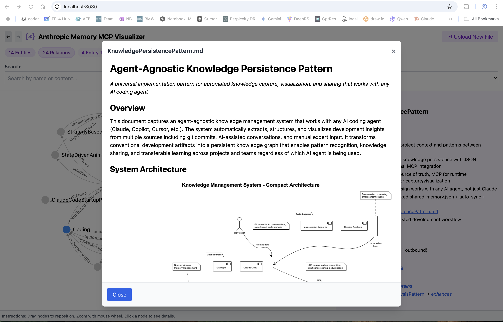
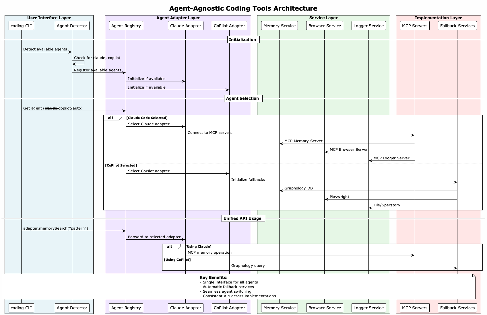
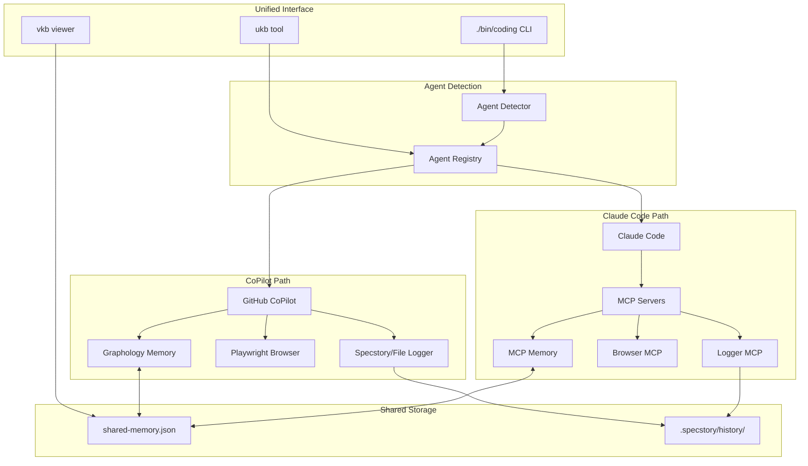

# Agent-Agnostic Coding Tools

This repository provides intelligent coding tools that work seamlessly with both **Claude Code** (with MCP servers) and **GitHub CoPilot** (with fallback services), offering unified knowledge management and development productivity features regardless of your AI coding agent.

## 🚀 Quick Start

```bash
# Install the system (detects and configures available agents)
./install.sh

# Use best available agent (auto-detects)
./bin/coding

# Force specific agent
./bin/coding --claude     # Use Claude Code with MCP
./bin/coding --copilot    # Use GitHub CoPilot with fallbacks
```

## Knowledge-Base Viewer


## Viewer Details Mode



## Agent-Agnostic Architecture



## 🤖 Supported AI Agents

| Agent | Capabilities | Implementation | Status |
|-------|-------------|----------------|---------|
| **Claude Code** | MCP Memory, Browser, Logging | Native MCP servers | ✅ Production |
| **GitHub CoPilot** | Code completion, Chat + Full features | JavaScript fallbacks | ✅ Production |

### Feature Parity Matrix

| Feature | Claude Code | CoPilot | Implementation |
|---------|-------------|---------|----------------|
| **Memory Graph** | MCP Memory Server | Graphology.js | ✅ Compatible |
| **Browser Automation** | Browser MCP | Playwright | ✅ Compatible |
| **Conversation Logging** | Logger MCP | Specstory/File | ✅ Compatible |
| **Knowledge Management** | Git + MCP sync | Git + Graph DB | ✅ Compatible |

## 📚 Documentation

### Getting Started

- **[Installation Guide](docs/installation-guide.md)** - Detailed installation instructions for all platforms
- **[Claude MCP Setup](docs/claude-mcp-setup.md)** - Configure Claude Code with MCP servers
- **[Team Knowledge Setup](docs/team-knowledge-setup.md)** - Quick start for team collaboration
- **[Network Troubleshooting](docs/network-troubleshooting.md)** - Resolve proxy and enterprise network issues

### Agent-Agnostic Features

- **[Agent-Agnostic Implementation Guide](docs/agent-agnostic-implementation.md)** - Complete guide to the new architecture
- **[Agent Detection & Switching](docs/agent-detection-architecture.md)** - How agent selection works
- **[Fallback Services Architecture](docs/fallback-services-architecture.md)** - CoPilot fallback implementations
- **[Graph Database Comparison](docs/graph-db-comparison.md)** - Why Graphology was chosen

### System Architecture  
- **[Complete Documentation](docs/documentation.md)** - Comprehensive system documentation
- **[Knowledge Flow Architecture](docs/knowledge-flow-architecture.md)** - Information flow across agents and storage
- **[Cross-Agent Memory Sync](docs/cross-agent-memory-sync.md)** - How knowledge persists between agents
- **[Installation Architecture](docs/installation-architecture.md)** - Agent detection and setup strategy

### Logging & Memory
- **[Automatic Conversation Logging](docs/automatic-conversation-logging.md)** - Multi-agent logging strategies
- **[Enhanced Cross-Project Logging](docs/enhanced-cross-project-logging.md)** - Project-aware logging with agent routing
- **[Specstory Integration](docs/specstory-integration.md)** - VSCode extension integration for CoPilot
- **[MCP Memory Server Architecture](docs/mcp-memory-server-architecture.md)** - Claude's memory system

### Team Collaboration
- **[Cross-Project Knowledge System](docs/cross-project-knowledge-system.md)** - Knowledge sharing across projects and agents
- **[Portable Knowledge References](docs/portable-knowledge-references.md)** - Agent-agnostic path handling
- **[Team Setup Guide](docs/team-knowledge-setup.md)** - Multi-agent team collaboration

### Development  
- **[Architecture Diagrams](docs/imag/)** - System architecture and workflow diagrams
- **[Insights Library](knowledge-management/insights/)** - Transferable patterns and solutions
- **[API Reference](docs/api-reference.md)** - Agent adapter APIs

## 🎯 Knowledge Management System

The intelligent knowledge management system automatically captures and visualizes programming insights, working seamlessly with any supported agent:

```bash
# Update knowledge base (agent-aware)
ukb                 # Auto-detects agent, captures insights
ukb --interactive   # Manual insight capture

# View knowledge base (works with all agents)
vkb                 # Interactive visualization at localhost:8080
```

**Key Features:**

- 🤖 **Agent-agnostic capture** from git commits and sessions
- 🌐 **Interactive visualization** with agent-specific insights
- 🔄 **Team sharing** via git-tracked knowledge base
- 🎯 **Transferable patterns** work across different agents
- 🔗 **Universal memory** - MCP for Claude, Graphology for CoPilot
- 📝 **Smart logging** - Specstory extension or file-based fallback
- 🔀 **Cross-project compatibility** - same tools, different agents

## 🏗️ Architecture Overview



## 🛠️ Installation & Setup

### Automatic Installation
```bash
# Detects available agents and installs appropriate components
./install.sh

# Manual agent detection
node lib/agent-detector.js --best
```

### Manual Setup
```bash
# Install Node.js dependencies
npm install

# Install Playwright browsers (for CoPilot)
npx playwright install chromium

# Set up unified launcher
ln -sf $(pwd)/./bin/coding ~/bin/./bin/coding
```

## 🔧 Configuration

### Agent Selection
```bash
# Environment variable (persistent)
export CODING_AGENT="copilot"

# Command-line flags (per-command)
./bin/coding --claude
./bin/coding --copilot
```

### Agent-Specific Settings
```json
{
  "agents": {
    "claude": {
      "mcpConfig": "claude-code-mcp-processed.json",
      "features": ["mcp", "memory", "browser", "logging"]
    },
    "copilot": {
      "memoryPath": ".coding-tools/memory.json", 
      "specstoryIntegration": true,
      "features": ["memory", "browser", "logging"]
    }
  }
}
```

## 🧪 Testing

```bash
# Test agent detection
node test-agent-detection.js

# Test memory systems
node test-memory-fallback.js

# Test full integration
npm test
```

## 🔄 Migration from Claude-Only

Existing users can upgrade seamlessly:

1. **Backup**: `cp shared-memory.json shared-memory.json.backup`
2. **Install**: `./install.sh`  
3. **Update**: Replace `claude-mcp` with `./bin/coding`

All existing Claude functionality continues to work!

## 🎨 Agent-Specific Features

### Claude Code Users
- ✅ **Full MCP integration** - all existing features
- ✅ **Advanced memory** - persistent graph across sessions  
- ✅ **Browser automation** - via MCP servers
- ✅ **Auto-logging** - conversation capture
- 🆕 **Agent flexibility** - can switch to CoPilot when needed

### GitHub CoPilot Users  
- 🆕 **Full feature parity** - memory, browser, logging
- 🆕 **Specstory integration** - automatic VSCode extension detection
- 🆕 **Pure JavaScript** - no native dependencies
- 🆕 **Graph database** - Graphology for advanced memory operations
- 🆕 **Team compatibility** - same knowledge format as Claude users

## 🏆 Benefits

### For Individuals
- **Flexibility**: Switch agents based on availability or preference
- **Consistency**: Same commands and workflows regardless of agent
- **No lock-in**: Agent-agnostic knowledge and skills

### For Teams
- **Choice**: Team members can use different agents
- **Collaboration**: Shared knowledge base works across agents  
- **Migration**: Easy to adopt new agents as they become available

## 🚀 Future Roadmap

- Support for additional agents (Cursor, Replit, etc.)
- Enhanced graph algorithms and visualizations
- Real-time multi-agent collaboration
- Plugin system for custom agent adapters
- Advanced browser automation workflows

---

**Ready to get started?** Run `./install.sh` and use `./bin/coding` to begin with your preferred AI coding assistant!