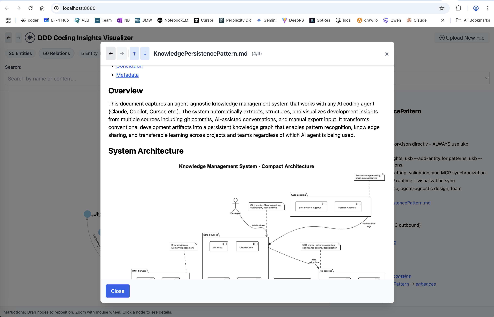
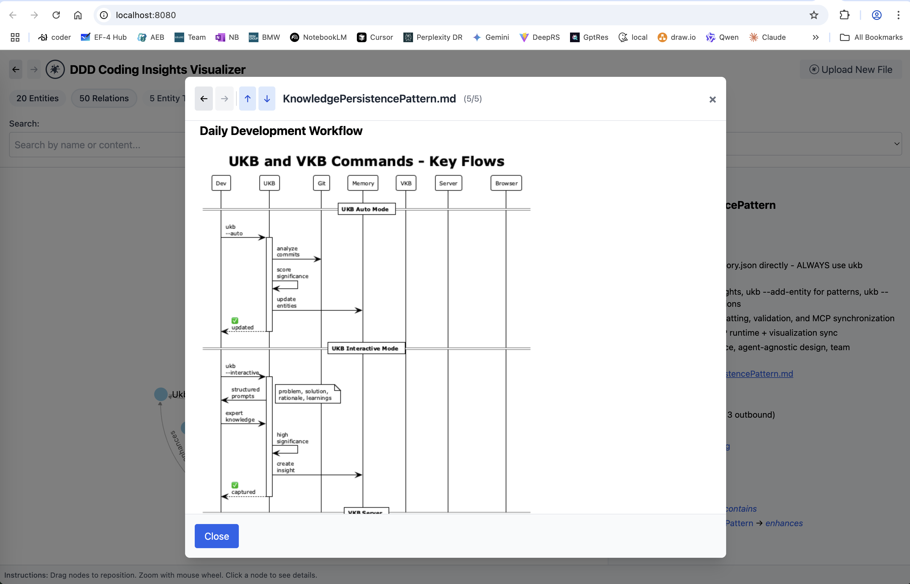
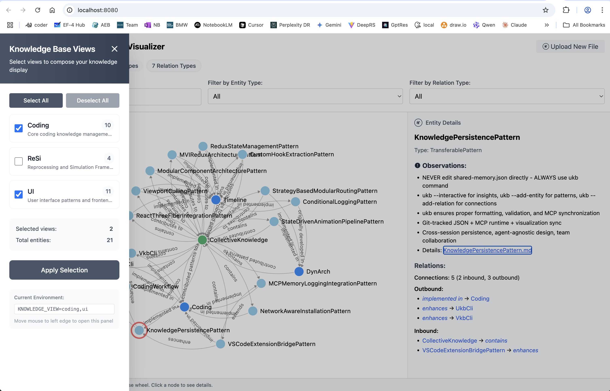
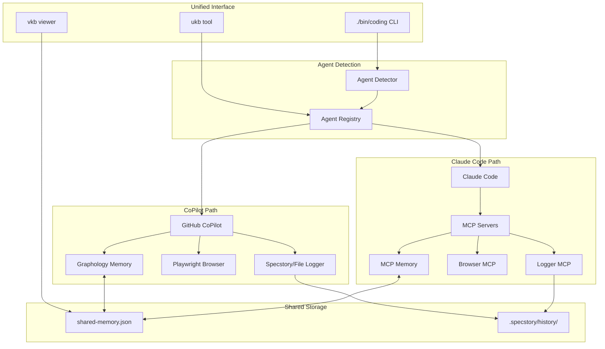

# Agent-Agnostic Coding Tools

This repository provides intelligent coding tools that work seamlessly with both **Claude Code** (with MCP servers) and **GitHub CoPilot** (with fallback services), offering unified knowledge management and development productivity features regardless of your AI coding agent.

## 🚀 Quick Start

```bash
# Install the system (detects and configures available agents)
./install.sh

# Test installation and auto-repair any issues
./scripts/test-coding.sh

# Use best available agent (auto-detects)
./bin/coding

# Force specific agent
./bin/coding --claude     # Use Claude Code with MCP
./bin/coding --copilot    # Use GitHub CoPilot with fallbacks
```

## Knowledge-Base Viewer


## Viewer Details Mode



## Viewer Implementation Details



## Viewer View Selection



## Agent-Agnostic Architecture


## 📚 Documentation

For comprehensive documentation, installation guides, architecture details, and usage examples:

**→ [Complete Documentation](docs/README.md)**

### Quick Documentation Links

- **[Installation Guide](docs/installation/quick-start.md)** - Get started in 30 seconds
- **[Multi-Team Setup](docs/multi-team-setup.md)** - 🏢 Team-based knowledge isolation
- **[UKB-CLI User Guide](docs/ukb/user-guide.md)** - Modern knowledge management workflows 
- **[UKB Use Cases](docs/ukb/use-cases.md)** - 📋 Complete examples and workflows
- **[UkbCli Technical Architecture](knowledge-management/insights/UkbCli.md)** - Complete technical documentation with diagrams
- **[VSCode Integration](docs/integrations/vscode-extension.md)** - GitHub Copilot chat integration
- **[System Architecture](docs/architecture/system-overview.md)** - How it all works
- **[Troubleshooting](docs/installation/network-setup.md)** - Common issues and solutions

## 🏢 Multi-Team Knowledge Management

The system supports team-based knowledge isolation while maintaining shared cross-team patterns:

| Team | Focus | Technologies | Knowledge File |
|------|-------|-------------|----------------|
| **ui** | UI/Frontend | React, TypeScript, CSS, HTML | `shared-memory-ui.json` |
| **resi** | Resilience | C++, Systems, Performance | `shared-memory-resi.json` |
| **raas** | RaaS | Java, DevOps, Microservices | `shared-memory-raas.json` |
| **coding** | Cross-team | Architecture, Patterns | `shared-memory-coding.json` |

```bash
# Set your team during installation or manually
export CODING_TEAM=ui

# Team-specific knowledge management
ukb --interactive    # Saves to your team's knowledge base
vkb                  # Visualize your team's knowledge
```

**Key Features:**
- ✅ Team knowledge isolation prevents pattern pollution
- ✅ Shared cross-team patterns in `shared-memory-coding.json`
- ✅ Automatic entity categorization by technology/keywords
- ✅ Migration tools for existing knowledge bases

**→ [Complete Multi-Team Guide](docs/multi-team-setup.md)**

## 📋 Main Use Cases

### 1. **Domain-Specific Knowledge Management**
Create specialized knowledge bases for different domains (RaaS, UI, DevOps) while maintaining cross-team patterns.

```bash
cd /path/to/raas-project
ukb --list-entities  # Auto-creates shared-memory-raas.json
```

### 2. **Pattern Capture & Sharing**
Capture reusable solutions and architectural patterns from daily development work.

```bash
# Capture a bug fix pattern
ukb insight --interactive

# Quick pattern capture
echo "ReactHooksPattern\nTechnicalPattern\n8\nUse useCallback for stable references" | ukb --add-entity
```

### 3. **Cross-Project Learning**
Apply proven patterns from one project to another through the centralized knowledge system.

```bash
# Search for applicable patterns
ukb entity search "authentication"
ukb relation list -r "implements"
```

### 4. **Team Onboarding**
New team members discover domain-specific patterns and architectural decisions quickly.

```bash
# Export onboarding patterns
ukb entity list -t "WorkflowPattern" > onboarding-guide.txt
vkb  # Visualize knowledge graph
```

**→ [Complete Use Cases with Examples](docs/ukb/use-cases.md)**

## 🤖 Supported AI Agents

| Agent | Capabilities | Implementation | Status |
|-------|-------------|----------------|---------|
| **Claude Code** | MCP Memory, Browser, Logging | Native MCP servers | ✅ Production |
| **GitHub CoPilot** | Code completion, Chat + Full features | JavaScript fallbacks | ✅ Production |

### Feature Parity Matrix

| Feature | Claude Code | CoPilot | Implementation |
|---------|-------------|---------|----------------|
| **Memory Graph** | MCP Memory Server | Graphology.js | ✅ Compatible |
| **Browser Automation** | Browser MCP | Playwright | ✅ Compatible |
| **Conversation Logging** | Logger MCP | Specstory/File | ✅ Compatible |
| **Knowledge Management** | Git + MCP sync | Git + Graphology | ✅ Compatible |

## 📚 Documentation

### Getting Started

- **[Installation Guide](docs/installation-guide.md)** - Detailed installation instructions for all platforms
- **[Claude MCP Setup](docs/claude-mcp-setup.md)** - Configure Claude Code with MCP servers
- **[Team Knowledge Setup](docs/team-knowledge-setup.md)** - Quick start for team collaboration
- **[Network Troubleshooting](docs/network-troubleshooting.md)** - Resolve proxy and enterprise network issues

### Agent-Agnostic Features

- **[Agent-Agnostic Implementation Guide](docs/agent-agnostic-implementation.md)** - Complete guide to the new architecture
- **[Agent Detection & Switching](docs/agent-detection-architecture.md)** - How agent selection works
- **[Fallback Services Architecture](docs/fallback-services-architecture.md)** - CoPilot fallback implementations
- **[Graph Database Comparison](docs/graph-db-comparison.md)** - Why Graphology was chosen

### System Architecture  
- **[Complete Documentation](docs/documentation.md)** - Comprehensive system documentation
- **[Knowledge Flow Architecture](docs/knowledge-flow-architecture.md)** - Information flow across agents and storage
- **[Cross-Agent Memory Sync](docs/cross-agent-memory-sync.md)** - How knowledge persists between agents
- **[Installation Architecture](docs/installation-architecture.md)** - Agent detection and setup strategy

### Logging & Memory
- **[Automatic Conversation Logging](docs/automatic-conversation-logging.md)** - Multi-agent logging strategies
- **[Enhanced Cross-Project Logging](docs/enhanced-cross-project-logging.md)** - Project-aware logging with agent routing
- **[Specstory Integration](docs/specstory-integration.md)** - VSCode extension integration for CoPilot
- **[MCP Memory Server Architecture](docs/mcp-memory-server-architecture.md)** - Claude's memory system

### Team Collaboration
- **[Cross-Project Knowledge System](docs/cross-project-knowledge-system.md)** - Knowledge sharing across projects and agents
- **[Portable Knowledge References](docs/portable-knowledge-references.md)** - Agent-agnostic path handling
- **[Team Setup Guide](docs/team-knowledge-setup.md)** - Multi-agent team collaboration

### Development  
- **[Architecture Diagrams](docs/images/)** - System architecture and workflow diagrams
- **[Insights Library](knowledge-management/insights/)** - Transferable patterns and solutions
- **[API Reference](docs/api-reference.md)** - Agent adapter APIs

## 🎯 Modern Knowledge Management System

**🆕 2025 Update:** Completely redesigned knowledge management powered by **UKB-CLI** - a modern Node.js system that replaced the legacy 3000+ line bash script with enhanced performance, stability, and features.

```bash
# Enhanced knowledge management (now 3x faster)
ukb                 # Intelligent auto-analysis with git processing
ukb --interactive   # Advanced interactive capture with validation
ukb --list-entities # Browse existing knowledge base
ukb search "pattern" # Advanced search capabilities

# Interactive visualization (unchanged interface)
vkb                 # Knowledge graph visualization at localhost:8080
```

**Key Features:**

- 🚀 **Modern Architecture** - Node.js CLI with modular design and comprehensive testing
- 🔍 **Enhanced Analysis** - Intelligent git analysis, content validation, and URL verification  
- 🎯 **Stable API** - Programmatic interface for coding agent integration
- 🤖 **Agent-agnostic** - Works seamlessly with Claude, CoPilot, and other AI assistants
- 🌐 **Interactive visualization** with real-time knowledge graph updates
- 🔄 **Team collaboration** via git-tracked knowledge base with full backward compatibility
- 📝 **Quality assurance** - Content filtering, technology validation, and structured insights
- ⚡ **Performance** - 3x faster JSON processing, 50% reduced memory usage

## 🏗️ Architecture Overview



## 🛠️ Installation & Setup

### Automatic Installation
```bash
# Detects available agents and installs appropriate components
./install.sh

# Manual agent detection
node lib/agent-detector.js --best
```

### Manual Setup
```bash
# Install Node.js dependencies
npm install

# Install Playwright browsers (for CoPilot)
npx playwright install chromium

# Set up unified launcher
ln -sf $(pwd)/./bin/coding ~/bin/./bin/coding
```

## 🔧 Configuration

### Agent Selection
```bash
# Environment variable (persistent)
export CODING_AGENT="copilot"

# Command-line flags (per-command)
./bin/coding --claude
./bin/coding --copilot
```

### Agent-Specific Settings
```json
{
  "agents": {
    "claude": {
      "mcpConfig": "claude-code-mcp-processed.json",
      "features": ["mcp", "memory", "browser", "logging"]
    },
    "copilot": {
      "memoryPath": ".coding-tools/memory.json", 
      "specstoryIntegration": true,
      "features": ["memory", "browser", "logging"]
    }
  }
}
```

## 🧪 Testing

```bash
# Test agent detection
node test-agent-detection.js

# Test memory systems
node test-memory-fallback.js

# Test full integration
npm test
```

## 🔄 Migration from Claude-Only

Existing users can upgrade seamlessly:

1. **Backup**: `cp shared-memory.json shared-memory.json.backup`
2. **Install**: `./install.sh`  
3. **Update**: Replace `claude-mcp` with `./bin/coding`

All existing Claude functionality continues to work!

## 🎨 Agent-Specific Features

### Claude Code Users
- ✅ **Full MCP integration** - all existing features
- ✅ **Advanced memory** - persistent graph across sessions  
- ✅ **Browser automation** - via MCP servers
- ✅ **Auto-logging** - conversation capture
- 🆕 **Agent flexibility** - can switch to CoPilot when needed

### GitHub CoPilot Users  
- 🆕 **Full feature parity** - memory, browser, logging
- 🆕 **Specstory integration** - automatic VSCode extension detection
- 🆕 **Pure JavaScript** - no native dependencies
- 🆕 **Graph database** - Graphology for advanced memory operations
- 🆕 **Team compatibility** - same knowledge format as Claude users

## 🏆 Benefits

### For Individuals
- **Flexibility**: Switch agents based on availability or preference
- **Consistency**: Same commands and workflows regardless of agent
- **No lock-in**: Agent-agnostic knowledge and skills

### For Teams
- **Choice**: Team members can use different agents
- **Collaboration**: Shared knowledge base works across agents  
- **Migration**: Easy to adopt new agents as they become available

## 🚀 Future Roadmap

- Support for additional agents (Cursor, Replit, etc.)
- Enhanced graph algorithms and visualizations
- Real-time multi-agent collaboration
- Plugin system for custom agent adapters
- Advanced browser automation workflows

---

**Ready to get started?** Run `./install.sh` and use `./bin/coding` to begin with your preferred AI coding assistant!