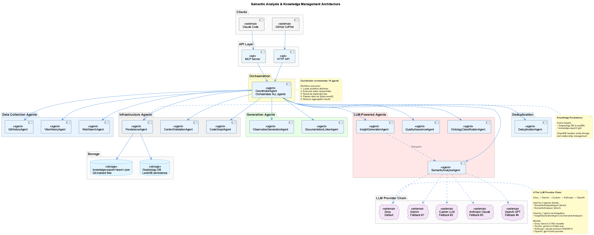

# Unified Semantic Analysis & Knowledge Management System

A comprehensive AI-powered development toolkit featuring **unified multi-agent semantic analysis** with seamless integration for both **Claude Code** (MCP tools) and **GitHub CoPilot** (enhanced VSCode integration). The system uses a **single agent infrastructure** and **unified SynchronizationAgent** to ensure consistent knowledge management across all AI coding assistants.

## 🚀 Quick Start

```bash
# Install the unified system
./install.sh

# Test installation and verify agent system
./scripts/test-coding.sh

# Use best available agent (auto-detects)
./bin/coding

# Force specific agent (both use SAME agent system)
./bin/coding --claude     # Claude Code with MCP + Unified Agent System
./bin/coding --copilot    # GitHub CoPilot + Unified Agent System
```

## 🏗️ Unified System Architecture



The system provides:

- **🤖 Unified Multi-Agent System** - 8 specialized agents for comprehensive analysis
- **🔄 Single SynchronizationAgent** - Sole authority for data integrity across all systems
- **📊 Universal Command Interface** - `determine_insights`, `update_knowledge_base`, `lessons_learned`
- **🎯 Agent-Agnostic Design** - Same functionality in Claude Code (MCP) and CoPilot (VSCode)
- **🔗 Multi-Database Sync** - MCP Memory ↔ Graphology ↔ shared-memory.json
- **👁️ Transparent Progress** - Real-time agent activity logging and visualization

## 🔧 Core Components

### Knowledge Management Tools

- **[UKB-CLI](docs/ukb/)** - Update Knowledge Base (capture insights)
- **[VKB-CLI](docs/vkb/)** - View Knowledge Base (web visualization)

### Unified Semantic Analysis System

- **[MCP Server Documentation](integrations/mcp-server-semantic-analysis/README.md)** - Standalone Node.js MCP server (12 tools, 8 agents)
- **[8-Agent System Architecture](docs/components/semantic-analysis/unified-architecture.md)** - Complete agent ecosystem
- **[MCP Integration](docs/components/semantic-analysis/mcp-server-setup.md)** - Claude Code unified tools
- **[VSCode Integration](docs/integrations/vscode-copilot-integration.md)** - Enhanced CoPilot with same agents
- **[SynchronizationAgent](docs/components/semantic-analysis/synchronization-agent.md)** - Single source of truth

## 📚 Documentation

### 🚀 Getting Started

- **[Quick Start Guide](docs/installation/quick-start.md)** - Get running in 30 seconds
- **[Network Setup](docs/installation/network-setup.md)** - Corporate firewall configuration
- **[MCP Configuration](docs/installation/mcp-configuration.md)** - Claude Code setup

### 🏗️ Architecture & Design

- **[Unified Architecture](docs/architecture/unified-system-overview.md)** - Complete unified system guide
- **[Knowledge Flow](docs/architecture/unified-knowledge-flow.md)** - How knowledge flows through unified agents
- **[Multi-Database Sync](docs/architecture/unified-memory-systems.md)** - SynchronizationAgent and data consistency

### 🧩 Component Documentation

- **[UKB-CLI Documentation](docs/ukb/)** - Knowledge capture system
- **[VKB-CLI Documentation](docs/vkb/)** - Knowledge visualization
- **[Semantic Analysis System](docs/components/semantic-analysis/)** - AI analysis agents
- **[MCP Server](integrations/mcp-server-semantic-analysis/)** - Standalone Node.js semantic analysis server
  - **[Installation Guide](integrations/mcp-server-semantic-analysis/docs/installation/README.md)** - Complete setup and configuration
  - **[Architecture Details](integrations/mcp-server-semantic-analysis/docs/architecture/README.md)** - Technical architecture and design patterns
  - **[API Reference](integrations/mcp-server-semantic-analysis/docs/api/README.md)** - Complete tool and agent API documentation

### 🎯 Use Cases & Workflows

- **[Use Cases Overview](docs/use-cases/)** - Complete workflow examples
- **[Managing Knowledge Base](docs/use-cases/managing-knowledge-base.md)** - Team knowledge capture and access
- **[Semantic Workflows](docs/use-cases/semantic-workflows.md)** - Orchestrated multi-step analysis processes
- **[Cross-Project Learning](docs/use-cases/cross-project-learning.md)** - Knowledge accumulation across projects
- **[Conversation Insights](docs/use-cases/conversation-insights.md)** - Learning from team discussions
- **[Fallback Services](docs/use-cases/fallback-services.md)** - Graceful degradation when agents unavailable

### 🔌 Integrations

- **[VSCode CoPilot Integration](docs/integrations/vscode-copilot-integration.md)** - Enhanced development experience
- **[API Reference](docs/integrations/api-reference.md)** - HTTP and MCP APIs
- **[Testing Guide](docs/integrations/vscode-testing-guide.md)** - Integration testing

### 📋 Reference

- **[Reference Documentation](docs/reference/)** - Complete reference materials
- **[API Keys Setup](docs/reference/api-keys-setup.md)** - LLM provider configuration
- **[Troubleshooting](docs/reference/troubleshooting-knowledge-base.md)** - Common issues and solutions

## 🎯 Key Features

### Unified Agent System Design

- **Single Agent Infrastructure**: Both Claude and CoPilot use the SAME 8-agent system
- **Unified Commands**: `determine_insights`, `update_knowledge_base`, `lessons_learned` work everywhere
- **SynchronizationAgent Authority**: Single source of truth for data integrity
- **Auto-Detection**: Automatically uses the best available AI agent
- **Transparent Progress**: Real-time visibility into agent activities

### Unified Semantic Analysis

- **8 Specialized Agents**: Coordinator, Semantic Analysis, Repository Analyzer, Knowledge Graph, Web Search, Synchronization, Deduplication, Documentation
- **Code & Conversation Analysis**: Comprehensive pattern recognition from code and AI interactions
- **Cross-Project Learning**: Unified knowledge accumulation across all projects and AI sessions
- **Multi-Modal Insights**: Combines repository analysis, conversation logs, and web research

### Unified Knowledge Management

- **Multi-Database Architecture**: MCP Memory + Graphology + shared-memory.json
- **SynchronizationAgent**: Single authority ensuring consistency across all databases
- **Universal Commands**: Same interface for Claude Code (MCP) and CoPilot (HTTP API)
- **Interactive Capture**: `ukb --interactive` and unified agent commands
- **Visual Exploration**: `vkb` web interface with real-time multi-database sync

### Developer Experience

- **Zero Configuration**: Auto-starts required services when needed
- **Rich Diagnostics**: `mcp-status` command for system health checking
- **Hot Reloading**: Live updates during development
- **Cross-Platform**: Works on macOS, Linux, and Windows

## ⚡ Unified Command Examples

### 1. Determine Insights (Both Agents Use Same System)

**Using Claude Code:**

```bash
# Start Claude with unified agent system
claude-mcp

# Use unified command interface:
determine_insights {
  "repository": ".",
  "conversationContext": "Current refactoring work",
  "depth": 10,
  "significanceThreshold": 7
}
```

**Using VSCode CoPilot:**

```bash
# Start CoPilot with same agent system
coding --copilot

# Same agents, different interface:
@KM determine insights "Current refactoring work" --depth 10
```

### 2. Update Knowledge Base (Unified SynchronizationAgent)

**Claude Code:**

```
update_knowledge_base {
  "insights": [{
    "name": "ReactErrorBoundaryPattern",
    "problem": "React component errors crash entire app",
    "solution": "Use error boundaries with fallback UI",
    "significance": 8,
    "entityType": "TechnicalPattern"
  }],
  "syncTargets": ["mcp", "graphology", "files"]
}
```

**VSCode CoPilot:**

```
@KM update knowledge base "ReactErrorBoundaryPattern: Use error boundaries to prevent app crashes with fallback UI"
```

*Both commands use the same SynchronizationAgent to ensure data appears in MCP Memory, Graphology, AND shared-memory.json*

### 3. Extract Lessons Learned (Unified Analysis)

**Claude Code:**

```
lessons_learned {
  "context": "Recent debugging session",
  "repository": ".",
  "focusAreas": ["patterns", "failures", "solutions"],
  "includeConversationHistory": true
}
```

**VSCode CoPilot:**

```
@KM lessons learned "Recent debugging session" --focus patterns,failures,solutions
```

*Both commands trigger the same 8-agent workflow for comprehensive learning extraction*

### 4. Search Unified Knowledge Base

**Claude Code:**

```
search_knowledge {
  "query": "React error handling",
  "maxResults": 5
}
```

**VSCode CoPilot:**

```
@KM search "React error handling"
```

*Both search across MCP Memory, Graphology, and shared-memory.json simultaneously*

### 5. System Status and Transparency

**Check Agent System Status:**

```
# Claude Code
get_system_status {}

# CoPilot
@KM system status
```

**Monitor Agent Activities:**

```
# Claude Code
get_workflow_status {"workflowId": "analysis-123"}

# CoPilot  
@KM workflow status analysis-123
```

*Real-time visibility into all 8 agents: Coordinator → Semantic Analysis → Repository Analyzer → Knowledge Graph → Web Search → Synchronization → Deduplication → Documentation*

### 6. Fallback Mode (No API Keys)

```bash
# Direct knowledge management (same data used by agents)
ukb --interactive  # Manual knowledge capture
vkb               # Web visualization of unified knowledge base
```

## 🔍 Unified System Status

Check unified agent system health:

```bash
# Check unified system status
get_system_status  # In Claude Code
@KM system status  # In CoPilot

# Test all components  
./scripts/test-coding.sh

# Check agent infrastructure
mcp-status  # MCP server health
./bin/coding --agent copilot --copilot-stop  # Stop CoPilot services
./bin/coding --agent claude                   # Check Claude integration
```

### Real-Time Agent Monitoring

```bash
# Monitor agent activities
tail -f semantic-analysis-system/logs/agents.log

# Check SynchronizationAgent status
curl http://localhost:8765/api/graph/status

# Verify multi-database consistency
vkb  # Opens unified knowledge visualization
```

## 🛠️ Development

### API Keys Configuration

Configure in `semantic-analysis-system/.env`:

```bash
# Option 1: Anthropic only (recommended)
ANTHROPIC_API_KEY=sk-ant-your-key-here
DEFAULT_LLM_PROVIDER=claude

# Option 2: OpenAI only
OPENAI_API_KEY=sk-your-key-here
DEFAULT_LLM_PROVIDER=openai

# Option 3: Both (fallback support)
ANTHROPIC_API_KEY=sk-ant-your-key-here
OPENAI_API_KEY=sk-your-key-here
DEFAULT_LLM_PROVIDER=claude
```

### Service Architecture

- **MCP Server**: Node.js process (Claude Code semantic analysis)
- **VKB Web Server**: Port 8080 (knowledge visualization)
- **CoPilot HTTP Server**: Port 8765 (VSCode integration)
- **Knowledge Databases**: MCP Memory, Graphology, shared-memory.json

## 📖 Historical Context

This system has evolved through several iterations:

- **Phase 1**: Basic knowledge capture (bash scripts)
- **Phase 2**: Node.js CLI tools (UKB-CLI, VKB-CLI)
- **Phase 3**: MCP integration for Claude Code
- **Phase 4**: Multi-agent semantic analysis system
- **Phase 5**: Agent-agnostic interface with CoPilot support

See [Archive](docs/archive/) for migration histories and legacy documentation.

## 🤝 Contributing

1. Follow the existing code patterns
2. Update relevant documentation
3. Test with both Claude Code and CoPilot
4. Use `ukb` to capture insights from your changes

---

**🎯 The goal**: Make AI-assisted development more intelligent by learning from every interaction and accumulating knowledge across projects and team members.
