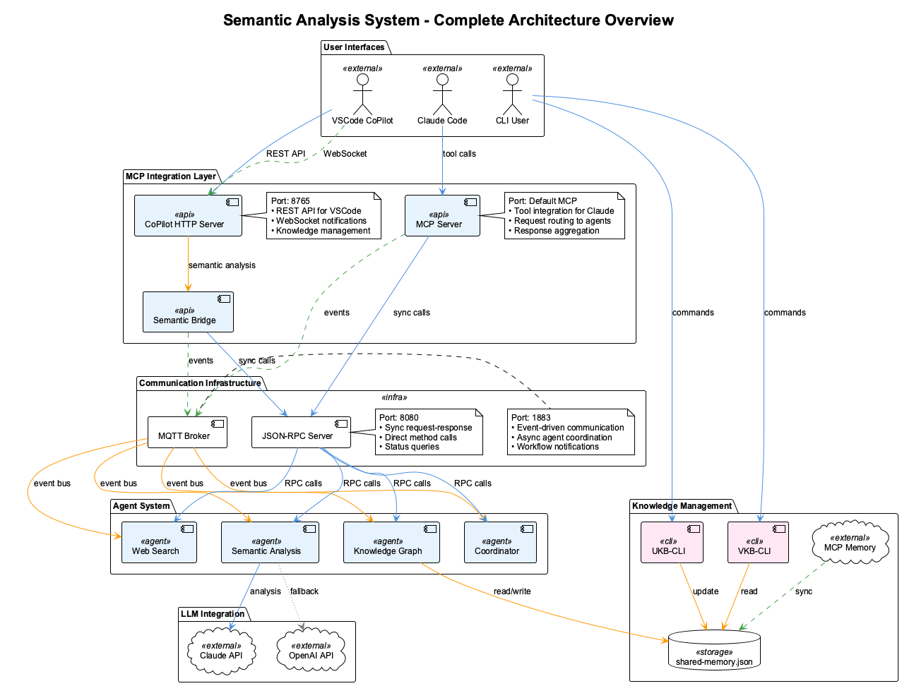

# Semantic Analysis & Knowledge Management System

A comprehensive AI-powered development toolkit that provides intelligent code analysis, knowledge management, and seamless integration with both **Claude Code** (with MCP servers) and **GitHub CoPilot** (with fallback services).

## 🚀 Quick Start

```bash
# Install the system (detects and configures available agents)
./install.sh

# Test installation and auto-repair any issues
./scripts/test-coding.sh

# Use best available agent (auto-detects)
./bin/coding

# Force specific agent
./bin/coding --claude     # Use Claude Code with MCP + Semantic Analysis
./bin/coding --copilot    # Use GitHub CoPilot with Semantic Analysis
```

## 🏗️ System Architecture



The system provides:
- **Multi-Agent Semantic Analysis** - Code pattern recognition, conversation insights
- **Knowledge Management** - UKB-CLI for capture, VKB-CLI for visualization
- **Agent-Agnostic Interface** - Works with Claude Code or GitHub CoPilot
- **MCP Integration** - Deep Claude Code integration via MCP tools
- **VSCode Integration** - Enhanced CoPilot experience with semantic analysis

## 🔧 Core Components

### Knowledge Management Tools
- **[UKB-CLI](docs/components/ukb/)** - Update Knowledge Base (capture insights)
- **[VKB-CLI](docs/components/vkb/)** - View Knowledge Base (web visualization)

### Semantic Analysis System
- **[Multi-Agent System](docs/components/semantic-analysis/)** - Advanced AI-powered analysis
- **[MCP Integration](docs/components/semantic-analysis/mcp-server-setup.md)** - Claude Code tools
- **[VSCode Integration](docs/integrations/vscode-copilot-integration.md)** - Enhanced CoPilot

## 📚 Documentation

### 🚀 Getting Started
- **[Quick Start Guide](docs/installation/quick-start.md)** - Get running in 30 seconds
- **[Network Setup](docs/installation/network-setup.md)** - Corporate firewall configuration
- **[MCP Configuration](docs/installation/mcp-configuration.md)** - Claude Code setup

### 🏗️ Architecture & Design
- **[System Overview](docs/architecture/system-overview.md)** - Complete architecture guide
- **[Knowledge Flow](docs/architecture/knowledge-flow.md)** - How knowledge moves through the system
- **[Memory Systems](docs/architecture/memory-systems.md)** - Storage and synchronization

### 🧩 Component Documentation
- **[UKB-CLI Documentation](docs/components/ukb/)** - Knowledge capture system
- **[VKB-CLI Documentation](docs/components/vkb/)** - Knowledge visualization
- **[Semantic Analysis System](docs/components/semantic-analysis/)** - AI analysis agents

### 🔌 Integrations
- **[VSCode CoPilot Integration](docs/integrations/vscode-copilot-integration.md)** - Enhanced development experience
- **[API Reference](docs/integrations/api-reference.md)** - HTTP and MCP APIs
- **[Testing Guide](docs/integrations/testing-guide.md)** - Integration testing

### 📋 Reference
- **[Command Reference](docs/reference/)** - All CLI commands and options
- **[Configuration](docs/reference/)** - Environment variables and settings
- **[Troubleshooting](docs/reference/)** - Common issues and solutions

## 🎯 Key Features

### Agent-Agnostic Design
- **Universal Interface**: Same commands work with Claude Code or GitHub CoPilot
- **Auto-Detection**: Automatically uses the best available AI agent
- **Fallback Services**: Graceful degradation when agents unavailable

### Semantic Analysis
- **Code Pattern Recognition**: Identifies architectural patterns and anti-patterns
- **Conversation Insights**: Extracts knowledge from discussions and logs
- **Cross-Project Learning**: Accumulates insights across multiple projects

### Knowledge Management
- **Persistent Storage**: Git-tracked knowledge base (`shared-memory.json`)
- **Interactive Capture**: `ukb --interactive` for guided knowledge entry
- **Visual Exploration**: `vkb` web interface for knowledge graph visualization
- **MCP Synchronization**: Real-time sync with Claude Code memory

### Developer Experience
- **Zero Configuration**: Auto-starts required services when needed
- **Rich Diagnostics**: `mcp-status` command for system health checking
- **Hot Reloading**: Live updates during development
- **Cross-Platform**: Works on macOS, Linux, and Windows

## ⚡ Usage Examples

### Capture Knowledge from Code Analysis
```bash
# Analyze recent commits and capture insights
ukb --auto

# Interactive knowledge capture
ukb --interactive

# Analyze specific files
ukb --files src/components/*.tsx
```

### Visualize Knowledge Graph
```bash
# Launch web interface
vkb

# Export for external tools
vkb --export --format graphml
```

### Semantic Analysis (with agents running)
```bash
# In Claude Code - use MCP tools:
# analyze_repository, analyze_conversation, search_web

# In VSCode CoPilot - use HTTP API:
# POST /api/semantic/analyze-repository
# POST /api/semantic/analyze-conversation
```

## 🔍 System Status

Check system health and configuration:
```bash
# Check overall system status
mcp-status

# Test all components
./scripts/test-coding.sh

# View agent status
./bin/coding --agent copilot --copilot-stop  # Stop CoPilot services
./bin/coding --agent claude                   # Check Claude integration
```

## 🛠️ Development

### API Keys Configuration
Configure in `semantic-analysis-system/.env`:
```bash
# Option 1: Anthropic only (recommended)
ANTHROPIC_API_KEY=sk-ant-your-key-here
DEFAULT_LLM_PROVIDER=claude

# Option 2: OpenAI only
OPENAI_API_KEY=sk-your-key-here
DEFAULT_LLM_PROVIDER=openai

# Option 3: Both (fallback support)
ANTHROPIC_API_KEY=sk-ant-your-key-here
OPENAI_API_KEY=sk-your-key-here
DEFAULT_LLM_PROVIDER=claude
```

### Service Architecture
- **MQTT Broker**: Port 1883 (async agent communication)
- **JSON-RPC Server**: Port 8080 (sync method calls)
- **VKB Web Server**: Port 8080 (knowledge visualization)
- **CoPilot HTTP Server**: Port 8765 (VSCode integration)

## 📖 Historical Context

This system has evolved through several iterations:
- **Phase 1**: Basic knowledge capture (bash scripts)
- **Phase 2**: Node.js CLI tools (UKB-CLI, VKB-CLI)
- **Phase 3**: MCP integration for Claude Code
- **Phase 4**: Multi-agent semantic analysis system
- **Phase 5**: Agent-agnostic interface with CoPilot support

See [Archive](docs/archive/) for migration histories and legacy documentation.

## 🤝 Contributing

1. Follow the existing code patterns
2. Update relevant documentation
3. Test with both Claude Code and CoPilot
4. Use `ukb` to capture insights from your changes

---

**🎯 The goal**: Make AI-assisted development more intelligent by learning from every interaction and accumulating knowledge across projects and team members.