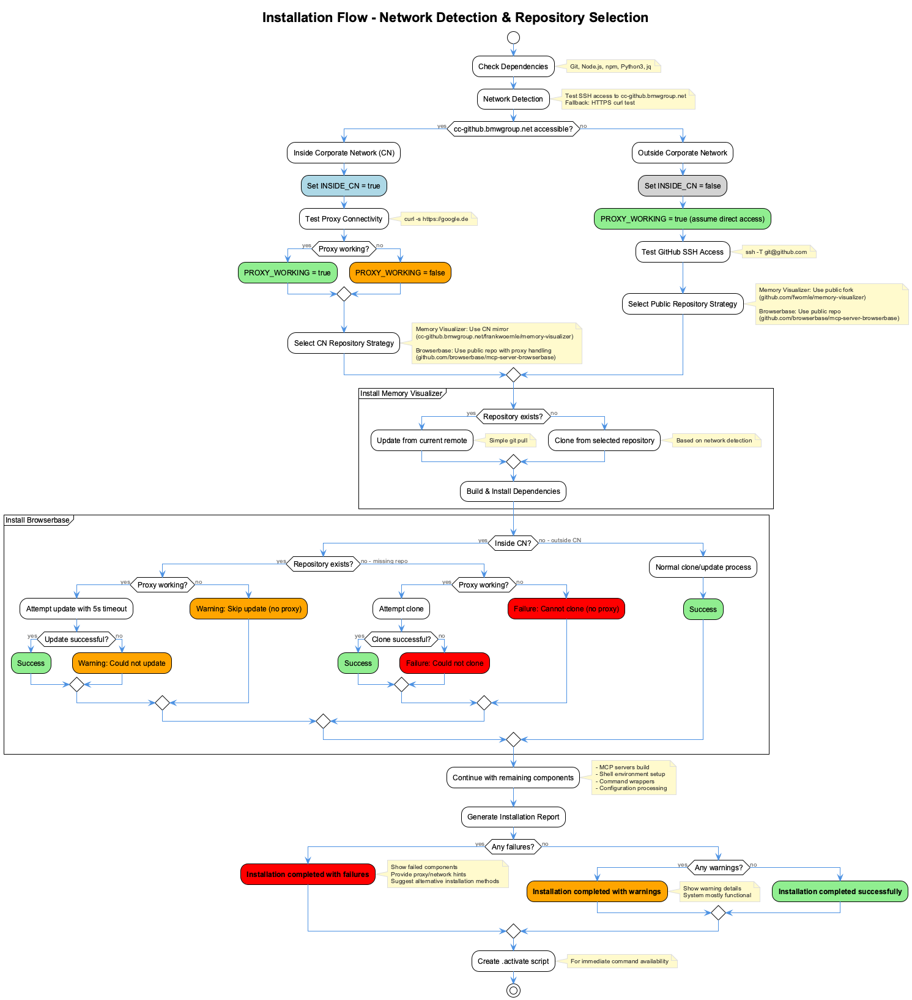

# Coding - AI Development Toolkit

A comprehensive AI-powered development toolkit featuring live session logging, real-time constraint monitoring, semantic knowledge management, and multi-agent analysis — supporting both Claude Code and GitHub CoPilot.

---

## 🚀 Quick Start

```bash
# Install the system (safe - prompts before any system changes)
./install.sh

# Start Claude Code with all features
coding

# Or use specific agent
coding --claude
coding --copilot
```

### Installation Safety

The installer follows a **non-intrusive policy** - it will NEVER modify system tools without explicit consent:

- **Confirmation prompts** before installing any system packages (Node.js, Python, jq)
- **Skip options**: `y` (approve), `N` (skip), `skip-all` (skip all system changes)
- **Shell config backup** with timestamped files before any modifications
- **Syntax verification** after shell config changes



**Next Steps**: [Getting Started Guide](docs/getting-started.md)

---

## 🎯 What It Provides

### Core Capabilities

- **🏥 Health System** - Real-time monitoring, auto-healing, and status line indicators
- **📋 Live Session Logging** - Real-time conversation classification and routing
- **🛡️ Constraint Monitoring** - PreToolUse hook enforcement for code quality
- **🧠 Knowledge Management** - Capture, visualize, and share development insights
- **📈 Trajectory Generation** - Automated project analysis and documentation
- **🤖 Multi-Agent Analysis** - 11 specialized AI agents for comprehensive code analysis

### Integration Support

- **Claude Code** - Full MCP server integration
- **GitHub CoPilot** - Enhanced VSCode integration with fallback services
- **Agent-Agnostic** - Same features regardless of AI assistant

---

## 📚 Documentation

### Core Systems

#### [🏥 Health System](docs/health-system/)
Automatic health monitoring and self-healing with real-time dashboard
- Pre-prompt health verification
- Auto-healing failed services
- Dashboard at `http://localhost:3030`
- 4-layer monitoring architecture
- **[📊 Status Line System](docs/health-system/status-line.md)** - Real-time indicators in Claude Code status bar

#### [📋 Live Session Logging (LSL)](docs/lsl/)
Real-time conversation classification and routing with security redaction
- 5-layer classification system
- Multi-project support with foreign session tracking
- 98.3% security effectiveness
- Zero data loss architecture

#### [📈 Trajectories](docs/trajectories/)
Real-time development state tracking and comprehensive project analysis
- AI-powered activity classification (exploring, implementing, verifying, etc.)
- Status line integration
- Automated project capability documentation

#### [🛡️ Constraints](docs/constraints/)
Real-time code quality enforcement through PreToolUse hooks
- 18 active constraints (security, architecture, code quality, PlantUML, documentation)
- Severity-based enforcement (CRITICAL/ERROR blocks, WARNING/INFO allows)
- Dashboard monitoring at `http://localhost:3030`
- Compliance scoring (0-10 scale)

#### [🧠 Knowledge Management](docs/knowledge-management/)
**Two Complementary Approaches** for knowledge capture and retrieval:
- **Manual/Batch (UKB)**: Git analysis and interactive capture for team sharing
- **Online (Continuous Learning)**: Real-time session learning with semantic search
- **Visualization (VKB)**: Web-based graph visualization at `http://localhost:8080`
- **Ontology Classification**: 4-layer classification pipeline

### Integration Components

- **[System Health Dashboard](integrations/system-health-dashboard/)** - Real-time health visualization
- **[MCP Constraint Monitor](integrations/mcp-constraint-monitor/)** - PreToolUse hook enforcement
- **[MCP Semantic Analysis](integrations/mcp-semantic-analysis/)** - 11-agent AI analysis system
- **[VKB Visualizer](integrations/vkb-visualizer/)** - Knowledge graph visualization
- **[Serena MCP](integrations/mcp-serena/)** - Structure-aware code search
- **[All Integrations](integrations/)** - Complete integration list

### Getting Started

- **[Installation & Setup](docs/getting-started.md)** - Complete installation guide
- **[Provider Configuration](docs/provider-configuration.md)** - LLM provider setup
- **[Troubleshooting](docs/troubleshooting.md)** - Common issues and solutions

---

## 🔧 Core Features

### Live Session Logging (LSL)

Real-time conversation classification and routing with enterprise-grade security:

- **3-Layer Classification**: Path analysis → Keyword matching → Semantic analysis
- **98.3% Security Effectiveness**: Enhanced redaction with bypass protection
- **Multi-User Support**: Secure user isolation with SHA-256 hash generation
- **Zero Data Loss**: Every exchange properly classified and preserved
- **200x Performance**: Optimized bulk processing with sub-millisecond tracking

**Status**: ✅ Production Ready

### Constraint Monitoring

PreToolUse hook integration for real-time code quality enforcement:

- **18 Active Constraints**: Security, architecture, code quality, PlantUML, documentation
- **Severity-Based**: CRITICAL/ERROR blocks, WARNING/INFO allows with feedback
- **Dashboard Monitoring**: Live violation feed (port 3030)
- **REST API**: Programmatic access (port 3031)
- **Testing Framework**: Automated and interactive constraint testing

**Status**: ✅ Production Ready

### Knowledge Management

Capture, organize, and visualize development insights with git-based team collaboration:

- **UKB (Update Knowledge Base)**: Auto git analysis + interactive capture
- **VKB (Visualize Knowledge Base)**: Web-based graph visualization
- **Graph Database**: Agent-agnostic persistent storage (Graphology + Level)
- **Git-Tracked JSON**: Team collaboration via pretty JSON exports
- **graph-sync CLI**: Manual export/import/status operations
- **Auto-Sync**: Import on startup, export on changes (5s debounce)
- **Team Isolation**: Multi-team support with conflict resolution
- **Domain-Specific**: Automatic domain knowledge bases per team

**Status**: ✅ Production Ready

### Multi-Agent Semantic Analysis

11 specialized agents for comprehensive code analysis:

1. **CoordinatorAgent** - Workflow orchestration
2. **GitHistoryAgent** - Git commits and architectural decisions
3. **VibeHistoryAgent** - Conversation file processing
4. **SemanticAnalysisAgent** - Deep code analysis (uses LLM)
5. **WebSearchAgent** - External pattern research
6. **InsightGenerationAgent** - Insight generation with PlantUML (uses LLM)
7. **ObservationGenerationAgent** - Structured UKB-compatible observations
8. **QualityAssuranceAgent** - Output validation with auto-correction (uses LLM)
9. **ContentValidationAgent** - Stale entity detection and knowledge refresh
10. **PersistenceAgent** - Knowledge base persistence
11. **DeduplicationAgent** - Semantic duplicate detection

**Status**: ✅ Production Ready

---

## ⚡ Usage Examples

### Knowledge Management

```bash
# Start visualization server
vkb

# View at http://localhost:8080

# Manual sync operations
graph-sync status      # View sync status
graph-sync export      # Export all teams to JSON
graph-sync import      # Import all teams from JSON
graph-sync sync        # Full bidirectional sync
```

### Constraint Monitoring

```bash
# Start dashboard (automatic with install)
cd integrations/mcp-constraint-monitor
npm run dashboard  # http://localhost:3030

# API access
curl http://localhost:3031/api/status
curl http://localhost:3031/api/violations
```

### Live Session Logging

```bash
# Automatic during Claude Code sessions
# Session files in .specstory/history/

# Status line shows:
📋🟠2130-2230(3min) →coding
# 📋 = logging, 🟠 = window closing, →coding = activity detected
```

### Semantic Analysis Workflows

**Claude Code:**
```
# Repository analysis workflow
start_workflow {
  "workflowType": "repository-analysis",
  "parameters": {
    "repository": ".",
    "depth": 25,
    "significanceThreshold": 6
  }
}
```

**VSCode CoPilot:**
```bash
# Via HTTP API
curl -X POST http://localhost:8765/api/semantic/analyze-repository \
  -H "Content-Type: application/json" \
  -d '{"repository": ".", "depth": 25}'
```

---

## 🛠️ Configuration

### Quick Configuration

```bash
# Set API keys
export ANTHROPIC_API_KEY="your-key-here"
export OPENAI_API_KEY="optional-fallback"

# Configure preferred agent
export CODING_AGENT="claude"  # or "copilot"
```

### Detailed Configuration

See [Getting Started](docs/getting-started.md) for:
- API key setup
- MCP configuration
- Network setup (proxies/firewalls)
- Verification steps

---

## 📊 System Status

### Quick Health Check

```bash
# Test all components (check-only mode - safe, no modifications)
./scripts/test-coding.sh

# Interactive mode - prompts before each repair
./scripts/test-coding.sh --interactive

# Auto-repair mode - fixes coding-internal issues only
./scripts/test-coding.sh --auto-repair

# Check MCP servers
cd integrations/mcp-server-semantic-analysis && npm test

# Check constraint monitor
cd integrations/mcp-constraint-monitor && npm test
```

**Note**: The test script defaults to `--check-only` mode and will NEVER auto-install system packages.

### Current Status

✅ **Health System** - 4-layer monitoring with auto-healing
✅ **Live Session Logging** - Real-time classification with 98.3% security
✅ **Constraint Monitoring** - 18 active constraints with PreToolUse hooks
✅ **Knowledge Management** - UKB/VKB with MCP integration
✅ **Multi-Agent Analysis** - 11 agents with workflow orchestration
✅ **Status Line System** - Real-time indicators in Claude Code status bar
✅ **Cross-Platform** - macOS, Linux, Windows support

---

## 🤝 Contributing

This is a personal development toolkit. For issues or suggestions:

1. Check [Troubleshooting](docs/troubleshooting.md)
2. Review [Architecture Documentation](docs/architecture/README.md)
3. Create an issue with detailed information

---

## 📄 License

This project is licensed under the MIT License - see the [LICENSE](LICENSE) file for details.

Copyright © 2025 Frank Wornle

---

## 🔗 Quick Links

- **Documentation Hub**: [docs/README.md](docs/README.md)
- **Installation Guide**: [docs/getting-started.md](docs/getting-started.md)
- **System Overview**: [docs/system-overview.md](docs/system-overview.md)
- **Core Systems**: [docs/core-systems/](docs/core-systems/)
- **Integrations**: [docs/integrations/](docs/integrations/)
- **Knowledge Management**: [docs/knowledge-management/](docs/knowledge-management/)
