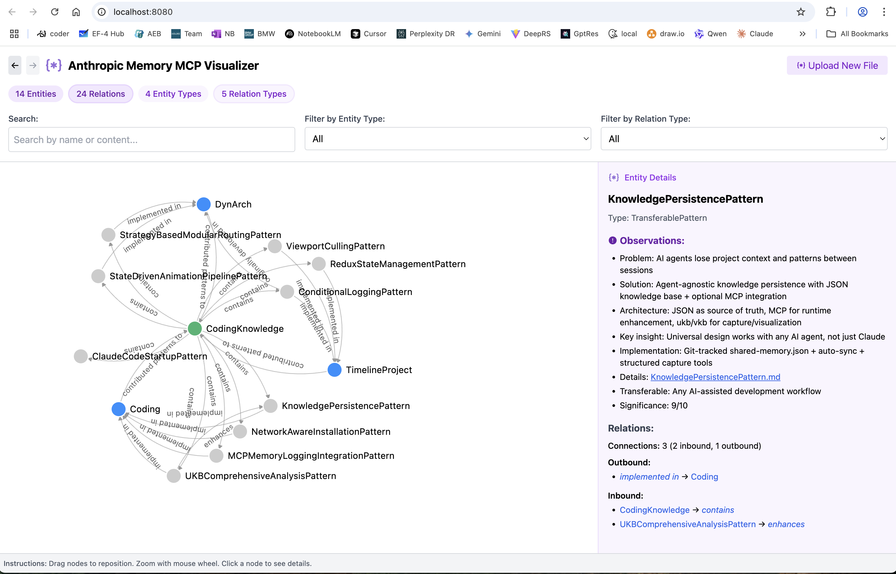

# Claude Scripts Collection

This repository contains various scripts and tools created with Claude Code, focused on knowledge management and development productivity.



## 📚 Documentation

- **[Complete Documentation](docs/documentation.md)** - Comprehensive system documentation
- **[Knowledge Flow Architecture](docs/knowledge-flow-architecture.md)** - Information flow from projects to MCP memory to git storage  
- **[Automatic Conversation Logging](docs/automatic-conversation-logging.md)** - How Claude Code sessions are automatically logged
- **[Enhanced Cross-Project Logging](docs/enhanced-cross-project-logging.md)** - Automatic dual logging for coding project work
- **[Cross-Project Knowledge System](docs/cross-project-knowledge-system.md)** - How knowledge applies across all projects
- **[Portable Knowledge References](docs/portable-knowledge-references.md)** - Avoiding hardcoded paths for team compatibility
- **[MCP Memory Server Architecture](docs/mcp-memory-server-architecture.md)** - Cross-session knowledge persistence via MCP
- **[Team Setup Guide](docs/team-knowledge-setup.md)** - Quick start for team collaboration
- **[Installation Architecture](docs/installation-architecture.md)** - Network detection and repository strategy
- **[Architecture Diagrams](docs/imag/)** - System architecture and workflow diagrams
- **[Insights Library](knowledge-management/insights/)** - Detailed transferable patterns and solutions

## 🎯 Quick Start

### Knowledge Management System

The primary focus of this repository is an intelligent knowledge management system that automatically captures and visualizes programming insights.

```bash
# Update knowledge base (capture session insights)
ukb

# View knowledge base (interactive visualization)
vkb
```

**Key Features:**

- 🤖 **Automatic capture** from git commits
- 🌐 **Interactive visualization** at localhost:8080
- 🔄 **Team sharing** via git-tracked knowledge base
- 🎯 **Transferable patterns** in central green hub
- 🔗 **MCP integration** for persistent memory with bidirectional sync
- 📝 **Automatic conversation logging** to `.specstory/history/` - all Claude Code sessions are automatically logged
- 🔀 **Cross-project logging** - coding project work automatically detected and dual-logged from any project context

## 🚀 Installation

### Quick Setup
```bash
git clone <repository-url> ~/coding  # "coding" is just an example - use any folder name
cd ~/coding
cp .env.example .env  # Configure API keys if needed
./install.sh        # Network-aware installation
source .activate    # Activate commands immediately
```

### Automatic Conversation Logging

Starting Claude Code with the `claude-mcp` command automatically enables conversation logging:
- All prompts and responses are captured to `.specstory/history/`
- Each session creates a timestamped markdown file
- Conversations are preserved for future reference and knowledge extraction
- No manual activation needed - logging starts automatically with each session

### Network-Aware Installation
The installer automatically detects your network environment:
- **🏢 Corporate Network**: Uses CN mirrors for modified repos, proxy detection for external repos
- **🌍 Public Network**: Uses public repositories with your forks

**📖 [Complete Installation Guide →](docs/team-knowledge-setup.md)**

### Start Using
```bash
ukb  # Update knowledge base
vkb  # View knowledge visualization
```

## 📁 Directory Structure

```
~/coding/
├── README.md                  # This file
├── docs/team-knowledge-setup.md # Quick setup guide
├── .env.example              # Environment variables template
├── .env                      # Your API keys (git-ignored)
├── install.sh                # Universal installer script
├── docs/                      # Complete documentation
│   ├── documentation.md       # Main documentation
│   ├── claude-logger-mcp.md  # Conversation logging docs
│   ├── puml/                  # PlantUML source files
│   └── imag/                  # Generated diagrams
├── shared-memory.json         # Knowledge base (git-tracked)
├── claude-code-mcp.json      # MCP config template
├── .specstory/               # Claude Code conversation history
│   └── history/              # Auto-logged conversations
├── knowledge-management/      # Core KM system
│   ├── ukb                   # Update Knowledge Base command
│   ├── vkb                   # View Knowledge Base command
│   ├── browser               # Browser integration
│   ├── insights/             # Detailed pattern documentation
│   │   ├── *.md              # Individual insight files
│   │   ├── images/           # Diagrams and screenshots
│   │   └── puml/             # PlantUML source files
│   └── dist/                 # Visualization files
├── browser-access/           # Browser automation tools
│   ├── src/                  # TypeScript source
│   └── dist/                 # Compiled MCP server
├── claude-logger-mcp/        # Conversation logging MCP server
│   ├── src/                  # TypeScript source
│   └── dist/                 # Compiled server
├── memory-visualizer/        # Knowledge graph visualization
│   └── dist/                 # Built visualization app
└── mcp-server-browserbase/   # Browser automation MCP
    └── stagehand/            # Stagehand integration
```

## 🚀 Core Commands

| Command | Purpose | Usage |
|---------|---------|-------|
| `ukb` | Update Knowledge Base | Analyzes git commits, extracts insights |
| `vkb` | View Knowledge Base | Starts visualization server on :8080 |
| `vkb restart` | Restart Visualization | Refreshes server with latest data |
| `vkb stop` | Stop Server | Stops background visualization server |

## 🔧 System Components

### Knowledge Capture

- **Git Integration**: Analyzes conventional commit messages
- **Automatic Classification**: Categorizes insights by type (fix, feat, perf, etc.)
- **Entity Generation**: Creates structured knowledge entities
- **Relationship Mapping**: Links insights to projects and patterns

### Visualization

- **Interactive Graph**: D3.js-based knowledge graph visualization
- **Color Coding**: Entity types have distinct colors (System=green, Project=blue)
- **Filtering**: Search and filter by entity type or relationship
- **Detail Views**: Click nodes for comprehensive information

### Team Collaboration

- **Git-Tracked Knowledge**: `shared-memory.json` is version controlled
- **Automatic Sharing**: Push/pull shares knowledge across team
- **Conflict Resolution**: Merge strategies for concurrent updates

### Conversation Logging

- **Automatic Capture**: Start with `claude-mcp` for automatic post-session logging
- **Smart Routing**: Coding conversations → `coding/.specstory/history/`, others → current project
- **Content Classification**: Intelligent detection of coding vs project-specific content
- **SpecStory Format**: Conversations saved with complete metadata and tool usage
- **Cross-Project**: Knowledge management conversations always route to coding repository

## 🎨 Knowledge Graph Features

### Central Hub Pattern

The system uses a **green "CodingKnowledge" hub** that aggregates transferable programming patterns:

- **ConditionalLoggingPattern**: Advanced dual-axis debug logging with performance optimization
- **ReduxStateManagementPattern**: React state management with TypeScript and MVI architecture
- **KnowledgePersistencePattern**: Comprehensive knowledge management system for teams
- **NetworkAwareInstallationPattern**: Enterprise-ready installation with network adaptation
- **StateDrivenAnimationPipelinePattern**: Reactive animation systems with state management
- **StrategyBasedModularRoutingPattern**: Flexible routing architectures
- **ViewportCullingPattern**: Performance optimization for large-scale visualizations

### Entity Types

- 🟢 **System**: Core hubs and frameworks (green nodes)
- 🔵 **Project**: Software projects (blue nodes)  
- ⚪ **TransferableKnowledge**: Cross-project reusable patterns
- ⚪ **TechnicalInsight**: Project-specific learnings
- ⚪ **Technology**: Tools and frameworks

## 🔗 Browser Automation

The repository also includes browser automation tools for extended workflows:

```bash
cd browser-access
npm install    # Install dependencies
npm run build  # Build MCP server
```

This enables browser automation through MCP (Model Context Protocol) integration with Claude Code.

## 📈 Usage Examples

### Daily Development Workflow

```bash
# 1. Normal development with conventional commits
git commit -m "feat: add conditional logging for debug mode"
git commit -m "fix: resolve memory leak in timeline rendering"

# 2. Capture insights at end of session
ukb

# 3. Explore knowledge graph
vkb
# Opens browser at localhost:8080
```

### Team Knowledge Sharing

```bash
# Share your insights
git add shared-memory.json
git commit -m "knowledge: add React performance patterns"
git push

# Get team insights
git pull
vkb restart  # Refresh visualization with team updates
```

### Pattern Discovery

1. **Browse Graph**: Use visualization to identify common patterns
2. **Review Insights**: Explore detailed documentation in `knowledge-management/insights/`
3. **Extract Patterns**: Promote successful solutions to transferable knowledge
4. **Apply Elsewhere**: Reference patterns in new projects
5. **Continuous Learning**: Build institutional knowledge over time

### Available Insights

The system includes comprehensive documentation for transferable patterns:

- **[Conditional Logging Pattern](knowledge-management/insights/ConditionalLoggingPattern.md)** - Zero-overhead debug logging with dual-axis filtering
- **[Cross-Project Logging Pattern](knowledge-management/insights/CrossProjectLoggingPattern.md)** - Automatic dual logging for coding project work
- **[Knowledge Persistence Pattern](knowledge-management/insights/KnowledgePersistencePattern.md)** - Complete knowledge management system architecture
- **[Network-Aware Installation](knowledge-management/insights/NetworkAwareInstallationPattern.md)** - Enterprise installation patterns with network adaptation
- **[Redux State Management](knowledge-management/insights/ReduxStateManagementPattern.md)** - MVI architecture with TypeScript
- **[State-Driven Animation Pipeline](knowledge-management/insights/StateDrivenAnimationPipelinePattern.md)** - Reactive animation systems
- **[Strategy-Based Modular Routing](knowledge-management/insights/StrategyBasedModularRoutingPattern.md)** - Flexible routing architectures
- **[Viewport Culling](knowledge-management/insights/ViewportCullingPattern.md)** - Performance optimization for large-scale visualizations

## 🛠️ Requirements

- **Git**: Version control and team collaboration
- **Python 3**: HTTP server for visualization
- **Node.js**: Browser automation tools
- **jq**: JSON processing (install via `brew install jq`)
- **PlantUML**: Documentation diagram generation (optional)

## 🔧 Installation

### Quick Install (Recommended)

```bash
# Clone the repository
git clone <repository-url> ~/Claude
cd ~/Claude

# Run the universal installer
./install.sh

# Reload your shell
source ~/.bashrc  # or ~/.zshrc on macOS
```

The installer automatically:
- ✅ Checks and installs dependencies
- ✅ Clones and builds memory-visualizer
- ✅ Builds MCP servers (browser-access, claude-logger)
- ✅ Creates global `ukb` and `vkb` commands
- ✅ Configures your shell environment
- ✅ Works on macOS, Linux, and Windows (WSL/Git Bash)

### Platform-Specific

- **Windows Users**: Use `install.bat` for native Command Prompt, or `./install.sh` in Git Bash/WSL
- **Full Guide**: See [Installation Guide](docs/installation-guide.md) for detailed instructions

### Uninstalling

```bash
./uninstall.sh  # Removes installation but preserves your knowledge data
```

## 🤝 Contributing

When adding new functionality:

1. **Document Changes**: Update relevant documentation
2. **Follow Patterns**: Use conventional commit format
3. **Test Integration**: Verify knowledge capture works
4. **Update Schema**: Document new entity types or relationships

## 📄 License

These tools are designed for development productivity enhancement and team knowledge sharing.

---

**For complete documentation, see [docs/documentation.md](docs/documentation.md)**
