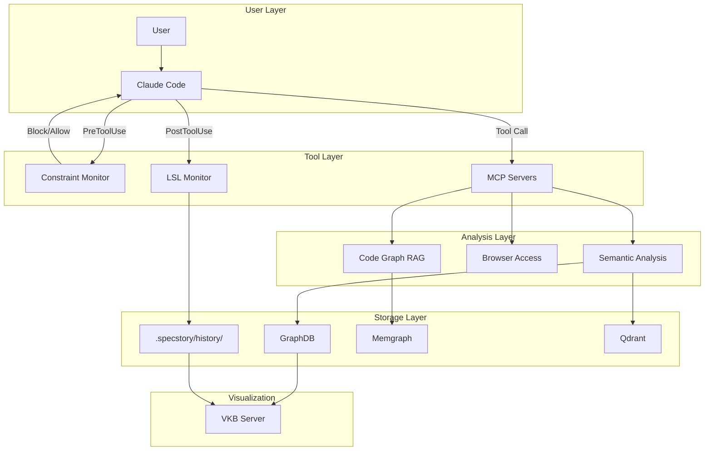
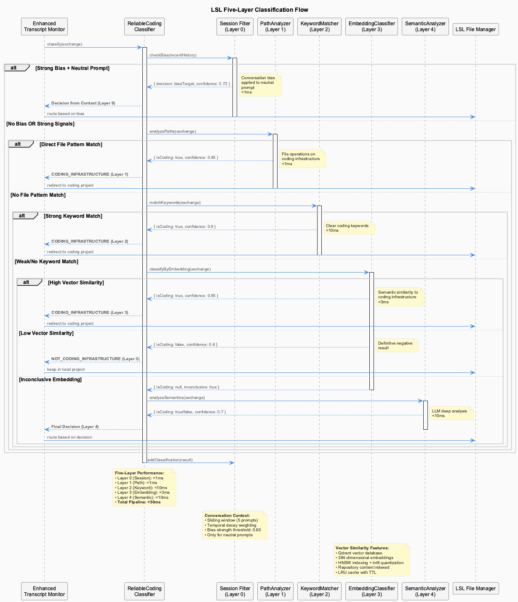
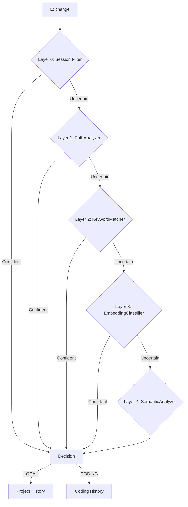
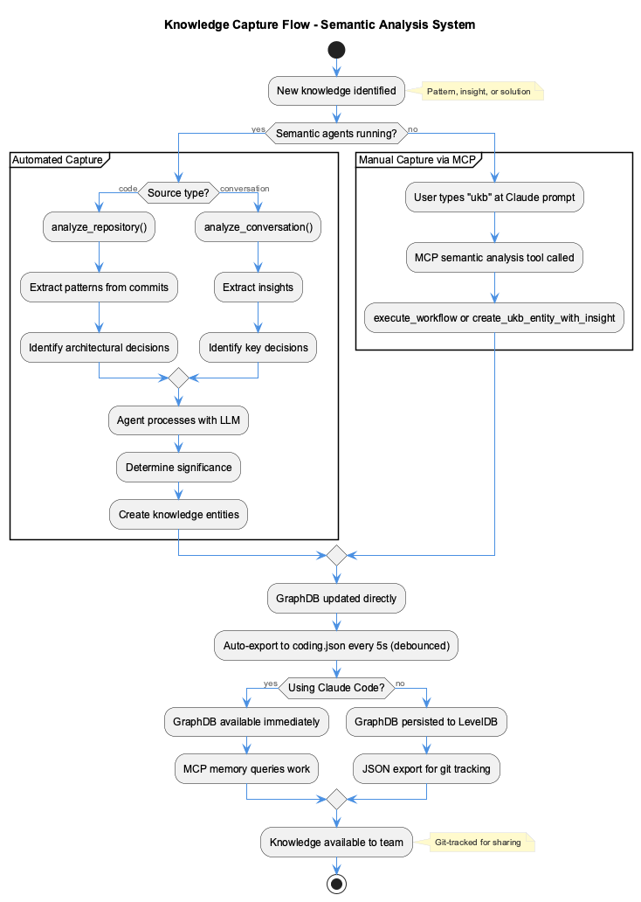
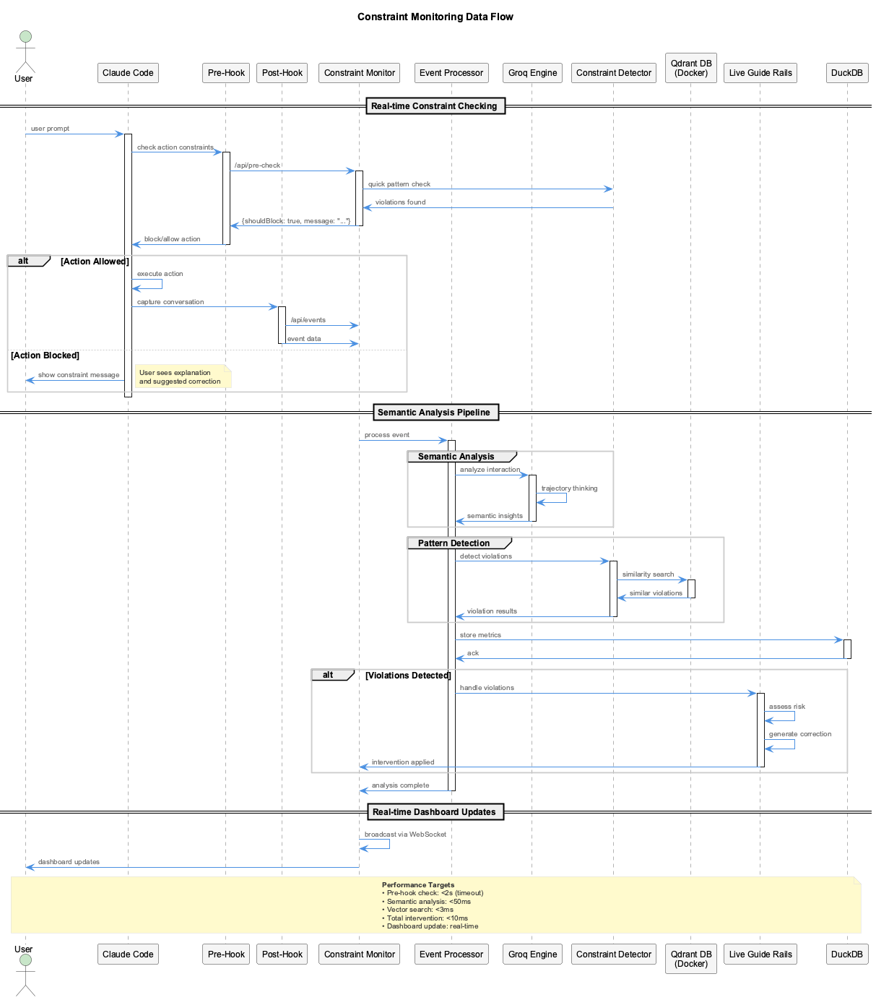

# Data Flow

System data flow patterns and integration points.

## Overall System Flow




## LSL Data Flow



**Exchange Processing**:

1. **Capture**: Transcript monitor detects new exchange
2. **Classify**: 5-layer classifier determines routing
3. **Redact**: Security patterns sanitized
4. **Route**: Content written to LOCAL or CODING history
5. **Log**: Classification decision logged

**Classification Decision Tree**:



## Knowledge Flow



**UKB Flow**:

1. **Trigger**: MCP command or git analysis
2. **Extract**: Patterns from commits or prompts
3. **Classify**: 4-layer ontology pipeline
4. **Store**: GraphDB (Graphology + LevelDB)
5. **Export**: JSON for git tracking

**Continuous Learning Flow**:

1. **Monitor**: LSL exchanges captured
2. **Extract**: StreamingKnowledgeExtractor identifies insights
3. **Embed**: Generate 384-dim or 1536-dim vectors
4. **Store**: Qdrant (vectors) + SQLite (metadata)
5. **Retrieve**: Semantic search available

## Constraint Flow



**PreToolUse Hook Flow**:

1. **Intercept**: Hook fires before tool execution
2. **Check**: ConstraintEnforcer evaluates parameters
3. **Match**: PatternMatcher runs regex against 20 constraints
4. **Score**: ComplianceCalculator updates score
5. **Decide**: Block (CRITICAL/ERROR) or Allow (WARNING/INFO)
6. **Log**: Violation logged to dashboard API

## MCP Server Communication

**Native Mode**:

```
Claude CLI <--stdio--> MCP Server Process
```

**Docker Mode**:

```
Claude CLI <--stdio--> Proxy <--HTTP/SSE--> Container Server
```

## Storage Locations

| System | Storage | Format |
|--------|---------|--------|
| LSL | `.specstory/history/` | Markdown |
| Classification | `.specstory/logs/classification/` | JSONL + MD |
| Knowledge (UKB) | `.data/knowledge-graph/` | LevelDB |
| Knowledge Export | `.data/knowledge-export/` | JSON |
| Continuous Learning | Qdrant + `.cache/knowledge.db` | Vectors + SQLite |
| Trajectories | `.specstory/trajectory/` | JSON |
| Health | `.health/` | JSON |

## Cross-System Integration

### LSL + Trajectories

LSL exchanges feed real-time trajectory analysis:

```
LSL Exchange --> Significance Check --> Trajectory Analyzer --> State Update --> Status Line
```

### LSL + Knowledge

LSL data feeds both knowledge systems:

```
LSL Exchange --> StreamingKnowledgeExtractor --> Qdrant
LSL History --> UKB Git Analysis --> GraphDB
```

### Constraints + LSL

PostToolUse hooks log all tool interactions:

```
Tool Execution --> PostToolUse Hook --> LSL Logger --> .specstory/history/
```

### Health + All Systems

Health monitoring spans all components:

```
All Services --> Health Files --> Coordinator --> Dashboard
```
