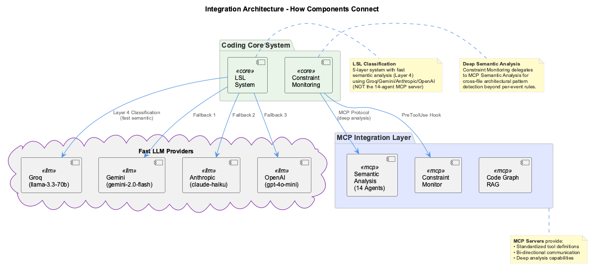
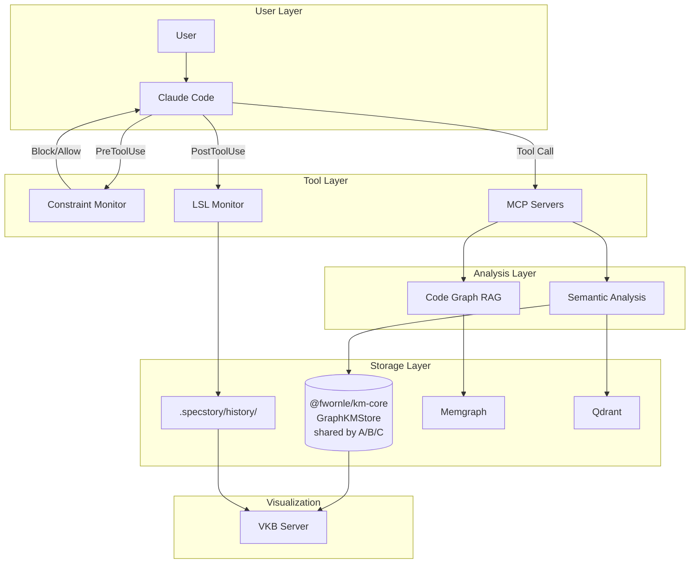
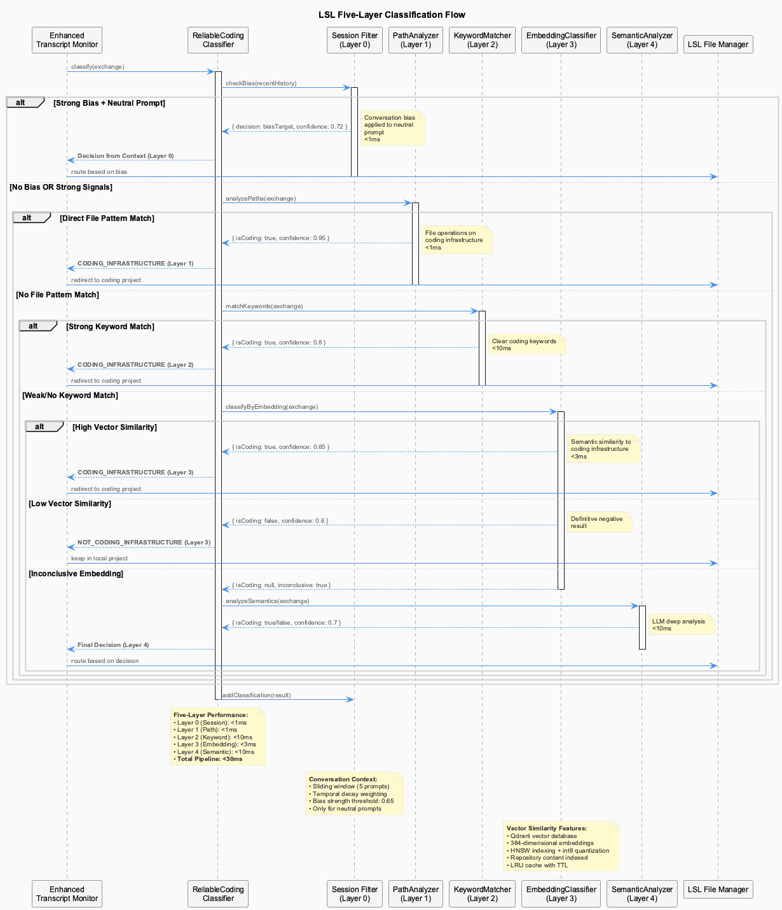
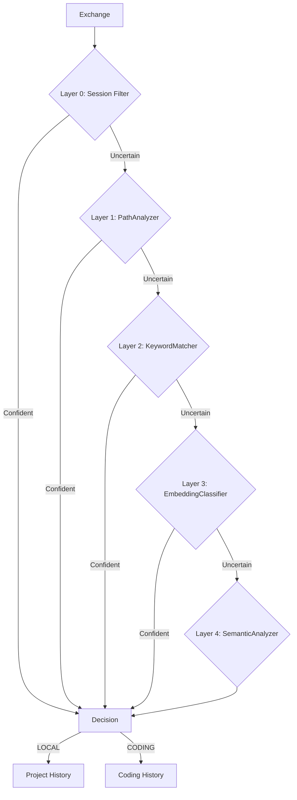
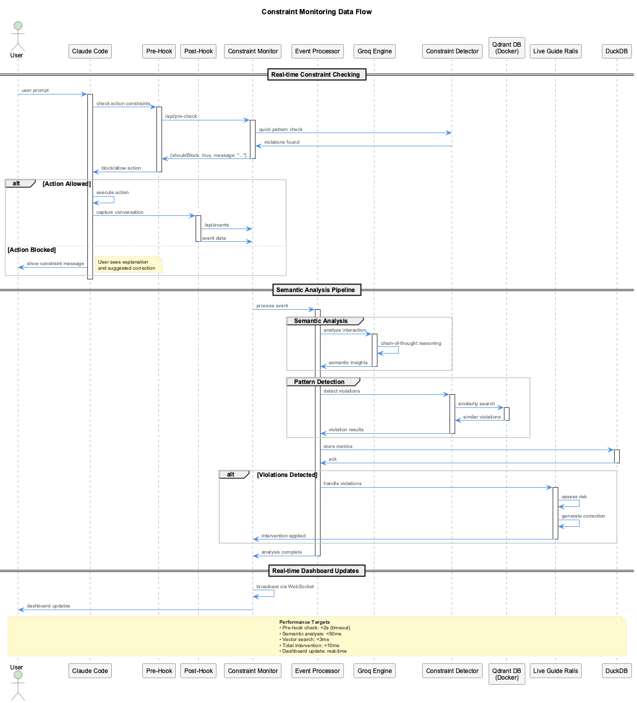

# Data Flow

System data flow patterns and integration points.

## Overall System Flow




```mermaid
flowchart TB
    subgraph "User Layer"
        U[User] --> CC[Claude Code]
    end

    subgraph "Tool Layer"
        CC -->|PreToolUse| CM[Constraint Monitor]
        CM -->|Block/Allow| CC
        CC -->|Tool Call| MCP[MCP Servers]
        CC -->|PostToolUse| LSL[LSL Monitor]
    end

    subgraph "Analysis Layer"
        MCP --> SA[Semantic Analysis]
        MCP --> CGR[Code Graph RAG]
    end

    subgraph "Storage Layer"
        LSL --> FS[.specstory/history/]
        SA --> KMC[("@fwornle/km-core<br/>GraphKMStore<br/>shared by A/B/C")]
        CGR --> MG[Memgraph]
        SA --> QD[Qdrant]
    end

    subgraph "Visualization"
        KMC --> VKB[VKB Server]
        FS --> VKB
    end
```

## LSL Data Flow



**Exchange Processing**:

1. **Capture**: Transcript monitor detects new exchange
2. **Classify**: 5-layer classifier determines routing
3. **Redact**: Security patterns sanitized
4. **Route**: Content written to LOCAL or CODING history
5. **Log**: Classification decision logged

**Classification Decision Tree**:


```mermaid
flowchart TD
    E[Exchange] --> L0{Layer 0: Session Filter}
    L0 -->|Confident| D[Decision]
    L0 -->|Uncertain| L1{Layer 1: PathAnalyzer}
    L1 -->|Confident| D
    L1 -->|Uncertain| L2{Layer 2: KeywordMatcher}
    L2 -->|Confident| D
    L2 -->|Uncertain| L3{Layer 3: EmbeddingClassifier}
    L3 -->|Confident| D
    L3 -->|Uncertain| L4{Layer 4: SemanticAnalyzer}
    L4 --> D
    D -->|LOCAL| LP[Project History]
    D -->|CODING| CP[Coding History]
```

## Knowledge Flow


All three knowledge streams persist through the same **`@fwornle/km-core`** library — identical `GraphKMStore`, `OntologyRegistry`, `LayeredDeduplicator` (Jaccard → Cosine → LLM), and v7-strict ID minting.

**System A — Online learning (observations/digests/insights)**:

1. **Capture**: ETM detects a completed prompt set; `ObservationApiClient` fires HTTP to the host obs-api (port 12436)
2. **Summarize**: `ObservationWriter` calls the LLM proxy (Intent/Approach/Artifacts/Result)
3. **Dedup**: content-hash + semantic keyword similarity (4h sliding window)
4. **Store**: SQLite (`observations.db`) + km-core `GraphKMStore` (`.data/knowledge-graph/`)
5. **REST**: km-core's `createKMRouter()` is mounted at `/api/km/` for entities / observations / digests / insights queries
6. **Consolidate**: digests (daily) + insights (≥5 unsynthesized digests) via in-process LLM passes
7. **Export**: git-tracked JSON to `.data/observation-export/`

**System B — UKB / semantic-analysis Flow**:

1. **Trigger**: MCP command (`ukb`, `ukb full`) or workflow execution
2. **Extract**: 14 agents — git analysis, vibe history, semantic, web search, etc.
3. **Classify**: 4-layer ontology pipeline via km-core's `OntologyRegistry`
4. **Persist**: `persistWithKmCore()` writes to canonical `.data/knowledge-graph-migrated/`
5. **Merge**: km-core `mergeEntities()` + `LayeredDeduplicator`
6. **Export**: `.data/knowledge-export/{team}.json` (git-tracked, 5s debounce)

**System C — OKB / OKM Flow** (cross-repo, `_work/rapid-automations/.../operational-knowledge-management`):

1. **Ingest**: extractor reads markdown, Confluence, CodeBeamer, RCA docs
2. **Dedup**: km-core `LayeredDeduplicator`
3. **Resolve**: km-core `resolveEntities` against `@fwornle/km-core/ontology`
4. **Store**: canonical `.data/leveldb-kmcore/` GraphKMStore
5. **Serve**: OKB API (port 8090) + VOKB viewer (port 3002)

## Constraint Flow



**PreToolUse Hook Flow**:

1. **Intercept**: Hook fires before tool execution
2. **Check**: ConstraintEnforcer evaluates parameters
3. **Match**: PatternMatcher runs regex against 20 constraints
4. **Score**: ComplianceCalculator updates score
5. **Decide**: Block (CRITICAL/ERROR) or Allow (WARNING/INFO)
6. **Log**: Violation logged to dashboard API

## MCP Server Communication

```
Claude CLI <--stdio--> Proxy <--HTTP/SSE--> Container Server
```

The host-side Claude CLI talks to lightweight stdio proxies, which forward to the containerized MCP servers over HTTP/SSE.

## Storage Locations

| System | Storage | Format |
|--------|---------|--------|
| LSL | `.specstory/history/` | Markdown |
| Classification | `.specstory/logs/classification/` | JSONL + MD |
| Observational Memory (System A) | `.observations/observations.db` + `.data/knowledge-graph/` | SQLite + km-core GraphKMStore |
| Observation Export | `.data/observation-export/` | JSON (per tier) |
| UKB (System B) | `.data/knowledge-graph-migrated/` | km-core GraphKMStore (LevelDB) |
| UKB Export | `.data/knowledge-export/` | JSON per team |
| OKB (System C) | `.data/leveldb-kmcore/` (in `operational-knowledge-management`) | km-core GraphKMStore (LevelDB) |
| Health | `.health/` | JSON |

## Cross-System Integration

### LSL + Knowledge

LSL data feeds both Observational Memory (in-flight) and the UKB (manual / batch):

```
LSL Exchange  --> ETM observation tap --> obs-api (port 12436)
              --> ObservationWriter (km-core GraphKMStore + SQLite)
LSL History   --> UKB git analysis    --> km-core GraphKMStore (canonical)
```

OKB ingestion does not consume LSL — it pulls from documentation sources directly. All three streams converge on `@fwornle/km-core`'s `GraphKMStore`.

### Constraints + LSL

PostToolUse hooks log all tool interactions:

```
Tool Execution --> PostToolUse Hook --> LSL Logger --> .specstory/history/
```

### Health + All Systems

Health monitoring spans all components:

```
All Services --> Health Files --> Coordinator --> Dashboard
```
