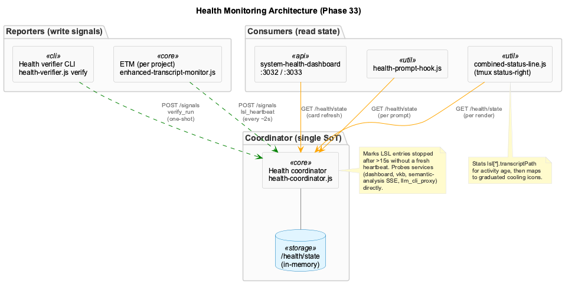

# Health Monitoring

Coordinator-centric health architecture (Phase 33). One process — the **health coordinator at :3034** — owns the live health state. Reporters POST signals, consumers (statusline, dashboard, prompt hooks) GET state. There is no longer a host-side `health-verifier` daemon, no `.health/verification-status.json` file, and no `.logs/statusline-health-status.txt` rollup.



## Roles

| Role | Process | Where it runs | Lifecycle |
|------|---------|---------------|-----------|
| Coordinator | `health-coordinator.js` | inside `coding-services` container, port 3034 (host-mapped) | supervisord-managed; `coding-services` healthcheck flips on failure |
| ETM | `enhanced-transcript-monitor.js` | host (one per project) | spawned by `claude-mcp` launcher / `agent-common-setup.sh` |
| Statusline producer | `combined-status-line.js` | host (per render) | tmux re-invokes via wrapper every 5 s |
| Statusline cache reader | `combined-status-line-wrapper.js` | host (per render) | same |
| Health verifier | `health-verifier.js` | host (CLI, one-shot) | invoked manually or from a scheduler — no daemon |
| Dashboard | `system-health-dashboard/server.js` | inside container, ports 3032/3033 | supervisord-managed |

## Coordinator: source of truth

**Endpoint:** `GET http://localhost:3034/health/state`

```jsonc
{
  "container": { "healthcheck": "healthy", "last_probe_end": "..." },
  "services": [
    { "name": "enhanced_transcript_monitor", "status": "running", "derived_from": "lsl_heartbeats" },
    { "name": "dashboard_server", "status": "running", "latency_ms": 1 }
  ],
  "lsl": {
    "etm-87152-1778236220322:coding": {
      "status": "running",
      "lastBeat": 1778237165511,
      "sessionId": "etm-87152-1778236220322",
      "projectName": "coding",
      "transcriptPath": "/Users/.../coding/9e40cccd-....jsonl",
      "tmuxPane": null,
      "source": "enhanced-transcript-monitor"
    }
  },
  "lsl_by_project": { "coding": "healthy", "rapid-automations": "healthy" },
  "processes": [],
  "databases": { "status": "healthy", "levelDB": {}, "qdrant": {} },
  "files": [],
  "generated_at": "..."
}
```

**SoT promises:**

- One writer (`health-coordinator.js`); no other process writes to `/health/state`.
- LSL entries are marked `status=stopped` automatically after **>15 s** without a fresh `lsl_heartbeat` from their reporter.
- ETM service status is **derived** from `lsl_heartbeats` — there is no `service_status` signal kind for ETM. Other services are probed directly by the coordinator.
- `generated_at` is updated on every state refresh; consumers use it for staleness detection (`>180 s` is a `[🏥⏰]` stale badge).

## Reporters

### ETM (per project)

`scripts/enhanced-transcript-monitor.js` — one per project, host-side. Heartbeats every poll cycle (~2 s):

```jsonc
POST /signals
{
  "kind": "lsl_heartbeat",
  "session_id": "<from CLAUDE_SESSION_ID env>",
  "source": "enhanced-transcript-monitor",
  "status": "running" | "degraded",
  "payload": {
    "projectPath": "...",
    "transcriptPath": "...",
    "exchangeCount": 42,
    "tmux_pane": "<TMUX_PANE or null>"
  },
  "ts": 1778237165511
}
```

`status: 'degraded'` is set when `isSuspiciousActivity` fires (0 exchanges processed in >30 min uptime — pipeline alive but stalled). Statusline maps this to `🟡` (`[LSL🟡]`).

The ETM also writes per-project LSL files to `.specstory/history/YYYY/MM/YYYY-MM-DD_HHMM-HHMM_<hash>.md` and posts observation summaries to the proxy.

**Host path resolution:** ETM uses a `resolveHostCodingPath()` helper at script init that prefers `/Users/`-style values from `CODING_REPO` / `CODING_TOOLS_PATH` and falls back to `__dirname/..`. This avoids the `claude-mcp` launcher's `CODING_TOOLS_PATH=/coding` (in-container path) leaking into the host-side ETM and breaking redactor config / `.health` mkdir.

### Health verifier (one-shot CLI)

`scripts/health-verifier.js` is **reporter-mode only** since plan 33-04. Subcommands:

| Command | Effect |
|---------|--------|
| `verify` | Run database/service/process/file checks; POST a `verify_run` signal to the coordinator; exit 0/1 |
| `status` | GET `/health/state` from coordinator; print compact summary |
| `report` | GET `/health/state` from coordinator; print verbose (or `--json`) |

The `start` daemon subcommand was removed when the coordinator took over lifecycle. The supervisord `[program:health-verifier]` block was likewise retired (the program ran `health-verifier.js start` which now exits with "Unknown command: start"; it was kept with `autostart=false` as a transitional shim until commit `58e968e45` removed it entirely).

## Consumers

### Statusline (`combined-status-line.js`)

- Pulls `/health/state` once per render.
- Maps `lsl_by_project[*]` rollup → 3-state (healthy/degraded/stopped).
- For each `healthy` project, stats the corresponding `lsl[*].transcriptPath` mtime to compute user-activity age and bucket into the lifecycle (🟢 → 🌲 → 🫒 → 🪨 → ⚫ → 💤).
- Synthesizes "verifier-shape" fields for the `[🏥...]` badge from coordinator services + databases + container healthcheck — no `.health/verification-status.json` read.

### Dashboard (`integrations/system-health-dashboard`)

- Backend (`server.js`) at port 3033 reads coordinator state and exposes per-card APIs.
- Frontend at port 3032 polls the API.
- Supervisord process panel reads supervisorctl directly inside the container (the coordinator does not surface raw supervisord state).
- The `cgr_cache` tile reads `.cgr/cache-metadata.json` via Node fs (no `jq` dependency) and computes commits-behind via `git rev-list`.

### Health prompt hook (`scripts/health-prompt-hook.js`)

- Runs on every prompt submit.
- Reads `/health/state` and surfaces a one-line health summary to the prompt.
- Trusts the coordinator's `overallStatus` — does not re-classify based on accepted/non-critical violations.

## Session activity lifecycle

The graduated cooling icons in the statusline come from per-project transcript mtime, not heartbeat freshness:

| Icon | Status | Time since last activity |
|------|--------|--------------------------|
| 🟢 | Active | < 5 min |
| 🌲 | Cooling | 5 – 15 min |
| 🫒 | Fading | 15 min – 1 h |
| 🪨 | Dormant | 1 – 6 h |
| ⚫ | Inactive | 6 – 24 h |
| 💤 | Sleeping | ≥ 24 h |

The thresholds match `docs/health-system/status-line.md`. The user-activity age is computed client-side by stat-ing `lsl[*].transcriptPath`, since the coordinator's 3-state `lsl_by_project` rollup is binary-ish (healthy/degraded/stopped) and doesn't surface mtime.

## Bind-mount staleness supervision

macOS Docker Desktop occasionally caches single-file bind-mounts at mount time and stops reflecting later host edits — the symptom is that the container sees a truncated/older copy while the host has the current content, silently breaking YAML/JSON loaders inside the container.

The verifier compares host `stat` vs `docker exec stat` for each bind-mounted file in `coding-services`:

| Watched file | Why |
|--------------|-----|
| `.constraint-monitor.yaml` | Constraint config — drift breaks the dashboard |
| `integrations/system-health-dashboard/server.js` | Dashboard code — drift causes startup failures |
| `scripts/consolidate-observations.js` | Consolidator CLI — drift desyncs heartbeat schema |

When sizes diverge, the verifier raises a `bind_mount_freshness` violation. Remediation is operator-driven (`docker-compose restart coding-services` is enough to invalidate the FUSE cache; `--force-recreate` is needed only if the volume mapping itself changed). This particular check has no auto-heal hook because container recreation is too disruptive to dispatch automatically — see [Auto-healing](#auto-healing) below for the services that *do* self-heal.


## Health dashboard

**Frontend:** `http://localhost:3032`
**API:** `http://localhost:3033`

### Cards

| Card | Source |
|------|--------|
| Databases (LevelDB / Qdrant / CGR Cache) | coordinator `databases` + dashboard `cgr_cache` synthesis |
| Services (VKB / Constraint Monitor / Dashboard / Semantic Analysis SSE) | coordinator `services` |
| Processes (Process Registry / Stale PIDs) | coordinator `processes` |
| UKB Workflows (status / capacity / history) | semantic-analysis SSE server (:3848) |
| Service Detail (Port Liveness / Supervisord Processes) | dashboard server probes ports + queries supervisorctl |

### Key API endpoints

| Endpoint | Description |
|----------|-------------|
| `/api/health` | Dashboard's own self-healthcheck (not the coordinator rollup) |
| `/api/cgr/freshness` | CGR cache freshness; probes Memgraph reachability |
| `/api/health-verifier/status` | Pass-through to coordinator `/health/state` |
| `/api/health-verifier/report` | Same, verbose |
| `/api/ukb/*` | UKB workflow control + history |

## Auto-healing

Two complementary paths bring failed services back without operator action:

### 1. Coordinator-driven safety net (proactive)

`ensureEtmForActiveProjects()` runs on every coordinator tick. It walks the projects under `~/Agentic/`, checks each for an actively-written Claude transcript (`*.jsonl` mtime within the last 2 min), and spawns an `enhanced-transcript-monitor` for any project that is *active* but has no fresh heartbeat in the coordinator's `lsl` map. Rate-limited to one sweep per 30 s with a startup grace of ~20 s so existing ETMs (started before the coordinator) get a chance to register first. This closes the gap left when Phase 33 retired `GlobalLSLCoordinator` — sessions launched outside `bin/coding` (VS Code Claude extension, manual `node` invocations, agent worktrees) are now picked up automatically.

### 2. Dashboard-driven restart click (reactive)

The dashboard violations table renders an "Enabled" badge + Restart button on any row whose service has an entry in the dashboard's `AUTO_HEAL_MAP` (`integrations/system-health-dashboard/server.js`). Clicking the button POSTs to `coordinator :3034 /health/remediate { action, service }`. The coordinator lazy-imports `HealthRemediationActions` and dispatches via `executeAction(actionName, details)`, then triggers an immediate `forceTick()` so the next dashboard poll reflects the new state.

The proxy hop is necessary because the dashboard runs *inside* the `coding-services` container, which cannot reach host-side processes (ETM, vkb, etc.) via `supervisorctl` — the coordinator runs natively and can.

| Service | Action | Handler |
|---------|--------|---------|
| `enhanced_transcript_monitor` | `restart_transcript_monitor` | `restartTranscriptMonitor()` |
| `vkb_server` | `restart_vkb_server` | `restartVkbServer()` |
| `constraint_monitor` | `restart_constraint_monitor` | `restartConstraintMonitor()` |
| `dashboard_server`, `health_dashboard_*` | `restart_dashboard_server` / `restart_health_*` | corresponding handlers |
| `llm_cli_proxy` | `restart_llm_cli_proxy` | `restartLLMCLIProxy()` |

If the coordinator proxy fails (network or coordinator down) the dashboard falls back to the legacy local `restartCommands` map (`supervisorctl` inside the container, `npm`/`bin` paths on host), so a coordinator outage does not strand the Restart button.

`HealthRemediationActions` enforces a per-action 5-min cooldown on failure and a 10-attempt-per-hour ceiling, preventing spawn storms when an underlying issue keeps killing the restarted process.

## Retired components (do not write/read)

| Component | Removed in | Replacement |
|-----------|-----------|-------------|
| Host-side `health-verifier` daemon (`start` subcommand) | Plan 33-04 | Coordinator `:3034` |
| `[program:health-verifier]` supervisord block | Commit `58e968e45` | n/a |
| `[program:browser-access]` supervisord block | Commit `1cd72cd2b` | `/gsd-browser` (Playwright via CLI) |
| `.health/verification-status.json` | Plan 33-04 | Coordinator `/health/state` |
| `.logs/statusline-health-status.txt` | Plan 33-04 | Coordinator `lsl_by_project` |
| `.lsl/global-registry.json` | Plan 33-04 | Coordinator `lsl` map |
| `GlobalProcessSupervisor` daemon | Plan 33-04 | Coordinator + supervisord |
| `GlobalLSLCoordinator` daemon | Plan 33-04 | Coordinator + per-launcher ETM spawn |
| `StatusLineHealthMonitor` daemon | Plan 33-04 | On-demand render in `combined-status-line.js` |

## Troubleshooting

### Coordinator unreachable / `[🏥💤]`

```bash
# Is the container up?
docker ps --format '{{.Names}} {{.Status}}' | grep coding-services

# Is the coordinator port mapped?
lsof -nP -iTCP:3034 -sTCP:LISTEN

# Direct probe
curl -fs http://localhost:3034/health/state | jq '.generated_at'
```

### LSL pipeline stalled (no new files / no observations)

The most common cause is the ETM hitting an init error after which a half-baked redactor singleton blocks all subsequent transcript processing. Symptoms: ETMs are alive and heartbeating (`status=running`) but `exchangeCount=0` for hours and no LSL files / observations appear.

```bash
# ETM log for redactor / ENOENT errors
tail -100 transcript-monitor.log | grep -iE 'not initialized|enoent.*\.health|enoent.*\.specstory.*config'

# If the env has CODING_TOOLS_PATH=/coding (the in-container path), the host-side
# resolver in enhanced-transcript-monitor.js should reject it and fall back to
# __dirname/.. — verify the fix is in place:
grep -n 'resolveHostCodingPath' scripts/enhanced-transcript-monitor.js

# Restart with a clean env:
pkill -f 'enhanced-transcript-monitor.js.*coding'
nohup env -i HOME=$HOME PATH=$PATH \
  CODING_REPO=/Users/Q284340/Agentic/coding \
  node scripts/enhanced-transcript-monitor.js /Users/Q284340/Agentic/coding \
  >> .logs/etm-coding.log 2>&1 &
```

### Status line shows residual chars (`12:411`, `13:0656`)

See [Status Line / Right-edge stability](../guides/status-line.md#right-edge-stability-nbsp-terminator--codepoint-padding) — verify the wrapper preserves trailing whitespace and the producer pads to ≥220 codepoints + NBSP terminator.

### Project shows 🟢 despite hours idle

The cooling lifecycle depends on `transcriptPath` mtime. If the project shows 🟢 but should be ⚫, either the transcript path is wrong or the file isn't being read:

```bash
# Coordinator's transcriptPath for the project
curl -fs http://localhost:3034/health/state \
  | jq '.lsl | to_entries[] | select(.value.projectName=="rapid-automations")'

# Is that file actually on disk and being updated?
stat /Users/.../target.jsonl

# Force a fresh statusline render
rm -f .logs/combined-status-line-cache-*.txt
node scripts/combined-status-line.js
```
