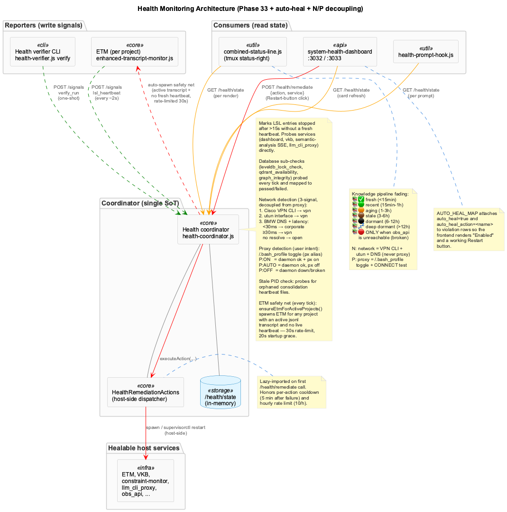

# Health Monitoring

One process owns the live health state. Everything else either reports into it or reads
from it — which is what makes the dashboard, the status line and the hooks agree.

=== "⚡ Quick (~3 min)"

    ## The shape of it

    A single **health coordinator** on `:3034` holds the truth. Reporters POST signals to it;
    consumers GET state from it. There is exactly one writer.

    ```
    reporters  ──POST──▶  coordinator :3034  ──GET──▶  consumers
    (ETM, probes)         /health/state              (status line,
                                                      dashboard, hooks)
    ```

    ## Checking health

    ```bash
    coding --health                              # the summary
    curl -s localhost:3034/health/state | jq .   # the raw truth
    ```

    The dashboard renders the same state at [localhost:3032](http://localhost:3032).

    ## Two things that look like bugs and are not

    **A grey health badge** means the coordinator is unreachable, not that a service is down —
    the reader has nothing to read.

    **A stale badge** (state older than 180s) means the writer stopped, not that the services
    stopped. Check the coordinator before checking what it reports on.

    ## When something is genuinely stuck

    A wedged process does not die: `ps` shows it alive while it has stopped doing work. That is
    why the coordinator marks a reporter stopped after **15 seconds** without a heartbeat, rather
    than trusting that the process exists.

=== "📖 Standard (~15 min)"

    ## Why one writer

    Health state used to be assembled from several files written by several processes, which
    meant the dashboard and the status line could disagree and neither was wrong. Now
    `health-coordinator.js` is the only writer of `/health/state`, and every surface reads that
    one document. When two surfaces disagree today, the disagreement is itself the diagnosis:
    something is reading a cached copy.

    

    ## Who reports, who reads

    | Role | Process | Runs |
    |------|---------|------|
    | Coordinator | `health-coordinator.js` | In the services container, port 3034 |
    | Session monitor | `enhanced-transcript-monitor.js` | On the host, one per project |
    | Status line | `combined-status-line.js` | On the host, re-rendered every 5s |
    | Dashboard | the dashboard server | In the container, ports 3032/3033 |
    | Verifier | `health-verifier.js` | On the host, one-shot CLI — not a daemon |

    ## What the state document promises

    - **One writer.** No other process writes it.
    - **Liveness is derived from heartbeats, not from process existence.** A session monitor is
      marked `stopped` after 15 seconds without a fresh heartbeat, which is what catches a
      process that is alive but wedged.
    - **Database sub-checks** — LevelDB lock, Qdrant availability, graph integrity — are probed
      every tick and reported individually rather than as one opaque "databases: ok".
    - **Network location is detected independently of proxy state**, from three signals: the VPN
      CLI, active `utun` interfaces, and internal DNS with a latency measurement. Conflating the
      two is how "am I on the VPN?" and "is the proxy working?" became the same question.
    - **`generated_at` moves every tick**, so consumers can detect staleness rather than trusting
      a document that stopped updating.

    ## Reading the status line

    Health, session-logging and knowledge-pipeline state all surface in the tmux bar. Two
    conventions worth knowing: red is reserved for the observations API being unreachable, and
    knowledge-pipeline staleness fades progressively rather than turning red, so "getting old"
    and "broken" do not look the same.

    ## What restarts itself

    Two independent paths, deliberately:

    1. **Proactive** — the coordinator notices a service is down and restarts it, as a safety net
       that needs nobody watching.
    2. **Reactive** — a restart button in the dashboard, for when you have decided something
       needs bouncing.

    Between them, most failures resolve without intervention; the dashboard's history shows what
    was restarted and when.

    ## Diagnosing

    | Symptom | Look at |
    |---------|---------|
    | Grey health badge | The coordinator itself — it is unreachable |
    | Stale badge (>180s) | The coordinator's writer, not the services |
    | A project missing from the status line | Whether that project has a session monitor at all |
    | Session logging stalled | The per-project log under `.logs/`, for a stalled loop |
    | A project green while idle for hours | Session-activity lifecycle, below in Deep Dive |

    For a wedged process, sample it rather than checking whether it exists — the whole point of
    the heartbeat design is that existence proves nothing.

=== "📚 Deep Dive (full)"

    --8<-- "_tiers/architecture/health-monitoring.deep.md"
