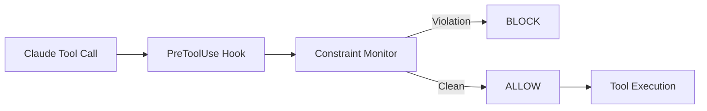

# Architecture

System design principles and patterns for the coding infrastructure.


## Key Principles

### 1. Agent-Agnostic Design

!!! success "Multi-Agent Support"
    Both **Claude Code** and **GitHub CoPilot** are fully supported with identical Docker mode logic, shared services, and unified launcher infrastructure. Adding new agents follows a documented adapter pattern.

The architecture supports multiple AI coding assistants through a unified adapter pattern:


**Layers**:

1. **Agent Layer** - AI assistants (Claude Code, GitHub CoPilot, OpenCode, future agents)
2. **Tmux Wrapper Layer** - Unified session wrapping via `tmux-session-wrapper.sh` — status bar, nesting guard, env propagation, optional pipe-pane I/O capture
3. **Config Layer** - Agent definitions in `config/agents/<name>.sh` (10-30 lines each)
4. **Orchestration Layer** - `launch-agent-common.sh` handles all shared startup (Docker detection, service startup, monitoring, session management)
5. **Common Setup Layer** - Shared initialization (`agent-common-setup.sh`)
6. **Shared Services** - VKB, Semantic Analysis, Constraint Monitor, LSL
7. **Adapter Layer** - Abstract interface + agent implementations (dynamic import by convention)

### 2. Knowledge Persistence

Multi-tier storage for reliability and performance:

**Runtime (Fast)**:

- MCP Memory (Claude)
- Graphology Graph (in-memory)

**Persistence (Reliable)**:

- LevelDB (persistent graph storage)
- JSON exports (git-tracked)
- `.specstory/history/` (session logs)

### 3. Real-Time Quality Enforcement

PreToolUse hooks intercept tool calls BEFORE execution:



### 4. 4-Layer Monitoring

Progressive escalation for reliability:

| Layer | Component | Function |
|-------|-----------|----------|
| 4 | Service Health | UKB, VKB, Semantic Analysis |
| 3 | System Verifier | LSL, Constraints, Trajectory |
| 2 | System Coordinator | Overall health, metrics |
| 1 | System Watchdog | Critical failures, alerts |

## Deployment Modes

### Native Mode (Default)

MCP servers run as native stdio processes managed by Claude CLI.

- **Pros**: Simple setup, no Docker, lower memory
- **Cons**: Processes restart with each session
- **Best for**: Individual developers

### Docker Mode

MCP servers run as HTTP/SSE services in containers.

- **Pros**: Persistent services, shared browser, better isolation
- **Cons**: Docker required, higher memory
- **Best for**: Teams, multi-session workflows

See [Docker Mode](../getting-started/docker-mode.md) for setup details.

## Development Patterns

### Constraint-Based Development

Define constraints before implementation:

```yaml
constraints:
  - id: no-parallel-versions
    pattern: /(v\d+|enhanced|improved|new|fixed)_/
    severity: CRITICAL
    message: Never create parallel versions - edit originals
```

### Agent Detection

```javascript
const detector = new AgentDetector();
const available = await detector.detectAll();
// { claude: true, copilot: true }

const best = await detector.getBest();
// 'claude'
```

### Knowledge Capture

```bash
# Auto-analysis from git commits
ukb

# Structured interactive capture
ukb --interactive

# Visualization
vkb
```

## Adding New Agents

Adding a new agent requires **only a single config file** — zero changes to shared code.


Create `config/agents/<name>.sh` defining `AGENT_NAME`, `AGENT_COMMAND`, and optional hook functions. Agent detection, launcher routing, and tmux wrapping all happen automatically.

**Proof:** The OpenCode agent (`config/agents/opencode.sh`) is a 25-line file providing full integration.

See the [Agent Integration Guide](../guides/agent-integration.md) for the complete walkthrough, config reference, and API contract.

## Related Documentation

- [Health Monitoring](health-monitoring.md) - 4-layer architecture details
- [Data Flow](data-flow.md) - System data flow diagrams
- [Integrations](../integrations/index.md) - MCP server architectures
