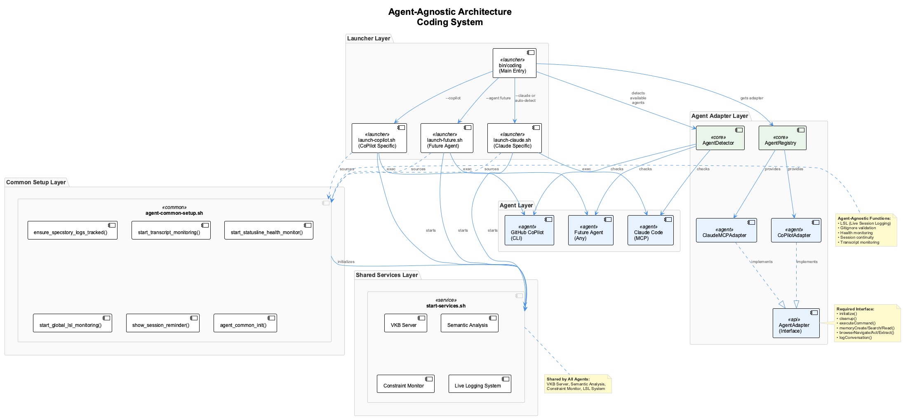
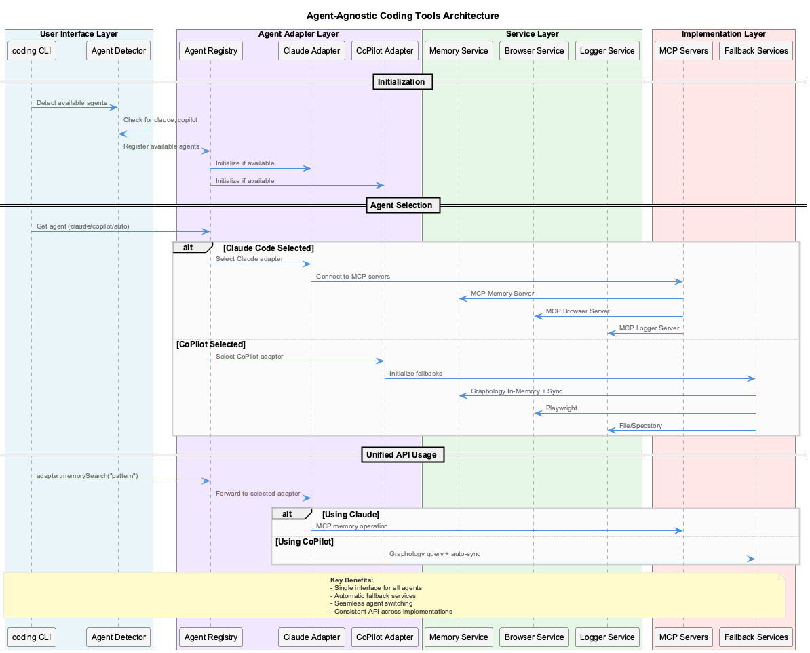
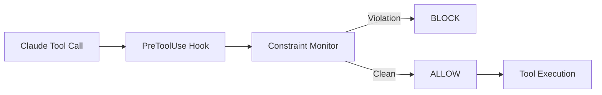

# Architecture

System design principles and patterns for the coding infrastructure.


## Key Principles

### 1. Agent-Agnostic Design (Goal)

!!! warning "Current State: Claude-Centric"
    The system is **currently optimized for Claude Code**. The agent-agnostic architecture is a design goal, not yet fully implemented. Core services (VKB, Semantic Analysis, LSL) work independently, but MCP integration and hooks are Claude-specific.

The architecture is designed to eventually support multiple AI coding assistants through a unified adapter pattern:





**Planned Layers**:

1. **Agent Layer** - AI assistants (Claude now, CoPilot/Cursor planned)
2. **Launcher Layer** - Agent-specific startup scripts
3. **Common Setup Layer** - Shared initialization (`agent-common-setup.sh`)
4. **Shared Services** - VKB, Semantic Analysis, Constraint Monitor, LSL
5. **Adapter Layer** - Abstract interface + agent implementations (partial)

### 2. Knowledge Persistence

Multi-tier storage for reliability and performance:

**Runtime (Fast)**:

- MCP Memory (Claude)
- Graphology Graph (in-memory)

**Persistence (Reliable)**:

- LevelDB (persistent graph storage)
- JSON exports (git-tracked)
- `.specstory/history/` (session logs)

### 3. Real-Time Quality Enforcement

PreToolUse hooks intercept tool calls BEFORE execution:



### 4. 4-Layer Monitoring

Progressive escalation for reliability:

| Layer | Component | Function |
|-------|-----------|----------|
| 4 | Service Health | UKB, VKB, Semantic Analysis |
| 3 | System Verifier | LSL, Constraints, Trajectory |
| 2 | System Coordinator | Overall health, metrics |
| 1 | System Watchdog | Critical failures, alerts |

## Deployment Modes

### Native Mode (Default)

MCP servers run as native stdio processes managed by Claude CLI.

- **Pros**: Simple setup, no Docker, lower memory
- **Cons**: Processes restart with each session
- **Best for**: Individual developers

### Docker Mode

MCP servers run as HTTP/SSE services in containers.

- **Pros**: Persistent services, shared browser, better isolation
- **Cons**: Docker required, higher memory
- **Best for**: Teams, multi-session workflows

See [Docker Mode](../getting-started/docker-mode.md) for setup details.

## Development Patterns

### Constraint-Based Development

Define constraints before implementation:

```yaml
constraints:
  - id: no-parallel-versions
    pattern: /(v\d+|enhanced|improved|new|fixed)_/
    severity: CRITICAL
    message: Never create parallel versions - edit originals
```

### Agent Detection

```javascript
const detector = new AgentDetector();
const available = await detector.detectAll();
// { claude: true, copilot: false }

const best = await detector.getBest();
// 'claude'
```

### Knowledge Capture

```bash
# Auto-analysis from git commits
ukb

# Structured interactive capture
ukb --interactive

# Visualization
vkb
```

## Adding New Agents

See [Agent Integration Guide](../reference/api.md#agent-integration) for:

1. Implement `AgentAdapter` interface
2. Register adapter in `agent-registry.js`
3. Add detection in `agent-detector.js`
4. Create launcher script
5. Update `bin/coding` routing
6. Test with validation commands

## Related Documentation

- [Health Monitoring](health-monitoring.md) - 4-layer architecture details
- [Data Flow](data-flow.md) - System data flow diagrams
- [Integrations](../integrations/index.md) - MCP server architectures
