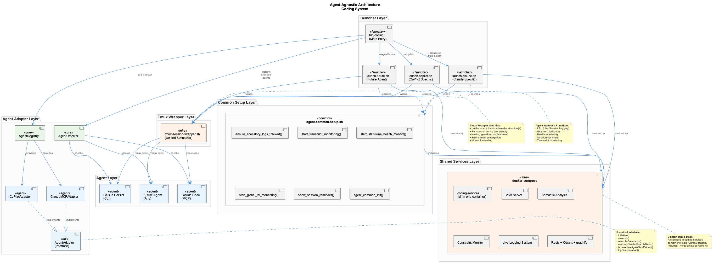

# Architecture

The design principles behind the infrastructure, and where each of them lives in the code.

=== "⚡ Quick (~3 min)"

    ## Four ideas explain the design

    1. **The agent is replaceable.** Everything shared lives outside the agent; adding one is a
       single config file in `config/agents/`, not a change to common code.
    2. **Knowledge is stored in tiers.** Fast in memory, durable in LevelDB, reviewable as
       git-tracked JSON exports.
    3. **Enforcement happens before execution.** Constraints are PreToolUse hooks, so a bad call
       is blocked rather than reported.
    4. **Supervision is layered.** Watchdog, coordinator, verifier and service health escalate
       progressively instead of one monitor trying to catch everything.

    ## Where things live

    | Concern | Where |
    |---------|-------|
    | Agent definitions | `config/agents/<name>.sh` |
    | Shared startup | `scripts/launch-agent-common.sh` |
    | Session wrapping | `scripts/tmux-session-wrapper.sh` |
    | Knowledge storage | `.data/knowledge-graph/` |
    | Session logs | `.specstory/history/` |

    ## Read next

    [Health Monitoring](health-monitoring.md) for the supervision layers,
    [Data Flow](data-flow.md) for how information moves between systems, and
    [LLM Routing](llm-routing.md) for how a model is chosen for a piece of work.

=== "📖 Standard (~15 min)"

    ## Agent-agnostic by construction

    Claude Code, Copilot CLI, OpenCode and Pi all run on identical infrastructure. That is
    enforced structurally rather than by convention: the shared behaviour lives in layers none of
    the agents own.

    

    From the outside in — the agent itself; a tmux wrapper providing the status bar, nesting
    guard and I/O capture; a per-agent config file of 10–30 lines; a shared orchestration script
    handling Docker detection, service startup and session management; and beneath those the
    shared services and a thin adapter interface resolved by naming convention.

    The proof that the seam is real: `config/agents/opencode.sh` is 25 lines and buys full
    integration. Adding an agent touches nothing else.

    ## Where knowledge is kept

    Three tiers, chosen for different failure modes:

    - **Runtime** — an in-memory Graphology graph, fast enough to query mid-session.
    - **Persistent** — LevelDB, which survives restarts.
    - **Reviewable** — JSON exports committed to git, so knowledge changes show up in diffs and
      can be reverted like anything else.

    ## Enforcement happens before the tool runs

    ```mermaid
    flowchart LR
        A[Agent tool call] --> B[PreToolUse hook]
        B --> C[Constraint monitor]
        C -->|Violation| D[BLOCK + suggested fix]
        C -->|Clean| E[ALLOW]
        E --> F[Tool executes]
    ```

    Constraints are declarative — an id, a pattern, a severity and the message shown when they
    fire — and a blocked call can be overridden deliberately by naming the constraint, which
    keeps the escape hatch explicit and auditable rather than tempting you to reword around the
    rule.

    ## Supervision in layers

    | Layer | Component | Catches |
    |-------|-----------|---------|
    | 4 | Service health | An individual service failing |
    | 3 | System verifier | Logging and constraints drifting |
    | 2 | Coordinator | Overall health and metrics |
    | 1 | Watchdog | Critical failures worth alerting on |

    Each layer assumes the one below it may be wrong, which is why a wedged process that still
    answers `ps` is caught — the layer above notices it has stopped producing work.

    ## How it is deployed

    Services run as HTTP/SSE endpoints in Docker containers; the host-side agent CLI reaches
    them through stdio proxies. `coding --claude` brings the whole stack up, so Docker must be
    running before you launch.

    ## Adding an agent

    Create `config/agents/<name>.sh` with `AGENT_NAME`, `AGENT_COMMAND` and any optional hook
    functions. Detection, launcher routing and tmux wrapping follow automatically. The
    [Agent Integration Guide](../guides/agent-integration.md) has the full contract.

=== "📚 Deep Dive (full)"

    --8<-- "_tiers/architecture/index.deep.md"
