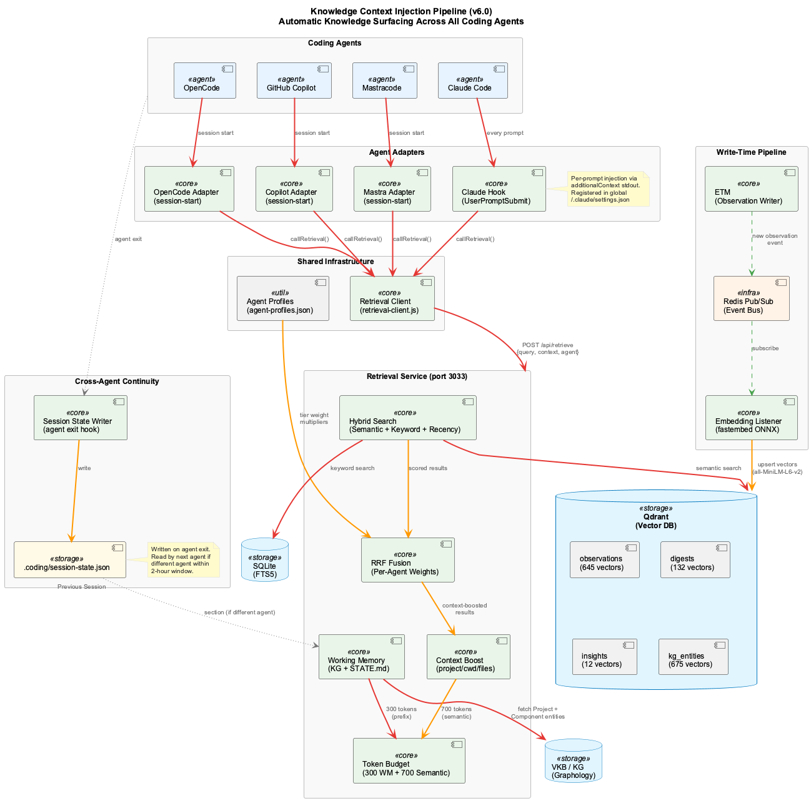
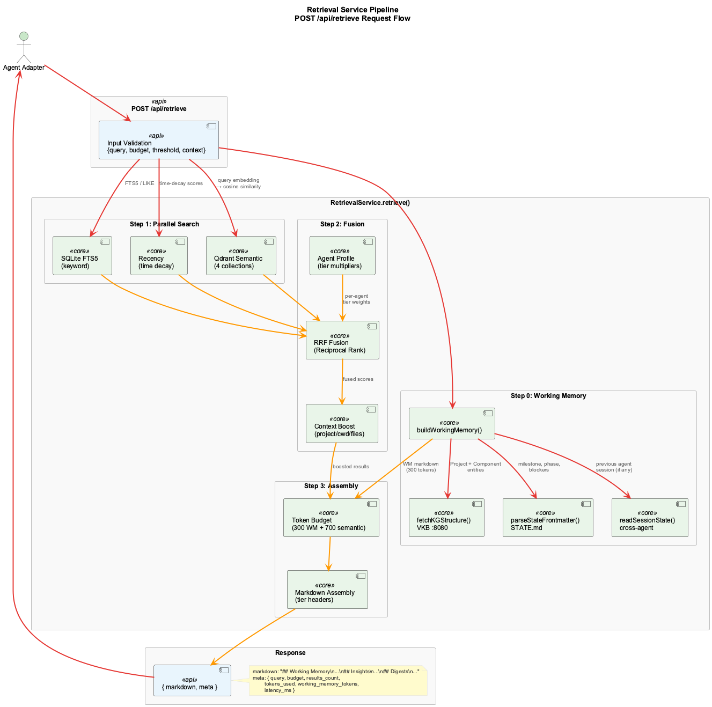

# Knowledge Context Injection

Automatic surfacing of accumulated knowledge into coding agent conversations.

## Overview

The Knowledge Context Injection pipeline (v6.0) makes the coding project's accumulated knowledge actionable by injecting relevant context into every agent conversation. When you type a prompt in any coding agent, the system retrieves semantically relevant observations, digests, insights, and knowledge graph entities, then injects them as invisible context that shapes the agent's response.

The pipeline is fully agent-agnostic: Claude, Copilot, OpenCode, and Mastra all receive knowledge injection through their native hook/plugin mechanisms.

## Architecture



### Components

| Component | Location | Purpose |
|-----------|----------|---------|
| Embedding Service | `src/embedding/` | fastembed ONNX with all-MiniLM-L6-v2 (384-dim) |
| Retrieval Service | `src/retrieval/retrieval-service.js` | Hybrid search + token-budgeted assembly |
| Retrieval Client | `src/hooks/retrieval-client.js` | Shared fail-open HTTP client for all adapters |
| Claude Adapter | `src/hooks/knowledge-injection-hook.js` | UserPromptSubmit hook (per-prompt, global) |
| OpenCode Adapter | `src/hooks/knowledge-injection-opencode.js` | Session-start context file writer |
| Copilot Adapter | `src/hooks/knowledge-injection-copilot.js` | Workspace instructions file writer |
| Mastra Adapter | `src/hooks/knowledge-injection-mastra.js` | Session-start context file writer |
| Working Memory | `src/retrieval/working-memory.js` | Live KG + STATE.md project summary |
| Agent Profiles | `config/agent-profiles.json` | Per-agent tier weight multipliers |
| Session State | `scripts/write-session-state.js` | Cross-agent continuity on agent switch |

### Data Flow

1. **Write path**: ETM creates observations → Redis pub/sub → embedding listener → Qdrant upsert
2. **Read path**: Agent prompt → adapter → retrieval client → retrieval service → Qdrant + SQLite → RRF fusion → token-budgeted markdown → agent context

## Retrieval Pipeline



### Request Flow

The retrieval service (`POST /api/retrieve` on port 3033) processes each request through:

1. **Working Memory (Step 0)**: Queries VKB for Project + Component entities, parses STATE.md for current milestone/phase, checks for cross-agent session state. Fixed 300-token budget.

2. **Parallel Search (Step 1)**: Runs three search strategies simultaneously:
   - Qdrant semantic search across 4 collections (observations, digests, insights, kg_entities)
   - SQLite FTS5 keyword search
   - Recency scoring with time-decay

3. **RRF Fusion (Step 2)**: Merges results using Reciprocal Rank Fusion with:
   - Tier weights (insights > digests > entities > observations)
   - Per-agent profile multipliers from `config/agent-profiles.json`
   - Context boost (project name 1.15x, cwd 1.10x, recent files 1.20x)

4. **Token-Budgeted Assembly (Step 3)**: Constructs markdown with tier headers, capped at 700 tokens for semantic results + 300 tokens for working memory = 1000 total.

### Response Shape

```json
{
  "markdown": "## Working Memory\n...\n## Insights\n...\n## Digests\n...",
  "meta": {
    "query": "Docker build pipeline",
    "budget": 1000,
    "results_count": 12,
    "tokens_used": 950,
    "working_memory_tokens": 112,
    "latency_ms": 160
  }
}
```

## Agent Adapters

### Claude Code (per-prompt injection)

The Claude adapter runs as a `UserPromptSubmit` hook registered in `~/.claude/settings.json` (global — works in all projects). On every substantive prompt (4+ words, not a slash command):

1. Reads prompt from stdin JSON
2. Calls retrieval service with prompt as query + project context
3. Writes JSON to stdout with `additionalContext` field
4. Claude sees the knowledge as a `<system-reminder>` block

**Fail-open**: 2-second HTTP timeout, 5-second safety ceiling. Any error exits 0 with no output.

### OpenCode, Copilot, Mastra (session-start injection)

These adapters run once at session start via `launch-agent-common.sh`:

| Agent | Context File | Mechanism |
|-------|-------------|-----------|
| OpenCode | `.opencode/knowledge-context.md` | Custom instructions file |
| Copilot | `.github/copilot-instructions.md` | Workspace context (marker-based merge) |
| Mastra | `.mastra/context.md` | Custom context file |

The launch system calls `_inject_knowledge_context()` at step 12.5, which dispatches the appropriate adapter with a 10-second timeout.

## Working Memory

Every retrieval response begins with a Working Memory section containing:

- **Project structure**: Top-level Project + Component nodes from the Knowledge Graph (e.g., "LSL System", "ETM Pipeline", "Docker Services")
- **Current state**: Active milestone, current phase, status from STATE.md
- **Known issues**: Blockers/concerns from STATE.md
- **Previous session** (if switching agents): Summary from the previous agent's session state file

Budget: 300 tokens, enforced via `gpt-tokenizer`. Progressive truncation: drop descriptions first, then components, then fall back to project + state only.

## Per-Agent Profiles

Each agent gets differently weighted retrieval results based on their typical work patterns:

```json
{
  "claude": { "insights": 1.3, "digests": 1.2, "kg_entities": 1.0, "observations": 0.9 },
  "opencode": { "insights": 1.0, "digests": 1.0, "kg_entities": 1.2, "observations": 1.1 },
  "copilot": { "insights": 0.9, "digests": 1.0, "kg_entities": 1.3, "observations": 1.1 },
  "mastra": { "insights": 1.1, "digests": 1.3, "kg_entities": 1.0, "observations": 1.0 }
}
```

Profiles are applied as multipliers during RRF fusion. Unknown agents fall back to default weights (all 1.0).

## Cross-Agent Continuity

When you switch agents mid-task (e.g., Claude → OpenCode), the new agent receives context from the previous session:

1. On agent exit, `write-session-state.js` captures: agent name, project, timestamp, recent files, key decisions
2. Written to `.coding/session-state.json` (gitignored)
3. On next agent start, working memory reads the state file
4. If the previous agent is different AND within 2 hours: injects a "Previous Session" section
5. Same agent restart or stale session: no injection

## Configuration

| Setting | Location | Default | Purpose |
|---------|----------|---------|---------|
| Token budget | retrieval call parameter | 1000 | Total injection size |
| Working memory budget | `working-memory.js` WM_BUDGET | 300 | Fixed WM prefix size |
| Relevance threshold | retrieval call parameter | 0.75 | Minimum score for inclusion |
| HTTP timeout | `retrieval-client.js` | 2000ms | Retrieval call timeout |
| Safety timeout | `knowledge-injection-hook.js` | 5000ms | Absolute hook ceiling |
| Min words for injection | `knowledge-injection-hook.js` | 4 | Short prompt filter |
| Agent profiles | `config/agent-profiles.json` | per-agent | Tier weight multipliers |
| Session staleness | `working-memory.js` | 2 hours | Cross-agent window |
