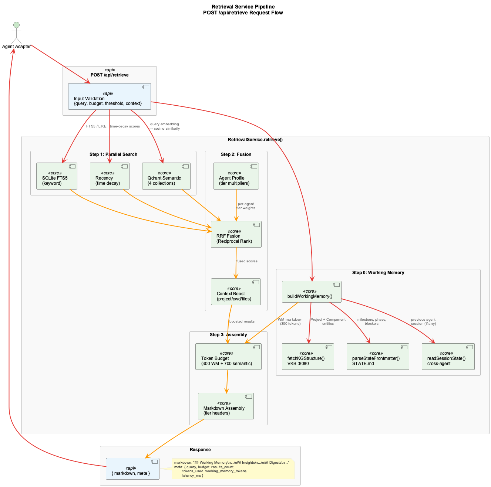

# Knowledge Context Injection

Automatic surfacing of accumulated knowledge into coding agent conversations.

## Overview

The Knowledge Context Injection pipeline (v6.0) makes the coding project's accumulated knowledge actionable by injecting relevant context into every agent conversation. When you type a prompt in any coding agent, the system retrieves semantically relevant observations, digests, insights, and knowledge graph entities, then injects them as invisible context that shapes the agent's response.

The pipeline is fully agent-agnostic: Claude, Copilot, OpenCode, and Pi all receive knowledge injection through their native hook/plugin mechanisms. Claude and Copilot inject **per turn** (fresh, task-relevant knowledge on every prompt); OpenCode and Pi inject a **session-start baseline**, which Copilot also gets on top of its per-turn injection.

## Architecture


### Components

| Component | Location | Purpose |
|-----------|----------|---------|
| Embedding Service | `src/embedding/` | fastembed ONNX with all-MiniLM-L6-v2 (384-dim) |
| Retrieval Service | `src/retrieval/retrieval-service.js` | Hybrid search + token-budgeted assembly |
| Retrieval Client | `src/hooks/retrieval-client.js` | Shared fail-open HTTP client for all adapters |
| Claude Adapter | `src/hooks/knowledge-injection-hook.js` | UserPromptSubmit hook (per-prompt, global) |
| OpenCode Adapter | `src/hooks/knowledge-injection-opencode.js` | Session-start context file writer |
| Copilot Baseline Adapter | `src/hooks/knowledge-injection-copilot.js` | Session-start workspace instructions writer |
| Copilot Per-Turn Injector | `src/hooks/knowledge-injection-copilot-posttool.js` | Per-turn injection via `additionalContext` (multi-channel) |
| Copilot Channel Resolver | `src/hooks/copilot-channel-capabilities.js` | Maps Copilot version → honored injection channel(s) |
| Pi Adapter | `src/hooks/knowledge-injection-pi.js` | Session-start context file writer |
| Working Memory | `src/retrieval/working-memory.js` | Live KG + STATE.md project summary |
| Agent Profiles | `config/agent-profiles.json` | Per-agent tier weight multipliers |
| Session State | `scripts/write-session-state.js` | Cross-agent continuity on agent switch |

### Data Flow

1. **Write path**: ETM creates observations → Redis pub/sub → embedding listener → Qdrant upsert
2. **Read path**: Agent prompt → adapter → retrieval client → retrieval service → Qdrant + SQLite → RRF fusion → token-budgeted markdown → agent context

## Retrieval Pipeline



### Request Flow

The retrieval service (`POST /api/retrieve` on port 3033) processes each request through:

1. **Working Memory (Step 0)**: Queries VKB for Project + Component entities, parses STATE.md for current milestone/phase, checks for cross-agent session state. Fixed 300-token budget.

2. **Parallel Search (Step 1)**: Runs three search strategies simultaneously:
   - Qdrant semantic search across 4 collections (observations, digests, insights, kg_entities)
   - SQLite FTS5 keyword search
   - Recency scoring with time-decay

3. **RRF Fusion (Step 2)**: Merges results using Reciprocal Rank Fusion with:
   - Tier weights (insights > digests > entities > observations)
   - Per-agent profile multipliers from `config/agent-profiles.json`
   - Context boost (project name 1.15x, cwd 1.10x, recent files 1.20x)

4. **Token-Budgeted Assembly (Step 3)**: Constructs markdown with tier headers, capped at 700 tokens for semantic results + 300 tokens for working memory = 1000 total.

### What limits the injected payload: the stored preview

`formatResult` (`src/retrieval/token-budget.js`) renders each item's `summary_preview` and nothing
else, so whatever the indexer stores in that field is the hard ceiling on what any single item can
contribute — independent of the token budget.

That length is `SUMMARY_PREVIEW_CHARS` in **`src/embedding/preview.ts`**, the single source of
truth for both the live indexer (`listener.ts`) and the batch re-index (`backfill.ts`).

It was previously a bare `substring(0, 200)` duplicated across five call sites, which nothing named
and nothing connected to its consequence. Measured over 1419 captures / 4624 injected items under
that regime: **every** preview was ≤200 chars, median 2 items per turn, and median `tokens_used`
**285 of 1000 — 28% of budget**. The injected block named a relevant insight and then stopped
mid-sentence, before anything actionable. The budget was never the binding constraint; the preview
was.

It is now **1200 chars**, chosen from where useful content actually sits rather than by feel:
insight bodies have a median length of 2246 chars, and the decisive fact in the top-ranked insights
for three sample tasks sat at offsets 520, 592 and 769 — all lost at 200, all captured at 1200. At
~3.5-4 chars/token that is ~300-340 tokens, so two items fill most of the 700-token semantic budget
and a third truncates gracefully, preserving the multi-tier breadth the pipeline is designed around.

**Changing it requires a re-index.** The preview is written into the Qdrant payload at index time,
so a new value only affects items indexed afterwards. Every payload carries `preview_version`, and
`backfill.ts` skips a point only when `content_hash` *and* `preview_version` both match — a
content-hash-only check would report every point as current (the content did not change; the policy
did) and the new length would never reach the index.

```bash
npm run build && node dist/embedding/backfill.js --prune
```

`--prune` deletes points whose id is absent from the source *after* upserting, so ids that drifted
under an older indexing scheme do not survive as duplicates. It never drops the collection: every
agent prompt queries it, so the failure mode to avoid is an empty index, and it refuses to prune
against an empty source.

Measured on the 200 → 1200 re-index (14,047 points):

| | before | after |
|---|---|---|
| median `tokens_used` of 1000 | 285 (28%) | 812 (81%) |
| median items injected/turn | 2 | 3 |
| decisive fact present in the block (3 sample tasks) | 1 of 3 | 3 of 3 |

The same run resynced the index with km-core, which had drifted badly while the batch tooling was
silently a no-op — 636 indexed insights against 709 real ones, and 12,660 observation vectors
against 8,026 surviving records (the rest pointed at rows the 7-day pruner had already removed).
All four collections now match the source exactly.

The relevance judge deliberately still sees only the first 240 chars of a preview
(`src/retrieval/relevance-judge.js`): it decides topical usefulness, which the title plus opening
conveys, and feeding it 12 × 1200 chars would multiply its input tokens fivefold against a 2500 ms
interactive timeout — buying explainability with fail-opens.

### Response Shape

```json
{
  "markdown": "## Working Memory\n...\n## Insights\n...\n## Digests\n...",
  "items": [
    { "id": "…", "tier": "insights", "rrfScore": 0.374, "score": 0.812, "payload": { "topic": "…" } }
  ],
  "trace": {
    "candidates": { "semantic": 80, "keyword": 0, "fused": 80 },
    "stages": [
      { "name": "idf-floor",  "in": 80, "out": 52, "dropped": [], "dropped_total": 28 },
      { "name": "judge-topk", "in": 52, "out": 12, "dropped": [], "dropped_total": 40 },
      { "name": "judge",      "in": 12, "out":  3, "dropped": [], "dropped_total":  9 },
      { "name": "assembly",   "in":  3, "out":  3, "dropped": [], "dropped_total":  0 }
    ],
    "injected": 3, "tokens_used": 328, "budget": 700, "judge_outcome": "judged"
  },
  "meta": {
    "query": "Docker build pipeline",
    "budget": 1000,
    "results_count": 12,
    "tokens_used": 950,
    "working_memory_tokens": 112,
    "latency_ms": 160
  }
}
```

`items` is the structured subset actually injected. `trace` is the selection funnel — per-stage
in/out counts plus the candidates each stage dropped, so "why was nothing injected?" is
attributable to a named stage. Each stage names at most its 12 highest-ranked casualties and
carries an exact `dropped_total`, so a capped list never reads as a complete one. Both fields are
additive; `retrieval-client.js` and the four agent adapters ignore them.

### Per-Turn Capture

When `/api/retrieve` is called with a `task_id`, obs-api appends one JSONL line per retrieval to
`.data/retrieval-captures/<task_id>.jsonl` via `src/retrieval/capture-store.js` — `{task_id, turn,
capturedAt, meta, items, trace}`. Turn ordinals resume from disk after a restart.

This replaced a writer that wrote `<task_id>.json` and **overwrote** it every call: because
`task_id` is the session UUID for interactive sessions, a 39-turn session kept exactly one capture,
always the last. Legacy `.json` files are read as a single turn-0 fallback and are not migrated.
A turn that injected nothing is still recorded whenever a trace explains the silence — the old
writer discarded that case outright.

`GET /api/retrieve-capture?task_id=…[&turn=N]` serves them: top-level `items`/`meta` are the
selected turn (default: the last), with the full history under `turns[]`. The dashboard's
Performance → context explainer renders these as scored cards, a turn picker, and the funnel.
Retention is 14 days via the existing `com.coding.context-turns-sweeper` job.

## Agent Adapters

### Claude Code (per-prompt injection)

The Claude adapter runs as a `UserPromptSubmit` hook registered in `~/.claude/settings.json` (global — works in all projects). On every substantive prompt (4+ words, not a slash command):

1. Reads prompt from stdin JSON
2. Calls retrieval service with prompt as query + project context
3. Writes JSON to stdout with `additionalContext` field
4. Claude sees the knowledge as a `<system-reminder>` block

**Fail-open**: 2-second HTTP timeout, 5-second safety ceiling. Any error exits 0 with no output.

### OpenCode, Copilot, Pi (session-start baseline)

These adapters run once at session start via `launch-agent-common.sh`:

| Agent | Context File | Mechanism |
|-------|-------------|-----------|
| OpenCode | `.opencode/knowledge-context.md` | Custom instructions file |
| Copilot | `.github/copilot-instructions.md` | Workspace context (marker-based merge) |
| Pi | `AGENTS.md` in pi's config dir | Read via pi's own context-file discovery |

The launch system calls `_inject_knowledge_context()` at step 12.5, which dispatches the appropriate adapter with a 10-second timeout. For Copilot this is only the **baseline** — task-relevant per-turn injection is layered on top (see below).

### GitHub Copilot (per-turn, version-adaptive multi-channel)

On top of the session-start baseline, Copilot injects fresh knowledge **per turn** through its native filesystem hooks (`.github/hooks/hooks.json` → `lib/agent-api/hooks/copilot-bridge.sh` → `knowledge-injection-copilot-posttool.js`).

**The churn problem.** A Copilot filesystem hook can only inject context the model reads via an `additionalContext` field, and *which* event's `additionalContext` is honored changes version to version:

| Copilot version | Honored per-turn channel |
|-----------------|--------------------------|
| ≤ 1.0.71 | `postToolUse` only (`userPromptSubmitted` output is dropped) |
| 1.0.72 – 1.0.x | `userPromptSubmitted` (honored & reliable; `postToolUse` went flaky) |
| unknown / ≥ 1.1.0 | *undetermined* — treated as fail-safe |

A single fixed channel is therefore never upgrade-safe.

**The design — the emit set is the dedup.** `copilot-channel-capabilities.js` maps the installed version (via `copilot --version`, file-cached 6 h) to the set of channels to emit on, and that set is itself the deduplication:

- **Known single-honored version** → emit on that one channel ⇒ injected exactly once, no duplication.
- **Unknown / newer version** → fail-safe: emit on **both** `postToolUse` and `userPromptSubmitted` (tolerating one duplicate to *guarantee* delivery), and log a note to extend the map.

This deliberately rejects "emit everywhere, then suppress after the first hit": on 1.0.71 the `userPromptSubmitted` hook process runs first and emits, but Copilot silently drops it — so suppression would kill the `postToolUse` channel that actually works. Keying the emit set to the version avoids that trap.

**Mechanics.** The injector runs in two modes from the bridge:

| Mode | Fires on | Behavior |
|------|----------|----------|
| `prompt` | `userPromptSubmitted` | Starts a fresh turn; stashes the prompt + resolved plan. If the plan includes `userPromptSubmitted`, retrieves and emits `additionalContext`. |
| `tool` | `postToolUse` | If the plan includes `postToolUse` and it hasn't emitted this turn, injects (reusing the cached block if the prompt channel already retrieved). Once per turn. |

Retrieval runs **at most once per turn** — the retrieved block is cached in a per-session stash (`$TMPDIR/coding-copilot-kb/<sid>.json`), so the fail-safe second channel reuses it rather than making a second HTTP call. Fail-open throughout: a disabled toggle, a short/slash prompt, no plan, or any error emits a no-op and never blocks a request.

**Prerequisites.** Copilot gates all filesystem hooks behind two settings that are OFF by default; `install.sh install_copilot_file_hooks` sets both:

- `enableFileHooks: true` in `~/.copilot/settings.json`
- the repo folder present in `trustedFolders` in `~/.copilot/config.json`

**Diagnostics & overrides.** `scripts/verify-copilot-hook-injection.sh` runs a deterministic firing check plus an N-run, neutral-token injection probe per channel — run it after any Copilot upgrade, and feed the delivering channel back into `KNOWN_RANGES`. `COPILOT_KB_CHANNELS` forces the channel set (or `none` to disable); `COPILOT_VERSION` overrides the version the resolver reasons about (for tests).

## Working Memory

Every retrieval response begins with a Working Memory section containing:

- **Project structure**: Top-level Project + Component nodes from the Knowledge Graph (e.g., "LSL System", "ETM Pipeline", "Docker Services")
- **Current state**: Active milestone, current phase, status from STATE.md
- **Known issues**: Blockers/concerns from STATE.md
- **Previous session** (if switching agents): Summary from the previous agent's session state file

Budget: 300 tokens, enforced via `gpt-tokenizer`. Progressive truncation: drop descriptions first, then components, then fall back to project + state only.

## Per-Agent Profiles

Each agent gets differently weighted retrieval results based on their typical work patterns:

```json
{
  "claude": { "insights": 1.3, "digests": 1.2, "kg_entities": 1.0, "observations": 0.9 },
  "opencode": { "insights": 1.0, "digests": 1.0, "kg_entities": 1.2, "observations": 1.1 },
  "copilot": { "insights": 0.9, "digests": 1.0, "kg_entities": 1.3, "observations": 1.1 },
  "pi": { "insights": 1.1, "digests": 1.3, "kg_entities": 1.0, "observations": 1.0 }
}
```

Profiles are applied as multipliers during RRF fusion. Unknown agents fall back to default weights (all 1.0).

## Cross-Agent Continuity

When you switch agents mid-task (e.g., Claude → OpenCode), the new agent receives context from the previous session:

1. On agent exit, `write-session-state.js` captures: agent name, project, timestamp, recent files, key decisions
2. Written to `.coding/session-state.json` (gitignored)
3. On next agent start, working memory reads the state file
4. If the previous agent is different AND within 2 hours: injects a "Previous Session" section
5. Same agent restart or stale session: no injection

## Configuration

| Setting | Location | Default | Purpose |
|---------|----------|---------|---------|
| Token budget | retrieval call parameter | 1000 | Total injection size |
| Working memory budget | `working-memory.js` WM_BUDGET | 300 | Fixed WM prefix size |
| Relevance threshold | retrieval call parameter | 0.75 | Minimum score for inclusion |
| HTTP timeout | `retrieval-client.js` | 2000ms | Retrieval call timeout |
| Safety timeout | `knowledge-injection-hook.js` | 5000ms | Absolute hook ceiling |
| Min words for injection | `knowledge-injection-hook.js` | 4 | Short prompt filter |
| Agent profiles | `config/agent-profiles.json` | per-agent | Tier weight multipliers |
| Session staleness | `working-memory.js` | 2 hours | Cross-agent window |
| Copilot channel set | `COPILOT_KB_CHANNELS` env | version-resolved | Force Copilot injection channel(s), or `none` to disable |
| Copilot version override | `COPILOT_VERSION` env | detected | Version the channel resolver reasons about (tests) |
| Copilot file hooks | `~/.copilot/settings.json` + `config.json` | off | `enableFileHooks` + `trustedFolders` gate all Copilot hooks |
