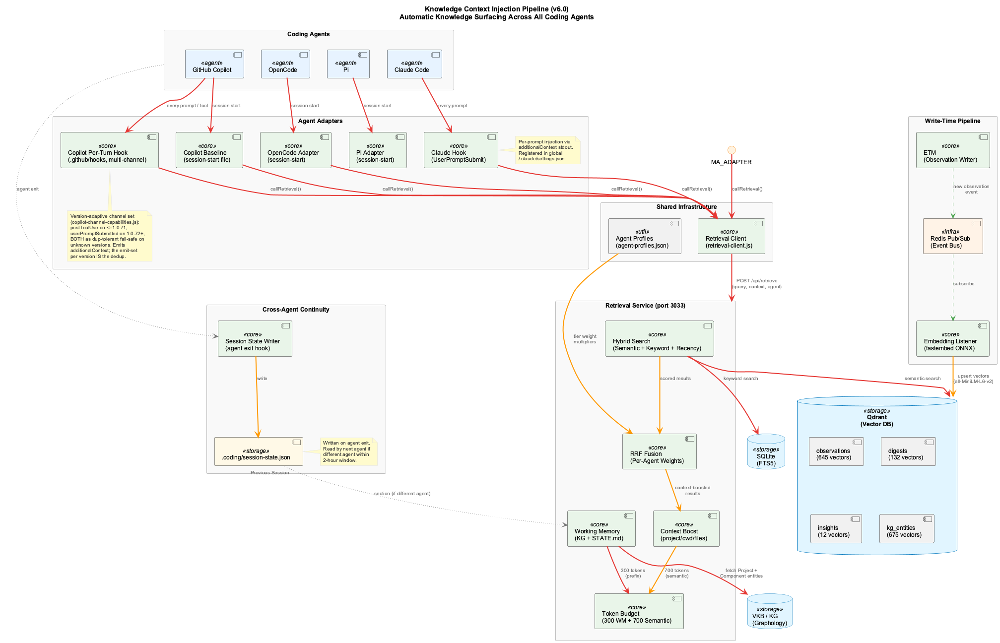

# Knowledge Context Injection

Every prompt you type is answered with the project's accumulated knowledge already in
context — retrieved, ranked and budgeted, without you asking for it.

=== "⚡ Quick (~3 min)"

    ## What it does

    When you send a prompt, the system searches everything it has learned — observations,
    digests, insights and knowledge-graph entities — and injects the most relevant pieces as
    invisible context before the agent answers. All four agents get it, through their own native
    hook mechanisms.

    | Agent | When knowledge arrives |
    |-------|------------------------|
    | Claude | Every prompt |
    | Copilot | Session start, **plus** every turn |
    | OpenCode, Pi | Session start |

    ## The budget

    One thousand tokens per injection: 300 reserved for working memory (project structure,
    current milestone, known blockers) and 700 for retrieved material.

    ## It never blocks you

    Every adapter is **fail-open**: a 2-second HTTP timeout and a 5-second absolute ceiling, and
    any error exits cleanly with no output. If retrieval is down, you get an ordinary
    conversation rather than a hung prompt.

    ## Checking what was injected

    The dashboard's **Performance → context explainer** shows, per turn, what was selected, what
    was dropped and at which stage. That funnel is the thing to look at when the answer is "why
    did it not know that?"

=== "📖 Standard (~15 min)"

    ## How a prompt becomes context

    Two paths run continuously. On the **write** side, the transcript monitor creates
    observations, which are published over Redis, embedded, and upserted into Qdrant. On the
    **read** side, your prompt goes through the adapter for your agent to the retrieval service,
    which searches, fuses, budgets and returns markdown.

    

    The retrieval service (`POST /api/retrieve`) runs four steps:

    1. **Working memory** — project and component entities from the knowledge graph, plus the
       current milestone and blockers parsed from `STATE.md`. Fixed 300-token budget.
    2. **Parallel search** — Qdrant semantic search across four collections, SQLite FTS5 keyword
       search, and recency scoring, all at once.
    3. **RRF fusion** — Reciprocal Rank Fusion merges them, weighted by tier (insights above
       digests above entities above observations), by a per-agent profile, and by context boosts
       for the project name, working directory and recently touched files.
    4. **Assembly** — markdown with tier headers, capped at 700 tokens.

    ## Why the preview length mattered more than the budget

    Each retrieved item contributes only its stored `summary_preview`, so that stored length —
    not the token budget — is the real ceiling on what any item can say.

    It used to be 200 characters. Measured over 1,419 captures and 4,624 injected items, the
    median turn used **285 of its 1,000 tokens**: the block would name a relevant insight and
    stop mid-sentence, before anything actionable. The budget was never the binding constraint.

    At 1,200 characters — chosen because the decisive fact in sampled insights sat at offsets
    520, 592 and 769, all lost at 200 — the same measurement gives:

    | | before | after |
    |---|---|---|
    | median tokens used of 1,000 | 285 (28%) | 812 (81%) |
    | median items per turn | 2 | 3 |
    | decisive fact present (3 sample tasks) | 1 of 3 | 3 of 3 |

    The preview is written into the Qdrant payload at index time, so **changing it requires a
    re-index** — and the payload carries a `preview_version` precisely so the backfill does not
    conclude that nothing changed (the content did not; the policy did).

    ## Per-agent weighting

    Each agent gets results weighted for how it tends to work — Claude leaning toward insights,
    Copilot and OpenCode toward graph entities, Pi toward digests — as multipliers applied during
    fusion, from `config/agent-profiles.json`. An unknown agent falls back to 1.0 across the
    board.

    ## Continuity when you switch agents

    On exit, the agent's name, project, recent files and key decisions are written to
    `.coding/session-state.json`. If you start a **different** agent within two hours, working
    memory injects a "Previous Session" section. Restarting the same agent, or coming back later,
    injects nothing — the aim is handover, not repetition.

    ## Copilot needs two settings turned on

    Copilot gates all filesystem hooks behind two flags that ship **off**, both set by
    `install.sh`: `enableFileHooks` in `~/.copilot/settings.json`, and the repository listed in
    `trustedFolders` in `~/.copilot/config.json`. Without them the hooks never fire, silently.

    Which channel Copilot honours for per-turn context also changes between versions, so the
    resolver maps the installed version to the channel set to emit on, and falls back to emitting
    on both when it does not recognise a version. Re-run
    `scripts/verify-copilot-hook-injection.sh` after any Copilot upgrade.

    ## Diagnosing a poor injection

    The response carries a `trace` — per-stage in/out counts and the candidates each stage
    dropped — so "why was nothing injected?" resolves to a named stage rather than a shrug. Each
    retrieval is also appended to `.data/retrieval-captures/<task_id>.jsonl`, one line per turn,
    and rendered in the dashboard as scored cards with a turn picker.

=== "📚 Deep Dive (full)"

    --8<-- "_tiers/architecture/knowledge-injection.deep.md"
