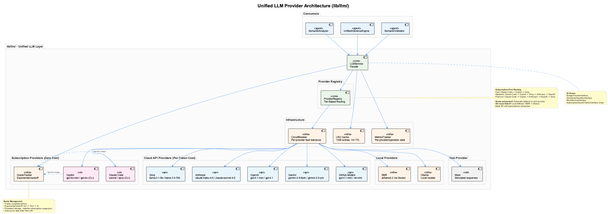
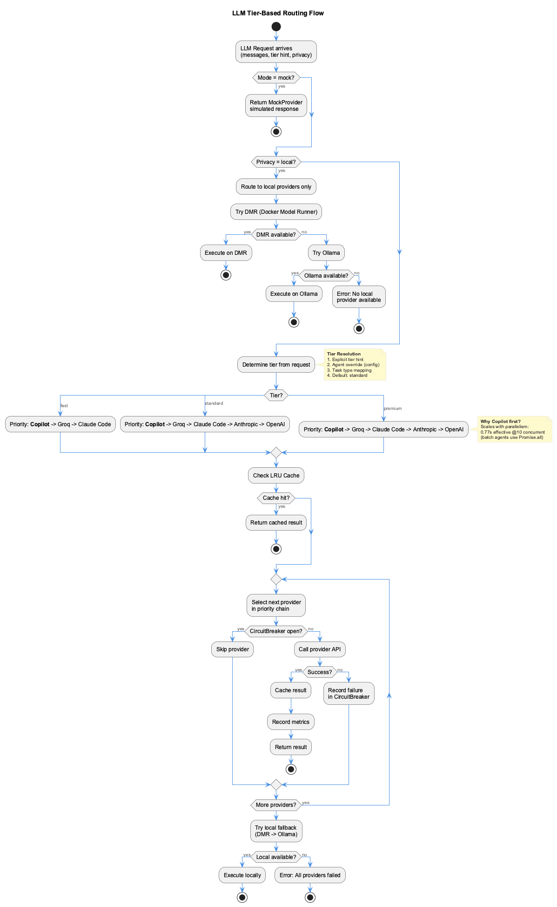

# LLM Architecture

## Overview

The `lib/llm/` unified LLM support layer consolidates three previously separate LLM abstractions into a single, comprehensive library that provides intelligent routing, resilience, and cost optimization across 10 different LLM providers, including **subscription-based providers** that eliminate per-token API costs.

**Why it was created:**
- **Before**: 3 separate LLM abstractions (Semantic Analysis, Unified Inference Engine, Semantic Validator)
- **Problem**: Code duplication, inconsistent provider handling, no shared caching or resilience
- **After**: Single unified layer with shared infrastructure, tier-based routing, circuit breaker, and LRU cache

**Key Features:**
- **Zero-cost routing** via Claude Code and GitHub Copilot subscriptions
- **Automatic fallback** to paid APIs on quota exhaustion
- **Subscription-first priority** across all tiers
- **Optimistic quota tracking** with exponential backoff

---

## Architecture Components



### Core Components

1. **LLMService** (Facade)
   - Single entry point for all LLM operations
   - Handles tier-based routing
   - Manages provider selection and fallback
   - Integrates with infrastructure (cache, circuit breaker, metrics)

2. **ProviderRegistry**
   - Central registry for all LLM providers
   - Dynamic provider registration and lookup
   - Configuration validation

3. **Infrastructure Layer**
   - **Circuit Breaker**: Prevents cascading failures (threshold: 5 failures, reset: 60s)
   - **LRU Cache**: 1000 entries, 1-hour TTL
   - **Metrics**: Request tracking, cost monitoring, performance stats

### Consumers

The unified layer serves three primary consumers:

1. **SemanticAnalyzer** (`integrations/mcp-server-semantic-analysis/`)
   - Batch analysis workflows
   - Git history analysis
   - Ontology classification

2. **UnifiedInferenceEngine** (shared utility)
   - General-purpose LLM inference
   - Multi-provider support

3. **SemanticValidator** (`integrations/mcp-constraint-monitor/`)
   - Constraint violation detection
   - Semantic code analysis

---

## Supported Providers

The system supports 10 LLM providers with tier-based model selection:

### Subscription Providers (Zero Cost)

#### 1. Claude Code
**CLI Command**: `claude`
**Cost**: $0 per token (uses existing Claude max subscription)

| Tier | Model | Description |
|------|-------|-------------|
| Fast | `sonnet` | Claude Sonnet 4.5 (fast tier) |
| Standard | `sonnet` | Claude Sonnet 4.5 (standard tier) |
| Premium | `opus` | Claude Opus 4.6 (highest quality) |

**Requirements**:
- Install Claude Code CLI: https://claude.ai/downloads
- Authenticate: `claude login`
- Verify: `claude --version`

**Features**:
- Automatic quota tracking with persistent storage
- Exponential backoff on exhaustion (5m → 15m → 1h)
- Seamless fallback to API providers
- **Docker mode**: Falls back to [LLM CLI Proxy](../integrations/llm-cli-proxy.md) on `host.docker.internal:12435`

#### 2. GitHub Copilot
**CLI Command**: `copilot-cli`
**Cost**: $0 per token (uses existing GitHub Copilot subscription)

| Tier | Model | Description |
|------|-------|-------------|
| Fast | `gpt-4o-mini` | Small, fast model |
| Standard | `gpt-4o` | Standard quality |
| Premium | `gpt-4o` | Premium quality |

**Requirements**:
- Install Copilot CLI: `npm install -g @githubnext/github-copilot-cli`
- Authenticate via GitHub
- Verify: `copilot-cli --version`

**Features**:
- Shared quota tracking system
- Automatic provider rotation on exhaustion
- Zero API costs
- **Docker mode**: Falls back to [LLM CLI Proxy](../integrations/llm-cli-proxy.md) on `host.docker.internal:12435`

---

### LLM CLI Proxy (Docker Bridge)

When running inside Docker, CLI tools (`claude`, `copilot-cli`) are unavailable. The [LLM CLI Proxy](../integrations/llm-cli-proxy.md) runs on the host (port 12435) and forwards requests to local CLIs. Each CLI provider automatically detects and uses the proxy during initialization when the `LLM_CLI_PROXY_URL` environment variable is set.

---

### API Providers (Per-Token Cost)

#### 3. Groq
**API Key**: `GROQ_API_KEY`

| Tier | Model | Performance | Cost |
|------|-------|-------------|------|
| Fast | `llama-3.1-8b-instant` | 750 tok/s | ~$0.05/M tokens |
| Standard | `llama-3.3-70b-versatile` | 275 tok/s | ~$0.59/M tokens |
| Premium | `openai/gpt-oss-120b` | - | High |

### 4. Anthropic
**API Key**: `ANTHROPIC_API_KEY`

| Tier | Model | Cost |
|------|-------|------|
| Fast | `claude-haiku-4-5` | $1/$5 per MTok |
| Standard | `claude-sonnet-4-5` | $3/$15 per MTok |
| Premium | `claude-opus-4-6` | $5/$25 per MTok |

### 5. OpenAI
**API Key**: `OPENAI_API_KEY`

| Tier | Model | Description |
|------|-------|-------------|
| Fast | `gpt-4.1-mini` | Affordable small model |
| Standard | `gpt-4.1` | Latest standard model |
| Premium | `o4-mini` | Reasoning model |

### 6. Google Gemini
**API Key**: `GOOGLE_API_KEY`

| Tier | Model | Description |
|------|-------|-------------|
| Fast | `gemini-2.5-flash` | Fast, cost-effective |
| Standard | `gemini-2.5-flash` | Good balance |
| Premium | `gemini-2.5-pro` | Deep reasoning |

### 7. GitHub Models
**API Key**: `GITHUB_TOKEN`
**Base URL**: `https://models.github.ai/inference/v1`

| Tier | Model |
|------|-------|
| Fast | `gpt-4.1-mini` |
| Standard | `gpt-4.1` |
| Premium | `o4-mini` |

### 8. DMR (Docker Model Runner)
**Local provider** - no API key required
**Base URL**: `http://localhost:12434/engines/v1`

- **Default Model**: `ai/llama3.2`
- **Specialized Models**:
  - `ai/llama3.2:3B-Q4_K_M` (lightweight tasks)
  - `ai/qwen2.5-coder:7B-Q4_K_M` (code analysis)

### 9. Ollama
**Local provider** - no API key required

- Supports any locally installed Ollama models
- Used as final fallback for local-only mode

### 10. Mock Provider
**Test/debug mode** - no API key required

- Returns simulated responses
- Used for testing and development

---

## Tier-Based Routing



The system routes requests to providers based on task complexity and cost optimization:

### Tier Definitions

**Fast Tier** (zero cost → low cost, high speed)
- Simple extraction and parsing
- Basic classification
- File pattern matching
- **Provider Priority**: Claude Code → Copilot → Groq

**Standard Tier** (zero cost → balanced cost/quality)
- Semantic code analysis
- Git history analysis
- Documentation linking
- Ontology classification
- **Provider Priority**: Claude Code → Copilot → Groq → Anthropic → OpenAI

**Premium Tier** (zero cost → highest quality)
- Insight generation
- Pattern recognition
- Quality assurance review
- Deep code analysis
- **Provider Priority**: Claude Code → Copilot → Anthropic → OpenAI → Groq

### Task-to-Tier Mapping

Tasks are automatically mapped to tiers based on their complexity:

```yaml
# Fast tier examples
- git_file_extraction
- commit_message_parsing
- basic_classification

# Standard tier examples
- git_history_analysis
- semantic_code_analysis
- ontology_classification

# Premium tier examples
- insight_generation
- observation_generation
- pattern_recognition
```

### Fallback Chain

1. **Primary**: Try providers in tier priority order
2. **Subscription check**: Verify quota availability (claude-code, copilot)
3. **Circuit breaker check**: Skip failed providers temporarily
4. **Cache check**: Return cached results if available
5. **API fallback**: Use paid API providers (Groq, Anthropic, OpenAI)
6. **Local fallback**: DMR → Ollama (always available, no API costs)

---

## Subscription Quota Management

The system tracks subscription usage and automatically handles quota exhaustion:

### Quota Tracking

**Storage**: `.data/llm-subscription-usage.json`

**Tracked Metrics**:
- Completions per hour (rolling window)
- Estimated token usage
- Quota exhaustion state
- Consecutive failure count

**Soft Limits**:
- Claude Code: 100 completions/hour
- Copilot: 100 completions/hour

### Exponential Backoff

When quota is exhausted, the system applies exponential backoff:

1. **First exhaustion**: Retry after 5 minutes
2. **Second exhaustion**: Retry after 15 minutes
3. **Third+ exhaustion**: Retry after 1 hour

**Automatic recovery**: On successful completion, reset failure counters

### Automatic Fallback

```
Request → Check Claude Code quota
       ↓ (exhausted)
       → Check Copilot quota
       ↓ (exhausted)
       → Use Groq (paid API)
       ↓ (circuit breaker open)
       → Use Anthropic (paid API)
       ↓ (all failed)
       → Use DMR (local)
```

**Cost Impact**:
- If subscriptions available: $0
- If subscriptions exhausted: Standard API costs apply
- Seamless transition - no user intervention needed

### Data Persistence

Quota data is automatically:
- **Persisted** to disk after each request
- **Pruned** (keep last 24 hours only)
- **Loaded** on service initialization

**Reset quota tracking** (for testing):
```bash
rm .data/llm-subscription-usage.json
```

---

## Mode Routing

The system supports three routing modes:

### 1. Mock Mode
**Environment**: `SEMANTIC_ANALYSIS_MODE=mock`

- Uses Mock provider exclusively
- Returns simulated responses
- No API calls or costs
- Ideal for testing and development

### 2. Local Mode
**Environment**: `SEMANTIC_ANALYSIS_MODE=local`

- Uses DMR and Ollama only
- No external API calls
- Zero API costs
- Requires local model servers running

### 3. Public Mode (Default)
**Environment**: `SEMANTIC_ANALYSIS_MODE=public` or unset

- Uses all cloud providers (Groq, Anthropic, OpenAI, Gemini, GitHub)
- Falls back to DMR/Ollama if all cloud providers fail
- Optimizes for quality and availability

---

## Dependency Injection Hooks

The system provides interfaces for extending functionality:

### 1. MockServiceInterface
```typescript
interface MockServiceInterface {
  getMockResponse(task: string, tier: string): Promise<string>;
}
```
Used to customize mock responses for testing.

### 2. BudgetTrackerInterface
```typescript
interface BudgetTrackerInterface {
  trackCost(provider: string, tokens: number, cost: number): void;
  getBudgetRemaining(): number;
  isOverBudget(): boolean;
}
```
Enables cost tracking and budget enforcement.

### 3. SensitivityClassifierInterface
```typescript
interface SensitivityClassifierInterface {
  classifyContent(content: string): 'public' | 'internal' | 'confidential';
  canUseProvider(provider: string, sensitivity: string): boolean;
}
```
Restricts provider usage based on content sensitivity.

---

## Configuration

All LLM provider configuration is centralized in:

**File**: `config/llm-providers.yaml`

Key configuration sections:

```yaml
providers:
  # Subscription providers (zero cost)
  claude-code:
    cliCommand: "claude"
    timeout: 60000
    models:
      fast: "sonnet"
      standard: "sonnet"
      premium: "opus"
    quotaTracking:
      enabled: true
      softLimitPerHour: 100

  copilot:
    cliCommand: "copilot-cli"
    timeout: 60000
    models:
      fast: "gpt-4o-mini"
      standard: "gpt-4o"
      premium: "gpt-4o"
    quotaTracking:
      enabled: true
      softLimitPerHour: 100

  # API providers (per-token cost)
  groq:
    apiKeyEnvVar: GROQ_API_KEY
    fast: "llama-3.1-8b-instant"
    standard: "llama-3.3-70b-versatile"
    premium: "openai/gpt-oss-120b"

  anthropic:
    apiKeyEnvVar: ANTHROPIC_API_KEY
    fast: "claude-haiku-4-5"
    standard: "claude-sonnet-4-5"
    premium: "claude-opus-4-6"
  # ... more providers

provider_priority:
  fast: ["claude-code", "copilot", "groq"]
  standard: ["claude-code", "copilot", "groq", "anthropic", "openai"]
  premium: ["claude-code", "copilot", "anthropic", "openai", "groq"]

cache:
  maxSize: 1000
  ttlMs: 3600000  # 1 hour

circuit_breaker:
  threshold: 5
  resetTimeoutMs: 60000  # 1 minute
```

### Environment Overrides

Force specific behavior via environment variables:

```bash
# Force all tasks to premium tier
export SEMANTIC_ANALYSIS_TIER=premium

# Force specific provider (skip routing)
export SEMANTIC_ANALYSIS_PROVIDER=anthropic

# Use budget mode (fast tier everywhere)
export SEMANTIC_ANALYSIS_COST_MODE=budget

# Use local-only mode
export SEMANTIC_ANALYSIS_MODE=local
```

---

## Cost Management

### Cost Limits

**Per-workflow limits** (configured in `llm-providers.yaml`):
- **Budget mode**: $0.05 per run
- **Standard mode**: $0.50 per run
- **Quality mode**: $2.00 per run

**Batch workflow limits**:
- Max tokens per batch: 500,000
- Max cost per batch: $1.00 USD
- Total budget: $50.00 USD
- Automatic fallback to local on quota exceeded

### Cost Optimization Strategies

1. **Subscription-first routing**: Use zero-cost subscriptions before paid APIs
2. **Tier-based routing**: Use cheapest provider that meets quality requirements
3. **Caching**: Avoid duplicate LLM calls (1-hour TTL)
4. **Automatic fallback**: Switch to paid APIs only when subscriptions exhausted
5. **Local fallback**: Switch to DMR/Ollama when budget exhausted
6. **Circuit breaker**: Stop calling failed providers quickly

### Cost Savings Example

**Typical UKB batch analysis run**:
- 50 fast tier calls (extraction, parsing)
- 100 standard tier calls (semantic analysis)
- 20 premium tier calls (insight generation)

**Before subscriptions** (all API):
- Fast: 50 × $0.001 = $0.05
- Standard: 100 × $0.01 = $1.00
- Premium: 20 × $0.05 = $1.00
- **Total: ~$2.05 per run**

**After subscriptions** (until quota exhausted):
- Fast: $0 (Claude Code)
- Standard: $0 (Claude Code)
- Premium: $0 (Claude Code)
- **Total: $0.00 per run** ✅

**Estimated savings**: ~$50-100/month for active development

---

## Metrics and Monitoring

The LLM layer tracks:

- **Request metrics**: Total calls per provider, success/failure rates
- **Performance**: Latency per provider, throughput
- **Cost**: Token usage, estimated costs per provider
- **Cache**: Hit/miss ratio, cache size

Metrics are exposed via the `LLMService.getMetrics()` method.

---

## Integration Example

```typescript
import { LLMService } from '@/lib/llm/llm-service.js';
import { Logger } from '@/lib/logger.js';
import type { LLMCompletionRequest } from '@/lib/llm/types.js';

const llmService = LLMService.getInstance();

const request: LLMCompletionRequest = {
  messages: [
    { role: 'user', content: 'Analyze this code for bugs...' }
  ],
  tier: 'standard',  // or 'fast' / 'premium'
  task: 'semantic_code_analysis',
  temperature: 0.7,
  maxTokens: 4096
};

const result = await llmService.complete(request);

Logger.log('info', result.content);           // LLM response
Logger.log('info', `Provider: ${result.provider}`);          // Which provider was used
Logger.log('info', `Model: ${result.model}`);             // Specific model
Logger.log('info', `Tokens: ${result.usage.totalTokens}`); // Token usage
Logger.log('info', `Cached: ${result.cached}`);            // Was it from cache?
```

---

## Related Documentation

- [LLM Provider Guide](../guides/llm-providers.md) - User guide for working with providers
- [Semantic Analysis Integration](../integrations/semantic-analysis.md) - SA consumer usage
- [Getting Started](../getting-started/index.md) - Installation and API key setup

**Configuration Files:**
- `config/llm-providers.yaml` - Full provider configuration schema
- `docs/provider-configuration.md` - Detailed API key setup guide
