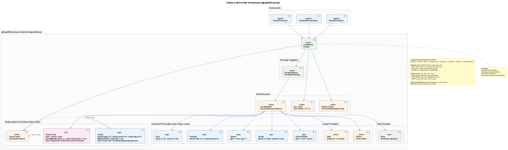

# LLM Architecture

The provider layer underneath routing: which backends exist, how quota and fallback are
handled, and what happens when a subscription runs out.

=== "⚡ Quick (~3 min)"

    ## What this layer is

    A single shared library that every LLM caller in the project goes through, replacing three
    separate abstractions that each handled providers differently. It owns provider registration,
    caching, circuit-breaking and metrics.

    It answers **how a provider is talked to**. Which provider a given piece of work goes to is a
    separate question, answered by [LLM Routing](llm-routing.md).

    ## Subscriptions first, APIs as fallback

    Work is served from flat-rate subscription accounts wherever possible, and only falls through
    to metered API keys when those cannot serve it — on quota exhaustion, or when a capability is
    missing.

    ## Three modes

    | Mode | Uses | For |
    |------|------|-----|
    | **Mock** | No network at all | Tests and single-stepping a workflow |
    | **Local** | A local model runner | Offline or cost-free work |
    | **Public** | Cloud providers | Normal operation (default) |

    ## Resilience defaults

    A circuit breaker opens after **5 consecutive failures** and resets after **60 seconds**; an
    LRU cache holds 1,000 entries for an hour. Both are shared by every caller, so one service's
    retries do not become every service's outage.

=== "📖 Standard (~15 min)"

    ## The components

    **A facade** is the single entry point for every LLM operation — it selects a provider,
    applies routing, and wires in the shared infrastructure. **A registry** holds the providers
    and validates their configuration. **An infrastructure layer** supplies the circuit breaker,
    the LRU cache and the metrics that the token-usage dashboard reads.

    

    Three consumers sit on top: the semantic-analysis workflows, the inference engine, and the
    validator — all of which previously carried their own provider handling.

    ## Subscription and metered accounts

    The distinction that matters is not which company makes the model but **which account gets
    billed**. Subscription accounts are flat-rate: work served there costs nothing marginal.
    Metered API keys cost per token. The layer prefers the former and treats the latter as
    fallback, which is why quota tracking exists at all.

    Beyond those, local runners and a mock provider round out the set — the mock being what makes
    a workflow single-steppable without spending anything.

    ## Quota, backoff and falling through

    Subscription quota is tracked **optimistically**: the layer assumes capacity until a provider
    says otherwise, rather than pre-counting. When a provider does refuse, exponential backoff
    keeps the system from hammering an exhausted account, and the call falls through to the next
    candidate.

    The failure worth understanding is what happens when the *only* provider with a needed
    capability is exhausted — every chain that requires that capability collapses at once. The
    answer is to keep more than one capable provider configured, not to relax the capability
    check, because a provider that silently drops a capability returns confident nonsense.

    ## Modes

    **Mock mode** makes no network calls and is what the debug variant of the knowledge workflow
    uses. **Local mode** routes to a local runner. **Public mode** is the default and uses cloud
    providers.

    ## Injection points

    Three interfaces let you substitute behaviour without touching the layer: a mock service, a
    budget tracker, and a sensitivity classifier. They exist so that cost policy and data-handling
    policy can be project decisions rather than library ones.

    ## What gets logged

    Every call records its provider, model, calling process, token counts and latency. The
    `process` field is what makes per-service attribution possible on the
    [Token Usage dashboard](token-usage.md); a call without one is attributed to `unknown`.

    ## Where to look next

    - [LLM Routing](llm-routing.md) — which provider and model a given job resolves to
    - [Token Usage](token-usage.md) — what it all consumed
    - [LLM Providers](../guides/llm-providers.md) — adding or troubleshooting a provider

=== "📚 Deep Dive (full)"

    --8<-- "_tiers/architecture/llm-architecture.deep.md"
