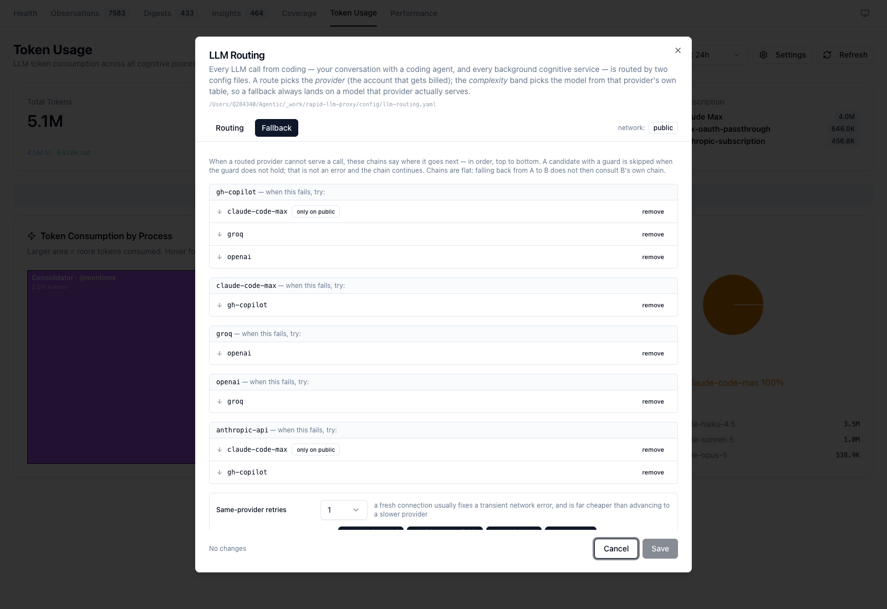

# LLM Routing

Every LLM call made anywhere in coding — your conversation with a coding agent, and every
background cognitive service in the container — goes through the llm-proxy on `:12435`, and
the proxy decides where it goes from **two YAML files**. Nothing else routes. There are no
hardcoded provider chains, no policy hidden in startup scripts, and no heuristics that
quietly reorder things.


| File | Answers |
|------|---------|
| `config/llm-routing.yaml` | Which **provider** and **model** serves a given piece of work |
| `config/llm-fallback.yaml` | What happens when that provider **can't** |

Both live in the `rapid-llm-proxy` repo, next to the code that obeys them.

---

## Naming: providers are accounts, not companies

A provider id names the **account that gets billed**, not the company that owns the model.
`claude-code-max` (personal Max subscription) and `anthropic-api` (metered API key) both
serve Claude models and are emphatically not the same thing — one is flat-rate, the other
is per-token.

This matters because it used to be collapsed. The dashboard normalized `claude-code` →
`anthropic`, which merged subscription traffic with API-key traffic under one label, so the
By Provider pie could read *"anthropic 100%"* and tell you nothing about where the money
went. Model names alone have the same problem: `claude-sonnet-5` on the corporate Copilot
contract and `claude-sonnet-5` on a metered key are different money.

So a model is **always** written `<provider>/<model>`:

```
claude-code-max/claude-opus-5     personal Max subscription
gh-copilot/claude-sonnet-5        corporate Copilot contract
groq/openai/gpt-oss-120b          Groq API key
```

That form is used identically in the proxy logs, in `token_usage.provider`, on the
dashboard, and here.

### The catalogue

| Provider id | Account | Tools? | Notes |
|---|---|---|---|
| `claude-code-max` | `anthropic-subscription` | no | The only provider that can serve **foreground Claude Code** |
| `gh-copilot` | `copilot-subscription` | yes | Corporate contract, enterprise endpoint |
| `groq` | `groq-api` | no | Fast and cheap; no Claude models |
| `openai` | `openai-api` | yes | |
| `anthropic-api` | `anthropic-api` | yes | Metered — distinct from `claude-code-max` |
| `gaia` | `corporate-api` | — | Declared for completeness; **disabled**, no implementation yet |

Model lists in the config are what each account **verifiably serves**, taken from 30 days of
`token_usage` plus a catalogue probe — not from a vendor page. Notably the Copilot leg
rejects every `opus` id with `400 The requested model is not supported`, so none is listed
under `gh-copilot`.

---

## How a route is chosen

Lookup is **three steps, in order**. No wildcards, no scoring, no tie-breaks:

1. `routes["<job>/<agent>"]` — foreground, where the agent matters
2. `routes["<job>"]` — background, where it doesn't
3. `defaults[<class>]` — class is `fg-chat` for `fg-*` jobs, `background` otherwise

`job` is `fg-chat` for a coding-agent conversation, or `bg-<service>` for a background
service (the `process` field the caller sends to `/api/complete`).

The route picks a **provider**. The **complexity band** then picks the model from *that
provider's own table*:

```yaml
routes:
  fg-chat/claude:        { provider: claude-code-max, complexity: high }
  bg-observation-writer: { provider: gh-copilot,      complexity: small }

providers:
  gh-copilot:
    models: { small: claude-haiku-4.5, medium: claude-sonnet-4.6, high: claude-sonnet-5 }
  claude-code-max:
    models: { small: claude-haiku-4.5, medium: claude-sonnet-5,   high: claude-opus-5 }
```

Deriving the model this way — rather than pinning `provider` *and* `model` per row — is what
makes fallback safe. When `bg-observation-writer` falls from `gh-copilot` to
`claude-code-max`, it lands on *that* provider's `small` model. The old scheme carried the
pinned model across "similar" providers and could hand Groq a Claude model id.

### `complexity: from-caller`

One route uses it: `fg-chat/opencode`. OpenCode picks its own model per call — sonnet for
the agentic loop, haiku for titles — and flattening that to a single band would make every
cheap call expensive. The caller supplies the band; if it sends none, the class default
applies. **The provider is still ours to decide.**

This is the *only* caller input to routing. `body.provider` and `body.subscription` are
deliberately ignored: a caller that can re-route itself is a caller that can quietly move
spend onto a different account.

---

## Fallback

`llm-fallback.yaml` gives each provider an ordered list of what to try next.

```yaml
chains:
  gh-copilot:
    - provider: claude-code-max
      when: { network: [public] }   # claude-code is firewall-blocked inside corporate/CN
    - provider: groq
    - provider: openai
```

- A candidate whose **guard** doesn't hold is skipped — not an error, the chain continues.
- Chains are **flat, not recursive**: falling back from A to B does not then consult B's own
  chain. One route means one visible list of at most a few attempts, not a graph to trace.
- Only the failure classes listed in `retry_on` advance the chain. A 400 for a malformed
  request, a 401, or a content-policy refusal surfaces to the caller verbatim — retrying a
  caller's bug across three providers just burns three quotas and hides the bug.

### Sensors are not policy

`detectNetworkMode()` still exists, but it is a **sensor**: it reports `public` or
`corporate` and decides nothing. The `when:` guards are the policy. Previously the sensor
was wired straight into a chain-order ternary, which is why "why did this call go there?"
had no answerable form.

### Tool capability

A request carrying `tools[]` may only land on a provider whose `capabilities.tools` is true.
With `enforce_capabilities: true`, a tools-bearing request with no capable provider **fails
loudly** rather than landing somewhere that silently drops the tools and returns prose.

> This is the mechanism behind the August 2026 outage: `gh-copilot` was the *only*
> tools-capable provider, so a single exhausted quota collapsed every agent chain to nothing
> at once. The gate is still correct — silently stripping tools is worse. The fix is to keep
> **more than one** capable provider in the config, not to turn the gate off.

---

## Foreground Claude

`fg-chat/claude` is special, and the config says so explicitly.

Claude Code speaks the **Anthropic wire protocol**. The proxy forwards those requests
verbatim to `api.anthropic.com` (`/v1/messages`) rather than selecting a provider — so only
a provider marked `fg_transport: anthropic-passthrough` can serve it. Today that is
`claude-code-max` alone.

Routing it anywhere else is refused **loudly**:

```
HTTP 501  ROUTE_NOT_IMPLEMENTED
foreground claude is routed to "gh-copilot" by defaults.fg-chat, but this endpoint
is an Anthropic-protocol passthrough and "gh-copilot" has no fg_transport.
```

The config validator catches the explicit case at boot, so a `fg-chat/claude` route naming a
transport-less provider will not even load. The 501 covers the subtler case where claude
falls through to a `defaults.fg-chat` that points elsewhere.

**Why not just make it work:** serving foreground Claude Code on an OpenAI-shaped provider
needs a full Anthropic↔OpenAI bridge — request/response translation, SSE re-framing, and
`tool_use` ↔ `tool_calls` mapping. That is a separate piece of work. Until it exists, the
combination is refused rather than silently ignored, which is what the old passthrough did:
it never read the config at all, so the config could say one thing while the route did
another.

---

## Editing it

### From the dashboard

**Token Usage → Settings** at [localhost:3032](http://localhost:3032/token-usage).


Foreground routes are separated from background services; the *Resolves to* column derives
`<provider>/<model>` live as you change the provider or band.



Saves are sent as a **patch of only what changed** and applied through the YAML document
API, so the extensive comments in both files survive editing. The proxy **validates before
writing** — a rejected save leaves both files byte-identical and returns a message naming
the offending key.

Provider badges show reachability (`unreachable`, `disabled`) separately from configuration.
A provider being logged out is a *runtime fact*, never a routing decision — conflating the
two is how "is it configured?" and "is it working?" became the same question.

### By hand

Edit the YAML directly. The proxy reloads on mtime change; no restart needed. A config that
will not parse **aborts proxy startup** rather than being partially applied — not knowing
where any call should go is not something to serve around.

---

## Runbook: why did this call go there?

Ask the proxy. It answers with the same decision the request path makes:

```bash
curl -s 'localhost:12435/api/llm/routing/resolve?job=bg-observation-writer' | jq -r .summary
# bg-observation-writer (step 2) -> gh-copilot/claude-haiku-4.5 > claude-code-max/claude-haiku-4.5 > groq/llama-3.1-8b-instant > openai/gpt-4o-mini
```

Useful parameters:

| Parameter | Effect |
|---|---|
| `job`, `agent` | The lookup key — e.g. `job=fg-chat&agent=opencode` |
| `complexity` | Only meaningful on a `from-caller` route |
| `tools=true` | Applies the capability gate; shows which providers get dropped and why |
| `network=corporate` | Evaluates guards for the *other* network without moving the laptop |

The full response includes `skipped[]` with a stated reason per dropped provider, and
`chain[].available` marking runtime reachability.

The proxy logs the same string on every request:

```
[llm-proxy] route bg-observation-writer (step 2) -> gh-copilot/claude-haiku-4.5 > … [network=public]
[llm-proxy] gh-copilot: QUOTA_EXHAUSTED: … [quota_exhausted] — falling back to claude-code-max/claude-haiku-4.5
```

### Diagnosing a surprise

1. **`/api/llm/routing/resolve`** — did the route resolve where you expected? The
   `matchedKey` and `step` tell you which of the three lookup steps fired. A `step: 3` means
   no rule matched and you got a class default.
2. **Check `skipped[]`** before assuming a bug. A guard or the capability gate may have
   removed the provider you expected, and it says which.
3. **Reproduce with `tools[]`.** A curl reproduction of an *agent* call that omits `tools[]`
   is not equivalent — it takes a different chain and can succeed where the agent fails,
   making the agent's problem look like an agent-side bug. Always include them.
4. **Read the log line.** `fallbackFrom` in the response body and the `[<failure_class>]` tag
   in the log say exactly why the chain advanced.

---

## What this replaced

Routing used to be spread across nine surfaces. Recording them, because most of the
confusion came from the ones that *looked* authoritative and weren't:

| Surface | Was it consulted? |
|---|---|
| `config/llm-providers.yaml` (`provider_priority`, `network_overrides`, …) | **No** — `server.mjs` contains no YAML parsing. It configures the SDK's standalone path only. |
| `.data/llm-proxy/llm-settings.json` → `processOverrides` | Yes — the *de facto* config, 26 entries, all pinned to one provider |
| Hardcoded in `server.mjs` | Yes, and it silently overruled the overrides |
| `scripts/configure-wave-analysis-routing.sh` | Yes — 250 lines of shell+python that PUT policy at startup |
| `scripts/launch-agent-common.sh` | Yes — two *different* hardcoded models for the same agent |
| `lib/experiments/agent-routing.mjs` | Yes, for experiment cells |
| `~/.config/opencode/opencode.json` | Yes — opencode's own default |
| `integrations/mcp-server-semantic-analysis/config/model-tiers.yaml` | **No** — dead since a merge |

Five mechanisms inside `server.mjs` decided routing invisibly: a network-dependent
`preferenceOrder`, a hardcoded `{ copilot: true }` capability map, a `CLAUDE_FAMILY` set that
carried models across providers, a reachability heuristic that reordered the chain, and
substring matching on `body.subscription`. The first two became config keys. The last three
were **deleted** — an unreachable provider is just a failed attempt that advances the chain,
which the fallback config already describes.

`lib/experiments/agent-routing.mjs` deliberately still does **not** read the routing config.
An experiment cell's model is part of its identity: the variant name and composite `task_id`
key off the spec model so `task_hash` stays constant and runs stay comparable. If it followed
live config, editing a rule mid-campaign would change which model a cell launches on while
its recorded identity stayed the same. Reproducibility wins over config unification there.

---

## See also

- [Token Usage](./token-usage.md) — how per-call rows are captured and attributed
- **LLM Architecture** (`architecture/llm-architecture.md`, docs site) — provider
  implementations, the Claude worker pool, and the per-agent transports each provider uses
