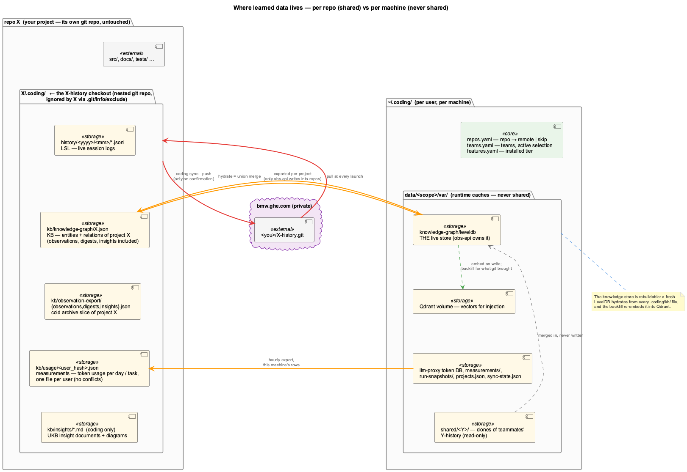
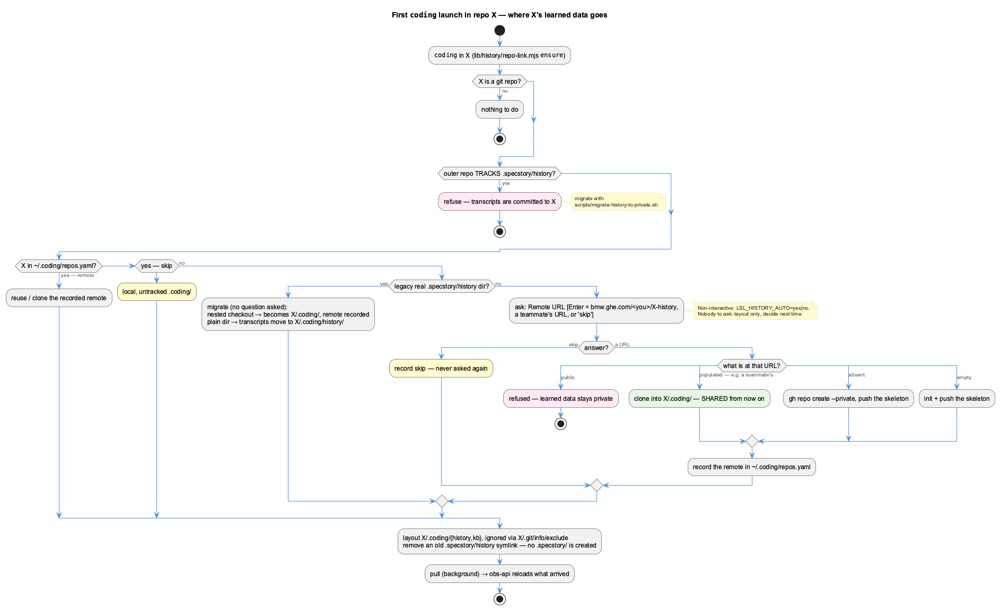
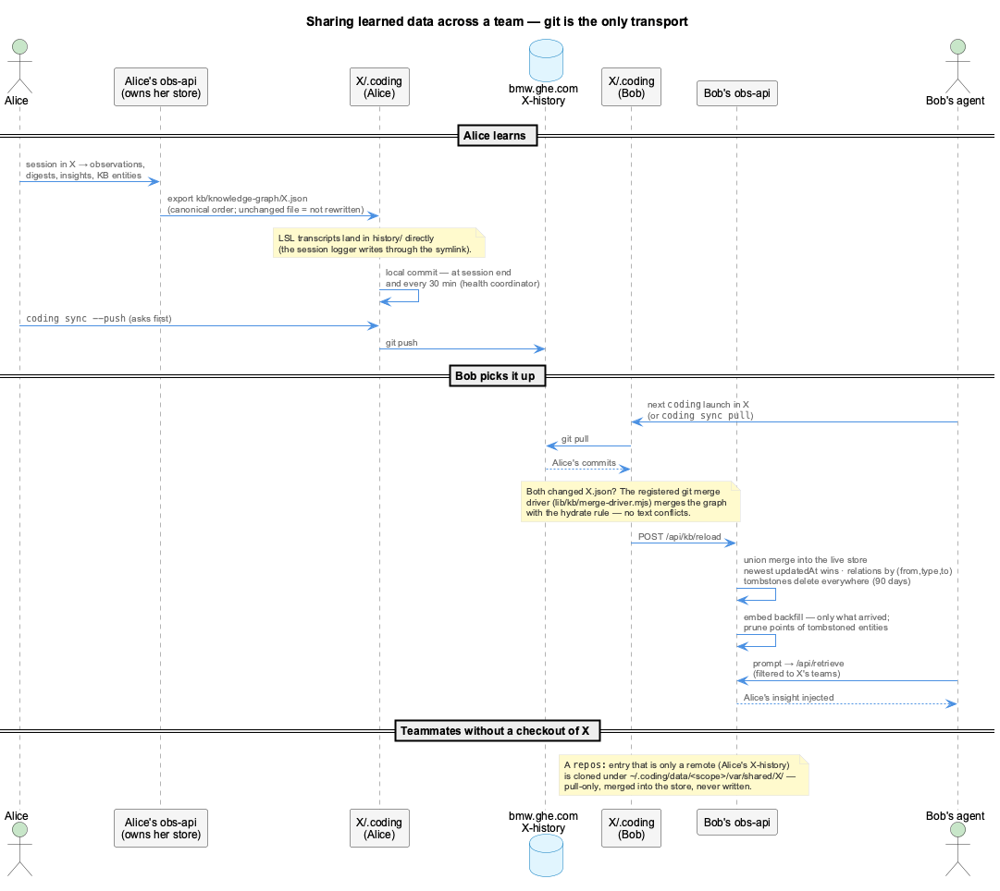
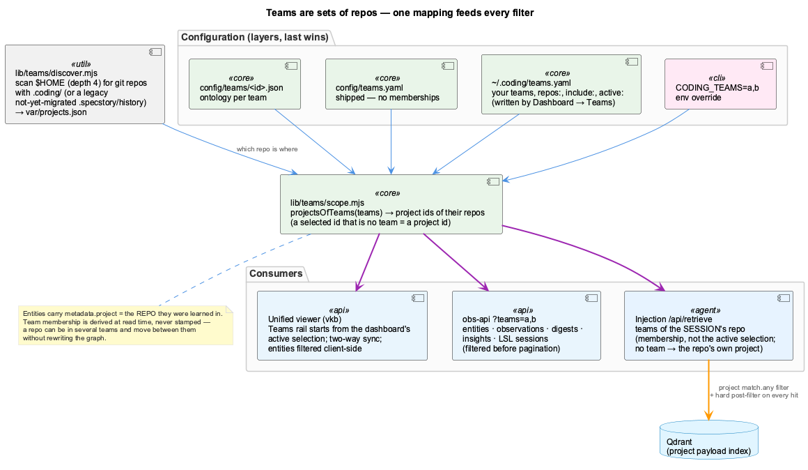

# Per-Repo Tenancy

What `coding` learns in a repo belongs to that repo: it is kept next to it in `.coding/`,
optionally versioned in a private `<repo>-history` repo, and shared with teammates by git.
Teams are sets of repos, and they decide what the viewer shows and what an agent is told.

=== "⚡ Quick (~3 min)"

    ## The one idea

    **The repo is the unit of persistence and sharing.** Each repo `X` you work in gets a
    folder `X/.coding/` that holds everything learned there — session logs, observations,
    digests, insights, the knowledge-graph slice, token-usage measurements. That folder is
    its own small git repo (`X-history`), private, and ignored by `X` itself.

    

    ## First launch in a repo

    The first `coding` in a repo asks once where its learned data should go:

    

    | You answer | What happens |
    |---|---|
    | **Enter** | a private `bmw.ghe.com/<you>/X-history` is created (or reused) and checked out at `X/.coding/` |
    | **a teammate's URL** | their `X-history` is cloned — from now on you **share** what is learned in `X` |
    | **skip** | `X/.coding/` stays local and untracked; never asked again |

    The answer is kept in `~/.coding/repos.yaml`.

    ## Sharing

    ```bash
    coding sync              # what each learning repo has to push / pull
    coding sync --push       # asks, then pushes — nothing else ever pushes
    coding sync pull         # what every launch does in the background
    ```

    Commits are automatic (session end, every 30 minutes); **pushing is always your call**.

    ## Teams

    A team is a named set of repos. Pick teams in **Dashboard → Teams**; the knowledge viewer
    follows that selection. Agents are scoped by the teams of the repo they run in — knowledge
    from another team is never injected.

=== "📖 Standard (~15 min)"

    ## Two kinds of data

    | Kept per **repo** (`X/.coding/`, shareable) | Kept per **machine** (`~/.coding/data/<scope>/var/`, never shared) |
    |---|---|
    | `history/` — live session logs (LSL, `.jsonl`) | the live knowledge store (LevelDB, owned by obs-api) |
    | `kb/knowledge-graph/X.json` — entities + relations of project X | the Qdrant vectors used for injection |
    | `kb/observation-export/` — observations, digests, insights of X | the proxy's token DB, raw measurements, run snapshots |
    | `kb/usage/<user_hash>.json` — token usage per day and per task | discovery cache, sync state, shared clones |

    The knowledge on the per-machine side is a cache: a fresh machine hydrates its store from
    every `.coding/kb/` it can see and re-embeds it. The per-repo side is what travels.

    There is no `X/.specstory/` any more, and nothing addresses the old path. `X/.coding/` is
    excluded through `X/.git/info/exclude` — no change to `X`'s tracked `.gitignore`.

    ## What happened to `.specstory/`

    | Was | Is now |
    |---|---|
    | `X/.specstory/history/` (session logs, `logs/`) | `X/.coding/history/` — an old real directory is migrated on the next launch; an old `.specstory/history` symlink is removed |
    | `.specstory/config/redaction-patterns.json`, sensitivity topics | `config/redaction/` in the coding tools repo — shared by the ETM, the obs-api writers and the LLM proxy's raw-body redaction |
    | `.specstory/config/knowledge-system.json` | `config/knowledge-system.json` in the tools repo |
    | `.specstory/trajectory/` | deleted — nothing read it |

    Machine-local leftovers (LSL archive, validator report) live in `X/.coding/var/`, which is
    git-ignored.

    ## How a repo gets its learning repo

    

    - A **public** remote is refused: learned data contains prompts and code.
    - An **old layout** (a real `.specstory/history` directory, with or without its own git
      checkout) is migrated on the next launch without a question: it moves to
      `X/.coding/history/`, an existing remote is recorded, and `.specstory/` is not recreated.
    - Unattended launches use `LSL_HISTORY_AUTO=yes|no`; with nobody to ask, only the local
      layout is created and the question waits for the next interactive launch.

    ## How sharing works

    

    Git is the only transport, and it carries **files**, not database state:

    1. obs-api exports each project's slice of the live store to that repo's
       `kb/knowledge-graph/X.json` — sorted, and only rewritten when it changed, so two
       machines with the same knowledge produce byte-identical files.
    2. Local commits happen at session end and every 30 minutes. `coding sync --push` is the
       only push.
    3. A teammate's launch pulls. A git merge driver merges concurrent edits of the same graph
       file by entity — newest `updatedAt` wins, relations by `(from, type, to)`, deletions
       travel as tombstones — so there are no text conflicts in JSON.
    4. obs-api merges what arrived into the live store, embeds the new entities and drops the
       vectors of deleted ones. The next prompt can be answered from it.

    A repo you do not have checked out can still be read: list its `X-history` remote under a
    team's `repos:` and it is cloned (pull-only) under `var/shared/X/`.

    ## Teams and filtering

    

    Entities record the **repo** they were learned in (`metadata.project`). Team membership is
    looked up when reading, never written into the graph — so a repo can sit in several teams
    and move between them freely.

    | Where | Which teams apply |
    |---|---|
    | Knowledge viewer | the **active selection** (Dashboard → Teams, or the viewer's Teams rail — kept in sync both ways) |
    | obs-api `?teams=a,b` | the teams named in the request |
    | Knowledge injection | the teams **the session's repo belongs to**; a repo in no team sees only its own project |

    The active selection is what *you look at*; it deliberately does not change what an agent
    working in some repo is told.

    ## Measurements

    The LLM proxy stores the project of every call (`x-project` header, set by the launcher
    from the repo). obs-api writes this machine's rows for each repo hourly to
    `X/.coding/kb/usage/<user_hash>.json` — one file per user, so teammates never conflict.

    See [Teams & Shared Learning](../guides/teams.md) for the dashboard and viewer side.

=== "📚 Deep Dive (full)"

    --8<-- "_tiers/architecture/tenancy.deep.md"
