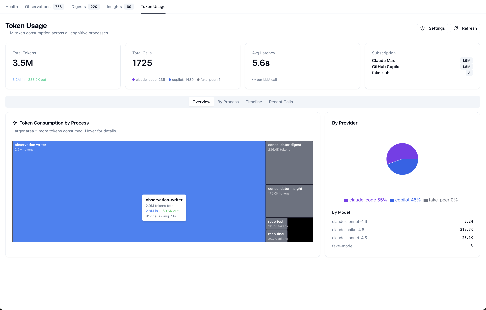
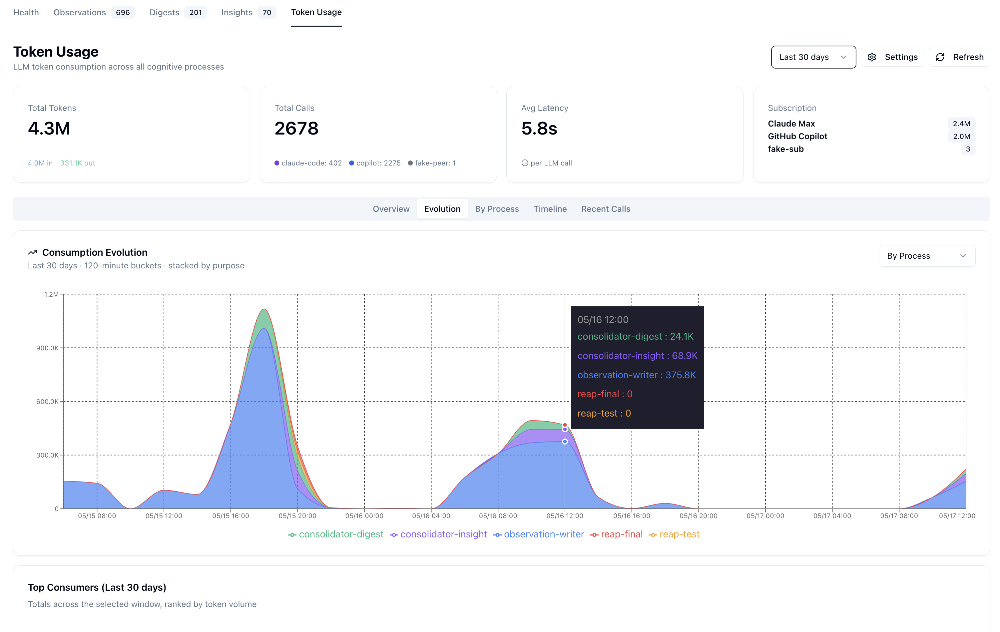
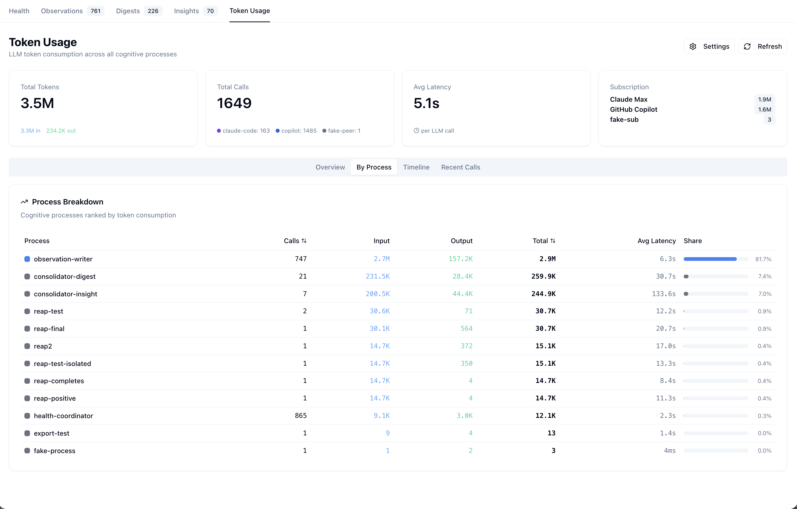

# Token Usage Dashboard

## Overview

The Token Usage page provides real-time visibility into LLM token consumption across every cognitive process in the project. Every call through the LLM Proxy Bridge is logged with provider, model, process attribution, token counts, latency, and a prompt preview. The page makes it possible to spot runaway consumers, see provider mix at a glance, and force a specific service to a specific provider+model when auto-routing picks wrong.

**Dashboard URL:** [http://localhost:3032/token-usage](http://localhost:3032/token-usage)



---

## Page layout

The page is organized into five tabs sharing a single header bar:

- **Summary cards** (always visible): Total Tokens, Total Calls, Avg Latency per LLM call, and a Subscription summary (Claude Max + GitHub Copilot quotas). Every card respects the active **time window** (see header actions below).
- **Tabs:** Overview · Evolution · By Process · Timeline · Recent Calls.
- **Header actions:** **Time window** dropdown (`Last 24h · 48h · 7 days · 30 days · All time`) · ⚙ Settings (opens the LLM Routing dialog) · ⟳ Refresh (re-fetches summary + recent; shows a busy spinner while the request is in flight).

### Time window selector

The window dropdown drives `?hours=` on the `/api/token-usage/summary` request. Every metric on the page — summary cards, treemap, By-Process table, Timeline, and the Evolution stacked chart — re-aggregates for the chosen window. The default is `Last 24h` so the page matches the historical "trailing 24 h" behavior on first load; switching to `All time` aggregates the full retained DB without changing any other UI.

Bucket size for the stacked chart **adapts to the window** so the timeline never balloons past ~500 data points: 2-min buckets for `Last 24h`, 10-min for `48h`, 30-min for `7 days`, 2-hour for `30 days`, 6-hour for `All time`. The active bucket size is shown beneath the Evolution chart's title (e.g. *"Last 7 days · 30-minute buckets"*).

### Overview tab

The header cards plus two side-by-side panels:

- **Token Consumption by Process** — a treemap where larger rectangles mean more tokens. Top of the page in the screenshot above shows `observation-writer` (≈ 2.6 M tokens) dominating, with `consolidator-digest` and `consolidator-insight` as distant runners-up. **Hover any box** for a tooltip with process, total tokens, input/output split, call count, and avg latency — including the small boxes that don't fit an inline label. The same payload is also rendered as an SVG `<title>` element so screen readers and native-browser hover work even when the recharts tooltip is unavailable.
- **By Provider** — a donut chart split by provider (claude-code 67 % / copilot 33 % under normal conditions on this host).
- **By Model** — the same totals broken down by canonical model name (`claude-sonnet-4.6`, `claude-haiku-4.5`, `claude-opus-4.6`). The proxy canonicalizes whatever spelling each upstream returns — `claude-sonnet-4-6` (Claude CLI dash-version), `claude-sonnet-4.6` (Copilot dot-version), `Claude Sonnet 4.6` (Anthropic title-case), bare `sonnet` (CLI fallback when `modelUsage` is empty), `claude-haiku-4-5-20251001` (Copilot dated snapshot) all collapse to the same row. The raw upstream identifier is preserved per call in the `model_raw` column.

### Evolution tab



The Evolution tab is the answer to "**how does my consumption evolve over time, and who are the main consumers?**" It renders a **stacked area chart** across the selected window, with one band per cognitive process (or per model, via the chart's own *By Process / By Model* toggle).

Three design rules keep the visual focused:

- **Main-consumer threshold.** The chart only renders series contributing **≥ 0.5 %** of the window's total tokens. Test/diagnostic processes (`reap-test`, `reap-final`, `fake-process`, `export-test`, …) routinely satisfy `> 0` but contribute fractions of a percent — they're dropped here to keep the legend readable. The full unfiltered breakdown is still available via the `summary.process_keys` API field for callers that want it.
- **Stable colors per process.** Canonical processes (`observation-writer`, `consolidator-digest`, etc.) keep the same color across every chart on the page via `PROCESS_COLORS`. Unmapped processes fall through to a rotating palette — never the all-gray fallback that used to make competing stacks indistinguishable.
- **Adaptive bucket size.** Driven by the header time window (see above). The bucket-minutes value is echoed in the card subtitle so the reader can sanity-check the granularity.

Below the chart, **Top Consumers** is a compact table showing each visible series's total tokens in the window plus its share bar — same data the chart stacks, but in tabular form so you can read exact totals without hovering through the chart.

### By Process tab



Sortable table — one row per cognitive process — with columns Calls · Input · Output · Total · Avg Latency · Share %. Share is computed against the window total. `observation-writer` typically holds 75–85 %; `health-coordinator` accounts for hundreds of calls but only a fraction of a percent of tokens (its calls are 14-token health-check probes).

### Timeline tab


`Token Usage Over Time` plotted as **input + output token consumption per bucket** (gaps render as zero). The bucket width is **adaptive** to the active time window (2 min ≤ 24 h, 10 min ≤ 72 h, 30 min ≤ 7 d, 2 h ≤ 30 d, 6 h for All time) so a multi-day window stays a single chart rather than re-rendering at multiple zoom levels. Empty buckets are zero-filled in the backend response so the chart never invents missing data on the client.

X-axis timestamps render in the **viewer's local timezone**, not UTC — the underlying timestamps in the export are ISO-with-Z but the chart converts to the browser locale for readability. The chart was fixed to do this conversion correctly during Phase 35 (prior versions occasionally wedged the navbar when timezone math threw).

### Recent Calls tab


Latest 50 calls across all processes. Columns: Time · Process · Provider · Model · In · Out · Latency · Preview. The **Preview** column shows the leading characters of the prompt with any XML wrapper tags (`<system-prompt>`, `<task>`, `<inputs>`, etc.) stripped — those wrappers swallowed most of the visible width before the fix and made the column unreadable.

---

## LLM Routing Settings (the ⚙ dialog)


The Settings button opens a modal that pins individual services (cognitive processes) to a specific provider + model. The dialog is the dashboard-side of `GET / PUT /api/llm/settings` exposed by the proxy.

**Available providers** row at the top reflects the proxy's current `/health` snapshot — `claude-code` and `copilot` typically show online; `openai`, `groq`, and `anthropic` show "(offline)" when their API keys are unset *or* when the host is on a corporate network where the firewall blocks them.

**Service rows** list every `process` value the proxy has ever logged (read from the live token-usage DB). Each row has two dropdowns:

- **Provider** — any of the five providers, plus "(auto-route)" to clear the pin.
- **Model** — auto-populated from the chosen provider's model alias list (so picking `copilot` shows `claude-haiku-4-5`, `claude-sonnet-4-6`, `claude-opus-4-6`).

**Hard-pin semantics.** A pin is a hard override in routing — it wins over any `body.provider` the caller passes. If the pinned provider becomes unreachable mid-flight, the proxy still falls through to auto-route (so a Copilot outage doesn't take down `observation-writer`). Unpinned services use the auto-route logic — Claude Max for Claude Code, Copilot for OpenCode / corporate sessions, falling back to Groq → OpenAI → Anthropic on public networks. `Save` writes the new pin map to the proxy via `PUT /api/llm/settings`; the proxy persists it to `.data/llm-proxy/settings.json`.

---

## Storage and the JSON-export pattern

The Token Usage page reads from a **two-store** setup that mirrors LSL's filesystem convention — git-trackable per-hour JSON files alongside an untracked SQLite WAL DB. Phase 36 moved the export away from a single monolithic JSON to a per-`(date, time-window, user-hash)` layout so multiple users sharing the project via git push their own hourly snapshots without merge conflicts:

| Path | Role | Tracked in git? |
|---|---|---|
| `.data/llm-proxy/token-usage.db` | SQLite WAL DB — authoritative locally | **No** — untracked (`*.db`, `.db-wal`, `.db-shm`, `.db-journal` all gitignored) |
| `.data/llm-proxy-export/YYYY/MM/YYYY-MM-DD_HHMM-HHMM_<hash6>.json` | Per-hour, per-user JSON snapshot | **Yes** — committed |

**Why both?** SQLite WAL files don't merge cleanly across machines; per-hour JSON files do. Teammates share token-usage history via `git pull`. Filename anatomy: the `HHMM-HHMM` time-window is the same one LSL uses (sourced from the health coordinator's `/health/state.lsl_meta.current_window` with a local fallback); the 6-char hex `<hash6>` is the deterministic per-user identifier exported by the proxy wrapper as `LLM_PROXY_USER_HASH` before `exec node`.

**Cross-user merge contract.** On every proxy boot, `hydrateFromExports()` walks `<baseDir>/**/*.json` and inserts every row with `INSERT … ON CONFLICT(user_hash, id) DO NOTHING`. After `git pull` brings down a peer's `..._<other-hash>.json` file, the next proxy kickstart ingests it and the peer's rows appear in your dashboard alongside yours. Cold-start hydration is always-on (no `count > 0 → return` early exit) — the composite unique index supplies idempotency, not skipping.

The schema is one `token_usage` table:

| Column | Type | Notes |
|---|---|---|
| `id` | INTEGER PK | Monotonic per-instance |
| `user_hash` | TEXT NOT NULL DEFAULT `'unknown'` | 6-char hex hash identifying the contributor. Together with `id` forms `UNIQUE INDEX idx_token_usage_user_id(user_hash, id)` — the cross-user merge key |
| `timestamp` | TEXT | ISO-8601 with ms + Z |
| `provider` | TEXT | One of `claude-code`, `copilot`, `openai`, `groq`, `anthropic` |
| `model` | TEXT | **Canonical** model name (`claude-sonnet-4.6`, `claude-haiku-4.5`, `claude-opus-4.6`). The proxy normalizes the upstream-returned spelling at the persistence boundary via `canonicalizeModelName()` so the dashboard's By-Model panel doesn't fragment across 8 spellings of 3 models. |
| `model_raw` | TEXT | The verbatim upstream spelling (`Claude Sonnet 4.6`, `claude-sonnet-4-6`, `claude-haiku-4-5-20251001`, bare `sonnet`, etc.) — preserved for forensic debugging. Never used by the UI; queryable via `SELECT model_raw, COUNT(*) FROM token_usage GROUP BY model_raw`. |
| `process` | TEXT | Caller's `process` field; empty rows are labeled `unknown` |
| `subscription` | TEXT | `claude-max`, `github-copilot`, or the API-key tier name |
| `input_tokens` / `output_tokens` / `total_tokens` | INTEGER | |
| `latency_ms` | INTEGER | Round-trip from request send to response close |
| `prompt_preview` | TEXT | XML-wrapper-stripped prefix (first ~120 chars) |
| `tokens_estimated` | INTEGER (0/1) | `1` when the proxy estimated tokens from text length because the provider returned 0 |

### Manual queries

```bash
# Total tokens today
sqlite3 .data/llm-proxy/token-usage.db \
  "SELECT SUM(input_tokens), SUM(output_tokens) FROM token_usage \
   WHERE timestamp > datetime('now', '-24 hours')"

# Top processes by token usage
sqlite3 .data/llm-proxy/token-usage.db \
  "SELECT process, SUM(total_tokens) AS total FROM token_usage \
   GROUP BY process ORDER BY total DESC LIMIT 10"

# Provider distribution
sqlite3 .data/llm-proxy/token-usage.db \
  "SELECT provider, COUNT(*), SUM(total_tokens) FROM token_usage GROUP BY provider"
```

---

## Architecture


### Data flow

1. **Cognitive processes** (observation-writer, consolidator-digest/insight, wave-analysis agents, health-coordinator probes) send completion requests to the LLM Proxy Bridge (`:12435`).
2. Each request includes a **`process`** identifier. If a row in `/api/llm/settings` has a pin for that process, the proxy honors it; otherwise the auto-route runs.
3. The proxy routes to one of the five providers.
4. After completion, the proxy logs the call to the SQLite DB and schedules the debounced JSON export.
5. The Health Dashboard server (`server.js`) reverse-proxies `/api/token-usage/*` and `/api/llm/settings` to the proxy.
6. The frontend (`token-usage.tsx`) renders the four tabs from the aggregated data; the Settings dialog renders the LLM Routing dropdowns from the same source.

### Key files

| File | Role |
|---|---|
| `_work/rapid-llm-proxy/src/token-usage.ts` | DB schema + idempotent `user_hash` / `model_raw` ALTER, `logCall()`, `exportToHourFile()` (per-window debounced), `hydrateFromExports()` (always-on recursive walk), `backfillCanonicalModelNames()` |
| `_work/rapid-llm-proxy/proxy-bridge/server.mjs` | `/api/token-usage/{summary,recent}`, `GET/PUT /api/llm/settings`, `canonicalizeModelName()` + `MODEL_CANONICAL_MAP`, `currentWindow()` (30 s-cached fetch from `/health/state` with local fallback) |
| `_work/rapid-llm-proxy/bin/start-llm-proxy.sh` | Exports `LLM_PROXY_USER_HASH` (from `scripts/user-hash-generator.js`) and `LSL_TIMEZONE` before `exec node` |
| `scripts/health-coordinator.js` | Publishes `lsl_meta.current_window` (HHMM-HHMM, local-time) on `/health/state` — single source of truth for time-window |
| `scripts/migrate-token-usage-export.mjs` | One-shot, `--dry-run`, idempotent. Used once to bucket the legacy monolithic `.data/llm-proxy-export/token-usage.json` into the per-hour layout. |
| `integrations/system-health-dashboard/src/pages/token-usage.tsx` | Frontend page (tabs + Settings dialog); custom `TreemapTooltip` + SVG `<title>` fallback |
| `integrations/system-health-dashboard/server.js` | Reverse-proxy to the proxy |

---

## API endpoints

These are served by the proxy bridge; the dashboard's `server.js` proxies them through `:3033`.

### Summary

```
GET /api/token-usage/summary?hours=24[&bucketMinutes=N]
```

Aggregates the trailing `hours` window. `hours` accepts an integer (e.g. `24`, `168`, `720`) or the literal sentinel `all` — the latter falls back to the full retained DB and clamps the timeline start to the earliest persisted row so wide windows don't emit thousands of empty buckets. `bucketMinutes` is optional; when omitted, the bucket size scales with the window (2 / 10 / 30 / 120 / 360 minutes for 24h / 72h / 7d / 30d / All).

Response shape (snake_case throughout, dashboard reads it directly):

```json
{
  "hours": 168,
  "bucket_minutes": 30,
  "total_calls": 2615,
  "total_input": 3920000,
  "total_output": 336000,
  "total_tokens": 4256000,
  "avg_latency_ms": 5830,
  "by_provider":     [{ "provider": "copilot",     "calls": 2250, "input_tokens": …, "output_tokens": …, "total_tokens": … }],
  "by_process":      [{ "process":  "observation-writer", "calls": 1280, "input_tokens": …, "output_tokens": …, "total_tokens": …, "avg_latency": … }],
  "by_model":        [{ "model":    "claude-sonnet-4.6", "calls": …, "total_tokens": … }],
  "by_subscription": [{ "subscription": "claude-max",    "calls": …, "total_tokens": … }],
  "by_hour":         [{ "hour": "2026-05-15T18:00:00.000Z", "input_tokens": 12400, "output_tokens": 860, "calls": 4 }],

  // Stacked series for the Evolution tab — pivoted so recharts can stack
  // columns directly (one row per bucket, one column per process / model).
  // `process_keys` / `model_keys` give the column order ranked by total
  // tokens descending.
  "process_keys":    ["observation-writer", "consolidator-insight", …],
  "model_keys":      ["claude-sonnet-4.6", "claude-haiku-4.5", …],
  "by_process_hour": [{ "hour": "2026-05-15T18:00:00.000Z", "observation-writer": 12400, "consolidator-insight": 0, … }],
  "by_model_hour":   [{ "hour": "2026-05-15T18:00:00.000Z", "claude-sonnet-4.6": 12400, "claude-haiku-4.5": 0, … }]
}
```

### Recent

```
GET /api/token-usage/recent?limit=50
```

```json
[
  {
    "id": 18342,
    "timestamp": "2026-05-15T19:24:01.412Z",
    "process": "observation-writer",
    "provider": "copilot",
    "model": "claude-sonnet-4.6",
    "input_tokens": 2700,
    "output_tokens": 142,
    "latency_ms": 5100,
    "prompt_preview": "coding # Session Logs (/sl) — Session Continuity Command Load and …"
  }
]
```

### LLM routing settings

```
GET /api/llm/settings
```

Returns current pins plus reference data so the dialog can populate dropdowns without a second request:

```json
{
  "settings": {
    "observation-writer": { "provider": "copilot", "model": "claude-sonnet-4.6" }
  },
  "processes": ["observation-writer", "consolidator-digest", "health-coordinator", "..."],
  "availableProviders": ["claude-code", "copilot"],
  "allProviders": ["claude-code", "copilot", "openai", "groq", "anthropic"]
}
```

```
PUT /api/llm/settings   (Content-Type: application/json)
```

Replaces the entire pin map atomically; the proxy persists the document to `.data/llm-proxy/settings.json`.

---

## Cognitive process reference

| Process ID | System | Description |
|---|---|---|
| `observation-writer` | Online Learning | Classifies and summarizes session events |
| `consolidator-digest` | Online Learning | Synthesizes daily digests from raw observations |
| `consolidator-insight` | Online Learning | Synthesizes insights from digests |
| `insight-generator` | Wave Analysis | Generates entity insight documents |
| `content-validator` | Wave Analysis | Validates and refreshes entity content |
| `wave1-analysis` | Wave Analysis | Batch code analysis agents |
| `reap-test` / `reap-final` / `reap2` / `reap-completes` / `reap-positive` / `reap-test-isolated` | Reaper test harness | Synthetic processes used by the reap-on-disconnect integration tests |
| `constraint-check` | Constraints | Evaluates semantic constraint rules |
| `health-coordinator` | Health Monitor | Liveness probe — minimal token count, high call frequency |
| `test` / `test-process` / `export-test` / `unknown` | — | Diagnostic or untagged callers |

A `process` of `unknown` means the caller did not send a `process` field. These rows are kept (they still consume tokens) but they should be eliminated by patching the caller — `unknown` is not a useful name in the Settings dialog.

---

## Troubleshooting

### No data showing

1. Verify the proxy bridge is up: `curl http://localhost:12435/health | jq`
2. Check the DB exists and has rows: `sqlite3 .data/llm-proxy/token-usage.db 'SELECT COUNT(*) FROM token_usage'`
3. Verify the proxy summary endpoint responds (the frontend hits it directly): `curl 'http://localhost:12435/api/token-usage/summary?hours=1' | jq '{total_calls, total_tokens, bucket_minutes}'`

### Refresh button stays busy

Watch the dashboard server logs: `docker logs coding-services 2>&1 | grep token-usage`. The button uses a fetch promise — if the proxy hangs (long-running CLI subprocess, etc.), the button stays in its busy state until the request times out or the proxy returns.

### "Unknown" rows in the table

Calls showing `process: "unknown"` come from callers that haven't been updated to pass a process identifier. The proxy bridge health checks used to show as `unknown` too — those have been retagged as `health-coordinator`. If you still see `unknown` rows after a fresh window, trace the call site with: `grep -r '"process"' integrations/ scripts/ observations/ | grep -v '\.test'`.

### Token counts showing 0

Some providers (particularly Copilot) don't always return token counts in the response body. The proxy estimates tokens from prompt/response text length (~4 chars per token) and sets `tokens_estimated = 1` so you can tell estimated from authoritative rows in a manual query.

---

## Related documentation

- [LLM Architecture](llm-architecture.md) — provider routing, subscriptions, fallback chains
- [Health Monitoring](health-monitoring.md) — system health dashboard overview
- [LLM CLI Proxy](../integrations/llm-cli-proxy.md) — the consumer-side view of the proxy
- [Observational Memory](../core-systems/observational-memory.md) — online learning pipeline
