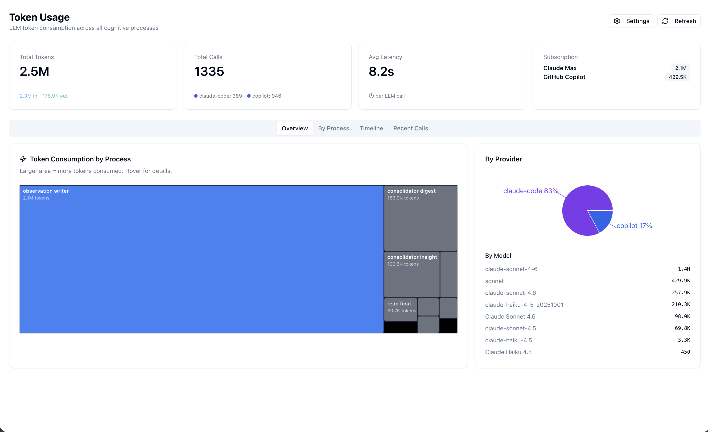
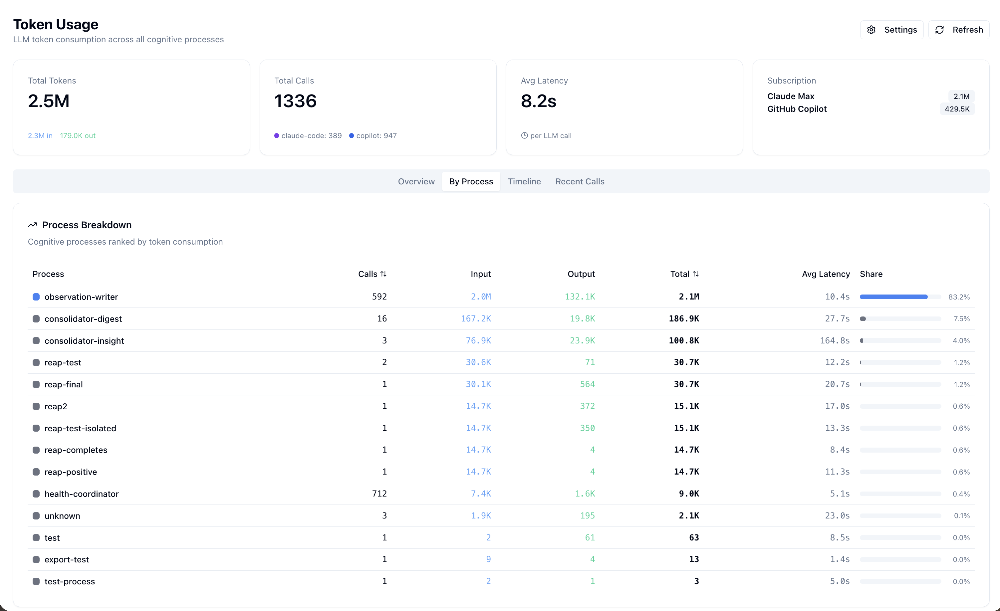
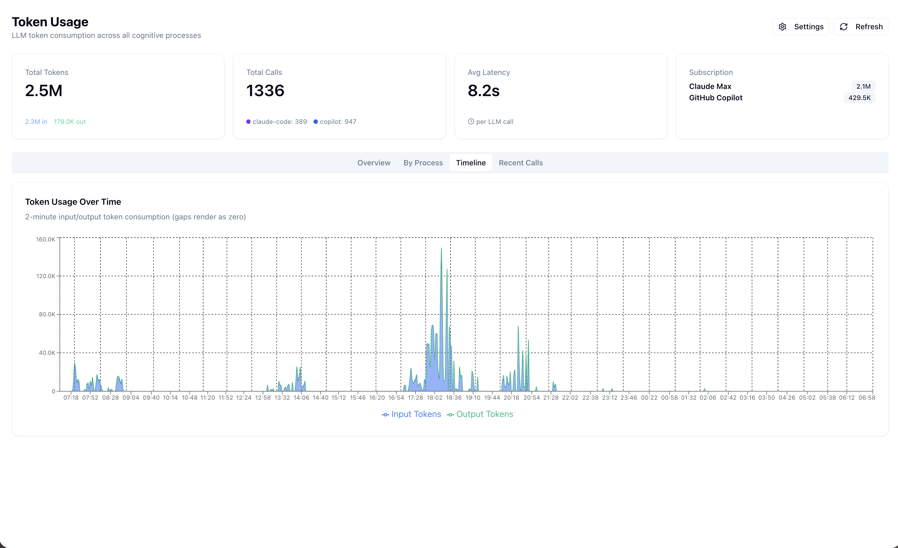
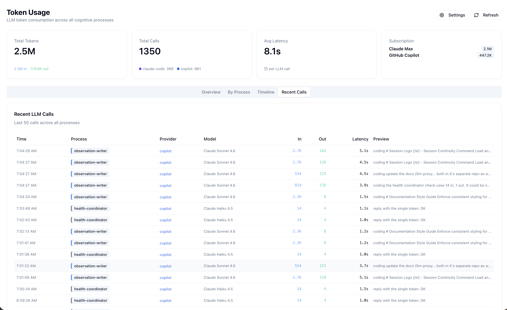
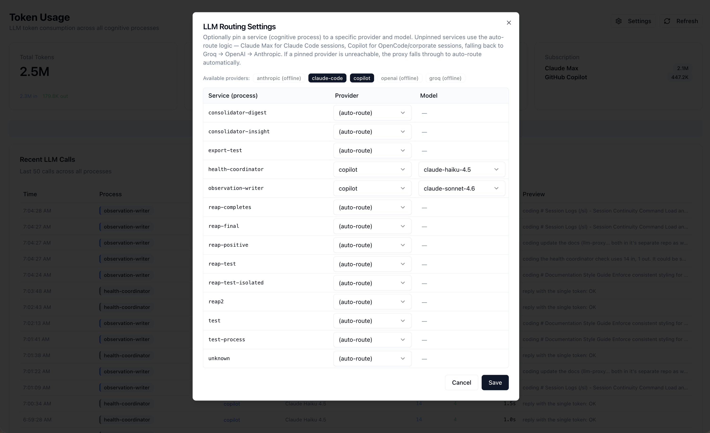
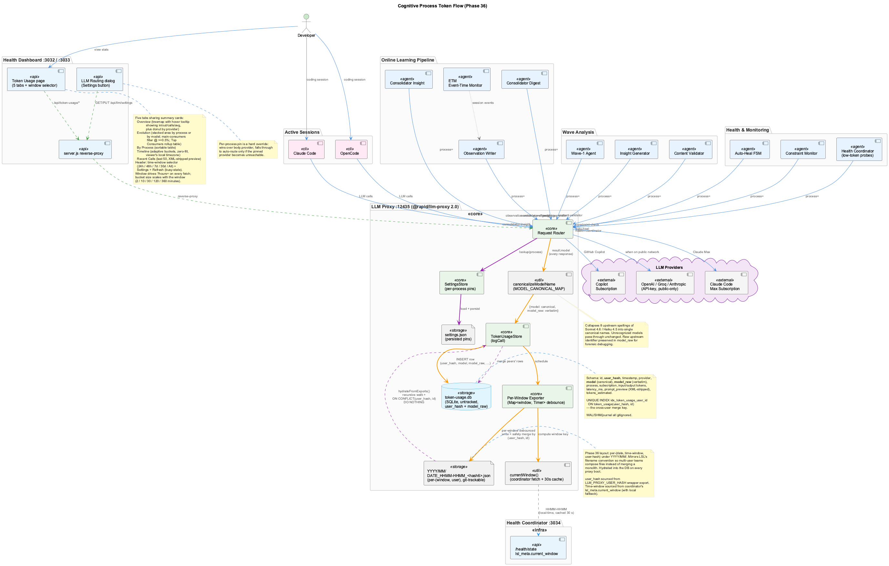

# Token Usage Dashboard

## Overview

The Token Usage page provides real-time visibility into LLM token consumption across every cognitive process in the project. Every call through the LLM Proxy Bridge is logged with provider, model, process attribution, token counts, latency, and a prompt preview. The page makes it possible to spot runaway consumers, see provider mix at a glance, and force a specific service to a specific provider+model when auto-routing picks wrong.

**Dashboard URL:** [http://localhost:3032/token-usage](http://localhost:3032/token-usage)



---

## Page layout

The page is organized into four tabs sharing a single header bar:

- **Summary cards** (always visible): Total Tokens, Total Calls, Avg Latency per LLM call, and a Subscription summary (Claude Max + GitHub Copilot quotas).
- **Tabs:** Overview · By Process · Timeline · Recent Calls.
- **Header actions:** ⚙ Settings (opens the LLM Routing dialog) · ⟳ Refresh (re-fetches summary + recent; shows a busy spinner while the request is in flight).

### Overview tab

The header cards plus two side-by-side panels:

- **Token Consumption by Process** — a treemap where larger rectangles mean more tokens. Top of the page in the screenshot above shows `observation-writer` (≈ 2.1 M tokens) dominating, with `consolidator-digest` and `consolidator-insight` as distant runners-up.
- **By Provider** — a donut chart split by provider (claude-code 83 % / copilot 17 % under normal conditions on this host).
- **By Model** — the same totals broken down by the specific model alias the provider used (`claude-sonnet-4-6`, `claude-haiku-4-5`, `claude-opus-4-6`, etc.).

### By Process tab



Sortable table — one row per cognitive process — with columns Calls · Input · Output · Total · Avg Latency · Share %. Share is computed against the window total. `observation-writer` typically holds 75–85 %; `health-coordinator` accounts for hundreds of calls but only a fraction of a percent of tokens (its calls are 14-token health-check probes).

### Timeline tab



`Token Usage Over Time` plotted as **2-minute input/output token consumption (gaps render as zero)**. The bucket width is fixed at 2 minutes so a multi-day window stays a single chart rather than re-rendering at multiple zoom levels. Empty buckets are zero-filled in the backend response so the chart never invents missing data on the client.

X-axis timestamps render in the **viewer's local timezone**, not UTC — the underlying timestamps in the export are ISO-with-Z but the chart converts to the browser locale for readability. The chart was fixed to do this conversion correctly during Phase 35 (prior versions occasionally wedged the navbar when timezone math threw).

### Recent Calls tab



Latest 50 calls across all processes. Columns: Time · Process · Provider · Model · In · Out · Latency · Preview. The **Preview** column shows the leading characters of the prompt with any XML wrapper tags (`<system-prompt>`, `<task>`, `<inputs>`, etc.) stripped — those wrappers swallowed most of the visible width before the fix and made the column unreadable.

---

## LLM Routing Settings (the ⚙ dialog)



The Settings button opens a modal that pins individual services (cognitive processes) to a specific provider + model. The dialog is the dashboard-side of `GET / PUT /api/llm/settings` exposed by the proxy.

**Available providers** row at the top reflects the proxy's current `/health` snapshot — `claude-code` and `copilot` typically show online; `openai`, `groq`, and `anthropic` show "(offline)" when their API keys are unset *or* when the host is on a corporate network where the firewall blocks them.

**Service rows** list every `process` value the proxy has ever logged (read from the live token-usage DB). Each row has two dropdowns:

- **Provider** — any of the five providers, plus "(auto-route)" to clear the pin.
- **Model** — auto-populated from the chosen provider's model alias list (so picking `copilot` shows `claude-haiku-4-5`, `claude-sonnet-4-6`, `claude-opus-4-6`).

**Hard-pin semantics.** A pin is a hard override in routing — it wins over any `body.provider` the caller passes. If the pinned provider becomes unreachable mid-flight, the proxy still falls through to auto-route (so a Copilot outage doesn't take down `observation-writer`). Unpinned services use the auto-route logic — Claude Max for Claude Code, Copilot for OpenCode / corporate sessions, falling back to Groq → OpenAI → Anthropic on public networks. `Save` writes the new pin map to the proxy via `PUT /api/llm/settings`; the proxy persists it to `.data/llm-proxy/settings.json`.

---

## Storage and the JSON-export pattern

The Token Usage page reads from a **two-store** setup that mirrors the LevelDB knowledge graph and the observations DB:

| Path | Role | Tracked in git? |
|---|---|---|
| `.data/llm-proxy/token-usage.db` | SQLite WAL DB — authoritative locally | **No** — untracked |
| `.data/llm-proxy-export/token-usage.json` | Debounced JSON snapshot (2 s coalescing window) | **Yes** — committed |

**Why both?** The DB stays untracked because SQLite WAL files don't merge cleanly across machines, but the JSON snapshot does. Teammates share token-usage history via `git pull`. On startup the proxy will merge rows from the existing JSON back into the live DB if the DB was wiped locally — see `src/token-usage.ts:exportToJson` in `rapid-llm-proxy` for the **safety merge** logic. Same contract as `ObservationExporter._mergeWithExisting`: rows whose IDs are missing from the DB but present in the JSON are preserved on the next write.

The schema is one `token_usage` table:

| Column | Type | Notes |
|---|---|---|
| `id` | INTEGER PK | Monotonic, used by the safety merge to detect missing rows |
| `timestamp` | TEXT | ISO-8601 with ms + Z |
| `provider` | TEXT | One of `claude-code`, `copilot`, `openai`, `groq`, `anthropic` |
| `model` | TEXT | Full model name (`Claude Sonnet 4.6`, etc.) |
| `process` | TEXT | Caller's `process` field; empty rows are labeled `unknown` |
| `subscription` | TEXT | `claude-max`, `github-copilot`, or the API-key tier name |
| `input_tokens` / `output_tokens` / `total_tokens` | INTEGER | |
| `latency_ms` | INTEGER | Round-trip from request send to response close |
| `prompt_preview` | TEXT | XML-wrapper-stripped prefix (first ~120 chars) |
| `tokens_estimated` | INTEGER (0/1) | `1` when the proxy estimated tokens from text length because the provider returned 0 |

### Manual queries

```bash
# Total tokens today
sqlite3 .data/llm-proxy/token-usage.db \
  "SELECT SUM(input_tokens), SUM(output_tokens) FROM token_usage \
   WHERE timestamp > datetime('now', '-24 hours')"

# Top processes by token usage
sqlite3 .data/llm-proxy/token-usage.db \
  "SELECT process, SUM(total_tokens) AS total FROM token_usage \
   GROUP BY process ORDER BY total DESC LIMIT 10"

# Provider distribution
sqlite3 .data/llm-proxy/token-usage.db \
  "SELECT provider, COUNT(*), SUM(total_tokens) FROM token_usage GROUP BY provider"
```

---

## Architecture



### Data flow

1. **Cognitive processes** (observation-writer, consolidator-digest/insight, wave-analysis agents, health-coordinator probes) send completion requests to the LLM Proxy Bridge (`:12435`).
2. Each request includes a **`process`** identifier. If a row in `/api/llm/settings` has a pin for that process, the proxy honors it; otherwise the auto-route runs.
3. The proxy routes to one of the five providers.
4. After completion, the proxy logs the call to the SQLite DB and schedules the debounced JSON export.
5. The Health Dashboard server (`server.js`) reverse-proxies `/api/token-usage/*` and `/api/llm/settings` to the proxy.
6. The frontend (`token-usage.tsx`) renders the four tabs from the aggregated data; the Settings dialog renders the LLM Routing dropdowns from the same source.

### Key files

| File | Role |
|---|---|
| `_work/rapid-llm-proxy/src/token-usage.ts` | DB schema, `logCall()`, `exportToJson()` with safety merge |
| `_work/rapid-llm-proxy/proxy-bridge/server.mjs` | `/api/token-usage/{summary,recent}`, `GET/PUT /api/llm/settings` endpoints |
| `integrations/system-health-dashboard/src/pages/token-usage.tsx` | Frontend page (tabs + Settings dialog) |
| `integrations/system-health-dashboard/server.js` | Reverse-proxy to the proxy |

---

## API endpoints

These are served by the proxy bridge; the dashboard's `server.js` proxies them through `:3033`.

### Summary

```
GET /api/token-usage/summary?hours=24&bucketMinutes=2
```

Returns aggregated statistics for the window:

```json
{
  "totals": { "calls": 1335, "inputTokens": 2320000, "outputTokens": 178600, "avgLatencyMs": 8230 },
  "byProvider": [
    { "provider": "claude-code", "calls": 389, "inputTokens": 1900000, "outputTokens": 96000 },
    { "provider": "copilot",     "calls": 946, "inputTokens":  420000, "outputTokens": 82600 }
  ],
  "byProcess": [
    { "process": "observation-writer",   "calls": 592, "totalTokens": 2100000, "share": 0.832 }
  ],
  "timeline": [
    { "ts": "2026-05-15T18:00:00Z", "input": 12400, "output":  860 },
    { "ts": "2026-05-15T18:02:00Z", "input":     0, "output":    0 }
  ]
}
```

### Recent

```
GET /api/token-usage/recent?limit=50
```

```json
[
  {
    "id": 18342,
    "timestamp": "2026-05-15T19:24:01.412Z",
    "process": "observation-writer",
    "provider": "copilot",
    "model": "Claude Sonnet 4.6",
    "input_tokens": 2700,
    "output_tokens": 142,
    "latency_ms": 5100,
    "prompt_preview": "coding # Session Logs (/sl) — Session Continuity Command Load and …"
  }
]
```

### LLM routing settings

```
GET /api/llm/settings
```

Returns current pins plus reference data so the dialog can populate dropdowns without a second request:

```json
{
  "settings": {
    "observation-writer": { "provider": "copilot", "model": "claude-sonnet-4.6" }
  },
  "processes": ["observation-writer", "consolidator-digest", "health-coordinator", "..."],
  "availableProviders": ["claude-code", "copilot"],
  "allProviders": ["claude-code", "copilot", "openai", "groq", "anthropic"]
}
```

```
PUT /api/llm/settings   (Content-Type: application/json)
```

Replaces the entire pin map atomically; the proxy persists the document to `.data/llm-proxy/settings.json`.

---

## Cognitive process reference

| Process ID | System | Description |
|---|---|---|
| `observation-writer` | Online Learning | Classifies and summarizes session events |
| `consolidator-digest` | Online Learning | Synthesizes daily digests from raw observations |
| `consolidator-insight` | Online Learning | Synthesizes insights from digests |
| `insight-generator` | Wave Analysis | Generates entity insight documents |
| `content-validator` | Wave Analysis | Validates and refreshes entity content |
| `wave1-analysis` | Wave Analysis | Batch code analysis agents |
| `reap-test` / `reap-final` / `reap2` / `reap-completes` / `reap-positive` / `reap-test-isolated` | Reaper test harness | Synthetic processes used by the reap-on-disconnect integration tests |
| `constraint-check` | Constraints | Evaluates semantic constraint rules |
| `health-coordinator` | Health Monitor | Liveness probe — minimal token count, high call frequency |
| `test` / `test-process` / `export-test` / `unknown` | — | Diagnostic or untagged callers |

A `process` of `unknown` means the caller did not send a `process` field. These rows are kept (they still consume tokens) but they should be eliminated by patching the caller — `unknown` is not a useful name in the Settings dialog.

---

## Troubleshooting

### No data showing

1. Verify the proxy bridge is up: `curl http://localhost:12435/health | jq`
2. Check the DB exists and has rows: `sqlite3 .data/llm-proxy/token-usage.db 'SELECT COUNT(*) FROM token_usage'`
3. Verify the dashboard server can reach the proxy: `curl http://localhost:3033/api/token-usage/summary?hours=1 | jq .totals`

### Refresh button stays busy

Watch the dashboard server logs: `docker logs coding-services 2>&1 | grep token-usage`. The button uses a fetch promise — if the proxy hangs (long-running CLI subprocess, etc.), the button stays in its busy state until the request times out or the proxy returns.

### "Unknown" rows in the table

Calls showing `process: "unknown"` come from callers that haven't been updated to pass a process identifier. The proxy bridge health checks used to show as `unknown` too — those have been retagged as `health-coordinator`. If you still see `unknown` rows after a fresh window, trace the call site with: `grep -r '"process"' integrations/ scripts/ observations/ | grep -v '\.test'`.

### Token counts showing 0

Some providers (particularly Copilot) don't always return token counts in the response body. The proxy estimates tokens from prompt/response text length (~4 chars per token) and sets `tokens_estimated = 1` so you can tell estimated from authoritative rows in a manual query.

---

## Related documentation

- [LLM Architecture](llm-architecture.md) — provider routing, subscriptions, fallback chains
- [Health Monitoring](health-monitoring.md) — system health dashboard overview
- [LLM CLI Proxy](../integrations/llm-cli-proxy.md) — the consumer-side view of the proxy
- [Observational Memory](../core-systems/observational-memory.md) — online learning pipeline
