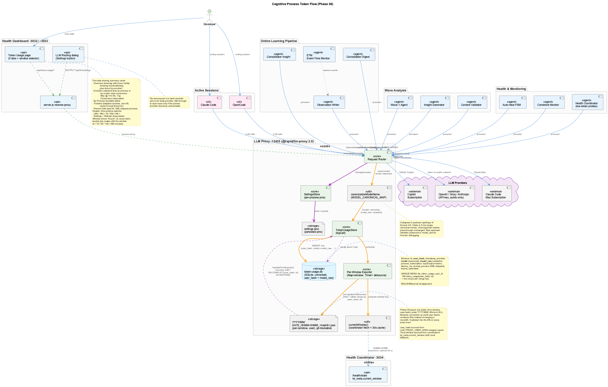

# Token Usage Dashboard

Where the tokens went: per process, per model, per account, over any window you choose.

=== "⚡ Quick (~3 min)"

    ## Open it

    [localhost:3032/token-usage](http://localhost:3032/token-usage). Every LLM call that goes
    through the proxy is logged with its provider, model, calling process, token counts, latency
    and a prompt preview.

    ## Three tabs

    | Tab | Answers |
    |-----|---------|
    | **Overview** | Who is consuming — a treemap by process, plus donuts by provider and model |
    | **Evolution** | How consumption changes over time, stacked by process, model, provider or in/out |
    | **Recent Calls** | The last 50 calls, individually |

    A time-window dropdown (1h through All time) drives every number on the page at once.

    ## Read totals with the cache columns added back

    `total_tokens` counts fresh input plus output. Cache reads and writes are **additive** and
    live in their own columns, so the raw total can understate real consumption by orders of
    magnitude on a cache-heavy session. The dashboard's own helper adds them back — do the same
    in any query you write.

    ## One quick query

    ```bash
    sqlite3 .data/llm-proxy/token-usage.db \
      "SELECT process, SUM(total_tokens) AS total FROM token_usage \
       GROUP BY process ORDER BY total DESC LIMIT 10"
    ```

=== "📖 Standard (~15 min)"

    ## What the page is built on

    Every request through the proxy carries a `process` identifier naming the cognitive service
    that made it. That single field is what makes per-process attribution possible, and it is why
    a call arriving without one shows up as `unknown` rather than being dropped.

    

    ## Reading each tab

    **Overview** shows a treemap where area is tokens — hover any rectangle, including the ones
    too small to label, for the process, split, call count and average latency. Beside it, donuts
    break the same totals down by provider and by canonical model name.

    **Evolution** is a stacked area chart over the selected window, with the stacking axis
    switchable between four lenses on the same data: by process (which subsystem is driving
    spend), by model (the model mix), by provider (which **account** is being billed — the only
    view that separates flat-rate subscription spend from metered API spend), and by input versus
    output (prompt bloat against generation share).

    Two rules keep it readable: series contributing under **0.5%** of the window are dropped, and
    bucket size adapts to the window (2-minute buckets over 24h, up to 6-hour over all time) so
    the chart never exceeds a few hundred points. The active bucket size is printed under the
    title.

    **Recent Calls** lists the latest 50, with XML wrapper tags stripped from the preview column.

    ## Model names are canonicalised, providers are accounts

    Upstreams spell the same model several ways — `claude-sonnet-4-6`, `claude-sonnet-4.6`,
    `Claude Sonnet 4.6`, a bare `sonnet`, a dated snapshot. All collapse to one canonical row at
    the persistence boundary, with the verbatim string kept in `model_raw` for forensics.

    Providers are **accounts, not companies**. A flat-rate subscription and a metered API key can
    serve the same model and are entirely different money, so always read a provider column as
    "who is being billed".

    ## Where the data lives

    Two stores, deliberately:

    | Path | Role | In git? |
    |------|------|---------|
    | `.data/llm-proxy/token-usage.db` | SQLite WAL — authoritative locally | no |
    | `.data/llm-proxy-export/YYYY/MM/…json` | Per-hour, per-user snapshot | yes |

    SQLite WAL files do not merge across machines; per-hour JSON files do. On every proxy boot
    the exports are re-ingested with a conflict-ignoring insert keyed on `(user_hash, id)`, so
    after a `git pull` a teammate's rows simply appear alongside yours. Idempotency comes from
    that composite index, not from skipping the hydration.

    ## Useful queries

    ```bash
    # Tokens in the last 24 hours, fresh input and output
    sqlite3 .data/llm-proxy/token-usage.db \
      "SELECT SUM(input_tokens), SUM(output_tokens) FROM token_usage \
       WHERE timestamp > datetime('now', '-24 hours')"

    # Which account served the traffic
    sqlite3 .data/llm-proxy/token-usage.db \
      "SELECT provider, COUNT(*), SUM(total_tokens) FROM token_usage GROUP BY provider"
    ```

    When you write your own, add `cache_read` and `cache_write` to `total_tokens` — otherwise a
    cache-heavy foreground session reads as a fraction of its real consumption.

    ## Changing where a service routes

    The ⚙ button opens the routing settings, which is the dashboard side of the proxy's own
    config. Full explanation of how a route is chosen — and how to diagnose a surprise — is in
    [LLM Routing](llm-routing.md).

=== "📚 Deep Dive (full)"

    --8<-- "_tiers/architecture/token-usage.deep.md"
