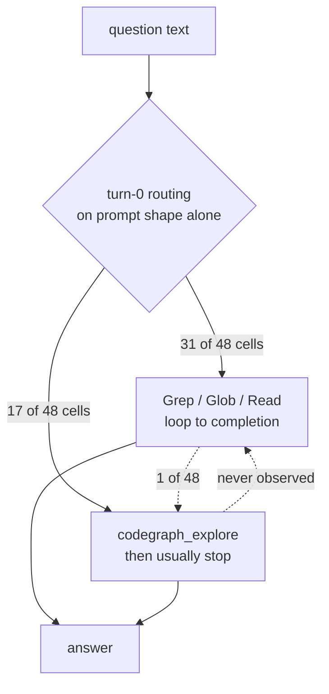

# Why the agent picks grep

**When nothing is withheld, the `hybrid` arm reaches for text search almost every time. This
page works out why.**

[`README.md`](README.md) established the fact and treated it as one line item:

> Given both indexes and no instruction either way, the agent still reaches for text search
> **91%** of the time.

That number is real. It is also, on its own, three different claims wearing one coat — a claim
about agents, a claim about a rate, and a claim about a preference. Each needs separating
before "why" is a well-posed question, and two of them do not survive the separation.

This page is an investigation, not a re-render. Every figure is computed from
`results.jsonl`, the captured wire buffers under `.data/measurements/`, and the live indexes
by a single script — `scripts/analysis/tool-selection-analysis.mjs` — which regenerates
[`analysis/tool-selection-data.md`](analysis/tool-selection-data.md), the full data appendix
behind every table below. Re-run it after any new run and the prose here can be checked
against freshly derived numbers rather than remembered ones.

> **Scope.** Everything here concerns the `hybrid` arm on **claude**. That is not a choice —
> see [correction 1](#correction-1--this-is-a-finding-about-one-agent).

---

## Bottom line

Seven candidate causes were tested: four are supported, one is refuted outright, one is a
null, and one cannot be settled with this data.

| Candidate cause | Verdict | Size |
|---|---|---|
| Explicit steering toward grep in a system prompt | **No** — no such text exists in any of the three | — |
| **Naming asymmetry** in the system prompt (built-ins in prose, MCP tools in schema only) | **Supported** — present independently in claude *and* opencode | not isolated |
| **Tool-description framing** | **CONFIRMED by a controlled A/B** — [see below](#the-ab-description-framing-is-causal) | **0 → 11 calls, p = 0.031** |
| **Question shape** — the set is keyword-addressable by construction | **Supported** | 13/14 questions |
| **Corpus shape** — the answers frequently are not in any index | **Supported** | 8/25 evidence files |
| Graph use being *cheaper* per question (an earlier claim here) | **Withdrawn** — null on 11 pairs | CI [0.69, 1.19] |
| Index coverage driving the choice adaptively | **Null** — coverage does not predict uptake | 9.3% vs 9.6% |
| Model pretraining prior | **Consistent, unfalsifiable here** | — |

And the behavioural signature that constrains all of them: **the choice is made on turn 0 and
never revised**, and it is **near-deterministic per question** rather than probabilistic.

The most consequential single sentence on this page is the one that is *not* about grep:
`tool_audit` is `"unavailable"` for copilot and opencode, so the headline finding rests
entirely on one agent.

---

## Three corrections to the premise

### Correction 1 — this is a finding about one agent

Neither copilot nor opencode records a single tool call, in any run:

| run | agent | cells | executed tool calls recorded | `tool_audit` |
|---|---|--:|--:|---|
| `r9` | claude | 48 | 227 | `audited` |
| `r9` | copilot | 48 | **0** | `unavailable` |
| `r9` | opencode | 48 | **0** | `unavailable` |
| `r8` | claude | 48 | 230 | `audited` |
| `r8` | copilot | 48 | **0** | `unavailable` |
| `r8` | opencode | 48 | **0** | `unavailable` |

claude streams structured JSON, so its tool calls are countable. copilot and opencode are
driven through the answer-file path described in the README, which captures the *answer* and
nothing about how it was reached.

This matters more than a coverage gap normally would, because the most natural test of the
leading hypothesis is a cross-agent one. If the preference came from a harness's system
prompt, it would differ across three harnesses with three different prompts; if it came from
the model or the tool descriptions, it would not. **That experiment cannot currently be run.**

Everything below is therefore a claim about claude with an unmeasured generalisation.

### Correction 2 — the pooled rate comes from runs measuring a broken tool

| | `r8` | `r9` (index repaired) |
|---|--:|--:|
| graph calls / tool calls | 6/230 = **2.6%** | 20/227 = **8.8%** |
| cells touching a graph | 6/48 | 18/48 |
| **questions** eliciting ≥1 graph call | **3/16** | **7/16** |

The README's pooled figure — 1.57%, 95% CI [0.8%, 2.3%] — pools `r6`, `r7`, `x2` and `r8`.
All four predate the index repair in `1d1720de7`. `r9` is 3.4× that rate and sits outside
the interval.

**The jump is not statistically significant once the clustering is right**, and the README's
cell-level arithmetic overstates it. 48 cells are 3 reps × 16 questions, and reps of one
question are not independent draws:

| test | statistic |
|---|---|
| two-proportion z on 48 cells (as published) | z = 2.83, p = 0.005 |
| **Fisher exact, clustered on question** (3/16 vs 7/16) | **p = 0.25** |
| **McNemar exact, paired by question** (4 gained, 0 lost) | **p = 0.125** |

Four questions gained the graph and none lost it, which is a clean direction and worth
recording as such. It is not an effect this corpus can resolve. The same objection applies to
the pooled 1.57% confidence interval, which is narrower than the design supports.

*Appendix: [sections 2–4](analysis/tool-selection-data.md).*

### Correction 3 — it is not a rate at all

Reps of the same question agree with each other almost perfectly, in every run:

| run | questions where all 3 reps agree (all-graph or all-grep) |
|---|--:|
| `r6` | 14/16 |
| `r7` | 14/16 |
| `x2` | **16/16** |
| `r8` | 14/16 |
| `r9` | 14/16 |

The agent is not sampling a strategy at some low probability. **Given a question, its
retrieval choice is essentially deterministic.** A small, stable set of questions elicits the
graph; the rest reliably do not. "1.57% of calls" describes an average over a bimodal
population and misdescribes every member of it.

This is why the framing matters for what to do next. A 1.57% rate suggests a weak preference
to be nudged. A deterministic per-question policy suggests a *classifier* — which is a
different intervention, and a tractable one.

---

## The behavioural signature

Before the causes, the shape of the behaviour, because it rules several causes out.

**The choice is made before any evidence is gathered.**

| first tool call in the cell | `r9` | `r8` |
|---|--:|--:|
| `Grep` | 22 | 35 |
| `mcp__codegraph__codegraph_explore` | **17** | 4 |
| `Read` | 5 | 2 |
| `Glob` | 4 | 6 |
| `mcp__graphify__query_graph` | 0 | 1 |
| **cells that switched *to* a graph tool later** | **1** | **1** |

In both runs, exactly one cell out of 48 started with text search and later reached for a
graph. Whatever the agent opens with, it stays with.

Two consequences:

- **"It tried the graph and found it wanting" is not the mechanism** in the hybrid arm. On
  most cells it never tries. Tool-quality effects can only act through the *description*, not
  through experience — within a session.
- **Cross-session learning is not available either.** Each cell is a fresh headless process
  with no memory of the last one. The prior is imported, not learned here.

---

## Cause 1 — the system prompts do not steer toward grep

The captured wire buffers under `.data/measurements/*/context-turns.jsonl` are the store
behind the dashboard's *Explain → System Instructions* viewer, and they hold full section
text. The relevant sections, verbatim:

**claude**, `# Using your tools`:

> Prefer dedicated tools over PowerShell when one fits (Read, Edit, Write, Glob, Grep) —
> reserve PowerShell for shell-only operations.

**opencode**, `# Tool usage policy`:

> Use specialized tools instead of bash commands when possible... For file operations, use
> dedicated tools: Read for reading files instead of cat/head/tail, Edit for editing instead
> of sed/awk, and Write for creating files instead of cat with heredoc or echo redirection.

> VERY IMPORTANT: When exploring the codebase to gather context or to answer a question that
> is not a needle query for a specific file/class/function, it is CRITICAL that you use the
> Task tool instead of running search commands directly.

**No instruction in either prompt mentions code graphs, indexes, or structural search at
all** — favourably or otherwise. The direct form of the hypothesis is refuted.

### But there is a naming asymmetry, and it is shared

What both prompts do is name `Grep`, `Glob` and `Read` **in English prose, in the persona
section**, as the canonical instruments of the job. MCP tools appear only as JSON schemas
further down the context.

Two vendors, two independently written prompts, same structural choice: built-in search in the
narrative, everything else in an appendix. That is sufficient to produce a shared prior with
no shared instruction — which is precisely why one would expect it to replicate across
harnesses without any of them containing the rule.

It is not isolated by any measurement here, and it cannot be with the current telemetry
(see [correction 1](#correction-1--this-is-a-finding-about-one-agent)).

### The benchmark deliberately removes the counter-steer

From `lib/kgbench/sandbox.mjs`, explaining `DEFAULT_EXCLUDES`:

> The agent rule files come out for two independent reasons. First, CLAUDE.md carries absolute
> paths into this repo, and a sandboxed agent that reads one can walk straight back out to the
> real tree... **Second, CLAUDE.md instructs agents to prefer the graphify skill "instead of
> blind greps", which is a thumb on the scale for one arm.** Removing them is symmetric across
> arms and removes both problems at once.

Both reasons are sound and the exclusion should stay. But the consequence has to be stated
plainly, because it bounds what the number means:

**The benchmark measures un-steered baseline behaviour. Production is steered.** In normal
operation these agents read a `CLAUDE.md` that tells them to use `/graphify` for exactly the
questions this benchmark asks. The 1.57–8.8% figure is a floor, and the gap between it and
production uptake is unmeasured.

---

## Cause 2 — tool descriptions, and the natural experiment already in the data

The `hybrid` arm carries two graph backends whose advertising could hardly differ more, on the
same wire, in the same cells, in front of the same model.

| | CodeGraph | Graphify |
|---|---|---|
| tools exposed | 1 | 6 (10 granted) |
| description length | **582 chars** | **430 chars across all six** (mean 72) |
| states *when* to use it | yes | no |
| names its competitor | yes | no |
| **`r9` graph calls** | **20** | **0** |
| pooled `r6`/`r7`/`x2`/`r8` | 14 | 3 |

CodeGraph's `codegraph_explore`, verbatim:

> **PRIMARY TOOL — call FIRST for almost any question OR before an edit**: how does X work,
> architecture, a bug, where/what is X, surveying an area, or the symbols you are about to
> change. Returns the verbatim source of the relevant symbols grouped by file in ONE capped
> call (Read-equivalent — treat the shown source as already Read; do NOT re-open those files),
> plus the call path among them. Query can be a natural-language question OR a bag of
> symbol/file names. **Usually the ONLY call you need — more accurate context, in far fewer
> tokens and round-trips than a search/Read/Grep loop.**

Graphify's entire six-tool surface, verbatim, from `integrations/graphify/graphify/serve.py`:

| tool | description | chars |
|---|---|--:|
| `query_graph` | Search the knowledge graph using BFS or DFS. Returns relevant nodes and edges as text context. | 94 |
| `graph_stats` | Return summary statistics: node count, edge count, communities, confidence breakdown. | 85 |
| `god_nodes` | Return the most connected nodes - the core abstractions of the knowledge graph. | 79 |
| `shortest_path` | Find the shortest path between two concepts in the knowledge graph. | 67 |
| `get_neighbors` | Get all direct neighbors of a node with edge details. | 53 |
| `get_node` | Get full details for a specific node by label or ID. | 52 |

Every one describes **mechanism** — BFS, DFS, node, edge, community — and none describes
**applicability**. A model routing on tool descriptions has no way to infer from "Search the
knowledge graph using BFS or DFS" when that beats a regex.

Two conclusions, and the second matters as much as the first:

1. **Description framing is worth roughly 5–7× in uptake.** Same model, same cells, same
   corpus, same round-trip cost. The only thing that differs at the point of choice is the
   text.
2. **It is not remotely sufficient.** Maximally aggressive framing — "PRIMARY TOOL", "call
   FIRST", "the ONLY call you need", and an explicit slur on the alternative — still loses to
   `Grep` **140 : 20** in `r9`.

This is the one lever on this page with a measured effect size and a cheap intervention, which
is why it is the next experiment. See [what would settle it](#what-would-settle-it).

### The A/B: description framing is causal

The comparison above is observational — two backends that differ in more than their prose.
So it was run as an experiment. `GRAPHIFY_TOOL_DESCRIPTIONS=actionable` restates Graphify's
seven tools in applicability-first form and changes nothing else: same tool names, same input
schemas, same handlers, same returned results, same transport. Over the six tools the arm
grants, **430 chars becomes 2,277**. Corpus pinned with `--commit d8a9b0647` to r9's exact
tree; same model, same arm, same continuation budget, same 14-tool surface.

| | terse (`r9`) | actionable | change |
|---|--:|--:|---|
| **Graphify calls** | **0** | **11** | **0 → 11** |
| cells using Graphify | 0 | 10 | 0 → 10 |
| **questions eliciting Graphify** | **0/16** | **6/16** | **6 gained, 0 lost** |
| CodeGraph calls | 20 | 15 | 0.75× |
| **all graph calls** | 20 | 26 | **1.30×** (8.8% → 12.0% of calls) |
| `Grep` | 140 | 130 | 0.93× |
| `Read` | 50 | 43 | 0.86× |
| total tool calls | 227 | 216 | — |

**Fisher exact p = 0.018; McNemar exact p = 0.031**, clustered on the question. This is the
only statistically significant effect in the whole investigation, and the only one that clears
the bar at the correct unit of analysis — unlike the `r8`→`r9` shift, which does not.

**It acts on the opening move, exactly where the behavioural signature said it would.**
Graphify goes from never being the first tool call to being it in 7 of 48 cells:

| first tool call | terse | actionable |
|---|--:|--:|
| `Grep` | 22 | 19 |
| `mcp__codegraph__codegraph_explore` | 17 | 14 |
| `mcp__graphify__query_graph` | **0** | **7** |
| `Read` | 5 | 6 |
| `Glob` | 4 | 2 |

**But read the second row of the first table before concluding too much.** Most of what
Graphify won it took from **CodeGraph**, not from grep. Text search fell only 0.93×, and total
graph share moved 8.8% → 12.0%. Rewriting one backend's advertising is enough to decide *which
index* gets used and nowhere near enough to displace text search: `Grep` is still 130 of 216
calls. The lever is real, it is causal, and it mostly reallocates within the losing category.

> **A reviewer asked whether this design can distinguish "descriptions are a weak lever against
> grep" from "descriptions are a strong lever applied to only one of two competitors" — i.e.
> whether the missing cell is *both* backends described applicability-first.** It is not
> missing: **the treatment condition already is that cell.** CodeGraph's description was never
> terse. It reads *"PRIMARY TOOL — call FIRST for almost any question… Usually the ONLY call
> you need — more accurate context, in far fewer tokens and round-trips than a search/Read/Grep
> loop"* — 582 chars that state applicability and name grep as the thing to displace. It is the
> most aggressively-framed tool on the surface, it was pinned at `@colbymchenry/codegraph@1.5.0`
> in both runs, and nothing in this work touched it. So the arms are
> **{terse, aggressive} → {actionable, aggressive}**, and 12.0% is the graph share when *both*
> indexes advertise applicability-first while grep advertises nothing at all. That is the
> ceiling measurement, and it is the strongest available form of the finding rather than a gap
> in it. What the design genuinely cannot do is separate *description quality* from *tool
> identity* in the intra-category shift — CodeGraph may have lost those five calls because
> Graphify's new text is better, or because two applicability-first descriptions now compete
> and the first-listed wins. That needs a swap: make Graphify aggressive and CodeGraph terse.

It cost nothing measurable in correctness: median score 1.00 in both, mean 0.960 → 0.989,
48/48 answered in both, hallucinations 1 → 0. Content tokens rose ~12% (78.9k → 88.6k median).
Latency is not comparable between these two runs — the treatment ran while a background
consolidator held a second agent process open, and kgbench runs cells sequentially precisely
because contention corrupts wall-clock.

*Appendix: [`analysis/tool-description-ab.md`](analysis/tool-description-ab.md), regenerated by
`scripts/analysis/tool-description-ab.mjs`. The variant ships default-`terse`; the live server
was restored to it after the run.*

### The upstream vendor has observed the same thing

CodeGraph's own source comments describe the failure mode this benchmark hit in `r8`:

> an `isError: true` early in a session **teaches the agent the toolset is broken and it stops
> calling codegraph entirely (observed repeatedly)**, which is exactly wrong for conditions the
> agent can simply work around

> Measured on cowboy: the agent named `cowboy_stream_h:request_process/3` in two queries, got
> no body back either time, and **fell back to Read**.

> the per-file 2.5K cap **pushed the agent to Read instead of node**

One unsatisfying response and the tool is dead for the session. That is an independent
observation of the same abandonment behaviour, from a different corpus, and it is why `r8`'s
figures describe a defect rather than a preference.

---

## Cause 3 — the questions are keyword-addressable by construction

For each question, a literal token appearing **verbatim in the prompt** was grepped across the
repository, and the result checked against the question's own ground-truth evidence paths.

**13 of the 14 gradeable non-abstain questions have their ground truth in the hit set of a
single literal grep of a token the question hands the agent.**

`MANAGED_MCP_KEYS`, `summaryStats`, `CODEGRAPH_NO_DAEMON`, `12435`, `.codegraph`,
`.observations`, `Memgraph`, `CODEGRAPH_MAX_DEPTH` — unique identifiers, served in the prompt.
Four questions go further and name the answer file outright (`config/code-graph.json`).

The answer key concedes the point. B1's provenance field reads:

> Consumers traced by grep.

This is a benchmark of **keyword-addressable retrieval**, and grep is the optimal instrument
for keyword-addressable retrieval. The agent is not exhibiting a bias; it is correctly
identifying the shape of the task.

What the set does **not** contain is a single question of the form the graph exists for:
transitive callers of a symbol the question does not name, blast radius across three or more
hops, or "what implements this interface". **The set cannot detect a graph advantage even if
one exists.**

*Appendix: [section 7](analysis/tool-selection-data.md).*

---

## Cause 4 — the corpus is the wrong shape for a code graph

Tracked files in this repository:

| `.md` | `.png` | `.puml` | `.js` | `.mjs` | `.json` | `.ts` | `.tsx` | `.sh` |
|--:|--:|--:|--:|--:|--:|--:|--:|--:|
| 2,213 | 1,145 | 563 | 374 | 252 | 189 | 173 | 165 | 70 |

**2,213 markdown files against 968 program-source files.** This is a documentation- and
infrastructure-heavy repository. Call graphs, type hierarchies and dependency chains — what an
AST index is *for* — cover a minority of it.

And the answers land disproportionately in the part no index reaches. Of the 25 distinct
ground-truth evidence files across the 16 questions, **8 are absent from the Graphify index
entirely**:

| missing file | questions it answers |
|---|---|
| `config/code-graph.json` | S1, S3, A3, A4 |
| `docker/docker-compose.yml` | B3, A1 |
| `docker/supervisord.conf` | S2 |
| `config/kgbench/arms.json` | A3 |

On **7 of the 14 questions that have ground truth**, at least one required fact is not in
the graph at any price. This is
the README's A1 finding — "neither backend indexes YAML" — generalised from one question to
nearly half the set.

*Appendix: [section 8](analysis/tool-selection-data.md).*

---

## Null result — coverage does not drive the choice

The obvious follow-up hypothesis is that the agent has learned where the index is blind. It
has not:

| questions | n | graph calls / total calls |
|---|--:|--:|
| ground truth **fully** in the Graphify index | 7 | 13 / 140 = **9.3%** |
| ground truth **partially or not** in the index | 7 | 7 / 73 = **9.6%** |

No difference. The agent is not avoiding the graph where the graph is blind — it has no way to
know, and, per the [turn-0 signature](#the-behavioural-signature), no opportunity to find out
before committing.

This matters because it is the mechanism behind a broader asymmetry. A text search that
returns nothing has told the agent a *fact*: the string is not in the tree. An index that
returns nothing is ambiguous between *not indexed*, *not supported*, and *not there* — and the
agent cannot distinguish them. Recall failures are invisible; precision failures are obvious.
Agents recover well from noise and badly from silence.

`tools_denied` is empty in both `r8` and `r9`, so no part of this is enforcement.

---

## The cost argument reverses when you control for the question

The README's cost finding compares *arms*. Comparing *cells within the hybrid arm* appears to
vindicate the preference decisively:

| `r9` hybrid, claude | n | median content tokens | median cost | median score |
|---|--:|--:|--:|--:|
| used a graph tool | 18 | 124,312 | $0.167 | 1.00 |
| grep only | 30 | 54,201 | $0.076 | 1.00 |

2.29× the tokens for an identical median score. **This comparison is confounded**, and the
confound is the finding above: the graph gets called on a stable, non-random subset of
questions, which are the harder ones. The table compares questions, not strategies.

Restricting to same-run, same-question pairs where some reps used the graph and some did not —
the only unconfounded comparison the corpus permits:

| statistic | value |
|---|--:|
| paired comparisons available | **11** |
| mean token ratio, graph : grep | **0.935×** |
| **95% CI** | **[0.685, 1.186]** |
| graph cheaper in | 7 / 11 pairs |
| sign test, two-sided | **p = 0.549** |
| mean score delta | −0.021 |

**The interval spans 1.0.** Controlling for the question, the token difference between reaching
for a graph and not reaching for one is indistinguishable from zero. The graph is neither
reliably cheaper nor reliably dearer.

> **This supersedes an earlier version of this section, and the correction is worth stating.**
> An n = 8 pass of the same comparison gave 0.81× and was written up here as *"the graph is 19%
> cheaper — it inverts the sign of the headline."* Three further pairs, from the description
> A/B, moved the mean to 0.94× and widened the interval across 1.0. The error was not the
> arithmetic; it was quoting a mean of eight ratios with no dispersion beside it, which reads
> as a result when it is a point estimate with an interval nobody computed. The discipline this
> page applies to the README's cell-level intervals applies to its own numbers.

What survives is the **negative half**: the cross-cell comparison is confounded by question
difficulty, so it cannot support the claim that using a graph costs 2.29× more. That inference
is retired — and it is *not* replaced by its opposite. The cross-arm cost table in the README
compares *forced* strategies and is unaffected.

*Appendix: [section 6](analysis/tool-selection-data.md).*

---

## External corroboration

Two independent lines of work reach the same conclusions from different directions.

### Mechanism: why grep is cheap enough to win by default

A separate measured study of code search — *"Why grep beats the code graph"*, field notes taken
against a 938 MB corpus with ripgrep 14.1.1, GNU grep 3.11 and tree-sitter in a single-core
sandbox — establishes that grep's advantage is architectural rather than incidental. Its
primary sources are [burntsushi.net/ripgrep](https://blog.burntsushi.net/ripgrep/) on literal
optimisation and the match-first line architecture, [genivia.com/ugrep](https://www.genivia.com/ugrep.html)
on hashed Bitap, and the VS Code and GitHub documentation cited below.

- It never parses. It hunts the **rarest byte** of the pattern rather than the first (`_` every
  68 bytes in source, `e` every 13), and compares 32 bytes per SIMD instruction. At the
  measured 5,292 MB/s it is **memory-bandwidth-bound, not compute-bound** — a hypothetically
  perfect matcher would gain nothing.
- It does not split input into lines. `rg XmlSerializer` (0.177 s) beats `wc -l` (0.197 s) on
  the same file, because line boundaries are computed only around matches.
- The largest win is **refusing to read**: honouring `.gitignore` removes 93% of bytes and 86%
  of output. For an agent the second number matters more — 2,268 result lines is ~45,000
  tokens of mostly-vendored duplication against ~6,500 for the same question correctly scoped.
- The index's problem is not query latency — a resolved lookup is 20 µs, ~6,500× faster than
  the grep. It is **acquisition**: tree-sitter parses at 3.1 MB/s against grep's 5,292 MB/s,
  three orders of magnitude apart, and it must amortise that against a codebase the agent is
  actively editing. **"An agent is not a reader. It is a writer that searches between writes."**
  The index is stalest exactly where it is about to be queried.

The composition finding replicates ours on a different repository: in the Django tree measured
there, **41% of files are Python** and the rest — templates, fixtures, translations, docs,
JSON, config — is invisible to a Python AST. Our repository is more extreme still. That study's
conclusion is the same as this page's: *"A tool that is right about 41% of the repository and
silent about the rest is a specialist, and the failure mode of a silent specialist — returning
nothing, which reads identically to 'it does not exist' — is worse for an autonomous agent than
a noisy generalist."*

It also names the prior we could not isolate: *"Models have seen an enormous quantity of shell
in training. Tool-call accuracy on `rg -n 'pat' src/` is far higher than on a bespoke MCP query
schema seen only in a system prompt. A correct call beats a better tool."*

And it supplies a useful calibration on the size of the prize: GitHub's own measurement of
adding semantic code search to their coding agent reported **tasks completed 2% faster with no
change in quality** — which is the same null this benchmark has now replicated five times.

> **A validity note this raised.** Claude Code 2.1.117 (April 2026) removed the separate `Grep`
> and `Glob` tools on native macOS and Linux builds, folding search into `Bash` via embedded
> `ugrep` and `bfs` — explicitly to remove the tool round trip. The `claude -p` SDK path this
> benchmark drives **still exposes them** (306 `Grep` and 33 `Glob` calls executed in `r9`), so
> no result here is invalidated. But the `grep` arm's `allowedTools: [Glob, Grep, Read]` no
> longer describes the interactive product, and the gap will widen.

### What that mechanism changes about what to build here

Four of its findings bear directly on decisions this repository is holding open.

**The MCP round trip is a tax our own numbers already pay.** A JSON-RPC hop plus serialisation
at both ends is roughly 50 ms on a 130 ms operation — a ~38% overhead before the backend does
anything. Claude Code's 2.1.117 change was justified in exactly those terms. Both our graph
backends are MCP-hosted and `Grep` is in-process, so *part of the measured latency gap is
transport, not retrieval*. Any future arm comparison should separate them.

**"Exhaustive then ranked" versus "ranked then truncated" explains our coverage null.** Grep
returns every match in file order, so the agent can reason over the whole set — count hits,
notice 22 of 24 sit in one directory, spot the one in a test file. A graph returns a selected
set, and the agent cannot tell a true negative from an unindexed one. This is the mechanism
behind [the coverage null](#null-result--coverage-does-not-drive-the-choice): recall failures
are invisible, precision failures are obvious, and agents recover well from noise and badly
from silence. It also explains why CodeGraph's own code goes out of its way to return
guidance text rather than `isError` — they are buying back legibility.

**The crossover model reframes what our indexes are for.** A resolved lookup is 20 µs; the
index costs 3.1 MB/s to build against grep's 5,292 MB/s to scan. Whether that amortises
depends on searches-per-session and edits-between-searches — and *"an agent is not a reader,
it is a writer that searches between writes"* is the asymmetry that decides it. kgbench is a
read-only benchmark: every cell asks questions and edits nothing, which is **the most
favourable possible regime for an index** and still produces a null. A benchmark that
interleaved edits would be harsher, and would be the more honest test of production value.

**The shipping consensus is hybrid, and it is not the hybrid we built.** VS Code and Copilot
pair a semantic index with ripgrep and route per query — semantic search to *seed* a
hypothesis, exact search to *confirm* it. Our `hybrid` arm grants both and lets the model
choose, which measures the model's routing rather than a designed pipeline. Given that the
routing is [committed on turn 0 and never revised](#the-behavioural-signature), "grant both
and hope" is the weakest of the available designs, and the seed-then-confirm shape is the one
worth testing next.

### Literature: tool selection is a known unsolved problem

- MCP "enables tool discovery but provides no mechanism for intelligent tool selection based on
  query semantics" — the protocol advertises, it does not route
  ([semantic tool discovery](https://arxiv.org/pdf/2603.20313)).
- Discovery is subject to exposure bias toward well-known or frequently referenced tools,
  leaving suitable-but-less-visible servers underutilised
  ([task-aware MCP recommendation](https://arxiv.org/pdf/2604.17234)).
- Agents "rely on trial-and-error to identify usable tools" rather than lacking reasoning power
  — which is precisely what the turn-0 signature shows *failing to happen* here.
- On the architectural question: [CGFuse (FORGE '26)](https://arxiv.org/html/2605.03689) fuses
  graph-derived features into intermediate LM layers because transformers "process input as
  sequential token patterns and therefore lack explicit structural awareness";
  [GL-Fusion](https://arxiv.org/pdf/2412.06849) does GNN↔LLM cross-attention;
  [Awesome-Graph-LLM](https://github.com/XiaoxinHe/Awesome-Graph-LLM) tracks the field.
  **None of this addresses the bottleneck measured here**, which is not the model's ability to
  reason over structure but that it never requests the structure — and that on 7/16 questions
  the structure does not contain the answer.

---

## What would settle it

Ranked by information per unit of effort.

1. **Instrument tool telemetry for copilot and opencode.** Until this exists, every claim on
   this page is single-agent, and the cleanest test of the naming-asymmetry hypothesis — three
   harnesses, three prompts, one model family — cannot be run.
2. ~~**A/B the Graphify tool descriptions.**~~ **Done** — see
   [the A/B](#the-ab-description-framing-is-causal). Confirmed causal (0 → 11 calls, 0/16 →
   6/16 questions, McNemar p = 0.031), acting on the opening move, at no cost in correctness.
   The follow-up it suggests is narrower: most of the gain came out of the *other* backend, so
   the open question is whether applicability-first descriptions on **both** backends move the
   grep share at all, or only redistribute the 12% that already goes to a graph.
3. ~~**Add questions a code graph could win.**~~ **Written** — `config/kgbench/questions/coding-graph.json`,
   a separate set rather than an extension of `coding-v1` (there is no set-hash in the harness,
   so extending it would silently redefine what every prior run measured). Three questions whose
   textual signal is absent or actively misleading: a symbol with 31 dependents that never name
   it plus one unrelated same-named local, a private method no dependent mentions, and a chain
   whose hops share no substring with its start. Ground truth machine-verified; not yet run.
   **Graph *share* on that set will not be comparable to the 8.8%/12.0% figures above** — the
   questions were selected for it, so a higher share is a selection effect, not an improvement.
   Correctness and cost transfer across sets; share does not. The set file says so in its own
   header so the two cannot drift into being quoted side by side.
4. ~~**Restate the pooled statistics clustered by question.**~~ **Done** — the README now
   quotes the cluster-robust interval [0.1%, 3.0%] (4.0× wider than the naive one it carried
   for four runs) and the 4-of-16 / 12-of-16 split, both derived by the claims checker rather
   than typed.
5. ~~**Re-run the cost comparison paired within question.**~~ **Done, and it came back null** —
   11 pairs, ratio 0.935× with 95% CI [0.685, 1.186]. The 2.29× cross-cell figure is confounded
   and is retired; nothing replaces it. Getting a real answer needs a design that *forces* the
   comparison — same question, reps deliberately split between arms — rather than harvesting
   the accidental pairs a free-choice arm happens to produce.

Two further experiments follow from the mechanism rather than from the gaps, and are larger:

6. **Test a seed-then-confirm arm** instead of grant-both-and-hope — graph query to generate a
   hypothesis, `Grep` to confirm it — which is what the shipping systems converged on and what
   the turn-0 signature says the model will not assemble on its own.
7. **Interleave edits.** Every cell here is read-only, which is the most favourable regime an
   index can be measured in. The staleness cost that dominates real use is currently
   unmeasured, and it is the half of the argument the null result does not cover.

Two things remain open rather than answered: whether the `r8`→`r9` uptake shift is real
(directionally clean, statistically underpowered), and whether a pretraining prior contributes
independently of prompt naming (not separable from this data).

---

## Files

| Path | What it is |
|---|---|
| [`README.md`](README.md) | The benchmark report these findings qualify |
| [`RESULTS.md`](RESULTS.md) | Generated tables, re-rendered from `results.jsonl` |
| [`analysis/tool-selection-data.md`](analysis/tool-selection-data.md) | Generated data appendix — every table on this page |
| `scripts/analysis/tool-selection-analysis.mjs` | The script that regenerates it |
| `scripts/analysis/tool-selection-lib.mjs` | Shared loading + the exact tests (Fisher, McNemar) |
| `lib/kgbench/sandbox.mjs` | `DEFAULT_EXCLUDES` and the rationale for removing `CLAUDE.md` |
| `integrations/graphify/graphify/serve.py` | Graphify's MCP tool descriptions (line 1349 ff.) |
| `.data/measurements/*/context-turns.jsonl` | Captured wire buffers — the system prompts quoted here |
