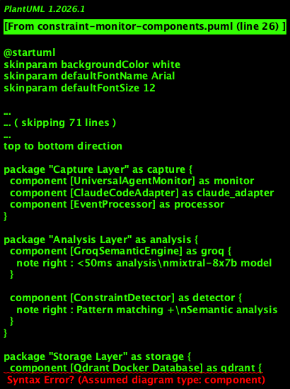
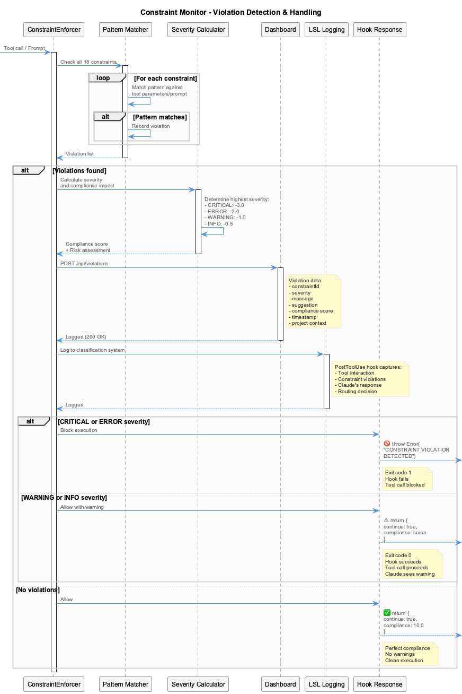

# Constraints - Code Quality Enforcement

Real-time code quality enforcement through PreToolUse hooks.



## What It Does

- **PreToolUse Hook Enforcement** - Blocks violations BEFORE tool execution
- **20 Active Constraints** - Security, architecture, code quality, PlantUML, documentation
- **Severity-Based Enforcement** - CRITICAL/ERROR blocks, WARNING/INFO allows
- **Compliance Scoring** - Real-time 0-10 scoring
- **Dashboard Monitoring** - Live violation feed at `http://localhost:3030`

## How It Works



1. **PreToolUse Hook Fires** - Before tool execution
2. **Constraint Check** - Analyzes parameters against 20 constraints
3. **Pattern Matching** - Regex patterns detect violations
4. **Severity Evaluation** - Determines enforcement action
5. **Decision**:
   - CRITICAL/ERROR: **BLOCK** (exit code 1)
   - WARNING/INFO: **ALLOW** with feedback (exit code 0)

## Severity Levels

| Severity | Impact | Enforcement | Tool Call |
|----------|--------|-------------|-----------|
| CRITICAL | -3.0 | BLOCK | Prevented |
| ERROR | -2.0 | BLOCK | Prevented |
| WARNING | -1.0 | ALLOW | Proceeds with warning |
| INFO | -0.5 | ALLOW | Proceeds with info |

## Active Constraints

### Security (2) - 100% Detection

| Constraint | Severity |
|------------|----------|
| `no-hardcoded-secrets` | CRITICAL |
| `no-eval-usage` | CRITICAL |

### Architecture (3) - 100% Detection

| Constraint | Severity |
|------------|----------|
| `no-parallel-files` | CRITICAL |
| `debug-not-speculate` | ERROR |
| `no-evolutionary-names` | ERROR |

### Code Quality (5)

| Constraint | Severity |
|------------|----------|
| `proper-error-handling` | ERROR |
| `no-console-log` | ERROR |
| `no-var-declarations` | WARNING |
| `proper-function-naming` | INFO |
| `no-backup-files` | CRITICAL |

`no-magic-numbers` was retired — its `\b\d{2,}\b` pattern matched any 2+ digit number (port numbers, PIDs, line numbers, even Bash command digits) and produced 96% of all logged violations, drowning out everything else.

`no-console-log` carries `tool_filter: ['Edit','Write']` and `file_pattern: \.(js|ts|jsx|tsx|mjs|cjs)$` so it only fires when source code actually changes. `no-backup-files` carries `applies_to: file_path` so it inspects target paths instead of file content.

### PlantUML (5)

| Constraint | Severity |
|------------|----------|
| `plantuml-standard-styling` | ERROR |
| `plantuml-file-organization` | INFO |
| `plantuml-file-location` | WARNING |
| `plantuml-diagram-workflow` | INFO |
| `plantuml-readability-guidelines` | INFO |

## Dashboard

**URL**: `http://localhost:3030`

**Features**:

- Real-time violation feed
- Compliance score gauge (0-10)
- 7-day trend chart
- Project selector
- Constraint toggles

### API Endpoints (Port 3031)

| Endpoint | Method | Description |
|----------|--------|-------------|
| `/api/violations` | GET | List violations |
| `/api/violations` | POST | Log violation |
| `/api/compliance/:project` | GET | Project compliance score |
| `/api/constraints` | GET | List enabled constraints |
| `/api/health` | GET | Health check |

## Configuration

### Single canonical source of truth

The constraint monitor used to load configs from multiple paths with silent fallbacks:

- The host hooks loaded `${CODING_REPO}/.constraint-monitor.yaml`
- The container dashboard loaded `integrations/mcp-constraint-monitor/constraints.yaml`

These two files drifted — the same `no-console-log` rule was severity=error on the host and severity=warning in the dashboard. The dashboard reported 20 constraints; the running hook enforced 30. **`/Users/Q284340/Agentic/coding/.constraint-monitor.yaml` is now the only canonical config.** It is bind-mounted into the container at `/coding/.constraint-monitor.yaml`, and `findProjectConfig()` throws when the file is missing instead of falling back to a different one.

If you see `Error: CODING_REPO=... but ... does not exist`, fix the path or set `CONSTRAINT_CONFIG_PATH` explicitly — the system refuses to silently load from somewhere else.

### Regex matches are authoritative

A separate `SemanticValidator` previously called an LLM (anthropic/claude-haiku, groq/llama-3.3, gemini-2.5-flash) to second-guess regex matches. When the routed provider was unreachable (e.g. corp network blocking Anthropic), the validator fell back to a different model whose judgment then suppressed valid matches — `no-hardcoded-secrets` had fired exactly once across the entire history. The semantic-validation path has been removed; if a constraint over-matches, tighten the regex or add `exceptions`/`whitelist`/`file_pattern` rather than asking an LLM to disagree with it.

### Engine errors are surfaced, not swallowed

`checkConstraintsDirectly` used to catch any engine error and return zero violations ("fail open"). That hid bugs like the config split-brain. It now re-throws so the wrapper hook prints the error to stderr where Claude can see it.

**File**: `${CODING_REPO}/.constraint-monitor.yaml`

```yaml
- id: no-hardcoded-secrets
  group: security
  pattern: 'API_KEY|SECRET|TOKEN pattern here'
  message: 'CRITICAL: Potential hardcoded secret detected'
  severity: critical
  enabled: true
  suggestion: Use environment variables instead
```

### Enable/Disable

```yaml
- id: no-console-log
  enabled: false  # Disable this constraint
```

## Key Files

| File | Purpose |
|------|---------|
| `src/hooks/pre-tool-hook-wrapper.js` | PreToolUse hook entry |
| `src/enforcement/ConstraintEnforcer.js` | Enforcement engine |
| `constraints.yaml` | Constraint definitions |
| `src/dashboard/api/` | REST API |
| `src/dashboard/ui/` | Next.js dashboard |

## Status Line Integration

Format: `[SHIELD {compliance}% {trajectory}]`

Example: `[SHIELD 94% IMP]` shows 94% compliance and "implementing" state.
