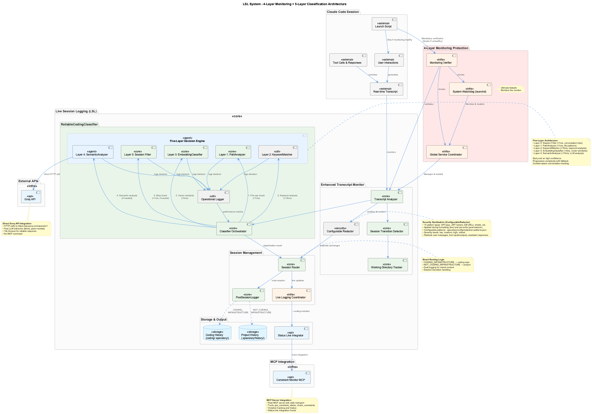
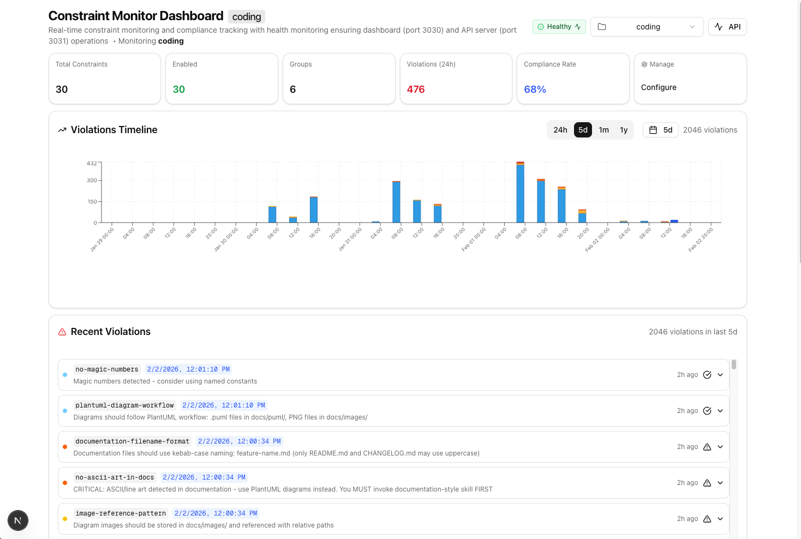
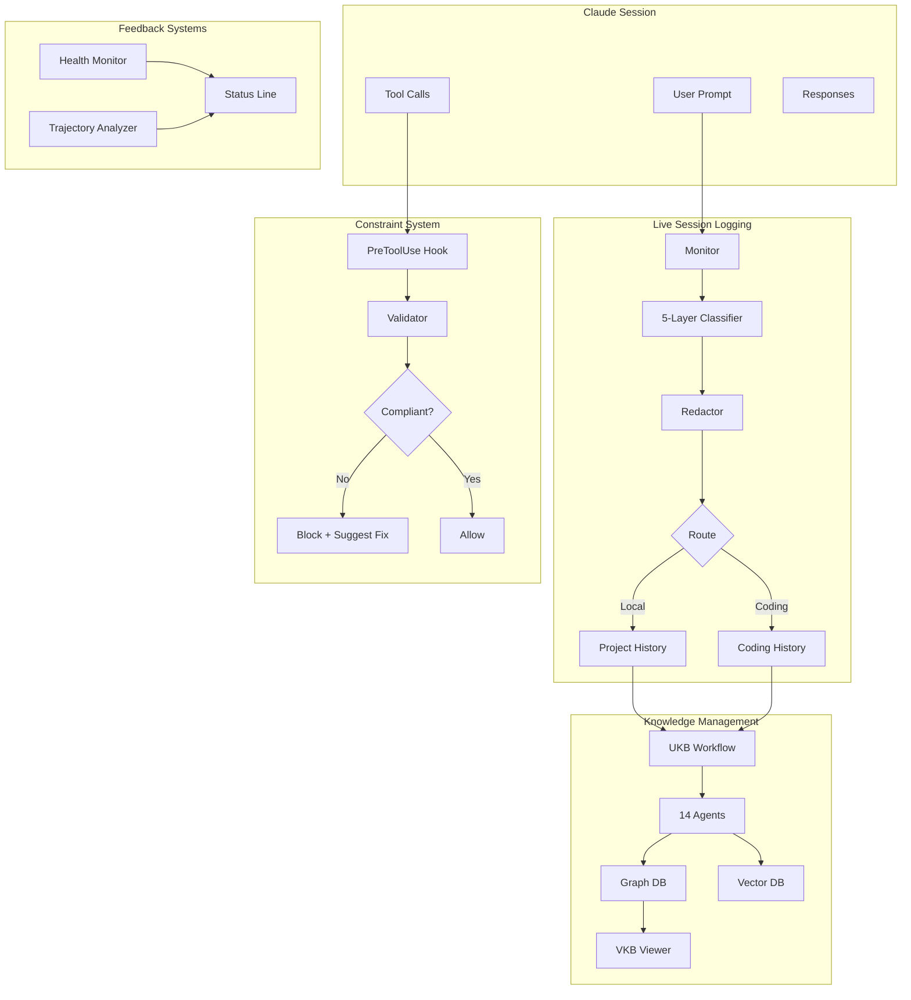
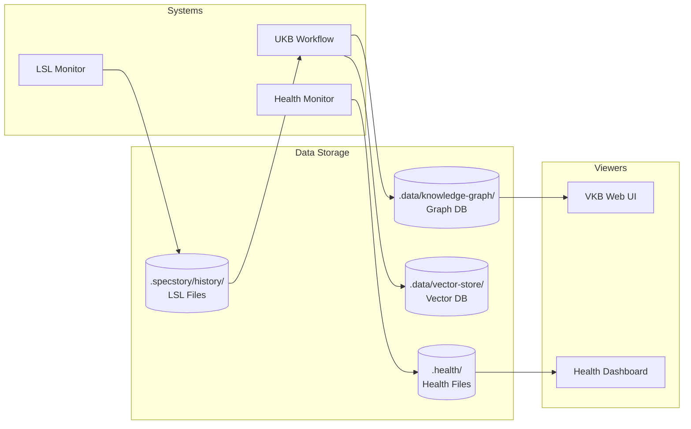
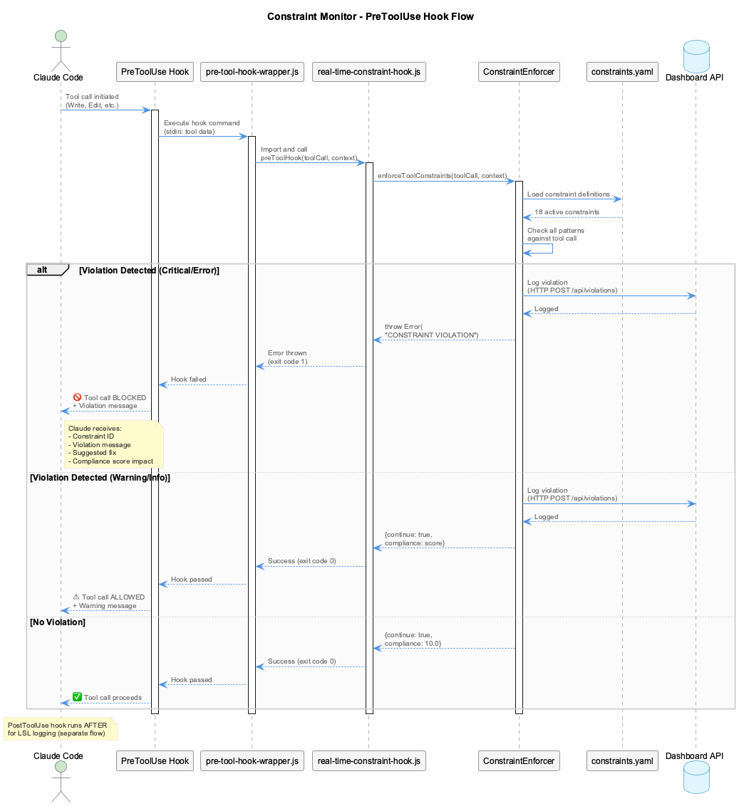
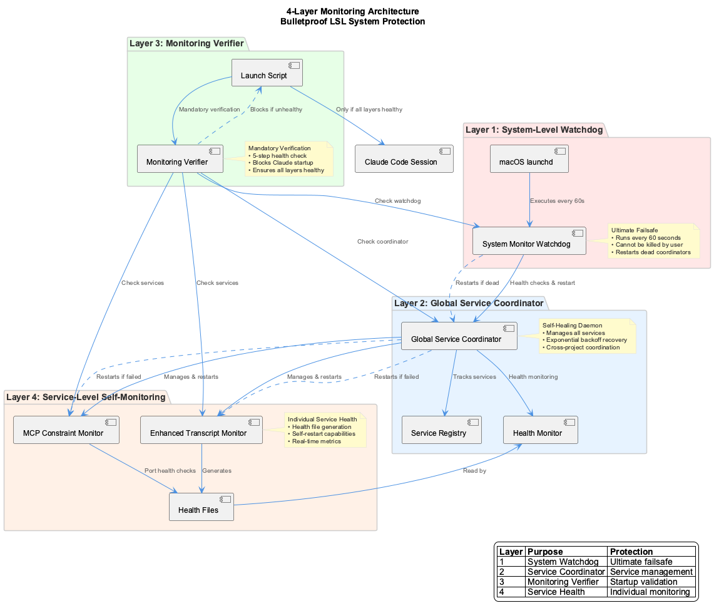

# Core Systems

The coding infrastructure consists of six interconnected systems that work together to create a self-improving development experience.

---

## System Overview

-   :material-file-document-multiple:{ .lg .middle } **Live Session Logging (LSL)**

    ---

    Captures every Claude conversation automatically with intelligent 5-layer classification that routes content between projects.

    

    - Real-time monitoring with zero data loss
    - Automatic secret redaction
    - Multi-project content routing

    [:octicons-arrow-right-24: Learn more](lsl.md)

-   :material-brain:{ .lg .middle } **Knowledge Management (UKB/VKB)**

    ---

    14-agent AI system extracts insights from git history and conversation logs, building a searchable knowledge graph.

    

    - Incremental and full analysis modes
    - Graph + vector database storage
    - Interactive web visualization

    [:octicons-arrow-right-24: Learn more](ukb-vkb.md)

-   :material-shield-check:{ .lg .middle } **Constraint System**

    ---

    20+ configurable constraints enforce code quality via PreToolUse hooks - preventing mistakes before they happen.

    

    - Real-time violation detection
    - Web dashboard monitoring
    - Auto-correction suggestions

    [:octicons-arrow-right-24: Learn more](constraints.md)

-   :material-compass:{ .lg .middle } **Trajectory Detection**

    ---

    Tracks development progress and detects when you're deviating from your goals.

    

    - Real-time state tracking
    - Goal deviation alerts
    - Status line integration

    [:octicons-arrow-right-24: Learn more](trajectories.md)

-   :material-heart-pulse:{ .lg .middle } **Health Monitoring**

    ---

    4-layer watchdog architecture ensures system reliability with automatic recovery.

    

    - Process health monitoring
    - Automatic restart on failure
    - Multi-agent workflow visualization

    [:octicons-arrow-right-24: Learn more](../architecture/health-monitoring.md)

-   :material-information-outline:{ .lg .middle } **Status Line**

    ---

    Real-time feedback in your terminal showing system health, API costs, and development state.

    

    - Service health indicators
    - Cost tracking display
    - Trajectory and LSL status

    [:octicons-arrow-right-24: Learn more](../guides/status-line.md)

---

## How They Work Together

---

## Quick Command Reference

| System | Command | Description |
|--------|---------|-------------|
| **LSL** | Automatic | Runs in background, no commands needed |
| **UKB** | `ukb` | Incremental knowledge update |
| **UKB** | `ukb full` | Full analysis from first commit |
| **UKB** | `ukb debug` | Debug mode with mocked LLM |
| **VKB** | `vkb` | Open knowledge viewer at `localhost:8080` |
| **Constraints** | Dashboard | View at `localhost:3030` |
| **Health** | `coding --health` | Check all service health |
| **Health** | Dashboard | View at `localhost:3032` |

---

## Data Flow

The systems interact through shared data stores:

---

## System States

Each system reports its status through health files and the status line:

| State | Icon | Meaning |
|-------|------|---------|
| :material-check-circle:{ .green } Healthy | Green | Service running normally |
| :material-alert-circle:{ .yellow } Degraded | Yellow | Service running with issues |
| :material-close-circle:{ .red } Failed | Red | Service not responding |
| :material-progress-clock: Transitioning | Blue | Mode switch in progress |

---

## Architecture Diagrams

### LSL 5-Layer Classification

### UKB Multi-Agent Workflow

### Constraint Monitoring Flow

### Health Monitoring Architecture

---

## Related Documentation

- [Architecture Overview](../architecture/index.md) - System design principles
- [Data Flow](../architecture/data-flow.md) - Detailed data flow diagrams
- [Integrations](../integrations/index.md) - MCP server details
