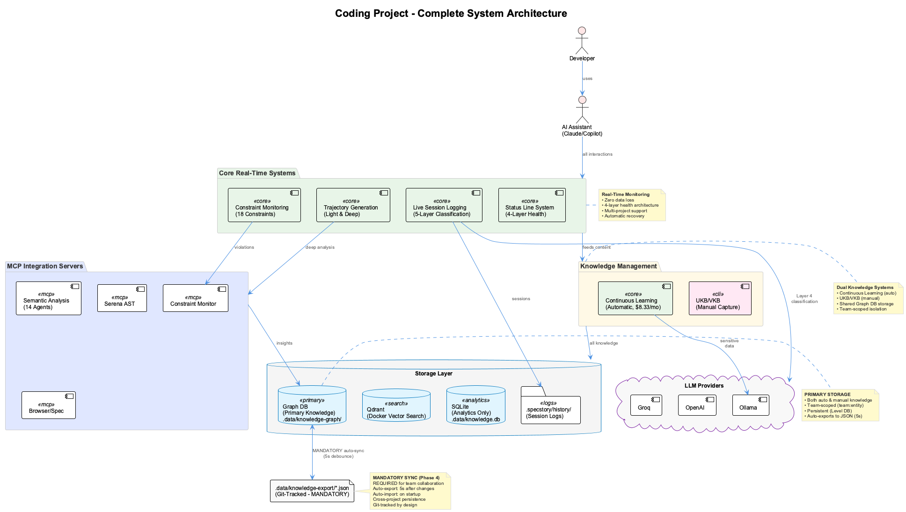
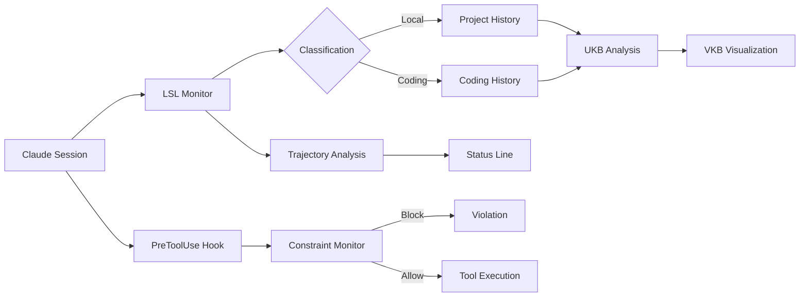

# Core Systems

The coding infrastructure consists of four interconnected systems for session logging, knowledge management, code quality, and development tracking.



## System Overview

| System | Purpose | Trigger |
|--------|---------|---------|
| [LSL](lsl.md) | Real-time session logging with intelligent classification | Automatic |
| [UKB/VKB](ukb-vkb.md) | Knowledge capture and visualization | Manual + Automatic |
| [Constraints](constraints.md) | Code quality enforcement via hooks | PreToolUse hooks |
| [Trajectories](trajectories.md) | Development state tracking | Status line |

## How They Work Together



## Quick Reference

### Session Logging (LSL)

Automatic real-time capture of all Claude conversations with 5-layer classification.

```bash
# View today's sessions
ls -la .specstory/history/$(date +%Y-%m-%d)*.md

# Check monitor health
cat .health/coding-transcript-monitor-health.json | jq '{status, activity}'
```

### Knowledge Management (UKB/VKB)

Within Claude Code session:

```
# Incremental analysis
"ukb"

# Full analysis
"full ukb"
```

View knowledge graph:

```bash
vkb  # Opens http://localhost:8080
```

### Constraints

20 active constraints enforce code quality via PreToolUse hooks.

```bash
# View dashboard
open http://localhost:3030

# Check compliance
curl http://localhost:3031/api/compliance/coding
```

### Trajectories

Real-time development state displayed in status line.

| State | Icon | Meaning |
|-------|------|---------|
| Exploring | EX | Information gathering |
| On Track | ON | Productive progression |
| Off Track | OFF | Deviating from path |
| Implementing | IMP | Active code modification |
| Verifying | VER | Testing and validation |
| Blocked | BLK | Intervention preventing action |
