# Core Systems

The coding infrastructure consists of six interconnected systems that work together to create a self-improving development experience.

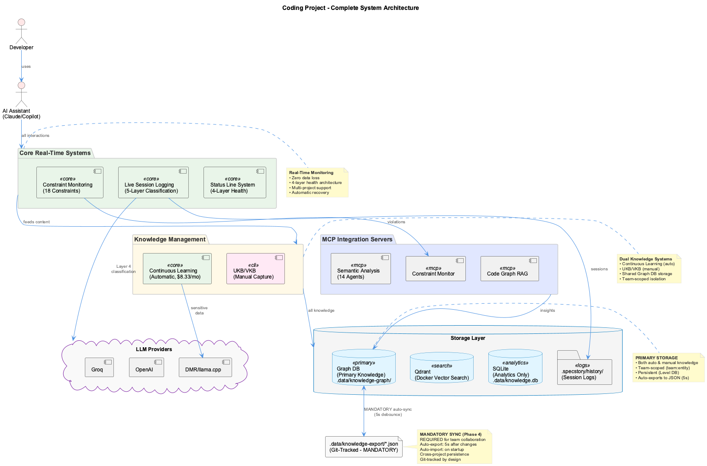

---

## System Overview

-   :material-file-document-multiple:{ .lg .middle } **Live Session Logging (LSL)**

    ---

    Captures every Claude conversation automatically with intelligent 5-layer classification that routes content between projects.

    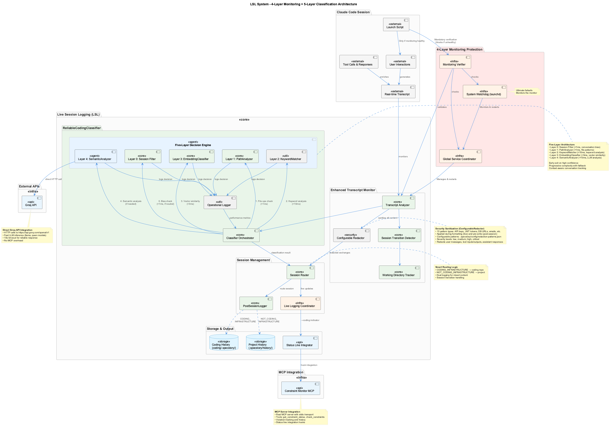

    - Real-time monitoring with zero data loss
    - Automatic secret redaction
    - Multi-project content routing

    [:octicons-arrow-right-24: Learn more](lsl.md)

-   :material-brain:{ .lg .middle } **Knowledge Management (UKB/VKB)**

    ---

    14-agent AI system extracts insights from git history and conversation logs, building a searchable knowledge graph. Persistence is delegated to **@fwornle/km-core**, the shared kernel that backs all three knowledge systems.

    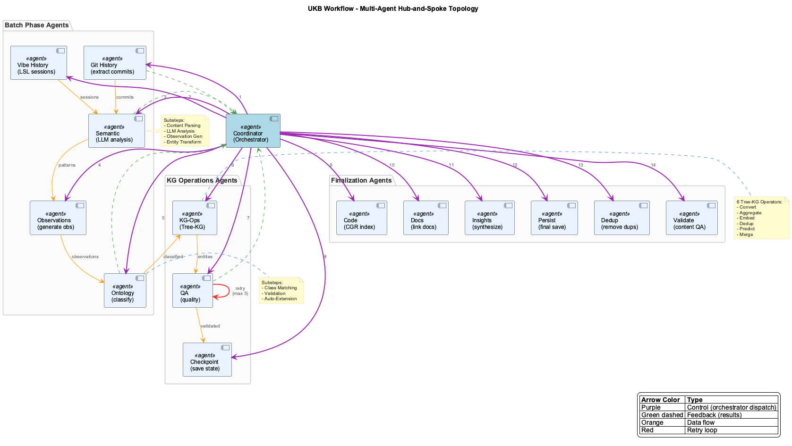

    - Incremental and full analysis modes
    - Graph + vector database storage
    - Interactive web visualization

    [:octicons-arrow-right-24: Learn more](ukb-vkb.md)

-   :material-eye:{ .lg .middle } **Observational Memory (online learning)**

    ---

    Real-time observation capture across all four agents (Claude, Copilot, OpenCode, Mastra), consolidated daily into thematic digests and weekly into persistent project insights.

    - Three-tier memory hierarchy
    - Single-owner SQLite + km-core graph store
    - Truthfulness verification and coverage tracking

    **Port**: 12436 (observations API, mounts km-core `/api/km/`)

    [:octicons-arrow-right-24: Learn more](observational-memory.md)

-   :material-database-search:{ .lg .middle } **OKB (Operational Knowledge Base)**

    ---

    Cross-repo knowledge base of root-cause analyses, runbooks, and operational documents. Lives in `_work/rapid-automations/integrations/operational-knowledge-management/`; consumes the same **@fwornle/km-core** library used by the UKB and the online-learning pipeline.

    - LLM-driven ingestion + governance
    - Four-tier ontology (upper + RaaS + KPI-FW + business)
    - VOKB graph viewer

    **Ports**: 8090 (OKB API), 3002 (VOKB viewer)

    [:octicons-arrow-right-24: OKB docs (in rapid-automations)](https://bmw.ghe.com/adpnext-apps/rapid-automations/tree/main/integrations/operational-knowledge-management/docs)

-   :material-shield-check:{ .lg .middle } **Constraint System**

    ---

    20+ configurable constraints enforce code quality via PreToolUse hooks - preventing mistakes before they happen.

    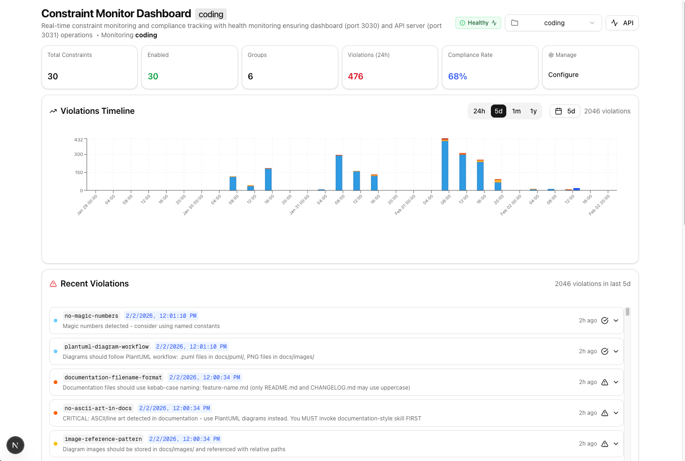

    - Real-time violation detection
    - Web dashboard monitoring
    - Auto-correction suggestions

    [:octicons-arrow-right-24: Learn more](constraints.md)

-   :material-heart-pulse:{ .lg .middle } **Health Monitoring**

    ---

    4-layer watchdog architecture ensures system reliability with automatic recovery.

    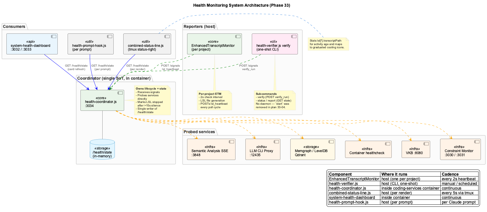

    - Process health monitoring
    - Automatic restart on failure
    - Multi-agent workflow visualization

    [:octicons-arrow-right-24: Learn more](../architecture/health-monitoring.md)

-   :material-information-outline:{ .lg .middle } **Status Line**

    ---

    Real-time feedback in your terminal showing system health, API costs, and development state.

    

    - Service health indicators
    - Cost tracking display
    - LSL status

    [:octicons-arrow-right-24: Learn more](../guides/status-line.md)

---

## How They Work Together

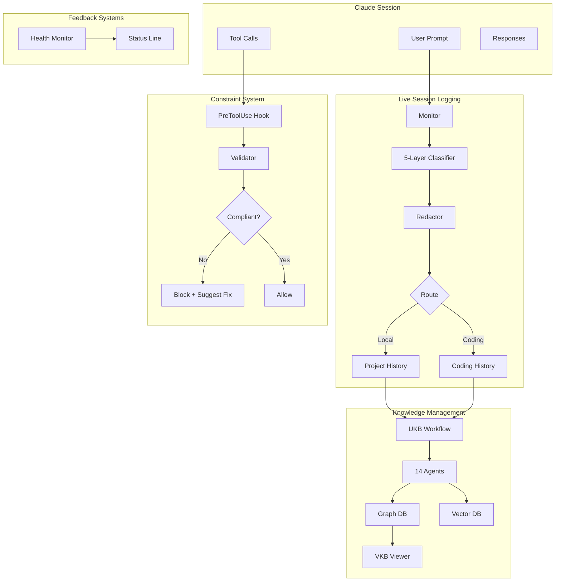
```mermaid
flowchart TB
    subgraph Input["Claude Session"]
        A[User Prompt]
        B[Tool Calls]
        C[Responses]
    end

    subgraph LSL["Live Session Logging"]
        D[Monitor] --> E[5-Layer Classifier]
        E --> F[Redactor]
        F --> G{Route}
        G -->|Local| H[Project History]
        G -->|Coding| I[Coding History]
    end

    subgraph KB["Knowledge Management"]
        J[UKB Workflow] --> K[14 Agents]
        K --> L[Graph DB]
        K --> M[Vector DB]
        L --> N[VKB Viewer]
    end

    subgraph Constraints["Constraint System"]
        O[PreToolUse Hook] --> P[Validator]
        P --> Q{Compliant?}
        Q -->|No| R[Block + Suggest Fix]
        Q -->|Yes| S[Allow]
    end

    subgraph Feedback["Feedback Systems"]
        T[Status Line]
        U[Health Monitor]
    end

    A --> D
    B --> O
    H --> J
    I --> J
    U --> T
```

---

## Quick Command Reference

| System | Command | Description |
|--------|---------|-------------|
| **LSL** | Automatic | Runs in background, no commands needed |
| **UKB** | `ukb` | Incremental knowledge update |
| **UKB** | `ukb full` | Full analysis from first commit |
| **UKB** | `ukb debug` | Debug mode with mocked LLM |
| **VKB** | `vkb` | Open knowledge viewer at `localhost:8080` |
| **Constraints** | Dashboard | View at `localhost:3030` |
| **Health** | `coding --health` | Check all service health |
| **Health** | Dashboard | View at `localhost:3032` |

---

## Data Flow

The systems interact through shared data stores:

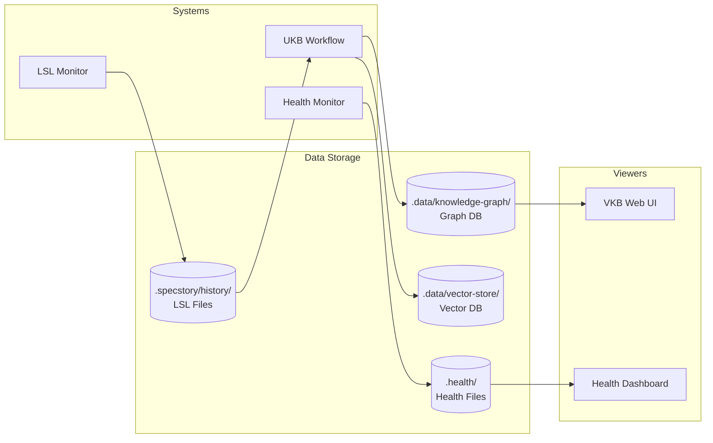
```mermaid
flowchart LR
    subgraph Storage["Data Storage"]
        A[(".specstory/history/\nLSL Files")]
        B[(".data/knowledge-graph/\nGraph DB")]
        C[(".data/vector-store/\nVector DB")]
        D[(".health/\nHealth Files")]
    end

    subgraph Systems
        E[LSL Monitor] --> A
        A --> F[UKB Workflow]
        F --> B
        F --> C
        G[Health Monitor] --> D
    end

    subgraph Viewers
        B --> H[VKB Web UI]
        D --> I[Health Dashboard]
    end
```

---

## System States

Each system reports its status through health files and the status line:

| State | Icon | Meaning |
|-------|------|---------|
| :material-check-circle:{ .green } Healthy | Green | Service running normally |
| :material-alert-circle:{ .yellow } Degraded | Yellow | Service running with issues |
| :material-close-circle:{ .red } Failed | Red | Service not responding |
| :material-progress-clock: Transitioning | Blue | Mode switch in progress |

---

## Architecture Diagrams

### LSL 5-Layer Classification

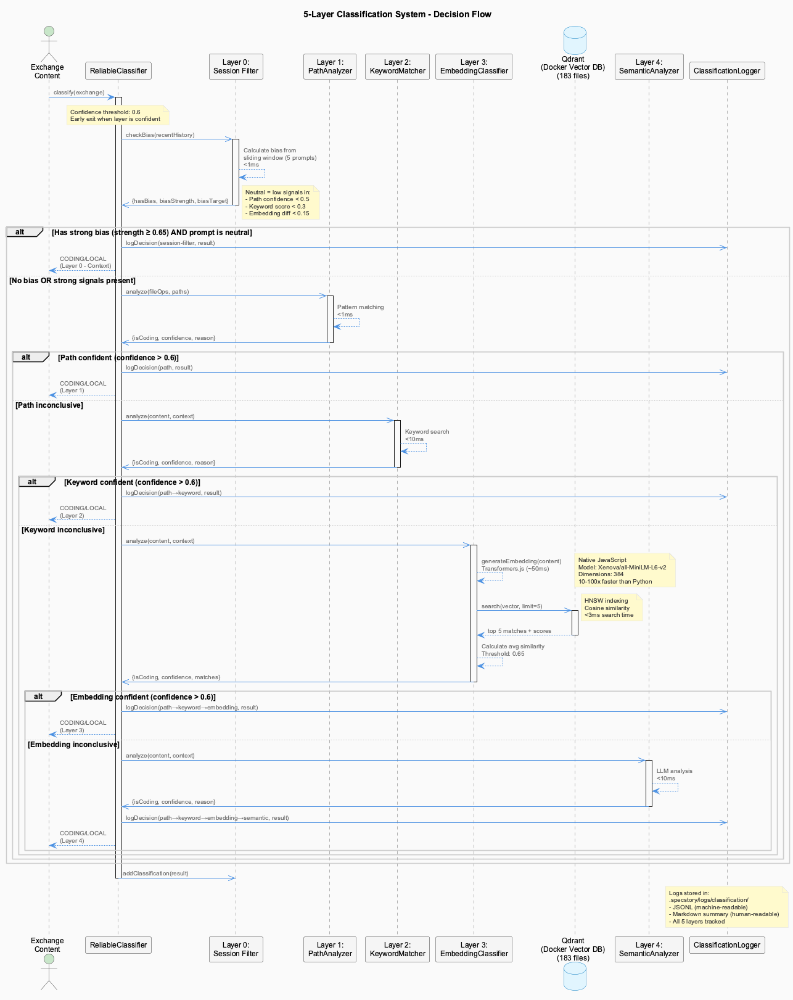

### UKB Multi-Agent Workflow

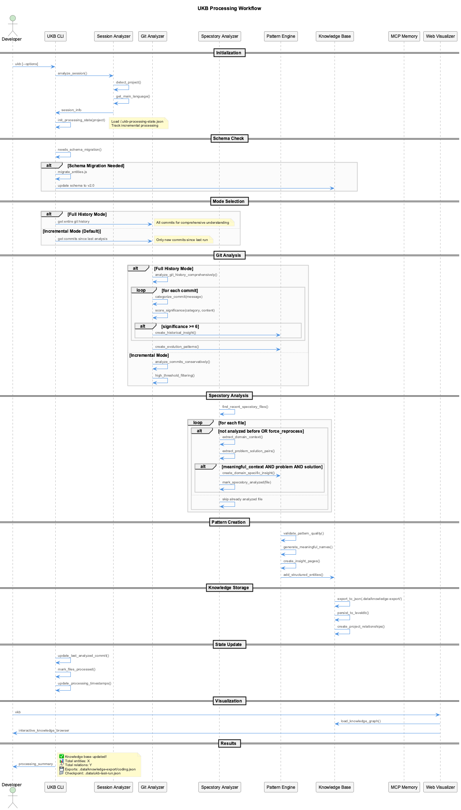

### Constraint Monitoring Flow

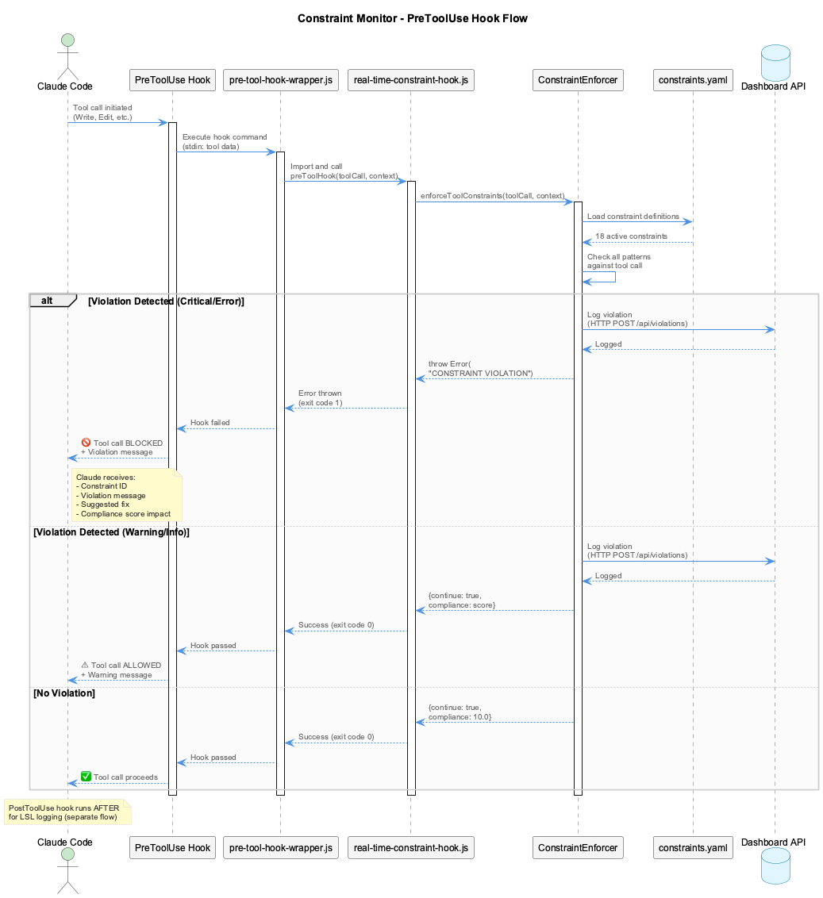

### Health Monitoring Architecture

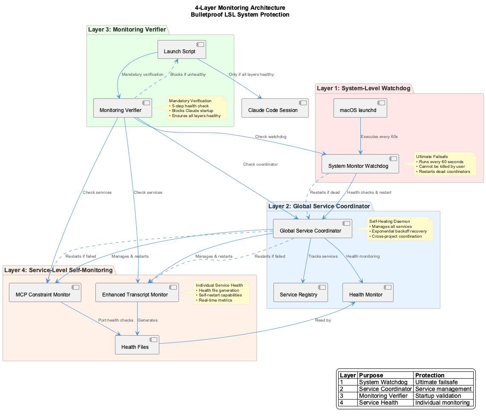

---

## Related Documentation

- [Architecture Overview](../architecture/index.md) - System design principles
- [Data Flow](../architecture/data-flow.md) - Detailed data flow diagrams
- [Integrations](../integrations/index.md) - MCP server details
