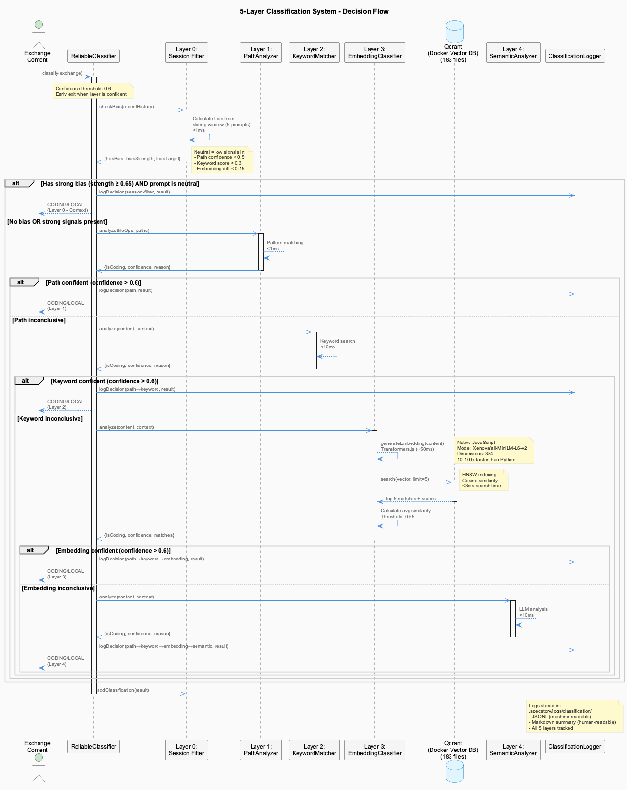

# Live Session Logging

Every conversation, captured as it happens, classified to the right project and stripped of
secrets — without you doing anything.

=== "⚡ Quick (~3 min)"

    ## Where your sessions go

    `.specstory/history/YYYY/MM/`, one file per time window, named
    `YYYY-MM-DD_HHMM-HHMM-<hash>.jsonl`.

    There is nothing to run. Logging starts with the session and stops with it.

    ## What it handles for you

    | Concern | How |
    |---------|-----|
    | Multi-project work | A 5-layer classifier decides which project each piece belongs to |
    | Secrets | Redacted before anything is written |
    | Reliability | Layered monitoring, designed for zero data loss |
    | Other agents | Claude, Copilot CLI, OpenCode and Pi all captured |

    ## Reading them back

    Use `/sl` in a session to load recent logs for continuity. Files are ordered by
    **filename**, not modification time — a checkout or submodule update rewrites mtimes
    wholesale, and only the date-encoded name is reliable.

    ## When logging looks stalled

    The `[LSL●]` badge appears in the status bar **only when this pane's logging is unhealthy** —
    no badge is good news. If it does appear, check the per-project log under `.logs/`.

=== "📖 Standard (~15 min)"

    ## The classification problem

    Work rarely stays in one repository. You fix something in a project while the fix really
    belongs to the infrastructure, or vice versa, and a naive logger files everything under
    wherever the shell happened to be.

    

    Five layers decide, cheapest first: a session filter carrying conversation context, a path
    analyser matching file-operation patterns, and progressively more expensive checks after
    that. Most content is routed by the first layers in under a millisecond; only the genuinely
    ambiguous reaches anything costly.

    That ordering is the design. Classification runs on every exchange, so it has to be nearly
    free in the common case.

    ## Redaction happens before the write

    Secrets are stripped on the way in, not cleaned up afterwards. A log that is sanitised later
    has already existed unsanitised on disk.

    The trade-off is false positives — a redactor tuned to catch credentials will sometimes catch
    something that merely looks like one. That is the correct direction to err, but it means a
    redacted-looking value in a log is not proof that a real secret was there.

    ## Supervision

    Capture is monitored in layers, on the assumption that the layer below might have stopped
    without saying so. A logger that dies loudly is easy; one that keeps running while quietly
    writing nothing is the case the supervision exists for, which is why liveness is judged by
    whether output is still being produced rather than by whether the process exists.

    ## The files

    One file per time window under `.specstory/history/YYYY/MM/`, named with its date, its window
    and a hash. Suffixed siblings (`…-1_<hash>`) are continuations of the same window.

    **Order by filename, never by mtime.** A `git checkout`, a clone or a submodule update
    rewrites modification times across the tree, which would surface months-old files as the most
    recent. The name carries the truth.

    ## Across agents

    All four supported agents are captured. Agents with their own session transcripts are read
    directly; those that only print to a terminal are captured through the tmux pipe and turned
    back into discrete prompts by a per-agent pattern — which is what
    `AGENT_PROMPT_REGEX` in an agent's config file is for.

    ## Reading logs back

    `/sl` loads recent logs for continuity at the start of a session. Beyond that the files are
    plain JSONL: one entry per line, with the session header, prompt-set boundaries and each
    message as its own record.

=== "📚 Deep Dive (full)"

    --8<-- "_tiers/core-systems/lsl.deep.md"
