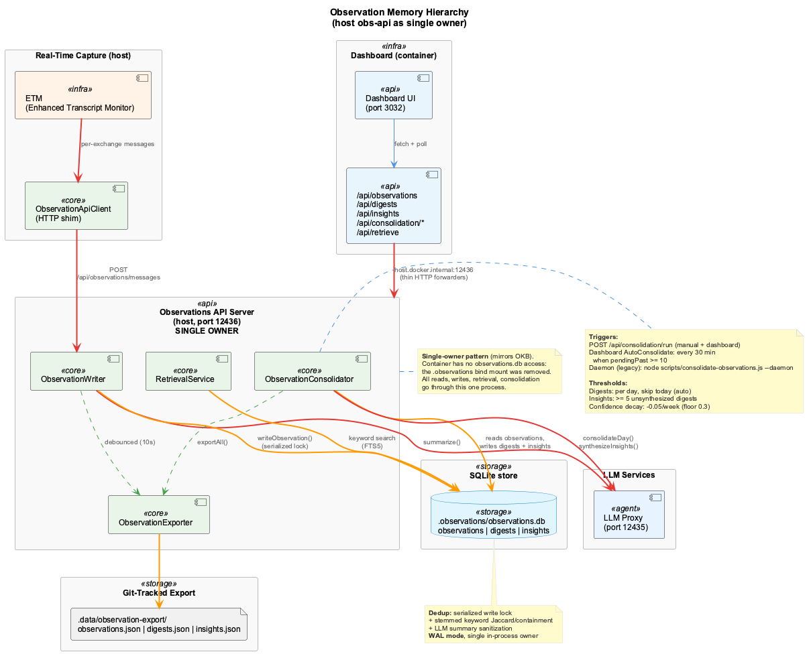
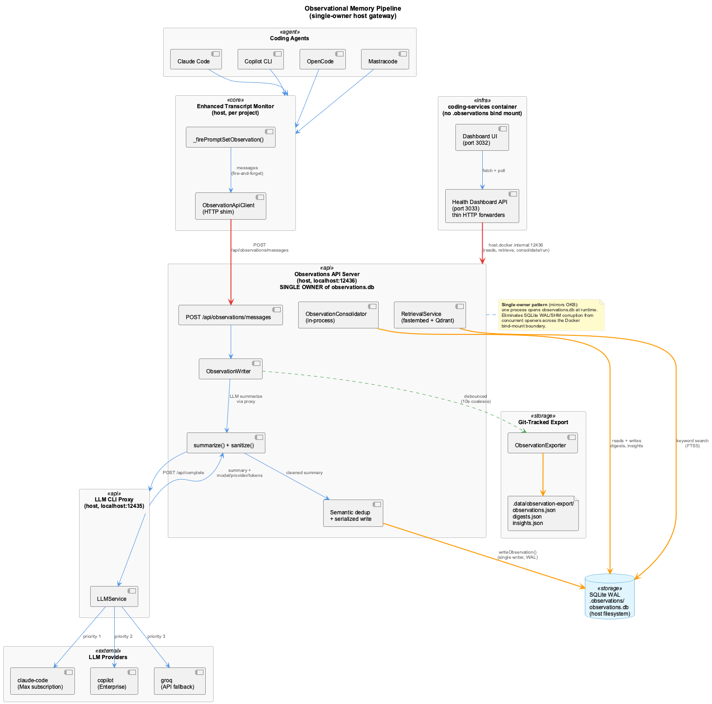
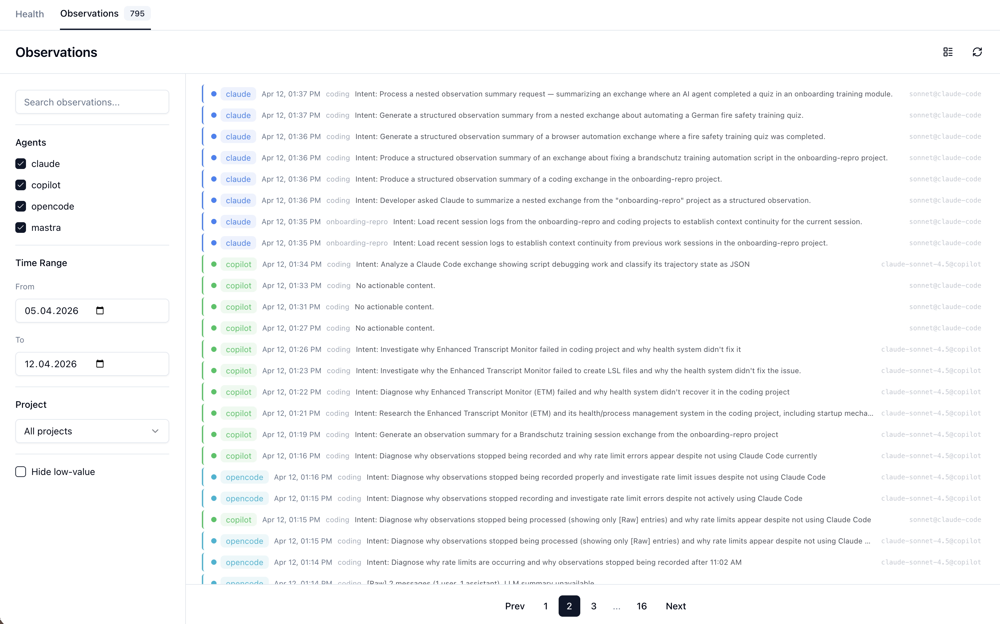
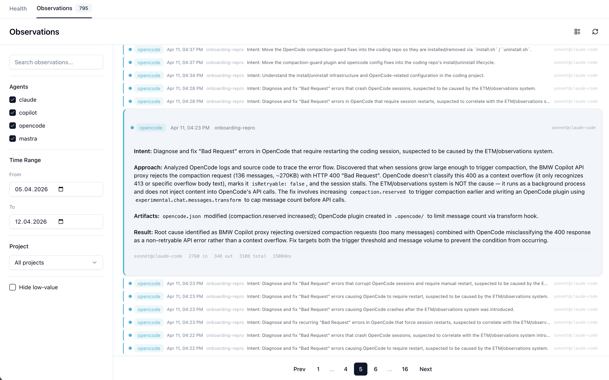
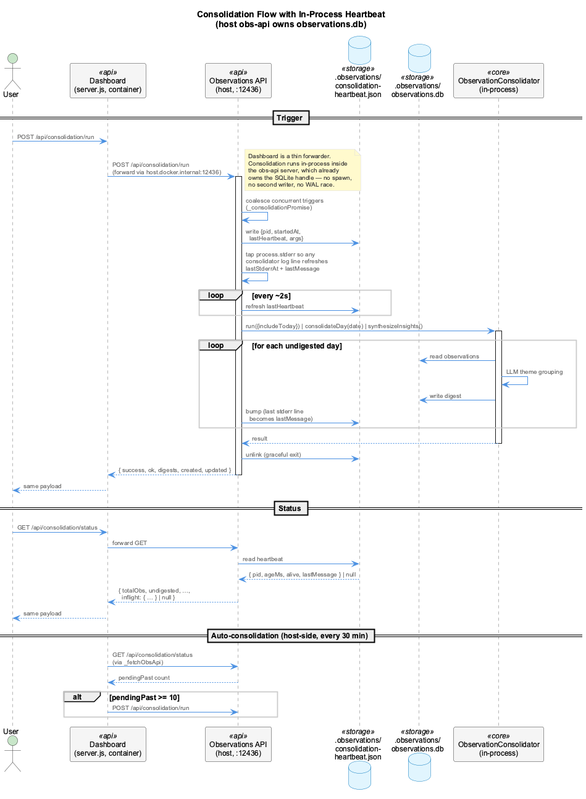
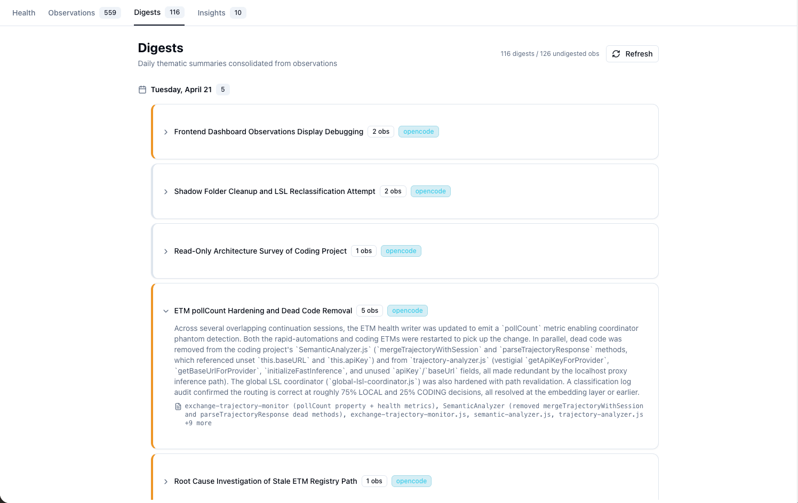
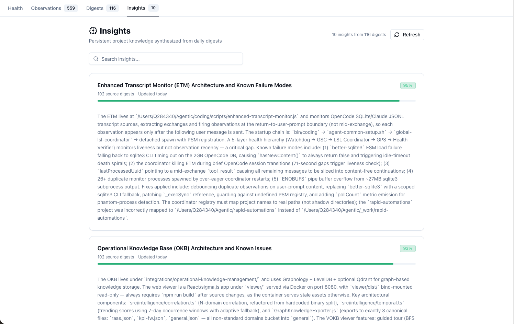

# Observational Memory

Real-time observation capture from live coding sessions across all agents, with LLM-powered summarization, consolidation into daily digests, and synthesis into persistent project insights. Inspired by Mastra's Observer/Reflector memory hierarchy, adapted for cross-agent project knowledge management.

## Overview

Observational Memory implements a three-tier memory hierarchy:

| Tier | What | Trigger | Volume |
|------|------|---------|--------|
| **Observations** | Per-exchange structured summaries (Intent/Approach/Artifacts/Result) | Real-time, per prompt-set | ~30/day |
| **Digests** | Daily thematic work session summaries | End of day (cron or manual) | ~7/day |
| **Insights** | Persistent project knowledge | Weekly or >= 5 new digests | ~10 total |

The system uses SQLite (`.observations/observations.db`) as its runtime store and exports git-tracked JSON to `.data/observation-export/` for cross-machine portability — mirroring the UKB knowledge-export pattern.


## Architecture



### Single-owner architecture

The runtime DB has exactly **one owner**: a host process called the **Observations API server** (`scripts/observations-api-server.mjs`, port `12436`). Every other consumer — the transcript monitor, the dashboard inside the `coding-services` container, the consolidator, the retrieval pipeline — reaches `observations.db` exclusively through this HTTP service. The `.observations` directory is **not** bind-mounted into the container.

This eliminates the classic SQLite-on-Docker-Desktop-Mac corruption pattern where concurrent processes (host writer + container reader) lose WAL/SHM coherence across the bind-mount boundary, producing periodic `observations.db.corrupted-*` files. Pattern mirrors the OKB/VKB approach: one writer, everyone else over HTTP.

### Components

| Component | Location | Role |
|-----------|----------|------|
| **Observations API server** | `scripts/observations-api-server.mjs` | Host service (port 12436). **Single owner** of `observations.db`. Hosts `ObservationWriter`, `ObservationConsolidator`, `RetrievalService` in-process |
| **ObservationWriter** | `src/live-logging/ObservationWriter.js` | Summarizes exchanges via LLM proxy, writes to SQLite with dedup. Runs inside the obs-api server |
| **ObservationConsolidator** | `src/live-logging/ObservationConsolidator.js` | Consolidates observations into digests and insights via LLM. Runs in-process inside the obs-api server |
| **RetrievalService** | `src/retrieval/retrieval-service.js` | Keyword + semantic + RRF retrieval. Runs in-process inside the obs-api server |
| **ObservationExporter** | `src/live-logging/ObservationExporter.js` | Git-friendly JSON export to `.data/observation-export/` |
| **ObservationApiClient** | `src/live-logging/ObservationApiClient.js` | Thin HTTP shim used by the transcript monitor (replaces direct SQLite access) |
| **ETM Observation Tap** | `scripts/enhanced-transcript-monitor.js` | Fires observations per prompt-set via the API client (fire-and-forget) |
| **Consolidation CLI** | `scripts/consolidate-observations.js` | Legacy stand-alone CLI/daemon. The dashboard's `POST /api/consolidation/run` no longer spawns it — consolidation runs in-process inside the obs-api server |
| **Health API (dashboard)** | `integrations/system-health-dashboard/server.js` | Container service (port 3033). Now a **thin HTTP forwarder** to the host obs-api for all observation/digest/insight/retrieve/consolidation calls |
| **Dashboard UI** | `integrations/system-health-dashboard/src/pages/` | Browsable views: observations, digests, insights |
| **LLM Proxy Bridge** | [`@rapid/llm-proxy`](https://bmw.ghe.com/adpnext-apps/rapid-llm-proxy) | Routes summarization to subscription providers (port 12435) |

## Observation Pipeline



1. **Exchange completed** -- the ETM detects a completed prompt set (user + assistant exchanges)
2. **Fire-and-forget over HTTP** -- `_firePromptSetObservation()` calls `ObservationApiClient.processMessages()`, which `POST`s `/api/observations/messages` to the host obs-api on `localhost:12436` (never awaited, never blocks LSL)
3. **LLM summarization** -- inside the obs-api, `ObservationWriter` calls the LLM proxy to generate a structured summary (Intent/Approach/Artifacts/Result)
4. **Summary sanitization** -- `_sanitizeSummary()` strips unfilled template placeholders and LLM self-correction artifacts
5. **Serialized write** -- `_serializedWrite()` acquires a promise-chain lock to prevent TOCTOU races between concurrent calls
6. **Dedup check** -- content hash + semantic keyword similarity (Jaccard + containment) against a 4-hour sliding window
7. **Storage** -- observation written to SQLite with metadata (agent, project, LLM model/provider, tokens). The obs-api holds the only RW handle in the system
8. **JSON export** -- debounced (10s coalesce) export to `.data/observation-export/observations.json`
9. **Dashboard** -- the dashboard inside the container forwards `/api/observations*` to the host obs-api at `host.docker.internal:12436`; it never opens SQLite directly

## Supported Agents

All four agents generate observations:

| Agent | Method | Project Detection |
|-------|--------|-------------------|
| **Claude Code** | ETM transcript monitoring | `path.basename(projectPath)` |
| **GitHub Copilot** | ETM pipe-pane capture | `path.basename(projectPath)` |
| **OpenCode** | ETM pipe-pane capture | `path.basename(projectPath)` |
| **Mastracode** | ETM lifecycle hook transcripts | `path.basename(projectPath)` |

## Dashboard Features

Access at `http://localhost:3032/observations`.



- **Agent filter** -- checkbox per agent (claude, copilot, opencode, mastra)
- **Time range** -- date pickers for from/to
- **Project filter** -- dropdown of projects with observations
- **Full-text search** -- FTS5 search across observation summaries
- **Compact view** -- toggle for single-line rows (high density)
- **Hide low-value** -- filters out "No actionable content" observations
- **LLM metadata** -- each card shows `model@provider` and token counts when expanded
- **Markdown rendering** -- bold, headers, inline code rendered in expanded view
- **ESC / click-outside** -- closes expanded observation cards
- **Redaction tokens styled inline** -- markers like `<USER_ID_REDACTED>`, `<AWS_SECRET_REDACTED>`, `<COMPANY_NAME_REDACTED>` are rendered as smaller, sky-blue spans so they don't dominate the surrounding text. The same styling applies on the digests and insights pages



### Per-project consolidation

Phases B/C/D (Apr 26) made the consolidation pipeline project-aware end-to-end:

- Observations carry a `project` column populated by the LSL classifier
- `ObservationConsolidator` partitions observations by project before LLM grouping, so a session that touched two projects produces two digests (one per project) rather than a cross-project blend
- Insight synthesis runs per project — an insight from project B can no longer contaminate project A's narrative just because it was logged in the same window
- The Digests and Insights pages have a project selector; the API accepts `?project=<name>` for filtering

### Heartbeat-backed consolidation status

Consolidation now runs **in-process inside the host obs-api server** rather than as a child process spawned by the dashboard. The obs-api already owns the SQLite handle, so a single in-process call replaces the previous `spawn(consolidate-observations.js)` flow — no second writer, no WAL race, no orphan-child timeout enforcement to worry about.

The obs-api writes `.observations/consolidation-heartbeat.json` every ~2 seconds while a run is in flight (any stderr line refreshes it, so the last log message is always exposed as `lastMessage`). `GET /api/consolidation/status` returns that heartbeat as `inflight: { pid, alive, ageMs, startedAt, lastMessage }`. On graceful shutdown the obs-api waits up to 20 s for the in-flight run to drain.

Concurrent triggers are coalesced — a second `POST /api/consolidation/run` while one is in flight attaches to the same promise instead of starting a new run. The dashboard's `POST /api/consolidation/run` is a thin HTTP forwarder; the dashboard's auto-consolidation daemon (every 30 min when `pendingPast >= 10`) likewise forwards rather than spawning.



### Mixed-topic safeguard in the knowledge graph

The wave-analysis pipeline writes online-learned entities into the knowledge graph. Earlier the persistence agent's fuzzy name dedup merged entities at Jaccard ≥ 0.7 with no content check, producing nodes like "GSD Statusline and Hook Integration" that bundled a GSD changelog with an LSL tmux indicator description simply because both names contained "hook" and "integration".

Three layers of defence are now in place:

| Gate | What it does | Threshold |
|------|--------------|-----------|
| Name match (tightened) | Stop-list of generic words (`hook`, `integration`, `system`, `update`, `health`, …) is filtered out before Jaccard; ≥1 shared **non-generic** word required | 0.85 |
| Content veto | After a name match, observation Jaccard must clear MIN_CONTENT_SIMILARITY before the merge proceeds | 0.15 |
| Mixed-topic detection | At write time, every entity's bullets are pairwise scored. Any pair below 0.10 stamps `metadata.mixed_topics: true` | 0.10 |

The VKB Node Details panel surfaces mixed-topic entities with an amber warning and a count of unrelated observation pairs, so they can be reviewed and split.

### Redaction sanitization

`ObservationSanitizer` repairs legacy `<AWS_SECRET_REDACTED>frag` corruption that an over-broad earlier regex left in stored observations. It uses sibling fields/entries as a recovery oracle (e.g. when a `modifiedFiles` list contains both `server.js` and `<AWS_SECRET_REDACTED>er.js`, the basename match restores the path). Active code paths run the sanitizer before persisting; a one-time DB sweep is available via `scripts/sanitize-observations.js`.

The matching redaction *pattern* fix landed in `redaction-patterns.json`: `aws_secret_standalone` now uses lookarounds — a negative lookbehind and lookahead around `[A-Za-z0-9+/]{40}` — so a 40-char run inside a longer base64-like path can't be eaten as a "secret" anymore.

## LLM Provider Routing

Summarization uses the LLM CLI proxy (`localhost:12435`) which routes through subscription providers with **automatic fallback**:

1. **claude-code** (Max subscription, zero cost, ~15s via CLI)
2. **copilot** (Enterprise subscription, zero cost, ~2-5s via HTTP)
3. **groq** (API fallback, fast, low cost)
4. Anthropic, OpenAI, Gemini (paid API fallback)

The proxy tracks provider health and automatically falls back to the next available provider on failure. Providers that fail 3 times consecutively enter a 1-minute cooldown. Per-provider timeouts (30s) prevent a hung provider from burning the entire request budget.

The provider priority is configured in `config/llm-providers.yaml`.

## Transcript Converters

Historical transcripts can be batch-converted into observations:

```bash
# Convert Claude JSONL transcripts
node scripts/convert-transcripts.js claude path/to/transcript.jsonl

# Convert Copilot events
node scripts/convert-transcripts.js copilot path/to/events.jsonl

# Batch convert .specstory files (with manifest idempotency)
node scripts/convert-transcripts.js specstory
```

## Database

SQLite database at `.observations/observations.db` with **WAL mode** and `busy_timeout=5000ms`. The host obs-api server is the only process that opens this file at runtime — concurrent in-process connections (writer, consolidator, retrieval) coexist safely under WAL because they share the same SQLite shared memory. The Docker container has no access to the file (the `.observations` bind mount was removed).

**Observations table:**
```sql
CREATE TABLE observations (
  id TEXT PRIMARY KEY,
  summary TEXT,
  messages TEXT,        -- JSON array of original messages
  agent TEXT,           -- claude, copilot, opencode, mastra
  session_id TEXT,
  source_file TEXT,
  created_at TEXT,      -- ISO 8601
  metadata TEXT,        -- JSON: project, llmModel, llmProvider, llmTokens, etc.
  content_hash TEXT,    -- MD5 for dedup
  quality TEXT,         -- high, normal, low
  digested_at TEXT      -- set when consolidated into a digest
);
```

**Digests table:**
```sql
CREATE TABLE digests (
  id TEXT PRIMARY KEY,
  date TEXT NOT NULL,              -- YYYY-MM-DD
  theme TEXT NOT NULL,             -- e.g. "Dashboard observations frontend fix"
  summary TEXT NOT NULL,           -- consolidated narrative
  observation_ids TEXT NOT NULL,   -- JSON array of source observation IDs
  agents TEXT,                     -- JSON array of agents involved
  files_touched TEXT,              -- JSON array of files modified
  quality TEXT DEFAULT 'normal',
  created_at TEXT NOT NULL,
  metadata TEXT
);
```

**Insights table:**
```sql
CREATE TABLE insights (
  id TEXT PRIMARY KEY,
  topic TEXT NOT NULL,             -- e.g. "ETM Architecture"
  summary TEXT NOT NULL,           -- living knowledge document
  confidence REAL DEFAULT 0.8,    -- decays -0.05/week, floor 0.3
  digest_ids TEXT NOT NULL,        -- JSON array of source digest IDs
  last_updated TEXT NOT NULL,
  created_at TEXT NOT NULL,
  metadata TEXT
);
```

## Git-Tracked JSON Export

The observation system exports human-readable JSON to `.data/observation-export/` for git tracking, mirroring the UKB `knowledge-export` pattern. This provides cross-machine portability, backup, and diff-friendly change history.

### Exported Files

| File | Content | Excludes |
|------|---------|----------|
| `observations.json` | Structured summaries with agent, project, quality, LLM metadata, modified files | Raw `messages` column (bulk exchange data) |
| `digests.json` | Daily thematic digests with observation IDs, agents, files touched | -- |
| `insights.json` | Persistent project insights with confidence scores and digest IDs | -- |
| `metadata.json` | Export timestamp and counts | -- |

### Export Triggers

| Trigger | When | What |
|---------|------|------|
| **ObservationWriter** | After each `writeObservation()` | Debounced 10s coalesce — exports `observations.json` only |
| **ObservationWriter close** | On `close()` | Immediate flush of pending export |
| **ObservationConsolidator** | After each `run()` | Full `exportAll()` — all three tiers + metadata |

### Comparison with UKB Knowledge Export

| Aspect | UKB (`knowledge-export/`) | Observations (`observation-export/`) |
|--------|--------------------------|--------------------------------------|
| **Runtime store** | Graphology + LevelDB | SQLite (WAL mode) |
| **Export format** | `{team}.json` with entities + relations | Separate files per tier |
| **Export trigger** | `entity:stored` event | After write (debounced) / after consolidation |
| **Git location** | `.data/knowledge-export/` | `.data/observation-export/` |
| **Skip unchanged** | Yes | Yes (content comparison before write) |

## Configuration

### ObservationWriter config

`.observations/config.json`:

```json
{
  "defaults": {
    "model": "anthropic/claude-haiku-4-5",
    "observation": { "messageTokens": 20000, "bufferTokens": 0.2 }
  },
  "agents": {
    "claude": { "model": "groq/llama-3.3-70b-versatile" },
    "opencode": { "model": "anthropic/claude-haiku-4-5" },
    "mastra": { "model": "anthropic/claude-haiku-4-5" }
  }
}
```

### LLM provider priority

`config/llm-providers.yaml` -- `provider_priority` section controls which provider handles summarization.

### Mastracode built-in OM

Mastracode has its own observational memory system (separate from ours). It can be disabled in `~/Library/Application Support/mastracode/settings.json` by setting `activeOmPackId: "disabled"`.

## Deduplication

Observations are deduplicated at multiple levels before storage:

- **Write serialization**: A promise-chain lock (`_serializedWrite`) prevents concurrent fire-and-forget calls from racing past the dedup check (TOCTOU prevention). LLM summarization runs concurrently; only the dedup-check + DB-write is serialized.
- **Content hash**: MD5 of `sessionId|userContent|assistantContent` -- identical exchanges are rejected
- **Semantic dedup**: Stemmed keyword similarity (Jaccard > 0.4 or containment > 0.7) against a 4-hour sliding window of the last 50 observations per agent. Synonymous verbs are canonicalized (debug/diagnose/investigate -> `debug`, showing/displaying/appearing -> `show`) and stop words stripped before comparison
- **Summary sanitization**: `_sanitizeSummary()` detects unfilled LLM template placeholders (`[what the developer...]`) and self-correction artifacts (multiple `Intent:` blocks) -- discards or cleans the output before storage
- **Trivial filter**: observations containing "trivial exchange" or "no actionable content" are skipped entirely
- **WAL mode + single owner**: SQLite WAL mode + `busy_timeout=5000ms` plus the single-owner host gateway eliminates the cross-process WAL/SHM coherence issues that previously caused periodic `observations.db.corrupted-*` files

## Consolidation Pipeline

The consolidation pipeline aggregates fine-grained observations into two higher-level memory tiers: **digests** (daily thematic summaries) and **insights** (persistent project knowledge).

### Digests (Tier 2)

Digests group same-day observations by cognitive topic and produce consolidated narratives.

**Trigger**: End of day via cron (`--daemon` mode at 02:00), manual run, or dashboard "Consolidate" button. The daemon skips today's observations (still being written); manual triggers include today via `includeToday: true`.

**Process**:

1. Query undigested observations for a given date (excluding low-quality)
2. Chunk into batches of 35 (avoids LLM timeouts on large days)
3. LLM groups by theme, merges narratives, extracts files touched
4. Write digest entries and mark source observations as `digested_at`

**Output**: Thematic summaries like "ETM pollCount Hardening and Dead Code Removal" or "Frontend Dashboard Observations Display Debugging", each linking back to their source observation IDs.



### Insights (Tier 3)

Insights extract persistent project knowledge from accumulated digests.

**Trigger**: When >= 5 unsynthesized digests exist.

**Process**:

1. Load all unsynthesized digests + existing insights for context
2. Chunk into batches of 30 digests per LLM call
3. LLM produces topic-keyed knowledge entries with confidence scores
4. Existing insights with matching topics are updated (merged), new topics create new entries
5. Confidence decay: -0.05 per week of inactivity, floor at 0.3

**Output**: Living knowledge entries like "Enhanced Transcript Monitor (ETM) Architecture and Known Failure Modes" (confidence: 0.95) or "LLM CLI Proxy and Provider Health Tracking" (confidence: 0.92).



### Running Consolidation

```bash
# One-shot: consolidate all past days + synthesize insights
node scripts/consolidate-observations.js

# Consolidate a specific day
node scripts/consolidate-observations.js --date 2026-04-21

# Synthesize insights only (from existing digests)
node scripts/consolidate-observations.js --insights

# Check status
node scripts/consolidate-observations.js --status

# Daemon mode: run immediately, then daily at 02:00
node scripts/consolidate-observations.js --daemon
```

## API Endpoints

All endpoints below are exposed by **both** the host obs-api server (`localhost:12436`) and the in-container dashboard (`localhost:3033`). The dashboard versions are thin HTTP forwarders to the host.

### Observations

| Endpoint | Method | Description |
|----------|--------|-------------|
| `/api/observations` | GET | Paginated observations with agent/date/project/quality/FTS filters |
| `/api/observations/projects` | GET | Distinct project names for filter dropdown |
| `/api/observations/messages` | POST | (host only) Process a chunk of raw messages: LLM summarize + dedup + insert. Used by the transcript monitor's `ObservationApiClient` |
| `/api/observations/patch-artifacts/recent` | POST | (host only) Backfill `Artifacts:` on recent observations whose summaries still say "Artifacts: none" |
| `/api/observations/patch-artifacts/historical` | POST | (host only) One-time pass over up to 500 historical rows to fix the same condition |

### Digests

| Endpoint | Method | Description |
|----------|--------|-------------|
| `/api/digests` | GET | Paginated digests with date range and text search |

### Insights

| Endpoint | Method | Description |
|----------|--------|-------------|
| `/api/insights` | GET | All insights, filterable by topic or text search |

### Consolidation

| Endpoint | Method | Description |
|----------|--------|-------------|
| `/api/consolidation/status` | GET | Counts: total obs, undigested, pending past/today, digests, insights |
| `/api/consolidation/run` | POST | Trigger consolidation (optional `{ date }` body). Manual triggers include today's observations. |

## Error Recovery

The host obs-api server implements automatic error recovery for the observations database:

- **Single persistent handle**: the writer keeps one RW connection open for the lifetime of the process; a separate handle is opened per consolidation run via `ObservationConsolidator.init()`
- **Corruption invalidation**: when any query fails with "malformed", "corrupt", or "disk I/O", the cached writer is closed via `invalidateDb()` and the next request lazily reopens. `SafeDatabase` runs an integrity check on open and auto-recovers via SHM/WAL deletion or `sqlite3 .dump | sqlite3` reimport, with the prior corrupt file preserved as `observations.db.corrupted-<ts>`
- **WAL checkpoint**: writer runs `PRAGMA wal_checkpoint(TRUNCATE)` periodically and on shutdown
- **Container resilience**: the dashboard's HTTP forwarders return 502 when the host obs-api is unreachable; the SPA surfaces this as a transient error rather than corrupting the cached state
