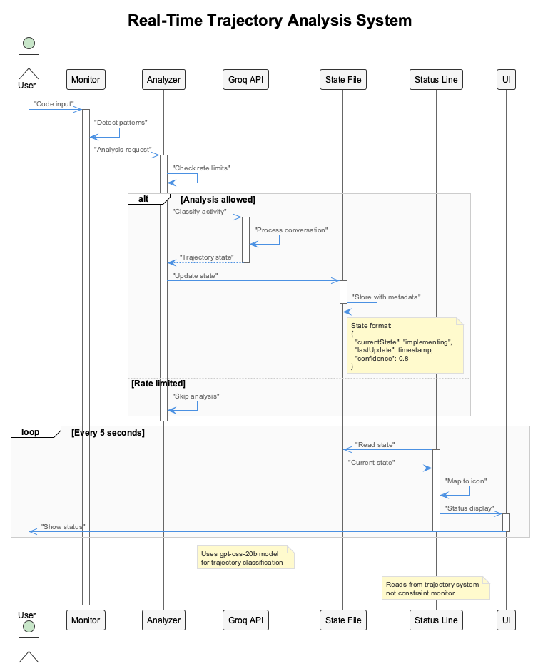
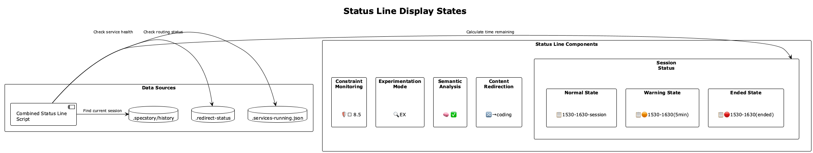

# Trajectories - Development State Analysis

AI-powered development activity tracking and project capability documentation.



## What It Does

- **Real-Time State Tracking** - AI classifies current development activity
- **Comprehensive Reports** - Automated project capability documentation
- **Status Line Integration** - Real-time trajectory state display
- **MCP-Powered Analysis** - Deep semantic understanding of code patterns

## Two Trajectory Systems

### 1. Real-Time Analysis

AI-powered session state classification during active development.

- Integrated with LSL for continuous monitoring
- Updates status line in real-time
- Smart analysis limits (50 analyses/hour)

### 2. Report Generation

Comprehensive project capability documentation.

- Repository scanning with semantic analysis
- Light analysis (50 files, ~2 min) or deep analysis (200 files, ~10 min)
- Capability extraction and categorization

## Trajectory States

| State | Icon | Meaning |
|-------|------|---------|
| Exploring | EX | Information gathering and analysis |
| On Track | ON | Productive trajectory progression |
| Off Track | OFF | Deviating from optimal path |
| Implementing | IMP | Active code modification |
| Verifying | VER | Testing and validation |
| Blocked | BLK | Intervention preventing action |

## Status Line Display



Format: `[SHIELD {compliance}% {trajectory}]`

Example: `[SHIELD 94% IMP]`

- 94% constraint compliance
- Currently in "implementing" state

## Configuration

**File**: `config/live-logging-config.json`

```json
{
  "trajectory_analysis": {
    "enabled": true,
    "inference_provider": "groq",
    "inference_model": "gpt-oss-20b",
    "fallback_provider": "openai",
    "analysis_interval": 5000,
    "smart_analysis": {
      "enabled": true,
      "only_significant_exchanges": true,
      "skip_consecutive_reads": true,
      "max_analyses_per_hour": 50
    }
  }
}
```

## Usage

### Real-Time Tracking (Automatic)

No manual intervention required. Works when:

- Enhanced Transcript Monitor is active
- Trajectory analysis is enabled in config
- LSL system is capturing conversations

### Generate Reports (Manual)

```bash
# Light analysis
node scripts/repository-trajectory-generator.js --level=light

# Deep analysis
node scripts/repository-trajectory-generator.js --level=deep

# With LSL integration
node scripts/repository-trajectory-generator.js --include-lsl-data
```

## Report Structure

```markdown
# Project Trajectory Report

## System Capabilities
- Core infrastructure analysis
- Feature capabilities
- Integration points

## Architectural Insights
- Design patterns detected
- System architecture overview

## Technology Stack
- Dependencies and frameworks
- Development tools

## Recent Evolution
- Change log integration
- LSL session insights
```

## Key Files

**Real-Time Analysis**:

- `src/live-logging/RealTimeTrajectoryAnalyzer.js` - AI state classification
- `.specstory/trajectory/live-state.json` - Current state
- `scripts/combined-status-line.js` - Status line integration

**Report Generation**:

- `scripts/repository-trajectory-generator.js` - Main orchestrator
- `config/trajectory-analysis.json` - Generation config
- `.specstory/comprehensive-project-trajectory.md` - Generated report

## State Persistence

**File**: `.specstory/trajectory/live-state.json`

```json
{
  "currentState": "implementing",
  "confidence": 0.85,
  "timestamp": "2025-01-15T10:30:00.000Z",
  "history": [
    {"state": "exploring", "timestamp": "..."},
    {"state": "implementing", "timestamp": "..."}
  ]
}
```
