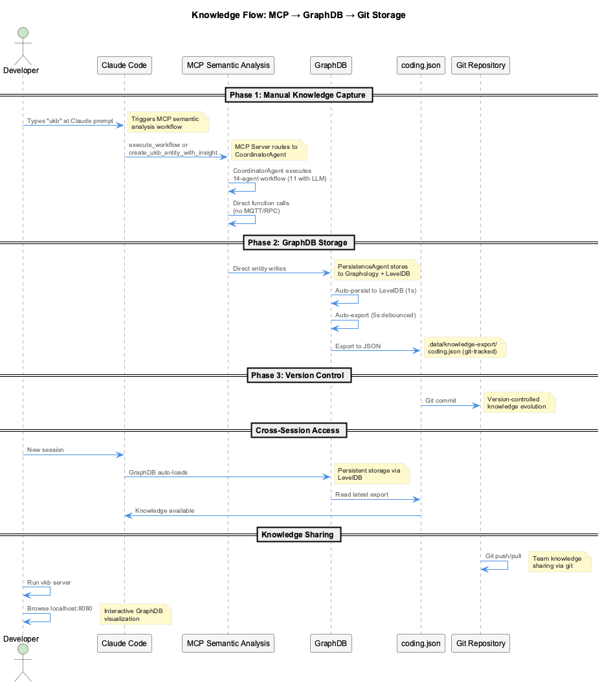

# UKB/VKB - Knowledge Management

Two complementary approaches for capturing and visualizing development insights.



## Two Systems

| System | Trigger | Purpose |
|--------|---------|---------|
| **UKB** (Update Knowledge Base) | Manual/MCP | Curated insights, team sharing |
| **Continuous Learning** | Automatic | Real-time session learning |
| **VKB** (Visualize) | `vkb` command | Web-based visualization |

!!! note "Not Parallel Systems"
    UKB and Continuous Learning serve different purposes:

    - **UKB**: Manual curation, git-tracked, team collaboration
    - **Continuous Learning**: Automatic, private, semantic retrieval

## UKB (Manual/Batch)

### What It Does

- Analyzes git commits for patterns
- Interactive structured capture
- Ontology classification (4-layer pipeline)
- Git-tracked JSON exports for team sharing

### Usage (Within Claude Code)

```
# Incremental analysis (recent changes)
"ukb"

# Full analysis (entire codebase)
"full ukb"
```

### Storage

```
.data/knowledge-graph/     # Graphology + LevelDB
.data/knowledge-export/    # Git-tracked JSON exports
  coding.json
  other-project.json
```

### Ontology Classification

5 entity classes:

| Class | Description |
|-------|-------------|
| ImplementationPattern | Code patterns and best practices |
| ArchitecturalDecision | System design choices |
| TechnicalSolution | Problem-solving approaches |
| WorkflowPattern | Development process patterns |
| ConfigurationPattern | Setup and configuration knowledge |

## Continuous Learning (Automatic)

### What It Does

- Real-time extraction from LSL exchanges
- Embedding generation (384-dim or 1536-dim)
- Semantic search across sessions
- Budget-aware LLM usage ($8.33/month limit)

### Storage

```
Qdrant (Vector Database):
  knowledge_patterns (1536-dim)
  knowledge_patterns_small (384-dim)
  session_memory (384-dim)

SQLite (.cache/knowledge.db):
  budget_events
  knowledge_extractions
  embedding_cache
```

### Privacy-First

5-layer sensitivity classification routes data:

- Sensitive data goes to local models (free, private)
- Safe data goes to remote models (fast, accurate)

## VKB (Visualization)

```bash
# Start visualization server
vkb

# Opens browser to http://localhost:8080
```

### Features

- Interactive force-directed graph
- Color-coding by entity type
- Full-text search
- Filter by type, significance, source
- Entity relationship exploration

## Comparison

| Aspect | UKB | Continuous Learning |
|--------|-----|---------------------|
| Trigger | Manual MCP command | Automatic |
| Input | Git commits, prompts | LSL exchanges |
| Storage | GraphDB | Qdrant + SQLite |
| Collaboration | Git-tracked | Local only |
| Search | Name/type-based | Semantic similarity |

### When to Use UKB

- Documenting architectural decisions
- Post-sprint knowledge capture
- Creating team knowledge base
- Recording bug fix patterns

### When to Use Continuous Learning

- Automatic (always on)
- Semantic search during development
- Cross-session continuity
- Private session learning

## Key Files

**UKB**:

- `lib/knowledge-api/` - Core implementation
- `.data/knowledge-graph/` - GraphDB storage
- `.data/knowledge-export/` - JSON exports

**Continuous Learning**:

- `src/live-logging/StreamingKnowledgeExtractor.js`
- `src/knowledge-management/EmbeddingGenerator.js`
- `.cache/knowledge.db` - SQLite analytics

**VKB**:

- `bin/vkb` - Start server
- `integrations/vkb-visualizer/` - Web UI
